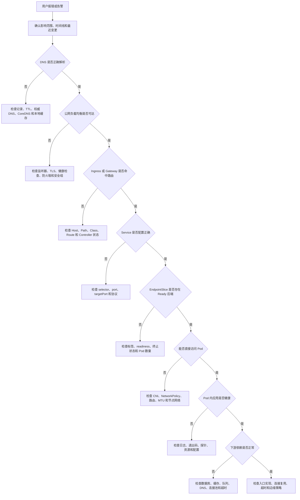
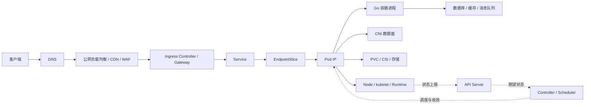
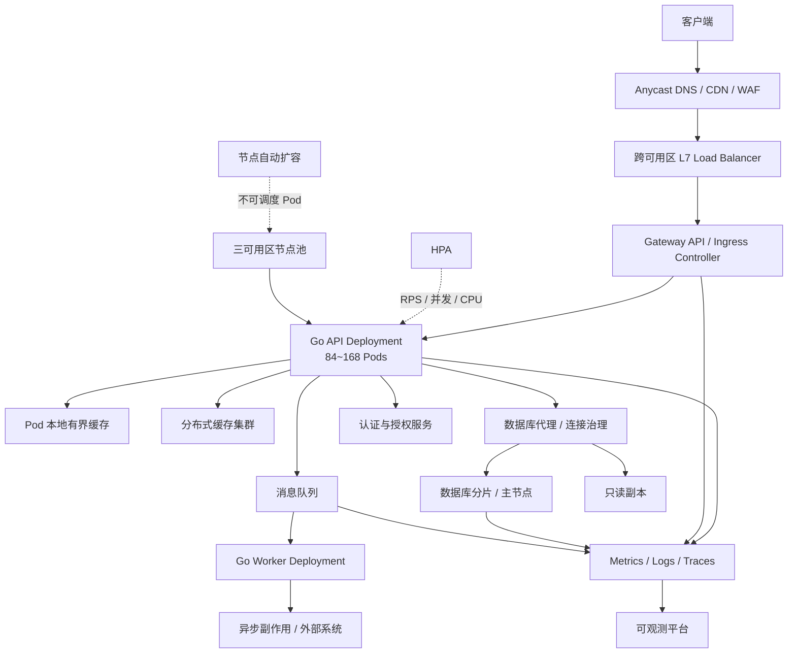

# 第 20 章：Docker/Kubernetes 生产排障、系统设计与综合面试

> 本章以 2026 年 6 月仍处于支持状态的 Kubernetes 1.36 系列文档为基线。不同云厂商、CNI、CSI、Ingress/Gateway Controller 的实现细节可能不同，因此生产排障必须以实际组件文档、监控数据和现场证据为准。([Kubernetes][1])

---

## 学习目标

完成本章后，你应当能够：

1. 使用“影响范围—时间线—最近变更—分层验证—证据闭环”分析生产事故。
2. 从客户端沿请求链逐层定位 DNS、负载均衡、Ingress/Gateway、Service、EndpointSlice、Pod、Node、CNI 和存储问题。
3. 准确解释 `Pending`、`CrashLoopBackOff`、`OOMKilled`、`Evicted`、`Terminating` 等状态。
4. 区分应用错误、入口错误、Service 无后端、Pod 不健康和下游依赖超时。
5. 定位 Go 服务中的 CPU 节流、GC 压力、goroutine 泄漏、锁竞争和连接池耗尽。
6. 在事故中正确选择回滚、扩容、限流、降级、流量切换等止损动作。
7. 完成 Docker/Kubernetes 故障排查类面试。
8. 设计十万 QPS、跨可用区、高可用、可观测、可弹性扩缩的 Go/Kubernetes API 系统。

---

# 一、生产排障的核心方法

## 1.1 排障不是执行命令，而是验证假设

低效排障通常表现为：

* 一上来执行几十条命令。
* 看到一个错误就立即修改配置。
* 同时修改网络、资源和探针。
* 只看当前状态，不看故障发生时的时间线。
* 看到 CPU 不高就认为没有性能问题。
* 看到 Pod 是 `Running` 就认为应用健康。

有效排障应当形成完整闭环：

> **现象 → 影响范围 → 时间线 → 假设 → 证据 → 排除或确认 → 根因 → 修复 → 验证 → 预防**

每一步都必须回答一个明确问题。

例如：

> “Ingress 返回 502”只是现象，不能直接推导出“应用挂了”。

至少存在以下假设：

1. Ingress 路由未命中。
2. Ingress 到 Service 的端口或协议错误。
3. Service 没有 Ready Endpoint。
4. Ingress 到 Pod 的网络被 NetworkPolicy 拦截。
5. Pod 接受连接后立即复位。
6. 上游超时，而入口将其映射成 502。
7. Ingress Controller 自身异常。

只有通过分层测试才能确定哪一个假设成立。

---

## 1.2 事故开始后的六个问题

### 1. 影响了谁

必须具体到：

* 所有用户还是部分用户。
* 所有接口还是单个接口。
* 所有区域还是单个可用区。
* 所有租户还是特定租户。
* 新连接还是已有连接。
* 新版本还是所有版本。

“服务挂了”不是可执行的信息。

更好的表述是：

> 09:42 开始，东京区域约 30% 的 `/checkout` 请求返回 503，其他接口正常；错误集中在新版本 Pod。

### 2. 从什么时候开始

确定：

* 第一个异常指标出现的时间。
* 第一个用户报错的时间。
* 告警触发时间。
* 发布、配置变更、扩容或节点操作的时间。
* 故障是否周期性发生。

时间线往往能够直接暴露相关变更。

### 3. 最近发生了什么变化

变更不仅包括代码发布，还包括：

* ConfigMap、Secret、Feature Flag。
* 数据库 Schema 或索引。
* 证书和密钥。
* DNS 记录。
* Service、Ingress、Gateway、NetworkPolicy。
* HPA、requests、limits。
* 节点镜像、内核、CNI、CSI。
* 云负载均衡器配置。
* 下游 API 版本或限流策略。
* 流量结构变化。

### 4. 是否存在正常对照组

常见对照组包括：

* 旧版本 Pod 与新版本 Pod。
* 正常可用区与异常可用区。
* 正常节点与异常节点。
* 正常租户与异常租户。
* 缓存命中请求与缓存未命中请求。
* 内部访问与公网入口访问。

对照组可以快速缩小变量范围。

### 5. 有哪些可验证证据

生产排障中的主要证据包括：

| 证据               | 主要用途                                  |
| ---------------- | ------------------------------------- |
| 指标               | 判断异常开始时间、规模和趋势                        |
| 日志               | 查看错误上下文和业务状态                          |
| 链路追踪             | 确定延迟与错误发生在哪一跳                         |
| Kubernetes Event | 查看调度、拉取镜像、挂载和探针失败                     |
| 对象状态             | 检查 Pod、Service、EndpointSlice、Node、PVC |
| 配置差异             | 对照发布前后的参数变化                           |
| pprof、trace      | 定位 Go CPU、内存、锁和 goroutine 问题          |
| 抓包、连接统计          | 定位网络、重传、连接跟踪和 MTU 问题                  |
| 数据库与队列指标         | 判断下游饱和、等待和积压                          |

### 6. 当前最安全的止损动作是什么

止损与根因分析可以并行进行。

例如：

* 新版本错误率显著更高：先暂停发布或回滚。
* 下游即将被压垮：先限流和降低并发。
* 单可用区异常：先切走该可用区流量。
* 消息消费者产生重复副作用：先暂停消费者。
* 数据迁移疑似损坏数据：先关闭写路径，而不是盲目扩容。

---

## 1.3 排障记录模板

```text
事故编号：
开始时间：
发现方式：
当前影响：
业务优先级：
最近变更：

已确认事实：
1.
2.

待验证假设：
1.
2.

已排除假设：
1.
2.

当前止损措施：
1.

下一步动作：
负责人：
截止时间：

恢复标准：
1.
2.
```

将“事实”“推断”和“行动”分开记录，可以避免团队把未经验证的猜测当成根因。

---

## 1.4 Kubernetes 分层排障决策树



---

# 二、从用户请求开始的全链路定位

## 2.1 外部请求完整链路



当前 Kubernetes 使用 EndpointSlice 表示 Service 后端，EndpointSlice 会记录后端地址以及 `ready`、`serving`、`terminating` 等条件。终止中的 Endpoint 不会立即从 EndpointSlice 中消失，但通常会将 `ready` 设为 `false`，避免继续接收普通流量。([Kubernetes][2])

Kubernetes 项目当前推荐新系统优先考虑 Gateway API；Ingress API 已冻结，但仍是稳定 API，不会因此立即失效。现有系统使用哪一种入口对象，都应以对应 Controller 的实现和日志为准。([Kubernetes][3])

---

## 2.2 各层检查重点

| 层级              | 首要问题         | 关键证据                                  | 常见根因                             |
| --------------- | ------------ | ------------------------------------- | -------------------------------- |
| 客户端             | 请求是否正确发出     | 状态码、超时阶段、SNI、代理设置                     | 客户端缓存、代理、证书、错误域名                 |
| DNS             | 是否解析到预期地址    | `dig` 结果、TTL、响应时间                     | 错误记录、缓存未过期、SERVFAIL              |
| 公网 LB           | 是否有健康后端      | 健康检查、目标数量、监听器                         | 健康检查路径错误、证书、防火墙                  |
| Ingress/Gateway | 路由是否命中       | Controller 日志、Host、Path、Route 状态      | Class 错误、规则冲突、协议错误               |
| Service         | 选择器和端口是否正确   | Service YAML、selector、port、targetPort | 标签不匹配、端口名错误                      |
| EndpointSlice   | 是否有 Ready 后端 | Endpoint 数量和 conditions               | Pod 未 Ready、selector 错误、全部终止     |
| Pod             | 是否真正可服务      | readiness、重启、日志、退出码                   | 配置错误、探针错误、依赖不可用                  |
| 容器              | 进程是否监听正确地址   | `ss`、日志、进程状态                          | 只监听 `127.0.0.1`、PID 1 退出         |
| Node            | 节点是否健康       | Conditions、kubelet、runtime、压力         | NotReady、DiskPressure、runtime 异常 |
| CNI             | Pod 网络是否通    | 路由、NetworkPolicy、MTU、丢包               | IPAM 耗尽、策略阻断、MTU 不一致             |
| 存储              | 是否成功绑定和挂载    | PVC/PV、CSI Event、挂载日志                 | 拓扑冲突、权限、Attach/Mount 失败          |
| 控制面             | 是否能继续收敛      | API 延迟、调度器和控制器日志                      | API Server、etcd、控制循环异常           |

---

## 2.3 一组最小化分层测试

假设公网接口为 `https://api.example.com/orders`，Service 为 `order-api:8080`。

### 第一步：从外部访问

```bash
curl -sv --connect-timeout 3 --max-time 10 \
  https://api.example.com/orders
```

关注：

* DNS 解析耗时。
* TCP 建连耗时。
* TLS 握手。
* 响应头中的入口标识。
* 状态码和响应体。
* 是否发生重试或重定向。

### 第二步：绕过公网入口，转发到 Service

```bash
kubectl -n prod port-forward service/order-api 18080:8080
curl -sv http://127.0.0.1:18080/orders
```

如果此处成功而公网失败，问题大概率位于：

* DNS。
* 公网负载均衡。
* Ingress/Gateway。
* TLS 或路由配置。

`kubectl port-forward` 会选择一个匹配的 Pod；被选中的 Pod 终止后，转发会话也会结束，因此它适合诊断，不应当作为生产访问方案。([Kubernetes][4])

### 第三步：从集群内部访问 Service

```bash
kubectl -n prod run net-debug \
  --rm -it \
  --restart=Never \
  --image=<企业批准的调试镜像> \
  -- sh

# 在调试容器中
curl -sv http://order-api.prod.svc.cluster.local:8080/orders
```

### 第四步：直接访问某个 Pod IP

```bash
kubectl -n prod get pod -l app=order-api -o wide
curl -sv http://<pod-ip>:8080/orders
```

若 Service 失败而 Pod IP 成功，重点检查：

* Service selector。
* Service port 与 targetPort。
* EndpointSlice。
* kube-proxy 或替代数据面。
* NetworkPolicy。

### 第五步：在 Pod 网络命名空间内访问应用

```bash
kubectl -n prod exec <pod> -c app -- \
  wget -S -O- http://127.0.0.1:8080/health/ready
```

若容器镜像没有 Shell 或网络工具，使用临时调试容器。

---

# 三、Kubernetes 排障工具的使用逻辑

## 3.1 `get`：回答“现在是什么状态”

```bash
kubectl -n prod get deploy,rs,pod -l app=order-api -o wide
kubectl -n prod get pod <pod> -o yaml
kubectl -n prod get svc order-api -o yaml
kubectl -n prod get endpointslice \
  -l kubernetes.io/service-name=order-api -o yaml
kubectl get node -o wide
```

重点观察：

* Pod 所在节点。
* Pod IP。
* Ready 数量。
* 重启次数。
* Deployment 新旧 ReplicaSet。
* Pod 模板哈希。
* EndpointSlice 的地址与条件。

---

## 3.2 `describe`：回答“为什么变成这样”

```bash
kubectl -n prod describe pod <pod>
kubectl describe node <node>
kubectl -n prod describe pvc <pvc>
kubectl -n prod describe hpa <hpa>
```

`kubectl describe` 会展示对象详情以及关联的 Event，适合检查：

* 调度失败原因。
* 镜像拉取错误。
* 探针失败。
* 挂载失败。
* OOM 和退出状态。
* 节点压力。
* HPA 当前指标与缩放条件。([Kubernetes][5])

---

## 3.3 `logs` 与 `logs --previous`

```bash
kubectl -n prod logs <pod> -c app \
  --since=30m --timestamps --tail=500

kubectl -n prod logs <pod> -c app \
  --previous --timestamps --tail=500

kubectl -n prod logs deployment/order-api \
  --all-pods --all-containers --prefix \
  --since=10m --max-log-requests=10
```

`--previous` 获取同一 Pod 中该容器上一个已终止实例的日志，是排查 `CrashLoopBackOff` 和 OOM 重启的关键命令。([Kubernetes][6])

如果日志没有出现，不能立即得出“应用没有报错”的结论，还需检查：

* 应用是否写到了文件而不是标准输出。
* 日志是否在崩溃前完成刷新。
* 容器是否在应用启动前就失败。
* 日志采集链路是否异常。
* 错误是否发生在内核、运行时或入口层。

---

## 3.4 `kubectl events`

```bash
kubectl -n prod events
kubectl -n prod events --types=Warning
kubectl -n prod events --for pod/<pod> --watch
kubectl events --all-namespaces --types=Warning
```

它适合实时观察：

* `FailedScheduling`。
* `FailedMount`。
* `BackOff`。
* `Unhealthy`。
* `Evicted`。
* 镜像拉取失败。

Event 不应被当作长期审计日志；重要事件应同步进入集中日志或事件存储。当前 `kubectl events` 支持按对象和类型过滤并持续 Watch。([Kubernetes][7])

---

## 3.5 `kubectl top`

```bash
kubectl top node
kubectl -n prod top pod
kubectl -n prod top pod <pod> --containers
```

`kubectl top` 依赖 Metrics Server，提供近期 CPU 和内存资源视图。它适合快速判断资源使用趋势，但不适合分析秒级突发、历史峰值、CPU 节流、GC 暂停或内存组成。Metrics API 的内存值通常是 working set，其中可能包含部分文件缓存，并不等同于 Go 堆大小。([Kubernetes][8])

---

## 3.6 `exec`

```bash
kubectl -n prod exec <pod> -c app -- env
kubectl -n prod exec <pod> -c app -- cat /etc/resolv.conf
kubectl -n prod exec <pod> -c app -- ss -lntp
kubectl -n prod exec -it <pod> -c app -- sh
```

`exec` 用于验证运行时状态，而不是永久修改容器。不要在生产容器中临时安装软件、编辑配置或修改数据，否则会破坏不可变基础设施和证据链。([Kubernetes][9])

---

## 3.7 `debug` 与临时容器

```bash
kubectl -n prod debug -it pod/<pod> \
  --image=<企业批准的调试镜像> \
  --target=app \
  -- sh
```

临时容器适合排查：

* distroless 或 scratch 镜像没有 Shell。
* 需要 `curl`、`dig`、`ss`、`tcpdump` 等工具。
* 不希望重建原 Pod。
* 需要观察目标进程或共享网络环境。

Ephemeral Container 自 Kubernetes 1.25 起为稳定功能，设计目标是临时诊断，不应当承载业务流量。([Kubernetes][10])

调试节点：

```bash
kubectl debug node/<node> -it \
  --image=ubuntu \
  --profile=sysadmin
```

节点文件系统通常挂载在调试容器的 `/host`。该操作权限很高，应严格限制 RBAC、记录审计日志，并在诊断后删除调试 Pod。`kubectl debug node` 无法修复完全离线、网络不可达的节点。([Kubernetes][11])

---

# 四、Docker 常见生产问题

## 4.1 容器启动后立即退出

容器的生命周期与其主进程绑定。主进程结束，容器就进入停止状态；容器不是一台需要长期保持“开机”的虚拟机。([Docker Documentation][12])

### 排查命令

```bash
docker ps -a --no-trunc

docker inspect --format '{{json .State}}' <container>

docker logs --timestamps --tail 200 <container>

docker inspect --format \
  'Entrypoint={{json .Config.Entrypoint}} Cmd={{json .Config.Cmd}}' \
  <container>
```

### 重点字段

* `ExitCode`。
* `OOMKilled`。
* `Error`。
* `StartedAt`、`FinishedAt`。
* `Health`。
* 实际 `Entrypoint` 和 `Cmd`。

### 常见根因

1. 启动命令路径错误。
2. 配置文件或环境变量缺失。
3. 应用主动退出。
4. Shell 脚本未使用 `exec`，信号和退出码处理错误。
5. 应用以前台进程为基础，却被配置为后台 daemon。
6. 端口冲突。
7. 挂载覆盖了镜像中的应用目录。
8. 内存不足，被 OOM Killer 终止。

### 验证原则

不要通过在命令后添加 `tail -f /dev/null`“修复”业务容器。它只会让无效容器继续存活，掩盖主进程已经退出的事实。

---

## 4.2 端口不通

```bash
docker port <container>
docker inspect <container>
docker exec <container> ss -lntp
docker exec <container> wget -S -O- http://127.0.0.1:8080/health
ss -lntp | grep 8080
```

按以下顺序验证：

1. 应用是否启动。
2. 应用是否监听预期端口。
3. 应用监听的是 `0.0.0.0` 还是 `127.0.0.1`。
4. Docker 是否发布了正确的宿主机端口。
5. 宿主机防火墙是否允许访问。
6. 是否访问了正确的宿主机地址。
7. 容器是否连接到预期网络。

Bridge 网络的端口发布依赖宿主机上的转发和防火墙规则。应用如果只监听容器内部的 `127.0.0.1`，经容器网卡到达的流量通常无法被该监听套接字接受。([Docker Documentation][13])

---

## 4.3 DNS 失败

```bash
docker exec <container> cat /etc/resolv.conf
docker exec <container> getent hosts example.com
docker network inspect <network>
docker inspect <container>
```

默认 bridge 网络中的容器通常复制宿主机的 DNS 设置；连接到用户自定义网络的容器会使用 Docker 内置 DNS，地址通常为 `127.0.0.11`，再向宿主机配置的 DNS 转发。([Docker Documentation][14])

检查：

* 宿主机本身是否能解析。
* 容器是否在正确的自定义网络。
* DNS 搜索域是否导致错误补全。
* `/etc/resolv.conf` 中是否存在不可达地址。
* 企业 VPN、代理或本地 DNS 是否只绑定宿主机回环地址。
* 应用是否缓存了已经失效的解析结果。

---

## 4.4 镜像拉取失败

```bash
docker pull <registry>/<repo>:<tag>
docker login <registry>
docker info
df -h
df -i
```

常见根因：

* 镜像名称、Tag 或 Digest 错误。
* 私有仓库认证失败。
* 凭证过期。
* Registry DNS、TLS 或代理异常。
* 仓库限流。
* 镜像架构与节点不匹配。
* 宿主机磁盘或 inode 耗尽。
* Docker daemon 无法访问外部网络。
* 企业镜像代理或镜像缓存异常。

生产发布宜记录并使用不可变 Digest，避免同一 Tag 在不同节点拉取到不同内容。

---

## 4.5 磁盘空间耗尽

```bash
docker system df -v
df -hT
df -i
du -xhd1 /var/lib/docker 2>/dev/null
journalctl --disk-usage
```

不能只检查镜像大小，还需要检查：

* 容器可写层。
* 未使用镜像和构建缓存。
* 容器日志。
* Docker Volume。
* Bind Mount 对应目录。
* inode。
* 已删除但仍被进程持有的文件。

Docker 文档明确指出，容器日志、Volume、Bind Mount、交换空间等并不都包含在容器可写层大小中。([Docker Documentation][15])

不要在未确认数据归属前执行：

```bash
docker system prune -a --volumes
```

该命令可能删除仍需要的数据、缓存和未挂载 Volume。正确顺序应当是：

1. 确认增长来源。
2. 先止住持续增长。
3. 备份重要数据。
4. 精确删除无用对象。
5. 配置日志轮转、磁盘告警和容量预算。

---

## 4.6 挂载权限错误

```bash
docker inspect --format '{{json .Mounts}}' <container>

stat -c '%u:%g %a %n' <host-path>

docker exec <container> id
docker exec <container> ls -ld <container-path>
```

主要检查：

* 容器进程的 UID/GID。
* 宿主机目录的 UID/GID 和权限。
* 目录是否真实存在。
* 挂载后是否覆盖了镜像原有文件。
* 文件系统是否只读。
* SELinux、AppArmor 或 rootless Docker 限制。
* NFS 的 `root_squash`。
* 挂载传播和网络文件系统状态。

Bind Mount 会遮蔽目标目录中镜像原有内容。`--mount` 的参数更明确，并且源路径不存在时会报错；`-v` 在某些情形下会自动创建目录，从而把“文件路径写错”变成更隐蔽的“空目录挂载”。([Docker Documentation][16])

---

## 4.7 CPU 或内存异常

```bash
docker stats
docker inspect --format '{{json .HostConfig}}' <container>
docker top <container>
docker logs <container>
```

进一步检查：

* 是否设置 CPU 配额。
* 是否发生 CPU 节流。
* 是否存在内存限制。
* 是否 OOMKilled。
* 应用线程、goroutine 和堆是否持续增长。
* 日志是否在短时间内大量写盘。
* 是否存在高 IO Wait。
* 下游慢导致并发请求堆积。

---

# 五、Kubernetes 常见状态的准确含义

## 5.1 不要混淆 Pod phase 与 `kubectl` 显示状态

Pod phase 主要包括：

* `Pending`
* `Running`
* `Succeeded`
* `Failed`
* `Unknown`

而以下常见字符串并不都是 Pod phase：

* `CrashLoopBackOff`
* `ImagePullBackOff`
* `ContainerCreating`
* `Terminating`
* `Completed`

它们往往是 `kubectl` 根据容器状态、等待原因或删除时间展示的摘要。`CrashLoopBackOff` 表示容器反复失败后正处于指数退避期间，而不是一个新的 Pod phase。([Kubernetes][17])

---

## 5.2 `Pending`

### 含义

Pod 已被 API Server 接受，但尚未完成调度或至少一个容器尚未完成启动准备。

### 首要命令

```bash
kubectl -n prod describe pod <pod>
kubectl -n prod events --for pod/<pod>
kubectl -n prod get pvc
```

### 常见根因

* CPU 或内存 requests 无法满足。
* 单个 Pod 的 request 超过任何节点可提供的资源。
* Node Selector、Affinity、Anti-Affinity 无法满足。
* Taint 没有相应 Toleration。
* 拓扑分布约束无法满足。
* PVC 尚未绑定。
* 节点达到 Pod 数量或 IP 地址上限。
* 调度门尚未移除。
* ResourceQuota 或 LimitRange 限制。
* 节点自动扩容达到上限。
* 新节点规格仍然放不下该 Pod。

调度器会根据资源、亲和性、污点、拓扑等约束筛选节点；Toleration 只表示允许调度到带有相应 Taint 的节点，并不保证一定能调度。([Kubernetes][18])

---

## 5.3 `FailedScheduling`

这通常是 Scheduler 写入的 Event，表示当前没有合适节点。

示例：

```text
0/12 nodes are available:
3 Insufficient memory,
4 node(s) had untolerated taint,
5 node(s) didn't match Pod's node affinity.
```

排查时必须保留完整消息，不要只截取第一项。

如果提示 `preemption is not helpful`，通常意味着即使驱逐低优先级 Pod，也不能解决硬约束，例如：

* 单节点规格不足。
* Node Affinity 不匹配。
* PVC 拓扑冲突。
* Taint 不匹配。

---

## 5.4 `CrashLoopBackOff`

### 含义

容器启动后反复退出，Kubernetes 根据 `restartPolicy` 重启，并逐步增加再次重启前的等待时间。([Kubernetes][17])

### 排查顺序

```bash
kubectl -n prod describe pod <pod>
kubectl -n prod logs <pod> -c app --previous
kubectl -n prod get pod <pod> -o yaml
```

查看：

* `lastState.terminated.reason`。
* `exitCode`。
* `signal`。
* `startedAt`、`finishedAt`。
* 重启次数。
* liveness、startup 探针 Event。
* ConfigMap、Secret 和 Volume。

常见退出码：

| 退出码 | 常见含义                        |
| --: | --------------------------- |
|   0 | 进程正常结束，但对长期服务来说可能是启动命令错误    |
|   1 | 应用通用错误                      |
| 126 | 命令存在但不可执行                   |
| 127 | 命令不存在                       |
| 137 | 常见于收到 SIGKILL，可能是 OOM 或强制终止 |
| 143 | 常见于收到 SIGTERM               |

退出码只是线索，必须结合 `reason`、Event、节点日志和时间线判断。

---

## 5.5 `ImagePullBackOff`

### 含义

镜像拉取失败，kubelet 正在退避后重试。

```bash
kubectl -n prod describe pod <pod>
kubectl -n prod get secret
kubectl describe node <node>
```

常见根因：

* 镜像名称或 Tag 不存在。
* Registry 凭证错误。
* `imagePullSecrets` 不存在或不在同一 Namespace。
* ServiceAccount 没有关联正确凭证。
* Registry DNS、TLS 或网络失败。
* 节点磁盘不足。
* Registry 限流。
* 镜像架构不兼容。
* Admission Policy 重写或拒绝了镜像。

必须在具体节点上验证，因为不同节点可能拥有不同缓存、DNS、代理和磁盘状态。

---

## 5.6 `OOMKilled`

### 含义

容器进程因内存不足被内核 OOM 机制终止。

```bash
kubectl -n prod describe pod <pod>
kubectl -n prod logs <pod> -c app --previous
kubectl -n prod top pod <pod> --containers
```

需要区分：

1. **容器达到自身 memory limit。**
2. **节点整体发生 OOM。**
3. **Pod 被 kubelet 因节点内存压力驱逐。**

CPU limit 通过节流执行；memory limit 通常由内核在内存压力下以 OOM Kill 的方式反应式执行。([Kubernetes][19])

在 cgroup v2 环境中，可检查：

```bash
cat memory.current
cat memory.max
cat memory.peak
cat memory.events
cat memory.stat
```

`memory.events` 中的 `oom` 和 `oom_kill` 可用于确认 cgroup 是否进入 OOM 及是否有进程被杀。([Linux内核文档][20])

---

## 5.7 `Evicted`

### 常见原因

* `MemoryPressure`
* `DiskPressure`
* inode 耗尽
* PID 压力
* 临时存储超过限制
* API 发起的驱逐
* 节点维护或自动缩容

节点压力驱逐由 kubelet主动执行，用于保护节点。硬驱逐阈值可能导致立即终止，而且节点压力驱逐不会依赖 PDB 来保证业务副本数。([Kubernetes][21])

```bash
kubectl -n prod describe pod <pod>
kubectl describe node <node>
kubectl get node <node> -o yaml
```

不要只删除被 Evicted 的 Pod。若根因是磁盘、日志、镜像、请求配置或节点保留资源不足，新 Pod 还会再次被驱逐。

---

## 5.8 `Terminating`

`Terminating` 通常表示对象已有 `deletionTimestamp`，但优雅终止、Finalizer、Volume 卸载或节点确认尚未完成。

```bash
kubectl -n prod get pod <pod> -o yaml
kubectl -n prod describe pod <pod>
kubectl -n prod get pod <pod> \
  -o jsonpath='{.metadata.deletionTimestamp}{"\n"}{.metadata.finalizers}{"\n"}'
```

常见根因：

* 应用没有响应 SIGTERM。
* `preStop` 长时间不返回。
* `terminationGracePeriodSeconds` 过长。
* Finalizer 未完成。
* CSI 卸载或分离失败。
* kubelet 或节点失联。
* 容器运行时卡死。
* 网络存储不可达。

强制删除：

```bash
kubectl -n prod delete pod <pod> \
  --grace-period=0 --force
```

强制删除只是从 API 中快速删除对象，不能保证节点上的旧进程已经停止。对有状态服务，这可能造成两个实例同时写入同一外部资源。默认删除是优雅的；使用 `--grace-period=0 --force` 应当是风险知情后的最后手段。([Kubernetes][17])

---

## 5.9 `Node NotReady`

```bash
kubectl get node
kubectl describe node <node>
kubectl get lease -n kube-node-lease
kubectl get pod -A --field-selector spec.nodeName=<node> -o wide
```

检查：

* kubelet 是否运行。
* kubelet 到 API Server 的网络是否正常。
* 容器运行时是否健康。
* 节点磁盘、内存、PID 是否耗尽。
* 证书是否过期。
* CNI 是否破坏节点网络。
* 云实例是否重启或停止。
* 内核是否发生 OOM、死锁或文件系统错误。

`kubectl debug node` 适合节点仍可被集群访问的情况；节点彻底离线时，应通过云控制台、串口、带外管理或节点日志系统诊断。

---

## 5.10 `PVC Pending`

```bash
kubectl -n prod describe pvc <pvc>
kubectl get storageclass
kubectl get pv
kubectl -n prod events --for pvc/<pvc>
kubectl get pod <pod> -o yaml
```

常见根因：

* 没有默认 StorageClass。
* `storageClassName` 写错。
* CSI Provisioner 不健康。
* 请求容量、访问模式或 VolumeMode 不受支持。
* 存储配额不足。
* 可用区没有存储容量。
* PV selector 无法匹配。
* StorageClass `allowedTopologies` 与 Pod 调度约束冲突。
* `WaitForFirstConsumer` 正在等待使用该 PVC 的 Pod。

使用 `WaitForFirstConsumer` 时，PVC 在真正有可调度消费者前保持 Pending 可能是预期行为；该模式用于让存储供应与 Pod 的节点或可用区拓扑共同决策。([Kubernetes][22])

---

# 六、探针与流量健康

## 6.1 三类探针的职责

| 探针             | 回答的问题          | 失败后的主要结果          |
| -------------- | -------------- | ----------------- |
| startupProbe   | 应用是否已完成启动      | 启动成功前抑制其他探针       |
| readinessProbe | 当前是否可以接收流量     | 从普通 Service 流量中摘除 |
| livenessProbe  | 进程是否进入无法恢复的坏状态 | kubelet 重启容器      |

Readiness 失败不应自动等同于“进程需要重启”。例如数据库暂时不可用时，重启所有应用 Pod 可能放大故障。Startup Probe 应覆盖最坏启动时间，避免慢启动应用被 liveness 反复杀死。([Kubernetes][23])

---

## 6.2 推荐的 Go 健康端点语义

```text
/health/startup
  配置已加载、必要初始化已完成。

/health/live
  事件循环未卡死、进程仍可继续工作。
  不应依赖所有外部组件。

/health/ready
  当前具备接收新流量的能力。
  可包含关键依赖、过载状态和优雅退出状态。
```

不建议让 liveness 强依赖远程数据库。数据库短暂抖动时，所有 Pod 同时重启可能造成连接风暴和更长恢复时间。

---

# 七、区分不同来源的 5xx

## 7.1 不要只根据 502 或 503 猜根因

不同入口实现对错误的映射并不完全一致。

一般规律只能作为假设：

| 表现        | 常见方向                  |
| --------- | --------------------- |
| 502       | 上游连接失败、协议错误、连接复位、无效响应 |
| 503       | 没有健康后端、入口过载、服务不可用     |
| 504       | 上游响应超时                |
| 应用自定义 5xx | 业务或依赖错误               |

最终必须查看：

* 响应头。
* Ingress/Gateway Controller 日志。
* 应用日志。
* Trace。
* EndpointSlice。
* 入口和应用的超时配置。

---

## 7.2 五跳隔离法

依次测试：

1. 公网域名。
2. Ingress/Gateway 后面的 Service。
3. 集群内 Service DNS。
4. Pod IP。
5. Pod 内 `localhost`。

| 测试结果                   | 重点检查                                  |
| ---------------------- | ------------------------------------- |
| localhost 也失败          | 应用、配置、资源、依赖                           |
| localhost 成功，Pod IP 失败 | 监听地址、容器网络、NetworkPolicy               |
| Pod IP 成功，Service 失败   | selector、EndpointSlice、端口、Service 数据面 |
| Service 成功，Ingress 失败  | 路由、协议、TLS、Controller                  |
| 集群内成功，公网失败             | LB、WAF、DNS、证书、防火墙                     |

---

## 7.3 Service 无后端的确认方法

```bash
kubectl -n prod get svc order-api -o yaml

kubectl -n prod get endpointslice \
  -l kubernetes.io/service-name=order-api \
  -o yaml

kubectl -n prod get pod -l app=order-api \
  --show-labels
```

重点确认：

* Service selector 是否匹配 Pod label。
* Endpoint 地址是否存在。
* Endpoint 的 `ready` 是否为 `true`。
* Pod 是否正在终止。
* Service targetPort 是否存在。
* 命名端口是否拼写一致。

---

# 八、Go 服务性能排障

## 8.1 CPU 不高不等于没有 CPU 问题

平均 CPU 不高但 p99 很高，常见原因包括：

* CPU limit 导致短时间节流。
* 锁竞争。
* goroutine 大量阻塞。
* 数据库连接池耗尽。
* DNS 或网络慢。
* 下游限流。
* 请求排队。
* GC 高频运行。
* 单核热点。
* 负载分配不均。
* 文件描述符或端口耗尽。

`kubectl top` 展示的是时间窗口内平均使用量，无法体现所有瞬时节流。

---

## 8.2 CPU throttling

Kubernetes CPU limit 最终由内核 CPU 控制器执行。达到限额时，容器会被节流，即使节点上仍有空闲 CPU。([Kubernetes][19])

在 cgroup v2 中，可观察 `cpu.stat`：

```text
usage_usec
user_usec
system_usec
nr_periods
nr_throttled
throttled_usec
```

其中：

* `nr_periods`：统计周期数。
* `nr_throttled`：发生节流的周期数。
* `throttled_usec`：累计节流时间。

这些字段由 Linux cgroup v2 CPU 控制器提供。([Linux内核文档][20])

判断时关注一段时间内的增量，而不是累计值本身：

```text
节流周期比例 =
Δnr_throttled / Δnr_periods
```

不能仅凭“发生过节流”就下结论。轻微节流可能无业务影响；若节流与 p99、队列长度和超时同步增长，才构成强证据。

---

## 8.3 安全暴露 pprof

关键代码：

```go
package main

import (
	"errors"
	"log"
	"net/http"
	_ "net/http/pprof"
	"time"
)

func startPprof() {
	server := &http.Server{
		Addr:              "127.0.0.1:6060",
		Handler:           nil, // 使用 DefaultServeMux，pprof 已注册在其上
		ReadHeaderTimeout: 2 * time.Second,
	}

	go func() {
		err := server.ListenAndServe()
		if err != nil && !errors.Is(err, http.ErrServerClosed) {
			log.Printf("pprof server failed: %v", err)
		}
	}()
}
```

`net/http/pprof` 会注册 `/debug/pprof/` 相关处理器。pprof 不应直接暴露到公网；推荐绑定回环地址，再通过受控的 `kubectl port-forward` 使用。([Go Packages][24])

采集 CPU Profile：

```bash
kubectl -n prod port-forward pod/<pod> 6060:6060

go tool pprof -http=:0 \
  'http://127.0.0.1:6060/debug/pprof/profile?seconds=30'
```

采集 Heap：

```bash
go tool pprof -http=:0 \
  http://127.0.0.1:6060/debug/pprof/heap
```

采集 goroutine：

```bash
curl -s \
  'http://127.0.0.1:6060/debug/pprof/goroutine?debug=2' \
  > goroutines.txt
```

采集 Trace：

```bash
curl -s \
  'http://127.0.0.1:6060/debug/pprof/trace?seconds=5' \
  -o trace.out

go tool trace trace.out
```

---

## 8.4 GC 压力

观察：

* Heap live bytes。
* Heap object 数量。
* 每秒分配字节。
* GC 周期频率。
* GC CPU 占比。
* GC pause 分布。
* goroutine stack。
* RSS 与 Go Heap 的差值。

典型问题：

1. 大量短生命周期对象。
2. JSON 编解码产生高分配。
3. 无界缓存。
4. 请求体或响应体全部读入内存。
5. goroutine 泄漏导致栈与引用保留。
6. 大切片被小切片长期引用。
7. cgo、mmap 或内核缓冲占用。
8. `sync.Pool` 或对象复用方式不当。

Go 的 `GOMEMLIMIT` 是软内存限制，不是 Kubernetes memory limit 的替代品。Go 官方建议在容器限制之下预留额外空间，覆盖运行时无法完全控制的内存来源；5%～10% 可作为初始测试范围，但仍应根据 cgo、网络缓冲和实际工作负载校准。([Go][25])

例如容器 memory limit 为 `1Gi`：

```yaml
env:
  - name: GOMEMLIMIT
    value: "900MiB"
```

这只是保护措施。若业务真实 live heap 已接近 900 MiB，GC 会变得非常频繁，最终仍可能超时或 OOM。

---

## 8.5 goroutine 泄漏

判断依据：

* goroutine 数持续单调增长。
* 流量回落后 goroutine 不回落。
* goroutine profile 中大量相同阻塞栈。
* 请求完成后仍有后台 goroutine。
* channel、timer、HTTP body 或数据库 rows 未正确关闭。

常见错误：

```go
resp, err := client.Do(req)
if err != nil {
	return err
}
// 忘记 resp.Body.Close()
```

或：

```go
go func() {
	resultCh <- slowCall()
}()
```

如果调用方超时退出，而发送方永远阻塞在无人接收的 channel 上，就会产生泄漏。

---

## 8.6 锁竞争

使用：

* Mutex Profile。
* Block Profile。
* Go Trace。
* goroutine dump。
* 临界区耗时指标。

启用 Profile 会产生额外开销，应在受控时间窗口内使用。

常见根因：

* 全局 map 由单一 Mutex 保护。
* 日志、统计或缓存更新放在大锁内。
* 临界区包含网络或磁盘 IO。
* 单个热点 key。
* `RWMutex` 写锁比例高。
* 连接池或令牌桶被误当作普通锁。

---

## 8.7 数据库连接池耗尽

Go 可直接读取 `database/sql` 连接池状态：

```go
stats := db.Stats()

log.Printf(
	"max_open=%d open=%d in_use=%d idle=%d wait_count=%d wait_duration=%s",
	stats.MaxOpenConnections,
	stats.OpenConnections,
	stats.InUse,
	stats.Idle,
	stats.WaitCount,
	stats.WaitDuration,
)
```

强证据包括：

* `InUse` 长期等于 `MaxOpenConnections`。
* `WaitCount` 和 `WaitDuration` 快速增长。
* 应用 CPU 不高。
* goroutine 大量阻塞在获取连接。
* 数据库本身 CPU 可能并未饱和。

盲目提高每个 Pod 的连接数可能放大问题。假设每个 Pod 允许 100 个连接，HPA 从 20 扩到 100 个 Pod，理论连接数会从 2,000 增长到 10,000，可能直接压垮数据库。

---

# 九、网络高延迟排查

## 9.1 DNS 延迟

检查：

```bash
dig api.internal.example.com
dig +stats api.internal.example.com
cat /etc/resolv.conf
```

关注：

* 查询耗时。
* `NXDOMAIN`、`SERVFAIL`。
* 重试次数。
* Search Domain 补全。
* `ndots` 导致的额外查询。
* CoreDNS CPU、延迟、错误率。
* 上游 DNS 健康。
* 应用是否为每个请求重复解析。

---

## 9.2 短连接风暴

症状：

* 新连接数急剧增加。
* `TIME_WAIT` 增长。
* TLS CPU 上升。
* NAT 或 conntrack 压力。
* 临时端口耗尽。
* 下游连接建立超时。

检查：

```bash
ss -s
ss -ant state time-wait | wc -l
nstat
```

修复方向：

* 正确复用 HTTP Keep-Alive。
* 调整客户端连接池。
* 避免每次请求创建新的 `http.Client`。
* 使用 HTTP/2 或适当的多路复用。
* 设置合理的空闲连接上限和生命周期。
* 避免无限重试。

---

## 9.3 conntrack 表

```bash
cat /proc/sys/net/netfilter/nf_conntrack_count
cat /proc/sys/net/netfilter/nf_conntrack_max
conntrack -S
```

`nf_conntrack_count` 是当前连接跟踪条目数，`nf_conntrack_max` 是允许的最大数量。短连接、高并发 NAT 和超长超时都可能增加连接跟踪压力。([Linux内核文档][26])

达到上限后的根本修复通常不是单纯增大表：

* 减少不必要的短连接。
* 调整负载均衡路径。
* 使用连接复用。
* 分散 NAT 热点。
* 调整合理的 conntrack 超时。
* 增加节点或网关容量。

---

## 9.4 丢包与 MTU

工具：

```bash
ping
mtr
tracepath
ip route
ip link
ethtool -S <interface>
tcpdump
```

常见根因：

* Overlay 封装后超过底层 MTU。
* 安全组或 NetworkPolicy 丢弃流量。
* 节点网卡队列丢包。
* 跨可用区网络异常。
* CNI 路由或 BPF map 异常。
* 服务端 accept queue 满。
* TCP 重传。
* Pod IP 冲突或 IPAM 耗尽。

不要在没有过滤条件的情况下长时间抓取全量生产流量。抓包应限制接口、主机、端口、包大小和持续时间。

---

# 十、存储问题排查

## 10.1 三类问题

### 1. 供应失败

PVC 一直 Pending：

* StorageClass。
* Provisioner。
* 容量与配额。
* 拓扑。
* 访问模式。

### 2. Attach 或 Mount 失败

Pod 卡在创建阶段：

* Volume 已挂在其他节点。
* CSI Node Plugin 异常。
* 云盘 API 失败。
* 文件系统损坏。
* 挂载参数错误。
* Secret 或认证失败。

### 3. IO 延迟

Pod 已运行，但请求延迟高：

* 存储队列过深。
* IOPS 或吞吐达到上限。
* 跨可用区访问。
* 文件系统锁或元数据瓶颈。
* 日志与业务数据争抢磁盘。
* Page Cache 抖动。
* 快照、备份或压缩任务抢占 IO。

---

## 10.2 常用命令

```bash
kubectl -n prod describe pvc <pvc>
kubectl get pv <pv> -o yaml
kubectl get storageclass <sc> -o yaml
kubectl -n prod describe pod <pod>
kubectl -n kube-system get pod | grep -i csi
```

节点侧：

```bash
lsblk
findmnt
df -hT
df -i
iostat -xz 1
dmesg
```

CSI 支持 Volume Health Monitoring 时，可以通过 PVC/Pod Event 以及 kubelet VolumeStats 指标暴露异常状态。([Kubernetes][27])

---

# 十一、发布后错误率升高

## 11.1 首先建立版本对照

```bash
kubectl -n prod rollout status deployment/order-api
kubectl -n prod rollout history deployment/order-api
kubectl -n prod get rs -l app=order-api
kubectl -n prod get pod -l app=order-api \
  -L pod-template-hash -o wide
```

按版本拆分：

* 错误率。
* p50、p95、p99。
* CPU、内存和重启次数。
* 下游调用。
* 缓存命中率。
* 请求体大小。
* 特定租户或参数。

---

## 11.2 五类变更的识别方法

### 配置问题

证据：

* 同一镜像、不同配置时结果不同。
* 应用启动日志显示参数变化。
* ConfigMap、Secret 或环境变量有差异。

### 镜像问题

证据：

* 新 Digest Pod 异常，旧 Digest 正常。
* 镜像内证书、时区、动态库或文件缺失。
* Tag 相同但实际 Digest 不同。

### 代码问题

证据：

* 错误栈只在新版本出现。
* Trace 显示新逻辑路径。
* 回滚后快速恢复。

### 数据库迁移问题

证据：

* 新旧版本均开始失败。
* 慢查询和锁等待增长。
* Schema 不兼容。
* 回滚应用后仍未恢复。

### 容量问题

证据：

* 单 Pod 处理能力下降。
* 新版本 CPU、分配率或下游调用次数增加。
* 发布期间有效容量降低。
* 请求队列和超时同步增长。

回滚应用通常不能自动回滚数据库迁移。数据库变更应设计为向前兼容、分阶段发布，并准备独立恢复方案。

---

# 十二、流量突增时的容量判断

## 12.1 应用容量不足

特征：

* 每个 Pod CPU、并发或队列接近上限。
* 增加 Pod 后吞吐提升。
* 下游仍有余量。

## 12.2 HPA 滞后

特征：

* 指标已升高，但副本创建较晚。
* 新 Pod 启动或预热时间长。
* HPA 的缩容稳定窗口或扩容策略不合适。
* 指标管道延迟。
* HPA 选错指标。

## 12.3 节点容量不足

特征：

* HPA 已增加期望副本。
* 新 Pod 处于 Pending。
* Event 显示资源不足。
* 节点自动扩容正在创建节点或达到上限。

HPA 负责调整工作负载副本数；节点自动扩容器通常根据不可调度 Pod 供应新节点。节点扩容并不是直接根据当前节点 CPU 使用率创建节点。([Kubernetes][28])

## 12.4 下游瓶颈

特征：

* Pod 增多，但吞吐不再增长。
* 数据库、缓存或第三方接口达到上限。
* 下游等待时间增长。
* 连接数随 Pod 数成倍增加。
* 重试进一步放大请求。

---

# 十三、故障域与响应方式

## 13.1 节点故障

防护：

* 至少两个副本。
* 跨节点拓扑分布。
* Readiness 正确。
* 节点故障后仍有剩余容量。
* 避免所有副本依赖同一本地盘。
* 镜像足够小，减少重建时间。

## 13.2 可用区故障

防护：

* 副本跨可用区分布。
* 入口能够停止向故障区发流量。
* 剩余可用区保留足够容量。
* 存储和数据库具备跨区故障模型。
* 消费者和队列分区不集中在单区。
* 定期演练整区断网。

Topology Spread Constraints 可以控制 Pod 在区域、可用区和节点等故障域中的分布，但硬约束过强也可能造成 Pod 无法调度，因此需要结合节点自动扩容能力设计。([Kubernetes][29])

## 13.3 控制面故障

控制面异常时，已有数据面流量可能暂时继续运行，但以下能力可能受到影响：

* 创建和删除 Pod。
* 故障副本重建。
* HPA 更新副本数。
* Service 和 Endpoint 变化。
* 调度新 Pod。
* 配置更新。
* Leader Election。
* 集群操作和故障恢复。

因此“当前请求还能通”不代表控制面故障没有业务风险。

---

# 十四、应急止损的优先级

没有适用于所有事故的固定动作顺序，但应遵循以下原则：

1. **保护人员、数据和安全边界。**
2. **阻止故障继续扩大。**
3. **恢复关键业务路径。**
4. **保留必要证据。**
5. **完成根因修复。**

常见动作及适用条件：

| 动作    | 适用情况         | 主要风险          |
| ----- | ------------ | ------------- |
| 暂停发布  | 故障与发布高度相关    | 无法修复已执行的数据迁移  |
| 回滚    | 旧版本已验证兼容     | 新旧 Schema 不兼容 |
| 扩容    | 应用容量不足且下游有余量 | 放大下游连接与成本     |
| 限流    | 系统接近饱和       | 部分请求被拒绝       |
| 降级    | 非核心能力拖累主路径   | 功能不完整         |
| 熔断    | 下游故障持续放大     | 可能导致更高失败率     |
| 流量切换  | 单节点、单区或单集群异常 | 剩余区域容量不足      |
| 暂停消费者 | 消费产生错误副作用    | 消息积压增长        |
| 关闭写入  | 数据一致性有风险     | 用户无法更新数据      |

止损后必须定义恢复标准，例如：

* 连续 15 分钟错误率低于阈值。
* p99 恢复到 SLO 范围。
* 队列积压开始持续下降。
* 所有可用区均有健康副本。
* 无新增数据损坏。

---

# 十五、事故复盘

## 15.1 复盘内容

1. 影响范围。
2. 关键时间线。
3. 检测方式。
4. 响应过程。
5. 技术根因。
6. 促成因素。
7. 哪些机制有效。
8. 哪些机制失效。
9. 修复和预防措施。
10. 责任人、截止时间和验证方法。

---

## 15.2 为什么“人为失误”不是最终根因

“工程师配置错了”只能描述触发动作，不能解释系统为何允许事故发生。

应继续追问：

* 为什么错误配置能够通过评审？
* 为什么没有 Schema 校验？
* 为什么没有 dry-run？
* 为什么没有灰度？
* 为什么没有自动回滚？
* 为什么权限允许直接改生产？
* 为什么告警发现得晚？
* 为什么错误影响了所有可用区？
* 为什么恢复依赖个人经验？

更完整的根因描述可能是：

> 生产配置允许未校验的超时值直接发布，发布流程没有灰度和错误率门禁，且三个可用区同时更新，导致错误配置在两分钟内影响全部实例。

---

# 十六、八个完整排障场景

## 场景一：Pod 一直 Pending

### 现象

新版本 Deployment 期望 20 个副本，原有 10 个正常运行，新创建的 10 个 Pod 全部 Pending。

### 假设

1. 节点 CPU 或内存不足。
2. 新版本增加了资源 requests。
3. Affinity 或 Taint 不匹配。
4. PVC Pending。
5. 节点自动扩容失效。
6. 单个 Pod 大于任何可用节点规格。

### 证据

```bash
kubectl -n prod describe pod <pending-pod>
kubectl -n prod events --for pod/<pending-pod>
kubectl get node
kubectl describe node
kubectl -n prod get pvc
kubectl -n prod get deploy order-api -o yaml
```

Event：

```text
0/18 nodes are available:
18 Insufficient memory.
pod didn't trigger scale-up:
it wouldn't fit if a new node is added.
```

新版本配置：

```yaml
resources:
  requests:
    memory: 8Gi
```

节点可分配内存最大为 `7.2Gi`。

### 命令判断

```bash
kubectl get node \
  -o custom-columns='NAME:.metadata.name,ALLOCATABLE:.status.allocatable.memory'

kubectl -n prod get pod <pod> \
  -o jsonpath='{.spec.containers[*].resources.requests.memory}'
```

### 根因

新版本将 memory request 从 `2Gi` 误改为 `8Gi`。节点池的最大规格在扣除系统和 DaemonSet 资源后只能提供约 `7.2Gi`，因此无论增加多少同规格节点都无法调度。

### 修复

1. 将 request 恢复为经过压测验证的值。
2. 若真实需求确实超过 8 GiB，创建更大规格节点池。
3. 暂停发布，避免旧副本继续减少。

### 预防

* CI 校验 requests 的变更幅度。
* 记录单 Pod 最大节点适配检查。
* 对不可调度 Pod 建立告警。
* 在预生产使用与生产相同节点规格。
* 将容量和节点规格纳入发布评审。

---

## 场景二：Go 服务频繁 OOMKilled

### 现象

Pod 每隔 10～20 分钟重启一次：

```text
Last State:
  Terminated:
    Reason: OOMKilled
    Exit Code: 137
```

容器 memory limit 为 `512Mi`。

### 假设

1. Go Heap 泄漏。
2. 无界缓存。
3. goroutine 泄漏。
4. 请求体被全部缓存。
5. cgo 或 mmap 内存。
6. 节点整体 OOM。
7. 日志或 tmpfs 计入容器内存。

### 证据

```bash
kubectl -n prod describe pod <pod>
kubectl -n prod logs <pod> -c app --previous
kubectl -n prod top pod <pod> --containers
kubectl describe node <node>
```

监控显示：

* RSS 持续上升。
* Go Heap 上升到约 360 MiB。
* goroutine 从 2,000 增长到 70,000。
* goroutine profile 中大量请求阻塞在向无人消费的 channel 发送结果。

### 命令

```bash
kubectl -n prod port-forward pod/<pod> 6060:6060

curl -s \
  'http://127.0.0.1:6060/debug/pprof/goroutine?debug=2' \
  > goroutine.txt

go tool pprof -http=:0 \
  http://127.0.0.1:6060/debug/pprof/heap
```

### 根因

下游请求超时后，主 goroutine 返回，但后台 goroutine 继续尝试向无缓冲 channel 发送结果，永远无法退出。泄漏的 goroutine 保留请求对象和响应缓冲，最终达到 memory limit。

### 修复

* 使用 `context.Context` 取消下游任务。
* 使用有界 channel 或 `select` 监听取消信号。
* 确保 HTTP response body、数据库 rows 正确关闭。
* 临时提高 limit 只能作为止损，不是最终修复。
* 设置合适的 `GOMEMLIMIT`，为非 Go Heap 留出余量。

### 预防

* 监控 goroutine 数、Heap、RSS 和 OOM。
* 对 goroutine 生命周期编写泄漏测试。
* 压测后等待流量归零，验证 goroutine 和内存是否回落。
* 为并发任务设置上限。
* 在代码评审中检查取消和资源关闭路径。

---

## 场景三：CPU 不高但 p99 很高

### 现象

* CPU 约 25%。
* p50 为 20 ms。
* p99 从 80 ms 升到 4 s。
* 没有明显错误。
* Pod 数量充足。

### 假设

1. 数据库连接池耗尽。
2. 锁竞争。
3. DNS 慢。
4. 下游限流。
5. CPU 节流。
6. 负载分配不均。
7. GC 或 goroutine 排队。

### 证据

Trace 显示请求在执行 SQL 前等待约 3.5 秒。

连接池指标：

```text
MaxOpenConnections = 50
InUse             = 50
WaitCount         快速增长
WaitDuration      快速增长
```

数据库 CPU 仅 35%，但连接长期被一个慢事务占用。

### 命令和工具

```bash
kubectl -n prod top pod <pod> --containers
kubectl -n prod logs <pod> --since=15m
```

Go 中输出 `db.Stats()`，并采集：

* goroutine profile。
* mutex/block profile。
* Trace。
* SQL 慢查询和事务持续时间。

### 根因

连接池最大连接数为 50。一次新发布将事务范围扩大，把远程 HTTP 调用放进数据库事务中，导致连接被长时间占用。请求大量等待连接，CPU 因为大部分 goroutine 阻塞而保持较低。

### 修复

1. 将远程调用移出事务。
2. 缩短事务范围。
3. 为 SQL 和事务设置超时。
4. 根据数据库能力调整连接池，而不是无限增大。
5. 临时限流，避免等待队列继续增长。

### 预防

* 监控 `WaitCount`、`WaitDuration` 和事务时长。
* 禁止在数据库事务中执行无界远程调用。
* 压测必须包含数据库连接池指标。
* 为关键路径建立分段 Trace。

---

## 场景四：HPA 已扩容但吞吐没有提升

### 现象

HPA 将 Pod 从 20 个扩到 80 个：

* CPU 降低。
* 吞吐仍停留在 25,000 QPS。
* p99 继续升高。
* 数据库连接数快速增长。

### 假设

1. 下游数据库已饱和。
2. 缓存命中率下降。
3. 流量没有均匀分发到新 Pod。
4. HPA 指标与瓶颈无关。
5. 新 Pod 未 Ready。
6. 单个热点分区限制吞吐。

### 证据

```bash
kubectl -n prod get hpa -w
kubectl -n prod describe hpa order-api
kubectl -n prod get pod -l app=order-api
kubectl -n prod top pod -l app=order-api
```

数据库指标：

* 活跃连接达到上限。
* 锁等待和磁盘延迟升高。
* 每秒事务不再增加。
* 每增加一个 Pod，就新增一组连接。

### 根因

系统瓶颈位于数据库，而不是应用 CPU。HPA 根据 CPU 扩容，增加 Pod 后数据库连接数量成倍增长，反而加剧锁和 IO 竞争。

### 修复

* 限制应用总并发。
* 缩小每个 Pod 的连接池。
* 增加缓存和读副本。
* 优化慢查询和索引。
* 将非关键写操作异步化。
* 根据排队长度、请求并发或队列积压扩缩，而不是只看 CPU。
* 在数据库饱和时主动负载丢弃。

### 预防

* 建立端到端容量模型。
* 给数据库设置全局连接预算。
* HPA 与下游容量联动。
* 压测到真正瓶颈，而不是只测应用 Pod。

---

## 场景五：Service 能访问但 Ingress 返回 502

### 现象

集群内部访问成功：

```bash
curl http://order-api.prod.svc.cluster.local:8080/health
```

公网访问：

```text
HTTP/1.1 502 Bad Gateway
```

### 假设

1. Ingress 后端端口配置错误。
2. Ingress 到后端的协议错误。
3. NetworkPolicy 只允许部分来源。
4. Ingress Controller 无法解析 Service。
5. Host 或 Path 路由错误。
6. 上游连接被重置。

### 证据

* Service 端口 8080 提供明文 HTTP。
* Ingress 配置将后端协议设置为 HTTPS。
* Controller 日志出现 TLS handshake failure。
* EndpointSlice 中存在 Ready 后端。

### 命令

```bash
kubectl -n prod get ingress <name> -o yaml
kubectl -n ingress-system logs deployment/<controller> --since=15m
kubectl -n prod get svc order-api -o yaml
kubectl -n prod get endpointslice \
  -l kubernetes.io/service-name=order-api -o yaml
```

### 根因

入口向后端发起 HTTPS，而 Go 服务只提供 HTTP。直接访问 Service 使用 HTTP，因此成功；入口执行 TLS 握手失败，返回 502。

### 修复

* 将后端协议改为 HTTP，或让应用正确提供 HTTPS。
* 校正 Service 端口名和入口 Controller 的协议配置。
* 更新后观察 Controller 配置是否已重新加载。

### 预防

* 对入口到后端的协议建立自动测试。
* 在预生产使用相同 Controller 和注解。
* 对 Ingress/Gateway 配置使用策略校验。
* 为公网、Service 和 Pod 三层建立合成探测。

---

## 场景六：发布过程中出现大量 503

### 现象

平时系统正常，发布时错误率升至 15%，发布完成后逐步恢复。

### 假设

1. `maxUnavailable` 太大。
2. 新 Pod Readiness 过早成功。
3. 旧 Pod 没有优雅排空连接。
4. 新 Pod 预热慢。
5. 发布期间总容量不足。
6. 数据库连接风暴。

### 证据

```bash
kubectl -n prod rollout status deployment/order-api
kubectl -n prod get rs -l app=order-api
kubectl -n prod get pod -l app=order-api \
  -L pod-template-hash -w
kubectl -n prod get endpointslice \
  -l kubernetes.io/service-name=order-api -w
```

观察到：

* `maxUnavailable: 50%`。
* 旧 Pod 一次减少一半。
* 新 Pod 启动后立即通过仅检查进程的 readiness。
* 新 Pod 需要约 60 秒加载缓存，期间大量请求失败。
* 剩余旧 Pod 容量不足。

### 根因

滚动更新策略过于激进，Readiness 没有反映真实服务能力，导致发布期间有效容量大幅下降。

Deployment 的 `maxUnavailable` 和 `maxSurge` 控制滚动更新期间不可用副本数和额外副本数。([Kubernetes][30])

### 修复

```yaml
strategy:
  type: RollingUpdate
  rollingUpdate:
    maxUnavailable: 0
    maxSurge: 25%
minReadySeconds: 15
```

同时：

* Readiness 检查缓存和关键初始化。
* 收到 SIGTERM 后先将 readiness 置为失败。
* 停止接收新请求。
* 等待进行中请求结束。
* 保证 `terminationGracePeriodSeconds` 足够。
* 发布前保留 Surge 容量。

### 预防

* 灰度发布。
* 发布过程错误率自动门禁。
* 容量模型包含滚动发布。
* 定期测试连接排空。
* 新版本预热完成后再接流量。

---

## 场景七：节点故障后业务中断数分钟

### 现象

一个节点故障后，API 完全不可用约四分钟，随后恢复。

### 假设

1. 所有副本位于同一节点。
2. Readiness 或 Endpoint 更新延迟。
3. 镜像拉取慢。
4. 剩余节点资源不足。
5. Pod 使用本地存储。
6. 入口继续向故障节点转发。

### 证据

```bash
kubectl get pod -n prod -l app=order-api -o wide
kubectl get node --show-labels
kubectl describe node <failed-node>
kubectl get pod -A \
  --field-selector spec.nodeName=<failed-node> -o wide
```

发现：

* 三个副本全部位于同一节点。
* 仅配置了软性 anti-affinity。
* 节点故障后需要等待故障检测与副本重建。
* 新节点没有镜像缓存，拉取耗时较长。

### 根因

应用虽然有三个副本，但三个副本没有跨故障域分布，节点故障等价于应用全部副本同时失效。

PDB 主要约束自愿中断，不能阻止节点故障等非自愿中断。([Kubernetes][31])

### 修复

* 在剩余节点快速扩容。
* 切走故障节点流量。
* 必要时提高关键服务优先级。
* 修复或替换节点。

### 预防

```yaml
topologySpreadConstraints:
  - maxSkew: 1
    topologyKey: kubernetes.io/hostname
    whenUnsatisfiable: DoNotSchedule
    labelSelector:
      matchLabels:
        app: order-api
```

并实施：

* 跨节点、跨可用区分布。
* 保持足够空闲容量。
* 缩小镜像。
* 定期进行节点断电演练。
* 监控实际副本故障域，而不是只看副本总数。

---

## 场景八：消息积压持续增加

### 现象

* 消费者 CPU 只有 30%。
* HPA 增加了消费者数量。
* 总积压仍持续增长。
* 少数分区积压远高于其他分区。

### 假设

1. 消费速度低于生产速度。
2. 下游接口变慢。
3. 消息重试风暴。
4. 热点分区。
5. 消费组发生 Rebalance。
6. 毒消息反复失败。
7. 扩容超过分区数量，没有增加并行度。

### 证据

检查：

* 每个分区的 Lag。
* 每条消息处理耗时。
* 成功率和重试率。
* 分区与消费者分配。
* 下游延迟。
* DLQ。
* 消费者 Rebalance 次数。
* 同一 key 的比例。

发现 70% 的消息使用同一商户 ID 作为分区键，全部进入一个分区。其他消费者空闲。

### 根因

热点分区限制了实际并行度。增加 Pod 数量无法让同一分区被多个同组消费者同时并行消费。

### 修复

* 为热点租户拆分分区键。
* 在保证顺序语义的前提下引入二级分片。
* 将重任务异步拆分。
* 隔离毒消息。
* 为下游设置并发上限和背压。
* 在修改并行模型前确保幂等性。

### 预防

* 监控每个分区而非仅监控总 Lag。
* 设计分区键时评估数据倾斜。
* 建立消息处理时间分布。
* 压测热点 key。
* 明确顺序、一致性与吞吐之间的取舍。

---

# 十七、30 道 Docker/Kubernetes 快问快答

|  # | 问题                                | 30 秒回答                                                                               |
| -: | --------------------------------- | ------------------------------------------------------------------------------------ |
|  1 | 容器为什么立即退出？                        | 容器主进程退出，容器生命周期就结束。先看 `docker ps -a`、`inspect .State`、日志和 Entrypoint/Cmd，不要用空进程掩盖问题。  |
|  2 | `docker run` 与 `docker exec` 的区别？ | `run` 基于镜像创建并启动新容器；`exec` 在已有运行容器中启动额外进程，不会创建新容器。                                    |
|  3 | `-p 8080:80` 表示什么？                | 将宿主机 8080 端口发布到容器 80 端口；应用仍需在容器内正确监听 80，且宿主机防火墙必须允许访问。                               |
|  4 | Docker 自定义网络如何解析容器名？              | 用户自定义网络使用 Docker 内置 DNS，容器通常可通过容器名或网络别名互相解析。                                         |
|  5 | Tag 和 Digest 有什么区别？               | Tag 是可移动名称；Digest 是内容标识。生产发布使用 Digest 更容易保证不可变和可追溯。                                  |
|  6 | Volume 与 Bind Mount 区别？           | Volume 由 Docker 管理，生命周期独立于容器；Bind Mount 直接映射宿主机路径，与主机目录和权限强耦合。                       |
|  7 | Docker 容器 OOM 怎么看？                | 看 `docker inspect` 的 `OOMKilled` 和退出码，同时检查容器内存限制、宿主机 OOM、应用内存趋势和 cgroup 事件。          |
|  8 | 如何看 Docker 磁盘占用？                  | 先用 `docker system df -v`，再检查 `/var/lib/docker`、日志、Volume、Bind Mount、inode 和已删除未释放文件。 |
|  9 | Pod Pending 首先看什么？                | `kubectl describe pod` 和 Event。重点看资源、Affinity、Taint、PVC、拓扑以及节点自动扩容。                  |
| 10 | `CrashLoopBackOff` 是 Pod phase 吗？ | 不是。它表示容器反复失败并处于重启退避期。需要看上一次容器状态、退出码和 `logs --previous`。                              |
| 11 | `ImagePullBackOff` 如何排查？          | 看 Pod Event，验证镜像名、凭证、Registry 网络、DNS、TLS、节点磁盘和镜像架构。                                  |
| 12 | OOMKilled 与 Evicted 的区别？          | OOMKilled 通常是容器进程被内核杀死，可能被重启；Evicted 是 Pod 因节点压力或驱逐动作失败退出。                           |
| 13 | `describe` 与 `logs` 的区别？          | `describe` 看对象状态和 Event；`logs` 看容器标准输出。两者回答的问题不同，通常要结合使用。                            |
| 14 | `logs --previous` 有什么用？           | 获取同一 Pod 中容器上一个已终止实例的日志，特别适合 CrashLoop 和 OOM 重启。                                     |
| 15 | Readiness 和 Liveness 的区别？         | Readiness 决定是否接收流量；Liveness 判断是否需要重启。不能把所有依赖故障都配置成 Liveness 失败。                      |
| 16 | Service 为什么没有流量？                  | 检查 selector、port、targetPort、EndpointSlice、Pod Readiness 和 Service 数据面。               |
| 17 | EndpointSlice 的作用？                | 它保存 Service 后端地址和 Ready/Serving/Terminating 等状态，是大规模 Service 后端发现机制。                 |
| 18 | Ingress 和 Gateway 如何选择？           | Ingress 仍稳定可用，但 API 已冻结；新能力和更丰富路由模型通常优先评估 Gateway API。                               |
| 19 | Ingress 502 一定是应用挂了吗？             | 不一定。可能是协议、端口、连接复位、NetworkPolicy、无效上游响应或入口自身问题。                                       |
| 20 | Node NotReady 首先查什么？              | Node Conditions、Lease、kubelet、runtime、磁盘/内存/PID、节点到 API Server 网络和云实例状态。             |
| 21 | PDB 能防节点宕机吗？                      | 不能直接防止。PDB 主要约束自愿驱逐；节点宕机等非自愿中断仍需副本和拓扑分布。                                             |
| 22 | requests 与 limits 的区别？            | requests 用于调度和资源基线；limits 是运行时上限。CPU limit 会节流，内存超过限制可能 OOM。                         |
| 23 | CPU 不高为什么还会节流？                    | 监控平均值可能掩盖周期内突发；容器在短周期内达到 CPU quota 后仍会被节流。                                           |
| 24 | HPA 如何工作？                         | HPA 根据资源或自定义指标计算期望副本，并更新 Deployment 等工作负载的副本数。                                       |
| 25 | HPA 扩容后吞吐没提升说明什么？                 | 瓶颈可能在数据库、缓存、锁、分区、入口或下游，扩应用 Pod 不能突破串行瓶颈。                                             |
| 26 | 如何保证 Pod 跨可用区？                    | 使用 `topologySpreadConstraints`、Affinity，并确保节点池和自动扩容器覆盖对应可用区。                         |
| 27 | Pod 长期 Terminating 怎么办？           | 检查 SIGTERM、preStop、宽限期、Finalizer、Volume 卸载和节点状态；强删前评估重复实例风险。                         |
| 28 | 什么时候用 Ephemeral Container？        | 原镜像缺少调试工具、无法 exec 或需要共享 Pod 环境时使用，操作应受 RBAC 和审计控制。                                   |
| 29 | PVC Pending 一定是错误吗？               | 不一定。`WaitForFirstConsumer` 模式可能在 Pod 调度前保持 Pending；还要检查 Provisioner、容量和拓扑。           |
| 30 | 最重要的排障原则是什么？                      | 先定义影响和时间线，再按请求链验证假设；一次只改变一个变量，并用指标确认是否真正恢复。                                          |

---

# 十八、10 道故障排查场景题

## 题 1：新节点上的 Pod 全部 ImagePullBackOff，旧节点正常

**回答主线：**

1. 判断是否仅影响新节点。
2. 查看具体 Pod Event。
3. 在新节点验证 DNS、Registry、证书、代理和磁盘。
4. 比较节点镜像、containerd 配置和 Registry CA。
5. 检查新节点 IAM 或 Registry 凭证。

**高概率根因：**新节点镜像没有安装企业 Registry CA，或节点身份无拉取权限。

---

## 题 2：集群内 DNS 偶发延迟数秒

**回答主线：**

* 拆分应用 DNS、CoreDNS、上游 DNS 和节点网络。
* 按节点、可用区和域名统计。
* 检查 CoreDNS CPU、请求量、错误码和上游耗时。
* 检查 `ndots`、Search Domain 和应用重试。
* 判断是否存在 UDP 丢包、conntrack 压力或缓存击穿。

**误区：**直接增加 CoreDNS 副本，不验证瓶颈位于上游还是节点网络。

---

## 题 3：只有一个可用区 p99 显著升高

**回答主线：**

* 按 AZ 对比入口、节点、Pod、CNI、存储和下游。
* 检查跨区访问比例。
* 检查该区节点型号、网络丢包、磁盘和 CPU 节流。
* 检查数据库副本或缓存是否位于其他区。
* 临时切走流量验证是否恢复。

---

## 题 4：Pod 卡在 Terminating 两小时

**回答主线：**

* 查看 deletionTimestamp、Finalizer、节点状态。
* 查看 preStop 和 termination grace。
* 查看 CSI 卸载、容器运行时和 kubelet。
* 确认是否为 StatefulSet 或有状态写入。
* 只有在确认旧实例不会继续运行后才考虑强删。

---

## 题 5：Node 出现 DiskPressure

**回答主线：**

* 检查 nodefs、imagefs、containerfs、inode。
* 区分镜像、容器可写层、日志和 emptyDir。
* 查找已删除但仍被占用的文件。
* 先限制增长，再精确清理。
* 配置 ephemeral-storage requests/limits、日志轮转和容量告警。

---

## 题 6：PVC Pending，但 StorageClass 存在

**回答主线：**

* 查看 PVC Event。
* 检查 Provisioner 是否运行。
* 检查访问模式、容量、配额和 allowedTopologies。
* 判断 `WaitForFirstConsumer` 是否为预期。
* 检查 Pod 约束与存储可用区是否形成循环冲突。

---

## 题 7：API Server 延迟上升

**回答主线：**

* 判断是否所有 API 或特定资源。
* 检查请求量、LIST/WATCH、Admission Webhook。
* 检查 etcd 延迟和容量。
* 检查 Controller 是否热循环。
* 检查客户端重试和 QPS/Burst。
* 避免直接重启整个控制面掩盖证据。

---

## 题 8：扩缩容时出现 `connection reset`

**回答主线：**

* 检查 Pod 是否在停止接流量前退出。
* 检查 readiness、EndpointSlice terminating 状态。
* 检查 SIGTERM、连接排空和宽限期。
* 检查入口到上游的 keep-alive。
* 通过长连接压测复现。

---

## 题 9：HPA 在 10 个和 100 个副本间反复振荡

**回答主线：**

* 检查指标是否剧烈抖动。
* 检查 CPU request 是否准确。
* 检查扩缩行为和稳定窗口。
* 检查新 Pod 启动后是否暂时拉低平均指标。
* 使用业务指标、平滑窗口和更保守的缩容策略。

---

## 题 10：应用偶发超时，但日志没有错误

**回答主线：**

* 检查入口和客户端超时是否早于应用日志完成。
* 使用 Trace 定位等待阶段。
* 检查 goroutine、连接池、DNS、CPU 节流、锁和下游。
* 检查日志采样与丢弃。
* 增加请求 ID 和分段耗时，而不是仅增加错误日志。

---

# 十九、5 道系统设计题

| 题目                            | 关键维度                 | 核心取舍       |
| ----------------------------- | -------------------- | ---------- |
| 使用 Go/Kubernetes 设计十万 QPS API | 入口、缓存、数据库、HPA、跨区、SLO | 常驻容量与扩容成本  |
| 设计百万长连接推送系统                   | 连接分片、会话路由、背压、重连风暴    | 无状态扩容与连接状态 |
| 设计高吞吐消息处理平台                   | 分区、幂等、重试、DLQ、Lag 扩缩容 | 顺序、一致性与吞吐  |
| 设计跨可用区支付系统                    | 一致性、数据库、灾备、审计、限流     | 可用性与强一致    |
| 设计多租户任务执行平台                   | 队列、公平调度、配额、隔离、安全     | 利用率与租户隔离   |

回答系统设计题时，建议按以下顺序：

> **需求与 SLO → 流量模型 → 数据模型 → 核心链路 → 容量估算 → 故障模型 → 扩缩容 → 可观测性 → 安全 → 成本与复杂度**

---

# 二十、完整模拟面试

## 第一轮：排障方法

**面试官：**

线上接口错误率突然升高，你第一步做什么？

**候选人回答：**

我会先看日志，然后登录 Pod 排查。

**面试官追问：**

如果有几百个 Pod，你看哪个？你怎么判断是应用问题？

**更优回答：**

我首先确认影响范围、开始时间和最近变更，按区域、接口、租户和版本拆分错误率，判断是否存在正常对照组。然后沿客户端、DNS、入口、Service、EndpointSlice、Pod 和下游依赖逐层验证。日志只是证据之一，不能作为第一步的唯一入口。同时我会评估是否暂停发布、回滚或限流。

**评分：**

* 原回答：3/10。
* 更优回答：9/10。

---

## 第二轮：Pod Pending

**面试官：**

Pod 一直 Pending，怎么查？

**候选人回答：**

看集群资源，不够就扩节点。

**面试官追问：**

扩节点后仍然 Pending 呢？

**更优回答：**

先看 `describe pod` 和 `FailedScheduling` Event。资源不足只是一个方向，还要检查 request 是否大于任何节点、Affinity、Taint/Toleration、Topology Spread、PVC、配额、Pod IP 和最大 Pod 数。若扩节点后仍 Pending，需要确认自动扩容器创建的节点规格和标签是否满足该 Pod，而不是只确认节点数量增加了。

**评分：**

* 原回答：4/10。
* 更优回答：9/10。

---

## 第三轮：CPU 不高但延迟高

**面试官：**

CPU 只有 30%，为什么 p99 会达到 5 秒？

**候选人回答：**

可能是网络问题。

**面试官追问：**

如何证明？

**更优回答：**

CPU 低可能表示 goroutine 正在等待，而不是系统有余量。我会用 Trace 分解 DNS、连接、连接池等待、下游和业务处理时间；检查 CPU throttling、goroutine profile、mutex/block profile、数据库连接池 `WaitCount`、下游延迟和队列长度。只有证据显示网络阶段耗时增长，才将网络作为根因。

**评分：**

* 原回答：2/10。
* 更优回答：9/10。

---

## 第四轮：HPA 无效

**面试官：**

HPA 从 20 扩到 100 个 Pod，但吞吐没提升，为什么？

**候选人回答：**

HPA 可能有问题。

**面试官追问：**

副本确实已经 Ready。

**更优回答：**

说明瓶颈可能不在应用 Pod。我要检查数据库、缓存、队列分区、入口、共享锁、外部 API 和连接池。扩 Pod 还可能增加下游连接和重试。若吞吐受单一数据库、热点 key 或单分区限制，应用水平扩容不会提升吞吐。应建立每层利用率和等待指标，找到第一个饱和资源。

**评分：**

* 原回答：3/10。
* 更优回答：9/10。

---

## 第五轮：高可用设计

**面试官：**

有三个副本，是否就具备高可用？

**候选人回答：**

是，挂一个还能剩两个。

**面试官追问：**

三个副本在同一个节点呢？

**更优回答：**

副本数量不等于故障域隔离。需要通过 topology spread 或 anti-affinity 分布到不同节点和可用区，同时确保剩余故障域有足够容量。还要考虑入口健康检查、存储拓扑、数据库、PDB、镜像拉取和节点故障检测。PDB 主要处理自愿中断，不能替代跨故障域副本。

**评分：**

* 原回答：3/10。
* 更优回答：9/10。

---

## 第六轮：事故复盘

**面试官：**

事故是工程师改错配置导致的，根因就是人为失误吗？

**候选人回答：**

是，应该加强培训。

**面试官追问：**

培训后还会不会出错？

**更优回答：**

人为操作是触发因素，不是足够的系统根因。应继续分析为什么错误配置能进入生产、为什么没有校验、灰度、审批、自动回滚和权限隔离，以及为什么影响了全部故障域。改进项应尽量变成自动化控制，而不是仅要求工程师更小心。

**评分：**

* 原回答：2/10。
* 更优回答：10/10。

---

# 二十一、设计十万 QPS 的 Go/Kubernetes API 系统

## 21.1 需求假设

设计前必须先明确假设。本题采用：

* 峰值：100,000 QPS。
* 读写比例：90% 读，10% 写。
* 平均请求体：2 KiB。
* 平均响应体：4 KiB。
* p99 延迟目标：100 ms。
* 部署在三个可用区。
* 单可用区故障时继续服务。
* 支持灰度发布。
* 核心 API 无状态。
* 数据库操作具备幂等语义。
* 允许部分非关键副作用异步化。
* 目标是单区域三可用区，不默认承诺跨区域强一致。

---

## 21.2 粗略容量估算

### 网络带宽

```text
100,000 × (2 KiB + 4 KiB)
≈ 600,000 KiB/s
≈ 586 MiB/s
≈ 4.9 Gbit/s
```

这只是业务 Payload，不包含：

* HTTP Header。
* TLS。
* TCP/IP 开销。
* 重传。
* 监控流量。
* 跨可用区流量。

入口和集群网络至少应按更高峰值和故障切换预留容量。

### 并发请求

根据 Little’s Law：

```text
平均并发 ≈ QPS × 平均响应时间
```

若平均响应时间为 50 ms：

```text
100,000 × 0.05 = 5,000
```

考虑突发、长尾和重试，可以按 15,000～20,000 个在途请求验证系统。

### Pod 数量

假设压测证明单 Pod 在满足 p99 的情况下稳定处理 2,500 QPS：

```text
100,000 / 2,500 = 40 个 Pod
```

但 40 个只覆盖理想稳态，没有考虑：

* 一个可用区故障。
* 发布 Surge。
* 突发流量。
* 性能离散。
* 节点维护。

可将最小副本设为 84，即每个可用区约 28 个：

* 正常状态：每 Pod 约 1,190 QPS。
* 损失一个可用区后：剩余 56 个 Pod。
* 剩余每 Pod 约 1,786 QPS。
* 仍低于 2,500 QPS 的压测能力。

这些数字必须由真实压测修正，不能作为通用常量。

---

## 21.3 系统架构



---

## 21.4 流量入口

### 入口层职责

* TLS 终止。
* WAF。
* DDoS 防护。
* 全局和租户级限流。
* Header 大小限制。
* 请求体大小限制。
* 路由。
* 灰度分流。
* 访问日志。
* Trace Context 传播。

### 限流层级

1. **边缘全局限流**：保护整个区域。
2. **租户限流**：防止单租户占满容量。
3. **接口限流**：高成本接口单独限制。
4. **应用并发限制**：保护 goroutine、连接池和下游。
5. **下游调用预算**：防止重试放大。

使用 Token Bucket 处理稳定速率和有限突发；使用并发限制保护慢请求。

---

## 21.5 服务拆分

不应仅因为使用 Kubernetes 就把系统拆成大量微服务。

建议至少分为：

* API Gateway 或边缘入口。
* 核心无状态 API。
* 认证鉴权。
* 异步 Worker。
* 独立高成本或不同扩缩特性的领域服务。

拆分标准：

* 是否需要独立扩缩容。
* 是否拥有不同 SLO。
* 是否有清晰数据边界。
* 是否由不同团队独立发布。
* 是否存在安全隔离需求。

每增加一个服务都会增加：

* 网络调用。
* 超时和重试。
* 观测成本。
* 部署复杂度。
* 一致性问题。

---

## 21.6 无状态设计

API Pod 不应把关键会话只保存在本地内存。

推荐：

* 身份通过短期 Token 或集中 Session。
* 幂等键存入共享存储。
* 上传文件直接进入对象存储。
* 任务状态写入数据库或队列。
* 本地缓存仅作为可丢失加速层。
* Pod 被重建后不影响正确性。

无状态不代表“完全没有本地状态”，而是本地状态丢失不会破坏系统正确性。

---

## 21.7 缓存设计

### 两级缓存

1. Pod 内有界 LRU。
2. 分布式缓存。

### 必须处理

* 缓存击穿。
* 缓存雪崩。
* 热点 key。
* 负缓存。
* TTL 抖动。
* 一致性。
* 大 key。
* 缓存重建并发。

假设 90,000 读 QPS，缓存命中率为 95%：

```text
数据库实际读流量 ≈ 90,000 × 5%
                 ≈ 4,500 QPS
```

加上 10,000 写 QPS，数据库总访问量约 14,500 QPS，但还需考虑：

* 每个请求可能执行多条 SQL。
* 缓存失效时的瞬时流量。
* 重试。
* 事务和索引写放大。

---

## 21.8 消息队列

适合异步化：

* 通知。
* 审计。
* 搜索索引更新。
* 报表。
* 非关键第三方调用。
* 图片或文件处理。

必须设计：

* Idempotency Key。
* 至少一次投递下的重复处理。
* 重试次数和退避。
* Dead Letter Queue。
* 延迟队列。
* 消息有效期。
* 分区键。
* 消费 Lag。
* 毒消息隔离。
* 消费者并发上限。

队列不是无限缓冲。积压持续增长说明系统摄入速度长期高于处理速度，最终仍会消耗存储并扩大恢复时间。

---

## 21.9 数据库

可能的设计：

* 按租户或业务键分片。
* 每个分片跨可用区复制。
* 主节点处理写入。
* 只读副本处理可容忍延迟的读请求。
* 连接代理控制总连接数。
* 所有写接口支持幂等键。
* Schema 变更采用 Expand–Migrate–Contract。

数据库连接预算示例：

```text
数据库允许应用连接总数：4,000
API Pod 最小副本：84
Worker Pod 最大副本：40
系统和运维保留：400
```

不能简单为每个 API Pod 配置 100 个连接。需要计算 API、Worker、管理任务和故障扩容后的总连接上限。

---

## 21.10 背压与过载保护

推荐顺序：

1. 拒绝超过租户配额的请求。
2. 限制单接口并发。
3. 为下游设置超时。
4. 使用有限重试预算。
5. 队列必须有界。
6. 非核心功能降级。
7. 在入口尽早拒绝无法处理的流量。

错误做法：

* 无界 goroutine。
* 无界 channel。
* 无界内存队列。
* 每层独立重试三次。
* 下游越慢，上游并发越高。

假设入口、服务 A、服务 B 都重试三次，单个用户请求可能被放大为多次下游调用。重试必须有统一预算、指数退避和随机抖动。

---

## 21.11 HPA 与节点扩容

HPA 建议结合：

* 每 Pod RPS。
* 在途请求数。
* 队列长度。
* CPU。
* 必要时使用延迟或下游饱和指标作为保护信号。

CPU Utilization 型 HPA 依赖 CPU request；request 设置不准确会使比例失真。HPA 可以使用 `autoscaling/v2` 配置多指标和扩缩行为。([Kubernetes][28])

节点自动扩容的冷启动通常比 Pod 扩容更慢，因此关键系统应：

* 保留一定空闲节点容量。
* 设置较高 `minReplicas`。
* 使用小镜像。
* 避免启动时下载大文件。
* 根据可预测流量提前扩容。
* 验证节点池上限和云资源配额。

---

## 21.12 PDB 与拓扑分布

PDB 示例：

```yaml
apiVersion: policy/v1
kind: PodDisruptionBudget
metadata:
  name: order-api
  namespace: prod
spec:
  minAvailable: 80%
  selector:
    matchLabels:
      app: order-api
```

PDB 约束使用 Eviction API 的自愿中断，但不能阻止所有删除方式，也不能消除节点宕机。([Kubernetes][31])

拓扑分布：

```yaml
topologySpreadConstraints:
  - maxSkew: 1
    topologyKey: topology.kubernetes.io/zone
    whenUnsatisfiable: DoNotSchedule
    labelSelector:
      matchLabels:
        app: order-api

  - maxSkew: 1
    topologyKey: kubernetes.io/hostname
    whenUnsatisfiable: ScheduleAnyway
    labelSelector:
      matchLabels:
        app: order-api
```

可用区使用硬约束保证跨区；节点级使用软约束降低因短时节点不足导致的调度阻塞。具体取舍需结合自动扩容器是否理解所有拓扑域。([Kubernetes][29])

---

## 21.13 Deployment、HPA 和 PDB 示例

```yaml
apiVersion: apps/v1
kind: Deployment
metadata:
  name: order-api
  namespace: prod
spec:
  replicas: 84
  minReadySeconds: 15
  progressDeadlineSeconds: 600
  strategy:
    type: RollingUpdate
    rollingUpdate:
      maxUnavailable: 0
      maxSurge: 25%

  selector:
    matchLabels:
      app: order-api

  template:
    metadata:
      labels:
        app: order-api
        version: v2
    spec:
      terminationGracePeriodSeconds: 60
      serviceAccountName: order-api
      automountServiceAccountToken: false

      topologySpreadConstraints:
        - maxSkew: 1
          topologyKey: topology.kubernetes.io/zone
          whenUnsatisfiable: DoNotSchedule
          labelSelector:
            matchLabels:
              app: order-api

        - maxSkew: 1
          topologyKey: kubernetes.io/hostname
          whenUnsatisfiable: ScheduleAnyway
          labelSelector:
            matchLabels:
              app: order-api

      containers:
        - name: app
          image: registry.example.com/order-api@sha256:<digest>

          ports:
            - name: http
              containerPort: 8080
            - name: admin
              containerPort: 9090

          env:
            - name: GOMEMLIMIT
              value: "900MiB"

          resources:
            requests:
              cpu: "1"
              memory: "1Gi"
            limits:
              memory: "1100Mi"

          startupProbe:
            httpGet:
              path: /health/startup
              port: admin
            periodSeconds: 2
            failureThreshold: 60
            timeoutSeconds: 1

          readinessProbe:
            httpGet:
              path: /health/ready
              port: admin
            periodSeconds: 3
            failureThreshold: 2
            timeoutSeconds: 1

          livenessProbe:
            httpGet:
              path: /health/live
              port: admin
            periodSeconds: 10
            failureThreshold: 3
            timeoutSeconds: 1

          lifecycle:
            preStop:
              httpGet:
                path: /drain
                port: admin

          securityContext:
            runAsNonRoot: true
            allowPrivilegeEscalation: false
            readOnlyRootFilesystem: true
            capabilities:
              drop:
                - ALL

---
apiVersion: autoscaling/v2
kind: HorizontalPodAutoscaler
metadata:
  name: order-api
  namespace: prod
spec:
  scaleTargetRef:
    apiVersion: apps/v1
    kind: Deployment
    name: order-api

  minReplicas: 84
  maxReplicas: 168

  metrics:
    - type: Pods
      pods:
        metric:
          name: http_requests_per_second
        target:
          type: AverageValue
          averageValue: "1500"

    - type: Resource
      resource:
        name: cpu
        target:
          type: Utilization
          averageUtilization: 60

  behavior:
    scaleUp:
      stabilizationWindowSeconds: 0
      selectPolicy: Max
      policies:
        - type: Percent
          value: 100
          periodSeconds: 60
        - type: Pods
          value: 24
          periodSeconds: 60

    scaleDown:
      stabilizationWindowSeconds: 600
      selectPolicy: Max
      policies:
        - type: Percent
          value: 10
          periodSeconds: 60

---
apiVersion: policy/v1
kind: PodDisruptionBudget
metadata:
  name: order-api
  namespace: prod
spec:
  minAvailable: 80%
  selector:
    matchLabels:
      app: order-api
```

注意：

* `http_requests_per_second` 需要相应 Custom Metrics Adapter。
* 是否设置 CPU limit，应结合组织策略、节点隔离和延迟目标决定。
* `preStop /drain` 必须由应用正确实现，先停止接新流量，再等待已有请求完成。
* `GOMEMLIMIT` 必须根据完整 RSS 和非 Go 内存来源校准。

---

## 21.14 灰度发布

推荐阶段：

```text
1% → 5% → 25% → 50% → 100%
```

每个阶段检查：

* 错误率。
* p99。
* CPU、内存、节流。
* OOM 和重启。
* 下游调用。
* 缓存命中。
* 数据库慢查询。
* 业务核心指标。

自动中止条件示例：

* 新版本错误率高于旧版本一定阈值。
* p99 持续恶化。
* OOM 或 CrashLoop。
* 数据一致性校验失败。
* 下游负载异常上升。

---

## 21.15 故障恢复

### Pod 故障

* Readiness 摘除流量。
* Deployment 补充副本。
* 入口重试只针对安全请求。
* 保留最小副本容量。

### 节点故障

* 副本跨节点。
* 剩余节点有容量。
* 自动扩容创建替代节点。
* 控制镜像拉取时间。

### 可用区故障

* 副本跨区。
* LB 停止向故障区发流量。
* 剩余两区能够承载 100% 流量。
* 数据库维持法定多数。
* 队列和缓存不依赖单区。

### 下游故障

* 短超时。
* Circuit Breaker。
* 有限重试。
* 降级。
* 异步化。
* 负载丢弃。

---

## 21.16 可观测性

### 指标

应用 RED：

* Rate。
* Errors。
* Duration。

资源 USE：

* Utilization。
* Saturation。
* Errors。

关键业务指标：

* 下单成功率。
* 支付成功率。
* 缓存命中率。
* 队列 Lag。
* 数据库连接等待。
* 限流和降级次数。

### 日志

必须包含：

* 时间。
* Trace ID。
* Request ID。
* 路由。
* 版本。
* 可用区。
* 错误类别。
* 下游名称。
* 分段耗时。

避免将用户 ID、订单 ID 等高基数字段直接作为指标标签。

### 链路追踪

重点记录：

* 入口等待。
* 应用排队。
* DNS。
* 建连。
* 数据库连接等待。
* SQL。
* 缓存。
* 队列。
* 下游 API。

---

## 21.17 安全与权限

* 每个服务使用独立 ServiceAccount。
* 不需要访问 Kubernetes API 时关闭 Token 自动挂载。
* 最小化 RBAC。
* 默认拒绝的 NetworkPolicy。
* 非 root。
* 只读根文件系统。
* 删除不必要 Capability。
* 使用 seccomp。
* Secret 加密和轮换。
* 镜像扫描、签名和 Digest。
* 调试操作纳入审计。
* 入口执行认证、授权和速率限制。
* 管理端口不暴露公网。

---

## 21.18 成本与复杂度取舍

| 设计         | 收益       | 成本或风险        |
| ---------- | -------- | ------------ |
| 84 个常驻 Pod | 可承受可用区故障 | 稳态成本较高       |
| 三可用区       | 提高可用性    | 跨区流量和存储成本    |
| 两级缓存       | 降低数据库压力  | 一致性和失效复杂度    |
| 消息队列       | 削峰、解耦    | 积压、重复和顺序问题   |
| 自定义 HPA 指标 | 更贴近业务负载  | 指标链路更复杂      |
| 服务拆分       | 独立扩缩容和隔离 | 网络、运维和一致性成本  |
| 多区域        | 更强灾备能力   | 数据一致性和成本显著增加 |

优秀设计不是把所有高可用组件都堆上去，而是根据 SLO、故障模型和预算选择最小充分方案。

---

## 21.19 验证方案

上线前至少执行：

1. 稳态 100,000 QPS 压测。
2. 150% 突发流量测试。
3. 单 Pod 性能基线。
4. 单节点故障。
5. 单可用区故障。
6. 数据库主节点切换。
7. 缓存全失效。
8. 下游延迟和错误注入。
9. 发布与回滚演练。
10. HPA 和节点扩容演练。
11. 连接排空测试。
12. 消息重复与毒消息测试。
13. 权限和 NetworkPolicy 测试。
14. SLO 告警验证。

---

# 二十二、Docker/Kubernetes 面试速查表

| 现象               | 第一组命令                        | 决定性证据                   | 常见根因                  |
| ---------------- | ---------------------------- | ----------------------- | --------------------- |
| Docker 容器退出      | `ps -a`、`inspect`、`logs`     | ExitCode、OOMKilled、Cmd  | 主进程退出、配置、OOM          |
| Docker 端口不通      | `docker port`、`ss`、`curl`    | 监听地址与端口映射               | 只监听回环、端口错误、防火墙        |
| Docker DNS 失败    | `resolv.conf`、`getent`       | DNS 地址、网络类型             | 宿主 DNS、内置 DNS、VPN     |
| Docker 磁盘满       | `system df -v`、`df`、`du`     | 镜像、日志、Volume、inode      | 日志失控、缓存、可写层           |
| Pod Pending      | `describe pod`、Events        | FailedScheduling 消息     | 资源、Affinity、Taint、PVC |
| CrashLoopBackOff | `describe`、`logs --previous` | lastState、exitCode      | 应用退出、探针、配置、OOM        |
| ImagePullBackOff | `describe pod`               | Pull Event              | 镜像、认证、网络、磁盘           |
| OOMKilled        | `describe`、pprof、cgroup      | reason、memory.events    | 堆、goroutine、cgo、limit |
| Evicted          | `describe pod/node`          | Pressure、usage、requests | 内存、磁盘、inode、PID       |
| Pod Terminating  | YAML、Node、CSI                | Finalizer、preStop、挂载    | 应用不退出、节点失联            |
| Service 不通       | Service、EndpointSlice、Pod IP | Ready Endpoint 数量       | selector、端口、readiness |
| Ingress 502      | Controller 日志、直连 Service     | 协议、连接错误                 | HTTPS/HTTP、重置、策略      |
| Ingress 503      | EndpointSlice、Controller     | 无健康上游或入口过载              | Readiness、发布容量        |
| Node NotReady    | `describe node`、Lease        | kubelet、Conditions      | 网络、runtime、资源、证书      |
| PVC Pending      | `describe pvc`、SC、CSI        | Provision Event         | SC、容量、拓扑、配额           |
| CPU 低 p99 高      | Trace、pprof、连接池              | Wait、锁、节流               | IO、连接池、排队、锁           |
| HPA 无效           | `describe hpa`、下游指标          | 副本已增但瓶颈未变               | DB、缓存、热点、分区           |
| 队列积压             | Lag 分区、消费耗时                  | 生产速率与消费速率               | 热点、下游、重试、毒消息          |

---

# 二十三、7 天面试复习计划

| 天数    | 学习重点                                      | 实践任务                                      | 当日验收                    |
| ----- | ----------------------------------------- | ----------------------------------------- | ----------------------- |
| 第 1 天 | Docker 生命周期、网络、存储                         | 制造容器退出、端口错误、DNS 和挂载错误                     | 能在 10 分钟内定位四类 Docker 故障 |
| 第 2 天 | Pod 状态、探针、日志和 Event                       | 制造 CrashLoop、ImagePullBackOff、探针失败        | 能解释 phase、reason 和退出码   |
| 第 3 天 | Service、EndpointSlice、Ingress/Gateway、CNI | 制造 selector、targetPort 和 NetworkPolicy 错误 | 能完成五跳隔离测试               |
| 第 4 天 | requests、limits、OOM、CPU 节流、Go pprof       | 压测 Go 服务并采集 CPU、Heap、goroutine            | 能区分 CPU、GC、锁和连接池瓶颈      |
| 第 5 天 | HPA、节点扩容、PDB、拓扑、存储                        | 模拟 Pending、节点故障和 PVC Pending              | 能说明扩 Pod 与扩节点的边界        |
| 第 6 天 | 八个故障场景和事故响应                               | 按“现象→证据→根因→预防”口述                          | 每题在 5 分钟内形成证据链          |
| 第 7 天 | 系统设计和模拟面试                                 | 完整讲解十万 QPS 架构并接受追问                        | 30 分钟完成设计，回答取舍和验证       |

每天最后安排 30 分钟：

1. 随机抽取五道快问快答。
2. 不看笔记口述答案。
3. 每个答案按“结论—机制—证据—取舍”组织。
4. 记录表达不清或缺少验证步骤的部分。
5. 第二天优先复习这些薄弱点。

---

# 章节总结

生产排障的核心不是记住更多命令，而是建立稳定的分析顺序：

1. 先确认影响范围和时间线。
2. 将最近变更作为重要线索，但不把相关性直接当因果。
3. 从用户请求沿 DNS、入口、Service、EndpointSlice、Pod 和依赖逐层验证。
4. 区分 Pod phase、容器状态和 `kubectl` 展示原因。
5. 用 `describe` 看状态和 Event，用 `logs --previous` 看上一个容器实例。
6. CPU 低可能是阻塞、节流、锁或连接池等待。
7. HPA 只能扩应用副本，不能突破数据库、队列分区或共享锁瓶颈。
8. 副本数不等于高可用，必须考虑节点和可用区故障域。
9. PDB 不能替代跨故障域副本，也不能阻止所有非自愿中断。
10. 止损、根因分析和证据保留应并行进行。
11. “人为失误”是触发因素，系统性复盘必须继续追问防护为什么失效。
12. 系统设计的最终答案必须包含容量估算、故障模型、验证方案和成本取舍。

[1]: https://kubernetes.io/releases/1.36/ "https://kubernetes.io/releases/1.36/"
[2]: https://kubernetes.io/docs/concepts/services-networking/endpoint-slices/?utm_source=chatgpt.com "EndpointSlices"
[3]: https://kubernetes.io/docs/concepts/services-networking/ingress/?utm_source=chatgpt.com "Ingress"
[4]: https://kubernetes.io/docs/reference/kubectl/generated/kubectl_port-forward/?utm_source=chatgpt.com "kubectl port-forward"
[5]: https://kubernetes.io/docs/reference/kubectl/generated/kubectl_describe/?utm_source=chatgpt.com "kubectl describe"
[6]: https://kubernetes.io/docs/reference/kubectl/generated/kubectl_logs/?utm_source=chatgpt.com "kubectl logs"
[7]: https://kubernetes.io/docs/reference/kubectl/generated/kubectl_events/?utm_source=chatgpt.com "kubectl events"
[8]: https://kubernetes.io/docs/reference/kubectl/generated/kubectl_top/?utm_source=chatgpt.com "kubectl top"
[9]: https://kubernetes.io/docs/reference/kubectl/generated/kubectl_exec/?utm_source=chatgpt.com "kubectl exec"
[10]: https://kubernetes.io/docs/concepts/workloads/pods/ephemeral-containers/?utm_source=chatgpt.com "Ephemeral Containers"
[11]: https://kubernetes.io/docs/tasks/debug/debug-cluster/kubectl-node-debug/?utm_source=chatgpt.com "Debugging Kubernetes Nodes With Kubectl"
[12]: https://docs.docker.com/engine/containers/run/?utm_source=chatgpt.com "Running containers | Docker Docs"
[13]: https://docs.docker.com/engine/network/drivers/bridge/?utm_source=chatgpt.com "Bridge network driver"
[14]: https://docs.docker.com/engine/network/?utm_source=chatgpt.com "Networking overview"
[15]: https://docs.docker.com/engine/storage/drivers/?utm_source=chatgpt.com "Storage drivers"
[16]: https://docs.docker.com/engine/storage/bind-mounts/?utm_source=chatgpt.com "Bind mounts"
[17]: https://kubernetes.io/docs/concepts/workloads/pods/pod-lifecycle/?utm_source=chatgpt.com "Pod Lifecycle"
[18]: https://kubernetes.io/docs/concepts/scheduling-eviction/taint-and-toleration/?utm_source=chatgpt.com "Taints and Tolerations"
[19]: https://kubernetes.io/docs/concepts/configuration/manage-resources-containers/?utm_source=chatgpt.com "Resource Management for Pods and Containers"
[20]: https://docs.kernel.org/admin-guide/cgroup-v2.html "https://docs.kernel.org/admin-guide/cgroup-v2.html"
[21]: https://kubernetes.io/docs/concepts/scheduling-eviction/node-pressure-eviction/?utm_source=chatgpt.com "Node-pressure Eviction"
[22]: https://kubernetes.io/docs/concepts/storage/persistent-volumes/ "https://kubernetes.io/docs/concepts/storage/persistent-volumes/"
[23]: https://kubernetes.io/docs/tasks/configure-pod-container/configure-liveness-readiness-startup-probes/?utm_source=chatgpt.com "Configure Liveness, Readiness and Startup Probes"
[24]: https://pkg.go.dev/net/http/pprof?utm_source=chatgpt.com "net/http/pprof"
[25]: https://go.dev/doc/gc-guide?utm_source=chatgpt.com "A Guide to the Go Garbage Collector"
[26]: https://docs.kernel.org/networking/nf_conntrack-sysctl.html?utm_source=chatgpt.com "Netfilter Conntrack Sysfs variables"
[27]: https://kubernetes.io/docs/concepts/storage/volume-health-monitoring/ "https://kubernetes.io/docs/concepts/storage/volume-health-monitoring/"
[28]: https://kubernetes.io/docs/tasks/run-application/horizontal-pod-autoscale-walkthrough/?utm_source=chatgpt.com "HorizontalPodAutoscaler Walkthrough"
[29]: https://kubernetes.io/docs/concepts/scheduling-eviction/topology-spread-constraints/?utm_source=chatgpt.com "Pod Topology Spread Constraints"
[30]: https://kubernetes.io/docs/concepts/workloads/controllers/deployment/?utm_source=chatgpt.com "Deployments"
[31]: https://kubernetes.io/docs/concepts/workloads/pods/disruptions/?utm_source=chatgpt.com "Disruptions"
