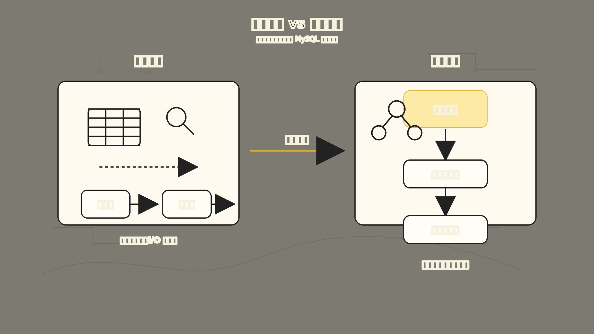
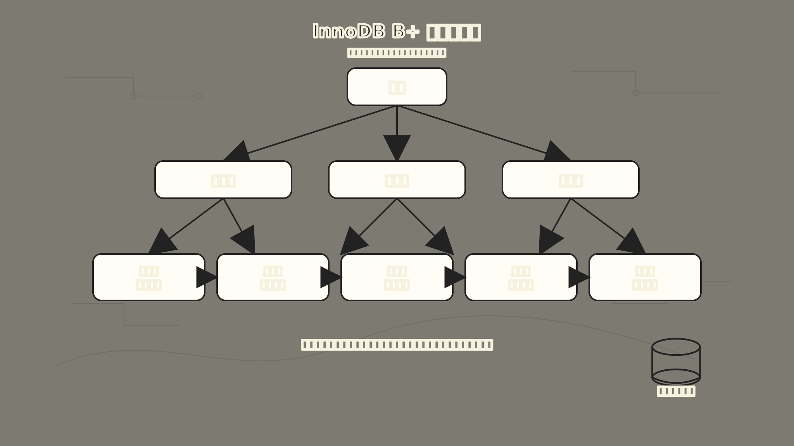

# MySQL 索引：为什么 B+ 树能让查询变快

你查一张千万级订单表，SQL 写得没问题，但就是慢。

`EXPLAIN` 一看，`type = ALL`。意思是 MySQL 正在逐行扫描整张表，一行行判断 `user_id = 10086`。数据小的时候你感觉不到，数据量一上来，这做法就很笨了。

很多人第一次学索引，会记成一句话：

> 索引就像书的目录，可以加快查询。

这话没错，但太容易让人误会——好像只要建了索引，查询就一定会变快。真实情况不是这样。

索引解决的不是“让数据库拥有魔法”，而是一个朴素问题：

**当表越来越大时，MySQL 能不能少看一点数据？**

我们固定一个例子来聊：

```sql
CREATE TABLE orders (
  id BIGINT PRIMARY KEY,
  user_id BIGINT NOT NULL,
  status VARCHAR(20) NOT NULL,
  created_at DATETIME NOT NULL,
  amount DECIMAL(10, 2) NOT NULL,
  remark VARCHAR(255)
) ENGINE=InnoDB;
```

假设 `orders` 表有 1000 万条订单，你经常查：

```sql
SELECT *
FROM orders
WHERE user_id = 10086
ORDER BY created_at DESC
LIMIT 20;
```

没有合适的索引时，MySQL 要从头到尾扫描大量订单，找出 `user_id = 10086` 的记录，再排序，再取前 20 条。索引的故事，就从这里开始。

## 一、没有索引时，MySQL 为什么慢

没有索引，最笨的查法就是全表扫描。

它本身没错，只是太重了：

```text
从第一行开始看
-> 判断 user_id 是不是 10086
-> 是就留下，不是就跳过
-> 一直看到最后一行
-> 再按 created_at 排序
-> 返回前 20 条
```

表只有 100 行，无所谓。表有 1000 万行，每次都这么看，就很浪费。

所以索引首先要解决的是：

**能不能不要从头看到尾，而是直接跳到可能命中的那一小段数据？**

这就是索引的第一层价值：缩小扫描范围。MySQL 官方文档也是这个意思——索引用来快速找到具有特定列值的行；没有索引时，MySQL 从第一行顺序读起，表越大成本越高。



上图左边是全表扫描：像在一堆文件里逐个翻找，翻到满头大汗。右边是索引查询：像先查目录柜，直接定位到目标抽屉。说白了，索引的作用就是建立一套“目录系统”，让查询少走弯路。

## 二、先别急着看树：InnoDB 读写的基本单位是页

很多人讲 B+ 树，直接从“根节点、非叶子节点、叶子节点”开始。

但在 InnoDB 里，更贴近真实存储的说法是：

**B+ 树的每个节点，本质上都是一个页。**

InnoDB 不是一行一行从磁盘读数据，而是按页读写。默认一个数据页是 16KB。也就是说，你哪怕只查一条订单记录，InnoDB 也会把整个页读到内存里。

这件事很重要，它解释了两个问题。

第一，为什么数据库总在意 I/O。

一次 I/O 读进来的是一页，不是一行。能不能少读几个页，往往比少做几次 CPU 比较更关键。

第二，为什么 B+ 树要设计成“矮胖”。

树的每一层都可能意味着一次页访问。树越高，定位到目标叶子页需要访问的页越多。一个数据页内部也不是乱放记录。以主键索引的数据页为例，页内记录按主键顺序组织，记录之间是一条单向链表。

每次都从头遍历链表，页内查找也慢。所以数据页里还有一个页目录。页目录把记录分成若干组，每组最后一条记录的位置作为一个槽。槽里的主键值也是有序的，InnoDB 可以先在页目录里二分查找，定位到目标记录大概在哪个组，然后只在这个小组里顺着链表找几条记录。

一次主键查询大概是两层定位：

```text
先通过 B+ 树定位到哪个数据页
-> 再通过页目录定位到页内哪个记录组
-> 最后在组内找到具体记录
```

这样看，B+ 树就不是抽象的数据结构题，而是 InnoDB 为了减少“读多少页”做出来的存储组织方式。

## 三、为什么 MySQL 常用 B+ 树做索引

既然索引要“快速定位”，那它应该长什么样？

最容易想到的是二叉搜索树。你要找 `user_id = 10086`，每次都和一个中间值比较：

```text
比中间值小，往左找
比中间值大，往右找
```

这比从头扫到尾聪明多了。但数据库索引有一个现实约束：数据和索引主要在磁盘页里，不是在无限大的内存里。

内存里多比较几次通常不贵，磁盘 I/O 才贵。一次查找如果要访问很多层节点，就可能带来很多次磁盘页读取。

二叉树的问题：每个节点最多两个分支。数据一多，树就容易变高。树越高，访问路径越长，磁盘 I/O 次数越多。

于是思路变成：

**能不能让树矮一点、胖一点？**

B 树和 B+ 树就是沿这个方向出现的。它们不是每个节点只放一个 key，而是让一个节点放多个 key、多个指针。每一层可以分出更多方向，树的高度就会明显降低。

InnoDB 的索引页默认 16KB，一个页里可以容纳很多索引项。树变矮以后，查一条记录通常只需要经过少数几层页：

```text
根页
-> 中间页
-> 叶子页
```



上图展示了 B+ 树的矮胖结构。顶层是根页，中间层展开多个索引页，底层是叶子页。叶子页之间用双向链表连接，既能向前扫，也能向后扫。最左侧的叶子页用高亮标出，示意一次查询最终定位到这里。

这就是 B+ 树适合数据库索引的根本原因：

**它不是为了减少 CPU 比较次数，而是为了减少磁盘页访问次数。**

## 四、B+ 树到底是什么

B+ 树可以先用一句话理解：

**B+ 树是一棵矮胖的多路有序树，非叶子节点负责导航，真正的数据或数据引用放在叶子节点，叶子节点之间按顺序连起来。**

拆开看，有四个重点。

**第一，非叶子节点主要做导航。**

它们像路标，告诉 MySQL：

```text
小于某个值，往左边页走
大于某个值，往右边页走
```

这些节点越小、越能装，树就越矮。

**第二，叶子节点保存最终索引项。**

在 InnoDB 里，主键索引和二级索引的叶子节点保存内容不一样：

- 主键索引（聚簇索引）的叶子节点保存整行数据。
- 二级索引的叶子节点保存二级索引列的值和对应主键值。

所以 InnoDB 的表数据本身就是按主键组织在一棵 B+ 树里的。如果我们建一个普通索引：

```sql
CREATE INDEX idx_user_id ON orders(user_id);
```

这棵二级索引大概可以理解成：

```text
user_id -> id
```

当你执行：

```sql
SELECT *
FROM orders
WHERE user_id = 10086;
```

MySQL 可能先在 `idx_user_id` 里找到符合条件的主键 `id`，再拿这些 `id` 回到主键索引里找完整行。

这个“从二级索引回到主键索引取整行”的过程，通常叫回表。


上图展示了回表的完整路径。查询先在二级索引里找到 `user_id = 10086` 对应的主键 `id`，再拿着这些 `id` 去主键索引查整行数据。如果命中的行很多，回表次数就多，成本会跟着上去。

**第三，叶子节点是有序链起来的。**

这点很关键，它让范围查询和排序变得自然。

比如：

```sql
SELECT *
FROM orders
WHERE user_id = 10086
  AND created_at >= '2026-01-01'
  AND created_at < '2026-02-01'
ORDER BY created_at;
```

如果有合适的联合索引：

```sql
CREATE INDEX idx_user_created ON orders(user_id, created_at);
```

MySQL 可以先定位到 `user_id = 10086` 的范围，再沿着叶子节点顺序扫描 `created_at` 的区间。不需要把所有订单都拿出来再重新排一遍。

B+ 树强就强在这里：既能点查，也适合范围查询，还能服务一部分排序和分组。

**第四，InnoDB 的叶子页之间是双向链表。**

很多资料说“叶子节点形成链表”，在 InnoDB 里更准确地说，是相邻页之间有前后指针，可以向前或向后扫描。

这对下面这种场景很有用：

```sql
SELECT *
FROM orders
WHERE user_id = 10086
ORDER BY created_at DESC
LIMIT 20;
```

如果索引顺序合适，MySQL 不需要先找出全部订单再排序，而是可以沿着叶子页的顺序取数据。`DESC` 方向也可以从另一头扫。

## 五、索引怎么分类：别把不同维度混在一起

学索引最容易混乱的地方，是把“主键索引、B+ 树索引、唯一索引、联合索引”放在一个列表里背。

其实它们不是同一类问题，而是从不同角度给索引分类。

从数据结构看：

- **B+ 树索引**：InnoDB 最常用，适合等值、范围、排序、分组。
- **Hash 索引**：等值查询很快，但不适合范围和排序；InnoDB 里常见的是自适应 Hash，由引擎自动维护，不是我们手动建的那种索引。
- **Full-text 索引**：解决全文检索问题，不是普通条件查询的主力。

从物理存储看：

- **聚簇索引**：叶子节点保存完整行数据。
- **二级索引**：叶子节点保存索引列和主键值。

从字段特性看：

- **主键索引**：不允许重复，不允许为空，一张表最多一个。
- **唯一索引**：不允许重复，但列可以包含 `NULL`（语义要看字段定义和业务约束）。
- **普通索引**：只负责加速查询，不负责唯一性约束。
- **前缀索引**：只对字符串前几个字符建索引，减少索引大小。

从字段个数看：

- **单列索引**：只包含一个字段。
- **联合索引**：包含多个字段，顺序很重要。

这样分完以后，很多说法就不冲突了。比如 `idx_user_status_created` 可以同时是：B+ 树索引、二级索引、普通索引、联合索引。这些名字是在回答不同问题。

## 六、索引优化：不是多建，而是建对

现在我们知道索引能让查询少看数据。那是不是每个字段都建一个索引？

不是。

索引也有成本：

- 占磁盘空间。
- 插入、删除、更新时要维护索引。
- 索引太多会增加优化器选择成本。
- 错误的索引可能根本用不上。

所以索引优化的核心不是“多建几个”，而是：

**围绕真实查询路径，设计最少但最有效的索引。**

适合建索引的字段通常有这些特征：

- 经常出现在 `WHERE` 条件里。
- 经常用于 `ORDER BY` 或 `GROUP BY`。
- 经常作为 JOIN 连接字段。
- 字段有较高区分度，比如用户 ID、订单号。
- 字段有唯一性要求，适合主键索引或唯一索引。

不适合盲目建索引的字段也很常见：

- 查询条件里根本用不到的字段。
- 表很小，扫全表也不贵。
- 字段重复度很高，比如只有少数几个状态值，单独建索引价值不大。
- 更新极其频繁的字段，每次更新都要维护索引。
- 很长的大字段，除非有明确的前缀索引方案。

还是看这条查询：

```sql
SELECT id, user_id, status, created_at, amount
FROM orders
WHERE user_id = 10086
  AND status = 'PAID'
ORDER BY created_at DESC
LIMIT 20;
```

一个比较自然的索引是：

```sql
CREATE INDEX idx_user_status_created
ON orders(user_id, status, created_at);
```

为什么是这个顺序？因为查询路径大概是：

```text
先按 user_id 缩小到某个用户
-> 再按 status 缩小到已支付订单
-> 再按 created_at 的顺序取最近 20 条
```

联合索引可以理解成按多个字段拼出来的一串有序值：

```text
(user_id, status, created_at)
```

它的排序规则不是三列各排各的，而是：

```text
先按 user_id 排
user_id 相同，再按 status 排
status 相同，再按 created_at 排
```

这就引出了最左前缀原则。

## 七、最左前缀：联合索引为什么讲顺序

假设你有这个索引：

```sql
CREATE INDEX idx_user_status_created
ON orders(user_id, status, created_at);
```

它可以比较好地支持这些条件：

```sql
WHERE user_id = 10086

WHERE user_id = 10086
  AND status = 'PAID'

WHERE user_id = 10086
  AND status = 'PAID'
  AND created_at >= '2026-01-01'
```

因为这些条件都是从索引最左边开始匹配：

```text
user_id
user_id + status
user_id + status + created_at
```



上图展示了最左前缀的匹配规则。绿勾表示能利用索引快速定位，红叉表示跳过了最左列 `user_id`，B+ 树无法直接定位，大概率退化成扫描。

但如果你只写：

```sql
WHERE status = 'PAID'
```

这个索引通常就不适合做快速定位。因为 B+ 树是先按 `user_id` 排的，不是先按 `status` 排的。你跳过了最左边的 `user_id`，就像查字典时不看第一个字母，直接按第二个字母找，很难定位。

MySQL 官方文档对多列索引的解释也是这个意思：如果有 `(col1, col2, col3)`，优化器可以使用 `(col1)`、`(col1, col2)`、`(col1, col2, col3)` 这些左前缀；但不能把 `(col2)` 或 `(col2, col3)` 当成查找入口。

还有一个常见细节：范围查询会影响后续列继续用于定位。

比如：

```sql
WHERE user_id = 10086
  AND created_at > '2026-01-01'
  AND status = 'PAID'
```

如果索引是 `ON orders(user_id, created_at, status)`，`created_at` 是范围条件，后面的 `status` 很可能不能继续作为精确定位的一部分。它仍可能被 MySQL 用来做索引条件过滤，但和“继续缩小 B+ 树查找范围”不是一回事。

所以设计联合索引时，常见经验是：

```text
高频等值条件
-> 范围条件
-> 排序 / 分组条件
-> 查询需要覆盖的字段
```

这不是死规则，最终还是要看真实 SQL、数据分布和 `EXPLAIN`。

这里还要补一个容易被讲得太粗的点：不是所有“看起来像范围”的条件，表现都完全一样。比如 `BETWEEN` 包含左右边界，`LIKE 'abc%'` 也可以转成一个前缀范围。优化器在某些情况下仍可能结合后续列形成更窄的扫描边界。

但作为写 SQL 和建索引时的朴素判断，可以先记住这个版本：

```text
联合索引从左往右匹配
-> 等值条件最稳定
-> 遇到明显的范围扫描后，后面的列通常更难继续用于精确定位
-> 后面的列即使用不上“定位”，也可能用于过滤
```

这就引出索引下推。

## 八、索引下推：减少没必要的回表

假设有联合索引：

```sql
CREATE INDEX idx_user_amount ON orders(user_id, amount);
```

现在查询：

```sql
SELECT *
FROM orders
WHERE user_id > 10000
  AND amount = 99.00;
```

对这个索引来说，`user_id > 10000` 是范围条件。MySQL 可以用它定位到一段索引范围，但在这个范围里，`amount` 不再是全局有序的，不能像等值前缀那样继续精准缩小扫描范围。

没有索引下推时，流程可能是：

```text
扫描二级索引里 user_id > 10000 的记录
-> 每拿到一个主键值就回表
-> 回到完整行以后再判断 amount 是否等于 99.00
```

这会产生很多不必要的回表。

MySQL 5.6 之后引入索引下推（Index Condition Pushdown）。它的思路是：

**既然 `amount` 本来就在联合索引里，那就在存储引擎扫描索引时先判断 `amount`，不满足就别回表。**

流程变成：

```text
扫描二级索引里 user_id > 10000 的记录
-> 在二级索引里先判断 amount = 99.00
-> 满足条件的记录才回表
```

执行计划里如果看到 `Using index condition`，通常就说明用到了索引下推。

索引下推不会让后面的列重新变成“定位列”，但它可以减少回表次数，所以对二级索引查询很有价值。

## 九、覆盖索引：能不回表就不回表

前面说过，二级索引叶子节点通常保存的是：

```text
二级索引列 -> 主键值
```

如果查询要 `SELECT *`，MySQL 只靠二级索引不够，还得回到主键索引取整行。

但如果查询只需要索引里已经有的字段，就可以少走一次主键索引。

比如：

```sql
SELECT user_id, status, created_at
FROM orders
WHERE user_id = 10086
  AND status = 'PAID'
ORDER BY created_at DESC
LIMIT 20;
```

如果有索引：

```sql
CREATE INDEX idx_user_status_created
ON orders(user_id, status, created_at);
```

这条查询要的列都在索引里，MySQL 就可能直接从索引树返回结果，不必回表。

这叫覆盖索引。它的价值是：

```text
少读主键索引
-> 少读数据页
-> 少做随机 I/O
```

但覆盖索引也不能滥用。为了覆盖查询，把很多大字段都塞进索引，会让索引变胖，反而增加读取和维护成本。尤其像 `remark` 这种长文本备注，一般不适合为了覆盖而放进普通业务索引。

## 十、前缀索引、自增主键和 NOT NULL：三个容易忽略的细节

### 1. 前缀索引：给长字符串一个更轻的入口

如果一个字符串字段很长，比如 `email`、`url`、`remark`，直接整列建索引会让索引变大。

有时我们只需要前几个字符就能获得不错的区分度，这时可以用前缀索引：

```sql
CREATE INDEX idx_remark_prefix ON orders(remark(20));
```

它的好处是索引项更小，一个索引页能放更多 key，查询时需要读的页可能更少。

但它也有边界：

- 前缀索引不能完整覆盖原字段，所以通常不能当作覆盖索引用。
- 前缀索引对 `ORDER BY remark` 这类完整排序帮助有限。
- 前缀长度太短，区分度不够；太长，又失去节省空间的意义。

### 2. 主键最好短一点、稳定一点、尽量顺序增长

InnoDB 的二级索引叶子节点保存的是主键值。这意味着主键不只是主键索引自己的事，它还会出现在每一棵二级索引里。

如果主键特别长，比如用很长的字符串做主键，那么所有二级索引都会跟着变胖。

如果主键完全随机，比如无序 UUID，每次插入都可能插到 B+ 树中间位置，容易引起页分裂：

```text
原本页里已经排好序
-> 新记录要插到中间
-> 页空间不够
-> 拆成两个页
-> 移动部分记录
```

页分裂会带来额外写入，也会让页空间利用率下降。

所以很多业务表使用 `BIGINT AUTO_INCREMENT` 作为主键：短、顺序、稳定，二级索引也更轻。

（当然，这不是说所有系统都必须用自增主键。分库分表、全局唯一、数据合并等场景会有别的考虑。但如果没有特殊理由，自增主键通常是 InnoDB 的舒服选择。）

### 3. 索引列尽量明确 NOT NULL

索引列允许 `NULL` 并不是不能用索引，但它会让统计、比较和优化器判断更复杂。

更重要的是，`NULL` 往往表示业务语义没有想清楚：

```text
未知
不存在
未填写
不适用
```

这些语义混在一起，会让查询条件变得含糊。如果字段在业务上必须有值，就尽量声明为 `NOT NULL`，再给出合理默认值或显式状态。

## 十一、索引失效：为什么建了索引也没用

很多慢 SQL 最迷惑人的地方在于：字段明明有索引，但执行计划还是走了全表扫描。

这通常不是 MySQL “忘了用”，而是你的写法让索引不好用，或者优化器判断用索引不划算。

### 1. 对索引列做函数或计算

比如：

```sql
SELECT *
FROM orders
WHERE DATE(created_at) = '2026-01-01';
```

如果索引是 `created_at`，这条 SQL 会让 MySQL 先对每行的 `created_at` 做 `DATE()` 计算，再比较结果。B+ 树里保存的是原始 `created_at` 值，不是 `DATE(created_at)` 的结果，所以很难直接按索引定位。

更好的写法是改成范围：

```sql
SELECT *
FROM orders
WHERE created_at >= '2026-01-01'
  AND created_at < '2026-01-02';
```

这就重新变成 B+ 树擅长的范围扫描。

### 2. 前导模糊匹配

比如：

```sql
SELECT *
FROM orders
WHERE remark LIKE '%退款%';
```

B+ 树是从左到右有序的。`LIKE '退款%'` 还能利用前缀定位；`LIKE '%退款%'` 前面是不确定的，普通 B+ 树索引就很难用来快速定位。

这种场景如果很重要，通常要考虑全文索引、搜索引擎，或者额外的检索结构。

### 3. 联合索引没有从最左列开始

有索引 `ON orders(user_id, status, created_at)`，但查询是 `WHERE status = 'PAID'`。这不符合最左前缀，索引很可能不能作为有效查找入口。

### 4. 隐式类型转换

如果 `user_id` 是 `BIGINT`，你写 `WHERE user_id = '10086'`，MySQL 可能还能处理得比较好。但如果列是字符串，你却拿数字去比，或者连接字段类型、字符集不一致，就可能引发转换，影响索引使用。

尤其是 JOIN：

```sql
orders.user_id BIGINT
users.id VARCHAR(20)
```

这种设计会让优化器很难舒服地用索引。

### 5. `OR` 两边不是都有可用索引

比如：

```sql
SELECT *
FROM orders
WHERE id = 1
   OR remark = 'urgent';
```

如果 `id` 是主键索引，但 `remark` 没有索引，优化器可能选择全表扫描。

原因很简单：`OR` 表示满足任意一边都要返回。只有一边能快速定位，另一边还是得扫大量数据，那整体就很难只靠索引解决。

如果两边都有合适索引，MySQL 有时可以使用 index merge，把多个索引扫描结果合并。但这不是万能药，复杂 SQL 里仍然要看执行计划。

### 6. 返回行太多，优化器觉得全表扫更划算

索引不是永远更快。如果一个条件会命中表里 80% 的行，走索引可能意味着：

```text
先扫大量索引项
-> 再大量回表
```

这还不如顺序扫表。

所以像 `status` 这种低区分度字段，单独建索引未必有价值：

```sql
WHERE status = 'PAID'
```

如果全表大部分订单都是 `PAID`，这个索引选择性就很差。更常见的做法是把它放进联合索引里，配合更有区分度的字段一起用：

```sql
ON orders(user_id, status, created_at)
```

## 十二、用 EXPLAIN 确认：不要靠感觉判断有没有走索引

索引优化最怕凭感觉。

你以为建了索引，MySQL 就一定用了；你以为用了索引，就一定快。实际都不一定。

排查时先看：

```sql
EXPLAIN
SELECT id, user_id, status, created_at
FROM orders
WHERE user_id = 10086
  AND status = 'PAID'
ORDER BY created_at DESC
LIMIT 20;
```

几个字段最常看：

- `key`：实际使用的索引。如果是 `NULL`，说明没有使用索引。
- `possible_keys`：可能用到的索引。有候选不代表最终会选。
- `key_len`：可以帮助判断联合索引到底用了多少列。它不是“越长越好”，而是用来辅助你理解优化器用了哪些列形成扫描边界。
- `rows`：优化器估算要扫描的行数。它不是精确值，但能帮助判断扫描范围大不大。
- `type`：访问方式，大致可以从差到好这样理解：

```text
ALL -> index -> range -> ref -> eq_ref -> const
```

`ALL` 是全表扫描，通常最需要警惕。

`index` 是全索引扫描，比全表扫描轻一点，但仍然可能很贵。

`range` 表示范围扫描，索引开始发挥明显作用。

`ref` 表示非唯一索引等值匹配，可能返回多行。

`eq_ref` 常见于 JOIN 中使用唯一索引或主键匹配。

`const` 通常是主键或唯一索引等值查询，结果最多一行。

`Extra` 里也有几个常见信号：

- `Using index`：覆盖索引，不需要回表。
- `Using index condition`：索引下推。
- `Using filesort`：无法完全利用索引顺序完成排序，需要额外排序。
- `Using temporary`：用了临时表，常见于复杂排序、分组。

真正调索引时，不要只问“有没有索引”，而要看：

```text
用了哪个索引？
扫描范围多大？
是否回表？
是否额外排序？
是否用了临时表？
```

## 十三、`COUNT(*)` 和 `COUNT(1)` 有什么区别

最后说一个经常和索引一起出现的问题：

```sql
SELECT COUNT(*) FROM orders;
SELECT COUNT(1) FROM orders;
```

它们谁更快？

在 InnoDB 里，不用纠结。MySQL 官方文档明确说，InnoDB 对 `COUNT(*)` 和 `COUNT(1)` 的处理方式相同，没有性能差异。

真正需要理解的是另一个问题：

**为什么 InnoDB 的 `COUNT(*)` 不是直接读一个表行数？**

因为 InnoDB 支持事务和 MVCC。不同事务在同一时刻能“看见”的数据版本可能不一样。一个事务可能还看得见某些旧版本行，另一个事务可能已经看见新插入的行。所以 InnoDB 很难维护一个对所有事务都准确的全局行数。

因此：

```sql
SELECT COUNT(*) FROM orders;
```

在没有 `WHERE`、`GROUP BY` 这类额外条件时，InnoDB 会尽量选择最小的可用二级索引来扫。如果没有二级索引，就扫描聚簇索引。

为什么扫较小的二级索引？因为二级索引通常比整行数据更窄。扫一棵更小的索引树，比扫包含完整行数据的主键索引更省 I/O。

至于 `COUNT(字段)`，它和前面几个不完全一样。

```sql
SELECT COUNT(remark) FROM orders;
```

它统计的是 `remark` 不为 `NULL` 的行数。如果 `remark` 不是索引列，MySQL 需要读取这个字段来判断是不是 `NULL`，通常就更贵。

所以 `COUNT(*)` 的优化重点不是把它改成 `COUNT(1)`，而是看：

- 有没有合适的小索引可扫。
- 是否带了 `WHERE` 条件。
- 条件能不能用索引缩小范围。
- 业务是否真的需要精确实时总数。

如果只是展示一个大概数量，用缓存、统计表、异步汇总，可能比每次实时 `COUNT(*)` 更合理。

## 十四、把索引放回一条主线

现在再回头看，MySQL 索引不是一堆孤立技巧，而是一条很自然的问题链：

```text
表小的时候，全表扫描也能接受
-> 表大以后，全表扫描太贵
-> 需要一种结构快速缩小扫描范围
-> 二叉树太高，磁盘 I/O 多
-> B+ 树用矮胖结构减少页访问
-> 叶子节点有序，适合点查、范围、排序、分组
-> 二级索引可能回表
-> 索引下推减少无效回表
-> 覆盖索引减少回表
-> 联合索引需要遵守最左前缀
-> 前缀索引、自增主键、字段区分度影响索引成本
-> 写法不当或选择性太差，索引也可能失效
```

一句话记住：

**索引不是让查询“凭空变快”，而是让 MySQL 用更低成本找到更少的数据。**

所以以后看到一条慢 SQL，不要先问“要不要加索引”，而是先问：

```text
这条 SQL 想按什么条件定位？
它要返回多少行？
它是否需要排序或分组？
它能不能少回表？
现有索引的顺序是否贴合这条访问路径？
```

能回答这些问题，索引就不再是背口诀，而是工程判断。

