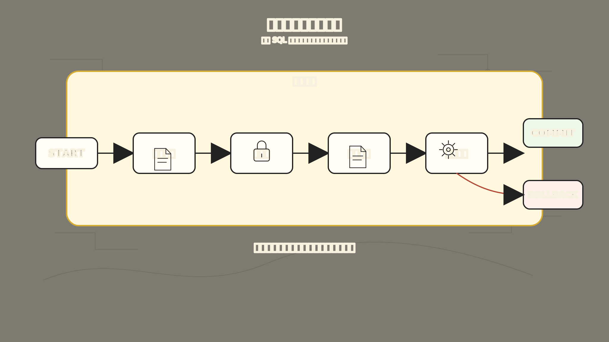
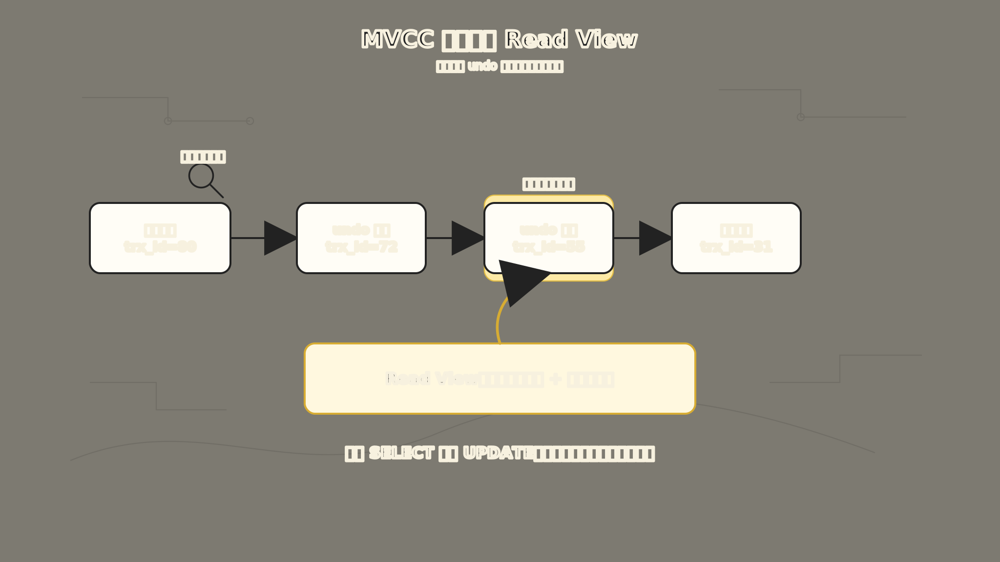

# MySQL 事务：为什么一组 SQL 不能只成功一半

你的下单接口崩溃了。

订单创建了，库存扣了，但支付单没写成功。数据库里留下一个“有订单、没支付”的半成品，业务乱套了。

很多人第一次学事务，会先背 ACID：

- Atomicity，原子性
- Consistency，一致性
- Isolation，隔离性
- Durability，持久性

这四个词当然重要，但如果一上来就背，很容易把事务学成抽象概念。事务真正出现的原因，其实非常朴素：

**一个业务动作，经常不是一条 SQL 就能完成；如果中间某一步失败，数据库不能留下半成品。**

为了让这件事好理解，我们固定一个下单例子：

```sql
CREATE TABLE orders (
  id BIGINT PRIMARY KEY,
  user_id BIGINT NOT NULL,
  status VARCHAR(20) NOT NULL,
  amount DECIMAL(10, 2) NOT NULL,
  created_at DATETIME NOT NULL
) ENGINE = InnoDB;

CREATE TABLE inventory (
  id BIGINT PRIMARY KEY,
  sku VARCHAR(64) NOT NULL,
  stock INT NOT NULL,
  KEY idx_sku (sku)
) ENGINE = InnoDB;

CREATE TABLE payments (
  id BIGINT PRIMARY KEY,
  order_id BIGINT NOT NULL,
  status VARCHAR(20) NOT NULL,
  amount DECIMAL(10, 2) NOT NULL
) ENGINE = InnoDB;
```

用户买一件商品，系统至少要做几件事：

```text
创建订单
-> 扣减库存
-> 记录支付单
-> 把订单状态改成已支付
```

如果这几步只成功了一半，麻烦就来了：

- 订单创建了，但库存没扣。
- 库存扣了，但支付单没生成。
- 支付成功了，但订单状态还是待支付。

事务的故事，就从这里开始。



上图展示了一个事务的完整边界。`START TRANSACTION` 之后的三步操作，被包裹在同一个事务边界内。走到最后一步，要么全部提交（COMMIT），要么全部回滚（ROLLBACK）。这就是事务最核心的作用：给一组 SQL 加上“共同进退”的约束。

## 一、没有事务时，数据库会留下半成品

先看一段没有事务保护的下单逻辑：

```sql
INSERT INTO orders (id, user_id, status, amount, created_at)
VALUES (1001, 88, 'CREATED', 199.00, NOW());

UPDATE inventory
SET stock = stock - 1
WHERE sku = 'mysql-book' AND stock > 0;

INSERT INTO payments (id, order_id, status, amount)
VALUES (5001, 1001, 'SUCCESS', 199.00);

UPDATE orders
SET status = 'PAID'
WHERE id = 1001;
```

如果四条 SQL 都执行成功，看起来没问题。但真实系统里，任何一步都可能出错：

- 网络断了。
- 应用进程崩了。
- 库存不足。
- 数据库重启。
- 某条 SQL 违反约束。

假设第一条 `INSERT orders` 成功了，第二条 `UPDATE inventory` 失败了。数据库里就会留下一个已经创建、但其实没有库存支撑的订单。

这就是事务要解决的第一个问题：

**一组 SQL 要么整体成功，要么整体失败，不能只执行一半。**

在 MySQL 里，事务的基本写法是：

```sql
START TRANSACTION;

INSERT INTO orders (id, user_id, status, amount, created_at)
VALUES (1001, 88, 'CREATED', 199.00, NOW());

UPDATE inventory
SET stock = stock - 1
WHERE sku = 'mysql-book' AND stock > 0;

INSERT INTO payments (id, order_id, status, amount)
VALUES (5001, 1001, 'SUCCESS', 199.00);

UPDATE orders
SET status = 'PAID'
WHERE id = 1001;

COMMIT;
```

如果中间发现不对，可以回滚：

```sql
ROLLBACK;
```

`COMMIT` 的意思是：这组修改确认生效。`ROLLBACK` 的意思是：这组修改撤销掉，回到事务开始前的状态。

所以事务不是一个抽象口号，它就是给一组 SQL 加了一层边界：

```text
事务开始
-> 做一组修改
-> 全部确认，提交
-> 有问题，回滚
```

## 二、原子性：为什么事务像一个不可拆开的动作

ACID 里的 A，叫原子性（Atomicity，事务不可再拆分的特性）。

它解决的是：

**这组 SQL 能不能被当成一个整体动作？**

在下单例子里，创建订单、扣库存、写支付单、更新订单状态，不应该被看成四个互不相干的动作，而应该被看成一个业务动作：下单支付成功。只要其中一步失败，整个动作就应该失败。

这就是原子性的意思：

**事务里的操作，要么全部完成，要么全部不完成。**

但数据库怎么做到“撤销”呢？

InnoDB 会记录 undo log（撤销日志，记录如何回滚修改的日志）。先把它理解成“反向操作记录”：

- 插入一行时，undo log 记录如何删除它。
- 删除一行时，undo log 记录如何恢复它。
- 更新一行时，undo log 记录更新前的旧值。

如果事务执行到一半失败，InnoDB 就可以根据 undo log 把已经做过的修改撤回去。

所以原子性背后的关键不是口号，而是：

**数据库必须记得怎么退回去。**

## 三、一致性：为什么事务不是万能的业务正确性

ACID 里的 C，叫一致性（Consistency，事务执行前后数据库保持合法状态的特性）。

这个词最容易讲虚。可以先用一句话理解：

**事务执行前，数据库是合法状态；事务执行后，数据库也应该是合法状态。**

比如库存不能小于 0，订单金额不能为负，支付单必须对应一个订单。

但这里有一个很重要的边界：

**一致性不是数据库单方面保证所有业务都正确。**

数据库可以帮你做很多事：

- 用主键保证一行唯一。
- 用唯一索引保证业务键不重复。
- 用外键表达表之间的引用关系。
- 用 `NOT NULL`、`CHECK` 等约束限制非法值。
- 用事务保证一组修改不会只成功一半。

但“下单时应该先校验什么”“库存不足时怎么处理”“支付成功回调能不能重复处理”，这些仍然需要业务代码设计。

所以更准确地说：

**一致性是数据库约束、事务机制和业务逻辑共同守住的结果。**

事务能保证“这组 SQL 一起提交或一起回滚”，但它不能自动判断你的业务规则是不是写对了。

## 四、隔离性：为什么多个事务不能互相看乱

到这里，我们只讨论了一个事务内部的问题。真实系统里，更麻烦的是多个事务同时执行。

假设商品 `mysql-book` 库存只剩 1 件，两个用户同时下单。

如果两个事务都先看到 `stock = 1`，然后都去扣库存，系统就可能卖出两件。于是事务要解决第二类问题：

**多个事务并发执行时，彼此能看到什么？又应该互相等待到什么程度？**

这就是隔离性。

隔离性不是简单地说“事务之间完全看不见”。如果真的完全串行，一个事务执行完，另一个才能执行，那当然最安全，但性能会很差。

数据库真正要做的是取舍：

```text
隔离越强 -> 并发问题越少 -> 等待和锁冲突越多
隔离越弱 -> 并发性能可能更好 -> 读到奇怪结果的风险更高
```

所以 SQL 标准定义了几个隔离级别，MySQL InnoDB 也支持这些级别：

| 隔离级别 | 大概意思 | 可能遇到的问题 |
| --- | --- | --- |
| READ UNCOMMITTED | 可以读到别人还没提交的数据 | 脏读 |
| READ COMMITTED | 只能读到别人已经提交的数据 | 不可重复读、幻读 |
| REPEATABLE READ | 同一事务里的普通查询尽量看到同一份快照 | 当前读场景仍要看锁 |
| SERIALIZABLE | 尽量按串行方式执行 | 并发能力最低 |

InnoDB 默认隔离级别是 `REPEATABLE READ`。



上图展示了隔离级别从左到右逐渐增强的关系。隔离越弱，性能可能越好，但读到的“怪数据”越多。InnoDB 默认的 `REPEATABLE READ` 是大多数业务场景下的折中选择。

MySQL 官方文档里也强调，隔离级别本质是在并发事务之间调节性能、可靠性、一致性和结果可重复性。

## 五、脏读、不可重复读、幻读，到底在说什么

隔离级别之所以难，是因为它背后有几个异常现象。先别背定义，还是放回下单例子。

### 脏读：读到了别人还没提交的数据

事务 A 正在扣库存，还没提交：

```sql
START TRANSACTION;

UPDATE inventory
SET stock = stock - 1
WHERE sku = 'mysql-book';
```

事务 B 此时读到了 A 修改后的库存。如果事务 A 后来回滚了，B 刚才读到的就是一个从未真正生效过的数据。

这叫脏读。脏读的问题是：

**你看到的是别人临时改出来、最后可能不存在的状态。**

### 不可重复读：同一行前后读到不同结果

事务 A 先查库存：

```sql
SELECT stock
FROM inventory
WHERE sku = 'mysql-book';
```

结果是 `stock = 10`。这时事务 B 提交了一次扣库存，把库存改成 9。事务 A 再查同一行，发现变成了 `stock = 9`。

这叫不可重复读。它的问题是：

**同一个事务里，两次读取同一行，结果不一样。**

### 幻读：同一个范围前后多出或少了行

事务 A 查询某个范围：

```sql
SELECT *
FROM orders
WHERE user_id = 88;
```

第一次查到 3 个订单。这时事务 B 给这个用户插入了一个新订单并提交。事务 A 再查同一个范围，发现变成了 4 个订单，好像多出了一个“幻影”。

这叫幻读。幻读的问题是：

**同一个范围条件，前后读到的记录集合不一样。**

这三个异常可以先这样记：

```text
脏读：读到未提交
不可重复读：同一行变了
幻读：同一范围的行数变了
```

## 六、MVCC：为什么普通 SELECT 通常不会堵住 UPDATE

讲隔离性时，很容易以为数据库只能靠锁。如果读要锁，写也要锁，那普通查询就会经常堵住更新，系统会非常慢。

InnoDB 没有这么粗暴。它大量使用 MVCC。

MVCC 全称是 Multi-Version Concurrency Control（多版本并发控制，通过保存数据历史版本实现读写隔离的机制）。

名字很长，但直觉很简单：

**一行数据不只看当前版本，还可以沿着版本链找到对当前事务可见的旧版本。**

比如库存这一行原来是：

```text
stock = 10
```

事务 B 把它改成：

```text
stock = 9
```

如果事务 A 在更早的时候已经开始读取，InnoDB 不一定要让 A 等 B，也不一定要让 B 等 A。它可以让 A 继续看到旧版本 `stock = 10`，让 B 修改当前版本。

这就是 MVCC 的价值：

**让读尽量读快照，让写继续写当前数据，减少读写互相阻塞。**



上图展示了 MVCC 的核心机制。当前记录被修改后，旧版本不会立刻删除，而是通过 undo log 串成一条版本链。事务读取时，拿着自己的 Read View（可见性名单）沿 undo 链往回找，找到第一个对自己可见的版本。这样读操作不需要加锁，也不会被写操作阻塞。

### 1. 当前记录里藏着事务信息

在 InnoDB 里，一行记录不只有我们建表时写出来的业务字段。

比如 `inventory` 表里，我们能看见的是 `id`、`sku`、`stock`。但在 InnoDB 的聚簇索引记录里，还会有一些隐藏字段。和 MVCC 最相关的是这两个：

| 隐藏字段 | 作用 |
| --- | --- |
| `DB_TRX_ID` | 最后一次插入或更新这行记录的事务 id |
| `DB_ROLL_PTR` | 回滚指针，指向 undo log 里的旧版本 |

如果表没有显式主键，InnoDB 还可能生成 `DB_ROW_ID` 作为隐藏行 id。但理解 MVCC 时，最关键的是 `DB_TRX_ID` 和 `DB_ROLL_PTR`。

假设库存原来是 10：

```text
sku = 'mysql-book'
stock = 10
DB_TRX_ID = 50
DB_ROLL_PTR = null
```

后来事务 52 把库存改成 9：

```sql
UPDATE inventory
SET stock = 9
WHERE sku = 'mysql-book';
```

InnoDB 不是简单地把旧值彻底抹掉。它会做两件事：

```text
1. 在数据页里的当前记录上写入新值 stock = 9，并把 DB_TRX_ID 改成 52
2. 把旧值 stock = 10 写进 undo log，并让 DB_ROLL_PTR 指向这个旧版本
```

于是，这一行就变成了：

```text
当前版本：stock = 9， DB_TRX_ID = 52
  |
  | DB_ROLL_PTR
  v
旧版本：stock = 10，DB_TRX_ID = 50
```

如果后面又更新几次，undo log 里的旧版本就会继续串起来，形成一条版本链。

这就是 MVCC 的第一个底层支点：

**InnoDB 的数据页偏向保存当前版本，历史版本主要靠 undo log 串起来。**

### 2. Read View 是一张“可见性名单”

有了版本链，还不够。因为事务读取一行时，数据库还得判断：

**这条版本，我现在能不能看？**

这个判断就靠 Read View。可以把 Read View 理解成事务读取时拍下的一张“可见性照片”：

```text
哪些事务已经提交
哪些事务还没提交
当前事务应该看到哪些版本
```

更具体一点，Read View 里常见有四个关键信息：

| 字段 | 白话理解 |
| --- | --- |
| `creator_trx_id` | 创建这张 Read View 的事务 id |
| `m_ids` | 创建 Read View 时还活跃、还没提交的事务 id 列表 |
| `min_trx_id` | 活跃事务里最小的事务 id |
| `max_trx_id` | 创建 Read View 时，下一个将要分配的事务 id |

比如事务 51 做普通查询时，生成了一张 Read View：

```text
creator_trx_id = 51
m_ids = [51, 52]
min_trx_id = 51
max_trx_id = 53
```

这说明在这张快照生成时，事务 51 和事务 52 还活着；事务 id 小于 51 的修改，基本可以认为发生在这张快照之前；事务 id 大于等于 53 的修改，则一定发生在这张快照之后。

### 3. 可见性判断：先看当前版本，不行就沿 undo 往回找

现在把版本链和 Read View 放在一起看。

当前记录是：

```text
stock = 9
DB_TRX_ID = 52
```

事务 51 的 Read View 是：

```text
m_ids = [51, 52]
min_trx_id = 51
max_trx_id = 53
```

事务 51 读取这行时，会先看当前版本的 `DB_TRX_ID = 52`。这个 52 在 `m_ids` 里，意思是：

**生成这个版本的事务，在我的快照里还是活跃事务，还没提交。**

所以当前版本 `stock = 9` 对事务 51 不可见。

那怎么办？InnoDB 就顺着 `DB_ROLL_PTR` 找到 undo log 里的旧版本：

```text
stock = 10
DB_TRX_ID = 50
```

这次 `DB_TRX_ID = 50` 小于 `min_trx_id = 51`，说明这个版本是在 Read View 创建前已经提交的事务生成的。所以它可见。

于是事务 51 读到的就是 `stock = 10`。

这个过程可以记成四条规则：

| 版本的 `DB_TRX_ID` | 判断结果 |
| --- | --- |
| 等于当前事务自己的 id | 可见，自己改的自己能看见 |
| 小于 `min_trx_id` | 可见，说明在快照前已经提交 |
| 大于等于 `max_trx_id` | 不可见，说明在快照后才出现 |
| 在 `min_trx_id` 和 `max_trx_id` 之间 | 看它是否在 `m_ids` 里；在就是未提交，不在就是已提交 |

如果某个版本不可见，InnoDB 就继续沿 undo 版本链往前找，直到找到第一个可见版本，或者发现没有可见版本。

所以 MVCC 的完整读路径其实是：



上图展示了 MVCC 快照读的完整判断流程。核心是一个循环：拿到当前版本的 `DB_TRX_ID`，用 Read View 判断可见性；如果不可见，就沿 undo 链往回找，直到找到可见版本为止。整个过程中读操作不需要加锁。

这就是“快照读”的底层含义。它不是复制了一整张表的快照，而是：

**用 Read View 固定可见性规则，再借助 undo 版本链按需拼出旧版本。**

### 4. READ COMMITTED 和 REPEATABLE READ 差在哪里

理解了 Read View，再看隔离级别就简单很多。

在 `READ COMMITTED` 下，每次普通查询都会生成新的 Read View，所以同一事务里两次查询可能看到不同的已提交结果。

在 `REPEATABLE READ` 下，普通一致性读通常复用第一次读取时建立的快照，所以同一事务里的多次普通 `SELECT` 更容易保持一致。

这也是为什么 InnoDB 默认 `REPEATABLE READ` 能解决很多“前后读不一样”的问题。

这里有个细节很容易被忽略：`START TRANSACTION;` 并不一定在这一刻就生成 Read View。通常要等到第一次普通一致性读发生时，Read View 才真正建立。如果使用 `START TRANSACTION WITH CONSISTENT SNAPSHOT;`，才是事务开始时就建立一致性快照。

这个细节不需要一开始就背下来，但它能解释为什么有些资料说“事务启动时生成快照”，有些资料又说“第一次一致性读时生成快照”。它们讲的是不同开启方式和不同语境。

### 5. undo 版本不能一直留着

MVCC 还有一个现实代价：旧版本要占空间。

如果一个长事务一直不提交，它的 Read View 就可能一直需要很老的版本。为了保证这个事务还能读到自己该看的快照，InnoDB 不能太早清理相关 undo 记录。

等所有可能需要这些旧版本的 Read View 都结束后，后台 purge 线程才能逐步清理不再需要的 undo。

所以长事务的危害不只是“占着连接”：

```text
长事务不结束
-> 老 Read View 还活着
-> 一些 undo 旧版本不能清理
-> 版本链变长
-> 快照读回溯成本变高
-> undo 空间压力变大
```

这也是为什么生产环境里经常强调：不要把事务开得太久。

不过要注意：

**MVCC 主要服务普通一致性读，不等于所有语句都读快照。**

像下面这些语句，属于当前读或写操作：

```sql
SELECT *
FROM inventory
WHERE sku = 'mysql-book'
FOR UPDATE;

UPDATE inventory
SET stock = stock - 1
WHERE sku = 'mysql-book' AND stock > 0;
```

它们要面对最新数据，并且要加锁。

所以学事务时一定要分清：

- 普通 `SELECT`：通常是一致性读，依赖 MVCC。
- `SELECT ... FOR UPDATE`：锁定读，要加锁。
- `UPDATE`、`DELETE`、`INSERT`：当前读和写入，要加锁。

这也是为什么事务、MVCC 和锁不能分开学。

## 七、锁：为什么 MVCC 还不够

既然 MVCC 能让读不堵写，那为什么还需要锁？

因为 MVCC 解决的是“读的时候看到哪个版本”，但它不能替你解决“两个事务同时修改同一份数据”的冲突。

库存扣减就是典型例子。正确写法通常不是先查库存，再在应用里判断，再更新：

```sql
SELECT stock
FROM inventory
WHERE sku = 'mysql-book';

-- 应用判断 stock > 0

UPDATE inventory
SET stock = stock - 1
WHERE sku = 'mysql-book';
```

这种写法在并发下容易出问题，因为两个事务可能都先读到库存充足。

更稳的写法是把条件放进更新语句里：

```sql
UPDATE inventory
SET stock = stock - 1
WHERE sku = 'mysql-book'
  AND stock > 0;
```

这条 `UPDATE` 会去拿对应记录的排他锁（X锁，独占锁，不允许其他事务同时读写）。拿到锁的事务先改，其他事务要么等待，要么在等待后发现条件已经不满足。

锁解决的是：

**同一份数据被并发修改时，谁先改，谁等待，谁失败。**

在 InnoDB 里，加锁范围还会受到索引影响。如果 `sku` 上有索引，InnoDB 可以沿着索引找到更小范围的记录并加锁。如果没有合适索引，扫描范围变大，锁范围也可能变大。

所以事务里的锁，不只是事务知识，也和索引设计直接相关。

## 八、持久性：为什么提交后不能说丢就丢

ACID 里的 D，叫持久性（Durability，已提交事务的数据在系统故障后仍能恢复的特性）。

它解决的是：

**事务一旦提交成功，即使数据库崩溃，也应该尽量恢复出提交后的结果。**

如果 `COMMIT` 已经告诉应用“成功了”，结果数据库重启后订单消失了，这个系统就不能信任。

InnoDB 主要靠 redo log（重做日志，记录数据页物理修改的日志，用于崩溃恢复）支撑崩溃恢复。

你可以把 redo log 先理解成“做过什么修改”的重放记录：

```text
某个数据页的某个位置
-> 被改成了什么
```

为什么不每次提交都直接把数据页完整刷到磁盘？因为随机刷很多数据页太慢。

InnoDB 使用的是先写日志的思路：先把修改记录到 redo log，后面再慢慢把脏页刷回磁盘。只要 redo log 可靠落盘，即使数据页还没来得及刷，崩溃后也可以通过 redo log 重放回来。

所以持久性背后的关键是：

**提交成功之前，数据库要把足够的恢复信息保存下来。**

顺便把几个日志放在一张图里：

| 日志 | 主要作用 |
| --- | --- |
| undo log | 回滚、MVCC 旧版本 |
| redo log | 崩溃恢复，保证已提交修改能恢复 |
| binlog | 主从复制、归档恢复、审计变更 |

这一点会在 MySQL 日志篇继续展开。

## 九、把 ACID 放回同一条链里

现在再回头看 ACID，就没那么抽象了。

| 特性 | 它在解决什么问题 | InnoDB 里常见支撑 |
| --- | --- | --- |
| 原子性 | 一组 SQL 不能只成功一半 | undo log、提交/回滚 |
| 一致性 | 事务前后都应该是合法状态 | 约束、业务逻辑、事务机制 |
| 隔离性 | 并发事务不能互相看乱、改乱 | 隔离级别、MVCC、锁 |
| 持久性 | 提交成功后崩溃也要能恢复 | redo log、刷盘策略 |

事务不是单独的一个按钮，而是一组机制共同配合：

```text
业务动作需要多条 SQL
-> 多条 SQL 不能只成功一半
-> 引出事务边界、COMMIT、ROLLBACK
-> 回滚需要 undo log
-> 并发事务会互相影响
-> 引出隔离级别
-> 普通读不能总是加锁
-> 引出 MVCC 和 Read View
-> 当前读和写入必须处理冲突
-> 引出锁、间隙锁、next-key lock
-> 提交后还要防崩溃丢数据
-> 引出 redo log
```

这条链，就是 MySQL 事务的主线。

## 十、写事务时，最容易踩的几个坑

最后放几个工程里常见的提醒。

第一，不要把事务开得太长。

事务越长，持有锁的时间可能越长，undo 版本保留也可能越久。一个事务里夹杂远程调用、用户交互、慢查询，都可能拖累整个系统。

第二，事务里的 SQL 要尽量走合适索引。

索引不好，不只是查询慢，还可能导致锁范围扩大。尤其是 `UPDATE`、`DELETE`、`SELECT ... FOR UPDATE`，一定要关注执行计划。

第三，普通 `SELECT` 和锁定读不要混着想。

普通 `SELECT` 多数时候看到的是快照；`FOR UPDATE`、`UPDATE` 看到的是当前最新状态并加锁。两种读的语义不同，混在一个事务里时要格外小心。

第四，不要以为 `REPEATABLE READ` 就能自动解决所有并发问题。

它能让普通一致性读更稳定，但涉及库存扣减、唯一性抢占、范围更新这类写场景时，还是要依赖正确的 SQL、索引、锁和约束。

第五，业务幂等不能只靠事务。

比如支付回调可能重复到达。事务能保证一次处理内部的一组 SQL 原子提交，但“同一个回调重复来了怎么办”，仍然需要唯一索引、状态机和业务幂等设计。

## 总结

事务可以先记成一句话：

**事务是 MySQL 用来保护一组 SQL 的边界：成功就一起提交，失败就一起回滚，并且在并发和崩溃时尽量保持结果可信。**

再展开一点：

- 原子性解决“不能只成功一半”。
- 一致性解决“事务前后都要是合法状态”。
- 隔离性解决“多个事务不能互相看乱、改乱”。
- 持久性解决“提交成功后不能说丢就丢”。

如果把事务看成一个入口，那么后面几篇 MySQL 核心知识都会从这里长出来：

- MVCC 解释普通查询为什么能读快照。
- 锁解释并发写入为什么要排队。
- undo log 解释为什么能回滚和读旧版本。
- redo log 解释为什么崩溃后还能恢复。
- 索引解释为什么同一句更新可能锁很小，也可能锁很大。

所以，学事务不要只背 ACID。

更好的记法是：

```text
业务动作需要整体性
-> 整体性需要事务
-> 事务要面对失败、并发和崩溃
-> 于是出现 undo、MVCC、锁、redo
```

这才是 MySQL 事务真正想解决的问题。

