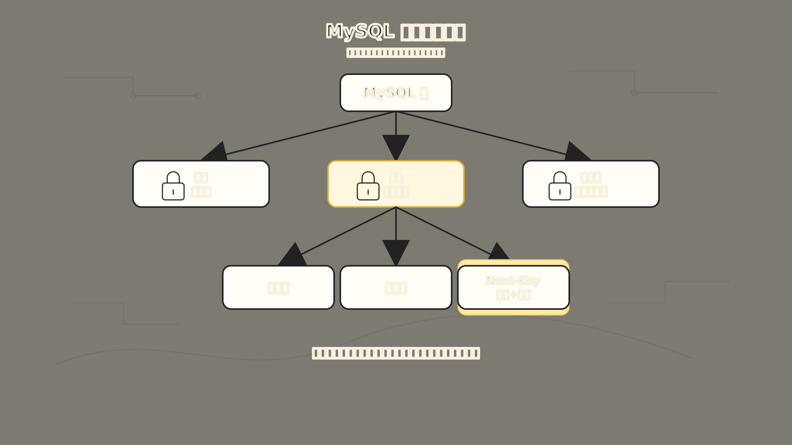
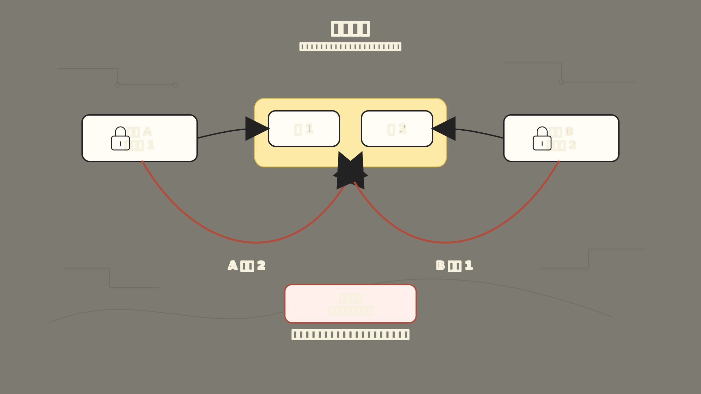

# MySQL 锁：为什么数据库需要一套交通规则

两个事务同时扣同一行库存，结果库存变成了 -1。

这不是数据库 bug，而是并发世界里没有“交通规则”的后果。两个人同时读、同时改，最后谁覆盖谁全凭运气。

学 MySQL 锁的时候，很多人一上来就会撞上一串名词：

行锁、表锁、共享锁、排他锁、意向锁、间隙锁、next-key lock、乐观锁、悲观锁……

这些词如果只平铺着背，很像一张数据库术语表。但它们真正想解决的问题，其实只有一个：

**多个事务同时读写同一批数据时，MySQL 怎么既保证结果是对的，又尽量不把所有人都堵住？**

为了让这件事好理解，我们先固定一个例子：

```sql
CREATE TABLE inventory (
  id BIGINT PRIMARY KEY,
  sku VARCHAR(64) NOT NULL,
  stock INT NOT NULL,
  version INT NOT NULL DEFAULT 0,
  KEY idx_sku (sku)
) ENGINE = InnoDB;
```

现在有一件商品，库存只剩 1 件。

两个用户几乎同时下单，两个事务都想执行：

```sql
UPDATE inventory
SET stock = stock - 1
WHERE sku = 'iphone' AND stock > 0;
```

如果数据库什么都不管，两个人都可能读到 `stock = 1`，然后都扣减成功。最后库存可能变成 `-1`，系统卖出了一件并不存在的商品。

锁就是为了解决这个问题出现的。

不过，事情没有“加一把锁”这么简单。锁加得太少，数据会乱；锁加得太多，系统会慢；锁加得顺序不对，还可能死锁。所以 MySQL 的锁，本质上是一套并发世界里的交通规则。



上图展示了 MySQL 锁的完整层级。最粗的是表锁，锁住整张表；其次是行锁，只锁部分行。行锁又细分为记录锁、间隙锁和 Next-Key Lock。右侧的意向锁（IS/IX）像挂在表门口的牌子，告诉其他事务“里面有人锁行了”。粒度越细，并发越高，但管理成本也越高。

## 一、最开始的问题：同一行数据不能被随便同时改

先从最直观的情况开始。

如果事务 A 正在扣库存：

```sql
START TRANSACTION;

UPDATE inventory
SET stock = stock - 1
WHERE id = 1 AND stock > 0;
```

在事务 A 还没有提交之前，事务 B 也来扣同一行库存。此时 InnoDB 不能让事务 B 直接修改这行数据，因为事务 A 的修改结果还没有最终确定。

于是数据库会让事务 B 等待。

这就是锁最朴素的作用：

**当一个事务正在修改某份数据时，其他事务不能同时把这份数据改乱。**

在 InnoDB 里，`UPDATE`、`DELETE`、`INSERT` 这类写操作通常会自动加锁。你不需要手动说“我要加排他锁”，数据库会根据语句和索引访问路径去加。

如果你希望“先查出来并锁住，后面再改”，可以使用锁定读：

```sql
SELECT *
FROM inventory
WHERE id = 1
FOR UPDATE;
```

`FOR UPDATE` 的意思不是“现在就更新”，而是：

**我接下来大概率要改这行，请先帮我把它锁住。**

这类锁属于悲观锁思想：先假设会冲突，所以提前占住资源。

## 二、锁粒度：为什么不是直接锁整张表

最粗暴的方案是：只要有人改库存，就把整张 `inventory` 表锁住。

这样当然安全，但代价太大。

假设用户 A 在买 `iphone`，用户 B 在买 `macbook`。这两行数据互不相关，如果因为 A 扣库存，就让 B 也不能扣库存，系统并发能力会很差。

于是就出现了锁粒度的问题。

常见粒度有三类：

| 锁粒度 | 锁住什么 | 优点 | 代价 |
| --- | --- | --- | --- |
| 表锁 | 整张表 | 加锁简单，管理成本低 | 并发度最低 |
| 页锁 | 一个数据页 | 折中 | MySQL InnoDB 不是主要使用方式 |
| 行锁 | 某些行 | 并发度高 | 锁数量多，管理成本高，也更容易遇到死锁 |

InnoDB 的优势之一，就是支持行级锁。

但这里有一个特别容易误解的点：

**InnoDB 的行锁，准确说锁的是索引记录。**

如果 SQL 能通过索引精确找到少量记录，锁的范围通常就小；如果 SQL 没有合适索引，扫描范围很大，锁住的范围也可能跟着变大。

所以锁和索引不是两门孤立的知识。

你以为自己写的是：

```sql
UPDATE inventory
SET stock = stock - 1
WHERE sku = 'iphone' AND stock > 0;
```

但 InnoDB 实际上要先通过某条索引路径找到符合条件的记录，再沿着这条路径加锁。索引设计不好，不只是查询慢，还会让锁冲突变多。

## 三、共享锁和排他锁：读读能并行，写写要排队

接下来再看锁的模式。

数据库里最基础的两种锁是：

- **共享锁（S锁，Shared Lock）**：主要用于读，多个事务可以同时持有。
- **排他锁（X锁，Exclusive Lock）**：主要用于写，独占访问。

它们的关系可以先记成一句话：

**读读可以共享，读写互斥，写写互斥。**

换成库存例子：

如果事务 A 只是想确认库存，并且明确要求加共享锁：

```sql
SELECT *
FROM inventory
WHERE id = 1
FOR SHARE;
```

事务 B 也可以对同一行加共享锁，因为两个人都只是读。

但如果事务 C 想更新这行：

```sql
UPDATE inventory
SET stock = stock - 1
WHERE id = 1;
```

它就要拿排他锁。只要前面的共享锁还没释放，排他锁就得等。

反过来也一样：如果某行已经被事务 A 用排他锁锁住，其他事务不管想拿共享锁还是排他锁，都要等待。



上图展示了 S 锁和 X 锁的兼容性。左边：已有 S 锁时，其他事务还能加 S 锁（读读共享），但加 X 锁要等待。右边：已有 X 锁时，任何人都要等，不管是想读还是想写。

这就是“读读共享，写要独占”。

## 四、意向锁：为什么锁一行之前，还要在表上挂个标记

到这里又出现一个新问题。

如果事务 A 已经锁住了 `inventory` 表里的某一行，此时事务 B 想锁整张表，MySQL 怎么判断能不能锁？

笨办法是：把整张表每一行都检查一遍，看看有没有行锁。这显然太慢。

于是 InnoDB 引入了意向锁。

意向锁不是直接锁住某一行数据，它更像挂在表门口的一块牌子：

**这张表里面，已经有人准备锁某些行了。**

常见的意向锁有两种：

- **意向共享锁（IS锁）**：表示事务准备给表里的某些行加 S 锁。
- **意向排他锁（IX锁）**：表示事务准备给表里的某些行加 X 锁。

比如执行：

```sql
SELECT *
FROM inventory
WHERE id = 1
FOR UPDATE;
```

InnoDB 会先在表级别放一个 IX 标记，再去给具体索引记录加排他锁。

这样当另一个事务想对整张表加写锁时，只要看到表上已经有 IX，就知道里面有人锁了行，不必逐行排查。

所以意向锁解决的是：

**表锁和行锁如何高效共存。**

它不是为了替代行锁，而是为了让不同粒度的锁可以快速判断是否冲突。

## 五、普通 SELECT 为什么通常不会堵住 UPDATE

讲到这里，你可能会有一个疑问：

如果读要加 S 锁，写要加 X 锁，那为什么我们平时执行普通 `SELECT`，很少把别人的 `UPDATE` 堵住？

答案还是事务篇里讲过的 MVCC。InnoDB 处理普通查询时，通常不是先去抢一把读锁，而是走快照读：

```sql
SELECT *
FROM inventory
WHERE id = 1;
```

如果事务 A 正在把库存从 1 改成 0，但还没有提交，事务 B 做普通 `SELECT` 时，不一定要等 A 放锁。它可以沿着 undo 版本链找到自己该看的旧版本。

所以在锁篇里，只需要记住这个边界：

**普通读多半走 MVCC，锁定读和写操作才会真正进入锁竞争。**

下面这些语句属于当前读，会读取最新数据并可能加锁：

```sql
SELECT ... FOR UPDATE;
SELECT ... FOR SHARE;
UPDATE ...;
DELETE ...;
INSERT ...;
```

所以不要把“读”混成一类。普通读通常走 MVCC；锁定读和写操作则要面对锁。

## 六、间隙锁：为什么锁住不存在的数据

现在进入 MySQL 锁里最绕的一块：间隙锁。

我们还是看库存表。假设现在有这些 `id`：

```text
10, 20, 30
```

事务 A 执行：

```sql
START TRANSACTION;

SELECT *
FROM inventory
WHERE id BETWEEN 10 AND 20
FOR UPDATE;
```

如果只锁住已经存在的记录 `10` 和 `20`，另一个事务 B 仍然可以插入一条 `id = 15` 的记录。

事务 A 第二次再查：

```sql
SELECT *
FROM inventory
WHERE id BETWEEN 10 AND 20
FOR UPDATE;
```

结果里突然多出一行 `15`。

这就是幻读：同一个事务里，两次范围查询，第二次看到了第一次没有的“新行”。

为了处理这类范围问题，InnoDB 不仅会锁已经存在的记录，还可能锁索引记录之间的空隙。

这就是间隙锁。

间隙锁锁的不是某一行，而是一个范围里的“空位”。它的核心作用不是防止别人改已有记录，而是防止别人往这个范围里插入新记录。

比如索引里有：

```text
10, 20, 30
```

那么 `10` 和 `20` 中间的 `(10, 20)` 就是一个 gap。锁住这个 gap 后，别人就不能插入 `15`。

官方文档里有一个很关键的边界：间隙锁主要是“阻止插入”的锁。它不是为了保护某一行的内容，而是为了保护范围查询的结果不会突然多出新行。

## 七、Next-Key Lock：记录锁 + 间隙锁

间隙锁只锁空隙，记录锁只锁已有索引记录。

那范围查询通常两个都需要。

于是就有了 next-key lock。

它可以先记成：

**next-key lock = 记录锁 + 记录前面的间隙锁。**

假设索引里有：

```text
10, 11, 13, 20
```

InnoDB 的 next-key lock 可能覆盖类似这样的区间：

```text
(-∞, 10]
(10, 11]
(11, 13]
(13, 20]
(20, +∞)
```

注意右边是闭区间，意思是它既包含前面的 gap，也包含右侧那条索引记录。

在 MySQL InnoDB 默认的 `REPEATABLE READ` 隔离级别下，范围搜索和索引扫描会使用 next-key lock 来帮助防止幻读。

这也是为什么有时候你明明只查了一段范围，另一个事务插入“看起来不冲突”的新数据却被卡住了。

它不是被某一行挡住，而是被范围里的 gap 挡住。

## 八、乐观锁和悲观锁：它们不是具体锁，而是两种思路

前面讲的 S 锁、X 锁、意向锁、记录锁、间隙锁、next-key lock，都是数据库层面的锁机制。

乐观锁和悲观锁则更像两种并发控制思路。

悲观锁的想法是：

**我认为冲突很可能发生，所以先把资源锁住。**

例如：

```sql
START TRANSACTION;

SELECT *
FROM inventory
WHERE id = 1
FOR UPDATE;

UPDATE inventory
SET stock = stock - 1
WHERE id = 1 AND stock > 0;

COMMIT;
```

它适合写冲突比较高、必须强约束的场景，比如扣库存、余额转账、抢券。

乐观锁的想法是：

**我先不锁，提交时再检查这期间有没有人改过。**

常见做法是加 `version` 字段：

```sql
SELECT id, stock, version
FROM inventory
WHERE id = 1;
```

假设读到：

```text
stock = 1
version = 7
```

更新时带上版本条件：

```sql
UPDATE inventory
SET stock = stock - 1,
    version = version + 1
WHERE id = 1
  AND stock > 0
  AND version = 7;
```

如果这条 SQL 影响行数是 1，说明没人抢先修改，更新成功。

如果影响行数是 0，说明版本已经变了，本次更新失败，应用层可以重试或提示用户。

乐观锁适合读多写少、冲突概率不高的场景。它的好处是不长期占用数据库锁；代价是冲突发生时要重试，而且必须保证所有修改路径都遵守版本检查。

## 九、死锁：不是锁坏了，而是大家拿锁顺序乱了

只要有锁，就可能有等待。只要有多个事务互相等待，就可能死锁。

一个典型例子：

事务 A：

```sql
START TRANSACTION;

UPDATE inventory SET stock = stock - 1 WHERE id = 1;
UPDATE inventory SET stock = stock - 1 WHERE id = 2;
```

事务 B：

```sql
START TRANSACTION;

UPDATE inventory SET stock = stock - 1 WHERE id = 2;
UPDATE inventory SET stock = stock - 1 WHERE id = 1;
```

可能出现这样的局面：

- 事务 A 锁住了 `id = 1`，等待 `id = 2`。
- 事务 B 锁住了 `id = 2`，等待 `id = 1`。

两边都等对方先放手。这就是死锁。



上图展示了一个经典死锁。事务 A 锁了 `id=1` 后想锁 `id=2`，事务 B 锁了 `id=2` 后想锁 `id=1`，两条等待路径交叉，谁也走不下去。InnoDB 会检测死锁，然后回滚其中一个事务，让另一个继续。

InnoDB 可以检测死锁，并回滚其中一个事务，让另一个事务继续执行。也就是说，死锁不是系统彻底挂死，而是其中一方会收到错误，需要应用层重试。

减少死锁的常见方法也不神秘：

- 多个事务访问多行数据时，尽量按固定顺序访问，比如都按 `id` 从小到大更新。
- 事务尽量短，拿锁后尽快提交，不要在事务里做慢接口调用。
- 给查询条件建好索引，减少扫描范围，也减少锁范围。
- 一次事务里只做真正需要原子性的事情，不要把无关操作塞进去。
- 对高冲突业务，要准备好失败重试。

死锁不是只靠“调大超时时间”解决的。超时时间只是止血，真正要看锁顺序、索引路径和事务边界。

## 十、把 MySQL 锁放回一条主线

现在可以把这些名词串起来了。

一开始的问题是：多个事务同时改同一行，数据会乱。于是需要排他锁，让写操作排队。

但如果锁整张表，并发太差。于是需要行锁，把锁范围缩小到尽量少的数据。

但表锁和行锁要共存，不能每次都扫描整张表确认有没有行锁。于是需要意向锁，在表级别挂一个“里面有人锁行”的标记。

普通读如果也总是加锁，会和写操作互相阻塞。于是 InnoDB 用 MVCC 支撑快照读，让普通 `SELECT` 尽量不挡写。

但范围查询只锁已有记录还不够，因为别人可以插入新记录，制造幻读。于是需要间隙锁和 next-key lock，把“已有记录”和“记录之间的空位”一起管住。

最后，乐观锁和悲观锁不是具体某一把锁，而是业务侧选择并发控制策略的两种思路：

- 冲突高、不能错：偏悲观，先锁住。
- 冲突低、可重试：偏乐观，提交时检查版本。

## 十一、一张表记住这些锁

| 概念 | 解决什么问题 | 记忆方式 |
| --- | --- | --- |
| 表锁 | 直接锁整张表 | 简单但粗 |
| 行锁 | 只锁相关行 | 并发高，但依赖索引路径 |
| S 锁 | 允许多个事务一起读 | 读读共享 |
| X 锁 | 修改时独占数据 | 写要排队 |
| 意向锁 | 表锁和行锁快速判断冲突 | 表门口的标记 |
| 记录锁 | 锁住已有索引记录 | 锁一条真实存在的索引项 |
| 间隙锁 | 防止范围内插入新记录 | 锁空位 |
| next-key lock | 同时锁记录和前面的间隙 | 记录锁 + 间隙锁 |
| MVCC | 普通读不阻塞写 | 读旧版本快照 |
| 乐观锁 | 不先锁，提交时检查 | 用 version / timestamp 防冲突 |
| 悲观锁 | 先锁住，再操作 | `FOR UPDATE` 这类思路 |

## 十二、写 SQL 时真正要记住什么

学锁不是为了背名词，而是为了写 SQL 时有并发意识。

如果只留几条工程判断，可以先记这几条：

第一，`UPDATE` 和 `DELETE` 的锁范围，很大程度取决于索引路径。没有合适索引，锁冲突可能会被放大。

第二，普通 `SELECT` 通常是快照读，不等于加了共享锁。想锁住再改，要明确使用 `FOR UPDATE` 或 `FOR SHARE`。

第三，范围查询在 `REPEATABLE READ` 下可能触发 gap lock 或 next-key lock，所以“我没改那一行”不代表一定不会被锁住。

第四，死锁是并发系统的正常风险，工程上要减少它，也要能重试它。

第五，乐观锁和悲观锁不要按喜好选，要按冲突概率、正确性要求和是否允许重试来选。

MySQL 锁看起来复杂，是因为它夹在两个目标中间：

**既不能让数据错，又不能让所有事务排成单行。**

理解了这条主线，后面再看 S 锁、X 锁、意向锁、间隙锁、next-key lock，就不再是一堆散乱名词，而是一套围绕并发正确性逐步长出来的规则。

