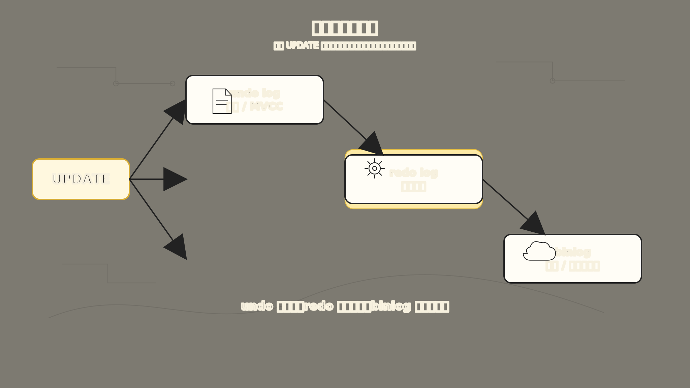
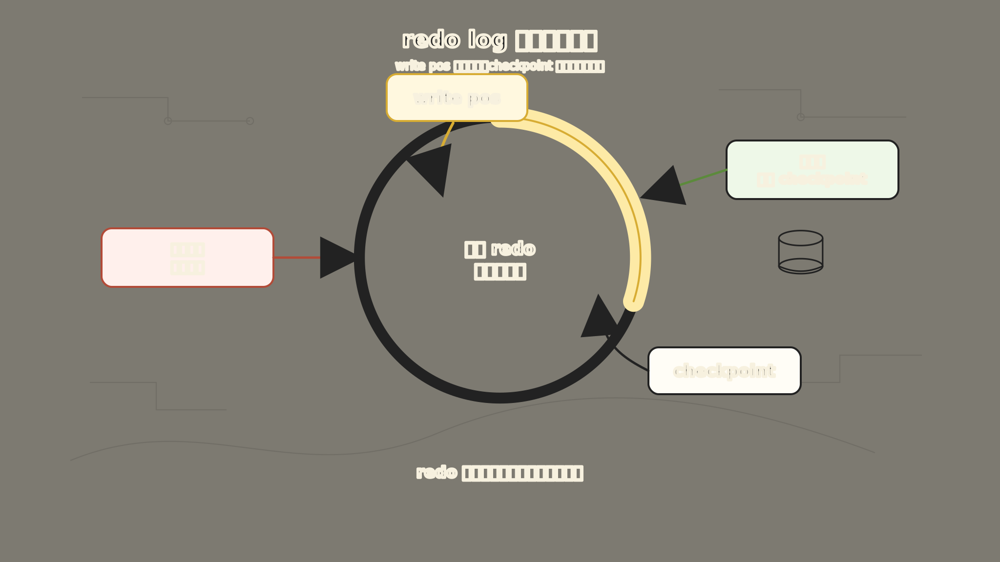

# MySQL 日志：为什么一次更新要写 undo、redo 和 binlog

用户支付成功了，订单状态也改成 `PAID` 了。结果 MySQL 突然宕机，重启后订单状态又变回了 `CREATED`。

这种问题就是“MySQL 日志”这个主题要解决的。很多人第一次学 MySQL 日志，会被三个名字绕晕：

```text
undo log
redo log
binlog
```

它们看起来都叫“日志”，但并不是三个平行的记事本。更准确地说，它们是在一条更新语句不断暴露问题时，一层一层长出来的机制。

这篇文章只回答一个问题：

**当 MySQL 执行一次更新时，为什么不能只改数据页，还要写这么多日志？**

为了让这件事更具体，我们继续用订单表做例子：

```sql
CREATE TABLE orders (
  id BIGINT PRIMARY KEY,
  user_id BIGINT NOT NULL,
  status VARCHAR(20) NOT NULL,
  created_at DATETIME NOT NULL,
  amount DECIMAL(10, 2) NOT NULL
) ENGINE=InnoDB;
```

现在有一笔订单，原来还是未支付：

```text
id = 1001, status = 'CREATED'
```

用户支付成功后，业务执行：

```sql
UPDATE orders
SET status = 'PAID'
WHERE id = 1001;
```

从业务角度看，这只是把一个字段从 `CREATED` 改成 `PAID`。但从数据库角度看，它至少要回答三个问题：

1. 如果事务中途失败，能不能撤回到旧状态？
2. 如果 MySQL 刚改完内存就宕机，重启后能不能找回新状态？
3. 如果还有从库、备份和恢复，别的机器怎么知道这次改动？

这三个问题，分别引出了 `undo log`、`redo log` 和 `binlog`。



上图展示了三种日志各自解决的问题。undo log 回答"后悔了怎么办"，支持回滚和 MVCC 旧版本。redo log 回答"崩溃了怎么办"，用 WAL 思想保证崩溃后能恢复。binlog 回答"从库怎么跟上"，支持主从复制和时间点恢复。一次 UPDATE，三条日志都要写，但各自服务的目标不同。

## 一、先从最朴素的更新开始

一条更新语句大体会经过 Server 层和 InnoDB 层。

Server 层负责解析 SQL、优化执行计划、调用存储引擎接口。InnoDB 层真正找到那一行记录，并修改对应的数据页。

如果我们把过程简化一下，大概是这样：

```text
执行器找到 id = 1001 的记录
-> InnoDB 把这条记录所在的数据页读入 Buffer Pool
-> 在内存页里把 status 从 CREATED 改成 PAID
-> 后台线程以后再把脏页刷回磁盘
```

这里马上出现一个很现实的问题：MySQL 为了性能，不会每次更新都立刻把数据页刷回磁盘。

InnoDB 的数据页通常先在 Buffer Pool 里被修改。这个内存页和磁盘页不一致时，就叫脏页。脏页以后会在合适时机刷盘，而不是每次提交都同步刷盘。

这样做能让写入快很多，但也带来了两个风险：

- 事务失败时，内存里已经改过的东西怎么撤回来？
- 机器宕机时，内存里的脏页还没落盘怎么办？

日志的故事，就从这两个风险开始。

## 二、undo log：先给自己留一条退路

先看第一个问题。

假设一个事务里不只更新订单状态，还要更新账户余额、写支付流水。前两步成功了，第三步失败了。这个事务应该整体失败，订单状态也应该回到原来的 `CREATED`。

但如果 MySQL 已经把内存里的记录改成了：

```text
id = 1001, status = 'PAID'
```

它怎么知道原来是什么？

答案是：**改之前先记旧值。**

这就是 `undo log` 出现的原因。它不是为了记录“我做了什么”，而是为了记录“如果我要撤销，应该怎么反着做”。

对于这条更新：

```sql
UPDATE orders
SET status = 'PAID'
WHERE id = 1001;
```

InnoDB 在真正修改记录前，需要把旧值保存下来：

```text
id = 1001, old status = 'CREATED'
```

如果事务回滚，就可以根据这份信息把记录改回去：

```text
PAID -> CREATED
```

不同操作的 undo 信息不一样：

- `INSERT` 的反向操作是删除刚插入的记录。
- `DELETE` 的反向操作是把删除前的记录插回去。
- `UPDATE` 的反向操作是把被更新列恢复成旧值。

所以 `undo log` 解决的第一件事是事务的原子性：一个事务要么全部成功，要么失败后像没发生过一样。

但 `undo log` 还有第二个用处：MVCC。

在 InnoDB 里，一条记录被多次更新后，不只是简单覆盖。记录里会有隐藏的事务信息，并通过 `roll_pointer` 指向历史版本。普通快照读如果不能直接看到当前版本，就可以顺着 undo 版本链往回找，找到对当前事务可见的旧版本。

可以这样记：

```text
undo log 主要记旧值。
旧值可以用来回滚，也可以用来服务快照读。
```

它解决了“能不能撤回”的问题。

但它还没有解决“已经提交的更新，宕机后不能丢”的问题。

## 三、redo log：先写日志，再慢慢刷数据页

现在看第二个问题。

假设订单状态已经从 `CREATED` 改成了 `PAID`，事务也提交了。可是这个修改只发生在 Buffer Pool 的内存页里，还没来得及刷回磁盘。

这时机器突然断电。

内存没了，磁盘上的数据页还是旧的：

```text
id = 1001, status = 'CREATED'
```

那用户明明已经支付成功，数据库重启后却看不到 `PAID`，这就不能接受。

一种直觉做法是：每次提交都立刻把数据页刷盘。但这会很慢。因为数据页分散在磁盘不同位置，直接刷数据页常常是随机写。数据库写入量一大，性能会被拖垮。

于是 InnoDB 换了一个思路：

**数据页可以晚点刷，但这次修改必须先写到一份顺序追加的日志里。**

这就是 `redo log`。

`redo log` 记录的是“某个数据页上发生了什么修改”。它偏物理，关心的是页、偏移量、修改内容，而不是面向业务的 SQL 语句。

对我们的例子来说，可以粗略理解成：

```text
某个表空间的某个数据页里，
id = 1001 这条记录相关位置，
status 被改成了 PAID。
```

实际 redo 记录当然比这更底层，但理解到这里就够了。

有了 `redo log`，提交时就不必等数据页立刻落盘。只要 redo log 已经安全落盘，MySQL 即使崩溃，也能在重启时重放 redo，把没来得及刷盘的数据页恢复出来。

这个思想叫 WAL（Write-Ahead Logging，先写日志再写数据页的持久化策略）。

它带来两个好处：

第一，保证持久性。只要事务提交时 redo log 已经落盘，已提交的数据在崩溃恢复后就不应该丢。

第二，把很多随机写变成顺序写。直接刷数据页往往要在很多位置来回写；写 redo log 则更接近顺序追加。顺序写通常比随机写友好得多。

可以这样记：

```text
redo log 主要记新修改。
它让 InnoDB 可以先改内存页，再靠日志保证崩溃恢复。
```

## 四、redo log 不是无限记账本

这里要补一个边界：`redo log` 不是用来做长期备份的。

它更像一块循环使用的恢复区。

InnoDB 会不断写入 redo，同时后台线程把脏页刷回磁盘。某个脏页一旦已经安全写入数据文件，对应的 redo 记录就不再是崩溃恢复必需品，后续可以被覆盖。



上图展示了 redo log 的循环结构。`write pos` 不断向前写新日志，`checkpoint` 标记已经安全刷盘、可以被覆盖的位置。两者之间的黄色区域是活跃的 redo，对应还没刷盘的脏页。如果写入太快，`write pos` 快追上 `checkpoint`，MySQL 就要停下来推进 checkpoint，把更多脏页刷到磁盘。

可以把它想成一个环：

```text
write pos 继续向前写新的 redo
checkpoint 之前的 redo 已经没用了，可以释放
checkpoint 后面的 redo 还对应未完全落盘的脏页
```

如果写入太快，脏页刷盘太慢，`write pos` 追上 `checkpoint`，redo 空间不够了，MySQL 就要停下来推进 checkpoint，把更多脏页刷到磁盘，腾出 redo 空间。

这也是为什么 redo log 容量太小会影响写入性能。它会让 InnoDB 更频繁地 checkpoint，更频繁地刷脏页。

但是不管 redo 空间多大，它都不是“恢复到任意历史时刻”的工具。

如果你误删了整张表，不能指望 redo log 帮你回到昨天。redo log 的核心目标是崩溃恢复，不是历史归档。

那谁负责历史归档、主从复制、时间点恢复？

这就轮到 `binlog` 了。

## 五、binlog：让 Server 层也留一份变更历史

前面的 `undo log` 和 `redo log` 都是 InnoDB 的日志。

但 MySQL 不只有 InnoDB。MySQL 的 Server 层还需要一份更通用的变更日志，用来记录数据库发生过哪些修改。

这就是 `binlog`（二进制日志，Server 层记录数据变更事件的日志，用于复制和恢复）。

`binlog` 记录的是会修改数据库结构或数据的事件，比如：

```sql
UPDATE orders SET status = 'PAID' WHERE id = 1001;
ALTER TABLE orders ADD COLUMN pay_time DATETIME;
DELETE FROM orders WHERE id = 1001;
```

普通 `SELECT` 不修改数据，一般不会写入 binlog。

它主要解决两个问题。

第一个是主从复制。

主库执行了一次更新，从库也要知道这次更新。主库把变更写入 binlog，从库拉取 binlog，写入自己的 relay log，再回放这些事件，最终得到和主库相同的数据变化。

简化成链路就是：

```text
主库写 binlog
-> 从库拉取 binlog
-> 从库写 relay log
-> 从库回放 relay log
-> 从库数据跟着变化
```

第二个是时间点恢复。

如果你有一份凌晨 0 点的全量备份，又保留了 0 点之后的 binlog，那么理论上可以先恢复全量备份，再按顺序重放 binlog，把数据库推进到某个时间点。

这就是为什么误删数据时，大家关心的是备份和 binlog，而不是 redo log。

`binlog` 和 `redo log` 的区别可以这样记：

```text
redo log 是 InnoDB 的崩溃恢复日志，偏物理，循环写。
binlog 是 Server 层的变更归档日志，偏逻辑/事件，追加写。
```

它们看起来都在记录更新，但服务对象不同。

`redo log` 关心的是：这台 MySQL 崩了以后，InnoDB 自己能不能恢复。

`binlog` 关心的是：别的系统、从库、备份恢复流程，能不能知道这台 MySQL 发生过什么变化。

## 六、binlog 有三种常见格式

`binlog` 不是只有一种记法。常见格式有三类：`STATEMENT`、`ROW`、`MIXED`。

`STATEMENT` 记录 SQL 语句本身：

```sql
UPDATE orders SET status = 'PAID' WHERE id = 1001;
```

它的优点是日志比较小，缺点是某些语句在主库和从库执行结果可能不一致。比如 SQL 里用了 `NOW()`、`UUID()` 这类动态函数，主库执行时的值和从库回放时的值可能不同。

`ROW` 记录行变化后的结果。它不依赖从库重新计算 SQL 的结果，因此复制更可靠。缺点是更新很多行时，binlog 会更大。

`MIXED` 则是在两者之间折中，MySQL 根据情况选择语句模式或行模式。

实际生产里，行模式很常见，因为复制正确性通常比日志省一点空间更重要。

## 七、为什么有了 redo log，还要两阶段提交

现在三个日志都有了：

```text
undo log：方便回滚和 MVCC
redo log：保证 InnoDB 崩溃恢复
binlog：支持复制、归档和时间点恢复
```

但这里还有一个隐藏问题。

一次事务提交时，`redo log` 和 `binlog` 都要写。如果其中一个成功，另一个失败，会怎样？

还是这条语句：

```sql
UPDATE orders
SET status = 'PAID'
WHERE id = 1001;
```

假设 redo log 已经写好了，binlog 还没写，MySQL 崩溃。

重启后，InnoDB 根据 redo log 把订单恢复成 `PAID`。但 binlog 里没有这次更新，从库就不会回放这次修改。于是主库是 `PAID`，从库还是 `CREATED`。

反过来也危险。

假设 binlog 已经写好了，redo log 还没完成，MySQL 崩溃。重启后主库可能没有这次修改，但从库拿到 binlog 后却执行了这次修改。主从仍然不一致。

所以问题变成：

**redo log 和 binlog 必须像一个整体一样提交，要么都算成功，要么都不算成功。**

MySQL 用两阶段提交解决这个问题。



上图展示了两阶段提交的完整流程。关键是中间的 `prepare` 状态。崩溃发生后，InnoDB 会检查 binlog 是否存在来决定提交还是回滚，确保主库恢复状态和 binlog 传播出去的结果一致。

简化过程如下：

```text
1. redo log 写入 prepare 状态
2. 写 binlog，并把 binlog 刷盘
3. redo log 写入 commit 状态
```

这里的关键是中间那个 `prepare` 状态。

如果崩溃发生在 redo prepare 之后、binlog 写入之前，重启恢复时发现 binlog 里没有对应事务，就回滚。

如果崩溃发生在 binlog 写入之后、redo commit 之前，重启恢复时发现 binlog 里已经有对应事务，就提交。

所以两阶段提交不是多此一举，它是在回答这个问题：

**主库自己的崩溃恢复结果，必须和 binlog 能传播出去的结果一致。**

否则单机看起来恢复成功了，整个复制体系却乱了。

## 八、把一次 UPDATE 串起来

现在我们可以把整条链路重新走一遍。

执行：

```sql
UPDATE orders
SET status = 'PAID'
WHERE id = 1001;
```

大致会发生这些事：

```text
1. Server 层解析 SQL，优化执行计划。
2. 执行器调用 InnoDB，通过主键索引找到 id = 1001 的记录。
3. 如果数据页不在 Buffer Pool，先从磁盘读入内存。
4. InnoDB 修改前先写 undo log，记住旧值 CREATED。
5. InnoDB 在 Buffer Pool 中修改记录，把 status 改成 PAID，数据页变成脏页。
6. InnoDB 生成 redo log，记录这次页修改，用于崩溃恢复。
7. Server 层生成 binlog 事件，用于复制和恢复。
8. 提交事务时，通过两阶段提交协调 redo log 和 binlog。
9. 事务提交后，脏页不一定马上刷盘，后续由后台线程写回数据文件。
```

这时再看三个日志，就不乱了：

```text
undo log：我后悔了，怎么回去？
redo log：我提交了，崩了怎么找回来？
binlog：我改过了，别人怎么跟上？
```

## 九、几个容易混淆的边界

`undo log` 不是“反向 SQL 日志”。

它记录的是 InnoDB 回滚所需的信息，并参与构造历史版本。你不应该把它理解成可以随便拿出来重放的业务操作历史。

`redo log` 不是备份。

它是崩溃恢复机制的一部分。它会随着 checkpoint 推进被循环覆盖。误删数据时，redo log 通常不是你的救命绳。

`binlog` 不是 InnoDB 独有日志。

它属于 MySQL Server 层，服务于复制、归档和时间点恢复。不同存储引擎都可以通过 Server 层写 binlog。

`Buffer Pool` 不是日志，但它是理解日志的前提。

如果每次更新都直接刷数据页，redo log 的意义会弱很多。正因为 InnoDB 先改内存页、延迟刷脏页，redo log 才成为性能和可靠性之间的关键折中。

两阶段提交不是分布式系统课里的遥远概念。

在 MySQL 内部，它就在协调 Server 层的 binlog 和 InnoDB 的 redo log。它保证单机恢复、主从复制、时间点恢复看到的是同一条事务历史。

## 十、最后用一句话记住

MySQL 的日志不是为了“多记几份”，而是因为一次更新同时面对三种不同风险：

```text
事务失败风险 -> undo log
机器崩溃风险 -> redo log
复制与恢复风险 -> binlog
```

如果只记旧值，能回滚，但提交后宕机可能丢。

如果只记 redo，能崩溃恢复，但从库和备份系统不知道发生过什么。

如果只记 binlog，能复制和归档，但 InnoDB 自己无法高效地做崩溃恢复。

所以一次看似简单的更新，背后其实是三套问题的交汇：

```text
先留退路
-> 再保证崩溃能回来
-> 最后把变化交给整个 MySQL 生态
```

这就是 `undo log`、`redo log` 和 `binlog` 同时存在的原因。

