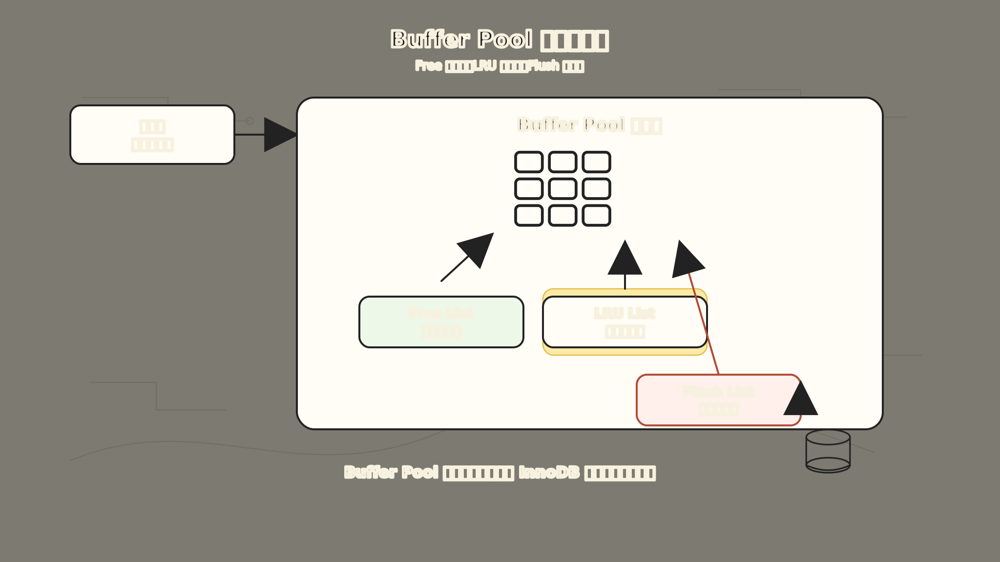
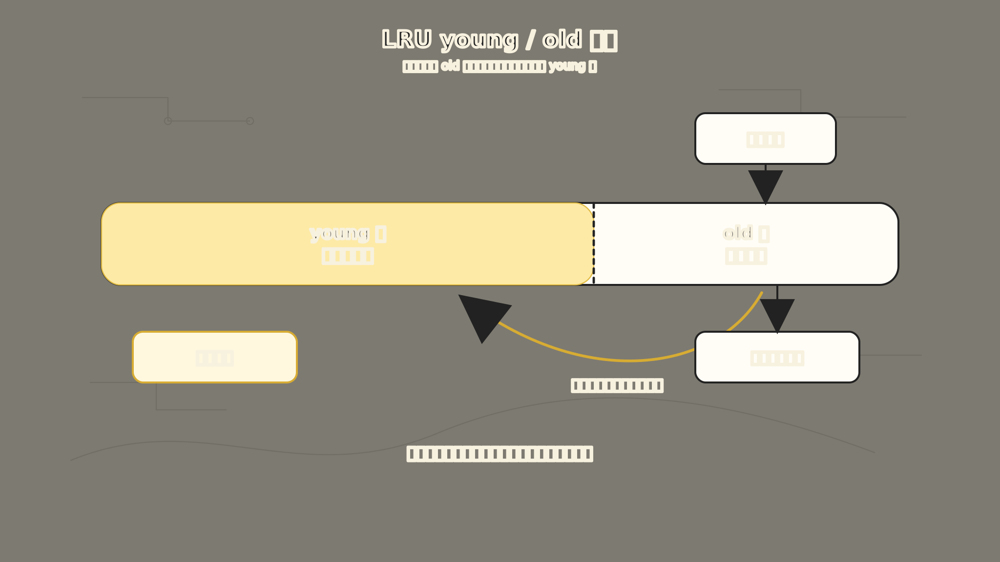

# MySQL Buffer Pool：为什么 InnoDB 不直接读写磁盘

你查一条记录，MySQL 真的去磁盘里找了。但问题是，如果每次查一行都读磁盘，数据库早就被 I/O 拖死了。

很多人第一次听到 Buffer Pool，会把它理解成一句话：

> Buffer Pool 就是 MySQL 的缓存。

这句话不算错，但它太短了，短到容易让人误会。

Buffer Pool 不是简单地把“某一行记录”放进内存里，也不是只服务查询的缓存。它真正解决的是一个更底层的问题：

**MySQL 的数据在磁盘上，但 SQL 的执行不能每次都老老实实去磁盘读写。**

如果每次查一行都读磁盘、每次改一行都立刻写磁盘，数据库就会被磁盘 I/O 拖住。Buffer Pool 出现，就是为了把 InnoDB 的核心工作从“频繁读写磁盘”变成“尽量在内存页上操作，再用日志和后台刷盘兜底”。

为了让这篇文章更好懂，我们固定一个例子：

```sql
CREATE TABLE account (
  id BIGINT PRIMARY KEY,
  name VARCHAR(50) NOT NULL,
  balance DECIMAL(10, 2) NOT NULL
) ENGINE=InnoDB;
```

假设现在经常查询和更新这条记录：

```sql
SELECT * FROM account WHERE id = 1;

UPDATE account
SET balance = balance - 100
WHERE id = 1;
```

Buffer Pool 的故事，就从这条记录为什么不能“直接从磁盘来、直接写回磁盘”开始。

## 一、先把“页”这件事接上

前面讲索引时已经提过：InnoDB 不是按“一行一行”来和磁盘打交道，而是按“页”来读写。

放到 Buffer Pool 这篇里，只需要抓住和缓存最相关的一点：InnoDB 默认数据页是 `16KB`。当你查询 `id = 1` 这条记录时，InnoDB 不是只把这一行搬进内存，而是把这条记录所在的整个数据页读进来。

这件事把索引和 Buffer Pool 接到了一起：索引负责定位页，Buffer Pool 负责让这些页尽量留在内存里。页进了内存以后，InnoDB 再在页内找到具体记录。

所以，Buffer Pool 缓存的基本单位不是一行记录，而是一个个页：

```text
磁盘上的数据页
-> 读入 Buffer Pool
-> 在内存页里查找或修改记录
-> 必要时再把修改后的页刷回磁盘
```

这就是理解 Buffer Pool 的第一把钥匙：

**Buffer Pool 是页缓存，不是行缓存。**

## 二、为什么读数据会变快

现在回到这条查询：

```sql
SELECT * FROM account WHERE id = 1;
```

如果 `id = 1` 所在的数据页已经在 Buffer Pool 里，InnoDB 就可以直接从内存页里找这条记录，不需要再读磁盘。

如果这个页不在 Buffer Pool 里，InnoDB 才需要从磁盘把页读进来，放到 Buffer Pool 里，然后再返回记录。

于是同一条热点数据被反复访问时，路径会变成这样：

```text
第一次查询：磁盘 -> Buffer Pool -> 返回记录
后续查询：Buffer Pool -> 返回记录
```

这就是 Buffer Pool 提升读性能的直观原因。

但这里有一个容易忽略的点：Buffer Pool 的收益不只来自“这一次查得快”，还来自“附近的数据可能也被顺手带进来了”。

因为一个页里通常不止一条记录。你查询 `id = 1` 时，InnoDB 把整个页读进来，后面如果又查这个页里的其他记录，也可能直接命中内存。

这也是为什么这里还要把“页”再接一下：它是索引、磁盘 I/O 和内存缓存之间的共同语言。

## 三、为什么写数据也会变快

Buffer Pool 更有意思的地方在写操作。

比如这条更新：

```sql
UPDATE account
SET balance = balance - 100
WHERE id = 1;
```

如果没有 Buffer Pool，一个最朴素的想法是：

```text
找到磁盘上的记录
-> 修改
-> 立刻写回磁盘
```

这个想法很安全，但性能会很差。因为随机写磁盘很贵，如果每改一条记录都同步写回磁盘，数据库吞吐量会被严重限制。

有了 Buffer Pool 后，InnoDB 会先在内存页里修改记录。这个页一旦被改过，就变成了脏页。

脏页的意思很朴素：

**内存里的这个页已经是新数据，磁盘上的那个页还是旧数据，两边暂时不一致。**

这时 InnoDB 不会立刻把脏页刷回磁盘，而是让后台线程在合适的时机批量刷盘。

路径变成：

```text
在 Buffer Pool 里修改页
-> 标记为脏页
-> 先不急着写数据页
-> 后台线程择机刷回磁盘
```

这就是 Buffer Pool 提升写性能的关键：把很多零散的同步写，变成更可控的延迟写和批量写。

## 四、脏页还没刷盘，宕机了怎么办

到这里，读者通常会冒出一个很自然的问题：

**如果脏页还没来得及刷盘，MySQL 突然宕机，数据不就丢了吗？**

这个问题正好把 Buffer Pool 和日志篇里的 redo log 连起来。

这里不再展开 redo log 的完整机制，只抓住一句话：InnoDB 采用 WAL，数据页可以晚点刷，但提交所需的 redo 要先按规则写好。只要 redo 还在，即使脏页没来得及落盘，MySQL 重启后也能把修改恢复出来。

所以一次更新大致可以这样理解：

```text
1. 把记录所在的数据页读入 Buffer Pool
2. 在 Buffer Pool 中修改记录
3. 把这个页标记为脏页
4. 写 redo log，保证崩溃后能重放修改
5. 事务提交
6. 后台线程稍后把脏页刷回磁盘
```

所以 Buffer Pool 不能脱离 redo log 来理解。一句话说：

**Buffer Pool 解决性能问题，redo log 解决延迟刷盘带来的崩溃恢复问题。**

## 五、Buffer Pool 里不只有数据页

到这里，我们可以给 Buffer Pool 一个更完整的说法：

**Buffer Pool 是 InnoDB 在内存中维护的一片缓存区域，用来缓存数据页、索引页、undo 页等结构，并配合链表管理空闲页、脏页和冷热页。**

它不只是一个大数组，也不是简单的 `key -> value` 缓存。

InnoDB 为 Buffer Pool 里的每个缓存页都维护了控制块。控制块可以理解成页的身份证，里面会记录这个页属于哪个表空间、页号是多少、缓存页地址在哪里、它挂在哪些链表上。

有了控制块，InnoDB 才能高效管理这些页。



上图展示了 Buffer Pool 的核心管理结构。最上层是 Free List，管理空闲缓存页，新页从磁盘读入时从这里找位置。中间是 LRU List，管理已被使用的页，区分 young 区和 old 区。最下层是 Flush List，管理脏页，后台线程从这里找需要刷回磁盘的页。左侧的控制块是每个缓存页的管理元数据。

最核心的三类链表是：

- `Free List`：管理空闲页。需要从磁盘读入新页时，先从这里找可用位置。
- `Flush List`：管理脏页。后台刷盘时，可以从这里找到需要写回磁盘的页。
- `LRU List`：管理已经被使用的页。Buffer Pool 空间不够时，用它决定哪些页更适合被淘汰。

这三个链表回答了三个很实际的问题：

```text
哪里还有空位？ -> Free List
哪些页改过？   -> Flush List
哪些页该淘汰？ -> LRU List
```

所以，“Buffer Pool 是缓存”只是第一层理解。更准确地说，Buffer Pool 是 InnoDB 的内存页管理系统。

## 六、为什么不能用最简单的 LRU

既然 Buffer Pool 空间有限，就一定会遇到淘汰问题。

最容易想到的是 LRU（Least Recently Used，最近最少使用算法），也就是：

```text
最近访问的页放前面
很久没访问的页放后面
空间不够时，从后面淘汰
```

这个思路很自然，但 InnoDB 没有直接使用最朴素的 LRU，因为数据库场景里有两个麻烦。

第一个麻烦是预读失效。

MySQL 读某个页时，可能会根据局部性原理，提前把附近的页也读进 Buffer Pool。大多数时候这是好事，因为接下来可能真的会访问附近的数据。

但如果预读进来的页后面根本没被访问，它们就只是“路过的页”。如果这些页一进来就被放到 LRU 头部，就可能把真正的热点页挤走。

第二个麻烦是 Buffer Pool 污染。

比如执行一条需要全表扫描的 SQL：

```sql
SELECT *
FROM account
WHERE name LIKE '%li%';
```

如果这个查询没法用好索引，即使最终只返回几行，它也可能扫描大量数据页。

这些扫描页很可能只用一次。但如果它们因为“被访问了一次”就全部冲到 LRU 头部，原本反复使用的热点页就会被挤出去。等业务查询再次访问热点页时，又要重新读磁盘，性能就会突然抖一下。

所以 InnoDB 要解决的问题不是“有没有 LRU”，而是：

**怎样防止只访问一次的大量冷页，把真正的热页赶出 Buffer Pool？**

## 七、young 区和 old 区：给热数据设置门槛

InnoDB 的做法是改造 LRU，把它分成两个区域：

```text
young 区：更像真正的热点页区域
old 区：新读入、还没证明自己够热的页
```



上图展示了 InnoDB 的 LRU 分区设计。LRU 链表被 young 区和 old 区切开，比例约 5:3（由 `innodb_old_blocks_pct` 控制）。新读入的页先进入 old 区，只有在 old 区停留超过一定时间（`innodb_old_blocks_time`，默认约 1000ms）后再次被访问，才有资格进入 young 区。这个设计防止了预读失效和全表扫描污染热点页。

新读入 Buffer Pool 的页，不会一上来就进入 young 区头部，而是先进入 old 区。

这样，如果某个页只是预读进来，后面根本没人访问，它就会留在 old 区，比较容易被淘汰，不会污染 young 区。

但仅仅分 young 和 old 还不够。

因为全表扫描时，每个页都会被访问一次。如果“访问一次”就能进入 young 区，扫描页还是会把热点页挤掉。

所以 InnoDB 又加了一个时间门槛：页在 old 区被第一次访问后，只有停留超过一定时间，再次被访问时，才更有资格进入 young 区。

这个时间由 `innodb_old_blocks_time` 控制，常见默认值是 `1000ms`。old 区比例由 `innodb_old_blocks_pct` 控制，常见默认值是 `37`，也就是 LRU 里大约 3/8 的部分作为 old 区。

这个设计背后的判断很清楚：

```text
只被快速扫过一次的页：留在 old 区，尽快淘汰
短时间内反复被访问的页：有资格进入 young 区，留久一点
```

换句话说，InnoDB 不会轻易相信“刚被访问过”就等于“热点数据”。它要看这个页是不是经得起时间和重复访问的考验。

## 八、脏页什么时候刷回磁盘

脏页不能永远留在内存里，否则 redo log 会越积越多，Buffer Pool 也会越来越紧张。

常见触发脏页刷盘的时机有几类：

- redo log 空间紧张，需要推进 checkpoint，让旧日志可以被覆盖。
- Buffer Pool 空间不足，要淘汰一些页，如果淘汰的是脏页，就必须先刷盘。
- MySQL 比较空闲时，后台线程会刷一部分脏页。
- MySQL 正常关闭前，会尽量把脏页刷回磁盘。



上图展示了脏页刷盘的四类触发时机。正常路径是后台线程择机刷盘，但 redo log 空间紧张和 Buffer Pool 淘汰压力都可能“逼”着 InnoDB 提前刷盘。这也是排查偶发慢 SQL 时需要关注的点。

这也解释了一个常见现象：

**有些 SQL 平时很快，但偶尔会突然慢一下。**

原因不一定是这条 SQL 本身变复杂了，也可能是它刚好撞上了脏页刷盘、redo log checkpoint 或 Buffer Pool 淘汰压力。

所以排查 MySQL 抖动时，不能只盯着 SQL 文本，还要看 Buffer Pool 和 redo log 的状态。

## 九、调大 Buffer Pool 就一定好吗

既然 Buffer Pool 能缓存数据页，那是不是越大越好？

方向上是的：Buffer Pool 越大，热点数据越有机会留在内存里，磁盘 I/O 通常越少。MySQL 官方文档也建议，在专用数据库服务器上，可以把 Buffer Pool 设置到一个尽可能大的值，同时给操作系统和其他进程留下足够内存。

但这不等于无脑调满。

如果 Buffer Pool 抢走太多物理内存，操作系统开始频繁换页，数据库反而会变慢。更合理的做法是结合机器角色、数据规模和负载来调。

常见观察入口有：

```sql
SHOW ENGINE INNODB STATUS\G
```

重点可以看这些信息：

- `Buffer pool hit rate`：Buffer Pool 命中率。
- `Free buffers`：空闲页是否长期很少。
- `Modified db pages`：当前脏页数量。
- `Pending writes`：是否有等待刷盘的页。
- `Pages made young` / `not young`：LRU young/old 策略的效果。
- `Pages read ahead` / `evicted without access`：预读是否带来浪费。

调优时可以先抓住这个原则：

**Buffer Pool 调优不是把内存数字调大就结束，而是让热点页稳定留在内存里，同时让脏页刷盘不要形成明显尖峰。**

## 十、把 Buffer Pool 放回 MySQL 主线里

现在我们把整条链路收回来。

一条查询语句：

```sql
SELECT * FROM account WHERE id = 1;
```

大致会经历：

```text
通过索引定位数据页
-> 判断页是否在 Buffer Pool
-> 命中则直接读内存
-> 未命中则从磁盘读页进 Buffer Pool
-> 在页内找到记录
```

一条更新语句：

```sql
UPDATE account
SET balance = balance - 100
WHERE id = 1;
```

大致会经历：

```text
找到记录所在的数据页
-> 把页放入 Buffer Pool
-> 记录 undo log，方便回滚和 MVCC
-> 修改 Buffer Pool 中的数据页
-> 标记为脏页
-> 写 redo log，保证崩溃恢复
-> 后台择机把脏页刷回磁盘
```

所以 Buffer Pool 不是 MySQL 体系里孤立的一个名词。

它和索引、页、undo log、redo log、刷盘、崩溃恢复全都连在一起：

```text
索引负责定位页
Buffer Pool 负责把页留在内存里
undo log 负责回滚和历史版本
redo log 负责崩溃恢复
后台刷盘负责把脏页最终落回磁盘
```

## 总结

Buffer Pool 可以用一句话记住：

**它是 InnoDB 的内存页管理系统，让 MySQL 尽量在内存中读写数据页，再通过 redo log 和后台刷盘保证性能与可靠性。**

再展开一点：

- Buffer Pool 的基本单位是页，不是一行记录。
- 查询命中 Buffer Pool 时，可以少一次磁盘 I/O。
- 更新会先改内存页，把页标记为脏页，不会每次都立刻刷盘。
- redo log 让“脏页延迟刷盘”变得可靠。
- Free List 管空闲页，Flush List 管脏页，LRU List 管冷热淘汰。
- InnoDB 的 LRU 分 young/old 区，是为了减少预读失效和全表扫描带来的 Buffer Pool 污染。
- 偶发慢 SQL 可能和脏页刷盘、redo log checkpoint、Buffer Pool 空间压力有关。

学 Buffer Pool 最重要的不是背参数，而是建立这条主线：

```text
磁盘太慢
-> 以页为单位缓存到内存
-> 读命中就少读磁盘
-> 写操作先改内存页
-> 脏页延迟刷盘
-> redo log 兜住崩溃恢复
-> LRU 负责把真正热的数据留下来
```

理解了这条线，Buffer Pool 就不再是一个孤立的缓存概念，而是 InnoDB 把性能、内存、磁盘和可靠性揉在一起的核心机制。

