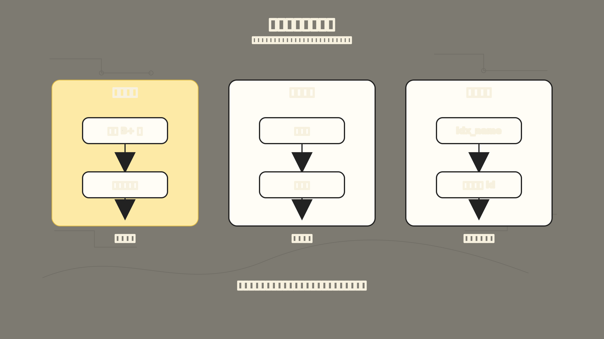
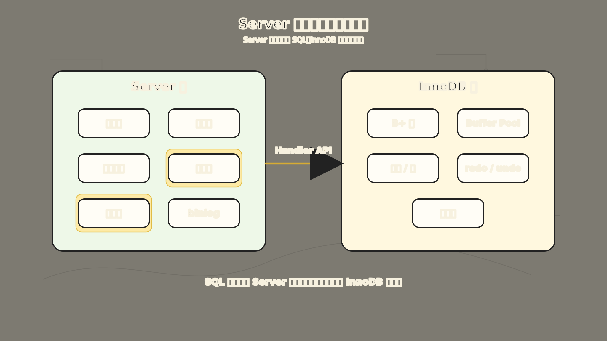

# MySQL 执行流程：一条 SQL 是怎么从文本变成结果的

你在客户端敲了一条 `SELECT`，0.5 秒后看到了结果。但这 0.5 秒里，MySQL 内部其实走了一条相当长的路。

很多人第一次学 MySQL 执行流程，会把它背成一串模块名：

```text
连接器
-> 查询缓存
-> 解析器
-> 预处理器
-> 优化器
-> 执行器
-> 存储引擎
```

这串名字当然重要，但如果只背名字，很容易产生一个误会：好像 MySQL 只是把 SQL 语句按流水线传一遍。

真实情况更有意思。

一条 SQL 在客户端看来只是一行文本，但 MySQL 不能直接拿这行文本去磁盘里找数据。它至少要先回答几个问题：

1. 这个客户端是谁，有没有权限？
2. 这句话是不是合法 SQL？
3. 里面的表和字段是否真的存在？
4. 如果有多种查询方式，哪一种成本更低？
5. 最终应该让哪个存储引擎去读哪一批数据？

所以 MySQL 执行流程真正解决的问题是：

**如何把一段 SQL 文本，变成一条可执行、可优化、可和存储引擎协作的数据读取路径。**

为了让这篇文章更好懂，我们固定一个例子：

```sql
CREATE TABLE product (
  id BIGINT PRIMARY KEY,
  name VARCHAR(100) NOT NULL,
  price DECIMAL(10, 2) NOT NULL,
  category_id BIGINT NOT NULL,
  KEY idx_name (name)
) ENGINE=InnoDB;
```

然后执行这条查询：

```sql
SELECT *
FROM product
WHERE id = 1;
```

从业务角度看，这是“查 id 为 1 的商品”。

从 MySQL 角度看，它要经历一条完整的路：


上图是一条 SQL 的完整旅程。从连接器确认身份，到解析器看懂语法，预处理器确认对象存在，优化器选最便宜的执行路径，执行器调用 InnoDB 接口，最后存储引擎从 B+ 树和数据页中把记录拿出来。

下面就沿着这条路，把一条 `SELECT` 语句走一遍。

## 一、故事要从客户端连接开始

MySQL 不是一个孤零零的函数调用。客户端想执行 SQL，第一步是先连上 MySQL 服务。

比如命令行里常见的连接方式是：

```bash
mysql -h127.0.0.1 -uroot -p
```

这一步背后先是网络连接。MySQL 基于 TCP 通信，所以客户端和服务端需要先建立 TCP 连接。连接建立之后，MySQL 的连接器开始工作。

连接器主要做三件事：

```text
建立连接
-> 校验用户名和密码
-> 读取并保存当前用户权限
```

这里有一个容易忽略的细节：权限是在连接建立时读出来并保存的。

也就是说，如果一个用户已经连上了 MySQL，管理员后来修改了这个用户的权限，已经存在的连接不会立刻感知到权限变化。只有重新建立的新连接，才会使用新的权限。

这也解释了为什么线上排查权限问题时，不能只看权限表现在是什么样，还要注意应用侧是否复用了旧连接。

连接建立后，如果客户端长时间不发 SQL，这个连接会变成空闲连接。可以用：

```sql
SHOW PROCESSLIST;
```

查看当前连接状态。

空闲连接不会无限期保留。MySQL 有 `wait_timeout` 参数控制空闲连接最长能活多久。超过时间后，服务端会主动断开连接。

所以连接器这一层解决的是第一个问题：

**MySQL 先确认“谁在说话”，再决定后面的 SQL 能不能继续执行。**

## 二、查询缓存为什么后来被删掉了

连接建立后，客户端就可以发送 SQL。

在 MySQL 8.0 之前，`SELECT` 查询可能会先经过查询缓存。查询缓存的想法很直观：

```text
把 SQL 文本当 key
把查询结果当 value
如果下一次一模一样的 SQL 又来了，就直接返回缓存结果
```

听起来很美好，但它有一个致命问题：数据库里的数据会变。

只要某张表发生更新，和这张表相关的查询缓存就会失效。对于更新频繁的业务表来说，缓存刚放进去，可能马上就因为一次写操作被清掉。

这会带来两个尴尬结果：

- 命中率低，真正能复用的机会不多。
- 维护缓存本身也有成本，反而拖慢系统。

所以 MySQL 8.0 已经移除了 Server 层的查询缓存。

这里要先区分清楚：

**查询缓存不是 Buffer Pool。**

查询缓存缓存的是“某条 SQL 的结果集”，属于 Server 层的旧机制。

Buffer Pool 缓存的是 InnoDB 的数据页，属于存储引擎层的核心机制。前者在 MySQL 8.0 被删除，后者仍然是 InnoDB 性能的基础。

因此，在今天理解 MySQL 执行流程时，可以把查询缓存当作历史知识：

```text
MySQL 8.0 之前：连接器 -> 查询缓存 -> 解析器 ...
MySQL 8.0 之后：连接器 -> 解析器 -> 预处理器 ...
```

## 三、解析器：先把 SQL 文本看懂

跳过查询缓存后，MySQL 面对的仍然是一段文本：

```sql
SELECT *
FROM product
WHERE id = 1;
```

这段文本对人很好懂，但机器不能靠“看起来差不多”理解它。MySQL 必须先把它拆开。

解析器主要做两类工作。

第一类是词法分析（Lexical Analysis，将文本拆成关键字、标识符等词法单元的过程）。

它会识别出这段文本里的关键元素：

```text
SELECT：查询关键字
*：查询所有列
FROM：指定数据来源
product：表名
WHERE：过滤条件
id：字段名
= 1：比较条件
```

第二类是语法分析（Syntax Analysis，检查词法单元组合是否符合 SQL 语法规则的过程）。

它会检查这段 SQL 是否符合 MySQL 的语法规则。比如你把 `FROM` 写成 `FORM`：

```sql
SELECT *
FORM product
WHERE id = 1;
```

解析器就会在这一层报语法错误。

但这里有一个非常重要的边界：

**解析器主要判断语法是否正确，不负责确认表和字段是否真的存在。**

也就是说，下面这条 SQL 语法上是成立的：

```sql
SELECT *
FROM not_exists_table;
```

它的问题不是“语法错了”，而是“表不存在”。这类问题会在后面的预处理阶段继续检查。

所以解析器解决的是第二个问题：

**MySQL 先把 SQL 从一段字符串，变成后续模块能理解的结构。**

## 四、预处理器：确认表、字段和星号

解析完成后，MySQL 已经知道这是一条查询语句，也知道里面写了哪个表、哪个字段、什么条件。

但它还要继续确认：

```text
product 表是否存在？
id 字段是否存在？
SELECT * 里的 * 到底代表哪些列？
```

这些工作由预处理器完成。

比如：

```sql
SELECT *
FROM test;
```

如果 `test` 表不存在，MySQL 会在这个阶段报出类似错误：

```text
Table 'xxx.test' doesn't exist
```

再比如：

```sql
SELECT not_exists_column
FROM product;
```

如果 `not_exists_column` 字段不存在，也会在这个阶段被发现。

预处理器还会把：

```sql
SELECT *
FROM product;
```

里的 `*` 展开成实际列：

```sql
SELECT id, name, price, category_id
FROM product;
```

这一步看起来不起眼，但它让后面的优化器和执行器知道：最终到底要取哪些列。

所以预处理器解决的是第三个问题：

**这条 SQL 不只是语法要对，还要能落到真实的数据对象上。**

## 五、优化器：同一个结果，可能有很多条路

通过预处理后，SQL 已经合法，表和字段也都存在。

接下来 MySQL 面临一个更关键的问题：

**怎么查最划算？**

对这条语句来说：

```sql
SELECT *
FROM product
WHERE id = 1;
```

因为 `id` 是主键，优化器很容易判断：直接走主键索引最合适。

但实际查询往往没有这么简单。

比如：

```sql
SELECT *
FROM product
WHERE name = 'iPhone';
```

如果 `name` 上有索引，MySQL 可以考虑走 `idx_name`。

如果没有索引，MySQL 可能只能全表扫描：

```text
从第一行开始读
-> 判断 name 是否等于 iPhone
-> 不符合就跳过
-> 一直读到最后一行
```

再比如：

```sql
SELECT id
FROM product
WHERE name = 'iPhone';
```

如果 `idx_name` 是二级索引，InnoDB 的二级索引叶子节点里本来就保存了 `name` 和对应的主键 `id`。这时查询只要返回 `id`，可能不需要回表读取整行，这就是覆盖索引的机会。

优化器要做的事情，就是根据统计信息、索引情况、查询条件和返回列，估算不同方案的成本，然后选择一个执行计划。

可以用 `EXPLAIN` 看优化器选择了什么：

```sql
EXPLAIN
SELECT *
FROM product
WHERE id = 1;
```

重点先看几个字段：

- `type`：访问类型，比如 `const`、`ref`、`range`、`ALL`。一般来说，`ALL` 表示全表扫描，成本通常更高。
- `key`：实际使用了哪个索引。如果是 `NULL`，说明没有使用索引。
- `rows`：优化器估算需要扫描多少行。
- `Extra`：额外信息，比如 `Using index`、`Using index condition`。

这里要记住一个边界：

**优化器不是证明数学最优，而是基于统计信息估算一个相对划算的执行计划。**

统计信息不准、索引设计不合理、条件写法破坏索引，都可能让优化器选择的路线和你预期不同。

所以优化器解决的是第四个问题：

**同样是拿到结果，MySQL 要先决定走哪条访问路径。**

## 六、执行器：按计划向存储引擎要数据

优化器选好执行计划后，真正开始干活的是执行器。

执行器位于 Server 层。它自己不直接管理 InnoDB 的 B+ 树和数据页，而是按照执行计划调用存储引擎接口，让存储引擎去读记录。

可以把执行器理解成一个调度者：

```text
优化器给出计划
-> 执行器按计划调用引擎接口
-> 存储引擎返回一行或一批记录
-> 执行器继续判断条件、组织结果
-> 返回给客户端
```

接下来用三种典型访问方式，把执行器和 InnoDB 的协作看清楚。



上图展示了同一条 SQL 可能走的三种不同路径。主键查询走 B+ 树直达叶子页，最快。全表扫描要逐行判断，最慢。二级索引查询需要先找到主键，再回主键索引取整行，多走一步。优化器的工作就是评估这三条路的成本，选最划算的一条。

## 七、主键索引查询：最快的直达路线

先看最简单的语句：

```sql
SELECT *
FROM product
WHERE id = 1;
```

因为 `id` 是主键，且是等值查询，优化器通常会选择主键索引查询。

执行流程可以简化成：

```text
执行器：我要 id = 1 的第一条记录
-> InnoDB：沿着主键 B+ 树定位到对应叶子页
-> InnoDB：在页内找到 id = 1 的记录
-> InnoDB：把整行记录返回给执行器
-> 执行器：判断 WHERE 条件满足
-> 执行器：把结果返回客户端
```

因为主键唯一，`id = 1` 最多只有一条记录。InnoDB 找到这一条之后，再往后读时就会知道没有更多记录，查询结束。

这里可以和索引那篇连起来理解：

主键索引的叶子节点保存整行数据，所以通过主键索引找到叶子节点后，就已经拿到了完整记录，不需要再回表。

这条路径很短：

```text
Server 层确认执行计划
-> InnoDB 主键 B+ 树定位
-> 返回整行
```

这就是为什么主键等值查询通常很快。

## 八、全表扫描：没有路标时只能一行行看

再看另一条查询：

```sql
SELECT *
FROM product
WHERE category_id = 3;
```

假设 `category_id` 上没有索引，优化器很可能只能选择全表扫描。

全表扫描不是“出错”，而是一种访问路径。只是它比较笨重：

```text
执行器：给我表里的第一条记录
-> InnoDB：返回第一条记录
-> 执行器：判断 category_id 是否等于 3
-> 符合就返回客户端，不符合就跳过
-> 执行器：给我下一条记录
-> InnoDB：返回下一条记录
-> 重复直到表被读完
```

这里有一个细节值得注意：

**执行器和存储引擎的交互，很多时候是按记录逐步推进的。**

客户端最后看到的结果像是“一次性出来一张表”，但 MySQL 内部是在不断读记录、判断条件、发送结果。

全表扫描慢的根源也在这里。

如果表有 100 行，扫一遍没什么。如果表有 1000 万行，每次查询都要大量读取数据页，再一行行判断条件，成本就会非常高。

所以索引解决的核心问题不是“凭空加速”，而是让执行器不用向存储引擎索要那么多无关记录。

## 九、二级索引和回表：把索引篇的概念放进执行链路

现在看这条查询：

```sql
SELECT *
FROM product
WHERE name = 'iPhone';
```

`name` 上有二级索引 `idx_name`，优化器可能选择这个索引。对执行器来说，关键在于二级索引叶子节点保存的是：

```text
二级索引列的值 + 对应主键值
```

所以在执行阶段，通过 `idx_name` 找到 `name = 'iPhone'` 后，InnoDB 只拿到了对应的主键 `id`，还没有拿到完整的 `price`、`category_id` 等列。

索引篇已经讲过回表。放到执行流程里看，回表就是执行器按二级索引路径拿到主键后，InnoDB 还要再走一次主键索引，把整行取出来：

**二级索引先找到主键，主键索引再找到整行。**

路径变成：

```text
通过 idx_name 找到 name = 'iPhone' 的二级索引记录
-> 拿到对应主键 id
-> 用 id 回到主键索引查询整行
-> 返回给执行器
```

这解释了一个常见现象：用了二级索引，不代表一定很快。命中记录很多、每条都要回表时，成本仍然可能很高。

反过来，如果查询只要二级索引里已经包含的列：

```sql
SELECT id
FROM product
WHERE name = 'iPhone';
```

那么二级索引叶子节点里已经有 `id`，就不需要回表。执行计划里的 `Extra` 如果出现 `Using index`，通常说明查询可以直接从索引中拿到需要的数据。

## 十、索引下推：把过滤提前到引擎层

索引下推在索引篇里已经解释过。这里换个角度，看它在 Server 层和 InnoDB 之间解决了什么协作问题。

假设有一张用户表：

```sql
CREATE TABLE user_profile (
  id BIGINT PRIMARY KEY,
  age INT NOT NULL,
  reward INT NOT NULL,
  nickname VARCHAR(100) NOT NULL,
  KEY idx_age_reward (age, reward)
) ENGINE=InnoDB;
```

现在查询：

```sql
SELECT *
FROM user_profile
WHERE age > 20
  AND reward = 100000;
```

联合索引是 `(age, reward)`。在这条访问路径里，`age > 20` 先确定一段索引范围；后面的 `reward` 未必还能继续参与精确定位，但它仍然留在索引记录里，供引擎提前判断。

如果没有索引下推，执行过程可能是：

```text
InnoDB 找到一条 age > 20 的二级索引记录
-> 立刻回表拿整行
-> Server 层判断 reward 是否等于 100000
-> 不符合就丢掉
-> 继续下一条
```

问题是：很多记录可能 `age > 20`，但 `reward` 并不等于 `100000`。如果每条都先回表，再交给 Server 层判断，就会产生大量没必要的回表。

索引下推的思路就是：

**既然 reward 本来就在联合索引里，那就让 InnoDB 在二级索引层先判断 reward 条件，符合了再回表。**

使用索引下推后，过程变成：

```text
InnoDB 找到一条 age > 20 的二级索引记录
-> 先在索引记录里判断 reward 是否等于 100000
-> 不符合：跳过，不回表
-> 符合：再回表拿整行
-> 返回给 Server 层
```

这样就能减少回表次数。

执行计划里的 `Extra` 如果出现 `Using index condition`，通常说明使用了索引下推。

这里的“下推”不是把 SQL 推到别的机器上，而是把一部分原本由 Server 层判断的条件，推到存储引擎层，在更靠近数据的位置提前过滤。

## 十一、Server 层和存储引擎层到底怎么分工

到这里，可以把 MySQL 架构分成两层来理解。



上图清晰展示了 MySQL 的两层架构。左边 Server 层负责“理解和安排 SQL”，从连接器到执行器，都是通用能力。右边存储引擎层（主要是 InnoDB）负责“真正存取数据”，包括 Buffer Pool、B+ 树、事务、日志和磁盘页。两层之间通过 Handler API 统一接口通信。

Server 层负责通用能力：

```text
连接管理
权限校验
SQL 解析
预处理
查询优化
执行调度
内置函数
视图、触发器、存储过程等跨引擎能力
```

存储引擎层负责数据怎么存、怎么取：

```text
数据页
B+ 树索引
Buffer Pool
行记录格式
事务
锁
redo log
undo log
```

这也是为什么 MySQL 可以支持多个存储引擎，比如 InnoDB、MyISAM、Memory。

它们共用 Server 层，但底层存储方式可以不同。

我们平时最常用的是 InnoDB。从 MySQL 5.5 开始，InnoDB 成为默认存储引擎。索引、事务、行锁、MVCC、Buffer Pool 这些内容，主要都发生在 InnoDB 这一层。

所以一条查询不是“Server 层自己查完”，也不是“InnoDB 自己理解 SQL”。

更准确地说：

```text
Server 层负责把 SQL 变成执行计划，并调度执行
InnoDB 负责按执行计划访问真实数据结构
```

## 十二、把完整流程串起来

现在回到最开始的 SQL：

```sql
SELECT *
FROM product
WHERE id = 1;
```

它的大致执行流程是：

```text
1. 客户端和 MySQL 建立 TCP 连接
2. 连接器校验用户名、密码，并读取权限
3. MySQL 收到 SQL 文本
4. 解析器做词法分析和语法分析，生成可理解的语法结构
5. 预处理器检查 product 表、id 字段是否存在，并展开 SELECT *
6. 优化器评估访问路径，选择主键索引查询
7. 执行器根据执行计划调用 InnoDB 接口
8. InnoDB 沿主键 B+ 树定位 id = 1 的记录
9. InnoDB 把记录返回给执行器
10. 执行器判断条件成立，把结果返回客户端
```

如果换成没有索引的条件，后半段就会变成全表扫描。

如果换成二级索引条件，后半段可能会出现回表。

如果换成联合索引加可下推条件，后半段可能会出现索引下推。

也就是说，前半段解决的是：

**这条 SQL 能不能执行。**

后半段解决的是：

**这条 SQL 怎么执行更划算。**

## 十三、慢 SQL 排查时该看哪一段

理解执行流程之后，排查慢 SQL 就不再只是盯着“有没有索引”。

可以沿着执行链逐段看。

第一，看连接层。

如果报的是连接失败、连接数过多、权限错误，就先看：

```sql
SHOW PROCESSLIST;
SHOW VARIABLES LIKE 'max_connections';
SHOW VARIABLES LIKE 'wait_timeout';
```

这类问题还没进入真正的 SQL 执行阶段。

第二，看语法和对象。

如果报语法错误，关注 SQL 写法。

如果报表不存在、字段不存在，关注预处理阶段对应的表结构、库名、权限和环境。

第三，看执行计划。

慢 SQL 最常见的入口是：

```sql
EXPLAIN
SELECT ...
```

重点看：

```text
key 是否用到预期索引
type 是否退化成 ALL
rows 估算扫描行数是否过大
Extra 是否出现 Using filesort、Using temporary、Using index condition 等信息
```

第四，看存储引擎层。

如果执行计划看起来没问题，但仍然慢，就要继续看：

```text
Buffer Pool 命中率
磁盘 I/O
锁等待
事务隔离级别
回表次数
扫描页数
```

也就是说，慢 SQL 可能慢在 Server 层，也可能慢在 InnoDB 层。

执行流程的价值，就是让你知道该从哪里开始拆。

## 十四、最后用一条口诀记住

MySQL 执行一条 `SELECT`，可以先记成这条线：

```text
先连上
-> 再看懂
-> 再确认
-> 再选路
-> 再执行
-> 最后找引擎拿数据
```

对应到模块就是：

```text
连接器
-> 解析器
-> 预处理器
-> 优化器
-> 执行器
-> 存储引擎
```

如果是 MySQL 8.0 之前，还可以在连接器后面补一个历史模块：

```text
查询缓存
```

但今天更重要的不是背模块名，而是理解每一段为什么存在：

- 连接器解决“谁能进来”的问题。
- 解析器解决“这句话语法对不对”的问题。
- 预处理器解决“表、字段是否真实存在”的问题。
- 优化器解决“走哪条路成本更低”的问题。
- 执行器解决“按计划调度执行”的问题。
- 存储引擎解决“数据到底怎么读出来”的问题。

这样再看 MySQL，你看到的就不再是一串陌生模块，而是一条很自然的执行链：

**SQL 是文本，执行计划是路线，存储引擎是真正走到数据页里把记录拿出来的人。**
