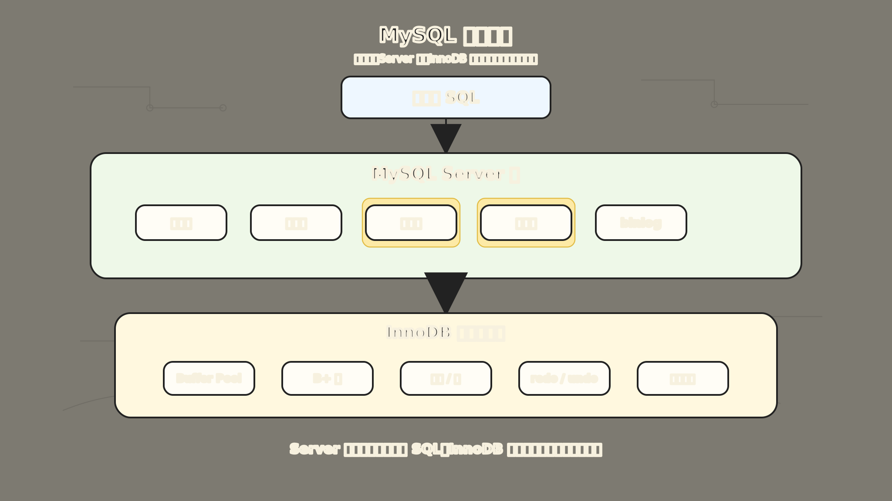
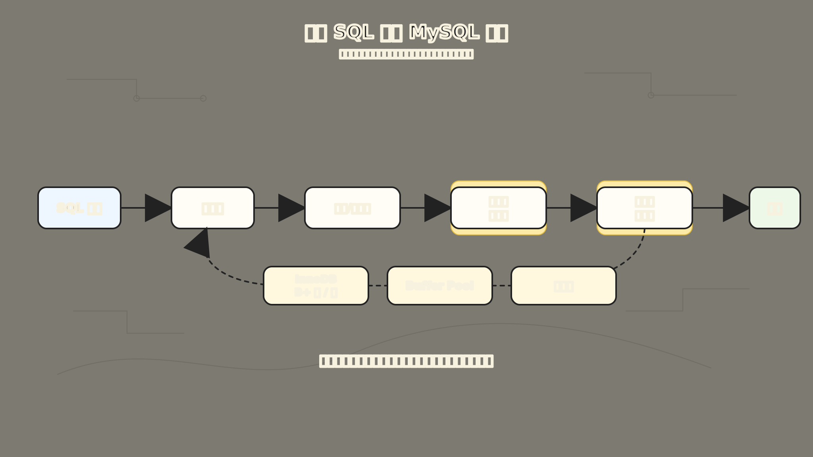

# MySQL 架构：一条 SQL 背后为什么要分这么多层

你发一条 `SELECT * FROM orders WHERE id = 1`，0.3 秒后拿到了结果。看起来很简单。但 MySQL 内部为了把这句话变成磁盘上的真实数据，实际上穿过了一层又一层。

前面执行流程篇已经把一条 SQL 的路径走过一遍。到架构篇，我们不再逐段复述细节，而是把这些模块放回一张系统分工图里看。

很多人第一次看 MySQL 架构图，会看到一堆模块名：

```text
连接器
-> 查询缓存
-> 分析器 / 解析器
-> 优化器
-> 执行器
-> 存储引擎
```

这些名字当然要知道，但如果只背这串名字，很容易把 MySQL 想成一个“SQL 流水线”：语句来了，按顺序过一遍，结果就出来了。

真实情况更像一个分工明确的系统。

一条 SQL 在客户端看来只是一句话：

```sql
SELECT *
FROM orders
WHERE id = 1;
```

但 MySQL 不能直接拿着这句话去磁盘上翻数据。它至少要先回答这些问题：

1. 这个连接是谁发来的？
2. 这句话的语法对不对？
3. 表和字段是否真的存在？
4. 该走主键索引、普通索引，还是全表扫描？
5. 真正的数据在哪里，由哪个存储引擎负责读？
6. 如果数据在磁盘上，如何尽量少做 I/O？

所以 MySQL 架构真正解决的问题是：

**如何把“人写的一句 SQL”，拆成权限、语义、优化、执行、存储这些边界清楚的工作。**

为了让这篇文章好懂，我们继续用一个订单表示例：

```sql
CREATE TABLE orders (
  id BIGINT PRIMARY KEY,
  user_id BIGINT NOT NULL,
  status VARCHAR(20) NOT NULL,
  created_at DATETIME NOT NULL,
  amount DECIMAL(10, 2) NOT NULL,
  KEY idx_user_created (user_id, created_at)
) ENGINE=InnoDB;
```

假设现在执行：

```sql
SELECT *
FROM orders
WHERE id = 1;
```

从业务上看，这是“查 1 号订单”。

从 MySQL 架构上看，它会穿过两大层：

```text
客户端
-> MySQL Server 层
   -> 连接器
   -> 分析器 / 解析器
   -> 优化器
   -> 执行器
-> 存储引擎层
   -> InnoDB
      -> Buffer Pool
      -> B+ 树索引
      -> 磁盘页
```

后面几节会保留每层的边界，细节不再重复展开。MySQL 架构最核心的一句话是：

**Server 层负责理解和安排 SQL，存储引擎层负责真正存取数据。**



上图展示了 MySQL 的三层架构全景。最上层是客户端，中间是 Server 层（连接器、分析器、优化器、执行器、binlog），最下层是存储引擎层 InnoDB（Buffer Pool、B+ 树索引、事务锁、redo/undo log、磁盘文件）。优化器和执行器用高亮标出，表示这是 SQL 执行路径上最关键的决策和调度点。三层之间通过 SQL 文本和 Handler API 通信，存储引擎最终把数据页落到磁盘上。

## 一、为什么 MySQL 要分成 Server 层和存储引擎层

先别急着看连接器、优化器这些模块。理解 MySQL 架构，最重要的是先理解这两层：

```text
Server 层：理解 SQL、管理连接、做权限检查、生成执行计划
存储引擎层：管理数据怎么存、怎么读、怎么改、怎么加锁、怎么恢复
```

为什么要这么拆？

因为 SQL 语言和数据存储，其实是两类问题。

SQL 语言层面关心的是：

```text
你写的 SQL 是什么意思？
你要查哪些表？
你有没有权限？
这条查询有没有更便宜的执行方式？
```

数据存储层面关心的是：

```text
记录放在哪个页里？
索引怎么组织？
页是否已经在 Buffer Pool 里？
更新时 redo log、undo log 怎么配合？
事务隔离和行锁怎么处理？
```

如果把这些问题全部塞进一个巨大模块里，MySQL 会很难扩展。于是 MySQL 采用了插件式存储引擎架构：上层用统一接口和存储引擎通信，下层可以有不同的存储引擎实现。

比如：

- `InnoDB`：支持事务、行级锁、崩溃恢复，是现在最常用的默认存储引擎。
- `MyISAM`：曾经常见，但不支持事务，锁粒度也更粗。
- `Memory`：把数据放在内存里，适合一些特殊临时场景。

这样设计的好处是：

**同样一条 SQL，上层仍然按 SQL 来理解；至于数据怎么存、怎么取，可以交给不同引擎实现。**

不过在今天的业务开发里，如果没有特别说明，谈 MySQL 架构时通常默认讲的是：

```text
MySQL Server 层 + InnoDB 存储引擎
```

这也是后面索引、事务、锁、Buffer Pool、redo log 大多围绕 InnoDB 展开的原因。

## 二、连接器：先确认是谁在访问数据库

连接器的细节在执行流程篇已经讲过。放在架构里看，它就是 SQL 进入 Server 层前的入口守卫。

比如命令行里常见的连接方式：

```bash
mysql -h127.0.0.1 -uroot -p
```

这一步背后先建立 TCP 连接，然后由连接器处理认证和连接状态。

连接器主要做三件事：

```text
建立连接
-> 校验用户名和密码
-> 读取当前用户权限
```

这里有一个实用边界：用户权限是在连接建立时读出来的。旧连接不一定立刻感知后续权限变更，新连接才会重新读取。

所以连接器的边界很清楚：

**它不关心 SQL 怎么执行，它先确认“谁来了，以及这个人当前大概能做什么”。**

所以，连接器解决的是入口问题：

```text
客户端不是直接冲进数据库文件
-> 先经过连接器
-> 认证通过后，才进入 SQL 执行链路
```

## 三、查询缓存：只作为历史模块知道就好

很多老的 MySQL 架构图里，连接器后面会画一个“查询缓存”。执行流程篇已经解释过它为什么被移除，这里只保留架构判断：

```text
查询缓存：Server 层缓存 SQL 结果集，MySQL 8.0 已移除
Buffer Pool：InnoDB 缓存数据页和索引页，仍然是核心机制
```

今天学习 MySQL 架构时，查询缓存更适合作为历史知识。你可以知道老架构图为什么有它，但不要把它当成现代 MySQL 的核心路径。

## 四、分析器：把 SQL 文本变成 MySQL 能理解的结构

连接通过后，MySQL 才真正开始面对这条 SQL：

```sql
SELECT *
FROM orders
WHERE id = 1;
```

对人来说，这句话很自然。对 MySQL 来说，它首先只是一段字符串。分析器要先做词法分析和语法分析，把关键字、表名、字段名、条件这些元素识别出来，再判断它是否符合 MySQL 的语法规则。

比如你把 `FROM` 写成 `FORM`：

```sql
SELECT *
FORM orders
WHERE id = 1;
```

这就不是一条合法 SQL，会在语法分析阶段报错。

这里沿用执行流程篇的拆法：

```text
语法检查：这句话像不像合法 SQL
语义检查：里面的表、字段、函数能不能对上
```

所以分析器和预处理相关阶段解决的是：

**把 SQL 从字符串变成结构化语义，并排除那些 MySQL 根本无法理解或无法绑定对象的语句。**

## 五、优化器：同一个结果，选择更便宜的路

SQL 能被理解以后，还不能马上执行。

因为同一个查询结果，可能有很多种拿法。

还是这张表：

```sql
CREATE TABLE orders (
  id BIGINT PRIMARY KEY,
  user_id BIGINT NOT NULL,
  status VARCHAR(20) NOT NULL,
  created_at DATETIME NOT NULL,
  amount DECIMAL(10, 2) NOT NULL,
  KEY idx_user_created (user_id, created_at)
) ENGINE=InnoDB;
```

如果查主键：

```sql
SELECT *
FROM orders
WHERE id = 1;
```

优化器大概率会选择主键索引，因为主键索引能直接定位到目标记录。

如果查某个用户最近的订单：

```sql
SELECT *
FROM orders
WHERE user_id = 10086
ORDER BY created_at DESC
LIMIT 20;
```

优化器可能会考虑 `idx_user_created` 这个联合索引，因为它既能缩小 `user_id` 的范围，又可能帮助处理 `created_at` 排序。

如果表上有多个索引，优化器就要估算：

```text
哪个索引过滤性更好？
预计要扫描多少行？
是否需要回表？
是否需要额外排序？
多表 join 时，先读哪张表更合适？
```

优化器不是在改变 SQL 的含义，它是在寻找更低成本的执行计划。

所以优化器解决的是：

**结果要一样，但路径可以不同；MySQL 要尽量选一条代价更低的路。**

这也解释了为什么你写的 SQL 看起来差不多，性能却可能差很多。真正影响执行代价的，不只是 SQL 文本，还包括表数据量、索引结构、统计信息、过滤条件和 join 顺序。

## 六、执行器：按计划调用存储引擎

优化器选好执行计划后，执行器开始干活。

执行器的位置很关键：它站在 Server 层和存储引擎层之间。

它自己不负责管理 B+ 树页，也不直接去磁盘上读文件。它做的是：

```text
检查执行权限
-> 按执行计划打开表
-> 调用存储引擎接口读取记录
-> 判断记录是否满足条件
-> 组装结果集返回客户端
```

还是这条主键查询：

```sql
SELECT *
FROM orders
WHERE id = 1;
```

执行器会根据优化器给出的计划，调用 InnoDB 的接口，让 InnoDB 去按主键查找记录。

可以粗略理解成：

```text
执行器：我要查 orders 表里主键 id = 1 的记录
InnoDB：我来走主键 B+ 树，找到对应数据页和记录
执行器：拿到记录后，组织成结果返回客户端
```

如果是没有合适索引的查询，执行器可能就要不断调用引擎接口取下一行，逐行判断是否符合条件。你在慢查询里看到的扫描行数，很多时候就和这条执行链路有关。

执行器解决的是：

**把优化器给出的计划真正跑起来，并通过统一接口驱动存储引擎读取数据。**

## 七、存储引擎：真正管理数据怎么落地

前面都还在 Server 层。真正到了数据怎么存、怎么读、怎么改，就进入存储引擎层。

在现代 MySQL 里，我们最常讨论的是 InnoDB。

InnoDB 负责的事情很多：

```text
用 B+ 树组织索引
用页管理磁盘和内存之间的数据搬运
用 Buffer Pool 缓存数据页和索引页
用 undo log 支持回滚和 MVCC
用 redo log 支持崩溃恢复
用锁和 MVCC 处理并发读写
```

这也是为什么学 MySQL 时，很多概念最后都会落回 InnoDB。

比如 `id = 1` 这条主键查询，在 InnoDB 里大概会走：

```text
从主键 B+ 树根页开始
-> 定位到中间页
-> 定位到叶子页
-> 在叶子页里找到 id = 1 的完整记录
-> 如果页已经在 Buffer Pool，直接从内存读
-> 如果页不在 Buffer Pool，从磁盘读入页后再返回
```

这时你就能把前面几篇文章串起来：

- 索引解释的是：为什么能少读页。
- Buffer Pool 解释的是：为什么读写不总是直接碰磁盘。
- 日志解释的是：为什么改了内存页后，崩溃也能恢复。
- 事务和锁解释的是：并发读写时，如何保证一致性和隔离性。

所以存储引擎层解决的是：

**让 SQL 的结果真正对应到磁盘上的数据，同时兼顾性能、事务、并发和恢复。**

## 八、把整条链路串起来

现在我们再回到最开始的 SQL：

```sql
SELECT *
FROM orders
WHERE id = 1;
```

它在 MySQL 架构里的路径可以这样记：

```text
客户端发送 SQL
-> 连接器确认身份和连接状态
-> 分析器理解 SQL 文本，检查语法和对象
-> 优化器选择主键索引这条访问路径
-> 执行器按计划调用 InnoDB
-> InnoDB 通过主键 B+ 树定位记录
-> 如果页在 Buffer Pool，直接读内存页
-> 如果页不在 Buffer Pool，先从磁盘读页
-> 返回结果给客户端
```



上图展示了一条 SQL 的完整旅程。从左侧客户端发出 `SELECT` 语句，依次穿过连接器的认证、解析器的语法理解、预处理器的对象确认、优化器的路径选择、执行器的调度，然后进入 InnoDB 存储引擎走 B+ 树和 Buffer Pool，最终从磁盘页中拿到数据，返回结果。高亮的部分表示优化器选择路径和执行器调度引擎这两个最关键的环节。

如果画成一张简化流程图：



这张图的重点不是背箭头，而是记住每层的边界：

```text
连接器：谁来了
分析器：这句话是什么意思
优化器：怎么查更划算
执行器：按计划把活干起来
存储引擎：数据到底怎么存取
```

## 九、几个容易混淆的点

### 1. Server 层是不是只负责查询

不是。

Server 层包含连接管理、权限、SQL 解析、优化器、执行器、内置函数、视图、触发器、存储过程等能力。它负责的是跨存储引擎的通用能力，不只是 `SELECT`。

### 2. InnoDB 是不是 MySQL 本身

不是。

MySQL 是数据库系统，InnoDB 是其中一个存储引擎。只是因为 InnoDB 现在是默认且最常用的存储引擎，所以很多时候大家会把 MySQL 的底层实现默认讲成 InnoDB。

更准确地说：

```text
MySQL 提供 SQL Server 层能力
InnoDB 提供默认存储引擎能力
```

### 3. 查询缓存和 Buffer Pool 是不是一回事

不是。

查询缓存缓存的是“SQL -> 结果集”，而且 MySQL 8.0 已经移除。

Buffer Pool 缓存的是 InnoDB 的页，包括数据页、索引页等。它仍然是 InnoDB 读写性能的核心。

### 4. `Unknown column` 到底是哪一层报的

如果一句 SQL 语法写错，比如 `FORM` 写错，通常可以理解为语法分析阶段报错。

如果 SQL 语法结构没问题，但字段不存在，比如：

```sql
SELECT *
FROM orders
WHERE k = 1;
```

这更像是语义检查或预处理阶段发现的问题。很多入门文章会把它归到“分析器”这个大模块里；如果你把执行流程拆得更细，就可以说它发生在表和字段解析阶段。

记忆方式是：

```text
SQL 写得不像人话：语法分析阶段
SQL 像人话但对象不存在：语义检查 / 预处理阶段
```

## 十、最后用一句话记住 MySQL 架构

MySQL 架构不是一堆模块名，而是一条责任分工链：

```text
连接器解决"谁能进来"
分析器解决"这句话能不能被理解"
优化器解决"走哪条路更便宜"
执行器解决"按计划怎么调用引擎"
InnoDB 解决"数据怎么高效、安全地存取"
```

如果只记一个总图，就记这张：

```text
SQL 文本
-> Server 层把它理解成执行计划
-> 执行器通过接口调用存储引擎
-> InnoDB 用索引、页、Buffer Pool、日志、锁和事务完成数据访问
```

这样再回头看索引、事务、锁、日志、Buffer Pool，就不会觉得它们是散落的知识点了。

它们其实都在回答同一个问题：

**一条 SQL 从文本到结果，中间每一层到底替你解决了什么麻烦。**

