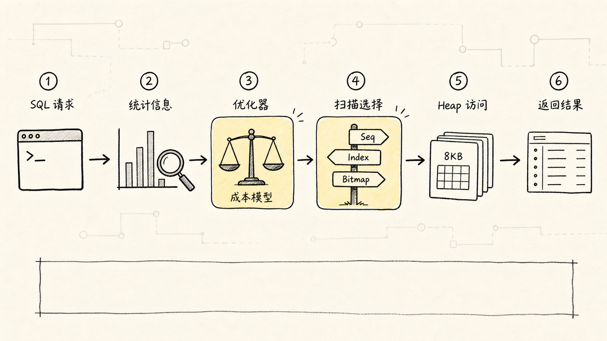
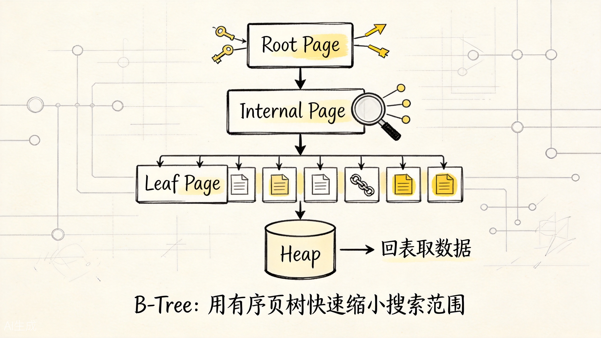
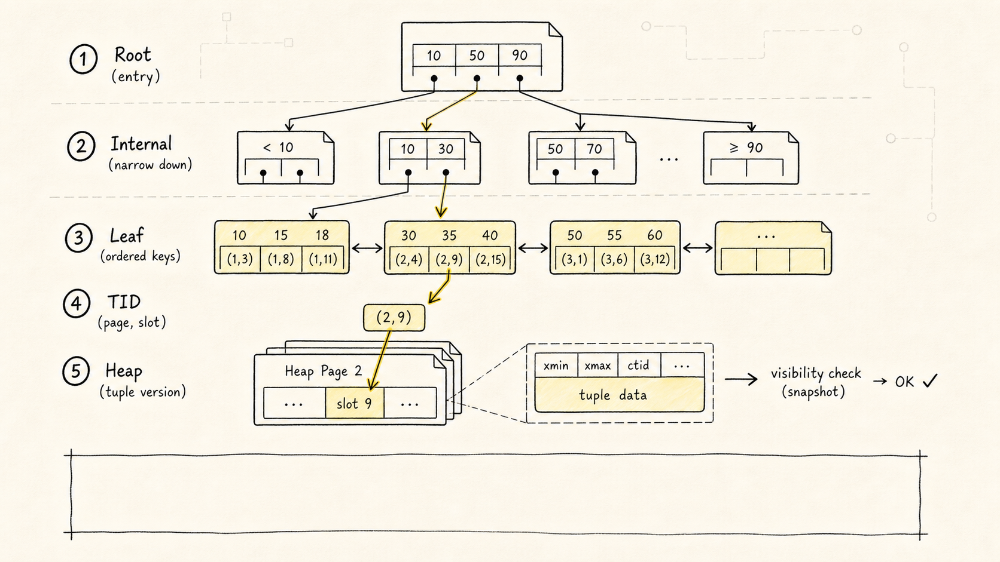
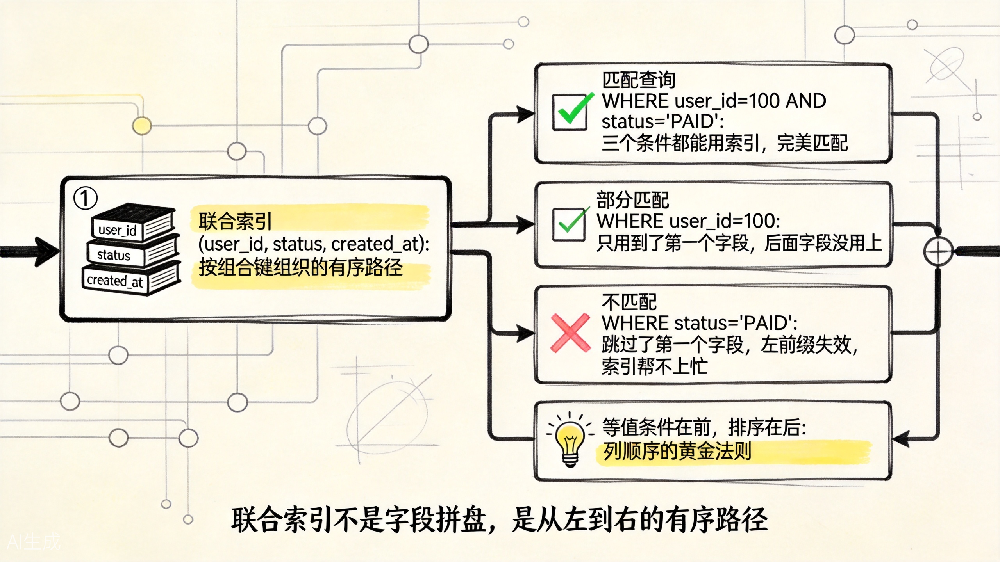
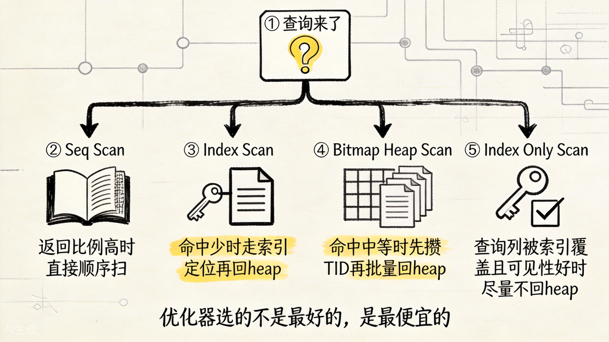
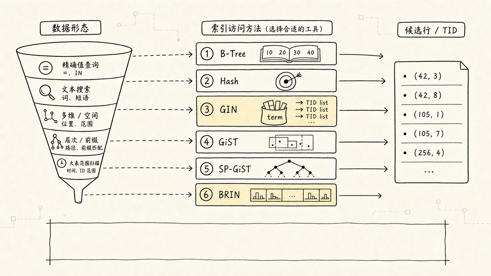

# PostgreSQL 索引：为什么索引不是"建了就一定快"

学 PostgreSQL 索引时，最容易先记住一句话：

> 索引就像书的目录，可以加快查询。

这话没错，但只讲了前半句。

如果把它直接理解成"字段上有索引，查询就一定快"，你很快会遇到三个反直觉现象：

1. 明明建了索引，`EXPLAIN` 还是走 `Seq Scan`。
2. 某个查询加索引后快了，另一个查询却没变化。
3. 索引越建越多，写入、更新、磁盘占用反而越来越糟。

这篇文章不从"索引的定义"开始，而是从一个更贴近线上场景的问题切入：

**当表越来越大时，PostgreSQL 怎么少看一点数据，并且用更便宜的路径把结果拿出来？**

为了让全文不散，我们固定一个订单表示例：

```sql
CREATE TABLE orders (
  id BIGINT GENERATED BY DEFAULT AS IDENTITY PRIMARY KEY,
  user_id BIGINT NOT NULL,
  status TEXT NOT NULL,
  created_at TIMESTAMPTZ NOT NULL,
  amount NUMERIC(10, 2) NOT NULL,
  remark TEXT
);
```

现在表里有 1000 万条订单，业务经常查某个用户最近的 20 笔订单：

```sql
SELECT id, user_id, status, created_at, amount
FROM orders
WHERE user_id = 10086
ORDER BY created_at DESC
LIMIT 20;
```

索引的故事，就从这条 SQL 为什么会慢开始。

## 一、先把主线画出来

索引不是一个孤立概念，它是一条问题演化链：



这条链里最重要的不是"索引有很多种"，而是：

**每一种索引和扫描方式，都在回答同一个问题：这条 SQL 到底怎么拿数据最便宜？**



## 二、没有索引时，慢在哪里

如果没有合适的索引，PostgreSQL 最直接的办法是顺序扫描（`Seq Scan`）。

直觉上它这样工作：

```text
从 orders 的第一个数据页开始
-> 一页一页读
-> 一行一行判断 user_id 是否等于 10086
-> 把命中的行留下
-> 再按 created_at 排序
-> 返回前 20 条
```

顺序扫描不是坏东西。小表、返回大量数据、统计信息判断全表更便宜时，`Seq Scan` 反而是合理选择。

（生产环境见过太多人看到 `Seq Scan` 就慌，其实问题不是"走了全表扫"，而是"为什么要扫那么多行才返回一点点"。）

真正的问题在这里：

**你只想要 20 行，但数据库可能要看很多很多行，甚至还要把命中的大量行排序。**

这时索引的第一层价值出现了：

**把"从头看到尾"变成"沿着有序结构直接找到可能命中的位置"。**

## 三、PostgreSQL 不是直接在索引里存整行

讲索引前，先接住一个底层事实：PostgreSQL 的表数据放在 heap 里，普通索引是单独存放的。

索引通常不是"另一份完整表数据"，而是一条从索引键指向 heap 行版本位置的路线。

PostgreSQL 默认按 page 读写表和索引，默认 page 大小 `8KB`。先粗略理解成：

```text
orders heap
-> page 0
-> page 1
-> page 2
...
```

一行记录在 PostgreSQL 里叫 tuple。普通 B-Tree 索引的叶子项通常保存：

1. 索引键，比如 `user_id`、`created_at`。
2. 指向 heap tuple 的 TID。

TID 可以粗略理解为"哪个 heap page + page 里的哪个槽位"。

一次普通索引查询大致是这样：


这和 MySQL InnoDB 很不一样。

InnoDB 的主键索引是聚簇索引，表数据按主键组织；二级索引叶子节点保存主键值，再用主键回聚簇索引取整行。

PostgreSQL 的普通索引更像是"指向 heap 位置的路标"。它能帮你更快找到候选行，但找到以后，很多时候仍然要回 heap 看真正的行版本是否对当前事务可见。

## 四、B-Tree 为什么最常用：它到底怎么实现

在 PostgreSQL 里，如果你写：

```sql
CREATE INDEX idx_orders_user_id
ON orders (user_id);
```

不显式指定 `USING`，默认创建的就是 B-Tree 索引。

B-Tree 最常用，不是因为名字高级，而是因为它维护了一棵"平衡的、有序的、按 page 组织的树"。



上面这张图展示了 B-Tree 的核心层级。可以拆成三层理解：

1. `Root Page`：树的入口，保存分隔键，决定往哪个子树走。
2. `Internal Page`：中间层，继续用分隔键缩小范围。
3. `Leaf Page`：叶子层，保存索引键和 TID，并按键值顺序排列。

一次 `WHERE user_id = 10086` 的查询，大致会这样走：

```text
从 root page 开始
-> 根据分隔键选择 internal page
-> 继续下钻到 leaf page
-> 在 leaf page 中找到 user_id = 10086 的索引项
-> 拿到 TID
-> 回 heap 读取真正的 tuple
-> 做 MVCC 可见性判断
```



实现上有几个关键点。

**第一**，B-Tree 是平衡树。从 root page 到任意 leaf page 的路径长度大致相同。大表也不意味着树会高到离谱，因为每个 page 能放很多索引项，真实业务里树高通常很低。

**第二**，叶子页是有序的。等值查询可以先定位到某个键，范围查询可以从起点继续向后扫，排序查询可以直接利用索引顺序。

**第三**，叶子页里通常不是整行数据，而是"索引键 + TID"。所以 B-Tree 能帮你定位候选 tuple，但普通 `Index Scan` 仍然常常要回 heap。

**第四**，写入不是免费的。插入新键时，如果目标 leaf page 满了，可能发生 page split：原来的页拆成两个页，上层 page 也要更新分隔键。更新索引列时，也会产生新的索引项。长期写入和更新还可能带来索引膨胀，需要 autovacuum、REINDEX 等维护手段配合。

（踩坑提示：给一个频繁更新的字段建索引，page split 和索引膨胀会让你的 `pg_class.relpages` 持续增长，`REINDEX` 前后可能差几倍。）

这个有序结构天然适合四类高频需求：

| 查询需求 | 示例 | B-Tree 为什么合适 |
|---|---|---|
| 等值查找 | `WHERE user_id = 10086` | 能快速定位到某个键值范围 |
| 范围查找 | `WHERE created_at >= ...` | 从范围起点沿叶子页顺序扫 |
| 排序 | `ORDER BY created_at DESC` | 索引本身已有顺序 |
| TopN | `ORDER BY ... LIMIT 20` | 按顺序拿够就停 |

回到订单查询：

```sql
SELECT id, user_id, status, created_at, amount
FROM orders
WHERE user_id = 10086
ORDER BY created_at DESC
LIMIT 20;
```

如果只建单列索引：

```sql
CREATE INDEX idx_orders_user_id
ON orders (user_id);
```

PostgreSQL 可以更快找到 `user_id = 10086` 的订单，但可能仍然需要把这些订单按 `created_at` 排序。

更贴合这条查询的索引是：

```sql
CREATE INDEX idx_orders_user_created
ON orders (user_id, created_at DESC);
```

这棵索引的意思不是"给两个字段分别建了索引"，而是按组合键组织一条路径：

```text
先按 user_id 分组定位
-> 在同一个 user_id 范围内按 created_at DESC 排好
-> 拿前 20 条就可以停
```

所以它同时解决了两个问题：

1. 不用扫描整张表。
2. 不用对大量候选订单再排序。

B-Tree 的实现直觉可以压成一句话：

**用 root/internal page 快速缩小搜索范围，用有序 leaf page 支撑范围扫描和排序，再用 TID 回到 heap 找真实行版本。**

## 五、联合索引真正难的是列顺序

很多索引问题，不是"有没有索引"，而是"索引顺序是否贴合查询路径"。

对这个索引：

```sql
CREATE INDEX idx_orders_user_status_created
ON orders (user_id, status, created_at DESC);
```

它更适合这样的查询：

```sql
SELECT id, created_at, amount
FROM orders
WHERE user_id = 10086
  AND status = 'PAID'
ORDER BY created_at DESC
LIMIT 20;
```



上图展示了联合索引的左前缀原理。可以用一个朴素规则记：

```text
等值条件列
-> 范围条件列
-> 排序列
```

但这个规则不是机械公式。真正要问的是：

**这条 SQL 希望索引先帮它缩小哪一段范围，再按什么顺序继续往后扫？**

例如 `(user_id, created_at DESC)` 对"查某个用户最近订单"很好；但如果你的高频查询是：

```sql
SELECT id, user_id, created_at
FROM orders
WHERE status = 'PAID'
ORDER BY created_at DESC
LIMIT 100;
```

那前面的 `user_id` 就帮不上太多忙，因为查询并没有先指定 `user_id`。这就是常说的左前缀问题：联合索引不是字段拼盘，而是一条从左到右的有序路径。

（直白地说：`(a, b, c)` 这个索引能服务 `(a)` 和 `(a, b)`，但单独查 `(b)` 或 `(c)` 时，它基本就是摆设。）

## 六、为什么 PostgreSQL 有时不用索引

看到 `EXPLAIN` 里没用索引时，新手很容易觉得优化器错了。

但优化器判断的是成本，不是"有没有索引"。

比如：

```sql
SELECT id, user_id, created_at
FROM orders
WHERE status = 'PAID';
```

如果 `PAID` 占了全表 80%，即使有 `status` 索引，用索引也可能不划算。

原因很简单：索引先找到大量 TID，接着还要回 heap 读大量 page。随机访问很多 heap page，可能比顺序扫完整张表还贵。

这时优化器可能宁愿走：

```text
Seq Scan
-> 顺序读很多 page
-> 过滤 status
```

而不是：

```text
Index Scan
-> 扫 status 索引
-> 找到大量 TID
-> 频繁回 heap
```



上图展示了优化器如何在四种扫描方式之间做选择。索引不是"查询加速按钮"，而是一条候选路径。优化器会根据统计信息估算：

1. 条件能过滤掉多少行。
2. 要访问多少 heap page。
3. 是否还要排序、聚合、连接。
4. `Seq Scan`、`Index Scan`、`Bitmap Heap Scan` 哪个总成本更低。

这也是慢 SQL 调优不能只问"建什么索引"的原因，还要看：

```sql
EXPLAIN (ANALYZE, BUFFERS)
SELECT ...
```

`EXPLAIN` 看优化器打算怎么拿数据，`ANALYZE` 看真实执行情况，`BUFFERS` 看 page 访问代价。三者合起来，才接近真相。

## 七、四种常见扫描方式怎么理解

索引文章一定要和执行计划一起看。否则你只是在背名词。



常见扫描方式可以这样记：

| 扫描方式 | 适合场景 | 直觉 |
|---|---|---|
| `Seq Scan` | 小表、返回比例高 | 从头顺序读，未必慢 |
| `Index Scan` | 高选择性点查或小范围查 | 先走索引，再回 heap |
| `Index Only Scan` | 查询列被索引覆盖，且可见性条件好 | 尽量不回 heap |
| `Bitmap Heap Scan` | 命中中等数量行、多条件组合 | 先攒 TID，再批量回 heap |

这里最容易误解的是 `Index Only Scan`。

它不是"只要覆盖索引就一定不回表"。PostgreSQL 还必须处理 MVCC 可见性问题。索引项里没有完整的可见性信息，所以 PostgreSQL 会借助 visibility map 判断对应 heap page 是否 all-visible。

如果页面最近频繁更新，visibility map 对应位可能没法直接证明可见，执行器仍然要回 heap 检查。这时 `Index Only Scan` 的收益就会下降。排查时要看执行计划里的 `Heap Fetches`。

## 八、除了 B-Tree，PostgreSQL 为什么还有这么多索引

B-Tree 很通用，但不是万能。

如果数据是单值、有序、可比较的，B-Tree 很舒服；但业务数据并不总是这种形态：

1. `jsonb` 里有很多 key/value。
2. `tags` 数组里有多个标签。
3. 文章全文检索要按词项找文档。
4. 地理位置要查附近的人。
5. 日志表巨大，但基本按时间追加。

这些问题强行交给 B-Tree，就像拿普通目录去做倒排检索、空间搜索、超大日志粗筛。

PostgreSQL 的索引体系更像一组访问方法：





可以先用这张表建立直觉：

| 索引类型 | 适合问题 | 典型例子 |
|---|---|---|
| B-Tree | 等值、范围、排序、TopN | 用户订单、时间范围、分页 |
| Hash | 等值查询 | 只关心 `=` 的窄场景 |
| GIN | 一列里包含多个元素 | `jsonb`、数组、全文检索 |
| GiST | 复杂对象的可剪枝搜索 | 范围重叠、空间查询、最近邻 |
| SP-GiST | 天然可分区的数据 | 前缀、点数据、空间分区 |
| BRIN | 超大表的块范围摘要 | 追加型日志、时间序列表 |

下面不要把它们看成"高级版 B-Tree"。更准确地说，它们是不同的索引访问方法：每一种都用自己的内部结构回答"怎么更便宜地找到候选 heap tuple"。

### Hash：只为等值定位服务

Hash 索引的实现直觉很简单：

```text
search key
-> hash(key)
-> bucket page
-> bucket / overflow page 里找到索引项
-> 通过 TID 回 heap
```

它不像 B-Tree 那样维护键值顺序，而是把 key 映射到 bucket。查询 `WHERE email = 'alice@example.com'` 时，PostgreSQL 计算 hash，再定位到对应 bucket。

所以 Hash 的能力很专一：

1. 适合 `=`。
2. 不适合 `>`, `<`, `BETWEEN`。
3. 不能用来避免 `ORDER BY` 排序。

Hash 的性能上限取决于冲突控制。很多不同 key 落到同一个 bucket，就要继续扫描甚至走 overflow page，性能会退化。

实际工程里，B-Tree 对等值查询已经足够好，而且更通用，所以 Hash 通常不是默认选择。只有当查询模式非常纯粹、字段高基数、分布均匀，并且你用 `EXPLAIN (ANALYZE, BUFFERS)` 和真实负载验证过，它才值得单独引入。

### GIN：从"值找行"变成"词找行"

如果表里有一列 `tags text[]`：

```sql
CREATE INDEX idx_posts_tags_gin
ON posts USING GIN (tags);
```

查询：

```sql
SELECT id, title
FROM posts
WHERE tags && ARRAY['postgres', 'index'];
```

GIN 的直觉是倒排索引：

```text
postgres -> 第 1 行、第 9 行、第 30 行...
index    -> 第 1 行、第 3 行、第 30 行...
```

GIN 的实现重点是倒排：

```text
一行复杂值
-> 拆成多个 key / token
-> 每个 key 对应一组 TID
-> 查询时合并 posting list / posting tree
-> 回 heap 做 recheck
```

如果 token 命中的 TID 很少，可以直接存在 posting list 里；如果某个 token 命中大量行，TID 集合会变大，可能组织成 posting tree。

GIN 很适合：

1. 数组包含、重叠查询。
2. `jsonb @>` 这类包含查询。
3. 全文检索。

但它适合"一列里有多个可检索元素"的场景，写入维护成本也更高。一行数据可能拆出很多 token，写入时不只是维护"一条索引项"，而是要维护多个 key 的倒排条目。PostgreSQL 的 GIN 还有 pending list / `fastupdate` 机制，用批量合并降低写入抖动，但 autovacuum 和维护节奏会影响查询稳定性。

### GiST：用摘要边界剪掉不可能的分支

如果业务是预约时间段冲突、空间位置、范围重叠，B-Tree 的"单值排序"就不够用了。

GiST 更像一个可扩展的树框架。内部节点存的是摘要，比如范围并集、空间边界。查询时先判断某个分支是否可能命中，不可能就直接剪掉。

它的实现直觉是：

```text
内部节点存子树摘要
-> 查询条件和摘要做 consistent 判断
-> 不可能命中的子树直接剪枝
-> 可能命中的叶子项给出候选 TID
-> 回 heap recheck
```

GiST 的关键不是"它是一棵树"，而是"这棵树的判断逻辑由 operator class 定义"。不同数据类型可以定义不同的摘要、合并、分裂和一致性判断规则。

比如范围类型可以把一个子树概括成范围并集，空间类型可以概括成 bounding box。查询时，如果查询范围和某个摘要完全不可能相交，就不用继续访问这个分支。

这类索引常常会有 recheck：索引先粗筛，heap 层再精确判断。这不是缺陷，而是支持复杂谓词的代价。

### SP-GiST：把搜索空间切成不重叠分支

SP-GiST 全名是 Space-Partitioned GiST。它也服务复杂数据，但思路和 GiST 不太一样。

GiST 常用"摘要边界"描述一个子树，子树之间可能有重叠；SP-GiST 更强调把搜索空间拆成不重叠的分支，比如 trie、radix tree、quad-tree 这类结构。

它的实现直觉是：

```text
根节点按某种规则切分空间
-> 查询值只落入少数分支
-> 沿着对应分支继续切分
-> 到叶子项拿候选 TID
-> 回 heap 校验
```

适合 SP-GiST 的数据，通常有天然的"分区规则"：

1. 字符串前缀。
2. IP 地址、文本前缀、字典树类查询。
3. 点数据、空间分区、最近邻的某些场景。

GiST 和 SP-GiST 的差异可以这样记：

| 对比点 | GiST | SP-GiST |
|---|---|---|
| 核心直觉 | 摘要 + 剪枝 | 空间分区 + 路由 |
| 分支关系 | 可能重叠 | 尽量不重叠 |
| 适合数据 | 范围、空间、相似度等泛化场景 | 天然可拆分、非平衡、前缀/空间分区场景 |
| 成败关键 | operator class 的摘要和剪枝能力 | 分区规则是否能减少无关分支 |

### BRIN：不精确定位行，只排除大块不相关数据

假设有一张日志表 `logs`，每天追加大量数据，`created_at` 基本随物理写入顺序递增：

```sql
CREATE INDEX idx_logs_created_brin
ON logs USING BRIN (created_at);
```

BRIN 不会给每一行建精确索引项，而是给一段连续 heap page 存摘要，比如最小时间和最大时间。

查询最近一天日志时，它先看每个块范围的摘要：

```text
range 1: 2026-01-01 ~ 2026-01-02 -> 不可能命中，跳过
range 2: 2026-02-01 ~ 2026-02-02 -> 不可能命中，跳过
range N: 2026-05-03 ~ 2026-05-04 -> 可能命中，读取并重检
```

BRIN 的实现重点是 block range：

```text
一段连续 heap blocks
-> 保存摘要，比如 min/max
-> 查询先看摘要是否可能命中
-> 不可能命中的 range 直接跳过
-> 可能命中的 range 读取 heap 并 recheck
```

BRIN 的价值不是精确点查，而是用非常小的索引体积跳过大量明显无关的物理块。它特别依赖"列值和物理顺序相关"这个前提。

所以 BRIN 很适合追加型日志表、审计表、时间序列表；但如果 `created_at` 和物理写入顺序完全没关系，某个 range 的 min/max 可能覆盖很宽，过滤效果就会变差。

### 小结：先看数据形态，再选实现

这几种索引可以放一张实现视角的表里：

| 索引 | 内部实现直觉 | 强项 | 主要代价 |
|---|---|---|---|
| B-Tree | 平衡页树 + 有序叶子页 + TID | 等值、范围、排序、TopN | 维护有序结构、page split、回 heap |
| Hash | hash(key) -> bucket -> TID | 纯等值查询 | 不支持范围/排序，冲突会退化 |
| GIN | key/token -> posting list/tree | 数组、JSONB、全文检索 | 写放大、pending list、recheck |
| GiST | 摘要树 + 剪枝 | 范围、空间、相似度 | operator class 复杂，常需 recheck |
| SP-GiST | 空间分区树 | 前缀、点数据、非平衡分区 | 依赖合适的分区规则 |
| BRIN | block range 摘要 | 超大顺序相关表 | 有损过滤，依赖物理相关性 |

## 九、索引设计不是多建，而是少而准

真正有用的索引，通常是围绕高频 SQL 设计出来的。

对订单表，可以用这组问题检查：

1. 这条 SQL 的 `WHERE` 条件是什么？
2. 它是不是还需要 `ORDER BY`？
3. 有没有 `LIMIT`，能不能让索引按顺序拿够就停？
4. 返回列是否可以用 `INCLUDE` 做覆盖？
5. 这个索引会不会拖慢高频写入或更新？

比如：

```sql
SELECT id, status, created_at, amount
FROM orders
WHERE user_id = 10086
ORDER BY created_at DESC
LIMIT 20;
```

可以考虑：

```sql
CREATE INDEX idx_orders_user_created_inc
ON orders (user_id, created_at DESC)
INCLUDE (status, amount);
```

这里 `user_id` 和 `created_at` 是索引键，参与定位和排序；`status`、`amount` 是 payload 列，只是为了让查询有机会从索引中直接拿到返回列。

但要克制。`INCLUDE` 列越多，索引越大；索引越多，`INSERT`、`UPDATE`、`DELETE` 维护成本越高。

如果业务经常只查已支付订单：

```sql
SELECT id, created_at, amount
FROM orders
WHERE status = 'PAID'
ORDER BY created_at DESC
LIMIT 100;
```

可以考虑部分索引：

```sql
CREATE INDEX idx_orders_paid_created
ON orders (created_at DESC)
WHERE status = 'PAID';
```

它只给 `PAID` 子集建索引，通常比给整张表的 `status` 或 `created_at` 盲目建索引更划算。

## 十、从 MySQL 转过来时，最容易混淆什么

如果你先学的是 MySQL InnoDB，再看 PostgreSQL 索引，要特别小心不要把模型直接套过来。

| 对比点 | PostgreSQL | MySQL InnoDB |
|---|---|---|
| 表数据组织 | heap table，行版本放在 heap 中 | 主键索引是聚簇索引，数据按主键组织 |
| 普通索引指向 | 通常指向 heap TID | 二级索引叶子节点保存主键值 |
| 回表路径 | 索引 -> heap TID -> heap tuple | 二级索引 -> 主键 -> 聚簇索引记录 |
| 覆盖查询 | `Index Only Scan` 还依赖 visibility map | 覆盖索引通常可直接从二级索引返回 |
| 多版本影响 | heap 中存在多版本 tuple，需要可见性判断 | 依赖 undo/Read View 等机制 |
| 索引类型 | B-Tree、Hash、GIN、GiST、SP-GiST、BRIN 等 | 常用 B+Tree，全文、空间等另有实现 |

一句话记忆：

**MySQL InnoDB 的索引学习重点是"聚簇索引 + 二级索引回表"；PostgreSQL 的索引学习重点是"访问方法 + heap TID + MVCC 可见性 + 执行计划成本"。**

## 十一、一分钟复习

索引不是魔法，它只是给查询提供一条可能更便宜的访问路径。

在 PostgreSQL 里，理解索引可以记住六句话：

1. B-Tree 是默认索引，适合等值、范围、排序和 TopN。
2. 普通索引扫描通常要通过 TID 回 heap 读取 tuple。
3. `Index Only Scan` 不只是索引覆盖，还要看 visibility map 和 `Heap Fetches`。
4. 优化器不用索引，不一定错，可能是顺序扫描或 Bitmap 路径更便宜。
5. Hash、GIN、GiST、SP-GiST、BRIN 不是"更高级的 B-Tree"，而是为不同数据形态准备的访问方法。
6. 好索引不是越多越好，而是围绕高频 SQL 的过滤、排序、返回列和写入成本做权衡。

最后，用一句更贴近工程实践的话收束：

**建索引前先问"这条 SQL 想少看哪些数据、按什么顺序拿数据"；建索引后再用 `EXPLAIN (ANALYZE, BUFFERS)` 验证它是否真的让路径变便宜。**

## 关联阅读

- [PostgreSQL B-Tree 索引](../../../../wiki/PostgreSQL/postgresql-b-tree-索引-重点.md)
- [PostgreSQL 扫描方式与 EXPLAIN 读法](../../../../wiki/PostgreSQL/postgresql-扫描方式与-explain-读法.md)
- [PostgreSQL 存储结构 Page](../../../../wiki/PostgreSQL/postgresql-存储结构-page.md)
- [PostgreSQL 高级索引](../../../../wiki/PostgreSQL/postgresql-高级索引-由浅入深.md)
