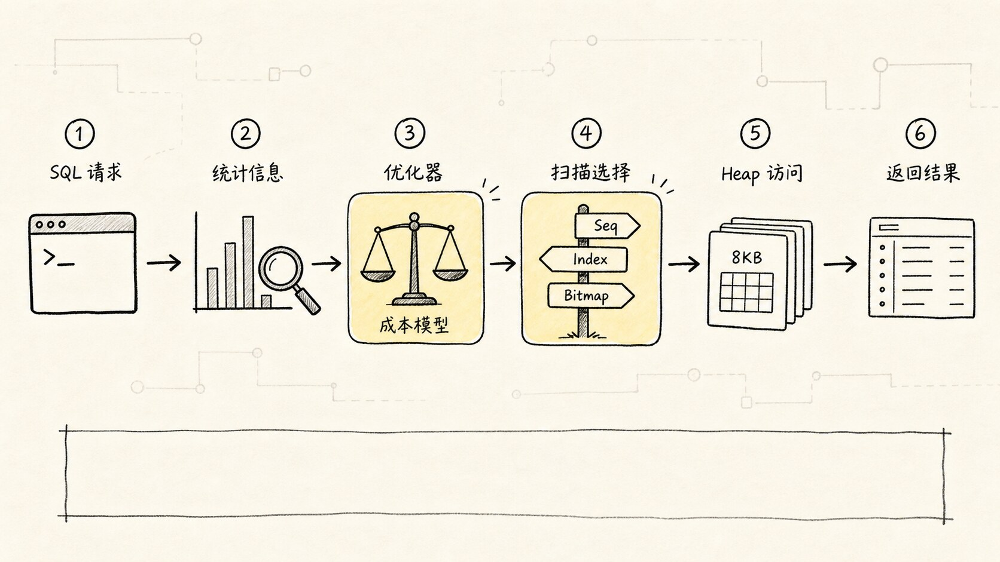
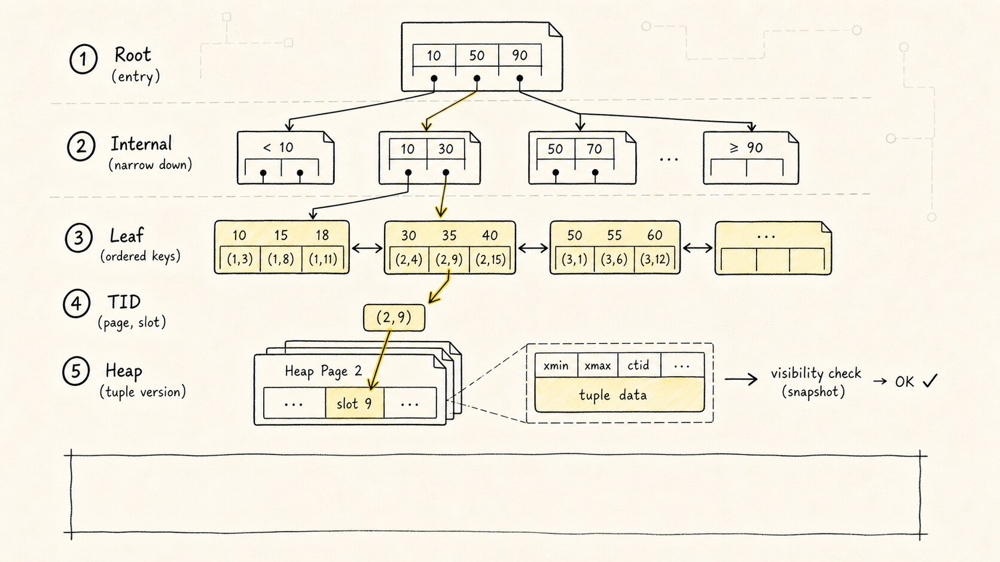
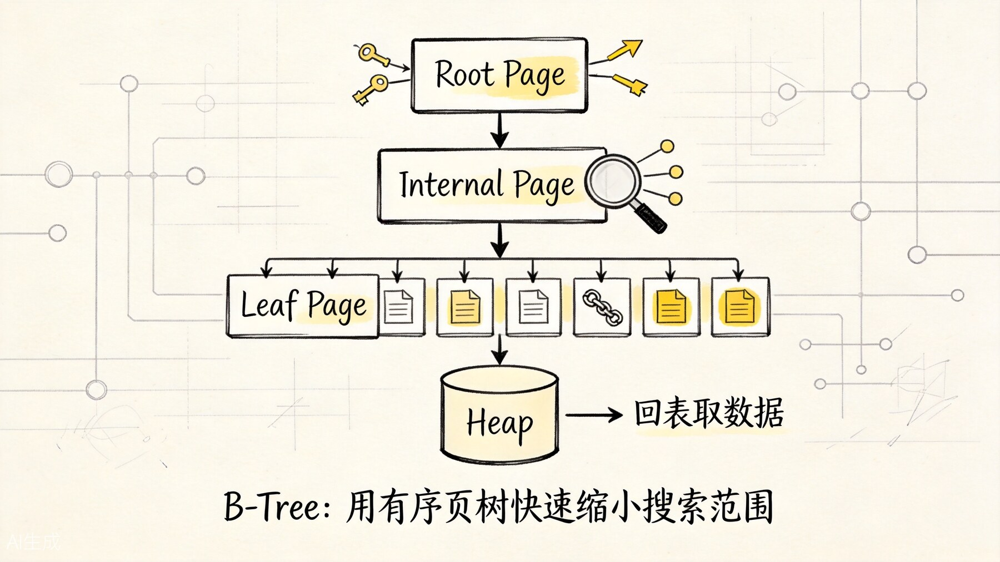
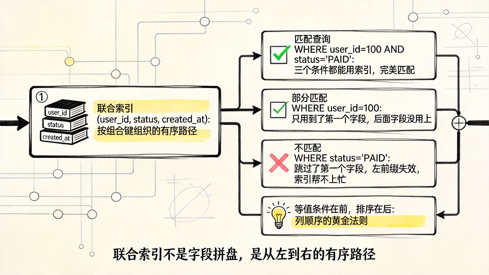
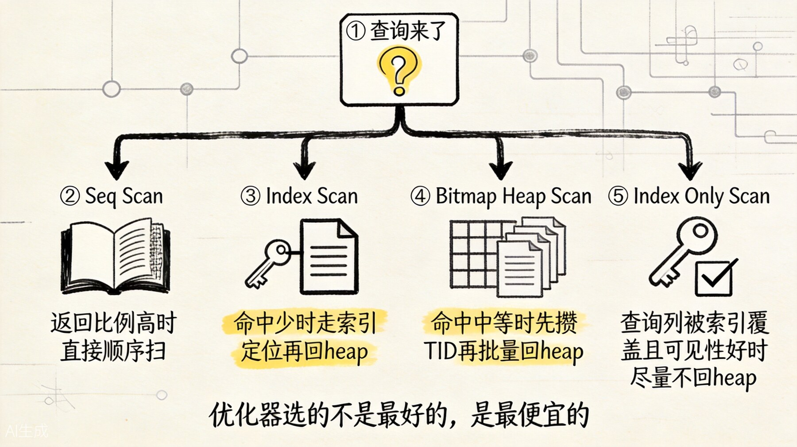
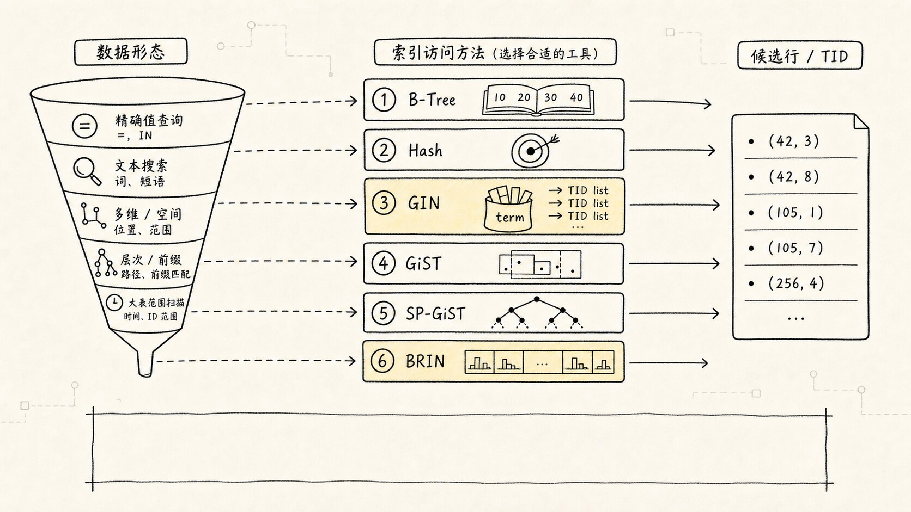

# PostgreSQL 索引：从使用、原理到优化与面试

很多人学习索引时，先记住的是一句话：

> 索引像书的目录，可以加快查询。

这句话没有错，但远远不够应付生产调优和面试追问。

真正需要掌握的是下面这条主线：

```text
一条 SQL 要访问哪些数据
-> 有哪些候选访问路径
-> 优化器如何估算每条路径的成本
-> 执行器实际读取了多少索引页和 heap 页
-> 查询收益是否值得承担额外的写入与维护成本
```

本文从五个角度重构 PostgreSQL 索引知识：

1. **使用**：索引怎么创建、查看、删除和上线。
2. **原理**：B-Tree、heap、TID、MVCC、可见性映射如何协作。
3. **场景**：等值、范围、排序、TopN、JSONB、全文、空间和超大日志分别用什么索引。
4. **优化**：如何通过 `EXPLAIN (ANALYZE, BUFFERS)` 判断问题并验证索引。
5. **面试**：高频问题怎么回答，哪些“标准答案”其实过度简化。

> **版本说明**：主干原理适用于常见 PostgreSQL 14～18。PostgreSQL 18 新增了 B-Tree skip scan，文中会单独标注；不同版本的执行计划字段可能略有差异。

## 一、先建立完整认知：索引不是开关，而是一条候选路径

索引可以放进一条问题演化链里理解：


数据库执行查询时，不会因为“字段上有索引”就机械地使用索引。优化器会比较多条路径的总成本，例如：

- 顺序扫描整张表；
- 通过索引定位少量记录，再回 heap 读取；
- 先把多个索引结果合并成 bitmap，再按物理顺序访问 heap；
- 直接按索引顺序读取，省掉排序；
- 从索引中返回全部所需列，尽量避免访问 heap。



所以，判断一个索引是否有价值，不能只问：

> 这条 SQL 有没有走索引？

更应该问：

> 这条 SQL 是否用更少的 page、更少的排序、更少的回表和更低的总成本拿到了结果？

### 贯穿全文的订单表

```sql
CREATE TABLE orders (
  id BIGINT GENERATED BY DEFAULT AS IDENTITY PRIMARY KEY,
  user_id BIGINT NOT NULL,
  status TEXT NOT NULL,
  created_at TIMESTAMPTZ NOT NULL,
  amount NUMERIC(10, 2) NOT NULL,
  remark TEXT
);
```

假设表中有 1000 万条订单，高频查询是“查询某个用户最近的 20 笔订单”：

```sql
SELECT id, user_id, status, created_at, amount
FROM orders
WHERE user_id = 10086
ORDER BY created_at DESC
LIMIT 20;
```

后文所有原理、索引设计和执行计划，都围绕这条 SQL 展开。

---

## 二、使用篇：先会正确地创建和管理索引

### 2.1 最基本的 B-Tree 索引

```sql
CREATE INDEX idx_orders_user_id
ON orders (user_id);
```

未显式指定 `USING` 时，PostgreSQL 默认创建 B-Tree 索引。

它主要适合：

- `=` 等值查询；
- `<`、`<=`、`>`、`>=`、`BETWEEN` 范围查询；
- `ORDER BY`；
- `MIN`、`MAX`；
- 有序 TopN 查询。

### 2.2 联合索引

```sql
CREATE INDEX idx_orders_user_created
ON orders (user_id, created_at DESC);
```

联合索引不是“分别给两列建索引”，而是按照组合键建立一条有序路径：

```text
先按 user_id 排序
-> 相同 user_id 内再按 created_at 排序
```

它适合下面这种“先过滤，再排序，再取少量结果”的查询：

```sql
SELECT id, status, created_at, amount
FROM orders
WHERE user_id = 10086
ORDER BY created_at DESC
LIMIT 20;
```

### 2.3 唯一索引

```sql
CREATE UNIQUE INDEX uq_users_email_lower
ON users (lower(email));
```

唯一索引不仅提供访问路径，还负责约束数据唯一性。

面试中要区分：

- `PRIMARY KEY` 会自动创建唯一 B-Tree 索引；
- `UNIQUE` 约束也会创建唯一索引；
- 外键引用的目标列本身必须有唯一性保障；
- **外键的引用列不会自动创建索引**，是否创建要根据查询、更新和删除父表记录的成本决定。

默认情况下，唯一索引允许多个 `NULL`，因为多个 `NULL` 被视为互不相同。PostgreSQL 15 及以上版本如果需要把 `NULL` 也视为相同值，可以使用：

```sql
CREATE UNIQUE INDEX uq_users_email
ON users (email) NULLS NOT DISTINCT;
```

### 2.4 覆盖索引与 `INCLUDE`

```sql
CREATE INDEX idx_orders_user_created_inc
ON orders (user_id, created_at DESC)
INCLUDE (id, status, amount);
```

这里有两类列：

- `user_id`、`created_at` 是**键列**，参与定位和排序；
- `id`、`status`、`amount` 是 **payload 列**，只用于返回结果，不参与搜索边界和排序。

`INCLUDE` 的目标是让查询具备使用 `Index Only Scan` 的物理条件，但它不保证一定不访问 heap。是否真正减少 heap 访问，还取决于 visibility map，后文会详细解释。

> 不要为了“覆盖”而把大量宽列塞进索引。索引会变大，缓存效率下降，写入成本上升；而且更新任何被索引引用的列，包括 `INCLUDE` 列，都可能破坏 HOT 更新条件。

### 2.5 部分索引

只为表中一个高频子集建索引：

```sql
CREATE INDEX idx_orders_paid_created
ON orders (created_at DESC)
WHERE status = 'PAID';
```

适合查询：

```sql
SELECT id, user_id, created_at, amount
FROM orders
WHERE status = 'PAID'
ORDER BY created_at DESC
LIMIT 100;
```

部分索引的优势是：

- 索引更小；
- 写入维护范围更小；
- 热点数据更容易留在缓存中。

但查询条件必须能让优化器在规划阶段证明其蕴含索引谓词。下面这种写法通常能匹配：

```sql
WHERE status = 'PAID'
```

而参数化或表达形式不同的条件，可能无法让规划器证明它一定满足部分索引谓词：

```sql
WHERE status = $1
```

因此，部分索引与 prepared statement、generic plan 配合时要重点验证真实执行计划。

### 2.6 表达式索引

查询写的是表达式，普通列索引不一定能直接匹配：

```sql
SELECT *
FROM users
WHERE lower(email) = 'alice@example.com';
```

可以创建与查询表达式一致的索引：

```sql
CREATE INDEX idx_users_lower_email
ON users (lower(email));
```

表达式索引适合：

- 大小写无关查询；
- 规范化后的业务键；
- 经常参与过滤的计算表达式。

代价是插入和非 HOT 更新时需要计算并维护表达式值。

### 2.7 生产环境创建索引

普通建索引会阻塞该表的写入：

```sql
CREATE INDEX idx_orders_user_created
ON orders (user_id, created_at DESC);
```

生产大表通常考虑：

```sql
CREATE INDEX CONCURRENTLY idx_orders_user_created
ON orders (user_id, created_at DESC);
```

`CONCURRENTLY` 的重要特点：

- 不阻塞正常的 `INSERT`、`UPDATE`、`DELETE`；
- 总工作量更大，通常需要更长时间和更多 I/O；
- 不能在显式事务块中执行；
- 失败时可能留下 `INVALID` 索引，仍可能产生写入维护成本，需要检查并处理；
- 同一张表同一时间只能进行一个并发索引构建。

不要把 `CONCURRENTLY` 理解成“零影响”。它仍会消耗 CPU、I/O、WAL 和存储空间。

### 2.8 查看索引定义与大小

查看表上的索引：

```sql
SELECT indexname, indexdef
FROM pg_indexes
WHERE schemaname = 'public'
  AND tablename = 'orders';
```

查看索引大小：

```sql
SELECT
  indexrelname,
  pg_size_pretty(pg_relation_size(indexrelid)) AS index_size
FROM pg_stat_user_indexes
WHERE relname = 'orders'
ORDER BY pg_relation_size(indexrelid) DESC;
```

查看表的全部索引总大小：

```sql
SELECT pg_size_pretty(pg_indexes_size('public.orders'));
```

在 `psql` 中也可以使用：

```text
\d+ orders
```

### 2.9 删除与重建索引

```sql
DROP INDEX CONCURRENTLY idx_orders_user_id;
```

索引确实膨胀、损坏，或需要彻底重建时，可以使用：

```sql
REINDEX INDEX CONCURRENTLY idx_orders_user_created;
```

`REINDEX` 不是慢 SQL 的默认修复手段。先确认问题是索引膨胀、损坏或结构维护问题，而不是统计信息错误、查询写法不匹配或索引设计错误。

---

## 三、原理篇：PostgreSQL 索引到底存了什么

### 3.1 PostgreSQL 的表是 heap，索引与表数据分离

PostgreSQL 的表数据存放在 heap 中。即使是主键索引，也不会把整张表组织成聚簇主键树。

普通索引通常保存：

1. 索引键；
2. 指向 heap 行版本位置的 TID。

TID 可以粗略理解为：

```text
heap block number + block 内的 item offset
```

默认构建通常使用 8KB page。表和索引都以 page 为基本 I/O 单位。

一次普通索引查询大致如下：


```text
扫描索引
-> 找到匹配的索引项
-> 取得 TID
-> 访问对应 heap tuple
-> 按当前事务快照判断 MVCC 可见性
-> 返回查询需要的列
```



这解释了一个重要事实：

> 索引定位快，不代表整条查询一定快；如果命中大量分散的 TID，回 heap 的随机访问成本仍然可能很高。

### 3.2 B-Tree 的页层次结构



可以把 B-Tree 理解为三层角色：

1. `Root Page`：树的入口，通过分隔键选择子树；
2. `Internal Page`：继续缩小键值范围；
3. `Leaf Page`：保存可搜索的索引项和 TID，并按键值有序组织。

一次等值查询：

```text
root
-> internal page
-> leaf page
-> 定位 key
-> 取得 TID
-> 回 heap
```

B-Tree 快的原因不是一句抽象的 `O(logN)` 就能概括。完整成本包括：

- 从根到叶的定位成本；
- 扫描多少叶子页；
- 命中多少索引项；
- 回多少 heap page；
- 是否需要额外排序；
- 是否能在拿够 `LIMIT` 后提前停止。

面试中如果被问“PostgreSQL 用的是 B-Tree 还是 B+Tree”，更稳妥的回答是：

> PostgreSQL 官方把该访问方法称为 B-Tree。内部页主要负责导航，叶子页保存可搜索索引项并支持有序扫描，行为上具有典型 B+Tree 特征；面试回答应以 PostgreSQL 官方术语和具体实现职责为主，不必陷入命名争论。

### 3.3 为什么 B-Tree 能同时支持等值、范围和排序

叶子项有序，因此它可以：

- 先定位等值键所在区域；
- 从范围起点连续扫描；
- 按索引顺序返回数据；
- 反向扫描获得相反顺序；
- 对 `ORDER BY ... LIMIT N` 拿够就停。

| 查询需求 | 示例 | B-Tree 的作用 |
|---|---|---|
| 等值 | `WHERE user_id = 10086` | 定位键值区域 |
| 范围 | `WHERE created_at >= $1` | 从范围起点连续扫描 |
| 排序 | `ORDER BY created_at` | 利用已有顺序 |
| TopN | `ORDER BY created_at DESC LIMIT 20` | 按顺序取够即停 |
| 唯一性 | `UNIQUE(email)` | 查重并约束重复值 |

### 3.4 为什么单列索引还不够

只有下面这个索引时：

```sql
CREATE INDEX idx_orders_user_id
ON orders (user_id);
```

PostgreSQL 可以快速找到用户的所有订单，但仍可能需要：

```text
扫描 user_id = 10086 的全部索引项
-> 回 heap 取候选行
-> 按 created_at 排序
-> 返回前 20 行
```

更贴合查询路径的是：

```sql
CREATE INDEX idx_orders_user_created
ON orders (user_id, created_at DESC);
```

它可以：

```text
定位 user_id = 10086 的连续索引范围
-> 在该范围内按 created_at 的目标方向扫描
-> 读取前 20 条
-> 提前结束
```

需要注意一个常见面试细节：

> 对 `WHERE user_id = 常量 ORDER BY created_at DESC`，索引 `(user_id, created_at ASC)` 通常也能通过反向扫描满足排序。显式写 `DESC` 并非这条 SQL 的唯一正确答案。只有涉及多列混合方向，例如 `ORDER BY a ASC, b DESC`，索引方向设计才更加关键。

### 3.5 MVCC 为什么影响 `Index Only Scan`

普通索引项没有完整的行版本可见性信息。查询即使需要的列都在索引里，也仍必须确认对应 tuple 对当前快照是否可见。

PostgreSQL 使用 visibility map 记录 heap page 是否 `all-visible`：

- 位已设置：执行器可以相信该页中的 tuple 对所有相关事务可见，避免访问 heap；
- 位未设置：仍要访问 heap 检查可见性。

因此：

```text
查询列全部在索引中
≠ 一定完全不访问 heap
```

排查 `Index Only Scan` 时重点看：

```text
Heap Fetches
```

如果 `Heap Fetches` 很高，常见原因包括：

- 表最近更新频繁；
- autovacuum 尚未及时推进可见性状态；
- 大量页面不是 all-visible；
- 覆盖索引虽然存在，但业务表太“热”。

### 3.6 写入为什么会被索引拖慢

每新增一个普通索引，写入路径就多一份维护工作：

```text
INSERT heap tuple
-> 写 WAL
-> 为每个相关索引插入索引项
-> 必要时发生 page split
```

`UPDATE` 在 PostgreSQL 中会创建新行版本。若更新影响被索引引用的列，通常还要创建新的索引项。

PostgreSQL 有 HOT（Heap-Only Tuple）优化。满足下面两个核心条件时，更新可能不需要创建新的普通索引项：

1. 没有修改任何被普通索引引用的列；
2. 原 heap page 有足够空间容纳新行版本。

所以索引过多不仅让每次写入维护更多结构，还会减少 HOT 更新机会。

这也是“给所有查询字段都建索引”会让写性能明显恶化的根本原因之一。

---

## 四、联合索引：不要只背“最左前缀”四个字

### 4.1 更准确的 B-Tree 规则

假设索引为：

```sql
CREATE INDEX idx_abc ON t (a, b, c);
```

经典 B-Tree 规则可以更准确地表述为：

> 前导列上的等值条件，加上第一个非等值列上的范围条件，通常决定了需要扫描的连续索引范围；后续列条件仍可能在索引层过滤候选项，但不一定继续缩小这段连续扫描范围。

例如：

```sql
WHERE a = 10
  AND b >= 100
  AND c = 7
```

通常：

- `a = 10` 定位到一段前缀；
- `b >= 100` 决定该前缀中的范围起点；
- `c = 7` 可以减少回 heap 的候选项，但未必让扫描直接跳过所有其他 `c` 值。



### 4.2 `(a, b, c)` 能不能用于只查 `b` 或 `c`

不能简单回答“绝对不能”。更准确的回答是：

- 在传统执行方式下，缺少前导列约束时，B-Tree 很难直接定位一段很窄的连续范围；
- 优化器有时仍可能选择扫描较大部分甚至整个索引，但不一定比顺序扫描划算；
- PostgreSQL 18 新增 skip scan，在前导列不同值较少、后续列条件有较强过滤能力时，可以进行多次索引定位；
- skip scan 是否出现取决于版本、统计信息、前导列基数和成本估算，不能把它当作联合索引设计的常规前提。

面试回答建议：

> “最左前缀”的核心不是后列绝对不可用，而是前导列决定能否低成本定位扫描边界。PostgreSQL 18 有 skip scan，但实际设计仍应优先让高频查询的过滤与排序路径匹配索引前缀。

### 4.3 列顺序怎么设计

不要只按“区分度最高的列放最前”机械排序。更稳妥的设计顺序是：

1. 先按**查询族**分析，而不是只优化一条孤立 SQL；
2. 找出高频且稳定存在的等值条件；
3. 找出范围条件；
4. 判断 `ORDER BY` 和 `LIMIT` 能否利用索引顺序；
5. 将只用于返回的列考虑放入 `INCLUDE`；
6. 再结合命中比例、数据分布和写入成本验证。

对查询：

```sql
SELECT id, created_at, amount
FROM orders
WHERE user_id = 10086
  AND status = 'PAID'
ORDER BY created_at DESC
LIMIT 20;
```

可能的设计包括：

```sql
CREATE INDEX idx_orders_user_status_created
ON orders (user_id, status, created_at DESC);
```

也可能是：

```sql
CREATE INDEX idx_orders_paid_user_created
ON orders (user_id, created_at DESC)
WHERE status = 'PAID';
```

选择哪一个取决于：

- 查询是否总是只查 `PAID`；
- `status` 的数据分布；
- 是否还有按其他状态查询；
- 订单状态更新是否频繁；
- 部分索引谓词能否稳定匹配应用 SQL。

### 4.4 多个单列索引与一个联合索引怎么选

假设有：

```sql
CREATE INDEX idx_t_a ON t (a);
CREATE INDEX idx_t_b ON t (b);
```

查询：

```sql
WHERE a = 1 AND b = 2
```

PostgreSQL 可以用 bitmap 将两个索引结果做 `AND`。但这与联合索引 `(a, b)` 不完全等价：

| 对比点 | 两个单列索引 | 联合索引 `(a, b)` |
|---|---|---|
| 单独查 `a` | 好 | 好 |
| 单独查 `b` | 好 | 取决于版本与成本，通常不如单列 `b` 稳定 |
| 同时查 `a`、`b` | 可 BitmapAnd | 可直接定位组合键范围 |
| 保留索引顺序 | bitmap 后顺序丢失 | 可以保留有序访问 |
| 写入成本 | 维护两个索引 | 维护一个较宽索引 |
| 灵活性 | 更高 | 更贴合固定查询模式 |

如果查询经常带 `ORDER BY ... LIMIT`，联合索引通常比 bitmap 组合更有优势，因为 bitmap heap scan 会按 heap 物理顺序访问，原索引顺序会丢失，通常还需要额外排序。

---

## 五、扫描方式：有索引不代表一定是 `Index Scan`




| 扫描方式 | 典型场景 | 核心特点 |
|---|---|---|
| `Seq Scan` / `Parallel Seq Scan` | 小表、命中比例高、需要大部分数据 | 顺序读取，吞吐高，未必慢 |
| `Index Scan` | 点查、小范围、有序 TopN | 走索引并按 TID 访问 heap，可保留顺序 |
| `Index Only Scan` | 查询列都在索引中，且大量 heap page all-visible | 尽量直接从索引返回，仍可能有 `Heap Fetches` |
| `Bitmap Index Scan` + `Bitmap Heap Scan` | 命中中等数量、多条件组合 | 先收集 TID，再按 heap page 顺序批量访问 |

### 5.1 为什么命中很多行时顺序扫描更便宜

假设：

```sql
SELECT *
FROM orders
WHERE status = 'PAID';
```

如果 `PAID` 占全表 80%，即使存在 `status` 索引，也可能不划算：

```text
索引路径：
扫描大量索引项
-> 获得大量 TID
-> 访问大量分散 heap page

顺序路径：
顺序读取全部 heap page
-> 一边读取一边过滤
```

当最终本来就要读取大部分数据页时，顺序扫描通常具有更好的局部性和吞吐。

### 5.2 优化器依据什么做选择

优化器主要依赖：

- 表和索引的统计信息；
- 条件选择性与预计返回行数；
- heap page 与 index page 的预计访问量；
- 顺序与随机 I/O 成本；
- CPU 过滤成本；
- 排序、聚合和连接成本；
- `LIMIT` 是否能提前停止；
- 数据物理相关性；
- 并行执行可能性。

它比较的是估算成本，而不是执行前就知道真实耗时。因此统计信息不准确时，可能出现明显误判。

### 5.3 “有索引却不用”的常见原因

| 原因 | 典型现象 | 优先检查 |
|---|---|---|
| 返回比例过高 | `Seq Scan` | 实际命中比例、是否真的需要全部列 |
| 表很小 | `Seq Scan` | 小表顺序读可能就是最优 |
| 统计信息陈旧 | 估算行数与实际差异大 | `ANALYZE`、autovacuum |
| 多列相关性未被识别 | 多条件估算严重偏差 | extended statistics |
| 查询表达式不匹配 | `lower(col)` 无法用普通 `col` 索引 | 表达式索引或改写 SQL |
| 操作符不受 opclass 支持 | 有索引但无法形成 `Index Cond` | 数据类型、操作符、collation、opclass |
| 前导通配符 | `LIKE '%abc%'` | `pg_trgm` 的 GIN/GiST 索引 |
| 部分索引谓词无法证明 | partial index 不可用 | 查询条件是否蕴含谓词、参数化计划 |
| 联合索引前缀不匹配 | 扫描范围过大或不用 | 索引列顺序、PG 版本、skip scan 成本 |
| 排序方向不匹配 | 出现额外 `Sort` | 多列方向、`NULLS FIRST/LAST` |
| 索引过大或膨胀 | 读取 page 仍很多 | 索引大小、重复索引、膨胀证据 |
| prepared statement 选择 generic plan | 某些参数快、某些参数慢 | custom/generic plan、参数分布 |

> `SET enable_seqscan = off` 只能用于诊断“如果强制走索引会怎样”，不应该当作生产优化方案。

---

## 六、使用场景：根据数据形态选择索引方法




| 索引类型 | 最适合的问题 | 不擅长的问题 |
|---|---|---|
| B-Tree | 等值、范围、排序、TopN、唯一性 | 多值包含、全文倒排、空间重叠 |
| Hash | 纯等值查询 | 范围、排序、原值返回 |
| GIN | 数组、JSONB、全文检索、多元素包含 | 高频写入、直接有序 TopN |
| GiST | 范围重叠、空间、相似度、最近邻 | 普通标量等值通常不如 B-Tree 直接 |
| SP-GiST | 前缀树、点、天然空间分区、非平衡结构 | 不符合分区模型的数据 |
| BRIN | 超大表、列值与物理顺序高度相关 | 精确点查、物理相关性差的数据 |

### 6.1 B-Tree：默认首选，但不是万能索引

适合：

```sql
WHERE user_id = $1
WHERE created_at BETWEEN $1 AND $2
ORDER BY created_at DESC
ORDER BY created_at DESC LIMIT 20
```

B-Tree 也是唯一性约束的核心实现。

### 6.2 Hash：只支持等值

```sql
CREATE INDEX idx_sessions_token_hash
ON sessions USING HASH (token);
```

Hash 索引通过 hash 值定位 bucket，只支持 `=`，不维护原值顺序，因此：

- 不能做范围查询；
- 不能避免 `ORDER BY`；
- 不能像 B-Tree 那样直接返回有序值；
- hash 冲突与 overflow page 会影响性能。

大多数业务先选择更通用的 B-Tree。只有纯等值、大表、长键值等明确场景，并通过真实负载验证后，才考虑 Hash。

### 6.3 GIN：一列中包含多个可搜索元素

数组：

```sql
CREATE INDEX idx_posts_tags_gin
ON posts USING GIN (tags);

SELECT *
FROM posts
WHERE tags && ARRAY['postgres', 'index'];
```

JSONB：

```sql
CREATE INDEX idx_events_payload_gin
ON events USING GIN (payload);

SELECT *
FROM events
WHERE payload @> '{"type":"payment"}'::jsonb;
```

GIN 是倒排结构：

```text
token/key
-> posting list 或 posting tree
-> 一组候选 TID
-> 回 heap recheck
```

`jsonb` 常见 operator class：

- `jsonb_ops`：默认，支持操作符更多；
- `jsonb_path_ops`：支持范围更窄，但对典型包含查询通常更小、更具体。

GIN 的主要代价是写放大。一行复杂值可能拆成多个 token，写入要维护多条倒排记录。`fastupdate` 会先写 pending list，查询稳定性与 autovacuum、pending list 清理节奏有关。

### 6.4 GiST：用摘要剪枝复杂对象

GiST 内部节点保存子树摘要，查询时判断某个分支是否可能命中：

```text
摘要不可能命中 -> 剪枝
摘要可能命中   -> 继续下钻
叶子候选       -> 必要时回 heap 精确 recheck
```

典型场景：

- 时间范围重叠；
- 地理空间；
- 几何对象；
- 最近邻搜索；
- 排斥约束。

```sql
CREATE INDEX idx_booking_period_gist
ON bookings USING GIST (period);

SELECT *
FROM bookings
WHERE period && tstzrange($1, $2);
```

### 6.5 SP-GiST：把搜索空间切成不重叠分支

SP-GiST 更强调空间分区与路由，可实现：

- trie / radix tree；
- quad-tree；
- k-d tree；
- 点数据和部分前缀场景；
- 某些最近邻搜索。

与 GiST 的直觉区别：

| 对比 | GiST | SP-GiST |
|---|---|---|
| 核心方式 | 摘要 + 剪枝 | 分区 + 路由 |
| 子树关系 | 可能重叠 | 尽量不重叠 |
| 适合 | 范围、空间、泛化复杂谓词 | 天然可分区、前缀、点、非平衡数据 |

### 6.6 BRIN：用很小的摘要跳过大量物理块

```sql
CREATE INDEX idx_logs_created_brin
ON logs USING BRIN (created_at);
```

BRIN 不为每行保存精确索引项，而是为连续 block range 保存摘要，例如最小值和最大值：

```text
range 1: 2026-01-01 ~ 2026-01-02 -> 跳过
range 2: 2026-02-01 ~ 2026-02-02 -> 跳过
range N: 2026-06-18 ~ 2026-06-19 -> 读取并 recheck
```

适合：

- 日志表；
- 审计表；
- 追加型时间序列表；
- 超大历史事实表。

关键前提是：

> 被索引列的值与 heap 物理顺序有较强相关性。

`pages_per_range` 越小，摘要通常越精确，但索引会更大。

### 6.7 前导通配符与模糊查询：考虑 `pg_trgm`

普通 B-Tree 很难高效支持：

```sql
WHERE title ILIKE '%postgres%'
```

可使用 `pg_trgm` 扩展的 GIN 或 GiST operator class：

```sql
CREATE EXTENSION IF NOT EXISTS pg_trgm;

CREATE INDEX idx_articles_title_trgm
ON articles USING GIN (title gin_trgm_ops);
```

这类索引可用于 `LIKE`、`ILIKE`、正则和相似度搜索，但写入与索引体积成本明显高于普通 B-Tree。

---

## 七、常见业务场景与索引设计模板

| 场景 | 查询特征 | 常见索引设计 | 关键风险 |
|---|---|---|---|
| 主键点查 | `WHERE id = ?` | 主键索引 | 无需重复再建相同索引 |
| 用户最新订单 | 等值 + 排序 + `LIMIT` | `(user_id, created_at DESC, id DESC)` | 注意稳定排序与写入成本 |
| 仅查活跃/未删除数据 | 固定子集 | partial index | 谓词必须能被规划器证明 |
| 大小写无关邮箱 | `lower(email) = ?` | expression index | 查询表达式必须匹配 |
| 连接与父表删除 | 外键列匹配 | 引用侧列索引 | PostgreSQL 不自动为 FK 引用列建索引 |
| 深分页 | `OFFSET` 很大 | keyset pagination + 联合索引 | 需要稳定游标列 |
| JSONB 包含 | `@>`、jsonpath | GIN | operator class 与写放大 |
| 数组元素 | `&&`、`@>` | GIN | 高更新负载 |
| 时间范围重叠 | `&&` | GiST | 候选项可能需要 recheck |
| 模糊文本 | `ILIKE '%x%'` | `pg_trgm` GIN/GiST | 索引较大、写入更重 |
| 超大追加日志 | 时间范围 | BRIN | 依赖物理相关性 |

### 7.1 TopN 查询要同时考虑过滤、排序和停止条件

原查询：

```sql
SELECT id, user_id, status, created_at, amount
FROM orders
WHERE user_id = $1
ORDER BY created_at DESC
LIMIT 20;
```

推荐把稳定排序也纳入设计：

```sql
SELECT id, user_id, status, created_at, amount
FROM orders
WHERE user_id = $1
ORDER BY created_at DESC, id DESC
LIMIT 20;
```

对应索引：

```sql
CREATE INDEX idx_orders_user_created_id
ON orders (user_id, created_at DESC, id DESC)
INCLUDE (status, amount);
```

`id` 作为第二排序键，可以避免多个订单时间相同时分页顺序不稳定。

### 7.2 深分页优先考虑 keyset pagination

传统分页：

```sql
SELECT ...
FROM orders
WHERE user_id = $1
ORDER BY created_at DESC, id DESC
OFFSET 100000
LIMIT 20;
```

数据库通常仍要读取并丢弃前 100000 行。

使用上一页最后一条记录作为游标：

```sql
SELECT id, user_id, status, created_at, amount
FROM orders
WHERE user_id = $1
  AND (created_at, id) < ($2, $3)
ORDER BY created_at DESC, id DESC
LIMIT 20;
```

配合：

```sql
CREATE INDEX idx_orders_user_created_id
ON orders (user_id, created_at DESC, id DESC);
```

这样可以从游标附近继续扫描，而不是反复跳过大量结果。

### 7.3 低基数列不是“永远不能建索引”

`status` 只有几个值，不代表一定不能索引。应判断：

- 某个值是否只占极小比例；
- 是否可以使用部分索引；
- 是否与高选择性的其他列组成联合索引；
- 是否能利用排序与 `LIMIT`；
- 查询是否只返回少量列。

错误结论：

> 低基数列绝对不能建索引。

更准确的结论：

> 单独对低基数列建普通索引往往收益有限，但结合子集、排序、联合条件和业务访问模式，仍可能非常有效。

---

## 八、优化篇：用执行计划建立证据链

### 8.1 先找“值得优化”的 SQL

不要凭感觉给某张大表加索引。预先启用 `pg_stat_statements` 扩展后，可以观察总耗时、平均耗时、调用次数和 I/O：

```sql
SELECT
  queryid,
  calls,
  total_exec_time,
  mean_exec_time,
  rows,
  shared_blks_hit,
  shared_blks_read,
  temp_blks_written,
  query
FROM pg_stat_statements
ORDER BY total_exec_time DESC
LIMIT 20;
```

优先级通常来自：

```text
总资源消耗 = 单次成本 × 调用频率
```

一条 20ms、每秒调用几千次的 SQL，可能比一条偶发的 2 秒 SQL 更值得优先处理。

### 8.2 使用真实计划

```sql
EXPLAIN (ANALYZE, BUFFERS, VERBOSE, SETTINGS)
SELECT id, user_id, status, created_at, amount
FROM orders
WHERE user_id = 10086
ORDER BY created_at DESC
LIMIT 20;
```

注意：

- `EXPLAIN` 只展示预计计划；
- `EXPLAIN ANALYZE` 会真实执行 SQL；
- 对 `UPDATE`、`DELETE`、`INSERT` 不要在生产环境随意执行；
- 即使放在事务中回滚，也要注意触发器、锁和外部副作用。

### 8.3 阅读执行计划时先看这八项

#### 1. 估算行数与实际行数

```text
rows=100
actual rows=100000
```

差异很大通常说明统计信息或列相关性估算有问题。

#### 2. `actual time` 与 `loops`

节点实际总工作量不能只看单次时间，还要结合循环次数：

```text
actual time=... rows=... loops=10000
```

嵌套循环内层的小成本，乘上巨大 `loops` 后可能成为主要瓶颈。

#### 3. `Index Cond`

```text
Index Cond: (user_id = 10086)
```

表示条件参与索引定位或索引扫描。

#### 4. `Filter`

```text
Filter: (status = 'PAID')
Rows Removed by Filter: 500000
```

大量 `Rows Removed by Filter` 说明执行器先读了很多候选行，再在后面丢弃。此时可能需要把过滤条件更早地纳入访问路径。

#### 5. `Buffers`

重点区分：

- `shared hit`：从 PostgreSQL shared buffers 命中；
- `shared read`：需要读取 page；
- `temp read/write`：排序或哈希发生临时文件 I/O。

优化不能只看毫秒数。缓存冷热会波动，page 访问量通常更能反映路径是否真正变便宜。

#### 6. `Sort Method`

出现磁盘排序：

```text
Sort Method: external merge  Disk: ...
```

需要判断：

- 是否能用索引顺序消除排序；
- 是否筛选太晚；
- `work_mem` 是否不足；
- 排序结果是否本来就过大。

不要看到磁盘排序就直接全局增大 `work_mem`，因为该内存额度可能被每个并行节点、每个排序或哈希节点分别使用。

#### 7. `Heap Fetches`

仅在 `Index Only Scan` 场景重点观察：

```text
Heap Fetches: 0
```

越低越接近真正只访问索引。

#### 8. `Heap Blocks: exact/lossy`

Bitmap Heap Scan 中：

```text
Heap Blocks: exact=...
Heap Blocks: lossy=...
```

`lossy` 较多时，需要回 heap 对更多候选行做 recheck。原因可能是候选集过大或 bitmap 可用内存不足。

### 8.4 一个实用的排查映射

| 计划现象 | 可能问题 | 优先行动 |
|---|---|---|
| 扫描很多、返回很少 | 过滤没有进入访问路径 | 调整联合索引或表达式 |
| 大量额外排序 | 索引顺序不匹配 | 将过滤和排序一起设计 |
| 估算与实际相差数十倍 | 统计信息不准或列相关 | `ANALYZE`、提高统计目标、extended statistics |
| `Index Only Scan` 但 Heap Fetches 高 | 页面不 all-visible | 检查更新频率、autovacuum、覆盖索引是否值得 |
| Bitmap `lossy` 很多 | 候选集太大或内存不足 | 提高过滤能力，谨慎评估 `work_mem` |
| 索引扫描仍读大量 heap page | 命中比例高或物理分散 | 比较 Seq Scan、考虑聚簇/分区/查询范围 |
| `Rows Removed by Filter` 很大 | 条件执行过晚 | 让条件成为 `Index Cond` 或更早过滤 |
| 单值参数快，另一值慢 | 数据倾斜或 generic plan | 分布统计、计划缓存策略、部分索引匹配 |

### 8.5 统计信息不准时怎么办

先更新统计信息：

```sql
ANALYZE orders;
```

如果多个列强相关，单列统计可能错误地假设它们独立。例如 `country` 与 `city`、`status` 与 `paid_at`。

可以创建扩展统计：

```sql
CREATE STATISTICS st_orders_status_user
  (dependencies, mcv)
ON status, user_id
FROM orders;

ANALYZE orders;
```

扩展统计改善的是**行数估算和计划选择**，它本身不是访问路径，也不会像索引那样直接定位行。

### 8.6 不要只用一个参数值验证

一条参数化 SQL 可能存在明显数据倾斜：

```text
普通用户：20 条订单
大客户：500 万条订单
```

同一个索引计划不一定同时适合两者。验证时至少覆盖：

- 高频值；
- 普通值；
- 极端大值；
- 空结果；
- 冷缓存与热缓存；
- 并发写入场景。

---

## 九、完整案例：把一条订单 SQL 优化到位

目标 SQL：

```sql
SELECT id, user_id, status, created_at, amount
FROM orders
WHERE user_id = 10086
ORDER BY created_at DESC, id DESC
LIMIT 20;
```

### 9.1 没有合适索引

可能的计划形态：

```text
Limit
-> Sort
   -> Seq Scan on orders
      Filter: (user_id = 10086)
```

主要成本：

- 扫描大量 heap page；
- 过滤大量无关行；
- 对命中行排序；
- 最后只返回 20 行。

### 9.2 只有 `user_id` 单列索引

```sql
CREATE INDEX idx_orders_user_id
ON orders (user_id);
```

可能变为：

```text
Limit
-> Sort
   -> Bitmap Heap Scan / Index Scan
      -> user_id index
```

改善：少扫无关用户的数据。

仍存在：该用户订单很多时，需要读取并排序大量候选行。

### 9.3 联合索引同时处理过滤与排序

```sql
CREATE INDEX idx_orders_user_created_id
ON orders (user_id, created_at DESC, id DESC);
```

理想计划形态：

```text
Limit
-> Index Scan using idx_orders_user_created_id
   Index Cond: (user_id = 10086)
```

收益：

- 快速定位用户范围；
- 按目标顺序读取；
- 取够 20 行即停；
- 不需要额外 Sort。

### 9.4 用 `INCLUDE` 尝试减少 heap 访问

```sql
CREATE INDEX idx_orders_user_created_id_inc
ON orders (user_id, created_at DESC, id DESC)
INCLUDE (status, amount);
```

查询所需列都在索引中，具备 `Index Only Scan` 条件。

但要权衡：

- `status` 和 `amount` 更新频繁时，索引维护成本会上升；
- 宽索引占用更多缓存；
- 热表 visibility map 位经常被清除，可能仍有大量 `Heap Fetches`；
- 旧的窄索引与新覆盖索引可能重复，确认后再删除。

### 9.5 预期收益对比

| 方案 | 过滤 | 排序 | TopN 提前停止 | 覆盖返回列 | 写入成本 |
|---|---|---|---|---|---|
| 无索引 | 差 | 额外排序 | 差 | 否 | 最低 |
| `(user_id)` | 好 | 可能排序 | 一般 | 否 | 较低 |
| `(user_id, created_at, id)` | 好 | 好 | 好 | 部分 | 中等 |
| 联合索引 + `INCLUDE` | 好 | 好 | 好 | 有机会 | 最高 |

最终不能只依据表格下结论，必须使用真实数据和执行计划验证。

---

## 十、维护篇：索引上线后还要持续观察

### 10.1 查看索引使用情况

```sql
SELECT
  schemaname,
  relname,
  indexrelname,
  idx_scan,
  idx_tup_read,
  idx_tup_fetch,
  pg_size_pretty(pg_relation_size(indexrelid)) AS index_size
FROM pg_stat_user_indexes
ORDER BY pg_relation_size(indexrelid) DESC;
```

解释：

- `idx_scan`：索引扫描次数；
- `idx_tup_read`：索引返回的索引项数量；
- `idx_tup_fetch`：通过简单索引扫描取到的 heap tuple 数量。

注意：

- 统计信息可能被重置；
- 低频灾备、月结或约束索引即使 `idx_scan` 低也可能不能删除；
- 唯一索引还承担数据约束，不只是查询加速；
- standby 上的读取使用情况不会自动等同于主库统计。

### 10.2 观察 HOT 与死元组

```sql
SELECT
  relname,
  n_tup_ins,
  n_tup_upd,
  n_tup_hot_upd,
  n_dead_tup,
  last_autovacuum,
  last_autoanalyze
FROM pg_stat_user_tables
WHERE relname = 'orders';
```

如果新增很多索引后 `n_tup_hot_upd` 占比明显下降，需要重新评估是否把频繁更新列放进了索引。

### 10.3 `ANALYZE`、`VACUUM`、`REINDEX` 分别解决什么

| 命令 | 主要作用 | 不负责什么 |
|---|---|---|
| `ANALYZE` | 更新数据分布统计，帮助规划器估算 | 不回收死元组空间，不重建索引 |
| `VACUUM` | 清理不可见行版本、推进可见性信息、控制事务 ID 风险 | 通常不会把普通表文件缩回操作系统 |
| `VACUUM (ANALYZE)` | 同时清理并更新统计 | 不等于重建膨胀索引 |
| `REINDEX` | 重建索引，处理膨胀、损坏或结构问题 | 不修复错误的 SQL 与索引列顺序 |

### 10.4 监控并发索引构建进度

```sql
SELECT *
FROM pg_stat_progress_create_index;
```

并发建索引前还应确认：

- 额外磁盘空间是否足够；
- 长事务是否会让验证阶段长时间等待；
- I/O 峰值是否可接受；
- 是否存在同表其他并发索引构建；
- 失败后是否留下 invalid index。

### 10.5 索引优化的常见反模式

1. 每个 `WHERE` 字段都建单列索引；
2. 每看到 `Seq Scan` 就强行改成索引扫描；
3. 只用开发环境小数据验证；
4. 只看执行时间，不看 buffers 与扫描行数；
5. 为了覆盖把大文本、JSONB 塞进 `INCLUDE`；
6. 看到 `idx_scan = 0` 就直接删除索引；
7. 不分析查询族，给每条 SQL 单独堆一个高度重叠的索引；
8. 把 `REINDEX` 当作所有慢查询的通用修复；
9. 在生产大表直接普通 `CREATE INDEX`，忽略写锁；
10. 索引上线后不验证写放大、WAL、HOT 和 autovacuum 压力。

---

## 十一、从 MySQL InnoDB 转过来时，最容易混淆什么

| 对比点 | PostgreSQL | MySQL InnoDB |
|---|---|---|
| 表数据组织 | heap table | 主键聚簇索引组织数据 |
| 主键索引 | 与 heap 分离的唯一索引 | 叶子节点就是完整行记录 |
| 二级索引定位 | 索引键 + heap TID | 索引键 + 主键值，再回聚簇索引 |
| 普通回表路径 | index -> TID -> heap tuple | secondary index -> PK -> clustered record |
| 覆盖查询 | `Index Only Scan` 还受 visibility map 影响 | 覆盖二级索引通常可直接返回所需列 |
| MVCC 影响 | heap 中有多个 tuple 版本 | undo/Read View 等机制 |
| 更新优化 | HOT 可避免部分索引维护 | 机制不同，不能直接类比 |
| 高级索引 | GIN、GiST、SP-GiST、BRIN 等访问方法 | 常见重点仍是 B+Tree、全文、空间 |

一句话记忆：

> MySQL InnoDB 的重点是“聚簇索引与二级索引回主键”；PostgreSQL 的重点是“heap + TID + MVCC 可见性 + 多种索引访问方法 + 成本优化器”。

---

## 十二、面试篇：高频问题与答题框架

### 12.1 什么是索引？为什么能加速查询？

**答题主线：**

> 索引是独立于 heap 的访问结构，保存索引键和定位 heap tuple 的信息。它通过有序、倒排、摘要或空间分区结构减少需要检查的数据范围，并可能直接提供排序或覆盖返回列。最终是否更快取决于命中比例、heap 访问、排序和总成本。

不要只回答“像书的目录”。面试官通常会继续追问回表、MVCC 和写入代价。

### 12.2 为什么建了索引却不走？

**答题主线：**

1. 返回行比例太高；
2. 表太小；
3. 随机回 heap 的成本高于顺序扫描；
4. 统计信息不准；
5. 查询表达式、操作符或类型与索引不匹配；
6. 联合索引前缀不合适；
7. 部分索引谓词无法在规划期证明；
8. prepared statement 选择了不适合当前参数的 generic plan；
9. 索引不能满足排序或仍需读取大量数据。

最后补一句：用 `EXPLAIN (ANALYZE, BUFFERS)` 验证，而不是主观判断优化器错了。

### 12.3 联合索引的最左前缀是什么？

**答题主线：**

> 对 B-Tree，前导等值条件和第一个范围条件通常决定连续扫描边界。后续列仍可过滤，但不一定缩小扫描范围。PostgreSQL 18 支持 skip scan，让缺少部分前导等值条件时也可能使用联合索引，但是否划算由成本模型决定，不能替代合理的列顺序设计。

### 12.4 联合索引列顺序怎么选？

**答题主线：**

> 先分析高频查询族，把稳定的等值过滤作为前导路径，再结合范围、`ORDER BY`、`LIMIT` 设计后续键列；只用于返回的列考虑 `INCLUDE`。区分度是成本因素之一，但不是唯一排序规则，最终要用真实数据计划验证。

### 12.5 多个单列索引和一个联合索引有什么区别？

**答题主线：**

> PostgreSQL 可以通过 bitmap AND/OR 合并多个单列索引，灵活性更高；联合索引能直接按组合键定位，并可能保留排序，对固定的过滤 + 排序 + TopN 查询更有优势。Bitmap 组合会丢失索引顺序，通常还要排序。

### 12.6 `Index Scan`、`Bitmap Heap Scan`、`Seq Scan` 怎么选？

**答题主线：**

- 少量、离散命中：`Index Scan`；
- 中等数量、需要批量按 heap page 访问：Bitmap；
- 大比例返回或小表：`Seq Scan`；
- 具体边界由统计信息和成本模型决定，不是固定百分比。

### 12.7 `Index Only Scan` 为什么还会回表？

**答题主线：**

> 查询列都在索引中只是物理前提。PostgreSQL 还要验证 MVCC 可见性，索引项不保存完整可见性信息；只有对应 heap page 在 visibility map 中标记 all-visible 时，才可避免 heap 访问。通过 `Heap Fetches` 判断实际效果。

### 12.8 `INCLUDE` 和把列直接放进联合索引有什么区别？

**答题主线：**

> 键列参与搜索、排序和唯一性；`INCLUDE` 列只作为叶子 payload 返回，不参与导航和唯一性判断。`INCLUDE` 可让上层索引项更小，但仍增加索引体积和写入成本。

### 12.9 什么是部分索引？有什么坑？

**答题主线：**

> 部分索引只索引满足谓词的行，适合小而高频的子集，也能做子集唯一约束。查询条件必须在规划阶段被识别为蕴含索引谓词；参数化条件和形式不同的表达式可能匹配失败，不能用大量互斥部分索引替代合理分区。

### 12.10 什么是表达式索引？

**答题主线：**

> 索引存的是表达式结果，例如 `lower(email)`。查询表达式与索引匹配时，可以像普通键一样定位；代价是写入和非 HOT 更新需要计算、维护表达式值，索引表达式中的函数还必须满足可索引的稳定性要求。

### 12.11 索引为什么影响 `UPDATE`？什么是 HOT？

**答题主线：**

> PostgreSQL 更新会生成新 tuple 版本。如果修改被索引引用的列，通常要增加新索引项。若未修改任何普通索引引用列，且原 page 有空间，就可能使用 HOT，只在 heap page 内串联新版本，避免普通索引维护。索引越多，HOT 机会通常越少。

### 12.12 主键、唯一约束、外键会自动建索引吗？

**答题主线：**

- 主键：会创建唯一索引；
- 唯一约束：会创建唯一索引；
- 外键目标列：必须有唯一性保障；
- 外键引用列：不会自动建索引，通常应根据连接、父表删除和更新需求评估。

### 12.13 `ORDER BY DESC` 必须创建 DESC 索引吗？

**答题主线：**

> 单列 B-Tree 可前向或反向扫描，所以通常不需要同时建 ASC 和 DESC 两个索引。多列混合方向，例如 `ORDER BY a ASC, b DESC`，才可能需要显式的混合方向索引。还要考虑 `NULLS FIRST/LAST`。

### 12.14 B-Tree、GIN、GiST、BRIN 怎么选？

**答题主线：**

- B-Tree：标量等值、范围、排序、TopN；
- GIN：数组、JSONB、全文的元素包含；
- GiST：范围、空间、相似度、最近邻；
- BRIN：超大且物理顺序相关的表；
- SP-GiST：天然可空间分区或前缀路由的数据；
- Hash：纯等值窄场景。

### 12.15 索引是不是越多越好？

**答题主线：**

> 不是。每个索引都会占磁盘和缓存，增加 INSERT/UPDATE/DELETE、WAL、vacuum 和复制成本，并可能降低 HOT 更新比例。索引设计目标是“少而准”，围绕真实高频查询族建立，并持续检查重叠与未使用索引。

### 12.16 如何系统优化一条慢 SQL？

**30 秒答题模板：**

> 先从 `pg_stat_statements` 确认调用频率和总资源，再用 `EXPLAIN (ANALYZE, BUFFERS)` 看估算与实际行数、扫描方式、`Index Cond`、Filter、Rows Removed、排序、buffers 和 loops。然后按 `WHERE`、`JOIN`、`ORDER BY`、`LIMIT` 和返回列设计候选索引，检查统计信息和数据倾斜。上线前比较读收益与写成本，生产大表使用并发创建，最后用真实参数和监控数据验证。

---

## 十三、面试中最容易说错的八句话

| 过度简化的说法 | 更准确的表达 |
|---|---|
| 有索引就一定快 | 索引只是候选路径，优化器比较总成本 |
| `Seq Scan` 一定差 | 小表或高命中比例时可能是最优路径 |
| `(a,b)` 完全不能查 `b` | 通常无法低成本定位；PG18 还可能 skip scan，需看成本 |
| 区分度最高的列永远放第一 | 要结合查询前缀、范围、排序、TopN 和查询族 |
| `Index Only Scan` 绝不回表 | 仍受 visibility map 影响，要看 `Heap Fetches` |
| 低基数列不能建索引 | 单列收益可能低，但 partial、联合、排序场景仍可能有效 |
| 外键会自动建索引 | PostgreSQL 不自动为引用侧外键列创建索引 |
| 索引越多查询越快 | 过多索引会放大写入、WAL、缓存与 vacuum 成本 |

---

## 十四、自测题

### 题 1

`status = 'PAID'` 占全表 85%，为什么 `status` 单列索引可能不被使用？

<details>
<summary>参考答案</summary>

命中比例过高，走索引需要读取大量索引项并回大量 heap page，可能比顺序读取整表更贵。应考虑是否只需要小子集、是否能与其他高选择性条件组成联合索引，或是否存在更适合的部分索引。

</details>

### 题 2

存在索引 `idx_users_email(email)`，为什么 `WHERE lower(email) = $1` 可能不用它？

<details>
<summary>参考答案</summary>

查询条件是 `lower(email)` 表达式，普通 `email` 索引不等价。可以改为表达式索引 `ON users (lower(email))`，并确保查询表达式匹配。

</details>

### 题 3

`Index Only Scan` 中 `Heap Fetches` 很高，应该先做什么？

<details>
<summary>参考答案</summary>

先检查表更新频率、autovacuum、visibility map 与该覆盖索引的真实收益，不要直接继续增加 `INCLUDE` 列。热表可能天然难以获得稳定的纯索引读取收益。

</details>

### 题 4

索引为 `(user_id, status, created_at)`，查询只有 `status` 和 `created_at` 条件，能否使用？

<details>
<summary>参考答案</summary>

不能只回答能或不能。传统情况下缺少 `user_id` 前缀会让定位效率很差，可能不用，也可能扫描较大索引范围；PostgreSQL 18 可能在前导列基数较低时使用 skip scan。最终看版本、数据分布、统计和执行计划。

</details>

### 题 5

为什么给 `status`、`amount` 放进 `INCLUDE` 可能降低更新性能？

<details>
<summary>参考答案</summary>

它们虽然不是搜索键，但仍存储在索引叶子项中。更新这些列需要维护索引，并可能使该更新不满足 HOT 的“未修改任何被普通索引引用列”条件。

</details>

### 题 6

为什么两个单列索引通过 BitmapAnd 后，仍可能出现 Sort？

<details>
<summary>参考答案</summary>

bitmap 记录的是 heap 位置，Bitmap Heap Scan 按物理 page 顺序读取，原单列索引的排序顺序会丢失。查询有 `ORDER BY` 时通常需要额外排序。

</details>

---

## 十五、一分钟复习

1. PostgreSQL 的表数据在 heap 中，普通索引保存键与 TID。
2. B-Tree 适合等值、范围、排序、TopN 和唯一性。
3. 索引定位之后，普通 `Index Scan` 通常仍要访问 heap 并检查 MVCC 可见性。
4. `Index Only Scan` 既要求查询列可从索引获得，也依赖 visibility map；看 `Heap Fetches`。
5. 联合索引的核心是让高频查询能低成本定位连续范围，并尽量满足排序与 `LIMIT`。
6. “最左前缀”不是“后列绝对不可用”；PostgreSQL 18 还有 skip scan，但不应盲目依赖。
7. `Seq Scan`、`Index Scan`、Bitmap 和 `Index Only Scan` 都是合理工具，选择取决于总成本。
8. 部分索引、表达式索引和 `INCLUDE` 都很有用，但必须匹配查询写法和写入特征。
9. GIN、GiST、SP-GiST、BRIN 服务不同数据形态，不是更高级的 B-Tree。
10. 好索引要通过真实负载、`EXPLAIN (ANALYZE, BUFFERS)` 和上线后的读写指标验证。

最后把索引设计压缩成一句工程化问题：

> 这条 SQL 想少看哪些数据、按什么顺序拿数据、能否提前停止，以及为此值得承担多少写入和维护成本？

## 参考资料

- [PostgreSQL 官方文档：Indexes](https://www.postgresql.org/docs/current/indexes.html)
- [PostgreSQL 官方文档：Multicolumn Indexes](https://www.postgresql.org/docs/current/indexes-multicolumn.html)
- [PostgreSQL 官方文档：Index-Only Scans and Covering Indexes](https://www.postgresql.org/docs/current/indexes-index-only-scans.html)
- [PostgreSQL 官方文档：Partial Indexes](https://www.postgresql.org/docs/current/indexes-partial.html)
- [PostgreSQL 官方文档：Indexes on Expressions](https://www.postgresql.org/docs/current/indexes-expressional.html)
- [PostgreSQL 官方文档：Using EXPLAIN](https://www.postgresql.org/docs/current/using-explain.html)
- [PostgreSQL 官方文档：Heap-Only Tuples](https://www.postgresql.org/docs/current/storage-hot.html)
- [PostgreSQL 官方文档：CREATE INDEX](https://www.postgresql.org/docs/current/sql-createindex.html)

## 关联阅读

- [PostgreSQL B-Tree 索引](../../../../wiki/PostgreSQL/postgresql-b-tree-索引-重点.md)
- [PostgreSQL 扫描方式与 EXPLAIN 读法](../../../../wiki/PostgreSQL/postgresql-扫描方式与-explain-读法.md)
- [PostgreSQL 存储结构 Page](../../../../wiki/PostgreSQL/postgresql-存储结构-page.md)
- [PostgreSQL 高级索引](../../../../wiki/PostgreSQL/postgresql-高级索引-由浅入深.md)
