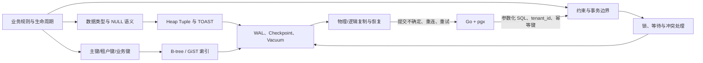

# 第 2 章：生产级数据模型、数据类型、约束与主键设计

> 技术基线：PostgreSQL 18；兼顾 PostgreSQL 14、15、16、17 的差异。Go 示例使用 `github.com/jackc/pgx/v5` 与 `pgxpool`。资料核对日期：2026-06-20。

## 1. 本章定位

数据模型决定了数据能表达什么、数据库必须维护哪些索引、一次写入会修改多少页面、并发事务在哪些对象上竞争，以及故障恢复后能否继续维持业务不变量。**错误的数据模型无法仅靠增加索引解决**：索引不能把近似浮点数变成精确金额，不能替代缺失的租户隔离，不能让“先查库存再扣减”自动变成原子操作，也不能消除过宽主键对所有二级索引和外键的放大。

本章位于架构总览之后、物理存储与索引原理之前。它为后续 Page、Tuple、B-tree、MVCC、锁、WAL、复制和在线迁移建立业务入口：先决定“存什么、如何标识、由谁保证正确”，再讨论“数据库如何存、如何查、如何并发执行”。

本章不深入 Heap Page 格式、B-tree 分裂算法、隔离级别完整冲突矩阵、分区、在线 DDL 和分片；这些内容分别在后续章节展开。

## 2. 可验证的学习目标

完成本章后，你应能：

1. 根据精度、范围、CPU 和空间要求，在 `integer`、`bigint`、`numeric`、`real`、`double precision` 之间做出可解释选择。
2. 说明 `text`、`varchar(n)`、`char(n)` 的真实差异，并拒绝“所有字符串都用 varchar(255)”的惯性设计。
3. 正确建模时间点、业务日期、当地墙上时间和持续时间，解释 `timestamp` 与 `timestamptz` 的边界。
4. 判断字段应使用关系列、`jsonb`、数组、枚举、Domain 还是独立关联表。
5. 解释 SQL 三值逻辑、`CHECK` 对 `NULL` 的行为，以及 `[PG15+] NULLS NOT DISTINCT` 的用途。
6. 比较自然键、`bigint Identity`、UUID v4 与 `[PG18] uuidv7()` 对索引、WAL、并发和外部接口的影响。
7. 设计带 `tenant_id` 的主键、唯一约束和外键，阻止跨租户引用。
8. 使用 `PRIMARY KEY`、`UNIQUE`、`FOREIGN KEY`、`CHECK`、`EXCLUDE` 和 `DEFERRABLE` 表达业务不变量。
9. 通过 `pg_column_size`、关系大小、TOAST 关系和执行计划识别宽表与 `SELECT *` 的代价。
10. 复现应用层“先检查再写入”的竞态，并用条件更新、唯一约束或排斥约束消除竞态。
11. 在 Go/pgx 中正确处理时间、精确数值、UUID、`NULL`、SQLSTATE、事务、幂等键和租户条件。
12. 形成数据模型故障的生产 Runbook，并能分析其性能、并发和高可用影响。

## 3. 核心术语

| 中文名称 | English | 准确定义 | 容易混淆 | 层次 |
|---|---|---|---|---|
| 业务不变量 | Business invariant | 任意已提交状态都必须满足的业务命题，如库存不得为负、同一房间时间段不得重叠 | 应用校验、输入校验 | 业务/事务 |
| 自然键 | Natural key | 来自业务本身且能唯一标识实体的属性组合 | 显示编号 | 数据模型 |
| 代理键 | Surrogate key | 与业务含义解耦、专为标识实体引入的键 | 随机 UUID 就一定解耦 | 数据模型 |
| 复合键 | Composite key | 由多列共同构成的主键或唯一键 | 多列普通索引 | 约束/索引 |
| 序列 | Sequence | 独立的非事务性计数对象，`nextval()` 原子分配值 | 无空洞业务编号 | 存储/并发 |
| Identity | Identity column | 由隐式序列供值的标准 SQL 列属性 | `serial` 伪类型、主键 | Schema |
| UUID v4 | Random UUID | 主要由随机位组成的 128 位标识 | 加密令牌 | 标识 |
| UUID v7 | Time-ordered UUID | `[PG18]` 内置生成的时间可排序 UUID，含毫秒时间与随机部分 | 严格全局单调序列 | 标识/索引 |
| 三值逻辑 | Three-valued logic | SQL 布尔表达式可为 TRUE、FALSE、UNKNOWN | Go 的二值 `bool` | SQL 语义 |
| 排斥约束 | Exclusion constraint | 禁止任意两行在指定运算符组合上同时成立 | `CHECK`、唯一约束 | 约束/索引 |
| 可延迟约束 | Deferrable constraint | 可把检查时点推迟到事务结束的约束 | `NOT VALID`、禁用约束 | 事务 |
| 生成列 | Generated column | 值由同一行其他列的不可变表达式计算 | 默认值、触发器 | Schema |
| 虚拟生成列 | Virtual generated column | `[PG18]` 读取时计算、不占行存储的生成列 | View、表达式索引 | Schema/执行 |
| TOAST | The Oversized-Attribute Storage Technique | 对大变长值压缩并移至行外存储的机制 | 大对象 Large Object | 存储 |
| 排序规则 | Collation | 决定可排序字符串的比较、排序及部分相等语义的规则 | 字符编码 | 类型/索引 |
| 乐观版本号 | Optimistic version | 用于 compare-and-swap 更新的单调字段 | MVCC 的 `xmin` | 应用/事务 |
| Outbox | Transactional outbox | 与业务状态同事务写入、稍后可靠发布的事件表 | 消息队列本身 | 架构/可靠性 |

## 4. 整体心智模型



**数据流**：Go 将经过类型校验的参数发送给 PostgreSQL；默认值、Identity 或 UUID 函数补全字段；约束决定候选行能否进入已提交状态；Heap、TOAST 和索引产生持久化修改，并形成 WAL。

**控制流**：普通列校验只涉及当前行；唯一、外键和排斥约束还需要访问索引或其他行，并可能等待并发事务。应用收到的不是“校验结果文本”，而应是稳定的 SQLSTATE。

**状态变化**：插入会创建 Heap Tuple 和相应 Index Tuple；更新在 MVCC 下通常创建新版本。大字段可能仅在主表保留 TOAST 指针。Identity 序列在事务回滚后不会自动收回已分配值。

**故障路径**：约束失败会回滚事务内修改，但不会回收序列号；连接在 `COMMIT` 附近断开时，客户端可能不知道事务是否提交；宽键和过多索引增加 WAL 与副本重放量；排序规则版本变化可能使已有索引顺序失效。

## 5. 使用方式

### 5.1 数值类型：先确定语义，再讨论字节数

| 类型 | 典型存储 | 精度/范围 | 适合 | 不适合 |
|---|---:|---|---|---|
| `integer` | 4 字节 | 有符号约 ±21 亿 | 有明确上限的计数、状态代码 | 长生命周期全局 ID、可能溢出的累计量 |
| `bigint` | 8 字节 | 有符号约 ±9.22×10¹⁸ | 主键、长周期计数、最小货币单位 | 带任意小数位的金额 |
| `numeric(p,s)` | 变长 | 十进制精确；受精度/小数位约束 | 金额、税率、精确计量 | 极高吞吐近似计算 |
| `real` | 4 字节 | 约 6 位十进制有效数字，近似 | 容许误差的传感器或图形数据 | 金额、相等判断关键值 |
| `double precision` | 8 字节 | 约 15 位十进制有效数字，近似 | 科学计算、统计与坐标 | 财务余额、必须十进制精确的值 |

`numeric` 的精度来自十进制表示，代价是变长存储和更高 CPU。`numeric(18,2)` 会按两位小数舍入，并在整数部分超限时拒绝写入。金额常见两种方案：

- 单币种、固定最小单位：以 `bigint` 存“分”，计算快，但必须显式记录币种和小数位约定。
- 多币种、税率或非固定小数位：使用受约束的 `numeric`，不要在 Go 中转成 `float64`。

不要把 `real`/`double precision` 的二进制近似误差包装成“显示时保留两位”来冒充精确金额。

### 5.2 字符类型：`text` 通常是默认选择

- `text` 与不带长度的 `varchar` 都能保存任意长度字符串，通常没有性能优势差异。
- `varchar(n)` 的主要价值是表达**业务字符数上限**；若上限只是 API 或 UI 限制，应先判断是否应进入数据库约束。
- `char(n)` 会空格填充，比较和长度语义容易令人误判，且通常不比 `text` 快。除极少数严格定长、兼容外部协议的场景外，不应使用。
- `char_length()` 计算字符数，`octet_length()` 计算编码后的字节数；二者约束的是不同业务规则。
- 字符串的比较与唯一性还受 Collation 影响。机器标识符可限制为 ASCII，并明确使用稳定排序规则；人名和自然语言排序则应选适当 ICU/语言规则。

### 5.3 日期时间：区分“瞬间”和“墙上时间”

| 业务语义 | 推荐模型 | 说明 |
|---|---|---|
| 已发生或将发生的绝对瞬间 | `timestamptz` | 内部按 UTC 瞬间处理，输出按会话 `TimeZone`；不会保留原始时区名称 |
| 每天当地 09:00 的营业规则 | `time`/`timestamp` + IANA 时区名 | 需要 `Asia/Tokyo` 这类规则，不能只保存固定 `+09:00` 偏移 |
| 出生日期、账期日、节假日 | `date` | 不应强行转成午夜瞬间 |
| 持续时间或日历间隔 | `interval` | 月、日和微秒分量并非总能折算成固定秒数，需考虑 DST |

生产约定：数据库会话通常设置为 UTC，API 传输 RFC 3339 瞬间；需要展示时再按用户/租户时区转换。`timestamp without time zone` 不会替你“默认它是 UTC”；带时区输入写入该类型时，时区部分会被忽略。

时间函数也有边界：`CURRENT_TIMESTAMP`/`transaction_timestamp()` 固定为事务开始时间，`statement_timestamp()` 固定为语句开始时间，`clock_timestamp()` 才是实际时钟。审计字段通常接受事务或语句时间；性能计时不要使用固定的事务时间。

### 5.4 `boolean`、Enum 与 Domain

- `boolean` 可为 TRUE、FALSE、NULL。只有确实存在“未知/未采集”第三状态时才允许 NULL；否则使用 `NOT NULL`。
- Enum 适合小而稳定、由 Schema 发布控制且顺序有业务意义的集合。值可追加或重命名，但删除/重排通常需要重建类型；频繁变化、需要多语言标签或额外属性的状态应使用引用表。
- Domain 为底层类型复用名称和单值约束，例如“非负金额”。它不能表达跨列或跨行规则；变更 Domain 会影响所有依赖对象，发布前必须评估锁和扫描成本。

### 5.5 `jsonb`、数组与关系模型的边界

`jsonb` 适合**有边界、作为整体读写、字段演进较快的附属属性**，例如第三方回调原文或产品的非核心扩展属性。它在写入时解析为二进制结构，读取和索引通常优于 `json`，但仍有以下成本：

- 类型、必填、外键和跨文档唯一性更难表达；
- 更新一个深层字段仍会生成新的行版本，并可能重写较大的 JSON 值；
- 单个巨大文档会放大锁持有时间、WAL、复制和网络；
- JSON 的 `null` 与 SQL `NULL` 不是同一个值。

数组适合数量小、有明确上限、同质且通常整体使用的值，如三项 RGB 或少量权限标记。若元素有独立生命周期、需要外键、去重、统计、分页或持续增长，应建关联表。判断口诀：**需要独立标识、独立约束或独立查询，就优先关系表。**

### 5.6 NULL：缺失不是空字符串，也不是零

SQL 使用三值逻辑：`NULL = NULL` 结果为 UNKNOWN；`WHERE` 只保留 TRUE；普通 `CHECK` 在表达式为 TRUE 或 UNKNOWN 时通过。因此：

```sql
-- 仅写 CHECK (price > 0) 不能禁止 NULL。
price numeric(18, 2) NOT NULL CHECK (price > 0)
```

普通唯一约束默认把多个 NULL 视为互不相同。`[PG15+] UNIQUE NULLS NOT DISTINCT` 可把 NULL 当作相同值，例如用 `(tenant_id, account_id, ended_at)` 保证每个账户最多一条 `ended_at IS NULL` 的活动记录。比较可空值时使用 `IS NULL`、`IS DISTINCT FROM` 或 `IS NOT DISTINCT FROM`，不要用 `= NULL`。

### 5.7 宽表、稀疏列、TOAST 与 `SELECT *`

PostgreSQL 的 Heap Tuple 不能跨数据页。较大的 `text`、`bytea`、`jsonb` 等变长属性会先尝试压缩，再可能移到 TOAST 表，主行中保留指针。TOAST 解决“放不进一页”，但不等于大字段免费：读取大字段可能发生解压和额外访问，更新大字段增加 WAL，`SELECT *` 还会增加解码、内存和网络开销。

宽表的代价包括：每页行数下降、缓存命中变差、查询投影和网络放大、更新形成更多死元组、Schema 演进更复杂。大量极少访问的可空列可垂直拆分为一对一扩展表；大正文或原始报文可独立表存储，使热点主表保持窄小。不要把大字段放进 `INCLUDE` 只为追求 Index Only Scan。

### 5.8 主键与标识符选型

#### 自然键与代理键

自然键只有在**稳定、紧凑、不敏感、不会因业务合并或规则变化而修改**时适合作主键。邮箱、手机号、身份证号、SKU 常会变更、带隐私或仅在租户内唯一，更适合作唯一业务键。代理键让外键稳定，但不能替代业务唯一约束。

#### Sequence 与 Identity

Identity 列由隐式 Sequence 供值：

```sql
id bigint GENERATED ALWAYS AS IDENTITY PRIMARY KEY
```

`ALWAYS` 默认拒绝显式 ID，导入时需明确 `OVERRIDING SYSTEM VALUE`；`BY DEFAULT` 允许显式值覆盖。Identity 隐含 `NOT NULL`，**不隐含唯一性**，仍需主键或唯一约束。

`nextval()` 是并发安全且非事务性的：回滚、`ON CONFLICT` 失败、崩溃和 Sequence Cache 都可能造成空洞。增大 `CACHE` 可减少序列状态同步，但会在会话退出或故障时丢弃更多预分配值，也不能提供跨会话严格提交顺序。发票号等“无空洞编号”需要独立、串行化且有审计补偿的业务流程，不应由普通主键序列承担。

#### `bigint`、UUID v4、UUID v7

| 方案 | 主要优点 | 主要代价 | 典型用途 |
|---|---|---|---|
| `bigint Identity` | 8 字节、比较快、索引紧凑、插入局部性高 | 依赖数据库分配；可枚举；右侧热点可能竞争 | 单主写入的内部主键 |
| UUID v4 | 可在多节点/客户端生成，难枚举 | 16 字节；随机插入扩大缓存工作集和分裂趋势 | 离线生成、跨系统合并、外部 ID |
| `[PG18] uuidv7()` | 16 字节；时间有序，通常比 v4 更利于最近插入局部性 | 暴露粗粒度创建时间；仍比 bigint 宽；不是严格全局提交序 | 分布式外部 ID、希望兼顾局部性的 UUID |

UUID v7 的“时间可排序”不等于跨节点严格单调，也不等于提交顺序。`bigint` 和 UUID v7 的连续插入还可能集中在 B-tree 右侧叶页；UUID v4 虽分散热点，却会增加随机页面触达。结论必须通过本机数据量、并发和缓存实验验证。

常见折中是内部 `bigint` 主键加外部 UUID v7 唯一键，但这会多维护一个唯一索引；只有确有安全、API 或跨系统需求时才支付这份写放大。

### 5.9 复合主键与多租户 `tenant_id`

共享表多租户模型应使租户边界进入数据库约束，而不是只存在于 Go 的 `WHERE` 拼接规范中：

```sql
PRIMARY KEY (tenant_id, product_id)
UNIQUE (tenant_id, normalized_sku)
FOREIGN KEY (tenant_id, product_id)
    REFERENCES product (tenant_id, product_id)
```

这样即使应用把租户 A 的 `product_id` 与租户 B 的订单混用，外键也会拒绝。代价是子表外键与索引变宽。若采用全局唯一 ID，也应在所有租户查询中携带 `tenant_id`，并为租户内自然键建立复合唯一约束。索引列顺序取决于查询模式：大量按租户过滤时常把 `tenant_id` 放前面；只按全局 ID 点查则可能需要额外索引。

### 5.10 约束、默认值与生成列

| 机制 | 保证内容 | 并发行为/注意事项 |
|---|---|---|
| `PRIMARY KEY` | 唯一且非 NULL；默认创建唯一 B-tree | 宽主键会进入所有引用外键和相关索引 |
| `UNIQUE` | 候选键唯一 | 并发冲突可能等待，最终一方 SQLSTATE `23505` |
| `[PG15+] NULLS NOT DISTINCT` | NULL 也参与“相同”判断 | 只在业务确实要求“最多一个空值”时使用 |
| `FOREIGN KEY` | 引用值存在 | 被引用侧需唯一键；引用侧不会自动创建索引，删除/更新父行可能很慢 |
| `CHECK` | 当前行表达式不为 FALSE | 不能可靠检查其他行；UNKNOWN 会通过；函数应保持不可变语义 |
| `EXCLUDE` | 任意两行不得满足指定运算符组合 | 常用 GiST 表达时间/空间重叠；冲突可能等待并报 `23P01` |
| `DEFERRABLE` | 将 UNIQUE/PK/FK/EXCLUDE 检查推迟到事务末尾 | 不是性能开关；不可作为 `ON CONFLICT` 仲裁器；CHECK/NOT NULL 不可延迟 |
| `DEFAULT` | INSERT 省略该列时计算值 | 显式写 NULL 不会触发默认值；表达式不能引用本行其他列 |
| 生成列 | 由本行基础列计算 | 只能用不可变表达式；不能直接写入 |

`[PG14–17]` PostgreSQL 只支持 `STORED` 生成列，必须写明 `STORED`。`[PG18]` 新增 `VIRTUAL`，且省略关键字时默认为虚拟列。为避免跨版本迁移时语义改变，生产 DDL 建议总是显式写 `STORED` 或 `VIRTUAL`。虚拟列读取时计算、不占行存储，但只能使用内置类型和内置函数/操作符；存储列在写入时计算，可以被索引并增加行宽与 WAL。`[PG18]` 逻辑复制可按 publication 配置发布存储生成列，虚拟生成列不作为存储值发布。

`updated_at DEFAULT now()` 只负责插入，**不会在 UPDATE 时自动变化**。应由同一条 UPDATE 明确赋值、由受控触发器维护，或通过不可变事件模型避免隐式审计。

### 5.11 一套生产级示例 Schema

下面使用 PostgreSQL 18 的 `uuidv7()` 和虚拟生成列；在 14–17 上应把 UUID 默认改为可用的 UUID v4 方案，并把虚拟列改为 `STORED` 或查询表达式。

```sql
CREATE SCHEMA IF NOT EXISTS app;
CREATE EXTENSION IF NOT EXISTS btree_gist;

CREATE DOMAIN app.nonnegative_amount AS numeric(18, 2)
    CHECK (VALUE >= 0);

CREATE TABLE app.tenant (
    tenant_id   uuid PRIMARY KEY DEFAULT uuidv7(),
    tenant_name text NOT NULL,
    created_at  timestamptz NOT NULL DEFAULT transaction_timestamp()
);

CREATE TABLE app.product (
    tenant_id      uuid NOT NULL,
    product_id     bigint GENERATED ALWAYS AS IDENTITY,
    public_id      uuid NOT NULL DEFAULT uuidv7(),
    sku            text COLLATE "C" NOT NULL,
    normalized_sku text COLLATE "C"
        GENERATED ALWAYS AS (lower(sku)) STORED,
    title          text NOT NULL,
    price          app.nonnegative_amount NOT NULL,
    stock          integer NOT NULL DEFAULT 0,
    version        bigint NOT NULL DEFAULT 0,
    attributes     jsonb NOT NULL DEFAULT '{}'::jsonb,
    created_at     timestamptz NOT NULL DEFAULT transaction_timestamp(),
    updated_at     timestamptz NOT NULL DEFAULT transaction_timestamp(),

    CONSTRAINT pk_product PRIMARY KEY (tenant_id, product_id),
    CONSTRAINT uq_product_public UNIQUE (tenant_id, public_id),
    CONSTRAINT uq_product_sku UNIQUE (tenant_id, normalized_sku),
    CONSTRAINT ck_product_sku
        CHECK (sku ~ '^[A-Za-z0-9._-]{1,64}$'),
    CONSTRAINT ck_product_stock CHECK (stock >= 0),
    CONSTRAINT ck_product_attributes_object
        CHECK (jsonb_typeof(attributes) = 'object'),
    CONSTRAINT fk_product_tenant
        FOREIGN KEY (tenant_id) REFERENCES app.tenant (tenant_id)
);

CREATE INDEX ix_product_tenant_updated
    ON app.product (tenant_id, updated_at DESC);

CREATE TABLE app.stock_reservation (
    tenant_id  uuid NOT NULL,
    request_id uuid NOT NULL,
    product_id bigint NOT NULL,
    quantity   integer NOT NULL CHECK (quantity > 0),
    created_at timestamptz NOT NULL DEFAULT transaction_timestamp(),

    CONSTRAINT pk_stock_reservation
        PRIMARY KEY (tenant_id, request_id),
    CONSTRAINT fk_stock_reservation_product
        FOREIGN KEY (tenant_id, product_id)
        REFERENCES app.product (tenant_id, product_id)
);

-- 外键引用侧不会因 FK 自动获得合适索引。
CREATE INDEX ix_stock_reservation_product
    ON app.stock_reservation (tenant_id, product_id);

-- [PG15+] ended_at 为 NULL 的“活动合同”每个账户最多一条。
CREATE TABLE app.account_contract (
    tenant_id  uuid NOT NULL,
    account_id bigint NOT NULL,
    contract_id uuid NOT NULL DEFAULT uuidv7(),
    ended_at   timestamptz,
    CONSTRAINT uq_contract_state
        UNIQUE NULLS NOT DISTINCT (tenant_id, account_id, ended_at)
);

-- [PG18] 读取时计算。若该值高频读取、需要稳定索引或要发布到旧订阅端，考虑 STORED。
CREATE TABLE app.quote_line (
    tenant_id  uuid NOT NULL,
    quote_id   uuid NOT NULL,
    line_no    integer NOT NULL CHECK (line_no > 0),
    quantity   integer NOT NULL CHECK (quantity > 0),
    unit_price numeric(18, 2) NOT NULL CHECK (unit_price >= 0),
    line_total numeric(24, 2)
        GENERATED ALWAYS AS (quantity::numeric * unit_price) VIRTUAL,
    PRIMARY KEY (tenant_id, quote_id, line_no)
);

-- 同一租户、同一房间的时间段不得重叠。
CREATE TABLE app.room_booking (
    tenant_id uuid NOT NULL,
    room_id   bigint NOT NULL,
    booking_id uuid NOT NULL DEFAULT uuidv7(),
    during    tstzrange NOT NULL,
    created_at timestamptz NOT NULL DEFAULT transaction_timestamp(),
    PRIMARY KEY (tenant_id, booking_id),
    CHECK (
        lower(during) IS NOT NULL
        AND upper(during) IS NOT NULL
        AND lower(during) < upper(during)
    ),
    CONSTRAINT ex_room_booking_overlap
        EXCLUDE USING gist (
            tenant_id WITH =,
            room_id WITH =,
            during WITH &&
        ) DEFERRABLE INITIALLY IMMEDIATE
);

CREATE TABLE app.outbox (
    tenant_id      uuid NOT NULL,
    event_id       uuid NOT NULL DEFAULT uuidv7(),
    aggregate_type text NOT NULL,
    aggregate_id   uuid NOT NULL,
    event_type     text NOT NULL,
    payload        jsonb NOT NULL,
    occurred_at    timestamptz NOT NULL DEFAULT transaction_timestamp(),
    available_at   timestamptz NOT NULL DEFAULT transaction_timestamp(),
    published_at   timestamptz,
    attempts       integer NOT NULL DEFAULT 0 CHECK (attempts >= 0),
    last_error     text,
    PRIMARY KEY (tenant_id, event_id),
    CHECK (jsonb_typeof(payload) = 'object')
);

CREATE INDEX ix_outbox_pending
    ON app.outbox (available_at, tenant_id, event_id)
    WHERE published_at IS NULL;
```

### 5.12 规范化、反规范化与状态字段

规范化的默认目标是让一个事实只有一个权威来源。反规范化只有在读路径、延迟目标和成本测量证明有必要时采用，并必须明确：

1. 权威值在哪里；
2. 冗余值由同事务、触发器、异步任务还是重算生成；
3. 最大容忍陈旧时间；
4. 如何校验和修复漂移。

汇总表适合昂贵聚合的异步物化，但要记录水位、更新时间和重建方法。热点计数器不要让所有请求更新同一行；可按分片累加、写增量事件，或接受近似统计。余额和库存不是普通计数器：可用账本保存不可变明细，以受约束的缓存余额加速读取；扣减必须通过原子条件更新或串行化事务维持不变量。

`version bigint NOT NULL DEFAULT 0` 可用于乐观锁：

```sql
UPDATE app.product
SET title = $4,
    version = version + 1,
    updated_at = statement_timestamp()
WHERE tenant_id = $1
  AND product_id = $2
  AND version = $3
RETURNING version;
```

返回零行表示对象不存在或版本冲突，应用必须区分并处理。不要把系统列 `xmin` 当长期业务版本号。

审计字段至少明确 `created_at`、`updated_at` 的时钟语义和操作者来源；高要求审计应使用追加事件或专用审计表，而非只保留最后修改时间。Outbox 应包含事件 ID、聚合标识、事件类型、载荷、发生时间、可投递时间、发布状态、重试次数和错误摘要；载荷要有版本，不要复制无界大对象。

### 5.13 PostgreSQL 14–18 关键差异

| 能力 | PG14 | PG15 | PG16 | PG17 | PG18 |
|---|---|---|---|---|---|
| `UNIQUE NULLS NOT DISTINCT` | 无 | 新增 | 支持 | 支持 | 支持 |
| 生成列 | 仅 `STORED` | 仅 `STORED` | 仅 `STORED` | 仅 `STORED` | 新增 `VIRTUAL`，且默认虚拟 |
| 内置 `uuidv7()`/`uuidv4()` 名称 | 无 | 无 | 无 | 无 | 新增 |
| CHECK/FK `NOT ENFORCED` | 无 | 无 | 无 | 无 | 新增；不应承载关键不变量 |
| 发布存储生成列 | 不支持 | 不支持 | 不支持 | 不支持 | 可通过列清单或 publication 参数配置 |

## 6. 底层原理

### 6.1 一次插入的状态时间线

```text
客户端参数
   │
   ├─ 类型输入/强制转换
   ├─ 为省略列计算 DEFAULT、Identity/Sequence、uuidv7()
   ├─ 由基础列计算生成列
   ├─ NOT NULL / CHECK
   ├─ 写 Heap Tuple；大值可能压缩或写 TOAST
   ├─ 为 PK/UNIQUE/普通索引写 Index Tuple
   ├─ FK / EXCLUDE 等访问其他索引并可能等待
   ├─ 产生 WAL
   └─ COMMIT 后成为已提交状态
```

其中 Sequence 分配发生后，即使后续约束失败或事务回滚，值也通常不会回收。默认值解决“省略列时填什么”，约束解决“什么值允许提交”，两者不可互换。

### 6.2 主键宽度如何向全系统传播

B-tree 键越宽，每个叶页能容纳的 Index Tuple 越少，树和缓存工作集越大。主键还常出现在：

- 所有子表外键列；
- 子表为连接和级联操作建立的索引；
- 逻辑复制 Replica Identity；
- Outbox、审计和消息载荷；
- Go 对象、日志与网络协议。

因此 8 字节 `bigint` 与 16 字节 UUID 的差异不是只存在于主键索引。复合 `(tenant_id uuid, entity_id uuid)` 还会进一步放大。UUID v7 改善的是插入时间局部性，不会把 16 字节变成 8 字节。

### 6.3 插入局部性、Page Split 与热点

单调 `bigint` 或时间有序 UUID 通常向 B-tree 右侧叶页插入，最近页面容易留在缓存，随机读写较少；当并发极高时，同一批右侧页面也可能成为锁与缓存争用点。UUID v4 把写入分散到整个树，降低单一右侧热点，却增加页面随机触达、缓存淘汰和中间页分裂机会。

这不是“UUID v7 必然更快”的固定结论。填充因子、批量大小、索引数量、并发、CPU、存储、检查点和数据是否驻留缓存都会改变结果。实验应比较趋势和尾延迟，而不是只抄一组 TPS。

### 6.4 约束如何处理并发

- **UNIQUE/PK**：唯一索引检查会考虑并发中的候选项；两个事务插入同一键时，一方可能等待另一方结束，然后成功或报 `23505`。
- **FK**：由内部触发器维护。父键更新/删除与子行写入会取得相应行级锁；子表缺少外键前缀索引时，父行操作可能扫描大量子行。
- **CHECK**：只看当前候选行，不能安全表达“表中其他行不存在”。用子查询伪装跨行 CHECK 既不受支持，也无法得到正确并发语义。
- **EXCLUDE**：借助索引判断运算符冲突。重叠区间的并发插入会等待，冲突事务提交后另一方报 `23P01`。
- **DEFERRABLE**：改变检查时点，不改变业务规则。它适合事务内临时违反、结束时恢复一致的批量重排，不应成为掩盖错误中间状态的常规手段。

### 6.5 MVCC、宽行与 TOAST 更新

PostgreSQL 更新通常创建新 Tuple，旧版本等待 Vacuum 清理。即便只改一个小列，也会形成新行版本；未变化的行外 TOAST 值可能被复用，但修改大字段通常会产生新的 TOAST 数据、索引维护和 WAL。宽表还会降低每页行数，使同样的更新批次接触更多页。后续章节将展开 HOT；本章只需记住：额外索引和被索引列变化会提高写放大，并可能阻止更便宜的更新路径。

### 6.6 Collation 为何能影响唯一性和升级

B-tree 依赖 Collation 给出的排序关系。ICU、libc 或操作系统升级可能改变字符顺序；数据库中已有索引仍按旧规则排列，于是查询、唯一性检查和合并操作可能不再满足新规则。正确流程是识别依赖对象、重建索引，再刷新记录的 Collation 版本；仅执行 `REFRESH VERSION` 只会消除警告，不会验证索引已重建。

## 7. 内部数据结构和状态

| 对象/状态 | 与本章的关系 | 观察入口 |
|---|---|---|
| Heap Page / Tuple | 行宽、NULL Bitmap、变长值指针决定页密度 | `pg_column_size`、`pageinspect`（后续章详解） |
| TOAST Relation | 保存压缩或行外的大属性 | `pg_class.reltoastrelid`、`pg_relation_size` |
| B-tree Index Tuple | 保存主键、唯一键和二级索引键 | `pgstatindex`、`pg_relation_size` |
| GiST Index | 支撑范围排斥约束 | `pg_constraint`、`pg_indexes` |
| Sequence 状态 | Identity 的下一个值、缓存和上下界 | `pg_sequences`、`pg_sequence` |
| 约束目录 | 类型、可延迟、验证、强制状态 | `pg_constraint`、`pg_get_constraintdef` |
| 列目录 | 类型、默认值、Identity、生成列 | `pg_attribute`、`pg_attrdef` |
| 索引目录 | 主键、唯一性、NULL 处理、有效性 | `pg_index`、`pg_get_indexdef` |
| WAL / LSN | 行、TOAST 和索引修改的持久化与复制载体 | `pg_stat_wal`、`pg_current_wal_insert_lsn()` |
| Lock/Wait | 唯一、外键、排斥及热点更新的等待状态 | `pg_stat_activity`、`pg_locks`、`pg_blocking_pids()` |
| Collation 版本 | 已记录规则与当前 Provider 版本 | `pg_collation_actual_version()` |

列定义诊断：

```sql
SELECT n.nspname AS schema_name,
       c.relname AS table_name,
       a.attname AS column_name,
       format_type(a.atttypid, a.atttypmod) AS data_type,
       a.attnotnull,
       a.attidentity,   -- a=ALWAYS, d=BY DEFAULT, 空=非 Identity
       a.attgenerated,  -- s=STORED；[PG18] v=VIRTUAL
       pg_get_expr(ad.adbin, ad.adrelid) AS default_expr,
       coll.collname AS collation_name
FROM pg_attribute AS a
JOIN pg_class AS c ON c.oid = a.attrelid
JOIN pg_namespace AS n ON n.oid = c.relnamespace
LEFT JOIN pg_attrdef AS ad
       ON ad.adrelid = a.attrelid AND ad.adnum = a.attnum
LEFT JOIN pg_collation AS coll ON coll.oid = a.attcollation
WHERE a.attnum > 0
  AND NOT a.attisdropped
  AND n.nspname = 'app'
ORDER BY c.relname, a.attnum;
```

约束诊断：

```sql
SELECT conrelid::regclass AS table_name,
       conname,
       contype,          -- p/u/f/c/x/n 等
       condeferrable,
       condeferred,
       convalidated,
       pg_get_constraintdef(oid, true) AS definition
FROM pg_constraint
WHERE connamespace = 'app'::regnamespace
ORDER BY conrelid::regclass::text, conname;

-- [PG18] 可额外查看 conenforced；关键业务约束应为 true。
```

Sequence 容量：

```sql
SELECT schemaname,
       sequencename,
       data_type,
       last_value,
       max_value,
       cache_size,
       cycle
FROM pg_sequences
WHERE schemaname = 'app';
```

Collation 版本不一致：

```sql
SELECT n.nspname,
       c.collname,
       c.collversion AS recorded_version,
       pg_collation_actual_version(c.oid) AS actual_version
FROM pg_collation AS c
JOIN pg_namespace AS n ON n.oid = c.collnamespace
WHERE c.collversion IS DISTINCT FROM pg_collation_actual_version(c.oid);
```

## 8. 场景和选型决策

| 业务场景 | 推荐方案 | 不推荐方案 | 原因 | 性能代价 | 并发代价 | 一致性/HA/运维代价 |
|---|---|---|---|---|---|---|
| 财务金额 | `numeric(p,s)` 或明确的 `bigint` 最小单位 | `float8` | 必须十进制精确 | numeric CPU 较高 | 通常低 | 需统一币种、舍入和迁移规则 |
| 高频内部实体 ID | `bigint GENERATED ... AS IDENTITY` | 文本自然键作所有 FK | 紧凑、稳定 | 右侧索引局部性好 | 极高并发有右侧热点 | 逻辑切换需同步 Sequence |
| 外部不可枚举 ID | UUID v7 唯一键；必要时内部 bigint | 只暴露自增 ID | 安全与跨系统合并 | 多一个索引 | 额外唯一检查 | API/DB 生成策略须一致 |
| 租户内 SKU | `UNIQUE(tenant_id, normalized_sku)` | Go 先查重 | 并发下数据库仲裁 | 复合索引 | 冲突时等待 | 所有读写必须带 tenant_id |
| 房间预订 | `tstzrange` + `EXCLUDE` | `CHECK` 或应用遍历 | 跨行重叠需并发安全 | GiST 维护成本 | 冲突区间等待 | 需处理 `23P01` 和重试策略 |
| 产品扩展属性 | 小而有界的 `jsonb` | 核心列全部塞 JSON | 保留核心约束和统计 | GIN/更新可能昂贵 | 大文档加长事务 | Schema 版本和重建机制 |
| 大正文/原始报文 | 独立冷表或对象存储引用 | 热点表 `SELECT *` | 缩小热点工作集 | 多一次按需读取 | 降低主表争用 | 备份与生命周期需联动 |
| 少量固定标签 | 小数组或关联表，按查询需求决定 | 无界数组 | 查询/约束边界明确 | 数组更新整值 | 热点行风险 | 演进到关联表需迁移 |
| 高频计数 | 分片计数、增量事件、异步汇总 | 全局单行 `UPDATE count=count+1` | 避免热点行 | 读时聚合或异步成本 | 降低串行队列 | 接受可定义的陈旧度 |
| 库存/余额 | 原子条件 DML + 明细/幂等键 + CHECK | 读后在 Go 判断 | 维持提交态不变量 | 多写明细/Outbox | 行锁或 SSI 冲突 | 恢复后可审计、可重放 |

## 9. 高性能分析

### 9.1 成本链条

- **CPU**：`numeric` 运算、复杂 Collation、JSONB 解析、虚拟生成列表达式会增加 CPU；简单整数和二进制 UUID 比较更轻。
- **内存与缓存**：宽行、宽索引键和随机 UUID 扩大 `shared_buffers` 与操作系统 Page Cache 的工作集。PostgreSQL 缓存命中不代表没有内核 Page Cache 访问。
- **I/O**：随机键可能触达更多索引页；大字段读取涉及 TOAST。`[PG18]` AIO 可改善部分顺序扫描、Bitmap Heap Scan、Vacuum 等读路径，但不会修复不必要的宽行、过多索引或随机写放大。
- **网络往返**：一次数据库往返不仅是 SQL 执行时间；`SELECT *` 还增加编码、传输和 Go 分配。批量操作可降低 RTT，但事务必须保持可控大小。
- **索引维护**：每个 INSERT 都要维护所有相关索引；每个 UPDATE 是否更新索引取决于被修改列和物理条件。主键越宽，唯一检查和缓存成本越高。
- **WAL 与 Checkpoint**：主表、TOAST 和多个索引都产生 WAL。更大的写入工作集会增加脏页、Full Page Image 概率和 Checkpoint 压力。
- **Vacuum**：频繁更新宽行或 JSONB 会产生更多死元组与 TOAST 垃圾；长事务延迟回收。
- **Temporary File**：缺少可统计的关系列、过度依赖 JSONB 提取或宽行排序，可能使排序/哈希超出内存并落盘。
- **放大**：读放大来自无选择投影和 TOAST；写放大来自冗余列、索引、生成存储列与 Outbox；空间放大来自旧行版本、索引和 TOAST。

### 9.2 测试必须记录的上下文

任何“某 ID 更快”或“某类型节省多少”结论都必须附带：PostgreSQL 版本和配置、数据量、平均/P95 行宽、键分布、缓存冷热、并发数、读写比例、CPU/内存、磁盘、测试时长和 SLO。记录 TPS、P50/P95/P99、`BUFFERS`、WAL、CPU、I/O、Wait Event、索引大小和叶页密度。不要为所有机器给固定 `shared_buffers`、`work_mem`、Sequence `CACHE` 或连接数。

### 9.3 重点观察入口

```sql
SELECT * FROM pg_stat_wal;

SELECT backend_type, object, context,
       reads, read_bytes, writes, write_bytes,
       extends, extend_bytes, fsyncs
FROM pg_stat_io
ORDER BY backend_type, object, context;

SELECT relname, seq_scan, idx_scan,
       n_tup_ins, n_tup_upd, n_tup_hot_upd, n_dead_tup
FROM pg_stat_user_tables
ORDER BY n_tup_ins + n_tup_upd DESC;
```

`pg_stat_io` 统计内核 I/O 调用，但不能区分数据来自真实磁盘还是操作系统 Page Cache。`pg_stat_wal` 是集群累计值；进行单项实验时应隔离其他负载或使用单语句 `EXPLAIN (WAL)`。

## 10. 高并发分析

### 10.1 不要混淆五种“并发”

| 指标 | 含义 |
|---|---|
| goroutine 数 | 应用中可运行或等待的任务数量 |
| 连接池连接数 | 可同时占用的 PostgreSQL 会话上限 |
| 活跃查询数 | 当前真正执行或等待数据库资源的语句数 |
| TPS | 单位时间提交的事务数量 |
| 排队请求数 | 在应用限流器、连接池或数据库锁上等待的请求 |

一万个 goroutine 不应对应一万个数据库连接。连接池是有界资源；应通过队列长度、获取连接等待时间、事务 P99 和数据库 Wait Event 做 Admission Control。无限 goroutine + 小连接池会把超时和重试变成排队风暴；大连接池则可能把争用直接推入数据库。

### 10.2 与本章相关的竞争点

- **热点行**：库存、余额、全局计数器的单行更新形成行锁队列。
- **热点索引页**：单调 ID 的高并发插入集中于右侧页；随机 UUID 扩大缓存触达，两者是不同代价。
- **WAL 竞争**：宽行、多索引和 Outbox 提高每事务 WAL，提交吞吐受 WAL 写入与同步影响。
- **外键与唯一键**：正确性来自数据库仲裁，但冲突业务必须设置超时、分类 SQLSTATE，并避免无上限重试。
- **长事务**：持锁时间更长、旧版本回收推迟、连接占用变长，P99 和复制延迟恶化。
- **死锁**：多实体更新应采用稳定顺序，例如总按 `(tenant_id, product_id)` 升序锁定；仍需对 `40P01` 重试完整事务。

### 10.3 不变量的并发实现模式

1. **原子条件 DML**：`UPDATE ... WHERE stock >= $qty RETURNING`，把检查和写入合成一个数据库操作。
2. **唯一/排斥约束**：让数据库在并发写入间仲裁“只能一个”或“不得重叠”。
3. **显式行锁**：复杂多步计算时 `SELECT ... FOR UPDATE`，锁顺序必须稳定，事务内不调用慢外部服务。
4. **Serializable + 完整事务重试**：跨多行谓词不变量无法用单一约束表达时采用；只重试 `40001`/`40P01` 等明确错误，并有退避、抖动、上限与背压。
5. **幂等键**：请求 ID 建唯一约束，解决客户端超时、提交结果不确定和消息重复投递。

## 11. 高可用分析

本章与 HA 的关系主要是**数据模型决定写放大、复制身份、切换后的可写性和恢复验证内容**，而不是直接提供故障转移机制。

- **RPO/RTO**：物理备份和 PITR 能恢复“数据库曾经提交的状态”，不能自动修复缺失约束导致的业务错误。恢复演练必须检查不变量、Sequence 高水位和 Collation。
- **物理复制**：表、TOAST、索引和 Sequence 状态通过 WAL 恢复；宽键和随机写增大 WAL 与重放负担。异步复制可能丢失尚未到达副本的提交；同步复制降低 RPO，但提高提交延迟。
- **逻辑复制**：DDL 和 Sequence 状态不会自动复制；Identity 列的行值会复制，但订阅端 Sequence 仍需在计划切换前校准。`[PG18]` 可发布存储生成列；发布/订阅 Schema 与 Collation 仍需人工一致管理。
- **切换与回切**：应用必须丢弃旧连接并重新发现主库。`COMMIT` 附近断线时结果可能未知，应使用幂等请求 ID，而不是盲目重复扣款或扣库存。
- **脑裂与 Fencing**：即使主键是 UUID，也不能让两个主库无协调写入后“自然合并”；唯一键、库存和序列语义都会冲突。Fencing 是集群层责任。
- **Collation**：主备应使用兼容 Provider/版本。系统升级或跨平台迁移前识别依赖索引，重建后再刷新版本。
- **备份验证**：除可启动和校验和外，还要验证 FK/约束状态、重复业务键、孤儿行、Outbox 水位、最大 ID 与 Sequence、时区设置和查询计划。

## 12. 三维影响矩阵

| 维度 | 相关度 | 核心收益 | 主要风险 | 关键指标 |
|---|---|---|---|---|
| 高性能 | 高 | 缩小行与索引、改善局部性、减少无用投影和写放大 | 宽键、JSONB 滥用、过多索引、TOAST/网络放大 | 行宽、关系/索引/TOAST 大小、Buffers、WAL、P95/P99 |
| 高并发 | 高 | 约束和原子 DML 把不变量置于正确仲裁点 | 热点行/页、锁队列、死锁、重试风暴 | lock wait、blocked sessions、TPS、pool acquire、40001/40P01/23xxx |
| 高可用 | 中 | 明确 Replica Identity、Sequence 与恢复校验 | WAL/复制延迟、逻辑切换序列错误、Collation 不一致、提交未知 | replay lag、WAL rate、RPO/RTO、sequence headroom、collation mismatch |

## 13. 实验

### 实验一：比较 bigint Identity、UUID v4 与 UUID v7

#### 1）实验目标

比较三种主键的索引大小、插入物理相关性、叶页密度/碎片趋势、WAL、缓存工作集和并发插入表现。实验只产出当前环境证据，不宣称固定排名。

#### 2）版本与扩展

- PostgreSQL 18，因需内置 `uuidv7()`。
- `pgstattuple`；若无创建扩展权限，可跳过叶页统计。

#### 3）环境记录

```sql
SELECT version();
SHOW block_size;
SHOW shared_buffers;
SHOW wal_compression;
SHOW full_page_writes;
SHOW checkpoint_timeout;
SHOW max_wal_size;
SHOW track_io_timing;

CREATE EXTENSION IF NOT EXISTS pgstattuple;
CREATE SCHEMA IF NOT EXISTS ch02_lab;
```

记录 CPU、内存、磁盘类型、空闲/混部状态、数据量、并发数、测试时长和缓存冷热。不要在共享生产集群重置全局统计或清空操作系统缓存。

#### 4）建表与数据

```sql
DROP TABLE IF EXISTS ch02_lab.id_bigint,
                     ch02_lab.id_uuid4,
                     ch02_lab.id_uuid7;

CREATE TABLE ch02_lab.id_bigint (
    id bigint GENERATED ALWAYS AS IDENTITY PRIMARY KEY,
    payload text NOT NULL,
    created_at timestamptz NOT NULL DEFAULT clock_timestamp()
);

CREATE TABLE ch02_lab.id_uuid4 (
    id uuid PRIMARY KEY DEFAULT uuidv4(),
    payload text NOT NULL,
    created_at timestamptz NOT NULL DEFAULT clock_timestamp()
);

CREATE TABLE ch02_lab.id_uuid7 (
    id uuid PRIMARY KEY DEFAULT uuidv7(),
    payload text NOT NULL,
    created_at timestamptz NOT NULL DEFAULT clock_timestamp()
);
```

先用较小规模试跑，再逐步放大。以下 `:n` 为 psql 变量：

```sql
\set n 500000
\timing on

INSERT INTO ch02_lab.id_bigint(payload)
SELECT repeat(md5(g::text), 4)
FROM generate_series(1, :n) AS g;

INSERT INTO ch02_lab.id_uuid4(payload)
SELECT repeat(md5(g::text), 4)
FROM generate_series(1, :n) AS g;

INSERT INTO ch02_lab.id_uuid7(payload)
SELECT repeat(md5(g::text), 4)
FROM generate_series(1, :n) AS g;

ANALYZE ch02_lab.id_bigint;
ANALYZE ch02_lab.id_uuid4;
ANALYZE ch02_lab.id_uuid7;
```

#### 5）单语句 Buffers/WAL

`EXPLAIN ANALYZE` 会真实执行 DML。用事务回滚只能回滚表数据，不能撤销已经产生的 WAL，也不会收回 Sequence 值；实验中不要包含外部副作用触发器。

```sql
BEGIN;
EXPLAIN (ANALYZE, BUFFERS, WAL, SETTINGS, VERBOSE, SUMMARY)
INSERT INTO ch02_lab.id_bigint(payload)
SELECT repeat(md5(g::text), 4)
FROM generate_series(1, 100000) AS g;
ROLLBACK;

BEGIN;
EXPLAIN (ANALYZE, BUFFERS, WAL, SETTINGS, VERBOSE, SUMMARY)
INSERT INTO ch02_lab.id_uuid4(payload)
SELECT repeat(md5(g::text), 4)
FROM generate_series(1, 100000) AS g;
ROLLBACK;

BEGIN;
EXPLAIN (ANALYZE, BUFFERS, WAL, SETTINGS, VERBOSE, SUMMARY)
INSERT INTO ch02_lab.id_uuid7(payload)
SELECT repeat(md5(g::text), 4)
FROM generate_series(1, 100000) AS g;
ROLLBACK;
```

为降低 Checkpoint/Full Page Image 偏差，应改变执行顺序重复多轮，并记录每轮开始时间、Checkpoints 和其他负载；不要只比较一次。

#### 6）索引大小、插入位置和分裂趋势

```sql
SELECT 'bigint' AS kind,
       pg_size_pretty(pg_relation_size('ch02_lab.id_bigint_pkey')) AS index_size,
       pg_size_pretty(pg_total_relation_size('ch02_lab.id_bigint')) AS total_size
UNION ALL
SELECT 'uuid4',
       pg_size_pretty(pg_relation_size('ch02_lab.id_uuid4_pkey')),
       pg_size_pretty(pg_total_relation_size('ch02_lab.id_uuid4'))
UNION ALL
SELECT 'uuid7',
       pg_size_pretty(pg_relation_size('ch02_lab.id_uuid7_pkey')),
       pg_size_pretty(pg_total_relation_size('ch02_lab.id_uuid7'));

SELECT tablename, attname, correlation
FROM pg_stats
WHERE schemaname = 'ch02_lab'
  AND tablename IN ('id_bigint', 'id_uuid4', 'id_uuid7')
  AND attname = 'id'
ORDER BY tablename;

SELECT 'bigint' AS kind, *
FROM pgstatindex('ch02_lab.id_bigint_pkey'::regclass)
UNION ALL
SELECT 'uuid4', *
FROM pgstatindex('ch02_lab.id_uuid4_pkey'::regclass)
UNION ALL
SELECT 'uuid7', *
FROM pgstatindex('ch02_lab.id_uuid7_pkey'::regclass);
```

`correlation` 接近 1 通常表示键顺序与 Heap 物理顺序更一致。`pgstatindex` 的 `leaf_pages`、`avg_leaf_density`、`leaf_fragmentation` 是时点观察，不是精确 Page Split 计数。要看趋势，应每插入固定批次记录一次，而不是从最终状态反推所有分裂。

#### 7）并发 Session A / B / C

先分别 `TRUNCATE ... RESTART IDENTITY`，每次只测一张表。三个会话在同一时刻执行；可用 `pgbench` 替代人工同步，并报告 P50/P95/P99。

Session A：

```sql
BEGIN;
INSERT INTO ch02_lab.id_uuid7(payload)
SELECT repeat(md5(('A-' || g)::text), 4)
FROM generate_series(1, 200000) AS g;
COMMIT;
```

Session B：

```sql
BEGIN;
INSERT INTO ch02_lab.id_uuid7(payload)
SELECT repeat(md5(('B-' || g)::text), 4)
FROM generate_series(1, 200000) AS g;
COMMIT;
```

Session C，在 A/B 运行期间采样：

```sql
SELECT clock_timestamp(), pid, state,
       wait_event_type, wait_event,
       now() - query_start AS query_age,
       left(query, 100) AS query
FROM pg_stat_activity
WHERE datname = current_database()
  AND state <> 'idle'
ORDER BY query_start;

SELECT backend_type, object, context,
       reads, read_bytes, writes, write_bytes,
       extends, extend_bytes
FROM pg_stat_io
WHERE object IN ('relation', 'wal')
ORDER BY backend_type, object, context;
```

对 `id_bigint`、`id_uuid4`、`id_uuid7` 重复相同步骤。哪一步等待取决于当前硬件与配置；可能观察到 WAL、Buffer、I/O 或锁相关等待，不应预写固定答案。A/B 各自完成 INSERT 后提交，若资源不足也可能因超时或空间错误失败。

#### 8）预期与解释

通常可预期：UUID 索引比 bigint 更大；v4 的 Heap 相关性低；bigint/v7 更偏向最近叶页；v4 触达更广缓存。并发极高时，bigint/v7 也可能出现右侧热点。WAL 差异不仅来自键宽，还来自 Page Split、Full Page Image、Heap 行宽和 Checkpoint 时机。

#### 9）清理与安全警告

```sql
DROP TABLE IF EXISTS ch02_lab.id_bigint,
                     ch02_lab.id_uuid4,
                     ch02_lab.id_uuid7;
```

不要在生产库创建数百万行基准表、执行全索引 `pgstatindex` 或重置共享统计；扩展函数会逐页读取关系。测试必须在隔离环境重复并保留原始结果。

---

### 实验二：宽表、TOAST、`SELECT *` 与 Index Only Scan

#### 1）实验目标与版本

观察大 `text/jsonb` 的行内/行外尺寸、TOAST 表、投影宽度、网络潜在字节量，以及窄覆盖索引实现 Index Only Scan 的条件。PostgreSQL 14+；无需扩展。

#### 2）建表与准备数据

```sql
DROP TABLE IF EXISTS ch02_lab.wide_doc;

CREATE TABLE ch02_lab.wide_doc (
    id bigint GENERATED ALWAYS AS IDENTITY PRIMARY KEY,
    tenant_id uuid NOT NULL,
    status text NOT NULL,
    category text,
    optional_01 text,
    optional_02 text,
    optional_03 text,
    optional_04 text,
    optional_05 text,
    body text NOT NULL,
    metadata jsonb NOT NULL,
    created_at timestamptz NOT NULL DEFAULT clock_timestamp(),
    updated_at timestamptz NOT NULL DEFAULT clock_timestamp()
);

INSERT INTO ch02_lab.wide_doc(
    tenant_id, status, category,
    optional_01, optional_02,
    body, metadata
)
SELECT '018f0000-0000-7000-8000-000000000001'::uuid,
       CASE WHEN g % 10 = 0 THEN 'archived' ELSE 'active' END,
       'category-' || (g % 20),
       CASE WHEN g % 100 = 0 THEN repeat('x', 200) END,
       CASE WHEN g % 250 = 0 THEN repeat('y', 500) END,
       repeat(md5(g::text), 500),
       jsonb_build_object(
           'source', 'experiment',
           'description', repeat(md5((g * 7)::text), 300),
           'tags', jsonb_build_array('a', 'b', 'c')
       )
FROM generate_series(1, 20000) AS g;

CREATE INDEX ix_wide_doc_lookup
    ON ch02_lab.wide_doc (tenant_id, created_at DESC)
    INCLUDE (status);

VACUUM (ANALYZE) ch02_lab.wide_doc;
```

#### 3）尺寸诊断

```sql
SELECT id,
       pg_column_size(w) AS stored_row_value_bytes,
       pg_column_size(body) AS body_bytes,
       octet_length(body) AS body_uncompressed_bytes,
       pg_column_size(metadata) AS metadata_bytes
FROM ch02_lab.wide_doc AS w
ORDER BY id
LIMIT 10;

SELECT pg_size_pretty(pg_relation_size('ch02_lab.wide_doc')) AS heap,
       pg_size_pretty(pg_indexes_size('ch02_lab.wide_doc')) AS indexes,
       pg_size_pretty(pg_total_relation_size('ch02_lab.wide_doc')) AS total;

SELECT c.reltoastrelid::regclass AS toast_relation,
       pg_size_pretty(pg_relation_size(c.reltoastrelid)) AS toast_heap,
       pg_size_pretty(pg_total_relation_size(c.reltoastrelid)) AS toast_total
FROM pg_class AS c
WHERE c.oid = 'ch02_lab.wide_doc'::regclass;
```

`octet_length(body)` 反映逻辑字节数，`pg_column_size` 反映当前表示的尺寸；压缩和行外存储会使二者不同。

#### 4）Session A：`SELECT *`

```sql
EXPLAIN (ANALYZE, BUFFERS, WAL, SETTINGS, VERBOSE, SUMMARY)
SELECT *
FROM ch02_lab.wide_doc
WHERE tenant_id = '018f0000-0000-7000-8000-000000000001'::uuid
ORDER BY created_at DESC
LIMIT 1000;
```

在 psql 中开启 `\timing`，把输出重定向到 `/dev/null` 再测客户端耗时；执行计划不包含完整网络传输成本。该查询可能读取或解压 `body/metadata`，并向客户端传输大量数据。

#### 5）Session B：只选必要列

```sql
EXPLAIN (ANALYZE, BUFFERS, WAL, SETTINGS, VERBOSE, SUMMARY)
SELECT tenant_id, created_at, status
FROM ch02_lab.wide_doc
WHERE tenant_id = '018f0000-0000-7000-8000-000000000001'::uuid
ORDER BY created_at DESC
LIMIT 1000;
```

在 `VACUUM` 已设置足够 Visibility Map 位且没有后续更新时，计划可能使用 `Index Only Scan`，`Heap Fetches` 应较低。它不是永久保证：Session A 或其他事务更新行后，相关页的 all-visible 状态会失效，Heap Fetches 可能增加。

Session C 可比较逻辑传输体量：

```sql
SELECT sum(pg_column_size(w)) AS select_star_approx_bytes,
       sum(pg_column_size(ROW(tenant_id, created_at, status))) AS narrow_approx_bytes
FROM (
    SELECT *
    FROM ch02_lab.wide_doc
    WHERE tenant_id = '018f0000-0000-7000-8000-000000000001'::uuid
    ORDER BY created_at DESC
    LIMIT 1000
) AS w;
```

#### 6）更新与 TOAST/WAL

```sql
BEGIN;
EXPLAIN (ANALYZE, BUFFERS, WAL, SETTINGS, VERBOSE, SUMMARY)
UPDATE ch02_lab.wide_doc
SET body = body || '-changed',
    updated_at = statement_timestamp()
WHERE id BETWEEN 1 AND 1000;
ROLLBACK;
```

这一步真实执行并产生 WAL；ROLLBACK 不会撤销 WAL。结果可与只更新 `status` 的同规模语句比较，观察大字段修改的额外代价。

#### 7）结果解释、清理与警告

窄查询即使读取相同 Heap 页，也能避免不必要的反 TOAST、解码和网络传输；覆盖索引只应包含小而高频的列。不要把大正文塞入 INCLUDE。生产环境运行带 `ANALYZE` 的 UPDATE 前必须使用测试副本或事务隔离外部副作用。

```sql
DROP TABLE IF EXISTS ch02_lab.wide_doc;
```

---

### 实验三：数据库约束与原子 DML 对比 Go 层先校验

#### 1）目标、版本与扩展

复现库存超卖与时间区间冲突，说明应用层先读后写不能提供并发一致性。PostgreSQL 14+；房间实验需要 `btree_gist`。

#### 2）准备

```sql
CREATE EXTENSION IF NOT EXISTS btree_gist;

DROP TABLE IF EXISTS ch02_lab.sale,
                     ch02_lab.inventory,
                     ch02_lab.booking;

CREATE TABLE ch02_lab.inventory (
    tenant_id uuid NOT NULL,
    product_id bigint NOT NULL,
    stock integer NOT NULL CHECK (stock >= 0),
    version bigint NOT NULL DEFAULT 0,
    PRIMARY KEY (tenant_id, product_id)
);

CREATE TABLE ch02_lab.sale (
    tenant_id uuid NOT NULL,
    sale_id uuid NOT NULL DEFAULT gen_random_uuid(),
    product_id bigint NOT NULL,
    quantity integer NOT NULL CHECK (quantity > 0),
    PRIMARY KEY (tenant_id, sale_id)
);

INSERT INTO ch02_lab.inventory
VALUES ('11111111-1111-1111-1111-111111111111', 1, 1, 0);

CREATE TABLE ch02_lab.booking (
    tenant_id uuid NOT NULL,
    room_id bigint NOT NULL,
    booking_id uuid NOT NULL DEFAULT gen_random_uuid(),
    during tstzrange NOT NULL,
    PRIMARY KEY (tenant_id, booking_id),
    EXCLUDE USING gist (
        tenant_id WITH =,
        room_id WITH =,
        during WITH &&
    )
);
```

#### 3）子实验 A：应用层“查库存后写绝对值”的竞态

时间线：

1. Session A 开始并读到 `stock=1`。
2. Session B 在 A 提交前也读到 `stock=1`。
3. 两边的 Go 代码都判断“可售”。
4. A 插入一笔销售，把库存设为 0，提交。
5. B 也插入一笔销售，把库存设为 0，提交。
6. 最终库存没有负数，但存在两笔销量，业务已超卖。

Session A：

```sql
BEGIN;
SELECT stock FROM ch02_lab.inventory
WHERE tenant_id = '11111111-1111-1111-1111-111111111111'
  AND product_id = 1;
-- 暂停，等待 B 也完成 SELECT。
INSERT INTO ch02_lab.sale(tenant_id, product_id, quantity)
VALUES ('11111111-1111-1111-1111-111111111111', 1, 1);
UPDATE ch02_lab.inventory
SET stock = 0
WHERE tenant_id = '11111111-1111-1111-1111-111111111111'
  AND product_id = 1;
COMMIT;
```

Session B：执行相同步骤。B 的 UPDATE 可能等待 A 的行锁；A 提交后，B 仍把值写成 0 并提交，因此 `CHECK(stock >= 0)` 无法识别“两笔销售只扣一次”的语义错误。

验证：

```sql
SELECT i.stock, sum(s.quantity) AS sold
FROM ch02_lab.inventory AS i
JOIN ch02_lab.sale AS s
  USING (tenant_id, product_id)
GROUP BY i.stock;
```

#### 4）使用原子条件更新修复

重置：

```sql
TRUNCATE ch02_lab.sale;
UPDATE ch02_lab.inventory SET stock = 1, version = 0;
```

Session A：

```sql
BEGIN;
UPDATE ch02_lab.inventory
SET stock = stock - 1,
    version = version + 1
WHERE tenant_id = '11111111-1111-1111-1111-111111111111'
  AND product_id = 1
  AND stock >= 1
RETURNING stock, version;
-- 保持事务未提交。
```

Session B：

```sql
BEGIN;
UPDATE ch02_lab.inventory
SET stock = stock - 1,
    version = version + 1
WHERE tenant_id = '11111111-1111-1111-1111-111111111111'
  AND product_id = 1
  AND stock >= 1
RETURNING stock, version;
```

B 在行锁上等待。A 执行 `COMMIT` 后，B 重新检查条件，返回零行；应用把零行解释为库存不足并 `ROLLBACK`。只有成功返回行的事务才能写销售明细和 Outbox，并在同一事务提交。

Session C 诊断：

```sql
SELECT a.pid, a.state, a.wait_event_type, a.wait_event,
       pg_blocking_pids(a.pid) AS blockers,
       left(a.query, 120) AS query
FROM pg_stat_activity AS a
WHERE a.datname = current_database()
  AND a.state <> 'idle';
```

#### 5）子实验 B：排斥约束阻止重叠预订

Session A：

```sql
BEGIN;
INSERT INTO ch02_lab.booking(tenant_id, room_id, during)
VALUES (
  '11111111-1111-1111-1111-111111111111',
  101,
  tstzrange('2026-07-01 09:00+09', '2026-07-01 10:00+09', '[)')
);
-- 暂不提交。
```

Session B：

```sql
BEGIN;
INSERT INTO ch02_lab.booking(tenant_id, room_id, during)
VALUES (
  '11111111-1111-1111-1111-111111111111',
  101,
  tstzrange('2026-07-01 09:30+09', '2026-07-01 10:30+09', '[)')
);
```

B 等待 A 的冲突结果。A `COMMIT` 后，B 失败，SQLSTATE 为 `23P01`，随后 B 必须 `ROLLBACK`。若 A 回滚，B 可成功。`[)` 半开区间允许 10:00 结束与 10:00 开始首尾相接。

#### 6）生产结论与清理

只在 Go 中先查询再判断，检查与写入之间始终存在竞态窗口。数据库约束和原子 DML 是最后仲裁者；Go 仍应做友好输入校验，但不能把它当并发正确性边界。

```sql
DROP TABLE IF EXISTS ch02_lab.sale,
                     ch02_lab.inventory,
                     ch02_lab.booking;
DROP SCHEMA IF EXISTS ch02_lab;
```

## 14. Go 与 pgx：生产级类型映射和事务实现

### 14.1 常用映射

| PostgreSQL | Go/pgx 建议 | 注意事项 |
|---|---|---|
| `smallint`/`integer`/`bigint` | `int16`/`int32`/`int64` | 不要用平台相关 `int` 承诺持久化范围 |
| `numeric` | `pgtype.Numeric`、十进制库或字符串边界 | 不要经 `float64` 处理金额 |
| `text`/`varchar` | `string`；可空用 `pgtype.Text` 或 `*string` | 区分 NULL 与空字符串 |
| `boolean` | `bool`；可空用 `pgtype.Bool` 或 `*bool` | 明确第三状态语义 |
| `timestamptz` | `time.Time` | DB 不保留原始 IANA 时区；应用统一 UTC |
| `timestamp` | `time.Time` 或 `pgtype.Timestamp` | 值没有时区语义，禁止擅自当 UTC |
| `date` | `pgtype.Date` 或约定的 `time.Time` | 防止时区转换改变日期 |
| `uuid` | `pgtype.UUID`、`[16]byte` 或已注册 UUID 类型 | 字符串仅用于边界展示 |
| `jsonb` | `[]byte`、`json.RawMessage` 或结构体 | 保持载荷版本与大小上限 |
| Enum/Domain | 底层类型或注册自定义类型 | 必要时 `LoadType`/`RegisterType` |

`pgtype.Numeric` 保留十进制结构；也可在 SQL 边界扫描为文本并交给经过审计的十进制库。固定最小货币单位可直接使用 `int64`。`NULL` 不应靠魔法零值表示：对热路径和批量扫描，`pgtype.*` 能避免大量指针并显式暴露 `Valid`。

### 14.2 可编译示例：库存、幂等、Outbox、错误分类与有界重试

下面假定已创建 5.11 的表。所有业务查询都包含 `tenant_id`；幂等键 `(tenant_id, request_id)` 使客户端在提交结果不确定后可以安全查询/重试同一请求。

```go
package main

import (
    "context"
    "errors"
    "fmt"
    "log"
    "math/rand"
    "os"
    "os/signal"
    "strconv"
    "syscall"
    "time"

    "github.com/jackc/pgx/v5"
    "github.com/jackc/pgx/v5/pgconn"
    "github.com/jackc/pgx/v5/pgtype"
    "github.com/jackc/pgx/v5/pgxpool"
)

var (
    ErrInsufficientStock   = errors.New("insufficient stock")
    ErrIdempotencyConflict = errors.New("idempotency key reused with different payload")
)

type Product struct {
    ProductID   int64
    PublicID    pgtype.UUID
    Title       string
    ExternalSKU pgtype.Text
    Price       pgtype.Numeric
    UpdatedAt   time.Time
}

func parseUUID(s string) (pgtype.UUID, error) {
    var id pgtype.UUID
    if err := id.Scan(s); err != nil {
        return pgtype.UUID{}, fmt.Errorf("parse UUID: %w", err)
    }
    if !id.Valid {
        return pgtype.UUID{}, errors.New("UUID is null")
    }
    return id, nil
}

func parseNumeric(s string) (pgtype.Numeric, error) {
    var n pgtype.Numeric
    if err := n.ScanScientific(s); err != nil {
        return pgtype.Numeric{}, fmt.Errorf("parse numeric: %w", err)
    }
    return n, nil
}

func listProducts(
    ctx context.Context,
    pool *pgxpool.Pool,
    tenantID pgtype.UUID,
    limit int32,
) ([]Product, error) {
    if limit <= 0 || limit > 1000 {
        return nil, fmt.Errorf("invalid limit %d", limit)
    }

    queryCtx, cancel := context.WithTimeout(ctx, 2*time.Second)
    defer cancel()

    rows, err := pool.Query(queryCtx, `
        SELECT product_id,
               public_id,
               title,
               sku,
               price,
               updated_at
        FROM app.product
        WHERE tenant_id = $1
        ORDER BY product_id
        LIMIT $2`, tenantID, limit)
    if err != nil {
        return nil, fmt.Errorf("query products: %w", err)
    }
    defer rows.Close()

    products := make([]Product, 0, limit)
    for rows.Next() {
        var p Product
        if err := rows.Scan(
            &p.ProductID,
            &p.PublicID,
            &p.Title,
            &p.ExternalSKU,
            &p.Price,
            &p.UpdatedAt,
        ); err != nil {
            return nil, fmt.Errorf("scan product: %w", err)
        }
        products = append(products, p)
    }
    if err := rows.Err(); err != nil {
        return nil, fmt.Errorf("iterate products: %w", err)
    }
    return products, nil
}

func reserveStockOnce(
    ctx context.Context,
    pool *pgxpool.Pool,
    tenantID pgtype.UUID,
    requestID pgtype.UUID,
    productID int64,
    publicID pgtype.UUID,
    quantity int32,
) error {
    if quantity <= 0 {
        return fmt.Errorf("quantity must be positive: %d", quantity)
    }

    tx, err := pool.BeginTx(ctx, pgx.TxOptions{IsoLevel: pgx.ReadCommitted})
    if err != nil {
        return fmt.Errorf("begin transaction: %w", err)
    }
    // Commit 成功后 Rollback 返回 pgx.ErrTxClosed；忽略即可。
    defer func() { _ = tx.Rollback(context.Background()) }()

    tag, err := tx.Exec(ctx, `
        INSERT INTO app.stock_reservation(
            tenant_id, request_id, product_id, quantity
        )
        VALUES ($1, $2, $3, $4)
        ON CONFLICT (tenant_id, request_id) DO NOTHING`,
        tenantID, requestID, productID, quantity)
    if err != nil {
        return fmt.Errorf("insert reservation idempotency row: %w", err)
    }

    if tag.RowsAffected() == 0 {
        var existingProductID int64
        var existingQuantity int32
        err = tx.QueryRow(ctx, `
            SELECT product_id, quantity
            FROM app.stock_reservation
            WHERE tenant_id = $1 AND request_id = $2`,
            tenantID, requestID,
        ).Scan(&existingProductID, &existingQuantity)
        if err != nil {
            return fmt.Errorf("load existing reservation: %w", err)
        }
        if existingProductID != productID || existingQuantity != quantity {
            return ErrIdempotencyConflict
        }
        if err := tx.Commit(ctx); err != nil {
            return fmt.Errorf("commit idempotent replay; outcome may be unknown: %w", err)
        }
        return nil
    }

    var remaining int32
    err = tx.QueryRow(ctx, `
        UPDATE app.product
        SET stock = stock - $3,
            version = version + 1,
            updated_at = statement_timestamp()
        WHERE tenant_id = $1
          AND product_id = $2
          AND stock >= $3
        RETURNING stock`,
        tenantID, productID, quantity,
    ).Scan(&remaining)
    if errors.Is(err, pgx.ErrNoRows) {
        return ErrInsufficientStock
    }
    if err != nil {
        return fmt.Errorf("decrement stock: %w", err)
    }

    _, err = tx.Exec(ctx, `
        INSERT INTO app.outbox(
            tenant_id,
            aggregate_type,
            aggregate_id,
            event_type,
            payload
        )
        VALUES (
            $1,
            'product',
            $2,
            'stock.reserved',
            jsonb_build_object(
                'request_id', $3::uuid,
                'product_id', $4::bigint,
                'quantity', $5::integer,
                'remaining', $6::integer,
                'schema_version', 1
            )
        )`,
        tenantID, publicID, requestID, productID, quantity, remaining)
    if err != nil {
        return fmt.Errorf("insert outbox event: %w", err)
    }

    if err := tx.Commit(ctx); err != nil {
        // 网络错误并不能证明事务未提交。调用方只能使用同一个 requestID
        // 进行幂等确认或重试，不能换新 requestID 再扣一次。
        return fmt.Errorf("commit reservation; outcome may be unknown: %w", err)
    }
    return nil
}

func isRetryable(err error) bool {
    var pgErr *pgconn.PgError
    if !errors.As(err, &pgErr) {
        return false
    }
    return pgErr.Code == "40001" || pgErr.Code == "40P01"
}

func reserveStockWithRetry(
    ctx context.Context,
    pool *pgxpool.Pool,
    tenantID pgtype.UUID,
    requestID pgtype.UUID,
    productID int64,
    publicID pgtype.UUID,
    quantity int32,
) error {
    const maxAttempts = 5
    base := 25 * time.Millisecond

    for attempt := 0; attempt < maxAttempts; attempt++ {
        err := reserveStockOnce(
            ctx, pool, tenantID, requestID, productID, publicID, quantity,
        )
        if err == nil {
            return nil
        }
        if !isRetryable(err) || attempt == maxAttempts-1 {
            return err
        }

        backoff := base << attempt
        if backoff > 500*time.Millisecond {
            backoff = 500 * time.Millisecond
        }
        jitter := time.Duration(rand.Int63n(int64(backoff/2) + 1))
        timer := time.NewTimer(backoff + jitter)
        select {
        case <-ctx.Done():
            if !timer.Stop() {
                <-timer.C
            }
            return ctx.Err()
        case <-timer.C:
        }
    }
    return errors.New("unreachable retry state")
}

func main() {
    rootCtx, stop := signal.NotifyContext(
        context.Background(), os.Interrupt, syscall.SIGTERM,
    )
    defer stop()

    databaseURL := os.Getenv("DATABASE_URL")
    if databaseURL == "" {
        log.Fatal("DATABASE_URL is required")
    }

    cfg, err := pgxpool.ParseConfig(databaseURL)
    if err != nil {
        log.Fatalf("parse DATABASE_URL: %v", err)
    }

    if raw := os.Getenv("DB_MAX_CONNS"); raw != "" {
        n, err := strconv.ParseInt(raw, 10, 32)
        if err != nil || n <= 0 {
            log.Fatalf("invalid DB_MAX_CONNS %q", raw)
        }
        cfg.MaxConns = int32(n)
    }

    cfg.AfterConnect = func(ctx context.Context, conn *pgx.Conn) error {
        _, err := conn.Exec(ctx, "SET TIME ZONE 'UTC'")
        return err
    }

    pool, err := pgxpool.NewWithConfig(rootCtx, cfg)
    if err != nil {
        log.Fatalf("create pool: %v", err)
    }
    defer pool.Close()

    pingCtx, cancel := context.WithTimeout(rootCtx, 3*time.Second)
    if err := pool.Ping(pingCtx); err != nil {
        cancel()
        log.Fatalf("ping database: %v", err)
    }
    cancel()

    // 示例服务在收到 SIGINT/SIGTERM 后停止接收新请求，再由 defer 关闭连接池。
    <-rootCtx.Done()
}
```

错误分类只依赖 SQLSTATE：`23502` 非空、`23503` 外键、`23505` 唯一、`23514` CHECK、`23P01` 排斥、`40001` 序列化失败、`40P01` 死锁。约束冲突通常不应自动重试；`40001/40P01` 只重试完整事务。若 `COMMIT` 返回连接错误，结果可能未知，只有带稳定幂等键的业务才能安全确认或重放。

`pgxpool` 是并发安全的，但一个事务绑定一个连接。不要在事务内调用支付、HTTP、对象存储等慢外部服务；先完成数据库事务和 Outbox，再异步执行外部动作。应用并发必须有界，并监控 Pool 获取等待，而不是无限启动 goroutine。

## 15. 生产 Runbook

### 15.1 首先确认

1. 故障开始的绝对时间、影响租户/表/接口和最近 Schema、应用、操作系统/ICU、主备切换变更。
2. 是错误数据、约束错误率上升、延迟、阻塞、空间增长、Sequence 接近上限，还是副本延迟。
3. PostgreSQL 主版本、当前 Primary、会话时区、Collation Provider/版本和应用发布版本。
4. 是否存在长事务、批量导入、索引创建、重建、Checkpoint 或恢复过程。

### 15.2 指标与系统视图

| 方向 | 关键观察 |
|---|---|
| CPU | 主机 CPU、`pg_stat_statements` 中 numeric/JSON/排序重查询、虚拟列高频计算 |
| 内存/临时文件 | RSS、`temp_bytes`、宽结果集、排序和哈希落盘 |
| I/O | `pg_stat_io` 的 read/write/extend bytes 与时间、TOAST/索引增长 |
| 锁 | `pg_stat_activity`、`pg_locks`、`pg_blocking_pids()` |
| 连接池 | Acquire 等待、使用中/空闲连接、请求队列、超时率 |
| WAL/Checkpoint | `pg_stat_wal.wal_bytes/wal_fpi`、Checkpoint 频率和耗时 |
| Vacuum | `n_dead_tup`、长事务年龄、TOAST 表膨胀 |
| 复制 | WAL 生成率、发送/写入/刷新/重放 LSN、apply lag |
| 正确性 | 按 SQLSTATE 聚合的 23xxx、40001、40P01；重复键、孤儿行、不变量差异 |

查找 blocker：

```sql
SELECT a.pid,
       a.usename,
       a.application_name,
       a.state,
       a.wait_event_type,
       a.wait_event,
       now() - a.xact_start AS xact_age,
       now() - a.query_start AS query_age,
       pg_blocking_pids(a.pid) AS blocking_pids,
       left(a.query, 200) AS query
FROM pg_stat_activity AS a
WHERE cardinality(pg_blocking_pids(a.pid)) > 0
ORDER BY a.xact_start NULLS LAST;
```

重要字段：`xact_age` 判断锁和 Vacuum 风险；`query_age` 判断当前语句时长；`wait_event_type/event` 指出等待类别；`blocking_pids` 给出直接阻塞者。终止会话前必须确认事务内容和业务副作用。

### 15.3 找到最早的执行计划估算错误

对受影响、可安全复现的 SELECT 使用：

```sql
EXPLAIN (ANALYZE, BUFFERS, WAL, SETTINGS, VERBOSE, SUMMARY)
SELECT ...;
```

从最底层扫描节点向上比较 `Plan Rows` 与 `Actual Rows × Loops`，第一个数量级偏差通常是最早误差；其上层 Join/Sort 的错误可能只是传播结果。检查是否因字符串类型转换、Collation、可空相关性、JSONB 表达式或复合列相关性导致统计不足。DML 的 `EXPLAIN ANALYZE` 会真实修改数据，生产默认只用不执行的 `EXPLAIN` 或在隔离副本复现。

### 15.4 Schema、TOAST、Sequence 与 Collation 检查

```sql
-- 最大 ID 与类型上限/Sequence 高水位需结合业务增长速率评估。
SELECT schemaname, sequencename, data_type,
       last_value, max_value, cache_size, cycle,
       CASE WHEN last_value IS NOT NULL
            THEN round(100 * last_value::numeric / max_value, 4)
       END AS used_percent
FROM pg_sequences
ORDER BY used_percent DESC NULLS LAST;

-- 大表及 TOAST 占用。
SELECT n.nspname,
       c.relname,
       pg_size_pretty(pg_relation_size(c.oid)) AS heap,
       pg_size_pretty(pg_indexes_size(c.oid)) AS indexes,
       pg_size_pretty(pg_total_relation_size(c.oid)) AS total,
       c.reltoastrelid::regclass AS toast_relation
FROM pg_class AS c
JOIN pg_namespace AS n ON n.oid = c.relnamespace
WHERE c.relkind = 'r'
  AND n.nspname NOT IN ('pg_catalog', 'information_schema')
ORDER BY pg_total_relation_size(c.oid) DESC
LIMIT 30;

-- 外键定义；再逐项确认引用侧是否有以 conkey 列为前缀的有效索引。
SELECT conrelid::regclass AS child_table,
       conname,
       conkey,
       confrelid::regclass AS parent_table,
       pg_get_constraintdef(oid, true) AS definition
FROM pg_constraint
WHERE contype = 'f'
ORDER BY conrelid::regclass::text, conname;
```

外键索引检查不要只看“子表有某个索引”，必须确认列顺序能支持实际父行删除/更新和子表 Join。分区表需检查各分区。

Collation 警告出现时，先运行第 7 节的版本查询并列出依赖对象。**不要先执行 `REFRESH VERSION`**；先验证新规则可能产生的重复值，重建依赖索引，再刷新版本。

### 15.5 在线动作、高风险动作与止损

相对安全但仍需评估：限制宽查询投影、降低批量大小、暂停非关键消费者、增加应用背压、对单租户限流、创建幂等拒绝规则、在低峰执行 `ANALYZE`、使用 `REINDEX CONCURRENTLY`（仍会消耗 I/O/WAL，且有短锁阶段）。

高风险：`VACUUM FULL`、普通 `REINDEX`、改变列类型导致表重写、直接删除/重建关键约束、无界回填、在主库跑大规模 `pgstattuple`、随意 `setval`、先刷新 Collation 版本后不重建、关闭 `fsync/full_page_writes/autovacuum` 或同步复制保护。

临时止损优先顺序：

1. 停止继续制造错误状态的写入口；
2. 按租户/业务键限流，保留读服务；
3. 对热点库存改用原子语句或短事务锁；
4. 暂停不必要的宽字段读取和二级异步工作；
5. 保留证据后修复数据，避免直接覆盖审计链。

根本修复应进入 Schema：正确类型、复合唯一/FK、原子 DML、幂等键、垂直拆表、索引精简及 Collation 策略。修复后重复并发实验，核对不变量、P99、WAL、复制延迟和 Pool 排队，并在恢复副本做一次验证。

### 15.6 监控与告警

- Sequence 使用率按增长预测告警，例如基于到达上限的预计时间，而非只设单一百分比。
- SQLSTATE `23505/23503/23514/23P01` 按约束名与接口聚合；突增既可能是攻击/重试，也可能是业务设计问题。
- 表、索引、TOAST 日增量；平均/P95 结果字节和 `SELECT *` 热点。
- WAL bytes/s、FPI、Checkpoint、复制 apply lag 和磁盘余量。
- 锁等待 P95/P99、最老事务、死锁和序列化失败率。
- pgxpool AcquireDuration、AcquiredConns、IdleConns、MaxConns、超时和应用队列。
- 启动日志中的 Collation mismatch；每日运行版本差异检查。

## 16. 常见错误与反模式

| # | 反模式 | 后果 | 修复 |
|---:|---|---|---|
| 1 | 金额用 `double precision` | 舍入与相等错误 | `numeric` 或最小单位整数 |
| 2 | 所有字符串 `varchar(255)` | 虚假规则、迁移频繁 | 默认 `text`，真实上限用约束 |
| 3 | 用 `char(n)` 追求性能 | 空格填充和比较陷阱 | 使用 `text`/`varchar` |
| 4 | 绝对时间用 `timestamp` | 跨时区解释不一致 | `timestamptz`；墙上规则另存时区名 |
| 5 | 可空 boolean 没有第三状态定义 | 查询漏行、状态含糊 | `NOT NULL` 或明确状态模型 |
| 6 | 核心字段全部塞进 JSONB | 无 FK/唯一/统计，更新放大 | 核心关系列 + 有界扩展 JSONB |
| 7 | 用数组保存无界多对多关系 | 更新整值、难约束/分页 | 关联表 |
| 8 | 默认 UUID v4 作为所有表主键 | 索引和 FK 放大、缓存随机化 | 按场景选 bigint/UUIDv7/双键 |
| 9 | 把 Sequence 当无空洞单据号 | 回滚/缓存/崩溃产生空洞 | 独立审计编号流程 |
| 10 | 只在 Go 中检查唯一或库存 | 并发竞态 | 数据库约束/原子 DML |
| 11 | 建 FK 不建引用侧索引 | 父表删除更新扫描子表 | 建匹配访问模式的前缀索引 |
| 12 | 多租户唯一键/FK 不含 tenant_id | 跨租户冲突或引用泄漏 | 复合键与全链路 tenant 条件 |
| 13 | 热点表长期 `SELECT *` | TOAST、网络、Go 分配放大 | 显式投影、垂直拆分 |
| 14 | `updated_at DEFAULT now()` 后不更新 | 审计字段失真 | UPDATE/触发器显式维护 |
| 15 | CHECK 调用语义会变化的函数 | 旧行与新规则不一致 | 不可变表达式，变更时重建/校验 |
| 16 | 无测量地反规范化和复制字段 | 漂移、写放大、恢复困难 | 权威源、陈旧 SLO、重建 Runbook |
| 17 | Collation 升级后只 `REFRESH VERSION` | 索引仍按旧规则排列 | 先检测冲突并重建依赖对象 |
| 18 | 用新请求 ID重试提交未知的扣款/库存 | 重复业务动作 | 稳定幂等键 + 查询确认 |

## 17. 模拟生产事故案例

### 模拟生产案例一：闪购库存未变负，却发生超卖

1. **系统背景**：Go 服务采用 Read Committed；库存表有 `CHECK(stock >= 0)`，下单逻辑先 SELECT，再在应用判断，最后把库存写成计算后的绝对值。
2. **故障现象**：活动开始后库存仍为 0，没有 CHECK 错误，但已付款订单数量比初始库存多 7%。P99 和行锁等待同时上升。
3. **错误假设**：“有事务和非负 CHECK，就不会超卖。”
4. **排查过程**：按商品聚合销售明细与库存差异；从日志还原两个事务都读到相同旧值；查看 SQL 发现 `SET stock=$absolute`；压测复现实验三。
5. **根因**：检查与更新分离，后提交事务覆盖为同一绝对值；数据库没有“每笔销售必须对应一次扣减”的原子边界，也无幂等请求键。
6. **临时止损**：暂停热点 SKU；改为短事务 `SELECT FOR UPDATE` 或原子条件 UPDATE；限制同 SKU 并发；冻结自动履约并人工核对。
7. **最终修复**：`UPDATE ... SET stock=stock-$qty WHERE stock >= $qty RETURNING`；成功后同事务写 reservation、订单和 Outbox；`(tenant_id, request_id)` 唯一；稳定锁顺序；明确 40001/40P01 重试。
8. **监控补充**：库存与已确认销量差、零行扣减率、热点锁等待、幂等冲突、Outbox 积压、提交未知计数。
9. **防复发**：并发测试进入发布门禁；所有余额/配额/库存变更必须提交“不变量证明”和 SQLSTATE 处理表。

### 模拟生产案例二：操作系统升级后排序规则告警被错误“消除”

1. **系统背景**：用户表使用 ICU/libc Collation 的大小写不敏感业务键；一次系统升级改变了 Provider 版本。
2. **故障现象**：启动日志持续出现 Collation version mismatch；部分排序结果异常。值班人员直接执行 `ALTER COLLATION ... REFRESH VERSION`，警告消失，但索引并未重建。
3. **错误假设**：“刷新版本会自动转换索引。”
4. **排查过程**：对比 `collversion` 与 `pg_collation_actual_version()`；查 `pg_depend` 找到唯一索引；强制顺序扫描与索引扫描对比结果；在副本用新规则检测潜在等价值冲突。
5. **根因**：B-tree 按旧排序规则构建，Catalog 却被标记为新版本；刷新命令不验证依赖对象。
6. **临时止损**：冻结受影响业务键写入；把读流量切到已验证节点；保留日志和索引定义；避免继续创建依赖索引。
7. **最终修复**：先处理新规则下的重复值，再在受控窗口 `REINDEX CONCURRENTLY` 或重建依赖对象；验证后执行 `REFRESH VERSION`；主备统一 Provider 与版本。
8. **监控补充**：每日 Collation mismatch 查询、启动告警、关键唯一键重复检测、升级前后查询回归。
9. **防复发**：操作系统/ICU 升级 Runbook 纳入数据库依赖扫描、重建容量、WAL/副本延迟预算和回退方案。

## 18. 面试题

### 18.1【核心概念】integer、bigint、numeric 和浮点如何选？

- **30 秒回答**：计数按范围选 integer/bigint；金额等十进制精确值用 numeric 或最小单位 bigint；科学近似计算用 real/double。类型同时影响溢出、CPU、行宽和索引。
- **深入回答**：numeric 精确但变长且 CPU 更高；浮点不能用显示格式消除二进制误差。主键增长还要留迁移周期余量。
- **考察**：是否从业务语义而非习惯选型。
- **常见错误**：“double 够大，所以金额用 double。”
- **追问**：固定两位货币为何仍可能选 numeric？
- **追问答案**：多币种、税率、分摊和舍入规则可能超出固定分单位；numeric 更直接，但需定义精度、币种和舍入。

### 18.2【核心概念】text、varchar(n)、char(n) 有什么真实差异？

- **30 秒回答**：text 与无长度 varchar 通常等价；varchar(n) 是长度约束；char(n) 空格填充且常更慢，不是性能优化。
- **深入回答**：还要区分字符数与字节数，并考虑 Collation。业务无上限时不要写任意 255。
- **考察**：是否摆脱其他数据库经验和伪规范。
- **常见错误**：“varchar 比 text 更省空间。”
- **追问**：SKU 如何设计？
- **追问答案**：`text` + ASCII/长度 CHECK + 明确 Collation + `(tenant_id, normalized_sku)` 唯一；保留原始展示值。

### 18.3【核心概念】timestamp 与 timestamptz 的边界是什么？

- **30 秒回答**：timestamptz 表示绝对瞬间，内部统一后按会话时区显示；timestamp 表示没有时区的墙上时间。
- **深入回答**：数据库不保存输入的 IANA 时区名。周期规则需 timestamp/time 加时区名；date 不应转换为午夜瞬间。
- **考察**：时区、DST 与业务语义。
- **常见错误**：“timestamptz 会在每行保存 Europe/Paris。”
- **追问**：跨 DST 的“每天 09:00”如何存？
- **追问答案**：保存当地时间和 IANA zone，执行时按当日规则解析为瞬间；不能保存固定 UTC 偏移代替。

### 18.4【核心概念】NULL 对 CHECK 和 UNIQUE 有何影响？

- **30 秒回答**：NULL 比较产生 UNKNOWN；WHERE 不保留 UNKNOWN；CHECK 的 UNKNOWN 通过；普通 UNIQUE 允许多个 NULL，PG15+ 可用 NULLS NOT DISTINCT。
- **深入回答**：必填列应同时 NOT NULL；可空比较用 IS DISTINCT FROM；是否允许一个或多个空值必须是显式业务决策。
- **考察**：三值逻辑。
- **常见错误**：“CHECK(x>0) 会禁止 NULL。”
- **追问**：如何保证每个用户最多一个 active 记录？
- **追问答案**：可用部分唯一索引 `WHERE ended_at IS NULL`，或适当的 `UNIQUE NULLS NOT DISTINCT` 组合；前者语义常更直接。

### 18.5【核心概念】PK、UNIQUE、FK、CHECK、EXCLUDE 分别解决什么？

- **30 秒回答**：PK 标识行；UNIQUE 保候选键；FK 保引用存在；CHECK 保当前行谓词；EXCLUDE 保行间运算符不冲突。
- **深入回答**：FK 引用侧需索引；CHECK 不能跨行；EXCLUDE 常用 GiST；只有 UNIQUE/PK/FK/EXCLUDE 可 Deferrable。
- **考察**：能否把规则放到正确机制。
- **常见错误**：“所有规则都能写 CHECK。”
- **追问**：为什么时间重叠不适合 CHECK？
- **追问答案**：它是跨行谓词，需并发仲裁；排斥约束能等待并发事务并在提交态保证不重叠。

### 18.6【原理/排障】Sequence 为什么有空洞？

- **30 秒回答**：nextval 非事务性；回滚、冲突、缓存、崩溃都可能消耗值。它保证并发分配，不保证无空洞或提交顺序。
- **深入回答**：CACHE 提吞吐但可扩大故障空洞；setval 也需谨慎。主键连续性没有业务价值时不应修补。
- **考察**：事务边界和序列内部语义。
- **常见错误**：“事务回滚后 ID 会回去。”
- **追问**：无空洞发票号怎么办？
- **追问答案**：独立受监管流程，在最终确认阶段串行分配，并记录作废号与审计；不能复用普通实体 PK。

### 18.7【原理/排障】bigint、UUID v4、UUID v7 如何权衡？

- **30 秒回答**：bigint 紧凑且局部性好；v4 分布式生成但随机、较宽；v7 保留 UUID 分布式特性并改善时间局部性，但仍宽且泄露粗时间。
- **深入回答**：还要分析 FK 放大、右侧热点、缓存、WAL、外部枚举风险和生成位置。结论需基准验证。
- **考察**：是否能拒绝单维度答案。
- **常见错误**：“UUIDv7 在任何负载都最快。”
- **追问**：何时使用双键？
- **追问答案**：内部高吞吐连接用 bigint，外部 API 用 UUIDv7；代价是额外唯一索引、映射和写放大。

### 18.8【原理/排障】有 FK 为什么删除父行仍很慢？

- **30 秒回答**：PostgreSQL 不会自动为子表 FK 列建索引；父行删除/更新需检查子表，缺索引会扫描大量数据并延长锁。
- **深入回答**：复合 FK 的索引列顺序需匹配；分区子表逐个检查；级联还可能形成大事务和 WAL。
- **考察**：约束与访问路径的区别。
- **常见错误**：“创建 FK 自动创建两边索引。”
- **追问**：索引是否总与 FK 完全相同？
- **追问答案**：至少应以 FK 列为可用前缀；可结合常用过滤追加列，但需验证 Planner 和写成本。

### 18.9【原理/排障】宽表 `SELECT *` 为什么会拖慢服务？

- **30 秒回答**：读取无用列会扩大 Heap/TOAST 访问、解压、编码、网络和 Go 分配；宽行还降低页密度。
- **深入回答**：窄覆盖索引可能 Index Only Scan，但依赖 Visibility Map。把大字段 INCLUDE 进索引通常适得其反。
- **考察**：端到端成本，不只看 SQL 执行时间。
- **常见错误**：“TOAST 后主表只有指针，所以 SELECT * 没影响。”
- **追问**：何时垂直拆表？
- **追问答案**：大/冷/权限不同/生命周期不同的列极少与热点字段同读写时；需衡量额外 Join 和一致性。

### 18.10【原理/排障】为什么 Go 先查库存再更新会超卖？

- **30 秒回答**：检查和写入不是原子操作；并发事务可读到相同旧值。事务本身不自动串行化这段业务逻辑。
- **深入回答**：用条件 UPDATE、行锁、唯一/排斥约束或 Serializable。成功条件与业务明细、Outbox 应同事务。
- **考察**：竞态、MVCC 和正确事务边界。
- **常见错误**：“用了 BEGIN/COMMIT 就安全。”
- **追问**：条件 UPDATE 返回零行如何解释？
- **追问答案**：可能库存不足或对象不存在；按业务需求再进行租户限定点查，但不要把第二次查询变成新的竞态写入。

### 18.11【原理/排障】Collation 升级告警应如何处理？

- **30 秒回答**：先识别 Provider 版本差异与依赖对象，检测新规则下冲突，重建索引，再 REFRESH VERSION；不能只刷新。
- **深入回答**：排序规则变化可能破坏 B-tree 顺序和唯一语义；主备和迁移目标应一致。重建需预算 I/O、WAL 和锁。
- **考察**：数据结构依赖外部规则的运维意识。
- **常见错误**：“警告只是元数据，可忽略。”
- **追问**：为何 REINDEX 后还要验证重复？
- **追问答案**：新规则可能把旧时不同的两个字符串视为相等，唯一索引重建会失败，需先制定数据合并策略。

### 18.12【架构设计】共享表多租户主键如何设计？

- **30 秒回答**：租户内实体用 `(tenant_id, id)` PK/UNIQUE/FK，所有查询带 tenant_id；全局 ID 也不能替代租户授权边界。
- **深入回答**：复合键阻止跨租户引用，但增宽索引；索引顺序按访问模式；再配合 RLS/服务授权形成纵深防御。
- **考察**：隔离、性能和可运维性。
- **常见错误**：“UUID 全球唯一，所以不需要 tenant_id。”
- **追问**：tenant_id 放索引第一列总正确吗？
- **追问答案**：不是。按全局 ID 点查、跨租户后台任务和高倾斜租户可能需要其他索引；必须基于查询和分布决定。

### 18.13【架构设计】如何设计余额或库存？

- **30 秒回答**：权威明细采用追加账本/预留记录，缓存余额用原子条件更新并 CHECK；幂等键和 Outbox 同事务。
- **深入回答**：多账户转移按稳定顺序锁行或 Serializable；不在事务中调用外部服务；定期从明细重算校验。
- **考察**：不变量、审计、并发与恢复。
- **常见错误**：“只存 balance 一列，失败时看日志。”
- **追问**：热点单品如何扩展？
- **追问答案**：预分片配额、按仓/批次扣减或队列化准入；代价是汇总和公平性复杂，最终不变量仍需数据库仲裁。

### 18.14【架构设计】汇总表与 Outbox 如何保证一致性？

- **30 秒回答**：业务状态和 Outbox 同事务；消费者幂等更新汇总，记录水位与可重建来源。汇总允许的陈旧度要有 SLO。
- **深入回答**：同步冗余提高写延迟，异步汇总引入延迟与重放；事件需稳定 ID、版本和顺序策略，不能依赖“恰好一次”。
- **考察**：一致性边界与故障恢复。
- **常见错误**：“提交后直接发消息就一定不会丢。”
- **追问**：消费者重复处理怎么办？
- **追问答案**：以 event_id 建唯一处理记录或幂等 upsert；业务更新与消费水位同事务。

### 18.15【架构设计】如何把接近上限的 integer 主键迁移为 bigint？

- **30 秒回答**：先评估所有 FK、索引、序列和应用类型；采用兼容扩展、双写/回填/验证/切换，而不是高峰直接 ALTER 全表。
- **深入回答**：列类型变化可能重写或长锁，需结合版本和具体转换验证；先改应用为 int64，处理逻辑复制与 Sequence，分阶段验证主从和回滚。
- **考察**：跨层 Schema 迁移能力。
- **常见错误**：“ALTER COLUMN TYPE bigint 是瞬时元数据操作，任何表都一样。”
- **追问**：为什么先改 Go？
- **追问答案**：旧 Go `int32` 扫描会在数据库扩容后溢出；读写兼容必须先于数据库开始产生大值。

## 19. 练习与参考答案

### 19.1 理论题

1. **题目**：税务金额、CPU 利用率、订单数量分别选什么类型？
   **答案**：金额用受约束 numeric；CPU 利用率若容许近似可用 double precision；订单数量按上限用 bigint。三者语义不同，不能统一为 double。

2. **题目**：全球线上会议的发生时间和用户原始时区如何存？
   **答案**：发生瞬间存 timestamptz；若需保留创建者意图，另存 IANA 时区名。只存偏移不能处理未来 DST 规则。

3. **题目**：`UNIQUE(email)` 能否保证最多一个 NULL？
   **答案**：默认不能；PG15+ 使用 `UNIQUE NULLS NOT DISTINCT`，或用部分唯一索引/业务模型明确“空”的意义。

4. **题目**：Sequence 值为何不能作为提交顺序？
   **答案**：值在事务提交前分配，事务可回滚、等待或晚提交；缓存和多会话进一步打乱。使用提交时间/WAL 顺序也需明确语义。

5. **题目**：何时把 JSONB 字段提升为关系列？
   **答案**：当它成为核心过滤/连接/唯一/FK/统计字段，或有独立生命周期与高频局部更新时。提升后保留兼容迁移和回填验证。

### 19.2 实验题

1. **题目**：把实验一扩展到每表三个二级索引，记录 WAL 与 P99。
   **参考**：保持相同列、数据和执行顺序；每轮改变表顺序；采集 EXPLAIN WAL、pg_stat_io、索引大小、pgstatindex 和 pgbench 延迟。预期键宽与随机性影响被多个索引放大，但不得预设固定比例。

2. **题目**：把宽表正文垂直拆分，比较热点查询。
   **参考**：主表只留状态/时间，`wide_doc_body(id PK/FK, body, metadata)`；比较显式窄查询和按需 Join 的 Buffers、网络字节、WAL、总空间；同时评估删除级联与权限。

3. **题目**：复现两个会话插入同一租户 SKU。
   **参考**：建 `(tenant_id, normalized_sku)` UNIQUE；A 插入不提交，B 插入相同键等待；A 提交后 B 报 23505，A 回滚则 B 成功。用 pg_blocking_pids 观察。

### 19.3 排障题

1. **题目**：上线 UUID v4 主键后 WAL 和副本延迟增长，如何排查？
   **参考**：确认同时新增的索引和行宽；比较 WAL bytes/FPI、索引大小/叶页、pg_stat_io、Checkpoint、写 TPS；检查是否把 UUID 复制到所有二级索引/FK。方案可为 UUIDv7、内部 bigint+外部 UUID、精简索引或分批迁移，必须压测。

2. **题目**：删除一条客户记录卡住，FK 已存在。
   **参考**：找 blocker 和等待事件；列出引用该父表的 FK；确认每个子表/分区有 FK 前缀索引；检查级联行数和长事务。临时取消大删除或分批处理，根治索引与生命周期设计。

### 19.4 系统设计题

**题目**：设计共享表多租户电商的商品、库存预留、订单行和 Outbox，要求防跨租户引用、防超卖、支持提交未知重试和异步发布。

**参考答案**：

- 商品 PK `(tenant_id, product_id)`，外部 UUIDv7 唯一 `(tenant_id, public_id)`，SKU 唯一 `(tenant_id, normalized_sku)`。
- 库存 `stock NOT NULL CHECK(stock>=0)`，扣减使用条件 UPDATE；预留表 PK `(tenant_id, request_id)`，FK `(tenant_id, product_id)`。
- 订单行的商品 FK 必须同时含 tenant_id；金额用 numeric 或固定最小单位，并快照商品成交价而非动态引用当前价。
- 成功扣减、预留、订单状态和 Outbox 同事务；Outbox event_id UUIDv7，消费者按 event_id 幂等。
- Go 使用稳定 request_id，完整事务重试 40001/40P01；Commit 未知时使用同一 request_id 确认，不创建新请求。
- 监控库存差、幂等冲突、热点锁等待、WAL/复制延迟和 Outbox 水位；恢复演练校验 Sequence、约束和明细汇总。

## 20. 检查清单

- [ ] 我能够解释错误数据模型为何不能仅靠增加索引修复。
- [ ] 我能够根据精度、范围、CPU 和空间选择数值类型。
- [ ] 我能够区分 `text`、`varchar(n)`、`char(n)` 和 Collation 的职责。
- [ ] 我能够正确建模瞬间、日期、墙上时间、时区名和 interval。
- [ ] 我能够说明 NULL 的三值逻辑、CHECK 行为和 NULLS NOT DISTINCT。
- [ ] 我能够比较 bigint Identity、UUID v4、UUID v7 的索引和并发代价。
- [ ] 我能够设计包含 tenant_id 的 PK、UNIQUE 和 FK。
- [ ] 我能够用 UNIQUE、EXCLUDE、原子 UPDATE 复现并消除竞态。
- [ ] 我能够通过 `pg_column_size`、TOAST 大小和 EXPLAIN 诊断宽表。
- [ ] 我能够解释 Sequence Cache、空洞、回滚和逻辑切换风险。
- [ ] 我能够在 Go/pgx 中正确处理 time.Time、numeric、UUID、NULL 和 SQLSTATE。
- [ ] 我能够实现带 tenant_id、幂等键、Outbox、超时和完整事务重试的写入。
- [ ] 我能够分析 Schema 对 CPU、I/O、WAL、Vacuum、P99 和复制延迟的影响。
- [ ] 我能够执行 Collation 版本故障的安全排查，而不是只刷新版本。
- [ ] 我能够在恢复验证中检查业务不变量、Sequence 与约束状态。

## 21. 官方资料来源

以下资料均为 PostgreSQL 或 pgx 官方资料，章节以 PostgreSQL 18 文档为主，并核对 14–17 的对应页面：

1. PostgreSQL 18 Documentation：Numeric Types、Character Types、Date/Time Types、Boolean Type、Enumerated Types、Domain Types、Arrays、JSON Types、UUID Type。
2. PostgreSQL 18 Documentation：Constraints、Generated Columns、CREATE TABLE、CREATE SEQUENCE、Sequence Manipulation Functions、Default Values。
3. PostgreSQL 18 Documentation：TOAST、Collation Support、ALTER COLLATION、Cumulative Statistics System、`pg_stat_io`、`pg_stat_wal`。
4. PostgreSQL 18 Documentation：UUID Functions；`uuidv4()`、`uuidv7()`、UUID 提取函数。
5. PostgreSQL 18 Release Notes：`uuidv7()`、虚拟生成列、生成列逻辑复制、`NOT ENFORCED` 约束等版本变化。
6. PostgreSQL 15 Release Notes：`UNIQUE NULLS NOT DISTINCT`。
7. PostgreSQL 17 Documentation：Generated Columns，用于确认 17 及以前仅支持 `STORED`。
8. PostgreSQL 18 Documentation：Logical Replication Restrictions、CREATE PUBLICATION，Sequence 与生成列复制边界。
9. PostgreSQL 18 Documentation：Appendix A PostgreSQL Error Codes。
10. PostgreSQL 18 `pgstattuple` Extension Documentation。
11. pgx/v5 官方 `pgxpool`、`pgconn` 与 `pgtype` API 文档。
