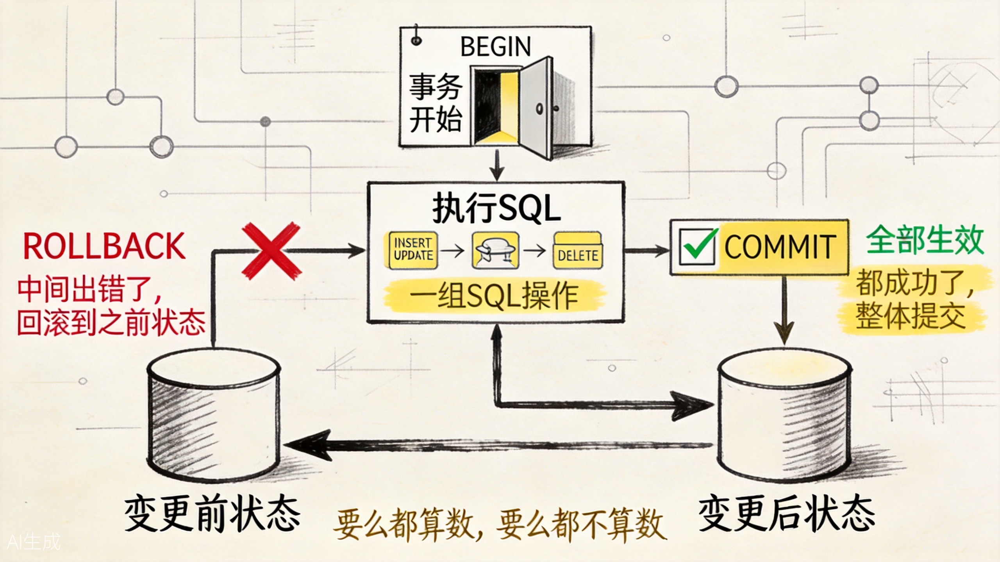
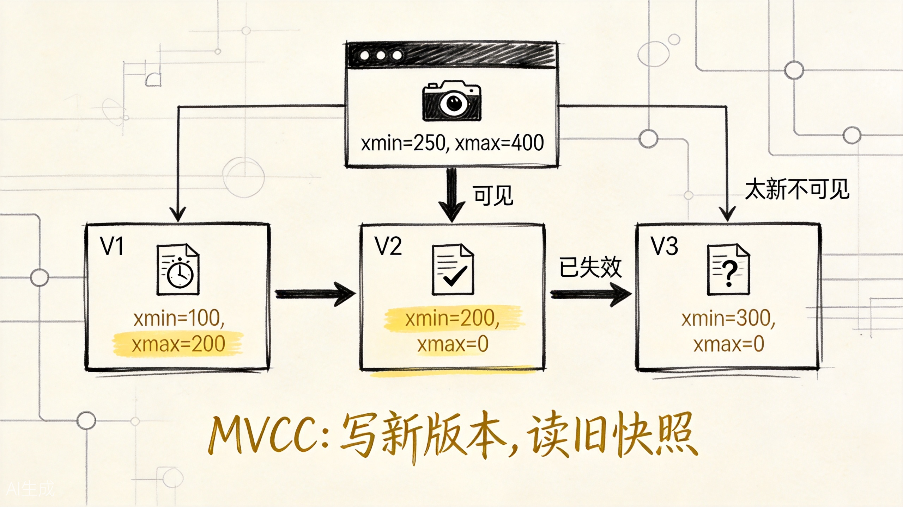
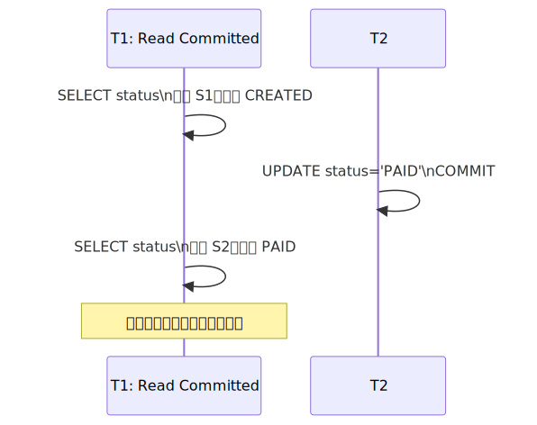
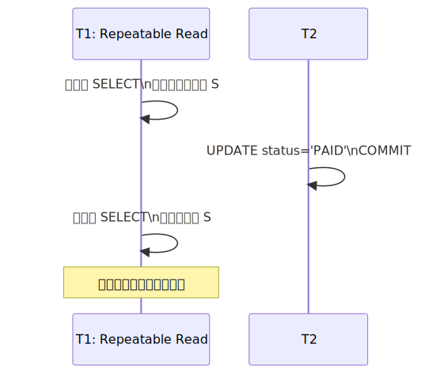
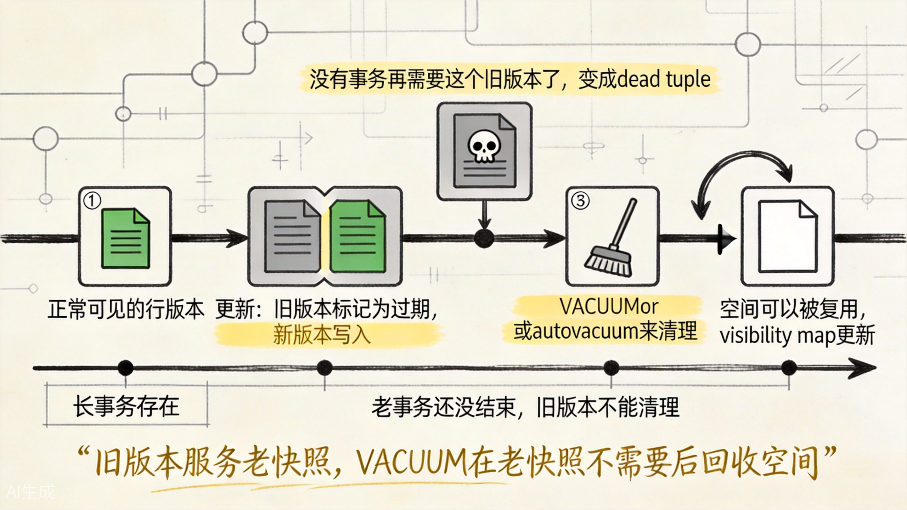

# PostgreSQL 事务与 MVCC：一组 SQL 为什么不能只成功一半

学 PostgreSQL 事务时，最容易先背 ACID：

- Atomicity，原子性
- Consistency，一致性
- Isolation，隔离性
- Durability，持久性

这四个词重要，但如果一上来就背，很容易把事务学成抽象名词。

事务真正出现的原因很简单：

**一个业务动作经常不是一条 SQL 就能完成；如果中间某一步失败，数据库不能留下半成品。**

这篇文章先保留一个必要的事务总览，然后把重点放到 PostgreSQL 最值得单独理解的部分：MVCC 到底是怎么落到存储和可见性判断上的。

核心问题是：

**PostgreSQL 为什么能让一组 SQL 要么都成功、要么都失败，同时又让读写尽量少互相阻塞？**

为了让例子不乱跳，我们固定一个下单场景：

```sql
CREATE TABLE orders (
  id BIGINT GENERATED BY DEFAULT AS IDENTITY PRIMARY KEY,
  user_id BIGINT NOT NULL,
  status TEXT NOT NULL,
  amount NUMERIC(10, 2) NOT NULL,
  created_at TIMESTAMPTZ NOT NULL DEFAULT now()
);

CREATE TABLE inventory (
  id BIGINT GENERATED BY DEFAULT AS IDENTITY PRIMARY KEY,
  sku TEXT NOT NULL UNIQUE,
  stock INT NOT NULL
);

CREATE TABLE payments (
  id BIGINT GENERATED BY DEFAULT AS IDENTITY PRIMARY KEY,
  order_id BIGINT NOT NULL REFERENCES orders(id),
  status TEXT NOT NULL,
  amount NUMERIC(10, 2) NOT NULL
);
```

用户买一件商品，系统至少要做几件事：

```text
创建订单
-> 扣减库存
-> 记录支付单
-> 把订单状态改成已支付
```

## 一、事务总览：先解决"半成品数据"

如果没有事务保护，下单可能写成这样：

```sql
INSERT INTO orders (user_id, status, amount)
VALUES (88, 'CREATED', 199.00);

UPDATE inventory
SET stock = stock - 1
WHERE sku = 'iphone' AND stock > 0;

INSERT INTO payments (order_id, status, amount)
VALUES (1001, 'PAID', 199.00);

UPDATE orders
SET status = 'PAID'
WHERE id = 1001;
```

如果第二条 SQL 成功，第三条 SQL 失败，数据库不会自动知道"这是同一个业务动作"。它只看见一条条独立语句。

事务把这些 SQL 包在一起：

```sql
BEGIN;

INSERT INTO orders (user_id, status, amount)
VALUES (88, 'CREATED', 199.00)
RETURNING id;

UPDATE inventory
SET stock = stock - 1
WHERE sku = 'iphone' AND stock > 0;

INSERT INTO payments (order_id, status, amount)
VALUES (1001, 'PAID', 199.00);

UPDATE orders
SET status = 'PAID'
WHERE id = 1001;

COMMIT;
```

如果中间出错：

```sql
ROLLBACK;
```

数据库会把这组修改当作一个整体撤销。



上图展示了事务的两条分支路径。这就是原子性的人话版：

**要么都算数，要么都不算数。**

但事务不只解决失败回滚。真实系统里，很多用户会同时下单、查询、修改库存。于是第二个问题出现了：

**并发读写时，读者和写者应该怎么互不捣乱？**


## 二、为什么需要 MVCC：不能让读写永远互相堵住

假设两个用户同时买最后一件库存：

```sql
UPDATE inventory
SET stock = stock - 1
WHERE sku = 'iphone' AND stock > 0;
```

对于同一行的写入，PostgreSQL 必须用行锁保护它。一个事务正在改 `inventory` 这行，另一个事务不能同时把同一行改乱。

但查询库存、查看订单状态这些普通读取，如果也总是被写入堵住，系统吞吐就会很差。

于是 PostgreSQL 使用 MVCC（Multi-Version Concurrency Control，多版本并发控制）。

MVCC 的核心不是"给读加很多锁"，而是：

**一条逻辑行可以有多个物理版本；读者按自己的快照选择能看见的那个版本。**

可以先记住这条问题链：



## 三、MVCC 的第一层：版本不是放在 undo 里，而是在 heap tuple 里

PostgreSQL 普通表的主存储叫 heap。heap 由很多 page 组成，page 里通过 line pointer 指向 tuple。

这里的 tuple 不要简单理解成"业务上的一行"。更准确地说：

**tuple 是某一时刻的行版本。**

同一个订单或同一条库存记录，被更新多次后，可能留下多个 tuple 版本。

一次 `UPDATE` 通常不是原地覆盖，而是：

```text
旧 tuple 标记为被新事务替换
-> 新 tuple 写入 heap
-> 旧 tuple 的 ctid 指向新 tuple
-> 读者按快照判断该看旧版本还是新版本
```



上图展示了 MVCC 的核心机制：多个版本共存，快照决定可见性。

最关键的 tuple header 字段是这几个：

| 字段 | 含义 | 为什么重要 |
|---|---|---|
| `xmin` / `t_xmin` | 创建这个 tuple 版本的事务 ID | 判断这个版本是否已经对当前读者生效 |
| `xmax` / `t_xmax` | 删除或替换这个 tuple 版本的事务 ID | 判断这个版本是否已经对当前读者失效 |
| `ctid` / `t_ctid` | tuple 在 heap page 里的位置；更新后旧版本可指向新版本 | 串起版本链，尤其是 HOT 更新链 |
| `t_infomask` | tuple 状态位和 hint bit | 帮助加速可见性判断，减少反复查事务状态 |

用库存例子看一眼：

```sql
SELECT ctid, xmin, xmax, sku, stock
FROM inventory
WHERE sku = 'iphone';
```

你可能看到类似这样的结果：

```text
 ctid  | xmin | xmax |  sku   | stock
-------+------+------+--------+-------
 (0,2) |  20  |  0   | iphone | 0
```

这不是业务字段，而是 PostgreSQL 暴露出来的系统列。它们让你能观察 MVCC 版本的一部分痕迹。

## 四、一次 UPDATE 在底层发生了什么

假设库存初始是 1：

```text
V1: sku='iphone', stock=1, xmin=10, xmax=0, ctid=(0,1)
```

事务 20 执行：

```sql
UPDATE inventory
SET stock = stock - 1
WHERE sku = 'iphone' AND stock > 0;
```

底层可以简化为：



如果这次更新没有修改索引列，并且原 page 上还有空间，PostgreSQL 可能走 HOT 更新（Heap-Only Tuple）。

HOT 的好处是：

1. 新版本留在同一个 heap page。
2. 索引项通常仍指向版本链的入口。
3. 不必为每次更新都新增索引项，减少索引写放大。

如果更新了索引列，或者同页没有空间，就可能变成非 HOT 更新：新版本可能跨页，相关索引也要新增索引项。

所以 PostgreSQL 里高频更新表常常要关注两个设计点：

1. 不要给频繁变化的列随便加索引。
2. 对热点表考虑 `fillfactor`，给 page 留一些空间，提高 HOT 更新机会。

（第二个点很多人不知道，`fillfactor = 80` 的意思是给每个 page 预留 20% 的空间，UPDATE 时新版本更容易落在本页，触发 HOT。）

## 五、MVCC 的第二层：Snapshot 不是复制数据，而是记录事务边界

有了多个 tuple 版本，还差一个关键问题：

**读者怎么知道自己该看哪个版本？**

答案是 Snapshot（快照）。

快照不是把表复制一份，而是记录"拍快照那一刻，事务世界是什么状态"。可以简化理解为三个字段：

| 快照字段 | 含义 | 直觉 |
|---|---|---|
| `snapshot.xmin` | 活跃事务 ID 的下界 | 比它更老的事务大多已经结束 |
| `snapshot.xmax` | 拍快照时的下一个事务 ID | 大于等于它的是"未来事务" |
| `snapshot.xip` | 拍快照时仍活跃的事务集合 | 这些事务当时还没提交 |

直觉版规则是：

1. tuple 的 `xmin` 太新，或者属于快照里的活跃事务：这个版本不可见。
2. tuple 的 `xmin` 已提交且对快照可见：继续看 `xmax`。
3. `xmax = 0`，说明还没被删除或替换：这个版本可见。
4. `xmax` 对当前快照已经生效，说明这个版本在快照里已经失效：不可见。

可见性判断可以画成这样：



这就是 PostgreSQL 不会脏读的底层原因。

脏读要求读到别人还没提交的数据。但未提交事务生成的 tuple，它的 `xmin` 对其他事务快照不可见，所以普通 `SELECT` 读不到它。PostgreSQL 即使接受 `READ UNCOMMITTED` 语法，实际行为也按 `READ COMMITTED` 处理。

（面试常考点：PostgreSQL 的 READ UNCOMMITTED 其实跟 READ COMMITTED 行为一样，不会真的脏读。）

## 六、隔离级别本质上是在问：快照什么时候创建

理解了 Snapshot，隔离级别就不再只是表格记忆。

PostgreSQL 常用隔离级别可以这样理解：

| 隔离级别 | 快照策略 | 直觉 |
|---|---|---|
| Read Committed | 每条语句重新创建快照 | 每次查询都看"当时已经提交"的数据 |
| Repeatable Read | 一个事务固定一个快照 | 同一事务内普通查询结果更稳定 |
| Serializable | 固定快照 + SSI 冲突检测 | 尽量表现得像事务串行执行 |

`Read Committed` 为什么会不可重复读？



因为每条语句都重新拍快照，第二次查询看到 T2 已提交的新版本。

`Repeatable Read` 为什么更稳定？



在 PostgreSQL 的 `Repeatable Read` 下，同一事务复用固定快照。所以普通查询不会看到后来提交的新版本，也不会看到后来插入的新幻影行。

但它仍可能出现写偏差。比如两个医生值班，只要求"至少一人在线"。两个事务都基于同一旧快照看到"两人在线"，然后各自把自己改成离线，最后跨行约束被破坏。

这类问题通常要靠：

1. `Serializable` 隔离级别。
2. 显式锁。
3. 数据库约束。
4. 应用层对 `40001`、`40P01` 做重试。

## 七、MVCC 的第三层：旧版本不会自己消失，VACUUM 负责收拾

MVCC 的好处是读写少互斥。代价也很明显：

**每次 UPDATE/DELETE 都可能留下旧 tuple 版本。**

这些旧版本不能立刻删。因为可能还有一个老事务拿着旧快照，它仍然需要看到旧版本。

只有当 PostgreSQL 确认没有任何活跃快照还需要它时，旧版本才会变成真正可回收的 dead tuple。



上图展示了从正常 tuple 到 dead tuple 再到被 VACUUM 回收的完整生命周期。

常规 `VACUUM` 主要做几件事：

1. 清理可回收的 dead tuple，让空间能被表内后续写入复用。
2. 清理索引里的死条目，减少无效索引扫描。
3. 更新 Visibility Map，帮助 `Index Only Scan` 和后续 vacuum。
4. 冻结很老的事务 ID，降低 xid wraparound 风险。

`AUTOVACUUM` 是自动调度器，会根据 dead tuple 数量和比例触发。

一个常见的简化触发条件是：

```text
n_dead_tup > autovacuum_vacuum_threshold
             + autovacuum_vacuum_scale_factor * reltuples
```

所以高频更新表最怕长事务。长事务一直不结束，老快照就一直存在，VACUUM 即使运行，也不能清理那些仍可能被老快照看到的版本。

实战里可以观察：

```sql
SELECT
  relname,
  n_live_tup,
  n_dead_tup,
  last_vacuum,
  last_autovacuum
FROM pg_stat_user_tables
ORDER BY n_dead_tup DESC
LIMIT 20;
```

再看是否有长时间空闲事务：

```sql
SELECT
  pid,
  state,
  xact_start,
  now() - xact_start AS xact_age,
  query
FROM pg_stat_activity
WHERE xact_start IS NOT NULL
ORDER BY xact_start;
```

一句话记忆：

**MVCC 让旧版本服务老快照，VACUUM 在老快照不需要它们之后把空间收回来。**

## 八、MVCC 和 WAL 不要混在一起

事务还有一个问题：提交成功后，如果数据库宕机，数据能不能恢复？

这不是 MVCC 主要解决的问题，而是 WAL 负责的事情。

WAL（Write-Ahead Log，写前日志）的核心原则是：

**数据页可以晚点刷盘，但描述这次修改的 WAL 记录必须先安全写入。**



MVCC 和 WAL 的边界是：

| 机制 | 解决的问题 | 关键词 |
|---|---|---|
| MVCC | 并发读写时，读者该看哪个版本 | heap tuple、`xmin/xmax/ctid`、Snapshot、VACUUM |
| WAL | 提交后宕机时，数据库怎么恢复 | 日志先行、checkpoint、redo、crash recovery |

不要把 PostgreSQL 的 WAL 理解成 MySQL InnoDB 的 undo。PostgreSQL 的历史行版本主要在 heap tuple 里，不是靠 WAL 回溯给普通查询看的。

## 九、和 MySQL InnoDB 的 MVCC 心智模型差异

从 MySQL InnoDB 转到 PostgreSQL 时，最重要的是不要把 InnoDB 的 undo / ReadView 模型直接套过来。

| 对比点 | PostgreSQL | MySQL InnoDB |
|---|---|---|
| 历史版本位置 | 主要在 heap tuple 版本链里 | 主要通过 undo log 回溯 |
| 行版本元信息 | `xmin`、`xmax`、`ctid`、`t_infomask` | `DB_TRX_ID`、`DB_ROLL_PTR` 等隐藏列 |
| 更新方式 | 新写 tuple，旧 tuple 等待 VACUUM 回收 | 新值写入数据页，旧值进入 undo |
| 一致性读路径 | 按快照在 heap tuple 版本中判断可见性 | 通过 ReadView + undo 链构造旧版本 |
| 默认隔离级别 | Read Committed | Repeatable Read |
| 垃圾回收 | VACUUM / AUTOVACUUM 清 dead tuple | purge 清理 undo 历史版本 |
| 长事务代价 | 阻碍 dead tuple 回收，表/索引膨胀 | 阻碍 undo purge，history list 变长 |

一句话记忆：

**InnoDB 事务学习重点是 undo、redo、ReadView；PostgreSQL 事务学习重点是 heap 版本、Snapshot、VACUUM 和 WAL。**

## 十、把事务和 MVCC 放回一张总图


这篇可以用三句话收束：

1. 事务边界解决"一组 SQL 不能只成功一半"。
2. MVCC 通过 heap tuple 多版本 + Snapshot 可见性判断，让普通读写尽量少互相阻塞。
3. VACUUM 收拾 MVCC 留下的旧版本，WAL 保证事务提交后崩溃也能恢复。

