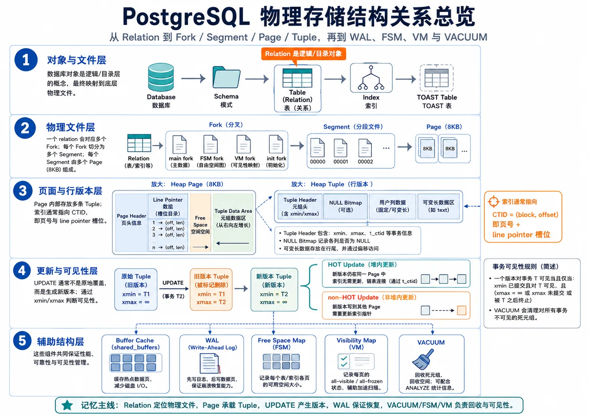
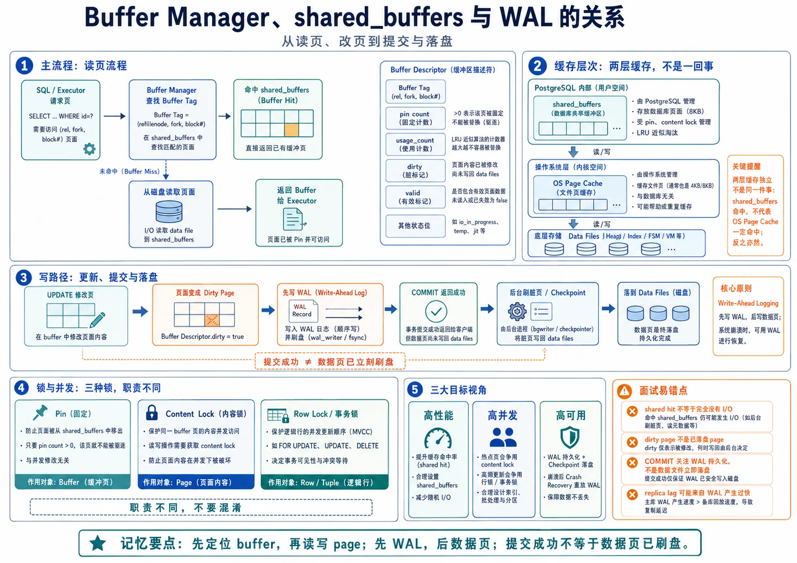
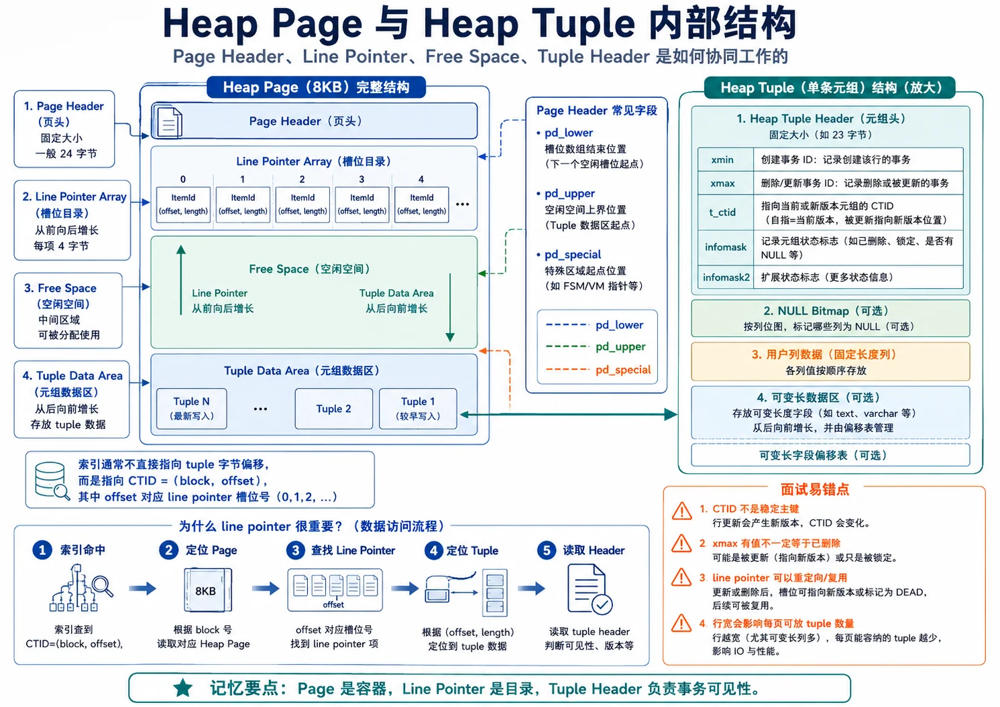
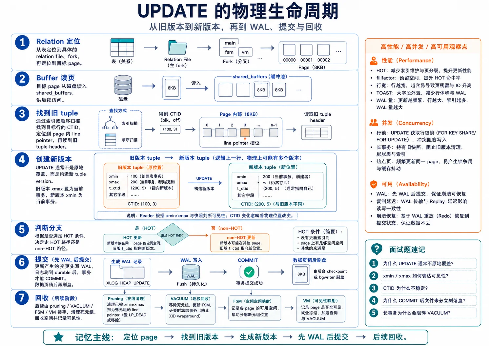
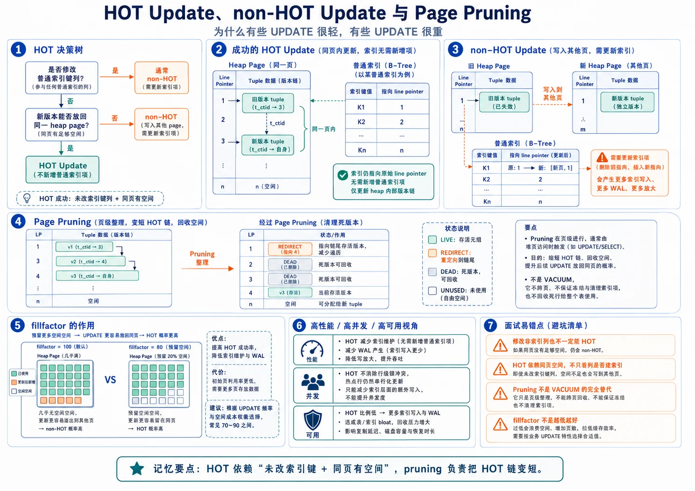
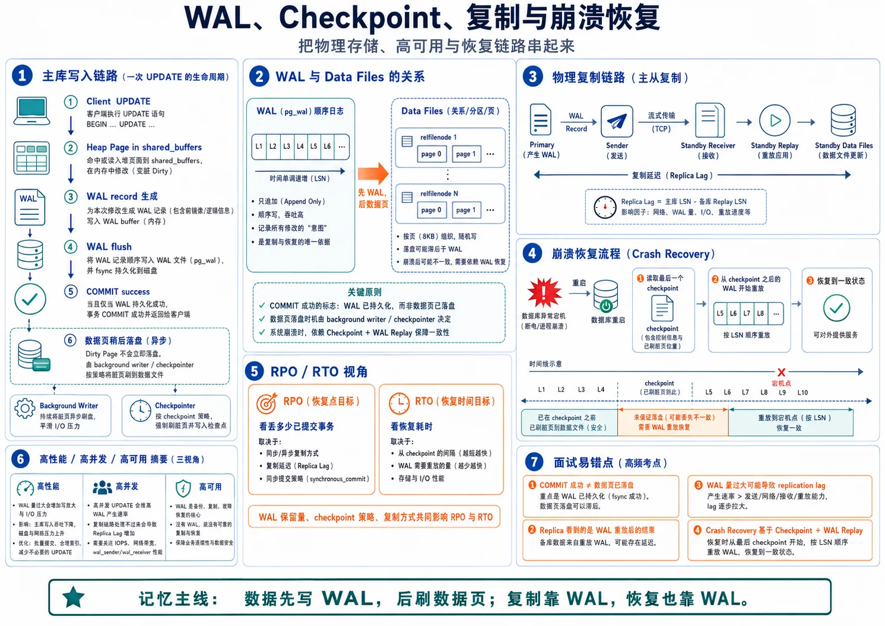

# 第 3 章　PostgreSQL 物理存储：从一条 UPDATE 串起 Page、Tuple、TOAST、Buffer 与 HOT

> **技术基线**：PostgreSQL 18 稳定版；兼顾 PostgreSQL 14～18 的重要差异。客户端示例使用 `pgx/v5` 与 `pgxpool`，不绑定补丁版本。除非明确标注，本文所说的“表”指普通 heap table。

---

## 1. 本章主线：跟踪一条 UPDATE 的完整物理旅程

物理存储最容易讲成一堆名词：Relation、Fork、Page、Tuple、TOAST、Buffer、FSM、VM、HOT。真正建立心智模型的方法，不是逐个背定义，而是跟踪一条 SQL 从开始到结束发生了什么。

本章始终围绕下面这条语句展开：

```sql
UPDATE app.account_profile
SET bio = $2
WHERE id = $1;
```

假设表中 `id` 是主键，`bio` 没有被普通索引键、`INCLUDE`、表达式索引或部分索引谓词引用。执行这条语句时，PostgreSQL 要依次回答九个问题：

1. `app.account_profile` 当前对应哪个物理 relation 文件？
2. 旧行版本位于哪个 block、哪个 line pointer？
3. 目标 page 是否已经在 `shared_buffers` 中？
4. 当前快照是否能看见旧 tuple，其他事务是否正在更新它？
5. 新 tuple 要占多少空间，大字段是否需要压缩或外置到 TOAST？
6. 新 tuple 能否留在旧 tuple 所在 page？
7. 此次更新是否需要为索引创建新条目，即能否成为 HOT？
8. 哪些 page 被标记为 dirty，提交时必须先持久化哪些 WAL？
9. 旧版本何时能被 pruning/VACUUM 回收，空间何时能复用或归还操作系统？


这九步形成全章唯一主线：

```text
对象定位 → 页面读入 → Tuple 解释 → 新版本构造 → HOT 决策
        → WAL/提交 → 旧版本回收 → 空间复用 → 故障恢复与复制
```

后面的 Page Header、CTID、TOAST、Buffer Pin、FSM、VM、fillfactor 等概念，都只在这条主线上首次需要时引入。



### 1.1 本章与后续章节的边界

本章建立后续索引、MVCC、VACUUM、WAL、备份与高可用章节共同依赖的物理模型：

- 本章说明 heap page 和 tuple version 如何组织，以及一次读写如何穿过 Buffer Manager；
- 索引页内部格式在后续索引章节展开；
- Snapshot 构造、隔离级别和 SSI 在事务章节展开；
- VACUUM/Freeze 的完整算法在维护章节展开；
- WAL record、checkpoint 和 crash recovery 的完整细节在 WAL 章节展开；
- 本章只讲这些机制与物理存储之间的因果关系。

### 1.2 本章要贯穿回答的七个问题

1. PostgreSQL 为什么通常不是原地更新业务列；
2. `CTID` 为什么不能作为长期业务主键；
3. 修改非索引列为何仍可能不能 HOT；
4. 修改索引列为何通常不能 HOT；
5. `shared_buffers` 命中为何不等于系统没有底层 I/O；
6. 删除数据后文件为何通常不会立即缩小；
7. Visibility Map 为何直接影响 Index Only Scan 的收益。

### 1.3 版本边界

| 版本 | 与本章直接相关的变化 |
|---|---|
| `[PG14+]` | TOAST 支持为列选择 LZ4 压缩；是否可用取决于构建时是否包含 LZ4。默认压缩算法仍由 `default_toast_compression` 决定。 |
| `[PG16+]` | `pg_stat_io` 提供统一 I/O 统计；`pg_stat_*_tables.n_tup_newpage_upd` 可观察更新后新版本落到其他 heap 页的次数。 |
| `[PG16+]` | 只修改 BRIN 等 summarizing index 所引用的列时，仍可能使用 HOT；B-tree、Hash、GiST、GIN、SP-GiST 以及 `INCLUDE` 列不属于这一例外。 |
| `[PG18]` | 引入异步 I/O 子系统，可让部分顺序扫描、Bitmap Heap Scan、VACUUM 等排队并合并多个读取请求；这不改变 Page、MVCC 或 HOT 语义。 |
| `[PG18]` | `pg_stat_io` 以字节报告多类读写量，并增强按 backend 观察 I/O/WAL 的能力。 |

> PG14/15 执行统计示例时需移除 `n_tup_newpage_upd`。PG16/17 的 `pg_stat_io` 字段与 PG18 不完全相同，应以对应版本系统视图为准。

---

## 2. 可验证的学习目标

完成本章后，你应当能够：

1. 从 relation OID 一直定位到 fork、segment、block 和 line pointer；
2. 画出标准 heap page 的 Page Header、ItemId 数组、空闲区与 tuple 数据区；
3. 用 `heap_page_items()` 识别 `xmin`、`xmax`、`t_ctid`、`infomask` 和 HOT 链；
4. 解释逻辑行、物理 tuple version 与 `CTID` 的区别；
5. 判断宽属性更可能被内联压缩、外置到 TOAST，还是无法存入普通 heap tuple；
6. 区分 Buffer Tag、Buffer Descriptor、pin、content lock、dirty page 和 SQL 行锁；
7. 用 `n_tup_hot_upd` 与 `[PG16+] n_tup_newpage_upd` 区分两类 HOT 失败；
8. 解释 VM 的 all-visible/all-frozen 位为何影响 Index Only Scan 与 VACUUM；
9. 从一条 UPDATE 推导 heap、索引、TOAST、WAL、复制和备份的写放大；
10. 在 Go 服务中跳过无意义更新、限制数据库并发并正确处理超时和重试；
11. 沿“定位、读入、版本、HOT、回收、恢复”顺序排查 P99、bloat、WAL 和 replica lag；
12. 在面试中用一条完整因果链，而不是孤立定义，回答物理存储问题。

---

## 3. 术语地图：先知道它们位于哪一层

术语表只用于定位，不是本章讲解顺序。真正的理解顺序仍是“一条 UPDATE 的九步旅程”。

### 3.1 文件与对象层

| 术语 | 精确定义 | 在主线中的作用 |
|---|---|---|
| Relation | 具有独立存储身份的表、索引、物化视图、TOAST 表等对象 | 确定要访问的是哪个存储对象 |
| relfilenode / RelFileNumber | relation 当前物理文件名的核心编号 | 把 catalog 对象映射到当前文件；重写后可能变化 |
| Fork | 同一 relation 的 `main`、`fsm`、`vm`、`init` 等用途文件 | 把数据页、空间提示和可见性状态分开保存 |
| Segment | fork 超过段大小后拆分出的连续文件 | 让大 relation 跨多个操作系统文件保存 |
| Block/Page | PostgreSQL I/O、缓存和页内管理的基本单位，标准构建通常为 8 KiB | Buffer Manager 的最小访问对象 |

### 3.2 页面与行版本层

| 术语 | 精确定义 | 在主线中的作用 |
|---|---|---|
| Page Header | 页开头的 `PageHeaderData` | 记录 LSN、校验和、空闲区边界等页面状态 |
| Line Pointer / ItemId | 页面中固定编号的槽，记录 tuple 偏移、长度和状态 | 让索引用稳定槽号定位页内 tuple |
| Heap Tuple | heap 页中的一个物理行版本 | 一条逻辑行可随 UPDATE 产生多个版本 |
| Heap Tuple Header | tuple 前部的事务、标志、`t_ctid` 等元数据 | 支持 MVCC、锁和 HOT 链 |
| `xmin` / `xmax` | 创建该版本以及删除、替换或锁定该版本的事务信息 | 决定当前快照能否看见 tuple |
| Command ID | 区分同一事务内部多条命令的先后 | 处理单事务内可见性 |
| `infomask` | tuple 的 NULL、变长、XID 状态、锁/更新等提示位 | 与事务状态共同解释 tuple |
| `CTID` | 当前 tuple 的 `(block number, line pointer number)` | 物理定位器，不是稳定业务身份 |
| NULL Bitmap / Alignment | NULL 标记和属性对齐填充 | 决定实际 tuple 行宽和页密度 |
| TOAST | 对超大可变长属性进行压缩和/或外置的机制 | 保证主 heap tuple 仍能装进单页 |

### 3.3 Buffer 与缓存层

| 术语 | 精确定义 | 在主线中的作用 |
|---|---|---|
| Buffer Tag | tablespace、database、relation、fork、block 的组合键 | 唯一标识要找的持久化 block |
| Buffer Descriptor | 共享内存中的 buffer 元数据 | 保存 tag、pin、usage、dirty、I/O 和锁状态 |
| Pin | 增加 buffer 引用计数，防止使用期间被淘汰或复用 | 保障 backend 安全访问 page |
| Content Lock | 保护 page 内容的短期共享/独占锁 | 保障多个 backend 正确读取或修改同一页 |
| Dirty Page | 内存页已修改，但不保证已写回 relation 文件 | 后续由 backend/background writer/checkpointer 写回 |
| `shared_buffers` | PostgreSQL 管理的共享 page cache | 第一级数据库页缓存 |
| OS Page Cache | 操作系统对文件页的缓存 | `shared read` 仍可能由内核内存命中 |

### 3.4 更新、回收与可见性层

| 术语 | 精确定义 | 在主线中的作用 |
|---|---|---|
| FSM | 近似记录 relation 各 page 可用空间 | 为 INSERT/非 HOT UPDATE 寻找候选页 |
| VM | heap 每页的 all-visible 与 all-frozen 位 | 支撑 Index Only Scan 和 VACUUM 跳页 |
| HOT | 新版本留在同一 heap page 且无需为普通索引创建新项的 UPDATE | 减少索引写、WAL 和索引页竞争 |
| HOT Chain | 同页多个行版本通过 `t_ctid` 串联形成的链 | 让旧索引 TID 仍能找到当前版本 |
| Redirect Line Pointer | HOT pruning 后根槽变为 `LP_REDIRECT` | 在旧索引入口不变的前提下缩短链 |
| fillfactor | 装载时为未来页内更新预留空间的存储参数 | 提高 HOT 同页成功概率，但降低页密度 |
| Page Pruning | 在安全时移除单页死版本并压缩 HOT 链 | 比完整 VACUUM 更轻量地回收页内空间 |
| bloat | 已分配空间中对当前有效数据贡献较低的部分 | 放大缓存、WAL、备份与恢复成本 |

---

## 4. 第一步：从 Relation 找到目标 Page

一条 UPDATE 的第一步不是“修改一行”，而是确定这张表当前由哪些文件和 block 构成。

### 4.1 Catalog 身份与物理身份不是一回事

`app.account_profile` 在 catalog 中有稳定的 relation OID，但 relation 当前使用哪个物理文件，核心由 `relfilenode` 决定。以下操作可能重写对象并更换物理文件：

- `VACUUM FULL`；
- `CLUSTER`；
- `TRUNCATE`；
- `REINDEX`（对索引）；
- 部分会重写表的 `ALTER TABLE`。

因此：

```text
relation OID = catalog 身份
relfilenode  = 当前物理文件身份
CTID         = 当前物理文件中某个 tuple version 的位置
```

三者的生命周期完全不同，不能相互替代。

```sql
SELECT
    c.oid::regclass AS relation,
    c.oid,
    pg_relation_filenode(c.oid) AS relfilenode,
    pg_relation_filepath(c.oid) AS relative_path
FROM pg_class AS c
WHERE c.oid = 'app.account_profile'::regclass;
```

`pg_relation_filepath()` 返回相对 `PGDATA` 的当前路径，适合诊断，不适合被外部系统当永久标识缓存。

### 4.2 一个 relation 为什么有多个 Fork

同一 relation 的不同状态分在不同 fork：

| Fork | 保存内容 | 与 UPDATE 的关系 |
|---|---|---|
| `main` | heap 或索引的实际数据页 | 旧 tuple、新 tuple 和索引项位于这里 |
| `fsm` | 各 page 近似可用空间 | 新版本无法同页放置时，用于寻找候选页 |
| `vm` | heap page 的 all-visible/all-frozen 位 | UPDATE 会清除目标页的可见性位 |
| `init` | unlogged relation 的初始化模板 | crash 后用于重置 unlogged relation |

```sql
SELECT
    pg_size_pretty(pg_relation_size('app.account_profile', 'main')) AS main,
    pg_size_pretty(pg_relation_size('app.account_profile', 'fsm'))  AS fsm,
    pg_size_pretty(pg_relation_size('app.account_profile', 'vm'))   AS vm,
    pg_size_pretty(pg_relation_size('app.account_profile', 'init')) AS init;
```

### 4.3 Segment 与 Page：操作系统文件和数据库块的边界

一个 fork 过大时会拆成多个 segment。标准发行构建通常每个 segment 为 1 GiB，文件名表现为：

```text
<relfilenode>
<relfilenode>.1
<relfilenode>.2
...
```

上层仍把它们视为连续 block 地址空间。标准 page 通常为 8 KiB：

```text
逻辑 block 0, 1, 2, ...
        ↓
映射到某个 segment 文件中的某个 8 KiB 区间
```

`CTID=(42,7)` 的第一部分 `42` 就是 heap block number；第二部分 `7` 是该 page 上的 line pointer number。

### 4.4 四种大小函数为什么不同

```sql
SELECT
    pg_size_pretty(pg_relation_size('app.account_profile'))       AS main_fork_only,
    pg_size_pretty(pg_table_size('app.account_profile'))          AS heap_toast_and_forks,
    pg_size_pretty(pg_indexes_size('app.account_profile'))        AS all_indexes,
    pg_size_pretty(pg_total_relation_size('app.account_profile')) AS table_plus_indexes;
```

- `pg_relation_size()` 默认只计算指定 relation 的 main fork；
- `pg_table_size()` 包括表的各 fork 和关联 TOAST relation，但不含用户索引；
- `pg_indexes_size()` 汇总该表所有索引 relation；
- `pg_total_relation_size()` 才是表、TOAST 与索引的总口径。

这一口径差异会直接影响容量判断。只看 heap main，可能漏掉真正主导增长的索引或 TOAST。

### 4.5 第一步的三维影响

| 维度 | 因果关系 |
|---|---|
| 高性能 | relation 页数越多，热工作集越难留在缓存中，顺序扫描与随机回表需要访问更多 page |
| 高并发 | 数据是否集中在少量 page，决定 content lock 和热点页竞争的可能性 |
| 高可用 | heap、index、TOAST 与 bloat 的总页数决定基础备份、节点重建和缓存预热成本 |

到这里，我们只知道“目标数据位于哪个 relation 的哪个 block”。下一步要把这个 block 安全地带入内存。

---

## 5. 第二步：Buffer Manager 把 Page 带入内存

PostgreSQL 不会让执行器直接拿文件路径读取 8 KiB 字节。执行器通过 Buffer Manager 请求一个逻辑 block。



### 5.1 Buffer Tag：回答“我要哪一页”

```text
BufferTag = (
    tablespace OID,
    database OID,
    relation file number,
    fork number,
    block number
)
```

Buffer Tag 是持久化 block 的逻辑身份，不是内存地址。

### 5.2 Buffer Descriptor：回答“这块内存现在是什么状态”

共享内存中的 Buffer Descriptor 记录：

- 当前 tag；
- buffer ID；
- pin/refcount；
- clock-sweep 的 usage count；
- page 是否 valid、dirty；
- 是否有 I/O 正在进行；
- content lock 等并发控制元数据。

真正的 8 KiB page 数据位于独立的 buffer block 区。Descriptor 是元数据，Page 是内容，不能混为一谈。

### 5.3 Pin、Content Lock 与 SQL 行锁的职责不同

一次页面访问的核心顺序是：

1. 按 Buffer Tag 在共享哈希表中查找；
2. 命中则增加 pin；未命中则选择可淘汰 buffer 并读取 block；
3. 取得适合读写目的的 content lock；
4. 读取或修改 page；
5. 修改后将 buffer 标记为 dirty；
6. 释放 content lock；
7. 不再访问时释放 pin。

| 机制 | 保护对象 | 解决的问题 |
|---|---|---|
| pin | buffer 的可淘汰性 | 防止当前 page 在使用中被替换成别的 block |
| content lock | page 内存内容 | 防止多个 backend 同时破坏页内结构 |
| tuple/transaction lock | 逻辑行更新关系 | 决定多个事务谁能更新同一行、谁需要等待 |
| relation lock | 表或索引对象 | 协调 DDL、VACUUM、查询和写入的对象级兼容性 |

看到 `BufferPin`、`BufferContent` 或 `transactionid` 等待时，含义完全不同，不能统一解释为“磁盘慢”。

### 5.4 `shared_buffers` 与 OS Page Cache 是两层缓存

```text
Executor
   ↓
shared_buffers
   ↓ miss
OS Page Cache
   ↓ miss
块设备 / 网络存储 / 持久介质
```

因此：

- `shared hit`：该 block 已在 PostgreSQL 共享缓冲区；
- `shared read`：PostgreSQL 需要执行文件读取路径，但数据可能由 OS Page Cache 返回；
- `shared hit` 不代表整条语句零 I/O，因为仍可能写 WAL、写其他 page、触发 writeback，或依赖此前预热产生的 I/O；
- `shared read` 也不能直接等同物理盘读，必须结合 OS 和设备指标判断。

```sql
EXPLAIN (ANALYZE, BUFFERS, WAL, SETTINGS, VERBOSE, SUMMARY)
SELECT id, bio
FROM app.account_profile
WHERE id = $1;
```

应同时观察：

- `shared hit/read/dirtied/written`；
- `WAL records/bytes/FPI`；
- `Heap Fetches`；
- `pg_stat_io`；
- OS page fault、设备 latency、IOPS 和吞吐；
- P50/P95/P99，而不是只看平均值。

### 5.5 Dirty Page 与提交不是同一件事

当 UPDATE 修改 heap 或索引 page 时，内存 page 被标记为 dirty。事务提交通常不要求这些 heap/index dirty page 当场全部写回 relation 文件；提交关键路径要求相关 WAL 达到配置规定的持久化边界。

后续可能由以下主体写回 dirty page：

- 执行该 SQL 的 backend；
- background writer；
- checkpointer。

但写回 relation page 前必须满足 **WAL-before-data**：描述该 page 变化的 WAL 必须先到达安全持久化位置。

### 5.6 `[PG18]` 异步 I/O 放在什么位置理解

PG18 的异步 I/O改善的是“shared buffer miss 后如何并发提交和组合部分读取请求”。它不会改变：

- page 大小；
- tuple 版本语义；
- HOT 条件；
- MVCC 可见性；
- WAL-before-data。

AIO 更可能改善大范围顺序扫描、Bitmap Heap Scan、VACUUM 等，而不是把单键、全缓存 OLTP 自动变快。

### 5.7 第二步的三维影响

| 维度 | 因果关系 |
|---|---|
| 高性能 | 热页命中 shared buffers 可减少文件读取，但 WAL、writeback、CPU 和锁仍可能成为瓶颈 |
| 高并发 | 热点 page 会放大 content lock 竞争；过多连接会让同一批 page 和 CPU 更拥挤 |
| 高可用 | dirty page 可晚于 commit 写回，但 WAL 保证 crash recovery；checkpoint 位置影响恢复工作量 |

目标 page 已经在内存中。下一步要解释它的字节布局，并找到旧 tuple。

---

## 6. 第三步：从 Page 找到旧 Heap Tuple

### 6.1 Heap Page 的布局



标准 8 KiB heap page 可近似画成：

```text
低地址
+----------------------------------+
| PageHeaderData                   |
+----------------------------------+
| ItemId[1] | ItemId[2] | ...      |  向高地址增长
+----------------------------------+
|           free space             |
+----------------------------------+
| tuple N | ... | tuple 2 | tuple 1|  从高地址向低地址增长
+----------------------------------+
| special space（heap 通常为空）   |
+----------------------------------+
高地址
```

Page Header 中最重要的字段：

| 字段 | 作用 | 与主线的连接 |
|---|---|---|
| `pd_lsn` | 最后一次修改该页对应的 WAL LSN | 写回前检查 WAL-before-data |
| `pd_checksum` | 启用 data checksums 时的页面校验和 | 帮助发现 torn write 或介质损坏 |
| `pd_lower` | ItemId 数组末端 | 与 `pd_upper` 一起确定连续空闲区 |
| `pd_upper` | tuple 数据区起点 | 新 tuple 是否能同页放置的重要条件 |
| `pd_special` | special space 起点 | heap 通常位于页尾，索引 AM 常使用特殊区 |
| `pd_prune_xid` | 可能允许 pruning 的最老 XID 提示 | 只是提示，不是可见性真相 |

### 6.2 为什么索引指向 Line Pointer，而不是 tuple 字节偏移

ItemId/Line Pointer 保存 tuple 的偏移、长度和状态：

- `LP_UNUSED`：槽可复用；
- `LP_NORMAL`：指向普通 tuple；
- `LP_REDIRECT`：指向同页另一个 ItemId，常见于 HOT pruning；
- `LP_DEAD`：已知死亡，但槽暂不能立即复用。

页面整理可以移动 tuple 的实际字节位置，同时保持 ItemId 编号不变。于是索引中的 TID 不必因页内 compaction 全部更新。

这就是 `CTID=(block, line pointer)` 的第二部分不是 byte offset 的原因。

### 6.3 Heap Tuple Header 如何表达版本状态

普通 heap tuple header 包含：

| 字段 | 含义 |
|---|---|
| `t_xmin` | 创建该物理版本的事务 ID |
| `t_xmax` | 删除、替换或锁定该版本的事务/MultiXact 标识 |
| `t_field3` | Command ID 或 ComboCID |
| `t_ctid` | 正常时指向自身；被更新后旧版本通常指向后继版本 |
| `t_infomask` / `t_infomask2` | NULL、变长、XID 状态、锁、HOT 等标志 |
| `t_hoff` | 用户属性开始位置 |

`xmax <> 0` 不能直接翻译为“这行已删除”。它可能代表：

- 一个尚未提交的 UPDATE/DELETE；
- 一个已经中止的事务；
- 行锁；
- MultiXact；
- 已提交但对当前快照仍需保留的旧版本。

可见性必须结合 `xmin/xmax`、`infomask`、事务状态和当前 Snapshot 判断。

### 6.4 逻辑行、Tuple Version 与 CTID

假设业务行 `id=7` 被更新三次：

```text
逻辑实体 id=7
  ├─ T0: ctid=(10,3), xmin=100, xmax=120
  ├─ T1: ctid=(10,8), xmin=120, xmax=135
  └─ T2: ctid=(10,9), xmin=135, xmax=0   <- 当前版本
```

不同快照可能同时把 T0、T1 或 T2 中的某一个视为“id=7 这行”。

`CTID` 不能作为长期业务主键，因为：

1. 普通 UPDATE 会产生新 tuple，当前 `CTID` 随之改变，HOT 也不例外；
2. 新版本可能落到另一个 page；
3. `VACUUM FULL`、`CLUSTER`、表重写会整体重排 tuple；
4. tuple 回收后，同一 `(block, lp)` 可被其他行复用；
5. HOT pruning 可能把根槽变为 redirect；
6. 逻辑复制不会把源端 CTID 当业务身份传递。

`CTID` 适合短生命周期诊断或单事务内部精确定位，不适合作为 API、消息或持久业务键。

### 6.5 NULL Bitmap、对齐与行宽为什么在这里出现

在构造或读取 tuple 时，PostgreSQL 必须知道每个属性的真实偏移：

- tuple 中存在 NULL 时，header 后有 NULL bitmap；
- NULL 属性没有 payload，但会影响 bitmap 和后续布局；
- 不同类型有不同对齐要求，属性之间可能出现 padding；
- 属性顺序、类型和大值表示共同决定实际 tuple 宽度。

行宽不是一个孤立的“节省几字节”问题，它沿主线产生连锁反应：

```text
行更宽
  → 每页容纳更少 tuple
  → relation page 数增加
  → 缓存密度下降、扫描页数增加
  → 新旧版本更难同页共存
  → HOT 失败概率上升
  → 索引/WAL/VACUUM/备份成本上升
```

### 6.6 用 pageinspect 观察 Page 与 Tuple

```sql
CREATE EXTENSION IF NOT EXISTS pageinspect;

SELECT *
FROM page_header(get_raw_page('app.account_profile', 0));

SELECT
    h.lp,
    h.lp_off,
    h.lp_flags,
    h.lp_len,
    h.t_xmin,
    h.t_xmax,
    h.t_field3,
    h.t_ctid,
    h.t_infomask,
    h.t_infomask2,
    h.t_hoff,
    f.raw_flags,
    f.combined_flags
FROM heap_page_items(get_raw_page('app.account_profile', 0)) AS h
LEFT JOIN LATERAL
     heap_tuple_infomask_flags(h.t_infomask, h.t_infomask2) AS f
  ON h.lp_flags = 1
ORDER BY h.lp;
```

`pageinspect` 读取原始页面，不遵循普通 SQL 的可见性过滤；它可能显示已删除、已中止或尚不可见的 tuple。生产中应限制权限、relation 和 block 范围。

### 6.7 第三步的三维影响

| 维度 | 因果关系 |
|---|---|
| 高性能 | Page 密度决定缓存和扫描效率；tuple header、NULL、alignment 和 TOAST 共同决定实际行宽 |
| 高并发 | `xmin/xmax` 让读者不必阻塞写者，但同一逻辑行的并发写仍需串行协调 |
| 高可用 | `pd_lsn` 与 checksum 把页内容连接到 WAL 和损坏检测；CTID 不能用于 failover 后业务确认 |

我们已经找到旧 tuple，并知道它为什么可能仍被旧 Snapshot 需要。下一步是构造新版本，而不是覆盖旧 payload。

---

## 7. 第四步：构造新 Tuple Version，并处理 TOAST



### 7.1 PostgreSQL 为什么通常不原地覆盖业务列

若事务 A 已经建立旧快照，事务 B 更新同一行后提交，A 仍可能需要读取更新前的值。若 B 原地覆盖旧 payload，A 就失去一致性视图。

因此普通 UPDATE 的核心模型是：

```text
旧版本 T0：保留给仍需要它的快照
新版本 T1：由当前 UPDATE 创建
```

UPDATE 会改变旧版本 header 中与更新关系相关的状态，并创建新 heap tuple。少量 header、hint bit、锁信息可以原地变化，但业务列的逻辑更新通常通过新 tuple version 表达。


这解释了三个常见现象：

- UPDATE 会制造 dead tuple；
- 长事务会阻止空间回收；
- 即使最终值相同，无意义 UPDATE 也通常会制造新版本。

### 7.2 新版本先计算实际大小

构造新 tuple 时，系统要重新考虑：

- tuple header；
- NULL bitmap；
- 类型对齐；
- 变长属性表示；
- TOAST 压缩或外置；
- trigger/generated expression 产生的最终值。

因此“只把 `bio` 加一个字符”也可能改变 tuple 是否能留在原 page；大字段从内联转外置或重新压缩，也会改变主 tuple 和 TOAST 的物理成本。

### 7.3 TOAST 为什么是 Page 限制的直接结果

一个 heap tuple 不能跨 page。对于 `text`、`bytea`、`jsonb` 等可变长大值，PostgreSQL 会按列的 storage 策略尝试：


常见 storage 策略：

| 策略 | 压缩 | 外置 | 主要语义 |
|---|---:|---:|---|
| `PLAIN` | 否 | 否 | 必须内联 |
| `EXTENDED` | 是 | 是 | 多数可 TOAST 类型默认策略 |
| `EXTERNAL` | 否 | 是 | 可外置但不压缩 |
| `MAIN` | 是 | 最后手段 | 尽量留在主 tuple |

```sql
ALTER TABLE app.account_profile
  ALTER COLUMN bio SET COMPRESSION lz4;  -- [PG14+]

SELECT
    c.oid::regclass AS heap,
    c.reltoastrelid::regclass AS toast_relation
FROM pg_class AS c
WHERE c.oid = 'app.account_profile'::regclass;
```

### 7.4 TOAST 的因果链

TOAST 外置不是单纯“省空间”，而是改变访问路径：

```text
外置大值
  → 主 tuple 更窄
  → 小列扫描和缓存密度更好
  → 真正读取大值时需访问 TOAST index + TOAST heap
  → detoast CPU、临时内存、网络返回字节增加
  → 更新大值时可能产生额外 TOAST 与 WAL 写放大
```

未修改的外置属性通常可以沿用原外部指针；若应用重新序列化并赋入新值、trigger 改值或表示变化，则可能重写 TOAST 数据。

### 7.5 第四步的三维影响

| 维度 | 因果关系 |
|---|---|
| 高性能 | 新 tuple 大小决定 page 密度、TOAST I/O 和后续 HOT 可能性；`SELECT *` 可能把冷大值成本带入所有请求 |
| 高并发 | 大值压缩、索引与 TOAST 写入会延长事务和行锁持有时间 |
| 高可用 | TOAST 和相关 WAL 同样进入物理复制、备份与恢复；逻辑复制可能传输完整变更值 |

新 tuple 已构造完成。现在进入本章最关键的分叉：它是 HOT，还是必须更新索引？

---

## 8. 第五步：决定 HOT 还是非 HOT



### 8.1 HOT 的两个核心条件

一次普通 heap UPDATE 要成为 HOT，核心条件是：

1. **新 tuple 能放在旧 tuple 所在的同一 heap page**；
2. **非 summarizing index 所依赖的值没有实际变化**。

索引依赖不仅包括普通键列，还包括：

- `INCLUDE` 列；
- 表达式索引引用列；
- 部分索引 predicate 引用列；
- trigger 或 generated expression 最终导致变化的索引列。

`[PG16+]` 只修改 BRIN 等 summarizing index 所引用列时仍可能 HOT，因为这类索引不为每个 tuple 保存普通 TID 项；但摘要仍可能需要维护。

### 8.2 HOT 为什么可以不新增普通索引项

假设索引原来指向 ItemId 5：

```text
B-tree index entry ──> ItemId 5（HOT 链根）
                        T0.t_ctid -> ItemId 9
                                      T1.t_ctid -> ItemId 12
                                                    T2 当前版本
```

因为所有版本都在同一 heap page 内，索引仍指向根 ItemId，heap 通过 `t_ctid` 追到当前可见版本。这样避免了每次 UPDATE 都向每个普通索引插入新 TID。

### 8.3 Page Pruning 与 Redirect Line Pointer 如何收短 HOT 链

旧版本不再被任何相关快照需要后，page pruning 可移除中间 tuple，并把链根槽改为 redirect：

```text
pruning 前：
Index -> ItemId 5: T0 -> ItemId 9: T1 -> ItemId 12: T2

pruning 后：
Index -> ItemId 5 [LP_REDIRECT -> 12] -> ItemId 12: T2
```

Page Pruning 是单页局部清理，不等同完整 VACUUM。它说明了为什么 Line Pointer 的稳定性对 HOT 至关重要。

### 8.4 修改非索引列为什么仍可能不能 HOT

“只改非索引列”只满足索引条件，不保证同页条件。常见失败原因：

- 原 page 连续可用空间不足；
- 新值变长，旧版本和新版本无法同时留在 page；
- 大值的内联/TOAST 表示变化导致主 tuple 变宽；
- 该列实际被 `INCLUDE`、表达式索引或部分索引谓词引用；
- trigger/generated expression 同时改变其他索引相关列；
- 更新分区键导致跨分区移动。

`[PG16+] n_tup_newpage_upd` 正是区分“因为同页空间失败”的关键统计。

### 8.5 修改普通索引列为什么通常不能 HOT

普通 B-tree、Hash、GiST、GIN、SP-GiST 等索引中的键值或 payload 若变化，新索引项必须反映新值并定位新 tuple version，因此不能只依赖旧索引入口和同页链。

需要精确表述：SQL `SET` 列表提到索引列，并不必然等于其实际二进制值变化；但即使值相同，UPDATE 本身仍可能创建 heap 版本、清 VM 位、生成 WAL，所以应用层仍应跳过无意义写入。

### 8.6 fillfactor 的作用与代价

```sql
ALTER TABLE app.account_profile SET (fillfactor = 75);
```

较低 heap fillfactor 让初次装页时预留更多空间，提高未来新旧 tuple 同页共存的概率。但它不是免费优化：

```text
fillfactor 降低
  → 初始 relation 更大
  → 扫描页数和缓存占用增加
  → HOT 概率可能提高
  → 索引写和 WAL 可能下降
```

此外，修改 fillfactor 不会自动给已经装满的旧 page 腾空间；只有新写入或表重写后，页面布局才逐步体现新设置。

### 8.7 用统计区分两类 HOT 失败

```sql
SELECT
    relname,
    n_tup_upd,
    n_tup_hot_upd,
    n_tup_newpage_upd, -- [PG16+]
    round(100.0 * n_tup_hot_upd / NULLIF(n_tup_upd, 0), 2) AS hot_pct,
    round(100.0 * n_tup_newpage_upd / NULLIF(n_tup_upd, 0), 2) AS newpage_pct,
    n_dead_tup,
    pg_size_pretty(pg_total_relation_size(relid)) AS total_size
FROM pg_stat_user_tables
WHERE relid = 'app.account_profile'::regclass;
```

| 统计表现 | 优先怀疑 |
|---|---|
| HOT 低、newpage 高 | 原页空间不足、行增长、fillfactor、旧版本未及时回收 |
| HOT 低、newpage 低 | 索引依赖列实际变化，虽然新版本可能仍在同页 |
| HOT 高、dead tuple 和 size 仍高 | pruning/VACUUM 受长快照或维护能力限制 |
| HOT 提高但读 P99 变差 | 预留空间造成的读放大超过写收益 |

统计是累计值。发布前后应保存基线并计算同等时间窗差值，不能只看一个瞬时百分比。

### 8.8 HOT 决策树


### 8.9 第五步的三维影响

| 维度 | 因果关系 |
|---|---|
| 高性能 | HOT 减少普通索引写、WAL 和缓存污染，但不消除新 heap tuple、dirty page 和后续清理 |
| 高并发 | HOT 可降低索引页竞争，但同一逻辑行更新仍需行级串行；热点 page 仍可能有 content lock 竞争 |
| 高可用 | 较少索引 WAL 通常有助于复制与恢复，但 HOT 不是 RPO 机制；过低 fillfactor 又可能放大基础备份体积 |

UPDATE 已经完成物理修改，但旧版本还没有消失。接下来要理解提交、回收、FSM/VM 与文件大小。

---

## 9. 第六步：提交、回收、FSM/VM 与文件空间


### 9.1 从 Dirty Page 到 COMMIT

一次 UPDATE 可能修改：

- 旧 heap tuple header；
- 新 heap tuple；
- 一个或多个索引 page；
- TOAST heap/index page；
- VM/FSM 相关状态；
- WAL buffer。

提交时通常先保证 WAL 达到 `synchronous_commit`、同步复制等配置要求的持久化边界，heap/index dirty page 可稍后写回。

```text
业务提交成功
  ≠ 所有 heap/index page 已立即写回
  = 足以在崩溃后重做已提交修改的 WAL 已达到要求边界
```

这正是高可用理解的起点：持久性首先由 WAL 表达，而不是由“表文件是否已经刷盘”表达。

### 9.2 Tuple 生命周期

```text
INSERT 创建版本
   ↓
LIVE：对某些快照可见
   ↓ UPDATE / DELETE
OLD VERSION：被新版本替换或被删除，但可能仍被旧快照需要
   ↓ 可见性地平线推进
DEAD：对所有相关快照都不再需要
   ↓ pruning / VACUUM
页内空间可复用，FSM 最终反映近似值
```

事务中止产生的 tuple 也不会凭空从文件消失；它先成为普通快照不可见的版本，再由清理机制回收。

### 9.3 Page Pruning、VACUUM 与 FSM 的分工

- **Page Pruning**：访问某个 heap page 时，可在安全条件下局部移除死版本、压缩 HOT 链；
- **VACUUM**：系统化扫描 relation，回收可安全复用的空间、清理索引引用、维护 VM 与冻结状态；
- **FSM**：记录每个 page 的近似可用空间，帮助 INSERT/跨页 UPDATE 找候选页。

FSM 是提示，不是事务级强一致目录。候选页被真正锁定后可能已经没有足够空间，系统会继续寻找其他页。

```sql
CREATE EXTENSION IF NOT EXISTS pg_freespacemap;

SELECT blkno, avail
FROM pg_freespace('app.account_profile'::regclass)
ORDER BY blkno
LIMIT 100;
```

### 9.4 VM 的 all-visible 与 all-frozen

VM 为每个 heap page 保存两位：

- **all-visible**：页上所有 tuple 对所有当前和未来事务可见，直到该页再次被修改；
- **all-frozen**：页上所有 tuple 都不再需要未来冻结处理。

UPDATE/DELETE 会清除目标 page 的相关 VM 位；VACUUM 在确认安全后重新设置。

### 9.5 Visibility Map 为什么决定 Index Only Scan 是否真正“Only”

索引项通常没有完整 MVCC 可见性信息。Index Only Scan 找到索引 TID 后：

1. 若对应 heap page 的 all-visible 位为 1，可不访问 heap tuple；
2. 若为 0，必须回 heap 校验快照可见性；
3. 因此执行计划虽然仍显示 `Index Only Scan`，`Heap Fetches` 可能很高。

```sql
EXPLAIN (ANALYZE, BUFFERS, VERBOSE)
SELECT id
FROM app.account_profile
WHERE id BETWEEN 1 AND 100;
```

高频更新会持续清 VM 位；长事务又会阻止 VACUUM 尽快恢复 all-visible，于是覆盖索引仍发生大量回表。

### 9.6 DELETE 后文件为什么通常不缩小

DELETE 只把 tuple 变为将来可回收的旧版本。普通 VACUUM 的主要目标是把空间变为 **relation 内部可复用**，不是压缩中间空洞并立即归还操作系统。

只有文件尾部形成连续全空 page，并能取得所需锁时，普通 VACUUM 才可能截断尾部。大量中间空洞通常仍保留在文件中。

要真正压缩并归还中间空洞，通常需要：

- `VACUUM FULL`；
- `CLUSTER`；
- 会重写表的 `ALTER TABLE`；
- 外部在线重组方案。

这些操作可能带来强锁、额外磁盘、大量 WAL、复制延迟和回滚风险。时间序列或历史数据更适合通过分区 `DROP/DETACH` 管理生命周期。

### 9.7 长事务如何把整条链路卡住

一个长时间保留旧 Snapshot 的事务可能仍需要旧 tuple：

```text
长事务保留旧快照
  → 旧版本不能标记为可回收
  → page 空间不能充分复用
  → HOT 同页成功率下降
  → 非 HOT 和索引写增加
  → VM 难以恢复 all-visible
  → Index Only Scan 回表增加
  → heap/index/WAL/备份和 replica lag 同时恶化
```

这条因果链把 MVCC、HOT、VACUUM、VM、性能和 HA 串成了同一个问题，而不是五个独立知识点。

### 9.8 第六步的三维影响

| 维度 | 因果关系 |
|---|---|
| 高性能 | 及时 pruning/VACUUM 让页内空间复用并恢复 VM；文件不缩小不等于空间不可复用 |
| 高并发 | 长事务、prepared transaction、复制反馈会延长版本保留；热点更新使同页空间更快耗尽 |
| 高可用 | WAL 决定 crash recovery 和复制；bloat 增加基础备份、节点重建、缓存预热和 RTO |

至此，一条 UPDATE 的物理生命周期已经闭环。下一节不再引入新名词，而是把同一条链路分别从性能、并发和可用性角度重新审视。

---

## 10. 同一条 UPDATE 的高性能、高并发与高可用分析

### 10.1 高性能：优化的是整条链路，不是单个参数

一条 heap UPDATE 的成本可沿主线拆解：

```text
定位：索引/扫描访问多少 page
读入：shared hit、file read、OS cache、AIO
解释：tuple deform、可见性判断
构造：表达式、trigger、alignment、TOAST 压缩/外置
写入：旧 header、新 tuple、索引、TOAST、VM/FSM
日志：WAL record、FPI、commit
后台：writeback、checkpoint、pruning、VACUUM、index cleanup
```

| 主线阶段 | 常见性能放大 | 关键证据 | 优先设计动作 |
|---|---|---|---|
| Relation/Page | page 数太多、主表/索引/TOAST 膨胀 | size 函数、读页数、缓存热集 | 缩窄行、删除无价值索引、分区生命周期 |
| Buffer | shared miss、eviction、writeback 尖峰 | `BUFFERS`、`pg_stat_io`、OS I/O | 先修访问模式，再评估缓存和 AIO |
| Tuple/TOAST | 宽行、detoast、JSON 全量改写 | 行宽分位数、TOAST size、CPU/内存 | 按需投影、冷热列拆分、避免全量序列化 |
| HOT | 普通索引写和跨页更新 | HOT/newpage、WAL、index growth | 消除空 UPDATE、审查索引、验证 fillfactor |
| 回收/VM | dead tuple、Heap Fetches、VACUUM 滞后 | dead tuple、VM、长事务 | 缩短事务、按表调 autovacuum |
| WAL/Checkpoint | WALSync、FPI、writeback 峰值 | WAL bytes、等待事件、checkpoint | 降低写放大、平滑批量、调 checkpoint |

#### 行宽要看分布，不只看平均值

```sql
SELECT
    percentile_disc(0.50) WITHIN GROUP (ORDER BY sz) AS p50_bytes,
    percentile_disc(0.95) WITHIN GROUP (ORDER BY sz) AS p95_bytes,
    percentile_disc(0.99) WITHIN GROUP (ORDER BY sz) AS p99_bytes,
    max(sz) AS max_bytes
FROM (
    SELECT pg_column_size(t) AS sz
    FROM app.account_profile AS t
    TABLESAMPLE SYSTEM (1)
) AS s;
```

P99 宽行可能主导 TOAST、跨页更新和尾延迟，即使平均行宽看起来正常。

#### 参数调整顺序

1. 先消除无意义 UPDATE 和无价值索引；
2. 修正事务范围、批量大小和访问模式；
3. 清除长快照，确保 autovacuum 能跟上；
4. 依据 HOT/newpage、行宽和读放大评估 fillfactor；
5. 依据热工作集与总内存评估 `shared_buffers`；
6. 再评估 WAL/checkpoint、AIO 和存储队列；
7. 每次保留对照组、回滚路径和完整 P95/P99/WAL/size 证据。

### 10.2 高并发：四层并发控制必须分开

```text
应用并发/队列
   ↓
连接池与数据库 backend 数
   ↓
事务/行级依赖
   ↓
Buffer pin 与 page content lock
```

#### 同一逻辑行更新仍然串行

HOT 只减少索引工作，不会让多个事务同时更新同一行并行提交。后来的更新者仍可能等待前一个 tuple version 对应事务结束。

#### 热点 page 与热点索引 page

大量请求集中更新相邻 tuple 时：

- 同一 heap page content lock 竞争可能上升；
- HOT 链消耗页内空间；
- 长快照阻止 pruning 后，HOT 逐渐退化为跨页非 HOT；
- 非 HOT 又增加多个索引 leaf page 的写入与竞争；
- checkpoint/writeback 可能把写压力转成 P99 尖峰。

因此 HOT 是“减少额外工作”，不是热点消除器。热点计数器仍可能需要分桶、追加增量、异步聚合或按键分片。

#### 连接池不是越大越好

需要分别观测：

| 指标 | 含义 |
|---|---|
| goroutine 数 | 服务中存在的工作单元 |
| 池连接数 | 可占用的数据库 session 上限 |
| 活跃 SQL 数 | 真正在执行或等待的请求 |
| TPS | 单位时间完成事务数 |
| 排队长度 | 等待服务准入或连接的请求数 |

推荐路径：

```text
入口请求
  → 服务级并发上限
  → deadline-aware 有界队列
  → pgxpool MaxConns
  → 数据库活跃 SQL
```

数据库饱和时应形成背压，而不是让每个请求立刻拿连接并触发重试风暴。

#### 最小并发诊断 SQL

```sql
SELECT
    a.pid,
    a.usename,
    a.application_name,
    a.state,
    a.wait_event_type,
    a.wait_event,
    now() - a.xact_start AS xact_age,
    now() - a.query_start AS query_age,
    pg_blocking_pids(a.pid) AS blocking_pids,
    left(a.query, 300) AS query
FROM pg_stat_activity AS a
WHERE a.datname = current_database()
  AND (a.state <> 'idle' OR cardinality(pg_blocking_pids(a.pid)) > 0)
ORDER BY a.xact_start NULLS LAST;
```

- `transactionid` / tuple 相关：事务或行级依赖；
- `BufferPin`：某 backend 长时间 pin 住 buffer，可能阻止 cleanup；
- `BufferContent`：并发访问同一 page 内容的短锁竞争；
- `DataFileRead`：文件读取；
- `WALWrite` / `WALSync`：WAL 持久化路径。

### 10.3 高可用：物理存储最终要落到 WAL、复制与恢复



#### RPO 与“表文件是否刷盘”不是一回事

- RPO 主要由 WAL 持久化、同步/异步复制和备份归档策略决定；
- heap dirty page 是否已经写回 main fork，不直接等于事务是否持久；
- crash 后依靠 WAL 重做已提交但尚未写回的数据页变化。

#### 物理复制与逻辑复制看到的东西不同

| 机制 | 与本章机制的关系 |
|---|---|
| 物理复制 | 传输并重放 heap/index/TOAST 等物理 WAL；HOT 可减少部分索引 WAL |
| 逻辑复制 | 传输逻辑行变更，subscriber 自己构造 page、tuple 和索引；源端 HOT 链与 CTID 不会复制为业务身份 |
| 基础备份 + PITR | 复制物理文件并回放 WAL；bloat 和 TOAST 直接增加备份/恢复体积 |
| unlogged relation | crash 后由 init fork 重置，不满足普通业务 RPO，也不适合作为常规 standby 数据源 |

#### bloat 为什么是 HA 容量问题

同样的有效数据，如果 heap/index/TOAST 膨胀两倍：

- 基础备份读取、压缩、传输和校验时间增加；
- 新副本 rebuild 时间增加；
- failover 后缓存预热需要读取更多 page；
- VACUUM、checkpoint 与前台流量争抢更多 I/O；
- 磁盘接近满载时，复制槽保留 WAL 更容易形成级联故障。

#### failover 后不能依赖旧 CTID 确认业务结果

故障发生在提交边界时，客户端可能不知道事务是否已提交。正确做法是使用：

- 业务幂等键；
- 唯一约束；
- 单调版本号；
- outbox/message ID；
- 重新查询逻辑业务状态。

不能把旧 primary 上观察到的 CTID 当成跨节点结果确认协议。

#### HA 闭环

```text
一次 UPDATE 的物理写放大
  → WAL 生成速率
  → standby 接收/写入/刷盘/重放压力
  → replica lag 与同步提交延迟
  → failover 时可接受 RPO
  → WAL 重放量、relation 体积与缓存预热
  → RTO
```

### 10.4 三维影响矩阵

| 设计/状态 | 高性能 | 高并发 | 高可用 |
|---|---|---|---|
| 窄 tuple、高页密度 | 减少扫描页、提高缓存密度 | 可能减少总 page 访问，但热点行仍可集中 | 降低备份、重建和预热体积 |
| TOAST 外置 | 小列查询更轻；访问大值增加 I/O/CPU | 大值更新延长事务和锁持有 | 增加 TOAST/WAL/复制与备份成本 |
| 较低 heap fillfactor | 提高 HOT 机会，减少索引写 | 降低跨页更新，但不消除同行锁 | 可能降 WAL，也可能增大基础备份 |
| HOT 比例高 | 通常减少索引 I/O 和 WAL | 减少索引页竞争 | 通常减轻复制重放，但不是 RPO 机制 |
| 长事务/旧快照 | 阻止回收，增加 bloat 与 Heap Fetches | 扩大版本链、池占用和 cleanup 阻塞 | 增加 slot/WAL 保留、备份和 RTO |
| VM 覆盖高 | Index Only Scan 少回表 | 高频 DML 会持续清位 | standby 读性能更稳，恢复后仍需维护推进 |
| `shared_buffers` 增大 | 可能提高命中，也可能挤压 OS/其他内存 | 更多缓存不等于无锁竞争 | 重启后 warm-up 成本可能更高，不改变 WAL RPO |
| 多个更新列索引 | 查询可能更快，写入更贵 | 更多索引页争用 | 更多 WAL、备份和重建时间 |
| 表重写 | 归还空间、改善 locality | 强锁与资源峰值可能造成停顿 | 大 WAL/磁盘峰值影响复制和 RTO |

### 10.5 场景选择：沿着主线判断设计

| 场景 | 先检查主线中的哪一步 | 常见设计 | 需要接受的代价 |
|---|---|---|---|
| 高频更新小状态行 | 新 tuple 是否同页、索引依赖是否变化 | 窄表、条件 UPDATE、精简索引、实测较低 fillfactor | 热点行仍串行；预留空间增加读页数 |
| 大 JSON/文本但多数请求只读小列 | tuple 构造与 TOAST 访问路径 | 按需投影、冷热列拆分、保留合理 TOAST | 读取完整对象时增加 join 或 TOAST I/O |
| 写少读多且依赖覆盖索引 | VM 是否长期 all-visible | 保持短事务和健康 VACUUM，谨慎控制 DML | 更新后短期 Heap Fetches 会增加 |
| 审计/事件日志 | 是否真的需要 UPDATE/DELETE | 追加写、时间分区、按分区淘汰 | 分区和归档治理更复杂 |
| 周期性删除大量历史数据 | 旧版本何时回收、空间是否必须归还 OS | 优先分区 DROP/DETACH；否则小批 DELETE + VACUUM | 逐行删除仍产生 WAL 和 dead tuple |
| 需要跨复制、重写和 failover 的稳定标识 | CTID 生命周期 | 业务键或不可变 surrogate key | 需要唯一约束及相应索引 |
| 极端热点计数器 | 同行锁与热点 page | 分桶、追加增量、异步聚合、按键分片 | 读时聚合与一致性模型更复杂 |

---

## 11. 把观测指标重新放回主线

面对“UPDATE 变慢”“DELETE 后磁盘不降”“Index Only Scan 仍回表”等问题，不要先随机调参数。按生命周期顺序收集证据。

### 11.1 第 1 组：对象和空间

```sql
SELECT
    c.oid::regclass AS relation,
    c.reloptions,
    c.reltoastrelid::regclass AS toast_relation,
    pg_relation_size(c.oid) AS heap_main,
    pg_table_size(c.oid) AS heap_toast_forks,
    pg_indexes_size(c.oid) AS indexes,
    pg_total_relation_size(c.oid) AS total
FROM pg_class AS c
WHERE c.oid = 'app.account_profile'::regclass;

SELECT indexrelid::regclass AS index_name,
       pg_get_indexdef(indexrelid) AS definition
FROM pg_index
WHERE indrelid = 'app.account_profile'::regclass;
```

先确认完整索引依赖，尤其是 `INCLUDE`、表达式和部分索引 predicate。

### 11.2 第 2 组：更新、HOT 与回收

```sql
SELECT
    relid::regclass AS relation,
    n_live_tup,
    n_dead_tup,
    n_tup_upd,
    n_tup_hot_upd,
    n_tup_newpage_upd, -- [PG16+]
    last_autovacuum,
    autovacuum_count
FROM pg_stat_user_tables
WHERE relid = 'app.account_profile'::regclass;
```

解释顺序：

1. UPDATE 数是否与真实业务变更数一致；
2. HOT 是否下降；
3. newpage 是否上升；
4. dead tuple 是否持续积累；
5. autovacuum 是否运行但回收受限。

### 11.3 第 3 组：页面读取与 WAL

```sql
EXPLAIN (ANALYZE, BUFFERS, WAL, SETTINGS, VERBOSE, SUMMARY)
SELECT id, bio
FROM app.account_profile
WHERE id = $1;
```

UPDATE 的 `EXPLAIN ANALYZE` 会真正执行写入，应在克隆或安全测试环境进行。生产中可结合 `auto_explain`、`pg_stat_statements`、日志和受控事务复现。

### 11.4 第 4 组：长事务、阻塞与旧地平线

```sql
SELECT pid, usename, application_name, state,
       backend_xid, backend_xmin,
       now() - xact_start AS xact_age,
       wait_event_type, wait_event,
       pg_blocking_pids(pid) AS blockers,
       left(query, 300) AS query
FROM pg_stat_activity
WHERE datname = current_database()
ORDER BY xact_start NULLS LAST;

SELECT slot_name, slot_type, active, xmin, catalog_xmin,
       restart_lsn, confirmed_flush_lsn
FROM pg_replication_slots;
```

### 11.5 第 5 组：VM、FSM 与原始页

```sql
CREATE EXTENSION IF NOT EXISTS pg_visibility;
CREATE EXTENSION IF NOT EXISTS pg_freespacemap;

SELECT *
FROM pg_visibility_map('app.account_profile'::regclass)
LIMIT 100;

SELECT blkno, avail
FROM pg_freespace('app.account_profile'::regclass)
ORDER BY blkno
LIMIT 100;
```

原始页检查只应在受控 block 范围和高权限诊断窗口执行。

### 11.6 诊断决策表

| 现象 | 主线中最可能卡住的位置 | 下一步证据 |
|---|---|---|
| shared hit 高，但写 P99 与 lag 上升 | HOT/索引/WAL，而非 heap read | 最终 UPDATE SQL、索引定义、HOT、WAL、等待事件 |
| HOT 低，newpage 高 | 新 tuple 不能同页放置 | 行宽、fillfactor、FSM、长事务、TOAST 表示变化 |
| HOT 低，newpage 低 | 索引依赖值变化 | `pg_get_indexdef()`、trigger/generated columns、ORM SQL |
| Index Only Scan 的 Heap Fetches 高 | VM all-visible 覆盖下降 | DML 频率、VM、autovacuum、长事务 |
| DELETE 后总文件不降 | 空间已内部复用但未归还 OS，或回收受阻 | dead tuple、长事务、FSM、文件尾空页、分区策略 |
| autovacuum 频繁但 bloat 仍增 | 版本地平线、写入速度或索引清理跟不上 | `backend_xmin`、slots、VACUUM 日志、写放大 |
| `BufferContent` 高 | 热点 page 短锁竞争 | 键分布、热点行/page、HOT 链、并发深度 |
| `WALSync` 高 | 提交持久化路径 | WAL 生成、同步复制、fsync latency、批量大小 |

### 11.7 设计选择顺序

1. 让 SQL 表达真实业务变化，跳过相同状态写入；
2. 只保留有查询证据的索引；
3. 让事务短小，不把用户等待或远程 API 放入事务；
4. 控制 worker、队列、连接池和批量大小；
5. 保证 VACUUM 能越过版本地平线；
6. 再评估 fillfactor、冷热列拆分、TOAST 策略；
7. 最后才是 `shared_buffers`、AIO、checkpoint 等参数层优化。

---

下面的实验、Go 示例、Runbook、生产案例和面试题都沿用前面的同一条主线：先确认对象和页面，再观察 tuple version，随后判断 HOT，最后检查回收、WAL、复制与恢复。

## 12. 实验：沿着同一条生命周期验证

> 两个实验不是两组孤立知识点：实验一验证“对象定位 → Page → Tuple → VM”，实验二从同一个 tuple 继续验证“新版本 → HOT 决策 → pruning”。以下实验必须在**一次性测试数据库**中执行。`pageinspect` 会绕过普通可见性视图读取原始页，部分函数要求 superuser。不要在生产高峰扫描大型 relation 的全部页面，也不要对生产统计执行全局 reset。示例使用 `psql` 元命令 `\gset`；其他客户端可把结果保存为变量后执行等价步骤。

### 12.1 实验一：沿“Relation → Page → Tuple”验证读路径

#### 实验目标

- 用 `pg_relation_filepath`、`pg_relation_size`、`pg_total_relation_size` 建立对象到文件的映射；
- 观察 main/FSM/VM、TOAST relation 和页面头；
- 用 `heap_page_items` 同时看到普通 SQL 隐藏的多个物理版本；
- 验证长快照读取旧版本时，更新事务无需覆盖旧 payload；
- 观察 VM 对 Index Only Scan 的影响。

#### 适用版本与扩展

- PostgreSQL 14～18；以下输出字段以 PostgreSQL 18 为基线；
- `pageinspect` 必需；`pg_visibility` 用于 VM 验证；
- 需要创建扩展和读取原始页的权限。

#### 初始化

```sql
DROP SCHEMA IF EXISTS storage_lab CASCADE;
CREATE SCHEMA storage_lab;

CREATE EXTENSION IF NOT EXISTS pageinspect;
CREATE EXTENSION IF NOT EXISTS pg_visibility;
CREATE EXTENSION IF NOT EXISTS pg_freespacemap;

CREATE TABLE storage_lab.page_probe (
    id                  bigint PRIMARY KEY,
    group_key           integer NOT NULL,
    nullable_text       text,
    short_text          text NOT NULL,
    compressible_text   text,
    incompressible_text text
) WITH (fillfactor = 85);

-- 为了更清楚地区分“可压缩”与“外置但不压缩”的大值。
ALTER TABLE storage_lab.page_probe
    ALTER COLUMN incompressible_text SET STORAGE EXTERNAL;

INSERT INTO storage_lab.page_probe
       (id, group_key, nullable_text, short_text)
SELECT g,
       g % 10,
       CASE WHEN g % 3 = 0 THEN NULL ELSE 'nullable-' || g END,
       'row-' || g || '-' || repeat('x', 48)
FROM generate_series(1, 300) AS g;

WITH payload AS (
    SELECT left(string_agg(md5(g::text), '' ORDER BY g), 16000) AS pseudo_random
    FROM generate_series(1, 600) AS g
)
INSERT INTO storage_lab.page_probe
       (id, group_key, nullable_text, short_text,
        compressible_text, incompressible_text)
SELECT 1001,
       1,
       NULL,
       'wide-row',
       repeat('A', 16000),
       pseudo_random
FROM payload;

VACUUM (ANALYZE) storage_lab.page_probe;
```

#### 步骤 A：确认 block、路径、fork 与 TOAST

```sql
SHOW block_size;

SELECT
    c.oid::regclass AS relation,
    c.oid,
    pg_relation_filenode(c.oid) AS relfilenode,
    pg_relation_filepath(c.oid) AS relative_path,
    c.reltoastrelid::regclass AS toast_relation
FROM pg_class AS c
WHERE c.oid = 'storage_lab.page_probe'::regclass;

SELECT
    pg_relation_size('storage_lab.page_probe', 'main') AS main_bytes,
    pg_relation_size('storage_lab.page_probe', 'fsm')  AS fsm_bytes,
    pg_relation_size('storage_lab.page_probe', 'vm')   AS vm_bytes,
    pg_relation_size('storage_lab.page_probe', 'init') AS init_bytes,
    pg_table_size('storage_lab.page_probe')             AS table_bytes,
    pg_indexes_size('storage_lab.page_probe')           AS index_bytes,
    pg_total_relation_size('storage_lab.page_probe')    AS total_bytes;

SELECT c.reltoastrelid::regclass::text AS toast_rel
FROM pg_class AS c
WHERE c.oid = 'storage_lab.page_probe'::regclass
\gset

SELECT
    :'toast_rel' AS toast_relation,
    pg_relation_filepath(:'toast_rel'::regclass) AS toast_path,
    pg_relation_size(:'toast_rel'::regclass) AS toast_main_bytes,
    pg_total_relation_size(:'toast_rel'::regclass) AS toast_total_bytes;

SELECT
    id,
    ctid,
    xmin,
    xmax,
    pg_column_size(short_text) AS short_bytes,
    pg_column_size(compressible_text) AS compressible_bytes,
    pg_column_size(incompressible_text) AS incompressible_bytes,
    pg_column_size(p) AS logical_row_datum_bytes
FROM storage_lab.page_probe AS p
WHERE id = 1001;
```

**预期解释**：

- logged table 的 `init` 通常为 0；unlogged relation 才有 init fork；
- `pg_table_size` 包含 heap 的各 fork 和关联 TOAST，但不含用户索引；`pg_total_relation_size` 再加索引；
- 高重复的 `repeat('A', ...)` 很容易压缩；伪随机文本更可能外置并占用 TOAST relation；实际结果受压缩方法、阈值和表示细节影响，不要假设固定字节数；
- `pg_relation_filepath` 是当前路径，不是稳定外部标识。

#### 步骤 B：查看 Page Header 与 ItemId

```sql
SELECT *
FROM page_header(get_raw_page('storage_lab.page_probe', 0));

SELECT
    h.lp,
    h.lp_off,
    h.lp_flags,
    CASE h.lp_flags
      WHEN 0 THEN 'LP_UNUSED'
      WHEN 1 THEN 'LP_NORMAL'
      WHEN 2 THEN 'LP_REDIRECT'
      WHEN 3 THEN 'LP_DEAD'
    END AS lp_state,
    h.lp_len,
    h.t_xmin,
    h.t_xmax,
    h.t_field3,
    h.t_ctid,
    h.t_hoff,
    h.t_bits,
    f.raw_flags,
    f.combined_flags
FROM heap_page_items(get_raw_page('storage_lab.page_probe', 0)) AS h
LEFT JOIN LATERAL
     heap_tuple_infomask_flags(h.t_infomask, h.t_infomask2) AS f
  ON h.lp_flags = 1
ORDER BY h.lp;

SELECT blkno, avail
FROM pg_freespace('storage_lab.page_probe'::regclass)
WHERE blkno < 10
ORDER BY blkno;
```

记录 `pd_lower`、`pd_upper`、连续空闲空间以及前几个 `lp`。FSM 中的 `avail` 是近似值，可能与原始页头的瞬时连续空闲空间不完全相同。

#### 步骤 C：三个会话观察 MVCC 版本

**会话 A：建立旧快照，不加写锁**

```sql
BEGIN ISOLATION LEVEL REPEATABLE READ;
SELECT pg_current_xact_id();

SELECT id, ctid, xmin, xmax, short_text
FROM storage_lab.page_probe
WHERE id = 1;

-- 保持事务，不要提交。
```

**会话 B：创建新版本并提交**

```sql
BEGIN;
UPDATE storage_lab.page_probe
SET short_text = short_text || ':updated-by-B'
WHERE id = 1
RETURNING id, ctid, xmin, xmax, short_text;
COMMIT;

-- 让执行更新的 backend 返回 idle；累计统计存在内部刷新间隔。
```

**会话 A：仍看到旧快照**

```sql
SELECT id, ctid, xmin, xmax, short_text
FROM storage_lab.page_probe
WHERE id = 1;
-- 在 REPEATABLE READ 下仍应看到进入事务时的版本。
```

**会话 C：普通新快照看到新版本，并检查原始页**

```sql
SELECT id, ctid, xmin, xmax, short_text
FROM storage_lab.page_probe
WHERE id = 1;

SELECT
    h.lp, h.lp_flags, h.lp_len,
    h.t_xmin, h.t_xmax, h.t_ctid,
    f.raw_flags, f.combined_flags
FROM heap_page_items(get_raw_page('storage_lab.page_probe', 0)) AS h
LEFT JOIN LATERAL
     heap_tuple_infomask_flags(h.t_infomask, h.t_infomask2) AS f
  ON h.lp_flags = 1
ORDER BY h.lp;
```

**时间线与等待预期**：

```text
A: BEGIN RR ── SELECT T0 ─────────────────── SELECT 仍见 T0 ── COMMIT
B:                    BEGIN ─ UPDATE 生成 T1 ─ COMMIT
C:                                      SELECT 见 T1 / raw page 见 T0+T1
```

A 只持有快照而未 `SELECT ... FOR UPDATE`，因此 B 通常不应等待 A；A 之所以能继续读 T0，是 MVCC 可见性，而不是 B 没提交。原始页面可能同时出现 T0 与 T1，旧 T0 的 `xmax`/`t_ctid` 指向更新关系。具体 `lp` 编号、hint flags 和 pruning 时点允许变化。

完成检查后：

```sql
-- 会话 A
COMMIT;

-- 会话 C；不能在事务块内执行 VACUUM
VACUUM (VERBOSE, ANALYZE) storage_lab.page_probe;
```

#### 步骤 D：VM 与 Index Only Scan

```sql
VACUUM (ANALYZE) storage_lab.page_probe;

BEGIN;
SET LOCAL enable_seqscan = off; -- 只为稳定演示，不是生产调优建议
EXPLAIN (ANALYZE, BUFFERS, VERBOSE)
SELECT id
FROM storage_lab.page_probe
WHERE id BETWEEN 1 AND 100;
ROLLBACK;

UPDATE storage_lab.page_probe
SET short_text = short_text || ':vm-clear'
WHERE id = 1;

BEGIN;
SET LOCAL enable_seqscan = off;
EXPLAIN (ANALYZE, BUFFERS, VERBOSE)
SELECT id
FROM storage_lab.page_probe
WHERE id BETWEEN 1 AND 100;
ROLLBACK;
```

第一次 VACUUM 后，相关页更可能 all-visible，`Heap Fetches` 较低；更新会清除目标 heap page 的 VM 位，第二次执行即使仍显示 `Index Only Scan`，也可能出现 heap fetch。小表计划和 cache 状态会影响具体数字，因此比较的是机制与方向，不宣称固定次数。

可直接检查 VM：

```sql
SELECT *
FROM pg_visibility_map('storage_lab.page_probe'::regclass)
WHERE blkno < 10
ORDER BY blkno;
```

#### 故障与安全观察

- 若 B 被阻塞，检查 A 是否误用了 `FOR UPDATE`，或另有 session 持有行/relation lock；
- 若 `heap_page_items` 权限失败，使用实验专用高权限账号，不要扩大生产业务权限；
- 若 page 0 没有目标行，先从普通 SQL 的 `ctid` 提取 block number，再对该 block 调 `get_raw_page`；
- 若没有明显 TOAST 大小，增加不可压缩 payload，但必须控制实验数据库磁盘；
- 不用 `pg_stat_reset()` 清生产统计；记录前后采样差即可。

#### 清理

本实验可保留 schema 给实验二复用。全部结束后统一执行：

```sql
DROP SCHEMA storage_lab CASCADE;
```

---

### 12.2 实验二：沿“新版本 → HOT 决策”验证三种结果

#### 实验目标

分别验证：

1. 只改非索引列、同页有空间时成功 HOT；
2. 修改 B-tree 索引列时，即使同页有空间也不能 HOT；
3. 只改非索引列，但原页无空间时，新版本跨页而不能 HOT。

同时观察 `CTID`、`xmin/xmax`、`n_tup_upd`、`n_tup_hot_upd`、`n_tup_newpage_upd` `[PG16+]`、HOT 链、redirect line pointer 和 relation size。

#### 适用版本与前置条件

- PostgreSQL 14～18；`n_tup_newpage_upd` 仅 `[PG16+]`，PG14/15 运行下列统计 SQL 时删除该列；
- 需要 `pageinspect`；
- 推荐新建 schema，避免已有 UPDATE 统计污染结果；
- 所有测试表都很小，但仍只应在一次性数据库执行。

#### 初始化三张表

```sql
CREATE SCHEMA IF NOT EXISTS storage_lab;
CREATE EXTENSION IF NOT EXISTS pageinspect;

DROP TABLE IF EXISTS storage_lab.hot_ok;
CREATE TABLE storage_lab.hot_ok (
    id          integer PRIMARY KEY,
    indexed_key integer NOT NULL,
    payload     text NOT NULL
) WITH (fillfactor = 60);

INSERT INTO storage_lab.hot_ok
SELECT g, g, 'payload-' || g || '-' || repeat('a', 80)
FROM generate_series(1, 200) AS g;
VACUUM (ANALYZE) storage_lab.hot_ok;

DROP TABLE IF EXISTS storage_lab.hot_index_change;
CREATE TABLE storage_lab.hot_index_change (
    id          integer PRIMARY KEY,
    indexed_key integer NOT NULL,
    payload     text NOT NULL
) WITH (fillfactor = 60);
CREATE INDEX hot_index_change_key_idx
    ON storage_lab.hot_index_change(indexed_key);

INSERT INTO storage_lab.hot_index_change
SELECT g, g, 'payload-' || g || '-' || repeat('b', 80)
FROM generate_series(1, 200) AS g;
VACUUM (ANALYZE) storage_lab.hot_index_change;

DROP TABLE IF EXISTS storage_lab.hot_no_space;
CREATE TABLE storage_lab.hot_no_space (
    id          integer PRIMARY KEY,
    indexed_key integer NOT NULL,
    pad         text NOT NULL,
    payload     text NOT NULL
) WITH (fillfactor = 100);

-- 禁止这两列压缩/外置，使行增长明确消耗主 page 空间。
ALTER TABLE storage_lab.hot_no_space
    ALTER COLUMN pad SET STORAGE PLAIN,
    ALTER COLUMN payload SET STORAGE PLAIN;

INSERT INTO storage_lab.hot_no_space
SELECT g,
       g,
       left(repeat(md5(('pad-' || g)::text), 6), 180),
       left(repeat(md5(('payload-' || g)::text), 6), 180)
FROM generate_series(1, 250) AS g;
VACUUM (ANALYZE) storage_lab.hot_no_space;
```

#### 场景一：成功 HOT，并观察长快照对 pruning 的影响

先确认目标行：

```sql
SELECT id, ctid, xmin, xmax, payload
FROM storage_lab.hot_ok
WHERE id = 1;
```

**会话 A：保留旧版本所需的快照**

```sql
BEGIN ISOLATION LEVEL REPEATABLE READ;
SELECT id, ctid, xmin, xmax, payload
FROM storage_lab.hot_ok
WHERE id = 1;
-- 保持事务。
```

**会话 B：连续三个已提交更新**

```sql
BEGIN;
UPDATE storage_lab.hot_ok
SET payload = payload || ':v1'
WHERE id = 1
RETURNING id, ctid, xmin, xmax, payload;
COMMIT;

BEGIN;
UPDATE storage_lab.hot_ok
SET payload = payload || ':v2'
WHERE id = 1
RETURNING id, ctid, xmin, xmax, payload;
COMMIT;

BEGIN;
UPDATE storage_lab.hot_ok
SET payload = payload || ':v3'
WHERE id = 1
RETURNING id, ctid, xmin, xmax, payload;
COMMIT;

-- 让执行更新的 backend 返回 idle；累计统计存在内部刷新间隔。
```

记录每次返回的 `ctid`。预期 block number 相同、line pointer number 变化；这说明 HOT 仍创建新 tuple，而不是原地覆盖。

**会话 C：检查统计和链**

```sql
SELECT pg_stat_clear_snapshot();
SELECT relname, n_tup_upd, n_tup_hot_upd, n_tup_newpage_upd
FROM pg_stat_user_tables
WHERE relid = 'storage_lab.hot_ok'::regclass;

SELECT
    h.lp,
    h.lp_flags,
    CASE h.lp_flags
      WHEN 0 THEN 'LP_UNUSED'
      WHEN 1 THEN 'LP_NORMAL'
      WHEN 2 THEN 'LP_REDIRECT'
      WHEN 3 THEN 'LP_DEAD'
    END AS lp_state,
    h.t_xmin,
    h.t_xmax,
    h.t_ctid,
    f.raw_flags,
    f.combined_flags
FROM heap_page_items(get_raw_page('storage_lab.hot_ok', 0)) AS h
LEFT JOIN LATERAL
     heap_tuple_infomask_flags(h.t_infomask, h.t_infomask2) AS f
  ON h.lp_flags = 1
ORDER BY h.lp;
```

因为 A 仍可能看见初始版本，链中的旧版本不能全部回收。预期该测试表自创建后有 3 次 UPDATE，`n_tup_hot_upd` 接近 3、`n_tup_newpage_upd=0`；统计刷新时点可能导致短暂滞后，应从新 session 采样而不是循环高频轮询。

**释放旧快照并触发清理**

```sql
-- 会话 A
COMMIT;

-- 会话 C
VACUUM (VERBOSE, ANALYZE) storage_lab.hot_ok;

SELECT
    h.lp, h.lp_flags,
    CASE h.lp_flags
      WHEN 0 THEN 'LP_UNUSED'
      WHEN 1 THEN 'LP_NORMAL'
      WHEN 2 THEN 'LP_REDIRECT'
      WHEN 3 THEN 'LP_DEAD'
    END AS lp_state,
    h.t_xmin, h.t_xmax, h.t_ctid
FROM heap_page_items(get_raw_page('storage_lab.hot_ok', 0)) AS h
ORDER BY h.lp;
```

清理后，根槽可能显示 `LP_REDIRECT` 指向当前存活 tuple，或因访问时已发生 opportunistic pruning 而呈现等价的更短链。不要把具体 `lp` 数字写成版本无关断言；应验证“索引根仍可到达当前版本、无用中间版本可回收”这一不变量。

#### 场景二：修改索引列导致非 HOT

```sql
SELECT pg_relation_size('storage_lab.hot_index_change') AS before_bytes \gset

BEGIN;
UPDATE storage_lab.hot_index_change
SET indexed_key = indexed_key + 100000
WHERE id = 1
RETURNING id, ctid, xmin, xmax, indexed_key;
COMMIT;

-- 让执行更新的 backend 返回 idle；累计统计存在内部刷新间隔。
SELECT pg_stat_clear_snapshot();

SELECT
    relname,
    n_tup_upd,
    n_tup_hot_upd,
    n_tup_newpage_upd,
    :'before_bytes'::bigint AS before_bytes,
    pg_relation_size(relid) AS after_bytes
FROM pg_stat_user_tables
WHERE relid = 'storage_lab.hot_index_change'::regclass;

SELECT
    h.lp, h.lp_flags, h.t_xmin, h.t_xmax, h.t_ctid,
    f.raw_flags, f.combined_flags
FROM heap_page_items(get_raw_page('storage_lab.hot_index_change', 0)) AS h
LEFT JOIN LATERAL
     heap_tuple_infomask_flags(h.t_infomask, h.t_infomask2) AS f
  ON h.lp_flags = 1
ORDER BY h.lp;
```

预期：`n_tup_upd=1`、`n_tup_hot_upd=0`。新 tuple 可能仍在同一 block，所以 `[PG16+] n_tup_newpage_upd` 可以是 0；“同页”只是 HOT 的必要条件，不是充分条件。B-tree 索引键变化要求新的索引项指向新 tuple version。

#### 场景三：页面空间不足导致非 HOT

先自动选择 block 0 上的一行，并记录 relation 大小：

```sql
SELECT id AS target_id,
       ctid::text AS old_ctid
FROM storage_lab.hot_no_space
WHERE ctid < '(1,1)'::tid
ORDER BY ctid
LIMIT 1
\gset

SELECT pg_relation_size('storage_lab.hot_no_space') AS before_bytes \gset

SELECT :'target_id' AS target_id,
       :'old_ctid' AS old_ctid,
       :'before_bytes' AS relation_bytes_before;
```

把该行的非索引 `payload` 从 180 B 左右扩到约 1700 B。由于原页按 fillfactor 100 装载且没有死 tuple，新版本应无法与旧版本共存于原页：

```sql
WITH payload AS (
    SELECT left(string_agg(md5(('grow-' || g)::text), '' ORDER BY g), 1700) AS v
    FROM generate_series(1, 100) AS g
)
UPDATE storage_lab.hot_no_space AS t
SET payload = payload.v
FROM payload
WHERE t.id = :'target_id'::integer
RETURNING t.id,
          t.ctid::text AS new_ctid,
          t.xmin,
          t.xmax,
          pg_column_size(t) AS new_tuple_datum_bytes
\gset

-- 让执行更新的 backend 返回 idle；累计统计存在内部刷新间隔。

SELECT
    split_part(regexp_replace(:'old_ctid', '[()]', '', 'g'), ',', 1)::integer AS old_blk,
    split_part(regexp_replace(:'new_ctid', '[()]', '', 'g'), ',', 1)::integer AS new_blk
\gset

SELECT :'old_ctid' AS old_ctid,
       :'new_ctid' AS new_ctid,
       :'old_blk' AS old_block,
       :'new_blk' AS new_block;

SELECT pg_stat_clear_snapshot();
SELECT
    relname,
    n_tup_upd,
    n_tup_hot_upd,
    n_tup_newpage_upd,
    :'before_bytes'::bigint AS before_bytes,
    pg_relation_size(relid) AS after_bytes
FROM pg_stat_user_tables
WHERE relid = 'storage_lab.hot_no_space'::regclass;
```

预期：old block 与 new block 不同，`n_tup_hot_upd=0`，`[PG16+] n_tup_newpage_upd=1`。relation size 可能增加一个或多个 block，也可能因为最后一个既有 page 恰好容纳新 tuple 而不增加；**跨页非 HOT 并不保证立刻扩文件**。

检查两个 block：

```sql
SELECT 'old' AS page_role,
       h.lp, h.lp_flags, h.t_xmin, h.t_xmax, h.t_ctid,
       f.raw_flags, f.combined_flags
FROM heap_page_items(
         get_raw_page('storage_lab.hot_no_space', :'old_blk'::integer)
     ) AS h
LEFT JOIN LATERAL
     heap_tuple_infomask_flags(h.t_infomask, h.t_infomask2) AS f
  ON h.lp_flags = 1
UNION ALL
SELECT 'new' AS page_role,
       h.lp, h.lp_flags, h.t_xmin, h.t_xmax, h.t_ctid,
       f.raw_flags, f.combined_flags
FROM heap_page_items(
         get_raw_page('storage_lab.hot_no_space', :'new_blk'::integer)
     ) AS h
LEFT JOIN LATERAL
     heap_tuple_infomask_flags(h.t_infomask, h.t_infomask2) AS f
  ON h.lp_flags = 1
ORDER BY page_role, lp;
```

#### 三场景结果对照

| 场景 | 索引相关列变化 | 新版本同页 | HOT | `n_tup_newpage_upd` `[PG16+]` | 关键原因 |
|---|---:|---:|---:|---:|---|
| `hot_ok` | 否 | 是 | 是 | 0 | 同页有空间且无非摘要索引需要新项 |
| `hot_index_change` | 是 | 通常是 | 否 | 通常 0 | B-tree 键变化，需要新索引项 |
| `hot_no_space` | 否 | 否 | 否 | 1 | HOT 链不能跨页，新 tuple 只能另找 page |

#### 性能采样扩展

不要直接把三次 UPDATE 的耗时当性能结论。扩展成压测时，分别准备三张等量数据表，并记录：

- 版本、配置、表/索引 DDL、fillfactor；
- 行数、行宽 P50/P95/P99、缓存冷热；
- 并发 worker、池连接、持续时间和更新键分布；
- TPS、P50/P95/P99；
- `n_tup_upd`、`n_tup_hot_upd`、`n_tup_newpage_upd`；
- `EXPLAIN (ANALYZE, BUFFERS, WAL)` 的 buffers/WAL；
- `pg_stat_io`、CPU、设备读写和等待事件；
- relation/index/TOAST size 前后差值；
- autovacuum/checkpoint 是否介入。

可以用下列只读查询生成统一快照：

```sql
SELECT now() AS sampled_at,
       s.relid::regclass AS relation,
       s.n_tup_upd,
       s.n_tup_hot_upd,
       s.n_tup_newpage_upd,
       s.n_dead_tup,
       pg_relation_size(s.relid) AS heap_main_bytes,
       pg_indexes_size(s.relid) AS index_bytes,
       pg_total_relation_size(s.relid) AS total_bytes
FROM pg_stat_user_tables AS s
WHERE s.relid IN (
    'storage_lab.hot_ok'::regclass,
    'storage_lab.hot_index_change'::regclass,
    'storage_lab.hot_no_space'::regclass
)
ORDER BY s.relid::regclass::text;
```

#### 清理

```sql
DROP SCHEMA storage_lab CASCADE;
```

#### 实验安全总结

- `VACUUM` 不可在事务块内执行；
- `SET enable_seqscan=off` 仅用于演示，并放在局部事务中回滚；
- 原始页输出可能包含业务数据字节，高权限诊断结果同样需要访问控制；
- 生产环境应以统计差值、受限 block 检查和副本/克隆实验为主；
- 不通过长期持有事务“方便观察”，实验结束立即提交/回滚所有会话。

---

## 13. Go：在应用层阻止无意义物理写入

### 13.1 表设计与更新契约

```sql
CREATE SCHEMA IF NOT EXISTS app;

CREATE TABLE IF NOT EXISTS app.profile (
    id           bigint PRIMARY KEY,
    display_name text NOT NULL,
    bio          text NOT NULL,
    updated_at   timestamptz NOT NULL DEFAULT clock_timestamp()
);

-- 本例故意不为 updated_at 建索引；若业务查询确实需要，应接受其更新代价。
```

目标语义是“把 profile 设置为目标状态”，而不是“无论是否变化都制造一个新版本”。SQL 使用 `IS DISTINCT FROM`，使 NULL 语义也可扩展得明确：

```sql
UPDATE app.profile
SET display_name = $2,
    bio          = $3,
    updated_at   = clock_timestamp()
WHERE id = $1
  AND (display_name, bio) IS DISTINCT FROM ($2::text, $3::text);
```

若值未改变，`RowsAffected()` 为 0，不创建 heap tuple、不清 VM 位、不生成该 UPDATE 的索引/TOAST 写，也不增加后续 VACUUM 负担。0 行也可能表示 `id` 不存在；API 若必须区分“未找到”和“无变化”，可先定义返回契约，或用单条 CTE/`RETURNING` 返回状态，避免无意识增加一次网络往返。

### 13.2 可编译示例

初始化模块：

```bash
go mod init example.com/storageaware
go get github.com/jackc/pgx/v5
```

`main.go`：

```go
package main

import (
	"context"
	"errors"
	"fmt"
	"log"
	"math/rand"
	"os"
	"os/signal"
	"strconv"
	"sync"
	"sync/atomic"
	"syscall"
	"time"

	"github.com/jackc/pgx/v5/pgconn"
	"github.com/jackc/pgx/v5/pgxpool"
)

type ProfilePatch struct {
	ID          int64
	DisplayName string
	Bio         string
}

const updateProfileSQL = `
UPDATE app.profile
SET display_name = $2,
    bio          = $3,
    updated_at   = clock_timestamp()
WHERE id = $1
  AND (display_name, bio) IS DISTINCT FROM ($2::text, $3::text)`

// updateProfile executes one atomic, desired-state update.
// changed=false means either "already equal" or "not found" under this API contract.
func updateProfile(
	parent context.Context,
	pool *pgxpool.Pool,
	p ProfilePatch,
) (changed bool, err error) {
	ctx, cancel := context.WithTimeout(parent, 2*time.Second)
	defer cancel()

	tag, err := pool.Exec(ctx, updateProfileSQL, p.ID, p.DisplayName, p.Bio)
	if err != nil {
		return false, err
	}
	return tag.RowsAffected() == 1, nil
}

func isRetryableTransactionError(err error) bool {
	var pgErr *pgconn.PgError
	if !errors.As(err, &pgErr) {
		// A transport error near COMMIT can mean "outcome unknown". Do not
		// blindly classify every network error as retryable.
		return false
	}

	switch pgErr.Code {
	case "40001", // serialization_failure
		"40P01": // deadlock_detected
		return true
	default:
		return false
	}
}

func classifyDBError(err error) string {
	switch {
	case err == nil:
		return "ok"
	case errors.Is(err, context.DeadlineExceeded):
		return "deadline_exceeded"
	case errors.Is(err, context.Canceled):
		return "canceled"
	}

	var pgErr *pgconn.PgError
	if !errors.As(err, &pgErr) {
		return "transport_or_unknown"
	}

	switch pgErr.Code {
	case "40001":
		return "serialization_failure"
	case "40P01":
		return "deadlock"
	case "55P03":
		return "lock_not_available"
	case "57014":
		return "query_canceled"
	case "23505":
		return "unique_violation"
	default:
		return "postgres_" + pgErr.Code
	}
}

// updateProfileWithRetry retries the complete transaction unit. Here the unit
// is one SQL statement, so retrying the whole unit is unambiguous. The SQL is
// desired-state and idempotent: after an uncertain successful first execution,
// a later retry sees equal values and becomes a no-op.
func updateProfileWithRetry(
	ctx context.Context,
	pool *pgxpool.Pool,
	p ProfilePatch,
) (bool, error) {
	const maxAttempts = 3
	baseBackoff := 40 * time.Millisecond

	for attempt := 1; attempt <= maxAttempts; attempt++ {
		changed, err := updateProfile(ctx, pool, p)
		if err == nil {
			return changed, nil
		}
		if !isRetryableTransactionError(err) || attempt == maxAttempts {
			return false, err
		}

		backoff := baseBackoff << (attempt - 1)
		jitter := time.Duration(rand.Int63n(int64(backoff/2) + 1))
		timer := time.NewTimer(backoff + jitter)
		select {
		case <-ctx.Done():
			if !timer.Stop() {
				select {
				case <-timer.C:
				default:
				}
			}
			return false, ctx.Err()
		case <-timer.C:
		}
	}

	return false, errors.New("unreachable retry state")
}

// applyPatches uses a fixed-size worker set. workers and pool MaxConns are
// separate controls: workers bounds this operation; MaxConns bounds the whole
// process's database sessions.
func applyPatches(
	parent context.Context,
	pool *pgxpool.Pool,
	patches []ProfilePatch,
	workers int,
) (changedCount int64, err error) {
	if workers < 1 {
		return 0, fmt.Errorf("workers must be >= 1")
	}

	ctx, cancel := context.WithCancel(parent)
	defer cancel()

	jobs := make(chan ProfilePatch)
	errCh := make(chan error, 1)
	var changed atomic.Int64
	var wg sync.WaitGroup

	worker := func() {
		defer wg.Done()
		for {
			select {
			case <-ctx.Done():
				return
			case p, ok := <-jobs:
				if !ok {
					return
				}
				didChange, updateErr := updateProfileWithRetry(ctx, pool, p)
				if updateErr != nil {
					select {
					case errCh <- fmt.Errorf(
						"update profile %d (%s): %w",
						p.ID,
						classifyDBError(updateErr),
						updateErr,
					):
					default:
					}
					cancel()
					return
				}
				if didChange {
					changed.Add(1)
				}
			}
		}
	}

	wg.Add(workers)
	for i := 0; i < workers; i++ {
		go worker()
	}

	// The producer is also deadline-aware, so cancellation cannot leave it
	// permanently blocked trying to enqueue work.
	go func() {
		defer close(jobs)
		for _, p := range patches {
			select {
			case <-ctx.Done():
				return
			case jobs <- p:
			}
		}
	}()

	wg.Wait()

	select {
	case firstErr := <-errCh:
		return changed.Load(), firstErr
	default:
	}
	if parent.Err() != nil {
		return changed.Load(), parent.Err()
	}
	return changed.Load(), nil
}

func envInt(name string, fallback int) (int, error) {
	raw := os.Getenv(name)
	if raw == "" {
		return fallback, nil
	}
	n, err := strconv.Atoi(raw)
	if err != nil || n < 1 {
		return 0, fmt.Errorf("%s must be a positive integer", name)
	}
	return n, nil
}

func main() {
	logger := log.New(os.Stdout, "storage-aware ", log.LstdFlags|log.LUTC)

	databaseURL := os.Getenv("DATABASE_URL")
	if databaseURL == "" {
		logger.Fatal("DATABASE_URL is required")
	}

	maxConns, err := envInt("DB_MAX_CONNS", 8)
	if err != nil {
		logger.Fatal(err)
	}
	workers, err := envInt("UPDATE_WORKERS", 4)
	if err != nil {
		logger.Fatal(err)
	}
	if workers > maxConns {
		logger.Fatalf(
			"UPDATE_WORKERS (%d) must not exceed DB_MAX_CONNS (%d) in this example",
			workers,
			maxConns,
		)
	}

	rootCtx, stop := signal.NotifyContext(
		context.Background(),
		os.Interrupt,
		syscall.SIGTERM,
	)
	defer stop()

	cfg, err := pgxpool.ParseConfig(databaseURL)
	if err != nil {
		logger.Fatalf("parse DATABASE_URL: %v", err)
	}
	// MaxConns is supplied by deployment capacity planning. Other pool
	// lifetimes retain pgx defaults here instead of pretending one fixed
	// value is universally correct.
	cfg.MaxConns = int32(maxConns)
	cfg.MinConns = 0

	pool, err := pgxpool.NewWithConfig(rootCtx, cfg)
	if err != nil {
		logger.Fatalf("create pool: %v", err)
	}
	defer pool.Close()

	pingCtx, pingCancel := context.WithTimeout(rootCtx, 5*time.Second)
	err = pool.Ping(pingCtx)
	pingCancel()
	if err != nil {
		logger.Fatalf("ping database: %v", err)
	}

	// Replace this bounded slice with messages from an already bounded queue.
	patches := []ProfilePatch{
		{ID: 1, DisplayName: "Ada", Bio: "storage-aware profile"},
		{ID: 2, DisplayName: "Linus", Bio: "no-op updates are skipped"},
	}

	runCtx, runCancel := context.WithTimeout(rootCtx, 20*time.Second)
	changed, err := applyPatches(runCtx, pool, patches, workers)
	runCancel()
	if err != nil {
		logger.Fatalf("apply patches: changed=%d: %v", changed, err)
	}

	logger.Printf("completed patches=%d changed=%d", len(patches), changed)
}
```

### 13.3 为什么 ORM 的“更新全部列”会放大整条物理链路

常见 ORM 模式是先加载实体，再生成：

```sql
UPDATE app.profile
SET id = $1,
    display_name = $2,
    bio = $3,
    status = $4,
    updated_at = clock_timestamp()
WHERE id = $1;
```

风险分为两层：

1. **无论值是否变化，UPDATE 通常仍创建新 heap tuple**，增加 WAL、dead tuple、VM 清位和 VACUUM 工作；
2. 如果实际改变了 B-tree/GIN/GiST 等索引依赖列、`INCLUDE` 列、表达式索引输入、部分索引 predicate 输入，或每次都修改已索引的 `updated_at`，HOT 通常失效并写入索引。

需要精确表述：仅仅在 `SET` 列表中提到索引列，并不必然等于其二进制值发生变化；PostgreSQL 可在执行阶段识别某些新旧值相同的情况。但依赖这种内部优化仍没有消除无意义 heap 版本，trigger、类型规范化和自动时间戳也可能让值真正改变。

应用/ORM 治理建议：

- 启用 dirty tracking，只更新业务上真实变化的字段；
- 对“设置目标状态”使用 `IS DISTINCT FROM` 防空更新；
- 不把“最后触碰时间”默认索引化；需要按更新时间查询时，评估追加审计表或专用队列；
- 审查 `INCLUDE`、表达式索引和部分索引，不只看普通键列；
- 对批量更新先比较受影响行数、HOT 比例、WAL 和 relation size；
- 任何动态列更新都必须用代码白名单构造标识符，值继续参数化；
- 把一次业务操作的所有一致性写入同一短事务，对 `40001/40P01` 重试完整事务。

---

## 14. 生产排障 Runbook：按生命周期定位

### 14.1 触发条件

出现以下任一信号时启动本 Runbook：

- UPDATE 延迟或 WAL 量持续上升，但业务更新量无同比增长；
- `n_tup_hot_upd / n_tup_upd` 明显下降；
- `[PG16+] n_tup_newpage_upd` 上升；
- heap/index/TOAST size 快速增长，DELETE 后磁盘不降；
- Index Only Scan 的 `Heap Fetches` 突增；
- autovacuum 频繁运行但 dead tuple 不降；
- replication lag、备份窗口或 checkpoint 尾延迟同步恶化。

### 14.2 十二步处置

#### 1. 固定时间窗和影响范围

记录绝对时间、数据库、schema、relation、应用版本、请求类型、P50/P95/P99、错误率和受影响租户/键。不要只说“今天变慢”。

#### 2. 保存 DDL 与版本事实

```sql
SELECT version();
SHOW block_size;
SHOW shared_buffers;
SHOW data_checksums;

SELECT pg_get_userbyid(c.relowner) AS owner,
       c.oid::regclass AS relation,
       c.relkind,
       c.relpersistence,
       c.reloptions,
       c.reltoastrelid::regclass AS toast_relation
FROM pg_class AS c
WHERE c.oid = 'public.target_table'::regclass;

SELECT indexrelid::regclass AS index_name,
       pg_get_indexdef(indexrelid) AS definition
FROM pg_index
WHERE indrelid = 'public.target_table'::regclass;
```

重点标记所有 `INCLUDE`、表达式和部分索引 predicate。

#### 3. 采集存储与更新基线

```sql
SELECT
    s.relid::regclass AS relation,
    s.n_live_tup,
    s.n_dead_tup,
    s.n_tup_upd,
    s.n_tup_hot_upd,
    s.n_tup_newpage_upd,
    s.last_vacuum,
    s.last_autovacuum,
    s.autovacuum_count,
    pg_relation_size(s.relid) AS heap_main,
    pg_table_size(s.relid) AS heap_toast_forks,
    pg_indexes_size(s.relid) AS indexes,
    pg_total_relation_size(s.relid) AS total
FROM pg_stat_user_tables AS s
WHERE s.relid = 'public.target_table'::regclass;
```

保存 `stats_reset` 和采样时间，后续用差值计算速率。

#### 4. 判断 HOT 失败类型

- HOT 低、newpage 高：同页空间、行增长、fillfactor、长快照；
- HOT 低、newpage 低：索引依赖列实际变化或特殊更新路径；
- HOT 高、dead tuple/size 仍高：清理地平线或 VACUUM 能力不足；
- 发布后突然变化：比对 ORM SQL、trigger、generated columns 和新索引。

#### 5. 查长事务、阻塞与旧地平线

```sql
SELECT pid, usename, application_name, state,
       backend_xid, backend_xmin,
       now() - xact_start AS xact_age,
       wait_event_type, wait_event,
       pg_blocking_pids(pid) AS blockers,
       left(query, 300) AS query
FROM pg_stat_activity
WHERE datname = current_database()
ORDER BY xact_start NULLS LAST;

SELECT * FROM pg_prepared_xacts ORDER BY prepared;
SELECT slot_name, slot_type, active, xmin, catalog_xmin,
       restart_lsn, confirmed_flush_lsn
FROM pg_replication_slots;
```

终止 session 前确认业务所有者、事务重要性和回滚代价。

#### 6. 找到最早出现偏差的执行节点

对高频语句在安全环境执行：

```sql
EXPLAIN (ANALYZE, BUFFERS, WAL, SETTINGS, VERBOSE, SUMMARY)
SELECT /* 精确复现参数分布 */ ...;
```

从根节点向下找第一个 `actual rows` 与估算明显偏离、buffer/WAL/Heap Fetches 异常的节点。UPDATE 可先在克隆环境执行，避免在生产用 `EXPLAIN ANALYZE` 重复写入。

#### 7. 区分 CPU、内存、I/O、锁、WAL 与池

| 证据 | 更可能的瓶颈 |
|---|---|
| 高 CPU、低 I/O wait、TOAST 大值 | 压缩/解压、表达式、JSON、trigger |
| `DataFileRead`、read bytes、设备延迟高 | 冷 page 或存储读取 |
| shared hit 高但 `WALSync` 高 | WAL 持久化，不是 heap 读取 |
| `transactionid`/tuple 等待 | 热点行或事务依赖 |
| `BufferPin`/cleanup 受阻 | 长时间 page 使用或清理冲突 |
| 池 acquire P99 高、DB 活跃数已满 | 准入/容量，不是“连接太少”结论 |
| replication slot retained WAL 高 | 消费端/slot 生命周期问题 |

#### 8. 选择低风险临时缓解

优先级通常是：

- 停止空 UPDATE、降低批量和并发；
- 暂停非必要写任务、重试风暴或大对象全量改写；
- 结束已确认无用的长事务/废弃 slot；
- 对目标表执行普通 `VACUUM (VERBOSE, ANALYZE)`，并监控 I/O；
- 临时提高服务级背压，保护核心事务；
- 必要时下线触发异常 SQL 的发布。

不要把 `VACUUM FULL` 作为在线第一反应。

#### 9. 制定根因修复

可能包括：选择性 UPDATE、索引精简、调整 heap fillfactor、拆分冷大列、缩短事务、按表调 autovacuum、分区生命周期、修复复制槽治理。每项都需列出性能、锁、WAL、磁盘和回滚影响。

#### 10. 评估高风险操作

`VACUUM FULL`、`CLUSTER`、表重写、重建大索引前必须确认：

- 锁级别与最大可接受阻塞；
- 额外磁盘峰值；
- WAL 和 replica lag 容量；
- 备份/PITR 窗口；
- 失败时取消、回滚或重新构建路径；
- 在副本/克隆上的耗时和恢复演练。

#### 11. 验证修复

比较同等负载窗口的：TPS、P50/P95/P99、错误/重试、HOT/newpage、WAL bytes、heap/index/TOAST growth、Heap Fetches、I/O waits、CPU、复制延迟和池排队。不能只证明 relation 变小。

#### 12. 建立持续监控与门禁

- 表级 UPDATE/HOT/newpage 速率；
- heap/index/TOAST 日增长；
- autovacuum 时长与 dead tuple；
- 长事务、prepared xact、slot retained WAL；
- `pg_stat_io` read/write/eviction/fsync；
- checkpoint、WAL 生成与复制阶段延迟；
- SQL 发布前检查“新增索引是否引用高频更新列”“ORM 是否全列更新”；
- 容量告警留出表重写、WAL 保留和故障恢复余量。

---

## 15. 常见反模式

| # | 反模式 | 为什么危险 | 更好的做法 |
|---:|---|---|---|
| 1 | 用 `CTID` 作为订单/用户主键 | UPDATE、表重写、槽复用都会改变或复用它 | 使用受约束的业务键或 surrogate key |
| 2 | 把 UPDATE 当原地覆盖 | 忽略旧版本、WAL、VACUUM 和索引写 | 用 MVCC tuple version 模型估算成本 |
| 3 | ORM 每次更新全部列 | 空更新仍造版本；真实改变索引列时破坏 HOT | dirty tracking + `IS DISTINCT FROM` |
| 4 | 给所有 `updated_at` 建索引 | 每次写都改变索引依赖列，HOT 通常失效 | 证明查询价值；考虑审计/事件表 |
| 5 | 只看普通索引键判断 HOT | `INCLUDE`、表达式和 partial predicate 也可能引用列 | 审查完整 `pg_get_indexdef()` |
| 6 | 认为非索引列更新一定 HOT | 原页可能无空间，或发生分区移动/trigger 变化 | 同时看 HOT 与 newpage、page free space |
| 7 | 把 `shared hit` 解释为“零 I/O” | WAL、writeback、其他 block、此前预热和 OS cache 均被忽略 | 联合 BUFFERS、WAL、`pg_stat_io` 和 OS 指标 |
| 8 | DELETE 后立刻检查文件并判 VACUUM 失败 | 普通 VACUUM 主要内部复用，不压缩中间空洞 | 看可复用空间、增长稳定性；必要时规划重写 |
| 9 | 一有 bloat 就 `VACUUM FULL` | 强锁、额外磁盘、大 WAL、复制延迟 | 先修写放大/长事务/autovacuum，再安排维护 |
| 10 | 关闭 autovacuum 以“减少 I/O” | dead tuple、VM、冻结和 wraparound 风险累积 | 按表调节并监控，不整体禁用 |
| 11 | 长事务中等待用户或远程 API | 保留旧快照，阻碍 pruning/VACUUM | 数据库事务只包围必要 SQL |
| 12 | 只调低 fillfactor，不重写/验证 | 已有页不会自动获得空闲；读放大可能恶化 | 在新数据/重写后测 HOT 与读 P99 |
| 13 | `SELECT *` 无条件读取 TOAST 大值 | 额外 TOAST I/O、detoast、网络与 GC | 投影必要列，按需加载大对象 |
| 14 | 用平均行宽代表全部数据 | P99 宽行可能主导 TOAST、跨页更新和尾延迟 | 记录行宽分位数与大值分布 |
| 15 | 用更多连接解决 buffer/锁等待 | 增加 backend、竞争和排队，形成重试风暴 | 有界池、服务背压、按瓶颈扩容 |
| 16 | 把 unlogged 表当“更快的持久表” | crash 后会从 init fork 重置，HA 语义不满足 | 仅用于可重建、可丢失数据 |
| 17 | 在生产全表运行 `get_raw_page` 循环 | 高权限、I/O 和敏感数据风险 | 限定 block，在克隆环境深挖 |
| 18 | 性能结论只报 TPS | 隐藏 P99、错误、WAL、CPU 和关系增长 | 使用完整实验矩阵和正确性校验 |

---

## 16. 模拟生产案例

### 16.1 模拟生产案例一：ORM 全列更新让 HOT 比例骤降

#### 背景

账户服务维护 `account_profile`。原设计只更新未索引的 `bio`、`preferences`，表的 heap fillfactor 为 80，主键和邮箱有 B-tree 索引。一次 ORM 升级后，实体保存方法开始把所有字段写回，并自动更新 `updated_at`；此前为运营查询创建的 `updated_at` B-tree 索引仍然存在。

#### 现象

- 业务请求量和真正发生变化的 profile 数量基本稳定；
- UPDATE 语句调用数明显高于业务变更数；
- `n_tup_upd` 增长变快，`n_tup_hot_upd / n_tup_upd` 明显下降；
- 索引体积、WAL 生成、autovacuum 工作量和 replica replay lag 同方向上升；
- 查询仍以 shared hit 为主，但写请求 P95/P99 和 pool acquire latency 恶化。

#### 初始误判

1. “全部是 shared hit，所以不是存储问题”；
2. “只改了 bio，应该天然 HOT”；
3. “加大 `shared_buffers` 可以解决”；
4. “立即 `VACUUM FULL` 把表压小”。

#### 证据采集

```sql
-- 1. 统计变化
SELECT relid::regclass, n_tup_upd, n_tup_hot_upd, n_tup_newpage_upd,
       n_dead_tup, last_autovacuum
FROM pg_stat_user_tables
WHERE relid = 'public.account_profile'::regclass;

-- 2. 完整索引定义，而不是只看键名
SELECT indexrelid::regclass, pg_get_indexdef(indexrelid)
FROM pg_index
WHERE indrelid = 'public.account_profile'::regclass;

-- 3. heap/index/TOAST 增长
SELECT pg_table_size('public.account_profile'),
       pg_indexes_size('public.account_profile'),
       pg_total_relation_size('public.account_profile');

-- 4. 高峰期间阻塞和等待
SELECT pid, wait_event_type, wait_event,
       now() - xact_start AS xact_age,
       pg_blocking_pids(pid), left(query, 300)
FROM pg_stat_activity
WHERE datname = current_database()
  AND state <> 'idle';
```

应用 SQL 日志显示每次保存都包含：

```sql
SET email = $2,
    bio = $3,
    preferences = $4,
    updated_at = clock_timestamp()
```

即使 email 未变，`updated_at` 每次都真实变化且被普通 B-tree 索引引用，所以更新不能 HOT；此外，很多请求的新旧业务值完全一致，却仍制造 heap 版本。

#### 根因

- **直接根因**：ORM 的全列保存与自动 touch 时间戳让已索引列每次变化，破坏 HOT；
- **放大因素**：空更新增多、索引数量多、批量并发过高；
- **为什么 shared hit 没救**：瓶颈在 tuple/index/WAL 修改、锁竞争与后台写回，而不是单纯 heap read miss。

#### 临时缓解

- 回滚 ORM 保存策略或在服务层比较新旧状态；
- 对相同值使用 `IS DISTINCT FROM` 条件更新；
- 降低批量并发和无界重试；
- 确认运营查询允许后，停止写入 `updated_at` 或临时下线相关非核心写任务；
- 普通 VACUUM 跟进死版本，但不立即做表重写。

#### 长期修复

1. 更新 API 改成明确 patch/desired-state 语义；
2. 仅在业务值真实变化时修改 `updated_at`；
3. 评估移除 `updated_at` B-tree，或改用追加审计表/分区事件表满足运营查询；
4. 用真实写读比验证 fillfactor，而不是盲目继续降低；
5. CI 检查 ORM 生成 SQL和高频更新列的新增索引；
6. 以 HOT/newpage、WAL、index growth、P99 和 replica lag 作为发布门禁。

#### 验证

在同等流量窗口比较：

- 业务变更数与 UPDATE 数的比值接近 1；
- HOT 比例回升，newpage 不恶化；
- WAL bytes/transaction、索引日增长和 autovacuum 工作下降；
- 写 P95/P99、pool acquire latency、replica replay lag 恢复；
- 运营查询的替代方案满足 SLO。

#### 回滚方案

若移除索引导致查询 SLO 不可接受，先恢复索引或切换到只读副本/离线报表，再继续优化查询模型。应用条件更新可以独立保留，因为它不改变业务结果，只跳过相同状态写入。

#### 经验

“更新的是非索引业务列”不等于“SQL 没有改变索引相关列”；审查必须以最终 SQL、trigger 和完整索引定义为准。

---

### 16.2 模拟生产案例二：批量 DELETE 后磁盘不降，Index Only Scan 也变慢

#### 背景

消息表每天删除过期数据。表未分区，一次清理事务删除大量行。与此同时，一个报表任务在 `REPEATABLE READ` 事务中分页读取数小时；standby 还启用了会影响 primary 清理地平线的反馈配置。

#### 现象

- DELETE 已提交，业务查询确认过期行不存在，但主表和索引文件几乎不缩小；
- autovacuum 启动频繁，`n_dead_tup` 下降有限；
- 原本的 covering index 仍显示 `Index Only Scan`，但 `Heap Fetches` 上升；
- 写入逐渐扩展 relation，磁盘告警和备份窗口恶化；
- replica lag/slot retained WAL 同时增加。

#### 初始误判

1. “DELETE 失败，因为文件没缩小”；
2. “Index Only Scan 节点名没变，所以回表不可能增加”；
3. “把 autovacuum 关掉，等低峰手工 `VACUUM FULL`”；
4. “直接删除 relation 文件释放空间”。

#### 证据采集

```sql
-- 长事务与 xmin
SELECT pid, application_name, state,
       backend_xmin, now() - xact_start AS xact_age,
       left(query, 300)
FROM pg_stat_activity
WHERE backend_xmin IS NOT NULL
ORDER BY xact_start;

-- 复制槽与反馈相关信号
SELECT slot_name, active, xmin, catalog_xmin,
       restart_lsn, confirmed_flush_lsn
FROM pg_replication_slots;

-- 表统计和文件空间
SELECT n_live_tup, n_dead_tup, last_autovacuum,
       autovacuum_count,
       pg_relation_size(relid) AS heap_main,
       pg_indexes_size(relid) AS indexes,
       pg_total_relation_size(relid) AS total
FROM pg_stat_user_tables
WHERE relid = 'public.message'::regclass;

-- VM 覆盖抽样/受控环境
SELECT *
FROM pg_visibility_map('public.message'::regclass)
LIMIT 1000;
```

`EXPLAIN (ANALYZE, BUFFERS)` 显示 Index Only Scan 的 `Heap Fetches` 较基线显著上升。报表事务的旧快照仍可能需要 DELETE 前的 tuple，VACUUM 不能把它们全部判为可回收；发生 DML 的 page 的 all-visible 位已清除，因而查询需要回 heap 校验。

#### 根因

- **语义根因**：DELETE 只产生已删除版本，普通 VACUUM 主要把安全 dead tuple 空间变为 relation 内部可复用，不压缩中间空洞；
- **清理阻塞**：长快照和复制反馈延迟了 dead tuple 可回收时间；
- **查询退化**：DML 清除了 VM all-visible 位，VACUUM 又无法及时恢复，因此 covering index 需要 heap fetch；
- **容量放大**：新写入找不到足够可复用空间或统计滞后而继续扩页，备份与复制成本上升。

#### 临时缓解

- 与报表所有者确认后结束或拆分长事务；
- 修复失活 replication slot/standby，谨慎评估 feedback 配置；
- 把清理任务改为有界小批量，避免单个超大事务；
- 在资源允许时运行普通 `VACUUM (VERBOSE, ANALYZE)`，监控 I/O 和复制；
- 增加磁盘安全余量，避免在接近满盘时执行重写。

#### 长期修复

1. 按时间对消息表分区，通过 `DROP`/`DETACH` 管理过期分区；
2. 报表改为短事务、游标批次或专用分析副本；
3. 以实际变更速率按表配置 autovacuum；
4. 建立长事务、slot retained WAL、VM/Heap Fetches 和 relation growth 告警；
5. 若必须归还历史中间空洞，安排受控重写并预留锁、磁盘、WAL 与回滚窗口。

#### 验证

- 长事务和旧 `backend_xmin` 消失；
- 普通 VACUUM 能推进 dead tuple 回收和 VM 覆盖；
- Index Only Scan 的 Heap Fetches 回落；
- 新写入优先复用现有空间，relation 增长趋稳；
- replication slot/WAL 保留与备份时间恢复；
- 分区清理在演练中满足锁和 RTO 目标。

#### 回滚方案

分区改造采用双写/校验/可切回视图或路由；高风险表重写若超出锁或复制阈值立即取消，并保留旧表直到新表完整校验。不能通过手工删除 `PGDATA` 文件回滚或释放空间。

#### 经验

“逻辑数据已删除”“空间可被数据库复用”“操作系统文件已缩小”是三个不同状态；“计划节点是 Index Only Scan”和“真正没有 heap fetch”也是两个不同事实。

---

## 17. 面试题：用完整因果链回答

### 17.1 概念题（5 题）

#### 题 1：Relation、Fork、Segment、Page 分别是什么？

- **30 秒回答**：Relation 是表、索引等独立存储对象；fork 是同一 relation 的 main/FSM/VM/init 文件分支；fork 超过段上限会拆成 segment；segment 内由固定大小 block/page 组成，标准构建通常 8 KiB。
- **深入回答**：catalog OID 与 `relfilenode` 不同，表重写可改变物理文件节点。main 存实际页，FSM 近似记录空闲空间，VM 记录 all-visible/all-frozen，init 只属于 unlogged relation。分段不改变 block 的逻辑连续编号。优点是文件管理兼容；代价是外部工具若硬编码路径会脆弱，生产应通过系统函数解析。
- **考察点**：能否从 SQL 对象走到文件和 page，而不把所有概念都叫“表文件”。
- **常见错误**：把 fork 当分区；把 segment 当 8 KiB block；认为 OID 永远等于文件名。
- **追问**：为什么 `pg_relation_filepath()` 不能作为长期监控主键？
- **追问答案**：它反映当前物理文件路径；TRUNCATE、CLUSTER、VACUUM FULL、REINDEX 和某些 ALTER 会改变 relfilenode。监控应以稳定对象身份配合采样时的路径，而非缓存路径。

#### 题 2：Page Header、Line Pointer 和 Heap Tuple Header 的职责有何不同？

- **30 秒回答**：Page Header 管整页边界、LSN 和校验等；Line Pointer 是页内稳定槽号，指向 tuple 的偏移和长度；Heap Tuple Header 管该物理行版本的 xmin/xmax、t_ctid、infomask 和属性起点。
- **深入回答**：tuple 字节可在 page compaction 中移动，Line Pointer 编号保持不变，从而避免索引 TID 因页内移动失效。Page Header 的 `pd_lower/pd_upper` 描述空闲区，`pd_prune_xid` 只是剪枝提示。优点是页内整理灵活；代价是每行和每槽都有元数据开销。
- **考察点**：能否区分 page 元数据、定位槽和 MVCC 元数据。
- **常见错误**：认为 CTID 指向 byte offset；认为 xmin 在 Page Header。
- **追问**：`LP_REDIRECT` 为什么重要？
- **追问答案**：HOT pruning 后索引仍指向根 ItemId，根槽可重定向到当前仍需保留的链成员，无需更新所有索引项即可回收中间版本。

#### 题 3：`xmin`、`xmax`、Command ID 和 `infomask` 如何共同表达 tuple 状态？

- **30 秒回答**：`xmin` 标识创建版本的事务；`xmax` 可能表示删除、更新或锁，甚至是 MultiXact；Command ID 区分同一事务内部命令顺序；`infomask/infomask2` 保存 NULL、外置值、XID 提示和 HOT/锁状态。可见性必须结合快照与事务提交状态判断。
- **深入回答**：`xmax<>0` 不等于已删除，因为事务可能中止，或 xmax 只是行锁。hint bits 可缓存提交状态，ComboCID 处理同一事务既插入又删除的命令可见性。该设计支持 MVCC 和多锁持有者，代价是法证解释不能只看系统列一个字段。
- **考察点**：是否真正理解 MVCC header，而非背“xmin 创建、xmax 删除”。
- **常见错误**：把 XID 当时间戳；按整数大小直接比较冻结 XID；忽略 infomask。
- **追问**：为什么 pageinspect 输出可能和普通 SELECT 不同？
- **追问答案**：pageinspect 读取原始页面并展示所有 ItemId/tuple，不按当前 SQL 快照过滤已死、中止或不可见版本；普通 SELECT 会执行 MVCC 可见性判断。

#### 题 4：CTID 是什么，能用在哪里，不能用在哪里？

- **30 秒回答**：CTID 是当前物理 tuple 的 `(block, line pointer)`。可用于短事务内诊断或精确定位，但不能作为长期业务键，因为 UPDATE、表重写、pruning 和槽复用都会改变或复用它。
- **深入回答**：HOT 仍产生新 CTID，旧索引 TID 可通过 HOT 根到达新版本；非 HOT 可能跨页。逻辑复制也不以 CTID 传递业务身份。优势是定位快且无需额外索引；缺点是生命周期短、并发竞态大。替代方案是主键/唯一键。
- **考察点**：物理定位与逻辑身份的边界。
- **常见错误**：认为 CTID 在同一表中永久唯一；把它持久化到外部缓存。
- **追问**：`DELETE ... WHERE ctid IN (...)` 是否安全？
- **追问答案**：只在受控短事务、确认快照和并发条件下可作维护技巧；两步查询之间 tuple 可能更新或槽被复用。通常应同时用业务谓词/锁或直接单语句选择删除。

#### 题 5：FSM 和 VM 有什么区别？

- **30 秒回答**：FSM 近似记录 page 可用空间，帮助插入/更新找页；VM 为每个 heap page 记录 all-visible 和 all-frozen，帮助 VACUUM 跳页与 Index Only Scan 跳过 heap 可见性检查。
- **深入回答**：FSM 是候选定位提示，实际加锁后空间可能变化；VM 置位必须保守，DML 清位、VACUUM 置位。FSM 主要影响写入选页，VM 主要影响 MVCC 维护和读取回表。二者都不是业务数据真相。
- **考察点**：是否把“空闲”和“可见”分开。
- **常见错误**：认为索引有 VM；认为 VM all-visible 等于页面没有 dead tuple 的任意瞬时判断。
- **追问**：为什么 Index Only Scan 仍有 Heap Fetches？
- **追问答案**：索引项没有完整 tuple 可见性；对应 heap page 的 all-visible 位未设置时，执行器必须回 heap 检查快照可见性。

### 17.2 原理与排障题（6 题）

#### 题 6：PostgreSQL 为什么通常不原地更新业务列？

- **30 秒回答**：MVCC 要让旧快照继续读取旧值，所以 UPDATE 通常保留旧 tuple、创建新 tuple，并通过 xmax/t_ctid 关联。旧版本在不再对任何相关快照可见后才能回收。
- **深入回答**：原地覆盖会破坏并发读的一致快照，也会让事务中止恢复复杂化。版本追加配合 WAL、VACUUM 和索引可见性实现高读写并发；代价是空间/WAL/清理放大。HOT 是减少索引更新的优化，不是原地更新。对极端热点场景，替代方案可能是追加事件、分桶或外部计数系统。
- **考察点**：能否把 MVCC、WAL、VACUUM 串起来。
- **常见错误**：说“PostgreSQL 完全不会原地改任何字节”；header、hint 和锁状态存在原地修改。
- **追问**：事务回滚后新 tuple 去哪里？
- **追问答案**：它成为正常快照不可见的中止版本，随后由 pruning/VACUUM 回收；不是立即从文件中抹除。

#### 题 7：HOT 的精确条件、收益和限制是什么？

- **30 秒回答**：新版本必须在同一 heap page，且非 summarizing index 所依赖的列没有实际变化。收益是无需为新版本写普通索引项，且可页内 pruning；限制是仍创建 heap tuple、WAL 和行锁，链也受长快照和页空间约束。
- **深入回答**：索引依赖包括键、INCLUDE、表达式和 partial predicate 引用列。PG16+ 对 BRIN 等摘要索引有例外。HOT 降低索引写、WAL、缓存污染和 index cleanup，但降低 fillfactor 会增加读放大；是否值得必须看工作负载。
- **考察点**：是否只会背“更新非索引列”。
- **常见错误**：把“同页”当充分条件；认为 HOT 没有 WAL；忽略 INCLUDE/表达式索引。
- **追问**：怎样用统计区分两类 HOT 失败？
- **追问答案**：看 `n_tup_hot_upd` 与 `[PG16+] n_tup_newpage_upd`。低 HOT+高 newpage 更像空间不足；低 HOT+低 newpage 更像索引相关列变化，但仍需结合 SQL/DDL验证。

#### 题 8：为什么修改非索引列仍可能不能 HOT？

- **30 秒回答**：最常见是原 page 没空间，新 tuple 必须跨页；也可能该列被表达式索引、INCLUDE、partial predicate 间接引用，或 trigger/分区移动同时改变了索引相关状态。
- **深入回答**：HOT 链必须同页，才能让旧索引 TID 在不访问额外 page 的条件下到达链并安全局部回收。行增长、TOAST 表示变化和满页会破坏同页条件。可选措施是降低 fillfactor、缩窄行、拆大列或减少索引，但每项都有空间/读/复杂度代价。
- **考察点**：从 SQL 列名深入到页面空间和完整索引依赖。
- **常见错误**：只执行 `\d table` 看普通索引键；立即把 fillfactor 设为很低。
- **追问**：fillfactor 改成 70 为什么统计可能不立刻改善？
- **追问答案**：它主要影响后续新写入或重写形成的页，已有满页不会自动腾空；需要等待数据周转或受控重写，并比较读放大。

#### 题 9：为什么 shared buffer hit 不等于没有底层 I/O？

- **30 秒回答**：它只说明本次访问的这个 block 已在 `shared_buffers`。语句仍可能读其他 block、写 WAL、弄脏并写回 page；页面此前的加载也可能发生过 I/O。反过来 shared read 也可能由 OS page cache 返回，不一定触盘。
- **深入回答**：完整路径是 shared buffers、OS page cache、存储。`pg_stat_io` 能报告 PostgreSQL 的读写调用和字节，但不能可靠区分内核 cache 与物理介质。对 UPDATE，WAL sync 常比 heap read 更关键。应联合 BUFFERS、WAL、wait events、OS/device 指标。
- **考察点**：缓存层次和读写路径的严谨性。
- **常见错误**：命中率高就排除存储；把 shared read 全部等同物理盘读。
- **追问**：PG18 AIO 会改变这个结论吗？
- **追问答案**：不会。AIO 改善部分读请求排队/合并，仍有 cache 和存储层次，也不消除 WAL、锁或 tuple 写放大。

#### 题 10：DELETE 后文件为何通常不缩小，如何处理？

- **30 秒回答**：DELETE 产生死版本；普通 VACUUM 在安全后将空间标记为 relation 内部可复用，通常不压缩中间空洞。只有尾部连续空页可在条件允许时截断；全面归还 OS 空间通常需表重写。
- **深入回答**：标准 VACUUM 可在线工作，是稳态维护首选；VACUUM FULL/CLUSTER 会重写并需强锁、额外磁盘、WAL 和复制容量。周期性全删应评估 TRUNCATE，历史数据应优先分区 DROP。选择依据是未来是否会重新增长、锁窗口和 RTO。
- **考察点**：能否区分逻辑删除、内部复用和 OS 归还。
- **常见错误**：DELETE 后立刻 VACUUM FULL；直接删除 PGDATA 文件。
- **追问**：怎样判断普通 VACUUM 是否“有效”？
- **追问答案**：看 dead tuple、未来 relation 增长是否趋稳、FSM 可用空间、autovacuum 日志和查询/写入表现，而不是只看文件字节是否下降。

#### 题 11：更新后 Index Only Scan 变慢，你如何排查？

- **30 秒回答**：先看 `EXPLAIN (ANALYZE, BUFFERS)` 的 `Heap Fetches`；更新会清 VM all-visible 位，VACUUM 未恢复或长快照阻止推进时，节点虽叫 Index Only Scan 仍需回 heap。
- **深入回答**：确认索引确实覆盖全部所需列，比较 VM 覆盖、DML 速率、autovacuum、长事务和 replica feedback。临时可修复长事务并普通 VACUUM；长期要平衡更新频率、覆盖索引写成本和表维护。若表高频更新，普通 Index Scan 可能更符合现实。
- **考察点**：是否看执行细节而非节点名。
- **常见错误**：重建覆盖索引就结束；强制 planner 继续 Index Only Scan。
- **追问**：all-frozen 对 Index Only Scan 是必需的吗？
- **追问答案**：不是；跳过 heap 可见性检查依赖 all-visible。all-frozen 主要让未来冻结维护可跳过该页，通常也伴随 all-visible。

### 17.3 架构题（4 题）

#### 题 12：如何为高更新 OLTP 表选择 fillfactor？

- **30 秒回答**：没有固定值。先测行宽、更新列、HOT/newpage、读写比和 relation 增长；降低 fillfactor 能给同页 HOT 留空间，但增加基线页数、缓存和扫描成本。用多个候选值回放真实负载。
- **深入回答**：按页内行增长分布而非平均 UPDATE 判断；只改固定长度列和频繁扩张 JSON 的需求不同。测试需包含热/冷 cache、P50/P95/P99、WAL、索引增长、VACUUM、复制和备份。替代方案包括拆宽列、减少索引、追加模型。变更只影响新页，可能需要重写，生产要规划锁和磁盘。
- **考察点**：参数调优是否基于取舍与实验。
- **常见错误**：统一设 70；只看 HOT 百分比，不看读 P99 和总空间。
- **追问**：什么时候保持 100 更合理？
- **追问答案**：追加为主、几乎不更新、读扫描/缓存密度重要，或更新总会改变索引列因而 HOT 无收益时，较高 fillfactor 可能更优，仍需验证。

#### 题 13：如何设计含巨大 JSON/文本且更新频繁的实体？

- **30 秒回答**：先按访问和更新边界拆分热小列与冷大值；利用 TOAST 但不把它当免费。避免 `SELECT *`，只在需要时加载大值；若大值局部更新频繁，考虑规范化、分片文档或追加补丁。
- **深入回答**：TOAST 外置提高主表缓存密度，却增加 detoast、TOAST index/heap I/O和大值更新 WAL。拆表增加 join 和一致性复杂度，但可独立生命周期和锁范围。对象存储适合不参与事务查询的大 blob，但需要内容寻址、原子引用和垃圾回收。生产需测网络/GC、逻辑复制消息和备份。
- **考察点**：能否从 page 限制推导数据模型。
- **常见错误**：认为 jsonb 局部字段 UPDATE 只改几字节；把所有大值都搬对象存储而忽略一致性。
- **追问**：未修改的外置 TOAST 值每次 UPDATE 都重写吗？
- **追问答案**：通常可以沿用原外部指针；但若应用每次重新序列化并赋新值、trigger 改值或类型表示变化，就可能产生新的 TOAST 数据。

#### 题 14：如何把 page/HOT 指标纳入 HA 容量设计？

- **30 秒回答**：把 HOT、WAL bytes、heap/index/TOAST 增长、VACUUM 和 checkpoint 与复制发送/刷盘/重放、slot 保留、备份时长一起建模。HOT 可降部分索引 WAL，但不是 RPO 策略；bloat 会放大备份和 rebuild RTO。
- **深入回答**：物理复制重放物理变化，逻辑复制在 subscriber 重新写入，源端 HOT/CTID 不直接传递。同步复制收紧 RPO但把 standby 路径纳入提交延迟；大值和非 HOT 多索引更新可放大 lag。架构还需 fencing、旧连接清理、未知提交幂等和恢复演练。
- **考察点**：能否把存储微观机制连接到 RPO/RTO。
- **常见错误**：认为降低 WAL 就等于零数据丢失；忽略 bloat 对基础备份的影响。
- **追问**：为何 subscriber 的表大小可能与 publisher 不同？
- **追问答案**：逻辑复制传逻辑变更，subscriber 有自己的索引、fillfactor、页空间、VACUUM 和 HOT 结果；物理布局不会逐页复制。

#### 题 15：如何设计一个安全的批量 profile 更新服务？

- **30 秒回答**：使用 desired-state 条件 UPDATE 跳过相同值；固定 worker 数和 `pgxpool` 上限；短事务、context deadline、参数化 SQL；只对明确 SQLSTATE 有界重试完整事务；用业务幂等键处理未知提交。
- **深入回答**：服务准入、内部队列、goroutine、池连接和 DB 活跃 SQL要分层限制。监控 changed/no-op、RowsAffected、P99、pool acquire、重试、HOT/newpage、WAL。若需要顺序一致性，用版本列/乐观锁；若更新多表，事务内统一顺序并重试全单元。替代方案是消息合并/批处理，但要权衡延迟与重复。
- **考察点**：能否把 Go 并发、事务语义和物理写放大统一设计。
- **常见错误**：每条消息开 goroutine；网络错误一律重试；把 MaxConns 调到数据库连接上限。
- **追问**：为什么条件 UPDATE 对未知提交更友好？
- **追问答案**：它表达目标状态。第一次可能已提交但客户端未收到结果时，重试发现值已相同会变成 no-op；前提是副作用也设计为幂等，不能把外部非事务副作用混在未知边界中。

---

## 18. 练习与答案

### 18.1 理论题（5 题）

#### 理论题 1：解释以下四个大小函数为何可能不同

```sql
pg_relation_size('t')
pg_table_size('t')
pg_indexes_size('t')
pg_total_relation_size('t')
```

**答案**：

- `pg_relation_size('t')` 默认只算 `t` 的 main fork；可用第二参数测 `fsm/vm/init`；
- `pg_table_size('t')` 计算表本体各 fork，并包括关联 TOAST relation，但不含用户索引；
- `pg_indexes_size('t')` 汇总该表所有索引 relation；
- `pg_total_relation_size('t') = pg_table_size('t') + pg_indexes_size('t')`。

若表有大值、多个索引或明显 FSM/VM，差异会更大。诊断“表占空间”时必须先说明口径。

#### 理论题 2：为什么 `xmax=500` 不能直接证明 tuple 已被删除？

**答案**：`xmax` 可能表示 DELETE、UPDATE 或行锁，也可能是 MultiXact；对应事务可能进行中、已中止或已提交。必须结合 `infomask/infomask2`、事务提交状态、当前快照和锁语义判断。单独把非零 xmax 当“死行”会误判正在锁定但仍可见的 tuple。

#### 理论题 3：某表只更新 `description`，该列没有出现在 `CREATE INDEX ... (key)` 的键列表中。能否断言 HOT？

**答案**：不能。需要检查：

1. `description` 是否是 `INCLUDE` 列；
2. 是否被表达式索引或 partial index predicate 引用；
3. trigger/generated expression 是否同时改变其他索引相关列；
4. 新 tuple 是否能与旧 tuple 共存于同一 page；
5. 是否发生分区移动等特殊路径。

只有非摘要索引无需新项且同页有空间时，才可能 HOT。

#### 理论题 4：为什么外置 TOAST 可能同时提升和降低性能？

**答案**：外置让主 tuple 更窄，提高小列扫描和缓存密度；但真正读取大值时，需要 TOAST index/heap 访问、detoast CPU/内存，并增加网络字节。更新大值还会产生 TOAST 和 WAL 写放大。因此收益取决于“大值访问概率、更新频率、压缩率和内存/网络成本”，不能只看主表大小。

#### 理论题 5：all-visible 与 all-frozen 的职责区别是什么？

**答案**：all-visible 表示该 heap page 上所有 tuple 对所有当前和未来事务可见，Index Only Scan 可据此跳过 heap 可见性检查，VACUUM 也可在普通清理中跳过。all-frozen 进一步表示这些 tuple 无需未来冻结处理，主要降低 aggressive vacuum/freeze 成本。Index Only Scan 需要的是 all-visible，不要求 all-frozen。

### 18.2 实验题（3 题）

#### 实验题 1：验证 relation 重写会改变物理路径

**任务**：

1. 创建测试表并记录 OID、`pg_relation_filenode()`、`pg_relation_filepath()`；
2. 执行能重写表的操作，例如实验环境中的 `VACUUM FULL`；
3. 再次记录三者；
4. 解释哪些稳定、哪些变化。

**参考答案**：

```sql
CREATE TABLE rewrite_probe(id bigint PRIMARY KEY, payload text);
INSERT INTO rewrite_probe
SELECT g, repeat('x', 100) FROM generate_series(1, 1000) AS g;

SELECT c.oid, pg_relation_filenode(c.oid), pg_relation_filepath(c.oid)
FROM pg_class AS c
WHERE c.oid = 'rewrite_probe'::regclass;

VACUUM FULL rewrite_probe;

SELECT c.oid, pg_relation_filenode(c.oid), pg_relation_filepath(c.oid)
FROM pg_class AS c
WHERE c.oid = 'rewrite_probe'::regclass;
```

表的 catalog OID 通常保持，relfilenode/path 会变化，因为新物理文件替换旧文件。该实验只能在一次性环境执行；`VACUUM FULL` 有强锁和额外空间成本。

#### 实验题 2：比较两个 fillfactor 的 HOT 与读放大

**任务**：创建相同 schema 的 `ff100` 和 `ff70`，装入相同数据，重复更新未索引定长/近定长列。比较 HOT/newpage、relation size、WAL、扫描 buffers 和 P95/P99。

**参考设计**：

- 两表数据量、键分布、索引完全相同；
- 初始装载后 `VACUUM ANALYZE`；
- 更新键均匀版和热点版分开测；
- 热 cache 与冷 cache 分开；
- 持续足够时间覆盖 autovacuum/checkpoint；
- 记录正确性和重试。

**预期而非固定结论**：`ff70` 更可能有较高 HOT、较低 newpage/索引 WAL，但 main relation 更大，顺序扫描 buffers 可能更多。最佳值由读写权重决定。

#### 实验题 3：证明 Index Only Scan 节点不等于零 heap fetch

**任务**：

1. 创建覆盖索引；
2. VACUUM 后执行 `EXPLAIN (ANALYZE, BUFFERS)`；
3. 更新目标 page 上一行但不 VACUUM；
4. 再执行同一查询；
5. 比较 `Heap Fetches` 和 VM。

**参考答案要点**：更新清除目标 page 的 all-visible 位，第二次计划仍可选择 Index Only Scan，但对应候选需要回 heap 校验。普通 VACUUM 在可见性安全后可重新设置 VM 位。不要用 `enable_seqscan=off` 作为生产方案；只可在实验中稳定计划形态。

### 18.3 故障排查题（2 题）

#### 排障题 1：UPDATE 全是 shared hit，但 P99 和 replica lag 同时上升

**已知**：发布增加了一个 `updated_at` 索引，ORM 每次保存都会 touch 时间戳；CPU 尚有余量，设备 read IOPS 不高。

**答案路径**：

1. shared hit 只排除目标 block 的 shared buffer miss，不排除 WAL/index 写；
2. 查最终 UPDATE SQL 和完整索引定义；
3. 比较 HOT、newpage、WAL bytes、index size growth；
4. 看 WAL write/sync、checkpoint 和复制发送/刷盘/重放阶段；
5. 临时停止空 UPDATE/降低并发，评估移除时间戳索引；
6. 用同等负载验证 P99、WAL、HOT 和 lag，而非仅看命中率。

#### 排障题 2：删除 80% 数据后表文件不缩小，普通 VACUUM 已运行

**答案路径**：

- 先确认“逻辑数据已删”和 dead tuple/长事务；
- 普通 VACUUM 的主要结果是内部可复用，不保证中间空洞归还 OS；
- 查文件尾是否有连续空页、是否有长快照/slot/standby feedback；
- 若表会重新增长，保持稳态复用通常更优；
- 若必须立即归还空间，评估 `VACUUM FULL`/CLUSTER/在线重组的锁、额外磁盘、WAL、复制和回滚；
- 长期将时间数据分区，用 DROP/DETACH 管理生命周期。

### 18.4 系统设计题（1 题）

#### 题目：设计一个每秒接收大量用户状态“设值”请求的服务

要求：

- 同一用户可能收到重复或乱序请求；
- 状态行有主键、少量可查询属性和一个大 JSON；
- 要求低 P99、可故障转移、允许至少一次消息投递；
- 不希望空更新和非 HOT 写放大拖垮复制。

**参考答案**：

1. **数据模型**：热小列与冷大 JSON 分表，主表保持窄；每条状态带业务版本/事件序号。只为真实查询建立索引，审查高频变化列；大 JSON 按需读取。
2. **幂等与乱序**：`UPDATE ... SET ... WHERE id=$1 AND version < $incoming_version AND (...) IS DISTINCT FROM (...)`；唯一消息 ID 可落幂等表或利用版本单调性。
3. **事务**：状态、幂等记录和必要 outbox 在一个短事务；不在事务内调用外部 API。序列化/死锁重试完整事务。
4. **并发**：入口分区按用户键保证局部顺序或合并；固定 worker、有界队列、`pgxpool` 总连接预算；过载时背压/拒绝，不无限重试。
5. **物理写优化**：条件更新跳过重复状态；评估 fillfactor；减少 `updated_at` 等高频索引；监控 HOT/newpage、WAL 和 TOAST。
6. **HA**：同步/异步策略按 RPO 选择；消息至少一次配合幂等；failover fencing；应用丢弃旧连接，未知提交通过版本/消息 ID 查询确认。
7. **观测**：changed/no-op/stale 三类计数，DB P50/P95/P99，pool acquire，SQLSTATE/重试，HOT/newpage，relation/TOAST/index growth，WAL/replica lag。
8. **替代方案**：极端热点可在消息层合并最后状态，或用追加事件+异步物化；代价是读路径和一致性模型更复杂。
9. **验证**：故障注入网络中断、primary failover、重复/乱序消息、长快照、cache 冷启动；核对最终版本和无重复副作用。

---

## 19. 本章验收清单

### 19.1 概念

- [ ] 能画出 Relation → Fork → Segment → Page → ItemId → Tuple；
- [ ] 能解释 Page Header 与 Heap Tuple Header 的边界；
- [ ] 不把 `xmax<>0` 直接等同已删除；
- [ ] 不把 CTID 当稳定业务身份；
- [ ] 能说明 NULL bitmap、对齐和行宽如何影响 page 密度；
- [ ] 能解释 TOAST 的压缩、外置和访问代价；
- [ ] 能区分 Buffer Tag、Buffer Descriptor、pin、content lock 和 dirty；
- [ ] 能区分 FSM 与 VM、all-visible 与 all-frozen；
- [ ] 能完整陈述 HOT 条件、收益和限制。

### 19.2 实操

- [ ] 能用 `pg_relation_filepath` 和 size 函数定位存储口径；
- [ ] 能安全使用 `pageinspect` 检查指定 block；
- [ ] 能通过三个 session 观察旧/新 tuple 并解释无阻塞读取；
- [ ] 能构造 HOT、索引列非 HOT、空间不足非 HOT；
- [ ] 能从统计区分 HOT 比例和跨页更新；
- [ ] 能从 `EXPLAIN` 读取 Buffers、WAL、Heap Fetches；
- [ ] 能观察 TOAST relation 和 VM；
- [ ] 实验结束会提交/回滚长事务并清理 schema。

### 19.3 生产工程

- [ ] 更新 API 跳过业务状态未变化的写入；
- [ ] ORM 不默认全列 touch，索引审查包含 INCLUDE/表达式/predicate；
- [ ] goroutine、队列、池连接和活跃 SQL 均有独立上限；
- [ ] 超时、取消、SQLSTATE 和未知提交有明确策略；
- [ ] fillfactor、shared_buffers、AIO 等参数通过受控实验而非固定公式决定；
- [ ] 普通 VACUUM 与表重写的目标、锁和空间成本明确；
- [ ] HOT、WAL、bloat、TOAST、VM 与复制/备份指标联动监控；
- [ ] failover 有 fencing、重连、幂等和恢复验证流程。

---

## 20. 官方资料与源码索引

以下均为 PostgreSQL 官方文档、官方源码镜像或 pgx 官方项目资料；正文技术基线以 PostgreSQL 18 为准。

1. [PostgreSQL 18：Database File Layout](https://www.postgresql.org/docs/18/storage-file-layout.html)
2. [PostgreSQL 18：Database Page Layout](https://www.postgresql.org/docs/18/storage-page-layout.html)
3. [PostgreSQL 18：TOAST](https://www.postgresql.org/docs/18/storage-toast.html)
4. [PostgreSQL 18：Free Space Map](https://www.postgresql.org/docs/18/storage-fsm.html)
5. [PostgreSQL 18：Visibility Map](https://www.postgresql.org/docs/18/storage-vm.html)
6. [PostgreSQL 18：Initialization Fork](https://www.postgresql.org/docs/18/storage-init.html)
7. [PostgreSQL 18：Heap-Only Tuples](https://www.postgresql.org/docs/18/storage-hot.html)
8. [PostgreSQL 18：pageinspect](https://www.postgresql.org/docs/18/pageinspect.html)
9. [PostgreSQL 18：pg_freespacemap](https://www.postgresql.org/docs/18/pgfreespacemap.html)
10. [PostgreSQL 18：pg_visibility](https://www.postgresql.org/docs/18/pgvisibility.html)
11. [PostgreSQL 18：Database Object Size and Location Functions](https://www.postgresql.org/docs/18/functions-admin.html)
12. [PostgreSQL 18：Cumulative Statistics / pg_stat_io](https://www.postgresql.org/docs/18/monitoring-stats.html)
13. [PostgreSQL 18：Resource Consumption / shared_buffers / AIO](https://www.postgresql.org/docs/18/runtime-config-resource.html)
14. [PostgreSQL 18：Index-Only Scans and Covering Indexes](https://www.postgresql.org/docs/18/indexes-index-only-scans.html)
15. [PostgreSQL 18：Routine Vacuuming](https://www.postgresql.org/docs/18/routine-vacuuming.html)
16. [PostgreSQL 14 Release Notes：LZ4 TOAST Compression](https://www.postgresql.org/docs/14/release-14.html)
17. [PostgreSQL 16 Release Notes：HOT/BRIN、pg_stat_io、n_tup_newpage_upd](https://www.postgresql.org/docs/16/release-16.html)
18. [PostgreSQL 18 Release Notes：Asynchronous I/O](https://www.postgresql.org/docs/18/release-18.html)
19. [PostgreSQL REL_18_STABLE：bufpage.h](https://github.com/postgres/postgres/blob/REL_18_STABLE/src/include/storage/bufpage.h)
20. [PostgreSQL REL_18_STABLE：itemid.h](https://github.com/postgres/postgres/blob/REL_18_STABLE/src/include/storage/itemid.h)
21. [PostgreSQL REL_18_STABLE：htup_details.h](https://github.com/postgres/postgres/blob/REL_18_STABLE/src/include/access/htup_details.h)
22. [PostgreSQL REL_18_STABLE：buf_internals.h](https://github.com/postgres/postgres/blob/REL_18_STABLE/src/include/storage/buf_internals.h)
23. [PostgreSQL REL_18_STABLE：Buffer Manager README](https://github.com/postgres/postgres/blob/REL_18_STABLE/src/backend/storage/buffer/README)
24. [PostgreSQL REL_18_STABLE：README.HOT](https://github.com/postgres/postgres/blob/REL_18_STABLE/src/backend/access/heap/README.HOT)
25. [pgx v5 官方仓库](https://github.com/jackc/pgx)
26. [pgxpool v5 API 文档](https://pkg.go.dev/github.com/jackc/pgx/v5/pgxpool)
