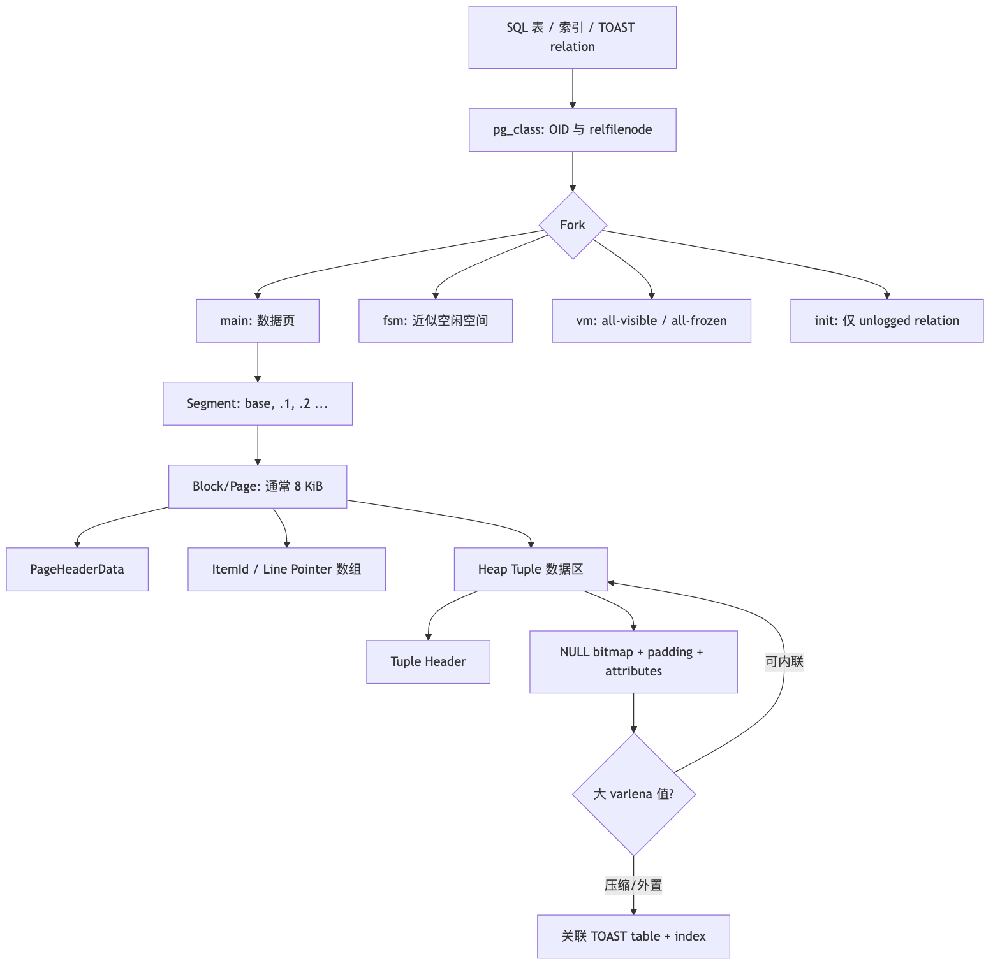
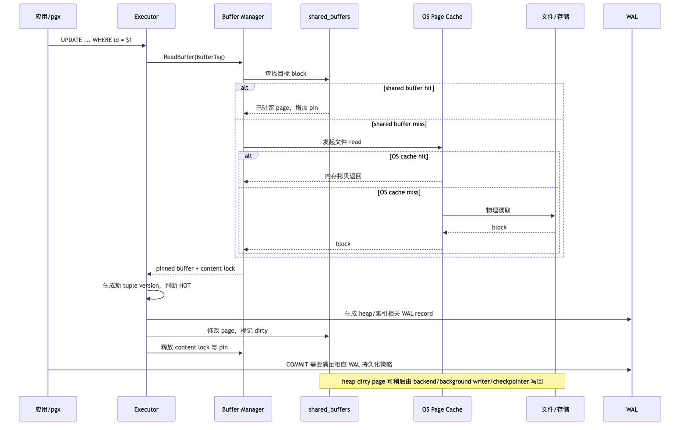
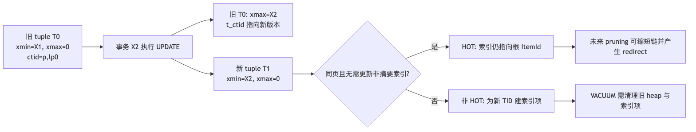
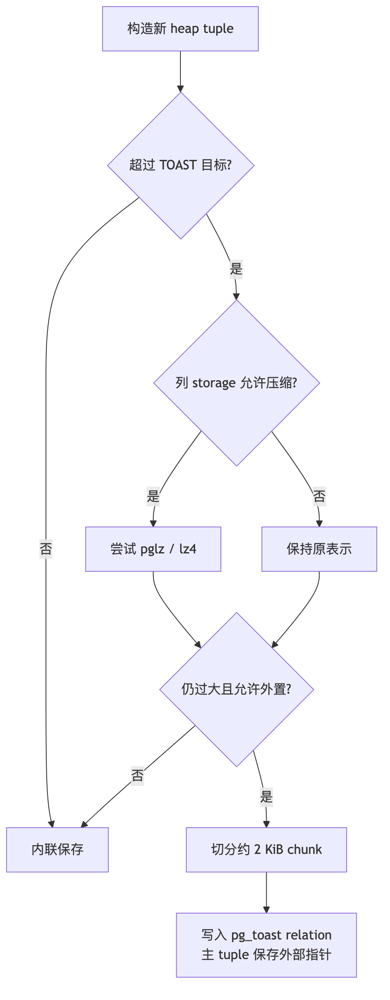
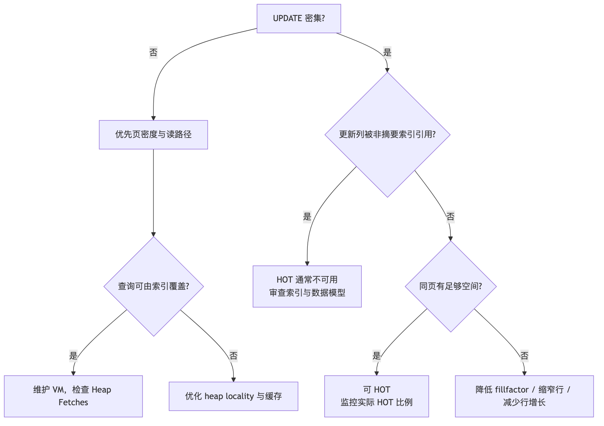

# 第 3 章　PostgreSQL 物理存储：Page、Tuple、TOAST、Buffer 与 HOT

> **技术基线**：PostgreSQL 18 稳定版；兼顾 PostgreSQL 14～18 的重要差异。客户端示例使用 `pgx/v5` 与 `pgxpool`，不绑定补丁版本。除非明确标注，本文所说的“表”指普通 heap table。

---

## 1. 本章定位

SQL 面向的是“行”，执行器和存储层处理的却是 **Relation → Fork → Segment → Block/Page → Line Pointer → Tuple**。一条看似简单的 `UPDATE`，可能同时改变 heap 页面、索引、TOAST 表、可见性状态、共享缓冲区和 WAL；一条 `DELETE` 即使影响了数百万行，也通常不会立刻让操作系统看到文件缩小。

本章建立后续索引、MVCC、VACUUM、WAL、备份与高可用章节共同依赖的物理存储模型。边界如下：

- 重点讨论 heap relation 的页面与行版本、TOAST、Buffer Manager、FSM/VM、HOT；
- 索引页内部格式、WAL record 二进制格式、VACUUM 完整算法将在后续章节展开；
- 既说明“磁盘上的字节”，也说明这些字节进入 `shared_buffers` 后的状态和并发控制；
- 所有调优结论都以可观测指标和工作负载为前提，不给出脱离场景的固定参数答案。

本章要贯穿回答七个问题：

1. PostgreSQL 为什么通常不是原地更新；
2. `CTID` 为什么不能作为长期业务主键；
3. 修改非索引列为何仍可能不能 HOT；
4. 修改索引列为何通常不能 HOT；
5. `shared_buffers` 命中为何不等于系统没有底层 I/O；
6. 删除数据后文件为何通常不会立即缩小；
7. Visibility Map 为何直接影响 Index Only Scan 的收益。

### 1.1 版本边界

| 版本 | 与本章直接相关的变化 |
|---|---|
| `[PG14+]` | TOAST 支持为列选择 LZ4 压缩；是否可用取决于构建时是否包含 LZ4。默认压缩算法仍由 `default_toast_compression` 决定。 |
| `[PG16+]` | `pg_stat_io` 提供统一 I/O 统计；`pg_stat_*_tables.n_tup_newpage_upd` 可观察更新后新版本落到其他 heap 页的次数。 |
| `[PG16+]` | 只修改 BRIN 等“summarizing index”所引用的列时，仍可能使用 HOT；BRIN 摘要本身仍需按需维护。B-tree、Hash、GiST、GIN、SP-GiST 以及 `INCLUDE` 列不属于这一例外。 |
| `[PG18]` | 引入异步 I/O 子系统，可让部分顺序扫描、Bitmap Heap Scan、VACUUM 等排队并合并多个读取请求；这不改变页面、MVCC 或 HOT 的语义。 |
| `[PG18]` | 增加按 backend 读取 I/O/WAL 统计的接口，并在 `pg_stat_io` 中以字节报告读写量，便于把缓存、文件和 WAL 代价分开观察。 |

> 兼容提示：正文以 PG18 SQL 为主。PG14/15 执行统计示例时需移除 `n_tup_newpage_upd`；PG16/17 的 `pg_stat_io` 使用 `op_bytes` 等当时版本字段，而不是 PG18 的 `read_bytes/write_bytes/extend_bytes`。

---

## 2. 可验证的学习目标

完成本章后，你应当能够独立完成以下验证，而不是只背诵定义：

1. 用 `pg_relation_filepath()` 将一个 relation 映射到 `PGDATA` 下的相对文件路径，并解释为什么 `relfilenode` 可能改变；
2. 分别测量 `main`、`fsm`、`vm`、`init` fork，以及 heap、索引和 TOAST 的空间；
3. 画出标准 heap page 的 Page Header、ItemId 数组、空闲区和 tuple 数据区；
4. 从 `heap_page_items()` 输出中识别 `lp`、`xmin`、`xmax`、`t_ctid`、`infomask` 和 HOT 链；
5. 说明逻辑行、物理 tuple version 与 `CTID` 的区别；
6. 判断一个宽值是更可能被压缩、外置到 TOAST，还是必须留在主 tuple；
7. 解释 Buffer Tag、Buffer Descriptor、pin、content lock 和 dirty page 的职责边界；
8. 用 `pg_stat_all_tables` 计算 HOT 比例，并区分 HOT 失败是“索引列变化”还是“页面无空间”；
9. 构造成功 HOT、索引列导致非 HOT、同页空间不足导致非 HOT 三种实验；
10. 结合 `EXPLAIN (ANALYZE, BUFFERS)`、`pg_stat_io`、WAL、CPU 和尾延迟，形成可证伪的性能判断；
11. 在 Go 服务中避免无意义更新，限制数据库并发，并正确处理超时、取消和可重试 SQLSTATE；
12. 评估 page bloat、TOAST、HOT、VACUUM 对备份体积、复制延迟、RPO/RTO 和故障恢复的间接影响。

---

## 3. 核心术语

| 中文 | English | 精确定义 | 容易混淆 | 所属层 |
|---|---|---|---|---|
| 关系 | Relation | PostgreSQL 中具有独立存储身份的表、索引、物化视图、TOAST 表等对象 | 不等于“业务表”；索引也是 relation | Catalog / Storage |
| 文件节点 | RelFileNumber / relfilenode | relation 当前物理文件名的核心编号 | 不是 relation OID；表重写后可能变化 | Storage |
| 分支 | Fork | 同一 relation 的不同用途文件：`main`、`fsm`、`vm`、`init` | 不是分区表的 partition | Storage |
| 段 | Segment | fork 超过段大小后拆分出的连续文件，默认构建通常为 1 GiB 一段 | 不是 8 KiB block | File system |
| 块/页 | Block / Page | PostgreSQL I/O、缓存和页面内管理的基本单位；标准构建通常为 8 KiB | block 是编号视角，page 是内容视角 | Storage / Buffer |
| 页面头 | Page Header | 页开头的 `PageHeaderData`，记录 LSN、校验和、空闲区边界等 | 不包含 tuple 的 MVCC 字段 | Page |
| 行指针 | Line Pointer / ItemId | 页面中固定编号的槽，记录 tuple 偏移、长度和状态 | 不是 tuple 本体；页面压缩时槽号可保持稳定 | Page |
| heap tuple | Heap Tuple | heap 页中的一个物理行版本 | 一条逻辑行可对应多个 tuple | MVCC / Storage |
| tuple header | Heap Tuple Header | tuple 前部的事务、标志、`t_ctid`、header offset 等元数据 | 不等于 Page Header | Tuple |
| `xmin` | Inserting XID | 创建该 tuple version 的事务 ID | 不是创建时间；冻结后也不应按普通整数比较 | MVCC |
| `xmax` | Deleting/locking XID or MultiXact | 删除、替换或锁定该 tuple 的事务/多事务标识，含义由标志位共同决定 | 非零不等于“已删除且不可见” | MVCC |
| Command ID | `cmin` / `cmax` / ComboCID | 区分同一事务内部各命令对 tuple 的创建和删除顺序 | 不是事务 ID | MVCC |
| `infomask` | Tuple Info Mask | 记录 NULL、变长/外置值、XID 状态提示、锁/更新状态等位标志 | 必须结合 `infomask2` 与事务状态解释 | Tuple |
| `CTID` | Current Tuple ID | 当前 tuple 的 `(block number, line pointer number)` 物理地址 | 不是稳定主键，也不是字节偏移 | Tuple / SQL system column |
| NULL 位图 | NULL Bitmap | 对有 NULL 的 tuple，以每列一位标记该属性是否非 NULL | NULL 值没有属性数据，但会有位图和对齐开销 | Tuple |
| 对齐 | Alignment | 按类型要求在 tuple 内插入 padding，使属性地址满足对齐约束 | 不等于页面 fillfactor | Tuple |
| TOAST | The Oversized-Attribute Storage Technique | 对可变长大值压缩并/或外置到关联 TOAST relation 的机制 | 不是整行压缩；tuple 本身不能跨页 | Storage |
| varlena | Variable-length datum | 带长度头的变长数据表示，`text`、`bytea`、`jsonb` 等常见类型使用它 | 不是所有类型都可 TOAST | Type / Storage |
| Buffer Tag | BufferTag | 唯一标识一个持久化 block 的组合：tablespace、database、relation、fork、block | 不是内存地址 | Buffer Manager |
| Buffer Descriptor | BufferDesc | 共享内存中的 buffer 元数据：tag、状态、引用计数、usage count、锁等 | page 数据位于独立 buffer block 区 | Buffer Manager |
| pin | Buffer Pin | 增加 buffer 引用计数，保证使用期间不能被淘汰或复用 | 不等于行锁或页面 content lock | Buffer Manager |
| dirty page | Dirty Buffer/Page | 内存页已被修改，尚未保证写入 relation 文件 | 事务提交通常先保证 WAL，而非立刻刷 heap 页 | Buffer / WAL |
| 共享缓冲区 | `shared_buffers` | PostgreSQL 自主管理的共享 page cache | 不是全部内存，也不能替代 OS page cache | Memory |
| OS 页面缓存 | OS Page Cache | 内核对文件页的缓存 | `pg_stat_io` 的 read 调用不一定是物理介质读取 | Operating system |
| 空闲空间映射 | FSM | 近似记录各 relation page 可用空间，帮助插入/更新寻找目标页 | 不是精确强一致空间目录 | Storage |
| 可见性映射 | VM | heap relation 每页两位：all-visible 与 all-frozen | 索引没有自己的 VM | MVCC / Storage |
| all-visible | All-visible bit | 页上所有 tuple 对所有当前和未来事务均可见，直到该页再被修改 | 不等于 all-frozen | VM |
| all-frozen | All-frozen bit | 页上所有 tuple 都不再需要未来冻结处理 | 通常意味着该页也 all-visible | VM / Vacuum |
| HOT | Heap-Only Tuple update | 新 tuple 在同一 heap 页，且无需为非摘要索引创建新索引项的更新优化 | 仍会创建新 heap tuple、生成 WAL | Heap / Index |
| HOT 链 | HOT Chain | 由根 ItemId 经 `t_ctid` 串联的一组同页行版本 | 不是跨页链 | Heap |
| Redirect Line Pointer | 重定向行指针 | HOT pruning 后根槽变为 `LP_REDIRECT`，指向仍需通过旧索引 TID 到达的存活链成员 | 不含普通 tuple 数据 | Page |
| fillfactor | 填充因子 | 插入时为未来页内更新预留空间的表/索引存储参数 | 不会主动重排已有页 | DDL / Storage |
| Page Pruning | 页面剪枝 | 在安全可见性边界允许时，于单页内移除死 tuple、压缩 HOT 链和整理空间 | 不等于完整 VACUUM 或索引清理 | Heap / Vacuum |
| bloat | 膨胀 | 已分配但对当前有效数据贡献较低的 heap/index/TOAST 空间 | “文件大”不必然就是 bloat | Operations |

---

## 4. 整体心智模型

### 4.1 从 SQL 对象到物理字节



核心不变量是：**一个 heap tuple 不能跨 page**。当一行太宽时，PostgreSQL 不是让 tuple 跨越两个数据页，而是尝试压缩可 TOAST 的属性，再把部分属性外置到 TOAST relation，使主 tuple 能装进单页。

### 4.2 数据路径、控制路径与状态路径



- **数据路径**：relation block 从共享缓冲区、OS page cache 或存储进入执行器；宽属性还可能访问 TOAST。
- **控制路径**：Buffer Tag 查找、pin、防淘汰、content lock、tuple 锁/MVCC、WAL-before-data 规则共同约束修改。
- **状态路径**：clean → pinned/locked → modified/dirty → written；tuple 则经历 live → updated/deleted → dead → pruned/reusable。
- **失败路径**：事务中止会让新 tuple 成为不可见版本；进程或实例崩溃时，已提交而尚未写回的数据页由 WAL 重放恢复；页面校验失败、存储错误或 WAL 不完整则需要进入恢复与备份链路。

### 4.3 UPDATE 的物理模型



PostgreSQL 的逻辑 `UPDATE` 通常不是覆盖旧 payload。旧版本可能仍被已有快照读取，因此它必须保留到不再对任何相关快照可见。少数 header 状态、hint bit、锁信息等可以原地改变，但**业务列值的更新通常通过创建新 tuple version 实现**。

---

## 5. 使用方式：从 SQL、扩展和 pgx 观察存储

### 5.1 文件与空间函数

```sql
-- relation 当前 main fork 第一个 segment 的相对路径
SELECT pg_relation_filepath('public.orders'::regclass);

-- relation 当前文件节点编号；表重写后可能改变
SELECT pg_relation_filenode('public.orders'::regclass);

-- 各 fork 大小
SELECT
    pg_size_pretty(pg_relation_size('public.orders', 'main')) AS main,
    pg_size_pretty(pg_relation_size('public.orders', 'fsm'))  AS fsm,
    pg_size_pretty(pg_relation_size('public.orders', 'vm'))   AS vm,
    pg_size_pretty(pg_relation_size('public.orders', 'init')) AS init;

-- 层次不同，不能混为一谈
SELECT
    pg_size_pretty(pg_relation_size('public.orders'))       AS main_fork_only,
    pg_size_pretty(pg_table_size('public.orders'))          AS heap_toast_and_forks,
    pg_size_pretty(pg_indexes_size('public.orders'))        AS all_indexes,
    pg_size_pretty(pg_total_relation_size('public.orders')) AS table_plus_indexes;
```

`pg_relation_filepath()` 返回相对 `PGDATA` 的路径，并只直接指向对应 fork 的起始文件。若 main fork 超过 segment 上限，后续文件通常带 `.1`、`.2`；其他 fork 使用 `_fsm`、`_vm`、`_init` 后缀并同样可能分段。不要让外部系统长期缓存这个路径：`TRUNCATE`、`CLUSTER`、`VACUUM FULL`、`REINDEX` 和某些 `ALTER TABLE` 会重写对象并改变文件节点。

### 5.2 页面检查扩展

```sql
CREATE EXTENSION IF NOT EXISTS pageinspect;

SELECT *
FROM page_header(get_raw_page('public.orders', 0));

SELECT
    h.lp,
    h.lp_off,
    h.lp_flags,
    h.lp_len,
    h.t_xmin,
    h.t_xmax,
    h.t_field3,
    h.t_ctid,
    h.t_infomask,
    h.t_infomask2,
    h.t_hoff,
    f.raw_flags,
    f.combined_flags
FROM heap_page_items(get_raw_page('public.orders', 0)) AS h
LEFT JOIN LATERAL
     heap_tuple_infomask_flags(h.t_infomask, h.t_infomask2) AS f
  ON h.lp_flags = 1;
```

`pageinspect` 读取的是原始页面，不遵循普通 SQL 查询的行可见性过滤；它可能展示已删除、已中止或尚不可见的 tuple。该扩展的原始页函数通常仅允许高权限角色使用。生产环境应限制到故障诊断窗口、目标 relation 和目标 block，禁止把任意原始页读取能力授予业务账号。

### 5.3 FSM、VM 和统计视图

```sql
CREATE EXTENSION IF NOT EXISTS pg_freespacemap;
CREATE EXTENSION IF NOT EXISTS pg_visibility;

-- 每个 heap block 的近似可用字节；大型表请先限定 block 范围
SELECT blkno, avail
FROM pg_freespace('public.orders'::regclass)
ORDER BY blkno
LIMIT 100;

-- 可见性映射；实验环境可观察，生产大表不要无条件全扫
SELECT *
FROM pg_visibility_map('public.orders'::regclass)
LIMIT 100;

SELECT
    relname,
    n_tup_upd,
    n_tup_hot_upd,
    n_tup_newpage_upd,       -- [PG16+]
    n_live_tup,
    n_dead_tup,
    last_autovacuum,
    autovacuum_count
FROM pg_stat_user_tables
WHERE relid = 'public.orders'::regclass;

-- [PG18] 聚合 I/O 视角；read 并不能区分 OS cache 与物理介质。
-- PG16/17 请按对应版本视图使用 op_bytes 等字段。
SELECT backend_type, object, context,
       reads, read_bytes, read_time,
       writes, write_bytes, write_time,
       writebacks, fsyncs, hits, evictions
FROM pg_stat_io
ORDER BY backend_type, object, context;
```

统计视图是累计值并可能存在刷新延迟；诊断时应记录采样时间、`stats_reset`、测试区间和差值，而不是把单个瞬时值当结论。

### 5.4 `EXPLAIN` 的最低可观测集

```sql
EXPLAIN (ANALYZE, BUFFERS, WAL, SETTINGS, VERBOSE, SUMMARY)
SELECT id, status
FROM public.orders
WHERE customer_id = 42;
```

重点区分：

- `shared hit`：访问时 block 已在 PostgreSQL 共享缓冲区；
- `shared read`：需要把 block 读入共享缓冲区，但内核可能从 OS page cache 返回；
- `dirtied`：执行期间把 page 变脏；
- `written`：执行期间发生 page 写回，不等于该语句产生的所有脏页都已写完；
- `Heap Fetches`：Index Only Scan 因 VM all-visible 位未设置而回表校验的次数；
- `WAL records/bytes/FPI`：修改造成的 WAL 放大，包括必要时的 full-page image。

### 5.5 pgx API 的使用边界

存储层诊断常涉及长查询和高风险操作。应用侧最低要求是：

- 使用 `pgxpool` 复用连接，并用池上限形成第一层准入控制；
- 每次 SQL 带 `context` deadline，传播取消；
- 参数化业务值，不拼接 relation 名；确需动态标识符时使用严格白名单和 `pgx.Identifier`；
- `rows.Close()`、batch results 和连接资源必须关闭；
- 不在持有长事务、长快照时执行人工“观察等待”；
- 对 `40001`、`40P01` 等可重试错误做有界、带抖动的整事务重试；对超时、取消、唯一冲突分别分类；
- 把 goroutine 数、池连接数、活跃 SQL 数、TPS 和服务内部排队长度作为不同指标。

---

## 6. 底层原理

### 6.1 Relation 文件、Fork 与 Segment

普通表和索引各自是 relation。relation 的 catalog 身份通常由 OID 表示，物理文件名核心则由当前 `relfilenode` 表示。默认 tablespace 下，普通数据库对象通常位于 `base/<database_oid>/<relfilenode>`；非默认 tablespace 经 `pg_tblspc` 映射。这个路径结构是管理事实，不应成为业务协议。

一个 relation 可有以下 fork：

| Fork | 内容 | 存在范围 | 丢失/重建语义 |
|---|---|---|---|
| `main` | heap 或索引的实际数据页 | 有存储的 relation | 核心数据，受 WAL/备份保护策略约束 |
| `fsm` | 页面可用空间的近似树状摘要 | heap 和多数索引 | 辅助定位可插入页，不是业务事实 |
| `vm` | heap 页的 all-visible/all-frozen 位 | heap，不属于索引 | VACUUM 设置，数据修改清除相应位 |
| `init` | 空 relation 的初始化模板 | unlogged 表及其索引 | crash 后复制到 main，其他 fork 重建 |

当 fork 文件超过构建时的 segment 上限，PostgreSQL 将其拆为多个 segment。标准发行构建通常以 1 GiB 为一个 segment，上层仍把它视为连续 block 地址空间。段文件拆分主要是文件系统兼容和管理实现，不改变 SQL 语义。

### 6.2 Page Header、Line Pointer 与 Tuple 数据区

标准 8 KiB heap page 大致如下：

```text
低地址
+-------------------------------+
| PageHeaderData（通常 24 B）   |
+-------------------------------+
| ItemId[1] | ItemId[2] | ...   |  向高地址增长，每项通常 4 B
+-------------------------------+
|           free space          |
+-------------------------------+
| tuple N | ... | tuple 2 | 1   |  从高地址向低地址增长
+-------------------------------+
| special space（heap 通常为空）|
+-------------------------------+
高地址
```

Page Header 的关键字段：

| 字段 | 作用 | 诊断意义 |
|---|---|---|
| `pd_lsn` | 最后一次修改该页对应的 WAL LSN | 数据页写回必须满足 WAL-before-data；可辅助判断页新旧 |
| `pd_checksum` | 启用 data checksums 时的页面校验和 | 识别 torn write/介质或传输损坏的一类信号 |
| `pd_flags` | 页面状态提示位 | 属于内部实现，不应做业务依赖 |
| `pd_lower` | ItemId 数组末端 | 与 `pd_upper` 一起决定连续空闲区 |
| `pd_upper` | tuple 数据区起点 | 页面压缩后可变化 |
| `pd_special` | special space 起点 | heap 通常等于页尾；索引 AM 常使用 special space |
| `pd_pagesize_version` | 页面大小和布局版本 | 用于解释页格式 |
| `pd_prune_xid` | 提示可能允许 pruning 的最老 XID | 是提示，不是可见性真相 |

ItemId/Line Pointer 不存业务列，只存 tuple 的偏移、长度和状态。其常见状态为：

- `LP_UNUSED`：槽可复用；
- `LP_NORMAL`：指向普通 tuple；
- `LP_REDIRECT`：不含 tuple，指向同页另一个 ItemId，常见于 HOT pruning；
- `LP_DEAD`：已知死亡但槽暂不能立即复用，常与索引引用清理阶段相关。

页面整理可移动 tuple 的字节位置，但保持 ItemId 编号，从而让外部索引中的 TID 不因页内压缩而全部失效。这也是 `CTID` 的第二部分是 line pointer number，而非页内 byte offset 的原因。

### 6.3 Heap Tuple Header：`xmin`、`xmax`、Command ID 与 `infomask`

普通 heap tuple 的固定 header 在常见构建上通常为 23 字节，之后可能有 NULL bitmap 和对齐填充，直到 `t_hoff` 指向第一个属性。

| 字段 | 关键含义 |
|---|---|
| `t_xmin` | 插入该物理版本的 XID |
| `t_xmax` | 删除、更新或锁定该版本的 XID/MultiXact；必须结合标志位和事务状态解释 |
| `t_field3` | Command ID 或 ComboCID，用于同一事务内命令顺序 |
| `t_ctid` | 正常情况下指向自身；被更新后旧版本通常指向后继版本；特殊操作还有额外语义 |
| `t_infomask2` | 属性数量以及 HOT/heap-only 等标志 |
| `t_infomask` | NULL、变长、外置、XID/锁状态提示等标志 |
| `t_hoff` | 用户属性起始偏移 |

不要仅凭 `xmax <> 0` 判断“这行已删除”：`xmax` 可能代表尚未提交或已中止的事务，也可能代表一个或多个行锁持有者；hint bit 和事务提交日志共同决定可见性。冻结也主要通过标志表示，不能把系统列当普通单调整数做业务比较。

### 6.4 逻辑行、物理 Tuple 与 CTID

假设业务键 `id=7` 被更新三次：

```text
逻辑行 id=7
  ├─ T0: ctid=(10,3), xmin=100, xmax=120
  ├─ T1: ctid=(10,8), xmin=120, xmax=135
  └─ T2: ctid=(10,9), xmin=135, xmax=0   <- 当前版本
```

不同快照可能同时把 T0、T1 或 T2 中的某一个视为“那一行”。因此：

- 业务层的“行”是由键和约束定义的逻辑实体；
- heap 中的是随更新产生、最终被回收的物理版本；
- `CTID` 只是当前版本的物理定位器。

`CTID` 不适合作为长期业务主键，因为：

1. 普通 UPDATE 即可改变当前版本的 `CTID`，HOT 也不例外；
2. 新版本可落在其他 page；
3. `VACUUM FULL`、`CLUSTER`、表重写等会整体重排 tuple；
4. tuple 被回收后，同一个 `(block, lp)` 可被另一行复用；
5. HOT pruning 可能把根 ItemId 变为 redirect，而当前 tuple 位于另一个 ItemId；
6. 物理复制之外，逻辑复制不会把源端 CTID 当业务身份传递。

`CTID` 可用于单事务内的精确定位、维护工具或诊断，但使用前必须接受其生命周期和并发竞态。

### 6.5 NULL Bitmap、对齐与行宽

若 tuple 中至少一个属性为 NULL，header 后会出现 NULL bitmap；每列一位，标记该属性是否非 NULL。NULL 属性本身不占其数据类型的 payload 空间，但仍可能带来 bitmap、header 与后续属性对齐开销。

属性按表定义顺序布局，并受类型对齐要求影响。例如在小宽度类型与 8 字节对齐类型之间，可能出现 padding。列顺序优化有时能降低数个字节的平均行宽，但应遵循以下顺序：

1. 先用真实数据测 `avg(pg_column_size(row(...)))`、relation size 和缓存命中；
2. 评估重排列导致的表重写、锁、WAL、复制和回滚成本；
3. 只有在超大表、极高行数或缓存压力下，才把少量 padding 当主要优化目标；
4. 优先删除无用列、避免重复宽属性、规范大 JSON/文本的访问模式。

行宽影响每页可容纳 tuple 数，继而影响缓存密度、顺序扫描页数、索引回表随机访问、HOT 同页成功率、WAL 和备份体积。

### 6.6 TOAST：压缩与外部存储

因为 tuple 不能跨页，PostgreSQL 对可变长大属性执行 TOAST。处理大致为：



TOAST 的常见 storage 策略：

| 策略 | 压缩 | 外置 | 适用判断 |
|---|---:|---:|---|
| `PLAIN` | 否 | 否 | 必须内联；固定长度类型默认如此。宽值可能导致行无法存储 |
| `EXTENDED` | 是 | 是 | 多数可 TOAST 类型默认；先压缩，再按需外置 |
| `EXTERNAL` | 否 | 是 | 保留可做子串等操作的外部值，牺牲压缩节省 |
| `MAIN` | 是 | 最后手段 | 尽量留在主 tuple，但无法装页时仍可能外置 |

```sql
-- [PG14+] 为后续新值指定列压缩方法；已有值不会自动重写
ALTER TABLE documents
  ALTER COLUMN body SET COMPRESSION lz4;

-- 查看表关联的 TOAST relation
SELECT c.oid::regclass AS heap,
       c.reltoastrelid::regclass AS toast_relation
FROM pg_class AS c
WHERE c.oid = 'public.documents'::regclass;
```

外置值由主 tuple 中的小指针引用，TOAST relation 以 `chunk_id`、`chunk_seq`、`chunk_data` 保存分片并有唯一索引。更新未改变的外置属性时，PostgreSQL通常可以沿用原 TOAST 指针；更新大值本身则可能产生明显的 TOAST heap、TOAST index 和 WAL 写放大。读取仅需其他小列时，外置有利于主表缓存密度；真正访问大值时，则会增加 detoast CPU、额外 page 读取和内存峰值。

### 6.7 Buffer Tag、Buffer Descriptor、Pin 与 Dirty Page

Buffer Manager 用 Buffer Tag 标识“要找的磁盘 block”：

```text
BufferTag = (tablespace OID,
             database OID,
             relation file number,
             fork number,
             block number)
```

共享内存中，Buffer Descriptor 保存 tag、buffer ID、状态位、引用计数、clock-sweep usage count、I/O 状态和 content lock 等元数据；真正的 8 KiB page 位于对应的 buffer block 区。

一次访问的核心步骤是：

1. 依据 Buffer Tag 在共享哈希表查找；
2. 命中则增加 pin；未命中则选择可淘汰 buffer 并读取 block；
3. 持有 pin 后，按读写目的获取共享或独占 content lock；
4. 读取或修改 page；修改后设 dirty；
5. 释放 content lock；不再访问时释放 pin。

**Pin 与锁不能混同**：

- pin 防止 buffer 被淘汰或改作其他 block；
- content lock 保护 page 内容的并发读取/修改；
- tuple lock/transaction lock 保护 SQL 行级并发语义；
- 要物理删除、移动其他 tuple 等“cleanup”操作，通常还要求没有其他 backend pin 住该页。

Dirty page 表示 relation page 的内存副本发生了改变。提交时通常要求相关 WAL 达到配置要求的持久化边界，而不是强制所有 heap/index dirty pages 当场写入 relation 文件。之后可能由 backend、background writer 或 checkpointer 写回；写回前必须满足该 page 对应 WAL 已先持久化的 WAL-before-data 约束。

### 6.8 `shared_buffers` 与 OS Page Cache

读路径存在至少两层缓存：

```text
PostgreSQL shared_buffers
        ↓ miss
OS Page Cache
        ↓ miss
块设备 / 网络存储 / 持久介质
```

因此：

- `shared hit` 表示本次访问无需把该 block 读入 shared buffers；不代表整条语句没有读取其他 block、写 WAL 或产生 page writeback；
- `shared read` 表示 PostgreSQL 调用了文件读取路径，但内核可能直接从 OS page cache 返回；`pg_stat_io` 无法把二者可靠拆成“内核缓存命中”和“真实盘读”；
- 即使查询全部 `shared hit`，此前将页面装入缓存的 I/O、后台 checkpoint 写、该事务的 WAL 写或其他 backend 的 I/O 仍然存在；
- 把 `shared_buffers` 调得极大可能挤压 OS cache 和其他内存，并增加 checkpoint/恢复管理成本；官方给出的比例只能作为起测点，不能作为通用最优值。

`[PG18]` 的 AIO 允许部分读取并发排队和合并，降低等待串行化，但不会让冷数据“无 I/O”。应同时观察 `pg_stat_io`、等待事件、设备队列、CPU、吞吐与 P95/P99，而不是只看开关是否启用。

### 6.9 FSM 与 VM

FSM 为每个 page 保存一个近似可用空间值，并用树状上层页汇总范围内最大可用空间。INSERT 或非 HOT UPDATE 可据此寻找可能容纳 tuple 的 page。它是提示结构：候选页在真正加锁后可能已经没有足够空间，此时再寻找其他页。

VM 对每个 heap page 保存两位：

- **all-visible**：页内所有 tuple 对所有当前和未来事务可见；数据修改会清除，VACUUM 在确认后设置；
- **all-frozen**：页内所有 tuple 都已达到无需未来冻结处理的状态；VACUUM 可在后续 aggressive vacuum 中跳过。

Index Only Scan 的索引项没有完整 MVCC 可见性信息。执行器找到索引 TID 后：

1. 若对应 heap page 的 all-visible 位为 1，可直接返回索引中的所需列；
2. 若为 0，必须访问 heap tuple 校验快照可见性；
3. 所以执行计划名即使是 `Index Only Scan`，也应检查 `Heap Fetches`，而不是只看节点名称。

高频更新会频繁清除 VM 位，长事务又可能阻止 VACUUM 推进可见性边界，最终让覆盖索引仍大量回表。

### 6.10 HOT Update、HOT Chain 与 Page Pruning

一次 UPDATE 要成为 HOT，核心条件是：

1. 新 tuple 能放在旧 tuple 所在的同一 heap page；
2. 非 summarizing indexes 所依赖的列没有实际变化。依赖包括索引键、`INCLUDE` 列、表达式索引引用列以及部分索引 predicate 引用列；
3. 该更新不是需要移动到其他分区等特殊操作。

`[PG16+]` 仅 BRIN 等 summarizing index 引用列变化时仍可能 HOT，因为索引不为每个 heap tuple 保存普通 TID 项；但相关摘要范围仍需按实现维护。

HOT 更新时，索引继续指向链的根 ItemId；heap 通过旧 tuple 的 `t_ctid` 追到同页新版本。随着旧版本对所有相关快照都不可见，page pruning 可移除中间 tuple，并把根 ItemId 变成 `LP_REDIRECT` 指向最老的仍需保留成员。这样无需扫描和修改所有索引项，就能在单页内回收空间。

修改非索引列仍可能不能 HOT，常见原因是：

- 目标 page 连续可用空间不足，新 tuple 必须放到其他页；
- 所谓“非索引列”其实被表达式索引、部分索引 predicate 或 `INCLUDE` 引用；
- trigger、generated expression 或应用逻辑同时改变了某个非摘要索引相关列；
- 更新导致分区键变化，需要跨分区移动；
- 行宽增长、内联/TOAST 表示变化使新 tuple 无法同页容纳。

修改普通 B-tree 等索引列通常不能 HOT，因为索引中的键值或 payload 已变化，且索引项必须能定位新的物理版本。即使 SQL 的 `SET` 列表包含索引列，只要新旧二进制值实际相同，版本实现可能避免把它视作索引值变化；但 UPDATE 本身仍会创建 heap 版本、产生 WAL，并可能因其他原因非 HOT，所以应用层仍应消除无意义 UPDATE。

`fillfactor` 通过在初次装页时留出空间提高同页更新概率：

```sql
ALTER TABLE public.account_state SET (fillfactor = 75);
```

该设置只影响后续新写入/重写形成的页面，不会自动给已经塞满的旧页“腾出 25%”。降低 fillfactor 的代价是更大基线 relation、更多扫描页、更低缓存密度；应按 HOT 比例、行增长、读写比和空间预算验证。

### 6.11 为什么 DELETE 后文件通常不缩小

DELETE 先把旧 tuple 标记为对未来适当快照不可见，而不是立即从文件中挖掉字节。等所有相关快照都越过它后，VACUUM 才能把空间标记为可复用。普通 VACUUM 的目标是**内部复用**，通常不把中间空页归还操作系统；只有文件尾部形成连续全空页并能短暂取得所需锁时，才可能截断尾部。

需要把大量中间空洞真正压缩并归还 OS，通常要用会重写表的 `VACUUM FULL`、`CLUSTER`、某些 `ALTER TABLE` 或外部在线重组方案。它们会带来强锁、额外磁盘、WAL、复制和回滚风险。若业务是周期性清空整表，`TRUNCATE` 更直接，但其锁、触发器和 MVCC 语义与逐行 DELETE 不同。

---

## 7. 内部数据结构和状态

### 7.1 页面状态边界

| 状态/边界 | 来源 | 是否权威 | 典型变化者 |
|---|---|---:|---|
| `pd_lower` / `pd_upper` | Page Header | 对当前页布局权威 | 插入、删除槽、page compaction |
| `pd_prune_xid` | Page Header hint | 否，只是可剪枝提示 | UPDATE/DELETE 与 pruning |
| FSM free space | `_fsm` fork | 近似 | 插入、更新、VACUUM |
| VM all-visible | `_vm` fork | 保守：置位前必须确定安全 | VACUUM 置位，DML 清位 |
| VM all-frozen | `_vm` fork | 保守 | VACUUM/freezing |
| tuple `xmin/xmax` | Heap tuple header | 需结合事务状态和 infomask | INSERT/UPDATE/DELETE/row lock |
| Buffer dirty flag | Buffer Descriptor | 对内存副本状态权威 | 修改 page、writeback |
| pin refcount | Buffer Descriptor | 对 buffer 可淘汰性权威 | 所有 page 使用者 |
| index TID | Index tuple | 候选 heap 定位 | INSERT、非 HOT UPDATE、index cleanup |

### 7.2 Tuple 生命周期

```text
INSERT
  ↓
LIVE：xmin 已提交，xmax 无有效删除语义
  ↓ UPDATE / DELETE / row lock
OLD VERSION：xmax/infomask 表示替换、删除或锁
  ↓ 所有相关快照不再需要
DEAD：可由 pruning/VACUUM 回收
  ↓
ItemId 可能变 LP_UNUSED / LP_DEAD / LP_REDIRECT
  ↓
空间进入本页可复用集合，FSM 最终反映近似值
```

事务中止时，新 tuple 不会“消失于历史”；它先成为任何正常快照都不可见的版本，随后由清理机制回收。长事务、prepared transaction、逻辑复制槽或 standby feedback 可能拉长全局可见性地平线，使 dead tuple 不能及时成为可回收空间。

### 7.3 HOT 链状态示例

```text
B-tree index entry ──> ItemId 5 (root)
                       │
                       ├─ T0: t_ctid=(42,9), dead
                       ├─ T1 at ItemId 9: t_ctid=(42,12), dead
                       └─ T2 at ItemId 12: t_ctid=(42,12), live

pruning 后：
B-tree index entry ──> ItemId 5 [LP_REDIRECT -> 12]
                                      └─ T2 live
```

链遍历不能只盲信一个已经回收槽中的地址。内部实现还会验证后继 tuple 的 `xmin` 是否匹配前驱的 `xmax` 等条件，以防 ItemId 已被复用后串到无关 tuple。

### 7.4 Buffer Descriptor 关键状态

| 元数据 | 作用 | 常见误读 |
|---|---|---|
| `tag` | 当前 buffer 对应哪个 relation block | tag 有效不等于 page 内容已经通过校验并可用 |
| `refcount` | pin 数 | 高 pin 不等于 SQL 行锁多 |
| `usagecount` | clock-sweep 淘汰热度近似 | 不是精确访问次数或 LRU 顺序 |
| `BM_VALID` | page 数据已可用 | 不代表 page 是 clean |
| `BM_DIRTY` | page 被修改 | 不代表 WAL 尚未落盘，也不代表立即写盘 |
| `BM_IO_IN_PROGRESS` | 正在读取/写回 | 等待者可能出现 `BufferIO` 等等待 |
| content lock | 保护 page 内容 | 不等于 buffer mapping lock、tuple lock 或 relation lock |

理解这些边界可以避免把“buffer pin 等待”“行锁等待”“磁盘 read”等完全不同的问题混成一句“数据库卡住了”。

---

## 8. 场景和选型决策

| 场景 | 首选设计 | 性能代价 | 并发/一致性代价 | HA/运维代价 | 何时改选 |
|---|---|---|---|---|---|
| 高频更新小状态行 | 窄表；只更新真实变化列；评估较低 heap fillfactor；减少非必要索引 | 预留空闲会增大基线页数，但 HOT 可降低索引写、WAL 和缓存污染 | 热点行仍会串行等待；HOT 不消除行锁 | 较少 WAL 有助于降低复制压力；仍需正常 VACUUM | 若单键更新争用主导，应分片计数、追加事件或批量合并 |
| 写少读多维表 | 默认或较高 fillfactor；覆盖索引；积极维护 VM | 高密度页利于缓存和扫描；Index Only Scan 收益大 | 更新后 VM 位会清除，短期需回表 | 备份紧凑；VACUUM 主要负责冻结 | 若开始高频更新，重新评估覆盖索引与 fillfactor |
| 大文本/JSON 文档 | 把常用小列和冷大值访问模式分开；允许 TOAST；必要时拆表 | 主表密度高，但读取大值有 detoast、TOAST I/O 和内存峰值 | 同一行大值更新仍受行锁；大 tuple 版本增加清理压力 | TOAST 计入备份和物理复制；逻辑复制传输完整变更值 | 若经常只改文档局部且值巨大，考虑规范化、分片文档或对象存储 |
| 审计/事件日志 | 追加写，少 UPDATE；时间分区；生命周期按分区 DROP/DETACH | 顺序写和批量归档友好，避免逐行 DELETE bloat | 避免热点更新，但需控制分区创建与 catalog 压力 | 分区级备份/归档更灵活；逻辑复制流量可预测 | 若必须频繁更正事件，保留修正事件而非覆盖原记录 |
| 周期性全量刷新 | 新表构建后原子切换，或可接受语义时 `TRUNCATE`+装载 | 避免 DELETE 产生大量 dead tuple | 切换/截断需较强 relation lock | WAL、复制槽、备份窗口需容量规划 | 数据量小且无并发时可直接事务内替换 |
| 需要稳定外部行标识 | 业务主键或不可变 surrogate key | 增加一个键和相应索引 | 唯一性由约束保证 | 可跨逻辑复制、导入导出和重写保持身份 | `CTID` 仅限短生命周期内部维护，不可替代 |
| 临时、可丢失中间结果 | temp table；明确可 crash 丢失且不需 standby 时才考虑 unlogged | 少部分 WAL 成本降低 | temp 受 session 生命周期；unlogged 仍有并发语义 | unlogged crash 后清空，且不适合作为 HA 数据源 | 任何有 RPO 要求的数据都使用 logged relation |
| 大批量删除历史数据 | 优先分区生命周期；否则分批 DELETE + 合理 VACUUM | 分批降低峰值但仍产生 dead tuple/WAL | 大事务会延长快照和锁持有；小批需幂等游标 | 大量 WAL 可拉高复制延迟；空间不一定归还 OS | 必须立即归还空间时，在维护窗口评估表重写 |
| 索引很多的 OLTP 表 | 基于查询证据保留索引，尤其审查被频繁更新列上的索引 | 每个非 HOT 更新可能写多个索引 | 索引页竞争和锁等待增加 | WAL、备份、重建和 failover 恢复成本增加 | 将低价值索引删除或改成更小/更有选择性的设计 |

### 8.1 快速决策树



选型不能只问“能不能 HOT”，还要问：降低 fillfactor 后增加的读放大是否大于索引写减少；拆出大列后新增 join/网络往返是否可接受；减少索引后查询 P99 是否恶化。最终以真实流量回放或受控压测验证。

---

## 9. 高性能分析

### 9.1 物理代价分解

一条 heap UPDATE 的总成本可以近似拆为：

```text
CPU：表达式/约束/trigger + tuple deform/form + 压缩/解压 + WAL 构造
内存：buffer pin + page content lock + detoast 临时内存 + executor memory
读取：heap page + index page + 可能的 TOAST heap/index page
写入：新 heap tuple + 旧 tuple header + 非 HOT 索引项 + TOAST + VM/FSM 状态
WAL：heap/index/TOAST record + 可能的 full-page image + commit record
后台：dirty page writeback + checkpoint + vacuum/pruning/index cleanup
```

HOT 优化的是其中一部分：避免为新版本插入普通索引项，并让同页 pruning 更容易。它不消除新 heap tuple、事务日志、行锁、dirty page 或未来清理。

### 9.2 行宽、页密度与读写放大

假设页面可用于 tuple 的空间近似固定，平均 tuple 从 100 B 增长到 400 B，会导致每页行数显著下降。由此产生连锁反应：

- 相同数据量需要更多 heap page，顺序扫描和备份读取更多；
- 热工作集更难完全驻留 `shared_buffers` 和 OS cache；
- 索引回表需要访问更多离散 page；
- 满页更快出现，同页 HOT 失败概率上升；
- UPDATE 的旧/新版本共存时，短期空间峰值更高；
- VACUUM 扫描和 checkpoint writeback 的 page 数增加。

建议按分布而非平均值观察行宽：

```sql
SELECT
    percentile_disc(0.50) WITHIN GROUP (ORDER BY sz) AS p50_bytes,
    percentile_disc(0.95) WITHIN GROUP (ORDER BY sz) AS p95_bytes,
    percentile_disc(0.99) WITHIN GROUP (ORDER BY sz) AS p99_bytes,
    max(sz) AS max_bytes
FROM (
    SELECT pg_column_size(t) AS sz
    FROM public.orders AS t
    TABLESAMPLE SYSTEM (1)
) AS s;
```

采样率要根据表大小调整；`TABLESAMPLE SYSTEM` 是 page 级样本，不能假装是严格均匀行样本。对 TOAST 大值还要分别测主表、TOAST 表和网络返回字节。

### 9.3 TOAST 的性能权衡

| 模式 | 优点 | 代价 | 主要观测 |
|---|---|---|---|
| 大值压缩后内联 | 减少 page/缓存占用；读取无需额外 TOAST lookup | 压缩/解压 CPU；仍占主 tuple | CPU、`pg_column_size`、heap page 数 |
| 大值外置 | 主表更窄，小列扫描和缓存更高效 | 访问大值需 TOAST index + heap；detoast 内存；更新大值写放大 | toast relation size、toast block read/hit、响应字节 |
| `EXTERNAL` | 避免压缩 CPU，某些子串操作可减少全量解压 | 更大磁盘和 I/O | CPU 与 read bytes 的交换关系 |
| 拆分到业务子表 | 访问路径显式，可独立索引/生命周期 | join、额外约束和应用复杂度 | join P99、连接数、事务一致性 |

不要因为“TOAST 自动处理”就忽略大对象成本。`SELECT *`、API 无条件序列化大 JSON、ORM 自动加载 LOB，往往把本可避免的 TOAST I/O 变成网络和 GC 峰值。

### 9.4 缓存层与 I/O 指标

建议形成三个问题链：

1. **PostgreSQL 是否命中共享缓冲区？** 看 `EXPLAIN ... BUFFERS`、`pg_statio_*`、`pg_stat_io.hits/reads`；
2. **发生 file read 时是否真的触及持久介质？** PostgreSQL 内部统计不能完全回答，需结合 OS 的 page fault、block device、云盘指标；
3. **即使读命中，写路径是否受限？** 看 WAL write/sync、dirty/writeback、checkpoint、设备队列和等待事件。

`shared_buffers` 没有固定“最佳比例”。受控评估至少记录：

- PostgreSQL 大版本、`block_size`、`shared_buffers`、`effective_cache_size`；
- 主机 RAM、NUMA、容器 memory limit、OS 与文件系统；
- 数据集、索引和 TOAST 总量，热工作集大小；
- 冷/热缓存条件，是否先清缓存或预热；
- 读写比、并发连接、活跃查询、持续时间；
- TPS、P50/P95/P99、CPU、read/write bytes、WAL bytes、等待事件；
- checkpoint 是否落入测试窗口。

### 9.5 `[PG18]` 异步 I/O

PG18 的 AIO 能让符合条件的操作同时排队多个读请求，并对相邻 I/O 做组合。常见参数包括 `io_method`、`io_combine_limit`、`io_max_combine_limit`、`io_max_concurrency`，以及影响预取深度的 `effective_io_concurrency`、`maintenance_io_concurrency`。

分析原则：

- AIO 更可能改善大范围顺序/位图读取和 VACUUM，而不是单键、全缓存 OLTP；
- `io_uring` 是否可用取决于构建、内核和运行环境；默认 worker 模式也会消耗专用 worker；
- 只比较 TPS 可能掩盖 CPU 上升或 P99 尖峰，应同时看 `pg_aios`、`pg_stat_io` 和设备层；
- AIO 不能修复错误索引、过宽 tuple、锁争用或长事务造成的清理阻塞。

### 9.6 HOT 的量化

```sql
SELECT
    relname,
    n_tup_upd,
    n_tup_hot_upd,
    n_tup_newpage_upd, -- [PG16+]
    round(100.0 * n_tup_hot_upd / NULLIF(n_tup_upd, 0), 2) AS hot_pct,
    round(100.0 * n_tup_newpage_upd / NULLIF(n_tup_upd, 0), 2) AS newpage_pct,
    n_dead_tup,
    pg_size_pretty(pg_total_relation_size(relid)) AS total_size
FROM pg_stat_user_tables
ORDER BY n_tup_upd DESC;
```

解释时必须结合 DDL：

- `hot_pct` 低且 `newpage_pct` 高：优先怀疑同页空间不足、行增长或 fillfactor；
- `hot_pct` 低且 `newpage_pct` 低：可能是索引相关列变化，即使新版本仍放在同页也需要新索引项；
- `hot_pct` 高但 relation 仍膨胀：HOT 链仍需 pruning/VACUUM，长快照可能阻止回收；
- `hot_pct` 提升但查询变慢：降低 fillfactor 后读放大可能超过写收益；
- 统计是自上次 reset 的累计值，发布前后要保存基线并按时间窗口求差。

### 9.7 WAL、Checkpoint 与写放大

脏 heap page 不会因为事务提交就必然写回，但该事务生成的 WAL 会按 `synchronous_commit`、复制配置和持久性策略进入提交关键路径。写密集时要分开观察：

- heap/index/TOAST 生成多少 WAL；
- 是否频繁产生 full-page image；
- WAL buffer、WAL write、WAL sync 是否等待；
- checkpoint 是否过于集中，导致 writeback 尖峰；
- replica 是否来得及接收、写入、刷盘和重放；
- 存储是否同时承受 relation file 与 WAL file 的 I/O。

实验环境可估算某操作区间的 WAL：

```sql
SELECT pg_current_wal_insert_lsn() AS lsn_before \gset

-- 在独立、低干扰环境执行目标工作负载

SELECT pg_size_pretty(
           pg_wal_lsn_diff(pg_current_wal_insert_lsn(), :'lsn_before')
       ) AS approximate_wal_generated;
```

该值包含同一实例其他并发事务生成的 WAL；生产环境不能把它当某一语句的精确账单。优先使用 `EXPLAIN (ANALYZE, WAL)`、按 backend WAL 统计 `[PG18]` 或隔离的压测实例。

### 9.8 可复现性能实验模板

任何“fillfactor=70 比 100 快”“LZ4 一定更好”之类结论，都应附以下实验记录：

| 维度 | 必填内容 |
|---|---|
| 软件 | PostgreSQL 精确版本、扩展、OS、文件系统、pgx/压测工具版本 |
| 配置 | `shared_buffers`、WAL/checkpoint、autovacuum、AIO、压缩、表/索引 fillfactor |
| 数据 | 行数、平均/P95/P99 行宽、主表/索引/TOAST 大小、键分布 |
| 缓存 | 冷启动、OS cache 热、shared buffer 热，分别测试 |
| 负载 | SQL 比例、更新列、批量大小、连接数、活跃请求数、持续时间 |
| 延迟 | P50/P95/P99/max，区分数据库执行时间和端到端时间 |
| 数据库 | `BUFFERS`、`WAL`、HOT/newpage 比例、dead tuples、VM、等待事件 |
| 主机 | CPU user/system/iowait、RSS、page faults、读写 IOPS/bytes/latency |
| 正确性 | 提交/回滚数、超时、死锁、重试、最终行数与业务校验 |
| 干扰 | checkpoint、autovacuum、备份、复制、邻居负载是否发生 |

**禁止**只报一个平均 TPS 或固定毫秒数而不披露环境。性能测试的目的是找到拐点、瓶颈和尾延迟，而不是制造看似精确的通用数字。

### 9.9 参数调整顺序

1. 消除无意义 UPDATE 和无价值索引；
2. 修正事务范围、批量大小和访问模式；
3. 确认 autovacuum 能跟上，并清除长快照障碍；
4. 依据 HOT/newpage、行宽和读放大评估 fillfactor；
5. 依据热集和系统内存评估 `shared_buffers`，保留 OS 与连接/排序内存；
6. 再评估 checkpoint、WAL、AIO 和存储队列；
7. 每次只改变少数变量，保留可回滚配置与对照组。

---

## 10. 高并发分析

### 10.1 五种“并发”必须分开

| 指标 | 含义 | 过高时的典型问题 |
|---|---|---|
| 应用 goroutine 数 | 服务内同时存在的工作单元 | 内存、调度、重试风暴；不代表都在访问 DB |
| 池连接数 | 可占用的数据库 session 上限 | backend 内存、上下文切换、锁竞争 |
| 活跃 SQL 数 | 当前真正执行或等待的请求 | CPU/I/O/锁饱和 |
| TPS | 单位时间完成的事务数 | 高 TPS 可来自极短事务，不能代替并发深度 |
| 排队长度 | 等待池、信号量或服务准入的请求数 | P99 上升、deadline 到期后无效工作 |

正确目标不是“让所有请求立刻拿到连接”，而是在数据库饱和点之前形成有界队列和背压。

### 10.2 MVCC 与行级争用

HOT 不会让并发更新同一逻辑行并行提交。多个事务更新同一行时，仍需等待前一个 tuple version 的更新结果；`xmax`、tuple lock、transaction ID wait 和 MultiXact 共同表达该状态。热点计数器即使每次都 HOT，也可能因行锁串行化得到很差的 P99。

诊断阻塞链：

```sql
SELECT
    a.pid,
    a.usename,
    a.application_name,
    a.state,
    a.wait_event_type,
    a.wait_event,
    now() - a.xact_start AS xact_age,
    now() - a.query_start AS query_age,
    pg_blocking_pids(a.pid) AS blocking_pids,
    left(a.query, 300) AS query
FROM pg_stat_activity AS a
WHERE a.datname = current_database()
  AND (a.state <> 'idle' OR cardinality(pg_blocking_pids(a.pid)) > 0)
ORDER BY a.xact_start NULLS LAST;
```

不要在看到 `BufferPin`、`BufferContent` 或 `transactionid` wait 后都归结为“磁盘慢”：

- `transactionid` / tuple 相关：通常是事务/行级依赖；
- `BufferPin`：某 backend 长时间 pin 住 buffer，可能阻止 cleanup；
- `BufferContent`：并发访问同一 page 内容的短锁竞争；
- `DataFileRead`：文件读取路径；
- `WALWrite` / `WALSync`：WAL 持久化路径。

### 10.3 热页、热点索引页与 HOT

当大量请求集中更新相邻 tuple：

- 同一 heap page content lock 竞争可能上升；
- HOT 链变长，页面连续空间被消耗；
- pruning 若受长快照阻碍，HOT 最终因页面空间不足转为跨页非 HOT；
- 非 HOT 更新还会触及多个索引页，增加 B-tree leaf contention 和 page split 风险；
- checkpoint/writeback 可能把瞬时写入变成尾延迟尖峰。

因此 HOT 是“减少额外工作”的机制，不是热点消除器。热点行可考虑：分桶计数、只追加增量、异步聚合、按业务键分片、乐观版本控制或降低单键更新频率。

### 10.4 长事务为何伤害页面回收

一个长时间保持旧快照的事务可能仍需要旧 tuple，因此其他 session 即使完成 UPDATE/DELETE，pruning/VACUUM 也不能回收相关版本。后果包括：

- `n_dead_tup` 和 relation size 上升；
- 同页 HOT 可用空间减少，`n_tup_newpage_upd` 上升；
- VM all-visible 位难以恢复，Index Only Scan 的 `Heap Fetches` 增加；
- VACUUM 做更多工作却回收有限；
- physical replica 上启用反馈或复制槽滞后时，影响可能被远端放大。

事务边界必须围绕一致性需要，而不是围绕用户思考时间、网络调用或批处理整个文件生命周期。

### 10.5 死锁、超时与重试风暴

页面机制本身不是主要 deadlock API，但 UPDATE 涉及的多行、多表和索引唯一性检查会形成锁图。应用应：

- 按稳定顺序更新多个业务键；
- 设置 `lock_timeout`、`statement_timeout` 和应用 deadline 的层次关系；
- 仅对 `40001`（serialization failure）、`40P01`（deadlock detected）等明确可重试错误重试完整事务；
- 使用指数退避、抖动和最大尝试次数；
- 在系统过载时减少而不是增加并发；
- 对“提交结果未知”的网络错误先依赖幂等键/状态检查，不盲目重复非幂等操作。

### 10.6 连接池、背压和事务边界

推荐关系是：

```text
入口请求
  -> 服务级并发上限
  -> 有界队列（deadline-aware）
  -> pgxpool MaxConns
  -> 数据库活跃 SQL
```

池连接数应由单实例数据库容量、服务副本数和每请求 SQL 行为共同预算。例如 20 个服务实例各开 100 连接，不能用“每实例 100 不大”来解释总计 2000 backend。应按总连接、活跃比例、事务时长、CPU 核数、I/O 并发和锁热点压测。

### 10.7 并发诊断最小证据集

- `pg_stat_activity`：事务年龄、状态、wait event、query；
- `pg_locks` 与 `pg_blocking_pids()`：阻塞图；
- `pg_stat_user_tables`：UPDATE/HOT/newpage/dead tuple；
- `pg_stat_io` `[PG16+]`：buffer context 的读写、eviction、fsync；
- `EXPLAIN (ANALYZE, BUFFERS, WAL)`：语句级 page/WAL；
- 服务指标：池 acquired/idle/total、acquire latency、队列长度、取消和重试；
- 主机指标：CPU、run queue、I/O latency、memory pressure；
- 复制指标：发送/写入/刷盘/重放延迟，确认是否是保留地平线或 WAL 堵塞。

---

## 11. 高可用分析

### 11.1 与物理复制、逻辑复制的关系

| 机制 | 存储语义 | HOT/CTID 的影响 |
|---|---|---|
| 物理流复制 | 传输并重放 WAL，恢复 heap/index/TOAST 等物理变化 | HOT 能减少部分索引 WAL，可能降低带宽和 replay 压力；standby 看到物理布局演进。CTID 仍不是对外协议 |
| 逻辑复制 | 传输逻辑行变更，由 subscriber 自己执行写入 | 不传递源端 HOT 链或 CTID；subscriber 的页空间、索引、fillfactor 不同，HOT 结果和 relation size 可不同 |
| 基础备份 + PITR | 复制物理文件并用 WAL 推进到目标时间 | bloat、空闲页和 TOAST 都增加备份读取/传输/恢复体积；dirty page 的已提交状态由 WAL 保证恢复 |
| unlogged relation | 不提供常规 crash durability，crash 后由 init fork 重置 | 不应承担有 RPO 的业务数据，也不作为普通 standby 数据来源 |

### 11.2 RPO 与 RTO

- **RPO** 主要由 WAL 持久化、同步/异步复制和备份归档决定；page 是否已写回 main fork 不直接等于是否已提交持久化。
- **RTO** 会受待重放 WAL、relation/TOAST/index 体积、存储吞吐、checkpoint 距离、损坏检查和应用重连速度影响。
- HOT、窄行和健康 VACUUM 可通过减少索引/WAL/空间放大间接改善复制和恢复，但不能替代正确的 HA 拓扑。

### 11.3 同步与异步复制

异步复制允许 primary commit 在 standby 尚未持久化时完成，故 failover 可能丢失最近事务；同步复制可收紧 RPO，但提交延迟受到同步 standby 的网络、WAL write/flush/apply 配置影响。大值 TOAST 更新、非 HOT 多索引更新和 checkpoint 压力都会扩大 WAL 管道负荷。

不要用单一 `replay_lag` 判断健康。至少观察：

- primary 生成 WAL 的速率；
- sender 已发送位置；
- standby 已写、已刷和已重放位置；
- replication slot retained WAL；
- standby 查询冲突和 feedback 对 primary VACUUM 地平线的影响；
- 网络吞吐、延迟和磁盘 fsync。

### 11.4 切换、故障转移与 fencing

存储知识不能解决 split-brain。发生 failover 时仍需：

1. 对旧 primary 做可靠 fencing，防止双写；
2. 选择满足 RPO 的候选节点并确认 WAL 时间线；
3. 提升新 primary；
4. 让应用丢弃旧连接并重新解析服务端点；
5. 对失败时处于提交边界的事务按“结果未知”处理；
6. 用业务幂等键、唯一约束或事务查询确认结果，不能靠旧 CTID；
7. 对旧 primary 执行 rewind/rebuild 后再加入；
8. 验证数据一致性、复制恢复、备份链和监控告警。

计划内 **switchover** 应先停止或排空写入、确认候选节点已追平、切换写端点并验证旧连接失效；它与突发 failover 的风险模型不同。**Failback** 不能把旧主机直接改回写节点：应先 fencing，使用 `pg_rewind` 或重建把它作为 replica 追平，再执行一次受控 switchover。整个过程必须保留时间线、RPO 证据和可撤销路由步骤。

### 11.5 备份与恢复验证

备份成功日志不等于可恢复。演练至少验证：

- 能从基础备份启动，并将 WAL replay 到指定时间/LSN；
- 关键 relation、索引、TOAST relation 均可读取；
- 校验和/日志没有 page corruption 信号；
- 关键表行数、业务聚合、外键/唯一约束抽样符合预期；
- `pg_total_relation_size` 与预期量级一致，磁盘有增长余量；
- 应用可重新建池、处理旧连接和未知提交；
- 恢复后的 autovacuum、VM、统计信息和查询计划逐步回归正常；
- 实测 RPO/RTO，而不是只引用设计值。

### 11.6 存储膨胀对 HA 的隐性成本

同样的有效业务数据，若 heap、index 和 TOAST 膨胀两倍：

- 基础备份读取、压缩、传输和校验时间可能上升；
- 快照/克隆的真实增量成本可能增加；
- 故障替换节点的 rebuild 时间变长；
- cache warm-up 需要读取更多 page；
- VACUUM 和 checkpoint 与前台流量竞争更明显；
- 云盘容量临界时，复制槽保留 WAL 可能触发级联故障。

因此 page-level 健康是 HA 容量模型的一部分，但治理应优先消除写放大和维护滞后，而不是周期性依赖高风险 `VACUUM FULL`。

---

## 12. 三维影响矩阵

| 设计/状态 | 高性能 | 高并发 | 高可用 |
|---|---|---|---|
| 窄 tuple、高页密度 | 提升缓存密度，减少扫描/备份 page | 减少热页数量未必降低热点；单页容纳更多热点行也可能增加 page contention | 降低备份、复制与恢复体积 |
| TOAST 外置 | 小列查询更快；访问大值增加 I/O/CPU/内存 | 大值更新延长行锁和事务时间 | 增加 TOAST/WAL/逻辑复制流量，需纳入备份 |
| 较低 heap fillfactor | 提高 HOT 机会，减少索引写；增加读/空间放大 | 降低跨页更新，但不能消除同行锁 | 可能减少 WAL，也可能增大基础备份；需实测净效应 |
| HOT 比例高 | 通常减少索引 I/O、WAL 和 vacuum index cleanup | 减少索引页竞争；热点行仍串行 | WAL/复制压力通常下降，但不是 RPO 机制 |
| 长事务/旧快照 | 阻止回收，增加 bloat 和 Heap Fetches | 扩大锁/版本链与池占用 | 可拉高复制保留、备份体积和恢复时间 |
| VM all-visible 覆盖高 | Index Only Scan 少回表；VACUUM 可跳过页 | 高频 DML 会清位，读写竞争需权衡 | standby 读性能更稳；恢复后仍需维护推进 |
| `shared_buffers` 增大 | 可能提高命中，也可能挤压 OS/其他内存 | 更多共享资源不等于无锁竞争；checkpoint 管理量增加 | 重启后 warm-up 更长；不改变 WAL RPO |
| PG18 AIO | 提高部分大扫描/VACUUM I/O 并行度 | 过高 I/O 并发可挤压 OLTP，需要限流 | 可缩短维护/恢复某些阶段，但取决于存储 |
| 多个更新列索引 | 查询可能更快；UPDATE 写放大、HOT 下降 | 更多索引页锁和争用 | 更多 WAL、备份和重建时间 |
| 周期性表重写 | 回收 OS 空间、改善 locality | 强锁/额外资源可能造成停顿 | 大 WAL/磁盘峰值影响复制与 RTO，必须可回滚 |
| unlogged table | 降低部分 WAL 成本 | 并发语义仍存在 | crash 后清空，不满足普通持久性和 HA 要求 |

矩阵的使用方式是找**耦合效应**。例如，为提高 HOT 把 fillfactor 从 100 降到 60，可能降低更新 WAL，却把只读扫描 page 数提高；若备份瓶颈在基线文件体积，HA 总成本甚至可能上升。任何单点优化都要重新测三列指标。

---

## 13. 实验

> 以下实验必须在**一次性测试数据库**中执行。`pageinspect` 会绕过普通可见性视图读取原始页，部分函数要求 superuser。不要在生产高峰扫描大型 relation 的全部页面，也不要对生产统计执行全局 reset。示例使用 `psql` 元命令 `\gset`；其他客户端可把结果保存为变量后执行等价步骤。

### 13.1 实验一：从 relation 文件走到 heap tuple

#### 实验目标

- 用 `pg_relation_filepath`、`pg_relation_size`、`pg_total_relation_size` 建立对象到文件的映射；
- 观察 main/FSM/VM、TOAST relation 和页面头；
- 用 `heap_page_items` 同时看到普通 SQL 隐藏的多个物理版本；
- 验证长快照读取旧版本时，更新事务无需覆盖旧 payload；
- 观察 VM 对 Index Only Scan 的影响。

#### 适用版本与扩展

- PostgreSQL 14～18；以下输出字段以 PostgreSQL 18 为基线；
- `pageinspect` 必需；`pg_visibility` 用于 VM 验证；
- 需要创建扩展和读取原始页的权限。

#### 初始化

```sql
DROP SCHEMA IF EXISTS storage_lab CASCADE;
CREATE SCHEMA storage_lab;

CREATE EXTENSION IF NOT EXISTS pageinspect;
CREATE EXTENSION IF NOT EXISTS pg_visibility;
CREATE EXTENSION IF NOT EXISTS pg_freespacemap;

CREATE TABLE storage_lab.page_probe (
    id                  bigint PRIMARY KEY,
    group_key           integer NOT NULL,
    nullable_text       text,
    short_text          text NOT NULL,
    compressible_text   text,
    incompressible_text text
) WITH (fillfactor = 85);

-- 为了更清楚地区分“可压缩”与“外置但不压缩”的大值。
ALTER TABLE storage_lab.page_probe
    ALTER COLUMN incompressible_text SET STORAGE EXTERNAL;

INSERT INTO storage_lab.page_probe
       (id, group_key, nullable_text, short_text)
SELECT g,
       g % 10,
       CASE WHEN g % 3 = 0 THEN NULL ELSE 'nullable-' || g END,
       'row-' || g || '-' || repeat('x', 48)
FROM generate_series(1, 300) AS g;

WITH payload AS (
    SELECT left(string_agg(md5(g::text), '' ORDER BY g), 16000) AS pseudo_random
    FROM generate_series(1, 600) AS g
)
INSERT INTO storage_lab.page_probe
       (id, group_key, nullable_text, short_text,
        compressible_text, incompressible_text)
SELECT 1001,
       1,
       NULL,
       'wide-row',
       repeat('A', 16000),
       pseudo_random
FROM payload;

VACUUM (ANALYZE) storage_lab.page_probe;
```

#### 步骤 A：确认 block、路径、fork 与 TOAST

```sql
SHOW block_size;

SELECT
    c.oid::regclass AS relation,
    c.oid,
    pg_relation_filenode(c.oid) AS relfilenode,
    pg_relation_filepath(c.oid) AS relative_path,
    c.reltoastrelid::regclass AS toast_relation
FROM pg_class AS c
WHERE c.oid = 'storage_lab.page_probe'::regclass;

SELECT
    pg_relation_size('storage_lab.page_probe', 'main') AS main_bytes,
    pg_relation_size('storage_lab.page_probe', 'fsm')  AS fsm_bytes,
    pg_relation_size('storage_lab.page_probe', 'vm')   AS vm_bytes,
    pg_relation_size('storage_lab.page_probe', 'init') AS init_bytes,
    pg_table_size('storage_lab.page_probe')             AS table_bytes,
    pg_indexes_size('storage_lab.page_probe')           AS index_bytes,
    pg_total_relation_size('storage_lab.page_probe')    AS total_bytes;

SELECT c.reltoastrelid::regclass::text AS toast_rel
FROM pg_class AS c
WHERE c.oid = 'storage_lab.page_probe'::regclass
\gset

SELECT
    :'toast_rel' AS toast_relation,
    pg_relation_filepath(:'toast_rel'::regclass) AS toast_path,
    pg_relation_size(:'toast_rel'::regclass) AS toast_main_bytes,
    pg_total_relation_size(:'toast_rel'::regclass) AS toast_total_bytes;

SELECT
    id,
    ctid,
    xmin,
    xmax,
    pg_column_size(short_text) AS short_bytes,
    pg_column_size(compressible_text) AS compressible_bytes,
    pg_column_size(incompressible_text) AS incompressible_bytes,
    pg_column_size(p) AS logical_row_datum_bytes
FROM storage_lab.page_probe AS p
WHERE id = 1001;
```

**预期解释**：

- logged table 的 `init` 通常为 0；unlogged relation 才有 init fork；
- `pg_table_size` 包含 heap 的各 fork 和关联 TOAST，但不含用户索引；`pg_total_relation_size` 再加索引；
- 高重复的 `repeat('A', ...)` 很容易压缩；伪随机文本更可能外置并占用 TOAST relation；实际结果受压缩方法、阈值和表示细节影响，不要假设固定字节数；
- `pg_relation_filepath` 是当前路径，不是稳定外部标识。

#### 步骤 B：查看 Page Header 与 ItemId

```sql
SELECT *
FROM page_header(get_raw_page('storage_lab.page_probe', 0));

SELECT
    h.lp,
    h.lp_off,
    h.lp_flags,
    CASE h.lp_flags
      WHEN 0 THEN 'LP_UNUSED'
      WHEN 1 THEN 'LP_NORMAL'
      WHEN 2 THEN 'LP_REDIRECT'
      WHEN 3 THEN 'LP_DEAD'
    END AS lp_state,
    h.lp_len,
    h.t_xmin,
    h.t_xmax,
    h.t_field3,
    h.t_ctid,
    h.t_hoff,
    h.t_bits,
    f.raw_flags,
    f.combined_flags
FROM heap_page_items(get_raw_page('storage_lab.page_probe', 0)) AS h
LEFT JOIN LATERAL
     heap_tuple_infomask_flags(h.t_infomask, h.t_infomask2) AS f
  ON h.lp_flags = 1
ORDER BY h.lp;

SELECT blkno, avail
FROM pg_freespace('storage_lab.page_probe'::regclass)
WHERE blkno < 10
ORDER BY blkno;
```

记录 `pd_lower`、`pd_upper`、连续空闲空间以及前几个 `lp`。FSM 中的 `avail` 是近似值，可能与原始页头的瞬时连续空闲空间不完全相同。

#### 步骤 C：三个会话观察 MVCC 版本

**会话 A：建立旧快照，不加写锁**

```sql
BEGIN ISOLATION LEVEL REPEATABLE READ;
SELECT pg_current_xact_id();

SELECT id, ctid, xmin, xmax, short_text
FROM storage_lab.page_probe
WHERE id = 1;

-- 保持事务，不要提交。
```

**会话 B：创建新版本并提交**

```sql
BEGIN;
UPDATE storage_lab.page_probe
SET short_text = short_text || ':updated-by-B'
WHERE id = 1
RETURNING id, ctid, xmin, xmax, short_text;
COMMIT;

-- 让执行更新的 backend 返回 idle；累计统计存在内部刷新间隔。
```

**会话 A：仍看到旧快照**

```sql
SELECT id, ctid, xmin, xmax, short_text
FROM storage_lab.page_probe
WHERE id = 1;
-- 在 REPEATABLE READ 下仍应看到进入事务时的版本。
```

**会话 C：普通新快照看到新版本，并检查原始页**

```sql
SELECT id, ctid, xmin, xmax, short_text
FROM storage_lab.page_probe
WHERE id = 1;

SELECT
    h.lp, h.lp_flags, h.lp_len,
    h.t_xmin, h.t_xmax, h.t_ctid,
    f.raw_flags, f.combined_flags
FROM heap_page_items(get_raw_page('storage_lab.page_probe', 0)) AS h
LEFT JOIN LATERAL
     heap_tuple_infomask_flags(h.t_infomask, h.t_infomask2) AS f
  ON h.lp_flags = 1
ORDER BY h.lp;
```

**时间线与等待预期**：

```text
A: BEGIN RR ── SELECT T0 ─────────────────── SELECT 仍见 T0 ── COMMIT
B:                    BEGIN ─ UPDATE 生成 T1 ─ COMMIT
C:                                      SELECT 见 T1 / raw page 见 T0+T1
```

A 只持有快照而未 `SELECT ... FOR UPDATE`，因此 B 通常不应等待 A；A 之所以能继续读 T0，是 MVCC 可见性，而不是 B 没提交。原始页面可能同时出现 T0 与 T1，旧 T0 的 `xmax`/`t_ctid` 指向更新关系。具体 `lp` 编号、hint flags 和 pruning 时点允许变化。

完成检查后：

```sql
-- 会话 A
COMMIT;

-- 会话 C；不能在事务块内执行 VACUUM
VACUUM (VERBOSE, ANALYZE) storage_lab.page_probe;
```

#### 步骤 D：VM 与 Index Only Scan

```sql
VACUUM (ANALYZE) storage_lab.page_probe;

BEGIN;
SET LOCAL enable_seqscan = off; -- 只为稳定演示，不是生产调优建议
EXPLAIN (ANALYZE, BUFFERS, VERBOSE)
SELECT id
FROM storage_lab.page_probe
WHERE id BETWEEN 1 AND 100;
ROLLBACK;

UPDATE storage_lab.page_probe
SET short_text = short_text || ':vm-clear'
WHERE id = 1;

BEGIN;
SET LOCAL enable_seqscan = off;
EXPLAIN (ANALYZE, BUFFERS, VERBOSE)
SELECT id
FROM storage_lab.page_probe
WHERE id BETWEEN 1 AND 100;
ROLLBACK;
```

第一次 VACUUM 后，相关页更可能 all-visible，`Heap Fetches` 较低；更新会清除目标 heap page 的 VM 位，第二次执行即使仍显示 `Index Only Scan`，也可能出现 heap fetch。小表计划和 cache 状态会影响具体数字，因此比较的是机制与方向，不宣称固定次数。

可直接检查 VM：

```sql
SELECT *
FROM pg_visibility_map('storage_lab.page_probe'::regclass)
WHERE blkno < 10
ORDER BY blkno;
```

#### 故障与安全观察

- 若 B 被阻塞，检查 A 是否误用了 `FOR UPDATE`，或另有 session 持有行/relation lock；
- 若 `heap_page_items` 权限失败，使用实验专用高权限账号，不要扩大生产业务权限；
- 若 page 0 没有目标行，先从普通 SQL 的 `ctid` 提取 block number，再对该 block 调 `get_raw_page`；
- 若没有明显 TOAST 大小，增加不可压缩 payload，但必须控制实验数据库磁盘；
- 不用 `pg_stat_reset()` 清生产统计；记录前后采样差即可。

#### 清理

本实验可保留 schema 给实验二复用。全部结束后统一执行：

```sql
DROP SCHEMA storage_lab CASCADE;
```

---

### 13.2 实验二：构造 HOT 成功、索引列非 HOT、空间不足非 HOT

#### 实验目标

分别验证：

1. 只改非索引列、同页有空间时成功 HOT；
2. 修改 B-tree 索引列时，即使同页有空间也不能 HOT；
3. 只改非索引列，但原页无空间时，新版本跨页而不能 HOT。

同时观察 `CTID`、`xmin/xmax`、`n_tup_upd`、`n_tup_hot_upd`、`n_tup_newpage_upd` `[PG16+]`、HOT 链、redirect line pointer 和 relation size。

#### 适用版本与前置条件

- PostgreSQL 14～18；`n_tup_newpage_upd` 仅 `[PG16+]`，PG14/15 运行下列统计 SQL 时删除该列；
- 需要 `pageinspect`；
- 推荐新建 schema，避免已有 UPDATE 统计污染结果；
- 所有测试表都很小，但仍只应在一次性数据库执行。

#### 初始化三张表

```sql
CREATE SCHEMA IF NOT EXISTS storage_lab;
CREATE EXTENSION IF NOT EXISTS pageinspect;

DROP TABLE IF EXISTS storage_lab.hot_ok;
CREATE TABLE storage_lab.hot_ok (
    id          integer PRIMARY KEY,
    indexed_key integer NOT NULL,
    payload     text NOT NULL
) WITH (fillfactor = 60);

INSERT INTO storage_lab.hot_ok
SELECT g, g, 'payload-' || g || '-' || repeat('a', 80)
FROM generate_series(1, 200) AS g;
VACUUM (ANALYZE) storage_lab.hot_ok;

DROP TABLE IF EXISTS storage_lab.hot_index_change;
CREATE TABLE storage_lab.hot_index_change (
    id          integer PRIMARY KEY,
    indexed_key integer NOT NULL,
    payload     text NOT NULL
) WITH (fillfactor = 60);
CREATE INDEX hot_index_change_key_idx
    ON storage_lab.hot_index_change(indexed_key);

INSERT INTO storage_lab.hot_index_change
SELECT g, g, 'payload-' || g || '-' || repeat('b', 80)
FROM generate_series(1, 200) AS g;
VACUUM (ANALYZE) storage_lab.hot_index_change;

DROP TABLE IF EXISTS storage_lab.hot_no_space;
CREATE TABLE storage_lab.hot_no_space (
    id          integer PRIMARY KEY,
    indexed_key integer NOT NULL,
    pad         text NOT NULL,
    payload     text NOT NULL
) WITH (fillfactor = 100);

-- 禁止这两列压缩/外置，使行增长明确消耗主 page 空间。
ALTER TABLE storage_lab.hot_no_space
    ALTER COLUMN pad SET STORAGE PLAIN,
    ALTER COLUMN payload SET STORAGE PLAIN;

INSERT INTO storage_lab.hot_no_space
SELECT g,
       g,
       left(repeat(md5(('pad-' || g)::text), 6), 180),
       left(repeat(md5(('payload-' || g)::text), 6), 180)
FROM generate_series(1, 250) AS g;
VACUUM (ANALYZE) storage_lab.hot_no_space;
```

#### 场景一：成功 HOT，并观察长快照对 pruning 的影响

先确认目标行：

```sql
SELECT id, ctid, xmin, xmax, payload
FROM storage_lab.hot_ok
WHERE id = 1;
```

**会话 A：保留旧版本所需的快照**

```sql
BEGIN ISOLATION LEVEL REPEATABLE READ;
SELECT id, ctid, xmin, xmax, payload
FROM storage_lab.hot_ok
WHERE id = 1;
-- 保持事务。
```

**会话 B：连续三个已提交更新**

```sql
BEGIN;
UPDATE storage_lab.hot_ok
SET payload = payload || ':v1'
WHERE id = 1
RETURNING id, ctid, xmin, xmax, payload;
COMMIT;

BEGIN;
UPDATE storage_lab.hot_ok
SET payload = payload || ':v2'
WHERE id = 1
RETURNING id, ctid, xmin, xmax, payload;
COMMIT;

BEGIN;
UPDATE storage_lab.hot_ok
SET payload = payload || ':v3'
WHERE id = 1
RETURNING id, ctid, xmin, xmax, payload;
COMMIT;

-- 让执行更新的 backend 返回 idle；累计统计存在内部刷新间隔。
```

记录每次返回的 `ctid`。预期 block number 相同、line pointer number 变化；这说明 HOT 仍创建新 tuple，而不是原地覆盖。

**会话 C：检查统计和链**

```sql
SELECT pg_stat_clear_snapshot();
SELECT relname, n_tup_upd, n_tup_hot_upd, n_tup_newpage_upd
FROM pg_stat_user_tables
WHERE relid = 'storage_lab.hot_ok'::regclass;

SELECT
    h.lp,
    h.lp_flags,
    CASE h.lp_flags
      WHEN 0 THEN 'LP_UNUSED'
      WHEN 1 THEN 'LP_NORMAL'
      WHEN 2 THEN 'LP_REDIRECT'
      WHEN 3 THEN 'LP_DEAD'
    END AS lp_state,
    h.t_xmin,
    h.t_xmax,
    h.t_ctid,
    f.raw_flags,
    f.combined_flags
FROM heap_page_items(get_raw_page('storage_lab.hot_ok', 0)) AS h
LEFT JOIN LATERAL
     heap_tuple_infomask_flags(h.t_infomask, h.t_infomask2) AS f
  ON h.lp_flags = 1
ORDER BY h.lp;
```

因为 A 仍可能看见初始版本，链中的旧版本不能全部回收。预期该测试表自创建后有 3 次 UPDATE，`n_tup_hot_upd` 接近 3、`n_tup_newpage_upd=0`；统计刷新时点可能导致短暂滞后，应从新 session 采样而不是循环高频轮询。

**释放旧快照并触发清理**

```sql
-- 会话 A
COMMIT;

-- 会话 C
VACUUM (VERBOSE, ANALYZE) storage_lab.hot_ok;

SELECT
    h.lp, h.lp_flags,
    CASE h.lp_flags
      WHEN 0 THEN 'LP_UNUSED'
      WHEN 1 THEN 'LP_NORMAL'
      WHEN 2 THEN 'LP_REDIRECT'
      WHEN 3 THEN 'LP_DEAD'
    END AS lp_state,
    h.t_xmin, h.t_xmax, h.t_ctid
FROM heap_page_items(get_raw_page('storage_lab.hot_ok', 0)) AS h
ORDER BY h.lp;
```

清理后，根槽可能显示 `LP_REDIRECT` 指向当前存活 tuple，或因访问时已发生 opportunistic pruning 而呈现等价的更短链。不要把具体 `lp` 数字写成版本无关断言；应验证“索引根仍可到达当前版本、无用中间版本可回收”这一不变量。

#### 场景二：修改索引列导致非 HOT

```sql
SELECT pg_relation_size('storage_lab.hot_index_change') AS before_bytes \gset

BEGIN;
UPDATE storage_lab.hot_index_change
SET indexed_key = indexed_key + 100000
WHERE id = 1
RETURNING id, ctid, xmin, xmax, indexed_key;
COMMIT;

-- 让执行更新的 backend 返回 idle；累计统计存在内部刷新间隔。
SELECT pg_stat_clear_snapshot();

SELECT
    relname,
    n_tup_upd,
    n_tup_hot_upd,
    n_tup_newpage_upd,
    :'before_bytes'::bigint AS before_bytes,
    pg_relation_size(relid) AS after_bytes
FROM pg_stat_user_tables
WHERE relid = 'storage_lab.hot_index_change'::regclass;

SELECT
    h.lp, h.lp_flags, h.t_xmin, h.t_xmax, h.t_ctid,
    f.raw_flags, f.combined_flags
FROM heap_page_items(get_raw_page('storage_lab.hot_index_change', 0)) AS h
LEFT JOIN LATERAL
     heap_tuple_infomask_flags(h.t_infomask, h.t_infomask2) AS f
  ON h.lp_flags = 1
ORDER BY h.lp;
```

预期：`n_tup_upd=1`、`n_tup_hot_upd=0`。新 tuple 可能仍在同一 block，所以 `[PG16+] n_tup_newpage_upd` 可以是 0；“同页”只是 HOT 的必要条件，不是充分条件。B-tree 索引键变化要求新的索引项指向新 tuple version。

#### 场景三：页面空间不足导致非 HOT

先自动选择 block 0 上的一行，并记录 relation 大小：

```sql
SELECT id AS target_id,
       ctid::text AS old_ctid
FROM storage_lab.hot_no_space
WHERE ctid < '(1,1)'::tid
ORDER BY ctid
LIMIT 1
\gset

SELECT pg_relation_size('storage_lab.hot_no_space') AS before_bytes \gset

SELECT :'target_id' AS target_id,
       :'old_ctid' AS old_ctid,
       :'before_bytes' AS relation_bytes_before;
```

把该行的非索引 `payload` 从 180 B 左右扩到约 1700 B。由于原页按 fillfactor 100 装载且没有死 tuple，新版本应无法与旧版本共存于原页：

```sql
WITH payload AS (
    SELECT left(string_agg(md5(('grow-' || g)::text), '' ORDER BY g), 1700) AS v
    FROM generate_series(1, 100) AS g
)
UPDATE storage_lab.hot_no_space AS t
SET payload = payload.v
FROM payload
WHERE t.id = :'target_id'::integer
RETURNING t.id,
          t.ctid::text AS new_ctid,
          t.xmin,
          t.xmax,
          pg_column_size(t) AS new_tuple_datum_bytes
\gset

-- 让执行更新的 backend 返回 idle；累计统计存在内部刷新间隔。

SELECT
    split_part(regexp_replace(:'old_ctid', '[()]', '', 'g'), ',', 1)::integer AS old_blk,
    split_part(regexp_replace(:'new_ctid', '[()]', '', 'g'), ',', 1)::integer AS new_blk
\gset

SELECT :'old_ctid' AS old_ctid,
       :'new_ctid' AS new_ctid,
       :'old_blk' AS old_block,
       :'new_blk' AS new_block;

SELECT pg_stat_clear_snapshot();
SELECT
    relname,
    n_tup_upd,
    n_tup_hot_upd,
    n_tup_newpage_upd,
    :'before_bytes'::bigint AS before_bytes,
    pg_relation_size(relid) AS after_bytes
FROM pg_stat_user_tables
WHERE relid = 'storage_lab.hot_no_space'::regclass;
```

预期：old block 与 new block 不同，`n_tup_hot_upd=0`，`[PG16+] n_tup_newpage_upd=1`。relation size 可能增加一个或多个 block，也可能因为最后一个既有 page 恰好容纳新 tuple 而不增加；**跨页非 HOT 并不保证立刻扩文件**。

检查两个 block：

```sql
SELECT 'old' AS page_role,
       h.lp, h.lp_flags, h.t_xmin, h.t_xmax, h.t_ctid,
       f.raw_flags, f.combined_flags
FROM heap_page_items(
         get_raw_page('storage_lab.hot_no_space', :'old_blk'::integer)
     ) AS h
LEFT JOIN LATERAL
     heap_tuple_infomask_flags(h.t_infomask, h.t_infomask2) AS f
  ON h.lp_flags = 1
UNION ALL
SELECT 'new' AS page_role,
       h.lp, h.lp_flags, h.t_xmin, h.t_xmax, h.t_ctid,
       f.raw_flags, f.combined_flags
FROM heap_page_items(
         get_raw_page('storage_lab.hot_no_space', :'new_blk'::integer)
     ) AS h
LEFT JOIN LATERAL
     heap_tuple_infomask_flags(h.t_infomask, h.t_infomask2) AS f
  ON h.lp_flags = 1
ORDER BY page_role, lp;
```

#### 三场景结果对照

| 场景 | 索引相关列变化 | 新版本同页 | HOT | `n_tup_newpage_upd` `[PG16+]` | 关键原因 |
|---|---:|---:|---:|---:|---|
| `hot_ok` | 否 | 是 | 是 | 0 | 同页有空间且无非摘要索引需要新项 |
| `hot_index_change` | 是 | 通常是 | 否 | 通常 0 | B-tree 键变化，需要新索引项 |
| `hot_no_space` | 否 | 否 | 否 | 1 | HOT 链不能跨页，新 tuple 只能另找 page |

#### 性能采样扩展

不要直接把三次 UPDATE 的耗时当性能结论。扩展成压测时，分别准备三张等量数据表，并记录：

- 版本、配置、表/索引 DDL、fillfactor；
- 行数、行宽 P50/P95/P99、缓存冷热；
- 并发 worker、池连接、持续时间和更新键分布；
- TPS、P50/P95/P99；
- `n_tup_upd`、`n_tup_hot_upd`、`n_tup_newpage_upd`；
- `EXPLAIN (ANALYZE, BUFFERS, WAL)` 的 buffers/WAL；
- `pg_stat_io`、CPU、设备读写和等待事件；
- relation/index/TOAST size 前后差值；
- autovacuum/checkpoint 是否介入。

可以用下列只读查询生成统一快照：

```sql
SELECT now() AS sampled_at,
       s.relid::regclass AS relation,
       s.n_tup_upd,
       s.n_tup_hot_upd,
       s.n_tup_newpage_upd,
       s.n_dead_tup,
       pg_relation_size(s.relid) AS heap_main_bytes,
       pg_indexes_size(s.relid) AS index_bytes,
       pg_total_relation_size(s.relid) AS total_bytes
FROM pg_stat_user_tables AS s
WHERE s.relid IN (
    'storage_lab.hot_ok'::regclass,
    'storage_lab.hot_index_change'::regclass,
    'storage_lab.hot_no_space'::regclass
)
ORDER BY s.relid::regclass::text;
```

#### 清理

```sql
DROP SCHEMA storage_lab CASCADE;
```

#### 实验安全总结

- `VACUUM` 不可在事务块内执行；
- `SET enable_seqscan=off` 仅用于演示，并放在局部事务中回滚；
- 原始页输出可能包含业务数据字节，高权限诊断结果同样需要访问控制；
- 生产环境应以统计差值、受限 block 检查和副本/克隆实验为主；
- 不通过长期持有事务“方便观察”，实验结束立即提交/回滚所有会话。

---

## 14. Go：避免无意义更新，并用有界并发保护数据库

### 14.1 表设计与更新契约

```sql
CREATE SCHEMA IF NOT EXISTS app;

CREATE TABLE IF NOT EXISTS app.profile (
    id           bigint PRIMARY KEY,
    display_name text NOT NULL,
    bio          text NOT NULL,
    updated_at   timestamptz NOT NULL DEFAULT clock_timestamp()
);

-- 本例故意不为 updated_at 建索引；若业务查询确实需要，应接受其更新代价。
```

目标语义是“把 profile 设置为目标状态”，而不是“无论是否变化都制造一个新版本”。SQL 使用 `IS DISTINCT FROM`，使 NULL 语义也可扩展得明确：

```sql
UPDATE app.profile
SET display_name = $2,
    bio          = $3,
    updated_at   = clock_timestamp()
WHERE id = $1
  AND (display_name, bio) IS DISTINCT FROM ($2::text, $3::text);
```

若值未改变，`RowsAffected()` 为 0，不创建 heap tuple、不清 VM 位、不生成该 UPDATE 的索引/TOAST 写，也不增加后续 VACUUM 负担。0 行也可能表示 `id` 不存在；API 若必须区分“未找到”和“无变化”，可先定义返回契约，或用单条 CTE/`RETURNING` 返回状态，避免无意识增加一次网络往返。

### 14.2 可编译示例

初始化模块：

```bash
go mod init example.com/storageaware
go get github.com/jackc/pgx/v5
```

`main.go`：

```go
package main

import (
	"context"
	"errors"
	"fmt"
	"log"
	"math/rand"
	"os"
	"os/signal"
	"strconv"
	"sync"
	"sync/atomic"
	"syscall"
	"time"

	"github.com/jackc/pgx/v5/pgconn"
	"github.com/jackc/pgx/v5/pgxpool"
)

type ProfilePatch struct {
	ID          int64
	DisplayName string
	Bio         string
}

const updateProfileSQL = `
UPDATE app.profile
SET display_name = $2,
    bio          = $3,
    updated_at   = clock_timestamp()
WHERE id = $1
  AND (display_name, bio) IS DISTINCT FROM ($2::text, $3::text)`

// updateProfile executes one atomic, desired-state update.
// changed=false means either "already equal" or "not found" under this API contract.
func updateProfile(
	parent context.Context,
	pool *pgxpool.Pool,
	p ProfilePatch,
) (changed bool, err error) {
	ctx, cancel := context.WithTimeout(parent, 2*time.Second)
	defer cancel()

	tag, err := pool.Exec(ctx, updateProfileSQL, p.ID, p.DisplayName, p.Bio)
	if err != nil {
		return false, err
	}
	return tag.RowsAffected() == 1, nil
}

func isRetryableTransactionError(err error) bool {
	var pgErr *pgconn.PgError
	if !errors.As(err, &pgErr) {
		// A transport error near COMMIT can mean "outcome unknown". Do not
		// blindly classify every network error as retryable.
		return false
	}

	switch pgErr.Code {
	case "40001", // serialization_failure
		"40P01": // deadlock_detected
		return true
	default:
		return false
	}
}

func classifyDBError(err error) string {
	switch {
	case err == nil:
		return "ok"
	case errors.Is(err, context.DeadlineExceeded):
		return "deadline_exceeded"
	case errors.Is(err, context.Canceled):
		return "canceled"
	}

	var pgErr *pgconn.PgError
	if !errors.As(err, &pgErr) {
		return "transport_or_unknown"
	}

	switch pgErr.Code {
	case "40001":
		return "serialization_failure"
	case "40P01":
		return "deadlock"
	case "55P03":
		return "lock_not_available"
	case "57014":
		return "query_canceled"
	case "23505":
		return "unique_violation"
	default:
		return "postgres_" + pgErr.Code
	}
}

// updateProfileWithRetry retries the complete transaction unit. Here the unit
// is one SQL statement, so retrying the whole unit is unambiguous. The SQL is
// desired-state and idempotent: after an uncertain successful first execution,
// a later retry sees equal values and becomes a no-op.
func updateProfileWithRetry(
	ctx context.Context,
	pool *pgxpool.Pool,
	p ProfilePatch,
) (bool, error) {
	const maxAttempts = 3
	baseBackoff := 40 * time.Millisecond

	for attempt := 1; attempt <= maxAttempts; attempt++ {
		changed, err := updateProfile(ctx, pool, p)
		if err == nil {
			return changed, nil
		}
		if !isRetryableTransactionError(err) || attempt == maxAttempts {
			return false, err
		}

		backoff := baseBackoff << (attempt - 1)
		jitter := time.Duration(rand.Int63n(int64(backoff/2) + 1))
		timer := time.NewTimer(backoff + jitter)
		select {
		case <-ctx.Done():
			if !timer.Stop() {
				select {
				case <-timer.C:
				default:
				}
			}
			return false, ctx.Err()
		case <-timer.C:
		}
	}

	return false, errors.New("unreachable retry state")
}

// applyPatches uses a fixed-size worker set. workers and pool MaxConns are
// separate controls: workers bounds this operation; MaxConns bounds the whole
// process's database sessions.
func applyPatches(
	parent context.Context,
	pool *pgxpool.Pool,
	patches []ProfilePatch,
	workers int,
) (changedCount int64, err error) {
	if workers < 1 {
		return 0, fmt.Errorf("workers must be >= 1")
	}

	ctx, cancel := context.WithCancel(parent)
	defer cancel()

	jobs := make(chan ProfilePatch)
	errCh := make(chan error, 1)
	var changed atomic.Int64
	var wg sync.WaitGroup

	worker := func() {
		defer wg.Done()
		for {
			select {
			case <-ctx.Done():
				return
			case p, ok := <-jobs:
				if !ok {
					return
				}
				didChange, updateErr := updateProfileWithRetry(ctx, pool, p)
				if updateErr != nil {
					select {
					case errCh <- fmt.Errorf(
						"update profile %d (%s): %w",
						p.ID,
						classifyDBError(updateErr),
						updateErr,
					):
					default:
					}
					cancel()
					return
				}
				if didChange {
					changed.Add(1)
				}
			}
		}
	}

	wg.Add(workers)
	for i := 0; i < workers; i++ {
		go worker()
	}

	// The producer is also deadline-aware, so cancellation cannot leave it
	// permanently blocked trying to enqueue work.
	go func() {
		defer close(jobs)
		for _, p := range patches {
			select {
			case <-ctx.Done():
				return
			case jobs <- p:
			}
		}
	}()

	wg.Wait()

	select {
	case firstErr := <-errCh:
		return changed.Load(), firstErr
	default:
	}
	if parent.Err() != nil {
		return changed.Load(), parent.Err()
	}
	return changed.Load(), nil
}

func envInt(name string, fallback int) (int, error) {
	raw := os.Getenv(name)
	if raw == "" {
		return fallback, nil
	}
	n, err := strconv.Atoi(raw)
	if err != nil || n < 1 {
		return 0, fmt.Errorf("%s must be a positive integer", name)
	}
	return n, nil
}

func main() {
	logger := log.New(os.Stdout, "storage-aware ", log.LstdFlags|log.LUTC)

	databaseURL := os.Getenv("DATABASE_URL")
	if databaseURL == "" {
		logger.Fatal("DATABASE_URL is required")
	}

	maxConns, err := envInt("DB_MAX_CONNS", 8)
	if err != nil {
		logger.Fatal(err)
	}
	workers, err := envInt("UPDATE_WORKERS", 4)
	if err != nil {
		logger.Fatal(err)
	}
	if workers > maxConns {
		logger.Fatalf(
			"UPDATE_WORKERS (%d) must not exceed DB_MAX_CONNS (%d) in this example",
			workers,
			maxConns,
		)
	}

	rootCtx, stop := signal.NotifyContext(
		context.Background(),
		os.Interrupt,
		syscall.SIGTERM,
	)
	defer stop()

	cfg, err := pgxpool.ParseConfig(databaseURL)
	if err != nil {
		logger.Fatalf("parse DATABASE_URL: %v", err)
	}
	// MaxConns is supplied by deployment capacity planning. Other pool
	// lifetimes retain pgx defaults here instead of pretending one fixed
	// value is universally correct.
	cfg.MaxConns = int32(maxConns)
	cfg.MinConns = 0

	pool, err := pgxpool.NewWithConfig(rootCtx, cfg)
	if err != nil {
		logger.Fatalf("create pool: %v", err)
	}
	defer pool.Close()

	pingCtx, pingCancel := context.WithTimeout(rootCtx, 5*time.Second)
	err = pool.Ping(pingCtx)
	pingCancel()
	if err != nil {
		logger.Fatalf("ping database: %v", err)
	}

	// Replace this bounded slice with messages from an already bounded queue.
	patches := []ProfilePatch{
		{ID: 1, DisplayName: "Ada", Bio: "storage-aware profile"},
		{ID: 2, DisplayName: "Linus", Bio: "no-op updates are skipped"},
	}

	runCtx, runCancel := context.WithTimeout(rootCtx, 20*time.Second)
	changed, err := applyPatches(runCtx, pool, patches, workers)
	runCancel()
	if err != nil {
		logger.Fatalf("apply patches: changed=%d: %v", changed, err)
	}

	logger.Printf("completed patches=%d changed=%d", len(patches), changed)
}
```

### 14.3 为什么 ORM 的“更新全部列”有风险

常见 ORM 模式是先加载实体，再生成：

```sql
UPDATE app.profile
SET id = $1,
    display_name = $2,
    bio = $3,
    status = $4,
    updated_at = clock_timestamp()
WHERE id = $1;
```

风险分为两层：

1. **无论值是否变化，UPDATE 通常仍创建新 heap tuple**，增加 WAL、dead tuple、VM 清位和 VACUUM 工作；
2. 如果实际改变了 B-tree/GIN/GiST 等索引依赖列、`INCLUDE` 列、表达式索引输入、部分索引 predicate 输入，或每次都修改已索引的 `updated_at`，HOT 通常失效并写入索引。

需要精确表述：仅仅在 `SET` 列表中提到索引列，并不必然等于其二进制值发生变化；PostgreSQL 可在执行阶段识别某些新旧值相同的情况。但依赖这种内部优化仍没有消除无意义 heap 版本，trigger、类型规范化和自动时间戳也可能让值真正改变。

应用/ORM 治理建议：

- 启用 dirty tracking，只更新业务上真实变化的字段；
- 对“设置目标状态”使用 `IS DISTINCT FROM` 防空更新；
- 不把“最后触碰时间”默认索引化；需要按更新时间查询时，评估追加审计表或专用队列；
- 审查 `INCLUDE`、表达式索引和部分索引，不只看普通键列；
- 对批量更新先比较受影响行数、HOT 比例、WAL 和 relation size；
- 任何动态列更新都必须用代码白名单构造标识符，值继续参数化；
- 把一次业务操作的所有一致性写入同一短事务，对 `40001/40P01` 重试完整事务。

---

## 15. 生产排障 Runbook

### 15.1 触发条件

出现以下任一信号时启动本 Runbook：

- UPDATE 延迟或 WAL 量持续上升，但业务更新量无同比增长；
- `n_tup_hot_upd / n_tup_upd` 明显下降；
- `[PG16+] n_tup_newpage_upd` 上升；
- heap/index/TOAST size 快速增长，DELETE 后磁盘不降；
- Index Only Scan 的 `Heap Fetches` 突增；
- autovacuum 频繁运行但 dead tuple 不降；
- replication lag、备份窗口或 checkpoint 尾延迟同步恶化。

### 15.2 十二步处置

#### 1. 固定时间窗和影响范围

记录绝对时间、数据库、schema、relation、应用版本、请求类型、P50/P95/P99、错误率和受影响租户/键。不要只说“今天变慢”。

#### 2. 保存 DDL 与版本事实

```sql
SELECT version();
SHOW block_size;
SHOW shared_buffers;
SHOW data_checksums;

SELECT pg_get_userbyid(c.relowner) AS owner,
       c.oid::regclass AS relation,
       c.relkind,
       c.relpersistence,
       c.reloptions,
       c.reltoastrelid::regclass AS toast_relation
FROM pg_class AS c
WHERE c.oid = 'public.target_table'::regclass;

SELECT indexrelid::regclass AS index_name,
       pg_get_indexdef(indexrelid) AS definition
FROM pg_index
WHERE indrelid = 'public.target_table'::regclass;
```

重点标记所有 `INCLUDE`、表达式和部分索引 predicate。

#### 3. 采集存储与更新基线

```sql
SELECT
    s.relid::regclass AS relation,
    s.n_live_tup,
    s.n_dead_tup,
    s.n_tup_upd,
    s.n_tup_hot_upd,
    s.n_tup_newpage_upd,
    s.last_vacuum,
    s.last_autovacuum,
    s.autovacuum_count,
    pg_relation_size(s.relid) AS heap_main,
    pg_table_size(s.relid) AS heap_toast_forks,
    pg_indexes_size(s.relid) AS indexes,
    pg_total_relation_size(s.relid) AS total
FROM pg_stat_user_tables AS s
WHERE s.relid = 'public.target_table'::regclass;
```

保存 `stats_reset` 和采样时间，后续用差值计算速率。

#### 4. 判断 HOT 失败类型

- HOT 低、newpage 高：同页空间、行增长、fillfactor、长快照；
- HOT 低、newpage 低：索引依赖列实际变化或特殊更新路径；
- HOT 高、dead tuple/size 仍高：清理地平线或 VACUUM 能力不足；
- 发布后突然变化：比对 ORM SQL、trigger、generated columns 和新索引。

#### 5. 查长事务、阻塞与旧地平线

```sql
SELECT pid, usename, application_name, state,
       backend_xid, backend_xmin,
       now() - xact_start AS xact_age,
       wait_event_type, wait_event,
       pg_blocking_pids(pid) AS blockers,
       left(query, 300) AS query
FROM pg_stat_activity
WHERE datname = current_database()
ORDER BY xact_start NULLS LAST;

SELECT * FROM pg_prepared_xacts ORDER BY prepared;
SELECT slot_name, slot_type, active, xmin, catalog_xmin,
       restart_lsn, confirmed_flush_lsn
FROM pg_replication_slots;
```

终止 session 前确认业务所有者、事务重要性和回滚代价。

#### 6. 找到最早出现偏差的执行节点

对高频语句在安全环境执行：

```sql
EXPLAIN (ANALYZE, BUFFERS, WAL, SETTINGS, VERBOSE, SUMMARY)
SELECT /* 精确复现参数分布 */ ...;
```

从根节点向下找第一个 `actual rows` 与估算明显偏离、buffer/WAL/Heap Fetches 异常的节点。UPDATE 可先在克隆环境执行，避免在生产用 `EXPLAIN ANALYZE` 重复写入。

#### 7. 区分 CPU、内存、I/O、锁、WAL 与池

| 证据 | 更可能的瓶颈 |
|---|---|
| 高 CPU、低 I/O wait、TOAST 大值 | 压缩/解压、表达式、JSON、trigger |
| `DataFileRead`、read bytes、设备延迟高 | 冷 page 或存储读取 |
| shared hit 高但 `WALSync` 高 | WAL 持久化，不是 heap 读取 |
| `transactionid`/tuple 等待 | 热点行或事务依赖 |
| `BufferPin`/cleanup 受阻 | 长时间 page 使用或清理冲突 |
| 池 acquire P99 高、DB 活跃数已满 | 准入/容量，不是“连接太少”结论 |
| replication slot retained WAL 高 | 消费端/slot 生命周期问题 |

#### 8. 选择低风险临时缓解

优先级通常是：

- 停止空 UPDATE、降低批量和并发；
- 暂停非必要写任务、重试风暴或大对象全量改写；
- 结束已确认无用的长事务/废弃 slot；
- 对目标表执行普通 `VACUUM (VERBOSE, ANALYZE)`，并监控 I/O；
- 临时提高服务级背压，保护核心事务；
- 必要时下线触发异常 SQL 的发布。

不要把 `VACUUM FULL` 作为在线第一反应。

#### 9. 制定根因修复

可能包括：选择性 UPDATE、索引精简、调整 heap fillfactor、拆分冷大列、缩短事务、按表调 autovacuum、分区生命周期、修复复制槽治理。每项都需列出性能、锁、WAL、磁盘和回滚影响。

#### 10. 评估高风险操作

`VACUUM FULL`、`CLUSTER`、表重写、重建大索引前必须确认：

- 锁级别与最大可接受阻塞；
- 额外磁盘峰值；
- WAL 和 replica lag 容量；
- 备份/PITR 窗口；
- 失败时取消、回滚或重新构建路径；
- 在副本/克隆上的耗时和恢复演练。

#### 11. 验证修复

比较同等负载窗口的：TPS、P50/P95/P99、错误/重试、HOT/newpage、WAL bytes、heap/index/TOAST growth、Heap Fetches、I/O waits、CPU、复制延迟和池排队。不能只证明 relation 变小。

#### 12. 建立持续监控与门禁

- 表级 UPDATE/HOT/newpage 速率；
- heap/index/TOAST 日增长；
- autovacuum 时长与 dead tuple；
- 长事务、prepared xact、slot retained WAL；
- `pg_stat_io` read/write/eviction/fsync；
- checkpoint、WAL 生成与复制阶段延迟；
- SQL 发布前检查“新增索引是否引用高频更新列”“ORM 是否全列更新”；
- 容量告警留出表重写、WAL 保留和故障恢复余量。

---

## 16. 常见反模式

| # | 反模式 | 为什么危险 | 更好的做法 |
|---:|---|---|---|
| 1 | 用 `CTID` 作为订单/用户主键 | UPDATE、表重写、槽复用都会改变或复用它 | 使用受约束的业务键或 surrogate key |
| 2 | 把 UPDATE 当原地覆盖 | 忽略旧版本、WAL、VACUUM 和索引写 | 用 MVCC tuple version 模型估算成本 |
| 3 | ORM 每次更新全部列 | 空更新仍造版本；真实改变索引列时破坏 HOT | dirty tracking + `IS DISTINCT FROM` |
| 4 | 给所有 `updated_at` 建索引 | 每次写都改变索引依赖列，HOT 通常失效 | 证明查询价值；考虑审计/事件表 |
| 5 | 只看普通索引键判断 HOT | `INCLUDE`、表达式和 partial predicate 也可能引用列 | 审查完整 `pg_get_indexdef()` |
| 6 | 认为非索引列更新一定 HOT | 原页可能无空间，或发生分区移动/trigger 变化 | 同时看 HOT 与 newpage、page free space |
| 7 | 把 `shared hit` 解释为“零 I/O” | WAL、writeback、其他 block、此前预热和 OS cache 均被忽略 | 联合 BUFFERS、WAL、`pg_stat_io` 和 OS 指标 |
| 8 | DELETE 后立刻检查文件并判 VACUUM 失败 | 普通 VACUUM 主要内部复用，不压缩中间空洞 | 看可复用空间、增长稳定性；必要时规划重写 |
| 9 | 一有 bloat 就 `VACUUM FULL` | 强锁、额外磁盘、大 WAL、复制延迟 | 先修写放大/长事务/autovacuum，再安排维护 |
| 10 | 关闭 autovacuum 以“减少 I/O” | dead tuple、VM、冻结和 wraparound 风险累积 | 按表调节并监控，不整体禁用 |
| 11 | 长事务中等待用户或远程 API | 保留旧快照，阻碍 pruning/VACUUM | 数据库事务只包围必要 SQL |
| 12 | 只调低 fillfactor，不重写/验证 | 已有页不会自动获得空闲；读放大可能恶化 | 在新数据/重写后测 HOT 与读 P99 |
| 13 | `SELECT *` 无条件读取 TOAST 大值 | 额外 TOAST I/O、detoast、网络与 GC | 投影必要列，按需加载大对象 |
| 14 | 用平均行宽代表全部数据 | P99 宽行可能主导 TOAST、跨页更新和尾延迟 | 记录行宽分位数与大值分布 |
| 15 | 用更多连接解决 buffer/锁等待 | 增加 backend、竞争和排队，形成重试风暴 | 有界池、服务背压、按瓶颈扩容 |
| 16 | 把 unlogged 表当“更快的持久表” | crash 后会从 init fork 重置，HA 语义不满足 | 仅用于可重建、可丢失数据 |
| 17 | 在生产全表运行 `get_raw_page` 循环 | 高权限、I/O 和敏感数据风险 | 限定 block，在克隆环境深挖 |
| 18 | 性能结论只报 TPS | 隐藏 P99、错误、WAL、CPU 和关系增长 | 使用完整实验矩阵和正确性校验 |

---

## 17. 模拟生产案例

### 17.1 模拟生产案例一：ORM 全列更新让 HOT 比例骤降

#### 背景

账户服务维护 `account_profile`。原设计只更新未索引的 `bio`、`preferences`，表的 heap fillfactor 为 80，主键和邮箱有 B-tree 索引。一次 ORM 升级后，实体保存方法开始把所有字段写回，并自动更新 `updated_at`；此前为运营查询创建的 `updated_at` B-tree 索引仍然存在。

#### 现象

- 业务请求量和真正发生变化的 profile 数量基本稳定；
- UPDATE 语句调用数明显高于业务变更数；
- `n_tup_upd` 增长变快，`n_tup_hot_upd / n_tup_upd` 明显下降；
- 索引体积、WAL 生成、autovacuum 工作量和 replica replay lag 同方向上升；
- 查询仍以 shared hit 为主，但写请求 P95/P99 和 pool acquire latency 恶化。

#### 初始误判

1. “全部是 shared hit，所以不是存储问题”；
2. “只改了 bio，应该天然 HOT”；
3. “加大 `shared_buffers` 可以解决”；
4. “立即 `VACUUM FULL` 把表压小”。

#### 证据采集

```sql
-- 1. 统计变化
SELECT relid::regclass, n_tup_upd, n_tup_hot_upd, n_tup_newpage_upd,
       n_dead_tup, last_autovacuum
FROM pg_stat_user_tables
WHERE relid = 'public.account_profile'::regclass;

-- 2. 完整索引定义，而不是只看键名
SELECT indexrelid::regclass, pg_get_indexdef(indexrelid)
FROM pg_index
WHERE indrelid = 'public.account_profile'::regclass;

-- 3. heap/index/TOAST 增长
SELECT pg_table_size('public.account_profile'),
       pg_indexes_size('public.account_profile'),
       pg_total_relation_size('public.account_profile');

-- 4. 高峰期间阻塞和等待
SELECT pid, wait_event_type, wait_event,
       now() - xact_start AS xact_age,
       pg_blocking_pids(pid), left(query, 300)
FROM pg_stat_activity
WHERE datname = current_database()
  AND state <> 'idle';
```

应用 SQL 日志显示每次保存都包含：

```sql
SET email = $2,
    bio = $3,
    preferences = $4,
    updated_at = clock_timestamp()
```

即使 email 未变，`updated_at` 每次都真实变化且被普通 B-tree 索引引用，所以更新不能 HOT；此外，很多请求的新旧业务值完全一致，却仍制造 heap 版本。

#### 根因

- **直接根因**：ORM 的全列保存与自动 touch 时间戳让已索引列每次变化，破坏 HOT；
- **放大因素**：空更新增多、索引数量多、批量并发过高；
- **为什么 shared hit 没救**：瓶颈在 tuple/index/WAL 修改、锁竞争与后台写回，而不是单纯 heap read miss。

#### 临时缓解

- 回滚 ORM 保存策略或在服务层比较新旧状态；
- 对相同值使用 `IS DISTINCT FROM` 条件更新；
- 降低批量并发和无界重试；
- 确认运营查询允许后，停止写入 `updated_at` 或临时下线相关非核心写任务；
- 普通 VACUUM 跟进死版本，但不立即做表重写。

#### 长期修复

1. 更新 API 改成明确 patch/desired-state 语义；
2. 仅在业务值真实变化时修改 `updated_at`；
3. 评估移除 `updated_at` B-tree，或改用追加审计表/分区事件表满足运营查询；
4. 用真实写读比验证 fillfactor，而不是盲目继续降低；
5. CI 检查 ORM 生成 SQL和高频更新列的新增索引；
6. 以 HOT/newpage、WAL、index growth、P99 和 replica lag 作为发布门禁。

#### 验证

在同等流量窗口比较：

- 业务变更数与 UPDATE 数的比值接近 1；
- HOT 比例回升，newpage 不恶化；
- WAL bytes/transaction、索引日增长和 autovacuum 工作下降；
- 写 P95/P99、pool acquire latency、replica replay lag 恢复；
- 运营查询的替代方案满足 SLO。

#### 回滚方案

若移除索引导致查询 SLO 不可接受，先恢复索引或切换到只读副本/离线报表，再继续优化查询模型。应用条件更新可以独立保留，因为它不改变业务结果，只跳过相同状态写入。

#### 经验

“更新的是非索引业务列”不等于“SQL 没有改变索引相关列”；审查必须以最终 SQL、trigger 和完整索引定义为准。

---

### 17.2 模拟生产案例二：批量 DELETE 后磁盘不降，Index Only Scan 也变慢

#### 背景

消息表每天删除过期数据。表未分区，一次清理事务删除大量行。与此同时，一个报表任务在 `REPEATABLE READ` 事务中分页读取数小时；standby 还启用了会影响 primary 清理地平线的反馈配置。

#### 现象

- DELETE 已提交，业务查询确认过期行不存在，但主表和索引文件几乎不缩小；
- autovacuum 启动频繁，`n_dead_tup` 下降有限；
- 原本的 covering index 仍显示 `Index Only Scan`，但 `Heap Fetches` 上升；
- 写入逐渐扩展 relation，磁盘告警和备份窗口恶化；
- replica lag/slot retained WAL 同时增加。

#### 初始误判

1. “DELETE 失败，因为文件没缩小”；
2. “Index Only Scan 节点名没变，所以回表不可能增加”；
3. “把 autovacuum 关掉，等低峰手工 `VACUUM FULL`”；
4. “直接删除 relation 文件释放空间”。

#### 证据采集

```sql
-- 长事务与 xmin
SELECT pid, application_name, state,
       backend_xmin, now() - xact_start AS xact_age,
       left(query, 300)
FROM pg_stat_activity
WHERE backend_xmin IS NOT NULL
ORDER BY xact_start;

-- 复制槽与反馈相关信号
SELECT slot_name, active, xmin, catalog_xmin,
       restart_lsn, confirmed_flush_lsn
FROM pg_replication_slots;

-- 表统计和文件空间
SELECT n_live_tup, n_dead_tup, last_autovacuum,
       autovacuum_count,
       pg_relation_size(relid) AS heap_main,
       pg_indexes_size(relid) AS indexes,
       pg_total_relation_size(relid) AS total
FROM pg_stat_user_tables
WHERE relid = 'public.message'::regclass;

-- VM 覆盖抽样/受控环境
SELECT *
FROM pg_visibility_map('public.message'::regclass)
LIMIT 1000;
```

`EXPLAIN (ANALYZE, BUFFERS)` 显示 Index Only Scan 的 `Heap Fetches` 较基线显著上升。报表事务的旧快照仍可能需要 DELETE 前的 tuple，VACUUM 不能把它们全部判为可回收；发生 DML 的 page 的 all-visible 位已清除，因而查询需要回 heap 校验。

#### 根因

- **语义根因**：DELETE 只产生已删除版本，普通 VACUUM 主要把安全 dead tuple 空间变为 relation 内部可复用，不压缩中间空洞；
- **清理阻塞**：长快照和复制反馈延迟了 dead tuple 可回收时间；
- **查询退化**：DML 清除了 VM all-visible 位，VACUUM 又无法及时恢复，因此 covering index 需要 heap fetch；
- **容量放大**：新写入找不到足够可复用空间或统计滞后而继续扩页，备份与复制成本上升。

#### 临时缓解

- 与报表所有者确认后结束或拆分长事务；
- 修复失活 replication slot/standby，谨慎评估 feedback 配置；
- 把清理任务改为有界小批量，避免单个超大事务；
- 在资源允许时运行普通 `VACUUM (VERBOSE, ANALYZE)`，监控 I/O 和复制；
- 增加磁盘安全余量，避免在接近满盘时执行重写。

#### 长期修复

1. 按时间对消息表分区，通过 `DROP`/`DETACH` 管理过期分区；
2. 报表改为短事务、游标批次或专用分析副本；
3. 以实际变更速率按表配置 autovacuum；
4. 建立长事务、slot retained WAL、VM/Heap Fetches 和 relation growth 告警；
5. 若必须归还历史中间空洞，安排受控重写并预留锁、磁盘、WAL 与回滚窗口。

#### 验证

- 长事务和旧 `backend_xmin` 消失；
- 普通 VACUUM 能推进 dead tuple 回收和 VM 覆盖；
- Index Only Scan 的 Heap Fetches 回落；
- 新写入优先复用现有空间，relation 增长趋稳；
- replication slot/WAL 保留与备份时间恢复；
- 分区清理在演练中满足锁和 RTO 目标。

#### 回滚方案

分区改造采用双写/校验/可切回视图或路由；高风险表重写若超出锁或复制阈值立即取消，并保留旧表直到新表完整校验。不能通过手工删除 `PGDATA` 文件回滚或释放空间。

#### 经验

“逻辑数据已删除”“空间可被数据库复用”“操作系统文件已缩小”是三个不同状态；“计划节点是 Index Only Scan”和“真正没有 heap fetch”也是两个不同事实。

---

## 18. 面试题

### 18.1 概念题（5 题）

#### 题 1：Relation、Fork、Segment、Page 分别是什么？

- **30 秒回答**：Relation 是表、索引等独立存储对象；fork 是同一 relation 的 main/FSM/VM/init 文件分支；fork 超过段上限会拆成 segment；segment 内由固定大小 block/page 组成，标准构建通常 8 KiB。
- **深入回答**：catalog OID 与 `relfilenode` 不同，表重写可改变物理文件节点。main 存实际页，FSM 近似记录空闲空间，VM 记录 all-visible/all-frozen，init 只属于 unlogged relation。分段不改变 block 的逻辑连续编号。优点是文件管理兼容；代价是外部工具若硬编码路径会脆弱，生产应通过系统函数解析。
- **考察点**：能否从 SQL 对象走到文件和 page，而不把所有概念都叫“表文件”。
- **常见错误**：把 fork 当分区；把 segment 当 8 KiB block；认为 OID 永远等于文件名。
- **追问**：为什么 `pg_relation_filepath()` 不能作为长期监控主键？
- **追问答案**：它反映当前物理文件路径；TRUNCATE、CLUSTER、VACUUM FULL、REINDEX 和某些 ALTER 会改变 relfilenode。监控应以稳定对象身份配合采样时的路径，而非缓存路径。

#### 题 2：Page Header、Line Pointer 和 Heap Tuple Header 的职责有何不同？

- **30 秒回答**：Page Header 管整页边界、LSN 和校验等；Line Pointer 是页内稳定槽号，指向 tuple 的偏移和长度；Heap Tuple Header 管该物理行版本的 xmin/xmax、t_ctid、infomask 和属性起点。
- **深入回答**：tuple 字节可在 page compaction 中移动，Line Pointer 编号保持不变，从而避免索引 TID 因页内移动失效。Page Header 的 `pd_lower/pd_upper` 描述空闲区，`pd_prune_xid` 只是剪枝提示。优点是页内整理灵活；代价是每行和每槽都有元数据开销。
- **考察点**：能否区分 page 元数据、定位槽和 MVCC 元数据。
- **常见错误**：认为 CTID 指向 byte offset；认为 xmin 在 Page Header。
- **追问**：`LP_REDIRECT` 为什么重要？
- **追问答案**：HOT pruning 后索引仍指向根 ItemId，根槽可重定向到当前仍需保留的链成员，无需更新所有索引项即可回收中间版本。

#### 题 3：`xmin`、`xmax`、Command ID 和 `infomask` 如何共同表达 tuple 状态？

- **30 秒回答**：`xmin` 标识创建版本的事务；`xmax` 可能表示删除、更新或锁，甚至是 MultiXact；Command ID 区分同一事务内部命令顺序；`infomask/infomask2` 保存 NULL、外置值、XID 提示和 HOT/锁状态。可见性必须结合快照与事务提交状态判断。
- **深入回答**：`xmax<>0` 不等于已删除，因为事务可能中止，或 xmax 只是行锁。hint bits 可缓存提交状态，ComboCID 处理同一事务既插入又删除的命令可见性。该设计支持 MVCC 和多锁持有者，代价是法证解释不能只看系统列一个字段。
- **考察点**：是否真正理解 MVCC header，而非背“xmin 创建、xmax 删除”。
- **常见错误**：把 XID 当时间戳；按整数大小直接比较冻结 XID；忽略 infomask。
- **追问**：为什么 pageinspect 输出可能和普通 SELECT 不同？
- **追问答案**：pageinspect 读取原始页面并展示所有 ItemId/tuple，不按当前 SQL 快照过滤已死、中止或不可见版本；普通 SELECT 会执行 MVCC 可见性判断。

#### 题 4：CTID 是什么，能用在哪里，不能用在哪里？

- **30 秒回答**：CTID 是当前物理 tuple 的 `(block, line pointer)`。可用于短事务内诊断或精确定位，但不能作为长期业务键，因为 UPDATE、表重写、pruning 和槽复用都会改变或复用它。
- **深入回答**：HOT 仍产生新 CTID，旧索引 TID 可通过 HOT 根到达新版本；非 HOT 可能跨页。逻辑复制也不以 CTID 传递业务身份。优势是定位快且无需额外索引；缺点是生命周期短、并发竞态大。替代方案是主键/唯一键。
- **考察点**：物理定位与逻辑身份的边界。
- **常见错误**：认为 CTID 在同一表中永久唯一；把它持久化到外部缓存。
- **追问**：`DELETE ... WHERE ctid IN (...)` 是否安全？
- **追问答案**：只在受控短事务、确认快照和并发条件下可作维护技巧；两步查询之间 tuple 可能更新或槽被复用。通常应同时用业务谓词/锁或直接单语句选择删除。

#### 题 5：FSM 和 VM 有什么区别？

- **30 秒回答**：FSM 近似记录 page 可用空间，帮助插入/更新找页；VM 为每个 heap page 记录 all-visible 和 all-frozen，帮助 VACUUM 跳页与 Index Only Scan 跳过 heap 可见性检查。
- **深入回答**：FSM 是候选定位提示，实际加锁后空间可能变化；VM 置位必须保守，DML 清位、VACUUM 置位。FSM 主要影响写入选页，VM 主要影响 MVCC 维护和读取回表。二者都不是业务数据真相。
- **考察点**：是否把“空闲”和“可见”分开。
- **常见错误**：认为索引有 VM；认为 VM all-visible 等于页面没有 dead tuple 的任意瞬时判断。
- **追问**：为什么 Index Only Scan 仍有 Heap Fetches？
- **追问答案**：索引项没有完整 tuple 可见性；对应 heap page 的 all-visible 位未设置时，执行器必须回 heap 检查快照可见性。

### 18.2 原理与排障题（6 题）

#### 题 6：PostgreSQL 为什么通常不原地更新业务列？

- **30 秒回答**：MVCC 要让旧快照继续读取旧值，所以 UPDATE 通常保留旧 tuple、创建新 tuple，并通过 xmax/t_ctid 关联。旧版本在不再对任何相关快照可见后才能回收。
- **深入回答**：原地覆盖会破坏并发读的一致快照，也会让事务中止恢复复杂化。版本追加配合 WAL、VACUUM 和索引可见性实现高读写并发；代价是空间/WAL/清理放大。HOT 是减少索引更新的优化，不是原地更新。对极端热点场景，替代方案可能是追加事件、分桶或外部计数系统。
- **考察点**：能否把 MVCC、WAL、VACUUM 串起来。
- **常见错误**：说“PostgreSQL 完全不会原地改任何字节”；header、hint 和锁状态存在原地修改。
- **追问**：事务回滚后新 tuple 去哪里？
- **追问答案**：它成为正常快照不可见的中止版本，随后由 pruning/VACUUM 回收；不是立即从文件中抹除。

#### 题 7：HOT 的精确条件、收益和限制是什么？

- **30 秒回答**：新版本必须在同一 heap page，且非 summarizing index 所依赖的列没有实际变化。收益是无需为新版本写普通索引项，且可页内 pruning；限制是仍创建 heap tuple、WAL 和行锁，链也受长快照和页空间约束。
- **深入回答**：索引依赖包括键、INCLUDE、表达式和 partial predicate 引用列。PG16+ 对 BRIN 等摘要索引有例外。HOT 降低索引写、WAL、缓存污染和 index cleanup，但降低 fillfactor 会增加读放大；是否值得必须看工作负载。
- **考察点**：是否只会背“更新非索引列”。
- **常见错误**：把“同页”当充分条件；认为 HOT 没有 WAL；忽略 INCLUDE/表达式索引。
- **追问**：怎样用统计区分两类 HOT 失败？
- **追问答案**：看 `n_tup_hot_upd` 与 `[PG16+] n_tup_newpage_upd`。低 HOT+高 newpage 更像空间不足；低 HOT+低 newpage 更像索引相关列变化，但仍需结合 SQL/DDL验证。

#### 题 8：为什么修改非索引列仍可能不能 HOT？

- **30 秒回答**：最常见是原 page 没空间，新 tuple 必须跨页；也可能该列被表达式索引、INCLUDE、partial predicate 间接引用，或 trigger/分区移动同时改变了索引相关状态。
- **深入回答**：HOT 链必须同页，才能让旧索引 TID 在不访问额外 page 的条件下到达链并安全局部回收。行增长、TOAST 表示变化和满页会破坏同页条件。可选措施是降低 fillfactor、缩窄行、拆大列或减少索引，但每项都有空间/读/复杂度代价。
- **考察点**：从 SQL 列名深入到页面空间和完整索引依赖。
- **常见错误**：只执行 `\d table` 看普通索引键；立即把 fillfactor 设为很低。
- **追问**：fillfactor 改成 70 为什么统计可能不立刻改善？
- **追问答案**：它主要影响后续新写入或重写形成的页，已有满页不会自动腾空；需要等待数据周转或受控重写，并比较读放大。

#### 题 9：为什么 shared buffer hit 不等于没有底层 I/O？

- **30 秒回答**：它只说明本次访问的这个 block 已在 `shared_buffers`。语句仍可能读其他 block、写 WAL、弄脏并写回 page；页面此前的加载也可能发生过 I/O。反过来 shared read 也可能由 OS page cache 返回，不一定触盘。
- **深入回答**：完整路径是 shared buffers、OS page cache、存储。`pg_stat_io` 能报告 PostgreSQL 的读写调用和字节，但不能可靠区分内核 cache 与物理介质。对 UPDATE，WAL sync 常比 heap read 更关键。应联合 BUFFERS、WAL、wait events、OS/device 指标。
- **考察点**：缓存层次和读写路径的严谨性。
- **常见错误**：命中率高就排除存储；把 shared read 全部等同物理盘读。
- **追问**：PG18 AIO 会改变这个结论吗？
- **追问答案**：不会。AIO 改善部分读请求排队/合并，仍有 cache 和存储层次，也不消除 WAL、锁或 tuple 写放大。

#### 题 10：DELETE 后文件为何通常不缩小，如何处理？

- **30 秒回答**：DELETE 产生死版本；普通 VACUUM 在安全后将空间标记为 relation 内部可复用，通常不压缩中间空洞。只有尾部连续空页可在条件允许时截断；全面归还 OS 空间通常需表重写。
- **深入回答**：标准 VACUUM 可在线工作，是稳态维护首选；VACUUM FULL/CLUSTER 会重写并需强锁、额外磁盘、WAL 和复制容量。周期性全删应评估 TRUNCATE，历史数据应优先分区 DROP。选择依据是未来是否会重新增长、锁窗口和 RTO。
- **考察点**：能否区分逻辑删除、内部复用和 OS 归还。
- **常见错误**：DELETE 后立刻 VACUUM FULL；直接删除 PGDATA 文件。
- **追问**：怎样判断普通 VACUUM 是否“有效”？
- **追问答案**：看 dead tuple、未来 relation 增长是否趋稳、FSM 可用空间、autovacuum 日志和查询/写入表现，而不是只看文件字节是否下降。

#### 题 11：更新后 Index Only Scan 变慢，你如何排查？

- **30 秒回答**：先看 `EXPLAIN (ANALYZE, BUFFERS)` 的 `Heap Fetches`；更新会清 VM all-visible 位，VACUUM 未恢复或长快照阻止推进时，节点虽叫 Index Only Scan 仍需回 heap。
- **深入回答**：确认索引确实覆盖全部所需列，比较 VM 覆盖、DML 速率、autovacuum、长事务和 replica feedback。临时可修复长事务并普通 VACUUM；长期要平衡更新频率、覆盖索引写成本和表维护。若表高频更新，普通 Index Scan 可能更符合现实。
- **考察点**：是否看执行细节而非节点名。
- **常见错误**：重建覆盖索引就结束；强制 planner 继续 Index Only Scan。
- **追问**：all-frozen 对 Index Only Scan 是必需的吗？
- **追问答案**：不是；跳过 heap 可见性检查依赖 all-visible。all-frozen 主要让未来冻结维护可跳过该页，通常也伴随 all-visible。

### 18.3 架构题（4 题）

#### 题 12：如何为高更新 OLTP 表选择 fillfactor？

- **30 秒回答**：没有固定值。先测行宽、更新列、HOT/newpage、读写比和 relation 增长；降低 fillfactor 能给同页 HOT 留空间，但增加基线页数、缓存和扫描成本。用多个候选值回放真实负载。
- **深入回答**：按页内行增长分布而非平均 UPDATE 判断；只改固定长度列和频繁扩张 JSON 的需求不同。测试需包含热/冷 cache、P50/P95/P99、WAL、索引增长、VACUUM、复制和备份。替代方案包括拆宽列、减少索引、追加模型。变更只影响新页，可能需要重写，生产要规划锁和磁盘。
- **考察点**：参数调优是否基于取舍与实验。
- **常见错误**：统一设 70；只看 HOT 百分比，不看读 P99 和总空间。
- **追问**：什么时候保持 100 更合理？
- **追问答案**：追加为主、几乎不更新、读扫描/缓存密度重要，或更新总会改变索引列因而 HOT 无收益时，较高 fillfactor 可能更优，仍需验证。

#### 题 13：如何设计含巨大 JSON/文本且更新频繁的实体？

- **30 秒回答**：先按访问和更新边界拆分热小列与冷大值；利用 TOAST 但不把它当免费。避免 `SELECT *`，只在需要时加载大值；若大值局部更新频繁，考虑规范化、分片文档或追加补丁。
- **深入回答**：TOAST 外置提高主表缓存密度，却增加 detoast、TOAST index/heap I/O和大值更新 WAL。拆表增加 join 和一致性复杂度，但可独立生命周期和锁范围。对象存储适合不参与事务查询的大 blob，但需要内容寻址、原子引用和垃圾回收。生产需测网络/GC、逻辑复制消息和备份。
- **考察点**：能否从 page 限制推导数据模型。
- **常见错误**：认为 jsonb 局部字段 UPDATE 只改几字节；把所有大值都搬对象存储而忽略一致性。
- **追问**：未修改的外置 TOAST 值每次 UPDATE 都重写吗？
- **追问答案**：通常可以沿用原外部指针；但若应用每次重新序列化并赋新值、trigger 改值或类型表示变化，就可能产生新的 TOAST 数据。

#### 题 14：如何把 page/HOT 指标纳入 HA 容量设计？

- **30 秒回答**：把 HOT、WAL bytes、heap/index/TOAST 增长、VACUUM 和 checkpoint 与复制发送/刷盘/重放、slot 保留、备份时长一起建模。HOT 可降部分索引 WAL，但不是 RPO 策略；bloat 会放大备份和 rebuild RTO。
- **深入回答**：物理复制重放物理变化，逻辑复制在 subscriber 重新写入，源端 HOT/CTID 不直接传递。同步复制收紧 RPO但把 standby 路径纳入提交延迟；大值和非 HOT 多索引更新可放大 lag。架构还需 fencing、旧连接清理、未知提交幂等和恢复演练。
- **考察点**：能否把存储微观机制连接到 RPO/RTO。
- **常见错误**：认为降低 WAL 就等于零数据丢失；忽略 bloat 对基础备份的影响。
- **追问**：为何 subscriber 的表大小可能与 publisher 不同？
- **追问答案**：逻辑复制传逻辑变更，subscriber 有自己的索引、fillfactor、页空间、VACUUM 和 HOT 结果；物理布局不会逐页复制。

#### 题 15：如何设计一个安全的批量 profile 更新服务？

- **30 秒回答**：使用 desired-state 条件 UPDATE 跳过相同值；固定 worker 数和 `pgxpool` 上限；短事务、context deadline、参数化 SQL；只对明确 SQLSTATE 有界重试完整事务；用业务幂等键处理未知提交。
- **深入回答**：服务准入、内部队列、goroutine、池连接和 DB 活跃 SQL要分层限制。监控 changed/no-op、RowsAffected、P99、pool acquire、重试、HOT/newpage、WAL。若需要顺序一致性，用版本列/乐观锁；若更新多表，事务内统一顺序并重试全单元。替代方案是消息合并/批处理，但要权衡延迟与重复。
- **考察点**：能否把 Go 并发、事务语义和物理写放大统一设计。
- **常见错误**：每条消息开 goroutine；网络错误一律重试；把 MaxConns 调到数据库连接上限。
- **追问**：为什么条件 UPDATE 对未知提交更友好？
- **追问答案**：它表达目标状态。第一次可能已提交但客户端未收到结果时，重试发现值已相同会变成 no-op；前提是副作用也设计为幂等，不能把外部非事务副作用混在未知边界中。

---

## 19. 练习与答案

### 19.1 理论题（5 题）

#### 理论题 1：解释以下四个大小函数为何可能不同

```sql
pg_relation_size('t')
pg_table_size('t')
pg_indexes_size('t')
pg_total_relation_size('t')
```

**答案**：

- `pg_relation_size('t')` 默认只算 `t` 的 main fork；可用第二参数测 `fsm/vm/init`；
- `pg_table_size('t')` 计算表本体各 fork，并包括关联 TOAST relation，但不含用户索引；
- `pg_indexes_size('t')` 汇总该表所有索引 relation；
- `pg_total_relation_size('t') = pg_table_size('t') + pg_indexes_size('t')`。

若表有大值、多个索引或明显 FSM/VM，差异会更大。诊断“表占空间”时必须先说明口径。

#### 理论题 2：为什么 `xmax=500` 不能直接证明 tuple 已被删除？

**答案**：`xmax` 可能表示 DELETE、UPDATE 或行锁，也可能是 MultiXact；对应事务可能进行中、已中止或已提交。必须结合 `infomask/infomask2`、事务提交状态、当前快照和锁语义判断。单独把非零 xmax 当“死行”会误判正在锁定但仍可见的 tuple。

#### 理论题 3：某表只更新 `description`，该列没有出现在 `CREATE INDEX ... (key)` 的键列表中。能否断言 HOT？

**答案**：不能。需要检查：

1. `description` 是否是 `INCLUDE` 列；
2. 是否被表达式索引或 partial index predicate 引用；
3. trigger/generated expression 是否同时改变其他索引相关列；
4. 新 tuple 是否能与旧 tuple 共存于同一 page；
5. 是否发生分区移动等特殊路径。

只有非摘要索引无需新项且同页有空间时，才可能 HOT。

#### 理论题 4：为什么外置 TOAST 可能同时提升和降低性能？

**答案**：外置让主 tuple 更窄，提高小列扫描和缓存密度；但真正读取大值时，需要 TOAST index/heap 访问、detoast CPU/内存，并增加网络字节。更新大值还会产生 TOAST 和 WAL 写放大。因此收益取决于“大值访问概率、更新频率、压缩率和内存/网络成本”，不能只看主表大小。

#### 理论题 5：all-visible 与 all-frozen 的职责区别是什么？

**答案**：all-visible 表示该 heap page 上所有 tuple 对所有当前和未来事务可见，Index Only Scan 可据此跳过 heap 可见性检查，VACUUM 也可在普通清理中跳过。all-frozen 进一步表示这些 tuple 无需未来冻结处理，主要降低 aggressive vacuum/freeze 成本。Index Only Scan 需要的是 all-visible，不要求 all-frozen。

### 19.2 实验题（3 题）

#### 实验题 1：验证 relation 重写会改变物理路径

**任务**：

1. 创建测试表并记录 OID、`pg_relation_filenode()`、`pg_relation_filepath()`；
2. 执行能重写表的操作，例如实验环境中的 `VACUUM FULL`；
3. 再次记录三者；
4. 解释哪些稳定、哪些变化。

**参考答案**：

```sql
CREATE TABLE rewrite_probe(id bigint PRIMARY KEY, payload text);
INSERT INTO rewrite_probe
SELECT g, repeat('x', 100) FROM generate_series(1, 1000) AS g;

SELECT c.oid, pg_relation_filenode(c.oid), pg_relation_filepath(c.oid)
FROM pg_class AS c
WHERE c.oid = 'rewrite_probe'::regclass;

VACUUM FULL rewrite_probe;

SELECT c.oid, pg_relation_filenode(c.oid), pg_relation_filepath(c.oid)
FROM pg_class AS c
WHERE c.oid = 'rewrite_probe'::regclass;
```

表的 catalog OID 通常保持，relfilenode/path 会变化，因为新物理文件替换旧文件。该实验只能在一次性环境执行；`VACUUM FULL` 有强锁和额外空间成本。

#### 实验题 2：比较两个 fillfactor 的 HOT 与读放大

**任务**：创建相同 schema 的 `ff100` 和 `ff70`，装入相同数据，重复更新未索引定长/近定长列。比较 HOT/newpage、relation size、WAL、扫描 buffers 和 P95/P99。

**参考设计**：

- 两表数据量、键分布、索引完全相同；
- 初始装载后 `VACUUM ANALYZE`；
- 更新键均匀版和热点版分开测；
- 热 cache 与冷 cache 分开；
- 持续足够时间覆盖 autovacuum/checkpoint；
- 记录正确性和重试。

**预期而非固定结论**：`ff70` 更可能有较高 HOT、较低 newpage/索引 WAL，但 main relation 更大，顺序扫描 buffers 可能更多。最佳值由读写权重决定。

#### 实验题 3：证明 Index Only Scan 节点不等于零 heap fetch

**任务**：

1. 创建覆盖索引；
2. VACUUM 后执行 `EXPLAIN (ANALYZE, BUFFERS)`；
3. 更新目标 page 上一行但不 VACUUM；
4. 再执行同一查询；
5. 比较 `Heap Fetches` 和 VM。

**参考答案要点**：更新清除目标 page 的 all-visible 位，第二次计划仍可选择 Index Only Scan，但对应候选需要回 heap 校验。普通 VACUUM 在可见性安全后可重新设置 VM 位。不要用 `enable_seqscan=off` 作为生产方案；只可在实验中稳定计划形态。

### 19.3 故障排查题（2 题）

#### 排障题 1：UPDATE 全是 shared hit，但 P99 和 replica lag 同时上升

**已知**：发布增加了一个 `updated_at` 索引，ORM 每次保存都会 touch 时间戳；CPU 尚有余量，设备 read IOPS 不高。

**答案路径**：

1. shared hit 只排除目标 block 的 shared buffer miss，不排除 WAL/index 写；
2. 查最终 UPDATE SQL 和完整索引定义；
3. 比较 HOT、newpage、WAL bytes、index size growth；
4. 看 WAL write/sync、checkpoint 和复制发送/刷盘/重放阶段；
5. 临时停止空 UPDATE/降低并发，评估移除时间戳索引；
6. 用同等负载验证 P99、WAL、HOT 和 lag，而非仅看命中率。

#### 排障题 2：删除 80% 数据后表文件不缩小，普通 VACUUM 已运行

**答案路径**：

- 先确认“逻辑数据已删”和 dead tuple/长事务；
- 普通 VACUUM 的主要结果是内部可复用，不保证中间空洞归还 OS；
- 查文件尾是否有连续空页、是否有长快照/slot/standby feedback；
- 若表会重新增长，保持稳态复用通常更优；
- 若必须立即归还空间，评估 `VACUUM FULL`/CLUSTER/在线重组的锁、额外磁盘、WAL、复制和回滚；
- 长期将时间数据分区，用 DROP/DETACH 管理生命周期。

### 19.4 系统设计题（1 题）

#### 题目：设计一个每秒接收大量用户状态“设值”请求的服务

要求：

- 同一用户可能收到重复或乱序请求；
- 状态行有主键、少量可查询属性和一个大 JSON；
- 要求低 P99、可故障转移、允许至少一次消息投递；
- 不希望空更新和非 HOT 写放大拖垮复制。

**参考答案**：

1. **数据模型**：热小列与冷大 JSON 分表，主表保持窄；每条状态带业务版本/事件序号。只为真实查询建立索引，审查高频变化列；大 JSON 按需读取。
2. **幂等与乱序**：`UPDATE ... SET ... WHERE id=$1 AND version < $incoming_version AND (...) IS DISTINCT FROM (...)`；唯一消息 ID 可落幂等表或利用版本单调性。
3. **事务**：状态、幂等记录和必要 outbox 在一个短事务；不在事务内调用外部 API。序列化/死锁重试完整事务。
4. **并发**：入口分区按用户键保证局部顺序或合并；固定 worker、有界队列、`pgxpool` 总连接预算；过载时背压/拒绝，不无限重试。
5. **物理写优化**：条件更新跳过重复状态；评估 fillfactor；减少 `updated_at` 等高频索引；监控 HOT/newpage、WAL 和 TOAST。
6. **HA**：同步/异步策略按 RPO 选择；消息至少一次配合幂等；failover fencing；应用丢弃旧连接，未知提交通过版本/消息 ID 查询确认。
7. **观测**：changed/no-op/stale 三类计数，DB P50/P95/P99，pool acquire，SQLSTATE/重试，HOT/newpage，relation/TOAST/index growth，WAL/replica lag。
8. **替代方案**：极端热点可在消息层合并最后状态，或用追加事件+异步物化；代价是读路径和一致性模型更复杂。
9. **验证**：故障注入网络中断、primary failover、重复/乱序消息、长快照、cache 冷启动；核对最终版本和无重复副作用。

---

## 20. 本章验收清单

### 20.1 概念

- [ ] 能画出 Relation → Fork → Segment → Page → ItemId → Tuple；
- [ ] 能解释 Page Header 与 Heap Tuple Header 的边界；
- [ ] 不把 `xmax<>0` 直接等同已删除；
- [ ] 不把 CTID 当稳定业务身份；
- [ ] 能说明 NULL bitmap、对齐和行宽如何影响 page 密度；
- [ ] 能解释 TOAST 的压缩、外置和访问代价；
- [ ] 能区分 Buffer Tag、Buffer Descriptor、pin、content lock 和 dirty；
- [ ] 能区分 FSM 与 VM、all-visible 与 all-frozen；
- [ ] 能完整陈述 HOT 条件、收益和限制。

### 20.2 实操

- [ ] 能用 `pg_relation_filepath` 和 size 函数定位存储口径；
- [ ] 能安全使用 `pageinspect` 检查指定 block；
- [ ] 能通过三个 session 观察旧/新 tuple 并解释无阻塞读取；
- [ ] 能构造 HOT、索引列非 HOT、空间不足非 HOT；
- [ ] 能从统计区分 HOT 比例和跨页更新；
- [ ] 能从 `EXPLAIN` 读取 Buffers、WAL、Heap Fetches；
- [ ] 能观察 TOAST relation 和 VM；
- [ ] 实验结束会提交/回滚长事务并清理 schema。

### 20.3 生产工程

- [ ] 更新 API 跳过业务状态未变化的写入；
- [ ] ORM 不默认全列 touch，索引审查包含 INCLUDE/表达式/predicate；
- [ ] goroutine、队列、池连接和活跃 SQL 均有独立上限；
- [ ] 超时、取消、SQLSTATE 和未知提交有明确策略；
- [ ] fillfactor、shared_buffers、AIO 等参数通过受控实验而非固定公式决定；
- [ ] 普通 VACUUM 与表重写的目标、锁和空间成本明确；
- [ ] HOT、WAL、bloat、TOAST、VM 与复制/备份指标联动监控；
- [ ] failover 有 fencing、重连、幂等和恢复验证流程。

---

## 21. 官方资料与源码索引

以下均为 PostgreSQL 官方文档、官方源码镜像或 pgx 官方项目资料；正文技术基线以 PostgreSQL 18 为准。

1. [PostgreSQL 18：Database File Layout](https://www.postgresql.org/docs/18/storage-file-layout.html)
2. [PostgreSQL 18：Database Page Layout](https://www.postgresql.org/docs/18/storage-page-layout.html)
3. [PostgreSQL 18：TOAST](https://www.postgresql.org/docs/18/storage-toast.html)
4. [PostgreSQL 18：Free Space Map](https://www.postgresql.org/docs/18/storage-fsm.html)
5. [PostgreSQL 18：Visibility Map](https://www.postgresql.org/docs/18/storage-vm.html)
6. [PostgreSQL 18：Initialization Fork](https://www.postgresql.org/docs/18/storage-init.html)
7. [PostgreSQL 18：Heap-Only Tuples](https://www.postgresql.org/docs/18/storage-hot.html)
8. [PostgreSQL 18：pageinspect](https://www.postgresql.org/docs/18/pageinspect.html)
9. [PostgreSQL 18：pg_freespacemap](https://www.postgresql.org/docs/18/pgfreespacemap.html)
10. [PostgreSQL 18：pg_visibility](https://www.postgresql.org/docs/18/pgvisibility.html)
11. [PostgreSQL 18：Database Object Size and Location Functions](https://www.postgresql.org/docs/18/functions-admin.html)
12. [PostgreSQL 18：Cumulative Statistics / pg_stat_io](https://www.postgresql.org/docs/18/monitoring-stats.html)
13. [PostgreSQL 18：Resource Consumption / shared_buffers / AIO](https://www.postgresql.org/docs/18/runtime-config-resource.html)
14. [PostgreSQL 18：Index-Only Scans and Covering Indexes](https://www.postgresql.org/docs/18/indexes-index-only-scans.html)
15. [PostgreSQL 18：Routine Vacuuming](https://www.postgresql.org/docs/18/routine-vacuuming.html)
16. [PostgreSQL 14 Release Notes：LZ4 TOAST Compression](https://www.postgresql.org/docs/14/release-14.html)
17. [PostgreSQL 16 Release Notes：HOT/BRIN、pg_stat_io、n_tup_newpage_upd](https://www.postgresql.org/docs/16/release-16.html)
18. [PostgreSQL 18 Release Notes：Asynchronous I/O](https://www.postgresql.org/docs/18/release-18.html)
19. [PostgreSQL REL_18_STABLE：bufpage.h](https://github.com/postgres/postgres/blob/REL_18_STABLE/src/include/storage/bufpage.h)
20. [PostgreSQL REL_18_STABLE：itemid.h](https://github.com/postgres/postgres/blob/REL_18_STABLE/src/include/storage/itemid.h)
21. [PostgreSQL REL_18_STABLE：htup_details.h](https://github.com/postgres/postgres/blob/REL_18_STABLE/src/include/access/htup_details.h)
22. [PostgreSQL REL_18_STABLE：buf_internals.h](https://github.com/postgres/postgres/blob/REL_18_STABLE/src/include/storage/buf_internals.h)
23. [PostgreSQL REL_18_STABLE：Buffer Manager README](https://github.com/postgres/postgres/blob/REL_18_STABLE/src/backend/storage/buffer/README)
24. [PostgreSQL REL_18_STABLE：README.HOT](https://github.com/postgres/postgres/blob/REL_18_STABLE/src/backend/access/heap/README.HOT)
25. [pgx v5 官方仓库](https://github.com/jackc/pgx)
26. [pgxpool v5 API 文档](https://pkg.go.dev/github.com/jackc/pgx/v5/pgxpool)
