# PostgreSQL 锁：为什么 MVCC 之外还需要交通规则

学 PostgreSQL 锁时，最容易被一串名词劝退：

`FOR UPDATE`、`FOR SHARE`、`ACCESS SHARE`、`ROW EXCLUSIVE`、`ACCESS EXCLUSIVE`、advisory lock、deadlock、predicate lock……

如果一上来就背锁模式，很快会学成一张冲突矩阵。矩阵重要，但它不是入口。锁真正回答的问题更朴素：

**多个事务同时读写同一批数据时，PostgreSQL 怎么既保证结果正确，又尽量不把所有人都堵住？**

这篇文章继续沿着并发这条主线往下走，只用一个贯穿例子：库存扣减。

```sql
CREATE TABLE inventory (
  id BIGINT GENERATED BY DEFAULT AS IDENTITY PRIMARY KEY,
  sku TEXT NOT NULL UNIQUE,
  stock INT NOT NULL,
  version INT NOT NULL DEFAULT 0
);

INSERT INTO inventory (sku, stock) VALUES ('iphone', 1);
```

现在 `iphone` 只剩 1 件，两个用户几乎同时下单。你希望最终只有一个人成功，另一个人失败，而不是库存被扣成 `-1`，也不是两个订单都显示成功。

这就是锁出现的现场。


## 一、先别急着背锁，先看没有锁会怎样

假设应用代码按这三个步骤扣库存：

```text
1. 查询 stock
2. 判断 stock > 0
3. 更新 stock = stock - 1
```

两个事务同时执行时，危险就来了：

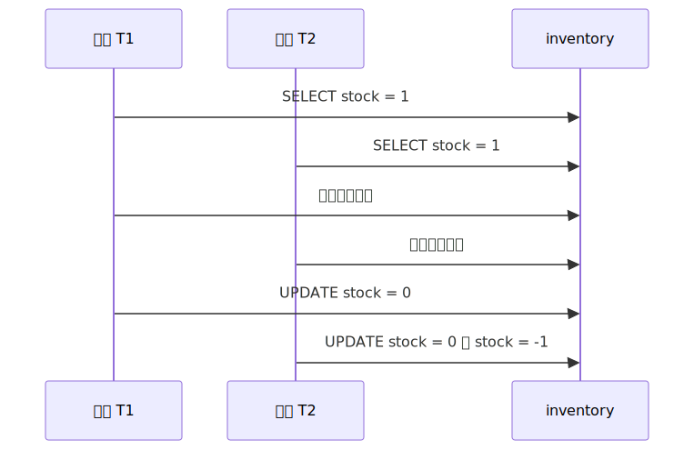

如果数据库完全不做并发控制，两个事务都可能基于"库存还有 1 件"这个判断继续往下走。它们读到的内容看起来都对，但合在一起就错了。

所以数据库需要两类能力：

1. **让读者看到一个自洽的版本**，不要读到别人还没提交的半成品。
2. **让写者排队修改同一份当前数据**，不要同时把同一行改乱。

第一类能力主要靠 MVCC。
第二类能力主要靠锁。

## 二、MVCC 让读写少互斥，但它不是锁的替代品

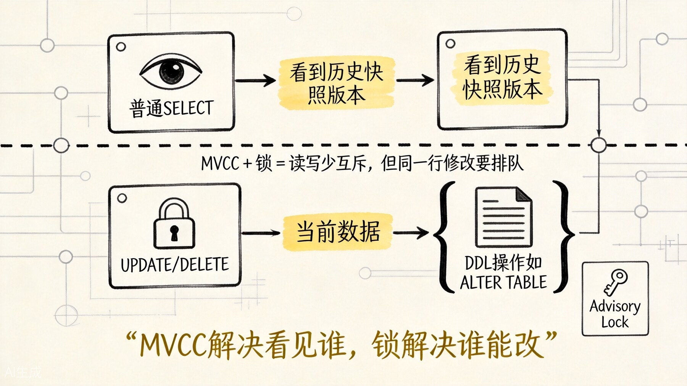

上图展示了 MVCC 和锁的分工关系。前一篇已经把 MVCC 的主线讲过了，这里只保留和锁直接相关的一句话：MVCC 负责"读者看见谁"，锁负责"写者谁先动手"。  

也正因为普通 `SELECT` 通常不会阻塞 `UPDATE`，`UPDATE` 也通常不会阻塞普通快照读，很多人会误以为锁在 PostgreSQL 里没那么重要。

不是。

MVCC 解决的是：

**读者应该看哪个历史版本。**

锁解决的是：

**当前这份数据能不能被别人同时修改，或者某类结构操作能不能并发发生。**

放到库存行这个场景里：

```text
MVCC 像给读者发一张"当时的照片"。
锁像告诉写者："这件商品现在有人正在改，你先等一下。"
```

比如事务 A 正在扣库存：

```sql
BEGIN;

UPDATE inventory
SET stock = stock - 1
WHERE sku = 'iphone' AND stock > 0;
```

在 A 提交前，事务 B 也执行同一条 `UPDATE`。PostgreSQL 不会让 B 同时改这行，B 会等待 A 持有的行锁释放。

如果 A 提交后库存已经变成 0，B 再重新检查条件 `stock > 0`，发现不满足，于是更新 0 行。这样就不会超卖。

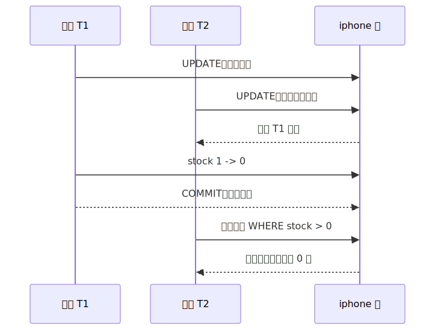

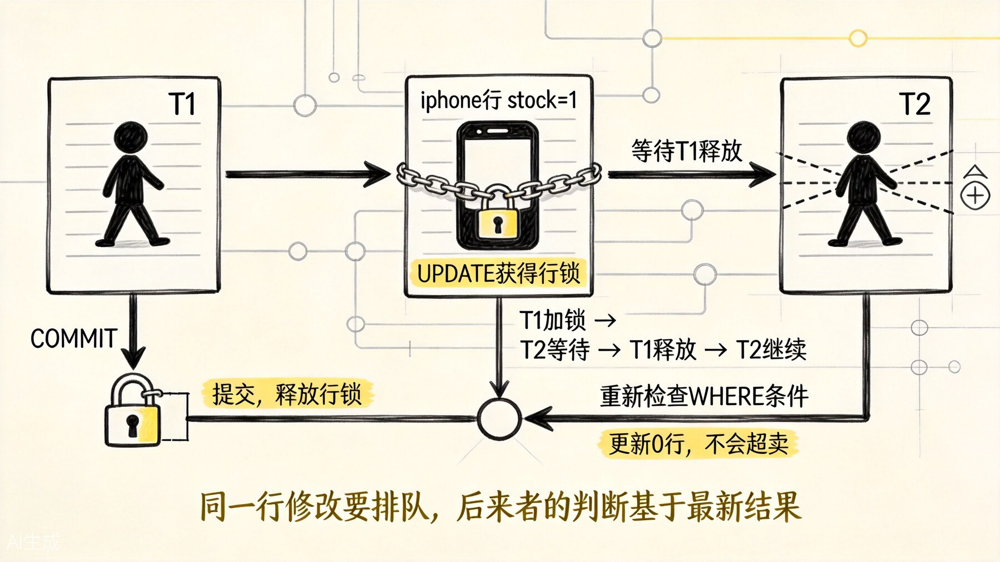

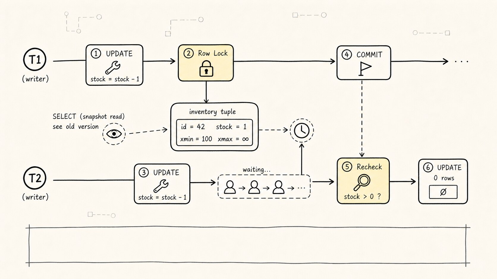

上图展示了两个事务争夺同一行的完整过程。所以，MVCC 和锁不是互相替代，而是分工合作：

| 问题 | 主要机制 | 白话理解 |
|---|---|---|
| 普通查询应该看到什么 | MVCC 快照 | 读历史照片 |
| 同一行能不能被两个事务同时改 | 行锁 | 写当前对象要排队 |
| DDL 能不能和 DML 并发 | 表级锁 | 改路面结构要封路 |
| 跨表、跨资源的业务互斥 | 咨询锁 | 大家约定一把业务钥匙 |
| 范围条件下的串行化正确性 | Serializable / predicate lock | 记录读写依赖，必要时让事务重试 |

## 三、行锁：保护"这几行现在谁能改"

最常遇到的是行锁。它通常由这些语句触发：

```sql
UPDATE ...
DELETE ...
SELECT ... FOR UPDATE;
SELECT ... FOR NO KEY UPDATE;
SELECT ... FOR SHARE;
SELECT ... FOR KEY SHARE;
```

在库存场景里，最简单、最推荐的扣减写法往往是把判断和修改放在同一条 `UPDATE` 里：

```sql
UPDATE inventory
SET stock = stock - 1
WHERE sku = 'iphone' AND stock > 0;
```

这条语句天然会对被更新的行加锁。并发事务更新同一行时，后来的事务会等待前面的事务结束，然后基于最新可见结果继续判断。

但有些业务不能一条 `UPDATE` 写完。比如你要先查库存，再做风控、写订单、扣优惠券，最后才扣库存。这时候可以显式用 `FOR UPDATE` 表达意图：

```sql
BEGIN;

SELECT *
FROM inventory
WHERE sku = 'iphone'
FOR UPDATE;

-- 这里可以做必须放在事务内的业务判断

UPDATE inventory
SET stock = stock - 1
WHERE sku = 'iphone' AND stock > 0;

COMMIT;
```

`FOR UPDATE` 不是"马上更新"，而是：

**我准备基于这行做修改，别人先不要同时改它。**

PostgreSQL 还有几种更细的行锁强度：

| 行锁语法 | 直觉用途 |
|---|---|
| `FOR UPDATE` | 我可能要改整行，最强的常用行锁 |
| `FOR NO KEY UPDATE` | 我要改行，但不改会被外键依赖的关键列 |
| `FOR SHARE` | 我要读这行并阻止别人做强修改 |
| `FOR KEY SHARE` | 我关心 key 不被改，常和外键检查有关 |

初学阶段不必一口气记住所有冲突关系。先抓住这条主线：

**普通读不被行锁挡住；真正互斥的是修改同一行，或显式锁同一行。**

## 四、`NOWAIT` 和 `SKIP LOCKED`：等待不是唯一选择

默认情况下，事务拿不到锁会等。等有时是对的，因为前一个事务可能马上提交。但在高并发系统里，无限等待会把请求堆起来。

PostgreSQL 给了两个常用选择。

第一个是 `NOWAIT`：拿不到锁就立刻失败。

```sql
SELECT *
FROM inventory
WHERE sku = 'iphone'
FOR UPDATE NOWAIT;
```

这适合"不能等"的请求。例如秒杀接口可以快速返回"商品繁忙，请重试"，而不是让用户请求挂住几十秒。

第二个是 `SKIP LOCKED`：被别人锁住的行先跳过。

```sql
CREATE TABLE jobs (
  id BIGINT GENERATED BY DEFAULT AS IDENTITY PRIMARY KEY,
  status TEXT NOT NULL,
  payload JSONB NOT NULL
);

BEGIN;

SELECT id
FROM jobs
WHERE status = 'READY'
ORDER BY id
LIMIT 1
FOR UPDATE SKIP LOCKED;

-- 拿到任务后改成 RUNNING

COMMIT;
```

这非常适合任务队列：多个 worker 同时来抢任务，已经被某个 worker 锁住的任务，其他 worker 直接跳过，去拿下一条。


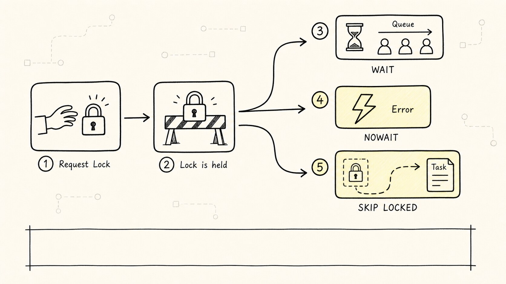

但要注意，`SKIP LOCKED` 得到的不是一个普通意义上的一致视图。它故意跳过被锁住的行，所以适合队列抢占，不适合财务报表、库存汇总这种要求完整视图的查询。

（一个踩坑经验：曾经有人用 `SKIP LOCKED` 做库存盘点，结果跳过了正在处理的行，导致总数对不上。这不是 bug，是这个特性就该这么工作。）

## 五、表锁：它不是"锁住所有行"，而是限制操作类型

听到"表锁"，很多人会以为它一定会锁住整张表里的每一行。PostgreSQL 里的表级锁更准确的理解是：

**限制其他事务还能对这张表做哪些类型的操作。**

普通 `SELECT` 也会拿表级锁，只是锁模式很轻，叫 `ACCESS SHARE`。普通 `INSERT` / `UPDATE` / `DELETE` 会拿 `ROW EXCLUSIVE`。这些名字历史味很重，不要只看名字猜语义，关键看冲突关系。

常见表级锁可以先记这几类：

| 表锁模式 | 常见来源 | 直觉影响 |
|---|---|---|
| `ACCESS SHARE` | 普通 `SELECT` | 很轻，只和 `ACCESS EXCLUSIVE` 冲突 |
| `ROW SHARE` | `SELECT ... FOR UPDATE/SHARE` | 表示要锁某些行 |
| `ROW EXCLUSIVE` | `INSERT` / `UPDATE` / `DELETE` / `MERGE` | 普通写入 |
| `SHARE UPDATE EXCLUSIVE` | `VACUUM`、`ANALYZE`、`CREATE INDEX CONCURRENTLY` | 防止并发 schema 变更和部分维护任务冲突 |
| `SHARE` | `CREATE INDEX` 非并发建索引 | 阻止并发数据变更 |
| `ACCESS EXCLUSIVE` | `TRUNCATE`、`VACUUM FULL`、很多 `ALTER TABLE` | 最强，阻止几乎所有访问 |

真正容易造成线上事故的，常常不是普通行锁，而是 DDL 或维护命令拿到了强表锁。


官方文档里有一个很实用的提醒：普通 `SELECT` 不带 `FOR UPDATE/SHARE` 时，只有 `ACCESS EXCLUSIVE` 会挡住它。

这解释了很多线上现象：

```text
为什么平时 SELECT 都没事？
因为普通 SELECT 的表锁很轻。

为什么一次 ALTER TABLE 可能让全站查询都慢？
因为某些 ALTER TABLE 需要 ACCESS EXCLUSIVE。
```

大表变更时，工程上要养成四个习惯：

1. 优先选择低锁或并发方案，比如 `CREATE INDEX CONCURRENTLY`。
2. 避开高峰期。
3. 设置 `lock_timeout`，拿不到锁就失败，不要悄悄排队。
4. 变更前先查有没有长事务，因为长事务可能让 DDL 一直等，DDL 后面又堵住新的读写请求。

## 六、咨询锁：锁住数据库里没有实体的业务资源

行锁和表锁都依附数据库对象：某一行、某一张表。

但业务里经常有些互斥关系没有天然的数据库对象。

比如：

1. 全系统同一时间只能有一个结算任务在跑。
2. 同一个用户的积分重算不能并发执行。
3. 一个跨表导入流程不能被重复触发。

这时可以用 advisory lock（咨询锁）。

```sql
BEGIN;

SELECT pg_advisory_xact_lock(10001);

-- 执行同一时间只能跑一次的业务逻辑

COMMIT;
```

事务级咨询锁会在事务结束时自动释放，通常比会话级咨询锁更安全。会话级咨询锁如果配合连接池使用，稍不小心就可能出现"业务结束了，连接没断，锁还在"的麻烦。

咨询锁的重点不在数据库替你保护了什么，而在团队约定：

```text
所有执行结算任务的代码，都必须先拿 key = 10001 的咨询锁。
```


它的边界也很清楚：

**咨询锁不会自动保护任何表或任何行。只有遵守同一套 key 规则的代码，才会被它约束。**

## 七、Serializable 和 predicate lock：有些冲突不是"同一行"冲突

前面讲的行锁主要处理"两个事务要改同一行"。但还有一种更隐蔽的问题：两个事务没有改同一行，却一起破坏了业务规则。

例如医生排班表里要求"至少有一名医生值班"。两个医生同时请假：

```text
T1 看到还有两名医生值班，于是把医生 A 改成请假。
T2 也看到还有两名医生值班，于是把医生 B 改成请假。
两个事务都提交后，没人值班。
```

它们可能没有更新同一行，所以普通行锁未必能发现这个业务冲突。这类问题常叫写偏差。

PostgreSQL 的 `Serializable` 隔离级别会用 Serializable Snapshot Isolation 监控读写依赖。如果并发执行的结果无法等价成某个串行顺序，它会让其中一个事务失败，应用需要重试。

这里会出现 `predicate lock` / `SIReadLock` 这类概念。初学时可以先这样理解：

**它不是为了像行锁那样挡住别人，而是为了记录"我读过这个条件范围"，后面用来判断并发事务之间有没有形成危险依赖。**


这也是 PostgreSQL 和 MySQL InnoDB 很容易混淆的地方。

MySQL InnoDB 在 `REPEATABLE READ` 下常围绕 next-key lock / gap lock 理解幻读防护；PostgreSQL 普通 `READ COMMITTED` / `REPEATABLE READ` 下，不应把它想成同一套间隙锁模型。PostgreSQL 的 `Serializable` 更像是在 MVCC 快照之上增加依赖检测。

一句话：

**MySQL 锁经常要围绕"索引路径 + next-key lock"理解；PostgreSQL 更适合围绕"MVCC 快照 + 行锁 + 表锁模式 + SSI"理解。**

## 八、死锁：大家都拿着对方想要的锁

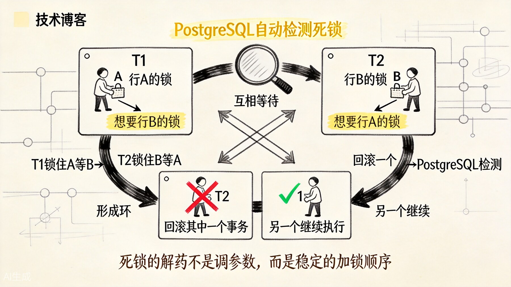

上图展示了经典的死锁场景。锁让事务排队，但排队顺序如果互相打架，就会死锁。

最经典的死锁是：

```text
T1 锁住 A，等待 B
T2 锁住 B，等待 A
```

放到库存或账户转账里，就是两个事务更新多行时顺序相反：

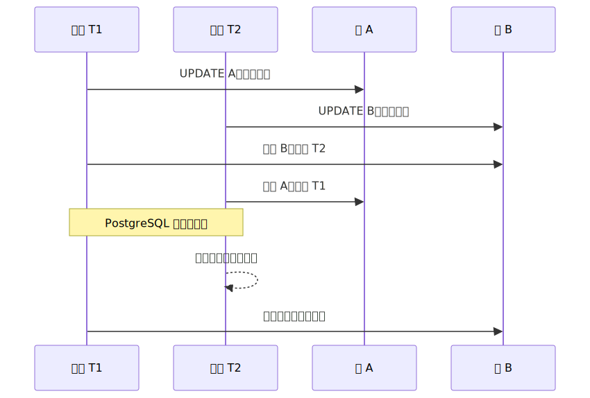

PostgreSQL 会自动检测死锁，并回滚其中一个事务。你不能依赖"具体哪个事务会被回滚"，应用层应该能处理失败并重试。

减少死锁最有效的办法不是调参数，而是让加锁顺序稳定：

```sql
-- 好习惯：需要锁多行时，先排出稳定顺序
SELECT *
FROM inventory
WHERE sku IN ('iphone', 'ipad')
ORDER BY sku
FOR UPDATE;
```

常见原则：

1. 多行加锁时，统一按主键或唯一键排序。
2. 事务尽量短。
3. 不要在事务里等待用户输入、远程 API 或长时间计算。
4. 捕获死锁和序列化失败，做有上限的重试。

## 九、怎么观察谁挡住了谁

锁问题排查时，不要只问"哪条 SQL 慢"，还要问：

**谁在等锁？谁拿着锁不放？**

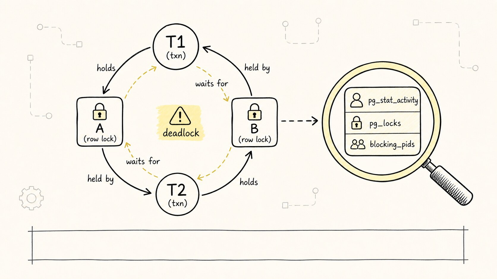

看当前被阻塞的会话：

```sql
SELECT
  pid,
  usename,
  wait_event_type,
  wait_event,
  pg_blocking_pids(pid) AS blocking_pids,
  query
FROM pg_stat_activity
WHERE cardinality(pg_blocking_pids(pid)) > 0;
```

看当前锁概况：

```sql
SELECT
  locktype,
  relation::regclass AS relation,
  mode,
  granted,
  pid
FROM pg_locks
ORDER BY granted, locktype, mode;
```

把阻塞者和被阻塞者连起来看：

```sql
SELECT
  blocked.pid AS blocked_pid,
  blocked.query AS blocked_query,
  blocking.pid AS blocking_pid,
  blocking.query AS blocking_query
FROM pg_stat_activity blocked
JOIN pg_stat_activity blocking
  ON blocking.pid = ANY(pg_blocking_pids(blocked.pid))
WHERE cardinality(pg_blocking_pids(blocked.pid)) > 0;
```

排查顺序可以这样走：


最值得警惕的是 `idle in transaction`。它看起来什么都没做，但事务还开着，锁和快照都可能没有释放。很多锁等待和 vacuum 问题，最后都能追到这种"开了事务却迟迟不结束"的连接。

## 十、从 MySQL 迁移思维时，别把锁模型直接搬过来

如果你先学过 MySQL InnoDB，再学 PostgreSQL 锁，最容易把几个概念套错：

| 对比点 | PostgreSQL | MySQL InnoDB |
|---|---|---|
| 普通快照读 | 依赖 MVCC，普通读通常不加行锁 | 一致性读依赖 ReadView |
| 行锁理解入口 | 锁 heap tuple 的当前版本，普通读不受行锁影响 | 锁索引记录，行为和访问路径强相关 |
| 幻读防护 | `REPEATABLE READ` 提供稳定快照；`Serializable` 用 SSI 检测异常 | `REPEATABLE READ` 下 next-key lock / gap lock 很关键 |
| 队列抢任务 | `FOR UPDATE SKIP LOCKED` 很常用 | MySQL 8 也支持，但底层锁语义仍是 InnoDB 模型 |
| 表级风险 | DDL 强锁、长事务、VACUUM/DDL 交互 | Server 层元数据锁和 InnoDB 锁都要关注 |
| 应用级互斥 | advisory lock 是内置常用工具 | 常见有 `GET_LOCK()` 或外部锁服务 |

不要急着问"PostgreSQL 的 gap lock 是什么"。更好的问题是：

```text
这个业务到底是在保护一行？
保护一张表的结构变更？
保护一个跨表业务资源？
还是保护一个范围条件下的串行化不变量？
```

问题问对了，锁才会选对。

## 十一、一分钟复习

PostgreSQL 的锁不是 MVCC 的反面，而是 MVCC 的补充。

可以用这条链记住：


再压缩成几句话：

1. MVCC 解决"读者看哪个版本"。
2. 行锁解决"同一行当前谁能改"。
3. 表锁解决"这张表上哪些操作能并发"。
4. 咨询锁解决"数据库对象之外的业务互斥"。
5. Serializable / SSI 解决"不是同一行也可能破坏业务不变量"的问题。
6. 锁问题的第一敌人通常是长事务。

如果你以后看到 PostgreSQL 锁等待，不要先背矩阵。先问：

**这是行上的争抢，表上的强锁，业务约定的互斥，还是长事务造成的排队？**

问到这一层，锁就不再是一堆名词，而是一套并发世界里的交通规则。
