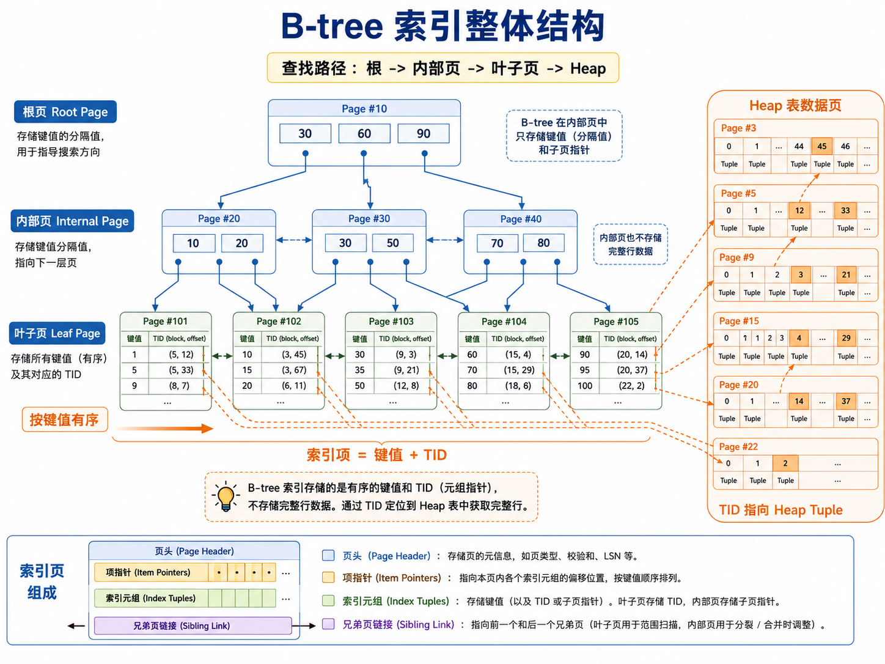
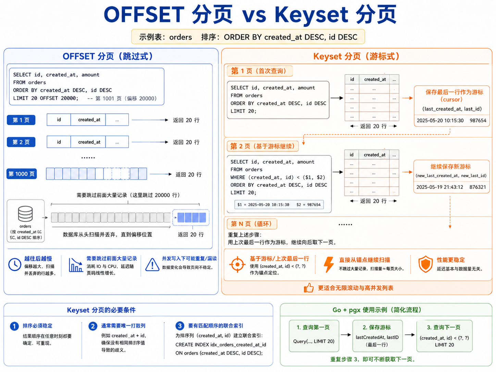
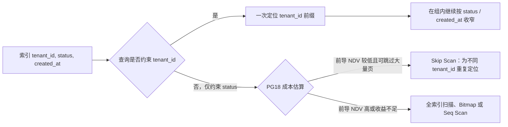
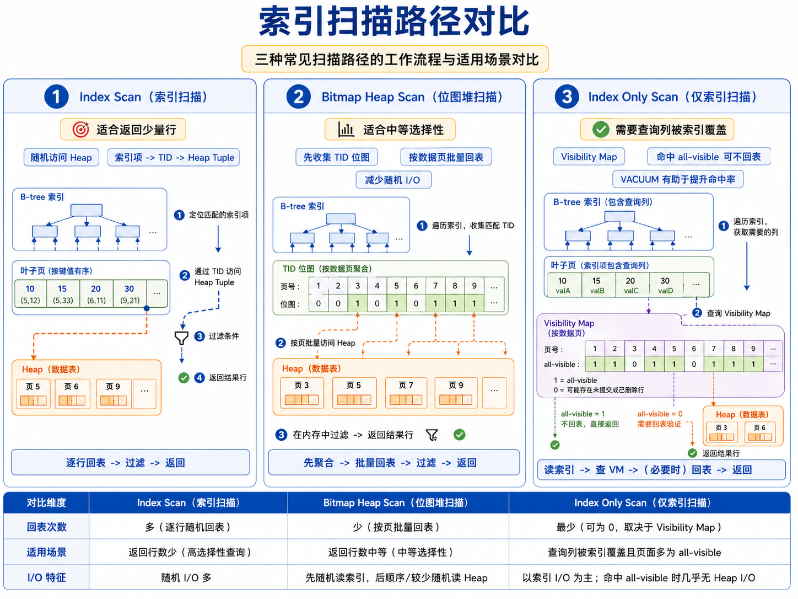
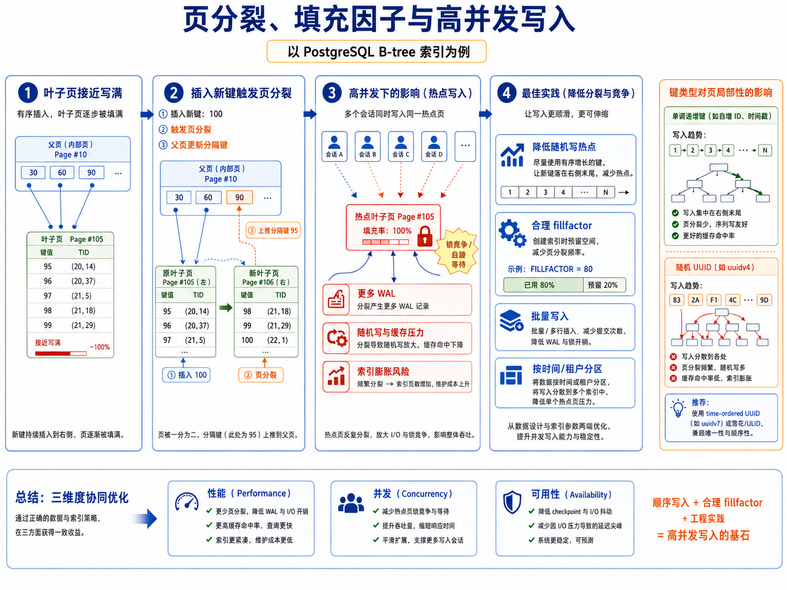
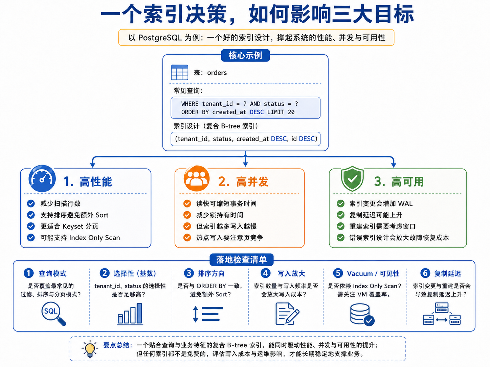

# 第 4 章：从索引是什么，到一条分页 SQL 如何使用 B+ 树

> **技术基线**：PostgreSQL 18。除特别标注外，核心原理同样适用于 PostgreSQL 14—17。PostgreSQL 官方把这种访问方法称为 **B-tree**；从教材数据结构角度看，它具有典型的 **B+ 树式特征**：内部页负责导航，叶子页保存可定位表行的索引项，并通过同层链接支持有序扫描。

---

## 1. 本章定位：只沿一条主线讲清索引

这一章不先讲 High Key、Posting List、Skip Scan，也不先罗列各种执行计划节点。

我们先回答四个最基础、也最重要的问题：

1. **索引到底是什么？**
2. **B+ 树为什么能快速定位和按顺序读取数据？**
3. **一条同时包含 `WHERE`、`ORDER BY`、`OFFSET`、`LIMIT` 的 SQL，索引分别在哪一步生效？**
4. **怎样从 SQL 反推索引，并验证这个索引是否真的带来收益？**

全章围绕下面这条订单列表 SQL 展开：

```sql
SELECT id, created_at, amount_cents
FROM orders
WHERE tenant_id = $1
  AND status = $2
ORDER BY created_at DESC, id DESC
OFFSET $3
LIMIT $4;
```

读完本章，你应该能把这条 SQL 的物理执行路径完整说出来：

```text
WHERE 确定索引扫描范围
  → B+ 树从 Root 定位到第一个匹配叶子项
  → ORDER BY 决定沿叶子页向哪个方向扫描
  → OFFSET 丢弃前 N 条符合条件且可见的结果
  → LIMIT 收满 M 条后停止
  → 若查询列不全在索引中，则依据 TID 回 Heap
  → 若满足 Index Only Scan 条件，则尽量不回 Heap
```

这条主线再自然延伸到三个生产目标：

- **高性能**：少扫描、少排序、少回表、尽早停止；
- **高并发**：缩短查询时间，同时控制索引维护、页分裂和热点；
- **高可用**：控制索引构建、WAL、复制延迟、磁盘和故障切换成本。

---

## 2. 可验证的学习目标

完成本章后，你应当能够：

1. 用准确语言解释 PostgreSQL 索引与 Heap 的关系；
2. 画出 B+ 树式 B-tree 的 Root、Internal、Leaf 和 Heap TID 关系；
3. 解释等值查询、范围查询和有序扫描为什么适合 B-tree；
4. 针对给定 SQL 设计多列索引，并说明每一列的位置依据；
5. 逐项解释 `WHERE`、`ORDER BY`、`OFFSET`、`LIMIT` 对执行路径的影响；
6. 说明为什么有索引时大 `OFFSET` 仍然可能很慢；
7. 使用 Keyset Pagination 改写深分页查询；
8. 从 `EXPLAIN (ANALYZE, BUFFERS)` 中识别：
   - 是否使用索引；
   - 是否发生额外 Sort；
   - 实际扫描了多少行；
   - 是否发生 Heap Fetch；
   - 估算是否明显失真；
9. 区分 Index Scan、Index Only Scan、Bitmap Heap Scan 和 Seq Scan 的适用场景；
10. 从高性能、高并发、高可用三个维度评估一个索引是否值得保留。

---

## 3. 索引是什么

### 3.1 没有索引时，数据库只能从哪里开始

假设 `orders` 有一亿行，执行：

```sql
SELECT id, created_at, amount_cents
FROM orders
WHERE tenant_id = 42
  AND status = 2;
```

如果没有可用索引，PostgreSQL 通常只能扫描表的数据页：

```text
读取 Heap Page 0
  → 检查每个 Tuple 的 tenant_id 和 status
读取 Heap Page 1
  → 继续检查
...
读取最后一个 Heap Page
```

这就是顺序扫描的基本工作方式：

```text
Seq Scan = 读取候选数据页 + 对每一行计算过滤条件
```

即使最终只返回 20 行，也可能先检查大量无关行。

索引的价值，是在读取 Heap 之前先回答：

> 哪些位置可能存在符合条件的行？这些行能否按查询要求的顺序直接提供？

### 3.2 PostgreSQL 中索引的准确定义

在 PostgreSQL 中，索引是一个与表分开存储的 **独立 Relation**。

它不是 Heap Page 中的一块附属目录，也不是业务表的完整副本。

以普通 B-tree 叶子索引项为例，它核心保存：

```text
索引键值 + Heap TID
```

其中：

- **索引键值**：例如 `(tenant_id, status, created_at, id)`；
- **TID**：形如 `(block_number, offset_number)`，指向 Heap 中某个物理 Tuple 版本。

可以把它理解为：

```text
(42, 2, 2026-06-24 10:30:00, 90001)
        ↓
      TID (8123, 7)
        ↓
Heap 第 8123 页的第 7 个 Item
```

因此普通索引扫描通常要走两段路径：

```text
先访问 Index
  → 取到 TID
  → 再访问 Heap
  → 检查 MVCC 可见性并读取完整行
```

### 3.3 索引主要解决四类问题

| 能力 | 索引如何提供 | 本章 SQL 中的作用 |
|---|---|---|
| 快速定位 | 按有序键搜索目标范围 | 定位 `tenant_id = ? AND status = ?` 的连续区间 |
| 范围扫描 | 从一个叶子位置连续向前或向后扫描 | 读取某租户某状态下的一段订单 |
| 提供顺序 | B-tree 叶子项按键顺序排列 | 直接满足 `ORDER BY created_at DESC, id DESC` |
| 尽早停止 | 有序流中取得足够结果后停止 | `LIMIT 20` 不必扫描剩余结果 |

索引还可以：

- 支持唯一性约束；
- 加速部分 `UPDATE`、`DELETE` 和 Join 的定位；
- 通过覆盖索引减少 Heap 访问。

### 3.4 索引不等于“查询一定更快”

索引也有成本：

```text
每新增一个索引
  → INSERT 要多写一份索引项
  → DELETE 要留下需要清理的索引版本
  → 某些 UPDATE 需要更新更多索引项
  → 增加 WAL
  → 增加 Buffer Dirty
  → 增加磁盘空间
  → 可能降低 HOT Update 机会
  → 可能增加复制延迟和维护时间
```

因此正确的问题不是：

> 这列能不能建索引？

而是：

> 这个索引能否让高频关键查询少做足够多的工作，以覆盖它带来的写入和运维成本？

### 3.5 三个必须纠正的误解

**误解一：有 `WHERE` 就应该建单列索引。**

一条查询往往同时有过滤、排序和分页。只优化一个 `WHERE` 列，可能仍然需要大量过滤或排序。

**误解二：索引里存的是完整业务行。**

普通 B-tree 叶子项主要保存键值和 TID；是否能完全不回 Heap，要看查询列、索引覆盖情况和 Visibility Map。

**误解三：索引越多越安全。**

索引越多，读路径选择可能越丰富，但写入、VACUUM、WAL、复制和维护成本也越高。

---

## 4. B+ 树是怎样工作的

### 4.1 为什么数据库不用普通二叉搜索树

磁盘和 Buffer 中的基本单位是“页”，不是单个指针节点。

普通二叉树每个节点只有两个孩子，树会很高；一次查找可能跨越很多页面。

B-tree/B+ 树的关键特征是：

- 一个页面可以保存很多键和很多子页指针；
- 树始终保持平衡；
- 所有叶子处于同一层；
- 高扇出使树高很小；
- 叶子页有序且相互链接，适合范围扫描。

查找复杂度可以概括为：

```text
定位起点：O(log N)
连续读取 K 条：O(K)
总工作量：O(log N + K)
```

这里的关键不是数学符号本身，而是：

> 先用很少的页面定位起点，再顺着叶子页读取需要的连续范围。

### 4.2 教材 B+ 树与 PostgreSQL B-tree 的关系

PostgreSQL 官方名称是 **B-tree**。

从结构上看，它具有典型 B+ 树式特征：

- Internal Page 保存分隔键和指向下层页的 Downlink；
- Leaf Page 保存可指向表行的索引 Tuple；
- 同一层页面通过链接组织；
- 范围扫描主要发生在叶子层。

因此，本章在建立直觉时会说“B+ 树式 B-tree”，在描述 PostgreSQL 实现时使用“PostgreSQL B-tree”。

### 4.3 四类核心页面

#### Meta Page

保存索引的元信息，例如根页和层级相关信息。

#### Root Page

搜索入口。根据分隔键选择下一层页面。

#### Internal Page

保存：

```text
分隔键 + 子页 Downlink
```

Internal Page 负责导航，不保存完整业务行。

#### Leaf Page

保存有序索引项：

```text
索引键 + TID
```

重复键在适用条件下还可能被压缩成：

```text
一个键 + 一组有序 TID（Posting List）
```



> 图中最重要的两条线：蓝色线表示树的导航路径，橙色虚线表示叶子索引项通过 TID 指向 Heap Tuple。

### 4.4 一次等值搜索如何走树

假设索引为：

```sql
CREATE INDEX orders_tenant_status_idx
ON orders (tenant_id, status);
```

查询：

```sql
SELECT *
FROM orders
WHERE tenant_id = 42
  AND status = 2;
```

可以把查找过程理解为：

```text
1. 从 Root Page 开始
2. 比较目标键 (42, 2) 与根页分隔键
3. 选择一个 Internal Page
4. 再比较并选择下一层
5. 到达可能包含 (42, 2) 的 Leaf Page
6. 在叶子页内二分定位第一个匹配项
7. 沿叶子页连续读取所有 (42, 2) 项
8. 根据每个 TID 访问 Heap 或检查 Visibility Map
```

B-tree 快的核心不是“完全不扫描”，而是：

> 把扫描起点从表头缩小到目标键所在的一个很小范围。

### 4.5 范围查询为什么适合 B+ 树

查询：

```sql
SELECT *
FROM orders
WHERE tenant_id = 42
  AND created_at >= timestamptz '2026-06-01'
  AND created_at <  timestamptz '2026-07-01';
```

若索引为：

```sql
CREATE INDEX orders_tenant_created_idx
ON orders (tenant_id, created_at);
```

执行器可以：

```text
定位第一个 >= (42, 2026-06-01) 的叶子项
  → 顺序扫描
  → 扫描到 (42, 2026-07-01) 边界即停止
```

不需要为每一条记录重新从 Root 搜索。

### 4.6 B-tree 为什么能提供 ORDER BY

因为叶子项本身有序。

索引：

```sql
CREATE INDEX orders_created_idx
ON orders (created_at);
```

可以前向扫描以提供：

```sql
ORDER BY created_at ASC
```

也可以反向扫描以提供：

```sql
ORDER BY created_at DESC
```

多列索引同样按字典序排序：

```text
先比较 tenant_id
相同再比较 status
相同再比较 created_at
相同再比较 id
```

这正是后面理解复合索引和分页 SQL 的基础。

### 4.7 插入时发生什么

插入一行时，相关 B-tree 通常经历：

```text
1. 根据新键从 Root 找到目标 Leaf Page
2. 在页内找到排序位置
3. 若有空间，插入新索引项
4. 若空间不足，先尝试可用的清理或去重策略
5. 仍放不下时，执行 Page Split
6. 将部分索引项移动到新叶子页
7. 在父页加入指向新页的 Downlink
8. 若父页也满，分裂向上级联
9. Root 满时发生 Root Split，树高增加一层
```

树始终保持平衡，所以不会出现某个分支特别深、另一个分支特别浅的情况。

### 4.8 Page Split 为什么影响并发和可用性

Page Split 不只是“多一个页面”。它还意味着：

- 修改多个 Buffer；
- 产生更多 WAL；
- 更新父页；
- 增加缓存和 I/O 压力；
- 高并发写同一热点页时，可能增加等待；
- 大量分裂可能带来碎片和索引膨胀。

### 4.9 High Key 与 Right Link：为什么并发分裂时读者不会走丢

这是高级实现细节，但应放在建立树结构之后理解。

PostgreSQL 的 B-tree 页面包含可帮助横向纠偏的信息。简化理解：

```text
父页中的 Downlink 可能暂时还没完全反映刚发生的分裂
  → 读者先到旧页
  → 发现目标键超过当前页负责的上界
  → 沿 Right Link 移动到右侧兄弟页
  → 继续查找
```

这类 B-link Tree 思想使结构修改与并发读取可以安全协同。

### 4.10 删除为什么不是立刻从索引消失

PostgreSQL 使用 MVCC。

一行被 `DELETE` 或 `UPDATE` 后，旧 Tuple 版本可能仍需要被其他事务看到，因此对应索引项不能总是立刻物理移除。

后续会通过：

- 扫描过程中标记可删除项；
- B-tree 底层清理；
- VACUUM；
- 页面复用；

逐步回收空间。

这也是“逻辑数据已经很少，但索引仍然很大”的原因之一。

---

## 5. 贯穿全章的数据模型

### 5.1 表结构

```sql
CREATE TABLE orders (
    id           bigint GENERATED ALWAYS AS IDENTITY PRIMARY KEY,
    tenant_id    bigint      NOT NULL,
    status       smallint    NOT NULL,
    created_at   timestamptz NOT NULL DEFAULT clock_timestamp(),
    amount_cents bigint      NOT NULL,
    title        text        NOT NULL
);
```

### 5.2 业务查询

```sql
SELECT id, created_at, amount_cents
FROM orders
WHERE tenant_id = $1
  AND status = $2
ORDER BY created_at DESC, id DESC
OFFSET $3
LIMIT $4;
```

业务含义：

- 查询一个租户；
- 只看某种状态的订单；
- 最新订单排在前面；
- 相同 `created_at` 时，用 `id` 保证稳定顺序；
- 支持分页。

### 5.3 与查询匹配的候选索引

```sql
CREATE INDEX orders_list_idx
ON orders (
    tenant_id,
    status,
    created_at DESC,
    id DESC
)
INCLUDE (amount_cents);
```

索引列分工：

| 列 | 角色 | 原因 |
|---|---|---|
| `tenant_id` | 第一等值前缀 | 先缩小到一个租户 |
| `status` | 第二等值前缀 | 再缩小到一个状态 |
| `created_at DESC` | 排序与后续范围游标 | 直接按最新时间输出 |
| `id DESC` | 唯一稳定排序键 | 相同时间戳下避免顺序歧义 |
| `amount_cents` | INCLUDE 负载列 | 只用于返回，不参与导航 |

这里先给出结论，下一节完整解释这条 SQL 是怎样使用这个索引的。

---

## 6. `WHERE`、`ORDER BY`、`OFFSET`、`LIMIT` 如何共同生效

### 6.1 先区分 SQL 语法顺序与物理执行职责

SQL 写成：

```sql
SELECT ...
FROM ...
WHERE ...
ORDER BY ...
OFFSET ...
LIMIT ...;
```

但在物理执行中，各部分的核心职责可以理解为：

| 子句 | 物理职责 | 索引能提供什么 | 索引不能消除什么 |
|---|---|---|---|
| `WHERE` | 找出符合条件的行 | 定位键范围，减少扫描 | 不能保证 Planner 一定选索引 |
| `ORDER BY` | 定义输出顺序 | B-tree 可直接按键顺序输出 | 索引顺序不匹配时仍需 Sort |
| `OFFSET` | 丢弃前 N 条结果 | 只能让前 N 条更便宜地生成 | 不能直接跳过 N 条“逻辑结果” |
| `LIMIT` | 最多返回 M 条 | 有序扫描可在收满后早停 | 没有匹配顺序时可能先处理大量输入 |
| `SELECT` 列 | 决定返回数据 | 覆盖索引可能避免 Heap 访问 | 未覆盖列通常仍需回 Heap |

### 6.2 用具体参数推演一次执行

假设执行：

```sql
SELECT id, created_at, amount_cents
FROM orders
WHERE tenant_id = 42
  AND status = 2
ORDER BY created_at DESC, id DESC
OFFSET 1000
LIMIT 20;
```

候选索引：

```sql
CREATE INDEX orders_list_idx
ON orders (tenant_id, status, created_at DESC, id DESC)
INCLUDE (amount_cents);
```

完整过程如下。

#### 第 1 步：Planner 识别可索引谓词

```text
tenant_id = 42
status = 2
```

它们对应索引的连续前导列，因此可以形成精确前缀：

```text
(tenant_id, status) = (42, 2)
```

#### 第 2 步：B-tree 定位该前缀的第一个叶子项

执行器从 Root 下行到 Leaf，定位：

```text
(42, 2, 最大 created_at, 最大 id)
```

附近的第一个索引项。

这里不是从整个索引第一页开始扫，而是直接进入 `(42, 2)` 这一组。

#### 第 3 步：`ORDER BY` 决定叶子扫描顺序

索引后两列是：

```text
created_at DESC, id DESC
```

与查询一致，因此索引流天然就是目标顺序：

```text
最新 created_at
  → 相同时间按更大 id
  → 更旧 created_at
```

不需要额外 `Sort` 节点。

#### 第 4 步：逐条检查可见性并生成结果流

每个叶子项对应一个 TID。

可能有两种情况：

```text
Index Scan
  → 根据 TID 访问 Heap
  → 检查 MVCC 可见性
  → 读取行
```

或：

```text
Index Only Scan
  → 查询列均在索引中
  → 检查 Visibility Map
  → 页面 all-visible 时不访问 Heap
```

#### 第 5 步：`OFFSET 1000` 丢弃前 1000 条输出

这是最容易被误解的地方。

`OFFSET` 不是告诉 B-tree：

```text
请直接跳到第 1001 条业务结果
```

而是告诉执行器：

```text
先生成有序、符合 WHERE、对当前快照可见的结果
把前 1000 条丢掉
然后才开始返回
```

因此，哪怕索引完全匹配，执行器通常仍要消耗前 1000 条结果。

#### 第 6 步：`LIMIT 20` 收满后停止

丢弃 1000 条后，再取得 20 条：

```text
至少处理 1000 + 20 = 1020 条可见匹配结果
```

达到 20 条后，上层 `Limit` 节点停止继续索取，索引扫描随之结束。

#### 第 7 步：为什么实际访问可能超过 1020 个索引项

因为以下因素会使某些候选项不能成为最终结果：

- Heap Tuple 对当前快照不可见；
- 有额外非索引过滤条件；
- 某些条件只能作为 Filter，不能缩小索引范围；
- Index Only Scan 遇到非 all-visible 页面，需要回 Heap；
- 数据存在大量版本 churn。

所以更准确的表述是：

> `OFFSET 1000 LIMIT 20` 至少要消费 1020 条最终可输出的结果；为了得到这些结果，底层可能读取更多索引项和 Heap Tuple。

### 6.3 典型执行计划长什么样

匹配索引且具备较好可见性时，可能看到：

```text
Limit
  ->  Index Only Scan using orders_list_idx on orders
        Index Cond: ((tenant_id = 42) AND (status = 2))
        Heap Fetches: ...
```

关键观察：

- 没有 `Sort`：说明索引顺序满足 `ORDER BY`；
- `Index Cond` 只有等值前缀：说明它们负责定位范围；
- `Limit` 在索引扫描上方：说明 `OFFSET` 和 `LIMIT` 消费下层有序流；
- `Heap Fetches` 是否为 0：决定 Index Only Scan 是否真正避免了 Heap。

使用实际计划时执行：

```sql
EXPLAIN (
    ANALYZE,
    BUFFERS,
    VERBOSE,
    SETTINGS,
    SUMMARY
)
SELECT id, created_at, amount_cents
FROM orders
WHERE tenant_id = 42
  AND status = 2
ORDER BY created_at DESC, id DESC
OFFSET 1000
LIMIT 20;
```

重点看子节点实际输出行数。常见现象是：

```text
Limit 实际返回约 20 行
Index Scan / Index Only Scan 实际产生约 1020 行或更多
```

### 6.4 四种索引状态下，执行路径有何不同

#### 情况一：没有索引

```text
Seq Scan 全表
  → Filter tenant_id/status
  → Sort created_at/id
  → 丢弃 OFFSET
  → 返回 LIMIT
```

典型计划：

```text
Limit
  -> Sort
       Sort Key: created_at DESC, id DESC
       -> Seq Scan on orders
            Filter: tenant_id = 42 AND status = 2
```

#### 情况二：只有 `(tenant_id)`

```text
通过 tenant_id 找到该租户大量行
  → 过滤 status
  → Sort
  → OFFSET
  → LIMIT
```

索引只解决一部分过滤，没有解决状态和排序。

#### 情况三：只有 `(tenant_id, status)`

```text
精确定位租户与状态
  → 读取所有匹配行
  → Sort created_at/id
  → OFFSET
  → LIMIT
```

过滤已经很好，但仍要排序。若匹配行很多，Sort 仍可能是主要成本。

#### 情况四：完整索引 `(tenant_id, status, created_at DESC, id DESC)`

```text
定位前缀
  → 直接按目标顺序扫描
  → OFFSET 丢弃
  → LIMIT 早停
```

这个索引同时服务：

- 过滤；
- 排序；
- 稳定分页；
- 早停。

### 6.5 `LIMIT` 为什么会放大匹配索引的价值

如果没有匹配索引，数据库为了确定“前 20 条”可能需要：

```text
读取所有候选行
  → 排序所有候选行或执行 Top-N Sort
  → 再取前 20 条
```

若索引顺序匹配：

```text
从正确位置开始有序扫描
  → 读满 20 条就停止
```

这就是 `ORDER BY ... LIMIT` 经常是 B-tree 最有价值的场景之一。

### 6.6 `OFFSET` 为什么会抵消一部分收益

假设每页 20 条：

| 页码 | OFFSET | 至少消费的结果数 |
|---:|---:|---:|
| 1 | 0 | 20 |
| 10 | 180 | 200 |
| 1,000 | 19,980 | 20,000 |
| 100,000 | 1,999,980 | 2,000,000 |

即使每条都通过索引高效产生，深页仍然要重复消耗前面大量结果。

所以：

> 匹配索引解决的是“怎样更便宜地生成有序结果”；它不能改变 `OFFSET` 必须跳过前 N 条结果的语义。

### 6.7 Keyset Pagination 如何让索引直接从游标继续

第一页：

```sql
SELECT id, created_at, amount_cents
FROM orders
WHERE tenant_id = $1
  AND status = $2
ORDER BY created_at DESC, id DESC
LIMIT $3;
```

保存最后一行：

```text
(last_created_at, last_id)
```

下一页：

```sql
SELECT id, created_at, amount_cents
FROM orders
WHERE tenant_id = $1
  AND status = $2
  AND (created_at, id) < ($3, $4)
ORDER BY created_at DESC, id DESC
LIMIT $5;
```

此时 B-tree 可以把游标条件也变成范围边界：

```text
(tenant_id, status) = 固定前缀
(created_at, id) < 上一页最后一行
```

于是执行路径变为：

```text
直接定位游标之后的叶子位置
  → 读取约 20 条
  → 停止
```

它不再重复消费之前几万、几十万条结果。



### 6.8 Keyset 的三个必要条件

#### 条件一：排序必须稳定

只按 `created_at DESC` 不够，因为多行可能有相同时间戳。

应增加唯一打散列：

```sql
ORDER BY created_at DESC, id DESC
```

#### 条件二：游标必须包含完整排序键

游标应保存：

```text
created_at + id
```

而不是只保存 `created_at`。

#### 条件三：索引顺序必须匹配

```sql
CREATE INDEX orders_list_idx
ON orders (tenant_id, status, created_at DESC, id DESC);
```

### 6.9 OFFSET 与 Keyset 的业务语义差异

| 维度 | OFFSET | Keyset |
|---|---|---|
| 跳到任意页码 | 容易 | 不自然 |
| 深页性能 | 随 OFFSET 增大而变差 | 通常较稳定 |
| 并发插入下的页边界 | 可能出现重复或漏读感知 | 以游标锚点继续，更稳定 |
| 适合场景 | 后台小数据分页、明确页码 | Feed、时间线、订单列表、无限滚动 |

Keyset 不是所有分页的替代品，但对于大表、高并发、深翻页列表，它通常是更符合 B-tree 工作方式的设计。

---
## 7. 如何从 SQL 反推复合索引

索引设计不能从“哪一列最重要”开始，而要从一类稳定的查询形状开始。

### 7.1 先把查询拆成五种角色

对主查询：

```sql
SELECT id, created_at, amount_cents
FROM orders
WHERE tenant_id = $1
  AND status = $2
ORDER BY created_at DESC, id DESC
OFFSET $3
LIMIT $4;
```

可以抽象为：

```text
E：Equality，等值过滤
R：Range，范围边界
O：Order，输出顺序
T：Tie-breaker，稳定打散列
P：Payload，只返回、不导航的列
```

本例为：

```text
E = tenant_id, status
R = 暂无；Keyset 后为 created_at, id
O = created_at DESC, id DESC
T = id
P = amount_cents
```

因此候选索引自然得到：

```sql
CREATE INDEX orders_list_idx
ON orders (
    tenant_id,
    status,
    created_at DESC,
    id DESC
)
INCLUDE (amount_cents);
```

一个实用但不能机械套用的初始公式是：

```text
连续等值前缀
  + 第一个范围/排序维度
  + 稳定排序键
  + 少量窄 INCLUDE 列
```

### 7.2 为什么等值列通常放在排序列前面

如果索引是：

```text
(tenant_id, status, created_at, id)
```

B-tree 的全局顺序是：

```text
先按 tenant_id 分组
组内按 status 分组
组内再按 created_at 排序
最后按 id 排序
```

当 `tenant_id` 和 `status` 都固定后，剩余区间天然按：

```text
created_at, id
```

有序。

如果索引改成：

```text
(created_at, tenant_id, status, id)
```

虽然最外层按时间有序，但某租户某状态的数据会散布在很大的时间范围内。查询无法先缩小到一个连续租户区间，再快速取前 20 条。

### 7.3 “最左前缀”应该怎样准确理解

常见口号是：

> 联合索引遵守最左前缀。

这句话不算错，但过度简化后容易造成两个误解：

- 误以为没有第一列条件就“完全不能使用索引”；
- 误以为右侧列条件完全没有价值。

对 PostgreSQL 多列 B-tree，更准确的经典规则是：

> 连续前导列上的等值约束，加上第一个没有等值约束的列上的范围约束，能够确定需要扫描的连续索引范围。

例如索引：

```text
(a, b, c, d)
```

查询：

```sql
WHERE a = 1
  AND b = 2
  AND c >= 10
  AND d = 99
```

通常：

- `a = 1`：缩小扫描范围；
- `b = 2`：继续缩小扫描范围；
- `c >= 10`：决定范围起点；
- `d = 99`：可以在索引中检查，但通常不能把整个扫描范围直接缩成一个连续区间。

所以右侧条件仍然可能减少回表，但不一定减少需要读取的叶子范围。

### 7.4 [PG18] Skip Scan 为什么让“最左前缀”不再是绝对口号

索引：

```sql
CREATE INDEX orders_status_created_idx
ON orders (tenant_id, status, created_at);
```

查询只有：

```sql
WHERE status = 2
```

经典思路下，缺少 `tenant_id`，无法一次定位全局连续区间。

[PG18] Planner 在合适的数据分布下，可能应用 Skip Scan：

```text
枚举一个 tenant_id 值
  → 在该 tenant_id 分组内查 status = 2
跳到下一个 tenant_id
  → 再查 status = 2
...
```

它本质上是多次动态索引搜索，而不是出现一个新的独立执行计划节点。

Skip Scan 通常更可能在以下条件下有价值：

- 前导缺失列的不同值数量较少；
- 后续列条件选择性较好；
- 能跳过大量不相关叶子页；
- Planner 成本估算认为多次索引定位比全扫更便宜。

如果 `tenant_id` 有几百万个不同值，逐组搜索可能比顺序扫描更差，Planner 往往不会选它。



> Skip Scan 没有单独的 `enable_indexskipscan` 配置项；它属于 B-tree 索引扫描内部优化，应通过实际计划、`Index Searches`、Buffers 和执行时间判断是否发生及是否有益。

### 7.5 不要机械相信“选择性最高的列放最前”

假设查询永远同时有：

```sql
WHERE tenant_id = $1
  AND status = $2
```

对于这条查询本身，若两列都是等值条件：

```text
(tenant_id, status)
```

和：

```text
(status, tenant_id)
```

最终都能定位到同一个组合键范围。

真正决定顺序的，往往是：

1. 哪些查询只带其中一个前缀；
2. 哪个顺序可以继续满足后面的 `ORDER BY`；
3. 哪个顺序可以被更多高频 SQL 复用；
4. 数据分布和相关性是否导致估算差异；
5. 是否存在租户隔离或分区语义。

对多租户系统，`tenant_id` 常放在前面，不只是因为选择性，而是因为多数访问都应先限定租户边界。

### 7.6 范围列之后的列还能不能用

索引：

```text
(tenant_id, created_at, status)
```

查询：

```sql
WHERE tenant_id = 42
  AND created_at >= $1
  AND status = 2
```

通常：

- `tenant_id = 42` 定位租户区间；
- `created_at >= $1` 决定范围起点；
- `status = 2` 可以在索引内检查，但这个条件分散在整个时间范围中，不能通常一次收窄成一个连续区间。

如果业务更常见的是：

```sql
WHERE tenant_id = 42
  AND status = 2
  AND created_at >= $1
```

则：

```text
(tenant_id, status, created_at)
```

通常更合适。

### 7.7 `ORDER BY` 方向怎样与索引匹配

单列 B-tree 可前向或反向扫描：

```text
索引 x ASC
  → 前向满足 ORDER BY x ASC
  → 反向满足 ORDER BY x DESC
```

多列全同向也可以整体反向：

```text
索引 (x ASC, y ASC)
  → 前向满足 x ASC, y ASC
  → 反向满足 x DESC, y DESC
```

但混合方向需要特别设计：

```sql
ORDER BY x ASC, y DESC
```

对应候选索引：

```sql
CREATE INDEX ON t (x ASC, y DESC);
```

本章主查询的前两列是等值常量，所以把后两列明确写为 `DESC`，可以直接表达查询意图：

```sql
(tenant_id, status, created_at DESC, id DESC)
```

### 7.8 为什么必须增加唯一稳定排序键

只写：

```sql
ORDER BY created_at DESC
```

不能保证相同时间戳行之间的稳定顺序。

在多次分页查询之间，Planner、并发写入和物理访问路径变化都可能让这些同值行的相对位置不同。

因此增加：

```sql
ORDER BY created_at DESC, id DESC
```

并让索引顺序一致。

### 7.9 Key Column 与 INCLUDE Column 的区别

索引：

```sql
CREATE INDEX orders_list_idx
ON orders (tenant_id, status, created_at DESC, id DESC)
INCLUDE (amount_cents);
```

`tenant_id`、`status`、`created_at`、`id` 是 Key Column：

- 参与排序；
- 参与树导航；
- 可以形成扫描边界。

`amount_cents` 是 INCLUDE Column：

- 不参与索引排序；
- 不用于树导航；
- 只是随叶子项保存，供查询返回；
- 可以帮助 Index Only Scan。

如果查询增加：

```sql
AND amount_cents > 100000
```

`amount_cents` 虽然在索引中，但它只是负载列，不能像 Key Column 一样直接形成有效的树导航边界。执行器可能在索引扫描过程中做 Filter，但仍可能扫描大量候选项。

### 7.10 覆盖索引不是免费午餐

`INCLUDE` 的收益：

- 查询列都在索引中时，Index Only Scan 在物理上成为可能；
- Heap Page all-visible 时可以避免 Heap Fetch；
- 减少随机 Heap I/O。

代价：

- 叶子索引项更宽；
- 单页容纳项数减少；
- 索引变大，缓存命中率可能降低；
- INSERT/UPDATE 产生更多写入和 WAL；
- B-tree INCLUDE 索引不能使用 Deduplication；
- 宽列可能使索引项超过允许大小。

所以只应 INCLUDE：

- 高频查询真正需要；
- 相对窄；
- 不频繁更新；
- 能显著降低 Heap Fetch；

的列。

### 7.11 常见查询与候选索引对照

| 查询形状 | 候选索引 | 说明 |
|---|---|---|
| `WHERE tenant_id = ?` | `(tenant_id)` | 单一租户定位 |
| `WHERE tenant_id = ? AND status = ?` | `(tenant_id, status)` | 连续等值前缀 |
| 上述条件并按时间分页 | `(tenant_id, status, created_at DESC, id DESC)` | 过滤、排序、稳定分页、早停 |
| `WHERE tenant_id = ? AND created_at BETWEEN ...` | `(tenant_id, created_at)` | 等值后接范围 |
| `WHERE lower(email) = ?` | 表达式索引 `((lower(email)))` | 查询表达式必须与索引表达式匹配 |
| 只查询少量长期活跃行 | 部分索引 | 谓词必须能被查询条件推导 |
| 只按 `status` 查，但已有 `(tenant_id,status)` | 专用索引或评估 [PG18] Skip Scan | 取决于前导 NDV、选择性和成本 |

---

## 8. PostgreSQL 可能选择哪种扫描方式

“存在索引”不等于“必然 Index Scan”。Planner 会比较候选路径的总成本。



### 8.1 Index Scan

典型路径：

```text
B-tree 找到一个索引项
  → 取得 TID
  → 访问一个 Heap Tuple
  → 再读下一个索引项
```

适合：

- 返回行较少；
- 选择性高；
- 需要保持索引顺序；
- `ORDER BY ... LIMIT` 可以早停；
- Heap TID 访问成本可接受。

风险：

- 匹配很多行且 TID 分散时，会产生大量随机 Heap 访问。

### 8.2 Backward Index Scan

B-tree 可以反向扫描叶子顺序。

例如索引：

```sql
CREATE INDEX orders_created_asc_idx
ON orders (created_at ASC);
```

可能通过 Backward Index Scan 满足：

```sql
ORDER BY created_at DESC;
```

执行计划中的节点通常仍写 `Index Scan`，但会标识 Backward。

### 8.3 Index Only Scan

物理上可行需要：

1. 索引类型支持从索引返回值，B-tree 支持；
2. 查询所需列都在索引中。

真正不回 Heap 还需要：

3. 对应 Heap Page 的 Visibility Map `all-visible` 位已设置。

流程：

```text
读取索引项
  → 检查该 TID 所属 Heap Page 的 Visibility Map
  → all-visible：直接返回索引列
  → 非 all-visible：访问 Heap 检查可见性
```

所以：

```text
出现 Index Only Scan 节点
≠
Heap Fetches 一定为 0
```

高频更新表即使有覆盖索引，也可能因 VM 位经常被清除而频繁回 Heap。

### 8.4 Bitmap Index Scan + Bitmap Heap Scan

当匹配行数中等、TID 分散时，逐条随机回表可能太贵。

Bitmap 路径先聚合位置：

```text
扫描索引
  → 收集 TID/Heap Page 位图
  → 按 Heap Page 批量访问
  → 页内检查并返回结果
```

优点：

- 减少重复和随机 Heap Page 访问；
- 可用 `BitmapAnd`、`BitmapOr` 合并多个索引。

代价：

- Bitmap 路径通常不保留 B-tree 的目标输出顺序；
- 查询有 `ORDER BY` 时，往往还需要 Sort；
- `work_mem` 不足时可能出现 Lossy Bitmap，需要页级 Recheck。

因此对 `ORDER BY ... LIMIT 20`，Planner 即使看到 Bitmap 过滤成本较低，也可能更偏好能直接有序早停的 Index Scan。

### 8.5 Exact Bitmap、Lossy Bitmap 与 Recheck

#### Exact

保存较精确的 Tuple 位置信息。

#### Lossy

只记录：

```text
某个 Heap Page 可能包含匹配行
```

访问该页后必须重新检查条件。

执行计划可能出现：

```text
Heap Blocks: exact=...
Heap Blocks: lossy=...
Rows Removed by Index Recheck: ...
```

`Recheck Cond` 本身不意味着一定发生大量误命中；应结合 Lossy 页数和 Rows Removed by Index Recheck 判断。

### 8.6 Seq Scan

顺序扫描适合：

- 需要返回表中较大比例的行；
- 表很小；
- 索引条件选择性差；
- 随机回表成本高；
- 统计信息认为索引路径总成本更高；
- `ORDER BY` 不能由索引满足，且全扫后排序更便宜。

不要用固定的“返回超过 5% 就顺序扫描”作为规则。临界点受以下因素共同影响：

- 表大小；
- 行宽；
- 缓存冷热；
- TID 与 Heap 物理顺序的相关性；
- `random_page_cost`；
- `effective_cache_size`；
- `LIMIT`；
- 排序成本；
- 并行能力；
- 存储介质。

### 8.7 Planner 为什么有索引仍不使用

常见原因：

1. 返回行比例太高；
2. 表太小，顺序扫描更便宜；
3. 索引不能满足排序，仍要读取大量行再 Sort；
4. 统计信息陈旧或数据倾斜；
5. 查询表达式与索引不匹配；
6. 隐式类型转换或 Collation 导致操作符不匹配；
7. 参数化查询使用的计划不适合当前参数；
8. 索引过宽、缓存命中差；
9. `OFFSET` 很大，索引路径也要消费大量结果；
10. Planner 认为 Bitmap 或 Seq Scan 总成本更低。

正确做法是解释成本，不是把：

```sql
SET enable_seqscan = off;
```

当成生产修复方案。

---

## 9. 怎样用 EXPLAIN 判断索引是否真正生效

### 9.1 推荐模板

对只读 SQL：

```sql
EXPLAIN (
    ANALYZE,
    BUFFERS,
    VERBOSE,
    SETTINGS,
    SUMMARY
)
SELECT ...;
```

注意：`ANALYZE` 会真实执行 SQL。对写语句应在可控环境中执行，或使用事务并确认回滚不会引入不可接受的副作用。

### 9.2 按固定顺序读计划

#### 第一步：看最慢的实际节点

不要只看顶层总时间，也不要只看估算 cost。

关注：

```text
actual time
actual rows
loops
```

节点总工作量需要结合 `loops` 理解。

#### 第二步：看估算行数是否接近实际行数

```text
rows=估算值
actual rows=实际值
```

如果相差几个数量级，Planner 可能基于错误前提选择了路径。

#### 第三步：看 `Index Cond` 和 `Filter`

```text
Index Cond
```

通常表示可用于索引导航或索引边界的条件。

```text
Filter
```

表示数据已经被访问后才进一步过滤。

若大量行被 `Rows Removed by Filter` 丢弃，说明索引没有把范围缩得足够小，或缺少合适的复合索引。

#### 第四步：看有没有 `Sort`

如果查询是：

```sql
ORDER BY created_at DESC, id DESC
LIMIT 20
```

而计划仍有：

```text
Sort
  Sort Key: created_at DESC, id DESC
```

说明当前访问路径不能直接提供目标顺序。

继续看：

- Sort Method；
- Memory；
- 是否落盘；
- 排序输入行数。

#### 第五步：看 Buffer

```text
Buffers: shared hit=...
         shared read=...
         dirtied=...
         written=...
```

粗略理解：

- `hit`：页已在 shared buffers；
- `read`：需要从更低层读取；
- `dirtied`/`written`：节点造成或触发写相关行为。

比较索引前后时，不要只比毫秒，还要比：

- 读了多少索引页；
- 读了多少 Heap 页；
- 是否减少 Sort；
- 冷缓存与热缓存下是否都改善。

#### 第六步：Index Only Scan 看 `Heap Fetches`

```text
Heap Fetches: 0
```

说明本次扫描确实完全避免了 Heap。

若值很大，应继续检查：

- 表是否频繁更新；
- autovacuum 是否及时；
- VM all-visible 覆盖率；
- 覆盖索引是否仍值得。

#### 第七步：[PG18] 看 `Index Searches`

PG18 的 `EXPLAIN ANALYZE` 可显示索引搜索次数。

它可帮助识别：

- `IN (...)` 引发多次搜索；
- Skip Scan 引发重复索引定位；
- 嵌套循环中的重复索引查找。

### 9.3 主查询的理想信号

对于：

```sql
WHERE tenant_id = 42
  AND status = 2
ORDER BY created_at DESC, id DESC
LIMIT 20
```

理想信号通常包括：

- `Index Scan` 或 `Index Only Scan`；
- 使用 `orders_list_idx`；
- `Index Cond` 包含 `tenant_id` 和 `status`；
- 没有额外 `Sort`；
- 实际扫描行数接近 `LIMIT`，无大 OFFSET 时尤其如此；
- Buffer 数量明显小于全表扫描；
- 估算行数与实际行数大致同量级。

### 9.4 主查询的危险信号

- `Seq Scan` 扫描大量行；
- `Rows Removed by Filter` 很大；
- `Sort` 输入远大于 `LIMIT`；
- Offset 10 万时子节点实际产生 10 万多行；
- Index Only Scan 但 Heap Fetches 接近输出行数；
- 估算 10 行、实际 100 万行；
- Bitmap Heap Scan 后又大 Sort；
- 冷缓存 shared read 激增；
- 执行时间不高但 Buffer 极大，说明当前只是被缓存掩盖。

---

## 10. 一套可复用的索引优化流程

索引优化不是“看 SQL 加索引”，而是一个证据闭环。

### 10.1 第一步：明确优化目标

先定义业务指标：

```text
接口 P95/P99
每秒调用次数
允许的最大数据库时间
首屏还是深页
读多还是写多
副本允许的最大延迟
```

没有目标，就无法判断多占 50 GB 索引空间是否值得换取 3 ms。

### 10.2 第二步：固定查询形状

记录：

- 完整 SQL；
- 常见参数分布；
- 返回列；
- `ORDER BY`；
- 页大小；
- 最大 OFFSET；
- 是否存在多种可选过滤条件；
- 是否允许改为 Keyset。

不要只拿一个“幸运参数”优化。

### 10.3 第三步：采集基线

推荐记录：

```text
执行计划
actual rows / estimated rows
shared hit / read
Heap Fetches
Sort Method 与输入行数
执行时间分位数
CPU 与 I/O
索引大小
写入 TPS
WAL 速率
复制延迟
```

查询热点可结合 `pg_stat_statements`；索引使用情况可查看：

```sql
SELECT
    schemaname,
    relname,
    indexrelname,
    idx_scan,
    idx_tup_read,
    idx_tup_fetch
FROM pg_stat_user_indexes
WHERE relname = 'orders'
ORDER BY idx_scan DESC;
```

`idx_scan = 0` 不能单独证明索引可删除，还要考虑：

- 统计重置时间；
- 月末或故障场景查询；
- 约束用途；
- 备用计划；
- 维护脚本。

### 10.4 第四步：写出候选索引的每列职责

示例：

```sql
CREATE INDEX orders_list_idx
ON orders (tenant_id, status, created_at DESC, id DESC)
INCLUDE (amount_cents);
```

必须能逐列回答：

```text
tenant_id：哪个高频等值条件？
status：是否总与 tenant_id 同时出现？
created_at：是范围还是排序？
id：为什么是稳定 tie-breaker？
amount_cents：为什么值得 INCLUDE？
```

回答不出来的列，很可能只是“顺手加上”。

### 10.5 第五步：比较至少四种方案

不要只比较“无索引”和“最终索引”。

建议同时比较：

1. 无索引；
2. 单列索引；
3. 只覆盖过滤的复合索引；
4. 同时覆盖过滤和排序的复合索引；
5. 可选覆盖索引；
6. OFFSET 与 Keyset 两种 SQL。

这样才能知道收益究竟来自：

- 少扫表；
- 少过滤；
- 少排序；
- 少回表；
- 早停；
- 改变分页语义。

### 10.6 第六步：验证多个参数区间

至少测试：

```text
高频租户 / 低频租户
高选择性状态 / 低选择性状态
OFFSET 0 / 1,000 / 100,000
热缓存 / 冷缓存近似场景
写入高峰 / 低峰
```

一个索引可能对小租户很好，对超级租户很差。

### 10.7 第七步：计算写入与空间成本

记录索引增加前后：

```sql
SELECT
    pg_size_pretty(pg_relation_size('orders_list_idx')) AS index_size,
    pg_size_pretty(pg_total_relation_size('orders'))    AS table_total_size;
```

同时评估：

- 每秒 INSERT/UPDATE/DELETE；
- 被索引列是否经常更新；
- WAL 增量；
- Checkpoint 压力；
- Replica Replay Lag；
- VACUUM 时间；
- 备份体积；
- 索引重建窗口。

### 10.8 第八步：生产环境安全发布

普通：

```sql
CREATE INDEX orders_list_idx
ON orders (tenant_id, status, created_at DESC, id DESC);
```

会阻塞并发写入直到构建结束，不适合大表在线直接执行。

生产大表通常考虑：

```sql
CREATE INDEX CONCURRENTLY orders_list_idx
ON orders (tenant_id, status, created_at DESC, id DESC);
```

但 `CONCURRENTLY` 不是“零成本”：

- 需要更多阶段和扫描；
- 总耗时通常更长；
- 增加 CPU 与 I/O；
- 需要等待旧事务；
- 失败可能留下 invalid index；
- 同一张表同一时间只能进行一个并发索引构建；
- 不能放在普通事务块中执行。

检查状态：

```sql
SELECT
    c.relname,
    i.indisready,
    i.indisvalid,
    i.indislive
FROM pg_index AS i
JOIN pg_class AS c
  ON c.oid = i.indexrelid
WHERE i.indrelid = 'orders'::regclass;
```

### 10.9 第九步：上线后确认 Planner 真正采用

上线不是结束。

验证：

- `EXPLAIN` 是否出现目标索引；
- P95/P99 是否下降；
- Buffer 是否减少；
- Sort 是否消失；
- WAL 和复制延迟是否上升；
- 写入 TPS 是否下降；
- 索引扫描次数是否增长；
- 是否产生新的计划回退。

### 10.10 第十步：保留回滚路径

如果索引收益不及成本：

```sql
DROP INDEX CONCURRENTLY orders_list_idx;
```

删除前确认：

- 不是约束依赖索引；
- 不承担唯一性；
- 没有关键低频任务依赖；
- 监控周期足够长；
- 回滚后查询仍有可接受路径。

---

## 11. 高性能：索引优化的本质是少做系统工作

### 11.1 不只看执行时间，要看六类工作量

一次列表查询的总成本可以拆成：

```text
索引页读取
+ Heap 页读取
+ 条件计算
+ 排序
+ OFFSET 丢弃
+ 结果传输
```

优秀索引通常不是把其中一项降到 0，而是同时减少多项。

### 11.2 主查询的性能演化

#### 无索引

```text
大量 Heap 读取
+ 大量 Filter
+ Sort
+ OFFSET
```

#### 只有过滤索引

```text
较少 Heap 读取
+ 可能仍有 Sort
+ OFFSET
```

#### 过滤 + 排序索引

```text
少量索引范围扫描
+ 无 Sort
+ LIMIT 早停
+ OFFSET 仍有线性成本
```

#### Keyset + 匹配索引

```text
直接定位游标
+ 读取一页附近结果
+ 无 Sort
+ 早停
```

### 11.3 优先消除高放大环节

| 症状 | 高放大原因 | 优先动作 |
|---|---|---|
| `Rows Removed by Filter` 巨大 | 索引范围过宽 | 调整复合索引前缀或查询条件 |
| 大量 Sort 输入 | 索引顺序不匹配 | 让排序列进入合适位置 |
| 深页线性变慢 | OFFSET 丢弃 | 改 Keyset |
| Heap Fetches 很大 | 覆盖不足或 VM 覆盖差 | 评估 INCLUDE、VACUUM 和更新模式 |
| shared read 很大 | 冷缓存、索引宽、回表随机 | 缩窄索引、减少 Heap 访问 |
| 计划估算严重错误 | 统计不足或相关性 | ANALYZE、提高统计目标、扩展统计 |

### 11.4 为什么“更窄的索引”通常更快

索引项越窄：

- 一个叶子页能放更多项；
- Internal Page 扇出更高；
- 树可能更浅；
- 缓存能容纳更多热点键；
- 扫描相同条数需要更少页面；
- WAL 与重建成本更低。

不要为了“可能 Index Only Scan”把大文本、JSONB 等宽列全部 INCLUDE。

### 11.5 Correlation 为什么影响 Index Scan

索引键顺序与 Heap 物理顺序接近时，相邻索引项的 TID 也较接近，Heap 访问更局部。

若完全无相关性：

```text
相邻索引项
  → 指向远处分散 Heap Page
  → 随机读取增多
```

这会影响 Planner 在 Index Scan、Bitmap 和 Seq Scan 之间的选择。

### 11.6 `LIMIT 20` 不代表底层只处理 20 行

需要观察：

- 是否有 OFFSET；
- 是否先 Sort；
- 是否有 Filter；
- 是否有 Join；
- 是否有不可见 Tuple；
- 是否能按索引顺序早停。

性能分析必须看子节点实际行数，而不是只看顶层返回行数。

---

## 12. 高并发：读得快与写得动必须一起设计

### 12.1 索引怎样增加写路径

每次 INSERT：

```text
写 Heap
  + 更新主键索引
  + 更新每个普通索引
  + 产生相应 WAL
  + 修改相应 Buffer
```

每多一个索引，写入路径就多一个需要维护的有序结构。

### 12.2 UPDATE 为什么可能更贵

若 UPDATE 修改了任何索引覆盖的列，通常需要为新 Tuple 版本写入新的索引项。

即使某个索引的键值逻辑上没有变化，非 HOT UPDATE 也可能需要新索引项指向新版本。

增加经常变化列的索引，会降低 HOT Update 的机会并加剧版本 churn。

### 12.3 页分裂与竞争

多个会话同时向同一个目标叶子页插入时，可能出现：

```text
等待页面内部同步
  → 页接近写满
  → 清理/去重/分裂
  → 修改父页
  → 更多 WAL
  → 响应时间尾部上升
```

页分裂本身不是故障；持续高频分裂和热点等待才是需要优化的信号。



> 图示用于理解页局部性、分裂和 WAL。必须补充一个重要边界：顺序键能改善局部性，但也会把最新写入集中到最右叶页，极高并发下仍可能形成右侧热点；随机键能分散单页写入，却会增加随机页面访问、缓存压力和分裂。没有一种键型在所有负载下都必然更优。

### 12.4 顺序 bigint、UUID v4、UUID v7 的权衡

| 键型 | 局部性 | 页面分裂 | 热点特征 | 缓存 | 常见结论 |
|---|---|---|---|---|---|
| 顺序 bigint | 高 | 通常较可控 | 可能集中最右叶页 | 好 | 读写局部性好，极高并发需观察右侧热点 |
| UUID v4 | 低 | 随机位置更易分裂 | 写入分散 | 较差 | 唯一性好，但索引大、随机 I/O 多 |
| UUID v7 / 时间有序 ID | 较高 | 通常优于 v4 | 同一时间窗口仍会聚集 | 较好 | 在唯一性和局部性间折中 |

[PG18] 提供 `uuidv7()`，但是否选择它仍应结合：

- 跨节点生成需求；
- 时间可推断性；
- 排序语义；
- 峰值并发；
- 安全与隐私要求。

### 12.5 fillfactor 怎样使用

B-tree 默认 fillfactor 通常为 90。

降低 fillfactor 可以在构建或特定扩展场景中为页面保留更多空间：

```sql
CREATE INDEX orders_list_idx
ON orders (tenant_id, status, created_at DESC, id DESC)
WITH (fillfactor = 80);
```

可能收益：

- 延缓早期页分裂；
- 给随机位置插入或更新留空间；
- 平滑写入抖动。

代价：

- 索引更大；
- 缓存效率下降；
- 扫描相同键范围可能读更多页。

所以 fillfactor 不能凭经验固定为 70 或 80，应通过写入压测和页统计验证。

### 12.6 并发优化的优先顺序

1. 删除真正冗余的索引；
2. 避免索引频繁更新的大宽列；
3. 缩短事务；
4. 控制连接池和并发度；
5. 批量但不过度放大事务；
6. 选择适合的主键分布；
7. 观察页分裂、WAL、Buffer 和等待；
8. 再评估 fillfactor、分区或数据模型调整。

### 12.7 读索引优化也会改善并发

一个读查询从 500 ms 降到 10 ms，通常会：

- 更快释放连接；
- 缩短事务和 Snapshot 生命周期；
- 降低同时活跃查询数；
- 减少 Buffer 占用竞争；
- 降低超时重试风暴概率。

因此高性能和高并发不是两个独立目标。

---
## 13. 高可用：索引不直接提供 HA，但会决定 HA 成本

### 13.1 索引与 WAL、复制延迟

物理复制重放 Primary 产生的 WAL。

索引新增或维护越重，通常意味着：

```text
更多页面修改
  → 更多 WAL
  → Replica 需要传输和重放更多记录
  → 高峰期复制延迟风险上升
```

因此新索引上线时，应同时观察：

```sql
SELECT
    application_name,
    state,
    sync_state,
    sent_lsn,
    write_lsn,
    flush_lsn,
    replay_lsn,
    pg_size_pretty(pg_wal_lsn_diff(sent_lsn, replay_lsn)) AS replay_lag_bytes
FROM pg_stat_replication;
```

不要只看 Primary 上查询变快了多少。

### 13.2 CREATE INDEX CONCURRENTLY 的可用性边界

`CREATE INDEX CONCURRENTLY` 可以避免在整个构建期间阻塞普通写入，但它需要更多工作和等待阶段。

上线前检查：

- 磁盘是否容纳新索引及临时空间；
- 是否存在超长事务；
- CPU、I/O 是否有余量；
- WAL 归档和副本是否健康；
- 业务高峰是否允许额外负载；
- 失败后如何处理 invalid index。

执行期间监控：

```sql
SELECT *
FROM pg_stat_progress_create_index;
```

以及：

```sql
SELECT
    pid,
    wait_event_type,
    wait_event,
    state,
    xact_start,
    query_start,
    query
FROM pg_stat_activity
WHERE backend_type = 'client backend'
ORDER BY xact_start NULLS LAST;
```

### 13.3 invalid index 为什么必须及时处理

并发索引构建失败后，可能留下：

```text
indisvalid = false
```

这种索引：

- 不能安全用于查询；
- 仍可能占空间；
- 仍可能带来更新维护开销；
- 容易在后续排障中造成误判。

应明确选择：

```text
修复原因后重新构建
或
删除 invalid index
```

而不是长期遗留。

### 13.4 故障切换为什么会暴露索引设计问题

Primary 长时间运行后，热点索引页和 Heap 页可能已在缓存中。

Failover 到新 Primary 时：

```text
shared_buffers 冷
+ OS Page Cache 冷
+ 大量 Index Scan 随机回 Heap
+ 应用重试和连接恢复
```

可能让原本“平均 5 ms”的查询突然出现高 P99。

匹配良好的窄索引、较少 Heap Fetch 和 Keyset 分页，通常比依赖大量随机回表的路径更能抵抗冷缓存切换。

### 13.5 索引与 RPO、RTO 的间接关系

#### 对 RPO

索引导致的 WAL 增量和复制延迟，可能让异步副本落后更多。故障时可切换副本的数据新鲜度受到影响。

#### 对 RTO

过多、过大的索引会增加：

- 备份与恢复数据量；
- 重建和校验时间；
- 缓存预热时间；
- 故障后查询恢复到稳定 P99 的时间。

### 13.6 生产索引变更 Runbook

#### 变更前

```text
确认目标 SQL 与参数分布
保存旧计划和基线
估算索引大小
检查长事务
检查磁盘余量
检查 WAL 归档
检查副本延迟
准备终止条件与回滚命令
```

#### 变更中

```text
使用 CREATE INDEX CONCURRENTLY
监控进度、I/O、CPU、锁等待、WAL、复制延迟
若超过阈值，按预案中止
```

#### 变更后

```text
确认 indisvalid = true
ANALYZE 必要统计
验证目标 SQL 计划
验证 P95/P99
验证写入 TPS
验证副本延迟
观察完整业务周期
再决定是否删除旧索引
```

---

## 14. 一个索引决策如何同时影响三大目标



> 图中的“减少锁持有时间”主要适用于显式锁定查询或处于事务中的锁资源；普通 MVCC `SELECT` 通常不会持有行锁。更普遍的收益是缩短语句、事务、Snapshot 和连接占用时间。

| 设计动作 | 高性能 | 高并发 | 高可用 |
|---|---|---|---|
| 用复合索引同时满足过滤和排序 | 少扫描、少 Sort、可早停 | 查询更短、连接占用更少 | 故障切换后少做随机工作 |
| 增加 INCLUDE | 可能减少 Heap Fetch | 增加写入和页宽 | 增加 WAL、磁盘和恢复成本 |
| 删除冗余索引 | 可能失去备用读路径 | 降低写放大 | 降低 WAL、复制和备份压力 |
| 使用 Keyset | 深页延迟稳定 | 减少长查询堆积 | 降低流量高峰时系统失稳概率 |
| 降低 fillfactor | 可能减少分裂抖动 | 可平滑写入 | 增大索引和备份体积 |
| 顺序主键 | 局部性和缓存较好 | 可能出现右侧热点 | WAL/I/O 较可预测 |
| 随机 UUID | 点查仍可用 | 写入分散但缓存差 | 索引更大、恢复和预热成本高 |
| 在线构建索引 | 上线后读性能改善 | 构建期额外 CPU/I/O | 避免长时间阻塞写，但需控制复制延迟 |

正确的索引设计不是单维极致，而是：

```text
关键读路径获得足够收益
且
写入、复制、空间和维护成本仍在系统预算内
```

---

## 15. 实验一：从无索引到完整复合索引

### 15.1 实验目标

验证同一条 SQL 在以下状态中的变化：

1. 无辅助索引；
2. 只有 `tenant_id`；
3. 只有 `(tenant_id, status)`；
4. 完整 `(tenant_id, status, created_at DESC, id DESC)`；
5. 增加 `INCLUDE (amount_cents)` 后观察 Index Only Scan。

重点记录：

- Plan Node；
- `Index Cond`；
- `Filter`；
- `Rows Removed by Filter`；
- 是否有 Sort；
- Sort 输入与内存/磁盘；
- Buffers；
- Heap Fetches；
- Execution Time。

### 15.2 准备数据

仅在实验环境执行：

```sql
DROP TABLE IF EXISTS orders_lab;

CREATE TABLE orders_lab (
    id           bigint PRIMARY KEY,
    tenant_id    bigint      NOT NULL,
    status       smallint    NOT NULL,
    created_at   timestamptz NOT NULL,
    amount_cents bigint      NOT NULL,
    title        text        NOT NULL
);

INSERT INTO orders_lab (
    id,
    tenant_id,
    status,
    created_at,
    amount_cents,
    title
)
SELECT
    g,
    1 + (g % 100),
    ((g / 100) % 4)::smallint,
    timestamptz '2025-01-01 00:00:00+00'
        + (g * interval '1 second'),
    100 + (g % 100000),
    'order-' || g
FROM generate_series(1, 2000000) AS g;

ANALYZE orders_lab;
```

查询参数选择一个确实有较多数据的组合：

```sql
SELECT count(*)
FROM orders_lab
WHERE tenant_id = 42
  AND status = 2;
```

### 15.3 T1：无辅助索引

```sql
EXPLAIN (ANALYZE, BUFFERS, VERBOSE, SUMMARY)
SELECT id, created_at, amount_cents
FROM orders_lab
WHERE tenant_id = 42
  AND status = 2
ORDER BY created_at DESC, id DESC
LIMIT 20;
```

预期观察方向，不预设固定结果：

- 可能是 Parallel Seq Scan 或 Seq Scan；
- 可能出现 Sort 或 Top-N heapsort；
- 大量行被 Filter；
- Buffer 读取明显。

### 15.4 T2：只有 tenant_id

```sql
CREATE INDEX orders_lab_tenant_idx
ON orders_lab (tenant_id);

ANALYZE orders_lab;
```

再次执行计划。

重点回答：

- 是否走 Index Scan 或 Bitmap；
- `status = 2` 是 `Index Cond` 还是 Filter；
- 是否仍有 Sort；
- 读取了多少该租户的行。

### 15.5 T3：过滤复合索引

```sql
CREATE INDEX orders_lab_tenant_status_idx
ON orders_lab (tenant_id, status);

ANALYZE orders_lab;
```

再次执行。

重点回答：

- 两个等值条件是否都进入 `Index Cond`；
- Sort 是否仍存在；
- Planner 选择 Index 还是 Bitmap；
- 为什么 `LIMIT 20` 仍可能先读取全部匹配行再排序。

### 15.6 T4：过滤加排序索引

```sql
CREATE INDEX orders_lab_list_idx
ON orders_lab (
    tenant_id,
    status,
    created_at DESC,
    id DESC
);

ANALYZE orders_lab;
```

再次执行。

重点确认：

- 是否使用 `orders_lab_list_idx`；
- Sort 是否消失；
- 实际扫描行数是否接近 20；
- Buffer 是否下降。

### 15.7 T5：覆盖索引

先删除非覆盖的完整索引，避免 Planner 在两个近似索引之间选择：

```sql
DROP INDEX orders_lab_list_idx;

CREATE INDEX orders_lab_list_cover_idx
ON orders_lab (
    tenant_id,
    status,
    created_at DESC,
    id DESC
)
INCLUDE (amount_cents);

VACUUM (ANALYZE) orders_lab;
```

再次执行。

观察：

- 是否出现 Index Only Scan；
- `Heap Fetches` 是否接近 0；
- 若不是 0，解释 Visibility Map 和页面更新状态。

### 15.8 实验记录表

| 方案 | Plan | Sort | 实际扫描行数 | shared hit/read | Heap Fetches | 执行时间 |
|---|---|---|---:|---|---:|---:|
| 无索引 |  |  |  |  |  |  |
| tenant_id |  |  |  |  |  |  |
| tenant_id,status |  |  |  |  |  |  |
| 完整排序索引 |  |  |  |  |  |  |
| 覆盖索引 |  |  |  |  |  |  |

实验结论应解释“为什么”，不要只写哪个毫秒最小。

---

## 16. 实验二：OFFSET 与 Keyset 的真实扫描量

### 16.1 OFFSET 测试

使用完整索引后分别测试：

```sql
EXPLAIN (ANALYZE, BUFFERS, SUMMARY)
SELECT id, created_at, amount_cents
FROM orders_lab
WHERE tenant_id = 42
  AND status = 2
ORDER BY created_at DESC, id DESC
OFFSET 0
LIMIT 20;
```

```sql
EXPLAIN (ANALYZE, BUFFERS, SUMMARY)
SELECT id, created_at, amount_cents
FROM orders_lab
WHERE tenant_id = 42
  AND status = 2
ORDER BY created_at DESC, id DESC
OFFSET 500
LIMIT 20;
```

```sql
EXPLAIN (ANALYZE, BUFFERS, SUMMARY)
SELECT id, created_at, amount_cents
FROM orders_lab
WHERE tenant_id = 42
  AND status = 2
ORDER BY created_at DESC, id DESC
OFFSET 4000
LIMIT 20;
```

如果该组合数据不足，应选择更大租户或调整测试数据分布。

记录：

- Limit 子节点实际输出行数；
- Buffers；
- Execution Time；
- Heap Fetches。

### 16.2 获取游标

先取第一页最后一行：

```sql
SELECT id, created_at
FROM orders_lab
WHERE tenant_id = 42
  AND status = 2
ORDER BY created_at DESC, id DESC
LIMIT 20;
```

记下第 20 行：

```text
cursor_created_at
cursor_id
```

### 16.3 Keyset 测试

```sql
EXPLAIN (ANALYZE, BUFFERS, SUMMARY)
SELECT id, created_at, amount_cents
FROM orders_lab
WHERE tenant_id = 42
  AND status = 2
  AND (created_at, id) < ($1, $2)
ORDER BY created_at DESC, id DESC
LIMIT 20;
```

在 `psql` 实验时把 `$1`、`$2` 替换为实际常量，或通过应用参数执行。

重点确认：

- 游标条件进入 `Index Cond`；
- 子节点实际行数接近 20；
- 不需要消费前面页面的结果。

### 16.4 结论模板

```text
OFFSET 增大时，顶层仍返回 20 行，
但子节点产生的行数和 Buffer 消耗随 OFFSET 增长。

Keyset 将上一页末尾排序键变成新的索引范围边界，
因此扫描量主要与 page_size 相关，而不是与页码相关。
```

---

## 17. 实验三：索引数量与高并发写入

### 17.1 实验目标

比较相同写入负载下：

- 只有主键索引；
- 主键加一个业务索引；
- 主键加多个宽业务索引；

对以下指标的影响趋势：

```text
TPS
P95/P99
WAL bytes/s
Buffer 写入
索引大小
页分裂与膨胀迹象
复制延迟（若实验环境有副本）
```

### 17.2 建表

```sql
CREATE TABLE write_one_index (
    id           bigint GENERATED ALWAYS AS IDENTITY PRIMARY KEY,
    tenant_id    bigint      NOT NULL,
    status       smallint    NOT NULL,
    created_at   timestamptz NOT NULL DEFAULT clock_timestamp(),
    amount_cents bigint      NOT NULL,
    title        text        NOT NULL
);

CREATE TABLE write_many_indexes (
    LIKE write_one_index INCLUDING ALL
);

CREATE INDEX write_many_tenant_status_created_idx
ON write_many_indexes (tenant_id, status, created_at DESC, id DESC);

CREATE INDEX write_many_status_idx
ON write_many_indexes (status);

CREATE INDEX write_many_created_cover_idx
ON write_many_indexes (created_at DESC)
INCLUDE (tenant_id, status, amount_cents);
```

### 17.3 压测原则

必须保证：

- 相同硬件；
- 相同连接数；
- 相同事务批次；
- 相同数据量；
- 相同持续时间；
- 每轮前记录统计重置点；
- 多轮交叉顺序，避免缓存和系统热身偏差。

不要预设“多三个索引一定慢 X%”。真实差异受：

- 存储；
- WAL 设置；
- Checkpoint；
- CPU；
- 数据宽度；
- 索引页是否在缓存；
- 主键分布；
- 并发度；

共同影响。

### 17.4 需要得出的工程结论

不是“索引越少越好”，而是：

> 每个保留索引都应有明确的关键读路径收益，并用实际读收益覆盖它带来的写入、WAL、复制和维护成本。

---

## 18. Go + pgx：把匹配索引兑现为 Keyset Pagination

### 18.1 查询与索引必须成对设计

索引：

```sql
CREATE INDEX orders_list_idx
ON orders (tenant_id, status, created_at DESC, id DESC)
INCLUDE (amount_cents);
```

第一页：

```sql
SELECT id, created_at, amount_cents
FROM orders
WHERE tenant_id = $1
  AND status = $2
ORDER BY created_at DESC, id DESC
LIMIT $3;
```

下一页：

```sql
SELECT id, created_at, amount_cents
FROM orders
WHERE tenant_id = $1
  AND status = $2
  AND (created_at, id) < ($3, $4)
ORDER BY created_at DESC, id DESC
LIMIT $5;
```

### 18.2 简化但可用的 Go 示例

```go
package orders

import (
	"context"
	"encoding/base64"
	"encoding/json"
	"errors"
	"fmt"
	"time"

	"github.com/jackc/pgx/v5"
	"github.com/jackc/pgx/v5/pgxpool"
)

type Order struct {
	ID          int64
	CreatedAt   time.Time
	AmountCents int64
}

type Cursor struct {
	CreatedAt time.Time `json:"created_at"`
	ID        int64     `json:"id"`
}

type Page struct {
	Items      []Order
	NextCursor string
}

type Repository struct {
	pool *pgxpool.Pool
}

func NewRepository(pool *pgxpool.Pool) (*Repository, error) {
	if pool == nil {
		return nil, errors.New("nil pgx pool")
	}
	return &Repository{pool: pool}, nil
}

func encodeCursor(c Cursor) (string, error) {
	raw, err := json.Marshal(c)
	if err != nil {
		return "", fmt.Errorf("marshal cursor: %w", err)
	}
	return base64.RawURLEncoding.EncodeToString(raw), nil
}

func decodeCursor(s string) (Cursor, error) {
	var c Cursor
	raw, err := base64.RawURLEncoding.DecodeString(s)
	if err != nil {
		return c, fmt.Errorf("decode cursor: %w", err)
	}
	if err := json.Unmarshal(raw, &c); err != nil {
		return c, fmt.Errorf("unmarshal cursor: %w", err)
	}
	if c.ID <= 0 || c.CreatedAt.IsZero() {
		return c, errors.New("invalid cursor payload")
	}
	return c, nil
}

func (r *Repository) ListOrders(
	ctx context.Context,
	tenantID int64,
	status int16,
	pageSize int,
	after string,
) (Page, error) {
	if tenantID <= 0 {
		return Page{}, errors.New("tenantID must be positive")
	}
	if pageSize <= 0 || pageSize > 200 {
		return Page{}, errors.New("pageSize must be between 1 and 200")
	}

	const firstPageSQL = `
SELECT id, created_at, amount_cents
FROM orders
WHERE tenant_id = $1
  AND status = $2
ORDER BY created_at DESC, id DESC
LIMIT $3`

	const nextPageSQL = `
SELECT id, created_at, amount_cents
FROM orders
WHERE tenant_id = $1
  AND status = $2
  AND (created_at, id) < ($3, $4)
ORDER BY created_at DESC, id DESC
LIMIT $5`

	var rows pgx.Rows
	var err error

	if after == "" {
		rows, err = r.pool.Query(
			ctx,
			firstPageSQL,
			tenantID,
			status,
			pageSize+1,
		)
	} else {
		cursor, decodeErr := decodeCursor(after)
		if decodeErr != nil {
			return Page{}, decodeErr
		}

		rows, err = r.pool.Query(
			ctx,
			nextPageSQL,
			tenantID,
			status,
			cursor.CreatedAt,
			cursor.ID,
			pageSize+1,
		)
	}
	if err != nil {
		return Page{}, fmt.Errorf("query orders: %w", err)
	}
	defer rows.Close()

	items := make([]Order, 0, pageSize+1)
	for rows.Next() {
		var order Order
		if err := rows.Scan(
			&order.ID,
			&order.CreatedAt,
			&order.AmountCents,
		); err != nil {
			return Page{}, fmt.Errorf("scan order: %w", err)
		}
		items = append(items, order)
	}
	if err := rows.Err(); err != nil {
		return Page{}, fmt.Errorf("iterate orders: %w", err)
	}

	hasMore := len(items) > pageSize
	if hasMore {
		items = items[:pageSize]
	}

	page := Page{Items: items}
	if hasMore && len(items) > 0 {
		last := items[len(items)-1]
		page.NextCursor, err = encodeCursor(Cursor{
			CreatedAt: last.CreatedAt,
			ID:        last.ID,
		})
		if err != nil {
			return Page{}, err
		}
	}

	return page, nil
}
```

### 18.3 为什么查询 `pageSize + 1`

如果只查询 `pageSize` 条，无法判断后面是否还有数据。

查询：

```text
pageSize + 1
```

如果多出一条：

- 截掉多余行；
- 返回 NextCursor；
- 避免额外执行一次 `COUNT(*)`。

### 18.4 游标不能只 Base64 就认为安全

Base64 只是编码，不是防篡改。

生产环境可增加：

- HMAC 签名；
- 版本号；
- 租户 ID；
- 过滤条件摘要；
- 过期时间；
- 最大长度限制。

防止客户端把一个租户或过滤条件下的游标错误用于另一个查询。

### 18.5 并发插入下的语义

假设第一页之后插入了更新的订单。

下一页条件：

```sql
(created_at, id) < (last_created_at, last_id)
```

会继续读取游标之后的旧数据，新插入且排在游标之前的数据不会挤入下一页。

这使翻页边界相对稳定，但它不等于整个分页过程拥有同一个数据库 Snapshot。

如果业务需要严格的“整次导出一致快照”，应考虑：

- 单事务固定 Snapshot；
- 导出任务；
- 临时结果集；
- 物化视图或批次 ID；

而不是只依靠游标。

### 18.6 反向翻页

若当前页第一行为：

```text
(first_created_at, first_id)
```

查上一页可以使用：

```sql
SELECT id, created_at, amount_cents
FROM orders
WHERE tenant_id = $1
  AND status = $2
  AND (created_at, id) > ($3, $4)
ORDER BY created_at ASC, id ASC
LIMIT $5;
```

应用取得结果后再反转为 DESC 展示。

必须用真实数据验证：

- 同时间戳；
- 第一页；
- 最后一页；
- 空页；
- 并发插入；
- 游标篡改；
- 租户隔离。

---

## 19. 常见错误与反模式

### 19.1 每个 WHERE 列各建一个单列索引

问题：

- Planner 可能组合 Bitmap，但无法自然提供目标顺序；
- `ORDER BY LIMIT` 仍可能 Sort；
- 多个索引增加写入成本；
- 不能替代围绕查询形状设计的复合索引。

### 19.2 只按选择性排序联合索引列

问题：

- 忽略查询前缀复用；
- 忽略范围边界；
- 忽略 `ORDER BY`；
- 忽略 Keyset 游标；
- 忽略租户边界。

### 19.3 看到 LIMIT 20 就认为扫描很少

问题：

- 可能先扫描全表；
- 可能先排序百万行；
- 可能有大 OFFSET；
- 可能大量行被 Filter；
- 可能回表后不可见。

### 19.4 大 OFFSET 仍不断加索引

问题：

- 索引只能降低生成前 N 条结果的单位成本；
- 不能消除 OFFSET 的线性跳过；
- 根本方案通常是 Keyset 或改变产品分页方式。

### 19.5 把 INCLUDE 当成免费的 SELECT 列仓库

问题：

- 索引变宽；
- 写入和 WAL 增加；
- 缓存效率下降；
- 页面更容易写满；
- 表频繁更新时 Index Only Scan 收益可能很低。

### 19.6 用 `enable_seqscan = off` 证明索引更好

问题：

- 这只是排除候选路径；
- 不能证明索引成本更低；
- 可能掩盖统计、数据分布和索引设计问题。

可用于实验对比，不能作为生产长期修复。

### 19.7 只看热缓存执行时间

问题：

- 大量 Buffer 读取被缓存掩盖；
- Failover 或重启后 P99 可能暴涨；
- 应同时比较 Buffers、冷缓存近似测试和副本切换场景。

### 19.8 在线创建索引后立即删除旧索引

问题：

- 新索引可能没有覆盖全部参数分布；
- Planner 可能只在部分场景采用；
- 完整业务周期尚未经过；
- 回滚路径被过早删除。

### 19.9 把 PostgreSQL B-tree 简化为“只有最左前缀”

问题：

- 忽略后续列可在索引内过滤；
- 忽略反向扫描；
- 忽略排序方向；
- 忽略 Bitmap 组合；
- 忽略 [PG18] Skip Scan；
- 无法准确解释真实计划。

---

## 20. 面试题：从基础到生产设计

### 20.1 索引是什么？为什么不是越多越好？

**参考答案：**

PostgreSQL 索引是独立于 Heap 的 Relation。普通 B-tree 叶子项保存有序键值和指向 Heap Tuple 的 TID。索引能减少扫描、提供顺序、支持范围查找和早停，但每个索引都会增加 INSERT、DELETE、部分 UPDATE、WAL、缓存、磁盘、VACUUM、复制和维护成本。因此应围绕关键查询形状设计，而不是给每个列都建索引。

### 20.2 PostgreSQL 的 B-tree 与教材 B+ 树是什么关系？

**参考答案：**

PostgreSQL 官方称其为 B-tree。其 Internal Page 保存分隔键和下层 Downlink，Leaf Page 保存指向表行的索引 Tuple，同层页面链接支持范围扫描，具有典型 B+ 树式结构特征。面试中应说明术语差异，避免直接宣称官方实现名称就是 B+ Tree。

### 20.3 B-tree 为什么既能做等值查询又能做范围查询？

**参考答案：**

键在树和叶子层有序。等值查询通过多层比较定位第一个相等键；范围查询定位下界后沿有序叶子页连续扫描，直到超过上界。成本近似为定位起点的对数成本加结果范围的线性扫描成本。

### 20.4 下面 SQL 应怎样建索引？

```sql
SELECT id, created_at, amount_cents
FROM orders
WHERE tenant_id = $1
  AND status = $2
ORDER BY created_at DESC, id DESC
LIMIT $3;
```

**参考答案：**

候选索引：

```sql
CREATE INDEX orders_list_idx
ON orders (tenant_id, status, created_at DESC, id DESC)
INCLUDE (amount_cents);
```

前两列形成等值前缀；后两列提供目标顺序和稳定 tie-breaker；`LIMIT` 可早停；`amount_cents` 只在证明 Index Only Scan 有收益时才 INCLUDE。

### 20.5 `WHERE`、`ORDER BY`、`OFFSET`、`LIMIT` 分别怎样使用索引？

**参考答案：**

- `WHERE` 把谓词转换成索引边界或索引内过滤；
- `ORDER BY` 若与 B-tree 顺序匹配，可避免 Sort；
- `OFFSET` 消费并丢弃前 N 条已过滤、已排序、可见结果，索引不能直接跳过逻辑行；
- `LIMIT` 在收到足够行后停止向下层取数，匹配索引顺序时早停价值最大。

### 20.6 为什么有完整索引，`OFFSET 100000 LIMIT 20` 仍然慢？

**参考答案：**

因为 OFFSET 前的 100000 条结果仍要在服务器中生成并丢弃。索引可以让这些结果更便宜、更有序地生成，但不能改变 SQL 的跳过语义。深分页应优先评估 Keyset Pagination，把上页末尾排序键变成新的索引范围下界或上界。

### 20.7 `LIMIT 20` 是否意味着索引只读取 20 个条目？

**参考答案：**

不一定。有 OFFSET 时至少要消费 OFFSET + LIMIT 条最终结果；存在 Filter、不可见 Tuple、Join 或回表失败时可能读取更多；若先 Sort，也可能先处理全部候选输入。应看执行计划子节点的 actual rows 和 Buffers。

### 20.8 为什么 `(tenant_id, status)` 不能完全优化主查询？

**参考答案：**

它可以精确过滤租户和状态，但不能提供 `created_at DESC, id DESC` 的目标顺序。Planner 通常仍需对全部匹配行排序，然后 OFFSET/LIMIT。把排序列纳入复合索引后，可直接有序扫描并早停。

### 20.9 联合索引一定要把选择性最高的列放最前吗？

**参考答案：**

不一定。如果多列在目标查询中都是等值条件，顺序对该组合键的精确定位影响可能不大。更重要的是常见查询前缀、排序、范围、租户边界和索引复用。选择性只是一个因素，不是机械规则。

### 20.10 范围条件之后的索引列是不是完全无效？

**参考答案：**

不是。它们通常不能进一步缩小一个连续扫描边界，但仍可在索引中检查，减少回表或过滤。PG18 的 Skip Scan 在部分场景还可能通过重复搜索跳过不相关分组。应结合 `Index Cond`、Filter、Index Searches 和 Buffers 判断。

### 20.11 Index Only Scan 为什么还有 Heap Fetches？

**参考答案：**

因为索引项不保存完整 MVCC 可见性。即使查询列都在索引中，执行器仍需检查对应 Heap Page 的 Visibility Map。all-visible 位未设置时，必须访问 Heap 确认可见性。因此 Index Only Scan 是“可以只读索引”，不是“保证不读 Heap”。

### 20.12 Index Scan 与 Bitmap Heap Scan 怎样选择？

**参考答案：**

返回行少、需要索引顺序或 LIMIT 早停时，Index Scan 常更合适。匹配行中等且 TID 分散时，Bitmap 先聚合 Heap Page 再批量访问，可减少随机 I/O。但 Bitmap 通常不保留索引顺序，ORDER BY 可能需要额外 Sort。

### 20.13 为什么 Planner 有索引仍走 Seq Scan？

**参考答案：**

可能因为返回比例高、表小、随机回表成本高、索引不匹配排序、统计估算、缓存成本参数、索引过宽或大 OFFSET。应通过 EXPLAIN 的估算/实际行数、Buffers、Sort、Filter 和参数分布解释，不能用固定百分比或强制关闭 Seq Scan。

### 20.14 顺序主键一定比 UUID v4 更适合高并发吗？

**参考答案：**

不是绝对。顺序键局部性好、缓存友好、随机分裂少，但极高并发可能集中到最右叶页。UUID v4 分散写入，却会增加随机页面访问、缓存压力、索引大小和分裂。UUID v7 等时间有序方案常是折中，但仍需压测。

### 20.15 fillfactor 越低越好吗？

**参考答案：**

不是。较低 fillfactor 预留空间，可能延缓分裂并平滑写入；但会增大索引、降低缓存密度和扫描效率。应根据插入分布、更新模式、索引大小和实测分裂趋势选择。

### 20.16 生产环境怎样安全增加大表索引？

**参考答案：**

先保存基线和估算空间，检查长事务、CPU、I/O、WAL、归档和副本；通常使用 `CREATE INDEX CONCURRENTLY`，监控 `pg_stat_progress_create_index`、活动会话和复制延迟；完成后确认 `indisvalid`，验证计划和业务指标，观察完整周期后再删除旧索引。要准备 invalid index 处理和 `DROP INDEX CONCURRENTLY` 回滚路径。

### 20.17 怎样证明一个复合索引比两个单列索引更适合列表查询？

**参考答案：**

用同一数据和参数对比：

- 计划节点；
- 是否 BitmapAnd；
- 是否有 Sort；
- actual rows；
- Buffers；
- Heap Fetches；
- P95/P99；
- 写入 TPS/WAL。

复合索引的核心优势常在于同时形成精确前缀和目标顺序，而两个单列索引即使可 BitmapAnd，也通常不能直接提供 ORDER BY 顺序。

### 20.18 Keyset Pagination 是否能保证整个分页过程看到同一快照？

**参考答案：**

不能。Keyset 保证按稳定排序键从锚点继续，减少并发插入导致的页边界漂移，但每次 SQL 默认仍可能使用不同 Snapshot。若需要整次导出一致性，应使用长事务固定快照或批次化/物化方案，并评估长事务对 VACUUM 的影响。

---

## 21. 本章检查清单

### 21.1 基础理解

- [ ] 能说明索引是独立 Relation；
- [ ] 能说明叶子项中的键值和 TID；
- [ ] 能画出 Meta、Root、Internal、Leaf、Heap；
- [ ] 能解释为什么 B-tree 适合等值、范围和排序；
- [ ] 能解释 Page Split 和 Root Split。

### 21.2 SQL 与索引

- [ ] 能为 `WHERE + ORDER BY + LIMIT` 推导索引；
- [ ] 能说明 `OFFSET` 仍需生成并丢弃前 N 条；
- [ ] 能设计稳定 tie-breaker；
- [ ] 能把 OFFSET 改为 Keyset；
- [ ] 能区分 Key Column 和 INCLUDE Column；
- [ ] 不再机械套用“最高选择性列放最前”。

### 21.3 执行计划

- [ ] 能识别 Seq、Index、Bitmap、Index Only；
- [ ] 能区分 `Index Cond` 与 Filter；
- [ ] 能检查是否有 Sort；
- [ ] 能解释 actual rows、loops 和 Buffers；
- [ ] 能解释 Heap Fetches；
- [ ] 能识别估算严重失真。

### 21.4 三维生产能力

- [ ] 能计算索引读收益；
- [ ] 能评估写放大、HOT、页分裂和 WAL；
- [ ] 能比较顺序 ID、UUID v4、UUID v7；
- [ ] 能设计并发索引构建 Runbook；
- [ ] 能监控复制延迟和磁盘空间；
- [ ] 能准备 invalid index 和回滚处理。

---

## 22. 本章总结：用一句因果链记住全部内容

```text
索引是独立的有序数据结构
  → PostgreSQL B-tree 用多层页面快速定位叶子范围
  → 叶子项通过 TID 指向 Heap Tuple
  → WHERE 决定扫描边界
  → ORDER BY 决定能否直接按索引顺序输出
  → LIMIT 允许读取足够结果后早停
  → OFFSET 仍必须消费并丢弃前 N 条结果
  → Keyset 把游标变成新的索引边界
  → 覆盖索引和 Visibility Map 决定能否少回 Heap
  → 每个索引同时增加写入、WAL、复制和维护成本
  → 最终要用 EXPLAIN、Buffers、业务分位数和系统指标验证
```

真正的索引优化，不是背“最左前缀”，也不是看到慢 SQL 就加索引。

它是从查询契约出发，把：

```text
过滤
+ 排序
+ 分页
+ 返回列
+ 数据分布
+ 写入模式
+ 高可用预算
```

放进同一个设计中，然后用实际执行计划和生产指标闭环验证。

---

## 23. PostgreSQL 18 官方资料

1. PostgreSQL 18 — Indexes: Introduction
   https://www.postgresql.org/docs/18/indexes-intro.html

2. PostgreSQL 18 — Index Types
   https://www.postgresql.org/docs/18/indexes-types.html

3. PostgreSQL 18 — Multicolumn Indexes
   https://www.postgresql.org/docs/18/indexes-multicolumn.html

4. PostgreSQL 18 — Indexes and ORDER BY
   https://www.postgresql.org/docs/18/indexes-ordering.html

5. PostgreSQL 18 — Index-Only Scans and Covering Indexes
   https://www.postgresql.org/docs/18/indexes-index-only-scans.html

6. PostgreSQL 18 — LIMIT and OFFSET
   https://www.postgresql.org/docs/18/queries-limit.html

7. PostgreSQL 18 — B-Tree Indexes and Implementation
   https://www.postgresql.org/docs/18/btree.html

8. PostgreSQL 18 — Using EXPLAIN
   https://www.postgresql.org/docs/18/using-explain.html

9. PostgreSQL 18 — CREATE INDEX
   https://www.postgresql.org/docs/18/sql-createindex.html
