# PostgreSQL 日志：为什么一次更新要先写 WAL

学 PostgreSQL 日志时，很多人第一反应是找三个熟悉的名字：

```text
undo log
redo log
binlog
```

但 PostgreSQL 的日志主线不是这三件套。它最核心的线索只有一个：

```text
WAL = Write-Ahead Log，写前日志
```

这篇文章只回答一个问题：

**当 PostgreSQL 执行一次更新时，为什么不能只改数据页，还要先写 WAL？**

我们还是用订单表做例子：

```sql
CREATE TABLE orders (
  id BIGINT GENERATED BY DEFAULT AS IDENTITY PRIMARY KEY,
  user_id BIGINT NOT NULL,
  status TEXT NOT NULL,
  created_at TIMESTAMPTZ NOT NULL DEFAULT now(),
  amount NUMERIC(10, 2) NOT NULL
);
```

现在用户支付成功，业务执行：

```sql
UPDATE orders
SET status = 'PAID'
WHERE id = 1001;
```

从业务角度看，这只是把 `status` 从 `CREATED` 改成 `PAID`。但从数据库角度看，它至少要回答三个问题：

1. 如果事务提交后机器突然宕机，`PAID` 会不会丢？
2. 如果每次更新都把数据页立刻刷盘，性能会不会被随机写拖垮？
3. 如果有从库、备份、时间点恢复、CDC，它们怎么知道这次修改？

这三个问题共同引出了 WAL。


## 一、如果只改数据页，会遇到什么问题

PostgreSQL 的表和索引由很多 page 组成。默认一个 page 是 8KB。执行更新时，PostgreSQL 通常会先把相关 page 读入 `shared_buffers`，然后在内存里修改。

如果每次更新都立刻把数据页刷回磁盘，数据库会很慢。原因很朴素：数据页分散在不同文件、不同位置，直接刷数据页常常是随机写；而日志文件可以顺序追加，写入成本通常低得多。

所以 PostgreSQL 会让被修改过的脏页先留在内存里，之后再由后台进程、checkpoint 或页面淘汰等时机写回磁盘。

这就带来一个尖锐的问题：

**事务已经提交成功，但脏页还没刷盘，机器突然断电怎么办？**

WAL 的答案是：

```text
数据页可以晚点落盘，
但描述这次修改的 WAL 必须先安全落盘。
```

## 二、WAL 的核心规则：日志先于数据页

WAL 的中心思想可以用一句话记住：

**在数据文件真正写入某个修改之前，必须先把这个修改对应的 WAL record 写入持久存储。**

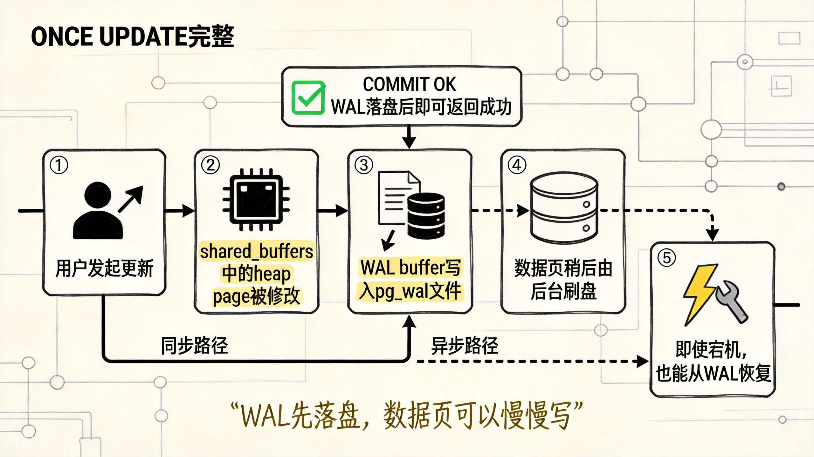

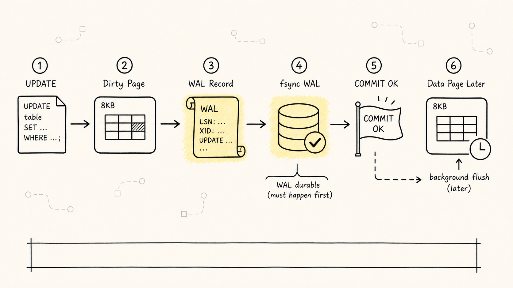

上图展示了一次 UPDATE 的完整路径：修改内存页 → 写 WAL → COMMIT 返回 → 数据页稍后刷盘。

一次 `UPDATE` 可以粗略理解成这样：

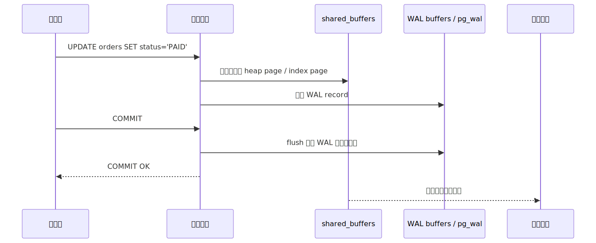

这里最重要的一点是：

**默认配置下，事务提交成功依赖必要 WAL 已经安全写入，不依赖数据页已经写回数据文件。**

这里说"默认配置下"，是因为 PostgreSQL 有 `synchronous_commit` 这类参数。如果你为了降低提交延迟而允许异步提交，那么数据库可能更早返回成功，但最近一小段已经返回成功的事务在崩溃时存在丢失风险。初学阶段先记住默认语义：提交确认通常站在 WAL 的持久化之上。

有了 WAL，PostgreSQL 就可以把很多随机数据页写入延后，把提交路径上的关键动作收敛成顺序追加 WAL。

（说白了：没有 WAL，数据库每次提交都要等随机写落盘，性能根本扛不住高并发。WAL 把"随机写"变成"顺序追加"，这是性能的关键。）

## 三、崩溃恢复：重启后不是猜，而是重放

假设这次订单更新已经提交：

```text
id = 1001, status = 'PAID'
```

但是对应的数据页还停留在内存里，磁盘上的数据页还是旧状态：

```text
id = 1001, status = 'CREATED'
```

这时机器突然宕机。内存没了，磁盘页还是旧的。PostgreSQL 重启后会进入崩溃恢复流程，大致做两件事：

1. 找到最近一次 checkpoint 记录。
2. 从 checkpoint 指向的 redo 位置开始重放 WAL，把已记录但未写入数据文件的修改补回去。

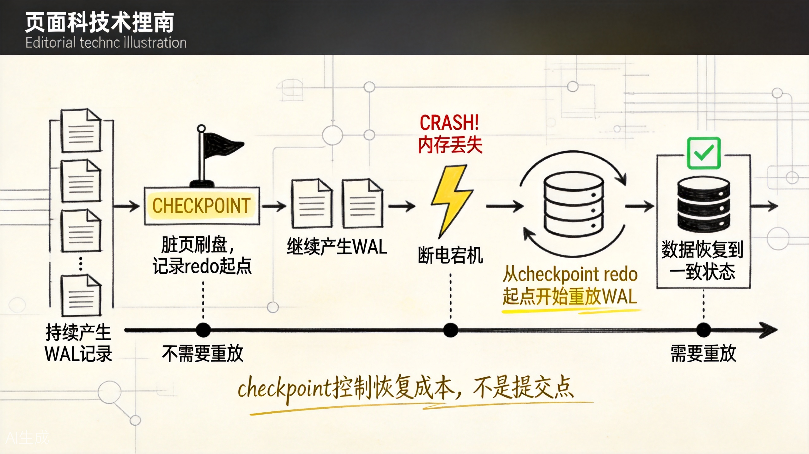

上图展示了从 checkpoint 到崩溃再到恢复的完整时间线。

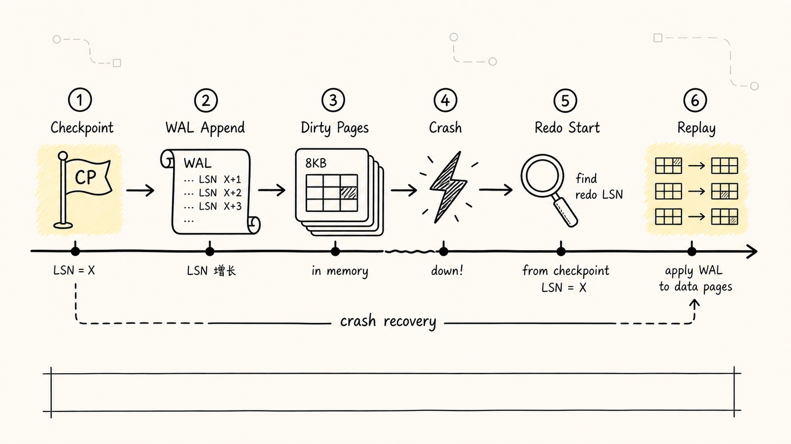


这就是为什么 WAL 常被称为 PostgreSQL 的"后悔药"并不准确。它更像一份可重放的施工记录：

```text
我改了哪些页
改到了什么位置
对应的日志序号是什么
崩溃后从哪里继续补
```

它解决的是持久化和恢复，不是业务层面的审计日志。

## 四、Checkpoint 不是提交点

很多初学者会把 `COMMIT` 和 `CHECKPOINT` 混在一起。它们不是一回事。

`COMMIT` 关心的是：

```text
这个事务能不能对客户端宣布成功？
```

`CHECKPOINT` 关心的是：

```text
能不能把一批脏页推进到磁盘，
让未来崩溃恢复少重放一点 WAL？
```

checkpoint 发生时，PostgreSQL 会把一批脏页刷入数据文件，并在 WAL 中写入 checkpoint 记录。之后如果崩溃，恢复流程就不必从很早以前一路重放，而是可以从最近 checkpoint 对应的 redo 位置开始。

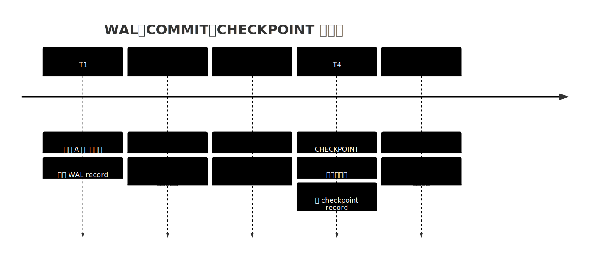

所以 checkpoint 不是"每个事务的保存按钮"。它更像恢复成本的控制阀。

checkpoint 太频繁，脏页刷盘压力会变大，而且在 `full_page_writes` 开启时，每个 checkpoint 后第一次修改某个 page 还可能记录整页镜像，导致 WAL 量增加。checkpoint 太少，平时写入可能更平滑，但崩溃恢复要重放的 WAL 更多，恢复时间更长。

## 五、full_page_writes：防的不是事务丢失，而是半页写坏

WAL 还有一个初学者容易忽略的细节：`full_page_writes`。

普通 WAL record 可以理解为"某个 page 的某个位置怎么改"。但如果操作系统或存储设备在写一个 8KB 数据页时突然断电，磁盘上可能出现半旧半新的 page。这个问题叫 torn page（撕裂页）。

如果磁盘上的 page 本身已经半坏，只靠"在某个位置打补丁"的 WAL record 可能不够，因为恢复时连原始 page 都不可信了。

于是 PostgreSQL 默认打开 `full_page_writes`：

```text
每个 checkpoint 之后，
某个 page 第一次被修改时，
把整个 page image 写入 WAL。
```

这样即使数据页写到一半崩溃，恢复时也可以从 WAL 里的完整 page image 还原出可信起点，再继续重放后续修改。


这也是为什么有些系统刚 checkpoint 后 WAL 量会突然变大：不是每次都整页写，而是 checkpoint 后每个 page 第一次被修改时要多记一份整页镜像。

## 六、WAL 和 MVCC：一个管恢复，一个管可见性

WAL 经常和 MVCC 一起出现，但它们解决的问题并不是一件事。事务篇已经把 MVCC 的版本链、快照和 VACUUM 讲清楚了，这里只补一层边界感。

MVCC 管的是并发可见性：

```text
这个事务现在应该看见哪个 tuple 版本？
```

WAL 管的是持久化和恢复：

```text
提交过的修改，崩溃后怎么恢复出来？
```

在 PostgreSQL 里，一次 `UPDATE` 往往会带来新旧版本切换；这些页级变化都会写进 WAL，因为崩溃恢复需要知道 heap page 和相关 index page 到底发生了什么。

但某个读事务能不能看见新版本，仍然由快照、事务 ID、`xmin/xmax` 等可见性规则决定。


所以不要把 PostgreSQL 的 WAL 硬翻译成 MySQL 的 undo log。PostgreSQL 的历史版本主要在 heap tuple 里，WAL 负责把这些页级变化可靠地记录下来。

## 七、WAL 还是复制、备份和 CDC 的主干

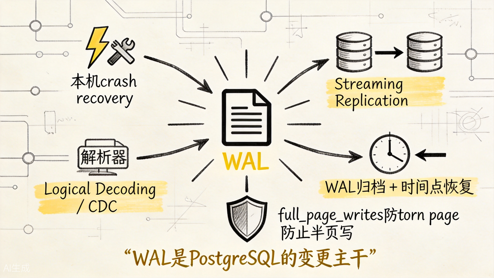

上图展示了 WAL 不只是本机崩溃恢复用，它还是复制、备份和 CDC 的主干。

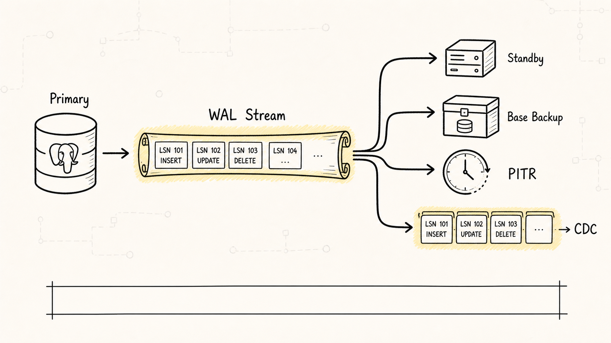

PostgreSQL 很多高可用和数据同步能力，都是从 WAL 这条变更流长出来的：


物理流复制中，从库接收主库产生的 WAL 并重放，所以从库更像主库数据目录的物理副本。

PITR 时间点恢复中，你先恢复一份基础备份，再把 WAL 重放到某个目标时间点。基础备份不一定是某个瞬间完全静止的快照，只要后续 WAL 齐全，恢复过程可以把它修正到一致状态。

逻辑解码则更进一步：它从 WAL 里解析出更容易被应用理解的变更格式，比如某张表插入了哪一行、更新了哪些列。这就是很多逻辑复制和 CDC 工具的基础。

所以 WAL 更像 PostgreSQL 的变更主干：

```text
本机恢复靠它
从库追主库靠它
时间点恢复靠它
逻辑解码也靠它
```

## 八、常用观察入口

学习 WAL 不要只停留在概念上，可以从几个系统视图开始观察。

看当前 WAL 位置：

```sql
SELECT
  pg_current_wal_lsn() AS current_lsn,
  pg_walfile_name(pg_current_wal_lsn()) AS wal_file;
```

看 WAL 生成量：

```sql
SELECT
  wal_records,
  wal_fpi,
  pg_size_pretty(wal_bytes) AS wal_size,
  wal_buffers_full,
  stats_reset
FROM pg_stat_wal;
```

其中 `wal_fpi` 是 full page images 的数量。如果它在某段时间明显增长，常常说明 checkpoint 后大量 page 被第一次修改，或者 workload 正在制造大量分散写入。

看 checkpoint：

```sql
SELECT
  num_timed,
  num_requested,
  num_done,
  write_time,
  sync_time,
  buffers_written,
  stats_reset
FROM pg_stat_checkpointer;
```

如果你用的是较旧版本 PostgreSQL，checkpoint 相关统计可能还在 `pg_stat_bgwriter` 里；新版本里 `pg_stat_bgwriter` 更偏向后台写进程自身，而 checkpoint 统计独立在 `pg_stat_checkpointer`。

看复制槽是否导致 WAL 堆积：

```sql
SELECT
  slot_name,
  slot_type,
  active,
  restart_lsn,
  confirmed_flush_lsn,
  pg_size_pretty(
    pg_wal_lsn_diff(pg_current_wal_lsn(), restart_lsn)
  ) AS retained_wal
FROM pg_replication_slots;
```

排查 WAL 暴涨时，常见方向有：

1. 写入量突然变大，比如批量导入、批量更新、建索引。
2. checkpoint 太频繁，导致 full page writes 变多。
3. 随机主键或分散更新让很多 page 在 checkpoint 后被第一次触碰。
4. 归档失败、从库落后、复制槽消费落后，旧 WAL 无法回收。
5. `wal_level = logical`、`REPLICA IDENTITY FULL` 等设置让逻辑变更信息更多。

## 九、和 MySQL 日志的关键差异

从 MySQL 学过来的读者，最重要的是不要硬找 PostgreSQL 里的 undo、redo、binlog 三件套。

| 对比点 | PostgreSQL | MySQL InnoDB |
|---|---|---|
| 崩溃恢复核心 | WAL | redo log |
| 历史版本来源 | heap tuple 多版本，旧版本等 VACUUM 回收 | undo log 保存历史版本 |
| 逻辑复制 / CDC | WAL 逻辑解码 | binlog |
| 物理复制 | WAL 流复制 | 常见主从复制多基于 binlog；InnoDB redo 主要服务本机恢复 |
| 提交关键 | 默认确保必要 WAL 安全写入 | redo/binlog 与两阶段提交等协同 |
| 脏页刷盘 | checkpointer、background writer、页面淘汰等协同 | InnoDB checkpoint、flush list 等机制 |
| 半页写防护 | `full_page_writes` 记录整页镜像 | doublewrite buffer 是 InnoDB 典型机制 |

一句话记忆：

**MySQL 日志常按 undo、redo、binlog 分角色理解；PostgreSQL 要先抓住 WAL，再把 MVCC、checkpoint、复制和恢复接到 WAL 上。**

## 十、一分钟复习

WAL 不是"多写一份流水账"。它是 PostgreSQL 敢于先改内存页、晚点刷数据文件的底气。

记住五句话：

1. WAL = 写前日志，日志先于数据页落盘。
2. 默认提交成功的关键是必要 WAL 已安全写入，而不是数据页立刻落盘。
3. checkpoint 控制恢复起点和 WAL 回收边界，不等于事务提交。
4. `full_page_writes` 防的是 torn page，代价是 checkpoint 后 WAL 量可能上升。
5. MVCC 管可见性，WAL 管持久化、恢复、复制和解码。
