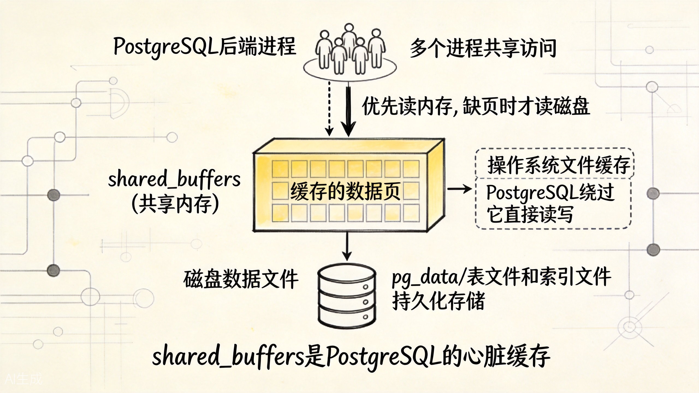
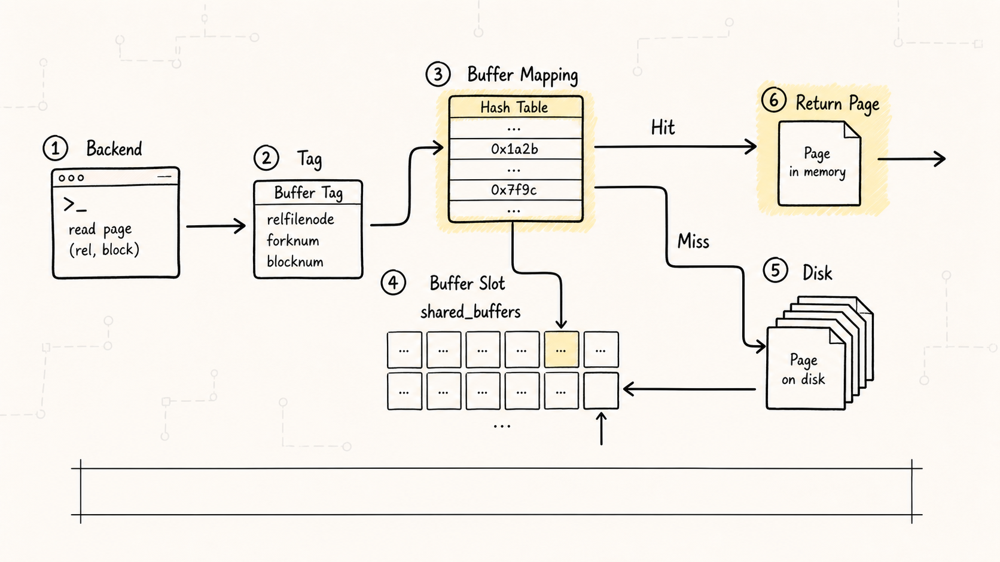
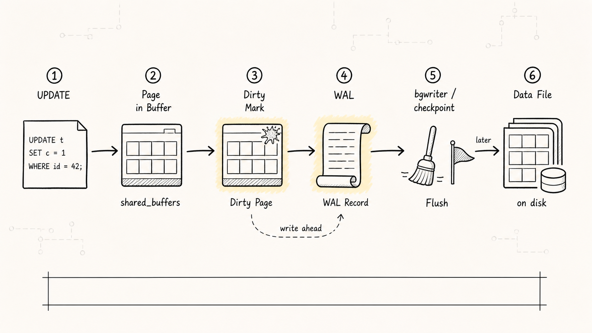
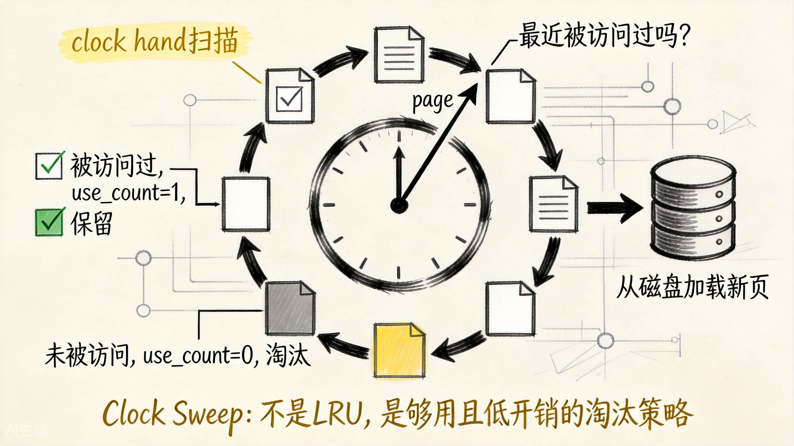
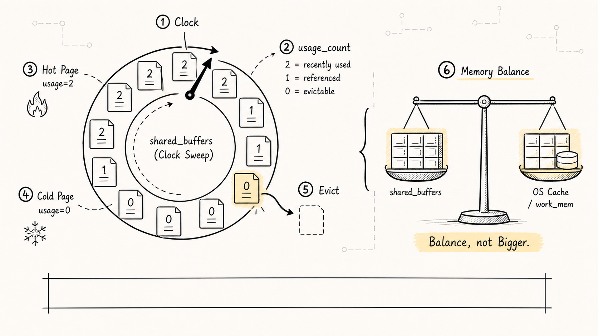
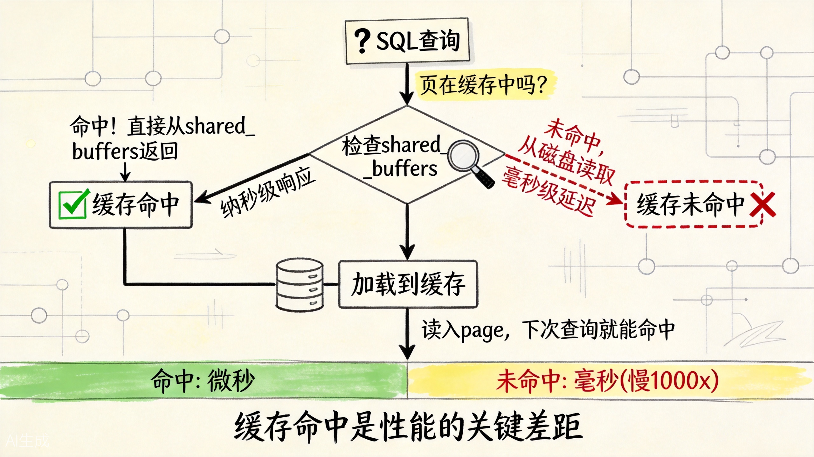

# PostgreSQL shared_buffers：缓存不是越大越好

看 PostgreSQL 内存参数时，最容易先被一串名字绕晕。

`shared_buffers`、`work_mem`、`effective_cache_size`、`maintenance_work_mem`……一堆名字，到底该调哪个？

这篇文章只聚焦最核心的一个：

**`shared_buffers`。它是 PostgreSQL 用来缓存表数据和索引页面的共享内存区域。所有后端进程都从这里读数据、写数据。理解它的工作原理，是性能调优里最值得先啃的一块。**

## 一、为什么需要 shared_buffers

数据库的表和索引存储在磁盘上。如果每次查询都直接去读磁盘，性能会非常差。

`shared_buffers` 的作用就是：**把常用的数据页留在内存里，减少磁盘 I/O。**

```sql
SHOW shared_buffers;
```

默认值通常是 128MB，对于生产环境来说远远不够。但也不是越大越好，后面会解释为什么。

## 二、shared_buffers 的工作方式

PostgreSQL 启动时会分配一块共享内存，按照 `shared_buffers` 的大小，分割成一个个 8KB（默认 page size）的槽位。

当后端进程需要访问某个 page 时，流程是这样的：

```text
1. 先查这个 page 是否在 shared_buffers 中（通过 Buffer Mapping 表）
2. 如果在，直接使用，开销几乎为零
3. 如果不在，从磁盘读取到 shared_buffers 的一个空闲槽位，然后再访问
```



上图展示了 shared_buffers 在 PostgreSQL 架构中的核心位置——位于后端进程和磁盘存储之间，所有进程共享访问。



### Buffer Tag 的定位方式

每个 page 在共享内存中通过 Buffer Tag 唯一标识：

```text
Buffer Tag = (表空间, 数据库, 表, 块号)
```

这是一个精确到块的地址。Buffer Mapping 表就是一个哈希结构，把 Buffer Tag 映射到 shared_buffers 中的槽位编号。



## 三、写数据时怎么工作

当执行 `UPDATE`、`INSERT`、`DELETE` 时，数据修改也发生在 shared_buffers 中：

```text
1. 找到目标 page（或从磁盘读入）
2. 在内存中修改 page 内容
3. 标记这个 page 为"脏页"（dirty）
4. 生成 WAL 记录，确保崩溃后可以恢复
5. 由后台进程（bgwriter / checkpoint）异步刷回磁盘
```



注意：**修改不会立即写入磁盘**。这里先记住结论就够了：PostgreSQL 靠 WAL 扛住持久性，靠延迟刷脏页换取更好的 I/O 形态。WAL 和 checkpoint 的细节放在日志篇单独展开。

## 四、页面淘汰：Clock Sweep 算法

shared_buffers 的大小是有限的。当缓存满了，又有新的 page 需要读入时，就要淘汰旧的 page。

PostgreSQL 使用的是 Clock Sweep（时钟扫描）算法，不是传统的 LRU。



上图展示了 Clock Sweep 的工作原理。每个 page 有一个 usage_count（初始为 1）。当需要淘汰时：

```text
1. 时钟指针轮询每个 page
2. 如果 usage_count > 0，减 1，继续下一个
3. 如果 usage_count = 0，淘汰这个 page
4. 如果 page 是脏页，需要先刷盘才能淘汰
```



Clock Sweep 的优点是：
- **开销低**：不需要维护复杂的链表结构
- **抗扫描友好**：全表扫描不会污染缓存（因为扫描时 usage_count 不会反复增加）

缺点是对"突然的热点"反应不够灵敏。不过在大多数场景下，它工作得很好。

## 五、缓存命中率：最重要的观察指标

缓存命中率 = 从 shared_buffers 直接读取的次数 / 总读取次数

命中率越高，说明越多请求避免了磁盘 I/O。



上图展示了缓存命中和未命中时的性能差距。查看命中率：

```sql
SELECT
  sum(heap_blks_hit) AS hit,
  sum(heap_blks_read) AS read,
  round(100.0 * sum(heap_blks_hit) / nullif(sum(heap_blks_hit) + sum(heap_blks_read), 0), 2) AS hit_ratio
FROM pg_statio_user_tables;
```

一般来说：

| 命中率 | 说明 |
|--------|------|
| > 99% | 很好，大部分请求走内存 |
| 95% - 99% | 可接受，但可以优化 |
| < 95% | 需要关注，可能有 I/O 瓶颈 |

但要注意：命中率只是参考。如果总查询量很小，即使命中率低也没问题。反过来，如果查询量巨大，99% 的命中率仍然可能产生大量磁盘读。

## 六、怎么确定 shared_buffers 的最佳大小

这是最关键的问题。原则是：

**足够大以缓存热点数据，但不要大到跟操作系统抢内存。**

操作系统也有文件缓存（Page Cache）。PostgreSQL 通过 `buffer_IO` 机制，实际上数据会被缓存两次：一次在 shared_buffers，一次在 OS Page Cache。

### 调优建议

| 内存大小 | shared_buffers 建议 |
|----------|---------------------|
| < 4GB | 系统内存的 15% - 20% |
| 4GB - 32GB | 系统内存的 20% - 25% |
| > 32GB | 8GB - 16GB 通常足够 |

为什么不是越大越好？

1. **double caching**：OS 也会缓存文件，两边都占内存
2. **更大的检查点开销**：shared_buffers 越大，checkpoint 时需要刷的脏页越多
3. **连接数多时 work_mem 更紧缺**：总内存有限，要平衡分配

PostgreSQL 社区的建议是：**把 shared_buffers 设为足够缓存工作集的大小，剩下的内存留给 OS 文件缓存和 work_mem**。

### 如何找到"足够"的大小

逐步增加 shared_buffers，观察命中率是否还有明显提升。当命中率不再随 shared_buffers 增加而提升时，就是合适的点。

## 七、查看当前缓存状态

```sql
-- 查看表级别的缓存命中情况
SELECT
  schemaname,
  relname,
  heap_blks_hit,
  heap_blks_read,
  round(100.0 * heap_blks_hit / nullif(heap_blks_hit + heap_blks_read, 0), 2) AS hit_ratio
FROM pg_statio_user_tables
ORDER BY heap_blks_read DESC
LIMIT 20;
```

这个查询能帮你找到哪些表经常走磁盘读，是优化索引或增加缓存的重点对象。

## 八、相关参数

| 参数 | 作用 |
|------|------|
| `shared_buffers` | 共享缓存大小 |
| `effective_cache_size` | 告诉优化器系统总缓存（包括 OS 缓存）大约多大 |
| `work_mem` | 每个操作的排序/哈希可用内存 |
| `maintenance_work_mem` | VACUUM、CREATE INDEX 等维护操作的内存 |

注意：`effective_cache_size` 不影响实际缓存分配，只影响查询优化器的成本估算。如果设得太小，优化器可能倾向于走 Seq Scan 而不是 Index Scan。

## 九、与 MySQL 的对比

| 对比点 | PostgreSQL | MySQL InnoDB |
|--------|-----------|--------------|
| 缓冲池名称 | shared_buffers | innodb_buffer_pool |
| 默认大小 | 128MB | 128MB |
| 淘汰算法 | Clock Sweep | LRU（改进版） |
| 与 OS 缓存关系 | 双重缓存 | InnoDB 使用 O_DIRECT 时可绕过 |
| 多实例支持 | 无 | 可配置多个 buffer pool instance |

## 十、一分钟复习

1. shared_buffers 是 PostgreSQL 最核心的性能参数。
2. 不是越大越好，通常建议系统内存的 20% - 25%。
3. 监控缓存命中率，找到需要优化的表。
4. Clock Sweep 是低开销的淘汰算法，对扫描友好。
5. 写操作先在内存中进行，异步刷盘，WAL 保证持久性。
6. 调优时要平衡 shared_buffers、work_mem 和 OS 缓存。

**核心原则：shared_buffers 的目标是缓存"工作集"——你的业务最常访问的那部分数据。找到这个平衡点，比盲目增大更重要。**
