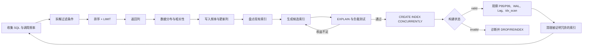

# 第 5 章：高级索引设计、冗余分析与在线索引生命周期

> 技术基线：PostgreSQL 18；同时说明 PostgreSQL 14—18 的重要差异。Go 示例使用 `github.com/jackc/pgx/v5` 与 `pgxpool`。

## 1. 本章定位

本章解决的不是“会不会写 `CREATE INDEX`”，而是四个生产问题：如何从真实查询推导出索引；如何证明索引确实有效；如何识别重复、冗余、低价值索引；如何在不中断业务写入的前提下创建、重建和删除索引。

索引是一份独立、持续维护的数据结构。它能够减少扫描、排序和 Heap 访问，也会增加 INSERT、UPDATE、DELETE 的 CPU、Buffer、WAL、Checkpoint、复制和缓存成本。因而“多建索引”与“不建索引”都不是策略，正确策略是让每个索引对应可观测的工作负载收益，并管理其完整生命周期。

本章依赖第 3 章的 Heap、Visibility Map、HOT 与 Buffer 模型，以及第 4 章的 B-tree、Index Scan、Index Only Scan 和多列索引基础。下一章将从 Planner、Path 与 Cost Model 解释 PostgreSQL 为什么选择或放弃这些索引。本章不深入 GIN、GiST、SP-GiST、BRIN，也不把分区索引和在线 Schema 迁移全部展开。

### 1.1 PostgreSQL 14—18 版本差异速览

| 版本 | 与本章直接相关的重要变化 |
|---|---|
| [PG14+] | B-tree 写入可在插入时更积极地清理过期条目以减少 Page Split 和膨胀；`pg_prepared_statements` 可报告 Generic/Custom Plan 次数。 |
| [PG15+] | Unique Index/Constraint 支持 `NULLS NOT DISTINCT`；升级和 Collation 变更时应更系统地检查 Collation Version。 |
| [PG16+] | `pg_stat_user_indexes` 等视图增加最近一次扫描时间；`pg_stat_io` 提供更系统的 I/O 观测。 |
| [PG17+] | B-tree 对常量 `IN` 值集合的搜索更高效；维护命令采用安全 `search_path`，表达式索引函数若依赖非默认 Schema，应在函数定义中固定安全搜索路径；BRIN 支持并行构建。 |
| [PG18] | B-tree Skip Scan 扩大多列索引可用场景；GIN 支持并行构建；AIO 改善部分扫描/维护 I/O 路径；`LIKE` 增强对非确定性 Collation 的支持。 |

这些改进会改变成本和可观测性，不会改变本章的基本原则：索引语义必须正确，收益必须以真实工作负载验证，在线 DDL 必须管理资源与状态。

## 2. 可验证的学习目标

完成本章后，你应当能够：

1. 从过滤条件、排序、LIMIT、返回列和数据分布推导多列 B-tree 的键顺序与 `INCLUDE` 列。
2. 通过 `EXPLAIN (ANALYZE, BUFFERS, WAL, SETTINGS, VERBOSE, SUMMARY)` 验证候选索引，而不是只看是否出现 `Index Scan`。
3. 解释 Partial Index 的 Predicate 推导边界，以及参数化查询从 Custom Plan 切换到 Generic Plan 后可能失去部分索引的原因。
4. 正确使用表达式索引、函数易变性、`UNIQUE NULLS NOT DISTINCT`、Collation 与 `text_pattern_ops`。
5. 判断外键引用列何时必须建立索引。
6. 使用系统目录与统计视图区分精确重复索引、可能冗余索引、低选择性索引和暂时未使用索引。
7. 复现并诊断 `CREATE INDEX CONCURRENTLY` 的等待阶段、Invalid Index 和长 Snapshot 阻塞。
8. 评估索引变更对写放大、WAL、缓存、副本延迟、RPO 与 RTO 的间接影响。
9. 在 Go + pgx 中实现与索引顺序匹配、使用复合游标的订单 Keyset Pagination。

## 3. 核心术语

| 中文名称 | 英文名称 | 准确定义 | 容易混淆的概念 | 所属层次 |
|---|---|---|---|---|
| 索引键列 | Key column | 参与搜索、排序、唯一性或索引导航的列/表达式 | `INCLUDE` 列 | 索引结构 |
| 非键列 | Included column | 仅存放于叶子 Index Tuple 中，不能作为搜索键，也不参与唯一性 | 多列索引的后置键 | 索引结构 |
| 覆盖索引 | Covering index | 包含查询所需全部列，使 Index Only Scan 在语义上成为可能 | 一定不访问 Heap | 执行路径 |
| 部分索引 | Partial index | 仅为满足 Predicate 的 Heap Tuple 建立条目 | 分区、多个“分片式”部分索引 | Schema |
| Predicate 推导 | Predicate implication | Planner 在计划期证明查询条件蕴含索引 Predicate | 运行时参数判断 | Planner |
| 表达式索引 | Expression index | 索引键是行值经过不可变表达式计算后的结果 | 生成列 | Schema/写路径 |
| 易变性 | Volatility | 函数结果对时间、数据库状态和调用次数的稳定承诺 | 线程安全 | 函数语义 |
| 唯一索引 | Unique index | 由 B-tree 在写入路径上强制键值唯一 | 仅用于加速查询 | 一致性 |
| 空值不区分 | NULLS NOT DISTINCT | 在唯一索引中把多个 NULL 视为相同值 | SQL 默认 NULL 比较 | 一致性 |
| 排序规则 | Collation | 文本比较、排序和等价判定规则 | 字符编码 | 类型/排序 |
| 操作符类 | Operator class | 定义某数据类型的操作符如何映射到索引访问方法 | Collation | 索引语义 |
| 精确重复索引 | Duplicate index | 索引方法、键、顺序、opclass、collation、Predicate、INCLUDE、唯一语义等相同 | 名称相同 | 运维 |
| 可能冗余索引 | Redundant index | 其工作负载功能可能被另一索引覆盖，但删除前必须证明 | 左前缀即冗余 | 运维 |
| 选择性 | Selectivity | 条件预计保留行数占总行数的比例 | 列的 NDV 本身 | Planner |
| Index Only Scan | Index-only scan | 从索引取得列，并借助 Visibility Map 判断是否无需 Heap 可见性检查 | 只扫描索引就必然更快 | Executor |
| Invalid Index | Invalid index | `pg_index.indisvalid=false`，不能供查询计划使用；部分状态下仍被 DML 维护 | 已自动删除 | 系统目录 |
| 并发建索引 | Concurrent index build | 通过多事务、两次 Heap 扫描和若干等待避免阻塞普通 DML | 没有性能影响 | DDL 生命周期 |
| 旧 Snapshot | Old snapshot | 早于索引验证阶段的事务快照，可能延迟索引最终可用 | 仅指长写事务 | MVCC |
| 写放大 | Write amplification | 一次业务写导致 Heap、多个索引、WAL、Checkpoint 与复制的额外写入 | 只看 SQL 行数 | 性能 |
| 索引使用计数 | `idx_scan` | 统计子系统记录的索引搜索次数；不等于业务调用次数 | “大于 0 就有用” | 可观测性 |

## 4. 整体心智模型



数据流从查询指纹、参数分布和调用频率进入设计过程；控制流则由 Planner 验证、压测门禁和在线 DDL 状态机决定是否发布。索引构建不是原子“复制一份数据”：普通构建单次扫描并阻塞写，Concurrent 构建会先登记 Invalid Index，再执行两次扫描，并等待相关事务与旧 Snapshot。失败路径必须显式处理，否则无效索引可能长期占空间并增加写成本。

索引内部可以抽象为：

```text
B-tree upper pages:  (tenant_id, status, created_at, id)  ← 仅键列参与导航
                         |
B-tree leaf tuple:   keys + INCLUDE(total_amount, currency) + heap TID
                         |
Heap page:           可见性最终由 Heap/Visibility Map 决定
```

`INCLUDE` 让查询列“在索引里”，但 Index Only Scan 是否真的减少 Heap Fetches，取决于 Visibility Map 的 all-visible 位和数据更新频率。

## 5. 使用方式

### 5.1 建立示例表

```sql
CREATE TABLE orders (
    id           bigint GENERATED ALWAYS AS IDENTITY PRIMARY KEY,
    tenant_id    bigint        NOT NULL,
    status       text          NOT NULL,
    created_at   timestamptz   NOT NULL DEFAULT clock_timestamp(),
    total_amount numeric(18,2) NOT NULL,
    currency     char(3)       NOT NULL,
    customer_id  bigint        NOT NULL,
    external_key text,
    archived_at  timestamptz,
    note         text
);
```

订单列表的目标 SQL：

```sql
SELECT id, status, created_at, total_amount, currency
FROM orders
WHERE tenant_id = $1
  AND status = $2
  AND (created_at, id) < ($3, $4)
ORDER BY created_at DESC, id DESC
LIMIT $5;
```

候选索引不是凭经验拍板，而是按以下顺序推导：

1. `tenant_id = $1` 是租户隔离且几乎所有访问都携带，置于最前。
2. `status = $2` 是等值条件，放在时间范围之前。
3. `(created_at, id) < (...)` 同时是 Keyset 边界和排序键，方向与 `ORDER BY` 一致；`id` 是稳定唯一的 tie-breaker。
4. `total_amount`、`currency` 只返回、不参与过滤和排序，可谨慎放入 `INCLUDE`。
5. `status` 若为可选条件，不能用一个带 `OR` 的万能 SQL 假装一个索引覆盖所有形态；应拆分 SQL 指纹并分别评估。

```sql
CREATE INDEX CONCURRENTLY idx_orders_tenant_status_created_id
ON orders (tenant_id, status, created_at DESC, id DESC)
INCLUDE (total_amount, currency);
```

若接口固定只查待处理订单，Partial Index 可更小，但查询文本应保留可证明的常量 Predicate：

```sql
CREATE INDEX CONCURRENTLY idx_orders_pending_tenant_created_id
ON orders (tenant_id, created_at DESC, id DESC)
INCLUDE (total_amount, currency)
WHERE status = 'pending';

SELECT id, status, created_at, total_amount, currency
FROM orders
WHERE tenant_id = $1
  AND status = 'pending'          -- 固定字面量，而不是任意 $2
  AND (created_at, id) < ($2, $3)
ORDER BY created_at DESC, id DESC
LIMIT $4;
```

### 5.2 固定的验证方法

```sql
EXPLAIN (
    ANALYZE,
    BUFFERS,
    WAL,
    SETTINGS,
    VERBOSE,
    SUMMARY
)
SELECT id, status, created_at, total_amount, currency
FROM orders
WHERE tenant_id = 42
  AND status = 'paid'
ORDER BY created_at DESC, id DESC
LIMIT 50;
```

不要只检查节点名。至少记录：

- `actual rows` 与估算行数；
- 是否出现额外 `Sort`；
- 启动成本是否适合 `LIMIT`；
- `Buffers: shared hit/read`；
- `Heap Fetches`；
- 过滤后丢弃的行数；
- 冷缓存与热缓存差异；
- 相同吞吐下写请求的 WAL、CPU、P95/P99 是否恶化。

### 5.3 盘点索引定义、大小和状态

```sql
SELECT
    ns.nspname AS schema_name,
    tbl.relname AS table_name,
    idx.relname AS index_name,
    am.amname AS access_method,
    i.indisunique,
    i.indisprimary,
    i.indisvalid,
    i.indisready,
    i.indislive,
    i.indnkeyatts,
    i.indnatts,
    pg_size_pretty(pg_relation_size(i.indexrelid)) AS index_size,
    pg_get_indexdef(i.indexrelid) AS definition,
    pg_get_expr(i.indpred, i.indrelid) AS predicate,
    pg_get_expr(i.indexprs, i.indrelid) AS expressions
FROM pg_index AS i
JOIN pg_class AS idx ON idx.oid = i.indexrelid
JOIN pg_class AS tbl ON tbl.oid = i.indrelid
JOIN pg_namespace AS ns ON ns.oid = tbl.relnamespace
JOIN pg_am AS am ON am.oid = idx.relam
WHERE ns.nspname NOT IN ('pg_catalog', 'information_schema')
ORDER BY pg_relation_size(i.indexrelid) DESC;
```

关键状态：`indisvalid=false` 表示 Planner 不能使用；`indisready=true` 表示写路径已维护该索引。因此“无效”不必然等于“无写成本”。

[PG16+] 查看索引使用和最近扫描时间：

```sql
SELECT
    schemaname,
    relname,
    indexrelname,
    idx_scan,
    last_idx_scan,
    idx_tup_read,
    idx_tup_fetch,
    pg_size_pretty(pg_relation_size(indexrelid)) AS index_size
FROM pg_stat_user_indexes
ORDER BY pg_relation_size(indexrelid) DESC;
```

PostgreSQL 14、15 没有 `last_idx_scan`。任何版本都不能仅凭 `idx_scan=0` 立刻删除：统计可能被重置，索引可能只服务月末任务、故障切换后的只读流量、唯一约束或外键删除检查；Bitmap 路径中的读取/获取统计也不能按普通 Index Scan 直觉解释。[PG18] Skip Scan 或一次执行中的多次索引搜索还可能使 `idx_scan` 大于业务 SQL 调用次数。

### 5.4 查找精确重复索引

下面的查询寻找定义语义高度一致的索引；删除前仍要检查约束依赖、分区关系、表空间和运维意图：

```sql
WITH idx AS (
    SELECT
        i.indexrelid,
        i.indrelid,
        c.relname AS index_name,
        am.amname,
        i.indisunique,
        i.indnullsnotdistinct,
        i.indnkeyatts,
        i.indkey,
        i.indclass,
        i.indcollation,
        i.indoption,
        pg_get_expr(i.indexprs, i.indrelid) AS expressions,
        pg_get_expr(i.indpred, i.indrelid) AS predicate,
        c.reloptions
    FROM pg_index AS i
    JOIN pg_class AS c ON c.oid = i.indexrelid
    JOIN pg_am AS am ON am.oid = c.relam
    WHERE i.indisvalid
)
SELECT
    a.indrelid::regclass AS table_name,
    a.indexrelid::regclass AS index_a,
    b.indexrelid::regclass AS index_b
FROM idx AS a
JOIN idx AS b
  ON a.indrelid = b.indrelid
 AND a.indexrelid < b.indexrelid
 AND ROW(
        a.amname, a.indisunique, a.indnullsnotdistinct,
        a.indnkeyatts, a.indkey, a.indclass, a.indcollation,
        a.indoption, a.expressions, a.predicate
     ) IS NOT DISTINCT FROM ROW(
        b.amname, b.indisunique, b.indnullsnotdistinct,
        b.indnkeyatts, b.indkey, b.indclass, b.indcollation,
        b.indoption, b.expressions, b.predicate
     );
```

“`(a)` 是 `(a,b)` 的左前缀，所以一定冗余”是错误规则。较短索引可能更小、更缓存友好；两者可能具有不同唯一性、Predicate、Collation、opclass、排序方向或 `INCLUDE`；短索引还可能显著降低某个高频点查的读放大。只有在回放真实工作负载、检查计划替代路径并经过观察窗口后，才能删除。

### 5.5 监控在线索引构建

```sql
SELECT
    p.pid,
    p.datname,
    p.relid::regclass AS table_name,
    p.index_relid::regclass AS index_name,
    p.command,
    p.phase,
    p.lockers_total,
    p.lockers_done,
    p.current_locker_pid,
    p.blocks_total,
    p.blocks_done,
    p.tuples_total,
    p.tuples_done,
    p.partitions_total,
    p.partitions_done,
    a.wait_event_type,
    a.wait_event,
    clock_timestamp() - a.query_start AS elapsed
FROM pg_stat_progress_create_index AS p
JOIN pg_stat_activity AS a USING (pid);
```

寻找 blocker 时优先使用 `pg_blocking_pids()`：

```sql
SELECT
    a.pid AS waiting_pid,
    a.query AS waiting_query,
    b.pid AS blocking_pid,
    b.usename AS blocking_user,
    b.state AS blocking_state,
    b.xact_start AS blocking_xact_start,
    b.query AS blocking_query
FROM pg_stat_activity AS a
CROSS JOIN LATERAL unnest(pg_blocking_pids(a.pid)) AS x(blocking_pid)
JOIN pg_stat_activity AS b ON b.pid = x.blocking_pid
WHERE cardinality(pg_blocking_pids(a.pid)) > 0;
```

常见 `phase` 的含义：

| phase | 说明 | 主要排查方向 |
|---|---|---|
| `initializing` | 初始化目录和构建状态 | 权限、对象与锁获取 |
| `waiting for writers before build` | 第一次扫描前等待可能修改表的旧事务 | 长写事务、同表维护 |
| `building index` | 访问方法正在构建；子阶段可表现为扫描、排序等 | CPU、I/O、临时文件、`maintenance_work_mem` |
| `waiting for writers before validation` | 第二次扫描/验证前等待相关写事务 | 事务年龄与 blocker |
| `index validation: scanning index` / `index validation: sorting tuples` / `index validation: scanning table` | 校验第一次扫描与并发变化 | block/tuple 进度、I/O |
| `waiting for old snapshots` | 等待早于第二次扫描的 Snapshot | `xact_start`、`backend_xmin`、idle in transaction |
| REINDEX 专属等待阶段 | 等待读者后标记旧索引 dead、再等待后删除旧索引 | 长读事务、旧计划与磁盘双份占用 |

### 5.6 REINDEX、REINDEX CONCURRENTLY 与 DROP INDEX CONCURRENTLY

`REINDEX` 适用于索引损坏、严重膨胀、存储参数调整、Collation 规则变化或失败后留下的 Invalid Index。普通 `REINDEX` 通常更快、资源过程更简单，但会取得更强锁；在线系统优先评估：

```sql
REINDEX INDEX CONCURRENTLY public.idx_orders_tenant_status_created_id;
```

Concurrent 重建会创建替代索引、等待相关事务并在旧新索引共存后切换，因此需要额外磁盘、WAL、时间和监控。对 Invalid Index 做并发修复时应针对 `REINDEX INDEX CONCURRENTLY`，并先排除导致原构建失败的数据或表达式问题。

删除普通非约束索引：

```sql
DROP INDEX CONCURRENTLY public.idx_orders_old;
```

限制必须写进 Runbook：一次命令只能删除一个索引；不能与 `CASCADE` 一起使用；不能直接删除支撑主键、Unique/Exclusion Constraint 的索引；不能放在显式事务块；不能直接用于分区父索引。它减少普通读写阻塞，但仍要等待旧事务释放对索引的引用。`IF EXISTS` 只能避免“对象不存在”错误；无论 CREATE 还是 DROP，都不能替代定义和依赖校验，尤其 `CREATE INDEX IF NOT EXISTS` 不保证同名对象具有期望定义。

## 6. 底层原理

### 6.1 多列 B-tree：字段顺序不是“选择性从高到低”

对 B-tree，最有效的扫描边界通常来自：前导列的等值条件，加上第一个非等值列的范围条件。后续列仍可作为 Index Cond 或过滤条件减少 Heap 访问，但通常不能像前导等值与首个范围那样直接缩小连续扫描区间。[PG18] B-tree Skip Scan 可以在部分前导列缺少条件、其不同值较少且成本模型认为有利时，为后续条件执行多次定位；它扩大了可用范围，却没有废除字段顺序设计。

实用推导顺序：

1. **业务作用域等值列**：如 `tenant_id`，既缩小范围又防止跨租户扫描。
2. **稳定且高频的其他等值列**：如固定 SQL 指纹中的 `status`。
3. **第一个范围列**：时间、金额、游标边界。
4. **排序后缀与唯一 tie-breaker**：使 `ORDER BY ... LIMIT` 可直接从正确位置读取少量条目。
5. **仅返回列**：评估后放入 `INCLUDE`，而不是混入导航键。

多个等值列之间谁先谁后，对“所有等值条件都出现”的单个查询未必改变扫描区间，但会影响其他查询能否复用前缀、索引压缩与尺寸、Skip Scan 机会、排序能力和租户隔离。因此不能只按单列 NDV 排序。

`ORDER BY + LIMIT` 经常改变最优解。一个完美匹配排序的索引可以低启动成本返回前 50 行；另一个过滤更强但需要扫描大量行后全量排序的索引，P99 可能更差。单列 B-tree 可前后向扫描，所以通常无须为单列同时建 ASC/DESC；多列混合方向，例如 `ORDER BY x ASC, y DESC`，才可能需要显式混合方向。

### 6.2 INCLUDE、Covering Index 与 Heap Fetches

`INCLUDE` 列只在叶子条目中存储，不参与树上层导航、搜索条件和唯一性。它的收益条件有两个：查询所需列都能从索引取得；Heap Page 在 Visibility Map 中为 all-visible，Executor 才能跳过 Heap 可见性检查。

代价包括：

- Index Tuple 变宽、树和缓存占用变大；过宽甚至可能超过索引元组大小限制并导致写入失败。
- 带 `INCLUDE` 的 B-tree 不使用 deduplication。
- 更新被包含列也需要维护索引，会破坏该索引相关的 HOT 机会。
- 高频更新会清除 all-visible 位，使 Index Only Scan 出现大量 Heap Fetches，直到 Vacuum 再次确认可见性。

因此“把 SELECT 列全放进 INCLUDE”不是最佳实践。优先覆盖窄、稳定、读取频繁的列；避免把大 `text/jsonb` 或高频更新列塞入索引。

### 6.3 Partial Index 与参数化查询

Planner 只有在计划期能够证明查询条件蕴含索引 Predicate 时才能使用 Partial Index。它能识别完全匹配和有限的简单不等式推导，但不是通用定理证明器，也不会在执行期拿到每个参数后重新证明 Generic Plan。

例如索引 Predicate 为 `total_amount >= 1000`：

- 查询常量 `total_amount >= 5000` 可以推出 Predicate。
- `total_amount < 1000` 不能。
- `total_amount >= $2` 在 Generic Plan 中不能保证任意 `$2` 都满足。
- Custom Plan 可能根据当前参数值使用该索引，但自动计划缓存可能在若干次执行后选择 Generic Plan，不能把偶然命中当作稳定契约。

可靠方案是为固定业务状态使用固定 SQL 文本，例如 `status = 'pending'`；或使用完整索引；或拆分不同请求类型。不要为每个租户或每个枚举值建立大量 Partial Index，这会把索引当成劣质分区系统，增加 Planner、DDL 和写路径复杂度。

### 6.4 Expression Index 与函数易变性

表达式索引把计算结果写入 Index Tuple，例如：

```sql
CREATE UNIQUE INDEX users_tenant_lower_email_uidx
ON users (tenant_id, lower(email));
```

读取时查询表达式必须与可匹配的索引表达式一致：

```sql
SELECT id FROM users
WHERE tenant_id = $1 AND lower(email) = lower($2);
```

索引定义中使用的函数和操作符必须是 `IMMUTABLE`。三种易变性含义是：

- `VOLATILE`：同一语句内每次调用都可能不同，也可能读取/修改数据库状态。
- `STABLE`：同一条语句中对相同参数结果稳定，可作为索引扫描比较值，但不能用于索引定义来承诺跨语句永久不变。
- `IMMUTABLE`：仅由参数决定，跨时间与数据库状态保持相同，Planner 可安全预计算。

不要为了“让索引建得出来”把依赖时区、配置、表数据或当前时间的函数谎报为 `IMMUTABLE`。错误标注会把旧计算结果永久固化在索引语义中。新建表达式索引后应执行 `ANALYZE` 或等待 autovacuum analyze 生成表达式统计信息。

### 6.5 Unique Index 与 NULLS NOT DISTINCT

只有 B-tree 支持唯一索引。普通 Unique Index 按 SQL 默认把 NULL 视为彼此不同，因此允许多个 NULL。[PG15+] 可使用：

```sql
CREATE UNIQUE INDEX users_external_key_uidx
ON users (tenant_id, external_key) NULLS NOT DISTINCT;
```

它保证每个租户至多一个 `external_key IS NULL`。唯一约束和主键会自动创建支持索引，不要再手工创建同定义普通索引。需要表达式唯一、Partial Unique 或特定 `NULLS NOT DISTINCT` 语义时，索引本身就是并发安全的一致性机制，优于 Go 中“先查再插”。

### 6.6 Collation、text_pattern_ops 与 LIKE 前缀

Collation 决定文本排序与等价关系，opclass 决定操作符如何映射到索引顺序。非 `C` locale 下，普通文本 B-tree 的语言排序顺序未必能支持逐字节的 `LIKE 'abc%'` 范围定位，可建立：

```sql
CREATE INDEX users_username_pattern_idx
ON users (username text_pattern_ops);
```

`text_pattern_ops`、`varchar_pattern_ops`、`bpchar_pattern_ops` 按字符逐个比较，适合非 `C` locale 下的前缀 LIKE/正则模式；普通 `< <= > >=` 排序比较不能依赖该 opclass，因此有时需要同时保留默认 opclass 索引。`LIKE '%abc'` 没有左侧固定前缀，普通 B-tree 无法直接定位。`ILIKE`、大小写无关唯一性或语言学等价应根据语义选择表达式索引、确定性 Collation 或专用索引，而不是混为一谈。

非确定性 Collation 可表达大小写/重音不敏感等价，但会增加比较成本，并禁用 B-tree deduplication。[PG18] `LIKE` 增加了对非确定性 Collation 的支持；`ILIKE` 仍有不同限制。操作系统/ICU Collation 版本变化后必须检查数据库记录的版本并按官方升级流程 `REINDEX`，否则索引顺序可能与新规则不一致。

### 6.7 外键引用列索引

被引用的主键或唯一键已经有唯一索引，但 PostgreSQL 不会自动为引用端外键列创建索引：

```sql
CREATE TABLE order_items (
    id       bigint GENERATED ALWAYS AS IDENTITY PRIMARY KEY,
    order_id bigint NOT NULL REFERENCES orders(id),
    sku      text NOT NULL
);

CREATE INDEX CONCURRENTLY idx_order_items_order_id
ON order_items(order_id);
```

删除或更新父表键时，数据库需要在子表查找引用行；高基数或大子表没有引用端索引，会把一次父行变更放大为子表扫描并延长锁持有时间。若父表键从不删除更新、子表很小或批量装载阶段有特殊策略，可以基于证据推迟，但必须把级联、维护任务和未来规模纳入判断。

## 7. 内部数据结构和状态

### 7.1 CREATE INDEX 与 CREATE INDEX CONCURRENTLY 状态机

普通 `CREATE INDEX`：

```text
获取 ShareLock（阻塞 INSERT/UPDATE/DELETE）
→ 扫描 Heap 一次
→ 排序/构建 Index Pages
→ WAL 与脏 Buffer
→ 目录状态可用
→ 提交并释放锁
```

`CREATE INDEX CONCURRENTLY`：

```text
事务 1：写入系统目录，索引为 INVALID
  ↓ commit
等待可能修改表的旧事务
  ↓
事务 2：第一次 Heap 扫描，建立初始索引
  ↓ commit；索引进入写路径维护阶段
等待第二次扫描前的相关写事务
  ↓
事务 3：第二次 Heap 扫描，补齐/验证并发变化
  ↓
等待早于第二次扫描的 Snapshot 结束
  ↓
标记 VALID → commit → 命令结束
```

这解释了为什么 Concurrent 构建更慢：两次扫描、多个事务、额外等待，并且在线写入同时维护新索引。若唯一冲突、死锁或表达式求值错误导致失败，目录里可能保留 `indisvalid=false` 的索引。特别是 Unique Concurrent Build 从第二次扫描开始就可能对其他事务执行唯一性检查；即使构建最终失败，无效唯一索引仍可能继续约束写入。

### 7.2 锁、Snapshot、WAL 与 Buffer

普通构建取得的锁允许查询，但阻塞表上普通写入。Concurrent Build 使用不阻塞普通 DML 的较弱表锁，不过会与同表另一个 Concurrent Build 以及某些维护操作冲突；同一张表同时只能有一个 Concurrent Index Build。

旧 Snapshot 的影响不限于“长写事务”。一个 `REPEATABLE READ` 只读事务只要持有早于验证阶段的 Snapshot，也能让构建停在 `waiting for old snapshots`。`idle in transaction` 特别危险：应用看似空闲，事务却持续持有 Snapshot 和连接。

索引构建读取 Heap、在 Backend 与并行 Worker 的 Memory Context 中分配构建/排序状态，超出内存算法能力时写临时文件，再写 Index Pages、生成 WAL 并污染共享缓存/操作系统 Page Cache。物理副本重放这些 WAL，因而主库 CPU/I/O 正常也不代表副本安全；慢副本、归档或复制槽会积压 WAL。`maintenance_work_mem` 是每个维护操作的预算，不是越大越好；并行构建仍受整次操作预算和 CPU/I/O 瓶颈约束。[PG18] B-tree、GIN、BRIN 可并行构建；Concurrent Build 只有第一次表扫描并行。

### 7.3 相关系统目录和统计状态

- `pg_index.indisvalid`：是否可供查询使用。
- `pg_index.indisready`：是否接收 INSERT/UPDATE 维护。
- `pg_index.indislive`：索引是否仍处于有效生命周期，不应被新事务忽略。
- `pg_index.indnkeyatts`：键列数量；`indnatts` 包含 `INCLUDE` 在内的总列数。
- `pg_stat_progress_create_index.phase`：当前阶段；百分比只能在当前阶段有相应 total/done 时计算。
- `pg_stat_user_indexes`：累计使用统计，不是审计日志，也不包含业务重要性。
- `pg_stat_wal`：集群级 WAL 统计，做实验时应取前后快照差值，不能把并发业务 WAL 归因给单条 DDL。
- `pg_stat_replication`：主库观察发送、写入、刷盘、重放位置与延迟；时间列在无持续 WAL 时可能产生误读，应同时比较 LSN 字节差。

## 8. 场景和选型决策

| 业务场景 | 推荐方案 | 不推荐方案 | 原因 | 性能代价 | 并发代价 | 一致性代价 | 高可用代价 | 运维复杂度 |
|---|---|---|---|---|---|---|---|---|
| 租户内状态订单按时间翻页 | `(tenant_id,status,created_at DESC,id DESC)`，必要时窄 `INCLUDE` | OFFSET 深翻页、只建 `created_at` | 等值前缀 + 排序游标匹配 | 索引空间与维护 | 右侧页与写入竞争需观测 | 无 | WAL/副本重放增加 | 中 |
| 固定只查少量活跃状态 | Partial Index，SQL 固定 Predicate | 任意状态参数依赖同一 Partial Index | 索引小、缓存好 | Predicate 维护 | Generic Plan 可能失配 | 无 | 较小 WAL，但仍需在线构建 | 中 |
| 大小写无关邮箱唯一 | `UNIQUE (tenant_id, lower(email))` | Go 先查再插 | 数据库原子约束 | 表达式计算、非 HOT | 冲突时写路径等待 | 强一致性收益 | DDL/WAL | 中 |
| 非 C locale 的 `LIKE 'abc%'` | `text_pattern_ops`，并保留需要的默认排序索引 | 认为任意文本 B-tree 都支持 | opclass 语义不同 | 多一个索引 | 写放大 | 无 | WAL/缓存 | 中 |
| 父表删除需检查大子表 | 引用端 FK 列索引 | 只依赖父端唯一索引 | 避免子表全扫和长锁 | 额外写成本 | 缩短锁持有 | 保持 FK | 复制成本 | 低 |
| 高频写、低频读取宽表 | 少而窄的必要索引 | “覆盖所有 SELECT 列” | 写与缓存优先 | 降低写/WAL | 降低页竞争 | 无 | 降低 Lag | 低 |
| 生产大表新增索引 | `CREATE INDEX CONCURRENTLY` + 监控 + 退出条件 | 普通 `CREATE INDEX` 直接上线 | 避免阻塞普通 DML | 两次扫描、更慢 | 长事务可拖延 | Unique 构建有特殊窗口 | Lag/RTO 风险 | 高 |
| 索引损坏或严重膨胀 | 评估 `REINDEX CONCURRENTLY` | 忽略磁盘余量直接执行 | 保持在线读写 | 旧新索引并存、WAL 大 | 维护锁与等待 | 重建期间约束需理解 | 副本积压 | 高 |
| 删除被证明冗余索引 | `DROP INDEX CONCURRENTLY` | 高峰期普通 DROP | 降低阻塞风险 | 短期目录操作 | 等待旧事务 | 不能删约束支持索引 | 较低 | 中 |


## 9. 高性能分析

### 9.1 读收益必须与全链路成本一起测量

索引收益主要来自缩小访问范围、避免排序、降低启动成本、减少 Heap 访问。成本则分布在完整写路径：

```text
业务 UPDATE
→ 新 Heap Tuple / 可能失去 HOT
→ 每个受影响索引插入新条目
→ Buffer 变脏
→ WAL 增加
→ Checkpoint/后台写出
→ 物理副本传输与重放
→ 旧索引条目等待 Vacuum 清理
```

一个索引是否“值得”不能由单次热缓存查询判断。索引可以减少数据库内部访问，却不会自动减少返回行数、行宽或客户端往返；过大的分页、N+1 查询和跨网络传输仍可能主导延迟。生产评估应记录：数据规模、平均/高分位行宽、Predicate 分布、NDV 与相关性、读写比例、并发、CPU、内存、存储类型、`shared_buffers`、OS Page Cache、网络 RTT、SLO，以及测试时长。至少比较基线与候选方案的：

| 指标 | 读路径解释 | 写路径解释 |
|---|---|---|
| P50/P95/P99 | 是否减少长尾扫描和排序 | 索引维护是否拉高提交延迟 |
| `shared hit/read` | 热缓存命中与物理读取趋势 | 新索引是否挤出热点页 |
| Heap Fetches | all-visible 覆盖是否足够 | 更新是否频繁清除 VM 位 |
| CPU | 比较、排序、表达式计算 | 多索引插入、页面分裂、WAL 编码 |
| WAL bytes/records/FPI | 通常读查询接近零 | 新索引、页分裂、Checkpoint 周期相关 |
| 临时文件 | Sort/Hash 是否溢出 | 构建排序是否溢出 |
| 副本 LSN lag | 读副本是否追上 | WAL 生成与 replay 是否饱和 |
| 索引尺寸 | 缓存驻留能力 | 空间放大与备份恢复成本 |

### 9.2 CPU、内存与缓存

更宽的键、复杂 Collation 和表达式索引会提高比较与计算成本。`INCLUDE` 能减少 Heap Fetches，也可能使叶子页容纳更少条目、树变大、Buffer 命中率下降。索引页同时占用 `shared_buffers` 和 OS Page Cache；“shared hit”只说明 PostgreSQL Buffer 命中，不等于底层系统从未发生过 I/O，也不说明该页没有挤出其他热点数据。

构建索引时，`maintenance_work_mem` 可减少排序批次和临时文件，但这是每个维护操作整体的内存预算。并行、多个表同时构建和 autovacuum 共同存在时，按“单个任务能吃多少”设置会导致全机内存压力或交换。参数只能在给定并发、表大小和资源余量后决定。

### 9.3 随机 I/O、顺序 I/O 与 PostgreSQL 18 AIO

低选择性条件可能触发大量随机 Heap Fetches，Planner 因此选择 Bitmap Heap Scan 或 Seq Scan。Index Only Scan 在 all-visible 比例高时可显著减少随机 Heap 访问；在高更新表上则可能名义上是 Index Only Scan，却仍有大量 Heap Fetches。

[PG18] 异步 I/O 子系统主要改善顺序扫描、Bitmap Heap Scan、Vacuum 等可预取/并发发起 I/O 的路径。它不会让每个随机 B-tree 点查自动变成“无成本”，也不能替代正确索引、缓存和存储规划。评估时同时观察 PostgreSQL I/O 统计、操作系统块设备延迟、队列深度和 CPU iowait。

### 9.4 写放大、WAL、Checkpoint 与 Vacuum

每增加一个索引，INSERT 通常多一次索引插入；DELETE 留下需要后续清理的索引引用；UPDATE 若改变索引键、`INCLUDE` 列或表达式依赖列，会维护索引并通常失去 HOT。即使更新的业务列看似“不参与 WHERE”，只要被某索引存储，也会增加写成本。

索引构建、REINDEX 和高频页面分裂会产生 WAL。Checkpoint 后首次修改页面可能产生 Full Page Image，因此 WAL 量受 Checkpoint 节奏、`full_page_writes`、数据分布和并发写入影响，不能用固定倍数描述。不要为了压测好看关闭 `fsync`、`full_page_writes`、autovacuum 或同步复制保护。

索引数量越多，Vacuum 处理索引的总工作越多。删除冗余索引不仅释放磁盘，也可能减少 Vacuum 时长、Checkpoint 脏页和副本 replay 压力。但删除前应经历完整业务周期，避免把低频关键索引误判为无用。

### 9.5 在线重建的资源峰值

`REINDEX CONCURRENTLY` 在一段时间内同时保留旧、新索引，并进行额外扫描、写入与等待。规划时必须预留：

- 新索引完整空间及构建临时空间；
- WAL、归档目录和复制槽积压空间；
- 主库与副本 I/O 余量；
- 回滚/失败后 Invalid Index 的空间；
- 备份窗口与恢复时间增长。

不要只看数据盘剩余百分比。应按最大索引尺寸、峰值 WAL 速率、最长可容忍 Lag 和恢复吞吐计算退出阈值。

## 10. 高并发分析

### 10.1 五种“并发”必须分开

- 数据库并发：同时执行或等待的 Backend 数量。
- 应用 goroutine 并发：可能远大于数据库连接数。
- 连接数：已建立的 Session，不等于活跃 SQL。
- TPS：单位时间完成的事务数，不说明排队长度。
- 排队请求数：等待应用准入、连接池或数据库锁的请求。

`pgxpool.MaxConns` 只限制数据库连接，不会自动限制上游 goroutine 数。索引构建造成 CPU/I/O 或锁等待时，大量请求可能堆在连接池外或池内；无限重试会把短暂问题放大成连接和负载风暴。应用应有有界并发、请求超时、队列长度监控和 Backpressure。

### 10.2 普通构建与 Concurrent Build 的并发差异

普通 `CREATE INDEX` 不阻塞读，但会阻塞表上的 INSERT、UPDATE、DELETE。写请求持有连接等待，连接池很快耗尽，随后所有依赖数据库的接口一起排队。即使 DDL 最终成功，P99 和超时风暴也可能已经造成事故。

`CREATE INDEX CONCURRENTLY` 不阻塞普通 DML，但仍会：

- 与同表另一个 Concurrent Build 冲突；
- 等待旧写事务和旧 Snapshot；
- 与业务争夺 CPU、内存、存储和 WAL 带宽；
- 让每个并发写同时维护正在构建的新索引；
- 让 autovacuum 与 DDL 的调度更复杂；
- 在失败时留下必须清理的目录状态。

迁移器不应并行向同一热点表发多个 Concurrent DDL，也不能遇到 `lock_timeout` 就由所有实例同时立即重试。使用全局迁移锁、单飞执行、指数退避与人工退出条件。DDL 重试必须以目录状态和完整定义为幂等依据，而不是简单重发字符串；索引只能缩短访问路径，不能消除同一库存行、账户行等热点行的行锁竞争。

### 10.3 长事务、死锁与阻塞队列

Concurrent Build 等待的是事务生命周期，而不仅是当前 SQL。诊断时重点查看 `xact_start`，而不是只看 `query_start`。一个连接处于 `idle in transaction`，其当前 query 可能是很早完成的 SELECT，但 Snapshot 仍存在。

如果构建和业务 DDL、外键检查或其他维护操作形成锁环，可能发生死锁。PostgreSQL 会中止一个参与者；迁移系统应根据 `*pgconn.PgError.Code == "40P01"` 分类，但对 DDL 的重试还必须先检查是否已留下 Invalid Index，不能盲目重放同名命令。

### 10.4 热点索引页和写入模式

顺序增长键会把插入集中在 B-tree 右侧叶页；随机键会分散写入但增加缓存失配和页面分裂。多列索引的前导租户/状态可能把不同流量聚集到不同键空间，也可能让单一大租户成为热点。降低 fillfactor 有时能平滑早期页面分裂，但会扩大索引；最终仍需用真实并发写测试、锁等待、Buffer 与 WAL 指标证明。

## 11. 高可用分析

索引设计与高可用的关系多数是间接的：索引不会改变主从架构的理论 RPO，却会通过 WAL 量、复制延迟、恢复工作量和切换窗口影响实际 RTO 与故障风险。

### 11.1 物理复制

物理副本重放索引构建产生的 WAL，最终获得同一索引，无需在每个副本重新执行 DDL。风险包括：

- 主库构建速度超过副本 replay，`replay_lsn` 落后；
- 长时间查询因 hot standby conflict 被取消，或反过来因反馈延迟清理；
- 复制槽保留 WAL，主库 `pg_wal` 磁盘持续增长；
- 归档上传或对象存储带宽成为瓶颈；
- 故障切换到落后副本时数据新鲜度和恢复时间恶化。

同步复制下，提交等待到远端的阶段由 `synchronous_commit` 与同步配置决定。大量 WAL 会放大网络、远端写盘或 apply 的压力，从而提高提交延迟。执行在线索引构建前应为主库和所有候选同步副本设定 LSN Lag、WAL 磁盘、replay 吞吐的停止阈值。

### 11.2 逻辑复制

逻辑复制不复制普通 DDL。Publisher 新建索引不会自动在 Subscriber 出现；Subscriber 应按其查询工作负载独立建立索引。若订阅端 Apply 需要依赖唯一键或 Replica Identity，也要单独验证。不要假设“主库有索引，所以逻辑只读副本也有”。

### 11.3 切换、失败与恢复

Concurrent Build 由多个事务组成。主库在中间阶段故障时，已经提交到目录的 Invalid Index 可能随物理复制出现在提升后的节点，而未提交阶段会在恢复中回滚。因此 Planned Switchover 前应避免处于 DDL 中间状态；Unplanned Failover 后应立即检查 `pg_index.indisvalid/indisready`、未完成迁移记录和复制追赶情况。

旧应用连接在切换后可能仍指向旧主库。Fencing、连接重建和写端唯一性与索引 DDL属于不同控制面，不能靠索引命令解决脑裂。DDL 客户端收到连接错误或 Commit 错误时，也不能武断断言命令未生效；应在新主库按系统目录和对象定义进行幂等核验。

备份与 PITR 会恢复当时的目录和索引状态。恢复演练不仅要确认表数据，还要执行约束验证、索引有效性检查、关键查询计划和只读流量冒烟测试。Failback 前同样要确认新主库上的索引 DDL 已完整复制/重放，目标节点没有 Invalid Index 或 Collation 异常，再重新建立复制和连接路由。大型冗余索引还会增加基础备份体积、WAL 回放量与恢复时长。

## 12. 三维影响矩阵

| 维度 | 相关度 | 核心收益 | 主要风险 | 关键指标 |
|---|---|---|---|---|
| 高性能 | 高 | 减少扫描、排序、Heap Fetches，降低 LIMIT 启动成本 | 写/空间/缓存放大，错误索引反而更慢 | P95/P99、Buffers、Heap Fetches、CPU、WAL、索引尺寸 |
| 高并发 | 高 | 缩短查询和锁持有时间；Concurrent DDL 避免阻塞普通写 | 长事务、资源争用、连接池排队、失败重试风暴 | active/waiting sessions、blocking pids、pool acquire、WAL/I/O wait |
| 高可用 | 中 | 更快只读查询可降低副本压力 | 构建 WAL、复制 Lag、切换时 Invalid Index、恢复体积 | sent/write/flush/replay LSN、slot retained WAL、RTO 演练时间 |

# 实验

> 所有实验只应在独立实验库执行。数据量可按设备资源缩放，但必须记录版本、配置、数据量、平均行宽、缓存状态、并发、测试时长、CPU、I/O、Wait Event 和计划。不要把示例中的行数或耗时当作生产结论。

## 实验一：Partial Index 的 Predicate 推导与参数计划

### 1. 实验目标

比较能够、不能够在计划期推出 Partial Index Predicate 的查询，并观察 Custom Plan 与 Generic Plan 的差异。

### 2. 版本与扩展

PostgreSQL 14—18；无需扩展。

### 3. 建表和准备数据

**Session A：**

```sql
DROP TABLE IF EXISTS lab_orders_partial;
CREATE TABLE lab_orders_partial (
    id           bigint GENERATED ALWAYS AS IDENTITY PRIMARY KEY,
    tenant_id    bigint NOT NULL,
    total_amount numeric(12,2) NOT NULL,
    created_at   timestamptz NOT NULL,
    payload      text NOT NULL
);

INSERT INTO lab_orders_partial (tenant_id, total_amount, created_at, payload)
SELECT
    1 + (g % 100),
    CASE WHEN g % 100 < 5 THEN 5000 + (g % 1000) ELSE g % 900 END,
    clock_timestamp() - (g || ' seconds')::interval,
    repeat('x', 80)
FROM generate_series(1, 500000) AS g;

ANALYZE lab_orders_partial;

CREATE INDEX lab_orders_high_value_idx
ON lab_orders_partial (tenant_id, created_at DESC, id DESC)
WHERE total_amount >= 1000;

ANALYZE lab_orders_partial;
```

### 4. Session B：可推出与不可推出

```sql
-- 可推出：5000 >= 1000
EXPLAIN (ANALYZE, BUFFERS, SETTINGS, VERBOSE, SUMMARY)
SELECT id, created_at
FROM lab_orders_partial
WHERE tenant_id = 42
  AND total_amount >= 5000
ORDER BY created_at DESC, id DESC
LIMIT 20;

-- 精确匹配 Predicate
EXPLAIN (ANALYZE, BUFFERS, SETTINGS, VERBOSE, SUMMARY)
SELECT id, created_at
FROM lab_orders_partial
WHERE tenant_id = 42
  AND total_amount >= 1000
ORDER BY created_at DESC, id DESC
LIMIT 20;

-- 不能推出：范围包含 1000 以下的行
EXPLAIN (ANALYZE, BUFFERS, SETTINGS, VERBOSE, SUMMARY)
SELECT id, created_at
FROM lab_orders_partial
WHERE tenant_id = 42
  AND total_amount >= 500
ORDER BY created_at DESC, id DESC
LIMIT 20;
```

### 5. Session B：Generic 与 Custom Plan

```sql
PREPARE q_high_value(bigint, numeric, integer) AS
SELECT id, created_at
FROM lab_orders_partial
WHERE tenant_id = $1
  AND total_amount >= $2
ORDER BY created_at DESC, id DESC
LIMIT $3;

SET plan_cache_mode = force_generic_plan;
EXPLAIN (ANALYZE, BUFFERS, SETTINGS, VERBOSE, SUMMARY)
EXECUTE q_high_value(42, 5000, 20);

SET plan_cache_mode = force_custom_plan;
EXPLAIN (ANALYZE, BUFFERS, SETTINGS, VERBOSE, SUMMARY)
EXECUTE q_high_value(42, 5000, 20);

RESET plan_cache_mode;
DEALLOCATE q_high_value;
```

### 6. 时间线、等待、失败和提交

1. Session A 创建表、数据和索引；每条 DDL/DML 在 autocommit 下提交。
2. Session B 依次执行三个字面量查询，无锁等待。
3. Session B 强制 Generic Plan；Planner 只看到 `$2`，不能保证它总是 `>=1000`。
4. 强制 Custom Plan 后，Planner 能看到本次值 `5000`，可能使用 Partial Index。
5. 本实验预期没有 SQL 失败；若计划不同，先检查统计、数据分布、缓存和成本，不要用 `enable_seqscan=off` 伪造结论。

### 7. 预期结果与诊断

可推出的字面量查询通常出现 `Index Scan` 或 `Bitmap` 路径并引用 `lab_orders_high_value_idx`；`>=500` 不能使用该索引，因为索引缺少合法结果的一部分。Generic Plan 通常不能依赖该 Partial Index；Custom Plan 可能可以。

诊断准备语句计划：

```sql
SELECT name, statement, generic_plans, custom_plans
FROM pg_prepared_statements;
```

生产解释：pgx 默认可能使用语句缓存与扩展协议，不能把测试中的首次 Custom Plan 当成永久行为。对固定状态接口使用固定 Predicate 文本；对任意阈值参数使用完整索引或拆分 SQL。

### 8. 清理与安全警告

```sql
DROP TABLE lab_orders_partial;
```

不要在生产为了观察计划切换全局修改 `plan_cache_mode`。不要把大量 Partial Index 用作按租户伪分区。

## 实验二：Expression Index + INCLUDE 的 Heap Fetches 与写入成本

### 1. 实验目标

验证表达式索引如何支持大小写无关查询；比较 Vacuum 前后 Index Only Scan 的 Heap Fetches；观察 `INCLUDE` 列更新对 HOT、索引尺寸与 WAL 的影响。

### 2. 版本与扩展

PostgreSQL 14—18；无需扩展。`EXPLAIN ... WAL` 在这些版本可用。

### 3. 建表和数据

**Session A：**

```sql
DROP TABLE IF EXISTS lab_users_expr;
CREATE TABLE lab_users_expr (
    id           bigint GENERATED ALWAYS AS IDENTITY PRIMARY KEY,
    tenant_id    bigint NOT NULL,
    email        text NOT NULL,
    display_name text NOT NULL,
    bio          text NOT NULL,
    updated_at   timestamptz NOT NULL DEFAULT clock_timestamp()
) WITH (fillfactor = 80);

INSERT INTO lab_users_expr (tenant_id, email, display_name, bio)
SELECT
    1 + (g % 100),
    'User' || g || '@Example.COM',
    'user-' || g,
    repeat('b', 120)
FROM generate_series(1, 300000) AS g;

CREATE INDEX lab_users_tenant_lower_email_cover_idx
ON lab_users_expr (tenant_id, lower(email))
INCLUDE (id, display_name);

ANALYZE lab_users_expr;
```

记录基线：

```sql
SELECT
    pg_size_pretty(pg_relation_size('lab_users_expr')) AS heap_size,
    pg_size_pretty(pg_relation_size('lab_users_tenant_lower_email_cover_idx')) AS index_size;

SELECT wal_records, wal_fpi, wal_bytes FROM pg_stat_wal;

SELECT n_tup_upd, n_tup_hot_upd
FROM pg_stat_user_tables
WHERE relname = 'lab_users_expr';
```

### 4. Session B：Index Only Scan 与 Visibility Map

```sql
EXPLAIN (ANALYZE, BUFFERS, WAL, SETTINGS, VERBOSE, SUMMARY)
SELECT id, display_name
FROM lab_users_expr
WHERE tenant_id = 42
  AND lower(email) = lower('User100041@Example.COM');
```

**Session A：**执行：

```sql
VACUUM (ANALYZE) lab_users_expr;
```

**Session B：**重复同一 `EXPLAIN`，比较 `Heap Fetches`。随后更新被 `INCLUDE` 的列：

```sql
UPDATE lab_users_expr
SET display_name = display_name || '-v2',
    updated_at = clock_timestamp()
WHERE tenant_id = 42;

EXPLAIN (ANALYZE, BUFFERS, WAL, SETTINGS, VERBOSE, SUMMARY)
SELECT id, display_name
FROM lab_users_expr
WHERE tenant_id = 42
  AND lower(email) = lower('User100041@Example.COM');
```

再执行 `VACUUM (ANALYZE)` 并重复查询。

### 5. Session C：观察统计差值

```sql
SELECT
    n_tup_upd,
    n_tup_hot_upd,
    CASE WHEN n_tup_upd = 0 THEN NULL
         ELSE round(100.0 * n_tup_hot_upd / n_tup_upd, 2)
    END AS hot_pct
FROM pg_stat_user_tables
WHERE relname = 'lab_users_expr';

SELECT wal_records, wal_fpi, wal_bytes FROM pg_stat_wal;

SELECT
    pg_size_pretty(pg_relation_size('lab_users_tenant_lower_email_cover_idx')) AS index_size,
    idx_scan,
    idx_tup_read,
    idx_tup_fetch
FROM pg_stat_user_indexes
WHERE indexrelname = 'lab_users_tenant_lower_email_cover_idx';
```

### 6. 时间线、等待、失败和提交

1. Session A 完成装载、建索引并提交。
2. Session B 第一次查询可能有 Heap Fetches，因为近期写入页面未必 all-visible。
3. Session A Vacuum 提交页面可见性状态；第二次查询通常有更少 Heap Fetches。
4. Session B 更新 `display_name`；因为该列存放在索引中，新版本需要索引维护，相关页面的 all-visible 位也会被清除。
5. 再次 Vacuum 后，Index Only Scan 跳过 Heap 的能力可能恢复。
6. 无预期阻塞和失败；统计视图更新可能有短暂延迟，且集群级 `pg_stat_wal` 包含其他 Session 的 WAL。

### 7. 结果解释

- `lower(email)` 是搜索键，表达式在写入时计算并存入索引。
- `id, display_name` 使查询列在索引中，但不是 Heap-free 的保证。
- 更新 `display_name` 会维护 INCLUDE 数据；同一 UPDATE 还修改 `updated_at`，但真正阻止 HOT 的关键是有索引存储的列发生变化。
- 观察写成本时需做 A/B 表或同一工作负载前后对照，记录 TPS、P95/P99、WAL 字节、CPU 和 I/O，不能由一次 UPDATE 的耗时下结论。

### 8. 清理与警告

```sql
DROP TABLE lab_users_expr;
```

`VACUUM` 会真实修改可见性与统计状态。不要在生产为追求零 Heap Fetches 高频手工 Vacuum；应解决长事务、autovacuum 配置、更新频率和索引设计。

## 实验三：长事务、Concurrent Build 等待与 Invalid Index

### 1. 实验目标

复现 `waiting for old snapshots`，并通过 Unique Concurrent Build 失败观察 Invalid Index。实验分为 A、B 两部分。

### 2. 版本与扩展

PostgreSQL 14—18；无需扩展。建议至少准备 100 万行，使构建阶段足够观察；资源较小可缩减。

### 3. 准备数据

**Session A：**

```sql
DROP TABLE IF EXISTS lab_cic_orders;
CREATE TABLE lab_cic_orders (
    id           bigint GENERATED ALWAYS AS IDENTITY PRIMARY KEY,
    tenant_id    bigint NOT NULL,
    external_key text NOT NULL,
    created_at   timestamptz NOT NULL,
    payload      text NOT NULL
);

INSERT INTO lab_cic_orders (tenant_id, external_key, created_at, payload)
SELECT
    1 + (g % 100),
    'key-' || g,
    clock_timestamp() - (g || ' milliseconds')::interval,
    repeat('x', 150)
FROM generate_series(1, 1000000) AS g;

ANALYZE lab_cic_orders;
```

### 4. A 部分：旧 Snapshot 阻塞最终验证

**Session A：先持有旧 Snapshot。**

```sql
BEGIN ISOLATION LEVEL REPEATABLE READ;
SELECT count(*) FROM lab_cic_orders WHERE tenant_id = 42;
-- 保持事务不提交
```

**Session B：不要放入事务块。**

```sql
SET statement_timeout = 0;
CREATE INDEX CONCURRENTLY lab_cic_orders_tenant_created_idx
ON lab_cic_orders (tenant_id, created_at DESC, id DESC);
```

**Session C：持续观察。**

```sql
SELECT
    p.pid,
    p.phase,
    p.lockers_total,
    p.lockers_done,
    p.current_locker_pid,
    p.blocks_total,
    p.blocks_done,
    a.wait_event_type,
    a.wait_event,
    a.query
FROM pg_stat_progress_create_index AS p
JOIN pg_stat_activity AS a USING (pid)
WHERE p.relid = 'lab_cic_orders'::regclass;

SELECT pid, state, xact_start, backend_xmin, query
FROM pg_stat_activity
WHERE backend_xmin IS NOT NULL
ORDER BY xact_start;
```

当 Session B 到达 `waiting for old snapshots` 后，Session A 执行：

```sql
COMMIT;
```

Session B 随后完成并提交。

> 构建速度受机器影响。若 B 在 A 建立 Snapshot 前就开始，无法复现；若表太小，也可能很难观察中间扫描，但 A 提前持有的旧 Snapshot 仍应让最终阶段等待。

### 5. B 部分：唯一冲突留下 Invalid Index

先制造重复：

```sql
INSERT INTO lab_cic_orders (tenant_id, external_key, created_at, payload)
VALUES
    (999, 'duplicate-key', clock_timestamp(), 'a'),
    (999, 'duplicate-key', clock_timestamp(), 'b');
```

**Session B：**

```sql
CREATE UNIQUE INDEX CONCURRENTLY lab_cic_orders_external_uidx
ON lab_cic_orders (tenant_id, external_key);
```

该命令预期因唯一冲突失败。随后诊断：

```sql
SELECT
    indexrelid::regclass AS index_name,
    indisunique,
    indisvalid,
    indisready,
    indislive
FROM pg_index
WHERE indexrelid = 'lab_cic_orders_external_uidx'::regclass;

SELECT pg_get_indexdef('lab_cic_orders_external_uidx'::regclass);
```

### 6. 明确时间线

```text
T0  A: BEGIN REPEATABLE READ + SELECT，取得并持有 Snapshot
T1  B: CREATE INDEX CONCURRENTLY，目录先登记 Invalid Index
T2  B: 第一次扫描、第二次扫描
T3  B: waiting for old snapshots
T4  C: 发现 A 的 xact_start/backend_xmin
T5  A: COMMIT
T6  B: 标记索引 valid 并提交
T7  插入重复数据
T8  B: CREATE UNIQUE INDEX CONCURRENTLY
T9  B: 唯一冲突失败；Invalid Index 留在目录
```

### 7. 清理与恢复

修复重复数据前先确认业务语义，实验中可执行：

```sql
DELETE FROM lab_cic_orders
WHERE id = (
    SELECT max(id)
    FROM lab_cic_orders
    WHERE tenant_id = 999 AND external_key = 'duplicate-key'
);

DROP INDEX CONCURRENTLY IF EXISTS lab_cic_orders_external_uidx;

-- 然后可重新执行 CREATE UNIQUE INDEX CONCURRENTLY。
DROP TABLE lab_cic_orders;
```

也可以对某些失败的 Invalid Index 使用 `REINDEX INDEX CONCURRENTLY`，但生产上先查明失败根因、约束语义和磁盘/WAL余量。`CREATE/DROP INDEX CONCURRENTLY` 不能放在显式事务块中。唯一 Concurrent Build 失败后，无效索引可能仍执行唯一性检查；不要拖延清理。


# Go + pgx：为订单列表接口推导并实现匹配索引

## 1. 从接口契约反推索引

接口契约：

```text
租户：tenant_id 必填
状态：status 必填
排序：created_at DESC, id DESC
分页：Keyset Pagination
返回：id, status, created_at, total_amount, currency
```

逐步推导：

1. **访问边界**：`tenant_id = $1` 必须最先缩小到单租户键空间。
2. **等值条件**：`status = $2` 在此 SQL 指纹中总存在，应位于范围/排序列之前。
3. **游标与排序**：下一页条件必须是 `(created_at, id) < ($3, $4)`；两列顺序、方向必须和 `ORDER BY` 一致。
4. **稳定性**：仅用 `created_at` 会在同时间戳下漏行或重复；`id` 提供严格全序。
5. **覆盖列**：金额和币种只返回，可考虑 `INCLUDE`；它们若高频更新，则应重新评估写成本和 Heap Fetches。
6. **查询形态分裂**：若 `status` 可选，另写无状态 SQL，并评估 `(tenant_id, created_at DESC, id DESC) INCLUDE (status,...)`。不要写 `($2 IS NULL OR status=$2)` 期待一个计划稳定覆盖两种分布。
7. **Partial 变体**：仅当接口固定 `status='pending'` 时，才使用固定 Predicate 的 Partial Index，并在 SQL 中保留字面量。

最终候选：

```sql
CREATE INDEX CONCURRENTLY idx_orders_tenant_status_created_id
ON orders (tenant_id, status, created_at DESC, id DESC)
INCLUDE (total_amount, currency);
```

该定义仍需与现有索引做重复/冗余检查，并经过真实参数分布的 `EXPLAIN` 和写负载 A/B 测试。

## 2. 可编译示例

```go
package main

import (
    "context"
    "encoding/base64"
    "encoding/json"
    "errors"
    "fmt"
    "log"
    "os"
    "os/signal"
    "strconv"
    "strings"
    "syscall"
    "time"

    "github.com/jackc/pgx/v5"
    "github.com/jackc/pgx/v5/pgconn"
    "github.com/jackc/pgx/v5/pgxpool"
)

const (
    firstPageSQL = `
SELECT id, status, created_at, total_amount::text, currency
FROM orders
WHERE tenant_id = $1
  AND status = $2
ORDER BY created_at DESC, id DESC
LIMIT $3`

    nextPageSQL = `
SELECT id, status, created_at, total_amount::text, currency
FROM orders
WHERE tenant_id = $1
  AND status = $2
  AND (created_at, id) < ($3, $4)
ORDER BY created_at DESC, id DESC
LIMIT $5`
)

type Order struct {
    ID          int64     `json:"id"`
    Status      string    `json:"status"`
    CreatedAt   time.Time `json:"created_at"`
    TotalAmount string    `json:"total_amount"`
    Currency    string    `json:"currency"`
}

type Cursor struct {
    CreatedAt time.Time `json:"created_at"`
    ID        int64     `json:"id"`
}

type Page struct {
    Orders     []Order `json:"orders"`
    NextCursor string  `json:"next_cursor,omitempty"`
}

// Gate 是应用层准入控制；连接池上限并不等于请求队列上限。
type Gate chan struct{}

func NewGate(maxConcurrent int) (Gate, error) {
    if maxConcurrent <= 0 {
        return nil, fmt.Errorf("maxConcurrent must be positive")
    }
    return make(Gate, maxConcurrent), nil
}

func (g Gate) Acquire(ctx context.Context) error {
    select {
    case g <- struct{}{}:
        return nil
    case <-ctx.Done():
        return ctx.Err()
    }
}

func (g Gate) Release() { <-g }

func encodeCursor(c Cursor) (string, error) {
    raw, err := json.Marshal(c)
    if err != nil {
        return "", fmt.Errorf("marshal cursor: %w", err)
    }
    return base64.RawURLEncoding.EncodeToString(raw), nil
}

func decodeCursor(s string) (*Cursor, error) {
    if s == "" {
        return nil, nil
    }
    raw, err := base64.RawURLEncoding.DecodeString(s)
    if err != nil {
        return nil, fmt.Errorf("decode cursor: %w", err)
    }
    var c Cursor
    if err := json.Unmarshal(raw, &c); err != nil {
        return nil, fmt.Errorf("unmarshal cursor: %w", err)
    }
    if c.ID <= 0 || c.CreatedAt.IsZero() {
        return nil, fmt.Errorf("invalid cursor fields")
    }
    return &c, nil
}

func validateStatus(status string) error {
    switch status {
    case "pending", "paid", "shipped", "cancelled":
        return nil
    default:
        return fmt.Errorf("unsupported status %q", status)
    }
}

func normalizeLimit(limit int) int32 {
    const defaultLimit = 50
    const maxLimit = 100
    if limit <= 0 {
        return defaultLimit
    }
    if limit > maxLimit {
        return maxLimit
    }
    return int32(limit)
}

func scanOrders(rows pgx.Rows) ([]Order, error) {
    defer rows.Close()

    orders := make([]Order, 0, 64)
    for rows.Next() {
        var o Order
        if err := rows.Scan(
            &o.ID,
            &o.Status,
            &o.CreatedAt,
            &o.TotalAmount,
            &o.Currency,
        ); err != nil {
            return nil, fmt.Errorf("scan order: %w", err)
        }
        o.Currency = strings.TrimSpace(o.Currency)
        orders = append(orders, o)
    }
    if err := rows.Err(); err != nil {
        return nil, fmt.Errorf("iterate orders: %w", err)
    }
    return orders, nil
}

func ListOrders(
    ctx context.Context,
    pool *pgxpool.Pool,
    gate Gate,
    tenantID int64,
    status string,
    encodedCursor string,
    requestedLimit int,
) (Page, error) {
    if tenantID <= 0 {
        return Page{}, fmt.Errorf("tenantID must be positive")
    }
    if err := validateStatus(status); err != nil {
        return Page{}, err
    }

    cursor, err := decodeCursor(encodedCursor)
    if err != nil {
        return Page{}, err
    }

    if err := gate.Acquire(ctx); err != nil {
        return Page{}, fmt.Errorf("admission control: %w", err)
    }
    defer gate.Release()

    limit := normalizeLimit(requestedLimit)
    fetchLimit := limit + 1 // 多取一行判断是否有下一页。

    var rows pgx.Rows
    if cursor == nil {
        rows, err = pool.Query(ctx, firstPageSQL, tenantID, status, fetchLimit)
    } else {
        rows, err = pool.Query(
            ctx,
            nextPageSQL,
            tenantID,
            status,
            cursor.CreatedAt,
            cursor.ID,
            fetchLimit,
        )
    }
    if err != nil {
        return Page{}, fmt.Errorf("query orders: %w", err)
    }

    orders, err := scanOrders(rows)
    if err != nil {
        return Page{}, err
    }

    page := Page{Orders: orders}
    if len(orders) > int(limit) {
        page.Orders = orders[:limit]
        last := page.Orders[len(page.Orders)-1]
        page.NextCursor, err = encodeCursor(Cursor{
            CreatedAt: last.CreatedAt,
            ID:        last.ID,
        })
        if err != nil {
            return Page{}, err
        }
    }
    return page, nil
}

func optionalPositiveEnvInt(name string) (int, error) {
    raw := os.Getenv(name)
    if raw == "" {
        return 0, nil
    }
    value, err := strconv.Atoi(raw)
    if err != nil || value <= 0 {
        return 0, fmt.Errorf("%s must be a positive integer", name)
    }
    return value, nil
}

func classifyDBError(err error) string {
    if err == nil {
        return "ok"
    }
    if errors.Is(err, context.DeadlineExceeded) {
        return "deadline_exceeded"
    }
    if errors.Is(err, context.Canceled) {
        return "canceled"
    }

    var pgErr *pgconn.PgError
    if errors.As(err, &pgErr) {
        switch pgErr.Code { // SQLSTATE，不依赖错误文本。
        case "57014":
            return "query_canceled"
        case "40001":
            return "serialization_failure"
        case "40P01":
            return "deadlock_detected"
        default:
            return "postgres_" + pgErr.Code
        }
    }
    return "other"
}

func run(ctx context.Context) error {
    databaseURL := os.Getenv("DATABASE_URL")
    if databaseURL == "" {
        return fmt.Errorf("DATABASE_URL is required")
    }

    cfg, err := pgxpool.ParseConfig(databaseURL)
    if err != nil {
        return fmt.Errorf("parse DATABASE_URL: %w", err)
    }
    // 可通过 DATABASE_URL 的 pool_* 参数或 DB_MAX_CONNS 设置池容量。
    // 生产值必须由数据库总连接预算、应用实例数、查询时长和 SLO 推导。
    maxConns, err := optionalPositiveEnvInt("DB_MAX_CONNS")
    if err != nil {
        return err
    }
    if maxConns > 0 {
        cfg.MaxConns = int32(maxConns)
    }

    pool, err := pgxpool.NewWithConfig(ctx, cfg)
    if err != nil {
        return fmt.Errorf("create pool: %w", err)
    }
    defer pool.Close()

    pingCtx, cancelPing := context.WithTimeout(ctx, 3*time.Second)
    defer cancelPing()
    if err := pool.Ping(pingCtx); err != nil {
        return fmt.Errorf("ping database: %w", err)
    }

    gateLimit := int(cfg.MaxConns)
    configuredGateLimit, err := optionalPositiveEnvInt("DB_QUERY_CONCURRENCY")
    if err != nil {
        return err
    }
    if configuredGateLimit > 0 {
        gateLimit = configuredGateLimit
    }
    gate, err := NewGate(gateLimit)
    if err != nil {
        return err
    }

    queryCtx, cancelQuery := context.WithTimeout(ctx, 2*time.Second)
    defer cancelQuery()

    page, err := ListOrders(queryCtx, pool, gate, 42, "paid", "", 50)
    if err != nil {
        return fmt.Errorf("list orders (%s): %w", classifyDBError(err), err)
    }

    log.Printf("orders=%d next_cursor=%t", len(page.Orders), page.NextCursor != "")
    return nil
}

func main() {
    ctx, stop := signal.NotifyContext(
        context.Background(),
        syscall.SIGINT,
        syscall.SIGTERM,
    )
    defer stop()

    if err := run(ctx); err != nil {
        log.Fatal(err)
    }
}
```

### 3. 正确性与生产注意事项

- 游标使用数据库返回的 `time.Time` 和 `id`，避免客户端重建精度。
- 排序键应稳定；若允许修改 `created_at`，行可能跨分页边界移动，导致重复或遗漏。生产中通常把创建时间设计为不可变。
- 新插入且排序位置在游标之前的订单不会出现在后续页，这是 Keyset Pagination 的快照语义之一；需要跨页完全一致视图时，应引入“截至时间/版本”边界，而不是持有长事务。
- Base64 仅编码，不防篡改。外部 API 应使用 HMAC/AEAD 签名并包含版本号、租户和过滤条件，防止游标被跨查询复用。
- `DB_MAX_CONNS` 与 `DB_QUERY_CONCURRENCY` 必须按数据库连接预算、实例数、查询时长和 SLO 设置；所有实例的池上限之和还要为运维、复制和后台任务保留余量。
- pgx 返回的 `Rows` 必须关闭并检查 `rows.Err()`；Pool 只有在 Rows 关闭后才能回收相应连接。

# 生产 Runbook：索引设计、构建与清理

## 1. 首先确认什么

确认变更对象、SQL 指纹、业务 SLO、数据规模、读写比例、发布窗口、PostgreSQL 版本、是否分区表、是否唯一/约束索引，以及命令是否已经部分执行。不要先重跑 DDL。

## 2. 查看哪些指标

同时查看查询 P95/P99、TPS、数据库 CPU、Buffer/I/O、WAL 速率、Checkpoint、连接池 Acquire 等待、活跃/等待 Session、autovacuum、主从 LSN Lag、复制槽保留 WAL 和磁盘余量。

## 3. 查询哪些系统视图

- `pg_stat_activity`：`state`、`xact_start`、`wait_event_type/event`、当前 SQL。
- `pg_stat_progress_create_index`：命令、阶段、block/tuple/locker 进度。
- `pg_locks` + `pg_blocking_pids()`：等待链。
- `pg_index`：`indisvalid/indisready/indislive`。
- `pg_stat_user_indexes`：累计扫描、Tuple 读取/获取、[PG16+] 最近扫描。
- `pg_stat_user_tables`：Seq/Index Scan、HOT、Dead Tuple。
- `pg_stat_wal`、`pg_stat_replication`、`pg_replication_slots`：WAL 与复制。

## 4. 如何找到 blocker

先对等待 PID 调用 `pg_blocking_pids(pid)`，再关联 blocker 的 `xact_start`、用户、客户端、状态和 SQL。`idle in transaction` 的 blocker 可能没有正在执行的 SQL；终止前确认事务内容和业务影响。

## 5. 如何找到最早的估算错误

对候选查询执行带 `ANALYZE, BUFFERS, SETTINGS` 的计划，从最内层节点向上比较 estimated rows 与 actual rows，找到最早出现数量级偏差的位置。检查参数值、统计新鲜度、相关性、表达式统计和 Generic/Custom Plan，而不是先强制使用索引。

## 6. 判断资源瓶颈

- CPU 高且 I/O 低：表达式/Collation 比较、排序、并发扫描或索引维护。
- I/O 延迟和队列高：构建扫描、缓存失配、临时文件、Checkpoint。
- 锁等待高：普通 CREATE/DROP、长事务、同表维护冲突。
- 连接池等待高但数据库 active 不高：池太小、长查询占连接或应用队列失控。
- WAL 高：建索引、页面分裂、并发写、FPI；结合时间线归因。
- Vacuum 落后：长 Snapshot、索引过多、I/O 饱和。
- 副本落后：发送/写盘/重放哪个 LSN 阶段落后，不能只看一个时间值。

## 7. 哪些命令可在线执行

`CREATE INDEX CONCURRENTLY`、`REINDEX ... CONCURRENTLY`、`DROP INDEX CONCURRENTLY` 通常用于在线环境，但仍有资源与等待风险，且不能放入事务块。`ANALYZE` 通常可在线执行，也会消耗资源。

## 8. 哪些命令高风险

大表普通 `CREATE INDEX`、普通 `REINDEX`、普通 `DROP INDEX`、`VACUUM FULL`、无磁盘/WAL预算的 Concurrent 重建，以及在高峰期调整全局成本参数。约束支持索引不能直接 Concurrent Drop。

## 9. 临时止损

按风险选择：取消尚未进入不可接受阶段的 DDL；停止迁移器重试；对新请求做限流；暂停低优先级批处理；在确认业务后结束长事务；保护磁盘时先阻止新构建而非随意删 WAL；必要时回退应用到旧查询形态。

## 10. 根本修复

补齐正确索引或重写 SQL；拆分参数敏感的查询；修复长事务与连接生命周期；清理 Invalid/重复索引；为在线 DDL建立单飞、前置检查、资源门禁和退出阈值；为逻辑副本单独管理索引。

## 11. 如何验证修复

比较变更前后相同参数分布、并发和缓存条件下的计划、P95/P99、Buffers、Heap Fetches、WAL、写 TPS、CPU/I/O、Pool Acquire 和副本 Lag。至少跨过一个完整业务周期后再删除旧索引。

## 12. 监控和告警

告警应覆盖：DDL 持续时间与 phase、`indisvalid=false`、超过阈值的事务年龄、`idle in transaction`、连接池等待、WAL 速率、`pg_wal`/slot 占用、LSN Lag、磁盘余量、索引增长、关键 SQL 计划变化和 P99。告警必须附带对象名、PID、blocker 和 Runbook 链接。

# 常见错误与反模式

1. **按“选择性最高列放最前”机械排序**：忽略租户作用域、查询变体、排序与 LIMIT。
2. **把所有返回列都放进 INCLUDE**：索引膨胀、dedup 失效、HOT 下降、缓存变差。
3. **认为 Covering Index 必然没有 Heap Fetches**：忽略 Visibility Map 和更新频率。
4. **让任意参数查询依赖 Partial Index**：Custom Plan 测试成功，Generic Plan 上线失效。
5. **把函数错误标为 IMMUTABLE**：索引语义与真实结果漂移，可能返回错误数据。
6. **为主键/Unique Constraint 再建同列索引**：纯写放大和空间浪费。
7. **看到 `idx_scan=0` 就删除**：忽略统计重置、低频任务、约束和副本工作负载。
8. **看到左前缀就判定短索引冗余**：忽略尺寸、排序、opclass、Predicate 和高频点查。
9. **在生产大表直接普通 CREATE INDEX**：写请求排队并耗尽连接池。
10. **Concurrent Build 失败后不处理 Invalid Index**：持续占空间、维护写入，Unique 情况甚至继续约束。
11. **同时对同一热点表发多个 Concurrent Build**：锁冲突、重试风暴、资源饱和。
12. **只监控主库完成时间**：忽略 WAL、归档、复制槽和副本 replay Lag。
13. **把低选择性列索引一律判死刑**：它可能支持 Partial、Bitmap、排序或与其他列组合。
14. **为 `LIKE '%term%'` 建普通 B-tree 并期待命中**：没有左侧固定前缀。
15. **逻辑复制两端假设 DDL 自动一致**：Subscriber 缺索引导致查询或 Apply 性能事故。

# 模拟生产案例

## 案例一：普通 CREATE INDEX 触发全站连接池耗尽

**系统背景：** 单主双物理副本，订单表 8 亿行，32 个应用实例，每实例连接池上限 30；发布脚本在事务中执行普通 `CREATE INDEX`。

**故障现象：** DDL 开始后订单写入阻塞，连接逐渐被占满；随后读接口也因拿不到连接超时，P99 飙升。数据库 CPU 并未立即打满，团队误判为应用网络问题。

**错误假设：** “CREATE INDEX 只锁 DDL，不会影响已有业务”；“CPU 不高就不是数据库”。

**排查过程：** `pg_stat_activity` 显示大量 INSERT 等待 Relation Lock；`pg_blocking_pids()` 指向 CREATE INDEX Backend；应用 Pool Acquire Duration 与队列同步上升。副本仍可读，但写端不可用。

**根因：** 普通构建持有阻塞写入的锁，等待请求占住所有应用连接，形成级联排队。

**临时止损：** 取消 DDL；暂停自动重试；应用限流并让超时请求快速失败；确认 DDL 回滚后恢复流量。

**最终修复：** 改用 `CREATE INDEX CONCURRENTLY`；上线前扫描长事务、检查磁盘/WAL/副本余量；迁移器使用单飞锁和 phase 监控；先在影子环境回放写负载。

**监控补充：** Relation Lock 等待、Pool Acquire P99、长事务年龄、DDL phase、Invalid Index 和迁移持续时间。

**防止复发：** Schema Linter 禁止大表普通 CREATE/REINDEX；生产 DDL 必须附资源预算、取消条件和恢复步骤。

## 案例二：Concurrent 重建完成，但副本和 WAL 磁盘接近失守

**系统背景：** 主库承载高写入，两个异步物理副本，其中一个跨地域；复制槽保护副本，待重建索引 600 GB。

**故障现象：** `REINDEX CONCURRENTLY` 在主库正常推进，业务延迟只略升，但跨地域副本 replay 落后数小时，槽保留 WAL 快速增长，主库 `pg_wal` 磁盘接近告警线；故障切换候选副本数据过旧。

**错误假设：** “CONCURRENTLY 不锁写，所以是低风险操作”；“DDL 成功就代表变更成功”。

**排查过程：** `pg_stat_progress_create_index` 显示构建正常；`pg_stat_replication` 显示 sent/write 较快而 replay 明显落后；`pg_replication_slots.restart_lsn` 与当前 LSN 差距扩大；块设备和跨地域网络已饱和。

**根因：** 重建生成的大量 WAL 超过慢副本 replay 能力，复制槽把积压转化为主库磁盘风险；旧、新索引并存又占用额外空间。

**临时止损：** 停止后续重建；降低非关键写流量和批任务；保护 WAL 磁盘；根据 RPO/RTO 决策是否临时移除失效候选副本或重建其基线，不能随意删除槽。

**最终修复：** 将重建拆分到低峰窗口；一次只处理一个大索引；建立 WAL 字节和副本 Lag 的硬停止阈值；提高跨地域 replay/存储能力；重新评估该索引是否应先删除冗余替代项。

**监控补充：** LSN 字节差、slot retained WAL、归档延迟、主副本磁盘预测耗尽时间、重建剩余空间。

**防止复发：** 在线 DDL审批同时评估主库和每个 HA 节点；故障切换演练把“DDL 进行中/刚完成”列为场景。


# 面试题

## 一、核心概念题（5 题）

### 1. 多列 B-tree 的字段顺序应该如何决定？

**30 秒回答：** 从真实 SQL 推导：高频且稳定的作用域/等值条件在前，第一个范围条件随后，再匹配排序和 LIMIT，最后以唯一 tie-breaker 保证稳定顺序；仅返回列考虑 `INCLUDE`。不能机械地按单列选择性排序。

**深入回答：** B-tree 最有效的连续扫描边界通常来自前导等值列和第一个非等值列。后续列可帮助过滤或排序，但未必继续缩小扫描区间。[PG18] Skip Scan 能在成本合适时补救部分缺失前导条件，但会做多次定位，不是放弃设计顺序的理由。优点是一个索引可同时支持过滤与排序；缺点是组合索引更宽、写成本更高。替代方案包括拆分查询形态、多个窄索引配合 Bitmap、Partial Index 或专用索引。生产上必须用调用频率、参数分布、`EXPLAIN` 和写压测验证。

**面试官真正考察：** 是否理解扫描边界、排序、查询变体和成本，而不是背“最左前缀”。

**常见错误回答：** “选择性最高的列永远放第一”“范围条件之后所有列完全无用”。

**追问：** `(tenant_id,status,created_at)` 中，两个等值列谁先？

**追问答案：** 对同时含两者等值的单条查询差异可能不大；应比较其他 SQL 是否只按租户、前缀复用、租户隔离、排序、NDV、索引尺寸和分布。通常全局必带的 `tenant_id` 先，但要用工作负载证明。

### 2. `INCLUDE` 与普通多列键有什么区别？

**30 秒回答：** 键列参与导航、搜索、排序和唯一性；`INCLUDE` 只存于叶子条目，用于返回数据，不可作为 Index Cond，也不参与唯一判断。它让 Index Only Scan 成为可能，但不保证没有 Heap Fetches。

**深入回答：** `INCLUDE` 可避免把仅投影列加入上层树键，减少导航键复杂性；代价是叶子变宽、缓存和写放大、B-tree deduplication 不启用，而且更新包含列会维护索引并影响 HOT。Visibility Map 非 all-visible 时仍需访问 Heap。替代方案是接受 Heap 访问、使用更窄索引、反规范化只读投影或物化视图。生产上覆盖列应窄、稳定且读取频繁。

**考察点：** 是否把“覆盖”与“Heap-free”区分开。

**常见错误回答：** “INCLUDE 列也能用于 WHERE”“索引覆盖后必然不读表”。

**追问：** 为什么高更新表上 Index Only Scan 仍可能很慢？

**追问答案：** 更新清除相关 Heap Page 的 all-visible 位，Executor 需按 TID 回 Heap 检查可见性；宽索引还可能降低缓存命中。应观察 `Heap Fetches`、Vacuum 和更新频率。

### 3. Partial Index 为什么可能在参数化查询中失效？

**30 秒回答：** Planner 必须在计划期证明查询条件蕴含索引 Predicate。Generic Plan 只看到 `$1` 等参数，无法保证任意值都满足 Predicate；Custom Plan 可能因看到具体值而使用，但不能依赖自动计划永久保持 Custom。

**深入回答：** Partial Index 适合稳定的小子集，如固定 `status='pending'`。它更小、缓存效率高、写入条目少；缺点是适用 SQL 受 Predicate 证明限制，查询文本轻微改写或计划缓存切换都可能失配。替代方案是完整索引、固定字面量的独立 SQL、分区或重构业务接口。生产上应同时测试 `force_custom_plan` 与 `force_generic_plan`，并监控计划变化。

**考察点：** Planner 时间、Prepared Statement 和运行时参数的边界。

**常见错误回答：** “参数最终会传进去，所以 PostgreSQL 一定能用部分索引”。

**追问：** 能否通过强制 Custom Plan 永久解决？

**追问答案：** 可能解决匹配问题，但增加每次规划 CPU，并非所有查询都受益；更稳妥的是让 SQL 语义与索引 Predicate 固定匹配，或选择完整索引。

### 4. Expression Index 为什么要求函数 `IMMUTABLE`？

**30 秒回答：** 索引保存的是表达式计算结果。若同一输入随时间、配置或数据库状态变化，索引中的旧值就不再代表当前表达式，查询可能漏行或错误命中，因此索引定义只允许不可变函数和操作符。

**深入回答：** `STABLE` 仅承诺单语句内稳定，适合作为索引比较值；`VOLATILE` 每次调用都可能不同；只有 `IMMUTABLE` 能跨语句固化。表达式索引可加速规范化搜索和实现表达式唯一，代价是写入计算、索引维护和统计复杂性。替代方案包括生成列、显式规范化存储或在应用入口统一转换。生产上绝不能为绕过限制谎报易变性；新索引后要 `ANALYZE`。

**考察点：** 数据正确性，不只是性能。

**常见错误回答：** “IMMUTABLE 代表函数不能写全局变量”“标成 IMMUTABLE 只是优化提示”。

**追问：** `current_timestamp` 是哪类，能否用于索引 Predicate？

**追问答案：** 它是 `STABLE`，不能用于索引定义中需要跨时间永久稳定的表达式/Predicate。应存储明确的截止状态或使用可维护列，而不是 `WHERE expires_at > now()` 的动态 Partial Index。

### 5. `NULLS NOT DISTINCT` 解决什么问题？

**30 秒回答：** 默认 Unique Index 允许多个 NULL，因为 NULL 彼此视为不同。[PG15+] `NULLS NOT DISTINCT` 把 NULL 当作相同值，从而限制唯一键组合中 NULL 的重复。

**深入回答：** 它把“每个租户某外部键最多一条，即使外部键为空也只能一条”交给数据库原子保证。优点是无竞态；缺点是语义可能与业务“未知值可多条”冲突。替代方案是 Partial Unique Index `WHERE col IS NOT NULL`、`NOT NULL` 约束或不同建模。生产上要先清理历史重复，并使用 Concurrent Unique Build 的特殊失败流程。

**考察点：** SQL NULL 语义与约束设计。

**常见错误回答：** “Unique 默认不允许多个 NULL”。

**追问：** 主键是否需要这个选项？

**追问答案：** 主键列本身是 `NOT NULL`，因此没有多个 NULL 的问题；该选项主要用于允许 NULL 的唯一键。

## 二、原理与排障题（6 题）

### 6. `pg_stat_user_indexes.idx_scan=0`，可以直接删除吗？

**30 秒回答：** 不可以。先确认统计起点、完整业务周期、主库与副本工作负载、约束依赖、低频任务和计划替代路径；`idx_scan` 不是审计日志，也不等于业务调用数。

**深入回答：** `idx_scan=0` 可能因为统计刚重置、月末任务未发生、索引只用于故障场景、只在另一节点使用，或它是唯一/主键约束。反之 `idx_scan>0` 也不证明收益大。[PG18] Skip Scan 等还可能在一次执行中计多次搜索。优点是统计可用于筛选候选；缺点是没有延迟、重要性和写成本归因。替代证据包括 `pg_stat_statements`、查询日志、计划回放、依赖目录和观察性先禁用/重命名方案。生产删除用 `DROP INDEX CONCURRENTLY`，并保留回建脚本。

**考察点：** 数据驱动但不迷信单指标。

**常见错误回答：** “0 就没用，直接删”。

**追问：** 如何证明一个左前缀索引冗余？

**追问答案：** 比较定义语义、尺寸与缓存；找出所有引用计划；在代表性参数和并发下验证更长索引替代；观察完整周期；确认无约束/排序/opclass/Partial 差异，再在线删除并监控回归。

### 7. `CREATE INDEX CONCURRENTLY` 卡在 `waiting for old snapshots`，怎么排查？

**30 秒回答：** 查 `pg_stat_progress_create_index.phase`，再在 `pg_stat_activity` 找最老 `xact_start`、`backend_xmin`，尤其是 `REPEATABLE READ` 和 `idle in transaction`。确认业务后让事务正常结束，必要时取消或终止，而不是重启构建。

**深入回答：** Concurrent Build 第二次扫描后，必须等待早于该扫描的 Snapshot 结束，防止旧事务使用不兼容的可见性视图。优点是不中断普通 DML；缺点是总时间受最慢事务支配。替代方案是普通构建的维护窗口或先治理长事务。生产上设置事务年龄告警、`idle_in_transaction_session_timeout`（经过业务验证）和 DDL 前置检查。

**考察点：** Snapshot 与 SQL 活动的区别。

**常见错误回答：** “只查锁；没有 blocker 就重启 PostgreSQL”。

**追问：** 一个只读事务也能阻塞吗？

**追问答案：** 能。只要它持有足够旧的 Snapshot，即使没有修改表，也可能延迟最终验证。

### 8. Concurrent Unique Index 构建失败后为什么写入仍报唯一冲突？

**30 秒回答：** Unique Concurrent Build 在第二次扫描开始时就可能对并发写执行唯一性检查。若之后失败，留下的 Invalid Index 仍可能处于写路径并继续实施唯一性，虽然 Planner 不能用它查询。

**深入回答：** 这是多事务状态机的结果：`indisvalid` 与 `indisready` 是不同状态。优点是构建期间尽早保持唯一性；缺点是失败状态反直觉。替代恢复为修复重复后 `DROP INDEX CONCURRENTLY` 再建，或评估 `REINDEX INDEX CONCURRENTLY`。生产迁移器必须在错误后读取 `pg_index`，不能只看命令返回值。

**考察点：** Invalid 不等于不维护。

**常见错误回答：** “失败 DDL 会自动完全回滚对象”。

**追问：** 如何安全处理？

**追问答案：** 先确认索引定义和重复数据业务语义，停止盲目重试；保留证据；修复数据；在线删除或重建无效索引；验证有效性和关键查询计划。

### 9. 查询有匹配索引却选择 Seq Scan，应如何分析？

**30 秒回答：** 检查估算行数、数据分布、表/索引尺寸、相关性、缓存与成本、Predicate/opclass/Collation 是否真正匹配，以及查询是否返回大比例行。Seq Scan 可能是正确计划。

**深入回答：** 索引路径需付出树定位、索引读取和随机 Heap Fetch；低选择性、大范围或相关性差时 Seq/Bitmap 更便宜。表达式统计未生成、Generic Plan、隐式类型/Collation 不匹配也会使索引不可用。强制关闭 Seq Scan 只适合诊断，不是修复。替代方案是更新统计、扩展统计、重写查询、Partial/covering index 或接受 Seq Scan。生产上比较真实耗时、Buffers 和稳定性。

**考察点：** Cost Model 与语义可用性。

**常见错误回答：** “有索引就必须用；把 `enable_seqscan=off` 写进配置”。

**追问：** 低选择性布尔列索引一定没用吗？

**追问答案：** 不一定。稀有值 Partial Index、与租户/时间组合、Bitmap 路径或支持排序 LIMIT 都可能有价值；单列全量索引通常价值有限，要按分布验证。

### 10. `LIKE 'abc%'` 不走文本 B-tree，可能是什么原因？

**30 秒回答：** 检查 Collation 与 opclass。非 `C` locale 下默认语言排序可能不支持按字节前缀范围定位，需要 `text_pattern_ops`；还要确认不是前导 `%`、`ILIKE` 或表达式不匹配。

**深入回答：** B-tree 可把固定前缀转为范围的前提是索引排序语义与模式匹配一致。`text_pattern_ops` 优点是支持非 C locale 的前缀模式；缺点是普通范围排序可能还需默认 opclass 索引。替代方案包括规范化表达式索引、`pg_trgm`（下一专用索引章节）或全文搜索。生产上必须明确大小写、重音和 locale 语义，并关注 Collation 版本升级后的 REINDEX。

**考察点：** Collation、opclass 与模式语义。

**常见错误回答：** “B-tree 只能做等值”“所有 LIKE 都能走索引”。

**追问：** `LIKE '%abc%'` 呢？

**追问答案：** 没有固定左前缀，普通 B-tree 无法直接定位；考虑 trigram、全文搜索或业务前缀字段。

### 11. 在线索引构建导致副本延迟，如何定位和止损？

**30 秒回答：** 同时看构建 phase、主库 WAL 速率、`sent/write/flush/replay_lsn`、复制槽保留 WAL、主副本磁盘/网络/I/O。停止后续 DDL和非关键负载，按 RPO/RTO决定是否取消当前构建，不能只看主库锁。

**深入回答：** Concurrent Build 避免写锁但不会避免 WAL 与资源负载。延迟可能在发送、远端写盘、刷盘或 replay 阶段。优点是索引最终自动出现在物理副本；缺点是候选切换节点变旧、槽可能填满主库磁盘。替代方案是低峰构建、一次一表、提升副本能力或重新评估索引必要性。生产必须有 LSN 字节差和磁盘耗尽预测的停止阈值。

**考察点：** 将 DDL 纳入 HA 资源模型。

**常见错误回答：** “CONCURRENTLY 对副本无影响”“副本会自己慢慢追，不用管”。

**追问：** 逻辑副本是否自动得到索引？

**追问答案：** 不会。普通 DDL 不通过逻辑复制传播，Subscriber 需独立部署适合其工作负载的索引。

## 三、架构设计题（4 题）

### 12. 设计一个租户订单时间线索引

**30 秒回答：** 对必带 `tenant_id,status`、按 `created_at DESC,id DESC` Keyset 分页的接口，候选是 `(tenant_id,status,created_at DESC,id DESC) INCLUDE (...)`；以 `(created_at,id)<cursor` 翻页，并对无 status 或固定 pending 的查询建立独立设计。

**深入回答：** 先列 SQL 指纹和频率，再验证租户/状态分布、返回列更新频率、现有索引和写吞吐。优点是避免 Sort、低启动成本且稳定分页；缺点是宽索引和写放大，大租户仍可能热点。替代方案包括固定状态 Partial Index、无状态时间索引、归档/分区和只读投影。生产发布用 Concurrent Build、回放 P99 和副本 Lag，完成后再清理冗余。

**考察点：** 从接口到索引的完整推导，而非只报答案。

**常见错误回答：** 只建 `(created_at)` 或用 OFFSET。

**追问：** 为什么不能只用 `created_at` 游标？

**追问答案：** 时间戳可重复，无法形成严格全序；同值边界会漏行或重复。必须增加稳定唯一 tie-breaker，如 `id`。

### 13. 如何零停机替换一个大表旧索引？

**30 秒回答：** 先建立新索引 Concurrently，验证 valid、计划和指标，跨完整观察期后再 `DROP INDEX CONCURRENTLY` 删除旧索引；每一步都有磁盘/WAL/Lag门禁和失败恢复。

**深入回答：** 流程是定义比对→容量预算→长事务检查→单飞构建→phase与复制监控→`ANALYZE`（表达式）→真实流量验证→旧索引依赖检查→在线删除。优点是可回退；缺点是双索引共存期间写和空间成本最高。替代方案是维护窗口普通重建、`REINDEX CONCURRENTLY` 或分区逐个处理。生产上不能在一个事务里包住 Concurrent 命令，也不能在验证前删除旧索引。

**考察点：** Expand/Validate/Contract 生命周期。

**常见错误回答：** “先删旧的再建新的，时间最短”。

**追问：** 新索引建完却没有被使用怎么办？

**追问答案：** 检查语义匹配、统计、参数计划和成本；不要立即删旧索引或强制 Planner。先证明新定义确实解决目标 SQL，否则回滚设计。

### 14. 多租户系统中应按租户建立 Partial Index 吗？

**30 秒回答：** 通常不应。大量按租户 Partial Index 会增加目录、Planner、DDL 和每次写入的 Predicate 检查成本；优先把 `tenant_id` 放入复合索引，超大租户再考虑分区或隔离。

**深入回答：** 少数极端租户可有例外，但需明确生命周期和查询隔离。优点是单个大租户索引可能更小；缺点是索引数量爆炸、自动化和故障处理困难。替代方案为复合索引、按租户哈希/列表分区、独立集群、读副本或分片。生产决策应基于租户大小偏斜、SLO、写入量、迁移和故障域。

**考察点：** 避免用索引代替分区/分片架构。

**常见错误回答：** “每个租户一个索引性能最好”。

**追问：** 何时例外？

**追问答案：** 极少数已知超大租户、查询 Predicate 固定、运维可自动管理且复合索引无法满足时；仍需与分区或物理隔离方案比较。

### 15. 如何建立组织级索引治理机制？

**30 秒回答：** 建立从 SQL 指纹、候选设计、EXPLAIN/压测、Concurrent 发布、观察窗口到冗余清理的门禁；维护索引所有者、目的、创建工单、关键查询、尺寸、使用统计和回建脚本。

**深入回答：** 治理需要应用、DBA、SRE共同负责。收益是控制写放大、减少事故和恢复时间；成本是工具和流程投入。替代方案不是“完全自动删除”，而是自动发现+人工/策略审批。生产系统应周期采集定义哈希、依赖、`idx_scan/last_idx_scan`、尺寸、WAL/写成本；Schema Linter 禁止危险 DDL；HA门禁检查副本和槽；删除采用两阶段观察与可快速回建。

**考察点：** 是否把索引视为资产和长期状态，而非一次性 SQL。

**常见错误回答：** “每季度把 `idx_scan=0` 的索引全部删除”。

**追问：** 最重要的自动化保护是什么？

**追问答案：** 危险 DDL拦截、同表 Concurrent Build 单飞、长事务/容量/复制前置检查、Invalid Index 告警，以及新旧索引定义和关键计划的持续验证。

# 练习与参考答案

## 一、理论题（5 题）

### 题 1

查询为：

```sql
SELECT id, created_at
FROM events
WHERE tenant_id = $1
  AND event_type = $2
  AND created_at >= $3
ORDER BY created_at DESC, id DESC
LIMIT 100;
```

给出候选索引并解释顺序。

**参考答案：**

```sql
CREATE INDEX CONCURRENTLY idx_events_tenant_type_created_id
ON events (tenant_id, event_type, created_at DESC, id DESC);
```

租户和类型为等值前缀，时间为范围兼排序，`id` 形成严格全序。若 `event_type` 可选，应拆分查询形态并评估 `(tenant_id,created_at DESC,id DESC)`；不能假设上述索引稳定高效支持无类型条件。[PG18] Skip Scan 可能在类型 NDV 低时被选择，但不是主要设计依据。

### 题 2

为什么 `(a,b) INCLUDE (c)` 不能替代需要 `WHERE c=$1` 的 `(a,b,c)`？

**参考答案：** `c` 作为 INCLUDE 不参与树导航和 Index Cond，只能从叶子返回。前者可以覆盖投影 `c`，不能用 `c` 缩小搜索。若 `c` 是高频过滤列，应作为键；代价是更宽导航键和不同排序语义。

### 题 3

Partial Index 为 `WHERE deleted_at IS NULL`。哪些查询可稳定使用？

**参考答案：** 包含可在计划期证明的 `deleted_at IS NULL` 条件的查询可用；不带该条件、使用不能证明等价的复杂表达式、或 Generic Plan 中 Predicate 依赖任意参数的查询不能稳定依赖。最好在活跃数据接口中保留固定 Predicate 字面量。

### 题 4

`idx_scan` 很低但索引是 `UNIQUE (tenant_id, external_key)`，是否应删除？

**参考答案：** 不能。该索引的首要职责可能是并发唯一性而非读取加速；删除会破坏约束或业务不变量。检查它是否由约束拥有、重复索引是否存在，以及写冲突语义。约束支持索引不能按“读次数低”判断价值。

### 题 5

为什么新增一个只用于 SELECT 的索引也会增加复制延迟？

**参考答案：** 索引是主库写路径的一部分。每次 DML需要维护索引并写 WAL；首次构建/重建也产生大量 WAL。物理副本必须接收和 replay，因此网络、远端存储或 replay 能力不足时 Lag 增加。该影响与索引是否只服务 SELECT 无关。

## 二、实验题（3 题）

### 题 6：排序与 LIMIT

构造 100 万行订单，比较：无索引、`(tenant_id,status)`、`(tenant_id,status,created_at DESC,id DESC)` 对 `ORDER BY ... LIMIT 50` 的计划和指标。

**参考答案要点：** 固定数据与参数分布，分别记录 `Sort`、启动时间、actual rows、Buffers、临时文件和 P95/P99。第三个索引通常可直接按序取前 50 行；第二个可能过滤后排序；无索引可能 Seq Scan。不能伪造固定耗时，冷/热缓存都要测，并记录新增索引对写入 WAL/TPS 的影响。

### 题 7：冗余索引验证

在表上建立 `(a)` 与 `(a,b)`，设计实验判断 `(a)` 是否可删除。

**参考答案要点：** 收集仅按 `a` 点查/范围查、按 `a,b` 查询、排序和写负载；比较两个索引尺寸、缓存、Buffers、P99 和计划；检查唯一性、opclass、Collation、Predicate、INCLUDE与约束；跨统计周期观察。只有更长索引在所有关键场景可接受，且删除短索引显著降低写成本时，才执行 `DROP INDEX CONCURRENTLY` 并保留回建脚本。

### 题 8：Generic Plan 与 Partial Index

在实验一基础上，不强制 `plan_cache_mode`，重复执行同一 PREPARE 语句并记录 `generic_plans/custom_plans` 与计划变化。

**参考答案要点：** PostgreSQL会比较 Generic 与 Custom Plan 成本；不能假定固定在第几次切换或一定切换。记录每次参数、计划、延迟与 `pg_prepared_statements` 计数。结论应是：参数敏感且依赖 Partial Predicate 的接口不能把自动计划选择当作稳定契约。

## 三、排障题（2 题）

### 题 9

生产 `CREATE INDEX CONCURRENTLY` 已运行 3 小时，`blocks_done=blocks_total`，命令仍不结束。如何处理？

**参考答案：** 查看 `phase`。若 `waiting for old snapshots`，查最老 `xact_start/backend_xmin`；若等待 writers，查 blocker 和同表事务；若 validation 仍进行，则结合 I/O、Tuple进度判断。确认长事务业务后正常提交/回滚或有审批地终止。不要仅因 block 进度 100% 就取消；当前阶段的 total/done 不代表整个命令完成。结束后验证 `indisvalid`，失败则处理 Invalid Index。

### 题 10

删除一个“未使用”索引后，月末报表从 2 分钟变成 40 分钟。如何止损与复盘？

**参考答案：** 先用保留的定义执行 `CREATE INDEX CONCURRENTLY` 回建，期间可限流/转移报表或采用临时查询策略；检查统计重置时间和报表节点是否与盘点节点不同。复盘根因通常是观察窗口不完整、只看 `idx_scan`、未建立索引所有者与关键 SQL映射。补充按业务周期的删除门禁和回建演练。

## 四、系统设计题（1 题）

### 题 11

设计一个日写入 5 亿行、保留 180 天的多租户事件平台索引生命周期。查询包括：租户最近事件、按类型时间范围、固定少量未处理事件、跨日归档报表；要求在线变更、双物理副本和一个逻辑分析库。

**参考答案：**

1. **先建模查询与数据生命周期**：所有在线查询携带 `tenant_id`；时间用于范围与保留；按时间分区以管理 180 天生命周期，避免用大量 Partial Index 代替分区。
2. **在线索引**：每个活跃分区建立 `(tenant_id,created_at DESC,id DESC)`；类型查询评估 `(tenant_id,event_type,created_at DESC,id DESC)`；固定未处理状态使用 `WHERE processed_at IS NULL` 的小 Partial Index。返回列只有在窄且稳定时 INCLUDE。
3. **报表**：跨日大范围不应强迫 OLTP B-tree解决全部分析，可让逻辑分析库建立不同索引/列式或汇总结构。逻辑复制不传播 DDL，需独立索引发布。
4. **写成本**：限制每个分区索引数，压测每增加一个索引的 WAL、TPS、CPU、Checkpoint 和 Vacuum；监控大租户热点。
5. **发布**：新分区模板预建索引；存量分区逐个 `CREATE INDEX CONCURRENTLY`，同表单飞；分区父索引按版本限制采用先子分区并发构建、再元数据 attach 的策略。
6. **HA门禁**：每次构建监控主库 WAL、两个副本 LSN Lag、slot/归档、磁盘和 replay；超过阈值停止下一分区。Planned Switchover 避开构建中间态。
7. **清理**：分区到期优先 detach/drop 生命周期操作；普通索引删除经历完整业务周期，检查主/副本/分析库使用、约束和报表后 Concurrent Drop。
8. **SLO与恢复**：按在线查询 P99、写入 TPS、最大 Lag、RPO/RTO和 PITR 演练评价。保留每个索引的目的、所有者、关键 SQL、创建/删除脚本和容量预算。

优点是让 OLTP、生命周期和分析职责分离；缺点是分区与多端 DDL自动化复杂。替代方案包括按租户分片、冷热集群或托管分析平台，选择取决于单节点容量和故障域。

# 学习检查清单

- [ ] 我能够从过滤、排序、LIMIT、返回列和写频率推导多列索引。
- [ ] 我能够解释为什么等值列、首个范围列和排序后缀的位置不同。
- [ ] 我能够区分键列、`INCLUDE` 与真正的 Index Only Scan。
- [ ] 我能够复现 Partial Index 的 Predicate 推导和 Generic Plan 失配。
- [ ] 我能够解释 Expression Index 对函数易变性的要求。
- [ ] 我能够选择 `NULLS NOT DISTINCT`、Partial Unique 或 `NOT NULL` 的正确语义。
- [ ] 我能够诊断 Collation、opclass 与 LIKE 前缀索引问题。
- [ ] 我能够判断外键引用端是否需要索引。
- [ ] 我能够识别精确重复索引，并以证据验证可能冗余索引。
- [ ] 我不会仅凭 `idx_scan=0` 删除索引。
- [ ] 我能够监控 Concurrent Build 的 phase、blocker 和旧 Snapshot。
- [ ] 我能够处理失败后留下的 Invalid Index。
- [ ] 我能够评估 CREATE/REINDEX/DROP 对写入、WAL、缓存和副本的影响。
- [ ] 我能够在 Go + pgx 中实现与复合索引匹配的 Keyset Pagination。
- [ ] 我能够分析索引变更的性能、并发和高可用代价。

# 本章总结

高级索引设计的核心不是语法，而是一个可验证、可回退的工程闭环：从查询指纹与数据分布推导键顺序，利用排序与 LIMIT 控制启动成本，谨慎使用 INCLUDE、Partial 和 Expression Index，再通过计划、真实负载和写路径指标证明收益。上线阶段必须理解 Concurrent Build 的多事务状态机、旧 Snapshot、Invalid Index 和唯一性窗口；运维阶段则要把索引使用、写放大、WAL、缓存和复制延迟放在同一张账上。

最危险的两种做法，一是“有慢查询就加索引”，二是“统计为零就删索引”。前者忽略长期维护成本，后者忽略业务周期和一致性职责。生产级能力体现在：每个索引都能说明服务哪条 SQL、为什么采用这种定义、如何验证、怎样在线发布、失败后如何恢复，以及何时可以安全退出生命周期。

# 官方资料

1. PostgreSQL 18：Multicolumn Indexes
   https://www.postgresql.org/docs/18/indexes-multicolumn.html
2. PostgreSQL 18：Indexes and ORDER BY
   https://www.postgresql.org/docs/18/indexes-ordering.html
3. PostgreSQL 18：Index-Only Scans and Covering Indexes
   https://www.postgresql.org/docs/18/indexes-index-only-scans.html
4. PostgreSQL 18：Partial Indexes
   https://www.postgresql.org/docs/18/indexes-partial.html
5. PostgreSQL 18：Indexes on Expressions
   https://www.postgresql.org/docs/18/indexes-expressional.html
6. PostgreSQL 18：Function Volatility Categories
   https://www.postgresql.org/docs/18/xfunc-volatility.html
7. PostgreSQL 18：Unique Indexes
   https://www.postgresql.org/docs/18/indexes-unique.html
8. PostgreSQL 18：Operator Classes and Operator Families
   https://www.postgresql.org/docs/18/indexes-opclass.html
9. PostgreSQL 18：Collation Support
   https://www.postgresql.org/docs/18/collation.html
10. PostgreSQL 18：Pattern Matching
    https://www.postgresql.org/docs/18/functions-matching.html
11. PostgreSQL 18：Constraints（Foreign Key）
    https://www.postgresql.org/docs/18/ddl-constraints.html
12. PostgreSQL 18：CREATE INDEX
    https://www.postgresql.org/docs/18/sql-createindex.html
13. PostgreSQL 18：CREATE INDEX Progress Reporting
    https://www.postgresql.org/docs/18/progress-reporting.html#CREATE-INDEX-PROGRESS-REPORTING
14. PostgreSQL 18：`pg_index` System Catalog
    https://www.postgresql.org/docs/18/catalog-pg-index.html
15. PostgreSQL 18：Monitoring Statistics
    https://www.postgresql.org/docs/18/monitoring-stats.html
16. PostgreSQL 18：Explicit Locking
    https://www.postgresql.org/docs/18/explicit-locking.html
17. PostgreSQL 18：REINDEX
    https://www.postgresql.org/docs/18/sql-reindex.html
18. PostgreSQL 18：DROP INDEX
    https://www.postgresql.org/docs/18/sql-dropindex.html
19. PostgreSQL 18：PREPARE 与 Generic/Custom Plan
    https://www.postgresql.org/docs/18/sql-prepare.html
20. PostgreSQL 14 Release Notes：B-tree、Prepared Plan 统计等
    https://www.postgresql.org/docs/14/release-14.html
21. PostgreSQL 15 Release Notes：`UNIQUE NULLS NOT DISTINCT`
    https://www.postgresql.org/docs/15/release-15.html
22. PostgreSQL 16 Release Notes：最近扫描时间、`pg_stat_io`
    https://www.postgresql.org/docs/16/release-16.html
23. PostgreSQL 17 Release Notes：B-tree 多值搜索、安全 `search_path`、并行 BRIN
    https://www.postgresql.org/docs/17/release-17.html
24. PostgreSQL 18 Release Notes：B-tree Skip Scan、AIO、并行 GIN 等
    https://www.postgresql.org/docs/18/release-18.html
25. pgx/v5 官方 API
    https://pkg.go.dev/github.com/jackc/pgx/v5
26. pgxpool 官方 API
    https://pkg.go.dev/github.com/jackc/pgx/v5/pgxpool
