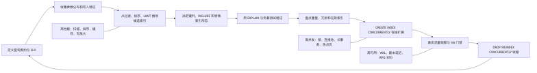
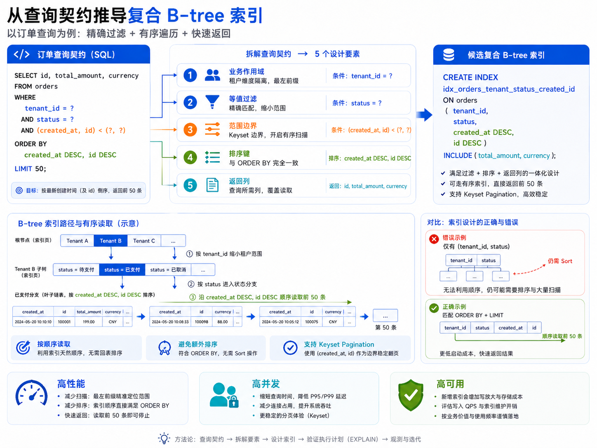
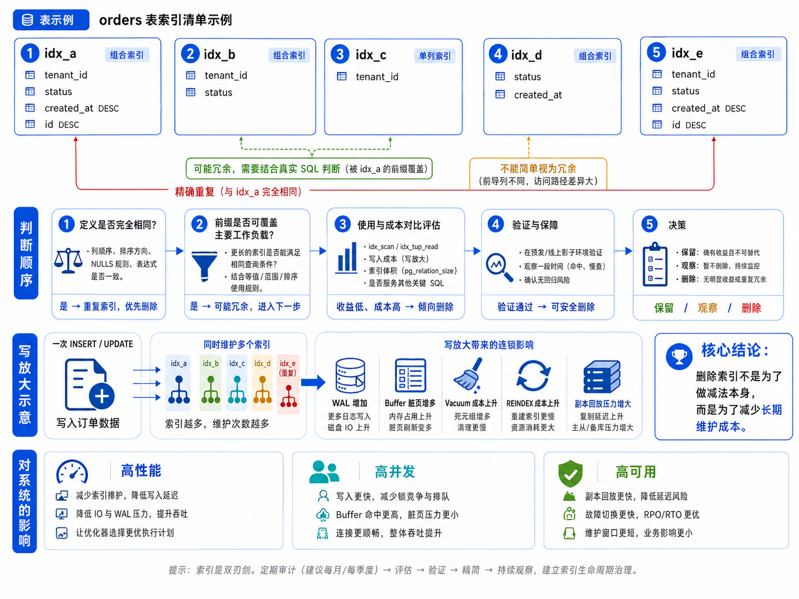
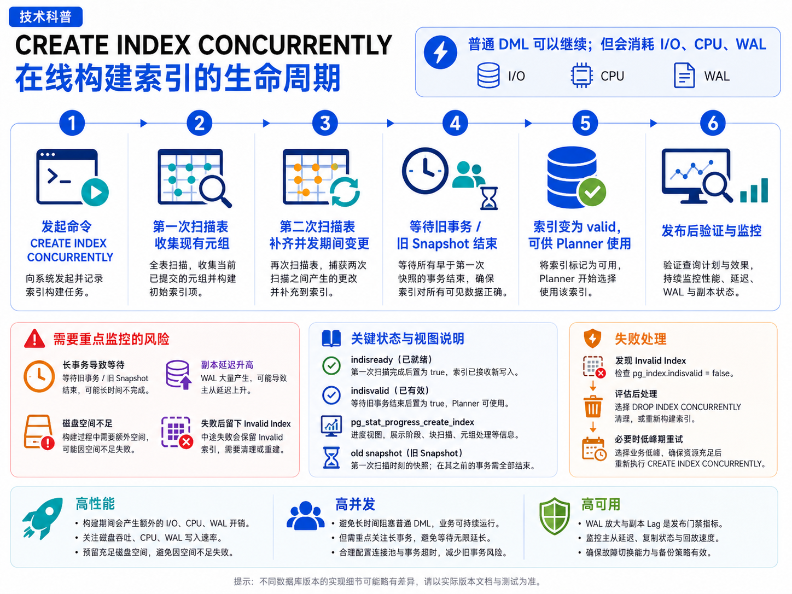

# 第 5 章：高级索引设计、冗余分析与在线索引生命周期

> **本章核心命题：索引不是一个孤立的数据结构，而是一份需要被设计、验证、在线发布、持续观察并最终淘汰的查询契约。**
>
> 技术基线：PostgreSQL 18；涉及 PostgreSQL 14—18 的差异时会单独标注。Go 示例使用 `github.com/jackc/pgx/v5` 与 `pgxpool`。

## 1. 本章主线：用一个订单查询串起索引的完整生命周期

假设一个多租户订单系统运行了两年，`orders` 表已经很大。最常见的接口是“查询某租户、某状态下最新的 50 条订单”。随着数据增长，接口 P99 开始升高，于是团队提出一个看似简单的问题：

> 应该建什么索引？

但生产环境真正需要回答的是一组连续问题：

1. 这条查询为什么慢，瓶颈是扫描、排序、Heap Fetch，还是估算错误？
2. 候选索引为什么采用这个字段顺序，而不是另一个顺序？
3. 为了降低读延迟，新增索引会增加多少写放大、WAL、缓存占用和 Vacuum 成本？
4. 现有索引中是否已经存在重复或可替代项？
5. 大表上如何在线创建，如何识别长事务、旧 Snapshot 和 Invalid Index？
6. 新索引建成后，怎样证明它在真实流量中有效？
7. 旧索引何时可以删除，删除后如何回退？
8. 这一切对高性能、高并发和高可用分别意味着什么？

因此，本章不再按“多列索引、部分索引、表达式索引、在线建索引”逐个罗列知识点，而是沿着一条工程主线展开：




### 1.1 贯穿全章的三个观察维度

每一步都用同样的三维问题检查，而不是到章末再孤立讨论：

| 维度 | 核心问题 | 典型指标 |
|---|---|---|
| 高性能 | 读路径减少了多少工作，写路径增加了多少工作？ | P95/P99、`shared hit/read`、Heap Fetches、CPU、临时文件、WAL、索引尺寸 |
| 高并发 | 是否缩短 SQL 与锁持有时间？DDL 是否引入锁等待、连接池排队或热点页竞争？ | active/waiting sessions、`pg_blocking_pids()`、事务年龄、Pool Acquire、TPS、Wait Event |
| 高可用 | 新索引与在线 DDL 会生成多少 WAL，副本能否及时重放，故障切换时目录状态是否完整？ | sent/write/flush/replay LSN、slot retained WAL、磁盘余量、RPO、RTO |

### 1.2 本章结束后应具备的能力

完成本章后，你应当能够：

- 从真实 SQL 的等值条件、范围条件、排序、`LIMIT` 和返回列推导多列 B-tree；
- 区分键列、`INCLUDE`、Covering Index 和真正的 Index Only Scan；
- 判断何时应使用 Partial、Expression、Unique、`NULLS NOT DISTINCT`、`text_pattern_ops` 和外键列索引；
- 解释 Partial Index 的 Predicate 推导边界，以及 Generic Plan 为什么可能让它失效；
- 用执行计划、缓存、写负载和副本指标共同证明索引收益；
- 区分精确重复、可能冗余、低价值、未使用和 Invalid Index；
- 安全执行 `CREATE INDEX CONCURRENTLY`、`REINDEX CONCURRENTLY` 和 `DROP INDEX CONCURRENTLY`；
- 把索引变更纳入高性能、高并发和高可用的统一决策。

### 1.3 术语地图：先知道它们位于生命周期的哪一段

| 生命周期阶段 | 关键术语 | 要解决的问题 |
|---|---|---|
| 设计 | Key column、`INCLUDE`、Partial Index、Expression Index、Collation、opclass | 索引保存什么、按什么顺序导航、适用于哪些 SQL |
| 验证 | Selectivity、Index Scan、Bitmap Scan、Index Only Scan、Visibility Map、Generic/Custom Plan | Planner 能否使用，Executor 是否真的减少工作 |
| 发布 | Concurrent Build、旧 Snapshot、`indisvalid`、`indisready`、`pg_stat_progress_create_index` | 如何在不中断普通 DML 的前提下完成构建 |
| 治理 | Duplicate、Redundant、`idx_scan`、写放大、WAL 放大 | 索引是否仍值得长期维护 |
| 恢复 | REINDEX、Invalid Index、物理/逻辑复制、RPO/RTO | 失败、损坏、切换后如何恢复一致状态 |

---

## 2. 第一步：先固定查询契约，不要先讨论索引字段

### 2.1 贯穿案例的数据模型

```sql
CREATE TABLE orders (
    id           bigint GENERATED ALWAYS AS IDENTITY PRIMARY KEY,
    tenant_id    bigint        NOT NULL,
    status       text          NOT NULL,
    created_at   timestamptz   NOT NULL DEFAULT clock_timestamp(),
    total_amount numeric(18,2) NOT NULL,
    currency     char(3)       NOT NULL,
    customer_id  bigint        NOT NULL,
    external_key text,
    archived_at  timestamptz,
    note         text
);
```

核心接口使用 Keyset Pagination：

```sql
SELECT id, status, created_at, total_amount, currency
FROM orders
WHERE tenant_id = $1
  AND status = $2
  AND (created_at, id) < ($3, $4)
ORDER BY created_at DESC, id DESC
LIMIT $5;
```

这里已经包含了索引设计所需的五类信息：

- **作用域**：`tenant_id = $1`；
- **等值过滤**：`status = $2`；
- **范围边界**：`(created_at, id) < (...)`；
- **有序读取**：`ORDER BY created_at DESC, id DESC`；
- **投影列**：`total_amount`、`currency` 只返回，不参与过滤。

索引设计的第一条纪律是：**一个 SQL 指纹对应一份明确的查询契约。** 下列三种接口不能混为一个查询形态：

```text
A. status 必填：tenant_id + status + 时间游标
B. 固定只查 pending：tenant_id + status='pending' + 时间游标
C. status 可选：tenant_id + 可选 status + 时间游标
```

特别是 C，不应写成下面这种“万能 SQL”，然后期待一个计划稳定服务所有参数分布：

```sql
WHERE tenant_id = $1
  AND ($2 IS NULL OR status = $2)
```

`status IS NULL` 与 `status = 'paid'` 的选择性和最优访问路径可能完全不同。正确做法通常是拆成两个 SQL 指纹，再分别设计和验证索引。

### 2.2 在建索引前必须补齐的工作负载证据

仅有 SQL 文本还不够。还要收集：

| 证据 | 为什么影响索引设计 |
|---|---|
| SQL 调用频率和 P95/P99 | 决定收益是否值得长期维护成本 |
| 参数分布 | 决定选择性、热点租户和计划稳定性 |
| 每个租户的数据量偏斜 | 决定 `tenant_id` 前缀能否有效隔离扫描，也影响热点页 |
| `status` 分布与状态迁移频率 | 决定普通索引、Partial Index 和写放大之间的权衡 |
| `created_at` 是否不可变 | 决定 Keyset Pagination 是否稳定，也影响更新索引成本 |
| 返回列宽度与更新频率 | 决定是否适合放入 `INCLUDE` |
| INSERT/UPDATE/DELETE 比例 | 决定额外索引对写路径的影响 |
| 现有索引定义、尺寸和依赖 | 避免重复建设，判断是否能替换旧索引 |
| 主库与副本的 I/O、WAL、Lag 余量 | 决定在线构建是否安全 |

这一步的输出不是索引，而是一张“索引设计输入表”：

```text
SQL 指纹 + 参数分布 + 数据分布 + 写入频率 + 现有索引 + SLO + HA 余量
```

### 2.3 先记录基线，再讨论优化

候选索引创建前先保存基线计划：

```sql
EXPLAIN (
    ANALYZE,
    BUFFERS,
    WAL,
    SETTINGS,
    VERBOSE,
    SUMMARY
)
SELECT id, status, created_at, total_amount, currency
FROM orders
WHERE tenant_id = 42
  AND status = 'paid'
ORDER BY created_at DESC, id DESC
LIMIT 50;
```

至少记录：

- 估算行数与实际行数；
- 是否发生 `Sort`，是否写临时文件；
- 为返回 50 行实际扫描了多少行；
- `shared hit/read`；
- `Heap Fetches`；
- 冷缓存和热缓存差异；
- 同一时段的写 TPS、WAL、CPU、连接池等待和副本 Lag。

> **三维检查**
>
> - 高性能：慢在扫描、排序、随机 Heap 访问还是错误估算？
> - 高并发：慢查询是否长期占用连接，是否延长行锁或事务时间？
> - 高可用：当前 WAL 与副本已经接近上限时，即使读查询很慢，也不能贸然在大表上构建索引。

---

## 3. 第二步：把查询翻译成 B-tree 的访问路径

### 3.1 先理解连续扫描边界

多列 B-tree 的有效访问边界，通常由以下部分组成：

```text
前导等值列 + 第一个非等值/范围列
```

对于订单查询：

```text
tenant_id = ?
status = ?
(created_at, id) < (?, ?)
ORDER BY created_at DESC, id DESC
LIMIT 50
```

可以逐步推导：

1. `tenant_id` 是所有查询都携带的业务作用域，先把扫描限制在单租户键空间；
2. `status` 是该 SQL 指纹中稳定存在的等值条件，放在时间范围之前；
3. `created_at` 同时承担范围过滤和排序；
4. `id` 是排序的唯一 tie-breaker，使结果形成严格全序，并与复合游标完全匹配。

因此第一版候选键为：

```sql
(tenant_id, status, created_at DESC, id DESC)
```

### 3.2 为什么不是“选择性最高的列永远放最前”

“按单列选择性从高到低排序”忽略了三个事实：

1. 索引要服务的是**完整 SQL**，不是独立列；
2. `ORDER BY ... LIMIT` 关心启动成本，能够按正确顺序读取前 50 行，往往比先过滤后排序更重要；
3. 字段顺序还决定其他 SQL 能否复用前缀、是否跨租户扫描，以及索引尺寸和写入局部性。

若一条查询同时包含 `tenant_id = ?` 与 `status = ?`，两个等值列谁先，对这条查询的扫描区间未必差异很大；真正的决策来自整个工作负载：

- 是否存在只按 `tenant_id` 查询的接口；
- 是否所有访问都必须先隔离租户；
- `status` 是否可选；
- 各租户规模是否严重偏斜；
- 是否需要复用索引顺序完成排序；
- 较短前缀是否更有缓存价值。

[PG18] B-tree Skip Scan 扩大了“缺少部分前导条件”时的可用场景，但它通常通过多次定位完成，不能把它当作忽略字段顺序的理由。

### 3.3 `ORDER BY + LIMIT` 是设计的一部分，不是查询末尾的装饰

假设只有索引：

```sql
(tenant_id, status)
```

它能缩小候选行，却仍可能需要读取大量订单，再执行：

```text
Sort(created_at DESC, id DESC) → LIMIT 50
```

而包含排序后缀的索引可以从正确的游标位置开始，按索引顺序读取少量条目后停止。对于列表接口，P99 经常由“为了返回 50 行做了多少前置工作”决定。

只使用 `created_at` 作为游标也不安全。多个订单可能具有相同时间戳，如果分页条件只有：

```sql
created_at < $cursor_time
```

边界处可能漏行；若使用 `<=`，又可能重复。`(created_at, id)` 形成严格全序：

```sql
AND (created_at, id) < ($cursor_created_at, $cursor_id)
ORDER BY created_at DESC, id DESC
```

### 3.4 得到第一版候选索引

```sql
CREATE INDEX CONCURRENTLY idx_orders_tenant_status_created_id
ON orders (tenant_id, status, created_at DESC, id DESC);
```

这里先只放导航键。下一步才决定返回列是否值得存入索引。



> **三维检查**
>
> - 高性能：候选索引同时减少扫描和排序，尤其降低 `LIMIT` 的启动成本。
> - 高并发：单次查询更快释放连接和快照，但新增索引会让每次写入多维护一个 B-tree；顺序写还可能集中到右侧或某个租户/状态键空间。
> - 高可用：索引一旦进入写路径，后续每次 DML 都会产生额外 WAL；物理副本也必须重放这些变更。

---

## 4. 第三步：区分导航键与返回载荷

### 4.1 `INCLUDE` 解决的是“返回列”，不是“搜索条件”

订单查询还返回：

```text
total_amount, currency
```

它们不参与 `WHERE`、`ORDER BY` 或唯一性，可以考虑作为非键列：

```sql
CREATE INDEX CONCURRENTLY idx_orders_tenant_status_created_id
ON orders (tenant_id, status, created_at DESC, id DESC)
INCLUDE (total_amount, currency);
```

索引可以抽象为：

```text
B-tree upper pages:
    tenant_id, status, created_at, id
        ↓ 只有键列参与导航和排序

B-tree leaf tuple:
    key columns + total_amount + currency + heap TID
        ↓ INCLUDE 只作为叶子载荷

Heap page:
    最终可见性仍由 Heap / Visibility Map 决定
```

因此：

- `INCLUDE` 列不能用于 Index Cond；
- `INCLUDE` 列不参与唯一性；
- `INCLUDE` 只是让查询所需列“可以从索引取得”，不保证永远不访问 Heap。

### 4.2 Covering Index 不等于 Heap-free

当查询所需列都在索引中时，Planner 才有机会选择 Index Only Scan。但 Executor 能否跳过 Heap，还取决于对应 Heap Page 的 Visibility Map 是否为 all-visible。

高频更新会清除 all-visible 位，因此可能出现：

```text
Index Only Scan
Heap Fetches: 很高
```

这并不矛盾：数据列从索引读取，但可见性仍需回 Heap 检查。Vacuum 后 all-visible 状态可能恢复，Heap Fetches 才下降。

### 4.3 `INCLUDE` 的读收益会转换成写成本

把列放入 `INCLUDE` 会带来：

- 更宽的叶子元组和更大的索引；
- 更低的缓存驻留率；
- 更新被包含列时必须维护索引；
- 相关 UPDATE 通常失去 HOT 机会；
- B-tree deduplication 无法用于带 `INCLUDE` 的索引；
- 物理副本需要重放更多索引 WAL。

因此不能把所有 `SELECT` 列都塞进 `INCLUDE`。优先覆盖以下列：

```text
窄 + 稳定 + 高频读取 + 能显著减少 Heap 访问
```

大 `text/jsonb`、高频变更状态、频繁更新的展示字段通常不适合盲目覆盖。

### 4.4 在订单场景中做取舍

若 `total_amount` 和 `currency` 创建后基本不变，且列表接口调用非常频繁，覆盖它们可能有价值。若金额会被频繁调整，或者订单表页面长期不 all-visible，则较窄索引可能更合理：

```sql
-- 读路径更强，但索引更宽
(tenant_id, status, created_at DESC, id DESC)
INCLUDE (total_amount, currency)

-- 写路径和缓存更友好，但需要回 Heap 取金额与币种
(tenant_id, status, created_at DESC, id DESC)
```

这不是语法选择，而是读放大与写放大的交换。


> **三维检查**
>
> - 高性能：观察 Heap Fetches 和缓存命中，不能只看计划节点名称。
> - 高并发：更新 INCLUDE 列会增加索引写入、页竞争和事务时长。
> - 高可用：更宽索引意味着更大的基础备份、更多 WAL 和更长的恢复/重放时间。

---

## 5. 第四步：只有业务语义变化时，索引形态才分叉

前面的复合索引服务“任意状态”的订单列表。Partial、Expression、Unique、opclass 等并不是并列的技巧清单，而是当业务契约发生特定变化时才出现的分支。

### 5.1 分支一：查询永远只访问固定小子集——Partial Index

若另一个接口固定只查待处理订单：

```sql
SELECT id, status, created_at, total_amount, currency
FROM orders
WHERE tenant_id = $1
  AND status = 'pending'
  AND (created_at, id) < ($2, $3)
ORDER BY created_at DESC, id DESC
LIMIT $4;
```

可以建立更小的索引：

```sql
CREATE INDEX CONCURRENTLY idx_orders_pending_tenant_created_id
ON orders (tenant_id, created_at DESC, id DESC)
INCLUDE (total_amount, currency)
WHERE status = 'pending';
```

Partial Index 的本质是一个语义承诺：

```text
索引中只存在满足 Predicate 的行
```

Planner 必须在**计划期**证明查询条件蕴含索引 Predicate，才能安全使用它。固定字面量 `status = 'pending'` 可以稳定匹配；任意参数 `$2` 则可能无法证明：

```sql
-- Generic Plan 只知道 status = $2，不能保证任意值都是 pending
WHERE tenant_id = $1 AND status = $2
```

Custom Plan 可能看到本次参数值并使用 Partial Index，但应用的自动计划缓存可能转为 Generic Plan。生产设计不能把“某一次 Custom Plan 命中”当成稳定契约。

更可靠的方式是：

- 固定业务状态使用固定 SQL 文本；
- 任意状态查询使用完整索引；
- 不同查询形态拆分 SQL；
- 不要为每个租户、每个枚举值创建大量 Partial Index，把索引当成伪分区系统。

### 5.2 分支二：查询依赖规范化表达式——Expression Index

例如用户登录按大小写无关邮箱查找：

```sql
SELECT id
FROM users
WHERE tenant_id = $1
  AND lower(email) = lower($2);
```

可以建立：

```sql
CREATE UNIQUE INDEX users_tenant_lower_email_uidx
ON users (tenant_id, lower(email));
```

表达式索引保存的是计算结果，因此函数必须能跨时间稳定代表同一输入：

| 易变性 | 含义 | 能否用于索引定义 |
|---|---|---|
| `VOLATILE` | 同一语句内每次调用都可能不同，也可能读取或修改数据库状态 | 不能 |
| `STABLE` | 同一语句中对相同参数稳定，但跨语句可能变化 | 不能作为永久索引表达式承诺 |
| `IMMUTABLE` | 结果只由参数决定，跨时间和数据库状态保持一致 | 可以 |

不要为了让 DDL 通过而把依赖时区、配置、当前时间或表数据的函数谎报为 `IMMUTABLE`。错误标注会让索引中的旧值与当前表达式语义分离，造成漏行或错误结果。

### 5.3 分支三：业务要求并发安全的唯一性——Unique Index

若每个租户的 `external_key` 必须唯一，数据库唯一索引比“先查再插”可靠：

```sql
CREATE UNIQUE INDEX orders_tenant_external_key_uidx
ON orders (tenant_id, external_key);
```

应用侧的：

```text
SELECT 不存在 → INSERT
```

在并发下存在竞态；Unique Index 在写路径上原子执行冲突检查。

默认唯一索引允许多个 NULL。[PG15+] 若业务语义要求“每个租户最多一个 NULL”，可使用：

```sql
CREATE UNIQUE INDEX orders_tenant_external_key_uidx
ON orders (tenant_id, external_key) NULLS NOT DISTINCT;
```

若语义是“非 NULL 值必须唯一，但 NULL 可出现多次”，更适合：

```sql
CREATE UNIQUE INDEX orders_tenant_external_key_uidx
ON orders (tenant_id, external_key)
WHERE external_key IS NOT NULL;
```

唯一索引的首要价值可能是**一致性**，因此不能因为 `idx_scan` 很低就把它判断为无用索引。

### 5.4 分支四：文本前缀匹配取决于 Collation 与 opclass

对于：

```sql
WHERE username LIKE 'abc%'
```

普通文本 B-tree 是否可用于前缀范围定位，取决于 Collation 和操作符类。非 `C` locale 下，语言排序顺序未必与逐字节前缀范围一致，可建立：

```sql
CREATE INDEX users_username_pattern_idx
ON users (username text_pattern_ops);
```

需要区分：

- `LIKE 'abc%'`：有固定左前缀，可能由 B-tree 支持；
- `LIKE '%abc%'`：没有固定左前缀，普通 B-tree 无法直接定位；
- `ILIKE`：大小写不敏感语义不同，可能需要表达式索引或专用索引；
- 默认 opclass 与 `text_pattern_ops`：一个服务语言排序，一个服务逐字符模式匹配，不能简单互换。

Collation 版本变化还可能让旧索引顺序与新规则不一致，需要按升级流程检查和重建。

### 5.5 分支五：父表变更必须快速定位子表引用——外键列索引

被引用端主键或唯一键已有索引，但 PostgreSQL 不会自动为引用端外键列建索引：

```sql
CREATE TABLE order_items (
    id       bigint GENERATED ALWAYS AS IDENTITY PRIMARY KEY,
    order_id bigint NOT NULL REFERENCES orders(id),
    sku      text NOT NULL
);

CREATE INDEX CONCURRENTLY idx_order_items_order_id
ON order_items(order_id);
```

父表删除或更新键值时，数据库需要查找子表引用行。大子表没有 `order_id` 索引，会把一次父行操作放大为子表扫描，并延长锁持有时间。它同时影响：

- 性能：避免大范围扫描；
- 并发：缩短父子表锁与事务时间；
- 高可用：减少事故时堆积的长事务，但仍增加日常写 WAL。

### 5.6 低选择性列不是“一律不建索引”

单独为高占比布尔列建立全量 B-tree 通常价值有限，但不能机械判死刑。低选择性列仍可能在以下场景有价值：

- 稀有值 Partial Index；
- 与 `tenant_id`、时间组合；
- Bitmap 路径与其他条件合并；
- 支持 `ORDER BY ... LIMIT`；
- 作为唯一性或业务状态约束的一部分。

判断依据始终是完整查询和真实分布，而不是列类型或 NDV 的孤立结论。

### 5.7 特殊索引形态的统一决策表

| 业务契约变化 | 候选方案 | 主要收益 | 主要风险 |
|---|---|---|---|
| 永远只查固定小子集 | Partial Index | 索引更小、缓存效率高、写入条目少 | Predicate 推导、Generic Plan 失配、索引数量膨胀 |
| 查询按规范化表达式过滤 | Expression Index | 避免运行时全表计算，可实现表达式唯一 | 写入计算、易变性误标、统计与语义复杂 |
| 并发写必须满足唯一不变量 | Unique Index / `NULLS NOT DISTINCT` | 数据库原子保证一致性 | 冲突等待、在线唯一构建失败状态复杂 |
| 非 `C` locale 的前缀匹配 | `text_pattern_ops` | 支持前缀范围定位 | 可能还需默认 opclass 索引，增加写放大 |
| 父表删除/更新需检查大子表 | 外键引用列索引 | 缩短子表查找和锁持有 | 额外空间、WAL 和写维护 |

> **三维检查**
>
> 特殊索引不是“更高级的优化”，而是用额外结构换取特定语义或访问路径。每创建一个分支索引，都要重新计算读收益、写成本、并发冲突和 HA 负担。


---

## 6. 第五步：用证据证明候选索引，而不是只看是否出现 `Index Scan`

### 6.1 正确的验证顺序

验证应遵循：

```text
基线计划
→ 创建候选索引
→ 更新必要统计
→ 相同参数与缓存条件复测
→ 写负载 A/B
→ 并发压测
→ 副本与 WAL 观察
```

查询计划仍使用：

```sql
EXPLAIN (
    ANALYZE,
    BUFFERS,
    WAL,
    SETTINGS,
    VERBOSE,
    SUMMARY
)
SELECT id, status, created_at, total_amount, currency
FROM orders
WHERE tenant_id = 42
  AND status = 'paid'
  AND (created_at, id) < ('2026-06-01 00:00:00+00', 9000000)
ORDER BY created_at DESC, id DESC
LIMIT 50;
```

### 6.2 从哪里开始读执行计划

不要只找“有没有走索引”。按下面顺序判断：

1. **最早的估算偏差**：从最内层节点向上比较 estimated rows 与 actual rows；
2. **启动成本**：`LIMIT 50` 前实际读取了多少行；
3. **排序**：是否还有 `Sort`，是否溢出到磁盘；
4. **访问量**：`Buffers: shared hit/read` 是否显著下降；
5. **回表成本**：Index Only Scan 的 `Heap Fetches` 是否足够低；
6. **过滤损耗**：`Rows Removed by Filter` 是否仍很大；
7. **稳定性**：不同租户、状态和游标位置是否出现完全不同计划；
8. **写代价**：同吞吐下 CPU、WAL、P95/P99 和 Vacuum 是否恶化。

出现 Seq Scan 不一定是错误。若条件返回表中很大比例的行，随机索引访问可能比顺序扫描更贵。`enable_seqscan=off` 只能用于诊断候选路径，不能作为生产修复。

### 6.3 Partial Index 必须同时测试 Custom Plan 与 Generic Plan

```sql
PREPARE q_pending(bigint, text, timestamptz, bigint, integer) AS
SELECT id, created_at
FROM orders
WHERE tenant_id = $1
  AND status = $2
  AND (created_at, id) < ($3, $4)
ORDER BY created_at DESC, id DESC
LIMIT $5;

SET plan_cache_mode = force_generic_plan;
EXPLAIN (ANALYZE, BUFFERS, SETTINGS)
EXECUTE q_pending(42, 'pending', now(), 999999999, 50);

SET plan_cache_mode = force_custom_plan;
EXPLAIN (ANALYZE, BUFFERS, SETTINGS)
EXECUTE q_pending(42, 'pending', now(), 999999999, 50);

RESET plan_cache_mode;
DEALLOCATE q_pending;
```

若 Custom Plan 能用 Partial Index，而 Generic Plan 不能，说明问题不是“索引失效”，而是查询契约与计划缓存机制不稳定匹配。应改 SQL 形态或索引方案，不应简单强制全局 Custom Plan。

### 6.4 读性能与写性能必须放在同一场测试中

一个索引可能让列表查询从 200 ms 降到 5 ms，却让写请求的 P99、WAL 和 Vacuum 成本明显上升。验证至少包含：

| 观察对象 | 读路径 | 写路径 |
|---|---|---|
| 延迟 | 查询 P50/P95/P99、启动时间 | INSERT/UPDATE/DELETE P50/P95/P99、Commit 延迟 |
| CPU | 比较、过滤、排序 | 索引插入、表达式计算、页面分裂、WAL 编码 |
| I/O | shared read、Heap Fetches、临时文件 | 脏页、Checkpoint、索引页写入 |
| 内存/缓存 | 索引是否驻留热点页 | 新索引是否挤出其他热点数据 |
| WAL | 读通常接近零 | WAL records/bytes/FPI、构建 WAL 峰值 |
| Vacuum | 读取间接受益 | 索引数量、Dead Tuple 清理、HOT 比例 |
| 副本 | 查询可转移到副本 | replay 吞吐、Lag、slot retained WAL |

### 6.5 建立可执行的验收门槛

示例门槛不是固定数值，而是一个结构：

```text
高性能：
- 目标 SQL P99 达标；
- 不再发生高成本 Sort；
- Buffers 和 Heap Fetches 符合预期；
- 写 TPS 与写 P99 未超过预算。

高并发：
- 目标并发下连接池 Acquire P99 未恶化；
- 锁等待和长事务没有显著增加；
- 热点租户/状态下没有出现新的页竞争瓶颈。

高可用：
- WAL 峰值未超过主库与归档预算；
- 所有候选故障切换副本 Lag 在阈值内；
- 复制槽与 pg_wal 磁盘余量安全；
- 构建失败和切换场景已演练。
```

只有三组门槛同时通过，候选索引才具备发布资格。

---

## 7. 第六步：先盘点现有索引，再决定新增还是替换

索引设计不应从空白表开始。生产表可能已经存在主键、唯一索引、历史临时索引、重复索引和失败后留下的 Invalid Index。新增之前必须回答：

```text
当前能力是否已经存在？
候选索引能否替代旧索引？
新旧共存会增加多少写放大？
```

### 7.1 盘点定义、尺寸和状态

```sql
SELECT
    ns.nspname AS schema_name,
    tbl.relname AS table_name,
    idx.relname AS index_name,
    am.amname AS access_method,
    i.indisunique,
    i.indisprimary,
    i.indisvalid,
    i.indisready,
    i.indislive,
    i.indnkeyatts,
    i.indnatts,
    pg_size_pretty(pg_relation_size(i.indexrelid)) AS index_size,
    pg_get_indexdef(i.indexrelid) AS definition,
    pg_get_expr(i.indpred, i.indrelid) AS predicate,
    pg_get_expr(i.indexprs, i.indrelid) AS expressions
FROM pg_index AS i
JOIN pg_class AS idx ON idx.oid = i.indexrelid
JOIN pg_class AS tbl ON tbl.oid = i.indrelid
JOIN pg_namespace AS ns ON ns.oid = tbl.relnamespace
JOIN pg_am AS am ON am.oid = idx.relam
WHERE ns.nspname NOT IN ('pg_catalog', 'information_schema')
ORDER BY pg_relation_size(i.indexrelid) DESC;
```

状态需要分开理解：

- `indisvalid=false`：Planner 不能用它查询；
- `indisready=true`：写路径仍会维护它；
- `indislive=false`：生命周期已进入不应被新事务使用的阶段。

所以“Invalid”不等于“没有成本”。

### 7.2 精确重复与功能重叠不是同一个概念

下面的查询寻找定义语义高度一致的索引：

```sql
WITH idx AS (
    SELECT
        i.indexrelid,
        i.indrelid,
        c.relname AS index_name,
        am.amname,
        i.indisunique,
        i.indnullsnotdistinct,
        i.indnkeyatts,
        i.indkey,
        i.indclass,
        i.indcollation,
        i.indoption,
        pg_get_expr(i.indexprs, i.indrelid) AS expressions,
        pg_get_expr(i.indpred, i.indrelid) AS predicate
    FROM pg_index AS i
    JOIN pg_class AS c ON c.oid = i.indexrelid
    JOIN pg_am AS am ON am.oid = c.relam
    WHERE i.indisvalid
)
SELECT
    a.indrelid::regclass AS table_name,
    a.indexrelid::regclass AS index_a,
    b.indexrelid::regclass AS index_b
FROM idx AS a
JOIN idx AS b
  ON a.indrelid = b.indrelid
 AND a.indexrelid < b.indexrelid
 AND ROW(
        a.amname, a.indisunique, a.indnullsnotdistinct,
        a.indnkeyatts, a.indkey, a.indclass, a.indcollation,
        a.indoption, a.expressions, a.predicate
     ) IS NOT DISTINCT FROM ROW(
        b.amname, b.indisunique, b.indnullsnotdistinct,
        b.indnkeyatts, b.indkey, b.indclass, b.indcollation,
        b.indoption, b.expressions, b.predicate
     );
```

可以把索引候选分成五类：

| 分类 | 含义 | 处理方式 |
|---|---|---|
| 精确重复 | 方法、键、顺序、opclass、Collation、Predicate、`INCLUDE`、唯一语义等一致 | 检查约束与依赖后，通常保留一个 |
| 可能冗余 | 功能可能被另一个索引覆盖，但尺寸、排序或高频点查价值不同 | 用真实工作负载证明替代能力 |
| 低价值 | 收益小于长期写、缓存和运维成本 | 进入观察和淘汰流程 |
| 暂时未使用 | 统计窗口内没有扫描，但可能服务低频任务或其他节点 | 不能仅凭计数删除 |
| Invalid | Planner 不可用，部分状态仍被 DML 维护 | 立即诊断失败原因并修复或清理 |

### 7.3 为什么 `(a)` 不是天然被 `(a,b)` 淘汰

较短索引可能：

- 尺寸更小，更容易驻留缓存；
- 为高频 `a = ?` 点查提供更低读放大；
- 具有不同的唯一性、Predicate、Collation、opclass 或排序方向；
- 被某个约束拥有；
- 在副本或低频任务上承担关键查询。

因此“左前缀相同”只能生成调查候选，不能直接生成删除命令。

### 7.4 `idx_scan` 是线索，不是裁决

[PG16+] 可查看最近扫描时间：

```sql
SELECT
    schemaname,
    relname,
    indexrelname,
    idx_scan,
    last_idx_scan,
    idx_tup_read,
    idx_tup_fetch,
    pg_size_pretty(pg_relation_size(indexrelid)) AS index_size
FROM pg_stat_user_indexes
ORDER BY pg_relation_size(indexrelid) DESC;
```

PostgreSQL 14、15 没有 `last_idx_scan`。任何版本都不能看到 `idx_scan=0` 就立即删除，因为：

- 统计可能刚被重置；
- 月末、季度或故障切换任务尚未运行；
- 索引可能主要承担唯一性；
- 查询可能只在某个只读副本或逻辑订阅端执行；
- 一次 SQL 中可能发生多次索引搜索，计数不等于业务调用次数；
- `idx_scan>0` 也不说明收益足够大。

### 7.5 为每个索引建立“资产卡”

长期治理至少记录：

```text
索引定义
→ 服务的 SQL 指纹
→ 业务所有者
→ 创建原因与工单
→ 尺寸和增长速度
→ 读收益证据
→ 写/WAL 成本
→ 约束与依赖
→ 主库/副本使用情况
→ 回建脚本
→ 可淘汰条件
```



这样“新增索引”和“删除索引”才是同一个生命周期的两端，而不是两类互不相关的运维动作。

> **三维检查**
>
> 删除冗余索引通常同时改善写性能、并发写入和副本重放，但误删低频关键索引也可能在月末或故障切换时放大事故。因此淘汰需要完整业务周期与回建能力。

---

## 8. 第七步：用 Expand–Validate–Contract 在线发布和淘汰

设计与验证完成后，索引仍未产生业务价值。真正进入生产需要一个可回退的生命周期：

```text
Expand：在线创建新索引
Validate：验证目录状态、计划、真实流量与 HA 指标
Contract：在线删除旧索引或重建异常索引
```

### 8.1 Expand 前的前置检查

执行 DDL 前确认：

- 索引定义与目标 SQL 已固定；
- 没有同名但定义不同的对象；
- 没有同表的另一个 Concurrent Build；
- 长事务、`idle in transaction`、旧 Snapshot 在可控范围；
- 数据盘能容纳新索引、临时文件以及失败残留；
- `pg_wal`、归档、复制槽和副本磁盘有余量；
- 已设置单飞迁移、取消条件和失败恢复脚本；
- 命令不在显式事务块中。

### 8.2 普通构建与 Concurrent Build 的状态差异

普通 `CREATE INDEX`：

```text
获取阻塞普通写入的锁
→ 扫描 Heap
→ 排序/构建索引
→ 提交
→ 释放锁
```

读查询通常可继续，但 INSERT/UPDATE/DELETE 会排队。等待中的写请求占用连接，可能进一步耗尽连接池并拖垮无关接口。

`CREATE INDEX CONCURRENTLY`：

```text
事务 1：登记目录对象，索引初始为 INVALID
  ↓ commit
等待可能修改表的旧事务
  ↓
事务 2：第一次 Heap 扫描，建立初始索引
  ↓ commit；新写入开始维护该索引
等待第二次扫描前的相关写事务
  ↓
事务 3：第二次扫描，补齐并验证并发变化
  ↓
等待早于验证阶段的旧 Snapshot 结束
  ↓
标记 VALID → commit
```

它避免阻塞普通 DML，却付出两次扫描、多个事务、额外等待和更多资源竞争。



### 8.3 监控构建阶段

```sql
SELECT
    p.pid,
    p.datname,
    p.relid::regclass AS table_name,
    p.index_relid::regclass AS index_name,
    p.command,
    p.phase,
    p.lockers_total,
    p.lockers_done,
    p.current_locker_pid,
    p.blocks_total,
    p.blocks_done,
    p.tuples_total,
    p.tuples_done,
    a.wait_event_type,
    a.wait_event,
    clock_timestamp() - a.query_start AS elapsed
FROM pg_stat_progress_create_index AS p
JOIN pg_stat_activity AS a USING (pid);
```

阶段与排查方向：

| phase | 正在发生什么 | 优先检查 |
|---|---|---|
| `waiting for writers before build` | 第一次扫描前等待旧写事务 | `xact_start`、同表写事务、维护操作 |
| `building index` | 扫描、排序、构建索引页 | CPU、I/O、临时文件、`maintenance_work_mem` |
| `waiting for writers before validation` | 验证前等待相关写事务 | 长事务和 blocker |
| `index validation: ...` | 扫描索引/排序 Tuple/扫描表 | block/tuple 进度、I/O、WAL |
| `waiting for old snapshots` | 等待早于验证阶段的 Snapshot | `backend_xmin`、长只读事务、`idle in transaction` |

### 8.4 找 blocker 时看事务，不只看当前 SQL

```sql
SELECT
    a.pid AS waiting_pid,
    a.query AS waiting_query,
    b.pid AS blocking_pid,
    b.usename AS blocking_user,
    b.state AS blocking_state,
    b.xact_start AS blocking_xact_start,
    b.backend_xmin,
    b.query AS blocking_query
FROM pg_stat_activity AS a
CROSS JOIN LATERAL unnest(pg_blocking_pids(a.pid)) AS x(blocking_pid)
JOIN pg_stat_activity AS b ON b.pid = x.blocking_pid
WHERE cardinality(pg_blocking_pids(a.pid)) > 0;
```

`waiting for old snapshots` 不一定存在传统锁 blocker。一个 `REPEATABLE READ` 只读事务，即使当前处于 `idle in transaction`，仍可能持有旧 Snapshot。诊断重点是：

```text
xact_start + backend_xmin + 事务隔离级别 + 应用所有者
```

而不是只看 `query_start`。

### 8.5 失败后的 Invalid Index 必须进入显式恢复流程

Concurrent Build 失败后检查：

```sql
SELECT
    indexrelid::regclass AS index_name,
    indisunique,
    indisvalid,
    indisready,
    indislive
FROM pg_index
WHERE indexrelid = 'public.idx_orders_tenant_status_created_id'::regclass;
```

失败原因可能包括：

- 唯一冲突；
- 死锁或超时；
- 表达式求值错误；
- 函数或 Collation 问题；
- 资源耗尽或连接中断。

尤其是 Unique Concurrent Build：从某个阶段开始，无效唯一索引仍可能对并发写实施唯一性检查。此时“Planner 不能使用”与“写路径不维护”是两件事。

恢复原则：

1. 停止迁移器盲目重试；
2. 保留错误、目录状态和重复数据证据；
3. 修复数据或索引语义根因；
4. 根据状态执行 `DROP INDEX CONCURRENTLY` 后重建，或评估 `REINDEX INDEX CONCURRENTLY`；
5. 再次验证 `indisvalid=true` 和关键计划。

### 8.6 Validate：建成不等于完成

新索引变为 valid 后，仍需验证：

- 目标 SQL 是否真正选择新索引；
- 不同租户、状态和分页位置的计划是否稳定；
- P95/P99、Buffers、Heap Fetches 是否达标；
- 写 TPS、HOT 比例、WAL、Vacuum 是否在预算内；
- 连接池等待、锁等待和热点页是否恶化；
- 所有候选副本是否及时重放；
- `pg_wal`、归档、复制槽和磁盘是否安全。

建议保留新旧索引共同存在一段完整业务观察期。此阶段的额外写成本是为了换取回退能力。

### 8.7 Contract：确认替代后再删除或重建

删除普通非约束索引：

```sql
DROP INDEX CONCURRENTLY public.idx_orders_old;
```

它减少对普通读写的阻塞，但仍有约束：

- 不能放入显式事务块；
- 一次命令只删除一个索引；
- 不能与 `CASCADE` 一起使用；
- 不能直接删除支撑主键、Unique/Exclusion Constraint 的索引；
- 不能直接用于分区父索引；
- 仍可能等待旧事务释放索引引用。

索引损坏、严重膨胀、Collation 变化或存储参数调整时，可评估：

```sql
REINDEX INDEX CONCURRENTLY public.idx_orders_tenant_status_created_id;
```

Concurrent Reindex 会在一段时间内同时保留旧、新索引，因此需要额外空间、WAL、I/O 和副本 replay 能力。

### 8.8 在线发布的硬停止条件

发布前就应写清退出阈值，例如：

```text
高性能停止条件：
- 主库 CPU/I/O 超过预算；
- 写请求 P99 或 Checkpoint 压力持续越线。

高并发停止条件：
- 连接池 Acquire 或等待会话快速增长；
- 出现不可接受的锁队列或长事务；
- 迁移器发生多实例重试风暴。

高可用停止条件：
- 任一候选故障切换副本 LSN Lag 超阈值；
- slot retained WAL 或 pg_wal 逼近磁盘安全线；
- 归档/网络/replay 吞吐明显跟不上 WAL 生成。
```

“CONCURRENTLY”只说明普通 DML 不被强锁阻塞，不代表操作低成本、无等待或无 HA 风险。

---

## 9. 用三维视角复盘同一个索引决策

前面已经把三个维度嵌入每一步。这里不再重复知识点，而是把同一个订单索引从三个视角完整走一遍，形成最终决策模型。

### 9.1 高性能：读路径收益必须覆盖完整写路径成本

目标索引：

```sql
(tenant_id, status, created_at DESC, id DESC)
INCLUDE (total_amount, currency)
```

读路径可能减少：

```text
跨租户扫描
→ 状态过滤后的无效读取
→ Sort 与临时文件
→ 深分页扫描
→ 部分 Heap Fetches
```

写路径则增加：

```text
INSERT
→ 新索引条目
→ Buffer 变脏
→ WAL
→ Checkpoint/后台写出
→ 副本 replay

UPDATE total_amount/currency
→ INCLUDE 数据变化
→ 维护索引
→ HOT 机会下降
→ all-visible 位被清除
→ 后续 Heap Fetches 上升
```

因此高性能不是“读查询更快”这一项，而是：

```text
查询总收益 - 写放大 - 缓存挤出 - Vacuum/Checkpoint 成本
```

### 9.2 高并发：索引既能缩短临界区，也会制造新的竞争点

收益：

- 查询更快释放连接和 Snapshot；
- 外键查找和条件更新更快，缩短锁持有时间；
- Keyset Pagination 避免深 OFFSET 长时间占用资源。

风险：

- 每次写入要维护更多索引；
- 顺序增长键可能集中到 B-tree 右侧叶页；
- 单一大租户或单一状态可能形成热点键空间；
- 普通 `CREATE INDEX` 会让写请求排队并耗尽连接池；
- Concurrent Build 会受长事务、旧 Snapshot 和同表维护影响；
- 无限 DDL 重试会形成锁与负载风暴。

应用层也必须配合：`pgxpool.MaxConns` 只限制数据库连接，不限制上游 goroutine。应使用有界并发、请求超时、Backpressure 和 Pool Acquire 监控。

### 9.3 高可用：索引不会改变理论架构，却会改变实际 RTO/RPO 风险

物理复制会重放索引构建和后续维护产生的 WAL。风险链条是：

```text
大索引构建/重建
→ WAL 激增
→ 跨地域网络或副本存储跟不上
→ replay_lsn 落后
→ 复制槽保留 WAL
→ 主库 pg_wal 磁盘增长
→ 候选切换副本过旧
→ 实际 RTO/RPO 恶化
```

逻辑复制通常不传播普通 DDL。Publisher 新建索引后，Subscriber 不会自动拥有同一索引；分析库应按自身查询工作负载独立设计。

主库在 Concurrent Build 中间阶段故障时，已提交的 Invalid Index 可能出现在提升后的物理副本。因此故障切换后要检查：

```text
pg_index 状态
+ 未完成迁移记录
+ 关键查询计划
+ Collation/约束有效性
+ 副本追赶情况
```

### 9.4 生命周期三维矩阵

| 生命周期阶段 | 高性能 | 高并发 | 高可用 |
|---|---|---|---|
| 设计 | 减少扫描、排序、Heap Fetches；控制索引宽度 | 避免热点与过多写维护 | 估算长期 WAL、备份和恢复体积 |
| 验证 | 对比 P99、Buffers、HOT、WAL | 压测连接池、锁和高并发写 | 观察所有副本 replay 与 slot |
| Expand | 扫描、排序、临时文件、缓存污染 | Concurrent 仍受长事务和资源竞争影响 | 构建 WAL、归档、Lag、磁盘双份占用 |
| Validate | 确认真实计划和收益 | 观察队列、热点页、事务时间 | 确认副本追平、切换候选健康 |
| Contract | 删除冗余可降低写/Vacuum成本 | 缩短写路径，减少竞争 | 降低 WAL、备份体积和恢复时间 |
| 故障恢复 | 修复 Invalid/膨胀/损坏 | 避免重试风暴和阻塞队列 | 核验新主库目录状态与 RPO/RTO |

到这里，所有知识点已经被串成同一个闭环：

```text
查询契约
→ 访问路径
→ 索引形态
→ 证据验证
→ 现有资产盘点
→ 在线扩展
→ 三维观察
→ 在线收缩
```

## 10. 贯穿案例落地：Go + pgx 订单列表接口

前九节已经完成了“查询契约 → 索引设计 → 在线生命周期”的推导。本节不再引入新规则，而是把这些规则固化到应用接口：SQL 形态必须稳定，游标必须与索引顺序一致，应用并发也必须与数据库连接预算一致。

### 10.1 再次从接口契约反推索引

接口契约：

```text
租户：tenant_id 必填
状态：status 必填
排序：created_at DESC, id DESC
分页：Keyset Pagination
返回：id, status, created_at, total_amount, currency
```

逐步推导：

1. **访问边界**：`tenant_id = $1` 必须最先缩小到单租户键空间。
2. **等值条件**：`status = $2` 在此 SQL 指纹中总存在，应位于范围/排序列之前。
3. **游标与排序**：下一页条件必须是 `(created_at, id) < ($3, $4)`；两列顺序、方向必须和 `ORDER BY` 一致。
4. **稳定性**：仅用 `created_at` 会在同时间戳下漏行或重复；`id` 提供严格全序。
5. **覆盖列**：金额和币种只返回，可考虑 `INCLUDE`；它们若高频更新，则应重新评估写成本和 Heap Fetches。
6. **查询形态分裂**：若 `status` 可选，另写无状态 SQL，并评估 `(tenant_id, created_at DESC, id DESC) INCLUDE (status,...)`。不要写 `($2 IS NULL OR status=$2)` 期待一个计划稳定覆盖两种分布。
7. **Partial 变体**：仅当接口固定 `status='pending'` 时，才使用固定 Predicate 的 Partial Index，并在 SQL 中保留字面量。

最终候选：

```sql
CREATE INDEX CONCURRENTLY idx_orders_tenant_status_created_id
ON orders (tenant_id, status, created_at DESC, id DESC)
INCLUDE (total_amount, currency);
```

该定义仍需与现有索引做重复/冗余检查，并经过真实参数分布的 `EXPLAIN` 和写负载 A/B 测试。

### 10.2 可编译示例

```go
package main

import (
	"context"
	"encoding/base64"
	"encoding/json"
	"errors"
	"fmt"
	"log"
	"os"
	"os/signal"
	"strconv"
	"strings"
	"syscall"
	"time"

	"github.com/jackc/pgx/v5"
	"github.com/jackc/pgx/v5/pgconn"
	"github.com/jackc/pgx/v5/pgxpool"
)

const (
	firstPageSQL = `
SELECT id, status, created_at, total_amount::text, currency
FROM orders
WHERE tenant_id = $1
  AND status = $2
ORDER BY created_at DESC, id DESC
LIMIT $3`

	nextPageSQL = `
SELECT id, status, created_at, total_amount::text, currency
FROM orders
WHERE tenant_id = $1
  AND status = $2
  AND (created_at, id) < ($3, $4)
ORDER BY created_at DESC, id DESC
LIMIT $5`
)

type Order struct {
	ID          int64     `json:"id"`
	Status      string    `json:"status"`
	CreatedAt   time.Time `json:"created_at"`
	TotalAmount string    `json:"total_amount"`
	Currency    string    `json:"currency"`
}

type Cursor struct {
	CreatedAt time.Time `json:"created_at"`
	ID        int64     `json:"id"`
}

type Page struct {
	Orders     []Order `json:"orders"`
	NextCursor string  `json:"next_cursor,omitempty"`
}

// Gate 是应用层准入控制；连接池上限并不等于请求队列上限。
type Gate chan struct{}

func NewGate(maxConcurrent int) (Gate, error) {
	if maxConcurrent <= 0 {
		return nil, fmt.Errorf("maxConcurrent must be positive")
	}
	return make(Gate, maxConcurrent), nil
}

func (g Gate) Acquire(ctx context.Context) error {
	select {
	case g <- struct{}{}:
		return nil
	case <-ctx.Done():
		return ctx.Err()
	}
}

func (g Gate) Release() { <-g }

func encodeCursor(c Cursor) (string, error) {
	raw, err := json.Marshal(c)
	if err != nil {
		return "", fmt.Errorf("marshal cursor: %w", err)
	}
	return base64.RawURLEncoding.EncodeToString(raw), nil
}

func decodeCursor(s string) (*Cursor, error) {
	if s == "" {
		return nil, nil
	}
	raw, err := base64.RawURLEncoding.DecodeString(s)
	if err != nil {
		return nil, fmt.Errorf("decode cursor: %w", err)
	}
	var c Cursor
	if err := json.Unmarshal(raw, &c); err != nil {
		return nil, fmt.Errorf("unmarshal cursor: %w", err)
	}
	if c.ID <= 0 || c.CreatedAt.IsZero() {
		return nil, fmt.Errorf("invalid cursor fields")
	}
	return &c, nil
}

func validateStatus(status string) error {
	switch status {
	case "pending", "paid", "shipped", "cancelled":
		return nil
	default:
		return fmt.Errorf("unsupported status %q", status)
	}
}

func normalizeLimit(limit int) int32 {
	const defaultLimit = 50
	const maxLimit = 100
	if limit <= 0 {
		return defaultLimit
	}
	if limit > maxLimit {
		return maxLimit
	}
	return int32(limit)
}

func scanOrders(rows pgx.Rows) ([]Order, error) {
	defer rows.Close()

	orders := make([]Order, 0, 64)
	for rows.Next() {
		var o Order
		if err := rows.Scan(
			&o.ID,
			&o.Status,
			&o.CreatedAt,
			&o.TotalAmount,
			&o.Currency,
		); err != nil {
			return nil, fmt.Errorf("scan order: %w", err)
		}
		o.Currency = strings.TrimSpace(o.Currency)
		orders = append(orders, o)
	}
	if err := rows.Err(); err != nil {
		return nil, fmt.Errorf("iterate orders: %w", err)
	}
	return orders, nil
}

func ListOrders(
	ctx context.Context,
	pool *pgxpool.Pool,
	gate Gate,
	tenantID int64,
	status string,
	encodedCursor string,
	requestedLimit int,
) (Page, error) {
	if tenantID <= 0 {
		return Page{}, fmt.Errorf("tenantID must be positive")
	}
	if err := validateStatus(status); err != nil {
		return Page{}, err
	}

	cursor, err := decodeCursor(encodedCursor)
	if err != nil {
		return Page{}, err
	}

	if err := gate.Acquire(ctx); err != nil {
		return Page{}, fmt.Errorf("admission control: %w", err)
	}
	defer gate.Release()

	limit := normalizeLimit(requestedLimit)
	fetchLimit := limit + 1 // 多取一行判断是否有下一页。

	var rows pgx.Rows
	if cursor == nil {
		rows, err = pool.Query(ctx, firstPageSQL, tenantID, status, fetchLimit)
	} else {
		rows, err = pool.Query(
			ctx,
			nextPageSQL,
			tenantID,
			status,
			cursor.CreatedAt,
			cursor.ID,
			fetchLimit,
		)
	}
	if err != nil {
		return Page{}, fmt.Errorf("query orders: %w", err)
	}

	orders, err := scanOrders(rows)
	if err != nil {
		return Page{}, err
	}

	page := Page{Orders: orders}
	if len(orders) > int(limit) {
		page.Orders = orders[:limit]
		last := page.Orders[len(page.Orders)-1]
		page.NextCursor, err = encodeCursor(Cursor{
			CreatedAt: last.CreatedAt,
			ID:        last.ID,
		})
		if err != nil {
			return Page{}, err
		}
	}
	return page, nil
}

func optionalPositiveEnvInt(name string) (int, error) {
	raw := os.Getenv(name)
	if raw == "" {
		return 0, nil
	}
	value, err := strconv.Atoi(raw)
	if err != nil || value <= 0 {
		return 0, fmt.Errorf("%s must be a positive integer", name)
	}
	return value, nil
}

func classifyDBError(err error) string {
	if err == nil {
		return "ok"
	}
	if errors.Is(err, context.DeadlineExceeded) {
		return "deadline_exceeded"
	}
	if errors.Is(err, context.Canceled) {
		return "canceled"
	}

	var pgErr *pgconn.PgError
	if errors.As(err, &pgErr) {
		switch pgErr.Code { // SQLSTATE，不依赖错误文本。
		case "57014":
			return "query_canceled"
		case "40001":
			return "serialization_failure"
		case "40P01":
			return "deadlock_detected"
		default:
			return "postgres_" + pgErr.Code
		}
	}
	return "other"
}

func run(ctx context.Context) error {
	databaseURL := os.Getenv("DATABASE_URL")
	if databaseURL == "" {
		return fmt.Errorf("DATABASE_URL is required")
	}

	cfg, err := pgxpool.ParseConfig(databaseURL)
	if err != nil {
		return fmt.Errorf("parse DATABASE_URL: %w", err)
	}
	// 可通过 DATABASE_URL 的 pool_* 参数或 DB_MAX_CONNS 设置池容量。
	// 生产值必须由数据库总连接预算、应用实例数、查询时长和 SLO 推导。
	maxConns, err := optionalPositiveEnvInt("DB_MAX_CONNS")
	if err != nil {
		return err
	}
	if maxConns > 0 {
		cfg.MaxConns = int32(maxConns)
	}

	pool, err := pgxpool.NewWithConfig(ctx, cfg)
	if err != nil {
		return fmt.Errorf("create pool: %w", err)
	}
	defer pool.Close()

	pingCtx, cancelPing := context.WithTimeout(ctx, 3*time.Second)
	defer cancelPing()
	if err := pool.Ping(pingCtx); err != nil {
		return fmt.Errorf("ping database: %w", err)
	}

	gateLimit := int(cfg.MaxConns)
	configuredGateLimit, err := optionalPositiveEnvInt("DB_QUERY_CONCURRENCY")
	if err != nil {
		return err
	}
	if configuredGateLimit > 0 {
		gateLimit = configuredGateLimit
	}
	gate, err := NewGate(gateLimit)
	if err != nil {
		return err
	}

	queryCtx, cancelQuery := context.WithTimeout(ctx, 2*time.Second)
	defer cancelQuery()

	page, err := ListOrders(queryCtx, pool, gate, 42, "paid", "", 50)
	if err != nil {
		return fmt.Errorf("list orders (%s): %w", classifyDBError(err), err)
	}

	log.Printf("orders=%d next_cursor=%t", len(page.Orders), page.NextCursor != "")
	return nil
}

func main() {
	ctx, stop := signal.NotifyContext(
		context.Background(),
		syscall.SIGINT,
		syscall.SIGTERM,
	)
	defer stop()

	if err := run(ctx); err != nil {
		log.Fatal(err)
	}
}
```

### 10.3 正确性与生产注意事项

- 游标使用数据库返回的 `time.Time` 和 `id`，避免客户端重建精度。
- 排序键应稳定；若允许修改 `created_at`，行可能跨分页边界移动，导致重复或遗漏。生产中通常把创建时间设计为不可变。
- 新插入且排序位置在游标之前的订单不会出现在后续页，这是 Keyset Pagination 的快照语义之一；需要跨页完全一致视图时，应引入“截至时间/版本”边界，而不是持有长事务。
- Base64 仅编码，不防篡改。外部 API 应使用 HMAC/AEAD 签名并包含版本号、租户和过滤条件，防止游标被跨查询复用。
- `DB_MAX_CONNS` 与 `DB_QUERY_CONCURRENCY` 必须按数据库连接预算、实例数、查询时长和 SLO 设置；所有实例的池上限之和还要为运维、复制和后台任务保留余量。
- pgx 返回的 `Rows` 必须关闭并检查 `rows.Err()`；Pool 只有在 Rows 关闭后才能回收相应连接。

## 11. 实验：用可复现现象验证关键结论

下面三个实验依次验证本章主线中的三个最容易被误解的环节：**设计阶段的 Predicate 推导、验证阶段的 Heap Fetches 与写放大、发布阶段的旧 Snapshot 与 Invalid Index**。

> 所有实验只应在独立实验库执行。数据量可按设备资源缩放，但必须记录版本、配置、数据量、平均行宽、缓存状态、并发、测试时长、CPU、I/O、Wait Event 和计划。不要把示例中的行数或耗时当作生产结论。

### 11.1 实验一：Partial Index 的 Predicate 推导与参数计划

#### 1. 实验目标

比较能够、不能够在计划期推出 Partial Index Predicate 的查询，并观察 Custom Plan 与 Generic Plan 的差异。

#### 2. 版本与扩展

PostgreSQL 14—18；无需扩展。

#### 3. 建表和准备数据

**Session A：**

```sql
DROP TABLE IF EXISTS lab_orders_partial;
CREATE TABLE lab_orders_partial (
    id           bigint GENERATED ALWAYS AS IDENTITY PRIMARY KEY,
    tenant_id    bigint NOT NULL,
    total_amount numeric(12,2) NOT NULL,
    created_at   timestamptz NOT NULL,
    payload      text NOT NULL
);

INSERT INTO lab_orders_partial (tenant_id, total_amount, created_at, payload)
SELECT
    1 + (g % 100),
    CASE WHEN g % 100 < 5 THEN 5000 + (g % 1000) ELSE g % 900 END,
    clock_timestamp() - (g || ' seconds')::interval,
    repeat('x', 80)
FROM generate_series(1, 500000) AS g;

ANALYZE lab_orders_partial;

CREATE INDEX lab_orders_high_value_idx
ON lab_orders_partial (tenant_id, created_at DESC, id DESC)
WHERE total_amount >= 1000;

ANALYZE lab_orders_partial;
```

#### 4. Session B：可推出与不可推出

```sql
-- 可推出：5000 >= 1000
EXPLAIN (ANALYZE, BUFFERS, SETTINGS, VERBOSE, SUMMARY)
SELECT id, created_at
FROM lab_orders_partial
WHERE tenant_id = 42
  AND total_amount >= 5000
ORDER BY created_at DESC, id DESC
LIMIT 20;

-- 精确匹配 Predicate
EXPLAIN (ANALYZE, BUFFERS, SETTINGS, VERBOSE, SUMMARY)
SELECT id, created_at
FROM lab_orders_partial
WHERE tenant_id = 42
  AND total_amount >= 1000
ORDER BY created_at DESC, id DESC
LIMIT 20;

-- 不能推出：范围包含 1000 以下的行
EXPLAIN (ANALYZE, BUFFERS, SETTINGS, VERBOSE, SUMMARY)
SELECT id, created_at
FROM lab_orders_partial
WHERE tenant_id = 42
  AND total_amount >= 500
ORDER BY created_at DESC, id DESC
LIMIT 20;
```

#### 5. Session B：Generic 与 Custom Plan

```sql
PREPARE q_high_value(bigint, numeric, integer) AS
SELECT id, created_at
FROM lab_orders_partial
WHERE tenant_id = $1
  AND total_amount >= $2
ORDER BY created_at DESC, id DESC
LIMIT $3;

SET plan_cache_mode = force_generic_plan;
EXPLAIN (ANALYZE, BUFFERS, SETTINGS, VERBOSE, SUMMARY)
EXECUTE q_high_value(42, 5000, 20);

SET plan_cache_mode = force_custom_plan;
EXPLAIN (ANALYZE, BUFFERS, SETTINGS, VERBOSE, SUMMARY)
EXECUTE q_high_value(42, 5000, 20);

RESET plan_cache_mode;
DEALLOCATE q_high_value;
```

#### 6. 时间线、等待、失败和提交

1. Session A 创建表、数据和索引；每条 DDL/DML 在 autocommit 下提交。
2. Session B 依次执行三个字面量查询，无锁等待。
3. Session B 强制 Generic Plan；Planner 只看到 `$2`，不能保证它总是 `>=1000`。
4. 强制 Custom Plan 后，Planner 能看到本次值 `5000`，可能使用 Partial Index。
5. 本实验预期没有 SQL 失败；若计划不同，先检查统计、数据分布、缓存和成本，不要用 `enable_seqscan=off` 伪造结论。

#### 7. 预期结果与诊断

可推出的字面量查询通常出现 `Index Scan` 或 `Bitmap` 路径并引用 `lab_orders_high_value_idx`；`>=500` 不能使用该索引，因为索引缺少合法结果的一部分。Generic Plan 通常不能依赖该 Partial Index；Custom Plan 可能可以。

诊断准备语句计划：

```sql
SELECT name, statement, generic_plans, custom_plans
FROM pg_prepared_statements;
```

生产解释：pgx 默认可能使用语句缓存与扩展协议，不能把测试中的首次 Custom Plan 当成永久行为。对固定状态接口使用固定 Predicate 文本；对任意阈值参数使用完整索引或拆分 SQL。

#### 8. 清理与安全警告

```sql
DROP TABLE lab_orders_partial;
```

不要在生产为了观察计划切换全局修改 `plan_cache_mode`。不要把大量 Partial Index 用作按租户伪分区。

### 11.2 实验二：Expression Index + INCLUDE 的 Heap Fetches 与写入成本

#### 1. 实验目标

验证表达式索引如何支持大小写无关查询；比较 Vacuum 前后 Index Only Scan 的 Heap Fetches；观察 `INCLUDE` 列更新对 HOT、索引尺寸与 WAL 的影响。

#### 2. 版本与扩展

PostgreSQL 14—18；无需扩展。`EXPLAIN ... WAL` 在这些版本可用。

#### 3. 建表和数据

**Session A：**

```sql
DROP TABLE IF EXISTS lab_users_expr;
CREATE TABLE lab_users_expr (
    id           bigint GENERATED ALWAYS AS IDENTITY PRIMARY KEY,
    tenant_id    bigint NOT NULL,
    email        text NOT NULL,
    display_name text NOT NULL,
    bio          text NOT NULL,
    updated_at   timestamptz NOT NULL DEFAULT clock_timestamp()
) WITH (fillfactor = 80);

INSERT INTO lab_users_expr (tenant_id, email, display_name, bio)
SELECT
    1 + (g % 100),
    'User' || g || '@Example.COM',
    'user-' || g,
    repeat('b', 120)
FROM generate_series(1, 300000) AS g;

CREATE INDEX lab_users_tenant_lower_email_cover_idx
ON lab_users_expr (tenant_id, lower(email))
INCLUDE (id, display_name);

ANALYZE lab_users_expr;
```

记录基线：

```sql
SELECT
    pg_size_pretty(pg_relation_size('lab_users_expr')) AS heap_size,
    pg_size_pretty(pg_relation_size('lab_users_tenant_lower_email_cover_idx')) AS index_size;

SELECT wal_records, wal_fpi, wal_bytes FROM pg_stat_wal;

SELECT n_tup_upd, n_tup_hot_upd
FROM pg_stat_user_tables
WHERE relname = 'lab_users_expr';
```

#### 4. Session B：Index Only Scan 与 Visibility Map

```sql
EXPLAIN (ANALYZE, BUFFERS, WAL, SETTINGS, VERBOSE, SUMMARY)
SELECT id, display_name
FROM lab_users_expr
WHERE tenant_id = 42
  AND lower(email) = lower('User100041@Example.COM');
```

**Session A：**执行：

```sql
VACUUM (ANALYZE) lab_users_expr;
```

**Session B：**重复同一 `EXPLAIN`，比较 `Heap Fetches`。随后更新被 `INCLUDE` 的列：

```sql
UPDATE lab_users_expr
SET display_name = display_name || '-v2',
    updated_at = clock_timestamp()
WHERE tenant_id = 42;

EXPLAIN (ANALYZE, BUFFERS, WAL, SETTINGS, VERBOSE, SUMMARY)
SELECT id, display_name
FROM lab_users_expr
WHERE tenant_id = 42
  AND lower(email) = lower('User100041@Example.COM');
```

再执行 `VACUUM (ANALYZE)` 并重复查询。

#### 5. Session C：观察统计差值

```sql
SELECT
    n_tup_upd,
    n_tup_hot_upd,
    CASE WHEN n_tup_upd = 0 THEN NULL
         ELSE round(100.0 * n_tup_hot_upd / n_tup_upd, 2)
    END AS hot_pct
FROM pg_stat_user_tables
WHERE relname = 'lab_users_expr';

SELECT wal_records, wal_fpi, wal_bytes FROM pg_stat_wal;

SELECT
    pg_size_pretty(pg_relation_size('lab_users_tenant_lower_email_cover_idx')) AS index_size,
    idx_scan,
    idx_tup_read,
    idx_tup_fetch
FROM pg_stat_user_indexes
WHERE indexrelname = 'lab_users_tenant_lower_email_cover_idx';
```

#### 6. 时间线、等待、失败和提交

1. Session A 完成装载、建索引并提交。
2. Session B 第一次查询可能有 Heap Fetches，因为近期写入页面未必 all-visible。
3. Session A Vacuum 提交页面可见性状态；第二次查询通常有更少 Heap Fetches。
4. Session B 更新 `display_name`；因为该列存放在索引中，新版本需要索引维护，相关页面的 all-visible 位也会被清除。
5. 再次 Vacuum 后，Index Only Scan 跳过 Heap 的能力可能恢复。
6. 无预期阻塞和失败；统计视图更新可能有短暂延迟，且集群级 `pg_stat_wal` 包含其他 Session 的 WAL。

#### 7. 结果解释

- `lower(email)` 是搜索键，表达式在写入时计算并存入索引。
- `id, display_name` 使查询列在索引中，但不是 Heap-free 的保证。
- 更新 `display_name` 会维护 INCLUDE 数据；同一 UPDATE 还修改 `updated_at`，但真正阻止 HOT 的关键是有索引存储的列发生变化。
- 观察写成本时需做 A/B 表或同一工作负载前后对照，记录 TPS、P95/P99、WAL 字节、CPU 和 I/O，不能由一次 UPDATE 的耗时下结论。

#### 8. 清理与警告

```sql
DROP TABLE lab_users_expr;
```

`VACUUM` 会真实修改可见性与统计状态。不要在生产为追求零 Heap Fetches 高频手工 Vacuum；应解决长事务、autovacuum 配置、更新频率和索引设计。

### 11.3 实验三：长事务、Concurrent Build 等待与 Invalid Index

#### 1. 实验目标

复现 `waiting for old snapshots`，并通过 Unique Concurrent Build 失败观察 Invalid Index。实验分为 A、B 两部分。

#### 2. 版本与扩展

PostgreSQL 14—18；无需扩展。建议至少准备 100 万行，使构建阶段足够观察；资源较小可缩减。

#### 3. 准备数据

**Session A：**

```sql
DROP TABLE IF EXISTS lab_cic_orders;
CREATE TABLE lab_cic_orders (
    id           bigint GENERATED ALWAYS AS IDENTITY PRIMARY KEY,
    tenant_id    bigint NOT NULL,
    external_key text NOT NULL,
    created_at   timestamptz NOT NULL,
    payload      text NOT NULL
);

INSERT INTO lab_cic_orders (tenant_id, external_key, created_at, payload)
SELECT
    1 + (g % 100),
    'key-' || g,
    clock_timestamp() - (g || ' milliseconds')::interval,
    repeat('x', 150)
FROM generate_series(1, 1000000) AS g;

ANALYZE lab_cic_orders;
```

#### 4. A 部分：旧 Snapshot 阻塞最终验证

**Session A：先持有旧 Snapshot。**

```sql
BEGIN ISOLATION LEVEL REPEATABLE READ;
SELECT count(*) FROM lab_cic_orders WHERE tenant_id = 42;
-- 保持事务不提交
```

**Session B：不要放入事务块。**

```sql
SET statement_timeout = 0;
CREATE INDEX CONCURRENTLY lab_cic_orders_tenant_created_idx
ON lab_cic_orders (tenant_id, created_at DESC, id DESC);
```

**Session C：持续观察。**

```sql
SELECT
    p.pid,
    p.phase,
    p.lockers_total,
    p.lockers_done,
    p.current_locker_pid,
    p.blocks_total,
    p.blocks_done,
    a.wait_event_type,
    a.wait_event,
    a.query
FROM pg_stat_progress_create_index AS p
JOIN pg_stat_activity AS a USING (pid)
WHERE p.relid = 'lab_cic_orders'::regclass;

SELECT pid, state, xact_start, backend_xmin, query
FROM pg_stat_activity
WHERE backend_xmin IS NOT NULL
ORDER BY xact_start;
```

当 Session B 到达 `waiting for old snapshots` 后，Session A 执行：

```sql
COMMIT;
```

Session B 随后完成并提交。

> 构建速度受机器影响。若 B 在 A 建立 Snapshot 前就开始，无法复现；若表太小，也可能很难观察中间扫描，但 A 提前持有的旧 Snapshot 仍应让最终阶段等待。

#### 5. B 部分：唯一冲突留下 Invalid Index

先制造重复：

```sql
INSERT INTO lab_cic_orders (tenant_id, external_key, created_at, payload)
VALUES
    (999, 'duplicate-key', clock_timestamp(), 'a'),
    (999, 'duplicate-key', clock_timestamp(), 'b');
```

**Session B：**

```sql
CREATE UNIQUE INDEX CONCURRENTLY lab_cic_orders_external_uidx
ON lab_cic_orders (tenant_id, external_key);
```

该命令预期因唯一冲突失败。随后诊断：

```sql
SELECT
    indexrelid::regclass AS index_name,
    indisunique,
    indisvalid,
    indisready,
    indislive
FROM pg_index
WHERE indexrelid = 'lab_cic_orders_external_uidx'::regclass;

SELECT pg_get_indexdef('lab_cic_orders_external_uidx'::regclass);
```

#### 6. 明确时间线

```text
T0  A: BEGIN REPEATABLE READ + SELECT，取得并持有 Snapshot
T1  B: CREATE INDEX CONCURRENTLY，目录先登记 Invalid Index
T2  B: 第一次扫描、第二次扫描
T3  B: waiting for old snapshots
T4  C: 发现 A 的 xact_start/backend_xmin
T5  A: COMMIT
T6  B: 标记索引 valid 并提交
T7  插入重复数据
T8  B: CREATE UNIQUE INDEX CONCURRENTLY
T9  B: 唯一冲突失败；Invalid Index 留在目录
```

#### 7. 清理与恢复

修复重复数据前先确认业务语义，实验中可执行：

```sql
DELETE FROM lab_cic_orders
WHERE id = (
    SELECT max(id)
    FROM lab_cic_orders
    WHERE tenant_id = 999 AND external_key = 'duplicate-key'
);

DROP INDEX CONCURRENTLY IF EXISTS lab_cic_orders_external_uidx;

-- 然后可重新执行 CREATE UNIQUE INDEX CONCURRENTLY。
DROP TABLE lab_cic_orders;
```

也可以对某些失败的 Invalid Index 使用 `REINDEX INDEX CONCURRENTLY`，但生产上先查明失败根因、约束语义和磁盘/WAL余量。`CREATE/DROP INDEX CONCURRENTLY` 不能放在显式事务块中。唯一 Concurrent Build 失败后，无效索引可能仍执行唯一性检查；不要拖延清理。

## 12. 生产 Runbook：按生命周期执行，而不是按命令执行

Runbook 的目标不是告诉值班人员“运行哪条 SQL”，而是保证每个索引变更都经过：

```text
识别对象 → 前置检查 → Expand → 过程监控 → Validate → Contract → 失败恢复
```

### 12.1 阶段一：识别对象和业务契约

先确认：

- 目标表、索引名和完整定义；
- 服务的 SQL 指纹、调用频率、参数分布和业务所有者；
- 变更是新增、替换、重建还是删除；
- 是否属于主键、Unique、Exclusion Constraint 或分区索引；
- PostgreSQL 版本、表大小、索引预计大小和是否逻辑复制；
- 命令是否已经部分执行，目录中是否已有同名或 Invalid Index。

不要在连接错误、超时或迁移记录不确定时直接重发 DDL。先以系统目录为准核验实际状态：

```sql
SELECT
    c.oid::regclass AS index_name,
    i.indrelid::regclass AS table_name,
    i.indisvalid,
    i.indisready,
    i.indislive,
    i.indisunique,
    pg_get_indexdef(i.indexrelid) AS definition
FROM pg_index AS i
JOIN pg_class AS c ON c.oid = i.indexrelid
WHERE c.oid = to_regclass('public.idx_orders_tenant_status_created_id');
```

### 12.2 阶段二：前置资源和并发检查

#### 高性能前置项

- 主库 CPU、块设备延迟、队列深度和 I/O 余量；
- `shared_buffers`、OS Page Cache 与临时文件空间；
- `maintenance_work_mem` 是否按并发维护任务总量预算，而不是只按单任务最大化；
- Checkpoint、autovacuum 和批处理是否与构建窗口冲突；
- 新旧索引共存时的数据盘余量。

#### 高并发前置项

查长事务和 `idle in transaction`：

```sql
SELECT
    pid,
    usename,
    application_name,
    state,
    xact_start,
    backend_xmin,
    wait_event_type,
    wait_event,
    left(query, 200) AS query
FROM pg_stat_activity
WHERE xact_start IS NOT NULL
ORDER BY xact_start;
```

确认：

- 同一张表没有另一个 Concurrent Build；
- 迁移器有全局单飞锁；
- 应用不会在 `lock_timeout` 后由所有实例同时立即重试；
- 请求超时、连接池和上游队列有 Backpressure；
- 终止长事务前已联系业务所有者并评估回滚影响。

#### 高可用前置项

```sql
SELECT
    application_name,
    client_addr,
    state,
    sent_lsn,
    write_lsn,
    flush_lsn,
    replay_lsn,
    pg_size_pretty(pg_wal_lsn_diff(pg_current_wal_lsn(), replay_lsn)) AS replay_lag_bytes
FROM pg_stat_replication;

SELECT
    slot_name,
    slot_type,
    active,
    restart_lsn,
    pg_size_pretty(pg_wal_lsn_diff(pg_current_wal_lsn(), restart_lsn)) AS retained_wal
FROM pg_replication_slots;
```

确认：

- 每个故障切换候选副本都健康；
- `pg_wal`、归档和复制槽有足够磁盘余量；
- 跨地域网络与 replay 吞吐能够承受构建 WAL；
- Planned Switchover 不与索引构建中间阶段重叠；
- 逻辑 Subscriber 已有独立的 DDL 发布计划。

### 12.3 阶段三：执行 Expand

普通 `CREATE INDEX` 只适用于明确的维护窗口或可以接受阻塞写入的场景。在线业务大表通常评估：

```sql
CREATE INDEX CONCURRENTLY idx_orders_tenant_status_created_id
ON public.orders (tenant_id, status, created_at DESC, id DESC)
INCLUDE (total_amount, currency);
```

执行约束：

- 不能放入显式事务块；
- 同一张表同时只能有一个 Concurrent Build；
- 不要用 `CREATE INDEX IF NOT EXISTS` 替代定义核验；同名对象可能定义不同；
- `statement_timeout`、`lock_timeout` 和客户端超时必须与恢复流程一起设计；
- 客户端连接中断不代表服务器端命令一定失败，需要重新查询目录与进度。

### 12.4 阶段四：持续监控过程，而不是只等命令返回

观察构建进度：

```sql
SELECT
    p.pid,
    p.relid::regclass AS table_name,
    p.index_relid::regclass AS index_name,
    p.command,
    p.phase,
    p.lockers_total,
    p.lockers_done,
    p.current_locker_pid,
    p.blocks_total,
    p.blocks_done,
    p.tuples_total,
    p.tuples_done,
    a.state,
    a.wait_event_type,
    a.wait_event,
    clock_timestamp() - a.query_start AS elapsed
FROM pg_stat_progress_create_index AS p
JOIN pg_stat_activity AS a USING (pid);
```

同时观察：

- 目标 SQL 和写请求 P95/P99；
- 数据库 CPU、I/O、临时文件和 Checkpoint；
- active/waiting Session、连接池 Acquire 和队列长度；
- WAL bytes/s、归档延迟、slot retained WAL；
- 每个物理副本的 replay Lag；
- 主库、副本和 WAL 磁盘耗尽预测。

进度视图中的 `blocks_done = blocks_total` 只说明当前阶段的相应扫描完成，不代表整个 Concurrent Build 已结束。最终还可能等待 writers 或 old snapshots。

### 12.5 阶段五：定位 blocker 和旧 Snapshot

传统锁 blocker：

```sql
SELECT
    a.pid AS waiting_pid,
    a.wait_event_type,
    a.wait_event,
    left(a.query, 200) AS waiting_query,
    b.pid AS blocking_pid,
    b.state AS blocking_state,
    b.xact_start,
    b.backend_xmin,
    left(b.query, 200) AS blocking_query
FROM pg_stat_activity AS a
CROSS JOIN LATERAL unnest(pg_blocking_pids(a.pid)) AS x(blocking_pid)
JOIN pg_stat_activity AS b ON b.pid = x.blocking_pid
WHERE cardinality(pg_blocking_pids(a.pid)) > 0;
```

若 phase 为 `waiting for old snapshots`，重点查：

```sql
SELECT
    pid,
    usename,
    application_name,
    state,
    xact_start,
    backend_xmin,
    left(query, 200) AS query
FROM pg_stat_activity
WHERE backend_xmin IS NOT NULL
ORDER BY xact_start;
```

处理顺序：

1. 确认事务属于哪个业务和请求；
2. 优先让应用正常提交或回滚；
3. 对 `idle in transaction` 查明连接生命周期缺陷；
4. 只有在明确业务影响后才取消或终止 Backend；
5. 不要通过重启数据库规避单个旧 Snapshot。

### 12.6 阶段六：Validate 新索引

DDL 成功后检查目录：

```sql
SELECT
    indexrelid::regclass AS index_name,
    indisvalid,
    indisready,
    indislive,
    indisunique
FROM pg_index
WHERE indexrelid = 'public.idx_orders_tenant_status_created_id'::regclass;
```

然后验证：

1. 目标 SQL 的 `EXPLAIN (ANALYZE, BUFFERS, WAL, SETTINGS)`；
2. 代表性租户、状态和游标位置；
3. Custom/Generic Plan，尤其 Partial Index；
4. P95/P99、Buffers、Heap Fetches 和 Sort；
5. INSERT/UPDATE/DELETE 的 TPS、P99、HOT 和 WAL；
6. 连接池等待、锁和热点页；
7. 所有副本 replay 是否恢复到基线；
8. 表达式索引建立后是否需要 `ANALYZE` 获取表达式统计。

在完整业务观察期内保留旧索引和回建脚本。不要因为新索引“已 valid”就立即删除旧索引。

### 12.7 阶段七：执行 Contract

删除已证明可替代的普通索引：

```sql
DROP INDEX CONCURRENTLY public.idx_orders_old;
```

删除前必须确认：

- 不是约束拥有的索引；
- 主库、副本、月末任务和故障场景均已覆盖观察；
- 新索引在关键参数上稳定使用；
- 回建脚本与容量预算已准备；
- 当前没有切换、备份恢复或其他大规模维护窗口冲突。

索引损坏、严重膨胀或 Collation 变化时：

```sql
-- 更快但锁更强，通常需要维护窗口
REINDEX INDEX public.idx_orders_tenant_status_created_id;

-- 在线性更好，但会产生双份索引、更多扫描与 WAL
REINDEX INDEX CONCURRENTLY public.idx_orders_tenant_status_created_id;
```

### 12.8 失败恢复决策树

```text
命令报错/连接断开
    ↓
先查目录和进度，不盲目重试
    ↓
索引不存在？
    ├─ 是：确认无部分副作用，再重新执行
    └─ 否：检查 indisvalid / indisready / indislive
             ↓
         valid=true？
             ├─ 是：按 Validate 流程确认是否实际成功
             └─ 否：保留证据，定位唯一冲突/表达式/死锁/资源问题
                       ↓
                 修复根因
                       ↓
                 DROP CONCURRENTLY 后重建
                 或评估 REINDEX CONCURRENTLY
```

### 12.9 常用止损动作

按风险选择，而不是机械执行：

- 停止后续索引构建和迁移器自动重试；
- 对新请求限流，让超时请求快速失败；
- 暂停低优先级批处理、报表和其他维护任务；
- 经业务确认后结束长期事务；
- 若副本 Lag 或 WAL 磁盘越线，优先保护主库和故障切换能力；
- 取消当前 DDL 前评估已生成 WAL、Invalid Index 和回滚后的资源影响；
- 绝不能为了释放空间随意删除 `pg_wal` 或复制槽。

### 12.10 监控与告警

至少覆盖：

- DDL 持续时间和 `phase`；
- `indisvalid=false` 的业务索引；
- 超阈值事务年龄和 `idle in transaction`；
- Relation Lock、BufferPin、I/O 等 Wait Event；
- 连接池 Acquire P95/P99 与队列长度；
- WAL 速率、`pg_wal` 使用量、slot retained WAL 和归档延迟；
- sent/write/flush/replay LSN 字节差；
- 主库和副本磁盘余量；
- 索引尺寸、增长速度和 `idx_scan/last_idx_scan`；
- 关键 SQL 计划变化和 P99 回归。

告警内容应直接包含对象名、PID、phase、blocker、业务所有者和 Runbook 入口。

## 13. 常见错误与反模式：它们分别破坏了生命周期的哪一步

### 13.1 设计阶段：没有从查询契约出发

1. **按“选择性最高列放最前”机械排序**：忽略租户作用域、查询变体、排序和 `LIMIT`。
2. **把所有返回列都放进 `INCLUDE`**：索引膨胀、deduplication 失效、HOT 下降、缓存变差。
3. **让任意参数查询依赖 Partial Index**：Custom Plan 测试成功，Generic Plan 上线后失配。
4. **把函数错误标为 `IMMUTABLE`**：索引值与真实表达式语义漂移，可能返回错误结果。
5. **为 `LIKE '%term%'` 建普通 B-tree 并期待命中**：没有固定左前缀，B-tree 无法直接定位。
6. **为每个租户或枚举值创建 Partial Index**：把索引当成分区系统，目录、Planner 和写路径复杂度失控。

### 13.2 验证阶段：只看“走没走索引”

7. **认为 Covering Index 必然没有 Heap Fetches**：忽略 Visibility Map、Vacuum 和更新频率。
8. **看到 Seq Scan 就判定 Planner 错误**：忽略返回比例、随机 Heap 访问、缓存和成本模型。
9. **只测一次热缓存查询**：没有覆盖冷缓存、参数分布、并发写、P99 和副本 Lag。
10. **用 `enable_seqscan=off` 作为生产修复**：它只能帮助观察候选路径，不能替代统计与索引设计。

### 13.3 发布阶段：把 `CONCURRENTLY` 当成“无风险”

11. **在生产大表直接普通 `CREATE INDEX`**：写请求排队，连接池可能被等待请求耗尽。
12. **同时对同一热点表发多个 Concurrent Build**：锁冲突、资源竞争和重试风暴叠加。
13. **只监控主库完成时间**：忽略 WAL、归档、复制槽、跨地域网络和副本 replay Lag。
14. **Concurrent Build 失败后不处理 Invalid Index**：持续占空间和写成本，唯一索引甚至可能继续约束写入。
15. **用 `IF NOT EXISTS` 代替幂等核验**：同名对象可能存在但定义不符合预期。

### 13.4 治理阶段：把统计线索当成删除结论

16. **为主键或 Unique Constraint 再建同列普通索引**：制造纯写放大和空间浪费。
17. **看到 `idx_scan=0` 就删除**：忽略统计重置、低频任务、约束职责和副本工作负载。
18. **看到左前缀就判定短索引冗余**：忽略尺寸、排序、opclass、Predicate、缓存价值和高频点查。
19. **逻辑复制两端假设 DDL 自动一致**：Subscriber 缺索引，查询或 Apply 性能可能恶化。
20. **新索引 valid 后立即删除旧索引**：没有真实流量观察期，也失去快速回退能力。

## 14. 模拟生产案例：把设计错误沿系统链路追到底

### 14.1 案例一：普通 CREATE INDEX 触发全站连接池耗尽

**系统背景：** 单主双物理副本，订单表 8 亿行，32 个应用实例，每实例连接池上限 30；发布脚本在事务中执行普通 `CREATE INDEX`。

**故障现象：** DDL 开始后订单写入阻塞，连接逐渐被占满；随后读接口也因拿不到连接超时，P99 飙升。数据库 CPU 并未立即打满，团队误判为应用网络问题。

**错误假设：** “CREATE INDEX 只锁 DDL，不会影响已有业务”；“CPU 不高就不是数据库”。

**排查过程：** `pg_stat_activity` 显示大量 INSERT 等待 Relation Lock；`pg_blocking_pids()` 指向 CREATE INDEX Backend；应用 Pool Acquire Duration 与队列同步上升。副本仍可读，但写端不可用。

**根因：** 普通构建持有阻塞写入的锁，等待请求占住所有应用连接，形成级联排队。

**临时止损：** 取消 DDL；暂停自动重试；应用限流并让超时请求快速失败；确认 DDL 回滚后恢复流量。

**最终修复：** 改用 `CREATE INDEX CONCURRENTLY`；上线前扫描长事务、检查磁盘/WAL/副本余量；迁移器使用单飞锁和 phase 监控；先在影子环境回放写负载。

**监控补充：** Relation Lock 等待、Pool Acquire P99、长事务年龄、DDL phase、Invalid Index 和迁移持续时间。

**防止复发：** Schema Linter 禁止大表普通 CREATE/REINDEX；生产 DDL 必须附资源预算、取消条件和恢复步骤。

### 14.2 案例二：Concurrent 重建完成，但副本和 WAL 磁盘接近失守

**系统背景：** 主库承载高写入，两个异步物理副本，其中一个跨地域；复制槽保护副本，待重建索引 600 GB。

**故障现象：** `REINDEX CONCURRENTLY` 在主库正常推进，业务延迟只略升，但跨地域副本 replay 落后数小时，槽保留 WAL 快速增长，主库 `pg_wal` 磁盘接近告警线；故障切换候选副本数据过旧。

**错误假设：** “CONCURRENTLY 不锁写，所以是低风险操作”；“DDL 成功就代表变更成功”。

**排查过程：** `pg_stat_progress_create_index` 显示构建正常；`pg_stat_replication` 显示 sent/write 较快而 replay 明显落后；`pg_replication_slots.restart_lsn` 与当前 LSN 差距扩大；块设备和跨地域网络已饱和。

**根因：** 重建生成的大量 WAL 超过慢副本 replay 能力，复制槽把积压转化为主库磁盘风险；旧、新索引并存又占用额外空间。

**临时止损：** 停止后续重建；降低非关键写流量和批任务；保护 WAL 磁盘；根据 RPO/RTO 决策是否临时移除失效候选副本或重建其基线，不能随意删除槽。

**最终修复：** 将重建拆分到低峰窗口；一次只处理一个大索引；建立 WAL 字节和副本 Lag 的硬停止阈值；提高跨地域 replay/存储能力；重新评估该索引是否应先删除冗余替代项。

**监控补充：** LSN 字节差、slot retained WAL、归档延迟、主副本磁盘预测耗尽时间、重建剩余空间。

**防止复发：** 在线 DDL审批同时评估主库和每个 HA 节点；故障切换演练把“DDL 进行中/刚完成”列为场景。

## 15. 面试题：沿“设计—验证—发布—治理”考察

### 15.1 核心概念题（5 题）

#### 1. 多列 B-tree 的字段顺序应该如何决定？

**30 秒回答：** 从真实 SQL 推导：高频且稳定的作用域/等值条件在前，第一个范围条件随后，再匹配排序和 LIMIT，最后以唯一 tie-breaker 保证稳定顺序；仅返回列考虑 `INCLUDE`。不能机械地按单列选择性排序。

**深入回答：** B-tree 最有效的连续扫描边界通常来自前导等值列和第一个非等值列。后续列可帮助过滤或排序，但未必继续缩小扫描区间。[PG18] Skip Scan 能在成本合适时补救部分缺失前导条件，但会做多次定位，不是放弃设计顺序的理由。优点是一个索引可同时支持过滤与排序；缺点是组合索引更宽、写成本更高。替代方案包括拆分查询形态、多个窄索引配合 Bitmap、Partial Index 或专用索引。生产上必须用调用频率、参数分布、`EXPLAIN` 和写压测验证。

**面试官真正考察：** 是否理解扫描边界、排序、查询变体和成本，而不是背“最左前缀”。

**常见错误回答：** “选择性最高的列永远放第一”“范围条件之后所有列完全无用”。

**追问：** `(tenant_id,status,created_at)` 中，两个等值列谁先？

**追问答案：** 对同时含两者等值的单条查询差异可能不大；应比较其他 SQL 是否只按租户、前缀复用、租户隔离、排序、NDV、索引尺寸和分布。通常全局必带的 `tenant_id` 先，但要用工作负载证明。

#### 2. `INCLUDE` 与普通多列键有什么区别？

**30 秒回答：** 键列参与导航、搜索、排序和唯一性；`INCLUDE` 只存于叶子条目，用于返回数据，不可作为 Index Cond，也不参与唯一判断。它让 Index Only Scan 成为可能，但不保证没有 Heap Fetches。

**深入回答：** `INCLUDE` 可避免把仅投影列加入上层树键，减少导航键复杂性；代价是叶子变宽、缓存和写放大、B-tree deduplication 不启用，而且更新包含列会维护索引并影响 HOT。Visibility Map 非 all-visible 时仍需访问 Heap。替代方案是接受 Heap 访问、使用更窄索引、反规范化只读投影或物化视图。生产上覆盖列应窄、稳定且读取频繁。

**考察点：** 是否把“覆盖”与“Heap-free”区分开。

**常见错误回答：** “INCLUDE 列也能用于 WHERE”“索引覆盖后必然不读表”。

**追问：** 为什么高更新表上 Index Only Scan 仍可能很慢？

**追问答案：** 更新清除相关 Heap Page 的 all-visible 位，Executor 需按 TID 回 Heap 检查可见性；宽索引还可能降低缓存命中。应观察 `Heap Fetches`、Vacuum 和更新频率。

#### 3. Partial Index 为什么可能在参数化查询中失效？

**30 秒回答：** Planner 必须在计划期证明查询条件蕴含索引 Predicate。Generic Plan 只看到 `$1` 等参数，无法保证任意值都满足 Predicate；Custom Plan 可能因看到具体值而使用，但不能依赖自动计划永久保持 Custom。

**深入回答：** Partial Index 适合稳定的小子集，如固定 `status='pending'`。它更小、缓存效率高、写入条目少；缺点是适用 SQL 受 Predicate 证明限制，查询文本轻微改写或计划缓存切换都可能失配。替代方案是完整索引、固定字面量的独立 SQL、分区或重构业务接口。生产上应同时测试 `force_custom_plan` 与 `force_generic_plan`，并监控计划变化。

**考察点：** Planner 时间、Prepared Statement 和运行时参数的边界。

**常见错误回答：** “参数最终会传进去，所以 PostgreSQL 一定能用部分索引”。

**追问：** 能否通过强制 Custom Plan 永久解决？

**追问答案：** 可能解决匹配问题，但增加每次规划 CPU，并非所有查询都受益；更稳妥的是让 SQL 语义与索引 Predicate 固定匹配，或选择完整索引。

#### 4. Expression Index 为什么要求函数 `IMMUTABLE`？

**30 秒回答：** 索引保存的是表达式计算结果。若同一输入随时间、配置或数据库状态变化，索引中的旧值就不再代表当前表达式，查询可能漏行或错误命中，因此索引定义只允许不可变函数和操作符。

**深入回答：** `STABLE` 仅承诺单语句内稳定，适合作为索引比较值；`VOLATILE` 每次调用都可能不同；只有 `IMMUTABLE` 能跨语句固化。表达式索引可加速规范化搜索和实现表达式唯一，代价是写入计算、索引维护和统计复杂性。替代方案包括生成列、显式规范化存储或在应用入口统一转换。生产上绝不能为绕过限制谎报易变性；新索引后要 `ANALYZE`。

**考察点：** 数据正确性，不只是性能。

**常见错误回答：** “IMMUTABLE 代表函数不能写全局变量”“标成 IMMUTABLE 只是优化提示”。

**追问：** `current_timestamp` 是哪类，能否用于索引 Predicate？

**追问答案：** 它是 `STABLE`，不能用于索引定义中需要跨时间永久稳定的表达式/Predicate。应存储明确的截止状态或使用可维护列，而不是 `WHERE expires_at > now()` 的动态 Partial Index。

#### 5. `NULLS NOT DISTINCT` 解决什么问题？

**30 秒回答：** 默认 Unique Index 允许多个 NULL，因为 NULL 彼此视为不同。[PG15+] `NULLS NOT DISTINCT` 把 NULL 当作相同值，从而限制唯一键组合中 NULL 的重复。

**深入回答：** 它把“每个租户某外部键最多一条，即使外部键为空也只能一条”交给数据库原子保证。优点是无竞态；缺点是语义可能与业务“未知值可多条”冲突。替代方案是 Partial Unique Index `WHERE col IS NOT NULL`、`NOT NULL` 约束或不同建模。生产上要先清理历史重复，并使用 Concurrent Unique Build 的特殊失败流程。

**考察点：** SQL NULL 语义与约束设计。

**常见错误回答：** “Unique 默认不允许多个 NULL”。

**追问：** 主键是否需要这个选项？

**追问答案：** 主键列本身是 `NOT NULL`，因此没有多个 NULL 的问题；该选项主要用于允许 NULL 的唯一键。

### 15.2 原理与排障题（6 题）

#### 6. `pg_stat_user_indexes.idx_scan=0`，可以直接删除吗？

**30 秒回答：** 不可以。先确认统计起点、完整业务周期、主库与副本工作负载、约束依赖、低频任务和计划替代路径；`idx_scan` 不是审计日志，也不等于业务调用数。

**深入回答：** `idx_scan=0` 可能因为统计刚重置、月末任务未发生、索引只用于故障场景、只在另一节点使用，或它是唯一/主键约束。反之 `idx_scan>0` 也不证明收益大。[PG18] Skip Scan 等还可能在一次执行中计多次搜索。优点是统计可用于筛选候选；缺点是没有延迟、重要性和写成本归因。替代证据包括 `pg_stat_statements`、查询日志、计划回放、依赖目录和观察性先禁用/重命名方案。生产删除用 `DROP INDEX CONCURRENTLY`，并保留回建脚本。

**考察点：** 数据驱动但不迷信单指标。

**常见错误回答：** “0 就没用，直接删”。

**追问：** 如何证明一个左前缀索引冗余？

**追问答案：** 比较定义语义、尺寸与缓存；找出所有引用计划；在代表性参数和并发下验证更长索引替代；观察完整周期；确认无约束/排序/opclass/Partial 差异，再在线删除并监控回归。

#### 7. `CREATE INDEX CONCURRENTLY` 卡在 `waiting for old snapshots`，怎么排查？

**30 秒回答：** 查 `pg_stat_progress_create_index.phase`，再在 `pg_stat_activity` 找最老 `xact_start`、`backend_xmin`，尤其是 `REPEATABLE READ` 和 `idle in transaction`。确认业务后让事务正常结束，必要时取消或终止，而不是重启构建。

**深入回答：** Concurrent Build 第二次扫描后，必须等待早于该扫描的 Snapshot 结束，防止旧事务使用不兼容的可见性视图。优点是不中断普通 DML；缺点是总时间受最慢事务支配。替代方案是普通构建的维护窗口或先治理长事务。生产上设置事务年龄告警、`idle_in_transaction_session_timeout`（经过业务验证）和 DDL 前置检查。

**考察点：** Snapshot 与 SQL 活动的区别。

**常见错误回答：** “只查锁；没有 blocker 就重启 PostgreSQL”。

**追问：** 一个只读事务也能阻塞吗？

**追问答案：** 能。只要它持有足够旧的 Snapshot，即使没有修改表，也可能延迟最终验证。

#### 8. Concurrent Unique Index 构建失败后为什么写入仍报唯一冲突？

**30 秒回答：** Unique Concurrent Build 在第二次扫描开始时就可能对并发写执行唯一性检查。若之后失败，留下的 Invalid Index 仍可能处于写路径并继续实施唯一性，虽然 Planner 不能用它查询。

**深入回答：** 这是多事务状态机的结果：`indisvalid` 与 `indisready` 是不同状态。优点是构建期间尽早保持唯一性；缺点是失败状态反直觉。替代恢复为修复重复后 `DROP INDEX CONCURRENTLY` 再建，或评估 `REINDEX INDEX CONCURRENTLY`。生产迁移器必须在错误后读取 `pg_index`，不能只看命令返回值。

**考察点：** Invalid 不等于不维护。

**常见错误回答：** “失败 DDL 会自动完全回滚对象”。

**追问：** 如何安全处理？

**追问答案：** 先确认索引定义和重复数据业务语义，停止盲目重试；保留证据；修复数据；在线删除或重建无效索引；验证有效性和关键查询计划。

#### 9. 查询有匹配索引却选择 Seq Scan，应如何分析？

**30 秒回答：** 检查估算行数、数据分布、表/索引尺寸、相关性、缓存与成本、Predicate/opclass/Collation 是否真正匹配，以及查询是否返回大比例行。Seq Scan 可能是正确计划。

**深入回答：** 索引路径需付出树定位、索引读取和随机 Heap Fetch；低选择性、大范围或相关性差时 Seq/Bitmap 更便宜。表达式统计未生成、Generic Plan、隐式类型/Collation 不匹配也会使索引不可用。强制关闭 Seq Scan 只适合诊断，不是修复。替代方案是更新统计、扩展统计、重写查询、Partial/covering index 或接受 Seq Scan。生产上比较真实耗时、Buffers 和稳定性。

**考察点：** Cost Model 与语义可用性。

**常见错误回答：** “有索引就必须用；把 `enable_seqscan=off` 写进配置”。

**追问：** 低选择性布尔列索引一定没用吗？

**追问答案：** 不一定。稀有值 Partial Index、与租户/时间组合、Bitmap 路径或支持排序 LIMIT 都可能有价值；单列全量索引通常价值有限，要按分布验证。

#### 10. `LIKE 'abc%'` 不走文本 B-tree，可能是什么原因？

**30 秒回答：** 检查 Collation 与 opclass。非 `C` locale 下默认语言排序可能不支持按字节前缀范围定位，需要 `text_pattern_ops`；还要确认不是前导 `%`、`ILIKE` 或表达式不匹配。

**深入回答：** B-tree 可把固定前缀转为范围的前提是索引排序语义与模式匹配一致。`text_pattern_ops` 优点是支持非 C locale 的前缀模式；缺点是普通范围排序可能还需默认 opclass 索引。替代方案包括规范化表达式索引、`pg_trgm`（下一专用索引章节）或全文搜索。生产上必须明确大小写、重音和 locale 语义，并关注 Collation 版本升级后的 REINDEX。

**考察点：** Collation、opclass 与模式语义。

**常见错误回答：** “B-tree 只能做等值”“所有 LIKE 都能走索引”。

**追问：** `LIKE '%abc%'` 呢？

**追问答案：** 没有固定左前缀，普通 B-tree 无法直接定位；考虑 trigram、全文搜索或业务前缀字段。

#### 11. 在线索引构建导致副本延迟，如何定位和止损？

**30 秒回答：** 同时看构建 phase、主库 WAL 速率、`sent/write/flush/replay_lsn`、复制槽保留 WAL、主副本磁盘/网络/I/O。停止后续 DDL和非关键负载，按 RPO/RTO决定是否取消当前构建，不能只看主库锁。

**深入回答：** Concurrent Build 避免写锁但不会避免 WAL 与资源负载。延迟可能在发送、远端写盘、刷盘或 replay 阶段。优点是索引最终自动出现在物理副本；缺点是候选切换节点变旧、槽可能填满主库磁盘。替代方案是低峰构建、一次一表、提升副本能力或重新评估索引必要性。生产必须有 LSN 字节差和磁盘耗尽预测的停止阈值。

**考察点：** 将 DDL 纳入 HA 资源模型。

**常见错误回答：** “CONCURRENTLY 对副本无影响”“副本会自己慢慢追，不用管”。

**追问：** 逻辑副本是否自动得到索引？

**追问答案：** 不会。普通 DDL 不通过逻辑复制传播，Subscriber 需独立部署适合其工作负载的索引。

### 15.3 架构设计题（4 题）

#### 12. 设计一个租户订单时间线索引

**30 秒回答：** 对必带 `tenant_id,status`、按 `created_at DESC,id DESC` Keyset 分页的接口，候选是 `(tenant_id,status,created_at DESC,id DESC) INCLUDE (...)`；以 `(created_at,id)<cursor` 翻页，并对无 status 或固定 pending 的查询建立独立设计。

**深入回答：** 先列 SQL 指纹和频率，再验证租户/状态分布、返回列更新频率、现有索引和写吞吐。优点是避免 Sort、低启动成本且稳定分页；缺点是宽索引和写放大，大租户仍可能热点。替代方案包括固定状态 Partial Index、无状态时间索引、归档/分区和只读投影。生产发布用 Concurrent Build、回放 P99 和副本 Lag，完成后再清理冗余。

**考察点：** 从接口到索引的完整推导，而非只报答案。

**常见错误回答：** 只建 `(created_at)` 或用 OFFSET。

**追问：** 为什么不能只用 `created_at` 游标？

**追问答案：** 时间戳可重复，无法形成严格全序；同值边界会漏行或重复。必须增加稳定唯一 tie-breaker，如 `id`。

#### 13. 如何零停机替换一个大表旧索引？

**30 秒回答：** 先建立新索引 Concurrently，验证 valid、计划和指标，跨完整观察期后再 `DROP INDEX CONCURRENTLY` 删除旧索引；每一步都有磁盘/WAL/Lag门禁和失败恢复。

**深入回答：** 流程是定义比对→容量预算→长事务检查→单飞构建→phase与复制监控→`ANALYZE`（表达式）→真实流量验证→旧索引依赖检查→在线删除。优点是可回退；缺点是双索引共存期间写和空间成本最高。替代方案是维护窗口普通重建、`REINDEX CONCURRENTLY` 或分区逐个处理。生产上不能在一个事务里包住 Concurrent 命令，也不能在验证前删除旧索引。

**考察点：** Expand/Validate/Contract 生命周期。

**常见错误回答：** “先删旧的再建新的，时间最短”。

**追问：** 新索引建完却没有被使用怎么办？

**追问答案：** 检查语义匹配、统计、参数计划和成本；不要立即删旧索引或强制 Planner。先证明新定义确实解决目标 SQL，否则回滚设计。

#### 14. 多租户系统中应按租户建立 Partial Index 吗？

**30 秒回答：** 通常不应。大量按租户 Partial Index 会增加目录、Planner、DDL 和每次写入的 Predicate 检查成本；优先把 `tenant_id` 放入复合索引，超大租户再考虑分区或隔离。

**深入回答：** 少数极端租户可有例外，但需明确生命周期和查询隔离。优点是单个大租户索引可能更小；缺点是索引数量爆炸、自动化和故障处理困难。替代方案为复合索引、按租户哈希/列表分区、独立集群、读副本或分片。生产决策应基于租户大小偏斜、SLO、写入量、迁移和故障域。

**考察点：** 避免用索引代替分区/分片架构。

**常见错误回答：** “每个租户一个索引性能最好”。

**追问：** 何时例外？

**追问答案：** 极少数已知超大租户、查询 Predicate 固定、运维可自动管理且复合索引无法满足时；仍需与分区或物理隔离方案比较。

#### 15. 如何建立组织级索引治理机制？

**30 秒回答：** 建立从 SQL 指纹、候选设计、EXPLAIN/压测、Concurrent 发布、观察窗口到冗余清理的门禁；维护索引所有者、目的、创建工单、关键查询、尺寸、使用统计和回建脚本。

**深入回答：** 治理需要应用、DBA、SRE共同负责。收益是控制写放大、减少事故和恢复时间；成本是工具和流程投入。替代方案不是“完全自动删除”，而是自动发现+人工/策略审批。生产系统应周期采集定义哈希、依赖、`idx_scan/last_idx_scan`、尺寸、WAL/写成本；Schema Linter 禁止危险 DDL；HA门禁检查副本和槽；删除采用两阶段观察与可快速回建。

**考察点：** 是否把索引视为资产和长期状态，而非一次性 SQL。

**常见错误回答：** “每季度把 `idx_scan=0` 的索引全部删除”。

**追问：** 最重要的自动化保护是什么？

**追问答案：** 危险 DDL拦截、同表 Concurrent Build 单飞、长事务/容量/复制前置检查、Invalid Index 告警，以及新旧索引定义和关键计划的持续验证。

## 16. 练习与参考答案

### 16.1 理论题（5 题）

#### 题 1

查询为：

```sql
SELECT id, created_at
FROM events
WHERE tenant_id = $1
  AND event_type = $2
  AND created_at >= $3
ORDER BY created_at DESC, id DESC
LIMIT 100;
```

给出候选索引并解释顺序。

**参考答案：**

```sql
CREATE INDEX CONCURRENTLY idx_events_tenant_type_created_id
ON events (tenant_id, event_type, created_at DESC, id DESC);
```

租户和类型为等值前缀，时间为范围兼排序，`id` 形成严格全序。若 `event_type` 可选，应拆分查询形态并评估 `(tenant_id,created_at DESC,id DESC)`；不能假设上述索引稳定高效支持无类型条件。[PG18] Skip Scan 可能在类型 NDV 低时被选择，但不是主要设计依据。

#### 题 2

为什么 `(a,b) INCLUDE (c)` 不能替代需要 `WHERE c=$1` 的 `(a,b,c)`？

**参考答案：** `c` 作为 INCLUDE 不参与树导航和 Index Cond，只能从叶子返回。前者可以覆盖投影 `c`，不能用 `c` 缩小搜索。若 `c` 是高频过滤列，应作为键；代价是更宽导航键和不同排序语义。

#### 题 3

Partial Index 为 `WHERE deleted_at IS NULL`。哪些查询可稳定使用？

**参考答案：** 包含可在计划期证明的 `deleted_at IS NULL` 条件的查询可用；不带该条件、使用不能证明等价的复杂表达式、或 Generic Plan 中 Predicate 依赖任意参数的查询不能稳定依赖。最好在活跃数据接口中保留固定 Predicate 字面量。

#### 题 4

`idx_scan` 很低但索引是 `UNIQUE (tenant_id, external_key)`，是否应删除？

**参考答案：** 不能。该索引的首要职责可能是并发唯一性而非读取加速；删除会破坏约束或业务不变量。检查它是否由约束拥有、重复索引是否存在，以及写冲突语义。约束支持索引不能按“读次数低”判断价值。

#### 题 5

为什么新增一个只用于 SELECT 的索引也会增加复制延迟？

**参考答案：** 索引是主库写路径的一部分。每次 DML需要维护索引并写 WAL；首次构建/重建也产生大量 WAL。物理副本必须接收和 replay，因此网络、远端存储或 replay 能力不足时 Lag 增加。该影响与索引是否只服务 SELECT 无关。

### 16.2 实验题（3 题）

#### 题 6：排序与 LIMIT

构造 100 万行订单，比较：无索引、`(tenant_id,status)`、`(tenant_id,status,created_at DESC,id DESC)` 对 `ORDER BY ... LIMIT 50` 的计划和指标。

**参考答案要点：** 固定数据与参数分布，分别记录 `Sort`、启动时间、actual rows、Buffers、临时文件和 P95/P99。第三个索引通常可直接按序取前 50 行；第二个可能过滤后排序；无索引可能 Seq Scan。不能伪造固定耗时，冷/热缓存都要测，并记录新增索引对写入 WAL/TPS 的影响。

#### 题 7：冗余索引验证

在表上建立 `(a)` 与 `(a,b)`，设计实验判断 `(a)` 是否可删除。

**参考答案要点：** 收集仅按 `a` 点查/范围查、按 `a,b` 查询、排序和写负载；比较两个索引尺寸、缓存、Buffers、P99 和计划；检查唯一性、opclass、Collation、Predicate、INCLUDE与约束；跨统计周期观察。只有更长索引在所有关键场景可接受，且删除短索引显著降低写成本时，才执行 `DROP INDEX CONCURRENTLY` 并保留回建脚本。

#### 题 8：Generic Plan 与 Partial Index

在实验一基础上，不强制 `plan_cache_mode`，重复执行同一 PREPARE 语句并记录 `generic_plans/custom_plans` 与计划变化。

**参考答案要点：** PostgreSQL会比较 Generic 与 Custom Plan 成本；不能假定固定在第几次切换或一定切换。记录每次参数、计划、延迟与 `pg_prepared_statements` 计数。结论应是：参数敏感且依赖 Partial Predicate 的接口不能把自动计划选择当作稳定契约。

### 16.3 排障题（2 题）

#### 题 9

生产 `CREATE INDEX CONCURRENTLY` 已运行 3 小时，`blocks_done=blocks_total`，命令仍不结束。如何处理？

**参考答案：** 查看 `phase`。若 `waiting for old snapshots`，查最老 `xact_start/backend_xmin`；若等待 writers，查 blocker 和同表事务；若 validation 仍进行，则结合 I/O、Tuple进度判断。确认长事务业务后正常提交/回滚或有审批地终止。不要仅因 block 进度 100% 就取消；当前阶段的 total/done 不代表整个命令完成。结束后验证 `indisvalid`，失败则处理 Invalid Index。

#### 题 10

删除一个“未使用”索引后，月末报表从 2 分钟变成 40 分钟。如何止损与复盘？

**参考答案：** 先用保留的定义执行 `CREATE INDEX CONCURRENTLY` 回建，期间可限流/转移报表或采用临时查询策略；检查统计重置时间和报表节点是否与盘点节点不同。复盘根因通常是观察窗口不完整、只看 `idx_scan`、未建立索引所有者与关键 SQL映射。补充按业务周期的删除门禁和回建演练。

### 16.4 系统设计题（1 题）

#### 题 11

设计一个日写入 5 亿行、保留 180 天的多租户事件平台索引生命周期。查询包括：租户最近事件、按类型时间范围、固定少量未处理事件、跨日归档报表；要求在线变更、双物理副本和一个逻辑分析库。

**参考答案：**

1. **先建模查询与数据生命周期**：所有在线查询携带 `tenant_id`；时间用于范围与保留；按时间分区以管理 180 天生命周期，避免用大量 Partial Index 代替分区。
2. **在线索引**：每个活跃分区建立 `(tenant_id,created_at DESC,id DESC)`；类型查询评估 `(tenant_id,event_type,created_at DESC,id DESC)`；固定未处理状态使用 `WHERE processed_at IS NULL` 的小 Partial Index。返回列只有在窄且稳定时 INCLUDE。
3. **报表**：跨日大范围不应强迫 OLTP B-tree解决全部分析，可让逻辑分析库建立不同索引/列式或汇总结构。逻辑复制不传播 DDL，需独立索引发布。
4. **写成本**：限制每个分区索引数，压测每增加一个索引的 WAL、TPS、CPU、Checkpoint 和 Vacuum；监控大租户热点。
5. **发布**：新分区模板预建索引；存量分区逐个 `CREATE INDEX CONCURRENTLY`，同表单飞；分区父索引按版本限制采用先子分区并发构建、再元数据 attach 的策略。
6. **HA门禁**：每次构建监控主库 WAL、两个副本 LSN Lag、slot/归档、磁盘和 replay；超过阈值停止下一分区。Planned Switchover 避开构建中间态。
7. **清理**：分区到期优先 detach/drop 生命周期操作；普通索引删除经历完整业务周期，检查主/副本/分析库使用、约束和报表后 Concurrent Drop。
8. **SLO与恢复**：按在线查询 P99、写入 TPS、最大 Lag、RPO/RTO和 PITR 演练评价。保留每个索引的目的、所有者、关键 SQL、创建/删除脚本和容量预算。

优点是让 OLTP、生命周期和分析职责分离；缺点是分区与多端 DDL自动化复杂。替代方案包括按租户分片、冷热集群或托管分析平台，选择取决于单节点容量和故障域。

## 17. 学习检查清单

- [ ] 我能够从过滤、排序、LIMIT、返回列和写频率推导多列索引。
- [ ] 我能够解释为什么等值列、首个范围列和排序后缀的位置不同。
- [ ] 我能够区分键列、`INCLUDE` 与真正的 Index Only Scan。
- [ ] 我能够复现 Partial Index 的 Predicate 推导和 Generic Plan 失配。
- [ ] 我能够解释 Expression Index 对函数易变性的要求。
- [ ] 我能够选择 `NULLS NOT DISTINCT`、Partial Unique 或 `NOT NULL` 的正确语义。
- [ ] 我能够诊断 Collation、opclass 与 LIKE 前缀索引问题。
- [ ] 我能够判断外键引用端是否需要索引。
- [ ] 我能够识别精确重复索引，并以证据验证可能冗余索引。
- [ ] 我不会仅凭 `idx_scan=0` 删除索引。
- [ ] 我能够监控 Concurrent Build 的 phase、blocker 和旧 Snapshot。
- [ ] 我能够处理失败后留下的 Invalid Index。
- [ ] 我能够评估 CREATE/REINDEX/DROP 对写入、WAL、缓存和副本的影响。
- [ ] 我能够在 Go + pgx 中实现与复合索引匹配的 Keyset Pagination。
- [ ] 我能够分析索引变更的性能、并发和高可用代价。

## 18. 本章总结：把索引当成一条可以证明、可以回退的工程链路

本章只围绕一个问题展开：如何让订单列表查询在数据增长后仍然满足 SLO，同时不把代价转移给写入、并发和高可用。

完整链路是：

```text
固定 SQL 指纹和业务 SLO
→ 收集参数分布、数据分布、写入频率和现有索引
→ 用等值、范围、排序、LIMIT 推导导航键
→ 用返回列稳定性决定是否 INCLUDE
→ 只有业务语义变化时才分叉到 Partial、Expression、Unique、opclass 或外键索引
→ 用 EXPLAIN、读写 A/B、并发压测和副本指标证明收益
→ 盘点重复、冗余、未使用和 Invalid Index
→ CREATE INDEX CONCURRENTLY 执行 Expand
→ 在真实流量中 Validate
→ DROP/REINDEX CONCURRENTLY 完成 Contract
```

贯穿这条链路的三条判断标准是：

- **高性能**：索引减少的扫描、排序和 Heap 访问，是否足以覆盖写放大、缓存占用、Checkpoint 和 Vacuum 成本；
- **高并发**：查询是否更快释放连接和锁，新增索引与在线 DDL 是否引入页竞争、长事务等待和连接池排队；
- **高可用**：构建与日常维护产生的 WAL，是否会扩大副本 Lag、复制槽占用、切换风险和恢复时间。

最危险的做法不是“索引太少”或“索引太多”，而是把索引当成一次性 SQL：慢了就加，统计为零就删，命令成功就认为发布完成。生产级索引能力要求每个索引都能回答：

```text
它服务哪条查询？
为什么采用这种定义？
怎样证明有效？
上线时如何保护并发和副本？
失败后怎样恢复？
何时可以安全退出？
```

能够完整回答这六个问题，才算真正掌握了高级索引设计与在线索引生命周期。

## 附录 A：PostgreSQL 14—18 与本章相关的版本差异

| 版本 | 与本章直接相关的重要变化 |
|---|---|
| PostgreSQL 14+ | B-tree 写入可在插入时更积极清理过期条目以减少 Page Split 和膨胀；`pg_prepared_statements` 可报告 Generic/Custom Plan 次数。 |
| PostgreSQL 15+ | Unique Index/Constraint 支持 `NULLS NOT DISTINCT`；升级和 Collation 变更时应更系统地检查 Collation Version。 |
| PostgreSQL 16+ | `pg_stat_user_indexes` 等视图增加最近一次扫描时间；`pg_stat_io` 提供更系统的 I/O 观测。 |
| PostgreSQL 17+ | B-tree 对常量 `IN` 值集合的搜索更高效；维护命令采用安全 `search_path`；BRIN 支持并行构建。 |
| PostgreSQL 18 | B-tree Skip Scan 扩大多列索引可用场景；GIN 支持并行构建；AIO 改善部分扫描和维护 I/O 路径；`LIKE` 增强对非确定性 Collation 的支持。 |

版本升级会改变成本和可观测性，但不会改变本章的主线：索引语义必须正确，收益必须用真实工作负载证明，在线 DDL 必须管理锁、资源、状态和副本。

## 附录 B：官方资料

1. PostgreSQL 18：Multicolumn Indexes
   https://www.postgresql.org/docs/18/indexes-multicolumn.html
2. PostgreSQL 18：Indexes and ORDER BY
   https://www.postgresql.org/docs/18/indexes-ordering.html
3. PostgreSQL 18：Index-Only Scans and Covering Indexes
   https://www.postgresql.org/docs/18/indexes-index-only-scans.html
4. PostgreSQL 18：Partial Indexes
   https://www.postgresql.org/docs/18/indexes-partial.html
5. PostgreSQL 18：Indexes on Expressions
   https://www.postgresql.org/docs/18/indexes-expressional.html
6. PostgreSQL 18：Function Volatility Categories
   https://www.postgresql.org/docs/18/xfunc-volatility.html
7. PostgreSQL 18：Unique Indexes
   https://www.postgresql.org/docs/18/indexes-unique.html
8. PostgreSQL 18：Operator Classes and Operator Families
   https://www.postgresql.org/docs/18/indexes-opclass.html
9. PostgreSQL 18：Collation Support
   https://www.postgresql.org/docs/18/collation.html
10. PostgreSQL 18：Pattern Matching
    https://www.postgresql.org/docs/18/functions-matching.html
11. PostgreSQL 18：Constraints（Foreign Key）
    https://www.postgresql.org/docs/18/ddl-constraints.html
12. PostgreSQL 18：CREATE INDEX
    https://www.postgresql.org/docs/18/sql-createindex.html
13. PostgreSQL 18：CREATE INDEX Progress Reporting
    https://www.postgresql.org/docs/18/progress-reporting.html#CREATE-INDEX-PROGRESS-REPORTING
14. PostgreSQL 18：`pg_index` System Catalog
    https://www.postgresql.org/docs/18/catalog-pg-index.html
15. PostgreSQL 18：Monitoring Statistics
    https://www.postgresql.org/docs/18/monitoring-stats.html
16. PostgreSQL 18：Explicit Locking
    https://www.postgresql.org/docs/18/explicit-locking.html
17. PostgreSQL 18：REINDEX
    https://www.postgresql.org/docs/18/sql-reindex.html
18. PostgreSQL 18：DROP INDEX
    https://www.postgresql.org/docs/18/sql-dropindex.html
19. PostgreSQL 18：PREPARE 与 Generic/Custom Plan
    https://www.postgresql.org/docs/18/sql-prepare.html
20. PostgreSQL 14 Release Notes：B-tree、Prepared Plan 统计等
    https://www.postgresql.org/docs/14/release-14.html
21. PostgreSQL 15 Release Notes：`UNIQUE NULLS NOT DISTINCT`
    https://www.postgresql.org/docs/15/release-15.html
22. PostgreSQL 16 Release Notes：最近扫描时间、`pg_stat_io`
    https://www.postgresql.org/docs/16/release-16.html
23. PostgreSQL 17 Release Notes：B-tree 多值搜索、安全 `search_path`、并行 BRIN
    https://www.postgresql.org/docs/17/release-17.html
24. PostgreSQL 18 Release Notes：B-tree Skip Scan、AIO、并行 GIN 等
    https://www.postgresql.org/docs/18/release-18.html
25. pgx/v5 官方 API
    https://pkg.go.dev/github.com/jackc/pgx/v5
26. pgxpool 官方 API
    https://pkg.go.dev/github.com/jackc/pgx/v5/pgxpool
