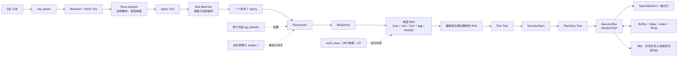

# 第 6 章　Planner、Executor 与 EXPLAIN 执行计划分析

> **技术基线**：PostgreSQL 18；兼顾 PostgreSQL 14—18。Go 示例采用当前稳定 Go 与 `github.com/jackc/pgx/v5`、`pgxpool`，不固定补丁版本。
> **版本标记**：`[PG14+]` 表示从 PostgreSQL 14 起可用；`[PG16+]`、`[PG17+]`、`[PG18]` 同理。

---

## 1. 本章定位

一条 SQL 写得“语义正确”，不等于它会以可接受的成本执行。PostgreSQL 必须先把 SQL 文本转换为语义明确的查询树，再枚举可行路径、估算成本、选出计划，最后由 Executor 按计划从存储层拉取和加工 Tuple。`EXPLAIN` 是观察这条链路的主要窗口。

本章解决五类生产问题：

1. 为什么有索引却选择 `Seq Scan`；
2. 为什么估算行数错误会把 Join、Sort、Aggregate 和并行策略一起带偏；
3. 怎样正确解释 `cost`、`actual time`、`rows`、`loops`、`Buffers` 和临时文件；
4. 怎样从计划树中找到**最早出现的数量级误差**，而不是只盯着最上层慢节点；
5. 怎样在 Go/pgx 中低开销采集查询名、耗时、错误和行数，而不在普通请求路径自动执行 `EXPLAIN ANALYZE`。

与前后章节的关系：

- 前置依赖：第 3 章的 Page、Tuple、Buffer；第 4、5 章的 B-tree 与索引设计。
- 后续依赖：第 7 章将深入统计信息、扩展统计、参数敏感计划和计划稳定性。
- 本章不展开：统计直方图构造算法、MVCC 可见性细节、专用索引内部结构、锁与事务重试；仅在解释计划时说明其影响。

---

## 2. 可验证的学习目标

完成本章后，你应当能够：

- 画出 `SQL → Parse Tree → Query Tree → Rewrite → RelOptInfo/Path → Plan → Executor` 的完整路径；
- 对任意计划逐节点解释 `startup cost`、`total cost`、`rows`、`width`；
- 根据 `actual time`、`actual rows`、`loops` 计算节点的大致累计工作量；
- 从最内层节点开始，找到第一个实际行数与估算行数相差一个数量级以上的位置；
- 区分 `Index Cond`、`Filter`、`Recheck Cond`、`Join Filter`；
- 判断 `Seq Scan`、`Index Scan`、`Bitmap Scan` 各自是否合理；
- 判断 `Nested Loop`、`Hash Join`、`Merge Join`、Semi Join、Anti Join 的适用条件和风险；
- 识别 Sort、Hash、Materialize、CTE 或 WindowAgg 的内存与落盘行为；
- 解释 `Gather`、`Gather Merge`、`Workers Planned/Launched` 和并行倾斜；
- 安全执行 `EXPLAIN ANALYZE`，并明确它会真正执行 SQL；
- 复现“有索引仍顺序扫描”“估算错误导致错误 Join”“Sort 落盘”三类问题；
- 使用 pgx `QueryTracer` 记录低基数查询名、耗时、SQLSTATE 和受影响/返回行数。

---

## 3. 核心术语

| 中文名称 | 英文名称 | 准确定义 | 容易混淆的概念 | 所属层次 |
|---|---|---|---|---|
| 原始解析树 | Parse Tree / Raw Parse Tree | 由语法解析器生成、主要反映 SQL 语法结构的节点树；尚未完成目录对象和类型解析 | Query Tree | Parser |
| 查询树 | Query Tree / `Query` | 完成名称解析、类型检查和语义转换后的内部查询表示 | 最终 Plan | Parse Analysis |
| 查询重写 | Rewrite | 按规则系统、视图规则等把输入 Query 转换为一个或多个 Query | Planner 优化 | Rewriter |
| 规划器/优化器 | Planner / Optimizer | 构造关系、枚举路径并依据成本选择计划 | Executor | Planner |
| 关系优化信息 | `RelOptInfo` | Planner 对基表、连接关系或上层关系的优化状态，保存候选 Path、行数等 | 实际物理表 | Planner state |
| 候选路径 | `Path` | 对一种可行执行方法的轻量表示，主要用于比较成本、排序、并行性等属性 | 可执行 Plan | Planner |
| 执行计划 | `Plan` | 从最优 Path 生成的完整计划树，包含表达式和各执行节点 | EXPLAIN 文本本身 | Planner output |
| 执行器 | Executor | 初始化 `PlanState`，按需从子节点拉取 Tuple，并完成投影、过滤、连接、聚合和修改 | Planner | Runtime |
| 启动成本 | Startup Cost | 节点能够返回第一行之前的估算成本 | 首行实际毫秒 | Cost model |
| 总成本 | Total Cost | 节点运行到完成时的估算累计成本，通常包含子节点成本 | 实际执行时长 | Cost model |
| 估算行数 | Estimated Rows | 节点完整执行时预计向父节点输出的行数，不是其内部检查的总行数 | 表总行数 | Cardinality |
| 平均行宽 | Width | 节点输出行的估算平均字节数 | Page 大小、磁盘表大小 | Cost model |
| 实际时间 | Actual Time | `ANALYZE` 下节点首次返回与完成返回的平均墙钟时间，单位毫秒 | cost | Instrumentation |
| 实际行数 | Actual Rows | 每次节点执行平均输出的行数 | 全部 loops 的总行数 | Instrumentation |
| 循环次数 | loops | 节点被完整或部分启动执行的次数，常见于 Nested Loop 内侧 | SQL 循环 | Executor |
| 过滤丢弃行 | Rows Removed by Filter | 节点读取后被普通 Filter 判定为假的平均行数 | Index Cond 未命中 | Instrumentation |
| 连接过滤丢弃行 | Rows Removed by Join Filter | 已形成候选行对后，被 Join Filter 丢弃的平均行对数 | Hash Cond/Merge Cond | Instrumentation |
| 参数化路径 | Parameterized Path | 依赖外侧行值才能执行的 Path，典型是 Nested Loop 内侧索引查找 | Prepared Statement 参数 | Planner |
| 阻塞节点 | Blocking Node | 通常需先消费大量或全部子节点输入才能开始输出，如 Sort、某些 Aggregate | 数据库锁等待 | Executor behavior |
| 部分计划 | Partial Plan | 并行 Worker 各自只生成结果子集、合并后不重不漏的计划 | 每个 Worker 执行完整普通计划 | Parallel planner |
| 通用计划 | Generic Plan | Prepared Statement 不依赖当前参数值生成并复用的计划 | Custom Plan | Plan cache |
| 自定义计划 | Custom Plan | 按当前参数值规划的计划，可利用参数分布差异 | 临时 SQL | Plan cache |

---

## 4. 整体心智模型



### 4.1 数据流

SQL 文本先变成原始语法树；Parse Analysis 根据系统目录解析表、列、函数、操作符和数据类型，形成 `Query`；Rewriter 展开视图和规则；Planner 枚举 Path，选择满足结果语义、排序和并行安全要求的候选；Executor 从根节点向下请求 Tuple，子节点从 Heap、Index、Buffer 或临时文件取得数据，再逐层向上返回。

### 4.2 控制流

Executor 主要采用 **demand-pull**：父节点需要一行时调用子节点，子节点继续向下请求。`Seq Scan`、`Index Scan` 往往可以流式返回；`Sort` 通常先吞完输入再输出；`Hash Join` 先构建 Hash 表再探测；`Materialize` 和 Memoize 会保留可复用结果。

### 4.3 状态变化

- Planner 阶段：`RelOptInfo` 的候选 Path 集合不断扩展、裁剪，最终保留最有竞争力的路径。
- Executor 初始化：每个 `Plan` 节点创建对应 `PlanState`、表达式状态和 Memory Context。
- 执行阶段：节点状态从“未启动”进入“运行”，可能经历“构建 Hash/Sort”“溢写临时文件”“反复 rescan”，最后结束并释放上下文。
- Prepared Statement：可能先使用参数相关的 Custom Plan，之后转为 Generic Plan；计划选择可能因此改变。

### 4.4 故障路径

1. 语义错误在 Parse Analysis 阶段失败；
2. 对象锁无法取得时，规划或执行都可能等待；
3. 估算错误不会直接报错，却可能选出灾难性 Join 或内存策略；
4. `work_mem` 不足通常不是失败，而是 Sort/Hash/Tuplestore 落盘并显著变慢；
5. 取消、`statement_timeout`、死锁、I/O 错误或 OOM 会中断 Executor；
6. `EXPLAIN ANALYZE` 对写语句会真实写入、加锁并产生 WAL，不能把它当作无副作用的“模拟器”。

---

## 5. 使用方式

### 5.1 四级 EXPLAIN 使用法

#### 一级：只看估算，不执行

```sql
EXPLAIN (
    VERBOSE,
    COSTS,
    SETTINGS
)
SELECT id, amount
FROM orders
WHERE tenant_id = 42
ORDER BY created_at DESC
LIMIT 50;
```

适合生产环境的第一步。它仍会进行解析、重写和规划，并可能取得对象级锁，但不会执行查询主体。

`[PG17+]` 可增加 `MEMORY`：

```sql
EXPLAIN (VERBOSE, COSTS, SETTINGS, MEMORY)
SELECT ...;
```

这里的 `MEMORY` 主要报告**规划阶段**内存，不是每个执行节点的 `work_mem` 实际峰值。

#### 二级：观察真实执行

```sql
EXPLAIN (
    ANALYZE,
    BUFFERS,
    WAL,
    SETTINGS,
    VERBOSE,
    SUMMARY
)
SELECT ...;
```

这会真实执行 SQL。对只读查询，也可能执行易变函数、获取锁、触发 I/O 或改变 hint bit；对 DML 则会真实修改数据。

#### 三级：降低逐节点计时开销

```sql
EXPLAIN (
    ANALYZE,
    BUFFERS,
    WAL,
    SETTINGS,
    VERBOSE,
    SUMMARY,
    TIMING OFF
)
SELECT ...;
```

当查询包含大量短循环时，逐节点取时本身可能产生明显开销。`TIMING OFF` 仍保留行数、loops、Buffers 和总执行时间，适合重复测量；首次诊断仍建议保留详细时间。

#### 四级：区分服务端执行与结果序列化

`[PG17+]`：

```sql
EXPLAIN (
    ANALYZE,
    BUFFERS,
    SERIALIZE TEXT,
    SUMMARY
)
SELECT ...;
```

`SERIALIZE` 可把结果类型转换为文本/二进制的成本纳入观察，但不包含网络传输和客户端消费时间。

`[PG16+]` 可直接查看带参数 SQL 的 Generic Plan，且不能与 `ANALYZE` 同用：

```sql
EXPLAIN (GENERIC_PLAN, VERBOSE, SETTINGS)
SELECT *
FROM orders
WHERE tenant_id = $1
  AND created_at >= $2;
```

### 5.2 DML 的安全边界

```sql
BEGIN;

EXPLAIN (
    ANALYZE,
    BUFFERS,
    WAL,
    SETTINGS,
    VERBOSE,
    SUMMARY
)
UPDATE accounts
SET balance = balance - 100
WHERE id = 42;

ROLLBACK;
```

`ROLLBACK` 能撤销普通事务内数据修改，但不能保证消除全部副作用：Sequence 的 `nextval()` 不回退；外部网络调用、文件写入或某些扩展副作用未必可回滚；语句仍可能持锁、触发器仍会运行、WAL 仍可能产生。最安全的做法是使用脱敏克隆、隔离测试库和受控参数。

### 5.3 常用参数、视图与 API

| 类别 | 对象 | 用途 | 关键注意事项 |
|---|---|---|---|
| 内存 | `work_mem` | Sort、Hash、Materialize、Memoize 等单个操作的内存基线 | 不是“每连接总内存”；多个节点、并发会话和并行 Worker 会相乘 |
| Hash 内存 | `hash_mem_multiplier` | Hash 操作可使用 `work_mem` 的倍数 | 增大可能减少 batch，也可能放大并发内存风险 |
| 成本 | `seq_page_cost`、`random_page_cost`、CPU cost | 比较 I/O 与 CPU 路径 | 应基于硬件与工作负载校准，不要为一条 SQL 随意改全局值 |
| 缓存假设 | `effective_cache_size` | 告诉 Planner 可被查询利用的缓存规模估计 | 不会分配内存，也不是命中率保证 |
| 方法开关 | `enable_seqscan`、`enable_nestloop` 等 | 诊断替代计划 | 只能“劝阻”，不是长期优化方案；某些节点因正确性仍可能出现 |
| Prepared Plan | `plan_cache_mode` | 诊断 Generic/Custom Plan 差异 | `force_*` 适合实验或极窄范围止损，不宜全局滥用 |
| I/O 计时 | `track_io_timing` | 提供块读写和临时文件 I/O 时间 | 有测量开销，应在目标环境评估 |
| 临时文件 | `log_temp_files` | 按阈值记录临时文件名称和大小 | 日志量和敏感信息需治理；通常由管理员配置 |
| 当前会话 | `pg_stat_activity`、`pg_wait_events` | 查看当前 SQL、状态、Wait Event | 当前活动近实时；权限可能限制 SQL 文本 |
| 累计 I/O | `pg_stat_io`、`pg_stat_database` | 查看 I/O、`temp_files`、`temp_bytes` | 累计值需取时间窗口差分，统计有刷新延迟 |
| 语句聚合 | `pg_stat_statements` | 按归一化语句看 calls、时间、块、WAL、temp | 需预加载扩展；均值不能替代 P95/P99 |
| pgx | `pgx.QueryTracer` | 在查询开始/结束时采集名称、耗时、错误、CommandTag | 不应默认记录参数，不应同步执行 EXPLAIN |
| pgxpool | `Stat()` | 观察连接总量、已获取连接、获取等待等 | goroutine 数不应等同于数据库并发数 |

### 5.4 生产安全原则

- 普通请求路径先采集查询名、参数类别、耗时、错误、行数和 Query ID；需要计划时，在受控环境重放。
- 不把原始参数、Token、个人信息或完整 SQL 默认写入日志。
- 在生产执行 `EXPLAIN ANALYZE` 前设置合理的 `statement_timeout`、`lock_timeout`，确认 SQL 语义和最大结果规模。
- 不以 `enable_seqscan=off`、`enable_nestloop=off` 等开关作为永久修复。
- 比较两个计划时必须记录相同 SQL、参数、事务隔离级别、GUC、数据快照、缓存状态和并发背景。

---

## 6. 底层原理

### 6.1 从 Parse Tree 到可执行 Plan

#### 阶段一：Raw Parser

Raw Parser 只关心语法。例如 `orders.amount` 会以名称节点存在，但此时尚未确认 `orders` 是否存在、`amount` 的类型是什么、`+` 应绑定哪个操作符。输出是 `RawStmt` 等原始节点。

#### 阶段二：Parse Analysis

Parse Analysis 查询系统目录，解析 Range Table、列引用、类型转换、函数和操作符，生成 `Query`。此时 SQL 语义已明确；错误的列名、类型不匹配和聚合规则通常在这里失败。

#### 阶段三：Rewrite

Rewriter 对 `Query` 应用规则。视图可理解为通过规则展开为底层关系；某些操作会得到额外 Query。Rewrite 不是成本优化阶段。

#### 阶段四：Planner

Planner 建立 `PlannerInfo` 和各层 `RelOptInfo`，为关系生成候选 Path：顺序扫描、索引扫描、Bitmap、不同 Join 顺序和算法、排序、聚合、并行路径等。`Path` 比最终 `Plan` 更轻量，便于大规模比较。满足所需输出顺序、参数化依赖和并行安全等约束后，Planner 选出成本最优 Path，再生成完整 `Plan` 树。

连接表数很高时，枚举空间组合爆炸；Planner 会裁剪明显劣势 Path，并可能在达到阈值时使用 GEQO。这里的“最优”是**在估算与成本模型下最优**，不是对真实运行时间的数学证明。

#### 阶段五：Executor

Executor 把 Plan 转成 PlanState 树。父节点通过统一接口向子节点请求 Tuple；每行通常暂存在 `TupleTableSlot` 中。表达式由预编译的 `ExprState` 求值。节点使用自己的 Memory Context，结束或 rescan 时按层释放。

### 6.2 Cost Model：为什么 cost 不是毫秒

典型节点：

```text
Index Scan using orders_tenant_created_idx on orders
  (cost=0.43..52.81 rows=20 width=48)
```

- `0.43`：startup cost；
- `52.81`：完整输出预计结果的 total cost；
- `rows=20`：预计向父节点输出 20 行；
- `width=48`：每行平均约 48 字节。

Cost 是以成本参数定义的**相对单位**。默认模型把顺序页读取、随机页读取、Tuple 处理、索引 Tuple 处理和操作符计算等折算到同一尺度。它不包含客户端网络时间，也通常不完整表示结果格式化和并发排队。

简化理解：

```text
节点总成本
≈ 子节点成本
+ 预计页访问量 × 页成本
+ 预计 Tuple 数 × CPU 成本
+ 表达式执行次数 × 操作符成本
+ Sort / Hash / 并行启动与传输成本
```

因此：

- `cost=100` 绝不表示 100 ms；
- 同一环境中 cost 常与耗时相关，但缓存、并发、I/O 队列和参数错误会破坏相关性；
- 上层节点的 cost 通常包含下层 cost，不能把每行 cost 简单相加；
- Planner 优先考虑 total cost，但 `LIMIT`、游标等可使 startup cost 更重要。

对于 `LIMIT n`，Planner 会估计只需消费子路径的一部分：

```text
预计 LIMIT 成本
≈ startup_cost
+ 消费比例 × (total_cost - startup_cost)
```

所以加上或去掉 `LIMIT` 可能改变 Scan、Join 和 Sort。被 LIMIT 提前停止的子节点，`actual rows` 小于其“完整执行估算 rows”不一定是估算错误。

### 6.3 固定读计划方法：十步法

每次都按同一顺序，避免被最显眼的慢节点误导。

1. **确认 SQL 语义**：结果是否正确？谓词是否可下推？`LEFT JOIN` 是否被 WHERE 条件意外变成 Inner Join？
2. **从最内层节点开始**：计划是树；先看 Scan，再看 Join/Aggregate/Sort，最后看根节点。
3. **检查 Actual Rows 与 Estimated Rows**：计算比例 `max(actual/estimated, estimated/actual)`，优先关注 10×、100× 误差。
4. **检查 loops**：`actual rows` 和节点时间通常是每 loop 平均值；总输出近似 `rows × loops`。
5. **找到最早出现数量级误差的位置**：上层错误往往只是下层误差传播。
6. **检查 Buffers**：区分 shared hit/read、temp read/written；注意 shared read 不等于物理磁盘读取，可能命中 OS Page Cache。
7. **检查 Filter 和 Join Filter**：大量 Rows Removed 常表示读取过多再丢弃，或连接条件没有成为访问条件。
8. **检查 Sort、Hash 和临时文件**：看 `Sort Method`、`Disk`、`Batches`、`Memory Usage`、temp blocks。
9. **检查 WAL**：写语句看 records、FPI、bytes；`[PG18]` 还可看到 WAL buffer 变满相关统计。
10. **结合 Wait Event 与操作系统指标**：计划说明“做什么”，Wait Event、CPU、磁盘延迟、队列深度和连接池说明“为什么此刻慢”。

### 6.4 Actual Time、Rows 与 loops 的正确计算

示例：

```text
Index Scan ...
(actual time=0.020..0.080 rows=3 loops=10000)
```

含义是：

- 每次启动平均约 0.020 ms 返回第一行；
- 每次启动平均约 0.080 ms 完成该次扫描；
- 每次平均输出 3 行；
- 共执行 10000 次。

粗略累计输出是 `3 × 10000 = 30000` 行；粗略累计节点墙钟工作量是 `0.080 × 10000 = 800 ms`。但不能机械地用父节点时间减子节点时间求“独占时间”：父节点时间包含子节点，计时有开销，且并行节点存在重叠。

`Rows Removed by Filter` 和 `Rows Removed by Join Filter` 也通常按 loop 平均并可能四舍五入。若某内侧节点 `rows=1 loops=1,000,000`，即使单次只需微秒，累计也可能是根因。

### 6.5 Scan 节点

| 节点 | 工作方式 | 适合场景 | 主要风险与观察点 |
|---|---|---|---|
| `Seq Scan` | 按 Heap Page 顺序读取并过滤 | 返回比例高、表很小、缺少可用索引、顺序 I/O 成本低 | 不应看到索引就判错；看 Filter、Rows Removed、Buffers read |
| `Index Scan` | 按索引定位 TID，再取 Heap Tuple | 高选择性、需要索引顺序、参数化内侧查找 | 随机 Heap 访问、loops 放大；看 `Index Cond` 与 Filter |
| `Index Only Scan` | 尽量仅从 Index Tuple 返回 | 所需列被索引覆盖且 Visibility Map 允许 | `Heap Fetches` 高时并不“only”；Vacuum/可见性重要 |
| `Bitmap Index Scan` + `Bitmap Heap Scan` | 先收集 TID/页位图，再按 Heap Page 读取 | 中等选择性、合并多个索引条件 | 失去索引顺序；位图可能 lossy；看 Recheck、exact/lossy blocks |

关键字段：

- `Index Cond`：真正用于缩小索引访问范围；
- `Filter`：行取出后才判断；
- `Recheck Cond`：Bitmap Heap 对候选 Tuple 重新验证，lossy bitmap 时尤其重要；
- `[PG18] Index Searches`：显示底层索引搜索次数，可暴露 skip scan、数组条件或反复重启索引搜索的成本。

“有索引却 Seq Scan”常常完全正确：当谓词命中 70% 行时，逐条走索引再随机取 Heap 的成本可能远高于顺序读全表。长期修复应从选择性、覆盖列、聚簇度、统计信息和 SQL 目标入手，而不是永久关闭 Seq Scan。

### 6.6 Join 节点与 Semi/Anti 语义

| Join | 原理 | 优势 | 风险/限制 |
|---|---|---|---|
| `Nested Loop` | 外侧每行驱动一次内侧扫描 | 小外表 + 高选择性参数化索引时延迟极低；适用于广泛连接条件 | 外侧行数低估会把内侧 loops 放大；随机 I/O 和 CPU 累积 |
| `Hash Join` | 先把一侧建 Hash 表，再用另一侧等值键探测 | 大型等值连接常表现稳定，不要求输入有序 | 建表侧估算错误会超内存并分 batch；不适用于一般非等值条件 |
| `Merge Join` | 两侧按连接键有序，像归并一样前进 | 已有排序/索引顺序时可流式处理大结果并保序 | 缺少顺序时需 Sort；重复键和重扫可能增加内存/Materialize |
| Semi Join | 左行只要存在至少一个右侧匹配就输出一次 | `EXISTS`、`IN` 常可避免重复右侧结果 | 仍需选择 Nested/Hash/Merge 物理算法 |
| Anti Join | 只输出没有右侧匹配的左行 | `NOT EXISTS` 通常语义清晰且可优化 | `NOT IN` 遇到 NULL 的三值逻辑不同，不能随意等价改写 |

Join 条件字段要区分：

- `Hash Cond`、`Merge Cond`：算法核心匹配条件；
- Nested Loop 的参数化 `Index Cond`：常由外侧值注入；
- `Join Filter`：候选行对形成后再判断；大量 `Rows Removed by Join Filter` 可能代表行对爆炸；
- 普通 `Filter`：Join 输出后再过滤。

### 6.7 Sort、Materialize、Memoize

#### Sort

Sort 是典型阻塞节点。常见输出：

```text
Sort Method: quicksort  Memory: 8192kB
Sort Method: external merge  Disk: 524288kB
Sort Method: top-N heapsort  Memory: 256kB
```

- `quicksort`：排序留在内存；
- `external merge`：已落盘；
- `top-N heapsort`：LIMIT 下只维护前 N 项；
- `temp read/written`：从 Buffers 维度确认临时 I/O。

#### Incremental Sort

Incremental Sort 利用输入已经按排序键前缀有序的属性，只在每个前缀组内排序剩余键。它可降低峰值内存、缩短首批输出时间，但对前缀组数量和大小的估算敏感。`[PG18]` Merge Join 对 Incremental Sort 的利用进一步增强。

#### Materialize

Materialize 把子节点输出保存在 tuplestore 中，供上层反复读取、回退或避免重复计算。它可能只占内存，也可能按 `work_mem` 落盘。看到 Materialize 不等于 Planner 做错；要先检查它避免了多少次昂贵 rescan。

#### Memoize

`[PG14+]` Memoize 常位于参数化 Nested Loop 内侧，以参数值为 key 缓存结果。计划中可见 Hits、Misses、Evictions、Overflows 和 Memory Usage。

- 外侧 key 重复度高：收益大；
- key 几乎全唯一：Miss 多，缓存价值小；
- 估算 distinct key 错误：可能出现大量 eviction 或错误选型。

Materialize 缓存“整个子计划结果流”，Memoize 缓存“按参数 key 的查询结果”，二者不能混为一谈。

### 6.8 Aggregate、WindowAgg

| 节点 | 行为 | 内存/排序特征 | 诊断重点 |
|---|---|---|---|
| `HashAggregate` | 以 Group Key 建 Hash 状态 | 不要求输入有序；组数多时可 batch/落盘 | 组数估算、Batches、Memory/Disk Usage、temp blocks |
| `GroupAggregate` | 对按 Group Key 有序的输入逐组聚合 | 需要现成顺序或 Sort；可边读边完成组 | Sort 成本、是否可利用索引顺序 |
| `WindowAgg` | 在保留输入行的同时计算窗口函数 | 常依赖 PARTITION/ORDER 顺序，可能 Sort/tuplestore | 它不减少行数；大分区、宽行和多个窗口定义易放大内存/临时 I/O |

`HashAggregate` 的选择高度依赖“预计组数”。把 10 个组误估为 100 万组，或反过来，都会影响 Hash/Sort、并行聚合和内存策略。

### 6.9 Append、Gather、Gather Merge 与 Parallel Query

- `Append`：顺序拼接多个子计划，常见于 `UNION ALL` 和分区表。
- `Parallel Append`：把不同子计划分配给不同参与进程，可同时扫描多个分区。
- `Gather`：收集 Worker 的无序结果；Leader 还可能参与并行部分。
- `Gather Merge`：要求 Worker 各自输出有序流，并由 Leader 归并，保持全局顺序。

并行计划不是把普通计划复制 N 份。Planner 必须生成 Partial Plan，使每个 Worker 只产生不重不漏的结果子集。观察：

```text
Workers Planned: 4
Workers Launched: 2
```

两者不相等说明运行时 Worker 资源不足或受限。即使启动齐全，也要看 `EXPLAIN (ANALYZE, VERBOSE)` 的 per-worker 行数，识别数据倾斜、Leader 汇总瓶颈和重复构建内侧 Hash/Sort 的成本。

`[PG18]` AIO 可让顺序扫描、Bitmap Heap Scan 和 Vacuum 并发发起文件读取；它可能提高吞吐，但不会把坏的行数估算变成好计划。PostgreSQL 18 尚不能用未来版本的 `EXPLAIN (IO ...)` 语法，应结合 Buffers、I/O Timings、`pg_stat_io` 和操作系统指标判断。

### 6.10 CTE Materialization

对于非递归、无副作用的 `SELECT` CTE：

- 默认只引用一次时，Planner 通常可把它折叠进主查询，便于谓词下推；
- 多次引用时，通常物化一次并复用；
- `MATERIALIZED` 强制物化，可形成优化边界；
- `NOT MATERIALIZED` 允许展开，但可能重复执行昂贵计算。

```sql
WITH recent AS NOT MATERIALIZED (
    SELECT * FROM orders WHERE created_at >= now() - interval '7 days'
)
SELECT ... FROM recent r1 JOIN recent r2 ...;
```

不要把 `NOT MATERIALIZED` 当万能加速开关。它的优点是下推和索引利用，缺点是多次引用时可能重复扫描或重复执行函数。

### 6.11 JIT

JIT 主要适合长时间、CPU 密集型分析查询。Planner 把查询估算总成本与 `jit_above_cost`、`jit_inline_above_cost`、`jit_optimize_above_cost` 比较；编译本身有固定开销，短查询常得不偿失。

JIT 决策发生在规划期。Prepared Statement 使用 Generic Plan 时，相关配置和成本判断与生成通用计划的时点有关。读计划时要把 `JIT: Generation / Inlining / Optimization / Emission` 与总执行时间对比，而不是看到 JIT 就认为必然更快。

### 6.12 work_mem、Hash Batch 与 Temporary File

`work_mem` 是单个 Sort/Hash/Materialize 等操作的基线，而不是整个查询或连接的总额度。Hash 操作还可使用 `work_mem × hash_mem_multiplier`。粗略风险模型：

```text
峰值内存风险
≈ 活跃查询数
× 每查询同时活跃的内存节点数
× 并行参与进程数
× 单节点内存额度
```

Hash 节点常见：

```text
Buckets: 262144  Batches: 8  Memory Usage: 8192kB
```

- `Batches=1`：Hash 表未按 batch 分区；
- `Batches>1`：通常意味着构建/探测数据被分批并产生临时 I/O；
- Batches 从估算值在运行时继续增长，常说明行数或行宽低估。

临时文件不只来自 Sort，也可能来自 Hash、HashAggregate、Materialize、CTE、WindowAgg 或其他 tuplestore。用节点级 temp blocks、`pg_stat_database.temp_bytes` 的时间窗口增量、`pg_stat_statements.temp_blks_*` 和 `log_temp_files` 交叉确认。

---

## 7. 内部数据结构和状态

| 对象 | 本章相关作用 | 关键状态/风险 |
|---|---|---|
| Heap Page | Seq/Bitmap/Index 回表最终读取的物理页 | shared hit/read、顺序或随机访问、AIO、缓存污染 |
| Heap Tuple | Filter、Join、Aggregate 的输入行版本 | 行宽、可见性检查、死 Tuple 增加读放大 |
| Index Tuple | 保存键和 TID，Index Only 时还可含 INCLUDE 列 | 选择性、顺序、回表次数、索引膨胀 |
| Snapshot | 决定 Executor 可见哪些 Tuple | 长事务可导致更多旧版本、Vacuum 受阻，间接改变扫描成本 |
| Lock | 规划需对象锁，执行还可能取行/表锁 | EXPLAIN 也可能等待；`EXPLAIN ANALYZE` DML 会真实加锁 |
| WAL Record / LSN | 写计划、页面首次修改和 FPI 的持久化轨迹 | WAL 量、同步复制提交等待、Checkpoint 后 FPI 放大 |
| Buffer | PostgreSQL shared buffer 中的 Page 副本 | `hit` 只代表命中 shared_buffers；`read` 可能仍命中 OS Cache |
| Memory Context | Planner、Executor、表达式、节点的分层内存管理 | 节点结束/rescan 释放；不能用 EXPLAIN planner memory 代替运行峰值 |
| `Query` | Parse Analysis 和 Rewrite 的语义树 | Range Table、target list、qualification、join tree |
| `PlannerInfo` | 一次规划的全局工作状态 | 参数、等价类、连接关系、目标排序、成本环境 |
| `RelOptInfo` | 基表/Join/上层关系的优化抽象 | rows、Path 列表、最便宜 Path、参数化关系 |
| `Path` | 候选执行方法的成本与物理属性 | startup/total cost、pathkeys、parallel、parameterization |
| `Plan` | 最终可执行树 | 节点类型、targetlist、qual、左右子树 |
| `PlanState` | Plan 的运行时状态 | 当前游标、Hash/Sort 状态、Instrumentation、rescan 次数 |
| `TupleTableSlot` | 节点之间传递 Tuple 的通用容器 | 延迟解构、虚拟/物理 Tuple、行宽成本 |
| Planner 统计 | `pg_statistic`、扩展统计等 | distinct、MCV、直方图、依赖、相关性；错误会层层传播 |

Executor 生命周期可简化为：

```text
ExecutorStart
  → 初始化 PlanState 与 Snapshot
  → ExecutorRun
      → 父节点反复请求 Tuple
      → 子节点扫描/过滤/连接/排序/聚合
      → 可能 rescan、spill、等待 I/O/锁
  → ExecutorFinish
  → ExecutorEnd
      → 释放节点状态与 Memory Context
```

---

## 8. 场景和选型决策

| 业务场景 | 推荐方案 | 不推荐方案 | 原因 | 性能代价 | 并发代价 | 一致性代价 | 高可用代价 | 运维复杂度 |
|---|---|---|---|---|---|---|---|---|
| 主键/唯一键点查 | Index Scan / Index Only Scan | 为避免 Seq Scan 全局改成本参数 | 高选择性，startup 低 | 随机 I/O；覆盖索引增加空间 | 热点键/页可能竞争 | 无额外 | 索引增加复制与恢复数据量 | 低 |
| 返回表中大部分行 | Seq Scan，必要时并行 | 强制 Index Scan | 顺序读与批量处理更经济 | 读大量页、缓存污染 | 多个并发全表扫压垮 I/O | 无额外 | 可能拖慢副本与备份 I/O | 中 |
| 中等选择性、多条件合并 | Bitmap Scan | 建很多重叠组合索引 | 按页回表并可 Bitmap AND/OR | 位图和 Recheck；不保序 | work_mem 与 I/O 竞争 | 无额外 | 索引维护/WAL 增加 | 中 |
| 小外表驱动高选择性内表 | Nested Loop + 参数化 Index；重复 key 时 Memoize | 无索引的内侧大表反复扫描 | 低 startup、可早返回 | 估算错会放大 loops | 随机 I/O 和连接占用变长 | 无额外 | 慢查询可加剧复制滞后间接风险 | 中 |
| 两个大输入等值连接 | Hash Join/Parallel Hash | 盲目 Nested Loop | 线性构建与探测 | Hash 内存、batch/temp | 多并发 Hash 放大内存 | 无额外 | Temp I/O 与主库资源竞争 | 中 |
| 两侧已有连接键顺序 | Merge Join | 为 Merge 强行对两侧大排序 | 可流式、保序 | 重复键、Materialize；排序缺失时昂贵 | 大 Sort 的内存和 temp 竞争 | 无额外 | 资源占用影响 RTO 间接 | 中 |
| 分区表范围查询 | Partition Pruning + Append/Parallel Append | 扫描全部分区 | 减少子计划与页访问 | 计划时间、子节点数量 | 并行 Worker/连接资源 | 无额外 | 多分区运维复杂 | 高 |
| 高重复参数的关联查询 | Memoize + Nested Loop | 每次重复索引查找 | 以 key 缓存内侧结果 | 缓存内存、eviction | 每会话独立缓存，不能共享 | 无额外 | 间接 | 中 |
| 大量分组且输入无序 | HashAggregate，或可控 Sort + GroupAggregate | 单纯提高全局 work_mem | 按组数和宽度选择 | Hash spill 或 Sort spill | 并发内存乘法 | 无额外 | Temp/I/O 间接影响服务恢复 | 中 |
| 大结果有序输出 | 索引顺序、Incremental Sort 或 Gather Merge | 先全量排序再 LIMIT（若可避免） | 利用已有 pathkeys、降低 startup | Leader merge、网络结果量 | 并行汇总与客户端慢消费 | 无额外 | 长查询可与恢复冲突 | 中 |

---

## 9. 高性能分析

### 9.1 资源维度

| 维度 | 执行计划中的信号 | 需要联合观察 | 常见优化方向 |
|---|---|---|---|
| CPU | 高 loops、复杂 Filter、JIT、Hash/Sort、表达式密集 | 主机 CPU、run queue、perf、JIT 时间 | 减少输入行、提前过滤、降低重复计算、合理 JIT |
| 内存 | Sort Memory、Hash Memory、Batches、Memoize eviction | 进程 RSS、OOM、并发活跃查询 | 按查询/角色设置内存，做 Admission Control |
| shared_buffers | shared hit/read/dirtied/written | `pg_stat_io`、Buffer 命中、检查点 | 缩小读集合，避免并发大扫导致缓存抖动 |
| OS Page Cache | EXPLAIN 无法直接区分 | `iostat`、`pidstat`、块设备延迟 | 记录冷/热缓存状态，避免把 shared read 等同物理盘 |
| 随机 I/O | 大量 Index Scan 回表、loops | IOPS、平均/尾延迟、表相关性 | 覆盖索引、Bitmap、批量化、改善物理局部性 |
| 顺序 I/O | Seq Scan、Parallel Seq Scan | 带宽、预读、PG18 AIO、队列深度 | 并行与 AIO、分区裁剪、避免过度并发 |
| 网络往返 | EXPLAIN 通常不含客户端网络 | 应用 Trace、返回行数、序列化时间 | 批量请求、减少 N+1、流式消费与结果上限 |
| 索引维护 | 读计划受益但 EXPLAIN SELECT 不显示写维护 | 写 TPS、WAL、Bloat、Vacuum | 只保留高价值索引，评估覆盖列与重复索引 |
| WAL | DML 的 WAL records/FPI/bytes | `pg_stat_wal`、复制延迟、归档 | 减少无效写、批量方式、控制 Checkpoint 压力 |
| Checkpoint | FPI 与写峰值间接体现 | checkpointer、WAL、磁盘写延迟 | 合理 Checkpoint 节奏，不以关闭持久性换性能 |
| Vacuum | Heap Fetches、死 Tuple 导致读放大 | `pg_stat_all_tables`、Vacuum 进度 | 保障 autovacuum、缩短长事务、维护 Visibility Map |
| Temporary File | external merge、Hash Batches、temp blocks | temp_bytes 速率、日志、磁盘容量/延迟 | 改计划/索引/聚合，按查询调内存，限制并发 |
| P95/P99 | 单次 EXPLAIN 不能给分位数 | pgx Histogram、APM、队列等待 | 参数分桶、冷热分离、观察 Generic Plan 和资源争用 |

### 9.2 读放大、写放大、空间放大

- **读放大**：扫描 1000 万行只返回 100 行；Nested Loop 内侧执行百万次；Bitmap lossy 导致大量 Recheck。
- **写放大**：为读性能新增多个索引后，每次 DML 写 Heap、多个 Index 和更多 WAL；Checkpoint 后可能产生更多 FPI。
- **空间放大**：覆盖索引、临时文件、Hash spill、Bloat、物化结果都消耗空间。

### 9.3 参数建议的前置记录

在调整 `work_mem`、并行度或成本参数前，至少记录：数据规模、平均/尾部行宽、数据分布、并发量、读写比例、CPU、内存、磁盘类型与延迟、缓存冷热、SLO、允许的最大临时空间。不存在适用于所有机器的固定值。

性能实验记录表：

| 项目 | 记录值 |
|---|---|
| PostgreSQL 完整版本 / OS / 文件系统 |  |
| 关键 GUC 与扩展 |  |
| 数据量、表/索引大小、平均行宽 |  |
| 缓存状态：首次/预热后/无法控制 |  |
| 客户端并发、数据库活跃查询、连接池大小 |  |
| 测试时长、预热轮次、采样轮次 |  |
| P50 / P95 / P99 / 吞吐量 |  |
| Buffers / WAL / temp blocks |  |
| CPU / IOPS / 带宽 / 平均与尾部延迟 |  |
| Wait Event 与并行 Worker |  |

---

## 10. 高并发分析

一条计划在单连接上快，不代表在 200 个并发请求下仍快。必须区分：

| 名称 | 含义 |
|---|---|
| 应用 goroutine 并发 | 同时运行或等待的应用任务数，可远大于数据库连接数 |
| 连接数 | 已建立的 PostgreSQL 会话数量 |
| 活跃查询数 | 当前真正占用数据库 CPU/I/O/锁资源的 SQL 数 |
| 数据库并发 | 同时执行并竞争内部资源的后台进程/并行 Worker 数 |
| TPS | 单位时间完成的事务数，与连接数不是同义词 |
| 排队请求数 | 在应用 Semaphore、连接池 Acquire 或数据库锁上等待的请求数 |

### 10.1 主要并发风险

- **内存乘法**：多个 Sort/Hash 节点、并行 Worker 和并发会话共同使用内存。全局提高 `work_mem` 可能从“落盘慢”变成“OOM/Swap 更慢”。
- **I/O 队列**：单个 Parallel Seq Scan 可加速，但大量并行查询同时运行会争抢带宽并放大尾延迟。
- **连接竞争**：更多连接不等于更高吞吐；上下文切换和缓存争用可能使 TPS 下降。
- **热点索引页**：高并发写入同一键范围时，读计划之外还存在 Index Page 与 WAL 竞争。
- **长事务**：慢计划延长 Snapshot 和锁持有时间，阻碍 Vacuum，进而制造更多死 Tuple 和读放大。
- **阻塞与死锁**：计划慢可能只是等待锁。`actual time` 高时必须同时检查 `wait_event_type='Lock'` 和 blocker。
- **重试风暴**：超时后无上限重试会把原本的资源瓶颈放大。需要最大次数、退避、抖动和幂等性。

### 10.2 Backpressure 与 Admission Control

合理结构是：

```text
请求到达
  → 应用级有界队列/并发门
  → pgxpool 获取连接（有超时）
  → 数据库执行
  → 超时/取消向下传播
```

数据库连接池是最后一道边界，不应承担无限队列。分析型 SQL、报表和批任务应使用独立角色/池、并发额度和 per-role GUC；OLTP 请求不应与大 Sort/Hash 无限制混跑。

事务中不要调用无关慢外部服务。否则连接、Snapshot 和锁被长时间占用，计划本身即使很快也会造成并发雪崩。

---

## 11. 高可用分析

Planner/Executor 与 HA 的关系以**间接影响**为主：它们不提供 Fencing，也不定义 RPO，但会改变资源占用、WAL、复制延迟和故障切换后的恢复体验。

| HA 主题 | 与本章的关系 |
|---|---|
| RPO | SELECT 计划通常无直接影响；DML 计划决定修改行数和 WAL 量，但同步/异步复制策略才定义数据丢失窗口 |
| RTO | 坏计划造成 CPU/I/O 饱和会拖慢故障检测、重放和服务恢复；切换后冷缓存可使计划耗时突增 |
| 备份/PITR | 长时间大查询与备份争抢 I/O；恢复后的统计、配置和缓存需验证，不能只验证 SQL 可连接 |
| 物理复制 | 系统目录和数据基本一致，但本地 GUC、缓存、Worker 可用性和恢复冲突不同；同 SQL 实际表现可不同 |
| 逻辑复制 | 订阅端可拥有不同索引、统计和数据分布，计划更可能与发布端不同 |
| 同步复制 | 写计划产生的 WAL 越多，发送、刷盘和确认路径负担越大；不能靠降低持久性参数“优化” |
| 异步复制 | 大查询与 WAL 重放争抢 I/O/CPU，可能增加 lag；临时文件本身不写 WAL，但会争抢磁盘 |
| Planned Switchover | 切换前验证 Top SQL 的 Plain EXPLAIN、配置、扩展、统计与并行资源；预热关键路径 |
| Unplanned Failover | 应用必须丢弃旧连接并重连；Prepared Plan 会在新会话重建；未收到 Commit 结果不代表一定未提交 |
| Failback | 比较两侧计划与配置漂移，先小流量回切；不要把旧 Primary 未清理造成的双写当计划问题 |
| 脑裂/Fencing | Planner 无法解决，必须由 HA 控制面和存储/网络 Fencing 保证单写 |
| Replica 查询 | `EXPLAIN ANALYZE SELECT` 仍会消耗副本资源并可能与 WAL 重放冲突，长查询可能被恢复冲突取消 |

灾备演练应包含：故障切换后关键查询的 P95/P99、Buffers、Worker 启动率、连接池重连和计划差异，而不只是“数据库端口恢复”。

---

## 12. 三维影响矩阵

| 维度 | 相关度 | 核心收益 | 主要风险 | 关键指标 |
|---|---|---|---|---|
| 高性能 | 高 | 选择正确 Scan/Join/Agg/并行路径，减少读放大和临时 I/O | 估算错误、参数敏感计划、JIT/并行开销、spill | P50/P95/P99、rows ratio、Buffers、temp、CPU、I/O |
| 高并发 | 高 | 控制每查询资源、降低 loops 和连接占用时间 | work_mem 乘法、I/O 饱和、连接池排队、锁等待 | active queries、pool wait、Wait Event、RSS、IO queue |
| 高可用 | 中 | 降低主副本资源压力和 WAL，改善切换后恢复 | 坏计划放大 lag、冷缓存、恢复冲突和 RTO | replication lag、WAL rate、recovery conflicts、failover P99 |


---

## 13. 可复现实验

> 三个实验都应在专用测试库执行。下面的数据规模是便于观察计划差异的起点，不是固定基准。资源不足时按比例缩小，但必须保留数据分布。不要用实验结果中的单次毫秒数代替自己的 P50/P95/P99。

### 13.1 实验一：有索引但 Planner 合理选择 Seq Scan

#### 1）实验目标

证明“存在索引”不是“必须使用索引”。比较高选择比例谓词与稀有值谓词的 Scan 选择，并用成本、Buffers 和 Rows Removed 解释原因。

#### 2）版本与扩展

- PostgreSQL 14—18；推荐 PostgreSQL 18。
- 不需要扩展。

#### 3）建表和准备数据

```sql
DROP SCHEMA IF EXISTS ch06_e1 CASCADE;
CREATE SCHEMA ch06_e1;

CREATE TABLE ch06_e1.orders (
    order_id   bigint GENERATED ALWAYS AS IDENTITY PRIMARY KEY,
    status     text           NOT NULL,
    amount     numeric(12, 2) NOT NULL,
    created_at timestamptz    NOT NULL,
    payload    text           NOT NULL
);

INSERT INTO ch06_e1.orders(status, amount, created_at, payload)
SELECT CASE
           WHEN g % 100 < 70 THEN 'paid'       -- 70%
           WHEN g % 100 < 99 THEN 'shipped'    -- 29%
           ELSE 'refunded'                     -- 1%
       END,
       (g % 100000)::numeric / 100,
       timestamptz '2026-01-01 00:00:00+00'
           - (g % 365) * interval '1 day',
       repeat(md5(g::text), 2)
FROM generate_series(1, 1000000) AS g;

CREATE INDEX orders_status_idx
    ON ch06_e1.orders(status);

ANALYZE ch06_e1.orders;
```

记录数据规模：

```sql
SELECT count(*) AS rows,
       pg_size_pretty(pg_relation_size('ch06_e1.orders')) AS heap_size,
       pg_size_pretty(pg_relation_size('ch06_e1.orders_status_idx')) AS index_size,
       pg_size_pretty(pg_total_relation_size('ch06_e1.orders')) AS total_size
FROM ch06_e1.orders;
```

#### 4）Session A：执行计划

```sql
-- 高命中率：预期 Seq Scan
EXPLAIN (
    ANALYZE, BUFFERS, WAL, SETTINGS, VERBOSE, SUMMARY
)
SELECT sum(amount)
FROM ch06_e1.orders
WHERE status = 'paid';

-- 稀有值：预期 Index Scan 或 Bitmap Scan
EXPLAIN (
    ANALYZE, BUFFERS, WAL, SETTINGS, VERBOSE, SUMMARY
)
SELECT sum(amount)
FROM ch06_e1.orders
WHERE status = 'refunded';
```

重复测量时可增加 `TIMING OFF`，并分别记录第一次与预热后的结果。

#### 5）Session B：当前活动与等待

在 Session A 执行期间重复查询：

```sql
SELECT pid,
       application_name,
       state,
       now() - query_start AS elapsed,
       wait_event_type,
       wait_event,
       left(query, 200) AS query_text
FROM pg_stat_activity
WHERE datname = current_database()
  AND pid <> pg_backend_pid()
  AND query LIKE '%ch06_e1.orders%';
```

#### 6）Session C：只用于诊断的反事实计划

```sql
BEGIN;
SET LOCAL enable_seqscan = off;

-- 默认只看估算，避免为了证明“能强制走索引”而做一次高成本真实扫描。
EXPLAIN (VERBOSE, COSTS, SETTINGS)
SELECT sum(amount)
FROM ch06_e1.orders
WHERE status = 'paid';

ROLLBACK;
```

`enable_seqscan=off` 只是比较替代路径，不是修复方案，也不能保证所有场景完全消除 Seq Scan。

#### 7）明确时间线

| 时间 | Session A | Session B | Session C |
|---|---|---|---|
| T0 | 完成建表、建索引、ANALYZE | 记录数据库 temp/IO 基线 | 空闲 |
| T1 | 执行 `status='paid'` | 观察 Wait Event | 空闲 |
| T2 | 执行 `status='refunded'` | 继续观察 | 空闲 |
| T3 | 空闲 | 空闲 | 在事务内查看禁用 Seq Scan 后的估算计划并回滚 |

- **等待步骤**：正常情况下无锁等待；冷缓存时可能观察到 I/O 相关等待。
- **失败步骤**：不应失败。若超时，记录 `statement_timeout`、数据规模和 I/O，而不是删掉异常样本。
- **提交步骤**：建表、插入、建索引和 ANALYZE 各自按客户端事务设置提交；两个 SELECT 不修改业务数据；Session C 最终 ROLLBACK。

#### 8）预期结果与解释

`status='paid'` 命中约 70% 行。Index Scan 需要遍历大量 Index Tuple，再回表取 `amount`；顺序扫描一次读完整 Heap 往往更便宜，所以选择 Seq Scan 是合理行为。`status='refunded'` 只命中约 1%，Index/Bitmap 路径通常更有优势。

成功判定不是节点名称必须逐字一致，而是：

1. 两个参数的估算选择性明显不同；
2. 高命中查询的 Seq Scan 成本低于索引替代路径；
3. 稀有值查询显著减少 Heap Page 访问；
4. 实际与估算行数在可接受范围，说明选择不是由严重统计错误造成。

#### 9）诊断 SQL

```sql
SELECT attname,
       n_distinct,
       most_common_vals,
       most_common_freqs,
       correlation
FROM pg_stats
WHERE schemaname = 'ch06_e1'
  AND tablename = 'orders'
  AND attname = 'status';

SELECT relname,
       seq_scan,
       seq_tup_read,
       idx_scan,
       idx_tup_fetch
FROM pg_stat_user_tables
WHERE schemaname = 'ch06_e1';

SELECT indexrelname,
       idx_scan,
       idx_tup_read,
       idx_tup_fetch
FROM pg_stat_user_indexes
WHERE schemaname = 'ch06_e1';
```

`most_common_freqs` 解释 Planner 对三个状态值的选择性判断；累计扫描统计不能归因于单次实验，需在时间窗口内取差分或使用新建测试库。

#### 10）清理

```sql
DROP SCHEMA ch06_e1 CASCADE;
```

#### 11）生产安全警告

不要在生产大表上为了“验证索引更快”而关闭 Seq Scan 后运行 `EXPLAIN ANALYZE`。先用 Plain EXPLAIN 比较成本，再在脱敏副本或克隆上测量；全局改成本参数可能破坏大量其他查询。

---

### 13.2 实验二：相关列估算错误放大 Nested Loop loops

#### 1）实验目标

构造四个高度相关的过滤列。没有扩展统计时，Planner 按近似独立性把选择性相乘，严重低估外侧行数，容易选择 Nested Loop；添加 dependencies/MCV 扩展统计后，估算明显修复，并可能切换到 Hash Join 或 Parallel Hash Join。

#### 2）版本与扩展

- PostgreSQL 14—18。
- 不需要扩展；使用内置 `CREATE STATISTICS`。

#### 3）建表和准备数据

```sql
DROP SCHEMA IF EXISTS ch06_e2 CASCADE;
CREATE SCHEMA ch06_e2;

CREATE TABLE ch06_e2.customers (
    customer_id integer PRIMARY KEY,
    region      text NOT NULL,
    tier        text NOT NULL,
    channel     text NOT NULL,
    risk_band   text NOT NULL
);

-- 每 10 个客户中有 1 个同时满足四个特殊值。
-- 每个单列选择性约 10%，但四条件联合选择性仍约 10%，不是 0.01%。
INSERT INTO ch06_e2.customers
SELECT g,
       CASE WHEN g % 10 = 0 THEN 'APAC'   ELSE 'EMEA'    END,
       CASE WHEN g % 10 = 0 THEN 'VIP'    ELSE 'REGULAR' END,
       CASE WHEN g % 10 = 0 THEN 'MOBILE' ELSE 'WEB'     END,
       CASE WHEN g % 10 = 0 THEN 'HIGH'   ELSE 'LOW'     END
FROM generate_series(1, 100000) AS g;

CREATE TABLE ch06_e2.events (
    event_id   bigint GENERATED ALWAYS AS IDENTITY PRIMARY KEY,
    customer_id integer NOT NULL,
    amount       integer NOT NULL,
    payload      text NOT NULL
);

-- 300 万行，每个客户约 30 行；打乱 Heap 中 customer_id 的局部性。
INSERT INTO ch06_e2.events(customer_id, amount, payload)
SELECT (((g::bigint * 7919) % 100000) + 1)::integer,
       (g % 1000)::integer,
       repeat(md5(g::text), 2)
FROM generate_series(1, 3000000) AS g;

CREATE INDEX events_customer_idx
    ON ch06_e2.events(customer_id);

ANALYZE ch06_e2.customers;
ANALYZE ch06_e2.events;
```

目标 SQL：

```sql
SELECT sum(e.amount + octet_length(e.payload))
FROM ch06_e2.customers AS c
JOIN ch06_e2.events AS e
  ON e.customer_id = c.customer_id
WHERE c.region = 'APAC'
  AND c.tier = 'VIP'
  AND c.channel = 'MOBILE'
  AND c.risk_band = 'HIGH';
```

实际匹配客户约 10000，事件约 300000；在没有多列统计时，独立性估算可能接近 `100000 × 0.1⁴ = 10` 个客户，误差约 1000×。

#### 4）Session A：没有扩展统计时

```sql
EXPLAIN (
    ANALYZE, BUFFERS, WAL, SETTINGS, VERBOSE, SUMMARY
)
SELECT sum(e.amount + octet_length(e.payload))
FROM ch06_e2.customers AS c
JOIN ch06_e2.events AS e
  ON e.customer_id = c.customer_id
WHERE c.region = 'APAC'
  AND c.tier = 'VIP'
  AND c.channel = 'MOBILE'
  AND c.risk_band = 'HIGH';
```

重点记录：

- `customers` 节点 Estimated Rows 与 Actual Rows；
- `events_customer_idx` 所在节点 loops；
- Join 节点类型；
- shared hit/read、总执行时间和 CPU/I/O 状态。

#### 5）Session B：运行期观察

```sql
SELECT pid,
       state,
       now() - query_start AS elapsed,
       wait_event_type,
       wait_event,
       backend_xmin,
       left(query, 180) AS query_text
FROM pg_stat_activity
WHERE pid <> pg_backend_pid()
  AND query LIKE '%ch06_e2.events%';
```

同时在操作系统记录 CPU、IOPS、磁盘延迟和队列深度。若 Nested Loop 内侧回表主要命中缓存，CPU 可能高而 I/O 等待不明显；这不代表 loops 没有成本。

#### 6）Session C：创建扩展统计并重新规划

```sql
CREATE STATISTICS ch06_e2.customers_corr_stats
    (dependencies, mcv)
ON region, tier, channel, risk_band
FROM ch06_e2.customers;

ANALYZE ch06_e2.customers;

EXPLAIN (
    ANALYZE, BUFFERS, WAL, SETTINGS, VERBOSE, SUMMARY
)
SELECT sum(e.amount + octet_length(e.payload))
FROM ch06_e2.customers AS c
JOIN ch06_e2.events AS e
  ON e.customer_id = c.customer_id
WHERE c.region = 'APAC'
  AND c.tier = 'VIP'
  AND c.channel = 'MOBILE'
  AND c.risk_band = 'HIGH';
```

如果修复估算后 Planner 仍选择 Nested Loop，不应宣告实验失败。先证明估算误差已修复，再做受控反事实测试：

```sql
BEGIN;
SET LOCAL enable_nestloop = off;

EXPLAIN (
    ANALYZE, BUFFERS, WAL, SETTINGS, VERBOSE, SUMMARY
)
SELECT sum(e.amount + octet_length(e.payload))
FROM ch06_e2.customers AS c
JOIN ch06_e2.events AS e
  ON e.customer_id = c.customer_id
WHERE c.region = 'APAC'
  AND c.tier = 'VIP'
  AND c.channel = 'MOBILE'
  AND c.risk_band = 'HIGH';

ROLLBACK;
```

该反事实只用于测量 Hash/Merge 替代计划；最终修复是统计、SQL、索引或数据模型，不是永久禁用 Nested Loop。

#### 7）明确时间线

| 时间 | Session A | Session B | Session C |
|---|---|---|---|
| T0 | 确认尚无扩展统计 | 记录 CPU/I/O/temp 基线 | 空闲 |
| T1 | 运行第一次 EXPLAIN ANALYZE | 观察 Wait Event 与资源 | 空闲 |
| T2 | 保存计划 | 空闲 | 创建扩展统计并 ANALYZE |
| T3 | 空闲 | 继续记录 | 运行第二次 EXPLAIN ANALYZE |
| T4 | 可选：比较替代 Join | 记录同样指标 | 空闲 |

- **等待步骤**：查询可能等待 DataFileRead 等 I/O；创建统计和 ANALYZE 会读取表，并短暂获取必要对象锁，但正常不应长期阻塞普通 SELECT。
- **失败步骤**：磁盘不足、`statement_timeout` 或实验机内存不足时可能失败；保留错误和 SQLSTATE，按比例缩小 `events`，不要伪造结果。
- **提交步骤**：建表、数据和统计 DDL 提交后才对其他 Session 可见；EXPLAIN SELECT 不修改业务行；反事实事务回滚局部 GUC。

#### 8）预期结果

第一次计划中，最早数量级误差应出现在 `customers` 的过滤节点，而不是顶层 Aggregate。Nested Loop 内侧的实际 loops 接近实际客户数，远高于 Planner 原先假设。扩展统计后，客户估算应接近真实数量级，Join 成本随之重算；在默认成本与该数据规模下，常见结果是转为 Hash Join/Parallel Hash Join，但具体节点受硬件、缓存和 GUC 影响。

成功判定：

1. 明确找到最早误差节点；
2. 解释误差如何乘到内侧 loops 和上层 Join；
3. 添加统计后行数误差显著收敛；
4. 使用相同参数、相近缓存状态比较替代策略，记录 P50/P95/P99 而非只比较一次运行。

#### 9）诊断 SQL

```sql
SELECT attname,
       n_distinct,
       most_common_vals,
       most_common_freqs
FROM pg_stats
WHERE schemaname = 'ch06_e2'
  AND tablename = 'customers'
  AND attname IN ('region', 'tier', 'channel', 'risk_band')
ORDER BY attname;

SELECT statistics_name,
       attnames,
       kinds,
       dependencies,
       most_common_vals,
       most_common_freqs
FROM pg_stats_ext
WHERE statistics_schemaname = 'ch06_e2'
  AND tablename = 'customers';
```

`dependencies` 描述列间函数依赖强度；MCV 统计联合常见值。扩展统计改善选择性估算，但不会固定 Join 节点，也不能解决任意复杂表达式和跨表相关性。

#### 10）清理

```sql
DROP SCHEMA ch06_e2 CASCADE;
```

#### 11）生产安全警告

300 万宽行和反事实 Join 会占用明显 CPU、I/O 和缓存。只在专用环境执行。生产创建扩展统计前评估 ANALYZE 成本和统计目标；不要把 `enable_nestloop=off` 写进全局配置。

---

### 13.3 实验三：Sort 落盘与 work_mem 的并发代价

#### 1）实验目标

复现 `Sort Method: external merge`、`Disk` 和 temp blocks；再用仅当前事务有效的较高 `work_mem` 比较内存排序。理解“提高 work_mem 能减少单查询落盘”与“全局提高会放大并发内存”同时成立。

#### 2）版本与扩展

- PostgreSQL 14—18。
- 不需要扩展；可选 `pg_stat_statements` 用于按语句观察 temp blocks。

#### 3）建表和准备数据

```sql
DROP SCHEMA IF EXISTS ch06_e3 CASCADE;
CREATE SCHEMA ch06_e3;

CREATE TABLE ch06_e3.wide_events (
    event_id   bigint PRIMARY KEY,
    group_id   integer NOT NULL,
    created_at timestamptz NOT NULL,
    payload    text NOT NULL
);

INSERT INTO ch06_e3.wide_events
SELECT g,
       (g % 100000)::integer,
       timestamptz '2026-01-01 00:00:00+00'
           - (g % 1000000) * interval '1 second',
       repeat(md5((g * 17)::text), 4)
FROM generate_series(1, 500000) AS g;

ANALYZE ch06_e3.wide_events;
```

#### 4）Session B：先记录数据库级临时文件基线

```sql
SELECT datname,
       temp_files,
       temp_bytes,
       stats_reset
FROM pg_stat_database
WHERE datname = current_database();
```

累计统计有刷新延迟，也可能包含其他会话。实验前后在独立 autocommit 查询中取差分；不要在长事务中反复读取同一统计快照。

#### 5）Session A：低 work_mem

```sql
BEGIN;
SET LOCAL work_mem = '64kB';

EXPLAIN (
    ANALYZE, BUFFERS, WAL, SETTINGS, VERBOSE, SUMMARY
)
SELECT event_id, group_id, created_at, payload
FROM ch06_e3.wide_events
ORDER BY payload, created_at, event_id;

ROLLBACK;
```

预期看到类似：

```text
Sort Method: external merge  Disk: ...
Buffers: shared ..., temp read=..., written=...
```

具体 Disk 大小和时间取决于 Tuple 表示、机器和版本，不应提前填写固定值。

#### 6）Session C：观察运行状态

```sql
SELECT pid,
       state,
       now() - query_start AS elapsed,
       wait_event_type,
       wait_event,
       left(query, 180) AS query_text
FROM pg_stat_activity
WHERE pid <> pg_backend_pid()
  AND query LIKE '%ch06_e3.wide_events%';
```

同时记录临时目录所在磁盘的利用率、吞吐和延迟。Sort 在 CPU 阶段可能没有 Wait Event；写/读临时文件时才可能出现 I/O 等待。

#### 7）Session A：较高但仅事务内有效的 work_mem

```sql
BEGIN;
SET LOCAL work_mem = '256MB';

EXPLAIN (
    ANALYZE, BUFFERS, WAL, SETTINGS, VERBOSE, SUMMARY
)
SELECT event_id, group_id, created_at, payload
FROM ch06_e3.wide_events
ORDER BY payload, created_at, event_id;

ROLLBACK;
```

若仍落盘，说明实际排序内存需求高于该值；可以在实验机逐步调整，但必须同时记录进程 RSS。不要据此把生产全局 `work_mem` 设为 256MB。

可选 Hash spill 变体：

```sql
BEGIN;
SET LOCAL work_mem = '64kB';
SET LOCAL enable_sort = off; -- 仅用于让实验更容易观察 HashAggregate

EXPLAIN (
    ANALYZE, BUFFERS, WAL, SETTINGS, VERBOSE, SUMMARY
)
SELECT group_id,
       md5(payload) AS payload_hash,
       count(*)
FROM ch06_e3.wide_events
GROUP BY group_id, md5(payload);

ROLLBACK;
```

观察 `HashAggregate` 的 Batches、Memory Usage、Disk Usage 与 temp blocks。`enable_sort=off` 仍只是诊断开关。

#### 8）明确时间线

| 时间 | Session A | Session B | Session C |
|---|---|---|---|
| T0 | 空闲 | 记录 temp_files/temp_bytes 基线 | 记录 OS I/O 基线 |
| T1 | 64kB work_mem 执行 Sort | 空闲 | 观察活动与磁盘 |
| T2 | ROLLBACK | 再读 temp 计数 | 保存 OS 指标 |
| T3 | 256MB work_mem 执行同 SQL | 空闲 | 观察 RSS、CPU、I/O |
| T4 | ROLLBACK | 再读 temp 计数 | 比较两轮 |

- **等待步骤**：可能发生临时文件 I/O；正常无锁等待。
- **失败步骤**：临时磁盘满、内存不足或超时可能使语句失败；这是必须记录的容量信号。
- **提交步骤**：准备数据需要提交；两次实验事务都 ROLLBACK，仅回滚局部 GUC，SELECT 本身不修改表。

#### 9）结果解释

低 `work_mem` 下，Sort 形成多个 runs 并进行外部归并，产生 temp write/read。较高 `work_mem` 可能变为 quicksort，减少 I/O；但单查询收益不能外推到高并发。若 50 个活跃查询各有两个 Sort，且每个又有多个并行参与进程，理论内存需求可远高于 `50 × 256MB`。

#### 10）完整性能记录

| 项目 | 第一轮 64kB | 第二轮较高 work_mem |
|---|---:|---:|
| PostgreSQL 版本、关键 GUC |  |  |
| 数据行数、表大小、平均行宽 |  |  |
| 缓存状态 |  |  |
| 客户端并发/活跃查询数 |  |  |
| 预热与测试时长 |  |  |
| P50 / P95 / P99 |  |  |
| Sort Method / Memory / Disk |  |  |
| shared/temp Buffers |  |  |
| WAL |  |  |
| CPU / RSS |  |  |
| IOPS / 带宽 / 延迟 |  |  |
| Wait Event |  |  |

#### 11）清理

```sql
DROP SCHEMA ch06_e3 CASCADE;
```

#### 12）生产安全警告

不要在生产请求会话全局提高 `work_mem`，也不要把临时目录填满后才告警。优先用独立报表角色、事务级 `SET LOCAL`、并发限制、查询改写、索引顺序或预聚合组合治理。


---

## 14. Go：使用 pgx Tracer 做安全查询观测

### 14.1 设计要求

Tracer 位于每次查询的公共路径上，必须保持轻量、低基数和无副作用：

- 查询名使用 `orders.list_recent` 这类静态业务操作名，不以原始 SQL、租户 ID 或参数拼接标签；
- 采集开始时间、结束耗时、CommandTag、RowsAffected、错误类型和 SQLSTATE；
- 默认不记录 `TraceQueryStartData.Args`，避免密码、Token、个人信息和高基数日志；
- 不在回调中访问数据库，不执行 `EXPLAIN`，更不能自动执行 `EXPLAIN ANALYZE`；
- `pool.Query` 的 TraceQueryEnd 通常在 Rows 被消费完或关闭时发生，因此必须 `defer rows.Close()` 并检查 `rows.Err()`；
- 日志示例便于学习；生产应把所有查询转为 Histogram/Counter，只对错误和慢查询采样日志，避免日志 I/O 成为新瓶颈。

### 14.2 可编译示例

```go
package main

import (
	"context"
	"errors"
	"fmt"
	"log/slog"
	"os"
	"os/signal"
	"sync"
	"syscall"
	"time"

	"github.com/jackc/pgx/v5"
	"github.com/jackc/pgx/v5/pgconn"
	"github.com/jackc/pgx/v5/pgxpool"
)

type queryNameKey struct{}
type traceStateKey struct{}

type traceState struct {
	startedAt time.Time
	queryName string
}

// WithQueryName attaches a stable, low-cardinality operation name.
// Do not use raw SQL or parameter values as the name.
func WithQueryName(ctx context.Context, name string) context.Context {
	return context.WithValue(ctx, queryNameKey{}, name)
}

type QueryTracer struct {
	logger        *slog.Logger
	slowThreshold time.Duration
}

func (t *QueryTracer) TraceQueryStart(
	ctx context.Context,
	_ *pgx.Conn,
	_ pgx.TraceQueryStartData,
) context.Context {
	name, _ := ctx.Value(queryNameKey{}).(string)
	if name == "" {
		name = "unnamed"
	}

	return context.WithValue(ctx, traceStateKey{}, traceState{
		startedAt: time.Now(),
		queryName: name,
	})
}

func (t *QueryTracer) TraceQueryEnd(
	ctx context.Context,
	_ *pgx.Conn,
	data pgx.TraceQueryEndData,
) {
	state, ok := ctx.Value(traceStateKey{}).(traceState)
	if !ok {
		return
	}

	duration := time.Since(state.startedAt)
	sqlState := ""
	errorClass := ""
	if data.Err != nil {
		errorClass = fmt.Sprintf("%T", data.Err)
		var pgErr *pgconn.PgError
		if errors.As(data.Err, &pgErr) {
			sqlState = pgErr.Code
		}
	}

	attrs := []any{
		"query_name", state.queryName,
		"duration_ms", float64(duration.Microseconds()) / 1000,
		"command_tag", data.CommandTag.String(),
		"rows", data.CommandTag.RowsAffected(),
		"sqlstate", sqlState,
		"error_class", errorClass,
	}

	switch {
	case data.Err != nil:
		t.logger.ErrorContext(ctx, "db.query", attrs...)
	case duration >= t.slowThreshold:
		t.logger.WarnContext(ctx, "db.query", attrs...)
	default:
		t.logger.InfoContext(ctx, "db.query", attrs...)
	}
}

type Order struct {
	ID        int64
	Amount    int64
	CreatedAt time.Time
}

func listRecentOrders(
	ctx context.Context,
	pool *pgxpool.Pool,
	tenantID int64,
	limit int,
) ([]Order, error) {
	if limit < 1 || limit > 1000 {
		return nil, fmt.Errorf("limit out of range")
	}

	queryCtx, cancel := context.WithTimeout(ctx, 2*time.Second)
	defer cancel()
	queryCtx = WithQueryName(queryCtx, "orders.list_recent")

	rows, err := pool.Query(queryCtx, `
		SELECT order_id, amount_cents, created_at
		FROM orders
		WHERE tenant_id = $1
		ORDER BY created_at DESC
		LIMIT $2
	`, tenantID, limit)
	if err != nil {
		return nil, fmt.Errorf("query recent orders: %w", err)
	}
	defer rows.Close()

	orders := make([]Order, 0, limit)
	for rows.Next() {
		var order Order
		if err := rows.Scan(&order.ID, &order.Amount, &order.CreatedAt); err != nil {
			return nil, fmt.Errorf("scan recent order: %w", err)
		}
		orders = append(orders, order)
	}
	if err := rows.Err(); err != nil {
		return nil, fmt.Errorf("iterate recent orders: %w", err)
	}

	return orders, nil
}

// runBounded demonstrates application-level admission control.
// The worker count and pgxpool MaxConns are independent limits.
func runBounded(
	parent context.Context,
	pool *pgxpool.Pool,
	tenantIDs []int64,
	maxWorkers int,
) error {
	if maxWorkers < 1 {
		return fmt.Errorf("maxWorkers must be positive")
	}

	ctx, cancel := context.WithCancel(parent)
	defer cancel()

	jobs := make(chan int64)
	errCh := make(chan error, 1)
	var wg sync.WaitGroup

	worker := func() {
		defer wg.Done()
		for {
			select {
			case <-ctx.Done():
				return
			case tenantID, ok := <-jobs:
				if !ok {
					return
				}
				if _, err := listRecentOrders(ctx, pool, tenantID, 100); err != nil {
					select {
					case errCh <- err:
					default:
					}
					cancel()
					return
				}
			}
		}
	}

	for i := 0; i < maxWorkers; i++ {
		wg.Add(1)
		go worker()
	}

sendLoop:
	for _, tenantID := range tenantIDs {
		select {
		case <-ctx.Done():
			break sendLoop
		case jobs <- tenantID:
		}
	}
	close(jobs)
	wg.Wait()

	select {
	case err := <-errCh:
		return err
	default:
	}
	return parent.Err()
}

func run(logger *slog.Logger) error {
	rootCtx, stop := signal.NotifyContext(
		context.Background(),
		os.Interrupt,
		syscall.SIGTERM,
	)
	defer stop()

	databaseURL := os.Getenv("DATABASE_URL")
	if databaseURL == "" {
		return fmt.Errorf("DATABASE_URL is required")
	}

	config, err := pgxpool.ParseConfig(databaseURL)
	if err != nil {
		return fmt.Errorf("parse database config: %w", err)
	}

	config.MaxConns = 16 // Example only: derive from DB capacity and workload.
	config.ConnConfig.Tracer = &QueryTracer{
		logger:        logger,
		slowThreshold: 250 * time.Millisecond,
	}

	pool, err := pgxpool.NewWithConfig(rootCtx, config)
	if err != nil {
		return fmt.Errorf("create database pool: %w", err)
	}
	defer pool.Close()

	pingCtx, cancel := context.WithTimeout(rootCtx, 5*time.Second)
	err = pool.Ping(pingCtx)
	cancel()
	if err != nil {
		return fmt.Errorf("ping database: %w", err)
	}

	if err := runBounded(rootCtx, pool, []int64{101, 202, 303, 404}, 4); err != nil &&
		!errors.Is(err, context.Canceled) {
		return fmt.Errorf("database work failed: %w", err)
	}
	return nil
}

func main() {
	logger := slog.New(slog.NewJSONHandler(os.Stdout, nil))
	if err := run(logger); err != nil {
		logger.Error("service stopped", "error", err)
		os.Exit(1)
	}
}
```

### 14.3 关键解释

1. `config.ConnConfig.Tracer` 会把 Tracer 安装到池创建的连接上；`pgx.Conn` 本身不适合被多个 goroutine 并发使用，服务端并发通过 `pgxpool` 管理。
2. `WithQueryName` 通过 Context 传递稳定名称；未命名查询应被单独计数并逐步消除。
3. `CommandTag.RowsAffected()` 对 DML 表示影响行数；对完整消费的 SELECT 通常来自 `SELECT n`。它不是“节点扫描行数”，也不能替代 EXPLAIN 的 Actual Rows。
4. `errors.As(err, &pgErr)` 和 `pgErr.Code` 才是可靠的 PostgreSQL 错误分类方法；不要依赖错误文本做分支。
5. `maxWorkers=4` 是应用级并发门，`MaxConns=16` 是池上限，两者含义不同。示例值必须按数据库容量、其他服务连接、事务时长和 SLO 重新预算。
6. `signal.NotifyContext` 把停机信号传播给等待连接和查询；`pool.Close()` 在退出时回收连接。
7. 代码没有在事务中调用外部服务，也没有无限创建 goroutine。若使用 Batch，必须始终关闭 `BatchResults` 并检查结束错误。

### 14.4 为什么禁止普通请求自动 EXPLAIN ANALYZE

假设 Tracer 发现查询耗时超过 500 ms，随后自动运行一次 `EXPLAIN ANALYZE`：

- 原 SQL 被再次执行，写语句可能二次修改；
- 第二次执行的缓存、锁和参数环境已经改变，不一定代表第一次；
- 延迟和数据库负载至少再增加一次；
- 大查询可能制造 temp、WAL、复制延迟或恢复冲突；
- 参数被写入采集系统时还可能泄露敏感信息。

正确闭环是：

```text
请求路径记录 query_name/queryid/参数类别/耗时/错误/行数
  → 指标系统发现异常分位数
  → 保存脱敏参数与版本、GUC、数据时间点
  → 先 Plain EXPLAIN
  → 在受控副本或克隆上 EXPLAIN ANALYZE
  → 验证修复并灰度上线
```

---

## 15. 生产排障 Runbook

### 15.1 第一步：确认问题边界

首先确认：

- SQL 的稳定查询名、Query ID、完整语义和参数类别；
- PostgreSQL 完整版本、Primary/Replica、节点角色；
- 异常从何时开始，影响 P50、P95 还是 P99；
- 是单租户、特定参数、特定实例还是全局；
- 发布、ANALYZE、索引/Schema、数据量、配置、故障切换是否同期发生；
- 客户端耗时是否包含连接池排队、事务等待、网络和结果消费。

### 15.2 第二步：查看指标

按同一时间窗口查看：

1. 应用：请求率、错误率、P50/P95/P99、重试、连接池 Acquire 等待、队列长度；
2. PostgreSQL：active sessions、Wait Event、TPS、块命中/读取、temp bytes、WAL rate、Checkpoint、Vacuum；
3. OS：CPU、run queue、RSS/Swap、IOPS、吞吐、平均/P99 磁盘延迟、文件系统空间；
4. HA：发送/刷盘/重放 lag、恢复冲突、归档积压、同步复制等待。

### 15.3 第三步：查询当前活动

```sql
SELECT pid,
       leader_pid,
       usename,
       application_name,
       client_addr,
       state,
       now() - query_start AS query_elapsed,
       now() - xact_start AS xact_elapsed,
       wait_event_type,
       wait_event,
       backend_xid,
       backend_xmin,
       query_id,
       left(query, 500) AS query_text
FROM pg_stat_activity
WHERE datname = current_database()
ORDER BY query_start NULLS LAST;
```

字段解释：

- `state='active'` 只表示正在处理查询；若 `wait_event` 非空，可能正在等锁、I/O、WAL 或其他内部资源；
- `query_elapsed` 是当前语句时长，`xact_elapsed` 是事务年龄；后者很大且 state 为 idle in transaction 时风险更高；
- `backend_xmin` 长期不前进会阻碍 Vacuum 清理；
- `leader_pid` 可识别并行 Worker；
- `query_id` 依赖 Query ID 计算配置，可能为空。

### 15.4 第四步：找到 blocker

```sql
SELECT a.pid AS waiting_pid,
       a.application_name,
       a.wait_event_type,
       a.wait_event,
       now() - a.query_start AS waiting_for,
       pg_blocking_pids(a.pid) AS blocking_pids,
       left(a.query, 300) AS waiting_query
FROM pg_stat_activity AS a
WHERE cardinality(pg_blocking_pids(a.pid)) > 0
ORDER BY waiting_for DESC;
```

继续展开 blocker：

```sql
WITH waiting AS (
    SELECT pid,
           unnest(pg_blocking_pids(pid)) AS blocker_pid
    FROM pg_stat_activity
)
SELECT w.pid AS waiting_pid,
       b.pid AS blocker_pid,
       b.state AS blocker_state,
       now() - b.xact_start AS blocker_xact_age,
       left(b.query, 300) AS blocker_query
FROM waiting AS w
JOIN pg_stat_activity AS b
  ON b.pid = w.blocker_pid;
```

若存在 blocker，先处理锁链和事务边界；此时上层节点 `actual time` 高不代表算法本身慢。

### 15.5 第五步：找出高成本语句族

已安装 `pg_stat_statements` 时：

```sql
SELECT queryid,
       calls,
       total_exec_time,
       mean_exec_time,
       rows,
       shared_blks_hit,
       shared_blks_read,
       temp_blks_read,
       temp_blks_written,
       wal_bytes,
       parallel_workers_to_launch,
       parallel_workers_launched,
       left(query, 400) AS normalized_query
FROM pg_stat_statements
ORDER BY total_exec_time DESC
LIMIT 20;
```

- `total_exec_time` 找总资源大户；`mean_exec_time` 容易掩盖尾部；
- `rows` 是累计返回/影响行数，不是扫描行数；
- `shared_blks_read` 不等同于物理盘读取；
- `temp_blks_*` 指向 Sort/Hash 等落盘；
- `wal_bytes` 帮助解释写放大和复制压力；
- 统计是累计且归一化的，必须结合 `stats_since`、调用数和应用侧分位数。

### 15.6 第六步：安全取得计划

1. 先获取 `EXPLAIN (VERBOSE, COSTS, SETTINGS)`；
2. `[PG16+]` 对参数敏感 SQL同时看 `GENERIC_PLAN`；
3. 保存真实参数的**分布类别**，如“小租户/大租户”“热时间窗/冷时间窗”；
4. 在克隆或可控副本执行 `EXPLAIN ANALYZE`；
5. 对 DML 使用脱敏副本，事务回滚也不能覆盖 Sequence/外部副作用。

### 15.7 第七步：找到最早估算错误

从叶子节点向上：

```text
误差倍数 =
  estimated_rows = 0 时单独处理
  否则 max(actual_rows / estimated_rows,
           estimated_rows / actual_rows)
```

注意 Actual Rows 是每 loop 平均值。先比较同一节点每次输出，再结合 loops 算累计量。最早出现 10×/100× 偏差的位置通常才是统计、表达式、相关列或参数敏感问题的入口。

### 15.8 第八步：分类 CPU、内存、I/O、锁、池、WAL、Vacuum、复制

| 类别 | 计划/数据库信号 | 外部信号 | 判断 |
|---|---|---|---|
| CPU | 高 loops、Filter、Hash/Sort、JIT 时间高，Buffers 多为 hit | CPU 饱和、run queue 高、I/O 低 | 减少处理行数/重复计算，检查 JIT 和表达式 |
| 内存 | Hash Batches、external sort、Memoize eviction；或无 spill 但进程很大 | RSS/Swap/OOM | 既可能内存不足，也可能全局额度过大 |
| I/O | shared read、temp read/write、低缓存命中 | 磁盘延迟/队列高 | 区分数据读、临时 I/O、Checkpoint/备份竞争 |
| 锁 | Wait Event=Lock、blocking_pids 非空 | 应用超时堆积 | 先找事务和 blocker，计划只是放大持锁时间 |
| 连接池 | 数据库 active 不高但应用 Acquire 慢 | pool wait、队列上升 | 连接泄漏、长事务、池过小或数据库限流 |
| WAL | DML WAL bytes/FPI 大 | WALWrite/WALSync、复制 lag | 写放大、Checkpoint、同步复制路径 |
| Vacuum | Index Only Heap Fetches 高、表读放大 | dead tuples、autovacuum lag、old xmin | 长事务、Vacuum 资源或阈值问题 |
| 复制 | Replica 查询慢/被取消 | replay lag、conflicts、I/O 竞争 | 计划与恢复并行争用，或副本配置/缓存不同 |

### 15.9 第九步：检查 Sort、Hash 和临时文件

```sql
SELECT datname, temp_files, temp_bytes, stats_reset
FROM pg_stat_database
WHERE datname = current_database();
```

若有管理权限，设置合适阈值的 `log_temp_files`；不要未经容量评估设为 0 并长期记录所有小文件。定位到具体 Query ID 后，优先检查：输入行数、行宽、Group 数、排序键、LIMIT、可利用顺序、并发和并行参与进程。

### 15.10 第十步：检查 WAL、Checkpoint 与复制

DML 计划看 EXPLAIN `WAL`；集群看 `pg_stat_wal`、checkpointer 和复制视图。大量 FPI 可能与 Checkpoint 后首次修改大量 Page 有关。不要通过关闭 `fsync`、`full_page_writes`、校验或同步复制保护来止损。

### 15.11 第十一步：在线命令、高风险命令与止损

**通常可在线且风险较低**：Plain EXPLAIN、只读系统视图、受限 `pg_stat_statements` 查询、事务级 `SET LOCAL`、取消明确的非关键慢查询。

**需要变更审批或测试**：`CREATE STATISTICS` + ANALYZE、并发建索引、改角色级 `work_mem`、改连接池/Admission Control、重写查询。

**高风险**：生产大表 `EXPLAIN ANALYZE` 写语句、全局关闭 Scan/Join、无上限提高 `work_mem`/并行度、重置全局统计而未留快照、终止未知事务、关闭持久性保护。

临时止损优先级：

1. 限制异常查询入口和并发；
2. 为该操作设置超时和队列上限；
3. 对明确参数类别路由到安全 SQL 变体；
4. 事务/角色级调整，而不是全局调整；
5. 必要时取消非关键大查询，保护核心 OLTP。

### 15.12 第十二步：根治、验证与告警

根治可能是：修复统计、增加合适索引、使谓词可索引、改 Join/聚合结构、预聚合、分区裁剪、修复事务边界、调整池与准入、分离工作负载。

验证必须覆盖：

- 同一语义与多类真实参数；
- 冷/热缓存；
- 单查询与目标并发；
- P50/P95/P99、吞吐和错误；
- Buffers、temp、WAL、CPU、I/O、Wait Event；
- Primary 与 Replica；
- 回滚方案和容量上限。

建议告警：查询名/Query ID 的 P99、错误率、pool acquire P99、active query、锁等待时长、temp bytes 速率、WAL 速率、复制 lag、磁盘空间、Workers Launched/Planned 比例。

---

## 16. 常见错误与反模式

| # | 反模式 | 为什么错 | 正确做法 |
|---:|---|---|---|
| 1 | 把 cost 当毫秒 | cost 是相对单位，受成本参数与估算影响 | 用 cost 比候选，用 Actual/指标测真实时间 |
| 2 | 只看根节点最慢 | 根节点包含子节点累计工作 | 从最内层找首个数量级误差 |
| 3 | 忽略 loops | 内侧微小成本可被执行百万次 | 计算 rows/time × loops |
| 4 | 看到索引就要求 Index Scan | 高命中时随机回表更贵 | 比较选择性、行宽、顺序、Buffers 和替代成本 |
| 5 | 永久设置 `enable_seqscan=off` | 破坏其他查询，且只是劝阻 | 修统计、SQL、索引或成本校准 |
| 6 | 全局大幅提高 `work_mem` | 节点、并发和 Worker 相乘，可能 OOM | 按角色/事务设置并做 Admission Control |
| 7 | 在请求 Tracer 自动 EXPLAIN ANALYZE | 二次执行、可能二次写入并放大负载 | 采集标识与参数类别，在受控环境重放 |
| 8 | 对生产 DML 直接 EXPLAIN ANALYZE | 会真实修改、加锁和产 WAL | 脱敏克隆；事务回滚仍需考虑非事务副作用 |
| 9 | 不同参数/缓存下直接比较计划 | 变量不受控，结论不可归因 | 固定版本、GUC、参数、数据快照和缓存状态 |
| 10 | 把 LIMIT 下少读行误判为估算错 | 子节点被提前停止，估算是完整执行行数 | 识别 LIMIT 和 startup/total cost |
| 11 | 只看平均耗时 | 参数偏斜和排队只出现在尾部 | 采集 P50/P95/P99 并按参数类别分桶 |
| 12 | 忽略 Filter/Join Filter | 可能先读/连接海量行再丢弃 | 区分访问条件与事后过滤，推动谓词下推 |
| 13 | 认为 shared read 就是物理磁盘读 | 数据可能来自 OS Page Cache | 联合 track_io_timing、pg_stat_io 和 OS 指标 |
| 14 | 看到 Parallel 就认为更快 | Worker 启动、传输、Leader、倾斜均有成本 | 比较 Planned/Launched、per-worker 行数和并发背景 |
| 15 | 忽略 Prepared Generic Plan | 同 SQL 在大/小参数上可能需要不同计划 | 查看 Generic/Custom，按参数分布验证 |
| 16 | 记录完整 SQL 和全部参数 | 泄密、高基数、日志成本高 | 稳定 query_name/queryid，参数脱敏与采样 |

---

## 17. 模拟生产事故案例

### 17.1 模拟生产案例一：大租户在第六次执行后 P99 激增

1. **系统背景**：多租户订单服务使用 pgxpool 和自动 Prepared Statement；绝大多数租户每天数百行，少数大租户数千万行；SQL 按 `tenant_id` 和时间范围查询并排序。
2. **故障现象**：发布后最初几次正常，随后大租户查询从数十毫秒升至数秒；总体均值变化不大，但大租户 P99 和连接池等待陡升。
3. **错误假设**：团队认为“刚发布，缓存没热”或“磁盘偶发抖动”，只提高连接池上限。
4. **排查过程**：按 `query_name` 和租户规模分桶；发现同一 SQL 小租户稳定、大租户异常；`[PG16+] EXPLAIN (GENERIC_PLAN)` 显示通用计划偏向参数化 Index Scan + Nested Loop，真实大租户产生海量 loops；Custom Plan 对大租户选择 Bitmap/Seq + Hash/Aggregate。
5. **根因**：参数分布高度偏斜，Generic Plan 的平均成本对多数小租户合适，却对大租户灾难性；增加连接只放大并发随机 I/O。
6. **临时止损**：限制大租户并发，把大租户路由到独立查询路径；在窄范围会话评估 `force_custom_plan`，而非全局设置。
7. **最终修复**：为大租户和普通租户建立明确 SQL 变体/路由；补充统计与合适索引；必要时按租户/时间分区；在相同语义下验证两类参数的 Custom/Generic 计划。
8. **监控补充**：query_name × tenant_size_bucket 的 P95/P99；pool acquire；rows、Buffers、loops；Generic/Custom 计划指纹变化。
9. **防止复发**：性能回归测试必须包含参数偏斜；发布前至少覆盖小、中、大租户；禁止仅用平均参数和平均耗时验收。

### 17.2 模拟生产案例二：报表并发导致临时盘打满并拖慢副本

1. **系统背景**：主库同时承载 OLTP 与每小时报表；报表包含 Parallel Seq Scan、两个 Sort 和 WindowAgg；调度器一次启动 40 个任务。
2. **故障现象**：temp bytes 速率暴涨、磁盘延迟和 OLTP P99 上升，部分报表报“设备无空间”；异步副本 lag 增大。
3. **错误假设**：团队认为“work_mem 太小”，计划把全局值从 4MB 提到 256MB。
4. **排查过程**：EXPLAIN 显示 external merge 和 temp blocks；`pg_stat_database`、`pg_stat_statements` 与 `log_temp_files` 指向同一报表；Workers Planned/Launched 和 OS 指标表明多个 Worker 同时争抢临时盘。估算发现全局提高后潜在内存需求远超物理内存。
5. **根因**：不是单一参数，而是宽行全排序、Window 分区大、40 路并发、每查询多个内存节点和并行参与进程共同造成资源乘法。
6. **临时止损**：暂停非关键报表；把报表并发降到可承受范围；单独角色使用受控 `work_mem`；必要时降低该工作负载并行度，保护 OLTP。
7. **最终修复**：建立报表专用池和队列；预聚合；增加匹配过滤与排序前缀的索引；减少 SELECT 宽度；把可拆分报表分批；为临时盘设置容量预算。
8. **监控补充**：temp_bytes/s、临时盘剩余空间与延迟、报表队列、活跃报表数、每查询 Worker、OLTP P99、复制 lag。
9. **防止复发**：任何 work_mem 调整都必须做“活跃查询 × 节点 × Worker”预算；调度器默认有界并发；压测同时覆盖报表与 OLTP 混合负载。


---

## 18. 面试题

### 18.1 核心概念题（5 题）

#### Q1：EXPLAIN 中的 cost 为什么不是毫秒？

- **30 秒回答**：cost 是 Planner 用来比较候选 Path 的相对成本单位，由页访问、Tuple 处理、操作符、并行启动等成本参数组合而成。Actual Time 才是 `EXPLAIN ANALYZE` 的毫秒数。两者可相关，但不能换算。
- **深入回答**：**原理**：total cost 通常含子节点，rows/width 又影响上层成本。**场景**：SSD、缓存和并发变化会使相同 cost 对应不同耗时。**优点**：统一比较 I/O、CPU 和计划属性。**缺点**：依赖估算与参数，不能刻画排队和网络。**替代**：用 Actual、Buffers、Wait Event、OS 指标验证。**生产注意**：成本参数应按整体硬件校准，不能为一条 SQL 随意调整。
- **面试官真正考察**：是否区分优化模型与真实测量。
- **常见错误回答**：“cost=100 就是大约 100 ms。”
- **追问**：为什么 SSD 上仍不建议把 `random_page_cost` 一律设成 1？
- **追问答案**：随机访问仍有索引层级、Heap 回表、CPU 和缓存局部性成本；还要考虑数据驻留缓存比例和整个工作负载。应通过基准和回归验证，而非机械设值。

#### Q2：如何解释 `actual time=0.02..0.08 rows=3 loops=10000`？

- **30 秒回答**：每次执行平均 0.02 ms 返回首行、0.08 ms 完成，平均输出 3 行，共执行 10000 次；累计输出约 30000 行，累计工作量粗略约 800 ms。
- **深入回答**：**原理**：Actual 和 Rows 通常是 per-loop 平均。**场景**：Nested Loop 内侧常出现高 loops。**优点**：能识别单次便宜但累计昂贵的节点。**缺点**：父子时间包含、并行重叠和计时开销使相减不可靠。**替代**：结合 Buffers 和 per-worker 数据。**生产注意**：Rows Removed 也多为平均值，读取时必须乘 loops。
- **面试官真正考察**：是否会做累计量推理。
- **常见错误回答**：“这个节点总共只返回 3 行，只花 0.08 ms。”
- **追问**：为什么根节点的结束时间不一定等于客户端耗时？
- **追问答案**：还可能有规划、JIT、触发器、结果序列化、网络、客户端消费和连接池排队；EXPLAIN 默认也不包含网络。

#### Q3：`Path`、`Plan`、`PlanState` 有什么区别？

- **30 秒回答**：Path 是 Planner 比较候选执行方式的轻量对象；Plan 是从选中 Path 生成的完整可执行树；PlanState 是 Executor 为 Plan 创建的运行时状态。
- **深入回答**：**原理**：RelOptInfo 保存多种 Path，依据成本、pathkeys、参数化和并行属性裁剪。**场景**：同一关系可有 Seq、Index、Bitmap Path。**优点**：先轻量枚举再实例化，控制规划开销。**缺点**：候选空间仍可能爆炸，估算错会选错。**替代**：高连接数时 GEQO 等近似搜索。**生产注意**：EXPLAIN 展示 Plan，不直接展示所有被淘汰 Path。
- **面试官真正考察**：是否掌握 Planner/Executor 边界。
- **常见错误回答**：“Path 就是 EXPLAIN 输出的一行。”
- **追问**：为什么不能在 Executor 运行一半后随意换成另一个 Join？
- **追问答案**：不同计划有不同状态、排序、Snapshot 使用和已消费输入；PostgreSQL 常规 Executor 不做这种通用自适应切换，需在规划前提高估算质量。

#### Q4：Seq Scan、Index Scan、Bitmap Scan 如何选？

- **30 秒回答**：高选择性点查常用 Index；中等选择性、需按页合并回表常用 Bitmap；返回大比例或小表常用 Seq。最终由估算页数、Tuple 数、顺序要求和成本参数共同决定。
- **深入回答**：**原理**：Index 先定位 TID，回表可能随机；Bitmap 先聚合页；Seq 顺序读取。**场景**：OLTP 点查、列表过滤、报表全扫。**优点**：三者覆盖不同选择性区间。**缺点**：Index 维护与写放大，Bitmap 不保序，Seq 会读大量页。**替代**：Index Only、分区裁剪、覆盖索引。**生产注意**：看 Index Cond、Filter、Heap Fetches、exact/lossy 和 Buffers，不靠节点名称拍板。
- **面试官真正考察**：能否从成本和物理访问解释计划。
- **常见错误回答**：“有索引就一定 Index Scan。”
- **追问**：Bitmap Heap Scan 为什么有 Recheck Cond？
- **追问答案**：候选 TID 需要验证；位图内存不足变 lossy 时只保留页级信息，必须对页内 Tuple 重新检查条件。

#### Q5：Nested Loop、Hash Join、Merge Join，以及 Semi/Anti Join 的关系是什么？

- **30 秒回答**：前三者是主要物理连接算法；Semi/Anti 描述“存在匹配”或“不存在匹配”的连接语义，可分别由 Nested、Hash 或 Merge 变体实现。
- **深入回答**：**原理**：Nested 反复驱动内侧；Hash 建表后等值探测；Merge 消费有序输入。**场景**：小外表点查、大等值连接、已有顺序大连接。**优点**：分别提供低 startup、线性探测和保序流式能力。**缺点**：loops 放大、Hash spill、排序/重复键成本。**替代**：改写 EXISTS、索引、预聚合。**生产注意**：Anti Join 与 `NOT IN` 的 NULL 语义不能混淆。
- **面试官真正考察**：是否区分语义与物理实现。
- **常见错误回答**：“Semi Join 是第四种完全独立的算法。”
- **追问**：哪类估算错误最容易让 Nested Loop 灾难化？
- **追问答案**：严重低估外侧输出或 distinct 参数 key，导致内侧索引/扫描实际 loops 远高于估算；随机回表和 CPU 被乘数放大。

### 18.2 原理与排障题（6 题）

#### Q6：为什么要找“最早出现的数量级误差”？

- **30 秒回答**：上层 rows 是下层估算的组合。叶子或早期 Join 一旦错 100×，后续 Join、Sort、Aggregate 和并行成本都会被带偏；顶层慢往往只是传播结果。
- **深入回答**：**原理**：选择性、连接基数和组数逐层参与成本。**场景**：相关列、表达式、过期统计、参数偏斜。**优点**：定位根因而非症状。**缺点**：估算并非越精确越好到个位，需看数量级与是否影响选择。**替代**：若估算正常，则转查资源等待和锁。**生产注意**：Actual Rows 是 per-loop；LIMIT 提前停止要排除。
- **面试官真正考察**：是否有稳定的读计划方法。
- **常见错误回答**：“执行时间最大的节点就是根因。”
- **追问**：找到相关列误差后如何修？
- **追问答案**：先提高/刷新统计，必要时 `CREATE STATISTICS (dependencies, mcv, ndistinct)`，再验证不同参数；若表达式或跨表相关性无法覆盖，考虑改模型、派生列或 SQL。

#### Q7：有索引仍选择 Seq Scan，排查顺序是什么？

- **30 秒回答**：确认 SQL 与类型匹配；看选择性和 MCV；看 Index Cond 是否可形成；比较返回比例、行宽和回表；检查成本参数、相关性、表大小、LIMIT/排序；最后才用 enable 开关看反事实。
- **深入回答**：**原理**：Index 不是免费过滤器，回表和随机访问有成本。**场景**：低基数状态列、大时间范围、小表。**优点**：Seq 可利用顺序带宽和 PG18 AIO。**缺点**：读放大和缓存污染。**替代**：覆盖/部分索引、分区、Bitmap。**生产注意**：不要全局关闭 Seq；同一 SQL 不同参数可能合理地选不同 Scan。
- **面试官真正考察**：能否避免“索引迷信”。
- **常见错误回答**：“重建索引或 VACUUM 一定会解决。”
- **追问**：怎样判断索引条件没有被使用？
- **追问答案**：条件只出现在 Filter 而不在 Index Cond；可能由函数包裹、隐式类型转换、操作符类不匹配、复合索引前导列或表达式不一致造成。

#### Q8：怎样判断 Sort 或 Hash 落盘，应该怎么修？

- **30 秒回答**：Sort 看 `external merge`、Disk 和 temp blocks；Hash 看 Batches>1、Disk Usage、temp blocks。先修输入行数、行宽、顺序和组数，再考虑查询/角色级 work_mem 与并发限制。
- **深入回答**：**原理**：内存额度不足时外部归并或 Hash 分 batch。**场景**：宽行 ORDER BY、WindowAgg、大 GROUP BY、大 Hash Join。**优点**：落盘保证查询能完成。**缺点**：额外写读和尾延迟。**替代**：索引顺序、Incremental Sort、预聚合、分批。**生产注意**：不能只提高全局内存，必须乘上节点、Worker 和活跃查询数。
- **面试官真正考察**：是否兼顾单查询与系统容量。
- **常见错误回答**：“看到 spill 就把 work_mem 调到 1GB。”
- **追问**：为什么 Hash Batches 会运行时增加？
- **追问答案**：实际构建行数或行宽超过估算，原先分配的桶和内存不够，Executor 重新分批并把数据写入临时文件。

#### Q9：为什么 LIMIT 会改变计划？

- **30 秒回答**：Planner 估算只消费子路径的一部分，startup cost 权重上升；可选择能快速返回前 N 行的索引路径、top-N Sort 或 Nested Loop，而不是完整执行总成本最低的路径。
- **深入回答**：**原理**：LIMIT 成本近似 startup 加消费比例乘剩余成本。**场景**：分页、最新记录、EXISTS。**优点**：降低首行与小结果延迟。**缺点**：OFFSET 大仍需跳过大量行；错误估算可能选出完整运行很差的路径。**替代**：Keyset Pagination、合适排序索引。**生产注意**：被提前停止的子节点 Actual Rows 少于完整估算不应直接判错。
- **面试官真正考察**：是否理解 startup/total cost。
- **常见错误回答**：“LIMIT 只在最后截断结果，不影响 Planner。”
- **追问**：为什么 `ORDER BY ... LIMIT 10` 有时仍要扫描很多行？
- **追问答案**：缺少匹配顺序的索引、过滤与排序键不一致、相关性差，或前 10 个合格行分布很稀疏；计划必须读更多候选才能找到结果。

#### Q10：Prepared Statement 的 Generic Plan 为什么会产生参数敏感问题？

- **30 秒回答**：Generic Plan 不使用当前参数值做特定选择性判断，适合分布均匀和规划开销高的 SQL；参数高度偏斜时，同一计划可能只适合多数值而伤害少数大值。
- **深入回答**：**原理**：PostgreSQL在 Custom 规划收益与重复规划成本间权衡。**场景**：多租户、状态冷热、时间范围跨度。**优点**：减少规划 CPU、计划可复用。**缺点**：忽略参数特异性。**替代**：Custom Plan、SQL 变体、参数分桶、模型/索引改造。**生产注意**：pgx 默认存在语句缓存/Prepared 行为；用 `[PG16+] GENERIC_PLAN` 与真实参数计划成对验证，避免全局 force。
- **面试官真正考察**：是否理解计划缓存与数据偏斜。
- **常见错误回答**：“Prepared Statement 永远更快。”
- **追问**：为什么问题可能不是第一次执行就出现？
- **追问答案**：系统可能先生成 Custom Plan，积累执行后再评估 Generic Plan；切换时点后计划行为改变，所以需观察执行序列和计划缓存状态。

#### Q11：计划有 `Workers Planned: 4` 但 `Workers Launched: 0`，怎么排查？

- **30 秒回答**：检查全局/会话并行参数、集群 Worker 配额、同时运行的并行任务、查询是否在受限上下文；再看无 Worker 时计划是否退化、Leader 是否独自执行。
- **深入回答**：**原理**：规划时认为并行可用，执行时 Worker 仍需从有限池获取。**场景**：并行报表并发爆发。**优点**：并行可提升单查询吞吐。**缺点**：启动、传输、Leader 汇总和资源抢占。**替代**：串行计划、任务级并发限制、分区并行。**生产注意**：监控 Planned/Launched 比例和 per-worker 倾斜，不要只增加 `max_parallel_workers_per_gather`。
- **面试官真正考察**：是否区分计划能力与运行资源。
- **常见错误回答**：“Planner 出 bug，没有按计划执行。”
- **追问**：Gather 与 Gather Merge 的核心差别？
- **追问答案**：Gather 收集无序流；Gather Merge 合并各 Worker 的有序流并保持全局顺序，Leader 有额外归并成本。

### 18.3 架构设计题（4 题）

#### Q12：设计一套不会拖垮数据库的查询计划观测体系。

- **30 秒回答**：请求路径只记录低基数 query_name/queryid、耗时、错误、行数、池等待和参数类别；聚合 P95/P99。异常后先 Plain EXPLAIN，再在受控克隆用脱敏参数执行 ANALYZE，并保存计划指纹和版本/GUC。
- **深入回答**：**原理**：观测与重放分层。**场景**：高 QPS OLTP。**优点**：低开销、可关联应用和数据库。**缺点**：离线重放可能与现场缓存/并发不同。**替代**：受控 auto_explain 采样、pg_stat_statements。**生产注意**：不记录敏感参数，不自动 ANALYZE，不让日志高基数；计划仓库要做权限、保留期和回归比较。
- **面试官真正考察**：性能、安全和可操作性的平衡。
- **常见错误回答**：“所有慢查询都在线再跑一遍 EXPLAIN ANALYZE。”
- **追问**：怎样关联应用 Span 与 PostgreSQL 语句？
- **追问答案**：使用稳定 query_name、application_name、Query ID、请求 trace ID（避免写入 SQL 标签造成计划/统计碎片），并在受控日志/指标中关联时间窗口。

#### Q13：如何隔离 OLTP 与大 Sort/Hash 报表？

- **30 秒回答**：建立独立入口、角色和 pgxpool；报表使用有界队列、较低并发、事务/角色级内存和并行限制；设置超时、临时空间告警，必要时放到副本或独立分析系统。
- **深入回答**：**原理**：核心是资源预算和 Admission Control。**场景**：混合负载。**优点**：保护 OLTP P99。**缺点**：报表等待增加，副本可能有恢复冲突和时效性。**替代**：预聚合、物化视图、CDC 到分析库。**生产注意**：副本不是免费算力；需评估 lag、RPO/RTO、读一致性和故障时回落策略。
- **面试官真正考察**：是否从系统容量而非单参数解决问题。
- **常见错误回答**：“把 work_mem 调高、连接数加倍。”
- **追问**：如何预算报表内存？
- **追问答案**：以最坏同时活跃内存节点、并行参与进程、报表并发和每节点额度估算，再留给 shared_buffers、OS Cache、后台进程和 OLTP 足够余量，并压测验证 RSS。

#### Q14：多租户系统怎样治理参数敏感计划？

- **30 秒回答**：按租户规模和参数分布分类，建立稳定 SQL 变体或路由；比较 Custom/Generic Plan；维护扩展统计与合适索引；对极端租户考虑分区、独立表或独立实例。
- **深入回答**：**原理**：一个平均计划无法同时最优覆盖重尾分布。**场景**：租户行数差万倍。**优点**：分桶可保持 Prepared 的大部分收益。**缺点**：SQL 变体和运维复杂度上升。**替代**：force custom、动态 SQL、物理隔离。**生产注意**：路由条件必须低基数且可测试；避免每租户生成独立 SQL 文本造成缓存和监控爆炸。
- **面试官真正考察**：数据分布、计划缓存和架构取舍。
- **常见错误回答**：“给 tenant_id 建索引就结束。”
- **追问**：何时应从计划治理升级为物理隔离？
- **追问答案**：极端租户持续占据容量、SLO/合规/备份窗口不同、热点和维护无法共享时；需同时评估迁移、路由、HA 和跨租户查询复杂度。

#### Q15：故障切换后数据库已可连接，但关键查询 P99 很差，如何设计验证？

- **30 秒回答**：验证新 Primary 的配置、统计、扩展、索引、Worker 配额和缓存；检查恢复后 I/O、Checkpoint、WAL、连接重建与 Prepared Plan；用关键参数集做 Plain/受控 Analyze，对比切换前计划和 Buffers。
- **深入回答**：**原理**：可用性不等于性能恢复。**场景**：冷缓存 Failover。**优点**：把查询性能纳入 RTO。**缺点**：预热和验证会增加恢复期负载。**替代**：分阶段流量、关键页预热、只读探针。**生产注意**：旧连接必须失效；未知 Commit 结果按幂等/对账处理；Fencing 和单写仍由 HA 层保证。
- **面试官真正考察**：能否把 Planner/Executor 指标纳入 HA Runbook。
- **常见错误回答**：“端口通、复制正常，RTO 已完成。”
- **追问**：物理副本为什么同 SQL仍可能表现不同？
- **追问答案**：本地缓存、I/O、GUC、可用并行 Worker、恢复竞争和查询参数不同；计划可能相同但实际时间不同，也可能因会话设置形成不同计划。

---

## 19. 练习与参考答案

### 19.1 理论题（5 题）

#### 题 1

一个节点显示 `cost=100..200 rows=1000 width=80`。分别解释四个值，并说明为什么不能推断执行为 200 ms。

**参考答案**：100 是首行前 startup cost，200 是完整执行 total cost，1000 是预计输出行数，80 是平均输出宽度。Cost 是由 I/O、CPU 等参数组成的相对单位，受估算和缓存假设影响，不包括连接池排队与网络，不能换算为毫秒。

#### 题 2

某内侧节点 `actual rows=2 loops=500000`，上层只输出 100 行。是否可以忽略内侧节点？

**参考答案**：不能。内侧累计输出约 100 万行，并执行 50 万次；上层只输出 100 行可能是 Join Filter 或后续过滤大量丢弃。应检查内侧单次时间、Buffers、参数化 Index Cond、Rows Removed 和最早行数误差。

#### 题 3

说明 `Index Cond`、`Filter`、`Recheck Cond`、`Join Filter` 的差别。

**参考答案**：Index Cond 限制索引访问范围；Filter 在节点取得 Tuple 后过滤；Recheck Cond 对 Bitmap 候选重新验证；Join Filter 对形成的候选行对做额外过滤。大量事后过滤常意味着读放大，但仍需结合语义和可下推性判断。

#### 题 4

HashAggregate 与 GroupAggregate 的核心取舍是什么？

**参考答案**：HashAggregate 不要求输入有序，以组为 Hash 状态，组数/行宽低估会 spill；GroupAggregate 依赖 Group Key 顺序，可利用索引或 Sort，并逐组处理。选择取决于组数、排序成本、内存、并行和输出顺序。

#### 题 5

为什么 `LIMIT 10` 可能使 Planner 从 Hash Join 改为 Nested Loop？

**参考答案**：LIMIT 提高 startup cost 权重。Nested Loop 配合索引可能更快产生前 10 行，即使完整运行 total cost 高于 Hash Join；Hash Join需先构建 Hash 表。若实际匹配稀疏，Nested 仍可能读很多行，所以要用真实参数验证。

### 19.2 实验题（3 题）

#### 题 6

修改实验一，使 `status='refunded'` 可以使用 Index Only Scan，并验证 `Heap Fetches`。

**参考答案**：建立覆盖索引，例如：

```sql
CREATE INDEX orders_status_cover_idx
ON ch06_e1.orders(status)
INCLUDE (amount);

VACUUM (ANALYZE) ch06_e1.orders;

EXPLAIN (ANALYZE, BUFFERS, VERBOSE, SUMMARY)
SELECT sum(amount)
FROM ch06_e1.orders
WHERE status = 'refunded';
```

是否选择 Index Only 仍由成本决定。`Heap Fetches` 低表示多数页 all-visible；高值说明仍需回表做可见性判断。覆盖索引会增加空间、写放大和 Vacuum 维护成本。

#### 题 7

在实验二中只创建单列统计目标而不创建扩展统计，解释为什么四条件联合估算仍可能错误。

**参考答案**：单列 MCV/直方图能准确给出每列约 10% 的边际选择性，但不知道四列总是一起取特殊值，Planner 仍可能按近似独立性相乘。应使用 dependencies/MCV 扩展统计；提高单列统计目标不能表达列间联合分布。

#### 题 8

为实验三设计一组并发测试，验证全局提高 work_mem 的风险。

**参考答案**：不要直接改生产全局值。使用专用角色/测试库，以固定数据和缓存状态分别运行 1、4、8、16 并发；每轮用事务级 `SET LOCAL work_mem`；记录 P50/P95/P99、RSS、Swap、temp bytes、磁盘延迟、active query 和错误。预先设置内存与临时盘停止阈值；若 RSS 或队列达到上限立即停止。结论应同时包含单查询 spill 变化和系统吞吐/尾延迟。

### 19.3 排障题（2 题）

#### 题 9

线上 `SELECT ... WHERE tenant_id=$1` 平均 20 ms，但 P99 5 s。`pg_stat_statements` 均值正常。给出排查步骤。

**参考答案**：按稳定 query_name 和租户规模分桶；检查 pool Acquire 与锁等待；取异常租户参数类别；比较 Plain EXPLAIN、`[PG16+] GENERIC_PLAN` 和异常参数 Custom Plan；从叶子检查 rows/loops；联合 Buffers、I/O 与 Wait Event。若 Generic 对大租户失配，先限流/路由，再用 SQL 变体、统计、索引或物理隔离根治。不能只看归一化均值。

#### 题 10

计划显示 Parallel Seq Scan，执行却比串行慢，如何判断原因？

**参考答案**：看 Workers Planned/Launched、per-worker rows、Leader 工作量、Gather/Gather Merge、并行内侧是否重复构建；检查同时运行的并行任务、CPU run queue、I/O 带宽和数据倾斜。用同数据/缓存分别测串并行计划，不能只把 Worker 数调高。若输出行多，tuple 传输和 Leader 汇总可能主导。

### 19.4 系统设计题（1 题）

#### 题 11

设计一个“慢查询发现—计划复现—回归验证—灰度发布”系统。

**参考答案**：

1. **采集层**：pgx Tracer 输出低基数 query_name、duration、SQLSTATE、rows、pool wait、参数类别；PostgreSQL 提供 Query ID、pg_stat_statements、Wait Event。
2. **检测层**：按查询名和参数桶计算 P50/P95/P99、错误率、吞吐；设置 temp/WAL/lock/pool 告警。
3. **证据层**：保存版本、GUC、Schema hash、统计时间、计划 JSON、参数脱敏样本和缓存状态，不保存敏感原值。
4. **复现层**：先 Plain EXPLAIN；在生产数据脱敏克隆用相同参数类别执行 Analyze；同时采集 Buffers、WAL、CPU、I/O。
5. **修复层**：统计、索引、SQL、数据模型、工作负载隔离或连接池；enable 开关只做反事实。
6. **回归层**：覆盖参数偏斜、冷/热缓存、目标并发、Primary/Replica；设置性能与资源预算门槛。
7. **灰度层**：小比例流量、自动回滚阈值、计划指纹和 P99 对比；变更后持续观察一个完整业务周期。
8. **安全与 HA**：DML 不在线自动 Analyze；凭证与参数脱敏；故障切换后重新验证关键计划和连接重建。

---

## 20. 本章检查清单

- [ ] 我能够解释 Parse Tree、Query Tree、Rewrite、RelOptInfo、Path、Plan 和 PlanState 的关系。
- [ ] 我能够明确说明 cost 不是毫秒，startup/total cost 的用途不同。
- [ ] 我能够正确计算 Actual Rows、Actual Time 与 loops 的累计意义。
- [ ] 我能够从最内层开始找到第一个数量级估算误差。
- [ ] 我能够区分 Index Cond、Filter、Recheck Cond 和 Join Filter。
- [ ] 我能够解释为什么有索引仍可能合理选择 Seq Scan。
- [ ] 我能够为 Seq、Index、Bitmap、Nested、Hash、Merge 给出适用场景与代价。
- [ ] 我能够识别 Sort Method、Hash Batches、Disk Usage 和 Temporary File。
- [ ] 我能够解释 Materialize 与 Memoize 的区别。
- [ ] 我能够解释 HashAggregate、GroupAggregate、WindowAgg 的内存与排序要求。
- [ ] 我能够分析 Append、Gather、Gather Merge 和 Parallel Worker 倾斜。
- [ ] 我能够解释 CTE MATERIALIZED/NOT MATERIALIZED 和 JIT 的取舍。
- [ ] 我能够复现三类实验，并记录版本、数据、缓存、并发、P50/P95/P99、Buffers、WAL、CPU、I/O 和 Wait Event。
- [ ] 我不会在生产普通请求路径自动执行 EXPLAIN ANALYZE。
- [ ] 我能够使用 pgx QueryTracer 安全采集查询名、耗时、错误和行数。
- [ ] 我能够区分 goroutine、连接、活跃查询、TPS 和排队请求。
- [ ] 我能够分析计划问题对复制延迟、切换后冷缓存和 RTO 的间接影响。
- [ ] 我能够使用本章 Runbook 完成证据收集、止损、根治和验证。

---

## 21. PostgreSQL 14—18 重要差异

| 版本 | 与本章直接相关的能力 |
|---|---|
| `[PG14+]` | Memoize 执行节点进入稳定版本，可缓存参数化 Nested Loop 内侧结果 |
| `[PG16+]` | `EXPLAIN (GENERIC_PLAN)` 可直接分析带参数语句的通用计划，不能与 ANALYZE 同用 |
| `[PG17+]` | EXPLAIN 增加 `MEMORY`（规划期内存）与 `SERIALIZE`（结果序列化测量）等能力 |
| `[PG18]` | 新 AIO 子系统支持顺序扫描、Bitmap Heap Scan 和 Vacuum 等读取路径；EXPLAIN 增加 Index Searches、WAL buffer full 等观测细节，并有多项 Join/Incremental Sort 改进 |

PostgreSQL 19 在 2026 年 6 月仍是 Beta，不应作为本章生产基线；其未来 EXPLAIN 选项不要复制到 PostgreSQL 18 环境。

---

## 22. 官方资料

1. [PostgreSQL 18：Using EXPLAIN](https://www.postgresql.org/docs/18/using-explain.html)
2. [PostgreSQL 18：EXPLAIN](https://www.postgresql.org/docs/18/sql-explain.html)
3. [PostgreSQL 18：Parser Stage](https://www.postgresql.org/docs/18/parser-stage.html)
4. [PostgreSQL 18：Query Tree](https://www.postgresql.org/docs/18/querytree.html)
5. [PostgreSQL 18：Planner/Optimizer](https://www.postgresql.org/docs/18/planner-optimizer.html)
6. [PostgreSQL 18：Executor](https://www.postgresql.org/docs/18/executor.html)
7. [PostgreSQL 18：Query Planning Configuration](https://www.postgresql.org/docs/18/runtime-config-query.html)
8. [PostgreSQL 18：Resource Consumption](https://www.postgresql.org/docs/18/runtime-config-resource.html)
9. [PostgreSQL 18：Parallel Plans](https://www.postgresql.org/docs/18/parallel-plans.html)
10. [PostgreSQL 18：WITH Queries / CTE](https://www.postgresql.org/docs/18/queries-with.html)
11. [PostgreSQL 18：When to JIT](https://www.postgresql.org/docs/18/jit-decision.html)
12. [PostgreSQL 18：Monitoring Statistics](https://www.postgresql.org/docs/18/monitoring-stats.html)
13. [PostgreSQL 18：pg_stat_statements](https://www.postgresql.org/docs/18/pgstatstatements.html)
14. [PostgreSQL 18：Logging / log_temp_files](https://www.postgresql.org/docs/18/runtime-config-logging.html)
15. [PostgreSQL 16：EXPLAIN](https://www.postgresql.org/docs/16/sql-explain.html)
16. [PostgreSQL 17：EXPLAIN](https://www.postgresql.org/docs/17/sql-explain.html)
17. [PostgreSQL 18 Released：AIO 与 EXPLAIN 改进](https://www.postgresql.org/about/news/postgresql-18-released-3142/)
18. [pgx/v5 官方 API](https://pkg.go.dev/github.com/jackc/pgx/v5)
19. [pgx/v5 QueryTracer 官方 API](https://pkg.go.dev/github.com/jackc/pgx/v5#QueryTracer)
20. [pgxpool 官方 API](https://pkg.go.dev/github.com/jackc/pgx/v5/pgxpool)
