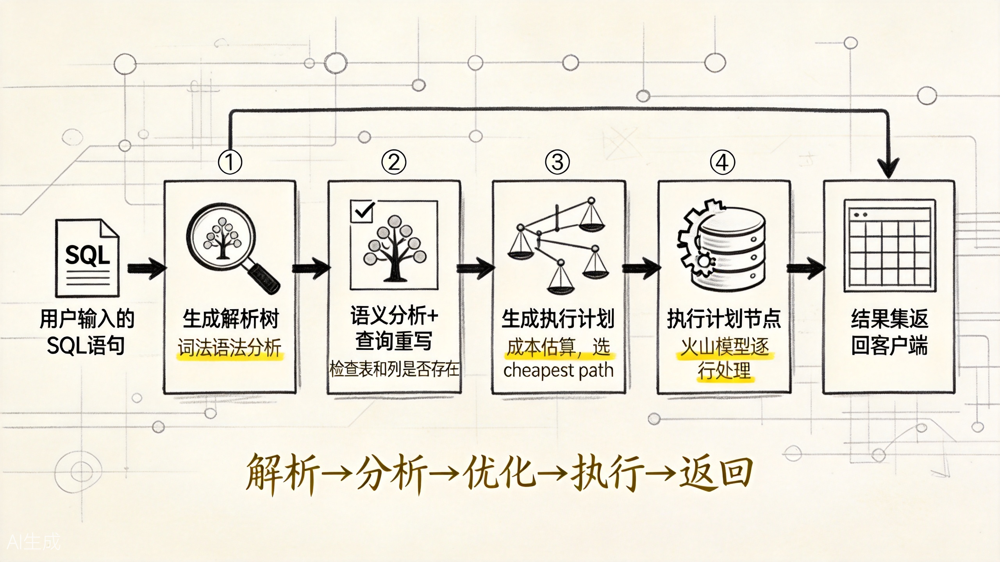
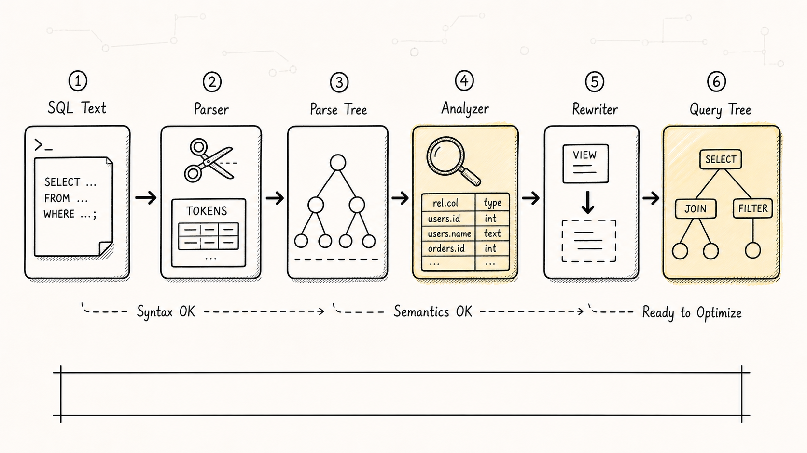
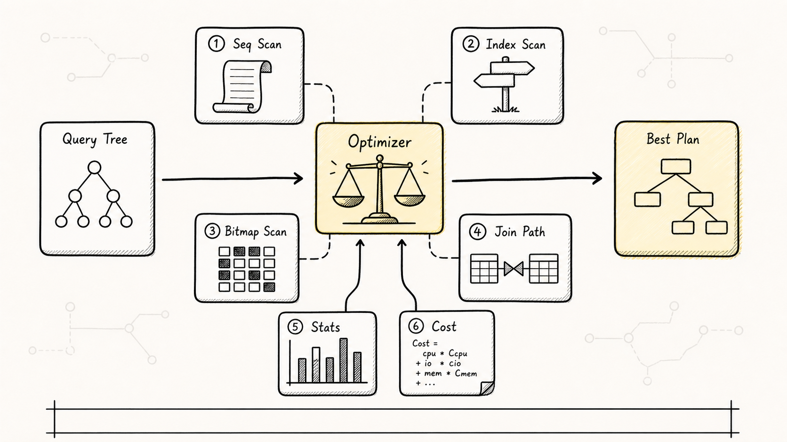
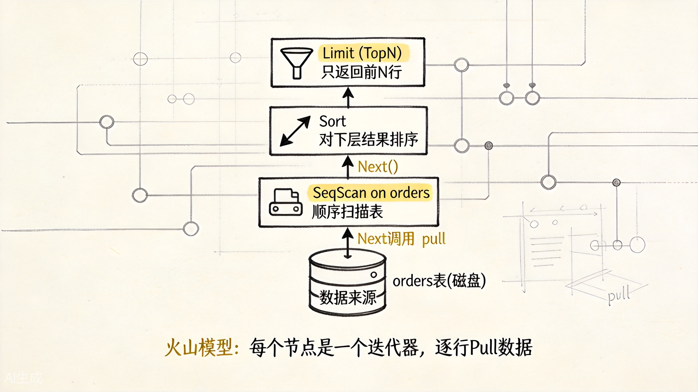
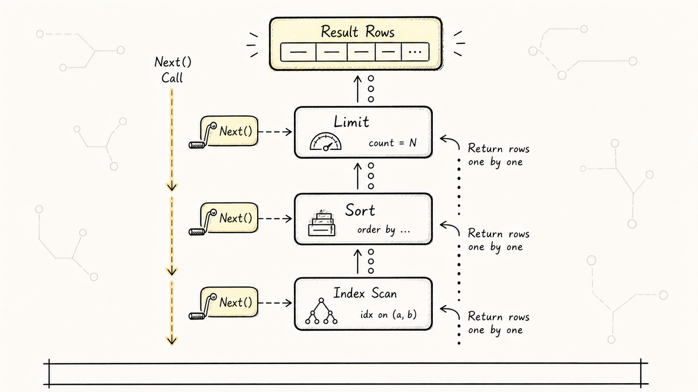
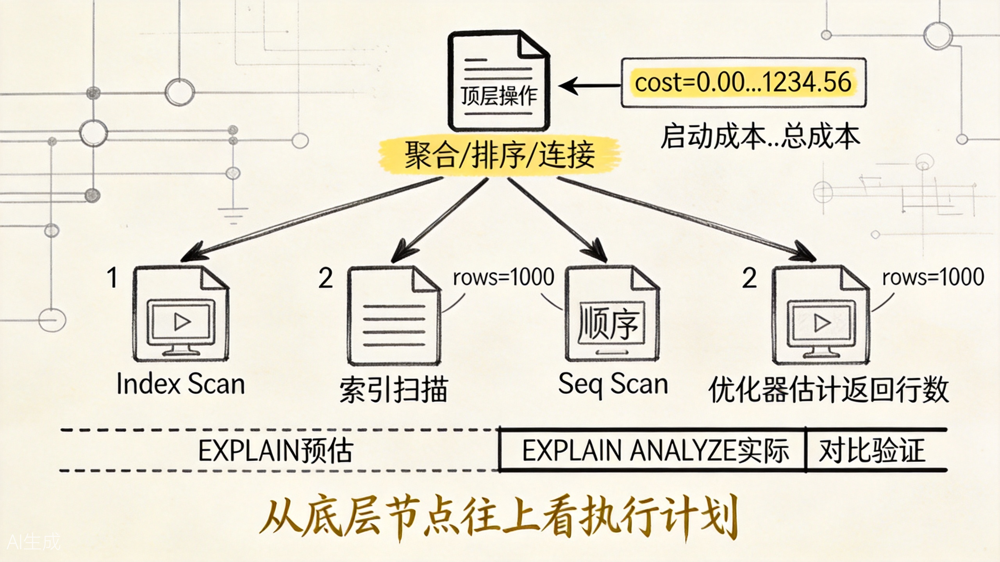

# PostgreSQL 执行流程：一条 SQL 是怎么被跑起来的

学 PostgreSQL 时，很多人会写 SQL、会建索引、也会看 `EXPLAIN`，但中间到底发生了什么，往往还是一片模糊。

这篇文章把一条 SQL 从输入到输出的完整流程拆开，重点不是背组件名，而是把每个阶段到底在解决什么问题讲清楚。

## 一、全局视角：五个阶段

PostgreSQL 处理一条查询，大致经历五个阶段：




上图展示了一条 SQL 从输入到结果的完整处理流水线。每个阶段各司其职，最终把文本查询变成可执行的计划树。

前三个阶段（解析、分析、重写）可以统称为"查询编译"阶段。后两个阶段（优化、执行）是"查询执行"阶段。



## 二、第一阶段：Parser（解析器）

Parser 的任务是把 SQL 文本变成一棵"解析树"（Parse Tree）。

它分两步：

1. **词法分析（Lexical Analysis）**：把 SQL 字符串拆成一个个 token。比如 `SELECT id FROM users WHERE id = 1` 会被拆成 `SELECT`、`id`、`FROM`、`users`、`WHERE`、`id`、`=`、`1`。
2. **语法分析（Syntax Analysis）**：根据 SQL 语法规则，把这些 token 组织成一棵语法树。

如果 SQL 写错了，在这个阶段就会报错：

```sql
SELECT * FRM users;
-- ERROR: syntax error at or near "FRM"
```

Parser 只关心语法是否正确，不关心表和列是否真的存在。那是下一阶段的事情。

## 三、第二阶段：Analyzer（分析器）

Analyzer 的任务是语义分析：检查解析树中的各种对象是否真的存在，并补充类型信息。

具体做这些事：

1. **查找关系**：`users` 这个表存在吗？
2. **查找列**：`id` 是这个表的列吗？
3. **类型检查**：`WHERE id = 'abc'` 中，`id` 是整数列，跟字符串比较是否合法？（需要类型转换吗？）
4. **权限检查**：当前用户有权限读这个表吗？

如果表不存在，在这个阶段报错：

```sql
SELECT * FROM non_existent_table;
-- ERROR: relation "non_existent_table" does not exist
```

Analyzer 输出的是一棵"查询树"（Query Tree），带有完整的类型信息和对象引用。

## 四、第三阶段：Rewriter（重写器）

Rewriter 的任务是查询重写。最著名的场景就是视图（View）和规则（Rule）。

如果你查的是一个视图，Rewriter 会把它展开成底层表的查询。

```sql
CREATE VIEW active_users AS
SELECT * FROM users WHERE status = 'active';

SELECT * FROM active_users WHERE id > 100;
-- 被重写成：
-- SELECT * FROM users WHERE status = 'active' AND id > 100;
```

Rewriter 还处理一些特殊语法，比如 `UPDATE ... RETURNING`。

大部分简单查询在这一阶段不会有什么变化。

## 五、第四阶段：Optimizer（优化器）

这是整个流程中最复杂的阶段，也是性能调优的核心关注点。

Optimizer 的任务是：**生成多个可能的执行计划，估算每个计划的成本，选择最便宜的。**

### 5.1 生成候选路径

对于同一个查询，可能有多种执行方式。

比如：

```sql
SELECT * FROM orders WHERE user_id = 100 AND status = 'PAID';
```

可能的执行方式包括：

1. **Seq Scan + Filter**：全表扫描，逐行过滤。
2. **Index Scan on (user_id)**：先走 user_id 索引，再回表过滤 status。
3. **Index Scan on (user_id, status)**：走联合索引，可能不用回表。
4. **Bitmap Index Scan**：先 bitmap 扫描，再批量回表。



### 5.2 成本估算

优化器用"成本模型"估算每种方式的开销：

```text
总成本 = IO成本 + CPU成本

IO成本 = 顺序读page数 × seq_page_cost
       + 随机读page数 × random_page_cost

CPU成本 = 处理行数 × cpu_tuple_cost
        + 处理索引条目 × cpu_index_tuple_cost
        + 处理操作数 × cpu_operator_cost
```

这些成本参数可以在 `postgresql.conf` 中配置：

```sql
SHOW seq_page_cost;      -- 默认 1.0
SHOW random_page_cost;   -- 默认 4.0
SHOW cpu_tuple_cost;     -- 默认 0.01
```

### 5.3 统计信息是关键

成本估算依赖于表和索引的统计信息。PostgreSQL 通过 `ANALYZE` 命令收集这些统计：

```sql
ANALYZE orders;
```

统计信息包括：

- 表的总行数
- 每个列的分布（直方图）
- 最频繁出现的值（MCV）
- 索引的选择性

如果统计信息不准，优化器会做出错误的成本估算，从而选择错误的执行计划。这就是为什么定期 `ANALYZE` 很重要。

## 六、第五阶段：Executor（执行器）

Optimizer 生成的是一棵"计划树"（Plan Tree），Executor 负责真正执行它。

### 6.1 火山模型（Volcano / Iterator Model）

PostgreSQL 的执行器采用火山模型。每个计划节点都是一个"迭代器"，提供三个基本操作：

- **Init**：初始化，分配资源
- **Next**：返回下一行数据
- **Rescan**：重置状态，从头再来



上图展示了火山模型的嵌套迭代器结构。数据从底层节点向上层节点"流动"，每个节点处理完自己的逻辑后，把结果交给父节点。



### 6.2 执行过程示例

以这个查询为例：

```sql
SELECT * FROM orders WHERE user_id = 100 ORDER BY created_at LIMIT 10;
```

计划树可能是：

```text
Limit (cost=... rows=10)
  -> Sort (cost=... rows=100)
    -> Index Scan on orders_user_id_idx (cost=... rows=100)
```

执行时：

1. **Limit 节点**调用 Sort 的 Next()
2. **Sort 节点**需要收集所有数据才能排序，于是循环调用 Index Scan 的 Next()，直到数据收完
3. **Index Scan 节点**从索引中逐行读取满足 `user_id = 100` 的数据
4. Sort 排序完成后，逐行返回给 Limit
5. Limit 收到 10 行后停止

### 6.3 不同类型的节点

| 节点类型 | 例子 | 说明 |
|----------|------|------|
| 扫描节点 | SeqScan, IndexScan, BitmapHeapScan | 从表或索引读取数据 |
| 连接节点 | NestLoop, HashJoin, MergeJoin | 多表连接 |
| 物化节点 | Sort, Materialize, Aggregate | 需要缓存数据的运算 |
| 控制节点 | Limit, Unique, LockRows | 控制数据流 |

## 七、EXPLAIN：观察执行计划的窗口

`EXPLAIN` 是理解执行流程的利器。

### 7.1 基本用法

```sql
EXPLAIN SELECT * FROM orders WHERE user_id = 100;
```

输出的是优化器选择的执行计划，以及成本估算。

### 7.2 加上 ANALYZE

```sql
EXPLAIN (ANALYZE) SELECT * FROM orders WHERE user_id = 100;
```

这样不仅会显示计划，还会**实际执行**查询，并显示真实的执行时间和行数。

### 7.3 关键指标解读

```text
Index Scan using orders_user_id_idx  (cost=0.29..8.30 rows=10 width=36)
                                    (actual time=0.015..0.023 rows=8 loops=1)
```

| 字段 | 含义 |
|------|------|
| `cost=0.29..8.30` | 启动成本..总成本（估算） |
| `rows=10` | 估算返回行数 |
| `width=36` | 估算每行平均字节数 |
| `actual time=0.015..0.023` | 实际启动时间..总时间（毫秒） |
| `rows=8` | 实际返回行数 |
| `loops=1` | 该节点被执行的次数 |



上图展示了 EXPLAIN 输出中各字段的含义和树状结构。重点关注：**估算行数（rows）和实际行数（rows）的差距**。如果差距很大，说明统计信息不准，可能需要 `ANALYZE`。

## 八、一分钟复习

1. SQL 执行分五个阶段：解析 → 分析 → 重写 → 优化 → 执行。
2. 优化器是性能核心，它基于成本模型和统计信息选择执行计划。
3. 执行器用火山模型，每个节点是一个迭代器，逐行处理数据。
4. `EXPLAIN (ANALYZE)` 是观察执行计划的利器，关注估算 vs 实际的差距。
5. 定期 `ANALYZE` 保持统计信息准确，是优化器做出正确决策的前提。

**调优的本质：让优化器选择正确的执行计划。手段是建合适的索引、保持统计信息准确、理解成本模型。**
