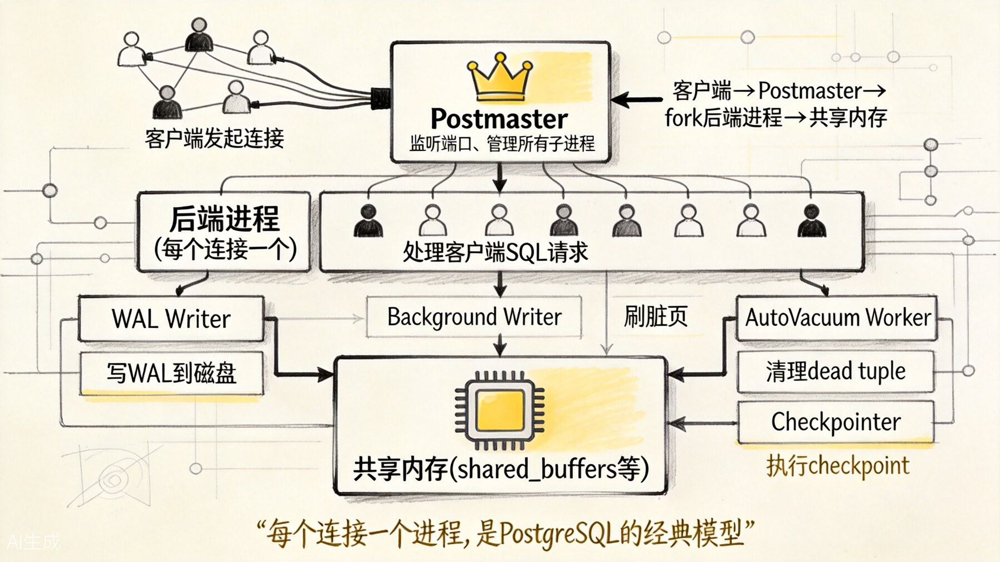
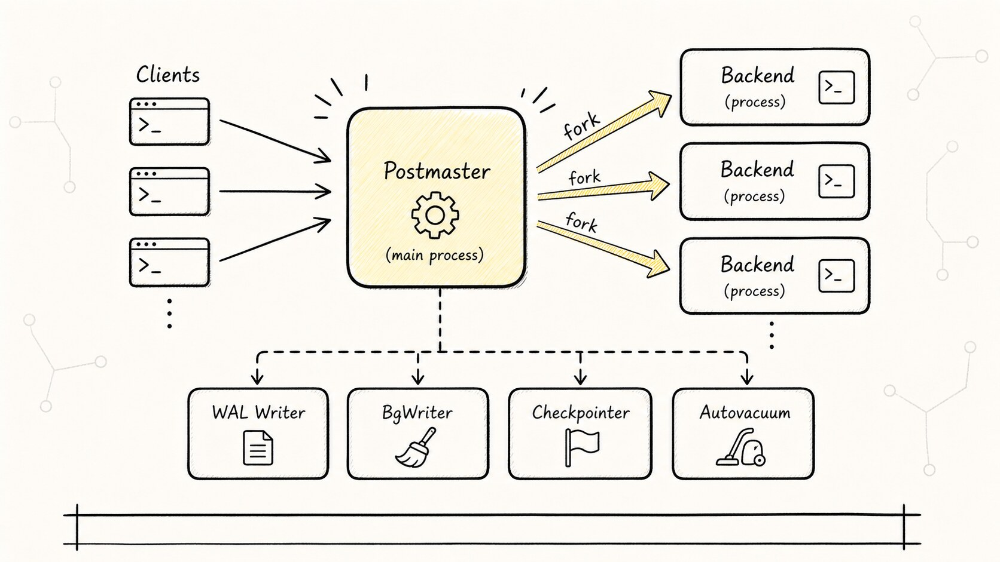
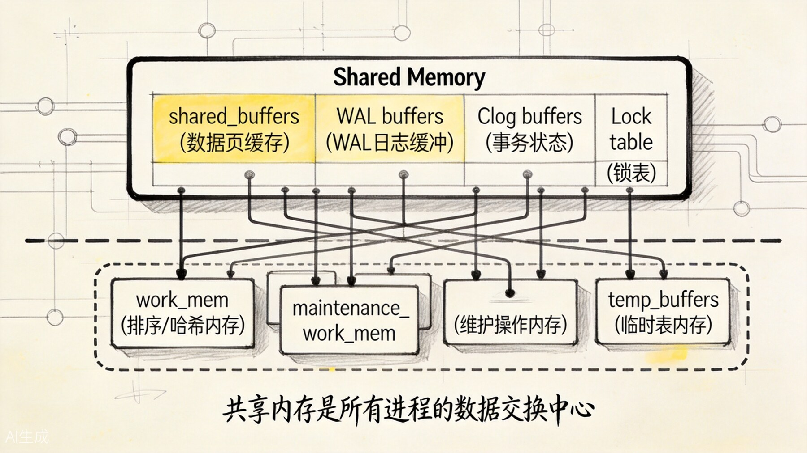
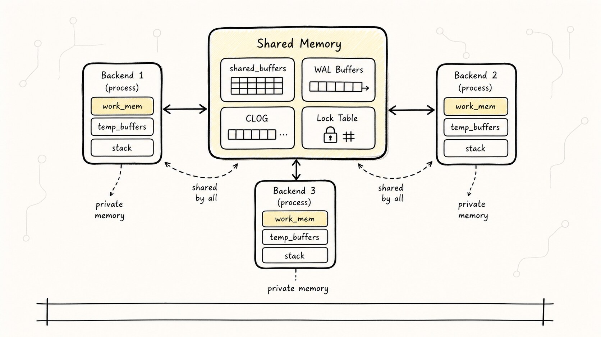
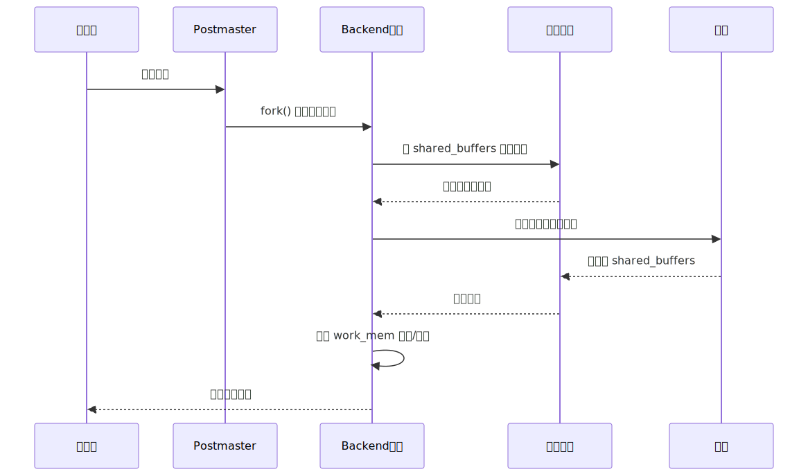
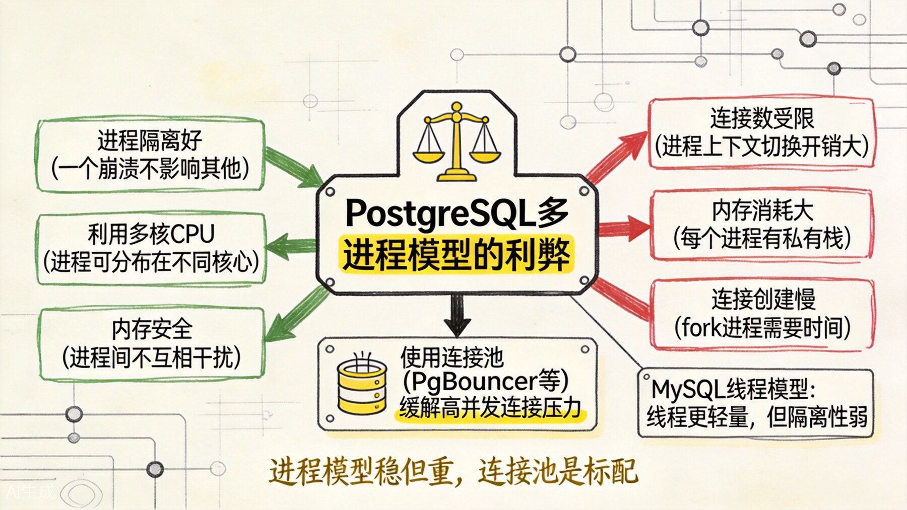
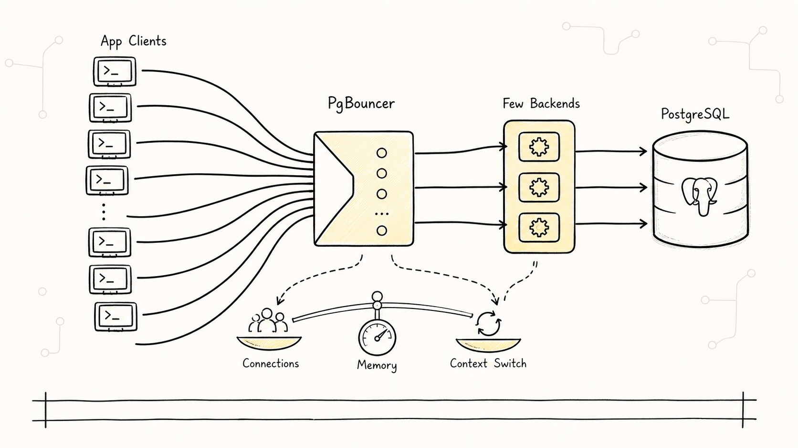

# PostgreSQL 架构：进程模型与内存模型

要真正理解 PostgreSQL，只学 SQL 语法和调优参数还不够。你还得知道它的**进程模型**和**内存模型**，因为很多现象最后都会落回这两层：为什么连接数上不去，为什么某些参数一调就牵一发动全身，为什么同样是数据库，PostgreSQL 的资源使用习惯和别家不太一样。

## 一、进程模型：每个连接一个进程

PostgreSQL 采用经典的多进程架构（不是多线程）。





上图展示了 PostgreSQL 的经典进程架构。Postmaster 是所有进程的"老祖宗"，负责监听端口、接受连接、管理子进程。



### 1.1 Postmaster（主进程）

Postmaster 是第一个启动的进程，它负责：

1. 监听配置端口（默认 5432），等待客户端连接。
2. 收到连接请求后，`fork()` 一个后端进程（Backend）来处理。
3. 管理各种辅助进程的启动和重启。
4. 如果某个后端进程崩溃，Postmaster 会收到信号，并清理资源。

如果 Postmaster 自己挂了，整个数据库实例就停了。

### 1.2 Backend（后端进程）

每个客户端连接，PostgreSQL 都会创建一个独立的进程来处理。

```sql
-- 查看当前连接和对应的进程
SELECT pid, usename, application_name, state, query
FROM pg_stat_activity;
```

这种设计的优点是：

- **崩溃隔离**：一个连接对应的进程崩溃了，不会影响其他连接。
- **内存安全**：进程间内存隔离，不会出现线程间的数据竞争问题。
- **利用多核**：多个进程可以分布在多个 CPU 核心上运行。

缺点也很明显：

- **进程创建有开销**：`fork()` 不是免费的，大量短连接会消耗很多 CPU。
- **内存占用大**：每个进程都有自己的私有内存空间。
- **连接数受限**：进程上下文切换有开销，连接数太多会导致性能下降。

（生产环境的经验值：PostgreSQL 的并发连接通常控制在几百个以内。上千个连接时，就需要连接池来缓解压力了。）

### 1.3 辅助进程

除了处理客户端的 Backend，PostgreSQL 还有一些常驻的辅助进程：

| 进程 | 职责 |
|------|------|
| **WAL Writer** | 把 WAL 缓冲区中的日志写入磁盘 |
| **Background Writer** | 定期把 shared_buffers 中的脏页刷回磁盘 |
| **Checkpointer** | 执行 checkpoint，标记一致性点 |
| **AutoVacuum Launcher/Worker** | 自动清理 dead tuple，更新统计信息 |
| **Stats Collector** | 收集统计信息，供 pg_stat_* 视图使用 |
| **Logger** | 记录日志（如果启用了日志收集器） |

这些进程各司其职，保障数据库的正常运转。

## 二、内存模型：共享内存 + 进程私有内存



上图展示了 PostgreSQL 的内存架构——共享内存是所有进程的数据交换中心，每个进程还有自己的私有内存。



### 2.1 共享内存（Shared Memory）

共享内存是所有 PostgreSQL 进程都能访问的内存区域，主要包括：

#### shared_buffers

缓存表数据和索引 page 的地方。所有后端进程都从这里读写数据。

```sql
SHOW shared_buffers;
```

#### WAL Buffers

WAL 日志的缓冲区。事务提交时，WAL 记录先写到这里，再由 WAL Writer 刷盘。

```sql
SHOW wal_buffers;
```

#### CLOG Buffers

事务状态缓冲区。它服务于事务状态查询和可见性判断；如果你刚读过事务篇，可以把它理解成 MVCC 运行时要查的一张状态表。

#### Lock Table

锁表。记录各种锁（行锁、表锁等）的状态。

#### 其他共享数据结构

比如 Buffer Mapping 表、进程数组、统计信息缓冲区等。

### 2.2 进程私有内存

每个 Backend 进程还有自己的私有内存空间：

#### work_mem

用于排序（Sort）、哈希连接（Hash Join）、哈希聚合（Hash Aggregate）等操作。

```sql
SHOW work_mem;  -- 默认 4MB
```

如果一个操作需要排序的数据超过了 work_mem，PostgreSQL 会把数据写到临时文件中（磁盘排序），性能会急剧下降。

```sql
-- 查看是否有临时文件产生
SELECT * FROM pg_stat_database WHERE temp_files > 0;
```

#### maintenance_work_mem

用于维护操作（VACUUM、CREATE INDEX、ALTER TABLE 等）。

```sql
SHOW maintenance_work_mem;  -- 默认 64MB
```

#### temp_buffers

用于临时表。

```sql
SHOW temp_buffers;  -- 默认 8MB
```

#### 进程栈

每个进程都有自己的调用栈，用于函数调用和局部变量。

## 三、进程与内存的协作

当一个客户端执行查询时，流程是这样的：



1. 客户端连接 → Postmaster fork 一个 Backend。
2. Backend 从 shared_buffers 读取数据页。
3. 如果 page 不在内存，从磁盘读入 shared_buffers。
4. 查询处理过程中，排序/哈希等操作使用进程私有的 work_mem。
5. 结果返回客户端。

## 四、连接数问题与连接池



上图展示了 PostgreSQL 多进程模型的利弊权衡。由于每个连接一个进程的设计，PostgreSQL 对高并发连接数不如线程模型的数据库友好。

### 4.1 为什么不直接用线程？

PostgreSQL 选择进程而不是线程，主要是历史原因和稳定性考虑：

- 进程隔离更好，一个崩溃不影响其他。
- PostgreSQL 的代码基线很早，当时线程模型还不够成熟。
- 进程模型让内存管理和调试更简单。

### 4.2 连接池是标配

在生产环境中，几百个连接对 PostgreSQL 来说已经是比较大的压力了。如果应用层有成千上万的长连接，必须通过连接池来缓解。

常见的连接池方案：

| 方案 | 说明 |
|------|------|
| **PgBouncer** | 最轻量的连接池，可以放在数据库服务器或应用服务器上 |
| **Pgpool-II** | 功能更丰富，除了连接池还有负载均衡、读写分离、高可用 |
| **应用层连接池** | 比如 Java 的 HikariCP，Go 的 sql.DB |

通常的架构是：

```text
应用(很多连接) → PgBouncer(维护少量连接) → PostgreSQL
```



PgBouncer 可以维持与 PostgreSQL 的少量长连接，而应用可以开很多连接到 PgBouncer。这样 PostgreSQL 的连接数始终保持在合理范围内。

### 4.3 连接数相关参数

```sql
SHOW max_connections;        -- 最大连接数
SHOW superuser_reserved_connections;  -- 为超级用户保留的连接数
```

`max_connections` 不是越大越好。每个连接至少占用几百 KB 到几 MB 的内存，连接数太多会导致内存压力和上下文切换开销。

## 五、与 MySQL 架构的对比

| 对比点 | PostgreSQL | MySQL (InnoDB) |
|--------|-----------|----------------|
| 并发模型 | 多进程 | 多线程（线程池可选） |
| 连接开销 | 高（fork 进程） | 低（创建线程） |
| 崩溃隔离 | 好（进程隔离） | 较弱（同进程内线程） |
| 内存模型 | 共享内存 + 私有内存 | 主要是共享缓冲池 |
| 连接池 | 几乎必须 | 建议但非必须 |
| 扩展性 | 适合中等并发，配合连接池 | 原生高并发更好 |

## 六、一分钟复习

1. PostgreSQL 是多进程架构：每个连接一个进程。
2. Postmaster 是主进程，管理所有子进程。
3. 共享内存包括 shared_buffers、WAL buffers、CLOG、锁表等，所有进程共享。
4. 进程私有内存包括 work_mem、maintenance_work_mem、temp_buffers 等。
5. 高并发场景下，连接池（PgBouncer）几乎是标配。
6. 进程模型的优点是隔离性和稳定性，缺点是连接开销大。

**理解 PostgreSQL 的架构，是理解很多性能问题和设计决策的基础。进程模型决定了它的并发特性，内存模型决定了它的调优方向。**
