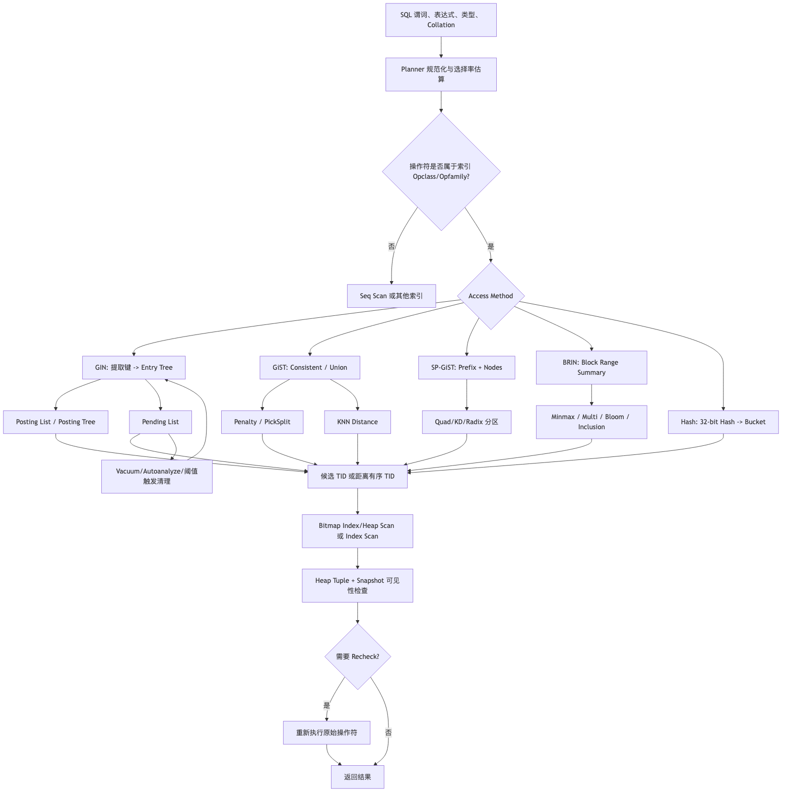
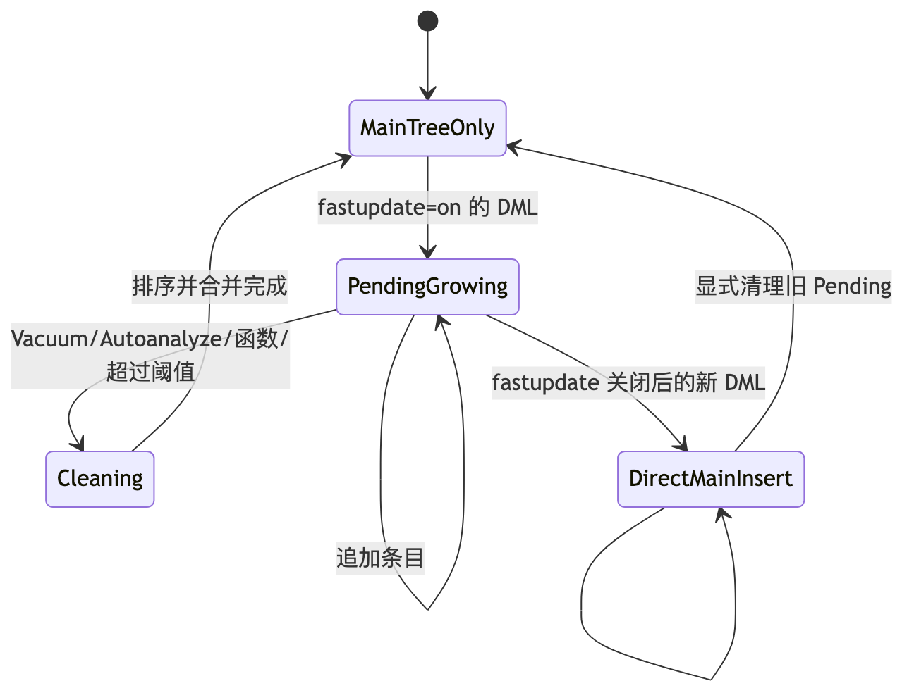
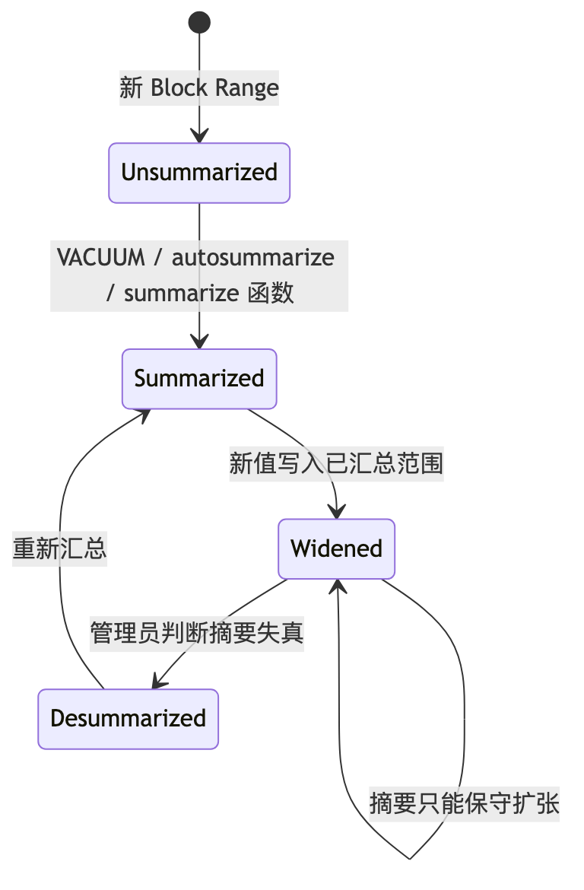

# 第 8 章：GIN、GiST、SP-GiST、BRIN、Hash 与 Operator Class

> **技术基线**：PostgreSQL 18 稳定版；兼顾 PostgreSQL 14—18。Go 示例使用 `github.com/jackc/pgx/v5` 与 `pgxpool`。PostgreSQL 19 仅处于开发/预览阶段，不作为生产基线。
>
> **本章核心结论**：索引不是“列的数据结构”，而是“访问方法 + Operator Class + 查询表达式 + 操作符语义”的组合。只有查询谓词、表达式、数据类型、排序规则和 Operator Class 能够匹配，Planner 才可能使用该索引。

---

## 1. 本章定位

B-tree 适合可排序标量上的等值、范围和排序，但生产查询经常超出“一维全序”模型：

- 一个 JSONB 文档是否包含某个键值；
- 一个数组是否包含指定元素；
- 一段文本是否命中词项、三元组或相似度条件；
- 两个时间范围是否重叠；
- 一个地址是否属于某个网络；
- 哪些点离目标点最近；
- 数十亿行时序数据中，哪些物理块可能覆盖目标时间段；
- 只做长值等值查找时，能否用更紧凑的哈希表示。

这些问题需要专用索引访问方法：

- **GIN**：把复合值拆成可检索键，建立倒排映射；
- **GiST**：通过可扩展的“包围、剪枝、分裂、距离”接口组织平衡搜索树；
- **SP-GiST**：把四叉树、k-d 树、基数树等空间分区树映射到磁盘页；
- **BRIN**：为连续堆页范围保存摘要，以极小空间排除不可能命中的物理块；
- **Hash**：保存 32 位哈希码，只支持等值匹配；
- **Operator Class / Operator Family**：定义某种数据类型在某种访问方法中，哪些操作符和支持函数具有可索引语义。

### 1.1 为什么生产环境必须掌握

错误选择专用索引通常不会表现为“查询直接报错”，而会表现为更危险的渐进退化：

1. 索引存在但操作符不匹配，Planner 只能顺序扫描；
2. 索引只能给出候选集合，误匹配和 Heap Recheck 消耗大量 CPU/I/O；
3. GIN 写入看似稳定，Pending List 清理突然把 P99 拉高；
4. BRIN 很小，但数据物理相关性被回填或乱序写入破坏，扫描块数接近全表；
5. GiST/SP-GiST 的分布与分裂质量不佳，树遍历和重检成本迅速上升；
6. `jsonb_path_ops` 很紧凑，却无法支持 `?`、`?|`、`?&`；
7. `pg_trgm` 能处理中缀搜索，却被用于只有一个字符的通配模式，退化为大范围候选扫描；
8. 新增大索引产生 WAL、Checkpoint 压力和复制延迟，故障切换后副本还未追平。

### 1.2 与前后章节的关系

- 依赖第 3 章的 Page、Tuple、Buffer、TOAST 基础；
- 依赖第 4、5 章的 B-tree、索引扫描、在线创建与生命周期；
- 依赖第 6、7 章的 Planner、`EXPLAIN`、选择率与统计信息；
- 为第 9 章的 MVCC 可见性、第 11 章的锁与热点、第 12 章的 VACUUM 提供索引侧背景。

### 1.3 本章不展开

本章不深入：

- PostGIS 的具体几何算法与地理坐标系；
- 用 C 编写自定义 Operator Class 的完整 ABI；
- 在线 DDL 的全部锁时间线；
- 全文检索词典、分词器和排名算法的完整体系；
- 分区、复制、备份和故障转移的完整实现。

这些主题只在与专用索引直接相关时说明。

---

## 2. 可验证的学习目标

完成本章后，你应当能够：

1. 根据查询操作符判断 GIN、GiST、SP-GiST、BRIN、Hash 或 B-tree 是否具备可索引语义；
2. 查询系统目录，确认一个索引实际使用的 Access Method、Operator Class 与 Operator Family；
3. 解释 GIN Entry Tree、Posting List、Posting Tree、Pending List 和 `fastupdate` 的状态变化；
4. 比较 `jsonb_ops` 与 `jsonb_path_ops` 的操作符支持、索引大小、选择性和写放大；
5. 解释 GiST 的 `Consistent`、`Union`、`Penalty`、`PickSplit` 与 KNN 搜索如何协同；
6. 说明 SP-GiST 与 GiST 在树结构、数据分区和适用场景上的差异；
7. 使用 `pg_stats.correlation`、`EXPLAIN (ANALYZE, BUFFERS)` 和 Heap Recheck 指标判断 BRIN 是否有效；
8. 为 Minmax、Minmax Multi、Bloom、Inclusion 选择合理场景，并解释 `pages_per_range` 的代价；
9. 解释“操作符类本身的有损匹配”和“Bitmap 因 `work_mem` 不足退化为 lossy page bitmap”的区别；
10. 通过三组可复现实验比较 JSONB GIN、B-tree/BRIN、GIN/GiST `pg_trgm`；
11. 使用 Go、`pgx/v5`、`pgxpool` 实现参数化 JSONB、全文和模糊查询，并正确处理超时、取消、Rows 与错误分类；
12. 根据 P95/P99、Buffers、WAL、I/O、等待事件和复制延迟制定排障与修复方案。

---

## 3. 核心术语

| 中文名称 | English | 准确定义 | 容易混淆的概念 | 所属层次 |
|---|---|---|---|---|
| 访问方法 | Access Method | B-tree、GIN、GiST 等通用索引框架，负责页面、并发、WAL 和扫描协议 | Operator Class | 存储/执行器 |
| 操作符类 | Operator Class / Opclass | 某数据类型在某访问方法下的一组可索引操作符与支持函数 | Operator Family | 系统目录/语义 |
| 操作符族 | Operator Family / Opfamily | 关联多个 Opclass，允许同一访问方法中的跨类型操作符共享语义 | 单个 Opclass | 系统目录/语义 |
| 策略号 | Strategy Number | Access Method 用来标识操作符语义的内部编号 | SQL 运算符优先级 | Opclass 接口 |
| 支持函数 | Support Function | 比较、提取键、判定一致性、计算距离、分裂页面等内部函数 | 普通 SQL 函数 | Opclass 接口 |
| 倒排索引 | Inverted Index | 从“元素/词项”映射到包含它们的行标识集合 | B-tree 对整值排序 | GIN |
| 键 | GIN Key | 从数组、JSONB、`tsvector` 等复合 Item 中提取出的可检索元素 | Heap 行或原始文档 | GIN |
| Posting List | Posting List | 与一个 GIN Key 关联、可直接放入索引元组的小型 TID 列表 | Pending List | GIN |
| Posting Tree | Posting Tree | 当某键对应 TID 过多时，单独保存这些 TID 的 B-tree | Entry Tree | GIN |
| Pending List | Pending List | `fastupdate` 开启时暂存新 GIN 条目的未排序区域 | Posting List | GIN |
| 一致性函数 | Consistent | 判断某索引摘要/键是否不可能、可能或确定满足查询 | SQL 一致性级别 | GIN/GiST/BRIN |
| 重检 | Recheck | 从候选 TID 取出 Heap Tuple 后重新执行原始谓词 | MVCC 可见性检查 | Executor |
| 有损匹配 | Lossy Match | 索引只证明“可能匹配”，不能证明“必然匹配” | 数据丢失 | 索引/Bitmap |
| 广义搜索树 | GiST | 可通过包围摘要和支持函数实现多种平衡搜索树的框架 | 固定 R-tree 实现 | GiST |
| 并集摘要 | Union | 计算能覆盖多个子节点的父节点键 | SQL `UNION` | GiST |
| 惩罚值 | Penalty | 估计把新值插入某子树后摘要扩张的成本 | Planner Cost | GiST |
| 页面分裂 | PickSplit | 决定 GiST 页面满时如何把条目分成两组 | B-tree 固定中点分裂 | GiST |
| 最近邻 | KNN | 利用 Opclass 的距离排序操作符按距离递增扫描 | 先全量计算再排序 | GiST/SP-GiST |
| 空间分区 GiST | SP-GiST | 支持四叉树、k-d 树、基数树等非平衡分区结构的磁盘框架 | GiST 的子类 | SP-GiST |
| 块范围 | Block Range | BRIN 用一个摘要元组覆盖的一组物理相邻 Heap Page | SQL 分区 | BRIN |
| 摘要元组 | Summary Tuple | 描述一个 Block Range 中值域、集合近似或包围对象的索引元组 | 普通 Index Tuple | BRIN |
| Minmax | Minmax | 保存每个 Block Range 的最小值和最大值 | 全表统计直方图 | BRIN Opclass |
| Minmax Multi | Minmax Multi | 保存多个点或区间，比单一 min/max 更能表达多簇值 | 多列 BRIN | BRIN Opclass |
| BRIN Bloom | Bloom | 为一个 Block Range 保存概率型集合摘要，仅用于等值候选判断 | `bloom` 扩展索引 | BRIN Opclass |
| Inclusion | Inclusion | 保存一个能够包含范围内所有值的包围值，如几何包围盒、网络包含摘要 | Minmax | BRIN Opclass |
| 物理相关性 | Physical Correlation | 列值顺序与 Heap 物理块顺序的相关程度，`pg_stats.correlation` 可提供估计 | 列间相关性 | 统计信息 |
| Hash Bucket | Hash Bucket | Hash 索引按哈希码定位的桶页及其溢出页链 | Hash Join 的哈希表 | Hash Index |
| 排除约束 | Exclusion Constraint | 保证任意两行不会让指定操作符组合全部为真，常由 GiST 支撑 | Unique Constraint | 约束/并发正确性 |

---

## 4. 整体心智模型



### 4.1 数据流

1. SQL 提供的不只是“列名”，还包括左侧表达式、右侧类型、操作符、Collation 与常量/参数；
2. Planner 在系统目录中确认该操作符是否属于索引列选用的 Opclass 或同一 Opfamily；
3. Access Method 产生候选 TID：
   - GIN 从查询中提取键并合并 Posting；
   - GiST/SP-GiST 根据摘要剪枝或按距离有序遍历；
   - BRIN 返回可能命中的 Heap Block Range；
   - Hash 根据 32 位哈希码定位 Bucket；
4. Executor 访问 Heap，检查 MVCC 可见性，并在需要时重检原始谓词。

### 4.2 控制流

- Access Method 负责通用页面访问、并发协议和 WAL；
- Opclass 负责领域语义，例如“如何从 JSONB 提取键”“一个包围盒是否可能与查询相交”“两个点的距离下界是多少”；
- Planner 负责是否使用、如何组合多个索引、是否构建 Bitmap；
- Executor 负责 Snapshot、Heap 访问、Recheck、排序和结果返回。

### 4.3 状态变化

- GIN：主树稳定区 + Pending List；清理时批量合并；
- GiST/SP-GiST：插入导致节点摘要扩大，页面满时分裂；
- BRIN：新 Block Range 先处于未汇总状态，Vacuum/Autosummarize/函数调用后生成摘要；
- Hash：桶满后建立溢出页，必要时分裂 Bucket；
- 所有索引：DML 产生索引页修改和 WAL，删除项最终由 Vacuum 清理或标记可回收。

### 4.4 故障路径

- Opclass 不匹配：索引未损坏，但计划不能利用它；
- 摘要过宽或 Bitmap lossy：结果仍正确，但重检和 Heap I/O 激增；
- GIN Pending List 过大：查询需额外扫描 Pending，触发前台清理时出现尾延迟；
- 长事务阻碍清理：索引和 Heap 死元组持续存在；
- 索引损坏：可能出现错误结果或读取错误；应先隔离、校验、确认备份，再按根因决定 `REINDEX` 或恢复。

---

## 5. 使用方式

### 5.1 首先选择“谓词”，再选择“索引类型”

| 查询目标 | 典型谓词 | 首选候选 | 关键前提 |
|---|---|---|---|
| 标量等值/范围/排序 | `=`, `<`, `BETWEEN`, `ORDER BY` | B-tree | 具备全序；通常仍是默认选择 |
| 仅等值，值很长且分布均匀 | `=` | Hash 或 B-tree | Hash 单列、非唯一、仅等值；必须实测 |
| JSONB 包含/键存在 | `@>`, `?`, `?|`, `?&`, `@?`, `@@` | GIN | Opclass 与操作符必须匹配 |
| 数组包含/重叠 | `@>`, `<@`, `&&`, `=` | GIN `array_ops` | 数组元素可提取 |
| 全文检索 | `tsvector @@ tsquery` | GIN `tsvector_ops` | 查询表达式与索引表达式一致 |
| 范围重叠/排除冲突 | `&&`, `@>`, `<@` | GiST | Range Opclass；约束需要正确操作符组合 |
| 点、网络、空间分区 | 包含、相交、方向、距离 | GiST/SP-GiST | 使用相应 Opclass |
| 最近邻 | `ORDER BY col <-> $1 LIMIT n` | GiST/SP-GiST | Opclass 提供 Ordering Operator/Distance |
| 巨大且物理有序时序表 | 时间范围 | BRIN | 列值与 Heap 物理位置高度相关 |
| 文本中缀/模糊 | `LIKE '%abc%'`, `%`, `<->` | `pg_trgm` GIN/GiST | 模式能提取足够三元组；KNN 用 GiST |

### 5.2 常用建索引 SQL

```sql
-- Hash：单列、等值、不能声明 UNIQUE
CREATE INDEX users_email_hash_idx
ON app_user USING hash (email);

-- JSONB：默认 jsonb_ops
CREATE INDEX orders_doc_gin_ops_idx
ON orders USING gin (doc);

-- JSONB：仅 @>、@?、@@，通常更小、更聚焦
CREATE INDEX orders_doc_gin_path_idx
ON orders USING gin (doc jsonb_path_ops);

-- 数组
CREATE INDEX article_tags_gin_idx
ON article USING gin (tags);

-- 全文检索：索引表达式必须与查询表达式一致
CREATE INDEX article_search_gin_idx
ON article USING gin (
    to_tsvector('simple'::regconfig, coalesce(title, '') || ' ' || coalesce(body, ''))
);

-- Range + GiST
CREATE INDEX booking_during_gist_idx
ON booking USING gist (during);

-- 网络包含：显式指定非 B-tree Opclass
CREATE INDEX route_network_gist_idx
ON route USING gist (network inet_ops);

CREATE INDEX route_network_spgist_idx
ON route USING spgist (network inet_ops);

-- BRIN：时间列的默认 Minmax；参数必须通过实验选择
CREATE INDEX event_time_brin_idx
ON event USING brin (occurred_at)
WITH (pages_per_range = 64, autosummarize = on);

-- BRIN Minmax Multi
CREATE INDEX event_time_brin_multi_idx
ON event USING brin (occurred_at timestamptz_minmax_multi_ops)
WITH (pages_per_range = 64);

-- BRIN Bloom：等值候选，不支持范围
CREATE INDEX event_tenant_brin_bloom_idx
ON event USING brin (tenant_id int4_bloom_ops)
WITH (pages_per_range = 64);

-- pg_trgm
CREATE EXTENSION IF NOT EXISTS pg_trgm;
CREATE INDEX customer_name_trgm_gin_idx
ON customer USING gin (name gin_trgm_ops);

CREATE INDEX customer_name_trgm_gist_idx
ON customer USING gist (name gist_trgm_ops(siglen = 32));
```

`pages_per_range = 64` 和 `siglen = 32` 只是实验值，不是通用生产配置。应根据表页数、行宽、数据分布、查询选择性、内存、存储延迟和 SLO 重新测量。

### 5.3 JSONB 操作符匹配

```sql
-- jsonb_ops 和 jsonb_path_ops 都可支持
SELECT id FROM orders
WHERE doc @> $1::jsonb;

SELECT id FROM orders
WHERE doc @? $1::jsonpath;

-- 只有 jsonb_ops 支持这些存在操作符
SELECT id FROM orders WHERE doc ?  $1::text;
SELECT id FROM orders WHERE doc ?| $1::text[];
SELECT id FROM orders WHERE doc ?& $1::text[];
```

存在操作符 `?` 判断的是顶层键或数组元素。若谓词作用于表达式，通常需要表达式索引：

```sql
CREATE INDEX orders_tags_expr_gin_idx
ON orders USING gin ((doc -> 'tags'));

SELECT id
FROM orders
WHERE (doc -> 'tags') ? $1::text;
```

只有在左侧表达式与索引表达式等价时，上述索引才可直接匹配。把索引建在整个 `doc` 上，不代表任意 `doc -> ...` 表达式都能利用它。

### 5.4 GiST 排除约束

```sql
CREATE EXTENSION IF NOT EXISTS btree_gist;

CREATE TABLE room_booking (
    booking_id bigint GENERATED ALWAYS AS IDENTITY PRIMARY KEY,
    room_id    bigint NOT NULL,
    during     tstzrange NOT NULL,
    EXCLUDE USING gist (
        room_id WITH =,
        during  WITH &&
    )
);
```

其业务不变量是：不存在两行，使 `room_id = room_id` 与 `during && during` 同时为真。与应用层“先查再插”相比，排除约束能在并发下由数据库原子保证，但会引入 GiST 索引维护、谓词冲突检查和潜在等待。

### 5.5 KNN 查询形状

```sql
-- 点最近邻
SELECT id, location
FROM place
ORDER BY location <-> point($1, $2)
LIMIT $3;

-- pg_trgm 最近文本；需要 GiST gist_trgm_ops 才能做该 KNN 顺序扫描
SELECT id, name
FROM customer
ORDER BY name <-> $1::text
LIMIT $2;
```

不要把等价查询写成“先计算函数再排序全部行”，例如 `ORDER BY similarity(name, $1) DESC` 未必具有可索引的排序操作符形状。先用 `EXPLAIN` 验证是否出现对应的 GiST/SP-GiST Index Scan 与 `Order By`。

### 5.6 BRIN 汇总维护

```sql
-- 汇总全部尚未汇总的新范围
SELECT brin_summarize_new_values('event_time_brin_idx'::regclass);

-- 汇总包含指定 Heap Block 的范围
SELECT brin_summarize_range('event_time_brin_idx'::regclass, $1::bigint);

-- 摘要因大规模更新而失真时，可先取消指定范围摘要，再重建
SELECT brin_desummarize_range('event_time_brin_idx'::regclass, $1::bigint);
SELECT brin_summarize_range('event_time_brin_idx'::regclass, $1::bigint);
```

`autosummarize` 默认关闭。开启后也不是同步承诺：它向 Autovacuum 请求队列提交汇总任务，队列满时范围仍可能保持未汇总，日志会记录请求未被接受。

### 5.7 系统目录与诊断入口

```sql
-- 查看某表索引、Access Method、有效状态和定义
SELECT
    i.indexrelid::regclass AS index_name,
    am.amname             AS access_method,
    i.indisvalid,
    i.indisready,
    pg_size_pretty(pg_relation_size(i.indexrelid)) AS index_size,
    pg_get_indexdef(i.indexrelid) AS index_definition
FROM pg_index AS i
JOIN pg_class AS ic ON ic.oid = i.indexrelid
JOIN pg_am    AS am ON am.oid = ic.relam
WHERE i.indrelid = 'public.orders'::regclass
ORDER BY 1;

-- 展开每个索引列使用的 Opclass 与 Opfamily
SELECT
    idx.relname AS index_name,
    k.ordinality AS index_column_position,
    am.amname,
    opc.opcname,
    opc.opcintype::regtype AS input_type,
    opf.opfname
FROM pg_index AS ix
JOIN pg_class AS idx ON idx.oid = ix.indexrelid
JOIN pg_am AS am ON am.oid = idx.relam
CROSS JOIN LATERAL
    unnest(ix.indclass) WITH ORDINALITY AS k(opclass_oid, ordinality)
JOIN pg_opclass  AS opc ON opc.oid = k.opclass_oid
JOIN pg_opfamily AS opf ON opf.oid = opc.opcfamily
WHERE ix.indrelid = 'public.orders'::regclass
ORDER BY idx.relname, k.ordinality;

-- 列出某访问方法可用的 Opclass
SELECT
    am.amname,
    opc.opcname,
    opc.opcintype::regtype,
    opc.opcdefault
FROM pg_am AS am
JOIN pg_opclass AS opc ON opc.opcmethod = am.oid
WHERE am.amname IN ('gin', 'gist', 'spgist', 'brin', 'hash')
ORDER BY am.amname, opc.opcname;
```

`psql` 还可使用 `\dAc`、`\dAf`、`\dAo` 查看 Opclass、Opfamily 和操作符关系。

### 5.8 配置与存储参数

| 参数 | 作用 | 风险与验证方式 |
|---|---|---|
| GIN `fastupdate` | 允许先写 Pending List | 读查询需扫描 Pending；阈值清理可能制造 P99 峰值 |
| `gin_pending_list_limit` | Pending List 清理阈值；可被单索引参数覆盖 | 加大阈值不是免费优化，只会把单次清理做大 |
| BRIN `pages_per_range` | 一个摘要覆盖的 Heap 页数 | 小：索引更大更精确；大：索引更小但误匹配更多 |
| BRIN `autosummarize` | 请求 Autovacuum 汇总新范围 | 默认关；请求队列可能满；仍需监控未汇总范围 |
| GiST `buffering` | 构建时缓冲模式 | 现代 Opclass 可能支持排序构建；不要盲目强制 |
| `maintenance_work_mem` | 索引创建、维护可用内存 | GIN 构建很敏感；过大乘以并发维护任务会耗尽内存 |
| `work_mem` | Bitmap、Sort 等节点预算 | Bitmap 预算不足会从 exact TID 退化为 lossy page bitmap；排序可能写临时文件 |
| [PG18] `io_method` | 选择 AIO 实现 | 需结合内核、文件系统和 `pg_aios` 验证，不保证所有索引访问都加速 |
| [PG18] `io_combine_limit` / `io_max_combine_limit` | 控制读请求合并 | 主要影响 Heap 侧顺序/Bitmap 读取和维护，不改变 Opclass 语义 |

### 5.9 安全注意事项

- `EXPLAIN ANALYZE` 会真实执行 DML；用 `BEGIN`/`ROLLBACK` 只能回滚数据库事务内效果，Sequence、外部系统调用、非事务性副作用未必回滚；
- 普通 `CREATE INDEX` 会阻塞并发写入；`CREATE INDEX CONCURRENTLY` 降低写阻塞，但需要多阶段扫描、等待旧事务，并产生更高资源与运维复杂度；
- 不要在生产高峰随意 `REINDEX`、修改 `fastupdate` 或一次性创建多个大 GIN/GiST；
- 不要为测试关闭 `fsync`、`full_page_writes`、Autovacuum、数据校验或同步复制保护；
- 扩展创建、`pageinspect`、`pgstattuple`、`amcheck` 可能需要额外权限，应在受控角色和维护窗口使用。

---

## 6. 底层原理

### 6.1 Operator Class：索引可用性的语义契约

一条索引定义至少包含四层信息：

```text
索引列/表达式
  + 数据类型与 Collation
  + Access Method
  + Operator Class
  = 可接受的操作符、排序操作符和支持函数
```

例如：

```sql
CREATE INDEX orders_doc_path_idx
ON orders USING gin (doc jsonb_path_ops);
```

该定义不是“为 `doc` 的所有 JSONB 查询建索引”，而是选择了 GIN 访问方法中的 `jsonb_path_ops` 语义。它只声明 `@>`、`@?`、`@@` 可被该索引处理。`doc ? 'tenant_id'` 是合法 SQL，但不属于此 Opclass，Planner 不能把它转化为该索引的 Scan Key。

Operator Family 解决跨类型一致性。例如一个族可以声明 `int4` 与 `int8` 之间的比较操作符和支持函数，让 Planner 知道跨类型操作仍保持同一排序或等值语义。一个 Opclass 是某个类型在某访问方法中的具体入口，一个 Opfamily 是一组彼此兼容的语义集合。

索引匹配失败的常见原因：

1. 操作符不在 Opclass 中；
2. 左侧表达式不同，例如索引是 `lower(name)`，查询却是 `name ILIKE ...`；
3. 参数发生不期望的隐式类型转换；
4. Collation 或 Pattern Opclass 不匹配；
5. 查询把可索引表达式包在不可下推函数中；
6. KNN 使用了函数排序，而不是 Opclass 的 Ordering Operator；
7. 部分索引谓词无法由查询条件蕴含。

### 6.2 Hash Index

Hash 索引对输入值计算哈希，只在索引中保存 **4 字节哈希码**和行定位信息，而不保存完整索引键。扫描流程是：

```text
查询值 -> 同一哈希函数 -> Bucket -> Bucket Page/Overflow Page
       -> 找到相同哈希码的候选 TID -> 访问 Heap -> 重新比较原值
```

因此 Hash 索引具有这些硬约束：

- 单列；
- 只支持 `=`；
- 不能声明唯一索引；
- 因哈希碰撞，所有扫描都需要 Heap Recheck；
- 可以进行 Bitmap Scan；
- 对长值，索引只存哈希码，可能比 B-tree 紧凑；
- 对高基数、分布均匀的等值工作负载最有机会受益，但通常必须与 B-tree 实测，而不能假定 Hash 更快。

内部页面包括 Metapage、Bucket Page、Overflow Page 与 Bitmap Page。Bucket 满时可能增加 Overflow Page；随着索引扩展还会发生 Bucket Split。严重倾斜会形成长 Overflow Chain，使读放大和写尾延迟恶化。Vacuum 可以压缩/回收部分溢出页，但索引文件不会自动缩小；需要时由 `REINDEX` 重建。

Hash 已具备 WAL 与崩溃恢复能力，但“可恢复”不等于“适用面与 B-tree 相同”。B-tree 同时支持唯一性、范围、排序、前缀和更广泛的 Planner 路径，因此仍应作为普通等值查询的默认候选。

### 6.3 GIN：从复合 Item 到倒排 Posting

#### 6.3.1 写入路径

以一行 JSONB 为例：

```json
{"tenant_id": 42, "status": "paid", "tags": ["postgres", "go"]}
```

Opclass 的 `extractValue` 从整个 Item 提取多个 Key。不同 Opclass 的提取方式不同：

- `jsonb_ops`：为键和值建立较细粒度的独立条目；
- `jsonb_path_ops`：把值及其路径组合成哈希式条目；
- `array_ops`：提取数组元素；
- `tsvector_ops`：提取 Lexeme；
- `gin_trgm_ops`：提取文本三元组。

主 GIN 结构是一棵以 Key 排序的 B-tree，常称 Entry Tree。每个叶子 Key 指向：

- **Posting List**：TID 数量较少，可内联在同一索引元组；
- **Posting Tree**：TID 太多，单独建立一棵 TID B-tree。

高频词、常见 JSON 键或热门标签容易形成大型 Posting Tree。读取这些高频 Key 时，索引本身定位很快，但候选行、Heap 访问和后续排序可能非常昂贵。

#### 6.3.2 Pending List 与 `fastupdate`

GIN 一行可能生成很多 Key，逐个随机插入主树会产生高写放大。`fastupdate = on` 时，新条目先追加到未排序 Pending List：

```text
DML -> 提取多个 Key -> Pending List 追加
                     -> 返回事务

Vacuum/Autoanalyze/显式函数/达到阈值
                     -> 批量排序
                     -> 合并 Entry Tree 与 Posting
                     -> 清理 Pending List
```

优点是摊薄普通写入延迟；代价是：

- 每次查询还要扫描 Pending List；
- Pending 过大时读延迟上升；
- 某次前台写入跨过 `gin_pending_list_limit` 后，会承担一次清理，出现明显 P99 峰值；
- 关闭 `fastupdate` 只影响后续写入，不会自动清空已有 Pending List；需要 Vacuum 或 `gin_clean_pending_list()`。

#### 6.3.3 `consistent`、Recheck 与 Bitmap

GIN 不保存完整 Item，只知道“某候选行包含哪些提取 Key”。Opclass 的 `consistent` 或 `triConsistent` 判断：

- 一定不匹配：排除；
- 一定匹配：可不重检；
- 可能匹配：返回候选并设置 Recheck。

候选 TID 常合并为 Bitmap。需要区分两种有损性：

1. **Opclass 语义有损**：索引表示本身不足以证明原始谓词，例如 Hash 碰撞、GiST 签名、BRIN 摘要；
2. **Bitmap 内存有损**：TID Bitmap 超过 `work_mem` 后，把精确 TID 集合压缩为“这个 Heap Page 可能有匹配行”。`EXPLAIN` 中会出现 `Heap Blocks: lossy`，Executor 要检查页内更多行。

两者可能同时出现。Bitmap 不会因为预算不足自动写临时文件；它会变得更有损。Bitmap 之后的 Sort、Hash 或 Materialize 才可能产生 Temporary File。

#### 6.3.4 JSONB：`jsonb_ops` 与 `jsonb_path_ops`

| 维度 | `jsonb_ops` | `jsonb_path_ops` |
|---|---|---|
| 默认 | 是 | 否，必须显式指定 |
| `@>` | 支持 | 支持 |
| `@?` / `@@` | 支持 | 支持 |
| `?` / `?|` / `?&` | 支持 | 不支持 |
| 条目粒度 | 键和值较独立 | 值与完整路径组合 |
| 索引大小 | 通常更大 | 通常更小 |
| 特定路径包含选择性 | 可能产生较多候选 | 通常更具体 |
| 空对象/仅结构查询 | 能保留键信息 | 无值结构可能没有可用条目，极端情况需全索引扫描 |
| 适用 | 操作符多样、键存在查询 | 以包含和 jsonpath 为主、路径稳定 |

不存在永远更优的选择。应统计真实 SQL 中操作符占比、路径分布、键和值的基数、文档宽度、更新频率与返回行数。

#### 6.3.5 数组、全文和 `pg_trgm`

- 数组 GIN 支持 `&&`、`@>`、`<@`、`=`；不要把数组用作无限增长的关系表替代品；
- 全文搜索中，GIN 通常是首选；其 Posting 记录词项到行的映射，但权重信息不完全存于索引，某些带权查询仍需行重检；
- `pg_trgm` 的 GIN 适合 `LIKE`/`ILIKE`/正则和相似度候选过滤；GiST 同样支持这些谓词，并能用 `<->` 做 KNN；
- 模式无法提取有效三元组时，索引可能扫描大量条目甚至接近全索引，因此 API 应设置最小搜索信息量、结果上限和超时。

### 6.4 GiST：可扩展的平衡搜索树

GiST 不是一种固定几何树，而是一套模板。父节点保存能代表其子树的摘要，扫描通过摘要判断子树是否值得访问。

#### 6.4.1 关键支持函数

- **Consistent**：查询条件与当前索引键是否可能一致；可返回需要 Recheck；
- **Union**：把多个子键合并为能覆盖全部子节点的父摘要；
- **Penalty**：把新键加入某子树后，父摘要需要扩大多少；插入选择惩罚最小的路径；
- **PickSplit**：页面满时如何分成两组，目标是降低重叠、保持紧凑并平衡树；
- **Same**：判断两个索引键是否等价；
- **Compress/Decompress**：在叶子/内部表示之间转换或压缩；
- **Distance**：计算查询对象与索引键的距离或内部节点距离下界，支撑 KNN；
- **Sort Support**：允许更高效的排序构建；若 Opclass 不提供，可能采用逐条插入式构建。

正确性依赖摘要不会错误排除真实匹配；性能依赖摘要紧、重叠少、Penalty 和 PickSplit 质量高。一个“正确但差”的 Opclass 会返回正确结果，却访问大量子树和 Heap 行。

#### 6.4.2 Range 与 Exclusion Constraint

Range 的 GiST 键可表示区间包围关系，`&&` 检测重叠。排除约束在写入时查询冲突候选，并通过数据库锁与索引协议保证并发正确性：

```text
事务 A 插入 [10:00, 11:00)
事务 B 并发插入 [10:30, 11:30)
-> 两者不能都提交；一方等待或最终发生约束冲突
```

这不是普通查询性能优化，而是把业务不变量下沉为数据库约束。代价是写路径需要冲突探测，热点资源会形成等待队列。

#### 6.4.3 KNN

KNN GiST 使用 `ORDER BY indexed_col <-> query LIMIT n`。内部节点的 Distance 必须提供子树中任意对象距离的下界，优先队列先扩展下界最小的节点；一旦已找到的第 n 个候选距离不大于其他未访问节点下界，就可停止。

如果距离表示有损，返回 Heap 后仍需重新计算真实距离。KNN 的关键不是“建了 GiST”，而是 Opclass 是否声明 Ordering Operator，以及 SQL 是否保持该操作符形状。

### 6.5 SP-GiST：空间分区树的磁盘映射

SP-GiST 支持非平衡的分区搜索结构，如：

- 四叉树：按空间象限分区；
- k-d 树：交替按维度切分；
- 基数树/Trie：按字符串前缀或下一字符分支。

内部元组通常包含：

- 可选 Prefix，描述整个节点；
- 多个 Node Label；
- 每个 Node 的 Downlink；
- 下层 Inner Tuple 或同页 Leaf Tuple 链。

叶子可以保存完整值，也可以只保存后缀等部分值，Opclass 在遍历中累积 Prefix 来重构。与 GiST 的“包围摘要可能重叠”相比，SP-GiST 更强调把值域切成分区；它不保证树平衡，性能高度依赖数据分布和分区规则。

核心内置场景包括：

- `inet_ops`：网络包含、相交与比较；
- `quad_point_ops` / `kd_point_ops`：点查询与 KNN；
- `text_ops`：文本比较与 `^@`/`starts_with`；
- `range_ops`；
- 几何 Box/Polygon。

选择 GiST 还是 SP-GiST，不能只看数据类型。应在相同数据、相同查询、相同缓存状态和并发下比较树大小、Buffers、重检、写入和尾延迟。

### 6.6 BRIN：用物理相关性换取极小索引

BRIN 不为每行保存索引项，而是每 `pages_per_range` 个相邻 Heap Page 保存一个 Summary Tuple。

假设每范围的时间最小值/最大值为：

```text
Range 0: pages 0..63     [2026-01-01, 2026-01-02]
Range 1: pages 64..127   [2026-01-02, 2026-01-03]
Range 2: pages 128..191  [2026-01-03, 2026-01-04]
```

查询 `2026-01-02 12:00` 时，只访问摘要可能覆盖目标值的 Range。BRIN 返回的是整个页范围，天然有损，Executor 必须检查范围内 Heap 行。

#### 6.6.1 四类内置摘要

1. **Minmax**：一个最小值和一个最大值。适合单调或高度聚簇数据；
2. **Minmax Multi**：保存多个点/区间。适合一个范围中存在多个局部簇、单一 min/max 过宽的情况；`values_per_range` 控制最多摘要值数；
3. **Bloom**：保存概率型集合，仅支持等值。`n_distinct_per_range` 与 `false_positive_rate` 决定摘要大小和误判率；
4. **Inclusion**：保存可包含该范围所有值的对象，如几何包围盒、网络包含摘要、Range 包围值。

#### 6.6.2 `pages_per_range`

若表有 `N` 个 Heap Page，BRIN 摘要数量大约是 `N / pages_per_range`：

- 值小：更多摘要、索引更大、剪枝更精细、维护更多；
- 值大：索引更小、每次候选页更多、Recheck 更重。

应以“目标查询访问多少 Heap Block、P95/P99 是否达标、写入与汇总成本是否可接受”为依据，而不是只追求最小索引。

#### 6.6.3 物理相关性与失效方式

BRIN 的关键不是逻辑时间有序，而是 **Heap 物理块中的时间值是否聚簇**。以下操作会削弱相关性：

- 乱序历史回填；
- 大规模 UPDATE 把新版本写到表尾；
- 从多个时间源混合导入；
- 表重写后物理顺序变化；
- 在同一时间范围内混入跨度极大的值。

`pg_stats.correlation` 接近 `1` 或 `-1` 通常意味着物理顺序较强，但它只是抽样统计，不等同于 BRIN 的实际 Range 摘要质量。最终仍要看 `EXPLAIN` 的实际 Heap Blocks、`Rows Removed by Index Recheck` 与延迟分位数。

### 6.7 从索引候选到正确结果：Heap、MVCC 与 Recheck

所有这些索引都不能替代 Heap 可见性判断。普通索引项指向 TID，但某 TID 对当前 Snapshot 可能：

- 已删除；
- 指向旧版本；
- 由未提交事务创建；
- 对当前隔离级别不可见。

Executor 访问 Heap 后先按 MVCC 检查，再执行必要的原始谓词 Recheck。即使 Index Scan 本身是“精确”的，也仍可能因可见性而访问 Heap；只有满足可见性图等条件时，某些访问方法和 Opclass 才可能进行 Index Only Scan。专用索引的核心收益通常是缩小候选集合，而不是完全绕过 Heap。

---

## 7. 内部数据结构和状态

### 7.1 Page 与 Index Tuple 对比

| Access Method | 主要页面/元组 | 父节点或元数据表示 | 常见扩张方式 | 典型有损来源 |
|---|---|---|---|---|
| Hash | Metapage、Bucket、Overflow、Bitmap Page | 桶映射与分裂状态 | Bucket Split、Overflow Chain | 32 位哈希碰撞 |
| GIN | Entry Tree Page、Posting Tree Page、Pending List Page | Key 与 Posting 入口 | 新 Key、Posting Tree 增长、Pending 合并 | Opclass `consistent`、Bitmap lossy |
| GiST | Internal/Leaf Page | 子树包围摘要 | 摘要扩大、PickSplit | 压缩摘要、签名、重叠包围 |
| SP-GiST | Inner/Leaf Page | Prefix、Node Label、Downlink | 选择节点、PickSplit、重定向 | Leaf 压缩表示、分区候选 |
| BRIN | Metapage、Revmap、Regular Page | Heap Block Range 到 Summary Tuple 的映射 | 新摘要、摘要扩大 | 整个 Block Range 候选、Bloom 误判 |

### 7.2 GIN 状态机



关键状态不是简单的开/关：关闭 `fastupdate` 后，旧 Pending 仍可能存在。应通过 `pgstatginindex()` 检查 `pending_pages` 和 `pending_tuples`，再决定是否清理。

### 7.3 BRIN 状态机



Minmax 摘要通常只能向外扩张，不会因为旧极值行删除就自动收窄。因此大规模更新/删除后，重新汇总指定 Range 可能恢复剪枝质量。

### 7.4 GiST/SP-GiST 插入状态

- GiST：沿 Penalty 最小路径下降；更新祖先 Union 摘要；页面满时 PickSplit；分裂传播可能继续向上；
- SP-GiST：`choose` 决定节点；必要时增加节点、拆分元组或重构 Prefix；页面空间不足时产生分裂与重定向；
- 两者均由核心负责并发、页面锁与 WAL，Opclass 决定领域语义；
- 数据分布偏斜可能制造热点路径或高度不均衡的分区。

### 7.5 Hash Bucket 状态

```text
Metapage
  ├─ Bucket 0 -> primary page -> overflow -> overflow ...
  ├─ Bucket 1 -> primary page
  └─ Bucket N -> primary page -> overflow

插入过多 -> 新桶分配 -> 部分元组重分布 -> Bucket Split
Vacuum   -> 删除死项 -> 尝试压缩并回收 Overflow Page
REINDEX  -> 真正重建并缩小文件
```

前台 Bucket Split 和长 Overflow Chain 都可能造成尾延迟。`pgstathashindex()` 可观察 Bucket/Overflow Page 数量、Live/Dead Items 与空闲比例。

### 7.6 Snapshot、Lock、WAL、LSN 与 Buffer

- **Snapshot**：决定 Heap Tuple 是否可见；专用索引不改变 MVCC 规则；
- **Page Lock/LWLock**：索引页修改、分裂和 Buffer 操作需要短时内部锁；它们与 SQL 层表锁不同；
- **Relation Lock**：普通 `CREATE INDEX` 与 `CREATE INDEX CONCURRENTLY` 获取不同模式并在不同阶段等待；
- **WAL Record**：索引元组插入、页面分裂、Pending 合并、BRIN 摘要修改、Hash Split 都会生成 WAL；
- **LSN**：物理副本按 WAL 顺序重放同样的索引状态；索引维护峰值会放大复制延迟；
- **shared_buffers**：缓存 Heap 和索引 Page；命中并不表示没有 CPU/重检成本；
- **OS Page Cache**：读取仍可能由操作系统缓存满足；必须结合 PostgreSQL Buffers 与系统 I/O 判断冷热；
- **Memory Context**：单查询的 Bitmap、扫描键、排序和 Executor 状态在相应上下文中分配，查询结束后统一释放。

### 7.7 系统目录

| 目录/视图 | 作用 |
|---|---|
| `pg_am` | Access Method 定义，如 `gin`、`gist`、`spgist`、`brin`、`hash` |
| `pg_opclass` | Opclass 名称、输入类型、默认标记、所属 Opfamily |
| `pg_opfamily` | Operator Family |
| `pg_amop` | 某 Opfamily 中的操作符、策略号、用途（搜索/排序） |
| `pg_amproc` | 支持函数及其编号 |
| `pg_index` | 索引列、Opclass OID、有效/就绪状态、谓词、表达式 |
| `pg_stat_user_indexes` | `idx_scan`、`idx_tup_read`、`idx_tup_fetch` 等使用统计 |
| `pg_statio_user_indexes` | 索引块读与命中 |
| `pg_stat_progress_create_index` | 在线观察索引构建阶段和进度 |
| `pg_stats` | 选择率、基数、物理相关性等统计 |

### 7.8 专用扩展诊断

```sql
CREATE EXTENSION IF NOT EXISTS pgstattuple;

-- GIN Pending 状态
SELECT *
FROM pgstatginindex('orders_doc_gin_ops_idx'::regclass);

-- Hash Bucket/Overflow 状态
SELECT *
FROM pgstathashindex('users_email_hash_idx'::regclass);

-- [PG18] amcheck 可检查 GIN 的部分结构不变量
CREATE EXTENSION IF NOT EXISTS amcheck;
SELECT gin_index_check('orders_doc_gin_ops_idx'::regclass);
```

`amcheck` 检出问题能证明存在损坏，但“检查通过”不能证明所有页面、所有并发状态和底层存储都绝对无损坏。应配合数据校验和、备份恢复演练、硬件监控、日志与业务校验。


---

## 8. 场景和选型决策

### 8.1 决策表

| 业务场景 | 推荐方案 | 不推荐方案 | 原因 | 性能代价 | 并发代价 | 一致性代价 | 高可用代价 | 运维复杂度 |
|---|---|---|---|---|---|---|---|---|
| 普通主键、唯一等值、范围、排序 | B-tree | Hash 作为默认替代 | B-tree 功能最完整，可唯一、范围和排序 | 索引较完整键值，长键空间可能更大 | 右侧热点、页面分裂 | 可直接支撑唯一约束 | WAL 与副本重放稳定可预期 | 低 |
| 超长文本的单列等值、无唯一要求 | 先测 B-tree；必要时对比 Hash | 直接认定 Hash 更快 | Hash 仅存 32 位码，可能更小；但功能受限且需重检 | 碰撞重检、Overflow Chain | Bucket Split 与桶热点 | 不能唯一；正确性依赖 Heap 原值重检 | 索引 WAL 与重放；故障后行为不变 | 中 |
| JSONB 同时有键存在和包含查询 | GIN `jsonb_ops` | 只建 `jsonb_path_ops` | `?`、`?|`、`?&` 需要 `jsonb_ops` | 索引较大，写入键多 | Pending 清理与热门 Key Posting 热点 | Recheck 后结果正确 | 大索引 WAL、构建和副本延迟 | 中高 |
| JSONB 主要是固定路径 `@>` / jsonpath | GIN `jsonb_path_ops` | 为所有 JSON 查询盲建双 GIN | 路径+值条目更具体，通常更小 | 不支持存在操作符；空结构边界差 | 同样存在 Pending/清理 | 不支持的谓词只能走其他路径，不会错误命中 | 双索引会显著增加 WAL 与恢复时间 | 中 |
| JSONB 某一嵌套数组键存在 | 表达式 GIN：`((doc->'tags'))` | 只依赖整个文档索引 | 左侧表达式必须匹配 | 额外索引与 DML 成本 | 同一文档更新维护多个索引 | 精确由原操作符重检 | 复制/备份多一个索引 | 中 |
| 数组包含、重叠 | GIN `array_ops` | 把大规模多对多关系永久塞入数组 | GIN 能提取元素，但数组更新重写整值 | 高频元素产生巨大 Posting | 热门元素、高写放大 | 结果由操作符语义保证 | 大 Posting 的 WAL 和恢复成本 | 中高 |
| 文档全文检索 | 存储/表达式 `tsvector` + GIN | 对原文使用 `%keyword%` | 词法分析与倒排更符合语义 | 生成向量、排名、重检 | 写入维护多个 Lexeme | 词典配置必须一致 | 升级 Collation/词典后需验证或重建 | 高 |
| `LIKE 'abc%'` 前缀 | B-tree；非 C Locale 评估 `text_pattern_ops` | 默认使用 pg_trgm | 前缀具备有序边界，可直接范围扫描 | 通常索引更小、候选更精确 | 常规 B-tree 写成本 | Collation 决定比较语义 | Collation 版本变化需重建评估 | 低中 |
| `LIKE '%abc%'` 中缀 | `pg_trgm` GIN；或 GiST | 普通 B-tree | 中缀无左边界，三元组可生成候选 | 短模式/高频三元组重检多 | GIN 写放大；GiST 页面分裂 | Recheck 保证正确 | 扩展版本与 Collation 升级需验证 | 中高 |
| 模糊候选过滤、结果较多 | `gin_trgm_ops` | 对所有行全量 `similarity()` 排序 | GIN 候选交并效率高 | 最终排序可能写临时文件 | Pending 与写入成本 | 阈值语义需固定 | WAL/副本延迟 | 中 |
| Top-N 最近文本 | `gist_trgm_ops` + `<->` KNN | GIN 直接承担排序 | GiST 支持距离有序扫描 | 签名误匹配与 Recheck；`siglen` 影响大小/精度 | GiST Split | 返回后可重算真实距离 | 索引构建与重放 | 中 |
| 会议室时间段不可重叠 | Range + GiST Exclusion Constraint | 应用“先查再插” | 约束能处理并发竞争 | 写入需冲突探测 | 热门资源形成等待 | 强：数据库原子保证不重叠 | 同步复制会把提交等待叠加到约束写路径 | 中高 |
| 网络地址包含/相交 | GiST/SP-GiST `inet_ops`；超大物理聚簇表可评估 BRIN Inclusion | 只用文本前缀 | `inet` 操作符有正式网络语义 | 取决于分布与树剪枝 | 热点前缀可能集中 | 避免字符串语义错误 | 与普通索引相同，需复制 Opclass/扩展定义 | 中 |
| 点/几何最近邻 | GiST 或 SP-GiST KNN | B-tree 多列距离函数排序 | 距离下界可剪枝 | 分布、重叠、维度决定效率 | Split 与热点路径 | 有损距离需重检 | 大空间索引增加恢复量 | 高 |
| 追加式超大时序表范围查询 | BRIN Minmax；局部多簇评估 Minmax Multi | 为所有历史行都建宽 B-tree | 物理相关性高时可用极小索引跳块 | Recheck 整个页范围 | 写成本低；汇总任务需调度 | 天然有损但结果正确 | 小索引降低备份/WAL负担；Heap 仍是主体 | 低中 |
| 乱序时间、随机 UUID 与时间无相关 | B-tree 或分区 + B-tree | 仅靠 BRIN | BRIN Summary 会覆盖大范围，无法剪枝 | Heap Blocks 接近全表 | 无明显索引热点但读并发消耗 I/O | 无错误，只是慢 | 读副本也会同样慢 | 中 |
| BRIN 范围内多个局部值簇 | Minmax Multi | 只用单一 Minmax | 多区间能避免一个极端值把摘要撑宽 | 索引更大、摘要计算更多 | 汇总成本更高 | 仍需 Recheck | WAL 略增但通常远小于 B-tree | 中 |
| 物理范围内等值集合、无顺序 | BRIN Bloom，且必须实测 | 期望它支持范围或唯一性 | Bloom 只回答“可能存在” | 概率误判、Heap Recheck | 汇总与更新摘要 | 不能唯一；误判不影响正确性 | 小索引，恢复简单 | 中 |

### 8.2 操作符支持速查

| 对象 | 操作符/查询形状 | 可选索引 | 备注 |
|---|---|---|---|
| JSONB | `doc @> $1::jsonb` | GIN `jsonb_ops` / `jsonb_path_ops` | `path_ops` 通常更紧凑 |
| JSONB | `doc ? $1::text` | GIN `jsonb_ops` | `path_ops` 不支持 |
| JSONB | `doc ?| $1::text[]`, `?&` | GIN `jsonb_ops` | 顶层键/数组元素存在 |
| JSONB | `doc @? $1::jsonpath`, `doc @@ ...` | 两种 JSONB GIN | jsonpath 可提取的等值链最有利 |
| Text | `name LIKE 'abc%'` | B-tree/Pattern Opclass | Locale 与 Collation 需验证 |
| Text | `name LIKE '%abc%'` | `gin_trgm_ops` / `gist_trgm_ops` | 模式必须有足够固定三元组 |
| Text | `ORDER BY name <-> $1 LIMIT n` | `gist_trgm_ops` | KNN；GIN 不提供该有序路径 |
| Range | `during && $1::tstzrange` | GiST/SP-GiST | GiST 常用于排除约束 |
| Time | `occurred_at >= $1 AND occurred_at < $2` | B-tree 或 BRIN | 取决于选择性、物理相关性、表大小 |
| Inet | `network >>= $1::inet` 等 | GiST/SP-GiST `inet_ops` | 使用 `inet/cidr`，不要字符串模拟 |
| Point | `ORDER BY location <-> $1::point` | GiST/SP-GiST | 检查 Opclass 的 Ordering Operator |
| 标量 | `col = $1` | B-tree；Hash 可对比 | B-tree 通常默认 |
| 标量 | 范围/排序 | B-tree | Hash 不支持 |

### 8.3 选型流程

```text
1. 收集 Top SQL 与真实参数分布
2. 写出精确操作符和左侧表达式
3. 查询 Opclass 是否支持该操作符
4. 判断索引返回精确 TID、候选 TID，还是候选 Block Range
5. 估计候选集合、Recheck 与 Heap I/O
6. 估计 DML 键数量、WAL、Vacuum 与构建成本
7. 在冷/暖缓存、目标并发和真实行宽下实验
8. 观察 P50/P95/P99，而不是只看单次最好耗时
9. 在副本上验证 WAL Replay Lag 和故障切换后的计划
10. 上线后持续核对计划、索引使用、Pending/BRIN 汇总状态和数据分布漂移
```

---

## 9. 高性能分析

### 9.1 先定义测试边界

任何索引结论都必须附带以下上下文；没有这些数据，“快多少”没有可迁移性：

| 类别 | 必须记录 |
|---|---|
| 数据 | 行数、表/索引大小、平均/分位行宽、TOAST 比例、键基数、热门值频率、物理相关性 |
| 查询 | 返回行数、选择性、操作符、排序/Limit、参数分布、计划是否 Generic/Custom |
| 负载 | 读写比、并发客户端、活跃 SQL、持续时间、连接池队列 |
| 缓存 | shared_buffers 命中、OS Page Cache 状态、冷启动/暖缓存定义 |
| 硬件 | CPU 核数、NUMA、内存、存储介质、IOPS/吞吐/延迟、文件系统 |
| PostgreSQL | 精确版本、关键 GUC、扩展版本、Autovacuum、Checkpoint、AIO 配置 |
| 结果 | TPS/QPS、P50/P95/P99、Buffers、WAL、CPU、I/O、Wait Event、临时文件、复制延迟 |

### 9.2 CPU

专用索引降低 Heap 扫描不一定降低 CPU：

- GIN 需要解码 Posting、做集合交并、扫描 Pending，并可能重检 JSONB/正则；
- GiST/SP-GiST 需要执行 `consistent`、距离、解压、优先队列和重检；
- BRIN 索引扫描本身便宜，但候选页内逐行重检会消耗 CPU；
- Hash 要重新比较 Heap 原值；
- `pg_trgm` 需要三元组提取、相似度计算和可能的最终 Sort。

CPU 满时应区分：

1. 索引扫描算法消耗；
2. Heap Tuple 解码与 TOAST；
3. 原始谓词 Recheck；
4. 排名/排序/JIT；
5. 高并发上下文切换；
6. 应用解码 JSON 与网络序列化。

[PG17+] `EXPLAIN` 可使用 `MEMORY`；[PG18] 可结合每 Backend I/O/WAL 统计进一步拆解，但不要把所有 CPU 高都归因于“索引没命中”。

### 9.3 内存、`shared_buffers` 与 OS Page Cache

- 索引上层页常驻 `shared_buffers` 能降低随机 I/O，但大型 Posting Tree、GiST 叶子或 Hash Overflow 仍可能频繁换入；
- Heap Page 即便未命中 shared_buffers，也可能命中 OS Page Cache；`Buffers: shared read` 表示 PostgreSQL 读取，不代表一定访问物理盘；
- Bitmap 使用 `work_mem`。预算不足时转为 lossy page bitmap，读取更多行；
- KNN、相似度结果排序和全文排名可能额外需要 Sort 内存，并可能写 Temporary File；
- GIN/BRIN 构建使用 `maintenance_work_mem`，但总内存要乘以并发维护任务和并行 Worker；
- 不要以“索引能放进内存”为唯一目标；Heap、其他索引、连接工作内存和操作系统同样争用内存。

### 9.4 随机 I/O 与顺序 I/O

| 索引 | 典型 I/O 形态 |
|---|---|
| Hash | 定位 Bucket 后随机读 Bucket/Overflow，再随机读 Heap；长链放大 |
| GIN | 读 Entry/Posting，合并 TID，再按 Bitmap 页序读取 Heap；候选少时随机，候选多时接近范围读取 |
| GiST/SP-GiST | 树路径与候选叶子随机读；KNN 按优先队列扩展；重叠大时访问分支多 |
| BRIN | 极小索引顺序/缓存读取，随后读取整段 Heap Block Range；相关性好时跳过大量区段 |

BRIN 的优势常来自把“全表顺序扫描”变为“少量物理范围扫描”，而不是把每一行精确定位。GIN Bitmap Heap Scan 则尝试将离散 TID 按 Heap Page 聚合，减少完全随机访问。

### 9.5 [PG18] AIO

PostgreSQL 18 的 AIO 子系统可让 Backend 排队多个读取请求，并改善顺序扫描、Bitmap Heap Scan、Vacuum 等操作。对本章的直接影响主要发生在 **Heap 读取和维护阶段**：

- GIN/BRIN/GiST 产生 Bitmap 后，Bitmap Heap Scan 可能受益；
- 大范围候选页的预取与合并更有效；
- Vacuum 和索引维护相关 Heap 扫描可能受益；
- 它不会改变 `jsonb_path_ops` 的操作符集合，也不会消除 Recheck；
- 若查询主要是 CPU 计算、Pending List 合并或单页热点，AIO 可能帮助有限。

应记录：`io_method`、`io_combine_limit`、`io_max_combine_limit`、`effective_io_concurrency`、`maintenance_io_concurrency`、`pg_aios`、`pg_stat_io`，并与存储队列深度和尾延迟共同判断。

### 9.6 网络往返与返回量

索引只优化服务器找行的过程。若一个高频 GIN Key 返回数十万行，网络序列化与客户端解码可能成为主成本。生产接口应：

- 设定 `LIMIT` 与稳定分页策略；
- 避免 `SELECT *` 返回大型 JSONB/TOAST；
- 只返回列表页所需字段；
- 对全文/模糊搜索限制最小搜索信息量；
- 记录服务器执行时间与端到端延迟的差值；
- [PG17+] 可在受控分析中使用 `EXPLAIN (SERIALIZE ...)` 观察序列化成本。

### 9.7 索引维护、写放大与 WAL

#### GIN

一行写入会分解成多个 Key，因此：

```text
Heap 1 行写入
  -> N 个 GIN Key
  -> N 个 Pending/主树条目
  -> 未来 Pending 排序与合并
  -> 可能修改多个 Posting Page
```

JSONB 文档越宽、数组元素越多、文本 Lexeme/Trigram 越多，写放大越大。双建 `jsonb_ops` 与 `jsonb_path_ops` 会同时承担两套维护成本。

#### GiST/SP-GiST

写入沿树路径更新摘要，页面满时分裂。摘要重叠、数据倾斜或单一路径热点会增加修改页数。排除约束还要执行冲突查询。

#### BRIN

索引极小，写成本通常低；但向已汇总 Range 写入新极值会更新 Summary，创建新 Range 后还需汇总。大批乱序更新可能不断撑宽摘要，使读性能逐步退化。

#### Hash

普通写入修改 Bucket；桶扩展和 Overflow 会放大 WAL 与延迟。索引不能承担唯一约束，因此通常还会保留另一个 B-tree 唯一索引，抵消空间收益。

WAL 量应通过 `EXPLAIN (ANALYZE, WAL)`、`pg_stat_wal`、[PG18] Backend WAL 统计或 LSN 差值测量。不要只比较索引文件大小。

### 9.8 Checkpoint

大索引构建或 Pending 批量清理会产生大量脏页和 WAL：

- Checkpoint 写入拥塞会抬高前台 P99；
- `max_wal_size` 过小可能造成过频 Checkpoint；
- `checkpoint_completion_target`、存储带宽和并发构建数需要整体评估；
- 同时创建多个 GIN/GiST 会争用 CPU、内存、I/O 和 WAL；
- [PG17+] 观察 `pg_stat_checkpointer`；低版本使用对应版本的统计字段。

不要为了索引构建关闭持久性参数。正确方法是容量规划、限并发、维护窗口、监控和可回退发布。

### 9.9 Vacuum、Autoanalyze 与统计

- GIN Pending 清理可由 Vacuum/Autoanalyze 触发；Autovacuum 不足会同时影响读延迟和索引膨胀；
- BRIN 新 Range 的初始 Summary 依赖 Vacuum、Autosummarize 或显式函数；
- Hash Vacuum 可清理死项并回收 Overflow Page，但不缩小文件；
- GiST/SP-GiST/GIN 中死索引项的长期积累增加空间和读放大；
- 长事务阻止 Dead Tuple 回收，即便索引结构正常也会放大 Heap Recheck；
- `ANALYZE` 决定 Planner 对操作符选择率的估计，扩展 Opclass 也依赖统计与成本模型。

[PG16+] 如果 UPDATE 的被索引列只由 BRIN 索引覆盖，PostgreSQL 放宽了 HOT 更新限制；这可能降低额外索引维护，但必须通过版本与实际计划验证，不能推导为“有 BRIN 就总能 HOT”。

### 9.10 Temporary File

本章常见临时文件来源：

- GIN/pg_trgm 候选后按排名或 `similarity()` 排序；
- 全文检索按 Rank 排序；
- 大规模索引构建排序；
- 查询中其他 Hash/Sort 节点。

Bitmap 本身预算不足时通常变为 lossy，而不是直接溢写磁盘。排障时应分别看：

```sql
SELECT datname, temp_files, temp_bytes
FROM pg_stat_database
WHERE datname = current_database();
```

并在日志中使用合适的 `log_temp_files` 策略，不要把所有 Temporary File 归因于索引访问方法。

### 9.11 吞吐量与 P95/P99

平均耗时会掩盖专用索引最危险的问题：

- GIN 跨阈值前台清理；
- Hash Bucket Split；
- GiST/SP-GiST Page Split；
- Checkpoint 写拥塞；
- `CREATE INDEX CONCURRENTLY` 等待旧 Snapshot；
- 查询参数命中高频 Key，候选数突增；
- BRIN 新增未汇总 Range；
- 连接池排队与数据库执行叠加。

测试应至少输出：

```text
server_exec_p50/p95/p99
end_to_end_p50/p95/p99
pool_acquire_p50/p95/p99
rows_returned distribution
shared_hit/read, local/temp I/O
wal_records/fpi/bytes
CPU user/system, storage latency/queue depth
wait_event distribution
replica replay lag
```

### 9.12 读、写与空间放大

| Access Method | 读放大 | 写放大 | 空间放大 |
|---|---|---|---|
| Hash | 碰撞 Recheck、Overflow Chain、Heap 访问 | Bucket/Overflow/Split | 4 字节码较紧凑，但膨胀不自动缩小 |
| GIN | Posting 合并、Pending 扫描、候选 Heap、Recheck | 每 Item 多 Key、Pending 二次合并 | Entry + Posting，宽文档/Trigram 可很大 |
| GiST | 摘要重叠、多分支、Recheck | 祖先摘要更新、Split | 摘要与重叠决定大小 |
| SP-GiST | 分区路径、偏斜树、重检 | 节点重构、Split | Prefix/Node/Leaf 结构 |
| BRIN | 整个候选 Block Range | 摘要更新/汇总 | 通常极小；精度由范围大小决定 |

### 9.13 版本差异

- **PG14**：本章主要 Access Method 和 Opclass 已成熟可用；作为最低兼容基线；
- **[PG15+]**：B-tree 在 C Collation 下可更好支持 `^@`/`starts_with`；此前该形状主要依赖 SP-GiST `text_ops`。PG15 也改进了排序构建 GiST 的查找性能；
- **[PG16+]**：新增 `pg_stat_io`；改进 GIN 成本估算；仅 BRIN 索引列变化时可在更多情况下使用 HOT；
- **[PG17+]**：BRIN 支持并行创建；GiST/SP-GiST 可参与更多 Incremental Sort 路径；
- **[PG18]**：GIN 支持并行创建；Range GiST 支持排序构建；AIO 改善 Bitmap Heap Scan/Vacuum 等；`amcheck` 增加 `gin_index_check()`；升级时全文和 `pg_trgm` 还需关注 Collation Provider 行为变化并按官方建议验证/重建。

版本能力只说明“可以”，不保证 Planner 一定采用并行或新路径。Worker 数、表大小、成本、Opclass 与资源限制都会影响实际计划。

---

## 10. 高并发分析

### 10.1 五个并发量不能混为一谈

| 指标 | 含义 |
|---|---|
| 应用 goroutine 数 | Go 中可运行/等待的并发任务数量 |
| 连接池最大连接数 | 同时持有数据库会话的上限 |
| 活跃查询数 | 当前真正执行或等待数据库资源的 SQL 数量 |
| TPS/QPS | 单位时间完成的事务/查询 |
| 排队请求数 | 在应用队列、连接池或数据库锁队列中等待的请求 |

`1000` 个 goroutine 不应等于 `1000` 个数据库连接。连接池和应用 Worker Pool 是 Admission Control：让超额请求在可控队列中等待、超时或拒绝，而不是把 CPU、I/O、WAL 和锁同时压满。

### 10.2 MVCC

专用索引只给出 TID 候选，不改变隔离级别。并发 UPDATE 会创建新 Tuple Version，并维护受影响索引：

- 更新 JSONB/数组/全文字段通常生成大量新 GIN 条目；
- 更新 GiST/SP-GiST 键可能插入新索引项；
- 更新 BRIN 列可能扩大摘要；
- 更新 Hash 键写入新 Bucket；
- 旧版本能否被清理由最老 Snapshot 决定。

长事务、长时间 `idle in transaction` 和复制槽保留会增加 Heap/索引死项，导致查询即便命中索引也需访问更多不可见版本。

### 10.3 锁竞争

#### SQL 层锁

- 普通 `CREATE INDEX` 阻塞写入；
- `CREATE INDEX CONCURRENTLY` 允许写，但需要等待冲突事务和旧 Snapshot；
- `REINDEX` 与 `REINDEX CONCURRENTLY` 具有不同阻塞与失败恢复路径；
- 排除约束的并发冲突会产生等待或约束错误；
- DDL 与长事务组合可能形成长队列，后续轻量 DDL/查询也被队头阻塞。

#### 内部热点

- GIN 热门 Key 的 Posting Page、Pending List Tail 与清理路径；
- Hash 热门 Bucket 与 Overflow Chain；
- GiST/SP-GiST 倾斜分布下的共同树路径；
- B-tree 递增键的右侧叶页；BRIN 在写入侧通常更轻，但 Summary 更新仍会竞争；
- WAL Insert/Flush 与 Buffer Mapping 也可能成为全局瓶颈。

### 10.4 GIN 并发写与 P99

```text
多数写入：追加 Pending -> 快
某次写入：超过阈值 -> 前台清理 -> 慢
同时查询：扫描主树 + 大 Pending -> 变慢
同时 Autovacuum：清理 Pending/死项 -> I/O 与 WAL 上升
副本：重放大量 WAL -> Replay Lag 上升
```

止损不能只把 `gin_pending_list_limit` 无限调大。可选手段包括：

- 提高该表 Autovacuum/Autoanalyze 的及时性；
- 降低批量写并发；
- 将大导入改为阶段化导入后建索引；
- 对极端低延迟写路径评估 `fastupdate=off`，但先测持续写吞吐与主树随机写；
- 用 `pgstatginindex()` 监控 Pending；
- 限制高频宽泛查询，防止写清理与读放大叠加。

### 10.5 排除约束与热点资源

排除约束保证并发正确性，但相同 `room_id`、设备、账户或资源上的请求会串行化到冲突检测：

- 不要在事务中先调用慢外部服务，再尝试插入预约；
- 尽早执行约束写，尽快提交；
- 对约束冲突返回业务可解释错误；
- 约束错误通常不应无条件重试；只有序列化失败/死锁等明确可重试 SQLSTATE 才进入完整事务重试；
- 使用幂等键避免客户端重试制造重复预约。

### 10.6 WAL、Checkpoint 与复制竞争

并发创建多个大 GIN/GiST 或批量更新 JSONB 会同时争用：

- CPU：键提取、排序、压缩；
- 内存：并行 Worker 和 `maintenance_work_mem`；
- I/O：Heap Scan、索引写、Checkpoint；
- WAL：生成、写入、发送、接收和重放；
- 连接：维护任务也占 Backend/Worker 预算。

应用层 Backpressure 应同时考虑 Primary 延迟和 Replica Lag。只看主库成功 TPS，可能让异步副本落后到无法满足 RPO/RTO 或读一致性 SLO。

### 10.7 死锁与重试风暴

专用索引本身不是常见业务死锁的唯一来源，但 DDL、排除约束、多个表写入顺序和长事务可形成循环等待。应用必须：

- 使用 `errors.As(err, *pgconn.PgError)` 读取 SQLSTATE；
- 对 `40001`、`40P01` 重试完整事务；
- 设置最大次数、指数退避和随机抖动；
- 服从 Context Deadline；
- 确保业务幂等；
- 对 Commit 返回网络错误保留“结果未知”状态，不能直接认定未提交并无脑重复。

本章 Go 查询示例以只读搜索为主，不需要事务重试；事务重试框架在事务章节完整展开。

### 10.8 连接竞争与 Admission Control

搜索接口常因宽泛条件产生长查询。应在进入数据库前限制：

- 每租户并发；
- 全局搜索并发；
- 模式最小长度；
- 最大返回数；
- 单请求 Deadline；
- 排队长度和等待时间；
- 高成本查询的独立连接池或资源组。

`pgxpool.Stat()` 的 `AcquiredConns`、`IdleConns`、`EmptyAcquireCount`、`EmptyAcquireWaitTime` 等指标可区分“数据库执行慢”和“连接池排队”。增加 `MaxConns` 可能降低短期排队，却把瓶颈推入数据库并恶化所有请求 P99。

---

## 11. 高可用分析

专用索引与高可用的关系是 **间接但重要**：索引不会决定谁是 Primary，却决定 WAL 量、复制重放成本、备份体积、恢复时长、故障切换后的查询计划和数据验证复杂度。

### 11.1 RPO 与 RTO

- **RPO** 主要由同步/异步复制、WAL 归档和备份策略决定；索引写放大会增加待发送/待归档 WAL，间接扩大异步复制风险窗口；
- **RTO** 包括实例恢复、WAL Replay、连接切换、计划预热和索引可用性验证；超大 GIN/GiST 会增加恢复与缓存预热时间；
- BRIN 通常很小，可降低索引备份与预热负担，但 Heap 仍占主要恢复体积；
- 不要用“索引可重建”作为不备份数据的理由。重建索引需要可靠 Heap、足够空间、时间和 I/O。

### 11.2 物理复制

物理复制按 WAL 重放索引页变化：

- GIN Pending 合并、GiST 分裂、BRIN Summary、Hash Split 都会在副本重放；
- 同步复制把 WAL 持久化/应用策略的等待加入提交延迟；
- 异步复制在大索引维护时可能明显落后；
- 只读副本上的查询也受相同数据分布与 Opclass 约束，不能假定副本计划更快；
- Standby Replay 与长只读查询可能冲突，具体由 Hot Standby 和延迟配置决定。

监控至少包括发送、写入、刷新、重放 LSN 差值、字节 Lag、时间 Lag、WAL 产生速率与副本 I/O。

### 11.3 逻辑复制

逻辑复制复制行变化，不自动把所有 DDL、索引和扩展定义复制到 Subscriber：

- Subscriber 必须独立创建相同扩展、函数、Collation 和索引；
- 新增 GIN/GiST/BRIN/Hash 应纳入双端 Schema 发布；
- Subscriber 的索引会增加 Apply Worker 的写成本，可能降低追赶速度；
- 初始化同步阶段建索引的时机要与装载速度、可用性和磁盘空间权衡；
- [PG17+] 逻辑复制 Apply 在更多情况下可使用 Hash 索引寻找目标行，但复制标识、唯一性和订阅端设计仍需单独验证。

### 11.4 备份与 PITR

物理备份包含索引文件，PITR 会重放索引 WAL。恢复验证不能止于“实例启动成功”：

1. 检查数据库校验和与备份清单；
2. 执行关键查询并核对结果；
3. 对关键 GIN 在 [PG18] 运行 `gin_index_check()`；
4. 检查索引 `indisvalid`/`indisready`；
5. 对业务约束执行抽样/全量一致性校验；
6. 测量恢复后 P95/P99，因为缓存全冷；
7. 验证扩展版本和 Collation；
8. 记录重建单个大索引需要的时间、空间与 WAL。

### 11.5 Planned Switchover

切换前应：

- 暂停或完成大索引构建、Reindex 和批量回填；
- 确认副本 Replay Lag 为可接受范围；
- 验证目标节点扩展与索引有效状态；
- 降低写入并排空长事务；
- 切换后执行代表性 `EXPLAIN`，确认统计和配置一致；
- 逐步放量，观察搜索 P99、Buffer Read 与连接池排队。

### 11.6 Unplanned Failover、Fencing 与旧连接

故障切换必须先 Fencing 旧 Primary，避免双主写入。索引选择不能解决脑裂。应用侧需要：

- 重新解析服务发现/DNS/代理；
- 丢弃旧连接并建立新池；
- 对只读请求安全重试；
- 对写事务 Commit 结果未知进行幂等查询/对账；
- 不把网络错误自动等同于未提交；
- 等待新 Primary 达到业务所需恢复点后再全面放量。

### 11.7 Failback

Failback 不是简单把流量切回旧节点。需要重新建立复制关系、确认时间线、校验数据、重建缺失扩展/索引、验证统计与性能。若故障期间在新 Primary 创建了索引，必须确保回切目标也具备同一 DDL。

### 11.8 索引损坏处置

模拟流程：

```text
告警/查询错误
 -> 隔离受影响流量
 -> 保留日志、LSN、硬件/文件系统证据
 -> 检查数据校验和、amcheck 能力、备份健康
 -> 判断仅索引损坏还是 Heap/存储更广泛损坏
 -> 仅索引且 Heap 可信：受控 REINDEX/切换到健康副本
 -> Heap 或底层存储可疑：从已验证备份/PITR 恢复并对账
```

直接 `REINDEX` 可能消除现场证据；在疑似硬件或文件系统故障时，应先保护证据并判断是否存在更广泛损坏。

---

## 12. 三维影响矩阵

| 维度 | 相关度 | 核心收益 | 主要风险 | 关键指标 |
|---|---|---|---|---|
| 高性能 | 高 | 让 JSONB、全文、范围、最近邻、物理聚簇大表等查询获得可剪枝路径 | 操作符不匹配、候选过多、Recheck、Pending/分裂、写和空间放大 | P50/P95/P99、Buffers、Heap Blocks exact/lossy、Rows Removed by Index Recheck、索引大小、WAL、CPU、I/O |
| 高并发 | 高 | 缩短查询持有资源时间；排除约束可原子保证不重叠 | 热门 Key/Bucket/树路径、DDL 锁、GIN 清理峰值、连接池与重试风暴 | 活跃查询、Wait Event、Blocker、Pool Acquire Wait、WAL 速率、Checkpoint、Pending Pages/Tuples |
| 高可用 | 中 | 合理索引降低读恢复时间；BRIN 可减少索引体积 | 大索引 WAL/重放 Lag、逻辑复制 DDL 不同步、故障切换后冷缓存和计划变化、损坏恢复复杂 | RPO/RTO、Send/Replay Lag、归档速率、恢复时长、索引有效性、校验结果、冷启动 P99 |


---

## 13. 可复现实验

> 三组实验均为教学环境脚本。数据量可按机器缩放，但比较组必须保持同样的数据、配置、并发和缓存定义。不要把示例中的行数、`pages_per_range` 或阈值直接复制到生产。

### 13.1 通用实验记录模板

执行每组实验前记录：

```sql
SELECT version();

SELECT name, setting, unit, source
FROM pg_settings
WHERE name IN (
    'shared_buffers',
    'work_mem',
    'maintenance_work_mem',
    'effective_cache_size',
    'effective_io_concurrency',
    'maintenance_io_concurrency',
    'max_parallel_maintenance_workers',
    'checkpoint_timeout',
    'max_wal_size',
    'track_io_timing',
    'io_method',
    'io_combine_limit',
    'io_max_combine_limit'
)
ORDER BY name;

SELECT
    current_database(),
    pg_size_pretty(pg_database_size(current_database())) AS database_size;
```

负载工具或客户端结果至少记录：

```text
数据量：
平均/P95 行宽：
表与索引大小：
缓存状态：首次运行/重复暖缓存/重启后冷缓存（禁止在共享生产机清缓存）
并发客户端：
持续时间：
P50/P95/P99：
TPS/QPS：
Buffers：shared hit/read/dirtied/written、Heap Blocks exact/lossy
WAL：records/fpi/bytes
CPU：user/system/iowait
I/O：吞吐、IOPS、平均/P95/P99 延迟、队列深度
Wait Event：
Temporary File：
Replica Replay Lag：
```

---

### 实验一：JSONB GIN——比较 `jsonb_ops` 与 `jsonb_path_ops`

#### 13.2.1 实验目标

验证：

1. 两种 Opclass 的操作符支持差异；
2. 相同数据上的索引大小；
3. `@>`、`?`、jsonpath 的计划差异；
4. 写入时 Buffers、WAL、时间分布与 GIN Pending 状态；
5. `fastupdate` 对写路径和读路径的影响边界。

#### 13.2.2 版本与扩展

- PostgreSQL 14—18 均可执行核心部分；
- 以 PostgreSQL 18 输出为基线；
- `pgstattuple` 为可选扩展，用于 `pgstatginindex()`；
- [PG18] 可额外使用 `amcheck.gin_index_check()`；
- [PG18] GIN 创建可能采用并行 Worker，但是否采用由成本和配置决定。

#### 13.2.3 建表和准备数据——Session A

```sql
DROP SCHEMA IF EXISTS lab8 CASCADE;
CREATE SCHEMA lab8;

CREATE TABLE lab8.json_docs (
    id         bigint GENERATED ALWAYS AS IDENTITY PRIMARY KEY,
    doc        jsonb NOT NULL,
    created_at timestamptz NOT NULL DEFAULT clock_timestamp()
);

INSERT INTO lab8.json_docs (doc)
SELECT jsonb_build_object(
    'tenant_id', g % 1000,
    'status',
        (ARRAY['new', 'paid', 'shipped', 'cancelled'])[((g % 4) + 1)::integer],
    'tags', to_jsonb(ARRAY[
        CASE WHEN g % 3 = 0 THEN 'postgres' ELSE 'go' END,
        CASE WHEN g % 5 = 0 THEN 'json' ELSE 'api' END
    ]::text[]),
    'profile', jsonb_build_object(
        'country', (ARRAY['CN', 'JP', 'US', 'DE'])[((g % 4) + 1)::integer],
        'vip', g % 97 = 0
    ),
    'payload', repeat(md5(g::text), 2)
)
FROM generate_series(1, 300000) AS s(g);

ANALYZE lab8.json_docs;

SELECT
    count(*) AS rows,
    pg_size_pretty(pg_relation_size('lab8.json_docs')) AS heap_size,
    pg_size_pretty(pg_total_relation_size('lab8.json_docs')) AS total_size,
    avg(pg_column_size(doc))::numeric(12,2) AS avg_doc_bytes
FROM lab8.json_docs;
```

`300000` 行只是实验规模。内存较小的机器可降为 `100000`，但两组必须使用同一份表。

#### 13.2.4 Session B：观察构建进度与锁

在 Session A 开始建索引后，Session B 循环执行：

```sql
SELECT
    pid,
    datname,
    relid::regclass AS table_name,
    index_relid::regclass AS index_name,
    command,
    phase,
    lockers_total,
    lockers_done,
    blocks_total,
    blocks_done,
    tuples_total,
    tuples_done
FROM pg_stat_progress_create_index;

SELECT
    a.pid,
    a.state,
    a.wait_event_type,
    a.wait_event,
    age(clock_timestamp(), a.query_start) AS query_age,
    pg_blocking_pids(a.pid) AS blockers,
    left(a.query, 120) AS query
FROM pg_stat_activity AS a
WHERE a.datname = current_database()
  AND a.pid <> pg_backend_pid()
ORDER BY a.query_start;
```

某些 Access Method/阶段不会提供精确的 `tuples_total`，不能把 `0` 解释为“没有工作”。

#### 13.2.5 第一轮：`jsonb_ops`

Session A：

```sql
CREATE INDEX json_docs_ops_idx
ON lab8.json_docs USING gin (doc jsonb_ops);

SELECT
    'jsonb_ops' AS opclass,
    pg_size_pretty(pg_relation_size('lab8.json_docs_ops_idx')) AS index_size,
    pg_relation_size('lab8.json_docs_ops_idx') AS index_bytes;

EXPLAIN (
    ANALYZE, BUFFERS, WAL, SETTINGS, VERBOSE, SUMMARY
)
SELECT count(*)
FROM lab8.json_docs
WHERE doc @> '{"status":"paid"}'::jsonb;

EXPLAIN (
    ANALYZE, BUFFERS, WAL, SETTINGS, VERBOSE, SUMMARY
)
SELECT count(*)
FROM lab8.json_docs
WHERE doc ? 'tenant_id';

EXPLAIN (
    ANALYZE, BUFFERS, WAL, SETTINGS, VERBOSE, SUMMARY
)
SELECT count(*)
FROM lab8.json_docs
WHERE doc ?| ARRAY['tenant_id', 'not_exists']::text[];

EXPLAIN (
    ANALYZE, BUFFERS, WAL, SETTINGS, VERBOSE, SUMMARY
)
SELECT count(*)
FROM lab8.json_docs
WHERE doc @? '$.tags[*] ? (@ == "postgres")'::jsonpath;
```

预期：四类谓词都具有 `jsonb_ops` 的可索引操作符。是否最终使用索引还取决于选择率和成本；例如 `doc ? 'tenant_id'` 命中几乎全表时，顺序扫描可能是合理计划。

记录结果后：

```sql
DROP INDEX lab8.json_docs_ops_idx;
```

#### 13.2.6 第二轮：`jsonb_path_ops`

```sql
CREATE INDEX json_docs_path_idx
ON lab8.json_docs USING gin (doc jsonb_path_ops);

SELECT
    'jsonb_path_ops' AS opclass,
    pg_size_pretty(pg_relation_size('lab8.json_docs_path_idx')) AS index_size,
    pg_relation_size('lab8.json_docs_path_idx') AS index_bytes;

EXPLAIN (
    ANALYZE, BUFFERS, WAL, SETTINGS, VERBOSE, SUMMARY
)
SELECT count(*)
FROM lab8.json_docs
WHERE doc @> '{"profile":{"vip":true}}'::jsonb;

EXPLAIN (
    ANALYZE, BUFFERS, WAL, SETTINGS, VERBOSE, SUMMARY
)
SELECT count(*)
FROM lab8.json_docs
WHERE doc @? '$.tags[*] ? (@ == "postgres")'::jsonpath;

-- 诊断用途：证明 ? 不属于 jsonb_path_ops。
-- enable_seqscan=off 不能创造不存在的索引语义，只会把 Seq Scan 成本抬高。
SET enable_seqscan = off;
EXPLAIN (COSTS, VERBOSE, SETTINGS)
SELECT count(*)
FROM lab8.json_docs
WHERE doc ? 'tenant_id';
RESET enable_seqscan;
```

预期：

- `@>` 与可提取条件的 jsonpath 可使用 `jsonb_path_ops`；
- `?` 不会使用该索引；这不是 SQL 失败，而是 **索引不匹配**；
- 对具体路径和值的包含查询，`path_ops` 往往具有更少候选和更小索引，但必须以实测输出为准。

#### 13.2.7 写入成本对照

创建两个相同空表，各自只差 GIN Opclass：

```sql
CREATE TABLE lab8.json_write_ops (
    id  bigint GENERATED ALWAYS AS IDENTITY PRIMARY KEY,
    doc jsonb NOT NULL
);

CREATE TABLE lab8.json_write_path (
    id  bigint GENERATED ALWAYS AS IDENTITY PRIMARY KEY,
    doc jsonb NOT NULL
);

CREATE INDEX json_write_ops_idx
ON lab8.json_write_ops USING gin (doc jsonb_ops);

CREATE INDEX json_write_path_idx
ON lab8.json_write_path USING gin (doc jsonb_path_ops);
```

对每张表分别执行，保存完整输出：

```sql
BEGIN;

EXPLAIN (
    ANALYZE, BUFFERS, WAL, SETTINGS, VERBOSE, SUMMARY
)
INSERT INTO lab8.json_write_ops (doc)
SELECT jsonb_build_object(
    'tenant_id', g % 1000,
    'status', CASE WHEN g % 2 = 0 THEN 'paid' ELSE 'new' END,
    'tags', to_jsonb(ARRAY['postgres', md5(g::text)]::text[]),
    'payload', repeat(md5(g::text), 4)
)
FROM generate_series(1, 20000) AS s(g);

ROLLBACK;
```

把表名替换为 `lab8.json_write_path` 再执行一轮。`EXPLAIN ANALYZE` 会真正插入后再回滚；Identity Sequence 的消耗不会回滚，触发器或外部副作用也未必可回滚，因此只能在隔离实验库执行。

比较：

- 总执行时间及多次运行的 P50/P95/P99；
- `WAL: records/fpi/bytes`；
- shared buffers dirtied/written；
- CPU 和存储写延迟；
- 插入后（非回滚对照中）的索引大小与 Pending 状态。

可选地在不回滚的小批量对照表中执行：

```sql
CREATE EXTENSION IF NOT EXISTS pgstattuple;

SELECT * FROM pgstatginindex('lab8.json_write_ops_idx'::regclass);
SELECT * FROM pgstatginindex('lab8.json_write_path_idx'::regclass);
```

[PG18] 可在无并发写的维护窗口检查：

```sql
CREATE EXTENSION IF NOT EXISTS amcheck;
SELECT gin_index_check('lab8.json_docs_path_idx'::regclass);
```

#### 13.2.8 时间线、等待、失败与提交

| 时间 | Session A | Session B | 预期状态 |
|---|---|---|---|
| T0 | 建表、装载、`ANALYZE` | 空闲 | 每条语句 Autocommit 提交 |
| T1 | `CREATE INDEX ... jsonb_ops` | 查 Progress/Locks | 无冲突时不等待；有长事务/DDL 时可能等待 |
| T2 | 执行四类 `EXPLAIN ANALYZE` | 观察活动与 I/O | 查询提交；无设计中的 SQL 失败 |
| T3 | Drop ops、Create path | 继续观察 | DDL 各自提交 |
| T4 | 对 `?` 执行 `EXPLAIN` | 无 | SQL 成功，但索引不匹配；这不是错误 |
| T5 | 两个写入对照 `BEGIN`/`ROLLBACK` | 观察 WAL/I/O | DML 被真实执行后回滚；Sequence 不回滚 |

**预期失败**：本实验没有设计必然报错的 SQL。缺少扩展、权限不足、磁盘不足、锁超时属于环境失败，应记录 SQLSTATE 和现场，不应伪装为实验结果。

#### 13.2.9 结果解释

- 索引更小不等于端到端更快；若返回行多，Heap 与网络仍是瓶颈；
- `?` 命中所有行时，即使 `jsonb_ops` 支持，Planner 也可能正确选择 Seq Scan；
- `Rows Removed by Index Recheck` 高说明候选不够精确或 Bitmap lossy；
- Pending Pages/Tuples 持续上升说明清理跟不上；
- 单次写入耗时差异必须与 WAL、CPU、I/O、缓存和 Pending 状态一起解释。

#### 13.2.10 清理与生产安全

```sql
DROP SCHEMA IF EXISTS lab8 CASCADE;
```

生产安全：不要在主库高峰创建两套大 GIN 做对比；应在脱敏副本/压测库恢复真实数据，或使用 `CREATE INDEX CONCURRENTLY` 的正式变更流程并提前评估 WAL、磁盘和复制 Lag。

---

### 实验二：有序与无序时间数据上的 B-tree 与 BRIN

#### 13.3.1 实验目标

验证：

1. Heap 物理相关性是 BRIN 的核心；
2. B-tree 与 BRIN 在索引大小、候选页、Recheck、WAL 和延迟上的差异；
3. `pages_per_range` 如何在索引大小和精度之间权衡；
4. 新 Range 汇总与 `autosummarize` 的状态；
5. 相同逻辑值分布、不同物理插入顺序为何产生不同计划质量。

#### 13.3.2 版本与扩展

- PostgreSQL 14—18；
- 无必需扩展；
- [PG17+] BRIN 创建支持并行 Worker，但不保证每次启用；
- [PG18] Bitmap Heap Scan 的 Heap 读取可能受 AIO 影响，应记录 `io_method`。

#### 13.3.3 准备数据——Session A

```sql
DROP SCHEMA IF EXISTS lab8 CASCADE;
CREATE SCHEMA lab8;

CREATE TABLE lab8.events_ordered (
    id          bigint GENERATED ALWAYS AS IDENTITY PRIMARY KEY,
    occurred_at timestamptz NOT NULL,
    tenant_id   integer NOT NULL,
    payload     text NOT NULL
);

CREATE TABLE lab8.events_shuffled (
    id          bigint GENERATED ALWAYS AS IDENTITY PRIMARY KEY,
    occurred_at timestamptz NOT NULL,
    tenant_id   integer NOT NULL,
    payload     text NOT NULL
);

-- 按时间递增写入，Heap 物理顺序与 occurred_at 高度相关。
INSERT INTO lab8.events_ordered (occurred_at, tenant_id, payload)
SELECT
    timestamptz '2025-01-01 00:00:00+00' + g * interval '1 second',
    (g % 1000)::integer,
    repeat(md5(g::text), 2)
FROM generate_series(0, 999999) AS s(g);

-- 逻辑值完全相同，但按 md5(g) 排序后写入，破坏时间与 Heap 的物理相关性。
INSERT INTO lab8.events_shuffled (occurred_at, tenant_id, payload)
SELECT occurred_at, tenant_id, payload
FROM (
    SELECT
        g,
        timestamptz '2025-01-01 00:00:00+00' + g * interval '1 second' AS occurred_at,
        (g % 1000)::integer AS tenant_id,
        repeat(md5(g::text), 2) AS payload
    FROM generate_series(0, 999999) AS s(g)
) AS generated
ORDER BY md5(g::text);

ANALYZE lab8.events_ordered;
ANALYZE lab8.events_shuffled;

SELECT
    schemaname,
    tablename,
    attname,
    n_distinct,
    correlation
FROM pg_stats
WHERE schemaname = 'lab8'
  AND tablename IN ('events_ordered', 'events_shuffled')
  AND attname = 'occurred_at'
ORDER BY tablename;
```

准备 `events_shuffled` 的排序可能产生大量 Temporary File，应在实验库观察并确保磁盘充足。

#### 13.3.4 Session B：观察进度、等待与 I/O

```sql
SELECT
    pid,
    relid::regclass AS table_name,
    index_relid::regclass AS index_name,
    command,
    phase,
    blocks_total,
    blocks_done,
    tuples_total,
    tuples_done
FROM pg_stat_progress_create_index;

SELECT
    pid,
    state,
    wait_event_type,
    wait_event,
    pg_blocking_pids(pid) AS blockers,
    age(clock_timestamp(), query_start) AS age,
    left(query, 120) AS query
FROM pg_stat_activity
WHERE datname = current_database()
  AND pid <> pg_backend_pid();

-- [PG16+] 按当前版本字段观察关系数据读写；先 SELECT * 确认列定义。
SELECT *
FROM pg_stat_io
WHERE object IN ('relation', 'temp relation')
ORDER BY backend_type, object, context;
```

#### 13.3.5 统一查询窗口

以下窗口覆盖 30 分钟，约命中 1800 行：

```sql
-- 先确认逻辑结果相同
SELECT count(*) FROM lab8.events_ordered
WHERE occurred_at >= timestamptz '2025-01-05 00:00:00+00'
  AND occurred_at <  timestamptz '2025-01-05 00:30:00+00';

SELECT count(*) FROM lab8.events_shuffled
WHERE occurred_at >= timestamptz '2025-01-05 00:00:00+00'
  AND occurred_at <  timestamptz '2025-01-05 00:30:00+00';
```

#### 13.3.6 有序表：B-tree

```sql
CREATE INDEX events_ordered_time_btree_idx
ON lab8.events_ordered (occurred_at);

SELECT pg_size_pretty(pg_relation_size('lab8.events_ordered_time_btree_idx'));

EXPLAIN (
    ANALYZE, BUFFERS, WAL, SETTINGS, VERBOSE, SUMMARY
)
SELECT count(*)
FROM lab8.events_ordered
WHERE occurred_at >= timestamptz '2025-01-05 00:00:00+00'
  AND occurred_at <  timestamptz '2025-01-05 00:30:00+00';

DROP INDEX lab8.events_ordered_time_btree_idx;
```

#### 13.3.7 有序表：BRIN Minmax

```sql
CREATE INDEX events_ordered_time_brin_idx
ON lab8.events_ordered USING brin (occurred_at timestamptz_minmax_ops)
WITH (pages_per_range = 64, autosummarize = on);

SELECT pg_size_pretty(pg_relation_size('lab8.events_ordered_time_brin_idx'));
SELECT brin_summarize_new_values('lab8.events_ordered_time_brin_idx'::regclass);

EXPLAIN (
    ANALYZE, BUFFERS, WAL, SETTINGS, VERBOSE, SUMMARY
)
SELECT count(*)
FROM lab8.events_ordered
WHERE occurred_at >= timestamptz '2025-01-05 00:00:00+00'
  AND occurred_at <  timestamptz '2025-01-05 00:30:00+00';
```

预期出现 `Bitmap Index Scan` + `Bitmap Heap Scan`，并有 `Recheck Cond`。重点记录：

- `Heap Blocks: exact` 与 `lossy`；
- `Rows Removed by Index Recheck`；
- shared read/hit；
- BRIN 索引大小与 B-tree 的数量级差异。

#### 13.3.8 无序表：B-tree 与 BRIN

```sql
CREATE INDEX events_shuffled_time_btree_idx
ON lab8.events_shuffled (occurred_at);

SELECT pg_size_pretty(pg_relation_size('lab8.events_shuffled_time_btree_idx'));

EXPLAIN (
    ANALYZE, BUFFERS, WAL, SETTINGS, VERBOSE, SUMMARY
)
SELECT count(*)
FROM lab8.events_shuffled
WHERE occurred_at >= timestamptz '2025-01-05 00:00:00+00'
  AND occurred_at <  timestamptz '2025-01-05 00:30:00+00';

DROP INDEX lab8.events_shuffled_time_btree_idx;

CREATE INDEX events_shuffled_time_brin_idx
ON lab8.events_shuffled USING brin (occurred_at timestamptz_minmax_ops)
WITH (pages_per_range = 64, autosummarize = on);

SELECT pg_size_pretty(pg_relation_size('lab8.events_shuffled_time_brin_idx'));
SELECT brin_summarize_new_values('lab8.events_shuffled_time_brin_idx'::regclass);

EXPLAIN (
    ANALYZE, BUFFERS, WAL, SETTINGS, VERBOSE, SUMMARY
)
SELECT count(*)
FROM lab8.events_shuffled
WHERE occurred_at >= timestamptz '2025-01-05 00:00:00+00'
  AND occurred_at <  timestamptz '2025-01-05 00:30:00+00';
```

预期：无序表中每个 Block Range 的 Min/Max 覆盖很宽，BRIN 可能选中大量范围，`Rows Removed by Index Recheck` 和 Heap Blocks 明显增加；Planner 甚至可能认为 Seq Scan 更便宜。

#### 13.3.9 `pages_per_range` 与 Minmax Multi 扩展对照

在有序表或具有局部多簇的数据上分别测试：

```sql
DROP INDEX IF EXISTS lab8.events_ordered_time_brin_idx;

CREATE INDEX events_ordered_time_brin_16_idx
ON lab8.events_ordered USING brin (occurred_at)
WITH (pages_per_range = 16);

CREATE INDEX events_ordered_time_brin_256_idx
ON lab8.events_ordered USING brin (occurred_at)
WITH (pages_per_range = 256);

SELECT
    c.relname,
    pg_size_pretty(pg_relation_size(c.oid)) AS size
FROM pg_class AS c
WHERE c.oid IN (
    'lab8.events_ordered_time_brin_16_idx'::regclass,
    'lab8.events_ordered_time_brin_256_idx'::regclass
);
```

为了隔离计划，应一次只保留一个候选索引再运行 `EXPLAIN ANALYZE`。对局部多簇数据可创建：

```sql
CREATE INDEX events_ordered_time_brin_multi_idx
ON lab8.events_ordered USING brin (
    occurred_at timestamptz_minmax_multi_ops(values_per_range = 64)
)
WITH (pages_per_range = 64);
```

`values_per_range = 64` 仅为实验值。比较索引大小、候选页和维护成本；单调数据上 Minmax Multi 未必有收益。

#### 13.3.10 时间线、等待、失败与提交

| 时间 | Session A | Session B | 预期状态 |
|---|---|---|---|
| T0 | 创建两表并装载 | 观察 I/O | 每个 INSERT 完成后提交；大排序可能等待 I/O |
| T1 | `ANALYZE` | 读 `pg_stats` | 提交；得到相关性估计 |
| T2 | 有序表 B-tree 构建/查询 | Progress | 无冲突时不等待；DDL 提交 |
| T3 | 有序表 BRIN 构建/汇总/查询 | Progress/Activity | `brin_summarize...` 完成后提交 |
| T4 | 无序表重复对照 | Progress/I/O | BRIN 结果正确但候选页多 |
| T5 | 不同 Range 参数对照 | 记录大小/计划 | 一次只留一个索引，避免 Planner 选择混淆 |

**预期失败**：无必然 SQL 错误。若 `CREATE INDEX` 因磁盘不足或超时失败，应保留错误、`indisvalid` 状态和日志；不要把失败索引当成有效对照。

#### 13.3.11 结果解释

- B-tree 对两张表都能精确定位键范围，但 Heap 物理顺序仍影响 Heap 访问局部性；
- BRIN 的索引大小可能小几个数量级，但仅在物理相关性好时显著跳块；
- `correlation` 是线索，不是判决；最终看实际 Heap Blocks；
- 小 `pages_per_range` 增加索引项和维护，通常降低误匹配；
- BRIN 永远是候选范围索引，Recheck 是正常行为；
- [PG18] AIO 可能改善候选 Heap 范围读取，但不会修复失真的摘要。

#### 13.3.12 清理与安全

```sql
DROP SCHEMA IF EXISTS lab8 CASCADE;
```

生产安全：不要用 `ORDER BY md5(...)` 在生产大表制造对照；应从生产备份恢复到隔离环境。不要为了得到“冷缓存”结果在共享主机清空 OS Cache 或重启生产实例。

---

### 实验三：使用 `pg_trgm` 完成中缀与相似度搜索

#### 13.4.1 实验目标

验证：

1. B-tree 不能直接处理一般中缀 `LIKE '%abc%'`；
2. `gin_trgm_ops` 适合中缀和相似度候选过滤；
3. `gist_trgm_ops` 可用 `<->` 做 KNN Top-N；
4. 短模式/无可提取三元组时为什么会退化；
5. GIN 与 GiST 在索引大小、写成本、候选精度和排序上的不同。

#### 13.4.2 版本与扩展

- PostgreSQL 14—18；
- 必需扩展：`pg_trgm`；
- 扩展应来自与服务器版本匹配的官方发行包；
- PostgreSQL 18 升级涉及 Collation Provider 行为变化时，应按官方 Release Notes 验证并在需要时 Reindex 全文/Trigram 索引。

#### 13.4.3 准备数据——Session A

```sql
DROP SCHEMA IF EXISTS lab8 CASCADE;
CREATE SCHEMA lab8;
CREATE EXTENSION IF NOT EXISTS pg_trgm;

CREATE TABLE lab8.customer (
    id   bigint GENERATED ALWAYS AS IDENTITY PRIMARY KEY,
    name text NOT NULL
);

INSERT INTO lab8.customer (name)
SELECT CASE
    WHEN g % 10000 = 0 THEN 'PostgreSQL Consulting ' || g
    WHEN g % 7777  = 0 THEN 'Postgres Platform ' || g
    WHEN g % 5555  = 0 THEN 'Golang Database Service ' || g
    ELSE substr(md5(g::text), 1, 12) || '-' || substr(md5((g * 17)::text), 1, 12)
END
FROM generate_series(1, 400000) AS s(g);

INSERT INTO lab8.customer (name) VALUES
    ('PostgreSQL'),
    ('Postgres'),
    ('Postgre SQL'),
    ('Postgress'),
    ('PostgreSQL Expert'),
    ('The PostgreSQL Company');

ANALYZE lab8.customer;
```

#### 13.4.4 Session B：进度与等待

```sql
SELECT
    pid,
    relid::regclass AS table_name,
    index_relid::regclass AS index_name,
    command,
    phase,
    blocks_total,
    blocks_done,
    tuples_total,
    tuples_done
FROM pg_stat_progress_create_index;

SELECT
    pid,
    wait_event_type,
    wait_event,
    pg_blocking_pids(pid) AS blockers,
    left(query, 120) AS query
FROM pg_stat_activity
WHERE datname = current_database()
  AND pid <> pg_backend_pid();
```

#### 13.4.5 基线：无 Trigram 索引

```sql
EXPLAIN (
    ANALYZE, BUFFERS, WAL, SETTINGS, VERBOSE, SUMMARY
)
SELECT id, name
FROM lab8.customer
WHERE name ILIKE '%gres%'
ORDER BY id
LIMIT 50;
```

记录 Seq Scan、Buffers、CPU 和返回量。不要只比较首次执行；至少记录冷/暖定义和多次分位数。

#### 13.4.6 GIN Trigram：中缀和相似度过滤

```sql
CREATE INDEX customer_name_trgm_gin_idx
ON lab8.customer USING gin (name gin_trgm_ops);

SELECT pg_size_pretty(pg_relation_size('lab8.customer_name_trgm_gin_idx'));

EXPLAIN (
    ANALYZE, BUFFERS, WAL, SETTINGS, VERBOSE, SUMMARY
)
SELECT id, name
FROM lab8.customer
WHERE name ILIKE '%gres%'
ORDER BY id
LIMIT 50;

BEGIN;
SET LOCAL pg_trgm.similarity_threshold = 0.30;

EXPLAIN (
    ANALYZE, BUFFERS, WAL, SETTINGS, VERBOSE, SUMMARY
)
SELECT id, name, similarity(name, 'postgress') AS score
FROM lab8.customer
WHERE name % 'postgress'
ORDER BY score DESC, id
LIMIT 20;

ROLLBACK;
```

GIN 可以快速得到 `%` 的候选集合，但 `ORDER BY similarity(...)` 仍可能需要 Sort。观察 Temporary File 和 Sort Method。

测试低信息量模式：

```sql
EXPLAIN (
    ANALYZE, BUFFERS, SETTINGS, VERBOSE, SUMMARY
)
SELECT count(*)
FROM lab8.customer
WHERE name ILIKE '%a%';
```

`'%a%'` 通常无法提供有选择性的固定三元组，可能产生大范围扫描。正确的生产措施是输入约束、限流、超时和结果限制，而不是期待任何索引都能让任意通配模式便宜。

记录后：

```sql
DROP INDEX lab8.customer_name_trgm_gin_idx;
```

#### 13.4.7 GiST Trigram：KNN Top-N

```sql
CREATE INDEX customer_name_trgm_gist_idx
ON lab8.customer USING gist (name gist_trgm_ops);

SELECT pg_size_pretty(pg_relation_size('lab8.customer_name_trgm_gist_idx'));

EXPLAIN (
    ANALYZE, BUFFERS, WAL, SETTINGS, VERBOSE, SUMMARY
)
SELECT id, name, name <-> 'postgress' AS distance
FROM lab8.customer
ORDER BY name <-> 'postgress', id
LIMIT 20;
```

预期计划出现 GiST Index Scan，并在索引节点上显示 `Order By: (name <-> 'postgress'::text)`。若只写：

```sql
ORDER BY similarity(name, 'postgress') DESC
```

Planner 未必能将其转换成 KNN Ordering Operator，因此应以计划为准。

GiST Trigram 使用签名近似文本三元组集合。`siglen` 更长通常降低误匹配但增大索引；它不是通用固定值，应在真实文本长度和查询分布上测试。

#### 13.4.8 写入成本对照

建立两个空表并分别创建 GIN/GiST Trigram：

```sql
CREATE TABLE lab8.customer_write_gin (
    id bigint GENERATED ALWAYS AS IDENTITY PRIMARY KEY,
    name text NOT NULL
);

CREATE TABLE lab8.customer_write_gist (
    id bigint GENERATED ALWAYS AS IDENTITY PRIMARY KEY,
    name text NOT NULL
);

CREATE INDEX customer_write_gin_idx
ON lab8.customer_write_gin USING gin (name gin_trgm_ops);

CREATE INDEX customer_write_gist_idx
ON lab8.customer_write_gist USING gist (name gist_trgm_ops);
```

分别执行并回滚：

```sql
BEGIN;

EXPLAIN (
    ANALYZE, BUFFERS, WAL, SETTINGS, VERBOSE, SUMMARY
)
INSERT INTO lab8.customer_write_gin (name)
SELECT repeat(md5(g::text), 2)
FROM generate_series(1, 20000) AS s(g);

ROLLBACK;
```

将表名替换为 `customer_write_gist` 再执行。记录多次运行的分位数、WAL、Buffers 和 CPU。Sequence 消耗不回滚，实验库限定同前。

#### 13.4.9 时间线、等待、失败与提交

| 时间 | Session A | Session B | 预期状态 |
|---|---|---|---|
| T0 | 创建扩展、表和数据 | 观察 Activity | DDL/DML 分别提交 |
| T1 | 无索引基线 | 无 | Seq Scan，查询成功 |
| T2 | 创建 GIN | Progress | 可能等待 DDL 冲突；成功后提交 |
| T3 | 中缀、`%` 与短模式查询 | 观察 CPU/I/O | 都应返回正确结果；短模式可能慢 |
| T4 | Drop GIN、Create GiST | Progress | DDL 提交 |
| T5 | `<->` KNN | 观察计划 | 应尝试距离有序 Index Scan |
| T6 | 写入回滚对照 | 观察 WAL | 真实执行后回滚；无设计中的错误 |

**预期失败**：无必然 SQL 错误。若未安装 `pg_trgm`，`CREATE EXTENSION` 会失败；这属于环境准备问题。若 KNN 未使用索引，也不是 SQL 失败，而是 SQL 形状、成本或 Opclass 选择需继续诊断。

#### 13.4.10 结果解释

- GIN 更偏向候选集合过滤；GiST 能提供 `<->` KNN；
- 中缀检索收益取决于可提取三元组数量和三元组频率；
- 高相似阈值通常候选更少，低阈值候选更多；
- 最终 Rank/Similarity 排序可能成为新瓶颈；
- `LIMIT` 不总能避免候选生成，尤其当过滤和排序不能由同一路径提前停止；
- 文本标准化、Collation、大小写和业务语义必须在索引表达式与查询表达式中一致。

#### 13.4.11 清理与生产安全

```sql
DROP SCHEMA IF EXISTS lab8 CASCADE;
-- 共享数据库可能有其他对象使用 pg_trgm，不要随意 DROP EXTENSION。
```

生产安全：对搜索输入设置长度、字符集、最大通配符复杂度、每租户并发、Deadline 和最大结果数。不要允许匿名请求无限并发执行 `'%a%'`、复杂正则或极低相似度阈值。


## 14. Go/pgx：把操作符、Opclass 与连接池边界落实到应用代码

本节给出一个可编译的 `pgx/v5` 示例。它不把“建了索引”当作性能保证，而是把以下约束写进接口与代码：

1. SQL 使用与索引 Opclass 匹配的操作符；
2. 每次数据库访问都有 Deadline；
3. 所有参数均绑定，不拼接用户输入；
4. `Rows`、`BatchResults` 和连接池均被关闭；
5. 有界工作池限制并发，不以无限 goroutine 把压力转嫁给数据库；
6. 使用 `errors.As` 提取 `*pgconn.PgError` 与 SQLSTATE；
7. 收到 `SIGINT`/`SIGTERM` 时取消上下文并优雅退出。

### 14.1 示例表与索引

```sql
CREATE SCHEMA IF NOT EXISTS app;
CREATE EXTENSION IF NOT EXISTS pg_trgm;

CREATE TABLE app.search_document (
    id          bigint GENERATED ALWAYS AS IDENTITY PRIMARY KEY,
    tenant_id   bigint NOT NULL,
    title       text NOT NULL,
    content     text NOT NULL,
    attributes  jsonb NOT NULL DEFAULT '{}'::jsonb,
    search_tsv  tsvector GENERATED ALWAYS AS (
        to_tsvector(
            'simple'::regconfig,
            coalesce(title, '') || ' ' || coalesce(content, '')
        )
    ) STORED,
    created_at  timestamptz NOT NULL DEFAULT clock_timestamp()
);

-- 精确租户范围和稳定分页。
CREATE INDEX search_document_tenant_id_id_idx
ON app.search_document (tenant_id, id);

-- 只承载 @>、@?、@@；不支持键存在 ?、?|、?&。
CREATE INDEX search_document_attributes_path_idx
ON app.search_document USING gin (attributes jsonb_path_ops);

-- 全文检索 @@。
CREATE INDEX search_document_search_tsv_idx
ON app.search_document USING gin (search_tsv);

-- 中缀、相似度和 <-> KNN。
CREATE INDEX search_document_title_trgm_gist_idx
ON app.search_document USING gist (title gist_trgm_ops);
```

这里故意不声称上述四个索引一定会被组合成某个固定计划。比如 `tenant_id = $1 AND attributes @> $2` 可能使用单个索引、BitmapAnd、按租户 B-tree 后过滤，或在小租户上顺序扫描；结论只能来自参数化 SQL 的真实 `EXPLAIN`。

### 14.2 初始化 Go Module

截至 2026 年 6 月，Go 1.26 是当前稳定主线，`pgx/v5` 是 pgx 当前稳定大版本。正文不写死 pgx 补丁版本；初始化时解析当前兼容版本，并将最终版本提交到项目自己的 `go.sum` 与依赖锁定流程。

```go
module example.com/indexdemo

go 1.26
```

```bash
go get github.com/jackc/pgx/v5@latest
go mod tidy
go run .
```

生产仓库应由依赖更新机器人、漏洞扫描和回归测试控制升级，不应在每次构建时无审查地重新解析 `@latest`。

### 14.3 完整程序

```go
package main

import (
	"context"
	"encoding/json"
	"errors"
	"fmt"
	"log"
	"os"
	"os/signal"
	"strconv"
	"sync"
	"syscall"
	"time"

	"github.com/jackc/pgx/v5"
	"github.com/jackc/pgx/v5/pgconn"
	"github.com/jackc/pgx/v5/pgxpool"
)

const (
	queryTimeout = 3 * time.Second
	maxLimit     = 100
)

type Document struct {
	ID         int64
	TenantID   int64
	Title      string
	Attributes json.RawMessage
	Score      float32
}

type Job struct {
	Name string
	Run  func(context.Context) error
}

func main() {
	if err := run(); err != nil {
		// run 已经返回，连接池和信号资源的 defer 均已执行，再设置非零退出码。
		logDBError("application", err)
		os.Exit(1)
	}
}

func run() error {
	rootCtx, stop := signal.NotifyContext(
		context.Background(),
		os.Interrupt,
		syscall.SIGTERM,
	)
	defer stop()

	dsn := os.Getenv("DATABASE_URL")
	if dsn == "" {
		return errors.New("DATABASE_URL is required")
	}

	poolConfig, err := pgxpool.ParseConfig(dsn)
	if err != nil {
		return fmt.Errorf("parse DATABASE_URL: %w", err)
	}

	if raw := os.Getenv("DB_MAX_CONNS"); raw != "" {
		n, parseErr := strconv.Atoi(raw)
		if parseErr != nil || n < 1 || n > 1000 {
			return fmt.Errorf(
				"DB_MAX_CONNS must be an integer in [1,1000], got %q",
				raw,
			)
		}
		poolConfig.MaxConns = int32(n)
	}

	// 这些值只是示例边界，不是通用调参答案；应与数据库连接预算协同制定。
	poolConfig.MinConns = 1
	poolConfig.MaxConnIdleTime = 5 * time.Minute
	poolConfig.MaxConnLifetime = 30 * time.Minute
	poolConfig.MaxConnLifetimeJitter = 2 * time.Minute

	startupCtx, startupCancel := context.WithTimeout(rootCtx, 5*time.Second)
	pool, err := pgxpool.NewWithConfig(startupCtx, poolConfig)
	if err != nil {
		startupCancel()
		return fmt.Errorf("create pool: %w", err)
	}
	defer pool.Close()

	if err := pool.Ping(startupCtx); err != nil {
		startupCancel()
		return fmt.Errorf("ping database: %w", err)
	}
	startupCancel()

	if err := runHealthBatch(rootCtx, pool); err != nil {
		return fmt.Errorf("health batch: %w", err)
	}

	tenantID := int64(42)
	jobs := []Job{
		{
			Name: "json-containment",
			Run: func(ctx context.Context) error {
				docs, queryErr := searchByAttributes(
					ctx,
					pool,
					tenantID,
					json.RawMessage(`{"status":"open"}`),
					20,
				)
				if queryErr == nil {
					log.Printf("json-containment rows=%d", len(docs))
				}
				return queryErr
			},
		},
		{
			Name: "full-text",
			Run: func(ctx context.Context) error {
				docs, queryErr := searchFullText(
					ctx,
					pool,
					tenantID,
					"postgres index",
					20,
				)
				if queryErr == nil {
					log.Printf("full-text rows=%d", len(docs))
				}
				return queryErr
			},
		},
		{
			Name: "fuzzy-title",
			Run: func(ctx context.Context) error {
				docs, queryErr := searchFuzzyTitle(
					ctx,
					pool,
					tenantID,
					"postgress",
					20,
				)
				if queryErr == nil {
					log.Printf("fuzzy-title rows=%d", len(docs))
				}
				return queryErr
			},
		},
	}

	// workers 必须纳入整个服务的数据库并发预算，而非随 CPU 核数无限放大。
	if err := runBounded(rootCtx, 3, jobs); err != nil {
		return fmt.Errorf("search jobs: %w", err)
	}

	select {
	case <-rootCtx.Done():
		log.Printf("shutdown: %v", rootCtx.Err())
	default:
		log.Print("all jobs completed")
	}
	return nil
}

func runHealthBatch(parent context.Context, pool *pgxpool.Pool) error {
	ctx, cancel := context.WithTimeout(parent, queryTimeout)
	defer cancel()

	batch := &pgx.Batch{}
	batch.Queue("select 1")
	batch.Queue("select current_setting('server_version_num')")

	results := pool.SendBatch(ctx, batch)
	// BatchResults.Close 会读取并丢弃尚未消费的结果，并归还连接。
	// 任一中途错误都必须先 Close，再返回最有信息量的错误。
	var one int
	if err := results.QueryRow().Scan(&one); err != nil {
		closeErr := results.Close()
		return errors.Join(fmt.Errorf("scan health result: %w", err), closeErr)
	}

	var serverVersion string
	if err := results.QueryRow().Scan(&serverVersion); err != nil {
		closeErr := results.Close()
		return errors.Join(fmt.Errorf("scan server version: %w", err), closeErr)
	}

	if err := results.Close(); err != nil {
		return fmt.Errorf("close batch results: %w", err)
	}

	log.Printf("database ready: health=%d server_version_num=%s", one, serverVersion)
	return nil
}

func searchByAttributes(
	ctx context.Context,
	pool *pgxpool.Pool,
	tenantID int64,
	filter json.RawMessage,
	limit int,
) ([]Document, error) {
	if !json.Valid(filter) {
		return nil, errors.New("attributes filter is not valid JSON")
	}
	limit = clampLimit(limit)

	const sqlText = `
        select id, tenant_id, title, attributes
        from app.search_document
        where tenant_id = $1
          and attributes @> $2::jsonb
        order by id
        limit $3`

	rows, err := pool.Query(ctx, sqlText, tenantID, string(filter), limit)
	if err != nil {
		return nil, fmt.Errorf("query JSON containment: %w", err)
	}
	defer rows.Close()

	docs := make([]Document, 0, limit)
	for rows.Next() {
		var doc Document
		var attributes []byte
		if err := rows.Scan(&doc.ID, &doc.TenantID, &doc.Title, &attributes); err != nil {
			return nil, fmt.Errorf("scan JSON result: %w", err)
		}
		doc.Attributes = append(json.RawMessage(nil), attributes...)
		docs = append(docs, doc)
	}
	if err := rows.Err(); err != nil {
		return nil, fmt.Errorf("iterate JSON results: %w", err)
	}
	return docs, nil
}

func searchFullText(
	ctx context.Context,
	pool *pgxpool.Pool,
	tenantID int64,
	input string,
	limit int,
) ([]Document, error) {
	limit = clampLimit(limit)

	const sqlText = `
        with q as (
            select websearch_to_tsquery('simple'::regconfig, $2) as query
        )
        select d.id,
               d.tenant_id,
               d.title,
               d.attributes,
               ts_rank_cd(d.search_tsv, q.query)::real as score
        from app.search_document as d
        cross join q
        where d.tenant_id = $1
          and d.search_tsv @@ q.query
        order by score desc, d.id
        limit $3`

	rows, err := pool.Query(ctx, sqlText, tenantID, input, limit)
	if err != nil {
		return nil, fmt.Errorf("query full text: %w", err)
	}
	defer rows.Close()

	docs := make([]Document, 0, limit)
	for rows.Next() {
		var doc Document
		var attributes []byte
		if err := rows.Scan(
			&doc.ID,
			&doc.TenantID,
			&doc.Title,
			&attributes,
			&doc.Score,
		); err != nil {
			return nil, fmt.Errorf("scan full-text result: %w", err)
		}
		doc.Attributes = append(json.RawMessage(nil), attributes...)
		docs = append(docs, doc)
	}
	if err := rows.Err(); err != nil {
		return nil, fmt.Errorf("iterate full-text results: %w", err)
	}
	return docs, nil
}

func searchFuzzyTitle(
	ctx context.Context,
	pool *pgxpool.Pool,
	tenantID int64,
	input string,
	limit int,
) ([]Document, error) {
	limit = clampLimit(limit)

	const sqlText = `
        select id,
               tenant_id,
               title,
               attributes,
               (1.0 - (title <-> $2))::real as score
        from app.search_document
        where tenant_id = $1
          and title % $2
        order by title <-> $2, id
        limit $3`

	rows, err := pool.Query(ctx, sqlText, tenantID, input, limit)
	if err != nil {
		return nil, fmt.Errorf("query fuzzy title: %w", err)
	}
	defer rows.Close()

	docs := make([]Document, 0, limit)
	for rows.Next() {
		var doc Document
		var attributes []byte
		if err := rows.Scan(
			&doc.ID,
			&doc.TenantID,
			&doc.Title,
			&attributes,
			&doc.Score,
		); err != nil {
			return nil, fmt.Errorf("scan fuzzy result: %w", err)
		}
		doc.Attributes = append(json.RawMessage(nil), attributes...)
		docs = append(docs, doc)
	}
	if err := rows.Err(); err != nil {
		return nil, fmt.Errorf("iterate fuzzy results: %w", err)
	}
	return docs, nil
}

func runBounded(parent context.Context, workers int, jobs []Job) error {
	if workers < 1 {
		return errors.New("workers must be positive")
	}

	ctx, cancel := context.WithCancel(parent)
	defer cancel()

	jobCh := make(chan Job)
	errCh := make(chan error, 1)

	var wg sync.WaitGroup
	wg.Add(workers)

	worker := func() {
		defer wg.Done()
		for {
			select {
			case <-ctx.Done():
				return
			case job, ok := <-jobCh:
				if !ok {
					return
				}

				jobCtx, jobCancel := context.WithTimeout(ctx, queryTimeout)
				err := job.Run(jobCtx)
				jobCancel()
				if err != nil {
					select {
					case errCh <- fmt.Errorf("job %q: %w", job.Name, err):
					default:
					}
					cancel()
					return
				}
			}
		}
	}

	for i := 0; i < workers; i++ {
		go worker()
	}

sendLoop:
	for _, job := range jobs {
		select {
		case <-ctx.Done():
			break sendLoop
		case jobCh <- job:
		}
	}
	close(jobCh)
	wg.Wait()

	select {
	case err := <-errCh:
		return err
	default:
		return parent.Err()
	}
}

func clampLimit(limit int) int {
	switch {
	case limit < 1:
		return 1
	case limit > maxLimit:
		return maxLimit
	default:
		return limit
	}
}

func logDBError(operation string, err error) {
	if err == nil {
		return
	}

	var pgErr *pgconn.PgError
	if errors.As(err, &pgErr) {
		log.Printf(
			"%s failed: sqlstate=%s severity=%s message=%s detail=%s constraint=%s",
			operation,
			pgErr.SQLState(),
			pgErr.Severity,
			pgErr.Message,
			pgErr.Detail,
			pgErr.ConstraintName,
		)
		return
	}

	switch {
	case errors.Is(err, context.DeadlineExceeded):
		log.Printf("%s failed: deadline exceeded: %v", operation, err)
	case errors.Is(err, context.Canceled):
		log.Printf("%s failed: canceled: %v", operation, err)
	case errors.Is(err, pgx.ErrNoRows):
		log.Printf("%s failed: row not found", operation)
	default:
		log.Printf("%s failed: %v", operation, err)
	}
}
```

### 14.4 为什么这段代码与本章主题有关

| 代码决策 | 数据库含义 | 避免的问题 |
|---|---|---|
| `attributes @> $2::jsonb` | 与 `jsonb_path_ops` 支持的包含操作符匹配 | 查询改成 `attributes ? $2` 后误以为同一索引仍可用 |
| `search_tsv @@ query` | 与 `tsvector_ops` GIN 匹配 | 每次在原始文本上临时计算并丢失表达式等价性 |
| `title % $2` + `ORDER BY title <-> $2` | GiST Trigram 同时承担候选过滤与 KNN 排序机会 | 使用 `ORDER BY similarity(...)` 后无法获得 KNN 有序扫描 |
| 每个 Job 三秒 Deadline | 取消请求会向 PostgreSQL 发送 CancelRequest | 客户端超时但数据库查询继续跑 |
| 有界工作池 | 连接并发有上限 | goroutine 风暴、连接池排队和数据库 P99 崩溃 |
| `rows.Close()` + `rows.Err()` | 及时释放连接且不吞掉迭代末尾错误 | 连接泄漏、网络错误被误判成正常 EOF |
| `BatchResults.Close()` | 消费/丢弃余下结果并归还连接 | Batch 占用连接直到超时 |
| SQLSTATE 日志 | 用稳定错误类别做重试/告警判断 | 依赖本地化错误字符串 |

### 14.5 应用层仍需补上的生产约束

- `statement_timeout` 应在数据库角色、事务或会话层作为第二道护栏，不能只依赖客户端超时；
- 只有明确的瞬态 SQLSTATE 才能重试，且重试需指数退避、抖动、总时限和幂等性；
- 模糊检索输入应限制长度与最小有效三元组数量；
- 多租户系统要同时限制单租户 QPS、全局并发与单请求候选集；
- 记录规范化 SQL 指纹、计划变化、返回行数、读取块数、临时文件和取消原因；
- `MaxConns` 的上限来自数据库实例的总连接预算，而不是应用想开多少就开多少；
- 不要在请求路径动态修改全局 `pg_trgm.similarity_threshold`。需要不同阈值时，可在受控事务中 `SET LOCAL`，并把阈值纳入容量测试。

## 15. 生产排障 Runbook

下面的 Runbook 适用于“专用索引查询变慢、写入抖动、索引突然不被使用、建索引影响复制”这类事件。执行时先建立事件时间线；所有命令均记录执行者、时间、目标库、SQL 指纹、影响范围和回滚条件。

### 15.1 第 1 步：确认症状、范围与查询语义

先回答四个问题：

1. 是单条 SQL、单租户、单分区，还是全局退化？
2. 是平均延迟、P95/P99、吞吐、错误率，还是副本延迟异常？
3. 查询使用的具体操作符是什么，类型是否发生了隐式转换？
4. 问题从何时开始，与发布、数据回填、`ANALYZE`、索引维护、参数变更或流量模式变化是否重合？

从 `pg_stat_statements` 抓高负载 SQL。不同 PostgreSQL 版本字段可能有差异，应先查看视图定义。

```sql
SELECT queryid,
       calls,
       total_exec_time,
       mean_exec_time,
       rows,
       shared_blks_hit,
       shared_blks_read,
       temp_blks_written,
       wal_bytes,
       left(query, 500) AS query
FROM pg_stat_statements
ORDER BY total_exec_time DESC
LIMIT 20;
```

不要仅看平均值。若监控系统保存请求直方图，应同时取事件前后 P50、P95、P99、最大值、取消率和超时率。

### 15.2 第 2 步：保存真实执行计划与参数类别

在安全的只读会话中，优先对可控样本执行：

```sql
BEGIN;
SET LOCAL statement_timeout = '5s';
SET LOCAL lock_timeout = '500ms';
SET LOCAL track_io_timing = on;

EXPLAIN (
    ANALYZE,
    BUFFERS,
    WAL,
    SETTINGS,
    VERBOSE,
    SUMMARY,
    FORMAT TEXT
)
SELECT ...;

ROLLBACK;
```

高风险查询不应直接在主库执行 `ANALYZE` 版 `EXPLAIN`，因为它会真实运行。可先用不带 `ANALYZE` 的计划、生产只读副本、采样参数或恢复出来的隔离环境。

重点记录：

- `Index Cond` 与 `Filter`：操作符是否真正进入索引条件；
- `Recheck Cond`、`Rows Removed by Index Recheck`：Opclass 候选是否宽；
- `Heap Blocks: exact/lossy`：Bitmap 是否因 `work_mem` 等因素降级；
- `Rows Removed by Filter`：索引后过滤是否过多；
- Estimated Rows 与 Actual Rows：最早出现数量级偏差的节点；
- `Buffers`、I/O Timing、Temp、WAL；
- `Sort Method` 与是否落盘；
- `Planning Time`、`Execution Time`；
- 并行 Worker 的计划数、启动数与负载分布。

### 15.3 第 3 步：检查索引定义、Opclass 和表达式等价性

```sql
SELECT schemaname,
       tablename,
       indexname,
       indexdef
FROM pg_indexes
WHERE schemaname = 'app'
  AND tablename = 'search_document';
```

```sql
SELECT i.indexrelid::regclass AS index_name,
       am.amname,
       a.attnum,
       a.attname,
       opc.opcname,
       opc.opcintype::regtype,
       opc.opcdefault,
       opf.opfname
FROM pg_index AS i
JOIN pg_class AS ic
  ON ic.oid = i.indexrelid
JOIN pg_am AS am
  ON am.oid = ic.relam
JOIN LATERAL unnest(i.indclass) WITH ORDINALITY AS x(opcoid, ord)
  ON true
JOIN pg_opclass AS opc
  ON opc.oid = x.opcoid
JOIN pg_opfamily AS opf
  ON opf.oid = opc.opcfamily
LEFT JOIN pg_attribute AS a
  ON a.attrelid = i.indrelid
 AND a.attnum = i.indkey[x.ord - 1]
WHERE i.indrelid = 'app.search_document'::regclass
ORDER BY index_name, x.ord;
```

核对查询表达式和索引表达式是否结构等价。例如，索引在 `lower(title)` 上，而查询写成 `upper(title)`；索引使用 `jsonb_path_ops`，查询却使用顶层键存在 `?`；索引列是 `tsvector`，查询临时使用了另一套文本搜索配置。这些都不是“优化器不聪明”，而是访问方法契约不匹配。

### 15.4 第 4 步：检查等待、阻塞与 DDL 冲突

```sql
SELECT pid,
       usename,
       application_name,
       state,
       wait_event_type,
       wait_event,
       now() - query_start AS query_age,
       pg_blocking_pids(pid) AS blockers,
       left(query, 300) AS query
FROM pg_stat_activity
WHERE datname = current_database()
  AND pid <> pg_backend_pid()
ORDER BY query_start NULLS LAST;
```

展开阻塞链：

```sql
WITH RECURSIVE lock_tree AS (
    SELECT a.pid,
           a.query_start,
           a.wait_event_type,
           a.wait_event,
           a.query,
           pg_blocking_pids(a.pid) AS blockers,
           ARRAY[a.pid] AS path
    FROM pg_stat_activity AS a
    WHERE cardinality(pg_blocking_pids(a.pid)) > 0

    UNION ALL

    SELECT b.pid,
           b.query_start,
           b.wait_event_type,
           b.wait_event,
           b.query,
           pg_blocking_pids(b.pid),
           lt.path || b.pid
    FROM lock_tree AS lt
    CROSS JOIN LATERAL unnest(lt.blockers) AS p(pid)
    JOIN pg_stat_activity AS b
      ON b.pid = p.pid
    WHERE NOT b.pid = ANY (lt.path)
)
SELECT *
FROM lock_tree
ORDER BY path;
```

`CREATE INDEX CONCURRENTLY` 降低了长期写阻塞，但仍会经过等待旧快照、等待事务和多个扫描阶段；它不是“无锁”。先识别冲突会话，再决定是否取消。

### 15.5 第 5 步：定位最早的估算偏差

从执行计划根节点向叶节点阅读，找第一个 `actual rows` 与 `rows` 偏差达到一个或多个数量级的节点。常见原因：

- JSONB 键值、数组元素或 Trigram 频率高度倾斜，而统计信息无法充分描述；
- 租户与状态强相关，但没有扩展统计；
- BRIN 的物理相关性已经下降；
- 查询参数跨越“很稀疏”和“很热门”两类分布，通用计划不适配；
- 表刚完成大批导入而尚未 `ANALYZE`；
- 条件中存在函数、类型转换或 Collation 差异。

可检查：

```sql
SELECT attname,
       null_frac,
       n_distinct,
       correlation,
       most_common_vals,
       most_common_freqs
FROM pg_stats
WHERE schemaname = 'app'
  AND tablename = 'search_document';
```

对于普通列间相关性，可考虑扩展统计；但不要假设扩展统计能直接解决所有 JSONB 内部键分布问题。

### 15.6 第 6 步：把瓶颈归类，而不是先改参数

| 类别 | 证据 | 本章常见原因 |
|---|---|---|
| CPU | CPU 满、读取块不高、Recheck/Filter 多 | GIN/GiST 候选过宽、Trigram 短模式、JSONPath 选择性差 |
| 内存 | Bitmap lossy、Sort/Hash 落盘、内存抖动 | `work_mem` 太低或并发下总内存失控 |
| 随机 I/O | 大量 Heap Fetch、低缓存命中、延迟高 | 候选 TID 离散、GiST/GIN 返回很多堆页 |
| 顺序 I/O | 大范围 BRIN 扫描、预读明显 | 范围大或范围摘要选择性低；不一定是问题 |
| Lock | `wait_event_type='Lock'`、阻塞链 | 建索引、删除索引、长事务、分区 DDL |
| 连接池 | 应用 Pool Acquire 延迟高，数据库连接数已满 | 无限并发、慢查询占住连接 |
| WAL/Checkpoint | WAL 字节突增、检查点写入、fsync 延迟 | 大建索引、GIN 清理、批量写入、重建 |
| Vacuum | 死元组、索引清理滞后 | 更新/删除负载与维护能力失衡 |
| 复制 | Replay Lag、WAL 接收正常但重放慢 | 索引 WAL、主库 I/O 或副本 CPU/I/O 饱和 |

PostgreSQL 16+ 可结合 `pg_stat_io`，PostgreSQL 17+ 可结合 `pg_stat_checkpointer`。PostgreSQL 18 的异步 I/O 能改善部分读取路径的并发发起能力，但不能消除错误计划、过宽候选集、存储设备尾延迟或缓存抖动。

### 15.7 第 7 步：检查 GIN、BRIN 与索引物理状态

GIN Pending List：

```sql
CREATE EXTENSION IF NOT EXISTS pgstattuple;

SELECT *
FROM pgstatginindex('app.search_document_attributes_path_idx');
```

索引使用和读取：

```sql
SELECT s.indexrelid::regclass AS index_name,
       s.idx_scan,
       s.last_idx_scan,
       s.idx_tup_read,
       s.idx_tup_fetch,
       pg_size_pretty(pg_relation_size(s.indexrelid)) AS index_size
FROM pg_stat_user_indexes AS s
WHERE s.relid = 'app.search_document'::regclass
ORDER BY pg_relation_size(s.indexrelid) DESC;
```

BRIN 摘要覆盖：

```sql
SELECT *
FROM brin_page_items(
    get_raw_page('lab8.events_ordered_created_brin_idx', 2),
    'lab8.events_ordered_created_brin_idx'
);
```

`pageinspect` 的页号和输出属于内部诊断；先在非生产环境熟悉。读取原始页需要较高权限，不应开放给普通应用角色。

索引结构完整性：

```sql
CREATE EXTENSION IF NOT EXISTS amcheck;

-- 对支持的 B-tree 使用 bt_index_check / bt_index_parent_check。
SELECT bt_index_check('app.search_document_tenant_id_id_idx'::regclass);

-- PostgreSQL 18 对 GIN 提供检查函数；执行前核对当前小版本文档和锁影响。
SELECT gin_index_check('app.search_document_attributes_path_idx'::regclass);
```

完整性检查不是日常高频查询。先评估表大小、锁、I/O 和副本影响。

### 15.8 第 8 步：观察正在运行的维护操作

```sql
SELECT pid,
       datname,
       relid::regclass AS table_name,
       index_relid::regclass AS index_name,
       command,
       phase,
       lockers_total,
       lockers_done,
       blocks_total,
       blocks_done,
       tuples_total,
       tuples_done
FROM pg_stat_progress_create_index;
```

```sql
SELECT pid,
       datname,
       relid::regclass AS table_name,
       phase,
       heap_blks_total,
       heap_blks_scanned,
       heap_blks_vacuumed,
       index_vacuum_count,
       dead_tuple_bytes,
       max_dead_tuple_bytes,
       num_dead_item_ids,
       indexes_total,
       indexes_processed,
       delay_time
FROM pg_stat_progress_vacuum;
```

```sql
SELECT pid,
       datname,
       relid::regclass AS table_name,
       command,
       phase,
       cluster_index_relid::regclass AS cluster_index,
       heap_tuples_scanned,
       heap_tuples_written,
       heap_blks_total,
       heap_blks_scanned,
       index_rebuild_count
FROM pg_stat_progress_cluster;
```

某个索引建得慢，不应立刻再启动第二个相同建索引任务；先确认原任务是否在扫描、排序、等待旧快照或等待锁。

### 15.9 第 9 步：选择低风险止血动作

按风险从低到高考虑：

1. 在网关或应用层限制问题查询的并发、输入长度、范围跨度和返回上限；
2. 为问题 SQL 设置更短 Deadline 和受控降级，例如关闭昂贵的模糊召回而保留精确搜索；
3. 取消明确失控且可安全重试的查询：`SELECT pg_cancel_backend(pid);`；
4. 对失效统计执行目标表/列的 `ANALYZE`；
5. 对未汇总的新 BRIN 范围执行 `brin_summarize_new_values()`；
6. 在低峰受控执行 `gin_clean_pending_list()`，前提是已经评估 I/O、WAL 与锁；
7. 使用 `CREATE INDEX CONCURRENTLY` 创建验证过的新索引，完成后再切换 SQL；
8. 对只读流量做副本路由，但必须保证副本延迟满足业务一致性要求。

示例：

```sql
SELECT brin_summarize_new_values(
    'public.events_created_at_brin_idx'::regclass
);
```

```sql
SELECT gin_clean_pending_list(
    'app.search_document_attributes_path_idx'::regclass
);
```

上述函数可能产生显著资源消耗。“可在线执行”不等于“无风险执行”。

### 15.10 第 10 步：识别高风险动作并设置门槛

以下动作需要变更审批、容量评估、回滚方案和复制观察：

- `REINDEX`、非并发 `CREATE INDEX`、非并发 `DROP INDEX`；
- `CLUSTER`、全表重写、改变列类型；
- 全局大幅提高 `work_mem`、`maintenance_work_mem` 或连接数；
- `pg_terminate_backend()`；
- 在主库高峰执行 `VACUUM FULL`；
- 同时对多个大分区建 GIN/GiST；
- 关闭 `fastupdate` 后未测量写入峰值成本；
- 通过关闭同步复制、降低持久性或清除缓存“证明”性能。

如并发建索引失败，可能留下无效索引：

```sql
SELECT indexrelid::regclass AS index_name,
       indisvalid,
       indisready,
       indislive
FROM pg_index
WHERE indrelid = 'app.search_document'::regclass;
```

无效索引仍可能增加写维护成本。确认状态后用合适方式删除或重建。

### 15.11 第 11 步：实施根因修复并验证

根因修复可能是：

- 改写 SQL 以匹配正确 Opclass；
- 将 `jsonb_ops` 与 `jsonb_path_ops` 按不同查询职责拆分；
- 将模糊检索与精确检索分级，并限制短模式；
- 调整 BRIN `pages_per_range` 或换用 `minmax_multi`；
- 通过分区、顺序装载或重写恢复物理局部性；
- 为 GiST/SP-GiST 选择与数据分布一致的 Opclass；
- 调整 GIN Pending 清理节奏；
- 删除被其他索引完全覆盖且使用率为零的冗余索引；
- 修复应用连接池和 Deadline，而不是单纯加数据库连接。

验证必须复现原参数类别，并比较事件前后：

1. 计划和估算误差；
2. P50/P95/P99 与超时率；
3. CPU、读写 I/O、临时文件；
4. WAL 率、检查点和副本 Replay Lag；
5. 写入吞吐与事务延迟；
6. 索引大小、Pending 页数、BRIN 相关性；
7. 结果集正确性。

### 15.12 第 12 步：关闭事件并建立持续监控

事件关闭前至少新增或确认以下监控：

| 信号 | 建议告警语义 |
|---|---|
| SQL 指纹 P95/P99 | 相对历史基线与绝对 SLO 双阈值 |
| 超时/取消率 | 持续窗口而非单点尖峰 |
| Pool Acquire 延迟 | 应用连接池排队即将放大 |
| `pg_stat_activity` 等待 | Lock、I/O、Client、WAL 分类 |
| GIN Pending | 页数/元组数增长趋势与清理尖峰 |
| BRIN 相关性 | 关键列 `correlation` 明显下降 |
| WAL 生成率 | 建索引、回填、清理期间异常放大 |
| 副本 Replay Lag | 结合业务最大可接受陈旧度 |
| Checkpoint | Requested Checkpoint、写入时间、同步时间 |
| 临时文件 | 单 SQL 与全实例的突增 |
| 索引使用率 | 长窗口 `idx_scan`，同时考虑备用索引用途 |
| 无效索引 | `indisvalid=false` 或长期 `indisready=false` |

最终复盘要把“为什么监控没有更早发现”“为什么保护机制没有限制爆炸半径”与技术根因同等处理。

## 16. 常见反模式

| 编号 | 反模式 | 为什么危险 | 替代做法 |
|---:|---|---|---|
| 1 | 先选索引类型，再看 SQL 操作符 | 访问方法只通过 Opclass 支持特定策略；“列上有索引”不代表查询可用 | 从真实 SQL、操作符、排序、选择性与写负载反推索引 |
| 2 | 给同一 JSONB 列同时无脑建 `jsonb_ops` 和 `jsonb_path_ops` | 双倍甚至更多写放大、WAL、缓存占用与维护时间 | 按查询矩阵验证；仅在两类操作符都具有稳定价值时共存 |
| 3 | 把 GIN 当作普通 B-tree | GIN 返回候选集合，常需 Bitmap 和 Recheck；不提供普通全序 | 对范围、排序、唯一性使用 B-tree；对倒排成员关系使用 GIN |
| 4 | 把 `Rows Removed by Index Recheck` 与 `Heap Blocks: lossy` 混为一谈 | 一个可能来自 Opclass 候选近似，另一个是 Bitmap 内存压缩；修复方向不同 | 同时读取 `Recheck Cond`、移除行数和 exact/lossy 堆块 |
| 5 | 看到 GIN `fastupdate` 就永久关闭 | 关闭可减少 Pending List，但把每次写入直接维护主 GIN，峰值写延迟可能更差 | 对写入模式做 A/B，配套 Pending 监控和低峰清理策略 |
| 6 | 全局提高 `work_mem` 修复一次 lossy Bitmap | `work_mem` 按操作节点和并发叠加，可能造成实例级内存耗尽 | 使用事务级 `SET LOCAL` 做实验，再按并发预算和查询类别治理 |
| 7 | 认为 BRIN “只要时间列就快” | BRIN 依赖堆页的物理局部性；乱序回填或更新会扩大范围摘要 | 检查 `correlation`、实际范围命中、`pages_per_range`，必要时重排或分区 |
| 8 | 只比较索引大小，不比较堆页读取 | 小 BRIN 可能只过滤少量范围；大 B-tree 可能显著减少堆读取 | 比较总执行时间、Buffers、I/O Timing、写成本和尾延迟 |
| 9 | 为任意 `%x%` 建 Trigram 后开放无限查询 | 极短模式提取不到足够三元组，候选集可能接近全表 | 限制最小输入长度、并发、超时与结果数；短输入走其他产品语义 |
| 10 | 用 `similarity()` 排序却期待 GiST KNN | 只有 Opclass 声明的 Ordering Operator 才能驱动 KNN；函数表达式不自动等价 | 使用 `ORDER BY col <-> $1` 并以执行计划验证 |
| 11 | 用 Hash 替代所有等值 B-tree | Hash 仅支持等值，不能排序、范围、唯一约束或很多复合用途 | 只有经测量证明等值专用场景有优势时采用 Hash |
| 12 | 看到低 `idx_scan` 就立即删除索引 | 索引可能服务月末任务、约束、灾备查询或极关键低频请求 | 结合长期统计、查询日志、依赖关系、业务日历和回滚方案 |
| 13 | 高峰期并行重建多个大 GIN/GiST | 竞争 CPU、内存、I/O、WAL 与复制重放能力，尾延迟成倍放大 | 按资源预算串行/分批，设置停止条件并观察副本 |
| 14 | 在生产用 `EXPLAIN ANALYZE` 探索未知重查询 | `ANALYZE` 会真实执行 DML/查询，可能造成负载或数据变更 | DML 包在可回滚事务中；重查询先用估算计划、样本或隔离环境 |
| 15 | 只在主库测查询，不测副本 | 索引 WAL 和读路径可能使副本缓存、I/O 与重放表现完全不同 | 将建索引、回填、维护和只读路由纳入 HA 测试 |

---

## 17. 模拟生产事故案例

以下案例为教学用途的**模拟生产案例**。数字用于说明排障方法，不代表任何真实系统，也不应直接作为容量基线。

### 17.1 案例一：GIN Pending List 清理把搜索 P99 与复制延迟同时推高

#### 1. 背景

一个多租户工单系统使用 PostgreSQL 18。主表约 8 亿行，`attributes jsonb` 上有 `jsonb_path_ops` GIN；业务以每秒数万次小批写入和 `attributes @>` 检索为主。`fastupdate` 保持默认开启，异步流复制有两个只读副本。应用对搜索接口设置 2 秒 Deadline，但批量导入服务没有租户级限速。

#### 2. 症状

周一 10:05，大租户启动历史工单导入：

- 写入 TPS 先正常，随后周期性下降；
- 搜索 P50 变化不大，P99 从约 180 ms 升到数秒；
- WAL 生成率呈锯齿状尖峰；
- 只读副本接收 WAL 正常，但 Replay Lag 突然增长；
- 数据库 CPU 未完全打满，存储写延迟和检查点同步时间升高；
- 应用连接池 Acquire 延迟跟随 P99 上升。

#### 3. 错误假设

值班人员最初判断是“PostgreSQL 18 AIO 参数太保守”，准备提高并发 I/O 与连接池上限。这个假设只解释了部分 I/O 表象，无法解释明显的周期性、GIN 写入相关性和 WAL 锯齿。

#### 4. 调查过程

1. `pg_stat_statements` 显示搜索 SQL 文本和计划未变，慢样本的 Heap Recheck 与 Buffers 增加；
2. `pg_stat_activity` 没有持续锁链，主要等待集中在 I/O；
3. `pgstatginindex()` 显示 Pending 页和元组快速增长，随后周期性下降；
4. 每次下降窗口都对应 WAL、写 I/O 和搜索 P99 尖峰；
5. `pg_stat_progress_create_index` 为空，排除并发建索引；
6. 副本的 WAL 接收位置接近主库，但重放位置落后，说明瓶颈在 Replay；
7. 导入流量停止后，周期性尖峰逐步消失；
8. 隔离环境复现：同样批量写入能触发 Pending List 合并，合并与前台查询争用 I/O，并产生大量 WAL。

#### 5. 根因

`fastupdate` 将新条目先放入 GIN Pending List。历史导入的持续高写入使 Pending List 反复达到清理阈值，前台进程或自动维护触发批量合并。合并主 GIN 时产生集中 CPU/I/O/WAL；查询还需同时检查主结构与 Pending 数据。主库资源争用推高搜索尾延迟，新增 WAL 又使只读副本重放滞后。

事故不是“GIN 有缺陷”，而是写入突发、Pending 清理节奏、存储带宽、检查点和副本重放预算没有协同设计。

#### 6. 止血动作

- 立即把历史导入服务降到预先验证过的每租户速率；
- 搜索 API 对昂贵 JSON 组合条件降低并发并启用降级；
- 暂停非关键报表，释放只读副本资源；
- 在低峰、一次只处理一个分区，受控调用 `gin_clean_pending_list()`；
- 观察主库 WAL、存储延迟和副本 Replay Lag；任一超过停止阈值即暂停；
- 没有盲目提高连接数，也没有在高峰直接 `REINDEX`。

#### 7. 最终修复

1. 将历史导入改为有令牌桶的微批，按数据库 WAL 与 I/O 反馈限速；
2. 为每个大 GIN 建立 Pending 页数/元组数趋势监控；
3. 将清理任务放入有资源门槛的维护编排，避免与检查点、备份和大查询重叠；
4. 在容量实验中分别测试默认 `fastupdate`、关闭 `fastupdate` 和不同 `gin_pending_list_limit`，最终按表采用差异化设置；
5. 将大租户热数据拆到独立分区，缩小单个索引和维护爆炸半径；
6. 给副本留出 WAL 重放 I/O 余量，并规定建索引/导入期间的读流量降级策略。

#### 8. 新增监控

- 每个 GIN 的 Pending 页/元组与增长率；
- GIN 查询的 P95/P99、Recheck 行数、Heap exact/lossy；
- 每分钟 WAL 字节、检查点写入/同步时间；
- 主库设备 P99 读写延迟；
- 每个副本 Receive/Replay Lag；
- 应用 Pool Acquire P99 与 Deadline 取消率；
- 批量导入的实际速率、排队量和被限流次数。

#### 9. 预防措施

任何新增 GIN 或大规模导入都必须提交联合评审：查询收益、写放大、Pending 策略、WAL 峰值、复制重放和回滚门槛缺一不可。发布前的压测必须包含持续写入与搜索并发，而不是分别单测。

### 17.2 案例二：历史乱序回填让 BRIN 从“秒开”退化为近似全表扫描

#### 1. 背景

一个时序审计平台有按月分区的 `audit_event`，单分区数十亿行。`occurred_at` 上使用 BRIN `minmax_multi`，正常数据按时间近似顺序写入。查询通常是最近 15 分钟或指定小时，索引体积很小，长期表现稳定。

#### 2. 症状

一次迁移完成后：

- “最近 15 分钟”查询的 P99 从亚秒升到十几秒；
- 执行计划仍显示 Bitmap Index Scan on BRIN，因此团队误以为索引正常；
- `Buffers` 显示读取了该月分区的大部分堆块；
- CPU 不高但顺序读取吞吐接近存储上限；
- 同分区的 B-tree 主键点查仍正常；
- `VACUUM ANALYZE` 后没有恢复。

#### 3. 错误假设

第一反应是“BRIN 索引损坏”或“Autovacuum 没有及时汇总”。有人提出立即 `REINDEX`。但索引仍能返回正确结果，且新范围均已汇总；完整性检查也没有发现结构问题。

#### 4. 调查过程

1. 保存事件前后计划，发现计划节点名称相同，但 BRIN 返回的范围数量大幅增加；
2. `pg_stats.correlation` 中 `occurred_at` 与物理顺序的相关性显著下降；
3. 检查迁移任务发现它按旧系统主键而不是时间顺序，把三年的迟到数据写进当前月分区；
4. 采样堆页后发现每个 BRIN 范围同时包含“当前时间”和多个历史时间段；
5. `brin_summarize_new_values()` 返回几乎无新增摘要，说明问题不是未汇总；
6. 在副本克隆上重建同一个 BRIN，性能没有改善，排除单纯索引损坏；
7. 在测试副本按 `occurred_at` 重写分区后，BRIN 跳过率恢复；
8. 调小 `pages_per_range` 有一定改善，但索引变大且仍无法完全抵消严重乱序。

#### 5. 根因

BRIN 保存的是块范围摘要，而不是每行有序项。历史回填破坏了 `occurred_at` 的物理局部性，使大量范围的最小值与最大值横跨多年；最近 15 分钟条件因此无法排除这些范围。重建 BRIN 只会重新总结相同的混乱堆布局，不会改变堆行顺序。

#### 6. 止血动作

- 暂停继续向当前分区写入跨年历史数据；
- 对最常用最近时间窗临时增加一个部分 B-tree，使用 `CREATE INDEX CONCURRENTLY` 并观察 WAL/副本；
- 对报表请求限制跨度和并发，必要时路由到隔离副本；
- 将尚未导入的历史数据写入正确月份分区；
- 不在主库高峰执行 `CLUSTER` 或全分区重写。

示意部分索引必须使用稳定常量边界管理，不能把 `now()` 直接写进索引谓词后期待它自动移动。实际系统通常按分区生命周期创建和淘汰具体边界的索引。

#### 7. 最终修复

1. 新建正确月份分区，把错置历史行按时间有序迁出；
2. 对受污染分区在维护窗口使用新表按 `occurred_at` 顺序装载，再原子切换；
3. 重新创建 BRIN，并对真实查询测试 `pages_per_range` 与 `minmax_multi` 参数；
4. 回填管道按事件时间路由分区，并在每个目标分区内做受限排序；
5. 把“事件时间与物理顺序相关性”纳入数据质量门禁；
6. 最近热数据与历史迟到数据采用不同写入路径，避免污染热分区。

#### 8. 新增监控

- 每个活跃分区关键时间列的 `correlation` 趋势；
- BRIN 查询实际读取堆块占分区总块数的比例；
- 查询范围宽度与返回行数；
- 每个分区的迟到事件比例与最大迟到时间；
- 迁移/回填写入目标分区分布；
- 临时 B-tree 大小、写放大与淘汰日期；
- 存储顺序读吞吐和 P99 延迟。

#### 9. 预防措施

BRIN 上线评审必须包含“物理局部性如何形成、由谁保护、迟到数据如何处理、何时重写”的数据生命周期设计。BRIN 的正确性不会因相关性下降而受损，但性能契约会；因此不能只监控索引是否存在和是否被计划采用。

## 18. 面试题与参考答案

### 18.1 核心概念题（5 题）

#### 题 1：Operator Class 与 Operator Family 分别解决什么问题？

**30 秒回答**

Operator Class 是“某个数据类型如何接入某个索引访问方法”的契约：它声明可用操作符、策略号、支持函数和存储类型。Operator Family 把多个相关 Opclass 组织在一起，使同一访问方法能表达跨类型比较或共享语义。索引能否支持 SQL，取决于查询操作符能否匹配该索引列所选 Opclass/Family，而不是只看列类型或索引名称。

**深入回答**

`CREATE INDEX` 为每个索引列选择一个 Opclass；若省略则使用该数据类型在该访问方法下的默认类。访问方法把策略号解释成自己的搜索语义，例如 B-tree 的小于、等于、大于，GIN 的成员/包含类策略，GiST/SP-GiST 则由具体类定义一致性、距离等行为。Support Function 完成键提取、树导航、压缩、候选一致性、距离或摘要维护。Family 可容纳多个输入类型和跨类型操作符，因此解决“左类型与右类型不完全相同但语义兼容”的问题。排障时应从 `pg_index.indclass`、`pg_opclass`、`pg_opfamily`、`pg_amop`、`pg_amproc` 核对，而不是凭经验猜。

**考察点**：能否把 SQL 操作符、访问方法、Opclass 和支持函数连成一条执行链。

**常见错误答案**：“Opclass 就是索引类型的别名；GIN 索引支持所有 JSONB 查询。”

**追问**：为什么同一 JSONB 列上的两个 GIN 索引可能支持不同操作符？

**追问答案**：因为 `jsonb_ops` 和 `jsonb_path_ops` 的键提取与策略集合不同。后者针对包含和 JSONPath 进行更紧凑的散列式表示，不提供顶层键存在 `?`、`?|`、`?&` 的同等支持；索引列相同不代表契约相同。

#### 题 2：GIN 为什么适合数组、全文和 JSONB？它的主要代价是什么？

**30 秒回答**

GIN 是倒排索引：从复合值提取多个 Key，每个 Key 指向包含它的行 TID Posting List/Tree。数组元素、词位和 JSONB 路径/值都天然可拆成 Key，所以适合成员、包含和匹配。代价是单行可能产生很多索引项，写放大、WAL、维护和缓存占用较高；查询还可能生成宽候选集并需要 Recheck。

**深入回答**

GIN 主树按 Key 查找，Key 对应的 TID 少时内联为 Posting List，多时转成 Posting Tree。`fastupdate` 可先把新项放进 Pending List，摊薄前台小写入，但后续必须批量合并，形成资源尖峰。查询通常构造 Bitmap，再访问堆页并按 Opclass 语义复核。GIN 通常不提供 B-tree 式全序，因此不能靠它满足普通范围或任意排序。其总成本取决于：每行提取 Key 数、Key 频率、候选 TID 数、Pending 清理、Heap 局部性、删除/更新率和 WAL/复制能力。

**考察点**：倒排结构、Posting、Pending、读写放大和 Recheck。

**常见错误答案**：“GIN 查询一定比 GiST 快，而且写入只会追加到索引尾部。”

**追问**：热门 Key 为什么可能造成 P99，而平均值仍正常？

**追问答案**：大多数 Key 很稀疏，少数热门 Key 对应巨大的 Posting Tree 和候选集；它们会读取更多索引/堆页、触发更多 Recheck 和排序。请求分布倾斜时，平均值被大量轻查询稀释，而热门参数决定尾延迟。

#### 题 3：`jsonb_ops` 与 `jsonb_path_ops` 应如何选择？

**30 秒回答**

`jsonb_ops` 是更通用的默认 GIN Opclass，支持包含、JSONPath 和键存在操作符；`jsonb_path_ops` 主要支持 `@>`、`@?`、`@@`，通常索引更小、包含查询更聚焦，但不能替代键存在查询。选择依据是实际操作符矩阵、数据分布、索引大小和写成本，不是“path_ops 永远更快”。

**深入回答**

两者的索引项提取方式不同。`jsonb_ops` 分别索引键和值，灵活性高，但常见键可能产生大量候选交集。`jsonb_path_ops` 将通向值的路径与值组合成更专用的索引项，通常在结构化包含查询上选择性更好，也可能无法为不包含值的空结构生成有用条目。需要顶层 `?` 时可保留 `jsonb_ops`、使用表达式索引，或重新设计固定字段列；双索引共存前必须测量 DML、WAL、缓存和复制成本。

**考察点**：支持操作符、索引项语义、空结构边界、读写权衡。

**常见错误答案**：“`jsonb_path_ops` 支持全部 JSONB 操作符，只是压缩率更高。”

**追问**：查询 `attributes ? 'priority'` 只有 `jsonb_path_ops` 时怎么办？

**追问答案**：该索引不能直接承担此键存在策略。可建 `jsonb_ops` GIN，或对稳定路径建表达式/部分索引，例如固定为普通列或索引 `(attributes ? 'priority')` 的适用表达式；最终方案取决于查询频率、选择性和写预算。

#### 题 4：GiST 与 SP-GiST 的核心差异是什么？

**30 秒回答**

GiST 是平衡搜索树框架，用压缩边界、Penalty、PickSplit 和一致性函数组织可能重叠的子树，适合范围、几何、距离和排斥约束。SP-GiST 是空间分区树框架，把键空间递归划分为不一定平衡、通常不重叠的区域，适合天然可分区的数据，如 Quad-tree、k-d tree、Radix/Trie。选型看数据几何与 Opclass，不是简单的“SP-GiST 是新版 GiST”。

**深入回答**

GiST 内部元组常保存下层数据的近似包围信息，多个分支可重叠；查询通过 `consistent` 剪枝，近似类可能要求 Recheck，Ordering Operator 可支持 KNN。插入时 `penalty` 选择代价较小的子树，`picksplit` 在页分裂时分组。SP-GiST 由 inner tuple 的节点标签与叶元组表达空间分割，`choose` 决定路由，`picksplit` 把叶集合变为分区，`inner_consistent` 选择可能分支；它能表达高度不平衡结构，但若数据分布与分区策略不匹配，也会形成热点和退化。

**考察点**：重叠包围树与空间分区树的模型差异、KNN、数据分布。

**常见错误答案**：“GiST 只能做地理空间；SP-GiST 一定更快且更省空间。”

**追问**：为什么同一个点类型可能同时有 GiST 和 SP-GiST Opclass？

**追问答案**：两者用不同结构表达相同问题。GiST 可用包围盒层次，SP-GiST 可用 Quad-tree 或 k-d 分割；哪一个更优取决于点分布、查询形状、更新方式、KNN 需求、页分裂和缓存行为。

#### 题 5：BRIN、Hash 与 B-tree 的定位如何区分？

**30 秒回答**

B-tree 是通用有序索引，支持等值、范围、排序和唯一性。Hash 是等值专用桶结构，不提供范围和排序，只有在实测等值场景有明确收益时才替代 B-tree。BRIN 按连续堆块范围保存摘要，索引极小，适合超大且与物理顺序相关的数据；它返回候选块并复核，不是逐行精确索引。

**深入回答**

Hash 将哈希码映射到 Bucket，溢出页与 Bucket Split 影响并发和尾延迟。B-tree 的叶层有序，单个索引可承担更多查询与约束。BRIN 的 `pages_per_range` 决定摘要粒度；`minmax`、`minmax_multi`、`bloom`、`inclusion` 等 Opclass 总结方式不同。BRIN 的优势是索引体积、创建/维护成本和大范围跳页能力，但性能依赖物理局部性。查询计划显示使用 BRIN，不代表跳过了足够多的堆块。

**考察点**：逐行索引与块摘要、功能边界、选择性和写维护。

**常见错误答案**：“BRIN 是压缩版 B-tree；Hash 的等值复杂度是 O(1)，所以一定更快。”

**追问**：为什么重建 BRIN 不能修复乱序回填导致的退化？

**追问答案**：重建只重新计算同一物理堆布局的范围摘要。若每个范围本身混有跨年时间，摘要仍很宽。需要修复物理局部性、分区路由，或调整粒度/Opclass；单纯重建结构不会重排堆。

### 18.2 原理与排障题（6 题）

#### 题 6：执行计划里的 `Recheck Cond`、`Rows Removed by Index Recheck` 和 `Heap Blocks: lossy` 有什么区别？

**30 秒回答**

`Recheck Cond` 表示访问堆后需再次验证索引条件。`Rows Removed by Index Recheck` 是复核后被丢弃的候选行，常反映 Opclass 近似或候选宽度。`Heap Blocks: lossy` 是 Bitmap 因内存等原因只记“这个页可能有行”而不记精确 TID，访问整页后再复核。两类 Lossy 来源不同，不能用同一个参数机械修复。

**深入回答**

GiST、GIN、BRIN 某些策略本来就返回候选；这是 Opclass 语义层面的 Lossy。Bitmap Heap Scan 还可能把精确 TID Bitmap 压缩成页级 Bitmap，这是执行器内存层面的 Lossy，通常与 Bitmap 大小、并发和 `work_mem` 有关。二者可同时发生。排障要读取 exact/lossy 堆块、Recheck 丢弃行、过滤行、候选选择性、Buffers 和实际参数。提高 `work_mem` 只可能缓解后者，且会放大全实例内存风险。

**考察点**：索引近似与执行器 Bitmap 压缩的分层理解。

**常见错误答案**：“只要看到 Recheck 就说明索引损坏，或者把 `work_mem` 调大就能全部消除。”

**追问**：Recheck 很多但 `Heap Blocks: lossy=0`，优先查什么？

**追问答案**：优先查 Opclass 的候选语义、查询选择性和数据分布，例如 GiST 签名碰撞、GIN 热门 Key、BRIN 摘要范围过宽；这不是 Bitmap 内存压缩造成的。

#### 题 7：JSONB GIN 查询 P99 周期性尖峰，如何排查？

**30 秒回答**

先关联 P99、写入速率、WAL、I/O、检查点和 GIN Pending 指标；用 `pgstatginindex()` 看 Pending List 是否周期增长/清空，查看活动等待与 Vacuum。保存慢参数的计划，检查候选/Recheck 是否同时变宽。不要先调连接数或全局内存；先限流写入和昂贵查询，再在低峰受控清理并验证 `fastupdate` 与阈值策略。

**深入回答**

周期性通常提示批处理边界：Pending List 合并、Checkpoint、Autovacuum 或应用批量任务。要建立时间对齐：每秒写入量、Pending 页、`gin_clean_pending_list`/Vacuum、WAL 字节、设备延迟、Replay Lag 和 SQL P99。若只在热门 JSON 值上慢，可能是 Posting Tree 和候选倾斜；若随写入周期出现，则更可能是维护争用。还要排除并发 DDL、缓存驱逐和统计变化。修复应包含流量整形、维护编排、分区和 HA 预算。

**考察点**：从周期性信号定位后台/延迟维护，而非只读单条计划。

**常见错误答案**：“关闭 Autovacuum；把 `gin_pending_list_limit` 调到最大就不会清理。”

**追问**：关闭 `fastupdate` 是否一定能降低 P99？

**追问答案**：不一定。它消除 Pending 批量合并模式，但每次写入直接维护主 GIN，可能提高持续写延迟、页分裂和 WAL。必须在真实读写并发下比较 P95/P99、WAL、吞吐和副本重放。

#### 题 8：计划使用了 BRIN，但实际仍读了 80% 的表，怎么办？

**30 秒回答**

“使用 BRIN”只说明优化器选择了摘要路径，不说明摘要有选择性。检查查询范围、每个范围的摘要宽度、`correlation`、`pages_per_range`、是否未汇总、迟到数据和分区裁剪。比较 B-tree、不同 BRIN Opclass/粒度与重排后的真实 Buffers；不要只重建索引。

**深入回答**

先确定扫描的是单分区还是所有分区，排除谓词导致的分区裁剪失败。再看 BRIN Bitmap 返回多少范围、Heap Blocks 和返回行数。若新页未汇总，调用 `brin_summarize_new_values()`；若摘要因乱序很宽，评估 `minmax_multi`、更小 `pages_per_range`、时间分区、顺序装载或物理重写。若查询本身覆盖 80% 数据，顺序扫描可能就是合理答案，索引不是目标。

**考察点**：计划节点名称与实际跳页效率的区别。

**常见错误答案**：“强制禁用 Seq Scan，或反复 REINDEX BRIN。”

**追问**：调小 `pages_per_range` 有什么代价？

**追问答案**：摘要更细可能排除更多块，但索引更大、创建和维护成本更高，更多范围也会增加 Bitmap 工作；最优值取决于行宽、物理分布、查询窗口和写入模式。

#### 题 9：建了 `pg_trgm` 索引，`LIKE '%a%'` 仍然慢，为什么？

**30 秒回答**

Trigram 索引依赖从模式提取足够三元组。`'%a%'` 有效字符太短，无法形成有选择性的三元组，候选可能接近全表；即便计划使用索引也未必有收益。应限制最小搜索长度、并发和结果数，短输入采用前缀、词典或产品层降级。

**深入回答**

还要核对索引是 `gin_trgm_ops`/`gist_trgm_ops`、表达式与大小写处理一致、Collation 是否匹配、操作符是否受支持。对于相似度，阈值越低候选通常越多；对于 `ILIKE` 和正则，也取决于可提取的固定三元组。若还要距离 Top-N，GiST `<->` KNN 可能比 GIN 过滤再排序更合适。必须用真实长度分布和热门输入测尾延迟。

**考察点**：三元组可提取性、候选选择性和产品防护。

**常见错误答案**：“索引没建成功；把 `enable_seqscan=off` 永久设置即可。”

**追问**：为什么 GIN 可能适合 `%postgres%`，而 GiST 更适合“最相似的前 20 个”？

**追问答案**：前者主要是候选集合过滤，GIN 倒排命中多个三元组很合适；后者需要按距离提前有序并在 `LIMIT` 下停止，GiST 支持 `<->` Ordering Operator 的 KNN 路径。实际仍要看选择性和数据量。

#### 题 10：`ORDER BY similarity(title, $1) DESC LIMIT 20` 为什么没有使用 GiST KNN？

**30 秒回答**

KNN 依赖 Opclass 声明的 Ordering Operator，而 `similarity()` 是函数表达式，优化器不必把它等价改写为距离操作符。对 Trigram GiST 应使用 `ORDER BY title <-> $1 LIMIT 20`，如需相似度可在输出中计算；然后用计划验证 Index Scan 的 Order By。

**深入回答**

还要检查参数类型、表达式索引、Collation、WHERE 条件和多列过滤是否阻断有序路径。`WHERE tenant_id=$1` 与全局 Trigram GiST 组合时，优化器可能在“先过滤租户再排序”和“全局 KNN 后过滤”之间权衡；大租户隔离可通过分区或合适的多列设计解决。低选择性过滤、通用计划与小表也可能让 Seq Scan + Sort 更便宜。

**考察点**：Ordering Operator、SQL 形状与计划路径键。

**常见错误答案**：“只要函数单调等价，PostgreSQL 就会自动使用任意 KNN 索引。”

**追问**：如何确认是真正的 KNN 索引扫描？

**追问答案**：查看 `EXPLAIN` 中是否为 GiST Index Scan，并出现由 `<->` 形成的 `Order By`；再用 `ANALYZE, BUFFERS` 验证在小 `LIMIT` 下读取是否显著提前停止，而不是扫描大量候选后外部 Sort。

#### 题 11：用 GiST 排斥约束防止时间段重叠时，并发安全来自哪里？

**30 秒回答**

排斥约束把“任意两行不能在指定操作符组合上同时为真”交给数据库约束机制，GiST 索引负责候选冲突搜索，堆级复核保证语义。并发事务不能仅靠应用先查后插；约束在写入路径处理冲突和等待，最终由事务隔离与约束检查决定提交。

**深入回答**

典型设计使用 `EXCLUDE USING gist (resource_id WITH =, during WITH &&)`，常需 `btree_gist` 为标量等值提供 GiST Opclass。索引候选可能是 Lossy，因此仍需复核。并发插入重叠区间时，相关事务可能互相等待，其中一个收到排斥约束错误；应用应捕获相应 SQLSTATE，不能把所有错误重试成重复预订。若约束为 Deferrable，检查时点与事务行为又不同。还要明确边界是 `[)` 还是 `[]`，否则“端点相接是否冲突”会出错。

**考察点**：数据库约束、索引候选、事务并发与范围边界。

**常见错误答案**：“先 `SELECT` 没有重叠再 `INSERT` 就安全；GiST 索引本身会自动锁整段时间。”

**追问**：为什么应用层互斥锁不能完全替代排斥约束？

**追问答案**：应用锁可能因多实例、故障切换、锁键不一致、旁路写入或重试失效。数据库约束覆盖所有写入口，并与事务提交原子结合；应用锁可降冲突，但不应成为唯一正确性边界。

### 18.3 架构设计题（4 题）

#### 题 12：设计一个多租户 JSONB 搜索服务，如何选择索引并控制爆炸半径？

**30 秒回答**

先把查询分为固定高频字段、JSON 包含/路径、键存在、全文和模糊搜索。固定字段规范化成列并用租户前缀 B-tree；JSON `@>` 主路径用 `jsonb_path_ops`，键存在确有需求时再建 `jsonb_ops` 或表达式索引。按租户大小分区或隔离，设置每租户并发、Deadline 和结果上限；建索引和回填需测 WAL、复制与写放大。

**深入回答**

架构不能只给一张宽表加多个 GIN。首先建立操作符/频率/选择性矩阵：`tenant_id`、状态、时间等稳定字段用关系列；长尾属性保留 JSONB。大租户可独立分区，小租户共享哈希分区，减少单索引热点和维护范围。查询 API 应限制 JSONPath 复杂度、组合谓词和排序；搜索结果使用稳定游标。观测层记录 queryid、租户、参数类别、候选/返回比、P99 和 Pool Acquire。HA 方面，所有 DDL 分批并观察 WAL/Replay；副本搜索必须定义陈旧度。

**考察点**：数据模型、Opclass、租户隔离、应用保护和 HA 全链路。

**常见错误答案**：“一列 JSONB 加默认 GIN 就能支持所有租户和所有查询；慢了再加连接。”

**追问**：何时允许同一 JSONB 列同时存在两种 GIN？

**追问答案**：两类不相容操作符都有持续、高价值、可量化负载，单一表达式/普通列无法低成本替代，并且写入、WAL、缓存、Vacuum、备份和副本重放预算都通过压测时。还应设置淘汰标准。

#### 题 13：为 10 TB 追加型时序数据设计索引与生命周期

**30 秒回答**

按时间分区，热分区用必要的 B-tree 支持点查/窄范围，超大历史分区用 BRIN 支持时间裁剪和范围扫描；保持近似顺序写入，迟到数据路由到正确分区。用真实窗口测试 `pages_per_range` 与 `minmax_multi`，自动汇总新范围。生命周期包含封存、只读、压缩/备份和索引淘汰，并将建索引 WAL 与副本重放纳入容量。

**深入回答**

分区键必须让常用查询可裁剪；避免函数包装破坏谓词。每个分区根据温度采用不同索引：热分区可能需要 `(tenant_id, occurred_at)` B-tree，冷分区保留更小 BRIN。极晚数据不可写进当前热分区污染相关性。批量装载可在分区内按时间排序，装载后 `ANALYZE` 和摘要。规划维护窗口时考虑 Autovacuum、备份、Checkpoint、WAL 归档和副本。查询跨大量历史分区时还需上层聚合、汇总表或列式/分析系统，而不是期望 BRIN 解决全部分析计算。

**考察点**：物理局部性、分区、冷热层、维护与 HA。

**常见错误答案**：“10 TB 表只建一个 BRIN 就够了；BRIN 很小所以没有维护成本。”

**追问**：什么信号提示热分区应从 B-tree 转向/补充 BRIN？

**追问答案**：分区规模和 B-tree 写/缓存成本持续上升，而主要查询变成大时间范围；时间列物理相关性稳定，BRIN 能显著跳过块。转换前必须比较 P99、堆块读取、索引大小、写 WAL，并保留点查需求的索引。

#### 题 14：设计一个支持中缀、拼写纠错和 Top-N 相似结果的搜索 API

**30 秒回答**

用 `pg_trgm`：中缀过滤可优先评估 GIN，Top-N 距离用 GiST `ORDER BY col <-> $1 LIMIT N`。输入至少达到可提取三元组的有效长度，限制模式、阈值、并发和结果数；标准化大小写/Unicode 与索引表达式一致。多阶段召回：精确/前缀优先，Trigram 兜底，并缓存热门查询。

**深入回答**

需要把产品语义转为几类 SQL，而不是一个万能查询。第一级精确标识符 B-tree，第二级前缀或全文，第三极 Trigram 中缀/纠错。对多租户或分类过滤，考虑分区、候选集预过滤以及 KNN 路径是否仍能提前停止。阈值应经离线相关性评估确定，不能只追求召回导致候选爆炸。API 返回稳定分页与最大扫描预算；极短输入直接拒绝或改用字典建议。监控候选/返回比、P99、超时、热门模式和缓存命中。

**考察点**：GIN/GiST 分工、KNN、输入治理和搜索产品设计。

**常见错误答案**：“对所有输入统一 `LIKE '%' || $1 || '%'`，建一个 GIN 后不限并发。”

**追问**：为什么 `LIMIT 20` 仍可能很慢？

**追问答案**：如果路径不能按目标顺序从索引提前返回，数据库仍需生成和排序大量候选；低阈值、短字符串、额外租户过滤或函数排序都会削弱提前停止。应确认 KNN Order By 和实际读取量。

#### 题 15：如何在高可用 PostgreSQL 集群中上线一个数百 GB 的 GIN/GiST 索引？

**30 秒回答**

先在生产数据克隆上测构建时间、CPU/内存/I/O、WAL 和副本重放；确认磁盘与 WAL 归档余量。生产使用合适的并发建索引方式，设置 `lock_timeout`、监控 `pg_stat_progress_create_index`，一次只做受控数量；观察主库 P99、WAL、Checkpoint、Replica Replay Lag。验证 `indisvalid`、计划和结果后再切流，失败索引及时处理。

**深入回答**

需要明确 RTO/RPO、读副本最大陈旧度和停止条件。PostgreSQL 18 可对 GIN 利用并行构建能力，但并行度越高不等于总耗时和业务影响越低；它会竞争维护内存、CPU、读 I/O，并放大 WAL/副本压力。`CREATE INDEX CONCURRENTLY` 有多阶段扫描和等待旧快照，持续时间可能更长；长事务会拖住阶段转换。分区表可按分区滚动构建并逐步附加/验证，缩小爆炸半径。上线后做参数类别计划验证，而非只确认索引存在。回滚包括停止新流量、取消构建、处理 Invalid Index 和恢复资源限额。

**考察点**：在线 DDL、WAL、复制、长事务、分区滚动与停止条件。

**常见错误答案**：“`CONCURRENTLY` 完全无锁，直接在高峰开满并行度；副本会自动跟上。”

**追问**：哪些指标触发暂停构建？

**追问答案**：业务 P99/错误率超过门槛、设备 P99 I/O 饱和、WAL 归档积压、Checkpoint 同步显著上升、Replica Replay Lag 超过一致性预算、磁盘/WAL 空间接近安全线、长事务导致阶段长期无进展，或出现无法接受的锁等待。

## 19. 练习与完整参考答案

### 19.1 理论题（5 题）

#### 理论题 1

给定以下索引与查询，逐条判断能否直接使用该 GIN 索引，并说明原因：

```sql
CREATE INDEX docs_attrs_idx
ON docs USING gin (attrs jsonb_path_ops);
```

```sql
-- A
SELECT * FROM docs WHERE attrs @> '{"status":"open"}';

-- B
SELECT * FROM docs WHERE attrs ? 'status';

-- C
SELECT * FROM docs WHERE attrs @? '$.tags[*] ? (@ == "urgent")';

-- D
SELECT * FROM docs ORDER BY attrs LIMIT 10;
```

#### 理论题 2

解释 GIN 的 Posting List、Posting Tree 与 Pending List 分别保存什么；说明一个热门 Key 从小规模到大规模时可能发生的状态变化，以及它对读写放大的影响。

#### 理论题 3

比较以下两个“Lossy”概念，并给出各自的诊断证据和修复方向：

1. Opclass 返回候选后需要 Recheck；
2. Bitmap Heap Scan 显示 `Heap Blocks: lossy`。

#### 理论题 4

某表有 40 亿行，按 `created_at` 近似顺序追加；查询以最近一小时和按天归档为主，但也有按 `event_id` 点查。请说明 B-tree、BRIN 和 Hash 各自是否适合，并给出至少四个上线前必须测量的指标。

#### 理论题 5

为什么 GiST 和 SP-GiST 都可能支持点数据或网络地址？请从树结构、分支重叠、数据分布、KNN 和维护成本解释选型，而不是只给“谁更快”的结论。

### 19.2 实验题（3 题）

#### 实验题 1：建立 JSONB Opclass 操作符矩阵

在至少 100 万行的测试表中构造：高频键、高频值、低频值、空对象、空数组和嵌套数组。分别创建 `jsonb_ops` 与 `jsonb_path_ops`，验证：

- `@>`；
- `?`、`?|`、`?&`；
- `@?`、`@@`；
- 索引大小；
- 插入 10 万行时的 Buffers/WAL；
- 热缓存与冷缓存下的 P50/P95/P99。

提交实验记录，不允许只提交单次耗时。

#### 实验题 2：破坏并恢复 BRIN 的物理局部性

创建两个相同表：一个按时间顺序装载，一个随机顺序装载。建立相同 BRIN 后比较窄时间窗的堆块读取。然后向有序表回填大量历史时间，观察相关性和计划变化；最后在隔离环境按时间重写，验证是否恢复。

#### 实验题 3：Trigram 过滤与 KNN

构造至少 50 万个包含热门前缀、热门中缀、错拼和随机字符串的名称。比较：

- 无索引 `LIKE '%term%'`；
- GIN `gin_trgm_ops` 中缀过滤；
- GiST `gist_trgm_ops` 的 `%` 过滤；
- `ORDER BY name <-> $1 LIMIT 20`；
- `ORDER BY similarity(name, $1) DESC LIMIT 20`；
- 长度 1、2、3、6、12 的输入。

解释为什么 `LIMIT`、模式长度和 SQL 排序表达式会改变执行路径。

### 19.3 排障题（2 题）

#### 排障题 1

搜索接口平均延迟稳定，但每隔 8—12 分钟 P99 突增；同期写入、WAL 和副本 Replay Lag 都出现尖峰。表上有多个 GIN，`fastupdate` 开启。请给出调查顺序、关键 SQL、最可能的三个假设、低风险止血和长期修复。

#### 排障题 2

一个月前 BRIN 查询只读 2% 堆块，现在仍使用同一索引却读取 70%。`REINDEX` 后无改善。最近执行过跨年度历史数据回填。请解释根因链，并给出能区分“未汇总”“统计误差”“物理局部性下降”和“查询范围本来就很大”的证据。

### 19.4 系统设计题（1 题）

设计一个多租户事件与知识搜索平台：

- 每天写入 20 亿条事件；
- 90% 是按时间追加，10% 是最多迟到 180 天的回填；
- 每条记录有固定字段、JSONB 长尾属性、正文和标题；
- 支持租户内精确过滤、JSON 包含、全文、标题纠错、最近邻 Top-N、最近 15 分钟分析；
- 搜索 SLO 为 P99 800 ms；
- 两个异步只读副本，允许搜索最多陈旧 10 秒；
- RPO 为 0 的关键写入需要同步保护；
- 不允许单个大租户拖垮共享集群。

请给出数据模型、分区、索引、应用连接池与准入、复制路由、在线 DDL、监控、容量验证和故障降级设计。

---

### 19.5 参考答案：理论题

#### 理论题 1 参考答案

| 查询 | 结论 | 原因 |
|---|---|---|
| A：`@>` | 可以匹配 | `jsonb_path_ops` 支持包含策略，且常能生成较聚焦的索引项 |
| B：`?` | 不能由该索引直接支持 | `jsonb_path_ops` 不提供键存在策略；需 `jsonb_ops`、表达式索引或普通列 |
| C：`@?` | 可以尝试匹配 | 支持 JSONPath，但实际可提取的访问子句、数据分布和成本仍决定计划 |
| D：`ORDER BY attrs` | 不能靠该 GIN 提供普通全序 | GIN 是倒排候选结构，不承担 JSONB 的普通 B-tree 排序 |

完整回答还应指出：即使操作符被 Opclass 支持，优化器仍可能因表很小、条件不具选择性、统计估算或成本选择 Seq Scan；“支持”与“必然采用”不是同一件事。

#### 理论题 2 参考答案

- **Posting List**：某个 GIN Key 对应的 TID 数较少，可随索引元组内联保存；读取局部，但容量有限。
- **Posting Tree**：TID 太多时转为独立的树结构，能扩展到大量行，但要访问更多页并承担分裂、WAL 和缓存成本。
- **Pending List**：`fastupdate` 开启时，新索引项先批量积累在待合并结构中，降低小事务立即修改主 GIN 的成本。

典型状态变化是：新 Key 进入 Pending；清理时合并到主树；稀疏 Key 形成 Posting List；随数据增长转为 Posting Tree。热门 Key 会使查询候选和堆页读取增长，写入合并也更昂贵。Pending 摊薄平均写延迟，却可能形成清理尖峰；因此要同时测平均值、P99、WAL 和副本重放。

#### 理论题 3 参考答案

| 类型 | 发生层 | 证据 | 优先修复方向 |
|---|---|---|---|
| Opclass 候选近似 | 索引访问方法/Opclass | `Recheck Cond`、`Rows Removed by Index Recheck` 高，即使 `Heap Blocks: lossy=0` | 提高谓词选择性、换更合适 Opclass/签名/摘要、调整数据模型 |
| Bitmap 页级 Lossy | 执行器 Bitmap | `Heap Blocks: lossy` 高，整页复核 | 评估事务级 `work_mem`、减少候选、降低并发、改查询/索引；避免全局盲调 |

两者可同时存在。还要区分普通 `Filter` 移除行，因为 Filter 可能是未进入索引条件的其他谓词。

#### 理论题 4 参考答案

- `created_at` 大范围/窄范围：BRIN 很有吸引力，因为数据超大且物理相关；对非常窄、强 SLO 查询，可保留 B-tree 或在热分区使用 B-tree。
- `event_id` 点查：唯一/等值 B-tree 通常首选，因为还可承担唯一约束和有序访问。
- Hash：只在 `event_id = $1` 的等值专用路径经实测明显受益、且不需要唯一性/排序/范围时评估；多数情况下 B-tree 已足够。

至少测量：索引大小、查询 P50/P95/P99、Heap Buffers/I/O Timing、写入 TPS/WAL、物理相关性、范围选择性、Checkpoint、Vacuum/构建时间和副本 Replay Lag。还应记录硬件、缓存冷热和并发。

#### 理论题 5 参考答案

GiST 用可能重叠的包围/摘要子树组织数据，适合范围、几何、距离和多种可扩展语义；SP-GiST 把键空间递归切分成区域，适合 Quad-tree、k-d、Radix/Trie 等天然分区。均可由不同 Opclass 支持同一类型，但性能依赖：

- 数据是否聚簇、均匀、偏斜或热点；
- 查询是包含/相交、前缀、精确还是 KNN；
- 分支重叠导致的候选扩散；
- SP-GiST 分区深度和热点路径；
- GiST Penalty/PickSplit 的分裂质量；
- 索引大小、写入分裂、WAL、Recheck 与缓存。

替代方案可能是 B-tree、BRIN、专门空间扩展或分区。必须对真实分布做实验。

### 19.6 参考答案：实验题

#### 实验题 1 参考答案要点

合格提交应包含：

1. 完整 DDL、数据生成随机种子和数据分布统计；
2. 两种索引不能同时存在于“单索引读取对照”阶段，或必须明确计划究竟选了谁；
3. `pg_relation_size`/`pg_total_relation_size`；
4. 每个操作符的 `EXPLAIN (ANALYZE, BUFFERS, WAL, SETTINGS, VERBOSE, SUMMARY)`；
5. `?`、`?|`、`?&` 在只有 `jsonb_path_ops` 时不能依靠该索引的证明；
6. 空对象/空数组的边界结果；
7. 写入实验用 `BEGIN`/`ROLLBACK`，并说明 Sequence 不回滚；
8. 多轮运行的 P50/P95/P99、CPU、I/O、缓存状态和 WAL；
9. 结论按“操作符支持、候选选择性、大小、写成本、HA 成本”分开写。

不能仅凭一次“path_ops 比 ops 快”得出普遍结论。高频值可能让两者都返回很宽候选；键存在需求可能直接决定必须使用另一设计。

#### 实验题 2 参考答案要点

应先用相同数据量和行宽，唯一改变物理装载顺序。预期：有序表的 `correlation` 高，窄时间窗 BRIN 能跳过更多范围；随机表摘要宽，读取堆块明显更多。历史回填后，有序表相关性和跳过率下降。`brin_summarize_new_values()` 只能补摘要，不能恢复物理顺序；`REINDEX` 同样不能重排堆。隔离环境按时间重写后，摘要变窄，Buffers 应恢复。调小 `pages_per_range` 可作为对照，但需记录索引大小和维护成本。

#### 实验题 3 参考答案要点

预期不是固定耗时，而是以下结构性结果：

- 长而有选择性的中缀通常更适合 Trigram 候选过滤；
- 一两个字符难以提取有用三元组，可能近似全表；
- GIN 对集合过滤常有优势，GiST 可提供 `<->` KNN；
- `ORDER BY similarity()` 不等同于 KNN Ordering Operator，可能出现 Sort；
- 小 `LIMIT` 只有在有序索引路径能提前停止时才显著降低工作量；
- 降低相似度阈值通常提高召回也扩大候选；
- 结果需同时报告 Recheck、Buffers、CPU、Temp、WAL 和写入成本。

### 19.7 参考答案：排障题

#### 排障题 1 参考答案

**调查顺序**：

1. 对齐 P99、写入、WAL、Checkpoint、I/O、Pending、Vacuum 和 Replay Lag 时间线；
2. 从 `pg_stat_statements` 提取慢 SQL 和参数类别；
3. 使用 `pgstatginindex()` 查看每个 GIN 的 Pending 页/元组；
4. 查看 `pg_stat_activity` 等待与 blocker；
5. 保存快/慢样本计划，比较候选、Recheck、Buffers 和 Temp；
6. 检查批量任务、Autovacuum、手工清理和 DDL；
7. 在隔离环境复现持续写入与清理。

**三个优先假设**：GIN Pending 周期合并；Checkpoint/存储周期抖动；某类热门 Key/短搜索使候选爆炸。也需排除 Autovacuum、并发 DDL 和缓存驱逐。

**低风险止血**：限流批量写入和昂贵搜索；缩短 Deadline；暂停非关键报表；低峰受控清理；监控副本，不盲目增加连接或关闭持久性。

**长期修复**：按表压测 `fastupdate` 与 Pending 阈值；维护编排；大租户/大分区隔离；流量整形；存储与副本重放容量；候选输入治理；建立 Pending/WAL/P99 联合告警。

关键 SQL 可使用本章 Runbook 的 `pgstatginindex()`、`pg_stat_activity`、`pg_stat_statements`、`pg_stat_progress_vacuum` 和计划采集模板。

#### 排障题 2 参考答案

根因链为：跨年度数据写入当前/同一物理范围 → 一个范围内的最小/最大时间跨度扩大 → BRIN 无法排除大多数范围 → Bitmap 仍来自 BRIN，但 Heap 读取接近全表 → P99 上升。`REINDEX` 重新总结相同堆布局，所以无改善。

区分证据：

| 假设 | 证据 |
|---|---|
| 未汇总 | 新范围无 Summary；`brin_summarize_new_values()` 能汇总并改善 |
| 统计误差 | Estimated/Actual 在最早节点严重偏离，`ANALYZE` 后计划/估算变化，但物理摘要未必变化 |
| 局部性下降 | `correlation` 下降、范围摘要跨度变宽、重建无效、按时间重写后改善 |
| 查询范围本来很大 | 条件实际覆盖大比例数据；即使理想布局也需读大量块，Seq Scan 可能更合理 |

修复是正确分区路由、按时间重写/迁移、评估 `minmax_multi` 和范围粒度，并对迟到数据建立独立路径。

### 19.8 参考答案：系统设计题

一个可辩护的设计如下。

#### 数据模型与分区

- 固定过滤字段采用强类型列：`tenant_id`、`event_id`、`occurred_at`、`status`、`title`、`content`；长尾属性保留 `jsonb`；全文向量为显式配置的 Stored Generated Column。
- 一级按时间分区，保证最近窗口裁剪和生命周期管理；在流量极大的场景，再按租户哈希做子分区或把超大租户拆到独立集群。
- 回填必须按事件时间进入正确历史分区，不能污染当前热分区；每目标分区内做有界排序/微批。
- 全局唯一标识需设计成包含分区键的约束可实现形式，或由独立 ID 服务/映射表保证。

#### 索引

- 热分区：`(tenant_id, occurred_at DESC, event_id)` B-tree 支持租户最近事件和稳定游标；必要时 `event_id` 映射 B-tree。
- 大历史分区：`occurred_at` BRIN，按真实局部性测试 `minmax_multi` 与 `pages_per_range`。
- 高频 JSON 包含：`attributes jsonb_path_ops` GIN；键存在只有稳定价值时增加表达式或 `jsonb_ops`，并审核双 GIN 写放大。
- 全文：`search_tsv` GIN。
- 标题纠错/Top-N：`gist_trgm_ops`，SQL 使用 `%` 与 `<->`；纯中缀高吞吐场景可在受控数据集对比 GIN。
- 不给每个可能字段建索引；索引按分区温度和查询 SLO分层淘汰。

#### 应用并发与准入

- 每个服务实例使用 `pgxpool`，总 `MaxConns` 受集群连接预算约束；区分 goroutine、连接、活跃 SQL、TPS 和队列长度。
- 搜索设置端到端 Deadline、`statement_timeout`、最大范围、最大 JSONPath 复杂度、最小模糊输入长度、最大 `LIMIT`。
- 全局与每租户令牌桶；大租户独立队列和连接配额；Pool Acquire P99 触发 Backpressure，而不是无限排队。
- 关键写入带幂等键；任何事务重试只覆盖明确 SQLSTATE，并处理 Commit 结果不确定。

#### 复制与一致性

- RPO=0 的关键事务使用同步复制策略，但需明确同步副本故障时是阻塞、降级还是拒绝；普通事件可采用不同持久性等级，前提是业务明确。
- 搜索可路由异步副本，但路由器检查 Replay Lag/LSN，超过 10 秒则回主库、降级或返回陈旧标记。
- 读己之写可传递提交 LSN/版本并等待合适副本，或在短窗口固定到主库。
- Fencing 防止旧 Primary 恢复后继续接受写入；应用必须丢弃旧连接并重连。

#### 在线 DDL 与 HA

- 分区滚动 `CREATE INDEX CONCURRENTLY`，一次处理受控数量；监控进度、长事务、业务 P99、WAL、归档和 Replay Lag。
- PostgreSQL 18 并行 GIN 构建只在资源预算内使用；不是越高越好。
- 构建完成后检查 `indisvalid`、计划、正确性与副本状态，再逐步切流；预定义取消与 Invalid Index 处理流程。
- 备份/PITR 恢复演练必须验证表与关键索引可重建/校验，不能只验证备份任务成功。

#### 监控与容量验证

- 每租户/SQL 指纹 P50/P95/P99、超时、候选/返回比、Pool Acquire；
- GIN Pending、Recheck、索引/堆 Buffers；BRIN 相关性和跳块率；
- CPU、内存、AIO、随机/顺序 I/O、Temp、WAL、Checkpoint、Vacuum；
- Receive/Replay Lag、同步复制等待、WAL 归档、磁盘余量；
- 同时压测持续写入、历史回填、搜索、建索引和副本重放，报告缓存冷热与故障注入结果。

#### 降级

- 禁用低价值模糊召回，保留精确/前缀；
- 限制时间范围与返回数；
- 对超大租户单独限流；
- 副本超延迟时按一致性策略回主或返回陈旧状态；
- WAL/存储触线时暂停回填和索引维护；
- 保持关键写入同步保护，不通过关闭 `fsync`、`full_page_writes` 或同步复制“抢救性能”。

该答案的核心不是索引数量，而是把查询语义、数据局部性、并发预算、复制陈旧度和故障降级放在同一设计中。

## 20. 本章检查清单

### 20.1 原理与选型

- [ ] 我能够从 SQL 的操作符、表达式、类型和排序要求反推访问方法，而不是只按列类型选索引。
- [ ] 我能够解释 Operator Class、Operator Family、Strategy Number 与 Support Function 的关系。
- [ ] 我能够解释 Hash 的 Bucket、Overflow Page、Bucket Split 及其等值专用边界。
- [ ] 我能够解释 GIN 的 Entry Tree、Posting List、Posting Tree、Pending List 与 `fastupdate`。
- [ ] 我能够准确说明 `jsonb_ops` 与 `jsonb_path_ops` 支持的操作符差异。
- [ ] 我能够说明数组、全文和 `pg_trgm` 为什么适合倒排结构。
- [ ] 我能够解释 GiST 的 `consistent`、`union`、`penalty`、`picksplit` 与 KNN。
- [ ] 我能够解释 SP-GiST 的空间分区模型，以及它与 GiST 的本质区别。
- [ ] 我能够解释 BRIN Block Range、Summary Tuple、Revmap 与不同摘要 Opclass。
- [ ] 我能够为普通等值/范围、JSONB、LIKE 前缀/中缀、网络地址、范围重叠、最近邻、空间和时序大表选择候选方案。

### 20.2 可复现实验与性能

- [ ] 我能够复现 `jsonb_ops` 与 `jsonb_path_ops` 的操作符、大小和写入成本差异。
- [ ] 我能够复现有序与无序时间数据上 B-tree/BRIN 的 Heap Block 差异。
- [ ] 我能够复现 GIN Trigram 中缀过滤与 GiST Trigram KNN 的计划差异。
- [ ] 我不会伪造固定耗时；能够记录版本、配置、数据分布、缓存冷热、并发、P50/P95/P99、Buffers、WAL、CPU、I/O 和 Wait Event。
- [ ] 我能够区分索引方法导致的 Recheck 与 Bitmap Heap Scan 的 lossy Page。
- [ ] 我能够从执行计划定位最早的 Cardinality Estimate 偏差。
- [ ] 我能够分析 CPU、内存、`shared_buffers`、OS Page Cache、随机/顺序 I/O、AIO、网络和 Temporary File。
- [ ] 我能够计算读放大、写放大、空间放大，并把索引收益与 WAL/Checkpoint/Vacuum 成本一起评估。
- [ ] 我不会给出脱离数据规模、硬件、读写比、并发和 SLO 的“通用最优参数”。

### 20.3 并发、应用与运维

- [ ] 我能够区分数据库并发、goroutine 数、连接数、活跃 SQL、TPS 和排队请求数。
- [ ] 我能够诊断 GIN Pending 清理、GiST/SP-GiST/Hash 热页和在线 DDL 的并发影响。
- [ ] 我能够分析长事务、阻塞队列、死锁、重试风暴和连接池排队如何放大 P99。
- [ ] 我能够设计 Backpressure、Admission Control、租户配额和有界工作池。
- [ ] 我能够在 Go 中使用 `context.Context`、`pgx/v5`、`pgxpool` 和参数化 SQL。
- [ ] 我能够正确关闭 `Rows`、检查 `rows.Err()`、关闭 `BatchResults` 并关闭连接池。
- [ ] 我能够使用 `errors.As`、`*pgconn.PgError` 与 SQLSTATE 分类数据库错误。
- [ ] 我知道单条只读语句不需要人为包进长事务，也不会在数据库事务内调用无关慢外部服务。
- [ ] 我能够为应用设置 Deadline、`statement_timeout`、最大结果数、模糊输入长度和每租户并发边界。

### 20.4 高可用与恢复

- [ ] 我能够分析新增/重建专用索引对 WAL、归档、Checkpoint 和 Replica Replay Lag 的影响。
- [ ] 我能够说明物理复制会复制索引物理变化，而逻辑复制通常在订阅端独立维护索引。
- [ ] 我能够为 Planned Switchover、Unplanned Failover、Failback、Fencing 和旧连接处理制定步骤。
- [ ] 我能够解释客户端 Commit 错误可能导致提交结果不确定，不能凭错误文本武断判断事务未提交。
- [ ] 我能够在副本路由中定义最大陈旧度、读己之写策略与超过阈值的降级行为。
- [ ] 我能够把索引校验、备份、PITR 恢复演练和数据正确性验证组成闭环。
- [ ] 我不会为了临时性能随意关闭 `fsync`、`full_page_writes`、Autovacuum、数据校验或同步复制保护。

### 20.5 生产排障

- [ ] 我能够使用 `pg_stat_statements`、`pg_stat_activity`、`pg_blocking_pids()` 和 Progress Views 建立事件时间线。
- [ ] 我能够检查索引的 Opclass、有效性、使用统计、GIN Pending 和 BRIN 摘要状态。
- [ ] 我能够判断瓶颈属于 CPU、内存、I/O、Lock、连接池、WAL、Vacuum 还是复制。
- [ ] 我能够区分可在线但有资源风险的操作，与会阻塞/重写/放大 WAL 的高风险操作。
- [ ] 我能够提出低风险止血、根因修复、验证指标、停止条件和防复发监控。

---

## 21. 版本边界与官方资料

### 21.1 核对日期与生产基线

本章资料核对日期为 **2026 年 6 月 20 日**：

- PostgreSQL 18 是当前稳定主版本；2026 年 5 月 14 日发布的维护版本序列包含 PostgreSQL 18.4。生产环境应采用官方仍支持的最新安全修复小版本，而不是停留在课程成稿时的小版本；
- PostgreSQL 19 Beta 1 于 2026 年 6 月 4 日发布，只用于兼容性和功能预览测试，不作为生产基线；
- Go 1.26 是当前稳定主线；
- pgx 的当前稳定大版本为 `v5`。正文不写死补丁版本，项目应在自己的依赖治理流程中锁定并更新。

### 21.2 PostgreSQL 官方文档

1. Index Types：<https://www.postgresql.org/docs/18/indexes-types.html>
2. Operator Classes and Operator Families：<https://www.postgresql.org/docs/18/indexes-opclass.html>
3. Interfacing Extensions to Indexes：<https://www.postgresql.org/docs/18/xindex.html>
4. Hash Indexes：<https://www.postgresql.org/docs/18/hash-index.html>
5. GIN Indexes：<https://www.postgresql.org/docs/18/gin.html>
6. GiST Indexes：<https://www.postgresql.org/docs/18/gist.html>
7. SP-GiST Indexes：<https://www.postgresql.org/docs/18/spgist.html>
8. BRIN Indexes：<https://www.postgresql.org/docs/18/brin.html>
9. JSON Types and JSONB Indexing：<https://www.postgresql.org/docs/18/datatype-json.html>
10. Array Indexing：<https://www.postgresql.org/docs/18/arrays.html>
11. Preferred Index Types for Text Search：<https://www.postgresql.org/docs/18/textsearch-indexes.html>
12. `pg_trgm`：<https://www.postgresql.org/docs/18/pgtrgm.html>
13. Range Types：<https://www.postgresql.org/docs/18/rangetypes.html>
14. `CREATE INDEX`：<https://www.postgresql.org/docs/18/sql-createindex.html>
15. Monitoring Database Activity：<https://www.postgresql.org/docs/18/monitoring-stats.html>
16. Progress Reporting：<https://www.postgresql.org/docs/18/progress-reporting.html>
17. `EXPLAIN`：<https://www.postgresql.org/docs/18/using-explain.html>
18. `amcheck`：<https://www.postgresql.org/docs/18/amcheck.html>
19. `pgstattuple`：<https://www.postgresql.org/docs/18/pgstattuple.html>
20. `pageinspect`：<https://www.postgresql.org/docs/18/pageinspect.html>
21. PostgreSQL 18 Release Notes：<https://www.postgresql.org/docs/18/release-18.html>
22. PostgreSQL 17 Release Notes：<https://www.postgresql.org/docs/17/release-17.html>
23. PostgreSQL 16 Release Notes：<https://www.postgresql.org/docs/16/release-16.html>
24. PostgreSQL 15 Release Notes：<https://www.postgresql.org/docs/15/release-15.html>
25. PostgreSQL 14 Release Notes：<https://www.postgresql.org/docs/14/release-14.html>
26. PostgreSQL 19 Beta 1 公告：<https://www.postgresql.org/about/news/postgresql-19-beta-1-released-3313/>

### 21.3 PostgreSQL 官方源码入口

- GIN：<https://github.com/postgres/postgres/tree/REL_18_STABLE/src/backend/access/gin>
- GiST：<https://github.com/postgres/postgres/tree/REL_18_STABLE/src/backend/access/gist>
- SP-GiST：<https://github.com/postgres/postgres/tree/REL_18_STABLE/src/backend/access/spgist>
- BRIN：<https://github.com/postgres/postgres/tree/REL_18_STABLE/src/backend/access/brin>
- Hash：<https://github.com/postgres/postgres/tree/REL_18_STABLE/src/backend/access/hash>
- Catalog Definitions：<https://github.com/postgres/postgres/tree/REL_18_STABLE/src/include/catalog>

源码用于核对实现，不应把内部函数、页布局或未承诺行为当作跨主版本稳定 API。依赖内部细节的诊断脚本必须标注 PostgreSQL 主版本并回归测试。

### 21.4 Go 与 pgx 官方资料

1. Go Release History：<https://go.dev/doc/devel/release>
2. pgx 官方仓库：<https://github.com/jackc/pgx>
3. pgx/v5 API：<https://pkg.go.dev/github.com/jackc/pgx/v5>
4. pgxpool API：<https://pkg.go.dev/github.com/jackc/pgx/v5/pgxpool>
5. pgconn API：<https://pkg.go.dev/github.com/jackc/pgx/v5/pgconn>

---

## 22. 本章小结

专用索引的关键不是记住五种树或一组 `CREATE INDEX` 语法，而是建立一条可验证的推理链：

```text
业务语义
  → SQL 表达式与操作符
  → 数据类型、Collation 和参数类型
  → Operator Class / Family
  → Access Method 的候选生成、排序与 Recheck
  → Heap/MVCC 正确性
  → CPU、内存、I/O、WAL 与并发成本
  → 复制、恢复和运维爆炸半径
```

GIN 用倒排换取复合值检索能力；GiST 用可扩展摘要和距离接口处理重叠、范围与 KNN；SP-GiST 用空间分区表达非平衡搜索树；BRIN 用物理相关性和块摘要换取极小索引；Hash 把能力收窄到等值桶查找。Operator Class 则是把这些结构与 SQL 语义连接起来的真正契约。

生产结论只能来自匹配真实数据分布和真实并发的证据。一个索引“存在”“被采用”或“体积很小”，都不足以证明它满足 SLO。必须同时观察候选/返回比、Heap Block、Recheck、P95/P99、写放大、WAL、Checkpoint、Vacuum、连接池排队和副本重放，并为退化设计准入、降级、回滚与恢复路径。
