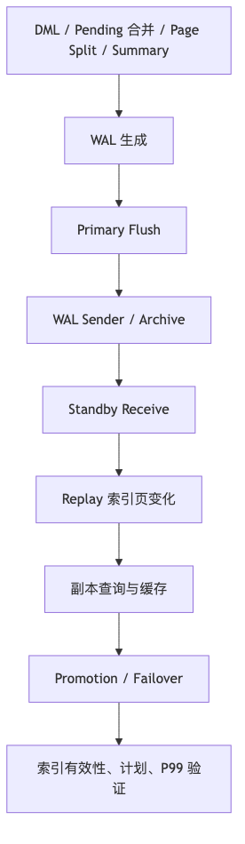

# 第 8 章：GIN、GiST、SP-GiST、BRIN、Hash 与 Operator Class

> **技术基线**：PostgreSQL 18 稳定版；兼顾 PostgreSQL 14—18。Go 示例使用 `github.com/jackc/pgx/v5` 与 `pgxpool`。
>
> **贯穿本章的一句话**：专用索引的本质，不是“给某种列换一棵树”，而是用一种可验证的方式回答——**哪些行不可能满足这个谓词，哪些行只是可能满足，哪些行还必须回表重检**。
>
> **本章主线**：
>
> ```text
> 业务问题
>   → SQL 表达式与操作符
>   → Operator Class / Operator Family 语义匹配
>   → 选择“按什么单位组织索引”
>   → 生成候选 TID 或候选 Heap Block
>   → Heap + MVCC + Recheck 得到正确结果
>   → DML 维护、WAL、Vacuum、复制与故障恢复成本
> ```

---

## 1. 本章定位

### 1.1 从一个生产系统开始，而不是从五种索引名称开始

假设你正在设计一个多租户内容、预约和事件平台。系统中存在以下查询：

| 业务问题 | 代表性 SQL 谓词 | 真正需要解决的检索问题 |
|---|---|---|
| 按邮箱定位账户 | `email = $1` | 找到一个完整标量值 |
| 查找包含指定 JSON 条件的文档 | `attributes @> $1::jsonb` | 判断复合值中是否包含若干路径和值 |
| 查找拥有某个 JSON 键的文档 | `attributes ? $1` | 判断复合值中是否存在一个键 |
| 按标签或全文词项检索 | `tags @> $1`、`search_tsv @@ $1` | 从元素/词项反查包含它的行 |
| 阻止预约时间重叠 | `during && $1` | 判断两个区间是否相交，并在并发写入时保证约束 |
| 查找最近的站点 | `ORDER BY location <-> $1 LIMIT 20` | 按距离下界逐步扩展搜索空间 |
| 判断 IP 属于哪个网络 | `network >>= $1::inet` | 按包含关系或空间分区搜索 |
| 查询十亿行事件中的最近 10 分钟 | `occurred_at >= $1 AND occurred_at < $2` | 快速排除不可能命中的物理页范围 |
| 文本中缀与拼写近似 | `title ILIKE '%postgres%'`、`title % $1` | 从三元组反查候选文本，或按相似距离取 Top-N |

这些查询不能用同一个“更高级的 B-tree”统一解决，因为它们证明“不匹配”的方式不同：

1. **完整值映射**：一个值等于什么；
2. **组成元素映射**：一个复合值包含哪些键、元素、词项或三元组；
3. **领域空间剪枝**：一个对象落在哪个区域、与哪个包围摘要相交、距离下界是多少；
4. **物理块摘要**：一组相邻 Heap Page 中的值域大致是什么。

Hash、GIN、GiST、SP-GiST 与 BRIN，分别是这些不同证明模型的实现框架。Operator Class 则把 SQL 操作符的业务语义接到这些框架上。

### 1.2 为什么专用索引容易学成零散知识点

如果按“先讲 GIN，再讲 GiST，再讲 BRIN”的方式记忆，容易得到一组互不相干的名词：Posting List、Penalty、PickSplit、Block Range、Pending List、Recheck。真正缺失的是它们在同一执行链上的位置：

```text
SQL 谓词能否被索引理解？
  ↓
索引用什么摘要或键排除不可能命中的数据？
  ↓
它返回精确行，还是候选行/候选页？
  ↓
写入时需要立即维护，还是先积累延迟工作？
  ↓
这些工作如何影响 P99、锁、WAL、复制和故障恢复？
```

本章因此不把五种索引当作五座孤岛，而是围绕一次查询和一次写入的完整生命周期展开。

### 1.3 本章要建立的三个闭环

**查询闭环**：谓词 → Opclass → 候选集合 → Recheck → 结果。

**写入闭环**：Heap DML → 索引状态变化 → 延迟维护/页面分裂 → Vacuum/Checkpoint → 尾延迟。

**高可用闭环**：索引修改 → WAL → 发送/重放 → Failover 后冷缓存与计划验证 → 恢复或重建。

高性能、高并发和高可用不是三个独立附录，而是同一索引生命周期在三个观察角度下的结果。

### 1.4 与前后章节的关系

- 依赖第 3 章的 Page、Tuple、Buffer、TOAST 与 HOT；
- 依赖第 4、5 章的 B-tree、表达式索引、部分索引和在线索引生命周期；
- 依赖第 6、7 章的 Planner、`EXPLAIN`、选择率和计划稳定性；
- 为第 9—12 章的 MVCC、锁、Vacuum 和膨胀提供索引侧背景；
- 为 WAL、复制、备份与故障切换章节提供写放大和恢复成本案例。

### 1.5 本章不展开

本章不完整展开 PostGIS 坐标系与几何算法、自定义 C Opclass ABI、全文词典与排名体系、分区表、复制拓扑和在线 DDL 全部锁时间线；只讲它们与专用索引决策直接相连的部分。

---

## 2. 可验证的学习目标

完成本章后，你应当能够：

1. 从真实 SQL 的左侧表达式、操作符、右侧类型和排序要求，判断索引是否具备可索引语义；
2. 用系统目录查出索引的 Access Method、Operator Class、Operator Family 和支持操作符；
3. 用“完整值、组成元素、领域空间、物理块摘要”四种模型解释五类专用索引；
4. 解释 GIN 的 Entry Tree、Posting List、Posting Tree、Pending List 与 `fastupdate` 如何连接成读写路径；
5. 根据查询矩阵选择 `jsonb_ops` 或 `jsonb_path_ops`，而不是只比较索引大小；
6. 用 `Consistent`、`Union`、`Penalty`、`PickSplit` 和 `Distance` 解释 GiST 的正确性与性能；
7. 说明 SP-GiST 与 GiST 的差异，并在点、网络、文本前缀等场景中设计对照实验；
8. 用物理相关性、`pages_per_range`、摘要类型和 Recheck 解释 BRIN 的有效条件；
9. 区分 Opclass 有损、Hash 碰撞、BRIN 范围候选和 Bitmap lossy page 四种不同的“需要重检”；
10. 沿执行流水线定位 CPU、内存、I/O、Heap/TOAST、排序、网络和 WAL 成本；
11. 分析 GIN 清理、Hash Bucket Split、GiST/SP-GiST 分裂、BRIN 汇总和排除约束在并发下的尾延迟；
12. 将索引构建与维护纳入复制延迟、RPO、RTO、Failover、备份和损坏处置；
13. 运行三组实验验证 JSONB Opclass、BRIN 物理相关性和 `pg_trgm` GIN/GiST 差异；
14. 使用 Go、`pgx/v5` 和 `pgxpool` 实现参数化查询、超时取消、有界并发和错误分类；
15. 按统一回答框架完成本章 15 道面试题与系统设计题。

---

## 3. 核心术语：按执行链分层

把术语按层次组织，比按索引类型背诵更容易形成因果关系。

### 3.1 SQL 与语义层

| 术语 | 定义 | 在主线中的作用 | 常见误区 |
|---|---|---|---|
| 查询谓词 | `WHERE`、`JOIN` 或约束中的布尔条件 | 定义“什么叫匹配” | 只看列，不看操作符和表达式 |
| 索引表达式 | 索引定义中真正被索引的表达式 | 必须与查询可规范化为等价表达式 | `lower(name)` 索引不等于任意大小写查询都可用 |
| 操作符 | 如 `=`, `@>`, `?`, `&&`, `<->` | Planner 通过它寻找 Opclass 策略 | 同名函数通常不自动等价于 Ordering Operator |
| Collation | 文本比较和排序规则 | 会改变 B-tree/Pattern 匹配语义 | 忽略 Collation 导致前缀查询不能用预期索引 |
| 选择性 | 谓词预计保留的行比例 | 决定索引路径是否值得采用 | “建了索引”不代表低选择性查询就应使用它 |

### 3.2 索引语义契约层

| 术语 | 定义 | 在主线中的作用 | 常见误区 |
|---|---|---|---|
| Access Method | B-tree、Hash、GIN、GiST、SP-GiST、BRIN 等通用框架 | 管页面、并发、WAL 和扫描协议 | 把它当成完整业务语义 |
| Operator Class / Opclass | 某数据类型在某 Access Method 下的一组操作符与支持函数 | 把 SQL 谓词翻译成索引可执行策略 | 认为同一数据类型只存在一种索引行为 |
| Operator Family / Opfamily | 一组兼容 Opclass 与跨类型操作符 | 保证跨类型比较或关系语义一致 | 与单个 Opclass 混为一谈 |
| Strategy Number | Access Method 内部识别操作符语义的编号 | 把 SQL 操作符路由到支持函数 | 与 SQL 运算符优先级无关 |
| Support Function | 提取键、一致性判断、并集、惩罚、分裂、距离等函数 | 决定正确性和效率 | 把支持函数当成普通查询函数 |

### 3.3 物理组织层

| 术语 | 定义 | 适用模型 |
|---|---|---|
| Bucket / Overflow Page | Hash 码对应的桶页及溢出链 | 完整值等值映射 |
| GIN Key | 从 JSONB、数组、`tsvector` 或文本中提取的元素 | 组成元素映射 |
| Posting List / Posting Tree | 一个 GIN Key 对应的小型 TID 列表或大型 TID B-tree | 组成元素映射 |
| Pending List | GIN `fastupdate` 开启时暂存新条目的未排序区域 | 延迟写维护 |
| GiST Summary / Union | 能覆盖一棵子树的摘要键 | 领域空间包围与剪枝 |
| Penalty / PickSplit | 选择插入分支与页面分组的代价函数 | GiST 写入和树质量 |
| SP-GiST Prefix / Node / Downlink | 分区树内部节点的共同前缀、分支标签和下行指针 | 领域空间切分 |
| Block Range / Summary Tuple | BRIN 用一个摘要覆盖的一组相邻 Heap Page | 物理块摘要 |

### 3.4 Executor 与运维层

| 术语 | 定义 | 诊断意义 |
|---|---|---|
| 候选集合 | 索引无法排除、需要继续处理的 TID 或 Heap Block | 候选/返回比是专用索引质量的核心指标 |
| Recheck | 回表后重新执行原始谓词 | 保证有损索引仍返回正确结果 |
| Exact Bitmap | Bitmap 中保存精确 TID | 页内只检查指定行 |
| Lossy Bitmap | Bitmap 只记“该 Heap Page 可能命中” | 页内更多行要重检，通常与 `work_mem` 有关 |
| 物理相关性 | 列值顺序与 Heap 物理顺序的相关程度 | 决定 BRIN 能排除多少块 |
| 延迟维护 | 写入先记录较便宜状态，之后批量整理 | GIN Pending、BRIN 初始汇总等会改变 P99 形态 |
| 写放大 | 一次业务写引起的额外索引页、WAL 和后台维护 | 连接性能、并发和 HA 的共同成本 |

---

## 4. 整体心智模型：索引如何证明“这部分数据不必看”


### 4.1 查询路径只有一个核心目标：尽早缩小候选集合

不同索引的差异，首先体现在它们如何排除数据：

- Hash 直接定位哈希桶，但哈希碰撞使结果仍是候选；
- GIN 从查询中提取 Key，再合并多个 Posting；
- GiST 用包围摘要判断某棵子树是否可能命中；
- SP-GiST 根据分区规则只进入相关分支；
- BRIN 判断某个物理块范围的摘要是否与查询相容。

最终都要回到同一个问题：**候选集合相对真实结果有多大？** 索引节点名称本身不是性能结论。

### 4.2 写入路径决定尾延迟，不只是平均 TPS

专用索引经常把一次 Heap 写放大为多次索引工作：

```text
一行 JSONB 写入
  → 提取多个 Key
  → 追加 Pending 或更新多个 Posting
  → 未来批量合并
  → 产生索引页写入和 WAL
```

```text
一个空间对象写入
  → 选择树分支
  → 扩大祖先摘要
  → 页面满时分裂
  → 产生多页修改和 WAL
```

因此平均写入延迟正常，并不能排除 P99 周期性尖峰。

### 4.3 Recheck 是安全机制，不是索引失效的同义词

有损结构可以正确工作，因为索引只负责“不漏掉可能匹配”，Heap 上的原始谓词负责最终确认。需要区分：

1. **结构本身有损**：Hash 只存 32 位哈希码；BRIN 只存块范围摘要；某些 GiST/Trigram 使用签名；
2. **Opclass 判断有损**：支持函数只能证明“可能匹配”；
3. **Bitmap 内存有损**：精确 TID 太多，压缩为 Heap Page；
4. **MVCC 回表**：即便谓词精确，也要确认 Tuple 对当前 Snapshot 可见。

优化目标不是机械消灭所有 Recheck，而是控制候选/返回比、Heap Block 数和尾延迟。

### 4.4 三个生产维度来自同一生命周期

| 生命周期阶段 | 高性能关注 | 高并发关注 | 高可用关注 |
|---|---|---|---|
| 生成候选 | CPU、索引页命中、候选数量 | 热门 Key/Bucket/树路径 | Failover 后冷缓存与计划变化 |
| 回表重检 | Heap/TOAST I/O、Bitmap exact/lossy | 活跃查询叠加、Buffer 和 I/O 队列 | 只读副本查询与 WAL Replay 争用 |
| 维护索引 | 写放大、页面分裂、Vacuum | Pending 清理和分裂造成 P99 | WAL 生成、发送、重放和归档压力 |
| 构建/重建 | 扫描、排序、磁盘空间 | DDL 锁、Worker 和连接预算 | 副本延迟、RTO、回滚与切换窗口 |
| 故障恢复 | 冷启动吞吐 | 连接重建和请求重试 | 索引有效性、PITR、损坏校验和重建时间 |

---
## 5. 使用方式：先固定查询形状，再讨论索引名称

### 5.1 贯穿本章的示例模型

```sql
CREATE SCHEMA IF NOT EXISTS app;
CREATE EXTENSION IF NOT EXISTS pg_trgm;
CREATE EXTENSION IF NOT EXISTS btree_gist;

CREATE TABLE app.account (
    id          bigint GENERATED ALWAYS AS IDENTITY PRIMARY KEY,
    email       text NOT NULL
);

CREATE TABLE app.search_document (
    id          bigint GENERATED ALWAYS AS IDENTITY PRIMARY KEY,
    tenant_id   bigint NOT NULL,
    title       text NOT NULL,
    body        text NOT NULL,
    attributes  jsonb NOT NULL DEFAULT '{}'::jsonb,
    tags        text[] NOT NULL DEFAULT '{}',
    search_tsv  tsvector GENERATED ALWAYS AS (
        to_tsvector(
            'simple'::regconfig,
            coalesce(title, '') || ' ' || coalesce(body, '')
        )
    ) STORED,
    created_at  timestamptz NOT NULL DEFAULT clock_timestamp()
);

CREATE TABLE app.booking (
    id          bigint GENERATED ALWAYS AS IDENTITY PRIMARY KEY,
    resource_id bigint NOT NULL,
    during      tstzrange NOT NULL
);

CREATE TABLE app.event (
    id          bigint GENERATED ALWAYS AS IDENTITY PRIMARY KEY,
    occurred_at timestamptz NOT NULL,
    source      inet NOT NULL,
    location    point,
    payload     jsonb NOT NULL
);
```

这些表不是为了展示所有 DDL，而是给后续每一种索引一个固定业务上下文。读者应始终问：**我要加速的是哪一个操作符，索引保存的又是什么单位？**

### 5.2 查询形状到候选索引的第一轮映射

| 查询形状 | 第一候选 | 需要继续确认的条件 |
|---|---|---|
| `email = $1` | B-tree；Hash 作为实测候选 | 是否还要唯一、排序、范围、复合索引或 Index Only Scan |
| `attributes @> $1::jsonb` | GIN `jsonb_path_ops` 或 `jsonb_ops` | 是否还需要 `?`、`?|`、`?&`；路径和值分布如何 |
| `attributes ? $1` | GIN `jsonb_ops` | `jsonb_path_ops` 不支持键存在操作符 |
| `tags && $1::text[]` | GIN `array_ops` | 数组是否受控，还是正在替代关系表 |
| `search_tsv @@ $1::tsquery` | GIN `tsvector_ops` | 索引表达式与查询配置是否完全一致 |
| `during && $1::tstzrange` | GiST `range_ops` | 是否还需要排除约束保证并发不重叠 |
| `ORDER BY location <-> $1 LIMIT n` | GiST/SP-GiST 对应点 Opclass | 是否声明 Ordering Operator；数据分布适合哪种树 |
| 网络包含/相交 | GiST/SP-GiST `inet_ops` | 操作符方向、参数类型和数据分布 |
| 时间范围 + 物理有序大表 | BRIN | Heap 物理相关性、查询窗口、`pages_per_range` |
| `LIKE 'foo%'` | B-tree + 合适 Collation/Pattern Opclass | 不要因为本章讲 Trigram 就跳过 B-tree |
| `LIKE '%foo%'` / `ILIKE` / 正则 | `pg_trgm` GIN 或 GiST | 可提取三元组数量、结果集大小、是否需要 KNN |
| 相似 Top-N | GiST `gist_trgm_ops` + `<->` | GIN 能过滤，但不能完成该 KNN 有序扫描 |

### 5.3 创建索引前必须回答的三句话

在任何 `CREATE INDEX` 前写下：

```text
1. 我的真实查询表达式和操作符是什么？
2. 这个索引按完整值、组成元素、领域空间还是物理块组织数据？
3. 当写入量、数据分布和副本数量增加时，维护成本在哪里发生？
```

回答不完整时，索引设计通常只是猜测。

### 5.4 代表性索引定义

```sql
-- 普通等值仍以 B-tree 为基线；如需唯一性，直接用 UNIQUE。
CREATE UNIQUE INDEX account_email_uidx
ON app.account (email);

-- Hash 只作为“单列长值等值”的对照候选。
CREATE INDEX account_email_hash_idx
ON app.account USING hash (email);

-- JSONB：以包含与 jsonpath 为主。
CREATE INDEX search_document_attributes_path_idx
ON app.search_document USING gin (attributes jsonb_path_ops);

-- 若真实查询还大量使用 ?、?|、?&，应评估默认 jsonb_ops。
CREATE INDEX search_document_attributes_ops_idx
ON app.search_document USING gin (attributes jsonb_ops);

CREATE INDEX search_document_tags_gin_idx
ON app.search_document USING gin (tags);

CREATE INDEX search_document_tsv_gin_idx
ON app.search_document USING gin (search_tsv);

-- 中缀过滤吞吐优先的候选。
CREATE INDEX search_document_title_trgm_gin_idx
ON app.search_document USING gin (title gin_trgm_ops);

-- Top-N 相似度/KNN 的候选。
CREATE INDEX search_document_title_trgm_gist_idx
ON app.search_document USING gist (title gist_trgm_ops);

CREATE INDEX booking_during_gist_idx
ON app.booking USING gist (during);

ALTER TABLE app.booking
ADD CONSTRAINT booking_no_overlap
EXCLUDE USING gist (
    resource_id WITH =,
    during WITH &&
);

CREATE INDEX event_source_gist_idx
ON app.event USING gist (source inet_ops);

CREATE INDEX event_source_spgist_idx
ON app.event USING spgist (source inet_ops);

CREATE INDEX event_location_gist_idx
ON app.event USING gist (location);

CREATE INDEX event_location_spgist_idx
ON app.event USING spgist (location);

CREATE INDEX event_occurred_at_brin_idx
ON app.event USING brin (occurred_at)
WITH (pages_per_range = 64, autosummarize = on);
```

同一列同时建立多个索引只用于有业务依据的对照或确有多类稳定查询；它们会同时消耗写入、WAL、缓存、Vacuum 和恢复预算。

### 5.5 用系统目录确认“索引实际声明了什么”

```sql
SELECT
    n.nspname AS schema_name,
    tbl.relname AS table_name,
    idx.relname AS index_name,
    am.amname AS access_method,
    pg_get_indexdef(i.indexrelid) AS index_definition,
    i.indisvalid,
    i.indisready
FROM pg_index AS i
JOIN pg_class AS idx ON idx.oid = i.indexrelid
JOIN pg_class AS tbl ON tbl.oid = i.indrelid
JOIN pg_namespace AS n ON n.oid = tbl.relnamespace
JOIN pg_am AS am ON am.oid = idx.relam
WHERE n.nspname = 'app'
ORDER BY table_name, index_name;
```

查看 Opclass 与 Opfamily：

```sql
SELECT
    am.amname AS access_method,
    opc.opcname AS opclass_name,
    opf.opfname AS opfamily_name,
    opc.opcintype::regtype AS indexed_type,
    opc.opcdefault AS is_default
FROM pg_opclass AS opc
JOIN pg_am AS am ON am.oid = opc.opcmethod
JOIN pg_opfamily AS opf ON opf.oid = opc.opcfamily
WHERE am.amname IN ('hash', 'gin', 'gist', 'spgist', 'brin')
ORDER BY access_method, opclass_name;
```

查看某个族声明的操作符：

```sql
SELECT
    am.amname AS access_method,
    opf.opfname AS opfamily_name,
    amop.amopstrategy AS strategy_number,
    amop.amoppurpose AS purpose,
    amop.amopopr::regoperator AS operator
FROM pg_amop AS amop
JOIN pg_opfamily AS opf ON opf.oid = amop.amopfamily
JOIN pg_am AS am ON am.oid = opf.opfmethod
WHERE opf.opfname IN (
    'jsonb_ops',
    'jsonb_path_ops',
    'gist_trgm_ops',
    'gin_trgm_ops'
)
ORDER BY access_method, opfamily_name, strategy_number, operator::text;
```

在 `psql` 中还可以使用 `\dAc`、`\dAf`、`\dAo`。

### 5.6 诊断查询的最低要求

```sql
EXPLAIN (
    ANALYZE,
    BUFFERS,
    WAL,
    SETTINGS,
    VERBOSE,
    SUMMARY
)
SELECT ...;
```

至少同时记录：

- `Index Cond` / `Recheck Cond`；
- 实际行数与估算行数；
- `Rows Removed by Index Recheck`；
- `Heap Blocks: exact` 与 `lossy`；
- Shared Hit/Read、I/O Timing；
- WAL Records/FPI/Bytes；
- Sort、Temporary File 和返回行数；
- 相同 SQL 在典型参数、高频参数和极端参数下的差异。

### 5.7 安全边界

- `EXPLAIN ANALYZE` 会真实执行语句；DML 即使置于 `BEGIN`/`ROLLBACK`，Sequence、外部副作用和某些触发器行为也未必完全回滚；
- 普通 `CREATE INDEX` 会阻塞并发写，`CREATE INDEX CONCURRENTLY` 降低写阻塞但需要更多阶段、时间、资源和失败处置；
- 不在生产高峰随意 `REINDEX`、清理大 GIN Pending List 或同时构建多个大索引；
- 不用关闭 `fsync`、`full_page_writes`、Autovacuum、校验和或同步复制保护来“加速实验”；
- `pageinspect`、`pgstattuple`、`amcheck` 和低层函数应由受控角色在明确窗口使用。

---

## 6. 串联所有索引的关键：Operator Class、候选集合与 Recheck

### 6.1 Access Method 负责框架，Opclass 负责业务语义

索引定义可拆成四层：

```text
索引列或表达式
  + 数据类型 / Collation
  + Access Method
  + Operator Class
  = 可接受的操作符、排序操作符与支持函数
```

例如：

```sql
CREATE INDEX search_document_attributes_path_idx
ON app.search_document USING gin (attributes jsonb_path_ops);
```

这句话并不是“给 `attributes` 的所有 JSONB 查询建了索引”，而是：

1. 选择 GIN 作为倒排框架；
2. 选择 `jsonb_path_ops` 定义如何从文档和查询提取 Key；
3. 只承诺 `@>`、`@?`、`@@` 这组可索引语义；
4. 不承诺 `?`、`?|`、`?&`。

所以：

```sql
attributes @> '{"status":"open"}'::jsonb
```

可能生成该索引的 Scan Key，而：

```sql
attributes ? 'status'
```

即使语法合法，也不能由 `jsonb_path_ops` 处理。

### 6.2 Operator Family 解决跨类型的一致语义

Opclass 是“某个类型在某个访问方法中的入口”；Opfamily 是更大的兼容集合。它可以声明跨类型操作符，让 Planner 知道诸如 `int4` 与 `int8` 的比较仍保持同一排序或等值语义。

因此索引匹配时不能只问“列类型相同吗”，还要问：

- 右侧参数最终被解析成什么类型；
- 该跨类型操作符是否属于同一 Opfamily；
- 是否发生了让索引列一侧被包装的隐式转换；
- Collation 是否一致。

### 6.3 索引存在但不能用，通常是语义链在前半段断了

常见断点按发生顺序排列：

1. 查询的左侧不是索引列或同一表达式；
2. 操作符不在 Opclass 中；
3. 参数类型或隐式转换改变了操作符选择；
4. Collation/Pattern Opclass 不匹配；
5. 部分索引谓词不能由查询条件蕴含；
6. KNN 使用 `ORDER BY similarity(...)`，而不是 Ordering Operator `<->`；
7. 即使语义匹配，选择率和成本仍使 Planner 认为顺序扫描更便宜。

前六项是“能不能”；第七项是“值不值得”。两者不能混在一起调参。

### 6.4 所有专用索引最终都返回候选，而不是业务真相

不同访问方法返回的候选粒度不同：

| 访问方法 | 候选粒度 | 为什么可能需要重检 |
|---|---|---|
| Hash | TID | 只保存 32 位哈希码，存在碰撞 |
| GIN | TID 集合 | 只存提取 Key；复杂关系可能不能仅靠 Key 完全证明 |
| GiST | TID 或距离有序候选 | 内部摘要、压缩键或签名可能只是包围近似 |
| SP-GiST | TID 或距离有序候选 | 叶子可为压缩/部分表示，分区只负责缩小路径 |
| BRIN | 整个 Heap Block Range | 摘要只说明该范围“可能”包含目标值 |

Executor 还要做两件事：

1. 用 Snapshot 判断 Heap Tuple 是否可见；
2. 在索引结果有损时重新执行原始操作符。

### 6.5 四种“有损”必须分开诊断

```text
Hash 碰撞
  → 每个相同哈希码都是候选

GiST/Trigram 签名或包围摘要
  → 摘要相容不代表原值一定相容

BRIN Block Range
  → 整个范围都是候选页

Bitmap 超过 work_mem
  → 精确 TID 压缩成候选 Heap Page
```

`Rows Removed by Index Recheck` 高，说明候选行中假阳性多；`Heap Blocks: lossy` 高，说明 Bitmap 在页粒度丢失了 TID 精度。修复方向不同：前者通常看 Opclass、数据分布和摘要质量；后者还要看候选规模、`work_mem` 与并发内存预算。

### 6.6 一个统一的质量指标：候选/返回比

可以把专用索引质量粗略表达为：

```text
候选放大倍数 = 进入 Heap/Recheck 的候选行数 ÷ 最终返回行数
块放大倍数   = 实际访问 Heap Block 数 ÷ 理论最少 Heap Block 数
```

它们不一定能直接从单个字段精确计算，但提供了统一思路：

- GIN 高频 Key 可能候选巨大；
- GiST 摘要重叠可能进入很多子树；
- BRIN 相关性差可能读大部分分区；
- Hash 溢出链可能多读索引页；
- Bitmap lossy 可能让页内大量行重检。

---

## 7. 四种物理检索模型：从“索引什么”推导五类专用索引

### 7.1 模型一：按完整值定位——B-tree 基线与 Hash

#### 7.1.1 先问业务问题

```sql
SELECT id
FROM app.account
WHERE email = $1;
```

这里检索的是完整标量值，不需要拆成元素，也不需要空间关系或块摘要。默认答案通常仍是 B-tree，因为它还支持唯一性、范围、排序、复合键和更广泛的计划形状。

Hash 只有在以下假设同时成立时才值得成为对照候选：

- 单列；
- 只做 `=`；
- 不需要唯一性；
- 键较长，Hash 索引可能明显更小；
- 值接近唯一或每个桶内行数少；
- 实测证明读收益大于额外维护成本。

#### 7.1.2 Hash 读路径

```text
查询值
  → 同一哈希函数
  → 32 位哈希码
  → Bucket Page
  → 必要时扫描 Overflow Chain
  → 相同哈希码的候选 TID
  → Heap 比较原始值
```

Hash 只存 4 字节哈希码，不存完整键，因此扫描天然有损。它可以直接定位桶，但数据倾斜或桶中元组过多会形成长溢出链。

#### 7.1.3 Hash 写路径与状态变化

```text
INSERT
  → 定位 Bucket
  → Bucket 有空间：写入
  → 无空间：清理可删项或挂 Overflow Page
  → 扩容条件满足：前台 Bucket Split
```

Vacuum 可以清理死项并压缩/回收空溢出页供索引内部复用，但文件不会自动缩小；真正缩小通常需要 `REINDEX`。

#### 7.1.4 三维判断

| 维度 | Hash 的收益 | Hash 的风险 |
|---|---|---|
| 高性能 | 长键等值索引可能更紧凑；可直接定位桶 | 只支持等值；碰撞回表；倾斜与 Overflow Chain 可能比 B-tree 更差 |
| 高并发 | 简单等值路径短 | 热门桶、前台 Bucket Split、快速增长表的写尾延迟 |
| 高可用 | 具备 WAL 与崩溃恢复 | 新增一套索引维护和重放成本；不能代替唯一 B-tree，可能形成双索引写放大 |

**结论**：Hash 不是“更快的等值索引”，而是能力极窄、必须与 B-tree 对照测量的专用候选。

### 7.2 模型二：按组成元素反查——GIN

#### 7.2.1 业务问题决定 GIN 的单位不是“整行”，而是 Key

```sql
SELECT id
FROM app.search_document
WHERE attributes @> '{"status":"open"}'::jsonb;
```

GIN 不按整个 JSONB 值排序。它先把一个复合 Item 拆成多个 Key，再建立：

```text
Key → 出现该 Key 的行 TID 集合
```

同一模型也适用于：

- 数组元素；
- 全文 Lexeme；
- 文本 Trigram；
- 扩展定义的其他可提取元素。

#### 7.2.2 写入一行如何变成多个索引条目

以文档为例：

```json
{
  "tenant_id": 42,
  "status": "open",
  "tags": ["postgres", "go"]
}
```

Opclass 的 `extractValue` 决定提取什么：

- `jsonb_ops` 提取较细粒度的键和值；
- `jsonb_path_ops` 把值与完整路径组合成更具体的条目；
- `array_ops` 提取数组元素；
- `tsvector_ops` 提取 Lexeme；
- `gin_trgm_ops` 提取三元组。

GIN 主结构是一棵按 Key 排序的 Entry Tree。每个 Key 指向：

- **Posting List**：TID 较少，可放在同一索引元组；
- **Posting Tree**：TID 过多，单独建立 TID B-tree。

高频词、公共 JSON 键和热门标签会形成大型 Posting Tree。定位 Key 本身可能很快，但把几十万候选合并、回表、排序和传输仍然很贵。

#### 7.2.3 查询路径：从查询 Key 到 Bitmap

```text
查询操作符
  → extractQuery 提取查询 Key
  → 查 Entry Tree
  → 读取多个 Posting List/Tree
  → AND / OR / 其他策略合并候选 TID
  → Bitmap Heap Scan
  → MVCC + 必要 Recheck
```

`consistent` 或 `triConsistent` 根据“候选行包含了哪些查询 Key”给出三类结论：

- 一定不匹配：排除；
- 一定匹配：可不重检；
- 可能匹配：返回候选并要求 Recheck。

#### 7.2.4 `fastupdate` 把写成本从“每次随机维护”变成“先积累、后合并”

直接把一行产生的许多 Key 随机插入主树很昂贵。默认 `fastupdate = on` 时：

```text
普通 DML
  → 提取 Key
  → 追加到未排序 Pending List
  → 较快返回

Vacuum / Autoanalyze / gin_clean_pending_list()
或 Pending 超过 gin_pending_list_limit
  → 排序 Pending
  → 批量合并 Entry Tree 与 Posting
  → 清空已合并部分
```

这不是免费优化，而是**延迟工作**：

- 查询要同时检查主结构和 Pending List；
- Pending 越大，读路径越长；
- 某次前台写跨过阈值时，可能承担清理，形成 P99 尖峰；
- 增大 `gin_pending_list_limit` 可减少清理频率，却会让单次清理更重；
- 关闭 `fastupdate` 只影响后续写入，不会自动清空旧 Pending。

这条状态链直接连接三维目标：写入平均延迟、高并发尾延迟、WAL 与副本重放压力。

#### 7.2.5 `jsonb_ops` 与 `jsonb_path_ops`：从操作符矩阵选择，而不是从“哪个更小”选择

| 问题 | `jsonb_ops` | `jsonb_path_ops` |
|---|---|---|
| 默认 Opclass | 是 | 否，需显式指定 |
| `@>` | 支持 | 支持 |
| `@?` / `@@` | 支持 | 支持 |
| `?` / `?|` / `?&` | 支持 | 不支持 |
| 索引条目 | 键和值较独立 | 值与路径组合，更具体 |
| 典型体积 | 较大 | 较小 |
| 特定路径包含 | 候选可能更多 | 通常更有选择性 |
| 仅结构/空对象条件 | 保留更多键信息 | 可能缺少可直接检索的值条目 |
| 典型场景 | 查询操作符多样，键存在重要 | 以包含/jsonpath 为主，路径稳定 |

决策过程应是：

```text
统计真实 SQL 操作符占比
  → 检查路径和值基数
  → 比较索引大小和候选/返回比
  → 比较持续写入、Pending、WAL 与 P99
  → 决定单建、双建或改数据模型
```

无依据双建两种 Opclass，会把每次 JSONB 更新同时放大到两套 GIN。

#### 7.2.6 数组、全文和 `pg_trgm` 都是同一倒排思想

**数组**：`array_ops` 支持 `&&`、`@>`、`<@`、`=`。适合受控标签集合，不适合把无限增长的多对多关系塞进单行数组。

**全文**：`tsvector_ops` 把 Lexeme 映射到行。索引表达式、文本搜索配置和查询表达式必须一致；排名仍可能需要读取候选行并计算。

**Trigram**：把文本拆成三元组。

- GIN `gin_trgm_ops` 通常适合大量 `LIKE`/`ILIKE`/正则/相似度候选过滤；
- GiST `gist_trgm_ops` 也支持过滤，并能用 `<->` 做 KNN Top-N；
- 模式能提取的三元组越多，剪枝通常越有效；
- `%a%` 或无法提取三元组的正则可能退化为接近全索引扫描。

因此搜索 API 的最小输入长度、结果上限、超时和并发限制，是索引设计的一部分。

#### 7.2.7 GIN 的三维判断

| 维度 | 核心收益 | 主要风险 | 关键证据 |
|---|---|---|---|
| 高性能 | 高效处理复合值成员关系；高重复 Key 可紧凑共享 | 高频 Key 候选巨大；Bitmap/Recheck；宽文档和 Trigram 写放大 | Posting 候选、Heap exact/lossy、Recheck、Buffers、索引大小 |
| 高并发 | `fastupdate` 摊薄多数普通写 | Pending 清理相变、热门 Key 页面、Autovacuum 与查询争用 | Pending Pages/Tuples、P99、Wait Event、WAL 速率 |
| 高可用 | 正确索引显著缩短搜索路径 | 大量维护 WAL、复制 Replay Lag、恢复后大索引冷缓存 | Send/Replay Lag、恢复预热时间、构建/重建窗口 |

### 7.3 模型三：按领域空间剪枝——GiST 与 SP-GiST

GIN 适合“包含哪些元素”，但范围重叠、几何相交、网络包含和最近邻不是简单元素存在问题。它们需要描述一个对象在领域空间中的位置或包围关系。

#### 7.3.1 GiST：用摘要包围子树

GiST 是平衡搜索树框架。父节点保存能代表整个子树的摘要。一次查询和一次写入由同一组支持函数连接：

```text
查询：Consistent 判断某摘要下是否可能有匹配
写入：Penalty 选择让摘要扩张最小的子树
      Union 计算新的父摘要
      PickSplit 在页满时把条目分成两组
KNN： Distance 提供对象或子树到查询点的距离/下界
```

这些函数并不是分散的名词，而是同一棵树的生命周期：

| 支持函数 | 查询/写入阶段 | 对正确性或性能的影响 |
|---|---|---|
| `Consistent` | 查询剪枝 | 不能错误排除真实匹配；可要求 Recheck |
| `Union` | 父摘要维护 | 摘要必须覆盖所有子节点 |
| `Penalty` | 选择插入分支 | 决定摘要扩张和后续重叠程度 |
| `PickSplit` | 页面分裂 | 决定树平衡、摘要重叠和读放大 |
| `Distance` | KNN 有序扫描 | 内部节点必须给出安全距离下界 |
| `Compress/Decompress` | 存储表示 | 可缩小索引，但有损表示可能增加 Recheck |

正确性主要依赖 `Consistent`、`Union` 等不漏结果；性能高度依赖 `Penalty`、`PickSplit` 让摘要紧凑、重叠少。

#### 7.3.2 Range 与 Exclusion Constraint：索引从加速查询升级为并发不变量

```sql
SELECT *
FROM app.booking
WHERE resource_id = $1
  AND during && $2::tstzrange;
```

GiST `range_ops` 可以加速区间重叠。排除约束进一步把“不允许同一资源时间重叠”交给数据库：

```sql
ALTER TABLE app.booking
ADD CONSTRAINT booking_no_overlap
EXCLUDE USING gist (
    resource_id WITH =,
    during WITH &&
);
```

并发事务 A 插入 `[10:00, 11:00)`，事务 B 插入 `[10:30, 11:30)` 时，数据库通过冲突搜索和锁协议保证两者不能同时成功提交。这里索引不只是读优化，它参与业务正确性；代价是热点 `resource_id` 上的写入会排队或发生约束冲突。

#### 7.3.3 KNN：SQL 必须保留 Ordering Operator 形状

```sql
SELECT id, location
FROM app.event
WHERE location IS NOT NULL
ORDER BY location <-> point '(116.40,39.90)'
LIMIT 20;
```

KNN 过程：

```text
把根节点放入优先队列
  → 先展开距离下界最小的子树
  → 逐步得到真实候选
  → 当未访问节点下界已不可能优于当前第 N 名时停止
```

如果距离是近似值，Executor 会回表计算真实距离并必要时重新排序。

以下查询虽然业务含义近似，却通常不能直接驱动同一 KNN 路径：

```sql
ORDER BY similarity(title, $1) DESC
```

对于 Trigram Top-N，应使用 Opclass 声明的：

```sql
ORDER BY title <-> $1
LIMIT 20;
```

#### 7.3.4 SP-GiST：不是包围摘要，而是反复切分搜索空间

SP-GiST 支持四叉树、k-d 树、基数树/Trie 等非平衡分区结构：

```text
当前空间
  → 按规则分成若干互斥或明确的分区
  → 查询只进入可能相关的分支
  → 在磁盘页上以高扇出映射 Prefix、Node 和 Downlink
```

内部元组可包含：

- Prefix：描述整个节点的共同信息；
- Node Label：某个分支的标签；
- Downlink：指向下层 Inner Tuple 或 Leaf Tuple；
- Leaf：完整值或可重构的部分值。

与 GiST 的关键差异：

| GiST | SP-GiST |
|---|---|
| 父节点通常是包围摘要，子树摘要可以重叠 | 重点是按规则切分值域/空间 |
| 平衡树框架 | 支持非平衡分区树 |
| 性能受摘要重叠、Penalty、PickSplit 影响 | 性能受分区规则与数据偏斜影响 |
| 适合包围、相交、范围与多种扩展 | 适合空间分区、前缀、点、网络等结构 |

点数据中 `quad_point_ops` 与 `kd_point_ops` 即使支持相同操作符，也可能因分布不同而性能不同。选择不能只看“都能用”，必须比较 Buffers、树大小、写入、P99 和数据偏斜。

#### 7.3.5 网络、空间和 Trigram 如何落在这一模型上

- `inet_ops` 可在 GiST/SP-GiST 中表达网络包含、相交与比较；注意操作符方向；
- 点、Box、Polygon 等可用包围或空间分区剪枝；复杂地理业务通常由 PostGIS Opclass 承担；
- `gist_trgm_ops` 用签名近似三元组集合，`siglen` 越长通常越精确但索引更大；
- GiST Trigram 的核心独特价值是 `<->` KNN，GIN Trigram 更偏候选过滤吞吐。

#### 7.3.6 GiST/SP-GiST 的三维判断

| 维度 | 核心收益 | 主要风险 | 关键证据 |
|---|---|---|---|
| 高性能 | 处理重叠、包含、空间关系与 KNN；可提前停止 Top-N | 摘要重叠、签名假阳性、分区偏斜、回表距离重算 | Index/Heap Buffers、Recheck、KNN 是否有额外 Sort |
| 高并发 | 排除约束原子保证不重叠 | 热点资源冲突队列；共同树路径与页面分裂 | 锁等待、约束冲突、Page Split 相关 I/O/P99 |
| 高可用 | 用数据库约束保证切换前后同一业务不变量 | 索引构建/分裂 WAL；逻辑订阅端须独立创建约束和索引 | 复制 Lag、Schema 一致性、Failover 后约束验证 |

### 7.4 模型四：按物理页范围摘要——BRIN

#### 7.4.1 BRIN 回答的不是“哪一行”，而是“哪一段 Heap 可能有”

假设 `occurred_at` 随写入时间近似递增，物理页范围如下：

```text
Pages   0..63   → [2026-06-01 00:00, 2026-06-01 01:00]
Pages  64..127  → [2026-06-01 01:00, 2026-06-01 02:00]
Pages 128..191  → [2026-06-01 02:00, 2026-06-01 03:00]
```

查询 01:30 时，BRIN 只返回摘要可能覆盖该时间的 Block Range。范围内所有页仍需扫描和重检，因此 BRIN 的价值来自：

```text
表非常大
  + 索引极小
  + 物理相关性高
  + 查询窗口能排除绝大多数范围
```

#### 7.4.2 四类摘要是对“一个范围内的数据长什么样”的不同回答

| 摘要 | 保存内容 | 适合场景 | 典型假阳性来源 |
|---|---|---|---|
| Minmax | 一个最小值与最大值 | 单调或高度聚簇的有序值 | 少量离群值把整个区间撑宽 |
| Minmax Multi | 多个点/小区间 | 一个范围内存在多个局部簇 | `values_per_range` 不足或分布过乱 |
| Bloom | 概率型值集合 | 等值查询、范围内基数可估计 | Bloom 假阳性 |
| Inclusion | 能包含范围内所有值的对象 | 几何、网络、Range 包围关系 | 包围对象过宽或重叠大 |

Minmax Multi 不是“多列 BRIN”，而是在一个 Block Range 中用多个区间表达分布，以减少单个离群值造成的过宽摘要。

#### 7.4.3 `pages_per_range` 是精度、体积与维护的旋钮

若表有 `N` 个 Heap Page：

```text
摘要数量 ≈ N / pages_per_range
```

- 值小：摘要更多、索引稍大、剪枝更细、维护更多；
- 值大：索引更小、每个候选范围更粗、回表更多。

不能用“索引最小”作为唯一目标。正确选择依据是：真实查询读取多少 Heap Block、候选/返回比、P95/P99、写入与汇总成本，以及副本上的表现。

#### 7.4.4 物理相关性是 BRIN 的合同

BRIN 依赖 Heap 布局，而不是 SQL 逻辑上的“时间列”。以下行为会破坏合同：

- 历史乱序回填到当前热分区；
- 大量 UPDATE 把新版本写到表尾；
- 多个来源按不同时间线交错导入；
- 一个范围中混入跨度极大的异常值；
- 表重写后行顺序不再按关键列聚簇。

`pg_stats.correlation` 是抽样线索，不是最终证据：

```sql
SELECT attname, correlation
FROM pg_stats
WHERE schemaname = 'app'
  AND tablename = 'event'
  AND attname = 'occurred_at';
```

最终要看实际访问块数、`Rows Removed by Index Recheck`、范围命中比例和延迟分位数。

#### 7.4.5 BRIN 的汇总状态连接写入与查询

新建 BRIN 时会为已有页生成摘要。之后新 Block Range 可能处于未汇总状态，直到：

- `VACUUM` / Autovacuum；
- `autosummarize = on` 发起的汇总请求；
- `brin_summarize_new_values()`；
- `brin_summarize_range()`。

```sql
SELECT brin_summarize_new_values('app.event_occurred_at_brin_idx');
```

已有 Minmax 摘要通常会保守扩张，却不会因为旧极值行删除而自动收窄。必要时可在验证后对指定范围去摘要并重新汇总：

```sql
SELECT brin_desummarize_range('app.event_occurred_at_brin_idx', 128);
SELECT brin_summarize_range('app.event_occurred_at_brin_idx', 128);
```

这只能重新描述当前 Heap 布局，不能修复已经被破坏的物理顺序。

#### 7.4.6 BRIN 的三维判断

| 维度 | 核心收益 | 主要风险 | 关键证据 |
|---|---|---|---|
| 高性能 | 十亿级追加表上以极小索引排除大量物理块 | 相关性下降时仍显示“用了索引”却读大部分表 | Correlation、Heap Blocks、范围命中比例、P99 |
| 高并发 | 写维护通常远轻于每行 B-tree | 未汇总范围、摘要更新与大回填造成读退化 | Unsummarized 范围、回填速率、Autovacuum/汇总状态 |
| 高可用 | 索引小，备份与冷缓存负担低 | Heap 仍是主要恢复体积；错误物理布局会在所有副本复制 | 副本同查询块数、恢复后冷读、重写/重建计划 |

### 7.5 四种模型最终回到同一个 Executor

无论前面选择了哪种索引，最终都要经过：

```text
候选 TID / 候选 Heap Block
  → Buffer 读取
  → Heap Tuple
  → Snapshot 可见性
  → 原始谓词或真实距离 Recheck
  → 排序、LIMIT、序列化和网络返回
```

所以“Index Scan 很快”不能单独代表接口很快。大型 JSONB 的 TOAST 读取、排名排序、返回几十万行和客户端解码，都可能成为后半段瓶颈。

---
## 8. 场景与选型：一套从谓词到生产成本的决策算法

### 8.1 七步决策法

不要从“GIN 还是 GiST”开始。按以下顺序收敛：

#### 第一步：固定真实查询形状

记录规范化 SQL、左侧表达式、操作符、右侧类型、Collation、排序和 `LIMIT`。例如：

```sql
-- 包含
attributes @> $1::jsonb

-- 键存在
attributes ? $1::text

-- KNN
ORDER BY title <-> $1
LIMIT $2
```

这三种查询即使都针对同一列，也可能需要不同 Opclass 或 Access Method。

#### 第二步：判断索引单位

```text
完整值        → B-tree / Hash
复合值中的元素 → GIN
对象所在区域   → GiST / SP-GiST
物理页范围摘要 → BRIN
```

#### 第三步：确认必须提供的能力

- 需要唯一性、普通排序、范围或复合前缀：优先 B-tree；
- 需要 KNN：Opclass 必须提供 Ordering Operator；
- 需要并发不重叠：排除约束，而不只是普通查询索引；
- 只需要等值：Hash 仍需与 B-tree 实测；
- 只需要粗粒度块排除：BRIN 可能比每行索引更合适。

#### 第四步：测量数据分布

至少收集：

- 表行数、页数、平均与 P95 行宽；
- Key/词项/标签频率分布；
- JSON 路径和值的基数；
- 空间对象或网络前缀的偏斜；
- 时间列与 Heap 的物理相关性；
- 查询参数的典型、高频和极端类别。

专用索引往往不是被“数据量”击败，而是被高频 Key、偏斜空间、离群值和乱序写入击败。

#### 第五步：估计候选与回表成本

问：

```text
索引会返回多少候选？
候选中多少是真匹配？
需要读多少 Heap/TOAST Block？
是否发生 Bitmap lossy？
是否还要 Sort/Rank/网络传输？
```

#### 第六步：画出写入与维护状态机

- GIN 是否积累 Pending；谁在何时清理；
- GiST/SP-GiST 是否存在热点路径或频繁分裂；
- Hash 是否快速增长并触发 Bucket Split；
- BRIN 新 Range 如何汇总，乱序数据如何处理；
- 索引构建、重建和删除如何上线与回滚。

#### 第七步：把 WAL、复制和恢复预算放进结论

比较的不只是单机查询：

- 新索引使每秒 WAL 增加多少；
- 副本 Replay Lag 是否进入告警；
- `CREATE INDEX CONCURRENTLY` 期间是否有足够磁盘；
- Failover 后冷缓存 P99 是否达标；
- 重建一个数百 GB GIN/GiST 需要多少时间和空间；
- 逻辑订阅端是否已创建相同扩展、Opclass 和索引。

### 8.2 选型流程图


### 8.3 典型场景的完整推理

#### 场景 A：JSONB 搜索

```text
真实 SQL 主要是 @> 与 @@
  → 两种 JSONB Opclass 都有语义能力
  → 比较路径和值是否使 path_ops 更具体
  → 测索引大小、候选/返回比、持续写入与 Pending
  → 若还有大量 ? 查询，path_ops 单独不够
  → 决定 jsonb_ops、path_ops、表达式 B-tree，或拆列
```

高频且稳定的业务字段常常更适合普通列与 B-tree，而不是让整个业务模型永远依赖一个宽 JSONB GIN。

#### 场景 B：前缀、中缀和相似 Top-N

```text
LIKE 'foo%'
  → 先验证 B-tree + Collation/Pattern Opclass

LIKE '%foo%'
  → Trigram GIN/GiST 候选

ORDER BY title <-> $1 LIMIT 20
  → GiST Trigram KNN

只有 1 个字符的输入
  → 索引通常无法形成有效三元组剪枝
  → 产品层限制或走独立字典/前缀策略
```

#### 场景 C：时序大表

```text
表很大 + 查询时间窗窄
  → 检查 occurred_at 与 Heap 的物理相关性
  → 高相关：BRIN 候选
  → 低相关：BRIN 仍正确，但剪枝可能很差
  → 比较 B-tree、BRIN、分区裁剪和数据重排
  → 把迟到数据与回填策略纳入设计
```

#### 场景 D：预约、网络和最近邻

```text
区间重叠
  → GiST range_ops
  → 若必须防止重叠，使用 Exclusion Constraint

网络包含
  → GiST/SP-GiST inet_ops
  → 用相同数据与查询比较分区/摘要质量

最近邻
  → 找 Opclass 的 Ordering Operator
  → 保持 ORDER BY indexed_col <-> query LIMIT n
```

### 8.4 操作符支持速查

| 需求 | 推荐候选 | 不能忽略的限制 |
|---|---|---|
| 普通 `=` | B-tree；Hash 对照 | Hash 单列、非唯一、全扫描有损 |
| `< <= = >= >`、排序 | B-tree | BRIN 只粗粒度排除块，不能提供普通有序行定位 |
| JSONB `@>` | GIN `jsonb_ops` / `jsonb_path_ops` | 根据操作符矩阵和写成本选 |
| JSONB `?`, `?|`, `?&` | GIN `jsonb_ops` | `jsonb_path_ops` 不支持 |
| JSONPath `@?`, `@@` | 两种 JSONB GIN | 可提取条件、数据分布仍影响效果 |
| 数组 `&&`, `@>`, `<@`, `=` | GIN `array_ops` | 大数组和高频元素会扩大 Posting |
| 全文 `@@` | GIN `tsvector_ops` | 排名和返回量仍可能昂贵 |
| Range 重叠/包含 | GiST | 约束场景用 Exclusion Constraint |
| KNN `<->` | GiST/SP-GiST 对应 Opclass | 不能用任意函数排序替代 |
| 网络包含/相交 | GiST/SP-GiST `inet_ops` | 注意操作符方向与显式 Opclass |
| 超大有序时序表 | BRIN Minmax/Minmax Multi | 依赖物理相关性 |
| 块内等值集合 | BRIN Bloom | 概率型假阳性、仅等值 |
| 文本中缀 | Trigram GIN/GiST | 无可提取三元组会退化 |
| 相似 Top-N | Trigram GiST | GIN 不提供该 KNN 有序扫描 |

---

## 9. 高性能分析：沿一次查询的流水线定位成本

把性能分成六个连续阶段，可以避免看到某个慢节点就随意调参数。

### 9.1 阶段 0：Planner 能否建立语义匹配

首先确认：

- `Index Cond` 或 Bitmap Index Scan 中是否出现预期操作符；
- 查询表达式是否与索引表达式一致；
- 参数类型、Collation、部分索引谓词是否匹配；
- 估算行数第一次明显偏离实际行数发生在哪个节点。

若语义不匹配，调 `random_page_cost`、`work_mem` 或连接数不会让索引突然支持一个不存在的操作符策略。

### 9.2 阶段 1：索引生成多少候选

| 索引 | 候选膨胀的主要来源 |
|---|---|
| Hash | 哈希碰撞、热门桶、Overflow Chain |
| GIN | 高频 Key、大 Posting、宽泛 jsonpath/Trigram 条件、Pending List |
| GiST | 父摘要重叠、签名位冲突、距离下界不紧 |
| SP-GiST | 分区规则与数据偏斜不匹配 |
| BRIN | 物理相关性低、摘要过宽、`pages_per_range` 过大、未汇总范围 |

观察实际索引页和 Bitmap 输出，而不是只看“用了索引”。

### 9.3 阶段 2：Bitmap 是否保持精确

GIN、BRIN、GiST 等常产生 Bitmap Heap Scan。

```text
候选 TID 较少
  → exact bitmap
  → 每页只访问指定行

候选过多且 work_mem 不足
  → lossy page bitmap
  → 访问页内更多行并执行 Recheck
```

不能全局无界提高 `work_mem`：它按查询节点和并发叠加。正确做法是先确认候选为什么过大，再在受控会话中 `SET LOCAL work_mem` 做对照，并按最大并发计算内存上限。

### 9.4 阶段 3：Heap、TOAST 与 I/O

索引只保存定位信息或摘要。回表时可能发生：

- 随机或批量 Heap Page 读取；
- 读取不可见旧版本；
- 解 Toast 的宽 JSONB/文本；
- 在 Recheck 中再次解析复杂表达式；
- 因表膨胀访问更多块。

BRIN 的目标是把全表扫描降成较少物理范围；GIN Bitmap 的目标是把离散 TID 按页聚合。两者都可能在候选过大时转化为大量 Heap I/O。

[PG18] AIO 能改善部分 Bitmap Heap Scan、顺序读取与维护阶段的请求排队和合并，但不会改变 Opclass 能力，也不会消除假阳性或 Recheck。若瓶颈是 CPU、热门页或 GIN 合并，单独修改 AIO 参数不会解决根因。

### 9.5 阶段 4：排序、排名、LIMIT 与网络

常见误判是“索引扫描只用了 20 ms，为什么接口用了 2 秒”。后半段可能包括：

- 全文 `ts_rank` 或相似度计算；
- 大候选集 Sort；
- Temporary File；
- 返回大型 JSONB/TOAST；
- 数十万行网络序列化与客户端解码；
- 不稳定 OFFSET 分页。

KNN 的价值正是让 `ORDER BY <-> LIMIT n` 在索引遍历中提前停止，而不是取出全部候选再排序。

### 9.6 阶段 5：写入维护、Checkpoint 与 WAL

#### GIN

```text
1 行 Heap 写
  → N 个 Key
  → Pending 或主树条目
  → 未来合并 Posting
  → 多页 WAL
```

文档越宽、数组越大、Lexeme/Trigram 越多，写放大越大。

#### GiST/SP-GiST

写入沿树路径更新摘要或节点；页面分裂时修改多页。数据偏斜可能使某些路径成为热点。

#### BRIN

通常写成本低，但已汇总范围遇到新极值会扩大摘要；大规模乱序写会逐步破坏读性能。

#### Hash

普通写更新桶；前台 Bucket Split 和 Overflow 扩张会制造尾延迟。

所有这些修改最终进入 WAL，并可能触发更频繁 Checkpoint。大索引构建或批量合并时，应联合观察：

```text
wal_bytes / wal_fpi
checkpoint write/sync time
storage queue depth and latency
replica replay lag
foreground P95/P99
```

### 9.7 阶段 6：缓存冷热与计划稳定性

至少区分：

- 冷缓存首轮；
- PostgreSQL Buffer 热、OS Cache 热；
- 稳态并发；
- 参数命中低频 Key 与高频 Key；
- Primary 与只读副本；
- Failover 后新 Primary 冷缓存。

只跑一次热缓存 `EXPLAIN ANALYZE`，不能代表生产 SLO。

### 9.8 统一性能指标表

| 环节 | 指标 | 说明 |
|---|---|---|
| 计划 | Estimate/Actual、Plan Shape | 找最早估算偏差和是否匹配 Opclass |
| 索引 | Index Blocks、候选行 | 判断索引自身剪枝质量 |
| Bitmap | Exact/Lossy Heap Blocks | 区分精确 TID 与页级候选 |
| Recheck | Removed by Index Recheck | 判断假阳性和摘要/签名质量 |
| Heap | Shared Hit/Read、I/O Timing | 判断回表和缓存成本 |
| CPU | Backend CPU、表达式/排名 | 判断 Key 提取、Recheck 和排序成本 |
| 内存 | `work_mem`、Sort/Hash 状态 | 防止 lossy 或磁盘 Sort，同时控制并发总量 |
| 写入 | TPS、WAL、FPI、索引大小增长 | 衡量维护放大 |
| 延迟 | Server 与 End-to-End P50/P95/P99 | 识别周期性清理、分裂和排队 |
| 网络 | Rows/Bytes Returned | 避免把返回量问题归因于索引 |

### 9.9 性能实验的最低设计

每个对照组必须保持：

- 相同 PostgreSQL 版本和配置；
- 相同数据、行宽和统计信息；
- 相同查询参数类别；
- 相同缓存定义；
- 相同并发、测试时长和预热方式；
- 同时记录读延迟、写延迟、WAL 和副本 Lag。

不要用一条查询的固定毫秒数下结论；应报告分布和硬件/配置上下文。

---

## 10. 高并发分析：沿索引状态变化寻找相变点

### 10.1 并发首先是准入问题

必须区分：

| 指标 | 含义 |
|---|---|
| 应用 goroutine | 可运行或等待的任务数 |
| 连接池 MaxConns | 同时持有 PostgreSQL Session 的上限 |
| 活跃查询 | 真正在 CPU、I/O 或锁上执行/等待的 SQL |
| TPS/QPS | 单位时间完成量 |
| 排队请求 | 应用队列、连接池和数据库锁队列中的等待量 |

`1000` 个 goroutine 不应等于 `1000` 个数据库连接。搜索类查询的候选规模随参数变化很大，必须用连接池、有界 Worker、租户配额、最小查询信息量和 Deadline 做 Admission Control。

### 10.2 每种索引的并发热点来自其物理模型

| 索引 | 典型热点 | 表现 |
|---|---|---|
| Hash | 热门 Bucket、Overflow Chain、Bucket Split | 写入或等值查询集中到少数页，前台分裂抬高 P99 |
| GIN | Pending Tail、热门 Key 的 Posting Page、批量合并 | 多数写快，清理时周期性变慢；读写共同争 I/O/WAL |
| GiST | 共同包围路径、摘要更新、Page Split | 偏斜空间或范围数据让某些树路径频繁修改 |
| SP-GiST | 热门分区、偏斜树、节点重构 | 分区规则不适配时路径不均衡 |
| BRIN | 当前热 Range 的 Summary、新 Range 汇总 | 通常较轻，但乱序回填使读负载不断扩大 |
| 排除约束 | 相同业务资源的冲突搜索 | 等待、约束错误或事务回滚，不是普通索引慢查询 |

### 10.3 GIN 是最典型的“平均值正常、P99 相变”


治理不能只把阈值调大：

- 更大阈值减少清理频率，却增大单次清理；
- `fastupdate=off` 消除 Pending 路径，却把每次写直接变成主树维护；
- 最终选择必须基于持续写、并发查询和副本重放的联合实验；
- Autovacuum、导入限速、维护编排和查询准入通常比单一 GUC 更重要。

### 10.4 排除约束的并发语义

排除约束保护业务不变量，但热点资源会自然串行化：

- 在事务早期执行约束写，避免先调用慢外部服务；
- 尽快提交，缩短冲突窗口；
- 把约束冲突映射成业务可解释错误；
- 不要对约束冲突无条件重试；
- 对 `40001`、`40P01` 等瞬态错误重试完整事务，并设置最大次数、指数退避、抖动和幂等键；
- Commit 网络错误可能表示结果未知，不能直接认定未提交。

### 10.5 DDL 并发与索引上线

普通 `CREATE INDEX` 与 `CREATE INDEX CONCURRENTLY` 的差异不只在“是否锁表”：

- Concurrently 需要多阶段扫描和等待旧事务/Snapshot；
- 失败后可能留下无效索引，需要检查 `indisvalid`、`indisready`；
- 构建占 CPU、内存、I/O、WAL 和 Worker；
- 多个大索引并发构建会让前台和副本同时退化；
- 删除旧索引前要覆盖完整业务周期并保留回滚路径。

推荐上线顺序：

```text
基线与容量预算
  → 在代表性副本/克隆验证
  → Primary 低峰单个构建
  → 检查有效性和副本 Lag
  → 小流量验证计划与 P99
  → 完整放量
  → 观察一个业务周期
  → 再删除旧索引
```

### 10.6 长事务把索引问题放大

长事务、`idle in transaction`、复制槽保留和长期 Snapshot 会阻止旧 Tuple 回收：

- Heap 中不可见版本更多；
- 索引死项存在更久；
- GIN/GiST/Hash 等访问更多无效 TID；
- Vacuum 与 Pending 清理窗口被压缩；
- `CREATE INDEX CONCURRENTLY` 可能长时间等待。

因此专用索引排障必须同时看最老事务和 Vacuum，而不是只看索引文件。

### 10.7 应用层 Backpressure

搜索 API 至少限制：

- 每租户并发与 QPS；
- 全局高成本搜索并发；
- Trigram 最小输入信息量；
- 最大返回数与稳定分页；
- 请求 Deadline 与数据库 `statement_timeout`；
- 连接池排队长度/时间；
- 高成本报表与在线请求的资源隔离。

增加 `MaxConns` 可能只是把等待从连接池推到数据库 CPU、I/O、锁和 WAL 队列中，使全局 P99 更差。

---

## 11. 高可用分析：沿 WAL 从 Primary 追到 Failover

专用索引与高可用的联系是间接但真实的：索引不决定谁当 Primary，却决定每次写生成多少 WAL、副本重放多快、恢复后要预热多少页面，以及损坏时重建多久。

### 11.1 完整链路



任何一个大 GIN 合并、GiST 分裂密集期、Hash 扩容或索引构建，都可能把主库局部维护放大成整个 HA 链路的压力。

### 11.2 RPO 与 RTO

- **RPO** 主要由同步/异步复制、归档和备份策略决定；索引写放大提高 WAL 速率，间接扩大异步副本未重放窗口；
- **RTO** 不只包含实例启动，还包含 WAL Replay、服务发现、连接池重建、冷缓存、计划验证和关键索引检查；
- BRIN 很小，可降低索引预热和备份体积，但 Heap 仍是恢复主体；
- “索引可以重建”不代表可以忽略备份：重建需要可信 Heap、空间、时间和 I/O。

### 11.3 物理复制

物理复制会重放所有索引页变化：

- GIN Pending 合并；
- GiST/SP-GiST 页面分裂；
- BRIN Summary 更新；
- Hash Bucket Split；
- `CREATE INDEX` / `REINDEX` 产生的 WAL。

同时，只读副本的查询与 Replay 共享 CPU、I/O 和缓存。大报表可能让副本重放更慢，大维护 WAL 也可能让报表 P99 更高。

应同时观察：

```text
WAL 生成速率
sent / write / flush / replay LSN
字节 Lag 与时间 Lag
副本存储延迟和 CPU
只读查询 P95/P99
Primary 同步提交等待
```

### 11.4 逻辑复制

逻辑复制传递行变化，不自动复制所有 DDL、扩展和索引定义：

- Subscriber 必须独立安装 `pg_trgm`、`btree_gist` 等扩展；
- 必须独立创建 GIN/GiST/SP-GiST/BRIN/Hash；
- Subscriber 上更多索引会提高 Apply Worker 的每行维护成本；
- 初始化装载时，要在“先建索引保证即时查询”和“后建索引提高装载速度”之间做容量权衡；
- 切换前必须验证两端 Schema、Opclass、Collation 和约束一致。

### 11.5 备份、PITR 与恢复验证

物理备份包含索引文件，PITR 会重放索引 WAL。恢复演练不能止于“数据库启动成功”：

1. 验证备份清单、校验和与时间线；
2. 检查关键索引 `indisvalid`/`indisready`；
3. 运行代表性查询，核对结果与计划；
4. 在版本支持范围内使用 `amcheck` 等工具检查关键索引；
5. 验证扩展版本和 Collation；
6. 测量冷缓存 P95/P99；
7. 记录大索引重建的时间、额外空间和 WAL；
8. 对排除约束等业务不变量执行抽样或全量校验。

### 11.6 Planned Switchover 与 Unplanned Failover

**计划切换前**：

- 完成或暂停大索引构建、回填和清理；
- 等待 Replay Lag 进入门槛；
- 验证目标节点扩展、索引和约束；
- 排空长事务；
- 切换后渐进放量并对比 `EXPLAIN`、Buffers 和 P99。

**非计划故障切换**：

- 先 Fencing 旧 Primary，防止脑裂；
- 应用丢弃旧连接并创建新池；
- 只读请求可按幂等性重试；
- 写事务 Commit 结果未知时需查询幂等键或对账；
- 新 Primary 恢复后先验证数据、索引和约束，再全面放量。

索引不能解决双主、Fencing 或提交不确定性，但其维护成本会影响切换前后的恢复速度。

### 11.7 Failback 与索引损坏

Failback 需要重新建立复制、确认时间线、校验数据、同步期间新增的索引/扩展和重新验证性能，不能简单把流量切回旧节点。

疑似索引损坏时：

```text
隔离受影响流量
  → 保存日志、LSN、硬件和文件系统证据
  → 判断仅索引异常还是 Heap/存储广泛损坏
  → 验证备份与健康副本
  → Heap 可信且仅索引损坏：受控 REINDEX 或切换
  → Heap/底层存储可疑：从已验证备份/PITR 恢复并对账
```

直接 `REINDEX` 可能覆盖现场证据。在硬件或文件系统可疑时，应先完成证据保护和影响范围判断。

### 11.8 大索引的 HA 上线门槛

数百 GB GIN/GiST 上线前至少定义：

- Primary CPU、I/O、WAL 和临时空间停止阈值；
- 每个副本 Replay Lag 停止阈值；
- `CREATE INDEX CONCURRENTLY` 失败清理步骤；
- 回滚时是否保留旧索引；
- 切换期间是否暂停构建；
- 逻辑订阅端的 DDL 顺序；
- Failover 后索引构建状态与是否可继续；
- 业务降级：限制搜索、路由副本、降低导入速率或暂时使用旧计划。

---

## 12. 三维影响矩阵：把语义、性能、并发和 HA 放在一张表中

### 12.1 按索引类型综合比较

| 索引 | 组织单位 | 最适合证明什么 | 高性能主要收益/风险 | 高并发主要风险 | 高可用主要风险 |
|---|---|---|---|---|---|
| Hash | 完整值的 32 位哈希 | 单列等值候选 | 紧凑、直达桶；但碰撞、Overflow、能力窄 | 热桶、前台 Split | 额外 WAL；通常仍需唯一 B-tree |
| GIN | Item 中提取的 Key | 是否包含元素/词项/三元组 | 倒排高效；但高频 Key、Bitmap/Recheck、写放大 | Pending 清理相变、热门 Posting | 合并和构建 WAL、Replay Lag、冷缓存大 |
| GiST | 子树包围摘要 | 是否相交/包含、距离下界 | 支持范围、空间、KNN；摘要重叠会读放大 | 共同路径、Page Split、排除约束热点 | 构建/分裂 WAL；约束需跨节点一致 |
| SP-GiST | 反复切分的空间分区 | 查询应进入哪些分支 | 适配分区规则时很快；偏斜时树不均 | 热门分区和节点重构 | Schema/Opclass 一致性、构建重放 |
| BRIN | 相邻 Heap Page 的摘要 | 哪些物理块不可能命中 | 极小、适合超大有序表；相关性差时近全扫 | 回填污染、未汇总范围 | 小索引有利恢复；错误布局会复制到所有副本 |

### 12.2 课程要求的三维总表

| 维度 | 相关度 | 核心收益 | 主要风险 | 关键指标 |
|---|---|---|---|---|
| 高性能 | 高 | 为复合值、范围、最近邻、空间与超大有序表建立可剪枝路径 | 操作符不匹配、候选过多、Recheck、Heap/TOAST、写和空间放大 | P50/P95/P99、Buffers、Exact/Lossy Blocks、Recheck、CPU、I/O、WAL、返回量 |
| 高并发 | 高 | 缩短查询资源占用；排除约束保证并发不变量 | 热门 Key/Bucket/树路径、Pending 清理、页面分裂、DDL 锁、连接池与重试风暴 | Active/Wait Event、Blocker、Pool Acquire、Pending、WAL、Checkpoint、最老事务 |
| 高可用 | 中 | 合理索引降低恢复后查询成本；BRIN 减少索引体积 | 大索引 WAL/Replay Lag、逻辑 DDL 不同步、冷缓存、损坏与重建时间 | RPO/RTO、Send/Replay Lag、归档、恢复时长、索引有效性、冷启动 P99 |

### 12.3 一句话决策规则

- **B-tree 是标量等值、范围、排序和唯一性的默认基线。**
- **Hash 只在单列、仅等值、长键且实测有收益时考虑。**
- **GIN 用于“复合值里有什么”，代价是多 Key 写放大与候选合并。**
- **GiST 用于“对象与区域是什么关系”，并可用距离下界做 KNN。**
- **SP-GiST 用于“按规则把空间分开”，数据分布必须适配分区。**
- **BRIN 用物理相关性换极小索引，逻辑时间列本身并不保证有效。**
- **Operator Class 决定 SQL 操作符能不能被索引理解。**
- **候选/返回比、写入状态机和 WAL 链路，决定索引在生产上是否真正成立。**

---

## 13. 可复现实验

> 三组实验均为教学环境脚本。数据量可按机器缩放，但比较组必须保持同样的数据、配置、并发和缓存定义。不要把示例中的行数、`pages_per_range` 或阈值直接复制到生产。

前三组实验不是三个孤立的 Benchmark，而是依次验证主线上的三个关键断点：

| 实验 | 验证的主线环节 | 需要回答的问题 |
|---|---|---|
| 实验一：JSONB GIN | 操作符 → Opclass → 索引键 | 同一列使用不同 Opclass 时，为什么可支持的谓词、索引大小和写成本不同？ |
| 实验二：BRIN | 物理布局 → 摘要 → 候选块 | 同一时间谓词下，物理相关性为什么比“时间列”这个标签更重要？ |
| 实验三：`pg_trgm` | 查询形状 → 过滤或排序能力 → 执行计划 | 中缀过滤和相似度 Top-N 为什么应使用不同的操作符与候选索引？ |

实验结论都按同一格式记录：**语义是否匹配 → 候选集合有多宽 → 回表/Recheck 成本 → 写入与 WAL 成本 → 并发和副本表现**。这样，实验数据能直接回到第 8—12 节的选型与三维评估，而不是只得出“某个索引更快”的局部结论。

### 13.1 通用实验记录模板

执行每组实验前记录：

```sql
SELECT version();

SELECT name, setting, unit, source
FROM pg_settings
WHERE name IN (
    'shared_buffers',
    'work_mem',
    'maintenance_work_mem',
    'effective_cache_size',
    'effective_io_concurrency',
    'maintenance_io_concurrency',
    'max_parallel_maintenance_workers',
    'checkpoint_timeout',
    'max_wal_size',
    'track_io_timing',
    'io_method',
    'io_combine_limit',
    'io_max_combine_limit'
)
ORDER BY name;

SELECT
    current_database(),
    pg_size_pretty(pg_database_size(current_database())) AS database_size;
```

负载工具或客户端结果至少记录：

```text
数据量：
平均/P95 行宽：
表与索引大小：
缓存状态：首次运行/重复暖缓存/重启后冷缓存（禁止在共享生产机清缓存）
并发客户端：
持续时间：
P50/P95/P99：
TPS/QPS：
Buffers：shared hit/read/dirtied/written、Heap Blocks exact/lossy
WAL：records/fpi/bytes
CPU：user/system/iowait
I/O：吞吐、IOPS、平均/P95/P99 延迟、队列深度
Wait Event：
Temporary File：
Replica Replay Lag：
```

---

### 实验一：JSONB GIN——比较 `jsonb_ops` 与 `jsonb_path_ops`

#### 13.2.1 实验目标

验证：

1. 两种 Opclass 的操作符支持差异；
2. 相同数据上的索引大小；
3. `@>`、`?`、jsonpath 的计划差异；
4. 写入时 Buffers、WAL、时间分布与 GIN Pending 状态；
5. `fastupdate` 对写路径和读路径的影响边界。

#### 13.2.2 版本与扩展

- PostgreSQL 14—18 均可执行核心部分；
- 以 PostgreSQL 18 输出为基线；
- `pgstattuple` 为可选扩展，用于 `pgstatginindex()`；
- [PG18] 可额外使用 `amcheck.gin_index_check()`；
- [PG18] GIN 创建可能采用并行 Worker，但是否采用由成本和配置决定。

#### 13.2.3 建表和准备数据——Session A

```sql
DROP SCHEMA IF EXISTS lab8 CASCADE;
CREATE SCHEMA lab8;

CREATE TABLE lab8.json_docs (
    id         bigint GENERATED ALWAYS AS IDENTITY PRIMARY KEY,
    doc        jsonb NOT NULL,
    created_at timestamptz NOT NULL DEFAULT clock_timestamp()
);

INSERT INTO lab8.json_docs (doc)
SELECT jsonb_build_object(
    'tenant_id', g % 1000,
    'status',
        (ARRAY['new', 'paid', 'shipped', 'cancelled'])[((g % 4) + 1)::integer],
    'tags', to_jsonb(ARRAY[
        CASE WHEN g % 3 = 0 THEN 'postgres' ELSE 'go' END,
        CASE WHEN g % 5 = 0 THEN 'json' ELSE 'api' END
    ]::text[]),
    'profile', jsonb_build_object(
        'country', (ARRAY['CN', 'JP', 'US', 'DE'])[((g % 4) + 1)::integer],
        'vip', g % 97 = 0
    ),
    'payload', repeat(md5(g::text), 2)
)
FROM generate_series(1, 300000) AS s(g);

ANALYZE lab8.json_docs;

SELECT
    count(*) AS rows,
    pg_size_pretty(pg_relation_size('lab8.json_docs')) AS heap_size,
    pg_size_pretty(pg_total_relation_size('lab8.json_docs')) AS total_size,
    avg(pg_column_size(doc))::numeric(12,2) AS avg_doc_bytes
FROM lab8.json_docs;
```

`300000` 行只是实验规模。内存较小的机器可降为 `100000`，但两组必须使用同一份表。

#### 13.2.4 Session B：观察构建进度与锁

在 Session A 开始建索引后，Session B 循环执行：

```sql
SELECT
    pid,
    datname,
    relid::regclass AS table_name,
    index_relid::regclass AS index_name,
    command,
    phase,
    lockers_total,
    lockers_done,
    blocks_total,
    blocks_done,
    tuples_total,
    tuples_done
FROM pg_stat_progress_create_index;

SELECT
    a.pid,
    a.state,
    a.wait_event_type,
    a.wait_event,
    age(clock_timestamp(), a.query_start) AS query_age,
    pg_blocking_pids(a.pid) AS blockers,
    left(a.query, 120) AS query
FROM pg_stat_activity AS a
WHERE a.datname = current_database()
  AND a.pid <> pg_backend_pid()
ORDER BY a.query_start;
```

某些 Access Method/阶段不会提供精确的 `tuples_total`，不能把 `0` 解释为“没有工作”。

#### 13.2.5 第一轮：`jsonb_ops`

Session A：

```sql
CREATE INDEX json_docs_ops_idx
ON lab8.json_docs USING gin (doc jsonb_ops);

SELECT
    'jsonb_ops' AS opclass,
    pg_size_pretty(pg_relation_size('lab8.json_docs_ops_idx')) AS index_size,
    pg_relation_size('lab8.json_docs_ops_idx') AS index_bytes;

EXPLAIN (
    ANALYZE, BUFFERS, WAL, SETTINGS, VERBOSE, SUMMARY
)
SELECT count(*)
FROM lab8.json_docs
WHERE doc @> '{"status":"paid"}'::jsonb;

EXPLAIN (
    ANALYZE, BUFFERS, WAL, SETTINGS, VERBOSE, SUMMARY
)
SELECT count(*)
FROM lab8.json_docs
WHERE doc ? 'tenant_id';

EXPLAIN (
    ANALYZE, BUFFERS, WAL, SETTINGS, VERBOSE, SUMMARY
)
SELECT count(*)
FROM lab8.json_docs
WHERE doc ?| ARRAY['tenant_id', 'not_exists']::text[];

EXPLAIN (
    ANALYZE, BUFFERS, WAL, SETTINGS, VERBOSE, SUMMARY
)
SELECT count(*)
FROM lab8.json_docs
WHERE doc @? '$.tags[*] ? (@ == "postgres")'::jsonpath;
```

预期：四类谓词都具有 `jsonb_ops` 的可索引操作符。是否最终使用索引还取决于选择率和成本；例如 `doc ? 'tenant_id'` 命中几乎全表时，顺序扫描可能是合理计划。

记录结果后：

```sql
DROP INDEX lab8.json_docs_ops_idx;
```

#### 13.2.6 第二轮：`jsonb_path_ops`

```sql
CREATE INDEX json_docs_path_idx
ON lab8.json_docs USING gin (doc jsonb_path_ops);

SELECT
    'jsonb_path_ops' AS opclass,
    pg_size_pretty(pg_relation_size('lab8.json_docs_path_idx')) AS index_size,
    pg_relation_size('lab8.json_docs_path_idx') AS index_bytes;

EXPLAIN (
    ANALYZE, BUFFERS, WAL, SETTINGS, VERBOSE, SUMMARY
)
SELECT count(*)
FROM lab8.json_docs
WHERE doc @> '{"profile":{"vip":true}}'::jsonb;

EXPLAIN (
    ANALYZE, BUFFERS, WAL, SETTINGS, VERBOSE, SUMMARY
)
SELECT count(*)
FROM lab8.json_docs
WHERE doc @? '$.tags[*] ? (@ == "postgres")'::jsonpath;

-- 诊断用途：证明 ? 不属于 jsonb_path_ops。
-- enable_seqscan=off 不能创造不存在的索引语义，只会把 Seq Scan 成本抬高。
SET enable_seqscan = off;
EXPLAIN (COSTS, VERBOSE, SETTINGS)
SELECT count(*)
FROM lab8.json_docs
WHERE doc ? 'tenant_id';
RESET enable_seqscan;
```

预期：

- `@>` 与可提取条件的 jsonpath 可使用 `jsonb_path_ops`；
- `?` 不会使用该索引；这不是 SQL 失败，而是 **索引不匹配**；
- 对具体路径和值的包含查询，`path_ops` 往往具有更少候选和更小索引，但必须以实测输出为准。

#### 13.2.7 写入成本对照

创建两个相同空表，各自只差 GIN Opclass：

```sql
CREATE TABLE lab8.json_write_ops (
    id  bigint GENERATED ALWAYS AS IDENTITY PRIMARY KEY,
    doc jsonb NOT NULL
);

CREATE TABLE lab8.json_write_path (
    id  bigint GENERATED ALWAYS AS IDENTITY PRIMARY KEY,
    doc jsonb NOT NULL
);

CREATE INDEX json_write_ops_idx
ON lab8.json_write_ops USING gin (doc jsonb_ops);

CREATE INDEX json_write_path_idx
ON lab8.json_write_path USING gin (doc jsonb_path_ops);
```

对每张表分别执行，保存完整输出：

```sql
BEGIN;

EXPLAIN (
    ANALYZE, BUFFERS, WAL, SETTINGS, VERBOSE, SUMMARY
)
INSERT INTO lab8.json_write_ops (doc)
SELECT jsonb_build_object(
    'tenant_id', g % 1000,
    'status', CASE WHEN g % 2 = 0 THEN 'paid' ELSE 'new' END,
    'tags', to_jsonb(ARRAY['postgres', md5(g::text)]::text[]),
    'payload', repeat(md5(g::text), 4)
)
FROM generate_series(1, 20000) AS s(g);

ROLLBACK;
```

把表名替换为 `lab8.json_write_path` 再执行一轮。`EXPLAIN ANALYZE` 会真正插入后再回滚；Identity Sequence 的消耗不会回滚，触发器或外部副作用也未必可回滚，因此只能在隔离实验库执行。

比较：

- 总执行时间及多次运行的 P50/P95/P99；
- `WAL: records/fpi/bytes`；
- shared buffers dirtied/written；
- CPU 和存储写延迟；
- 插入后（非回滚对照中）的索引大小与 Pending 状态。

可选地在不回滚的小批量对照表中执行：

```sql
CREATE EXTENSION IF NOT EXISTS pgstattuple;

SELECT * FROM pgstatginindex('lab8.json_write_ops_idx'::regclass);
SELECT * FROM pgstatginindex('lab8.json_write_path_idx'::regclass);
```

[PG18] 可在无并发写的维护窗口检查：

```sql
CREATE EXTENSION IF NOT EXISTS amcheck;
SELECT gin_index_check('lab8.json_docs_path_idx'::regclass);
```

#### 13.2.8 时间线、等待、失败与提交

| 时间 | Session A | Session B | 预期状态 |
|---|---|---|---|
| T0 | 建表、装载、`ANALYZE` | 空闲 | 每条语句 Autocommit 提交 |
| T1 | `CREATE INDEX ... jsonb_ops` | 查 Progress/Locks | 无冲突时不等待；有长事务/DDL 时可能等待 |
| T2 | 执行四类 `EXPLAIN ANALYZE` | 观察活动与 I/O | 查询提交；无设计中的 SQL 失败 |
| T3 | Drop ops、Create path | 继续观察 | DDL 各自提交 |
| T4 | 对 `?` 执行 `EXPLAIN` | 无 | SQL 成功，但索引不匹配；这不是错误 |
| T5 | 两个写入对照 `BEGIN`/`ROLLBACK` | 观察 WAL/I/O | DML 被真实执行后回滚；Sequence 不回滚 |

**预期失败**：本实验没有设计必然报错的 SQL。缺少扩展、权限不足、磁盘不足、锁超时属于环境失败，应记录 SQLSTATE 和现场，不应伪装为实验结果。

#### 13.2.9 结果解释

- 索引更小不等于端到端更快；若返回行多，Heap 与网络仍是瓶颈；
- `?` 命中所有行时，即使 `jsonb_ops` 支持，Planner 也可能正确选择 Seq Scan；
- `Rows Removed by Index Recheck` 高说明候选不够精确或 Bitmap lossy；
- Pending Pages/Tuples 持续上升说明清理跟不上；
- 单次写入耗时差异必须与 WAL、CPU、I/O、缓存和 Pending 状态一起解释。

#### 13.2.10 清理与生产安全

```sql
DROP SCHEMA IF EXISTS lab8 CASCADE;
```

生产安全：不要在主库高峰创建两套大 GIN 做对比；应在脱敏副本/压测库恢复真实数据，或使用 `CREATE INDEX CONCURRENTLY` 的正式变更流程并提前评估 WAL、磁盘和复制 Lag。

---

### 实验二：有序与无序时间数据上的 B-tree 与 BRIN

#### 13.3.1 实验目标

验证：

1. Heap 物理相关性是 BRIN 的核心；
2. B-tree 与 BRIN 在索引大小、候选页、Recheck、WAL 和延迟上的差异；
3. `pages_per_range` 如何在索引大小和精度之间权衡；
4. 新 Range 汇总与 `autosummarize` 的状态；
5. 相同逻辑值分布、不同物理插入顺序为何产生不同计划质量。

#### 13.3.2 版本与扩展

- PostgreSQL 14—18；
- 无必需扩展；
- [PG17+] BRIN 创建支持并行 Worker，但不保证每次启用；
- [PG18] Bitmap Heap Scan 的 Heap 读取可能受 AIO 影响，应记录 `io_method`。

#### 13.3.3 准备数据——Session A

```sql
DROP SCHEMA IF EXISTS lab8 CASCADE;
CREATE SCHEMA lab8;

CREATE TABLE lab8.events_ordered (
    id          bigint GENERATED ALWAYS AS IDENTITY PRIMARY KEY,
    occurred_at timestamptz NOT NULL,
    tenant_id   integer NOT NULL,
    payload     text NOT NULL
);

CREATE TABLE lab8.events_shuffled (
    id          bigint GENERATED ALWAYS AS IDENTITY PRIMARY KEY,
    occurred_at timestamptz NOT NULL,
    tenant_id   integer NOT NULL,
    payload     text NOT NULL
);

-- 按时间递增写入，Heap 物理顺序与 occurred_at 高度相关。
INSERT INTO lab8.events_ordered (occurred_at, tenant_id, payload)
SELECT
    timestamptz '2025-01-01 00:00:00+00' + g * interval '1 second',
    (g % 1000)::integer,
    repeat(md5(g::text), 2)
FROM generate_series(0, 999999) AS s(g);

-- 逻辑值完全相同，但按 md5(g) 排序后写入，破坏时间与 Heap 的物理相关性。
INSERT INTO lab8.events_shuffled (occurred_at, tenant_id, payload)
SELECT occurred_at, tenant_id, payload
FROM (
    SELECT
        g,
        timestamptz '2025-01-01 00:00:00+00' + g * interval '1 second' AS occurred_at,
        (g % 1000)::integer AS tenant_id,
        repeat(md5(g::text), 2) AS payload
    FROM generate_series(0, 999999) AS s(g)
) AS generated
ORDER BY md5(g::text);

ANALYZE lab8.events_ordered;
ANALYZE lab8.events_shuffled;

SELECT
    schemaname,
    tablename,
    attname,
    n_distinct,
    correlation
FROM pg_stats
WHERE schemaname = 'lab8'
  AND tablename IN ('events_ordered', 'events_shuffled')
  AND attname = 'occurred_at'
ORDER BY tablename;
```

准备 `events_shuffled` 的排序可能产生大量 Temporary File，应在实验库观察并确保磁盘充足。

#### 13.3.4 Session B：观察进度、等待与 I/O

```sql
SELECT
    pid,
    relid::regclass AS table_name,
    index_relid::regclass AS index_name,
    command,
    phase,
    blocks_total,
    blocks_done,
    tuples_total,
    tuples_done
FROM pg_stat_progress_create_index;

SELECT
    pid,
    state,
    wait_event_type,
    wait_event,
    pg_blocking_pids(pid) AS blockers,
    age(clock_timestamp(), query_start) AS age,
    left(query, 120) AS query
FROM pg_stat_activity
WHERE datname = current_database()
  AND pid <> pg_backend_pid();

-- [PG16+] 按当前版本字段观察关系数据读写；先 SELECT * 确认列定义。
SELECT *
FROM pg_stat_io
WHERE object IN ('relation', 'temp relation')
ORDER BY backend_type, object, context;
```

#### 13.3.5 统一查询窗口

以下窗口覆盖 30 分钟，约命中 1800 行：

```sql
-- 先确认逻辑结果相同
SELECT count(*) FROM lab8.events_ordered
WHERE occurred_at >= timestamptz '2025-01-05 00:00:00+00'
  AND occurred_at <  timestamptz '2025-01-05 00:30:00+00';

SELECT count(*) FROM lab8.events_shuffled
WHERE occurred_at >= timestamptz '2025-01-05 00:00:00+00'
  AND occurred_at <  timestamptz '2025-01-05 00:30:00+00';
```

#### 13.3.6 有序表：B-tree

```sql
CREATE INDEX events_ordered_time_btree_idx
ON lab8.events_ordered (occurred_at);

SELECT pg_size_pretty(pg_relation_size('lab8.events_ordered_time_btree_idx'));

EXPLAIN (
    ANALYZE, BUFFERS, WAL, SETTINGS, VERBOSE, SUMMARY
)
SELECT count(*)
FROM lab8.events_ordered
WHERE occurred_at >= timestamptz '2025-01-05 00:00:00+00'
  AND occurred_at <  timestamptz '2025-01-05 00:30:00+00';

DROP INDEX lab8.events_ordered_time_btree_idx;
```

#### 13.3.7 有序表：BRIN Minmax

```sql
CREATE INDEX events_ordered_time_brin_idx
ON lab8.events_ordered USING brin (occurred_at timestamptz_minmax_ops)
WITH (pages_per_range = 64, autosummarize = on);

SELECT pg_size_pretty(pg_relation_size('lab8.events_ordered_time_brin_idx'));
SELECT brin_summarize_new_values('lab8.events_ordered_time_brin_idx'::regclass);

EXPLAIN (
    ANALYZE, BUFFERS, WAL, SETTINGS, VERBOSE, SUMMARY
)
SELECT count(*)
FROM lab8.events_ordered
WHERE occurred_at >= timestamptz '2025-01-05 00:00:00+00'
  AND occurred_at <  timestamptz '2025-01-05 00:30:00+00';
```

预期出现 `Bitmap Index Scan` + `Bitmap Heap Scan`，并有 `Recheck Cond`。重点记录：

- `Heap Blocks: exact` 与 `lossy`；
- `Rows Removed by Index Recheck`；
- shared read/hit；
- BRIN 索引大小与 B-tree 的数量级差异。

#### 13.3.8 无序表：B-tree 与 BRIN

```sql
CREATE INDEX events_shuffled_time_btree_idx
ON lab8.events_shuffled (occurred_at);

SELECT pg_size_pretty(pg_relation_size('lab8.events_shuffled_time_btree_idx'));

EXPLAIN (
    ANALYZE, BUFFERS, WAL, SETTINGS, VERBOSE, SUMMARY
)
SELECT count(*)
FROM lab8.events_shuffled
WHERE occurred_at >= timestamptz '2025-01-05 00:00:00+00'
  AND occurred_at <  timestamptz '2025-01-05 00:30:00+00';

DROP INDEX lab8.events_shuffled_time_btree_idx;

CREATE INDEX events_shuffled_time_brin_idx
ON lab8.events_shuffled USING brin (occurred_at timestamptz_minmax_ops)
WITH (pages_per_range = 64, autosummarize = on);

SELECT pg_size_pretty(pg_relation_size('lab8.events_shuffled_time_brin_idx'));
SELECT brin_summarize_new_values('lab8.events_shuffled_time_brin_idx'::regclass);

EXPLAIN (
    ANALYZE, BUFFERS, WAL, SETTINGS, VERBOSE, SUMMARY
)
SELECT count(*)
FROM lab8.events_shuffled
WHERE occurred_at >= timestamptz '2025-01-05 00:00:00+00'
  AND occurred_at <  timestamptz '2025-01-05 00:30:00+00';
```

预期：无序表中每个 Block Range 的 Min/Max 覆盖很宽，BRIN 可能选中大量范围，`Rows Removed by Index Recheck` 和 Heap Blocks 明显增加；Planner 甚至可能认为 Seq Scan 更便宜。

#### 13.3.9 `pages_per_range` 与 Minmax Multi 扩展对照

在有序表或具有局部多簇的数据上分别测试：

```sql
DROP INDEX IF EXISTS lab8.events_ordered_time_brin_idx;

CREATE INDEX events_ordered_time_brin_16_idx
ON lab8.events_ordered USING brin (occurred_at)
WITH (pages_per_range = 16);

CREATE INDEX events_ordered_time_brin_256_idx
ON lab8.events_ordered USING brin (occurred_at)
WITH (pages_per_range = 256);

SELECT
    c.relname,
    pg_size_pretty(pg_relation_size(c.oid)) AS size
FROM pg_class AS c
WHERE c.oid IN (
    'lab8.events_ordered_time_brin_16_idx'::regclass,
    'lab8.events_ordered_time_brin_256_idx'::regclass
);
```

为了隔离计划，应一次只保留一个候选索引再运行 `EXPLAIN ANALYZE`。对局部多簇数据可创建：

```sql
CREATE INDEX events_ordered_time_brin_multi_idx
ON lab8.events_ordered USING brin (
    occurred_at timestamptz_minmax_multi_ops(values_per_range = 64)
)
WITH (pages_per_range = 64);
```

`values_per_range = 64` 仅为实验值。比较索引大小、候选页和维护成本；单调数据上 Minmax Multi 未必有收益。

#### 13.3.10 时间线、等待、失败与提交

| 时间 | Session A | Session B | 预期状态 |
|---|---|---|---|
| T0 | 创建两表并装载 | 观察 I/O | 每个 INSERT 完成后提交；大排序可能等待 I/O |
| T1 | `ANALYZE` | 读 `pg_stats` | 提交；得到相关性估计 |
| T2 | 有序表 B-tree 构建/查询 | Progress | 无冲突时不等待；DDL 提交 |
| T3 | 有序表 BRIN 构建/汇总/查询 | Progress/Activity | `brin_summarize...` 完成后提交 |
| T4 | 无序表重复对照 | Progress/I/O | BRIN 结果正确但候选页多 |
| T5 | 不同 Range 参数对照 | 记录大小/计划 | 一次只留一个索引，避免 Planner 选择混淆 |

**预期失败**：无必然 SQL 错误。若 `CREATE INDEX` 因磁盘不足或超时失败，应保留错误、`indisvalid` 状态和日志；不要把失败索引当成有效对照。

#### 13.3.11 结果解释

- B-tree 对两张表都能精确定位键范围，但 Heap 物理顺序仍影响 Heap 访问局部性；
- BRIN 的索引大小可能小几个数量级，但仅在物理相关性好时显著跳块；
- `correlation` 是线索，不是判决；最终看实际 Heap Blocks；
- 小 `pages_per_range` 增加索引项和维护，通常降低误匹配；
- BRIN 永远是候选范围索引，Recheck 是正常行为；
- [PG18] AIO 可能改善候选 Heap 范围读取，但不会修复失真的摘要。

#### 13.3.12 清理与安全

```sql
DROP SCHEMA IF EXISTS lab8 CASCADE;
```

生产安全：不要用 `ORDER BY md5(...)` 在生产大表制造对照；应从生产备份恢复到隔离环境。不要为了得到“冷缓存”结果在共享主机清空 OS Cache 或重启生产实例。

---

### 实验三：使用 `pg_trgm` 完成中缀与相似度搜索

#### 13.4.1 实验目标

验证：

1. B-tree 不能直接处理一般中缀 `LIKE '%abc%'`；
2. `gin_trgm_ops` 适合中缀和相似度候选过滤；
3. `gist_trgm_ops` 可用 `<->` 做 KNN Top-N；
4. 短模式/无可提取三元组时为什么会退化；
5. GIN 与 GiST 在索引大小、写成本、候选精度和排序上的不同。

#### 13.4.2 版本与扩展

- PostgreSQL 14—18；
- 必需扩展：`pg_trgm`；
- 扩展应来自与服务器版本匹配的官方发行包；
- PostgreSQL 18 升级涉及 Collation Provider 行为变化时，应按官方 Release Notes 验证并在需要时 Reindex 全文/Trigram 索引。

#### 13.4.3 准备数据——Session A

```sql
DROP SCHEMA IF EXISTS lab8 CASCADE;
CREATE SCHEMA lab8;
CREATE EXTENSION IF NOT EXISTS pg_trgm;

CREATE TABLE lab8.customer (
    id   bigint GENERATED ALWAYS AS IDENTITY PRIMARY KEY,
    name text NOT NULL
);

INSERT INTO lab8.customer (name)
SELECT CASE
    WHEN g % 10000 = 0 THEN 'PostgreSQL Consulting ' || g
    WHEN g % 7777  = 0 THEN 'Postgres Platform ' || g
    WHEN g % 5555  = 0 THEN 'Golang Database Service ' || g
    ELSE substr(md5(g::text), 1, 12) || '-' || substr(md5((g * 17)::text), 1, 12)
END
FROM generate_series(1, 400000) AS s(g);

INSERT INTO lab8.customer (name) VALUES
    ('PostgreSQL'),
    ('Postgres'),
    ('Postgre SQL'),
    ('Postgress'),
    ('PostgreSQL Expert'),
    ('The PostgreSQL Company');

ANALYZE lab8.customer;
```

#### 13.4.4 Session B：进度与等待

```sql
SELECT
    pid,
    relid::regclass AS table_name,
    index_relid::regclass AS index_name,
    command,
    phase,
    blocks_total,
    blocks_done,
    tuples_total,
    tuples_done
FROM pg_stat_progress_create_index;

SELECT
    pid,
    wait_event_type,
    wait_event,
    pg_blocking_pids(pid) AS blockers,
    left(query, 120) AS query
FROM pg_stat_activity
WHERE datname = current_database()
  AND pid <> pg_backend_pid();
```

#### 13.4.5 基线：无 Trigram 索引

```sql
EXPLAIN (
    ANALYZE, BUFFERS, WAL, SETTINGS, VERBOSE, SUMMARY
)
SELECT id, name
FROM lab8.customer
WHERE name ILIKE '%gres%'
ORDER BY id
LIMIT 50;
```

记录 Seq Scan、Buffers、CPU 和返回量。不要只比较首次执行；至少记录冷/暖定义和多次分位数。

#### 13.4.6 GIN Trigram：中缀和相似度过滤

```sql
CREATE INDEX customer_name_trgm_gin_idx
ON lab8.customer USING gin (name gin_trgm_ops);

SELECT pg_size_pretty(pg_relation_size('lab8.customer_name_trgm_gin_idx'));

EXPLAIN (
    ANALYZE, BUFFERS, WAL, SETTINGS, VERBOSE, SUMMARY
)
SELECT id, name
FROM lab8.customer
WHERE name ILIKE '%gres%'
ORDER BY id
LIMIT 50;

BEGIN;
SET LOCAL pg_trgm.similarity_threshold = 0.30;

EXPLAIN (
    ANALYZE, BUFFERS, WAL, SETTINGS, VERBOSE, SUMMARY
)
SELECT id, name, similarity(name, 'postgress') AS score
FROM lab8.customer
WHERE name % 'postgress'
ORDER BY score DESC, id
LIMIT 20;

ROLLBACK;
```

GIN 可以快速得到 `%` 的候选集合，但 `ORDER BY similarity(...)` 仍可能需要 Sort。观察 Temporary File 和 Sort Method。

测试低信息量模式：

```sql
EXPLAIN (
    ANALYZE, BUFFERS, SETTINGS, VERBOSE, SUMMARY
)
SELECT count(*)
FROM lab8.customer
WHERE name ILIKE '%a%';
```

`'%a%'` 通常无法提供有选择性的固定三元组，可能产生大范围扫描。正确的生产措施是输入约束、限流、超时和结果限制，而不是期待任何索引都能让任意通配模式便宜。

记录后：

```sql
DROP INDEX lab8.customer_name_trgm_gin_idx;
```

#### 13.4.7 GiST Trigram：KNN Top-N

```sql
CREATE INDEX customer_name_trgm_gist_idx
ON lab8.customer USING gist (name gist_trgm_ops);

SELECT pg_size_pretty(pg_relation_size('lab8.customer_name_trgm_gist_idx'));

EXPLAIN (
    ANALYZE, BUFFERS, WAL, SETTINGS, VERBOSE, SUMMARY
)
SELECT id, name, name <-> 'postgress' AS distance
FROM lab8.customer
ORDER BY name <-> 'postgress', id
LIMIT 20;
```

预期计划出现 GiST Index Scan，并在索引节点上显示 `Order By: (name <-> 'postgress'::text)`。若只写：

```sql
ORDER BY similarity(name, 'postgress') DESC
```

Planner 未必能将其转换成 KNN Ordering Operator，因此应以计划为准。

GiST Trigram 使用签名近似文本三元组集合。`siglen` 更长通常降低误匹配但增大索引；它不是通用固定值，应在真实文本长度和查询分布上测试。

#### 13.4.8 写入成本对照

建立两个空表并分别创建 GIN/GiST Trigram：

```sql
CREATE TABLE lab8.customer_write_gin (
    id bigint GENERATED ALWAYS AS IDENTITY PRIMARY KEY,
    name text NOT NULL
);

CREATE TABLE lab8.customer_write_gist (
    id bigint GENERATED ALWAYS AS IDENTITY PRIMARY KEY,
    name text NOT NULL
);

CREATE INDEX customer_write_gin_idx
ON lab8.customer_write_gin USING gin (name gin_trgm_ops);

CREATE INDEX customer_write_gist_idx
ON lab8.customer_write_gist USING gist (name gist_trgm_ops);
```

分别执行并回滚：

```sql
BEGIN;

EXPLAIN (
    ANALYZE, BUFFERS, WAL, SETTINGS, VERBOSE, SUMMARY
)
INSERT INTO lab8.customer_write_gin (name)
SELECT repeat(md5(g::text), 2)
FROM generate_series(1, 20000) AS s(g);

ROLLBACK;
```

将表名替换为 `customer_write_gist` 再执行。记录多次运行的分位数、WAL、Buffers 和 CPU。Sequence 消耗不回滚，实验库限定同前。

#### 13.4.9 时间线、等待、失败与提交

| 时间 | Session A | Session B | 预期状态 |
|---|---|---|---|
| T0 | 创建扩展、表和数据 | 观察 Activity | DDL/DML 分别提交 |
| T1 | 无索引基线 | 无 | Seq Scan，查询成功 |
| T2 | 创建 GIN | Progress | 可能等待 DDL 冲突；成功后提交 |
| T3 | 中缀、`%` 与短模式查询 | 观察 CPU/I/O | 都应返回正确结果；短模式可能慢 |
| T4 | Drop GIN、Create GiST | Progress | DDL 提交 |
| T5 | `<->` KNN | 观察计划 | 应尝试距离有序 Index Scan |
| T6 | 写入回滚对照 | 观察 WAL | 真实执行后回滚；无设计中的错误 |

**预期失败**：无必然 SQL 错误。若未安装 `pg_trgm`，`CREATE EXTENSION` 会失败；这属于环境准备问题。若 KNN 未使用索引，也不是 SQL 失败，而是 SQL 形状、成本或 Opclass 选择需继续诊断。

#### 13.4.10 结果解释

- GIN 更偏向候选集合过滤；GiST 能提供 `<->` KNN；
- 中缀检索收益取决于可提取三元组数量和三元组频率；
- 高相似阈值通常候选更少，低阈值候选更多；
- 最终 Rank/Similarity 排序可能成为新瓶颈；
- `LIMIT` 不总能避免候选生成，尤其当过滤和排序不能由同一路径提前停止；
- 文本标准化、Collation、大小写和业务语义必须在索引表达式与查询表达式中一致。

#### 13.4.11 清理与生产安全

```sql
DROP SCHEMA IF EXISTS lab8 CASCADE;
-- 共享数据库可能有其他对象使用 pg_trgm，不要随意 DROP EXTENSION。
```

生产安全：对搜索输入设置长度、字符集、最大通配符复杂度、每租户并发、Deadline 和最大结果数。不要允许匿名请求无限并发执行 `'%a%'`、复杂正则或极低相似度阈值。

## 14. Go/pgx：把操作符、Opclass 与连接池边界落实到应用代码

前面的实验在数据库内部验证了“谓词—Opclass—候选集合”链路；应用层还必须保证这条链路不会被参数类型、无界并发、超时失效或错误重试破坏。否则，数据库里设计正确的索引，仍可能在连接池入口处演变成 P99、重试风暴和故障切换问题。

本节给出一个可编译的 `pgx/v5` 示例。它不把“建了索引”当作性能保证，而是把以下约束写进接口与代码：

1. SQL 使用与索引 Opclass 匹配的操作符；
2. 每次数据库访问都有 Deadline；
3. 所有参数均绑定，不拼接用户输入；
4. `Rows`、`BatchResults` 和连接池均被关闭；
5. 有界工作池限制并发，不以无限 goroutine 把压力转嫁给数据库；
6. 使用 `errors.As` 提取 `*pgconn.PgError` 与 SQLSTATE；
7. 收到 `SIGINT`/`SIGTERM` 时取消上下文并优雅退出。

### 14.1 示例表与索引

```sql
CREATE SCHEMA IF NOT EXISTS app;
CREATE EXTENSION IF NOT EXISTS pg_trgm;

CREATE TABLE app.search_document (
    id          bigint GENERATED ALWAYS AS IDENTITY PRIMARY KEY,
    tenant_id   bigint NOT NULL,
    title       text NOT NULL,
    content     text NOT NULL,
    attributes  jsonb NOT NULL DEFAULT '{}'::jsonb,
    search_tsv  tsvector GENERATED ALWAYS AS (
        to_tsvector(
            'simple'::regconfig,
            coalesce(title, '') || ' ' || coalesce(content, '')
        )
    ) STORED,
    created_at  timestamptz NOT NULL DEFAULT clock_timestamp()
);

-- 精确租户范围和稳定分页。
CREATE INDEX search_document_tenant_id_id_idx
ON app.search_document (tenant_id, id);

-- 只承载 @>、@?、@@；不支持键存在 ?、?|、?&。
CREATE INDEX search_document_attributes_path_idx
ON app.search_document USING gin (attributes jsonb_path_ops);

-- 全文检索 @@。
CREATE INDEX search_document_search_tsv_idx
ON app.search_document USING gin (search_tsv);

-- 中缀、相似度和 <-> KNN。
CREATE INDEX search_document_title_trgm_gist_idx
ON app.search_document USING gist (title gist_trgm_ops);
```

这里故意不声称上述四个索引一定会被组合成某个固定计划。比如 `tenant_id = $1 AND attributes @> $2` 可能使用单个索引、BitmapAnd、按租户 B-tree 后过滤，或在小租户上顺序扫描；结论只能来自参数化 SQL 的真实 `EXPLAIN`。

### 14.2 初始化 Go Module

截至 2026 年 6 月，Go 1.26 是当前稳定主线，`pgx/v5` 是 pgx 当前稳定大版本。正文不写死 pgx 补丁版本；初始化时解析当前兼容版本，并将最终版本提交到项目自己的 `go.sum` 与依赖锁定流程。

```go
module example.com/indexdemo

go 1.26
```

```bash
go get github.com/jackc/pgx/v5@latest
go mod tidy
go run .
```

生产仓库应由依赖更新机器人、漏洞扫描和回归测试控制升级，不应在每次构建时无审查地重新解析 `@latest`。

### 14.3 完整程序

```go
package main

import (
	"context"
	"encoding/json"
	"errors"
	"fmt"
	"log"
	"os"
	"os/signal"
	"strconv"
	"sync"
	"syscall"
	"time"

	"github.com/jackc/pgx/v5"
	"github.com/jackc/pgx/v5/pgconn"
	"github.com/jackc/pgx/v5/pgxpool"
)

const (
	queryTimeout = 3 * time.Second
	maxLimit     = 100
)

type Document struct {
	ID         int64
	TenantID   int64
	Title      string
	Attributes json.RawMessage
	Score      float32
}

type Job struct {
	Name string
	Run  func(context.Context) error
}

func main() {
	if err := run(); err != nil {
		// run 已经返回，连接池和信号资源的 defer 均已执行，再设置非零退出码。
		logDBError("application", err)
		os.Exit(1)
	}
}

func run() error {
	rootCtx, stop := signal.NotifyContext(
		context.Background(),
		os.Interrupt,
		syscall.SIGTERM,
	)
	defer stop()

	dsn := os.Getenv("DATABASE_URL")
	if dsn == "" {
		return errors.New("DATABASE_URL is required")
	}

	poolConfig, err := pgxpool.ParseConfig(dsn)
	if err != nil {
		return fmt.Errorf("parse DATABASE_URL: %w", err)
	}

	if raw := os.Getenv("DB_MAX_CONNS"); raw != "" {
		n, parseErr := strconv.Atoi(raw)
		if parseErr != nil || n < 1 || n > 1000 {
			return fmt.Errorf(
				"DB_MAX_CONNS must be an integer in [1,1000], got %q",
				raw,
			)
		}
		poolConfig.MaxConns = int32(n)
	}

	// 这些值只是示例边界，不是通用调参答案；应与数据库连接预算协同制定。
	poolConfig.MinConns = 1
	poolConfig.MaxConnIdleTime = 5 * time.Minute
	poolConfig.MaxConnLifetime = 30 * time.Minute
	poolConfig.MaxConnLifetimeJitter = 2 * time.Minute

	startupCtx, startupCancel := context.WithTimeout(rootCtx, 5*time.Second)
	pool, err := pgxpool.NewWithConfig(startupCtx, poolConfig)
	if err != nil {
		startupCancel()
		return fmt.Errorf("create pool: %w", err)
	}
	defer pool.Close()

	if err := pool.Ping(startupCtx); err != nil {
		startupCancel()
		return fmt.Errorf("ping database: %w", err)
	}
	startupCancel()

	if err := runHealthBatch(rootCtx, pool); err != nil {
		return fmt.Errorf("health batch: %w", err)
	}

	tenantID := int64(42)
	jobs := []Job{
		{
			Name: "json-containment",
			Run: func(ctx context.Context) error {
				docs, queryErr := searchByAttributes(
					ctx,
					pool,
					tenantID,
					json.RawMessage(`{"status":"open"}`),
					20,
				)
				if queryErr == nil {
					log.Printf("json-containment rows=%d", len(docs))
				}
				return queryErr
			},
		},
		{
			Name: "full-text",
			Run: func(ctx context.Context) error {
				docs, queryErr := searchFullText(
					ctx,
					pool,
					tenantID,
					"postgres index",
					20,
				)
				if queryErr == nil {
					log.Printf("full-text rows=%d", len(docs))
				}
				return queryErr
			},
		},
		{
			Name: "fuzzy-title",
			Run: func(ctx context.Context) error {
				docs, queryErr := searchFuzzyTitle(
					ctx,
					pool,
					tenantID,
					"postgress",
					20,
				)
				if queryErr == nil {
					log.Printf("fuzzy-title rows=%d", len(docs))
				}
				return queryErr
			},
		},
	}

	// workers 必须纳入整个服务的数据库并发预算，而非随 CPU 核数无限放大。
	if err := runBounded(rootCtx, 3, jobs); err != nil {
		return fmt.Errorf("search jobs: %w", err)
	}

	select {
	case <-rootCtx.Done():
		log.Printf("shutdown: %v", rootCtx.Err())
	default:
		log.Print("all jobs completed")
	}
	return nil
}

func runHealthBatch(parent context.Context, pool *pgxpool.Pool) error {
	ctx, cancel := context.WithTimeout(parent, queryTimeout)
	defer cancel()

	batch := &pgx.Batch{}
	batch.Queue("select 1")
	batch.Queue("select current_setting('server_version_num')")

	results := pool.SendBatch(ctx, batch)
	// BatchResults.Close 会读取并丢弃尚未消费的结果，并归还连接。
	// 任一中途错误都必须先 Close，再返回最有信息量的错误。
	var one int
	if err := results.QueryRow().Scan(&one); err != nil {
		closeErr := results.Close()
		return errors.Join(fmt.Errorf("scan health result: %w", err), closeErr)
	}

	var serverVersion string
	if err := results.QueryRow().Scan(&serverVersion); err != nil {
		closeErr := results.Close()
		return errors.Join(fmt.Errorf("scan server version: %w", err), closeErr)
	}

	if err := results.Close(); err != nil {
		return fmt.Errorf("close batch results: %w", err)
	}

	log.Printf("database ready: health=%d server_version_num=%s", one, serverVersion)
	return nil
}

func searchByAttributes(
	ctx context.Context,
	pool *pgxpool.Pool,
	tenantID int64,
	filter json.RawMessage,
	limit int,
) ([]Document, error) {
	if !json.Valid(filter) {
		return nil, errors.New("attributes filter is not valid JSON")
	}
	limit = clampLimit(limit)

	const sqlText = `
        select id, tenant_id, title, attributes
        from app.search_document
        where tenant_id = $1
          and attributes @> $2::jsonb
        order by id
        limit $3`

	rows, err := pool.Query(ctx, sqlText, tenantID, string(filter), limit)
	if err != nil {
		return nil, fmt.Errorf("query JSON containment: %w", err)
	}
	defer rows.Close()

	docs := make([]Document, 0, limit)
	for rows.Next() {
		var doc Document
		var attributes []byte
		if err := rows.Scan(&doc.ID, &doc.TenantID, &doc.Title, &attributes); err != nil {
			return nil, fmt.Errorf("scan JSON result: %w", err)
		}
		doc.Attributes = append(json.RawMessage(nil), attributes...)
		docs = append(docs, doc)
	}
	if err := rows.Err(); err != nil {
		return nil, fmt.Errorf("iterate JSON results: %w", err)
	}
	return docs, nil
}

func searchFullText(
	ctx context.Context,
	pool *pgxpool.Pool,
	tenantID int64,
	input string,
	limit int,
) ([]Document, error) {
	limit = clampLimit(limit)

	const sqlText = `
        with q as (
            select websearch_to_tsquery('simple'::regconfig, $2) as query
        )
        select d.id,
               d.tenant_id,
               d.title,
               d.attributes,
               ts_rank_cd(d.search_tsv, q.query)::real as score
        from app.search_document as d
        cross join q
        where d.tenant_id = $1
          and d.search_tsv @@ q.query
        order by score desc, d.id
        limit $3`

	rows, err := pool.Query(ctx, sqlText, tenantID, input, limit)
	if err != nil {
		return nil, fmt.Errorf("query full text: %w", err)
	}
	defer rows.Close()

	docs := make([]Document, 0, limit)
	for rows.Next() {
		var doc Document
		var attributes []byte
		if err := rows.Scan(
			&doc.ID,
			&doc.TenantID,
			&doc.Title,
			&attributes,
			&doc.Score,
		); err != nil {
			return nil, fmt.Errorf("scan full-text result: %w", err)
		}
		doc.Attributes = append(json.RawMessage(nil), attributes...)
		docs = append(docs, doc)
	}
	if err := rows.Err(); err != nil {
		return nil, fmt.Errorf("iterate full-text results: %w", err)
	}
	return docs, nil
}

func searchFuzzyTitle(
	ctx context.Context,
	pool *pgxpool.Pool,
	tenantID int64,
	input string,
	limit int,
) ([]Document, error) {
	limit = clampLimit(limit)

	const sqlText = `
        select id,
               tenant_id,
               title,
               attributes,
               (1.0 - (title <-> $2))::real as score
        from app.search_document
        where tenant_id = $1
          and title % $2
        order by title <-> $2, id
        limit $3`

	rows, err := pool.Query(ctx, sqlText, tenantID, input, limit)
	if err != nil {
		return nil, fmt.Errorf("query fuzzy title: %w", err)
	}
	defer rows.Close()

	docs := make([]Document, 0, limit)
	for rows.Next() {
		var doc Document
		var attributes []byte
		if err := rows.Scan(
			&doc.ID,
			&doc.TenantID,
			&doc.Title,
			&attributes,
			&doc.Score,
		); err != nil {
			return nil, fmt.Errorf("scan fuzzy result: %w", err)
		}
		doc.Attributes = append(json.RawMessage(nil), attributes...)
		docs = append(docs, doc)
	}
	if err := rows.Err(); err != nil {
		return nil, fmt.Errorf("iterate fuzzy results: %w", err)
	}
	return docs, nil
}

func runBounded(parent context.Context, workers int, jobs []Job) error {
	if workers < 1 {
		return errors.New("workers must be positive")
	}

	ctx, cancel := context.WithCancel(parent)
	defer cancel()

	jobCh := make(chan Job)
	errCh := make(chan error, 1)

	var wg sync.WaitGroup
	wg.Add(workers)

	worker := func() {
		defer wg.Done()
		for {
			select {
			case <-ctx.Done():
				return
			case job, ok := <-jobCh:
				if !ok {
					return
				}

				jobCtx, jobCancel := context.WithTimeout(ctx, queryTimeout)
				err := job.Run(jobCtx)
				jobCancel()
				if err != nil {
					select {
					case errCh <- fmt.Errorf("job %q: %w", job.Name, err):
					default:
					}
					cancel()
					return
				}
			}
		}
	}

	for i := 0; i < workers; i++ {
		go worker()
	}

sendLoop:
	for _, job := range jobs {
		select {
		case <-ctx.Done():
			break sendLoop
		case jobCh <- job:
		}
	}
	close(jobCh)
	wg.Wait()

	select {
	case err := <-errCh:
		return err
	default:
		return parent.Err()
	}
}

func clampLimit(limit int) int {
	switch {
	case limit < 1:
		return 1
	case limit > maxLimit:
		return maxLimit
	default:
		return limit
	}
}

func logDBError(operation string, err error) {
	if err == nil {
		return
	}

	var pgErr *pgconn.PgError
	if errors.As(err, &pgErr) {
		log.Printf(
			"%s failed: sqlstate=%s severity=%s message=%s detail=%s constraint=%s",
			operation,
			pgErr.SQLState(),
			pgErr.Severity,
			pgErr.Message,
			pgErr.Detail,
			pgErr.ConstraintName,
		)
		return
	}

	switch {
	case errors.Is(err, context.DeadlineExceeded):
		log.Printf("%s failed: deadline exceeded: %v", operation, err)
	case errors.Is(err, context.Canceled):
		log.Printf("%s failed: canceled: %v", operation, err)
	case errors.Is(err, pgx.ErrNoRows):
		log.Printf("%s failed: row not found", operation)
	default:
		log.Printf("%s failed: %v", operation, err)
	}
}
```

### 14.4 为什么这段代码与本章主题有关

| 代码决策 | 数据库含义 | 避免的问题 |
|---|---|---|
| `attributes @> $2::jsonb` | 与 `jsonb_path_ops` 支持的包含操作符匹配 | 查询改成 `attributes ? $2` 后误以为同一索引仍可用 |
| `search_tsv @@ query` | 与 `tsvector_ops` GIN 匹配 | 每次在原始文本上临时计算并丢失表达式等价性 |
| `title % $2` + `ORDER BY title <-> $2` | GiST Trigram 同时承担候选过滤与 KNN 排序机会 | 使用 `ORDER BY similarity(...)` 后无法获得 KNN 有序扫描 |
| 每个 Job 三秒 Deadline | 取消请求会向 PostgreSQL 发送 CancelRequest | 客户端超时但数据库查询继续跑 |
| 有界工作池 | 连接并发有上限 | goroutine 风暴、连接池排队和数据库 P99 崩溃 |
| `rows.Close()` + `rows.Err()` | 及时释放连接且不吞掉迭代末尾错误 | 连接泄漏、网络错误被误判成正常 EOF |
| `BatchResults.Close()` | 消费/丢弃余下结果并归还连接 | Batch 占用连接直到超时 |
| SQLSTATE 日志 | 用稳定错误类别做重试/告警判断 | 依赖本地化错误字符串 |

### 14.5 应用层仍需补上的生产约束

- `statement_timeout` 应在数据库角色、事务或会话层作为第二道护栏，不能只依赖客户端超时；
- 只有明确的瞬态 SQLSTATE 才能重试，且重试需指数退避、抖动、总时限和幂等性；
- 模糊检索输入应限制长度与最小有效三元组数量；
- 多租户系统要同时限制单租户 QPS、全局并发与单请求候选集；
- 记录规范化 SQL 指纹、计划变化、返回行数、读取块数、临时文件和取消原因；
- `MaxConns` 的上限来自数据库实例的总连接预算，而不是应用想开多少就开多少；
- 不要在请求路径动态修改全局 `pg_trgm.similarity_threshold`。需要不同阈值时，可在受控事务中 `SET LOCAL`，并把阈值纳入容量测试。

## 15. 生产排障 Runbook

下面的 Runbook 适用于“专用索引查询变慢、写入抖动、索引突然不被使用、建索引影响复制”这类事件。执行时先建立事件时间线；所有命令均记录执行者、时间、目标库、SQL 指纹、影响范围和回滚条件。

排障不要从“调大参数”或“重建索引”开始，而应依次通过五道诊断门：

| 诊断门 | 核心问题 | 典型证据 |
|---|---|---|
| A. 语义门 | SQL 表达式、操作符、参数类型与 Opclass 是否匹配？ | SQL 指纹、绑定参数类型、系统目录、计划中的 Index Cond/Recheck Cond |
| B. 候选门 | 索引生成了多少候选，多少最终返回？ | Actual Rows、Rows Removed by Recheck、Exact/Lossy Heap Blocks、Buffers |
| C. 状态门 | Pending、页面分裂、BRIN 汇总、膨胀或统计信息是否发生状态变化？ | `pgstatginindex`、进度视图、索引大小、Vacuum/Analyze 时间线 |
| D. 资源与并发门 | CPU、I/O、内存、锁、连接池和重试是否放大局部成本？ | Wait Event、I/O Timing、临时文件、阻塞链、Pool Acquire、P95/P99 |
| E. HA 门 | 新增 WAL、归档、复制和恢复是否仍在预算内？ | WAL 速率、LSN 差、Replay Lag、归档状态、Failover 后冷缓存指标 |

后续 12 个步骤按这五道门展开。只有前一道门的证据成立，才进入下一层；这样可以避免把语义错误误诊为 I/O 问题，或把副本重放瓶颈误诊为查询计划问题。

### 15.1 第 1 步：确认症状、范围与查询语义

先回答四个问题：

1. 是单条 SQL、单租户、单分区，还是全局退化？
2. 是平均延迟、P95/P99、吞吐、错误率，还是副本延迟异常？
3. 查询使用的具体操作符是什么，类型是否发生了隐式转换？
4. 问题从何时开始，与发布、数据回填、`ANALYZE`、索引维护、参数变更或流量模式变化是否重合？

从 `pg_stat_statements` 抓高负载 SQL。不同 PostgreSQL 版本字段可能有差异，应先查看视图定义。

```sql
SELECT queryid,
       calls,
       total_exec_time,
       mean_exec_time,
       rows,
       shared_blks_hit,
       shared_blks_read,
       temp_blks_written,
       wal_bytes,
       left(query, 500) AS query
FROM pg_stat_statements
ORDER BY total_exec_time DESC
LIMIT 20;
```

不要仅看平均值。若监控系统保存请求直方图，应同时取事件前后 P50、P95、P99、最大值、取消率和超时率。

### 15.2 第 2 步：保存真实执行计划与参数类别

在安全的只读会话中，优先对可控样本执行：

```sql
BEGIN;
SET LOCAL statement_timeout = '5s';
SET LOCAL lock_timeout = '500ms';
SET LOCAL track_io_timing = on;

EXPLAIN (
    ANALYZE,
    BUFFERS,
    WAL,
    SETTINGS,
    VERBOSE,
    SUMMARY,
    FORMAT TEXT
)
SELECT ...;

ROLLBACK;
```

高风险查询不应直接在主库执行 `ANALYZE` 版 `EXPLAIN`，因为它会真实运行。可先用不带 `ANALYZE` 的计划、生产只读副本、采样参数或恢复出来的隔离环境。

重点记录：

- `Index Cond` 与 `Filter`：操作符是否真正进入索引条件；
- `Recheck Cond`、`Rows Removed by Index Recheck`：Opclass 候选是否宽；
- `Heap Blocks: exact/lossy`：Bitmap 是否因 `work_mem` 等因素降级；
- `Rows Removed by Filter`：索引后过滤是否过多；
- Estimated Rows 与 Actual Rows：最早出现数量级偏差的节点；
- `Buffers`、I/O Timing、Temp、WAL；
- `Sort Method` 与是否落盘；
- `Planning Time`、`Execution Time`；
- 并行 Worker 的计划数、启动数与负载分布。

### 15.3 第 3 步：检查索引定义、Opclass 和表达式等价性

```sql
SELECT schemaname,
       tablename,
       indexname,
       indexdef
FROM pg_indexes
WHERE schemaname = 'app'
  AND tablename = 'search_document';
```

```sql
SELECT i.indexrelid::regclass AS index_name,
       am.amname,
       a.attnum,
       a.attname,
       opc.opcname,
       opc.opcintype::regtype,
       opc.opcdefault,
       opf.opfname
FROM pg_index AS i
JOIN pg_class AS ic
  ON ic.oid = i.indexrelid
JOIN pg_am AS am
  ON am.oid = ic.relam
JOIN LATERAL unnest(i.indclass) WITH ORDINALITY AS x(opcoid, ord)
  ON true
JOIN pg_opclass AS opc
  ON opc.oid = x.opcoid
JOIN pg_opfamily AS opf
  ON opf.oid = opc.opcfamily
LEFT JOIN pg_attribute AS a
  ON a.attrelid = i.indrelid
 AND a.attnum = i.indkey[x.ord - 1]
WHERE i.indrelid = 'app.search_document'::regclass
ORDER BY index_name, x.ord;
```

核对查询表达式和索引表达式是否结构等价。例如，索引在 `lower(title)` 上，而查询写成 `upper(title)`；索引使用 `jsonb_path_ops`，查询却使用顶层键存在 `?`；索引列是 `tsvector`，查询临时使用了另一套文本搜索配置。这些都不是“优化器不聪明”，而是访问方法契约不匹配。

### 15.4 第 4 步：检查等待、阻塞与 DDL 冲突

```sql
SELECT pid,
       usename,
       application_name,
       state,
       wait_event_type,
       wait_event,
       now() - query_start AS query_age,
       pg_blocking_pids(pid) AS blockers,
       left(query, 300) AS query
FROM pg_stat_activity
WHERE datname = current_database()
  AND pid <> pg_backend_pid()
ORDER BY query_start NULLS LAST;
```

展开阻塞链：

```sql
WITH RECURSIVE lock_tree AS (
    SELECT a.pid,
           a.query_start,
           a.wait_event_type,
           a.wait_event,
           a.query,
           pg_blocking_pids(a.pid) AS blockers,
           ARRAY[a.pid] AS path
    FROM pg_stat_activity AS a
    WHERE cardinality(pg_blocking_pids(a.pid)) > 0

    UNION ALL

    SELECT b.pid,
           b.query_start,
           b.wait_event_type,
           b.wait_event,
           b.query,
           pg_blocking_pids(b.pid),
           lt.path || b.pid
    FROM lock_tree AS lt
    CROSS JOIN LATERAL unnest(lt.blockers) AS p(pid)
    JOIN pg_stat_activity AS b
      ON b.pid = p.pid
    WHERE NOT b.pid = ANY (lt.path)
)
SELECT *
FROM lock_tree
ORDER BY path;
```

`CREATE INDEX CONCURRENTLY` 降低了长期写阻塞，但仍会经过等待旧快照、等待事务和多个扫描阶段；它不是“无锁”。先识别冲突会话，再决定是否取消。

### 15.5 第 5 步：定位最早的估算偏差

从执行计划根节点向叶节点阅读，找第一个 `actual rows` 与 `rows` 偏差达到一个或多个数量级的节点。常见原因：

- JSONB 键值、数组元素或 Trigram 频率高度倾斜，而统计信息无法充分描述；
- 租户与状态强相关，但没有扩展统计；
- BRIN 的物理相关性已经下降；
- 查询参数跨越“很稀疏”和“很热门”两类分布，通用计划不适配；
- 表刚完成大批导入而尚未 `ANALYZE`；
- 条件中存在函数、类型转换或 Collation 差异。

可检查：

```sql
SELECT attname,
       null_frac,
       n_distinct,
       correlation,
       most_common_vals,
       most_common_freqs
FROM pg_stats
WHERE schemaname = 'app'
  AND tablename = 'search_document';
```

对于普通列间相关性，可考虑扩展统计；但不要假设扩展统计能直接解决所有 JSONB 内部键分布问题。

### 15.6 第 6 步：把瓶颈归类，而不是先改参数

| 类别 | 证据 | 本章常见原因 |
|---|---|---|
| CPU | CPU 满、读取块不高、Recheck/Filter 多 | GIN/GiST 候选过宽、Trigram 短模式、JSONPath 选择性差 |
| 内存 | Bitmap lossy、Sort/Hash 落盘、内存抖动 | `work_mem` 太低或并发下总内存失控 |
| 随机 I/O | 大量 Heap Fetch、低缓存命中、延迟高 | 候选 TID 离散、GiST/GIN 返回很多堆页 |
| 顺序 I/O | 大范围 BRIN 扫描、预读明显 | 范围大或范围摘要选择性低；不一定是问题 |
| Lock | `wait_event_type='Lock'`、阻塞链 | 建索引、删除索引、长事务、分区 DDL |
| 连接池 | 应用 Pool Acquire 延迟高，数据库连接数已满 | 无限并发、慢查询占住连接 |
| WAL/Checkpoint | WAL 字节突增、检查点写入、fsync 延迟 | 大建索引、GIN 清理、批量写入、重建 |
| Vacuum | 死元组、索引清理滞后 | 更新/删除负载与维护能力失衡 |
| 复制 | Replay Lag、WAL 接收正常但重放慢 | 索引 WAL、主库 I/O 或副本 CPU/I/O 饱和 |

PostgreSQL 16+ 可结合 `pg_stat_io`，PostgreSQL 17+ 可结合 `pg_stat_checkpointer`。PostgreSQL 18 的异步 I/O 能改善部分读取路径的并发发起能力，但不能消除错误计划、过宽候选集、存储设备尾延迟或缓存抖动。

### 15.7 第 7 步：检查 GIN、BRIN 与索引物理状态

GIN Pending List：

```sql
CREATE EXTENSION IF NOT EXISTS pgstattuple;

SELECT *
FROM pgstatginindex('app.search_document_attributes_path_idx');
```

索引使用和读取：

```sql
SELECT s.indexrelid::regclass AS index_name,
       s.idx_scan,
       s.last_idx_scan,
       s.idx_tup_read,
       s.idx_tup_fetch,
       pg_size_pretty(pg_relation_size(s.indexrelid)) AS index_size
FROM pg_stat_user_indexes AS s
WHERE s.relid = 'app.search_document'::regclass
ORDER BY pg_relation_size(s.indexrelid) DESC;
```

BRIN 摘要覆盖：

```sql
SELECT *
FROM brin_page_items(
    get_raw_page('lab8.events_ordered_created_brin_idx', 2),
    'lab8.events_ordered_created_brin_idx'
);
```

`pageinspect` 的页号和输出属于内部诊断；先在非生产环境熟悉。读取原始页需要较高权限，不应开放给普通应用角色。

索引结构完整性：

```sql
CREATE EXTENSION IF NOT EXISTS amcheck;

-- 对支持的 B-tree 使用 bt_index_check / bt_index_parent_check。
SELECT bt_index_check('app.search_document_tenant_id_id_idx'::regclass);

-- PostgreSQL 18 对 GIN 提供检查函数；执行前核对当前小版本文档和锁影响。
SELECT gin_index_check('app.search_document_attributes_path_idx'::regclass);
```

完整性检查不是日常高频查询。先评估表大小、锁、I/O 和副本影响。

### 15.8 第 8 步：观察正在运行的维护操作

```sql
SELECT pid,
       datname,
       relid::regclass AS table_name,
       index_relid::regclass AS index_name,
       command,
       phase,
       lockers_total,
       lockers_done,
       blocks_total,
       blocks_done,
       tuples_total,
       tuples_done
FROM pg_stat_progress_create_index;
```

```sql
SELECT pid,
       datname,
       relid::regclass AS table_name,
       phase,
       heap_blks_total,
       heap_blks_scanned,
       heap_blks_vacuumed,
       index_vacuum_count,
       dead_tuple_bytes,
       max_dead_tuple_bytes,
       num_dead_item_ids,
       indexes_total,
       indexes_processed,
       delay_time
FROM pg_stat_progress_vacuum;
```

```sql
SELECT pid,
       datname,
       relid::regclass AS table_name,
       command,
       phase,
       cluster_index_relid::regclass AS cluster_index,
       heap_tuples_scanned,
       heap_tuples_written,
       heap_blks_total,
       heap_blks_scanned,
       index_rebuild_count
FROM pg_stat_progress_cluster;
```

某个索引建得慢，不应立刻再启动第二个相同建索引任务；先确认原任务是否在扫描、排序、等待旧快照或等待锁。

### 15.9 第 9 步：选择低风险止血动作

按风险从低到高考虑：

1. 在网关或应用层限制问题查询的并发、输入长度、范围跨度和返回上限；
2. 为问题 SQL 设置更短 Deadline 和受控降级，例如关闭昂贵的模糊召回而保留精确搜索；
3. 取消明确失控且可安全重试的查询：`SELECT pg_cancel_backend(pid);`；
4. 对失效统计执行目标表/列的 `ANALYZE`；
5. 对未汇总的新 BRIN 范围执行 `brin_summarize_new_values()`；
6. 在低峰受控执行 `gin_clean_pending_list()`，前提是已经评估 I/O、WAL 与锁；
7. 使用 `CREATE INDEX CONCURRENTLY` 创建验证过的新索引，完成后再切换 SQL；
8. 对只读流量做副本路由，但必须保证副本延迟满足业务一致性要求。

示例：

```sql
SELECT brin_summarize_new_values(
    'public.events_created_at_brin_idx'::regclass
);
```

```sql
SELECT gin_clean_pending_list(
    'app.search_document_attributes_path_idx'::regclass
);
```

上述函数可能产生显著资源消耗。“可在线执行”不等于“无风险执行”。

### 15.10 第 10 步：识别高风险动作并设置门槛

以下动作需要变更审批、容量评估、回滚方案和复制观察：

- `REINDEX`、非并发 `CREATE INDEX`、非并发 `DROP INDEX`；
- `CLUSTER`、全表重写、改变列类型；
- 全局大幅提高 `work_mem`、`maintenance_work_mem` 或连接数；
- `pg_terminate_backend()`；
- 在主库高峰执行 `VACUUM FULL`；
- 同时对多个大分区建 GIN/GiST；
- 关闭 `fastupdate` 后未测量写入峰值成本；
- 通过关闭同步复制、降低持久性或清除缓存“证明”性能。

如并发建索引失败，可能留下无效索引：

```sql
SELECT indexrelid::regclass AS index_name,
       indisvalid,
       indisready,
       indislive
FROM pg_index
WHERE indrelid = 'app.search_document'::regclass;
```

无效索引仍可能增加写维护成本。确认状态后用合适方式删除或重建。

### 15.11 第 11 步：实施根因修复并验证

根因修复可能是：

- 改写 SQL 以匹配正确 Opclass；
- 将 `jsonb_ops` 与 `jsonb_path_ops` 按不同查询职责拆分；
- 将模糊检索与精确检索分级，并限制短模式；
- 调整 BRIN `pages_per_range` 或换用 `minmax_multi`；
- 通过分区、顺序装载或重写恢复物理局部性；
- 为 GiST/SP-GiST 选择与数据分布一致的 Opclass；
- 调整 GIN Pending 清理节奏；
- 删除被其他索引完全覆盖且使用率为零的冗余索引；
- 修复应用连接池和 Deadline，而不是单纯加数据库连接。

验证必须复现原参数类别，并比较事件前后：

1. 计划和估算误差；
2. P50/P95/P99 与超时率；
3. CPU、读写 I/O、临时文件；
4. WAL 率、检查点和副本 Replay Lag；
5. 写入吞吐与事务延迟；
6. 索引大小、Pending 页数、BRIN 相关性；
7. 结果集正确性。

### 15.12 第 12 步：关闭事件并建立持续监控

事件关闭前至少新增或确认以下监控：

| 信号 | 建议告警语义 |
|---|---|
| SQL 指纹 P95/P99 | 相对历史基线与绝对 SLO 双阈值 |
| 超时/取消率 | 持续窗口而非单点尖峰 |
| Pool Acquire 延迟 | 应用连接池排队即将放大 |
| `pg_stat_activity` 等待 | Lock、I/O、Client、WAL 分类 |
| GIN Pending | 页数/元组数增长趋势与清理尖峰 |
| BRIN 相关性 | 关键列 `correlation` 明显下降 |
| WAL 生成率 | 建索引、回填、清理期间异常放大 |
| 副本 Replay Lag | 结合业务最大可接受陈旧度 |
| Checkpoint | Requested Checkpoint、写入时间、同步时间 |
| 临时文件 | 单 SQL 与全实例的突增 |
| 索引使用率 | 长窗口 `idx_scan`，同时考虑备用索引用途 |
| 无效索引 | `indisvalid=false` 或长期 `indisready=false` |

最终复盘要把“为什么监控没有更早发现”“为什么保护机制没有限制爆炸半径”与技术根因同等处理。

## 16. 常见反模式

反模式不是零散的“注意事项”，而是主线中某一环被跳过后的典型结果：

- **语义契约断裂**：编号 1、2、3、10、11；
- **候选集合与执行成本被忽略**：编号 4、6、7、8、9；
- **维护状态和资源预算失控**：编号 5、13；
- **上线治理与高可用证据不足**：编号 12、14、15。

阅读下表时，应同时回答：“错误发生在哪一环、它会向性能/并发/HA 哪些方向传播、什么证据能在生产前发现它？”

| 编号 | 反模式 | 为什么危险 | 替代做法 |
|---:|---|---|---|
| 1 | 先选索引类型，再看 SQL 操作符 | 访问方法只通过 Opclass 支持特定策略；“列上有索引”不代表查询可用 | 从真实 SQL、操作符、排序、选择性与写负载反推索引 |
| 2 | 给同一 JSONB 列同时无脑建 `jsonb_ops` 和 `jsonb_path_ops` | 双倍甚至更多写放大、WAL、缓存占用与维护时间 | 按查询矩阵验证；仅在两类操作符都具有稳定价值时共存 |
| 3 | 把 GIN 当作普通 B-tree | GIN 返回候选集合，常需 Bitmap 和 Recheck；不提供普通全序 | 对范围、排序、唯一性使用 B-tree；对倒排成员关系使用 GIN |
| 4 | 把 `Rows Removed by Index Recheck` 与 `Heap Blocks: lossy` 混为一谈 | 一个可能来自 Opclass 候选近似，另一个是 Bitmap 内存压缩；修复方向不同 | 同时读取 `Recheck Cond`、移除行数和 exact/lossy 堆块 |
| 5 | 看到 GIN `fastupdate` 就永久关闭 | 关闭可减少 Pending List，但把每次写入直接维护主 GIN，峰值写延迟可能更差 | 对写入模式做 A/B，配套 Pending 监控和低峰清理策略 |
| 6 | 全局提高 `work_mem` 修复一次 lossy Bitmap | `work_mem` 按操作节点和并发叠加，可能造成实例级内存耗尽 | 使用事务级 `SET LOCAL` 做实验，再按并发预算和查询类别治理 |
| 7 | 认为 BRIN “只要时间列就快” | BRIN 依赖堆页的物理局部性；乱序回填或更新会扩大范围摘要 | 检查 `correlation`、实际范围命中、`pages_per_range`，必要时重排或分区 |
| 8 | 只比较索引大小，不比较堆页读取 | 小 BRIN 可能只过滤少量范围；大 B-tree 可能显著减少堆读取 | 比较总执行时间、Buffers、I/O Timing、写成本和尾延迟 |
| 9 | 为任意 `%x%` 建 Trigram 后开放无限查询 | 极短模式提取不到足够三元组，候选集可能接近全表 | 限制最小输入长度、并发、超时与结果数；短输入走其他产品语义 |
| 10 | 用 `similarity()` 排序却期待 GiST KNN | 只有 Opclass 声明的 Ordering Operator 才能驱动 KNN；函数表达式不自动等价 | 使用 `ORDER BY col <-> $1` 并以执行计划验证 |
| 11 | 用 Hash 替代所有等值 B-tree | Hash 仅支持等值，不能排序、范围、唯一约束或很多复合用途 | 只有经测量证明等值专用场景有优势时采用 Hash |
| 12 | 看到低 `idx_scan` 就立即删除索引 | 索引可能服务月末任务、约束、灾备查询或极关键低频请求 | 结合长期统计、查询日志、依赖关系、业务日历和回滚方案 |
| 13 | 高峰期并行重建多个大 GIN/GiST | 竞争 CPU、内存、I/O、WAL 与复制重放能力，尾延迟成倍放大 | 按资源预算串行/分批，设置停止条件并观察副本 |
| 14 | 在生产用 `EXPLAIN ANALYZE` 探索未知重查询 | `ANALYZE` 会真实执行 DML/查询，可能造成负载或数据变更 | DML 包在可回滚事务中；重查询先用估算计划、样本或隔离环境 |
| 15 | 只在主库测查询，不测副本 | 索引 WAL 和读路径可能使副本缓存、I/O 与重放表现完全不同 | 将建索引、回填、维护和只读路由纳入 HA 测试 |

---

## 17. 模拟生产事故案例

以下案例为教学用途的**模拟生产案例**。数字用于说明排障方法，不代表任何真实系统，也不应直接作为容量基线。

两个案例都使用同一条事故因果链复盘：

```text
触发条件
  → 索引内部状态或物理布局变化
  → 候选集合/维护工作扩大
  → CPU、I/O、锁或 WAL 竞争
  → 应用 P99、连接池与重试放大
  → 副本重放、RPO/RTO 或切换风险
```

因此，案例中的“止血”只负责阻断传播链，“根因修复”必须回到最早发生变化的环节，“预防措施”则要覆盖三个维度的准入指标。

### 17.1 案例一：GIN Pending List 清理把搜索 P99 与复制延迟同时推高

#### 1. 背景

一个多租户工单系统使用 PostgreSQL 18。主表约 8 亿行，`attributes jsonb` 上有 `jsonb_path_ops` GIN；业务以每秒数万次小批写入和 `attributes @>` 检索为主。`fastupdate` 保持默认开启，异步流复制有两个只读副本。应用对搜索接口设置 2 秒 Deadline，但批量导入服务没有租户级限速。

#### 2. 症状

周一 10:05，大租户启动历史工单导入：

- 写入 TPS 先正常，随后周期性下降；
- 搜索 P50 变化不大，P99 从约 180 ms 升到数秒；
- WAL 生成率呈锯齿状尖峰；
- 只读副本接收 WAL 正常，但 Replay Lag 突然增长；
- 数据库 CPU 未完全打满，存储写延迟和检查点同步时间升高；
- 应用连接池 Acquire 延迟跟随 P99 上升。

#### 3. 错误假设

值班人员最初判断是“PostgreSQL 18 AIO 参数太保守”，准备提高并发 I/O 与连接池上限。这个假设只解释了部分 I/O 表象，无法解释明显的周期性、GIN 写入相关性和 WAL 锯齿。

#### 4. 调查过程

1. `pg_stat_statements` 显示搜索 SQL 文本和计划未变，慢样本的 Heap Recheck 与 Buffers 增加；
2. `pg_stat_activity` 没有持续锁链，主要等待集中在 I/O；
3. `pgstatginindex()` 显示 Pending 页和元组快速增长，随后周期性下降；
4. 每次下降窗口都对应 WAL、写 I/O 和搜索 P99 尖峰；
5. `pg_stat_progress_create_index` 为空，排除并发建索引；
6. 副本的 WAL 接收位置接近主库，但重放位置落后，说明瓶颈在 Replay；
7. 导入流量停止后，周期性尖峰逐步消失；
8. 隔离环境复现：同样批量写入能触发 Pending List 合并，合并与前台查询争用 I/O，并产生大量 WAL。

#### 5. 根因

`fastupdate` 将新条目先放入 GIN Pending List。历史导入的持续高写入使 Pending List 反复达到清理阈值，前台进程或自动维护触发批量合并。合并主 GIN 时产生集中 CPU/I/O/WAL；查询还需同时检查主结构与 Pending 数据。主库资源争用推高搜索尾延迟，新增 WAL 又使只读副本重放滞后。

事故不是“GIN 有缺陷”，而是写入突发、Pending 清理节奏、存储带宽、检查点和副本重放预算没有协同设计。

#### 6. 止血动作

- 立即把历史导入服务降到预先验证过的每租户速率；
- 搜索 API 对昂贵 JSON 组合条件降低并发并启用降级；
- 暂停非关键报表，释放只读副本资源；
- 在低峰、一次只处理一个分区，受控调用 `gin_clean_pending_list()`；
- 观察主库 WAL、存储延迟和副本 Replay Lag；任一超过停止阈值即暂停；
- 没有盲目提高连接数，也没有在高峰直接 `REINDEX`。

#### 7. 最终修复

1. 将历史导入改为有令牌桶的微批，按数据库 WAL 与 I/O 反馈限速；
2. 为每个大 GIN 建立 Pending 页数/元组数趋势监控；
3. 将清理任务放入有资源门槛的维护编排，避免与检查点、备份和大查询重叠；
4. 在容量实验中分别测试默认 `fastupdate`、关闭 `fastupdate` 和不同 `gin_pending_list_limit`，最终按表采用差异化设置；
5. 将大租户热数据拆到独立分区，缩小单个索引和维护爆炸半径；
6. 给副本留出 WAL 重放 I/O 余量，并规定建索引/导入期间的读流量降级策略。

#### 8. 新增监控

- 每个 GIN 的 Pending 页/元组与增长率；
- GIN 查询的 P95/P99、Recheck 行数、Heap exact/lossy；
- 每分钟 WAL 字节、检查点写入/同步时间；
- 主库设备 P99 读写延迟；
- 每个副本 Receive/Replay Lag；
- 应用 Pool Acquire P99 与 Deadline 取消率；
- 批量导入的实际速率、排队量和被限流次数。

#### 9. 预防措施

任何新增 GIN 或大规模导入都必须提交联合评审：查询收益、写放大、Pending 策略、WAL 峰值、复制重放和回滚门槛缺一不可。发布前的压测必须包含持续写入与搜索并发，而不是分别单测。

### 17.2 案例二：历史乱序回填让 BRIN 从“秒开”退化为近似全表扫描

#### 1. 背景

一个时序审计平台有按月分区的 `audit_event`，单分区数十亿行。`occurred_at` 上使用 BRIN `minmax_multi`，正常数据按时间近似顺序写入。查询通常是最近 15 分钟或指定小时，索引体积很小，长期表现稳定。

#### 2. 症状

一次迁移完成后：

- “最近 15 分钟”查询的 P99 从亚秒升到十几秒；
- 执行计划仍显示 Bitmap Index Scan on BRIN，因此团队误以为索引正常；
- `Buffers` 显示读取了该月分区的大部分堆块；
- CPU 不高但顺序读取吞吐接近存储上限；
- 同分区的 B-tree 主键点查仍正常；
- `VACUUM ANALYZE` 后没有恢复。

#### 3. 错误假设

第一反应是“BRIN 索引损坏”或“Autovacuum 没有及时汇总”。有人提出立即 `REINDEX`。但索引仍能返回正确结果，且新范围均已汇总；完整性检查也没有发现结构问题。

#### 4. 调查过程

1. 保存事件前后计划，发现计划节点名称相同，但 BRIN 返回的范围数量大幅增加；
2. `pg_stats.correlation` 中 `occurred_at` 与物理顺序的相关性显著下降；
3. 检查迁移任务发现它按旧系统主键而不是时间顺序，把三年的迟到数据写进当前月分区；
4. 采样堆页后发现每个 BRIN 范围同时包含“当前时间”和多个历史时间段；
5. `brin_summarize_new_values()` 返回几乎无新增摘要，说明问题不是未汇总；
6. 在副本克隆上重建同一个 BRIN，性能没有改善，排除单纯索引损坏；
7. 在测试副本按 `occurred_at` 重写分区后，BRIN 跳过率恢复；
8. 调小 `pages_per_range` 有一定改善，但索引变大且仍无法完全抵消严重乱序。

#### 5. 根因

BRIN 保存的是块范围摘要，而不是每行有序项。历史回填破坏了 `occurred_at` 的物理局部性，使大量范围的最小值与最大值横跨多年；最近 15 分钟条件因此无法排除这些范围。重建 BRIN 只会重新总结相同的混乱堆布局，不会改变堆行顺序。

#### 6. 止血动作

- 暂停继续向当前分区写入跨年历史数据；
- 对最常用最近时间窗临时增加一个部分 B-tree，使用 `CREATE INDEX CONCURRENTLY` 并观察 WAL/副本；
- 对报表请求限制跨度和并发，必要时路由到隔离副本；
- 将尚未导入的历史数据写入正确月份分区；
- 不在主库高峰执行 `CLUSTER` 或全分区重写。

示意部分索引必须使用稳定常量边界管理，不能把 `now()` 直接写进索引谓词后期待它自动移动。实际系统通常按分区生命周期创建和淘汰具体边界的索引。

#### 7. 最终修复

1. 新建正确月份分区，把错置历史行按时间有序迁出；
2. 对受污染分区在维护窗口使用新表按 `occurred_at` 顺序装载，再原子切换；
3. 重新创建 BRIN，并对真实查询测试 `pages_per_range` 与 `minmax_multi` 参数；
4. 回填管道按事件时间路由分区，并在每个目标分区内做受限排序；
5. 把“事件时间与物理顺序相关性”纳入数据质量门禁；
6. 最近热数据与历史迟到数据采用不同写入路径，避免污染热分区。

#### 8. 新增监控

- 每个活跃分区关键时间列的 `correlation` 趋势；
- BRIN 查询实际读取堆块占分区总块数的比例；
- 查询范围宽度与返回行数；
- 每个分区的迟到事件比例与最大迟到时间；
- 迁移/回填写入目标分区分布；
- 临时 B-tree 大小、写放大与淘汰日期；
- 存储顺序读吞吐和 P99 延迟。

#### 9. 预防措施

BRIN 上线评审必须包含“物理局部性如何形成、由谁保护、迟到数据如何处理、何时重写”的数据生命周期设计。BRIN 的正确性不会因相关性下降而受损，但性能契约会；因此不能只监控索引是否存在和是否被计划采用。

## 18. 面试题与参考答案

### 18.0 统一回答框架

无论题目问 GIN、GiST、SP-GiST、BRIN 还是 Hash，都可以按以下顺序回答，避免只背定义：

1. **查询形状**：左侧表达式、操作符、右侧类型、排序/Top-N 和结果规模是什么；
2. **语义契约**：哪个 Access Method 与 Opclass/Family 能理解该操作符；
3. **物理模型**：索引按完整值、组成元素、领域空间还是 Heap Block Range 组织；
4. **读路径**：如何产生候选，是否 Recheck，候选/返回比和 Heap 访问如何；
5. **写路径**：每次 DML 维护哪些结构，是否存在 Pending、Split、Summarize 或额外约束检查；
6. **三维权衡**：P95/P99、热点/锁/背压、WAL/复制/RPO/RTO；
7. **验证与替代**：用什么实验和指标证伪，B-tree、分区、物化字段或专用搜索系统是否更合适。

后面的参考答案保留“30 秒回答—深入回答—考察点—常见错误—追问”的层次；面试时先给结论，再沿上述链路展开。

### 18.1 核心概念题（5 题）

#### 题 1：Operator Class 与 Operator Family 分别解决什么问题？

**30 秒回答**

Operator Class 是“某个数据类型如何接入某个索引访问方法”的契约：它声明可用操作符、策略号、支持函数和存储类型。Operator Family 把多个相关 Opclass 组织在一起，使同一访问方法能表达跨类型比较或共享语义。索引能否支持 SQL，取决于查询操作符能否匹配该索引列所选 Opclass/Family，而不是只看列类型或索引名称。

**深入回答**

`CREATE INDEX` 为每个索引列选择一个 Opclass；若省略则使用该数据类型在该访问方法下的默认类。访问方法把策略号解释成自己的搜索语义，例如 B-tree 的小于、等于、大于，GIN 的成员/包含类策略，GiST/SP-GiST 则由具体类定义一致性、距离等行为。Support Function 完成键提取、树导航、压缩、候选一致性、距离或摘要维护。Family 可容纳多个输入类型和跨类型操作符，因此解决“左类型与右类型不完全相同但语义兼容”的问题。排障时应从 `pg_index.indclass`、`pg_opclass`、`pg_opfamily`、`pg_amop`、`pg_amproc` 核对，而不是凭经验猜。

**考察点**：能否把 SQL 操作符、访问方法、Opclass 和支持函数连成一条执行链。

**常见错误答案**：“Opclass 就是索引类型的别名；GIN 索引支持所有 JSONB 查询。”

**追问**：为什么同一 JSONB 列上的两个 GIN 索引可能支持不同操作符？

**追问答案**：因为 `jsonb_ops` 和 `jsonb_path_ops` 的键提取与策略集合不同。后者针对包含和 JSONPath 进行更紧凑的散列式表示，不提供顶层键存在 `?`、`?|`、`?&` 的同等支持；索引列相同不代表契约相同。

#### 题 2：GIN 为什么适合数组、全文和 JSONB？它的主要代价是什么？

**30 秒回答**

GIN 是倒排索引：从复合值提取多个 Key，每个 Key 指向包含它的行 TID Posting List/Tree。数组元素、词位和 JSONB 路径/值都天然可拆成 Key，所以适合成员、包含和匹配。代价是单行可能产生很多索引项，写放大、WAL、维护和缓存占用较高；查询还可能生成宽候选集并需要 Recheck。

**深入回答**

GIN 主树按 Key 查找，Key 对应的 TID 少时内联为 Posting List，多时转成 Posting Tree。`fastupdate` 可先把新项放进 Pending List，摊薄前台小写入，但后续必须批量合并，形成资源尖峰。查询通常构造 Bitmap，再访问堆页并按 Opclass 语义复核。GIN 通常不提供 B-tree 式全序，因此不能靠它满足普通范围或任意排序。其总成本取决于：每行提取 Key 数、Key 频率、候选 TID 数、Pending 清理、Heap 局部性、删除/更新率和 WAL/复制能力。

**考察点**：倒排结构、Posting、Pending、读写放大和 Recheck。

**常见错误答案**：“GIN 查询一定比 GiST 快，而且写入只会追加到索引尾部。”

**追问**：热门 Key 为什么可能造成 P99，而平均值仍正常？

**追问答案**：大多数 Key 很稀疏，少数热门 Key 对应巨大的 Posting Tree 和候选集；它们会读取更多索引/堆页、触发更多 Recheck 和排序。请求分布倾斜时，平均值被大量轻查询稀释，而热门参数决定尾延迟。

#### 题 3：`jsonb_ops` 与 `jsonb_path_ops` 应如何选择？

**30 秒回答**

`jsonb_ops` 是更通用的默认 GIN Opclass，支持包含、JSONPath 和键存在操作符；`jsonb_path_ops` 主要支持 `@>`、`@?`、`@@`，通常索引更小、包含查询更聚焦，但不能替代键存在查询。选择依据是实际操作符矩阵、数据分布、索引大小和写成本，不是“path_ops 永远更快”。

**深入回答**

两者的索引项提取方式不同。`jsonb_ops` 分别索引键和值，灵活性高，但常见键可能产生大量候选交集。`jsonb_path_ops` 将通向值的路径与值组合成更专用的索引项，通常在结构化包含查询上选择性更好，也可能无法为不包含值的空结构生成有用条目。需要顶层 `?` 时可保留 `jsonb_ops`、使用表达式索引，或重新设计固定字段列；双索引共存前必须测量 DML、WAL、缓存和复制成本。

**考察点**：支持操作符、索引项语义、空结构边界、读写权衡。

**常见错误答案**：“`jsonb_path_ops` 支持全部 JSONB 操作符，只是压缩率更高。”

**追问**：查询 `attributes ? 'priority'` 只有 `jsonb_path_ops` 时怎么办？

**追问答案**：该索引不能直接承担此键存在策略。可建 `jsonb_ops` GIN，或对稳定路径建表达式/部分索引，例如固定为普通列或索引 `(attributes ? 'priority')` 的适用表达式；最终方案取决于查询频率、选择性和写预算。

#### 题 4：GiST 与 SP-GiST 的核心差异是什么？

**30 秒回答**

GiST 是平衡搜索树框架，用压缩边界、Penalty、PickSplit 和一致性函数组织可能重叠的子树，适合范围、几何、距离和排斥约束。SP-GiST 是空间分区树框架，把键空间递归划分为不一定平衡、通常不重叠的区域，适合天然可分区的数据，如 Quad-tree、k-d tree、Radix/Trie。选型看数据几何与 Opclass，不是简单的“SP-GiST 是新版 GiST”。

**深入回答**

GiST 内部元组常保存下层数据的近似包围信息，多个分支可重叠；查询通过 `consistent` 剪枝，近似类可能要求 Recheck，Ordering Operator 可支持 KNN。插入时 `penalty` 选择代价较小的子树，`picksplit` 在页分裂时分组。SP-GiST 由 inner tuple 的节点标签与叶元组表达空间分割，`choose` 决定路由，`picksplit` 把叶集合变为分区，`inner_consistent` 选择可能分支；它能表达高度不平衡结构，但若数据分布与分区策略不匹配，也会形成热点和退化。

**考察点**：重叠包围树与空间分区树的模型差异、KNN、数据分布。

**常见错误答案**：“GiST 只能做地理空间；SP-GiST 一定更快且更省空间。”

**追问**：为什么同一个点类型可能同时有 GiST 和 SP-GiST Opclass？

**追问答案**：两者用不同结构表达相同问题。GiST 可用包围盒层次，SP-GiST 可用 Quad-tree 或 k-d 分割；哪一个更优取决于点分布、查询形状、更新方式、KNN 需求、页分裂和缓存行为。

#### 题 5：BRIN、Hash 与 B-tree 的定位如何区分？

**30 秒回答**

B-tree 是通用有序索引，支持等值、范围、排序和唯一性。Hash 是等值专用桶结构，不提供范围和排序，只有在实测等值场景有明确收益时才替代 B-tree。BRIN 按连续堆块范围保存摘要，索引极小，适合超大且与物理顺序相关的数据；它返回候选块并复核，不是逐行精确索引。

**深入回答**

Hash 将哈希码映射到 Bucket，溢出页与 Bucket Split 影响并发和尾延迟。B-tree 的叶层有序，单个索引可承担更多查询与约束。BRIN 的 `pages_per_range` 决定摘要粒度；`minmax`、`minmax_multi`、`bloom`、`inclusion` 等 Opclass 总结方式不同。BRIN 的优势是索引体积、创建/维护成本和大范围跳页能力，但性能依赖物理局部性。查询计划显示使用 BRIN，不代表跳过了足够多的堆块。

**考察点**：逐行索引与块摘要、功能边界、选择性和写维护。

**常见错误答案**：“BRIN 是压缩版 B-tree；Hash 的等值复杂度是 O(1)，所以一定更快。”

**追问**：为什么重建 BRIN 不能修复乱序回填导致的退化？

**追问答案**：重建只重新计算同一物理堆布局的范围摘要。若每个范围本身混有跨年时间，摘要仍很宽。需要修复物理局部性、分区路由，或调整粒度/Opclass；单纯重建结构不会重排堆。

### 18.2 原理与排障题（6 题）

#### 题 6：执行计划里的 `Recheck Cond`、`Rows Removed by Index Recheck` 和 `Heap Blocks: lossy` 有什么区别？

**30 秒回答**

`Recheck Cond` 表示访问堆后需再次验证索引条件。`Rows Removed by Index Recheck` 是复核后被丢弃的候选行，常反映 Opclass 近似或候选宽度。`Heap Blocks: lossy` 是 Bitmap 因内存等原因只记“这个页可能有行”而不记精确 TID，访问整页后再复核。两类 Lossy 来源不同，不能用同一个参数机械修复。

**深入回答**

GiST、GIN、BRIN 某些策略本来就返回候选；这是 Opclass 语义层面的 Lossy。Bitmap Heap Scan 还可能把精确 TID Bitmap 压缩成页级 Bitmap，这是执行器内存层面的 Lossy，通常与 Bitmap 大小、并发和 `work_mem` 有关。二者可同时发生。排障要读取 exact/lossy 堆块、Recheck 丢弃行、过滤行、候选选择性、Buffers 和实际参数。提高 `work_mem` 只可能缓解后者，且会放大全实例内存风险。

**考察点**：索引近似与执行器 Bitmap 压缩的分层理解。

**常见错误答案**：“只要看到 Recheck 就说明索引损坏，或者把 `work_mem` 调大就能全部消除。”

**追问**：Recheck 很多但 `Heap Blocks: lossy=0`，优先查什么？

**追问答案**：优先查 Opclass 的候选语义、查询选择性和数据分布，例如 GiST 签名碰撞、GIN 热门 Key、BRIN 摘要范围过宽；这不是 Bitmap 内存压缩造成的。

#### 题 7：JSONB GIN 查询 P99 周期性尖峰，如何排查？

**30 秒回答**

先关联 P99、写入速率、WAL、I/O、检查点和 GIN Pending 指标；用 `pgstatginindex()` 看 Pending List 是否周期增长/清空，查看活动等待与 Vacuum。保存慢参数的计划，检查候选/Recheck 是否同时变宽。不要先调连接数或全局内存；先限流写入和昂贵查询，再在低峰受控清理并验证 `fastupdate` 与阈值策略。

**深入回答**

周期性通常提示批处理边界：Pending List 合并、Checkpoint、Autovacuum 或应用批量任务。要建立时间对齐：每秒写入量、Pending 页、`gin_clean_pending_list`/Vacuum、WAL 字节、设备延迟、Replay Lag 和 SQL P99。若只在热门 JSON 值上慢，可能是 Posting Tree 和候选倾斜；若随写入周期出现，则更可能是维护争用。还要排除并发 DDL、缓存驱逐和统计变化。修复应包含流量整形、维护编排、分区和 HA 预算。

**考察点**：从周期性信号定位后台/延迟维护，而非只读单条计划。

**常见错误答案**：“关闭 Autovacuum；把 `gin_pending_list_limit` 调到最大就不会清理。”

**追问**：关闭 `fastupdate` 是否一定能降低 P99？

**追问答案**：不一定。它消除 Pending 批量合并模式，但每次写入直接维护主 GIN，可能提高持续写延迟、页分裂和 WAL。必须在真实读写并发下比较 P95/P99、WAL、吞吐和副本重放。

#### 题 8：计划使用了 BRIN，但实际仍读了 80% 的表，怎么办？

**30 秒回答**

“使用 BRIN”只说明优化器选择了摘要路径，不说明摘要有选择性。检查查询范围、每个范围的摘要宽度、`correlation`、`pages_per_range`、是否未汇总、迟到数据和分区裁剪。比较 B-tree、不同 BRIN Opclass/粒度与重排后的真实 Buffers；不要只重建索引。

**深入回答**

先确定扫描的是单分区还是所有分区，排除谓词导致的分区裁剪失败。再看 BRIN Bitmap 返回多少范围、Heap Blocks 和返回行数。若新页未汇总，调用 `brin_summarize_new_values()`；若摘要因乱序很宽，评估 `minmax_multi`、更小 `pages_per_range`、时间分区、顺序装载或物理重写。若查询本身覆盖 80% 数据，顺序扫描可能就是合理答案，索引不是目标。

**考察点**：计划节点名称与实际跳页效率的区别。

**常见错误答案**：“强制禁用 Seq Scan，或反复 REINDEX BRIN。”

**追问**：调小 `pages_per_range` 有什么代价？

**追问答案**：摘要更细可能排除更多块，但索引更大、创建和维护成本更高，更多范围也会增加 Bitmap 工作；最优值取决于行宽、物理分布、查询窗口和写入模式。

#### 题 9：建了 `pg_trgm` 索引，`LIKE '%a%'` 仍然慢，为什么？

**30 秒回答**

Trigram 索引依赖从模式提取足够三元组。`'%a%'` 有效字符太短，无法形成有选择性的三元组，候选可能接近全表；即便计划使用索引也未必有收益。应限制最小搜索长度、并发和结果数，短输入采用前缀、词典或产品层降级。

**深入回答**

还要核对索引是 `gin_trgm_ops`/`gist_trgm_ops`、表达式与大小写处理一致、Collation 是否匹配、操作符是否受支持。对于相似度，阈值越低候选通常越多；对于 `ILIKE` 和正则，也取决于可提取的固定三元组。若还要距离 Top-N，GiST `<->` KNN 可能比 GIN 过滤再排序更合适。必须用真实长度分布和热门输入测尾延迟。

**考察点**：三元组可提取性、候选选择性和产品防护。

**常见错误答案**：“索引没建成功；把 `enable_seqscan=off` 永久设置即可。”

**追问**：为什么 GIN 可能适合 `%postgres%`，而 GiST 更适合“最相似的前 20 个”？

**追问答案**：前者主要是候选集合过滤，GIN 倒排命中多个三元组很合适；后者需要按距离提前有序并在 `LIMIT` 下停止，GiST 支持 `<->` Ordering Operator 的 KNN 路径。实际仍要看选择性和数据量。

#### 题 10：`ORDER BY similarity(title, $1) DESC LIMIT 20` 为什么没有使用 GiST KNN？

**30 秒回答**

KNN 依赖 Opclass 声明的 Ordering Operator，而 `similarity()` 是函数表达式，优化器不必把它等价改写为距离操作符。对 Trigram GiST 应使用 `ORDER BY title <-> $1 LIMIT 20`，如需相似度可在输出中计算；然后用计划验证 Index Scan 的 Order By。

**深入回答**

还要检查参数类型、表达式索引、Collation、WHERE 条件和多列过滤是否阻断有序路径。`WHERE tenant_id=$1` 与全局 Trigram GiST 组合时，优化器可能在“先过滤租户再排序”和“全局 KNN 后过滤”之间权衡；大租户隔离可通过分区或合适的多列设计解决。低选择性过滤、通用计划与小表也可能让 Seq Scan + Sort 更便宜。

**考察点**：Ordering Operator、SQL 形状与计划路径键。

**常见错误答案**：“只要函数单调等价，PostgreSQL 就会自动使用任意 KNN 索引。”

**追问**：如何确认是真正的 KNN 索引扫描？

**追问答案**：查看 `EXPLAIN` 中是否为 GiST Index Scan，并出现由 `<->` 形成的 `Order By`；再用 `ANALYZE, BUFFERS` 验证在小 `LIMIT` 下读取是否显著提前停止，而不是扫描大量候选后外部 Sort。

#### 题 11：用 GiST 排斥约束防止时间段重叠时，并发安全来自哪里？

**30 秒回答**

排斥约束把“任意两行不能在指定操作符组合上同时为真”交给数据库约束机制，GiST 索引负责候选冲突搜索，堆级复核保证语义。并发事务不能仅靠应用先查后插；约束在写入路径处理冲突和等待，最终由事务隔离与约束检查决定提交。

**深入回答**

典型设计使用 `EXCLUDE USING gist (resource_id WITH =, during WITH &&)`，常需 `btree_gist` 为标量等值提供 GiST Opclass。索引候选可能是 Lossy，因此仍需复核。并发插入重叠区间时，相关事务可能互相等待，其中一个收到排斥约束错误；应用应捕获相应 SQLSTATE，不能把所有错误重试成重复预订。若约束为 Deferrable，检查时点与事务行为又不同。还要明确边界是 `[)` 还是 `[]`，否则“端点相接是否冲突”会出错。

**考察点**：数据库约束、索引候选、事务并发与范围边界。

**常见错误答案**：“先 `SELECT` 没有重叠再 `INSERT` 就安全；GiST 索引本身会自动锁整段时间。”

**追问**：为什么应用层互斥锁不能完全替代排斥约束？

**追问答案**：应用锁可能因多实例、故障切换、锁键不一致、旁路写入或重试失效。数据库约束覆盖所有写入口，并与事务提交原子结合；应用锁可降冲突，但不应成为唯一正确性边界。

### 18.3 架构设计题（4 题）

#### 题 12：设计一个多租户 JSONB 搜索服务，如何选择索引并控制爆炸半径？

**30 秒回答**

先把查询分为固定高频字段、JSON 包含/路径、键存在、全文和模糊搜索。固定字段规范化成列并用租户前缀 B-tree；JSON `@>` 主路径用 `jsonb_path_ops`，键存在确有需求时再建 `jsonb_ops` 或表达式索引。按租户大小分区或隔离，设置每租户并发、Deadline 和结果上限；建索引和回填需测 WAL、复制与写放大。

**深入回答**

架构不能只给一张宽表加多个 GIN。首先建立操作符/频率/选择性矩阵：`tenant_id`、状态、时间等稳定字段用关系列；长尾属性保留 JSONB。大租户可独立分区，小租户共享哈希分区，减少单索引热点和维护范围。查询 API 应限制 JSONPath 复杂度、组合谓词和排序；搜索结果使用稳定游标。观测层记录 queryid、租户、参数类别、候选/返回比、P99 和 Pool Acquire。HA 方面，所有 DDL 分批并观察 WAL/Replay；副本搜索必须定义陈旧度。

**考察点**：数据模型、Opclass、租户隔离、应用保护和 HA 全链路。

**常见错误答案**：“一列 JSONB 加默认 GIN 就能支持所有租户和所有查询；慢了再加连接。”

**追问**：何时允许同一 JSONB 列同时存在两种 GIN？

**追问答案**：两类不相容操作符都有持续、高价值、可量化负载，单一表达式/普通列无法低成本替代，并且写入、WAL、缓存、Vacuum、备份和副本重放预算都通过压测时。还应设置淘汰标准。

#### 题 13：为 10 TB 追加型时序数据设计索引与生命周期

**30 秒回答**

按时间分区，热分区用必要的 B-tree 支持点查/窄范围，超大历史分区用 BRIN 支持时间裁剪和范围扫描；保持近似顺序写入，迟到数据路由到正确分区。用真实窗口测试 `pages_per_range` 与 `minmax_multi`，自动汇总新范围。生命周期包含封存、只读、压缩/备份和索引淘汰，并将建索引 WAL 与副本重放纳入容量。

**深入回答**

分区键必须让常用查询可裁剪；避免函数包装破坏谓词。每个分区根据温度采用不同索引：热分区可能需要 `(tenant_id, occurred_at)` B-tree，冷分区保留更小 BRIN。极晚数据不可写进当前热分区污染相关性。批量装载可在分区内按时间排序，装载后 `ANALYZE` 和摘要。规划维护窗口时考虑 Autovacuum、备份、Checkpoint、WAL 归档和副本。查询跨大量历史分区时还需上层聚合、汇总表或列式/分析系统，而不是期望 BRIN 解决全部分析计算。

**考察点**：物理局部性、分区、冷热层、维护与 HA。

**常见错误答案**：“10 TB 表只建一个 BRIN 就够了；BRIN 很小所以没有维护成本。”

**追问**：什么信号提示热分区应从 B-tree 转向/补充 BRIN？

**追问答案**：分区规模和 B-tree 写/缓存成本持续上升，而主要查询变成大时间范围；时间列物理相关性稳定，BRIN 能显著跳过块。转换前必须比较 P99、堆块读取、索引大小、写 WAL，并保留点查需求的索引。

#### 题 14：设计一个支持中缀、拼写纠错和 Top-N 相似结果的搜索 API

**30 秒回答**

用 `pg_trgm`：中缀过滤可优先评估 GIN，Top-N 距离用 GiST `ORDER BY col <-> $1 LIMIT N`。输入至少达到可提取三元组的有效长度，限制模式、阈值、并发和结果数；标准化大小写/Unicode 与索引表达式一致。多阶段召回：精确/前缀优先，Trigram 兜底，并缓存热门查询。

**深入回答**

需要把产品语义转为几类 SQL，而不是一个万能查询。第一级精确标识符 B-tree，第二级前缀或全文，第三极 Trigram 中缀/纠错。对多租户或分类过滤，考虑分区、候选集预过滤以及 KNN 路径是否仍能提前停止。阈值应经离线相关性评估确定，不能只追求召回导致候选爆炸。API 返回稳定分页与最大扫描预算；极短输入直接拒绝或改用字典建议。监控候选/返回比、P99、超时、热门模式和缓存命中。

**考察点**：GIN/GiST 分工、KNN、输入治理和搜索产品设计。

**常见错误答案**：“对所有输入统一 `LIKE '%' || $1 || '%'`，建一个 GIN 后不限并发。”

**追问**：为什么 `LIMIT 20` 仍可能很慢？

**追问答案**：如果路径不能按目标顺序从索引提前返回，数据库仍需生成和排序大量候选；低阈值、短字符串、额外租户过滤或函数排序都会削弱提前停止。应确认 KNN Order By 和实际读取量。

#### 题 15：如何在高可用 PostgreSQL 集群中上线一个数百 GB 的 GIN/GiST 索引？

**30 秒回答**

先在生产数据克隆上测构建时间、CPU/内存/I/O、WAL 和副本重放；确认磁盘与 WAL 归档余量。生产使用合适的并发建索引方式，设置 `lock_timeout`、监控 `pg_stat_progress_create_index`，一次只做受控数量；观察主库 P99、WAL、Checkpoint、Replica Replay Lag。验证 `indisvalid`、计划和结果后再切流，失败索引及时处理。

**深入回答**

需要明确 RTO/RPO、读副本最大陈旧度和停止条件。PostgreSQL 18 可对 GIN 利用并行构建能力，但并行度越高不等于总耗时和业务影响越低；它会竞争维护内存、CPU、读 I/O，并放大 WAL/副本压力。`CREATE INDEX CONCURRENTLY` 有多阶段扫描和等待旧快照，持续时间可能更长；长事务会拖住阶段转换。分区表可按分区滚动构建并逐步附加/验证，缩小爆炸半径。上线后做参数类别计划验证，而非只确认索引存在。回滚包括停止新流量、取消构建、处理 Invalid Index 和恢复资源限额。

**考察点**：在线 DDL、WAL、复制、长事务、分区滚动与停止条件。

**常见错误答案**：“`CONCURRENTLY` 完全无锁，直接在高峰开满并行度；副本会自动跟上。”

**追问**：哪些指标触发暂停构建？

**追问答案**：业务 P99/错误率超过门槛、设备 P99 I/O 饱和、WAL 归档积压、Checkpoint 同步显著上升、Replica Replay Lag 超过一致性预算、磁盘/WAL 空间接近安全线、长事务导致阶段长期无进展，或出现无法接受的锁等待。

## 19. 练习与完整参考答案

练习按主线递进：理论题验证“操作符—Opclass—物理模型”，实验题验证“候选—Recheck—成本”，系统设计题再把写路径、并发控制和高可用约束合并。作答时先写假设与证据，再给索引 DDL；只给出一个索引名称不算完整答案。

### 19.1 理论题（5 题）

#### 理论题 1

给定以下索引与查询，逐条判断能否直接使用该 GIN 索引，并说明原因：

```sql
CREATE INDEX docs_attrs_idx
ON docs USING gin (attrs jsonb_path_ops);
```

```sql
-- A
SELECT * FROM docs WHERE attrs @> '{"status":"open"}';

-- B
SELECT * FROM docs WHERE attrs ? 'status';

-- C
SELECT * FROM docs WHERE attrs @? '$.tags[*] ? (@ == "urgent")';

-- D
SELECT * FROM docs ORDER BY attrs LIMIT 10;
```

#### 理论题 2

解释 GIN 的 Posting List、Posting Tree 与 Pending List 分别保存什么；说明一个热门 Key 从小规模到大规模时可能发生的状态变化，以及它对读写放大的影响。

#### 理论题 3

比较以下两个“Lossy”概念，并给出各自的诊断证据和修复方向：

1. Opclass 返回候选后需要 Recheck；
2. Bitmap Heap Scan 显示 `Heap Blocks: lossy`。

#### 理论题 4

某表有 40 亿行，按 `created_at` 近似顺序追加；查询以最近一小时和按天归档为主，但也有按 `event_id` 点查。请说明 B-tree、BRIN 和 Hash 各自是否适合，并给出至少四个上线前必须测量的指标。

#### 理论题 5

为什么 GiST 和 SP-GiST 都可能支持点数据或网络地址？请从树结构、分支重叠、数据分布、KNN 和维护成本解释选型，而不是只给“谁更快”的结论。

### 19.2 实验题（3 题）

#### 实验题 1：建立 JSONB Opclass 操作符矩阵

在至少 100 万行的测试表中构造：高频键、高频值、低频值、空对象、空数组和嵌套数组。分别创建 `jsonb_ops` 与 `jsonb_path_ops`，验证：

- `@>`；
- `?`、`?|`、`?&`；
- `@?`、`@@`；
- 索引大小；
- 插入 10 万行时的 Buffers/WAL；
- 热缓存与冷缓存下的 P50/P95/P99。

提交实验记录，不允许只提交单次耗时。

#### 实验题 2：破坏并恢复 BRIN 的物理局部性

创建两个相同表：一个按时间顺序装载，一个随机顺序装载。建立相同 BRIN 后比较窄时间窗的堆块读取。然后向有序表回填大量历史时间，观察相关性和计划变化；最后在隔离环境按时间重写，验证是否恢复。

#### 实验题 3：Trigram 过滤与 KNN

构造至少 50 万个包含热门前缀、热门中缀、错拼和随机字符串的名称。比较：

- 无索引 `LIKE '%term%'`；
- GIN `gin_trgm_ops` 中缀过滤；
- GiST `gist_trgm_ops` 的 `%` 过滤；
- `ORDER BY name <-> $1 LIMIT 20`；
- `ORDER BY similarity(name, $1) DESC LIMIT 20`；
- 长度 1、2、3、6、12 的输入。

解释为什么 `LIMIT`、模式长度和 SQL 排序表达式会改变执行路径。

### 19.3 排障题（2 题）

#### 排障题 1

搜索接口平均延迟稳定，但每隔 8—12 分钟 P99 突增；同期写入、WAL 和副本 Replay Lag 都出现尖峰。表上有多个 GIN，`fastupdate` 开启。请给出调查顺序、关键 SQL、最可能的三个假设、低风险止血和长期修复。

#### 排障题 2

一个月前 BRIN 查询只读 2% 堆块，现在仍使用同一索引却读取 70%。`REINDEX` 后无改善。最近执行过跨年度历史数据回填。请解释根因链，并给出能区分“未汇总”“统计误差”“物理局部性下降”和“查询范围本来就很大”的证据。

### 19.4 系统设计题（1 题）

设计一个多租户事件与知识搜索平台：

- 每天写入 20 亿条事件；
- 90% 是按时间追加，10% 是最多迟到 180 天的回填；
- 每条记录有固定字段、JSONB 长尾属性、正文和标题；
- 支持租户内精确过滤、JSON 包含、全文、标题纠错、最近邻 Top-N、最近 15 分钟分析；
- 搜索 SLO 为 P99 800 ms；
- 两个异步只读副本，允许搜索最多陈旧 10 秒；
- RPO 为 0 的关键写入需要同步保护；
- 不允许单个大租户拖垮共享集群。

请给出数据模型、分区、索引、应用连接池与准入、复制路由、在线 DDL、监控、容量验证和故障降级设计。

---

### 19.5 参考答案：理论题

#### 理论题 1 参考答案

| 查询 | 结论 | 原因 |
|---|---|---|
| A：`@>` | 可以匹配 | `jsonb_path_ops` 支持包含策略，且常能生成较聚焦的索引项 |
| B：`?` | 不能由该索引直接支持 | `jsonb_path_ops` 不提供键存在策略；需 `jsonb_ops`、表达式索引或普通列 |
| C：`@?` | 可以尝试匹配 | 支持 JSONPath，但实际可提取的访问子句、数据分布和成本仍决定计划 |
| D：`ORDER BY attrs` | 不能靠该 GIN 提供普通全序 | GIN 是倒排候选结构，不承担 JSONB 的普通 B-tree 排序 |

完整回答还应指出：即使操作符被 Opclass 支持，优化器仍可能因表很小、条件不具选择性、统计估算或成本选择 Seq Scan；“支持”与“必然采用”不是同一件事。

#### 理论题 2 参考答案

- **Posting List**：某个 GIN Key 对应的 TID 数较少，可随索引元组内联保存；读取局部，但容量有限。
- **Posting Tree**：TID 太多时转为独立的树结构，能扩展到大量行，但要访问更多页并承担分裂、WAL 和缓存成本。
- **Pending List**：`fastupdate` 开启时，新索引项先批量积累在待合并结构中，降低小事务立即修改主 GIN 的成本。

典型状态变化是：新 Key 进入 Pending；清理时合并到主树；稀疏 Key 形成 Posting List；随数据增长转为 Posting Tree。热门 Key 会使查询候选和堆页读取增长，写入合并也更昂贵。Pending 摊薄平均写延迟，却可能形成清理尖峰；因此要同时测平均值、P99、WAL 和副本重放。

#### 理论题 3 参考答案

| 类型 | 发生层 | 证据 | 优先修复方向 |
|---|---|---|---|
| Opclass 候选近似 | 索引访问方法/Opclass | `Recheck Cond`、`Rows Removed by Index Recheck` 高，即使 `Heap Blocks: lossy=0` | 提高谓词选择性、换更合适 Opclass/签名/摘要、调整数据模型 |
| Bitmap 页级 Lossy | 执行器 Bitmap | `Heap Blocks: lossy` 高，整页复核 | 评估事务级 `work_mem`、减少候选、降低并发、改查询/索引；避免全局盲调 |

两者可同时存在。还要区分普通 `Filter` 移除行，因为 Filter 可能是未进入索引条件的其他谓词。

#### 理论题 4 参考答案

- `created_at` 大范围/窄范围：BRIN 很有吸引力，因为数据超大且物理相关；对非常窄、强 SLO 查询，可保留 B-tree 或在热分区使用 B-tree。
- `event_id` 点查：唯一/等值 B-tree 通常首选，因为还可承担唯一约束和有序访问。
- Hash：只在 `event_id = $1` 的等值专用路径经实测明显受益、且不需要唯一性/排序/范围时评估；多数情况下 B-tree 已足够。

至少测量：索引大小、查询 P50/P95/P99、Heap Buffers/I/O Timing、写入 TPS/WAL、物理相关性、范围选择性、Checkpoint、Vacuum/构建时间和副本 Replay Lag。还应记录硬件、缓存冷热和并发。

#### 理论题 5 参考答案

GiST 用可能重叠的包围/摘要子树组织数据，适合范围、几何、距离和多种可扩展语义；SP-GiST 把键空间递归切分成区域，适合 Quad-tree、k-d、Radix/Trie 等天然分区。均可由不同 Opclass 支持同一类型，但性能依赖：

- 数据是否聚簇、均匀、偏斜或热点；
- 查询是包含/相交、前缀、精确还是 KNN；
- 分支重叠导致的候选扩散；
- SP-GiST 分区深度和热点路径；
- GiST Penalty/PickSplit 的分裂质量；
- 索引大小、写入分裂、WAL、Recheck 与缓存。

替代方案可能是 B-tree、BRIN、专门空间扩展或分区。必须对真实分布做实验。

### 19.6 参考答案：实验题

#### 实验题 1 参考答案要点

合格提交应包含：

1. 完整 DDL、数据生成随机种子和数据分布统计；
2. 两种索引不能同时存在于“单索引读取对照”阶段，或必须明确计划究竟选了谁；
3. `pg_relation_size`/`pg_total_relation_size`；
4. 每个操作符的 `EXPLAIN (ANALYZE, BUFFERS, WAL, SETTINGS, VERBOSE, SUMMARY)`；
5. `?`、`?|`、`?&` 在只有 `jsonb_path_ops` 时不能依靠该索引的证明；
6. 空对象/空数组的边界结果；
7. 写入实验用 `BEGIN`/`ROLLBACK`，并说明 Sequence 不回滚；
8. 多轮运行的 P50/P95/P99、CPU、I/O、缓存状态和 WAL；
9. 结论按“操作符支持、候选选择性、大小、写成本、HA 成本”分开写。

不能仅凭一次“path_ops 比 ops 快”得出普遍结论。高频值可能让两者都返回很宽候选；键存在需求可能直接决定必须使用另一设计。

#### 实验题 2 参考答案要点

应先用相同数据量和行宽，唯一改变物理装载顺序。预期：有序表的 `correlation` 高，窄时间窗 BRIN 能跳过更多范围；随机表摘要宽，读取堆块明显更多。历史回填后，有序表相关性和跳过率下降。`brin_summarize_new_values()` 只能补摘要，不能恢复物理顺序；`REINDEX` 同样不能重排堆。隔离环境按时间重写后，摘要变窄，Buffers 应恢复。调小 `pages_per_range` 可作为对照，但需记录索引大小和维护成本。

#### 实验题 3 参考答案要点

预期不是固定耗时，而是以下结构性结果：

- 长而有选择性的中缀通常更适合 Trigram 候选过滤；
- 一两个字符难以提取有用三元组，可能近似全表；
- GIN 对集合过滤常有优势，GiST 可提供 `<->` KNN；
- `ORDER BY similarity()` 不等同于 KNN Ordering Operator，可能出现 Sort；
- 小 `LIMIT` 只有在有序索引路径能提前停止时才显著降低工作量；
- 降低相似度阈值通常提高召回也扩大候选；
- 结果需同时报告 Recheck、Buffers、CPU、Temp、WAL 和写入成本。

### 19.7 参考答案：排障题

#### 排障题 1 参考答案

**调查顺序**：

1. 对齐 P99、写入、WAL、Checkpoint、I/O、Pending、Vacuum 和 Replay Lag 时间线；
2. 从 `pg_stat_statements` 提取慢 SQL 和参数类别；
3. 使用 `pgstatginindex()` 查看每个 GIN 的 Pending 页/元组；
4. 查看 `pg_stat_activity` 等待与 blocker；
5. 保存快/慢样本计划，比较候选、Recheck、Buffers 和 Temp；
6. 检查批量任务、Autovacuum、手工清理和 DDL；
7. 在隔离环境复现持续写入与清理。

**三个优先假设**：GIN Pending 周期合并；Checkpoint/存储周期抖动；某类热门 Key/短搜索使候选爆炸。也需排除 Autovacuum、并发 DDL 和缓存驱逐。

**低风险止血**：限流批量写入和昂贵搜索；缩短 Deadline；暂停非关键报表；低峰受控清理；监控副本，不盲目增加连接或关闭持久性。

**长期修复**：按表压测 `fastupdate` 与 Pending 阈值；维护编排；大租户/大分区隔离；流量整形；存储与副本重放容量；候选输入治理；建立 Pending/WAL/P99 联合告警。

关键 SQL 可使用本章 Runbook 的 `pgstatginindex()`、`pg_stat_activity`、`pg_stat_statements`、`pg_stat_progress_vacuum` 和计划采集模板。

#### 排障题 2 参考答案

根因链为：跨年度数据写入当前/同一物理范围 → 一个范围内的最小/最大时间跨度扩大 → BRIN 无法排除大多数范围 → Bitmap 仍来自 BRIN，但 Heap 读取接近全表 → P99 上升。`REINDEX` 重新总结相同堆布局，所以无改善。

区分证据：

| 假设 | 证据 |
|---|---|
| 未汇总 | 新范围无 Summary；`brin_summarize_new_values()` 能汇总并改善 |
| 统计误差 | Estimated/Actual 在最早节点严重偏离，`ANALYZE` 后计划/估算变化，但物理摘要未必变化 |
| 局部性下降 | `correlation` 下降、范围摘要跨度变宽、重建无效、按时间重写后改善 |
| 查询范围本来很大 | 条件实际覆盖大比例数据；即使理想布局也需读大量块，Seq Scan 可能更合理 |

修复是正确分区路由、按时间重写/迁移、评估 `minmax_multi` 和范围粒度，并对迟到数据建立独立路径。

### 19.8 参考答案：系统设计题

一个可辩护的设计如下。

#### 数据模型与分区

- 固定过滤字段采用强类型列：`tenant_id`、`event_id`、`occurred_at`、`status`、`title`、`content`；长尾属性保留 `jsonb`；全文向量为显式配置的 Stored Generated Column。
- 一级按时间分区，保证最近窗口裁剪和生命周期管理；在流量极大的场景，再按租户哈希做子分区或把超大租户拆到独立集群。
- 回填必须按事件时间进入正确历史分区，不能污染当前热分区；每目标分区内做有界排序/微批。
- 全局唯一标识需设计成包含分区键的约束可实现形式，或由独立 ID 服务/映射表保证。

#### 索引

- 热分区：`(tenant_id, occurred_at DESC, event_id)` B-tree 支持租户最近事件和稳定游标；必要时 `event_id` 映射 B-tree。
- 大历史分区：`occurred_at` BRIN，按真实局部性测试 `minmax_multi` 与 `pages_per_range`。
- 高频 JSON 包含：`attributes jsonb_path_ops` GIN；键存在只有稳定价值时增加表达式或 `jsonb_ops`，并审核双 GIN 写放大。
- 全文：`search_tsv` GIN。
- 标题纠错/Top-N：`gist_trgm_ops`，SQL 使用 `%` 与 `<->`；纯中缀高吞吐场景可在受控数据集对比 GIN。
- 不给每个可能字段建索引；索引按分区温度和查询 SLO分层淘汰。

#### 应用并发与准入

- 每个服务实例使用 `pgxpool`，总 `MaxConns` 受集群连接预算约束；区分 goroutine、连接、活跃 SQL、TPS 和队列长度。
- 搜索设置端到端 Deadline、`statement_timeout`、最大范围、最大 JSONPath 复杂度、最小模糊输入长度、最大 `LIMIT`。
- 全局与每租户令牌桶；大租户独立队列和连接配额；Pool Acquire P99 触发 Backpressure，而不是无限排队。
- 关键写入带幂等键；任何事务重试只覆盖明确 SQLSTATE，并处理 Commit 结果不确定。

#### 复制与一致性

- RPO=0 的关键事务使用同步复制策略，但需明确同步副本故障时是阻塞、降级还是拒绝；普通事件可采用不同持久性等级，前提是业务明确。
- 搜索可路由异步副本，但路由器检查 Replay Lag/LSN，超过 10 秒则回主库、降级或返回陈旧标记。
- 读己之写可传递提交 LSN/版本并等待合适副本，或在短窗口固定到主库。
- Fencing 防止旧 Primary 恢复后继续接受写入；应用必须丢弃旧连接并重连。

#### 在线 DDL 与 HA

- 分区滚动 `CREATE INDEX CONCURRENTLY`，一次处理受控数量；监控进度、长事务、业务 P99、WAL、归档和 Replay Lag。
- PostgreSQL 18 并行 GIN 构建只在资源预算内使用；不是越高越好。
- 构建完成后检查 `indisvalid`、计划、正确性与副本状态，再逐步切流；预定义取消与 Invalid Index 处理流程。
- 备份/PITR 恢复演练必须验证表与关键索引可重建/校验，不能只验证备份任务成功。

#### 监控与容量验证

- 每租户/SQL 指纹 P50/P95/P99、超时、候选/返回比、Pool Acquire；
- GIN Pending、Recheck、索引/堆 Buffers；BRIN 相关性和跳块率；
- CPU、内存、AIO、随机/顺序 I/O、Temp、WAL、Checkpoint、Vacuum；
- Receive/Replay Lag、同步复制等待、WAL 归档、磁盘余量；
- 同时压测持续写入、历史回填、搜索、建索引和副本重放，报告缓存冷热与故障注入结果。

#### 降级

- 禁用低价值模糊召回，保留精确/前缀；
- 限制时间范围与返回数；
- 对超大租户单独限流；
- 副本超延迟时按一致性策略回主或返回陈旧状态；
- WAL/存储触线时暂停回填和索引维护；
- 保持关键写入同步保护，不通过关闭 `fsync`、`full_page_writes` 或同步复制“抢救性能”。

该答案的核心不是索引数量，而是把查询语义、数据局部性、并发预算、复制陈旧度和故障降级放在同一设计中。

## 20. 本章检查清单

这份清单既是学习验收表，也是专用索引上线前的 Release Gate。检查顺序必须保持为：**语义正确 → 实验可复现 → 性能与并发预算成立 → HA 与回滚路径可执行**。前一组未通过，不应以后一组的调参结果代替。

### 20.1 原理与选型

- [ ] 我能够从 SQL 的操作符、表达式、类型和排序要求反推访问方法，而不是只按列类型选索引。
- [ ] 我能够解释 Operator Class、Operator Family、Strategy Number 与 Support Function 的关系。
- [ ] 我能够解释 Hash 的 Bucket、Overflow Page、Bucket Split 及其等值专用边界。
- [ ] 我能够解释 GIN 的 Entry Tree、Posting List、Posting Tree、Pending List 与 `fastupdate`。
- [ ] 我能够准确说明 `jsonb_ops` 与 `jsonb_path_ops` 支持的操作符差异。
- [ ] 我能够说明数组、全文和 `pg_trgm` 为什么适合倒排结构。
- [ ] 我能够解释 GiST 的 `consistent`、`union`、`penalty`、`picksplit` 与 KNN。
- [ ] 我能够解释 SP-GiST 的空间分区模型，以及它与 GiST 的本质区别。
- [ ] 我能够解释 BRIN Block Range、Summary Tuple、Revmap 与不同摘要 Opclass。
- [ ] 我能够为普通等值/范围、JSONB、LIKE 前缀/中缀、网络地址、范围重叠、最近邻、空间和时序大表选择候选方案。

### 20.2 可复现实验与性能

- [ ] 我能够复现 `jsonb_ops` 与 `jsonb_path_ops` 的操作符、大小和写入成本差异。
- [ ] 我能够复现有序与无序时间数据上 B-tree/BRIN 的 Heap Block 差异。
- [ ] 我能够复现 GIN Trigram 中缀过滤与 GiST Trigram KNN 的计划差异。
- [ ] 我不会伪造固定耗时；能够记录版本、配置、数据分布、缓存冷热、并发、P50/P95/P99、Buffers、WAL、CPU、I/O 和 Wait Event。
- [ ] 我能够区分索引方法导致的 Recheck 与 Bitmap Heap Scan 的 lossy Page。
- [ ] 我能够从执行计划定位最早的 Cardinality Estimate 偏差。
- [ ] 我能够分析 CPU、内存、`shared_buffers`、OS Page Cache、随机/顺序 I/O、AIO、网络和 Temporary File。
- [ ] 我能够计算读放大、写放大、空间放大，并把索引收益与 WAL/Checkpoint/Vacuum 成本一起评估。
- [ ] 我不会给出脱离数据规模、硬件、读写比、并发和 SLO 的“通用最优参数”。

### 20.3 并发、应用与运维

- [ ] 我能够区分数据库并发、goroutine 数、连接数、活跃 SQL、TPS 和排队请求数。
- [ ] 我能够诊断 GIN Pending 清理、GiST/SP-GiST/Hash 热页和在线 DDL 的并发影响。
- [ ] 我能够分析长事务、阻塞队列、死锁、重试风暴和连接池排队如何放大 P99。
- [ ] 我能够设计 Backpressure、Admission Control、租户配额和有界工作池。
- [ ] 我能够在 Go 中使用 `context.Context`、`pgx/v5`、`pgxpool` 和参数化 SQL。
- [ ] 我能够正确关闭 `Rows`、检查 `rows.Err()`、关闭 `BatchResults` 并关闭连接池。
- [ ] 我能够使用 `errors.As`、`*pgconn.PgError` 与 SQLSTATE 分类数据库错误。
- [ ] 我知道单条只读语句不需要人为包进长事务，也不会在数据库事务内调用无关慢外部服务。
- [ ] 我能够为应用设置 Deadline、`statement_timeout`、最大结果数、模糊输入长度和每租户并发边界。

### 20.4 高可用与恢复

- [ ] 我能够分析新增/重建专用索引对 WAL、归档、Checkpoint 和 Replica Replay Lag 的影响。
- [ ] 我能够说明物理复制会复制索引物理变化，而逻辑复制通常在订阅端独立维护索引。
- [ ] 我能够为 Planned Switchover、Unplanned Failover、Failback、Fencing 和旧连接处理制定步骤。
- [ ] 我能够解释客户端 Commit 错误可能导致提交结果不确定，不能凭错误文本武断判断事务未提交。
- [ ] 我能够在副本路由中定义最大陈旧度、读己之写策略与超过阈值的降级行为。
- [ ] 我能够把索引校验、备份、PITR 恢复演练和数据正确性验证组成闭环。
- [ ] 我不会为了临时性能随意关闭 `fsync`、`full_page_writes`、Autovacuum、数据校验或同步复制保护。

### 20.5 生产排障

- [ ] 我能够使用 `pg_stat_statements`、`pg_stat_activity`、`pg_blocking_pids()` 和 Progress Views 建立事件时间线。
- [ ] 我能够检查索引的 Opclass、有效性、使用统计、GIN Pending 和 BRIN 摘要状态。
- [ ] 我能够判断瓶颈属于 CPU、内存、I/O、Lock、连接池、WAL、Vacuum 还是复制。
- [ ] 我能够区分可在线但有资源风险的操作，与会阻塞/重写/放大 WAL 的高风险操作。
- [ ] 我能够提出低风险止血、根因修复、验证指标、停止条件和防复发监控。

---

## 21. 版本边界与官方资料

### 21.1 核对日期与生产基线

本章资料核对日期为 **2026 年 6 月 24 日**：

- PostgreSQL 18 是当前稳定主版本；2026 年 5 月 14 日发布的维护版本序列包含 PostgreSQL 18.4。生产环境应采用官方仍支持的最新安全修复小版本，而不是停留在课程成稿时的小版本；
- PostgreSQL 19 Beta 1 于 2026 年 6 月 4 日发布，只用于兼容性和功能预览测试，不作为生产基线；
- Go 1.26 是当前稳定主线；
- pgx 的当前稳定大版本为 `v5`。正文不写死补丁版本，项目应在自己的依赖治理流程中锁定并更新。

### 21.2 PostgreSQL 官方文档

1. Index Types：<https://www.postgresql.org/docs/18/indexes-types.html>
2. Operator Classes and Operator Families：<https://www.postgresql.org/docs/18/indexes-opclass.html>
3. Interfacing Extensions to Indexes：<https://www.postgresql.org/docs/18/xindex.html>
4. Hash Indexes：<https://www.postgresql.org/docs/18/hash-index.html>
5. GIN Indexes：<https://www.postgresql.org/docs/18/gin.html>
6. GiST Indexes：<https://www.postgresql.org/docs/18/gist.html>
7. SP-GiST Indexes：<https://www.postgresql.org/docs/18/spgist.html>
8. BRIN Indexes：<https://www.postgresql.org/docs/18/brin.html>
9. JSON Types and JSONB Indexing：<https://www.postgresql.org/docs/18/datatype-json.html>
10. Array Indexing：<https://www.postgresql.org/docs/18/arrays.html>
11. Preferred Index Types for Text Search：<https://www.postgresql.org/docs/18/textsearch-indexes.html>
12. `pg_trgm`：<https://www.postgresql.org/docs/18/pgtrgm.html>
13. Range Types：<https://www.postgresql.org/docs/18/rangetypes.html>
14. `CREATE INDEX`：<https://www.postgresql.org/docs/18/sql-createindex.html>
15. Monitoring Database Activity：<https://www.postgresql.org/docs/18/monitoring-stats.html>
16. Progress Reporting：<https://www.postgresql.org/docs/18/progress-reporting.html>
17. `EXPLAIN`：<https://www.postgresql.org/docs/18/using-explain.html>
18. `amcheck`：<https://www.postgresql.org/docs/18/amcheck.html>
19. `pgstattuple`：<https://www.postgresql.org/docs/18/pgstattuple.html>
20. `pageinspect`：<https://www.postgresql.org/docs/18/pageinspect.html>
21. PostgreSQL 18 Release Notes：<https://www.postgresql.org/docs/18/release-18.html>
22. PostgreSQL 17 Release Notes：<https://www.postgresql.org/docs/17/release-17.html>
23. PostgreSQL 16 Release Notes：<https://www.postgresql.org/docs/16/release-16.html>
24. PostgreSQL 15 Release Notes：<https://www.postgresql.org/docs/15/release-15.html>
25. PostgreSQL 14 Release Notes：<https://www.postgresql.org/docs/14/release-14.html>
26. PostgreSQL 19 Beta 1 公告：<https://www.postgresql.org/about/news/postgresql-19-beta-1-released-3313/>

### 21.3 PostgreSQL 官方源码入口

- GIN：<https://github.com/postgres/postgres/tree/REL_18_STABLE/src/backend/access/gin>
- GiST：<https://github.com/postgres/postgres/tree/REL_18_STABLE/src/backend/access/gist>
- SP-GiST：<https://github.com/postgres/postgres/tree/REL_18_STABLE/src/backend/access/spgist>
- BRIN：<https://github.com/postgres/postgres/tree/REL_18_STABLE/src/backend/access/brin>
- Hash：<https://github.com/postgres/postgres/tree/REL_18_STABLE/src/backend/access/hash>
- Catalog Definitions：<https://github.com/postgres/postgres/tree/REL_18_STABLE/src/include/catalog>

源码用于核对实现，不应把内部函数、页布局或未承诺行为当作跨主版本稳定 API。依赖内部细节的诊断脚本必须标注 PostgreSQL 主版本并回归测试。

### 21.4 Go 与 pgx 官方资料

1. Go Release History：<https://go.dev/doc/devel/release>
2. pgx 官方仓库：<https://github.com/jackc/pgx>
3. pgx/v5 API：<https://pkg.go.dev/github.com/jackc/pgx/v5>
4. pgxpool API：<https://pkg.go.dev/github.com/jackc/pgx/v5/pgxpool>
5. pgconn API：<https://pkg.go.dev/github.com/jackc/pgx/v5/pgconn>

---

## 22. 本章小结：以后遇到陌生查询，只问这七个问题

本章不要求把五种专用索引背成五张独立卡片。面对任何陌生查询，沿同一条链回答七个问题即可：

1. **业务要证明什么关系？** 是完整值相等、复合值包含、区间/空间关系、最近邻，还是物理范围排除？
2. **SQL 实际写了什么？** 核对表达式、操作符、参数类型、Collation、排序与 `LIMIT`，不要只看列名。
3. **哪个 Opclass 能理解它？** 访问方法只是框架，Operator Class/Family 才是 SQL 语义与索引算法之间的契约。
4. **索引如何组织和剪枝？** Hash 按完整值哈希，GIN 按组成元素倒排，GiST 按包围摘要，SP-GiST 按空间分区，BRIN 按 Heap Block Range 摘要。
5. **它返回精确答案还是候选？** 观察候选/返回比、`Recheck Cond`、`Rows Removed by Index Recheck`、Exact/Lossy Heap Blocks 和真实 Heap/TOAST 访问。
6. **写入会留下什么后续工作？** 追踪 Posting/Pending、页面分裂、范围汇总、Vacuum、Checkpoint、WAL 与连接池排队，尾延迟通常来自状态变化而非平均成本。
7. **故障时能否恢复？** 把索引构建、维护和重建纳入复制 Lag、逻辑 DDL、备份/PITR、Failover 冷缓存、RPO、RTO 和回滚门槛。

最终决策可以压缩成这一条完整链路：

```text
业务语义
  → SQL 表达式与操作符
  → Operator Class / Family
  → 物理组织与剪枝模型
  → 候选 TID / 候选 Heap Block
  → MVCC + Recheck 得到正确结果
  → CPU / 内存 / I/O / P99
  → 热点 / 锁 / 背压 / 维护状态
  → WAL / 复制 / Failover / 恢复
```

因此：

- **高性能**不是“索引扫描出现了”，而是候选足够窄、Heap 访问和排序可控、读写放大符合 SLO；
- **高并发**不是“单条 SQL 很快”，而是热门参数、延迟维护、页面分裂、约束检查和连接池在峰值下不会产生相变；
- **高可用**不是“副本在线”，而是索引 WAL 能及时重放，切换后语义与结构一致，冷缓存和重建时间仍满足 RPO/RTO。

当这条链上的每一环都有可复现证据时，索引才不是一条孤立的 DDL，而是可上线、可观测、可回滚、可恢复的系统设计。
