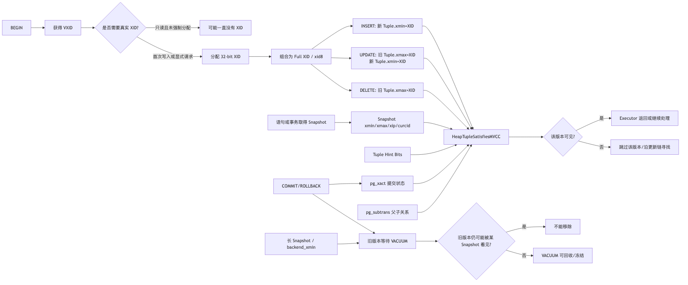

# 第 9 章：事务、MVCC、Snapshot 与 Tuple 可见性

> **技术基线**：PostgreSQL 18；兼顾 PostgreSQL 14—18。Go 示例使用 `github.com/jackc/pgx/v5` 与 `pgxpool`。
> **阅读前提**：已掌握 PostgreSQL Page、Heap Tuple、Buffer、WAL 的基本概念。
> **本章主线**：事务标识 → Tuple 版本 → Snapshot → 可见性判断 → 长事务与 VACUUM → Go 事务边界。

---

## 1. 本章定位

PostgreSQL 的并发读取并不是“读到表当前唯一的一份值”，而是：**每条 Heap Tuple 都带有事务版本信息，查询拿着一个 Snapshot，逐行判断哪个版本对自己可见**。理解这条主线，才能解释以下生产现象：

- 为什么一个事务已经提交，另一个会话仍可能看不到它；
- 为什么普通 `SELECT` 通常不阻塞 `UPDATE`，`UPDATE` 也通常不阻塞普通 `SELECT`；
- 为什么 `UPDATE` 会留下旧版本，`DELETE` 也不会立刻回收空间；
- 为什么只读长事务也能造成表膨胀；
- 为什么 `idle in transaction` 既可能持锁，也可能钉住清理地平线；
- 为什么 Read Committed 中连续两次相同查询可能返回不同结果；
- 为什么事务中的网络超时会产生“提交结果不确定”；
- 为什么读副本上的长查询可能被取消，或者反过来拖累主库清理。

本章承接第 3 章的 Page/Tuple 存储结构，为第 10 章隔离级别与 SSI、第 11 章锁与死锁、第 12 章 VACUUM/Freeze/Bloat、第 13 章 WAL/崩溃恢复奠定基础。

本章不深入展开：

- Serializable Snapshot Isolation 的危险结构与事务重试；
- 行锁模式、死锁检测和热点行治理；
- Freeze、Anti-wraparound VACUUM 的完整算法；
- WAL 提交记录、同步复制确认链路的全部实现。

---

## 2. 可验证的学习目标

完成本章后，你应当能够：

1. 从 `xmin`、`xmax`、`cmin/cmax`、事务状态和 Snapshot 推导一个 Tuple 是否可见。
2. 区分 Transaction ID、Full Transaction ID、Virtual Transaction ID 和 subxid。
3. 解释 `INSERT`、`UPDATE`、`DELETE` 对旧、新 Heap Tuple 的物理影响。
4. 复现 Read Committed 的语句级 Snapshot，以及 Repeatable Read 的事务级 Snapshot。
5. 解释为什么“事务已提交”不等于“任意既有 Snapshot 都能看到”。
6. 使用 `pg_current_snapshot()`、`pg_xact_status()`、`pg_stat_activity.backend_xmin` 诊断可见性问题。
7. 使用 `pageinspect` 观察更新链、删除标记和 Hint Bits。
8. 判断长事务、子事务风暴和导出 Snapshot 对 VACUUM、延迟及空间的影响。
9. 设计一份包含 `BeginTx`、`defer Rollback`、独立检查 `Commit` 错误和 `context` 的 pgx 事务模板。
10. 在主从架构中说明 Replica Snapshot、恢复冲突、`hot_standby_feedback` 的取舍。

---

## 3. 核心术语

| 中文名称 | 英文名称 | 准确定义 | 容易混淆的概念 | 所属层次 |
|---|---|---|---|---|
| 事务 | Transaction | 一组以提交或回滚为可见性边界的数据库操作 | 一次请求、一个连接 | SQL/事务管理 |
| 事务 ID | Transaction ID, XID | PostgreSQL 内部使用的 32 位事务标识；只读事务可能始终不分配 | 会话 PID、Full XID | 事务管理 |
| 完整事务 ID | Full Transaction ID | 将 epoch 与 32 位 XID 组合后的 64 位逻辑标识；SQL 类型为 `xid8` | `xid` 系统列 | 事务管理 |
| 虚拟事务 ID | Virtual Transaction ID, VXID | 由 backend 的虚拟进程编号和本地事务序号组成；事务开始即有，无需消耗全局 XID | backend PID、XID | 进程/锁管理 |
| 子事务 ID | Subtransaction ID, subxid | 写子事务获得的事务 ID；其父子关系记录于 `pg_subtrans` | 顶层 XID | 事务管理 |
| 插入事务 | `xmin` | Heap Tuple 头中创建该版本的事务 ID | Snapshot `xmin` | Tuple 头 |
| 删除/更新事务 | `xmax` | 删除该版本或将其替换为新版本的事务/Multixact 标识；也可能仅表示锁 | Snapshot `xmax` | Tuple 头 |
| 命令 ID | Command ID, CID | 当前事务内命令顺序号，用于区分同一事务内先后写入和删除 | XID、SQL 语句编号 | 事务内可见性 |
| Tuple 版本 | Tuple Version | 同一逻辑行在 Heap 中的一个物理版本 | 表的一行、Index Tuple | 存储/MVCC |
| 当前 Snapshot | Snapshot | 一组可见性边界和活跃事务信息，用于判断事务效果是否已发生在观察点之前 | 备份快照、文件系统快照 | MVCC |
| Snapshot 下界 | Snapshot `xmin` | Snapshot 取得时仍可能活跃的最小顶层 XID；更老事务已结束，但仍需结合提交/回滚状态 | Tuple `xmin` | Snapshot |
| Snapshot 上界 | Snapshot `xmax` | Snapshot 取得时“下一个尚未分配”的 XID；大于等于它的事务对该 Snapshot 均视为未来事务 | Tuple `xmax` | Snapshot |
| 活跃事务集合 | `xip` | 位于 Snapshot 边界内、取得 Snapshot 时仍在进行的顶层事务 ID 集合 | 所有连接、subxid 列表 | Snapshot |
| 提交状态日志 | `pg_xact` | 持久化记录事务最终状态的 SLRU 数据；每个事务状态占 2 bit | WAL、业务审计表 | 事务存储 |
| 提示位 | Hint Bits | 缓存在 Tuple 头中的事务提交/回滚判断结果，减少后续 `pg_xact` 查询 | Visibility Map | Tuple 头/Buffer |
| 可见性映射 | Visibility Map, VM | 标记 Heap Page 是否 all-visible/all-frozen；不是逐 Tuple 的事务状态表 | Hint Bits | 辅助存储 |
| 后端清理下界 | `backend_xmin` | 后端当前 Snapshot 对全局清理地平线贡献的最老 XID | `backend_xid` | 统计/ProcArray |
| 导出 Snapshot | Exported Snapshot | 由一个开放事务导出、供其他事务导入的相同数据库视图 | 逻辑备份文件 | Snapshot 同步 |
| 子事务 | Subtransaction | 顶层事务内可独立回滚的事务层级 | 独立事务 | 事务管理 |
| 保存点 | Savepoint | SQL 层创建和控制子事务的接口 | Checkpoint | SQL/事务管理 |
| 恢复 Snapshot | Replica/Recovery Snapshot | Standby 在 WAL 回放进度上建立的查询视图 | Primary 上的 Snapshot 导出 | 复制/MVCC |
| 提交结果不确定 | Commit Outcome Unknown | 客户端在 COMMIT 响应前断线，无法仅由客户端错误判断服务端是否已提交 | 明确回滚 | 应用可靠性 |

> **最常见的命名陷阱**：Tuple 的 `xmin/xmax` 与 Snapshot 的 `xmin/xmax` 是两组不同字段。前者描述“谁创建/结束这个版本”，后者描述“观察者所处的事务时间边界”。

---

## 4. 整体心智模型



### 4.1 数据流

1. 事务开始时先拥有 VXID，不一定立即消耗全局 XID。
2. 写入为 Heap Tuple 写入 `xmin/xmax` 等版本元数据。
3. 查询取得 Snapshot，把 Tuple 元数据、事务状态和当前命令 ID 一起送入可见性函数。
4. Executor 只处理对该 Snapshot 可见的版本。
5. 提交/回滚改变的是事务状态；旧 Tuple 不会因提交或回滚立即从 Page 中消失。
6. VACUUM 必须确认没有任何相关 Snapshot 仍可能看到旧版本，才可清理。

### 4.2 控制流

- **Read Committed**：每条命令取得新的 Snapshot。
- **Repeatable Read**：第一次普通查询或数据修改时取得事务级 Snapshot，之后复用。
- **当前事务自身**：除事务级时间边界外，还使用 `curcid` 与 Tuple 的 `cmin/cmax` 判断同一事务内先后顺序。
- **并发写冲突**：MVCC 解决“读哪个版本”，行锁解决“谁能同时修改”；两者不能混为一谈。

### 4.3 状态变化

```text
INSERT:
  新版本 T1: xmin = X_insert, xmax = Invalid

UPDATE:
  旧版本 T1: xmin = X_old,    xmax = X_update, ctid -> T2
  新版本 T2: xmin = X_update, xmax = Invalid

DELETE:
  当前版本 T2: xmin = X_old_or_update, xmax = X_delete
  不创建代表“已删除”的第三个业务版本
```

### 4.4 故障路径

- 后端崩溃或显式回滚：相关 XID 最终为 aborted；其插入版本不可见，其删除标记不生效。
- 客户端在 `COMMIT` 期间断线：服务端可能已提交，也可能未提交；客户端必须按“不确定结果”处理。
- Standby 回放需要删除旧版本，而只读查询仍使用旧 Snapshot：产生 recovery conflict，查询可能被取消。
- 长事务长期暴露 `backend_xmin`：VACUUM 不能移除其仍可能看到的版本，导致空间、缓存和 I/O 放大。

---

## 5. 使用方式

### 5.1 常用 SQL 工具箱

```sql
-- 查看服务器版本与当前事务特征
SELECT version();
SHOW transaction_isolation;
SHOW transaction_read_only;
SHOW transaction_deferrable;

-- 不主动消耗 XID；适合观测只读事务
SELECT pg_current_xact_id_if_assigned();

-- 返回 xid8；如果尚未分配，会主动分配一个真实 XID
SELECT pg_current_xact_id();

-- 当前语句所使用的 Snapshot，以及拆分后的边界
SELECT pg_current_snapshot() AS snap,
       pg_snapshot_xmin(pg_current_snapshot()) AS snap_xmin,
       pg_snapshot_xmax(pg_current_snapshot()) AS snap_xmax;

-- 展开 Snapshot 中的活跃顶层事务
SELECT * FROM pg_snapshot_xip(pg_current_snapshot());

-- 判断某个顶层 xid8 是否在 Snapshot 之前已经完成
SELECT pg_visible_in_snapshot($1::xid8, pg_current_snapshot());

-- 查询近期事务最终状态；过老事务可能返回 NULL
SELECT pg_xact_status($1::xid8);

-- 观察行版本元数据
SELECT ctid, tableoid, xmin, xmax, cmin, cmax, *
FROM app_table
WHERE id = $1;

-- 诊断开放事务与清理地平线
SELECT pid,
       usename,
       application_name,
       state,
       xact_start,
       now() - xact_start AS xact_age,
       backend_xid,
       backend_xmin,
       wait_event_type,
       wait_event,
       left(query, 200) AS query
FROM pg_stat_activity
WHERE xact_start IS NOT NULL
ORDER BY xact_start;
```

### 5.2 事务模式

```sql
BEGIN ISOLATION LEVEL READ COMMITTED READ WRITE;

BEGIN ISOLATION LEVEL REPEATABLE READ READ ONLY;

-- DEFERRABLE 只有 SERIALIZABLE + READ ONLY 时才有实际作用
BEGIN ISOLATION LEVEL SERIALIZABLE READ ONLY DEFERRABLE;
```

### 5.3 版本差异

| 能力 | PG14 | PG15 | PG16 | PG17 | PG18 |
|---|---:|---:|---:|---:|---:|
| `xid8`、`pg_snapshot`、`pg_current_xact_id()` | 支持 | 支持 | 支持 | 支持 | 支持 |
| `idle_in_transaction_session_timeout` | 支持 | 支持 | 支持 | 支持 | 支持 |
| `transaction_timeout` | 不支持 | 不支持 | 不支持 | **[PG17+] 支持** | 支持 |
| 本章描述的 RC/RR MVCC 语义 | 稳定 | 稳定 | 稳定 | 稳定 | 稳定 |
| PostgreSQL 18 AIO | — | — | — | — | **[PG18]** 改变部分 I/O 执行路径，不改变 Tuple 可见性语义 |

### 5.4 使用条件与安全注意事项

- 读取系统列不会锁定行，但系统列不能替代业务版本号。
- `pg_current_xact_id()` 会让原本可能不消耗 XID 的事务分配 XID；纯监控优先使用 `pg_current_xact_id_if_assigned()`。
- `pageinspect` 面向管理员和实验；它读取物理 Page，不应用普通 SQL 的行可见性过滤。
- `pg_export_snapshot()` 会让导出事务必须持续开放；导出者结束后 Snapshot 标识失效。
- 不要为“看清旧版本”在生产关闭 autovacuum、`fsync`、`full_page_writes` 或数据校验。
- `pg_terminate_backend()` 会回滚整个事务并释放锁，可能造成回滚 I/O、连接风暴和业务重试；应先确认所有者和影响。

---

## 6. 底层原理

### 6.1 ACID 的实现边界

#### Atomicity：原子性

PostgreSQL 不依靠传统“原地更新 + Undo Log”恢复旧值，而是创建新 Tuple 版本，并用事务状态决定版本是否生效：

- 顶层事务提交后，其已提交子事务的版本才整体成为已提交效果；
- 顶层事务回滚后，插入版本保持物理存在但逻辑不可见，更新/删除标记也不生效；
- 崩溃恢复通过 WAL 重放物理变化，再依据提交/回滚状态恢复一致的可见性边界。

因此，“回滚”不等于立刻把每个 Page 改回原字节；它首先是**使该事务版本不可见**，后续由 VACUUM 清理垃圾版本。

#### Consistency：一致性

数据库只能自动保证已声明的约束和事务语义。跨行、跨表业务不变量仍依赖：

- `PRIMARY KEY`、`UNIQUE`、`CHECK`、`FOREIGN KEY`、`EXCLUDE`；
- 正确的隔离级别与锁策略；
- 原子 SQL、幂等键和应用事务边界。

把两个相关写操作放进事务，并不自动消除 Write Skew 或错误的“先查后写”逻辑；这属于第 10 章。

#### Isolation：隔离性

PostgreSQL 由两类机制共同实现隔离：

1. **MVCC/Snapshot**：决定读哪个已存在版本。
2. **锁、谓词锁与 SSI**：协调并发写入，以及 Serializable 下无法仅靠版本选择解决的冲突。

普通读取通常不阻塞普通写入，是因为读者可以读取旧版本；但修改同一逻辑行的写者仍会竞争行级锁。

#### Durability：持久性

事务对当前实例“已提交”之后能否抵御不同故障，取决于：

- WAL 是否写入并按配置刷盘；
- `synchronous_commit` 等提交策略；
- 同步/异步副本确认范围；
- 存储、文件系统、电源保护；
- 备份、WAL 归档和恢复验证。

MVCC 说明“谁能看到提交”，并不单独定义跨节点 RPO。

### 6.2 XID、Full XID 与 VXID

#### 6.2.1 为什么事务开始时不立即分配 XID

全局 32 位 XID 是有限并会回绕的资源。只读事务若不写入、不显式调用会强制分配 XID 的函数，可以仅使用 VXID。这样可降低 XID 消耗和部分共享状态维护成本。

```sql
BEGIN;
SELECT pg_current_xact_id_if_assigned(); -- 通常为 NULL
SELECT 1;
SELECT pg_current_xact_id_if_assigned(); -- 仍可能为 NULL
SELECT pg_current_xact_id();             -- 主动分配 xid8
ROLLBACK;
```

VXID 在集群当前运行周期内足以标识后端事务，并出现在 `pg_locks.virtualxid` 等内部协调位置。它不是持久化业务 ID，也不能跨重启解释历史事务。

#### 6.2.2 32 位 XID 为什么还需要 Full XID

Tuple 系统列 `xmin/xmax` 使用 `xid`，其核心标识为 32 位，会循环使用。为了在更长时间范围内单调比较，PostgreSQL 使用带 epoch 的 FullTransactionId；SQL 暴露为 `xid8`。

```text
Full XID ≈ epoch : 32-bit XID
```

不要把 `xmin::text::bigint` 当成永不重复的业务序列。跨回绕、跨集群恢复或逻辑迁移时，这种假设会失败。

### 6.3 Tuple 版本与 DML

#### 6.3.1 INSERT

事务 `X10` 插入一行：

```text
T1(xmin=X10, xmax=Invalid, ctid=self)
```

- 对 `X10` 自己：在后续命令中可见。
- 对其他事务：只有当 `X10` 已提交，且其提交发生在观察者 Snapshot 之前，才可见。
- 若 `X10` 回滚：T1 永远不可作为正常可见版本，等待 VACUUM 清理。

#### 6.3.2 UPDATE

PostgreSQL 的 UPDATE 本质上是“结束旧版本 + 插入新版本”：

```text
旧 T1: xmin=X10, xmax=X20, ctid -> T2
新 T2: xmin=X20, xmax=Invalid, ctid=self
```

对一个在 `X20` 开始前建立的 Snapshot：

- T1 的删除者 `X20` 在该 Snapshot 看来仍是活跃/未来事务，因此 T1 仍可见；
- T2 的插入者 `X20` 对该 Snapshot 不可见，因此 T2 不可见。

对 `X20` 提交后新取得的 Snapshot：

- T1 因 `xmax=X20` 已在 Snapshot 前提交而不可见；
- T2 因 `xmin=X20` 已在 Snapshot 前提交而可见。

若满足 HOT 条件，索引可继续指向更新链根部，Heap 内通过 `ctid` 追到新版本；这减少索引维护，但不改变 MVCC 判断。

#### 6.3.3 DELETE

事务 `X30` 删除 T2：

```text
T2: xmin=X20, xmax=X30
```

DELETE 不创建一个表示“空值”的业务行版本。旧 Snapshot 仍可读取 T2；新 Snapshot 在 `X30` 提交后不再读取它。物理空间由后续 VACUUM 处理。

#### 6.3.4 `xmax` 不一定等于“删除者”

Tuple 的 `xmax` 可能还表示：

- 仅锁定该 Tuple 的事务；
- 多个锁持有者组成的 MultiXact；
- 已回滚的更新/删除者。

因此不能只看 `xmax <> 0` 就断言行已删除。必须结合 `t_infomask`、事务状态和 Snapshot。

### 6.4 Snapshot 的三个核心集合

SQL 显示的 `pg_snapshot` 通常形如：

```text
xmin:xmax:xip1,xip2,...
```

对于某个顶层事务 ID `X`：

```text
X < snapshot.xmin
    => X 在取得 Snapshot 时已经结束；再看它是 committed 还是 aborted

X >= snapshot.xmax
    => X 在 Snapshot 之后才分配，视为未来事务，不可见

snapshot.xmin <= X < snapshot.xmax 且 X 在 xip
    => X 在取得 Snapshot 时仍活跃，对该 Snapshot 不可见

snapshot.xmin <= X < snapshot.xmax 且 X 不在 xip
    => X 在取得 Snapshot 前已结束；再根据提交/回滚状态判断
```

关键结论：**某事务后来已经提交，不会改变旧 Snapshot 对它“当时仍活跃”的判断。** 这正是 Repeatable Read 能重复读取同一视图的基础。

### 6.5 Tuple 可见性判断过程

以下是便于排障的逻辑化版本，不等同于源码逐行复制，但顺序与核心语义一致。

#### 第一步：判断创建者 `xmin`

1. `xmin` 是 Frozen：视为很久以前已提交。
2. `xmin` 属于当前事务：
   - `cmin >= snapshot.curcid`：该版本由当前扫描开始后/当前命令创建，对本次扫描不可见；
   - 否则继续判断当前事务是否又删除了它。
3. `xmin` 位于 Snapshot 活跃集合中，或 `xmin >= snapshot.xmax`：创建者对该 Snapshot 仍未完成，版本不可见。
4. `xmin` 已提交且发生在 Snapshot 之前：创建有效，继续看 `xmax`。
5. `xmin` 已回滚/崩溃：版本不可见，并可设置 `HEAP_XMIN_INVALID` Hint Bit。

#### 第二步：判断结束者 `xmax`

前提是该版本的创建有效：

1. `xmax` 无效、已回滚，或只代表锁：版本仍可见。
2. `xmax` 属于当前事务：
   - `cmax >= snapshot.curcid`：本次扫描开始后才删除/更新，当前扫描仍可见旧版本；
   - `cmax < snapshot.curcid`：当前事务在此前命令已删除/更新，旧版本不可见。
3. `xmax` 在 Snapshot 中活跃，或 `xmax >= snapshot.xmax`：对该 Snapshot 来说删除/更新尚未发生，旧版本仍可见。
4. `xmax` 已提交且发生在 Snapshot 之前：旧版本不可见。
5. `xmax` 已回滚：删除/更新无效，旧版本仍可见。

#### 场景矩阵

| 插入者 `xmin` | 结束者 `xmax` | 对当前 Snapshot 的结论 |
|---|---|---|
| 仍未提交 | 任意 | 其他事务不可见；当前事务按 CID 判断 |
| 已回滚 | 任意 | 不可见 |
| 已提交，但在 Snapshot 的 `xip` 中 | 任意 | 对该旧 Snapshot 仍不可见 |
| 已提交且早于 Snapshot | 无效/仅锁/回滚 | 可见 |
| 已提交且早于 Snapshot | 删除者仍活跃或晚于 Snapshot | 旧版本可见 |
| 已提交且早于 Snapshot | 删除者已在 Snapshot 前提交 | 旧版本不可见 |
| 当前事务此前命令插入 | 尚未删除 | 当前事务可见 |
| 当前事务当前命令稍后插入 | — | 对已经开始的当前扫描不可见 |
| 当前事务此前命令删除 | 当前事务 | 对后续命令不可见 |

> **判断口诀**：先问“这个版本是否已经被有效地生出来”，再问“它是否已经被有效地结束”；两个问题都必须站在当前 Snapshot 的时间视角回答。

### 6.6 `pg_xact` 与 Hint Bits

`pg_xact` 持久化保存近期事务的提交状态。可见性函数在 Tuple Hint Bits 不足时会查询事务状态；确认后可把结果缓存到 Tuple 头：

- `HEAP_XMIN_COMMITTED`；
- `HEAP_XMIN_INVALID`；
- `HEAP_XMAX_COMMITTED`；
- `HEAP_XMAX_INVALID` 等。

Hint Bit 的作用是避免每次读取都访问 `pg_xact`。它不是事务提交的权威来源，也不需要在 COMMIT 时同步改写该事务创建过的所有 Tuple——那样会造成不可接受的随机写放大。

当观察者的旧 Snapshot 仍把某事务视为活跃时，即使该事务现实中刚刚提交，可见性代码也无需为了设置 Hint Bit 去查询高竞争共享结构，因为结果对这个旧 Snapshot 不会改变；更“新”的访问者会在适当时机设置 Hint Bit。

### 6.7 Read Committed：语句级 Snapshot

Read Committed 是 PostgreSQL 默认隔离级别：

```text
BEGIN;
Statement 1 -> Snapshot S1
Statement 2 -> Snapshot S2
Statement 3 -> Snapshot S3
COMMIT;
```

- 单条语句内部使用一致的 MVCC Snapshot。
- 两条语句之间，其他事务的提交可能进入新 Snapshot，因此相同查询可能返回不同结果。
- 当前事务此前命令的写入对自己可见，即使尚未提交。
- `UPDATE`/`DELETE` 搜索目标行时使用语句 Snapshot；若目标行被并发事务修改，会等待其结束。对方提交后，本事务可在新版本上重新检查 `WHERE` 条件并尝试修改。因此一条写语句可能处理的目标行并非完全来自一个“静止表面”，这是 RC 的重要边界。

### 6.8 Repeatable Read：事务级 Snapshot

```text
BEGIN ISOLATION LEVEL REPEATABLE READ;
-- BEGIN 本身通常还未固定 MVCC Snapshot
SELECT ...;  -- 第一次普通查询/写入取得 S1
SELECT ...;  -- 继续使用 S1
COMMIT;
```

- 其他事务在 S1 之后提交的版本，对本事务仍不可见。
- 当前事务自己的后续写入仍可见。
- 不能把“事务级 Snapshot”理解为忽略写冲突；并发修改仍可能等待或报 `40001`。
- PostgreSQL 的 Repeatable Read 基于 Snapshot Isolation，可避免不可重复读与幻读，但仍可能发生某些序列化异常；第 10 章展开。

### 6.9 当前事务自己的写入与 Command ID

只有 XID 无法区分同一事务内的命令先后。例如：

```sql
BEGIN;
INSERT INTO t(id) VALUES (1);  -- CID 0
SELECT * FROM t;               -- 后续 CID，可看见 id=1
DELETE FROM t WHERE id = 1;    -- 再后续 CID
SELECT * FROM t;               -- 看不见 id=1
ROLLBACK;
```

Tuple 头物理上使用 `t_cid`，根据状态解释为 `cmin` 或 `cmax`；复杂情况下可借助 Combo CID 同时表示创建和删除命令关系。Executor 在命令边界推进 Command Counter，使“自己的早先写入可见、同一命令扫描期间后来产生的版本不倒灌进来”。

### 6.10 子事务、Savepoint 与 Aborted Subtransaction

```sql
BEGIN;
INSERT INTO orders(id, state) VALUES (1, 'created');

SAVEPOINT sp_charge;
INSERT INTO payments(order_id, state) VALUES (1, 'charged');
-- 某一步失败
ROLLBACK TO SAVEPOINT sp_charge;

UPDATE orders SET state = 'payment_failed' WHERE id = 1;
COMMIT;
```

- `SAVEPOINT` 建立子事务；PL/pgSQL 的 `EXCEPTION` 块也会创建子事务。
- 只读子事务不一定获得 subxid；首次写入会分配，并确保所有父级到顶层都有真实 XID。
- 父子映射存放在 `pg_subtrans`。
- 子事务 `RELEASE` 后只是 subcommitted；只有顶层事务提交，它才最终 committed。
- `ROLLBACK TO SAVEPOINT` 使该子事务及其孩子 aborted，其写入版本物理保留但不可见。
- 每个 backend 只能在内存中快速缓存有限数量的活跃 subxid；超过 64 个开放 subxid 后，可见性判断更可能查询 `pg_subtrans`，带来额外共享状态和 I/O 成本。

Savepoint 适合局部错误恢复，不适合把百万行循环包装成“每行一个保存点”。

### 6.11 长事务、`idle in transaction` 与 `backend_xmin`

VACUUM 只有在确认旧版本不再可能被任何相关 Snapshot 访问时才能移除它。一个长期开放且已取得 Snapshot 的事务会暴露较老的 `backend_xmin`，使清理地平线无法推进：

```text
长事务 S_old 仍可能看见 T_old
       ↓
VACUUM 不能移除 T_old
       ↓
Heap/Index 垃圾增多
       ↓
缓存命中下降、扫描页数上升、WAL/Checkpoint/I/O 放大
```

`idle in transaction` 的危险在于：客户端已经停止发送 SQL，但数据库事务仍开放。它可能持有：

- 行锁、表锁或 advisory lock；
- 已取得 Snapshot 及其 `backend_xmin`；
- 未提交写入与连接池槽位。

但不能机械地认为所有刚执行 `BEGIN` 的 idle 事务都持有相同资源；要看它是否已执行查询/写入、是否分配 XID、是否建立 Snapshot 和持锁。

保护参数：

- `idle_in_transaction_session_timeout`：限制事务中空闲时间；
- **[PG17+]** `transaction_timeout`：限制事务总持续时间；
- `statement_timeout`：限制单条语句，不等价于前两者。

参数应按角色、工作负载和 SLO 设置，避免对迁移、备份或合法长报表一刀切。

### 6.12 Snapshot Export

导出 Snapshot 用于多个会话读取同一份预存数据视图：

```sql
-- 导出者
BEGIN ISOLATION LEVEL REPEATABLE READ READ ONLY;
SELECT pg_export_snapshot();  -- 假设返回 00000003-0000001B-1
-- 必须保持事务开放

-- 导入者；必须在第一条普通查询/写入之前
BEGIN ISOLATION LEVEL REPEATABLE READ READ ONLY;
SET TRANSACTION SNAPSHOT '00000003-0000001B-1';
SELECT ...;
COMMIT;
```

约束：

- 导入事务必须为 Repeatable Read 或 Serializable；RC 会为每条命令换 Snapshot，因而不允许导入。
- 导出事务必须保持开放；结束后标识不可再导入。
- 各事务自己的未提交写入彼此仍不可见；共享的是导出时既有数据的视图。
- Serializable 导入还有额外模式兼容限制。
- 导出者的长生命周期同样可能钉住 VACUUM 地平线。

适用场景包括并行一致性导出；不适合作为跨小时在线报表的默认协调机制。

### 6.13 Replica Snapshot

物理 Standby 一边回放 WAL，一边为只读查询建立恢复 Snapshot。它与 Primary 普通 Snapshot 具有相似的“版本可见性”目标，但受到 WAL 回放推进约束：

- Primary 上 VACUUM 清理旧 Tuple 的记录被回放时，Standby 上的长查询可能仍需要这些版本；
- 等待超过配置预算后，Standby 会取消冲突查询，以便继续回放；
- `hot_standby_feedback=on` 可把 Standby 的 xmin 需求反馈给 Primary，减少查询取消；代价是 Primary 可能长期保留垃圾版本并膨胀；
- 反馈在断连、故障转移或多级复制中也有时延和失效窗口，不能被当作无限期报表保证。

---

## 7. 内部数据结构和状态

### 7.1 Heap Tuple 头

与本章直接相关的字段：

| 字段 | 作用 | 诊断含义 |
|---|---|---|
| `t_xmin` | 创建该版本的 XID | 对应 SQL 系统列 `xmin` |
| `t_xmax` | 结束/锁定该版本的 XID 或 MultiXact | 对应 `xmax`，需结合 infomask |
| `t_cid` | 当前事务内创建/删除命令 ID | SQL 可观察为 `cmin/cmax` |
| `t_ctid` | 当前版本位置，或指向更新链后继 | UPDATE 后旧版本通常指向新版本 |
| `t_infomask` / `t_infomask2` | NULL、锁、多事务、Hint Bits、HOT 等状态位 | `pageinspect` 可解码 |

### 7.2 SnapshotData

内部 Snapshot 除 SQL 展示的边界外，还包含：

- `xmin`、`xmax`；
- 顶层活跃 XID 数组 `xip`；
- subxid 数组、是否溢出；
- `curcid`；
- 是否在 recovery 中取得；
- Snapshot 类型和注册/引用状态。

SQL `pg_current_snapshot()` 只展示顶层事务集合，不直接列出 subxid；判断 subxid 时需要父子关系。

### 7.3 `pg_xact` 与 `pg_subtrans`

- `pg_xact`：事务状态 SLRU，编码 in-progress、committed、aborted、sub-committed 等状态。
- `pg_subtrans`：subxid 到直接父 XID 的映射，帮助追溯顶层事务。
- 两者都不是业务查询接口；日常使用 `pg_xact_status()` 和系统视图，不要直接读取数据目录文件。

### 7.4 ProcArray、`backend_xid` 与 `backend_xmin`

活动 backend 在共享进程数组中发布事务状态，使 Snapshot 获取者能够形成活跃事务集合。`pg_stat_activity` 中：

- `backend_xid`：该 backend 当前顶层事务 XID，未分配时为 NULL；
- `backend_xmin`：该 backend 当前清理地平线贡献，未持有相关 Snapshot 时可为 NULL；
- `xact_start`：当前事务开始时间；
- `state_change`：状态最后变化时间；
- `state='idle in transaction'`：事务开放，但当前未执行 SQL。

### 7.5 Buffer、WAL、Memory Context

- Tuple 可见性检查发生在 Buffer 中的 Heap Page 上；命中 `shared_buffers` 仍要付出 CPU 分支、XID 比较和可能的状态查询。
- DML 改变 Tuple 头和创建新版本，产生 WAL；Hint Bit 也可能使 Buffer 变脏。
- Snapshot 的 XID 数组和事务状态位于相应内存上下文；活跃事务和 subxid 越多，获取、复制和检查 Snapshot 的成本越高。
- VACUUM 清理旧版本会改变 Page、Free Space Map、Visibility Map，并产生相应 WAL/脏页。

### 7.6 状态机

```text
事务：
  no-XID/VXID-only
      -> assigned XID
      -> in progress
      -> committed | aborted

子事务：
  active
      -> subcommitted --(top-level commit)--> committed
      -> aborted
      -> subcommitted --(top-level abort)--> aborted

Tuple 版本：
  inserted/uncommitted
      -> live
      -> recently dead
      -> dead/removable
      -> line pointer reusable
```

“recently dead”表示对当前最新事务已不可见，但仍可能被旧 Snapshot 看见；这是长事务影响 VACUUM 的关键中间状态。

---

## 8. 场景和选型决策

| 业务场景 | 推荐方案 | 不推荐方案 | 原因 | 性能代价 | 并发代价 | 一致性代价 | 高可用代价 | 运维复杂度 |
|---|---|---|---|---|---|---|---|---|
| 普通短 OLTP 请求 | Read Committed；短事务；原子 SQL/必要行锁 | 为“稳定读取”把所有请求改成 RR | RC Snapshot 生命周期短，VACUUM 友好 | 低 | 低；写热点仍会锁 | 需正确处理跨语句变化 | 低 | 低 |
| 多步计算要求事务内稳定视图 | Repeatable Read，验证写冲突与业务不变量 | 在 RC 中假设两次 SELECT 相同 | RR 固定事务视图 | 长事务会保留旧版本 | 可能出现更新冲突 | Snapshot Isolation 仍非 Serializable | 副本同样受长查询影响 | 中 |
| 长时间一致性只读报表 | 优先报表副本/离线数仓；必要时 Serializable Read Only Deferrable | 在 Primary 开放数小时 RR | 报表与 OLTP 隔离；安全 Snapshot 可降低 SSI 风险 | 可能等待首个 Snapshot；资源占用长 | 占连接和 xmin | 数据时点固定 | 副本延迟/冲突，Primary 反馈膨胀 | 高 |
| 并行一致性导出 | 一个导出事务 + 多个 RR 导入 Snapshot；严格限制时长 | 多会话各自 BEGIN 后假设视图一致 | 消除会话启动间的提交窗口 | 导出者钉住 xmin | 需要会话协调 | 各自未提交写入仍互不可见 | 不跨故障转移持久 | 中高 |
| 每批部分失败可继续 | 少量、分层 Savepoint；批次分块 | 每行一个 Savepoint、无限嵌套 | 控制 subxid 数和错误范围 | 适中 | >64 活跃 subxid 可增大开销 | 顶层回滚仍全部撤销 | 长大事务恢复成本高 | 中 |
| 外部支付/HTTP 调用 | 外部调用在事务外；Outbox/状态机/幂等 | 持 DB 事务等待外部服务 | 避免长锁、长 Snapshot 和结果不确定耦合 | 显著降低尾延迟 | 降低锁队列 | 需显式最终一致性设计 | 故障恢复更可控 | 中高 |
| Standby 上长查询 | 独立报表副本、合理延迟预算与查询超时 | 无限制开启 `hot_standby_feedback` | 在查询取消与 Primary 膨胀间显式取舍 | 可能增加存储或延迟 | Primary VACUUM 受反馈影响 | Standby 数据有复制延迟 | 影响 RPO/RTO 和切换能力 | 高 |
| 审计/乐观并发控制 | 明确业务 `version`/时间戳/事件 ID | 把 `xmin` 当永久业务版本 | XID 会回绕且跨集群不稳定 | 多一列/索引维护 | 可减少丢失更新 | 语义明确 | 迁移和恢复更可靠 | 低 |


---

## 9. 高性能分析

MVCC 的性能成本不是一个单独参数，而是一条放大链：

```text
更长 Snapshot
  -> 更多 dead/recently-dead Tuple 被保留
  -> Heap 与 Index 占用增大
  -> 每次查询读取更多 Page
  -> shared_buffers 与 OS Page Cache 有效容量下降
  -> 随机/顺序 I/O、CPU 可见性判断增加
  -> VACUUM、Checkpoint、WAL 和 P95/P99 进一步恶化
```

### 9.1 CPU

每个候选 Heap Tuple 都可能执行：

- Hint Bits 检查；
- 当前事务判断；
- XID 与 Snapshot 边界比较；
- `xip`/subxid 判断；
- 必要时事务状态或 `pg_subtrans` 查询。

单次成本很小，但在宽扫描、高并发、低选择性索引回表或大量死版本下会累积。PG18 的内部实现可对部分 Heap Scan 做批量可见性处理，但这属于实现优化，不改变 SQL 语义，也不能消除膨胀带来的扫描量。

### 9.2 内存、`shared_buffers` 与 OS Page Cache

- 同样的业务活跃数据，若因旧版本增加到 2—3 倍物理 Page，就会挤出更有价值的缓存页。
- Snapshot 自身还需保存活跃 XID 信息；大量并发写事务和 subxid 溢出会增加内存与共享状态访问。
- 不能仅看 `shared_buffers` 命中率判断健康：膨胀可能让系统“高命中地读取大量无效 Page”。应同时看每次调用的 Buffer 数、返回行数、dead tuple、relation size。

### 9.3 随机 I/O 与顺序 I/O

- Index Scan 命中很多旧 Index Tuple 后回表做可见性检查，形成随机 I/O 和读放大。
- Seq Scan 会顺序读更多膨胀 Page，即使顺序带宽不错，CPU 和缓存污染仍增加。
- VACUUM 为清理这些版本增加读写 I/O；若旧 Snapshot 阻止移除，扫描成本已经付出，但回收收益有限。

### 9.4 PostgreSQL 18 AIO

**[PG18]** 异步 I/O 可改善部分扫描和维护操作的 I/O 提交/等待方式，但必须明确：

- AIO 不改变 Snapshot、`xmin/xmax` 或 VACUUM 安全性；
- AIO 不能让仍可能被旧 Snapshot 看到的 Tuple 提前删除；
- 若根因是长事务导致空间放大，应先修事务边界，而不是期待 AIO 掩盖膨胀。

评估 AIO 时要记录存储类型、队列深度、缓存冷热、并发、`EXPLAIN (ANALYZE, BUFFERS, WAL, SETTINGS)`、系统 I/O 延迟和 Wait Event，不提供跨机器通用数值。

### 9.5 网络往返

“聊天式事务”是常见尾延迟放大器：

```text
BEGIN
SELECT
应用计算/网络 RTT
UPDATE
应用调用外部 API
INSERT
COMMIT
```

每多一次往返，事务持锁、持 Snapshot、占连接的时间都增加。优化方式包括：

- 把可原子完成的逻辑合并为一条 SQL/CTE；
- 使用批量 API，但正确关闭 `BatchResults`；
- 把外部服务调用移到事务外；
- 在进入事务前完成参数校验和纯计算。

### 9.6 索引维护、WAL 与 Checkpoint

- UPDATE 创建新 Heap Tuple；若不能 HOT，还要为每个相关索引写新 Index Tuple。
- DELETE 标记 Heap Tuple，Index Tuple 通常等待 VACUUM 清理。
- 膨胀增加后续 DML 所触及 Page 数、WAL 量和检查点脏页写回。
- Hint Bit 更新可能使 Buffer 变脏；启用校验和或相关 WAL 规则时，首次修改 Page 的成本需纳入冷启动/恢复后评估。

### 9.7 Temporary File

MVCC 不直接要求临时文件，但旧版本和错误估算会间接增加：

- 排序、Hash Join/Hash Aggregate 的输入行与页数；
- 因统计失真选择不合适计划后产生的 spill；
- 长报表本身的磁盘临时空间占用。

应把 `temp_bytes/temp_files`、查询级日志、实际/估算行数和 dead tuple 趋势关联，而不是简单调大 `work_mem`。

### 9.8 吞吐量与 P95/P99

平均延迟可能在膨胀初期变化不大，但 P95/P99 往往先恶化，因为：

- 部分查询随机遇到更多不可见版本；
- autovacuum 与前台负载竞争 I/O；
- 长事务和连接占用造成排队；
- 写者等待行锁，等待时间呈长尾；
- Checkpoint 脏页集中回写。

### 9.9 基准测试记录模板

任何 MVCC/VACUUM 性能实验至少记录：

| 维度 | 必须记录的变量 |
|---|---|
| 软件 | PostgreSQL 精确版本、扩展、关键参数、客户端/pgx 版本 |
| 数据 | 行数、平均行宽、表/索引大小、更新列、HOT 比例、数据分布 |
| 事务 | 隔离级别、事务时长、并发 XID 数、最长 `backend_xmin` age |
| 硬件 | CPU、内存、存储介质、文件系统、云盘规格 |
| 缓存 | 冷/热缓存、`shared_buffers`、OS Page Cache 状态 |
| 负载 | 读写比、连接数、活跃查询数、TPS、测试时长、队列深度 |
| 结果 | P50/P95/P99、Buffers、WAL、CPU、I/O、Wait Event、dead tuples、relation size |

---

## 10. 高并发分析

### 10.1 五个并发量不能混用

| 指标 | 含义 | 典型限制点 |
|---|---|---|
| goroutine 数 | 应用内可运行/等待的任务数 | 内存、调度、上游请求量 |
| 连接数 | 已建立到 PostgreSQL 的会话数 | `max_connections`、进程/内存、PgBouncer/Pool |
| 活跃查询数 | 当前正在执行或等待的 SQL 数 | CPU、I/O、锁、WAL |
| TPS | 每秒完成事务数 | 事务复杂度、提交路径、锁与 I/O |
| 排队请求数 | 等待连接/准入令牌的任务数 | Pool、Admission Control、超时预算 |

1000 个 goroutine 不应直接对应 1000 个数据库连接。应使用有界 Pool 和有界业务并发，使排队发生在可观测、可取消的位置。

### 10.2 MVCC 与锁竞争的边界

- 读旧版本可避免普通 `SELECT` 与写者互相阻塞。
- 两个写者修改同一逻辑行时，仍必须序列化。
- `SELECT ... FOR UPDATE/NO KEY UPDATE/SHARE/KEY SHARE` 主动进入行锁协调，不是普通 Snapshot 读。
- DDL、外键检查、唯一性验证、事务 ID 锁等待都可能出现阻塞。

定位时先问：查询是在“寻找一个可见版本”，还是在“等待另一个事务完成/释放锁”？

### 10.3 热点行、热点索引页与 WAL 竞争

MVCC 不能解决单行计数器、单库存行、单队列头等热点：

- 更新链集中在少量 Heap Page；
- 索引写入集中在少量叶子页；
- 写者排队并持有连接；
- 每次失败重试又增加 WAL 和锁请求。

可选方法包括分片计数、原子条件 UPDATE、工作队列 `SKIP LOCKED`、批量聚合、事件流；具体在后续章节展开。

### 10.4 长事务与阻塞队列

长事务有两种不同风险：

1. **持有 Snapshot**：阻止 VACUUM 清理，形成慢性容量与性能事故。
2. **持有锁**：让等待者形成显性阻塞队列，产生超时和重试风暴。

同一事务可能同时具备两者。必须同时检查 `backend_xmin`、`backend_xid`、`pg_locks`、`pg_blocking_pids()` 和 `xact_start`。

### 10.5 子事务风暴

常见来源：

- PL/pgSQL 循环中反复进入 `EXCEPTION` 块；
- 每条消息一个 Savepoint；
- ORM/框架透明嵌套事务；
- 大批量导入中逐行容错。

超过 backend 的快速 subxid 缓存后，其他 backend 识别这些 subxid 的顶层事务可能访问 `pg_subtrans`。解决方式不是提高连接数，而是：

- 把批次切小；
- 先校验再写；
- 使用 staging table 和集合式 SQL；
- 只在真正需要局部回滚处设置保存点。

### 10.6 死锁与重试风暴

MVCC 版本选择不消除锁环路。发生 `40P01` 后 PostgreSQL 会中止一个事务；发生 `40001` 时应用可能需要重试完整事务。虽然完整重试在第 10 章实现，但本章必须建立两个边界：

- 不能只重试失败的最后一条 SQL，因为 Snapshot 和先前读写已失效；
- 不能让所有请求立即无抖动重试，否则会从锁竞争变成重试风暴。

### 10.7 Backpressure 与 Admission Control

推荐把并发限制放在多层：

```text
入口请求预算
  -> 业务级有界 worker/semaphore
  -> pgxpool MaxConns 与 AcquireTimeout/ctx
  -> PostgreSQL 活跃查询容量
  -> 按角色 statement/transaction timeout
```

Pool 满并不一定意味着应增大连接数；它也可能说明数据库已经达到 CPU/I/O/锁容量。应结合 `AcquireDuration`、等待连接数、数据库活跃查询和等待事件判断。

### 10.8 事务边界与幂等

短事务原则：

- 事务前：鉴权、输入校验、外部读取、慢计算；
- 事务内：只保留必须原子提交的 SQL；
- 事务后：通知、缓存刷新、外部调用；需要可靠投递时写 Outbox。

对可能发生提交结果不确定的操作，应有业务幂等键、唯一约束和可查询结果，而不是仅凭客户端收到的错误重复扣款。

---

## 11. 高可用分析

本章与高可用的关系主要是**提交边界、复制可见性和恢复冲突**，不是完整 HA 编排。

### 11.1 RPO 与事务提交

- Primary 本地可见的 committed 事务，不必然已经到达异步副本。
- 异步复制故障转移可能丢失尚未传输/回放的已提交事务，RPO 非零。
- 同步复制可扩展提交确认故障域，但增加提交延迟并带来同步节点不可用时的可用性取舍。
- Snapshot 只描述某节点某时刻能看到哪些事务，不证明该事务已达到备份、归档或副本。

### 11.2 RTO 与长事务

长事务间接增加 RTO：

- 回滚大型未提交事务需要资源；
- 膨胀扩大实例、备份和恢复数据量；
- WAL 量增加，Standby 重放追赶更慢；
- 切换后应用旧连接必须失败并重连，未确认事务需要业务核对。

### 11.3 物理复制与 Replica Snapshot

Standby 查询只能读取已回放到当前一致点的数据，因此：

- 它可能比 Primary 落后；
- 它不会读到尚未回放的 Primary commit；
- 回放清理记录与查询 Snapshot 冲突时，需要在“取消查询”和“延迟回放/反馈 xmin”之间取舍。

监控：

```sql
-- Standby
SELECT pg_is_in_recovery(),
       pg_last_wal_receive_lsn(),
       pg_last_wal_replay_lsn(),
       pg_last_xact_replay_timestamp();

SELECT datname,
       confl_tablespace,
       confl_lock,
       confl_snapshot,
       confl_bufferpin,
       confl_deadlock
FROM pg_stat_database_conflicts;
```

### 11.4 逻辑复制

逻辑复制按事务提交边界解码和应用变更，但订阅端有自己的 XID、Tuple 与 Snapshot：

- 不复制源库物理 `xmin/xmax` 语义作为业务版本；
- 订阅端查询可见性由订阅端事务状态决定；
- 复制延迟意味着同一业务对象在源、目标的可见时刻不同；
- 冲突、DDL 和序列状态需要独立治理。

### 11.5 Planned Switchover、Failover 与 Failback

切换前应：

- 停止或排空写流量；
- 等待目标节点接收并回放到约定 LSN；
- 终止/迁移长报表，避免阻碍追赶；
- 更新路由并确保旧 Primary 被 Fencing；
- 让应用丢弃旧连接并重新建立会话。

非计划 Failover 时，客户端在旧 Primary 上的 `COMMIT` 可能返回网络错误，而事务可能：

1. 未到达旧 Primary；
2. 到达但回滚；
3. 已在旧 Primary 提交但未复制到新 Primary；
4. 已复制并在新 Primary 存在，但客户端没收到成功响应。

因此不能把所有连接错误都当作“安全重试”。需要幂等键、业务查询、事务对账，以及在适用且事务足够近期时辅助使用 `pg_xact_status()`；后者不是跨集群、跨时间无限保留的审计系统。

### 11.6 备份、PITR 与恢复验证

一致备份与 Snapshot 的关系：

- 逻辑并行导出需要协调一致 Snapshot；
- 物理基础备份依靠备份协议和 WAL，而不是普通 SQL Snapshot 覆盖文件复制；
- PITR 恢复到某个时间/LSN 后，事务可见性由恢复到的提交记录决定；
- 必须定期恢复验证业务关键行、约束、时间点和应用读写，而不是只验证备份文件存在。

### 11.7 脑裂与 Fencing

MVCC 只在一个 PostgreSQL 实例的事务历史中定义版本顺序。两个可写 Primary 并行接受写入会产生两条不可自动合并的事务历史；`xmin/xmax` 无法解决业务冲突。HA 必须依靠可靠 Fencing、仲裁和写路由阻止脑裂。

---

## 12. 三维影响矩阵

| 维度 | 相关度 | 核心收益 | 主要风险 | 关键指标 |
|---|---|---|---|---|
| 高性能 | 高 | 读写低阻塞；旧版本提供一致读取 | 长 Snapshot、死版本、缓存/I/O/WAL/空间放大 | `n_dead_tup`、relation size、Buffers/call、autovacuum、P95/P99、I/O |
| 高并发 | 高 | 普通读写可并行；不同 Snapshot 隔离视图 | 写热点、长锁、subxid 溢出、重试风暴、连接排队 | 活跃查询、锁等待、`backend_xmin`、xact age、pool acquire、TPS |
| 高可用 | 中 | 明确提交与副本可见性边界；支持一致导出 | 提交结果不确定、复制延迟、recovery conflict、反馈导致 Primary 膨胀 | replay lag、`pg_stat_database_conflicts`、RPO、未确认事务、恢复验证 |

---

## 13. 实验

> 所有并发实验建议使用三个独立 `psql` 终端。不要在连接池自动复用、事务状态不透明的 GUI 中首次执行。示例中的 XID 会因环境不同而变化，禁止把示例数值写进断言。

### 实验一：未提交 INSERT、`xmin` 与事务状态

#### 13.1.1 实验目标

验证：

- INSERT 创建的 Tuple 带有插入事务 `xmin`；
- 其他事务在提交前看不到该行；
- XID 现实中提交后，新的 RC Snapshot 才看到它；
- 旧 RR Snapshot 即使在提交后仍看不到它。

#### 13.1.2 版本与扩展

- PostgreSQL 14—18；主要按 18 验证。
- 无需扩展。

#### 13.1.3 建表和准备数据

```sql
DROP TABLE IF EXISTS mvcc_insert_demo;
CREATE TABLE mvcc_insert_demo (
    id   bigint PRIMARY KEY,
    note text NOT NULL
);
```

#### 13.1.4 时间线

```text
T0  Session B: BEGIN RR，并先执行一次查询固定 Snapshot
T1  Session A: BEGIN；INSERT；取得 XID，但不提交
T2  Session A: 看见自己的 Tuple 与 xmin
T3  Session B: 查询，返回 0 行；查询 A 的事务状态为 in progress
T4  Session A: COMMIT
T5  Session B: 仍在旧 RR Snapshot，查询仍为 0 行；状态已 committed
T6  Session C/新的 RC 语句: 可以看见该行
```

#### 13.1.5 Session B：先固定旧 Snapshot

```sql
BEGIN ISOLATION LEVEL REPEATABLE READ;

SELECT pg_current_snapshot() AS b_snapshot,
       count(*) AS visible_rows
FROM mvcc_insert_demo
WHERE id = 1;
-- visible_rows = 0
```

#### 13.1.6 Session A：插入但不提交

```sql
BEGIN;

INSERT INTO mvcc_insert_demo(id, note)
VALUES (1, 'uncommitted row');

SELECT pg_current_xact_id() AS a_full_xid,
       ctid,
       xmin,
       xmax,
       cmin,
       cmax,
       id,
       note
FROM mvcc_insert_demo
WHERE id = 1;

-- 记录 a_full_xid，例如 812；实际值以现场为准。
-- Session A 能看到自己的写入。
```

#### 13.1.7 Session B：提交前观察

把 `<A_FULL_XID>` 替换为 Session A 返回的 `xid8`：

```sql
SELECT pg_xact_status('<A_FULL_XID>'::xid8) AS a_status;
-- in progress

SELECT ctid, xmin, xmax, id, note
FROM mvcc_insert_demo
WHERE id = 1;
-- 0 rows；普通 SQL 无法通过不可见行读取它的 xmin
```

**等待/失败情况**：普通 `SELECT` 不等待 A，也不报错，直接忽略不可见版本。

#### 13.1.8 Session A：提交

```sql
COMMIT;
```

#### 13.1.9 Session B：提交后但仍使用旧 Snapshot

```sql
SELECT pg_xact_status('<A_FULL_XID>'::xid8) AS a_status;
-- committed

SELECT pg_current_snapshot() AS b_snapshot,
       count(*) AS visible_rows
FROM mvcc_insert_demo
WHERE id = 1;
-- 仍为 0：A 在 B 的旧 Snapshot 中属于活跃/未来事务

COMMIT;
```

#### 13.1.10 Session C 或 Session B 新事务

```sql
SELECT pg_current_snapshot() AS new_snapshot,
       ctid,
       xmin,
       xmax,
       id,
       note
FROM mvcc_insert_demo
WHERE id = 1;
-- 返回 1 行
```

#### 13.1.11 诊断 SQL

```sql
SELECT pid,
       state,
       xact_start,
       backend_xid,
       backend_xmin,
       wait_event_type,
       wait_event,
       left(query, 120) AS query
FROM pg_stat_activity
WHERE datname = current_database()
ORDER BY xact_start NULLS LAST;
```

字段解释：

- A 写入后通常有 `backend_xid`；
- B 固定 RR Snapshot 后通常有 `backend_xmin`；
- B 不因普通 SELECT 等待 A，所以其 Wait Event 不应是 A 的行锁。

#### 13.1.12 EXPLAIN/统计

```sql
EXPLAIN (
    ANALYZE,
    BUFFERS,
    WAL,
    SETTINGS,
    VERBOSE,
    SUMMARY
)
SELECT *
FROM mvcc_insert_demo
WHERE id = 1;
```

该只读计划不会显示每个 Tuple 的完整可见性决策；`Rows Removed`、Heap Fetch、Buffers 与物理检查工具需要结合解释。

#### 13.1.13 结果解释

“`pg_xact_status()` 已是 committed”只表示事务现实状态；B 的 RR Snapshot 仍记录 A 在观察点尚未完成，因此不改变旧视图。事务状态与 Snapshot 视角是两层信息。

#### 13.1.14 清理

```sql
DROP TABLE mvcc_insert_demo;
```

#### 13.1.15 生产安全警告

- `pg_xact_status()` 只保证近期状态，过老事务可返回 NULL。
- 不要为获取监控 ID 在高频只读事务中无条件调用 `pg_current_xact_id()`。
- 不要把系统 `xmin` 暴露为跨集群永久 API 版本。

---

### 实验二：Read Committed 中两次相同查询

#### 13.2.1 实验目标

验证 RC 的 Snapshot 属于语句，而不是整个显式事务。

#### 13.2.2 版本与扩展

- PostgreSQL 14—18。
- 无需扩展。

#### 13.2.3 建表和准备数据

```sql
DROP TABLE IF EXISTS rc_snapshot_demo;
CREATE TABLE rc_snapshot_demo (
    id    bigint GENERATED ALWAYS AS IDENTITY PRIMARY KEY,
    state text NOT NULL
);

INSERT INTO rc_snapshot_demo(state) VALUES ('open');
```

#### 13.2.4 时间线

```text
T0  A: BEGIN RC
T1  A: 同一条 SELECT 返回 Snapshot S1 与 count=1
T2  B: INSERT 一行并 COMMIT
T3  A: 再执行同一条 SELECT，得到 Snapshot S2 与 count=2
T4  A: COMMIT
```

#### 13.2.5 Session A

```sql
BEGIN ISOLATION LEVEL READ COMMITTED;

SELECT pg_current_snapshot() AS snap,
       (SELECT count(*)
        FROM rc_snapshot_demo
        WHERE state = 'open') AS open_count;
-- open_count = 1；记录 snap
```

把 Snapshot 和计数放在同一 SQL 中，是为了保证它们属于同一个语句 Snapshot。

#### 13.2.6 Session B

```sql
BEGIN;
INSERT INTO rc_snapshot_demo(state) VALUES ('open');
COMMIT;
```

Session B 不等待 A，因为 A 只执行普通 Snapshot 读。

#### 13.2.7 Session A 再查询

```sql
SELECT pg_current_snapshot() AS snap,
       (SELECT count(*)
        FROM rc_snapshot_demo
        WHERE state = 'open') AS open_count;
-- open_count = 2；snap 通常与第一次不同

COMMIT;
```

#### 13.2.8 RR 对照组

重新准备为 1 行后执行：

```sql
-- Session A
BEGIN ISOLATION LEVEL REPEATABLE READ;
SELECT pg_current_snapshot(), count(*)
FROM rc_snapshot_demo
WHERE state = 'open';

-- Session B 插入并提交后，Session A 再执行：
SELECT pg_current_snapshot(), count(*)
FROM rc_snapshot_demo
WHERE state = 'open';
-- Snapshot 和 count 保持事务视图；当前事务自己的写入除外
COMMIT;
```

#### 13.2.9 哪一步等待、失败、提交

- A 的两次普通 SELECT 均不等待 B。
- B INSERT 不等待 A。
- 不应有失败。
- B 在两次 A 查询中间提交；A 最后提交。

#### 13.2.10 诊断 SQL

```sql
SELECT pid,
       state,
       xact_start,
       query_start,
       backend_xid,
       backend_xmin,
       wait_event_type,
       wait_event
FROM pg_stat_activity
WHERE datname = current_database();
```

RC 在语句结束后不一定继续发布同一个 `backend_xmin`；RR 建立事务 Snapshot 后会更稳定地钉住地平线直到事务结束。

#### 13.2.11 EXPLAIN/统计

```sql
EXPLAIN (
    ANALYZE,
    BUFFERS,
    WAL,
    SETTINGS,
    VERBOSE,
    SUMMARY
)
SELECT count(*)
FROM rc_snapshot_demo
WHERE state = 'open';
```

记录每次返回行数、Buffers 与 Snapshot，而不是伪造固定耗时。

#### 13.2.12 结果解释

RC 保证的是“每条语句看见语句开始前已提交的数据，加上当前事务自己的先前写入”，不是“BEGIN 后视图固定”。因此应用若先 SELECT 再在下一条 SQL 中据此写入，必须分析中间并发提交窗口。

#### 13.2.13 清理

```sql
DROP TABLE rc_snapshot_demo;
```

#### 13.2.14 生产安全警告

不要把测试结果误解为 RC 总会产生两次不同结果；只有中间发生可见提交且影响条件时才会变化。并发测试必须控制明确时间线。

---

### 实验三：UPDATE、DELETE 后用 `pageinspect` 观察旧 Tuple

#### 13.3.1 实验目标

观察：

- UPDATE 结束旧版本并创建新版本；
- 旧版本 `t_ctid` 指向更新链后继；
- DELETE 只设置当前版本的结束事务；
- `heap_page_items()` 会列出物理 Tuple，不按当前 SQL Snapshot 过滤。

#### 13.3.2 版本与扩展

- PostgreSQL 14—18。
- 需要 `pageinspect`；创建扩展通常需要较高权限。
- 仅用于实验数据库。

#### 13.3.3 建表和准备数据

```sql
CREATE EXTENSION IF NOT EXISTS pageinspect;

DROP TABLE IF EXISTS tuple_version_demo;
CREATE TABLE tuple_version_demo (
    id   integer PRIMARY KEY,
    note text NOT NULL
) WITH (autovacuum_enabled = false);

INSERT INTO tuple_version_demo(id, note) VALUES (1, 'v1');

SELECT ctid, xmin, xmax, cmin, cmax, *
FROM tuple_version_demo;
```

> 这里仅为短实验对单表关闭 autovacuum；绝不能把这种设置照搬到生产表。清理阶段立即恢复/删除表。

#### 13.3.4 初始 Page

假设小表位于 block 0：

```sql
SELECT lp,
       lp_off,
       lp_len,
       t_xmin,
       t_xmax,
       t_field3 AS t_cid_or_xvac,
       t_ctid,
       raw_flags,
       combined_flags
FROM heap_page_items(get_raw_page('tuple_version_demo', 0)) h
CROSS JOIN LATERAL heap_tuple_infomask_flags(
    h.t_infomask,
    h.t_infomask2
) f
WHERE lp_flags = 1
ORDER BY lp;
```

预期至少一个正常 Line Pointer：初始版本的 `t_xmin` 是 INSERT XID，`t_xmax` 通常无效。

#### 13.3.5 Session A：固定旧 Snapshot

```sql
BEGIN ISOLATION LEVEL REPEATABLE READ;

SELECT pg_current_snapshot() AS a_snapshot,
       ctid, xmin, xmax, id, note
FROM tuple_version_demo
WHERE id = 1;
-- 看见 v1；保持事务开放
```

#### 13.3.6 Session B：UPDATE 并提交

```sql
BEGIN;

UPDATE tuple_version_demo
SET note = 'v2'
WHERE id = 1
RETURNING ctid, xmin, xmax, id, note;

COMMIT;
```

UPDATE 不会等待 A 的普通 SELECT。若空间允许且索引列未变，此更新通常可成为 HOT，但不要硬编码断言，需根据 flags 验证。

#### 13.3.7 Session C：观察 UPDATE 链

```sql
SELECT lp,
       t_xmin,
       t_xmax,
       t_ctid,
       raw_flags,
       combined_flags
FROM heap_page_items(get_raw_page('tuple_version_demo', 0)) h
CROSS JOIN LATERAL heap_tuple_infomask_flags(
    h.t_infomask,
    h.t_infomask2
) f
WHERE lp_flags = 1
ORDER BY lp;
```

预期：

- 旧版本：`t_xmax = UPDATE XID`，`t_ctid` 指向新版本；
- 新版本：`t_xmin = UPDATE XID`，`t_xmax` 无效；
- A 再查仍看到 `v1`；新 RC 查询看到 `v2`。

Session A 验证：

```sql
SELECT ctid, xmin, xmax, id, note
FROM tuple_version_demo
WHERE id = 1;
-- 仍为 v1
```

#### 13.3.8 Session B：DELETE 并提交

```sql
BEGIN;
DELETE FROM tuple_version_demo
WHERE id = 1
RETURNING ctid, xmin, xmax, id, note;
COMMIT;
```

新的 RC 查询：

```sql
SELECT * FROM tuple_version_demo WHERE id = 1;
-- 0 rows
```

但 Session A 的旧 Snapshot：

```sql
SELECT ctid, xmin, xmax, id, note
FROM tuple_version_demo
WHERE id = 1;
-- 仍可见 v1，因为 UPDATE 和 DELETE 都发生在其 Snapshot 之后
```

#### 13.3.9 Session C：观察 DELETE 后物理状态

```sql
SELECT lp,
       t_xmin,
       t_xmax,
       t_ctid,
       raw_flags,
       combined_flags
FROM heap_page_items(get_raw_page('tuple_version_demo', 0)) h
CROSS JOIN LATERAL heap_tuple_infomask_flags(
    h.t_infomask,
    h.t_infomask2
) f
WHERE lp_flags = 1
ORDER BY lp;
```

预期当前 `v2` 版本的 `t_xmax` 为 DELETE XID。物理 Page 上仍能看到版本，而普通 SQL 新 Snapshot 返回 0 行。

#### 13.3.10 VACUUM 与旧 Snapshot

Session C：

```sql
VACUUM (VERBOSE, ANALYZE) tuple_version_demo;
```

因为 Session A 仍可能看到 `v1`，VACUUM 不能回收它所需的旧版本。检查：

```sql
SELECT relname,
       n_live_tup,
       n_dead_tup,
       last_vacuum,
       vacuum_count
FROM pg_stat_user_tables
WHERE relname = 'tuple_version_demo';
```

然后 Session A：

```sql
COMMIT;
```

Session C 再执行：

```sql
VACUUM (VERBOSE, ANALYZE) tuple_version_demo;
```

再次使用 `heap_page_items`，Line Pointer 可能被标记为 unused/dead/redirect 或 Tuple 被移除；具体形态受 HOT、剪枝时机和 Page 状态影响，不应硬编码为固定 LP 数量。

#### 13.3.11 哪一步等待、失败、提交

- A 的普通查询不阻塞 B 的 UPDATE/DELETE。
- B 的 DML 正常提交。
- C 的 VACUUM 不等待 A 结束来强行删除版本；它会遵守清理地平线，留下仍可能可见的版本。
- 不应有失败；若 block 0 不存在或权限不足，需要先检查 relation size/扩展权限。

#### 13.3.12 诊断 SQL

```sql
SELECT pid,
       state,
       now() - xact_start AS xact_age,
       backend_xid,
       backend_xmin,
       wait_event_type,
       wait_event,
       left(query, 150) AS query
FROM pg_stat_activity
WHERE xact_start IS NOT NULL
ORDER BY xact_start;

SELECT pg_relation_size('tuple_version_demo') AS heap_bytes,
       pg_indexes_size('tuple_version_demo') AS index_bytes;
```

#### 13.3.13 EXPLAIN/统计

对 UPDATE/DELETE 使用 `EXPLAIN ANALYZE` 会真的执行。若需要额外测试：

```sql
BEGIN;
EXPLAIN (
    ANALYZE,
    BUFFERS,
    WAL,
    SETTINGS,
    VERBOSE,
    SUMMARY
)
UPDATE tuple_version_demo
SET note = note || '-x'
WHERE id = 1;
ROLLBACK;
```

注意：Sequence、外部副作用或非事务性扩展行为未必能完全回滚；本表无此类副作用。

#### 13.3.14 清理

```sql
-- 确认所有实验会话已 COMMIT/ROLLBACK
DROP TABLE tuple_version_demo;
-- pageinspect 若为共享实验环境已有用途，不必删除扩展
```

#### 13.3.15 生产安全警告

- `get_raw_page()` 与 `pageinspect` 是物理诊断工具，不应成为业务查询路径。
- 生产中不要关闭 autovacuum 来保留版本。
- 物理 Page 在并发 DML、VACUUM、Pruning 下会变化；诊断时记录时间线和事务状态。

---

## 14. Go 与 pgx：生产级事务模板

### 14.1 设计原则

1. 由 Service/Use Case 决定业务事务边界。
2. Repository 接收 `DBTX`/`pgx.Tx`，不能在每个方法中随意开启独立事务。
3. 使用 `BeginTx` 明确 Isolation、AccessMode、Deferrable。
4. `defer Rollback` 作为兜底；提交成功后 Rollback 返回事务已关闭，可安全忽略。
5. `Commit` 错误必须单独检查，不能因为返回错误就断言“肯定未提交”。
6. 每条调用传入 `context.Context`；pgx 的 Begin context 只约束 BEGIN 本身，不会在后续 context 取消时自动替你回滚事务。
7. Panic 展开栈时 defer 仍会执行 Rollback；不要吞掉 Panic。
8. 事务内禁止调用无关的慢 HTTP/RPC、消息队列等待、用户交互。
9. 幂等键和唯一约束应覆盖不确定提交后的安全核对。

### 14.2 可编译示例

```go
package main

import (
	"context"
	"errors"
	"fmt"
	"log"
	"os"
	"os/signal"
	"syscall"
	"time"

	"github.com/jackc/pgx/v5"
	"github.com/jackc/pgx/v5/pgconn"
	"github.com/jackc/pgx/v5/pgxpool"
)

// DBTX 让 Repository 同时支持连接池和显式事务。
// Repository 不负责决定业务事务边界。
type DBTX interface {
	Exec(context.Context, string, ...any) (pgconn.CommandTag, error)
	Query(context.Context, string, ...any) (pgx.Rows, error)
	QueryRow(context.Context, string, ...any) pgx.Row
}

type AccountRepository struct{}

func (AccountRepository) BalanceForUpdate(
	ctx context.Context,
	q DBTX,
	accountID int64,
) (int64, error) {
	const sql = `
        SELECT balance_cents
        FROM accounts
        WHERE account_id = $1
        FOR UPDATE`

	var balance int64
	if err := q.QueryRow(ctx, sql, accountID).Scan(&balance); err != nil {
		return 0, fmt.Errorf("lock account %d: %w", accountID, err)
	}
	return balance, nil
}

func (AccountRepository) AddBalance(
	ctx context.Context,
	q DBTX,
	accountID int64,
	delta int64,
) error {
	const sql = `
        UPDATE accounts
        SET balance_cents = balance_cents + $2
        WHERE account_id = $1`

	tag, err := q.Exec(ctx, sql, accountID, delta)
	if err != nil {
		return fmt.Errorf("update account %d: %w", accountID, err)
	}
	if tag.RowsAffected() != 1 {
		return fmt.Errorf("account %d: expected one row, got %d",
			accountID, tag.RowsAffected())
	}
	return nil
}

func (AccountRepository) InsertTransfer(
	ctx context.Context,
	q DBTX,
	requestID string,
	fromID, toID, amount int64,
) error {
	const sql = `
        INSERT INTO transfers(request_id, from_id, to_id, amount_cents)
        VALUES ($1, $2, $3, $4)`

	if _, err := q.Exec(ctx, sql, requestID, fromID, toID, amount); err != nil {
		return fmt.Errorf("insert transfer: %w", err)
	}
	return nil
}

type Service struct {
	pool *pgxpool.Pool
	repo AccountRepository
}

// RunTx 负责统一事务生命周期。
// cleanupTimeout 是示例注入值，应按服务关闭预算和 SLO 选择，而非照抄固定值。
func RunTx(
	ctx context.Context,
	pool *pgxpool.Pool,
	opts pgx.TxOptions,
	cleanupTimeout time.Duration,
	fn func(context.Context, pgx.Tx) error,
) (err error) {
	tx, err := pool.BeginTx(ctx, opts)
	if err != nil {
		return fmt.Errorf("begin transaction: %w", err)
	}

	// 即使 fn panic，defer 也会执行，然后 panic 继续向上传播。
	// 使用独立、有限的 cleanup context，避免原 ctx 已取消时完全无法发送 ROLLBACK。
	defer func() {
		rollbackCtx, cancel := context.WithTimeout(
			context.Background(),
			cleanupTimeout,
		)
		defer cancel()

		rollbackErr := tx.Rollback(rollbackCtx)
		if rollbackErr == nil || errors.Is(rollbackErr, pgx.ErrTxClosed) {
			return
		}

		// 不覆盖更重要的业务/Commit 错误；生产代码应额外记录该错误。
		if err == nil {
			err = fmt.Errorf("rollback transaction: %w", rollbackErr)
		}
	}()

	if err = fn(ctx, tx); err != nil {
		return err
	}

	if err = tx.Commit(ctx); err != nil {
		// 对端返回明确 SQLSTATE 时通常可判断事务结果；
		// 连接中断、超时等传输错误可能使提交结果不确定。
		return fmt.Errorf("commit transaction: %w", err)
	}
	return nil
}

func (s *Service) Transfer(
	ctx context.Context,
	requestID string,
	fromID, toID, amount int64,
) error {
	if requestID == "" || fromID == toID || amount <= 0 {
		return errors.New("invalid transfer input")
	}

	// 所有纯校验和外部调用都应在进入事务前完成。
	// 例如风控 HTTP 调用应在此处完成，或使用 Outbox/状态机解耦。

	opts := pgx.TxOptions{
		IsoLevel:       pgx.ReadCommitted,
		AccessMode:     pgx.ReadWrite,
		DeferrableMode: pgx.NotDeferrable,
	}

	return RunTx(ctx, s.pool, opts, 3*time.Second,
		func(ctx context.Context, tx pgx.Tx) error {
			// 按稳定顺序锁定账户，降低死锁概率。
			first, second := fromID, toID
			if first > second {
				first, second = second, first
			}

			firstBalance, err := s.repo.BalanceForUpdate(ctx, tx, first)
			if err != nil {
				return err
			}
			secondBalance, err := s.repo.BalanceForUpdate(ctx, tx, second)
			if err != nil {
				return err
			}

			fromBalance := firstBalance
			if fromID == second {
				fromBalance = secondBalance
			}
			if fromBalance < amount {
				return errors.New("insufficient balance")
			}

			if err := s.repo.AddBalance(ctx, tx, fromID, -amount); err != nil {
				return err
			}
			if err := s.repo.AddBalance(ctx, tx, toID, amount); err != nil {
				return err
			}
			if err := s.repo.InsertTransfer(
				ctx, tx, requestID, fromID, toID, amount,
			); err != nil {
				return err
			}
			return nil
		})
}

// RunConsistentReport 展示 Deferrable 的正确组合。
func RunConsistentReport(
	ctx context.Context,
	pool *pgxpool.Pool,
) error {
	opts := pgx.TxOptions{
		IsoLevel:       pgx.Serializable,
		AccessMode:     pgx.ReadOnly,
		DeferrableMode: pgx.Deferrable,
	}

	return RunTx(ctx, pool, opts, 3*time.Second,
		func(ctx context.Context, tx pgx.Tx) error {
			rows, err := tx.Query(ctx, `
                SELECT customer_id, sum(amount_cents)
                FROM invoices
                WHERE issued_at >= $1
                GROUP BY customer_id`, time.Now().AddDate(0, -1, 0))
			if err != nil {
				return fmt.Errorf("query report: %w", err)
			}
			defer rows.Close()

			for rows.Next() {
				var customerID int64
				var total int64
				if err := rows.Scan(&customerID, &total); err != nil {
					return fmt.Errorf("scan report row: %w", err)
				}
				// 在事务内只做快速内存处理；不要逐行调用外部服务。
				_ = customerID
				_ = total
			}
			if err := rows.Err(); err != nil {
				return fmt.Errorf("iterate report rows: %w", err)
			}
			return nil
		})
}

func sqlState(err error) string {
	var pgErr *pgconn.PgError
	if errors.As(err, &pgErr) {
		return pgErr.Code
	}
	return ""
}

func main() {
	rootCtx, stop := signal.NotifyContext(
		context.Background(),
		syscall.SIGINT,
		syscall.SIGTERM,
	)
	defer stop()

	databaseURL := os.Getenv("DATABASE_URL")
	if databaseURL == "" {
		log.Fatal("DATABASE_URL is required")
	}

	config, err := pgxpool.ParseConfig(databaseURL)
	if err != nil {
		log.Fatalf("parse DATABASE_URL: %v", err)
	}

	pool, err := pgxpool.NewWithConfig(rootCtx, config)
	if err != nil {
		log.Fatalf("create pool: %v", err)
	}
	defer pool.Close()

	pingCtx, cancelPing := context.WithTimeout(rootCtx, 5*time.Second)
	err = pool.Ping(pingCtx)
	cancelPing()
	if err != nil {
		log.Fatalf("ping database: %v", err)
	}

	service := &Service{pool: pool}

	opCtx, cancelOp := context.WithTimeout(rootCtx, 2*time.Second)
	err = service.Transfer(opCtx, "req-20260620-001", 101, 202, 500)
	cancelOp()
	if err != nil {
		// 使用 errors.As + SQLSTATE，而不是匹配错误文本。
		log.Printf("transfer failed: sqlstate=%q err=%v", sqlState(err), err)
	}
}
```

### 14.3 配套 Schema

```sql
CREATE TABLE accounts (
    account_id   bigint PRIMARY KEY,
    balance_cents bigint NOT NULL CHECK (balance_cents >= 0)
);

CREATE TABLE transfers (
    request_id   text PRIMARY KEY,
    from_id      bigint NOT NULL REFERENCES accounts(account_id),
    to_id        bigint NOT NULL REFERENCES accounts(account_id),
    amount_cents bigint NOT NULL CHECK (amount_cents > 0),
    created_at   timestamptz NOT NULL DEFAULT clock_timestamp()
);
```

`request_id` 唯一约束提供幂等锚点。若 `Commit` 返回传输错误，客户端可以按业务请求 ID 查询最终结果，而不是盲目再次扣款。

### 14.4 `BeginTx` 选项

| pgx 选项 | SQL 对应 | 使用说明 |
|---|---|---|
| `IsoLevel: pgx.ReadCommitted` | `ISOLATION LEVEL READ COMMITTED` | 默认 OLTP；每条语句新 Snapshot |
| `pgx.RepeatableRead` | `REPEATABLE READ` | 事务级稳定 Snapshot；需处理并发更新失败 |
| `pgx.Serializable` | `SERIALIZABLE` | 最强隔离；完整事务重试见第 10 章 |
| `AccessMode: pgx.ReadOnly` | `READ ONLY` | 拒绝多数持久对象写入；不是“绝不写磁盘” |
| `AccessMode: pgx.ReadWrite` | `READ WRITE` | 默认写事务 |
| `DeferrableMode: pgx.Deferrable` | `DEFERRABLE` | 仅 Serializable + Read Only 有效果，首个 Snapshot 可能等待 |

### 14.5 Commit 错误分类

1. **服务器明确返回错误**：例如延迟约束在 COMMIT 时失败，事务会回滚；可通过 `*pgconn.PgError` 和 SQLSTATE 分类。
2. **`pgx.ErrTxCommitRollback`**：COMMIT 实际变成回滚，结果已知为未提交。
3. **网络 EOF、超时、连接重置**：请求可能已经到达服务器并提交，也可能没有，结果不确定。
4. **进程/节点故障与故障转移**：还要结合复制模式判断新 Primary 是否包含该事务。

生产处理：业务幂等键、唯一约束、结果查询、Outbox/对账。`pg_xact_status()` 可辅助判断近期同一集群事务，但应用必须先可靠保存对应 xid8，且不能把它当永久账本。

### 14.6 Repository 为什么不能自行开启独立事务

错误模式：

```text
Service.Transfer
  -> AccountRepo.Debit()  自己 BEGIN/COMMIT
  -> AccountRepo.Credit() 自己 BEGIN/COMMIT
```

若 Credit 失败，Debit 已提交，业务原子性被破坏。正确模式是 Service 开启一次事务，把同一个 `pgx.Tx` 传给所有 Repository。Repository 可以提供显式的“独立原子操作”，但名称和契约必须说明它不参与外层事务，不能静默决定。

---

## 15. 生产排障 Runbook

### 15.1 首先确认什么

1. 症状是结果不可见、锁等待、查询变慢、磁盘增长、autovacuum 追不上，还是 Standby 查询被取消？
2. 受影响的是 Primary、Standby，还是应用连接池？
3. 问题从何时开始，是否对应发布、批处理、报表、迁移或流量变化？
4. 是否存在长期 `xact_start`、`idle in transaction`、老 `backend_xmin`？
5. 是否有同一表 DML 激增、HOT 比例下降、dead tuple 和 relation size 上升？

### 15.2 查看哪些指标

- 数据库：TPS、事务时长分位数、活跃/idle-in-transaction 会话、锁等待、dead tuples、autovacuum 时长。
- 查询：P50/P95/P99、Buffers/call、rows/call、temp bytes、WAL bytes、计划变化。
- 系统：CPU、iowait、磁盘延迟/吞吐、Page Cache、内存、文件系统容量。
- Pool：总连接、已获取连接、空闲连接、Acquire 等待次数/时长、取消数。
- 复制：receive/replay lag、recovery conflicts、`hot_standby_feedback`、复制槽 xmin/catalog_xmin。

### 15.3 查找最老事务和 xmin 持有者

```sql
SELECT pid,
       datname,
       usename,
       application_name,
       client_addr,
       state,
       xact_start,
       state_change,
       now() - xact_start AS xact_age,
       now() - state_change AS state_age,
       backend_xid,
       age(backend_xid) AS backend_xid_age,
       backend_xmin,
       age(backend_xmin) AS backend_xmin_age,
       wait_event_type,
       wait_event,
       left(query, 300) AS query
FROM pg_stat_activity
WHERE xact_start IS NOT NULL
ORDER BY xact_start;
```

重要字段：

- `xact_age`：事务总年龄；
- `state_age`：当前 idle/active 状态持续时间；
- `backend_xid_age`：该事务 XID 与当前计数器距离；
- `backend_xmin_age`：对清理地平线的潜在影响；
- `wait_event`：它是正在运行、等锁、等 I/O，还是客户端空闲。

`age(NULL)` 返回 NULL，因此无 XID/Snapshot 的会话不会伪装成老事务。

### 15.4 如何找到 blocker

```sql
WITH blocked AS (
    SELECT pid,
           pg_blocking_pids(pid) AS blockers,
           wait_event_type,
           wait_event,
           query
    FROM pg_stat_activity
    WHERE cardinality(pg_blocking_pids(pid)) > 0
)
SELECT b.pid AS blocked_pid,
       b.wait_event_type,
       b.wait_event,
       b.query AS blocked_query,
       blocker.pid AS blocker_pid,
       blocker.state AS blocker_state,
       now() - blocker.xact_start AS blocker_xact_age,
       blocker.backend_xid,
       blocker.backend_xmin,
       blocker.query AS blocker_query
FROM blocked b
CROSS JOIN LATERAL unnest(b.blockers) AS p(pid)
JOIN pg_stat_activity blocker ON blocker.pid = p.pid
ORDER BY blocker.xact_start;
```

不要只杀“最慢 SQL”；真正 blocker 可能已是 `idle in transaction`，其最后一条 query 看似无害。

### 15.5 判断 Vacuum/Bloat

```sql
SELECT relid::regclass AS relation,
       n_live_tup,
       n_dead_tup,
       n_tup_ins,
       n_tup_upd,
       n_tup_hot_upd,
       n_tup_del,
       last_vacuum,
       last_autovacuum,
       vacuum_count,
       autovacuum_count,
       pg_size_pretty(pg_total_relation_size(relid)) AS total_size
FROM pg_stat_user_tables
ORDER BY n_dead_tup DESC
LIMIT 30;
```

注意 `n_dead_tup` 是估算值。进一步使用 `pgstattuple`、采样、relation size 历史和 VACUUM 日志，但扩展扫描大表本身可能昂贵。

### 15.6 如何找到最早出现的计划估算错误

MVCC 问题常先表现为“计划没变但实际需要读更多页”，也可能因统计滞后导致估算错误。步骤：

1. 从监控/`pg_stat_statements` 找到最早发生 latency、Buffers/call 或 rows/call 跃升的 queryid。
2. 对同一参数类别执行：

```sql
EXPLAIN (
    ANALYZE,
    BUFFERS,
    WAL,
    SETTINGS,
    VERBOSE,
    SUMMARY
)
SELECT ...;
```

3. 从计划树最底层开始，找第一处 `actual rows` 与 `rows` 明显偏离的节点。
4. 同时比较 Heap/Index 大小、dead tuples、`Rows Removed by Filter`、Heap Fetch 和缓存冷热。
5. 区分：
   - 估算错误导致坏计划；
   - 计划合理，但膨胀导致相同计划读放大；
   - 等锁/连接池排队，与执行计划无关。

### 15.7 资源归因表

| 观察 | 更可能的方向 | 下一步 |
|---|---|---|
| CPU 高、Buffers 高、I/O 不高 | 大量内存命中但可见性/过滤/表达式成本高 | 看 dead tuple、rows removed、profile、计划 |
| iowait 高、relation size 增长 | 膨胀、VACUUM/Checkpoint 与前台竞争 | 查老 `backend_xmin`、autovacuum、Page 读取 |
| 活跃连接低但 Pool Acquire 高 | 连接泄漏、长事务占槽、网络/Pool 配置 | 查应用 span、pool stats、`state` |
| `transactionid`/tuple 锁等待 | 并发写同一行或等待对方事务结束 | `pg_blocking_pids`、锁顺序、热点键 |
| WAL bytes 激增 | 非 HOT UPDATE、索引维护、批量写/膨胀 | 看 HOT 比率、索引、Checkpoint |
| Standby `confl_snapshot` 增长 | 回放清理与长查询 Snapshot 冲突 | 查报表、延迟参数、feedback 与 Primary bloat |
| temp bytes 高 | 大中间集/统计错误/膨胀间接放大 | EXPLAIN、workload-specific 内存评估 |

### 15.8 可在线执行的低风险动作

- 查询 `pg_stat_activity`、`pg_locks`、`pg_stat_user_tables`、复制统计。
- 对明确的只读长查询先 `pg_cancel_backend(pid)`。
- 调低特定角色/会话未来事务的 timeout；变更前评估合法长任务。
- 限制应用入口并发，暂停非关键批任务。
- 对单表执行普通 `VACUUM (VERBOSE, ANALYZE)`，前提是已评估 I/O；它不会违反 Snapshot 安全性。

### 15.9 高风险动作

- `pg_terminate_backend()`：回滚事务、释放连接，可能触发业务重试和回滚压力。
- `VACUUM FULL`：需要强锁并重写表，不是紧急在线常规操作。
- `REINDEX`/表重写类 DDL：需评估锁、磁盘和 WAL。
- 全局关闭 autovacuum、`fsync`、`full_page_writes`。
- 为消除 Standby 查询取消而无限制开启反馈/延迟回放。
- 在磁盘接近满时盲目跑大规模重写。

### 15.10 临时止损

1. 找到最老且非必要的事务所有者，优先让应用正常结束。
2. 无法协调时，先取消当前查询；确认后再终止 backend。
3. 对入口限流，停止产生大量 UPDATE/DELETE 的非关键作业。
4. 为关键 OLTP 预留连接和 I/O，暂时下线重报表。
5. Standby 冲突时按业务优先级选择取消报表、容忍延迟或切换到专用报表副本。
6. 磁盘危急时先扩容/释放安全空间，避免直接执行需要额外磁盘的表重写。

### 15.11 根本修复

- 事务边界下沉到最小原子 SQL 集；外部服务移出事务。
- 为角色设置适当 `idle_in_transaction_session_timeout`，PG17+ 评估 `transaction_timeout`。
- 修复连接/Rows/BatchResults 泄漏，实施有界并发。
- 大批处理分块提交；减少 Savepoint 数量。
- 为查询与 DML 优化索引，提升 HOT 机会，校准 autovacuum 策略。
- 长报表迁移到专用副本/数仓，并对 `hot_standby_feedback` 设置容量护栏。
- 为不确定提交设计幂等键、唯一约束和对账流程。

### 15.12 验证修复

- 最老 `xact_age/backend_xmin_age` 回落并保持在预算内。
- dead tuple 和 relation size 停止异常增长；VACUUM 能推进。
- Query Buffers/call、P95/P99、Pool Acquire 时间改善。
- 锁等待、`idle in transaction` 数、recovery conflicts 降低。
- 压测与故障注入验证取消、超时、断线、Failover 后无重复业务效果。

### 15.13 监控与告警

建议按业务基线设阈值，不给所有集群统一秒数：

- 最老事务年龄、最老 `backend_xmin` age；
- `idle in transaction` 数量与最长持续时间；
- 表 `n_dead_tup/n_live_tup`、物理大小增长斜率；
- autovacuum 距上次运行时间、运行时长和取消次数；
- 锁等待数量/时长；
- pgxpool Acquire P95/P99、等待请求；
- Standby `confl_snapshot` 增量、replay lag；
- 磁盘剩余容量与增长预测；
- Commit 结果不确定事件和幂等冲突计数。


---

## 16. 常见错误与反模式

### 16.1 把“事务已提交”理解为“所有事务立刻可见”

旧 RR/Serializable Snapshot 仍按取得时的活跃集合判断。修复：同时检查现实事务状态与观察者 Snapshot。

### 16.2 在 Read Committed 中假设两次 SELECT 结果稳定

RC 是语句级 Snapshot。修复：使用原子 SQL、必要锁或经过论证的更高隔离级别，不要仅靠“都在 BEGIN/COMMIT 里”。

### 16.3 把 `xmin` 当业务版本号或永久审计 ID

XID 会回绕，恢复、复制和迁移会改变语义。修复：使用显式 `version bigint`、事件 ID、业务请求 ID 或审计表。

### 16.4 在高频只读路径调用 `pg_current_xact_id()`

它会主动分配 XID。修复：仅观测时使用 `pg_current_xact_id_if_assigned()`；真正需要事务 ID 时再分配。

### 16.5 看到 `xmax <> 0` 就认定行已删除

`xmax` 也可能是锁、MultiXact 或已回滚事务。修复：结合 infomask、事务状态和 Snapshot。

### 16.6 事务中调用慢 HTTP/RPC/消息服务

数据库连接、锁和 Snapshot 被外部延迟放大。修复：调用前置，或使用 Outbox、Saga、状态机和幂等设计。

### 16.7 忽略 `Commit` 错误，或把错误一律当未提交

网络错误可能产生不确定结果。修复：单独检查 Commit、记录幂等键、查询业务结果、对账。

### 16.8 Repository 私自开启和提交事务

跨 Repository 原子操作被切碎。修复：由 Service 决定事务，把同一个 `pgx.Tx` 向下传递。

### 16.9 只设置 `statement_timeout`，不治理 `idle in transaction`

语句结束后事务仍可长时间开放。修复：按角色设置 idle/transaction timeout，并修客户端事务生命周期。

### 16.10 每行一个 Savepoint

产生大量 subxid、`pg_subtrans` 查询和大事务开销。修复：集合式写入、staging、分批提交、少量局部保存点。

### 16.11 为解决膨胀关闭 autovacuum

会让垃圾和 XID 风险更严重。修复：先消除老 Snapshot，再调优 autovacuum；必要重写需有在线方案。

### 16.12 在生产用 `pageinspect` 结果替代正常可见性查询

物理工具不遵循业务 Snapshot，且 Page 可并发变化。修复：仅用于受控诊断，与事务时间线和普通 SQL 对照。

### 16.13 无限制导出并持有 Snapshot

并行任务完成后导出者仍开放，长期钉住 xmin。修复：生命周期编排、超时、失败清理和导出者健康检查。

### 16.14 为避免 Standby 查询取消，无条件开启 `hot_standby_feedback`

可能把清理压力转移到 Primary 并造成膨胀。修复：同时监控 Primary dead tuples/size，使用专用报表副本和查询预算。

### 16.15 看到连接池排队就不断增大连接数

根因可能是长事务、锁或数据库饱和。修复：先看 Acquire 时间、活跃查询、Wait Event 和事务年龄，实施 Admission Control。

---

## 17. 模拟生产事故案例

### 17.1 模拟生产案例一：只读批处理拖垮写库

#### 系统背景

订单 Primary 承载 8:2 的读写 OLTP。夜间对账程序使用 Repeatable Read，先查询全量订单，再逐条调用外部结算 API；程序认为“只读事务不会影响写入”。

#### 故障现象

- 批处理开始数小时后，订单表和多个索引快速增长；
- autovacuum 持续运行但 `n_dead_tup` 不降；
- 查询 Buffers/call、I/O 和 P99 上升；
- Pool Acquire 等待增加，磁盘增长告警触发；
- 没有明显的普通 SELECT/UPDATE 锁阻塞。

#### 错误假设

“只读事务不写数据，所以不会妨碍 VACUUM，也不会影响写请求。”

#### 排查过程

1. `pg_stat_activity` 找到一个 `xact_age` 5 小时、`state='idle in transaction'` 与 `backend_xmin` 很老的批处理连接。
2. `pg_stat_user_tables` 显示订单表 UPDATE/DELETE 持续增长，dead tuples 不下降。
3. VACUUM VERBOSE 日志显示仍有大量 Tuple 不能移除。
4. 应用 trace 显示每处理一行都会在事务内调用外部 API，偶发几十秒超时。
5. 查询计划基本未变，但实际 Buffers 显著增加，证明主要是物理读放大而非单纯计划错误。

#### 根因

批处理首次查询建立了 RR Snapshot，随后数小时保持开放。Primary 上后续 UPDATE 产生的旧版本仍可能被该 Snapshot 读取，VACUUM 不能回收。外部 API 延迟进一步延长事务。

#### 临时止损

- 暂停批处理入口；确认可重跑后终止该 backend；
- 限制非关键写任务，保留 OLTP 资源；
- 事务结束后运行普通 VACUUM，并监控 I/O；
- 磁盘不足时先扩容，避免直接 `VACUUM FULL`。

#### 最终修复

- 把外部结算调用移出数据库事务；
- 使用按主键游标分页的小批次 RC 查询，每批独立提交；
- 对账结果通过幂等请求 ID 和 Outbox 驱动；
- 报表迁移到专用只读副本/分析系统；
- 为批处理角色设置事务时长和 idle timeout 护栏。

#### 监控补充

- 按 `application_name` 监控最老 `backend_xmin`；
- 事务时长与外部 RPC span 关联；
- 表大小增长率、dead tuple、VACUUM 回收量；
- 批处理每批耗时与失败重试次数。

#### 防止复发

代码评审清单明确“事务内不得调用外部服务”；压测同时包含长 Snapshot 和持续 UPDATE；发布门禁检查角色 timeout 与 `application_name`。

---

### 17.2 模拟生产案例二：报表副本不再取消查询，但 Primary 膨胀

#### 系统背景

一个物理 Standby 提供 BI 查询。分析师的查询经常运行 30—90 分钟，并因 `confl_snapshot` 被取消。团队直接全局开启 `hot_standby_feedback=on`，未建立 Primary 容量监控。

#### 故障现象

- Standby 查询取消明显减少；
- 数天后 Primary 大表和索引持续膨胀；
- autovacuum 正常启动却清理不充分；
- Primary I/O、Checkpoint 时间和备份窗口增长；
- Standby replay lag 在重报表期间波动。

#### 错误假设

“`hot_standby_feedback` 只影响副本查询，不会改变 Primary 的存储和 VACUUM。”

#### 排查过程

1. Standby `pg_stat_database_conflicts.confl_snapshot` 在配置变更后下降。
2. Primary `pg_stat_replication.backend_xmin` 长时间停留在较老值。
3. Primary 更新频繁表的 dead tuples 和 relation size 同期上涨。
4. 业务连接没有同等年龄的本地 `backend_xmin`，排除本地长事务为主因。
5. 分析师任务时间与反馈 xmin 停滞高度相关。

#### 根因

Standby 把长查询需要的 xmin 反馈给 Primary，Primary 为避免移除副本仍可能需要的版本而推迟清理。问题从“副本取消查询”转化为“主库保留垃圾版本”。

#### 临时止损

- 暂停最重报表，等待 xmin 前进；
- 限制查询运行时间和并发；
- 事务地平线恢复后逐表普通 VACUUM；
- 为容量不足表预留在线重建窗口，而非高峰期强制重写。

#### 最终修复

- 建立独立报表副本并允许更大的复制延迟预算；
- 把超长分析迁移到列式分析平台/数仓；
- 按查询类别设置 `statement_timeout`；
- 对 feedback 开启与否制定明确 SLO：允许的 Primary 膨胀、Standby 取消率、最大 replay lag；
- 为关键 OLTP Standby 与报表 Standby 分离职责。

#### 监控补充

- Primary `pg_stat_replication.backend_xmin` age；
- Standby recovery conflict 增量；
- Primary relation size/dead tuple 增长；
- receive/replay lag 和报表运行时长。

#### 防止复发

任何复制参数变更必须同时写出“收益转移到哪个故障域”；上线前做更新负载 + 长查询联合压测，并设置容量回滚条件。

---

## 18. 面试题

### 18.1 核心概念题 1：XID、Full XID 与 VXID 有什么区别？

**30 秒回答**：VXID 是 backend 事务开始即可拥有的临时标识，不消耗全局 XID；32 位 XID 在事务首次写入或被显式请求时分配，并写入 Tuple；Full XID 把 epoch 与 XID 组合为 `xid8`，用于跨回绕窗口表达更完整的事务顺序。

**深入回答**：只读事务可以始终只有 VXID。Tuple 的 `xmin/xmax` 是 `xid`，会回绕，不能当永久业务 ID。`pg_current_xact_id()` 会强制分配真实 XID，而 `pg_current_xact_id_if_assigned()` 不会。VXID 可用于锁等待协调，但不持久化表达历史。

**面试官真正考察什么**：是否理解 XID 是有限内部资源、事务标识的分配时机和监控副作用。

**常见错误回答**：“每次 BEGIN 都立刻分配一个永不重复的 64 位事务 ID。”

**追问**：为什么高频只读监控不应无条件调用 `pg_current_xact_id()`？

**追问答案**：它会让原本无需 XID 的事务分配 XID，增加 XID 消耗和共享状态维护；观测优先用 `if_assigned` 版本。

---

### 18.2 核心概念题 2：Snapshot 的 `xmin`、`xmax`、`xip` 分别是什么？

**30 秒回答**：Snapshot `xmin` 是取得时最老仍可能活跃的顶层 XID；`xmax` 是当时下一个尚未分配的 XID；`xip` 是两者之间仍在进行的顶层事务集合。小于 xmin 的事务已结束，大于等于 xmax 的事务属于未来，xip 中的事务对该 Snapshot 仍未完成。

**深入回答**：边界只说明相对于 Snapshot 的时间位置，最终还需判断 committed/aborted。一个 xip 中事务后来提交，也不会对旧 Snapshot 变得可见。SQL `pg_current_snapshot()` 不直接列 subxid，子事务需要父子关系处理。

**面试官真正考察什么**：能否把 Snapshot 当成观察点，而不是“当前提交事务列表”。

**常见错误回答**：“Snapshot xmax 是 Tuple 删除事务的最大值。”

**追问**：`X < snapshot.xmin` 是否必然可见？

**追问答案**：不必然；它已结束，但可能 aborted。还要结合事务状态，以及该 XID 是 Tuple 的创建者还是结束者。

---

### 18.3 核心概念题 3：Tuple 的 `xmin` 和 `xmax` 如何决定可见性？

**30 秒回答**：先判断 `xmin` 创建是否有效且发生在 Snapshot 之前；再判断 `xmax` 是否代表一个对该 Snapshot 已生效的删除/更新。创建者未提交或回滚则不可见；结束者未提交、在 Snapshot 后或回滚时旧版本仍可见；结束者在 Snapshot 前提交时旧版本不可见。

**深入回答**：当前事务需用 `cmin/cmax` 与 `curcid` 判断命令先后；`xmax` 可能仅表示锁或 MultiXact，因此还要读 infomask。Hint Bits 可缓存提交判断，缺失时查 `pg_xact`。

**面试官真正考察什么**：是否能给出有顺序的算法，而不是背“xmin 创建、xmax 删除”。

**常见错误回答**：“`xmax=0` 可见，非 0 不可见。”

**追问**：为什么 UPDATE 后旧 Snapshot 能看旧版本、新 Snapshot 看新版本？

**追问答案**：UPDATE XID 同时是旧版本的 `xmax` 和新版本的 `xmin`；对旧 Snapshot 它尚未发生，因此旧版本未结束、新版本未创建；对新 Snapshot 它已提交，结论相反。

---

### 18.4 核心概念题 4：`pg_xact` 与 Hint Bits 的职责是什么？

**30 秒回答**：`pg_xact` 是事务状态的持久化权威记录；Hint Bits 是 Tuple 头中的缓存，记录已确认的提交/回滚信息，减少后续访问 `pg_xact`。COMMIT 不会遍历并改写所有 Tuple。

**深入回答**：Hint Bits 缺失不代表事务未提交。可见性函数会根据 Snapshot、当前事务和 `pg_xact` 判断后设置提示位。旧 Snapshot 即便看到现实中已提交的事务，也可能继续把它当作活跃，源码会避免无收益地访问高竞争共享状态。

**面试官真正考察什么**：能否区分权威状态与读取优化，以及理解为何不能提交时随机改写所有数据页。

**常见错误回答**：“事务是否提交只看 Heap Page 上的 Hint Bit。”

**追问**：Hint Bit 为什么可能影响 I/O/WAL？

**追问答案**：设置它会修改并弄脏 Buffer；在校验和和 WAL 相关保护规则下可能触发额外 Page 写入/FPI 成本，但不改变事务语义。

---

### 18.5 核心概念题 5：Command ID 为什么必要？

**30 秒回答**：同一事务的多条命令共享顶层 XID，仅靠 XID 无法判断“自己的这次写入是在当前扫描前还是后”。CID 与 Snapshot 的 `curcid` 让后续命令看到自己的先前写入，同时避免当前扫描看到扫描开始后产生的版本。

**深入回答**：Tuple 头的 `t_cid` 按情形解释为 `cmin/cmax`，复杂时使用 Combo CID。命令边界推进 Command Counter，维持单条语句内部稳定性和事务内读己之写。

**面试官真正考察什么**：是否理解 MVCC 不只处理跨事务并发，还处理同一事务命令顺序。

**常见错误回答**：“当前事务总是能看到自己所有写入，包括同一扫描后半程刚插入的行。”

**追问**：为什么避免当前扫描看到自己扫描期间新增的行？

**追问答案**：否则可能产生 Halloween 类重复处理或扫描结果不稳定；`curcid` 保证命令级观察边界。

---

### 18.6 原理/排障题 1：为什么 RC 事务中两次相同 SELECT 结果不同？

**30 秒回答**：RC 为每条语句取得新 Snapshot。两次 SELECT 之间其他事务提交的数据会进入第二个 Snapshot；当前事务自己的先前写入也可见。

**深入回答**：单条 SELECT 内仍是一致 Snapshot。若业务依赖两次读取不变，应重构为原子 SQL、使用必要锁，或在分析并发异常后选择 RR/Serializable，而不是盲目升级隔离级别。

**面试官真正考察什么**：隔离级别的 Snapshot 生命周期与业务竞态识别。

**常见错误回答**：“只要显式 BEGIN，任何隔离级别都固定 Snapshot。”

**追问**：把 RC 改成 RR 就一定正确吗？

**追问答案**：不一定。RR 仍可能有 Write Skew/并发更新失败，还会延长 Snapshot 生命周期；需验证业务不变量并处理重试。

---

### 18.7 原理/排障题 2：UPDATE 为什么会造成表膨胀？

**30 秒回答**：UPDATE 通常创建新 Heap Tuple，并把旧版本的 `xmax` 设置为更新事务。旧版本只有在不再被任何 Snapshot 需要时才能被 VACUUM 清理；更新频繁、长事务或 autovacuum 追不上都会保留大量版本。

**深入回答**：非 HOT UPDATE 还会创建新 Index Tuple，增加索引膨胀和 WAL。膨胀使 Seq Scan 读更多 Page、Index Scan 回表检查更多无效版本，并挤压缓存。

**面试官真正考察什么**：能否从物理版本链推导性能后果。

**常见错误回答**：“UPDATE 是原地覆盖，只要行宽不变就不会膨胀。”

**追问**：HOT 能完全消除膨胀吗？

**追问答案**：不能。HOT 避免部分索引维护并改善链内清理，但 Heap 仍产生新版本，仍受 Snapshot 和 VACUUM 地平线约束。

---

### 18.8 原理/排障题 3：如何定位一个长事务是否阻止 VACUUM？

**30 秒回答**：在 `pg_stat_activity` 按 `xact_start` 找最老事务，检查 `backend_xmin` 及其 age、state、application_name 和 query；再关联目标表 dead tuples、VACUUM 日志和大小增长。注意最老事务不一定是最老 xmin 持有者。

**深入回答**：还要检查复制槽、Standby feedback、prepared transactions 等其他 horizon。若会话只是 `BEGIN` 但未建 Snapshot，影响可能不同。先联系所有者，必要时取消/终止，再观察 xmin 前进和 VACUUM 回收。

**面试官真正考察什么**：是否会基于 horizon 排障，而不是看到 dead tuples 就盲目 VACUUM FULL。

**常见错误回答**：“直接杀运行最久的 SQL并执行 VACUUM FULL。”

**追问**：为什么普通 VACUUM 在长 Snapshot 存在时反复运行也清不掉？

**追问答案**：VACUUM 必须遵守可见性安全边界，不能删除旧 Snapshot 仍可能读取的版本；运行次数不能绕过语义。

---

### 18.9 原理/排障题 4：Savepoint 多为什么会变慢？

**30 秒回答**：写 Savepoint 会产生 subxid 和父子关系。backend 快速缓存只能保存有限活跃 subxid，超过约 64 个开放 subxid 后，其他 backend 的可见性判断更可能访问 `pg_subtrans`，并增加事务管理和回滚开销。

**深入回答**：子事务释放只是 subcommitted，最终结果取决于顶层事务。大循环中的异常块也可能隐式制造子事务。应分批、集合式写入或 staging，而不是每行一个保存点。

**面试官真正考察什么**：是否知道 Savepoint 有内核成本，而非免费异常处理。

**常见错误回答**：“Savepoint 只是在客户端记一个名字，没有服务端开销。”

**追问**：RELEASE SAVEPOINT 后子事务是否已独立持久提交？

**追问答案**：没有。它只是并入父事务；顶层事务最终回滚时，已释放子事务也会回滚。

---

### 18.10 原理/排障题 5：导出 Snapshot 有什么限制与风险？

**30 秒回答**：导出事务必须保持开放，导入者需在第一条普通语句前、以 RR 或 Serializable 导入。它保证既有数据视图一致，但各事务未提交写入仍互不可见。长时间导出会钉住 VACUUM 地平线。

**深入回答**：Serializable 导入有模式兼容限制，导出标识不跨导出者结束或故障转移长期有效。适合受控并行导出，不适合在线业务无限期共享视图。

**面试官真正考察什么**：一致性导出的正确协议与生命周期治理。

**常见错误回答**：“导出 Snapshot 后可以关闭导出事务，ID 永久有效。”

**追问**：为什么 RC 不能导入 Snapshot？

**追问答案**：RC 每条命令都会取得新 Snapshot，导入后下一条命令就会丢弃它，无法满足共享固定视图的语义。

---

### 18.11 原理/排障题 6：Standby 长查询为什么会被取消？

**30 秒回答**：Standby 必须回放 Primary 的 VACUUM 清理记录，但长查询的 Recovery Snapshot 可能仍需要被清理的旧版本。等待超过冲突预算后，为推进回放会取消查询。

**深入回答**：`hot_standby_feedback` 可把需求反馈给 Primary，减少取消，但可能造成 Primary 膨胀。另一选择是容忍更大 replay lag、限制查询、使用专用报表副本或数仓。

**面试官真正考察什么**：是否理解查询可用性、复制新鲜度和 Primary 存储之间的三角取舍。

**常见错误回答**：“只要副本是只读，VACUUM 就与它无关。”

**追问**：如何证明 Primary 膨胀来自 feedback 而非本地长事务？

**追问答案**：比较 Primary 本地 `pg_stat_activity.backend_xmin`、`pg_stat_replication.backend_xmin`、时间线和表膨胀；本地无老 xmin 而复制反馈长期停滞时证据更强。

---

### 18.12 架构设计题 1：如何做并行一致性数据导出？

**30 秒回答**：由协调者开启短生命周期 RR 只读事务并 `pg_export_snapshot()`；worker 各自开启 RR 只读事务，在第一条查询前导入同一 Snapshot，再按无重叠范围并行读取；协调者等 worker 全部完成后提交。设置超时、失败清理和容量监控。

**深入回答**：要冻结任务分片、记录 Snapshot ID 与导出者健康，避免 worker 重叠/遗漏。长导出会阻止 VACUUM，应限制时长，优先在副本或逻辑备份工具中采用官方协议。各 worker 的临时写入不互相可见。

**面试官真正考察什么**：跨连接一致性、任务编排和运行成本，而不只是调用一个函数。

**常见错误回答**：“所有 worker 同时执行 BEGIN，时间足够接近就一致。”

**追问**：导出者中途崩溃怎么办？

**追问答案**：Snapshot 失效，worker 应整体失败并重新建立新的导出批次；不能混合旧、新 Snapshot 继续拼接结果。

---

### 18.13 架构设计题 2：如何设计包含外部支付调用的事务？

**30 秒回答**：不把数据库事务跨越外部支付 RPC。先创建带幂等键的本地意图/订单状态并提交，再调用支付；通过回调、轮询或 Outbox 更新最终状态。每一步都可幂等重放和对账。

**深入回答**：数据库事务只覆盖本地不变量；外部系统无法加入同一个 PostgreSQL 原子提交。可选 Saga/状态机、Outbox/Inbox、唯一请求 ID。需要定义未知结果、超时、重复回调和人工对账路径。

**面试官真正考察什么**：事务边界、分布式一致性和故障恢复。

**常见错误回答**：“BEGIN 后调用支付 API，成功就 COMMIT，失败就 ROLLBACK，因此全局原子。”

**追问**：支付成功但本地确认事务超时怎么办？

**追问答案**：按支付请求幂等键查询外部和本地状态，异步补偿/确认；不能再次无条件扣款。状态机需包含 pending/unknown/succeeded/failed。

---

### 18.14 架构设计题 3：如何设计长报表与 OLTP 共存？

**30 秒回答**：把长报表隔离到专用副本或数仓，设置并发和运行时间预算；明确选择查询取消、复制延迟和 Primary 膨胀的优先级。Primary 上只保留短报表；必要一致性报表可用只读安全 Snapshot，但控制生命周期。

**深入回答**：监控 Standby conflict、replay lag、feedback xmin、Primary dead tuples 和容量。不同副本可分职责：HA 副本追求低延迟，报表副本容忍延迟。超长查询用物化层/增量 ETL。

**面试官真正考察什么**：资源隔离、复制取舍、SLO 和成本。

**常见错误回答**：“开启 hot_standby_feedback 后所有报表都可无限运行。”

**追问**：报表副本是否能提供最新强一致数据？

**追问答案**：物理异步副本通常有 replay lag，不能默认强一致；可在请求前等待目标 LSN/采用同步策略，但会增加延迟与可用性成本。

---

### 18.15 架构设计题 4：如何处理 Commit 结果不确定？

**30 秒回答**：每个有副作用请求使用全局幂等键并由数据库唯一约束保护；Commit 传输错误时先查询业务结果，不直接重放副作用。记录请求状态和必要对账信息，故障转移时考虑事务是否复制到新 Primary。

**深入回答**：明确服务器 SQLSTATE 与传输错误的区别。近期同一集群可辅助查询 `pg_xact_status()`，但 XID 可能未被应用保存、状态会老化、prepared transaction 需另查，也不能解决异步故障转移丢失。业务账本才是长期真相。

**面试官真正考察什么**：能否跨客户端、数据库和复制故障域定义“恰好一次效果”。

**常见错误回答**：“Commit 返回 error 就安全重试整个请求。”

**追问**：唯一幂等键冲突后应用应返回什么？

**追问答案**：查询该键对应的既有业务结果；若请求参数摘要一致，返回同一结果；若同一键对应不同参数，应报幂等键冲突并告警。

---

## 19. 练习、参考答案与检查清单

### 19.1 理论题

#### 题 1

事务 A 在事务 B 的 RR Snapshot 建立时仍活跃，随后 A 提交。B 为什么仍看不到 A 插入的行？

**参考答案**：A 的 XID 被记录为 B Snapshot 的活跃/未来事务。可见性是相对于 Snapshot 的历史观察点判断；A 现实中后来提交不会重写 B 的 Snapshot。B 结束并取得新 Snapshot 后才能看到。

#### 题 2

一条 Tuple 的 `xmin` 已 committed，是否足以证明它可见？

**参考答案**：不足。还要确认提交发生在 Snapshot 之前，而不是 Snapshot 的 `xip` 中或 `>= xmax`；再判断 Tuple `xmax` 是否已对该 Snapshot 生效。当前事务还要看 CID。

#### 题 3

为什么回滚大型 INSERT 后磁盘空间不会立刻下降？

**参考答案**：回滚首先把插入事务标为 aborted，使版本不可见；Heap Page 上的 Tuple 仍物理存在，等待 VACUUM 标记和复用。普通 VACUUM 通常让内部空间可复用，不会必然缩小文件；缩小文件需要 Page 尾部可截断或重写。

#### 题 4

`idle in transaction` 与普通 `idle` 的本质区别是什么？

**参考答案**：前者仍处于开放事务中，可能持锁、Snapshot、XID 和未提交写入；后者当前没有开放事务。具体影响仍需检查 `backend_xid/backend_xmin` 和锁。

#### 题 5

为什么 `hot_standby_feedback` 既能减少查询取消，又可能伤害 Primary？

**参考答案**：它把 Standby 长 Snapshot 所需 xmin 反馈给 Primary，使 Primary 延迟清理旧版本，从而减少回放清理冲突；但旧版本在 Primary 保留更久，造成膨胀和 I/O/容量放大。

### 19.2 实验题

#### 题 1：自己写入的可见性

在一个事务中依次 INSERT、SELECT、DELETE、SELECT，同步记录 `cmin/cmax` 和 Snapshot，解释两次 SELECT。

**参考答案要点**：第一次 SELECT 是后续命令，能看到此前 INSERT；DELETE 后的第二次 SELECT 看不到该版本。XID 相同，区别由命令顺序与 `curcid` 产生。可使用实验表查询系统列；回滚清理。

#### 题 2：回滚 UPDATE

Session A 固定 RR Snapshot；Session B UPDATE 后 ROLLBACK；分别在 A 和新 RC 会话查询，并用 `pageinspect` 观察。

**参考答案要点**：A 一直看旧版本；B 回滚后新 RC 也看旧版本。新版本的 `xmin` 属于 aborted 事务，不可见；旧版本的 `xmax` 也因更新事务 aborted 而不生效。物理版本可能仍存在直到 VACUUM。

#### 题 3：Snapshot Export

实现一个导出者和两个导入者，对同一表按奇偶 ID 并行统计；在导出后插入新行并提交，验证两个 worker 均不包含新行。

**参考答案要点**：导出者 RR read-only 持续开放；worker 在第一条查询前导入相同 ID；并发 INSERT 发生在导出 Snapshot 后，因此两个 worker 都不可见。任一 worker 未导入或导出者提前结束都应使任务失败重来。

### 19.3 排障题

#### 题 1

`n_dead_tup` 连续增长，autovacuum 每分钟都在运行，如何排查？

**参考答案**：先看最老 `backend_xmin`、复制槽/Standby feedback/prepared transaction，再看 VACUUM 日志是否因 horizon 无法删除；检查更新速率是否超过清理能力、表级 autovacuum 参数、I/O 竞争、HOT 比率和索引。不能直接认为“autovacuum 没启动”。

#### 题 2

应用 P99 上升，数据库 CPU 仅 45%，Pool Acquire P99 很高，如何判断是否与事务有关？

**参考答案**：查 Pool 已获取连接和长持有 span；数据库查 `state`、`xact_start`、`idle in transaction`、锁等待和 Wait Event。CPU 不满可能因连接被长事务、锁或外部 RPC 占用。修复事务边界和泄漏后再决定连接数。

### 19.4 系统设计题

设计一个“每天导出 20 亿行、要求同一业务时点、不能显著影响 Primary VACUUM”的系统。

**参考答案**：

- 优先在专用物理副本或独立分析副本执行，避免 Primary 直接长 Snapshot；
- 由协调者导出 Snapshot，worker 按不可重叠范围导入并行读取；
- 限制单批 Snapshot 时长，例如按稳定分区/时间窗口分批，不追求一个无限大的全库事务；
- 监控副本 replay lag、recovery conflict、feedback xmin 和 Primary bloat；
- 明确一致性时点为某个导出 Snapshot/LSN，输出 manifest、分片校验和与行数；
- 导出者失败则整批 Snapshot 作废，不混合不同视图；
- 长期方案使用增量 CDC + 周期校准，而不是每天重复全量；
- 验证恢复/切换时导出任务能够停止、重建 Snapshot 并幂等覆盖产物。

### 19.5 检查清单

- [ ] 我能够区分 XID、Full XID、VXID 与 subxid。
- [ ] 我能够解释 Tuple `xmin/xmax` 与 Snapshot `xmin/xmax` 的不同。
- [ ] 我能够按顺序判断未提交、已提交、已回滚、当前事务和旧/新版本的可见性。
- [ ] 我能够复现 RC 语句级 Snapshot 与 RR 事务级 Snapshot。
- [ ] 我能够用 `pageinspect` 观察 UPDATE 链与 DELETE 标记，并不把物理存在误判为 SQL 可见。
- [ ] 我能够诊断最老事务、`idle in transaction` 与 `backend_xmin`。
- [ ] 我能够说明 Savepoint、aborted subtransaction 和 subxid 溢出的成本。
- [ ] 我能够在 Go 中使用 `BeginTx`、`defer Rollback`、独立检查 Commit 错误和 context。
- [ ] 我能够避免 Repository 擅自切断业务事务边界。
- [ ] 我能够分析 MVCC 对 CPU、Buffer、I/O、WAL、VACUUM、P95/P99 和空间放大的影响。
- [ ] 我能够分析长 Snapshot、写热点、连接池排队和重试风暴的并发风险。
- [ ] 我能够解释 Replica Snapshot、recovery conflict、feedback、RPO 和提交结果不确定。

---

## 20. 官方资料来源

1. [PostgreSQL 18：Introduction to MVCC](https://www.postgresql.org/docs/18/mvcc-intro.html)
2. [PostgreSQL 18：Transaction Isolation](https://www.postgresql.org/docs/18/transaction-iso.html)
3. [PostgreSQL 18：Transaction IDs and Snapshots](https://www.postgresql.org/docs/18/transaction-id.html)
4. [PostgreSQL 18：System Columns](https://www.postgresql.org/docs/18/ddl-system-columns.html)
5. [PostgreSQL 18：Transaction ID and Snapshot Information Functions](https://www.postgresql.org/docs/18/functions-info.html#FUNCTIONS-PG-SNAPSHOT)
6. [PostgreSQL 18：Snapshot Synchronization Functions](https://www.postgresql.org/docs/18/functions-admin.html#FUNCTIONS-SNAPSHOT-SYNCHRONIZATION)
7. [PostgreSQL 18：SET TRANSACTION](https://www.postgresql.org/docs/18/sql-set-transaction.html)
8. [PostgreSQL 18：The Statistics Collector / pg_stat_activity](https://www.postgresql.org/docs/18/monitoring-stats.html)
9. [PostgreSQL 18：pageinspect](https://www.postgresql.org/docs/18/pageinspect.html)
10. [PostgreSQL 18：Hot Standby](https://www.postgresql.org/docs/18/hot-standby.html)
11. [PostgreSQL 18：Subtransactions](https://www.postgresql.org/docs/18/subxacts.html)
12. [PostgreSQL 18：Client Connection Defaults / Timeouts](https://www.postgresql.org/docs/18/runtime-config-client.html)
13. [PostgreSQL Source：heapam_visibility.c](https://doxygen.postgresql.org/heapam__visibility_8c_source.html)
14. [PostgreSQL Source：snapshot.h](https://doxygen.postgresql.org/snapshot_8h_source.html)
15. [PostgreSQL Source：clog.c / pg_xact](https://doxygen.postgresql.org/clog_8c_source.html)
16. [pgx/v5 官方 API 文档](https://pkg.go.dev/github.com/jackc/pgx/v5)
17. [pgxpool 官方 API 文档](https://pkg.go.dev/github.com/jackc/pgx/v5/pgxpool)
