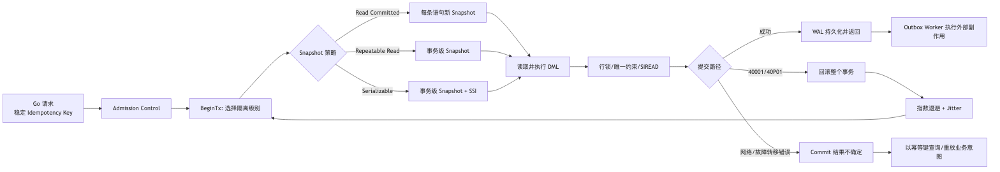

# 第 10 章：隔离级别、并发异常、SSI 与 Go 事务重试

> 技术基线：PostgreSQL 18；兼顾 PostgreSQL 14—18。Go 示例使用 `github.com/jackc/pgx/v5` 与 `pgxpool`。本文所说的“事务重试”，除非特别说明，均指**重新开启事务并重放完整业务事务**，而不是只重试最后一条 SQL。

## 1. 本章定位

第 9 章解释了 Tuple 版本、Snapshot 与 MVCC 可见性。本章把这些机制提升到业务正确性层面：两个各自“看起来正确”的事务并发执行后，为什么可能破坏“至少一名医生值班”“库存不得为负”“账户总额守恒”等跨行不变量；PostgreSQL 的四种隔离级别分别承诺什么；为什么 `REPEATABLE READ` 仍不等于可串行化；以及应用如何正确处理 `40001`、`40P01` 和 Commit 结果不确定。

生产系统必须掌握本章，因为并发错误通常具有三个特征：单元测试不易触发、日志中每条 SQL 都可能成功、最终数据却违反业务约束。仅靠“把事务开起来”或“查询后再更新”不能解决这类问题。

本章依赖第 9 章的 MVCC/Snapshot；下一章将深入 Heavyweight Lock、死锁和热点队列。本章只介绍与隔离相关的行锁、谓词锁和死锁处理，不展开完整锁冲突矩阵，也不展开 Outbox Worker、CDC 和消息投递细节。

## 2. 可验证的学习目标

学完本章后，应能够：

1. 用时间线解释 PostgreSQL 在 `READ COMMITTED`、`REPEATABLE READ` 和 `SERIALIZABLE` 下何时取得 Snapshot。
2. 在两个 psql Session 中稳定复现 Write Skew 与 Lost Update。
3. 说明 PostgreSQL 的 `READ UNCOMMITTED` 为什么实际等同于 `READ COMMITTED`。
4. 区分 Dirty Read、Nonrepeatable Read、Phantom Read、Read Skew、Lost Update、Write Skew 和 Serialization Anomaly。
5. 从 `pg_locks` 中识别 `SIReadLock`，并解释它为什么不阻塞普通写入。
6. 根据业务不变量选择原子 DML、唯一/检查约束、悲观锁、CAS、`SERIALIZABLE` 或组合方案。
7. 使用 SQLSTATE 而非错误文本区分 `40001`、`40P01` 与 `23505`。
8. 在 Go 中实现有界、服从 `context`、带指数退避和 Jitter 的完整事务重试器。
9. 在 Commit 返回网络错误时，不武断判断“已提交”或“未提交”，而是借助 Idempotency Key 对账。
10. 设计“业务写入 + Outbox 事件”同事务提交的表结构，并避免在数据库事务中直接执行不可回滚外部副作用。
11. 用尝试 TPS、提交 TPS、重试率、P95/P99、连接池等待和 WAL 放大评估重试方案。
12. 分析故障转移、复制延迟和脑裂对幂等、事务结果确认及重试安全性的影响。

## 3. 核心术语

| 中文名称 | 英文名称 | 准确定义 | 容易混淆 | 所属层次 |
|---|---|---|---|---|
| 读未提交 | Read Uncommitted | SQL 标准最低隔离级别，标准允许脏读；PostgreSQL 将其按 Read Committed 执行 | 不是 PostgreSQL 中真正的“读脏数据”模式 | SQL/事务 |
| 读已提交 | Read Committed | 每条语句开始时读取一个新的已提交数据 Snapshot | 事务内两次查询并不保证相同结果 | Snapshot |
| 可重复读 | Repeatable Read | PostgreSQL 中事务首次实际查询时取得事务级 Snapshot，之后保持一致视图 | PostgreSQL 实现接近 Snapshot Isolation，不等于 Serializable | Snapshot |
| 快照隔离 | Snapshot Isolation, SI | 每个事务从稳定 Snapshot 读取；并发写同一行通常冲突，但不同写集合可能产生 Write Skew | “没有幻读”不代表可串行化 | 并发控制 |
| 可串行化 | Serializable | 结果等价于某种事务串行顺序；PostgreSQL 以 SSI 实现 | 不是把所有事务排成单线程，也不等于持有表锁 | 正确性 |
| 脏读 | Dirty Read | 读到其他尚未提交且可能回滚的写入 | PostgreSQL 普通隔离级别均不发生 | 异常 |
| 不可重复读 | Nonrepeatable Read | 同一事务两次读取同一行，后一次看到其他事务已提交的修改或删除 | 与 Phantom 的对象范围不同 | 异常 |
| 幻读 | Phantom Read | 重新执行谓词查询时，满足谓词的行集合发生变化 | PostgreSQL RR 比标准最低要求更强，不发生标准意义幻读 | 异常 |
| 丢失更新 | Lost Update | 两个事务基于同一旧值计算新值，后提交者覆盖先提交者结果 | 原子 `SET v=v+1` 通常不会丢增量，但可能阻塞 | 异常 |
| 读偏斜 | Read Skew | 一个业务读在不同语句看到不同时点的数据组合，形成从未同时存在过的状态 | 常发生于 Read Committed 多语句报表 | 异常 |
| 写偏斜 | Write Skew | 两事务读取同一约束集合，却更新不同记录；均提交后破坏跨行不变量 | 行级写写冲突抓不到 | 异常 |
| 串行化异常 | Serialization Anomaly | 并发结果无法等价为任何合法串行顺序 | Write Skew 是常见子类 | 异常 |
| 谓词锁 | Predicate Lock | 记录“事务读取过某个谓词范围”的逻辑保护；SSI 用它发现后来写入该范围的 rw 依赖 | PostgreSQL 的 SIREAD 不像普通锁那样阻塞写入 | SSI |
| SIREAD 锁 | SIREAD / SIReadLock | PostgreSQL SSI 的非阻塞读标记，可落在 tuple、page 或 relation 粒度 | 不是 `SELECT ... FOR SHARE` | SSI/内存 |
| 读写反依赖 | rw-conflict / rw-antidependency | T1 读取了旧版本，T2 后来写入该逻辑对象，因此形成 `T1 --rw--> T2` | 方向是“读旧值者 → 后写者” | 依赖图 |
| 危险结构 | Dangerous Structure | SSI 重点检测的连续 rw 反依赖结构，例如 `T1 --rw--> T2 --rw--> T3`；若满足并发与提交次序条件，可能构成序列化环 | 危险结构不必已经是完整环；实现可保守中止 | SSI |
| 序列化失败 | SQLSTATE 40001 | PostgreSQL 判定事务无法安全序列化，要求应用重放完整事务 | 只重试失败 SQL 是错误做法 | 错误处理 |
| 死锁检测 | SQLSTATE 40P01 | 锁等待图出现环，服务器选择一个事务中止 | 可重试，但还应修复锁顺序 | 错误处理 |
| 唯一冲突 | SQLSTATE 23505 | 唯一约束被违反；可能是永久业务冲突，也可能与并发协议有关 | 不能作为通用重试信号 | 约束/错误 |
| 悲观锁 | Pessimistic Locking | 先锁定将要依赖或修改的行，再执行决策 | 会阻塞、死锁，且“缺失行/谓词范围”不总能靠行锁覆盖 | 策略 |
| 乐观锁 | Optimistic Locking | 读取版本号，更新时以旧版本为条件；更新 0 行即冲突 | 失败后需重新读取并重算 | 策略 |
| 比较并交换 | Compare-And-Swap, CAS | `UPDATE ... WHERE version=$old` 或 `WHERE state=$expected` 的条件更新 | 不等于语言层原子指令，但语义相似 | SQL 策略 |
| 幂等键 | Idempotency Key | 同一业务意图重复提交时使用稳定键，确保最多生成一个逻辑结果 | 请求 ID 每次重试都变化会失效 | 应用/数据模型 |
| Outbox | Transactional Outbox | 业务状态和待发布事件在同一数据库事务写入，提交后由独立 Worker 投递 | 不是“事务中直接发消息” | 可靠消息 |

## 4. 整体心智模型



### 4.1 数据流

业务请求先携带稳定的 Idempotency Key 进入有界准入层。事务读取 Snapshot 中可见的 Tuple，执行条件更新、约束检查或 Outbox 写入。成功提交的数据修改产生 WAL；SIREAD 读标记本身用于 Primary 内存中的 SSI 判定，不是需要复制到 Standby 的业务数据。

### 4.2 控制流

`READ COMMITTED` 控制每条语句重新取 Snapshot；`REPEATABLE READ` 固定事务视图；`SERIALIZABLE` 在后者基础上追踪 rw 反依赖。发生 `40001` 或 `40P01` 时，控制权回到应用，应用必须丢弃本次事务对象，退避后创建新事务并重放完整业务逻辑。

### 4.3 状态变化

事务经历 `idle → active → in transaction → committed/aborted`。可串行化事务还在共享内存中维护读集合与冲突边；即使事务已经提交，相关 SIREAD 状态也可能暂时保留，直到所有可能与其重叠的事务结束。业务事件则经历 `outbox pending → publishing → published/retry`，不与数据库事务内的 HTTP、邮件或消息队列调用耦合。

### 4.4 故障路径

错误分三类：

- **已知未提交**：服务器明确返回 `40001`、`40P01` 等，事务已中止，可以按规则重试。
- **已知业务冲突**：如重复业务键导致 `23505`，通常应返回已有结果或业务冲突，不应盲重试。
- **结果不确定**：Commit 请求发出后连接断开、Primary 故障转移或客户端超时。事务可能已提交，也可能未提交；正确恢复方式是用同一 Idempotency Key 查询或重放业务意图，而不是先假定状态。

## 5. 使用方式

### 5.1 SQL：声明与检查隔离级别

```sql
-- 必须在事务执行第一条普通查询/DML 之前设置。
BEGIN TRANSACTION ISOLATION LEVEL SERIALIZABLE READ WRITE;
SHOW transaction_isolation;
SELECT current_setting('transaction_isolation');
COMMIT;

-- PostgreSQL 接受该语法，但实际按 READ COMMITTED 执行。
BEGIN ISOLATION LEVEL READ UNCOMMITTED;
SHOW transaction_isolation;
ROLLBACK;

-- 长报表/一致性备份：等待“安全 Snapshot”，随后不再因 SSI 冲突失败。
BEGIN TRANSACTION ISOLATION LEVEL SERIALIZABLE READ ONLY DEFERRABLE;
SELECT ...;
COMMIT;
```

`DEFERRABLE` 只有在 `SERIALIZABLE READ ONLY` 组合下有实际效果。它可能在第一条查询前等待，但一旦取得安全 Snapshot，事务不再承担常规 SSI 冲突检查与序列化失败风险，适合可容忍启动等待的长报表和一致性导出。

### 5.2 pgx API

```go
opts := pgx.TxOptions{
    IsoLevel:   pgx.Serializable,
    AccessMode: pgx.ReadWrite,
}

tx, err := pool.BeginTx(ctx, opts)
```

`BeginTx` 的 `context` 只控制开始事务命令；它不会自动保证之后函数体中的每条操作都完成，也不会替应用设计重试。业务函数必须把同一个或更严格的派生 `context` 传给每条 `Exec`、`Query`、`QueryRow` 和 `Commit`。

### 5.3 典型并发控制 SQL

**原子增量：**

```sql
UPDATE counters
SET value = value + $1
WHERE counter_id = $2
RETURNING value;
```

**库存条件扣减：**

```sql
UPDATE inventory
SET available = available - $1
WHERE sku = $2
  AND available >= $1
RETURNING available;
```

返回 0 行表示库存不足或并发竞争后条件已不成立，无需先 `SELECT` 再 `UPDATE`。

**悲观锁：**

```sql
SELECT balance
FROM accounts
WHERE account_id = $1
FOR UPDATE;
```

**version 乐观锁/CAS：**

```sql
UPDATE documents
SET body = $1,
    version = version + 1
WHERE document_id = $2
  AND version = $3
RETURNING version;
```

返回 0 行时，重新读取最新状态并由业务决定合并、冲突提示或重试。

### 5.4 SQLSTATE 分类边界

| SQLSTATE | 含义 | 默认处理 | 关键边界 |
|---|---|---|---|
| `40001` | serialization_failure | 重放完整事务 | 可能多次失败；必须有上限、退避、Jitter 和准入 |
| `40P01` | deadlock_detected | 可重放完整事务 | 重试只是止损，根因通常是锁顺序或事务过长 |
| `23505` | unique_violation | 业务分支或查已有结果 | 可能永久冲突，不能放进通用重试白名单 |
| `55P03` | lock_not_available | 视业务处理 | `NOWAIT`/锁超时通常是容量或竞争策略，不等于序列化失败 |
| `57014` | query_canceled | 通常不重试 | 可能来自客户端取消或超时；先尊重调用方时限 |

极少数协议下，即使应用预先查询“键不存在”，并发事务仍可能使当前事务收到 `23505`。这不改变通用原则：只有业务代码能判断该唯一冲突是“同一个幂等请求的已有结果”还是永久冲突；底层重试器不应自行猜测。

### 5.5 版本差异

| 版本 | 与本章有关的差异 |
|---|---|
| PostgreSQL 14—16 | 本章所述 RC、RR、Serializable/SSI、SIREAD 和 SQLSTATE 核心语义一致 |
| [PG17+] | 提供 `transaction_timeout`，可限制事务总持续时间；应按角色或会话谨慎配置，而非盲目全局设定 |
| [PG18] | AIO 可改善顺序扫描、Bitmap Heap Scan、VACUUM 等 I/O 路径，并提供 `pg_aios`；它可能缩短事务重叠窗口，但不改变隔离语义或重试规则 |

## 6. 底层原理

### 6.1 隔离级别与异常矩阵

PostgreSQL 的实际行为比 SQL 标准最低要求更强：

| PostgreSQL 隔离级别 | Dirty Read | Nonrepeatable Read | Phantom Read | Serialization Anomaly |
|---|---:|---:|---:|---:|
| Read Uncommitted（实际按 RC） | 不发生 | 可能 | 可能 | 可能 |
| Read Committed | 不发生 | 可能 | 可能 | 可能 |
| Repeatable Read | 不发生 | 不发生 | 不发生 | **可能** |
| Serializable | 不发生 | 不发生 | 不发生 | 不发生；冲突事务可能报 `40001` |

“Serializable 不发生异常”不是指所有事务都成功，而是指数据库通过中止至少一个危险事务，确保**成功提交的事务集合**可解释为某种串行顺序。

### 6.2 Snapshot 时间线

#### Read Committed：语句级 Snapshot

```text
时间  T1 (RC)                         T2
t1    BEGIN
 t2   SELECT balance -> 100
 t3                                   UPDATE balance=80; COMMIT
 t4   SELECT balance -> 80
 t5   COMMIT
```

T1 的两条 `SELECT` 各自取得 Snapshot，因此可出现不可重复读与读偏斜。单条 `UPDATE` 在定位候选行后，如果遇到并发更新，会等待写者结束；写者提交后，PostgreSQL 会在新版本上重新检查 `WHERE` 条件。这使条件 DML 很有价值，但也意味着复杂命令可能观察到“语句开始 Snapshot + 被并发更新行的新版本”的组合，不能把 RC 理解成整个语句绝对冻结所有对象。

#### Repeatable Read：事务级 Snapshot

```text
时间  T1 (RR)                         T2
 t1   BEGIN ISOLATION LEVEL RR
 t2   SELECT balance -> 100  -- 固定 Snapshot
 t3                                   UPDATE balance=80; COMMIT
 t4   SELECT balance -> 100
 t5   UPDATE same row ... -> 可能报 could not serialize access due to concurrent update
```

T1 后续普通读取继续看到事务 Snapshot。若它试图修改自 Snapshot 建立后已被其他事务提交修改的同一行，PostgreSQL 不能安全地把写建立在旧版本上，会中止当前事务。但如果两个事务写的是不同的行，行级写写冲突并不存在，Write Skew 仍可能发生。

#### Serializable：Snapshot + 依赖图验证

Serializable 的可见性视图与 RR 基本相同，但服务器额外记录“谁读取了后来被谁修改的数据”。它不通过阻塞所有相关写入来实现串行化，而是允许乐观并发，在发现危险依赖结构时中止一个事务。因此：

- 低冲突工作负载可接近 RR 的并发度；
- 冲突集中、长事务或大范围扫描会增加 `40001`；
- 应用必须从第一天就把完整事务重试当成协议的一部分。

### 6.3 Lost Update 的五种处理方式

假设 `value=10`，T1、T2 都想加 1。

1. **普通读后写**：两者均读到 10，再分别写 11；最终可能是 11，丢失一次更新。
2. **`UPDATE value=value+1`**：更新表达式在数据库中针对锁定后的当前行执行；两个事务串行取得行锁，最终通常为 12。
3. **`SELECT ... FOR UPDATE`**：先锁行，再读取并计算；正确但增加等待与死锁面。
4. **version CAS**：两者都用 `WHERE version=5` 更新，只有一个成功；另一个读取新值后重算。
5. **Serializable**：读后写作为完整事务运行；服务器在无法串行化时令一个事务报错，由应用重放。

优先级通常是：能写成单条原子条件 DML，就不要拆成读后写；能用约束表达，就让约束兜底；跨多行/多表且难以锁定完整谓词时，再考虑 Serializable。

### 6.4 Read Skew 与 Write Skew

**Read Skew** 常见于 RC 多语句报表：先读账户 A=100，另一事务同时把 20 从 A 转到 B 并提交，再读 B=120，于是报表看到 A+B=220，而真实任一时点总额都是 200。单条聚合查询或 RR/Serializable Snapshot 可避免这种跨语句错配。

**Write Skew** 的本质是“读集合重叠、写集合不重叠”。医生例中，T1 和 T2 都读到两人值班；T1 只把医生 1 设为休息，T2 只把医生 2 设为休息。行锁不会互斥，RR 也能让两者都提交，最终无人值班。

### 6.5 SSI、SIREAD 与 Dangerous Structure

设 `Ti --rw--> Tj` 表示 Ti 读取了某个旧状态，而 Tj 在 Ti 的 Snapshot 之后写入了该逻辑对象。若并发事务形成：

```text
T1 --rw--> T2 --rw--> T3
```

T2 是 pivot。结合事务重叠和提交次序，该结构可能闭合为序列化图中的环。PostgreSQL SSI 追踪这种危险结构，并保守地中止一个事务，而不是等待真的产生不可恢复的业务错误。

SIREAD 有几个容易误解的性质：

1. **不阻塞写者**：写者照常修改；系统只记录 rw 依赖。
2. **粒度可升级**：可能是 tuple、page 或 relation。共享内存压力下会合并为更粗粒度，增加误报/中止概率，但保持正确性。
3. **受执行计划影响**：大范围 Seq Scan 往往需要更粗的谓词覆盖；合适索引可缩小读取范围，但索引也增加写成本。
4. **可能跨过 Commit 保留**：用于与仍在运行的重叠事务完成冲突判定。
5. **只服务 Serializable**：普通 RC/RR 不创建相同的 SSI 读标记。

可在 `pg_locks` 中观察：

```sql
SELECT pid, locktype, mode, granted,
       relation::regclass AS relation, page, tuple,
       virtualtransaction
FROM pg_locks
WHERE mode = 'SIReadLock'
ORDER BY pid, relation, page, tuple;
```

### 6.6 `40001`、`40P01` 与 `23505`

- `40001` 是并发协议明确要求重试的信号。此前读到的数据、业务分支和计算都可能过时，必须重放整个事务。
- `40P01` 表明服务器打破了死锁环。完整事务通常可以重试，但若多个请求持续以相反顺序锁 A/B，重试只会重复制造死锁。
- `23505` 首先是数据模型/业务冲突。幂等表主键冲突可能意味着“请求已执行”，用户注册名冲突可能是永久失败。通用数据库层无权把两者都重试。

### 6.7 Commit 结果不确定、幂等与外部副作用

客户端调用 `COMMIT` 后，服务器可能已经落盘并提交，但成功响应在网络中丢失；也可能服务器在提交前崩溃。客户端只看到 I/O 错误，无法从该连接证明结果。

因此，正确协议是：

1. 在事务外生成稳定 Idempotency Key；同一业务意图的所有网络重试、事务重试和故障转移重放都复用它。
2. 在同一数据库事务中写入幂等记录、业务数据和 Outbox 事件。
3. Commit 返回不确定错误时，关闭坏连接；使用新连接按幂等键查询结果，或以同一键重新提交业务意图。
4. 支付、发邮件、调用第三方 API 等不可回滚副作用不放在数据库事务函数中；由 Outbox Worker 在提交后执行，并给下游同样提供去重键。

## 7. 内部数据结构和状态

| 对象/状态 | 与本章的关系 | 关键观察点 |
|---|---|---|
| Heap Tuple Header | `xmin/xmax` 与事务状态决定 Snapshot 可见性 | 隔离级别改变 Snapshot 生命周期，不改变基本可见性字段 |
| SnapshotData | 记录可见性边界和活跃事务集合 | RC 每语句更新；RR/Serializable 事务级稳定 |
| Row Lock / Tuple Lock | 串行化同一行的写入与显式 `FOR UPDATE` | 可造成等待和死锁；不覆盖任意跨行谓词 |
| Predicate/SIREAD 状态 | 记录 Serializable 的读集合 | `pg_locks.mode='SIReadLock'`；不阻塞写入 |
| SerializableXact 与 rw-conflict 边 | 构建 SSI 冲突图、识别 pivot 和危险结构 | 位于共享内存；受 `max_pred_locks_*` 相关配置和并发规模影响 |
| Unique Index | 在索引级别保证唯一性并协调并发插入 | `23505` 是约束结果，不是通用重试信号 |
| WAL Record/LSN | 成功和部分最终回滚的写操作都可能产生 WAL；Commit Record 决定持久提交 | 重试会放大 WAL、网络复制与恢复工作 |
| shared_buffers / OS Page Cache | 扫描与更新的数据页缓存位置 | 缓存命中减少存储读取，但长扫描仍消耗 CPU、锁内存与事务重叠时间 |
| Memory Context | Backend 的执行、Snapshot 和事务状态生命周期 | 超大事务或巨大读集合增加内存/共享状态压力 |
| `pg_stat_activity` | 查看事务时长、等待事件、应用名和查询 | `xact_start` 是判断长事务的重要字段 |
| `pg_locks` | 查看行/关系锁与 SIREAD | 行级等待还需结合 `pg_blocking_pids()`；不是所有 tuple lock 都直接显示为直观“行锁” |
| `pg_stat_database` | `xact_commit`、`xact_rollback`、`deadlocks` 等数据库级聚合 | 没有可直接替代应用 `40001` 指标的精确序列化失败计数 |
| 应用指标/结构化日志 | 按 operation、SQLSTATE、attempt 统计失败 | 必须区分逻辑请求数、事务尝试数和成功提交数 |

SIREAD 不需要像业务 WAL 那样复制到 Standby，因为 Standby 不参与 Primary 当前事务间的 SSI 判定。故障转移后，新 Primary 只基于新时间线上的新事务重建并发状态；故障时正在运行的事务必须由应用重新建立。

## 8. 场景和选型决策

| 业务场景 | 推荐方案 | 不推荐方案 | 原因 | 性能代价 | 并发代价 | 一致性代价 | HA 代价 | 运维复杂度 |
|---|---|---|---|---|---|---|---|---|
| 单行计数器加减 | 单条原子 `UPDATE` | RC 下读后写 | 数据库在当前行版本上计算 | 热点时 CPU/WAL 集中 | 行锁排队 | 低 | 重放需幂等 | 低 |
| 库存不得为负 | 条件 `UPDATE ... available >= $n` + CHECK | 先查库存再扣减 | 一条语句同时判断与写入 | 索引查找与更新 | SKU 热点排队 | 低 | Commit 不确定需订单键 | 中 |
| 文档并发编辑 | version CAS | 无条件覆盖 | 显式暴露冲突，允许业务合并 | 失败需重读 | 少阻塞，多冲突返回 | 由合并策略决定 | 请求键便于恢复 | 中 |
| 转账锁定两个账户 | 固定顺序 `FOR UPDATE` + 约束 | 随机锁顺序 | 易推导、可避免大部分死锁 | 两行锁与网络往返 | 热点账户排队 | 低 | 同步提交影响延迟 | 中 |
| 跨多行“至少一个有效” | Serializable；或重构为可锁单行的守卫记录 | 仅 RR | Write Skew 无同一行写冲突 | SSI 状态与重试 | 冲突时中止 | 成功提交集合可串行化 | 故障重放需幂等 | 中高 |
| 长时间一致性报表 | `SERIALIZABLE READ ONLY DEFERRABLE` 或副本一致性方案 | RC 多语句拼接 | 安全 Snapshot 避免读偏斜 | 开始可能等待、扫描昂贵 | 少写冲突；长 Snapshot 仍影响资源 | 高 | 副本可能滞后；需定义时点 | 中 |
| 用户名/订单号唯一 | UNIQUE + 业务化处理 `23505` | 先 `SELECT` 判不存在 | 约束是最终并发裁判 | 索引维护 | 同键插入竞争 | 低 | 故障后按键查询 | 低 |
| 业务写入后发消息 | 同事务 Outbox + 幂等消费者 | 事务内直接调用 MQ/HTTP | 外部副作用无法随 DB 回滚 | 多一次表写/WAL | Worker 需有界并发 | 至少一次投递下靠幂等收敛 | Failover 后续扫 pending | 中高 |
| 高冲突秒杀 | 原子 DML、分片/排队、准入；必要时短事务重试 | 给每个请求无限 Serializable 重试 | 先降低冲突面，再选择隔离 | 需额外队列/分片 | 严格限流 | 由设计保证 | 队列与幂等状态需 HA | 高 |

## 9. 高性能分析

隔离级别不是一个孤立开关。评估前必须记录数据规模、行宽、键分布与热点度、并发量、读写比例、CPU/内存、存储延迟、网络 RTT、SLO 和复制模式；不能给所有机器一个固定 `max_connections`、谓词锁参数或重试次数。

| 维度 | 影响机制 | 重点指标与解释 |
|---|---|---|
| CPU | SSI 冲突检查、重复解析/执行、条件重算 | 提交 TPS 下的 CPU，而非只看尝试 TPS；重试会让 CPU 看似忙但有效产出下降 |
| 内存 | Snapshot、执行器、SIREAD/冲突状态、连接 Backend | 连接数、活跃 Serializable 事务、`max_pred_locks_*`；粗粒度升级可能增加误报 |
| shared_buffers | 数据页与索引页缓存 | 命中不等于零成本：仍有 CPU、锁、Buffer Pin 和缓存淘汰 |
| OS Page Cache | PostgreSQL 读写最终经过 OS/存储路径 | 冷/热缓存必须分别测；不要把一次热缓存测试外推到生产 |
| 随机 I/O | 点查、二级索引回表、热点页写入 | 读延迟、`pg_stat_io`、块读取；索引可缩小 SIREAD 范围但增加维护 |
| 顺序 I/O | 大扫描扩大读集合和事务持续时间 | 扫描时长、relation 级 `SIReadLock`、缓存污染、P99 |
| [PG18] AIO | 可排队多个读取，改善顺序/Bitmap/VACUUM 等路径 | `io_method`、`pg_aios`、`pg_stat_io`；它改变 I/O 效率，不改变 Serializable 语义 |
| 网络往返 | 读后写、锁后写比单条 DML 多 RTT | 每业务事务 SQL 往返数；远距离 Primary 更明显 |
| 索引维护 | 每次更新可能写多个索引并造成热点页 | WAL bytes、索引大小、Page Split、写延迟；“为 SSI 加索引”需验证总成本 |
| WAL/复制 | 失败尝试在被中止前可能已写 heap/index WAL | 每成功事务 WAL bytes、Standby apply lag、归档量；重试造成写放大 |
| Checkpoint | 高 WAL 与脏页增加写回压力 | checkpoint 写时延、backend write、P99 抖动 |
| Vacuum | 回滚/更新产生不可见版本，长事务延迟清理 | dead tuples、autovacuum 时长、表/索引膨胀 |
| Temporary File | Serializable 不直接要求临时文件，但大排序/Hash 会拉长事务 | temp bytes/files；事务越长，冲突重叠窗口越大 |
| 吞吐/P95/P99 | 冲突时排队或中止重试 | 同时报告逻辑请求 TPS、事务 attempt TPS、commit TPS、重试率与端到端尾延迟 |
| 读/写/空间放大 | 重试重读、重写、生成 WAL 与死 Tuple | `attempts/success`、WAL/success、buffers/success、relation growth |

建议采用以下测量协议，而不是报告一个脱离环境的“Serializable 慢 X%”：

1. 固定业务不变量和事务 SQL；分别跑 RC/RR/Serializable/显式锁/CAS。
2. 记录 1、N、2N 并发下的提交 TPS、P50/P95/P99、`40001`、`40P01`、池等待和数据库等待事件。
3. 区分均匀键与 Zipf 热点键；热点分布往往比隔离级别本身更决定结果。
4. 记录 `EXPLAIN (ANALYZE, BUFFERS, WAL, SETTINGS, VERBOSE, SUMMARY)`，但对 DML 必须在可控环境执行；`ROLLBACK` 不能撤销 Sequence 消耗，也不能撤销触发器发出的外部副作用。
5. 同时观察 WAL、Vacuum、复制延迟和表膨胀，至少覆盖一个 checkpoint 与足够长的稳态窗口。

## 10. 高并发分析

### 10.1 必须区分的六个量

| 量 | 含义 | 常见误判 |
|---|---|---|
| 数据库并发 | 同时存在且可能相互影响的事务/语句 | 不等于连接总数 |
| goroutine 并发 | 应用内可运行/等待的任务数 | 1 万 goroutine 不代表需要 1 万连接 |
| 连接数 | Client/Pool 到 PostgreSQL 的 Session 数 | 空闲连接不等于活跃查询，但每连接仍有资源成本 |
| 活跃查询数 | 正在执行或等待的 Backend 数 | 过高会导致 CPU/锁/I/O 队列化 |
| TPS | 单位时间事务数量 | 必须区分尝试 TPS 与成功提交 TPS |
| 排队请求数 | 在应用准入、池 Acquire 或数据库锁上等待的请求 | 队列过长会把重试变成延迟雪崩 |

### 10.2 冲突、热点与长事务

- 同一热点行上的原子更新不会丢失更新，但会形成行锁队列；提高 goroutine 数通常只增加排队。
- Serializable 的大范围读取会扩大潜在 rw 冲突面；事务越长，与更多写事务重叠。
- 多索引更新增加热点索引页、WAL Insert/Flush 压力和 Vacuum 工作。
- `SELECT FOR UPDATE` 要规定全局锁顺序；否则重试器可能稳定地产生 `40P01`。
- Repository 不应在已有业务事务内偷偷开启独立事务，否则重试外层事务时，内层已经提交的写入无法回滚，业务原子性被拆断。

### 10.3 防止重试风暴

完整重试器至少需要：

1. 最大尝试次数与总 `context` deadline；
2. 指数退避加随机 Jitter，避免同一批事务同步再次碰撞；
3. 有界 Admission Control；没有拿到配额的请求在应用侧排队或快速失败；
4. 每次失败先结束事务并归还连接，再等待退避，不能占着连接睡眠；
5. 只允许 `40001`、`40P01` 进入通用事务重试；
6. 按 operation 设置重试预算和熔断/降级，避免数据库已过载时重放更多工作；
7. 将外部副作用移至 Outbox；非幂等业务使用稳定 Idempotency Key；
8. 监控 `attempts/success`，而非只监控最终错误率——最终都成功也可能已发生严重放大。

## 11. 高可用分析

本章与高可用的关系主要在**事务边界确认和故障重放**，而非备份工具本身。

| HA 事件/机制 | 对隔离与重试的影响 |
|---|---|
| 异步物理复制 | 已返回提交但尚未复制的事务可能在 Primary 丢失后形成非零 RPO；幂等记录与业务数据必须同事务，否则恢复后难以判断 |
| 同步复制 | 可降低已确认事务的数据丢失风险，但网络断开时仍可能出现客户端无法确认 Commit 结果；它不消除结果不确定 |
| 逻辑复制 | 复制已提交变更，不复制 Primary 的 SIREAD 冲突状态；订阅端约束/冲突策略另行设计 |
| Planned Switchover | 先停止/排空写入、确认复制位置，再切换；应用关闭旧池并重连，未完成事务按幂等键恢复 |
| Unplanned Failover | 所有旧连接和进行中事务视为失效；不要尝试复用旧 `pgx.Tx`，必须新建事务 |
| Failback | 防止旧 Primary 带着分叉时间线重新接受写入；需要重建/追赶并经过 Fencing |
| 脑裂 | 两个 Primary 同时接受同一幂等键会各自“唯一”；单节点约束无法跨脑裂保护，必须通过 Fencing 避免 |
| 读副本 | 复制延迟可能让 Commit 后立刻按幂等键查询得到“未找到”；结果确认应读当前 Primary，或等待明确 LSN/一致性条件 |
| Backup/PITR | 恢复到某时点后，业务表、幂等表和 Outbox 必须来自同一一致性恢复点；恢复演练需验证三者对应关系 |
| RTO | 重连、DNS/代理刷新、池中坏连接清除、幂等对账和积压 Outbox 恢复共同决定应用 RTO |

应用故障恢复的安全顺序是：停止向疑似旧 Primary 写入 → Fencing → 选主并确认时间线 → 应用丢弃旧连接池 → 连接新 Primary → 使用原 Idempotency Key 重放未确认请求 → 扫描 Outbox pending → 验证业务不变量与复制健康。

## 12. 三维影响矩阵

| 维度 | 相关度 | 核心收益 | 主要风险 | 关键指标 |
|---|---|---|---|---|
| 高性能 | 中 | 原子 DML 减少往返；低冲突 SSI 保持较高并发 | 重试、SIREAD 粗化、WAL/Vacuum 放大、P99 抖动 | commit TPS、attempt/commit、P95/P99、WAL/success、buffers/success |
| 高并发 | 高 | 明确定义异常边界；约束、CAS、锁与 SSI 保证不变量 | 热点排队、死锁、Write Skew、重试风暴、连接耗尽 | `40001`/`40P01`、lock wait、pool acquire、队列深度、xact age |
| 高可用 | 中 | Idempotency + Outbox 使故障重放可收敛 | Commit 不确定、复制滞后、旧连接、脑裂下重复执行 | RPO/RTO、replay lag、unknown-commit 数、幂等命中、Outbox backlog |

## 13. 实验一：在三种隔离级别下复现 Write Skew

### 13.1 实验目标与环境

**目标：**验证“至少一名医生值班”这一跨行不变量在 RC 和 RR 下可被 Write Skew 破坏，而 Serializable 会令至少一个事务以 `40001` 失败。

- PostgreSQL：14—18，本文以 18 为基线。
- 扩展：无。
- 会话：Session A、B；Session C 用于诊断。
- 生产安全：只在隔离测试库执行；不要在生产事务中人为停顿。若使用 `EXPLAIN ANALYZE` 分析 DML，它会真正写数据。

### 13.2 建表与准备数据

```sql
DROP TABLE IF EXISTS doctor_on_call;

CREATE TABLE doctor_on_call (
    shift_date date    NOT NULL,
    doctor_id  bigint  NOT NULL,
    on_call    boolean NOT NULL,
    PRIMARY KEY (shift_date, doctor_id)
);

INSERT INTO doctor_on_call(shift_date, doctor_id, on_call)
VALUES (DATE '2026-06-21', 1, true),
       (DATE '2026-06-21', 2, true);

ANALYZE doctor_on_call;
```

业务代码采用如下错误算法：

1. 查询当前值班人数；
2. 若人数大于 1，就把“自己”设为休息；
3. 提交。

单个事务看似都遵守规则，但检查与写入分布在不同记录上。

### 13.3 Read Committed：两个事务均提交，约束被破坏

先重置：

```sql
UPDATE doctor_on_call SET on_call = true
WHERE shift_date = DATE '2026-06-21';
```

| 时间 | Session A | Session B | 状态 |
|---|---|---|---|
| t1 | `BEGIN ISOLATION LEVEL READ COMMITTED;` |  | A 开启事务 |
| t2 | `SELECT count(*) ...` → 2 |  | A 的语句级 Snapshot |
| t3 |  | `BEGIN ISOLATION LEVEL READ COMMITTED;` | B 开启事务 |
| t4 |  | `SELECT count(*) ...` → 2 | B 也看到两人值班 |
| t5 | `UPDATE ... doctor_id=1 SET on_call=false;` |  | A 修改行 1 |
| t6 |  | `UPDATE ... doctor_id=2 SET on_call=false;` | B 修改行 2；不等待 A |
| t7 | `COMMIT;` |  | A 提交 |
| t8 |  | `COMMIT;` | B 提交 |

Session A：

```sql
SET application_name = 'write_skew_rc_a';
BEGIN ISOLATION LEVEL READ COMMITTED;

SELECT count(*) AS on_call_count
FROM doctor_on_call
WHERE shift_date = DATE '2026-06-21'
  AND on_call;

UPDATE doctor_on_call
SET on_call = false
WHERE shift_date = DATE '2026-06-21'
  AND doctor_id = 1;
-- 暂不提交，等待 B 完成 UPDATE。
COMMIT;
```

Session B：

```sql
SET application_name = 'write_skew_rc_b';
BEGIN ISOLATION LEVEL READ COMMITTED;

SELECT count(*) AS on_call_count
FROM doctor_on_call
WHERE shift_date = DATE '2026-06-21'
  AND on_call;

UPDATE doctor_on_call
SET on_call = false
WHERE shift_date = DATE '2026-06-21'
  AND doctor_id = 2;
COMMIT;
```

验证：

```sql
SELECT *
FROM doctor_on_call
WHERE shift_date = DATE '2026-06-21'
ORDER BY doctor_id;

SELECT count(*) AS on_call_count
FROM doctor_on_call
WHERE shift_date = DATE '2026-06-21'
  AND on_call;
-- 预期：0
```

**等待点：**没有行级等待，因为两个事务更新不同的主键行。
**失败点：**没有 SQL 失败；失败发生在业务不变量。
**提交：**A、B 均成功提交。

### 13.4 Repeatable Read：稳定 Snapshot 仍不能阻止 Write Skew

重置数据后，把两个会话的开头改为：

```sql
BEGIN ISOLATION LEVEL REPEATABLE READ;
```

其余时间线完全相同。两个事务各自在稳定 Snapshot 中看到人数为 2，又修改不同记录，因此都可能提交，最终仍为 0。

这说明：PostgreSQL RR 消除了同一事务中的 Nonrepeatable Read 与 Phantom Read，但并未验证整个并发执行能否对应某种串行顺序。

### 13.5 Serializable：SSI 中止危险事务

重置：

```sql
UPDATE doctor_on_call SET on_call = true
WHERE shift_date = DATE '2026-06-21';
```

Session A：

```sql
SET application_name = 'write_skew_ser_a';
BEGIN ISOLATION LEVEL SERIALIZABLE;

SELECT count(*) AS on_call_count
FROM doctor_on_call
WHERE shift_date = DATE '2026-06-21'
  AND on_call;

UPDATE doctor_on_call
SET on_call = false
WHERE shift_date = DATE '2026-06-21'
  AND doctor_id = 1;
-- 保持事务打开，先让 B 完成读取和 UPDATE。
```

Session B：

```sql
SET application_name = 'write_skew_ser_b';
BEGIN ISOLATION LEVEL SERIALIZABLE;

SELECT count(*) AS on_call_count
FROM doctor_on_call
WHERE shift_date = DATE '2026-06-21'
  AND on_call;

UPDATE doctor_on_call
SET on_call = false
WHERE shift_date = DATE '2026-06-21'
  AND doctor_id = 2;
-- 暂不提交。
```

此时在 Session C 观察：

```sql
SELECT a.pid,
       a.application_name,
       a.state,
       now() - a.xact_start AS xact_age,
       l.locktype,
       l.mode,
       l.granted,
       l.relation::regclass AS relation,
       l.page,
       l.tuple
FROM pg_stat_activity AS a
JOIN pg_locks AS l USING (pid)
WHERE a.application_name IN ('write_skew_ser_a', 'write_skew_ser_b')
ORDER BY a.pid, l.locktype, l.mode;
```

预期可看到一个或多个 `SIReadLock`。在小表上，Planner 很可能采用 Seq Scan，SIREAD 可能直接落到 relation 粒度；这不是阻塞锁，也不要求写事务等待。

随后：

```sql
-- Session A
COMMIT;

-- Session B
COMMIT;
```

预期其中一个事务在 `UPDATE` 或 `COMMIT` 阶段收到类似错误，其 SQLSTATE 为 `40001`：

```text
ERROR: could not serialize access due to read/write dependencies among transactions
```

错误文本和失败位置不是稳定 API；应用必须读取 SQLSTATE。失败事务应全部重放：重新 `BEGIN SERIALIZABLE`、重新查询值班人数、重新决定是否休息。重放后它会看到只剩一人值班，因此不再下班。

**依赖图：**

```text
A 读过医生 2 的 on_call=true，B 后来把医生 2 改为 false：A --rw--> B
B 读过医生 1 的 on_call=true，A 后来把医生 1 改为 false：B --rw--> A
```

两条反依赖形成环，不能对应任何合法串行顺序。

### 13.6 执行计划与指标

```sql
EXPLAIN (
    ANALYZE,
    BUFFERS,
    WAL,
    SETTINGS,
    VERBOSE,
    SUMMARY
)
SELECT count(*)
FROM doctor_on_call
WHERE shift_date = DATE '2026-06-21'
  AND on_call;
```

实验记录至少包含：

| 项目 | 记录值 |
|---|---|
| PostgreSQL 版本 | `SELECT version();` |
| 关键配置 | `SHOW default_transaction_isolation;`、`SHOW max_pred_locks_per_transaction;` |
| 数据量/行宽 | 行数、`pg_column_size` 抽样 |
| 缓存状态 | 首次冷读/重复热读分别记录 |
| 并发数 | 本实验 2 个业务事务 |
| 测试时长 | 由客户端记录，不伪造固定耗时 |
| 延迟 | 逻辑请求 P50/P95/P99；重复运行后统计 |
| Buffers/WAL | 来自 EXPLAIN；DML 另在测试事务中测量 |
| CPU/I/O/Wait | OS 指标、`pg_stat_io`、`pg_stat_activity.wait_event*` |
| 正确性 | 最终 `on_call_count` 与 `40001` 数量 |

扩大到大量医生后，建立 `(shift_date) WHERE on_call` 等索引可能缩小读取范围，但不能把“索引存在”当成串行化保证。计划变化会改变 SIREAD 粒度和冲突概率，业务正确性仍由 Serializable/约束协议保证。

### 13.7 结果解释、清理与安全警告

- RC：每条语句取新 Snapshot，但本时间线不需要再次查询，因此两个事务均依赖旧检查结果并成功提交。
- RR：两个事务持有各自稳定 Snapshot；由于写集合不相交，普通写写冲突检测不起作用。
- Serializable：SSI 记录两条 rw 反依赖并中止一个事务，使成功提交集合可串行化。

```sql
DROP TABLE doctor_on_call;
```

生产中不要通过暂停会话、降低安全参数或随意提高谓词锁内存来“验证”。先在隔离环境复现，再使用应用指标统计实际 `40001`。不要关闭 `fsync`、`full_page_writes`、autovacuum、数据校验或同步复制保护来获得更好实验数字。

## 14. 实验二：Lost Update 的五种实现比较

### 14.1 实验目标与环境

**目标：**比较普通读后写、原子增量、`SELECT FOR UPDATE`、version CAS 和 Serializable 的结果、等待与失败方式。

- PostgreSQL：14—18。
- 扩展：无。
- 会话：A、B；C 用于观察 blocker。
- 初始值：`value=10, version=0`。

```sql
DROP TABLE IF EXISTS counters;

CREATE TABLE counters (
    counter_id integer PRIMARY KEY,
    value      bigint NOT NULL,
    version    bigint NOT NULL DEFAULT 0,
    CHECK (version >= 0)
);

INSERT INTO counters(counter_id, value, version)
VALUES (1, 10, 0);

CREATE OR REPLACE VIEW counter_state AS
SELECT counter_id, value, version
FROM counters;
```

每轮前执行：

```sql
UPDATE counters SET value = 10, version = 0 WHERE counter_id = 1;
```

### 14.2 方案一：普通读后写——复现 Lost Update

Session A：

```sql
SET application_name = 'lost_update_plain_a';
BEGIN ISOLATION LEVEL READ COMMITTED;
SELECT value FROM counters WHERE counter_id = 1; -- 10
UPDATE counters SET value = 11 WHERE counter_id = 1;
-- 保持行锁，暂不提交。
```

Session B：

```sql
SET application_name = 'lost_update_plain_b';
BEGIN ISOLATION LEVEL READ COMMITTED;
SELECT value FROM counters WHERE counter_id = 1; -- 10
UPDATE counters SET value = 11 WHERE counter_id = 1;
-- 此处等待 A 的行版本/事务结束。
```

Session C：

```sql
SELECT pid,
       application_name,
       state,
       wait_event_type,
       wait_event,
       pg_blocking_pids(pid) AS blockers,
       left(query, 120) AS query
FROM pg_stat_activity
WHERE application_name LIKE 'lost_update_plain_%';
```

然后 A `COMMIT`，B 的 `UPDATE` 继续并把 11 再写成 11，B `COMMIT`。最终：

```sql
SELECT * FROM counter_state; -- value=11，丢失一次“+1”
```

关键点是：行锁只串行化了两个写动作，没有自动纠正应用在锁外基于旧值完成的计算。

### 14.3 方案二：`UPDATE value = value + 1`——原子表达式

Session A：

```sql
BEGIN ISOLATION LEVEL READ COMMITTED;
UPDATE counters
SET value = value + 1
WHERE counter_id = 1
RETURNING value; -- 11
-- 暂不提交。
```

Session B：

```sql
BEGIN ISOLATION LEVEL READ COMMITTED;
UPDATE counters
SET value = value + 1
WHERE counter_id = 1
RETURNING value;
-- 等待 A；A COMMIT 后，基于当前行版本执行，返回 12。
COMMIT;
```

A 执行 `COMMIT` 后，B 完成并提交，最终 `value=12`。该方案 SQL 最少、网络往返少，通常是简单计数器的首选；代价是热点行仍形成串行队列。

### 14.4 方案三：`SELECT FOR UPDATE`——先锁后算

Session A：

```sql
BEGIN;
SELECT value FROM counters WHERE counter_id = 1 FOR UPDATE; -- 10
UPDATE counters SET value = 11 WHERE counter_id = 1;
-- 暂不提交。
```

Session B：

```sql
BEGIN;
SELECT value FROM counters WHERE counter_id = 1 FOR UPDATE;
-- 此处等待 A。
```

A `COMMIT` 后，B 的锁定读返回最新值 11；B 再执行：

```sql
UPDATE counters SET value = 12 WHERE counter_id = 1;
COMMIT;
```

最终 `value=12`。该方案适合决策依赖多列且无法写成单条 DML 的情况，但应缩短锁持有时间、规定多行锁顺序，并避免在持锁期间调用外部服务。

### 14.5 方案四：version 乐观锁/CAS

Session A 与 B 均先读：

```sql
SELECT value, version FROM counters WHERE counter_id = 1;
-- 两者都得到 value=10, version=0
```

A：

```sql
BEGIN;
UPDATE counters
SET value = 11,
    version = version + 1
WHERE counter_id = 1
  AND version = 0
RETURNING value, version; -- 11,1
COMMIT;
```

B 用同一旧版本执行：

```sql
BEGIN;
UPDATE counters
SET value = 11,
    version = version + 1
WHERE counter_id = 1
  AND version = 0
RETURNING value, version;
-- 返回 0 行，而不是覆盖 A。
ROLLBACK;
```

B 必须重新读取 `11,1`，重新计算为 12，再用 `WHERE version=1` 更新。CAS 的优势是等待较少且冲突显式；缺点是冲突合并逻辑落在应用，并且“更新 0 行”还可能表示记录不存在，代码要区分。

### 14.6 方案五：Serializable + 完整重试

A：

```sql
SET application_name = 'lost_update_ser_a';
BEGIN ISOLATION LEVEL SERIALIZABLE;
SELECT value FROM counters WHERE counter_id = 1; -- 10
UPDATE counters SET value = 11 WHERE counter_id = 1;
-- 暂不提交。
```

B：

```sql
SET application_name = 'lost_update_ser_b';
BEGIN ISOLATION LEVEL SERIALIZABLE;
SELECT value FROM counters WHERE counter_id = 1; -- 10
UPDATE counters SET value = 11 WHERE counter_id = 1;
-- 等待 A。
```

A `COMMIT` 后，B 的 `UPDATE` 或后续 `COMMIT` 预期以 `40001` 失败，而不是覆盖 A。B 必须开启**新事务**，重新读取 11、计算 12、更新并提交。

不要复用失败后的 `pgx.Tx`：PostgreSQL 事务一旦进入 aborted 状态，除 `ROLLBACK` 外的命令都会失败。

### 14.7 对比结论

| 方案 | 最终结果 | 等待 | 冲突表现 | 适用范围 | 主要风险 |
|---|---|---|---|---|---|
| 普通读后写 RC | 11 | B 写等待 A | 两者均成功，静默丢失 | 不推荐 | 最危险：无错误信号 |
| 原子 `v=v+1` | 12 | 热点行排队 | 自动在当前版本计算 | 简单增减/条件扣减 | 单行吞吐上限 |
| `FOR UPDATE` | 12 | 锁定读等待 | 显式串行 | 多列决策、短事务 | 死锁、长等待 |
| version CAS | 12（冲突方重算后） | 通常较少 | 0 行表示冲突 | 用户编辑、状态机 | 应用合并复杂 |
| Serializable | 12（失败方完整重试后） | 可能等待并中止 | `40001` | 跨行/多表复杂不变量 | 重试放大与尾延迟 |

### 14.8 EXPLAIN、统计与清理

对原子更新可在测试环境执行：

```sql
BEGIN;
EXPLAIN (
    ANALYZE,
    BUFFERS,
    WAL,
    SETTINGS,
    VERBOSE,
    SUMMARY
)
UPDATE counters
SET value = value + 1
WHERE counter_id = 1;
ROLLBACK;
```

该命令会真正执行 UPDATE，只是最后回滚；它仍可能产生 WAL、死 Tuple 和触发器副作用，Sequence/外部系统也未必可回滚。记录两会话压力测试中的 P50/P95/P99、commit TPS、锁等待时间、WAL/success、CPU、I/O、`n_tup_upd`、dead tuples 和 `40P01/40001`。

```sql
DROP VIEW counter_state;
DROP TABLE counters;
```

## 15. Go：完整事务重试器

下面的 `main.go` 展示生产代码应具备的核心边界：每次尝试创建新事务；只自动重试 `40001` 和 `40P01`；Commit 错误单独分类；连接在退避前归还池；使用有界准入、指数退避、Full Jitter、最大次数和 `context`；不依赖错误文本。

示例参数仅用于演示，必须根据事务时长、冲突率、SLO、池大小和数据库容量压测后确定。

```go
package main

import (
    "context"
    "errors"
    "fmt"
    "log"
    "math/rand"
    "os"
    "os/signal"
    "strconv"
    "syscall"
    "time"

    "github.com/jackc/pgx/v5"
    "github.com/jackc/pgx/v5/pgconn"
    "github.com/jackc/pgx/v5/pgxpool"
)

type TxFunc func(context.Context, pgx.Tx) error

type RetryConfig struct {
    MaxAttempts    int
    BaseDelay      time.Duration
    MaxDelay       time.Duration
    CleanupTimeout time.Duration
    MaxConcurrent  int
}

type Retryer struct {
    pool  *pgxpool.Pool
    cfg   RetryConfig
    slots chan struct{}
}

type attemptPhase string

const (
    phaseBegin  attemptPhase = "begin"
    phaseBody   attemptPhase = "body"
    phaseCommit attemptPhase = "commit"
)

type attemptResult struct {
    err   error
    phase attemptPhase
}

// CommitOutcomeUnknownError 表示客户端无法证明 COMMIT 是否已经生效。
// 上层必须用同一个 Idempotency Key 查询或重放业务意图，不能换新键盲做一次。
type CommitOutcomeUnknownError struct {
    Operation string
    Cause     error
}

func (e *CommitOutcomeUnknownError) Error() string {
    return fmt.Sprintf("operation %q commit outcome is unknown: %v", e.Operation, e.Cause)
}

func (e *CommitOutcomeUnknownError) Unwrap() error { return e.Cause }

type RetryExhaustedError struct {
    Operation string
    Attempts  int
    Last      error
}

func (e *RetryExhaustedError) Error() string {
    return fmt.Sprintf(
        "operation %q exhausted %d transaction attempts: %v",
        e.Operation,
        e.Attempts,
        e.Last,
    )
}

func (e *RetryExhaustedError) Unwrap() error { return e.Last }

func NewRetryer(pool *pgxpool.Pool, cfg RetryConfig) (*Retryer, error) {
    if pool == nil {
        return nil, errors.New("nil pgx pool")
    }
    if cfg.MaxAttempts < 1 {
        return nil, errors.New("MaxAttempts must be >= 1")
    }
    if cfg.BaseDelay <= 0 || cfg.MaxDelay < cfg.BaseDelay {
        return nil, errors.New("invalid retry delay range")
    }
    if cfg.CleanupTimeout <= 0 {
        return nil, errors.New("CleanupTimeout must be > 0")
    }
    if cfg.MaxConcurrent < 1 {
        return nil, errors.New("MaxConcurrent must be >= 1")
    }

    return &Retryer{
        pool:  pool,
        cfg:   cfg,
        slots: make(chan struct{}, cfg.MaxConcurrent),
    }, nil
}

// Run 重放完整事务函数。fn 内只能包含可随事务回滚的数据库工作和纯计算；
// 不要在其中发送邮件、扣第三方款项或调用慢 HTTP 服务。
func (r *Retryer) Run(
    ctx context.Context,
    operation string,
    opts pgx.TxOptions,
    fn TxFunc,
) error {
    if fn == nil {
        return errors.New("nil transaction function")
    }

    // 有界 Admission Control：限制逻辑事务，而不只是单次数据库尝试。
    select {
    case r.slots <- struct{}{}:
        defer func() { <-r.slots }()
    case <-ctx.Done():
        return ctx.Err()
    }

    var lastErr error

    for attempt := 1; attempt <= r.cfg.MaxAttempts; attempt++ {
        result := r.runAttempt(ctx, opts, fn)
        if result.err == nil {
            return nil
        }
        lastErr = result.err

        // COMMIT 必须单独处理。
        if result.phase == phaseCommit {
            if isRetryableTransactionError(result.err) {
                // 服务器明确返回 40001/40P01，事务未成功提交，可进入重试。
            } else if errors.Is(result.err, pgx.ErrTxCommitRollback) {
                // PostgreSQL 已把事务当作 ROLLBACK；不猜测其业务原因。
                return fmt.Errorf("operation %q commit became rollback: %w", operation, result.err)
            } else {
                var pgErr *pgconn.PgError
                if errors.As(result.err, &pgErr) {
                    // 服务器明确返回了非重试 SQLSTATE，结果不是“网络未知”。
                    return fmt.Errorf(
                        "operation %q commit failed with SQLSTATE %s: %w",
                        operation,
                        pgErr.Code,
                        result.err,
                    )
                }

                // EOF、连接重置、context 在 COMMIT 期间到期等都可能发生在
                // 服务器提交前或提交后，保守地标记为结果不确定。
                return &CommitOutcomeUnknownError{
                    Operation: operation,
                    Cause:     result.err,
                }
            }
        } else if !isRetryableTransactionError(result.err) {
            // 业务错误、23505、超时、取消、连接建立错误等不进入通用重试。
            return fmt.Errorf(
                "operation %q failed in %s phase: %w",
                operation,
                result.phase,
                result.err,
            )
        }

        if attempt == r.cfg.MaxAttempts {
            break
        }

        delay := fullJitterDelay(attempt, r.cfg.BaseDelay, r.cfg.MaxDelay)
        log.Printf(
            "transaction retry operation=%q attempt=%d sqlstate=%q phase=%s backoff=%s",
            operation,
            attempt,
            sqlState(result.err),
            result.phase,
            delay,
        )

        // runAttempt 已经 Rollback 并归还连接；退避期间不占用池连接。
        if err := sleepContext(ctx, delay); err != nil {
            return err
        }
    }

    return &RetryExhaustedError{
        Operation: operation,
        Attempts:  r.cfg.MaxAttempts,
        Last:      lastErr,
    }
}

func (r *Retryer) runAttempt(
    ctx context.Context,
    opts pgx.TxOptions,
    fn TxFunc,
) attemptResult {
    tx, err := r.pool.BeginTx(ctx, opts)
    if err != nil {
        return attemptResult{err: err, phase: phaseBegin}
    }

    // Rollback 在 Commit 成功后会返回 ErrTxClosed；忽略即可。
    // 使用独立、短时 cleanup context，避免原 ctx 已取消时泄露连接。
    defer func() {
        cleanupCtx, cancel := context.WithTimeout(
            context.Background(),
            r.cfg.CleanupTimeout,
        )
        defer cancel()

        if rollbackErr := tx.Rollback(cleanupCtx); rollbackErr != nil &&
            !errors.Is(rollbackErr, pgx.ErrTxClosed) {
            log.Printf("transaction rollback cleanup failed: %v", rollbackErr)
        }
    }()

    if err := fn(ctx, tx); err != nil {
        return attemptResult{err: err, phase: phaseBody}
    }

    // 不把 Commit 藏在 defer 中；调用者必须知道它失败在哪个阶段。
    if err := tx.Commit(ctx); err != nil {
        return attemptResult{err: err, phase: phaseCommit}
    }

    return attemptResult{}
}

func isRetryableTransactionError(err error) bool {
    var pgErr *pgconn.PgError
    if !errors.As(err, &pgErr) {
        return false
    }
    return pgErr.Code == "40001" || pgErr.Code == "40P01"
}

func sqlState(err error) string {
    var pgErr *pgconn.PgError
    if errors.As(err, &pgErr) {
        return pgErr.Code
    }
    return ""
}

// fullJitterDelay 返回 [0, exponential-cap) 的随机延迟。
func fullJitterDelay(
    failedAttempt int,
    base time.Duration,
    maxDelay time.Duration,
) time.Duration {
    capDelay := base
    for i := 1; i < failedAttempt; i++ {
        if capDelay >= maxDelay/2 {
            capDelay = maxDelay
            break
        }
        capDelay *= 2
    }
    if capDelay > maxDelay {
        capDelay = maxDelay
    }
    if capDelay <= 1 {
        return 0
    }
    return time.Duration(rand.Int63n(int64(capDelay)))
}

func sleepContext(ctx context.Context, delay time.Duration) error {
    timer := time.NewTimer(delay)
    defer func() {
        if !timer.Stop() {
            select {
            case <-timer.C:
            default:
            }
        }
    }()

    select {
    case <-ctx.Done():
        return ctx.Err()
    case <-timer.C:
        return nil
    }
}

func envPositiveInt(name string, fallback int) (int, error) {
    raw := os.Getenv(name)
    if raw == "" {
        return fallback, nil
    }
    value, err := strconv.Atoi(raw)
    if err != nil || value < 1 {
        return 0, fmt.Errorf("%s must be a positive integer", name)
    }
    return value, nil
}

func main() {
    rootCtx, stop := signal.NotifyContext(
        context.Background(),
        os.Interrupt,
        syscall.SIGTERM,
    )
    defer stop()

    databaseURL := os.Getenv("DATABASE_URL")
    if databaseURL == "" {
        log.Fatal("DATABASE_URL is required")
    }

    poolConfig, err := pgxpool.ParseConfig(databaseURL)
    if err != nil {
        log.Fatalf("parse DATABASE_URL: %v", err)
    }
    poolConfig.ConnConfig.RuntimeParams["application_name"] = "chapter10-retry-demo"

    connectCtx, cancelConnect := context.WithTimeout(rootCtx, 5*time.Second)
    pool, err := pgxpool.NewWithConfig(connectCtx, poolConfig)
    cancelConnect()
    if err != nil {
        log.Fatalf("create pool: %v", err)
    }
    defer pool.Close()

    pingCtx, cancelPing := context.WithTimeout(rootCtx, 3*time.Second)
    err = pool.Ping(pingCtx)
    cancelPing()
    if err != nil {
        log.Fatalf("ping database: %v", err)
    }

    defaultAdmission := int(poolConfig.MaxConns)
    if defaultAdmission < 1 {
        defaultAdmission = 4
    }
    admission, err := envPositiveInt("DB_TX_ADMISSION", defaultAdmission)
    if err != nil {
        log.Fatal(err)
    }

    retryer, err := NewRetryer(pool, RetryConfig{
        MaxAttempts:    4,
        BaseDelay:      20 * time.Millisecond,
        MaxDelay:       500 * time.Millisecond,
        CleanupTimeout: 2 * time.Second,
        MaxConcurrent:  admission,
    })
    if err != nil {
        log.Fatal(err)
    }

    // 演示：只有设置 DEMO_COUNTER_ID 时才执行。
    // 真实服务应让每个请求拥有自己的 deadline 和稳定 Idempotency Key。
    rawID := os.Getenv("DEMO_COUNTER_ID")
    if rawID == "" {
        log.Print("database ready; set DEMO_COUNTER_ID to run one serializable increment")
        return
    }
    counterID, err := strconv.ParseInt(rawID, 10, 64)
    if err != nil {
        log.Fatalf("invalid DEMO_COUNTER_ID: %v", err)
    }

    requestCtx, cancelRequest := context.WithTimeout(rootCtx, 2*time.Second)
    defer cancelRequest()

    var newValue int64
    err = retryer.Run(
        requestCtx,
        "increment_counter",
        pgx.TxOptions{
            IsoLevel:   pgx.Serializable,
            AccessMode: pgx.ReadWrite,
        },
        func(ctx context.Context, tx pgx.Tx) error {
            // 每次重试都重置输出，不能沿用失败尝试的中间结果。
            newValue = 0
            return tx.QueryRow(
                ctx,
                `UPDATE counters
                 SET value = value + $1
                 WHERE counter_id = $2
                 RETURNING value`,
                int64(1),
                counterID,
            ).Scan(&newValue)
        },
    )
    if err != nil {
        var unknown *CommitOutcomeUnknownError
        if errors.As(err, &unknown) {
            log.Printf("manual idempotency reconciliation required: %v", unknown)
            os.Exit(2)
        }
        log.Fatalf("increment failed: %v", err)
    }

    log.Printf("increment committed, new_value=%d", newValue)
}
```

### 15.1 代码审查要点

- **每次新事务：**`runAttempt` 每轮调用 `BeginTx`，失败的 `pgx.Tx` 从不复用。
- **完整重放：**闭包包含全部数据库读取、判断和写入；不能把第一次查询结果捕获后跨尝试复用。
- **只重试白名单：**`errors.As` 提取 `*pgconn.PgError`，仅接受 `40001`/`40P01`。
- **Commit 单独处理：**非服务器 SQLSTATE 的 Commit I/O 错误被包装为 `CommitOutcomeUnknownError`，不会自动执行第二份非幂等业务。
- **连接不在退避时占用：**函数返回前 defer Rollback/关闭事务，`pgxpool` 得以回收连接，然后才 sleep。
- **有界并发：**`slots` 限制逻辑事务，包括其重试生命周期。生产中还应在 HTTP/RPC 入口设置队列长度和过载拒绝。
- **context：**准入、Begin、业务 SQL、Commit 与 sleep 都服从调用方；Rollback 使用独立且有上限的清理 context。
- **Panic：**Panic 会触发 defer Rollback 后继续向上传播；不要在底层静默吞掉 Panic。服务最外层可记录并按框架策略恢复。
- **观测：**至少输出 operation、attempt、phase、SQLSTATE、backoff；指标中不要带高基数 Idempotency Key。

### 15.2 哪些内容不能放进事务闭包

```go
// 错误示例：数据库回滚不了已发出的 HTTP 请求。
err := retryer.Run(ctx, "charge", opts, func(ctx context.Context, tx pgx.Tx) error {
    if _, err := tx.Exec(ctx, "UPDATE orders SET state='paid' WHERE id=$1", orderID); err != nil {
        return err
    }
    return paymentGateway.Charge(ctx, cardToken, amount) // 禁止
})
```

如果事务因 `40001` 重试，第三方扣款可能执行多次；如果第三方成功而数据库回滚，系统又出现“已扣款但订单未支付”。正确做法是数据库事务只把订单状态与 Outbox 事件原子写入，提交后由 Worker 调用第三方，并使用支付服务支持的幂等键。

## 16. Idempotency Key 与 Outbox 表设计

### 16.1 表结构

```sql
CREATE TABLE api_idempotency (
    scope            text        NOT NULL,
    idempotency_key  text        NOT NULL,
    request_hash     bytea       NOT NULL,
    state            text        NOT NULL
        CHECK (state IN ('processing', 'completed', 'failed')),
    resource_type    text,
    resource_id      text,
    response_status  integer,
    response_body    jsonb,
    created_at       timestamptz NOT NULL DEFAULT clock_timestamp(),
    completed_at     timestamptz,
    expires_at       timestamptz NOT NULL,
    PRIMARY KEY (scope, idempotency_key),
    CHECK (
        (state = 'completed' AND completed_at IS NOT NULL)
        OR state <> 'completed'
    )
);

CREATE INDEX api_idempotency_expiry_idx
ON api_idempotency(expires_at);

CREATE TABLE outbox_events (
    event_id         text        PRIMARY KEY,
    aggregate_type   text        NOT NULL,
    aggregate_id     text        NOT NULL,
    event_type       text        NOT NULL,
    payload           jsonb       NOT NULL,
    idempotency_key  text        NOT NULL,
    created_at       timestamptz NOT NULL DEFAULT clock_timestamp(),
    published_at     timestamptz,
    publish_attempts integer     NOT NULL DEFAULT 0,
    last_error       text,
    UNIQUE (event_type, idempotency_key)
);

CREATE INDEX outbox_pending_idx
ON outbox_events(created_at)
WHERE published_at IS NULL;
```

设计要点：

- 主键必须包含业务作用域，防止不同 API 恰好使用同一键。
- `request_hash` 防止客户端用同一 Idempotency Key 提交不同请求体；这种情况应拒绝，而非返回旧结果。
- `response_body/resource_id` 让重复请求直接返回第一次的确定结果。
- `expires_at` 由异步清理任务批量删除；不要在每个前台请求中执行大范围过期删除。
- Outbox `event_id` 与 Idempotency Key 在事务外生成并在重试间保持稳定；下游消费者也以事件 ID 去重。
- 表含敏感响应时应最小化保存、加密/脱敏，并设置审计与保留周期。

### 16.2 正确事务协议

```text
1. 客户端为一次业务意图生成 key K；网络重试仍使用 K。
2. 服务计算规范化 request_hash H。
3. 开启数据库事务。
4. 尝试声明 (scope, K, H)：
   - 已有 completed 且 H 相同：返回已存响应；
   - 已有但 H 不同：拒绝 key reuse；
   - 并发争用：等待、返回处理中，或由明确协议再次查询；
   - 23505 由业务层解释，不交给通用重试器盲重试。
5. 执行业务条件更新与数据库约束检查。
6. 写入 outbox_events，event_id 在所有事务尝试中保持相同。
7. 更新 api_idempotency 为 completed 并保存确定响应。
8. COMMIT。
9. Commit 成功：返回响应；Commit 结果不确定：换新连接按 K 查询/重放。
10. Worker 提取 pending Outbox，调用下游时携带 event_id/K，成功后标记 published。
```

“Exactly once”通常不是端到端可直接获得的物理事实。更现实的目标是：数据库内一次逻辑结果 + Outbox 至少一次投递 + 下游幂等消费，最终收敛为一次业务效果。

### 16.3 Commit 不确定的恢复决策表

| 新连接按幂等键查询 | 处理 |
|---|---|
| 找到 `completed` 且 hash 相同 | 原 Commit 已成功；返回存储结果 |
| 找到记录但 hash 不同 | 安全错误：同一 key 被不同业务意图复用 |
| 未找到，且确认查询的是当前可写 Primary | 用同一 key、同一 event ID 重放完整业务意图 |
| 只在滞后 Standby 未找到 | 不能据此断言未提交；转向 Primary 或等待一致性条件 |
| 集群发生脑裂/旧 Primary 未被 Fencing | 暂停自动重放，先恢复单写者与时间线一致性 |

## 17. 生产排障 Runbook

### 17.1 第一步：确认“错误”究竟是什么

先收集同一时间窗口内的：业务 operation、SQLSTATE、事务 attempt、是否发生在 body/commit、Idempotency Key 的哈希化追踪标识、连接端点、Primary 时间线和部署版本。不要只搜索英文错误文本。

优先回答：

1. 是数据已违反不变量，还是请求只变慢？
2. 是 `40001`、`40P01`、`23505`、锁超时、查询取消，还是 Commit I/O 错误？
3. 重试率上升但最终错误率仍低，还是已经耗尽重试？
4. 问题集中在一个 operation/tenant/key，还是整个数据库？
5. 是否刚发生发布、计划变化、索引变更、故障转移或流量分布变化？

### 17.2 查看应用与池指标

至少按 operation 观察：

- 逻辑请求数、事务尝试数、成功提交数；
- `40001`、`40P01`、`23505`、unknown-commit 数；
- 首次成功率、平均/最大 attempt、重试耗尽率；
- 端到端 P50/P95/P99；
- Admission 队列深度、拒绝数；
- `pgxpool.Stat()` 的 `AcquiredConns`、`IdleConns`、`TotalConns`、`AcquireCount`、`EmptyAcquireCount`、`CanceledAcquireCount`、`AcquireDuration` 等当前版本可用字段。

连接池等待升高不等于数据库需要更多连接。若 CPU、I/O 或锁队列已饱和，扩池只会增加同时竞争者。

### 17.3 查询活跃事务和等待事件

```sql
SELECT pid,
       usename,
       application_name,
       client_addr,
       state,
       backend_xid,
       backend_xmin,
       xact_start,
       now() - xact_start AS xact_age,
       query_start,
       now() - query_start AS query_age,
       wait_event_type,
       wait_event,
       pg_blocking_pids(pid) AS blocker_pids,
       left(query, 300) AS query
FROM pg_stat_activity
WHERE datname = current_database()
  AND pid <> pg_backend_pid()
ORDER BY xact_start NULLS LAST, query_start;
```

重要字段：

- `state`：`active` 正在执行；`idle in transaction` 表示事务打开却未执行，风险很高。
- `xact_age`：事务越长，Snapshot、锁和 SSI 重叠窗口越长。
- `backend_xmin`：老 Snapshot 可能阻碍 Vacuum 清理。
- `wait_event_type/wait_event`：区分 Lock、IO、Client、WAL 等等待。
- `blocker_pids`：直接给出阻塞者 PID；空数组不代表没有 CPU/I/O 排队。

### 17.4 找到 blocker 链

```sql
WITH waiting AS (
    SELECT pid,
           application_name,
           unnest(pg_blocking_pids(pid)) AS blocker_pid,
           query,
           xact_start
    FROM pg_stat_activity
    WHERE cardinality(pg_blocking_pids(pid)) > 0
)
SELECT w.pid AS waiting_pid,
       w.application_name AS waiting_app,
       now() - w.xact_start AS waiting_xact_age,
       w.blocker_pid,
       b.application_name AS blocker_app,
       b.state AS blocker_state,
       now() - b.xact_start AS blocker_xact_age,
       left(w.query, 160) AS waiting_query,
       left(b.query, 160) AS blocker_query
FROM waiting AS w
JOIN pg_stat_activity AS b ON b.pid = w.blocker_pid
ORDER BY waiting_xact_age DESC;
```

优先处理“最上游、最老、处于 idle in transaction”的 blocker，而不是逐个终止下游等待者。执行 `pg_cancel_backend` 或 `pg_terminate_backend` 前必须确认 PID、业务影响和自动重试行为。

### 17.5 观察普通锁与 SIREAD

```sql
SELECT l.pid,
       a.application_name,
       l.locktype,
       l.mode,
       l.granted,
       l.relation::regclass AS relation,
       l.page,
       l.tuple,
       l.virtualxid,
       l.transactionid,
       a.wait_event_type,
       a.wait_event
FROM pg_locks AS l
LEFT JOIN pg_stat_activity AS a USING (pid)
WHERE a.datname = current_database()
ORDER BY l.granted, l.pid, l.locktype, l.mode;
```

`granted=false` 表示普通锁请求正在等待；`SIReadLock` 通常 `granted=true` 且不阻塞写者。Relation 级 SIREAD 很多时，检查是否出现大范围 Seq Scan、谓词锁状态粗化或超长 Serializable 事务。

### 17.6 核对数据库级事务与死锁趋势

```sql
SELECT datname,
       xact_commit,
       xact_rollback,
       deadlocks,
       conflicts,
       temp_files,
       temp_bytes,
       blk_read_time,
       blk_write_time,
       stats_reset
FROM pg_stat_database
WHERE datname = current_database();
```

- `xact_rollback` 包含多种回滚，不能当作 `40001` 精确计数。
- `deadlocks` 可确认死锁趋势。
- `conflicts` 是恢复冲突相关统计，主要面向 Standby；不要误当 SSI 冲突数。
- `blk_*_time` 需要相应 I/O timing 配置才有意义。

### 17.7 判断 CPU、内存、I/O、WAL 与 Vacuum

**CPU/内存：**结合 OS 的 runnable queue、CPU steal、RSS、swap、OOM 与 Backend 数；检查是否大量重试重复执行同一计划。不要仅凭数据库连接数判断内存。

**[PG18] I/O：**

```sql
SELECT backend_type,
       object,
       context,
       reads,
       read_bytes,
       read_time,
       writes,
       write_bytes,
       write_time,
       evictions,
       fsyncs,
       fsync_time
FROM pg_stat_io
ORDER BY backend_type, object, context;

SELECT * FROM pg_aios;
```

`reads/writes` 是操作数量，`*_bytes` 是量，`*_time` 需要 timing 开关；`pg_aios` 用于观察 AIO 文件句柄/当前状态，不是隔离正确性指标。

**WAL：**

```sql
SELECT wal_records,
       wal_fpi,
       wal_bytes,
       wal_buffers_full,
       stats_reset
FROM pg_stat_wal;
```

关注每成功业务请求的 WAL，而不是只看每秒 WAL。重试上升时，`wal_bytes/commit` 往往放大。

**Vacuum/膨胀：**

```sql
SELECT relid::regclass AS relation,
       n_live_tup,
       n_dead_tup,
       n_tup_upd,
       n_tup_hot_upd,
       vacuum_count,
       autovacuum_count,
       last_autovacuum,
       total_autovacuum_time
FROM pg_stat_user_tables
ORDER BY n_dead_tup DESC
LIMIT 30;
```

`total_autovacuum_time` 为 [PG18] 监控增强字段。旧版本查询时移除该列。长事务与高回滚写入会推高 dead tuples 和清理压力。

### 17.8 判断复制与故障转移因素

在 Primary：

```sql
SELECT application_name,
       client_addr,
       state,
       sync_state,
       sent_lsn,
       write_lsn,
       flush_lsn,
       replay_lsn,
       write_lag,
       flush_lag,
       replay_lag
FROM pg_stat_replication;
```

同时核对应用实际连接的主机、`SELECT pg_is_in_recovery();`、当前时间线/集群管理器状态。若 Commit 结果不确定后从 Standby 查幂等键，复制滞后会制造假阴性。

### 17.9 找到最早出现的执行计划估算错误

1. 从应用日志或 `pg_stat_statements` 找到重试率/尾延迟最高的 query id。
2. 在脱敏、同统计信息和近似数据分布的环境运行：

```sql
EXPLAIN (
    ANALYZE,
    BUFFERS,
    WAL,
    SETTINGS,
    VERBOSE,
    SUMMARY
)
SELECT ...;
```

3. 从执行树叶子向上比较 `rows=` 估算与 `actual rows=`。**最早一个数量级偏离的节点**通常比最顶层偏差更接近根因。
4. 检查多列相关性、参数分布、过期统计、函数表达式、谓词选择性和 generic/custom plan。
5. 计划从索引扫描变为大 Seq Scan 时，事务更长、SIREAD 更粗，`40001` 可能随之升高；但不要为降低冲突强制一个总体更差的计划。

### 17.10 在线可执行与高风险操作

通常可在线执行但仍需权限与变更记录：读取统计视图；`EXPLAIN`（不带 ANALYZE）；对单会话 `SET LOCAL lock_timeout/statement_timeout/transaction_timeout`；限流；降低非关键作业并发；经审批调用 `pg_cancel_backend`。

高风险操作包括：未经确认 `pg_terminate_backend`；在高峰期 `VACUUM FULL`/阻塞 DDL；盲目增大连接数或谓词锁参数；删除幂等/Outbox 记录；修改隔离级别却不回归业务不变量；关闭 `fsync`、`full_page_writes`、autovacuum、校验或同步复制；操作系统 `kill -9` Backend/Postmaster。

### 17.11 临时止损

按风险从低到高选择：

1. 降低该 operation 的 Admission 上限，设置有界队列和快速过载返回。
2. 增大 Jitter、降低最大尝试数，保护数据库而非追求“所有请求最终成功”。
3. 暂停长报表、批处理或非关键写入，缩短事务重叠窗口。
4. 把明显的读后写临时改为单条原子条件 DML。
5. 对持续死锁的业务统一锁顺序；必要时关闭一个冲突路径。
6. 终止明确的超长 `idle in transaction` blocker，先确认客户端会如何恢复。
7. Commit 不确定事件暂停重复外部副作用，转入幂等对账队列。

### 17.12 根本修复

- 把不变量下沉为 UNIQUE、CHECK、Exclusion、Foreign Key 或条件 DML；无法表达时选择可证明的锁/Serializable 协议。
- 将跨行守恒条件重构为可锁定的“守卫行”，或采用 Serializable + 完整重试。
- 消除事务中的外部调用、用户等待和大对象处理；缩短事务。
- 固定多对象锁顺序，减少热点索引与无意义更新。
- 修正索引、统计信息与查询计划，缩小读集合和事务时长。
- 实施 Idempotency + Outbox，覆盖网络重试、进程崩溃和故障转移。
- 设置应用级重试预算、准入控制、熔断和分 operation 指标。

### 17.13 验证修复

1. 用原始双会话时间线和并发压测重放。
2. 使用 SQL 定期验证业务不变量；确认没有重复订单、负库存或无人值班。
3. 比较修复前后提交 TPS、attempt/commit、`40001`/`40P01`、P95/P99、池等待和 WAL/success。
4. 覆盖热键、冷键、长事务、取消、超时和最大重试耗尽。
5. 注入 Commit 响应丢失与 Primary Failover，验证同一 Idempotency Key 收敛到一个结果。
6. 验证 Outbox 无永久 pending、消费者去重有效、恢复后不会漏发或重复产生业务效果。

### 17.14 监控和告警

至少设置：

- `40001`/逻辑请求率、`40P01`/事务率、重试耗尽率；
- attempt/commit 比率与 P99；
- unknown-commit 数及对账队列年龄；
- pool acquire P95、空池等待、Admission 队列/拒绝；
- 最老事务、`idle in transaction` 数与年龄；
- blocker 链长度、锁等待时长、deadlocks；
- WAL/success、dead tuples、autovacuum 延迟；
- 复制 replay lag、Outbox backlog/最老 pending 年龄；
- 业务不变量巡检失败。

日志建议包含 `application_name`、query id、事务/会话标识和 SQLSTATE；PostgreSQL `log_line_prefix` 可使用 `%e` 输出 SQLSTATE，或采用 csvlog/jsonlog 的结构化 `state_code` 字段。严禁把完整请求体、卡号或高敏 Idempotency Key 写入日志。

## 18. 常见错误与反模式

1. **把 PostgreSQL `READ UNCOMMITTED` 当作脏读开关。**实际仍是 RC，只会制造错误心智模型。
2. **认为 RR 就是 Serializable。**RR 可避免幻读，却仍允许写集合不相交的 Write Skew。
3. **在 RC 中先 `SELECT` 再无条件 `UPDATE`。**行锁只保护写阶段，旧值计算仍会覆盖并发结果。
4. **捕获 `40001` 后只重试最后一条 UPDATE。**此前读取和业务分支已过时，必须重放完整事务。
5. **复用失败后的 `pgx.Tx`。**事务已经 aborted，必须 Rollback 并 Begin 新事务。
6. **对所有错误无限重试。**会把 `23505`、超时、权限错误和连接故障放大成重试风暴。
7. **依赖错误文本匹配。**语言、版本和 DETAIL 会变化；应解析 `*pgconn.PgError.Code`。
8. **把 Commit I/O 错误当成肯定未提交。**可能重复创建订单、扣库存或写事件。
9. **每次 HTTP 重试生成新 Idempotency Key。**数据库无法识别同一业务意图，幂等形同虚设。
10. **在事务内调用支付、邮件、MQ 或慢 HTTP。**延长锁/Snapshot，又产生无法随 DB 回滚的副作用。
11. **在重试退避期间持有数据库连接。**连接池快速耗尽，其他请求无法前进。
12. **用更多 goroutine/连接解决热点行。**只会把行锁队列、WAL 和上下文切换推高。
13. **所有 Repository 方法自行 Begin/Commit。**跨仓库业务无法形成一个原子事务，也无法完整重试。
14. **用 `SELECT FOR UPDATE` 锁现有行来保护“当前不存在的行”。**缺失行或任意谓词范围未必被覆盖；应使用唯一约束、守卫行或 Serializable。
15. **发现大量 SIReadLock 就尝试“清锁”。**SIREAD 是正确性元数据，不是普通 blocker；应优化事务范围、计划和并发。
16. **把 `pg_stat_database.conflicts` 当作 SSI 冲突数。**该字段用于恢复冲突，不等于 `40001`。
17. **只报告最终成功率。**重试最终成功可能掩盖 attempt/commit、WAL 和 P99 已经恶化。
18. **从滞后副本确认 Commit 是否成功。**“查不到”可能只是未回放，必须查询当前 Primary 或使用明确一致性机制。

## 19. 模拟生产事故案例

### 19.1 模拟生产案例一：RR 下的医生排班 Write Skew

1. **系统背景：**医院排班服务使用 PostgreSQL RR。业务规则是每个科室、每个班次至少一名医生值班。服务先统计值班人数，再更新当前医生记录；团队认为“可重复读”已经等同串行化。
2. **故障现象：**夜间两个医生几乎同时申请休息，两个 API 都返回成功。十分钟后的不变量巡检发现某班次值班人数为 0；数据库日志没有唯一冲突、死锁或报错。
3. **错误假设：**稳定 Snapshot 能阻止任何并发异常；只要两个 UPDATE 不覆盖同一行，就说明没有竞态。
4. **排查过程：**按 request id 还原时间线，发现两个事务均读到人数 2，分别更新不同 `doctor_id`。在测试库用 RR 双会话稳定复现；改为 Serializable 后其中一个事务出现 `40001`。`pg_locks` 显示 RR 没有用于 SSI 的 `SIReadLock`。
5. **根因：**跨行不变量存在 Write Skew。两个事务读集合重叠，写集合不相交，RR 的写写冲突检测无法发现序列化环。
6. **临时止损：**恢复一名医生为值班；对同一 `shift_id` 的休息请求执行应用级有界串行队列；关闭批量自动审批；上线不变量巡检告警。
7. **最终修复：**引入 `shift_guard(shift_id)` 守卫行，事务按固定顺序 `SELECT ... FOR UPDATE` 锁守卫后重新检查并更新；同时为更复杂的跨表审批路径使用 Serializable + 完整重试。所有事务缩短到纯数据库操作。
8. **监控补充：**每班次值班人数巡检、守卫行锁等待 P99、`40001/40P01`、事务时长、队列深度和重试耗尽率。
9. **防止复发：**并发设计评审必须明确业务不变量、读集合和写集合；把“RR=Serializable”加入反模式清单；CI 中运行确定性双会话并发测试。

### 19.2 模拟生产案例二：故障转移叠加盲重试导致重复扣款

1. **系统背景：**电商下单服务在数据库事务中更新订单后直接调用支付 API。数据访问层对任何 error 最多重试 10 次，包含 `23505` 和 Commit 网络错误；每次尝试重新生成请求 ID。集群采用异步复制和自动故障转移。
2. **故障现象：**Primary 故障时订单 P99 激增、连接池耗尽；少量用户被扣款两次，部分订单接口返回失败但数据库中实际已创建；新 Primary 上出现大量唯一冲突和 Outbox 缺失。
3. **错误假设：**Commit 返回 error 就一定没有提交；重试越多成功率越高；数据库事务可以包住第三方支付；异步副本查不到订单即可证明未提交。
4. **排查过程：**关联客户端 attempt 日志、PostgreSQL SQLSTATE、集群时间线和支付方幂等记录。发现旧 Primary 已为部分事务写入 Commit Record，但 ACK 丢失；应用立即用新请求 ID 重做。另一些请求在新 Primary 上因异步 RPO 丢失幂等记录。10 次同步重试占满池，放大故障。
5. **根因：**Commit 结果不确定未被建模；无稳定 Idempotency Key；外部副作用位于可重试事务内；`23505` 被错误归类；无 Admission/退避；Failover 前后缺少以当前 Primary 为准的对账协议。
6. **临时止损：**暂停自动支付和盲重试；确认 Fencing、停止旧 Primary 写入；降低入口并发；把 unknown-commit 请求送入人工/自动对账队列；按支付方幂等标识退款重复扣款。
7. **最终修复：**客户端业务意图使用稳定 key；订单、幂等结果和 Outbox 同事务写入；支付由 Outbox Worker 在提交后调用并携带稳定事件 ID；重试器只处理 `40001/40P01`，Commit I/O 错误转对账；全链路有界并发和 Full Jitter。关键业务重新评估同步复制/RPO。
8. **监控补充：**unknown-commit 数、幂等命中/冲突、支付重复拒绝、Outbox 最老 pending、attempt/commit、池等待、Failover 时间线、复制 lag 和对账队列年龄。
9. **防止复发：**季度故障注入覆盖“Commit 成功但 ACK 丢失”、异步 RPO、旧连接和重复投递；架构检查禁止在可重试事务中直接调用外部服务；发布门禁校验 SQLSTATE 白名单。

## 20. 面试题

### 20.1 核心概念题（5 题）

#### 题 1：PostgreSQL 的 Read Uncommitted 会读到未提交数据吗？

- **30 秒回答：**不会。PostgreSQL 接受 `READ UNCOMMITTED` 语法，但实际按 `READ COMMITTED` 执行，因此不会发生 Dirty Read；仍可能出现不可重复读、幻读和序列化异常。
- **深入回答：**PostgreSQL 的 MVCC 普通查询只读取 Snapshot 可见的已提交版本。提供真正脏读会破坏其可见性与恢复语义，收益也有限。优点是行为统一、避免脏状态传播；缺点是不能把未提交数据当作低延迟通信手段。需要跨会话通知应使用队列、`LISTEN/NOTIFY` 或明确状态表。生产注意查看实际 `SHOW transaction_isolation`，不要凭 ORM 枚举猜测。
- **考察点：**是否知道“标准名称”与“PostgreSQL 实现”的差异。
- **常见错误：**认为 RU 比 RC 更快，或用它绕过锁。
- **追问：**RC 为什么仍可能在事务内两次读到不同值？
- **追问答案：**因为 RC 每条语句取得新 Snapshot，第二条语句可看到其开始前其他事务已提交的版本。

#### 题 2：PostgreSQL RR 与 Serializable 的核心差别是什么？

- **30 秒回答：**两者都使用事务级稳定 Snapshot；RR 仍允许无法串行化的 Write Skew，Serializable 在此基础上用 SSI 追踪 rw 反依赖，并以 `40001` 中止危险事务。
- **深入回答：**RR 主要解决同一事务视图变化，同一行并发更新还可能触发 serialization failure，但不同写集合可同时提交。Serializable 的收益是成功提交集合等价某种串行顺序；代价是共享冲突状态、保守中止和应用重试。替代方案包括约束、守卫行和显式锁，往往对特定不变量更便宜。生产上要压测冲突率与 P99，而非只比较无冲突吞吐。
- **考察点：**是否把 Snapshot Isolation 与 Serializability 区分开。
- **常见错误：**“RR 没有幻读，所以就是串行化。”
- **追问：**Serializable 是否把所有事务排队执行？
- **追问答案：**否。SSI 允许乐观并发，检测危险依赖时才中止事务；普通 SIREAD 不阻塞写者。

#### 题 3：Lost Update 与 Write Skew 有何不同？

- **30 秒回答：**Lost Update 通常是多个事务基于同一旧行值写回，后写覆盖先写；Write Skew 是读集合重叠但写不同记录，最终破坏跨行不变量。
- **深入回答：**Lost Update 常可用单条原子 DML、`FOR UPDATE` 或 version CAS 解决；Write Skew 因无同一行写写冲突，往往需要守卫行、可表达的数据库约束或 Serializable。原子 DML性能好但仅适合可在一条语句表达的决策；显式锁可预测但阻塞/死锁；Serializable 通用但需重试。
- **考察点：**能否从读写集合而非错误名称分析竞态。
- **常见错误：**把任何最终值错误都叫“幻读”或“丢失更新”。
- **追问：**`UPDATE value=value+1` 为什么通常不会丢失增量？
- **追问答案：**并发更新同一行会等待；获得当前行版本后，表达式基于该版本计算，而非把应用缓存的旧常量写回。

#### 题 4：SIREAD 是什么？会阻塞写入吗？

- **30 秒回答：**SIREAD 是 PostgreSQL SSI 记录 Serializable 事务读集合的非阻塞谓词读标记，在 `pg_locks` 中显示为 `SIReadLock`；它不阻塞写者，而用于建立 rw 冲突边。
- **深入回答：**它可位于 tuple、page、relation 粒度，内存压力下可能粗化；执行计划因此会影响冲突面。状态可能在事务提交后暂留，直到重叠事务结束。优点是比传统严格两阶段谓词锁有更高读写并发；缺点是可能保守中止。替代是显式锁/守卫行，但难覆盖缺失行与复杂谓词。
- **考察点：**是否把 SSI Predicate Lock 与阻塞型行锁区分。
- **常见错误：**看到 `SIReadLock` 就认为它是 blocker 并尝试清理。
- **追问：**为什么 Seq Scan 可能增加序列化失败？
- **追问答案：**大范围扫描可能取得 relation 级 SIREAD，更多写入与其形成潜在 rw 冲突，事务也更长。

#### 题 5：`40001`、`40P01`、`23505` 应如何处理？

- **30 秒回答：**`40001` 和通常的 `40P01` 应在有界退避后重放完整事务；`23505` 是唯一约束冲突，必须由业务判断是幂等命中还是永久冲突，不能通用重试。
- **深入回答：**三者都应通过 `*pgconn.PgError.Code` 分类。`40P01` 重试之外还要统一锁顺序；`40001` 需要设计重试预算和减少冲突面；`23505` 的优点是约束提供最终裁判，但应用要返回正确语义。网络 Commit 错误不属于这些明确服务器失败，应进入结果不确定协议。
- **考察点：**错误分类、业务语义与重试边界。
- **常见错误：**匹配错误字符串，或把 SQLSTATE 类 `23` 全部重试。
- **追问：**为什么数据库不自动重试 Serializable 事务？
- **追问答案：**事务包含应用读取结果后的分支与计算，服务器无法安全重放应用逻辑，也不知道外部副作用和 deadline。

### 20.2 原理与排障题（6 题）

#### 题 6：解释 SSI 的 Dangerous Structure。

- **30 秒回答：**SSI 关注连续的 rw 反依赖，例如 `T1 --rw--> T2 --rw--> T3`，T2 是 pivot；在满足并发和提交次序条件时可能形成序列化环，PostgreSQL 会保守中止一个事务。
- **深入回答：**rw 边表示前者读过后者随后覆盖的逻辑状态。直接枚举所有完整图代价高，危险结构是 Snapshot Isolation 异常的关键必要模式。优势是读写通常不互阻塞；代价是误报和状态内存。只读事务若取得安全 Snapshot 可避免成为危险结构关键部分，`SERIALIZABLE READ ONLY DEFERRABLE` 利用这一点。
- **考察点：**依赖图方向、pivot 与为何需要中止。
- **常见错误：**把 rw 边说成普通锁等待，或认为发现两条边就一定已有完整环。
- **追问：**SIREAD 为什么可能在 Commit 后保留？
- **追问答案：**仍在运行的重叠事务可能随后产生冲突，需要保留已提交事务的读信息完成判定。

#### 题 7：为什么必须重试完整事务，而不是失败 SQL？

- **30 秒回答：**`40001/40P01` 使整个事务失效，而且此前查询结果、业务分支和锁顺序都属于旧并发历史；只重试最后一条 SQL 既不能在 aborted 事务中执行，也可能使用过时输入。
- **深入回答：**正确重试从新 `BEGIN`、新 Snapshot 开始，重新读取、验证不变量和写入。优点是语义可证明；代价是重复 CPU/I/O/WAL 与尾延迟。替代是用原子 DML/约束减少需要重放的逻辑。生产上闭包不能捕获失败尝试的可变中间结果，也不能包含外部副作用。
- **考察点：**事务状态机和应用逻辑重放。
- **常见错误：**在同一个 `pgx.Tx` 里循环 `Exec`。
- **追问：**退避期间是否应持有连接？
- **追问答案：**不应。先 Rollback/关闭事务归还池，再等待；否则重试者会耗尽连接。

#### 题 8：Commit 返回 EOF，事务是什么状态？

- **30 秒回答：**未知。服务器可能提交成功但响应丢失，也可能提交前断开；客户端不能仅凭 EOF 判断，必须用稳定 Idempotency Key 在新连接、当前 Primary 上查询或重放。
- **深入回答：**同步复制可降低数据丢失 RPO，却不能保证 ACK 一定到达。盲重试的优点只是代码简单，缺点是重复业务效果。正确替代是幂等结果表、唯一业务键、Outbox 和下游去重。若发生脑裂，先 Fencing，不能立即自动重放。
- **考察点：**分布式系统中的不确定结果与 exactly-once 边界。
- **常见错误：**“连接断了，所以一定回滚。”
- **追问：**为什么不能在滞后副本上查不到就重做？
- **追问答案：**副本可能尚未回放已提交记录，查不到是假阴性；应查当前 Primary 或等待明确一致性点。

#### 题 9：上线后 `40001` 突然增加，如何排查？

- **30 秒回答：**先按 operation/SQLSTATE 比较 attempt/commit 和 P99，再查长事务、计划变化、热点键、Seq Scan/SIREAD 粒度、连接与准入、WAL/I/O；用双会话和压测重现，不先盲调参数。
- **深入回答：**常见诱因包括索引失效、统计错误使扫描扩大、批处理延长重叠窗口、流量转为热点、重试同步碰撞。索引可缩小读集合但增加写维护；降低并发/增加 Jitter是止损，根治要缩短事务、原子化 DML、重构不变量。监控应看首次成功率和 WAL/success。
- **考察点：**能否把计划、资源和 SSI 关联起来。
- **常见错误：**只提高 `max_pred_locks_per_transaction` 或 MaxAttempts。
- **追问：**如何找最早估算错误？
- **追问答案：**在同环境跑 EXPLAIN ANALYZE，从叶子向上找第一个 estimated rows 与 actual rows 数量级偏离的节点。

#### 题 10：死锁与序列化失败有何区别？

- **30 秒回答：**死锁是阻塞锁等待图成环，返回 `40P01`；序列化失败是成功提交会破坏可串行化依赖关系，常返回 `40001`，不要求当前存在阻塞环。
- **深入回答：**死锁通过统一锁顺序、缩短事务和减少锁集合治理；Serializable 冲突通过缩小读写集合、原子 DML、短事务和退避治理。两者都可完整重试，但持续死锁说明结构性缺陷。`SIReadLock` 不阻塞，因此不能用 blocker 图解释所有 `40001`。
- **考察点：**锁图与序列化图的区别。
- **常见错误：**认为 `40001` 就是“另一种 deadlock”。
- **追问：**为什么 `40P01` 也不能只靠重试？
- **追问答案：**相反锁顺序会让重试事务再次形成相同环，造成吞吐下降和尾延迟雪崩。

#### 题 11：CAS 与 `SELECT FOR UPDATE` 怎么选？

- **30 秒回答：**冲突少、允许向用户暴露并发修改时选 version CAS；必须在数据库内串行决策且事务很短时选 `FOR UPDATE`。能用单条原子 DML则优先于两者。
- **深入回答：**CAS 少等待、扩展性好，但失败方需重读/合并，更新 0 行要区分不存在；悲观锁逻辑直观、一次成功率高，但会排队、死锁并占连接。跨缺失行/谓词的保护两者都可能不足，可用约束、守卫行或 Serializable。生产上以冲突率、用户语义和 P99 选型。
- **考察点：**不是背术语，而是做并发成本权衡。
- **常见错误：**认为乐观锁完全无锁，或悲观锁保证任意跨行不变量。
- **追问：**CAS 冲突后可以原样重发旧 UPDATE 吗？
- **追问答案：**不可以；旧 version 条件会继续失败，必须读取新状态并重新计算/合并。

### 20.3 架构设计题（4 题）

#### 题 12：设计高并发库存扣减。

- **30 秒回答：**以 SKU 为键执行 `UPDATE inventory SET available=available-$1 WHERE sku=$2 AND available >= $1 RETURNING ...`，0 行表示不足；订单、幂等记录和 Outbox 同事务；入口有界准入，热点 SKU 再考虑排队/分片。
- **深入回答：**原子条件 DML消除读后写，CHECK 兜底非负；唯一订单键防重复。优点是语义简单、往返少，缺点是超级热点 SKU 仍是单行串行瓶颈。替代有预分桶库存、令牌队列或按仓库分片，但增加汇总与超卖治理。Failover 后同 key 重放，不能从滞后副本判断未成功。
- **考察点：**正确性、热点、幂等、HA 的整体设计。
- **常见错误：**先查库存再扣，或通过无限连接提高并发。
- **追问：**如何判断需要分桶？
- **追问答案：**当单行锁等待和提交吞吐达到瓶颈、P99 超 SLO，且业务允许把库存分解为可重新平衡的多个独立配额时。

#### 题 13：设计支付下单的幂等与 Outbox。

- **30 秒回答：**客户端稳定 key；事务内声明幂等记录、创建订单、写支付 Outbox、保存响应后 Commit；Worker 提交后调用支付方并传递同一事件 ID，消费者去重；Commit 未知按 key 对账。
- **深入回答：**数据库内唯一键保证一个逻辑订单，Outbox解决 DB 与消息/HTTP 双写。优点是故障可恢复；缺点是至少一次投递、状态机和清理更复杂。替代 2PC 往往受外部系统支持和可用性限制。生产要处理 key 复用不同 payload、过期、敏感数据、毒消息、重放与人工对账。
- **考察点：**端到端副作用边界。
- **常见错误：**在事务中先扣款再 Commit，或声称“Outbox天然 exactly once”。
- **追问：**Worker 发布成功但标记 `published_at` 前崩溃怎么办？
- **追问答案：**事件会再次投递，因此下游必须按 event ID 幂等；成功效果最终收敛为一次。

#### 题 14：数据库故障转移期间如何恢复未确认事务？

- **30 秒回答：**先 Fencing 保证单写者，丢弃所有旧连接和事务；连当前 Primary；对明确 `40001/40P01` 新建事务重试，对 Commit 未知按原 Idempotency Key 查询/重放；检查复制 RPO 与 Outbox backlog。
- **深入回答：**同步复制降低 RPO但不消除 ACK 丢失；异步复制可能丢掉已确认前后的最近事务。自动重放优点是缩短 RTO，缺点是脑裂或错误端点下会重复写。应有拓扑感知、连接池刷新、写就绪探针、时间线验证和演练。备份/PITR 恢复也要验证业务表、幂等表、Outbox 同点一致。
- **考察点：**数据库 HA 与应用事务协议的接口。
- **常见错误：**复用旧 `pgx.Tx`，或 Failover 后把所有错误一律重试。
- **追问：**为什么 Fencing 比“选出了新主”更关键？
- **追问答案：**若旧主仍能接受写，两个节点各自的唯一约束和幂等表都不能阻止跨节点重复与数据分叉。

#### 题 15：长报表应使用 RR 还是 Serializable Read Only Deferrable？

- **30 秒回答：**只需事务内一致 Snapshot 且可接受潜在业务序列化差异时 RR 足够；需要保证结果可与并发写事务形成合法串行历史、且可等待启动时，选 `SERIALIZABLE READ ONLY DEFERRABLE`。
- **深入回答：**Deferrable 等待安全 Snapshot 后可避免常规 SSI 失败，适合报表/备份；缺点是启动时间不可预测，长 Snapshot 仍影响资源和 Vacuum。读副本可卸载 Primary，但有复制时点/延迟语义。生产应设置事务总时限、限制并发、避免超大临时文件，并明确报表“截至哪个时间点”。
- **考察点：**一致性要求、等待与资源成本的取舍。
- **常见错误：**认为 read-only 永远不会与写事务冲突，或把 Deferrable 当作普通延迟优化。
- **追问：**Deferrable 是否对 `READ COMMITTED READ ONLY` 有作用？
- **追问答案：**没有实质作用；其安全 Snapshot 语义只在 `SERIALIZABLE READ ONLY` 下生效。

## 21. 练习与参考答案

### 21.1 理论题（5 题）

#### 题 1

某事务使用 PostgreSQL `READ UNCOMMITTED`，连续两次查询同一行。另一个事务在两次查询之间提交修改。它可能看到什么？能否看到对方未提交值？

**参考答案：**PostgreSQL 将 RU 按 RC 执行。第一次查询读取第一条语句开始时可见的已提交版本；第二次查询取得新 Snapshot，可能看到对方已提交的新版本，因此会发生 Nonrepeatable Read。它不会读到对方尚未提交且可能回滚的值，即不会 Dirty Read。

#### 题 2

为什么“RR 中同一谓词查询不会出现 Phantom”仍不足以保证业务可串行化？

**参考答案：**可串行化要求整个事务依赖图可对应某种串行顺序，而不仅是行集合在单个事务内稳定。两个 RR 事务可以在各自稳定 Snapshot 中读取相同跨行约束，却修改不同记录，均不发生同一行写写冲突，最终产生 Write Skew。医生值班例中两次查询都稳定并不阻止最终人数为 0。

#### 题 3

给出 `T1 --rw--> T2` 的含义，并说明边的方向。

**参考答案：**T1 读取了某逻辑对象的旧状态，T2 在 T1 的 Snapshot 之后写入该对象，因此 T1 的读必须在串行顺序中位于 T2 写之前，形成从“读旧值者”T1 指向“后写者”T2 的 rw 反依赖。它不是 T1 等待 T2 的普通锁边。

#### 题 4

为什么 Commit 返回超时不能直接加入 `40001/40P01` 重试白名单？

**参考答案：**`40001/40P01` 是服务器明确中止事务的结果；Commit 超时可能发生在 Commit Record 已持久化但响应未到达之后。盲目重放可能产生第二个业务结果。应包装为结果不确定，用稳定 Idempotency Key 在新连接和当前 Primary 上查询或重放同一业务意图。

#### 题 5

为以下场景选择首选方案并说明理由：单行库存扣减、多人编辑文档、跨多表额度限制、唯一用户名。

**参考答案：**

- 单行库存：条件原子 `UPDATE ... available >= qty`，最少往返并避免读后写；CHECK 兜底。
- 文档编辑：version CAS，可向用户显式返回冲突并支持合并；冲突极高且必须串行时才考虑锁。
- 跨多表额度：优先重构为可约束/可锁守卫记录；无法完整锁定谓词时用 Serializable + 完整重试。
- 用户名：UNIQUE 是最终裁判；捕获 `23505` 返回业务冲突，不能只做先查后插。

### 21.2 实验题（3 题）

#### 题 6：复现 Read Skew

建立两个账户 A=100、B=100。Session A 在 RC 事务中先读 A；Session B 把 20 从 A 转到 B 并提交；Session A 再读 B。随后在 RR 下重复。记录结果。

**参考答案：**

```sql
CREATE TABLE account_demo (
    account_id text PRIMARY KEY,
    balance numeric(12,2) NOT NULL
);
INSERT INTO account_demo VALUES ('A',100),('B',100);
```

RC 时间线：

```sql
-- A
BEGIN ISOLATION LEVEL READ COMMITTED;
SELECT balance FROM account_demo WHERE account_id='A'; -- 100

-- B
BEGIN;
UPDATE account_demo SET balance=balance-20 WHERE account_id='A';
UPDATE account_demo SET balance=balance+20 WHERE account_id='B';
COMMIT;

-- A
SELECT balance FROM account_demo WHERE account_id='B'; -- 120
COMMIT;
```

A 拼出的总额为 220，是 Read Skew。重置数据后使用 `BEGIN ISOLATION LEVEL REPEATABLE READ`，A 第二次读 B 仍得到 100，总额为 200。注意 RR 解决该读取一致性，不自动解决所有写偏斜。

#### 题 7：观察计划与 SIREAD 粒度

创建 100 万行订单，其中少量为 `status='pending'`。在 Serializable 事务查询 pending，观察 `SIReadLock`；建立合适部分索引、ANALYZE 后再次观察。不得通过禁用 Seq Scan 伪造生产结论。

**参考答案：**

```sql
CREATE TABLE order_scan_demo (
    order_id bigint GENERATED ALWAYS AS IDENTITY PRIMARY KEY,
    status text NOT NULL,
    created_at timestamptz NOT NULL DEFAULT clock_timestamp()
);

INSERT INTO order_scan_demo(status)
SELECT CASE WHEN g % 1000 = 0 THEN 'pending' ELSE 'done' END
FROM generate_series(1, 1000000) AS g;
ANALYZE order_scan_demo;
```

Session A：

```sql
BEGIN ISOLATION LEVEL SERIALIZABLE;
EXPLAIN (ANALYZE, BUFFERS, WAL, SETTINGS, VERBOSE, SUMMARY)
SELECT order_id FROM order_scan_demo WHERE status='pending';
-- 保持事务打开。
```

Session B 查询 `pg_locks` 中 A 的 `SIReadLock`。若采用 Seq Scan，可能看到 relation 级读标记。随后提交/回滚 A，创建：

```sql
CREATE INDEX CONCURRENTLY order_scan_pending_idx
ON order_scan_demo(order_id)
WHERE status='pending';
ANALYZE order_scan_demo;
```

重新运行并记录计划、Buffers、事务时长和 SIREAD 粒度。索引可能把读标记缩小到索引/heap page 或 tuple 范围，但实际结果取决于成本、缓存和数据分布。最后 `DROP TABLE order_scan_demo;`。

#### 题 8：压测五种计数器方案

以实验二为基础，用 Go 构造有界 N 并发，每个 Worker 执行固定次数加 1，比较正确性和性能。

**参考答案：**测试矩阵至少含 N=1、8、32（仅为实验点，不是生产参数），并分别运行普通读后写、原子 UPDATE、`FOR UPDATE`、CAS、Serializable。每轮重置计数器，使用相同总逻辑请求数和 deadline，记录：最终值、逻辑 TPS、attempt TPS、commit TPS、P50/P95/P99、池 AcquireDuration、锁等待、`40001/40P01`、CAS 0-row、WAL bytes、CPU、I/O、dead tuples。预期普通读后写可能最终值偏小；其余在正确重试后值准确。热点越强，原子 UPDATE/FOR UPDATE 越受单行队列限制；CAS增加应用冲突；Serializable增加中止重放。结论必须绑定硬件、数据分布和 SLO。

### 21.3 排障题（2 题）

#### 题 9

发布后 `40001` 从 0.2% 升到 12%，业务 SQL 未改，但 DBA 昨晚删除了一个“似乎没用”的索引。如何处理？

**参考答案：**先限流并降低最大重试，防止放大；比较发布前后计划，确认查询是否从选择性索引扫描变为大 Seq Scan，导致事务时长和 relation 级 SIREAD 增加。检查统计、Buffers、实际行数、热点与 P99；若索引确实服务关键谓词，使用 `CREATE INDEX CONCURRENTLY` 在评估磁盘/WAL/构建风险后恢复，并 ANALYZE。验证 `40001`、attempt/commit、WAL/success 和业务不变量恢复。不能只提高谓词锁参数或无限重试。

#### 题 10

服务出现大量 `40P01`，同时池 Acquire P99 飙升。转账代码有时先锁付款账户，有时先锁收款账户。给出止损与根治。

**参考答案：**止损：降低转账 Admission、缩短 deadline、暂停非关键批处理、增加 Jitter；找到 blocker/死锁日志，避免盲目扩池。根治：所有路径按稳定全序（如较小 account_id 先）锁两账户，事务中不调用外部服务；必要时把账户 ID 排序后一次 `SELECT ... WHERE id=ANY($1) ORDER BY id FOR UPDATE`。保留有界 `40P01` 完整重试作为尾部保护。验证死锁为零或显著下降、池等待与 P99 恢复，并压测双向转账。

### 21.4 系统设计题（1 题）

#### 题 11

设计一个高并发演出票预订系统：同一座位不能卖两次；用户重复点击和网络重试不能生成多个订单；支付在外部系统；数据库可能 Failover。说明事务、隔离、重试、幂等、Outbox 与 HA。

**参考答案：**

1. `seat_inventory(event_id, seat_id, state, hold_order_id, version)` 以 `(event_id,seat_id)` 为主键；`orders` 有稳定业务订单 ID 和 `(scope,idempotency_key)` 唯一约束。
2. 一次请求在事务外生成并复用 order ID、Idempotency Key、Outbox event ID。
3. 事务内先声明幂等请求，再以条件 DML抢座：

   ```sql
   UPDATE seat_inventory
   SET state='held', hold_order_id=$1, version=version+1
   WHERE event_id=$2 AND seat_id=$3 AND state='available'
   RETURNING version;
   ```

   0 行表示已售/已锁，不先查后写。创建订单与 `payment.requested` Outbox，并把幂等记录置 completed 后 Commit。
4. 单座位正确性主要靠主键与条件原子 UPDATE，RC 即可；涉及“相邻 N 座”“区域配额”等跨多行不变量时，固定顺序锁定候选座位/守卫行，或采用 Serializable + 完整重试。
5. 通用重试器只处理 `40001/40P01`，有最大次数、Full Jitter、context 和 Admission；`23505` 查询幂等已有结果或返回冲突。
6. Commit I/O 错误标记 unknown；在 Fencing 后连接当前 Primary，以同一 key 查询/重放。绝不从滞后 Standby 的未找到直接判失败。
7. Outbox Worker 提交后调用支付，向支付方传 event ID 作为幂等键；成功/失败驱动订单状态机。Worker 崩溃会重复投递，支付端去重。
8. Hold 设置到期时间，释放任务也使用条件更新和版本检查，不能释放已经支付/被续期的座位。
9. 监控抢座 0-row、幂等命中、`40001/40P01`、unknown-commit、热点座位锁等待、attempt/commit、Outbox backlog、支付重复拒绝、复制 lag、RPO/RTO 和座位唯一性巡检。

## 22. 章末检查清单

### 隔离与原理

- [ ] 我能够解释 PostgreSQL `READ UNCOMMITTED` 的实际行为。
- [ ] 我能够画出 RC、RR、Serializable 的 Snapshot 时间线。
- [ ] 我能够区分 Dirty Read、Nonrepeatable Read、Phantom、Read Skew、Lost Update 与 Write Skew。
- [ ] 我能够解释 Snapshot Isolation 为什么不等于 Serializability。
- [ ] 我能够说明 rw 反依赖方向、Dangerous Structure 和 pivot。
- [ ] 我能够解释 `SIReadLock` 为什么不阻塞，以及为何可能粗化和跨 Commit 保留。

### 实验与诊断

- [ ] 我能够在两个 Session 中复现 RR Write Skew。
- [ ] 我能够在 Serializable 下观察一个事务收到 `40001`。
- [ ] 我能够复现普通读后写的 Lost Update，并比较五种方案。
- [ ] 我能够用 `pg_stat_activity`、`pg_blocking_pids()` 和 `pg_locks` 找到等待与 SIREAD。
- [ ] 我能够从执行计划叶子向上定位最早的行数估算偏差。
- [ ] 我能够区分应用重试指标、数据库死锁统计和 Standby recovery conflicts。

### Go 与业务协议

- [ ] 我能够用 `pgx.TxOptions` 设置隔离级别、访问模式和 Deferrable。
- [ ] 我能够实现“每次新事务、完整重放”的重试器。
- [ ] 我只根据 `*pgconn.PgError.Code` 自动重试 `40001/40P01`。
- [ ] 我的重试有最大次数、指数退避、Jitter、context 和有界 Admission。
- [ ] 我在退避前结束事务并归还连接。
- [ ] 我单独处理 Commit 错误，不把网络错误武断视为未提交。
- [ ] 我不会在可重试事务中执行支付、邮件、MQ 或慢 HTTP 调用。
- [ ] 我能够设计稳定 Idempotency Key、request hash、结果存储与过期策略。
- [ ] 我能够把业务状态和 Outbox 事件放进同一事务，并让消费者幂等。

### 性能、并发与高可用

- [ ] 我能够同时报告逻辑 TPS、attempt TPS、commit TPS、重试率和 P95/P99。
- [ ] 我能够分析重试对 CPU、Buffer、WAL、Vacuum、复制和空间的放大。
- [ ] 我不会用增加 goroutine/连接数解决热点行。
- [ ] 我能够根据约束、原子 DML、CAS、悲观锁、守卫行和 Serializable 做选型。
- [ ] 我能够解释同步复制为何仍不消除 Commit 结果不确定。
- [ ] 我知道 Failover 后必须丢弃旧事务/连接，并先保证 Fencing。
- [ ] 我能够在当前 Primary 上按原幂等键恢复未确认请求。
- [ ] 我能够验证 PITR 后业务表、幂等表和 Outbox 的一致对应关系。

## 23. 官方资料与延伸阅读

资料核对日期：**2026-06-20**。生产基线为当前 PostgreSQL 18 系列；截至该日当前维护版本为 PostgreSQL 18.4。安装时仍应查看最新 minor release 与安全公告。

1. PostgreSQL 18：Transaction Isolation
   <https://www.postgresql.org/docs/18/transaction-iso.html>
2. PostgreSQL 18：SET TRANSACTION
   <https://www.postgresql.org/docs/18/sql-set-transaction.html>
3. PostgreSQL 18：Serialization Failure Handling
   <https://www.postgresql.org/docs/18/mvcc-serialization-failure-handling.html>
4. PostgreSQL 18：Explicit Locking
   <https://www.postgresql.org/docs/18/explicit-locking.html>
5. PostgreSQL 18：`pg_locks`
   <https://www.postgresql.org/docs/18/view-pg-locks.html>
6. PostgreSQL 18：Lock Management Configuration（含 `max_pred_locks_*`）
   <https://www.postgresql.org/docs/18/runtime-config-locks.html>
7. PostgreSQL 18：Error Codes（`40001`、`40P01`、`23505`）
   <https://www.postgresql.org/docs/18/errcodes-appendix.html>
8. PostgreSQL 18：Monitoring Database Activity / Statistics
   <https://www.postgresql.org/docs/18/monitoring-stats.html>
9. PostgreSQL 18：Client Connection Defaults（超时参数）
   <https://www.postgresql.org/docs/18/runtime-config-client.html>
10. PostgreSQL 18：Error Reporting and Logging（`%e`/SQLSTATE）
    <https://www.postgresql.org/docs/18/runtime-config-logging.html>
11. PostgreSQL 18 Release Notes（AIO、`pg_aios` 等）
    <https://www.postgresql.org/docs/18/release-18.html>
12. PostgreSQL 18.4 Release Notes
    <https://www.postgresql.org/docs/current/release-18-4.html>
13. PostgreSQL 源码：SSI Predicate Lock 实现 `predicate.c`
    <https://github.com/postgres/postgres/blob/REL_18_STABLE/src/backend/storage/lmgr/predicate.c>
14. pgx/v5 官方 API
    <https://pkg.go.dev/github.com/jackc/pgx/v5>
15. pgxpool 官方 API
    <https://pkg.go.dev/github.com/jackc/pgx/v5/pgxpool>
16. pgconn / `PgError` 官方 API
    <https://pkg.go.dev/github.com/jackc/pgx/v5/pgconn>
17. Cahill, Röhm, Fekete：*Serializable Isolation for Snapshot Databases*
    <https://doi.org/10.1145/1376616.1376690>

---

**本章核心结论：**隔离级别不是“越高越安全、越低越快”的简单旋钮。先把业务不变量写清楚，再选择最小而可证明的并发协议；对不可避免的 Serializable/死锁失败，应用必须重放完整事务；对 Commit 结果不确定，必须依靠稳定幂等键和 Outbox 收敛，而不是猜测或盲重试。
