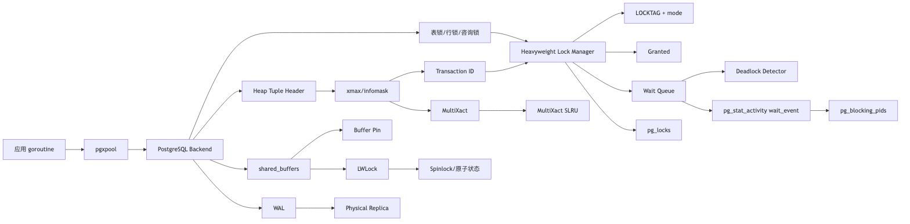
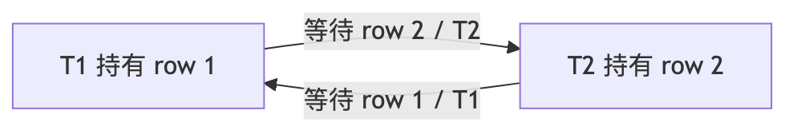
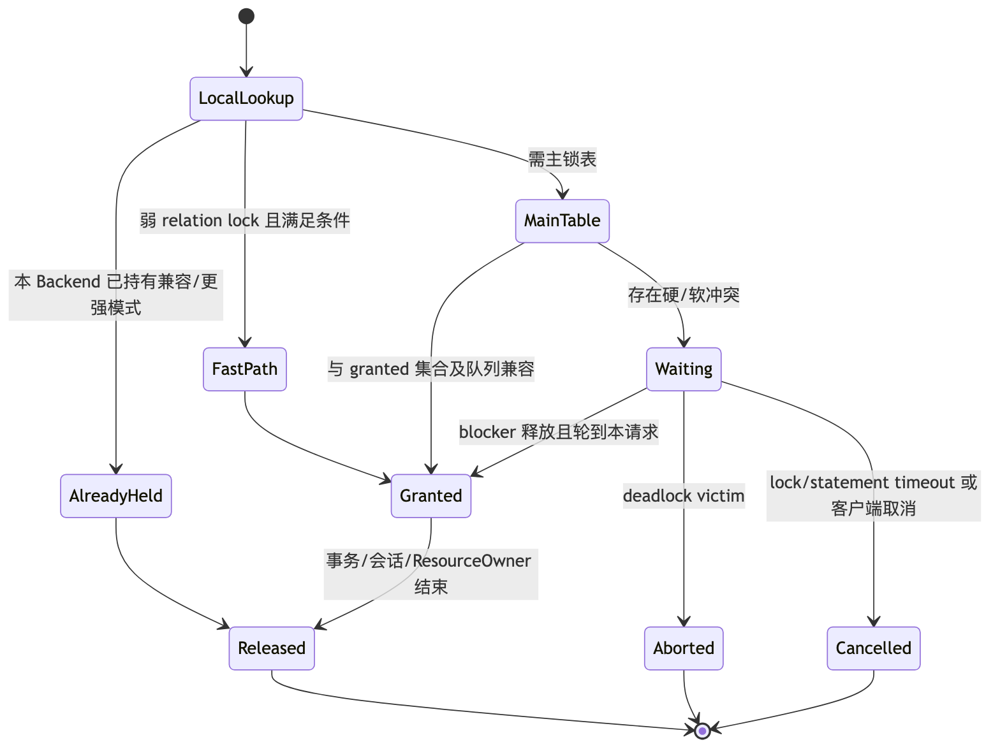

# 第 11 章：锁、死锁、热点竞争与高并发任务队列

> 技术基线：PostgreSQL 18；兼顾 PostgreSQL 14—18。Go 示例使用 `github.com/jackc/pgx/v5` 与 `pgxpool`。

## 1. 本章定位

MVCC 让读操作通常不必阻塞写操作，但它并没有消除锁。PostgreSQL 仍需用锁保护表定义、行修改、事务完成状态、共享内存结构和 Buffer；应用也经常主动使用行锁、咨询锁或 `SKIP LOCKED` 协调工作。

本章解决四类生产问题：

1. **看懂等待**：区分 Heavyweight Lock、Lightweight Lock、Spinlock 与 Buffer Pin，定位谁在等待、谁在阻塞、队列顺序是什么。
2. **保证正确性**：理解四种行锁、外键的 `KEY SHARE`、MultiXact、死锁检测与固定加锁顺序。
3. **治理热点**：识别热点行、单库存行、热点计数器、右侧 B-tree 页、锁车队与重试风暴，并选择原子更新、乐观锁、分片或异步聚合。
4. **构建队列**：使用 `FOR UPDATE SKIP LOCKED` 实现具备 Lease、可见性超时、崩溃恢复、幂等和 Dead Letter 的数据库任务领取器。

本章依赖第 9 章的 MVCC、Tuple Header、事务 ID 与 Snapshot，也依赖第 10 章的隔离级别和完整事务重试。下一章将进一步说明长事务与 MultiXact 年龄如何影响 VACUUM、Freeze 和 Wraparound。

本章不展开锁管理器全部源码、SSI Predicate Lock 的完整实现、通用消息代理协议，也不把某个固定超时值包装成适用于所有系统的“最佳实践”。

## 2. 可验证的学习目标

完成本章后，你应当能够：

- 根据 `wait_event_type` 判断等待属于业务对象锁、LWLock、Buffer Pin、I/O、客户端还是其他路径；
- 写出八种表级锁的完整冲突矩阵，并解释为何排队中的 DDL 会挡住后来到达的普通 `SELECT`；
- 根据四种行锁冲突矩阵，为外键、库存扣减和状态迁移选择正确锁强度；
- 从 `pg_stat_activity`、`pg_locks` 和 `pg_blocking_pids()` 还原完整 blocker/blocked 链；
- 稳定复现普通阻塞、行级死锁和 DDL Lock Convoy；
- 识别 SQLSTATE `40P01`、`55P03`、`57014`，并决定是否重试完整事务；
- 解释 Tuple Lock、Transaction ID Lock 与 MultiXact 如何协作，而不是误以为所有行锁都存放在共享锁表；
- 证明 PostgreSQL 不执行传统“行锁升级为表锁”，并区分它与 SSI Predicate Lock 粒度提升；
- 为热点计数器、单库存行和右侧索引页设计可测量的降争用方案；
- 使用 Go、pgxpool 和 `FOR UPDATE SKIP LOCKED` 实现有界并发、可恢复且至少一次执行的任务领取器；
- 说明该队列的公平性、重复执行、提交结果不确定和故障转移边界；
- 通过 Runbook 在不扩大事故面的前提下止损、定位根因、验证修复并补齐告警。

## 3. 核心术语

| 中文名称 | 英文名称 | 准确定义 | 容易混淆的概念 | 所属层次 |
|---|---|---|---|---|
| 重量级锁 | Heavyweight Lock / Regular Lock | 支持冲突矩阵、等待队列、死锁检测和事务级持有的通用锁管理器对象 | 不是指“锁得久”；也不是 LWLock | 锁管理器 |
| 轻量级锁 | Lightweight Lock / LWLock | 保护共享内存数据结构的短期内部同步原语，竞争时可睡眠 | 不在 `pg_locks` 中展示为业务锁 | 内核共享内存 |
| 自旋锁 | Spinlock | 保护极短临界区；竞争者短暂自旋而非进入常规睡眠队列 | 不适合跨 SQL 语句持有 | 内核原子同步 |
| Buffer Pin | Buffer Pin | 表示进程正在引用 shared buffer；某些操作必须等待其他 pin 释放 | 不等同于 Buffer Content LWLock | Buffer Manager |
| 锁标识 | Lock Tag | 唯一标识锁对象的结构，例如 relation、page、tuple、transactionid、virtualxid、advisory | 与锁模式不同 | Heavyweight Lock |
| 锁模式 | Lock Mode | 对同一 Lock Tag 请求的访问强度；冲突由锁方法的位掩码定义 | 模式名含 `ROW` 不代表行锁 | Heavyweight Lock |
| 已授予 | Granted | 请求已获得目标锁，可继续执行 | `granted=true` 不代表语句未被别处等待阻塞 | `pg_locks` 状态 |
| 等待中 | Waiting | 请求进入锁等待；`pg_locks.granted=false` | 与 `state='idle in transaction'` 不同 | Backend 状态 |
| 等待队列 | Wait Queue | 同一锁对象上等待请求的有序队列；前方冲突请求也可形成软阻塞 | 不是简单的“只看当前持有者” | 锁管理器 |
| 硬阻塞 | Hard Block | 等待者与已授予的冲突锁发生冲突 | 与软阻塞相对 | Wait-For Graph |
| 软阻塞 | Soft Block | 等待者被队列中排在前方的冲突等待请求挡住 | `pg_locks` 自连接难以正确重建 | Wait Queue |
| 表级锁 | Table-Level Lock | 以 relation 为对象的八种锁模式 | `ROW SHARE`、`ROW EXCLUSIVE` 仍是表锁 | SQL/锁管理器 |
| 行锁 | Row-Level Lock | `FOR UPDATE` 等在 Tuple Header 上记录的行级锁语义 | 行锁通常不会直接逐行出现在 `pg_locks` | Heap Tuple |
| Tuple 锁 | Tuple Lock | 在获取或升级行锁时用于串行化同一物理 tuple 锁请求的 heavyweight tuple lock | 最终等待常表现为 transactionid | Heap/锁管理器 |
| 事务 ID 锁 | Transaction ID Lock | 事务对自身 XID 持有排他锁；等待者请求共享锁以等待其结束 | 不是 SQL 显式 `LOCK TABLE` | 事务/锁管理器 |
| 多事务 ID | MultiXact | 在一个 tuple 的 `xmax` 中表示多个行锁持有者及其成员模式 | 不是多个普通 XID 的数组直接写在 tuple 中 | Tuple/SLRU |
| 键共享锁 | `FOR KEY SHARE` | 阻止删除和会改变可被外键引用键值的更新，但允许非键更新 | 弱于 `FOR SHARE` | 行锁 |
| 无键更新锁 | `FOR NO KEY UPDATE` | 阻止并发更新/删除，但不阻止 `KEY SHARE` | 通常由不改关键唯一列的 `UPDATE` 获得 | 行锁 |
| 立即失败 | `NOWAIT` | 遇到行锁冲突立即报错，不等待 | 仍需取得必要的表锁 | SQL 行锁子句 |
| 跳过已锁行 | `SKIP LOCKED` | 跳过无法立即锁定的行，得到有意不一致的候选集 | 不适合一般一致性查询 | SQL 行锁子句 |
| 咨询锁 | Advisory Lock | 数据库不解释业务语义、由应用约定 key 的锁 | 不是跨集群一致的分布式锁 | 应用协调 |
| 死锁 | Deadlock | Wait-For Graph 存在无法通过正常提交解除的环 | 长时间等待不一定是死锁 | 并发控制 |
| 锁车队 | Lock Convoy | 一个慢持有者或前方强锁请求使大量请求排队，释放后又形成突发竞争 | 不一定存在死锁 | 性能/排队 |
| 租约 | Lease | Worker 在有限时间内拥有任务处理权的记录 | 不是 exactly-once 保证 | 队列状态机 |
| 可见性超时 | Visibility Timeout | 任务被领取后暂时对其他 Worker 不可领取的期限 | 与 SQL `statement_timeout` 无关 | 队列协议 |
| 死信 | Dead Letter | 超过最大尝试次数、需人工或专门流程处理的任务 | 不应无限自动重试 | 队列状态机 |

## 4. 整体心智模型



### 4.1 数据流

一次 `UPDATE` 先定位目标 tuple，检查可见性与并发修改状态，必要时等待持有者事务结束；获得行修改权后写入新的 tuple 版本、更新索引或 HOT 链，并产生 WAL。`SELECT ... FOR UPDATE` 即使不改变业务列，也会修改 tuple 的锁标记，因此可能产生脏 Buffer 和 WAL。

### 4.2 控制流

Backend 获取对象锁时，以 `LOCKTAG + Lock Mode` 查询锁管理器。若兼容，则从请求状态进入 Granted；若冲突，则进入 Wait Queue、设置等待事件并睡眠。释放锁后，锁管理器按队列与冲突规则唤醒可授予请求，而不是让所有后来请求无条件插队。

### 4.3 状态变化

典型业务任务状态为：

```text
pending --原子领取--> running + lease
running --成功且 token 匹配--> done
running --失败且可重试--> pending + available_at(backoff)
running --lease 过期--> pending 或 dead
running --超过 max_attempts--> dead
```

典型锁请求状态为：

```text
LOCAL request -> fast-path 或 main lock table -> granted
                                           \-> waiting -> granted
                                                       \-> timeout/cancel/deadlock abort
```

### 4.4 故障路径

- Worker 进程崩溃：数据库事务回滚，但已经提交的 `running` 状态不会自动回滚；Lease 过期后由 Reaper 恢复。
- 网络在 `COMMIT` 后断开：客户端不知道事务是否提交，属于提交结果不确定；不可简单重做非幂等副作用。
- Backend 被取消或成为死锁 victim：当前事务进入失败状态，应用必须回滚，并只对明确可重试且幂等的完整事务做有界重试。
- Primary 故障转移：内存中的锁和 Session Advisory Lock 消失；WAL 中已持久化的任务状态可能在新 Primary 可见，取决于复制模式和 RPO。

## 5. 使用方式

### 5.1 八种表级锁

所有名称中的 `ROW` 都是历史命名，以下八种全是**表级锁**。`X` 表示“请求模式”与“已持有模式”冲突。

| 请求 \ 已持有 | ACCESS SHARE | ROW SHARE | ROW EXCLUSIVE | SHARE UPDATE EXCLUSIVE | SHARE | SHARE ROW EXCLUSIVE | EXCLUSIVE | ACCESS EXCLUSIVE |
|---|:---:|:---:|:---:|:---:|:---:|:---:|:---:|:---:|
| **ACCESS SHARE** |  |  |  |  |  |  |  | X |
| **ROW SHARE** |  |  |  |  |  |  | X | X |
| **ROW EXCLUSIVE** |  |  |  |  | X | X | X | X |
| **SHARE UPDATE EXCLUSIVE** |  |  |  | X | X | X | X | X |
| **SHARE** |  |  | X | X |  | X | X | X |
| **SHARE ROW EXCLUSIVE** |  |  | X | X | X | X | X | X |
| **EXCLUSIVE** |  | X | X | X | X | X | X | X |
| **ACCESS EXCLUSIVE** | X | X | X | X | X | X | X | X |

常见来源：

| 模式 | 常见命令 | 关键含义 |
|---|---|---|
| `ACCESS SHARE` | 普通 `SELECT` | 只与 `ACCESS EXCLUSIVE` 冲突 |
| `ROW SHARE` | `SELECT ... FOR UPDATE/SHARE` | 声明将对行加锁 |
| `ROW EXCLUSIVE` | `INSERT/UPDATE/DELETE/MERGE` | DML 修改目标表 |
| `SHARE UPDATE EXCLUSIVE` | `VACUUM`、`ANALYZE`、`CREATE INDEX CONCURRENTLY` 等 | 排斥部分维护与 Schema 变更，且自冲突 |
| `SHARE` | `CREATE INDEX` 非并发模式 | 允许读取，阻止并发 DML |
| `SHARE ROW EXCLUSIVE` | `CREATE TRIGGER`、部分 `ALTER TABLE` | 自冲突并阻止 DML |
| `EXCLUSIVE` | `REFRESH MATERIALIZED VIEW CONCURRENTLY` | 只允许普通读并发 |
| `ACCESS EXCLUSIVE` | `DROP/TRUNCATE/VACUUM FULL`、许多 `ALTER TABLE` | 与所有模式冲突；唯一能挡住普通 `SELECT` 的表锁 |

显式加锁示例：

```sql
BEGIN;
SET LOCAL lock_timeout = '500ms';
LOCK TABLE orders IN SHARE ROW EXCLUSIVE MODE;
-- 在同一事务内完成需要该保护的短操作
COMMIT;
```

不要用显式表锁弥补不清晰的事务设计。锁通常持有到事务结束；在 Savepoint 后获得的锁，回滚到该 Savepoint 时会释放。

### 5.2 四种行锁

| 请求 \ 当前 | `FOR KEY SHARE` | `FOR SHARE` | `FOR NO KEY UPDATE` | `FOR UPDATE` |
|---|:---:|:---:|:---:|:---:|
| **FOR KEY SHARE** |  |  |  | X |
| **FOR SHARE** |  |  | X | X |
| **FOR NO KEY UPDATE** |  | X | X | X |
| **FOR UPDATE** | X | X | X | X |

```sql
-- 强悲观锁：后续会改任意关键列，或要排斥全部其他行锁
SELECT * FROM accounts WHERE id = $1 FOR UPDATE;

-- 更新非关键列：允许外键检查持有 KEY SHARE
SELECT * FROM accounts WHERE id = $1 FOR NO KEY UPDATE;

-- 多个读者共享，但阻止更新/删除
SELECT * FROM documents WHERE id = $1 FOR SHARE;

-- 只保护“被引用键仍存在且不变”
SELECT * FROM parent WHERE id = $1 FOR KEY SHARE;
```

普通 `SELECT` 不受这些行锁阻塞。行锁只阻塞同一行上的写入或其他冲突行锁。`UPDATE` 若不修改可被外键引用的关键唯一列，通常取得 `FOR NO KEY UPDATE` 语义；`DELETE` 和改变此类键值的 `UPDATE` 取得更强的 `FOR UPDATE` 语义。

### 5.3 NOWAIT、SKIP LOCKED 与超时

```sql
-- 冲突时立即返回 SQLSTATE 55P03 lock_not_available
SELECT id FROM jobs WHERE id = $1 FOR UPDATE NOWAIT;

-- 跳过已被其他事务锁定的候选行；适合队列，不适合一般一致性读取
SELECT id
FROM jobs
WHERE status = 'pending'
ORDER BY priority DESC, available_at, id
FOR UPDATE SKIP LOCKED
LIMIT $1;
```

`NOWAIT` 和 `SKIP LOCKED` 只改变行锁等待行为。语句仍需先取得必要的表级锁；若 DDL 持有 `ACCESS EXCLUSIVE`，它们不能绕过该表锁。

```sql
BEGIN;
SET LOCAL lock_timeout = '300ms';        -- 每次等待获取锁的上限
SET LOCAL statement_timeout = '2s';      -- 整条语句的上限
SET LOCAL idle_in_transaction_session_timeout = '10s';
-- [PG17+] 也可按角色/会话评估 transaction_timeout
...
COMMIT;
```

`lock_timeout` 仅在等待锁期间计时，并对每次锁获取分别生效；将它设置为不小于 `statement_timeout` 通常没有意义。`deadlock_timeout` 是服务器等待多久后启动较昂贵死锁检测的阈值，也是启用 `log_lock_waits` 时报告长锁等待的相关阈值，不是业务语句总超时。

### 5.4 Advisory Lock

```sql
-- 事务级：自动随事务结束释放，通常优先使用
SELECT pg_advisory_xact_lock($1::bigint);

-- 尝试获取，不等待
SELECT pg_try_advisory_xact_lock($1::bigint);

-- 会话级：必须在同一物理会话上显式释放
SELECT pg_advisory_lock($1::bigint);
SELECT pg_advisory_unlock($1::bigint);
```

咨询锁只对同样遵守协议的代码有效。会话级咨询锁与事务回滚无关，且在连接池中容易因归还了连接而“遗失所有权”。它们占用共享锁表容量，并且在数据库重启、Backend 退出或故障转移后消失，不能单独充当跨节点强一致选主机制。

### 5.5 诊断视图与函数

先看活动会话和等待类型：

```sql
SELECT
    pid,
    application_name,
    usename,
    state,
    xact_start,
    query_start,
    wait_event_type,
    wait_event,
    pg_blocking_pids(pid) AS blocking_pids,
    left(query, 160) AS query
FROM pg_stat_activity
WHERE datname = current_database()
ORDER BY xact_start NULLS LAST, query_start;
```

- `state='active'` 只表示 Backend 正在处理查询；若同时有 `wait_event`，它可能正在等待。
- `xact_start` 揭示事务年龄，通常比单条 `query_start` 更能解释锁为何长时间不释放。
- `wait_event_type='Lock'` 指 Heavyweight Lock；`LWLock`、`BufferPin`、`IO`、`Client` 等需走不同排查路径。
- `pg_blocking_pids(pid)` 会考虑已授予的硬 blocker，也会考虑等待队列中排在前方的软 blocker。

查看锁对象：

```sql
SELECT
    l.pid,
    l.locktype,
    l.mode,
    l.granted,
    l.fastpath,
    l.waitstart,
    l.relation::regclass AS relation,
    l.page,
    l.tuple,
    l.transactionid,
    l.virtualxid,
    l.classid,
    l.objid,
    a.wait_event_type,
    a.wait_event,
    left(a.query, 120) AS query
FROM pg_locks AS l
LEFT JOIN pg_stat_activity AS a USING (pid)
WHERE l.database IS NULL
   OR l.database = 0
   OR l.database = (SELECT oid FROM pg_database WHERE datname = current_database())
ORDER BY l.granted, l.waitstart NULLS LAST, l.pid;
```

`pg_locks.granted=false` 是等待请求；`fastpath=true` 表示弱 relation lock 通过 Backend fast-path 取得。行锁的持有状态主要写在 heap tuple 上，所以常见现象是等待者显示 `locktype='transactionid'`，而不是每个持有者都显示一条 tuple lock。

[PG14+] `pg_locks.waitstart` 可直接观察开始等待时间；[PG17+] `pg_wait_events` 提供等待事件说明：

```sql
SELECT a.pid, a.wait_event_type, a.wait_event, w.description
FROM pg_stat_activity AS a
LEFT JOIN pg_wait_events AS w
  ON w.type = a.wait_event_type
 AND w.name = a.wait_event
WHERE a.wait_event IS NOT NULL;
```

不要高频轮询全量 `pg_locks`：收集常规锁与 Predicate Lock 快照本身需要短暂锁住相应锁管理器。

## 6. 底层原理

### 6.1 Heavyweight Lock：LOCKTAG、LOCK、PROCLOCK 与 LOCALLOCK

可把一次锁请求理解成四层对象：

```text
LOCKTAG         标识“锁什么”
  + Lock Mode   标识“以什么强度请求”
      |
      v
LOCK             集群共享锁表中该对象的全局状态、grantMask、waitMask、waitProcs
PROCLOCK         某 Backend/Prepared Transaction 与 LOCK 的关联及已持有模式
LOCALLOCK        Backend 私有内存中的引用计数、Owner 等本地状态
```

常见 Lock Tag 类型包括 relation、page、tuple、transaction ID、virtual transaction ID、database object、advisory key 和 speculative insertion token。`LOCKTAG` 与模式共同决定冲突；同一事务不会与自己冲突，因此可在已持有较强模式后请求较弱模式。

弱 relation lock 在无冲突时可能进入每 Backend 的 fast-path，以降低共享哈希表争用；一旦需要与强锁协调，相关状态会转入主锁表。`pg_locks.fastpath` 反映获取路径，不代表“这把锁不重要”。

请求无法授予时，Backend 的请求进入 `waitProcs`。锁管理器不只检查当前 Granted 集合，也尊重队列中较早的冲突请求，从而避免后来弱锁无限越过早来的强锁。这正是 DDL 排队后普通读也排队的基础。

### 6.2 Heavyweight Lock、LWLock、Spinlock、Buffer Pin 的边界

| 机制 | 保护对象 | 典型持有时间 | 能否形成 SQL 事务级等待 | 主要观测方式 |
|---|---|---:|---|---|
| Heavyweight Lock | relation、tuple 请求、XID、advisory 等 | 可持续到事务结束 | 能；支持死锁检测 | `pg_locks`、`Lock` wait event |
| LWLock | shared memory 中的 Buffer mapping、WAL、ProcArray 等 | 很短 | 不是业务对象锁；竞争时 Backend 可睡眠 | `wait_event_type='LWLock'` |
| Spinlock | 极小状态字段 | 极短 | 不进入常规业务锁队列 | [PG16+] `Timeout/SpinDelay` 等采样线索 |
| Buffer Pin | Backend 对 shared buffer 的引用 | 通常很短，也可能被游标等延长 | 可能使需要独占 pin 的操作等待 | `wait_event_type='BufferPin'` |

例如看到 `LWLock:BufferContent`，说明 Backend 正争用某个 Buffer 内容访问权；看到 `Lock:transactionid`，通常说明它在等待另一个事务结束。前者不能通过终止“持有某张表锁的会话”机械解决，后者则应沿 blocker 链排查事务。

### 6.3 行锁写在 Tuple Header，等待落在事务完成状态

简化时间线：

```text
T1: UPDATE row R
    -> 获取必要表锁
    -> 锁/修改 R，Tuple Header 的 xmax/infomask 指向 T1 或 MultiXact
    -> T1 对自身 XID 持有 ExclusiveLock

T2: UPDATE row R
    -> 读取 R 的锁信息
    -> 必要时以 tuple heavyweight lock 串行化竞争者
    -> 对 T1 的 transactionid 请求 ShareLock
    -> 因 T1 尚未结束而等待，pg_locks 常显示 transactionid waiting

T1: COMMIT/ROLLBACK
    -> 释放 XID lock
    -> T2 被唤醒，重新检查 tuple 当前版本和可见性，再决定更新、跳过或报错
```

Tuple heavyweight lock 主要用于协调竞争者对同一 tuple 的锁获取顺序；长期“拥有行锁”的事实由 tuple header 与事务状态表达。锁行会使页面变脏，可能产生 WAL，但 Heavyweight Lock 表本身是内存状态，不写入 WAL。崩溃后锁表重建为空，恢复通过 WAL 与事务提交状态确定 tuple 可见性。

### 6.4 MultiXact 与外键的 KEY SHARE

当多个事务同时以兼容模式锁同一行，例如多个 `FOR KEY SHARE`，单个 `xmax` 不能直接容纳全部 XID。PostgreSQL 将 `xmax` 标记为 MultiXact ID，再通过 `pg_multixact/offsets` 与 `pg_multixact/members` 对应的 SLRU 数据定位成员 XID 和锁模式。

外键插入或更新子表时，引用完整性检查需要确认父表键在本事务完成前不会消失或被改成另一个值。内部 RI 触发器会对匹配父行取得 `KEY SHARE` 语义：

- 父行非键列更新通常使用 `NO KEY UPDATE`，可与子表检查并发；
- 删除父行或修改可被外键引用的键值需要更强锁，会与 `KEY SHARE` 冲突；
- 因此把所有更新都手工提升为 `FOR UPDATE` 会无谓阻塞外键写入。

MultiXact 不是免费资源：大量共享行锁会消耗 MultiXact ID 与 member 空间，也会增加后续检查、VACUUM 和冻结压力。下一章会讨论年龄监控。

### 6.5 PostgreSQL 不做传统锁升级

一些数据库会在行锁数量达到阈值后将其升级为表锁。PostgreSQL 的普通行锁主要记录在 tuple 上，不会因为锁了很多行而自动“升级”为表锁。因此：

- 不存在一个通用的“超过 N 行自动锁全表”的阈值；
- 锁很多行仍可能造成大量页面写入、WAL、MultiXact、长事务和其他写者排队；
- 每条 DML 本来就会持有相应 relation lock，但这不是从行锁升级而来；
- SSI 的 Predicate Lock 可能因内存预算提升粒度，这是另一套用于检测序列化冲突的机制，不能与普通锁升级混为一谈。

### 6.6 Deadlock、Wait-For Graph 与 victim

死锁检测器建立 Wait-For Graph：节点是等待中的事务/进程，边表示“等待谁”。



当等待持续到 `deadlock_timeout`，PostgreSQL 执行死锁检查。硬边来自已授予冲突锁；软边来自同一等待队列中排在前方的冲突请求。检测器在某些软边场景可通过调整等待队列顺序消除“软死锁”；若存在不可解除的环，则中止其中一个参与者并返回 SQLSTATE `40P01 deadlock_detected`。

**不要依赖 victim 选择规则。** 官方语义明确指出具体哪个事务被中止难以预测。应用应让所有参与路径按同一对象顺序加锁，并能对 `40P01` 重试完整事务。

### 6.7 DDL 锁队列与 Lock Convoy

设 A 已持有 `ACCESS SHARE`，B 请求 `ACCESS EXCLUSIVE` 做 DDL，C 后来请求 `ACCESS SHARE`：

```text
时间  A                         B                         C
t1    SELECT，持有 AS
      事务不结束
 t2                             ALTER，申请 AX，排队
 t3                                                       SELECT，申请 AS
                                                          因前方 B 的 AX 而排队
 t4    COMMIT
                                获得 AX并执行
 t5                             COMMIT
                                                          获得 AS并执行
```

C 与 A 本来兼容，但不能无限越过已经排队的 B，否则 DDL 可能饥饿。于是一个长事务不仅阻塞 DDL，还可通过等待队列让后续读写形成 Lock Convoy。`pg_blocking_pids(C)` 可能将 B 报告为软 blocker，而 B 又被 A 阻塞。

### 6.8 原子 UPDATE、悲观锁与乐观锁

库存扣减优先考虑单语句原子条件更新：

```sql
UPDATE inventory
SET available = available - $2,
    version = version + 1
WHERE sku = $1
  AND available >= $2
RETURNING available, version;
```

它把“检查余额”和“扣减”合为一个原子写入，避免 `SELECT` 与 `UPDATE` 之间的竞态。零行返回表示库存不足或 SKU 不存在；业务若需区分，应再做只读诊断，但不能把诊断结果当成同一原子决定。

乐观锁适合冲突较低、读后有较长应用计算但可安全重试的场景：

```sql
UPDATE documents
SET body = $2,
    version = version + 1
WHERE id = $1
  AND version = $3
RETURNING version;
```

零行表示版本冲突。高冲突时，乐观锁会把等待变成大量失败、CPU 与网络重试；悲观锁会排队但可控制顺序。二者都必须配合短事务、超时、幂等和有界重试。

## 7. 内部数据结构和状态

### 7.1 关键数据结构

| 对象 | 关键字段或状态 | 本章意义 |
|---|---|---|
| `LOCKTAG` | `locktag_field1..4`、type、lock method | 唯一编码 relation、tuple、XID、advisory 等锁对象 |
| `LOCK` | granted/wait masks、请求计数、`waitProcs` | 同一 Lock Tag 的全局授予和等待状态 |
| `PROCLOCK` | `PGPROC + LOCK`、holdMask | 某 Backend/Prepared Transaction 持有哪些模式 |
| `LOCALLOCK` | 本地引用计数、resource owner、owner list | 避免同一 Backend 重复访问共享锁表，并支持子事务清理 |
| `PGPROC` | 当前等待锁、等待模式、等待状态、锁队列链接 | Backend 在锁等待与死锁检测中的节点 |
| Heap Tuple Header | `xmin`、`xmax`、`t_infomask`、`ctid` | 表达创建者、删除/更新者、行锁和 MultiXact 状态 |
| MultiXact Offset/Member | MultiXact 到成员范围、成员 XID 与 mode | 表达同一行上的多个兼容锁持有者 |
| Buffer Descriptor | refcount/pin、状态位、content lock | 保护 shared buffer 生命周期与页面内容 |
| Transaction Status | `pg_xact` 中提交/中止状态 | 等待结束后判断 tuple 的并发修改是否生效 |
| Wait-For Graph Edge | waiter、blocker、lock、队列约束 | 死锁检测与软边重排依据 |

主锁表按分区保护以降低全局争用；源码中的冲突位掩码使“请求模式是否与已授予模式冲突”成为快速位运算。锁对象数量受共享内存预算影响，`max_locks_per_transaction` 是共享锁表容量估算参数，并不限制普通行锁数量。大量 relation、partition 或 advisory lock 仍可能耗尽共享锁表，报 `out of shared memory`。

### 7.2 锁请求状态机



### 7.3 Tuple 行锁状态的简化判断

读取 tuple 时，Backend 不能只看 `xmax != 0` 就判定“被锁”：

1. `xmax` 可能代表删除/更新事务，也可能仅代表锁持有者；
2. `xmax` 可能是普通 XID，也可能是 MultiXact；
3. 对应事务可能仍进行中、已提交或已中止；
4. tuple 可能已经指向新版本 `ctid`；
5. 当前事务的隔离级别与 Snapshot 决定等待后是读取新版本、报序列化错误还是不返回该行。

因此生产诊断不能只读取 `xmin/xmax` 生搬硬套。`pageinspect` 可用于实验室理解页面，但在生产使用需评估权限、版本和读取开销。

### 7.4 Wait Event 到子系统的映射

| `wait_event_type` | 典型 `wait_event` | 含义 | 第一排查方向 |
|---|---|---|---|
| `Lock` | `relation`、`transactionid`、`tuple`、`advisory` | Heavyweight Lock 等待 | `pg_blocking_pids`、事务年龄、锁对象 |
| `LWLock` | `BufferContent`、`BufferMapping`、`WALInsert`、`LockManager` | 共享内存内部争用 | 热点页/WAL/共享结构、CPU 和并发 |
| `BufferPin` | `BufferPin` | 等待获得 Buffer 独占 pin | 长游标、并发页面访问、VACUUM/DDL 路径 |
| `IO` | `DataFileRead`、`DataFileWrite`、[PG18] AIO 事件 | 存储 I/O | 缓存命中、设备延迟、队列深度 |
| `Client` | `ClientRead`、`ClientWrite` | 等应用发送/接收 | 应用停顿、网络、结果集过大 |
| `Timeout` | `SpinDelay`、`PgSleep` | 等超时点或竞争自旋退避 | 结合具体事件，不按业务锁处理 |
| `IPC` | `SyncRep`、并行查询/后台进程协调事件 | 进程间协调 | 同步复制、并行计划、后台进程 |

## 8. 场景和选型决策

| 业务场景 | 推荐方案 | 不推荐方案 | 原因 | 性能代价 | 并发代价 | 一致性代价 | 高可用代价 | 运维复杂度 |
|---|---|---|---|---|---|---|---|---|
| 单 SKU 库存扣减 | 带条件的原子 `UPDATE ... WHERE available >= n RETURNING` | 先 `SELECT` 再无条件 `UPDATE` | 单语句将校验与修改原子化 | 热点行仍串行、产生 WAL | 同 SKU 排队 | 强一致；零行需业务解释 | 同步复制会增加提交延迟 | 低 |
| 跨多行转账 | 固定账户 ID 顺序加锁，短事务，完整重试 `40P01/40001` | 按请求输入顺序加锁 | 消除大部分环形等待 | 多 RTT 或批量锁定成本 | 热账户仍排队 | 可保持事务原子性 | Commit 不确定需幂等键 | 中 |
| 低冲突文档编辑 | `version` 条件乐观更新 | 长时间持有 `FOR UPDATE` 等用户输入 | 避免长事务和连接占用 | 冲突时重复计算/网络 | 高冲突会重试风暴 | 冲突显式失败 | Failover 后可重试但要防重复副作用 | 低—中 |
| 高冲突计数器，只需最终总数 | 64/128 分片计数器或追加事件异步聚合 | 所有请求更新同一行 | 将单服务点拆开 | 查询求和或聚合成本 | 显著降低行锁竞争 | 分片仍强一致；异步方案最终一致 | 恢复需验证聚合游标/幂等 | 中—高 |
| 工作队列，任务与业务数据同库 | `SKIP LOCKED` + 原子领取 + Lease + 幂等 | `SELECT id` 后第二条语句领取 | 防止双领，崩溃可恢复 | 轮询、索引和更新/WAL 成本 | 批次过大可形成热点 | 通常至少一次，不是 exactly-once | 异步复制可能丢最近状态 | 中 |
| 全局唯一定时任务（单 Primary） | 事务级 advisory lock + 持久化运行记录 | 会话锁跨连接池长期持有 | 简洁且自动随事务释放 | 占锁表，竞争排队 | 单 key 串行 | 依赖所有调用者遵约 | Failover 时锁消失，需 fencing/epoch | 中 |
| 在线 DDL | 小步迁移、短 `lock_timeout`、先监控 blocker、选择并发建索引 | 高峰期无限等待 `ALTER TABLE` | 避免 DDL 排队制造车队 | 多阶段迁移可能多扫描/WAL | 短锁窗口更可控 | 迁移期间需兼容读写 | Failover/复制延迟需纳入变更计划 | 高 |
| 外键高并发写 | 保留 FK，父键稳定；避免无必要 `FOR UPDATE` | 为“安全”锁住整个父表 | `KEY SHARE` 已提供精确保护 | FK 索引检查成本 | 父键变更/删除会排队 | 数据库强制引用完整性 | 逻辑复制/迁移需验证约束策略 | 中 |
| 跨服务分布式互斥 | 专业协调服务或带 fencing token 的租约协议 | 仅靠 PostgreSQL session advisory lock 宣称跨集群强锁 | Session/节点故障会丢锁 | 额外网络和协调成本 | 明确租约/选主竞争 | 可设计线性一致/fencing | 多节点故障模型更清晰 | 高 |
| 有顺序、回放、分区消费需求的事件流 | Kafka/Pulsar 等专业消息系统，数据库用 Outbox | 把单表 `SKIP LOCKED` 当完整消息平台 | 数据库队列缺少完整日志语义 | 独立基础设施成本 | 可按 partition 扩展 | 明确至少一次/回放模型 | 跨区域和灾备能力更成熟 | 高 |

## 9. 高性能分析

### 9.1 先建立测量边界

任何“把并发设为多少”“分多少片”“超时设几毫秒”的建议都必须先记录：

- PostgreSQL 小版本、操作系统、文件系统和存储类型；
- CPU 核数、NUMA、内存、`shared_buffers` 与 OS Page Cache 可用空间；
- 表/索引大小、行宽、更新列、HOT 资格、数据倾斜；
- 读写比例、热点 key 占比、连接数、活跃查询数、goroutine 数；
- 同步复制策略、网络 RTT、SLO（吞吐、P95/P99、错误率）；
- 测试缓存状态、持续时间、预热方式与 checkpoint/autovacuum 干扰。

没有这些上下文，固定参数只是猜测。

### 9.2 CPU、内存与共享结构

热点行把大量 Backend 集中到相同 tuple/XID 等待上。等待期间 CPU 可能不高，但锁释放后所有请求被陆续唤醒，产生上下文切换、tuple 重新检查、索引维护和短时 CPU 峰值。LWLock 或 Spinlock 热点则更直接消耗 CPU。

`shared_buffers` 较大并不会消除行锁串行化。热点页面常驻缓存可减少随机读，却会提高同一 Buffer Content Lock、cache line 和 WAL 插入路径的竞争密度。OS Page Cache 仍负责文件系统层缓存；不要把高 Buffer 命中率误读为“没有锁或存储问题”。

大量 relation/advisory lock 会占共享锁表；增大 `max_locks_per_transaction` 会增加共享内存分配，需按分区表数量、Prepared Transaction 和并发会话验证，而不是为热点行盲目增大。

### 9.3 I/O、PostgreSQL 18 AIO 与 Buffer Pin

- 冷数据定位可能产生随机读；顺序扫描或批量聚合可能产生顺序 I/O。
- `SELECT FOR UPDATE`、`UPDATE` 会弄脏 heap page；非 HOT 更新还会写索引页。
- [PG18] 异步 I/O 能改善部分读取、预取或后台 I/O 路径的并行度与可观测性，但**不能并行执行同一行上必须串行的逻辑修改**。
- 长游标或某些内部路径持有 Buffer Pin 过久时，其他需要独占 pin 的操作会出现 `BufferPin` 等待；这与 relation lock 的 blocker 链不同。

测试中应同时观察 `pg_stat_io`、操作系统设备延迟/队列、`pg_stat_activity.wait_event`，避免把 I/O 排队误判为锁排队。

### 9.4 网络 RTT 与事务往返

以下两种逻辑正确性可能相近，但 RTT 不同：

```text
方案 A: BEGIN -> SELECT FOR UPDATE -> UPDATE -> COMMIT   （至少四个协议阶段）
方案 B: UPDATE ... WHERE ... RETURNING -> COMMIT/自动提交 （更少往返）
```

跨可用区或高延迟网络下，多一次数据库往返会延长事务持锁时间，进而放大 P95/P99。能用单条原子 SQL 表达时，通常比“读—应用判断—写”更短、更安全。

### 9.5 索引维护、右侧页热点与写放大

单调递增主键、时间戳索引和任务 `available_at` 索引常把插入集中到 B-tree 最右叶页。结果可能出现：

- 同一索引 Buffer Content LWLock 竞争；
- 高频 page split 和 WAL；
- CPU cache line 抖动；
- Primary 写吞吐先于存储带宽达到瓶颈。

可选治理手段取决于查询需求：降低无用索引数量；使用批量写；按租户/时间分区分散写入；对于只需唯一性的 ID 评估 UUIDv7 等仍具局部有序但分布更适合业务的键；对纯计数写采用分片。随机 UUID 会分散右侧热点，但可能增加随机 I/O、索引膨胀和缓存失效，不能一概替换。

一个非 HOT 更新的放大大致包括新 heap tuple、旧 tuple 状态、每个相关索引的新条目、WAL、后续 VACUUM 清理以及复制传输。更新被索引列会失去 HOT 机会。任务表如果每次状态变化都维护多个宽索引，很容易把简单领取变成高写放大工作负载。

### 9.6 WAL、Checkpoint、Vacuum 与临时文件

高频热点更新虽然数据逻辑量很小，却会产生持续 WAL；同一 tuple 反复生成 dead tuple，依赖 VACUUM 清理。Checkpoint 周期内大量脏页和 full-page image 会抬高写延迟；同步复制还把 WAL flush/确认放入提交尾延迟。

锁本身不产生 Temporary File，但错误的队列查询若无法利用部分索引，可能排序大量 pending 行并溢写临时文件。应验证：

```sql
EXPLAIN (
    ANALYZE,
    BUFFERS,
    WAL,
    SETTINGS,
    VERBOSE,
    SUMMARY
)
SELECT id
FROM jobs
WHERE queue_name = 'email'
  AND status = 'pending'
  AND available_at <= statement_timestamp()
ORDER BY priority DESC, available_at, id
LIMIT 100;
```

这里先不加 `FOR UPDATE`，用于安全观察候选读取路径。对 `UPDATE` 使用 `EXPLAIN ANALYZE` 会真实修改数据；实验应放在可回滚事务中，但 Sequence、外部触发器副作用或非事务外部调用未必能被完全撤销。

### 9.7 吞吐与尾延迟

热点队列遵循排队规律：平均吞吐看似尚可时，P99 已可能因少量长事务、锁队列和重试倍增严重恶化。至少记录：

| 指标组 | 指标 |
|---|---|
| 延迟 | P50/P95/P99，锁等待时间，事务总时长 |
| 吞吐 | 成功 TPS、领取任务数/s、完成任务数/s |
| 排队 | 等待锁会话数、池 AcquireCount/EmptyAcquireWaitTime、应用队列长度 |
| 写放大 | WAL bytes/事务、heap/index blocks written、dead tuples |
| 资源 | CPU、上下文切换、I/O 延迟和队列、内存 |
| 正确性 | 冲突率、`40P01`、`55P03`、超时、重复执行、DLQ 比例 |

分片计数器提高写吞吐，却使读取需要求和，产生读放大；异步事件聚合进一步降低写争用，却增加空间、重放和最终一致性成本。优化必须同时说明读放大、写放大和空间放大。

## 10. 高并发分析

### 10.1 五个不同的“并发量”

| 名称 | 定义 | 常见误区 |
|---|---|---|
| 应用 goroutine 并发 | 同时尝试发起工作的 goroutine 数 | 1000 goroutine 不等于 1000 个数据库事务在运行 |
| 连接数 | 应用与数据库建立的物理会话数 | 空闲连接不等于活跃负载 |
| 活跃查询数 | Backend 当前执行或等待的语句数 | 等锁的 active 会话也消耗槽位 |
| 数据库并发 | 同时占用 CPU、I/O、锁/WAL 等资源的工作量 | 超过硬件并行度后通常转为排队 |
| TPS | 单位时间提交事务数 | TPS 高不代表 P99、错误率或业务正确性好 |
| 排队请求数 | 在应用 semaphore、连接池、数据库锁队列中的请求 | 必须区分排在哪里，才能正确限流 |

pgxpool 是并发安全的，但连接池不会自动限制 goroutine 的创建。应在进入数据库前使用有界 Worker/semaphore 做 Admission Control；池大小控制数据库会话上限，应用队列长度控制等待预算，两者职责不同。

### 10.2 MVCC 与锁的协同

MVCC 使普通读取可读旧版本，所以行锁不阻塞普通 `SELECT`。但两个写者不能无序覆盖同一逻辑状态，仍需通过 tuple/XID 等待串行化。`READ COMMITTED` 下，等待结束后语句可能重新检查更新后的行是否仍符合条件；`REPEATABLE READ`/`SERIALIZABLE` 下，如果目标行自事务开始后已改变，锁定读取可能报序列化错误。

MVCC 也意味着长事务不仅持锁，还固定老 Snapshot、延迟垃圾回收。即使 blocker 当前 `state='idle in transaction'`，它仍可同时造成锁等待与 bloat 风险。

### 10.3 热点行、热点计数器与单库存行

单行更新的物理并发度上限接近“一次只完成一个修改者”，增加连接只会延长队列。典型表现：

- `Lock:transactionid` 等待增多；
- 同 key P99 与并发数近似排队增长；
- 数据库 CPU 不一定满，但连接池被等待者占满；
- 超时后应用立即重试，形成 Retry Storm；
- 其他非热点请求拿不到连接，发生工作负载级联。

治理顺序通常是：

1. 用单条原子 `UPDATE` 缩短持锁窗口；
2. 按业务 key 隔离工作队列，限制同 key 并发；
3. 将全局计数拆成多个 shard；
4. 对允许最终一致的指标采用 append-only + 异步聚合；
5. 评估是否应将库存预留拆分到仓库/批次维度，而非伪造单一全局行。

库存不能只靠“先查后扣”；分片库存则会带来跨片选择、回收、总量校验和防超卖的新复杂度。

### 10.4 热点索引页、WAL 与连接竞争

即便业务 key 不相同，单调索引也可能把所有写入集中到右侧页，表现为 `LWLock` 而非 `Lock`。同时，所有提交会进入 WAL 插入/写入/flush 路径；同步复制还可能显示 `IPC:SyncRep`。因此“没有 blocker PID”并不代表没有并发瓶颈。

连接池过大时，更多 Backend 同时争用同一行/页/WAL，常使吞吐不增、尾延迟和上下文切换反而上升。连接池过小时则在应用侧排队。应基于 CPU、I/O、事务类型和 SLO做负载测试，而非按 goroutine 数等比例设置连接。

### 10.5 固定锁顺序与事务边界

跨多个对象时，用稳定、全局一致的顺序：

```sql
-- 先按主键排序，再锁定；所有业务路径必须遵循同一规则
SELECT id, balance
FROM accounts
WHERE id = ANY($1::bigint[])
ORDER BY id
FOR UPDATE;
```

只在获得全部必要锁后修改。不要在事务中调用 HTTP、发送邮件、等待用户输入或做长 CPU 任务。外部副作用应放在事务外，并通过 Outbox、幂等键或可确认协议连接数据库提交与后续投递。

### 10.6 Backpressure、Admission Control 与重试

建议形成三层预算：

```text
入口限流/按租户配额
    -> 有界应用工作队列
        -> 有界 goroutine
            -> 有界 pgxpool
                -> 数据库 statement/lock timeout
```

当锁超时、死锁或连接池等待上升时，立即无限重试会把每个原始请求放大成多个数据库请求。只对明确错误重试完整事务，设置最大次数、指数退避和随机抖动，并服从 `context.Context`。对 `55P03` 是否重试取决于业务：`NOWAIT` 常用于快速返回“资源忙”，不一定应自动重试。

### 10.7 幂等与提交结果不确定

客户端收到 `Commit` 网络错误时可能存在三种事实：未提交、已提交但响应丢失、连接状态未知。数据库错误代码 `08007`、`40003` 等也表示事务或语句完成结果未知的类别。正确策略不是盲目再执行，而是：

- 为业务命令分配唯一 Idempotency Key；
- 在同一事务中记录 key 与结果；
- 重连后按 key 查询事实；
- 外部系统也接受同一幂等键，或通过 Outbox 串联；
- 无法确认时进入对账/人工状态，而不是无限重试。

## 11. 高可用分析

锁主要是 Primary 内存中的运行时协调状态，因此与高可用的关系多为**间接但关键**。

### 11.1 RPO 与 RTO

- **RPO**：异步物理复制故障转移可能丢失最近已向旧 Primary 客户端确认、但尚未复制到新 Primary 的任务领取、完成或幂等记录。同步复制可降低该风险，但增加提交延迟和可用性依赖。
- **RTO**：故障转移时间不只包括数据库选主，还包括 fencing 旧 Primary、DNS/代理切换、应用连接池丢弃旧连接、重建连接和任务 Lease 恢复扫描。

### 11.2 物理复制、逻辑复制与锁

物理副本重放 WAL，但不会复制 Primary 的 Heavyweight Lock 表或 Session Advisory Lock。只读副本上的查询有自己的锁/冲突机制，并可能因 recovery conflict 被取消。逻辑复制传输数据变化，也不复制应用会话锁和等待队列；用逻辑订阅表做双写 Worker 时必须重新设计任务所有权。

任务表放在异步复制集群中时，故障转移后可能：

- 已领取状态回退为 pending，造成重复执行；
- 已完成状态或幂等记录丢失，造成再次执行；
- 旧 Primary 未被 fencing，两个节点同时接受任务，形成脑裂。

因此至少一次处理必须是默认假设，外部副作用必须幂等。

### 11.3 Planned Switchover、Failover 与 Failback

计划切换前：停止或排空 Worker 领取；等待在途任务完成或缩短 Lease；确认同步点；切换后建立新连接并核对 running/expired 任务。不要把旧连接视为可自动迁移——它们指向旧 Backend，必须关闭或由代理强制断开。

非计划故障转移后：

1. Fencing 旧 Primary，防止双写；
2. 应用使用新的连接并重新认证事务事实；
3. Reaper 只回收已过期 Lease，不能立即把全部 running 重置为 pending；
4. 对 Commit 结果未知的任务按幂等键查询；
5. 验证复制时间线、数据完整性和任务总账。

Failback 不应简单反向提升旧节点；先将其作为新 Primary 的从库重新同步，确认时间线和数据一致，再执行计划切换。

### 11.4 备份、PITR 与恢复验证

备份不会保存运行时锁。PITR 到某一时间点会恢复当时已持久化的任务行、Lease 与幂等表，却不会恢复对应 Worker 进程。恢复演练必须包含：

- 将恢复环境隔离，避免任务真的向外发送邮件/扣款；
- 统计 pending/running/done/dead 与业务账目是否一致；
- 将过期 running 任务按协议回收；
- 验证幂等键和 Outbox 是否能阻止重复副作用；
- 记录可接受的数据回退窗口与实际 RTO。

### 11.5 Fencing 与 Advisory Lock 边界

脑裂场景下，旧 Primary 上的 advisory lock 和新 Primary 上的 advisory lock 彼此不可见。需要外部仲裁和 fencing；对资源操作还应携带单调递增 fencing token，使旧持有者即使“复活”也被资源端拒绝。数据库 Session Lock 只能表达单实例当前会话间的协调，不等于分布式租约证明。

## 12. 三维影响矩阵

| 维度 | 相关度 | 核心收益 | 主要风险 | 关键指标 |
|---|---|---|---|---|
| 高性能 | 高 | 缩短锁持有、分散热点、减少 RTT 和写放大 | 锁车队、右侧页、WAL/Buffer 争用、P99 激增 | lock wait、LWLock、P95/P99、WAL bytes、dead tuples、pool wait |
| 高并发 | 高 | 精确互斥、固定顺序、原子领取和有界处理 | 死锁、饥饿、重试风暴、连接耗尽、重复执行 | blocked sessions、`40P01/55P03`、队列深度、冲突率、goroutine/连接比 |
| 高可用 | 中 | Lease 与幂等可在故障后恢复工作 | 内存锁不复制、异步 RPO、Commit 不确定、脑裂双领 | replication lag、expired leases、duplicate rate、failover RTO、对账差异 |

## 13. 可复现实验

> 所有实验只应在隔离测试库执行。建议三个终端分别设置不同 `application_name`，便于观察。若使用托管服务，确认测试账号具有查看其他会话活动的权限。

### 13.1 实验一：普通阻塞与完整 blocker/blocked 链

#### 1. 实验目标

构造 `Session C -> Session B -> Session A` 两层等待链，验证行锁等待常显示为 `transactionid`，并练习使用 `pg_blocking_pids()` 定位链首。

#### 2. 版本与扩展

- PostgreSQL 14—18 均可；主要展示 PostgreSQL 18。
- 不需要扩展。

#### 3. 建表和准备数据

在管理会话执行：

```sql
DROP TABLE IF EXISTS lock_lab;
CREATE TABLE lock_lab (
    id       bigint PRIMARY KEY,
    balance  bigint NOT NULL,
    note     text NOT NULL DEFAULT ''
);
INSERT INTO lock_lab(id, balance) VALUES (1, 1000), (2, 1000);
ANALYZE lock_lab;
```

三个 psql 终端分别执行：

```sql
SET application_name = 'lock-lab-A'; -- B/C 修改后缀
SET statement_timeout = '5min';
SET lock_timeout = '0';              -- 实验中允许等待
SELECT pg_backend_pid();
```

#### 4. Session A

```sql
BEGIN;
UPDATE lock_lab
SET balance = balance + 10
WHERE id = 1;
-- 成功；持有 id=1 的行修改权。此时不要提交。
```

#### 5. Session B

```sql
BEGIN;
UPDATE lock_lab
SET balance = balance + 20
WHERE id = 2;
-- 成功；持有 id=2。

UPDATE lock_lab
SET note = 'B wants row 1'
WHERE id = 1;
-- 在这里等待 Session A。
```

#### 6. Session C

```sql
BEGIN;
UPDATE lock_lab
SET note = 'C wants row 2'
WHERE id = 2;
-- 在这里等待 Session B。
```

#### 7. 时间线

| 时间 | Session A | Session B | Session C |
|---|---|---|---|
| t1 | `BEGIN; UPDATE id=1` 成功 |  |  |
| t2 | 保持事务 | `BEGIN; UPDATE id=2` 成功 |  |
| t3 | 保持事务 | `UPDATE id=1` 等待 A |  |
| t4 | 保持事务 | 等待 | `UPDATE id=2` 等待 B |
| t5 | `COMMIT` | 获得 id=1，语句完成；仍未提交 | 仍等待 B |
| t6 |  | `COMMIT` | 获得 id=2，语句完成 |
| t7 |  |  | `COMMIT` |

没有一步必然失败；t3、t4 明确等待。只有 A、B 依次提交，等待链才依次解除。

#### 8. 诊断 SQL

在第四个管理会话执行：

```sql
SELECT
    a.pid,
    a.application_name,
    a.state,
    a.xact_start,
    a.query_start,
    a.wait_event_type,
    a.wait_event,
    pg_blocking_pids(a.pid) AS direct_blockers,
    left(a.query, 100) AS query
FROM pg_stat_activity AS a
WHERE a.application_name LIKE 'lock-lab-%'
ORDER BY a.application_name;
```

预期：B 和 C 为 `active` 且等待事件通常是 `Lock/transactionid`；B 的 direct blocker 是 A，C 的 direct blocker 是 B。

完整边列表：

```sql
SELECT
    blocked.pid AS blocked_pid,
    blocked.application_name AS blocked_app,
    blocker.pid AS blocker_pid,
    blocker.application_name AS blocker_app,
    blocked.wait_event_type,
    blocked.wait_event,
    clock_timestamp() - blocked.query_start AS blocked_for,
    clock_timestamp() - blocker.xact_start AS blocker_xact_age,
    left(blocked.query, 100) AS blocked_query,
    left(blocker.query, 100) AS blocker_query
FROM pg_stat_activity AS blocked
CROSS JOIN LATERAL unnest(pg_blocking_pids(blocked.pid)) AS p(blocker_pid)
JOIN pg_stat_activity AS blocker ON blocker.pid = p.blocker_pid
ORDER BY blocked_for DESC;
```

从每个会话递归向上追溯：

```sql
WITH RECURSIVE lock_tree AS (
    SELECT
        a.pid AS blocked_pid,
        unnest(pg_blocking_pids(a.pid)) AS blocker_pid,
        1 AS depth,
        ARRAY[a.pid] AS path
    FROM pg_stat_activity AS a
    WHERE cardinality(pg_blocking_pids(a.pid)) > 0

    UNION ALL

    SELECT
        t.blocker_pid AS blocked_pid,
        unnest(pg_blocking_pids(t.blocker_pid)) AS blocker_pid,
        t.depth + 1,
        t.path || t.blocker_pid
    FROM lock_tree AS t
    WHERE NOT t.blocker_pid = ANY(t.path)
      AND cardinality(pg_blocking_pids(t.blocker_pid)) > 0
)
SELECT
    t.depth,
    t.blocked_pid,
    ba.application_name AS blocked_app,
    t.blocker_pid,
    ka.application_name AS blocker_app,
    t.path
FROM lock_tree AS t
LEFT JOIN pg_stat_activity AS ba ON ba.pid = t.blocked_pid
LEFT JOIN pg_stat_activity AS ka ON ka.pid = t.blocker_pid
ORDER BY t.depth, t.blocked_pid;
```

查看具体锁请求：

```sql
SELECT
    a.application_name,
    l.locktype,
    l.mode,
    l.granted,
    l.waitstart,
    l.relation::regclass AS relation,
    l.page,
    l.tuple,
    l.transactionid,
    l.virtualxid
FROM pg_locks AS l
JOIN pg_stat_activity AS a USING (pid)
WHERE a.application_name LIKE 'lock-lab-%'
ORDER BY a.application_name, l.granted, l.locktype;
```

#### 9. EXPLAIN/统计指标

在无并发锁时确认定位走主键：

```sql
EXPLAIN (ANALYZE, BUFFERS, WAL, SETTINGS, VERBOSE, SUMMARY)
UPDATE lock_lab
SET balance = balance + 1
WHERE id = 1;
```

该命令会真实更新；可在 `BEGIN; ...; ROLLBACK;` 中运行。记录 `Index Scan`/`Index Cond`、Buffers、WAL records/bytes。锁等待时间不会完整体现在单纯的计划节点解释中，必须结合 `pg_stat_activity`、应用端总时长和日志。

#### 10. 结果解释

- B 首先等待 A 的事务结束；C 等待 B，即使 B 自己也在等待。
- 终止 C 只能减轻末端症状；链首 A 才是根 blocker。
- A 若是 `idle in transaction`，根因通常是应用事务边界或连接管理，而不是 SQL 本身运行慢。
- B 在 A 提交后完成第二条语句，但其事务仍持有 id=2，必须由 B 提交才能释放 C。

#### 11. 清理

确保三个会话执行 `ROLLBACK` 或 `COMMIT`，然后：

```sql
DROP TABLE lock_lab;
```

#### 12. 生产安全警告

不要在生产中凭 PID 直接执行 `pg_terminate_backend()`。先确认业务所有者、事务内容、是否可能回滚大量数据、是否为复制/维护进程，以及终止后应用是否会立即重试放大负载。

---

### 13.2 实验二：制造死锁、观察 victim 与 SQLSTATE

#### 1. 实验目标

构造两行、两个事务的 Wait-For Graph 环，确认 PostgreSQL 自动选择一个 victim，错误 SQLSTATE 为 `40P01`，并证明 victim 不可预测。

#### 2. 版本与扩展

- PostgreSQL 14—18；无扩展。
- 实验库中可临时将会话级 `deadlock_timeout` 设为 `200ms` 以缩短演示，但生产全局值必须按正常锁等待与检测开销评估。

#### 3. 准备数据

```sql
DROP TABLE IF EXISTS deadlock_lab;
CREATE TABLE deadlock_lab (
    id bigint PRIMARY KEY,
    value bigint NOT NULL
);
INSERT INTO deadlock_lab VALUES (1, 0), (2, 0);
```

#### 4. Session A

```sql
SET application_name = 'deadlock-A';
SET deadlock_timeout = '200ms';
BEGIN;
UPDATE deadlock_lab SET value = value + 1 WHERE id = 1;
-- 等 Session B 完成它的第一条 UPDATE 后，再执行：
UPDATE deadlock_lab SET value = value + 1 WHERE id = 2;
-- 此步先等待 B。
```

#### 5. Session B

```sql
SET application_name = 'deadlock-B';
SET deadlock_timeout = '200ms';
BEGIN;
UPDATE deadlock_lab SET value = value + 1 WHERE id = 2;
-- 等 Session A 开始等待后，再执行：
UPDATE deadlock_lab SET value = value + 1 WHERE id = 1;
-- 环形成；约 deadlock_timeout 后，A 或 B 中一个失败。
```

#### 6. 时间线与预期结果

| 时间 | A | B |
|---|---|---|
| t1 | 锁 id=1 |  |
| t2 |  | 锁 id=2 |
| t3 | 请求 id=2，等待 B |  |
| t4 | 等待 B | 请求 id=1，等待 A，形成环 |
| t5 | A 或 B 之一收到 `deadlock detected` | 另一个被唤醒 |
| t6 | victim 执行 `ROLLBACK` | survivor 可 `COMMIT` |

典型 psql 错误：

```text
ERROR:  deadlock detected
SQL state: 40P01
```

哪个会话被选为 victim 不应被依赖，重复实验也不应把观察到的一次结果写成业务规则。

#### 7. 诊断 SQL

在环形成但尚未检测的短窗口内：

```sql
SELECT
    pid,
    application_name,
    wait_event_type,
    wait_event,
    pg_blocking_pids(pid) AS blockers,
    left(query, 120) AS query
FROM pg_stat_activity
WHERE application_name IN ('deadlock-A', 'deadlock-B');
```

查看服务端日志中的 deadlock detail。实验环境可：

```sql
SHOW deadlock_timeout;
SHOW log_lock_waits;
```

`log_lock_waits=on` 与合适的 `deadlock_timeout` 有助于记录超出阈值的锁等待；不要为了“更快检测”在高并发生产环境盲目设为极低值，因为死锁检查有成本。

#### 8. EXPLAIN/统计指标

确认两个更新都使用主键索引，排除全表扫描持有更多行锁：

```sql
EXPLAIN (ANALYZE, BUFFERS, WAL, SETTINGS, VERBOSE, SUMMARY)
UPDATE deadlock_lab SET value = value + 1 WHERE id = 1;
```

在独立事务中运行并回滚。死锁本质由加锁顺序而非计划是否快决定，但不精确谓词可能锁住意外的更多行，使图更复杂。

#### 9. 修复验证：固定顺序

两个业务路径都改为按 `id` 升序锁定：

```sql
BEGIN;
SELECT id, value
FROM deadlock_lab
WHERE id = ANY($1::bigint[])
ORDER BY id
FOR UPDATE;

-- 再按业务规则更新
COMMIT;
```

并发运行时可能等待，但不再构造相反顺序的环。应用仍应对 `40P01` 做完整事务的有界重试，因为其他对象、触发器和外键仍可能引入死锁。

#### 10. 清理与安全警告

victim 会话必须先 `ROLLBACK`，因为事务已处于 aborted 状态。随后：

```sql
DROP TABLE deadlock_lab;
```

切勿在生产高峰故意制造死锁。降低 `deadlock_timeout` 属于系统行为调整，应结合正常锁持有分布、日志量和 CPU 开销验证。

---

### 13.3 实验三：长事务阻塞 DDL，后续 SELECT 因锁队列继续排队

#### 1. 实验目标

证明 Lock Convoy 与软 blocker：A 的普通读锁挡住 B 的 `ACCESS EXCLUSIVE` DDL；C 虽与 A 兼容，却因 B 已在队首而等待 B。

#### 2. 版本与扩展

- PostgreSQL 14—18；无扩展。

#### 3. 准备数据

```sql
DROP TABLE IF EXISTS ddl_queue_lab;
CREATE TABLE ddl_queue_lab (
    id bigint PRIMARY KEY,
    payload text NOT NULL
);
INSERT INTO ddl_queue_lab
SELECT g, repeat('x', 100)
FROM generate_series(1, 1000) AS g;
ANALYZE ddl_queue_lab;
```

#### 4. Session A：长事务

```sql
SET application_name = 'ddl-queue-A';
BEGIN;
SELECT count(*) FROM ddl_queue_lab;
-- SELECT 完成，但 AccessShareLock 持有到事务结束。
-- 不要提交。
```

#### 5. Session B：DDL

```sql
SET application_name = 'ddl-queue-B';
SET lock_timeout = '0';
BEGIN;
ALTER TABLE ddl_queue_lab ADD COLUMN created_at timestamptz;
-- 等待 A 的 AccessShareLock；申请 AccessExclusiveLock。
```

#### 6. Session C：后来到达的普通 SELECT

```sql
SET application_name = 'ddl-queue-C';
SELECT count(*) FROM ddl_queue_lab;
-- 也等待：不能越过队列前方 B 的 AccessExclusiveLock。
```

#### 7. 明确时间线

| 时间 | A | B | C |
|---|---|---|---|
| t1 | `BEGIN; SELECT` 完成，持有 AS |  |  |
| t2 | 保持事务 | `ALTER` 请求 AX，等待 A |  |
| t3 | 保持事务 | 等待 A | 普通 `SELECT` 请求 AS，等待队列前方 B |
| t4 | `COMMIT` | 得到 AX、执行 DDL；仍在事务内 | 继续等待 B |
| t5 |  | `COMMIT` | 得到 AS、查询完成 |

若 B 的 DDL 很快完成，但 B 不提交，C 仍继续等待，因为 AX 持有到 B 事务结束。

#### 8. 诊断 SQL

```sql
SELECT
    a.pid,
    a.application_name,
    a.state,
    a.xact_start,
    a.wait_event_type,
    a.wait_event,
    pg_blocking_pids(a.pid) AS blocking_pids,
    l.mode,
    l.granted,
    l.waitstart,
    left(a.query, 100) AS query
FROM pg_stat_activity AS a
LEFT JOIN pg_locks AS l
  ON l.pid = a.pid
 AND l.relation = 'ddl_queue_lab'::regclass
WHERE a.application_name LIKE 'ddl-queue-%'
ORDER BY a.application_name, l.granted;
```

预期：

- A：`AccessShareLock`, `granted=true`；通常 `idle in transaction`。
- B：`AccessExclusiveLock`, `granted=false`，被 A 硬阻塞。
- C：`AccessShareLock`, `granted=false`，`pg_blocking_pids(C)` 可报告 B 这个前方软 blocker。

再用边列表确认 `C -> B -> A`。

#### 9. EXPLAIN/指标

```sql
EXPLAIN (ANALYZE, BUFFERS, SETTINGS, VERBOSE, SUMMARY)
SELECT count(*) FROM ddl_queue_lab;
```

执行计划即使只需亚毫秒，也可能因表锁队列等待数十秒。应用“数据库耗时”必须拆分为连接池等待、锁等待和真正执行时间。服务端日志可结合 `log_lock_waits`，应用指标则应记录端到端 P99。

#### 10. 生产止损与根治

- 优先找到链首 A，联系业务安全结束其事务；不要只终止 C。
- 若 B 是尚未执行的变更且影响扩大，可由变更负责人取消 B，使 C 恢复；这只是止损。
- 生产 DDL 应设置短 `lock_timeout`，在拿不到锁时快速退出并重试发布流程，而不是无限排队。
- 根治是消除 `idle in transaction`、缩短事务、采用兼容式多阶段 Schema 迁移并避开高峰。

#### 11. 清理与安全警告

先保证 A/B 都 `COMMIT` 或 `ROLLBACK`，再：

```sql
DROP TABLE ddl_queue_lab;
```

`ALTER TABLE` 的具体锁等级随子命令而异；上线前必须查对应版本官方文档并在等规模测试环境验证。不要假设所有 `ADD COLUMN` 都“只改元数据所以不锁”。

---

### 13.4 实验四：单热点行、分片计数器与异步聚合

#### 1. 实验目标

比较三种计数模型在不同并发下的吞吐、尾延迟、锁/LWLock、WAL、读放大和一致性代价。实验不提供伪造固定耗时，结果必须在你的硬件上采集。

#### 2. 版本与扩展

- PostgreSQL 14—18；推荐 PostgreSQL 18。
- 使用随 PostgreSQL 发布的 `pgbench`；可选 `pg_stat_statements`，启用需按环境配置并重启。

#### 3. 表结构

```sql
DROP TABLE IF EXISTS counter_single, counter_shard, counter_event, counter_rollup;

CREATE TABLE counter_single (
    counter_key text PRIMARY KEY,
    value bigint NOT NULL
);
INSERT INTO counter_single VALUES ('global', 0);

CREATE TABLE counter_shard (
    counter_key text NOT NULL,
    shard_no integer NOT NULL,
    value bigint NOT NULL,
    PRIMARY KEY (counter_key, shard_no)
);
INSERT INTO counter_shard
SELECT 'global', g, 0
FROM generate_series(0, 63) AS g;

CREATE TABLE counter_event (
    id bigint GENERATED ALWAYS AS IDENTITY PRIMARY KEY,
    counter_key text NOT NULL,
    delta integer NOT NULL,
    created_at timestamptz NOT NULL DEFAULT clock_timestamp()
);
CREATE INDEX counter_event_unaggregated_idx
    ON counter_event (counter_key, id);

CREATE TABLE counter_rollup (
    counter_key text PRIMARY KEY,
    value bigint NOT NULL,
    last_event_id bigint NOT NULL
);
INSERT INTO counter_rollup VALUES ('global', 0, 0);
```

#### 4. pgbench 脚本

`single.sql`：

```sql
UPDATE counter_single
SET value = value + 1
WHERE counter_key = 'global';
```

`shard.sql`：

```sql
\set shard random(0, 63)
UPDATE counter_shard
SET value = value + 1
WHERE counter_key = 'global'
  AND shard_no = :shard;
```

`event.sql`：

```sql
INSERT INTO counter_event(counter_key, delta)
VALUES ('global', 1);
```

#### 5. 测试矩阵

对每种脚本使用相同机器和时长，逐步测试并发，例如 `1, 4, 16, 32, 64`，但上限应根据 CPU、连接预算和环境调整：

```bash
pgbench "$DATABASE_URL" -n -f single.sql -c 16 -j 8 -T 120 -P 10
pgbench "$DATABASE_URL" -n -f shard.sql  -c 16 -j 8 -T 120 -P 10
pgbench "$DATABASE_URL" -n -f event.sql  -c 16 -j 8 -T 120 -P 10
```

每轮前说明缓存策略：使用预热后的热缓存，或通过重启测试实例形成冷启动；不能在共享生产实例上清 OS cache。

#### 6. 采集表

| 字段 | 记录值 |
|---|---|
| PostgreSQL/OS/硬件 | 版本、CPU、内存、磁盘、文件系统 |
| 配置 | `shared_buffers`、WAL/checkpoint、同步复制、AIO 相关配置 |
| 数据 | 行数、行宽、索引大小、是否预热 |
| 负载 | 脚本、并发、线程、时长、热点分布 |
| 延迟 | P50/P95/P99、最大值 |
| 吞吐 | 成功 TPS、失败/超时数 |
| 锁等待 | `Lock:transactionid` 数量/累计时间 |
| 内部等待 | LWLock、BufferPin、WAL、I/O 事件 |
| Buffer/WAL | hit/read/dirtied/written、WAL bytes/事务 |
| 系统 | CPU、上下文切换、设备延迟/队列 |
| 维护 | dead tuples、autovacuum、表/索引增长 |

可每秒采样：

```sql
SELECT
    wait_event_type,
    wait_event,
    count(*)
FROM pg_stat_activity
WHERE datname = current_database()
  AND state = 'active'
GROUP BY wait_event_type, wait_event
ORDER BY count(*) DESC;
```

读取总数：

```sql
SELECT value FROM counter_single WHERE counter_key = 'global';

SELECT sum(value) AS value
FROM counter_shard
WHERE counter_key = 'global';

SELECT
    COALESCE((SELECT value FROM counter_rollup WHERE counter_key = 'global'), 0)
  + COALESCE((SELECT sum(delta) FROM counter_event
              WHERE counter_key = 'global'
                AND id > (SELECT last_event_id FROM counter_rollup WHERE counter_key = 'global')), 0)
  AS value;
```

#### 7. 异步聚合示例

在短事务中锁定 rollup 行、读取一批事件并更新游标。生产实现需支持多 key、幂等、失败恢复和删除/归档策略：

```sql
BEGIN;

WITH state AS (
    SELECT counter_key, value, last_event_id
    FROM counter_rollup
    WHERE counter_key = 'global'
    FOR UPDATE
), batch AS (
    SELECT max(e.id) AS max_id, sum(e.delta)::bigint AS delta
    FROM counter_event AS e, state AS s
    WHERE e.counter_key = s.counter_key
      AND e.id > s.last_event_id
      AND e.id <= s.last_event_id + 10000
)
UPDATE counter_rollup AS r
SET value = r.value + b.delta,
    last_event_id = b.max_id
FROM batch AS b
WHERE r.counter_key = 'global'
  AND b.max_id IS NOT NULL;

COMMIT;
```

#### 8. 预期解释，而非固定结果

- 单行方案在高并发下通常出现明显 transactionid 排队；逻辑简单、读取最便宜。
- 64 分片把争用概率分散，但片数不是越多越好；读取要聚合，更多行/索引占空间。
- 事件追加消除同一计数行更新，但 identity/右侧索引、WAL 和表增长可能成为新瓶颈；读取为最终一致，需要聚合器和清理。
- [PG18] AIO 可能改善某些 I/O 路径，却不会解除单热点行的逻辑串行点。

#### 9. 清理与生产安全警告

```sql
DROP TABLE counter_single, counter_shard, counter_event, counter_rollup;
```

不要在生产主库跑饱和 `pgbench`。压测会生成真实 WAL、复制流量、dead tuples 和 checkpoint 压力，也可能挤占业务连接。必须使用隔离环境或严格的容量/限流窗口。

## 14. Go + pgx：基于 `FOR UPDATE SKIP LOCKED` 的任务领取器

### 14.1 语义目标

该实现提供的是：

- **原子领取**：候选选择、行锁和状态改为 `running` 在一个事务中完成；
- **至少一次执行**：Worker 崩溃或提交结果未知时允许任务再次出现；
- **Lease/Visibility Timeout**：`lease_until` 到期后，Reaper 可回收任务；
- **所有权令牌**：完成、续租、失败都必须匹配 `lease_owner + lease_token`，旧 Worker 不能覆盖新 Lease；
- **有界并发**：固定 Worker 数与 pgxpool，不无限创建 goroutine；
- **幂等落库**：数据库内副作用使用唯一 `effect_key`；外部副作用必须把同一幂等键传给下游或使用 Outbox；
- **Dead Letter**：超过 `max_attempts` 转为 `dead`，不无限重试。

它**不承诺 exactly-once**。Lease 只是时间上的所有权声明，不是绝对撤销正在执行的旧 Worker；若需要保护外部资源，应使用下游幂等键或单调 fencing token。

### 14.2 表结构和索引

```sql
CREATE TABLE jobs (
    id              bigint GENERATED ALWAYS AS IDENTITY PRIMARY KEY,
    queue_name      text NOT NULL,
    priority        integer NOT NULL DEFAULT 0,
    payload         jsonb NOT NULL,
    status          text NOT NULL DEFAULT 'pending'
                    CHECK (status IN ('pending', 'running', 'done', 'dead')),
    available_at    timestamptz NOT NULL DEFAULT clock_timestamp(),
    attempts        integer NOT NULL DEFAULT 0 CHECK (attempts >= 0),
    max_attempts    integer NOT NULL DEFAULT 10 CHECK (max_attempts > 0),
    lease_owner     text,
    lease_token     uuid,
    lease_until     timestamptz,
    last_error      text,
    created_at      timestamptz NOT NULL DEFAULT clock_timestamp(),
    updated_at      timestamptz NOT NULL DEFAULT clock_timestamp(),
    completed_at    timestamptz,
    CHECK (
        (status = 'running' AND lease_owner IS NOT NULL
                            AND lease_token IS NOT NULL
                            AND lease_until IS NOT NULL)
        OR
        (status <> 'running' AND lease_owner IS NULL
                             AND lease_token IS NULL
                             AND lease_until IS NULL)
    )
);

-- 与领取谓词和确定性顺序匹配。部分索引避免 done/dead 持续膨胀热路径索引。
CREATE INDEX jobs_pending_claim_idx
    ON jobs (queue_name, priority DESC, available_at, id)
    WHERE status = 'pending';

CREATE INDEX jobs_running_lease_idx
    ON jobs (lease_until, id)
    WHERE status = 'running';

CREATE INDEX jobs_dead_idx
    ON jobs (queue_name, updated_at, id)
    WHERE status = 'dead';

-- 演示数据库内幂等副作用。effect_key 应由业务命令稳定生成。
CREATE TABLE job_effects (
    job_id      bigint PRIMARY KEY REFERENCES jobs(id),
    effect_key  text NOT NULL UNIQUE,
    result      jsonb NOT NULL,
    created_at  timestamptz NOT NULL DEFAULT clock_timestamp()
);
```

高写入任务表要规划历史数据归档/分区。`done` 行永远保留会增加 heap、索引、VACUUM 与备份成本；直接频繁删除又会生成大量 dead tuple。生命周期策略是队列设计的一部分。

### 14.3 原子领取 SQL

```sql
WITH picked AS (
    SELECT id
    FROM jobs
    WHERE queue_name = $1
      AND status = 'pending'
      AND available_at <= statement_timestamp()
    ORDER BY priority DESC, available_at, id
    FOR UPDATE SKIP LOCKED
    LIMIT $2
)
UPDATE jobs AS j
SET status       = 'running',
    attempts     = j.attempts + 1,
    lease_owner  = $3,
    lease_token  = gen_random_uuid(),
    lease_until  = statement_timestamp()
                   + ($4::bigint * interval '1 millisecond'),
    last_error   = NULL,
    updated_at   = statement_timestamp()
FROM picked
WHERE j.id = picked.id
RETURNING
    j.id,
    j.queue_name,
    j.payload,
    j.attempts,
    j.max_attempts,
    j.lease_owner,
    j.lease_token::text,
    j.lease_until;
```

为什么必须是一个 SQL/事务：先 `SELECT id`、提交或释放连接，再 `UPDATE` 会让多个 Worker 读到同一候选。CTE 中的行锁与同语句 `UPDATE` 保证状态转换原子化；事务在 Commit 成功前任务不会正式属于 Worker。热路径谓词使用 `statement_timestamp()`，使同一语句内时间边界一致，并避免把易变的 `clock_timestamp()` 放进索引范围条件。

`ORDER BY priority DESC, available_at, id` 提供确定性顺序，但 `SKIP LOCKED` 有意牺牲一致视图：锁住的老任务会被跳过。持续存在的锁、源源不断的高优先级任务或不合理分区可能造成饥饿。可通过优先级 aging、每优先级配额、按 queue/tenant 轮询、限制 Lease 和监控最老 pending 年龄改善公平性。

### 14.4 可编译的 Go 示例

下面是一份单文件 Worker 示例。演示默认值只为本地运行；生产的连接数、Worker 数、批次、Lease 与超时必须通过负载和 SLO 校准。

```go
package main

import (
	"context"
	"encoding/json"
	"errors"
	"fmt"
	"log"
	"math/rand"
	"os"
	"os/signal"
	"strconv"
	"sync"
	"syscall"
	"time"

	"github.com/jackc/pgx/v5"
	"github.com/jackc/pgx/v5/pgconn"
	"github.com/jackc/pgx/v5/pgxpool"
)

var (
	ErrLeaseLost       = errors.New("job lease lost")
	ErrCommitUncertain = errors.New("transaction commit result is uncertain")
)

type Job struct {
	ID          int64
	QueueName   string
	Payload     json.RawMessage
	Attempts    int
	MaxAttempts int
	LeaseOwner  string
	LeaseToken  string
	LeaseUntil  time.Time
}

type Store struct {
	pool *pgxpool.Pool
}

func NewStore(pool *pgxpool.Pool) *Store {
	return &Store{pool: pool}
}

func sqlState(err error) string {
	var pgErr *pgconn.PgError
	if errors.As(err, &pgErr) {
		return pgErr.Code
	}
	return ""
}

func retryableTxError(err error) bool {
	switch sqlState(err) {
	case "40001", "40P01": // serialization_failure, deadlock_detected
		return true
	default:
		return false
	}
}

func waitBackoff(ctx context.Context, attempt int) error {
	// 25ms, 50ms, ...，封顶约 800ms，再叠加 0%—50% jitter。
	shift := attempt
	if shift > 5 {
		shift = 5
	}
	base := 25 * time.Millisecond * time.Duration(1<<shift)
	jitter := time.Duration(rand.Int63n(int64(base/2) + 1))

	timer := time.NewTimer(base + jitter)
	defer timer.Stop()

	select {
	case <-ctx.Done():
		return ctx.Err()
	case <-timer.C:
		return nil
	}
}

func rollbackQuietly(tx pgx.Tx) {
	// Commit 后再次 Rollback 是安全的；使用独立短上下文完成清理。
	ctx, cancel := context.WithTimeout(context.Background(), 2*time.Second)
	defer cancel()
	_ = tx.Rollback(ctx)
}

func (s *Store) ClaimBatch(
	ctx context.Context,
	queueName string,
	limit int,
	owner string,
	lease time.Duration,
) ([]Job, error) {
	if limit <= 0 {
		return nil, fmt.Errorf("claim limit must be positive")
	}

	const q = `
WITH picked AS (
    SELECT id
    FROM jobs
    WHERE queue_name = $1
      AND status = 'pending'
      AND available_at <= statement_timestamp()
    ORDER BY priority DESC, available_at, id
    FOR UPDATE SKIP LOCKED
    LIMIT $2
)
UPDATE jobs AS j
SET status       = 'running',
    attempts     = j.attempts + 1,
    lease_owner  = $3,
    lease_token  = gen_random_uuid(),
    lease_until  = statement_timestamp()
                   + ($4::bigint * interval '1 millisecond'),
    last_error   = NULL,
    updated_at   = statement_timestamp()
FROM picked
WHERE j.id = picked.id
RETURNING
    j.id,
    j.queue_name,
    j.payload,
    j.attempts,
    j.max_attempts,
    j.lease_owner,
    j.lease_token::text,
    j.lease_until`

	const maxAttempts = 4
	leaseMillis := lease.Milliseconds()

	for attempt := 0; attempt < maxAttempts; attempt++ {
		tx, err := s.pool.BeginTx(ctx, pgx.TxOptions{
			IsoLevel:   pgx.ReadCommitted,
			AccessMode: pgx.ReadWrite,
		})
		if err != nil {
			return nil, fmt.Errorf("begin claim transaction: %w", err)
		}

		// defer 不能直接放在循环末尾，否则会积累；用闭包限定事务生命周期。
		jobs, commitErr, err := func() ([]Job, error, error) {
			defer rollbackQuietly(tx)

			if _, err := tx.Exec(ctx, `SET LOCAL lock_timeout = '500ms'`); err != nil {
				return nil, nil, fmt.Errorf("set lock timeout: %w", err)
			}
			if _, err := tx.Exec(ctx, `SET LOCAL statement_timeout = '3s'`); err != nil {
				return nil, nil, fmt.Errorf("set statement timeout: %w", err)
			}

			rows, err := tx.Query(ctx, q, queueName, limit, owner, leaseMillis)
			if err != nil {
				return nil, nil, fmt.Errorf("claim jobs: %w", err)
			}
			defer rows.Close()

			claimed := make([]Job, 0, limit)
			for rows.Next() {
				var job Job
				if err := rows.Scan(
					&job.ID,
					&job.QueueName,
					&job.Payload,
					&job.Attempts,
					&job.MaxAttempts,
					&job.LeaseOwner,
					&job.LeaseToken,
					&job.LeaseUntil,
				); err != nil {
					return nil, nil, fmt.Errorf("scan claimed job: %w", err)
				}
				claimed = append(claimed, job)
			}
			if err := rows.Err(); err != nil {
				return nil, nil, fmt.Errorf("iterate claimed jobs: %w", err)
			}
			rows.Close() // 在 Commit 前释放结果集资源。

			if err := tx.Commit(ctx); err != nil {
				return nil, err, nil
			}
			return claimed, nil, nil
		}()

		if err != nil {
			if retryableTxError(err) && attempt+1 < maxAttempts {
				if waitErr := waitBackoff(ctx, attempt); waitErr != nil {
					return nil, waitErr
				}
				continue
			}
			return nil, err
		}

		if commitErr != nil {
			// 服务器明确返回 40001/40P01 时，事务已失败，可安全重试。
			if retryableTxError(commitErr) && attempt+1 < maxAttempts {
				if waitErr := waitBackoff(ctx, attempt); waitErr != nil {
					return nil, waitErr
				}
				continue
			}
			// 网络断开、context 超时等可能发生在服务器已经提交之后。
			// 丢弃内存中的 jobs，不立即重领；若已提交，Lease 到期后会恢复。
			return nil, fmt.Errorf("%w: %w", ErrCommitUncertain, commitErr)
		}
		return jobs, nil
	}

	return nil, errors.New("claim retries exhausted")
}

func (s *Store) ExtendLease(
	ctx context.Context,
	job Job,
	lease time.Duration,
) error {
	tag, err := s.pool.Exec(ctx, `
UPDATE jobs
SET lease_until = statement_timestamp()
                  + ($4::bigint * interval '1 millisecond'),
    updated_at = statement_timestamp()
WHERE id = $1
  AND status = 'running'
  AND lease_owner = $2
  AND lease_token = $3::uuid
  AND lease_until > statement_timestamp()`,
		job.ID,
		job.LeaseOwner,
		job.LeaseToken,
		lease.Milliseconds(),
	)
	if err != nil {
		return fmt.Errorf("extend lease: %w", err)
	}
	if tag.RowsAffected() != 1 {
		return ErrLeaseLost
	}
	return nil
}

func (s *Store) CompleteJob(
	ctx context.Context,
	job Job,
	effectKey string,
	result json.RawMessage,
) error {
	const maxAttempts = 4

	for attempt := 0; attempt < maxAttempts; attempt++ {
		tx, err := s.pool.BeginTx(ctx, pgx.TxOptions{
			IsoLevel:   pgx.ReadCommitted,
			AccessMode: pgx.ReadWrite,
		})
		if err != nil {
			return fmt.Errorf("begin complete transaction: %w", err)
		}

		commitErr, err := func() (error, error) {
			defer rollbackQuietly(tx)

			if _, err := tx.Exec(ctx, `SET LOCAL lock_timeout = '500ms'`); err != nil {
				return nil, fmt.Errorf("set lock timeout: %w", err)
			}
			if _, err := tx.Exec(ctx, `SET LOCAL statement_timeout = '3s'`); err != nil {
				return nil, fmt.Errorf("set statement timeout: %w", err)
			}

			var id int64
			err := tx.QueryRow(ctx, `
SELECT id
FROM jobs
WHERE id = $1
  AND status = 'running'
  AND lease_owner = $2
  AND lease_token = $3::uuid
  AND lease_until > statement_timestamp()
FOR UPDATE`, job.ID, job.LeaseOwner, job.LeaseToken).Scan(&id)
			if errors.Is(err, pgx.ErrNoRows) {
				return nil, ErrLeaseLost
			}
			if err != nil {
				return nil, fmt.Errorf("lock owned job: %w", err)
			}

			// 数据库内副作用与任务完成在同一事务中。
			// 重复 effect_key 不会重复执行逻辑写入。
			if _, err := tx.Exec(ctx, `
INSERT INTO job_effects(job_id, effect_key, result)
VALUES ($1, $2, $3)
ON CONFLICT (job_id) DO NOTHING`,
				job.ID, effectKey, result,
			); err != nil {
				return nil, fmt.Errorf("insert idempotent effect: %w", err)
			}

			tag, err := tx.Exec(ctx, `
UPDATE jobs
SET status = 'done',
    lease_owner = NULL,
    lease_token = NULL,
    lease_until = NULL,
    completed_at = statement_timestamp(),
    updated_at = statement_timestamp()
WHERE id = $1
  AND status = 'running'
  AND lease_owner = $2
  AND lease_token = $3::uuid`,
				job.ID, job.LeaseOwner, job.LeaseToken,
			)
			if err != nil {
				return nil, fmt.Errorf("mark job done: %w", err)
			}
			if tag.RowsAffected() != 1 {
				return nil, ErrLeaseLost
			}

			if err := tx.Commit(ctx); err != nil {
				return err, nil
			}
			return nil, nil
		}()

		if err != nil {
			if retryableTxError(err) && attempt+1 < maxAttempts {
				if waitErr := waitBackoff(ctx, attempt); waitErr != nil {
					return waitErr
				}
				continue
			}
			return err
		}

		if commitErr != nil {
			if retryableTxError(commitErr) && attempt+1 < maxAttempts {
				if waitErr := waitBackoff(ctx, attempt); waitErr != nil {
					return waitErr
				}
				continue
			}
			// effect_key 允许调用方重连后查询事实，但这里不盲目重放。
			return fmt.Errorf("%w: %w", ErrCommitUncertain, commitErr)
		}
		return nil
	}

	return errors.New("complete retries exhausted")
}

func (s *Store) FailJob(
	ctx context.Context,
	job Job,
	cause error,
	retryAfter time.Duration,
) (string, error) {
	message := cause.Error()
	messageRunes := []rune(message)
	if len(messageRunes) > 2000 {
		message = string(messageRunes[:2000])
	}

	var status string
	err := s.pool.QueryRow(ctx, `
UPDATE jobs
SET status = CASE
                 WHEN attempts >= max_attempts THEN 'dead'
                 ELSE 'pending'
             END,
    available_at = CASE
                       WHEN attempts >= max_attempts THEN available_at
                       ELSE statement_timestamp()
                            + ($5::bigint * interval '1 millisecond')
                   END,
    lease_owner = NULL,
    lease_token = NULL,
    lease_until = NULL,
    last_error = $4,
    updated_at = statement_timestamp()
WHERE id = $1
  AND status = 'running'
  AND lease_owner = $2
  AND lease_token = $3::uuid
RETURNING status`,
		job.ID,
		job.LeaseOwner,
		job.LeaseToken,
		message,
		retryAfter.Milliseconds(),
	).Scan(&status)
	if errors.Is(err, pgx.ErrNoRows) {
		return "", ErrLeaseLost
	}
	if err != nil {
		return "", fmt.Errorf("fail job: %w", err)
	}
	return status, nil
}

func (s *Store) ReapExpired(
	ctx context.Context,
	limit int,
	retryAfter time.Duration,
) (int64, error) {
	tag, err := s.pool.Exec(ctx, `
WITH expired AS (
    SELECT id
    FROM jobs
    WHERE status = 'running'
      AND lease_until < statement_timestamp()
    ORDER BY lease_until, id
    FOR UPDATE SKIP LOCKED
    LIMIT $1
)
UPDATE jobs AS j
SET status = CASE
                 WHEN j.attempts >= j.max_attempts THEN 'dead'
                 ELSE 'pending'
             END,
    available_at = CASE
                       WHEN j.attempts >= j.max_attempts THEN j.available_at
                       ELSE statement_timestamp()
                            + ($2::bigint * interval '1 millisecond')
                   END,
    lease_owner = NULL,
    lease_token = NULL,
    lease_until = NULL,
    last_error = COALESCE(j.last_error, 'lease expired'),
    updated_at = statement_timestamp()
FROM expired
WHERE j.id = expired.id`, limit, retryAfter.Milliseconds())
	if err != nil {
		return 0, fmt.Errorf("reap expired jobs: %w", err)
	}
	return tag.RowsAffected(), nil
}

func heartbeatLoop(
	ctx context.Context,
	cancelWork context.CancelFunc,
	store *Store,
	job Job,
	lease time.Duration,
) error {
	interval := lease / 3
	if interval < time.Second {
		interval = time.Second
	}
	ticker := time.NewTicker(interval)
	defer ticker.Stop()

	for {
		select {
		case <-ctx.Done():
			return nil
		case <-ticker.C:
			dbCtx, cancel := context.WithTimeout(ctx, 2*time.Second)
			err := store.ExtendLease(dbCtx, job, lease)
			cancel()
			if err != nil {
				// 续租失败后立即请求业务处理停止；外部系统仍需幂等/fencing。
				cancelWork()
				return err
			}
		}
	}
}

func processBusiness(ctx context.Context, job Job) (json.RawMessage, error) {
	// 这里位于数据库事务之外。真实实现可调用外部服务，但必须：
	// 1. 传入稳定幂等键，例如 fmt.Sprintf("job:%d", job.ID)；
	// 2. 设置自己的超时；3. 服从 ctx；4. 不假设取消一定撤回远端副作用。
	select {
	case <-ctx.Done():
		return nil, ctx.Err()
	case <-time.After(50 * time.Millisecond):
	}

	result, err := json.Marshal(map[string]any{
		"job_id": job.ID,
		"ok":     true,
	})
	if err != nil {
		return nil, fmt.Errorf("marshal result: %w", err)
	}
	return result, nil
}

func handleJob(
	parent context.Context,
	store *Store,
	job Job,
	lease time.Duration,
) error {
	workCtx, cancelWork := context.WithCancel(parent)
	hbDone := make(chan error, 1)

	go func() {
		hbDone <- heartbeatLoop(workCtx, cancelWork, store, job, lease)
		close(hbDone)
	}()

	result, processErr := processBusiness(workCtx, job)
	cancelWork()
	heartbeatErr := <-hbDone

	if heartbeatErr != nil {
		return fmt.Errorf("heartbeat job %d: %w", job.ID, heartbeatErr)
	}

	if processErr != nil {
		dbCtx, cancel := context.WithTimeout(parent, 3*time.Second)
		defer cancel()

		status, err := store.FailJob(
			dbCtx,
			job,
			processErr,
			time.Duration(job.Attempts)*time.Second,
		)
		if err != nil {
			return fmt.Errorf("record job %d failure: %w", job.ID, err)
		}
		log.Printf("job=%d failed status=%s err=%v", job.ID, status, processErr)
		return nil
	}

	effectKey := fmt.Sprintf("job:%d", job.ID)
	dbCtx, cancel := context.WithTimeout(parent, 4*time.Second)
	defer cancel()

	if err := store.CompleteJob(dbCtx, job, effectKey, result); err != nil {
		return fmt.Errorf("complete job %d: %w", job.ID, err)
	}
	return nil
}

func worker(
	ctx context.Context,
	id int,
	store *Store,
	queueName string,
	batchSize int,
	lease time.Duration,
) error {
	owner := fmt.Sprintf("%s-%d-worker-%d", hostname(), os.Getpid(), id)

	for {
		if err := ctx.Err(); err != nil {
			return nil
		}

		claimCtx, cancel := context.WithTimeout(ctx, 4*time.Second)
		jobs, err := store.ClaimBatch(claimCtx, queueName, batchSize, owner, lease)
		cancel()
		if err != nil {
			if errors.Is(err, context.Canceled) && ctx.Err() != nil {
				return nil
			}
			log.Printf("owner=%s claim error state=%s err=%v", owner, sqlState(err), err)
			if waitErr := waitBackoff(ctx, 3); waitErr != nil {
				return nil
			}
			continue
		}

		if len(jobs) == 0 {
			timer := time.NewTimer(250 * time.Millisecond)
			select {
			case <-ctx.Done():
				timer.Stop()
				return nil
			case <-timer.C:
				continue
			}
		}

		// 一个 Worker 对本批任务顺序处理。batchSize 必须小到不让批尾任务
		// 在开始处理前就接近 Lease 到期；也可改为全局有界 job semaphore。
		for _, job := range jobs {
			if err := handleJob(ctx, store, job, lease); err != nil {
				log.Printf("owner=%s job=%d state=%s err=%v", owner, job.ID, sqlState(err), err)
			}
			if ctx.Err() != nil {
				return nil
			}
		}
	}
}

func reaper(ctx context.Context, store *Store) error {
	ticker := time.NewTicker(5 * time.Second)
	defer ticker.Stop()

	for {
		select {
		case <-ctx.Done():
			return nil
		case <-ticker.C:
			reapCtx, cancel := context.WithTimeout(ctx, 3*time.Second)
			count, err := store.ReapExpired(reapCtx, 100, 2*time.Second)
			cancel()
			if err != nil {
				log.Printf("reaper state=%s err=%v", sqlState(err), err)
				continue
			}
			if count > 0 {
				log.Printf("reaper recovered=%d", count)
			}
		}
	}
}

func hostname() string {
	name, err := os.Hostname()
	if err != nil || name == "" {
		return "unknown-host"
	}
	return name
}

func envInt(name string, fallback int) (int, error) {
	value := os.Getenv(name)
	if value == "" {
		return fallback, nil
	}
	n, err := strconv.Atoi(value)
	if err != nil || n <= 0 {
		return 0, fmt.Errorf("%s must be a positive integer", name)
	}
	return n, nil
}

func main() {
	dsn := os.Getenv("DATABASE_URL")
	if dsn == "" {
		log.Fatal("DATABASE_URL is required")
	}

	workers, err := envInt("WORKERS", 4)
	if err != nil {
		log.Fatal(err)
	}
	batchSize, err := envInt("CLAIM_BATCH", 2)
	if err != nil {
		log.Fatal(err)
	}

	cfg, err := pgxpool.ParseConfig(dsn)
	if err != nil {
		log.Fatalf("parse DATABASE_URL: %v", err)
	}
	// 仅在显式提供时覆盖池上限，避免把示例值冒充通用参数。
	if value := os.Getenv("DB_MAX_CONNS"); value != "" {
		n, err := strconv.Atoi(value)
		if err != nil || n <= 0 {
			log.Fatal("DB_MAX_CONNS must be a positive integer")
		}
		cfg.MaxConns = int32(n)
	}

	rootCtx, stop := signal.NotifyContext(
		context.Background(),
		os.Interrupt,
		syscall.SIGTERM,
	)
	defer stop()

	pool, err := pgxpool.NewWithConfig(rootCtx, cfg)
	if err != nil {
		log.Fatalf("create pool: %v", err)
	}
	defer pool.Close()

	pingCtx, cancelPing := context.WithTimeout(rootCtx, 5*time.Second)
	err = pool.Ping(pingCtx)
	cancelPing()
	if err != nil {
		log.Fatalf("ping database: %v", err)
	}

	store := NewStore(pool)
	queueName := "default"
	lease := 30 * time.Second

	var wg sync.WaitGroup
	for i := 0; i < workers; i++ {
		wg.Add(1)
		go func(workerID int) {
			defer wg.Done()
			if err := worker(rootCtx, workerID, store, queueName, batchSize, lease); err != nil {
				log.Printf("worker=%d stopped err=%v", workerID, err)
			}
		}(i)
	}

	wg.Add(1)
	go func() {
		defer wg.Done()
		if err := reaper(rootCtx, store); err != nil {
			log.Printf("reaper stopped err=%v", err)
		}
	}()

	<-rootCtx.Done()
	log.Printf("shutdown requested: %v", rootCtx.Err())
	wg.Wait()

	stat := pool.Stat()
	log.Printf(
		"pool total=%d acquired=%d idle=%d acquire_count=%d empty_wait=%s",
		stat.TotalConns(),
		stat.AcquiredConns(),
		stat.IdleConns(),
		stat.AcquireCount(),
		stat.EmptyAcquireWaitTime(),
	)
}
```

### 14.5 Go 实现中的关键边界

#### 原子领取与 Commit 不确定

只有 `Commit` 成功后才能处理返回的任务。若 `Commit` 返回网络类错误，代码丢弃本次返回集：事务可能已经提交，立即重试领取可能让同一 Worker 内出现两份认知。Lease 到期后恢复是较安全的保底；更积极的协议可给“领取批次”分配幂等 claim ID，再查询确认。

#### Lease 与 Visibility Timeout

Lease 必须长于正常处理 P99 加合理抖动，或用 heartbeat 续租。过长会拉长崩溃恢复 RTO；过短会造成仍在处理的任务被重领。续租只在 token 匹配且 Lease 未过期时成功，避免旧 Worker 延长新所有者的租约。

#### Worker 崩溃与重复执行

以下窗口无法仅靠数据库行状态消除重复：

```text
外部服务已成功扣款
    -> Worker 在标记 jobs.done 前崩溃
        -> Lease 到期
            -> 新 Worker 再次调用扣款
```

所以必须把稳定幂等键传给扣款服务，或在同一数据库使用 Outbox，由专门投递器将事件至少一次发送。数据库内副作用可与 `jobs.done` 放在同一事务，并依靠唯一 `effect_key` 去重。

#### 饥饿与公平性

`SKIP LOCKED` 不保证严格 FIFO。高优先级流持续到来、某行持续被锁、Worker 总挑同一租户，都可能使老任务饥饿。可实施：

- `effective_priority = priority + aging` 的可索引近似或分档队列；
- 高/中/低优先级按配额轮询，而非永久只取最高；
- 按租户 hash 分桶并做 round-robin；
- 告警 `min(available_at)` 的年龄，而非只看总队列长度；
- 对持续锁住或反复失败的任务快速转 DLQ。

#### 批量领取

批量可减少网络 RTT 与事务开销，但领取后整个批次的 Lease 同时开始。批次过大会让后半批尚未处理就过期，也会一次锁/更新很多行、增加 WAL 和竞争。应根据单任务 P99、Worker 并行模型、Lease 和回收成本测量批次，而不是盲目设大。

#### pgx 资源关闭

本例未使用 `pgx.Batch`。若后续为了减少往返引入 Batch，必须始终调用 `BatchResults.Close()` 并检查其返回错误；在 Close 前不要把连接归还连接池。普通查询同样要 `Rows.Close()` 并检查 `rows.Err()`，本例已在 Commit 前完成这两步。

#### Dead Letter

DLQ 不是垃圾桶。至少保存原 payload、错误类别、首次/最后失败时间、尝试次数、版本/处理器信息和关联追踪 ID；提供人工重放前的修复、审批、限速和幂等检查。对永久业务错误应尽早 dead，不要耗尽所有重试。

### 14.6 为什么不能完全替代专业消息队列

数据库队列适合“任务与业务数据必须在同一事务中产生、规模中等、团队希望减少基础设施”的场景，但专业消息系统通常提供更完整的：

- 持久化日志、按 offset 回放和长保留；
- 分区内顺序、Consumer Group 和再均衡；
- Broker 级流控、推送/长轮询和大规模连接；
- Topic 路由、Fan-out、多订阅者独立进度；
- 跨区域复制、配额、压缩和分层存储；
- 独立扩缩容，避免队列轮询、VACUUM 和业务 OLTP 互相影响。

`LISTEN/NOTIFY` 可作为“有新任务”的提示，减少空轮询，但通知不是持久队列，客户端断线可能错过；Worker 仍必须以 `jobs` 表为事实来源并定期轮询兜底。

## 15. 生产排障 Runbook

### 15.1 首先确认什么

先冻结事实，不要先猜参数：

1. 事故开始时间、受影响服务/租户/SQL、错误率和 P95/P99；
2. 是连接池拿不到连接、数据库锁等待、LWLock/I/O，还是应用等待下游；
3. 当前是否有发布、DDL、批处理、VACUUM/维护、故障转移或流量突增；
4. 数据库角色是否仍为预期 Primary，是否存在脑裂或旧连接；
5. 是否有事务处于 `idle in transaction`，以及最老事务何时开始；
6. 是否正在发生超时/重试风暴，原始请求与数据库请求的放大倍数是多少。

保留当时的 `pg_stat_activity`、`pg_locks`、日志、连接池统计和系统指标快照。锁事故通常变化很快，事后仅看当前状态可能丢失根因。

### 15.2 查看哪些指标

最小观测集：

- 应用：请求率、成功率、P50/P95/P99、goroutine、内部队列长度、超时和重试次数；
- pgxpool：`AcquiredConns`、`IdleConns`、`TotalConns`、`AcquireCount`、`EmptyAcquireCount`、`EmptyAcquireWaitTime`；
- 数据库会话：active、idle in transaction、按 wait event 分类数量；
- 锁：blocked sessions、最长 lock wait、最老 blocker transaction；
- 数据库资源：CPU、RSS/内存压力、I/O latency/queue、WAL bytes/s、checkpoint、dead tuples；
- 复制：write/flush/replay lag、同步复制等待、slot retained WAL；
- 队列：pending、running、expired lease、oldest pending age、attempt 分布、DLQ 和重复率。

总队列长度可能不大，但最老任务已饥饿；平均延迟可能正常，但少量热点 key 的 P99 已失控。必须看分位数和按 key/租户分组。

### 15.3 查询哪些系统视图

**活动与等待概览：**

```sql
SELECT
    wait_event_type,
    wait_event,
    state,
    count(*) AS sessions,
    min(query_start) AS earliest_query_start,
    min(xact_start) AS earliest_xact_start
FROM pg_stat_activity
WHERE datname = current_database()
GROUP BY wait_event_type, wait_event, state
ORDER BY sessions DESC;
```

`earliest_xact_start` 比最早查询更能发现持锁长事务；`wait_event_type IS NULL` 不表示查询一定健康，它可能正在消耗 CPU。

**最老事务：**

```sql
SELECT
    pid,
    usename,
    application_name,
    client_addr,
    state,
    clock_timestamp() - xact_start AS xact_age,
    clock_timestamp() - state_change AS state_age,
    wait_event_type,
    wait_event,
    backend_xmin,
    left(query, 200) AS query
FROM pg_stat_activity
WHERE xact_start IS NOT NULL
ORDER BY xact_start
LIMIT 30;
```

`backend_xmin` 很老可能同时阻碍 VACUUM；`state_age` 可识别长时间 idle in transaction。

**锁模式聚合：**

```sql
SELECT
    locktype,
    mode,
    granted,
    count(*) AS requests,
    min(waitstart) FILTER (WHERE NOT granted) AS oldest_wait
FROM pg_locks
GROUP BY locktype, mode, granted
ORDER BY granted, requests DESC;
```

**任务队列健康：**

```sql
SELECT
    queue_name,
    status,
    count(*) AS jobs,
    min(available_at) AS oldest_available,
    count(*) FILTER (
        WHERE status = 'running'
          AND lease_until < statement_timestamp()
    ) AS expired
FROM jobs
GROUP BY queue_name, status
ORDER BY queue_name, status;
```

### 15.4 如何找到 blocker 和链首

先用官方提供的队列语义函数，而不是手写不完整的 `pg_locks` 自连接：

```sql
SELECT
    blocked.pid AS blocked_pid,
    blocked.application_name AS blocked_app,
    clock_timestamp() - blocked.query_start AS wait_age,
    blocked.wait_event_type,
    blocked.wait_event,
    blocker.pid AS blocker_pid,
    blocker.application_name AS blocker_app,
    blocker.state AS blocker_state,
    clock_timestamp() - blocker.xact_start AS blocker_xact_age,
    left(blocked.query, 160) AS blocked_query,
    left(blocker.query, 160) AS blocker_query
FROM pg_stat_activity AS blocked
CROSS JOIN LATERAL unnest(pg_blocking_pids(blocked.pid)) AS b(pid)
JOIN pg_stat_activity AS blocker ON blocker.pid = b.pid
ORDER BY wait_age DESC;
```

判断链首的方法：有会话阻塞别人，但它自身 `pg_blocking_pids(pid)` 为空。链首可能正在执行，也可能 `idle in transaction`。DDL Convoy 中，中间的等待 DDL 是后续请求的软 blocker；贸然只终止链首或中间节点的决策取决于哪个事务可以安全取消、业务价值和回滚成本。

Prepared Transaction 也可能持锁且 `pg_locks.pid IS NULL`，应检查：

```sql
SELECT * FROM pg_prepared_xacts ORDER BY prepared;
```

### 15.5 如何找到最早出现的执行计划估算错误

PostgreSQL 核心视图不保存“事故前每次执行计划”的完整历史。要找到最早估算错误，必须依靠事前采集：

1. 从监控确定异常首次出现的时间桶；
2. 关联 `pg_stat_statements` 中该时间段调用量、总执行时间、rows 和块访问突变；
3. 查询慢日志或受控的 `auto_explain` 记录，比较每个节点 `Plan Rows` 与 `Actual Rows`；
4. 检查当时是否刚发生统计信息变化、参数分布变化、Schema/索引发布或 Generic Plan 切换；
5. 在相同参数、相近数据快照和隔离环境复现：

```sql
EXPLAIN (
    ANALYZE,
    BUFFERS,
    WAL,
    SETTINGS,
    VERBOSE,
    SUMMARY
)
SELECT ...;
```

估算比可定义为 `greatest(actual_rows,1) / greatest(plan_rows,1)` 与其倒数中的较大值。最早的严重估算偏差可能导致扫描并锁住远多于预期的行，继而触发锁事故。但不要在生产对写 SQL直接运行 `EXPLAIN ANALYZE`；它会真实执行。

若没有历史计划采集，只能诚实地说明无法精确还原“最早一次”，然后从日志、发布记录、统计更新时间与当前复现建立最可信时间线。

### 15.6 如何区分 CPU、内存、I/O、锁、连接池、WAL、Vacuum 与复制问题

| 现象 | 主要证据 | 典型误判 | 下一步 |
|---|---|---|---|
| CPU 饱和 | 高 CPU、run queue、active 且无 wait event、计划计算重 | “数据库慢就是锁” | 查 Top SQL、计划、并行度、JIT/表达式成本 |
| 内存压力 | swap/回收、OOM、连接 RSS 高、临时文件 | “调大 shared_buffers” | 查连接数、work_mem 乘数、OS 内存和 temp spill |
| I/O 瓶颈 | `IO` wait、设备 latency/queue、低 cache hit | “AIO 会自动解决” | 查访问模式、索引、缓存、存储和 [PG18] AIO 路径 |
| Heavyweight Lock | `Lock` wait、blocking PID、`granted=false` | 只看最慢 SQL文本 | 沿链找到最老事务和锁队列 |
| LWLock/热点页 | `LWLock:BufferContent/BufferMapping/WAL...`，无业务 blocker | 终止随机会话 | 找热点页/索引/WAL，降低并发或分散写入 |
| 连接池耗尽 | pool acquired=max、EmptyAcquireWaitTime 上升，DB 连接未必满 | 继续加 goroutine | 限流、缩短事务、合理池大小、隔离工作负载 |
| WAL/Checkpoint | WAL bytes、WALWrite/WALSync、checkpoint 写峰 | “磁盘读慢” | 降写放大、检查 checkpoint/存储/同步复制 |
| Vacuum 问题 | dead tuples、oldest xmin、autovacuum 进度/延迟 | 随意关 autovacuum | 清长事务、调表级 autovacuum、处理 bloat |
| 复制问题 | `SyncRep`、lag、slot retained WAL | 把所有提交慢归咎于锁 | 检查网络/副本 I/O、同步策略和 slot |

同一事故可以叠加：热点更新先产生行锁队列，再占满连接池；重试提高 WAL 和 CPU；长事务又阻碍 VACUUM。应按时间顺序而不是单点快照构建因果链。

### 15.7 哪些命令通常可在线执行

在确认权限和采样频率后，通常低风险：

- 查询 `pg_stat_activity`、`pg_locks`、`pg_stat_database`、`pg_stat_io`、`pg_stat_replication`；
- 调用 `pg_blocking_pids()`；
- `EXPLAIN`（不带 `ANALYZE`）现有 SQL；
- 对**自己的测试事务**设置 `SET LOCAL lock_timeout/statement_timeout`；
- 取消确认可重试、无关键副作用的查询：`pg_cancel_backend(pid)`；
- 限制应用入口、暂停非关键消费者、降低 Worker 并发；
- 在队列侧停止新领取，让在途 Lease 自然收敛。

即使是只读诊断也不要毫秒级全量轮询 `pg_locks` 或对巨表做昂贵聚合。

### 15.8 哪些命令具有高风险

- `pg_terminate_backend(pid)`：终止会话并回滚事务，可能产生长回滚、重试风暴和业务不确定；
- 大范围 `UPDATE jobs SET status='pending'`：可能与仍活着的 Worker 重复执行；
- `LOCK TABLE`、`VACUUM FULL`、非并发 `CREATE INDEX`、高锁级别 `ALTER TABLE`；
- 在生产写语句上使用 `EXPLAIN ANALYZE`；
- 全局大幅降低 `deadlock_timeout` 或随意设置极短超时；
- 关闭 `fsync`、`full_page_writes`、autovacuum、校验或同步复制保护；
- 无 fencing 直接提升新 Primary，同时旧 Primary 仍可写；
- 删除 DLQ/幂等记录以“清队列”。

高风险操作需明确负责人、审批、回滚路径、影响半径和验证指标。

### 15.9 临时止损方法

按风险从低到高选择：

1. 在入口限流并停止自动重试，阻断放大；
2. 暂停低优先级批任务/Worker，给关键流量释放连接与 WAL 预算；
3. 让 DDL 变更方取消尚未取得锁的 DDL，解除后续 Lock Convoy；
4. 对新请求使用合理 `lock_timeout` 快速失败，避免队列无限增长；
5. 联系链首事务所有者正常提交/回滚；
6. 确认业务后先 `pg_cancel_backend`，最后才考虑 terminate；
7. 队列只回收**已过期** Lease，并限制每批数量。

止损目标是恢复服务和控制队列增长，不是在事故中完成永久优化。

### 15.10 根本修复方法

- 修复事务边界，禁止跨外部调用、用户交互或长计算持锁；
- 统一多对象加锁顺序；
- 将读后写改为原子条件更新或版本条件更新；
- 按热点 key 做 Admission Control，避免无意义并行；
- 分片计数器、拆分库存粒度、减少右侧索引热点和无用索引；
- DDL 使用兼容式多阶段迁移和短锁窗口；
- Worker 使用 Lease/token/幂等/DLQ，合理批次与公平调度；
- 为外部副作用实施 Idempotency Key 或 Outbox；
- 按工作负载校准连接池、超时和同步复制策略；
- 补齐历史计划、锁等待和提交不确定的观测。

### 15.11 如何验证修复

在等规模预生产或可控影子流量中复现原事故：

- blocker 链不再出现，或锁等待低于预算；
- 同样流量下 P95/P99、pool wait、错误率下降；
- TPS 提升不是由牺牲正确性或丢任务换来；
- `40P01/55P03` 与自动重试放大受控；
- WAL、dead tuples、复制延迟和 CPU 未出现新的瓶颈；
- Worker kill -9、网络中断、Primary 故障转移后任务最终完成且外部副作用不重复；
- DDL 演练拿不到锁时快速退出，不阻塞后续业务；
- 对账满足库存、余额和任务状态不变量。

### 15.12 如何设置监控和告警

建议基于 SLO 和历史基线设置多窗口告警，而非任意固定阈值：

- 最长事务、最长 idle in transaction；
- blocked session 数、最长 lock wait、同 blocker 下游数量；
- `40P01`、`55P03`、`57014` 速率及重试放大倍数；
- pgxpool `EmptyAcquireWaitTime` 增速和 Acquired/Max 比例；
- 按 wait_event_type 的会话占比；
- oldest pending age、expired Lease、DLQ 增速、attempts 高分位；
- WAL bytes/s、checkpoint 尾延迟、replication lag、`SyncRep` 等待；
- dead tuples、autovacuum 延迟和 MultiXact 年龄；
- 发布窗口内 AccessExclusive 等待与 DDL 超时。

告警内容应直接附上数据库、应用、PID、事务年龄、blocker 链、查询指纹和 Runbook 链接，但避免把完整敏感 SQL 参数发送到不安全渠道。

## 16. 常见错误与反模式

| # | 反模式 | 为什么危险 | 修正方式 |
|---:|---|---|---|
| 1 | 先查库存再无条件扣减 | 检查与写入之间存在竞态，可能超卖 | 单条条件 `UPDATE ... RETURNING` |
| 2 | 在事务中调用慢 HTTP/支付服务 | 外部延迟直接变成持锁时间 | 事务外调用，Outbox/幂等连接副作用 |
| 3 | 多对象按用户输入顺序加锁 | 不同请求顺序相反时形成死锁 | 统一按稳定 key 排序 |
| 4 | 认为行锁会自动升级成表锁 | 错误解释阻塞，错调 `max_locks_per_transaction` | 理解 tuple/XID 和 relation lock 各自来源 |
| 5 | 看到 `active` 就认为在消耗 CPU | active 可能正在等 Lock/I/O/Client | 同时看 wait_event_type/event |
| 6 | 用 `pg_locks` 自连接认定 blocker | 容易漏掉冲突矩阵、软 blocker、并行 Worker | 优先 `pg_blocking_pids()` |
| 7 | 给所有锁定读取都用 `FOR UPDATE` | 无谓阻塞 `KEY SHARE` 和并发写 | 使用最低足够强度 |
| 8 | `SKIP LOCKED` 用于普通分页/一致性查询 | 结果有意不一致，可能永久漏行 | 仅用于队列/竞争消费者等明确场景 |
| 9 | 领取任务后没有 Lease | Worker 崩溃会让任务永久 running | Lease + Reaper + token |
| 10 | Lease 到期就假设旧 Worker 已停止 | 旧 Worker 可能仍在执行外部副作用 | 幂等键或 fencing token |
| 11 | Commit 报错就立即重做 | 事务可能已提交，导致重复副作用 | 查询幂等记录/对账，区分明确失败与未知 |
| 12 | 无限自动重试 `40P01/55P03` | 形成重试风暴，扩大连接与锁压力 | 最大次数、退避、抖动、全事务重试 |
| 13 | 批量领取越大越好 | 批尾任务 Lease 提前消耗、锁/WAL 放大 | 按处理 P99 和 Lease 测量批次 |
| 14 | 会话 advisory lock 经 pgxpool 随意获取 | 归还连接后业务代码失去物理会话所有权 | 优先事务级锁，或显式 Acquire 并绑定生命周期 |
| 15 | 高峰期让 DDL 无限等锁 | 排队的 AX 会阻塞后来读写，形成车队 | 短 `lock_timeout`、变更编排、先清长事务 |
| 16 | 增大连接池解决锁等待 | 更多 Backend 只会在同一热点排更长队 | Admission Control、分散热点、缩短事务 |
| 17 | 关闭 autovacuum 提升热点更新性能 | dead tuples/MultiXact 风险累积，最终更慢 | 调整表级策略，消除长事务 |
| 18 | 只看平均延迟和总队列长度 | 饥饿与热点 key 被平均值掩盖 | 看 P99、oldest age、按 key/租户分组 |

## 17. 模拟生产事故案例

### 17.1 模拟生产案例一：在线 DDL 引发全站查询排队

1. **系统背景**：订单库单 Primary、两台只读副本；API 使用 pgxpool。发布系统在业务高峰对 `orders` 执行需要 `ACCESS EXCLUSIVE` 的 `ALTER TABLE`。某报表任务在 Primary 上开启事务读取订单后做应用端 CSV 处理。
2. **故障现象**：发布后 30 秒，订单查询 P99 从正常水平陡升到超时；数据库 CPU 仅中等，活跃连接快速到池上限。`pg_stat_activity` 中大量 `Lock/relation`。
3. **错误假设**：团队先认为“新增列是元数据操作，应该瞬间完成”，随后认为 CPU 不高所以数据库没问题，准备直接扩连接池。
4. **排查过程**：`pg_blocking_pids()` 显示大量 API SELECT 被发布会话阻塞；发布会话又被一个 `idle in transaction` 报表 Backend 阻塞。`pg_locks` 显示报表持有 `AccessShareLock`、DDL 等待 `AccessExclusiveLock`、后续 SELECT 的 AccessShare 请求未授予。
5. **根因**：报表事务包住了长达数分钟的 CSV 生成；排队的 DDL 为避免饥饿成为后来普通读的软 blocker，形成 Lock Convoy。发布流程没有 `lock_timeout`。
6. **临时止损**：先取消尚未取得锁的 DDL，API 立即恢复；随后联系报表服务结束旧事务，并暂停该任务。没有贸然 terminate 大事务。
7. **最终修复**：报表改为短事务分批读取，CSV 处理在事务外；Schema 迁移分阶段并设置短 `lock_timeout`，失败后由发布器退避重试；发布前检查长事务和 AccessExclusive 等待。
8. **监控补充**：增加 blocked chain、最老 idle in transaction、待授予 AX、同一 blocker 下游数、发布窗口 DDL lock timeout 告警；pgxpool 增加 EmptyAcquireWaitTime 仪表。
9. **防止复发**：发布门禁自动拒绝存在超预算长事务的高锁级别 DDL；代码审查禁止把流式文件生成放入数据库事务；定期复现实验三。

### 17.2 模拟生产案例二：数据库队列重复扣款与热点雪崩

1. **系统背景**：支付补偿任务保存在 `jobs` 表。32 个 Worker 每次先 `SELECT` 一批 pending ID，再逐条 `UPDATE running`；无 Lease token。完成外部扣款后更新 done。所有失败立即重试。
2. **故障现象**：支付网关短时延迟后，数据库连接池耗尽，任务 P99 激增；同一商户汇总行出现大量 `transactionid` 等待。重启 Worker 后，部分客户发生重复扣款，另有任务永久 running。
3. **错误假设**：团队认为数据库事务可保证 exactly-once，并把连接池从 50 扩到 300；认为 Worker 重启会自动回滚所有 running 状态。
4. **排查过程**：发现领取的 SELECT 与 UPDATE 不在同一事务，多 Worker 可选中同一 ID；外部扣款发生在数据库提交之前/之外且无幂等键。网关变慢让事务或连接被长期占用；立即重试将请求倍增。单商户计数行成为热点。已提交的 running 行不会因进程重启回滚。
5. **根因**：非原子领取、没有 Lease/所有权 token、外部副作用不幂等、无退避重试，以及单热点汇总行；扩大池加剧数据库并发和锁队列。
6. **临时止损**：暂停消费者和自动重试；将入口并发降到数据库可承受范围；仅回收明确过期/人工确认的 running 任务；通过支付网关交易 ID 对账，禁止盲目重放；隔离热点商户。
7. **最终修复**：采用本章 `UPDATE ... FROM (SELECT ... FOR UPDATE SKIP LOCKED)` 原子领取；加入 Lease、token、heartbeat、DLQ；向支付网关传稳定 Idempotency Key；任务完成和 Outbox/效果记录同事务；商户计数改为事件追加异步聚合。
8. **监控补充**：oldest pending、expired Lease、重复幂等命中率、attempt 分布、DLQ、外部调用 P99、pool wait、按商户锁等待和 WAL/复制延迟。
9. **防止复发**：季度执行 Worker kill -9、网络中断和 Failover 演练；系统设计评审必须写明交付语义、Commit 不确定、幂等边界和回收协议；连接池变更必须经过压测。

## 18. 面试题

### 18.1 核心概念题（5 题）

#### 题 1：Heavyweight Lock、LWLock、Spinlock、Buffer Pin 有什么区别？

- **30 秒回答**：Heavyweight Lock 保护 relation、XID、advisory 等逻辑对象，支持冲突矩阵、等待队列和死锁检测；LWLock 保护共享内存结构；Spinlock 保护极短字段；Buffer Pin 表示 Backend 正引用 Buffer。它们的等待事件和排查工具不同。
- **深入回答**：业务事务可能持有 Heavyweight Lock 到提交，优点是语义完整，缺点是可形成长队列；LWLock/Spinlock 更轻但热点时消耗 CPU或导致内部等待；Pin 不表达业务互斥，却能阻碍需要独占 Buffer 的操作。`pg_locks` 主要看 Heavyweight/Predicate Lock，LWLock 和 Pin 看 `pg_stat_activity` wait event。替代方案不是“换一种锁”，而是减少临界区、分散热点、缩短事务。
- **面试官真正考察**：是否能按内核层次分类，而不是把所有等待都叫“表锁”。
- **常见错误回答**：Heavyweight 就是持有时间长；LWLock 是行锁；Buffer Pin 可以从 `pg_locks` 找 blocker。
- **追问**：看到 `LWLock:BufferContent` 应先做什么？
- **追问答案**：找热点 relation/page、访问模式和并发写，结合 `pg_stat_io`、计划、索引与 CPU；不要机械查 `pg_blocking_pids` 或终止随机会话。生产上先限并发，再验证是否为右侧索引页或热点 heap page。

#### 题 2：八种表级锁中，为什么 `ROW EXCLUSIVE` 仍是表锁？

- **30 秒回答**：模式名是历史命名。八种模式都以 relation 为 Lock Tag；差异只在冲突集合。DML 对目标表取得 `ROW EXCLUSIVE`，普通 SELECT 取得 `ACCESS SHARE`，只有 `ACCESS EXCLUSIVE` 会阻塞普通 SELECT。
- **深入回答**：relation lock 防止执行期间表被不兼容地改变，行修改权另由 tuple/XID 机制处理。优点是表定义安全且读写可高度并发；缺点是强 DDL 排队可形成车队。替代非并发 DDL的是多阶段迁移或并发索引，但每个子命令仍需核对锁级别。
- **面试官真正考察**：是否掌握对象粒度与模式强度两个正交维度，以及完整冲突矩阵。
- **常见错误回答**：`ROW EXCLUSIVE` 会锁住全部行；`ACCESS SHARE` 不会持有到事务结束。
- **追问**：为什么后来普通 SELECT 会被正在等待的 DDL 挡住？
- **追问答案**：为了避免强锁饥饿，等待队列尊重前方冲突请求；后来 AS 不能越过已排队的 AX。它被 DDL 软阻塞，DDL 又被早先 AS 硬阻塞。

#### 题 3：为什么行锁等待常在 `pg_locks` 中显示 `transactionid`？

- **30 秒回答**：行锁持有信息主要写在 heap tuple 的 `xmax/infomask`，不为每个锁行都在共享锁表保留条目。等待者发现持有事务仍进行中时，会等待该事务的 XID lock，所以常见 `Lock/transactionid`。
- **深入回答**：tuple heavyweight lock 可串行化同一 tuple 的竞争者，但持有事实由 tuple 和事务状态表达。优点是没有传统内存行锁数量上限；缺点是锁行会写页面/WAL，诊断需结合 tuple、XID 和 blocker。替代并非增大锁表，而是缩短事务、原子更新或分片热点。
- **面试官真正考察**：是否理解 MVCC、Tuple Header 与锁管理器的衔接。
- **常见错误回答**：`pg_locks` 没有 tuple 行就说明没有行锁；每个 UPDATE 都只持有 tuple lock。
- **追问**：等待事务结束后，等待者是否直接覆盖原行？
- **追问答案**：不会。它会重新检查事务状态、tuple 最新版本、谓词与隔离级别；可能更新新版本、跳过、返回零行或在 RR/Serializable 下报序列化错误。

#### 题 4：MultiXact 与外键的 `FOR KEY SHARE` 有什么关系？

- **30 秒回答**：多个兼容行锁持有者需要共同记录在一个 tuple 上时，`xmax` 指向 MultiXact。外键检查对父行取得 Key Share，多个子表写可兼容共享；父行删除或修改被引用键会被阻塞。
- **深入回答**：MultiXact 的 offset/member SLRU 记录成员 XID 和模式。Key Share 比 Share 弱，可与非键 `NO KEY UPDATE` 并发，优点是减少无谓阻塞；缺点是大量共享锁会消耗 MultiXact 空间并增加冻结维护。替代是应用手工校验，但会丢失数据库强约束且更易竞态，通常不推荐。
- **面试官真正考察**：是否能解释为什么“更新父表非键列”不应阻塞所有子表插入。
- **常见错误回答**：外键只做一个普通 SELECT；MultiXact 是分布式事务 ID。
- **追问**：为什么无脑 `SELECT parent FOR UPDATE` 会降低并发？
- **追问答案**：FOR UPDATE 与 KEY SHARE 冲突；本来可并发的子表引用检查会排队。应只使用满足不变量的最低锁强度。

#### 题 5：PostgreSQL 是否会锁升级？Advisory Lock 又是什么？

- **30 秒回答**：普通行锁不会因数量达到阈值自动升级成表锁。DML 本身会持 relation lock，但不是升级。Advisory Lock 是应用自定义 key 的 Heavyweight Lock，数据库不解释其业务语义。
- **深入回答**：行锁在 tuple 上，因此没有传统行锁内存阈值；但锁很多行仍有 WAL、页面、长事务和 MultiXact 成本。SSI Predicate Lock 粒度提升是另一机制。Advisory Lock 优点是协调任意业务资源，缺点是所有参与者必须遵约、占共享锁表、Session 模式与连接池危险，且故障转移后消失。替代可用唯一约束、状态行、事务级锁或带 fencing 的协调服务。
- **面试官真正考察**：能否避免把不同锁系统混为一谈。
- **常见错误回答**：调大 `max_locks_per_transaction` 可锁更多行；advisory lock 是跨集群分布式锁。
- **追问**：何时优先事务级 advisory lock？
- **追问答案**：业务互斥无法自然映射到一行/唯一约束，且所有工作能在短事务内完成时；它自动随事务结束释放，较适合连接池。仍要设置超时并评估 Failover 语义。

### 18.2 原理与排障题（6 题）

#### 题 6：如何找到完整 blocker/blocked 链？

- **30 秒回答**：先从 `pg_stat_activity` 找 `wait_event_type='Lock'`，对每个 PID 调用 `pg_blocking_pids()`，构造边并递归追到没有 blocker 的链首；再看链首 `xact_start`、state、SQL 和锁对象。
- **深入回答**：`pg_blocking_pids` 同时考虑已授予冲突锁和队列前方软 blocker，比 `pg_locks` 自连接可靠。优点是还原实际排队语义；缺点是瞬时快照会变化，Prepared Transaction 还可能 `pid NULL`。生产应保留连续快照和日志。替代可用成熟监控，但底层仍应理解这些视图。
- **面试官真正考察**：是否会从症状会话追到根 blocker，而非只杀最慢查询。
- **常见错误回答**：`granted=false` 的 PID 就是 blocker；等待最久者一定是根因。
- **追问**：链首是 `idle in transaction`，可以直接 terminate 吗？
- **追问答案**：先确认业务、事务内容和回滚成本，优先让应用正常回滚/提交或 `pg_cancel_backend`；terminate 可能触发大回滚和重试风暴，需最后使用。

#### 题 7：解释 DDL Lock Convoy，并给出上线策略。

- **30 秒回答**：长事务持 AS，DDL 等 AX；后来 AS 为避免让 AX 饥饿，也在 AX 后排队，于是一个 DDL 请求扩大成大量读写等待。上线应短 `lock_timeout`、先查长事务、兼容式分阶段迁移并可安全重试。
- **深入回答**：优点是队列公平，强锁最终有机会执行；缺点是等待中的强锁能放大影响。取消尚未获锁的 DDL可快速止损，但根治是短事务和发布编排。替代方案取决于变更：并发索引、双写列、回填、约束 `NOT VALID/VALIDATE` 等，但需逐项核对版本锁级别。
- **面试官真正考察**：是否理解“DDL 本身未执行也能阻塞业务”。
- **常见错误回答**：只有已授予 AX 才会阻塞 SELECT；元数据 DDL 永不锁表。
- **追问**：`SKIP LOCKED` 能绕过 DDL 吗？
- **追问答案**：不能。它只跳过行锁冲突，语句仍需 relation lock；AX 会先挡住表访问。

#### 题 8：死锁 victim 如何选择？应用应怎样处理 `40P01`？

- **30 秒回答**：PostgreSQL 检测 Wait-For Graph 环并中止一个参与事务，但具体 victim 不可依赖。应用回滚后重试**完整事务**，限制次数、指数退避和抖动，并先用固定加锁顺序减少死锁。
- **深入回答**：死锁检测在 `deadlock_timeout` 后进行；软边有时可通过队列重排解除，硬环需 abort。重试优点是处理无法完全预防的死锁，缺点是非幂等副作用和高峰重试风暴。替代/预防包括统一顺序、先取最强所需模式、缩短事务、减少对象数。Commit 网络错误不是普通 `40P01`，不能盲重试。
- **面试官真正考察**：是否把预防、检测、错误分类和幂等串起来。
- **常见错误回答**：总是杀最年轻/最小事务；只重试失败的最后一条 SQL。
- **追问**：为什么只重试最后一条语句不正确？
- **追问答案**：死锁 victim 的整个事务已回滚，之前读取和写入都不再成立；必须重新取得 Snapshot、锁并验证全部业务条件。

#### 题 9：`deadlock_timeout`、`lock_timeout`、`statement_timeout` 有何差异？

- **30 秒回答**：`deadlock_timeout` 决定等待多久后做死锁检查；`lock_timeout` 限制每次锁获取等待；`statement_timeout` 限制整条语句。业务通常按会话/事务设置后两者，前者是服务器检测与日志权衡。
- **深入回答**：lock timeout 优点是控制排队预算，缺点是每次锁等待分别计时且会产生 `55P03`；statement timeout 覆盖执行、锁和其他等待，通常返回 query canceled；deadlock timeout 太低增加检测成本，太高延后死锁报错。替代是应用 context deadline，但服务端超时仍能防止客户端失联后 SQL继续执行。生产需分层预算，避免相互矛盾。
- **面试官真正考察**：能否区分检测阈值、资源等待预算和端到端语句预算。
- **常见错误回答**：lock timeout 是事务总时长；设成与 statement timeout 相同会叠加更安全。
- **追问**：为何 `lock_timeout >= statement_timeout` 通常无意义？
- **追问答案**：语句总超时会先或同时取消，锁专用预算无法更早发挥作用；通常让 lock timeout 更短以快速释放队列预算。

#### 题 10：如何区分热点行与右侧索引页热点？

- **30 秒回答**：热点行通常表现为 `Lock/transactionid` 和明确 blocker；右侧索引页热点更可能表现为 `LWLock:BufferContent/BufferMapping`、高索引 WAL 与 CPU，却没有业务 blocker PID。
- **深入回答**：热点行治理是原子更新、同 key 限并发、分片/异步聚合；右侧页治理是减少无用索引、调整键/分区/批量和写入分布。分散 ID 的优点是降低页集中，缺点可能增加随机 I/O、空间和缓存失效。生产应结合等待、计划、索引页写、WAL 和数据分布验证，不能只换 UUID。
- **面试官真正考察**：是否能从等待类别映射到物理瓶颈。
- **常见错误回答**：所有写热点都能用 `pg_blocking_pids` 找到；PG18 AIO 会解决索引页锁。
- **追问**：连接池加大为何可能恶化两者？
- **追问答案**：更多 Backend 同时冲击同一串行点，增加队列、上下文切换、cache line 和 WAL 竞争；吞吐不一定提高，P99 通常更差。

#### 题 11：悲观锁与乐观锁如何选？

- **30 秒回答**：高冲突且必须串行时，用短事务悲观锁或原子更新；低冲突、应用计算较长且可重做时，用版本列乐观更新。二者都需有界并发、超时和幂等。
- **深入回答**：悲观锁优点是冲突者排队、业务条件在锁内稳定，缺点是占连接和可能死锁；乐观锁优点是不长时间持锁，缺点是高冲突下失败重算和重试风暴。替代包括数据库唯一约束、原子条件 UPDATE、串行化每 key 的应用队列或事件模型。生产应按冲突率、P99、重算成本和外部副作用测量。
- **面试官真正考察**：是否超越“悲观慢、乐观快”的口号。
- **常见错误回答**：乐观锁不使用数据库锁；版本冲突应无限立即重试。
- **追问**：库存扣减为何常优先原子 UPDATE？
- **追问答案**：它将校验和扣减合成一次写，往返少、持锁短，无需先锁再判断；零行即可表达库存不足/冲突。

### 18.3 架构设计题（4 题）

#### 题 12：设计高并发库存扣减，如何避免超卖和热点雪崩？

- **30 秒回答**：单 SKU 用条件原子 UPDATE 保证不超卖；按 SKU 做入口限并发和连接预算；跨 SKU 固定顺序；极热点时按仓库/批次拆库存或预留分片，并用幂等订单键和对账保证故障恢复。
- **深入回答**：原子单行方案强一致、简单，但单 SKU 写吞吐受串行上限；分片提高吞吐，却需分配、回收、总量校验和可能最终一致。替代是按业务维度拆分所有权、排队串行或预售令牌。同步复制降低 RPO但提高提交延迟。生产还需处理 Commit 不确定、取消订单补偿、超时重试和热点租户隔离。
- **面试官真正考察**：能否同时说明不变量、性能上限、HA 和运营补偿。
- **常见错误回答**：先 Redis 扣再异步写库就天然不超卖；把数据库连接加到请求并发数。
- **追问**：分片库存如何证明总量不为负？
- **追问答案**：每片用条件原子扣减，分配算法只选择有余额片；跨片转移用事务/事件状态机；持续核对 `sum(shards)+reserved+sold` 的业务不变量，并为失败补偿幂等化。

#### 题 13：设计 `SKIP LOCKED` 任务队列的交付语义。

- **30 秒回答**：用 CTE 选取 `pending`、`FOR UPDATE SKIP LOCKED` 并同语句更新 `running`；提交后处理；记录 Lease、owner/token、attempt；heartbeat 续租；过期回收；成功和数据库内效果同事务；外部效果用幂等键；超限进入 DLQ。
- **深入回答**：优点是任务与业务数据可同事务产生，部署简单；缺点是至少一次、轮询/WAL/VACUUM、严格公平性不足。批量降低 RTT但消耗 Lease；`LISTEN/NOTIFY` 仅作提示。替代专业 MQ适合大规模 fan-out、回放、分区顺序。生产需监控 oldest pending、expired、重复和 pool wait，并做 kill/failover 演练。
- **面试官真正考察**：是否理解原子领取不等于 exactly-once。
- **常见错误回答**：`SKIP LOCKED` 保证每个任务只被执行一次；Worker 崩溃数据库会自动把已提交 running 回滚。
- **追问**：外部调用成功后、标 done 前崩溃怎么处理？
- **追问答案**：新 Worker 会重试，因此下游必须接受稳定幂等键，或使用 Outbox/可查询交易事实；Lease 本身无法消除该窗口。

#### 题 14：如何解决队列饥饿、公平性和批量效率？

- **30 秒回答**：确定性排序只是基础；用优先级 aging、分档配额、租户分桶轮询和 oldest-age 告警；批次按任务 P99 与 Lease 校准，避免批尾过期；反复失败任务及时 DLQ。
- **深入回答**：严格全局 FIFO 会降低并行和增加头阻塞；`SKIP LOCKED` 提高吞吐但牺牲严格顺序。替代可按 partition/tenant 建独立队列，或使用支持分区顺序的消息系统。生产需防高优先级洪泛、热租户垄断、持续锁行和 Reaper 与 Worker 竞争，并通过配额而非仅改 ORDER BY 保证服务等级。
- **面试官真正考察**：是否会把吞吐、公平和尾延迟作为可量化权衡。
- **常见错误回答**：`ORDER BY created_at` 就是严格 FIFO；batch 越大效率越高。
- **追问**：为什么最老 pending 年龄比总长度更关键？
- **追问答案**：队列可持续流入并处理大量新任务，使总长度稳定，却让某个老任务永久被跳过；年龄直接揭示饥饿和 SLO 违约。

#### 题 15：故障转移后如何防止任务双执行和旧 Primary 双写？

- **30 秒回答**：先 fencing 旧 Primary，再让应用丢弃旧连接并连新 Primary；默认异步复制可能回退任务状态，按至少一次处理；只回收过期 Lease；用幂等键/Outbox 对账；需要资源排他时使用单调 fencing token，而非节点本地 advisory lock。
- **深入回答**：物理/逻辑复制不复制运行时锁；同步复制可降低 RPO但增加延迟和副本依赖。Failover RTO还包括连接恢复和 Lease 收敛。替代是专业队列/协调服务，但仍需业务幂等。Failback 要重建旧节点为从库，不可直接双主。生产演练必须覆盖 Commit 响应丢失、旧连接、网络分区和恢复验证。
- **面试官真正考察**：是否将数据库锁语义放进真实故障模型，而非只讲正常路径。
- **常见错误回答**：Advisory Lock 会随 WAL 复制到新 Primary；Failover 后把所有 running 立即置 pending 即可。
- **追问**：为何 Lease token 不一定是 fencing token？
- **追问答案**：随机 token 只能证明“与当前数据库行记录匹配”，不能让外部资源比较新旧代次；单调 fencing token 允许资源端拒绝数值更小的旧持有者。

## 19. 练习、参考答案与检查清单

### 19.1 理论题（5 题）

#### 理论题 1

某会话 `state='active'`、`wait_event_type='Lock'`、`wait_event='transactionid'`。这说明什么？还不能说明什么？

#### 理论题 2

写出以下行锁之间的冲突关系，并解释父表非键更新为什么可与子表外键检查并发：`KEY SHARE`、`SHARE`、`NO KEY UPDATE`、`UPDATE`。

#### 理论题 3

“一个事务更新 100 万行后 PostgreSQL 会将行锁升级为表锁。”判断正误，并说明仍可能出现哪些资源风险。

#### 理论题 4

比较 `deadlock_timeout`、`lock_timeout`、`statement_timeout` 和应用 `context deadline`。怎样设计层级预算？

#### 理论题 5

为什么 `SKIP LOCKED + Lease` 仍然只能自然提供至少一次处理，而不能单独提供 exactly-once 外部副作用？

### 19.2 实验题（3 题）

#### 实验题 1：Savepoint 与锁释放

在一个事务中先建立 Savepoint，再更新一行获得锁；让另一个会话等待该行；回滚到 Savepoint，观察等待者是否继续。记录 `pg_locks`、`pg_stat_activity` 和时间线。

#### 实验题 2：外键与 Key Share

建立父子表。Session A 插入引用现有父行的子记录但不提交；Session B 分别尝试：

1. 更新父行非键列；
2. 更新父行主键；
3. 删除父行。

观察哪些操作并发、哪些等待，并解释行锁模式。

#### 实验题 3：热点方案基准

按实验四比较单行、64 分片和事件追加。至少测试 4 个并发档位，并提交包含 P50/P95/P99、TPS、WAL、Buffers、CPU、I/O、wait event 和表/索引增长的报告。

### 19.3 排障题（2 题）

#### 排障题 1

API 普通 SELECT 大面积等待 `Lock/relation`。一个待执行的 `ALTER TABLE` 也在等待；另一个 `idle in transaction` 会话已持续 20 分钟。请给出 blocker 链、止损顺序和根治方案。

#### 排障题 2

任务队列总长度稳定，但最老任务已等待 6 小时；Worker CPU 不高，`attempts` 高分位上升，DLQ 很少。请给出可能原因和验证步骤。

### 19.4 系统设计题（1 题）

#### 系统设计题 1

设计一个多租户通知任务平台：峰值每秒数万次任务创建，任务与业务事务同库产生；需要租户公平、延迟优先级、至少一次、外部供应商幂等、可故障转移、可归档和人工重放。说明何时继续使用 PostgreSQL 队列，何时迁移到专业消息系统。

---

### 19.5 完整参考答案

#### 理论题 1 答案

它说明 Backend 正在处理一条语句，但当前等待 Heavyweight Lock；`transactionid` 通常表示它在等待另一个事务结束，常由同一行并发写引起。还不能仅凭这一行确定锁的是哪张表/哪一行、谁是链首、是硬还是软 blocker，也不能证明对方在执行慢 SQL。应调用 `pg_blocking_pids(pid)`，查看 blocker 的 `xact_start/state/query`，再结合 `pg_locks.relation/transactionid` 和业务参数。

#### 理论题 2 答案

冲突矩阵为：Key Share 只与 Update 冲突；Share 与 No Key Update、Update 冲突；No Key Update 与 Share、No Key Update、Update 冲突；Update 与全部四种冲突。外键检查对父行取得 Key Share，阻止删除或改变被引用键；父表非键列更新通常取得 No Key Update，与 Key Share 兼容，所以可并发。无必要提升到 For Update 会破坏该并发性。

#### 理论题 3 答案

错误。普通行锁记录在 tuple header，不因数量阈值自动升级为表锁。DML 本身持有 relation 的 RowExclusiveLock，但这不是升级。更新 100 万行仍会带来长事务、页面脏写、WAL、索引维护、dead tuples、MultiXact/事务年龄、复制延迟、锁住大量业务行以及回滚成本。SSI Predicate Lock 粒度提升属于另一机制。

#### 理论题 4 答案

`deadlock_timeout` 是服务器开始死锁检测的等待阈值；`lock_timeout` 是每次锁获取等待上限；`statement_timeout` 是整条语句上限；context deadline 是应用端端到端取消预算。一个合理层级示意为：入口请求预算最大；数据库 statement timeout 略小于入口剩余预算；lock timeout 更短，用于避免长排队；连接池获取也有独立更短预算。具体数值必须根据正常 P99、网络 RTT、事务长度和 SLO 校准。服务端与客户端都设置，避免一端失联后另一端无限运行。

#### 理论题 5 答案

Lease 只能让任务在 Worker 崩溃后重新可见。若外部副作用已成功而数据库 `done` 尚未提交，或 Commit 成功但响应丢失，任务会被再次处理。数据库无法原子提交第三方系统的状态。需要下游稳定 Idempotency Key、可查询交易事实、Outbox/Inbox 或带 fencing 的协议。Exactly-once 通常是业务效果幂等与对账的结果，而不是一个 `SKIP LOCKED` 子句的属性。

#### 实验题 1 答案

示例：

```sql
-- Session A
BEGIN;
SAVEPOINT s1;
UPDATE lock_lab SET note = 'after savepoint' WHERE id = 1;
-- Session B 此时 UPDATE id=1 并等待
ROLLBACK TO SAVEPOINT s1;
-- B 应被唤醒，因为 Savepoint 后取得的锁随回滚释放
COMMIT;
```

Session B：

```sql
BEGIN;
UPDATE lock_lab SET note = 'B' WHERE id = 1;
COMMIT;
```

诊断中 B 先显示 Lock/transactionid，A 回滚到 Savepoint 后 B 完成。若 A 在 Savepoint 之前已锁该行，回滚到 Savepoint 不会释放先前锁。报告应明确锁取得时点和 Savepoint 边界。

#### 实验题 2 答案

准备：

```sql
CREATE TABLE parent_lab (
    id bigint PRIMARY KEY,
    note text NOT NULL
);
CREATE TABLE child_lab (
    id bigint PRIMARY KEY,
    parent_id bigint NOT NULL REFERENCES parent_lab(id)
);
INSERT INTO parent_lab VALUES (1, 'old');
```

A：

```sql
BEGIN;
INSERT INTO child_lab VALUES (1, 1);
-- 不提交，外键检查已对父行形成 Key Share 语义
```

B 的非键更新：

```sql
UPDATE parent_lab SET note = 'new' WHERE id = 1;
```

通常可以完成，因为它取得 No Key Update，与 Key Share 兼容。B 尝试 `UPDATE parent_lab SET id=2 WHERE id=1` 或 `DELETE` 会等待 A；A 提交后，后两者还会因外键约束失败。实验中要区分“先等待锁”与“锁解除后约束失败”两个阶段，并记录 SQLSTATE（外键冲突通常为 `23503`）。

#### 实验题 3 答案

没有固定数值答案。合格报告必须：

1. 固定版本、配置、硬件、数据量和缓存状态；
2. 每个方案在相同并发矩阵和时长下重复多轮；
3. 单行方案预计出现 transactionid 排队；分片方案应降低单行冲突但读取求和；事件方案应减少行更新锁但增加追加 WAL、表增长和聚合延迟；
4. 报告置信区间或至少多轮离散程度，不选择性展示最佳轮次；
5. 检查总数正确、无丢增量，并说明同步复制、checkpoint、autovacuum 干扰；
6. 根据目标是强一致实时读还是最终一致高吞吐给出选型，而非只按 TPS 排名。

#### 排障题 1 答案

先用 `pg_blocking_pids()` 建图，通常为 `API SELECT -> waiting ALTER -> idle-in-transaction`。止损优先取消尚未获 AX 的 DDL，因为它是大量后续请求的软 blocker；API 可立即恢复。随后联系长事务所有者正常结束，必要时经过审批取消/终止。不要先扩池或批量杀 API。根治：修复长事务、将事务外工作移出；DDL 设置短 lock timeout、发布前检查长事务、使用多阶段兼容迁移；告警最老事务、待授予 AX 和下游 blocker fan-out。

#### 排障题 2 答案

可能包括：某些老行长期被锁而被 `SKIP LOCKED` 跳过；持续高优先级任务使低优先级饥饿；某租户调度占满配额；任务反复 Lease 过期又回到 pending；永久错误未及时 DLQ；索引/谓词不匹配导致老任务不在候选路径。验证：查最老任务的状态、priority、available_at、attempts、lease/error；对具体行用 `FOR UPDATE NOWAIT` 验证锁；检查 blocker、领取 SQL计划与部分索引；按租户/优先级看完成率；检查 Worker 日志和 Reaper。修复用 aging/配额/分桶、公平轮询、错误分类和 DLQ，并告警 oldest age。

#### 系统设计题答案

一种分阶段设计：

1. **同事务产生**：业务事务插入 `jobs` 或 Outbox，带 `tenant_id`、priority、available_at、dedupe/effect key。
2. **物理模型**：按时间或 tenant hash 分区；pending 部分索引与 Lease 索引；done 按生命周期归档；避免每次状态变化维护无用宽索引。
3. **调度**：租户分桶，调度器按权重/配额 round-robin；桶内 priority + aging；每租户有 in-flight 上限，防 noisy neighbor。
4. **领取**：原子 `SKIP LOCKED` 批量领取，批次依据处理 P99 与 Lease；固定 Worker 与连接池；空队列用通知提示加轮询兜底。
5. **可靠性**：Lease/token/heartbeat/Reaper；attempt 分类、指数退避、DLQ；供应商调用带稳定 Idempotency Key；Outbox/效果表与任务完成同事务。
6. **高可用**：先 fencing 再 Failover；应用丢弃旧连接；异步复制按至少一次和可能 RPO 设计；只回收过期 Lease；恢复后对账。
7. **观测**：tenant 维度 oldest age、配额利用、pending/running/expired/DLQ、供应商 P99、重复命中、pool wait、WAL/VACUUM/replication lag。
8. **迁移阈值**：当 fan-out、多订阅者独立进度、长期回放、严格 partition 顺序、跨区域大吞吐或队列负载明显干扰 OLTP 时，引入专业消息系统；数据库保留 Transactional Outbox。迁移不是只看 QPS，也看保留、消费模型、运维隔离和故障语义。

### 19.6 检查清单

- [ ] 我能够区分 Heavyweight Lock、LWLock、Spinlock 与 Buffer Pin。
- [ ] 我能够写出八种表级锁和四种行锁的完整冲突矩阵。
- [ ] 我能够解释 Tuple Lock、Transaction ID Lock、MultiXact 和外键 Key Share。
- [ ] 我能够说明 PostgreSQL 为什么不进行传统行锁升级。
- [ ] 我能够从 `pg_stat_activity`、`pg_locks` 和 `pg_blocking_pids()` 还原 blocker 链。
- [ ] 我能够复现普通阻塞、死锁和 DDL Lock Convoy。
- [ ] 我能够正确区分 `deadlock_timeout`、`lock_timeout` 与 `statement_timeout`。
- [ ] 我能够选择原子 UPDATE、悲观锁、乐观锁、分片计数器或异步聚合。
- [ ] 我能够诊断热点行、右侧索引页、WAL、连接池和重试风暴。
- [ ] 我能够在 Go 中实现原子领取、Lease、heartbeat、DLQ、SQLSTATE 分类和优雅停机。
- [ ] 我能够解释 Commit 结果不确定，并为外部副作用设计幂等。
- [ ] 我能够分析该方案的读放大、写放大、空间放大和 P99 风险。
- [ ] 我能够分析 Failover、RPO/RTO、fencing、旧连接与任务重复执行。
- [ ] 我能够判断 PostgreSQL 队列何时应迁移到专业消息系统。

## 20. 版本差异与官方资料

### 20.1 PostgreSQL 14—18 相关差异

| 版本 | 与本章直接相关的变化 |
|---|---|
| [PG14+] | `pg_locks.waitstart` 可直接显示锁请求开始等待的时间；核心表锁、行锁、死锁语义与本章一致。 |
| [PG15] | 本章核心锁接口无破坏性变化；仍应以对应小版本文档核对具体 DDL 锁级别和修复。 |
| [PG16+] | `pg_locks` 增强 speculative insertion lock 信息；等待事件增加 `SpinDelay` 等可观测性。 |
| [PG17+] | 新增 `pg_wait_events` 系统视图，便于关联等待事件说明；新增 `transaction_timeout`，可限制事务总时长，使用前需评估与其他超时交互。 |
| [PG18] | 异步 I/O 引入/扩展相关 `IO`、LWLock 与后台 I/O Worker 可观测性；AIO 能改善部分 I/O 路径，但不改变同一行必须串行修改的锁语义。 |

不要根据大版本表格推断小版本缺陷状态。生产应运行受支持的小版本，并阅读对应 Release Notes。

### 20.2 PostgreSQL 官方文档

1. [PostgreSQL 18：Explicit Locking](https://www.postgresql.org/docs/18/explicit-locking.html)
2. [PostgreSQL 18：The `pg_locks` View](https://www.postgresql.org/docs/18/view-pg-locks.html)
3. [PostgreSQL 18：Monitoring Database Activity / Wait Events](https://www.postgresql.org/docs/18/monitoring-stats.html)
4. [PostgreSQL 18：SELECT / Locking Clause / NOWAIT / SKIP LOCKED](https://www.postgresql.org/docs/18/sql-select.html)
5. [PostgreSQL 18：Client Connection Defaults / Statement、Lock、Transaction Timeout](https://www.postgresql.org/docs/18/runtime-config-client.html)
6. [PostgreSQL 18：Lock Management Configuration / `deadlock_timeout`](https://www.postgresql.org/docs/18/runtime-config-locks.html)
7. [PostgreSQL 18：System Information Functions / `pg_blocking_pids`](https://www.postgresql.org/docs/18/functions-info.html)
8. [PostgreSQL 18：System Administration Functions / Advisory Locks](https://www.postgresql.org/docs/18/functions-admin.html)
9. [PostgreSQL 18：Error Codes Appendix](https://www.postgresql.org/docs/18/errcodes-appendix.html)
10. [PostgreSQL 18：Routine Vacuuming](https://www.postgresql.org/docs/18/routine-vacuuming.html)
11. [PostgreSQL 18：Warm Standby / Streaming Replication](https://www.postgresql.org/docs/18/warm-standby.html)
12. [PostgreSQL 18：Asynchronous Commit](https://www.postgresql.org/docs/18/wal-async-commit.html)

### 20.3 PostgreSQL 官方源码

1. [`src/include/storage/lock.h`：LOCKTAG、LOCK、PROCLOCK、LOCALLOCK 与冲突位掩码](https://github.com/postgres/postgres/blob/REL_18_STABLE/src/include/storage/lock.h)
2. [`src/backend/storage/lmgr/lock.c`：Heavyweight Lock Manager](https://github.com/postgres/postgres/blob/REL_18_STABLE/src/backend/storage/lmgr/lock.c)
3. [`src/backend/storage/lmgr/proc.c`：等待队列、ProcSleep 与唤醒](https://github.com/postgres/postgres/blob/REL_18_STABLE/src/backend/storage/lmgr/proc.c)
4. [`src/backend/storage/lmgr/deadlock.c`：Wait-For Graph、软边与死锁检测](https://github.com/postgres/postgres/blob/REL_18_STABLE/src/backend/storage/lmgr/deadlock.c)
5. [`src/backend/access/heap/heapam.c`：Heap Tuple Lock/Update 路径](https://github.com/postgres/postgres/blob/REL_18_STABLE/src/backend/access/heap/heapam.c)
6. [`src/backend/access/transam/multixact.c`：MultiXact](https://github.com/postgres/postgres/blob/REL_18_STABLE/src/backend/access/transam/multixact.c)

### 20.4 Release Notes 与 pgx

1. [PostgreSQL 14 Release Notes](https://www.postgresql.org/docs/release/14.0/)
2. [PostgreSQL 15 Release Notes](https://www.postgresql.org/docs/release/15.0/)
3. [PostgreSQL 16 Release Notes](https://www.postgresql.org/docs/release/16.0/)
4. [PostgreSQL 17 Release Notes](https://www.postgresql.org/docs/release/17.0/)
5. [PostgreSQL 18 Release Notes](https://www.postgresql.org/docs/release/18.0/)
6. [pgx/v5 官方仓库](https://github.com/jackc/pgx)
7. [pgxpool 官方 API 文档](https://pkg.go.dev/github.com/jackc/pgx/v5/pgxpool)
8. [pgconn `PgError` 官方 API 文档](https://pkg.go.dev/github.com/jackc/pgx/v5/pgconn#PgError)

---

**本章结论**：锁不是“数据库慢时才出现的异常机制”，而是 PostgreSQL 在业务对象、tuple、事务状态和共享内存之间维持正确性的基础。生产设计的关键不是消灭所有等待，而是让锁粒度准确、顺序一致、事务短、排队有预算、重试有边界、热点可分散、故障后可对账。`SKIP LOCKED` 能把锁队列转化为高并发任务分配器，但可靠系统仍取决于 Lease、幂等、DLQ、fencing、可观测性和明确的至少一次语义。
