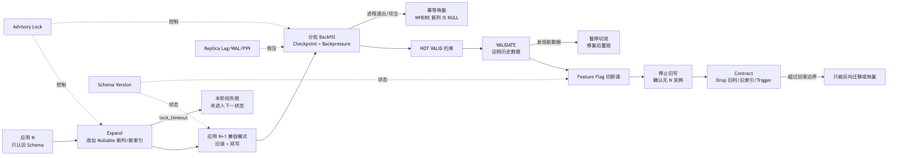
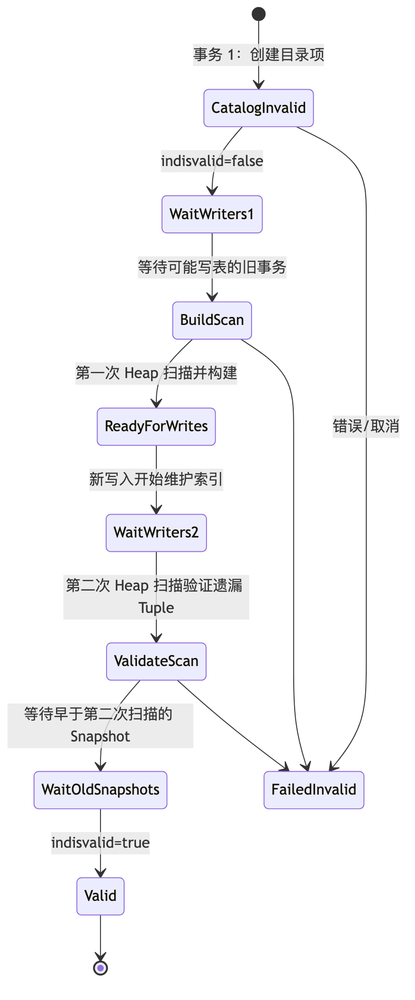

# 第 15 章：在线 DDL、Expand-Contract 与零停机 Schema 迁移

> **技术基线**：PostgreSQL 18；同时标注 PostgreSQL 14、15、16、17、18 的关键差异。Go 示例使用 `github.com/jackc/pgx/v5` 与 `pgxpool`，不绑定补丁版本。
>
> **核心结论**：PostgreSQL 没有“完全不加锁的 DDL”。生产级在线迁移的目标，是把强锁缩短到可控窗口，把长时间的数据扫描和写放大移出强锁区间，并确保应用 N、N+1 版本、Primary、Replica、CDC 消费者在整个状态机中都保持兼容。

---

## 1. 本章定位

本章解决四类生产问题：

1. **DDL 抢占强锁导致请求雪崩**：一条看似简单的 `ALTER TABLE` 因等待 `ACCESS EXCLUSIVE`，可能在锁队列中放大阻塞。
2. **表重写和回填造成资源冲击**：类型转换、易变默认值、存储生成列等操作可能重写整表；分批回填又会产生大量 WAL、Dead Tuple、索引维护和副本延迟。
3. **滚动发布期间 Schema 不兼容**：旧应用 N 与新应用 N+1 会同时在线，直接 Rename、Drop 或改变类型可能让一部分实例立即失败。
4. **故障切换后迁移状态不明确**：Migration 可能在 Primary 切换、网络中断或 `COMMIT` 返回错误时处于“已提交、未提交或部分阶段完成”的不确定状态。

本章依赖：

- 第 9 章的 MVCC 与 Snapshot；
- 第 11 章的表锁、锁队列、死锁与长事务；
- 第 13 章的 WAL、Checkpoint 与 Crash Recovery；
- 第 14 章的分区生命周期。

本章为第 16 章的 pgx 连接池与生产级数据库访问层提供 Schema 兼容基础。

本章不深入展开：第三方在线重组工具、跨大版本升级工具链、复杂逻辑复制拓扑切换、触发器内部执行器源码，以及 `pg_repack`、`pgroll` 等项目的具体运维方式。

---

## 2. 可验证的学习目标

完成本章后，你应能够：

1. 根据 PostgreSQL 官方文档和实际版本，判断某个 `ALTER TABLE` 子命令所需的表锁及是否可能重写表。
2. 使用 `pg_locks`、`pg_stat_activity`、`pg_blocking_pids()` 找到 DDL 的硬阻塞者和软阻塞者。
3. 通过 `pg_class.relfilenode`、`pg_attribute.atthasmissing`、`pg_index.indisvalid`、`pg_constraint.convalidated` 识别迁移的内部状态。
4. 在大表上用 `CHECK ... NOT VALID → VALIDATE CONSTRAINT → SET NOT NULL` 安全增加 `NOT NULL`。
5. 用 `CREATE UNIQUE INDEX CONCURRENTLY` 加索引，再用 `ADD CONSTRAINT ... USING INDEX` 转成唯一约束。
6. 解释 `CREATE INDEX CONCURRENTLY` 的多事务、两次扫描、旧 Snapshot 等待与 Invalid Index 恢复过程。
7. 判断类型变更何时可能是 Binary-Coercible 元数据路径，何时应使用 Shadow Column。
8. 设计应用 N/N+1 的双读、双写、Feature Flag、回填、校验、切流与 Contract 顺序。
9. 编写可暂停、可恢复、幂等、有界并发、带 Advisory Lock 和 Checkpoint 的 Go 迁移程序。
10. 根据 WAL、I/O、锁等待、P95/P99、连接池等待和副本 Replay Lag 调整回填速率。
11. 在 Planned Switchover 或 Unplanned Failover 后，判定迁移应继续、回滚还是人工对账。
12. 为物理复制、逻辑复制和 CDC 分别制定 Schema 兼容策略。

---

## 3. 核心术语

| 中文名称 | 英文名称 | 准确定义 | 容易混淆的概念 | 所属层次 |
|---|---|---|---|---|
| 在线 DDL | Online DDL | 在业务持续服务期间执行，并把阻塞、资源放大和兼容风险控制在 SLO 内的 Schema 变更 | “不加锁 DDL” | 数据库/运维 |
| 扩展-收缩 | Expand-Contract | 先添加兼容结构，再迁移数据和流量，最后删除旧结构的多阶段模式 | 一次性 Rename/Drop | 架构/发布 |
| 表重写 | Table Rewrite | 读取旧 Heap Tuple、生成新 Tuple 并写入新 Relation 文件的过程，通常伴随索引重建和大量 WAL | 仅扫描表 | 存储 |
| 元数据变更 | Metadata-only Change | 主要修改系统目录，不逐行改写现有 Heap Tuple；仍通常需要短暂强锁 | 完全无成本 | 系统目录 |
| 快速默认值 | Fast Default | 添加带非易变默认值的列时，把一次求值结果记录为“缺失值”元数据，而非逐行写入 | 对每行执行默认表达式 | 系统目录/存储 |
| 易变函数 | Volatile Function | 同一语句内多次调用也可能返回不同结果或产生副作用的函数，如 `clock_timestamp()` | `STABLE` 的 `now()` | 表达式 |
| 未验证约束 | NOT VALID Constraint | 对后续写入执行约束，但暂不证明所有历史行满足约束 | `NOT ENFORCED` | 约束状态机 |
| 约束验证 | VALIDATE CONSTRAINT | 扫描历史数据，将约束从未验证状态转为已验证状态 | 再次添加约束 | DDL/扫描 |
| 并发建索引 | Concurrent Index Build | 允许普通写入继续的多阶段索引构建；代价是更多扫描、等待与失败残留状态 | 普通 `CREATE INDEX` | 索引 |
| 无效索引 | Invalid Index | `pg_index.indisvalid=false` 的索引；Planner 不用于查询，但可能仍承担写维护成本 | 损坏索引 | 系统目录/索引 |
| 二进制可强制转换 | Binary-Coercible | 两个类型在物理表示上可直接解释，不必逐值重编码；是否免重写仍取决于 `USING` 和索引等条件 | 任意隐式 Cast | 类型系统 |
| 影子列 | Shadow Column | 为新类型或新语义新增的并行列，用于渐进回填、双写和切流 | 临时表 | Schema 设计 |
| 回填 | Backfill | 将历史行逐批转换或补齐到新结构的过程 | 一次性整表 UPDATE | 数据迁移 |
| 双写 | Dual Write | 同一业务变更同时维护新旧表示 | 分布式双写到两个独立系统 | 应用兼容 |
| 读回退 | Read Fallback | 优先读新列，缺失时从旧列转换读取，支持回填期间兼容 | 永久 `COALESCE` | 应用兼容 |
| 功能开关 | Feature Flag | 独立控制读路径、写路径或校验策略的可回滚控制面 | 代码发布本身 | 控制面 |
| 迁移互斥锁 | Migration Advisory Lock | 使用 PostgreSQL Advisory Lock 保证同一迁移只有一个控制器运行 | 表级锁 | 运维协调 |
| Schema 版本 | Schema Version | 数据库已经完成到哪个迁移阶段的持久化标识 | 应用二进制版本 | 控制面 |
| 回滚边界 | Rollback Boundary | 超过后无法仅通过回滚应用二进制恢复，必须执行数据恢复或反向迁移的阶段 | 事务 Savepoint | 发布策略 |
| Fencing | Fencing | 阻止旧 Primary 或旧迁移控制器继续写入的隔离机制 | 仅停止应用进程 | 高可用 |

---

## 4. 整体心智模型



### 4.1 数据流

旧列保存当前生产事实。Expand 后，新写入由应用或 Trigger 同步到新列；历史行由 Backfill 转换。验证完成后，读流量切到新列，最后停止维护旧列并 Contract。

### 4.2 控制流

Migration Controller 先取得 Advisory Lock，再根据 Schema Version 执行一个明确阶段。Feature Flag 控制应用读写路径；SRE 根据锁等待、WAL、Replay Lag 和业务 P99 暂停或恢复回填。

### 4.3 状态变化

典型状态为：

```text
absent → expanded → dual_writing → backfilling → backfilled
       → constrained_not_valid → validated → reading_new
       → old_write_stopped → contracted
```

每个状态必须有**入口条件、完成证明、可重入 SQL 和回滚动作**。不要用“脚本执行到第几行”充当状态机。

### 4.4 故障路径

- DDL 获取不到锁：由 `lock_timeout` 快速失败，避免无限排队。
- Backfill 进程退出：已提交批次保留，重启后继续处理 `new_col IS NULL`。
- `CREATE INDEX CONCURRENTLY` 失败：可能留下 Invalid Index，必须检查并清理。
- 切主：新 Primary 上重新获取 Advisory Lock，依据复制后的 Schema Version 和目录状态继续。
- Contract 后回滚旧应用：旧应用可能引用已删除列，因此 Contract 是明确的破坏性边界。

---

## 5. 使用方式

### 5.1 先确认服务器版本与目标对象

```sql
SELECT version();
SHOW server_version_num;

SELECT
    c.oid::regclass AS relation,
    c.relkind,
    c.relpersistence,
    c.relfilenode,
    pg_size_pretty(pg_relation_size(c.oid)) AS heap_size,
    pg_size_pretty(pg_indexes_size(c.oid)) AS index_size,
    pg_size_pretty(pg_total_relation_size(c.oid)) AS total_size
FROM pg_class AS c
WHERE c.oid = 'public.orders'::regclass;
```

`relfilenode` 可辅助判断是否发生文件级重写，但不是跨 Tablespace、某些 Catalog 特例下的通用业务标识；不要把它持久化为应用逻辑。

### 5.2 为 DDL 设置可控超时

```sql
BEGIN;
SET LOCAL application_name = 'ddl-20260620-orders-region';
SET LOCAL lock_timeout = '2s';
SET LOCAL statement_timeout = '20min';
SET LOCAL idle_in_transaction_session_timeout = '60s';

-- 放置允许在事务块内运行的 ALTER TABLE。
ALTER TABLE public.orders ADD COLUMN region_code text;
COMMIT;
```

关键区别：

- `lock_timeout` 只限制等待锁的时间；锁一旦获得，语句仍可能运行很久。
- `statement_timeout` 限制整条语句，从服务器收到命令起计时。
- `idle_in_transaction_session_timeout` 终止“事务已打开但客户端不再发语句”的会话，降低长 Snapshot 和锁长期占用风险。
- `CREATE INDEX CONCURRENTLY` **不能运行在事务块中**，应使用专用会话设置 Session 级超时后单独执行。

```sql
SELECT set_config('lock_timeout', '2s', false);
SELECT set_config('statement_timeout', '2h', false);
CREATE INDEX CONCURRENTLY idx_orders_region ON public.orders(region_code);
```

不要把很小的全局 `statement_timeout` 或 `lock_timeout` 直接写进 `postgresql.conf` 作为迁移专用配置，否则会影响所有工作负载。

### 5.3 常见操作的锁与重写判断

> 表中描述的是主导风险。一个语句还可能获取系统目录锁、索引锁、行锁或其他对象锁；多个 `ALTER TABLE` 子命令会取得其中最严格的锁。PostgreSQL 对未明确说明的 `ALTER TABLE` 子命令默认获取 `ACCESS EXCLUSIVE`。[^alter-table]

| 操作 | 主要表锁/并发行为 | 历史行扫描 | 表重写 | 生产判断 |
|---|---|---:|---:|---|
| `ADD COLUMN new_col type`，允许 NULL | 短暂 `ACCESS EXCLUSIVE` | 否 | 否 | 通常可在线，但必须防锁队列放大 |
| 添加非易变 Constant Default | 短暂 `ACCESS EXCLUSIVE` | 否 | 否 | PostgreSQL 11+ 快速默认值路径 |
| 添加 Volatile Default | 长时间强锁风险 | 是 | 是 | 大表避免直接执行 |
| `ADD CHECK ... NOT VALID` | 通常短暂 `ACCESS EXCLUSIVE` | 否 | 否 | 新写入立即受约束，历史数据待验证 |
| `VALIDATE CONSTRAINT` | `SHARE UPDATE EXCLUSIVE` | 是 | 否 | 普通 DML 可继续；会与部分维护命令冲突 |
| `SET NOT NULL` | `ACCESS EXCLUSIVE` | 通常是 | 否 | 有有效 CHECK 证明时可跳过全表扫描 |
| 普通 `CREATE INDEX` | `SHARE`，阻塞写入 | 是 | 索引构建 | 大表生产通常不可接受 |
| `CREATE INDEX CONCURRENTLY` | 允许普通 DML；需等待旧事务 | 两次主要 Heap 扫描 | 不重写 Heap | 更慢、更耗资源，失败会残留 Invalid Index |
| `ADD UNIQUE ... USING INDEX` | 短暂强锁；复用已有索引 | 通常否 | 否 | 先并发建唯一索引，再快速附加约束 |
| Binary-Coercible 类型变更 | 通常仍需短暂强锁 | 视情况 | 可能免 Heap 重写 | 必须在目标版本实测并检查索引重建 |
| 一般 `ALTER COLUMN TYPE` | `ACCESS EXCLUSIVE` | 是 | 通常是 | 大表优先 Shadow Column |
| `RENAME COLUMN` | 短暂强锁、Catalog 变更 | 否 | 否 | 数据成本低，兼容风险高 |
| `DROP COLUMN` | 短暂强锁、Catalog 标记删除 | 否 | 否 | 空间不会立即归还；旧应用会失败 |
| `ATTACH PARTITION` | Parent `SHARE UPDATE EXCLUSIVE`；被挂表 `ACCESS EXCLUSIVE` | 可被预验证 CHECK 避免 | 否 | Default Partition 还可能被扫描/锁定 |

### 5.4 安全添加列

#### 允许 NULL 的新列

```sql
ALTER TABLE public.accounts
ADD COLUMN risk_tier smallint;
```

#### 非易变默认值的快速添加

```sql
ALTER TABLE public.accounts
ADD COLUMN status text NOT NULL DEFAULT 'active';
```

PostgreSQL 会把一次求值结果存入元数据，旧 Tuple 在读取时表现为该默认值，而不是立即逐行更新。`now()` 是 `STABLE`，通常会在 `ALTER TABLE` 时求值一次；`clock_timestamp()` 是 `VOLATILE`，会触发表重写。不要只看表达式“像不像常量”，应检查函数波动性。

```sql
SELECT proname, provolatile
FROM pg_proc
WHERE oid IN ('now()'::regprocedure, 'clock_timestamp()'::regprocedure);
-- i = immutable, s = stable, v = volatile
```

### 5.5 跨 PG14–PG18 的安全 NOT NULL 模式

```sql
ALTER TABLE public.accounts
ADD CONSTRAINT accounts_risk_tier_nn_ck
CHECK (risk_tier IS NOT NULL) NOT VALID;

ALTER TABLE public.accounts
VALIDATE CONSTRAINT accounts_risk_tier_nn_ck;

ALTER TABLE public.accounts
ALTER COLUMN risk_tier SET NOT NULL;

-- 可在另一个短锁窗口删除冗余 CHECK；也可暂时保留。
ALTER TABLE public.accounts
DROP CONSTRAINT accounts_risk_tier_nn_ck;
```

有效的 CHECK 可以向 PostgreSQL 证明不存在 NULL，使最后一步跳过全表扫描；最后一步仍需要 `ACCESS EXCLUSIVE`，所以要用小 `lock_timeout` 控制等待。

[PG18] `NOT NULL` 已纳入 `pg_constraint`，可命名并支持 `NOT VALID`。为兼容 PG14–PG17，本章实验仍采用 CHECK 过渡模式。

### 5.6 安全增加唯一约束

```sql
CREATE UNIQUE INDEX CONCURRENTLY ux_users_tenant_email
ON public.users (tenant_id, lower(email));
```

表达式索引不能直接被 `UNIQUE ... USING INDEX` 接管为普通唯一约束。若目标是表约束，应创建满足要求的唯一 B-tree：列引用、默认排序、非 Partial、非 Expression。

```sql
CREATE UNIQUE INDEX CONCURRENTLY ux_users_tenant_external_id
ON public.users (tenant_id, external_id);

ALTER TABLE public.users
ADD CONSTRAINT users_tenant_external_id_key
UNIQUE USING INDEX ux_users_tenant_external_id;
```

附加前必须确认索引有效：

```sql
SELECT
    i.indexrelid::regclass AS index_name,
    i.indisready,
    i.indisvalid,
    i.indislive,
    pg_get_indexdef(i.indexrelid) AS definition
FROM pg_index AS i
WHERE i.indexrelid = 'public.ux_users_tenant_external_id'::regclass;
```

### 5.7 诊断 blocker 与锁队列

```sql
SELECT
    a.pid,
    a.application_name,
    a.usename,
    a.state,
    a.xact_start,
    a.query_start,
    a.wait_event_type,
    a.wait_event,
    pg_blocking_pids(a.pid) AS blocking_pids,
    left(a.query, 200) AS query
FROM pg_stat_activity AS a
WHERE a.datname = current_database()
ORDER BY a.xact_start NULLS LAST, a.query_start;
```

```sql
SELECT
    l.pid,
    l.locktype,
    l.relation::regclass AS relation,
    l.mode,
    l.granted,
    l.waitstart,
    a.application_name,
    a.state,
    a.xact_start,
    left(a.query, 160) AS query
FROM pg_locks AS l
LEFT JOIN pg_stat_activity AS a USING (pid)
WHERE l.relation = 'public.orders'::regclass
ORDER BY l.granted, l.waitstart NULLS LAST;
```

优先使用 `pg_blocking_pids()`，因为它同时理解硬冲突和锁队列中的软阻塞；简单自连接 `pg_locks` 容易忽略队列顺序。[^pg-locks]

---

## 6. 底层原理

### 6.1 DDL 不是“拿到锁后改一行 Catalog”这么简单

一次 DDL 的典型时间线为：

```text
解析与权限检查
  → 获取目标 Relation 与 Catalog 所需锁
  → 等待冲突事务结束
  → 修改系统目录
  → 可选：扫描 Heap
  → 可选：生成新 Heap / 重建索引
  → 写 WAL
  → Commit 后其他 Session 才看到新 Schema
```

DDL 在 PostgreSQL 中通常是事务性的，但 `CREATE INDEX CONCURRENTLY` 是一个重要例外：它由多个内部事务和等待阶段构成，不能被包在用户事务块中。

#### 锁队列放大

假设：

1. Session A 持有 `ROW EXCLUSIVE`，并长时间不提交。
2. Session B 发起需要 `ACCESS EXCLUSIVE` 的 `ALTER TABLE`，进入等待队列。
3. Session C 之后发起普通查询或写入。

为了避免锁请求长期饥饿，新请求可能排在等待中的强锁之后。结果是：真正的根因是 A 的长事务，但业务监控看到大量请求被 B 阻塞。这就是为什么“DDL 还没拿到锁，应该没有影响”是错误判断。

### 6.2 Fast Default 与 Table Rewrite

添加新列时，PostgreSQL 18 的关键目录状态包括：

- `pg_attribute.atthasdef`：列是否有默认表达式；
- `pg_attribute.atthasmissing`：旧 Tuple 是否需要使用元数据中的缺失值；
- `pg_attribute.attmissingval`：非易变默认值的一次求值结果；
- `pg_attrdef`：默认表达式本身。

当默认表达式非易变时：

```text
旧 Heap Tuple：没有新列的物理 datum
pg_attribute：记录 missing value
读取旧 Tuple：Executor 以 missing value 构造逻辑列值
未来 INSERT：按当前 DEFAULT 写入真实值
未来表重写：missing value 被实体化
```

当默认表达式为 `VOLATILE`、新列是 Stored Generated、Identity，或受约束 Domain 等情况时，PostgreSQL 需要为每行计算值，从而重写表和索引。[^alter-table]

重写通常会：

- 分配新的 Relation 文件；
- 顺序读取旧 Heap；
- 生成新 Tuple；
- 重建相关索引；
- 产生大量 WAL；
- 暂时需要接近“旧对象 + 新对象”的额外空间；
- 让旧 Snapshot 面临重写操作的 MVCC 特殊行为，因此不能把长事务与重写混在一起。

### 6.3 `NOT VALID` 把“建立规则”和“证明历史”拆开

`CHECK`、Foreign Key，以及 [PG18] NOT NULL 可以先以 `NOT VALID` 加入：

```text
Catalog 中存在约束
convalidated = false
新 INSERT/UPDATE 必须满足约束
Planner 不能假设全部历史行满足约束
```

`VALIDATE CONSTRAINT` 使用 `SHARE UPDATE EXCLUSIVE` 扫描历史行。这个锁与普通 `ROW EXCLUSIVE` DML 兼容，因此验证通常不会阻塞普通写入；但它会和 `VACUUM`、`ANALYZE`、并发建索引、其他相同锁级别维护任务产生冲突。

验证成功后：

```text
pg_constraint.convalidated = true
```

随后 `SET NOT NULL` 可利用已验证 CHECK 作为证明，跳过再次全表扫描。要点是：

- **长时间扫描**发生在较弱锁下；
- **强锁**只用于快速修改列属性；
- 强锁等待仍需 `lock_timeout` 保护。

### 6.4 `CREATE INDEX CONCURRENTLY` 的状态机

普通 `CREATE INDEX` 只扫描一次，但使用 `SHARE` 锁阻止写入。并发构建允许写入继续，代价是更多工作和更复杂的状态机。[^create-index]



相关目录字段：

- `indisready=false`：尚未准备好接收 INSERT/UPDATE 维护；
- `indisready=true, indisvalid=false`：写入可能已经维护它，但 Planner 不能使用；
- `indisvalid=true`：可用于查询；
- `indislive=false`：索引正在被删除，不再使用。

失败后的 Invalid Index 可能仍增加写入成本。对于并发唯一索引，更危险的是：即使命令最终失败，唯一性检查也可能已开始生效。恢复前必须先检查目录，而不是盲目重复同名语句。

限制包括：

- 不能运行在事务块内；
- 同一表一次只能有一个 Concurrent Index Build；
- 分区表父索引不支持直接并发构建，应逐分区并发建索引，再创建/附加父级分区索引；
- 构建包含两次主要表扫描，并等待旧事务，通常比普通构建更慢。

### 6.5 类型变更：Binary-Coercible 不等于“永远安全”

`ALTER COLUMN TYPE` 通常重写整个表和索引。免 Heap 重写的例外需要同时满足：

1. `USING` 不改变列内容；
2. 旧类型对新类型是 Binary-Coercible，或旧类型是新类型上的无约束 Domain；
3. 索引仍可能需要重建，除非系统能证明逻辑等价。

官方示例中，`text` 与 `varchar` 在不改变 Collation 时可以避免 Heap 重写，且其排序逻辑等价时也可避免索引重建。[^alter-table]

不要仅凭“都是整数”“Cast 很快”判断。以下情况通常应选择 Shadow Column：

- `text → bigint/numeric/timestamptz`；
- 单位或语义变化，如“元字符串 → 分整数”；
- Collation 改变；
- 需要清洗异常值；
- 迁移期间必须保持 N/N+1 同时在线；
- 目标类型转换会锁住大表或超出空间/WAL 预算。

### 6.6 Shadow Column 的写入一致性

Shadow Column 有三种同步策略：

| 策略 | 优点 | 风险 | 适用阶段 |
|---|---|---|---|
| 应用双写 | 逻辑显式、易观测、可与 Feature Flag 联动 | 旧版本应用不会写新列；遗漏代码路径会漂移 | 已能部署 N+1 时首选 |
| 数据库 Trigger | 覆盖旧应用和临时 SQL；数据库内原子 | 每次写增加 CPU；逻辑隐蔽；错误可放大写入失败 | 滚动发布保护层 |
| Generated Column | 自动派生，无双写漂移 | 表达式限制；Stored 会占空间，添加时可能重写；Virtual 读时耗 CPU | 纯函数派生且版本支持 |

应用双写与 Trigger 同时存在时必须定义单一事实源。例如在兼容阶段以旧列为源，Trigger 只负责“旧列变化时派生新列”，N+1 仍提交一致的双值；不要让双向 Trigger 互相覆盖并造成循环语义。

### 6.7 Expand-Contract 与 N/N+1 兼容矩阵

| 阶段 | 应用 N | 应用 N+1 | 数据库要求 | 可回滚性 |
|---|---|---|---|---|
| Expand 前 | 读写旧列 | 尚未上线 | 仅旧列 | 完全 |
| Expand 后 | 读写旧列 | 可上线 | 新列 Nullable，旧路径不受影响 | 完全 |
| 兼容写 | 旧写；Trigger 可补新列 | 双写 | 两种写法都合法 | 完全 |
| Backfill | 正常 | 正常 | 新列逐步完整 | 完全 |
| 切新读 | 不应再有 N，或 N 仍读旧 | 优先读新并保留回退 | 验证完成 | 可快速切回旧读 |
| 停旧写 | N 必须清零 | 只维护新语义 | 旧列不再保证新鲜 | 回滚需反向同步 |
| Contract | N 永远不能回归 | 只认新 Schema | Drop 旧列/旧索引 | 破坏性边界 |

推荐把 Feature Flag 拆成至少两个独立开关：

```text
read_from_new = false/true
write_mode = old_only/dual/new_only
```

不要用一个开关同时改变读写路径，否则难以在异常时只回滚读流量或只恢复双写。

### 6.8 Rename 与 Drop 的兼容问题

`RENAME COLUMN` 是 Catalog 级操作，物理数据几乎不动，但 SQL 名称立刻改变：

- 旧应用 Prepared Statement、ORM 映射、手写 SQL 会失败；
- 视图、函数、依赖对象通常会由 PostgreSQL 跟踪重写，但外部应用字符串不会；
- CDC 消费者按列名解析时可能发生 Schema Break。

因此零停机 Rename 本质上不是 Rename，而是：

```text
ADD 新列 → 双写 → 回填 → 切读 → 停旧写 → DROP 旧列
```

`DROP COLUMN` 主要把 `pg_attribute.attisdropped` 标记为真，旧 Tuple 中的物理空间不会立即回收。要回收通常需要未来的表重写。Drop 前必须排查：

- 旧二进制实例；
- Prepared Statement 和连接池中的旧连接；
- `SELECT *` 返回列序变化；
- View、Function、Trigger、Publication、CDC Schema；
- BI、ETL、临时脚本和离线任务。

### 6.9 Enum 变更

```sql
ALTER TYPE public.order_status
ADD VALUE IF NOT EXISTS 'refunded' AFTER 'paid';
```

在事务中添加 Enum Value 后，新值必须等该事务提交后才能使用。部署顺序应为：

```text
先提交 ADD VALUE → 再发布会写入/读取新值的应用
```

删除 Enum Value 没有直接语法，通常需要新建类型、转换数据并切换；大表上应按 Shadow Column 思路处理。Rename Enum Value 虽是元数据操作，但仍会破坏硬编码旧字符串的应用和消费者。

### 6.10 Generated Column 的版本差异

- [PG14–PG17] 核心 PostgreSQL 仅实现 Stored Generated Column，必须写 `STORED`。
- [PG18] 支持 `STORED | VIRTUAL`，默认是 `VIRTUAL`。Virtual 不占列存储，读取时计算；Stored 在写入时计算并保存。[^generated]
- 添加 Stored Generated Column 会重写整表；添加 Virtual Generated Column 不重写。
- Generated Expression 必须满足不可变性等限制，不能任意调用易变函数或子查询。
- [PG18] 逻辑复制可发布 Stored Generated Column；Virtual Generated Column 不能作为已发布生成列依赖。

生产 DDL 应显式写 `STORED` 或 `VIRTUAL`，不要依赖 PG18 默认值，以免同一 SQL 在不同版本表现不同。

### 6.11 安全 `ATTACH PARTITION`

直接 Attach 一个已有大表时，PostgreSQL 可能扫描整个被挂表以证明所有行满足 Partition Bound。若存在 Default Partition，还可能扫描 Default Partition 证明没有行属于新分区。

推荐：

1. 在独立表上先创建与分区边界等价的 CHECK；
2. `VALIDATE CONSTRAINT`；
3. 预先创建与父表匹配的索引和约束；
4. 选择低峰期执行 `ATTACH PARTITION`；
5. Attach 成功后再删除冗余 CHECK。

```sql
ALTER TABLE public.events_2026_07
ADD CONSTRAINT events_2026_07_bound_ck
CHECK (event_time >= DATE '2026-07-01'
   AND event_time <  DATE '2026-08-01') NOT VALID;

ALTER TABLE public.events_2026_07
VALIDATE CONSTRAINT events_2026_07_bound_ck;

ALTER TABLE public.events
ATTACH PARTITION public.events_2026_07
FOR VALUES FROM ('2026-07-01') TO ('2026-08-01');
```

### 6.12 WAL、Replica 与 CDC

不同迁移的 WAL 特征不同：

- Catalog-only DDL：WAL 相对少，但仍需复制和 Replay；
- `VALIDATE CONSTRAINT`：主要是读取和 CPU，通常不逐行写数据；
- Backfill：每批产生 Heap 新版本、可能产生索引记录、Full Page Image 和 Vacuum 债务；
- Table Rewrite：新 Heap 和索引的大量 WAL，空间与 Replay 压力高；
- `CREATE INDEX CONCURRENTLY`：产生索引页 WAL，并额外扫描 Heap。

物理复制会重放 DDL 和数据变化，但异步 Replica 可能长时间落后。逻辑复制默认**不复制 DDL 和 Sequence 状态**；Publisher 与 Subscriber Schema 必须由部署系统协调。官方建议在兼容的 Additive Change 中通常先扩展 Subscriber，再扩展 Publisher 和发布应用，避免 Publisher 先产生 Subscriber 无法接收的行。[^logical-replication]

CDC 还需处理：

- Schema Registry/事件版本；
- 双列同时存在期间的字段优先级；
- Rename 被解释为“删旧字段 + 加新字段”；
- Snapshot 与增量流的 Schema 切换点；
- Consumer 回滚能力。

### 6.13 回滚边界

把迁移分为三类边界：

1. **可立即回滚**：只 Add Nullable、新索引、新约束未切流；可回滚应用并保留多余 Schema。
2. **需数据对账后回滚**：已切新读或停止旧写，但旧列仍在；必须确认旧列是否仍同步。
3. **破坏性边界**：已 Drop 旧列、删除旧枚举语义、不可逆转换或超出备份保留；回滚需要反向迁移、PITR 或从备份恢复。

任何 Contract 变更都应满足：

```text
所有旧实例 = 0
旧连接/Prepared Statement 已自然淘汰或主动刷新
CDC/ETL/BI 已升级
新路径稳定超过既定观察窗口
备份与恢复验证满足 RPO/RTO
变更已通过独立审批
```

---

## 7. 内部数据结构和状态

### 7.1 关键系统目录

| 目录/视图 | 关键字段 | 迁移意义 |
|---|---|---|
| `pg_attribute` | `atttypid`, `atttypmod`, `attnotnull`, `atthasdef`, `atthasmissing`, `attmissingval`, `attgenerated`, `attisdropped` | 列类型、Fast Default、生成列、NOT NULL、Drop 状态 |
| `pg_constraint` | `contype`, `convalidated`, `conenforced`, `conindid`, `conbin` | 约束种类、验证状态、关联索引 |
| `pg_index` | `indisready`, `indisvalid`, `indislive`, `indisunique` | Concurrent Index Build 状态 |
| `pg_class` | `relfilenode`, `relpages`, `reltuples`, `relkind` | Relation 文件与规模估计 |
| `pg_locks` | `mode`, `granted`, `waitstart`, `relation`, `transactionid` | 锁请求与等待状态 |
| `pg_stat_activity` | `xact_start`, `query_start`, `state`, `wait_event_type`, `wait_event` | 长事务和当前等待 |
| `pg_stat_progress_create_index` | `phase`, `lockers_*`, `blocks_*`, `tuples_*` | 索引构建进度与阻塞阶段 |
| `pg_stat_replication` | `sent_lsn`, `write_lsn`, `flush_lsn`, `replay_lsn`, `*_lag` | 物理副本传输、持久化和 Replay 进度 |
| `pg_stat_wal` | `wal_records`, `wal_fpi`, `wal_bytes`, `wal_buffers_full` | WAL 放大 |
| `pg_stat_io` | `backend_type`, `object`, `context`, `read_bytes`, `write_bytes`, `read_time`, `write_time` | 集群级 I/O 路径 |

### 7.2 检查 Fast Default

```sql
SELECT
    a.attname,
    a.atthasdef,
    a.atthasmissing,
    a.attmissingval,
    pg_get_expr(d.adbin, d.adrelid) AS default_expression
FROM pg_attribute AS a
LEFT JOIN pg_attrdef AS d
  ON d.adrelid = a.attrelid
 AND d.adnum = a.attnum
WHERE a.attrelid = 'public.accounts'::regclass
  AND a.attnum > 0
  AND NOT a.attisdropped
ORDER BY a.attnum;
```

### 7.3 检查约束状态

```sql
SELECT
    c.conname,
    c.contype,
    c.convalidated,
    c.conenforced,
    c.conindid::regclass AS backing_index,
    pg_get_constraintdef(c.oid, true) AS definition
FROM pg_constraint AS c
WHERE c.conrelid = 'public.accounts'::regclass
ORDER BY c.conname;
```

[PG14–PG17] NOT NULL 主要体现在 `pg_attribute.attnotnull`；[PG18] NOT NULL 约束也被建模到 `pg_constraint`，目录查询要按版本兼容。

### 7.4 检查 Invalid Index

```sql
SELECT
    n.nspname,
    c.relname AS index_name,
    t.relname AS table_name,
    i.indisready,
    i.indisvalid,
    i.indislive,
    i.indisunique,
    pg_size_pretty(pg_relation_size(c.oid)) AS index_size
FROM pg_index AS i
JOIN pg_class AS c ON c.oid = i.indexrelid
JOIN pg_class AS t ON t.oid = i.indrelid
JOIN pg_namespace AS n ON n.oid = c.relnamespace
WHERE NOT i.indisvalid OR NOT i.indisready OR NOT i.indislive
ORDER BY pg_relation_size(c.oid) DESC;
```

### 7.5 Tuple、Page、Buffer 与 WAL

Backfill 的一次 UPDATE 通常不是“原地修改”：

```text
读取旧 Heap Page
  → 在 shared_buffers 中取得 Buffer
  → 创建新 Tuple Version
  → 旧 Tuple xmax 指向更新事务
  → 新 Tuple 可能留在同页，也可能写入其他 Page
  → 若被索引列改变，写新 Index Tuple
  → 写 WAL Record，必要时写 Full Page Image
  → Commit 后由 MVCC 决定可见性
  → 后续 VACUUM 清理旧 Tuple
```

若 Shadow Column 未被索引且页面有空间，更新有机会成为 HOT Update；一旦新列参与索引、页面空间不足或其他条件不满足，就会增加索引写放大和 Bloat。

### 7.6 Snapshot 与重写

长事务持有旧 Snapshot，会：

- 阻止 Concurrent Index Build 完成最终旧 Snapshot 等待；
- 延迟 Vacuum 清理 Backfill 产生的 Dead Tuple；
- 放大 Replica Hot Standby 冲突或 Replay 延迟；
- 让某些 Table Rewrite 的 MVCC 行为更危险。

因此 Schema 迁移前必须把“最老事务年龄”作为准入条件，而不是只看当前 TPS。

---

## 8. 场景和选型决策

| 业务场景 | 推荐方案 | 不推荐方案 | 原因 | 性能代价 | 并发代价 | 一致性代价 | 高可用代价 | 运维复杂度 |
|---|---|---|---|---|---|---|---|---|
| 大表加可空列 | 直接 Add Nullable，短 `lock_timeout` | 长事务高峰直接执行 | Catalog-only，但仍需强锁窗口 | 低 | 短强锁 | 低 | 低 | 低 |
| 大表加固定默认值 | 非易变 Fast Default；显式验证版本 | 先 Add 再一次性 UPDATE 全表 | Fast Default 避免逐行写 | 低 | 短强锁 | 低 | 低 | 低 |
| 默认值含 `clock_timestamp()` | 先 Add Nullable，应用写值，分批回填 | 直接 Add Volatile Default | 直接执行会重写表 | 高但可节流 | 批次行锁 | Replica Lag | WAL 高 | 中 |
| 现有列加 NOT NULL | CHECK NOT VALID → Backfill → Validate → Set | 直接 `SET NOT NULL` | 把扫描移出强锁 | 中 | 最后短强锁 | 验证失败可暂停 | Replay 主要来自回填 | 中 |
| 大表加唯一约束 | Unique Index Concurrently → Using Index | 直接 Add Unique | 直接约束通常阻塞写 | 高 CPU/I/O | DML 可继续 | 重复数据会失败 | WAL/Lag 中高 | 中 |
| `text` 改业务金额类型 | Shadow Column + 双写 + Backfill | 直接 ALTER TYPE | 可清洗异常、支持 N/N+1 | 高但可控 | 行级竞争 | 需漂移校验 | WAL/CDC 高 | 高 |
| 列改名 | Add 新列并迁移 | 直接 Rename | Rename 破坏旧 SQL | 中 | 低 | 双写期需一致 | CDC 需升级 | 高 |
| 删除旧列 | 观察窗口后独立 Contract | 与新应用同批 Drop | 无法快速回滚旧应用 | 低 | 短强锁 | 破坏性 | 故障回滚困难 | 中 |
| 添加 Enum Value | 先 DDL Commit，再部署应用 | 同事务添加后立即使用 | 新值提交前不可用 | 低 | 短锁 | 版本字符串兼容 | 逻辑复制需同步 Schema | 低 |
| 挂载已有大分区 | 预验证 Bound CHECK 后 Attach | 直接 Attach 未证明的大表 | 避免 Attach 时长扫描 | 预验证中 | Attach 短锁 | 边界需正确 | Replica 回放目录变更 | 中 |
| 持续高写大表回填 | 小批次、有界并发、Backpressure | 单事务全表 UPDATE | 限制 WAL、锁与 Vacuum 债务 | 可调 | 可调 | 最终一致 | Lag 可控 | 高 |
| 多实例自动迁移 | 独立 Migrator + Advisory Lock | 每个应用实例启动时执行 | 防止并发 DDL 与启动风暴 | 低 | 低 | 状态清晰 | 切主可恢复 | 中 |

---

## 9. 高性能分析

### 9.1 任何参数建议之前必须记录基线

至少记录：

```text
PostgreSQL 精确版本与补丁级别
表行数、Heap/Index/TOAST 大小、平均行宽
目标列 NULL 比例、值分布、异常数据比例
业务并发、读写比例、热点 Key
CPU、内存、shared_buffers
磁盘类型、吞吐、IOPS、延迟、文件系统
同步/异步复制模式与副本数量
业务 P50/P95/P99 和错误率 SLO
当前 WAL 速率、Checkpoint、Vacuum、Replica Lag
缓存冷/热状态
```

没有这些基线，`batch_size=1000` 或 `workers=4` 只是未经验证的猜测。

### 9.2 操作成本分解

| 操作 | CPU | I/O | WAL | 索引维护 | 空间放大 | Vacuum 债务 |
|---|---|---|---|---|---|---|
| Add Nullable | 很低 | Catalog | 很低 | 无 | 极低 | 无 |
| Fast Default | 很低 | Catalog | 很低 | 无 | 极低 | 无 |
| Validate CHECK | 表达式计算 | 顺序/缓存读取 | 很低 | 无 | 无 | 无 |
| Backfill UPDATE | 转换与 Trigger CPU | Heap 读写 | 高 | 取决于 HOT/索引 | Dead Tuple | 高 |
| Table Rewrite | 转换 CPU | 大量顺序读写 | 很高 | 常需重建 | 接近双份对象 | 旧对象由事务完成后替换 |
| CIC | 排序/比较 CPU | 两次主要 Heap 扫描 + Index 写 | 中高 | 构建新索引 | 新索引大小 | 通常不产生 Heap Dead Tuple |
| 双写 Trigger | 每次写执行函数 | 额外 Buffer 访问可能较少 | 额外列变化 WAL | 视索引而定 | 新列/索引 | 更新产生 Dead Tuple |

### 9.3 CPU、内存与 Temporary File

- 类型转换、正则清洗、JSON 解析、Trigger 是 Backfill 的主要 CPU 成本。
- B-tree 构建需要排序内存；`maintenance_work_mem` 作用于整个索引构建，而不是简单乘以并行 Worker，但并发多个索引构建仍会叠加内存消耗。
- 内存不足会落盘产生 Temporary File，应监控 `log_temp_files`、数据库临时文件字节数和磁盘延迟。
- 不要同时在多张大表上启动大量 CIC；单表限制一个并发构建并不限制整个集群同时过载。

### 9.4 shared_buffers、OS Page Cache 与 I/O

- 热缓存验证可能主要消耗 CPU 和 Buffer Hit；冷缓存验证会把整表读入，挤压业务热页。
- Backfill 读旧页、写脏页，Checkpointer 再刷盘；业务查询可能因缓存污染和写队列变长而抖动。
- OS Page Cache 与 `shared_buffers` 共同影响实际磁盘读。只看 `Buffers: shared hit` 不能证明底层没有 I/O，因为写回与预读仍发生在其他路径。
- 随机回填主键会造成随机 I/O；按主键或物理相关键前进通常更有局部性，但并行 `SKIP LOCKED` 可能打散顺序。

[PG18] AIO 为顺序扫描、Bitmap Heap Scan、Vacuum 等路径提供异步 I/O 基础。扫描型验证或回填查询可能从相关执行路径受益，但不能推断“所有 DDL 自动异步”。应记录 `io_method`、`pg_stat_io`、Wait Event 并在本机存储上实测。[^release18]

### 9.5 网络往返与批次

每行一次 `UPDATE` 会把网络 RTT、Parse/Bind/Execute 和事务开销放大。应使用单条集合 UPDATE 处理一个批次：

```sql
WITH picked AS (
    SELECT id
    FROM public.payments
    WHERE amount_cents IS NULL
    ORDER BY id
    LIMIT $1
    FOR UPDATE SKIP LOCKED
)
UPDATE public.payments AS p
SET amount_cents = round(p.amount_text::numeric * 100)::bigint
FROM picked
WHERE p.id = picked.id;
```

批次过小：网络与 Commit 开销高；批次过大：锁持有时间、WAL 峰值、回滚成本和 Replica Lag 高。应以 P95/P99 和 Lag 作为闭环反馈，而不是只追求迁移吞吐。

### 9.6 记录 WAL 增量

```sql
SELECT pg_current_wal_lsn() AS lsn_before \gset

-- 执行一个受控批次或实验操作

SELECT
    pg_current_wal_lsn() AS lsn_after,
    pg_wal_lsn_diff(pg_current_wal_lsn(), :'lsn_before') AS wal_bytes,
    pg_size_pretty(pg_wal_lsn_diff(pg_current_wal_lsn(), :'lsn_before')) AS wal_pretty;
```

集群级累计计数：

```sql
SELECT wal_records, wal_fpi, wal_bytes, wal_buffers_full, stats_reset
FROM pg_stat_wal;
```

不要在共享测试环境把全部 WAL 增量归因于自己的迁移；应结合时间窗口、应用名、独立环境或审计手段。

### 9.7 Backfill 的执行计划

```sql
BEGIN;
EXPLAIN (
    ANALYZE,
    BUFFERS,
    WAL,
    SETTINGS,
    VERBOSE,
    SUMMARY
)
WITH picked AS (
    SELECT id
    FROM public.payments
    WHERE amount_cents IS NULL
    ORDER BY id
    LIMIT 1000
    FOR UPDATE SKIP LOCKED
)
UPDATE public.payments AS p
SET amount_cents = round(p.amount_text::numeric * 100)::bigint
FROM picked
WHERE p.id = picked.id;
ROLLBACK;
```

`EXPLAIN ANALYZE` 会真正执行 DML。虽然外层事务可以回滚表数据，但 Sequence、外部系统调用、非事务性副作用或某些 Trigger 行为未必能被完全撤销；生产环境必须使用专门样本或影子环境。

### 9.8 P95/P99 与放大指标

重点指标：

- DDL `lock_wait_ms`、失败 SQLSTATE 55P03；
- 业务请求 P95/P99、超时率、连接获取等待；
- Backfill rows/s、batches/s、每批耗时分布；
- WAL bytes/s、FPI/s、`wal_buffers_full`；
- Replica `pg_wal_lsn_diff(current, replay_lsn)` 与 `replay_lag`；
- `n_dead_tup`、Autovacuum 运行时长；
- Buffer Read/Hit、I/O Read/Write Time；
- 新旧列漂移数；
- 新索引大小、DML 延迟增加量。

读放大来自 Fallback 转换或双列读取；写放大来自双写、Trigger、索引和 WAL；空间放大来自 Shadow Column、新索引、Dead Tuple、重写的临时双份文件。

---

## 10. 高并发分析

### 10.1 必须区分六个量

| 指标 | 含义 | 与迁移的关系 |
|---|---|---|
| 应用 goroutine 数 | 应用可调度任务数 | 可远高于数据库连接；无限 goroutine 会形成内存队列 |
| 连接数 | PostgreSQL Backend/Pool Connection 数 | 控制同时占用数据库资源的上限 |
| 活跃查询数 | 当前真正执行或等待的 SQL 数 | 决定 CPU、I/O、锁竞争 |
| TPS | 单位时间提交事务数 | 不等于请求数，也不描述尾延迟 |
| 排队请求数 | 等待连接或准入许可的请求 | 应在应用侧形成有界 Backpressure |
| 数据库锁等待数 | 已有连接中等待锁的语句 | DDL 队列雪崩的直接信号 |

### 10.2 MVCC 与长事务

Backfill 产生新 Tuple Version，不会直接覆盖旧版本。只要旧 Snapshot 仍可能看到旧 Tuple，Vacuum 就不能回收。长事务会同时放大：

- Heap Bloat；
- 索引 Bloat；
- Vacuum 延迟；
- CIC 最终等待；
- Replica Replay/Hot Standby 冲突；
- XID 年龄。

迁移准入建议至少检查：

```sql
SELECT
    pid,
    usename,
    application_name,
    state,
    xact_start,
    now() - xact_start AS xact_age,
    wait_event_type,
    wait_event,
    left(query, 200) AS query
FROM pg_stat_activity
WHERE xact_start IS NOT NULL
ORDER BY xact_start;
```

### 10.3 热点行和热点索引页

- 多个 Backfill Worker 若按同一 Key 区间推进，会争用相同行；`FOR UPDATE SKIP LOCKED` 可减少等待。
- 单调主键上的新 B-tree 可能让并发写集中到右侧叶子页；迁移新增索引会把该热点引入正常业务写路径。
- Trigger 双写更新被索引的新列时，原本可 HOT 的更新可能变成普通更新。
- 不要让每个应用实例各自启动 Worker；实例数扩容会直接扩大数据库写并发。

### 10.4 有界并发与 Admission Control

推荐控制器：

```text
最大 Worker 数
最大每批行数/字节数
最大事务时长
最大 Replica Lag
最大业务 P99 增幅
最大 WAL 速率
最大连接池占用
允许执行的时间窗口
```

触发阈值后应**暂停发新批次**，让在途事务完成；不要通过不断取消已写一半的事务制造额外回滚和重试风暴。

### 10.5 重试与幂等

- `40001` Serialization Failure：重试完整事务。
- `40P01` Deadlock Detected：重试完整事务。
- `55P03` Lock Not Available：DDL 或批次可在有界退避后重试，但先判断是否是持续 blocker。
- `57014` Query Canceled：可能来自 `statement_timeout` 或取消；不应无条件无限重试。

Backfill 使用 `WHERE new_col IS NULL` 和确定性转换，使重复执行不重复累加。若转换涉及外部时间、随机数或非幂等副作用，则不能靠该模式自动恢复。

`COMMIT` 返回网络错误时，事务结果可能不确定。应用不能简单认为“失败即未提交”。本章 Go 示例对未知提交结果停止自动推进，由操作员重新读取数据库状态后恢复；因为回填谓词幂等，恢复不会破坏已完成行。

### 10.6 死锁与事务边界

每批只锁固定顺序的小集合，避免：

- 先按 A 顺序锁一批，再按 B 顺序更新另一表；
- 在事务内调用 Feature Flag 服务、HTTP API 或消息系统；
- 事务打开后等待人工输入；
- 一个事务执行全表回填。

若业务写同时更新多表，迁移需遵守与业务相同的锁顺序。

### 10.7 `idle in transaction` 的特殊风险

`state='idle in transaction'` 表示 Backend 当前没执行 SQL，但事务仍开着：

- 可能持有表锁、行锁和 Snapshot；
- 会让 CIC、Vacuum 和 DDL 等待；
- 单看 CPU 很低，容易被误判为无害。

应为 Migration Session 和应用角色配置合理的 `idle_in_transaction_session_timeout`，并从代码上确保 `BeginTx → defer Rollback → Commit` 闭环。

---

## 11. 高可用分析

### 11.1 RPO 与 RTO

Schema 迁移本身不改变 RPO 定义，但会影响实现 RPO/RTO 的能力：

- 大量 WAL 可能让异步 Replica Lag 增大，扩大故障时实际数据损失窗口。
- 同步复制会把 Replica 写入/Flush 延迟反馈到 Primary Commit，业务 P99 可能上升。
- Table Rewrite 和大索引构建延长恢复、重放和重新同步时间，影响 RTO。
- Contract 破坏旧应用兼容，使故障回滚路径变窄。

### 11.2 物理复制

Primary 上检查：

```sql
SELECT
    application_name,
    state,
    sync_state,
    sent_lsn,
    write_lsn,
    flush_lsn,
    replay_lsn,
    pg_size_pretty(pg_wal_lsn_diff(pg_current_wal_lsn(), replay_lsn)) AS replay_bytes_behind,
    write_lag,
    flush_lag,
    replay_lag
FROM pg_stat_replication;
```

`*_lag` 是近期 WAL 写入、Flush、Replay 的时间观测，不应被当成稳定的绝对字节 backlog；字节差与时间 Lag 应结合看。

Replica 上检查：

```sql
SELECT
    pg_last_wal_receive_lsn(),
    pg_last_wal_replay_lsn(),
    pg_last_xact_replay_timestamp(),
    now() - pg_last_xact_replay_timestamp() AS replay_time_lag;
```

### 11.3 逻辑复制与 CDC

逻辑复制不自动复制 DDL。安全顺序通常为：

```text
Subscriber/CDC Consumer 先支持新增字段
→ Publisher Additive DDL
→ 新应用开始双写/发布新字段
→ 历史数据同步或回填
→ Consumer 切新字段
→ 最后删除旧字段
```

若 Subscriber 先 Drop 旧列，而 Publisher 仍发送包含旧结构的数据，Apply 可能失败；若 Publisher 先发新列，而 Subscriber 没有对应结构，也会失败。需要显式 Schema Version 和部署编排。

### 11.4 Planned Switchover

切换前：

1. 暂停发新 Backfill Batch。
2. 等待在途事务提交。
3. 检查 Replica Replay 到目标 LSN。
4. 确认目标节点 Catalog 状态、Schema Version、Invalid Index 与约束验证状态。
5. Fencing 旧 Primary。
6. 切流后在新 Primary 获取新的 Advisory Lock，再恢复迁移。

Session 级 Advisory Lock 不会跨故障自动“迁移”；这正是所需行为：新 Primary 必须重新竞争控制权。

### 11.5 Unplanned Failover 与提交结果不确定

故障时可能出现：

- Backfill 批次已在旧 Primary Commit，但 WAL 未到新 Primary：异步复制下按 RPO 丢失，需要重新回填。
- 客户端没收到 Commit 响应，但新 Primary 已包含该事务：按 `new_col IS NULL` 对账并继续。
- CIC 在多阶段中断：新 Primary 可能复制到 Invalid Index 状态，应检查 `pg_index`，不能假设索引不存在。
- Migration Checkpoint 比数据领先或落后：Checkpoint 只能是可观测提示，数据谓词才是恢复依据。

### 11.6 Failback、脑裂与 Fencing

旧 Primary 恢复后绝不能让旧 Migration Controller 继续写：

- 数据库层：旧 Primary 保持只读或停机；
- 网络层：隔离客户端和复制入口；
- 编排层：Leader Lease/Generation 变更；
- 应用层：重建连接池，淘汰指向旧节点的长连接。

仅依赖 Advisory Lock 不足以防脑裂，因为两个独立 Primary 各自都能成功取得相同 Advisory Lock。

### 11.7 备份、PITR 与恢复验证

Contract 前应确认：

- 基础备份和 WAL 归档可用；
- PITR 能恢复到 Contract 前时间点；
- 恢复环境中旧应用与旧 Schema 能否真正启动；
- 恢复后的 CDC/逻辑订阅如何重新定位；
- 预计恢复数据量和时间满足 RTO。

“有备份”不等于“能在回滚窗口内恢复”。

---

## 12. 三维影响矩阵

| 维度 | 相关度 | 核心收益 | 主要风险 | 关键指标 |
|---|---|---|---|---|
| 高性能 | 高 | 避免长强锁和一次性资源尖峰 | WAL、I/O、缓存污染、Bloat、索引维护 | P95/P99、WAL/s、I/O、Dead Tuple、Temp File |
| 高并发 | 高 | 业务读写在迁移期间持续运行 | 锁队列、长事务、热点、重试风暴、连接耗尽 | Lock Wait、blocker、活跃查询、Pool Wait、Batch Duration |
| 高可用 | 高 | 滚动发布、切主和回滚期间保持 Schema 兼容 | Replica Lag、DDL 不被逻辑复制、脑裂、破坏性 Contract | Replay Lag、Schema Version、RPO/RTO、Invalid Index、Fencing 状态 |

---

## 13. 标准安全迁移模式

下面是本章要求的八步模式。每一步都应作为独立可观察阶段，不要把八步塞进一个不可暂停的脚本。

### 第 1 步：添加 Nullable 新列

```sql
ALTER TABLE public.payments ADD COLUMN amount_cents bigint;
```

**入口**：已检查长事务、锁队列、空间和版本。
**完成证明**：Catalog 中存在正确类型的可空列。
**回滚**：应用尚未使用时可 Drop；通常更安全的是暂时保留。

### 第 2 步：新旧应用兼容

- N 继续只读写旧列；
- N+1 读旧列或新列回退，写入双列；
- 必要时加 Trigger 覆盖 N 的写入；
- 监控新旧值漂移。

**完成证明**：N+1 可与旧 Schema 扩展态共同运行，灰度无错误。

### 第 3 步：分批 Backfill

```sql
WITH picked AS (
    SELECT id
    FROM public.payments
    WHERE amount_cents IS NULL
    ORDER BY id
    LIMIT $1
    FOR UPDATE SKIP LOCKED
)
UPDATE public.payments AS p
SET amount_cents = round(p.amount_text::numeric * 100)::bigint
FROM picked
WHERE p.id = picked.id;
```

**完成证明**：`NOT EXISTS (SELECT 1 ... WHERE amount_cents IS NULL)`，并且漂移为 0。
**回滚**：停止 Worker；新列可保留并重跑。

### 第 4 步：添加 NOT VALID 约束

```sql
ALTER TABLE public.payments
ADD CONSTRAINT payments_amount_cents_nn_ck
CHECK (amount_cents IS NOT NULL) NOT VALID;
```

它防止新的不合格写入，同时不在强锁窗口中扫描全部历史行。

### 第 5 步：Validate

```sql
ALTER TABLE public.payments
VALIDATE CONSTRAINT payments_amount_cents_nn_ck;
```

**完成证明**：`pg_constraint.convalidated=true`。
**失败处理**：暂停切流，查询违规行，修复后重试；验证本身可重入。

### 第 6 步：切换读路径

逐级启用 `read_from_new`：

```text
内部测试租户 → 1% → 10% → 50% → 100%
```

同时保留一段时间的旧读对照或 Shadow Read，比较结果但不影响响应。

### 第 7 步：停止写旧列

前置条件：

- 应用 N 实例为 0；
- 所有异步 Job、ETL、管理脚本已升级；
- 旧列已不作为回滚事实源，或已准备反向同步。

这是从“轻松回滚”进入“需要数据对账回滚”的边界。

### 第 8 步：删除旧列

```sql
ALTER TABLE public.payments DROP COLUMN amount_text;
```

必须作为单独 Contract 发布，设置短 `lock_timeout`，并在完成后刷新连接池/Prepared Statement、校验 CDC 和离线任务。Drop 不会立即回收旧列占用的物理空间。


---

## 14. 实验一：在大表上安全增加 NOT NULL

### 14.1 实验目标

复现并验证：

1. `CHECK ... NOT VALID` 不扫描历史行，但约束后续写入；
2. 分批 Backfill 只持有小范围行锁；
3. `VALIDATE CONSTRAINT` 在普通写入继续时扫描历史数据；
4. 有效 CHECK 使 `SET NOT NULL` 跳过全表扫描；
5. 最后一步仍需要 `ACCESS EXCLUSIVE`，会被长写事务阻塞；
6. 整个流程不发生 Heap 文件级重写。

### 14.2 版本与扩展

- PostgreSQL 14–18 均可执行；
- 不需要扩展；
- 推荐 `psql` 三个终端：Session A、B、C。

### 14.3 记录实验环境

```sql
SELECT version();
SHOW shared_buffers;
SHOW io_method;                 -- [PG18]；旧版本没有时忽略
SHOW track_io_timing;
SHOW max_parallel_maintenance_workers;

SELECT
    current_setting('server_version_num') AS server_version_num,
    current_setting('block_size') AS block_size;
```

不要伪造固定耗时。记录数据量、平均行宽、缓存冷热、CPU、磁盘、并发数和测试持续时间。

### 14.4 建表与准备数据

```sql
DROP SCHEMA IF EXISTS ddl_lab CASCADE;
CREATE SCHEMA ddl_lab;

CREATE TABLE ddl_lab.orders (
    id bigint GENERATED ALWAYS AS IDENTITY PRIMARY KEY,
    tenant_id bigint NOT NULL,
    shipping_code text,
    payload text NOT NULL,
    updated_at timestamptz NOT NULL DEFAULT now()
);

-- 根据实验机器调整行数；不要在共享生产环境执行。
INSERT INTO ddl_lab.orders (tenant_id, shipping_code, payload)
SELECT
    1 + (g % 10000),
    CASE WHEN g % 20 = 0 THEN NULL ELSE 'R-' || (g % 100)::text END,
    repeat(md5(g::text), 2)
FROM generate_series(1, 1000000) AS g;

ANALYZE ddl_lab.orders;

SELECT
    count(*) AS rows,
    count(*) FILTER (WHERE shipping_code IS NULL) AS null_rows,
    pg_size_pretty(pg_relation_size('ddl_lab.orders')) AS heap_size,
    pg_size_pretty(pg_indexes_size('ddl_lab.orders')) AS index_size,
    pg_relation_filenode('ddl_lab.orders') AS relfilenode_before;
```

### 14.5 时间线总览

```text
T0  Session C 记录 relfilenode、锁和 WAL 基线
T1  Session A 分批修复 NULL
T2  Session A 添加 CHECK NOT VALID
T3  Session B 开普通写事务并保持不提交
T4  Session A VALIDATE；应能与 B 的普通 DML 并行
T5  Session A SET NOT NULL；等待 B 的 ROW EXCLUSIVE，并由 lock_timeout 失败
T6  Session B COMMIT
T7  Session A 重试 SET NOT NULL；快速成功
T8  Session C 验证目录状态、文件节点、WAL 和业务写入
```

### 14.6 Session A：分批 Backfill

每次执行一批；在 `UPDATE 0` 后停止。

```sql
BEGIN;
SET LOCAL lock_timeout = '1s';
SET LOCAL statement_timeout = '30s';

WITH picked AS (
    SELECT id
    FROM ddl_lab.orders
    WHERE shipping_code IS NULL
    ORDER BY id
    LIMIT 5000
    FOR UPDATE SKIP LOCKED
)
UPDATE ddl_lab.orders AS o
SET shipping_code = 'R-' || (o.tenant_id % 100)::text,
    updated_at = clock_timestamp()
FROM picked
WHERE o.id = picked.id;
COMMIT;
```

重复前先观察每批成本：

```sql
SELECT
    count(*) FILTER (WHERE shipping_code IS NULL) AS remaining_nulls,
    n_tup_upd,
    n_tup_hot_upd,
    n_dead_tup,
    last_autovacuum
FROM pg_stat_user_tables
WHERE relid = 'ddl_lab.orders'::regclass;
```

生产环境不要每批都执行全表 `count(*)`。可用稀疏采样、`EXISTS`、Checkpoint 和最终一次精确验证。

### 14.7 Session A：添加未验证 CHECK

```sql
BEGIN;
SET LOCAL lock_timeout = '2s';
SET LOCAL statement_timeout = '30s';

ALTER TABLE ddl_lab.orders
ADD CONSTRAINT orders_shipping_code_nn_ck
CHECK (shipping_code IS NOT NULL) NOT VALID;
COMMIT;
```

验证新写入已受约束：

```sql
INSERT INTO ddl_lab.orders (tenant_id, shipping_code, payload)
VALUES (1, NULL, 'must fail');
-- 预期 SQLSTATE 23514 check_violation
```

目录状态：

```sql
SELECT
    conname,
    convalidated,
    conenforced,
    pg_get_constraintdef(oid, true) AS definition
FROM pg_constraint
WHERE conrelid = 'ddl_lab.orders'::regclass;
```

预期 `convalidated=false`。

### 14.8 Session B：开启普通写事务并保持

```sql
BEGIN;
SET LOCAL application_name = 'lab-normal-writer';

UPDATE ddl_lab.orders
SET payload = payload || '-b'
WHERE id = 1;

SELECT pg_backend_pid() AS session_b_pid;
-- 暂不 COMMIT。
```

该事务持有表上的 `ROW EXCLUSIVE` 和目标行锁。

### 14.9 Session A：验证约束

```sql
BEGIN;
SET LOCAL application_name = 'lab-validate-constraint';
SET LOCAL lock_timeout = '5s';
SET LOCAL statement_timeout = '30min';

ALTER TABLE ddl_lab.orders
VALIDATE CONSTRAINT orders_shipping_code_nn_ck;
COMMIT;
```

`VALIDATE CONSTRAINT` 获取 `SHARE UPDATE EXCLUSIVE`，它与 Session B 的普通 DML 表锁兼容。因此即使 B 尚未提交，验证通常仍能执行；若它等待，检查是否存在 `VACUUM`、CIC、其他验证或维护任务，而不是先假设普通 UPDATE 是 blocker。

### 14.10 Session C：观察验证时锁

在 Session A 执行验证时运行：

```sql
SELECT
    a.pid,
    a.application_name,
    a.state,
    a.wait_event_type,
    a.wait_event,
    l.mode,
    l.granted,
    l.waitstart,
    pg_blocking_pids(a.pid) AS blocking_pids,
    left(a.query, 180) AS query
FROM pg_stat_activity AS a
JOIN pg_locks AS l ON l.pid = a.pid
WHERE l.relation = 'ddl_lab.orders'::regclass
ORDER BY a.pid, l.granted;
```

预期：

- 验证 Session 持有/请求 `SHARE UPDATE EXCLUSIVE`；
- 普通写 Session 持有 `ROW EXCLUSIVE`；
- 两者可并存；
- 扫描期间可能看到 I/O Wait Event，而不一定是 Lock Wait。

### 14.11 Session A：尝试 SET NOT NULL

保持 Session B 未提交，执行：

```sql
BEGIN;
SET LOCAL application_name = 'lab-set-not-null';
SET LOCAL lock_timeout = '2s';
SET LOCAL statement_timeout = '30s';

ALTER TABLE ddl_lab.orders
ALTER COLUMN shipping_code SET NOT NULL;
COMMIT;
```

预期：语句等待 Session B 的 `ROW EXCLUSIVE`，约 2 秒后以 SQLSTATE `55P03` 失败。事务进入失败状态，需要 `ROLLBACK`；若 psql 已执行到 `COMMIT`，它会回滚失败事务。

Session C 可看到：

```sql
SELECT
    pid,
    application_name,
    state,
    wait_event_type,
    wait_event,
    pg_blocking_pids(pid) AS blocking_pids,
    left(query, 180) AS query
FROM pg_stat_activity
WHERE application_name IN ('lab-normal-writer', 'lab-set-not-null');
```

### 14.12 Session B：提交

```sql
COMMIT;
```

### 14.13 Session A：重试 SET NOT NULL

```sql
BEGIN;
SET LOCAL lock_timeout = '2s';
SET LOCAL statement_timeout = '30s';

ALTER TABLE ddl_lab.orders
ALTER COLUMN shipping_code SET NOT NULL;
COMMIT;
```

有效 CHECK 已证明无 NULL，因此 PostgreSQL 可跳过全表扫描。语句仍要等到一个短暂 `ACCESS EXCLUSIVE` 窗口。

### 14.14 预期结果与诊断

```sql
SELECT
    a.attname,
    a.attnotnull
FROM pg_attribute AS a
WHERE a.attrelid = 'ddl_lab.orders'::regclass
  AND a.attname = 'shipping_code';

SELECT
    conname,
    convalidated,
    pg_get_constraintdef(oid, true)
FROM pg_constraint
WHERE conrelid = 'ddl_lab.orders'::regclass;

SELECT
    pg_relation_filenode('ddl_lab.orders') AS relfilenode_after,
    pg_size_pretty(pg_relation_size('ddl_lab.orders')) AS heap_size,
    pg_size_pretty(pg_total_relation_size('ddl_lab.orders')) AS total_size;
```

预期：

- `attnotnull=true`；
- CHECK `convalidated=true`；
- `relfilenode_before` 与 `relfilenode_after` 相同，证明没有文件级整表重写；
- Heap 可能因 Backfill UPDATE 和 Dead Tuple 变大，这不是 Table Rewrite；
- WAL 主要来自 Backfill，而非 Validate 或最终 Catalog 修改。

### 14.15 EXPLAIN 与统计指标

在重新准备的小样本表上执行：

```sql
BEGIN;
EXPLAIN (
    ANALYZE,
    BUFFERS,
    WAL,
    SETTINGS,
    VERBOSE,
    SUMMARY
)
WITH picked AS (
    SELECT id
    FROM ddl_lab.orders
    WHERE shipping_code IS NULL
    ORDER BY id
    LIMIT 5000
    FOR UPDATE SKIP LOCKED
)
UPDATE ddl_lab.orders AS o
SET shipping_code = 'R-' || (o.tenant_id % 100)::text
FROM picked
WHERE o.id = picked.id;
ROLLBACK;
```

记录：执行时间、Buffers、WAL Records/Bytes/FPI、CPU、磁盘 I/O、Wait Event、每批 P50/P95/P99。不要把单次热缓存结果外推到生产冷缓存。

### 14.16 清理

```sql
ALTER TABLE ddl_lab.orders
DROP CONSTRAINT IF EXISTS orders_shipping_code_nn_ck;

DROP SCHEMA ddl_lab CASCADE;
```

### 14.17 生产安全警告

- `SET NOT NULL` 即使免扫描仍需要 `ACCESS EXCLUSIVE`；强锁等待必须快速失败。
- `VALIDATE` 会读取大量 Page，可能污染缓存并与维护任务冲突。
- Backfill 产生 WAL、Dead Tuple 和 Vacuum 压力；应有 Backpressure。
- 不要用一个 `DO` 块或单事务循环全部批次，否则失去暂停、提交和 Vacuum 机会。
- 不要为“加快实验”关闭 `fsync`、`full_page_writes`、Autovacuum 或同步复制保护。

---

## 15. 实验二：使用 Shadow Column 完成类型迁移

### 15.1 实验目标

将 `amount_text text` 渐进迁移为 `amount_cents bigint`，验证：

- 旧应用只更新 `amount_text` 时 Trigger 能维护新列；
- 新应用可以双写并校验一致性；
- 多 Worker 用 `SKIP LOCKED` 分批回填；
- 读路径可以从旧列切到新列；
- Contract 前后具有不同回滚边界。

### 15.2 版本与扩展

- PostgreSQL 14–18；
- 不需要扩展；
- 三个 Session；
- 转换规则：`amount_cents = round(amount_text::numeric * 100)::bigint`。

真实金额系统还应定义货币、舍入模式、最大值、负数规则和精度；本实验只演示迁移机制。

### 15.3 准备表与数据

```sql
DROP SCHEMA IF EXISTS ddl_lab CASCADE;
CREATE SCHEMA ddl_lab;

CREATE TABLE ddl_lab.payments (
    id bigint GENERATED ALWAYS AS IDENTITY PRIMARY KEY,
    account_id bigint NOT NULL,
    amount_text text NOT NULL,
    currency text NOT NULL CHECK (currency IN ('CNY', 'JPY', 'USD')),
    updated_at timestamptz NOT NULL DEFAULT now()
);

INSERT INTO ddl_lab.payments (account_id, amount_text, currency)
SELECT
    1 + (g % 100000),
    ((g % 10000000)::numeric / 100)::text,
    CASE g % 3 WHEN 0 THEN 'CNY' WHEN 1 THEN 'JPY' ELSE 'USD' END
FROM generate_series(1, 500000) AS g;

ANALYZE ddl_lab.payments;
```

先确认旧数据可转换：

```sql
SELECT id, amount_text
FROM ddl_lab.payments
WHERE amount_text !~ '^-?[0-9]+([.][0-9]{1,2})?$'
LIMIT 100;
```

正则只是预筛，最终仍以目标 Cast 和业务规则为准。

### 15.4 Expand：添加 Shadow Column

```sql
BEGIN;
SET LOCAL lock_timeout = '2s';
SET LOCAL statement_timeout = '30s';
ALTER TABLE ddl_lab.payments ADD COLUMN amount_cents bigint;
COMMIT;
```

### 15.5 添加兼容 Trigger

兼容阶段规定：**旧列是写入事实源**。旧应用修改旧列时，Trigger 派生新列；N+1 双写时，两者必须一致。新应用不能只写新列，直到旧应用清零并进入后续阶段。

```sql
CREATE OR REPLACE FUNCTION ddl_lab.sync_payment_amount_shadow()
RETURNS trigger
LANGUAGE plpgsql
AS $$
DECLARE
    derived_cents bigint;
BEGIN
    derived_cents := round(NEW.amount_text::numeric * 100)::bigint;

    IF TG_OP = 'INSERT' THEN
        IF NEW.amount_cents IS NULL THEN
            NEW.amount_cents := derived_cents;
        ELSIF NEW.amount_cents <> derived_cents THEN
            RAISE EXCEPTION USING
                ERRCODE = '23514',
                CONSTRAINT = 'payments_amount_shadow_consistent',
                MESSAGE = 'amount_text and amount_cents are inconsistent';
        END IF;
    ELSIF NEW.amount_text IS DISTINCT FROM OLD.amount_text THEN
        -- 旧应用只改旧列时自动派生；N+1 同时改两列时必须一致。
        IF NEW.amount_cents IS DISTINCT FROM OLD.amount_cents
           AND NEW.amount_cents <> derived_cents THEN
            RAISE EXCEPTION USING
                ERRCODE = '23514',
                CONSTRAINT = 'payments_amount_shadow_consistent',
                MESSAGE = 'amount_text and amount_cents are inconsistent';
        END IF;
        NEW.amount_cents := derived_cents;
    ELSIF NEW.amount_cents IS NULL THEN
        NEW.amount_cents := derived_cents;
    ELSIF NEW.amount_cents IS DISTINCT FROM OLD.amount_cents
          AND NEW.amount_cents <> derived_cents THEN
        RAISE EXCEPTION USING
            ERRCODE = '23514',
            CONSTRAINT = 'payments_amount_shadow_consistent',
            MESSAGE = 'amount_text and amount_cents are inconsistent';
    END IF;

    RETURN NEW;
END;
$$;

CREATE TRIGGER payments_amount_shadow_trg
BEFORE INSERT OR UPDATE OF amount_text, amount_cents
ON ddl_lab.payments
FOR EACH ROW
EXECUTE FUNCTION ddl_lab.sync_payment_amount_shadow();
```

Trigger 不会自动回填已有行；它只保护 Trigger 创建后的写入。

### 15.6 Session B：模拟旧应用和新应用

旧应用只写旧列：

```sql
UPDATE ddl_lab.payments
SET amount_text = '123.45',
    updated_at = clock_timestamp()
WHERE id = 1
RETURNING id, amount_text, amount_cents;
```

预期 `amount_cents=12345`。

新应用双写：

```sql
UPDATE ddl_lab.payments
SET amount_text = '98.76',
    amount_cents = 9876,
    updated_at = clock_timestamp()
WHERE id = 2
RETURNING id, amount_text, amount_cents;
```

不一致双写：

```sql
UPDATE ddl_lab.payments
SET amount_cents = 9999
WHERE id = 2;
-- 预期 SQLSTATE 23514
```

### 15.7 Session A：分批 Backfill

```sql
BEGIN;
SET LOCAL lock_timeout = '1s';
SET LOCAL statement_timeout = '30s';

WITH picked AS (
    SELECT id
    FROM ddl_lab.payments
    WHERE amount_cents IS NULL
    ORDER BY id
    LIMIT 2000
    FOR UPDATE SKIP LOCKED
)
UPDATE ddl_lab.payments AS p
SET amount_cents = round(p.amount_text::numeric * 100)::bigint
FROM picked
WHERE p.id = picked.id;
COMMIT;
```

可在 Session A、C 同时重复执行；`SKIP LOCKED` 让 Worker 尽量领取不同批次。它不是公平队列，最终仍需全量验证。

### 15.8 Session C：观察并发和进度

```sql
SELECT
    count(*) FILTER (WHERE amount_cents IS NULL) AS remaining,
    count(*) FILTER (
        WHERE amount_cents IS DISTINCT FROM round(amount_text::numeric * 100)::bigint
    ) AS drift
FROM ddl_lab.payments;
```

生产上应避免高频全表扫描。可按主键区间抽样、以迁移 Worker 指标估算，并在完成阶段做一次精确校验。

查看锁：

```sql
SELECT
    a.pid,
    a.application_name,
    a.state,
    a.wait_event_type,
    a.wait_event,
    l.mode,
    l.granted,
    l.relation::regclass,
    left(a.query, 160)
FROM pg_stat_activity AS a
JOIN pg_locks AS l USING (pid)
WHERE l.relation = 'ddl_lab.payments'::regclass
ORDER BY a.pid, l.granted;
```

### 15.9 添加并验证一致性约束

```sql
ALTER TABLE ddl_lab.payments
ADD CONSTRAINT payments_amount_consistent_ck
CHECK (
    amount_cents IS NOT NULL
    AND amount_cents = round(amount_text::numeric * 100)::bigint
) NOT VALID;

ALTER TABLE ddl_lab.payments
VALIDATE CONSTRAINT payments_amount_consistent_ck;

ALTER TABLE ddl_lab.payments
ALTER COLUMN amount_cents SET NOT NULL;
```

如果转换表达式昂贵，可把“非 NULL”和“数值一致”拆成两个约束，以便分别定位失败和控制验证成本。

### 15.10 切换读路径

兼容读：

```sql
SELECT
    id,
    CASE
        WHEN amount_cents IS NOT NULL THEN amount_cents
        ELSE round(amount_text::numeric * 100)::bigint
    END AS effective_amount_cents
FROM ddl_lab.payments
WHERE id = $1;
```

Feature Flag 开启后优先使用 `amount_cents`。观察窗口内可执行 Shadow Read：响应使用新值，同时异步比较旧值转换结果并上报漂移，但不要在请求事务中调用外部监控服务。

### 15.11 停止旧写与 Contract

当所有应用 N 已清零：

1. N+1/N+2 仍可继续双写一段回滚窗口；
2. 确认新列稳定后，更新应用为 New-only；
3. 若有 INSERT，需要先让旧列允许 NULL，或保留单向反向 Trigger；
4. 删除旧源 Trigger；
5. 在单独发布中 Drop 旧列。

```sql
-- 破坏性阶段，先确认无旧应用。
DROP TRIGGER payments_amount_shadow_trg ON ddl_lab.payments;
DROP FUNCTION ddl_lab.sync_payment_amount_shadow();

ALTER TABLE ddl_lab.payments
DROP COLUMN amount_text;
```

实验中不要立即 Drop，先完成回滚分析。

### 15.12 回滚边界

| 阶段 | 回滚方式 |
|---|---|
| Add 新列后 | 旧应用继续工作；可忽略新列 |
| 双写/回填中 | 关闭新读，继续旧列；修复后重跑 |
| 已切新读但仍双写 | 关闭 `read_from_new`，回旧读 |
| 已停止旧写但旧列保留 | 需从新列反向补旧列，确认格式和精度 |
| 已 Drop 旧列 | 需要反向迁移、备份/PITR 或重新添加并回填；旧应用不能直接回滚 |

### 15.13 EXPLAIN 与指标

```sql
BEGIN;
EXPLAIN (
    ANALYZE,
    BUFFERS,
    WAL,
    SETTINGS,
    VERBOSE,
    SUMMARY
)
WITH picked AS (
    SELECT id
    FROM ddl_lab.payments
    WHERE amount_cents IS NULL
    ORDER BY id
    LIMIT 2000
    FOR UPDATE SKIP LOCKED
)
UPDATE ddl_lab.payments AS p
SET amount_cents = round(p.amount_text::numeric * 100)::bigint
FROM picked
WHERE p.id = picked.id;
ROLLBACK;
```

比较 Trigger 开启前后的业务写 P95/P99、WAL Bytes、HOT Update 比例和 CPU。不要只比较 Backfill 吞吐。

### 15.14 哪一步等待、失败、提交

- Add Column：可能等待短暂强锁；由 `lock_timeout` 失败。
- 每批 Backfill：锁到热点行时 `SKIP LOCKED` 跳过；转换异常会以 `22P02`、`22003` 等失败并回滚该批。
- 不一致双写：Trigger 以 `23514` 失败。
- Validate：遇到漂移行失败；修复后可重试。
- 每个批次独立 Commit；进程停止不会回滚此前已提交批次。
- Contract：需要独立短强锁窗口，失败不应影响已切换的新读路径。

### 15.15 清理

```sql
DROP SCHEMA ddl_lab CASCADE;
```

### 15.16 生产安全警告

- Trigger 是兼容保护层，不应无期限保留而无人负责。
- 类型转换必须处理溢出、格式、舍入和异常数据，不能仅依赖 Happy Path。
- 双写代码路径必须覆盖批量接口、管理后台、定时任务和人工 SQL。
- 新列一旦被索引，Backfill 的写放大会明显增加。
- New-only 前要考虑 INSERT 对旧 `NOT NULL` 列的影响。

---

## 16. 实验三：长事务干扰 CREATE INDEX CONCURRENTLY

### 16.1 实验目标

复现：

1. 长写事务让 CIC 停在 `waiting for writers before build`；
2. 长 `REPEATABLE READ` Snapshot 让 CIC 停在 `waiting for old snapshots`；
3. 取消或失败后留下 Invalid Index；
4. 使用目录、进度视图和 blocker 函数诊断；
5. 安全清理并重试。

### 16.2 版本与扩展

- PostgreSQL 14–18；
- 不需要扩展；
- Session A、B、C；
- 数据量应足够让索引构建阶段可观察，但不要在共享生产环境造大表。

### 16.3 准备数据

```sql
DROP SCHEMA IF EXISTS ddl_lab CASCADE;
CREATE SCHEMA ddl_lab;

CREATE TABLE ddl_lab.events (
    id bigint GENERATED ALWAYS AS IDENTITY PRIMARY KEY,
    tenant_id bigint NOT NULL,
    created_at timestamptz NOT NULL,
    payload text NOT NULL
);

INSERT INTO ddl_lab.events (tenant_id, created_at, payload)
SELECT
    1 + (g % 50000),
    timestamptz '2025-01-01 00:00:00+00' + (g || ' seconds')::interval,
    repeat(md5(g::text), 2)
FROM generate_series(1, 2000000) AS g;

ANALYZE ddl_lab.events;
```

### 16.4 第一轮：长写事务阻塞第一次等待

#### Session A

```sql
BEGIN;
SET LOCAL application_name = 'lab-long-writer';
UPDATE ddl_lab.events
SET payload = payload || '-held'
WHERE id = 1;
SELECT pg_backend_pid() AS writer_pid;
-- 保持事务不提交。
```

#### Session B

`CREATE INDEX CONCURRENTLY` 不能放入 `BEGIN`：

```sql
SELECT set_config('application_name', 'lab-cic', false);
SELECT set_config('lock_timeout', '30s', false);
SELECT set_config('statement_timeout', '2h', false);

CREATE INDEX CONCURRENTLY idx_events_tenant_created
ON ddl_lab.events (tenant_id, created_at);
```

#### Session C

```sql
SELECT
    p.pid,
    p.command,
    p.phase,
    p.lockers_total,
    p.lockers_done,
    p.current_locker_pid,
    p.blocks_total,
    p.blocks_done,
    p.tuples_total,
    p.tuples_done,
    a.wait_event_type,
    a.wait_event,
    pg_blocking_pids(p.pid) AS blocking_pids
FROM pg_stat_progress_create_index AS p
JOIN pg_stat_activity AS a USING (pid)
WHERE p.relid = 'ddl_lab.events'::regclass;
```

预期 `phase='waiting for writers before build'`，`current_locker_pid` 或 `blocking_pids` 指向 Session A。

#### Session A 提交

```sql
COMMIT;
```

Session B 继续执行并最终完成。

### 16.5 检查成功索引

```sql
SELECT
    i.indexrelid::regclass,
    i.indisready,
    i.indisvalid,
    i.indislive,
    pg_size_pretty(pg_relation_size(i.indexrelid)) AS size
FROM pg_index AS i
WHERE i.indexrelid = 'ddl_lab.idx_events_tenant_created'::regclass;
```

预期三者均为可用状态。

### 16.6 第二轮：旧 Snapshot 阻塞最终阶段

先删除索引：

```sql
DROP INDEX CONCURRENTLY ddl_lab.idx_events_tenant_created;
```

#### Session A：建立旧 Snapshot

```sql
BEGIN ISOLATION LEVEL REPEATABLE READ;
SET LOCAL application_name = 'lab-old-snapshot';
SELECT count(*) FROM ddl_lab.events WHERE tenant_id = 1;
SELECT pg_backend_pid() AS snapshot_pid;
-- 保持事务打开，但不需要写入。
```

#### Session B：再次并发建索引

```sql
CREATE INDEX CONCURRENTLY idx_events_tenant_created
ON ddl_lab.events (tenant_id, created_at);
```

#### Session C：轮询阶段

```sql
SELECT
    clock_timestamp() AS observed_at,
    p.pid,
    p.phase,
    p.lockers_total,
    p.lockers_done,
    p.current_locker_pid,
    p.blocks_total,
    p.blocks_done,
    a.wait_event_type,
    a.wait_event,
    pg_blocking_pids(p.pid) AS blocking_pids
FROM pg_stat_progress_create_index AS p
JOIN pg_stat_activity AS a USING (pid)
WHERE p.relid = 'ddl_lab.events'::regclass;
```

当两次扫描完成后，预期进入 `waiting for old snapshots`。具体阶段出现速度取决于表大小、缓存、并行度和磁盘；不能用固定秒数保证。

### 16.7 取消 CIC 并观察 Invalid Index

在 Session C 找到 CIC PID 后：

```sql
SELECT pg_cancel_backend(<cic_pid>);
```

Session B 预期以 SQLSTATE `57014` 结束。然后检查：

```sql
SELECT
    c.oid::regclass AS index_name,
    i.indisready,
    i.indisvalid,
    i.indislive,
    i.indisunique,
    pg_size_pretty(pg_relation_size(c.oid)) AS size,
    pg_get_indexdef(c.oid) AS definition
FROM pg_class AS c
JOIN pg_index AS i ON i.indexrelid = c.oid
WHERE c.oid = to_regclass('ddl_lab.idx_events_tenant_created');
```

预期索引对象仍存在，且 `indisvalid=false`。其精确 `indisready` 状态取决于取消发生阶段。

### 16.8 旧 Snapshot 提交

```sql
COMMIT;
```

### 16.9 恢复方式

最清晰的恢复路径：

```sql
DROP INDEX CONCURRENTLY IF EXISTS ddl_lab.idx_events_tenant_created;

CREATE INDEX CONCURRENTLY idx_events_tenant_created
ON ddl_lab.events (tenant_id, created_at);
```

也可评估：

```sql
REINDEX INDEX CONCURRENTLY ddl_lab.idx_events_tenant_created;
```

选择前应确认索引定义、大小、磁盘预算和失败阶段。对失败的 Concurrent **Unique** Index 要特别谨慎：即使无效，它在某些阶段仍可能执行唯一性检查；不要让两个重复对象长期共存。

### 16.10 哪一步等待、失败、提交

- 第一个 Catalog 事务创建 Invalid Index 目录项并提交；
- 第一次扫描前等待旧写事务；
- 第一次扫描后索引开始接收并发写维护；
- 第二次扫描验证遗漏；
- 最后等待早于第二次扫描的旧 Snapshot；
- 取消只终止当前命令，不会原子删除已由前序内部事务提交的目录项；
- 最终成功后才标记 `indisvalid=true`。

### 16.11 统计与性能记录

记录：

- `pg_stat_progress_create_index` 各阶段持续时间；
- `blocks_done/blocks_total`；
- CPU、I/O、Temp File；
- `pg_stat_wal` 增量；
- 业务写 P95/P99；
- 新索引加入后 UPDATE/INSERT 延迟；
- Replica Replay Lag；
- `maintenance_work_mem` 与 Parallel Worker 实际值。

不要用 `EXPLAIN` 分析 `CREATE INDEX`；它不是可 `EXPLAIN` 的 DML。应使用进度视图、系统统计和操作系统指标。

### 16.12 清理

```sql
DROP INDEX CONCURRENTLY IF EXISTS ddl_lab.idx_events_tenant_created;
DROP SCHEMA ddl_lab CASCADE;
```

`DROP INDEX CONCURRENTLY` 也不能运行在事务块中。

### 16.13 生产安全警告

- 先治理长事务，再启动 CIC；否则“并发”不等于“立即开始”。
- CIC 会增加 CPU、I/O、WAL 和正常写入索引维护，不是零成本。
- 失败后必须自动扫描 Invalid Index 并告警。
- 不要看到 blocker 就直接 `pg_terminate_backend()`；先确认业务所有者、事务内容、回滚成本和是否可安全重试。
- 分区父索引要逐分区并发构建后再附加，不要直接在父表执行不受支持的并发路径。


---

## 17. Go、pgx/v5 与可恢复迁移器

### 17.1 迁移不应无限绑定应用启动

错误模式：每个应用 Pod 启动时先执行全部 Migration，且无超时、无全局互斥、无状态机。其结果可能是：

- 滚动发布的几十个实例同时争用 DDL 锁；
- 应用启动探针超时，编排器不断重启，形成重试风暴；
- Migration 需要数小时，应用永远无法 Ready；
- 切主后每个实例同时恢复 Backfill；
- Contract 与应用二进制无法独立审批。

推荐模式：

```text
CI/CD 或运维控制面
  ├─ Expand Job：短 DDL，可重入
  ├─ Application N+1：兼容发布
  ├─ Backfill Job：长任务，可暂停/恢复
  ├─ Validate Job：扫描与证明
  ├─ Feature Flag：切读/切写
  └─ Contract Job：破坏性，独立审批
```

应用启动时最多执行**只读 Schema 兼容检查**，例如确认当前 Schema Version 位于自身支持区间；不要在普通请求进程中隐式执行长 DDL。

### 17.2 N/N+1 Feature Flag 代码骨架

Feature Flag 应在事务开始前取得一致快照，不要在数据库事务中调用远程 Flag 服务。

```go
package payment

import (
    "context"
    "fmt"
    "time"

    "github.com/jackc/pgx/v5"
    "github.com/jackc/pgx/v5/pgtype"
    "github.com/jackc/pgx/v5/pgxpool"
)

type WriteMode uint8

const (
    WriteOldOnly WriteMode = iota
    WriteBoth
    WriteNewOnly
)

type SchemaFlags struct {
    ReadFromNew bool
    WriteMode   WriteMode
}

type Repository struct {
    pool *pgxpool.Pool
}

func NewRepository(pool *pgxpool.Pool) *Repository {
    return &Repository{pool: pool}
}

func (r *Repository) AmountCents(
    ctx context.Context,
    paymentID int64,
    flags SchemaFlags,
) (int64, error) {
    var oldCents int64
    var newCents pgtype.Int8

    err := r.pool.QueryRow(ctx, `
        SELECT
            round(amount_text::numeric * 100)::bigint AS old_cents,
            amount_cents
        FROM public.payments
        WHERE id = $1
    `, paymentID).Scan(&oldCents, &newCents)
    if err != nil {
        return 0, fmt.Errorf("load payment amount: %w", err)
    }

    if flags.ReadFromNew {
        if newCents.Valid {
            return newCents.Int64, nil
        }
        // 兼容期的读回退；应计数并告警，不能永久隐藏未完成回填。
        return oldCents, nil
    }
    return oldCents, nil
}

func (r *Repository) UpdateAmount(
    ctx context.Context,
    paymentID int64,
    amountText string,
    amountCents int64,
    flags SchemaFlags,
) error {
    tx, err := r.pool.BeginTx(ctx, pgx.TxOptions{})
    if err != nil {
        return fmt.Errorf("begin update amount: %w", err)
    }
    defer func() {
        cleanupCtx, cancel := context.WithTimeout(context.Background(), 5*time.Second)
        defer cancel()
        _ = tx.Rollback(cleanupCtx)
    }()

    switch flags.WriteMode {
    case WriteOldOnly:
        // N 路径；兼容期通常由数据库 Trigger 派生新列。
        _, err = tx.Exec(ctx, `
            UPDATE public.payments
            SET amount_text = $2,
                updated_at = clock_timestamp()
            WHERE id = $1
        `, paymentID, amountText)
    case WriteBoth:
        _, err = tx.Exec(ctx, `
            UPDATE public.payments
            SET amount_text = $2,
                amount_cents = $3,
                updated_at = clock_timestamp()
            WHERE id = $1
        `, paymentID, amountText, amountCents)
    case WriteNewOnly:
        // 仅在所有 N 实例清零、INSERT/旧 NOT NULL 兼容已处理后启用。
        _, err = tx.Exec(ctx, `
            UPDATE public.payments
            SET amount_cents = $2,
                updated_at = clock_timestamp()
            WHERE id = $1
        `, paymentID, amountCents)
    default:
        return fmt.Errorf("unsupported write mode %d", flags.WriteMode)
    }
    if err != nil {
        return fmt.Errorf("update payment amount: %w", err)
    }

    if err := tx.Commit(ctx); err != nil {
        // 对网络错误不能断言事务一定未提交；调用方应按业务幂等键对账。
        return fmt.Errorf("commit update amount; outcome may be unknown: %w", err)
    }
    return nil
}

```

版本部署顺序：

```text
N：ReadFromNew=false, WriteOldOnly
N+1 灰度：ReadFromNew=false, WriteBoth
Backfill 完成并 Validate 后：ReadFromNew=true, WriteBoth
观察窗口后：ReadFromNew=true, WriteNewOnly
Contract 后：删除旧列相关代码和 Flag
```

### 17.3 完整迁移器设计

下面的程序实现：

- `DATABASE_URL` 环境变量；
- `pgxpool` 有界连接池；
- 独立控制连接上的 Session Advisory Lock；
- `expand/backfill/validate/all` 分阶段运行；
- 目标列的 Catalog 语义检查，而不是只依赖 `IF NOT EXISTS`；
- `FOR UPDATE SKIP LOCKED` 有界并发 Backfill；
- `schema_migrations` Checkpoint；
- Replica Lag Backpressure；
- `40001`、`40P01`、`55P03` 的完整事务重试；
- 指数退避和随机抖动；
- `errors.As` 与 `*pgconn.PgError` SQLSTATE 分类；
- `COMMIT` 结果不确定时停止自动推进；
- Signal 驱动的优雅停机；
- 不自动执行破坏性 Drop，Contract 留给单独审批。

准备依赖：

```bash
go mod init example.com/schema-migrator
go get github.com/jackc/pgx/v5
```

> 默认 `mode=expand`。`mode=all` 只适合实验或已经完成应用兼容编排的环境；真实生产应在应用 N+1 部署、观察和审批之间分别运行各阶段。

```go
package main

import (
	"context"
	"errors"
	"flag"
	"fmt"
	"log"
	"math/rand"
	"os"
	"os/signal"
	"strings"
	"sync"
	"syscall"
	"time"
	"unicode"

	"github.com/jackc/pgx/v5"
	"github.com/jackc/pgx/v5/pgconn"
	"github.com/jackc/pgx/v5/pgxpool"
)

const (
	migrationVersion int64 = 1501001
	migrationName          = "payments_amount_text_to_cents"
	advisoryLockKey  int64 = 1501001
)

type Config struct {
	Workers             int
	BatchSize           int
	Pause               time.Duration
	LockTimeout         time.Duration
	StatementTimeout    time.Duration
	MaxReplicaLagBytes  int64
	MaxTransactionRetry int
}

type Runner struct {
	pool *pgxpool.Pool
	cfg  Config
}

type batchResult struct {
	Rows  int64
	MaxID int64
}

type commitOutcomeUnknown struct {
	err error
}

func (e *commitOutcomeUnknown) Error() string {
	return "transaction commit outcome is unknown: " + e.err.Error()
}

func (e *commitOutcomeUnknown) Unwrap() error { return e.err }

func main() {
	var cfg Config
	var mode string
	flag.StringVar(&mode, "mode", "expand", "expand, backfill, validate, or all")
	flag.IntVar(&cfg.Workers, "workers", 2, "bounded backfill worker count")
	flag.IntVar(&cfg.BatchSize, "batch-size", 1000, "rows per transaction")
	flag.DurationVar(&cfg.Pause, "pause", 100*time.Millisecond, "pause between batches")
	flag.DurationVar(&cfg.LockTimeout, "lock-timeout", 2*time.Second, "maximum DDL or batch lock wait")
	flag.DurationVar(&cfg.StatementTimeout, "statement-timeout", 30*time.Minute, "maximum statement duration")
	flag.Int64Var(&cfg.MaxReplicaLagBytes, "max-replica-lag-bytes", 256<<20, "pause above this physical replica lag; 0 disables")
	flag.IntVar(&cfg.MaxTransactionRetry, "tx-retries", 5, "maximum full-transaction retries")
	flag.Parse()

	if cfg.Workers < 1 || cfg.BatchSize < 1 || cfg.MaxTransactionRetry < 1 {
		log.Fatal("workers, batch-size, and tx-retries must be positive")
	}
	if mode != "expand" && mode != "backfill" && mode != "validate" && mode != "all" {
		log.Fatalf("unsupported mode %q", mode)
	}

	databaseURL := os.Getenv("DATABASE_URL")
	if databaseURL == "" {
		log.Fatal("DATABASE_URL is required")
	}

	ctx, stop := signal.NotifyContext(context.Background(), os.Interrupt, syscall.SIGTERM)
	defer stop()

	poolConfig, err := pgxpool.ParseConfig(databaseURL)
	if err != nil {
		log.Fatalf("parse DATABASE_URL: %v", err)
	}
	poolConfig.MaxConns = int32(cfg.Workers + 2) // workers + control connection + spare
	poolConfig.MinConns = 0
	poolConfig.MaxConnIdleTime = 5 * time.Minute
	poolConfig.ConnConfig.RuntimeParams["application_name"] = "schema-migrator-v1501001"

	pool, err := pgxpool.NewWithConfig(ctx, poolConfig)
	if err != nil {
		log.Fatalf("create pool: %v", err)
	}
	defer pool.Close()

	pingCtx, cancel := context.WithTimeout(ctx, 10*time.Second)
	err = pool.Ping(pingCtx)
	cancel()
	if err != nil {
		log.Fatalf("ping database: %v", err)
	}

	runner := &Runner{pool: pool, cfg: cfg}
	if err := runner.Run(ctx, mode); err != nil {
		var unknown *commitOutcomeUnknown
		if errors.As(err, &unknown) {
			log.Printf("migration stopped for reconciliation: %v", err)
			os.Exit(2)
		}
		log.Fatalf("migration failed: %v", err)
	}
	log.Printf("migration phase %q completed", mode)
}

func (r *Runner) Run(ctx context.Context, mode string) error {
	control, err := r.pool.Acquire(ctx)
	if err != nil {
		return fmt.Errorf("acquire control connection: %w", err)
	}
	defer control.Release()

	locked, err := tryAdvisoryLock(ctx, control, advisoryLockKey)
	if err != nil {
		return err
	}
	if !locked {
		return fmt.Errorf("migration %d is already running", migrationVersion)
	}
	defer func() {
		cleanupCtx, cancel := context.WithTimeout(context.Background(), 5*time.Second)
		defer cancel()
		var unlocked bool
		unlockErr := control.QueryRow(cleanupCtx, "SELECT pg_advisory_unlock($1)", advisoryLockKey).Scan(&unlocked)
		if unlockErr != nil || !unlocked {
			// A session-scoped advisory lock must never be returned to the pool still held.
			_ = control.Conn().Close(cleanupCtx)
		}
	}()

	if err := r.setSessionTimeouts(ctx, control); err != nil {
		return err
	}
	if err := ensureMigrationTable(ctx, control); err != nil {
		return err
	}
	if err := r.recordState(ctx, "running", nil); err != nil {
		return err
	}

	fail := func(runErr error) error {
		_ = r.recordState(context.Background(), "failed", runErr)
		return runErr
	}

	if err := r.ensureExpand(ctx, control); err != nil {
		return fail(err)
	}
	if mode == "expand" {
		return r.recordState(ctx, "expanded", nil)
	}

	if mode == "backfill" || mode == "all" {
		if err := r.runBackfill(ctx); err != nil {
			return fail(err)
		}
		if mode == "backfill" {
			return r.recordState(ctx, "backfilled", nil)
		}
	}

	if mode == "validate" || mode == "all" {
		if err := r.assertNoNulls(ctx); err != nil {
			return fail(err)
		}
		if err := r.ensureValidatedNotNull(ctx, control); err != nil {
			return fail(err)
		}
		return r.recordState(ctx, "validated", nil)
	}

	return nil
}

func tryAdvisoryLock(ctx context.Context, conn *pgxpool.Conn, key int64) (bool, error) {
	var locked bool
	if err := conn.QueryRow(ctx, "SELECT pg_try_advisory_lock($1)", key).Scan(&locked); err != nil {
		return false, fmt.Errorf("acquire advisory lock: %w", err)
	}
	return locked, nil
}

func (r *Runner) setSessionTimeouts(ctx context.Context, conn *pgxpool.Conn) error {
	_, err := conn.Exec(ctx, `
		SELECT set_config('lock_timeout', $1, false),
		       set_config('statement_timeout', $2, false),
		       set_config('idle_in_transaction_session_timeout', '60s', false)
	`, durationSetting(r.cfg.LockTimeout), durationSetting(r.cfg.StatementTimeout))
	if err != nil {
		return fmt.Errorf("set control connection timeouts: %w", err)
	}
	return nil
}

func ensureMigrationTable(ctx context.Context, conn *pgxpool.Conn) error {
	_, err := conn.Exec(ctx, `
		CREATE TABLE IF NOT EXISTS public.schema_migrations (
			version bigint PRIMARY KEY,
			name text NOT NULL,
			state text NOT NULL,
			rows_done bigint NOT NULL DEFAULT 0,
			checkpoint jsonb NOT NULL DEFAULT '{}'::jsonb,
			error_sqlstate text,
			error_message text,
			updated_at timestamptz NOT NULL DEFAULT clock_timestamp()
		)
	`)
	if err != nil {
		return fmt.Errorf("ensure schema_migrations: %w", err)
	}
	return nil
}

func (r *Runner) ensureExpand(ctx context.Context, conn *pgxpool.Conn) error {
	columnType, notNull, err := inspectAmountCents(ctx, conn)
	if errors.Is(err, pgx.ErrNoRows) {
		_, execErr := conn.Exec(ctx, `ALTER TABLE public.payments ADD COLUMN amount_cents bigint`)
		if execErr != nil {
			if sqlState(execErr) != "42701" { // duplicate_column; an external actor may have raced us
				return fmt.Errorf("add shadow column: %w", execErr)
			}
		}
		columnType, notNull, err = inspectAmountCents(ctx, conn)
	}
	if err != nil {
		return fmt.Errorf("inspect shadow column: %w", err)
	}
	if columnType != "bigint" {
		return fmt.Errorf("amount_cents exists with unexpected type %q", columnType)
	}
	if notNull {
		log.Printf("amount_cents is already NOT NULL")
	}
	return nil
}

func inspectAmountCents(ctx context.Context, conn *pgxpool.Conn) (string, bool, error) {
	var columnType string
	var notNull bool
	err := conn.QueryRow(ctx, `
		SELECT format_type(a.atttypid, a.atttypmod), a.attnotnull
		FROM pg_attribute AS a
		WHERE a.attrelid = 'public.payments'::regclass
		  AND a.attname = 'amount_cents'
		  AND a.attnum > 0
		  AND NOT a.attisdropped
	`).Scan(&columnType, &notNull)
	return columnType, notNull, err
}

func (r *Runner) runBackfill(ctx context.Context) error {
	workerCtx, cancel := context.WithCancel(ctx)
	defer cancel()

	errCh := make(chan error, r.cfg.Workers)
	var wg sync.WaitGroup
	for workerID := 0; workerID < r.cfg.Workers; workerID++ {
		wg.Add(1)
		go func(id int) {
			defer wg.Done()
			for {
				if err := r.waitForReplicaBudget(workerCtx); err != nil {
					errCh <- fmt.Errorf("worker %d replica budget: %w", id, err)
					cancel()
					return
				}

				result, err := r.backfillBatchWithRetry(workerCtx)
				if err != nil {
					errCh <- fmt.Errorf("worker %d: %w", id, err)
					cancel()
					return
				}
				if result.Rows == 0 {
					return
				}
				if err := r.recordCheckpoint(workerCtx, result); err != nil {
					errCh <- fmt.Errorf("worker %d checkpoint: %w", id, err)
					cancel()
					return
				}
				if err := sleepContext(workerCtx, r.cfg.Pause); err != nil {
					return
				}
			}
		}(workerID)
	}

	wg.Wait()
	close(errCh)
	for err := range errCh {
		if err != nil {
			return err
		}
	}
	return r.assertNoNulls(ctx)
}

func (r *Runner) backfillBatchWithRetry(ctx context.Context) (batchResult, error) {
	var zero batchResult
	for attempt := 0; attempt < r.cfg.MaxTransactionRetry; attempt++ {
		result, err := r.backfillBatch(ctx)
		if err == nil {
			return result, nil
		}
		var unknown *commitOutcomeUnknown
		if errors.As(err, &unknown) {
			// The UPDATE is idempotent, but an operator should first reconcile the database state.
			return zero, err
		}
		if !isRetryableTransactionError(err) || attempt == r.cfg.MaxTransactionRetry-1 {
			return zero, err
		}
		backoff := 50 * time.Millisecond << attempt
		jitter := time.Duration(rand.Int63n(int64(backoff/2) + 1))
		if err := sleepContext(ctx, backoff+jitter); err != nil {
			return zero, err
		}
	}
	return zero, errors.New("unreachable retry state")
}

func (r *Runner) backfillBatch(ctx context.Context) (batchResult, error) {
	var result batchResult
	tx, err := r.pool.BeginTx(ctx, pgx.TxOptions{})
	if err != nil {
		return result, fmt.Errorf("begin batch: %w", err)
	}
	defer func() {
		rollbackCtx, cancel := context.WithTimeout(context.Background(), 5*time.Second)
		defer cancel()
		_ = tx.Rollback(rollbackCtx)
	}()

	if _, err := tx.Exec(ctx, `
		SELECT set_config('lock_timeout', $1, true),
		       set_config('statement_timeout', $2, true)
	`, durationSetting(r.cfg.LockTimeout), durationSetting(r.cfg.StatementTimeout)); err != nil {
		return result, fmt.Errorf("set batch timeouts: %w", err)
	}

	rows, err := tx.Query(ctx, `
		WITH picked AS (
			SELECT id
			FROM public.payments
			WHERE amount_cents IS NULL
			ORDER BY id
			LIMIT $1
			FOR UPDATE SKIP LOCKED
		)
		UPDATE public.payments AS p
		SET amount_cents = round(p.amount_text::numeric * 100)::bigint
		FROM picked
		WHERE p.id = picked.id
		RETURNING p.id
	`, r.cfg.BatchSize)
	if err != nil {
		return result, fmt.Errorf("update batch: %w", err)
	}
	for rows.Next() {
		var id int64
		if err := rows.Scan(&id); err != nil {
			rows.Close()
			return result, fmt.Errorf("scan updated id: %w", err)
		}
		result.Rows++
		if id > result.MaxID {
			result.MaxID = id
		}
	}
	rows.Close()
	if err := rows.Err(); err != nil {
		return result, fmt.Errorf("iterate updated ids: %w", err)
	}

	if err := tx.Commit(ctx); err != nil {
		if isRetryableTransactionError(err) {
			return batchResult{}, err
		}
		return batchResult{}, &commitOutcomeUnknown{err: err}
	}
	return result, nil
}

func (r *Runner) waitForReplicaBudget(ctx context.Context) error {
	if r.cfg.MaxReplicaLagBytes <= 0 {
		return nil
	}
	for {
		var lagBytes int64
		err := r.pool.QueryRow(ctx, `
			SELECT COALESCE(
				max(pg_wal_lsn_diff(pg_current_wal_lsn(), replay_lsn)),
				0
			)::bigint
			FROM pg_stat_replication
			WHERE state = 'streaming'
		`).Scan(&lagBytes)
		if err != nil {
			return err
		}
		if lagBytes <= r.cfg.MaxReplicaLagBytes {
			return nil
		}
		log.Printf("pausing backfill: max replica lag is %d bytes", lagBytes)
		if err := sleepContext(ctx, time.Second); err != nil {
			return err
		}
	}
}

func (r *Runner) assertNoNulls(ctx context.Context) error {
	var exists bool
	if err := r.pool.QueryRow(ctx, `
		SELECT EXISTS (
			SELECT 1 FROM public.payments WHERE amount_cents IS NULL
		)
	`).Scan(&exists); err != nil {
		return fmt.Errorf("check backfill completion: %w", err)
	}
	if exists {
		return errors.New("amount_cents still contains NULL; resume backfill before validation")
	}
	return nil
}

func (r *Runner) ensureValidatedNotNull(ctx context.Context, conn *pgxpool.Conn) error {
	const constraintName = "payments_amount_cents_nn_ck"
	validated, expression, err := inspectCheckConstraint(ctx, conn, constraintName)
	if errors.Is(err, pgx.ErrNoRows) {
		_, execErr := conn.Exec(ctx, `
			ALTER TABLE public.payments
			ADD CONSTRAINT payments_amount_cents_nn_ck
			CHECK (amount_cents IS NOT NULL) NOT VALID
		`)
		if execErr != nil && sqlState(execErr) != "42710" { // duplicate_object
			return fmt.Errorf("add NOT VALID check: %w", execErr)
		}
		validated, expression, err = inspectCheckConstraint(ctx, conn, constraintName)
	}
	if err != nil {
		return fmt.Errorf("inspect check constraint: %w", err)
	}
	if normalizeExpression(expression) != normalizeExpression("(amount_cents IS NOT NULL)") {
		return fmt.Errorf("constraint %s has unexpected expression %q", constraintName, expression)
	}

	if !validated {
		if _, err := conn.Exec(ctx, `
			ALTER TABLE public.payments
			VALIDATE CONSTRAINT payments_amount_cents_nn_ck
		`); err != nil {
			return fmt.Errorf("validate check constraint: %w", err)
		}
	}

	_, notNull, err := inspectAmountCents(ctx, conn)
	if err != nil {
		return err
	}
	if !notNull {
		if _, err := conn.Exec(ctx, `
			ALTER TABLE public.payments
			ALTER COLUMN amount_cents SET NOT NULL
		`); err != nil {
			return fmt.Errorf("set NOT NULL: %w", err)
		}
	}
	return nil
}

func inspectCheckConstraint(ctx context.Context, conn *pgxpool.Conn, name string) (bool, string, error) {
	var validated bool
	var expression string
	err := conn.QueryRow(ctx, `
		SELECT c.convalidated, pg_get_expr(c.conbin, c.conrelid)
		FROM pg_constraint AS c
		WHERE c.conrelid = 'public.payments'::regclass
		  AND c.conname = $1
		  AND c.contype = 'c'
	`, name).Scan(&validated, &expression)
	return validated, expression, err
}

func (r *Runner) recordCheckpoint(ctx context.Context, result batchResult) error {
	_, err := r.pool.Exec(ctx, `
		INSERT INTO public.schema_migrations (
			version, name, state, rows_done, checkpoint, updated_at
		)
		VALUES (
			$1, $2, 'backfilling', $3,
			jsonb_build_object('max_id', $4, 'updated_at', clock_timestamp()),
			clock_timestamp()
		)
		ON CONFLICT (version) DO UPDATE
		SET state = EXCLUDED.state,
		    rows_done = public.schema_migrations.rows_done + EXCLUDED.rows_done,
		    checkpoint = jsonb_build_object(
				'max_id', GREATEST(
					COALESCE((public.schema_migrations.checkpoint->>'max_id')::bigint, 0),
					$4
				),
				'updated_at', clock_timestamp()
			),
		    error_sqlstate = NULL,
		    error_message = NULL,
		    updated_at = clock_timestamp()
	`, migrationVersion, migrationName, result.Rows, result.MaxID)
	if err != nil {
		return err
	}
	return nil
}

func (r *Runner) recordState(ctx context.Context, state string, stateErr error) error {
	var code any
	var message any
	if stateErr != nil {
		if value := sqlState(stateErr); value != "" {
			code = value
		}
		message = stateErr.Error()
	}

	stateCtx, cancel := context.WithTimeout(ctx, 10*time.Second)
	defer cancel()
	_, err := r.pool.Exec(stateCtx, `
		INSERT INTO public.schema_migrations (
			version, name, state, error_sqlstate, error_message, updated_at
		)
		VALUES ($1, $2, $3, $4, left($5, 2000), clock_timestamp())
		ON CONFLICT (version) DO UPDATE
		SET state = EXCLUDED.state,
		    error_sqlstate = EXCLUDED.error_sqlstate,
		    error_message = EXCLUDED.error_message,
		    updated_at = clock_timestamp()
	`, migrationVersion, migrationName, state, code, message)
	if err != nil {
		return fmt.Errorf("record migration state: %w", err)
	}
	return nil
}

func sqlState(err error) string {
	var pgErr *pgconn.PgError
	if errors.As(err, &pgErr) {
		return pgErr.SQLState()
	}
	return ""
}

func isRetryableTransactionError(err error) bool {
	switch sqlState(err) {
	case "40001", "40P01", "55P03":
		return true
	default:
		return false
	}
}

func durationSetting(d time.Duration) string {
	return fmt.Sprintf("%dms", d.Milliseconds())
}

func normalizeExpression(s string) string {
	return strings.Map(func(r rune) rune {
		if unicode.IsSpace(r) {
			return -1
		}
		return unicode.ToLower(r)
	}, s)
}

func sleepContext(ctx context.Context, d time.Duration) error {
	if d <= 0 {
		return nil
	}
	timer := time.NewTimer(d)
	defer timer.Stop()
	select {
	case <-ctx.Done():
		return ctx.Err()
	case <-timer.C:
		return nil
	}
}
```

### 17.4 迁移程序的关键审查点

#### Advisory Lock 为什么使用专用连接

Session Advisory Lock 属于数据库 Session。若从 Pool 取得连接、加锁后直接 `Release()`，锁可能随该 Session 留在池中并影响后续借用者。因此代码在释放前显式 `pg_advisory_unlock()`；解锁失败则关闭底层连接。

Transaction-level Advisory Lock 会在事务结束时自动释放，但无法覆盖跨多个 Backfill 事务的完整迁移控制期。

#### Checkpoint 为什么不是唯一事实源

`rows_done` 和 `max_id` 可能因为：

- 数据事务已提交但 Checkpoint 更新失败；
- 异步复制切主丢失末尾 WAL；
- 并发 Worker 非顺序领取主键；
- 旧应用又写入 NULL；

而与真实数据不完全一致。因此恢复依据是 `WHERE amount_cents IS NULL` 和最终约束验证，Checkpoint 只用于进度、审计和报警。

#### 为什么未知 Commit 不自动无限重试

服务器返回 `40001`/`40P01` 时可确认事务未成功，可重试完整事务。网络断开或 Failover 期间的 Commit 错误可能是 `transaction_resolution_unknown` 语义：数据库可能已经提交。程序停止并要求读取目标状态；因为批次更新具有幂等谓词，确认后可安全重启。

#### 为什么不把 Contract 放进同一程序

Drop 旧列不是技术上的最后一条 SQL，而是组织上的破坏性边界。它需要证明旧实例、旧连接、CDC、ETL、BI、备份和回滚窗口均满足条件。自动在 Backfill 后立即 Drop，会消灭最有价值的回滚缓冲。

### 17.5 可暂停与恢复

暂停：向进程发送 `SIGTERM`/`SIGINT`。Context 取消后不再领取新批次，在途 SQL 收到取消；已 Commit 的批次保留。

恢复：重新运行相同版本和阶段。程序：

1. 重新获取 Advisory Lock；
2. 检查列和约束目录状态；
3. 从 `amount_cents IS NULL` 继续；
4. 重新 Validate；
5. 不依赖本地磁盘状态。

若希望由控制面暂停而不杀进程，可在 `schema_migrations` 增加 `desired_state='paused'`，Worker 每批之间读取；不要在每行查询控制表。

### 17.6 Pool 与 Worker 的关系

示例设置：

```text
MaxConns = workers + 2
```

其中一条连接长期持有控制 Advisory Lock，Worker 每批借一条连接，另留一条用于 Checkpoint/监控。生产值应根据全服务数据库连接预算，而不是根据 CPU 核数机械设置。

应监控 `pgxpool.Stat()`：

- `AcquiredConns()`；
- `IdleConns()`；
- `EmptyAcquireCount()`；
- `EmptyAcquireWaitTime()`；
- `CanceledAcquireCount()`。

Pool 等待上升说明应用侧已排队；此时继续增加 goroutine 只会扩大队列，不会提高数据库吞吐。[^pgxpool]

---

## 18. 生产 Runbook

### 18.1 首先确认什么

按顺序确认：

1. 当前事故是否与 DDL/Migration 时间吻合；
2. 是锁等待、CPU、I/O、WAL、Checkpoint、Vacuum、连接池还是 Replica Replay 问题；
3. 当前迁移阶段、Schema Version、Migration Application Name；
4. 是否存在长事务、`idle in transaction`、CIC、Validate 或 Table Rewrite；
5. 是否已经越过 Contract 回滚边界；
6. Primary 身份是否明确，旧 Primary 是否已 Fencing。

### 18.2 查看哪些指标

| 类别 | 指标 |
|---|---|
| 业务 | QPS/TPS、错误率、P50/P95/P99、超时、重试 |
| 连接池 | Acquired、Idle、Acquire Wait、Canceled Acquire、等待队列 |
| PostgreSQL 活动 | Active Session、Lock Wait、Wait Event、长事务 |
| I/O | Read/Write Bytes、Read/Write Time、磁盘队列、利用率 |
| WAL | WAL Bytes/s、FPI/s、WAL Buffer Full、归档延迟 |
| Checkpoint | Requested/Timed、Write/Sync Time、脏页峰值 |
| Vacuum | Dead Tuple、Autovacuum 运行、Oldest XID/Snapshot |
| 复制 | Sent/Write/Flush/Replay LSN、Bytes Behind、Replay Lag |
| 迁移 | Batch P95、Rows/s、剩余行、漂移、Invalid Index、Constraint Validated |

### 18.3 一屏活动诊断

```sql
SELECT
    pid,
    backend_type,
    usename,
    application_name,
    client_addr,
    state,
    xact_start,
    query_start,
    state_change,
    now() - xact_start AS xact_age,
    now() - query_start AS query_age,
    wait_event_type,
    wait_event,
    pg_blocking_pids(pid) AS blockers,
    left(query, 240) AS query
FROM pg_stat_activity
WHERE datname = current_database()
ORDER BY
    (wait_event_type = 'Lock') DESC,
    xact_start NULLS LAST,
    query_start;
```

字段解释：

- `xact_start`：事务起点；比当前语句起点更能识别长期 Snapshot。
- `query_start`：当前/上一语句开始时间。
- `state='idle in transaction'`：当前无 SQL，但事务仍持有资源。
- `wait_event_type='Lock'`：正在等待 Heavyweight Lock。
- `blockers`：包含实际持锁 blocker 和锁队列软 blocker。

### 18.4 找到完整 blocker 链

```sql
WITH RECURSIVE wait_chain AS (
    SELECT
        a.pid AS waiting_pid,
        unnest(pg_blocking_pids(a.pid)) AS blocking_pid,
        1 AS depth
    FROM pg_stat_activity AS a
    WHERE cardinality(pg_blocking_pids(a.pid)) > 0

    UNION ALL

    SELECT
        wc.blocking_pid AS waiting_pid,
        unnest(pg_blocking_pids(wc.blocking_pid)) AS blocking_pid,
        wc.depth + 1
    FROM wait_chain AS wc
    WHERE wc.depth < 10
      AND cardinality(pg_blocking_pids(wc.blocking_pid)) > 0
)
SELECT
    wc.depth,
    wc.waiting_pid,
    wa.application_name AS waiting_app,
    wa.state AS waiting_state,
    left(wa.query, 120) AS waiting_query,
    wc.blocking_pid,
    ba.application_name AS blocking_app,
    ba.state AS blocking_state,
    ba.xact_start AS blocking_xact_start,
    left(ba.query, 120) AS blocking_query
FROM wait_chain AS wc
LEFT JOIN pg_stat_activity AS wa ON wa.pid = wc.waiting_pid
LEFT JOIN pg_stat_activity AS ba ON ba.pid = wc.blocking_pid
ORDER BY wc.depth, wc.waiting_pid;
```

递归深度设置上限以防异常链无限展开。

### 18.5 判断 CPU、内存与 I/O

PostgreSQL 侧：

```sql
SELECT
    backend_type,
    object,
    context,
    reads,
    read_bytes,
    read_time,
    writes,
    write_bytes,
    write_time,
    writebacks,
    writeback_time,
    extends,
    extend_bytes,
    extend_time,
    fsyncs,
    fsync_time
FROM pg_stat_io
ORDER BY backend_type, object, context;
```

- CPU 高、I/O 低：检查转换表达式、Trigger、排序、压缩、并行 Worker。
- I/O Read Time 高：验证/CIC 冷扫描、缓存污染或磁盘吞吐不足。
- Write/Writeback 高：Backfill、重写、Checkpoint 压力。
- Temp File 高：索引排序或 Hash/Sort 内存不足。
- `AioIoCompletion` 等 [PG18] Wait Event 上升：结合 `io_method` 和磁盘队列判断，不要把 AIO 等待本身等同于故障。

操作系统还需查看 CPU steal、iowait、磁盘队列、吞吐、IOPS、延迟、文件系统剩余空间和 Inode。

### 18.6 判断 WAL 与 Checkpoint

```sql
SELECT * FROM pg_stat_wal;
SELECT * FROM pg_stat_checkpointer;
SELECT * FROM pg_stat_archiver;
```

关注：

- `wal_bytes` 增长速率；
- `wal_fpi` 是否因 Checkpoint 后首次改页而放大；
- `wal_buffers_full` 是否持续增长；
- Requested Checkpoint 是否异常频繁；
- Checkpoint Write/Sync Time；
- Archive Failure 与最后成功归档时间。

临时止损应优先降低 Backfill Worker/Batch，而不是关闭持久性保护。

### 18.7 判断 Vacuum 与 Bloat

```sql
SELECT
    relid::regclass AS table_name,
    n_live_tup,
    n_dead_tup,
    n_tup_upd,
    n_tup_hot_upd,
    last_vacuum,
    last_autovacuum,
    vacuum_count,
    autovacuum_count
FROM pg_stat_user_tables
WHERE relid IN (
    'public.payments'::regclass,
    'public.orders'::regclass
);
```

检查长事务是否阻止 Vacuum。不要把 `VACUUM FULL` 当在线止损，它需要强锁并重写表。

### 18.8 判断连接池问题

数据库侧：

```sql
SELECT
    application_name,
    state,
    wait_event_type,
    count(*)
FROM pg_stat_activity
WHERE backend_type = 'client backend'
GROUP BY application_name, state, wait_event_type
ORDER BY count(*) DESC;
```

应用侧结合 pgxpool：若 `EmptyAcquireWaitTime` 和排队请求上升，而数据库 Active Query 已很高，应减少迁移 Worker或实施 Admission Control；不要只增大 `MaxConns`。

### 18.9 判断复制问题

```sql
SELECT
    application_name,
    state,
    sync_state,
    pg_wal_lsn_diff(pg_current_wal_lsn(), sent_lsn) AS unsent_bytes,
    pg_wal_lsn_diff(sent_lsn, write_lsn) AS network_or_write_bytes,
    pg_wal_lsn_diff(write_lsn, flush_lsn) AS unflushed_bytes,
    pg_wal_lsn_diff(flush_lsn, replay_lsn) AS unreplayed_bytes,
    write_lag,
    flush_lag,
    replay_lag
FROM pg_stat_replication;
```

- `unsent_bytes` 大：WAL Sender/网络或 Primary 压力；
- Sent 到 Write 差大：网络/Replica 写入；
- Write 到 Flush 差大：Replica 持久化；
- Flush 到 Replay 差大：Replica Replay CPU/I/O、长查询冲突或重放压力。

### 18.10 找到最早出现的执行计划估算错误

DDL 本身通常不能 `EXPLAIN`。应从 Backfill 的“领取批次”查询开始，逐节点比较 `Plan Rows` 与 `Actual Rows`：

```sql
EXPLAIN (
    ANALYZE,
    BUFFERS,
    WAL,
    SETTINGS,
    VERBOSE,
    SUMMARY
)
SELECT id
FROM public.payments
WHERE amount_cents IS NULL
ORDER BY id
LIMIT 1000
FOR UPDATE SKIP LOCKED;
```

排障顺序：

1. 从最底层 Scan 节点开始找第一个显著估算偏差；
2. 检查 `amount_cents IS NULL` 的统计信息是否过期；
3. Backfill 过程中 NULL 比例快速变化，必要时手动 `ANALYZE` 目标列；
4. 检查排序是否使用合适索引；
5. 再看上层 Join/Sort，不要只盯最慢顶层节点。

为 Backfill 建临时 Partial Index 可能加速领取：

```sql
CREATE INDEX CONCURRENTLY idx_payments_backfill_pending
ON public.payments (id)
WHERE amount_cents IS NULL;
```

但它会在每行完成回填时维护和删除索引项，增加写放大；完成后应 Drop，是否值得必须实测。

### 18.11 哪些命令通常可在线执行

在完成预检查、设置超时且版本行为已确认后：

- Add Nullable Column；
- Add 非易变 Constant Default；
- Add CHECK/FK `NOT VALID`；
- `VALIDATE CONSTRAINT`；
- `CREATE INDEX CONCURRENTLY`；
- `REINDEX ... CONCURRENTLY`；
- 小批次 Backfill；
- 预验证后的 `ATTACH PARTITION`。

“可在线”不是“可随时执行”；仍要满足资源和锁 SLO。

### 18.12 哪些命令高风险

- 大表 `ALTER COLUMN TYPE` 且会重写；
- 添加 Volatile Default；
- 添加 Stored Generated Column 到大表；
- 普通 `CREATE INDEX`；
- 直接 Add Unique/Primary Key 到大表；
- `VACUUM FULL`、`CLUSTER`；
- 未预验证的大表 `ATTACH PARTITION`；
- 高峰期 Drop/Rename 核心列；
- 一个事务全表 UPDATE；
- 未确认 blocker 的 `pg_terminate_backend()`。

### 18.13 临时止损

按风险从低到高：

1. 关闭 Feature Flag，停止切新读/新写；
2. 暂停领取新 Backfill Batch；
3. 降低 Worker、Batch Size 或增加 Pause；
4. 取消正在等待强锁但尚未执行的 DDL：`pg_cancel_backend()`；
5. 调整迁移 Session 的 `statement_timeout`/`lock_timeout` 后重试；
6. 经业务确认后取消 blocker 查询；
7. 最后才考虑终止 blocker Session，并评估大事务回滚成本。

如果已经发生脑裂，首要止损是 Fencing，不是继续调 SQL。

### 18.14 根本修复

- 把一次性 DDL 改为 Expand-Contract；
- 治理长事务和 `idle in transaction`；
- 迁移从应用启动解耦；
- 引入 Advisory Lock、Schema Version、阶段状态机；
- 回填引入有界并发和 Replica Lag/P99 Backpressure；
- 为 CIC Invalid Index、约束未验证、漂移建立告警；
- CDC 引入 Schema Contract 和兼容测试；
- Contract 加入独立审批与旧实例证明。

### 18.15 验证修复

1. 业务 P95/P99 和错误率恢复；
2. 无异常 Lock Wait 与长事务；
3. Replica Lag 回落并追平；
4. Invalid Index 查询为空；
5. 目标约束 `convalidated=true`；
6. 新旧列漂移为 0；
7. Backfill 剩余为 0；
8. Autovacuum 能清理 Dead Tuple；
9. Schema Version 与应用支持区间一致；
10. 故障演练可在新 Primary 幂等恢复。

### 18.16 监控与告警

建议告警：

- DDL Session Lock Wait 超过 SLO；
- `ACCESS EXCLUSIVE` 等待者存在且 blocker 持续增长；
- `idle in transaction` 超阈值；
- Invalid Index 存在；
- 约束长期 `convalidated=false`；
- Backfill 进度停滞；
- 新旧值漂移非零；
- Replica Lag 字节或时间超过预算；
- WAL/Checkpoint/Archive 异常；
- pgxpool Acquire Wait 持续升高；
- Migration Advisory Lock 长时间持有但无心跳；
- Contract 后仍有旧应用版本连接。


---

## 19. 常见错误与反模式

### 反模式 1：认为 Catalog-only 就不需要锁

**错误**：Add Nullable 不重写表，所以在任意高峰直接执行。
**后果**：短 `ACCESS EXCLUSIVE` 被长事务挡住，等待中的强锁又放大后续请求排队。
**修复**：先查长事务和锁队列，设置短 `lock_timeout`，失败后退出而非无限等待。

### 反模式 2：把多个 ALTER 子命令合成一条“减少往返”

**错误**：把 Add Column、Set Default、Set NOT NULL、类型转换放进同一 `ALTER TABLE`。
**后果**：整条语句获取所有子命令中最严格的锁，并可能把可拆分扫描重新放进强锁窗口。
**修复**：按状态机拆分，每一步独立验证和提交。

### 反模式 3：直接在大表执行 `SET NOT NULL`

**错误**：看到 NULL 数为 0 就直接执行。
**后果**：在 `ACCESS EXCLUSIVE` 下扫描整表，阻塞所有访问。
**修复**：先用有效 CHECK 证明，再快速设置列属性。

### 反模式 4：把 `CREATE INDEX CONCURRENTLY` 当成零成本

**错误**：同时对多张大表启动 CIC。
**后果**：两次主要扫描、排序、WAL、缓存污染和业务写索引维护叠加，Replica Lag 激增。
**修复**：集群级 Admission Control，一次只运行预算允许的构建，并监控阶段和业务 P99。

### 反模式 5：CIC 失败后只重跑同名命令

**错误**：忽略 Invalid Index。
**后果**：同名冲突、写放大持续；Unique Index 还可能有意外约束行为。
**修复**：检查 `pg_index`，选择 Drop+Retry 或 Reindex Concurrently。

### 反模式 6：用 `IF NOT EXISTS` 代替幂等性

**错误**：对象同名就认为迁移完成。
**后果**：列类型、默认值、约束表达式或索引定义可能不符合预期，后续阶段在错误 Schema 上运行。
**修复**：查询 Catalog 并验证语义；对象名称只是定位键。

### 反模式 7：每个应用实例启动时自动跑 Migration

**错误**：把迁移作为服务启动前置步骤。
**后果**：多实例同时争锁、启动探针失败、重启风暴、无法独立暂停 Backfill。
**修复**：独立 Job、Advisory Lock、Schema Version；应用只检查兼容区间。

### 反模式 8：一个事务完成全部 Backfill

**错误**：用 `DO` 循环或单条全表 UPDATE。
**后果**：长时间持锁和 Snapshot、巨量 WAL、回滚成本、Vacuum 无法推进。
**修复**：小批次独立事务，可暂停、可恢复、有界并发。

### 反模式 9：双写但没有漂移监控

**错误**：认为一条业务代码路径已经覆盖全部写入。
**后果**：批量 API、后台任务、人工 SQL 或旧实例漏写新列，切流后出现数据错误。
**修复**：Trigger 兼容层或完整写路径审计，持续统计新旧值不一致。

### 反模式 10：切新读后立刻 Drop 旧列

**错误**：把“新路径能工作”当成“旧路径可以删除”。
**后果**：无法快速回滚；旧连接、CDC、ETL、BI 在稍后才暴露错误。
**修复**：保留观察窗口，证明旧实例与消费者为零，Contract 独立审批。

### 反模式 11：用增加连接数解决迁移变慢

**错误**：提高 Worker 和 `MaxConns`。
**后果**：数据库 Active Query、WAL、I/O 和锁竞争更高，吞吐不升反降，P99 恶化。
**修复**：测量瓶颈，使用 Backpressure 和 Admission Control。

### 反模式 12：看到 blocker 就终止 Backend

**错误**：直接执行 `pg_terminate_backend()`。
**后果**：大事务回滚进一步占用 I/O/WAL；业务请求结果不确定；可能终止关键维护或复制会话。
**修复**：先识别所有者、事务年龄、变更内容和重试能力；优先取消等待中的 DDL或暂停迁移。

### 反模式 13：假设 DDL 会由逻辑复制自动同步

**错误**：只在 Publisher Add Column。
**后果**：Subscriber Apply 因列不匹配停止，CDC Consumer 解析失败。
**修复**：Subscriber/Consumer 先扩展，显式编排 Schema Version。

### 反模式 14：只用时间 Lag 判断副本健康

**错误**：`replay_lag` 为 NULL 或较小就认为没有 backlog。
**后果**：低事务频率或统计语义使时间值误导，实际 LSN 字节差可能很大。
**修复**：同时看 Sent/Write/Flush/Replay LSN 字节差和时间 Lag。

### 反模式 15：依赖 PG18 默认生成列语义

**错误**：省略 `STORED/VIRTUAL`。
**后果**：PG18 默认 Virtual，而 PG14–PG17 只支持 Stored，跨版本 SQL 语义不一致。
**修复**：显式指定，并在迁移文档中标版本标签。

---

## 20. 模拟生产事故案例

> 以下均为模拟案例，用于训练排障与架构决策，不对应任何真实公司。

### 20.1 模拟生产案例一：三秒 DDL 引发全站请求堆积

#### 系统背景

- 核心订单表 8 TB；
- 日常 TPS 高，应用使用 pgxpool；
- 某报表连接开启事务后执行 SELECT，随后 `idle in transaction` 47 分钟；
- 发布脚本执行 `ALTER TABLE orders ADD COLUMN source_channel text`；
- 脚本没有 `lock_timeout`，CI 认为命令“尚未失败”。

#### 故障现象

- 发布后 30 秒，订单读取和写入 P99 从 80 ms 升到 20 s；
- 数据库 CPU 不高，磁盘也未打满；
- pgxpool Acquire Wait 暴涨，Pod 逐步超时；
- DDL Session 显示 `wait_event_type='Lock'`。

#### 错误假设

团队认为 Add Nullable 是 Catalog-only，最多几毫秒，不可能影响业务；于是先扩容应用 Pod，连接数进一步增加。

#### 排查过程

1. 从业务 P99 与发布日期对齐，锁定 Migration Application Name。
2. 查询 `pg_stat_activity`，发现 DDL 等待 `AccessExclusiveLock`。
3. `pg_blocking_pids()` 指向报表 Session。
4. 查询锁队列发现大量后续业务请求排在 DDL 后方；DDL 是软 blocker，报表长事务是根 blocker。
5. pgxpool `EmptyAcquireWaitTime` 说明应用排队是数据库锁队列的下游结果。

#### 根因

Catalog-only DDL 仍需短暂 `ACCESS EXCLUSIVE`。长事务持有与其冲突的锁，DDL 无限等待；锁队列公平性又使后续请求不能绕过等待中的强锁，形成阻塞放大。

#### 临时止损

1. 先 `pg_cancel_backend()` 取消等待中的 DDL，业务请求迅速恢复；
2. 联系报表所有者确认事务无写入后，终止长期 Idle Transaction；
3. 暂停发布，不立即重试。

取消 DDL 优先于终止根 blocker，是因为它能最快移除队列中的强锁请求，同时不触发大事务回滚。

#### 最终修复

- 所有 DDL 使用 `lock_timeout='2s'`；
- 发布前检查超过阈值的长事务；
- 报表角色设置合理 `idle_in_transaction_session_timeout`；
- Migration 从应用启动解耦；
- 应用连接池设置有界等待与 Backpressure；
- DDL 失败后由编排器有界退避重试，而不是挂住。

#### 监控补充

- 等待 `ACCESS EXCLUSIVE` 超过 1 秒告警；
- `idle in transaction` 年龄告警；
- blocker 链与 Migration Application Name 面板；
- pgxpool Acquire Wait 与数据库 Lock Wait 联动告警。

#### 防止复发

变更评审模板必须填写：锁级别、是否重写、最长等待、失败 SQLSTATE、在线回滚动作、长事务准入检查。

### 20.2 模拟生产案例二：类型迁移压垮异步副本并导致故障切换困难

#### 系统背景

- Primary + 两个异步物理 Replica；
- `payments.amount_text` 直接执行 `ALTER COLUMN TYPE bigint USING ...`；
- 表 3 TB，相关索引 1.2 TB；
- 团队只在低业务 QPS 时执行，没有估算 Rewrite WAL 和临时空间；
- 迁移进行中，一个 Replica 磁盘写延迟升高。

#### 故障现象

- Primary 业务写被长时间阻塞；
- WAL 生成速率远超归档和 Replica Replay；
- 一个 Replica Lag 达数小时，另一个磁盘接近满；
- Primary 主机出现硬件告警，但没有可立即切换且 Schema 完整、数据足够新的 Replica；
- 回滚 DDL 需要丢弃已做的大量工作，并继续占用恢复资源。

#### 错误假设

团队认为低 QPS 就等于低风险；又把类型转换理解为一次顺序扫描，没有考虑索引重建、WAL、临时双份空间、同步/异步复制和故障切换窗口。

#### 排查过程

1. 通过 `pg_stat_activity` 和锁确认是 Table Rewrite 型 ALTER。
2. 观察 `pg_stat_wal.wal_bytes` 增速和归档失败风险。
3. 使用 LSN 差分解 Replica 在传输、Flush、Replay 哪个阶段落后。
4. 检查表空间和 WAL 盘剩余空间。
5. 评估取消命令后的回滚时间与业务停机窗口。
6. 发现没有预先验证的 Shadow Column 路径，也没有在 Replica 上做容量演练。

#### 根因

把会重写 Heap 和索引的大表类型变更当成在线元数据操作；缺少容量、WAL、复制和 RTO 预算。

#### 临时止损

- 停止其他高 WAL 维护任务；
- 冻结应用发布和非关键写入；
- 扩容 WAL/Replica 磁盘并保障归档；
- 根据已完成比例、业务停机和回滚代价，在 Incident Commander 决策下继续或取消；
- 禁止在 Replica 未追平时贸然 Planned Switchover；硬件故障迫近时按明确 RPO 接受度选择最新可用 Replica。

#### 最终修复

改为：

```text
Add amount_cents Nullable
→ N+1 双写 + Trigger 保护旧应用
→ 小批次 Backfill
→ 一致性 CHECK NOT VALID
→ Validate
→ 切新读
→ 观察窗口
→ 停旧写
→ 独立 Contract
```

Backfill 以 Replica LSN 字节差、业务 P99 和 WAL/s 作为 Backpressure；预先在等比例环境测试空间与恢复时间。

#### 监控补充

- Rewrite/大 DDL 变更审计；
- WAL 速率相对 Replica Replay 能力；
- 表空间和 WAL 盘预测耗尽时间；
- Schema Version 在全部节点的一致性；
- RPO 风险面板和可切换 Replica 健康度。

#### 防止复发

任何大表类型变更必须提供：是否 Binary-Coercible 的官方依据、`relfilenode` 实验、空间上限、WAL 预算、Replica Replay 压测、取消/恢复演练和 Shadow Column 备选方案。

---

## 21. 面试题

### 21.1 核心概念题 1：什么是“在线 DDL”？它等于不加锁吗？

**30 秒回答**：在线 DDL 是在业务持续服务时，把锁等待、扫描、WAL、I/O 和版本兼容风险控制在 SLO 内的变更方式。它不等于不加锁；PostgreSQL 的多数 `ALTER TABLE` 默认需要 `ACCESS EXCLUSIVE`，只是通过元数据路径、`NOT VALID/VALIDATE`、CIC 和 Expand-Contract 缩短强锁窗口。

**深入回答**：Add Nullable 可能不重写表，但仍要短暂强锁；CIC 允许 DML，却需要两次扫描和等待旧事务；Shadow Column 把重写转换成可节流的普通 DML。优点是可持续服务和可回滚，缺点是阶段多、临时双写和空间放大。替代方案是计划停机或新表迁移，适合能接受停机或极端变更。生产上必须设置超时、观测 blocker、Replica Lag 和应用版本兼容。

**面试官真正考察**：是否把“锁”“重写”“应用兼容”区分开。
**常见错误回答**：在线 DDL 完全不锁表。
**追问**：Add Nullable 为什么仍可能造成全站阻塞？
**追问答案**：它要等待 `ACCESS EXCLUSIVE`；若前方有长事务，DDL 进入队列，后续与该强锁请求冲突的请求可能排在其后，形成锁队列放大。

### 21.2 核心概念题 2：Metadata-only 与 Table Rewrite 如何区分？

**30 秒回答**：Metadata-only 主要改 Catalog，不逐行生成新 Tuple；Table Rewrite 会读取旧 Heap、写新 Heap，并常伴随索引重建、WAL 和双份空间。可以查官方版本行为，并在实验中比较 `pg_class.relfilenode`、WAL 和 I/O。

**深入回答**：非易变默认值可记录在 `pg_attribute.attmissingval`；Volatile Default、Stored Generated、一般类型转换会重写。Binary-Coercible 类型变更可能免 Heap 重写，但索引仍可能重建。Metadata-only 优点是快，缺点是仍有强锁；Rewrite 可完成任意转换，但性能、并发和 HA 成本高。大表替代方案是 Shadow Column。

**面试官真正考察**：是否理解物理存储而非只背语法。
**常见错误回答**：执行时间短就是 Metadata-only。
**追问**：Drop Column 会立即释放空间吗？
**追问答案**：通常不会；Catalog 将列标记为 dropped，旧 Tuple 空间要等未来重写等过程才真正回收。

### 21.3 核心概念题 3：`NOT VALID` 到底保证了什么？

**30 秒回答**：它跳过对历史行的初始扫描，但约束仍对后续 INSERT/UPDATE 生效；Catalog 中 `convalidated=false`，数据库和 Planner 不能假设所有历史行已满足，直到 `VALIDATE CONSTRAINT` 成功。

**深入回答**：其价值是把“建立规则”和“证明历史”拆开。验证可在较弱的 `SHARE UPDATE EXCLUSIVE` 下扫描，普通 DML 通常继续。优点是缩短强锁，缺点是存在过渡状态，必须监控未验证约束。替代是停机后一次性添加。生产上要防止约束长期未验证成为“永久临时状态”。

**面试官真正考察**：是否误以为 NOT VALID 不约束新数据。
**常见错误回答**：NOT VALID 表示约束完全不生效。
**追问**：为什么 Validated CHECK 能帮助 Set NOT NULL？
**追问答案**：它已证明列不可能为 NULL，PostgreSQL 可跳过 Set NOT NULL 的全表扫描，只做短 Catalog 修改，但仍需强锁。

### 21.4 核心概念题 4：Concurrent Index Build 为什么有 Invalid Index？

**30 秒回答**：CIC 由多个事务完成：先提交索引目录项，再进行两次扫描和旧事务等待。若中途失败，前序事务不能被一个用户事务整体回滚，因此留下 `indisvalid=false` 的索引对象。

**深入回答**：Invalid Index 不供 Planner 查询，但根据阶段可能已接收 DML 维护，继续消耗写成本。优点是业务写不停，缺点是更慢、状态复杂、失败需清理。替代是普通建索引配合停机。生产要监控 `pg_stat_progress_create_index` 和 `pg_index`，Unique Index 失败还需检查唯一性行为。

**面试官真正考察**：是否理解 CIC 是多事务状态机。
**常见错误回答**：失败会像普通 DDL 一样完全回滚。
**追问**：如何恢复？
**追问答案**：先确认定义和目录状态，通常 `DROP INDEX CONCURRENTLY` 后重建，或评估 `REINDEX INDEX CONCURRENTLY`；不能盲目重跑同名命令。

### 21.5 核心概念题 5：什么是 Expand-Contract？

**30 秒回答**：先 Additive Expand，让 N/N+1 都兼容；再双写、回填、验证和切流；最后在旧实例清零、回滚窗口结束后 Contract 删除旧结构。核心是把破坏性变更延后。

**深入回答**：Expand 提供新旧 Schema 并存，Feature Flag 解耦读写切换，Contract 是不可轻易回滚边界。优点是零停机和灰度，缺点是临时复杂度、双写和空间成本。替代是 Blue-Green 新库或停机迁移。生产上要覆盖 CDC、ETL、旧连接和异步 Job，不只看在线 API。

**面试官真正考察**：是否具备跨应用和数据库的发布视角。
**常见错误回答**：Expand-Contract 就是先加列再删列。
**追问**：为什么读开关和写开关要分开？
**追问答案**：故障时可能只需切回旧读，而仍保留双写修复数据；单开关会把两个风险动作绑定，降低可控性。

### 21.6 原理/排障题 1：DDL 在等锁但没执行，为什么业务也开始排队？

**30 秒回答**：锁管理器需要考虑等待队列公平性。等待 `ACCESS EXCLUSIVE` 的 DDL 位于队列前方时，新来的冲突锁请求可能不能绕过它，于是 DDL 成为软 blocker，真正根 blocker 是更早的长事务。

**深入回答**：使用 `pg_blocking_pids()` 识别硬/软 blocker，结合 `pg_locks.waitstart` 和 `pg_stat_activity.xact_start` 找最老事务。临时止损通常先取消等待 DDL，快速移除队列放大，再处理根 blocker。优点是业务恢复快；缺点是迁移要重试。生产上不要直接终止未知大事务。

**面试官真正考察**：是否会找根因而不是只看当前 blocker。
**常见错误回答**：只要 DDL 没拿到锁就没有影响。
**追问**：为什么先 Cancel DDL 而不是先 Terminate 长事务？
**追问答案**：Cancel DDL 通常立即拆掉队列中的强锁请求且无大回滚；Terminate 长事务可能触发昂贵回滚，并有业务结果风险。

### 21.7 原理/排障题 2：如何判断类型变更是否重写？

**30 秒回答**：先查目标版本官方文档，判断 `USING` 是否改变内容、类型是否 Binary-Coercible、Collation 和索引是否等价；再在同版本实验表上比较 `relfilenode`、WAL、I/O 和锁，不能凭 Cast 名称猜测。

**深入回答**：一般类型转换重写，`text↔varchar` 在无 Collation 变化时是官方免重写示例。即使 Heap 不重写，索引也可能重建，统计信息会被移除并需 Analyze。优点是实证避免事故，缺点是需要代表性环境。替代方案是 Shadow Column，成本更高但风险可分阶段控制。

**面试官真正考察**：是否有版本意识和实验方法。
**常见错误回答**：隐式 Cast 都不会重写。
**追问**：为什么 `USING old_col::new_type` 不能证明安全？
**追问答案**：语法可执行不代表物理表示相同；表达式可能逐行计算和重编码，索引排序语义也可能改变。

### 21.8 原理/排障题 3：Backfill 为什么用 `SKIP LOCKED`，它有哪些缺点？

**30 秒回答**：多个 Worker 用 `FOR UPDATE SKIP LOCKED` 可避开彼此和业务正在锁定的行，减少等待并实现有界并行。缺点是不保证公平或严格顺序，热点行可能长期被跳过，所以最终必须重新扫描并用约束验证。

**深入回答**：每批独立事务、固定排序、确定性转换和 `WHERE new_col IS NULL` 提供幂等。优点是低锁等待和易暂停，缺点是索引扫描、行锁与写放大；替代是单 Worker 顺序推进或按静态主键区间分片。生产上要控制 Worker/连接、Replica Lag、P99 和 Vacuum。

**面试官真正考察**：是否理解并发队列语义而非把它当完整任务系统。
**常见错误回答**：SKIP LOCKED 保证每行严格只处理一次。
**追问**：进程在 Commit 后、Checkpoint 前崩溃怎么办？
**追问答案**：Checkpoint 可能落后，但数据已完成；恢复时以 `new_col IS NULL` 为事实，Checkpoint 只用于观测。

### 21.9 原理/排障题 4：怎样区分锁、I/O、WAL、连接池瓶颈？

**30 秒回答**：先看业务尾延迟和 `pg_stat_activity.wait_event_type`；Lock 看 blocker，I/O 看 `pg_stat_io` 与磁盘，WAL 看 `pg_stat_wal`/Checkpoint/Replica LSN，连接池看 Acquire Wait 与数据库 Active Query。不要只看 CPU。

**深入回答**：锁瓶颈常见 CPU 低但请求排队；I/O 瓶颈有 Read/Write Time 与磁盘队列；WAL 瓶颈表现为 WAL Buffer、Flush、归档或同步复制等待；Pool 瓶颈可能是数据库过载的结果。替代不是盲目扩容连接，而是暂停迁移、减少并发或优化扫描。生产上要关联同一时间窗口。

**面试官真正考察**：是否有系统化 Runbook。
**常见错误回答**：数据库慢先加连接或加 `work_mem`。
**追问**：为什么统计视图数值可能不立即更新？
**追问答案**：累计统计有刷新和事务内缓存语义；诊断时可结束事务或调用 `pg_stat_clear_snapshot()`，并结合实时活动视图和 OS 指标。

### 21.10 原理/排障题 5：Commit 返回错误，是否可以直接重试？

**30 秒回答**：不能一概而论。明确的 `40001`、`40P01` 表示事务未成功，可重试完整事务；网络断开或 Failover 时结果可能未知，必须按幂等键或数据库状态对账后再决定。

**深入回答**：自动重试要求完整事务、最大次数、指数退避、抖动和 Context。Backfill 因 `WHERE new_col IS NULL` 可在对账后安全恢复；余额累加等非幂等操作不能盲目重放。优点是恢复瞬时冲突，缺点是可能形成重试风暴。替代是任务状态机和人工协调。

**面试官真正考察**：是否理解分布式提交不确定性。
**常见错误回答**：Commit 报错一定没提交。
**追问**：SQLSTATE `08007` 表示什么方向的问题？
**追问答案**：`transaction_resolution_unknown`，应用无法确定事务结果，需要对账，而不是基于错误文本猜测。

### 21.11 原理/排障题 6：CIC 卡在 `waiting for old snapshots` 怎么办？

**30 秒回答**：查询 `pg_stat_progress_create_index.current_locker_pid`、`pg_blocking_pids()` 和最老 `xact_start`，找到早于第二次扫描的长 Snapshot。先评估是否可让其自然结束或取消；若业务风险高，可取消 CIC，之后清理 Invalid Index。

**深入回答**：读事务也能阻止最终阶段，不一定持写锁。优点是等待可保证索引对所有可见性边界正确，缺点是长事务会无限拖延。替代是维护窗口普通建索引。生产上需治理 `REPEATABLE READ`、长游标、Idle Transaction，并设置语句超时。

**面试官真正考察**：是否理解 Snapshot 与索引有效性的关系。
**常见错误回答**：只有写事务会阻塞 CIC。
**追问**：取消后索引会自动消失吗？
**追问答案**：通常不会，前序内部事务已提交目录项，需检查 `indisvalid` 并清理。

### 21.12 架构设计题 1：设计一个零停机列改名方案

**30 秒回答**：不直接 Rename。Add 新列，N+1 双写并读回退，分批 Backfill，添加一致性/非空约束并 Validate，Feature Flag 切新读，确认 N 和消费者清零，停止旧写，观察后 Drop 旧列。

**深入回答**：数据库 Trigger 可保护旧 N，Schema Version 协调多实例，CDC 先支持新字段。优点是可灰度和回滚；缺点是双列、Trigger 和空间成本。替代是兼容 View，但写入和复杂依赖有限。生产上 Contract 必须独立审批并刷新旧连接。

**面试官真正考察**：跨版本兼容与回滚设计。
**常见错误回答**：在低峰直接 Rename，因为是元数据操作。
**追问**：如何证明可以 Drop 旧列？
**追问答案**：旧实例为零、数据库连接 Application Name 无旧版本、查询审计无旧列、CDC/ETL/BI 已升级、观察窗口无回滚且备份恢复验证通过。

### 21.13 架构设计题 2：设计一个集群级 Backfill 平台

**30 秒回答**：独立控制器取得 Advisory Lock，任务表记录阶段和 Checkpoint；Worker 有界并发领取小批次；以业务 P99、WAL、Replica Lag、Pool Wait 作为 Backpressure；操作幂等，支持暂停、恢复、审计和切主。

**深入回答**：控制平面与数据平面分离；Checkpoint 不是事实源；错误按 SQLSTATE 分类；未知 Commit 停止对账；每个任务配置行数/字节预算和时间窗口。优点是复用和治理，缺点是平台复杂度。替代是每次写专用脚本，适合极少迁移但更易失控。生产上需 RBAC、Fencing 和全局连接预算。

**面试官真正考察**：能否把脚本提升为可靠状态机。
**常见错误回答**：开很多 goroutine 按主键并行 UPDATE。
**追问**：Advisory Lock 能防脑裂吗？
**追问答案**：不能；两个独立 Primary 各有自己的锁表。必须依赖外部 Leader/Fencing 和唯一写主身份。

### 21.14 架构设计题 3：物理复制与逻辑复制下如何安排 Schema 迁移？

**30 秒回答**：物理复制自动重放 DDL/WAL，但要控制 Replay Lag 和切主；逻辑复制不复制 DDL，通常 Subscriber/Consumer 先 Expand，再 Publisher Expand 和应用双写，最后双方 Contract。

**深入回答**：物理复制关注 WAL 量、同步 Commit 延迟、可切换 Replica；逻辑复制关注列映射、Publication、Generated Column、Consumer Schema。优点是分阶段兼容，缺点是双边编排。替代是停复制后整体迁移，但 RPO/RTO 风险高。生产上以 Schema Version 和端到端兼容测试证明顺序。

**面试官真正考察**：是否把两种复制模型区分。
**常见错误回答**：只要 Primary DDL 成功，所有 Subscriber 都会自动变化。
**追问**：为什么常说 Subscriber 先 Additive Expand？
**追问答案**：这样 Publisher 开始产生新字段时，Subscriber 已能接收；Additive 结构通常也能继续接受旧行，兼容窗口更宽。

### 21.15 架构设计题 4：如何为 Contract 定义发布门禁？

**30 秒回答**：门禁包括旧实例/旧连接为零、新读写稳定、漂移为零、约束已验证、Replica 追平、CDC/ETL/BI 升级、备份/PITR 恢复验证、回滚窗口结束和独立审批。任一条件不满足就不 Drop。

**深入回答**：把门禁写成机器可验证证据，而不是口头确认；Contract Job 使用短 `lock_timeout`，失败可重试；Drop 后监控 Undefined Column 和 Consumer 错误。优点是显著降低不可逆事故，缺点是发布周期更长。替代是长期保留旧列，但会累积复杂度和空间。生产上需设所有者和最迟清理日期。

**面试官真正考察**：是否理解技术与变更治理的结合。
**常见错误回答**：新版本发布 24 小时没报错就可以删。
**追问**：旧列长期不删有什么问题？
**追问答案**：双写逻辑、Trigger、索引、文档和认知负担长期存在，未来开发可能继续依赖旧列；应在安全门禁后完成 Contract，而不是永久 Expand。


---

## 22. 练习与完整参考答案

### 22.1 理论题

#### 题 1：为什么 `DEFAULT now()` 与 `DEFAULT clock_timestamp()` 在 Add Column 时可能产生完全不同的代价？

**参考答案**：`now()`/`transaction_timestamp()` 是 `STABLE`，在一条 `ALTER TABLE` 中可求值一次，并将结果作为 Fast Default 的 Missing Value；`clock_timestamp()` 是 `VOLATILE`，不同调用可能返回不同值，PostgreSQL 必须为每个旧行求值，从而触发整表及索引重写。Fast Default 的优点是快速且 WAL 少，缺点是所有历史行逻辑上得到同一个 DDL 时刻值，未必符合业务语义。若需要“每行原始创建时间”，应添加 Nullable 列并从真实来源分批回填。

#### 题 2：`VALIDATE CONSTRAINT` 为什么可以与普通 UPDATE 并行，而 `SET NOT NULL` 仍可能失败？

**参考答案**：Validate 使用 `SHARE UPDATE EXCLUSIVE`，与普通 DML 的 `ROW EXCLUSIVE` 兼容；Set NOT NULL 默认属于未特别降级的 ALTER 子命令，需要 `ACCESS EXCLUSIVE`，与普通 DML 冲突。有效 CHECK 只能消除 Set NOT NULL 的扫描，不能消除其短强锁需求。因此最后一步必须设置小 `lock_timeout` 并在低风险窗口重试。

#### 题 3：为什么 `CREATE INDEX CONCURRENTLY` 不能放进事务块？

**参考答案**：CIC 自身需要多个事务：先提交 Invalid Index 目录项，再做两次扫描和等待，最后标记 Valid。如果被包在一个用户事务中，这些跨事务可见性与等待阶段无法成立。优点是普通写继续，缺点是失败不原子并可能留下 Invalid Index。需要单独会话、Session 级超时和目录恢复流程。

#### 题 4：什么情况下 Shadow Column 比直接 ALTER TYPE 更合理？

**参考答案**：大表、非 Binary-Coercible 转换、转换需清洗、应用滚动发布、复制/CDC 需兼容、无法承受长 `ACCESS EXCLUSIVE` 或 Rewrite WAL 时，应使用 Shadow Column。它把高风险重写变成可节流的 Additive DDL、双写和批量 DML。代价是双列空间、Trigger/应用复杂度和临时写放大。

#### 题 5：为什么 Contract 是发布治理问题，而不仅是 SQL 问题？

**参考答案**：Drop 旧列后，旧应用、旧连接、Prepared Statement、CDC、ETL、BI 和回滚二进制都可能失败；数据库无法自动知道这些外部依赖是否清零。Contract 必须以可验证门禁、观察窗口、备份恢复和审批为前置。SQL 只完成最后一步，不能证明组织层面的回滚安全。

### 22.2 实验题

#### 题 1：比较直接 `SET NOT NULL` 与安全模式的锁行为

**任务**：准备一张含 100 万行且无 NULL 的表。Session B 保持普通写事务；Session A 分别执行直接 `SET NOT NULL`，以及 CHECK NOT VALID → Validate → Set Not Null。记录锁、等待、扫描和 `relfilenode`。

**参考答案要点**：

- 直接 Set Not Null 需要 `ACCESS EXCLUSIVE`，会等待 B；获取后还可能在强锁下扫描。
- 安全模式的 Validate 可与 B 的普通 DML 并行；最后 Set 仍等待 B，但在有效 CHECK 证明下不再扫描，强锁持有期显著缩短。
- 两种方式都不要求 Heap Rewrite，`relfilenode` 应保持；安全模式的关键不是“无强锁”，而是把长扫描移出强锁。

#### 题 2：测量 Batch Size 与 Worker 数的拐点

**任务**：对 Shadow Column Backfill 分别测试 Batch 100/1000/10000，Worker 1/2/4/8；记录 rows/s、每批 P95、业务 P99、WAL/s、Dead Tuple、Pool Wait、Replica Lag。

**参考答案要点**：

- 吞吐不会随 Worker 线性增长；瓶颈可能从网络/Commit 转到 CPU、I/O、WAL、锁或 Replica Replay。
- 小批次通常事务开销高，大批次尾延迟和回滚成本高。
- 正确选择是满足业务 SLO、Lag 和维护预算的最高稳定吞吐，而非单纯 rows/s 最大值。
- 必须记录热/冷缓存与硬件，不能把实验数字作为通用配置。

#### 题 3：构造 CIC Invalid Index 并恢复

**任务**：建立长 `REPEATABLE READ` Snapshot，启动 CIC，等待 `waiting for old snapshots` 后取消；查询 `pg_index`，再用 Drop+Retry 恢复。

**参考答案要点**：

- 取消后索引通常仍存在，`indisvalid=false`；
- Planner 不使用它，但根据阶段可能有写维护成本；
- 清理命令不能放在事务块；
- 恢复后确认 `indisready/indisvalid/indislive`、索引定义和业务计划；
- 对 Unique Index 还要验证重复数据和约束行为。

### 22.3 排障题

#### 题 1：发布后 CPU 低、I/O 正常，但所有请求超时

**现象**：DDL Session 等待 Lock；应用连接池等待升高；一个报表 Session `idle in transaction` 40 分钟。

**参考答案**：

1. 使用 `pg_blocking_pids()` 和锁队列确认报表是根 blocker、DDL 是软 blocker。
2. 先取消等待中的 DDL，通常能最快恢复业务。
3. 再联系所有者评估并结束报表事务。
4. 不通过扩容连接解决，因为它只增加排队和 Backend。
5. 根治：DDL `lock_timeout`、长事务告警、报表角色超时、迁移准入和独立 Job。

#### 题 2：Backfill 业务延迟尚可，但 Replica Lag 持续增加

**参考答案**：

1. 分解 `current→sent→write→flush→replay` LSN 差，判断网络、磁盘还是 Replay 瓶颈。
2. 查看 WAL/s、FPI、Checkpoint 和 Replica I/O/CPU。
3. 暂停新批次或降低 Worker/Batch；不要等 Lag 到达磁盘容量边界。
4. 若同步复制，检查 Commit P99；若异步复制，重新评估当前 RPO。
5. 根治：Replica Lag Backpressure、容量测试、避免同时 CIC/Rewrite/Backfill、合理 Vacuum 与 Checkpoint 计划。

### 22.4 系统设计题

#### 题：设计一个跨 Primary、物理 Replica、逻辑分析库和 CDC 消费者的零停机类型迁移

**参考答案**：

**架构状态机**：

```text
0 old_only
1 subscribers_expanded
2 primary_expanded
3 app_dual_write
4 backfilling
5 validated
6 consumers_read_new
7 app_read_new
8 old_write_stopped
9 contracted
```

**控制平面**：独立 Migrator、Schema Version 表、Session Advisory Lock、外部 Leader/Fencing、Feature Flag、审批系统。Advisory Lock 只防同一 Primary 内并发控制器；跨主身份依赖 Fencing。

**顺序**：

1. 逻辑 Subscriber 与 CDC Consumer 先支持新字段但继续兼容旧字段。
2. Primary Add Nullable Shadow Column；物理 Replica 自动 Replay。
3. 发布 N+1 双写，旧应用由 Trigger 保护。
4. Backfill 小批次，受业务 P99、WAL/s、Replica LSN 字节差和逻辑 Apply Lag 限速。
5. Add NOT VALID 一致性约束并 Validate；执行全量漂移校验。
6. Consumer 和分析库先切新读，再灰度主应用新读。
7. 观察窗口内保持双写和旧列，支持快速回滚。
8. 所有旧版本、旧连接、旧 Consumer 清零后停旧写。
9. Contract 先在下游确认不再依赖旧列，再在 Publisher Drop；逻辑 DDL 由部署系统显式执行。

**故障处理**：

- Planned Switchover 前暂停批次并等待 Replay 到目标 LSN；新 Primary 重新获取锁。
- Unplanned Failover 后以目录和数据谓词恢复，Checkpoint 只辅助。
- Commit 未知时按幂等谓词对账。
- 逻辑 Apply 失败时停止 Contract，修复 Subscriber Schema 后恢复。

**RPO/RTO**：Backfill 速率不能使所有可切换 Replica 同时落后；至少保留一个满足故障切换 RPO 的健康副本。Contract 前验证 PITR 可恢复至旧 Schema 时间点，并测试旧应用在恢复环境启动。

**取舍**：优点是服务连续、可灰度、跨系统兼容；缺点是周期长、临时空间和双写复杂度高。若业务能接受停机且恢复简单，可选择维护窗口一次性迁移，但必须明确停机 RTO 和回滚时间。

---

## 23. PostgreSQL 14–18 关键差异

| 能力 | PG14 | PG15 | PG16 | PG17 | PG18 |
|---|---|---|---|---|---|
| 非易变 Default 快速 Add Column | 支持 | 支持 | 支持 | 支持 | 支持 |
| `CHECK/FK NOT VALID` | 支持 | 支持 | 支持 | 支持 | 支持 |
| 可命名、进入 `pg_constraint` 的 NOT NULL | 否 | 否 | 否 | 否 | **支持** |
| `NOT NULL ... NOT VALID` | 否 | 否 | 否 | 否 | **支持** |
| Stored Generated Column | 支持 | 支持 | 支持 | 支持 | 支持 |
| Virtual Generated Column | 否 | 否 | 否 | 否 | **支持，且省略时默认 VIRTUAL** |
| 逻辑发布 Stored Generated Column | 不按 PG18 新能力使用 | 同左 | 同左 | 同左 | **支持相关发布配置/列列表** |
| `transaction_timeout` | 否 | 否 | 否 | **支持** | 支持 |
| 核心 AIO 子系统 | 否 | 否 | 否 | Streaming I/O 改进但非 PG18 AIO | **支持 `sync/worker/io_uring` 等路径** |
| `CREATE INDEX CONCURRENTLY` 多阶段/Invalid Index | 支持 | 支持 | 支持 | 支持 | 支持 |
| 分区父索引直接 Concurrent Build | 不支持 | 不支持 | 不支持 | 不支持 | 不支持 |

版本差异的实践规则：

- 为跨版本课程和混合环境，NOT NULL 仍优先使用 CHECK 过渡法。
- Generated Column 必须显式写 `STORED` 或 `VIRTUAL`；PG14–PG17 不能使用 Virtual。
- `transaction_timeout` 仅在 [PG17+] 使用；更早版本依赖 Statement、Lock 和 Idle-in-Transaction Timeout。
- AIO 只按 [PG18] 能力评估，不把 PG17 Streaming I/O 与 PG18 AIO 混为同一配置。

---

## 24. 最终检查清单

### 锁与重写

- [ ] 我能从官方文档确认目标版本的 DDL 锁级别。
- [ ] 我能解释为什么 `ALTER TABLE` 默认常需 `ACCESS EXCLUSIVE`。
- [ ] 我能区分 Metadata-only、历史扫描、Heap Rewrite 和 Index Rebuild。
- [ ] 我能用 `relfilenode`、WAL 和 I/O 实验验证是否重写。
- [ ] 我能解释 Fast Default 的 `atthasmissing/attmissingval`。
- [ ] 我不会把低 QPS 等同于低 DDL 风险。

### 约束与索引

- [ ] 我能用 CHECK NOT VALID → Validate → Set Not Null 安全增加 NOT NULL。
- [ ] 我能解释 `convalidated=false` 对历史数据和新写入分别意味着什么。
- [ ] 我能先建 Unique Index Concurrently，再用 `USING INDEX` 附加约束。
- [ ] 我能诊断 CIC 的阶段、blocker 和旧 Snapshot。
- [ ] 我能发现并恢复 Invalid Index。
- [ ] 我知道 CIC 不能在事务块中运行。

### Expand-Contract

- [ ] 我能为 N/N+1 设计兼容读写矩阵。
- [ ] 我能把读 Flag 与写 Flag 分开。
- [ ] 我能选择应用双写、Trigger 或 Generated Column。
- [ ] 我能设计 Shadow Column 类型迁移。
- [ ] 我能定义每个阶段的入口、完成证明和回滚动作。
- [ ] 我能明确指出停止旧写和 Drop 旧列的不同回滚边界。
- [ ] 我不会直接 Rename 核心列来追求零停机。

### Go 与并发

- [ ] 我能用 pgx/v5、pgxpool 和 Context 编写独立 Migrator。
- [ ] 我能正确关闭 Pool、Rows，并用 Rollback 兜底事务。
- [ ] 我能用 `errors.As` 和 `*pgconn.PgError` 判断 SQLSTATE。
- [ ] 我能对 `40001`、`40P01` 做完整事务重试。
- [ ] 我能解释 Commit 结果不确定并进行对账。
- [ ] 我能实现有界 Worker、Checkpoint、暂停和恢复。
- [ ] 我能保证 Session Advisory Lock 不被带回连接池。
- [ ] 我不会让 Migration 无限绑定应用启动。

### 性能与高可用

- [ ] 我能记录数据规模、行宽、硬件、并发、缓存和 SLO 基线。
- [ ] 我能测量 Buffers、WAL、CPU、I/O、P50/P95/P99。
- [ ] 我能分析读放大、写放大和空间放大。
- [ ] 我能用 Replica LSN 差和时间 Lag 做 Backpressure。
- [ ] 我能说明物理复制与逻辑复制的 Schema 行为差异。
- [ ] 我能在 Planned Switchover 前暂停并对齐迁移状态。
- [ ] 我能在 Unplanned Failover 后幂等恢复。
- [ ] 我知道 Advisory Lock 不能替代脑裂 Fencing。
- [ ] 我能在 Contract 前验证备份、PITR、RPO 和 RTO。

### 排障

- [ ] 我能用 `pg_blocking_pids()` 找硬/软 blocker。
- [ ] 我能识别 `idle in transaction` 的风险。
- [ ] 我能区分锁、CPU、I/O、WAL、Vacuum、连接池和复制瓶颈。
- [ ] 我能从 Backfill 执行计划底层找到最早估算错误。
- [ ] 我知道什么时候先 Cancel DDL，而不是 Terminate blocker。
- [ ] 我能设置 Invalid Index、未验证约束、漂移和停滞告警。

---

## 25. 官方资料来源

[^alter-table]: [PostgreSQL 18 — ALTER TABLE](https://www.postgresql.org/docs/18/sql-altertable.html)。包含默认锁行为、Fast Default、Volatile Default、约束验证、类型变更、Partition Attach 与重写说明。

[^create-index]: [PostgreSQL 18 — CREATE INDEX](https://www.postgresql.org/docs/18/sql-createindex.html)。包含普通建索引写阻塞、Concurrent Build 两次扫描、多事务、旧 Snapshot、Invalid Index 和限制。

[^pg-locks]: [PostgreSQL 18 — Explicit Locking](https://www.postgresql.org/docs/18/explicit-locking.html)、[pg_locks](https://www.postgresql.org/docs/18/view-pg-locks.html) 与 [System Information Functions](https://www.postgresql.org/docs/18/functions-info.html)。

[^generated]: [PostgreSQL 18 — Generated Columns](https://www.postgresql.org/docs/18/ddl-generated-columns.html) 与 [PostgreSQL 18 Release Notes](https://www.postgresql.org/docs/18/release-18.html)。

[^logical-replication]: [PostgreSQL 18 — Logical Replication Restrictions](https://www.postgresql.org/docs/18/logical-replication-restrictions.html)。

[^release18]: [PostgreSQL 18 Release Notes](https://www.postgresql.org/docs/18/release-18.html) 与 [PostgreSQL 18 — Asynchronous I/O Configuration](https://www.postgresql.org/docs/18/runtime-config-resource.html)。

[^pgxpool]: [pgx/v5 pgxpool API](https://pkg.go.dev/github.com/jackc/pgx/v5/pgxpool) 与 [pgconn PgError API](https://pkg.go.dev/github.com/jackc/pgx/v5/pgconn)。

其他主要官方资料：

1. [PostgreSQL 18 — CREATE INDEX Progress Reporting](https://www.postgresql.org/docs/18/progress-reporting.html#CREATE-INDEX-PROGRESS-REPORTING)
2. [PostgreSQL 18 — pg_attribute](https://www.postgresql.org/docs/18/catalog-pg-attribute.html)
3. [PostgreSQL 18 — pg_constraint](https://www.postgresql.org/docs/18/catalog-pg-constraint.html)
4. [PostgreSQL 18 — pg_index](https://www.postgresql.org/docs/18/catalog-pg-index.html)
5. [PostgreSQL 18 — pg_class](https://www.postgresql.org/docs/18/catalog-pg-class.html)
6. [PostgreSQL 18 — Client Connection Defaults and Timeouts](https://www.postgresql.org/docs/18/runtime-config-client.html)
7. [PostgreSQL 18 — Cumulative Statistics System](https://www.postgresql.org/docs/18/monitoring-stats.html)
8. [PostgreSQL 18 — Error Codes](https://www.postgresql.org/docs/18/errcodes-appendix.html)
9. [PostgreSQL 18 — ALTER TYPE / Enum](https://www.postgresql.org/docs/18/sql-altertype.html)
10. [PostgreSQL 17 Release Notes — transaction_timeout](https://www.postgresql.org/docs/17/release-17.html)
11. [PostgreSQL 17 — Generated Columns](https://www.postgresql.org/docs/17/ddl-generated-columns.html)
12. [PostgreSQL 14 — Generated Columns](https://www.postgresql.org/docs/14/ddl-generated-columns.html)
