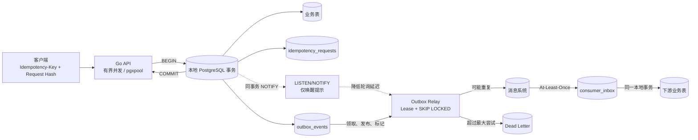

# 第 17 章：Go 高吞吐写入、幂等、任务队列、Outbox 与跨服务一致性

> **技术基线**：PostgreSQL 18 稳定版；Go 当前稳定版本；`github.com/jackc/pgx/v5` 与 `pgxpool` 当前稳定 API。本文不写死 pgx 补丁版本。PostgreSQL 19 仍只作为未来版本预览，不作为生产基线。
>
> **版本标记**：除特别说明外，本文核心方案适用于 PostgreSQL 14—18。[PG15+] 表示 PostgreSQL 15 起可用；[PG16+]、[PG17+]、[PG18] 同理。

## 1. 本章定位

本章解决三个经常被混为一谈、但必须分别建模的问题：

1. **怎样提高数据库写入吞吐**：减少网络往返、提交次数和协议开销，同时控制事务大小、WAL 峰值、锁持续时间与失败半径。
2. **怎样在重试、超时和进程崩溃下保持业务幂等**：用 Idempotency Key、Request Hash、唯一约束和结果存档，把“可能重复到达”转化为“业务效果至多一次”。
3. **怎样在数据库与消息系统之间实现可恢复的一致性**：用 Transactional Outbox 将业务数据和待发送事件放进同一个本地事务，再由 Relay 以 At-Least-Once 方式发布，并要求 Consumer 幂等。

生产环境必须掌握这些内容，因为网络超时并不等于数据库未执行，`COMMIT` 返回错误也不等于事务一定回滚；单纯把 Go 请求“再试一次”，可能重复扣款、重复创建订单或重复发放权益。另一方面，只追求大批次吞吐又会放大 WAL、复制延迟、回滚成本和锁等待。

本章依赖：

- 第 9—11 章的 MVCC、隔离级别、行锁、死锁与 `SKIP LOCKED`；
- 第 13 章的 WAL、Checkpoint 与提交路径；
- 第 16 章的 `pgxpool`、事务边界、超时、取消与连接池统计。

本章不展开：消息中间件的分区副本协议、Kafka Exactly-Once 语义、逻辑解码插件实现、CDC 平台运维、Patroni 故障转移细节，以及跨分片全局事务。这些主题将在后续高可用与 CDC 章节继续处理。

---

## 2. 可验证的学习目标

完成本章后，你应当能够：

1. 用同一数据集比较单行 `INSERT`、多值 `INSERT`、`UNNEST`、`pgx.Batch`、Pipeline、`CopyFrom` 与 SQL `COPY` 的网络往返、原子性和失败边界。
2. 编写可运行的 Go 代码，正确关闭 `Rows`、`BatchResults`、Pipeline 和连接池，并避免无限 goroutine。
3. 根据行宽、并发度、P99、WAL 速率和复制延迟选择批次大小，而不是套用固定行数。
4. 复现同一唯一键上的高冲突 Upsert，定位 blocker、事务 ID 等待和热点索引/行竞争。
5. 用 `ANY($1)`、`UNNEST`、流式读取、Server-Side Cursor 与 Keyset Pagination 消除 N+1 和深分页。
6. 用版本列实现乐观锁，并把“没有更新到行”识别为并发冲突而不是数据库故障。
7. 设计 Idempotency Key + Request Hash 协议，区分同键同请求重放、同键不同请求冲突与提交结果不确定。
8. 使用 `FOR UPDATE SKIP LOCKED`、Lease、租约代次和 Dead Letter 构建多 Worker 队列。
9. 实现业务写入与 Outbox 事件的同事务提交、Relay 的 At-Least-Once 发布以及 Consumer Inbox 去重。
10. 解释为什么 `LISTEN/NOTIFY` 只能作为唤醒提示，不能直接替代可靠消息队列。
11. 比较 2PC、Saga、Outbox、Outbox + CDC 的一致性、可用性和运维代价。
12. 在主库重启、应用断线、Relay 崩溃和故障转移后，根据唯一键、Outbox 状态与 Consumer Inbox 判断应重试、查询还是人工处置。

---

## 3. 核心术语

| 中文名称 | 英文名称 | 准确定义 | 容易混淆的概念 | 所属层次 |
|---|---|---|---|---|
| 批量写入 | Bulk Write | 一次协议交互或一个事务内提交多行/多条命令，以摊薄 RTT、解析和提交成本 | 并行写入；大事务 | 应用/协议/事务 |
| 批处理 | Batch | pgx 将多条扩展协议查询成组发送，并按顺序读取结果 | Pipeline；多值 INSERT | 驱动/协议 |
| 流水线模式 | Pipeline Mode | 在等待前一条结果前继续发送后续请求，用同步点划分错误恢复和隐式事务边界 | 数据库并行执行 | 协议 |
| COPY 协议 | COPY Protocol | PostgreSQL 面向高吞吐数据流的导入/导出协议 | SQL `COPY` 文件权限；普通 INSERT | 协议/Executor |
| Upsert | Insert or Update | 插入冲突时原子地执行替代动作，PostgreSQL 常用 `ON CONFLICT` | 先 SELECT 再 INSERT | SQL/并发控制 |
| 冲突仲裁索引 | Arbiter Index | `ON CONFLICT` 用于判定冲突的唯一索引或约束 | 普通索引；可延迟唯一约束 | 索引/约束 |
| 幂等键 | Idempotency Key | 客户端为一个业务意图分配、重试时保持不变的稳定标识 | 数据库主键；请求 ID；Trace ID | API/业务 |
| 请求哈希 | Request Hash | 对方法、资源、租户和规范化请求体计算的摘要，用于检测同键不同请求 | 密码哈希；响应 ETag | API/安全边界 |
| 乐观锁 | Optimistic Locking | 通过版本条件更新，未命中时认定数据已被并发修改 | PostgreSQL 行锁；Serializable | 应用并发控制 |
| 跳过已锁行 | SKIP LOCKED | 获取候选行时跳过当前不能立即加锁的行，适合多消费者队列 | 无锁；公平调度；一致快照 | SQL/锁 |
| 租约 | Lease | Worker 在有限期限内拥有任务处理权；过期后任务可被重新分配 | 永久所有权；数据库会话锁 | 业务状态机 |
| 租约代次 | Lease Generation | 每次领取递增的 fencing token，旧 Worker 即使晚到也不能确认新租约 | 仅比较 owner 字符串 | 业务状态机 |
| 死信 | Dead Letter | 超过最大尝试次数或被判定不可自动恢复的消息/任务状态 | 永久删除；普通失败重试 | 队列/运维 |
| 事务 Outbox | Transactional Outbox | 在本地数据库事务中同时写业务数据和待发布事件 | 直接双写；数据库触发器必然可靠 | 一致性模式 |
| Outbox Relay | Outbox Relay | 扫描/订阅 Outbox，将事件发布到外部系统并回写发布状态的进程 | 消费者；CDC Connector | 应用/集成 |
| 至少一次 | At-Least-Once | 成功事件不会被有意丢弃，但故障窗口内可能重复投递 | Exactly-Once；至多一次 | 交付语义 |
| Consumer Inbox | Idempotent Consumer Inbox | 消费者在本地事务中记录已处理事件 ID，并与业务副作用一同提交 | Broker offset；内存缓存 | 消费端一致性 |
| 提交结果不确定 | Commit Outcome Unknown | 客户端未能确认 `COMMIT` 结果，但服务端可能已经提交 | 明确回滚；SQLSTATE 40001 | 故障语义 |
| 两阶段提交 | Two-Phase Commit, 2PC | 参与者先进入 Prepared 状态，再由外部协调者统一决定提交或回滚的协议 | 普通两条 SQL；Prepared Statement | 分布式事务 |
| 准备事务 | Prepared Transaction | `PREPARE TRANSACTION` 后等待外部协调者最终提交或回滚的持久事务 | prepared statement | 2PC/事务 |
| Outbox 与 CDC | Outbox + Change Data Capture | 本地事务写显式事件，再由逻辑解码/Connector 从 WAL 捕获并发布 | 直接监听业务表；轮询 Relay | 集成/复制 |
| Saga | Saga | 将跨服务事务拆成多个本地事务，并用补偿动作处理后续失败 | 数据库回滚；2PC | 分布式一致性 |

---

## 4. 整体心智模型



### 4.1 数据流

客户端把稳定的 `Idempotency-Key` 与规范化请求一起发送。API 在一个 PostgreSQL 事务中写入：

- 幂等记录；
- 订单、库存或支付等业务行；
- Outbox 事件。

提交后，Relay 从 Outbox 领取事件，在数据库事务之外调用外部 Broker，然后回写 `published`。Broker 可以重复投递，Consumer 先写 `consumer_inbox`，再在同一事务中修改自己的业务表。

### 4.2 控制流

- API 的连接数由 `pgxpool` 限制，goroutine 数量必须有界。
- Relay 和 Worker 使用 `SKIP LOCKED` 避免多个消费者等待同一行。
- Lease 只提供“超时后可重领”，不提供 Exactly-Once；租约代次防止旧 Worker 晚到后错误确认。
- `LISTEN/NOTIFY` 只缩短“发现有新事件”的时间；周期轮询仍是可靠兜底。

### 4.3 状态变化

典型任务状态机：

```text
ready --claim--> running --ack--> done
  ^                 |
  |                 +--failure--> ready（延迟重试）
  |                 |
  +--lease expiry---+
                    +--attempts >= max_attempts--> dead
```

典型 Outbox 状态机：

```text
pending --claim--> inflight --publish + guarded mark--> published
   ^                   |
   |                   +--publish error / lease expiry--> pending
   |                   +--attempts exhausted-----------> dead
   +----------------------------------------------------+
```

### 4.4 故障路径

- **API 在 `COMMIT` 后收到网络错误**：数据库可能已提交。客户端必须用同一幂等键重试或查询，不能换新键盲目重放。
- **Relay 发布前崩溃**：租约过期后重新领取，不丢失事件。
- **Relay 发布成功、标记前崩溃**：事件会再次发布；Consumer Inbox 去重。
- **Consumer 提交后、Ack Broker 前崩溃**：Broker 重投；Inbox 再次去重。
- **主库故障转移**：异步复制可能丢失最新事务，RPO 不为零；同步复制降低丢失风险但增加提交延迟和可用性约束。

---

## 5. 使用方式

### 5.1 统一实验 Schema

以下 Schema 用于本章 SQL、Go 示例和实验。应在隔离的实验数据库执行。

```sql
CREATE TABLE write_bench (
    id          bigint GENERATED ALWAYS AS IDENTITY PRIMARY KEY,
    tenant_id   bigint      NOT NULL,
    payload     jsonb       NOT NULL,
    created_at  timestamptz NOT NULL DEFAULT clock_timestamp()
);

CREATE TABLE inventory (
    sku         text        PRIMARY KEY,
    quantity    bigint      NOT NULL CHECK (quantity >= 0),
    version     bigint      NOT NULL DEFAULT 1,
    updated_at  timestamptz NOT NULL DEFAULT clock_timestamp()
);

CREATE TABLE orders (
    id            bigint GENERATED ALWAYS AS IDENTITY PRIMARY KEY,
    account_id    bigint      NOT NULL,
    request_key   text        NOT NULL,
    amount_cents  bigint      NOT NULL CHECK (amount_cents > 0),
    status        text        NOT NULL CHECK (status IN ('created', 'paid', 'cancelled')),
    created_at    timestamptz NOT NULL DEFAULT clock_timestamp(),
    UNIQUE (account_id, request_key)
);

CREATE TABLE idempotency_requests (
    account_id       bigint      NOT NULL,
    idempotency_key  text        NOT NULL,
    request_hash     bytea       NOT NULL,
    state            text        NOT NULL CHECK (state IN ('processing', 'completed')),
    response_code    integer,
    response_body    jsonb,
    resource_id      bigint,
    created_at       timestamptz NOT NULL DEFAULT clock_timestamp(),
    updated_at       timestamptz NOT NULL DEFAULT clock_timestamp(),
    PRIMARY KEY (account_id, idempotency_key),
    CHECK (
        (state = 'processing' AND response_code IS NULL) OR
        (state = 'completed' AND response_code IS NOT NULL AND response_body IS NOT NULL)
    )
);

CREATE TABLE jobs (
    id                bigint GENERATED ALWAYS AS IDENTITY PRIMARY KEY,
    queue             text        NOT NULL,
    payload           jsonb       NOT NULL,
    status            text        NOT NULL DEFAULT 'ready'
                                  CHECK (status IN ('ready', 'running', 'done', 'dead')),
    priority          integer     NOT NULL DEFAULT 0,
    available_at      timestamptz NOT NULL DEFAULT clock_timestamp(),
    lease_owner       text,
    lease_until       timestamptz,
    lease_generation  bigint      NOT NULL DEFAULT 0,
    attempts          integer     NOT NULL DEFAULT 0,
    max_attempts      integer     NOT NULL DEFAULT 8 CHECK (max_attempts > 0),
    last_error        text,
    created_at        timestamptz NOT NULL DEFAULT clock_timestamp(),
    started_at        timestamptz,
    finished_at       timestamptz
);

CREATE INDEX jobs_ready_pick_idx
    ON jobs (queue, priority DESC, available_at, id)
    WHERE status = 'ready';

CREATE INDEX jobs_expired_lease_idx
    ON jobs (queue, lease_until, id)
    WHERE status = 'running';

CREATE TABLE outbox_events (
    id                bigint GENERATED ALWAYS AS IDENTITY PRIMARY KEY,
    aggregate_type    text        NOT NULL,
    aggregate_id      bigint      NOT NULL,
    event_type        text        NOT NULL,
    payload           jsonb       NOT NULL,
    state             text        NOT NULL DEFAULT 'pending'
                                  CHECK (state IN ('pending', 'inflight', 'published', 'dead')),
    available_at      timestamptz NOT NULL DEFAULT clock_timestamp(),
    lease_owner       text,
    lease_until       timestamptz,
    lease_generation  bigint      NOT NULL DEFAULT 0,
    attempts          integer     NOT NULL DEFAULT 0,
    max_attempts      integer     NOT NULL DEFAULT 16 CHECK (max_attempts > 0),
    last_error        text,
    created_at        timestamptz NOT NULL DEFAULT clock_timestamp(),
    published_at      timestamptz
);

CREATE INDEX outbox_pending_pick_idx
    ON outbox_events (available_at, id)
    WHERE state = 'pending';

CREATE INDEX outbox_expired_lease_idx
    ON outbox_events (lease_until, id)
    WHERE state = 'inflight';

CREATE TABLE consumer_inbox (
    consumer_name  text        NOT NULL,
    event_id       bigint      NOT NULL,
    processed_at   timestamptz NOT NULL DEFAULT clock_timestamp(),
    PRIMARY KEY (consumer_name, event_id)
);
```

设计要点：

- 状态列使用约束防止非法迁移，但不要把每一种瞬时状态都变成复杂枚举；在线变更枚举的运维成本通常高于 `text + CHECK`。
- Ready/Inflight 使用部分索引，让领取查询只维护活跃集合；已完成历史行不进入热索引。
- `lease_generation` 是 fencing token。只判断 `lease_owner` 不够：同一进程名重启后可能误确认旧任务。
- `consumer_inbox` 的主键必须包含 Consumer 逻辑名称，因为不同消费者可以各自处理同一事件一次。
- Outbox Payload 应携带事件发生时的业务事实，而不是要求消费者回查主库的可变当前状态。

### 5.2 常用 SQL、视图与函数

| 目的 | SQL/API | 关键注意事项 |
|---|---|---|
| 批量插入 | 多值 `VALUES`、`UNNEST`、`pgx.Batch`、Pipeline、`CopyFrom`、`COPY` | 先定义原子性和错误定位，再追求 TPS |
| Upsert | `INSERT ... ON CONFLICT` | 仲裁唯一键可能成为热点；同一批不能重复命中同一目标行 |
| 批量查询 | `WHERE id = ANY($1::bigint[])` | 空数组、重复 ID、超大数组和结果顺序需显式处理 |
| 队列领取 | `FOR UPDATE SKIP LOCKED` | 返回不一致视图，只适用于队列式消费 |
| 唤醒 Relay | `pg_notify(channel, payload)` | 仅发送主键/提示；可靠状态保存在表中 |
| COPY 进度 | `pg_stat_progress_copy` | [PG17+] 可观察被跳过元组；字段按版本核对 |
| WAL 速率 | `pg_stat_wal` | 用测试前后快照计算差值，不要在共享环境随意重置统计 |
| I/O 分类 | `pg_stat_io` | [PG16+]；结合 `track_io_timing` 和操作系统指标 |
| 活跃等待 | `pg_stat_activity`、`pg_locks`、`pg_blocking_pids()` | `wait_event_type`/`wait_event` 是等待点，不等于根因 |
| 通知队列 | `pg_notification_queue_usage()` | 长事务 Listener 会阻碍通知队列清理 |
| pgx 批处理 | `pgx.Batch`、`SendBatch`、`BatchResults.Close` | Close 前连接不可复用；错误后仍要排空/关闭 |
| pgx COPY | `Conn.CopyFrom`、`CopyFromSource` | 使用二进制格式；大数据源实现流式 Source，避免全量缓冲 |
| pgx Pipeline | `PgConn.StartPipeline` | 底层 API；必须 `Sync`、读取结果并 `Close` |

### 5.3 安全边界

- `COPY FROM '/server/path'` 的路径相对数据库服务器，涉及服务器文件权限；应用侧通常使用 `STDIN`/COPY 协议，而不是让数据库读取用户提供的路径。
- `COPY PROGRAM` 会由服务器调用 Shell，绝不能把不可信输入拼进命令。
- `EXPLAIN ANALYZE INSERT/UPDATE/DELETE/MERGE` 会真实执行；只在实验表使用。即使外层 `ROLLBACK`，Sequence 取号、外部触发器副作用等也不保证回滚。
- 不要为压测关闭 `fsync`、`full_page_writes`、autovacuum、校验和或同步复制保护；那会改变故障模型，使结果不可用于生产决策。

---
## 6. 底层原理

### 6.1 批量写入不是“越大越快”

一次单行写入的大致路径为：

```text
Go goroutine
  -> 从 pgxpool 获取连接
  -> Parse/Bind/Execute（或缓存后的扩展协议执行）
  -> Backend 执行约束、索引和触发器
  -> 生成 Heap/Index/WAL 变化
  -> COMMIT 写 WAL，按 synchronous_commit 规则等待
  -> 返回客户端
```

如果每行都独立提交，固定成本会重复出现：网络 RTT、协议消息、事务开始/结束、WAL commit record、同步刷盘等待。批量化主要减少这些**固定成本**，并不会消除每一行的 Heap、索引、约束和大部分 WAL 成本。

| 方法 | 网络往返 | 原子性 | 错误定位 | 吞吐 | 内存 | WAL | 适用场景 |
|---|---|---|---|---|---|---|---|
| 单行 `INSERT` | 通常每条至少一次；逐条提交还包含每行提交 | 单行/单事务 | 最精确 | 最低，尤其高 RTT | 低 | 每行数据 WAL + 高频提交 WAL | 低频写、强逐行反馈、控制面操作 |
| 多值 `INSERT ... VALUES` | 每批一次 | 单条语句原子；多批需显式事务才整体原子 | 通常只能定位整条语句；可在应用保留批内序号 | 高 | 客户端需构造参数；服务端解析大语句 | 每行 WAL，但提交次数少 | 中等批量、列数固定、需要 `RETURNING` |
| `UNNEST` | 每批一次 | 单条语句原子 | 可借助 `WITH ORDINALITY`/暂存表定位 | 高；SQL 形状稳定 | 数组在客户端和服务端占内存 | 与对应 DML 类似 | 固定列批量、批量查询/更新、避免动态占位符 |
| `pgx.Batch` | 一批命令一次发送，结果按顺序读取 | 显式事务内由事务决定；否则一批通常隐式成组 | 可按命令序号定位；首个错误会影响后续命令 | 高，易用性好 | 客户端保存队列和结果；连接在关闭前被占用 | 每条 DML 仍有 WAL；减少 RTT/提交 | 多种 SQL 混合、每条需独立参数或结果 |
| Pipeline Mode | 一个或多个同步点；发送与接收可重叠 | 同步点之间在无显式事务控制时隐式成组 | 结果顺序明确，但错误恢复和排空更复杂 | 高 RTT 网络下可能优于普通 Batch | 未读结果和在途请求受应用控制 | 与执行的语句相同 | 驱动/基础设施层、需要细粒度同步点 |
| `pgx.CopyFrom` | 一个 COPY 数据流/批 | 默认一个 COPY 命令原子 | 默认较差，常只能知道 COPY 失败 | 通常最高 | 可实现流式 `CopyFromSource`，不必全量缓冲 | 仍为 logged table 生成 WAL；提交次数少 | 大量同构插入、装载到暂存表 |
| SQL `COPY` | 文件或 STDIN/STDOUT 数据流 | 默认失败即命令失败；[PG17+] `ON_ERROR ignore` 可接受部分行 | 默认较差；[PG17+] 可增强转换错误报告 | 通常最高 | 取决于客户端/文件流 | logged table 仍写 WAL | ETL、离线导入、数据库运维装载 |

#### 批次增大时同时发生什么

1. **RTT 和提交成本下降**：吞吐通常先明显上升。
2. **事务持续时间上升**：行锁、唯一键冲突等待、Snapshot 和连接占用时间变长。
3. **失败半径扩大**：批内任一不可忽略错误可能回滚整批；重试会重放更多工作。
4. **WAL 形成突发**：平均 WAL/行未必显著下降，但每次提交的 WAL 峰值更大，副本 apply 延迟可能升高。
5. **尾延迟升高**：队列需要等待凑批；一个慢行、热点键或触发器会拖慢整批。
6. **内存压力增加**：Go 切片、编码缓冲、Batch 队列、服务端参数和未读结果都在占用内存。

因此批次上限应至少同时受以下条件约束：最大字节数、最大等待时间、最大事务时长、P99、连接池等待、WAL bytes/s、复制延迟和失败重试成本。不存在对所有机器都正确的“每批固定 1000 行”。

### 6.2 多值 INSERT 与 UNNEST

多值写入适合列数固定、批次不太大且希望直接 `RETURNING` 的场景：

```sql
INSERT INTO write_bench (tenant_id, payload)
VALUES
    ($1, $2::jsonb),
    ($3, $4::jsonb),
    ($5, $6::jsonb)
RETURNING id;
```

占位符必须由程序根据**可信的列结构和行数**生成，业务值仍通过参数传入，不能把用户输入拼进 SQL。

`UNNEST` 可以保持 SQL 文本稳定：

```sql
INSERT INTO write_bench (tenant_id, payload)
SELECT tenant_id, payload
FROM unnest($1::bigint[], $2::jsonb[]) AS input(tenant_id, payload);
```

批量增量更新应先消除重复键：

```sql
WITH input AS (
    SELECT sku, sum(delta)::bigint AS delta
    FROM unnest($1::text[], $2::bigint[]) AS u(sku, delta)
    GROUP BY sku
)
UPDATE inventory AS i
SET quantity   = i.quantity + input.delta,
    version    = i.version + 1,
    updated_at = clock_timestamp()
FROM input
WHERE i.sku = input.sku
  AND i.quantity + input.delta >= 0
RETURNING i.sku, i.quantity, i.version;
```

不先聚合重复 `sku` 会使输入语义含糊；对于 `ON CONFLICT DO UPDATE`，同一语句若试图让多个输入行影响同一既有行，会触发 cardinality violation，而不是按输入顺序多次更新。

### 6.3 Batch 与 Pipeline 的区别

`pgx.Batch` 是大多数业务代码的首选：API 较高层、参数编码由 pgx 完成、结果与入队顺序对应。`BatchResults.Close()` 之前底层连接不能安全复用；即使某个结果失败，也必须关闭并排空批结果。

Pipeline 是更底层的协议控制：

```text
Send Q1 -> Send Q2 -> Send Q3 -> Sync -> Get R1 -> Get R2 -> Get R3 -> PipelineSync
```

它的价值是减少“发送一条、等待一条”的停顿，并允许多个同步点；它**不会让同一 PostgreSQL Backend 并行执行这些 SQL**。一个连接仍由一个 Backend 顺序执行命令。同步点既是隐式事务分界，也是错误恢复点。API 使用不当会导致连接仍处于 Pipeline 状态、结果错位或连接被关闭，因此普通 CRUD 不应为了“看起来更高级”而绕过 `Batch`。

### 6.4 CopyFrom、COPY 与暂存表

`pgx.Conn.CopyFrom` 使用 PostgreSQL COPY 协议和二进制编码，高吞吐地把同构行写入目标表。它没有 `ON CONFLICT` 子句。需要批量 Upsert 时，常见流程是：

```sql
BEGIN;

CREATE TEMP TABLE stage_inventory (
    sku   text   NOT NULL,
    delta bigint NOT NULL
) ON COMMIT DROP;

-- 由 pgx Tx.CopyFrom 写入 stage_inventory

INSERT INTO inventory AS i (sku, quantity)
SELECT sku, sum(delta)
FROM stage_inventory
GROUP BY sku
ON CONFLICT (sku) DO UPDATE
SET quantity   = i.quantity + EXCLUDED.quantity,
    version    = i.version + 1,
    updated_at = clock_timestamp();

COMMIT;
```

这兼顾 COPY 吞吐和最终约束校验，但代价是：

- 临时表和 COPY 必须绑定同一物理连接/事务；
- 暂存和合并会增加内存、I/O 与事务时长；TEMP/UNLOGGED 暂存数据本身不按普通表方式记录数据 WAL，但最终目标表合并仍生成 WAL，永久 Logged 暂存表还会额外生成 WAL；
- 大批次冲突时仍会集中锁定目标行；
- 失败需要定位到暂存数据，而不是原始网络请求。

普通 `COPY FROM` 遇到错误会停止；已物理插入但因事务失败不可见的元组可能占用空间，需要后续 `VACUUM` 回收。[PG17+] `ON_ERROR ignore` 只忽略 text/CSV 输入值到目标类型的转换错误，不会忽略任意约束或触发器错误。[PG18] 新增 `REJECT_LIMIT`，可限制允许跳过的转换错误数；这类“尽力导入”改变了原子性，必须单独记录拒绝行，不能悄悄当作全量成功。

### 6.5 Upsert、唯一索引与冲突热点

PostgreSQL `ON CONFLICT DO UPDATE` 在没有其他独立错误时保证每个输入行得到原子的 INSERT 或 UPDATE 结果。冲突判定依赖唯一索引/约束：

```sql
INSERT INTO inventory AS current (sku, quantity)
VALUES ($1, $2)
ON CONFLICT (sku) DO UPDATE
SET quantity   = EXCLUDED.quantity,
    version    = current.version + 1,
    updated_at = clock_timestamp()
WHERE current.quantity IS DISTINCT FROM EXCLUDED.quantity
RETURNING sku, quantity, version;
```

重要语义：

- 唯一索引上的并发插入可能互相等待；同一热点键会串行化。
- `DO UPDATE ... WHERE` 的条件最后才判断；冲突候选行会先被锁定，即使最终不更新。
- `DO UPDATE` 的无效更新仍可能产生新 Heap Tuple、WAL、Vacuum 压力和索引维护；使用 `WHERE ... IS DISTINCT FROM ...` 跳过真正无变化的写入。
- 同一批输入不得出现多个会命中同一既有行的键；应在 Go 或 SQL 中去重/聚合。
- 唯一键只是正确性的仲裁点，不是吞吐放大器。所有请求打到一个账户、SKU 或计数器时，增加连接数只会扩大等待队列。

[PG15+] `MERGE` 适合批量对账和多分支匹配动作，但不能脱离唯一约束就假定并发下不会产生重复；对“原子插入或更新”的单键路径，`ON CONFLICT` 通常更直接。

### 6.6 消除 N+1：ANY、UNNEST、流式读取、Cursor 与 Keyset

#### ANY($1)

```sql
SELECT id, account_id, amount_cents, status, created_at
FROM orders
WHERE id = ANY($1::bigint[]);
```

这把 N 次网络往返降为一次。若必须保持请求 ID 的原顺序并保留不存在的 ID：

```sql
WITH wanted AS (
    SELECT id, ord
    FROM unnest($1::bigint[]) WITH ORDINALITY AS x(id, ord)
)
SELECT wanted.id AS requested_id,
       o.id, o.account_id, o.amount_cents, o.status, o.created_at
FROM wanted
LEFT JOIN orders AS o ON o.id = wanted.id
ORDER BY wanted.ord;
```

超大数组会增加编码、内存和计划不确定性。数据达到“大到足以影响单请求内存和计划”的量级时，应实测比较临时表 + COPY + JOIN，而不是无限放大数组。

#### 流式读取

pgx `Rows.Next()` 允许逐行消费，避免一次把全部结果放进 Go 内存，但读取期间连接始终被占用。回调中执行慢外部调用会把一个查询变成长连接占用和长 Snapshot。正确方式是快速扫描到有界缓冲，或把外部处理与数据库读取解耦。

#### Server-Side Cursor

```sql
BEGIN READ ONLY;
DECLARE order_cursor NO SCROLL CURSOR FOR
    SELECT id, account_id, amount_cents, status, created_at
    FROM orders
    ORDER BY id;

FETCH FORWARD 500 FROM order_cursor;
-- 重复 FETCH
COMMIT;
```

Cursor 限制单次返回量，但通常要求事务保持打开；长事务会长期持有 Snapshot，阻碍 Vacuum 清理并占用连接。因此 Cursor 更适合受控的后台导出，不适合无状态 HTTP 深分页。

#### Keyset Pagination

```sql
SELECT id, account_id, amount_cents, status, created_at
FROM orders
WHERE (created_at, id) > ($1, $2)
ORDER BY created_at, id
LIMIT $3;
```

Keyset 使用唯一、稳定排序键，避免深 `OFFSET` 扫描和丢弃大量前置行；并发插入下也比页码分页更稳定。缺点是不能直接跳到任意页，排序方向和筛选条件必须与索引设计匹配。

### 6.7 乐观锁

乐观锁不阻止别人修改，而是在写入时验证版本：

```sql
UPDATE inventory
SET quantity   = $3,
    version    = version + 1,
    updated_at = clock_timestamp()
WHERE sku = $1
  AND version = $2
RETURNING version;
```

返回零行表示版本冲突。应用应重新读取并按业务语义决定：提示用户、重新计算后有限重试，或放弃。不能把它无条件循环到成功，否则会覆盖并发用户的决策并形成重试风暴。

乐观锁适合“读后思考再写”、冲突率低且有明确版本的业务对象；对高冲突计数器，数据库原子表达式 `SET value = value + $1` 通常比读-改-写版本循环更合适。

### 6.8 Idempotency Key 与 Request Hash

一个可靠的幂等协议至少包含：

1. 客户端为一个业务意图生成稳定键；超时重试时复用，新的业务意图必须换键。
2. 服务端用 `(租户/账户, idempotency_key)` 唯一约束仲裁并发请求。
3. 服务端计算 Request Hash。哈希输入应包含 HTTP 方法、规范化资源路径、租户作用域、关键 Header 和规范化请求体；JSON 字段顺序、空白和默认值必须有稳定规范。
4. 同键同 Hash：返回已保存结果；同键不同 Hash：返回 409 类业务冲突，不能覆盖旧结果。
5. 幂等行、业务副作用、Outbox 事件和最终响应摘要在**同一数据库事务**提交。
6. `COMMIT` 结果不确定时，客户端用同键重试；服务端通过幂等表判断事务究竟是否落地。

时间线：

```text
请求 A: INSERT idempotency row ON CONFLICT DO NOTHING
        -> INSERT business row
        -> INSERT outbox row
        -> UPDATE idempotency row = completed + stored response
        -> COMMIT

并发请求 B: 同键 INSERT 在唯一索引处等待
            -> A 提交后 B 得到 DO NOTHING
            -> SELECT stored row FOR UPDATE
            -> Hash 相同则返回已存结果
```

不要先在一个事务提交“processing”，再在另一个事务做业务写入，除非同时设计了 owner、lease、takeover 和失败恢复。最简单可靠的数据库内副作用，应让 `processing` 从不以半成品状态对其他事务可见。

### 6.9 SKIP LOCKED、Lease 与 Dead Letter

领取任务的核心 SQL：

```sql
WITH picked AS (
    SELECT id
    FROM jobs
    WHERE queue = $1
      AND status = 'ready'
      AND available_at <= clock_timestamp()
    ORDER BY priority DESC, available_at, id
    FOR UPDATE SKIP LOCKED
    LIMIT $2
)
UPDATE jobs AS j
SET status           = 'running',
    lease_owner      = $3,
    lease_until      = clock_timestamp() + ($4 * interval '1 millisecond'),
    lease_generation = j.lease_generation + 1,
    attempts         = j.attempts + 1,
    started_at       = clock_timestamp()
FROM picked
WHERE j.id = picked.id
RETURNING j.*;
```

`SKIP LOCKED` 的含义不是“无锁”，而是当前无法立即获得行锁时跳过。它会返回有意不一致的候选集合，适合队列，不适合账户余额、库存核对等一般查询。

Lease 的正确性依赖三条规则：

- Handler 执行时间可能超过租约时必须续租，或把工作拆小；租约不能只凭拍脑袋设置。
- Ack/Fail 必须带 `owner + lease_generation` 条件，更新零行即租约已丢失，旧 Worker 不得继续确认。
- Expired Reaper 应分批处理过期行，避免一次更新整个队列形成大事务。

Dead Letter 不是“把错误藏起来”。至少要保存事件 ID、最终错误分类、尝试次数、首次/最后失败时间、原始 Payload、代码版本和可重放策略。永久业务错误应尽早进入 dead；瞬时网络错误采用指数退避和抖动。

### 6.10 Transactional Outbox 与双写问题

直接双写存在两个不可消除的窗口：

| 顺序 | 故障窗口 | 结果 |
|---|---|---|
| 先提交数据库，再发布 Broker | 数据库已提交、发布前进程崩溃 | 业务有数据但无事件 |
| 先发布 Broker，再提交数据库 | Broker 已接受、数据库回滚 | 下游看到不存在的业务事实 |

Outbox 把“业务行 + 待发布事件”放进同一个 PostgreSQL 事务，消除本地数据库内部的双写窗口：

```sql
BEGIN;

INSERT INTO orders (...) VALUES (...) RETURNING id;
INSERT INTO outbox_events (...) VALUES (...);

COMMIT;
```

Relay 的发布与标记仍不能原子跨越 PostgreSQL 和 Broker，所以交付语义是 At-Least-Once：

```text
claim/lease in DB -> COMMIT claim
publish outside DB transaction
mark published in DB
```

绝不能为了“原子”而在持有数据库事务和行锁时等待外部 Broker。外部调用延迟、重试或故障会把数据库连接和锁一起拖住。

### 6.11 LISTEN/NOTIFY 为什么不是可靠队列

`NOTIFY` 在事务提交后才对 Listener 可见；同一事务内相同 channel 和 payload 的重复通知可能折叠。默认 Payload 必须小于 8000 字节，官方建议大数据写入表后只通知主键。Listener 断线期间没有面向它的持久重放、Ack、消费组、Dead Letter 或每消费者进度；长事务 Listener 还可能阻碍通知队列清理。

因此正确模式是：

```text
Outbox 表 = 可靠事实源
周期轮询 = 不漏事件的兜底
LISTEN/NOTIFY = 提前唤醒，降低平均延迟
```

Relay 启动时应先建立专用连接执行 `LISTEN`，完成初始事务，再扫描表；之后在通知和定时器任一触发时扫描。通知 Payload 只作为提示，不能假定“一条通知对应且只对应一条事件”。执行过 `NOTIFY` 的事务不能被 `PREPARE TRANSACTION`，这也是 2PC 与该模式的直接约束。

### 6.12 Consumer Idempotency

Consumer 应在自己的数据库事务中：

```sql
BEGIN;

INSERT INTO consumer_inbox (consumer_name, event_id)
VALUES ($1, $2)
ON CONFLICT DO NOTHING;

-- RowsAffected = 0：已经处理，直接提交并 Ack
-- RowsAffected = 1：执行本地业务副作用

UPDATE downstream_balance ...;

COMMIT;
-- COMMIT 成功后才 Ack Broker
```

若 Consumer 在 `COMMIT` 后、Ack 前崩溃，Broker 会重投；Inbox 主键阻止重复副作用。若 `COMMIT` 返回网络错误，Consumer 不应 Ack，因为结果不确定；重投后仍由 Inbox 判定。

Inbox 不能在事务外先写后做业务，否则会出现“Inbox 已记录、业务副作用未发生”的消息丢失。也不能只用短 TTL 内存缓存，因为进程重启、分区重平衡和延迟重投会绕过去重窗口。

### 6.13 2PC、Prepared Transaction、Saga 与 Outbox + CDC

| 方案 | 一致性模型 | 主要优点 | 主要缺点 | 适用边界 |
|---|---|---|---|---|
| 2PC / Prepared Transaction | 协调者驱动的原子最终决议 | 参与资源管理器支持时可实现强原子提交 | Prepared 阶段持续持锁、阻碍 Vacuum；协调者故障产生 in-doubt；可用性和运维复杂 | 少量、受控、已有可靠事务管理器的资源 |
| Transactional Outbox | 本地事务原子 + 跨系统至少一次 | 简单、可审计、与业务事务自然结合 | 重复投递、Relay 积压、表清理和顺序问题 | 微服务事件发布的默认优先方案 |
| Outbox + CDC | 本地事务原子；CDC 从 WAL 捕获 | 降低轮询延迟和数据库扫描，吞吐高 | 复制槽/WAL 保留、Connector HA、Schema 演进复杂；仍需消费幂等 | 事件量大、已有 CDC 平台 |
| Saga | 多个本地事务 + 补偿 | 不长时间锁定跨服务资源，可扩展 | 只实现业务级最终一致；补偿可能失败且无法真正撤销外部事实 | 长流程、跨多服务业务编排 |

`PREPARE TRANSACTION` 后，事务仍持有原有锁，并继续影响 Vacuum；长时间遗留甚至可能推动事务 ID 风险。所有 Prepared Transaction 可从 `pg_prepared_xacts` 查询。没有外部事务管理器负责恢复和最终决议时，保持 `max_prepared_transactions = 0` 通常更安全。

2PC 不是“故障消失”，而是把故障变成协调者必须解决的 in-doubt 状态。Saga 也不是数据库回滚：退款、撤销预留、发补偿券都是新的业务事实，必须幂等、可重试、可审计。Outbox + CDC 仍然不是端到端 Exactly-Once；CDC 重连和 Broker 重投仍要求稳定 Event ID 与幂等 Consumer。

---

## 7. 内部数据结构和状态

### 7.1 Heap Tuple、Index Tuple 与唯一冲突

普通 INSERT 会在 Heap Page 写入新 Tuple，并在每个相关索引写 Index Tuple。唯一索引检查不能只查看当前 Snapshot，因为并发未提交 Tuple 也可能决定唯一性。`ON CONFLICT` 使用唯一索引作为仲裁器；并发竞争时，一个会话可能等待另一个事务结束或等待 speculative insertion 的决议。

高冲突 Upsert 常见的等待链不是“全表锁”，而是：

```text
Session B
  -> 唯一索引找到同键候选
  -> 等待 Session A 的事务 ID / Tuple 状态确定
  -> A 提交后，B 锁定目标 Heap Tuple
  -> 执行 DO UPDATE 或重新检查条件
```

同一逻辑键会形成热点行；单调递增主键则可能让并发插入集中到 B-tree 右侧叶页。前者是业务键串行化，后者是索引页并发和 page split 压力，诊断与缓解方式不同。

### 7.2 Lock 状态

- `FOR UPDATE SKIP LOCKED` 仍获取表级 `ROW SHARE` 锁以及成功选中行的行锁。
- Upsert、乐观锁 UPDATE 和队列状态迁移都会获取目标行锁；事务越大，锁保留越久。
- `pg_locks` 不是所有内部等待的完整“行锁清单”。应结合 `pg_stat_activity.wait_event_type`、`wait_event`、`pg_blocking_pids(pid)`、事务时间和 SQL 文本分析。
- Pipeline/Batch 减少 RTT，却可能把更多互相冲突的语句塞进一个事务，使等待队列和死锁图更大。

### 7.3 WAL、LSN、Buffer 与复制

每次 Heap/Index 修改都在 shared_buffers 中产生脏页，并生成相应 WAL Record；事务提交生成提交记录。批量化降低提交频率，但 logged table 的每行写入并不会“没有 WAL”。

大事务的特征：

- WAL 在较短时间内集中产生；
- Commit 前副本无法把整个事务作为已提交结果对查询可见；
- 失败回滚虽不需要逐条物理撤销，但留下的不可见版本仍需 Vacuum；
- Checkpoint 周期附近首次修改页面可能产生 Full Page Image，影响 WAL 放大；
- 复制槽或慢副本会延长 WAL 保留，Outbox + CDC 尤其要监控槽积压。

`LSN` 只能描述 WAL 位置，不能单独证明外部 Broker 已发布或 Consumer 已处理。端到端状态必须通过 Event ID、Outbox 状态、Broker 元数据和 Inbox 联合确认。

### 7.4 内存与连接状态

- 多值参数、数组、Batch 队列和未读 Pipeline 结果占用 Go Heap。
- Backend 的执行内存、表达式上下文和临时排序/哈希内存按活跃查询叠加，不是按数据库实例只分配一次。
- 流式 Rows 和 Cursor 节省客户端峰值内存，却长时间占用一个连接；连接池耗尽后，更多 goroutine 只会在池前排队。
- `pgx.Conn` 不支持并发安全地被多个 goroutine 同时使用；共享并发入口应是 `pgxpool`，Pipeline 期间连接必须专用。

### 7.5 Outbox 和队列没有隐藏魔法

Outbox、Jobs、Inbox 都是普通 Heap Tuple 和 B-tree 索引。它们的可靠性来自：

- 本地事务；
- 唯一约束；
- 明确状态机；
- 有条件的状态更新；
- 可恢复扫描；
- 独立监控和保留策略。

如果没有部分索引、归档/分区和 Vacuum，长期积累的 `published/done` 行会造成空间放大、索引膨胀和领取查询变慢。删除历史也应分批或通过时间分区脱离，避免巨型 DELETE。

### 7.6 Snapshot、Memory Context、系统目录与统计状态

- 普通 MVCC Snapshot 决定查询可见性，但唯一约束检查还必须考虑并发未提交 Tuple；否则两个事务可能都“看不见对方”却同时插入同一键。
- 长 Cursor、长事务和 `idle in transaction` 会长期保留 Snapshot，影响 Vacuum 清理边界；`SKIP LOCKED` 则有意返回不完整、非一致的候选集合，只适用于队列式消费。
- Backend 的解析、参数解码、排序和表达式结果由不同 Memory Context 管理，通常在语句或事务边界释放；Go 侧 Batch 切片和未读结果属于客户端 Heap，两者必须分别观测。
- `pg_class`、`pg_index`、`pg_constraint` 保存表、索引和约束元数据，`ON CONFLICT` 的 Arbiter 最终落到这些目录描述的唯一索引/约束。不要在业务代码里直接修改系统目录。
- `pg_stat_activity` 是当前状态，`pg_stat_wal`、`pg_stat_io`、`pg_stat_database` 等多为累计统计，可能被重置且需要做时间差分；`pg_stat_statements` 是聚合历史，不能单独还原某次具体参数和最早坏计划。
- Outbox、Job、Idempotency 与 Consumer Inbox 的状态机才是跨崩溃恢复依据。日志和指标用于解释状态，不能替代唯一约束和持久状态转换。

---

## 8. 场景和选型决策

| 业务场景 | 推荐方案 | 不推荐方案 | 原因 | 性能代价 | 并发代价 | 一致性代价 | 高可用代价 | 运维复杂度 |
|---|---|---|---|---|---|---|---|---|
| 每秒少量、逐行需要结果 | 单行参数化 INSERT；必要时小事务 | 为几行强上 Pipeline | 简单、错误清楚 | RTT 较高 | 低 | 低 | 易重试，但仍需幂等 | 低 |
| 中等批量同构插入 | 多值 INSERT 或 UNNEST | 每行独立提交 | 一次语句、易 `RETURNING` | 参数/解析内存 | 大批次锁更久 | 批内原子 | WAL 突发影响副本 | 低—中 |
| 多种 DML 成组执行 | 显式事务 + `pgx.Batch` | 拼接多语句字符串 | 结果按序、API 较安全 | 队列占内存 | 事务内冲突累积 | 事务决定原子性 | Commit 不确定需幂等 | 中 |
| 高 RTT、驱动层优化 | Pipeline，严格同步点和排空 | 业务层随意操作低层协议 | 重叠网络发送/接收 | 未读结果占内存 | 同一 Backend 仍串行 | 同步点边界复杂 | 断线恢复复杂 | 高 |
| 大量纯插入 | `CopyFrom` | 超大动态 VALUES | 最高协议效率 | COPY 编码/暂存成本 | 大事务、约束热点 | 默认整条 COPY | WAL/复制峰值 | 中 |
| 大量 Upsert | COPY 到 staging，再聚合合并 | COPY 直接写目标并期待 ON CONFLICT | 分离装载与冲突处理 | 多一次写/读 | 合并阶段锁热点 | 可放同一事务 | 大事务影响副本 | 中—高 |
| 批量按 ID 查询 | `ANY($1)` 或 `UNNEST WITH ORDINALITY` | N+1 | 减少 RTT | 大数组内存 | 连接占用更短 | 无额外代价 | 低 | 低 |
| 无状态 API 翻页 | Keyset Pagination | 深 OFFSET；长 Cursor | 稳定且索引友好 | 需复合索引 | 并发写下更稳定 | 不能任意跳页 | 低 | 中 |
| 低冲突读后写 | 版本列乐观锁 | 无条件覆盖 | 显式检测并发修改 | 冲突时重读 | 冲突高时重试风暴 | 业务需定义合并 | 低 | 中 |
| HTTP 创建类请求 | Idempotency Key + Hash + 结果存档 | 超时后换新键重试 | 解决提交不确定和重放 | 多一张表/索引 | 同键请求串行 | 同键同请求可安全重放 | 故障转移后需核对 RPO | 中 |
| PostgreSQL 内部任务队列 | SKIP LOCKED + Lease + DLQ | 仅 `status='ready'` 后先 SELECT 再 UPDATE | 多 Worker 不互等，崩溃可回收 | 高频状态更新/Vacuum | 热队列和公平性问题 | 至少一次处理 | Failover 后租约时钟/重放 | 中—高 |
| 业务事件发布 | Transactional Outbox + 幂等 Consumer | 数据库和 Broker 直接双写 | 消除本地双写丢失窗口 | Outbox 写、扫描和清理 | Relay 领取竞争 | At-Least-Once | Relay/槽/副本积压需恢复 | 高 |
| 已有成熟 CDC 平台 | Outbox + CDC | 仅监听业务表并推断事件 | 保留显式事件契约 | WAL/slot 保留 | Connector 并发与顺序 | 仍可能重复 | Slot 故障可撑满磁盘 | 高 |
| 少量支持 XA 的资源 | 受控 2PC + 外部事务管理器 | 应用手写 PREPARE 后遗忘 | 需要强原子决议 | Prepared 期间资源占用 | 长期持锁 | 强，但有 in-doubt | 协调者恢复决定 RTO | 很高 |
| 长业务流程 | Saga + 每步 Outbox/幂等 | 长时间跨服务锁或分布式大事务 | 可扩展、可补偿 | 额外事件和状态 | 并发补偿冲突 | 最终一致 | 恢复流程复杂 | 很高 |

---

## 9. 高性能分析

### 9.1 从 SLO 和工作负载开始

调批次前先记录：数据量、平均/P99 行宽、键分布、热点比例、并发数、读写比、CPU、内存、存储延迟、网络 RTT、同步复制模式，以及目标 TPS/P95/P99。相同“每批 500 行”在 100 字节窄行和 100 KB JSON 行上完全不是同一负载。

### 9.2 成本分解

| 资源 | 批量化收益 | 可能恶化的部分 | 关键观测 |
|---|---|---|---|
| CPU | 减少协议解析、系统调用和事务固定成本 | JSON 编码、约束、触发器、索引比较仍按行发生 | DB CPU、Go CPU、上下文切换、每行 CPU |
| Go 内存 | 摊薄调用开销 | 大切片、Batch 队列、重试副本、未读结果 | Heap、GC pause、批字节数、队列深度 |
| shared_buffers | 更连续地修改数据页 | 大批次挤出读热点，积累大量脏页 | buffer hit、dirty/write、后台写入 |
| OS Page Cache | WAL/数据写入可能被缓存和合并 | 双重缓存、脏页回写突发 | `iostat`、写延迟、dirty pages |
| 随机 I/O | COPY/顺序 Heap 插入较友好 | 多个二级索引和随机键仍产生随机页访问 | `pg_stat_io`、设备延迟、读写 IOPS |
| 顺序 I/O | 暂存表、COPY 流更连续 | 后续索引构建/合并仍有额外扫描 | 吞吐 MB/s、临时读写 |
| 网络 | Batch/Pipeline/COPY 显著减少 RTT | 单包更大、拥塞和重传影响批尾 | RTT、bytes/s、连接重传、调用次数 |
| 索引 | 无直接免费收益 | 每个索引按行维护；唯一检查可能等待 | 索引数、大小、split、冲突率 |
| WAL | 减少 commit record/flush 次数 | 每行数据 WAL、FPI 和大事务峰值仍在 | `wal_bytes`、`wal_fpi`、WAL bytes/s |
| Checkpoint | 更高持续吞吐可提高写盘效率 | WAL 激增触发更频繁/更重的 Checkpoint | `pg_stat_checkpointer`、checkpoint write/sync |
| Vacuum | 少量事务头开销 | Upsert/重试/失败 COPY 产生死版本 | dead tuples、autovacuum lag、bloat |
| Temporary File | 通常无 | 大 UNNEST 聚合、排序、MERGE 可能 spill | temp bytes/files、EXPLAIN temp blocks |
| 吞吐与尾延迟 | TPS 上升 | 凑批等待、热点行拖累整批，P99 变差 | TPS、queue delay、P50/P95/P99 |
| 读放大 | 批量查询减少重复索引探测 | 大数组计划或深 Cursor 可读大量无关页 | buffers、rows removed、返回/扫描比 |
| 写放大 | 减少事务固定写 | Heap + 多索引 + WAL + FPI + Outbox/Inbox 多份写 | WAL/业务字节比、索引/表大小比 |
| 空间放大 | 无 | Outbox、Inbox、Dead Letter 和死版本持续积累 | 表/索引增长、保留期、Vacuum 回收 |

[PG18] 异步 I/O 改善若干读取、预取和维护路径，但它不会改变 `ON CONFLICT` 的锁语义，也不会让单连接 Pipeline 变成并行执行。不能把 AIO 当作不控制事务大小、WAL 或热点的理由。

### 9.3 批次控制与 Backpressure

一个可操作的控制器通常同时设置：

- 最大批字节数；
- 最大行数；
- 最大凑批等待时间；
- 每批 Deadline；
- 有界输入 Channel；
- 有界 Worker 数；
- 连接池上限；
- 超载时拒绝、降级或上游限流策略。

当池等待时间、P99、WAL 速率或复制延迟越界时，应减小批次/并发，而不是继续增加 goroutine。吞吐优化的终点是满足 SLO 的最小资源成本，不是压测图上的最大 TPS。

---

## 10. 高并发分析

### 10.1 五种“并发”必须分开

| 名称 | 含义 | 典型指标 |
|---|---|---|
| 应用 goroutine 并发 | 正在或准备执行数据库工作的 goroutine 数 | worker/channel/goroutine 数 |
| 连接数 | 已建立到 PostgreSQL 的物理连接 | pgxpool Total/Acquired/Idle |
| 活跃查询数 | Backend 当前正在 CPU、I/O 或等待的查询 | `pg_stat_activity` |
| 数据库事务并发 | 同时打开的事务和 Snapshot | `xact_start`、idle in transaction |
| TPS | 单位时间提交的事务数 | 应用计数、`pg_stat_database` 差值 |
| 排队请求数 | 等待连接、批次、Worker 或锁的请求 | pool acquire wait、queue depth、blockers |

把 goroutine 从 100 增到 10,000 不会自动提高数据库并发能力；它通常只是把排队从入口搬到连接池、锁管理器或内存。

### 10.2 热点与锁竞争

- 同一 `idempotency_key` 的并发请求应串行，这是正确性成本；业务应避免错误复用键。
- 同一 SKU 的 `ON CONFLICT DO UPDATE` 会把冲突集中到同一行和唯一索引项。
- 单调主键可能集中到 B-tree 右侧叶页；随机 UUID 降低右侧集中但提高页离散、缓存和空间成本。[PG18] `uuidv7()` 提供时间有序 UUID，可在局部性和全局生成之间折中，但热点业务键仍不会消失。
- 队列若所有任务同一优先级且顺序键单调，多个 Worker 会反复访问同一活跃索引前沿；部分索引、适当分区/分片键和短领取事务有帮助。

### 10.3 死锁与重试

批量更新多个业务键时，所有事务应使用一致排序顺序，例如先按 `sku` 排序后更新。不同顺序会扩大死锁概率。只对 SQLSTATE `40001`（serialization_failure）和 `40P01`（deadlock_detected）等明确可重放事务做完整事务重试；必须重新 `BEGIN`，不能在已失败事务里继续。

唯一冲突 `23505` 通常是业务结果，不应通用重试。锁超时、statement timeout、上下文取消和网络断线也不能不加判断地重试：尤其 `COMMIT` 期间断线可能已经提交。

重试需要最大次数、指数退避、随机抖动、全局重试预算和 Admission Control。否则主库抖动会被应用的同步重试风暴放大。

### 10.4 长事务与外部调用

数据库事务内禁止调用 Broker、HTTP、对象存储或长计算。外部调用期间：

- 行锁继续持有；
- 连接继续被占用；
- Snapshot 可能阻碍 Vacuum；
- Deadline 到期后结果可能不确定；
- 故障转移和重试更难恢复。

Outbox 的核心价值之一正是把外部发布移到本地事务之后。

### 10.5 公平性与饥饿

`SKIP LOCKED` 优先保证吞吐，不保证严格公平。长时间被某 Worker 锁住或反复失败的任务可能被后来的任务越过。应监控 oldest ready age，而不只监控队列长度；必要时按租户/分区做配额，避免一个大租户吞掉全部 Worker。

---

## 11. 高可用分析

本章与高可用的关系主要体现在“故障后如何确定已发生的业务效果”，而不是复制拓扑本身。

### 11.1 RPO 与提交确认

- 异步物理复制下，Primary 已向应用确认但尚未复制的事务可能在故障转移后丢失，RPO 取决于复制延迟和故障点。
- 同步复制可降低已确认事务丢失风险，但远端/多数副本不可用时会增加提交延迟或阻塞提交，具体取决于 `synchronous_standby_names` 和 `synchronous_commit`。
- 客户端在 `COMMIT` 返回网络错误时，即使使用同步复制也不能仅凭错误判断是否提交；应以幂等键、业务唯一键和新 Primary 上的记录核对。

### 11.2 Relay、队列和故障转移

Failover 后：

1. 所有旧连接必须丢弃并重连新 Primary；旧 Primary 必须被 Fencing，防止双写。
2. `inflight/running` Lease 可能来自旧节点。使用数据库 `clock_timestamp()` 计算租约，避免依赖应用节点时钟；等待过期或经受控流程重置。
3. Relay 可能已经向 Broker 发布但尚未在新 Primary 可见标记；应允许重发并依赖 Event ID 去重。
4. 如果异步复制丢失了 Outbox 事件和业务行，两者应因同一本地事务一起丢失；如果应用曾向客户端返回成功，就需要通过业务补偿或审计恢复，这正是 RPO 的业务含义。

### 11.3 Switchover、Failover、Failback 与脑裂边界

| 场景 | 本章对象的关键动作 | 主要风险 |
|---|---|---|
| Planned Switchover | 停止/限速新写，等待复制追平，切换后重建连接并恢复 Worker/Relay | 切换窗口中重复领取或旧连接继续写 |
| Unplanned Failover | Fencing 旧 Primary，应用丢弃旧连接；按 RPO 核对幂等行、业务行和 Outbox | 最新异步事务丢失、Commit Unknown、事件重发 |
| Failback | 把原节点作为新副本重新加入并验证 Timeline/Slot，再按计划切回 | 直接双主、旧数据覆盖新数据 |
| Split-Brain | 依赖 Patroni/云控制面/STONITH 等外部 Fencing 保证单写主 | 两边接受相同 Idempotency Key 或生成不同 Outbox，唯一约束无法跨两个 Primary 仲裁 |

RTO 不只包含数据库 Promotion 时间，还包含 DNS/代理收敛、pgxpool 旧连接淘汰、Lease 回收、Relay/CDC 追赶与业务对账。

### 11.4 备份、PITR 与恢复验证

- 备份/PITR 会恢复 Outbox、Inbox 和业务表到同一个数据库时间点，但不会回滚已经发布到外部 Broker 的消息。
- 恢复到过去后，Relay 可能重发历史事件；Consumer 必须保留足够长的 Inbox，或用业务唯一键继续去重。
- Inbox 保留期不能短于 Broker 最大重投/回放窗口、灾备恢复窗口和审计要求。
- 恢复演练必须验证：同一 Idempotency Key 重放、Outbox backlog、Dead Letter、Consumer 去重和跨系统对账，而不只是“数据库能启动”。

### 11.5 逻辑复制与 CDC

Outbox + CDC 依赖逻辑复制槽。Connector 停止消费时，Primary 会保留所需 WAL；如果没有槽积压告警和磁盘保护，最终可能写满 `pg_wal`。Planned Switchover 和 Failback 必须包含槽、Connector offset、事件重复和顺序验证。

### 11.6 2PC 的可用性代价

Prepared Transaction 可跨连接、跨重启保留，并继续持锁。协调者故障时业务可能无法决定提交还是回滚，RTO 取决于协调日志恢复和人工决议。它避免部分提交，却可能以阻塞和运维风险换取强原子性；没有可靠协调者、恢复 Runbook 和告警时，不应启用。

---

## 12. 三维影响矩阵

| 维度 | 相关度 | 核心收益 | 主要风险 | 关键指标 |
|---|---|---|---|---|
| 高性能 | 高 | 减少 RTT/提交固定成本，提升批量吞吐，消除 N+1 | 大事务、WAL 峰值、索引/空间放大、P99 上升 | TPS、P95/P99、batch bytes、WAL bytes/s、CPU、I/O、pool wait |
| 高并发 | 高 | 有界并发、SKIP LOCKED、多 Worker、显式幂等 | 热点行/页、死锁、重试风暴、Lease 失效、饥饿 | blockers、wait events、冲突率、retry rate、oldest ready age、lease expiry |
| 高可用 | 高 | Commit 不确定可核对；Outbox/Inbox 支持崩溃恢复 | 异步复制 RPO、重复事件、Relay/CDC 积压、Prepared Transaction 悬挂 | replication lag、outbox oldest age、duplicate rate、slot WAL retained、prepared xacts |

---
## 13. 实验

## 13.1 实验一：单条 INSERT、Batch 与 CopyFrom 基准对比

### 1. 实验目标

在相同数据、并发和持久性配置下，比较三种 Go 写入路径的：

- TPS 与每行吞吐；
- 单批 P50/P95/P99 和折算后的每行延迟；
- WAL records、WAL FPI、WAL bytes；
- 数据库/应用 CPU；
- 网络调用次数与网络字节；
- 连接池等待、Wait Event、I/O 和复制延迟。

### 2. PostgreSQL 版本要求

PostgreSQL 14—18 均可。使用 PostgreSQL 18 时额外记录 `pg_stat_io` 与 AIO 相关环境，但不要把版本间结果直接混在一张图中。

### 3. 必要扩展

无。可选安装 `pg_stat_statements`，但不是完成实验的前提。

### 4. 建表和准备数据

使用前述 `write_bench`。为避免不同方法互相污染，至少在每轮前执行：

```sql
TRUNCATE TABLE write_bench RESTART IDENTITY;
VACUUM (ANALYZE) write_bench;
```

生成确定性 Payload，例如固定 JSON 模板加序号。每轮必须记录：

```sql
SELECT version();

SELECT name, setting, unit
FROM pg_settings
WHERE name IN (
    'shared_buffers',
    'wal_buffers',
    'max_wal_size',
    'checkpoint_timeout',
    'synchronous_commit',
    'full_page_writes',
    'track_io_timing',
    'track_wal_io_timing',
    'max_connections'
)
ORDER BY name;

SELECT pg_size_pretty(pg_relation_size('write_bench')) AS heap_size,
       pg_size_pretty(pg_indexes_size('write_bench'))  AS index_size;
```

不要通过关闭 durability 参数制造“好看”的成绩。

### 5. Session A：指标快照

测试前执行：

```sql
CREATE TEMP TABLE bench_before AS
SELECT clock_timestamp() AS captured_at,
       wal_records,
       wal_fpi,
       wal_bytes
FROM pg_stat_wal;

SELECT datname, xact_commit, xact_rollback,
       blks_read, blks_hit, temp_files, temp_bytes,
       tup_inserted, deadlocks
FROM pg_stat_database
WHERE datname = current_database();
```

测试中每秒观察：

```sql
SELECT clock_timestamp() AS ts,
       pid,
       application_name,
       state,
       wait_event_type,
       wait_event,
       xact_start,
       query_start,
       left(query, 120) AS query
FROM pg_stat_activity
WHERE datname = current_database()
  AND pid <> pg_backend_pid()
ORDER BY query_start NULLS LAST;
```

[PG16+]：

```sql
SELECT *
FROM pg_stat_io
WHERE backend_type IN ('client backend', 'background writer', 'checkpointer')
ORDER BY backend_type, object, context;
```

字段随版本演进，实验报告应保存原始结果，不要只抄若干列名后丢失上下文。

### 6. Session B：Go 基准执行器

分别运行：

1. 每行 `Exec`，每行单独提交；
2. 固定上限的显式事务 + `pgx.Batch`；
3. `CopyFrom`，每批一个 COPY 命令。

公平性要求：

- 使用同一个 `DATABASE_URL`、相同连接池上限和 `application_name`；
- 每轮写入相同行数、相同 Payload 字节；
- 相同并发数和测试时长；
- 每个方法都使用相同的批字节上限；
- 明确记录缓存冷热状态；预热轮和正式轮分开记录，不通过生产环境清 OS Cache 制造冷缓存；
- 失败批次计入结果，不能只统计成功请求；
- 同时记录“每批延迟”和“每行折算延迟”，避免大批次看起来延迟很低的统计错觉。

示意命令：

```bash
DATABASE_URL='postgres://...' \
BENCH_METHOD=batch \
BENCH_CONCURRENCY="$C" \
BENCH_ROWS_PER_BATCH="$B" \
BENCH_PAYLOAD_BYTES="$S" \
BENCH_DURATION="$D" \
go run ./cmd/writebench
```

`C/B/S/D` 必须进入实验报告，不在章节中给出万能固定值。

### 7. Session C：操作系统观测

在数据库主机和应用主机分别记录：

```bash
pidstat -dur -p ALL 1

iostat -xz 1

sar -n DEV,TCP 1
```

必要时在隔离实验环境用抓包确认协议往返，但不要把 TCP packet 数直接等同于 SQL RTT：一个协议交互可能被拆成多个 TCP segment，TCP 也可能合并写入。

### 8. 明确时间线

```text
T0  记录版本、配置、表大小和 WAL 快照
T1  启动 OS 采样
T2  启动固定时长负载
T3  负载稳定后采集 pg_stat_activity / pg_stat_io
T4  负载停止，等待客户端所有结果关闭
T5  记录 WAL、数据库统计、表/索引大小
T6  计算差值；TRUNCATE；以相同条件运行下一方法
```

### 9. 哪一步等待

- 单条提交可能频繁等待 WAL flush、网络和连接获取。
- Batch/CopyFrom 可能在大事务末尾集中等待 WAL/同步副本。
- 热点唯一键、触发器或连接池不足会让方法差异被锁等待掩盖。

### 10. 哪一步失败

向某一批注入一个非法 JSON 或约束失败值：

- 单条 INSERT 只失败该行；
- 显式事务 Batch 会使事务进入失败状态，整批回滚；
- 默认 CopyFrom 整个 COPY 命令失败，已物理插入但不可见的行可能等待 Vacuum 回收。

### 11. 哪一步提交

- 单条模式每行提交；
- Batch 在读取并关闭全部 `BatchResults` 后提交；
- CopyFrom 返回成功后提交其所在事务，或在无显式事务时由该命令事务结束。

### 12. 预期结果

不预设固定 TPS。通常 CopyFrom 吞吐最高、Batch 次之、逐条提交最慢，但以下条件可能改变排序：极小数据量、低 RTT、复杂触发器、唯一键热点、同步复制、极大 Payload、服务端 CPU 饱和或错误率较高。

### 13. 诊断 SQL

测试后计算 WAL 差值：

```sql
SELECT now.wal_records - before.wal_records AS wal_records_delta,
       now.wal_fpi     - before.wal_fpi     AS wal_fpi_delta,
       now.wal_bytes   - before.wal_bytes   AS wal_bytes_delta
FROM pg_stat_wal AS now
CROSS JOIN bench_before AS before;
```

查看 WAL、表和索引放大：

```sql
SELECT count(*) AS rows,
       pg_total_relation_size('write_bench') AS total_bytes,
       pg_relation_size('write_bench')       AS heap_bytes,
       pg_indexes_size('write_bench')        AS index_bytes
FROM write_bench;
```

对代表性多值 INSERT，可在实验表使用：

```sql
BEGIN;
EXPLAIN (
    ANALYZE,
    BUFFERS,
    WAL,
    SETTINGS,
    VERBOSE,
    SUMMARY
)
INSERT INTO write_bench (tenant_id, payload)
VALUES (1, '{"n":1}'::jsonb),
       (1, '{"n":2}'::jsonb);
ROLLBACK;
```

该语句会真实执行；Sequence 取号不会因 ROLLBACK 恢复。

### 14. EXPLAIN 或统计指标

至少汇总：

| 版本/配置指纹 | 方法 | 缓存状态 | 测试时长 | 行数 | 行宽 | 并发 | 批行数 | 批字节 | TPS | P50 | P95 | P99 | Buffers | WAL/行 | CPU | I/O | Wait Event | 网络调用 | 错误率 |
|---|---|---|---:|---:|---:|---:|---:|---:|---:|---:|---:|---:|---:|---:|---:|---:|---|---:|---:|

并附上 pool acquire wait、Wait Event 分布、I/O 延迟和副本 replay lag。

### 15. 结果解释

- TPS 上升但 P99 恶化：批次或凑批时间过大，或 Commit/WAL 形成脉冲。
- WAL/行几乎不变但 TPS 大增：收益主要来自 RTT 与提交摊薄，这是正常结果。
- CopyFrom 不比 Batch 快：检查触发器、索引、约束、客户端编码、行宽、网络和服务端 CPU；协议可能已不是瓶颈。
- CPU 低但吞吐低：查看 WAL flush、同步副本、锁、池等待和网络。
- 数据库 CPU 满且网络低：继续增加 Batch 通常无益，应减少索引/表达式成本或扩展写入能力。

### 16. 清理语句

```sql
DROP TABLE IF EXISTS bench_before;
TRUNCATE TABLE write_bench RESTART IDENTITY;
VACUUM (ANALYZE) write_bench;
```

### 17. 生产安全警告

不要在生产高峰运行全量压测、手工 `CHECKPOINT`、重置共享统计、清空 OS Cache 或抓取大量网络包。生产验证应从影子流量、限速小比例 Canary 和可回滚配置开始。

---

## 13.2 实验二：Outbox Relay 三个崩溃窗口

### 1. 实验目标

证明 Transactional Outbox 的 Relay 只能实现 At-Least-Once，并观察三种崩溃时点：

1. 发布前崩溃；
2. 发布成功后、数据库标记前崩溃；
3. 标记成功后崩溃。

### 2. PostgreSQL 版本要求

PostgreSQL 14—18。

### 3. 必要扩展

无。

### 4. 建表和准备数据

用一张表模拟外部 Broker。它必须由**独立事务**写入，且不对 `event_id` 建唯一约束，才能看到重复投递：

```sql
CREATE TABLE mock_broker_delivery (
    delivery_id  bigint GENERATED ALWAYS AS IDENTITY PRIMARY KEY,
    event_id     bigint      NOT NULL,
    attempt      integer     NOT NULL,
    published_at timestamptz NOT NULL DEFAULT clock_timestamp()
);

INSERT INTO outbox_events (
    aggregate_type, aggregate_id, event_type, payload
)
VALUES ('order', 9001, 'order.created', '{"order_id":9001}')
RETURNING id;
```

记下返回的 `event_id`，下文用 `:event_id` 表示。

### 5. Session A：Relay 领取

```sql
BEGIN;

WITH picked AS (
    SELECT id
    FROM outbox_events
    WHERE id = :event_id
      AND state = 'pending'
    FOR UPDATE SKIP LOCKED
)
UPDATE outbox_events AS e
SET state = 'inflight',
    lease_owner = 'relay-A',
    lease_until = clock_timestamp() + interval '30 seconds',
    lease_generation = lease_generation + 1,
    attempts = attempts + 1
FROM picked
WHERE e.id = picked.id
RETURNING e.*;

COMMIT;
```

领取事务必须在调用“Broker”前提交。

### 6. Session B：模拟 Broker 发布

```sql
INSERT INTO mock_broker_delivery(event_id, attempt)
VALUES (:event_id, 1);
COMMIT;
```

这代表 Broker 已经持久接受消息。不要与 Outbox 标记放在同一个 PostgreSQL 事务，因为真实系统中它们不是同一个资源管理器。

### 7. Session C：诊断与重领

```sql
SELECT id, state, lease_owner, lease_until,
       lease_generation, attempts, published_at, last_error
FROM outbox_events
WHERE id = :event_id;

SELECT delivery_id, event_id, attempt, published_at
FROM mock_broker_delivery
WHERE event_id = :event_id
ORDER BY delivery_id;
```

实验中可手工让 Lease 过期，避免真实等待：

```sql
UPDATE outbox_events
SET lease_until = clock_timestamp() - interval '1 second'
WHERE id = :event_id AND state = 'inflight';

UPDATE outbox_events
SET state = 'pending',
    lease_owner = NULL,
    lease_until = NULL,
    last_error = 'simulated relay crash'
WHERE id = :event_id
  AND state = 'inflight'
  AND lease_until < clock_timestamp();
```

### 8. 明确时间线

#### 场景 A：发布前崩溃

```text
T0 Session A 领取并 COMMIT
T1 Relay 进程崩溃，未执行 Session B
T2 Lease 过期，Session C 重置 pending
T3 新 Relay 领取并发布
T4 新 Relay 标记 published
```

#### 场景 B：发布后、标记前崩溃

```text
T0 Session A 领取并 COMMIT
T1 Session B 插入 mock_broker_delivery 并 COMMIT
T2 Relay 崩溃，Outbox 仍 inflight
T3 Lease 过期后重领
T4 Session B 再插入同 event_id，形成第二次投递
T5 Relay 标记 published
```

#### 场景 C：标记后崩溃

```text
T0 Session A 领取并 COMMIT
T1 Session B 发布并 COMMIT
T2 Relay 用 owner + generation 条件把 Outbox 标记 published 并 COMMIT
T3 Relay 崩溃
T4 重启扫描时不会再次领取该行
```

### 9. 哪一步等待

同一事件被其他 Relay 锁定时，`SKIP LOCKED` 会跳过而非等待。普通无 `SKIP LOCKED` 的 `FOR UPDATE` 或标记 UPDATE 可能等待持锁事务。

### 10. 哪一步失败

本实验的“失败”是进程在指定时点被终止。真实 Broker Publish 返回超时也属于结果不确定：Broker 可能已接受，只是 Ack 丢失，应按“可能发布成功”处理。

### 11. 哪一步提交

领取、Mock Broker 发布和 Outbox 标记分别提交。正是三个独立提交之间的窗口产生重试或重复。

### 12. 预期结果

| 崩溃时点 | Broker 投递数 | Outbox 最终状态 | 是否丢失 | 是否可能重复 |
|---|---:|---|---|---|
| 发布前 | 最终 1 | published | 否 | 通常否，但 Publish 超时仍可能重复 |
| 发布后标记前 | 2 或更多 | published | 否 | 是 |
| 标记后 | 1 | published | 否 | 正常不会因该事件再发 |

### 13. 诊断 SQL

查 Relay backlog 和最老事件：

```sql
SELECT state,
       count(*) AS events,
       min(created_at) AS oldest_created_at,
       max(clock_timestamp() - created_at) AS oldest_age
FROM outbox_events
GROUP BY state
ORDER BY state;
```

查异常 Lease：

```sql
SELECT id, state, lease_owner, lease_until,
       clock_timestamp() - lease_until AS expired_for,
       attempts, max_attempts, last_error
FROM outbox_events
WHERE state = 'inflight'
  AND lease_until < clock_timestamp()
ORDER BY lease_until;
```

### 14. EXPLAIN 或统计指标

```sql
EXPLAIN (
    ANALYZE,
    BUFFERS,
    WAL,
    SETTINGS,
    VERBOSE,
    SUMMARY
)
SELECT id
FROM outbox_events
WHERE state = 'pending'
  AND available_at <= clock_timestamp()
ORDER BY id
FOR UPDATE SKIP LOCKED
LIMIT 100;
```

这会真实加锁，但只读不修改。确认计划使用 `outbox_pending_pick_idx`，并比较 returned rows、buffers 与 queue depth。

### 15. 结果解释

场景 B 证明 Relay 无法仅靠“发布后更新状态”得到 Exactly-Once。把顺序改成“先标记后发布”只会把重复风险改成消息丢失风险。正确答案是稳定 Event ID + Consumer Idempotency，而不是调整两个动作的顺序。

### 16. 清理语句

```sql
DELETE FROM mock_broker_delivery WHERE event_id = :event_id;
DELETE FROM outbox_events WHERE id = :event_id;
DROP TABLE mock_broker_delivery;
```

### 17. 生产安全警告

生产故障演练应在隔离队列、测试 Topic 和可识别的事件类型进行。不要随意把生产 `lease_until` 改到过去或重置大量 Inflight 行，否则会造成重复发布风暴。

---

## 13.3 实验三：高冲突 Upsert、热点行与热点 B-tree 叶页

### 1. 实验目标

复现同一唯一键上的 Upsert 等待，区分：

- 热点业务行/唯一键竞争；
- 单调插入产生的 B-tree 右侧叶页集中；
- 连接池或 CPU 饱和造成的伪“锁问题”。

### 2. PostgreSQL 版本要求

PostgreSQL 14—18。

### 3. 必要扩展

基础实验无扩展。物理页检查可选使用官方 `pageinspect`，只在实验环境由高权限账号安装：

```sql
CREATE EXTENSION IF NOT EXISTS pageinspect;
```

### 4. 建表和准备数据

```sql
CREATE TABLE hot_counter (
    key_name text PRIMARY KEY,
    value    bigint NOT NULL,
    updated_at timestamptz NOT NULL DEFAULT clock_timestamp()
);

INSERT INTO hot_counter(key_name, value) VALUES ('hot', 0);
```

### 5. Session A

```sql
BEGIN;

INSERT INTO hot_counter AS current(key_name, value)
VALUES ('hot', 1)
ON CONFLICT (key_name) DO UPDATE
SET value = current.value + EXCLUDED.value,
    updated_at = clock_timestamp();

SELECT pg_backend_pid() AS session_a_pid;
SELECT pg_sleep(30);
COMMIT;
```

`pg_sleep` 仅用于稳定复现持锁窗口。

### 6. Session B

在 A 执行 `pg_sleep` 后立即执行：

```sql
BEGIN;

INSERT INTO hot_counter AS current(key_name, value)
VALUES ('hot', 1)
ON CONFLICT (key_name) DO UPDATE
SET value = current.value + EXCLUDED.value,
    updated_at = clock_timestamp();

COMMIT;
```

B 应在 A 提交前等待。

### 7. Session C

```sql
SELECT a.pid,
       a.usename,
       a.application_name,
       a.state,
       a.wait_event_type,
       a.wait_event,
       a.xact_start,
       a.query_start,
       pg_blocking_pids(a.pid) AS blocking_pids,
       left(a.query, 160) AS query
FROM pg_stat_activity AS a
WHERE a.datname = current_database()
  AND a.pid <> pg_backend_pid()
ORDER BY a.query_start;

SELECT locktype,
       pid,
       mode,
       granted,
       relation::regclass AS relation,
       page,
       tuple,
       transactionid,
       virtualxid
FROM pg_locks
WHERE pid IN (
    SELECT pid
    FROM pg_stat_activity
    WHERE datname = current_database()
)
ORDER BY pid, granted, locktype;
```

### 8. 明确时间线

```text
T0 A BEGIN
T1 A Upsert hot，取得目标行相关锁
T2 A sleep，事务保持打开
T3 B BEGIN 并 Upsert hot
T4 B 等待 A 的事务/行状态
T5 C 找到 B 的 blocking_pids = {A}
T6 A COMMIT
T7 B 被唤醒，重新检查并完成 UPDATE
T8 B COMMIT，最终 value = 2
```

### 9. 哪一步等待

Session B 在冲突唯一键/目标 Tuple 的并发决议上等待。具体 `wait_event` 可能随执行阶段和版本表现为事务 ID 或其他 Lock 等待，不能把某一个字符串写死成唯一答案。

### 10. 哪一步失败

本时间线不应失败。可把 A 改成 `ROLLBACK`，观察 B 被唤醒后重新判断并完成自己的操作。若一条批量 Upsert 包含两个相同 `key_name='hot'`，则可能因同一目标行被同一命令影响多次而失败。

### 11. 哪一步提交

A 在 T6 提交，B 随后完成并提交。最终值取决于两个事务实际执行的原子增量，不是客户端读取后的覆盖写。

### 12. 预期结果

- B 的延迟至少包含 A 剩余事务时间。
- 增加并发连接不会突破单个热点键的串行边界。
- 把负载分散到多个独立键后，吞吐应提高、P99 和锁等待应下降；提升幅度由 CPU、WAL 和索引页竞争共同决定。

### 13. 诊断 SQL

查最老事务和 blocker：

```sql
SELECT pid,
       clock_timestamp() - xact_start AS xact_age,
       wait_event_type,
       wait_event,
       pg_blocking_pids(pid) AS blockers,
       left(query, 120) AS query
FROM pg_stat_activity
WHERE xact_start IS NOT NULL
ORDER BY xact_start;
```

可选检查 B-tree 元数据和叶页：

```sql
SELECT * FROM bt_metap('hot_counter_pkey');

SELECT blkno, type, live_items, dead_items,
       free_size, btpo_prev, btpo_next, btpo_level
FROM bt_multi_page_stats('hot_counter_pkey', 1, -1)
WHERE type = 'l'
ORDER BY blkno;
```

`btpo_next = 0` 的叶页位于最右侧链尾。该检查只能展示页结构，不能证明某页在一段时间内的实时竞争强度；竞争证据仍需 Wait Event、采样和负载对照。

### 14. EXPLAIN 或统计指标

Upsert 的静态计划不能展示并发等待，所以应组合使用：

- 客户端 P50/P95/P99；
- `pg_stat_activity` Wait Event 采样；
- blocker 持续时间；
- WAL/事务；
- 单键与分散键两组对照。

可使用 pgbench 文件：

```sql
-- hot.sql
INSERT INTO hot_counter AS current(key_name, value)
VALUES ('hot', 1)
ON CONFLICT (key_name) DO UPDATE
SET value = current.value + 1,
    updated_at = clock_timestamp();
```

```bash
pgbench -n -c "$CLIENTS" -j "$JOBS" -T "$SECONDS" -f hot.sql "$DBNAME"
```

再把 key 分散到多个桶，保持其他条件相同，比较结果。所有参数必须进入报告。

### 15. 结果解释

- 同一键上出现 `transactionid`/Lock 等待：热点业务键串行化。
- 分散键后锁等待下降但 CPU 满：瓶颈已转移到 CPU/索引/WAL。
- 单调新增键在高并发下出现 Buffer/LWLock 等待：进一步检查右侧叶页、页分裂和存储；不要把它与同键 Upsert 混为一谈。
- 大量连接等待而数据库活跃 Backend 不多：先看连接池、应用队列和网络，而不是盲目调锁参数。

### 16. 清理语句

```sql
DROP TABLE hot_counter;
DROP EXTENSION IF EXISTS pageinspect;
```

仅在确认该扩展不被其他实验使用时删除。

### 17. 生产安全警告

`pageinspect` 是低层调试工具，需要高权限，不应开放给普通应用账号。不要在生产用 `pg_sleep` 持锁，也不要用高并发压测故意打热点主键；可通过受控回放和只读统计验证。

---

## 14. Go/pgx 参考实现

本节把前文模式放入同一个 `chapter17` 包。示例使用 `pgx/v5` 与 `pgxpool`，连接串来自 `DATABASE_URL`。安装依赖时使用当前 `v5` 稳定小版本：

```bash
go mod init example.com/chapter17
go get github.com/jackc/pgx/v5
go get github.com/jackc/pgx/v5/pgxpool
go mod tidy
```

### 14.1 生命周期约束

调用方必须关闭连接池，并把进程信号转换为可取消的 `context.Context`。不要在每个请求中创建新池。

```go
package main

import (
    "context"
    "errors"
    "log"
    "os/signal"
    "syscall"
    "time"

    "example.com/chapter17/chapter17"
)

func handleJob(ctx context.Context, job chapter17.Job) error {
    // 示例：实际处理逻辑必须使用 ctx 调用数据库和外部依赖。
    return nil
}

func main() {
    ctx, stop := signal.NotifyContext(
        context.Background(),
        syscall.SIGINT,
        syscall.SIGTERM,
    )
    defer stop()

    pool, err := chapter17.OpenPool(ctx, 32)
    if err != nil {
        log.Fatal(err)
    }
    defer pool.Close()

    err = chapter17.RunJobWorkers(
        ctx,
        pool,
        "email",
        "email-worker",
        8,
        30*time.Second,
        200*time.Millisecond,
        func(ctx context.Context, job chapter17.Job) error {
            opCtx, cancel := context.WithTimeout(ctx, 5*time.Second)
            defer cancel()
            // 耗时可能超过 Lease 时还要实现带 Generation 条件的续租。
            return handleJob(opCtx, job)
        },
    )
    if err != nil && !errors.Is(err, context.Canceled) {
        log.Printf("worker stopped: %v", err)
    }
}
```

上例突出关闭顺序和每次操作的 Deadline。当前 `RunJobWorkers` 在收到取消后停止继续领取、取消在途 Handler 并等待 goroutine 退出；需要“先 Drain 一段时间、再强制取消”的业务，应再增加独立的两阶段 Shutdown Deadline。最后才关闭池，不能先关闭池再通知 Worker。

### 14.2 示例覆盖表

| 需求 | 参考函数 | 关键不变量 |
|---|---|---|
| CopyFrom 批量写 | `CopyInsert` | 连接独占到 COPY 完成；错误时整次 COPY 失败 |
| Batch | `BatchInsert` | 必须读取并关闭全部 `BatchResults` |
| Pipeline | `PipelineInsert` | 必须到达 Sync 并关闭 Pipeline，期间连接不可复用 |
| 批量查询 | `LoadOrdersByIDs` | 空数组单独处理；一次查询消除 N+1 |
| 乐观锁 | `UpdateInventoryOptimistically` | `RowsAffected=0`/`ErrNoRows` 表示版本冲突 |
| 幂等键 | `CreateOrderIdempotently` | 同键同 Hash 返回原结果；同键异 Hash 拒绝 |
| SKIP LOCKED Worker | `ClaimJobs`、`RunJobWorkers` | 领取短事务；Lease + Generation 防陈旧 ACK |
| Transactional Outbox | `CreateOrderIdempotently` | 业务行、幂等结果、Outbox 同事务提交 |
| Relay | `RelayOnce` | 先发布后标记；允许重复，不允许静默丢失 |
| 幂等 Consumer | `ConsumeIdempotently` | Inbox 去重与业务副作用同事务 |
| 有界重试 | `WithTxRetry` | 只自动重试 `40001`、`40P01`；提交未知不盲重试 |

### 14.3 完整参考代码

```go
package chapter17

import (
	"bytes"
	"context"
	"crypto/sha256"
	"encoding/json"
	"errors"
	"fmt"
	"math/rand"
	"os"
	"strconv"
	"sync"
	"time"

	"github.com/jackc/pgx/v5"
	"github.com/jackc/pgx/v5/pgconn"
	"github.com/jackc/pgx/v5/pgxpool"
)

var (
	ErrOptimisticConflict   = errors.New("optimistic locking conflict")
	ErrIdempotencyConflict  = errors.New("idempotency key reused with a different request")
	ErrCommitOutcomeUnknown = errors.New("transaction commit outcome is unknown")
	ErrLeaseLost            = errors.New("lease was lost")
)

type WriteRow struct {
	TenantID int64
	Payload  json.RawMessage
}

type Order struct {
	ID          int64
	AccountID   int64
	AmountCents int64
	Status      string
	CreatedAt   time.Time
}

type IdempotentResult struct {
	StatusCode int
	Body       json.RawMessage
	OrderID    int64
}

type Job struct {
	ID              int64
	Payload         json.RawMessage
	Attempts        int32
	MaxAttempts     int32
	LeaseGeneration int64
}

type OutboxEvent struct {
	ID              int64
	EventType       string
	AggregateID     int64
	Payload         json.RawMessage
	Attempts        int32
	MaxAttempts     int32
	LeaseGeneration int64
}

type Publisher interface {
	Publish(ctx context.Context, eventID, eventType string, payload []byte) error
}

type JobHandler func(context.Context, Job) error

func OpenPool(ctx context.Context, maxConns int32) (*pgxpool.Pool, error) {
	dsn := os.Getenv("DATABASE_URL")
	if dsn == "" {
		return nil, errors.New("DATABASE_URL is required")
	}

	cfg, err := pgxpool.ParseConfig(dsn)
	if err != nil {
		return nil, fmt.Errorf("parse DATABASE_URL: %w", err)
	}
	if maxConns > 0 {
		cfg.MaxConns = maxConns
	}

	pool, err := pgxpool.NewWithConfig(ctx, cfg)
	if err != nil {
		return nil, fmt.Errorf("create pool: %w", err)
	}
	if err := pool.Ping(ctx); err != nil {
		pool.Close()
		return nil, fmt.Errorf("ping database: %w", err)
	}
	return pool, nil
}

func rollbackTx(tx pgx.Tx) {
	ctx, cancel := context.WithTimeout(context.Background(), 2*time.Second)
	defer cancel()
	_ = tx.Rollback(ctx)
}

func CopyInsert(ctx context.Context, pool *pgxpool.Pool, rows []WriteRow) (int64, error) {
	conn, err := pool.Acquire(ctx)
	if err != nil {
		return 0, fmt.Errorf("acquire connection: %w", err)
	}
	defer conn.Release()

	source := pgx.CopyFromSlice(len(rows), func(i int) ([]any, error) {
		return []any{rows[i].TenantID, string(rows[i].Payload)}, nil
	})

	n, err := conn.Conn().CopyFrom(
		ctx,
		pgx.Identifier{"write_bench"},
		[]string{"tenant_id", "payload"},
		source,
	)
	if err != nil {
		return n, fmt.Errorf("copy rows: %w", err)
	}
	return n, nil
}

func BatchInsert(ctx context.Context, pool *pgxpool.Pool, rows []WriteRow) error {
	tx, err := pool.BeginTx(ctx, pgx.TxOptions{})
	if err != nil {
		return fmt.Errorf("begin transaction: %w", err)
	}
	defer rollbackTx(tx)

	var batch pgx.Batch
	for _, row := range rows {
		batch.Queue(
			`INSERT INTO write_bench(tenant_id, payload) VALUES ($1, $2::jsonb)`,
			row.TenantID,
			string(row.Payload),
		)
	}

	results := tx.SendBatch(ctx, &batch)
	var firstErr error
	for i := range rows {
		if _, execErr := results.Exec(); execErr != nil && firstErr == nil {
			firstErr = fmt.Errorf("batch item %d: %w", i, execErr)
		}
	}
	if closeErr := results.Close(); closeErr != nil && firstErr == nil {
		firstErr = fmt.Errorf("close batch results: %w", closeErr)
	}
	if firstErr != nil {
		return firstErr
	}

	if err := tx.Commit(ctx); err != nil {
		if errors.Is(err, pgx.ErrTxCommitRollback) {
			return fmt.Errorf("transaction rolled back during commit: %w", err)
		}
		return fmt.Errorf("%w: %v", ErrCommitOutcomeUnknown, err)
	}
	return nil
}

func PipelineInsert(ctx context.Context, pool *pgxpool.Pool, rows []WriteRow) error {
	conn, err := pool.Acquire(ctx)
	if err != nil {
		return fmt.Errorf("acquire connection: %w", err)
	}
	defer conn.Release()

	pipeline := conn.Conn().PgConn().StartPipeline(ctx)
	closed := false
	defer func() {
		if !closed {
			_ = pipeline.Close()
		}
	}()

	const sql = `INSERT INTO write_bench(tenant_id, payload) VALUES ($1::bigint, $2::jsonb)`
	for _, row := range rows {
		pipeline.SendQueryParams(
			sql,
			[][]byte{
				[]byte(strconv.FormatInt(row.TenantID, 10)),
				[]byte(row.Payload),
			},
			nil,
			nil,
			nil,
		)
	}
	if err := pipeline.Sync(); err != nil {
		return fmt.Errorf("pipeline sync: %w", err)
	}

	var firstErr error
	for {
		result, getErr := pipeline.GetResults()
		if getErr != nil {
			if firstErr == nil {
				firstErr = getErr
			}
			continue
		}
		if result == nil {
			break
		}

		switch value := result.(type) {
		case *pgconn.ResultReader:
			readResult := value.Read()
			if readResult.Err != nil && firstErr == nil {
				firstErr = readResult.Err
			}
		case *pgconn.PipelineSync:
			closeErr := pipeline.Close()
			closed = true
			return errors.Join(firstErr, closeErr)
		}
	}

	closeErr := pipeline.Close()
	closed = true
	return errors.Join(firstErr, closeErr)
}

func LoadOrdersByIDs(ctx context.Context, pool *pgxpool.Pool, ids []int64) ([]Order, error) {
	if len(ids) == 0 {
		return nil, nil
	}

	rows, err := pool.Query(ctx, `
		SELECT id, account_id, amount_cents, status, created_at
		FROM orders
		WHERE id = ANY($1::bigint[])
		ORDER BY id`, ids)
	if err != nil {
		return nil, fmt.Errorf("query orders: %w", err)
	}
	defer rows.Close()

	orders := make([]Order, 0, len(ids))
	for rows.Next() {
		var order Order
		if err := rows.Scan(
			&order.ID,
			&order.AccountID,
			&order.AmountCents,
			&order.Status,
			&order.CreatedAt,
		); err != nil {
			return nil, fmt.Errorf("scan order: %w", err)
		}
		orders = append(orders, order)
	}
	if err := rows.Err(); err != nil {
		return nil, fmt.Errorf("iterate orders: %w", err)
	}
	return orders, nil
}

func UpdateInventoryOptimistically(
	ctx context.Context,
	pool *pgxpool.Pool,
	sku string,
	expectedVersion int64,
	newQuantity int64,
) (int64, error) {
	var newVersion int64
	err := pool.QueryRow(ctx, `
		UPDATE inventory
		SET quantity = $3,
			version = version + 1,
			updated_at = clock_timestamp()
		WHERE sku = $1
		  AND version = $2
		RETURNING version`, sku, expectedVersion, newQuantity).Scan(&newVersion)
	if errors.Is(err, pgx.ErrNoRows) {
		return 0, ErrOptimisticConflict
	}
	if err != nil {
		return 0, fmt.Errorf("optimistic inventory update: %w", err)
	}
	return newVersion, nil
}

func CreateOrderIdempotently(
	ctx context.Context,
	pool *pgxpool.Pool,
	accountID int64,
	idempotencyKey string,
	canonicalRequest []byte,
	amountCents int64,
) (IdempotentResult, error) {
	requestHash := sha256.Sum256(canonicalRequest)

	tx, err := pool.BeginTx(ctx, pgx.TxOptions{})
	if err != nil {
		return IdempotentResult{}, fmt.Errorf("begin transaction: %w", err)
	}
	defer rollbackTx(tx)

	var inserted bool
	err = tx.QueryRow(ctx, `
		WITH inserted AS (
			INSERT INTO idempotency_requests(
				account_id, idempotency_key, request_hash, state
			)
			VALUES ($1, $2, $3, 'processing')
			ON CONFLICT (account_id, idempotency_key) DO NOTHING
			RETURNING true
		)
		SELECT COALESCE((SELECT true FROM inserted), false)`,
		accountID, idempotencyKey, requestHash[:],
	).Scan(&inserted)
	if err != nil {
		return IdempotentResult{}, fmt.Errorf("claim idempotency key: %w", err)
	}

	if !inserted {
		var storedHash []byte
		var state string
		var statusCode int32
		var body []byte
		var orderID int64

		err = tx.QueryRow(ctx, `
			SELECT request_hash,
			       state,
			       COALESCE(response_code, 0),
			       COALESCE(response_body, 'null'::jsonb),
			       COALESCE(resource_id, 0)
			FROM idempotency_requests
			WHERE account_id = $1 AND idempotency_key = $2
			FOR UPDATE`, accountID, idempotencyKey,
		).Scan(&storedHash, &state, &statusCode, &body, &orderID)
		if err != nil {
			return IdempotentResult{}, fmt.Errorf("load idempotency result: %w", err)
		}
		if !bytes.Equal(storedHash, requestHash[:]) {
			return IdempotentResult{}, ErrIdempotencyConflict
		}
		if state != "completed" || statusCode == 0 || orderID == 0 {
			return IdempotentResult{}, fmt.Errorf("idempotency row is in unexpected state %q", state)
		}
		if err := tx.Commit(ctx); err != nil {
			if errors.Is(err, pgx.ErrTxCommitRollback) {
				return IdempotentResult{}, fmt.Errorf("read-only idempotency transaction rolled back: %w", err)
			}
			return IdempotentResult{}, fmt.Errorf("%w: %v", ErrCommitOutcomeUnknown, err)
		}
		return IdempotentResult{
			StatusCode: int(statusCode),
			Body:       json.RawMessage(body),
			OrderID:    orderID,
		}, nil
	}

	var orderID int64
	err = tx.QueryRow(ctx, `
		INSERT INTO orders(account_id, request_key, amount_cents, status)
		VALUES ($1, $2, $3, 'created')
		RETURNING id`, accountID, idempotencyKey, amountCents,
	).Scan(&orderID)
	if err != nil {
		return IdempotentResult{}, fmt.Errorf("insert order: %w", err)
	}

	responseBody, err := json.Marshal(map[string]any{
		"order_id": orderID,
		"status":   "created",
	})
	if err != nil {
		return IdempotentResult{}, fmt.Errorf("marshal response: %w", err)
	}

	_, err = tx.Exec(ctx, `
		INSERT INTO outbox_events(
			aggregate_type, aggregate_id, event_type, payload
		)
		VALUES (
			'order', $1, 'order.created',
			jsonb_build_object('order_id', $1, 'account_id', $2, 'amount_cents', $3)
		)`, orderID, accountID, amountCents)
	if err != nil {
		return IdempotentResult{}, fmt.Errorf("insert outbox event: %w", err)
	}

	_, err = tx.Exec(ctx, `
		UPDATE idempotency_requests
		SET state = 'completed',
			response_code = 201,
			response_body = $3::jsonb,
			resource_id = $4,
			updated_at = clock_timestamp()
		WHERE account_id = $1 AND idempotency_key = $2`,
		accountID, idempotencyKey, string(responseBody), orderID,
	)
	if err != nil {
		return IdempotentResult{}, fmt.Errorf("complete idempotency result: %w", err)
	}

	// Optional latency hint only. The outbox table remains the source of truth.
	if _, err := tx.Exec(ctx, `SELECT pg_notify('outbox_ready', $1)`, strconv.FormatInt(orderID, 10)); err != nil {
		return IdempotentResult{}, fmt.Errorf("notify outbox relay: %w", err)
	}

	if err := tx.Commit(ctx); err != nil {
		if errors.Is(err, pgx.ErrTxCommitRollback) {
			return IdempotentResult{}, fmt.Errorf("transaction rolled back during commit: %w", err)
		}
		return IdempotentResult{}, fmt.Errorf("%w: retry the same idempotency key: %v", ErrCommitOutcomeUnknown, err)
	}

	return IdempotentResult{StatusCode: 201, Body: responseBody, OrderID: orderID}, nil
}

func ClaimJobs(
	ctx context.Context,
	pool *pgxpool.Pool,
	queue string,
	owner string,
	limit int,
	lease time.Duration,
) ([]Job, error) {
	leaseMillis := lease.Milliseconds()
	rows, err := pool.Query(ctx, `
		WITH picked AS (
			SELECT id
			FROM jobs
			WHERE queue = $1
			  AND status = 'ready'
			  AND available_at <= clock_timestamp()
			ORDER BY priority DESC, available_at, id
			FOR UPDATE SKIP LOCKED
			LIMIT $2
		)
		UPDATE jobs AS j
		SET status = 'running',
			lease_owner = $3,
			lease_until = clock_timestamp() + ($4 * interval '1 millisecond'),
			lease_generation = j.lease_generation + 1,
			attempts = j.attempts + 1,
			started_at = clock_timestamp()
		FROM picked
		WHERE j.id = picked.id
		RETURNING j.id, j.payload, j.attempts, j.max_attempts, j.lease_generation`,
		queue, limit, owner, leaseMillis,
	)
	if err != nil {
		return nil, fmt.Errorf("claim jobs: %w", err)
	}
	defer rows.Close()

	jobs := make([]Job, 0, limit)
	for rows.Next() {
		var job Job
		if err := rows.Scan(
			&job.ID,
			&job.Payload,
			&job.Attempts,
			&job.MaxAttempts,
			&job.LeaseGeneration,
		); err != nil {
			return nil, fmt.Errorf("scan claimed job: %w", err)
		}
		jobs = append(jobs, job)
	}
	if err := rows.Err(); err != nil {
		return nil, fmt.Errorf("iterate claimed jobs: %w", err)
	}
	return jobs, nil
}

func CompleteJob(ctx context.Context, pool *pgxpool.Pool, jobID int64, owner string, generation int64) error {
	tag, err := pool.Exec(ctx, `
		UPDATE jobs
		SET status = 'done',
			finished_at = clock_timestamp(),
			lease_owner = NULL,
			lease_until = NULL
		WHERE id = $1
		  AND status = 'running'
		  AND lease_owner = $2
		  AND lease_generation = $3`, jobID, owner, generation)
	if err != nil {
		return fmt.Errorf("complete job: %w", err)
	}
	if tag.RowsAffected() != 1 {
		return ErrLeaseLost
	}
	return nil
}

func FailJob(
	ctx context.Context,
	pool *pgxpool.Pool,
	job Job,
	owner string,
	cause error,
	retryDelay time.Duration,
) error {
	nextStatus := "ready"
	if job.Attempts >= job.MaxAttempts {
		nextStatus = "dead"
	}

	tag, err := pool.Exec(ctx, `
		UPDATE jobs
		SET status = $4,
			available_at = CASE
				WHEN $4 = 'ready' THEN clock_timestamp() + ($5 * interval '1 millisecond')
				ELSE available_at
			END,
			last_error = left($6, 4000),
			lease_owner = NULL,
			lease_until = NULL,
			finished_at = CASE WHEN $4 = 'dead' THEN clock_timestamp() ELSE NULL END
		WHERE id = $1
		  AND status = 'running'
		  AND lease_owner = $2
		  AND lease_generation = $3`,
		job.ID,
		owner,
		job.LeaseGeneration,
		nextStatus,
		retryDelay.Milliseconds(),
		cause.Error(),
	)
	if err != nil {
		return fmt.Errorf("fail job: %w", err)
	}
	if tag.RowsAffected() != 1 {
		return ErrLeaseLost
	}
	return nil
}

func RequeueExpiredJobs(ctx context.Context, pool *pgxpool.Pool, queue string) error {
	_, err := pool.Exec(ctx, `
		UPDATE jobs
		SET status = CASE WHEN attempts >= max_attempts THEN 'dead' ELSE 'ready' END,
			available_at = clock_timestamp(),
			last_error = 'lease expired before acknowledgement',
			lease_owner = NULL,
			lease_until = NULL,
			finished_at = CASE WHEN attempts >= max_attempts THEN clock_timestamp() ELSE NULL END
		WHERE queue = $1
		  AND status = 'running'
		  AND lease_until < clock_timestamp()`, queue)
	if err != nil {
		return fmt.Errorf("requeue expired jobs: %w", err)
	}
	return nil
}

func RunJobWorkers(
	ctx context.Context,
	pool *pgxpool.Pool,
	queue string,
	ownerPrefix string,
	workerCount int,
	lease time.Duration,
	pollInterval time.Duration,
	handler JobHandler,
) error {
	if workerCount <= 0 {
		return errors.New("workerCount must be positive")
	}

	runCtx, cancel := context.WithCancel(ctx)
	defer cancel()

	var wg sync.WaitGroup
	fatalCh := make(chan error, workerCount)
	for i := 0; i < workerCount; i++ {
		workerID := fmt.Sprintf("%s-%d", ownerPrefix, i)
		wg.Add(1)
		go func() {
			defer wg.Done()
			for {
				if err := runCtx.Err(); err != nil {
					return
				}

				jobs, err := ClaimJobs(runCtx, pool, queue, workerID, 1, lease)
				if err != nil {
					if !sleepContext(runCtx, pollInterval) {
						return
					}
					continue
				}
				if len(jobs) == 0 {
					if !sleepContext(runCtx, pollInterval) {
						return
					}
					continue
				}

				job := jobs[0]
				if handleErr := handler(runCtx, job); handleErr != nil {
					delay := exponentialBackoff(job.Attempts, time.Second, time.Minute)
					if err := FailJob(runCtx, pool, job, workerID, handleErr, delay); err != nil {
						select {
						case fatalCh <- errors.Join(handleErr, err):
						default:
						}
						return
					}
					continue
				}

				if err := CompleteJob(runCtx, pool, job.ID, workerID, job.LeaseGeneration); err != nil {
					select {
					case fatalCh <- err:
					default:
					}
					return
				}
			}
		}()
	}

	done := make(chan struct{})
	go func() {
		wg.Wait()
		close(done)
	}()

	select {
	case <-ctx.Done():
		cancel()
		<-done
		return ctx.Err()
	case err := <-fatalCh:
		cancel()
		<-done
		return err
	case <-done:
		return nil
	}
}

func ClaimOutbox(
	ctx context.Context,
	pool *pgxpool.Pool,
	owner string,
	limit int,
	lease time.Duration,
) ([]OutboxEvent, error) {
	rows, err := pool.Query(ctx, `
		WITH picked AS (
			SELECT id
			FROM outbox_events
			WHERE state = 'pending'
			  AND available_at <= clock_timestamp()
			ORDER BY id
			FOR UPDATE SKIP LOCKED
			LIMIT $1
		)
		UPDATE outbox_events AS e
		SET state = 'inflight',
			lease_owner = $2,
			lease_until = clock_timestamp() + ($3 * interval '1 millisecond'),
			lease_generation = e.lease_generation + 1,
			attempts = e.attempts + 1
		FROM picked
		WHERE e.id = picked.id
		RETURNING e.id, e.event_type, e.aggregate_id, e.payload,
			e.attempts, e.max_attempts, e.lease_generation`,
		limit, owner, lease.Milliseconds(),
	)
	if err != nil {
		return nil, fmt.Errorf("claim outbox: %w", err)
	}
	defer rows.Close()

	events := make([]OutboxEvent, 0, limit)
	for rows.Next() {
		var event OutboxEvent
		if err := rows.Scan(
			&event.ID,
			&event.EventType,
			&event.AggregateID,
			&event.Payload,
			&event.Attempts,
			&event.MaxAttempts,
			&event.LeaseGeneration,
		); err != nil {
			return nil, fmt.Errorf("scan outbox event: %w", err)
		}
		events = append(events, event)
	}
	if err := rows.Err(); err != nil {
		return nil, fmt.Errorf("iterate outbox events: %w", err)
	}
	return events, nil
}

func MarkOutboxPublished(
	ctx context.Context,
	pool *pgxpool.Pool,
	event OutboxEvent,
	owner string,
) error {
	tag, err := pool.Exec(ctx, `
		UPDATE outbox_events
		SET state = 'published',
			published_at = clock_timestamp(),
			lease_owner = NULL,
			lease_until = NULL
		WHERE id = $1
		  AND state = 'inflight'
		  AND lease_owner = $2
		  AND lease_generation = $3`, event.ID, owner, event.LeaseGeneration)
	if err != nil {
		return fmt.Errorf("mark outbox published: %w", err)
	}
	if tag.RowsAffected() != 1 {
		return ErrLeaseLost
	}
	return nil
}

func RescheduleOutbox(
	ctx context.Context,
	pool *pgxpool.Pool,
	event OutboxEvent,
	owner string,
	cause error,
) error {
	nextState := "pending"
	if event.Attempts >= event.MaxAttempts {
		nextState = "dead"
	}
	delay := exponentialBackoff(event.Attempts, time.Second, time.Minute)

	tag, err := pool.Exec(ctx, `
		UPDATE outbox_events
		SET state = $4,
			available_at = CASE
				WHEN $4 = 'pending' THEN clock_timestamp() + ($5 * interval '1 millisecond')
				ELSE available_at
			END,
			last_error = left($6, 4000),
			lease_owner = NULL,
			lease_until = NULL
		WHERE id = $1
		  AND state = 'inflight'
		  AND lease_owner = $2
		  AND lease_generation = $3`,
		event.ID,
		owner,
		event.LeaseGeneration,
		nextState,
		delay.Milliseconds(),
		cause.Error(),
	)
	if err != nil {
		return fmt.Errorf("reschedule outbox: %w", err)
	}
	if tag.RowsAffected() != 1 {
		return ErrLeaseLost
	}
	return nil
}

func RequeueExpiredOutbox(ctx context.Context, pool *pgxpool.Pool) error {
	_, err := pool.Exec(ctx, `
		UPDATE outbox_events
		SET state = CASE WHEN attempts >= max_attempts THEN 'dead' ELSE 'pending' END,
			available_at = clock_timestamp(),
			last_error = 'relay lease expired',
			lease_owner = NULL,
			lease_until = NULL
		WHERE state = 'inflight'
		  AND lease_until < clock_timestamp()`)
	if err != nil {
		return fmt.Errorf("requeue expired outbox: %w", err)
	}
	return nil
}

func RelayOnce(
	ctx context.Context,
	pool *pgxpool.Pool,
	publisher Publisher,
	owner string,
	limit int,
	lease time.Duration,
) error {
	events, err := ClaimOutbox(ctx, pool, owner, limit, lease)
	if err != nil {
		return err
	}

	for _, event := range events {
		eventID := strconv.FormatInt(event.ID, 10)
		if err := publisher.Publish(ctx, eventID, event.EventType, event.Payload); err != nil {
			if rescheduleErr := RescheduleOutbox(ctx, pool, event, owner, err); rescheduleErr != nil {
				return errors.Join(err, rescheduleErr)
			}
			continue
		}
		if err := MarkOutboxPublished(ctx, pool, event, owner); err != nil {
			// The broker may already have accepted the event. Returning an error is
			// intentional: a retry can duplicate delivery, so consumers must dedupe.
			return err
		}
	}
	return nil
}

func ConsumeIdempotently(
	ctx context.Context,
	pool *pgxpool.Pool,
	consumerName string,
	event OutboxEvent,
	apply func(context.Context, pgx.Tx, OutboxEvent) error,
) error {
	tx, err := pool.BeginTx(ctx, pgx.TxOptions{})
	if err != nil {
		return fmt.Errorf("begin consumer transaction: %w", err)
	}
	defer rollbackTx(tx)

	tag, err := tx.Exec(ctx, `
		INSERT INTO consumer_inbox(consumer_name, event_id)
		VALUES ($1, $2)
		ON CONFLICT DO NOTHING`, consumerName, event.ID)
	if err != nil {
		return fmt.Errorf("insert consumer inbox: %w", err)
	}
	if tag.RowsAffected() == 0 {
		if err := tx.Commit(ctx); err != nil {
			if errors.Is(err, pgx.ErrTxCommitRollback) {
				return fmt.Errorf("duplicate consumer transaction rolled back: %w", err)
			}
			return fmt.Errorf("%w: %v", ErrCommitOutcomeUnknown, err)
		}
		return nil
	}

	if err := apply(ctx, tx, event); err != nil {
		return fmt.Errorf("apply event: %w", err)
	}

	if err := tx.Commit(ctx); err != nil {
		if errors.Is(err, pgx.ErrTxCommitRollback) {
			return fmt.Errorf("consumer transaction rolled back: %w", err)
		}
		// Do not acknowledge the broker. Redelivery will be deduplicated by inbox.
		return fmt.Errorf("%w: %v", ErrCommitOutcomeUnknown, err)
	}
	return nil
}

func WithTxRetry(
	ctx context.Context,
	pool *pgxpool.Pool,
	maxAttempts int,
	fn func(context.Context, pgx.Tx) error,
) error {
	if maxAttempts <= 0 {
		return errors.New("maxAttempts must be positive")
	}

	var lastErr error
	for attempt := 1; attempt <= maxAttempts; attempt++ {
		tx, err := pool.BeginTx(ctx, pgx.TxOptions{})
		if err != nil {
			return fmt.Errorf("begin retryable transaction: %w", err)
		}

		if err = fn(ctx, tx); err != nil {
			rollbackTx(tx)
			lastErr = err
			if !isRetryableSQLState(err) || attempt == maxAttempts {
				return err
			}
		} else {
			err = tx.Commit(ctx)
			if err == nil {
				return nil
			}
			rollbackTx(tx)
			lastErr = err

			if !isRetryableSQLState(err) {
				if errors.Is(err, pgx.ErrTxCommitRollback) {
					return fmt.Errorf("transaction rolled back during commit: %w", err)
				}
				// A network/protocol error at Commit may mean the server committed.
				return fmt.Errorf("%w: %v", ErrCommitOutcomeUnknown, err)
			}
			if attempt == maxAttempts {
				return err
			}
		}

		delay := exponentialBackoff(int32(attempt), 10*time.Millisecond, time.Second)
		if !sleepContext(ctx, delay) {
			return errors.Join(ctx.Err(), lastErr)
		}
	}
	return lastErr
}

func isRetryableSQLState(err error) bool {
	var pgErr *pgconn.PgError
	if !errors.As(err, &pgErr) {
		return false
	}
	return pgErr.Code == "40001" || pgErr.Code == "40P01"
}

func exponentialBackoff(attempt int32, base, capDuration time.Duration) time.Duration {
	if attempt < 1 {
		attempt = 1
	}
	shift := attempt - 1
	if shift > 20 {
		shift = 20
	}
	delay := base * time.Duration(1<<shift)
	if delay > capDuration {
		delay = capDuration
	}
	jitterMax := delay / 2
	if jitterMax <= 0 {
		return delay
	}
	return delay/2 + time.Duration(rand.Int63n(int64(jitterMax)+1))
}

func sleepContext(ctx context.Context, d time.Duration) bool {
	timer := time.NewTimer(d)
	defer timer.Stop()
	select {
	case <-ctx.Done():
		return false
	case <-timer.C:
		return true
	}
}

```

### 14.4 代码审查要点

1. `CopyInsert` 适合已经校验过的同构数据；需要逐行错误定位时，优先写暂存表再执行集合校验。
2. `BatchInsert` 即使中间项报错，也继续排空结果并调用 `Close`，否则连接可能保持 Busy，不能安全归还连接池。
3. `PipelineInsert` 的一个 Sync 区间具有隐式事务语义；要分隔原子组，应增加 Sync 点或显式事务控制。Pipeline 是低层工具，不应作为普通 CRUD 的默认选择。
4. `CreateOrderIdempotently` 的 `canonicalRequest` 必须由服务端按稳定规则生成，不能直接 Hash 原始 JSON 字节，否则键顺序、空白或默认值差异会制造假冲突。
5. `FOR UPDATE` 读取既有幂等记录，保证同键并发请求在完成结果上串行化。示例把 `processing`、业务写、结果存储放在同一事务，因此不会单独遗留已提交的 `processing` 行。
6. Worker 的 `lease_generation` 是 fencing token。过期 Worker 即使稍后恢复，也不能用旧 Generation 覆盖新 Worker 的结果。
7. Relay 在发布成功、标记前崩溃时会重发；因此 `event_id` 必须进入消息头，Consumer 必须用 Inbox 或业务唯一约束去重。
8. `WithTxRetry` 只重试整个事务函数。不能只重放失败 SQL，也不能把 HTTP/RPC 调用放入该闭包。
9. `Commit` 返回网络错误时，客户端可能不知道数据库是否已经提交。此时依赖业务键、幂等键或状态查询消歧，而不是换一个新键重试。
10. 示例的 Lease 没有续租函数。若单任务可能超过 Lease，必须周期性执行带 Owner 和 Generation 条件的续租；否则任务会合法地被另一个 Worker 重领。

---

## 15. 生产排障 Runbook

高吞吐写入故障最容易被误判为“数据库慢”。实际入口可能在应用队列、连接池、网络、锁、WAL、Vacuum、存储、复制或下游 Broker。以下 Runbook 按证据链执行，不允许跳到“调大参数”或“重启数据库”。

### 15.1 第 1 步：固定时间窗、影响面和 SLO

先写下绝对时间、时区、发布批次和受影响接口。例如：“2026-06-20 14:03:12 JST 起，`POST /orders` P99 从 180 ms 升至 8.2 s，错误率 4.7%，只影响 `tenant_id=42`。”至少确认：

- 是延迟、错误、吞吐下降、数据丢失风险，还是重复副作用；
- 是全部租户、单租户、单键、单可用区，还是单实例；
- 最近是否调整批次、Worker 数、连接池、索引、Broker、同步复制或部署版本；
- 客户端超时是否早于数据库 `statement_timeout`，从而造成提交结果未知。

没有清晰时间窗，就无法把应用、数据库、操作系统和 Broker 指标对齐。

### 15.2 第 2 步：查看应用入口、Backpressure 与连接池

首看以下指标，而不是先看 SQL：

- 请求到达率、完成率、P50/P95/P99、超时和取消；
- 应用内待处理队列长度、最老消息年龄、被拒绝或丢弃数量；
- 每批行数和字节数分布，而不只是平均值；
- `pgxpool.Stat()` 的 Acquired、Idle、Total、EmptyAcquireCount、AcquireDuration；
- Goroutine 数、堆内存、GC、CPU、Socket 重传；
- 幂等命中率、同键异 Hash 冲突率、提交未知数；
- Job/Outbox 的 Ready、Inflight、Dead 数和最老年龄。

**判断：**池获取耗时先于数据库查询耗时上升，通常意味着应用并发超过池容量或连接被长查询、未关闭 Rows/Batch/Pipeline 占住。不要直接调大池；调大后可能把排队从应用搬进数据库。

### 15.3 第 3 步：确认数据库当前活动与最老事务

```sql
SELECT pid,
       usename,
       application_name,
       backend_type,
       state,
       wait_event_type,
       wait_event,
       clock_timestamp() - xact_start  AS xact_age,
       clock_timestamp() - query_start AS query_age,
       pg_blocking_pids(pid)           AS blockers,
       left(query, 200)                AS query
FROM pg_stat_activity
WHERE datname = current_database()
ORDER BY xact_start NULLS LAST, query_start NULLS LAST;
```

重点找：

- `idle in transaction`；
- 持续时间远超 SLO 的写事务；
- 大量 Backend 等同一 `transactionid`、Tuple 或 Relation Lock；
- 大量 Backend 等 ClientRead/ClientWrite，说明客户端或网络没有及时发送/读取；
- 大量连接 Active，但 CPU、I/O 都不高，需继续看锁和连接风暴。

### 15.4 第 4 步：建立阻塞链，而不是只数锁

```sql
WITH waiting AS (
    SELECT a.pid AS waiting_pid,
           unnest(pg_blocking_pids(a.pid)) AS blocking_pid,
           a.query AS waiting_query,
           a.query_start
    FROM pg_stat_activity AS a
    WHERE cardinality(pg_blocking_pids(a.pid)) > 0
)
SELECT w.waiting_pid,
       w.blocking_pid,
       clock_timestamp() - w.query_start AS wait_age,
       left(w.waiting_query, 140) AS waiting_query,
       b.state AS blocker_state,
       clock_timestamp() - b.xact_start AS blocker_xact_age,
       left(b.query, 140) AS blocker_query
FROM waiting AS w
JOIN pg_stat_activity AS b ON b.pid = w.blocking_pid
ORDER BY wait_age DESC;
```

**安全处置顺序：**先联系或取消根 Blocker；不要从叶子等待者开始逐个终止。`pg_cancel_backend(pid)` 只请求取消当前语句，风险通常低于 `pg_terminate_backend(pid)`；终止 Backend 会回滚整个事务，可能制造更多 I/O、重试风暴和提交歧义。

### 15.5 第 5 步：区分 CPU、内存、I/O 与 WAL

数据库内观察：

```sql
SELECT * FROM pg_stat_wal;

SELECT backend_type, object, context,
       reads, read_bytes, read_time,
       writes, write_bytes, write_time,
       writebacks, writeback_time,
       fsyncs, fsync_time
FROM pg_stat_io
ORDER BY COALESCE(read_time, 0) + COALESCE(write_time, 0) +
         COALESCE(writeback_time, 0) + COALESCE(fsync_time, 0) DESC;

SELECT * FROM pg_stat_checkpointer;
```

`pg_stat_io` 为 [PG16+]；`pg_stat_checkpointer` 为 [PG17+]。跨版本脚本应先检测视图是否存在。结合 OS 指标判断：

| 证据 | 更可能的瓶颈 | 下一步 |
|---|---|---|
| CPU 长期饱和、I/O 低、锁少 | 编码、表达式、索引维护、过高并发 | 降并发，采样 CPU，检查无效 Upsert 和索引数量 |
| WAL bytes/秒突增、复制落后 | 大批事务、FPI、索引放大 | 降批次和速率，检查 checkpoint 与副本吞吐 |
| `bulkwrite` 写入/等待高 | COPY 或批量装载触顶 | 启用 Backpressure，改暂存表和分段提交 |
| Fsync 延迟高、CPU 不高 | 存储或 checkpoint 峰值 | 查看磁盘队列、检查点节奏和云盘限额 |
| 内存增长在应用侧 | 批次或结果集全部驻留 | 流式生产 `CopyFromSource`、及时 Close Rows |

统计值是累计量；必须取两个时间点的差分，不能拿系统启动以来的总数判断当前事故。

### 15.6 第 6 步：核对 COPY、长批次和事务边界

[PG14+] 可查看 COPY 进度。以下是 PostgreSQL 18 查询；[PG14—16] 没有 `tuples_skipped`，跨版本脚本应按 `server_version_num` 选择列：

```sql
SELECT pid, datname, relid::regclass AS relation,
       command, type,
       bytes_processed, bytes_total,
       tuples_processed, tuples_excluded, tuples_skipped
FROM pg_stat_progress_copy;
```

同时查看最老事务和 WAL 增长。大事务可能出现“执行快、Commit 慢”，并延长锁持有、复制追赶和故障恢复时间。COPY 失败后可能留下不可见死元组，空间不会因回滚立即归还；确认失败规模后安排普通 `VACUUM`，不要在事故中直接 `VACUUM FULL`。

### 15.7 第 7 步：检查任务队列、Lease 与死信

```sql
SELECT queue, status,
       count(*) AS jobs,
       min(created_at) AS oldest_created,
       min(available_at) FILTER (WHERE status = 'ready') AS oldest_ready,
       count(*) FILTER (
           WHERE status = 'running' AND lease_until < clock_timestamp()
       ) AS expired_running
FROM jobs
GROUP BY queue, status
ORDER BY queue, status;

SELECT queue, id, attempts, max_attempts, lease_owner, lease_until,
       left(COALESCE(last_error, ''), 200) AS last_error
FROM jobs
WHERE status = 'dead'
ORDER BY finished_at DESC NULLS LAST
LIMIT 100;
```

**判断：**

- Ready 增长而 Worker CPU 低：领取 SQL、池、限流或下游依赖有问题；
- Inflight 大量过期：Worker 崩溃、Lease 太短、没有续租或时钟/暂停问题；
- 单租户任务长期不被处理：`ORDER BY` 与 `SKIP LOCKED` 可能造成公平性问题；
- Dead 突增：先按错误分类，不要全量重放 Poison Message。

### 15.8 第 8 步：检查 Outbox、Relay 和 Broker 边界

```sql
SELECT state,
       count(*) AS events,
       min(created_at) AS oldest_created,
       min(available_at) FILTER (WHERE state = 'pending') AS oldest_pending,
       count(*) FILTER (
           WHERE state = 'inflight' AND lease_until < clock_timestamp()
       ) AS expired_inflight
FROM outbox_events
GROUP BY state
ORDER BY state;

SELECT id, event_type, aggregate_id, attempts, max_attempts,
       lease_owner, lease_until,
       left(COALESCE(last_error, ''), 200) AS last_error
FROM outbox_events
WHERE state IN ('pending', 'inflight', 'dead')
ORDER BY id
LIMIT 200;
```

把四个时间分别打点：业务事务提交、Relay 领取、Broker 接受、数据库标记 Published。这样才能区分：

1. 业务未产生事件；
2. Relay 没领取；
3. Broker 发布慢或失败；
4. 发布成功但标记失败，可能产生重复；
5. Consumer 已收到但 Inbox/业务事务失败。

临时暂停 Relay 只会扩大积压，不会修复根因；若数据库本身被 Relay 压垮，可先降低领取批次和并发，而不是删除 Outbox 行。

### 15.9 第 9 步：检查复制、归档与恢复余量

主库：

```sql
SELECT application_name, state, sync_state,
       sent_lsn, write_lsn, flush_lsn, replay_lsn,
       pg_size_pretty(pg_wal_lsn_diff(pg_current_wal_lsn(), replay_lsn)) AS byte_lag,
       write_lag, flush_lag, replay_lag
FROM pg_stat_replication;

SELECT archived_count, failed_count,
       last_archived_wal, last_archived_time,
       last_failed_wal, last_failed_time
FROM pg_stat_archiver;
```

同步复制环境中，Commit 延迟可能直接受最慢同步 Standby 影响。异步复制环境中，写入成功并不代表副本已持久化，事故期应同时报告当前 RPO 暴露量。还要检查 WAL 磁盘剩余空间、复制槽滞留和归档失败；单纯扩连接数会加速耗尽 WAL 盘。

### 15.10 第 10 步：寻找最早的计划估算错误

`pg_stat_activity` 只能看到当前语句，`pg_stat_statements` 保存聚合统计，二者都不能自动还原“事故开始时第一个坏计划”。生产上应预先具备：

- `pg_stat_statements`，记录 `queryid`、Calls、Rows、Mean/Max 时间；
- 慢查询日志，包含时间、参数特征、应用名和请求关联 ID；
- 受控 `auto_explain` 采样，必要时记录 `ANALYZE` 与 Buffers，不能全量开启；
- 发布前后计划快照或持续计划采样。

排查步骤：

```sql
SELECT queryid, calls, rows,
       mean_plan_time, mean_exec_time,
       max_exec_time,
       shared_blks_hit, shared_blks_read,
       temp_blks_written, wal_bytes,
       left(query, 180) AS query
FROM pg_stat_statements
ORDER BY max_exec_time DESC
LIMIT 30;
```

然后对代表性参数执行：

```sql
EXPLAIN (ANALYZE, BUFFERS, WAL, SETTINGS, VERBOSE)
SELECT ...;
```

寻找最早出现的节点级 `actual rows / estimated rows` 数量级偏差，再追溯统计陈旧、列相关性、参数倾斜、Generic Plan、表达式或部分索引谓词。事故期间对写 SQL 执行 `EXPLAIN ANALYZE` 会真实修改数据，应在回滚事务、影子库或等价只读查询上验证。

### 15.11 第 11 步：安全缓解与危险动作

| 动作 | 风险级别 | 说明 |
|---|---:|---|
| 降低入口并发、批次、Worker 数 | 低 | 恢复 Backpressure，通常是首选 |
| 对非关键写入返回 429/503 | 低至中 | 保护核心事务，需客户端遵守退避 |
| 暂停 Backfill/Relay 的新领取 | 低至中 | 会增加积压，需监控最老年龄 |
| `pg_cancel_backend` 精确取消根 Blocker | 中 | 语句可能重试；先核对 PID 和业务 |
| 临时提高某查询超时 | 中 | 可能放大池占用与锁时间，只适合已知长任务 |
| `pg_terminate_backend` | 高 | 整事务回滚，可能产生重试风暴和提交未知 |
| 在线创建必要索引 | 中至高 | `CREATE INDEX CONCURRENTLY` 仍耗 I/O/WAL，且可能失败留下 Invalid Index |
| 调大连接池、关闭同步提交、禁用 Autovacuum | 高 | 常把局部故障变成数据风险或全库故障 |
| `VACUUM FULL`、普通 `REINDEX`、重启主库 | 极高 | 强锁或可用性中断，不能作为第一响应 |
| 删除 Outbox/Job/Prepared Transaction | 极高 | 可能永久丢业务事实，必须有逐项审计和业务确认 |

### 15.12 第 12 步：验证、根因和防复发

恢复后至少验证两个完整业务周期：

- 入口 P99、错误率和池获取耗时恢复；
- WAL/秒、Fsync、CPU、I/O、复制 Lag 不再持续增长；
- Job/Outbox 最老年龄下降，而非仅数量暂时下降；
- Dead Letter 已分类，重复消息没有重复副作用；
- 所有 Commit Unknown 请求均用原 Idempotency Key 查询或重试；
- 没有遗留长事务、失效索引、Prepared Transaction 或过期 Lease；
- 抽样核对业务表、Outbox、Broker 和 Consumer Inbox 的关联 ID。

事后文档必须区分：**触发因素、放大因素、检测缺口、缓解动作、永久修复**。根因不能写成“流量过大”；应写成可验证机制，例如：“发布把批次上限从 1,000 提到 100,000，单事务 WAL 从 8 MB 增至 1.1 GB，同步 Standby Flush Lag 导致 Commit P99 超时，客户端以新键重试又放大写入。”

### 15.13 重要诊断字段速查

| 字段 | 含义 | 解读陷阱 |
|---|---|---|
| `state` | Backend 当前为 Active、Idle、Idle in Transaction 等 | Active 不等于正在用 CPU，也可能正在等待 |
| `wait_event_type` / `wait_event` | 当前等待类别和具体等待点 | 是采样时刻的症状，不自动等于根因；必须找 Blocker 和时间线 |
| `xact_start` / `query_start` | 当前事务/语句开始时间 | 长事务可能语句已 Idle；只看 Query Age 会漏掉 |
| `pg_blocking_pids(pid)` | 当前阻塞该 PID 的 Backend 列表 | 应沿链找到根 Blocker，而非只取消叶子 |
| `wal_records` / `wal_fpi` / `wal_bytes` | 累计 WAL 记录、全页镜像和字节 | 必须做差分并核对 `stats_reset`；WAL 多不必然表示磁盘慢 |
| `pg_stat_io.context` | normal、bulkread、bulkwrite、vacuum 等 I/O 上下文 | 某些组合为 NULL/不存在；时间列依赖 I/O timing 设置 |
| `reads/writes/fsyncs` 与时间列 | 操作次数/字节及累计等待时间 | 次数和字节要与时间一起看，累计平均会掩盖短时尖峰 |
| `sent/write/flush/replay_lsn` | WAL 在主库发送、备库写入、持久化和重放的位置 | 字节 Lag 与时间 Lag含义不同；下游级联副本不在主库视图中直接展示 |
| `write_lag/flush_lag/replay_lag` | 最近同步阶段延迟估计 | 空值不等于零延迟，空闲时也可能不更新 |
| Pool `Acquired/Idle/Total` | 已借出、空闲和总连接数 | 总连接少不代表无排队；还要看 Empty Acquire |
| `EmptyAcquireCount/Duration` | 池为空时等待次数与累计时间 | 需要转换为时间窗口增量和分位数，累计值不能直接当当前 P99 |
| `oldest_ready/pending` | 最老未处理任务/事件时间 | 比队列长度更能发现饥饿和长期积压 |
| `attempts/max_attempts` | 已领取/发布尝试与上限 | 尝试次数递增不等于副作用次数；需结合 Event ID 与 Inbox |
| `lease_until/generation` | 租约到期时间与 fencing token | 只看 Owner 会误接受陈旧 Worker 的 ACK |

---

## 16. 反模式与事故复盘

### 16.1 高频反模式

#### 反模式 1：每行一次事务、每行一次 RTT

**症状：**数据库 CPU 不高，但吞吐低，网络往返和 Commit 延迟占主导。
**机制：**每行都重复 Parse/Bind/Execute/Sync 与 WAL Flush。
**替代：**按 SLO 设有界批次，选择多值 INSERT、UNNEST、Batch 或 CopyFrom；批次上限同时受行数、字节数和时间约束。

#### 反模式 2：把批次调到“能装下的最大值”

**症状：**平均吞吐提高，P99、内存、WAL、复制 Lag 和故障恢复时间恶化。
**机制：**巨大事务延长锁和 Snapshot 生命周期，失败重做成本成倍上升。
**替代：**以 P99、WAL/事务、最老事务和副本 Lag 共同寻找拐点；入口必须有 Backpressure。

#### 反模式 3：为每条任务启动一个无界 Goroutine

**症状：**Goroutine、连接等待、下游连接数和内存同时增长，取消后仍持续工作。
**机制：**并发从队列直接扩散到数据库和依赖，没有容量边界。
**替代：**固定 Worker 数或加权信号量，所有调用继承 Context；过载时拒绝、降级或延迟领取。

#### 反模式 4：忽略 `Rows.Close`、`BatchResults.Close` 或 `Pipeline.Close`

**症状：**连接池有连接却长期无法 Acquire，连接显示 Busy 或 ClientRead/ClientWrite。
**机制：**协议结果未排空，连接无法回到可复用状态。
**替代：**紧邻创建点 `defer Close`，并把 Close 错误纳入返回值；Pipeline 必须消费到 Sync 点。

#### 反模式 5：直接把外部脏数据 COPY 进正式表

**症状：**一条坏数据导致整批失败，错误定位困难；失败后表空间仍增长。
**机制：**COPY 优化吞吐，不负责业务级逐行诊断；失败输入可能留下待 Vacuum 的不可见元组。
**替代：**COPY 到暂存表，集合校验、去重、分类，再用单个事务 Merge/Upsert 到正式表。

#### 反模式 6：用 `ON CONFLICT DO UPDATE SET x = EXCLUDED.x` 处理所有重复

**症状：**即使值未变化，也产生行版本、WAL、索引维护和 Vacuum 压力。
**机制：**“没有业务变化”不等于 PostgreSQL 不执行 UPDATE。
**替代：**在 `DO UPDATE ... WHERE` 中比较真正变化的列，或先在暂存表去重；明确冲突键的热点程度。

#### 反模式 7：先 SELECT 判断不存在，再 INSERT

**症状：**并发下仍出现唯一冲突或重复业务动作。
**机制：**检查与写入之间存在竞态窗口。
**替代：**让唯一约束、`INSERT ... ON CONFLICT` 或单事务锁承担并发裁决。

#### 反模式 8：同一个 Upsert 输入批次里包含重复冲突键

**症状：**批次报 Cardinality Violation，或同一业务键的最终值依赖预处理顺序。
**机制：**一条确定性 INSERT 语句不能多次影响同一目标行。
**替代：**在 Go 或暂存表中先按业务规则聚合、排序和去重。

#### 反模式 9：只保存 Idempotency Key，不保存 Request Hash

**症状：**调用方误用旧键发送不同金额或对象，系统却返回旧响应。
**机制：**键只能证明“名字相同”，不能证明“语义相同”。
**替代：**保存稳定规范化请求的 Hash；同键异 Hash 返回冲突并报警。

#### 反模式 10：超时后生成新 Idempotency Key

**症状：**数据库已提交但响应丢失时，重试创建第二个订单、扣款或任务。
**机制：**Commit Unknown 被当成明确失败。
**替代：**同一逻辑操作始终复用原键；先查询原结果或用原键重试。

#### 反模式 11：在数据库事务中调用 HTTP、RPC 或 Broker

**症状：**锁时间被下游 P99 放大，池耗尽，死锁和故障恢复变慢。
**机制：**外部系统不受本地事务控制，回滚也无法撤销已完成副作用。
**替代：**事务内只写业务事实与 Outbox；事务外 Relay 发布。

#### 反模式 12：Outbox 先标记 Published，再调用 Broker

**症状：**进程在两步之间崩溃后，事件永久丢失且数据库看起来“已完成”。
**机制：**把不可撤销标记放在不可靠外部动作之前。
**替代：**先发布，再标记；接受 At-Least-Once，并让 Consumer 幂等。

#### 反模式 13：宣称 Outbox 提供 Exactly-Once

**症状：**重复消息被当作异常，Consumer 产生重复优惠券、邮件或扣减。
**机制：**发布成功与数据库标记之间没有原子提交，确认也可能丢失。
**替代：**使用稳定 Event ID、Inbox、业务唯一约束和可重放 Handler，明确交付语义是至少一次。

#### 反模式 14：把 LISTEN/NOTIFY 当持久队列

**症状：**Listener 重启、断线或长事务后漏掉事件；Payload 过大；慢 Listener 堵塞通知队列。
**机制：**通知只在连接在线时交付，不能作为持久业务事实或重放日志。
**替代：**表或 Broker 保存事实；NOTIFY 仅作“可能有新工作”的低延迟提示，醒来后仍扫描表。

#### 反模式 15：`SKIP LOCKED` 领取后一直持事务执行任务

**症状：**长事务、锁堆积、Vacuum 受阻，Worker 崩溃后恢复困难。
**机制：**把任务执行时间等同于数据库锁持有时间。
**替代：**短事务把状态改为 Running 并写 Lease，提交后执行，最后用 Owner + Generation 条件 ACK。

#### 反模式 16：只有 Lease，没有 Fencing Token

**症状：**旧 Worker 暂停后恢复，用陈旧结果覆盖新 Worker 已完成的状态。
**机制：**时间过期只允许重领，却不能阻止旧持有者继续写。
**替代：**每次领取递增 `lease_generation`，所有续租、完成和失败更新都带该条件。

#### 反模式 17：对所有数据库错误自动重试

**症状：**唯一冲突、语法错误、权限错误和约束错误被反复放大；提交未知造成重复。
**机制：**把确定性错误与瞬态并发错误混为一谈。
**替代：**自动重试仅限明确允许的 SQLSTATE，例如 `40001`、`40P01`；设置上限、指数退避、Jitter 和总 Deadline。

#### 反模式 18：开启 2PC，却没有外部事务管理器和清理责任人

**症状：**Prepared Transaction 长期占锁、阻塞 Vacuum，故障切换后无人知道提交还是回滚。
**机制：**`PREPARE TRANSACTION` 把决策责任转移给外部协调者，不会自动获得一致性。
**替代：**默认保持 `max_prepared_transactions=0`；确需 2PC 时，必须有协调器、全局事务日志、超时、告警和人工决策 Runbook。

### 16.2 模拟生产案例一：Backfill 大批事务造成 WAL 风暴和同步复制超时

> 本案例为教学用模拟生产案例，不对应任何真实公司或真实事故。

#### 系统背景

系统由一套同步复制 PostgreSQL 主集群同时承载订单在线写入和商品目录回填。订单与回填原本共享数据库实例，但使用不同应用名；回填通过 Go Worker 批量写入，在线订单使用 Idempotency Key 和 Transactional Outbox。

#### 故障现象

一个商品目录回填任务把每批上限从 2,000 行改为 200,000 行，并将 Worker 从 4 个扩到 24 个。平均吞吐短暂提高，但 12 分钟后订单写入 P99 超时，同步 Standby Lag 和主库 WAL 盘使用率快速上升。

#### 时间线

| 时间（JST） | 事件 |
|---|---|
| 09:00 | 发布回填版本；批次和 Worker 并发同时提高 |
| 09:04 | WAL 生成速率从约 18 MB/s 升至 420 MB/s |
| 09:07 | 同步 Standby `flush_lag` 增大，Commit P99 开始上升 |
| 09:10 | 应用超时重试，连接池 Acquire P99 超过 3 s |
| 09:12 | 订单接口错误率超过 5%，告警触发 |
| 09:15 | 暂停回填新批次，入口对非关键写入限流 |
| 09:21 | WAL 和复制 Lag 开始回落；订单 P99 恢复 |
| 09:36 | 在途大事务全部结束，系统恢复稳态 |

#### 用户影响

- 约 7.8% 的订单请求超时；
- 因客户端复用原 Idempotency Key，没有形成重复订单；
- Outbox 延迟最高 11 分钟，但事件未丢失；
- RPO 未受损，但同步提交导致可用性明显下降。

#### 错误假设

当班人员最初认为“主库 CPU 没满，所以只需继续增加连接，让回填更快结束”。该假设忽略了 WAL、同步副本 Flush、存储队列和长事务才是提交路径瓶颈。

#### 排查过程与证据

排查先对齐应用发布、WAL、复制和连接池时间线，再建立因果链：

- `pg_stat_wal` 差分显示 WAL/秒约为基线 23 倍；
- `pg_stat_replication` 显示同步 Standby Flush Lag 与 Commit 延迟同向上升；
- `pg_stat_activity` 显示 24 个长时间批量事务；
- `pgxpool` EmptyAcquireCount 与 AcquireDuration 同时上升；
- CPU 未满，主因不是执行计算，而是 WAL、存储与复制链路。

#### 根因

发布同时扩大**单事务工作量**和**并发事务数**，没有以 WAL 带宽、同步副本 Flush 能力和 P99 为容量边界。Backfill 与在线事务共用连接池、WAL 和存储队列。

#### 放大因素

- 没有批次字节上限，少数 JSON 行非常大；
- Backfill 无全局 Token Bucket；
- 只监控行/秒，没有监控 WAL/秒和最老事务；
- 客户端超时短于数据库完成时间，形成额外请求压力。

#### 临时止损

1. 停止领取新 Backfill 分片，不强杀已进入 Commit 的事务；
2. 将非关键入口限流，保留订单连接池配额；
3. 把回填 Worker 降至 2，并将批次恢复到 2,000；
4. 监控同步 Standby Flush Lag、WAL 磁盘与 Outbox 最老年龄；
5. 对 Commit Unknown 请求强制复用原幂等键消歧。

#### 最终修复

- Backfill 使用独立池和资源预算；
- 批次采用行数、字节数、持续时间三重上限；
- 根据 WAL/秒和复制 Lag 自动降速；
- 上线前压测必须同时报告 TPS、P99、WAL/行、CPU、网络和副本 Lag；
- 增加“最老写事务”和“WAL 盘预计耗尽时间”告警。

#### 监控补充

新增单事务持续时间、WAL/秒、WAL/业务行、同步副本 Flush Lag、池 Acquire P99、回填批字节、最老写事务和 WAL 盘预计耗尽时间告警；告警必须按应用名区分在线与离线负载。

#### 如何防止复发

发布门禁要求回填参数变更经过容量评审；Canary 只放开一个 Worker，并以订单 P99、复制 Lag 和 WAL 预算为自动熔断条件。回归测试在两倍预期 Backfill 速率下验证：订单 P99 不超过 SLO，复制字节 Lag 可在 60 秒内回归，单事务 WAL 低于预算，取消 Backfill 后无连接泄漏和遗留长事务。

### 16.3 模拟生产案例二：Relay 发布后标记失败，非幂等 Consumer 重复发券

> 本案例为教学用模拟生产案例，不对应任何真实公司或真实事故。

#### 系统背景

订单服务在本地事务中写 Outbox，独立 Relay 将促销事件发布到 Broker。Broker 支持至少一次投递；发券 Consumer 原设计文档却错误写成“Outbox 保证 Exactly-Once”，因此没有 Inbox 和业务唯一约束。

#### 故障现象

Relay 已把 `promotion.granted` 事件发布到 Broker，但随后到 PostgreSQL 的连接超时，未能把 Outbox 标记为 Published。Lease 到期后事件被重发。Consumer 没有 Inbox，也没有业务唯一约束，给同一用户发放了两张券。

#### 时间线

| 时间（JST） | 事件 |
|---|---|
| 16:40:00.000 | 业务事务提交，Outbox `id=881002` 为 Pending |
| 16:40:00.120 | Relay 领取，状态变为 Inflight，Generation=7 |
| 16:40:00.180 | Broker 接受消息并返回成功 |
| 16:40:00.185 | Relay 标记 Published 时网络连接重置，结果未知 |
| 16:40:30.200 | Lease Reaper 将事件重置为 Pending |
| 16:40:30.260 | 另一个 Relay 再次发布同一 Event ID |
| 16:40:31 | Consumer 两次执行 `INSERT coupons`，未去重 |
| 16:44 | 用户投诉，重复发券告警触发 |

#### 用户影响

- 1,842 个用户收到重复券；
- 需要撤销未使用的重复券并补偿已使用订单；
- Outbox 没有丢事件，但 Consumer 违反了至少一次交付前提。

#### 错误假设

团队最初把第二次投递归因于“Broker 重复发送 Bug”，并计划在 Relay 端收到成功 ACK 后不再重试。该做法无法处理 ACK 成功但数据库 Mark 结果未知，也可能把真实未发布事件静默丢弃。

#### 排查过程与证据

通过 Event ID 关联业务事务、Relay、Broker 和 Consumer 日志，重建发布与标记的精确时间线：

- Broker 日志显示相同 `event_id=881002` 被接受两次；
- Outbox Attempts 从 1 增至 2；
- 第一次发布成功时间早于数据库 Mark 超时；
- Consumer 数据库不存在 `consumer_inbox`，`coupons` 也没有 `(campaign_id, user_id)` 唯一约束；
- Relay 行为符合设计：无法证明第一次未发布，因此必须重试。

#### 根因

架构文档把 Outbox 错误地描述为 Exactly-Once，Consumer 因而没有实现去重。发布和数据库标记之间的不可原子窗口被忽略。

#### 放大因素

- Event ID 没有进入统一消息头，部分 Consumer 无法稳定取值；
- 重试指标只按“发布错误数”统计，没有按 Event ID 统计重复投递；
- 发券表缺少自然业务唯一约束；
- 事故演练只测试“发布前崩溃”，没有测试“发布后、标记前崩溃”。

#### 临时止损

1. 暂停该事件类型的 Consumer，不删除 Broker 消息；
2. 按 Campaign + User 找重复券，冻结第二张券；
3. 先补业务唯一约束和 Inbox，再恢复消费；
4. 对所有受影响 Event ID 重放验证，确保无第三次副作用；
5. 保留 Outbox 和 Broker 审计记录用于补偿。

#### 最终修复

- 所有事件强制携带不可变 Event ID；
- Consumer 先插入 `(consumer_name, event_id)`，与业务副作用同事务提交；
- 业务表再加自然唯一约束作为第二道防线；
- Relay 的发布成功、Mark 成功分别记录；
- 故障测试覆盖发布前、发布后标记前、标记后三个窗口。

#### 监控补充

新增按 Event ID 的重复投递率、Relay Publish 成功但 Mark 失败数、Inbox 冲突命中率、业务唯一约束冲突、Consumer Commit Unknown 和 Dead Letter 最老年龄告警。

#### 如何防止复发

事件平台契约明确标注 At-Least-Once；新 Consumer 上线门禁必须通过重复投递、发布后标记前崩溃和 Consumer Commit Unknown 三类故障测试。向测试环境重复投递同一事件 100 次时，Inbox 仅一行，业务副作用仅发生一次。

---

## 17. 面试题

以下答案不是背诵模板。面试时应先说明工作负载和一致性目标，再给出机制、权衡、替代方案与生产验证方式。

### 17.1 概念题（5 题）

#### 题 1：如何选择单条 INSERT、多值 INSERT、UNNEST、Batch、Pipeline 和 CopyFrom？

**30 秒回答：**先看是否同构、是否需要逐项结果、原子性和错误定位，再看 RTT。少量异构语句用 Batch；持续低层并行协议才用 Pipeline；大量同构新行优先 CopyFrom；需要集合 Upsert 或校验时先 Copy 到暂存表，再集合写正式表。

**深入回答：**单条 INSERT 最易定位错误但 RTT 高；多值 INSERT 和 UNNEST 是一条 SQL，原子性清楚，适合中等批次；Batch 把多条 SQL 一次发送，保留逐项结果，但一个显式事务内任一错误会使事务失败；Pipeline 可跨多个 Flush/Sync 控制流水线，吞吐潜力高但连接状态和错误恢复更复杂；CopyFrom 走 COPY 协议，通常最适合同构大批写入，但不擅长逐行诊断和直接 Upsert。生产选择还要比较每批字节、WAL、锁时间、复制 Lag 和失败重做成本。

**面试官真正考察什么：**能否把协议优化、SQL 语义、事务边界和运维成本分开。

**常见错误回答：**只按“谁最快”排序；把 Batch 当单条 SQL；认为 CopyFrom 能直接表达 `ON CONFLICT`；忽略 Batch/Pipeline Close。

**追问：**为什么 CopyFrom 很快，却不一定适合直接写正式业务表？

**追问答案：**它减少协议和解析开销，但正式表可能有复杂约束、冲突更新、逐行错误报告和审计需求。暂存表把高吞吐摄取与业务裁决分离，便于集合校验、去重和可重复重跑。

#### 题 2：pgx.Batch 与 Pipeline 的本质区别是什么？

**30 秒回答：**Batch 是高层“一组查询一次发送并顺序取结果”；Pipeline 是底层协议模式，可在未读前一结果时继续发送，并用 Sync 点划分隐式事务和错误恢复边界。普通业务优先 Batch，只有确实需要细粒度流水线控制时才用 Pipeline。

**深入回答：**Batch 封装度高，可在 `pgx.Tx` 中使用，调用方必须按队列顺序读取结果并 Close。Pipeline 独占一个物理连接，期间不能通过普通 pgx API 使用该连接；请求在 Sync 前排队并具有隐式事务语义，某请求失败后，同一 Sync 区间的后续请求可能被跳过，必须消费到 `PipelineSync` 才恢复明确状态。Pipeline 适合高 RTT、持续流式提交和能够严格管理协议状态的基础设施代码，不适合随意嵌入 Handler。

**面试官真正考察什么：**是否理解扩展查询协议、物理连接独占、Sync 和错误传播。

**常见错误回答：**认为 Pipeline 自动并行执行 SQL；忘记结果仍按服务端顺序处理；出错后直接把连接归还池。

**追问：**Pipeline 能消除数据库内部锁等待吗？

**追问答案：**不能。它主要隐藏网络往返；SQL 仍由服务端执行并受同样的锁、WAL、CPU 和 I/O 约束，甚至可能因更高到达率放大竞争。

#### 题 3：Idempotency Key 和 Request Hash 分别解决什么问题？

**30 秒回答：**Key 标识“这是同一个逻辑操作”，Hash 证明“这次请求内容也相同”。同键同 Hash 返回已保存结果；同键异 Hash 必须拒绝。Commit 结果未知时，客户端复用原键，不能生成新键。

**深入回答：**服务端以账户或租户作用域加 Idempotency Key 建唯一约束，在业务事务中同时保存请求 Hash、状态、响应和资源 ID。Hash 应基于规范化请求，而非原始 JSON 字节。并发同键请求由唯一约束和行锁串行化；首次请求完成后，重试直接返回原响应。保存期限至少覆盖客户端最大重试和消息重放窗口。它解决重复执行，不自动解决跨服务一致性，也不能替代业务唯一约束。

**面试官真正考察什么：**是否理解键的作用域、规范化、结果持久化和提交未知。

**常见错误回答：**只缓存 HTTP 200；失败后换键；全局使用短键；用原始 JSON Hash；过早清理记录。

**追问：**首次请求超时，但数据库可能已经提交，服务端该返回什么？

**追问答案：**无法确定时应标记提交结果未知，并要求调用方用同一键查询或重试。若数据库已提交，返回原结果；若未提交，原键可安全执行一次。

#### 题 4：为什么 `FOR UPDATE SKIP LOCKED` 还需要 Lease、Generation 和 Dead Letter？

**30 秒回答：**SKIP LOCKED 只解决并发领取时不互相等待；它不处理 Worker 崩溃、超时或陈旧 Worker。Lease 允许超时重领，Generation 阻止旧 Worker ACK，Dead Letter 隔离永久失败任务。

**深入回答：**领取应在短事务中选择 Ready 行并原子更新为 Running，写入 Owner、Lease Until、Generation 和 Attempts，然后提交。执行发生在事务外。若 Worker 崩溃，Reaper 把过期任务重置；新 Worker 领取时 Generation 递增。完成或失败必须带 Owner + Generation 条件，避免旧持有者覆盖新结果。达到最大尝试次数进入 Dead，需保留错误、Payload 版本和人工重放审计。队列排序还要考虑租户公平性和饥饿。

**面试官真正考察什么：**是否能区分锁所有权、逻辑租约和 fencing token。

**常见错误回答：**执行任务期间一直持锁；只按状态更新；没有最大尝试；把所有失败立即重试。

**追问：**任务执行可能超过 Lease 怎么办？

**追问答案：**实现带 Owner + Generation 条件的续租，并让处理逻辑响应 Context；仍要保证 Handler 幂等，因为进程暂停或网络分区下重复执行无法完全避免。

#### 题 5：Transactional Outbox 保证了什么，又没有保证什么？

**30 秒回答：**它保证业务状态和“待发布事件”在同一本地事务中原子落库，消除数据库提交成功但事件未记录的双写丢失。它不保证 Broker 与数据库原子，也不保证 Exactly-Once；Relay 会至少一次发布，Consumer 必须幂等。

**深入回答：**业务事务插入业务行和 Outbox 行；Relay 用 SKIP LOCKED + Lease 领取，先发布 Broker，再标记 Published。发布成功、标记前崩溃会导致重复，发布前崩溃则由 Lease 重领，标记后崩溃通常不重发。Event ID、Schema Version、Aggregate ID 和 Trace ID 应持久化。LISTEN/NOTIFY 可缩短轮询延迟，但断线会漏通知，所以醒来后仍以表为真相。高流量场景可用 CDC 从 WAL 读取 Outbox，但仍需监控 Slot Lag 和 Consumer 幂等。

**面试官真正考察什么：**本地原子性、交付语义、崩溃窗口和端到端幂等。

**常见错误回答：**先标记后发布；删除已发布记录过快；把 NOTIFY 当队列；宣称 Exactly-Once。

**追问：**为什么不能在业务事务里直接调用 Broker？

**追问答案：**Broker 不受 PostgreSQL 回滚控制，而且外部 P99 会延长本地锁和连接占用；即使 Broker 成功后数据库回滚，副作用也无法自动撤销。

### 17.2 原理与排障题（6 题）

#### 题 6：高并发 Upsert 变慢，你如何定位？

**30 秒回答：**先确认是同一业务键热点、B-tree 右侧页热点，还是 WAL/CPU 瓶颈。采样 `pg_stat_activity` Wait Event 和阻塞链，对比单键与分散键负载，检查无效 UPDATE、索引数量和 WAL/事务。

**深入回答：**`ON CONFLICT DO UPDATE` 先通过唯一索引裁决，再锁冲突行；大量请求更新同一键时，本质上必须串行。单调新键则可能在最右叶页插入形成 Buffer/LWLock 竞争，但机制不同。诊断时记录 P95/P99、Lock Wait、CPU、`pg_stat_wal` 差分与查询参数分布。优化包括分片计数器、异步聚合、减少无效更新、降低并发、暂存表预聚合，以及减少非必要索引。不能靠增大连接池解决热点串行化。

**面试官真正考察什么：**是否能从“Upsert 慢”拆成行锁、索引页、WAL 和连接池问题。

**常见错误回答：**把所有等待都叫索引锁；只看平均 TPS；对热点键不断重试；随意降低隔离级别。

**追问：**`DO UPDATE ... WHERE old_value IS DISTINCT FROM new_value` 有什么价值？

**追问答案：**可避免没有业务变化的 UPDATE，从而减少新行版本、WAL 和 Vacuum 压力；但冲突行仍可能先被锁定，因此不能消除同键并发串行。

#### 题 7：批次越大吞吐越高吗？如何找最佳批次？

**30 秒回答：**不是。批次先通过摊薄 RTT 提升吞吐，之后会被编码内存、锁时间、WAL、Fsync、复制、失败重做和尾延迟反噬。用逐级负载实验找 P99 和 WAL/事务开始恶化的拐点。

**深入回答：**固定数据集与并发，测试 1、10、100、1,000、10,000 等批次，同时记录行/秒、批次 P95/P99、WAL/行、CPU、网络、最大 RSS、最老事务和副本 Lag。批次要有行数、字节数、等待时间三重阈值，并允许控制器在 Lag 或池等待上升时自动缩小。对于在线流量，最佳点通常不是绝对 TPS 最高点，而是在 SLO、恢复时间和容量余量内的稳定点。

**面试官真正考察什么：**是否具有端到端性能模型，而非单一 TPS 思维。

**常见错误回答：**只测空表；不包含索引和副本；只报平均值；失败时重放整个巨大批次且无幂等。

**追问：**为什么大事务会影响 Vacuum？

**追问答案：**长事务持有旧 Snapshot，可能让 Vacuum 无法移除对其仍可能可见的旧版本；同时大更新制造更多死元组，放大后续维护成本。

#### 题 8：如何消除 N+1，又避免一次加载过多数据？

**30 秒回答：**小到中等 ID 集合用 `WHERE id = ANY($1)` 或 UNNEST Join；大结果用 pgx Rows 流式读取；需要可恢复分页用 Keyset；Server-Side Cursor 适合同一事务内分段取，但会延长事务和 Snapshot。

**深入回答：**N+1 的核心成本是重复 RTT、重复计划执行和池占用。`ANY` 简洁，但空数组要明确处理，超大数组的估算也需验证。UNNEST 可携带序号或多列并与输入关联。流式 Rows 只减少客户端峰值内存，不代表服务端不扫描；必须及时 Close。Offset Pagination 随页码增大会重复扫描且并发写下不稳定，Keyset 以稳定复合排序键继续，如 `(created_at,id) > ($1,$2)`。Cursor 在长导出中有用，但应限制事务时长。

**面试官真正考察什么：**是否能同时考虑 RTT、内存、计划、Snapshot 和分页一致性。

**常见错误回答：**把所有 ID 拼进 SQL；忘记空数组；用 Offset 导出亿级表；读取 Rows 后不检查 `rows.Err()`。

**追问：**Keyset 为什么通常要求复合排序键？

**追问答案：**单个时间戳可能重复，必须加唯一 Tie-breaker，例如 ID，才能形成全序，避免重复或跳过行。

#### 题 9：乐观锁冲突是错误还是正常控制流？

**30 秒回答：**它通常是预期并发结果：`UPDATE ... WHERE id=? AND version=?` 影响 0 行表示版本已变化。服务端可返回冲突、重新读取并合并，或在明确安全时有限重试。

**深入回答：**乐观锁适合读多写少、冲突概率低且用户能理解冲突的对象。更新时同时修改业务列并递增 Version，检查 `RETURNING` 或 RowsAffected。它不锁住用户思考时间，优于跨请求持行锁；但热点库存或计数器上冲突会导致重试风暴。重试必须重新读取并重算，不能用旧值机械重放。若操作可表达成原子增减，可直接条件 UPDATE，减少读改写窗口。

**面试官真正考察什么：**是否理解 Lost Update、防冲突策略和业务合并语义。

**常见错误回答：**冲突后无限重试；Version 不在 WHERE；更新成功后不返回新 Version；把数据库序列化错误与业务版本冲突混为一谈。

**追问：**库存扣减更适合哪种写法？

**追问答案：**通常用 `UPDATE inventory SET quantity=quantity-$n WHERE sku=$1 AND quantity >= $n RETURNING quantity`，让检查和扣减原子完成；需要跨多行不变量时再设计统一锁顺序或可重试事务。

#### 题 10：如何证明 Outbox Relay 不是 Exactly-Once？

**30 秒回答：**构造三次崩溃：发布前、发布后标记前、标记后。第二个窗口中 Broker 已接受，但数据库仍是 Inflight/Pending，Lease 重领后必然可能重复，这就证明只能至少一次。

**深入回答：**实验要记录稳定 Event ID、Broker 接受日志、Outbox State、Attempts、Lease Generation 和 Consumer Inbox。发布前崩溃不产生消息，Lease 后重发一次；发布后标记前崩溃，重发产生至少两次投递；标记后崩溃不重发。若 Broker 本身提供生产者去重，可以减少某类重复，但无法替代 Consumer 业务事务内去重，也不能消除所有跨系统不确定性。

**面试官真正考察什么：**是否能用时间线和故障注入验证一致性声明。

**常见错误回答：**只测正常路径；把 Broker ACK 当数据库标记；用消息内容而非 Event ID 去重；Consumer 先执行业务再写 Inbox。

**追问：**Inbox 应该何时清理？

**追问答案：**保留期至少覆盖 Broker 最大重投、备份恢复、人工重放和跨区域延迟窗口；清理前还应有业务唯一约束或归档，不能只按“消息通常一天内完成”估算。

#### 题 11：何时考虑 2PC，为什么默认不推荐？

**30 秒回答：**只有多个资源必须原子提交、参与者都支持 XA/Prepared Transaction，且有可靠外部事务管理器时才考虑。Prepared Transaction 会跨会话持锁和事务状态，协调器故障可让它长期悬挂，阻塞 Vacuum 和业务。

**深入回答：**PostgreSQL 的 `PREPARE TRANSACTION` 只是第一阶段，之后必须由持久化全局决策执行 Commit Prepared 或 Rollback Prepared。应用进程不能把它当“以后再提交”的普通功能。生产需监控 `pg_prepared_xacts`、设置严格时限和容量，故障切换后保证决策日志可用。大多数微服务业务更适合本地事务 + Outbox、Saga 补偿或 CDC；这些方案牺牲即时全局原子性，换取更清晰的可用性和恢复路径。

**面试官真正考察什么：**CAP/故障模型、锁生命周期、协调器责任和替代架构。

**常见错误回答：**没有协调器却开启 2PC；定时自动回滚所有 Prepared；忽略故障转移后的全局决策；在 Prepared 前使用不兼容会话状态。

**追问：**发现一个两小时未决 Prepared Transaction，可以直接回滚吗？

**追问答案：**不能仅凭年龄决定。先从全局事务日志和各参与者确认已决定 Commit 还是 Rollback；错误决策会破坏跨资源一致性。若决策记录丢失，需要业务负责人和补偿方案介入。

### 17.3 架构题（4 题）

#### 题 12：设计每秒十万行的遥测写入链路

**30 秒回答：**入口做有界缓冲和分区，Go Worker 按行数、字节数、时间成批，CopyFrom 写暂存或分区表；失败批次进入隔离区。以 WAL、存储、复制和 P99 驱动 Backpressure，并把在线业务与摄取资源隔离。

**深入回答：**先明确可丢失性、重复容忍、查询延迟和保留期。数据有稳定 Event ID，入口分区保证局部顺序；Worker 数受池和数据库 CPU/WAL 预算限制。CopyFromSource 流式生成行，按时间分区并控制索引数量；需要去重或转换时写 Unlogged/Logged 暂存表的选择取决于恢复要求，再集合写正式表。监控行/秒、字节/秒、WAL/行、批次 P99、Reject、Lag 和最老未处理年龄。跨区容灾要明确 RPO，不可只报主库 TPS。

**面试官真正考察什么：**容量模型、Backpressure、数据语义、分区和可恢复性。

**常见错误回答：**无限内存队列；所有分区共享一个热点索引；只按行数批次；用更多连接掩盖 WAL 瓶颈。

**追问：**如何处理一批中一条坏数据？

**追问答案：**不在正式表逐行试错。保留原始分区/文件和批次 ID，Copy 到暂存表，集合验证后把坏行写 Reject 表，合法行再提交；重跑以批次 ID 或 Event ID 幂等。

#### 题 13：设计一个不会重复创建订单的 HTTP API

**30 秒回答：**客户端为一次逻辑下单生成 Idempotency Key。服务端在账户作用域唯一约束该键，保存规范化 Request Hash、状态、响应和 Order ID；同一事务创建订单、保存响应并写 Outbox。超时后必须复用原键。

**深入回答：**入口先校验键格式和作用域，再生成服务端规范化 Hash。事务中尝试插入幂等行；冲突后锁定并比较 Hash，同 Hash Completed 返回原响应，异 Hash 返回 409。首次执行创建订单、必要的库存条件更新和 Outbox，然后完成幂等记录。Commit 网络错误返回“结果未知”语义，客户端用原键重试。若涉及外部支付，不在事务中 RPC；创建 Payment Intent 事件，由 Saga 推进并处理补偿。记录清理期限覆盖客户端重试和审计。

**面试官真正考察什么：**API 语义、数据库并发、提交未知、Outbox 和跨服务边界。

**常见错误回答：**以用户 ID 作为幂等键；只缓存成功响应到 Redis；业务提交后再写幂等记录；支付超时后换键。

**追问：**相同键第一次金额 100，第二次金额 200，应该怎样处理？

**追问答案：**比较 Request Hash 后明确拒绝，不能返回旧结果也不能覆盖旧请求。该事件应进入审计和客户端错误指标。

#### 题 14：设计一个多租户、可重试且公平的 PostgreSQL 任务队列

**30 秒回答：**任务表包含 Tenant、Queue、Priority、AvailableAt、Status、Attempts、Lease、Owner、Generation；Worker 短事务 SKIP LOCKED 领取。通过每租户配额或分层调度保证公平，指数退避，超限进入 Dead Letter，Handler 必须幂等。

**深入回答：**简单全局 `ORDER BY priority,id` 会让大租户淹没小租户。可先选有配额的 Tenant，再在租户内领取；或维护每租户虚拟完成时间、令牌桶和独立并发。索引围绕 Ready 谓词和排序设计，避免给快速变化列堆叠过多索引。Reaper 回收过期 Lease，Generation 防旧 Worker ACK。指标按租户观察 Ready Age、Attempts、Dead、执行时长和饥饿。数据库队列适合与业务事务强关联、规模中等的任务；超大吞吐或跨地域广播可能更适合专用 Broker。

**面试官真正考察什么：**正确性之外的公平、隔离、容量和选型边界。

**常见错误回答：**每租户一个连接池；只设 Priority 无配额；失败立即重试；Dead Letter 无原 Payload 和版本。

**追问：**如何避免一个慢租户占满所有 Worker？

**追问答案：**按租户设置并发令牌和领取配额，把 Worker 总容量分为保底与共享两部分；任务执行还需独立超时和下游 Bulkhead。

#### 题 15：设计订单服务向库存、通知和分析服务发布事件的一致性方案

**30 秒回答：**订单本地事务写订单与 Outbox；Relay 或 CDC 至少一次发布带 Event ID 和 Schema Version 的事件。各 Consumer 用 Inbox 与业务副作用同事务去重。跨服务流程用 Saga 状态机和补偿，不用同步链式 RPC 模拟分布式事务。

**深入回答：**事件按 Aggregate ID 分区以保持单订单顺序，Payload 使用版本化契约并避免把数据库内部行结构直接暴露。库存 Consumer 做原子条件更新并写自己的 Outbox，通知 Consumer 用业务唯一键避免重复发送，分析侧允许重放。Saga 记录每一步状态、命令 ID、超时和补偿，所有 Handler 可重入。Relay 积压、Broker Lag、Consumer Inbox 冲突和业务状态漂移都需监控。需要低延迟时 NOTIFY 只唤醒 Relay；需要大规模捕获时 CDC 管理 Slot、LSN 和 Schema 演进。

**面试官真正考察什么：**事件契约、顺序、幂等、Saga、可观测性与恢复。

**常见错误回答：**把数据库自增 ID 当全局时序；Consumer ACK 后再提交业务；补偿动作不可幂等；事件 Schema 无版本。

**追问：**分析 Consumer 落后两天后如何安全重放？

**追问答案：**从持久日志按 Offset/LSN 重放，Consumer 以 Event ID 去重或使用可覆盖的版本化写入；确认 Schema 兼容和容量预算，限制重放速率，不能影响在线 Consumer 与主库 WAL 保留。

---

## 18. 练习与参考答案

### 18.1 理论题（5 题）

#### 理论题 1：80 ms RTT 下如何选择批量写入方式？

**题目：**服务需要从远端区域向 PostgreSQL 写入 50,000 行同构事件。每行约 600 B，有唯一 Event ID；允许整批失败后重试，不需要逐行返回值，但需要去重。比较单条 INSERT、Batch、Pipeline、CopyFrom，并给出方案。

**参考答案：**

- 单条 INSERT 会支付约 50,000 次交互，首先淘汰；即使连接并发提高，也会把 RTT 隐藏成本转化为连接、锁和服务端并发压力。
- Batch 可显著减少 RTT，但仍逐条执行 INSERT，并需要排空 50,000 个结果；错误定位较好，却不是该场景的首要目标。
- Pipeline 可连续发送，适合长 RTT，但低层协议管理和失败恢复复杂；仍是逐条 SQL 执行。
- CopyFrom 对同构大批数据通常最合适。为满足去重，应 Copy 到带 `batch_id` 的暂存表，再执行集合 `INSERT ... ON CONFLICT DO NOTHING` 到正式表。
- 不能把 50,000 行固定成单批。应按行数、字节数和最大等待时间切分，例如从 2,000–10,000 行区间实验，并观察 P99、WAL/事务、内存和副本 Lag。
- 重试必须复用 Event ID；若 Commit 结果未知，先按 Batch ID/Event ID 查询，而不是生成新 ID。

#### 理论题 2：为什么一个 Upsert 批次中不能出现两个相同冲突键？

**题目：**解释下列输入可能失败的原因，并提出确定性预处理规则。

```sql
INSERT INTO inventory(sku, quantity)
VALUES ('A', 10), ('A', 20)
ON CONFLICT (sku) DO UPDATE
SET quantity = EXCLUDED.quantity;
```

**参考答案：**同一条确定性 INSERT 语句不能让一个目标行被影响多次。两个源行都冲突到 `sku='A'`，PostgreSQL 可能报 Cardinality Violation。修复不是“重试”，而是先定义业务聚合规则：最后一条覆盖、取最大时间戳、求和，或拒绝重复。然后在 Go 中按稳定排序去重，或在暂存表中用 `DISTINCT ON`、窗口函数/`GROUP BY` 只生成每键一行。规则必须显式，否则结果依赖输入顺序。

#### 理论题 3：设计幂等记录的状态与唯一约束

**题目：**一个租户可以重复使用别的租户的同名 Key，但同一租户内不能。请求可能并发到达。列出最少字段、约束和状态转换。

**参考答案：**

- 唯一约束：`UNIQUE (tenant_id, idempotency_key)`；
- 字段：Tenant、Key、Request Hash、State、Response Code、Response Body、Resource ID、Created/Updated/Expires At；
- 状态可为 Processing、Completed、Failed-Retryable/Failed-Final，但最简单安全实现把“领取、业务、完成”置于同一本地事务，这样不会提交孤立 Processing；
- 首个请求尝试插入；冲突请求锁定既有行，比较 Hash；
- 同 Hash + Completed 返回原响应；异 Hash 返回冲突；
- Commit Unknown 后复用原 Key；
- 清理窗口覆盖所有客户端重试、人工重放和审计要求。

若业务执行必须跨长时间，不能长期持数据库事务。此时需把幂等记录作为状态机持久化，并设计 Owner/Lease、恢复和“已开始但结果未知”的处理，而不是简单缓存。

#### 理论题 4：为什么 LISTEN/NOTIFY 不能替代 Outbox 表？

**参考答案：**NOTIFY 在事务提交后才投递，并且只发送给当时在线、正在监听的 Session；Listener 断线期间没有持久积压和重放。相同事务内的重复通知还可能折叠，Payload 大小有限，慢 Listener 还会影响通知队列清理。Outbox 表则保存可查询、可锁、可重试、可审计的业务事实。因此正确组合是：事务写 Outbox，并可同时 NOTIFY；Relay 被唤醒后仍扫描 Outbox，超时轮询作为兜底。

#### 理论题 5：2PC 与 Saga 的核心取舍是什么？

**参考答案：**2PC 追求多个支持 Prepare 的资源在单个全局事务中原子决策，代价是协调器、跨故障恢复、长时间持锁和可用性下降。Saga 把流程拆成本地事务，通过事件推进和补偿处理失败，不提供瞬时全局原子性，但每一步更容易独立恢复和扩展。选择取决于业务是否真的不能容忍中间状态、参与者是否支持 2PC、锁时长预算、协调器可靠性和补偿可行性。多数微服务业务优先本地事务 + Outbox + Saga；金融账本核心的少数场景可能采用更强协调，但也要有明确故障模型。

### 18.2 实验题（3 题）

#### 实验题 1：实现自适应批次控制器

**任务：**在实验一的 Go 基准程序中加入控制器。输入指标为最近 30 秒的写入 P99、池 Acquire P95、WAL MB/s 和副本 Byte Lag；输出为下一窗口的 Batch Size 与 Worker 数。

**验收证据：**

1. 负载逐渐增加时，控制器先增大批次或并发；
2. 任一保护指标超过阈值后，能在两个窗口内降速；
3. 恢复必须渐进，不能立即跳回最大值；
4. 图表包含吞吐、P99、Batch Size、Worker、WAL 与 Lag；
5. 记录每次决策原因。

**参考实现思路：**采用 AIMD：所有指标低于软阈值时，Batch 每窗口加固定步长，Worker 缓慢加一；任何硬阈值触发时，Batch 和 Worker 乘 0.5，并冻结增长若干窗口。Batch 同时设行数与字节上限。控制器只调入口，不修改数据库参数。必须限制最小/最大值，并在 Context 取消时停止。

伪代码：

```text
if p99 > hard_p99 or acquire_p95 > hard_acquire or lag > hard_lag:
    batch = max(min_batch, batch / 2)
    workers = max(min_workers, workers / 2)
    cooldown = 3
else if cooldown > 0:
    cooldown--
else if all metrics < soft_thresholds:
    batch = min(max_batch, batch + batch_step)
    if stable_windows % 3 == 0:
        workers = min(max_workers, workers + 1)
```

#### 实验题 2：验证 Lease 与 Generation 阻止陈旧 ACK

**任务：**

1. Worker A 领取任务，记录 Generation；
2. 暂停 A，等待 Lease 过期；
3. Reaper 重置任务，Worker B 重领并完成；
4. 恢复 A，让它用旧 Generation 完成；
5. 证明 A 的 UPDATE 影响 0 行。

**参考答案：**完成 SQL 必须包含：

```sql
WHERE id = $1
  AND status = 'running'
  AND lease_owner = $2
  AND lease_generation = $3
```

B 重领后 Generation 已递增，A 的旧条件不再匹配，应返回 `ErrLeaseLost`。验收不仅看最终 Status，还要保存两次 Claim 的 Owner/Generation、两次 ACK 的 RowsAffected，以及处理函数是否造成重复外部副作用。后者仍需业务幂等解决。

#### 实验题 3：验证幂等 Consumer 的 Commit Unknown

**任务：**Consumer 收到事件后，在同一事务插入 Inbox 并更新业务表。人为在 Commit 发送后断开客户端连接，然后让 Broker 重投同一 Event ID。

**参考答案：**第一次 Commit 可能已经成功，也可能失败，客户端不能确认，因此不能 ACK Broker。重投后：

- 若第一次已提交，Inbox 唯一约束冲突，Consumer 直接成功返回，业务不再执行；
- 若第一次未提交，Inbox 可插入，业务执行一次；
- 最终 Inbox 一行、业务副作用一份。

实验必须捕获两种结果，而不是假定断网一定回滚。可在代理层按时间点断连接，并通过业务表和 Inbox 查询消歧。

### 18.3 排障题（2 题）

#### 排障题 1：连接池 Acquire P99 很高，但数据库 Active Backend 很少

**现象：**应用有 5,000 个 Goroutine，池最大 50；Acquire P99 为 4 秒，数据库只有约 8 个 Active Backend，CPU 20%。

**参考答案：**优先怀疑连接被应用端长期占用，而不是数据库容量不足。检查：

1. 是否有未关闭 Rows、BatchResults、Pipeline；
2. Handler 是否 Acquire 后进行 HTTP/RPC 或 CPU 工作；
3. 是否有 `idle in transaction`；
4. Context 取消后连接清理是否完成；
5. 连接使用时长直方图和调用栈；
6. Worker 是否无界创建并等待同一池。

临时措施是限制 Goroutine/Worker、缩短持连接范围、取消根长查询。直接把池从 50 调到 500 可能只会把等待搬到数据库，并放大锁和内存。

#### 排障题 2：Outbox 积压增长，同时主库 WAL 盘接近满

**现象：**Pending 最老年龄 40 分钟，复制槽保留 WAL 1.2 TB，Relay 数据库查询正常，但 CDC Consumer 落后。

**参考答案：**先确认是轮询 Relay 还是 CDC；若 CDC 依赖逻辑复制槽，落后 Consumer 会阻止所需 WAL 被回收。安全顺序：

1. 估算 WAL 盘耗尽时间并限流非关键写入；
2. 检查 Slot 的 `restart_lsn`、`confirmed_flush_lsn` 和 Consumer 进度；
3. 修复或扩容 Consumer，受控提高追赶并发；
4. 不得为腾空间直接 Drop Slot，除非已接受从新快照重建和期间事件缺口；
5. 保留 Outbox 表可作为重建来源，并验证重复消费幂等；
6. 根治包括 Slot Lag 告警、容量预算、重放 Runbook 和 Schema 兼容测试。

### 18.4 系统设计题（1 题）

#### 设计题：订单、库存、支付与通知的跨服务一致性

**题目：**设计一个支持高并发、客户端重试、支付超时和服务故障的下单流程。要求：不能重复创建订单或重复扣款；库存不能为负；通知允许延迟但不能永久丢；系统不能依赖跨服务长事务。

**参考答案：**

1. **API 幂等：**客户端生成 Idempotency Key；订单服务保存 Request Hash 与最终响应。同键异 Hash 拒绝，Commit Unknown 用原键重试。
2. **订单本地事务：**创建 Pending Order、写 Saga State、写 `order.created` Outbox、保存幂等结果，一次提交。
3. **库存：**库存 Consumer 用 Inbox 去重，通过条件 UPDATE 或预留表原子扣减/预留；成功后写自己的 Outbox。失败发出 `inventory.rejected`。
4. **支付：**支付命令携带稳定 Payment Command ID；支付服务及支付网关都必须按该 ID 幂等。超时视为结果未知，查询原支付而非创建新支付。
5. **Saga：**订单服务或独立编排器记录状态转换。库存成功且支付成功后确认订单；任一步最终失败，触发幂等补偿，例如释放库存、退款。
6. **通知：**只消费 `order.confirmed` 等稳定事件，Inbox 去重；发送表以 `(channel, template, recipient, business_id)` 建业务唯一约束，允许延迟重试和 Dead Letter。
7. **交付：**每个服务均以本地事务写 Outbox，Relay/CDC 至少一次发布。Event ID、Aggregate ID、Causation ID、Correlation ID、Schema Version 必须存在。
8. **顺序：**按 Order ID 分区保证单订单事件顺序；Consumer 仍检查状态机版本，拒绝倒序状态回退。
9. **Backpressure：**API、Worker、Relay 分别有并发预算；当支付或 Broker 变慢时，积压落在持久表/Broker，不在内存无限增长。
10. **可观测性：**监控每个 Saga 状态年龄、Outbox/Inbox、重复命中、补偿率、支付未知、库存冲突和端到端 Trace。
11. **恢复：**可从 Outbox/Broker 重放，所有 Handler 可重入；备份恢复后用 Event ID 和状态版本消歧。
12. **不使用 2PC 的理由：**参与者和外部支付网关通常不支持统一 Prepare，长锁和协调器故障会降低可用性；Saga 明确暴露中间状态与补偿。

评分重点不是组件名称，而是每一个崩溃窗口的状态、重试键、唯一约束、事务边界和恢复动作。

## 19. 本章验收清单

完成本章后，应能逐项给出 SQL、Go 代码或实验结果，而不是只回答概念：

- [ ] 我能够用固定列的对比表解释单条 INSERT、多值、UNNEST、Batch、Pipeline、CopyFrom/COPY；
- [ ] 我能够根据 RTT、原子性、错误定位、WAL、锁时间和内存选择批量方式；
- [ ] 我能够设计暂存表 + 集合校验 + Upsert 的导入链路；
- [ ] 我能够识别同键 Upsert 热点与 B-tree 右侧页热点的区别；
- [ ] 我能够用 ANY/UNNEST、流式 Rows、Cursor 和 Keyset 消除 N+1；
- [ ] 我能够实现并正确处理乐观锁冲突；
- [ ] 我能够实现 Idempotency Key + Request Hash，并处理 Commit Unknown；
- [ ] 我能够实现 SKIP LOCKED + Lease + Generation + Dead Letter；
- [ ] 我能够画出 Outbox 三个崩溃窗口，并说明为什么是 At-Least-Once；
- [ ] 我能够实现 Relay 和 Inbox Consumer，重复投递不产生重复副作用；
- [ ] 我能够解释 LISTEN/NOTIFY 的在线通知语义和持久性边界；
- [ ] 我能够说明 2PC 的 Prepared Transaction 风险以及 Saga/CDC 替代方案；
- [ ] Go 代码会关闭 Pool、Rows、Batch、Pipeline，并支持 Context 与优雅停止；
- [ ] 重试只覆盖明确瞬态 SQLSTATE，含上限、退避、Jitter 和 Deadline；
- [ ] 我能够用三组实验报告 TPS、P95/P99、WAL、CPU、网络、锁和复制影响；
- [ ] 我能够按 Runbook 从应用入口定位到锁、WAL、Vacuum、复制和 Broker；
- [ ] 我能够设计 Backpressure，而不是通过无限队列或无限连接“提高吞吐”；
- [ ] 我能够在事故复盘中区分触发因素、放大因素和根因。

## 20. 官方资料与版本索引

### PostgreSQL 18

1. PostgreSQL 18 文档首页：<https://www.postgresql.org/docs/18/>
2. `INSERT` 与 `ON CONFLICT`：<https://www.postgresql.org/docs/18/sql-insert.html>
3. `COPY`：<https://www.postgresql.org/docs/18/sql-copy.html>
4. `SELECT`、行锁与 `SKIP LOCKED`：<https://www.postgresql.org/docs/18/sql-select.html>
5. `LISTEN`：<https://www.postgresql.org/docs/18/sql-listen.html>
6. `NOTIFY`：<https://www.postgresql.org/docs/18/sql-notify.html>
7. `PREPARE TRANSACTION`：<https://www.postgresql.org/docs/18/sql-prepare-transaction.html>
8. `pg_prepared_xacts`：<https://www.postgresql.org/docs/18/view-pg-prepared-xacts.html>
9. 累积统计系统：<https://www.postgresql.org/docs/18/monitoring-stats.html>
10. 进度报告与 `pg_stat_progress_copy`：<https://www.postgresql.org/docs/18/progress-reporting.html>
11. libpq Pipeline Mode：<https://www.postgresql.org/docs/18/libpq-pipeline-mode.html>
12. 逻辑解码与 CDC 基础：<https://www.postgresql.org/docs/18/logicaldecoding-explanation.html>
13. `pageinspect`：<https://www.postgresql.org/docs/18/pageinspect.html>
14. `pg_stat_statements`：<https://www.postgresql.org/docs/18/pgstatstatements.html>
15. PostgreSQL 18 Release Notes：<https://www.postgresql.org/docs/18/release-18.html>

### 版本差异

- [PG15+] `MERGE`：<https://www.postgresql.org/docs/15/sql-merge.html>
- [PG16+] `pg_stat_io`：<https://www.postgresql.org/docs/16/monitoring-stats.html>
- [PG17+] COPY `ON_ERROR` 等增强：<https://www.postgresql.org/docs/17/sql-copy.html>
- [PG18+] COPY `REJECT_LIMIT` 等增强：<https://www.postgresql.org/docs/18/sql-copy.html>

### pgx/v5 与 Go

1. pgx/v5 包文档：<https://pkg.go.dev/github.com/jackc/pgx/v5>
2. pgconn 与 Pipeline：<https://pkg.go.dev/github.com/jackc/pgx/v5/pgconn>
3. pgxpool：<https://pkg.go.dev/github.com/jackc/pgx/v5/pgxpool>
4. pgx GitHub 仓库：<https://github.com/jackc/pgx>
5. Go Release History：<https://go.dev/doc/devel/release>

---

**本章结论：**高吞吐不是把更多请求更快地推入 PostgreSQL，而是在明确的一致性语义下，以有界批次、有界并发和可恢复状态机，控制 RTT、锁、WAL、内存、复制和外部系统的不确定性。批量写解决效率，幂等解决重放，Lease 解决失联，Outbox 解决本地双写，Consumer 去重解决至少一次交付；它们必须作为一条完整故障链设计。
