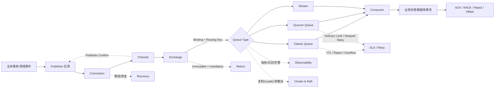
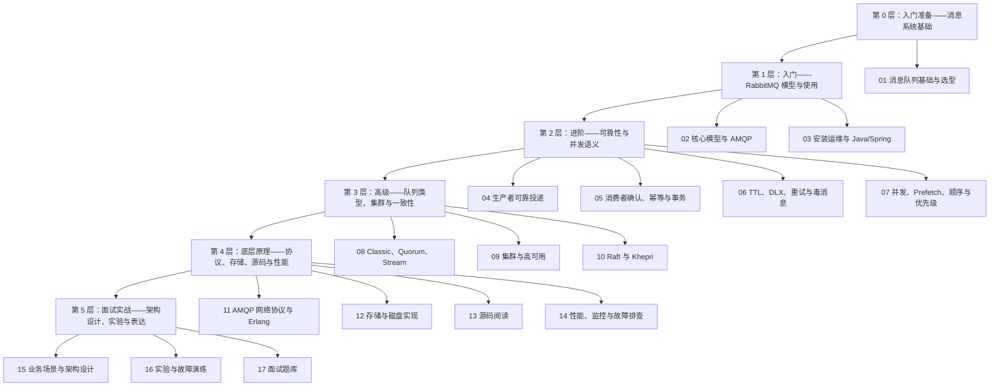
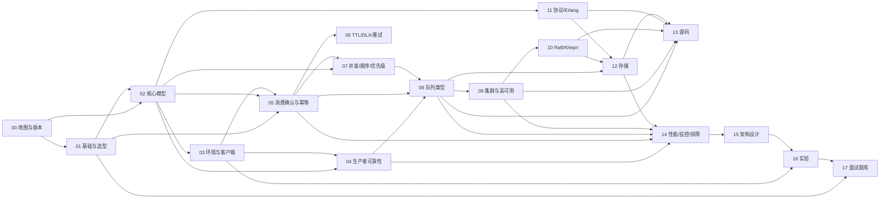
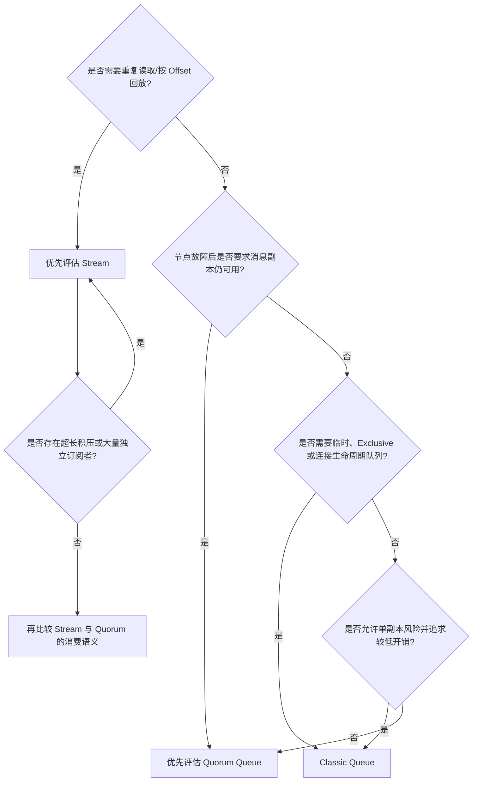
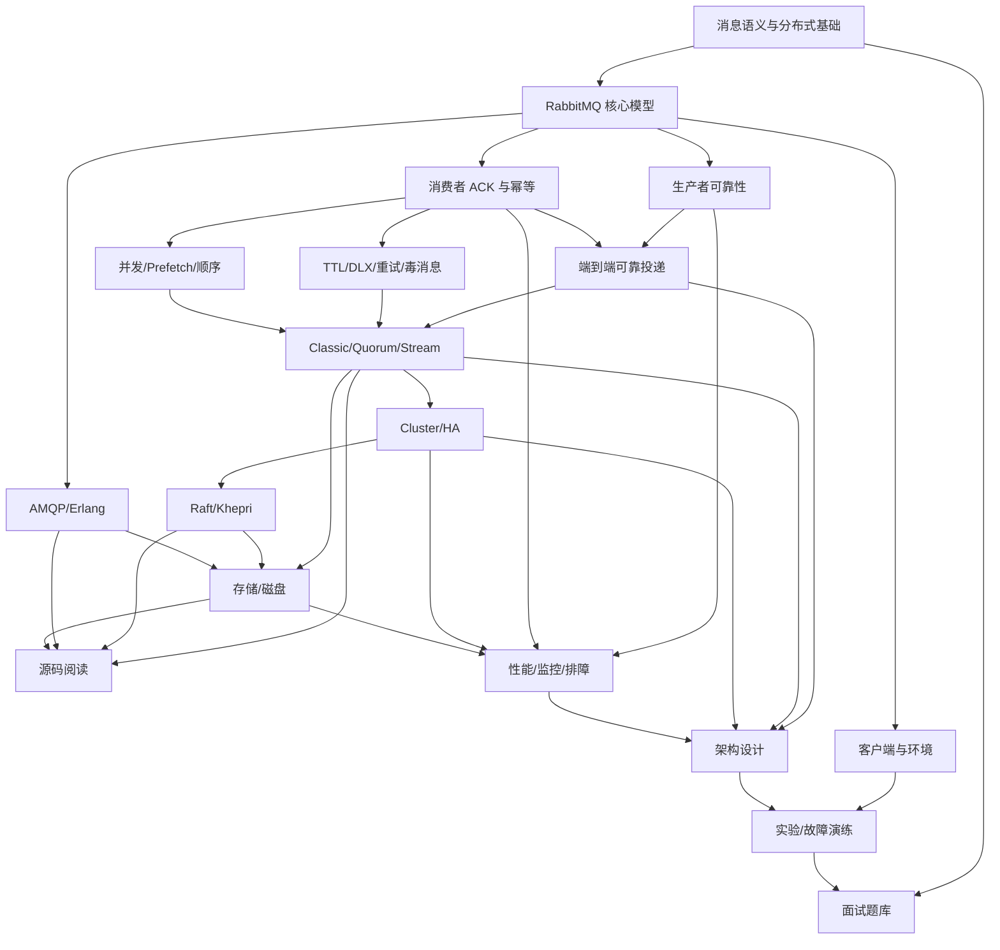

# 00｜RabbitMQ 学习地图与版本矩阵

> **文档定位**：全书总目录、知识导航、版本事实基线与写作规范。
> **主线版本**：RabbitMQ 4.3；本文校准到 **4.3.2**。
> **兼容观察版本**：3.13、4.0、4.1、4.2。
> **版本快照日期**：2026-06-19。版本、默认值和支持周期在后续发布中可能变化，落地前必须再次核对官方 Release Information 与目标补丁版本。
> **目标读者**：准备中高级 Java 后端、架构、消息中间件或生产运维面试的工程师。
> **阅读约定**：本章中的“可靠”必须带边界；“集群”不等于“消息自动复制”；“Exactly-once”不得脱离参与方、状态范围和故障模型单独使用。

---

## 0.1 本章目标与边界

完成本章后，读者应能做到以下十件事：

1. 看懂整套手册的知识分层、章节依赖与推荐阅读路径。
2. 用“消息生命周期”而不是零散 API 来组织 RabbitMQ 知识。
3. 区分 **Classic Queue、Quorum Queue、Stream** 的语义、成本和适用场景。
4. 解释 RabbitMQ 3.13 到 4.3 的关键演进，而不是混用不同版本结论。
5. 知道 Classic Mirrored Queue、Mnesia、Khepri、Consumer Timeout、Message Priority 等能力在哪个版本发生变化。
6. 制定 8 周系统学习计划或 4 周高强度学习计划。
7. 使用统一术语、版本标签、保证边界标签和交叉引用格式。
8. 区分“面试必须掌握”“生产级掌握”和“源码级加分项”。
9. 对现有 RabbitMQ 环境完成一次版本、Feature Flag、废弃特性和队列类型盘点。
10. 为后续每章建立可验收的学习产物，而不是只完成阅读。

### 0.1.1 本章不负责什么

本章不展开具体 API、配置默认值的全部细节，也不替代后续实验。以下内容只建立导航，完整机制分别在后续章节展开：

- Publisher Confirm、Return 与生产者重试：见 `04-生产者可靠投递原理.md`。
- ACK、事务边界、幂等与重复消费：见 `05-消费者确认幂等与事务.md`。
- TTL、DLX、重试与毒消息：见 `06-TTL-DLX-重试-延迟与毒消息.md`。
- 三类队列的完整差异：见 `08-Classic-Quorum-Stream队列类型.md`。
- Cluster、复制、Leader、网络分区：见 `09-RabbitMQ集群与高可用.md`。
- Raft、Khepri 与多数派：见 `10-Raft与Khepri一致性原理.md`。

---

## 0.2 前置知识与入门自测

### 0.2.1 建议具备的前置知识

| 层级 | 前置能力 | 最低要求 | 不足时先补什么 |
|---|---|---|---|
| P0 | Java 基础 | 线程、异常、集合、序列化、线程池 | Java 并发与异常处理 |
| P0 | 网络基础 | TCP 连接、超时、重连、心跳、半开连接 | TCP 与应用层协议基础 |
| P0 | 数据库基础 | 事务、唯一索引、隔离级别、提交与回滚 | 事务边界和幂等写入 |
| P1 | Linux/容器 | 进程、端口、文件描述符、磁盘、Docker | Linux 资源与 Docker 网络 |
| P1 | 分布式系统 | CAP、复制、Quorum、多数派、故障模型 | `01` 与 `10` 章的基础部分 |
| P1 | 操作系统 I/O | Page Cache、WAL、`fsync`、顺序写 | `12` 章前置小节 |
| P2 | Spring 生态 | Spring Boot、Bean 生命周期、事务管理 | Spring AMQP 使用基础 |
| P2 | 可观测性 | 指标、日志、Trace、SLO、告警 | Prometheus/Grafana 基础 |

### 0.2.2 五分钟自测

如果下列问题中有四个以上不能清晰回答，应按顺序从 `01` 章开始：

1. TCP 写成功是否等于对端业务处理成功？
2. 数据库提交成功后进程宕机，为什么可能导致消息重复？
3. “持久化”与“复制”有什么区别？
4. 三节点系统为什么通常能容忍一个节点故障，却不能容忍两个？
5. Consumer ACK 确认的是“消息已收到”还是“业务已永久完成”？
6. 队列中的 FIFO 为什么不必然等于业务处理结果有序？
7. Broker 接收消息、Exchange 路由消息、Queue 入队消息是不是同一件事？
8. 为什么超时后重试既可能防止丢失，也可能制造重复？

---

## 0.3 全书的核心心智模型：跟踪一条消息

RabbitMQ 的知识不应按“功能菜单”记忆，而应始终追踪一条消息经过的状态边界。

### 0.3.1 端到端生命周期图



不支持 Mermaid 时，可按下图阅读：

```text
业务事务
   │  事务内记录事件 / Outbox
   ▼
Publisher ──Connection──Channel──Exchange
   ▲              │          │       │
   │              │          │       └─ 路由失败 + mandatory → Return
   │              │          └─ Broker 接收结果 → Publisher Confirm
   │              └─ 断线、心跳、恢复、拓扑重建
   │
   └─────────────────────────────────────────────┐
                                                 ▼
                    Classic / Quorum / Stream
                    │        │          │
                    │        │          └─ Offset、Retention、Replay
                    │        └─ Raft、多数派、Leader、复制
                    └─ 单副本、低开销、临时/独占能力
                                                 │
                                                 ▼
                              Consumer → 业务事务/数据库
                                                 │
                                  ACK / NACK / Reject / Offset
                                                 │
                             重投、重复、乱序、DLX、毒消息
```

### 0.3.2 一条消息至少跨越六个保证边界

| 边界 | 核心问题 | 主要机制 | 不能证明什么 |
|---|---|---|---|
| 业务状态 → Publisher | 业务提交后事件会不会遗漏 | Outbox、事务消息表、CDC | Broker 已接收 |
| Publisher → Broker | Broker 是否接受了发布 | Publisher Confirm、超时、重试 | 消息一定路由到目标队列；消费者已处理 |
| Exchange → Queue | 是否存在匹配路由 | Binding、Routing Key、`mandatory`、Return | 队列副本已满足数据安全要求 |
| Queue → 持久化/复制状态 | 消息在节点故障后是否保留 | Queue 类型、持久化、Quorum、Stream | 下游业务一定成功 |
| Queue → Consumer | 交付是否被确认 | Manual ACK、Prefetch、Consumer Timeout | 数据库事务与 ACK 原子提交 |
| Consumer → 业务状态 | 重投时是否产生副作用 | 幂等键、唯一索引、Inbox、状态机 | 整条链路天然 Exactly-once |

### 0.3.3 状态属于哪里

面试回答必须指出状态的归属。模糊地说“RabbitMQ 记住了”通常不合格。

| 作用域 | 典型状态 | 失效条件或风险 |
|---|---|---|
| Connection | TCP、认证、心跳、协商参数 | 网络断开、节点关闭、心跳超时 |
| Channel / Session | Delivery Tag、Confirm Sequence、事务模式、消费者注册 | Channel 异常会关闭；Delivery Tag 不能跨 Channel 使用 |
| Exchange | 类型、Binding 路由关系 | Exchange 不负责消费确认；未路由消息可能被丢弃或 Return |
| Queue / Stream | Ready、Unacked、Offset、TTL、DLX、Leader/成员 | 语义取决于 Classic、Quorum 或 Stream |
| Node | Erlang VM、连接、磁盘、告警、局部 Leader | 节点宕机、磁盘满、资源告警 |
| Cluster | 成员、拓扑元数据、策略、用户、VHost | 元数据存储与多数派状态决定可用性 |
| Application / DB | 业务事务、幂等记录、Outbox/Inbox | MQ 无法替应用替代本地事务约束 |

### 0.3.4 后续每个机制统一回答十二个问题

```text
1. 它解决什么问题？
2. 它不解决什么问题？
3. 保证的起点和终点在哪里？
4. 状态保存在哪里？
5. 正常流程是什么？
6. 异常流程是什么？
7. 宕机、超时、网络分区时怎样？
8. 是否可能丢失？
9. 是否可能重复？
10. 是否可能乱序？
11. 性能和可用性代价是什么？
12. 替代方案与面试追问是什么？
```

---

## 0.4 RabbitMQ 知识树

### 0.4.1 六层知识结构（从入门到面试实战）



```text
RabbitMQ Knowledge Tree
├─ A. 消息系统理论
│  ├─ 同步/异步、命令/事件
│  ├─ At-most-once / At-least-once / Exactly-once
│  ├─ 削峰、解耦、最终一致性
│  └─ 选型、容量与引入成本
├─ B. 核心模型与客户端
│  ├─ Broker / Node / Cluster / VHost
│  ├─ Connection / Channel
│  ├─ Exchange / Queue / Binding / Routing Key
│  ├─ AMQP 0-9-1 / AMQP 1.0
│  └─ Java Client / Spring AMQP / CLI
├─ C. 可靠性与消费语义
│  ├─ Confirm / Return / Mandatory
│  ├─ ACK / NACK / Reject / Redelivery
│  ├─ Outbox / Inbox / Idempotency
│  ├─ TTL / DLX / Retry / Poison Message
│  └─ Prefetch / Concurrency / Ordering / Priority
├─ D. 数据结构与高可用
│  ├─ Classic Queue
│  ├─ Quorum Queue / Raft
│  ├─ Stream / Offset / Retention
│  ├─ Cluster / Leader / Replica
│  └─ Khepri / Metadata / Majority
├─ E. 底层与生产
│  ├─ AMQP Frame / Flow Control
│  ├─ Erlang Process / Mailbox / Supervision
│  ├─ WAL / Segment / fsync / Page Cache
│  ├─ 源码调用链
│  └─ Metrics / Logs / Alarms / Troubleshooting
└─ F. 面试与架构
   ├─ 故障窗口分析
   ├─ 容量规划与性能权衡
   ├─ 业务架构设计
   ├─ 故障注入实验
   └─ 30 秒 / 2 分钟 / 10 分钟回答
```

### 0.4.2 各层学习产物

| 层级 | 学完后必须交付的产物 | 验收方式 |
|---|---|---|
| 基础层 | 一页消息系统语义对照表 | 能解释为什么重试会导致重复、为什么 ACK 不等于数据库提交 |
| 使用层 | 可运行 Java/Spring Demo、拓扑图 | 能独立声明 Exchange/Queue/Binding 并定位 404/406 等 Channel 异常 |
| 可靠性层 | 端到端故障窗口表 | 至少列出 12 个丢失或重复窗口，并给出恢复与幂等策略 |
| 高可用层 | 三类队列决策表、三节点故障矩阵 | 能说明复制对象、Leader、多数派及少数派行为 |
| 底层层 | 协议抓包、磁盘目录、源码调用图 | 能把 API 行为连接到 Frame、Erlang 进程和存储路径 |
| 实战层 | 架构设计答卷、演练记录、面试录音 | 能在时间约束下给出结论、边界、失败模式和取舍 |

---

## 0.5 章节前置依赖关系与推荐阅读路径

### 0.5.1 章节依赖表

| 章节 | 核心任务 | 强前置 | 关键输出 |
|---|---|---|---|
| 00 | 地图、版本、术语、规范 | 无 | 学习计划与版本审计基线 |
| 01 | 消息系统理论与选型 | Java/网络/数据库基础 | 语义模型、选型框架、容量公式 |
| 02 | RabbitMQ 对象模型与 AMQP | 01 | 拓扑图、生命周期、协议对象关系 |
| 03 | 安装、CLI、Java Client、Spring AMQP | 02 | 可运行环境和基础 Demo |
| 04 | 生产者可靠投递 | 02、03 | Confirm/Return/重试故障窗口 |
| 05 | ACK、幂等、事务边界 | 01、02、03 | 消费状态机与 Inbox/幂等方案 |
| 06 | TTL、DLX、重试、延迟、毒消息 | 05 | 有界重试与停车场队列方案 |
| 07 | Prefetch、并发、顺序、优先级 | 02、05 | 吞吐—内存—顺序权衡表 |
| 08 | Classic、Quorum、Stream | 02、04、05、07 | 队列类型决策树与迁移策略 |
| 09 | Cluster、高可用、网络分区 | 08 | 节点/副本/Leader 故障矩阵 |
| 10 | Raft、Khepri、一致性 | 01、09 | 多数派、提交索引、元数据故障模型 |
| 11 | AMQP 网络协议、Erlang 进程模型 | 02、04、05 | Frame 时序与进程关系图 |
| 12 | 存储、WAL、Segment、磁盘 | 08、10、11 | 持久化路径与磁盘故障分析 |
| 13 | 源码阅读 | 08～12 | 模块地图、关键调用链、调试入口 |
| 14 | 性能、监控、故障排查 | 04～12 | SLI/SLO、告警规则、排障 Runbook |
| 15 | 业务场景与架构设计 | 01、04～10、14 | 可辩护的架构方案与容量估算 |
| 16 | 实验与故障演练 | 03～15 | 证据化实验报告和故障复盘 |
| 17 | 面试题库 | 01～16 | 分层答案、追问树、评分标准 |

### 0.5.2 知识依赖图



### 0.5.3 四条可裁剪路径

| 目标 | 推荐顺序 | 可暂缓内容 |
|---|---|---|
| Java 开发快速上手 | 00 → 01 → 02 → 03 → 04 → 05 → 06 → 07 → 08 → 14 → 16 | 11～13 可后置 |
| 中高级面试主线 | 00 → 01 → 02 → 04 → 05 → 06 → 07 → 08 → 09 → 10 → 14 → 15 → 17 | 03 只保留必要 API；13 作为加分 |
| 运维与高可用 | 00 → 02 → 03 → 08 → 09 → 10 → 12 → 14 → 16 | 业务代码细节可缩减 |
| 内核与源码 | 00 → 01 → 02 → 08 → 09 → 10 → 11 → 12 → 13 → 16 | 先建立行为模型，禁止直接从源码目录开始 |

---

## 0.6 Classic、Quorum、Stream 的学习顺序与选型框架

### 0.6.1 推荐学习顺序

```text
第一步：Classic Queue
    学习 Exchange → Binding → Queue → Consumer 的基本模型，理解 FIFO、ACK、TTL、DLX。

第二步：Quorum Queue
    在已理解普通队列语义后，引入复制、Leader、多数派、Publisher Confirm、毒消息处理。

第三步：Stream
    从“消费后删除的队列”切换到“追加日志 + Retention + Offset + Replay”的心智模型。
```

这个顺序是**学习顺序**，不是生产推荐顺序。生产选型必须先问数据安全、重放、积压、延迟和成本，而不是默认使用最先学到的 Classic Queue。

### 0.6.2 三类队列的核心对照

| 维度 | Classic Queue | Quorum Queue | Stream |
|---|---|---|---|
| 核心模型 | 传统 FIFO 队列 | 基于 Raft 的复制 FIFO 队列 | 复制的追加日志 |
| RabbitMQ 4.x 复制 | **不复制** | 复制 | 复制 |
| 持久性 | 可 durable，也可 transient | 始终 durable | 始终 durable |
| 临时/Exclusive | 支持，适合连接生命周期队列 | 不支持临时/Exclusive 语义 | 不用于临时/Exclusive 队列 |
| 消费后数据 | ACK 后可删除 | ACK 后可删除 | 按 Retention 保留，可重复读取 |
| 重放 | 非原生核心能力 | 非原生核心能力 | 原生 Offset/Replay |
| 消息优先级 | 支持 `x-max-priority` | 3.13 不支持；4.0～4.2 两档；4.3 32 级严格优先级 | 不采用队列优先级模型 |
| 毒消息保护 | 无内建 delivery-limit 机制 | 支持 delivery count/limit；4.0 起默认上限 20 | 由消费应用和 Offset 策略处理 |
| At-least-once DLX | 不支持 | 可选支持，默认仍为 at-most-once | 不以传统 DLX 为核心模型 |
| 典型优势 | 低开销、功能通用、临时队列 | 关键业务数据安全、明确故障恢复 | 大积压、回放、多订阅者、高吞吐 |
| 主要代价 | 单副本节点故障风险 | 多数派、磁盘、网络复制成本 | 需要 Offset/Retention 思维，业务模型不同 |
| 典型场景 | 临时 RPC 回复、非关键任务、单节点开发 | 订单、支付指令、库存变更等关键工作队列 | 事件流、审计、日志、大规模扇出、重放 |

> **关键结论**：Classic Queue 本身没有被废弃；被移除的是 **Classic Queue Mirroring**。在 RabbitMQ 4.x 中，需要消息复制时应选择 Quorum Queue 或 Stream。[R5][R8][R9]

### 0.6.3 快速决策树



选择时至少记录以下字段：

```text
业务消息价值：
可接受丢失窗口：
是否要求重放：
最大积压条数/字节数：
目标吞吐与 P99 延迟：
消费者数量与扇出规模：
是否需要临时/Exclusive：
是否依赖优先级、TTL、DLX：
可用节点数与可接受多数派成本：
故障恢复目标 RTO/RPO：
```

---

## 0.7 八周系统学习计划

建议每周投入 8～12 小时，阅读、编码、实验、复盘比例约为 `3:3:3:1`。

| 周次 | 章节 | 学习目标 | 实践任务 | 验收标准 |
|---|---|---|---|---|
| 第 1 周 | 00、01、02 | 建立消息语义与 RabbitMQ 对象模型 | 画端到端拓扑；对比 RabbitMQ/Kafka/RocketMQ；手绘 Connection/Channel/Exchange/Queue 生命周期 | 不看资料解释 8 个核心对象；说明 MQ 引入的丢失、重复、乱序、积压问题 |
| 第 2 周 | 03 | 从零搭建可重复环境并完成 Java/Spring 基础使用 | Docker 单节点；Management、CLI；Java Client 和 Spring Boot 各完成生产消费 | 环境可一键启动；能定位认证、VHost、声明不一致和 Channel 关闭问题 |
| 第 3 周 | 04 | 掌握 Publisher 到 Broker 的可靠边界 | 同步/批量/异步 Confirm；`mandatory` + Return；断网与重启实验 | 能区分 Confirm、Return、持久化、路由；画出至少 5 个生产者故障窗口 |
| 第 4 周 | 05、06 | 掌握消费、事务、幂等、重试和毒消息 | Manual ACK；唯一索引幂等；Outbox/Inbox；TTL+DLX 重试；停车场队列 | 能解释“数据库提交成功、ACK 前宕机”；重试有上限、退避、隔离和告警 |
| 第 5 周 | 07、08 | 掌握并发、顺序、优先级与三类队列 | Prefetch 压测；多消费者乱序；Classic/Quorum/Stream 对照实验 | 能根据业务约束选择队列类型；说明 3.13、4.0～4.2、4.3 优先级差异 |
| 第 6 周 | 09、10 | 掌握 Cluster、复制、Raft、Khepri 与分区 | 三节点集群；停 Leader；隔离少数派；观察 Quorum/Stream/Khepri 行为 | 能解释“Cluster 不等于消息复制”；能计算多数派并说明 4.3 元数据可用性 |
| 第 7 周 | 11、12、13、14 | 打通协议、Erlang、存储、源码与排障 | Wireshark 抓包；查看磁盘目录；阅读关键模块；建立 Prometheus 仪表盘 | 能从症状沿指标→日志→协议→进程→磁盘定位；完成一份排障 Runbook |
| 第 8 周 | 15、16、17 | 架构设计、故障演练与面试表达 | 完成 3 道系统设计；6 个故障注入；录制 30 秒/2 分钟/10 分钟回答 | 架构方案含容量、保证、成本、降级和演练；连续追问下不混淆版本与边界 |

### 0.7.1 每周固定节奏

```text
第 1 天：读原理，整理“解决什么/不解决什么”。
第 2 天：画图，标注状态归属和保证边界。
第 3 天：完成最小可运行代码。
第 4 天：注入一个正常故障和一个边界故障。
第 5 天：记录指标、日志、抓包或磁盘证据。
第 6 天：完成面试题与追问树。
第 7 天：闭卷复盘，修订知识卡片。
```

---

## 0.8 四周高强度学习计划

建议每天 2.5～4 小时；必须已有 Java、数据库事务、Linux 和基础分布式知识。此计划压缩阅读，不压缩实验。

| 周次 | 主线章节 | 重点任务 | 周末验收 |
|---|---|---|---|
| 第 1 周 | 00～04 | 理论、模型、环境、生产者可靠投递 | 完成单节点环境、Java/Spring Demo、Confirm/Return 故障窗口图；闭卷回答“发送成功到底成功到哪” |
| 第 2 周 | 05～08 | ACK、幂等、TTL/DLX、重试、并发、队列类型 | 做出有界重试和幂等消费样例；完成三类队列决策表；解释优先级与顺序边界 |
| 第 3 周 | 09～14 | 集群、Raft、Khepri、协议、存储、源码、监控 | 搭三节点集群并做 Leader/网络/磁盘故障；建立最小 Grafana 看板和排障清单 |
| 第 4 周 | 15～17 | 架构题、实验题、面试题 | 每天 1 道系统设计 + 10 道口述题；完成一次 60 分钟模拟面试和缺口复盘 |

### 0.8.1 每日时间盒

```text
45 分钟：官方文档与本书正文
45 分钟：图和笔记
60～90 分钟：代码/实验/故障注入
30 分钟：口述回答与追问
15 分钟：记录未解决问题和版本标签
```

不能满足实验时间时，应延长计划，而不是只背诵结论。

---

## 0.9 分阶段目标、实践任务与验收标准

| 阶段 | 能力目标 | 必做实践 | 硬性验收 |
|---|---|---|---|
| S1 入门 | 会部署、会声明拓扑、会生产消费 | Hello World、Work Queue、Direct、Topic、Fanout、RPC | 能解释每个对象的生命周期；能读懂管理台而不把 Ready 当总消息数 |
| S2 可靠性 | 会分析发布、路由、持久化、消费和业务事务边界 | Confirm、Return、Manual ACK、幂等、Outbox、DLX | 至少识别 12 个故障窗口；每个窗口说明丢失/重复/恢复 |
| S3 生产化 | 会控制并发、积压、重试、顺序、资源和告警 | Prefetch 压测、毒消息、磁盘/内存告警、限流 | 有容量公式、阈值、Runbook 和演练证据，不能只给“扩容消费者” |
| S4 高可用与底层 | 理解复制、Raft、Khepri、协议、存储 | 三节点故障、抓包、磁盘观察、源码断点 | 能说明多数派、Leader 变更、Confirm 时点和元数据/消息数据区别 |
| S5 面试与架构 | 能在约束下设计并接受连续追问 | 订单、通知、延迟任务等架构题；模拟面试 | 回答含结论、边界、异常、成本、替代方案和版本；不使用绝对化口号 |

### 0.9.1 统一验收等级

- **L1 识记**：能定义术语。
- **L2 解释**：能画正常流程并说明状态归属。
- **L3 分析**：能处理宕机、超时、重试、分区并判断丢失/重复/乱序。
- **L4 设计**：能根据业务约束选择机制并量化成本。
- **L5 证据**：能用代码、指标、日志、抓包、磁盘或源码验证结论。

中高级面试主线至少达到 L3，生产负责人应达到 L4，源码与内核方向争取达到 L5。

---

## 0.10 版本基线、支持状态与阅读规则

### 0.10.1 截至 2026-06-19 的版本快照

| 系列 | 本系列最新补丁 | 发布时间 | 社区支持截止 | 本书定位 |
|---|---:|---:|---:|---|
| 3.13 | 3.13.7 | 2024-08-26 | 2024-09-30，已结束 | 企业存量与 3.x→4.x 迁移基线 |
| 4.0 | 4.0.9 | 2025-04-14 | 2025-04-30，已结束 | 关键破坏性变化起点 |
| 4.1 | 4.1.8 | 2026-01-22 | 2026-01-31，已结束 | Quorum 性能与 AMQP 1.0 能力演进 |
| 4.2 | 4.2.6 | 2026-05-20 | 2026-07-31 | 升级到 4.3 的直接前置版本 |
| 4.3 | **4.3.2** | **2026-06-15** | 2026-11-30 | 本书主线语义与实验基线 |

以上日期来自官方 Release Information；商业支持周期与社区支持周期不同。[R1]

### 0.10.2 升级路径必须单独记忆

当前官方支持的关键路径为：

```text
3.13.x ───────────────► 4.2.x ─► 4.3.x
4.0.x  ─► 4.1.x ─┐
4.0.x  ──────────┼────► 4.2.x ─► 4.3.x
4.1.x  ──────────┘
```

- 升级到 4.3.x 只支持从 4.2.x 进入。
- 升级前必须启用目标版本要求的稳定 Feature Flags。
- RabbitMQ 3.13 的 Khepri 实现与 4.x 不兼容；**3.13 已启用 Khepri 的集群不能原地升级到 4.x**，应采用蓝绿迁移。[R16]
- 混合版本集群只用于滚动升级的短暂窗口，不应作为长期运行形态。

### 0.10.3 本书版本标签

后续章节统一使用以下标签：

| 标签 | 含义 | 示例 |
|---|---|---|
| `[4.3+]` | 从 4.3 起适用 | `[4.3+] Quorum Queue 原生 delayed retry` |
| `[4.0–4.2]` | 只适用于该区间 | `[4.0–4.2] Quorum 两档优先级` |
| `[≤3.13]` | 旧版或存量语义 | `[≤3.13] Classic Mirrored Queue` |
| `[4.0 移除]` | 该版本起不可用 | `[4.0 移除] classic_queue_mirroring` |
| `[4.3 默认禁用]` | 代码可能仍在，但默认拒绝 | `global_qos` |
| `[补丁敏感]` | 必须核对具体 x.y.z | 安全修复、缺陷、客户端兼容性 |
| `[协议差异]` | AMQP 0-9-1、1.0、Stream Protocol 行为不同 | Consumer Timeout 的超时处理 |

### 0.10.4 版本事实的裁决优先级

```text
1. 目标补丁版本 Release Notes
2. 对应版本官方文档
3. RabbitMQ 官方源码与测试
4. 协议规范、Spring AMQP/Java Client 官方文档
5. 博客、Issue、社区资料仅作辅助
```

当“最新文档”和“旧版本文档”冲突时，不用最新文档反推旧版行为；必须切换到目标版本页面或对应 Git Tag。

---

## 0.11 RabbitMQ 3.13～4.3 版本差异矩阵

### 0.11.1 队列类型与存储实现

| 能力 | 3.13 | 4.0 | 4.1 | 4.2 | 4.3 | 迁移/面试结论 |
|---|---|---|---|---|---|---|
| Classic Mirrored Queue | 可用但已废弃 | **移除** | 不存在 | 不存在 | 不存在 | 不能把镜像经典队列作为 4.x 方案；迁移到 Quorum 或 Stream |
| Classic Queue | 可单副本，也可通过旧镜像策略复制；CQv1/CQv2 存量 | 仅非复制；启动时把 CQv1 迁移到 CQv2 | 非复制；CQv2 | 非复制；CQv2 | 非复制；CQv2；旧 `x-queue-mode`/`x-queue-version=1` 声明失败 | Classic Queue 没有废弃，但 4.x 不提供消息副本 |
| Quorum Queue | 支持 Raft 复制；无消息优先级 | 新增两档消息优先级；默认 delivery-limit=20 | 日志读取下沉到 Channel，吞吐与并行性改进 | 延续 4.1；作为主要复制队列 | 32 级严格优先级、原生 delayed retry、Consumer Timeout、恢复/内存优化 | 需要复制和数据安全的传统队列优先考虑 Quorum |
| Stream | 支持复制、Retention、Offset、Replay | 持续支持；可经 AMQP 1.0 使用过滤等能力 | AMQP 1.0 属性过滤增强 | 增加 SQL 风格过滤表达式 | 持续作为复制日志结构 | 大积压、重放、扇出和事件流优先评估 Stream |
| CQv1 | 可用但应迁移 CQv2 | 存储实现移除，仅保留升级迁移所需部分 | 不支持 | 不支持 | 旧声明参数进一步明确拒绝 | 升级前评估转换时间与磁盘空间 |
| CQv2 | 可用且推荐 | 实际运行实现 | 实际运行实现 | 官方作为默认实现 | 唯一 Classic 存储实现 | 不要把 CQv1/CQv2 与 Classic/Quorum 类型混为一谈 |

来源：[R2][R3][R4][R5][R6][R8][R9][R10]

### 0.11.2 元数据存储与集群控制面

| 能力 | 3.13 | 4.0 | 4.1 | 4.2 | 4.3 | 运维含义 |
|---|---|---|---|---|---|---|
| Khepri | 实验性替代元数据存储；不建议生产；与 4.x 升级不兼容 | 完全支持但需显式启用 | 完全支持、可选 | **新集群默认**；旧集群保留原存储直到迁移 | **唯一元数据存储** | 4.3 的拓扑/用户/策略变更受 Raft 多数派约束 |
| Mnesia | 默认元数据存储 | 仍支持，通常为未迁移集群默认 | 仍支持 | 升级而来的集群可继续使用；新集群默认 Khepri | **完全移除** | 4.3 不再讨论 Mnesia 分区恢复策略 |
| `cluster_partition_handling` | Mnesia 时代的重要配置 | 仍与 Mnesia 场景相关 | 同左 | 同左，取决于元数据后端 | 配置键可被接受但**无效果**，应移除 | 4.3 统一按 Raft 组件的多数派与恢复语义分析 |
| RAM Node | 旧概念仍可能存在 | 已废弃 | 已废弃 | 已废弃 | `ram_node_type` 移除 | 现代 RabbitMQ 使用磁盘节点，不用 RAM Node 设计 HA |

来源：[R2][R3][R5][R6][R7][R16][R17]

### 0.11.3 消费、优先级、重试与死信

| 能力 | 3.13 | 4.0 | 4.1 | 4.2 | 4.3 | 关键边界 |
|---|---|---|---|---|---|---|
| Consumer Delivery ACK Timeout | 通用超时检查；默认 30 分钟；可按节点/队列配置 | 延续 | 延续 | 延续 | **仅 Quorum Queue 支持**；Classic/Stream 不再评估 | 它防止长期 Unacked 阻碍回收，不替代业务超时和幂等 |
| Classic Message Priority | 支持，声明 `x-max-priority` | 支持 | 支持 | 支持 | 支持 | 官方通常建议仅配置 2～4 个等级，等级越多资源成本越高 |
| Quorum Message Priority | 不支持 | 两档：normal/high，约 2:1 公平调度 | 同 4.0 | 同 4.0 | **32 级 0～31 严格优先级** | 4.0～4.2 不能按 Classic 的多级严格优先级理解 |
| Delayed Retry | 无统一内建队列级能力；常用 TTL+DLX、分级重试队列或插件 | 同左 | 同左 | 同左 | Quorum 原生 delayed retry，按投递次数线性增加并受最大值限制 | “延迟消息”与“失败后延迟重试”不是同一需求 |
| Basic Dead Lettering | 支持 | 支持 | 支持 | 支持 | 支持 | 默认内部重发布不使用 Confirm，目标不可用时可能丢失 |
| Quorum At-least-once DLX | 可选；默认仍 at-most-once | 可选 | 可选 | 可选 | 可选 | 需特定策略组合；可能重复并增加 CPU/内存/积压风险 |
| Quorum Poison Handling | 支持 delivery count/limit；3.13 无 4.x 默认 20 | 默认 delivery-limit=20 | 默认 20 | 默认 20 | 支持并与 delayed retry 等能力结合 | 超限后若无 DLX 可能直接删除，必须显式设计 |

来源：[R2][R5][R9][R11][R12][R13]

### 0.11.4 协议

| 能力 | 3.13 | 4.0 | 4.1 | 4.2 | 4.3 | 学习建议 |
|---|---|---|---|---|---|---|
| AMQP 0-9-1 | 核心协议 | 核心协议 | 核心协议 | 核心协议 | 核心协议 | Java Client 与 Spring AMQP 主线先学 0-9-1 |
| AMQP 1.0 | 通过插件提供 | **成为始终启用的核心协议**；旧插件为升级兼容空壳 | 增加 Stream 属性过滤等能力 | SQL 过滤、Direct Reply-To；省略 `durable` 时按规范默认为 `false` | 持续作为核心协议；与 Quorum 超时等能力更深集成 | 1.0 与 0-9-1 在线路格式和语义上不是“小版本升级” |
| AMQP Address v1 | 旧格式 | `amqp_address_v1` 开始废弃，推荐 v2 | 废弃 | 废弃 | 默认拒绝使用，需显式临时放开 | 新系统只使用 Address v2 |
| Stream Protocol | 插件提供的原生高吞吐协议 | 支持 | 支持 | 支持 | 支持 | 需要充分利用 Stream 时再学习原生客户端 |

来源：[R2][R3][R4][R5][R7][R14]

---

## 0.12 版本演进主线：面试时如何讲清楚

### 0.12.1 RabbitMQ 3.13：迁移前的 3.x 基线

- Classic Mirrored Queue 仍可用，但已明确废弃。
- Mnesia 是默认元数据存储；Khepri 只是实验性替代方案。
- Quorum Queue 已是成熟复制队列，但尚不支持消息优先级。
- Stream、Stream Filtering、CQv2 等现代能力已存在。
- 3.13 启用实验 Khepri 后不能原地升级到 4.x。

**一句话**：3.13 是企业存量常见的“新旧机制并存”版本，也是迁移到 4.x 时最需要做事实审计的版本。

### 0.12.2 RabbitMQ 4.0：现代化的破坏性拐点

- Classic Queue Mirroring 完全移除；Classic Queue 从此是非复制队列。
- CQv1 存储实现移除，旧队列在启动升级时迁移到 CQv2。
- Quorum Queue 增加两档消息优先级，默认重投上限设为 20。
- Khepri 从实验状态进入完全支持，但仍非默认。
- AMQP 1.0 变为始终启用的核心协议。
- 默认最大消息大小从 128 MiB 降至 16 MiB；大对象仍应放对象存储，只传引用。[R5]

**一句话**：4.0 不是简单升级，而是“放弃 Classic 镜像、转向 Quorum/Stream”的架构分界线。

### 0.12.3 RabbitMQ 4.1：Quorum 并行性与 AMQP 1.0 增强

- Quorum Queue 的日志读取下沉到 Channel/Session，改善消费吞吐、发布与消费干扰及 CPU 利用。
- AMQP 1.0 对 Stream 的属性过滤能力增强。
- Khepri 与 Mnesia 仍可选，尚未强制统一。

**一句话**：4.1 的重点是现代数据结构的吞吐、并行和协议能力，而不是新的队列类型。

### 0.12.4 RabbitMQ 4.2：新部署默认 Khepri

- 新集群默认使用 Khepri；从旧版本升级的集群继续使用原来的元数据存储，除非主动迁移。
- AMQP 1.0 在省略 Header 时将 `durable` 按规范视为 `false`；客户端应明确发送 durable。
- Stream 增加 SQL 风格服务器端过滤表达式。
- 4.2 是升级到 4.3 的唯一直接前置系列。

**一句话**：4.2 是从“双元数据后端”走向 4.3“Khepri 唯一化”的过渡站。

### 0.12.5 RabbitMQ 4.3：Raft 化收敛

- Mnesia 完全移除，Khepri 成为唯一元数据存储。
- 旧的 Mnesia 分区处理配置不再生效。
- Quorum Queue 增加 32 级严格优先级、原生延迟重试、消费者超时、恢复快照和内存优化。
- Consumer Delivery ACK Timeout 只由 Quorum Queue 支持；Classic Queue 和 Stream 不再评估。
- 多项废弃特性进入“默认拒绝”阶段，`ram_node_type` 被移除。
- 原地升级只支持从 4.2.x 进入。

**一句话**：4.3 将控制面和主要复制数据结构统一到 Raft 故障模型，但也使“多数派在线”成为更普遍的可用性前提。[R2]

---

## 0.13 已移除、已废弃与当前推荐清单

### 0.13.1 已移除或已经失效

| 功能/配置 | 状态 | 替代方案或动作 |
|---|---|---|
| Classic Queue Mirroring | 4.0 移除 | 需要复制的工作队列用 Quorum；需要重放/大扇出用 Stream |
| CQv1 存储实现 | 4.0 起不再支持正常运行，仅保留迁移逻辑；4.3 拒绝旧声明参数 | 升级前迁移/评估 CQv2 转换 |
| Mnesia 元数据存储 | 4.3 移除 | Khepri |
| `ram_node_type` | 4.3 移除 | 全部使用磁盘节点 |
| `cluster_partition_handling*` 的 Mnesia 时代策略 | 4.3 配置无效果 | 按 Khepri/Quorum/Stream 的 Raft 多数派语义设计 |

### 0.13.2 废弃或 4.3 默认拒绝

| 特性 | 当前状态 | 推荐做法 |
|---|---|---|
| `amqp_address_v1` | 4.0 起废弃；4.3 默认拒绝 | 使用 AMQP 1.0 Address v2 |
| `global_qos` | 废弃；4.3 默认拒绝 | 使用 per-consumer Prefetch/QoS |
| `queue_master_locator` | 废弃；4.3 默认拒绝 | 使用现代队列 Leader/副本放置机制和相关工具 |
| `transient_nonexcl_queues` | 废弃；4.3 默认拒绝 | 使用 durable Queue，或真正的 transient + exclusive Queue |
| `management_metrics_collection` | 废弃 | 使用 Prometheus 插件和外部时序数据库 |
| `amqp_filter_set_bug` | 兼容旧错误行为；4.3 默认拒绝 | 修正客户端，使用标准 Filter Set 行为 |

> “默认拒绝”不等于“已经从代码中删除”。短期可通过 deprecated feature 配置临时放开，但这只是迁移缓冲，不是长期架构。[R2][R7]

### 0.13.3 当前推荐基线

| 目标 | 当前推荐 |
|---|---|
| 复制的关键工作队列 | Quorum Queue + Publisher Confirm + Manual ACK + 业务幂等 |
| 大积压、重放、多订阅者 | Stream + 合理 Retention + Offset 管理 |
| 临时/Exclusive/低价值单副本 | Classic Queue，并显式接受节点级风险 |
| 发布可靠性 | Confirm；需要发现未路由时同时启用 `mandatory`/Return |
| 消费可靠性 | Manual ACK；数据库提交后 ACK；通过幂等承受重复 |
| 跨数据库与 MQ 一致性 | Transactional Outbox/CDC，而不是把本地事务与 Broker 事务想象成全局事务 |
| 重试 | 有界次数、退避、抖动、分类、DLX/停车场和人工处置；4.3 Quorum 可评估原生 delayed retry |
| QoS | Per-consumer Prefetch；结合处理时间、消息大小和消费者并发压测 |
| 指标 | Prometheus + Grafana；管理台用于交互诊断，不作为长期指标存储 |
| 元数据 | 4.3 使用 Khepri；按奇数节点和多数派可用性设计 |
| AMQP 1.0 地址 | Address v2 |
| 配置治理 | 可动态调整的 DLX/TTL/Limit 优先用 Policy；不可变语义才用声明参数 |
| 升级 | 逐系列、最新补丁、先审计 Feature Flags 与废弃特性、做回滚与容量演练 |

---

## 0.14 统一术语表

### 0.14.1 对象、协议与路由术语

| 术语 | 英文/缩写 | 统一定义 | 容易混淆的点 |
|---|---|---|---|
| 消息代理 | Broker | 接受发布、执行路由、保存队列/流数据并向消费者交付的服务 | Broker 不等于某个 Queue；Cluster 由多个 Node 构成 |
| 节点 | Node | 一个 RabbitMQ Erlang VM 实例及其本地资源 | 一个节点可承载多个 Queue Leader/Replica |
| 集群 | Cluster | 共享拓扑和其他分布式状态的一组节点 | **不代表所有 Queue 消息自动复制** |
| 虚拟主机 | Virtual Host, VHost | 逻辑租户和命名/权限隔离边界 | 不是操作系统虚拟机 |
| 连接 | Connection | 客户端与节点之间的长生命周期 TCP/协议连接 | 通常昂贵，应复用；不是每条消息建立一次 |
| 信道 | Channel | Connection 内的轻量逻辑会话 | 多线程共享、Delivery Tag 与 Confirm Sequence 均有作用域约束 |
| 发布者 | Publisher/Producer | 向 Exchange 或协议目标发送消息的应用角色 | Publisher 是角色；Producer 常作为同义词 |
| 消费者 | Consumer | 注册订阅并接收 Delivery 的客户端实体/应用角色 | Consumer 与业务线程不必一一对应 |
| 交换机 | Exchange | 根据类型、Binding 和 Routing Key 路由消息 | 不长期保存传统队列消息 |
| 队列 | Queue | 保存并向消费者交付消息的数据结构 | 必须说明 Classic 或 Quorum；Stream 是不同模型 |
| 绑定 | Binding | Exchange 到 Queue/Exchange 的路由关系 | Binding Key 与发布时 Routing Key 不同但参与匹配 |
| 路由键 | Routing Key | Publisher 提供的路由字符串 | 不等于 Queue Name，Default Exchange 是特殊情况 |
| 默认交换机 | Default Exchange | 名称为空字符串、按 Queue Name 路由的 Direct Exchange | “不声明 Exchange”不代表不存在 Exchange |
| 投递 | Delivery | Broker 向 Consumer 发送的一次消息尝试 | 同一 Message 可能有多次 Delivery |
| AMQP 0-9-1 | AMQP 0-9-1 | RabbitMQ 最早和最常见的核心二进制协议 | 与 AMQP 1.0 不是线路兼容的小版本关系 |
| AMQP 1.0 | AMQP 1.0 | OASIS/ISO 标准的现代消息协议，4.0 起为 RabbitMQ 核心协议 | Link、Credit、Outcome 等模型与 0-9-1 不同 |
| Stream Protocol | RabbitMQ Stream Protocol | 面向 Stream 的原生高吞吐协议 | 通过插件启用协议入口，但 Stream 本身是 Broker 数据结构 |
| 帧 | Frame | 协议在线路上传输的结构化单元 | API 调用可能对应多个 Frame；抓包可验证时序 |

### 0.14.2 发布、确认与消费术语

| 术语 | 英文/缩写 | 统一定义 | 不能推出的结论 |
|---|---|---|---|
| 发布 | Publish | 客户端向 Broker 发送消息 | Socket 写成功不等于 Broker 已可靠接受 |
| 路由 | Route | Exchange 根据 Binding 选择目标 | 路由成功不等于目标 Queue 满足复制多数派 |
| 入队 | Enqueue | 消息进入目标 Queue/Stream 的状态机或存储路径 | 不等于消费者已处理 |
| 发布确认 | Publisher Confirm | Broker 对发布结果向 Publisher 发出 ACK/NACK 的机制 | 不确认业务数据库成功；其安全程度受 Queue 类型影响 |
| Return | Basic.Return | `mandatory=true` 时，消息无法路由到任何 Queue 的返回通知 | 不是持久化失败通知，也不覆盖 Broker 宕机 |
| 消费确认 | Consumer ACK | Consumer 告知 Broker 某次 Delivery 可被确认完成 | 不自动与数据库事务形成原子性 |
| 否定确认 | NACK | 拒绝一个或多个 Delivery，可选择 Requeue | 反复 Requeue 可形成热循环 |
| 拒绝 | Reject | AMQP 0-9-1 对单条 Delivery 的拒绝 | 与 NACK 的批量能力不同 |
| 重回队列 | Requeue | 将未成功处理的 Delivery 重新变为可投递 | 可能改变相对顺序并制造重复 |
| 重投标记 | Redelivered | 表示该消息可能曾被投递过 | 不是全局唯一重试次数；不能替代幂等键 |
| Delivery Tag | Delivery Tag | Channel 内标识 Delivery 的递增编号 | 只能在原 Channel ACK/NACK |
| Confirm Sequence | Publish Sequence Number | Channel 内标识待 Confirm 发布的序号 | 连接恢复后不能盲目沿用旧映射 |
| Prefetch | QoS/Prefetch | 限制未确认、在途 Delivery 数量的流控参数 | 值越大不必然越快；会增加内存、重复批量和乱序窗口 |
| Consumer Timeout | Delivery ACK Timeout | 未 ACK 超过阈值时触发保护处理的 Broker 机制 | 4.3 只适用于 Quorum；不等于业务执行 SLA |
| 单活消费者 | Single Active Consumer, SAC | 同一 Queue 多个注册 Consumer 中只有一个活动，故障时切换 | 不能消除应用内部并发和重投导致的顺序问题 |
| 消息优先级 | Message Priority | Queue 依据消息属性改变调度顺序 | 与 Consumer Priority 不同；版本和 Queue 类型差异显著 |
| 消费者优先级 | Consumer Priority | 优先向高优先级 Consumer 分发 | 不改变消息自身优先级 |

### 0.14.3 可靠性与业务一致性术语

| 术语 | 英文/缩写 | 统一定义 | 边界 |
|---|---|---|---|
| 至多一次 | At-most-once | 消息最多处理一次，但故障时可能丢失 | 常见于不重试或先 ACK 后处理 |
| 至少一次 | At-least-once | 通过重试避免静默丢失，但允许重复 | 必须配合消费幂等 |
| 恰好一次 | Exactly-once | 在明确状态范围与故障模型内，最终副作用只发生一次 | 不得把 Broker 局部语义扩大为端到端全局保证 |
| 持久消息 | Persistent Message | 发布属性要求 Broker 按持久化路径处理 | 仍取决于 Queue durable、Confirm 和具体 Queue 类型 |
| 持久队列 | Durable Queue | Broker 重启后 Queue 定义应保留 | 不等于消息复制，也不保证所有消息都持久化 |
| 幂等 | Idempotency | 同一业务操作执行多次，最终状态与一次等价 | 需业务键、状态机、唯一约束或去重记录 |
| 去重 | Deduplication | 识别并抑制重复消息或重复副作用 | 去重窗口、存储成本和过期策略必须明确 |
| Outbox | Transactional Outbox | 在业务本地事务中写入待发布事件，再异步投递 | 发布后标记仍有重复窗口，因此消费者仍需幂等 |
| Inbox | Consumer Inbox | 消费者在本地记录已处理消息标识 | 需要唯一键、事务边界与清理策略 |
| 故障窗口 | Failure Window | 两个不可原子步骤之间，宕机可改变结果的时间区间 | 分析时必须指出宕机点、已持久状态和恢复行为 |
| 毒消息 | Poison Message | 每次处理都失败、可能造成无限重投的消息 | 需次数限制、隔离、告警和人工/补偿流程 |
| 停车场队列 | Parking Lot Queue | 保存超过重试上限、等待人工或离线处理的消息 | 不应自动无限回灌主队列 |

### 0.14.4 TTL、DLX、重试与流控术语

| 术语 | 英文/缩写 | 统一定义 | 关键提醒 |
|---|---|---|---|
| 生存时间 | Time-to-Live, TTL | Queue 或 Message 的过期时间 | 过期检测和实际移除时点受实现影响 |
| 死信 | Dead-lettered Message | 因拒绝、过期、长度限制等原因被重新发布的消息 | “死信”是状态变化，不等同于名为 DLQ 的固定对象 |
| 死信交换机 | Dead Letter Exchange, DLX | 接收 Queue 重新发布死信的 Exchange | 默认重发布不保证安全；Quorum 可配置 at-least-once |
| 死信队列 | Dead Letter Queue, DLQ | 绑定到 DLX、用于接收死信的普通 Queue/Stream | RabbitMQ 没有独立的“DLQ 类型” |
| 延迟消息 | Delayed Message | 在指定时间前不可交付的消息 | 可由插件、TTL 队列、业务调度器等实现 |
| 延迟重试 | Delayed Retry | 失败后等待一段时间再可投递 | 4.3 Quorum 原生能力不等于通用任意定时消息 |
| 退避 | Backoff | 随重试次数增加等待时间 | 应有上限，并加抖动避免惊群 |
| 流控 | Flow Control | Broker/协议限制发送速率或 Credit，防止资源失控 | Publisher 卡顿可能是保护机制，不一定是网络故障 |
| 资源告警 | Resource Alarm | 内存或磁盘达到阈值时触发的保护状态 | 告警期间发布可能被阻塞；必须监控水位而非只看连接 |
| 背压 | Backpressure | 下游能力不足时将压力向上游传递 | 队列积压只是背压的一种表现，不是无限缓冲方案 |

### 0.14.5 队列、复制与存储术语

| 术语 | 英文/缩写 | 统一定义 | 容易混淆的点 |
|---|---|---|---|
| Classic Queue | Classic Queue | RabbitMQ 原始通用 Queue；4.x 为非复制类型 | Classic 本身未废弃，Mirroring 才被移除 |
| Quorum Queue | Quorum Queue | 基于 Raft、始终 durable 的复制 Queue | 不是所有场景的默认答案；临时队列和极低延迟不适合 |
| Stream | Stream | 复制、追加、按 Retention 保存并按 Offset 读取的日志结构 | 不是“更大的普通 Queue” |
| 副本 | Replica/Member | 复制数据结构在一个节点上的成员 | Cluster Node 数不等于每个 Queue 的副本数 |
| Leader | Leader | 接受/协调某复制状态机操作的当前主成员 | Leader 会变化，客户端通常可连任意节点由 Broker 转发 |
| Follower | Follower | 跟随 Leader 复制日志的成员 | 少数派通常不能提交新状态 |
| 法定人数 | Quorum | `floor(N/2)+1` 的多数派 | 4 个成员仍需 3 个，多一个成员未必提升可容错故障数 |
| Raft | Raft | 复制状态机一致性算法 | 它提供的是特定状态机和故障模型下的一致性，不是业务 Exactly-once |
| Ra | Ra | RabbitMQ 使用的 Erlang Raft 实现 | Quorum、Khepri 等能力建立在其上 |
| Khepri | Khepri | 基于 Raft 的 RabbitMQ 元数据存储 | 保存用户、VHost、拓扑、策略等；不保存 Queue 消息正文 |
| Mnesia | Mnesia | RabbitMQ 旧元数据存储，Erlang/OTP 数据库 | 4.3 已移除 |
| 元数据 | Metadata | Queue/Exchange/Binding、用户、权限、VHost、Policy 等定义 | 与 Queue/Stream 中的消息数据分开分析 |
| Feature Flag | Feature Flag | 支持滚动升级和行为切换的兼容机制 | 不是常规业务配置；启用后通常不能关闭 |
| Policy | Policy | 按名称模式动态应用 Queue/Exchange 参数 | 适合可变运维参数；并非所有声明参数都可由 Policy 设置 |
| Operator Policy | Operator Policy | 运维方施加、优先用于限制应用配置的策略 | 用于平台治理，不等于普通用户 Policy |
| WAL | Write-Ahead Log | 先写日志再推进状态的持久化技术 | 写入 OS Cache、`fsync` 和多数派提交是不同阶段 |
| Segment | Segment File | 将日志/索引拆分的磁盘文件单元 | 删除与压缩通常按 Segment 粒度进行 |
| Snapshot | Snapshot | 状态机在某索引处的快照，用于压缩日志和恢复 | 快照不等于业务备份 |
| Retention | Retention | Stream 按时间或大小保留数据的策略 | 与 Queue ACK 后删除不同 |
| Offset | Offset | Stream 中标识读取位置的逻辑位置 | 需要应用管理恢复和重复读取语义 |

### 0.14.6 Erlang 与运行时术语

| 术语 | 英文 | 统一定义 | 学习用途 |
|---|---|---|---|
| Erlang 进程 | Erlang Process | BEAM 上轻量、隔离、通过消息通信的运行单元 | 理解每连接、每 Channel、每 Queue 等运行结构 |
| 邮箱 | Mailbox | Erlang 进程接收消息的队列 | Mailbox 堆积可表现为延迟和内存问题 |
| 监督树 | Supervision Tree | 进程故障后的检测与重启结构 | 理解“Let it crash”不等于忽略状态恢复 |
| BEAM | BEAM VM | Erlang/Elixir 运行时虚拟机 | 观察 Scheduler、GC、进程和内存 |
| Scheduler | Erlang Scheduler | 调度 Erlang 进程执行的运行时线程 | 单 Queue 瓶颈与节点多核利用需要结合实现分析 |

---

## 0.15 “面试必须掌握”与“源码级加分项”

### 0.15.1 能力分级

| 级别 | 定位 | 必须掌握的主题 | 典型追问 |
|---|---|---|---|
| M0 基础必答 | 初中级底线 | Exchange/Queue/Binding、四类 Exchange、Connection/Channel、ACK、持久化 | 为什么用 Channel；Routing Key 如何匹配；durable 与 persistent 区别 |
| M1 中高级必答 | 可靠性主线 | Confirm/Return、Manual ACK、幂等、Outbox、TTL/DLX、重试、Prefetch、顺序 | Confirm 丢失怎么办；数据库成功 ACK 前宕机；为什么会重复/乱序 |
| M2 高级必答 | 架构与生产 | 三类队列、Cluster≠复制、Quorum、Stream、Khepri、容量、监控、故障演练 | 节点宕机消息是否还在；如何选 Queue；积压如何定位；多数派丢失怎样 |
| S1 源码加分 | 内核方向 | AMQP Frame、Erlang Process、Queue 进程、Ra/Quorum 状态机、Khepri、存储目录 | Confirm 在何处生成；Delivery 如何进入 Queue；Leader 切换路径 |
| S2 深度加分 | 专家方向 | WAL/Segment/Snapshot、Flow Control、Recovery、关键模块与测试 | `fsync`、Raft commit、Confirm 的先后；分区恢复和日志压缩 |

### 0.15.2 面试必须掌握清单

```text
□ MQ 的收益与代价；At-most/At-least/Exactly-once 边界
□ Broker、Node、Cluster、VHost、Connection、Channel
□ Exchange、Queue、Binding、Routing Key、默认交换机
□ Publisher Confirm 与 Return 的独立作用
□ Durable Queue、Persistent Message、Queue Type 的组合语义
□ Manual ACK、NACK、Reject、Requeue、Redelivery
□ 数据库事务与 ACK 之间的重复窗口；幂等/Inbox
□ Outbox 发布成功但标记失败的重复窗口
□ TTL、DLX、重试、延迟、毒消息与停车场队列
□ Prefetch 对吞吐、内存、重复批量和顺序的影响
□ FIFO 不等于端到端有序；SAC、分片键、单消费者的边界
□ Classic、Quorum、Stream 的选择和限制
□ 4.0 移除 Classic Mirroring；4.3 Khepri 唯一化
□ Quorum 的多数派、Leader、Confirm 与节点故障行为
□ Cluster 共享哪些元数据，消息由什么结构复制
□ 监控 Ready/Unacked/Publish/Deliver/Ack、磁盘、内存、连接和 Channel
□ 积压、连接风暴、磁盘告警、网络分区的排障顺序
```

### 0.15.3 源码级加分清单

```text
□ AMQP 0-9-1 Method/Header/Body Frame 与 Channel Multiplexing
□ Java Client 自动恢复和拓扑恢复的边界
□ RabbitMQ Erlang 应用、监督树和关键进程关系
□ Exchange 路由、Queue 入队、Delivery、ACK 的核心调用路径
□ Quorum Queue 的 Raft Log、Commit Index、State Machine、Snapshot
□ Khepri 的元数据写入、查询与多数派行为
□ Classic CQv2 索引与 Per-Queue Store
□ Stream Segment、Offset、Retention 与 Coordinator
□ Credit/Flow、资源告警和发布阻塞路径
□ 源码测试、Property-based Test、Jepsen/故障模型的证据价值
```

> 源码回答只有在“行为结论正确、版本明确、调用链可验证”时才加分。背诵模块名但说错保证边界会倒扣分。

---

## 0.16 后续文档的统一章节结构

每个专题默认使用以下结构；确实不适用的部分必须说明“不适用原因”，不能静默省略。

```text
# XX｜章节标题

1. 本章目标
2. 前置知识
3. 版本与组件基线
4. 核心概念图（Mermaid + ASCII）
5. 机制解决的问题与不解决的问题
6. 对象、状态与作用域
7. 正常流程与完整时序图
8. 异常流程与故障窗口
9. Java Client / Spring AMQP 可运行示例
10. 配置项、默认值、作用域、风险与版本
11. 生产实践与容量/性能代价
12. 错误方案、后果与常见误区
13. 高频面试题与连续追问
14. 实验题：目的、步骤、预期、证据、清理
15. 本章检查清单
16. 官方参考资料
17. 【本章交付信息】
```

### 0.16.1 跨章交叉引用规范

1. **文件名固定**：使用两位章节号，如 `04-生产者可靠投递原理.md`。
2. **章节锚点固定**：正文编号使用 `§04.3.2` 形式；引用时同时给文件名和小节名。
3. **引用格式**：`见 [§04.6 Publisher Confirm 故障窗口](04-生产者可靠投递原理.md#...)`。
4. **首次定义**：中文名后写英文全称和缩写，例如“发布确认（Publisher Confirm）”。
5. **队列类型显式**：不得只写“Queue 支持”，应写“Classic/Quorum/Stream 中哪些支持”。
6. **协议显式**：行为不同处标明 AMQP 0-9-1、AMQP 1.0 或 Stream Protocol。
7. **版本显式**：默认值、配置项、废弃与移除都必须带版本标签。
8. **保证显式**：写清保证对象、起点、终点、前提和故障模型。
9. **事实来源**：版本敏感结论至少引用官方文档或 Release Notes。
10. **避免环形定义**：术语统一链接本章词表，专题章节只补充机制，不重复改写定义。

### 0.16.2 统一保证边界标签

| 标签 | 范围 |
|---|---|
| `[APP→PUB]` | 业务事务到发布动作 |
| `[PUB→BROKER]` | Publisher 到 Broker 接受/确认 |
| `[ROUTING]` | Exchange 到目标 Queue 的路由 |
| `[QUEUE]` | Queue 本地持久化、复制与可用性 |
| `[BROKER→CONSUMER]` | Delivery、ACK、重投 |
| `[CONSUMER→DB]` | 消费处理与业务副作用 |
| `[CLUSTER]` | 节点、Leader、多数派、元数据 |
| `[E2E]` | 端到端；只有覆盖所有参与状态时才能使用 |

示例：

> `[PUB→BROKER][4.3][Quorum]` Publisher Confirm 表示消息已按 Quorum Queue 的提交规则被接受；它不覆盖 `[CONSUMER→DB]` 的业务处理。

### 0.16.3 图、代码与实验规范

**图示必须：**

- 同时给 Mermaid 和 ASCII；
- 标明状态存储位置；
- 异常路径使用虚线或单独图；
- 不把 Client、Node、Queue Leader、Replica 画成同一抽象层。

**代码必须：**

- 声明 RabbitMQ、Java Client、Spring Boot/Spring AMQP 版本；
- 可独立运行并给依赖、配置、启动与清理方式；
- 说明 Connection/Channel 生命周期与线程安全；
- 对 Confirm、Return、ACK、超时、重试、关闭异常做处理；
- 不用伪造 API 或只给不可编译片段冒充完整示例。

**实验必须：**

```text
实验目的：验证什么机制或反例
适用版本：
环境拓扑：
控制变量：
步骤：
预期现象：
必须保存的证据：日志/指标/抓包/文件/退出码
可能偏差：
清理步骤：
结论与保证边界：
```

### 0.16.4 面试回答统一格式

```text
30 秒：先给结论、适用版本和最关键边界。
2 分钟：补正常流程、失败窗口、丢失/重复/顺序和生产方案。
10 分钟：展开协议、状态归属、存储/复制、源码、性能和替代方案。
```

评分建议：

| 分值 | 表现 |
|---:|---|
| 0 | 结论错误或混淆生产者 Confirm 与消费者 ACK |
| 1 | 只背定义，无边界 |
| 2 | 正常流程正确，但不会分析故障 |
| 3 | 能说明失败窗口、重复/丢失及版本 |
| 4 | 能结合成本、替代方案和生产监控 |
| 5 | 能用实验、协议或源码证据支撑，并处理连续反例追问 |

---

## 0.17 第 0 章实验：建立环境事实基线

### 0.17.1 实验目标

在学习任何机制前，先回答“我实际运行的是什么”。不要仅凭 Docker Tag、Helm Values 或运维口头描述判断版本和能力。

### 0.17.2 建议命令

```bash
# 1. 节点状态：记录 RabbitMQ、Erlang、运行应用、资源信息
rabbitmq-diagnostics -q status

# 2. 集群成员与运行状态
rabbitmqctl cluster_status

# 3. Feature Flags；升级后应审计状态
rabbitmqctl -q --formatter pretty_table list_feature_flags \
  name state stability provided_by

# 4. 查看废弃特性目录与当前集群的实际使用情况
rabbitmq-diagnostics list_deprecated_features
rabbitmq-diagnostics check_if_any_deprecated_features_are_used

# 5. 盘点队列类型、持久性、消息状态和声明参数
rabbitmqctl list_queues -p / \
  name type durable auto_delete messages_ready messages_unacknowledged arguments

# 6. 盘点策略，重点检查镜像、DLX、TTL、delivery-limit 等
rabbitmqctl list_policies -p /
```

RabbitMQ 3.13 存量集群还应检查 Classic Mirroring Policy：

```bash
rabbitmq-diagnostics check_if_cluster_has_classic_queue_mirroring_policy
rabbitmq-diagnostics list_policies_with_classic_queue_mirroring \
  -s --formatter=pretty_table
```

### 0.17.3 证据模板

将结果整理到 `labs/evidence/00-version-audit.md`：

```text
审计时间：
环境名称：
RabbitMQ 精确版本：
Erlang/OTP 版本：
节点数量与运行节点：
元数据存储：
Feature Flags 异常项：
废弃特性使用项：
Classic Queue 数量：
Quorum Queue 数量：
Stream 数量：
Classic Mirroring Policy：
主要 Policy：
当前升级目标：
升级阻塞项：
审计人：
```

### 0.17.4 验收标准

- 能证明精确补丁版本，而不是只写“4.x”。
- 能列出三种队列类型的实际数量。
- 能发现废弃特性并给出迁移负责人和截止日期。
- 能说明当前集群若升级到 4.3 的合法路径。
- 对 4.2 存量集群，不能仅因“4.2 新集群默认 Khepri”就假定当前一定是 Khepri；必须结合部署历史、Feature Flag/日志和官方方法核验。
- 任何命令失败都保存退出码和错误，不把“无输出”直接解释为“无风险”。

---

## 0.18 第 0 章面试热身题

### 0.18.1 RabbitMQ Cluster 是否意味着所有消息都有副本？

**30 秒回答**：

不是。Cluster 主要共享成员与拓扑等分布式状态，消息是否复制由数据结构决定。RabbitMQ 4.x 的 Classic Queue 是非复制队列；Quorum Queue 和 Stream 才是复制的数据结构。节点数量也不等于每个 Queue 的副本数量。

**2 分钟展开**：

应分别说明元数据和消息数据。Exchange、Binding、用户、VHost、Policy 等由元数据存储管理；Queue/Stream 消息由各自实现管理。Classic Queue 4.x 只有一个副本，承载节点丢失会带来消息不可用或丢失风险。Quorum 与 Stream 依赖 Leader、Replica 和多数派。客户端能连任意节点，不代表数据在任意节点都保存了一份。

**深入追问锚点**：`08`、`09`、`10`、`12`。
**常见错误**：“三节点 RabbitMQ 所有队列自动三副本。”
**评分点**：元数据/消息分离、Queue 类型、Leader/副本、多数派。

### 0.18.2 Publisher Confirm 能否保证消费者业务成功？

**30 秒回答**：

不能。Confirm 只覆盖 Publisher 到 Broker 的接受结果，具体安全边界还取决于 Queue 类型和持久化/复制语义。它不覆盖消息是否成功路由、消费者是否收到、数据库是否提交；未路由需结合 `mandatory`/Return，消费端需 ACK 与幂等。

**2 分钟展开**：

发布链路至少拆成发送、Broker 接受、路由、入队/复制、消费、业务提交和 ACK。Confirm 与 Return 是正交机制，ACK 又是另一条反向确认。Confirm 超时重试可能产生重复，因此生产者和消费者都要处理不确定结果。

**深入追问锚点**：`04`、`05`。
**常见错误**：“收到 ACK 就代表整条消息处理成功。”
**评分点**：边界拆分、Confirm/Return/Consumer ACK、重复窗口。

### 0.18.3 Classic、Quorum、Stream 怎么选？

**30 秒回答**：

需要临时/Exclusive 或接受单副本风险时评估 Classic；需要复制的传统工作队列优先 Quorum；需要按 Offset 重放、大积压或多订阅者扇出时优先 Stream。再结合延迟、吞吐、TTL/DLX、优先级、节点数和运维成本决策。

**2 分钟展开**：

Classic 4.x 不复制但功能通用、开销较低；Quorum 基于 Raft、始终 durable，提供数据安全和毒消息处理，但需要多数派并增加磁盘/网络成本；Stream 是追加日志，消费不会像普通 Queue 一样立即删除消息，按 Retention 保留并支持重复读取。不能因“Quorum 更可靠”就把临时回复队列或数百万积压场景全部改成 Quorum。

**深入追问锚点**：`08`。
**常见错误**：“生产环境一律 Quorum。”
**评分点**：业务语义、复制、重放、临时队列、成本。

### 0.18.4 RabbitMQ 4.3 最需要记住的变化是什么？

**30 秒回答**：

第一，Mnesia 被移除，Khepri 成为唯一元数据存储；第二，Quorum Queue 增加 32 级严格优先级、原生 delayed retry 和 Consumer Timeout；第三，Consumer Timeout 不再适用于 Classic 和 Stream；第四，多项废弃特性默认拒绝；第五，只能从 4.2.x 原地升级。

**2 分钟展开**：

Khepri 唯一化意味着拓扑和权限等元数据操作统一进入 Raft 多数派故障模型，旧 `cluster_partition_handling` 配置不再有效。Quorum 的新能力改变了 4.0～4.2 的两档优先级和外部重试方案，但仍需分析重复、积压和资源代价。升级前必须在 4.2 完成 Feature Flag、Khepri、废弃特性和 CQv2 审计。

**深入追问锚点**：`08`、`09`、`10`、`16`。
**常见错误**：“4.3 只是性能升级。”
**评分点**：控制面、Queue 行为、升级路径、废弃治理。

### 0.18.5 DLX 是否天然可靠？

**30 秒回答**：

不是。默认死信重发布不启用内部 Publisher Confirm，源 Queue 移除消息后若目标不可用，可能丢失。Quorum Queue 可配置 at-least-once dead-lettering，由内部消费者保留源消息并等待目标 Confirm，但会增加资源消耗、可能产生重复，并有策略前提。

**2 分钟展开**：

要说明死信触发原因、源 Queue 类型、目标 Exchange/Queue 可用性、路由失败、Overflow 策略和消息持久属性。At-least-once DLX 的目标是避免转移过程静默丢失，不是保证目标消费者业务成功；目标长期不可用还会让源 Queue 保存死信并形成资源压力。

**深入追问锚点**：`06`、`08`。
**常见错误**：“进入 DLX 就一定不会丢。”
**评分点**：默认 at-most-once、Quorum 可选 at-least-once、重复和资源代价。

---

## 0.19 本章检查清单

### 0.19.1 学习导航

```text
□ 已选择 8 周或 4 周计划，并写入日历
□ 已根据目标选择 Java、面试、运维或源码路径
□ 已为每周安排代码、实验、复盘和口述时间
□ 已建立 labs/evidence 证据目录
```

### 0.19.2 版本事实

```text
□ 知道主线为 RabbitMQ 4.3，当前文档快照校准到 4.3.2
□ 知道 4.0 移除 Classic Queue Mirroring
□ 知道 Classic Queue 在 4.x 是非复制队列，但本身未废弃
□ 知道 3.13 Quorum 不支持消息优先级
□ 知道 4.0～4.2 Quorum 是两档公平优先级
□ 知道 4.3 Quorum 是 32 级严格优先级
□ 知道 4.2 新集群默认 Khepri，升级集群未必自动迁移
□ 知道 4.3 Mnesia 移除、Khepri 唯一化
□ 知道 4.3 Consumer Timeout 只适用于 Quorum Queue
□ 知道升级 4.3 必须先到 4.2
```

### 0.19.3 语义边界

```text
□ 不把 Cluster 与消息复制等同
□ 不把 Durable 与 Replicated 等同
□ 不把 Confirm 与 Return 等同
□ 不把 Publisher Confirm 与 Consumer ACK 等同
□ 不把 ACK 与数据库事务原子提交等同
□ 不把 Queue FIFO 与端到端业务有序等同
□ 不把 DLX 与绝对不丢失等同
□ 不在没有范围时宣称 Exactly-once
```

### 0.19.4 实践验收

```text
□ 已保存目标环境的精确版本与 Erlang 版本
□ 已列出 Feature Flags 和废弃特性使用情况
□ 已统计 Classic、Quorum、Stream 数量
□ 已检查 3.13 Classic Mirroring Policy 或 4.x 遗留策略
□ 已给出目标升级路径、阻塞项和迁移负责人
```

---

## 0.20 最终知识依赖图与文档目录树

### 0.20.1 最终依赖图



### 0.20.2 文档目录树

```text
rabbitmq-interview-handbook/
├── 00-RabbitMQ学习地图与版本矩阵.md
├── 01-消息队列基础与技术选型.md
├── 02-RabbitMQ核心模型与AMQP协议.md
├── 03-RabbitMQ安装运维与Java-Spring使用.md
├── 04-生产者可靠投递原理.md
├── 05-消费者确认幂等与事务.md
├── 06-TTL-DLX-重试-延迟与毒消息.md
├── 07-并发-Prefetch-顺序与优先级.md
├── 08-Classic-Quorum-Stream队列类型.md
├── 09-RabbitMQ集群与高可用.md
├── 10-Raft与Khepri一致性原理.md
├── 11-AMQP网络协议与Erlang进程模型.md
├── 12-RabbitMQ存储与磁盘实现原理.md
├── 13-RabbitMQ源码阅读指南.md
├── 14-性能调优监控与故障排查.md
├── 15-业务场景与架构设计题.md
├── 16-RabbitMQ实验与故障演练.md
├── 17-RabbitMQ面试题库.md
├── appendix/
│   ├── RabbitMQ术语表.md
│   ├── RabbitMQ配置速查表.md
│   ├── RabbitMQ故障窗口总表.md
│   └── RabbitMQ版本差异表.md
└── labs/
    ├── rabbitmq-demo/
    ├── spring-rabbit-demo/
    ├── docker-cluster/
    └── evidence/
        └── 00-version-audit.md
```

---

## 0.21 官方参考资料

> 版本敏感事实以目标版本 Release Notes 为最终裁决；RabbitMQ 4.3 发布后，个别通用文档页面可能仍保留双元数据后端的历史描述，涉及 4.3 时应以 4.3 Release Notes 为准。

- **[R1] Release Information**：<https://www.rabbitmq.com/release-information>
- **[R2] RabbitMQ 4.3 Release Notes**：<https://github.com/rabbitmq/rabbitmq-server/releases/tag/v4.3.0>
- **[R3] RabbitMQ 4.2 Release Notes**：<https://github.com/rabbitmq/rabbitmq-server/releases/tag/v4.2.0>
- **[R4] RabbitMQ 4.1 Release Notes**：<https://github.com/rabbitmq/rabbitmq-server/releases/tag/v4.1.0>
- **[R5] RabbitMQ 4.0 Release Notes**：<https://github.com/rabbitmq/rabbitmq-server/blob/v4.0.0/release-notes/4.0.0.md>
- **[R6] RabbitMQ 3.13 Release Notes**：<https://github.com/rabbitmq/rabbitmq-server/releases/tag/v3.13.0>
- **[R7] Deprecated Features List**：<https://www.rabbitmq.com/release-information/deprecated-features-list>
- **[R8] Classic Queues**：<https://www.rabbitmq.com/docs/classic-queues>
- **[R9] Quorum Queues**：<https://www.rabbitmq.com/docs/quorum-queues>
- **[R10] Streams**：<https://www.rabbitmq.com/docs/streams>
- **[R11] Consumers / Delivery ACK Timeout**：<https://www.rabbitmq.com/docs/consumers>
- **[R12] Priority Queues**：<https://www.rabbitmq.com/docs/priority>
- **[R13] Dead Letter Exchanges**：<https://www.rabbitmq.com/docs/dlx>
- **[R14] Supported Protocols**：<https://www.rabbitmq.com/docs/protocols>
- **[R15] Feature Flags**：<https://www.rabbitmq.com/docs/feature-flags>
- **[R16] Upgrade Guide**：<https://www.rabbitmq.com/docs/upgrade>
- **[R17] Metadata Store / Khepri**：<https://www.rabbitmq.com/docs/metadata-store>

---

# 【本章交付信息】

1. **本章引入的新术语**：知识层级、保证边界标签、版本标签、Classic Queue、Quorum Queue、Stream、Khepri、Mnesia、Feature Flag、Consumer Timeout、Delayed Retry、At-least-once Dead Lettering 等统一术语。
2. **本章依赖的前置章节**：无；依赖 Java、网络、数据库事务、Linux 和分布式系统基础。
3. **建议后续阅读章节**：按主线依次阅读 `01`、`02`、`03`；面试冲刺可按 §0.5.3 裁剪。
4. **本章适用 RabbitMQ 版本**：主线 4.3，版本快照校准到 4.3.2；兼顾 3.13、4.0、4.1、4.2。
5. **本章涉及的废弃功能**：Classic Queue Mirroring、`amqp_address_v1`、`global_qos`、`management_metrics_collection`、`ram_node_type`、`transient_nonexcl_queues`、`queue_master_locator` 等。
6. **本章尚未解决的问题**：各机制的完整时序、默认值、故障窗口、代码与源码路径由 `01`～`17` 章展开。
7. **本章关联源码模块**：`rabbit`、`ra`、`khepri`、`rabbitmq_stream`、`rabbitmq_amqp1_0`；这里只给导航，不锁定具体函数名。
8. **本章关联实验**：版本与废弃特性审计、队列类型盘点、升级路径审计；证据文件为 `labs/evidence/00-version-audit.md`。
9. **本章关联面试题**：Cluster 与复制、Confirm 边界、三类队列选型、4.3 变化、DLX 安全性。
10. **需要总编复核的争议点**：后续 RabbitMQ 补丁或 4.4+ 可能改变支持周期、默认值、废弃阶段与升级路径；合并全书前应重新执行版本事实审计。
