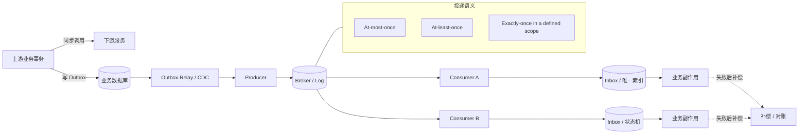
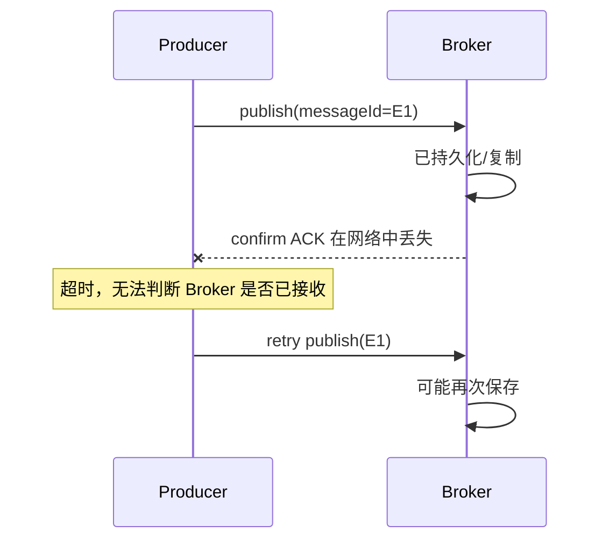
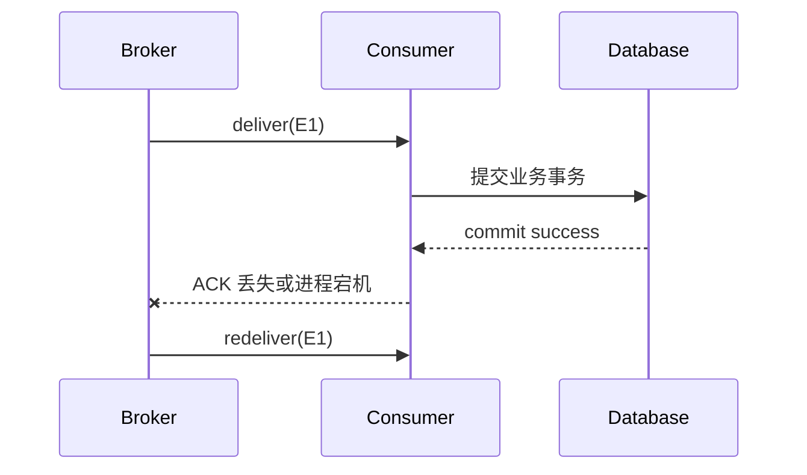
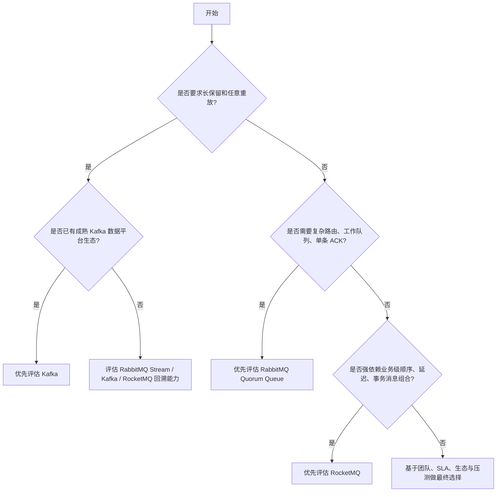
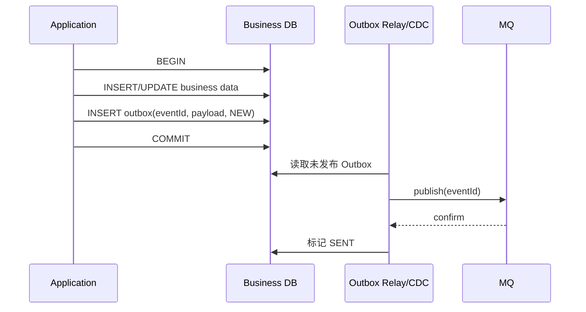
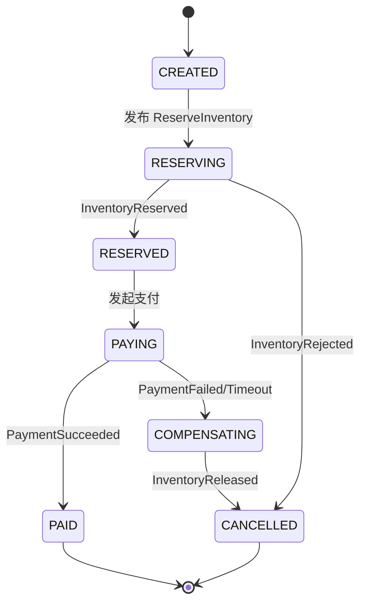
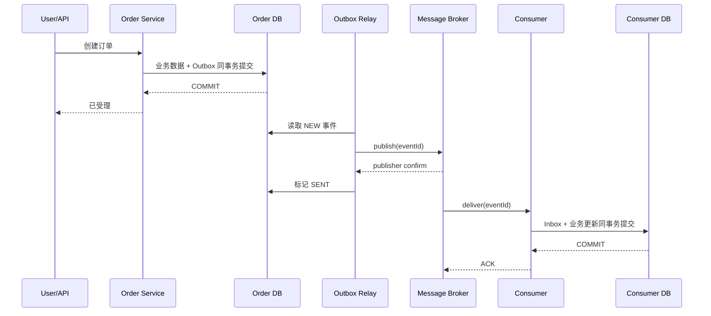

# 01｜消息队列基础与技术选型

> **文档定位**：面向中高级 Java 后端开发、架构设计与面试。
> **版本基线**：RabbitMQ 4.3；横向比较采用 Apache Kafka 4.3 文档与 Apache RocketMQ 5.x 文档口径。
> **核对日期**：2026-06-19。
> **阅读原则**：本章讨论的是消息系统的理论边界与选型方法，不以某一轮压测结果给产品排“绝对名次”。压测结论只有在消息大小、持久化、复制、确认级别、批量、硬件和客户端参数都相同时才有可比性。

---

## 1. 本章目标

完成本章后，应当能够：

1. 准确区分同步调用、异步调用、消息（Message）、事件（Event）和命令（Command）。
2. 解释 MQ 如何实现解耦、异步、削峰填谷和最终一致性，以及它没有解决什么。
3. 从生产者、Broker、消费者和业务数据库四个边界分析丢失、重复、乱序和积压。
4. 准确解释 At-most-once、At-least-once、Exactly-once，并指出“谁对谁的 Exactly-once”。
5. 解释消息代理模型与追加日志模型、Push 与 Pull、消息队列与事件总线的差异。
6. 根据业务约束在 RabbitMQ、Kafka、RocketMQ 之间做有证据的选型，而不是根据流行度选型。
7. 使用公式完成吞吐、积压、恢复时间、磁盘和消费者并发的初步容量规划。
8. 设计基于 Outbox、Inbox、幂等状态机、补偿和对账的最终一致性方案。
9. 用 30 秒、2 分钟和深入原理三种粒度回答消息系统面试题。

### 本章最重要的五个结论

```text
1. MQ 不创造处理能力，只把瞬时压力转换为积压和延迟。
2. 可靠投递通常选择 At-least-once，因此重复不是偶发 Bug，而是正常故障语义。
3. ACK 只能确认一个通信边界，不能天然提交另一个数据库事务。
4. “Exactly-once”必须说明作用域；Broker 内部 Exactly-once 不等于外部业务副作用 Exactly-once。
5. 技术选型首先看数据模型和失败语义，其次才看吞吐数字。
```

---

## 2. 前置知识

建议读者具备以下基础：

- TCP 连接、超时、重试和“请求超时但服务端可能已经成功”的不确定性。
- 数据库事务、唯一索引、乐观锁和隔离级别。
- Java 线程池、连接池和并发安全。
- 基本的可用性、复制、Quorum 和最终一致性概念。
- 平均值、峰值、百分位延迟、吞吐量和 Little's Law 的基本含义。

本章暂不要求掌握 RabbitMQ Exchange、Queue、Binding 等 API 细节；这些内容在下一章展开。

---

## 3. 核心概念图

### 3.1 Mermaid 图



### 3.2 纯文本图

```text
┌──────────────┐       ┌──────────────┐       ┌──────────────┐
│ Producer 事务 │ ───▶  │ Broker / Log │ ───▶  │ Consumer 事务 │
└──────┬───────┘       └──────┬───────┘       └──────┬───────┘
       │                      │                      │
       │ Send / Confirm       │ Store / Replicate    │ Deliver / ACK
       │                      │                      │
       ▼                      ▼                      ▼
  生产者故障窗口          Broker 故障窗口          消费者故障窗口
       │                                             │
       └──────────────▶ Message ID ◀─────────────────┘
                              │
                              ▼
                     幂等、Outbox、Inbox、对账
```

需要始终把系统拆成三个不同问题：

```text
A. 生产者是否把消息可靠交给 Broker？
B. Broker 是否把消息可靠交给消费者？
C. 消费者是否只产生一次正确的业务效果？
```

A、B、C 不是同一个问题，也不能由同一个 ACK 一次解决。

---

## 4. 同步、异步、消息、事件与命令

### 4.1 同步调用与异步调用

“同步/异步”首先描述的是**调用者是否必须在当前业务流程中等待结果**，而不是简单描述“有没有新线程”或“有没有网络”。

| 维度 | 同步调用 | 异步调用 |
|---|---|---|
| 时间耦合 | 调用者通常等待被调用者完成 | 调用者提交后可继续执行 |
| 失败反馈 | 通常直接返回异常或状态码 | 通过回调、Future、消息、状态查询或补偿反馈 |
| 用户可见延迟 | 下游延迟进入主链路 | 主链路可提前返回，但最终完成时间仍然存在 |
| 背压位置 | 调用线程、连接池、超时队列 | Broker 积压、消费延迟、磁盘容量 |
| 一致性 | 容易提供即时反馈，不代表天然原子 | 常见最终一致性，需要状态机和补偿 |
| 运维难点 | 级联超时、线程耗尽、雪崩 | 积压、重复、乱序、延迟、追踪困难 |

#### 常见混淆

1. `CompletableFuture` 让 Java 代码异步，不一定消除服务间时间耦合。若最终仍必须等待远端返回才能提交业务，系统语义仍接近同步。
2. 使用 MQ 不代表所有流程都应立即返回。支付下单等场景可能需要先完成本地事务并确认消息已可靠进入 Outbox，才能向用户返回“已受理”。
3. HTTP 也能异步：例如提交任务后返回 `202 Accepted` 和任务 ID。
4. MQ 也能做请求/响应，但会引入关联 ID、超时回复、回复队列和孤儿响应等额外复杂度。若业务天然是短时请求/响应，RPC 往往更直接。

### 4.2 Message、Event、Command

**消息（Message）**是传输载体；事件和命令是消息承载的业务语义。

| 类型 | 语义 | 命名风格 | 典型消费者 | 是否允许拒绝 | 典型例子 |
|---|---|---|---|---|---|
| Event | 陈述已经发生的事实 | 过去式 | 0～N 个订阅者 | 不能否认事实已发生，但可处理失败 | `OrderPaid`、`InventoryReserved` |
| Command | 请求某个明确接收方执行动作 | 祈使式 | 通常一个逻辑处理方 | 可以因校验、状态或资源拒绝 | `ReserveInventory`、`SendInvoice` |
| Notification | 告知状态变化，载荷可能较薄 | 过去式/通知式 | 多个订阅者 | 可丢弃后通过查询补齐 | `OrderChanged` |
| Document Message | 传递完整业务文档或快照 | 名词式 | 一个或多个 | 取决于业务协议 | `InvoiceDocument` |

#### 事件设计原则

- 事件描述事实，不应把消费者实现细节写进事件名。
- 事件一旦发布，最好不可变；修正通过新事件表达，而不是静默修改历史。
- 事件应带 `eventId`、`eventType`、`occurredAt`、`aggregateId`、`schemaVersion`、`traceId`。
- “胖事件”减少回源调用但增加数据重复和隐私传播；“瘦事件”载荷小但会增加回源耦合。两者没有绝对答案。

#### 命令设计原则

- 命令应有明确业务目标和责任方。
- 命令重复执行的语义必须定义：拒绝、覆盖、累加还是幂等成功。
- 命令处理结果若对上游重要，应有显式状态查询、结果事件或补偿流程，不能假定“发送成功即执行成功”。

### 4.3 异步通信不等于必须使用 MQ

可选方案包括：

```text
HTTP 202 + 任务表
数据库轮询
对象存储 + 通知
Change Data Capture
进程内队列
消息代理
追加日志
工作流引擎
```

选 MQ 的理由应当是需要**跨进程缓冲、可靠转交、订阅、路由、重试或保留**，而不是“异步听起来更高级”。

---

## 5. MQ 解决了什么问题

### 5.1 解耦：解的是哪一种耦合

解耦至少有四个维度：

| 耦合类型 | MQ 的作用 | MQ 没有解决的部分 |
|---|---|---|
| 时间耦合 | 上下游不必同时在线 | 消息过期、积压时仍需业务决策 |
| 空间耦合 | 生产者可不直接知道消费者地址 | 仍要知道 Topic/Exchange、Schema 和权限 |
| 部署耦合 | 消费者可独立扩缩容和发布 | 不兼容 Schema 仍会破坏消费者 |
| 失败耦合 | 下游短暂失败可由重试和缓冲吸收 | 长期故障会转化为积压、磁盘和恢复压力 |

**关键边界**：MQ 能降低调用耦合，但不能消除业务语义耦合。生产者发布 `OrderPaid` 后，库存、积分和发票系统仍必须对“支付”的含义达成一致。

### 5.2 异步：缩短主链路，不消灭工作量

同步链路：

```text
用户请求耗时 ≈ T订单 + T库存 + T积分 + T通知 + 网络与排队
```

异步链路：

```text
用户受理耗时 ≈ T本地事务 + T可靠记录消息
最终完成耗时 ≈ 受理耗时 + 排队延迟 + 消费处理 + 重试/补偿
```

异步优化的是**用户等待路径**和**故障隔离方式**，不是让后续计算凭空消失。

### 5.3 削峰填谷：本质是库存模型

设：

- `λ_in(t)`：时刻 `t` 的消息进入速率；
- `λ_out(t)`：有效消费完成速率；
- `B(t)`：积压量。

则近似有：

```text
dB/dt = λ_in(t) - λ_out(t)
```

当 `λ_in > λ_out` 时，Broker 用磁盘、内存和可接受延迟换取下游稳定；当 `λ_out > λ_in` 时，系统消化积压。

因此：

```text
削峰 ≠ 提升最终处理能力
削峰 = 把瞬时超载转换为可控积压
```

若长期平均进入速率大于长期有效消费能力，积压将持续增长，任何 MQ 都无法从根本上解决问题。

### 5.4 最终一致性：从“同时成功”变成“最终收敛”

同步分布式事务希望：

```text
订单提交、库存扣减、积分增加同时成功或同时失败
```

事件驱动方案改为：

```text
订单先进入确定状态
  → 可靠发布事件
  → 各下游按自身事务处理
  → 暂时失败重试
  → 永久失败补偿或人工介入
  → 通过对账验证最终收敛
```

最终一致性不是“晚一点一致即可”，而是必须回答：

1. 中间状态是什么？
2. 用户能看到什么？
3. 多久未收敛算异常？
4. 哪些失败可重试，哪些必须补偿？
5. 谁负责对账和人工处置？
6. 业务是否允许逆操作？

---

## 6. MQ 引入的复杂度

| 风险 | 典型原因 | 直接后果 | 必要治理 |
|---|---|---|---|
| 消息丢失 | 未持久化、未确认、错误 ACK、保留期不足 | 状态永久缺口 | Confirm、持久化、复制、Outbox、审计 |
| 消息重复 | 超时重试、Confirm/ACK 丢失、消费者重启 | 重复扣款、重复发货 | Message ID、唯一索引、状态机幂等 |
| 消息乱序 | 多分区、多消费者、重试、并发回调 | 状态回退、越级执行 | 分区键、单活消费者、版本号、状态校验 |
| 消息积压 | 峰值超载、慢查询、下游故障、毒消息 | 延迟升高、磁盘耗尽 | 容量模型、限流、弹性消费、隔离队列 |
| 延迟抖动 | 批量、刷盘、复制、GC、重试 | SLA 不稳定 | P95/P99 监控、分层队列、资源隔离 |
| 毒消息 | Schema 不兼容、非法数据、永久业务错误 | 重试风暴、阻塞顺序队列 | 有界重试、DLQ、Parking Lot、人工修复 |
| Schema 演进 | 删除字段、类型变化、语义变化 | 老消费者反序列化失败 | 版本字段、兼容规则、契约测试 |
| 可观测性下降 | 异步跨服务、重试和重放 | 难定位端到端状态 | traceId、eventId、积压年龄、状态查询 |
| 成本上升 | 多副本、保留、出口流量、运维 | 磁盘与网络成本增加 | 分级可靠性、压缩、生命周期策略 |
| 安全风险 | Topic 越权、敏感数据扩散 | 数据泄露、横向移动 | 最小权限、VHost/命名空间隔离、加密 |

### 6.1 状态到底由谁保存

| 状态 | 常见归属 |
|---|---|
| 未确认发布序号、重试上下文 | Producer 进程或 Outbox 表 |
| 路由、队列、复制、消息本体 | Broker / Cluster |
| 已投递未 ACK 集合 | Broker 的 Queue/Channel 相关状态 |
| 消费进度或 Offset | Broker 内部元数据、内部 Topic，或消费者外部存储 |
| 幂等记录 | 消费者业务数据库的 Inbox/唯一索引 |
| 业务最终状态 | 业务数据库 |
| 补偿与对账状态 | 工作流、任务表或审计系统 |

面试中仅说“MQ 会重试”是不够的。必须继续说明**谁记得要重试、记在哪里、进程重启后是否还记得、重试是否会重复**。

---

## 7. 投递语义：At-most-once、At-least-once、Exactly-once

### 7.1 先定义作用域

同一条业务链路至少存在四种“次数”：

```text
发送请求次数
Broker 持久化次数
消费者收到次数
业务副作用生效次数
```

它们可能完全不同。例如生产者发送两次，Broker 存两条，消费者收到三次，但业务唯一索引只允许生效一次。

因此必须把问题说完整：

> 在什么故障模型下，从哪个组件到哪个组件，对哪一个操作，提供什么次数保证？

### 7.2 三种语义

| 语义 | 简化定义 | 可能丢失 | 可能重复 | 常见实现 |
|---|---|---:|---:|---|
| At-most-once | 最多处理一次 | 是 | 否 | 先确认/提交进度，再处理；失败不重试 |
| At-least-once | 至少处理一次 | 目标是不丢 | 是 | 处理后确认；超时或失败重试 |
| Exactly-once | 在明确作用域内恰好一次 | 否 | 对外不可见重复 | 事务、去重、原子提交或幂等业务 |

RabbitMQ 官方可靠性指南明确指出：确认机制用于实现至少一次投递；没有确认时，发布和消费过程中可能丢失，只能获得最多一次语义。[R2][R3]

### 7.3 为什么 At-least-once 会重复

#### 生产端重复窗口



#### 消费端重复窗口



只要系统选择“失败时重试以避免丢失”，就必须接受“原请求也许已经成功”的可能性。重复是可靠重试的逻辑结果。

### 7.4 为什么 ACK 不能保证数据库事务成功

ACK 与数据库 COMMIT 属于两个不同系统：

```text
RabbitMQ ACK ──属于── RabbitMQ 协议与 Broker 状态
Database COMMIT ──属于── 数据库事务日志与锁管理
```

两者不存在天然原子性：

- **先 ACK，后 COMMIT**：ACK 成功后数据库失败，消息可能丢失。
- **先 COMMIT，后 ACK**：数据库成功后 ACK 丢失，消息会重复。

正确目标通常是选择第二种窗口，并通过幂等消除重复：

```text
数据库事务提交成功
        ↓
再发送 ACK
        ↓
若 ACK 丢失则重复投递
        ↓
唯一索引/状态机识别已处理并安全 ACK
```

### 7.5 “Exactly-once”到底是谁的 Exactly-once

可以合理成立的作用域包括：

1. 同一个 Broker 日志内，幂等 Producer 重试不产生重复记录。
2. 同一个流处理平台内，输入 Offset 与输出记录在一个事务中提交。
3. 同一个关系数据库事务内，Inbox 去重记录与业务更新原子提交。
4. 业务接口天然幂等，多次调用只产生一次可观察结果。

不能自动推导出的结论：

```text
Kafka/RabbitMQ/RocketMQ 声称某种 Exactly-once
        ≠
“扣款、发短信、调用第三方物流”天然只执行一次
```

Kafka 官方设计文档也明确区分发布持久性、消费进度和输出副作用；Kafka 事务可把 Kafka 输入 Offset 与 Kafka 输出 Topic 原子提交，但写入外部系统仍需要外部系统配合或把 Offset 与输出放入同一存储。[K2]

### 7.6 业务效果上的近似 Exactly-once

工程上常用组合：

```text
At-least-once Delivery
      +
Stable Message ID
      +
Inbox / Unique Constraint
      +
Idempotent State Transition
      +
Reconciliation
      =
业务可观察效果上的近似 Exactly-once
```

“近似”不是降低标准，而是诚实描述边界：人工操作、外部支付通道、短信网关等系统可能无法参与同一个原子事务，最终仍需要查询、补偿和对账。

---

## 8. 为什么端到端 Exactly-once 很难

### 8.1 超时后的不确定性

客户端收到“成功”很容易判断成功；收到明确业务拒绝也容易判断失败。最难的是：

```text
请求已发出
  → 服务端可能提交
  → 响应在返回途中丢失
  → 客户端只看到超时
```

此时重试可能重复，不重试可能丢失。网络超时无法告诉客户端故障发生在提交前还是提交后。

### 8.2 端到端链路跨越多个事务域

```text
Producer DB
  → MQ Broker
  → Consumer DB
  → 第三方支付/短信/物流
```

要做到严格端到端 Exactly-once，需要所有参与者共同支持可恢复的全局原子协议，且还要处理参与者永久故障、超时、人工操作和灾难恢复。现实系统通常选择：

- 每个局部事务域内保持强一致；
- 跨事务域使用至少一次消息；
- 用幂等、状态机、补偿和对账保证最终业务正确。

### 8.3 Exactly-once 的三层含义

| 层次 | 问题 | 可行手段 |
|---|---|---|
| 记录层 | Broker 是否出现两条相同记录 | Producer 幂等、去重序号、事务写日志 |
| 处理层 | 同一记录是否被处理一次 | Offset/ACK 与输出原子提交 |
| 业务效果层 | 外部世界是否只发生一次副作用 | 业务幂等键、唯一约束、查询确认、补偿 |

面试回答若只说“Kafka 支持 Exactly-once”或“RabbitMQ 不支持 Exactly-once”，都过于粗糙。正确回答必须明确比较的是哪一层。

---

## 9. 消息代理模型与追加日志模型

### 9.1 两种核心抽象

#### 消息代理 / 队列模型

```text
Producer → Router/Exchange → Queue → Consumer → ACK → 可删除
```

典型特征：

- Broker 对“待处理、已投递、未确认”有较强感知。
- 常见目标是让队列趋向空。
- 路由、工作队列、每消息 ACK、重试和优先级通常较自然。
- 同一消息给多个独立订阅者，常通过多条队列保存各自消费状态。

#### 追加日志模型

```text
Producer → Partitioned Append-only Log
                         ├─ Consumer Group A: offset 100
                         ├─ Consumer Group B: offset 80
                         └─ Replay Consumer: offset 0
```

典型特征：

- 消息按保留策略存在，消费通常不立即删除记录。
- 消费者维护或提交 Offset，可回退和重放。
- 分区是吞吐、并行和顺序边界。
- 大积压、长保留、多订阅者和流处理更自然。

### 9.2 对比表

| 维度 | 队列/代理模型 | 追加日志模型 |
|---|---|---|
| 消费后数据 | ACK 后可删除或进入可回收状态 | 按时间/大小/压缩策略保留 |
| 消费位置 | Broker 记录投递与 ACK 状态 | 消费者组通过 Offset 表示位置 |
| 重放 | 通常需重新发布、DLQ 或专门能力 | 天然从旧 Offset 重读 |
| 多订阅者 | 常为每个订阅者建独立队列 | 多组共享同一日志数据 |
| 路由 | Exchange/Binding/过滤较丰富 | 通常以 Topic、Key、Partition 为核心 |
| 大积压 | 取决于队列类型，传统队列常希望尽快清空 | 设计上通常接受长保留和大 Backlog |
| 单条确认 | 自然 | 常按 Offset/批次推进 |
| 顺序边界 | 单队列及其投递条件 | 单分区 |
| 典型工作负载 | 任务分发、业务命令、复杂路由 | 事件流、数据管道、审计、重放 |

### 9.3 RabbitMQ 不是只能做“传统队列”

RabbitMQ 4.3 同时提供 Queue 与 Stream：

- Classic Queue/Quorum Queue 是队列语义；
- RabbitMQ Stream 是持久、复制的追加日志，可重复读取，采用非破坏性消费语义；
- 官方说明 Stream 是对 Queue 的补充，不是简单替代。[R5]

因此“RabbitMQ 是队列，Kafka 是日志”可作为入门模型，但在严谨选型中必须进一步比较 RabbitMQ Stream、Kafka Partition、复制、客户端协议、保留和生态。

---

## 10. Push 与 Pull

### 10.1 两种模型

#### Push

Broker 主动向已注册消费者投递：

```text
Consumer: subscribe(queue)
Broker:   deliver(message)
Consumer: ack(message)
```

优点：低空闲延迟、API 直观。
风险：必须用 Prefetch、信用窗口或并发上限防止慢消费者被压垮。

#### Pull

消费者主动发 Fetch 请求：

```text
Consumer: fetch(partition, offset, maxBytes, waitTime)
Broker:   return(batch)
Consumer: process and commit offset
```

优点：消费者控制批量、节奏和回退位置。
风险：短轮询浪费资源；长轮询和批量参数会影响吞吐与尾延迟。

### 10.2 产品中的真实实现

- RabbitMQ AMQP 消费者通常通过订阅注册，由 Broker Push 投递；`basic.get` 可以按需拉取，但长生命周期订阅更符合正常消费模型。[R3][R4]
- Kafka Consumer 向分区 Leader 发 Fetch 请求，并在请求中指定 Offset；消费者可以回退位置重新读取。Kafka 官方设计选择 Pull，以便消费者控制节奏和批量。[K2]
- RocketMQ 的 `PushConsumer` 名称是面向应用的 Push 接口，但 SDK 内部通过长轮询拉取并再回调业务线程；`SimpleConsumer` 则把接收、可见性超时和 ACK 控制显式交给应用。[M3]

因此不能只看 API 名称判断网络模型。

### 10.3 Push/Pull 选型问题

1. 消费者处理时延是否可预测？
2. 是否需要大批量读取和顺序扫描？
3. 是否需要任意重放？
4. 背压由 Broker 信用窗口还是消费者 Fetch 节奏控制？
5. 空闲时更关注即时延迟还是减少请求？
6. 消费者挂起时，未确认消息/可见性超时如何处理？

---

## 11. 消息队列与事件总线

“消息队列”更强调传输、缓冲和消费状态；“事件总线”更强调事件发布、发现、过滤和多订阅者集成。两者可以由同一产品实现，但概念并不等价。

| 维度 | 消息队列 | 事件总线 |
|---|---|---|
| 主要目标 | 可靠转交与任务处理 | 传播已发生的事件 |
| 典型拓扑 | 一条队列内竞争消费 | 多订阅者各自接收 |
| 数据保留 | 常以待处理为中心 | 可能短暂，也可能长期保留 |
| 失败语义 | ACK、重试、DLQ | 重投、订阅隔离、事件归档 |
| 契约重点 | 命令处理与交付 | 事件 Schema、版本和治理 |
| 实现载体 | RabbitMQ Queue、RocketMQ Queue 等 | RabbitMQ Topic Exchange、多 Topic 日志、云 Event Bus 等 |

### 一个常见错误

把所有内部通信都放进一个“公司事件总线”，但没有：

- 事件所有者；
- Schema 兼容规则；
- 数据分类和权限；
- 消费者 SLA；
- 重放影响评估；
- 废弃流程。

结果只是把点对点耦合变成不可见的全局耦合。

---

## 12. RabbitMQ、Kafka、RocketMQ 技术选型

### 12.1 当前版本口径

- RabbitMQ 4.3 于 2026-04-23 发布；Quorum Queue 是数据安全优先时的推荐复制队列，RabbitMQ 4.0 起已移除经典镜像队列。[R1][R6]
- Kafka 本章按 4.3 官方文档讨论，其核心仍是分区、复制、Offset 和可保留事件日志。[K1][K2]
- RocketMQ 本章按 5.x 官方领域模型讨论，其 Topic 由一个或多个 Message Queue 构成，并提供普通、顺序、延迟和事务消息等业务消息能力。[M1][M5][M6]

#### 12.1.1 RabbitMQ 3.13、4.0、4.1、4.2 与 4.3 的边界

| 版本系列 | 与本章直接相关的边界 | 迁移与使用提示 |
|---|---|---|
| 3.13 | 经典镜像队列仍属于可用的历史机制；Khepri 处于实验阶段；Quorum Queue 尚未采用 4.x 默认的 20 次投递上限 | 不要把 3.13 的镜像队列、元数据存储和无限重投假设直接带入 4.x |
| 4.0 | 移除经典镜像队列；Quorum Queue 默认投递上限变为 20；Quorum Queue 只提供两个相对优先级层级 | 升级前必须检查镜像队列迁移、死信策略和无限重投依赖 [R6][R8] |
| 4.1 | 改善 Quorum Queue 的内存稳定性、长积压消费与整体性能；仍没有 4.3 的原生线性延迟重试 | 性能结论需要按真实复制因子、消息大小和积压规模重新压测 [R7] |
| 4.2 | Khepri 成为新集群默认元数据存储；Quorum Queue 仍是两个相对优先级层级，延迟重试仍需 TTL/DLX、插件或应用侧方案 | 从旧集群升级时仍要单独规划元数据迁移和回滚边界 [R1] |
| 4.3 | Khepri 成为唯一受支持的元数据存储；Quorum Queue 支持 32 个严格优先级和原生线性延迟重试，并细化失败/退回投递计数语义 | 本章示例所用 `x-delayed-retry-*` 参数只适用于 4.3 及以上 [R1][R6] |

因此，“RabbitMQ 4.x”不是足够精确的版本声明。凡涉及优先级、延迟重试、投递上限、经典镜像队列或元数据存储，都必须写到次版本。

### 12.2 核心对比

| 维度 | RabbitMQ 4.3 | Kafka 4.3 | RocketMQ 5.x |
|---|---|---|---|
| 核心抽象 | Exchange → Queue/Stream → Consumer | Topic → Partition Log → Consumer Group | Topic → Message Queue → Consumer Group |
| 主要消费模型 | Queue 常用 Push 订阅；Stream 可基于 Offset | Consumer Fetch/Pull | PushConsumer（SDK 长轮询）与 SimpleConsumer |
| 数据模型 | 传统队列与追加日志并存 | 追加日志为核心 | 业务消息队列与可回溯存储 |
| 路由能力 | Direct/Topic/Fanout/Headers，拓扑灵活 | Topic、Key、Partition，路由较克制 | Topic、Tag、SQL 属性过滤、队列选择 |
| 消费确认 | 每条/批量 ACK、NACK、Reject | Offset 提交；事务可联动 Kafka 输出 | 消费结果/ACK、可见性超时、重试状态机 |
| 重放 | Queue 不以任意重放为核心；Stream 支持 | 天然按 Offset 重放 | 支持按时间或 Offset 回溯，受保留约束 |
| 顺序 | 受单队列、并发、重投、Prefetch 影响 | 单 Partition 内有序 | Message Group/Queue 级顺序能力 |
| 延迟与重试 | TTL/DLX、Quorum Queue 4.3 延迟重试等 | 通常由应用/重试 Topic/流处理设计 | 原生延迟消息、消费重试、DLQ |
| 复制与高可用 | Quorum Queue/Stream 复制；Classic Queue 4.x 不复制 | Partition 副本、ISR、Leader | Broker/Controller 与复制部署模型 |
| Exactly-once 边界 | 通常以至少一次 + 业务幂等为主 | Kafka Topic 内事务性读-处理-写能力较完整；外部系统需配合 | 事务消息解决“本地事务与消息生产”的最终一致性，消费仍需幂等 |
| 典型优势 | 低延迟业务消息、复杂路由、工作队列、协议丰富 | 大吞吐事件流、长保留、重放、数据管道、流处理生态 | 电商类业务消息、顺序/延迟/事务消息、业务特性集中 |
| 典型代价 | 拓扑和确认语义复杂；传统队列不适合无限积压 | 分区、重平衡、Offset、运维和流处理认知成本 | 版本/客户端模型较多，需验证部署架构与生态适配 |

### 12.3 不能用一句话替代选型

错误说法：

```text
RabbitMQ 延迟低，所以选 RabbitMQ。
Kafka 吞吐高，所以选 Kafka。
RocketMQ 有事务消息，所以选 RocketMQ。
```

这些都缺少消息大小、复制、确认、保留、路由、顺序、生态和运维约束。

正确做法是先填写约束矩阵：

| 约束问题 | 业务答案示例 |
|---|---|
| 可否丢失 | 支付状态变更不可丢 |
| 能否重复 | 可重复投递，但扣款必须幂等 |
| 顺序范围 | 同一订单有序，不同订单可并行 |
| 峰值吞吐 | 30,000 msg/s，持续 20 分钟 |
| 单消息大小 | P50 1 KB，P99 8 KB |
| 可接受延迟 | 正常 P99 < 500 ms；峰值 < 10 min |
| 保留与重放 | 需要保留 7 天并按订单重放 |
| 路由 | 20 个事件类型，12 个订阅域 |
| 消费者数量 | 50 个消费组 |
| 多机房 | 同城双活，异地灾备 |
| 运维能力 | 已有 Kafka 团队，无 Erlang 运维经验 |
| 客户端生态 | Java、Go、Python，需 Schema Registry |

### 12.4 场景化建议

#### 更偏向 RabbitMQ Queue

- 任务分发、命令消息和工作队列。
- 需要灵活 Exchange/Binding 路由。
- 单条 ACK、优先级、消费者竞争和低空闲延迟很重要。
- 积压通常应尽快清空，不以数日事件重放为核心。
- 数据安全优先时使用 Quorum Queue，而不是把 RabbitMQ Cluster 误认为自动复制 Classic Queue。[R2][R6]

#### 更偏向 RabbitMQ Stream 或 Kafka

- 需要长时间保留、重放、多消费组共享同一份数据。
- 大规模事件流、审计、CDC、数据平台或流处理。
- 以分区键定义局部顺序和并行度。
- 消费速度可以独立于写入速度，积压是正常运行状态之一。

RabbitMQ Stream 更适合已经采用 RabbitMQ、需要日志语义但不想引入另一套平台的场景；Kafka 的连接器、流处理和数据平台生态通常更完整。最终仍需通过本组织的负载、团队和灾备要求验证。

#### 更偏向 RocketMQ

- 订单、交易等业务消息中大量使用顺序、延迟、重试和事务消息。
- 团队已有 RocketMQ 运维与客户端经验。
- 需要基于 Tag/属性过滤和 Message Group 组织业务。
- 必须明确：事务消息解决的是生产侧本地事务与消息发布的最终一致性，不会自动让消费端数据库和外部副作用恰好一次。[M5]

### 12.5 决策树



### 12.6 选型时必须做的验证

1. 使用真实消息大小分布，而不是固定 1 KB 小消息。
2. 开启与生产相同的持久化、复制和确认级别。
3. 测峰值持续时间，不只测 30 秒瞬时 TPS。
4. 测消费者降速、节点重启、网络抖动和磁盘逼近阈值。
5. 同时观察吞吐、P95/P99、积压年龄、恢复时间和数据正确性。
6. 测 Schema 升级和回滚，不只测正常序列化。
7. 测重复、乱序、DLQ、重放对真实业务的影响。

---

## 13. 哪些业务不应该使用 MQ

### 13.1 不适合使用 MQ 的典型情况

#### 1. 单体数据库事务能够直接完成

若两个状态属于同一服务、同一数据库、同一事务边界，直接使用本地事务通常更简单、更可靠。

```text
同一个订单库内：创建订单 + 写订单明细
```

不应为了“架构看起来先进”拆成消息，平白引入重复、延迟和补偿。

#### 2. 调用方必须立即获得确定结果

例如：

- 用户登录鉴权；
- 额度实时校验；
- 查询库存可售数量；
- 强交互式表单校验。

若上游不能在“处理中”状态继续，异步消息并不能消除同步依赖，只会把请求/响应包装得更复杂。

#### 3. 流量很小且失败可由简单任务表处理

每天几十个离线任务，使用数据库任务表、定时扫描和状态字段可能已经足够。引入独立 MQ 集群会增加部署、监控、升级和应急成本。

#### 4. 业务没有幂等与补偿能力

若重复一次就会造成不可逆灾难，而且下游没有查询、撤销、唯一键或人工核对能力，则首先应改造业务协议，而不是先接 MQ。

#### 5. 超大二进制文件传输

视频、压缩包和大型报表更适合放入对象存储，消息只携带 URI、摘要、大小、权限和生命周期信息。把大文件直接塞进 MQ 会放大内存、网络、复制、磁盘和恢复成本。

#### 6. 复杂长流程需要可视化编排

含人工审批、小时级等待、分支、超时、补偿和重入的业务，更适合工作流引擎或持久化状态机。MQ 可以作为传输通道，但不应替代流程状态管理。

#### 7. 数据必须被严格限制在单一安全边界

消息天然会复制到 Broker、副本、日志、DLQ、监控和多个消费者。若敏感数据无法脱敏、加密或做最小化传播，直接调用或受控数据服务可能更合适。

### 13.2 判断问题

使用 MQ 前先回答：

```text
不用 MQ，最简单的正确方案是什么？
引入 MQ 后，谁维护幂等？
谁处理死信？
谁监控积压年龄？
谁负责 Schema 兼容？
谁执行补偿和对账？
```

若这些问题没有责任人，系统还没有准备好使用 MQ。

---

## 14. 消息系统容量规划

容量规划不是“估一个 TPS”，而是同时规划：

```text
写入吞吐、有效消费吞吐、重试放大、积压量、积压年龄、恢复时间、磁盘、网络、连接、分区/队列和故障冗余
```

### 14.1 变量定义

| 变量 | 含义 |
|---|---|
| `λ_in` | 生产进入速率，msg/s |
| `λ_done` | 成功完成业务处理的有效速率，msg/s |
| `λ_delivery` | 包含重复和重试的实际投递速率，delivery/s |
| `S_avg` | 平均消息字节数，含属性前的业务载荷 |
| `S_p99` | P99 消息大小 |
| `R` | 存储副本数 |
| `α` | 索引、日志、元数据和文件碎片放大系数 |
| `T_peak` | 峰值持续时间 |
| `T_retention` | 日志保留时间 |
| `B` | 当前积压消息数 |
| `μ_worker` | 单个有效工作单元的处理能力，msg/s |
| `ρ` | 目标利用率，通常应小于 1 |
| `p_retry` | 一次处理失败并触发重试的概率 |

### 14.2 峰值积压公式

在峰值期间近似恒定时：

```text
B_peak = B_0 + max(0, λ_in_peak - λ_done_peak) × T_peak
```

若速率随时间变化：

```text
B(t) = B(0) + ∫ max_effectively(λ_in(t) - λ_done(t)) dt
```

这里不能只用平均 TPS。一个系统日均 1,000 msg/s，但在 10 分钟活动期间达到 50,000 msg/s，容量风险由峰值持续时间决定。

### 14.3 积压清空时间

峰值结束后，若新流量仍持续进入：

```text
T_drain = B_peak / (λ_done_after - λ_in_after)
```

前提是：

```text
λ_done_after > λ_in_after
```

若两者相等，积压永远清不完；若消费能力更小，积压继续增加。

### 14.4 消费者并发估算

单条平均处理时间为 `T_process` 秒，且一个工作线程串行处理，则：

```text
μ_worker ≈ 1 / T_process
N_worker ≥ ceil(λ_target / (μ_worker × ρ))
```

例如平均处理 40 ms：

```text
μ_worker = 1 / 0.04 = 25 msg/s
```

目标有效吞吐 12,000 msg/s，目标利用率 70%：

```text
N_worker ≥ ceil(12000 / (25 × 0.7)) = 686
```

这个结果提示架构师：单纯增加数百线程可能不是好方案，应检查数据库瓶颈、批处理、异步 I/O、分区并行、缓存和业务拆分。

#### 批处理模型

若每批 `b` 条，固定批次开销 `T_fixed`，单条增量开销 `T_item`：

```text
μ_worker ≈ b / (T_fixed + b × T_item)
```

批量通常提高吞吐，但会增加：

- 单批失败的重试范围；
- 尾延迟；
- 内存占用；
- 批量 ACK 或 Offset 提交的重复窗口。

### 14.5 重试放大

若每次处理独立失败概率近似为 `p`，无限重试的理论期望尝试次数为：

```text
E[attempts] = 1 / (1 - p)
```

例如 `p = 0.1`：

```text
E[attempts] ≈ 1.111
```

实际系统必须采用有限重试。若最多尝试 `n` 次，则：

```text
E[attempts] = 1 + p + p² + ... + p^(n-1)
```

容量规划应基于 `λ_delivery` 而非只基于原始业务消息速率：

```text
λ_delivery ≈ λ_in × E[attempts]
```

当下游整体故障时，失败概率不再是独立小概率，立即重试会形成同步重试风暴，公式也会失去意义。因此必须使用退避、熔断和恢复限速。

### 14.6 磁盘估算

#### 队列型系统：按最大积压估算

```text
Disk_queue ≈ B_max × S_effective × R × α
```

#### 日志型系统：按写入率和保留时间估算

```text
Disk_log ≈ λ_in_avg × S_effective × T_retention × R × α
```

其中 `S_effective` 应包括：

- 消息体；
- Header/Properties；
- 索引与日志记录；
- 压缩后的实际大小；
- 文件段、页和碎片开销。

不能把 `α` 当作跨产品固定常数，应通过真实压测测量。

### 14.7 网络估算

至少考虑：

```text
生产者入口流量
+ 副本复制流量
+ 消费者出口流量 × 消费组/订阅份数
+ 跨机房复制流量
+ 重试与重放流量
```

多订阅者系统中，消费出口经常比生产入口大得多。若一条 2 KB 事件被 20 个消费组读取，应用侧出口理论量级约是入口的 20 倍，尚未计协议、TLS 和重试开销。

### 14.8 完整计算示例

业务参数：

```text
峰值生产：20,000 msg/s
峰值有效消费：12,000 msg/s
峰值持续：15 min = 900 s
平均消息体：2 KiB
副本数：3
存储放大系数：1.3
峰值后进入速率：4,000 msg/s
峰值后消费能力：12,000 msg/s
```

#### 积压量

```text
B_peak = (20,000 - 12,000) × 900
       = 7,200,000 条
```

#### 原始积压载荷

```text
7,200,000 × 2 KiB ≈ 13.73 GiB
```

#### 含三副本与放大系数

```text
Disk ≈ 13.73 × 3 × 1.3
     ≈ 53.55 GiB
```

若再保留 2 倍安全余量，至少应为该积压预留约 107 GiB 可用空间。实际还需加入节点水位、其他队列、WAL、快照、操作系统和升级空间。

#### 峰后清空时间

```text
T_drain = 7,200,000 / (12,000 - 4,000)
        = 900 s
        = 15 min
```

因此该架构的用户可见结论不是“能扛 20,000 TPS”，而是：

> 在给定复制和磁盘条件下，可以把 15 分钟峰值转换为最多约 720 万条积压，并在峰值结束后约 15 分钟清空。

这才是可验证的容量承诺。

### 14.9 Little's Law 与积压年龄

稳定系统中可用：

```text
L = λ × W
```

- `L`：系统内平均消息数；
- `λ`：平均有效吞吐；
- `W`：平均停留时间。

但生产告警不能只看平均值。应同时监控：

- Ready/Backlog 数量；
- 最老消息年龄；
- P95/P99 端到端延迟；
- 重试率和死信率；
- 消费成功率；
- 清空时间预测。

队列深度相同，若一个队列每秒处理 100 万条，另一个每秒处理 100 条，其风险完全不同。

### 14.10 故障冗余

容量应按故障后剩余资源计算。例如三节点集群要求容忍一节点故障，则正常运行时不能把三个节点都压到 90%。至少要验证：

```text
N-1 节点时的写入能力
N-1 节点时的消费能力
Leader 迁移期间的尾延迟
副本追赶产生的额外网络与磁盘 I/O
恢复后重放/积压清理的资源竞争
```

---

## 15. 事件驱动架构中的最终一致性、补偿和幂等

### 15.1 双写问题

最危险的朴素代码：

```java
orderRepository.save(order);   // 数据库提交
rabbitTemplate.convertAndSend(event); // 发送消息
```

存在两个不可消除的窗口：

```text
数据库成功，消息失败 → 下游永远不知道
消息成功，数据库回滚 → 下游处理了不存在的事实
```

简单交换两行顺序不能解决双写原子性。

### 15.2 Transactional Outbox

在同一个本地数据库事务中写业务数据和 Outbox：



纯文本：

```text
业务表更新 ┐
            ├─ 同一个 DB 事务提交
Outbox 写入 ┘
      ↓
Relay/CDC 至少一次发布
      ↓
Broker
```

#### Outbox 解决了什么

- 消除了“业务数据已提交但消息记录不存在”的窗口。
- Relay 宕机后可继续扫描未发布记录。
- 业务提交不依赖 Broker 瞬时可用。

#### Outbox 没解决什么

- Relay 发布成功后、标记 `SENT` 前宕机，仍会重复发布。
- Outbox 表会膨胀，需要归档和清理。
- 事件顺序、Schema、分片扫描、锁竞争仍需设计。
- 消费端仍然需要幂等。

### 15.3 Inbox 与消费幂等

推荐把幂等记录与业务更新放在同一个数据库事务：

```sql
BEGIN;

INSERT INTO inbox_event(event_id, consumer_name, received_at)
VALUES (:event_id, :consumer_name, CURRENT_TIMESTAMP)
ON CONFLICT DO NOTHING;

-- 只有插入成功时才执行以下业务更新
UPDATE account
SET points = points + :delta
WHERE account_id = :account_id;

COMMIT;
-- COMMIT 成功后再 ACK
```

若 `inbox_event` 插入因唯一约束未生效，说明该消费者已处理过此 `event_id`，可以跳过业务副作用并 ACK。

#### 为什么必须在同一事务

错误拆分：

```text
事务 1：写“已处理”标记成功
进程宕机
事务 2：业务更新未执行
```

这会造成消息永久跳过。反向拆分则可能业务已执行但标记未写，导致重复。

### 15.4 幂等的五种实现层次

| 方式 | 示例 | 优点 | 风险 |
|---|---|---|---|
| 天然幂等 | `SET status = PAID` | 简单 | 必须防止状态回退 |
| Message ID 去重 | Inbox 主键 `event_id` | 通用 | ID 必须稳定，表需清理 |
| 业务唯一键 | `payment_order_no UNIQUE` | 贴近业务 | 一个事件可能对应多个动作 |
| 状态机 | 仅允许 `CREATED → PAID` | 能处理乱序和重复 | 状态设计复杂 |
| 版本/序号栅栏 | 只接受 `version > current_version` | 防旧消息覆盖新状态 | 需定义缺号和并发规则 |

#### 外部副作用

对支付、短信、物流等外部接口：

1. 传递稳定的业务幂等键；
2. 超时后先查询，再决定是否重试；
3. 保存请求与返回审计；
4. 对无法幂等的操作建立补偿或人工核对。

### 15.5 重试、补偿、对账不是一回事

| 机制 | 适用问题 | 例子 |
|---|---|---|
| 重试 | 暂时性失败，重复执行安全 | 网络抖动、锁冲突、限流 |
| 补偿 | 已发生业务动作需要语义逆操作 | 退款、释放库存、撤销权益 |
| 对账 | 无法确定双方状态，需要发现差异 | 支付渠道日终账单比对 |
| 人工处置 | 无自动安全路径或高风险异常 | 重复发货、实名审核异常 |

补偿不等于数据库回滚。退款不是“删除支付记录”，而是一个新的业务事实，并可能失败、延迟或被拒绝。

### 15.6 Saga 的核心思想

长事务拆成多个本地事务，每一步成功后触发下一步；失败时执行对应补偿：

```text
创建订单
  → 预占库存
  → 扣款
  → 创建发货单

若创建发货单失败：
  → 退款
  → 释放库存
  → 关闭订单
```

必须定义：

- 补偿顺序；
- 补偿是否幂等；
- 补偿失败后的重试与人工流程；
- 已对用户产生不可逆影响时的业务政策。

### 15.7 最终一致性状态机示例



每个转换都要校验当前状态，不能因为迟到消息把 `CANCELLED` 改回 `RESERVED`。

---

## 16. 正常流程、异常流程与故障窗口

### 16.1 正常流程



### 16.2 关键故障窗口总表

| # | 故障窗口 | 可能结果 | 状态主要保存方 | 正确处理 |
|---:|---|---|---|---|
| 1 | 业务 DB 成功，应用直接发 MQ 前宕机 | 消息丢失 | 业务 DB | Outbox 与业务同事务 |
| 2 | MQ 先成功，业务 DB 后回滚 | 发布虚假事实 | Broker | 不做裸双写；使用 Outbox/事务消息 |
| 3 | Outbox 已提交，Relay 发布前宕机 | 延迟，不应丢失 | Outbox 表 | 重启后继续扫描 |
| 4 | Broker 已接收，Confirm 丢失 | Producer 重试导致重复 | Broker + Producer 未确认集合 | 稳定 eventId；消费幂等 |
| 5 | Exchange/Topic 存在但无法路由 | 消息可能被丢弃或返回 | Broker 路由状态 | RabbitMQ 使用 `mandatory`/Return；拓扑监控 |
| 6 | Broker 只在内存，节点崩溃 | 消息丢失 | Broker 内存 | 持久化、复制、正确确认级别 |
| 7 | Consumer 收到后、业务前宕机 | 重新投递 | Broker 未确认状态 | 手动 ACK，处理后确认 |
| 8 | Consumer 先 ACK、后提交 DB | DB 失败时消息丢失 | Broker 已删除/推进状态 | 提交后 ACK |
| 9 | DB 提交成功、ACK 前宕机 | 重复投递 | DB + Broker 未确认状态 | Inbox/唯一索引幂等 |
| 10 | 幂等标记与业务更新分属两个事务 | 跳过或重复业务 | Consumer DB | 同一事务提交 |
| 11 | 立即 Requeue 永久错误 | 热循环、CPU/网络飙升 | Broker + Consumer | 有界退避、DLQ、Parking Lot |
| 12 | 老 Schema 无法反序列化 | 毒消息阻塞或反复重试 | Broker 消息 + Consumer 代码 | Schema 兼容、隔离、升级策略 |
| 13 | 多消费者并发 + 某条重试 | 可观察乱序 | Queue/Partition + 应用线程 | 聚合键分区、状态机、版本号 |
| 14 | 保留期到期但消费者仍落后 | 未消费数据被清理 | Broker/Log | 按最坏恢复时间规划保留与告警 |
| 15 | 重放历史事件触发真实外部动作 | 重复短信、退款、发货 | 消费者业务系统 | Replay 模式、影子输出、幂等键 |
| 16 | 下游长期慢，积压逼近磁盘水位 | 全局流控或不可用 | Broker 磁盘 | 限流、扩容、降级、隔离队列 |
| 17 | 节点故障后副本追赶 | 延迟和 I/O 抖动 | Cluster | 预留 N-1 容量，限速恢复 |
| 18 | 手工补消息使用新 ID | 原有幂等失效 | 运维工具 | 保留原 eventId，并记录 replayId |

### 16.3 失败分类

```text
可重试：网络超时、临时锁冲突、短期限流
不可重试：字段缺失、签名错误、状态非法、永久权限拒绝
不确定：外部调用超时，可能成功也可能失败
```

处理策略：

```text
可重试 → 指数/线性退避 + 抖动 + 最大次数
不可重试 → 直接隔离到 DLQ/Parking Lot
不确定 → 通过业务幂等键查询状态，再决定重试或补偿
```

---

## 17. 生产实践、错误方案与常见误区

### 17.1 统一消息信封

建议至少包含：

```json
{
  "eventId": "01J...",
  "eventType": "OrderPaid",
  "schemaVersion": 3,
  "aggregateType": "Order",
  "aggregateId": "O202606190001",
  "aggregateVersion": 8,
  "occurredAt": "2026-06-19T10:15:30.123Z",
  "producer": "order-service",
  "traceId": "...",
  "causationId": "...",
  "correlationId": "...",
  "tenantId": "...",
  "payload": {}
}
```

- `eventId`：幂等与审计标识，重试时保持不变。
- `causationId`：指出由哪个消息或命令触发。
- `correlationId`：串联一个业务流程。
- `aggregateVersion`：帮助处理乱序和状态回退。
- `schemaVersion`：支持兼容读取与迁移。

不要把密码、访问令牌、完整银行卡号等敏感数据直接放进消息。

### 17.2 按业务价值分级可靠性

| 等级 | 示例 | 建议 |
|---|---|---|
| A：资金/订单事实 | 支付成功、退款结果 | 多副本、Confirm、Outbox、Inbox、长期审计、对账 |
| B：可补算业务 | 积分、推荐特征 | 至少一次、幂等、可重放、离线修复 |
| C：通知类 | 营销推送、非关键埋点 | 可允许丢失、有限重试、较短保留 |

不要让所有消息都承担最高可靠性成本，也不要让关键消息沿用埋点级配置。

### 17.3 必备可观测指标

#### Producer

- 发布成功率与失败率；
- Confirm P95/P99；
- Return/Unroutable 数量；
- In-flight 未确认数；
- Outbox 最老未发布年龄。

#### Broker

- Ready/Backlog；
- Unacked/Inflight；
- 最老消息年龄；
- 写入、投递、ACK 速率；
- 磁盘、水位、内存、流控；
- 副本同步和 Leader 状态。

#### Consumer

- 成功率、重试率、DLQ 率；
- 单条/批次处理 P95/P99；
- 幂等命中率；
- 消费延迟；
- 外部依赖超时率。

#### 业务

- 订单卡在中间状态数量；
- 对账差异；
- 补偿成功率；
- 从创建到最终收敛的业务 P99。

### 17.4 错误方案及后果

| 错误方案 | 为什么错 | 后果 |
|---|---|---|
| DB 提交后直接发送消息 | 两次写无原子性 | DB 成功、消息丢失 |
| 收到消息立即 ACK 再异步处理 | Broker 已放弃责任 | 进程宕机造成丢失 |
| 所有异常都 `requeue=true` | 永久错误不会自愈 | 热循环、正常消息饥饿 |
| Redis `SETNX` 后另开 DB 事务 | 去重与业务不原子 | 已去重但业务未完成 |
| 每次重试生成新 Message ID | 去重键失效 | 重复副作用 |
| 认为 Cluster 自动复制所有队列 | 混淆元数据与消息数据 | Classic Queue 节点故障时丢失 |
| 只看队列长度 | 忽略吞吐和消息年龄 | 告警失真 |
| 用全局顺序要求约束所有消息 | 并行度趋近于 1 | 吞吐和可用性下降 |
| 把二进制大文件放进消息 | 放大复制、内存和恢复成本 | 延迟、磁盘和网络失控 |
| 直接重放生产 Topic | 消费者副作用不可控 | 重复通知、扣费、发货 |
| 让事件消费者回调生产者同步查询全部数据 | 恢复时间耦合 | 生产者故障导致消费停滞 |
| 用日志打印代替审计状态 | 日志不具备业务约束 | 无法可靠补偿和对账 |

### 17.5 常见误区

1. **“发送方法没有抛异常，所以消息成功。”**
   本地写入 Socket 不等于 Broker 已持久化；需要对应的发布确认。

2. **“Persistent 消息一定不丢。”**
   还取决于队列持久性、复制、确认时机和节点故障窗口。

3. **“消费者 ACK 就代表业务成功。”**
   ACK 只是消费者向 Broker 声明其认为处理完成；若代码时机错误，业务仍可能失败。

4. **“重复消息说明 MQ 有 Bug。”**
   至少一次语义下，重复是故障恢复的正常结果。

5. **“有 DLQ 就可靠。”**
   无人监控、无修复工具、无重投审计的 DLQ 只是消息坟场。

6. **“顺序队列保证所有业务全局有序。”**
   顺序通常只在一个队列/分区、一个键和特定消费条件下成立。

7. **“MQ 削峰后数据库不用扩容。”**
   只要平均流入持续高于处理能力，最终仍会失控。

8. **“Exactly-once 可以不做幂等。”**
   外部副作用、人工重放和迁移仍可能产生重复。

9. **“Kafka 只能做日志，RabbitMQ 只能做短队列。”**
   产品能力已有交叉；应比较具体数据结构、协议和生态。

10. **“异步一定更快。”**
    用户受理可能更快，但最终完成可能更慢，且有排队和重试延迟。

---

## 18. Java Client 可运行示例：至少一次投递与幂等边界

> **用途**：演示发布确认、`mandatory`、持久消息、Quorum Queue、手动 ACK 和稳定 Message ID。
> **版本**：Java 17；RabbitMQ Server 4.3；RabbitMQ Java Client 5.32.0。Java Client 版本按 2026-06-19 官方 Release 页面核对。[J1]
> **重要限制**：示例消费者使用内存集合演示去重，进程重启、并发实例或“业务成功但集合写入前宕机”时仍可能重复，不能用于生产。生产方案应使用与业务更新同事务的 Inbox/唯一索引。单节点 Docker 仅验证 API 与故障语义，不验证 Quorum Queue 的多副本高可用。

### 18.1 启动 RabbitMQ

```bash
docker run -d --name rabbitmq43 \
  -p 5672:5672 -p 15672:15672 \
  rabbitmq:4.3-management
```

管理界面：`http://localhost:15672`，本地默认账号通常为 `guest/guest`。

### 18.2 Maven 配置

```xml
<?xml version="1.0" encoding="UTF-8"?>
<project xmlns="http://maven.apache.org/POM/4.0.0"
         xmlns:xsi="http://www.w3.org/2001/XMLSchema-instance"
         xsi:schemaLocation="http://maven.apache.org/POM/4.0.0 https://maven.apache.org/xsd/maven-4.0.0.xsd">
    <modelVersion>4.0.0</modelVersion>

    <groupId>io.example</groupId>
    <artifactId>chapter01-rabbitmq-demo</artifactId>
    <version>1.0.0</version>

    <properties>
        <maven.compiler.release>17</maven.compiler.release>
        <project.build.sourceEncoding>UTF-8</project.build.sourceEncoding>
    </properties>

    <dependencies>
        <dependency>
            <groupId>com.rabbitmq</groupId>
            <artifactId>amqp-client</artifactId>
            <version>5.32.0</version>
        </dependency>
        <dependency>
            <groupId>org.slf4j</groupId>
            <artifactId>slf4j-simple</artifactId>
            <version>2.0.17</version>
            <scope>runtime</scope>
        </dependency>
    </dependencies>

    <build>
        <plugins>
            <plugin>
                <groupId>org.codehaus.mojo</groupId>
                <artifactId>exec-maven-plugin</artifactId>
                <version>3.5.0</version>
            </plugin>
        </plugins>
    </build>
</project>
```

### 18.3 连接与拓扑

文件：`src/main/java/io/example/Topology.java`

```java
package io.example;

import com.rabbitmq.client.Channel;
import com.rabbitmq.client.ConnectionFactory;

import java.io.IOException;
import java.util.Map;

public final class Topology {
    public static final String EXCHANGE = "chapter01.order.events";
    public static final String QUEUE = "chapter01.order.projection";
    public static final String ROUTING_KEY = "order.paid";

    public static final String DEAD_LETTER_EXCHANGE = "chapter01.dead.letter";
    public static final String PARKING_QUEUE = "chapter01.order.projection.parking";
    public static final String PARKING_ROUTING_KEY = "order.projection.failed";

    private Topology() {
    }

    public static ConnectionFactory connectionFactory() {
        ConnectionFactory factory = new ConnectionFactory();
        factory.setHost(System.getenv().getOrDefault("RABBITMQ_HOST", "localhost"));
        factory.setPort(Integer.parseInt(System.getenv().getOrDefault("RABBITMQ_PORT", "5672")));
        factory.setUsername(System.getenv().getOrDefault("RABBITMQ_USERNAME", "guest"));
        factory.setPassword(System.getenv().getOrDefault("RABBITMQ_PASSWORD", "guest"));
        factory.setVirtualHost(System.getenv().getOrDefault("RABBITMQ_VHOST", "/"));
        factory.setAutomaticRecoveryEnabled(true);
        factory.setTopologyRecoveryEnabled(true);
        factory.setConnectionTimeout(5_000);
        factory.setHandshakeTimeout(5_000);
        return factory;
    }

    public static void declare(Channel channel) throws IOException {
        channel.exchangeDeclare(EXCHANGE, "direct", true, false, null);
        channel.exchangeDeclare(DEAD_LETTER_EXCHANGE, "direct", true, false, null);

        channel.queueDeclare(
                PARKING_QUEUE,
                true,
                false,
                false,
                Map.of("x-queue-type", "quorum")
        );
        channel.queueBind(PARKING_QUEUE, DEAD_LETTER_EXCHANGE, PARKING_ROUTING_KEY);

        channel.queueDeclare(
                QUEUE,
                true,
                false,
                false,
                Map.of(
                        "x-queue-type", "quorum",
                        "x-dead-letter-exchange", DEAD_LETTER_EXCHANGE,
                        "x-dead-letter-routing-key", PARKING_ROUTING_KEY,
                        // RabbitMQ 4.3 Quorum Queue 原生线性退避。
                        "x-delayed-retry-type", "failed",
                        "x-delayed-retry-min", 1_000,
                        "x-delayed-retry-max", 10_000
                )
        );
        channel.queueBind(QUEUE, EXCHANGE, ROUTING_KEY);
    }
}
```

#### 18.3.1 示例配置项的默认值、作用域、风险与版本

| 配置或调用 | 默认值/示例值 | 作用域 | 主要风险与边界 | 版本说明 |
|---|---|---|---|---|
| `setAutomaticRecoveryEnabled(true)` | Java Client 4.0 起默认开启；示例显式开启 | `Connection` 及其恢复线程 | 只恢复连接与可恢复拓扑；断线期间的发布不会被客户端自动缓存，应用仍需判断发布结果并重试 | Java Client 4.0+ [J2] |
| `setTopologyRecoveryEnabled(true)` | 自动恢复启用时默认开启；示例显式开启 | 单个可恢复连接记录的 Exchange、Queue、Binding、Consumer | 应用主动删除的资源、通道级语义异常以及资源生命周期竞态不能假设会被“万能恢复” | Java Client 4.0+ [J2] |
| `setConnectionTimeout(5_000)` | 客户端默认约 60 秒；示例 5 秒 | 新建 TCP 连接 | 过低会在跨地域、拥塞或代理抖动时制造误判；过高会延长故障发现 | Java Client 连接参数 [J2] |
| `setHandshakeTimeout(5_000)` | 客户端默认约 10 秒；示例 5 秒 | AMQP 握手 | TLS、代理或认证链路较慢时可能错误超时 | Java Client 连接参数 [J2] |
| `basicQos(20)` | 未设置限制时可形成很大的未确认窗口；示例 20 | 本示例中的 Consumer Channel | 过高会增加单消费者内存、未确认消息和故障重投量；过低会限制吞吐 | 所有当前 RabbitMQ 版本；需用压测定值 [R3][R4] |
| `x-delayed-retry-type=failed` | 默认 `disabled`；示例 `failed` | 单个 Quorum Queue，也可由策略配置 | 只延迟“失败”类回投；4.3 中 `basic.reject` 会增加 `delivery-count`，`basic.nack` 不会，因此二者不能互换 | RabbitMQ 4.3+ [R6] |
| `x-delayed-retry-min=1_000` | 启用延迟重试时必填；示例 1 秒 | 单个 Quorum Queue/策略 | 太小会形成热循环；太大则拉长恢复时间和业务 SLA | RabbitMQ 4.3+ [R6] |
| `x-delayed-retry-max=10_000` | 可选；示例 10 秒 | 单个 Quorum Queue/策略 | 上限过小无法有效退避，上限过大会掩盖持续故障；4.3 采用线性退避并受该上限约束 | RabbitMQ 4.3+ [R6] |
| Quorum Queue 投递上限 | 4.0 起默认 20 | Queue，可由策略调整 | 达到上限且未配置 DLX 时，消息可能被丢弃；示例配置 DLX 进入停车队列 | RabbitMQ 4.0+ [R6][R8] |
| `mandatory=true` | `basicPublish` 默认通常由调用方决定；示例强制开启 | 单次发布 | 只能发现“无法路由到队列”，不能替代 Publisher Confirm；Return 与 Confirm 必须分别解释 | RabbitMQ 协议语义 [R3] |
| Confirm 等待 5 秒 | 应用自定义；示例 5 秒 | 本次发布尝试 | 超时表示结果不确定，不等于 Broker 已拒绝；重试必须复用稳定消息 ID，并由消费端幂等兜底 | 应用策略 [R2][R3] |

示例将 DLX 与延迟重试参数直接写在声明代码中，是为了让工程可独立运行。生产环境通常把可动态调整的参数放入 Policy，减少重新声明队列的风险；但 `x-queue-type` 属于声明时不可变属性，仍应作为队列参数明确指定。[R6]

### 18.4 可靠生产者

文件：`src/main/java/io/example/ReliableProducer.java`

```java
package io.example;

import com.rabbitmq.client.AMQP;
import com.rabbitmq.client.Channel;
import com.rabbitmq.client.Connection;
import com.rabbitmq.client.Return;

import java.io.IOException;
import java.nio.charset.StandardCharsets;
import java.time.Instant;
import java.util.Date;
import java.util.Map;
import java.util.UUID;
import java.util.concurrent.atomic.AtomicReference;

public final class ReliableProducer {
    private static final int MAX_ATTEMPTS = 3;
    private static final long CONFIRM_TIMEOUT_MS = 5_000;

    private ReliableProducer() {
    }

    public static void main(String[] args) throws Exception {
        String orderId = args.length > 0 ? args[0] : "ORDER-1001";
        // 所有重试必须复用同一个 eventId，否则消费端无法去重。
        String eventId = args.length > 1 ? args[1] : UUID.randomUUID().toString();

        try (Connection connection = Topology.connectionFactory()
                .newConnection("chapter01-producer")) {

            Exception lastFailure = null;
            for (int attempt = 1; attempt <= MAX_ATTEMPTS; attempt++) {
                Channel channel = null;
                try {
                    channel = connection.createChannel();
                    publishOnce(channel, orderId, eventId);
                    System.out.printf(
                            "CONFIRMED eventId=%s orderId=%s attempt=%d%n",
                            eventId, orderId, attempt
                    );
                    return;
                } catch (InterruptedException interrupted) {
                    Thread.currentThread().interrupt();
                    throw interrupted;
                } catch (Exception failure) {
                    lastFailure = failure;
                    if (attempt == MAX_ATTEMPTS) {
                        break;
                    }

                    long backoffMs = 250L << (attempt - 1);
                    System.err.printf(
                            "PUBLISH-RETRY eventId=%s attempt=%d backoffMs=%d reason=%s%n",
                            eventId, attempt, backoffMs, failure.getMessage()
                    );
                    try {
                        Thread.sleep(backoffMs);
                    } catch (InterruptedException interrupted) {
                        Thread.currentThread().interrupt();
                        throw interrupted;
                    }
                } finally {
                    closeQuietly(channel);
                }
            }

            throw new IOException(
                    "publish failed after " + MAX_ATTEMPTS + " attempts; eventId=" + eventId,
                    lastFailure
            );
        }
    }

    private static void publishOnce(Channel channel, String orderId, String eventId)
            throws Exception {
        Topology.declare(channel);
        channel.confirmSelect();

        AtomicReference<Return> returned = new AtomicReference<>();
        channel.addReturnListener(returnMessage -> {
            returned.set(returnMessage);
            System.err.printf(
                    "UNROUTABLE code=%d text=%s exchange=%s routingKey=%s messageId=%s body=%s%n",
                    returnMessage.getReplyCode(),
                    returnMessage.getReplyText(),
                    returnMessage.getExchange(),
                    returnMessage.getRoutingKey(),
                    returnMessage.getProperties().getMessageId(),
                    new String(returnMessage.getBody(), StandardCharsets.UTF_8)
            );
        });

        AMQP.BasicProperties properties = new AMQP.BasicProperties.Builder()
                .messageId(eventId)
                .contentType("text/plain")
                .contentEncoding(StandardCharsets.UTF_8.name())
                .deliveryMode(2) // persistent
                .timestamp(Date.from(Instant.now()))
                .headers(Map.of(
                        "eventType", "OrderPaid",
                        "schemaVersion", 1,
                        "aggregateId", orderId
                ))
                .build();

        channel.basicPublish(
                Topology.EXCHANGE,
                Topology.ROUTING_KEY,
                true, // mandatory: 无匹配队列时触发 Return
                properties,
                orderId.getBytes(StandardCharsets.UTF_8)
        );

        channel.waitForConfirmsOrDie(CONFIRM_TIMEOUT_MS);

        // mandatory Return 与 Publisher Confirm 是两个不同信号。
        // 对不可路由消息，Broker 可以先 Return，再对发布本身发送 Confirm ACK。
        if (returned.get() != null) {
            throw new IOException("message was confirmed by broker but could not be routed");
        }
    }

    private static void closeQuietly(Channel channel) {
        if (channel == null || !channel.isOpen()) {
            return;
        }
        try {
            channel.close();
        } catch (Exception ignored) {
            // 发布结果已由 Confirm/Return 决定；关闭失败只记录，不触发重复发布。
        }
    }
}
```

### 18.5 手动 ACK 消费者

文件：`src/main/java/io/example/IdempotentConsumer.java`

```java
package io.example;

import com.rabbitmq.client.Channel;
import com.rabbitmq.client.Connection;
import com.rabbitmq.client.DeliverCallback;

import java.nio.charset.StandardCharsets;
import java.util.Set;
import java.util.concurrent.ConcurrentHashMap;
import java.util.concurrent.CountDownLatch;

public final class IdempotentConsumer {
    // 仅用于实验：生产环境必须换成持久化 Inbox/唯一索引。
    private static final Set<String> PROCESSED_EVENT_IDS = ConcurrentHashMap.newKeySet();

    private IdempotentConsumer() {
    }

    public static void main(String[] args) throws Exception {
        Connection connection = Topology.connectionFactory()
                .newConnection("chapter01-consumer");
        Channel channel = connection.createChannel();
        Topology.declare(channel);

        channel.basicQos(20);

        Runtime.getRuntime().addShutdownHook(new Thread(() -> {
            try {
                channel.close();
                connection.close();
            } catch (Exception ignored) {
                // 进程关闭阶段只做尽力清理。
            }
        }));

        DeliverCallback callback = (consumerTag, delivery) -> {
            long deliveryTag = delivery.getEnvelope().getDeliveryTag();
            String eventId = delivery.getProperties().getMessageId();
            String orderId = new String(delivery.getBody(), StandardCharsets.UTF_8);

            try {
                if (eventId == null || eventId.isBlank()) {
                    throw new PermanentMessageException("missing messageId");
                }

                if (PROCESSED_EVENT_IDS.contains(eventId)) {
                    System.out.printf("DUPLICATE-SKIPPED eventId=%s orderId=%s%n",
                            eventId, orderId);
                } else {
                    applyBusinessEffect(orderId, eventId);
                    // 只能在业务动作成功后记录。若先记录、后处理，失败重投会被错误跳过。
                    PROCESSED_EVENT_IDS.add(eventId);
                }

                channel.basicAck(deliveryTag, false);
            } catch (PermanentMessageException permanent) {
                System.err.printf("PERMANENT-FAILURE eventId=%s reason=%s%n",
                        eventId, permanent.getMessage());
                channel.basicReject(deliveryTag, false);
            } catch (Exception transientFailure) {
                System.err.printf("TRANSIENT-FAILURE eventId=%s reason=%s%n",
                        eventId, transientFailure.getMessage());
                // basic.reject(requeue=true) 在 RabbitMQ 4.3 Quorum Queue 中计为失败投递；
                // 配合本例 delayed retry、默认 delivery-limit 与 DLX，避免无限立即热循环。
                channel.basicReject(deliveryTag, true);
            }
        };

        channel.basicConsume(
                Topology.QUEUE,
                false, // autoAck=false
                callback,
                consumerTag -> System.err.println("consumer cancelled: " + consumerTag)
        );

        System.out.println("Consumer started. Press Ctrl+C to exit.");
        new CountDownLatch(1).await();
    }

    private static void applyBusinessEffect(String orderId, String eventId) {
        // 用打印模拟业务事务。真实实现应把 Inbox 插入与业务更新放在同一 DB 事务。
        System.out.printf("APPLIED eventId=%s orderId=%s%n", eventId, orderId);
    }

    private static final class PermanentMessageException extends RuntimeException {
        private PermanentMessageException(String message) {
            super(message);
        }
    }
}
```

### 18.6 运行

终端 1：

```bash
mvn -q compile exec:java -Dexec.mainClass=io.example.IdempotentConsumer
```

终端 2：使用固定 `eventId` 连续发布两次：

```bash
mvn -q compile exec:java \
  -Dexec.mainClass=io.example.ReliableProducer \
  -Dexec.args='ORDER-1001 EVENT-固定ID-001'

mvn -q compile exec:java \
  -Dexec.mainClass=io.example.ReliableProducer \
  -Dexec.args='ORDER-1001 EVENT-固定ID-001'
```

消费者应输出一次 `APPLIED` 和一次 `DUPLICATE-SKIPPED`。若故意制造永久错误，消息会进入 `chapter01.order.projection.parking`；若制造暂时错误，Quorum Queue 会按本例的 1～10 秒线性退避重新投递，并在超过投递限制后进入停车场队列。

### 18.7 示例保证边界

| 机制 | 能保证什么 | 不能保证什么 |
|---|---|---|
| Durable Exchange/Queue | 拓扑可跨节点重启保留 | 不代表每条消息已经复制提交 |
| Persistent Message | 请求 Broker 持久化消息 | 单独使用不等于绝不丢失 |
| Quorum Queue | 多副本 Raft 队列，数据安全优先 | 失去多数派时仍可能不可用 |
| Publisher Confirm | Broker 已按其语义接管消息 | 不代表消费者已处理 |
| `mandatory` + Return | 无队列匹配时通知生产者 | Return 与 Confirm 相互独立，Confirm ACK 不代表已路由 |
| 4.3 Delayed Retry + DLX | 对失败投递做线性退避，并在超过限制后隔离 | 不替代业务级错误分类、修复和重放审批 |
| Manual ACK | Consumer 决定何时释放消息 | 不与数据库事务自动原子化 |
| Message ID | 提供去重关联键 | Broker 不会自动替业务去重 |
| 内存 Set | 当前进程生命周期内演示去重 | 重启、扩容、多实例下不可靠 |

### 18.8 生产级 Inbox 事务模板

```java
@Transactional
public ConsumeResult consume(Event event) {
    int inserted = inboxRepository.insertIfAbsent(
            event.eventId(),
            "order-projection"
    );

    if (inserted == 0) {
        return ConsumeResult.ALREADY_PROCESSED;
    }

    orderProjectionRepository.applyTransition(
            event.aggregateId(),
            event.aggregateVersion(),
            event.payload()
    );

    return ConsumeResult.APPLIED;
}
```

事务提交成功后再 ACK。若提交成功但 ACK 丢失，重复投递会命中 Inbox，从而跳过业务更新并安全 ACK。

---

## 19. 实验与故障演练

每个实验都应记录：时间、版本、拓扑、消息大小、发送速率、确认模式、预期结果、实际结果和关键指标截图。

### 19.1 实验一：同步链路与异步受理延迟

**目标**：证明异步缩短的是主请求路径，不是总工作量。

步骤：

1. 模拟三个下游，每个固定耗时 100 ms。
2. 同步串行调用三个下游，记录 API P50/P99。
3. 改为本地事务后发布事件，API 只等待消息可靠记录。
4. 分别记录“用户受理延迟”和“最终完成延迟”。

验收：能够解释为什么受理延迟下降，但最终完成仍需排队和消费时间。

### 19.2 实验二：削峰与积压清空

**目标**：验证 `dB/dt = λ_in - λ_out`。

步骤：

1. 固定消费者能力为 1,000 msg/s。
2. 以 3,000 msg/s 发布 5 分钟。
3. 停止峰值，改为 500 msg/s。
4. 每 10 秒记录队列深度和最老消息年龄。
5. 用公式预测积压量和清空时间，并与实际比较。

验收：误差来源能归因于批量、确认、重试、流控或客户端速率抖动。

### 19.3 实验三：Confirm 丢失与生产者重复

**目标**：观察“Broker 可能成功、Producer 却超时”的不确定窗口。

步骤：

1. 开启 Publisher Confirm，使用固定 `eventId`。
2. 在发布后、应用收到 Confirm 前强制断开网络或关闭连接。
3. 生产者按未确认消息重发。
4. 检查队列中是否出现相同 `eventId` 的多次投递。

验收：消费者能通过稳定 ID 幂等处理，而不是假设未收到 Confirm 就一定未写入。

### 19.4 实验四：数据库提交后 ACK 前宕机

**目标**：制造最经典的重复消费窗口。

步骤：

1. 消费者完成业务数据库提交。
2. 在发送 ACK 前调用 `Runtime.getRuntime().halt(1)`。
3. 重启消费者。
4. 观察同一消息重新投递。
5. 分别在有/无 Inbox 唯一约束时比较业务结果。

验收：无 Inbox 时出现重复副作用；有 Inbox 时只记录重复命中并 ACK。

### 19.5 实验五：先 ACK 后处理导致丢失

**目标**：证明 ACK 时机错误会破坏可靠性。

步骤：

1. 消费者收到消息后立即 ACK。
2. ACK 后、数据库提交前使进程崩溃。
3. 重启消费者并观察队列。

验收：消息不再投递，但业务状态没有更新；能够明确这是消费者代码造成的丢失。

### 19.6 实验六：无限立即 Requeue 风暴

**目标**：观察永久错误与 `requeue=true` 的风险。

步骤：

1. 发布一条必然反序列化失败的消息。
2. 所有异常都执行立即 Requeue。
3. 观察投递率、CPU、网络、日志量和正常消息延迟。
4. 改为有限重试 + DLQ，再次比较。

验收：能解释为什么重试是流量放大器，而不是免费可靠性。

### 19.7 实验七：并发消费与乱序

**目标**：识别顺序保证的真实边界。

步骤：

1. 连续发送同一订单的版本 `1..100`。
2. 启动多个消费者，并为部分版本注入不同处理时延和失败重试。
3. 记录业务库最终观察到的版本顺序。
4. 加入 `aggregateVersion` 和条件更新：`newVersion > currentVersion`。

验收：能说明 Broker 入队顺序、投递顺序和业务提交顺序不是同一个概念。

### 19.8 实验八：消费者降速与磁盘水位

**目标**：建立积压到 Broker 资源风险的因果链。

步骤：

1. 正常流量运行后，将消费者处理时间放大 20 倍。
2. 观察 Ready、Unacked、最老消息年龄、磁盘增长和发布延迟。
3. 恢复消费者，记录清空时间和副本/磁盘 I/O。

验收：能区分 Ready 高和 Unacked 高的不同含义。

### 19.9 实验九：安全重放

**目标**：验证重放不会再次触发不可逆外部副作用。

步骤：

1. 准备历史事件和一个带“发送短信”副作用的消费者。
2. 直接重放并记录风险。
3. 增加 `replayMode`、影子表和外部调用禁用开关。
4. 使用原 `eventId` 加新的 `replayId` 重放。

验收：历史状态可以重建，但真实短信、支付、发货不会再次执行。

### 19.10 实验十：三产品选型答辩

给出场景：

```text
每天 20 亿条行为事件，保留 30 天，20 个消费组，需要回放与流处理；
另有支付命令要求低延迟、单条确认、失败重试和复杂路由。
```

要求：

1. 不允许用一个产品名称回答全部问题。
2. 分别定义事件流与业务命令的保证边界。
3. 给出容量、复制、保留、幂等和灾备方案。
4. 说明是否采用多平台，以及多平台增加的运维成本。

验收：选型结论能由需求矩阵推导，而不是由个人偏好推导。

---

## 20. 高频面试题与连续追问

> 评分统一按 10 分制。达到 6 分表示概念正确；达到 8 分必须讲清故障窗口；达到 10 分需要给出生产边界、替代方案和可观测指标。

### 20.1 为什么需要消息队列？

**30 秒回答**

MQ 主要用于跨服务缓冲和可靠异步通信，常见价值是时间解耦、缩短主链路、削峰和承载最终一致性。但它会引入丢失、重复、乱序、积压、Schema 和运维复杂度，只有这些成本低于直接调用成本时才值得使用。

**2 分钟标准回答**

同步调用要求上下游在同一时间窗口可用，下游延迟和故障会进入上游主链路。MQ 把请求先可靠存入 Broker，使消费者按自身能力处理；峰值时多余流量转化为积压，短暂下游故障可由重试恢复。它还支持一对多订阅和独立扩缩容。但 MQ 不会消除工作量，也不保证业务恰好一次。生产上通常是至少一次投递，加 Outbox、Inbox、幂等和对账。

**深入原理**

从耦合维度解释时间、空间、部署和失败耦合；从排队模型解释 `λ_in - λ_out`；从事务边界解释 Producer DB、Broker、Consumer DB 无法由单个 ACK 原子提交。

**连续追问**

1. 解耦是否会变成 Schema 耦合？
2. 下游宕机一周，MQ 还能“解耦”吗？
3. 为什么异步后用户体验可能更差？
4. 不用 MQ 有哪些替代方案？

**常见错误回答**

“MQ 就是高吞吐、低延迟、保证不丢消息。”没有说明条件、边界和代价。

**评分标准**

- 2 分：说出异步、解耦、削峰。
- 4 分：说出最终一致性和一对多。
- 6 分：指出重复、乱序、积压等成本。
- 8 分：讲清至少一次与幂等。
- 10 分：能比较任务表、HTTP 202、日志平台等替代方案。

### 20.2 MQ 为什么能削峰？

**30 秒回答**

MQ 不能提升下游处理能力，只把 `λ_in > λ_out` 的差值暂存在 Broker 中，令下游按稳定速率消费。峰值结束后必须满足消费能力大于新进入速率，积压才会清空。

**2 分钟标准回答**

积压变化可近似写成 `dB/dt = λ_in - λ_out`。例如进入 20,000 msg/s、消费 12,000 msg/s，持续 900 秒，就会积压 720 万条。之后若进入 4,000、消费 12,000，需要 900 秒清空。削峰用磁盘、内存和延迟换取下游稳定，若长期平均流入高于消费能力，队列必然持续增长。

**深入原理**

还要计算重试放大、消息大小、副本数、最老消息年龄、磁盘水位、流控和 N-1 节点容量。只测瞬时 TPS 不构成容量证明。

**连续追问**

1. 峰值持续时间为什么比峰值 TPS 更重要？
2. 积压清理会不会反过来压垮数据库？
3. Ready 很高和 Unacked 很高分别说明什么？
4. 如何限制恢复时的消费速率？

**常见错误回答**

“MQ 吞吐很高，所以能扛住所有峰值。”忽略积压上限和长期稳定条件。

**评分标准**

- 2 分：说出缓冲。
- 4 分：说出不增加处理能力。
- 6 分：给出积压公式。
- 8 分：给出清空时间和磁盘估算。
- 10 分：覆盖重试放大、故障冗余和恢复限速。

### 20.3 消息积压只是容量问题吗？

**30 秒回答**

不是。积压既可能是正常峰值，也可能是消费者故障、毒消息、Schema 不兼容、数据库锁、网络限流、分区倾斜或 Broker 流控。排查必须结合进入速率、成功消费速率、重试率、最老消息年龄和业务错误。

**2 分钟标准回答**

先判断是整体还是局部：所有队列同时增长通常指向共享下游、Broker 或网络；单队列增长可能是消费者实例、热点键或毒消息。Ready 高表示大量消息尚未投递；Unacked 高常说明消息已发给消费者但处理慢、Prefetch 过大或 ACK 卡住。还要看错误码、数据库连接池、GC、磁盘和消费成功率。

**深入原理**

积压量是存量，速率差是变化原因，最老消息年龄更接近用户 SLA。恢复计划必须确保净消费能力为正，并避免积压清理形成次生流量峰值。

**连续追问**

1. 队列长度不变但最老消息年龄升高可能是什么？
2. 单一分区积压如何处理？
3. 能否直接增加消费者？
4. 为什么扩容消费者后数据库反而更慢？

**常见错误回答**

“加机器就行。”未识别下游共享瓶颈和顺序/分区上限。

**评分标准**

- 2 分：知道扩容消费者。
- 4 分：区分 Ready/Unacked。
- 6 分：使用速率和年龄排查。
- 8 分：识别毒消息、热点和共享依赖。
- 10 分：给出恢复限速与容量闭环。

### 20.4 为什么消息可能重复？

**30 秒回答**

因为超时后发送方无法判断对方是在处理前失败还是处理后响应丢失。为了避免丢失，系统会重试；原操作若已成功，重试就形成重复。Confirm 丢失和数据库提交后 ACK 丢失是两个典型窗口。

**2 分钟标准回答**

生产端：Broker 已持久化消息，但 Confirm 在网络中丢失，Producer 重发。消费端：业务数据库已提交，但 ACK 前进程宕机，Broker 重新投递。至少一次语义主动选择“宁可重复，不要丢失”，所以消费者必须用稳定 Message ID、业务唯一键或状态机幂等。

**深入原理**

重复可能发生在记录层、投递层和业务副作用层。即使 Broker 对 Producer 重试做去重，人工重放、跨集群复制、外部接口超时和业务补偿仍可能产生重复效果。

**连续追问**

1. `redelivered` 标记能否作为唯一去重依据？
2. Message ID 由谁生成，重试时是否变化？
3. 幂等记录保留多久？
4. 批量 ACK 会扩大什么窗口？

**常见错误回答**

“配置 Exactly-once 就不会重复。”没有说明作用域。

**评分标准**

- 2 分：知道重试导致重复。
- 4 分：能举 Confirm/ACK 窗口。
- 6 分：提出唯一索引幂等。
- 8 分：区分记录重复和业务重复。
- 10 分：覆盖人工重放、外部副作用和去重生命周期。

### 20.5 为什么 ACK 不能保证数据库事务成功？

**30 秒回答**

ACK 是消费者与 Broker 之间的协议状态，数据库 COMMIT 是另一个系统的事务状态，两者没有天然原子性。先 ACK 可能丢消息，先 COMMIT 可能重复，所以通常提交后 ACK，并用 Inbox 幂等处理重复。

**2 分钟标准回答**

若先 ACK，Broker 可删除消息，随后数据库失败就无法恢复；若先提交数据库，ACK 前宕机则消息重投。生产上接受后者，因为重复可由唯一索引或状态机消除，而丢失通常更难恢复。幂等标记与业务更新还必须放在同一个数据库事务中。

**深入原理**

想严格原子化需要把 Broker 消费进度和数据库输出放入一个共同事务域，或引入分布式事务。多数业务选择本地事务 + 至少一次 + 幂等，而不是跨系统 2PC。

**连续追问**

1. Spring `@Transactional` 能否把 Rabbit ACK 放进同一事务？
2. ACK 发送成功但网络断开会怎样？
3. 使用 Redis 去重为什么有窗口？
4. 外部 HTTP 调用如何幂等？

**常见错误回答**

“把 ACK 写在 `@Transactional` 方法最后就原子了。”代码顺序不等于跨系统原子提交。

**评分标准**

- 2 分：知道是两个系统。
- 4 分：说出先后两种风险。
- 6 分：选择提交后 ACK。
- 8 分：说明 Inbox 同事务。
- 10 分：讨论 2PC、外部副作用和查询确认。

### 20.6 MQ 和数据库如何保证一致？

**30 秒回答**

生产侧常用 Transactional Outbox：业务数据和 Outbox 在同一数据库事务提交，再由 Relay/CDC 至少一次发布。消费侧用 Inbox/唯一索引与业务更新同事务，提交后 ACK；最后用补偿和对账处理外部不确定性。

**2 分钟标准回答**

裸双写有“DB 成功、MQ 失败”和“MQ 成功、DB 回滚”两个窗口。Outbox 消除消息记录缺失，但 Relay 在发布成功、标记前宕机仍会重复，因此消费者必须幂等。若产品提供事务消息，也要理解其回查和状态边界；它通常不解决消费端数据库与外部副作用的原子性。

**深入原理**

需要定义事件 ID、Outbox 扫描分片、锁、状态、重试、清理、顺序、延迟 SLA、Relay 高可用、消息确认和审计。对无法参加同一事务的支付通道，使用业务幂等键、查询和对账。

**连续追问**

1. Outbox 表会不会成为瓶颈？
2. CDC 与轮询 Relay 如何选？
3. Outbox 如何保证同一聚合顺序？
4. Relay 多实例如何避免争抢？
5. 标记 `SENT` 失败怎么办？

**常见错误回答**

“先写 DB，再重试发 MQ，最终总会成功。”应用可能永久宕机，且没有持久待发送状态。

**评分标准**

- 2 分：知道本地消息表。
- 4 分：解释同事务。
- 6 分：知道 Relay 会重复。
- 8 分：加入 Inbox、补偿、对账。
- 10 分：覆盖顺序、清理、CDC 和运维指标。

### 20.7 Exactly-once 到底是谁的 Exactly-once？

**30 秒回答**

必须说明作用域：是 Producer 重试不重复写日志、消费者记录只处理一次、输入 Offset 与输出 Topic 原子提交，还是外部扣款只发生一次。Broker 内部 Exactly-once 不自动等于端到端业务效果 Exactly-once。

**2 分钟标准回答**

Kafka 可以在 Kafka 事务域内把消费 Offset 和输出 Topic 原子提交；RabbitMQ 常以 Confirm、ACK 和至少一次配合业务幂等；RocketMQ 事务消息处理生产侧本地事务与消息发布的一致性。但写外部数据库、支付、短信等仍需要目标系统配合、幂等键或对账。

**深入原理**

分为记录层、处理层、业务效果层。超时后的提交不确定性和多个事务域使端到端严格恰好一次成本很高。工程目标通常是“至少一次传输 + 可验证的幂等业务效果”。

**连续追问**

1. Kafka EOS 写 MySQL 是否自动成立？
2. 唯一索引是否就等于 Exactly-once？
3. 人工重放如何影响定义？
4. 发送短信能否真正恰好一次？

**常见错误回答**

“Kafka 支持，RabbitMQ 不支持。”把多层语义压缩成产品标签。

**评分标准**

- 2 分：知道要看范围。
- 4 分：区分 Broker 与业务。
- 6 分：说出 Kafka 事务域边界。
- 8 分：解释外部系统配合。
- 10 分：建立三层模型并给出工程替代方案。

### 20.8 At-most-once 和 At-least-once 怎么选？

**30 秒回答**

看“丢一次”和“重复一次”哪个代价更低。关键业务通常选择至少一次并做幂等；可丢的遥测、非关键通知可选择最多一次以降低成本和延迟。

**2 分钟标准回答**

最多一次通常在处理前推进进度或不重试，可能丢但不重复；至少一次在成功处理后确认，故障会重投。支付状态、订单事实通常不能丢，重复可由唯一键处理；高频指标或瞬时在线状态可能允许少量丢失，不值得承担持久化和重试成本。

**深入原理**

语义应分别定义生产端和消费端，并结合消息保留、复制、确认、重试上限和业务补算能力。所谓“不重复”往往只是 Broker 不重投，应用自身仍可能重复调用。

**连续追问**

1. 监控指标是否一定可以丢？
2. 如何把不同等级消息隔离？
3. At-most-once 是否延迟一定更低？
4. 至少一次仍可能丢失吗？在什么配置错误下？

**常见错误回答**

“生产环境一律 Exactly-once。”忽略成本、边界和实现条件。

**评分标准**

- 2 分：知道丢失/重复权衡。
- 4 分：能举业务例子。
- 6 分：区分生产与消费边界。
- 8 分：结合可靠性分级。
- 10 分：给出配置、指标和故障验证方案。

### 20.9 消息、事件和命令有什么区别？

**30 秒回答**

消息是传输信封；事件描述已经发生的事实，通常可有多个订阅者；命令请求明确责任方执行动作，可能被拒绝。命名、路由、幂等和错误处理都应由语义决定。

**2 分钟标准回答**

`OrderPaid` 是事实，消费者不能否认它发生，但可以处理失败；`ReserveInventory` 是请求，库存服务可因不足拒绝。事件应尽量不可变并支持多订阅者；命令通常有一个逻辑接收方和明确结果。把命令伪装成事件会让责任不清，把事件设计成回调命令会耦合消费者。

**深入原理**

还应区分通知和文档消息，讨论胖事件与瘦事件、Schema 演进、事件所有权、因果 ID 和聚合版本。

**连续追问**

1. `OrderCreated` 是否一定是事件？
2. 一个事件能否只有一个消费者？
3. 胖事件和瘦事件怎么选？
4. 事件能否修改？

**常见错误回答**

“它们只是名字不同。”忽略业务契约和责任模型。

**评分标准**

- 2 分：基本定义正确。
- 4 分：给出过去式/祈使式例子。
- 6 分：解释拒绝与订阅者差异。
- 8 分：讨论 Schema 和幂等。
- 10 分：能识别错误领域建模及演进策略。

### 20.10 同步调用与异步通信如何选择？

**30 秒回答**

需要即时确定结果、链路短且下游稳定时优先同步；允许“已受理”、需要缓冲、独立扩缩容或一对多传播时考虑异步。选择依据是业务时限和失败语义，不是线程模型。

**2 分钟标准回答**

同步的优点是控制流清晰、错误立即反馈；缺点是时间耦合、级联超时和线程占用。异步可以缩短主链路并隔离短暂故障，但带来中间状态、重复、乱序、积压和追踪成本。很多系统采用组合：核心校验和本地事务同步完成，非关键后续通过事件异步执行。

**深入原理**

应定义受理 SLA、最终完成 SLA、状态查询、取消、超时、补偿和用户文案。HTTP `202 + taskId` 也是异步，不必为所有异步引入 MQ。

**连续追问**

1. 异步后如何把失败告知用户？
2. MQ RPC 与 HTTP RPC 有何差异？
3. 何时使用任务表而不是 MQ？
4. 用户取消正在排队的任务如何实现？

**常见错误回答**

“异步一定性能更好。”忽略最终完成时间和排队成本。

**评分标准**

- 2 分：知道同步等待、异步不等待。
- 4 分：说出时间耦合。
- 6 分：说出中间状态和补偿。
- 8 分：给出组合架构。
- 10 分：覆盖用户体验、取消和替代方案。


### 20.11 消息代理模型和追加日志模型有什么区别？

**30 秒回答**

消息代理模型通常围绕待处理队列、投递和 ACK，目标常是把队列清空；追加日志按保留策略保存记录，消费者通过 Offset 表示位置，可独立重放。前者适合任务分发和复杂路由，后者适合长保留、多消费组和流处理。

**2 分钟标准回答**

队列模型中 Broker 关注 Ready、Unacked 和消费者确认，一条消息给多个独立订阅者通常需要多个队列。日志模型中记录追加到分区，消费不立即删除，多个消费组维护独立 Offset，共享一份日志。队列常提供更细粒度的 ACK、优先级和路由；日志常提供大积压、批量扫描、回放和分区并行。

**深入原理**

二者不是产品绝对标签：RabbitMQ 同时有 Queue 和 Stream，RocketMQ 也保留消息并管理消费进度。应比较具体数据结构、保留、复制、确认和客户端协议。

**连续追问**

1. 日志模型为什么更适合多消费组？
2. 队列是否完全不能重放？
3. Offset 提交和 ACK 的本质共同点是什么？
4. 大积压为何会影响传统队列？

**常见错误回答**

“RabbitMQ 是内存队列，Kafka 是磁盘日志。”RabbitMQ 可持久化，且现代版本提供 Stream；Kafka 也利用 Page Cache，而不是简单“磁盘很慢”。

**评分标准**

- 2 分：知道消费后删除与保留差异。
- 4 分：知道 ACK 与 Offset。
- 6 分：比较重放、多订阅者和顺序边界。
- 8 分：指出产品能力交叉。
- 10 分：能从工作负载而非产品名称做选择。

### 20.12 Push 与 Pull 有什么区别？

**30 秒回答**

Push 由 Broker 主动投递，低空闲延迟但需要信用窗口或 Prefetch 防止压垮消费者；Pull 由消费者按 Offset、批量和节奏请求，更容易控制背压和重放，但需处理轮询、批量和延迟权衡。

**2 分钟标准回答**

RabbitMQ 的长期消费者通常注册订阅，由 Broker Push；Kafka Consumer 发 Fetch 请求，是 Pull；RocketMQ 的 PushConsumer 对业务表现为回调，SDK 内部仍通过长轮询取消息。真实选型应看流量控制在哪里、是否需要批量、消费者处理时间是否可预测，以及失败后如何重新投递。

**深入原理**

Push 与 Pull 都可通过长轮询、信用窗口和批处理趋近。关键不是名称，而是消费位置、在途消息、可见性超时、ACK/Offset 和客户端线程模型。

**连续追问**

1. RabbitMQ `basic.get` 为什么不适合高频常规消费？
2. Kafka Pull 是否意味着高延迟？
3. Prefetch 太大有什么后果？
4. RocketMQ PushConsumer 为什么仍然有限时处理要求？

**常见错误回答**

“Push 实时，Pull 不实时。”长轮询 Pull 同样可以获得低延迟。

**评分标准**

- 2 分：知道谁发起数据获取。
- 4 分：说出背压和批量。
- 6 分：正确描述三产品实现。
- 8 分：讨论在途状态和失败恢复。
- 10 分：能结合线程模型、延迟和吞吐调参。

### 20.13 RabbitMQ、Kafka、RocketMQ 怎么选？

**30 秒回答**

先看数据模型和语义：复杂路由、工作队列、单条 ACK 和低空闲延迟优先评估 RabbitMQ；长保留、重放、多消费组和流处理优先评估 Kafka 或 RabbitMQ Stream；顺序、延迟、事务消息组合和既有 RocketMQ 体系可优先评估 RocketMQ。最终还要看团队、生态、复制、灾备和真实压测。

**2 分钟标准回答**

不能用“RabbitMQ 低延迟、Kafka 高吞吐、RocketMQ 事务消息”三句话结束。要列出是否允许丢失、重复、顺序范围、消息大小、峰值持续时间、保留、重放、路由、消费组、跨机房、客户端和运维能力。RabbitMQ 4.x 中 Classic Queue 不自动复制，数据安全应评估 Quorum Queue/Stream；Kafka 的 Exactly-once 主要在 Kafka 事务域；RocketMQ 事务消息也不替代消费幂等。

**深入原理**

设计验证应在相同持久化、复制、确认、消息大小和故障条件下进行，并测 N-1、积压恢复、重放和 Schema 升级，而不是只测空载 TPS。

**连续追问**

1. RabbitMQ Stream 与 Kafka 如何比较？
2. 为什么一个系统可能同时使用两类平台？
3. 多平台带来哪些治理成本？
4. 如何做迁移和双写验证？
5. 团队经验能否压过理论优势？

**常见错误回答**

“订单用 RocketMQ，日志用 Kafka，其他用 RabbitMQ。”没有从具体约束推导。

**评分标准**

- 2 分：知道三者大致定位。
- 4 分：能列核心模型。
- 6 分：说明保证边界。
- 8 分：给出需求矩阵和压测方法。
- 10 分：讨论多平台、迁移、灾备和组织成本。

### 20.14 哪些业务不应该使用 MQ？

**30 秒回答**

同一数据库事务能完成、必须立即返回确定结果、流量极小、没有幂等补偿能力、传输超大文件或需要复杂长流程编排时，不应默认使用 MQ。先比较本地事务、HTTP 202、任务表、对象存储和工作流引擎。

**2 分钟标准回答**

MQ 适合可靠跨进程缓冲，不是所有异步的唯一方案。如果两个更新属于同一数据库，拆成消息会降低一致性；若调用方必须实时知道额度校验结果，消息请求/响应只会增加关联和超时复杂度；若每天几十个任务，数据库任务表更经济；大型文件应存对象存储；复杂审批和补偿应由工作流状态机管理。

**深入原理**

核心是比较总复杂度：部署、可观测、幂等、DLQ、Schema、容量、灾备和责任人。没有运维闭环的 MQ 往往比简单方案更脆弱。

**连续追问**

1. 数据库任务表何时会遇到瓶颈？
2. HTTP 202 如何保证任务不丢？
3. 工作流引擎和 MQ 如何配合？
4. 大文件只传 URI 有何安全风险？

**常见错误回答**

“微服务之间都应该用 MQ 解耦。”把所有交互都异步化会让控制流和一致性不可管理。

**评分标准**

- 2 分：能举一个不适合场景。
- 4 分：给出替代方案。
- 6 分：解释一致性和运维代价。
- 8 分：讨论工作流、大文件和安全。
- 10 分：能做成本与风险的完整决策。

### 20.15 MQ 如何保证消息顺序？

**30 秒回答**

顺序必须先限定范围，通常只能保证同一队列或分区、同一业务键内的局部顺序。多生产者、多分区、多消费者、重试和并发提交都会破坏全局可观察顺序，业务还应使用聚合版本和状态机防回退。

**2 分钟标准回答**

把同一订单按 `orderId` 路由到同一队列/分区，只让一个有序处理单元消费，可以建立局部顺序。但若消息 2 处理失败重试，消息 3 可能先成功；若消费者异步分发到线程池，提交顺序也可能变化。严格顺序常以吞吐和可用性为代价，因此应只对需要的聚合键有序。

**深入原理**

区分生产顺序、Broker 入队顺序、投递顺序、处理开始顺序和数据库提交顺序。版本栅栏如 `UPDATE ... WHERE current_version < event_version` 能防止旧事件覆盖新状态，但需定义缺号和补偿。

**连续追问**

1. 单队列多消费者还能有序吗？
2. Prefetch 如何影响顺序？
3. 重试消息应阻塞后续消息吗？
4. 全局顺序为什么难扩展？
5. 如何处理迟到事件？

**常见错误回答**

“FIFO Queue 就能保证业务严格有序。”忽略并发、重投和事务提交顺序。

**评分标准**

- 2 分：知道单队列/分区有序。
- 4 分：限定同一业务键。
- 6 分：说出并发和重试破坏顺序。
- 8 分：引入版本和状态机。
- 10 分：权衡吞吐、可用性和补偿策略。

### 20.16 消费幂等应该怎么设计？

**30 秒回答**

使用稳定 `eventId` 或业务唯一键，在消费者数据库建立唯一约束；去重记录与业务更新必须在同一事务。对状态型业务再加合法状态转换或版本校验，事务提交后 ACK。

**2 分钟标准回答**

通用模式是 Inbox：先插入 `(consumer, eventId)`，唯一冲突表示已处理；首次插入时执行业务更新，并在同一事务提交。重复消息命中唯一索引后不再执行副作用。对扣款、发货等应使用业务幂等号；对状态事件应防止旧版本回退。Redis `SETNX` 若与数据库分属两个事务会留下窗口。

**深入原理**

需要设计 ID 生成、去重粒度、保留周期、表分区、归档、热点、跨租户、重放语义和外部副作用。若删除 Inbox 记录早于消息最大重放期，旧消息可能再次生效。

**连续追问**

1. eventId 和业务键哪个更好？
2. Inbox 表无限增长怎么办？
3. 一个事件包含多个副作用如何原子化？
4. 外部 API 不支持幂等键怎么办？
5. 幂等命中率突然升高说明什么？

**常见错误回答**

“业务代码先查数据库有没有处理过，再决定插入。”并发下“先查后写”会竞态，必须依赖唯一约束或锁。

**评分标准**

- 2 分：知道 Message ID 去重。
- 4 分：使用唯一索引。
- 6 分：同事务更新业务。
- 8 分：加入状态机/版本和生命周期。
- 10 分：覆盖外部副作用、分片和监控。

### 20.17 Outbox 为什么仍然可能重复发送？

**30 秒回答**

Relay 把消息成功发布到 Broker 后，可能在把 Outbox 标记为 `SENT` 之前宕机。重启后它仍看到 `NEW`，会再次发布。因此 Outbox 保证“不遗漏消息记录”，通常不保证只发布一次。

**2 分钟标准回答**

Outbox 的原子边界是业务数据和待发送记录在同一数据库事务。Relay 与 Broker 之间仍是另一个事务域：发布成功、Confirm 到达、更新 `SENT` 之间有故障窗口。正确方案是稳定 eventId、至少一次 Relay、消费者幂等，并监控最老未发布事件。也可用 CDC 降低轮询成本，但重复边界仍存在。

**深入原理**

还要处理多 Relay 竞争、行锁、分片、同聚合顺序、失败退避、归档和 Broker 长期不可用。`SENT` 只表示 Relay 观察到 Broker 确认，不表示消费者业务完成。

**连续追问**

1. 能否先标记 `SENT` 再发送？
2. CDC 会不会重复？
3. 如何保证同一订单事件顺序？
4. Outbox 记录何时删除？
5. Relay 发布超时如何决策？

**常见错误回答**

“Outbox 实现 Exactly-once。”它主要解决生产侧双写一致性，仍需端到端幂等。

**评分标准**

- 2 分：知道标记前宕机窗口。
- 4 分：提出 eventId。
- 6 分：说明消费幂等。
- 8 分：讨论多实例、顺序和清理。
- 10 分：说明 CDC 边界与可观测性。

### 20.18 如何做消息系统容量规划？

**30 秒回答**

至少计算峰值进入、有效消费、峰值持续时间、最大积压、清空时间、消息大小、副本、重试放大、磁盘、网络和 N-1 容量。核心公式是积压差值和净清空速率，不能只看平均 TPS。

**2 分钟标准回答**

`B_peak = (λ_in - λ_done) × T_peak`；峰后 `T_drain = B / (λ_done_after - λ_in_after)`；队列磁盘约为 `B × S × R × α`，日志磁盘约为 `λ × S × retention × R × α`。消费者数可按单工作单元吞吐和目标利用率估算。还要把重试、多个消费组、TLS、跨机房和副本追赶计入。

**深入原理**

容量测试必须使用真实大小分布和持久化配置，测长峰值、消费者降速、节点重启、磁盘水位和恢复过程。指标应包括最老消息年龄与业务收敛 P99，而非只有 Broker TPS。

**连续追问**

1. 为什么 P99 消息大小重要？
2. 多消费组如何计算网络？
3. 副本数增加会影响哪些资源？
4. 如何估算重试风暴？
5. 为什么 N-1 压测不可省？

**常见错误回答**

“按日均消息量除以 86,400 得到 TPS，再乘 2。”严重低估峰值持续和故障恢复。

**评分标准**

- 2 分：知道峰值 TPS。
- 4 分：计算积压。
- 6 分：计算清空时间和磁盘。
- 8 分：加入重试、网络、副本。
- 10 分：覆盖真实压测、N-1 和业务 SLA。

### 20.19 最终一致性、重试和补偿是什么关系？

**30 秒回答**

最终一致性是目标；重试用于可恢复的暂时失败；补偿用于撤销或抵消已成功的业务动作；对账用于发现未知或遗漏状态。它们需要状态机、幂等和明确超时共同工作。

**2 分钟标准回答**

订单流程中库存预占成功、支付失败，不能只无限重试支付，也许业务要求释放库存并关闭订单，这就是补偿。若支付请求超时且结果未知，应先按业务幂等号查询支付渠道；无法确定时进入对账。补偿也是新的业务事务，可能失败，必须可重试和可审计。

**深入原理**

Saga 把长事务拆成本地事务和补偿事务。需要定义每个中间状态、截止时间、补偿顺序、不可逆动作、人工介入和用户可见语义。最终一致性必须有“多久算最终”的 SLA。

**连续追问**

1. 补偿等于回滚吗？
2. 补偿失败怎么办？
3. 哪些动作不可补偿？
4. 编排式和协同式 Saga 如何选？
5. 对账频率如何确定？

**常见错误回答**

“失败就重试，最终一定一致。”永久错误和业务拒绝不会被重试治愈。

**评分标准**

- 2 分：知道最终一致性允许暂态不一致。
- 4 分：区分重试和补偿。
- 6 分：加入状态机和幂等。
- 8 分：讨论未知状态与对账。
- 10 分：覆盖不可逆动作、人工处置和 SLA。

### 20.20 消费者吞吐下降、积压升高时怎么排查？

**30 秒回答**

先确认进入速率是否升高，再看有效消费率、失败/重试率、Ready、Unacked 和最老消息年龄；随后按消费者 CPU/GC/线程池、数据库、外部依赖、网络、Broker 流控、磁盘和分区倾斜逐层定位。

**2 分钟标准回答**

若 Ready 高、Unacked 低，可能消费者数量不足、未连接或拉取受限；Unacked 高说明消息已在消费者侧，可能处理慢、Prefetch 过大、线程阻塞或 ACK 未发送。若单队列/分区异常，检查热点键、毒消息和 Leader；若所有队列同时异常，检查共享数据库、Broker 资源告警和网络。扩容前必须确认下游承载能力。

**深入原理**

建立速率守恒：发布、投递、成功、失败、ACK 的差异；检查消费延迟分布和重试放大。恢复时控制净消费速率，避免数据库被积压回放压垮，并持续预测 `T_drain`。

**连续追问**

1. Consumer CPU 很低但 Unacked 很高是什么原因？
2. 增加 Prefetch 为什么可能恶化延迟？
3. 单个热点键如何迁移？
4. 如何区分 Broker 限流和下游限流？
5. 什么时候需要暂停生产者？

**常见错误回答**

“直接把消费者实例翻倍。”可能把共享数据库推入雪崩。

**评分标准**

- 2 分：看队列深度和消费者数。
- 4 分：区分 Ready/Unacked。
- 6 分：看速率、年龄、失败率。
- 8 分：定位热点、外部依赖和 Broker 资源。
- 10 分：给出恢复限速、容量预测和业务降级。

---

## 21. 本章检查清单

### 21.1 概念检查

- [ ] 能区分同步、异步、并发和多线程。
- [ ] 能说明 Message、Event、Command 的语义差异。
- [ ] 能解释 MQ 解耦的是时间、空间、部署还是失败耦合。
- [ ] 能证明 MQ 不创造处理能力。
- [ ] 能区分发送次数、存储次数、投递次数和业务生效次数。
- [ ] 能为 At-most-once、At-least-once、Exactly-once 各举一个实现窗口。
- [ ] 能解释“Exactly-once 的作用域”。
- [ ] 能比较消息代理与追加日志。
- [ ] 能比较 Push、Pull 与长轮询。
- [ ] 能区分消息队列与事件总线。

### 21.2 可靠性检查

- [ ] 能画出 Confirm 丢失导致重复的时序图。
- [ ] 能画出 DB 提交后 ACK 丢失导致重复的时序图。
- [ ] 知道为什么先 ACK 后处理会丢失。
- [ ] 知道 Outbox 解决什么、没有解决什么。
- [ ] 知道 Inbox 必须与业务更新同事务。
- [ ] 重试时保持稳定 Message ID。
- [ ] 能区分可重试、不可重试和结果不确定。
- [ ] 有有限重试、退避、DLQ 和 Parking Lot 方案。
- [ ] 外部接口有业务幂等键或查询确认能力。
- [ ] 有补偿、对账和人工处置路径。

### 21.3 容量检查

- [ ] 已知平均与峰值进入速率。
- [ ] 已知峰值持续时间。
- [ ] 已知有效消费率，而非只有投递率。
- [ ] 已计算最大积压和清空时间。
- [ ] 已计入重试放大。
- [ ] 使用真实 P50/P99 消息大小。
- [ ] 已计入副本、索引和文件放大。
- [ ] 已计入多消费组和跨机房网络。
- [ ] 已验证 N-1 节点容量。
- [ ] 告警包含最老消息年龄和预计清空时间。

### 21.4 选型检查

- [ ] 明确是否需要长保留和任意重放。
- [ ] 明确顺序范围是全局、队列、分区还是聚合键。
- [ ] 明确路由复杂度和订阅者数量。
- [ ] 明确数据安全级别和可接受丢失。
- [ ] 明确客户端语言与生态依赖。
- [ ] 明确团队运维能力和升级窗口。
- [ ] 压测使用与生产相同的持久化、复制和确认。
- [ ] 测过消费者降速、节点故障和积压恢复。
- [ ] 评估过不用 MQ 的更简单方案。
- [ ] 选型结论可由需求矩阵复现。

### 21.5 面试表达检查

面对任一 MQ 问题，回答是否包含：

```text
结论
→ 正常机制
→ 保证边界
→ 故障窗口
→ 丢失/重复/乱序
→ 性能代价
→ 生产方案
→ 替代方案
→ 可观测指标
```

---

## 22. 本章小结

消息系统的核心不是“把数据放进一个中间件”，而是重新划分责任：

```text
Producer 负责可靠产生事实
Broker 负责在约定边界内存储与转交
Consumer 负责幂等地落实业务效果
补偿与对账负责处理无法原子化的外部世界
```

选用 MQ 后，系统把同步失败变成异步状态，把瞬时超载变成积压，把强原子诉求变成局部事务与最终收敛。因此，评价一个消息架构不能只问“吞吐多少”，还必须问：

```text
失败时谁保存状态？
超时后如何判断？
重复由谁消除？
乱序如何防回退？
积压多久清空？
最终一致由谁验证？
```

下一章将进入 RabbitMQ 的具体对象模型：Broker、VHost、Connection、Channel、Exchange、Queue、Binding、Routing Key 与 AMQP 0-9-1 路由流程。

---

## 23. 官方参考资料

### RabbitMQ 4.3

- [R1] RabbitMQ 4.3 Highlights
  https://www.rabbitmq.com/blog/2026/04/23/rabbitmq-4.3-release
- [R2] Reliability Guide
  https://www.rabbitmq.com/docs/reliability
- [R3] Consumer Acknowledgements and Publisher Confirms
  https://www.rabbitmq.com/docs/confirms
- [R4] Consumers
  https://www.rabbitmq.com/docs/consumers
- [R5] Streams and Superstreams
  https://www.rabbitmq.com/docs/streams
- [R6] Quorum Queues
  https://www.rabbitmq.com/docs/quorum-queues
- [R7] RabbitMQ 4.1 Performance Improvements
  https://www.rabbitmq.com/blog/2025/04/08/4.1-performance-improvements
- [R8] RabbitMQ 4.0: New Quorum Queue Features
  https://www.rabbitmq.com/blog/2024/08/28/quorum-queues-in-4.0
- RabbitMQ Queues
  https://www.rabbitmq.com/docs/queues
- RabbitMQ Exchanges
  https://www.rabbitmq.com/docs/exchanges
- Classic Queue Mirroring（历史功能，RabbitMQ 4.0 起移除）
  https://www.rabbitmq.com/docs/3.13/ha

### Apache Kafka 4.3

- [K1] Apache Kafka 4.3 Introduction
  https://kafka.apache.org/43/getting-started/introduction/
- [K2] Apache Kafka 4.3 Design
  https://kafka.apache.org/43/design/design/
- Apache Kafka Log Implementation
  https://kafka.apache.org/43/implementation/log/
- Apache Kafka Transaction Protocol
  https://kafka.apache.org/43/operations/transaction-protocol/

### Apache RocketMQ 5.x

- [M1] Why Choose RocketMQ
  https://rocketmq.apache.org/docs/
- [M2] Normal Message
  https://rocketmq.apache.org/docs/featureBehavior/01normalmessage/
- [M3] Consumer Types
  https://rocketmq.apache.org/docs/featureBehavior/06consumertype/
- [M4] Consumption Retry
  https://rocketmq.apache.org/docs/featureBehavior/10consumerretrypolicy/
- [M5] Transaction Message
  https://rocketmq.apache.org/docs/featureBehavior/04transactionmessage/
- [M6] Topic
  https://rocketmq.apache.org/docs/domainModel/02topic/
- Message Storage and Cleanup
  https://rocketmq.apache.org/docs/featureBehavior/11messagestorepolicy/
- RocketMQ FAQ（至少一次投递说明）
  https://rocketmq.apache.org/docs/faq/

### Java Client

- [J1] RabbitMQ Java Client Releases
  https://github.com/rabbitmq/rabbitmq-java-client/releases
- [J2] RabbitMQ Java Client API Guide
  https://www.rabbitmq.com/client-libraries/java-api-guide

---

## 24. 本章交付信息

【本章交付信息】

1. **本章引入的新术语：** 时间耦合、空间耦合、消息、事件、命令、Broker、Append Log、Push、Pull、Consumer Lag、Backlog Age、At-most-once、At-least-once、Exactly-once、幂等、Outbox、Inbox、Saga、补偿、对账、Publisher Confirm、Consumer Acknowledgement、停车队列。
2. **本章依赖的前置章节：** `00-RabbitMQ学习地图与版本矩阵`；同时默认读者具备 TCP、数据库事务、唯一约束、重试和基本分布式系统知识。
3. **建议后续阅读章节：** `02-RabbitMQ核心概念与AMQP模型`、`04-交换机与路由模型`、`05-队列类型与高级特性`、`06-消息可靠性`、`08-死信队列与延迟队列`、`14-生产级配置与调优`、`15-监控指标与告警体系`、`16-故障排查与运维手册`、`17-综合项目实战`。
4. **本章适用 RabbitMQ 版本：** 以 RabbitMQ 4.3 为主；显式标注 3.13、4.0、4.1、4.2 的关键差异。Java 示例按 RabbitMQ Java Client 5.32.0 编写。产品对比口径为 Kafka 4.3 与 RocketMQ 5.x。
5. **本章涉及的废弃功能：** 经典镜像队列仅用于解释历史迁移背景，RabbitMQ 4.0 起已移除；3.13 时代的 Mnesia 与相关网络分区恢复策略不能作为 4.3 方案继续使用。
6. **本章尚未解决的问题：** RabbitMQ 对象模型、AMQP 0-9-1 帧级机制、存储与复制实现、完整生产级 Outbox/Inbox 表结构、跨服务 Saga 编排、具体集群部署和基准测试方法将在后续章节展开。
7. **本章关联源码模块：** `rabbitmq-java-client`；RabbitMQ Server 的路由、可靠性、Quorum Queue 与 Stream 相关模块。具体源码文件和调用链映射留待源码分析章节，避免在基础章中给出未经上下文验证的路径。
8. **本章关联实验：** 第 19.1—19.10 节；配套工程 `chapter01-rabbitmq-demo`。
9. **本章关联面试题：** 第 20.1—20.20 节，覆盖基础定义、投递语义、故障窗口、容量规划、最终一致性和技术选型。
10. **需要总编复核的争议点：** 三类产品对比属于需求驱动的定性边界，不能代替组织级压测；“近似 Exactly-once”必须始终声明系统边界；容量模型中的放大系数需由真实部署测量；RabbitMQ 4.3 的延迟重试和投递计数语义应在正式发布说明与目标补丁版本上再次核验。
