# 02 RabbitMQ 核心模型与 AMQP 0-9-1 协议

> **版本口径**
>
> - RabbitMQ Server：以 **4.3.2 / 4.3.x** 为主，核对日期为 2026-06-19。[R1]
> - Java 示例：Java 17、RabbitMQ Java Client **5.32.0**。[R18]
> - 协议口径：RabbitMQ 最常用的 **AMQP 0-9-1**；AMQP 1.0 不在本章展开。
> - 版本敏感点会单独标记。RabbitMQ 4.x 已移除 Classic Mirrored Queue；Cluster 也不等于所有 Queue 数据自动复制。
>
> 本章回答的是 RabbitMQ 最基础、也最容易在面试中答错的一组问题：**客户端到底连到什么对象，消息到底经过什么对象，Exchange 如何选出 Queue，多个 Binding/Queue/Consumer 同时匹配时分别发生什么，以及为什么一次声明冲突会让整个 Channel 失效。**

---

## 1. 本章目标

学完本章，应能够不依赖管理界面，独立完成以下任务：

1. 准确区分 Broker、Node、Cluster、Virtual Host、Connection 与 Channel。
2. 画出 Producer → Exchange → Binding → Queue → Consumer 的完整对象关系。
3. 解释 Direct、Topic、Fanout、Headers 四种 Exchange 的匹配算法和适用边界。
4. 解释 Default Exchange、Alternate Exchange（AE）与 Dead Letter Exchange（DLX）分别解决什么问题。
5. 判断 `durable`、`exclusive`、`auto-delete` 的真实生命周期语义，而不是根据字面猜测。
6. 说明 Queue Arguments、Policy、Operator Policy 的作用域、动态性和优先级。
7. 解释 Queue 声明何时幂等、何时产生 `406 PRECONDITION_FAILED`，以及为什么 Channel 会关闭。
8. 说明一条消息匹配多个 Queue、同一 Queue 的多个 Binding、同一 Queue 的多个 Consumer 时的不同结果。
9. 解释 Consumer Tag 与 Delivery Tag 的作用域，避免“跨 Channel ACK”这类生产事故。
10. 从 RabbitMQ 4.3 源码视角解释 Topic Exchange 中 `*` 与 `#` 的匹配边界。

---

## 2. 前置知识

建议先理解：

- TCP 长连接与多路复用；
- Java `AutoCloseable`、线程池与回调；
- 消息的 At-most-once / At-least-once 基本语义；
- “元数据”和“消息数据”的区别；
- Hash/Trie 等索引结构的基本概念。

本章只对 Confirm、Consumer ACK、DLX 可靠性边界做必要说明。完整可靠投递、消费事务和重试体系分别见后续第 04、05、06 章。

---

## 3. 结论先行

| 问题 | 准确结论 |
|---|---|
| Broker、Node 是不是同一个概念？ | 不严格相同。Node 是一个 RabbitMQ 运行实例；Broker 常被用作整个消息代理服务的统称。单节点部署中二者看起来重合。 |
| Cluster 是否自动复制所有消息？ | **否。** Cluster 共享/协调元数据与分布式状态，但消息数据是否复制由 Queue 类型决定。RabbitMQ 4.x 的 Classic Queue 通常是单副本；Quorum Queue 与 Stream 才是复制型数据结构。 |
| VHost 是物理隔离吗？ | 不是。它是命名空间、权限和配置的逻辑隔离边界，不天然提供 CPU、内存、磁盘或网络的硬隔离。 |
| 一个 Connection 能否跨 VHost 操作？ | 不能。Connection 建立时选择一个 VHost，后续 Channel 都属于该 VHost。 |
| Channel 是线程安全的吗？ | 不应把同一个 Channel 当作可任意并发共享对象。生产发布通常使用“线程独占 Channel”或受控 Channel 池；Consumer 也应在其回调所属 Channel 上 ACK。 |
| Exchange 保存消息吗？ | 标准 Exchange 保存的是路由元数据，不提供消息积压。消息在路由时短暂经过 Exchange；最终进入 Queue、被 Return、转交 AE，或被丢弃。 |
| 一条消息匹配两个 Queue 会怎样？ | 两个不同 Queue 各得到一份独立入队副本。一个 Queue 的 ACK、TTL、DLX 不影响另一个 Queue。 |
| 同一 Queue 被两个 Binding 同时匹配会收到两份吗？ | **不会。** 同一次发布对同一目标 Queue 去重，只入队一次。 |
| 同一 Queue 有两个 Consumer 会广播吗？ | 不会。它们是 Competing Consumers，同一条消息同一时刻只交给其中一个；未 ACK 后重投时才可能交给另一个。 |
| `durable=true` 是否保证消息不丢？ | 否。它只表示 Exchange/Queue 元数据在节点重启后保留。消息可靠性还涉及持久消息、Confirm、Queue 类型、复制、磁盘落盘和故障窗口。 |
| `auto-delete=true` 是否表示 Queue 一空就删除？ | 否。Queue 通常是在“曾经有过 Consumer，且最后一个 Consumer 消失”后自动删除。 |
| 为什么 406 会关闭 Channel？ | AMQP 0-9-1 将这类资源声明不一致定义为 Channel 级协议异常。服务端发送 `channel.close`；该 Channel 不能继续使用，只能修正配置并新建 Channel。 |

---

## 4. 核心概念总图

### 图 1：从 Cluster 到 Delivery Tag 的对象层级

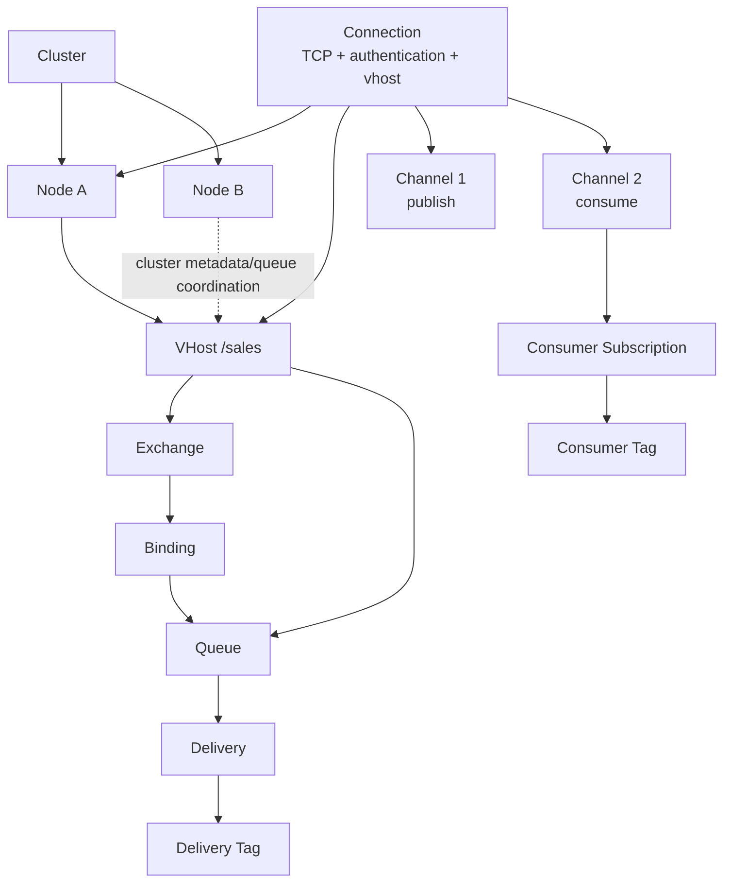

```text
Cluster
├── Node A  <── TCP Connection ── Client
├── Node B
└── VHost /sales（逻辑命名空间）
    ├── Exchange
    │   └── Binding ───────┐
    ├── Queue <────────────┘
    └── Policy / Permission

Connection
├── Channel 1：发布、声明
└── Channel 2：消费订阅
    └── Consumer Tag
        └── 每次 Delivery 有一个仅在该 Channel 内有效的 Delivery Tag
```

### 一句话模型

```text
客户端通过 Connection 进入一个 VHost，
在 Connection 内使用多个 Channel 执行 AMQP 方法；
Producer 把消息发布到 Exchange，
Exchange 使用自身类型、Routing Key、Headers 与 Binding 计算目标 Queue；
Queue 保存待投递消息，并把每次投递交给某个 Consumer。
```

---

## 5. Broker、Node、Cluster、Virtual Host

### 5.1 Broker：运维与架构语境中的“消息代理”

**Broker** 通常指对外提供消息发布、路由、存储、投递和管理能力的 RabbitMQ 服务。它更像架构术语，而不是 AMQP 0-9-1 协议中的具体对象。

在不同语境中，“Broker”可能指：

- 一个单节点 RabbitMQ 实例；
- 一个由多个节点组成的 RabbitMQ Cluster；
- 对业务暴露的整个消息中间件服务。

因此面试中最好先说明语境，不要把 Broker 机械等同于 Node。

### 5.2 Node：一个 RabbitMQ 运行实例

**Node** 是一个实际运行的 RabbitMQ 应用实例，具有：

- 节点名；
- Erlang VM 与进程树；
- 监听端口；
- 本地内存、磁盘和日志；
- 与其他节点的集群通信；
- Queue Leader/Replica、连接、Channel 等运行时状态。

客户端建立 TCP Connection 时，物理上只连到某一个 Node。即使入口是负载均衡器，连接建立后也落在某个具体节点上。

### 5.3 Cluster：节点协作边界，不是“自动全量复制”

**Cluster** 把多个 Node 组织为一个逻辑 RabbitMQ 系统。节点共享或协调用户、VHost、Exchange、Binding、Policy、Runtime Parameter 等元数据，客户端连接任一可用节点后可以访问该 Cluster 内的资源。

最重要的边界是：

> **Cluster 解决节点协作和统一命名空间问题；Queue 类型决定消息数据的放置和复制。**

RabbitMQ 4.x 中：

- Classic Queue 是非复制队列，队列数据主要位于其承载节点；
- Quorum Queue 使用 Raft 多副本；
- Stream 使用复制的追加日志；
- Classic Mirrored Queue 已在 4.0 移除，不能作为 4.x 当前高可用方案。[R13][R17]

负载均衡器也不是 Cluster 本身。它只决定新 Connection 先连到哪个节点，不能改变 Queue 的数据模型。

### 5.4 Virtual Host：逻辑租户与命名空间

**Virtual Host（VHost）** 是 RabbitMQ 的逻辑隔离边界。每个 VHost 有独立的：

- Exchange、Queue、Binding 名称空间；
- 用户权限；
- Policy、Operator Policy 与部分 Runtime Parameter；
- 统计与管理视图。

同名 Queue 可以存在于不同 VHost，因为它们是不同资源：

```text
VHost /sales   中的 orders
VHost /risk    中的 orders
```

二者没有路由关系。一个 Connection 在握手阶段选择 VHost，此后不能在同一 Connection 内“切换 VHost”。[R4][R6] 要跨 VHost，必须建立另一条 Connection。

VHost **不是**：

- Linux namespace；
- 独立进程；
- 独立磁盘分区；
- 自动资源配额。

若要防止某租户耗尽连接数、Queue 数、内存或磁盘，还需用户限制、VHost 限制、Policy、监控和独立集群等机制。

### 图 2：Cluster、Node、VHost 与 Connection

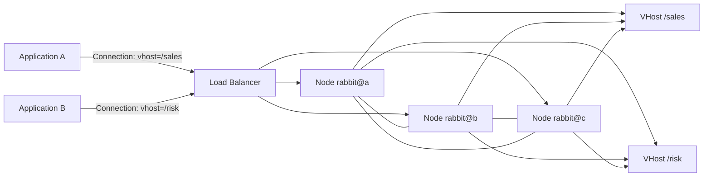

```text
Application A -- Connection(/sales) --┐
                                      ├─ Load Balancer ─ Node A
Application B -- Connection(/risk)  --┘                  ├─ Cluster
                                                         Node B
                                                         Node C

/sales 和 /risk 共享底层集群资源，但拥有独立的逻辑资源命名空间与权限。
```

### 5.5 状态到底属于哪里

| 状态 | 主要归属 |
|---|---|
| TCP Socket、认证身份、Heartbeat、所选 VHost | Connection |
| Channel Number、Consumer Tag、Delivery Tag、未确认投递、Confirm 序号 | Channel |
| Exchange、Queue、Binding、Policy 的逻辑命名 | VHost |
| 一个 Queue 的消息数据与运行进程 | Queue 及其承载/复制节点 |
| 节点监听端口、磁盘文件、连接进程 | Node |
| 集群成员关系、分布式元数据、复制队列协调 | Cluster |

---

## 6. Connection 与 Channel

### 6.1 Connection：昂贵、长寿命的物理连接

AMQP 0-9-1 **Connection** 通常建立在一条 TCP 连接上。建立过程包括：

1. TCP 连接；
2. 协议头协商；
3. `connection.start` / 身份认证；
4. `connection.tune` / Channel、Frame、Heartbeat 参数协商；
5. `connection.open` / 选择 VHost。

Connection 保存认证身份、VHost、Heartbeat、Socket、多个 Channel 等状态。频繁地“每发一条消息新建一个 Connection”会带来握手、Socket、线程和 Broker 进程开销，是典型反模式。

### 6.2 Channel：在一条 Connection 上复用的逻辑会话

**Channel** 是 AMQP 0-9-1 的逻辑连接。几乎所有业务操作都发生在 Channel 上：

- `exchange.declare`
- `queue.declare`
- `queue.bind`
- `basic.publish`
- `basic.consume`
- `basic.ack`
- `confirm.select`

多个 Channel 的 Frame 通过 Channel Number 在同一 TCP Connection 上多路复用。Channel 创建成本远低于 Connection，但它不是“零成本对象”；过多 Channel 仍会消耗客户端和服务端内存。

### 6.3 为什么错误通常只关闭 Channel

AMQP 0-9-1 将不少资源或命令错误定义为 **Channel-level exception（软错误）**，例如：

- `404 NOT_FOUND`：发布到不存在的 Exchange、被动声明不存在的 Queue；
- `405 RESOURCE_LOCKED`：访问其他 Connection 的 Exclusive Queue；
- `406 PRECONDITION_FAILED`：同名资源属性不一致、未知 Delivery Tag 等前置条件失败。

服务端关闭出错的 Channel，但通常保留 Connection 与其他 Channel。[R5][R19] 这使错误隔离在逻辑会话层，避免一个业务通道的声明错误直接断开整条 TCP Connection。

### 6.4 Channel 的并发边界

RabbitMQ Java Client 不建议多个线程无约束地并发共享同一个 Channel，原因包括：

- 多线程发布可能造成 Frame 交错风险；
- Confirm 序号与回调难以归属；
- Consumer Delivery Tag 只在 Channel 内有效；
- 一个线程触发协议异常会关闭其他线程正在复用的同一 Channel；
- Channel 的业务上下文通常不是线程安全边界。

常用模型：

```text
长寿命 Connection
├── Publisher Thread A -> Channel A
├── Publisher Thread B -> Channel B
├── Consumer A         -> Channel C
└── Consumer B         -> Channel D
```

可以使用受控 Channel Pool，但不能在借出期间把同一 Channel 同时交给多个线程。

### 图 3：Connection 上的 Channel 多路复用

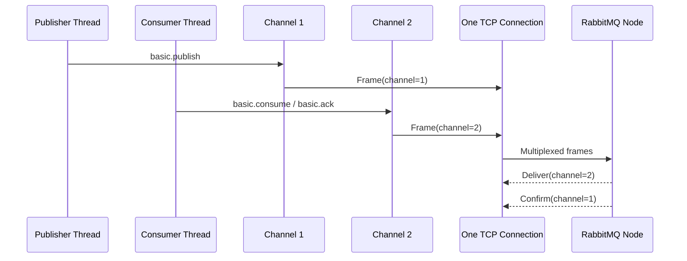

```text
Publisher -> Channel #1 --\
                           +--> one TCP Connection --> RabbitMQ Node
Consumer  -> Channel #2 --/

Frame 依靠 Channel Number 区分。
Channel #1 出现 406 时，#2 通常仍可继续；Connection 也通常保持。
```

---

## 7. Producer、Consumer、Consumer Tag、Delivery Tag

### 7.1 Producer 不是 Broker 内的持久对象

**Producer** 是发布消息的客户端角色。对 RabbitMQ 而言，它通过某个 Channel 发送 `basic.publish`。Broker 通常不会为“Producer”创建一个与 Queue 类似的长期实体；可观测的是 Connection、Channel、用户、客户端名称、发布速率等。

一次发布至少包含：

- Exchange Name；
- Routing Key；
- `mandatory` 标记；
- Message Properties；
- Message Body。

### 7.2 Consumer 是一条长期订阅

**Consumer** 通常由 `basic.consume` 创建，是“Channel 对某个 Queue 的长期订阅关系”。它不同于客户端线程，也不同于 Queue 本身。

Consumer 生命周期通常结束于：

- 客户端 `basic.cancel`；
- Queue 删除；
- Channel 关闭；
- Connection 关闭；
- 网络故障；
- Broker 主动取消。

### 7.3 Consumer Tag：标识订阅

**Consumer Tag** 标识一个 Consumer Subscription，作用域是 Channel。[R7][R19] 客户端可以请求一个 Tag，也可以让服务端生成。取消 Consumer 时使用它：

```java
String consumerTag = channel.basicConsume(queue, false, deliverCallback, cancelCallback);
channel.basicCancel(consumerTag);
```

同名 Consumer Tag 在不同 Channel 上并不代表同一个订阅。

### 7.4 Delivery Tag：标识投递

**Delivery Tag** 是 Broker 在某个 Channel 上为每次 Delivery 分配的单调递增正整数，用于：

- `basic.ack`
- `basic.nack`
- `basic.reject`

它的关键边界：

> Delivery Tag **只在产生该 Delivery 的 Channel 内有效**。[R8][R19]

在另一个 Channel 上 ACK，会触发 `unknown delivery tag`，通常表现为 `406 PRECONDITION_FAILED` 并关闭错误 Channel。

Delivery Tag 不是：

- 业务 Message ID；
- 全局消息序号；
- Queue 内永久 Offset；
- Consumer Tag；
- Correlation ID。

Channel 关闭后，旧 Delivery Tag 不可在新 Channel 上继续使用。

### 图 4：Consumer Tag 与 Delivery Tag

```mermaid
flowchart LR
    Q[Queue]
    C[Channel 7]
    S[Consumer Subscription<br/>consumerTag=worker-A]
    D1[Delivery<br/>deliveryTag=41]
    D2[Delivery<br/>deliveryTag=42]
    ACK1[basic.ack(41)]
    ACK2[basic.ack(42)]

    C --> S
    Q --> D1 --> S
    Q --> D2 --> S
    S --> ACK1
    S --> ACK2
    ACK1 --> C
    ACK2 --> C
```

```text
Channel 7
└── Consumer Tag = worker-A
    ├── Delivery Tag = 41 -> ACK 必须回到 Channel 7
    └── Delivery Tag = 42 -> ACK 必须回到 Channel 7

Channel 8 上执行 basic.ack(41)：
不是 ACK “同一条消息”，而是引用了 Channel 8 不认识的序号。
```

---

## 8. Exchange、Queue、Binding、Routing Key

### 8.1 Exchange：路由函数与路由元数据

**Exchange** 接收发布并计算目标。它保存：

- Exchange 名称；
- 类型；
- durable、auto-delete、internal 等属性；
- Arguments；
- 指向 Queue 或其他 Exchange 的 Binding。

标准 Exchange **不提供消息积压能力**。[R2][R12] 消息体可能在路由执行期间存在于内存/Frame 中，但 Exchange 不像 Queue 那样保留“Ready 消息列表”。

当发布没有任何目标 Queue 时，结果取决于：

- Exchange 是否配置 Alternate Exchange；
- `mandatory` 是否为 `true`；
- 是否有后续 Exchange-to-Exchange 路由；
- 否则消息被丢弃。

### 8.2 Queue：消息保存和投递边界

**Queue** 是有名称、有生命周期、有类型的消息容器。它维护或关联：

- Ready 消息；
- 投递与未确认状态；
- Consumer 列表；
- Queue Arguments；
- TTL、Length Limit、DLX 等行为；
- 所属 Queue 类型的存储/复制状态。

队列通常以 FIFO 顺序入队和投递，但多个 Consumer、Priority、重投、Prefetch 等会破坏端到端处理完成顺序，因此不能简单声称“RabbitMQ 保证严格有序”。

### 8.3 Binding：路由关系本身

**Binding** 是从 Source Exchange 指向 Destination（Queue 或 Exchange）的路由边。对 Queue Binding 而言，它至少包含：

```text
Source Exchange
Destination Queue
Binding Key
Binding Arguments
```

Binding 不是消息副本，也不是 Consumer。它参与每一次未来发布的目标计算。删除 Binding 不会把已进入 Queue 的消息撤回。[R2][R12]

### 8.4 Routing Key 与 Binding Key

- **Routing Key**：Producer 在每次 `basic.publish` 中携带。
- **Binding Key**：声明 Binding 时配置。
- Direct/Topic 用二者匹配；
- Fanout 忽略 Routing Key；
- Headers 主要使用 Message Headers 与 Binding Arguments。

两者可以使用相同字符串，但属于不同阶段和对象。

### 图 5：完整路由骨架

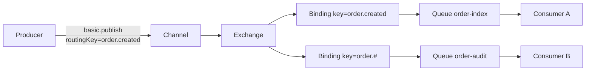

```text
Producer
  └─ basic.publish(exchange=orders, routingKey=order.created)
       └─ Exchange orders
          ├─ Binding(order.created) -> Queue order-index -> Consumer A
          └─ Binding(order.#)       -> Queue order-audit -> Consumer B
```

### 8.5 Exchange 到 Exchange 的 Binding

RabbitMQ 还支持 **Exchange-to-Exchange Binding**。此时目标不是 Queue，而是另一个 Exchange；后者再次执行自己的路由算法。它适合构建分层拓扑，但会增加：

- 路由链条复杂度；
- 变更影响面；
- 环路与重复目标分析难度；
- 运维排障成本。

最终仍必须路由到 Queue，消息才有可消费的积压位置。

---

## 9. 四种内置 Exchange

### 9.1 Direct Exchange：精确匹配

Direct Exchange 的规则是：[R2][R12]

```text
routingKey == bindingKey
```

同一个 Binding Key 可以绑定多个 Queue，因此精确匹配并不等于“只能到一个 Queue”。

#### 图 6：Direct Exchange

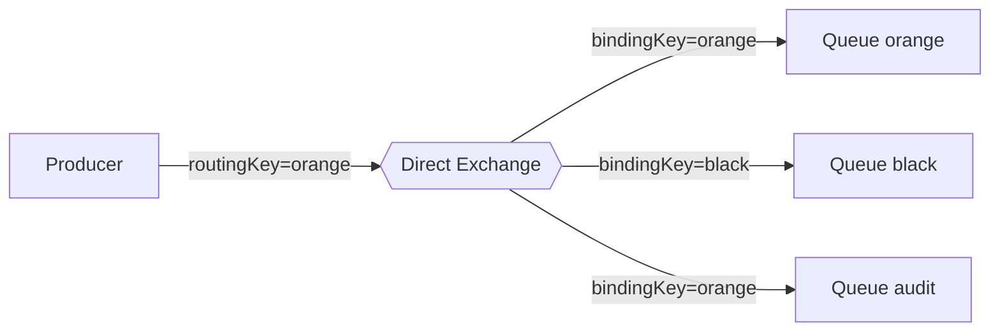

```text
routingKey=orange
       |
       v
 Direct Exchange
   ├─ bindingKey=orange -> Queue orange
   ├─ bindingKey=black  -> 不匹配
   └─ bindingKey=orange -> Queue audit

结果：两个不同 Queue 各一份。
```

适合：

- 枚举型路由；
- 明确的命令类别；
- 按租户/业务类型精确分发。

不适合用大量 Binding 模拟高维规则，否则 Binding 数量和治理成本会迅速增长。

### 9.2 Topic Exchange：按“词段”模式匹配

Topic Exchange 把 Routing Key 与 Binding Key 视为由 `.` 分隔的词段。[R2][R12]

```text
order.created.cn
```

通配符：

- `*`：恰好匹配一个词段；
- `#`：匹配零个或多个词段。

示例：

| Binding Key | 匹配 | 不匹配 |
|---|---|---|
| `order.*.cn` | `order.created.cn` | `order.cn`、`order.created.vip.cn` |
| `order.#` | `order`、`order.created`、`order.created.cn` | `payment.created` |
| `*.error` | `payment.error` | `error`、`payment.timeout.error` |
| `#` | 任意 Routing Key | 无 |

通配符只有作为完整词段时才有通配意义。`order*`、`a#b` 应视为普通字面词段，不要把它们设计成“前缀通配”。

#### 图 7：Topic Exchange

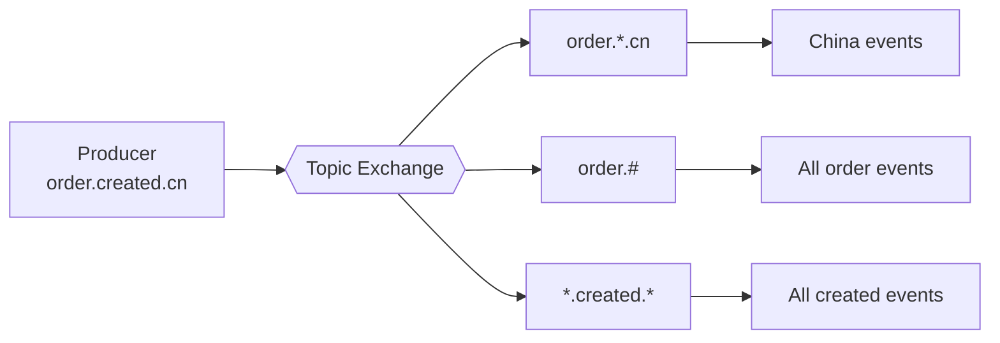

```text
Routing Key: order.created.cn
词段:        [order] [created] [cn]

order.*.cn   -> 匹配：* 消耗 created
order.#      -> 匹配：# 消耗 created、cn
*.created.*  -> 匹配：两个 * 各消耗一个词段
order.*      -> 不匹配：还剩 cn 未消费
```

#### 9.2.1 `*` 与 `#` 的实现视角

RabbitMQ 4.3 的 Topic 路由实现不是对每条 Binding 做简单全表正则扫描。官方源码中，Topic Binding Key 被组织为 Trie 式匹配结构；[R15][R16] 路由时：

1. 将 Routing Key 按 `.` 切分为词段；
2. 在当前节点尝试字面子节点；
3. 尝试 `*` 子节点并消耗一个词段；
4. 尝试 `#` 子节点：
   - 可以不消耗词段；
   - 也可以消费当前词段后继续；
5. Routing Key 被完整消费且到达有 Binding 目标的节点时，收集 Destination；
6. 同一 Destination 可能通过不同路径被收集，调用层必须去重。

这种实现解释了以下边界：

- `*` 不能匹配零段；
- `#` 可以匹配零段，所以 `order.#` 能匹配 `order`；
- 匹配必须覆盖完整 Routing Key，不是 substring；
- 多个重叠 Binding 可能产生同一 Queue 的重复候选，但最终只入队一次；
- 过度使用宽泛 `#`、高基数 Binding 会增加索引和路由成本。

Routing Key 是 AMQP `shortstr`，长度上限是 255 字节。生产设计应避免前导点、尾随点、连续点和无边界高基数值，因为空词段/高基数会增加理解与治理难度。

### 9.3 Fanout Exchange：广播到所有绑定目标

Fanout Exchange 忽略 Routing Key，把消息路由到所有绑定目标。[R2][R12]

#### 图 8：Fanout Exchange

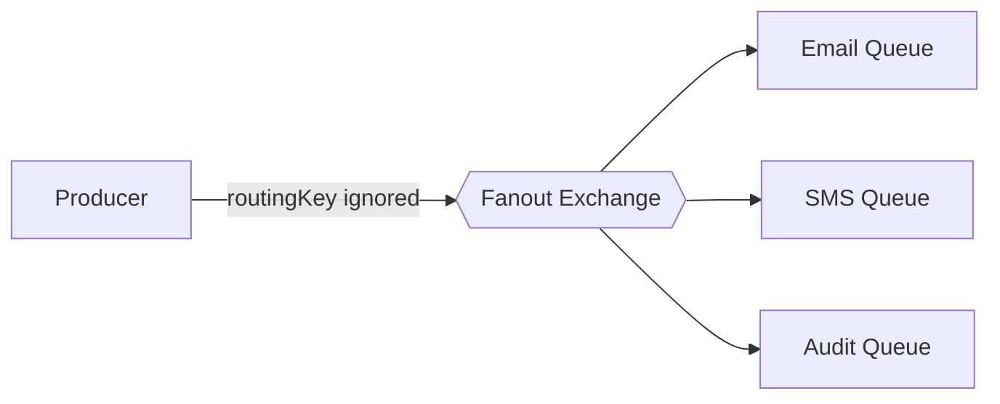

```text
Producer -> Fanout Exchange
              ├─ Queue Email
              ├─ Queue SMS
              └─ Queue Audit

Binding Key 和发布 Routing Key 都不参与筛选。
```

Fanout 是“对所有 Binding 广播”，不是“对所有 Consumer 广播”。如果 Email Queue 有 10 个 Consumer，进入 Email Queue 的那一份消息仍只由其中一个 Consumer 消费。

### 9.4 Headers Exchange：按 Headers 匹配

Headers Exchange 不依赖 Routing Key，主要比较消息 Headers 与 Binding Arguments。[R12]

常见 `x-match`：

- `all`：所有非 `x-` 匹配项都满足；
- `any`：任意一个非 `x-` 匹配项满足；
- RabbitMQ 还支持把 `x-` 开头键纳入匹配的扩展模式。

#### 图 9：Headers Exchange

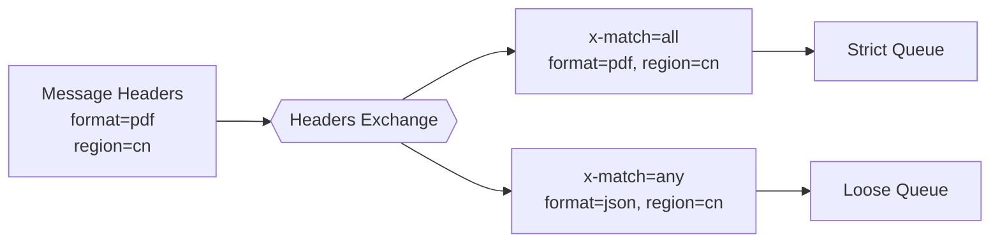

```text
Headers: format=pdf, region=cn

Binding A: x-match=all, format=pdf, region=cn -> 匹配
Binding B: x-match=any, format=json, region=cn -> 匹配
```

Headers Exchange 适合条件不天然表达为层级字符串的场景，但它通常比 Direct/Topic 更难治理：

- Header 类型必须一致；
- 规则不容易从 Routing Key 直接观察；
- Binding Arguments 更多；
- 跨语言序列化类型可能引入误判。

---

## 10. Default Exchange、Alternate Exchange 与 Dead Letter Exchange

### 10.1 Default Exchange

AMQP 0-9-1 中，名称为空字符串 `""` 的 Exchange 是 **Default Exchange**。[R2][R12] 它表现为一个特殊的 Direct Exchange：每次声明 Queue 时，RabbitMQ 都使该 Queue 可通过“Queue Name 作为 Routing Key”从 Default Exchange 到达。

```java
channel.basicPublish("", queueName, properties, body);
```

#### 图 10：Default Exchange

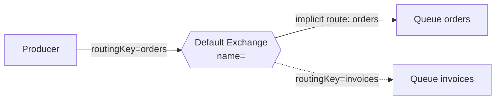

```text
basic.publish(exchange="", routingKey="orders")
              |
              v
       Default Exchange
              |
     隐式按 Queue Name 路由
              |
          Queue orders
```

#### 为什么它“仍然是 Exchange”

从 AMQP 协议和使用模型看：

- `basic.publish` 的 Exchange 参数仍然指向它；
- 它执行从发布到 Queue 的路由；
- 它采用 Direct 语义。

因此在概念模型中应把它当作 Exchange。

但在 RabbitMQ 4.3 的实现细节中，Default Exchange 被特殊处理，并非一个可像普通用户 Exchange 那样自由声明、删除和配置的常规对象。例如不能给它配置 Alternate Exchange。正确表述是：

> **协议/概念层面是特殊 Direct Exchange；RabbitMQ 实现层面是被特殊化的内置路由约定。**

Default Exchange 适合“已明确知道 Queue Name，直接发往该 Queue”的简单场景。业务事件路由通常更适合显式 Exchange，以降低 Producer 对 Queue 拓扑的耦合。

### 10.2 Alternate Exchange（AE）

**Alternate Exchange** 是某个 Exchange 的“未路由消息后备 Exchange”。[R10] 主 Exchange 没有找到任何目标时，消息交给 AE 再路由。

配置位置：**Exchange**。

常见用途：

- 收集发布端 Routing Key 拼写错误；
- 发现 Binding 缺失；
- 构建 unroutable message 监控队列；
- 在迁移拓扑时提供兜底。

#### 图 11：Alternate Exchange

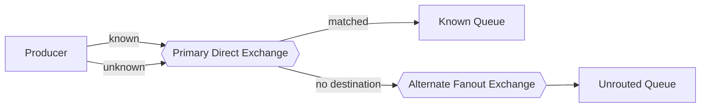

```text
routingKey=known   -> Primary Exchange -> Known Queue
routingKey=unknown -> Primary Exchange -> no match
                                      -> Alternate Exchange -> Unrouted Queue
```

注意：

- AE 不是新 Exchange 类型，它可以是 Direct/Topic/Fanout/Headers；
- 推荐通过 Policy 配置，便于动态运维；
- 主 Exchange 通过 AE 成功路由后，`mandatory` 发布通常不再被 Return；
- 若主 Exchange 与 AE 最终都无法路由，`mandatory=true` 才会产生 `basic.return`；
- Default Exchange 不能配置 AE。[R10]

### 10.3 Dead Letter Exchange（DLX）

**Dead Letter Exchange** 也是一个普通 Exchange，只是被 Queue 指定为死信重发布目标。[R11]

配置位置：**Queue**。

常见触发条件：

- Consumer `basic.reject` / `basic.nack` 且 `requeue=false`；
- 消息 TTL 到期；
- Queue 达到长度限制后发生淘汰；
- Quorum Queue 达到 Delivery Limit。

#### 图 12：Dead Letter Exchange

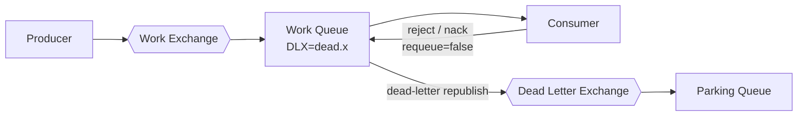

```text
Producer -> Work Exchange -> Work Queue -> Consumer
                                  |
                 reject/nack(requeue=false), TTL, length limit...
                                  |
                                  v
                         Dead Letter Exchange
                                  |
                                  v
                          Parking / Retry Queue
```

需要特别记住：

- DLX 不保存死信，最终仍由 Dead Letter Queue 保存；
- “删除/过期整个 Queue”不等于把其中全部消息逐条死信；
- DLX 是 Queue 出队异常路径，AE 是 Exchange 入站路由失败路径；
- 传统 Dead Lettering 的内部重发布并不自动等价于端到端可靠转移，可靠性细节见第 06 章。

### 10.4 AE 与 DLX 对比

| 维度 | Alternate Exchange | Dead Letter Exchange |
|---|---|---|
| 配置对象 | Exchange | Queue |
| 触发时机 | 初次路由没有目标 | 消息已进入 Queue 后被淘汰/拒绝/超限 |
| 解决问题 | Unroutable publish | Dead-letter lifecycle |
| 是否是特殊 Exchange 类型 | 否 | 否 |
| 是否已有 Queue 副本 | 通常尚未成功入队 | 已在源 Queue 中存在过 |
| 常见目标 | Unrouted Queue | Retry Queue / Parking Queue |
| 与 `mandatory` | AE 成功路由通常不 Return | 无直接替代关系 |
| 推荐配置 | Policy | Policy |

---

## 11. `durable`、`exclusive`、`auto-delete`

### 11.1 `durable`

对 Exchange/Queue 而言，`durable=true` 表示该资源定义应在 Broker 重启后继续存在。[R2][R3]

它不保证：

- 每条消息都是持久消息；
- 消息已经 `fsync`；
- Queue 有副本；
- 节点永久不丢盘；
- Producer 一定收到 Confirm；
- Consumer 业务已经提交。

因此：

```text
Durable Queue
+ Persistent Message
+ Publisher Confirm
+ 合适的 Queue 类型/副本策略
+ 正确的 Consumer ACK 与幂等
```

才是完整可靠性设计的不同组成部分。

### 11.2 `exclusive`

对 Queue 而言，`exclusive=true` 表示该 Queue 只能由声明它的 Connection 使用，并在该 Connection 关闭时删除。[R3]

关键点：

- 生命周期绑定 **Connection**，不是 Channel；
- 同一 Connection 的其他 Channel 可以使用；
- 其他 Connection 访问会得到 `RESOURCE_LOCKED`；
- 应优先让服务端生成 Queue Name；
- 通常应为非持久 Queue；
- 连接自动恢复期间要考虑旧 Queue 删除与重建竞态。

典型场景：

- RPC Reply Queue；
- 临时订阅；
- 每个应用实例独占的回调 Queue。

### 11.3 `auto-delete`

对 Queue 而言，`auto-delete=true` 通常表示：

> Queue 曾经至少有一个 Consumer，之后最后一个 Consumer 消失时，Queue 自动删除。[R3]

它不表示：

- Queue 为空就删除；
- Producer 停止就删除；
- 声明后无人消费立即删除。

对 Exchange 而言，auto-delete 触发条件不同：通常在其曾经有 Binding、之后最后一个 Binding 被删除时自动删除。

### 11.4 Queue TTL 与 auto-delete 的区别

Queue TTL / Queue Expiration（例如 `x-expires`）是“长时间未使用后删除 Queue”，适合清理无活动拓扑；auto-delete 则与 Consumer 生命周期相关。二者不能混为一谈。

### 11.5 RabbitMQ 4.3 的重要变化

RabbitMQ 4.3 默认不再允许声明“非持久、非独占的 Classic Queue”。[R3] 推荐选择：

- 稳定业务 Queue：durable；
- 临时 Queue：non-durable + exclusive，通常使用服务端生成名称；
- 需要自动回收的稳定 Queue：durable + Queue TTL/Policy。

这也是本章示例大量使用 server-named exclusive Queue 的原因。

### 属性组合表

| durable | exclusive | auto-delete | 典型含义 | 建议 |
|---:|---:|---:|---|---|
| true | false | false | 长期业务 Queue | 最常见 |
| false | true | true | Connection 级临时 Queue | 推荐服务端生成名称 |
| true | false | true | 最后 Consumer 消失后删除，但可跨重启保留定义 | 语义容易误解，谨慎 |
| false | false | false | 旧式 transient shared Classic Queue | RabbitMQ 4.3 默认禁止 |
| true | true | 任意 | 重启存活与 Connection 关闭删除相互冲突 | 通常没有合理收益 |

---

## 12. Queue Arguments、Policy 与 Operator Policy

### 12.1 Queue Arguments

Queue Arguments 是 `queue.declare` 时携带的扩展参数，例如：

- `x-queue-type`
- `x-message-ttl`
- `x-expires`
- `x-max-length`
- `x-overflow`
- `x-dead-letter-exchange`
- `x-dead-letter-routing-key`
- `x-max-priority`
- `x-single-active-consumer`

它们不全具有相同动态性：

- 有些在 Queue 创建后不可变；
- 有些可由 Policy 动态应用；
- 有些必须在声明时确定；
- 不同 Queue 类型支持范围不同。

不能把任意 `x-` 参数都当成可在线修改的配置。

### 12.2 Policy

Policy 由以下部分组成：

- 名称；
- 正则表达式 Pattern；
- Apply-to 类型；
- Priority；
- Definition。

Policy 把可选参数动态应用到匹配的 Queue/Exchange。它适合：

- TTL；
- DLX；
- Max Length；
- Overflow；
- Alternate Exchange；
- 运维需要统一调整的行为。

相较把参数硬编码在 Java 中，Policy 的优势是无需重新发布应用即可调整，并能统一治理多个资源。

### 12.3 Operator Policy

Operator Policy 由平台运维方设置，用于建立不可被应用随意突破的安全上限。例如限制 Queue Length、Message TTL 等。

可记忆为：

```text
Operator Policy：平台护栏
Client x-arguments：应用显式要求
User Policy：可动态治理的默认/批量配置
```

一般优先关系：[R9]

```text
Operator Policy > Client x-arguments > User Policy
```

对数值上限类配置，RabbitMQ 常采用更保守的较小值，以确保应用不能突破 Operator Policy 的护栏。具体参数仍应查对应功能文档。

### 12.4 为什么不应把所有参数硬编码

硬编码的后果：

- 改 DLX/TTL 需要发版；
- 两个应用版本可能声明同名 Queue 但 Arguments 不同，触发 406；
- 运维无法统一限流或调整；
- 拓扑所有权不清晰。

但也不能把所有东西交给 Policy。Queue Type、Max Priority 等创建期属性不能依赖 Policy 任意变更。正确做法是区分：

```text
拓扑身份/不可变属性 -> 声明代码或 IaC
可运营行为          -> Policy
平台安全上限        -> Operator Policy
```

### 12.5 优先级与不可变性表

| 配置来源 | 谁维护 | 动态应用 | 常见用途 | 冲突时 |
|---|---|---:|---|---|
| Queue/Exchange 声明参数 | 应用或 IaC | 多数不可随意变 | Queue Type、固定身份属性 | 显式参数通常压过 User Policy |
| User Policy | 应用平台/运维 | 是 | TTL、DLX、AE、Length Limit | 低于显式 x-args |
| Operator Policy | 平台管理员 | 是 | 安全上限、资源护栏 | 优先级最高/采取更保守值 |
| Broker 默认值 | 集群配置 | 依功能而定 | Default Queue Type 等 | 仅在未显式配置时生效 |


---

## 13. Queue 声明幂等性、属性冲突与 `PRECONDITION_FAILED`

### 13.1 什么叫声明幂等

`queue.declare` 既可以创建 Queue，也可以确认一个已存在 Queue 的属性。所谓幂等不是“同名就成功”，而是：

```text
同一个 VHost
+ 同一个 Queue Name
+ 服务端要求等价的属性
= 重复声明成功
```

通常需要等价的属性包括：

- durable；
- exclusive；
- auto-delete；
- Arguments；
- Queue Type 等创建期属性。

如果属性一致，Broker 返回 `queue.declare-ok`；[R3][R19] 不会再创建一条 Queue，也不会清空现有消息。

Exchange 声明同样要求名称、类型、durable、auto-delete、internal、Arguments 等兼容。

### 13.2 典型冲突

应用 A：

```java
channel.queueDeclare("orders", true, false, false, null);
```

应用 B：

```java
channel.queueDeclare("orders", false, false, false, null);
```

第二个声明不是“把 Queue 改成 non-durable”，而是协议前置条件不满足。RabbitMQ 返回类似：[R3][R5]

```text
406 PRECONDITION_FAILED
inequivalent arg 'durable' for queue 'orders'
```

### 13.3 为什么不能在线改属性

Queue 的 durable、exclusive、Queue Type 等属性会影响：

- 元数据恢复；
- 所有权和访问控制；
- 存储实现；
- 复制模型；
- 删除条件。

若同名资源允许不同客户端以不同声明“最后写入者覆盖”，现有消息、Consumer、Binding 和存储状态将没有确定语义。因此协议采用“等价检查”，而不是资源属性更新。

需要变更不可变属性时，应：

1. 创建新名称/新版本 Queue；
2. 建立新 Binding；
3. 切换 Producer/Consumer；
4. 排空或迁移旧 Queue；
5. 删除旧拓扑。

### 13.4 被动声明

`queueDeclarePassive(name)` 只检查 Queue 是否存在并返回状态，不创建资源。若不存在，仍会产生 `404 NOT_FOUND` 并关闭 Channel。

被动声明适合健康检查或“拓扑由外部系统管理”的应用，但不能把它当成无副作用的布尔查询。应使用一次性 Channel 或管理 API 执行探测，避免关闭业务 Channel。

### 图 13：声明冲突关闭 Channel 的时序

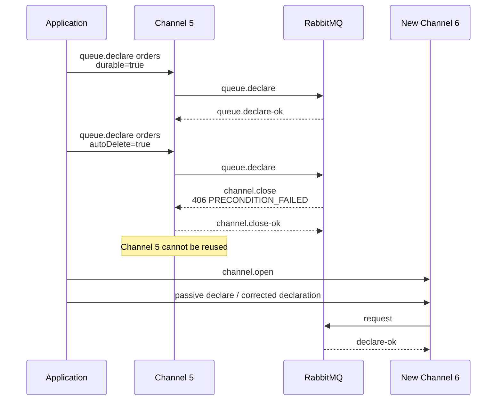

```text
Channel 5:
  queue.declare(orders, durable=true, autoDelete=false) -> OK
  queue.declare(orders, durable=true, autoDelete=true)  -> 406
  Broker -> channel.close
  Channel 5 已失效

Connection 仍在：
  createChannel() -> Channel 6
  修正拓扑后继续
```

### 13.5 `PRECONDITION_FAILED` 为什么关闭整个 Channel

第一层答案：**因为 AMQP 0-9-1 规范把该错误定义为 Channel 级异常，RabbitMQ 按协议发送 `channel.close`。**

更深入地看，Channel 是一个有状态命令流，包含：

- Consumer 订阅；
- Delivery Tag 与未确认投递；
- Publisher Confirm 序号；
- 事务/Confirm 模式；
- 正在进行的同步 RPC 请求。

协议异常发生后，客户端和服务端不能假定该命令流仍处于一致、可继续复用的状态。关闭 Channel 提供了明确的同步边界。恢复方式不是“清掉异常继续”，而是：

```text
记录 Shutdown Reason
-> 修正配置/代码
-> 新建 Channel
-> 按正确属性重新声明/使用
```

盲目循环重试相同声明只会不断创建和关闭 Channel，造成日志风暴与资源抖动。

### 13.6 常见 Channel 异常矩阵

| Reply Code | 典型原因 | 影响 | 恢复 |
|---:|---|---|---|
| 404 `NOT_FOUND` | Exchange/Queue 不存在；被动声明失败 | Channel 关闭 | 新建 Channel，修正资源名或先声明 |
| 403 `ACCESS_REFUSED` | VHost/资源权限不足 | 通常 Channel 或 Connection 失败，依阶段而定 | 修正 Permission |
| 405 `RESOURCE_LOCKED` | 访问其他 Connection 的 Exclusive Queue | Channel 关闭 | 使用拥有者 Connection 或新 Queue |
| 406 `PRECONDITION_FAILED` | 声明属性不一致、未知 Delivery Tag 等 | Channel 关闭 | 修正前置条件，新建 Channel |
| 530 `NOT_ALLOWED` 等 | 协议不允许的操作 | 依错误级别关闭 Channel/Connection | 查看 Shutdown Reason |

---

## 14. AMQP 0-9-1 中的完整 Exchange 路由流程

### 14.1 发布前提

`basic.publish` 是 Channel 上的异步方法。关键参数：

```text
exchange
routing-key
mandatory
immediate（RabbitMQ 不支持，必须为 false）
properties
body
```

在消息真正入队前，Broker 至少需要解析目标 Exchange、检查权限并运行路由算法。

### 14.2 路由步骤

下面以 Queue Binding 为主，省略网络 Frame 分片细节：

1. **客户端序列化消息。**
2. **Channel 发送 `basic.publish` 与 Content Header/Body Frame。**
3. **接入 Node 在当前 VHost 中查找 Exchange。**
   - Exchange 不存在：`404 NOT_FOUND`，Channel 关闭。
4. **检查写 Exchange 的权限与协议前置条件。**
5. **按 Exchange Type 执行匹配。**
   - Direct：Routing Key 精确匹配 Binding Key；
   - Topic：词段 + `*` / `#`；
   - Fanout：选择全部 Binding；
   - Headers：比较 Headers 与 Binding Arguments。
6. **沿 Exchange-to-Exchange Binding 继续路由（若存在）。**
7. **收集并去重最终 Queue Destination。**
8. **对每个不同 Queue 创建独立的入队结果。**
9. **若没有 Queue：**
   - 尝试 Alternate Exchange；
   - 若最终仍无目标且 `mandatory=true`，发送 `basic.return`；
   - 否则丢弃。
10. **若启用 Publisher Confirm，按 Queue 类型与持久化边界完成后确认发布。**
11. **Queue 根据 Consumer、Prefetch、Priority 等选择投递。**
12. **Consumer 使用 Delivery Tag 在同一 Channel 上 ACK/NACK。**

### 图 14：发布、路由与消费完整时序

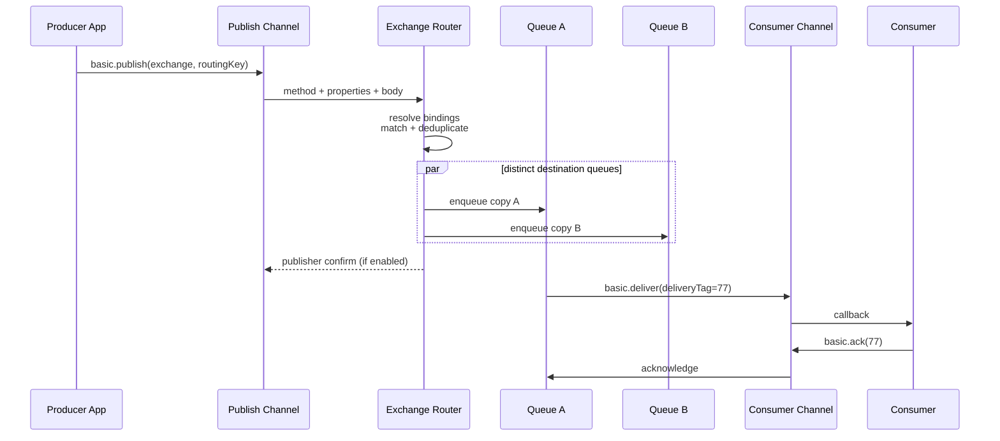

```text
Producer App
   |
   | basic.publish(exchange, routingKey, properties, body)
   v
Publish Channel
   |
   v
Exchange lookup + permission + routing
   |
   +-- collect Queue A
   +-- collect Queue A again via another Binding --[deduplicate]
   +-- collect Queue B
   |
   +--> Queue A: one copy
   +--> Queue B: one copy
              |
              v
       Consumer Delivery
              |
       basic.ack(deliveryTag)
```

### 14.3 路由伪算法

```text
route(exchange, message):
    candidates = exchange.type.match(
        routingKey = message.routingKey,
        headers    = message.headers,
        bindings   = exchange.bindings
    )

    candidates += route(nextExchange, message) for exchange-bindings
    queues = distinct(candidates where destination is Queue)

    if queues is empty and exchange has alternate-exchange:
        return route(alternateExchange, message)

    if queues is empty:
        if mandatory:
            basic.return(message)
        else:
            discard(message)
        return

    for queue in queues:
        enqueueIndependentCopy(queue, message)
```

这段伪算法强调三点：

- Binding 是“候选目标计算规则”，不是中转存储；
- Destination 以 Queue 身份去重；
- 每个不同 Queue 的入队和后续生命周期彼此独立。

### 14.4 Exchange 是否“碰到”消息

面试中常见两个极端回答都不准确：

- “Exchange 完全不接收消息，只看地址”；
- “Exchange 先把消息存起来再转发”。

准确说法是：

> Exchange 是发布的协议目标和路由执行点，消息内容/属性在路由执行期间被处理；但标准 Exchange 不形成可积压、可消费、可持久保留的消息容器。

它保存路由元数据，而不是 Ready Message Backlog。

---

## 15. 多 Queue、多 Binding、多 Consumer 的精确语义

### 15.1 一条消息匹配多个不同 Queue

若一次发布最终匹配 Queue A、B、C：

```text
Queue A：一份独立入队记录
Queue B：一份独立入队记录
Queue C：一份独立入队记录
```

这些副本通常共享相同 Body/Properties 语义，但生命周期独立：

- A 被 ACK 不影响 B/C；
- A 到期进入其 DLX，不影响 B/C；
- B 有 Max Length 被淘汰，不影响 A/C；
- C 没有 Consumer，可以长期 Ready；
- 每个 Queue 可能使用不同 Queue Type 和复制策略。

### 图 15：一个发布，多 Queue 独立生命周期

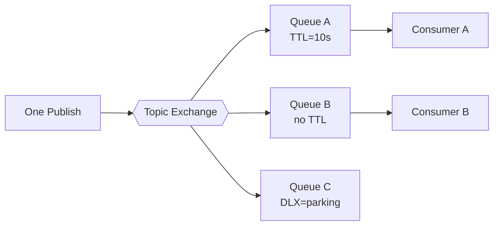

```text
One Publish
  └─ Exchange
      ├─ Queue A copy -> ACK
      ├─ Queue B copy -> Ready
      └─ Queue C copy -> TTL/DLX

三份 Queue 状态互不联动。
```

### 15.2 同一 Queue 的多个 Binding 同时匹配

假设 Queue A 同时绑定：

```text
order.created
order.#
```

发布 Routing Key `order.created` 时，两条 Binding 都匹配，但 RabbitMQ 对同一 Queue 只入队一次。AMQP 0-9-1 服务器必须避免同一次发布因多个 Binding 向同一 Queue 重复投递。[R19]

注意：这只是“同一次路由的目标去重”。Producer 如果真的发布两次，Queue 仍可能得到两条消息；RabbitMQ 不会根据 Message ID 自动业务去重。

### 15.3 同一 Queue 的多个 Consumer

同一 Queue 上多个 Consumer 是 **Competing Consumers**：

- 一条 Ready 消息选择一个可接收 Consumer；
- 默认分发常表现为 Round-robin；[R7]
- Prefetch、Consumer Priority、Consumer 是否阻塞、ACK 速度会影响实际分布；
- 不能要求严格 50/50；
- Consumer 失败、Channel 关闭且消息未 ACK 时，消息可能重新入队并交给另一个 Consumer；
- Queue 的“投递顺序”不等于业务“完成顺序”。

### 图 16：Competing Consumers

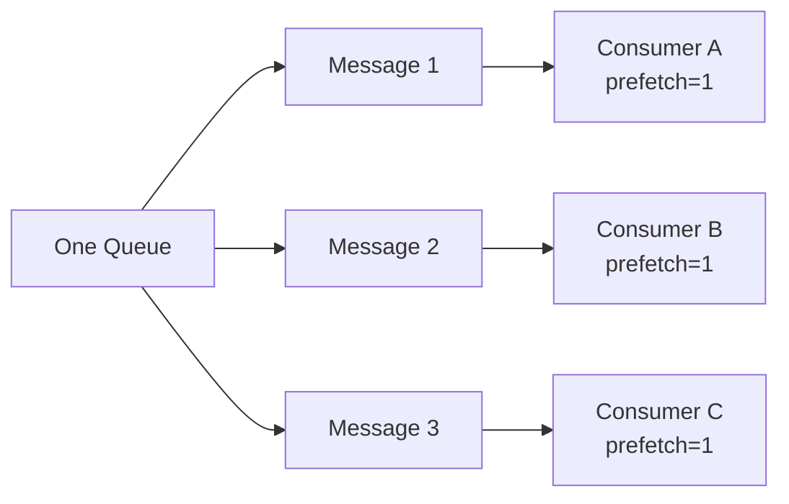

```text
Queue
├─ Message 1 -> Consumer A
├─ Message 2 -> Consumer B
└─ Message 3 -> Consumer C

不是：
Message 1 -> A、B、C 各一份

要广播给三个业务订阅者，应建立三个 Queue，再各自绑定 Exchange。
```

### 15.4 广播与竞争的判断口诀

```text
一个 Exchange -> 多个 Queue：复制/发布订阅
一个 Queue    -> 多个 Consumer：竞争/负载分担
```

### 15.5 重投对“只交给一个 Consumer”的影响

“同一条消息只给一个 Consumer”描述的是一次 Delivery。若该 Delivery 未 ACK 并被重新入队，下一次 Delivery 可以给另一个 Consumer，并获得新的 Delivery Tag。端到端语义仍可能是 At-least-once。

---

## 16. Topic `*` 与 `#` 的边界测试矩阵

假设 Binding Key 如下：

| Routing Key | `a.*.c` | `a.#` | `#.c` | `*` | `#` |
|---|---:|---:|---:|---:|---:|
| `a.b.c` | ✓ | ✓ | ✓ | ✗ | ✓ |
| `a.c` | ✗ | ✓ | ✓ | ✗ | ✓ |
| `a` | ✗ | ✓ | ✗ | ✓ | ✓ |
| `c` | ✗ | ✗ | ✓ | ✓ | ✓ |
| `a.b.d.c` | ✗ | ✓ | ✓ | ✗ | ✓ |
| 空 Routing Key | ✗ | ✗/取决于前缀 | ✗/取决于后缀 | ✗ | ✓ |

解释：

- `a.*.c` 必须恰好三段；
- `a.#` 中 `#` 可以消费零段，因此 `a` 匹配；
- `#.c` 可以匹配 `c`，因为 `#` 消费零段；
- `*` 只匹配恰好一个词段；
- `#` 匹配任意段数，包括零段。

生产建议：

1. 用有限、稳定的业务维度构造 Routing Key；
2. 避免把订单号、用户 ID 等高基数值放进需要大量 Binding 的位置；
3. 不用 `#` 作为“先接住再说”的永久方案；
4. 为 Routing Key 建立 Schema 和版本策略；
5. 在测试中覆盖零段、一段、多段和边界长度。

---

## 17. 完整对象生命周期表

| 对象 | 创建/建立方式 | 主要作用域 | 主要状态 | 重启后是否存在 | 自动结束/删除条件 | 典型异常影响 |
|---|---|---|---|---|---|---|
| Broker 服务 | 启动 RabbitMQ | 部署/集群 | 节点、监听、插件、资源 | 取决于数据目录与部署 | 服务停止/销毁 | 所有连接中断 |
| Node | 启动一个 RabbitMQ 实例 | Cluster | Erlang VM、连接、Queue 进程、本地存储 | 节点配置存在即可重启 | 进程停止 | 该节点连接断开；Queue 可用性依类型 |
| Cluster | `join_cluster`/编排 | 多 Node | 成员关系、分布式元数据 | 是 | 解集群/销毁 | 不是所有 Queue 自动复制 |
| VHost | 管理 API/CLI | Cluster 逻辑命名空间 | Exchange、Queue、Binding、Policy、权限 | 是 | 显式删除 | 删除会移除其中资源并断开相关连接 |
| User/Permission | 管理 API/CLI | Cluster/VHost | 身份、configure/write/read 正则 | 是 | 显式删除 | 认证或授权失败 |
| Connection | AMQP 握手 | 单 Node + 单 VHost | Socket、认证、Heartbeat、Channels | 否 | 客户端关闭、网络失败、Node 停止 | 其 Channels/Consumers 结束；Exclusive Queue 删除 |
| Channel | `connection.createChannel()` | 单 Connection | Channel Number、模式、Consumer、Delivery/Confirm 序号 | 否 | 显式关闭、Connection 关闭、协议异常 | 该 Channel 上消费者和未确认状态受影响 |
| Exchange | `exchange.declare`/Policy/IaC | VHost | 类型、属性、Arguments、Bindings | durable 决定 | 显式删除；auto-delete 条件 | 发布到不存在 Exchange 会关闭 Channel |
| Binding | `queue.bind`/`exchange.bind` | VHost | Source、Destination、Key、Arguments | 依相关 durable 拓扑恢复 | 显式解绑；对象删除 | 只影响未来路由 |
| Queue | `queue.declare` | VHost + Queue Type | 消息、Consumers、Arguments、存储状态 | durable 决定定义；数据可靠性另论 | 显式删除、exclusive、auto-delete、expires | 删除会取消 Consumer；消息消失/按功能处理 |
| Policy | 管理 API/CLI | VHost | Pattern、Definition、Priority | 是 | 显式删除 | 可动态改变匹配资源行为 |
| Producer 角色 | 应用代码 | Client + Channel | 序列化、发布、Confirm 关联 | 否 | 应用/Channel 结束 | 不作为 Broker 持久实体 |
| Consumer Subscription | `basic.consume` | Channel + Queue | Consumer Tag、Prefetch 参与、回调 | 否 | cancel、Queue/Channel/Connection 结束 | 未 ACK Delivery 可能重投 |
| Consumer Tag | 客户端指定/服务端生成 | Channel | 订阅标识 | 否 | Consumer 结束 | 跨 Channel 不具备全局身份 |
| Delivery | `basic.deliver`/`basic.get-ok` | Channel | Envelope、Body、Properties、Redelivered | 否 | ACK/NACK/Channel 结束 | 未 ACK 可能重新入队 |
| Delivery Tag | Broker 分配 | Channel | 单调递增投递序号 | 否 | ACK/NACK/Channel 结束 | 跨 Channel ACK 触发 unknown tag |
| Queue 中的消息副本 | Exchange 路由入队 | 单 Queue | Ready/Unacked、TTL、Headers 等 | 取决于 Queue、消息属性和故障 | ACK、过期、淘汰、删除 | 每个 Queue 副本独立 |
| Alternate Exchange 关系 | Exchange Argument/Policy | Source Exchange | AE 名称 | 随配置 | 配置移除 | 主 Exchange 无路由时使用 |
| Dead-letter 关系 | Queue Argument/Policy | Source Queue | DLX 与可选 Routing Key | 随配置 | 配置移除 | 死信时重发布 |

### 图 17：生命周期依赖

```mermaid
flowchart TB
    CL[Cluster]
    VH[VHost]
    EX[Exchange]
    Q[Queue]
    B[Binding]
    CONN[Connection]
    CH[Channel]
    CS[Consumer]
    DEL[Delivery]

    CL --> VH
    VH --> EX
    VH --> Q
    EX --> B
    B --> Q
    CONN --> CH
    CH --> CS
    Q --> CS
    CS --> DEL
    CONN -. closes .->|deletes| Q
    CH -. closes .->|cancels| CS
    Q -. deleted .->|cancels| CS
```

```text
Cluster
└─ VHost
   ├─ Exchange -- Binding --> Queue
   └─ Policy

Connection
└─ Channel
   └─ Consumer Subscription <── Queue
      └─ Delivery

Connection 关闭 -> Channel 关闭 -> Consumer 取消
Connection 关闭 -> Exclusive Queue 删除
Queue 删除      -> Consumer 被取消
```

---

## 18. 至少 15 组容易混淆的概念对比

| # | 概念 A | 概念 B | 核心区别 |
|---:|---|---|---|
| 1 | Broker | Node | Broker 是服务/代理的架构称呼；Node 是一个实际运行实例。 |
| 2 | Node | Cluster | Node 是成员；Cluster 是多个 Node 的协作边界。 |
| 3 | Cluster | 数据复制 | 加入 Cluster 不意味着 Classic Queue 自动多副本。 |
| 4 | VHost | Cluster | VHost 是逻辑命名空间；Cluster 是节点集合。 |
| 5 | Connection | Channel | Connection 通常对应 TCP；Channel 是其上的逻辑 AMQP 会话。 |
| 6 | Channel | Java Thread | Channel 不是线程，但通常应被线程独占或受控借用。 |
| 7 | Exchange | Queue | Exchange 计算路由；Queue 保存和投递消息。 |
| 8 | Routing Key | Binding Key | Routing Key 属于一次发布；Binding Key 属于长期路由关系。 |
| 9 | Binding | Consumer | Binding 连接 Exchange 与目标；Consumer 订阅 Queue。 |
| 10 | Direct | Topic | Direct 精确匹配；Topic 按词段和通配符匹配。 |
| 11 | Fanout | Topic `#` | 都可广播，但 Fanout 不执行 Key 匹配；Topic `#` 仍经过 Topic 规则。 |
| 12 | Headers | Topic | Headers 比较类型化 Headers；Topic 比较字符串词段。 |
| 13 | Default Exchange | 自定义 Direct Exchange | Default 用空名称和 Queue Name 隐式路由；自定义 Direct 由用户管理 Binding。 |
| 14 | Alternate Exchange | Dead Letter Exchange | AE 处理 Exchange 无路由；DLX 处理 Queue 内消息死信。 |
| 15 | DLX | Dead Letter Queue | DLX 负责再次路由；DLQ 才保存死信。 |
| 16 | durable Queue | persistent message | 前者是 Queue 定义属性；后者是消息投递模式。二者不能互相替代。 |
| 17 | exclusive Queue | exclusive Consumer | Queue exclusive 绑定 Connection；exclusive Consumer/SAC 是消费调度概念。 |
| 18 | auto-delete | Queue 为空 | auto-delete 与 Consumer 生命周期相关，不以空 Queue 为触发条件。 |
| 19 | auto-delete | `x-expires` | 前者看最后 Consumer；后者看 Queue 未使用时间。 |
| 20 | Consumer Tag | Delivery Tag | 前者标识订阅；后者标识 Channel 上的一次投递。 |
| 21 | Delivery Tag | Message ID | Delivery Tag 是协议序号；Message ID 是应用属性。 |
| 22 | 多 Queue | 多 Consumer | 多 Queue 产生独立副本；同 Queue 多 Consumer 竞争同一副本。 |
| 23 | 重复 Binding | 重复 Publish | 同一 Queue 多 Binding 匹配会去重；两次 Publish 不会自动去重。 |
| 24 | Queue Arguments | User Policy | Arguments 由声明方显式给出；Policy 可动态批量应用。 |
| 25 | User Policy | Operator Policy | User Policy 是普通治理配置；Operator Policy 是平台不可突破的护栏。 |
| 26 | 声明幂等 | 修改资源 | 属性等价时重复声明；不等价不会更新，而是 406。 |
| 27 | `basic.return` | Publisher NACK | Return 表示未路由；NACK 表示 Broker 未能接受/处理发布，语义不同。 |
| 28 | Consumer ACK | Publisher Confirm | ACK 覆盖 Broker→Consumer；Confirm 覆盖 Producer→Broker。 |
| 29 | Queue FIFO | 业务严格有序 | Queue 可按序投递，但并发、重投、优先级会改变处理完成顺序。 |
| 30 | 删除 Binding | 删除已路由消息 | 解绑只影响未来发布，不撤销 Queue 中已有消息。 |


---

## 19. Java 17 可运行示例

### 19.1 运行边界

本节代码只用于验证“声明、路由、生命周期和协议异常”。它不是完整生产可靠投递模板：

- 大多数路由示例使用 `basicGet(..., autoAck=true)` 便于观察结果；
- 正式生产者必须结合 Publisher Confirm、`mandatory`/Return、超时、有限重试与业务幂等；
- 正式消费者必须把业务事务、幂等、ACK、重试和毒消息处置作为一个整体设计；
- 这些内容分别在第 04、05、06 章展开。

示例使用 RabbitMQ 4.3.x、Java 17、Java Client 5.32.0。RabbitMQ 4.3 默认不允许 transient non-exclusive Classic Queue，因此演示 Queue 多使用“服务端命名 + exclusive + auto-delete”。

启动本地 Broker：

```bash
docker run -d --name rabbitmq-ch02 \
  -p 5672:5672 -p 15672:15672 \
  rabbitmq:4.3-management
```

环境变量：

```bash
export RABBITMQ_HOST=localhost
export RABBITMQ_PORT=5672
export RABBITMQ_USER=guest
export RABBITMQ_PASSWORD=guest
export RABBITMQ_VHOST=/
```

### 19.2 Maven 配置

```xml
<?xml version="1.0" encoding="UTF-8"?>
<project xmlns="http://maven.apache.org/POM/4.0.0"
         xmlns:xsi="http://www.w3.org/2001/XMLSchema-instance"
         xsi:schemaLocation="http://maven.apache.org/POM/4.0.0 https://maven.apache.org/xsd/maven-4.0.0.xsd">
    <modelVersion>4.0.0</modelVersion>

    <groupId>com.example</groupId>
    <artifactId>rabbitmq-chapter02-examples</artifactId>
    <version>1.0.0</version>
    <name>RabbitMQ Chapter 02 Examples</name>

    <properties>
        <maven.compiler.release>17</maven.compiler.release>
        <project.build.sourceEncoding>UTF-8</project.build.sourceEncoding>
        <rabbitmq.client.version>5.32.0</rabbitmq.client.version>
        <slf4j.version>2.0.17</slf4j.version>
    </properties>

    <dependencies>
        <dependency>
            <groupId>com.rabbitmq</groupId>
            <artifactId>amqp-client</artifactId>
            <version>${rabbitmq.client.version}</version>
        </dependency>
        <dependency>
            <groupId>org.slf4j</groupId>
            <artifactId>slf4j-simple</artifactId>
            <version>${slf4j.version}</version>
            <scope>runtime</scope>
        </dependency>
    </dependencies>

    <build>
        <plugins>
            <plugin>
                <groupId>org.apache.maven.plugins</groupId>
                <artifactId>maven-compiler-plugin</artifactId>
                <version>3.13.0</version>
            </plugin>
            <plugin>
                <groupId>org.codehaus.mojo</groupId>
                <artifactId>exec-maven-plugin</artifactId>
                <version>3.5.0</version>
            </plugin>
        </plugins>
    </build>
</project>
```

### 19.3 公共连接与工具类

#### `RabbitEnvironment.java`

```java
package com.example.rabbitmq.chapter02;

import com.rabbitmq.client.Channel;
import com.rabbitmq.client.Connection;
import com.rabbitmq.client.ConnectionFactory;

import java.io.IOException;
import java.util.concurrent.TimeoutException;

/**
 * Minimal connection bootstrap shared by all examples.
 *
 * Environment variables:
 * RABBITMQ_HOST, RABBITMQ_PORT, RABBITMQ_USER,
 * RABBITMQ_PASSWORD, RABBITMQ_VHOST.
 */
public final class RabbitEnvironment implements AutoCloseable {
    private final Connection connection;

    private RabbitEnvironment(Connection connection) {
        this.connection = connection;
    }

    public static RabbitEnvironment connect(String clientProvidedName)
            throws IOException, TimeoutException {
        ConnectionFactory factory = new ConnectionFactory();
        factory.setHost(env("RABBITMQ_HOST", "localhost"));
        factory.setPort(Integer.parseInt(env("RABBITMQ_PORT", "5672")));
        factory.setUsername(env("RABBITMQ_USER", "guest"));
        factory.setPassword(env("RABBITMQ_PASSWORD", "guest"));
        factory.setVirtualHost(env("RABBITMQ_VHOST", "/"));
        factory.setAutomaticRecoveryEnabled(true);
        factory.setTopologyRecoveryEnabled(true);
        factory.setConnectionTimeout(10_000);
        factory.setHandshakeTimeout(10_000);
        return new RabbitEnvironment(factory.newConnection(clientProvidedName));
    }

    public Connection connection() {
        return connection;
    }

    public Channel channel() throws IOException {
        return connection.createChannel();
    }

    @Override
    public void close() throws IOException {
        connection.close();
    }

    private static String env(String name, String fallback) {
        String value = System.getenv(name);
        return value == null || value.isBlank() ? fallback : value;
    }
}
```

#### `ExampleSupport.java`

```java
package com.example.rabbitmq.chapter02;

import com.rabbitmq.client.AMQP;
import com.rabbitmq.client.Channel;
import com.rabbitmq.client.GetResponse;

import java.io.IOException;
import java.nio.charset.StandardCharsets;
import java.time.Duration;
import java.util.ArrayList;
import java.util.Collections;
import java.util.List;
import java.util.Map;
import java.util.UUID;

public final class ExampleSupport {
    private ExampleSupport() {
    }

    public static String unique(String stem) {
        return "ch02." + stem + "." + UUID.randomUUID().toString().substring(0, 8);
    }

    public static void publishText(
            Channel channel,
            String exchange,
            String routingKey,
            String body) throws IOException {
        publishText(channel, exchange, routingKey, body, Collections.emptyMap());
    }

    public static void publishText(
            Channel channel,
            String exchange,
            String routingKey,
            String body,
            Map<String, Object> headers) throws IOException {
        AMQP.BasicProperties properties = new AMQP.BasicProperties.Builder()
                .contentType("text/plain")
                .contentEncoding(StandardCharsets.UTF_8.name())
                .deliveryMode(2)
                .messageId(UUID.randomUUID().toString())
                .headers(headers)
                .build();
        channel.basicPublish(
                exchange,
                routingKey,
                properties,
                body.getBytes(StandardCharsets.UTF_8));
    }

    public static List<String> drain(Channel channel, String queue) throws IOException {
        List<String> messages = new ArrayList<>();
        for (GetResponse response; (response = channel.basicGet(queue, true)) != null; ) {
            messages.add(new String(response.getBody(), StandardCharsets.UTF_8));
        }
        return messages;
    }

    public static GetResponse awaitGet(
            Channel channel,
            String queue,
            Duration timeout,
            boolean autoAck) throws IOException, InterruptedException {
        long deadline = System.nanoTime() + timeout.toNanos();
        while (System.nanoTime() < deadline) {
            GetResponse response = channel.basicGet(queue, autoAck);
            if (response != null) {
                return response;
            }
            Thread.sleep(25);
        }
        return null;
    }

    public static String body(GetResponse response) {
        return response == null
                ? "<none>"
                : new String(response.getBody(), StandardCharsets.UTF_8);
    }

    public static void safeDeleteQueue(Channel channel, String queue) {
        try {
            if (channel != null && channel.isOpen()) {
                channel.queueDelete(queue);
            }
        } catch (Exception ignored) {
            // Cleanup is best effort in a demo.
        }
    }

    public static void safeDeleteExchange(Channel channel, String exchange) {
        try {
            if (channel != null && channel.isOpen()) {
                channel.exchangeDelete(exchange);
            }
        } catch (Exception ignored) {
            // Cleanup is best effort in a demo.
        }
    }
}
```

### 19.4 示例 1：Direct 精确路由

**预期观察：** 观察 `orange` 与 `black` 分别进入对应 Queue；`green` 无 Binding，且示例未启用 `mandatory`/AE，所以会被丢弃。

```java
package com.example.rabbitmq.chapter02;

import com.rabbitmq.client.BuiltinExchangeType;
import com.rabbitmq.client.Channel;

public final class DirectRoutingExample {
    private DirectRoutingExample() {
    }

    public static void main(String[] args) throws Exception {
        String exchange = ExampleSupport.unique("direct");
        try (RabbitEnvironment env = RabbitEnvironment.connect("ch02-direct");
             Channel channel = env.channel()) {
            channel.exchangeDeclare(exchange, BuiltinExchangeType.DIRECT, true);
            String orangeQueue = channel.queueDeclare("", false, true, true, null).getQueue();
            String blackQueue = channel.queueDeclare("", false, true, true, null).getQueue();
            channel.queueBind(orangeQueue, exchange, "orange");
            channel.queueBind(blackQueue, exchange, "black");

            ExampleSupport.publishText(channel, exchange, "orange", "orange-message");
            ExampleSupport.publishText(channel, exchange, "black", "black-message");
            ExampleSupport.publishText(channel, exchange, "green", "unroutable-message");

            System.out.println("orange queue = " + ExampleSupport.drain(channel, orangeQueue));
            System.out.println("black queue  = " + ExampleSupport.drain(channel, blackQueue));

            ExampleSupport.safeDeleteQueue(channel, orangeQueue);
            ExampleSupport.safeDeleteQueue(channel, blackQueue);
            ExampleSupport.safeDeleteExchange(channel, exchange);
        }
    }
}
```

运行：

```bash
mvn -q exec:java -Dexec.mainClass=com.example.rabbitmq.chapter02.DirectRoutingExample
```

### 19.5 示例 2：Topic 的 `*` 与 `#`

**预期观察：** 观察 `order.*.cn` 只匹配三段且最后一段为 `cn`；`order.#` 同时匹配 `order`、`order.created.cn` 等。

```java
package com.example.rabbitmq.chapter02;

import com.rabbitmq.client.BuiltinExchangeType;
import com.rabbitmq.client.Channel;

public final class TopicRoutingExample {
    private TopicRoutingExample() {
    }

    public static void main(String[] args) throws Exception {
        String exchange = ExampleSupport.unique("topic");
        try (RabbitEnvironment env = RabbitEnvironment.connect("ch02-topic");
             Channel channel = env.channel()) {
            channel.exchangeDeclare(exchange, BuiltinExchangeType.TOPIC, true);
            String chinaQueue = channel.queueDeclare("", false, true, true, null).getQueue();
            String allOrdersQueue = channel.queueDeclare("", false, true, true, null).getQueue();
            channel.queueBind(chinaQueue, exchange, "order.*.cn");
            channel.queueBind(allOrdersQueue, exchange, "order.#");

            ExampleSupport.publishText(channel, exchange, "order.created.cn", "created-cn");
            ExampleSupport.publishText(channel, exchange, "order.cancelled.us", "cancelled-us");
            ExampleSupport.publishText(channel, exchange, "order", "order-root");
            ExampleSupport.publishText(channel, exchange, "audit.login", "not-an-order");

            System.out.println("order.*.cn = " + ExampleSupport.drain(channel, chinaQueue));
            System.out.println("order.#    = " + ExampleSupport.drain(channel, allOrdersQueue));

            ExampleSupport.safeDeleteQueue(channel, chinaQueue);
            ExampleSupport.safeDeleteQueue(channel, allOrdersQueue);
            ExampleSupport.safeDeleteExchange(channel, exchange);
        }
    }
}
```

运行：

```bash
mvn -q exec:java -Dexec.mainClass=com.example.rabbitmq.chapter02.TopicRoutingExample
```

### 19.6 示例 3：Fanout 广播到多个 Queue

**预期观察：** 两个不同 Queue 各收到一份；Binding Key 与 Routing Key 不参与筛选。

```java
package com.example.rabbitmq.chapter02;

import com.rabbitmq.client.BuiltinExchangeType;
import com.rabbitmq.client.Channel;

public final class FanoutRoutingExample {
    private FanoutRoutingExample() {
    }

    public static void main(String[] args) throws Exception {
        String exchange = ExampleSupport.unique("fanout");
        try (RabbitEnvironment env = RabbitEnvironment.connect("ch02-fanout");
             Channel channel = env.channel()) {
            channel.exchangeDeclare(exchange, BuiltinExchangeType.FANOUT, true);
            String queueA = channel.queueDeclare("", false, true, true, null).getQueue();
            String queueB = channel.queueDeclare("", false, true, true, null).getQueue();
            channel.queueBind(queueA, exchange, "ignored-a");
            channel.queueBind(queueB, exchange, "ignored-b");

            ExampleSupport.publishText(channel, exchange, "also-ignored", "broadcast");

            System.out.println("queue A = " + ExampleSupport.drain(channel, queueA));
            System.out.println("queue B = " + ExampleSupport.drain(channel, queueB));

            ExampleSupport.safeDeleteQueue(channel, queueA);
            ExampleSupport.safeDeleteQueue(channel, queueB);
            ExampleSupport.safeDeleteExchange(channel, exchange);
        }
    }
}
```

运行：

```bash
mvn -q exec:java -Dexec.mainClass=com.example.rabbitmq.chapter02.FanoutRoutingExample
```

### 19.7 示例 4：Headers 的 `all` 与 `any`

**预期观察：** `pdf-cn` 同时进入两个 Queue；`pdf-us` 只进入 `any` Queue；`json-us` 不匹配。

```java
package com.example.rabbitmq.chapter02;

import com.rabbitmq.client.BuiltinExchangeType;
import com.rabbitmq.client.Channel;

import java.util.Map;

public final class HeadersRoutingExample {
    private HeadersRoutingExample() {
    }

    public static void main(String[] args) throws Exception {
        String exchange = ExampleSupport.unique("headers");
        try (RabbitEnvironment env = RabbitEnvironment.connect("ch02-headers");
             Channel channel = env.channel()) {
            channel.exchangeDeclare(exchange, BuiltinExchangeType.HEADERS, true);
            String allQueue = channel.queueDeclare("", false, true, true, null).getQueue();
            String anyQueue = channel.queueDeclare("", false, true, true, null).getQueue();

            channel.queueBind(allQueue, exchange, "", Map.of(
                    "x-match", "all",
                    "format", "pdf",
                    "region", "cn"));
            channel.queueBind(anyQueue, exchange, "", Map.of(
                    "x-match", "any",
                    "format", "pdf",
                    "region", "cn"));

            ExampleSupport.publishText(channel, exchange, "ignored", "pdf-cn",
                    Map.of("format", "pdf", "region", "cn"));
            ExampleSupport.publishText(channel, exchange, "ignored", "pdf-us",
                    Map.of("format", "pdf", "region", "us"));
            ExampleSupport.publishText(channel, exchange, "ignored", "json-us",
                    Map.of("format", "json", "region", "us"));

            System.out.println("x-match=all = " + ExampleSupport.drain(channel, allQueue));
            System.out.println("x-match=any = " + ExampleSupport.drain(channel, anyQueue));

            ExampleSupport.safeDeleteQueue(channel, allQueue);
            ExampleSupport.safeDeleteQueue(channel, anyQueue);
            ExampleSupport.safeDeleteExchange(channel, exchange);
        }
    }
}
```

运行：

```bash
mvn -q exec:java -Dexec.mainClass=com.example.rabbitmq.chapter02.HeadersRoutingExample
```

### 19.8 示例 5：Default Exchange

**预期观察：** 使用空 Exchange 名称和 Queue Name 作为 Routing Key，验证隐式直达路由。

```java
package com.example.rabbitmq.chapter02;

import com.rabbitmq.client.Channel;

public final class DefaultExchangeExample {
    private DefaultExchangeExample() {
    }

    public static void main(String[] args) throws Exception {
        try (RabbitEnvironment env = RabbitEnvironment.connect("ch02-default-exchange");
             Channel channel = env.channel()) {
            String queue = channel.queueDeclare("", false, true, true, null).getQueue();

            // Every declared queue is implicitly addressable through the default exchange
            // by using the queue name as the routing key.
            ExampleSupport.publishText(channel, "", queue, "sent-via-default-exchange");

            System.out.println(ExampleSupport.drain(channel, queue));
            ExampleSupport.safeDeleteQueue(channel, queue);
        }
    }
}
```

运行：

```bash
mvn -q exec:java -Dexec.mainClass=com.example.rabbitmq.chapter02.DefaultExchangeExample
```

### 19.9 示例 6：Alternate Exchange

**预期观察：** `known` 正常进入主 Queue；`unknown` 经 AE 进入 fallback Queue。

```java
package com.example.rabbitmq.chapter02;

import com.rabbitmq.client.BuiltinExchangeType;
import com.rabbitmq.client.Channel;

import java.util.Map;

public final class AlternateExchangeExample {
    private AlternateExchangeExample() {
    }

    public static void main(String[] args) throws Exception {
        String primary = ExampleSupport.unique("ae.primary");
        String alternate = ExampleSupport.unique("ae.fallback");
        try (RabbitEnvironment env = RabbitEnvironment.connect("ch02-alternate-exchange");
             Channel channel = env.channel()) {
            channel.exchangeDeclare(alternate, BuiltinExchangeType.FANOUT, true);
            channel.exchangeDeclare(primary, BuiltinExchangeType.DIRECT, true, false,
                    Map.of("alternate-exchange", alternate));

            String matchedQueue = channel.queueDeclare("", false, true, true, null).getQueue();
            String fallbackQueue = channel.queueDeclare("", false, true, true, null).getQueue();
            channel.queueBind(matchedQueue, primary, "known");
            channel.queueBind(fallbackQueue, alternate, "");

            ExampleSupport.publishText(channel, primary, "known", "normal-route");
            ExampleSupport.publishText(channel, primary, "unknown", "fallback-route");

            System.out.println("matched  = " + ExampleSupport.drain(channel, matchedQueue));
            System.out.println("fallback = " + ExampleSupport.drain(channel, fallbackQueue));

            ExampleSupport.safeDeleteQueue(channel, matchedQueue);
            ExampleSupport.safeDeleteQueue(channel, fallbackQueue);
            ExampleSupport.safeDeleteExchange(channel, primary);
            ExampleSupport.safeDeleteExchange(channel, alternate);
        }
    }
}
```

运行：

```bash
mvn -q exec:java -Dexec.mainClass=com.example.rabbitmq.chapter02.AlternateExchangeExample
```

### 19.10 示例 7：Dead Letter Exchange

**预期观察：** 消息先进入源 Queue，被 `basicReject(..., false)` 后通过 DLX 进入死信 Queue。

```java
package com.example.rabbitmq.chapter02;

import com.rabbitmq.client.BuiltinExchangeType;
import com.rabbitmq.client.Channel;
import com.rabbitmq.client.GetResponse;

import java.time.Duration;
import java.util.Map;

public final class DeadLetterExchangeExample {
    private DeadLetterExchangeExample() {
    }

    public static void main(String[] args) throws Exception {
        String sourceExchange = ExampleSupport.unique("dlx.source");
        String deadLetterExchange = ExampleSupport.unique("dlx.dead");
        try (RabbitEnvironment env = RabbitEnvironment.connect("ch02-dlx");
             Channel channel = env.channel()) {
            channel.exchangeDeclare(sourceExchange, BuiltinExchangeType.DIRECT, true);
            channel.exchangeDeclare(deadLetterExchange, BuiltinExchangeType.DIRECT, true);

            String deadQueue = channel.queueDeclare("", false, true, true, null).getQueue();
            channel.queueBind(deadQueue, deadLetterExchange, "dead");

            String sourceQueue = channel.queueDeclare("", false, true, true, Map.of(
                    "x-dead-letter-exchange", deadLetterExchange,
                    "x-dead-letter-routing-key", "dead")).getQueue();
            channel.queueBind(sourceQueue, sourceExchange, "work");

            ExampleSupport.publishText(channel, sourceExchange, "work", "will-be-rejected");
            GetResponse delivery = ExampleSupport.awaitGet(
                    channel, sourceQueue, Duration.ofSeconds(2), false);
            if (delivery == null) {
                throw new IllegalStateException("source queue did not receive the message");
            }
            channel.basicReject(delivery.getEnvelope().getDeliveryTag(), false);

            GetResponse dead = ExampleSupport.awaitGet(
                    channel, deadQueue, Duration.ofSeconds(2), true);
            System.out.println("dead-lettered = " + ExampleSupport.body(dead));

            ExampleSupport.safeDeleteQueue(channel, sourceQueue);
            ExampleSupport.safeDeleteQueue(channel, deadQueue);
            ExampleSupport.safeDeleteExchange(channel, sourceExchange);
            ExampleSupport.safeDeleteExchange(channel, deadLetterExchange);
        }
    }
}
```

运行：

```bash
mvn -q exec:java -Dexec.mainClass=com.example.rabbitmq.chapter02.DeadLetterExchangeExample
```

### 19.11 示例 8：多 Queue 复制与同 Queue 去重

**预期观察：** Queue A 有两条同时匹配的 Binding 但只收到一份；Queue B 作为不同目标也收到一份。

```java
package com.example.rabbitmq.chapter02;

import com.rabbitmq.client.BuiltinExchangeType;
import com.rabbitmq.client.Channel;

public final class MultipleQueueAndDedupExample {
    private MultipleQueueAndDedupExample() {
    }

    public static void main(String[] args) throws Exception {
        String exchange = ExampleSupport.unique("multi-queue");
        try (RabbitEnvironment env = RabbitEnvironment.connect("ch02-multi-queue");
             Channel channel = env.channel()) {
            channel.exchangeDeclare(exchange, BuiltinExchangeType.TOPIC, true);
            String queueA = channel.queueDeclare("", false, true, true, null).getQueue();
            String queueB = channel.queueDeclare("", false, true, true, null).getQueue();

            // The same queue matches through two bindings.
            channel.queueBind(queueA, exchange, "order.created");
            channel.queueBind(queueA, exchange, "order.#");
            // A distinct queue also matches.
            channel.queueBind(queueB, exchange, "order.#");

            ExampleSupport.publishText(channel, exchange, "order.created", "one-publish");

            // Expected: one copy in A, one copy in B. Queue A is de-duplicated.
            System.out.println("queue A = " + ExampleSupport.drain(channel, queueA));
            System.out.println("queue B = " + ExampleSupport.drain(channel, queueB));

            ExampleSupport.safeDeleteQueue(channel, queueA);
            ExampleSupport.safeDeleteQueue(channel, queueB);
            ExampleSupport.safeDeleteExchange(channel, exchange);
        }
    }
}
```

运行：

```bash
mvn -q exec:java -Dexec.mainClass=com.example.rabbitmq.chapter02.MultipleQueueAndDedupExample
```

### 19.12 示例 9：Consumer Tag 与 Delivery Tag

**预期观察：** 打印一个稳定的 Consumer Tag 和递增 Delivery Tag，并在产生投递的同一 Channel 上 ACK。

```java
package com.example.rabbitmq.chapter02;

import com.rabbitmq.client.Channel;
import com.rabbitmq.client.DeliverCallback;

import java.nio.charset.StandardCharsets;
import java.util.UUID;
import java.util.concurrent.CountDownLatch;
import java.util.concurrent.TimeUnit;

public final class ConsumerTagDeliveryTagExample {
    private ConsumerTagDeliveryTagExample() {
    }

    public static void main(String[] args) throws Exception {
        try (RabbitEnvironment env = RabbitEnvironment.connect("ch02-consumer-tag");
             Channel channel = env.channel()) {
            String queue = channel.queueDeclare("", false, true, true, null).getQueue();
            channel.basicQos(10);

            for (int i = 1; i <= 3; i++) {
                ExampleSupport.publishText(channel, "", queue, "message-" + i);
            }

            CountDownLatch latch = new CountDownLatch(3);
            String requestedConsumerTag = "consumer-" + UUID.randomUUID().toString().substring(0, 8);
            DeliverCallback callback = (consumerTag, delivery) -> {
                long deliveryTag = delivery.getEnvelope().getDeliveryTag();
                String body = new String(delivery.getBody(), StandardCharsets.UTF_8);
                System.out.printf("consumerTag=%s, deliveryTag=%d, body=%s%n",
                        consumerTag, deliveryTag, body);
                // Delivery tags are scoped to this channel; acknowledge on this same channel.
                channel.basicAck(deliveryTag, false);
                latch.countDown();
            };

            String actualConsumerTag = channel.basicConsume(
                    queue,
                    false,
                    requestedConsumerTag,
                    callback,
                    consumerTag -> System.out.println("cancelled: " + consumerTag));

            if (!latch.await(5, TimeUnit.SECONDS)) {
                throw new IllegalStateException("not all messages were delivered");
            }
            channel.basicCancel(actualConsumerTag);
            ExampleSupport.safeDeleteQueue(channel, queue);
        }
    }
}
```

运行：

```bash
mvn -q exec:java -Dexec.mainClass=com.example.rabbitmq.chapter02.ConsumerTagDeliveryTagExample
```

### 19.13 示例 10：同一 Queue 的竞争消费者

**预期观察：** 两名 Worker 分担 10 条消息。总数应为 10，但不能把 5/5 当作协议保证。

```java
package com.example.rabbitmq.chapter02;

import com.rabbitmq.client.Channel;
import com.rabbitmq.client.DeliverCallback;

import java.util.concurrent.CountDownLatch;
import java.util.concurrent.TimeUnit;
import java.util.concurrent.atomic.AtomicInteger;

public final class CompetingConsumersExample {
    private CompetingConsumersExample() {
    }

    public static void main(String[] args) throws Exception {
        try (RabbitEnvironment env = RabbitEnvironment.connect("ch02-competing-consumers");
             Channel setup = env.channel();
             Channel consumerAChannel = env.channel();
             Channel consumerBChannel = env.channel()) {
            String queue = setup.queueDeclare("", false, true, true, null).getQueue();
            consumerAChannel.basicQos(1);
            consumerBChannel.basicQos(1);

            int messageCount = 10;
            for (int i = 1; i <= messageCount; i++) {
                ExampleSupport.publishText(setup, "", queue, "job-" + i);
            }

            CountDownLatch latch = new CountDownLatch(messageCount);
            AtomicInteger countA = new AtomicInteger();
            AtomicInteger countB = new AtomicInteger();

            DeliverCallback consumerA = (tag, delivery) -> {
                countA.incrementAndGet();
                consumerAChannel.basicAck(delivery.getEnvelope().getDeliveryTag(), false);
                latch.countDown();
            };
            DeliverCallback consumerB = (tag, delivery) -> {
                countB.incrementAndGet();
                consumerBChannel.basicAck(delivery.getEnvelope().getDeliveryTag(), false);
                latch.countDown();
            };

            String tagA = consumerAChannel.basicConsume(queue, false, "worker-a", consumerA, tag -> { });
            String tagB = consumerBChannel.basicConsume(queue, false, "worker-b", consumerB, tag -> { });

            if (!latch.await(8, TimeUnit.SECONDS)) {
                throw new IllegalStateException("not all jobs were consumed");
            }
            System.out.printf("worker-a=%d, worker-b=%d, total=%d%n",
                    countA.get(), countB.get(), countA.get() + countB.get());

            consumerAChannel.basicCancel(tagA);
            consumerBChannel.basicCancel(tagB);
            ExampleSupport.safeDeleteQueue(setup, queue);
        }
    }
}
```

运行：

```bash
mvn -q exec:java -Dexec.mainClass=com.example.rabbitmq.chapter02.CompetingConsumersExample
```

### 19.14 示例 11：声明冲突与 406

**预期观察：** 同名 Queue 的 `autoDelete` 不一致导致原 Channel 关闭；随后新建 Channel 被动声明并清理。

```java
package com.example.rabbitmq.chapter02;

import com.rabbitmq.client.Channel;

import java.io.IOException;

public final class DeclarationConflictExample {
    private DeclarationConflictExample() {
    }

    public static void main(String[] args) throws Exception {
        String queue = ExampleSupport.unique("declare-conflict");
        try (RabbitEnvironment env = RabbitEnvironment.connect("ch02-declare-conflict")) {
            Channel first = env.channel();
            first.queueDeclare(queue, true, false, false, null);
            System.out.println("declared durable queue: " + queue);

            try {
                // Same name, different auto-delete flag: not an idempotent declaration.
                first.queueDeclare(queue, true, false, true, null);
                throw new AssertionError("expected PRECONDITION_FAILED");
            } catch (IOException expected) {
                System.out.println("expected declaration failure: " + expected.getMessage());
            }
            System.out.println("original channel open = " + first.isOpen());

            // Recovery is to open a new channel and fix the topology/configuration mismatch.
            try (Channel replacement = env.channel()) {
                replacement.queueDeclarePassive(queue);
                System.out.println("replacement channel open = " + replacement.isOpen());
                replacement.queueDelete(queue);
            }
        }
    }
}
```

运行：

```bash
mvn -q exec:java -Dexec.mainClass=com.example.rabbitmq.chapter02.DeclarationConflictExample
```

### 19.15 示例 12：Exclusive Queue 的 Connection 生命周期

**预期观察：** 声明 Connection 关闭后 Queue 被删除；另一 Connection 被动声明失败，并因此关闭其探测 Channel。

```java
package com.example.rabbitmq.chapter02;

import com.rabbitmq.client.Channel;

import java.io.IOException;

public final class ExclusiveAutoDeleteQueueExample {
    private ExclusiveAutoDeleteQueueExample() {
    }

    public static void main(String[] args) throws Exception {
        String queue;
        try (RabbitEnvironment owner = RabbitEnvironment.connect("ch02-exclusive-owner");
             Channel ownerChannel = owner.channel()) {
            queue = ownerChannel.queueDeclare("", false, true, true, null).getQueue();
            ExampleSupport.publishText(ownerChannel, "", queue, "owned-by-one-connection");
            System.out.println("before owner closes = " + ExampleSupport.drain(ownerChannel, queue));
            System.out.println("exclusive queue name = " + queue);
        }

        // Closing the declaring connection removes the exclusive queue.
        try (RabbitEnvironment observer = RabbitEnvironment.connect("ch02-exclusive-observer");
             Channel observerChannel = observer.channel()) {
            try {
                observerChannel.queueDeclarePassive(queue);
                throw new AssertionError("exclusive queue should have been deleted");
            } catch (IOException expected) {
                System.out.println("passive declare failed as expected; channel open = "
                        + observerChannel.isOpen());
            }
        }
    }
}
```

运行：

```bash
mvn -q exec:java -Dexec.mainClass=com.example.rabbitmq.chapter02.ExclusiveAutoDeleteQueueExample
```

### 19.16 编译与线程安全说明

编译：

```bash
mvn -q -DskipTests package
```

关键约束：

1. `Connection` 应长寿命复用，不能按消息创建。
2. 示例中的 `Channel` 均在一个明确作用域内使用并关闭。
3. Consumer Callback 中使用收到 Delivery 的同一 Channel ACK。
4. 同一个 Channel 不交给多个发布线程无约束并发调用。
5. `DeclarationConflictExample` 故意展示：协议异常后的 Channel 不可复用。
6. Exclusive Queue 使用服务端生成名称，避免多个实例争用固定名称。
7. `guest/guest` 只适合本地回环测试；远程环境应创建专用用户并按 VHost 最小授权。

### 19.17 为什么示例没有假装解决 Exactly-once

即使将 `deliveryMode=2`、durable Queue、Confirm 和手动 ACK 全部打开，仍可能出现：

```text
业务数据库提交成功
-> ACK 发送前进程崩溃
-> Broker 重投
-> 业务重复执行
```

因此可靠生产消费仍需业务幂等。拓扑模型是可靠性的基础，但不是可靠性的全部。

---

## 20. 正常流程、异常流程与故障窗口

### 20.1 正常拓扑启动流程

推荐启动顺序并非协议硬要求，但有助于降低竞态：

```text
1. 建立 Connection，完成认证和 VHost 选择
2. 建立独立 Channel
3. 声明 Exchange
4. 声明 Queue
5. 声明 Binding
6. Consumer basic.consume
7. Producer basic.publish
8. 观察 Confirm / Return
9. Consumer 处理并 ACK
```

若拓扑由 IaC/平台预创建，应用可使用 passive declare 或直接消费，但必须明确拓扑所有权和失败策略。

### 20.2 无路由的四种结果

| 场景 | 结果 |
|---|---|
| Exchange 不存在 | `404 NOT_FOUND`，发布 Channel 关闭 |
| Exchange 存在，无 Queue，`mandatory=false`，无 AE | 消息被丢弃 |
| Exchange 存在，无 Queue，`mandatory=true`，无 AE | `basic.return` 返回 Producer |
| Exchange 存在，无主路由，AE 成功路由 | 消息进入 AE 目标，通常不 Return |

Publisher Confirm 与 Return 是不同维度：一条 unroutable 消息可能被 Return，同时发布在协议处理层仍获得 Confirm ACK。不要用 Confirm 替代路由结果检查。

### 20.3 典型故障窗口表

| # | 故障窗口 | 可见现象 | 消息/拓扑后果 | 正确处置 |
|---:|---|---|---|---|
| 1 | TCP 已连通，认证失败 | Connection 建立异常 | 无 Channel | 修正凭据、认证机制 |
| 2 | 用户无 VHost 权限 | `ACCESS_REFUSED` | Connection 无法打开 VHost | 配置 Permission |
| 3 | Exchange 声明属性冲突 | 406，Channel 关闭 | Exchange 不变 | 新建 Channel，统一声明 |
| 4 | Queue 声明属性冲突 | 406，Channel 关闭 | Queue 与消息不变 | 修正配置，不要无限重试 |
| 5 | Publish 到不存在 Exchange | 404，Channel 关闭 | 消息未进入 Queue | 先声明/校验 Exchange |
| 6 | Exchange 无匹配 Binding | 无 Return 或收到 Return | 可能丢弃 | `mandatory` + Return 或 AE |
| 7 | 路由时多个 Binding 指向同一 Queue | 无异常 | 只入队一次 | 不要误判为重复消息来源 |
| 8 | 路由到多个 Queue | 各 Queue Ready 增加 | 多份独立副本 | 分别监控积压和失败 |
| 9 | Consumer 收到后 Channel 断开，未 ACK | Connection/Channel Shutdown | 消息可能重新入队 | 业务幂等、正确 ACK |
| 10 | 在错误 Channel ACK | unknown delivery tag / 406 | ACK 失败，Channel 关闭 | 在原 Channel ACK |
| 11 | Exclusive Queue 的 Connection 断开 | Queue 消失、Consumer 取消 | 未处理消息丢失 | 只用于临时数据 |
| 12 | 最后 Consumer 取消 auto-delete Queue | Queue 自动删除 | Queue 中剩余消息消失 | 不把它用于长期业务积压 |
| 13 | Policy 动态修改 TTL/DLX | 行为改变 | 已有消息可能按功能规则重新评估 | 变更前评估存量 |
| 14 | Node 宕机 | 连接断开 | Queue 可用性依 Queue Type | 自动恢复只是客户端机制，数据保证另论 |
| 15 | Topology Recovery 与应用手工声明并发 | 重复声明/竞态 | 可能 406 或资源短暂缺失 | 明确恢复所有权与顺序 |
| 16 | 删除 Binding 时仍有并发 Publish | 竞态 | 部分消息按旧拓扑、部分按新拓扑 | 使用版本化拓扑和可观测切换 |

### 20.4 路由变更不是事务切换

Binding、Policy、Consumer 可以并发变化。RabbitMQ 不保证跨多个拓扑操作的全局原子切换：

```text
bind new queue
publish concurrently
unbind old queue
```

在切换窗口，消息可能：

- 同时进入新旧 Queue；
- 只进入旧 Queue；
- 只进入新 Queue。

生产迁移应使用版本化 Exchange/Queue、双写/双消费观察期、明确切换点和回滚方案，而不是假设多个 `bind/unbind` 构成事务。

### 20.5 Connection Recovery 的边界

Java Client Automatic Recovery 可以重建 Connection/Channel，并在启用 Topology Recovery 时恢复部分声明、Binding 和 Consumer。它不能自动解决：

- 服务端已经收到消息但 Confirm 丢失；
- 业务消息是否应重发；
- Exclusive/auto-delete Queue 的语义变化；
- 声明参数与现有资源冲突；
- 应用数据库事务；
- Consumer 幂等。

自动恢复是“重建客户端会话”，不是“端到端 Exactly-once”。

---

## 21. 生产实践

### 21.1 明确拓扑所有权

三种常见模式：

| 模式 | 优点 | 风险 | 适用 |
|---|---|---|---|
| 应用启动时声明 | 部署自包含；声明等价时幂等 | 多版本冲突、权限过大 | 中小系统、明确单一所有者 |
| IaC/平台预创建 | 审计、权限、变更可控 | 应用与平台契约要同步 | 大型平台、严格变更流程 |
| 混合模式 | 不可变拓扑由 IaC；临时 Queue 由应用 | 边界需文档化 | 多数生产环境 |

无论哪种模式，都应为每个 Exchange/Queue 指定一个 Owner。多个团队不能各自“猜”同名 Queue 属性。

### 21.2 命名规范

推荐把稳定维度写入名称，把高基数维度写入消息：

```text
<environment>.<domain>.<event-version>.<purpose>
prod.order.v1.events
prod.order.v1.billing
prod.order.v1.search-index
```

避免：

- 把 Pod IP、随机线程号写进长期 Queue；
- 让 Producer 直接依赖 Consumer 的实现类名；
- 同名资源在不同环境使用不同属性；
- 在一个 VHost 中复用过于宽泛的 `events`、`queue1`。

临时 Exclusive Queue 则应优先使用服务端生成名称。

### 21.3 Routing Key 作为契约

Routing Key 不是随意字符串，应定义：

- 词段数量；
- 每段含义；
- 可选值；
- 版本；
- 大小写；
- 缺省与非法值处理。

示例：

```text
<domain>.<event>.<region>.<schema-version>
order.created.cn.v1
```

不要把可变 PII、高基数 ID 或超长 JSON 放入 Routing Key。

### 21.4 Exchange 类型选型

| 需求 | 首选 |
|---|---|
| 精确枚举路由 | Direct |
| 层级事件主题 | Topic |
| 所有订阅 Queue 都收到 | Fanout |
| 必须按多个 Header 条件组合 | Headers |
| 已知 Queue Name 的临时直达 | Default Exchange |
| 收集未路由消息 | Alternate Exchange |
| 处理 Queue 内死信 | DLX |

优先选择最简单能表达需求的类型。不要为了“以后可能用到”一律 Topic + `#`。

### 21.5 Policy 治理

适合用 Policy 管理：

- DLX；
- TTL；
- Queue Length；
- Overflow；
- AE；
- 可运营上限。

不适合期望通过 Policy 热改：

- Queue Type；
- Durable/Exclusive；
- 创建期不可变属性；
- 需要迁移存储模型的设置。

变更 Policy 前应检查匹配正则，避免意外覆盖大量 Queue。

### 21.6 Channel 使用规范

- Connection 长寿命；
- Channel 按线程/发布者/Consumer 隔离；
- 每个 Consumer 的 ACK 在其 Delivery Channel 上完成；
- 监听 Shutdown Signal，记录 Reply Code、Class ID、Method ID；
- 协议异常后立即丢弃 Channel；
- 不在业务热循环中反复探测不存在资源；
- 不用“每条消息一个 Channel”。

### 21.7 VHost 不是容量隔离

为多租户使用 VHost 时，还需：

- 用户最小权限；
- 每用户/每 VHost 连接和 Channel 限制；
- Queue 数量限制；
- Message TTL/Max Length；
- 磁盘与内存告警；
- 大租户独立集群评估。

### 21.8 Unroutable 消息必须可观测

至少选一种：

```text
mandatory=true + Return Callback
或
Alternate Exchange + Unrouted Queue + 告警
```

仅依赖 Publisher Confirm 无法发现“Exchange 存在但没有匹配 Queue”。

### 21.9 不要把临时 Queue 当可靠业务 Queue

Exclusive/auto-delete Queue 适合短生命订阅。Connection 关闭后 Queue 和消息可消失，不应承载需要故障恢复的订单、支付等核心数据。

### 21.10 版本迁移注意

从 3.13/4.0/4.1 迁移到 4.3 时，本章相关检查至少包括：

- 是否仍创建 transient non-exclusive Classic Queue；
- 是否存在对 Classic Mirrored Queue 的旧假设；
- Policy 是否包含已不适用参数；
- Queue 声明是否依赖旧默认 Queue Type；
- 应用是否把 Cluster 误当消息复制；
- 是否有声明参数在多版本应用间不一致。

---

## 22. 错误方案及其后果

### 错误方案 1：每发一条消息创建 Connection

**后果：** TCP/认证/协商成本高，连接风暴，端口与 Broker 进程耗尽。

**正确做法：** 长寿命 Connection，复用多个受控 Channel。

### 错误方案 2：多个线程共享一个 Channel 并发发布

**后果：** Frame/Confirm 关联困难，一个线程的 Channel 异常影响全部复用者。

**正确做法：** 线程独占 Channel 或受控池化。

### 错误方案 3：把 `durable=true` 当作“消息绝不丢”

**后果：** 忽略持久消息、Confirm、Queue 类型和复制，故障后仍可能丢失。

**正确做法：** 分层说明每项保证。

### 错误方案 4：使用同名 Queue 但让不同服务声明不同属性

**后果：** 持续 406、Channel 抖动、Consumer 无法启动。

**正确做法：** 单一拓扑契约与 Owner；变更不可变属性时版本化迁移。

### 错误方案 5：用同一个 Queue 给多个业务系统做“广播”

**后果：** 业务系统互相抢消息，每条只到一个 Consumer。

**正确做法：** 每个独立订阅者一个 Queue，共同绑定 Exchange。

### 错误方案 6：把多个 Binding 匹配误判为 Broker 重复投递

**后果：** 排查方向错误。

**正确做法：** 同一 Queue 会去重；检查 Producer 重发、未 ACK 重投、业务重复发送。

### 错误方案 7：只开 Confirm，不处理 Return/AE

**后果：** Exchange 正常接收但没有 Queue 时，Producer 仍误判业务投递成功。

**正确做法：** Confirm 处理接收结果，Return/AE 处理路由结果。

### 错误方案 8：在另一个线程的新 Channel 上集中 ACK

**后果：** unknown delivery tag，Channel 被 406 关闭。

**正确做法：** ACK 回到产生 Delivery 的原 Channel；跨线程时传递任务而不是只传 Tag。

### 错误方案 9：以为 auto-delete Queue 空了就删除

**后果：** 生命周期设计错误；可能一直不删，或最后 Consumer 一离开就带着存量消息被删。

**正确做法：** 区分 auto-delete、exclusive、`x-expires`。

### 错误方案 10：把 DLX 当作可靠的“错误消息数据库”

**后果：** 忽略死信重发布、目标不可用、循环死信、积压和监控。

**正确做法：** DLX + DLQ + 重试上限 + 停车场 + 告警 + 人工/自动修复流程。

### 错误方案 11：把 VHost 当资源硬隔离

**后果：** 一个租户可耗尽共享节点资源，拖垮其他 VHost。

**正确做法：** 配额、限制、Policy、监控，必要时物理隔离。

### 错误方案 12：把 `#` 当免费万能路由

**后果：** 订阅边界模糊、误收消息、Binding 高基数、变更难评估。

**正确做法：** Routing Key Schema、最小匹配范围、路由矩阵测试。

---

## 23. 常见误区速查

| 误区 | 正确理解 |
|---|---|
| “Producer 直接把消息发到 Queue。” | AMQP 0-9-1 发布目标是 Exchange；发 Queue Name 通常是借助 Default Exchange。 |
| “Exchange 是内存 Queue。” | Exchange 不提供可消费积压；它保存路由元数据并执行匹配。 |
| “Direct 一次只能路由一个 Queue。” | 多个 Queue 可使用相同 Binding Key。 |
| “Topic 的 `*` 类似字符串任意长度通配。” | `*` 只匹配一个由点分隔的完整词段。 |
| “Topic 的 `#` 至少匹配一段。” | `#` 可以匹配零段。 |
| “Fanout 给所有 Consumer 各一份。” | Fanout 给所有绑定 Queue 各一份；同 Queue 内 Consumer 竞争。 |
| “Headers 只比较字符串。” | Header 是 AMQP 类型值，类型差异会影响匹配。 |
| “Default Exchange 就是没有 Exchange。” | 它是发布参数中的空名称特殊 Exchange 路径。 |
| “DLX 是第 5 种内置 Exchange 类型。” | DLX 是普通 Exchange 承担的一种角色。 |
| “Queue 声明会更新已有 Queue 属性。” | 属性等价才幂等；不等价会 406。 |
| “Channel 关闭后可以重新 open 同一对象。” | Java Client 中应创建新 Channel 对象。 |
| “Delivery Tag 全局唯一。” | 它只在 Channel 内有意义。 |
| “Cluster 中的 Queue 都有三副本。” | Queue 类型决定复制；Classic Queue 不是。 |
| “Policy 能热改所有参数。” | 创建期不可变属性不能任意热改。 |
| “一条消息进两个 Queue，只需 ACK 一次。” | 每个 Queue 副本独立 ACK。 |


---

## 24. 高频面试题：30 题分层回答

> 使用方法：先练“30 秒回答”，再把“2 分钟回答”说完整；“深入原理”用于连续追问。评分按 10 分制。

### Q1. Broker、Node、Cluster 有什么区别？

**30 秒回答**

Node 是一个实际运行的 RabbitMQ 实例；Cluster 是多个 Node 的协作集合；Broker 是对消息代理服务的统称，可能指单节点，也可能指整个集群。Cluster 不意味着所有 Queue 消息自动复制。[R13]

**2 分钟标准回答**

客户端建立 Connection 时物理连接到一个 Node。Cluster 让多个 Node 共享或协调 VHost、Exchange、Binding、用户、Policy 等元数据，并对外形成统一逻辑系统。消息数据是否复制取决于 Queue 类型：RabbitMQ 4.x 的 Classic Queue 通常是单副本，Quorum Queue 与 Stream 是复制型。Broker 是架构语境词，回答时要先说明它指一个实例还是整个服务。

**深入原理**

Node 具有自己的 Erlang VM、监听端口、本地磁盘和运行进程。连接入口可通过负载均衡分散，但一条已建立的 TCP Connection 固定落在某个 Node。队列可能由特定节点承载 Leader/Replica，访问请求由集群内部协调。节点故障时，Connection 必须重建；Queue 是否继续可用和数据是否完整由 Queue Type、复制状态与多数派决定，而不是由“已组 Cluster”这一事实自动保证。

**可能追问**

1. 负载均衡器是不是 Cluster？
2. Classic Queue 在 4.x 是否复制？
3. 客户端连到非 Queue Leader 节点会怎样？
4. VHost 与 Cluster 有什么关系？
5. Classic Mirrored Queue 在 4.x 还能否使用？

**常见错误回答**

“Broker 就是 Node”“三节点 Cluster 中每条消息天然三副本”“负载均衡器负责消息复制”。

**评分标准**

0～3 分：概念混淆；4～6 分：能区分三者；7～8 分：指出客户端连接单节点和 Queue Type 决定复制；9～10 分：还能说明 4.x Classic/Quorum/Stream 与故障边界。

### Q2. Virtual Host 解决什么问题？是不是资源隔离？

**30 秒回答**

VHost 是 RabbitMQ 的逻辑命名空间、权限和 Policy 边界。一个 Connection 只属于一个 VHost。它不是 CPU、内存、磁盘的物理硬隔离。

**2 分钟标准回答**

不同 VHost 可以拥有同名 Exchange/Queue，资源互不可见；用户 Permission 也按 VHost 配置。Connection 握手时选择 VHost，后续所有 Channel 都在该 VHost 内，不能切换。VHost 适合环境、租户或业务域隔离，但底层节点资源仍共享，所以还要配置连接/Queue 限制、Policy、监控，必要时独立集群。

**深入原理**

VHost 的资源名称解析、权限校验、Policy 匹配都在其逻辑边界内。删除 VHost 会删除其中 Exchange、Queue、Binding 等资源，并使相关连接失效。它不等价于容器或独立存储卷，也不会自动限制某租户的内存、磁盘和 I/O。多租户风险控制需要结合用户权限、VHost Limits、Operator Policy、Queue Length/TTL 和容量隔离。

**可能追问**

1. 同一个 Connection 能否操作两个 VHost？
2. 不同 VHost 的同名 Queue 是否相同？
3. VHost 是否能防止一个租户把磁盘写满？
4. Permission 的 configure/write/read 分别控制什么？

**常见错误回答**

“VHost 就是一台虚拟 RabbitMQ”“不同 VHost 有独立 CPU 和磁盘”“Channel 可以切换 VHost”。

**评分标准**

0～3 分：把 VHost 当物理机；4～6 分：知道命名空间和权限；7～8 分：指出 Connection 单 VHost 与共享资源；9～10 分：能给出多租户配额和物理隔离补充。

### Q3. Connection 与 Channel 为什么要分两层？

**30 秒回答**

Connection 通常对应昂贵的 TCP/认证会话；Channel 是一条 Connection 上轻量的 AMQP 逻辑会话。用 Channel 多路复用，可以复用 TCP，又能把业务操作和协议异常隔离。

**2 分钟标准回答**

Connection 保存 Socket、认证身份、VHost、Heartbeat 和多个 Channel。Exchange/Queue 声明、发布、消费、ACK 等业务方法都在 Channel 上执行。Channel 通过 Channel Number 在同一 TCP 连接上多路复用。常见资源错误只关闭出错 Channel，其他 Channel 和 Connection 通常仍可工作。生产中应长寿命复用 Connection，按线程或 Consumer 分配 Channel。

**深入原理**

AMQP Frame 包含 Channel Number，服务端按逻辑通道维护 Consumer、Delivery Tag、Confirm 序号等状态。每条消息创建 Connection 会造成握手和进程开销；每条消息创建 Channel 也会带来 RPC 和状态开销。另一方面，过度共享一个 Channel 会扩大故障域。合理模型通常是少量长连接，加受控数量的长寿命 Channel。

**可能追问**

1. 一个 Connection 可以开多少 Channel？
2. Channel 出错后 Connection 是否一定断？
3. 每条消息创建 Channel 有何问题？
4. Producer 与 Consumer 是否应共享 Connection？
5. Heartbeat 属于哪一层？

**常见错误回答**

“Channel 是线程”“Channel 就是连接池中的 TCP 连接”“Connection 越多吞吐一定越高”。

**评分标准**

0～3 分：只会说轻重；4～6 分：能解释 TCP 复用；7～8 分：指出状态与异常隔离；9～10 分：能讨论线程模型、故障域和容量。

### Q4. RabbitMQ Java Client 的 Channel 线程安全吗？

**30 秒回答**

不要把同一个 Channel 交给多个线程无约束并发使用。推荐线程独占 Channel、每个 Consumer 独立 Channel，或使用保证独占借用的 Channel Pool。

**2 分钟标准回答**

并发共享 Channel 会让发布 Frame、Confirm 序号、同步 RPC、Consumer Delivery Tag 和异常处理难以正确归属。一个线程触发 406 还会关闭其他线程共用的 Channel。Java Client 某些调用可能在内部同步，但这不等于业务层可安全任意并发共享。ACK 必须在产生 Delivery Tag 的同一 Channel 上。

**深入原理**

AMQP 方法、Content Header 和 Body 由多个 Frame 组成；并发发布必须保证 Frame 不发生非法交错。即使客户端库对写入做了部分串行化，Confirm/Return 的关联、Channel 级模式和故障恢复仍要求清晰所有权。高吞吐发布可采用每线程 Channel、固定数量发布执行器或受控池，不能只传 Delivery Tag 到任意 ACK Channel。

**可能追问**

1. Connection 能否多线程共享？
2. Confirm 回调在哪个线程执行？
3. Channel Pool 借出期间有什么约束？
4. Consumer 回调能否开新 Channel ACK？
5. 一个 Channel 出错如何替换？

**常见错误回答**

“接口没有写 synchronized，所以完全不能跨线程”“加一个大锁就等价于最佳生产方案”“ACK 只看 Tag 数字，哪个 Channel 都行”。

**评分标准**

0～3 分：绝对化或答错；4～6 分：给出不共享结论；7～8 分：说明 Frame/Tag/异常原因；9～10 分：给出可实施的线程与池化模型。

### Q5. Exchange 会保存消息吗？

**30 秒回答**

标准 Exchange 不保存可积压消息。它接收发布并根据类型、Routing Key、Headers 和 Binding 计算目标；消息最终进入 Queue、经 AE 路由、被 Return 或丢弃。

**2 分钟标准回答**

Exchange 保存的是名称、类型、属性、Arguments 和 Binding 等路由元数据。消息在路由执行期间经过 Exchange，但 Exchange 没有 Ready 列表，也不能被 Consumer 订阅。若无目标 Queue，且没有 AE/mandatory 处理，消息会被丢弃。因此“Exchange durable”只表示 Exchange 定义重启后存在，不表示消息存于 Exchange。

**深入原理**

从协议看，`basic.publish` 的目标是 Exchange；从存储语义看，Queue 才是消息 backlog 的边界。持久消息属性只有在路由到支持相应持久化的 Queue 后才有意义。插件或特殊内部实现不应改变面试中的标准模型。准确表述应区分“路由处理期间接触消息”与“形成可持久积压”。

**可能追问**

1. Exchange durable 有什么意义？
2. 没有 Binding 时消息去哪？
3. Confirm ACK 能否证明消息进 Queue？
4. Consumer 能否直接消费 Exchange？
5. AE 是否保存消息？

**常见错误回答**

“Exchange 完全看不到消息”“Exchange 先把消息存磁盘再转给 Queue”“durable Exchange 保证消息不丢”。

**评分标准**

0～3 分：把 Exchange 当 Queue；4～6 分：知道不存消息；7～8 分：能说明无路由四种结果；9～10 分：区分协议目标、元数据和持久化边界。

### Q6. Exchange、Queue、Binding、Routing Key 如何协作？

**30 秒回答**

Producer 把消息发布到 Exchange，并携带 Routing Key。Exchange 按类型将 Routing Key/Headers 与 Binding 规则匹配，选出 Queue；Queue 保存消息并投递给 Consumer。[R3][R12]

**2 分钟标准回答**

Binding 是 Source Exchange 到 Destination Queue/Exchange 的长期路由关系，含 Binding Key 和可选 Arguments。Routing Key 属于一次发布。Direct/Topic 比较 Routing Key 与 Binding Key，Fanout 忽略它，Headers 主要比较 Header。删除 Binding 只影响未来发布，不会撤回 Queue 中已有消息。

**深入原理**

路由过程先在当前 VHost 查找 Exchange、校验权限，再按 Exchange Type 从 Binding 索引中收集 Destination。Exchange-to-Exchange Binding 可继续递归路由，最终 Destination Queue 去重后分别入队。Binding 不复制消息、不存消息，也不等于 Consumer。

**可能追问**

1. Binding Key 与 Routing Key 是否必须相同？
2. Binding 能否指向另一个 Exchange？
3. 删除 Binding 后已有消息怎样？
4. Fanout 为什么仍需要 Binding？
5. Queue 是否知道 Producer？

**常见错误回答**

“Routing Key 配在 Queue 上”“Binding 是一条消息”“Producer 直接选择 Consumer”。

**评分标准**

0～3 分：对象链路错误；4～6 分：能画基本图；7～8 分：说明各类型匹配；9～10 分：补充 Exchange-to-Exchange、去重和变更边界。

### Q7. Direct Exchange 是否只能把消息发给一个 Queue？

**30 秒回答**

不是。Direct 只规定 Routing Key 与 Binding Key 精确相等。多个不同 Queue 可以使用相同 Binding Key，因此一次发布可以进入多个 Queue。

**2 分钟标准回答**

例如 Queue A、B 都以 `order.created` 绑定 Direct Exchange，发布同名 Routing Key 后 A、B 各得到一份独立副本。如果同一个 Queue 有重复或重叠的等价 Binding，RabbitMQ 对该 Queue 去重，只入队一次。

**深入原理**

Direct 的“direct”描述匹配方式，不描述目标基数。目标集合由所有匹配 Binding 决定。不同 Queue 的副本有独立 TTL、ACK、DLX 和积压状态；同一 Queue 的多个匹配路径由服务端去重。与 Producer 真正发布两次不同，后者仍会得到两条消息。

**可能追问**

1. 同一 Binding Key 绑定 100 个 Queue 会怎样？
2. 同一 Queue 重复绑定会怎样？
3. Direct 与 Fanout 的差异？
4. 两个 Queue 的 ACK 是否互相影响？

**常见错误回答**

“Direct 就是一对一”“一个 Routing Key 只能唯一映射一个 Queue”。

**评分标准**

0～3 分：答一对一；4～6 分：知道多 Queue；7～8 分：指出同 Queue 去重；9～10 分：说明独立副本生命周期和容量代价。

### Q8. Topic Exchange 中 `*` 与 `#` 有什么区别？

**30 秒回答**

`*` 恰好匹配一个由点分隔的词段；`#` 匹配零个或多个词段。匹配必须覆盖完整 Routing Key。

**2 分钟标准回答**

`order.*.cn` 匹配 `order.created.cn`，不匹配 `order.cn` 或四段 Key。`order.#` 既匹配 `order`，也匹配 `order.created.cn`，因为 `#` 可以消费零段。通配符必须作为完整词段使用；`order*` 不表示前缀通配。

**深入原理**

RabbitMQ 把 Binding Key 和 Routing Key 分成词段，在 Trie 式结构中同时探索字面节点、`*` 节点和 `#` 节点。`*` 分支必须消费一个词段；`#` 分支既可不消费，也可持续消费。只有 Routing Key 完整消费且到达目标节点才算匹配。重叠路径产生的同一 Queue 最终去重。

**可能追问**

1. `a.#` 是否匹配 `a`？
2. `#.error` 是否匹配 `error`？
3. `*` 是否匹配 `a.b`？
4. `#` 是否等同 Fanout？
5. Routing Key 最大长度？

**常见错误回答**

“`*` 匹配任意字符”“`#` 至少一段”“Topic 用 Java 正则表达式”。

**评分标准**

0～3 分：把词段当字符；4～6 分：说清一段/多段；7～8 分：覆盖零段和完整匹配；9～10 分：能从 Trie 与去重解释。

### Q9. RabbitMQ Topic 路由底层为什么不直接遍历所有 Binding？

**30 秒回答**

RabbitMQ 4.3 的 Topic 路由使用按词段组织的 Trie 式索引，路由时沿字面、`*`、`#` 分支匹配，避免把每条 Binding 都当正则逐一扫描。

**2 分钟标准回答**

Binding Key 被拆成由点分隔的词段并存入路由索引。发布时 Routing Key 同样拆段，算法在对应分支中递归/迭代查找 Destination。宽泛 `#`、大量高基数 Binding 会增加分支和候选目标，因此 Topic 不是无成本的万能匹配器。

**深入原理**

RabbitMQ 4.3 源码的 `rabbit_exchange_type_topic` 调用 `rabbit_db_topic_exchange:match`。Khepri 路径使用 ETS 投影维护 Topic Trie 相关表，匹配字面词、`*`、`#` 并收集 Binding Destination。源码明确允许内部返回重复候选，再由调用方去重。这个细节解释了同一 Queue 多路径匹配仍只入队一次。

**可能追问**

1. Trie 如何处理 `#` 的零段匹配？
2. 为什么高基数 Binding 有风险？
3. 路由结果在哪里去重？
4. Khepri 与路由索引是什么关系？
5. Binding 变更对已入队消息有何影响？

**常见错误回答**

“Topic 就是编译成一条正则”“复杂度永远 O(1)”“用了 Trie 就不存在性能问题”。

**评分标准**

0～3 分：无实现概念；4～6 分：知道索引而非全扫；7～8 分：说清三类分支；9～10 分：能引用 4.3 源码入口、去重与高基数成本。

### Q10. Fanout Exchange 是不是给每个 Consumer 各发一份？

**30 秒回答**

不是。Fanout 给每个绑定的不同 Queue 各路由一份。同一 Queue 内多个 Consumer 仍然竞争这一份。

**2 分钟标准回答**

若 Fanout 绑定 Email、SMS、Audit 三个 Queue，一次发布产生三份独立 Queue 副本。Email Queue 即使有十个 Consumer，也只会选择其中一个处理该副本。要让十个独立订阅者都收到，需要十个 Queue，而不是十个 Consumer 共用一个 Queue。

**深入原理**

广播边界在 Queue。Exchange 到 Queue 决定复制数量；Queue 到 Consumer 决定工作分配。这个模型允许每个订阅业务拥有独立积压、重试、TTL 和伸缩策略。若所有业务共用一个 Queue，任何一个 Consumer 都可能抢走其他业务需要的消息。

**可能追问**

1. Fanout 是否忽略 Routing Key？
2. 三个 Queue 的消息是同一条还是三份状态？
3. 如何实现每个应用实例都收到？
4. 同 Queue Consumer 数增加解决什么问题？

**常见错误回答**

“Fanout 对在线 Consumer 广播”“增加 Consumer 就增加订阅副本”。

**评分标准**

0～3 分：广播边界答错；4～6 分：知道绑定 Queue；7～8 分：说清 Queue 与 Consumer 两级；9～10 分：能设计独立订阅拓扑。

### Q11. Headers Exchange 适合什么场景？有什么坑？

**30 秒回答**

Headers Exchange 按消息 Headers 与 Binding Arguments 匹配，适合无法自然表达为层级 Routing Key 的多条件组合。常用 `x-match=all` 或 `any`。

**2 分钟标准回答**

`all` 要求所有指定 Header 匹配，`any` 只需一个。Routing Key 通常被忽略。它的风险是 Header 值有 AMQP 类型，字符串 `"1"` 与整数 `1` 可能不同；规则不如 Topic Key 直观，跨语言类型和大量 Binding 也更难治理。因此能用 Direct/Topic 清晰表达时，优先使用更简单类型。

**深入原理**

RabbitMQ 在 Binding Arguments 中保存条件，发布时读取 Basic Properties Headers 参与匹配。`x-match` 本身是控制键，普通 `all/any` 匹配通常忽略其他 `x-` 键；RabbitMQ 还有把 `x-` 键纳入匹配的扩展模式。生产上要统一 Header Schema、类型、缺失值和序列化约定。

**可能追问**

1. `x-match=all` 缺一个 Header 会怎样？
2. Routing Key 是否完全无意义？
3. 字符串与整数是否相等？
4. Headers 与 Topic 如何选？
5. Header 过大有什么影响？

**常见错误回答**

“Headers 就是对 JSON Body 做查询”“所有值都会转成字符串比较”“Headers 一定比 Topic 灵活且更快”。

**评分标准**

0～3 分：把 Body/Headers 混淆；4～6 分：知道 all/any；7～8 分：指出 AMQP 类型和治理成本；9～10 分：能设计 Schema 与选型边界。

### Q12. Default Exchange 为什么名称是空字符串？它算 Exchange 吗？

**30 秒回答**

它是 AMQP 0-9-1 规定的特殊 Exchange，发布时 Exchange Name 为 `""`，并按 Queue Name 作为 Routing Key 直达 Queue。概念上是 Direct Exchange；RabbitMQ 实现中是特殊化路径。

**2 分钟标准回答**

每次声明 Queue 后，该 Queue 都能通过 Default Exchange 和自身名称被寻址，所以 `basicPublish("", queueName, ...)` 看起来像直接发 Queue，实际仍经过 Exchange 参数。它不能像普通 Exchange 那样由用户随意声明、删除或配置 Binding/AE。业务事件最好使用显式 Exchange，避免 Producer 与 Queue Name 紧耦合。

**深入原理**

“为什么仍是 Exchange”应分层回答：协议模型中，`basic.publish` 必须指定 Exchange，它负责从发布到 Queue 的路由；RabbitMQ 4.3 实现中 Default Exchange 被特殊处理，不是普通用户对象，因此某些功能（如 AE）不适用。不能说“完全没有 Exchange”，也不能说“它与普通 Direct Exchange 完全相同”。

**可能追问**

1. 能否删除 Default Exchange？
2. 能否给它绑定任意 Routing Key？
3. 能否配置 AE？
4. Queue 重命名后会怎样？
5. 何时适合使用它？

**常见错误回答**

“空字符串表示绕过 Exchange”“它就是名为 amq.default 的普通 Exchange，可随意配置”。

**评分标准**

0～3 分：说直接发 Queue；4～6 分：知道 Queue Name 路由；7～8 分：区分协议与实现；9～10 分：说明功能限制与耦合边界。

### Q13. Alternate Exchange 与 `mandatory` 有什么关系？

**30 秒回答**

二者都处理无路由发布，但方式不同：AE 在 Broker 内把消息转给后备 Exchange；`mandatory=true` 在最终无路由时通过 `basic.return` 把消息返回 Producer。

**2 分钟标准回答**

主 Exchange 无匹配目标时先尝试 AE。若 AE 成功路由，消息被视为已路由，通常不会 Return；若主 Exchange 与 AE 都失败，`mandatory=true` 才返回。AE 适合集中收集未路由消息，Return 适合 Producer 立即感知并执行告警/补偿。两者可组合。

**深入原理**

Confirm 与 Return 还要分开：Confirm 表示 Broker 对发布的处理结果，不单独证明业务 Routing Key 命中 Queue；Return 表示无路由。应用必须为 Return 建立关联标识和处理线程，AE 则要监控 fallback Queue。Default Exchange 不能配置 AE。

**可能追问**

1. AE 成功后 Confirm 如何？
2. Return 与 Confirm 谁先到？
3. AE 能否链式配置？
4. AE 自己也无路由怎么办？
5. 为什么推荐 Policy 配 AE？

**常见错误回答**

“开了 Confirm 就不需要 mandatory”“AE 是 DLX”“mandatory 会让 Broker 自动重试”。

**评分标准**

0～3 分：三者混淆；4～6 分：知道 Broker 内兜底与客户端返回；7～8 分：说明组合与最终无路由；9～10 分：能讨论 Confirm/Return 关联和监控。

### Q14. Alternate Exchange 与 Dead Letter Exchange 有什么区别？

**30 秒回答**

AE 配在 Exchange 上，处理初次发布没有路由目标；DLX 配在 Queue 上，处理消息进入 Queue 后因拒绝、TTL、长度限制等成为死信。

**2 分钟标准回答**

AE 的触发点在入队前，目标是修复/观察 unroutable publish。DLX 的触发点在 Queue 生命周期中，消息曾经进入源 Queue。二者都不是特殊 Exchange 类型，都需要最终 Queue 才能保存消息。AE 常接 Unrouted Queue，DLX 常接 Retry/Parking Queue。

**深入原理**

DLX 是 Queue 将消息重新发布到指定 Exchange，可能改变 Routing Key 并增加 `x-death` 等 Header；传统死信重发布也有目标不可用等可靠性窗口。AE 只在 Exchange 路由为空时使用，不处理 Consumer NACK。配置位置、触发时机和故障模型是面试重点。

**可能追问**

1. Consumer reject 能触发 AE 吗？
2. 无 Binding 能触发 DLX 吗？
3. Queue 过期会逐条 DLX 吗？
4. DLX 是否保存消息？
5. 二者能否同时存在？

**常见错误回答**

“DLX 是专门的第五种 Exchange”“AE 与 DLX 都是失败重试队列”“配置在同一个地方”。

**评分标准**

0～3 分：触发点答反；4～6 分：知道 Exchange vs Queue；7～8 分：列出触发条件；9～10 分：指出普通 Exchange 角色和可靠性窗口。

### Q15. `durable Queue + persistent message` 是否就绝不丢？

**30 秒回答**

不是。Durable 保证 Queue 定义重启后保留，persistent 表示消息请求持久化；还要考虑 Publisher Confirm、Queue 类型与复制、磁盘故障、未确认发布和 Consumer ACK。

**2 分钟标准回答**

单节点 durable Classic Queue 仍可能因节点磁盘损坏丢失；Producer 在 Broker 接收前断线也可能未发送成功；Broker 接收成功但 Confirm 丢失会导致重发重复。Quorum Queue/Stream 提供复制，但也有多数派和确认边界。消费端数据库提交与 ACK 之间仍有重复窗口。

**深入原理**

可靠性是多段链路：应用→客户端→Broker→Exchange→Queue 存储/复制→Consumer→业务数据库。每个机制覆盖一段。Durable/persistent 不提供端到端事务；通常目标是 At-least-once + 幂等。回答时应避免“绝不丢”，而要明确故障假设和确认点。

**可能追问**

1. Confirm ACK 代表什么？
2. Classic 与 Quorum 的数据安全差异？
3. 数据库成功 ACK 丢失怎么办？
4. `deliveryMode=2` 对 non-durable Queue 有何意义？
5. Broker OS 崩溃与磁盘损坏有何区别？

**常见错误回答**

“两者同时打开就是 Exactly-once”“durable 会把消息自动复制到所有节点”。

**评分标准**

0～3 分：声称绝不丢；4～6 分：知道还需 Confirm；7～8 分：覆盖复制和消费窗口；9～10 分：能按链路分段陈述保证。

### Q16. Exclusive Queue 的生命周期和访问范围是什么？

**30 秒回答**

Exclusive Queue 绑定声明它的 Connection，只能由该 Connection 使用，并在 Connection 关闭时删除。通常使用服务端生成名称、non-durable、auto-delete。

**2 分钟标准回答**

作用域是 Connection 而不是 Channel：同一 Connection 的其他 Channel 可以访问，其他 Connection 会得到 `RESOURCE_LOCKED`。它适合 RPC Reply、临时订阅等；不适合承载需要连接故障后仍保留的业务消息。自动恢复时还需处理旧 Queue 删除和重建竞态。

**深入原理**

Queue 的元数据存在于 VHost，但所有权关联 Connection。Channel 关闭不一定立刻删除 Exclusive Queue，只要拥有它的 Connection 仍在；Connection 断开则删除。固定名称在多实例启动、恢复时容易争锁，服务端生成名称可以避免冲突。

**可能追问**

1. Channel 关闭会删除吗？
2. 同一 Connection 的另一个 Channel 能否消费？
3. 另一 Connection 会得到什么错误？
4. durable + exclusive 是否合理？
5. 自动恢复后 Queue Name 是否相同？

**常见错误回答**

“Exclusive 表示只有一个 Consumer”“绑定 Channel，而不是 Connection”“Queue 可跨连接接管”。

**评分标准**

0～3 分：与单活消费者混淆；4～6 分：知道 Connection 绑定；7～8 分：说明访问错误和命名；9～10 分：能讨论恢复竞态与适用场景。

### Q17. Auto-delete Queue 什么时候删除？与 `x-expires` 有何区别？

**30 秒回答**

Auto-delete Queue 通常在曾经有过 Consumer、且最后一个 Consumer 消失时删除，不是 Queue 一空就删。`x-expires` 则按 Queue 长时间未使用触发删除。

**2 分钟标准回答**

Auto-delete 的触发事件是 Consumer 生命周期；如果声明后从未有 Consumer，通常不会因为 auto-delete 立刻删除。`x-expires` 关注 Queue 在一段时间内没有被使用/访问。Exclusive 则在拥有 Connection 关闭时删除。这三者可以组合，但必须理解谁先触发。

**深入原理**

Auto-delete Queue 删除时剩余消息也会随 Queue 消失；它不是安全的积压清理机制。Exchange 的 auto-delete 又是另一套条件，通常与最后 Binding 消失相关。生产中需要按“连接临时”“订阅临时”“长期闲置回收”分别选择 exclusive、auto-delete、Queue TTL。

**可能追问**

1. Queue 为空会自动删除吗？
2. 从未有 Consumer 会怎样？
3. Consumer 网络断开后呢？
4. Exchange auto-delete 的触发条件？
5. Queue TTL 到期的消息是否进 DLX？

**常见错误回答**

“auto-delete=消息消费完就删”“exclusive、auto-delete、expires 完全相同”。

**评分标准**

0～3 分：按字面解释；4～6 分：知道最后 Consumer；7～8 分：区分三种机制；9～10 分：说明存量消息与 Exchange 差异。

### Q18. Queue Arguments 与 Policy 如何选择？

**30 秒回答**

不可变拓扑身份和创建期属性放声明/IaC；需要动态运营的 TTL、DLX、Length Limit 等优先用 Policy；平台硬上限用 Operator Policy。

**2 分钟标准回答**

Arguments 随 `queue.declare` 发送，显式、靠近应用，但改动可能导致同名 Queue 406。Policy 按正则批量、动态应用，适合无需发版调整的行为。不是所有 Arguments 都能由 Policy 改，例如 Queue Type 和某些创建期参数。需要建立属性分类和拓扑 Owner。

**深入原理**

优先级通常是 Operator Policy 高于客户端 x-arguments，客户端 x-arguments 高于 User Policy；数值限制常取更保守值。硬编码 DLX/TTL 会让应用版本和运维配置耦合；完全依赖 Policy 又可能让应用契约不可见。最佳实践是声明不可变身份、Policy 管运营参数、Operator Policy 设护栏，并把最终生效配置纳入审计。

**可能追问**

1. `x-queue-type` 能否热改？
2. Policy 修改会影响已有 Queue 吗？
3. 应用 Arguments 与 Policy 冲突谁赢？
4. 为什么 DLX 推荐 Policy？
5. 两条 Policy 同时匹配如何决定？

**常见错误回答**

“Policy 能修改所有属性”“Arguments 永远优先于 Operator Policy”“把所有配置都硬编码最可靠”。

**评分标准**

0～3 分：只会列参数；4～6 分：知道动态性；7～8 分：说清三层来源；9～10 分：能给出治理模型和变更风险。

### Q19. User Policy、Client Arguments、Operator Policy 的优先级是什么？

**30 秒回答**

通常可记为 Operator Policy > Client x-arguments > User Policy；对上限类数值，最终值常采用更保守的限制，防止应用突破平台护栏。

**2 分钟标准回答**

User Policy 提供可动态批量应用的配置；客户端 Arguments 是应用声明时的显式要求，通常覆盖普通 Policy；Operator Policy 由管理员设置，优先级更高。两条普通 Policy 同时匹配时，按 Policy Priority 选择，不能把 Definition 随意合并理解。

**深入原理**

不同参数的合并语义可能有特例，所以生产变更要查看对应功能文档和管理 API 中的 effective value。Operator Policy 的设计目标不是普通默认值，而是限制应用，因此即使客户端请求更大 Max Length/TTL，也不能突破平台上限。不可变参数不因 Policy 优先级而变成可热改。

**可能追问**

1. 两条同优先级 Policy 怎么办？
2. 数值限制为何取较小值？
3. Policy 删除后资源会怎样？
4. Queue Arguments 能否覆盖 Operator Policy？
5. 如何检查最终生效值？

**常见错误回答**

“后创建的 Policy 一定覆盖”“所有 Policy Definition 会合并”“客户端永远拥有最高优先级”。

**评分标准**

0～3 分：优先级错误；4～6 分：背出顺序；7～8 分：说明 Priority 和护栏；9～10 分：指出参数特例与 effective configuration 验证。

### Q20. Queue 声明为什么说是幂等的？

**30 秒回答**

只有同名 Queue 的 durable、exclusive、auto-delete、Arguments 等属性等价时，重复声明才幂等；不等价不会更新资源，而会 406 并关闭 Channel。

**2 分钟标准回答**

`queue.declare` 同时具有创建和断言属性的作用。资源不存在时创建；存在且属性一致时返回 declare-ok；存在但属性冲突时拒绝。它不会清空消息，也不会按最后一个调用修改属性。服务端生成名称时，第一次声明返回实际名称，后续必须使用该名称。

**深入原理**

等价检查保护 Queue 的存储、所有权和生命周期语义。部分默认 Queue Type 等有配置化兼容细节，但不能依赖“Broker 会猜”。拓扑变更应使用版本化 Queue 和迁移流程。被动声明也不是布尔查询：不存在会 404 关闭 Channel。

**可能追问**

1. Arguments 顺序不同是否影响？
2. durable 能否在线改？
3. 被动声明不存在会怎样？
4. 同名 Queue 在不同 VHost 呢？
5. Queue Type 如何变更？

**常见错误回答**

“同名就幂等”“后声明会更新属性”“幂等表示不会关闭 Channel”。

**评分标准**

0～3 分：同名即成功；4～6 分：知道属性等价；7～8 分：说明不会修改与被动声明；9～10 分：能设计版本化迁移。

### Q21. 为什么 `PRECONDITION_FAILED` 会关闭 Channel，而不是只让当前方法失败？

**30 秒回答**

因为 AMQP 0-9-1 把这类前置条件错误定义为 Channel 级协议异常。服务端发送 `channel.close`，客户端回复 `close-ok`；该 Channel 不能再用，只能新建。

**2 分钟标准回答**

Channel 是有状态的协议命令流，包含 Consumer、Delivery Tag、Confirm 序号和同步 RPC。声明属性冲突、未知 Delivery Tag 等表示双方对 Channel 上的前置状态不一致。协议用关闭 Channel 建立明确恢复边界，同时尽量保留同一 Connection 上其他 Channel。

**深入原理**

规范性原因是错误类别定义；“避免状态继续漂移”是工程解释。Java Client 通常通过 IOException/ShutdownSignal 暴露 Reply Code、Class ID、Method ID。正确恢复不是捕获后继续复用对象，而是记录原因、停止该 Channel 上工作、修正根因、新建 Channel。自动恢复也不能把错误声明变正确。

**可能追问**

1. Connection 是否也会关闭？
2. 404 与 406 都是 Channel 级吗？
3. 如何从 ShutdownSignal 找到原因？
4. 新 Channel 上重复错误声明会怎样？
5. 未 ACK 消息如何处理？

**常见错误回答**

“RabbitMQ 太严格，捕获异常后 Channel 还能用”“重新调用 `channel.open` 可恢复同一对象”“所有 406 都是 Queue durable 冲突”。

**评分标准**

0～3 分：认为可继续使用；4～6 分：知道协议关闭；7～8 分：说明状态与新建 Channel；9～10 分：能分析 Shutdown Reason 和未确认状态。

### Q22. 发布到不存在的 Exchange，与 Exchange 存在但无匹配 Queue，有何区别？

**30 秒回答**

不存在 Exchange 是协议资源错误，返回 404 并关闭 Channel；Exchange 存在但无路由不是协议错误，消息会被丢弃、经 AE 路由，或在 `mandatory=true` 时 Return。

**2 分钟标准回答**

前者连路由入口都不存在，Broker 无法执行发布，因此关闭 Channel。后者发布命令合法，只是路由集合为空；默认 `mandatory=false` 时静默丢弃。Publisher Confirm 不能替代 Return/AE，因为无路由消息也可能得到 Confirm ACK。

**深入原理**

应用应分别监控 Channel Shutdown、Return Callback 和 AE Queue。重试不存在 Exchange 前必须先修正拓扑；对无路由消息则要判断 Routing Key、Binding、发布时序和版本切换。盲目重试无路由消息可能持续丢弃或制造风暴。

**可能追问**

1. Queue 不存在但 Exchange Binding 仍在可能吗？
2. `mandatory` 默认值是什么？
3. Confirm ACK 与 Return 能否同时出现？
4. AE 也不存在会怎样？
5. 如何做拓扑就绪检查？

**常见错误回答**

“两种情况都只是 Return”“不存在 Exchange 会自动创建”“Confirm ACK 表示至少一个 Queue 收到”。

**评分标准**

0～3 分：两者混为一谈；4～6 分：答出 404 vs unroutable；7～8 分：补充 mandatory/AE；9～10 分：说明 Confirm 独立与运维监控。

### Q23. 一条消息匹配多个 Queue 时，Broker 保存几份？

**30 秒回答**

每个不同 Queue 各有一份独立入队状态。若匹配三个 Queue，就有三个 Queue 副本；它们分别 ACK、TTL、DLX 和积压。

**2 分钟标准回答**

这不是三次 Producer Publish，而是一次发布产生多个 Destination。Body/Properties 语义相同，但 Queue A 的 Consumer ACK 不会删除 Queue B 的副本。不同 Queue 还可使用不同 Queue Type、优先级、TTL 和复制策略。

**深入原理**

实现上路由先收集并去重 Destination Queue，再对每个 Queue 执行入队。底层可能对消息内容做内部共享或引用优化，但协议语义必须视为独立 Queue 记录，不能据内部优化推导出联动 ACK。容量规划应按所有副本总量估算。

**可能追问**

1. 三个 Queue 是否共用一个 Delivery Tag？
2. 一个 Queue 死信会影响其他 Queue 吗？
3. 删除 Exchange 后副本怎样？
4. 消息存储是否物理复制三遍？
5. 如何估算广播存储量？

**常见错误回答**

“Broker 只存一份，三个 Consumer 共享 ACK”“只要任一 Queue ACK 就全删”。

**评分标准**

0～3 分：生命周期联动；4～6 分：知道每 Queue 一份；7～8 分：说明独立状态；9～10 分：区分协议语义与内部存储优化、容量。

### Q24. 同一 Queue 有多个匹配 Binding，会收到多份吗？

**30 秒回答**

同一次发布不会。RabbitMQ 对最终 Destination Queue 去重，即使多条 Binding 或多条 Exchange 路径同时匹配，同一 Queue 只入队一次。

**2 分钟标准回答**

例如 Queue A 同时绑定 `order.created` 与 `order.#`，发布 `order.created` 时两条都匹配，但 A 只增加一条消息。这是 AMQP 路由要求。它不提供业务去重：Producer 发布两次，或消息未 ACK 后重投，仍可能出现两次处理。

**深入原理**

Topic 源码匹配阶段可能收集到重复 Destination，调用层负责去重。去重键是目标 Queue 身份，而不是 Message ID/Body。相同 Queue 通过 Exchange-to-Exchange 多路径到达也需要避免一次发布重复入队。排查重复时应区分“路由候选重复”“发布重复”“投递重试”。

**可能追问**

1. 完全相同 Binding 声明两次会怎样？
2. 两次 Publish 使用相同 Message ID 呢？
3. 重投是否使用同一 Delivery Tag？
4. Exchange-to-Exchange 多路径呢？
5. 业务去重应放在哪里？

**常见错误回答**

“每条 Binding 都复制一份”“RabbitMQ 会根据 Message ID 全局去重”。

**评分标准**

0～3 分：答多份；4～6 分：知道路由去重；7～8 分：区分重复发布/重投；9～10 分：能从源码候选去重和幂等展开。

### Q25. 同一 Queue 有多个 Consumer，RabbitMQ 如何分配？

**30 秒回答**

它们是竞争消费者。默认通常按轮转向可接收 Consumer 分发，但 Prefetch、Consumer Priority、ACK 速度和阻塞状态会影响实际比例；每次 Delivery 只给一个 Consumer。

**2 分钟标准回答**

如果 Consumer A 未 ACK 就断开，消息可能重新入队并投给 B，所以业务仍可能重复。多 Consumer 提升并发，但会破坏处理完成顺序。要广播给多个业务系统，应为每个系统建独立 Queue，而不是共享一个 Queue。

**深入原理**

Broker 会考虑 Consumer 是否有可用 Credit/Prefetch，优先级较高 Consumer 可先获得消息；Single Active Consumer 又会改变调度模型。Round-robin 是常见默认现象，不是严格公平或固定 50/50 SLA。Delivery 顺序、ACK 顺序、业务提交顺序是三个不同层面。

**可能追问**

1. Prefetch=1 有什么作用？
2. 两个 Consumer 能否同时处理同一 Delivery？
3. Consumer Priority 如何影响？
4. 如何保证同一订单有序？
5. Single Active Consumer 与 exclusive Consumer？

**常见错误回答**

“严格平均分配”“每个 Consumer 都收到一份”“多 Consumer 仍保证业务完成顺序”。

**评分标准**

0～3 分：广播/严格均分；4～6 分：知道竞争；7～8 分：补充 Prefetch 与重投；9～10 分：讨论优先级、SAC 和顺序边界。

### Q26. Consumer Tag 与 Delivery Tag 有何区别？

**30 秒回答**

Consumer Tag 标识一个长期订阅；Delivery Tag 标识某 Channel 上的一次消息投递。二者都与 Channel 相关，但用途完全不同。

**2 分钟标准回答**

`basic.consume` 返回/使用 Consumer Tag，取消订阅时 `basic.cancel(tag)`。每次 `basic.deliver` 带 Delivery Tag，ACK/NACK/Reject 使用它。Delivery Tag 在 Channel 内单调递增，不能跨 Channel；Consumer Tag 也只需在其 Channel 内唯一。

**深入原理**

Consumer Tag 的生命周期与订阅一致，一名 Consumer 会接收多个不同 Delivery Tag。Delivery Tag 不是 Message ID；同一业务消息重投时会得到新的投递上下文和 Tag。Channel 关闭后，两类 Tag 都失去原有会话意义。

**可能追问**

1. Consumer Tag 能否自定义？
2. Delivery Tag 是否从 1 开始？
3. 重投 Tag 是否相同？
4. `multiple=true` 如何使用 Delivery Tag？
5. Consumer Cancel Notification 使用哪个 Tag？

**常见错误回答**

“Consumer Tag 就是消息序号”“Delivery Tag 全局唯一”“Message ID 可直接用于 ACK”。

**评分标准**

0～3 分：用途混淆；4～6 分：订阅 vs 投递；7～8 分：作用域和生命周期；9～10 分：能说明重投与批量 ACK。

### Q27. 为什么不能在另一个 Channel 上 ACK？

**30 秒回答**

Delivery Tag 只在产生投递的 Channel 内有效。另一个 Channel 的 Tag 空间独立，ACK 会成为 unknown delivery tag，触发 406 并关闭错误 Channel。

**2 分钟标准回答**

Broker 在每个 Channel 上维护投递序号和未确认集合。数字 42 在 Channel A 和 B 中可以代表完全不同的投递，也可能在 B 中根本不存在。因此 ACK 必须回到原 Channel。跨线程处理时，应让原 Channel 的拥有者执行 ACK，或保证任务与 Channel 一起绑定。

**深入原理**

把所有 ACK 汇总到一个“ACK Channel”是错误架构。即使只传 Delivery Tag 和 Queue Name，也无法唯一定位协议投递。批量 ACK 的 `multiple=true` 也只作用于同一 Channel 上不大于该 Tag 的未确认投递，误用会批量确认不该确认的消息。

**可能追问**

1. 同一 Connection 的不同 Channel 可以吗？
2. 重连后的新 Channel 可以吗？
3. 如何设计异步业务线程 ACK？
4. `basicRecover` 有什么关系？
5. `multiple=true` 有何风险？

**常见错误回答**

“同一 Connection 就能 ACK”“Tag 数字相同就是同一消息”“用 Queue Name 可补足作用域”。

**评分标准**

0～3 分：允许跨 Channel；4～6 分：知道 Channel scope；7～8 分：说明未确认集合；9～10 分：能设计安全异步 ACK 与批量 ACK。

### Q28. RabbitMQ Cluster 为什么不等于消息高可用？

**30 秒回答**

Cluster 提供节点协作和统一逻辑系统，但 Queue 数据是否复制由 Queue 类型决定。RabbitMQ 4.x Classic Queue 通常单副本；Quorum Queue/Stream 才提供复制。

**2 分钟标准回答**

三节点 Cluster 上的 Classic Queue 如果承载节点故障，Queue 可能不可用，未复制数据不能由其他节点凭空恢复。Quorum Queue 依赖多数派与 Leader，Stream 也有复制日志。高可用还需要客户端重连、节点分布、磁盘、网络和容量设计。

**深入原理**

Cluster 元数据共享并不意味着每条消息广播到所有节点。Classic Mirrored Queue 已在 4.0 移除。选择 Quorum/Stream 后也不能只看副本数：要看多数派、确认语义、Leader 放置、网络分区、磁盘故障和恢复时间。负载均衡连接入口只解决接入，不解决数据复制。

**可能追问**

1. Classic Queue 节点宕机会怎样？
2. Quorum Queue 三副本能容忍几个故障？
3. 所有副本都在同一故障域有什么问题？
4. Client Recovery 能恢复数据吗？
5. Stream 与 Quorum 的场景差异？

**常见错误回答**

“三节点就天然三副本”“HAProxy 能让消息高可用”“自动恢复等于数据不丢”。

**评分标准**

0～3 分：Cluster=复制；4～6 分：知道 Queue Type；7～8 分：说清 Classic/Quorum；9～10 分：覆盖多数派、故障域和客户端边界。

### Q29. 如何设计一个临时 RPC Reply Queue？

**30 秒回答**

使用 server-named、non-durable、exclusive、auto-delete Queue，绑定到需要的 Exchange，Consumer Tag 标识订阅；Correlation ID 匹配请求与响应。Connection 关闭时 Queue 删除。

**2 分钟标准回答**

服务端生成名称避免多实例冲突；exclusive 确保只由当前 Connection 使用；auto-delete 使最后 Consumer 消失后可回收。也可直接通过 Default Exchange 用 Queue Name 作为 ReplyTo。必须设置请求超时、清理 pending correlation、处理连接恢复和重复响应。核心业务不能依赖该 Queue 在故障后保留。

**深入原理**

RabbitMQ Direct Reply-to 是另一种优化方案，但普通 Reply Queue 更容易理解。若自动恢复重建 server-named Queue，名称和绑定可能变化，必须让新的请求使用新 ReplyTo。Correlation ID 是应用级关联，不是 Delivery Tag。RPC over MQ 仍有超时、重试、重复执行与服务端幂等问题。

**可能追问**

1. 为什么不用固定 Queue Name？
2. Channel 关闭是否删除 Queue？
3. ReplyTo 如何路由？
4. Correlation ID 与 Consumer Tag 区别？
5. 请求超时后晚到响应怎么办？

**常见错误回答**

“RPC Queue 必须 durable 才可靠”“Delivery Tag 可作为 Correlation ID”“多个实例共用一个 exclusive 固定名称”。

**评分标准**

0～3 分：生命周期设计错误；4～6 分：给出四项 Queue 属性；7～8 分：补充 Correlation/超时；9～10 分：讨论恢复、晚到响应和服务端幂等。

### Q30. 请完整描述一条消息从 Producer 到 Consumer 的链路。

**30 秒回答**

应用序列化后在 Channel 上 `basic.publish` 到 Exchange；Broker 在当前 VHost 查找 Exchange、校验权限、按 Exchange 类型和 Binding 匹配并去重 Queue；每个 Queue 独立入队，再选择 Consumer 投递，Consumer 用同一 Channel 的 Delivery Tag ACK。

**2 分钟标准回答**

Exchange 不存在会 404 关闭 Channel；存在但无目标时走 AE、Return 或丢弃。匹配多个不同 Queue 会产生多个独立副本，同一 Queue 的多个 Binding 会去重。同一 Queue 多 Consumer 竞争。Publisher Confirm 与 Consumer ACK 分属两段，不能互相替代。

**深入原理**

网络层上，Method/Header/Body Frame 通过 Connection 中的 Channel Number 多路复用。路由层解析 Direct/Topic/Fanout/Headers，Topic 使用词段索引。存储层按 Queue Type 决定本地/复制与确认边界。投递层受 Prefetch、Priority、Consumer 状态影响。故障时可能出现发布结果未知、Return、Channel Shutdown、未 ACK 重投，因此生产目标通常是 At-least-once + 幂等。

**可能追问**

1. Confirm ACK 在哪个步骤？
2. Routing Key 与 Binding Key 在何处比较？
3. 多 Queue 如何计费容量？
4. Consumer 数据库提交后 ACK 丢失怎么办？
5. Node 宕机后哪些机制接管？
6. Exchange 是否落盘消息？
7. 为什么 406 只关 Channel？
8. 如何观测无路由？

**常见错误回答**

只画 Producer→Queue→Consumer；把 Exchange 当存储；声称 ACK/Confirm 保证 Exactly-once；忽略 VHost、Channel 和异常分支。

**评分标准**

0～3 分：链路对象错误；4～6 分：能画标准五段图；7～8 分：覆盖多 Queue、竞争、Return/Confirm/ACK；9～10 分：可从协议、存储、故障窗口和版本边界连续展开。


---

## 25. 实验题

### 实验 1：Direct 路由矩阵

**目标：** 验证“精确匹配不等于单 Queue”。

1. 创建 Direct Exchange。
2. Queue A、B 都绑定 `order.created`。
3. Queue C 绑定 `order.cancelled`。
4. 发布一次 `order.created`。
5. 观察 A、B 各一份，C 为零。

**验收：** 能解释两个 Queue 的 ACK 为什么互不影响。

### 实验 2：Topic 零段与一段边界

**目标：** 验证 `#` 可匹配零段、`*` 必须一段。

Binding：

```text
a.*
a.#
#.c
```

分别发布：

```text
a
a.b
a.b.c
c
```

**验收：** 在运行前先手写匹配矩阵，运行结果必须与推导一致。

### 实验 3：同 Queue 重叠 Binding 去重

1. Queue A 绑定 `order.created`。
2. Queue A 再绑定 `order.#`。
3. 发布一次 `order.created`。
4. 查看 Queue A message count。

**验收：** 只有一条；能说明这不等于业务去重。

### 实验 4：多 Queue 副本独立

1. 同一消息路由到 Queue A、B。
2. 只消费并 ACK A。
3. 查看 B。

**验收：** B 仍保留消息；分别给 A/B 配不同 TTL，观察生命周期独立。

### 实验 5：Default Exchange

1. 声明 server-named Queue。
2. 以 `exchange=""`、Routing Key 为返回的 Queue Name 发布。
3. 使用错误 Queue Name 再发布。

**验收：** 正确名称可达；错误名称在 `mandatory=false` 时静默丢弃，开启 mandatory 后 Return。

### 实验 6：Headers 类型边界

分别使用：

```text
priority = Integer(1)
priority = String("1")
```

为 Binding 与 Message Header 组合测试。

**验收：** 记录跨类型是否匹配，形成团队 Header Schema。

### 实验 7：Alternate Exchange

1. 主 Direct Exchange 配 Fanout AE。
2. 主 Queue 只绑定 `known`。
3. 发布 `unknown`。
4. 观察 AE Queue。
5. 移除 AE Queue Binding，再以 mandatory 发布。

**验收：** 能描述 AE 成功和最终无路由时 Return 的差异。

### 实验 8：Dead Letter Exchange

依次触发：

- `basicReject(requeue=false)`；
- Message TTL；
- Max Length。

**验收：** 查看 Dead Letter Queue 的 Headers，解释 `x-death` 的来源；不要把三种原因混为一谈。

### 实验 9：声明冲突

1. Channel 1 声明 durable Queue。
2. 在同一 Channel 用不同 auto-delete 重声明。
3. 捕获异常并检查 `isOpen()`。
4. 尝试在原 Channel 再执行命令。
5. 新建 Channel 被动声明。

**验收：** 原 Channel 关闭；Connection 仍可创建新 Channel。

### 实验 10：错误 Channel ACK

1. Channel A 消费，手动 ACK。
2. 把 Delivery Tag 传给 Channel B。
3. Channel B 执行 ACK。
4. 观察 406 与 Shutdown Reason。

**验收：** 能指出 A 的原 Delivery 仍未被 B 正确确认。

### 实验 11：竞争消费者与 Prefetch

1. 同一 Queue 创建快 Consumer 和慢 Consumer。
2. 分别测试 Prefetch=1、10。
3. 发布 100 条消息。
4. 统计分配数、Unacked、完成顺序。

**验收：** 证明“Round-robin”不等于严格公平，解释 Prefetch 和 ACK 速度的影响。

### 实验 12：Exclusive/auto-delete/`x-expires`

分别创建：

- Exclusive Queue；
- Auto-delete Queue；
- Durable Queue + `x-expires`。

依次关闭 Channel、取消 Consumer、关闭 Connection、保持闲置。

**验收：** 形成一张实际删除时间线，能区分三个触发器。

### 实验 13：源码阅读

阅读 RabbitMQ 4.3.2：

```text
rabbit_exchange_type_topic.erl
rabbit_db_topic_exchange.erl
```

定位：

- Routing Key 切分；
- 字面、`*`、`#` 分支；
- Destination 收集；
- 去重说明；
- Khepri/ETS 路由索引。

**验收：** 用不超过 10 行伪代码复述 Topic 匹配。

---

## 26. 本章检查清单

### 概念

- [ ] 能区分 Broker、Node、Cluster、VHost。
- [ ] 知道 Connection 只属于一个 VHost。
- [ ] 能解释 Connection 与 Channel 的成本和作用域。
- [ ] 知道 Channel 异常不等于 Connection 必然关闭。
- [ ] 能画出 Exchange、Binding、Queue、Consumer 的关系。
- [ ] 知道 Exchange 不形成消息积压。
- [ ] 能区分 Routing Key 与 Binding Key。
- [ ] 能区分 Consumer Tag 与 Delivery Tag。

### 路由

- [ ] 能写出 Direct 精确匹配规则。
- [ ] 能解释 Topic `*` 和 `#` 的零段/一段/多段边界。
- [ ] 知道 Fanout 广播边界是 Queue。
- [ ] 知道 Headers 的类型和值都参与匹配。
- [ ] 能解释 Default Exchange 的协议与实现双重身份。
- [ ] 能区分 AE 与 DLX。
- [ ] 知道同一 Queue 多 Binding 匹配只入队一次。
- [ ] 知道多个不同 Queue 各有独立副本。

### 生命周期

- [ ] 知道 durable 不等于消息不丢。
- [ ] 知道 exclusive 绑定 Connection。
- [ ] 知道 auto-delete 不是 Queue 为空即删除。
- [ ] 能区分 auto-delete 与 `x-expires`。
- [ ] 知道 RabbitMQ 4.3 默认禁用 transient non-exclusive Classic Queue。
- [ ] 能设计临时 Reply Queue。

### 声明与配置

- [ ] 知道 Queue 声明的幂等前提是属性等价。
- [ ] 知道 406 会关闭 Channel。
- [ ] 知道协议异常后要新建 Channel。
- [ ] 能区分 Queue Arguments、User Policy、Operator Policy。
- [ ] 知道不可变属性不能靠 Policy 热改。
- [ ] 有明确的拓扑 Owner 和版本化迁移方案。

### 生产边界

- [ ] 不会每条消息创建 Connection/Channel。
- [ ] 不会让多个线程无约束共享 Channel。
- [ ] ACK 一定回到产生 Delivery 的 Channel。
- [ ] 无路由消息使用 Return 或 AE 观测。
- [ ] 不把 Cluster 当作自动消息复制。
- [ ] 能说明 Confirm 与 Consumer ACK 的独立边界。
- [ ] 能说明 At-least-once 为什么要求业务幂等。

---

## 27. 版本差异提示

| 版本 | 与本章相关的重点 |
|---|---|
| 3.13 | 企业中仍常见；Classic Mirrored Queue 已属旧方案，不应作为新设计目标。升级前检查旧 HA Policy。 |
| 4.0 | Classic Mirrored Queue 被移除；Classic Queue 不应被描述为自动镜像。 |
| 4.1 / 4.2 | 延续 4.x Queue 类型和集群语义；应用仍需显式选择适当 Queue Type。 |
| 4.3 | 本章主线；Khepri 成为当前元数据实现口径；transient non-exclusive Classic Queue 默认不能声明。 |
| 未来版本 | 默认值、弃用项和可配置参数可能变化；上线前必须核对当前官方文档与 Release Notes。 |

版本差异不改变本章最核心的协议模型：

```text
Connection -> Channel
Producer -> Exchange -> Binding -> Queue -> Consumer
```

但会改变 Queue 类型、复制、默认值、声明限制与运维方案。

---

## 28. 官方参考资料

| 编号 | 官方资料 | 主要用途 |
|---|---|---|
| R1 | https://www.rabbitmq.com/docs/download | RabbitMQ 当前发布版本 |
| R2 | https://www.rabbitmq.com/docs/exchanges | Exchange、Binding、Default Exchange、类型与属性 |
| R3 | https://www.rabbitmq.com/docs/queues | Queue 属性、声明等价、exclusive、auto-delete、4.3 transient Queue 限制 |
| R4 | https://www.rabbitmq.com/docs/vhosts | VHost 作用域与逻辑隔离 |
| R5 | https://www.rabbitmq.com/docs/channels | Channel 生命周期、协议异常 |
| R6 | https://www.rabbitmq.com/docs/connections | Connection、Heartbeat、VHost 与连接生命周期 |
| R7 | https://www.rabbitmq.com/docs/consumers | Consumer、Consumer Tag、竞争分发 |
| R8 | https://www.rabbitmq.com/docs/confirms | Publisher Confirm、Consumer ACK、Delivery Tag |
| R9 | https://www.rabbitmq.com/docs/policies | Policy、Operator Policy、优先级与可变配置 |
| R10 | https://www.rabbitmq.com/docs/ae | Alternate Exchange |
| R11 | https://www.rabbitmq.com/docs/dlx | Dead Letter Exchange 与触发条件 |
| R12 | https://www.rabbitmq.com/tutorials/amqp-concepts | AMQP 0-9-1 Exchange、Queue、Binding、路由模型 |
| R13 | https://www.rabbitmq.com/docs/clustering | Cluster、Node 与数据复制边界 |
| R14 | https://www.rabbitmq.com/client-libraries/java-api-guide | Java Client Connection、Channel、并发和恢复 |
| R15 | https://github.com/rabbitmq/rabbitmq-server/blob/v4.3.2/deps/rabbit/src/rabbit_exchange_type_topic.erl | RabbitMQ 4.3.2 Topic Exchange 路由入口 |
| R16 | https://github.com/rabbitmq/rabbitmq-server/blob/v4.3.2/deps/rabbit/src/rabbit_db_topic_exchange.erl | Topic Trie、ETS/Khepri 匹配实现 |
| R17 | https://www.rabbitmq.com/docs/3.13/ha | Classic Mirrored Queue 旧版资料与移除迁移背景 |
| R18 | https://github.com/rabbitmq/rabbitmq-java-client/releases/tag/v5.32.0 | Java Client 5.32.0 Release |
| R19 | https://www.rabbitmq.com/resources/specs/amqp0-9-1.pdf | AMQP 0-9-1 规范 |
| R20 | https://www.rabbitmq.com/amqp-0-9-1-reference | AMQP 0-9-1 方法与字段参考 |

### 资料使用说明

- 路由与生命周期结论优先采用 R2、R3、R5、R7、R12、R19。
- 版本敏感结论以 R1、R3、R13、Release Notes 为准。
- Topic 实现细节以 v4.3.2 固定标签源码 R15、R16 为准；不要用 `main` 分支推断已部署版本。
- Java API 版本以 Release R18 为准，运行时仍应执行依赖漏洞与兼容性检查。

---

## 29. 本章交付信息

| 项目 | 数量/结果 |
|---|---:|
| Mermaid + ASCII 双格式拓扑/时序图 | 17 组 |
| 可运行 Java 主程序 | 12 个 |
| 容易混淆概念对比 | 30 组 |
| 分层面试题 | 30 道 |
| 实验题 | 13 个 |
| 对象生命周期总表 | 1 张 |
| Java 基线 | Java 17 |
| RabbitMQ Server 口径 | 4.3.2 / 4.3.x |
| RabbitMQ Java Client | 5.32.0 |

配套代码目录：

```text
rabbitmq-chapter02-examples/
├── pom.xml
├── README.md
├── docker-compose.yml
├── run-all.sh
└── src/main/java/com/example/rabbitmq/chapter02/
    ├── RabbitEnvironment.java
    ├── ExampleSupport.java
    ├── DirectRoutingExample.java
    ├── TopicRoutingExample.java
    ├── FanoutRoutingExample.java
    ├── HeadersRoutingExample.java
    ├── DefaultExchangeExample.java
    ├── AlternateExchangeExample.java
    ├── DeadLetterExchangeExample.java
    ├── MultipleQueueAndDedupExample.java
    ├── ConsumerTagDeliveryTagExample.java
    ├── CompetingConsumersExample.java
    ├── DeclarationConflictExample.java
    └── ExclusiveAutoDeleteQueueExample.java
```

---

## 30. 本章总结

RabbitMQ 的核心不是“Producer 把消息塞进 Queue”，而是一组有明确作用域和生命周期的对象协作：

```text
Cluster 组织 Node
VHost 隔离逻辑资源
Connection 选择一个 Node 和 VHost
Channel 承载 AMQP 命令与投递状态
Exchange 执行路由
Binding 定义路由关系
Queue 保存独立消息副本
Consumer 竞争或订阅 Queue
Consumer Tag 标识订阅
Delivery Tag 标识 Channel 内的一次投递
```

面试中最有区分度的不是背出对象名称，而是能准确说出边界：

- Cluster 不等于消息自动复制；
- Exchange 不保存可积压消息；
- Default Exchange 是协议上的特殊 Exchange、实现上的特殊路径；
- 多个 Queue 是复制，同一 Queue 多 Consumer 是竞争；
- 同一 Queue 多 Binding 匹配会去重；
- `durable` 不等于消息绝不丢；
- `exclusive` 绑定 Connection；
- `auto-delete` 不等于 Queue 为空；
- Policy 不能热改所有创建期属性；
- 声明不等价会 406，并关闭 Channel；
- Delivery Tag 不能跨 Channel ACK；
- Confirm、Return、Consumer ACK 和业务事务分别覆盖不同故障窗口。

这些边界构成后续可靠投递、消费幂等、重试、Queue Type、集群高可用和源码分析的共同基础。
