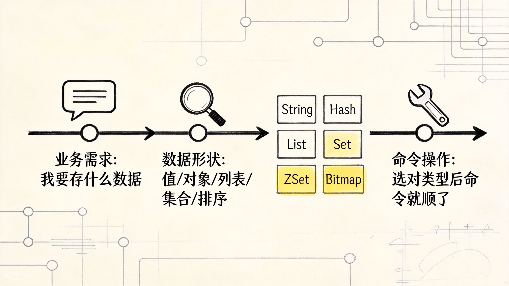
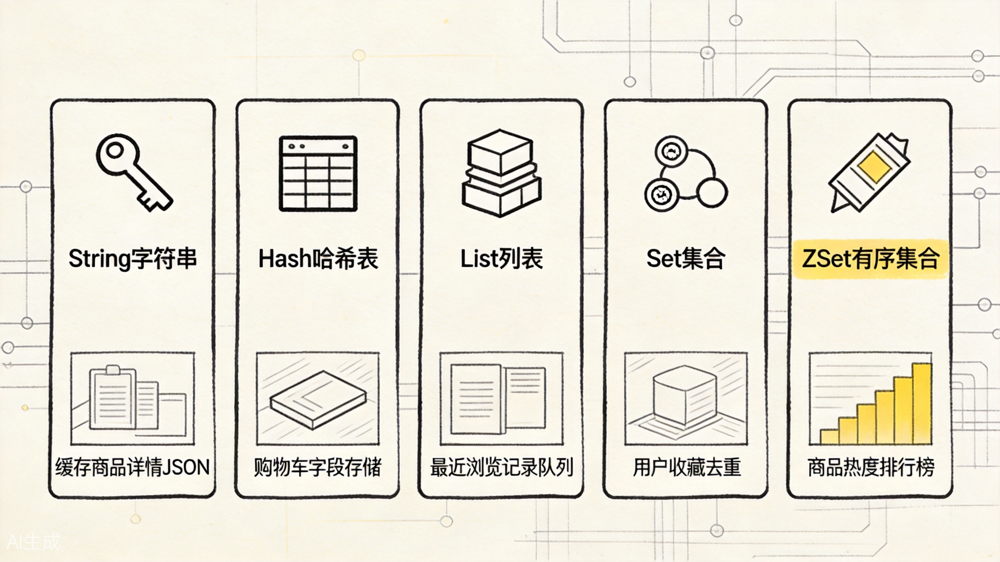
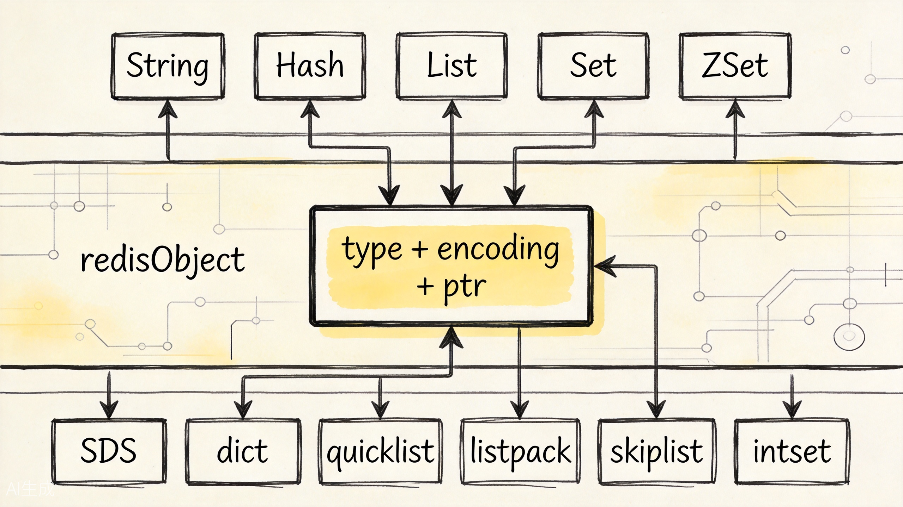
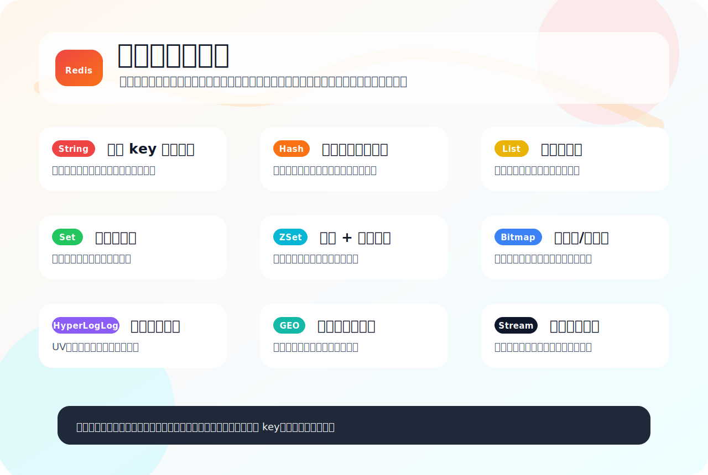

# Redis 的数据类型和使用场景：不要先背命令，先看业务在表达什么

很多人第一次学 Redis，会把它学成一张命令表：`SET`、`HSET`、`LPUSH`、`SADD`、`ZADD`，每个命令后面再背几个应用场景。这样学当然能应付一部分面试题，但一旦题目换个问法，例如"怎么做附近门店""怎么做用户签到""怎么做延迟任务""怎么缓存一个用户对象"，脑子里就容易乱。

更顺的学法是反过来：先问业务在表达什么，再决定用哪种 Redis 类型。

这篇文章只回答一个问题：

**Redis 的各种数据类型，到底分别适合表达哪类业务关系？**

为了不让例子散掉，我们固定一个电商系统。系统里有商品详情页、用户登录态、点赞收藏、购物车、排行榜、门店位置、签到、UV 统计、订单事件流。后面所有类型都围绕这个系统展开。


## 先给一张图：业务问题如何落到 Redis 类型

先不要从命令出发，而是从业务语义出发。



上图展示了从业务需求到 Redis 类型的映射路径。核心思路是：先看数据形状，再选类型，最后命令自然就顺了。



这张图就是全文的骨架：Redis 不是"命令仓库"，而是一套"业务语义 -> 数据类型 -> 底层编码 -> 操作复杂度"的映射系统。

## 一、先把 Redis 看成一个高性能业务表达器

如果只说 Redis 是缓存，很容易低估它。

缓存只是 Redis 最常见的用途之一。更准确地说，Redis 是一个以内存为中心的键值数据库，也可以把它看成一个数据结构服务器。它提供了一组常用业务结构：字符串、哈希、列表、集合、有序集合，以及 Bitmap、HyperLogLog、GEO、Stream 等更具体的结构。

关系型数据库擅长表达"稳定、可查询、可事务化"的事实。例如订单表、商品表、用户表。Redis 更擅长表达"变化快、访问频繁、结构简单、需要极快响应"的状态。例如：

- 商品详情页的热点缓存；
- 用户登录后的 session；
- 商品点赞数、浏览数、库存扣减计数；
- 用户购物车；
- 活动榜单；
- 每日签到；
- 附近门店；
- 订单状态变化事件。

所以选择 Redis 类型时，不要先问"这个命令我会不会"，而要先问：

**这个业务数据更像一个值、一张小表、一条队列、一个去重集合，还是一个带分数的排序集合？**

这个问题一问出来，Redis 的类型选择就清晰很多。

下面我们按这条问题链往下走。

## 二、String：一个 key 对应一个值，适合缓存、计数和状态开关

String 是 Redis 里最基础的类型。很多人把它理解成"字符串"，但它不只适合存文本，也可以存数字、JSON、二进制内容。它的业务语义是：

**我有一个 key，只想快速拿到一个值。**

在电商系统里，String 最常见的用途是商品详情缓存：

```redis
SET product:10086 '{"id":10086,"name":"机械键盘","price":399}' EX 300
GET product:10086
```

应用先查 Redis，命中就直接返回商品详情；没命中再查数据库，把结果写回 Redis。这里 String 表达的是"商品 ID -> 商品快照"。

String 还适合做计数器。比如商品浏览量：

```redis
INCR product:10086:view_count
```

为什么 Redis 做计数很自然？因为 `INCR` 把读取、计算、写回收束成一个命令。应用不用先 `GET` 再自己加一再 `SET`，那样很容易在并发下互相覆盖。

String 也常用来做分布式锁的最小模型：

```redis
SET lock:order:10086 request-id-abc NX PX 10000
```

这里业务语义不是"存字符串"，而是"某个资源当前有没有被别人占用"。`NX` 保证 key 不存在才写入，`PX` 给锁加过期时间，避免持锁进程崩溃后锁永远不释放。释放锁时还要校验 value 是不是自己的 request id，通常用 Lua 脚本保证"判断并删除"走同一条原子路径。

String 的边界也很明显：如果一个对象有很多字段，而且经常只修改其中一个字段，例如昵称、头像、会员等级，如果每次都把整个 JSON 取出来改完再写回去，网络传输和序列化成本都会变高。这时就该考虑 Hash。

## 三、Hash：一个 key 对应一张小表，适合对象字段化

Hash 的业务语义是：

**一个对象里有多个字段，我希望按字段读写。**

例如用户信息：

```redis
HSET user:42 name "Alice" level "vip" city "Tokyo"
HGET user:42 level
HMGET user:42 name city
```

如果用 String 存整个 JSON，修改 `level` 时要读出 JSON、反序列化、修改、序列化、写回。用 Hash 时，可以只改某个字段：

```redis
HSET user:42 level "svip"
```

这就是 Hash 的优势：它把"对象整体缓存"拆成了"字段级缓存"。

在电商系统里，购物车也可以用 Hash 表达：

```redis
HSET cart:user:42 product:10086 2
HINCRBY cart:user:42 product:10086 1
HGETALL cart:user:42
```

这里 `cart:user:42` 是用户 42 的购物车，field 是商品 ID，value 是数量。它比 String JSON 更容易增减某个商品数量，也比为每个商品单独建一个 key 更容易整体读取。

但 Hash 不是"对象存储万能药"。如果对象是多层嵌套的，比如商品详情里有 SKU 数组、规格树、营销规则、富文本描述，Hash 会把结构压扁，语义反而变别扭。这时有三个选择：

- 如果总是整体读写，用 String 存 JSON 快照就够了；
- 如果需要字段级读写，用 Hash；
- 如果需要复杂 JSON 路径更新、索引或搜索，要评估 Redis JSON / Redis Search，而不是硬用 Hash 模拟文档数据库。

Hash 的边界也很明确：它适合一个对象内部字段，不适合表达排序、去重、范围查询。如果你想表达"用户收藏了哪些商品，不能重复"，Hash 就不是最自然的结构，Set 更合适。

## 四、List：一条可从两端操作的队列，适合简单时间顺序

List 的业务语义是：

**我关心元素的插入顺序，并且经常从头部或尾部读写。**

例如商品最近浏览记录：

```redis
LPUSH recent:view:user:42 product:10086
LTRIM recent:view:user:42 0 49
LRANGE recent:view:user:42 0 9
```

每看一个商品就从左边塞进去，再裁剪到最多 50 条。这样最近浏览记录天然按时间倒序排列。

List 还可以做简单队列：

```redis
LPUSH order:queue order-001
RPOP order:queue
```

这表达的是"生产者把任务放进去，消费者从另一端取出来"。对于非常简单的异步任务，List 足够好用。

但 List 做消息队列有一个关键边界：它只是一条列表，不天然记录"这条消息被谁拿走了、有没有处理成功、失败后要不要重投"。如果消费者 `RPOP` 后宕机，这条消息可能已经从队列里消失了。你可以用 `BRPOPLPUSH` 或额外的处理中队列补救，但系统复杂度会慢慢长出来。

所以可以记成一句话：

**只需要简单排队，用 List；需要消息 ID、消费确认、消费者组和重投语义，看 Stream。**

List 的另一个常见误区是拿它做随机位置查询或深分页。虽然 `LRANGE` 可以按范围取，但 List 更适合头尾操作。列表很长时，深分页并不是它的强项。业务一旦从"最近几十条"变成"按条件查很多历史记录"，就应该回到数据库或搜索系统，而不是硬塞在 Redis List 里。

## 五、Set：不会重复的袋子，适合去重和关系判断

Set 的业务语义是：

**一组不重复的成员，我关心某个成员在不在里面。**

例如用户收藏商品：

```redis
SADD favorite:user:42 product:10086
SISMEMBER favorite:user:42 product:10086
SREM favorite:user:42 product:10086
```

这比 List 更适合收藏，因为收藏不能重复。List 当然也可以存，但你每次加入前都要检查是否已存在，成本和语义都不自然。

Set 还可以表达共同关系。比如"用户 A 和用户 B 共同关注的品牌"：

```redis
SINTER brand:follow:user:42 brand:follow:user:99
```

这类交集、并集、差集操作，是 Set 的优势。它不关心顺序，只关心集合关系。

在电商系统里，Set 可以表达很多"有没有"的问题：

- 用户是否点赞过某个商品；
- 用户收藏了哪些商品；
- 商品被哪些用户收藏过；
- 活动中已经领过券的用户集合；
- 两个用户是否有共同关注的品牌。

但 Set 不适合表达"谁排第一"。如果你要做排行榜，成员之间不仅要去重，还要带一个可排序的分数，这就引出 ZSet。

## 六、ZSet：带分数的集合，适合排行榜和范围查询

ZSet 的业务语义是：

**成员不能重复，但每个成员都有一个分数，并且我要按分数排序。**

电商系统里的热销榜、积分榜、商品热度榜，都很适合 ZSet：

```redis
ZINCRBY product:hot_rank 1 product:10086
ZREVRANGE product:hot_rank 0 9 WITHSCORES
ZRANK product:hot_rank product:10086
```

这里 `product:hot_rank` 是榜单，member 是商品 ID，score 是热度。每次浏览、购买、加购，都可以按不同权重增加分数。要取前十名时，用 `ZREVRANGE` 就能按分数倒序取。

ZSet 还适合延迟任务的基础实现。把任务 ID 作为 member，把执行时间戳作为 score：

```redis
ZADD delay:order 1714800000 order-001
ZRANGE delay:order 0 1714800000 BYSCORE LIMIT 0 10
```

消费者定时扫描当前时间之前的任务，把到期任务取出来处理。这不是最完整的消息队列，但对于简单延迟触发很常见。

ZSet 和 Set 的区别可以这样记：



上图对比了 String、Hash、List、Set、ZSet 五种核心类型的典型应用场景。选型时先看数据形状，再对号入座。



ZSet 的边界在于维护排序有成本。不要把所有"想查列表"的场景都塞进 ZSet。只有当"去重 + 分数 + 排序/范围"同时出现时，它才特别合适。

## 七、Bitmap：用一位表示一个状态，适合海量开关

Bitmap 的业务语义是：

**我有很多个是/否状态，希望用极少内存表示。**

例如用户签到：

```redis
SETBIT sign:user:42:2026-05 3 1
GETBIT sign:user:42:2026-05 3
BITCOUNT sign:user:42:2026-05
```

这里可以约定：`sign:user:42:2026-05` 表示用户 42 在 2026 年 5 月的签到位图，第 3 位代表 5 月 4 日是否签到。一个月最多几十位，比用 Set 存日期字符串更紧凑。

Bitmap 还适合表达：

- 某天用户是否活跃；
- 某个实验人群是否命中；
- 某个权限位是否打开；
- 某批商品是否参与活动。

但 Bitmap 不适合需要存复杂信息的场景。它只告诉你"有没有"，不告诉你"为什么、什么时候、附加数据是什么"。如果你需要保存签到时间、签到来源、奖励明细，Bitmap 就只能做索引或计数，详细记录仍然应该放到数据库或日志系统里。

## 八、HyperLogLog：只要近似去重计数，不要成员明细

HyperLogLog 的业务语义是：

**我只关心大概有多少个不同元素，不关心这些元素分别是谁。**

例如统计商品详情页 UV：

```redis
PFADD uv:product:10086 user:42
PFCOUNT uv:product:10086
```

如果用 Set 做 UV，确实可以精确知道有哪些用户访问过，也能精确计数。但访问量特别大时，Set 要保存每个用户 ID，内存会跟着访问人数增长。

HyperLogLog 选择了另一条路：不保存完整成员，只保存用于估算基数的统计信息。Redis 官方文档提到，它的实现最多使用约 12KB 内存，标准误差约 0.81%。也就是说，它适合回答"大概有多少独立用户访问过"，不适合回答"用户 42 是否访问过"。

所以选型时可以这样判断：

- 要精确成员列表，用 Set；
- 只要近似独立数量，用 HyperLogLog；
- 要按天、按商品、按活动聚合，可以用多个 HyperLogLog 再做合并统计。

## 九、GEO：把经纬度变成附近检索

GEO 的业务语义是：

**我有一批带经纬度的位置，希望按距离查附近。**

例如附近门店：

```redis
GEOADD shop:geo 139.6917 35.6895 shop:tokyo-001
GEOSEARCH shop:geo FROMLONLAT 139.70 35.68 BYRADIUS 3 km
```

如果不用 GEO，应用可能要从数据库里取出一大批门店，再逐个计算距离，然后排序过滤。数据量一大，这条路就很粗糙。

GEO 把经纬度编码进 Redis 的空间索引能力里，让"附近 3 公里门店"变成一个 Redis 查询问题。它适合附近门店、附近骑手、同城匹配这类场景。

但 GEO 不是完整 GIS 系统。它适合点位和半径/范围检索，不适合复杂多边形、道路距离、行政区划拓扑、路线规划。到这些需求时，就该引入专业地理系统或搜索引擎能力。

## 十、Stream：不是普通列表，而是可确认的事件流

Stream 的业务语义是：

**我有一串持续追加的事件，希望多个消费者按顺序消费，并且知道哪些消息处理成功了。**

例如订单状态变化：

```redis
XADD order:events * orderId 10086 status paid
XREADGROUP GROUP payment-workers worker-1 COUNT 10 STREAMS order:events >
XACK order:events payment-workers <message-id>
```

和 List 相比，Stream 多了几个关键能力：

- 每条消息有 ID；
- 可以按顺序读取历史消息；
- 支持消费者组；
- 支持确认机制；
- 能追踪已经投递但尚未确认的消息。

这让 Stream 更像轻量消息流，而不是一条简单队列。电商系统里，订单已支付、库存已扣减、优惠券已核销、风控已通过，都可以作为事件写入 Stream，再由不同工作者消费。

不过也要避免另一个极端：Stream 不是 Kafka 的完全替代品。如果你需要跨机房大规模吞吐、长期日志留存、复杂流处理生态和严格的 topic 分区治理，Kafka 仍然更适合。Redis Stream 更适合"已经在 Redis 体系内，需要一个轻量、低延迟、可确认的事件通道"的场景。

## 十一、补一层底层视角：类型不是最终存储结构

学到这里，容易以为 Redis 内部就是"String 用字符串、List 用链表、ZSet 用跳表"。这个理解只对了一半。

Redis 对外暴露的是类型，对内还会根据数据规模和形态选择编码。可以把 `redisObject` 理解成一个统一包装盒：`type` 告诉 Redis 对外是什么类型，`encoding` 告诉 Redis 当前内部怎么存，`ptr` 指向真正的数据结构。



上图展示了 Redis 的三层分层架构：对外命令层、redisObject 对象层、底层结构层。理解这个分层，你就能明白为什么同一个命令在不同数据规模下可能有不同的性能表现。



这层视角能帮你避免两个误解：

- 第一个误解：类型名等于底层结构名。比如 List 早期可以联想到链表，但现代 Redis 里常见实现是 quicklist；小 Hash、小 ZSet 可能使用 listpack。
- 第二个误解：选对类型就永远高性能。类型只是起点，key 的规模、元素数量、过期策略、持久化、big key、热 key 都会影响最终表现。

所以文章开头那句话还要再补半句：

**先看业务在表达什么，再看这个表达会不会长成一个难治理的大 key。**

## 十二、把完整选型压成一张卡片

下面这张卡片适合放在笔记里反复看。它不是替代正文，而是帮助你在做设计时快速回忆。



如果用文字再收束一遍，就是：

| 业务问题 | 优先类型 | 典型命令 | 边界提醒 |
| --- | --- | --- | --- |
| 一个 key 对一个值 | String | `SET` / `GET` / `INCR` | 对象字段频繁变更时考虑 Hash |
| 一个对象多个字段 | Hash | `HSET` / `HGET` / `HINCRBY` | 深层嵌套对象不适合硬压平 |
| 最近 N 条、简单队列 | List | `LPUSH` / `RPOP` / `LTRIM` | 需要确认和重投时考虑 Stream |
| 去重、成员判断 | Set | `SADD` / `SISMEMBER` / `SINTER` | 不表达排序 |
| 排名、分数、范围 | ZSet | `ZADD` / `ZINCRBY` / `ZRANGE` | 排序维护有成本 |
| 海量二值状态 | Bitmap | `SETBIT` / `GETBIT` / `BITCOUNT` | 只表达是/否，不存详情 |
| 海量近似去重计数 | HyperLogLog | `PFADD` / `PFCOUNT` / `PFMERGE` | 有误差，不能查成员 |
| 附近位置检索 | GEO | `GEOADD` / `GEOSEARCH` | 不是完整 GIS |
| 可确认事件流 | Stream | `XADD` / `XREADGROUP` / `XACK` | 不是 Kafka 的完整替代 |

## 十三、真实项目里还要多问四个问题

类型选完，不代表设计完成。落地 Redis key 时，还要继续问四个问题。

第一个问题：这个 key 会不会无限增长？

排行榜、浏览记录、Stream、Set 收藏集合都可能变大。最近浏览可以 `LTRIM`，排行榜可以按天/周/月拆 key，Stream 可以 `XTRIM`，活动集合可以设置过期时间。Redis 很快，但不代表你可以把无限历史都塞进一个 key。

第二个问题：这个数据是否需要强一致？

商品详情缓存可以允许短暂不一致，库存扣减、支付状态、订单状态就不能随便只放 Redis。Redis 可以做加速层、状态层、协调层，但很多最终事实仍然应该落到数据库。

第三个问题：读写频率是否会制造热 key？

全站热榜、爆款商品详情、秒杀库存、热门直播间在线人数，都可能集中打到少数 key。类型选对了也可能因为访问太集中而出问题。需要结合本地缓存、分片 key、异步聚合、限流降级一起看。

第四个问题：失败后怎么恢复？

如果 Redis 只是缓存，丢了可以回源。如果 Redis 承载排行榜、延迟任务、Stream 事件，就要考虑持久化、消费幂等、重试、补偿和监控。越接近"事实源"的 Redis 数据，治理成本越高。

## 最后：类型选择不是背口诀，而是看问题形状

最后可以把 Redis 类型选择记成几句话：

- 一个 key 对一个值，用 String；
- 一个对象有多个字段，用 Hash；
- 关心插入顺序和头尾操作，用 List；
- 关心去重和集合关系，用 Set；
- 关心去重、分数、排序，用 ZSet；
- 海量二值状态，用 Bitmap；
- 海量去重计数但允许误差，用 HyperLogLog；
- 附近位置检索，用 GEO；
- 带确认的消息流，用 Stream。

这张表不是死规则，而是起点。真正落地时，还要看数据规模、访问频率、过期策略、内存占用、持久化要求和恢复路径。

Redis 的类型设计告诉我们一件事：性能不是只靠"内存快"得来的，更来自把业务问题放进合适的数据结构里。结构选对了，命令就顺了；结构选错了，命令写得再熟，也只是在给未来的性能问题铺路。

