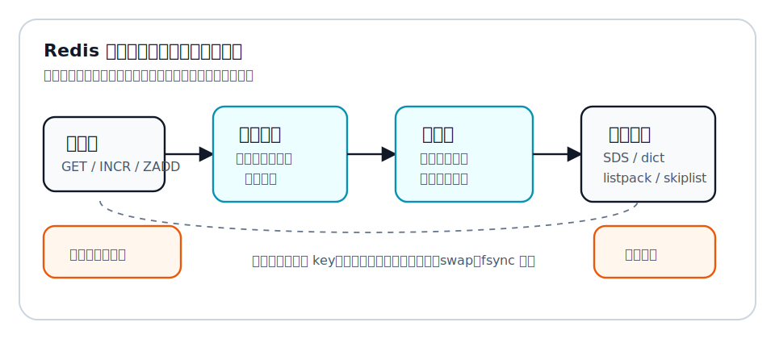
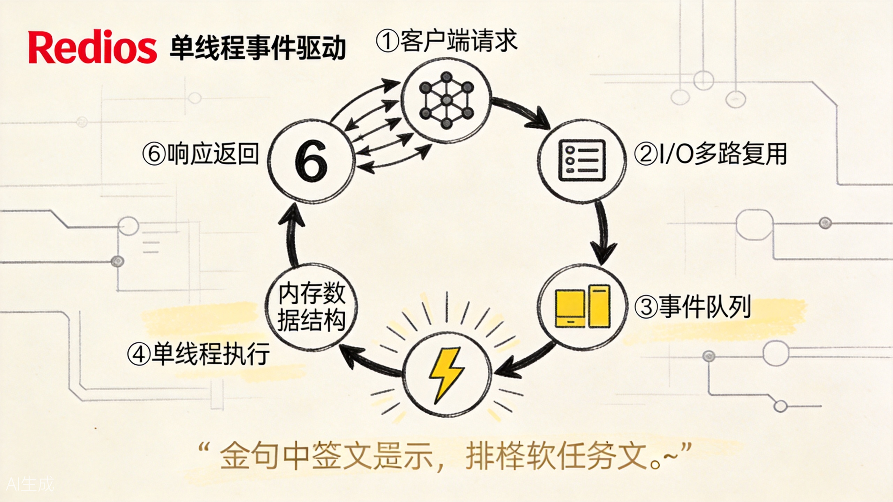
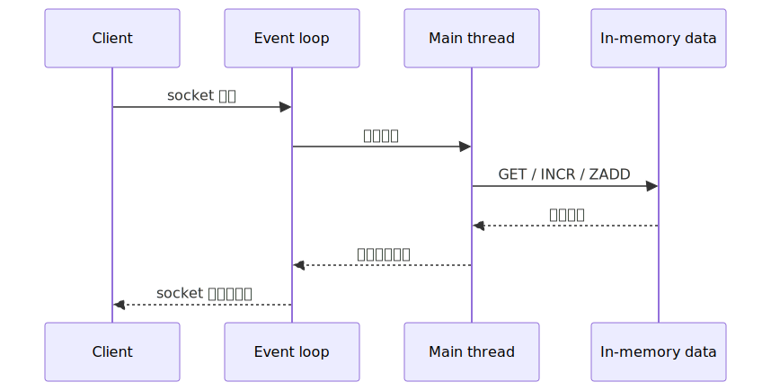
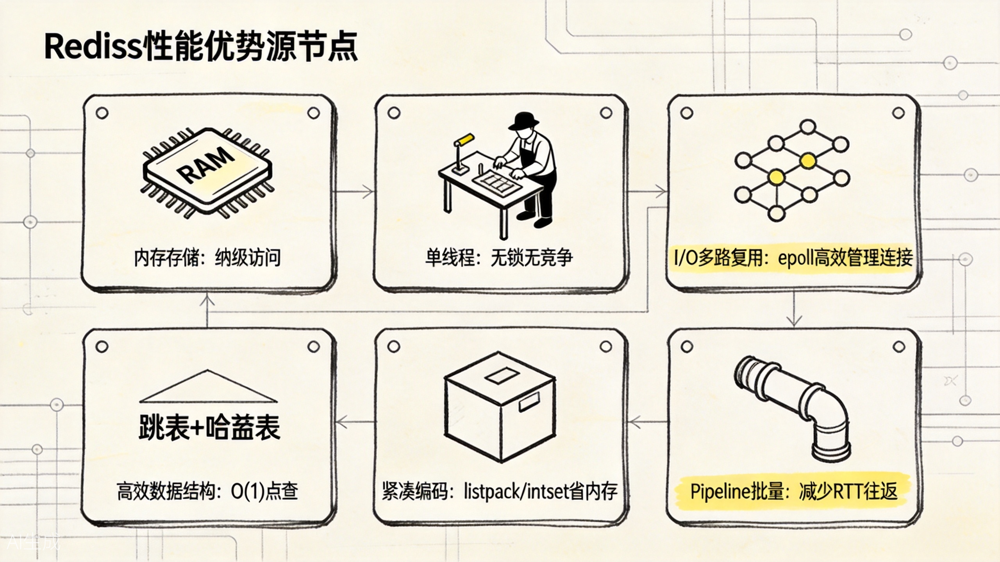

# 为什么 Redis 这么快：从内存、事件循环到数据结构的连续答案

"Redis 为什么快？"这是学习 Redis 时最常见的问题。

很多答案会直接说：因为 Redis 基于内存、单线程、I/O 多路复用、数据结构好。它们都对，但如果只是并排背下来，很容易变成四个孤立名词。真正要理解 Redis 的快，应该把它放回一个连续的问题链里：

**当一个系统想用极低延迟处理大量简单读写时，它要避开哪些慢路径？Redis 又分别怎么避开？**

这篇文章面向刚学完 Redis 基本类型、但还没有把性能原理串起来的读者。全文用一个电商商品详情页做贯穿例子：用户打开商品页时，页面需要商品基础信息、库存状态、浏览量、点赞数、推荐标签和热度榜。如果每个请求都打到 MySQL，数据库会在热点商品面前很快吃紧。于是我们把高频、简单、变化快的数据放到 Redis。

问题来了：Redis 为什么能扛住这类请求？




核心结论是：**Redis 的快不是单点技巧，而是一组设计互相配合后的结果。**

## 读前先抓住问题链

如果把 Redis 的快写成演化链，大概是这样：

1. 原始状态：所有热点数据都查数据库，数据库要同时承担查询、事务、索引、日志和磁盘访问。
2. 第一个问题：热点简单读写太频繁，磁盘 I/O 和数据库通用能力显得太重。
3. 第一层机制：Redis 把热数据放进内存，用 key-value 短路径处理高频访问。
4. 新问题：连接很多时，如果一个连接一个线程，线程切换和锁竞争会拖慢系统。
5. 第二层机制：Redis 用事件循环管理连接，用主线程串行执行核心命令，让主路径少锁、少切换。
6. 仍然留下的边界：如果命令本身很大、key 很大、返回很大、持久化或系统环境抖动，Redis 也会变慢。

用图表示就是：


这条链比"内存、单线程、多路复用、数据结构"好记，因为它不是在背术语，而是在回答：**Redis 一路避开了哪些慢路径。**

## 一、第一个慢点：磁盘 I/O

数据库为什么容易慢？一个重要原因是磁盘。

当然，现代数据库也有 Buffer Pool、页缓存、预读、索引等优化，不是每次查询都真的读磁盘。但关系型数据库的设计目标更复杂：它要支持 SQL、事务、索引维护、恢复、锁、隔离级别。它需要在"正确性、表达能力、持久性、并发控制"之间平衡。

Redis 的典型主路径简单很多：key-value 访问，数据主要在内存里。商品详情缓存命中时，应用发一个：

```redis
GET product:10086
```

Redis 在内存结构里找到值并返回。这个过程没有复杂 SQL 优化器，也不需要从磁盘随机读取某个数据页。

所以 Redis 快的第一层答案是：

**它把最热、最简单、最频繁的访问放进内存，避开了大量磁盘随机 I/O。**

但"内存快"不是完整答案。因为内存只是把数据放到了更快的位置；如果请求处理模型很重、数据结构设计很差、命令执行经常阻塞，Redis 一样会慢。

可以把内存理解成"把常用文件放到桌面"。文件在桌面上当然比放在仓库里好拿，但如果每拿一次文件都要排队填三张表、找三个人签字，那桌面也救不了你。

## 二、第二个慢点：每个请求都创建线程

想象商品详情页突然来了很多请求。如果服务端每来一个连接就创建一个线程，线程切换、锁竞争、上下文切换都会成为成本。请求越多，系统越忙，可能真正处理业务的时间反而被调度成本吃掉。

Redis 早期最核心的执行模型是主线程配合 I/O 多路复用。简单说，就是用一个事件循环同时管理大量客户端连接：哪些连接可读、哪些连接可写、哪些命令要执行，都放进事件驱动模型里调度。

这让 Redis 可以避免"一个连接一个线程"的粗暴模型。它不是每个客户端都分配一个独立执行线程，而是让主线程在事件循环里处理就绪事件。



上图展示了 Redis 事件循环的核心机制：I/O 多路复用同时监控大量连接，就绪事件排队进入单线程执行，内存操作极快后响应返回。这个设计的精髓是"用单线程避免锁竞争，用事件循环高效管理连接"。



这带来两个好处。

第一，避免大量线程切换。线程不是越多越好，线程一多，调度和同步开销会明显上来。

第二，命令执行路径更简单。很多 Redis 命令会修改共享数据结构。如果每个命令都被不同线程并行执行，就需要大量锁保护。锁会带来等待，也会让代码复杂度升高。Redis 选择让核心命令在主路径里串行执行，反而换来了简单、稳定、可预测。

所以 Redis 快的第二层答案是：

**它用事件循环处理大量连接，用主线程串行执行命令，减少线程切换和锁竞争。**

这也解释了一个常见误解：Redis 被说成"单线程"，不是说它进程里永远只有一个线程，也不是说所有工作都只能一个线程做。更准确地说，是核心命令执行路径长期以主线程串行为主。后台关闭文件、AOF fsync、lazy free，以及 Redis 6.0 后的部分网络 I/O，都可以有后台线程或 I/O 线程参与。

换句话说：

```text
Redis 单线程
不是：整个 Redis 进程只有一个线程
而是：核心命令执行和共享状态修改主要走主线程串行路径
```

Redis 6.0 之后的 I/O 线程更适合理解为"帮主线程分担网络读写和协议处理压力"，不是把所有命令都拆到多个 CPU 核上并行执行。如果瓶颈是网络收发，I/O 线程可能有帮助；如果瓶颈是某条复杂命令把主线程拖住，I/O 线程并不会让这条命令突然变短。

## 三、第三个慢点：请求响应来回太多

Redis 很快，但它毕竟是一个 TCP server。应用和 Redis 之间通常是请求 / 响应模型：客户端发命令，服务端处理，再把结果发回来。这个来回时间叫 RTT。

如果商品详情页要做这些事：

```redis
GET product:10086
GET product:10086:stock
INCR product:10086:view_count
ZINCRBY product:hot_rank 1 product:10086
```

最朴素的写法是发一条等一条，四条命令就要经历四次来回。单次 RTT 很小的时候还好，一旦客户端和 Redis 不在同一台机器，或者链路上有抖动，来回次数就会变成明显成本。

Redis pipelining 解决的不是"单条命令执行慢"，而是"多条命令之间来回等太多"。客户端可以先连续把一批命令发出去，最后再批量读回复：

```text
普通模式：
发 GET -> 等回复 -> 发 INCR -> 等回复 -> 发 ZINCRBY -> 等回复

pipeline：
发 GET + INCR + ZINCRBY -> 一次性读多条回复
```

这也是 Redis 官方 pipelining 文档强调的点：性能不只受数据结构访问影响，还受 socket I/O、系统调用、内核调度和网络往返影响。

所以 Redis 快的第三层答案是：

**它的命令很短，同时允许客户端用 pipeline 把多个短命令合批，减少网络往返和系统调用成本。**

但 pipeline 也不是越大越好。服务端需要排队保存回复，批次太大反而会增加内存压力。更稳妥的方式是按合理批次发送，例如批量导入或批量更新时分段 pipeline，而不是一次把所有命令都塞进去。

## 四、第四个慢点：数据结构不贴合业务

如果商品浏览量存在数据库里，每次浏览都执行一条更新 SQL，数据库不仅要改数据，还可能涉及事务日志、锁、索引维护。浏览量这种数据本质上只是一个数字累加，用关系型数据库承载高频累加，成本偏重。

Redis 的 String 可以直接做计数器：

```redis
INCR product:10086:view_count
```

这条命令的语义非常贴近业务：浏览量加一。Redis 不需要让应用先读出值、加一、再写回。`INCR` 把这个过程封装成一条原子命令。

再看商品热度榜。如果用数据库做榜单，需要更新分数，再按分数排序取前 N。Redis 的 ZSet 则天然表达"成员 + 分数 + 排序"：

```redis
ZINCRBY product:hot_rank 1 product:10086
ZREVRANGE product:hot_rank 0 9 WITHSCORES
```

这不是 Redis 命令多神奇，而是业务问题刚好能落在合适的数据结构上。

商品详情页里还可以继续这样映射：

| 业务问题 | Redis 类型 | 为什么贴合 |
| --- | --- | --- |
| 商品基础信息 | String 或 Hash | 直接按 key 取，字段少时 Hash 更便于局部更新 |
| 浏览量、点赞数 | String counter | `INCR` / `DECR` 是原子短命令 |
| 收藏用户集合 | Set | 天然表达"某用户是否收藏过" |
| 热门商品榜 | ZSet | 成员带分数，适合排名和 Top N |
| 最近浏览 | List | 适合头尾插入和裁剪 |
| 附近门店 | GEO | 适合地理位置半径查询 |
| 订单事件流 | Stream | 适合追加、消费组、确认语义 |



上图把 Redis 快的六大来源压成一张图：内存存储、单线程无锁、I/O 多路复用、高效数据结构、紧凑编码、Pipeline 批量。每一项都在避开一条慢路径。

Redis 的数据类型背后还有编码选择。同样是 Hash，小对象时可以用更紧凑的编码，规模变大后再切到更通用的结构。同样是 List，早期经历过双向链表、压缩列表，后来走向 quicklist，再到 listpack 等更内存友好的结构。Redis 的思路不是"一个逻辑类型永远对应一个底层结构"，而是根据规模和访问模式切换表示方式。

这就是 [Redis 底层数据结构导航](../../../../wiki/redis%202/redis-底层数据结构导航.md) 里强调的三层视角：

- 外部看到的是 String、Hash、List、Set、ZSet、Stream 等逻辑类型；
- 对象层用 `redisObject` 记录 type、encoding、ptr 等信息；
- 底层结构负责在时间复杂度和内存效率之间做权衡。

可以把这层关系画成这样：



所以 Redis 快的第四层答案是：

**它提供的类型和底层编码，能把常见业务操作压缩成少量高效命令。**

## 五、第五个慢点：内存分配和结构膨胀

很多人知道 Redis 用内存，却容易忽略另一点：内存也不是免费的。内存结构如果太松散，会浪费空间；空间浪费之后，缓存能装下的数据变少，淘汰更频繁，命中率下降，系统照样变慢。

Redis 在底层结构上做了大量"空间友好"的设计。

例如 SDS 替代 C 字符串。C 字符串需要通过 `\0` 判断结尾，计算长度要遍历，而且不能自然保存中间包含 `\0` 的二进制内容。SDS 记录了长度、容量和实际 buffer，因此可以 O(1) 获取长度，也能保存二进制数据，还能在追加时先检查容量，减少缓冲区溢出风险。

再比如 listpack、intset、quicklist 这类结构。它们的共同目标不是炫技，而是让小规模数据尽量紧凑。一个小 Hash 如果字段很少，没必要一上来就用完整哈希表结构。完整结构通用，但元数据和指针开销也更高。Redis 会在数据小的时候用紧凑编码，等数据变大、操作复杂度需要稳定时，再切换到通用结构。

Redis 官方 memory optimization 文档也强调，小型聚合类型会在一定阈值内使用特殊编码；这种优化对用户 API 是透明的，但它本质上是 CPU 和内存之间的权衡。Redis 7.0 之后，Hash、ZSet 等配置里也能看到 listpack 相关阈值。

这像自动挡汽车：低速时用适合低速的挡位，高速时自动升挡。你不需要在业务层手动指定每个对象底层怎么存，但理解这个机制后，就会明白为什么 Redis 配置里有很多和阈值有关的参数，也会明白为什么大 key 会危险。

如果一个 key 下面塞了非常大的 List、Hash 或 String，单次操作可能带来长时间阻塞，持久化、复制、迁移也都会被拖累。Redis 快的前提之一，是你的数据结构和 key 设计没有把它逼到慢路径上。

## 六、第六个慢点：阻塞命令和意外大操作

Redis 的主命令路径串行执行，这既是优势，也是边界。

优势是简单、少锁、可预测。边界是：如果某条命令执行时间很长，后面的命令就要排队。比如对一个巨大 key 做删除，或者对很大的集合做复杂运算，就可能让整个实例出现延迟毛刺。

这也是为什么学习 Redis 不能只背"单线程所以快"。单线程快的前提是每条命令足够短。假如你把一个百万成员的大集合拿来频繁做交集，或者用 `KEYS *` 扫全库，主线程就会被你自己拖住。

Redis 为了缓解这些问题，引入了不少机制。例如 `SCAN` 用渐进式遍历替代一次性全量扫描，lazy free 把部分释放工作交给后台线程，大 key 删除也可以使用异步释放思路。可这些机制不是让你忽略数据规模，而是给你处理边界问题的工具。

Redis 官方 latency diagnosis 文档给出的排查方向也很实用：先确认有没有阻塞服务端的慢命令，再看 slowlog、latency monitor、fork、fsync、系统内存压力、swap 等因素。也就是说，Redis 变慢经常不是一句"命令慢了"能解释，而是要判断慢发生在命令执行、后台任务、持久化、操作系统，还是网络链路。

常见慢路径可以先按这张表记：

| 慢路径 | 为什么会拖慢 Redis | 更好的处理方式 |
| --- | --- | --- |
| `KEYS *` | 一次性扫全库，阻塞主线程 | 用 `SCAN` 渐进遍历 |
| 大 key 删除 | 释放大量内存可能卡住主线程 | 用 `UNLINK` 或 lazy free 思路 |
| 大集合复杂运算 | 单条命令执行时间长，后续请求排队 | 拆分 key、预聚合、离线计算 |
| 超大 pipeline | 服务端需要缓存大量回复 | 分批 pipeline |
| swap | 内存页被换到磁盘，访问时触发随机 I/O | 控制内存、避免过量使用、监控系统状态 |
| AOF fsync / rewrite 抖动 | 持久化和磁盘压力带来延迟尖刺 | 根据业务选择持久化策略并监控延迟 |

所以 Redis 快的第六层答案是：

**Redis 的主路径适合短命令、高频访问；一旦命令变成大操作，快就会变成排队等待。**

## 七、把"快"放回商品详情页

现在把这些答案放回电商商品详情页。

商品基础信息可以用 String 缓存 JSON，也可以用 Hash 拆字段；浏览量用 String 计数器；收藏集合用 Set；热度榜用 ZSet；最近浏览用 List；附近门店用 GEO；订单事件用 Stream。

这些操作多数是 key-value 级别的短命令，数据在内存中，命令语义贴合业务，主线程不需要复杂锁竞争，事件循环能处理大量连接。于是 Redis 在这个场景里表现得非常快。

但这个例子也能反过来提醒我们：Redis 适合的是"热点、简单、短路径"的问题。

如果你把整个商品评论历史都塞进一个大 List，每次分页都从很深的位置取；或者把全站商品热度都放进一个超大 ZSet 后频繁做复杂范围统计；或者缓存没有过期策略和大 key 治理，Redis 的快就会被你慢慢消耗掉。

Redis 的快不是魔法，它更像一份契约：

**你给它合适的问题形状，它给你极低延迟；你把复杂、巨大、长耗时的问题塞进来，它也会被拖慢。**

## 八、一个更完整的性能心智模型

很多初学者会把 Redis 性能理解成一条直线：

```text
数据在内存里 -> 所以 Redis 快
```

这句话没错，但不够用。更完整的模型应该是：

```text
请求是否命中 Redis
-> key 设计是否合理
-> 命令是否足够短
-> 数据类型是否贴合业务
-> 网络往返是否被 pipeline / 批处理优化
-> 主线程是否被慢命令或大 key 阻塞
-> 后台任务、持久化、系统环境是否引入抖动
```

也就是说，Redis 快不快，既取决于 Redis 自己的实现，也取决于你把什么样的问题交给它。

如果你只问"Redis 为什么快"，答案是实现原理；如果你再问"我的 Redis 为什么变慢"，答案就会进入工程治理：bigkey、hotkey、慢查询、连接数、pipeline 批次、持久化策略、内存上限、淘汰策略、操作系统和网络环境。

这两个问题要分开：

- **Redis 为什么快**：解释它的设计优势。
- **Redis 为什么会慢**：解释这些设计优势被哪些慢路径抵消。

学到这里，才算真正理解了"快"的边界。

## 九、总结：Redis 快在一组连续选择

最后把这条问题链收束一下。

最初的问题是数据库承载不了大量热点简单访问，于是 Redis 把热数据放进内存，避开磁盘随机 I/O。

连接多了以后，如果每个连接一个线程会带来调度和锁成本，于是 Redis 用事件循环和 I/O 多路复用管理连接。

命令如果由多线程并行修改共享结构，会引入大量锁和一致性复杂度，于是 Redis 让核心命令执行主要保持主线程串行。

业务操作如果都靠应用自己拼装，会有多次读写和竞态，于是 Redis 提供贴近业务语义的数据类型和原子命令。

内存虽然快但昂贵，于是 Redis 在对象编码和底层结构上做紧凑表示和阈值切换。

主线程串行意味着长命令会阻塞，于是我们必须治理大 key、慢命令、超大 pipeline、持久化抖动和不合适的数据模型。

所以，"Redis 为什么快"最好的答案不是一句"因为内存"，而是一句话：

**Redis 快，是因为它把高频简单问题放在内存里，用事件驱动减少连接成本，用串行命令减少锁成本，用合适的数据结构减少业务操作成本，用 pipeline 减少网络往返成本，同时要求我们避开大 key 和长命令这些慢路径。**

理解到这里，Redis 就不再是一个需要背诵的缓存工具，而是一套关于"如何为高频访问选择合适执行路径"的工程设计。

