# Redis 底层数据结构：SDS、dict、quicklist、listpack、skiplist、intset

学完 Redis 常见数据类型之后，很容易产生一个误会：

> String 就是字符串，Hash 就是哈希表，List 就是链表，Set 就是集合，ZSet 就是跳表。

这句话只对了一半。

Redis 对外暴露的是业务友好的类型，但在内部，它会根据数据规模、元素大小、访问方式切换不同底层结构。也就是说，Redis 的关键不是"每种类型固定对应一种结构"，而是：

**对外给你稳定语义，对内选择更省内存、更稳延迟的结构。**


## 写作设定

- 主题：Redis 常见底层数据结构，以及它们为什么会被 Redis 组合使用。
- 受众：已经会用 Redis 常见数据类型，但还没有系统读过源码的工程师。
- 核心问题：为什么同一个 Redis 类型，在不同数据规模下会对应不同底层结构？
- 贯穿例子：电商系统里的商品缓存、购物车、收藏集合、排行榜、浏览记录和签到。

## 问题链：Redis 为什么需要这么多结构

先把整篇文章的问题链摊开：

1. 最初我们只想要简单命令：`GET product:10086`、`HGET cart:u1 sku1`、`ZREVRANGE rank 0 9`。
2. 问题出现了：同样是"存数据"，有的更看重点查，有的更看重排序，有的更看重头尾追加，有的更看重小对象省内存。
3. Redis 引入对象层：用 `type` 保持外部语义稳定，用 `encoding` 记录当前内部编码。
4. 这解决了"命令稳定但结构可变"的问题：小对象可以紧凑存，大对象可以通用存。
5. 新问题是：每种底层结构都有边界，比如紧凑结构省内存但不适合无限增长，哈希表查找快但扩容会带来迁移成本。
6. 于是 Redis 又在具体结构里继续做折中：SDS 解决字符串安全，dict 做渐进式 rehash，quicklist 折中链表和连续内存，listpack 替代 ziplist 的连锁更新风险，skiplist 服务范围排序，intset 服务小整数集合。

这条链比"背结构名"更重要。因为线上真正的问题通常不是"Redis 用了什么结构"，而是：

**这个 key 当前为什么用这个编码？它的规模变大后会切到哪里？切换和迁移会不会制造延迟？**

## 概念卡：先建立一张地图

```text
业务命令
-> Redis 对外类型
-> redisObject.type / redisObject.encoding
-> 真实底层结构
-> 时间复杂度、内存占用、延迟稳定性
```

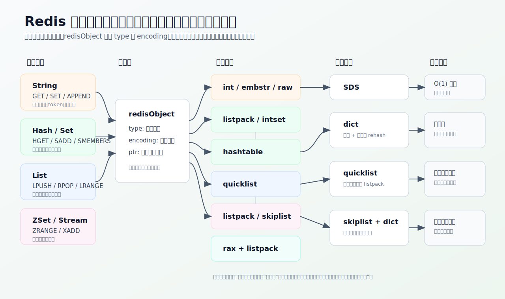

先记住这张分层图：客户端看到的是类型，Redis 内部维护的是对象层和真实结构层。后面讲 SDS、dict、quicklist、skiplist，本质上都在解释这三层是怎么配合的。

再看一版 Mermaid 心智图：


## 一、先区分"类型"和"结构"

客户端看到的是 Redis 类型：

- String
- Hash
- List
- Set
- ZSet
- Stream

但 Redis 内部不是直接把这些名字当成最终存储方式。它有一个对象层，常用 `redisObject` 来理解：对象里记录 `type`、`encoding` 和 `ptr`。

`type` 告诉 Redis：这个值对外是什么类型。`encoding` 告诉 Redis：当前这个值内部用什么编码。`ptr` 指向真正承载数据的底层结构。

这带来一个很重要的能力：**同一种外部类型，可以在不同阶段使用不同底层结构。**

例如一个很小的 Hash，字段少、值也短，用 listpack 这类紧凑结构更省内存；等字段变多、元素变大，再切到真正的哈希表。这样 Redis 就不用在"小对象很多"的场景里浪费大量指针、桶数组和元数据。


所以学习底层结构的核心问题不是"背每个结构长什么样"，而是问：

**Redis 为什么要在这个场景选择它？它解决了什么成本，又留下了什么边界？**

## 二、SDS：让字符串带上长度和容量

Redis 用 C 写成，但它没有直接用 C 字符串承载所有字符串，而是设计了 SDS。

普通 C 字符串像一张没有标签的纸条。你想知道它多长，只能从头数到 `\0`。如果字符串中间本来就有 `\0`，C 字符串还会误以为结束了。追加内容时，也要程序员自己保证空间足够，否则容易溢出。

SDS 像一个带标签的文件袋。袋子上写着：

- `len`：已经用了多少；
- `alloc`：总共分配了多少；
- `flags`：当前 SDS 属于哪种头部类型；
- `buf`：真正的数据。

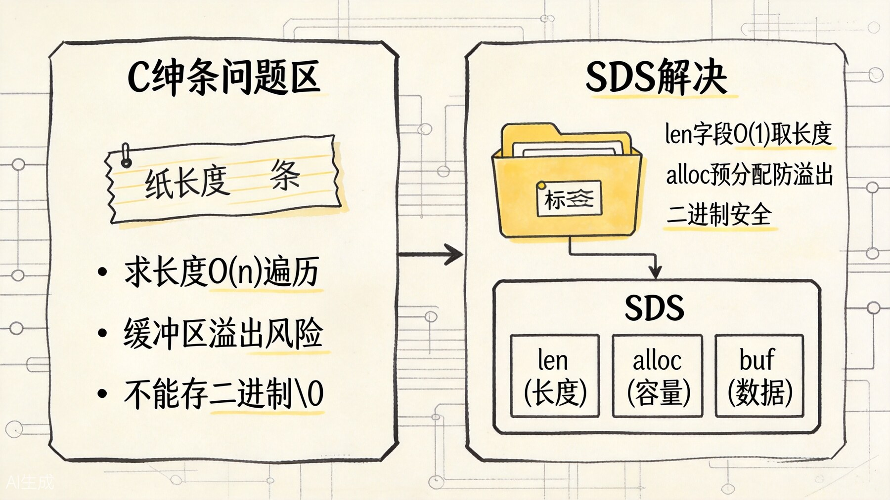

上图对比了 C 字符串的问题和 SDS 的解决方案。核心差异在于：SDS 用 len 字段实现 O(1) 取长度，用 alloc 预分配防止溢出，同时支持二进制安全。

这样一来，获取长度是 O(1)，不用每次遍历。追加内容前也可以先看剩余空间够不够，不够再扩容。由于 SDS 用 `len` 判断数据长度，所以它可以保存二进制内容，不怕中间出现 `\0`。


在电商系统里，商品详情 JSON、session token、缓存值、key 名本质上都离不开字符串。SDS 的意义不是"字符串更高级"，而是让 Redis 能安全、高效、二进制友好地处理大量字符串。

SDS 还有一个容易被忽视的设计：不同大小的字符串使用不同头部类型。小字符串不需要很大的 `len` / `alloc` 字段，大字符串再用更大字段。这就是 Redis 一贯的思路：

**小数据尽量省，大数据再通用。**

String 对象还会有 `int`、`embstr`、`raw` 等编码。一个可以用整数表示的值，可能直接走整数编码；很短的字符串可能用 `embstr` 把对象头和 SDS 放在一块连续内存里；变长或修改频繁后再走 `raw`。这不是改变 String 的业务语义，而是在内部减少内存分配次数和碎片。

## 三、dict：哈希查找之外，更重要的是渐进式 rehash

Redis 的全局 key 空间，本质上由字典结构承载。Hash 类型在大规模字段场景下，也会走哈希表。

哈希表最常见的价值是 O(1) 查找。但 Redis 的 dict 更值得学的是渐进式 rehash。

哈希表元素越来越多时，需要扩容。如果一次性把旧表所有元素搬到新表，主线程会被长时间占住。Redis 不希望某一刻突然停下来搬家，于是 dict 里保留两张表：`ht[0]` 和 `ht[1]`。

正常情况下只用 `ht[0]`。需要 rehash 时，Redis 分配 `ht[1]`，然后不是一次性搬完，而是在后续增删改查过程中顺手迁移一部分桶。旧表和新表会短暂并存，直到旧表清空。

这就像超市搬仓库，不是关门一天全部搬完，而是每天营业时顺手把一个货架迁到新仓库。

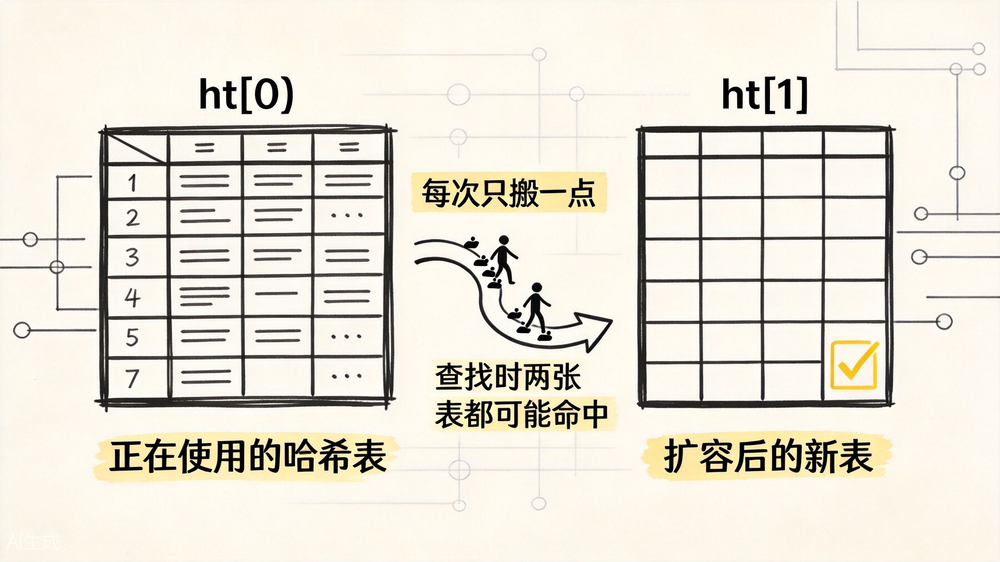

上图展示了渐进式 rehash 的过程：旧表和新表短暂并存，每次增删改查时顺手迁移一部分桶，直到旧表清空。这样避免了主线程被一次性全量迁移卡住。

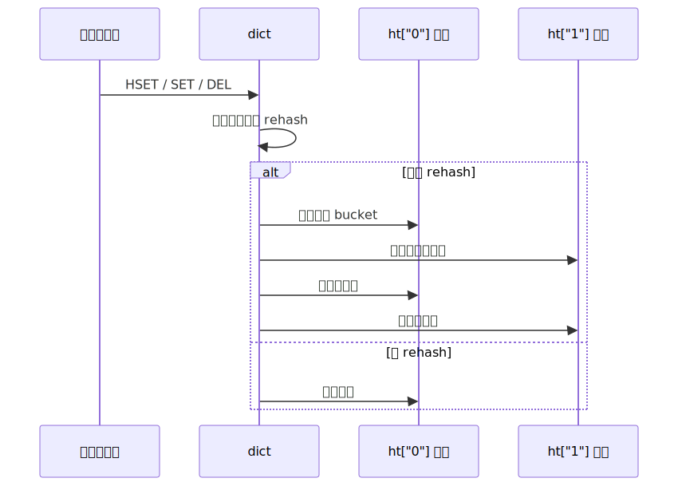

这个设计解决的是延迟尖刺问题。Redis 单线程主路径最怕长时间大操作。渐进式 rehash 把大成本拆散，让每次请求分摊一点。

在排查线上问题时，如果 key 空间快速增长，或者 Hash 字段突然变多，rehash 可能叠加 fork、AOF、过期删除等动作，形成延迟毛刺。理解 dict 后，你就不会只说"Redis 哈希表很快"，而会继续追问：

**它现在是不是正在搬迁？**

## 四、quicklist：List 不再是纯链表

很多人把 Redis List 想成双向链表。早期可以这么理解，但后来 Redis 选择了 quicklist。

纯链表的优点是头尾插入删除很快，缺点是每个节点都要指针，内存不够紧凑。纯连续数组的优点是紧凑，缺点是头部插入删除成本高。

quicklist 取了一个折中：外层是双向链表，链表每个节点里不是只放一个元素，而是放一个紧凑列表。现代 Redis 中，这个紧凑列表通常是 listpack。

可以把 quicklist 想成一串文件夹。文件夹之间用链条连起来，每个文件夹里装一小叠纸条。移动文件夹方便，纸条又不是每张都单独占一个链表节点。


在电商系统中，最近浏览记录、简单任务队列、操作日志片段都可能用 List 表达。quicklist 的价值是让这些列表既能高效做头尾操作，又不至于在大量小元素时浪费太多内存。

它的边界也很清楚：List 仍然不适合深分页和复杂查询。如果你把一个用户几年浏览历史全塞进一个超长 List，然后频繁从中间或很深的位置读，Redis 不会因为 quicklist 就变成搜索引擎。

## 五、listpack：解决紧凑结构里的连锁更新

listpack 是 Redis 里很重要的紧凑结构。它常被拿来和 ziplist 对比。

ziplist 的目标是省内存，把很多小元素连续放在一块内存里。但它有一个麻烦：某个元素变大后，可能导致后面元素记录"前一个元素长度"的字段也变大，进而连锁更新一串元素。这种连锁更新会制造不可控延迟。

listpack 保留了紧凑布局的优点，但去掉了容易引发连锁更新的设计。它更关注当前元素长度的编码，避免一个元素变化把后面一串元素都拖下水。


在 Redis 7.0 之后，很多原来使用 ziplist 的地方逐步转向 listpack。官方命令文档里，`OBJECT ENCODING` 已经能看到 String 的 `raw`、`embstr`、`int`，Hash / List / Set / ZSet 的 `listpack`，Set 的 `intset` / `hashtable`，ZSet 的 `skiplist`，Stream 的 `stream` 等编码。官方内存优化文档也明确强调，小聚合类型会优先使用紧凑编码，并由 `hash-max-listpack-*`、`set-max-listpack-*`、`zset-max-listpack-*` 这类配置控制阈值。

这里有一个版本边界要记住：

- Redis 早期大量使用 ziplist 表达小 Hash、小 ZSet 等紧凑结构；
- Redis 3.2 之后 List 从 ziplist / linkedlist 演进到 quicklist；
- Redis 7.0 之后，ziplist 逐步被 listpack 替代；
- Redis 7.2 之后，小 Set 除了 intset，也可以使用 listpack 这类紧凑编码。

这体现的是 Redis 对延迟稳定性的追求：省内存很重要，但不能为了省内存引入偶发的大抖动。

在小 Hash、小 ZSet、List 节点、Stream 内部块等场景里，listpack 都可能出现。你不需要每次都手动选择它，但理解它能帮助你理解 Redis 为什么总在"小对象"和"大对象"之间做编码切换。

## 六、skiplist：ZSet 为什么能既查分数又排范围

ZSet 的业务语义是"成员 + 分数 + 排序"。例如商品热度榜：

```redis
ZINCRBY product:hot_rank 1 product:10086
ZREVRANGE product:hot_rank 0 9 WITHSCORES
```

这个场景有两个需求：按成员快速找到分数，按分数快速做排序和范围查询。

只用哈希表，按成员查很快，但按分数排序不自然。只用有序链表，范围遍历可以，但查找和插入会变慢。Redis 的 ZSet 在大规模编码下通常使用 `dict + skiplist` 的组合：dict 负责成员到分数的快速定位，skiplist 负责按分数有序访问。

跳表可以理解为多层有序链表。最底层是完整链表，上面几层是快速通道。查找时先从高层大步跳，接近目标后再往下走。它不像平衡树那样需要复杂旋转，实现相对简单，范围遍历也很自然。


ZSet 选择 skiplist，不是因为跳表在所有场景都绝对优于树，而是它非常适合 Redis 的需求：实现简单、范围查询方便、插入删除平均复杂度好，和 dict 组合后能同时满足点查和排序。

小 ZSet 则通常先用 listpack。因为当元素很少时，维护一整套 dict + skiplist 的指针和元数据不划算。只有当成员数量或元素大小超过阈值后，Redis 才切到更通用的结构。

## 七、intset：小整数集合先别急着上哈希表

Set 如果元素都是整数，并且数量不大，Redis 可以用 intset。

intset 像一本排好序的号码本。它用连续内存保存整数，元素有序，不重复。因为没有哈希表那么多桶和指针，小集合时非常省内存。

intset 还有动态位宽升级。假设一开始集合里都是很小的整数，用较小位宽就够；后来插入一个更大的整数，原有编码装不下，就整体升级到更宽的编码。

这个设计的取舍很典型：小数据时省内存，插入大整数时可能有升级成本。Redis 通过阈值控制，超过规模或元素类型不适合时，就切换到哈希表。

在电商里，如果某个小范围状态集合只存整数 ID，intset 很合适。但如果集合很大，或者成员是字符串商品 ID，就该交给 hashtable。Redis 7.2 之后，小 Set 还可能使用 listpack 编码，所以读 `OBJECT ENCODING` 时不要只记"Set 不是 intset 就是 hashtable"，要结合版本看。

## 八、Stream 和 rax：为什么消息流不只是一条 List

虽然本文重点放在 SDS、dict、quicklist、listpack、skiplist、intset，但 Stream 也值得顺手放进这张地图里。

Stream 对外看起来像"可追加的消息列表"，但它不只是 List。消息流需要：

- 按 ID 有序追加；
- 按 ID 范围读取；
- 支持消费组和 pending entries；
- 在大量小消息下尽量省内存。

所以 Redis Stream 底层会用 radix tree，也就是 rax，来按消息 ID 组织索引；每个节点里的消息内容则可以用 listpack 这种紧凑结构承载。

这再次说明一件事：Redis 不是为了炫技而堆结构，而是在每个业务语义背后拆需求。List 更适合头尾队列，Stream 更适合带 ID、可确认、可范围扫描的消息流。

## 九、把业务类型、编码和结构放回一张表

下面这张表不是用来死背的，而是用来建立排查直觉：

| 对外类型 | 小规模常见编码 | 大规模常见编码 | 主要底层结构 | 要解决的问题 |
| --- | --- | --- | --- | --- |
| String | `int` / `embstr` | `raw` | SDS | 长度 O(1)、扩容安全、二进制安全 |
| Hash | `listpack` | `hashtable` | listpack / dict | 小对象省内存，大对象点查稳定 |
| List | `quicklist` | `quicklist` | quicklist + listpack | 头尾操作和内存紧凑折中 |
| Set | `intset` / `listpack` | `hashtable` | intset / listpack / dict | 小整数或小集合省内存，大集合查找稳定 |
| ZSet | `listpack` | `skiplist` | listpack / dict + skiplist | 小排行省内存，大排行兼顾点查和范围 |
| Stream | `stream` | `stream` | rax + listpack | 按 ID 追加、范围读取、消费组 |

更动态地看，是下面这条切换路径：


如果你只记住"类型 -> 结构"的静态映射，很快就会被版本差异和编码切换绕晕。更好的记忆方式是：

**Redis 会先问数据规模，再问访问模式，最后才决定结构。**

## 十、怎么在实战中观察这些结构

平时你不需要猜一个 key 当前用什么编码，可以直接用：

```redis
OBJECT ENCODING product:10086
OBJECT ENCODING cart:u1
OBJECT ENCODING product:hot_rank
```

还可以配合：

```redis
MEMORY USAGE product:10086
TYPE product:10086
HLEN cart:u1
LLEN history:u1
ZCARD product:hot_rank
```

这些命令能帮你回答三个很实际的问题：

1. 这个 key 对外是什么类型？
2. 它当前内部是什么编码？
3. 它是否已经大到可能影响内存、慢查询、迁移或持久化？

比如一个 Hash 原本是 listpack，字段越来越多后切到 hashtable，这是正常演进；但如果它继续膨胀成一个大 key，问题就不再是"编码对不对"，而是业务建模需要拆分。

## 十一、初学者最容易混淆的几个点

### 1. Hash 类型不等于哈希表

Hash 是对外类型，hashtable 是一种内部编码。小 Hash 为了省内存，可能先用 listpack。

### 2. List 不等于普通链表

现代 Redis List 的核心是 quicklist。它不是"一个元素一个链表节点"，而是链表节点里装一段紧凑内存。

### 3. ZSet 不等于只有跳表

大 ZSet 通常是 dict + skiplist：dict 负责按成员定位，skiplist 负责按分数排序。小 ZSet 可以先用 listpack。

### 4. intset 不是 Set 的唯一小对象方案

intset 适合小整数集合。Redis 7.2 之后，小 Set 还可能用 listpack。字符串成员、大集合、复杂访问最终仍会走 hashtable。

### 5. 编码切换不是免费的

切换通常发生在写入路径上。它解决长期性能和内存问题，但某一次触发切换的写入可能会承担转换成本。线上排查延迟毛刺时，编码切换、大 key、rehash、持久化和过期删除要放在一起看。

## 十二、收束：Redis 底层结构的真正主线

最后用一张心智表收束：

- String 依赖 SDS，解决长度、扩容和二进制安全；
- 全局 key 空间和大 Hash 依赖 dict，核心是渐进式 rehash；
- List 依赖 quicklist，折中链表操作和内存紧凑；
- 小 Hash、小 ZSet、List 节点、Stream 块常见 listpack，减少紧凑结构的连锁更新；
- ZSet 大规模场景依赖 dict + skiplist，同时满足点查和范围排序；
- 小整数 Set 使用 intset，先省内存，规模变大或类型不适合再切换；
- Stream 使用 rax + listpack，把按 ID 索引和紧凑消息块组合起来。

Redis 底层结构的主线不是"用了哪些数据结构"，而是：

**同一个业务语义，在不同数据规模下需要不同实现；Redis 用对象编码把这种切换藏在内部，让外部命令保持稳定。**

理解这一层以后，再看 Redis 为什么快、为什么怕大 key、为什么会有编码阈值、为什么慢查询有时来自结构迁移，就会自然很多。

