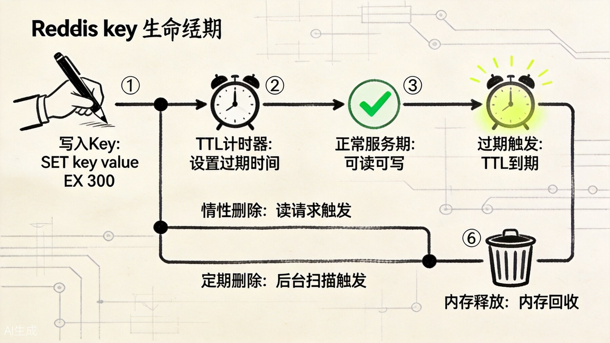
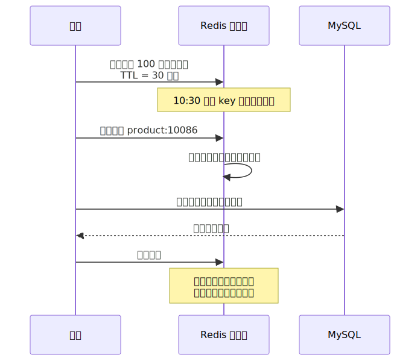
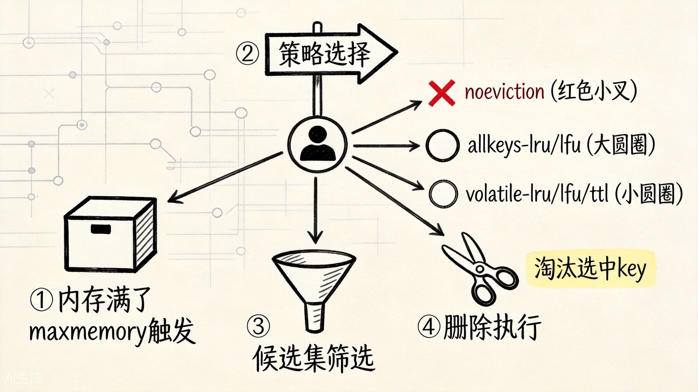

# Redis 过期删除和内存淘汰：理解 key 生命周期，别把"过期"和"被赶走"混为一谈

很多 Redis 线上问题，最后都会回到一个很朴素的问题：

**这个 key 为什么没了？或者，为什么它该没的时候还没没？**

商品详情缓存设置了 5 分钟 TTL，5 分钟后内存为什么没有马上下降？购物车没有设置过期时间，为什么内存满时写入失败？某些缓存还没过期，为什么突然查不到了？大量 key 同一秒过期，为什么 Redis 延迟突然抖了一下？

这些问题背后其实是两套规则在同时工作：**过期删除**决定 key 到点后还算不算有效，**内存淘汰**决定内存顶满时该牺牲谁。后面继续沿用前文的电商系统例子，把商品缓存、session、购物车、排行榜和库存计数都放进同一条 key 生命周期里来看。

写作前先把主线摆出来：

```text
原来：Redis 只是把 key 放进内存，读写都很快
问题 1：缓存不能永远有效，否则会越来越脏、越来越占空间
机制 1：TTL 和过期删除出现，用时间决定 key 还该不该活
问题 2：过期不等于立刻释放内存，删除本身也会带来成本
机制 2：惰性删除、定期删除、异步释放一起平衡及时性和性能
问题 3：即使没到过期时间，内存也可能装不下
机制 3：maxmemory 和淘汰策略出现，用容量压力决定牺牲谁
```



先看这张生命周期图。它最重要的提醒只有一句话：TTL 表示逻辑过期，真正删除往往发生在后面的访问或后台扫描里。

## 一、先把一个 key 的生命走一遍

我们给商品详情缓存设置 5 分钟 TTL：

```redis
SET product:10086 "{...}" EX 300
```

从业务角度看，我们会说："这个 key 5 分钟后过期。"

但从 Redis 角度看，更准确的是：Redis 保存了两份信息。一份是正常的 key-value 数据，另一份是这个 key 对应的过期时间。到了这个时间点之后，这个 key 在逻辑上不应该再被当作有效数据。

注意这里有个很关键的分界：

- **逻辑过期**：时间到了，这个 key 不该再返回给业务；
- **物理删除**：Redis 真的把 key 和 value 从内存结构里删掉；
- **内存归还**：对象释放后，内存分配器是否把内存还给操作系统。

很多误会就发生在这里。我们以为 TTL 到点就等于"内存马上下降"，但 Redis 并不这么承诺。TTL 控制的是有效性，不是精确的内存回收时钟。



所以第一条记忆是：

**TTL 表示逻辑过期时间，不表示物理删除必须精确发生在那一刻。**

## 二、过期删除回答的是"这个 key 还该不该活"

Redis 通常结合两种方式处理过期 key：**惰性删除**和**定期删除**。

惰性删除很直观：下次访问这个 key 时，Redis 先检查它是否过期。如果过期，就顺手删除并返回不存在。它的好处是省事，不访问就不花检查成本；坏处是，如果一个过期 key 再也没人访问，它可能会在内存里多待一会儿。

定期删除则是 Redis 周期性抽样一部分带过期时间的 key，检查哪些已经过期，然后删除一批。它的好处是能主动清理冷 key；坏处是不能每次都全量扫描，否则 Redis 会把大量时间花在"打扫卫生"上，而不是处理业务命令。

为什么不在过期瞬间立刻删除所有 key？

因为 Redis 不可能为每个 key 都安排一个精确闹钟。一个电商活动可能一次性写入几十万、几百万个缓存，如果这些 key 同一秒到期，过期瞬间全部删除会让主线程被删除工作拖住。Redis 选择用"访问时顺手删 + 后台抽样删"的方式，在及时性和性能之间折中。

官方文档里还有一个容易忽略的边界：过期事件本身也不是严格的定时器事件。一个 key 到期后，只有当它被访问、被主动扫描发现，或者被其他命令删除时，Redis 才真正产生相应的删除动作。也就是说，业务上不要把 TTL 当成毫秒级调度器。

在电商系统里，TTL 适合表达"这份缓存多久后不值得信任"：商品详情缓存 5 到 30 分钟，验证码 5 分钟，分布式锁 10 秒，活动预热数据到活动结束后失效。TTL 不适合表达"第 300 秒必须执行某个业务动作"。后者应该交给任务调度、消息队列或专门的延迟任务系统。

## 三、为什么设置了 TTL，内存没有立刻下降

假设活动结束后，10 万个商品缓存都过期了。你看业务日志，发现这些 key 已经过期；但看 Redis 进程内存，占用并没有立刻下降。

这可能不是 bug。

原因至少有四类。

第一，过期 key 还没被扫描到。惰性删除要等访问，定期删除要等抽样。没有被访问、也没被抽样命中的 key，可能短时间还留在内存里。

第二，Redis 删除对象后，内存分配器未必马上把内存归还给操作系统。进程内可复用空间变多了，但操作系统看到的 RSS 不一定马上下降。

第三，大量删除可能造成内存碎片。业务对象释放了，但空洞不连续，进程占用看起来仍然偏高。这个时候看 `used_memory`、`used_memory_rss`、`mem_fragmentation_ratio`，比只盯着操作系统层面的进程内存更有意义。

第四，设置 TTL 本身也有元数据成本。Redis 需要为带过期时间的 key 维护额外的过期字典信息。也就是说，不是"所有 key 都加 TTL 就一定更省内存"。TTL 解决的是生命周期问题，不是免费的空间魔法。

所以排查内存时，不能只问"key 是否过期"，还要问：

- 它有没有被访问或扫描到；
- 删除动作有没有集中发生；
- value 是不是大对象；
- 内存分配器有没有把空间还给操作系统；
- 业务是不是把大量低价值数据也写进了 Redis。

对电商系统来说，给商品缓存设置 TTL 是必要的，但 TTL 不是内存治理的全部。你还需要设计 key 上限、过期时间分布、大 key 拆分和监控指标。

## 四、批量过期为什么会制造延迟毛刺

缓存雪崩里常说"过期时间加随机值"。这不是仪式感，而是为了避免过期删除压力集中爆发。

假设你在 10:00 批量预热 100 万个商品缓存，TTL 都是 30 分钟。那么 10:30 之后，大量 key 同时进入过期状态。Redis 的定期删除会在短时间里扫描并删除更多过期 key，业务请求也会不断触发惰性删除。删除本身需要释放对象，如果对象比较大，成本还会放大。

结果就是 Redis 主线程的正常命令处理被删除工作夹住，出现延迟抖动。



解决办法很朴素：

- TTL 加随机扰动，让过期时间分散；
- 热点 key 后台刷新，不让它们自然集中失效；
- 大 key 拆分，避免删除单个 key 太重；
- 使用 `UNLINK` 或 lazyfree 相关能力处理大对象释放；
- 对活动预热数据设置分批加载和分批失效。

`DEL` 更像"现在就把对象释放掉"，而 `UNLINK` 更像"先把 key 从 keyspace 摘掉，释放内存的重活交给后台做"。对于大 List、大 Hash、大 ZSet 这类对象，异步释放能降低主线程被释放成本拖住的风险。它不是让删除没有成本，而是把一部分成本挪出命令处理路径。

这类问题最容易被误判成"Redis 性能突然变差"。实际上，它是 key 生命周期设计不均匀造成的。

## 五、内存淘汰回答的是"内存不够时牺牲谁"

过期删除处理的是生命周期。内存淘汰处理的是容量压力。



这张图对应的是另一套问题链：不是“它过没过期”，而是“内存满了以后谁先走”。

假设 Redis 设置了 `maxmemory`。当写入新数据导致内存超过限制时，Redis 要决定怎么办。

这时淘汰策略开始发挥作用。



如果策略是 `noeviction`，Redis 不主动淘汰 key，而是让写命令失败。这适合 Redis 里存放比较重要、不能随便丢的数据。例如你把某些幂等标记或关键状态放进 Redis，就不希望它们因为内存满被悄悄淘汰。

如果策略是 `allkeys-lru`，Redis 会在所有 key 里选择最近最少使用的 key 淘汰。这更像标准缓存：谁不常用，谁先走。

如果策略是 `allkeys-lfu`，Redis 会根据访问频率淘汰不常访问的 key。它更关注"长期用得少"，而不只是"最近没用"。

如果策略是 `volatile-lru`、`volatile-lfu`、`volatile-ttl` 等，只在设置了 TTL 的 key 里选择淘汰对象。这适合你把 Redis 分成两类：设置 TTL 的是缓存，可以牺牲；没设置 TTL 的是更重要的状态，不希望被淘汰。

但 `volatile-*` 有一个重要边界：如果没有足够的带 TTL 的 key 可淘汰，Redis 仍然可能无法为写入腾出空间，表现会接近 `noeviction`。所以选择 `volatile-*` 的前提是：你的可牺牲数据真的都设置了 TTL，而且数量足够。

第二条记忆是：

**过期删除看时间，内存淘汰看容量。过期 key 是该不该活，淘汰策略是装不下时谁先走。**

## 六、为什么"缓存 key"和"状态 key"最好不要混在一起

电商系统里，Redis 可能同时存这些数据：

- 商品详情缓存：丢了可以回源 MySQL；
- 用户 session：丢了用户要重新登录；
- 购物车：如果只存在 Redis，丢了会影响订单；
- 排行榜：可重建但成本较高；
- 分布式锁：必须短 TTL，不允许长期存在；
- 幂等 key：短时间内很重要。

如果这些 key 混在同一个 Redis 实例里，再配置一个激进的 `allkeys-lru`，内存满时 Redis 可能把 session、幂等 key、排行榜数据也淘汰掉。系统表面上只是"缓存满了"，实际可能变成业务事故。

这就是淘汰策略的本质：它不是技术参数，而是在选择牺牲面。

比较稳妥的做法是按数据等级分层：

- 纯缓存数据放在一个实例或独立集群，允许 LRU/LFU 淘汰；
- 关键状态尽量不要和普通缓存混用；
- 必须混用时，借助 TTL、key 前缀、容量隔离和监控降低风险；
- 对不能丢的数据，不要只依赖 Redis 内存状态。

所以 Redis key 生命周期设计，不只是给每个 key 起名字，还要决定它能不能过期、能不能被淘汰、丢失后怎么恢复。

可以把常见数据粗略分成三层：

| 数据类型 | 能不能过期 | 能不能被淘汰 | 丢了怎么办 | 推荐思路 |
| --- | --- | --- | --- | --- |
| 商品详情缓存 | 能 | 通常能 | 回源数据库 | TTL 加随机值，允许 `allkeys-lru` 或 `allkeys-lfu` |
| 用户 session | 能 | 谨慎 | 用户重新登录或走恢复逻辑 | 独立实例或保守策略，配合续期 |
| 购物车 | 看设计 | 谨慎 | 如果无落库会丢业务数据 | Redis 只做加速层更稳 |
| 分布式锁 | 必须能 | 不靠淘汰 | 锁语义可能被破坏 | 短 TTL、owner 校验、不要靠淘汰释放 |
| 排行榜 | 可分期 | 看重建成本 | 从日志或数据库重建 | 分片、归档、限制集合增长 |
| 签到 Bitmap | 可按周期 | 看业务要求 | 历史统计可能缺口 | 按月或按年建 key，设置保留期 |

## 七、淘汰策略会反过来影响数据库压力

内存淘汰不是 Redis 内部小事，它会影响整个系统链路。

商品详情缓存被淘汰后，下一次请求会回源数据库。如果淘汰策略和业务访问模式不匹配，大量有价值的热点 key 被淘汰，缓存命中率下降，数据库压力就会上升。

更麻烦的是，这种压力可能形成循环：


所以看 Redis 内存不能只看"有没有超过 maxmemory"。还要看：

- `keyspace_hits` / `keyspace_misses` 推出的 hit rate 是否下降；
- `evicted_keys` 是否持续增长；
- `expired_keys` 是否集中跳变；
- `used_memory`、`used_memory_rss`、`mem_fragmentation_ratio` 是否异常；
- 是否存在 big key 占用过多内存；
- 是否存在缓存污染，把不常访问的数据塞满了 Redis。

缓存污染是一个很实际的问题。比如一次批处理把大量冷门商品也写进 Redis，挤掉真正热门商品。表面上 Redis 里 key 很多，实际命中率反而变差。

如果业务访问有明显热点，`allkeys-lfu` 往往比单纯 LRU 更能抵抗"一次性冷数据扫描"。如果业务访问具有很强的最近性，比如用户刚看过的商品短期内可能继续看，LRU 就更自然。策略选择不是背配置表，而是把访问模式和牺牲面讲清楚。

## 八、排查时先问三件事

遇到"key 怎么没了"或"内存怎么还没降"，不要一上来就猜 Redis 异常。可以按三步问。

第一，key 是过期没了，还是被淘汰没了？

看 `TTL key` 或 `PTTL key` 只能判断当前状态，事后还要结合 `expired_keys`、`evicted_keys`、应用日志和 key 的写入策略。`expired_keys` 增长，说明过期删除在发生；`evicted_keys` 增长，说明 `maxmemory` 压力下已经开始淘汰。

第二，删除是集中发生，还是平滑发生？

如果某个时间点 `expired_keys` 突然跳变，同时延迟升高，就要怀疑同秒批量过期、大 key 删除或缓存雪崩。如果 `evicted_keys` 持续增长，同时 hit rate 下降，就要怀疑内存容量不足、策略不匹配或缓存污染。

第三，内存没降是真的没删，还是删了但 RSS 没降？

如果 key 数下降、`used_memory` 下降，但 `used_memory_rss` 不降，更多是分配器和碎片问题。如果 key 数和 `used_memory` 都没怎么变，那才要继续查过期扫描、写入速度、大 key 和业务回填。

可以记一张小排障表：

| 现象 | 优先怀疑 | 关键指标 |
| --- | --- | --- |
| TTL 到了但 key 短时间还占内存 | 惰性删除和定期删除尚未触达 | `TTL`、key 数、`expired_keys` |
| key 没过期却消失 | maxmemory 淘汰 | `evicted_keys`、`maxmemory-policy` |
| 内存满后写入失败 | `noeviction` 或无候选 key | 错误日志、`maxmemory-policy` |
| 删除后 RSS 不降 | 内存碎片或分配器未归还 | `used_memory_rss`、`mem_fragmentation_ratio` |
| 延迟周期性抖动 | 批量过期、大 key 删除 | `LATENCY DOCTOR`、慢日志、`expired_keys` 跳变 |
| DB 压力升高 | 命中率下降、热点被淘汰 | hit rate、`evicted_keys`、DB QPS |

## 九、怎么为不同业务设计 key 生命周期

最后回到电商系统，给几个常见数据定规则。

商品详情缓存：可以设置 TTL，比如 5 到 30 分钟，并加随机扰动。更新商品时，先更新数据库再删除缓存。热点商品可以后台刷新。

用户 session：TTL 和登录态绑定，通常要滑动续期。它不应该和普通商品缓存一起被随意淘汰。

购物车：如果 Redis 只是加速层，最终数据应落数据库；如果 Redis 是主存储，就必须有持久化、备份和更保守淘汰策略。

分布式锁：必须有较短 TTL，释放时校验 owner，不能依赖淘汰策略解决锁泄露。

排行榜：可设置周期性归档和分片，不要让一个 ZSet 无限增长。是否允许淘汰，要看是否能从业务日志重建。

签到 Bitmap：按月或按年建 key，历史数据设置合理保留期，避免永久增长。

这时你会发现，Redis key 生命周期不是一个统一答案，而是每类数据各自的生命周期设计。

真正落地时，可以按下面这条清单过一遍：

- 这个 key 是缓存、状态，还是临时控制标记？
- 它的真相源在哪里，MySQL、消息日志，还是 Redis 自己？
- 它能不能过期，过期后谁负责重建？
- 它能不能被淘汰，被淘汰后业务是否能接受？
- 它的 value 会不会变成大 key，删除成本多高？
- 它的 TTL 会不会和一批 key 集中到同一秒？
- 它应该和哪些 key 放在同一个实例，和哪些 key 隔离？

## 十、总结：key 消失有两种原因

过期删除和内存淘汰最容易混淆，可以用一句话分开：

**过期删除是时间到了，内存淘汰是位置不够了。**

过期删除不保证精确时刻物理删除，它通过惰性删除和定期删除在及时性和成本之间平衡。TTL 让 key 在逻辑上失效，但物理删除和内存归还会受访问、扫描、对象大小、分配器和碎片影响。

内存淘汰只在容量触顶时介入，它按照策略选择牺牲对象。不同策略对应不同业务假设，没有绝对最好。`allkeys-*` 适合把 Redis 当纯缓存，`volatile-*` 适合只淘汰带 TTL 的缓存层，`noeviction` 则宁可写失败也不悄悄丢数据。

真正的工程问题，是把 key 分成不同等级：哪些能过期，哪些能被淘汰，哪些丢了能重建，哪些必须落到更可靠的系统。

理解 key 生命周期后，你再看缓存雪崩、缓存污染、大 key 删除、内存碎片、命中率下降，就会发现它们不是孤立问题，而是同一件事的不同侧面：

**Redis 很快，但内存有限；key 的生老病死如果设计不好，快就会变成抖，缓存就会变成事故源。**

