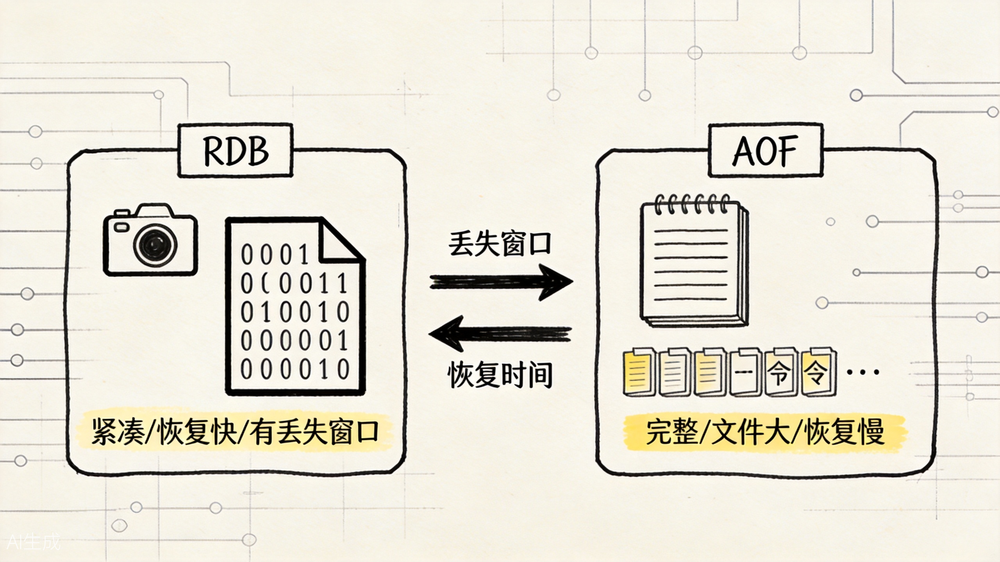
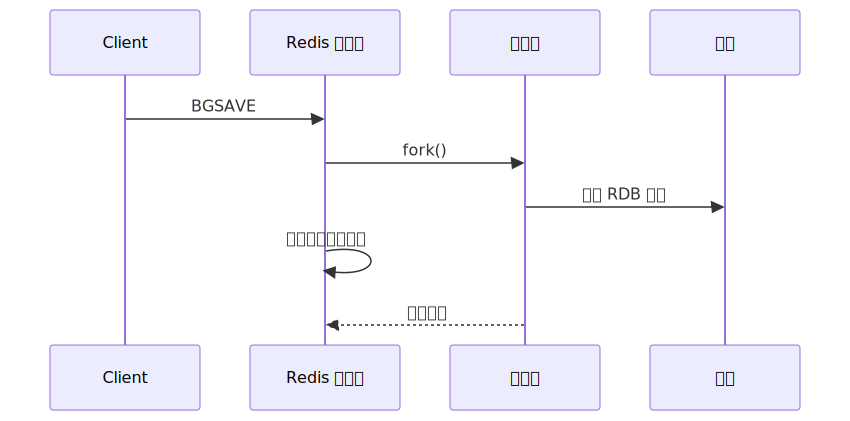
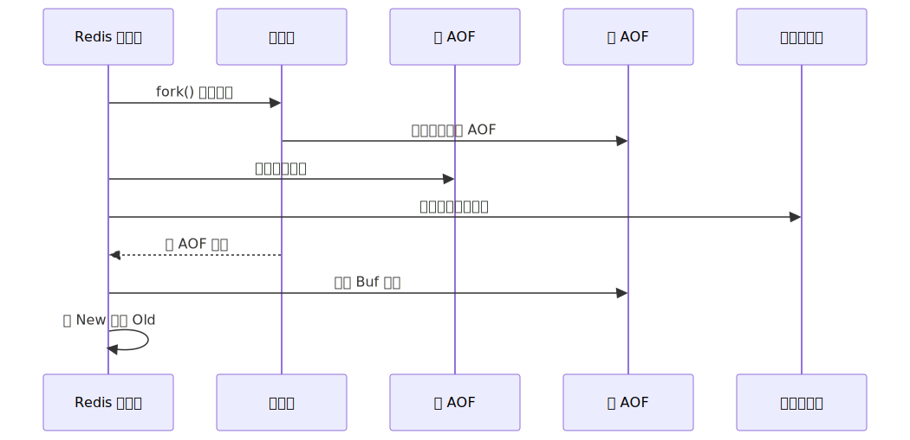

# Redis 持久化机制：RDB、AOF 与混合模式，各抱什么场景

一旦 Redis 不只被当作"丢了可以重建"的缓存，持久化就成了绕不开的话题。

电商系统里，你把订单状态、用户行为、库存扣减等关键数据放进 Redis，是为了快。但快不等于安全：如果进程崩溃、机器宕机、或者运维误操作把实例重启了，这些数据还能找回来吗？

持久化回答的就是这个问题。Redis 提供了三种主流做法：RDB、AOF、以及 RDB+AOF 的混合模式。它们不是谁更高级，而是谁更符合你对丢失窗口、恢复速度和线上抖动的容忍度。



先把这张取舍图记住：RDB 更像“打快照”，AOF 更像“记流水”，混合模式则是在恢复速度和数据完整性之间取一个更实用的平衡点。



## 一、RDB：全量快照，紧凑快速但有窗口

RDB（Redis Database Backup）是一种全量快照机制。它会把某个时刻 Redis 内存中的全部数据序列化成一个紧凑的二进制文件，保存到磁盘上。这个文件就是 `.rdb` 文件。

可以通过 `SAVE`（同步）或 `BGSAVE`（异步）触发 RDB 生成。生产环境几乎总是用 `BGSAVE`，因为它会 fork 出一个子进程来执行快照，主进程继续处理业务命令，不会被阻塞。



子进程在生成 RDB 的过程中，主进程依然可以正常处理命令。这得益于操作系统的**写时复制（Copy-On-Write）**机制：fork 出的子进程共享主进程的内存页，只有当主进程修改某个内存页时，操作系统才会真正复制该页给子进程使用。

但这并不意味着 BGSAVE 完全没有成本。fork 操作本身会阻塞主进程一小段时间，时间长短和内存大小相关——Redis 实例越大，fork 的停顿可能越长。一旦 fork 完成，后续主进程每修改一个内存页，就会触发一次页复制，这会增加内存使用量。如果在这段时间内写入非常密集，COW 开销可能显著。

RDB 的优点：

- 文件紧凑，体积小；
- 恢复速度快，重启时直接加载 RDB 文件到内存即可；
- 适合做冷备份，可以定期复制到异地。

RDB 的局限：

- 两次 RDB 之间的数据可能丢失。如果配置每 5 分钟做一次快照，最坏情况下会丢失最近 5 分钟的数据；
- BGSAVE 的 fork 在内存大时会有明显停顿；
- 不适合对数据安全性要求极高的场景。

对于电商系统，RDB 适合作为基础备份手段。比如每天凌晨做一次 RDB，保留多份历史快照，用于灾难恢复或数据审计。

## 二、AOF：增量日志，完整但恢复慢

AOF（Append-Only File）是一种增量日志机制。它会将 Redis 收到的每一条**写命令**按协议格式追加到 AOF 文件中。重启时，Redis 只需要按顺序重放这些命令，就能恢复数据。

```redis
SET product:10086 "{...}"
INCR view:10086
HSET cart:42 product:10086 2
```

假设这是三条业务命令，AOF 文件里会依次记录下这三条命令的原始协议格式。重启时，Redis 逐条执行这些命令，数据就回来了。

AOF 的核心优点是**数据完整性高**。如果配置为 `appendfsync everysec`，每秒把缓冲区刷到磁盘，最多只丢失 1 秒的数据。如果配置为 `always`，每次写入都同步刷盘，理论上可以做到零丢失，但性能代价很大。

但 AOF 也有明显的问题：

- 文件体积通常比 RDB 大得多。同样一份数据，AOF 是命令日志，RDB 是二进制快照；
- 恢复速度慢。重启时需要逐条重放命令，数据量大时可能需要很久；
- AOF 文件会随着写入不断增长，需要定期进行**重写（rewrite）**来压缩。

AOF 重写的原理不是"在原有文件上修改"，而是fork 出一个子进程，子进程根据当前内存数据生成一份新的、最精简的 AOF 文件。重写过程中，主进程继续处理命令，新命令同时写入旧 AOF 文件和一个重写缓冲区。当子进程写完新文件后，主进程把重写缓冲区的内容追加到新文件末尾，然后用新文件替换旧文件。



AOF 重写解决了文件膨胀问题，但重写本身也有成本：fork、内存开销、磁盘 I/O。在生产环境上，AOF 重写的频率和时机需要根据业务负载仔细调。

对于电商系统，AOF 适合对数据完整性要求高的场景。比如订单状态流转、库存扣减记录、用户支付行为等，如果丢失 1 分钟的数据都是不可接受的，就应该开启 AOF，并配置合理的刷盘策略。

## 三、混合持久化：RDB 的速度 + AOF 的完整

Redis 4.0 引入了混合持久化（Redis 自 5.0 起默认开启）。它的思路很直接：把 RDB 和 AOF 拼在一起。

具体来说，当 AOF 重写触发时，子进程不是生成纯命令日志，而是先像 RDB 一样生成一个全量快照，然后把重写期间的新命令以 AOF 格式追加到快照后面。最终生成的 AOF 文件结构是：

```
+----------+-------------+
| RDB 头部 | AOF 增量尾部 |
+----------+-------------+
```

重启时，Redis 先加载 RDB 头部（快速恢复大部分数据），再重放 AOF 尾部（补全重写期间的新命令）。这样既保留了 RDB 恢复速度快的优点，又保留了 AOF 数据完整性高的优点。


混合持久化的配置在 `aof-use-rdb-preamble yes`。如果开启，AOF 重写生成的文件就是混合格式；如果关闭，重写生成的就是纯 AOF 命令格式。

对于电商系统，混合持久化通常是首选。它让恢复速度比纯 AOF 快很多，同时数据丢失窗口比纯 RDB 小很多。除非有非常特殊的兼容性需求，否则建议默认开启。

## 四、RDB 与 AOF 的取舍

两种持久化方式不是非此即彼，Redis 也支持同时开启。下面从几个实际维度对比：

| 维度 | RDB | AOF | 混合持久化 |
|------|-----|-----|-----------|
| 文件体积 | 紧凑，小 | 较大，不断增长 | 中等 |
| 恢复速度 | 快，直接加载 | 慢，需重放命令 | 较快，RDB+AOF |
| 数据丢失窗口 | 大，取决于快照间隔 | 小，`everysec` 最多丢 1 秒 | 小，同 AOF |
| 对主进程影响 | fork 时短暂阻塞 | 持续写盘开销 | fork + 写盘 |
| 适合场景 | 冷备份、灾难恢复 | 高完整性要求 | 通用首选 |

在实际部署中，常见做法有：

- **只做缓存**：数据可重建，不开持久化；
- **数据重要但可接受分钟级丢失**：只开 RDB，定期备份；
- **数据重要且要求秒级安全**：开 AOF + 混合持久化；
- **极高安全要求**：RDB + AOF 同时开，RDB 做冷备，AOF 做主恢复。

对于电商系统，可以根据数据等级分层：

- 商品详情缓存：可重建，不持久化或只 RDB；
- 用户 session、购物车：AOF + 混合，秒级安全；
- 订单状态、支付记录：AOF + 混合，同时考虑主从复制做热备，持久化不是唯一防线。

## 五、持久化配置的关键参数

实际配置时，需要关注以下参数：

**RDB 相关：**

```conf
# 自动触发 RDB 的条件
save 900 1      # 900 秒内至少有 1 次修改
save 300 10     # 300 秒内至少有 10 次修改
save 60 10000   # 60 秒内至少有 10000 次修改

# RDB 文件
 dbfilename dump.rdb
 dir /var/lib/redis
```

**AOF 相关：**

```conf
appendonly yes
appendfilename "appendonly.aof"

# 刷盘策略
appendfsync everysec  # 推荐，平衡性能和安全
# appendfsync always  # 最安全，性能最差
# appendfsync no      # 最快，最不安全

# AOF 重写触发条件
auto-aof-rewrite-percentage 100
auto-aof-rewrite-min-size 64mb

# 混合持久化
aof-use-rdb-preamble yes
```

`appendfsync everysec` 是大多数场景的最佳实践。它每秒刷一次盘，性能损失可控，最多丢失 1 秒数据。`always` 每次写入都刷盘，性能代价太大，只在极端安全场景使用。`no` 完全依赖操作系统刷盘，最快但也最不安全。

`auto-aof-rewrite-percentage` 和 `auto-aof-rewrite-min-size` 控制 AOF 重写的自动触发。当前 AOF 文件比上一次重写后增长超过 100%，且文件大小超过 64MB 时，自动触发重写。可以根据实际磁盘空间和写入量调整。

## 六、持久化不是备份的全部

一个常见的误区是：开了持久化就等于做了备份。其实不是。

持久化解决的是"进程崩溃后怎么恢复"，但它不解决：

- 磁盘损坏；
- 误操作把数据清空（`FLUSHALL` 之后持久化文件也会被清空或覆盖）；
- 机房级灾难。

所以生产环境上，除了本地持久化，还需要：

- 定期把 RDB/AOF 文件复制到异地或对象存储；
- 配置主从复制做热备，从节点持续同步数据；
- 对关键业务数据，持久化只是最后一道防线，不是唯一防线。

电商系统里，订单、支付、库存等关键数据，应该同时走数据库事务和消息队列确认，Redis 只是加速层。即使 Redis 完全丢失，也能从数据库和日志中恢复。

## 七、一个持久化选型的心智模型

可以把持久化选型想成一个坐标系：

- 横轴是**恢复速度**，从慢到快；
- 纵轴是**数据完整性**，从低到高；
- 原点是"不持久化"。

RDB 在右下角：恢复快，但完整性低。AOF 在左上角：恢复慢，但完整性高。混合持久化在中间偏右上方：恢复较快，完整性也较高。

你的业务在这个坐标系上的位置，决定了该选哪种持久化方式。

如果数据可重建、延迟敏感、丢一点无所谓——靠近原点，甚至不持久化。如果数据不可丢、恢复速度可以妥协——靠近 AOF。如果两者都要兼顾——混合持久化。

持久化没有银弹，只有对业务需求的准确理解。

