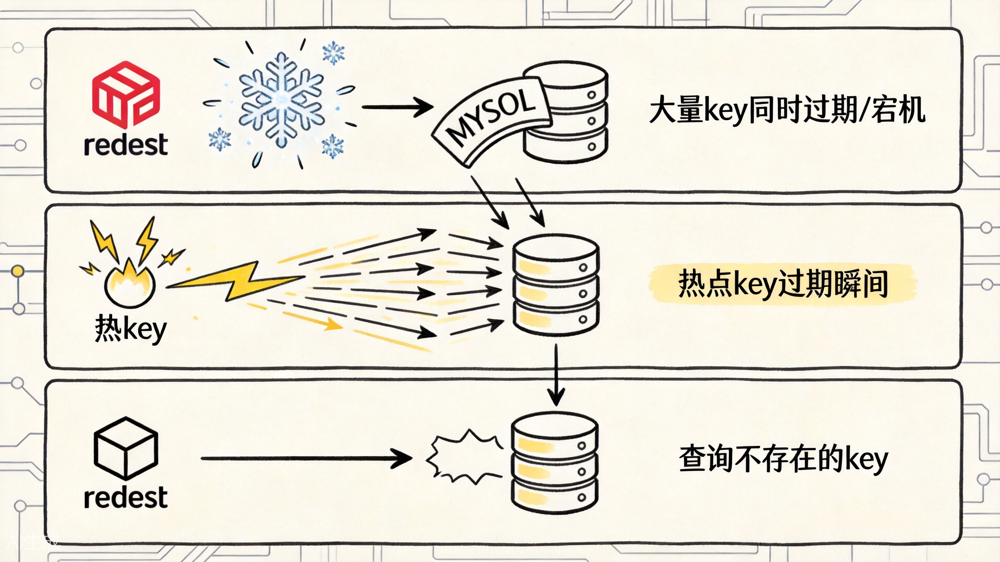
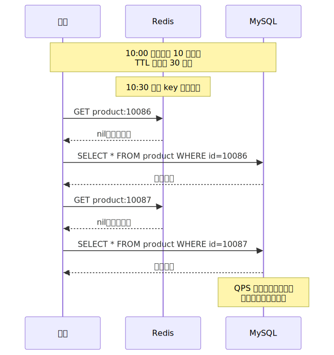
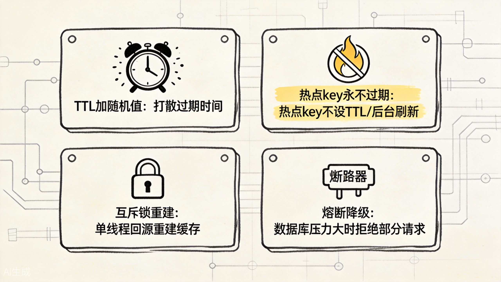
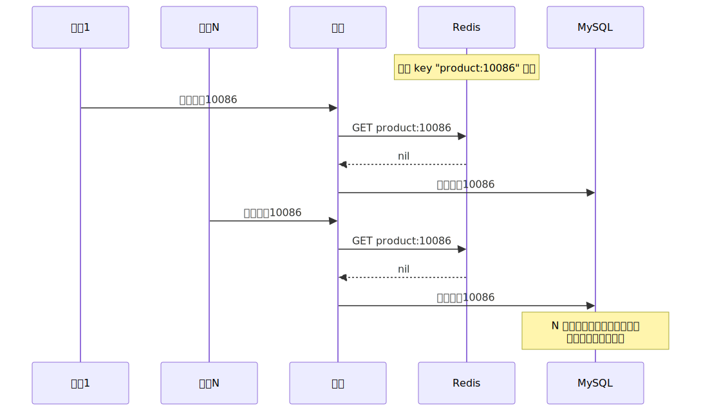
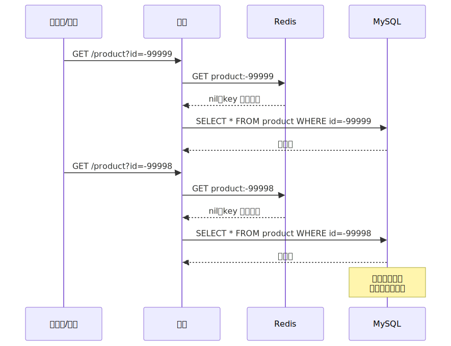
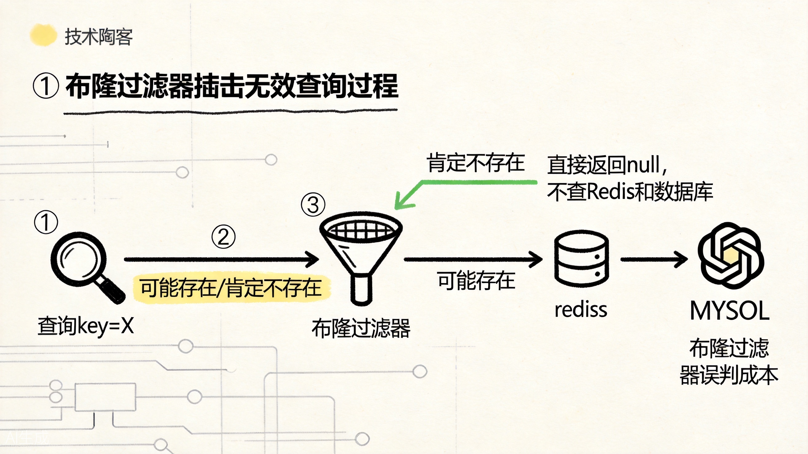

# 缓存雪崩、击穿、穿透：三种异常怎么区分，怎么防

缓存是 Redis 最常见的用途，但缓存不是银弹。生产环境上，缓存相关的故障往往比"Redis 挂了"更隐蔽，也更难排查。

最常见也最容易混淆的，就是缓存雪崩、缓存击穿、缓存穿透。名字很像，但真正出问题时，三者的流量形状、数据库压力点和处理办法都不一样。这里继续沿用前面的商品缓存场景，只把一件事讲清楚：**到底是哪一类请求把缓存体系打坏了。**

## 先给一张图：三种异常的根本区别



先用这张图区分三种异常：雪崩看的是“面”，击穿看的是“一个热点”，穿透看的是“根本不存在的数据”。


一句话区分：

- **雪崩**：大面积的缓存同时失效；
- **击穿**：单个热点 key 过期被高并发打穿；
- **穿透**：查询的 key 根本不存在，缓存形同虚设。

下面逐个展开。

## 一、缓存雪崩：大面积缓存失效，DB 瞬间被打爆

缓存雪崩指的是**大量缓存 key 在同一时间集中失效**，或者**Redis 实例宕机**，导致大量请求同时打到后端数据库，数据库在短时间内承受不住而崩溃。

在电商系统里，这种情况常见于：

- 大型促销活动前，批量预热了大量商品缓存，设置了相同的 TTL；
- 活动结束时，这些缓存同时过期；
- 用户请求瞬间全部穿透到数据库。



雪崩的根本原因是**缓存失效时间过于集中**。即使不是批量预热导致的，Redis 实例宕机也会造成类似效果——所有 key 同时不可访问。

### 雪崩的防护手段



这张图可以当成雪崩防护的速查卡：把过期时间打散、把热点单独照顾、把回源并发卡住、必要时直接降级。

**1. TTL 加随机偏移**

这是最朴素也最有效的手段。在设置缓存时，给 TTL 加上一个随机值，让过期时间分散开：

```java
// 基础 TTL 300 秒，加上 0-300 秒的随机偏移
int ttl = 300 + ThreadLocalRandom.current().nextInt(300);
redis.setex(key, ttl, value);
```

这样即使批量写入了缓存，过期时间也会分散在 5-10 分钟内，避免同一秒集中失效。

**2. 热点 key 永不过期**

对于真正热点的 key，比如首页推荐商品、秒杀商品信息，可以**不设置 TTL**，而是通过后台异步线程定期刷新缓存。这样热点数据永远不会出现"过期瞬间"。

```java
// 不设 TTL
redis.set(key, value);

// 后台任务每 5 分钟刷新一次
@Scheduled(fixedRate = 300_000)
public void refreshHotKeys() {
    for (String hotKey : hotKeys) {
        String freshValue = loadFromDB(hotKey);
        redis.set(hotKey, freshValue);
    }
}
```

**3. 多级缓存**

在 Redis 之外再加一层本地缓存（如 Caffeine、Guava Cache）。当 Redis 不可用时，本地缓存还能扛一段时间，为 Redis 恢复或数据库降级争取时间。

```
用户请求 -> 本地缓存 -> Redis -> 数据库
```

**4. 熔断和降级**

当数据库压力达到阈值时，通过熔断器（如 Sentinel、Hystrix）直接拒绝部分请求，保护数据库不被打挂。牺牲一部分用户体验，保住核心链路。

**5. 高可用架构**

Redis 实例本身也要做高可用：主从复制 + 哨兵自动故障转移，或者 Redis Cluster。单实例宕机时，从节点可以快速提升为主节点，减少不可用时间。

## 二、缓存击穿：热点 key 过期，高并发同时打穿

缓存击穿指的是**某个热点 key 在过期瞬间，有大量并发请求同时查询这个 key**，由于 key 刚过期，缓存中没有数据，所有请求同时打到数据库。

和雪崩的区别在于：雪崩是"大面积 key 失效"，击穿是"单个热点 key 失效"。

在电商系统里，这种情况常见于：

- 某个爆款商品的缓存过期了；
- 这个商品正在被大量用户同时查看；
- 所有请求同时查数据库获取商品详情。



### 击穿的防护手段

**1. 互斥锁（Mutex）**

当缓存未命中时，不是直接查数据库，而是先尝试获取一个分布式锁。只有获取到锁的线程才能查询数据库并回填缓存，其他线程等待：

```java
String value = redis.get(key);
if (value == null) {
    // 尝试获取锁
    boolean locked = redis.setnx(lockKey, "1", 10);
    if (locked) {
        try {
            // 只有拿到锁的线程查数据库
            value = loadFromDB(key);
            redis.setex(key, 300, value);
        } finally {
            redis.del(lockKey);
        }
    } else {
        // 没拿到锁，短暂等待后重试缓存
        Thread.sleep(50);
        value = redis.get(key);
    }
}
```

互斥锁保证了**同一时间只有一个线程回源数据库**，其他线程要么等缓存回填，要么走降级逻辑。

**2. 热点 key 永不过期 + 后台刷新**

和防雪崩一样，热点 key 不设 TTL，后台异步刷新。从根本上消除"过期瞬间"。

**3. 逻辑过期**

给缓存值包装一个逻辑过期时间字段，查询时如果发现逻辑过期，则由一个后台线程异步更新，而当前请求先返回旧值。这样永远不会出现"缓存未命中"的情况。

```json
{
  "data": { ...商品详情... },
  "expireAt": 1714800000000
}
```

## 三、缓存穿透：查询不存在的 key，缓存永远不中

缓存穿透指的是**查询的 key 在数据库中也不存在**，缓存自然也不会有这个 key，导致每次请求都会穿透缓存直达数据库。

和雪崩、击穿的区别在于：穿透的 key 是**永远不存在**的，不是过期了，而是压根就没有。

在电商系统里，这种情况常见于：

- 恶意攻击：用随机商品 ID 大量请求，这些 ID 根本不存在；
- 业务 bug：前端传了错误的参数，比如商品 ID 为 -1 或 null；
- 数据被删除：某个商品下架了，但还有用户在访问。



### 穿透的防护手段



布隆过滤器这一段的重点也很简单：它不负责给你正确结果，它负责先挡掉一批“肯定不存在”的无效请求。

**1. 布隆过滤器（Bloom Filter）**

布隆过滤器是一种概率型数据结构，能告诉你"某个 key 肯定不存在"或"可能存在"。把所有存在的商品 ID 预先加载到布隆过滤器中，查询时先查过滤器：

```java
// 初始化时加载所有有效商品 ID
BloomFilter<String> bloomFilter = BloomFilter.create(
    Funnels.stringFunnel(Charset.defaultCharset()),
    1000000,  // 预期元素数量
    0.01      // 误判率
);

// 加载现有商品
for (Long productId : allProductIds) {
    bloomFilter.put("product:" + productId);
}

// 查询时先查布隆过滤器
public String getProduct(String key) {
    if (!bloomFilter.mightContain(key)) {
        // 肯定不存在，直接返回 null
        return null;
    }
    // 可能存在，继续查缓存和数据库
    return queryWithCache(key);
}
```

布隆过滤器的特点是：**判断"不存在"是 100% 准确的，判断"可能存在"有一定误判率**。这意味着少量合法请求可能被误判为"可能存在"而走正常查询链路，但恶意构造的不存在 key 会被直接拦截。

**2. 缓存空值**

对于查询结果为空的情况，也把这个"空结果"缓存一段时间。这样同样的无效查询在一段时间内不会重复打到数据库：

```java
String value = loadFromDB(key);
if (value == null) {
    // 缓存空值，TTL 设短一点，比如 60 秒
    redis.setex(key, 60, "__NULL__");
    return null;
}
redis.setex(key, 300, value);
return value;
```

空值的 TTL 要设得比正常值短，防止真实数据写入后长期被空值挡住。

**3. 参数校验**

在入口处就对参数做合法性校验。比如商品 ID 必须是正整数，范围在已知的业务边界内。不合法的请求直接返回错误，不走到缓存查询环节。

```java
public Product getProduct(Long id) {
    if (id == null || id <= 0 || id > MAX_PRODUCT_ID) {
        return null; // 直接拦截
    }
    return queryWithCache("product:" + id);
}
```

**4. 限流**

对于明显异常的请求模式（如同一 IP 短时间内大量随机 ID 查询），通过限流器直接拒绝。

## 四、三种异常的对比总结

| 维度 | 缓存雪崩 | 缓存击穿 | 缓存穿透 |
|------|---------|---------|---------|
| **根本原因** | 大量 key 同时过期/宕机 | 热点 key 过期瞬间高并发 | 查询的 key 不存在 |
| **影响范围** | 大面积 | 单个热点 key | 单个/多个不存在 key |
| **数据库表现** | QPS 瞬间飙升 | 同一查询并发飙升 | 无效查询消耗资源 |
| **核心解决思路** | 打散过期时间 + 高可用 | 互斥锁 + 热点不过期 | 布隆过滤器 + 缓存空值 |
| **预防优先级** | 高 | 高 | 极高（涉及安全） |

线上排查时，可以通过以下方式快速定位：

- 看 Redis 监控：`expired_keys` 是否集中跳变 -> 可能是雪崩；
- 看慢查询：大量相同 key 的查询 -> 可能是击穿；
- 看数据库：大量查询返回空结果 -> 可能是穿透。

## 五、一个统一的防护框架

在实际项目中，往往不是单独防某一种异常，而是建立一个统一的防护框架：

```
用户请求
  -> 参数校验（防穿透）
  -> 布隆过滤器（防穿透）
  -> 本地缓存（防雪崩/击穿降级）
  -> Redis 缓存
    -> 互斥锁（防击穿）
    -> 数据库
  -> 熔断降级（防雪崩）
  -> 返回结果
```

这个框架的核心思想是**分层防护**：每一层解决不同的问题，多层配合才能构建健壮的缓存体系。

对于电商系统，建议的防护策略组合：

- **所有查询**：参数校验 + 布隆过滤器拦截明显无效请求；
- **热点数据**：不设 TTL，后台异步刷新；
- **普通缓存**：TTL 加随机偏移，避免集中过期；
- **高并发场景**：互斥锁防止击穿；
- **整体架构**：多级缓存 + 熔断降级 + Redis 高可用。

缓存异常不是"出了问题再修"，而是"设计阶段就要考虑"。等线上数据库被打挂了再补布隆过滤器，代价就太大了。

