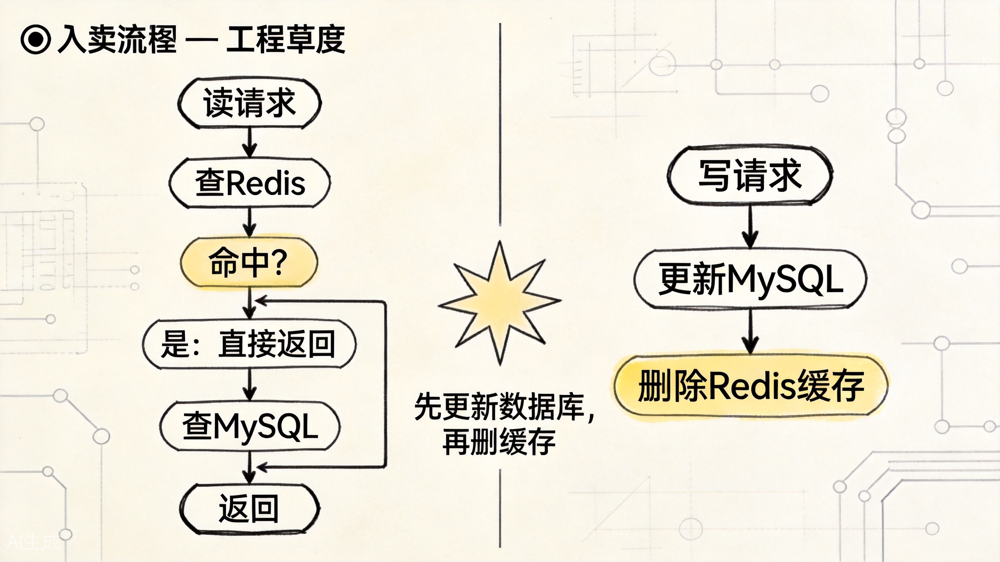
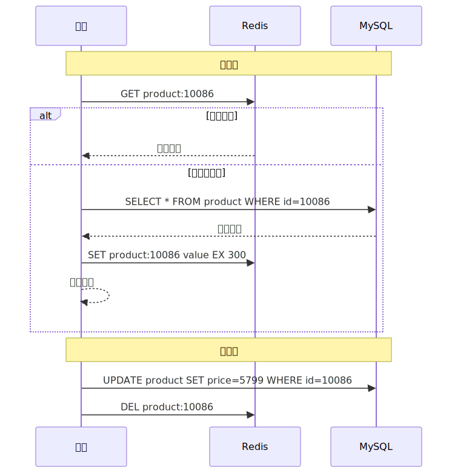
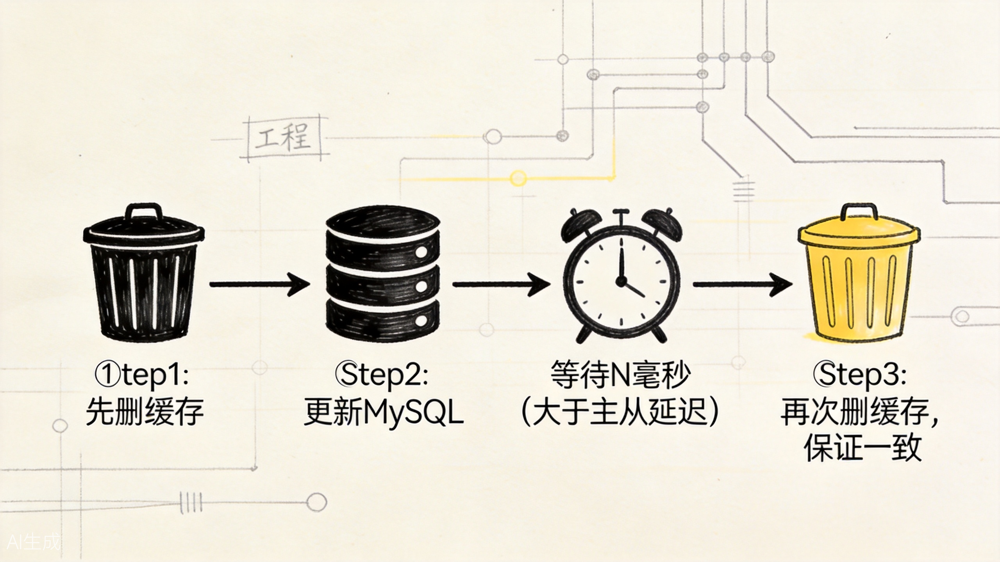
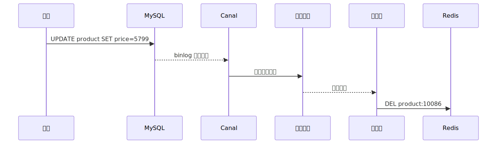

# MySQL 与 Redis 一致性：缓存更新策略与实战选择

一旦系统同时依赖 MySQL 和 Redis，一致性问题就不可避免。

电商系统里，商品信息在 MySQL，热点读请求在 Redis。只要这两个存储同时存在，不一致就不是“会不会发生”，而是“什么时候、以什么形式发生”。这一篇不再重复缓存的基本概念，只聚焦更新链路本身：写数据库、删缓存、并发回源、主从延迟，这几步怎样组合才更稳。

## 一、先理解问题：为什么缓存和数据库会不一致

假设一个简单的商品缓存场景：

```
MySQL: product:10086 = { name: "iPhone", price: 5999 }
Redis: product:10086 = { name: "iPhone", price: 5999 }
```

运营后台把价格改成 5799。如果更新流程设计不当，可能出现以下不一致情况：

**情况 1：更新了数据库，但缓存更新失败**

```
MySQL: product:10086 = { price: 5799 }  ✓
Redis: product:10086 = { price: 5999 }  ✗（更新缓存时网络故障）
```

用户读到旧价格 5999。

**情况 2：并发读写导致旧值覆盖新值**

```
T1: 线程A 更新数据库 price=5799
T2: 线程B 读取缓存（旧值 5999）
T3: 线程B 把旧值 5999 写回缓存（因为缓存刚好过期）
T4: 线程A 更新缓存为 5799...但如果在 T3 之后执行，就会被覆盖
```

**情况 3：主从延迟导致脏读**

```
T1: 更新主库 price=5799
T2: 删除缓存
T3: 读请求查缓存未命中
T4: 读请求查从库（主从同步未完成，读到旧值 5999）
T5: 旧值 5999 被回填到缓存
```

这些场景说明：**缓存一致性不是"更新两个地方"那么简单，时序、并发、网络故障、主从延迟都会让问题复杂化。**

## 二、四种经典缓存更新策略

业界常用的缓存更新策略有四种：Cache Aside、Read Through、Write Through、Write Behind。其中最常用的是 **Cache Aside**（旁路缓存）。

### 1. Cache Aside（旁路缓存）



这张图对应的是最常见也最实用的一条主线：读时回填，写时删缓存，而不是强行同步更新两个地方。

这是最常用的策略，核心是两条规则：

**读流程：**
1. 先查缓存，命中则直接返回；
2. 未命中则查数据库；
3. 把数据库结果写入缓存；
4. 返回数据。

**写流程：**
1. **先更新数据库**；
2. **再删除缓存**（注意是删除，不是更新）。



为什么写流程是"删缓存"而不是"更新缓存"？

因为"更新缓存"需要知道新值是什么，而某些写操作（比如复杂的 SQL 更新）不直接返回更新后的完整对象。先更新数据库，再删除缓存，下次读时自然从数据库加载最新值回填缓存。这样更简单、更可靠。

Cache Aside 的优点是简单直观，缺点是并发场景下仍可能出现短暂不一致。

### 2. Read Through

Read Through 把缓存作为主要数据源。应用只和缓存交互，缓存未命中时由缓存组件自动从数据库加载。

这种方式需要缓存框架支持（如 Redis 的某些客户端库），应用代码更简洁，但灵活性较低。

### 3. Write Through

Write Through 同样把缓存作为主要数据源。写操作时，先更新缓存，再由缓存组件同步更新数据库。

优点是缓存和数据库总是一致写入，缺点是写操作的延迟取决于数据库写入速度，缓存的"快"优势被削弱了。

### 4. Write Behind（Write Back）

Write Behind 是最高性能的策略：写操作只更新缓存，由后台异步线程定期批量写入数据库。

优点是写操作极快，缺点是如果缓存宕机且数据还没来得及刷盘，数据会丢失。适合对一致性要求不高、但对写入性能要求极高的场景（如计数器、日志收集）。

对于电商系统，**Cache Aside 是首选**。它足够简单，且通过一些辅助手段（如延迟双删、消息队列）可以进一步优化一致性。

## 三、Cache Aside 的并发问题与解决

Cache Aside 虽然简单，但在并发场景下仍有问题。

### 问题：读写竞争导致脏数据

```
T1: 线程A 更新数据库（price: 5999 -> 5799）
T2: 线程B 查询缓存（未命中）
T3: 线程B 查询数据库（读到旧值 5999，因为A还没提交或存在事务隔离）
T4: 线程A 删除缓存
T5: 线程B 把旧值 5999 写入缓存
```

结果是：缓存里存了旧值 5999，数据库是最新值 5799。

这个场景发生的概率不高（需要精确的时间交错），但理论上确实存在。

### 解决 1：延迟双删



延迟双删的价值不在“更优雅”，而在于它给并发交错留了一次补救机会。

写流程变成：

1. 先删除缓存；
2. 更新数据库；
3. **等待一段时间**（比如 500ms，大于主从同步延迟）；
4. **再次删除缓存**。

```java
public void updateProduct(Product product) {
    String key = "product:" + product.getId();

    // 第一次删缓存
    redis.del(key);

    // 更新数据库
    productMapper.update(product);

    // 延迟再次删除缓存
    asyncExecutor.schedule(() -> redis.del(key), 500, TimeUnit.MILLISECONDS);
}
```

延迟双删能大幅降低脏数据的概率，但不能 100% 消除（比如第二次删除也失败了）。它适合对一致性要求较高、但能接受极短暂不一致的业务。

### 解决 2：基于消息队列的异步删缓存

更可靠的方案是通过 MySQL binlog 监听数据变更，异步删除缓存。

```
MySQL -> Canal/Maxwell -> MQ -> 消费者 -> 删除 Redis 缓存
```

这种方式把缓存删除操作从业务代码中解耦出来，由专门的同步组件处理。即使业务代码没有正确删除缓存，binlog 监听机制也能保证最终一致性。



这种方式的工程复杂度更高，需要部署 Canal、消息队列等基础设施，但一致性保障更强。适合对一致性要求极高的核心业务（如订单、支付、库存）。

### 解决 3：设置较短的 TTL

最简单粗暴的方式：给缓存设置较短的 TTL（比如 30 秒到 1 分钟）。即使出现脏数据，也会在短时间内自动过期，下次读取时从数据库加载最新值。

这种方式实现零成本，但频繁回源会增加数据库压力。需要权衡业务对一致性的敏感度和数据库的承受能力。

## 四、主从延迟问题

很多 MySQL 架构采用主从复制，写操作走主库，读操作走从库。这就引入了**主从延迟**：数据写入主库后，需要一定时间才能同步到从库。

如果缓存删除后，读请求打到从库，但主从同步还没完成，就会读到旧值，然后旧值又被回填到缓存。

解决思路：

1. **延迟双删**：第二次删除的延迟时间要大于主从同步的最大延迟；
2. **关键读走主库**：对一致性要求极高的查询（如订单状态），强制走主库；
3. **缓存设置合理 TTL**：让脏数据有自动过期的时间上限。

## 五、四种策略的对比

| 策略 | 复杂度 | 一致性 | 性能 | 适用场景 |
|------|--------|--------|------|---------|
| Cache Aside | 低 | 最终一致 | 高 | 大多数场景 |
| Cache Aside + 延迟双删 | 中 | 较高 | 高 | 一致性要求较高 |
| Cache Aside + binlog 监听 | 高 | 强 | 中高 | 核心业务（订单/支付） |
| Read/Write Through | 中 | 较强 | 中 | 需要框架支持 |
| Write Behind | 中 | 弱 | 极高 | 计数器、日志等 |

对于电商系统，建议的分级策略：

- **商品详情、分类列表**：Cache Aside + 短 TTL，允许秒级不一致；
- **用户信息、购物车**：Cache Aside + 延迟双删，降低不一致概率；
- **订单状态、库存、支付**：Cache Aside + binlog 监听 + 关键读走主库，追求强一致性。

## 六、一致性不是越严格越好

在实际工程中，一致性需要和性能、复杂度做权衡。

- **强一致性**：每次读写都同步协调，性能差，复杂度高。通常只有金融、支付类业务才需要。
- **最终一致性**：允许短暂不一致，通过异步机制保证最终一致。大多数业务场景足够。
- **弱一致性**：只保证大致一致，通过 TTL 过期来修正。适合非关键数据。

电商系统的商品详情页，用户看到的价格和实际结算价格不一致，当然不好。但如果只有几秒钟的差异，且结算时走主库查询最新价格，业务上通常可以接受。

**关键是：让不一致的窗口尽可能短，且在不一致窗口内的影响可控。**

