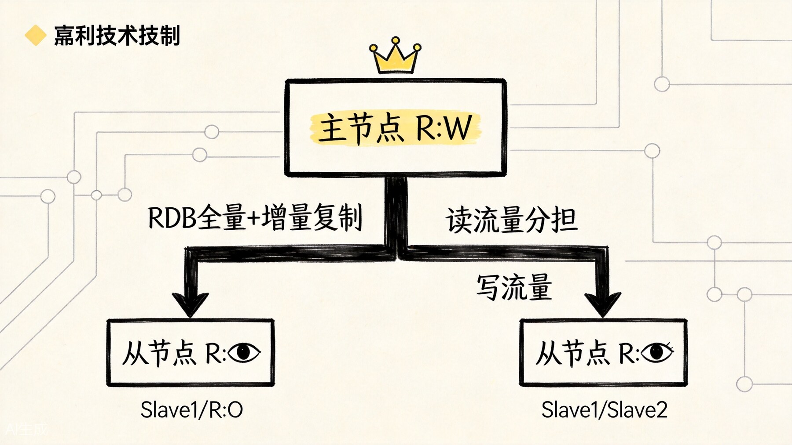
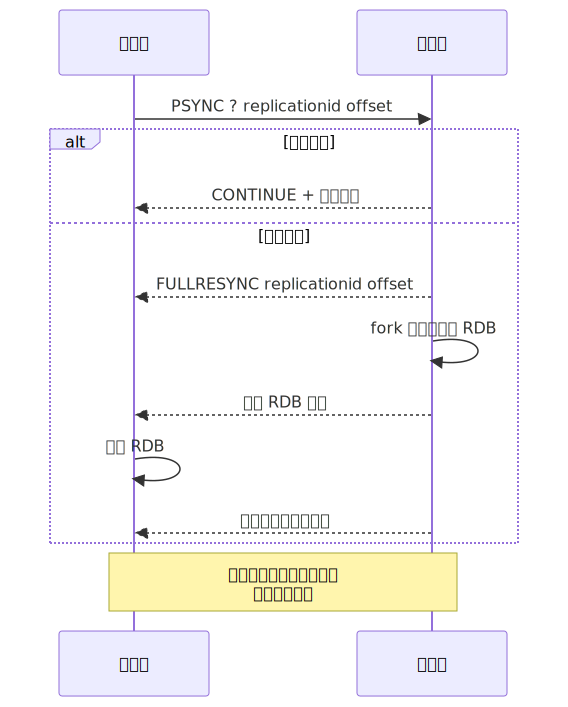
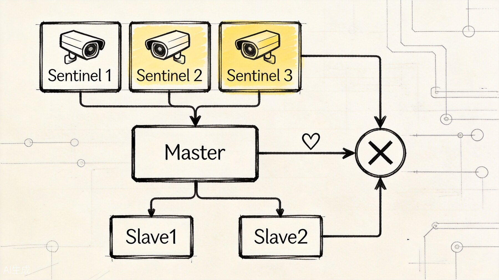
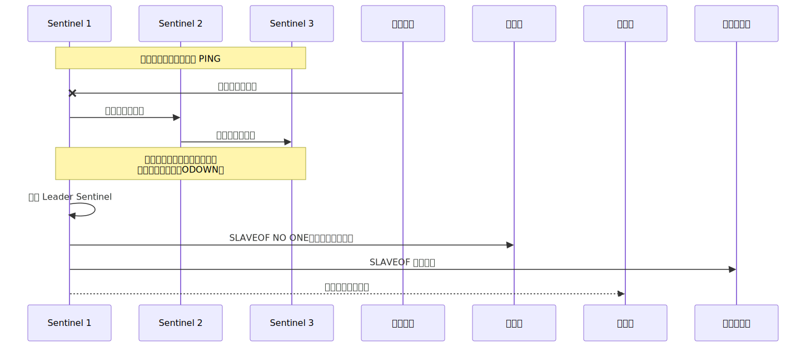
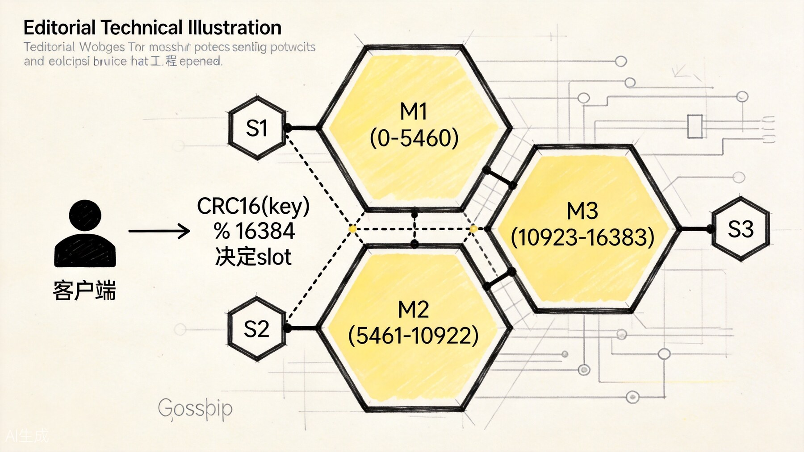

# Redis 高可用架构：主从复制、哨兵与 Cluster 集群

单机 Redis 只要一挂，前面讲过的缓存、计数器、排行榜、会话状态都会一起受影响。所以这一篇只回答架构演进问题：先用复制保住副本，再用哨兵接管故障转移，最后在单机容量和写入能力不够时走向 Cluster。

## 一、主从复制：数据冗余的基础



先看最基础的一层：一个主节点负责写，多个副本节点复制数据并承担读请求。复制是高可用的起点，但它本身还不负责自动切主。

### 复制流程



**全量同步**：从节点首次连接主节点，或主节点的复制缓冲区不足以支持增量同步时，主节点 fork 子进程生成 RDB 文件，发送给从节点加载。

**增量同步**：从节点断开重连后，如果主节点的复制缓冲区还保留着断开期间的数据，就可以只发送增量部分，避免全量同步的开销。

### 主从复制能解决什么

- **读写分离**：主节点写，从节点读，分担读压力；
- **数据冗余**：从节点是主节点的完整副本，主节点宕机时从节点可以接替；
- **扩展读性能**：增加从节点可以线性扩展读吞吐量。

### 主从复制不能解决什么

- **自动故障转移**：主节点宕机后，需要手动或通过哨兵将从节点提升为主节点；
- **写性能扩展**：所有写操作仍集中在主节点，无法通过加从节点扩展写能力；
- **数据分片**：单个主节点的内存有上限，数据量超过单机内存时需要分片。

对于中小型电商系统，一主两从 + 哨兵是常见部署模式。

## 二、哨兵（Sentinel）：自动故障转移



哨兵层解决的是“主挂了以后谁来接班、客户端怎么知道”的问题。

哨兵解决的是**自动故障转移**问题。它由多个哨兵节点（Sentinel）组成，持续监控主从集群的状态。

### 哨兵的核心功能

1. **监控**：定期检查主节点和从节点是否正常运行；
2. **通知**：发现异常时通知管理员或其他系统；
3. **自动故障转移**：主节点宕机时，自动选举从节点为新主节点；
4. **配置提供**：客户端连接哨兵获取当前主节点地址。

### 故障转移流程



故障转移的关键步骤：

1. **主观下线（SDOWN）**：单个哨兵认为主节点不可达；
2. **客观下线（ODOWN）**：足够多的哨兵同意主节点不可达；
3. **选举 Leader Sentinel**：哨兵之间通过 Raft 算法选举出一个 Leader 负责故障转移；
4. **选择新主节点**：从健康的从节点中选择一个（通常选复制偏移量最大、优先级最高的）；
5. **提升新主节点**：发送 `SLAVEOF NO ONE` 命令；
6. **重新配置从节点**：让其他从节点开始复制新主节点；
7. **通知客户端**：通过发布订阅机制通知客户端更新主节点地址。

### 哨兵的配置要点

```conf
# sentinel.conf
sentinel monitor mymaster 127.0.0.1 6379 2
sentinel down-after-milliseconds mymaster 5000
sentinel failover-timeout mymaster 60000
sentinel parallel-syncs mymaster 1
```

- `monitor`：监控的主节点地址，最后的 `2` 表示至少需要 2 个哨兵同意才判定客观下线；
- `down-after-milliseconds`：多久没响应认为主观下线；
- `failover-timeout`：故障转移超时时间；
- `parallel-syncs`：同时重新配置从节点的数量。

### 哨兵的局限

- 哨兵本身也是进程，需要部署多个哨兵节点保证自身高可用；
- 哨兵模式只有一个主节点承担写操作，**写性能无法扩展**；
- 数据量超过单机内存时，哨兵模式无法解决。

对于中等规模的电商系统，哨兵模式通常足够。但当数据量超过单机内存，或者写压力达到单机瓶颈时，就需要 Cluster 模式。

## 三、Cluster 集群：数据分片与水平扩展



Cluster 再往前走一步，它不只是保可用，还开始解决单机装不下、单主写不动的问题。

Redis Cluster 是 Redis 的分布式方案，通过**数据分片**将数据分布到多个节点上，实现水平扩展。

### 核心概念

- **Hash Slot**：Cluster 将整个 key 空间划分为 16384 个 slot（0-16383）；
- **节点负责 Slot**：每个主节点负责一部分 slot；
- **Key 映射**：通过 `CRC16(key) % 16384` 计算 key 属于哪个 slot；
- **节点间通信**：Cluster 节点通过 Gossip 协议交换状态信息。


### Cluster 架构示例



### 客户端路由

Cluster 客户端需要能处理 MOVED 和 ASK 重定向：

- **MOVED**：表示 key 已经永久迁移到另一个节点，客户端需要更新 slot 映射；
- **ASK**：表示 key 正在迁移过程中，客户端需要临时访问目标节点。

大多数现代 Redis 客户端（如 Jedis、 Lettuce、redis-py-cluster）都内置了 Cluster 支持，能自动处理路由。

### 扩容和缩容

Cluster 支持在线扩容和缩容：

**扩容**：
1. 添加新节点到 Cluster；
2. 将部分 slot 从现有节点迁移到新节点；
3. 迁移过程中，请求会被重定向，业务无感知。

**缩容**：
1. 将目标节点的 slot 迁移到其他节点；
2. 移除空节点。

### Cluster 的局限

- **多 key 操作受限**：涉及多个 slot 的命令（如 MGET、MSET、事务）需要所有 key 在同一个 slot，或使用 Hash Tag；
- **部署和运维复杂**：至少需要 6 个节点（3 主 3 从）才能构成完整 Cluster；
- **Gossip 协议开销**：节点数过多时，Gossip 通信开销会增加。

对于大型电商系统，当数据量达到几十 GB 甚至上百 GB，或者 QPS 超过单机承载能力时，Cluster 是必然选择。

## 四、三种架构的对比

| 维度 | 主从复制 | 哨兵模式 | Cluster 模式 |
|------|---------|---------|-------------|
| 自动故障转移 | 否 | 是 | 是 |
| 读扩展 | 是 | 是 | 是 |
| 写扩展 | 否 | 否 | 是（分片） |
| 数据容量 | 单机内存 | 单机内存 | 多机总和 |
| 最小节点数 | 2 | 4（1主1从+2哨兵） | 6（3主3从） |
| 部署复杂度 | 低 | 中 | 高 |
| 运维成本 | 低 | 中 | 高 |

## 五、选型建议

### 什么时候用主从复制（不加哨兵）？

- 开发测试环境；
- 有外部监控和手动切换机制；
- 能接受分钟级不可用。

### 什么时候用哨兵？

- 生产环境，需要自动故障转移；
- 数据量不超过单机内存（通常 < 50GB）；
- 读多写少，读 QPS 可以通过加从节点扩展；
- 写 QPS 不超过单机上限（通常 < 10万 QPS）。

### 什么时候用 Cluster？

- 数据量超过单机内存；
- 写 QPS 超过单机上限；
- 需要水平扩展能力；
- 有专门的运维团队。

### 电商系统的典型演进路径

```
单机 Redis
  -> 一主一从（数据冗余）
    -> 一主多从 + 哨兵（高可用 + 读写分离）
      -> Cluster（水平扩展）
```

大多数中小型电商系统在"一主两从 + 哨兵"阶段就能跑很久。只有当业务真正触及单机性能或容量天花板时，才需要考虑 Cluster。

## 六、读写分离的实践

无论哨兵还是 Cluster，读写分离都是常见的性能优化手段。

### 实现方式

1. **客户端分片**：应用层根据命令类型选择连接主节点还是从节点；
2. **代理层**：通过 Twemproxy、Codis 等代理中间件自动分流；
3. **智能客户端**：如 Lettuce，内置读写分离和故障转移。

### 注意事项

- **复制延迟**：从节点数据可能滞后主节点几毫秒到几秒，读从节点时要能接受短暂不一致；
- **关键读走主库**：对一致性要求极高的查询（如支付状态），强制走主节点；
- **从节点读取失败降级**：从节点不可用时，自动切换到主节点读取。

## 七、高可用的最后防线

无论哪种架构，都要考虑极端情况：

- **持久化**：RDB + AOF 混合持久化，防止数据完全丢失；
- **异地备份**：定期把 RDB 文件复制到异地；
- **监控告警**：Redis 延迟、内存使用率、复制延迟、连接数等关键指标；
- **熔断降级**：当 Redis 不可用时，业务能降级到直接查数据库或返回默认值。

高可用不是"选一个架构就万事大吉"，而是**多层防护叠加**：架构高可用 + 数据持久化 + 监控告警 + 业务降级。

