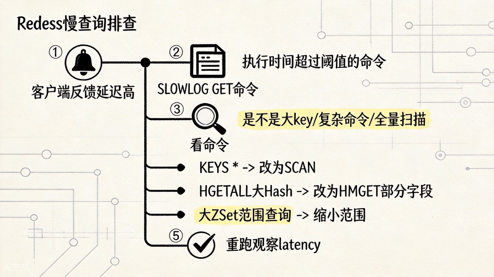
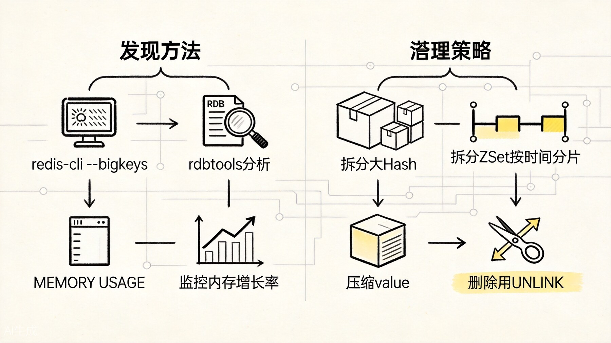
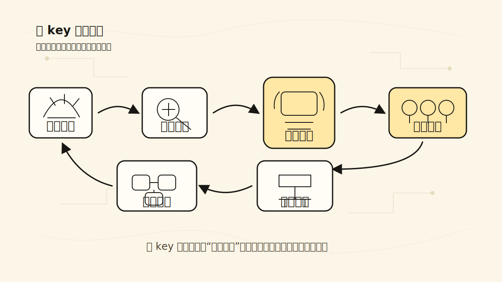
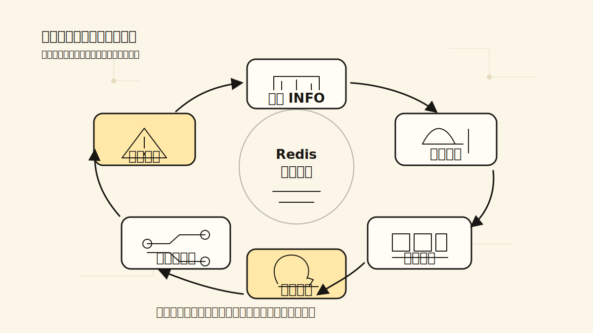

# Redis 慢查询、大 Key、监控与调优：生产环境排障手册

Redis 很快，但前面讲的那些“快路径”一旦被大 key、慢命令、热点倾斜、内存碎片和持久化抖动打断，线上体感会立刻变差。这一篇就按排障顺序来讲：先判断是哪里慢，再确认是哪类 key 在拖累系统，最后把监控指标补齐。

## 一、慢查询：找到拖慢 Redis 的命令

Redis 是单线程模型，一个慢命令会阻塞后面所有命令的执行。排查慢查询是性能优化的第一步。



这张图可以直接当排障顺序用：先看延迟，再抓命令，再看数据形状，最后再谈优化。

### 慢查询日志

Redis 内置了慢查询日志功能，记录执行时间超过阈值的命令：

```redis
CONFIG SET slowlog-log-slower-than 10000  # 超过 10ms 视为慢查询
CONFIG SET slowlog-max-len 128            # 保留最近 128 条

SLOWLOG GET 10  # 查看最近 10 条慢查询
SLOWLOG LEN     # 当前慢查询数量
SLOWLOG RESET   # 清空慢查询日志
```

慢查询日志包含的信息：

- 命令的完整参数；
- 执行时长（微秒）；
- 执行时间戳；
- 客户端信息。

### 常见慢查询原因

**1. 时间复杂度高的命令**

```redis
KEYS *                    # O(n)，全库扫描，生产环境禁用
HGETALL huge_hash         # O(n)，返回大量数据
ZRANGE huge_zset 0 -1    # O(n)，返回全部成员
SMEMBERS huge_set        # O(n)
SORT large_list           # O(nlogn)
```

这些命令在小数据量时很快，但一旦 key 很大，执行时间就会急剧上升。

**2. 大 key 操作**

对包含百万级元素的 Hash、ZSet、List、Set 进行操作，即使是 O(1) 或 O(log n) 的命令也可能变慢（比如序列化/网络传输耗时）。

**3. 批量操作**

```redis
MGET key1 key2 ... key10000   # 一次返回太多数据
HMGET hash field1 ... fieldN  # N 太大
```

**4. 阻塞命令**

```redis
BLPOP queue 0       # 阻塞直到有元素
BRPOPLPUSH a b 0    # 阻塞模式
```

### 慢查询的优化思路

| 问题 | 优化方案 |
|------|---------|
| `KEYS *` | 用 `SCAN` 替代 |
| `HGETALL` 大 Hash | 用 `HSCAN` 分批读取，或只取需要的字段 `HMGET` |
| `ZRANGE 0 -1` | 分页读取，限制返回数量 |
| 大 key | 拆分成多个小 key |
| 批量操作太大 | 分批处理，控制单次返回数据量 |

### LATENCY DOCTOR

Redis 提供了延迟监控框架：

```redis
CONFIG SET latency-monitor-threshold 10  # 超过 10ms 记录
LATENCY LATEST      # 查看最新延迟事件
LATENCY HISTORY command  # 某类命令的延迟历史
LATENCY DOCTOR      # 自动诊断延迟原因
```

`LATENCY DOCTOR` 会自动分析最近的延迟事件，给出可能的原因和建议。这是排查 Redis 延迟问题的利器。

## 二、大 Key：发现、分析与治理

大 key 是 Redis 性能问题的主要来源之一。一个大 key 可能导致：

- 命令执行时间长，阻塞主线程；
- 网络传输慢，客户端超时；
- 持久化时 fork 时间长，写时复制开销大；
- 主从复制时同步时间长。



这张图对应的是第二条主线：不是所有慢都来自算法复杂度，很多时候只是某个 key 已经大到不适合继续按原样存。

### 发现大 key

**方法 1：redis-cli --bigkeys**

```bash
redis-cli --bigkeys
```

这是 Redis 自带的工具，通过 SCAN 遍历全库，采样统计每种类型的最大 key。优点是无需额外工具，缺点是会对生产环境有一定性能影响，建议在低峰期执行。

**方法 2：rdbtools 分析**

```bash
rdb -c memory dump.rdb -l largest > large_keys.csv
```

通过分析 RDB 文件来发现大 key。优点是对生产环境零影响（可以复制 RDB 到备机分析），缺点是需要先生成 RDB。

**方法 3：MEMORY USAGE**

```redis
MEMORY USAGE key_name
```

查看单个 key 的内存占用。适合怀疑某个 key 很大时确认。

**方法 4：监控内存增长率**

通过监控 `used_memory` 的增长曲线，如果发现某个时间点内存突然暴涨，结合业务日志定位可能的大 key。

### 大 key 的判定标准

没有绝对标准，但业界通常的参考：

| 数据类型 | 大 key 阈值 |
|---------|-----------|
| String | > 10KB |
| Hash | > 5000 个字段 |
| List | > 5000 个元素 |
| Set | > 5000 个成员 |
| ZSet | > 5000 个成员 |

具体阈值需要根据业务 QPS 和 Redis 实例规格调整。

### 大 key 的治理方案

**1. 拆分**

把一个大 key 拆成多个小 key。例如一个大 Hash 按 field 的 hash 值拆成 10 个小 Hash：

```
# 原来
big_hash: { field1: val1, field2: val2, ... field100000: val100000 }

# 拆分后
big_hash_0: { field1: val1, field11: val11, ... }  # hash(field) % 10 == 0
big_hash_1: { field2: val2, field12: val12, ... }  # hash(field) % 10 == 1
...
big_hash_9: { field10: val10, field20: val20, ... }
```

**2. 压缩**

对于 String 类型的大 value，可以在应用层做压缩（如 gzip、snappy）后再存入 Redis：

```java
// 写入时压缩
byte[] compressed = Snappy.compress(json.getBytes());
redis.setex(key, 300, compressed);

// 读取时解压
byte[] compressed = redis.get(key);
byte[] json = Snappy.uncompress(compressed);
```

**3. 异步删除**

删除大 key 时，不要用 `DEL`，而用 `UNLINK`：

```redis
UNLINK big_key   # 异步删除，不阻塞主线程
```

`UNLINK` 会先把 key 从 keyspace 中移除（立即可见），然后在后台线程中逐步释放内存。这对生产环境更友好。

**4. 设置合理过期时间**

对于可以过期的大 key，设置 TTL 让其自动清理，避免长期累积。

**5. 预防性设计**

在业务设计阶段就避免大 key 的产生：

- Hash 按用户 ID 分片存储，不要一个 Hash 存全量数据；
- List/Set/ZSet 按时间窗口分片，比如每天一个新 key；
- String 的 value 控制大小，大图/大JSON考虑存对象存储。

## 三、热 Key：发现与处理

热 key 是指被高频访问的 key。一个热 key 可能导致：

- 单个 key 集中在一个 Redis 节点上，CPU 使用率不均；
- 网络带宽被打满；
- 主从复制延迟增大。



热 key 的治理重点不是把一次读取做得更快，而是把集中在一个点上的压力拆开，让本地缓存、副本、读写分离和集群分片一起承担访问洪峰。

### 发现热 key

**方法 1：redis-cli --hotkeys**

```bash
redis-cli --hotkeys
```

需要先把 `maxmemory-policy` 设置为 `allkeys-lfu` 或 `volatile-lfu`，才能统计访问频率。

**方法 2：监控 `redis-cli info commandstats`**

```redis
INFO commandstats
```

查看各命令的调用次数和平均耗时，结合业务逻辑定位热 key。

**方法 3：客户端统计**

在应用层统计访问的 key 频率，记录 Top N 热 key。

**方法 4：Redis 的 `OBJECT FREQ`**

```redis
OBJECT FREQ hot_key
```

查看 key 的访问频率（需要 LFU 淘汰策略开启）。

### 热 key 的处理方案

**1. 本地缓存**

在应用服务器本地加一层缓存（如 Caffeine），热 key 在本地命中就不再查 Redis：

```
请求 -> 本地缓存 -> Redis -> 数据库
```

本地缓存的 TTL 设短一点（比如 1-5 秒），保证数据不会过于陈旧。

**2. Key 拆分**

把一个热 key 拆成多个副本，通过随机或哈希方式分散访问：

```
hot_key -> hot_key_0, hot_key_1, hot_key_2, ... hot_key_9
读取时随机选择一个：hot_key_(random % 10)
```

**3. 读写分离**

通过增加从节点分担读压力。但注意从节点可能有复制延迟。

**4. 使用 Redis Cluster**

Cluster 把数据分布到多个节点，天然分散了单个节点的压力。

## 四、内存问题排查

### 内存使用分析

```redis
INFO memory
```

关键指标：

| 指标 | 含义 |
|------|------|
| `used_memory` | Redis 实际使用的内存（不含碎片） |
| `used_memory_rss` | 操作系统看到的 Redis 内存（含碎片） |
| `mem_fragmentation_ratio` | 碎片率 = RSS / used_memory，>1.5 说明碎片严重 |
| `used_memory_peak` | 内存使用峰值 |

### 内存碎片

当 `mem_fragmentation_ratio` 显著大于 1（比如 > 1.5），说明存在较多内存碎片。原因：

- 大量 key 过期/删除后，内存未完全归还；
- 不同大小的 value 交替分配/释放。

解决方案：

- 重启 Redis（最彻底）；
- 开启 `activedefrag yes`（Redis 4.0+ 支持主动碎片整理）；
- 数据迁移到新实例。

### 内存突增排查

```
1. 查看 used_memory 增长曲线，定位时间点
2. 查看 slowlog，是否有大批量写入
3. 查看客户端连接数，是否有异常连接
4. 检查业务代码，是否有缓存穿透导致大量 key 写入
5. 检查 bigkey，是否有某个 key 突然变大
```

## 五、监控指标体系

生产环境 Redis 需要监控以下指标：



监控指标不要只停留在看板上。真正有用的监控应该能形成闭环：采集现象、触发告警、定位根因，然后反过来推动配置、数据结构和容量规划的调整。

### 性能指标

| 指标 | 告警阈值建议 | 含义 |
|------|------------|------|
| 延迟（latency）| > 10ms | 命令执行延迟 |
| 慢查询数量 | 持续增长 | 慢查询趋势 |
| QPS | 超过实例承载能力 | 吞吐量 |

### 内存指标

| 指标 | 告警阈值建议 | 含义 |
|------|------------|------|
| used_memory | > 80% maxmemory | 内存使用率 |
| mem_fragmentation_ratio | > 1.5 | 内存碎片率 |
| used_memory_peak | 接近 maxmemory | 内存峰值 |

### 连接指标

| 指标 | 告警阈值建议 | 含义 |
|------|------------|------|
| connected_clients | > 10000 | 客户端连接数 |
| blocked_clients | > 0 持续存在 | 阻塞客户端数 |
| rejected_connections | > 0 | 被拒绝的连接数 |

### 持久化指标

| 指标 | 告警阈值建议 | 含义 |
|------|------------|------|
| rdb_last_bgsave_status | fail | 上次 RDB 是否成功 |
| aof_last_write_status | fail | 上次 AOF 写入是否成功 |
| aof_last_bgrewrite_status | fail | 上次 AOF 重写是否成功 |

### 复制指标

| 指标 | 告警阈值建议 | 含义 |
|------|------------|------|
| master_link_status | down | 主从连接状态 |
| master_last_io_seconds_ago | > 10 | 主从同步延迟 |
| slave_repl_offset 差异 | 持续增大 | 复制偏移量差距 |

### Key 指标

| 指标 | 告警阈值建议 | 含义 |
|------|------------|------|
| expired_keys | 突增 | 过期 key 数量 |
| evicted_keys | 持续增长 | 被淘汰的 key 数量 |
| keyspace_hits/misses | hit rate < 80% | 缓存命中率 |

## 六、配置调优建议

### maxmemory 设置

```conf
maxmemory 8gb
maxmemory-policy allkeys-lru  # 或 allkeys-lfu、volatile-lru
```

- 设置 maxmemory 为物理内存的 70-80%，留余量给操作系统和 fork；
- 选择合适的淘汰策略，纯缓存用 `allkeys-lru` 或 `allkeys-lfu`。

### TCP 连接优化

```conf
tcp-backlog 511
timeout 300
tcp-keepalive 60
```

### 慢查询阈值

```conf
slowlog-log-slower-than 10000  # 10ms
slowlog-max-len 128
```

### 客户端输出缓冲区限制

```conf
client-output-buffer-limit normal 0 0 0
client-output-buffer-limit replica 256mb 64mb 60
client-output-buffer-limit pubsub 32mb 8mb 60
```

防止客户端消费慢导致缓冲区无限增长。

## 七、生产环境排障 Checklist

当 Redis 出现问题时，按以下顺序排查：

```
1. 连接是否正常
   - redis-cli PING -> 是否返回 PONG
   - INFO server -> 查看版本、运行时间

2. 查看基本信息
   - INFO memory -> 内存是否满了
   - INFO clients -> 连接数是否过多
   - INFO stats -> 命令统计、命中率

3. 查慢查询
   - SLOWLOG GET -> 有没有慢命令
   - LATENCY DOCTOR -> 延迟诊断

4. 查大 key
   - redis-cli --bigkeys -> 有没有大 key
   - MEMORY USAGE 可疑 key -> 确认大小

5. 查持久化
   - INFO persistence -> RDB/AOF 状态
   - 是否正在 bgsave/bgrewrite -> fork 阻塞

6. 查复制
   - INFO replication -> 主从同步状态
   - master_last_io_seconds_ago -> 延迟

7. 查系统层面
   - top -> CPU、内存
   - iostat -> 磁盘 I/O
   - dmesg -> 系统日志
   - 网络延迟 -> ping、traceroute
```
