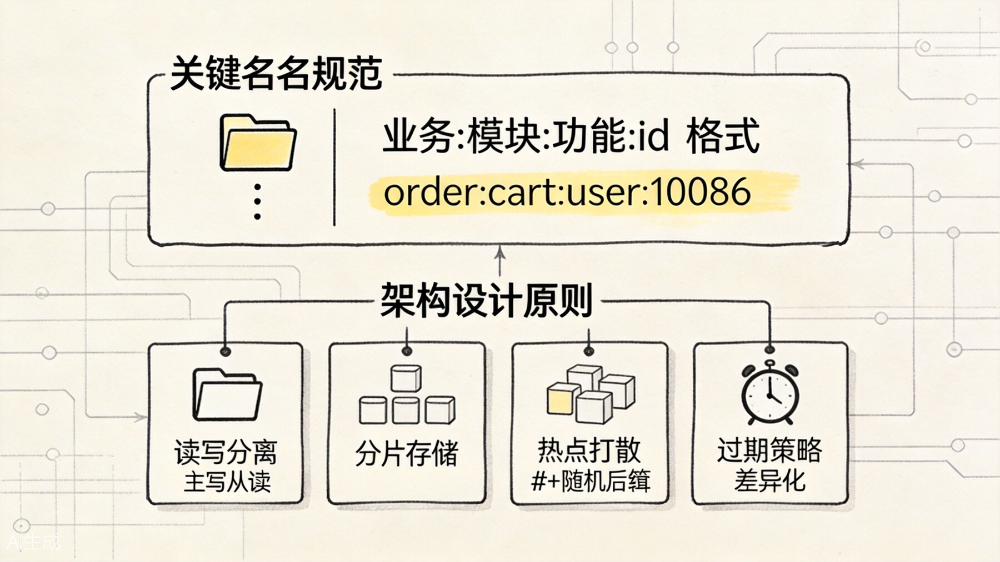
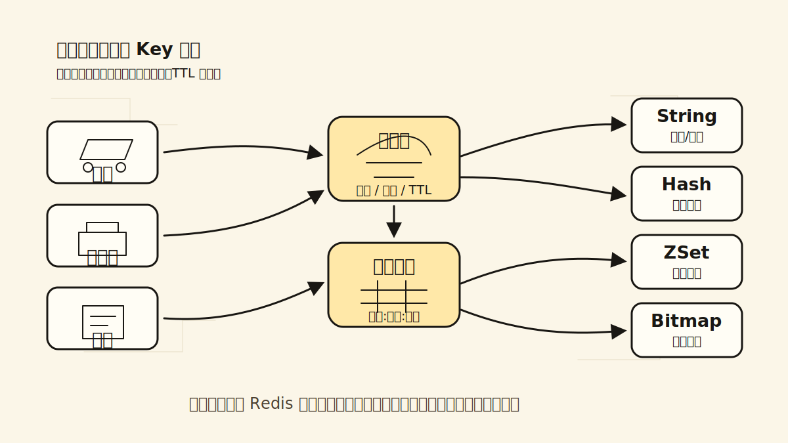
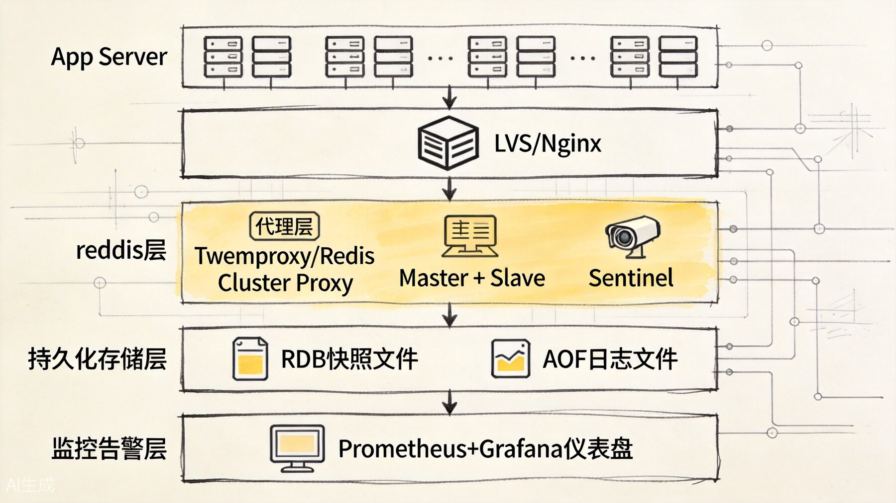
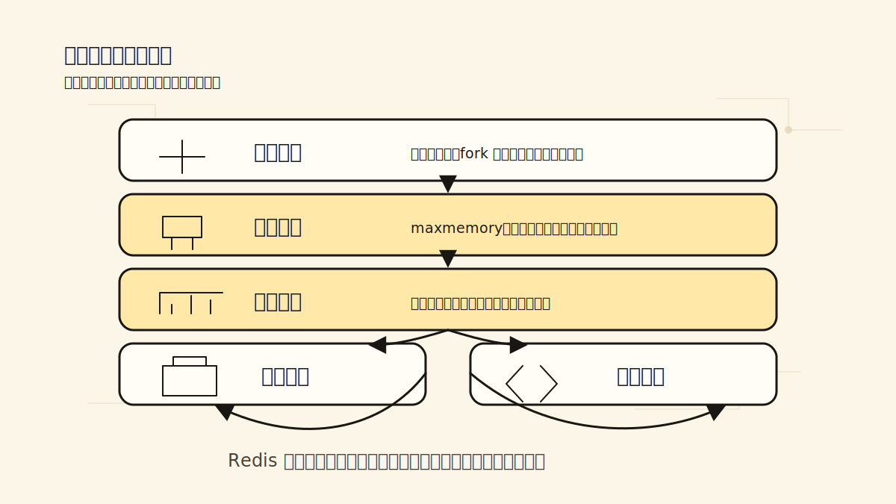

# Redis 真实业务 Key 设计与架构设计：从规范到实战

前面的文章把类型、性能、持久化、高可用和排障方法都讲清楚了。最后这一篇只做落地收束：如果把这些知识放回真实业务，key 应该怎么命名，数据该怎么拆，实例该怎么隔离，哪些坑应该在设计阶段就绕开。

## 一、Key 命名规范

好的 key 命名规范，能让 Redis 的维护成本大幅降低。一个生产环境的 Redis 实例可能有几十万甚至上百万个 key，没有规范就会一团糟。



命名规范看起来很小，但它直接决定了排查时能不能快速看懂这个实例里到底存了什么。

### 推荐格式

```
业务域:子系统:模块:标识[:子标识]
```

示例：

```redis
# 电商系统
ec:product:detail:10086      # 商品详情
ec:cart:user:42              # 用户购物车
ec:order:status:20240501-001 # 订单状态

# 用户系统
uc:user:profile:42            # 用户资料
uc:user:session:abc123        # 用户会话

# 营销系统
mc:coupon:batch:summer2024    # 批次优惠券
mc:seckill:stock:10086        # 秒杀库存
```

### 命名原则

1. **全部小写**：Redis key 是大小写敏感的，统一小写避免混乱；
2. **用冒号分隔**：`:` 是 Redis 社区约定俗成的分隔符，`redis-cli` 也支持按 `:` 前缀扫描；
3. **避免过长**：key 本身也占内存，建议控制在 100 字节以内；
4. **避免特殊字符**：`\n`、`\r`、空格等可能导致问题；
5. **包含版本号**（可选）：当数据结构变更时，通过版本号区分：

```redis
ec:product:detail:v2:10086
```

### Key 长度对内存的影响

Redis 的 key 也是用字符串存储的，过长的 key 会浪费内存。以一个 100 万 key 的实例为例：

| Key 平均长度 | 总 Key 内存占用 |
|------------|--------------|
| 20 字节 | ~20 MB |
| 50 字节 | ~50 MB |
| 100 字节 | ~100 MB |

对于海量 key 的场景，key 长度是需要关注的优化点。

## 二、不同业务场景的 Key 设计



业务 key 的设计不是先挑一个 Redis 类型，而是先看访问模式：是整体读取、字段更新、范围排序，还是海量状态开关。类型、粒度、TTL 和命名规范都应该从这个形状里推出来。

### 商品详情缓存

```redis
# String 存 JSON
ec:product:detail:10086 -> {JSON}

# 或 Hash 拆字段
ec:product:info:10086
  -> name: "iPhone 15"
  -> price: "5999"
  -> stock: "100"
  -> category: "手机"
```

选型建议：字段少且整体读取用 String；需要频繁更新单个字段用 Hash。

### 用户购物车

```redis
# Hash：field 是商品 ID，value 是数量
ec:cart:user:42
  -> product:10086: "2"
  -> product:10087: "1"
```

操作示例：

```redis
HINCRBY ec:cart:user:42 product:10086 1   # 加购
HGET ec:cart:user:42 product:10086        # 查数量
HGETALL ec:cart:user:42                   # 查看整个购物车
HDEL ec:cart:user:42 product:10086        # 删除商品
```

### 订单状态

```redis
# String，存状态枚举值
ec:order:status:20240501-001 -> "PAID"

# 或 Hash，存更多字段
ec:order:info:20240501-001
  -> status: "PAID"
  -> pay_time: "1714521600"
  -> pay_method: "ALIPAY"
```

### 秒杀库存

```redis
# String 计数器
mc:seckill:stock:10086 -> 100

# 预扣库存
DECR mc:seckill:stock:10086

# 回滚库存（取消订单时）
INCR mc:seckill:stock:10086
```

秒杀场景需要配合分布式锁或 Lua 脚本保证原子性，防止超卖。

### 用户 Session

```redis
# String，带 TTL
uc:user:session:abc123 -> {user_id: 42, login_time: ...} EX 7200
```

Session 的 TTL 通常和登录态有效期绑定，比如 2 小时。

### 最近浏览记录

```redis
# List，保留最近 N 条
uc:user:browse:42
  -> LPUSH 操作
  -> LTRIM 0 49  # 只保留 50 条
```

### 商品排行榜

```redis
# ZSet，score 是热度值
ec:product:hotrank:daily:20240501
  -> ZINCRBY 1 product:10086
  -> ZREVRANGE 0 9  # Top 10
```

### 用户签到

```redis
# Bitmap，每个位代表一天
uc:user:sign:42:202405 -> SETBIT day 1
```

## 三、架构设计原则



这张部署图更适合当总复盘来看：前面每一篇讲的点，最后都会落到实例隔离、读写分离、持久化、监控和降级这几层上。

### 1. 按业务域隔离

不同业务域的 Redis 数据应该物理隔离：

```
商品域 -> Redis Cluster A
订单域 -> Redis Cluster B
用户域 -> Redis Cluster C
营销域 -> Redis Cluster D
```

隔离的好处：

- 避免一个业务域的异常影响其他域；
- 不同域可以独立扩容；
- 权限控制更精细。

### 2. 读写分离

读多写少的场景，通过主从复制实现读写分离：

```
写 -> 主节点
读 -> 从节点（多个，负载均衡）
```

注意：从节点有复制延迟，对一致性要求高的读操作需要走主节点。

### 3. 多级缓存

```
用户请求
  -> 浏览器缓存 / CDN
    -> 应用本地缓存（Caffeine，TTL 1-5 秒）
      -> Redis 缓存（TTL 5-30 分钟）
        -> 数据库
```

多级缓存能大幅减少 Redis 和数据库的压力，但增加了数据一致性的复杂度。

### 4. 热点数据预加载

系统启动时或高峰期前，把热点数据预先加载到缓存：

```java
@PostConstruct
public void preloadCache() {
    List<Long> hotProductIds = getHotProductIds();
    for (Long id : hotProductIds) {
        Product product = productMapper.selectById(id);
        redis.setex("ec:product:detail:" + id, 3600, JSON.toJSONString(product));
    }
}
```

### 5. 缓存失效策略

| 场景 | 策略 |
|------|------|
| 商品详情 | TTL + 随机偏移，或主动更新时删除 |
| 用户 Session | TTL + 滑动续期 |
| 购物车 | 业务操作触发更新，不设 TTL 或较长 TTL |
| 秒杀库存 | 业务操作触发更新，或定时同步 |
| 排行榜 | 定时任务刷新，或实时更新 |

### 6. 降级策略

当 Redis 不可用时，业务需要有降级方案：

- **直接查数据库**：牺牲性能，保证可用性；
- **返回默认值**：如返回空列表、默认配置；
- **熔断**：快速失败，避免雪崩；
- **本地缓存兜底**：用本地缓存的数据应对（可能稍旧）。

## 四、部署规范



部署规范可以看成一组连续防线：实例规格决定容量上限，配置基线决定默认行为，监控告警负责提前发现风险，备份恢复和降级兜底负责让事故有退路。

### 实例规划

| 维度 | 建议 |
|------|------|
| 单机内存 | 不超过 32GB（fork 时间可控） |
| 单机 QPS | 不超过 10 万 |
| 连接数 | 不超过 10000 |
| Key 数量 | 不超过 1 亿（视 value 大小） |

### 配置规范

```conf
# 基础配置
bind 0.0.0.0
port 6379
tcp-backlog 511
timeout 300
tcp-keepalive 60

# 内存配置
maxmemory 24gb
maxmemory-policy allkeys-lru

# 持久化
save 900 1
save 300 10
save 60 10000
appendonly yes
appendfsync everysec
aof-use-rdb-preamble yes

# 慢查询
slowlog-log-slower-than 10000
slowlog-max-len 128

# 客户端输出缓冲区
client-output-buffer-limit normal 0 0 0
client-output-buffer-limit replica 256mb 64mb 60
client-output-buffer-limit pubsub 32mb 8mb 60

# 安全
requirepass your_strong_password
rename-command FLUSHALL ""
rename-command FLUSHDB ""
```

禁用 `FLUSHALL` 和 `FLUSHDB` 是为了防止误操作清空数据。

### 监控告警

必须配置的告警项：

| 告警项 | 阈值 | 级别 |
|--------|------|------|
| Redis 延迟 | > 10ms | P1 |
| 内存使用率 | > 85% | P1 |
| 连接数 | > 8000 | P2 |
| 主从复制延迟 | > 5 秒 | P1 |
| 慢查询增长 | 持续增加 | P2 |
| 持久化失败 | 任何失败 | P1 |

### 备份策略

- 每天凌晨生成 RDB，保留 7 天；
- RDB 文件同步到对象存储（如 S3、OSS）；
- 重要业务开启 AOF + 混合持久化。

## 五、实战经验与踩坑

### 经验 1：Key 一定要设 TTL

生产环境上，除非是经过专门设计的热 key，其他所有 key 都应该设置 TTL。没有 TTL 的 key 会一直累积，最终导致内存溢出。

我们曾经有一个统计缓存的 key 没有设 TTL，运行半年后这个 key 变成了 2GB 的大 key，导致实例频繁卡顿。排查了两天才发现。

### 经验 2：批量操作要控制数量

`MGET`、`HMGET`、`Pipeline` 等批量操作能提升性能，但单次请求的数据量过大时会：

- 阻塞 Redis 主线程；
- 占用大量网络带宽；
- 导致客户端超时。

建议单次批量操作不超过 1000 个 key，总数据量不超过 10MB。

### 经验 3：谨慎使用 KEYS 命令

`KEYS *` 在生产环境上是灾难性的命令，它会遍历整个 keyspace，阻塞主线程。我们曾有一次运维同学在生产环境执行了 `KEYS order:*`，导致服务中断 30 秒。

替代方案：

```redis
SCAN 0 MATCH order:* COUNT 100
```

### 经验 4：主从切换后客户端要重连

当哨兵或 Cluster 发生故障转移时，主节点地址会变化。客户端必须能感知到这种变化并重连。

使用支持哨兵/Cluster 的客户端库（如 Jedis、Lettuce），并在配置中正确设置连接池参数。

### 经验 5：大促前做压测和预热

大促前：

1. 压测 Redis 的 QPS 上限；
2. 预热热点数据到缓存；
3. 检查慢查询和大 key；
4. 确认持久化配置不会在高写入时触发问题。

### 经验 6：不要只依赖 Redis

Redis 是缓存，不是数据库。关键业务数据：

- 订单、支付记录必须落库；
- 库存数据要有数据库兜底；
- 用户行为数据要有消息队列备份。

Redis 丢了可以重建，数据库丢了就是事故。

## 六、总结：一张检查清单

新项目接入 Redis 时，按这个清单过一遍：

**Key 设计：**
- [ ] 命名是否符合 `业务:子系统:模块:标识` 规范
- [ ] 是否全部小写
- [ ] 长度是否控制在合理范围
- [ ] 是否都设置了 TTL
- [ ] 大 key 是否做了拆分

**架构设计：**
- [ ] 是否按业务域隔离
- [ ] 是否需要读写分离
- [ ] 是否需要多级缓存
- [ ] 是否有降级方案
- [ ] 高可用架构是否满足业务要求

**部署运维：**
- [ ] 实例规格是否合理
- [ ] 持久化是否开启
- [ ] 监控告警是否配置
- [ ] 备份策略是否落实
- [ ] 安全配置是否到位
