# 第 11 章：Redis 核心对象与底层数据结构

> **版本基线**：本章以 Redis Open Source 8.8.0 源码为当前参考，同时保留 Redis 6.2、7.0、7.2、7.4 与 8.x 的关键差异。`redisObject`、编码名称和阈值都属于内部实现细节；面试要理解稳定的设计思想，生产代码不能依赖某个对象必然采用某种编码。

## 1. 本章定位

前面的 String、Hash、List、Set、Sorted Set 和 Streams 是 Redis 暴露给应用的**逻辑数据类型**；本章解释这些类型在内存中究竟如何表示，以及 Redis 为什么要在紧凑表示和通用表示之间切换。

掌握本章后，你应能把许多线上现象解释清楚：为什么只插入一个大字段，Hash 的内存会突然上升；为什么渐进式 rehash 仍可能产生尾延迟；为什么 Sorted Set 同时维护字典和跳表；为什么 List 既不是纯链表，也不是一整块连续数组；为什么 `OBJECT ENCODING` 只能用于诊断，不能成为业务逻辑的一部分。

本章也是后续“高性能原理”“内存、过期与淘汰”“持久化与 COW”“故障排查”的基础。数据结构决定单条命令要做多少 CPU 运算、移动多少内存、触碰多少页，也就决定了吞吐量、P99 延迟和内存峰值。

## 2. 学习目标

完成本章后，应能验证自己具备以下能力：

1. 区分逻辑类型、对象类型、内部编码和真正的底层数据结构。
2. 解释 `redisObject`/`robj` 的稳定职责，并说明 Redis 8.x `kvobj` 相对经典布局的变化。
3. 说明 SDS 为什么二进制安全、如何 O(1) 取长度，以及扩容策略的收益与代价。
4. 完整描述 dict 的双哈希表、渐进式 rehash，以及 rehash 期间查询、插入、删除的路径。
5. 比较 listpack、quicklist、intset、skiplist 和 rax 的内存布局与复杂度。
6. 根据数据规模、元素长度和访问模式，判断紧凑编码何时可能转换为通用编码。
7. 使用 `TYPE`、`OBJECT ENCODING`、`MEMORY USAGE` 和 go-redis/v9 做安全的只读诊断。
8. 从底层结构推导 BigKey、热 Key、编码转换、rehash 和大范围返回造成的线上风险。

### 2.1 本章边界与跳转

本章是底层对象和数据结构的主章节。String、Hash、List、Set、Sorted Set、Bitmap、Streams 等章节会从业务使用角度重复提到底层编码，但系统性解释以本章为准；具体命令和场景分别见[第 4 章](/blog/tech/Redis/04.String 的使用场景与底层实现/)、[第 5 章](/blog/tech/Redis/05.Hash 与 List/)、[第 6 章](/blog/tech/Redis/06.Set、Sorted Set 与 GEO/)、[第 7 章](/blog/tech/Redis/07.Bitmap、Bitfield 与 HyperLogLog/)和[第 8 章](/blog/tech/Redis/08.PubSub、List 队列与 Streams/)；由结构引发的性能诊断见[第 12 章](/blog/tech/Redis/12.Redis 高性能原理/)与[第 20 章](/blog/tech/Redis/20.性能优化、可观测性、故障诊断与综合面试/)。

## 3. 核心概念

### 3.1 四个容易混淆的层次

以一个排行榜为例：

- **逻辑类型**：Sorted Set，决定可以调用 `ZADD`、`ZRANGE`、`ZRANK`。
- **对象类型**：对象头中的 `type=OBJ_ZSET`，用于命令类型检查与释放分派。
- **内部编码**：小集合可能是 `listpack`，大集合通常显示为 `skiplist`。
- **底层结构**：所谓 `skiplist` 编码实际是“字典 + 跳表”的组合；listpack 则是一块连续字节数组。

因此，`TYPE key` 返回业务可见的逻辑类型，`OBJECT ENCODING key` 返回当前内部表示。相同的逻辑类型可以因为元素数量、元素长度、Redis 版本和配置不同而采用不同编码。

### 3.2 为什么同一种逻辑类型需要多种编码

一种结构通常无法同时满足“极省内存、随机访问快、增删快、范围遍历快、实现简单”全部目标。

小集合使用 listpack 或 intset 时，虽然查找可能要线性扫描、插入可能要移动内存，但元素数量被阈值限制，常数较小；连续内存还具有良好的 CPU Cache 局部性，并省掉大量指针和独立内存分配。集合变大后，线性扫描和 `memmove` 成本开始压倒节省的内存，此时转换为哈希表、quicklist 或跳表更合理。

这是一种**自适应表示**：

1. 小数据优先降低元数据和分配器开销。
2. 大数据优先保证可扩展的时间复杂度。
3. 转换本身需要遍历和重新分配，可能在某一次写命令上形成延迟尖峰。
4. 聚合类型从紧凑编码转为通用编码后，通常不会因为后来删小了而自动转回；否则频繁跨阈值会产生抖动和反复重建。String 的 `int`、`embstr`、`raw` 转换规则更灵活，不能套用这一条绝对结论。

### 3.3 逻辑类型与常见编码

| 逻辑类型 | 小数据常见表示 | 大数据/通用表示 | 关键底层结构 |
|---|---|---|---|
| String | `int`、`embstr` | `raw` | 整数或 SDS |
| Hash | Redis 6.2 及以前常见 `ziplist`；Redis 7.0+ `listpack` | `hashtable` | listpack 或 dict |
| List | 通常为 `quicklist`，节点内 Redis 7.0+ 使用 listpack | `quicklist` | 双向链表 + listpack，超大单元素可用 plain node |
| Set | `intset`；Redis 7.2+ 小型非整数集合可用 `listpack` | `hashtable` | 有序整数数组、listpack 或 dict |
| Sorted Set | Redis 6.2 及以前 `ziplist`；Redis 7.0+ `listpack` | `skiplist` | dict + skiplist |
| Stream | 无简单“小/大编码切换” | `stream` | rax + listpack 宏节点 |

`OBJECT ENCODING` 的输出是诊断信息。升级、RDB 加载、AOF 重放、配置变化或内部优化后，同一份逻辑数据可以得到不同编码，而命令语义仍应保持一致。

## 4. 命令与 Go 使用方法

### 4.1 redis-cli：观察类型、编码和内存

以下命令只适合在测试环境直接复制；生产环境不要随意创建或删除示例 Key。

```redis
SET ds:int 123
SET ds:short hello
SET ds:long "012345678901234567890123456789012345678901234567890123456789"
HSET ds:hash name redis version 8.8
SADD ds:set 1 2 3
ZADD ds:zset 10 alice 20 bob
RPUSH ds:list a b c
XADD ds:stream * event created id 1001

TYPE ds:zset
OBJECT ENCODING ds:int
OBJECT ENCODING ds:short
OBJECT ENCODING ds:long
OBJECT ENCODING ds:hash
OBJECT ENCODING ds:set
OBJECT ENCODING ds:zset
OBJECT ENCODING ds:list
OBJECT ENCODING ds:stream

OBJECT REFCOUNT ds:short
MEMORY USAGE ds:hash SAMPLES 5

CONFIG GET hash-max-listpack-entries
CONFIG GET hash-max-listpack-value
CONFIG GET set-max-intset-entries
CONFIG GET set-max-listpack-entries
CONFIG GET zset-max-listpack-entries
CONFIG GET list-max-listpack-size
CONFIG GET stream-node-max-bytes
```

注意：

- `SET ds:int 123` 常会得到 `int`，但具体结果仍以当前版本与执行路径为准。
- Redis 8.8 源码中的 `embstr` 上限仍是 44 字节；短字符串通常将对象头和 SDS 放在同一次分配中。
- `MEMORY USAGE` 统计 Key、Value 及管理开销；聚合类型默认抽样 5 个内部元素，`SAMPLES 0` 才是全量采样，代价也更高。
- `OBJECT IDLETIME` 与 `OBJECT FREQ` 受淘汰策略影响，不应把两者当作任何配置下都可比较的统一热度指标。

### 4.2 Go：最小化诊断示例

```go
package main

import (
    "context"
    "errors"
    "fmt"
    "log"
    "strings"
    "time"

    "github.com/redis/go-redis/v9"
)

type KeyInfo struct {
    Key      string
    Type     string
    Encoding string
    Bytes    int64
}

func inspectKey(ctx context.Context, rdb *redis.Client, key string) (KeyInfo, error) {
    typ, err := rdb.Type(ctx, key).Result()
    if err != nil {
        return KeyInfo{}, fmt.Errorf("TYPE %q: %w", key, err)
    }
    if typ == "none" {
        return KeyInfo{}, redis.Nil
    }

    encoding, err := rdb.Do(ctx, "OBJECT", "ENCODING", key).Text()
    if err != nil {
        if errors.Is(err, redis.Nil) {
            return KeyInfo{}, redis.Nil
        }
        return KeyInfo{}, fmt.Errorf("OBJECT ENCODING %q: %w", key, err)
    }

    // samples=5 与服务器命令的默认抽样思路一致；聚合对象会是估算值。
    bytes, err := rdb.MemoryUsage(ctx, key, 5).Result()
    if err != nil {
        if errors.Is(err, redis.Nil) {
            return KeyInfo{}, redis.Nil
        }
        return KeyInfo{}, fmt.Errorf("MEMORY USAGE %q: %w", key, err)
    }

    return KeyInfo{Key: key, Type: typ, Encoding: encoding, Bytes: bytes}, nil
}

func main() {
    rdb := redis.NewClient(&redis.Options{
        Addr:         "127.0.0.1:6379",
        DialTimeout:  2 * time.Second,
        ReadTimeout:  1 * time.Second,
        WriteTimeout: 1 * time.Second,
        PoolTimeout:  2 * time.Second,
    })
    defer func() {
        if err := rdb.Close(); err != nil {
            log.Printf("close redis client: %v", err)
        }
    }()

    ctx, cancel := context.WithTimeout(context.Background(), 5*time.Second)
    defer cancel()

    if err := rdb.Ping(ctx).Err(); err != nil {
        log.Fatalf("ping redis: %v", err)
    }

    // 仅创建少量测试数据。生产代码应使用独立测试前缀并设置生命周期。
    writes := []error{
        rdb.Set(ctx, "ds:int", "123", time.Minute).Err(),
        rdb.Set(ctx, "ds:short", "hello", time.Minute).Err(),
        rdb.Set(ctx, "ds:long", strings.Repeat("x", 80), time.Minute).Err(),
        rdb.HSet(ctx, "ds:hash", "name", "redis", "version", "8.8").Err(),
        rdb.Expire(ctx, "ds:hash", time.Minute).Err(),
        rdb.SAdd(ctx, "ds:set", 1, 2, 3).Err(),
        rdb.Expire(ctx, "ds:set", time.Minute).Err(),
        rdb.ZAdd(ctx, "ds:zset",
            redis.Z{Score: 10, Member: "alice"},
            redis.Z{Score: 20, Member: "bob"},
        ).Err(),
        rdb.Expire(ctx, "ds:zset", time.Minute).Err(),
    }
    for i, err := range writes {
        if err != nil {
            log.Fatalf("write #%d: %v", i, err)
        }
    }

    for _, key := range []string{"ds:int", "ds:short", "ds:long", "ds:hash", "ds:set", "ds:zset"} {
        info, err := inspectKey(ctx, rdb, key)
        switch {
        case errors.Is(err, redis.Nil):
            fmt.Printf("%s disappeared during inspection\n", key)
        case err != nil:
            log.Printf("inspect %s: %v", key, err)
        default:
            fmt.Printf("%-10s type=%-6s encoding=%-12s bytes=%d\n",
                info.Key, info.Type, info.Encoding, info.Bytes)
        }
    }
}
```

关键工程说明：

- `redis.Client` 设计为可被多个 goroutine 复用，连接池由客户端管理；不要为每个请求创建一个 Client。
- `context.Context` 可并发传递，但共享同一个可取消 Context 意味着一次取消会同时影响所有使用者。批量巡检应为整批设置总截止时间，并限制并发度。
- `TYPE`、`OBJECT ENCODING`、`MEMORY USAGE` 是三条独立命令，**不是原子快照**。并发写入、过期或删除可能导致三次观察不一致，示例因此逐步处理 `redis.Nil`。
- 这些命令适合诊断，不适合每个线上请求都调用；大量 `MEMORY USAGE SAMPLES 0` 会增加 Redis 主执行路径的 CPU 消耗。
- 业务代码不得根据 `encoding == "listpack"` 决定正确性，因为编码会随版本、配置和数据变化。

## 5. 典型业务场景

| 场景 | 适用结构与原因 | 不适用场景 | 数据量要求 | 一致性要求 | 主要性能风险 | 可替代方案 |
|---|---|---|---|---|---|---|
| 计数器、短 Token | String；整数可直接编码，短串可紧凑分配 | 需要多字段独立更新或复杂查询 | 单值应较小 | 单 Key 原子更新通常足够 | 大 Value 网络传输、扩容复制 | Hash、数据库计数表 |
| 小对象属性 | Hash；小对象可用 listpack，字段访问语义清晰 | 字段极多、字段很大、复杂条件检索 | 关注字段数和最大字段长度 | 单条 HSET/HINCRBY 原子 | 跨阈值整体转 HT；大范围 HGETALL | 多个 String、JSON、关系数据库 |
| 双端队列 | List/quicklist；端点操作局部化 | 任意位置高频增删、严格消息可靠性 | 可很大，但单元素和单次返回要受控 | 单条 push/pop 原子 | LREM/LINSERT/LRANGE 大范围扫描 | Streams、专业消息队列 |
| 小型整数去重 | Set/intset；连续整数数组极省内存 | 超大集合、频繁集合运算 | 小于配置阈值时收益明显 | 单条 SADD/SREM 原子 | 加入字符串或越阈值触发转换 | 位图、数据库唯一索引 |
| 会员标签、权限集合 | Set/listpack 或 HT | 需要按权重排序 | 小集合可紧凑，大集合用 HT | 通常接受最终一致缓存 | SINTER/SUNION 对大集合为线性开销 | 倒排索引、关系表 |
| 排行榜、延时索引 | Sorted Set；dict 快速定位，skiplist 维护顺序 | 复杂多条件排序、海量离线分析 | 控制成员数及一次返回量 | 单 Key 更新原子，跨系统仍需补偿 | 转换为 skiplist 后内存跃升；大范围返回 | 数据库索引、搜索引擎 |
| 事件流与消费组 | Stream；rax 有序索引，listpack 批量存放记录 | 超长保留、跨地域强一致、复杂路由 | 必须配置裁剪和消费治理 | 常见为至少一次，需要幂等 | PEL 膨胀、tombstone、超大 XRANGE | Kafka、Pulsar、云消息队列 |

## 6. 底层实现

### 6.1 `redisObject`：类型系统与实现分派层

经典 Redis 6/7 以及 Redis 8.0 的教材式布局可以概括为：

```c
struct redisObject {
    unsigned type:4;
    unsigned encoding:4;
    unsigned lru:24;
    int refcount;
    void *ptr;
};
```

它的稳定职责是：

- `type`：逻辑对象类型，如 String、List、Set、ZSet、Hash、Stream。
- `encoding`：该类型当前使用哪一种内部表示。
- `ptr`：指向 SDS、dict、quicklist、zset、stream 等负载；整数编码时也可把整数值编码进指针宽度字段。
- `refcount`：对象生命周期管理；共享小整数等对象使用特殊引用计数值。
- `lru`：保存近似 LRU 时钟，或在 LFU 策略下复用为时间与频率信息。

**Redis 8.x 版本差异必须单独说明。** Redis 8.2 起源码引入 `kvobj` 思路，把 Key 与 Value 对象更紧密地放在同一分配中；Redis 8.6/8.8 又将可选元数据抽象为 `metabits`。Redis 8.8 的 `object.h` 中仍保留 `type`、`encoding`、`refcount`、`lru`、`ptr` 这些核心概念，但加入 `iskvobj` 和元数据位，Key 可内嵌在对象后方，小字符串 Value 也可能与 Key 一起内嵌。这样做可以减少独立分配、指针追踪和 Cache Miss，但源码字段位宽已经不再等同于旧版面试资料。

正确的面试表述是：**对象层把稳定的命令语义与可替换的内存表示隔离开；具体 bit-field 布局属于版本实现细节。**

### 6.2 SDS：Redis 的动态字符串

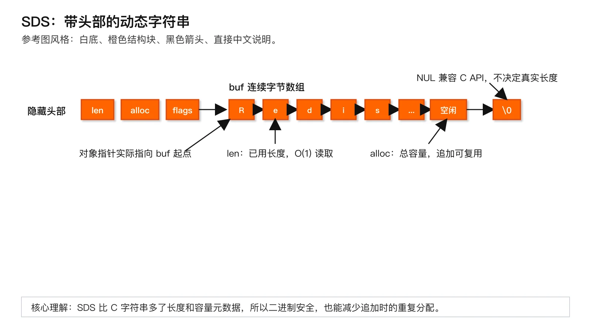

图：SDS 把 `len`、`alloc`、`flags` 放在 `buf` 前方，使用 `len` 做 O(1) 长度读取，并用预留容量降低追加时的分配次数。

SDS（Simple Dynamic String）在 C 层仍表现为 `char *`，但指针指向数据区，前面隐藏着头部。不同长度使用 `sdshdr5/8/16/32/64`，以避免短字符串也承担大尺寸字段。

典型头部包含：

- `len`：已使用字节数。
- `alloc`：已分配容量。
- `flags`：头部类型。
- `buf[]`：实际字节数组，末尾额外保留 `\0` 以兼容部分 C API。

由此得到几项关键性质：

1. **二进制安全**：长度来自 `len`，内容中可以包含 `\0`，不像 C 字符串依赖终止符判断长度。
2. **O(1) 取长度**：无需从头扫描到 `\0`。
3. **降低追加次数**：当前源码扩容时，小于 1 MiB 的目标容量通常按倍增预留，更大时按约 1 MiB 递增；这是实现策略，不是协议保证。
4. **兼容性与安全性**：数据末尾仍写 `\0`，但 Redis 自己不能用 `strlen` 处理任意 SDS。

复杂度：读取长度和按下标访问为 O(1)；追加在容量足够时接近 O(M)，M 为新增字节数，摊销扩容可视为高效；发生重新分配时最坏需复制原串，为 O(N+M)。预留空间换来更少的分配，但会形成 `alloc-len` 的空闲容量。

### 6.3 dict：哈希表与渐进式 rehash

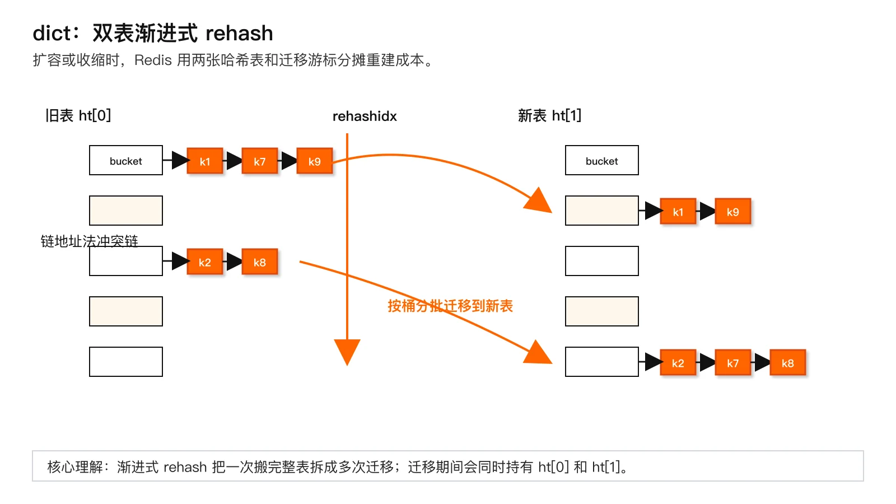

图：dict 通过 `ht[0]`、`ht[1]` 与 `rehashidx` 分摊扩容迁移，避免一次性搬完整张表造成长时间停顿。

Redis dict 采用拉链法处理冲突。核心对象同时保留两张表：旧表 `ht[0]`、新表 `ht[1]`，以及 `rehashidx`。未 rehash 时只使用旧表；扩容或收缩时创建新表，并逐桶迁移。

#### 渐进式 rehash 流程

1. 为 `ht[1]` 分配新的桶数组，`rehashidx` 从 0 开始。
2. 每次常规字典读写可顺带迁移一个或少量旧桶；服务器也可在定时任务中主动推进。
3. 一个旧桶中的整条冲突链会被逐项重新计算新桶位置并移动。
4. 旧表迁完后，释放旧桶数组，让新表成为 `ht[0]`，清空 `ht[1]`。

它避免一次性搬迁所有元素造成长时间停顿，但不代表每一步绝对 O(1)：若当前桶冲突链很长，迁移这个桶仍可能较慢；同时两套桶数组在迁移期共存，形成内存峰值。

#### rehash 期间如何操作

- **查询**：先按规则查旧表，再查新表。已经迁移的旧桶可以跳过；目标元素在任意时刻只属于其中一张表。
- **插入**：新元素直接进入新表，避免刚插入旧表又被迁移。
- **删除**：需要按当前迁移位置检查可能存在元素的表，并在找到后摘除。
- **更新**：先查找现有 Entry；若不存在，按插入路径进入新表。
- **迭代**：安全迭代器会暂停或约束 rehash，普通迭代器必须遵守更严格的不修改约定；`SCAN` 的重复返回问题也与表尺寸变化和无状态游标设计有关。

平均查找、插入、删除是 O(1)，前提是哈希分布良好、负载因子受控；理论最坏是 O(N)。Redis 8.8 对 Entry 布局、无 Value 字典等做了更多内存优化，但“双表 + 渐进迁移”的核心模型仍成立。

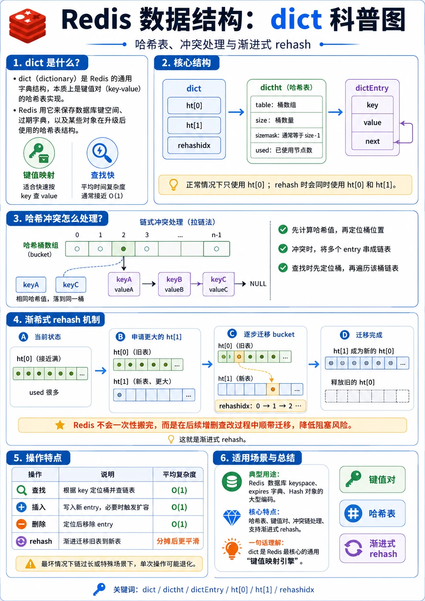

图：dict 的关键是“桶数组 + 冲突链 + 双哈希表迁移”：平时用 `ht[0]` 做键值映射，扩容或收缩时用 `ht[1]` 分批承接旧桶，借助 `rehashidx` 把一次性搬迁拆散到后续操作中。

### 6.4 listpack：小集合的连续紧凑表示

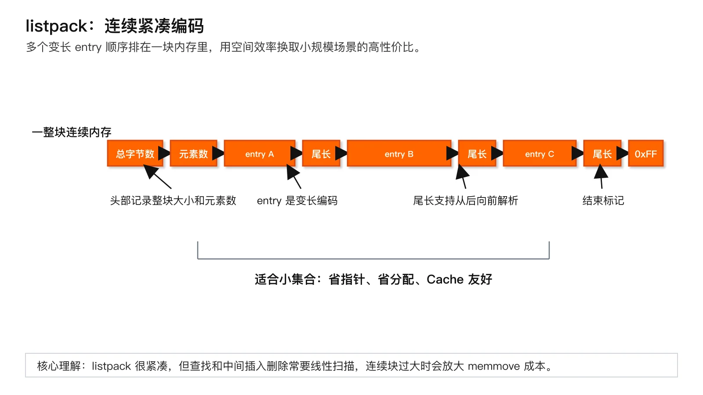

图：listpack 将多个变长 entry 放进同一块连续内存，节省指针和分配开销，但中间修改可能触发扫描与移动。

listpack 是一块线性内存：

```text
[6 字节头部][entry][entry]...[0xFF 结束标记]
```

头部包含总字节数和 16 位元素计数。每个 Entry 使用变长编码保存字符串或整数，尾部保存**本 Entry 自身总长度**，因此既可正向解析，也可从尾部反向跳转。

相较 ziplist，listpack 不再在当前 Entry 中记录“前一个 Entry 的长度”。因此中间元素变长时，不会因为前驱长度字段从 1 字节膨胀为 5 字节而沿后续元素产生级联更新，代码也更容易审计。

优势是元数据少、内存连续、Cache 局部性好；代价是：

- 按位置查找通常 O(N)。
- 中间插入、删除或长度变化可能需要重新分配并 `memmove`，为 O(N)。
- 整块过大时，一次移动会直接反映为主执行线程延迟。

所以 listpack 必须配合“元素数、元素长度或节点字节数阈值”使用，而不是无限增长。

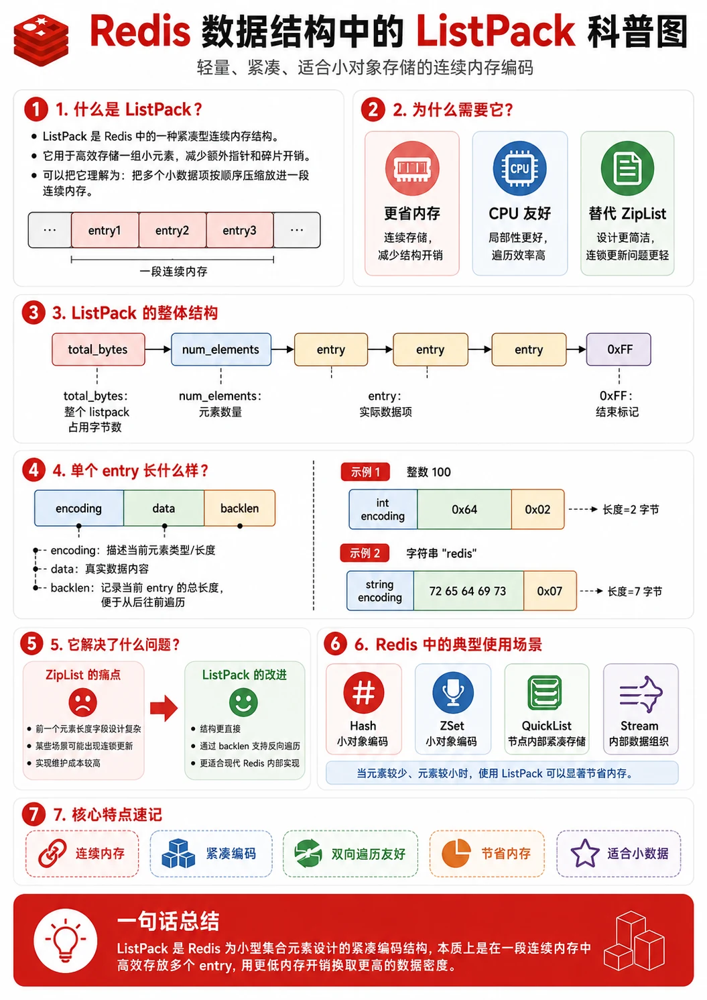

图：listpack 适合小对象的原因，可以概括为连续内存、紧凑编码、双向遍历友好和节省元数据；边界则是元素变多或变大后，扫描与内存移动会放大尾延迟。

### 6.5 quicklist：链表与 listpack 的折中

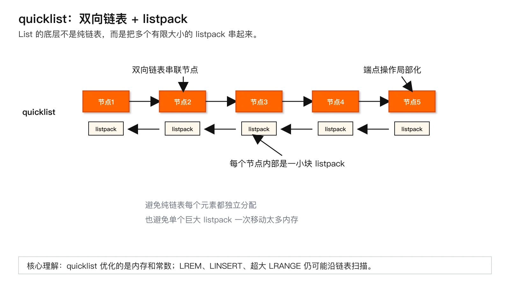

图：quicklist 用双向链表串起多个有限大小的 listpack，把端点操作和局部连续内存优势结合起来。

quicklist 是双向链表，每个普通节点保存一个 listpack；超大的单个元素可以使用 plain node，内部节点还可选 LZF 压缩。它同时避免两种极端：

- 纯链表：每个元素都需要节点、指针和独立分配，空间与 Cache 局部性差。
- 单个巨大 listpack：端点操作尚可，但中间修改、扩容和移动可能复制整块内存。

quicklist 把连续内存移动限制在单个节点内，同时保留头尾 O(1) 定位。`list-max-listpack-size` 控制节点目标大小或元素数；默认 `-2` 表示约 8 KiB。`list-compress-depth` 控制两端保留多少层不压缩，默认 0 表示不压缩。

复杂度：头尾 push/pop 通常为摊销 O(1)；按索引访问和中间操作需要先遍历节点，再扫描节点内 listpack，整体仍可能 O(N)。quicklist 优化的是常数、内存与局部移动范围，不会把 `LREM`、`LINSERT` 或超大 `LRANGE` 变成常数时间。

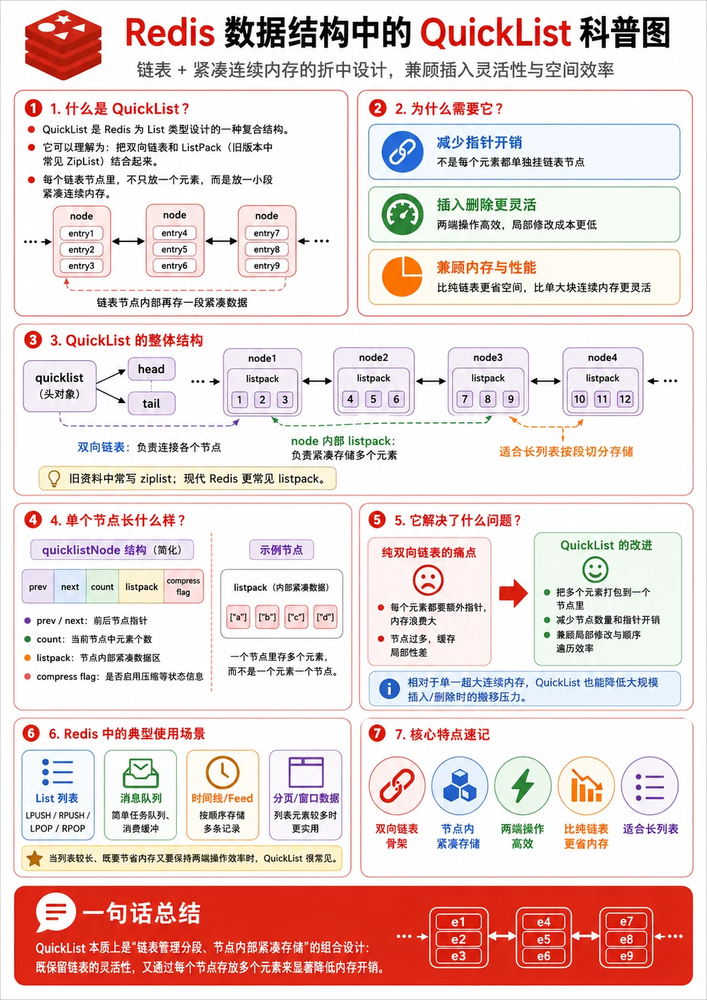

图：quicklist 的核心是“链表管理分段，节点内部紧凑存储”：既降低纯链表的指针开销，又避免单个超大连续内存块在插入、删除和移动时造成过大的主线程压力。

### 6.6 intset：小型纯整数 Set

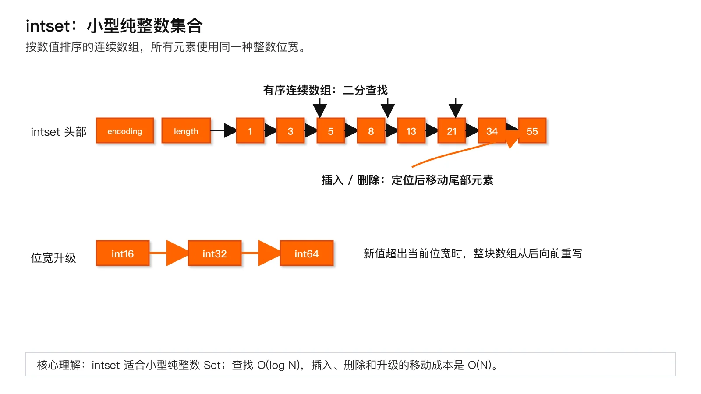

图：intset 是有序整数数组，查找可二分定位；插入、删除或位宽升级时仍需要移动或重写连续数组。

intset 是按数值升序排列的连续数组，所有元素统一采用 16、32 或 64 位宽度。查找用二分法，添加和删除需要移动尾部数据。

- 查找：O(log N)。
- 插入、删除：定位 O(log N)，移动 O(N)，总计 O(N)。
- 升级：新值超出当前位宽时，整个数组升级为更宽编码并从后向前重写，为 O(N)。

编码只向更宽方向升级，避免反复缩放。Set 加入非整数或超过配置阈值后，会转为 listpack（Redis 7.2+ 的小型非整数集合）或哈希表；Redis 6.2/7.0 没有小型非整数 Set 的 listpack 路径。

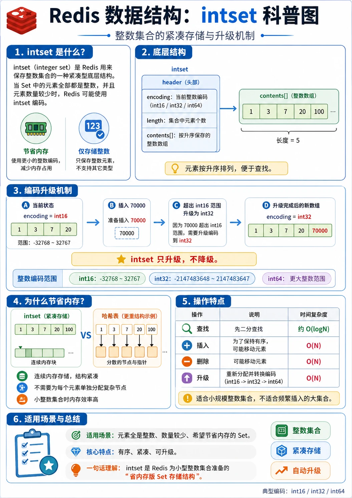

图：intset 的核心是“有序整数数组 + 按需位宽升级”：小型纯整数集合用连续内存节省开销，但插入、删除和编码升级仍可能移动或重写数组，因此适合元素较少、类型稳定的 Set。

### 6.7 skiplist：Sorted Set 的有序索引

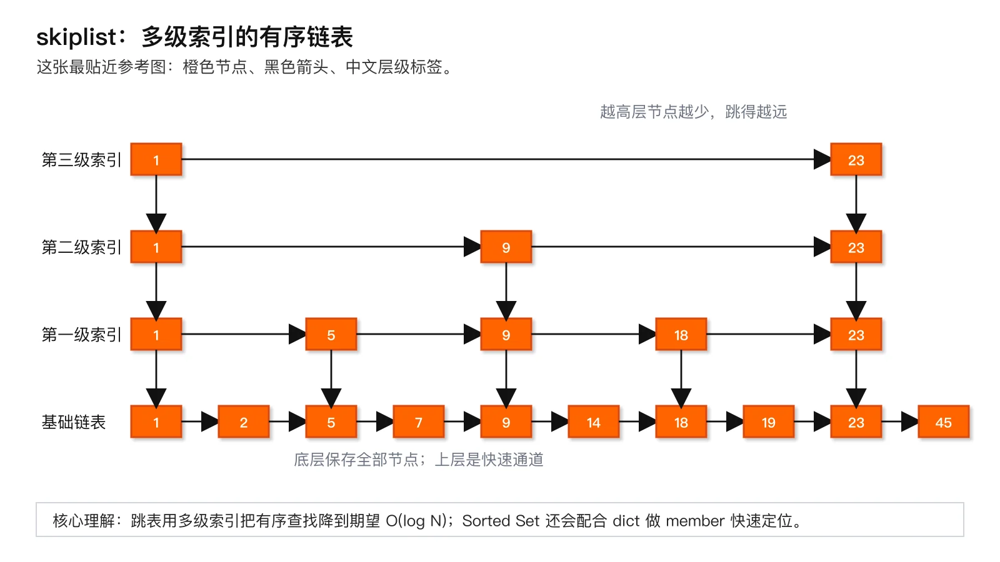

图：大 Sorted Set 同时维护 dict 与 skiplist，前者负责按 member 定位，后者负责按 score 有序遍历和排名。

跳表由多层前向指针构成，新节点高度随机生成。底层第 0 层包含全部节点，上层只包含部分节点，使查找从高层快速跨越区间。Redis 节点还维护：

- `backward`：便于反向遍历。
- `span`：表示跨越的底层节点数，用于排名计算。
- `score` 与 member：先按 score 排序，score 相同时按 member 字典序排序。

大 Sorted Set 不是只用跳表，而是同时维护：

- **dict**：按 member 快速判断存在、定位成员及分值，平均 O(1)。
- **skiplist**：按 score 有序，支持范围、排名和双向遍历，期望 O(log N)。

一次 `ZADD` 必须让两套索引保持一致，因此空间成本更高，写入也要更新两处。范围查询复杂度通常为 O(log N + M)，M 是实际返回元素数；即使定位很快，返回一百万个元素仍然是重命令。Redis 8.8 对 zset 节点与 member SDS 的分配、dict Entry 表示做了内存优化，但“字典负责按成员定位、跳表负责顺序”这一设计目的不变。

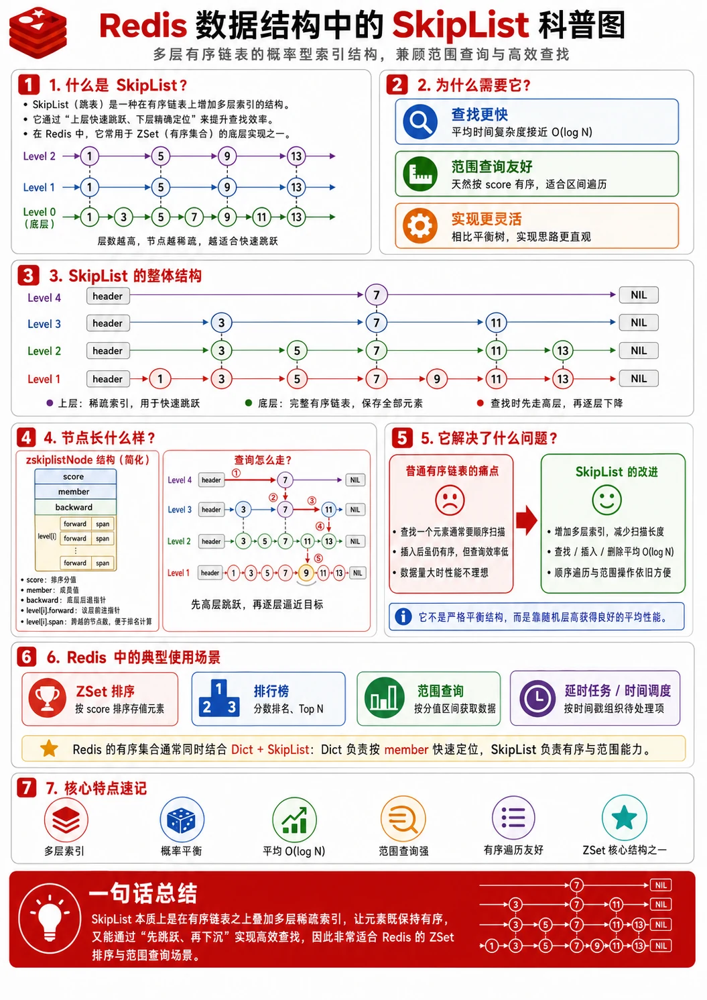

图：skiplist 的关键是“底层完整有序链表 + 上层稀疏索引”：查询先在高层快速跳跃，再逐层下降逼近目标；在 Redis ZSet 中，dict 负责按 member 快速定位，skiplist 负责 score 有序遍历、排名和范围查询。

### 6.8 rax 与 Streams

rax 是 Redis 的路径压缩基数树（radix tree）。普通节点按下一个字节分支；只有一个子节点的连续路径可压缩成一段字符串，从而减少节点和指针。它的查找成本主要取决于 Key 的字节长度和路径节点，而不是简单写成哈希表式 O(1) 或平衡树式 O(log N)。

Stream ID 是 128 位，由毫秒时间和序号组成。主 Stream 使用 rax 维护有序宏节点索引，每个宏节点的 Value 是 listpack，里面批量保存多条相邻消息。这样既能按 ID 做有序范围遍历，又避免每条消息都成为独立树节点。消费组、消费者和 PEL 的若干索引也使用 rax。

Redis 8.8 默认 `stream-node-max-bytes=4096`、`stream-node-max-entries=100`，任一约束可推动新宏节点创建。节点过大可减少树节点，却增加 listpack 扫描和移动；节点过小则增加 rax、分配器和指针开销。`XDEL` 等操作还可能在宏节点中留下 tombstone，空间回收不一定与逻辑删除同步完成。

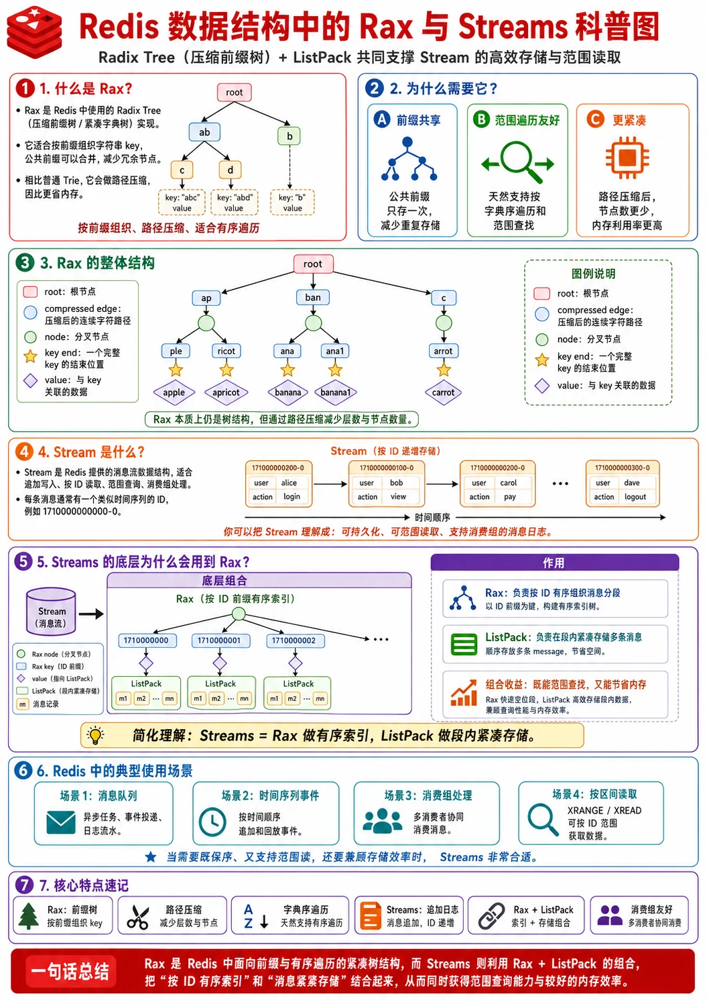

图：Streams 的底层可以理解为“rax 做 ID 有序索引，listpack 做段内紧凑存储”：rax 利用前缀共享和路径压缩组织消息分段，listpack 在宏节点内批量存放多条消息，从而同时兼顾范围读取与内存效率。

### 6.9 复杂度与空间成本总表

| 结构 | 典型操作复杂度 | 空间特征 | 最容易出现的尾延迟 |
|---|---|---|---|
| SDS | 长度 O(1)；追加摊销高效，重分配最坏 O(N) | 头部 + 数据 + 预留空间 | 大字符串扩容、复制、网络返回 |
| dict | 平均查增删 O(1)，最坏 O(N) | 桶数组 + Entry + 指针；rehash 期双桶数组 | 长冲突链、扩容、rehash 与 COW 叠加 |
| listpack | 查找/中间修改 O(N) | 单块连续内存，元数据极少 | 大块 `memmove`、realloc、全量扫描 |
| quicklist | 端点摊销 O(1)；索引/中间操作 O(N) | 链表节点 + 多个有界 listpack | 大范围遍历、节点解压、复杂中间修改 |
| intset | 查找 O(log N)；增删/升级 O(N) | 单块定宽整数数组 | 位宽升级、尾部移动、整体转码 |
| dict + skiplist | member 查找平均 O(1)；有序操作期望 O(log N) | 两套索引 + 随机层指针 | 编码转换、大范围返回、批量删除 |
| rax + listpack | 路径查找与 Key 字节长度相关；范围再加输出量 | 压缩树节点 + 宏节点 listpack | 超大范围、裁剪、tombstone 与 PEL 膨胀 |

### 6.10 版本与默认阈值

| 项目 | Redis 6.2 | Redis 7.x | Redis 8.8 默认/现状 |
|---|---|---|---|
| Hash 紧凑编码 | ziplist | 7.0+ listpack | listpack；`hash-max-listpack-entries 512`、`value 64` |
| List 节点 | quicklist + ziplist | 7.0+ quicklist + listpack | 默认节点约 8 KiB，压缩深度 0 |
| Set 紧凑编码 | 纯整数 intset | 7.2+ 增加小型非整数 listpack | intset 上限 512；listpack 128 项、值 64 字节 |
| ZSet 紧凑编码 | ziplist | 7.0+ listpack | listpack 128 项、member 64 字节 |
| Hash Field TTL | 不支持 | 7.4+ 支持 | 支持；8.x 源码包含携带扩展元数据的编码/结构 |
| Stream 宏节点 | rax + listpack | 同左 | 默认 4096 字节或 100 条 |
| 对象头 | 经典 `robj` | 经典 `robj` | 8.2+ 引入 kvobj；8.6/8.8 元数据布局继续演进 |

这些值是官方示例配置的默认值，不是协议承诺。托管服务、发行版、自定义配置及未来版本都可能不同。判断线上行为时应同时检查 `INFO server`、`CONFIG GET`、实际数据分布和 `OBJECT ENCODING`。

## 7. 高性能、高并发、高可用分析

### 7.1 高性能

**CPU。** 紧凑结构把多个小元素放在连续内存中，减少指针解引用、分支和 Cache Miss；但它们通常以线性扫描和内存移动为代价。通用结构把查找从 O(N) 降到平均 O(1) 或期望 O(log N)，却增加对象头、指针、随机内存访问和分配器成本。因此不能只看大 O：在 20 个短字段上扫描 listpack，可能比维护 20 个独立 dict Entry 更快；在 20 万个字段上继续扫描则不可接受。

**内存。** 编码阈值直接影响常驻内存。大量“小 Hash、小 Set、小 ZSet”通常能从紧凑编码获益；一旦越界，整个对象转换为通用结构，内存不是线性平滑增加，而可能阶梯式上升。rehash 期间两套桶数组共存，后台 RDB/AOF rewrite 的 fork 又会因写入触发 COW，三者叠加时 RSS 峰值可能显著高于 `used_memory`。

**网络。** 底层索引只决定定位速度，不会消除结果序列化与网络发送成本。`ZRANGE 0 -1`、`HGETALL`、`LRANGE 0 -1`、`XRANGE - +` 即使起点定位很快，返回量仍是 O(M)。大响应还会占用客户端输出缓冲区并阻塞慢客户端。

**磁盘。** 这些结构不直接提供持久化，但每次大范围内存改写会增加 fork 后的脏页数量；AOF 重放也可能重新触发编码构建。底层结构因此会间接影响持久化期间的 CPU、内存和恢复时间。

**批处理。** Pipeline 减少网络 RTT，不减少每条命令的数据结构操作。把 10 万次 `HSET` 放进 Pipeline 可能提升吞吐，却也可能连续触发转换、扩容和 rehash，让事件循环长时间忙于同一批请求。批次应受命令数、参数字节数和预计响应字节数共同约束。

### 7.2 高并发

Redis 对同一分片上的命令通常按顺序执行核心数据结构修改，因此单条命令内部不需要像共享内存程序那样给 dict、skiplist 到处加锁。这简化了原子性，却意味着**一个昂贵操作会排队影响其他客户端**。

高并发下应重点关注：

- **热 Key**：所有请求竞争同一个逻辑对象，无法靠编码自动解决；一个超大 ZSet 或 Hash 会把 CPU 集中到单个分片。
- **跨阈值瞬间**：多个写请求排队时，真正执行转换的那条命令会承担 O(N) 重建成本，后续请求共同感知延迟。
- **重试**：客户端超时不代表服务器没有执行。对 `INCR`、`ZINCRBY`、`LPUSH` 等非天然幂等语义盲目重试，可能产生重复效果。
- **观察竞态**：Go 中并发调用 `TYPE`、`OBJECT ENCODING`、`MEMORY USAGE` 是线程安全的网络操作，但三条命令之间数据可以变化；它们不构成一致快照。
- **并发巡检**：对全库 Key 启动无界 goroutine 会打满连接池并把诊断流量变成事故。应使用 `SCAN`、有界 worker、速率限制与独立超时。

### 7.3 高可用

对象编码本身不提供高可用或强一致。主从复制传递的是命令流或持久化快照，副本在本地构建逻辑等价的数据；故障转移、版本升级、RDB 加载或 AOF 重放后，内部编码可能不同。因此：

- 不要把编码名称写入业务协议，也不要要求主从必须逐字节拥有相同内存布局。
- 从副本执行诊断命令可能看到落后的数据、旧内存占用或尚未完成的编码转换。
- 异步复制发生故障切换时，已在旧主执行的写入仍可能丢失；这与底层使用 dict 还是 listpack 无关。
- 大对象转换、rehash 或大范围删除会增加复制积压和副本重放压力；若复制延迟扩大，RPO 风险随之上升。
- 跨大版本升级应验证 RDB/AOF 兼容性、配置项重命名与内存容量，不能只验证命令能否返回正确值。

## 8. 常见错误与生产事故

### 8.1 小 Hash 突然占用数倍内存

- **现象**：某次发布后 `used_memory` 快速上升，部分 Hash 的 `OBJECT ENCODING` 从 `listpack` 变成 `hashtable`，P99 同时抖动。
- **根因**：字段数超过 `hash-max-listpack-entries`，或一个 field/value 超过 `hash-max-listpack-value`，触发整个对象 O(N) 转换。
- **排查方法**：对样本 Key 检查 `HLEN`、最大 field/value 长度、`OBJECT ENCODING`、`MEMORY USAGE`；比对发布前后的序列化格式和配置。
- **修复方案**：缩短异常字段、把真正的大 Blob 拆到独立 String、限制对象字段数；必要时重新评估 Hash 与独立 Key 的内存模型。
- **如何预防**：上线前用真实分布做容量测试，监控编码占比、字段长度分位数和内存阶跃，而不是只测平均对象。

### 8.2 一个非整数成员让 Set 内存跳升

- **现象**：原本几百个数字 ID 的 Set 很省内存，加入一个 UUID 后内存明显增长。
- **根因**：intset 只能保存整数。Redis 7.2+ 若仍满足小集合阈值可转为 listpack，否则转为哈希表；旧版本通常直接转为哈希表。
- **排查方法**：`SMEMBERS` 抽样检查类型格式，查看版本、`set-max-intset-entries`、`set-max-listpack-*` 和实际编码。
- **修复方案**：统一成员规范；将不同语义的 ID 分开存储；若必须混合类型，按哈希表成本容量规划。
- **如何预防**：在写入层做格式校验，禁止“数字 ID 集合”混入带前缀字符串。

### 8.3 渐进式 rehash 期间内存和 P99 同时升高

- **现象**：写流量突增后内存暂时增大，命令延迟出现锯齿；业务以为渐进式 rehash 应完全无感。
- **根因**：旧、新桶数组共存；每次操作推进迁移，某些桶冲突链较长；若同时 BGSAVE，迁移写内存还会增加 COW 页。
- **排查方法**：关联 `used_memory`、RSS、fork 指标、延迟监控、命令吞吐和数据规模变化；查看是否正在持久化或重写 AOF。
- **修复方案**：错开大批量导入与 fork；控制写入速率；给节点保留 RSS 余量；拆分超大 Key 或扩容分片。
- **如何预防**：容量规划同时计算正常内存、rehash 桶数组、碎片、复制缓冲和 COW 峰值。

### 8.4 调大 listpack 阈值后平均内存下降、尾延迟恶化

- **现象**：内存节省明显，但 HSET、ZADD 或中间 List 操作的 P99/P999 变差。
- **根因**：更大的连续块意味着更长的线性扫描和更大的 `memmove/realloc`；节省了指针，却把更多 CPU 与复制工作放进单条命令。
- **排查方法**：对比配置变更，采集对象元素数、元素长度、慢日志和延迟直方图；用同一真实数据集做 A/B 压测。
- **修复方案**：回调阈值；拆分大聚合对象；避免在紧凑对象中高频中间插删。
- **如何预防**：配置调优必须同时看内存、平均延迟和高分位延迟，不能只看 `used_memory`。

### 8.5 List 端点操作很快，但清理命令拖慢实例

- **现象**：LPUSH/RPOP 正常，定时执行 `LREM`、大范围 `LTRIM` 或 `LRANGE 0 -1` 时出现明显阻塞。
- **根因**：quicklist 只让端点操作局部化；中间查找、删除和大范围遍历仍为 O(N)，压缩节点还可能需要解压。
- **排查方法**：检查 SLOWLOG、命令统计、List 长度、单元素大小、`list-max-listpack-size` 和压缩深度。
- **修复方案**：限制单次范围；分批清理；用 Stream 的裁剪模型或专业队列替代需要大量中间删除的 List。
- **如何预防**：评审时按每个命令的最坏数据规模估算，而不是笼统说“List 两端 O(1)”。

### 8.6 排行榜查询定位快，却把 Redis 和 Go 服务一起打满

- **现象**：`ZRANGE` 起始定位并不慢，但 Redis 出口带宽、客户端输出缓冲和 Go 进程内存同时上涨。
- **根因**：跳表只能把定位降为期望 O(log N)，返回 M 条记录仍需 O(M) 遍历、编码、传输和反序列化。
- **排查方法**：查看命令参数、返回元素数、网络流量、客户端缓冲、Go GC 与响应体大小。
- **修复方案**：强制分页和最大 `LIMIT`；只取需要的字段；离线导出大结果；对外接口设置响应上限。
- **如何预防**：把“结果集大小”纳入 API 契约，禁止无界 `0 -1`。

### 8.7 Stream 逻辑删除很多，内存没有同步下降

- **现象**：`XLEN` 下降或大量 `XDEL` 后，`MEMORY USAGE` 仍较高，扫描和裁剪偶尔变慢。
- **根因**：rax 下的 listpack 宏节点可能保留 tombstone；PEL、消费组引用和宏节点粒度也使物理回收晚于逻辑删除。
- **排查方法**：检查 `XINFO STREAM FULL`、消费组、PEL、trim 策略、宏节点配置和内存变化。
- **修复方案**：建立明确的 `MAXLEN`/`MINID` 保留策略；治理未 ACK 消息；必要时迁移有效记录到新 Stream。
- **如何预防**：容量模型同时计算消息体、字段名重复、消费组与 PEL，不把 `XLEN` 当作唯一内存指标。

### 8.8 升级后依赖编码名称的程序失效

- **现象**：应用把 `OBJECT ENCODING` 结果用于分支，Redis 6 升到 7 后从 `ziplist` 变为 `listpack`，或 8.x 出现新的内部编码名称，业务误判。
- **根因**：把内部表示当成稳定 API；忽略 Redis 会自动转换且不同版本会替换实现。
- **排查方法**：搜索代码、脚本和监控规则中对 `ziplist`、`listpack`、`skiplist` 等字符串的硬编码。
- **修复方案**：业务只依赖逻辑命令语义；编码仅进入诊断标签，并对未知值保持兼容。
- **如何预防**：升级测试加入静态扫描和兼容性测试，明确“内部编码不是业务契约”。

## 9. 方案选型与权衡

| 结构/方案 | 最适合解决的问题 | 主要优势 | 主要代价 | 何时不要用 | 常见替代 |
|---|---|---|---|---|---|
| SDS | 可变长二进制字符串 | O(1) 长度、二进制安全、追加友好 | 扩容会复制，预留空间占内存 | 超大 Blob 高频全量读写 | 对象存储、文件服务 |
| listpack | 元素少且短的小集合 | 极省内存、Cache 友好 | 查找和中间修改 O(N) | 元素多、单元素大、高频中间更新 | dict、quicklist、skiplist |
| dict | 按 Key/member 快速定位 | 平均 O(1)，扩展性好 | 指针和分配开销，rehash 峰值 | 只含十几个短元素且极重视内存 | listpack、intset |
| quicklist | 双端队列与顺序 List | 端点快，限制连续移动范围 | 中间操作仍 O(N)，节点参数需权衡 | 任意位置高频修改、可靠消息流 | Stream、专业 MQ |
| intset | 小型纯整数去重 | 紧凑、二分查找 | 插删/升级 O(N)，只支持整数 | 混合类型或大集合 | Set/listpack、HT、Bitmap |
| dict + skiplist | 成员定位 + 排序/排名 | 同时支持 O(1) 平均定位和 O(log N) 期望有序操作 | 两套索引、内存较高 | 复杂多维查询、超大离线排序 | 数据库索引、搜索引擎 |
| rax + listpack | 有序 ID 流与范围遍历 | 前缀压缩、宏节点降低开销 | 删除回收、PEL 和裁剪更复杂 | 超长保留、跨区域强一致消息 | Kafka、Pulsar、云 MQ |

选型原则不是“哪个结构最快”，而是先回答四个问题：数据规模多大、元素多长、访问是点查还是范围、最坏一次命令允许处理多少数据。随后再结合内存预算、P99 目标、持久化和故障恢复选择表示。

## 10. 高频面试题

### 10.1 `TYPE` 和 `OBJECT ENCODING` 有什么区别？

**问题** 这两个命令分别回答什么，业务能否依赖编码结果？

**推荐回答（现场简版）** `TYPE` 返回 String、Hash、ZSet 等稳定的逻辑类型；`OBJECT ENCODING` 返回当前内存实现，如 `listpack`、`hashtable`、`skiplist`。编码受版本、配置和数据规模影响，会自动转换，只能用于诊断，不能参与业务正确性判断。

**详细展开** 同一个 Hash 在小而短时可能是 listpack，越过字段数或最大字段长度阈值后转为 hashtable。Redis 6 到 7 还发生过 ziplist 到 listpack 的实现替换，但 HGET/HSET 语义不应改变。持久化恢复或升级后编码也可能不同。

**面试官追问**
1. 为什么 Redis 不直接固定一种编码？
2. `OBJECT ENCODING` 在 Key 不存在时返回什么？

**常见错误回答** 把 `skiplist` 当作 ZSet 的逻辑类型；认为编码一旦创建永不变化；根据编码决定是否可执行某个命令。

**评分点** 初级能区分类型和编码；中级能说出自动转换与版本差异；高级能说明编码不是持久化、复制或业务协议契约。

### 10.2 `redisObject` 的核心字段有什么作用？Redis 8.x 有什么变化？

**问题** 请解释 `type`、`encoding`、`ptr`、`refcount`、`lru`。

**推荐回答（现场简版）** `redisObject` 是逻辑类型与具体表示之间的分派层：`type` 决定命令语义，`encoding` 决定实现，`ptr` 指向负载，`refcount` 管理生命周期，`lru` 保存 LRU 或 LFU 信息。Redis 8.2+ 引入 kvobj 与 Key 内嵌，8.6/8.8 又演进了元数据位，但这些稳定职责没有变。

**详细展开** 经典 Redis 6/7/8.0 常见布局是 4-bit type、4-bit encoding、24-bit lru、整型 refcount 和指针。Redis 8.8 的对象定义加入 `iskvobj`、`metabits`，并可把 Key、过期等元数据和小 Value 放在相邻分配中，减少指针追踪和独立分配。因此面试时可先回答稳定模型，再标注具体 bit-field 要按版本源码确认。

**面试官追问**
1. LFU 模式如何复用 `lru` 字段？
2. 为什么小整数对象可能共享？

**常见错误回答** 死背旧结构并宣称 Redis 8.8 完全相同；认为 `ptr` 永远是堆指针；把引用计数误说成 Go GC。

**评分点** 初级能解释字段；中级能关联对象释放和编码；高级能指出 8.x kvobj/元数据演进及内存局部性收益。

### 10.3 为什么同一种逻辑类型要有多种内部编码？

**问题** 多编码解决了什么问题，又付出了什么代价？

**推荐回答（现场简版）** 小对象用连续紧凑结构省元数据、提高 Cache 局部性；大对象用哈希表、quicklist 或跳表保证扩展性。代价是实现复杂、阈值依赖和 O(N) 转换尖峰。

**详细展开** 对几十个短字段，listpack 即使线性扫描也可能比大量 dict Entry 更省、更快；但规模扩大后，扫描与移动成本不可接受。Redis 用阈值把常数小的 O(N) 限制在小对象内，再转换为平均 O(1) 或期望 O(log N) 的通用结构。聚合类型一般不会自动降级回紧凑编码，以避免阈值附近反复重建。

**面试官追问**
1. 为什么不能只比较大 O？
2. 转换为什么影响 P99 而不一定影响平均值？

**常见错误回答** “紧凑编码永远更快”；“哈希表永远更省内存”；忽略转换成本。

**评分点** 初级知道省内存；中级能解释 Cache 与复杂度；高级能讨论阈值、尾延迟和抖动控制。

### 10.4 SDS 相比 C 字符串解决了什么问题？

**问题** 为什么 Redis 不直接用 `char *` 加 `strlen`？

**推荐回答（现场简版）** SDS 在数据前保存长度和容量，O(1) 取长度、二进制安全，并通过预分配降低追加时的重复分配；数据末尾仍保留 `\0` 兼容 C API。扩容时仍可能 O(N) 复制，预留空间也会占内存。

**详细展开** C 字符串遇到内嵌零字节会提前终止，`strlen` 还需 O(N) 扫描。SDS 的 `len` 决定真实字节数，`alloc` 支持容量管理，不同 header 宽度降低短串开销。当前源码小容量常倍增、大容量按固定增量增长，但这是内部策略。

**面试官追问**
1. SDS 为什么仍写终止零？
2. `APPEND` 是否永远 O(1)？

**常见错误回答** “SDS 没有 `\0`”；“追加绝对 O(1)”；“SDS 自带压缩”。

**评分点** 初级说出长度和二进制安全；中级能讲容量与摊销；高级能分析重分配、碎片和大 Value 复制。

### 10.5 Redis dict 为什么需要渐进式 rehash？

**问题** 为什么不一次性把所有 Entry 搬完？

**推荐回答（现场简版）** 一次性迁移 N 个 Entry 会让主执行路径长时间停顿。Redis 同时保留旧、新两张表，把桶迁移分摊到后续命令和定时任务中，从而降低单次停顿。

**详细展开** rehash 开始后分配新桶数组，`rehashidx` 指向待迁移旧桶。常规读写顺带推进，完成后交换两张表。Entry 在任一时刻只在一张表中，但两套桶数组共存，所以会有临时内存峰值。

**面试官追问**
1. 渐进式 rehash 是否完全消除抖动？
2. 实例空闲时如何推进？

**常见错误回答** “新旧两表各复制一份完整数据”；“每一步严格 O(1)”；“只有写命令才会 rehash”。

**评分点** 初级知道双表；中级能描述迁移流程；高级能解释桶链、主动 rehash、内存峰值和 COW。

### 10.6 rehash 期间查询、插入和删除如何保证正确？

**问题** 元素可能在哪张表里？

**推荐回答（现场简版）** 查询按迁移状态检查旧表和新表；新插入直接进入新表；删除会检查仍可能包含目标的两张表。已迁移旧桶可跳过，元素不会同时保留两份。

**详细展开** Key 的新旧桶下标可能不同，不能只查一张表。Redis 利用 `rehashidx` 知道哪些旧桶已迁完，避免无效查找。插入到新表可防止重复迁移。安全迭代器还需要约束 rehash，避免遍历期间结构移动破坏语义。

**面试官追问**
1. 为什么 `SCAN` 可能重复返回？
2. 删除后是否需要同步删除另一张表的副本？

**常见错误回答** 查询只查新表；插入仍进旧表；认为同一个 Entry 在两张表各有一份。

**评分点** 初级能答“双表都可能查”；中级说清插入和删除；高级能关联游标迭代、迁移位置与重复返回。

### 10.7 listpack 相比 ziplist 改进在哪里？

**问题** 两者都是连续内存，为什么还要替换？

**推荐回答（现场简版）** ziplist 的 Entry 记录前一个 Entry 长度，字段宽度变化可能引起后续级联更新，代码复杂。listpack 在每个 Entry 尾部记录自身总长度，只依赖局部信息完成反向遍历，避免这类级联效应，并缩短固定头部。

**详细展开** listpack 由 6 字节头、变长 Entry 和 `0xFF` 结束标记组成。它仍然是连续内存，因此中间插删可能 O(N) 移动；改进的是布局可审计性、反向遍历局部性和常数，而不是把所有操作变成 O(1)。Redis 7.0 起 Hash、ZSet 和 quicklist 节点的紧凑表示主要转向 listpack。

**面试官追问**
1. listpack 为什么仍不能无限增大？
2. 反向遍历如何实现？

**常见错误回答** “listpack 是链表”；“它没有内存复制”；“Redis 6 已全面使用 listpack”。

**评分点** 初级知道替代 ziplist；中级讲出自身长度与级联更新；高级能分析连续内存、Cache 和 O(N) 修改边界。

### 10.8 quicklist 为什么不是纯链表，也不是单个 listpack？

**问题** 这种组合结构解决了什么折中？

**推荐回答（现场简版）** 纯链表每元素都有指针和分配开销；单个大 listpack 的中间修改会移动整块。quicklist 用双向链表串联多个有界 listpack，把指针开销摊薄，也把连续内存移动限制在节点内。

**详细展开** 头尾节点可 O(1) 定位，内部节点可选压缩，超大单元素可用 plain node。节点大小过小会增加链表元数据，过大则增大扫描、解压和移动成本，所以 `list-max-listpack-size` 是典型的内存—延迟权衡。

**面试官追问**
1. `LREM` 为什么仍可能很慢？
2. 压缩深度为什么要保留两端不压缩？

**常见错误回答** “所有 List 命令都是 O(1)”；“quicklist 每个节点只有一个元素”。

**评分点** 初级知道链表加 listpack；中级能解释端点与中间操作；高级能讨论节点尺寸、压缩和尾延迟。

### 10.9 intset 的升级过程和复杂度是什么？

**问题** 加入超出当前位宽的整数会发生什么？

**推荐回答（现场简版）** intset 所有元素统一用 16、32 或 64 位并保持有序。新值超出位宽时，整个数组升级为更宽类型并重写，O(N)；加入普通字符串或越过阈值则转换为其他 Set 编码。

**详细展开** 查找用二分法 O(log N)，但插入和删除需要移动后续元素，仍为 O(N)。升级通常从后向前拷贝，避免覆盖未读取数据。编码不自动降级，可避免频繁缩放。

**面试官追问**
1. 为什么统一位宽而不是每个元素变长编码？
2. Redis 7.2 对非整数小 Set 有什么变化？

**常见错误回答** “intset 用哈希查找 O(1)”；“每个元素可独立选 16/32/64 位”。

**评分点** 初级知道纯整数；中级能讲二分与移动；高级能解释统一布局、升级尖峰和 7.2 listpack 路径。

### 10.10 Sorted Set 为什么同时使用 dict 和 skiplist？

**问题** 只用其中一种不行吗？

**推荐回答（现场简版）** dict 擅长按 member 平均 O(1) 定位，skiplist 擅长按 score 排序、范围和排名，期望 O(log N)。同时维护两者换取两类访问都高效，代价是双份索引和更复杂的写入一致性。

**详细展开** 只用 dict 无法高效按 score 有序遍历；只用 skiplist 按 member 查找需扫描或另建索引。skiplist 的 span 支持排名，backward 支持逆序；score 相同按 member 字典序。范围返回仍为 O(log N+M)。

**面试官追问**
1. 为什么不用平衡树？
2. 相同 score 如何排序？
3. `ZADD` 更新 score 要修改哪些结构？

**常见错误回答** “skiplist 自带 O(1) member 查找”；“ZSet 只有一份数据结构”；忽略结果集 M。

**评分点** 初级答出两套结构；中级说明各自职责；高级能比较平衡树、实现复杂度、范围遍历和内存代价。

### 10.11 Streams 为什么使用 rax + listpack？

**问题** 为什么不让每条消息都成为树节点？

**推荐回答（现场简版）** rax 按 Stream ID 提供有序索引和路径压缩，listpack 把相邻多条消息批量装进宏节点，降低每条消息的树节点、指针和分配开销。代价是宏节点内还要扫描，删除和裁剪的物理回收更复杂。

**详细展开** Stream ID 固定为毫秒时间加序号，适合按字节有序编码。范围查询先在 rax 定位宏节点，再扫描 listpack。节点字节数和条数阈值决定“树开销”和“节点内扫描/移动”的平衡。消费组和 PEL 还会额外占用索引内存。

**面试官追问**
1. rax 的复杂度为何更应按 Key 长度描述？
2. `XDEL` 后内存为什么可能不立即下降？

**常见错误回答** “Stream 就是一条链表”；“每条消息一个 rax 节点”；“XLEN 等于实际全部内存”。

**评分点** 初级知道 radix tree + listpack；中级能讲宏节点；高级能分析 tombstone、PEL、裁剪和节点参数。

### 10.12 线上一个大字段触发编码转换，你会怎样排查和治理？

**问题** Hash 内存突然上升且 P99 抖动，请给出步骤。

**推荐回答（现场简版）** 先确认时间点与受影响 Key，检查版本、配置、`HLEN`、最大 field/value、编码和内存；再关联慢日志、延迟、RSS、持久化任务。若是越阈值转换，短期限制异常写入，长期拆大字段、约束对象规模并用真实分布压测。

**详细展开** 不能只把阈值调大，因为这可能用更大的 listpack 换来更差的 `memmove` 尾延迟；也不能只看平均字段长度，因为单个超长值即可触发整对象转换。若正在 BGSAVE，还要评估 COW 放大。

**面试官追问**
1. 为什么删除大字段后不一定自动变回 listpack？
2. 调大阈值有哪些副作用？

**常见错误回答** 立即重启；盲目调高阈值；认为 `MEMORY USAGE` 一次抽样就是精确全量结论。

**评分点** 初级会看编码；中级能关联阈值和转换；高级能给出容量、COW、灰度与长期数据建模方案。

### 10.13 go-redis 客户端并发检查编码是否安全？

**问题** 多个 goroutine 共用 Client 调用诊断命令，有哪些正确性边界？

**推荐回答（现场简版）** go-redis 的 Client 可并发复用，但 `TYPE`、`OBJECT ENCODING`、`MEMORY USAGE` 是独立命令，不是原子快照。Key 可在命令之间被改写、过期或删除；应处理 `redis.Nil`、设置 Context 和网络超时，并限制巡检并发。

**详细展开** 线程安全只表示客户端内部连接池和请求复用不会因并发调用破坏，不表示多命令组合具有事务一致性。需要一致观察时可在可接受阻塞边界内使用 Lua/事务设计专用诊断，但内部编码本就不应参与业务决策。对全库扫描应采用 `SCAN` + 有界 worker，而不是每 Key 起一个 goroutine。

**面试官追问**
1. 客户端超时后能否确定命令未执行？
2. 为什么不应频繁使用 `SAMPLES 0`？

**常见错误回答** “Client 只能单 goroutine 使用”；“同一 Context 自动保证事务”；“超时后安全重试任何命令”。

**评分点** 初级会设置超时和处理 `redis.Nil`；中级理解连接池与非原子观察；高级能讨论取消传播、重试幂等、限流和诊断流量隔离。

## 11. 一分钟面试回答

Redis 对外提供 String、Hash、List、Set、Sorted Set 和 Stream 等逻辑类型，但对象头会用 `type` 和 `encoding` 把命令语义与内存实现分离。小对象优先采用 SDS 的紧凑字符串、listpack 或 intset，以减少指针、独立分配和 Cache Miss；对象变大后再转为 dict、quicklist 或 dict 加 skiplist，换取平均 O(1) 或期望 O(log N) 的扩展性。dict 扩缩容用两张表做渐进式 rehash，查询兼顾新旧表、插入进新表、删除检查两表；它降低一次性停顿，但仍有双桶数组内存峰值和单桶迁移尾延迟。List 用 quicklist 把多个有界 listpack 串起来，ZSet 用 dict 负责 member 定位、skiplist 负责顺序和排名，Stream 用 rax 定位有序宏节点、listpack 批量存消息。生产上最重要的是：编码阈值会带来 O(N) 转换尖峰，范围命令的成本还要加返回量，内部编码不是稳定 API；应通过 `OBJECT ENCODING`、`MEMORY USAGE`、真实数据压测和 P99 监控做诊断，而不是死背某一种编码。

## 12. 本章总结

1. `type` 是稳定逻辑语义，`encoding` 是可变化的实现选择；应用只能依赖前者。
2. 多编码不是炫技，而是用小规模下可控的 O(N) 换内存与 Cache 局部性，再在规模扩大时切换到可扩展结构。
3. SDS 解决长度、二进制安全和扩容问题；dict 解决快速定位，但要承担 rehash、指针和分配成本。
4. listpack、intset 擅长“小而短”；quicklist 用分块限制连续移动；skiplist 与 dict 分工支持排行榜；rax 与 listpack共同支撑 Stream。
5. 渐进式算法和摊销复杂度都不等于“没有尖峰”。大桶、大块内存移动、编码转换和大结果集仍会阻塞核心命令执行路径。
6. Redis 8.x 的对象内部布局在持续演进。面试应说明版本，生产应以当前源码、配置和实际观测为准。
7. 底层结构影响性能和容量，但不能解决复制一致性、故障转移数据丢失或消息幂等，这些必须由相应架构机制处理。

## 13. 自测清单

1. 能否用一个 Hash 示例解释逻辑类型、对象类型、编码和底层结构的区别？
2. Redis 8.8 的对象模型与经典 Redis 6/7 `redisObject` 有哪些稳定点和变化点？
3. 为什么 SDS 可以处理内嵌 `\0`，同时又保留结尾 `\0`？
4. 能否画出 dict 在 rehash 期间的两张表，并分别说明查、增、删路径？
5. 为什么渐进式 rehash 仍可能出现内存峰值和 P99 抖动？
6. listpack 如何支持反向遍历，它相对 ziplist 避免了什么级联问题？
7. quicklist 的节点过大或过小分别会造成什么后果？
8. intset 为什么查找 O(log N)，插入却仍是 O(N)？
9. Sorted Set 为什么需要 dict 与 skiplist 两套索引，范围查询为什么还要加 M？
10. 为什么 `OBJECT ENCODING`、`MEMORY USAGE` 适合诊断，却不适合成为高频业务逻辑？

## 14. 官方资料

本章实际核对了以下官方文档与官方仓库页面：

1. [Redis Open Source release notes](https://redis.io/docs/latest/operate/oss_and_stack/stack-with-enterprise/release-notes/redisce/)
2. [OBJECT ENCODING](https://redis.io/docs/latest/commands/object-encoding/)
3. [MEMORY USAGE](https://redis.io/docs/latest/commands/memory-usage/)
4. [HEXPIRE（Redis 7.4+ Hash Field TTL）](https://redis.io/docs/latest/commands/hexpire/)
5. [Redis 8.8.0 源码标签](https://github.com/redis/redis/tree/8.8.0)
6. [`src/object.h`](https://github.com/redis/redis/blob/8.8.0/src/object.h) 与 [`src/object.c`](https://github.com/redis/redis/blob/8.8.0/src/object.c)
7. [`src/sds.h`](https://github.com/redis/redis/blob/8.8.0/src/sds.h) 与 [`src/sds.c`](https://github.com/redis/redis/blob/8.8.0/src/sds.c)
8. [`src/dict.h`](https://github.com/redis/redis/blob/8.8.0/src/dict.h) 与 [`src/dict.c`](https://github.com/redis/redis/blob/8.8.0/src/dict.c)
9. [`src/listpack.c`](https://github.com/redis/redis/blob/8.8.0/src/listpack.c) 与 [Listpack specification](https://github.com/antirez/listpack/blob/master/listpack.md)
10. [`src/quicklist.h`](https://github.com/redis/redis/blob/8.8.0/src/quicklist.h)
11. [`src/intset.h`](https://github.com/redis/redis/blob/8.8.0/src/intset.h) 与 [`src/intset.c`](https://github.com/redis/redis/blob/8.8.0/src/intset.c)
12. [`src/t_zset.c`](https://github.com/redis/redis/blob/8.8.0/src/t_zset.c)
13. [`src/rax.h`](https://github.com/redis/redis/blob/8.8.0/src/rax.h) 与 [`src/stream.h`](https://github.com/redis/redis/blob/8.8.0/src/stream.h)
14. [`redis.conf` 8.8.0 默认阈值](https://github.com/redis/redis/blob/8.8.0/redis.conf)
15. [redis/go-redis/v9 官方仓库](https://github.com/redis/go-redis)
