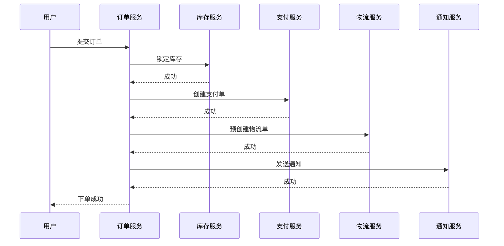
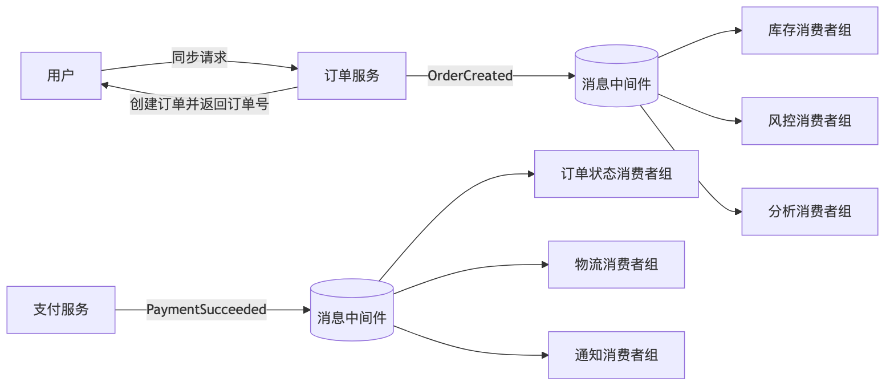
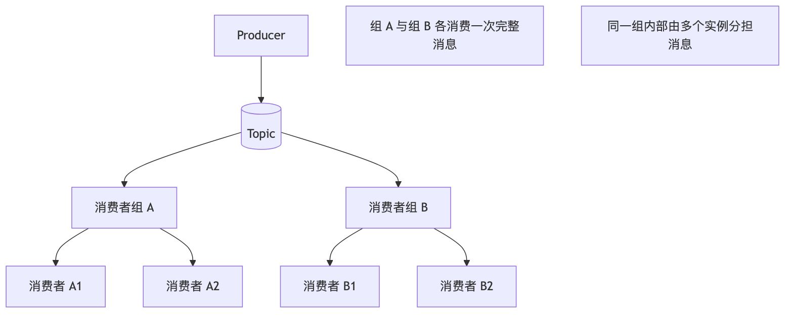
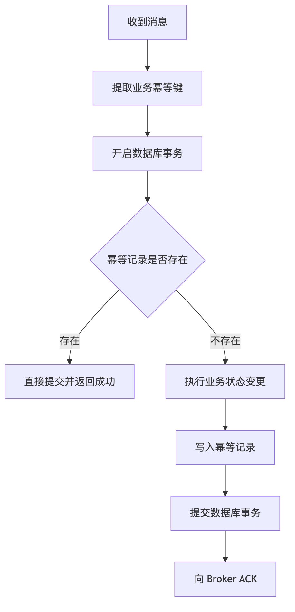
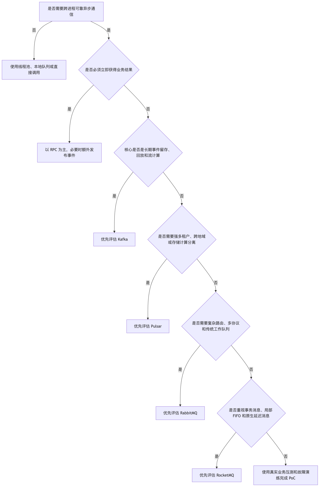

# 第 1 章：消息队列基础、业务价值与 RocketMQ 技术定位

> **版本基线：**截至 2026 年 6 月 20 日，Apache RocketMQ 最新稳定服务端版本为 **5.5.0**。本章以 RocketMQ 5.x 为主，同时保留 4.x 经典模型中仍然重要的面试知识。横向比较所参考的当前版本包括 Apache Kafka 4.3.0、RabbitMQ 4.3.2 和 Apache Pulsar 4.2.2。([rocketmq.apache.org][1])

---

## 本章去重边界与跳转

本章是全系列的“MQ 基础与技术定位”主讲章节，保留消息、事件、命令、异步通信、投递语义、幂等和中间件选型的完整解释。后续章节遇到这些基础概念时只做一两句话回顾，并跳回本章。

| 重复主题 | 本章处理方式 |
| --- | --- |
| Producer、Consumer、Broker、NameServer、Proxy、Controller 的组件职责 | 本章只解释 MQ 为什么需要这些角色；完整领域模型看 [第 2 章：整体架构、核心组件与领域模型](/blog/tech/RocketMQ/02.RocketMQ整体架构、核心组件与领域模型)。 |
| Topic、Tag、Key、MessageQueue、ConsumerGroup 的资源治理 | 本章只放入门心智模型；命名、过滤、队列数和治理规范看 [第 12 章：Topic、Tag、Key、SQL92、MessageQueue 与资源治理](/blog/tech/RocketMQ/12.Topic、Tag、Key、SQL92、MessageQueue与资源治理)。 |
| 重复消息、至少一次、消费幂等和死信 | 本章讲通用投递语义；生产级闭环看 [第 8 章：端到端消息可靠性、重试、死信队列与消费幂等](/blog/tech/RocketMQ/08.端到端消息可靠性、重试、死信队列与消费幂等)。 |
| 顺序、延迟、事务消息 | 本章只说明业务价值；专项分别看 [第 9 章：FIFO 顺序消息](/blog/tech/RocketMQ/09.FIFO顺序消息)、[第 10 章：延迟消息、定时消息与分布式任务调度](/blog/tech/RocketMQ/10.延迟消息、定时消息与分布式任务调度)、[第 11 章：事务消息、Half Message、事务回查与最终一致性](/blog/tech/RocketMQ/11.事务消息、HalfMessage、事务回查与最终一致性)。 |
| 面试题重复 | 本章只保留基础题；全量题库和追问链统一看 [第 20 章：资深面试题库、追问链与模拟面试](/blog/tech/RocketMQ/20.RocketMQ资深面试题库、追问链与模拟面试)。 |

## 一、学习目标

完成本章后，你应该能够：

1. 区分消息、事件、命令、消息队列和事件驱动架构。
2. 解释同步 RPC 与异步消息通信的核心差异。
3. 说明消息队列如何实现解耦、异步化、削峰和数据分发。
4. 正确认识消息丢失、重复、乱序、积压和最终一致性问题。
5. 解释 At-most-once、At-least-once 和 Exactly-once。
6. 说明为什么生产系统通常采用“至少一次投递 + 消费幂等”。
7. 判断 RocketMQ 适合什么场景、不适合什么场景。
8. 从业务语义而不是单纯 TPS 出发，比较 RocketMQ、Kafka、RabbitMQ 和 Pulsar。

---

## 二、场景导入：一笔订单为什么会拖垮五个系统

假设一个电商平台在用户提交订单时依次执行：

1. 创建订单。
2. 锁定库存。
3. 调用支付系统。
4. 创建物流单。
5. 发送短信和邮件。
6. 上报数据分析系统。

如果这些操作全部通过同步 RPC 串联，请求链路可能如下：



这种设计至少存在三个问题。

### 1. 响应时间累加

订单接口的总耗时近似为：

[
T_{\text{总}} = T_{\text{订单}} + T_{\text{库存}} + T_{\text{支付}} + T_{\text{物流}} + T_{\text{通知}}
]

任何一个下游变慢，用户请求都会变慢。

### 2. 可用性被下游绑架

即使订单和库存系统正常，只要短信服务超时，整个下单请求也可能失败。一个非核心系统的故障被传播到了核心交易链路。

### 3. 峰值流量层层传递

大促期间，订单流量会同时冲击库存、物流、通知和分析系统。下游处理能力不同，却被迫承受同样的瞬时并发。

更合理的方式是：同步完成必须立即确认的核心操作，把可以稍后完成的动作转化为事件。



这里并不是“所有调用都改成异步”。订单创建结果仍然需要同步返回；库存预占是否必须同步，则取决于超卖风险和业务模式。消息队列应当用于拆分生命周期和故障边界，而不是机械地替换所有 RPC。

---

## 三、基础概念

### 3.1 什么是消息

**消息（Message）**是系统之间传递的最小数据单元，通常由消息体和元数据组成。

以支付成功消息为例：

```text
Topic: payment-events
Key: order-20260620-10001
Tag: PaymentSucceeded
Body:
{
  "orderId": "20260620-10001",
  "paymentId": "pay-90001",
  "paidAmount": 29900,
  "paidAt": "2026-06-20T10:30:00+09:00"
}
```

消息通常具有以下属性：

* **业务标识**：例如订单号、支付单号。
* **消息类型**：例如 `PaymentSucceeded`。
* **载荷**：下游处理所需的数据。
* **时间信息**：产生时间、业务发生时间。
* **追踪信息**：Trace ID、调用来源。
* **版本信息**：便于消息结构演进。

消息存入中间件后，应当被视为不可变事实。修改已发布消息会使审计、回放和故障分析变得不可控。

### 3.2 事件与命令

消息是一种传输载体；事件和命令则表达业务语义。

| 类型         | 含义          | 命名方式     | 接收方        | 示例                 |
| ---------- | ----------- | -------- | ---------- | ------------------ |
| 事件 Event   | 某件事情已经发生    | 通常使用过去式  | 可以有多个订阅方   | `OrderCreated`     |
| 命令 Command | 请求某个系统执行动作  | 通常使用祈使语义 | 通常有一个逻辑处理者 | `ReserveInventory` |
| 查询 Query   | 请求获得数据并期待结果 | 查询语义     | 一个明确提供方    | `GetOrderDetail`   |

“订单已创建”是事实，即使暂时没有消费者，这个事实仍然成立。

“请为订单锁定库存”则是意图，它通常有明确的职责归属，并且可能成功、失败或被拒绝。

不要把所有消息都命名成 `DoSomethingMessage`。事件与命令混用，会导致所有权、重试策略和失败处理不清晰。

### 3.3 什么是消息队列

**消息队列（Message Queue，MQ）**是用于暂存、传递和管理消息的基础设施。实际系统一般还包含一个或多个 **Broker**。

Broker 可以理解为消息服务器，主要负责：

* 接收生产者发送的消息。
* 持久化或暂存消息。
* 根据 Topic、队列或路由规则组织消息。
* 向消费者投递消息。
* 管理消费进度、确认、重试和死信。
* 提供监控、鉴权和故障恢复能力。

RocketMQ 官方领域模型包含 Producer、Topic、MessageQueue、Message、ConsumerGroup 和 Consumer。消息经历生产、存储和消费三个阶段；Topic 是逻辑容器，一个 Topic 内部可以包含多个 MessageQueue。([rocketmq.apache.org][2])

### 3.4 什么是事件驱动架构

**事件驱动架构（Event-Driven Architecture，EDA）**是一种以事件为系统协作媒介的架构风格。

在 EDA 中：

1. 生产者发布已经发生的业务事实。
2. 生产者不必知道有哪些消费者。
3. 消费者独立订阅事件并更新自己的状态。
4. 新消费者可以在不修改生产者的情况下接入。

异步通信不一定就是事件驱动。例如发送 `SendSMS` 命令只是将同步调用异步化；而发布 `PaymentSucceeded`，由通知、物流和积分系统各自决定如何响应，才更接近事件驱动。

### 3.5 同步 RPC 与异步消息通信

| 维度   | 同步 RPC         | 异步消息            |
| ---- | -------------- | --------------- |
| 调用关系 | 调用方直接依赖服务提供方   | 双方主要依赖消息契约      |
| 返回结果 | 通常立即返回业务结果     | 通常只确认消息是否被接受    |
| 时间耦合 | 双方需要同时在线       | 消费者可稍后恢复处理      |
| 故障传播 | 下游故障容易传递给上游    | Broker 可缓冲并隔离故障 |
| 响应时间 | 包含下游处理时间       | 上游通常只承担发送时间     |
| 一致性  | 容易实现单次调用内的强一致  | 通常采用最终一致性       |
| 调试难度 | 调用链较直观         | 需要消息轨迹和关联 ID    |
| 适合场景 | 查询、即时校验、需要立即结果 | 解耦、异步任务、事件分发、削峰 |

需要立即知道“余额是否足够”的场景适合 RPC；通知积分系统“支付已经成功”的场景更适合消息。

### 3.6 队列模型与发布订阅模型

#### 队列模型

一条消息在一个逻辑消费关系中只交给一个消费者处理，多个消费者共同分担任务。

#### 发布订阅模型

一个 Topic 可以被多个独立订阅者订阅，每个订阅者都能获得完整消息流。



因此，“一对一”和“一对多”要分两个层次理解：

* **消费者组之间**：一个 Topic 可以对应多个消费者组，是一对多。
* **同一消费者组内部**：一条消息通常由一个实例处理，是负载分担。

RocketMQ 对外采用发布订阅模型；多个 ConsumerGroup 可以独立消费同一个 Topic，而组内消费者共同扩展消费能力。([rocketmq.apache.org][2])

---

## 四、消息队列解决的核心问题

### 4.1 系统解耦

没有消息队列时，订单服务可能直接依赖库存、积分、通知、风控、推荐和分析系统。

引入订单事件后，订单服务只负责：

1. 正确完成订单本地事务。
2. 可靠发布订单事件。
3. 维护消息契约。

新增推荐系统时，只需增加一个消费者，不必修改订单服务。

但是，消息队列消除的是**运行时直接依赖**，并没有消除数据契约依赖。随意删除字段或改变字段语义，仍然会破坏消费者。

### 4.2 异步化

对于不需要立即返回结果的任务，生产者只需可靠地提交消息，不必等待所有下游完成。

典型场景包括：

* 发送短信和邮件。
* 更新搜索索引。
* 发放积分。
* 写入审计系统。
* 生成离线报表。
* 刷新推荐特征。

异步化降低的是主链路等待时间，而不是下游实际计算量。

### 4.3 削峰填谷与流量缓冲

假设通知系统稳定处理能力为每秒 5,000 条，而大促峰值为每秒 20,000 条。消息队列可以先接收峰值流量，让通知系统按照自身能力逐步消费。

积压增长速度近似为：

[
V_{\text{积压}} = V_{\text{生产}} - V_{\text{消费}}
]

消息队列只是把瞬时压力转换成积压和处理延迟，不能凭空增加下游能力。峰值结束后，如果消费速度仍不高于生产速度，积压永远不会被清空。

### 4.4 数据分发

支付成功事件可以同时被以下系统订阅：

* 订单系统：更新订单状态。
* 物流系统：创建发货任务。
* 通知系统：通知用户。
* 积分系统：发放积分。
* 风控系统：进行事后分析。
* 数据平台：构建实时指标。

各消费者拥有独立进度，一个消费者故障不应阻塞其他消费者组。

### 4.5 最终一致性

**最终一致性**表示各系统的状态可能在短时间内不一致，但通过可靠投递、重试、幂等和补偿，最终收敛到业务允许的正确状态。

例如：

1. 支付服务完成扣款。
2. 发布 `PaymentSucceeded`。
3. 订单服务暂时不可用。
4. 消息重试。
5. 订单最终变为“已支付”。

最终一致性并不等于“过一会儿自然就一致”。它依赖明确的状态机、重试上限、死信处理、对账和人工修复机制。

### 4.6 事件驱动

事件驱动让系统围绕业务事实演进。订单系统只发布 `OrderCreated`，而不需要提前知道未来会有多少个下游。

它带来的核心价值不是“使用了 MQ”，而是：

* 业务能力可以围绕事件独立扩展。
* 新下游不侵入核心生产者。
* 事件可以用于审计、回放和派生计算。
* 故障边界更加清晰。

---

## 五、消息队列带来的新问题

引入消息中间件意味着系统从“远程调用问题”转变成“分布式状态协调问题”。

| 问题    | 常见原因                  | 主要治理手段            |
| ----- | --------------------- | ----------------- |
| 消息丢失  | 发送未确认、异步刷盘故障、提前提交消费进度 | 发送确认、复制、重试、对账     |
| 重复消费  | 发送超时重试、ACK 丢失、消费者重平衡  | 幂等键、唯一约束、状态机      |
| 消息乱序  | 多生产者并发、多队列、并行消费、重试    | 相同业务键路由、局部串行      |
| 消息积压  | 消费变慢、下游故障、流量突增        | 扩容、限流、降级、批处理      |
| 数据不一致 | 本地事务与发消息不原子、消费半成功     | Outbox、事务消息、补偿、对账 |
| 运维复杂  | 集群故障、磁盘满、热点队列、版本升级    | 监控、容量规划、演练、自动化    |

RocketMQ 的消费失败会触发重新投递，达到最大重试次数后可以进入死信队列；官方也明确要求消费逻辑实现幂等，因为负载均衡和故障切换期间可能发生少量重复消费。([rocketmq.apache.org][3])

---

## 六、三种消息投递语义

### 6.1 At-most-once：最多一次

消息最多处理一次，允许丢失，但尽量不重复。

典型做法是先提交消费进度，再处理业务。消费者在提交进度后宕机，这条消息便不会重新处理。

适用于：

* 允许少量丢失的监控采样。
* 高频非关键指标。
* 可由后续全量数据覆盖的状态更新。

### 6.2 At-least-once：至少一次

在约定的故障范围内，消息不会因为一次处理失败而直接放弃，但可能被多次投递。

典型流程是：

1. 拉取消息。
2. 执行业务。
3. 业务成功后 ACK。
4. ACK 丢失或消费者宕机时重新投递。

这是业务消息中最常见的语义。

### 6.3 Exactly-once：恰好一次

恰好一次通常不是指“网络只发送一次”，而是指：在明确边界内，一条消息对应的**可观察业务结果只生效一次**。

必须区分三个概念：

* **恰好一次发送**：生产者只发送一次。
* **恰好一次投递**：消费者只收到一次。
* **恰好一次处理效果**：业务状态只改变一次。

在分布式系统中，生产者发送后超时，无法判断 Broker 是“未收到”还是“已保存但响应丢失”。消费者提交数据库后、发送 ACK 前宕机，也会产生重复投递。因此，端到端 Exactly-once 必须协调消息系统和外部数据库、缓存、HTTP 服务等资源。

Kafka 的事务和幂等生产者可在 Kafka Topic 内的“消费—处理—生产”链路实现 Exactly-once；写入外部系统仍需要外部系统配合。Pulsar 事务支持跨 Topic、跨分区的原子写入和确认。RocketMQ 事务消息解决的是生产者本地事务与消息提交之间的一致性，并不自动保证所有消费者的外部副作用只执行一次。([kafka.apache.org][4])

### 6.4 三种语义对比

| 语义                  | 是否可能丢失 |      是否可能重复 | 实现复杂度 | 常见实现           |
| ------------------- | -----: | ----------: | ----: | -------------- |
| At-most-once        |      是 |         通常否 |     低 | 先提交进度，再处理      |
| At-least-once       |   尽量避免 |           是 |     中 | 处理成功后 ACK，失败重试 |
| Exactly-once effect |      否 | 投递可重复，但结果唯一 |     高 | 事务、幂等、去重、状态机   |

任何“绝不丢、绝不重”的承诺都必须继续追问：

* 在什么故障模型下？
* 是否包含磁盘永久损坏？
* 是否包含跨机房故障？
* 是否包含消费者写外部数据库？
* 是否包含邮件、短信等不可回滚副作用？
* 是否以牺牲可用性或延迟为代价？

---

## 七、为什么通常采用“至少一次 + 消费幂等”

与其试图阻止所有重复，不如让重复发生时结果保持正确。

一个可靠消费者可以采用以下流程：



常见幂等方案包括：

1. **数据库唯一约束**
   以 `order_id + event_type` 建立唯一索引。

2. **业务状态机**
   只允许订单从“待支付”变为“已支付”，重复的支付成功事件不再重复扣减资源。

3. **Inbox 表**
   在消费端数据库中记录已经处理的业务事件，并与业务更新放入同一本地事务。

4. **条件更新或版本号**
   使用 CAS、版本字段或状态条件防止重复变更。

5. **天然幂等操作**
   “把订单状态设置为已支付”通常比“将状态推进一次”更容易幂等。

幂等键应优先使用稳定的业务标识，而不是盲目使用消息系统生成的 Message ID。生产者重新构造并发送同一业务事件时，可能得到新的 Message ID，但业务上仍然是同一笔操作。

---

## 八、RocketMQ 的技术定位

RocketMQ 官方将其定义为分布式消息和流平台。5.x 的标准消息类型包括 Normal、FIFO、Delay 和 Transaction；其中 FIFO 基于 MessageGroup 保证局部顺序，Delay 使用指定投递时间，Transaction 用于协调本地事务与消息提交。([GitHub][5])

### 8.1 适合 RocketMQ 的场景

* 电商订单、支付、库存和物流事件。
* 需要事务消息保证“本地事务成功后消息最终可见”的场景。
* 需要按照订单号、用户号进行局部 FIFO 的场景。
* 订单超时关闭、延迟检查等定时消息场景。
* 高并发业务消息分发。
* 需要消费重试、死信和消费进度管理的后台任务。
* 一个业务事件被多个独立消费者组订阅的场景。
* 团队需要同时覆盖业务消息与一定事件流需求的场景。

### 8.2 不宜优先选择 RocketMQ 的场景

* 必须立即得到结果的查询或校验，应优先使用 RPC。
* 单体应用内部的轻量异步任务，可能只需要线程池或本地任务队列。
* 规模很小且没有中间件运维能力的系统。
* 要求所有业务实体全局严格有序的系统。
* 主要目标是超长时间事件留存、反复回放和大数据流处理，Kafka 或 Pulsar 往往更自然。
* 需要大量复杂路由规则和多种标准消息协议时，RabbitMQ 往往更直接。
* 需要编排持续数小时或数天、包含人工步骤的流程，应考虑工作流引擎，而不是把 MQ 当成流程引擎。
* 需要替代数据库作为业务事实最终来源的系统。消息中间件不是关系数据库。

---

## 九、RocketMQ、Kafka、RabbitMQ 与 Pulsar 对比

选型之前需要先理解各产品的设计重心：

* RocketMQ 强调业务消息，原生提供 FIFO、延迟和事务消息等语义。([rocketmq.apache.org][6])
* Kafka 以分区日志和事件流为核心，支持回放、Kafka Connect、Kafka Streams、幂等生产者和事务。([kafka.apache.org][7])
* RabbitMQ 以 Exchange、Queue 和灵活路由为特色，可靠性依赖 Publisher Confirm、Consumer ACK 和复制队列等机制，同时也提供 Streams。([rabbitmq.com][8])
* Pulsar 原生强调多租户、跨地域复制、分层存储以及服务层与存储层分离，并支持跨 Topic 和分区的事务。([pulsar.apache.org][9])

| 维度      | RocketMQ                         | Kafka                         | RabbitMQ                          | Pulsar                              |
| ------- | -------------------------------- | ----------------------------- | --------------------------------- | ----------------------------------- |
| 核心定位    | 业务消息与事件驱动                        | 分布式事件日志与流平台                   | 通用消息代理与复杂路由                       | 多租户消息与流平台                           |
| 典型模型    | Topic、Queue、ConsumerGroup        | Topic、Partition、ConsumerGroup | Exchange、Binding、Queue            | Tenant、Namespace、Topic、Subscription |
| 吞吐与延迟   | 兼顾高吞吐、低延迟和业务语义                   | 批处理、顺序 I/O，偏高吞吐事件流            | 适合低延迟任务和灵活路由；Streams 面向流场景        | 高吞吐、低延迟，服务与存储可独立扩展                  |
| 顺序能力    | MessageGroup 级局部 FIFO            | Partition 内有序                 | Queue 基本 FIFO，但多消费者和重投递会影响观察顺序    | 分区及 Key_Shared 等模式提供局部顺序            |
| 事务能力    | 本地事务与消息提交协调                      | Kafka 内跨分区写入及消费位点事务           | Confirm、ACK、Quorum Queue；应用仍需处理幂等 | 跨 Topic、分区和 ACK 的事务                 |
| 延迟消息    | 原生支持指定投递时间                       | 通常由业务或外部调度实现                  | 常通过 TTL、死信等机制组合实现                 | 支持延迟投递                              |
| 消息回放    | 支持按消费位点重置和重新消费                   | 核心能力，适合长期事件日志                 | 传统 Queue 偏任务交付；Streams 支持日志式读取    | 支持持久积压、游标和分层存储                      |
| 生态重心    | Java、Go 业务系统及 Apache RocketMQ 组件 | Connect、Streams 和大数据生态        | 多协议、跨语言、企业集成                      | Functions、IO、多租户和云原生                |
| 相对运维复杂度 | 中等                               | 中等                            | 小规模较直观，复杂拓扑仍需治理                   | 组件较多，通常较高                           |
| 优先场景    | 交易、支付、库存、延迟和事务消息                 | CDC、日志、事件流、实时计算               | 工作队列、复杂路由、多协议集成                   | 多租户、跨地域、海量 Topic、冷热分层               |

表中的性能描述是设计倾向，不是固定排名。消息大小、批量参数、复制因子、ACK 策略、磁盘、网络、消费者数量和积压深度都会改变测试结果。

### 9.1 为什么不能只根据 TPS 选型

只比较“每秒能发多少条消息”，至少忽略了以下因素：

1. **消息大小**：每条 100 字节与每条 1 MB 完全不同。
2. **持久化级别**：写内存、写页缓存、同步刷盘的成本不同。
3. **复制与确认策略**：等待单节点还是多数副本确认。
4. **生产批量**：批量越大，吞吐通常越高，但延迟可能增加。
5. **消费扇出**：一个消费者组和二十个消费者组的出口流量不同。
6. **积压规模**：空队列性能不代表积压数亿条时的性能。
7. **尾延迟**：平均延迟很低，不代表 P99、P999 可接受。
8. **故障恢复**：Broker 宕机、扩容和重平衡时是否仍满足 SLA。
9. **业务语义**：是否需要事务、顺序、延时、过滤和死信。
10. **团队能力与 TCO**：部署、升级、监控和故障处理都需要成本。

正确的性能测试必须使用真实消息大小、生产消费比例、复制配置和故障场景。

### 9.2 消息中间件选型决策树



决策树只用于缩小候选范围。最终决定应结合现有技术栈、团队经验、社区生态、托管服务和迁移成本。

---

## 十、常见误区

### 误区 1：用了 MQ 就是微服务解耦

如果生产者仍然依赖所有消费者的数据库结构和处理结果，只是把 RPC 改成消息，耦合并没有真正消失。

### 误区 2：发送成功等于业务成功

发送成功只说明消息系统接受了消息，不代表消费者已经成功完成业务。

### 误区 3：Exactly-once 是一个配置开关

必须明确事务边界、外部系统配合方式以及失败恢复流程。产品宣传中的 Exactly-once 不一定覆盖你的数据库和第三方接口。

### 误区 4：顺序消息等于全局有序

高并发系统通常只保证订单、用户或账户维度的局部顺序。全局有序会严重限制并行度。

### 误区 5：重试可以用于限流

持续返回失败会制造重试风暴。限流应降低拉取速度、控制并发或进行入口背压。

### 误区 6：有积压就一定安全

消息可能因保留期限、磁盘水位或容量不足被清理。积压还会放大恢复时间和业务延迟。

### 误区 7：事务消息等于分布式事务全部完成

RocketMQ 事务消息主要协调生产者本地事务和消息提交，不会自动回滚已经发送的短信，也不会替消费者实现幂等。

### 误区 8：消费者返回成功越早越好

业务尚未完成就提前 ACK，随后发生失败时，Broker 不会再重试，可能造成事实上的消息丢失。

### 误区 9：队列越多，性能一定越高

队列增加可以提高并行度，但也会增加元数据、线程调度、重平衡和运维成本。

### 误区 10：只看 TPS 就能完成选型

性能指标必须和可靠性、顺序、事务、积压、恢复时间及团队成本一起评估。

---

## 十一、面试表达模板

### 11.1 30 秒回答版本

消息队列是系统之间进行可靠异步通信的中间件，核心价值是解耦、异步化、削峰和事件分发。它通过 Broker 暂存消息，使生产者和消费者不必同时在线。但引入 MQ 后会产生重复消费、乱序、积压和最终一致性问题，因此业务通常采用至少一次投递，并通过唯一约束、状态机或 Inbox 表保证消费幂等。

### 11.2 3 分钟回答版本

消息队列把生产者与消费者之间的直接同步调用改为经过 Broker 的异步通信。它主要解决四类问题：第一，生产者不必感知所有下游，实现系统解耦；第二，把通知、积分、索引等非核心操作移出主链路，实现异步化；第三，在流量高峰时暂存消息，实现削峰和流量缓冲；第四，一个事件可以由多个消费者组独立订阅，实现数据分发和事件驱动。

代价是系统从同步调用问题变成分布式状态问题。生产者超时重试可能重复发送；消费者业务完成但 ACK 丢失会重复消费；多队列和并发消费可能乱序；下游变慢会产生积压；本地数据库事务和发消息之间还可能不一致。

因此生产系统一般不轻易承诺端到端 Exactly-once，而是采用至少一次投递，加消费端幂等、重试、死信、补偿和对账。RocketMQ 特别适合交易业务中的普通消息、局部 FIFO、延迟消息和事务消息，但最终选型还要比较事件回放、复杂路由、多租户、运维成本和团队生态，不能只看 TPS。

---

## 十二、资深面试题

> **题目去重**：本节作为本章基础自测，只保留 MQ 基础和选型题。跨章重复题、完整追问链和模拟面试统一跳转到 [第 20 章：资深面试题库、追问链与模拟面试](/blog/tech/RocketMQ/20.RocketMQ资深面试题库、追问链与模拟面试)。

### 1. 什么是消息队列？为什么使用它？

**标准回答：**消息队列是生产者与消费者之间的异步通信基础设施，主要用于解耦、异步化、削峰和数据分发。
**面试官追问：**什么时候不应该使用 MQ？
**容易答错：**只回答“提高性能”，忽略一致性和运维成本。

### 2. 消息、事件和命令有什么区别？

**标准回答：**消息是载体；事件表示已经发生的事实；命令表示希望某个处理者执行动作。事件可以有多个订阅者，命令通常有一个逻辑所有者。
**面试官追问：**`CancelOrder` 是事件还是命令？
**容易答错：**仅凭名称判断，不分析语义和所有权。

### 3. 同步 RPC 与异步消息有什么区别？

**标准回答：**RPC 强调请求响应和即时结果，双方存在时间耦合；消息强调提交事实或任务，允许下游稍后处理。
**面试官追问：**异步 RPC 是否等于消息队列？
**容易答错：**把编程接口的异步和架构通信的异步混为一谈。

### 4. 队列模型与发布订阅模型有什么区别？

**标准回答：**队列模型中一条消息由一个逻辑消费者处理；发布订阅中多个独立订阅者都能获得完整消息流。消费者组内仍可通过多个实例分担消息。
**面试官追问：**同一 ConsumerGroup 中的两个实例是否都会收到消息？
**容易答错：**把消费者组与消费者实例当成同一概念。

### 5. MQ 如何实现系统解耦？

**标准回答：**生产者只依赖 Topic 和消息契约，不直接依赖消费者地址及实现，新增消费者不需要修改生产者。
**面试官追问：**是否完全没有耦合？
**容易答错：**忽略 Schema、字段语义和 Topic 治理形成的契约耦合。

### 6. MQ 如何削峰？

**标准回答：**Broker 暂存高峰消息，消费者按稳定能力处理，把瞬时并发转换为积压和延迟。
**面试官追问：**峰值结束后积压仍持续增长怎么办？
**容易答错：**认为 MQ 能增加下游实际处理能力。

### 7. 三种投递语义分别是什么？

**标准回答：**最多一次允许丢失但尽量不重复；至少一次尽量不丢但可能重复；恰好一次要求定义边界内的处理效果只发生一次。
**面试官追问：**消费者应该先 ACK 还是先提交数据库？
**容易答错：**不说明两种顺序各自的丢失或重复窗口。

### 8. 为什么会出现重复消息？

**标准回答：**生产者超时后重试、消费者 ACK 丢失、进程宕机和重平衡都可能造成重复。
**面试官追问：**发送超时是否说明 Broker 没收到？
**容易答错：**把超时直接等同于发送失败。

### 9. 如何实现消费幂等？

**标准回答：**使用业务幂等键、数据库唯一约束、状态机、Inbox 表或条件更新，并让幂等记录与业务变更处于同一本地事务。
**面试官追问：**能否直接用 Message ID 去重？
**容易答错：**忽略同一业务事件重新构造后 Message ID 可能变化。

### 10. 为什么很难实现端到端 Exactly-once？

**标准回答：**消息系统无法自动协调所有外部数据库、缓存、HTTP 和第三方副作用；故障时还存在结果已生效但确认丢失的不确定窗口。
**面试官追问：**Kafka 的 Exactly-once 是否解决了数据库写入问题？
**容易答错：**把产品内部事务语义扩大到所有外部系统。

### 11. 如何保证消息顺序？

**标准回答：**按订单号等业务键把相关消息路由到同一队列或消息组，并串行生产、按顺序消费。
**面试官追问：**为什么不保证全局顺序？
**容易答错：**忽略全局串行会显著降低吞吐和可扩展性。

### 12. 消息积压应该如何处理？

**标准回答：**先判断生产突增还是消费退化，再检查最老消息时间、失败率和下游依赖；随后扩容消费者、提高批量、限流或降级。
**面试官追问：**为什么不能直接无限增加消费者？
**容易答错：**忽略队列并行度和下游数据库容量。

### 13. RocketMQ 事务消息解决了什么问题？

**标准回答：**它协调生产者本地事务与消息提交，使本地事务成功时消息最终可投递，异常状态由事务回查确认。
**面试官追问：**能否保证消费者数据库只更新一次？
**容易答错：**把事务消息理解为覆盖所有参与方的全局事务。

### 14. RocketMQ 与 Kafka 如何选择？

**标准回答：**交易业务重视事务、延时和局部顺序时优先评估 RocketMQ；长时间事件留存、回放、CDC 和流计算生态更重要时优先评估 Kafka。
**面试官追问：**两者能否在同一系统共存？
**容易答错：**把选型理解成全公司只能使用一种中间件。

### 15. 为什么不能只按照 TPS 选 MQ？

**标准回答：**TPS 会受消息大小、批量、持久化、复制、ACK、消费扇出和硬件影响；还必须评估语义、P99 延迟、故障恢复和运维成本。
**面试官追问：**如何设计选型压测？
**容易答错：**只做无复制、无消费、无积压的理想发送测试。

---

## 十三、练习题

### 练习 1：改造同步订单链路

将“订单—库存—物流—通知—积分”全部同步调用的系统改造成同步与异步结合的架构，并说明哪些步骤必须立即返回。

### 练习 2：设计支付成功消费者

要求支付成功事件重复投递十次时，订单状态、积分和财务记录仍然正确。给出幂等键、唯一约束和事务边界。

### 练习 3：估算积压

生产速度为每秒 30,000 条，消费速度为每秒 18,000 条，峰值持续 20 分钟。计算积压量，并估算峰值结束后在每秒 40,000 条消费能力下需要多久清空。

### 练习 4：完成中间件选型

分别为以下场景选择候选产品并说明理由：

* 电商交易消息。
* 数据库 CDC 与实时数仓。
* 多协议设备接入和复杂路由。
* 跨地域多租户消息平台。

### 练习 5：设计故障演练

至少覆盖：

* Producer 发送超时。
* Broker 节点宕机。
* 消费者业务成功但 ACK 失败。
* 下游数据库变慢。
* 消息积压超过预警阈值。
* 死信消息持续增长。

---

## 十四、总结

1. 消息队列的核心价值是解耦、异步化、削峰和事件分发。
2. 消息是载体，事件表达事实，命令表达执行意图。
3. RPC 适合即时结果，消息适合跨时间的可靠协作。
4. MQ 不能消灭流量，只能缓冲流量并延迟处理。
5. 至少一次投递天然可能产生重复，消费幂等是业务系统的基本能力。
6. Exactly-once 必须明确边界，不能把中间件内部语义扩大到所有外部系统。
7. RocketMQ 特别适合包含事务消息、局部 FIFO、延迟消息和消费重试的业务场景。
8. 中间件选型应综合业务语义、回放、路由、积压、恢复能力、生态和 TCO，而不是只比较 TPS。

---

## 十五、官方资料

* Apache RocketMQ 5.5.0 Release Notes、下载页与官方 GitHub。([rocketmq.apache.org][1])
* Apache RocketMQ 领域模型、Topic 与 Consumer Load Balancing。([rocketmq.apache.org][2])
* Apache RocketMQ FIFO、Delay、Transaction 与 Consumption Retry。([rocketmq.apache.org][10])
* Apache Kafka 4.3.0 下载页与 Message Delivery Semantics。([kafka.apache.org][11])
* RabbitMQ Publisher Confirm、Consumer ACK、Queue、Quorum Queue 与 Streams。([rabbitmq.com][8])
* Apache Pulsar 4.2.2 下载页、架构、多租户、跨地域复制与事务。([pulsar.apache.org][12])

[1]: https://rocketmq.apache.org/release-notes/2026/04/10/5.5.0/ "Release Notes - Apache RocketMQ - Version 5.5.0"
[2]: https://rocketmq.apache.org/docs/domainModel/01main/ "Domain Model - Apache RocketMQ"
[3]: https://rocketmq.apache.org/docs/featureBehavior/08consumerloadbalance/ "Consumer Load Balancing - Apache RocketMQ"
[4]: https://kafka.apache.org/43/design/design/ "Design | Apache Kafka"
[5]: https://github.com/apache/rocketmq "Apache RocketMQ is a cloud native messaging and ..."
[6]: https://rocketmq.apache.org/docs/domainModel/02topic/ "Topic - Apache RocketMQ"
[7]: https://kafka.apache.org/documentation/ "Introduction | Apache Kafka"
[8]: https://www.rabbitmq.com/docs/confirms "Consumer Acknowledgements and Publisher Confirms"
[9]: https://pulsar.apache.org/docs/next/concepts-replication/ "Geo Replication - Apache Pulsar"
[10]: https://rocketmq.apache.org/docs/featureBehavior/03fifomessage/ "Ordered Message - Apache RocketMQ"
[11]: https://kafka.apache.org/community/downloads/ "Downloads | Apache Kafka"
[12]: https://pulsar.apache.org/download/ "Downloads | Apache Pulsar"
