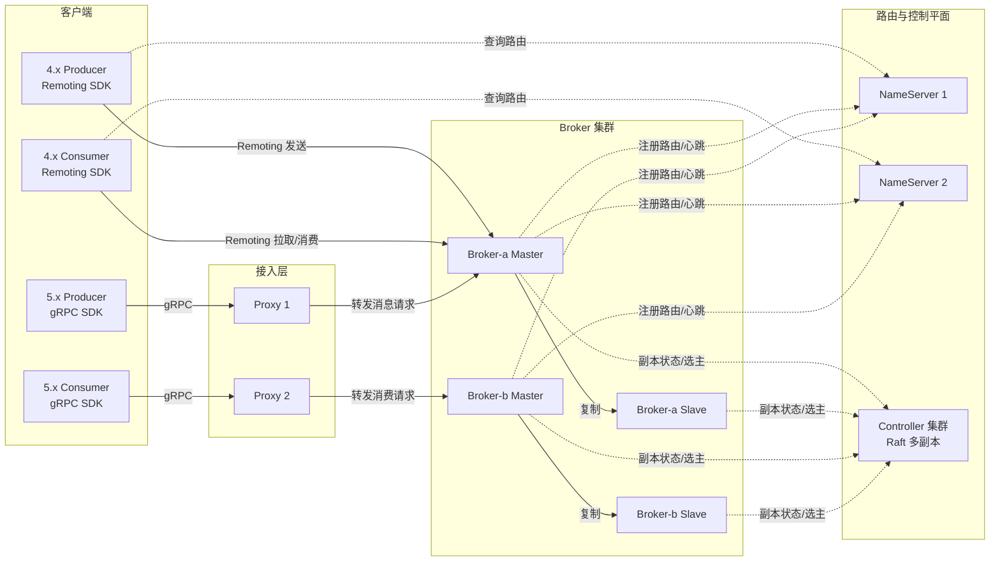
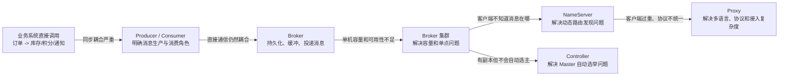
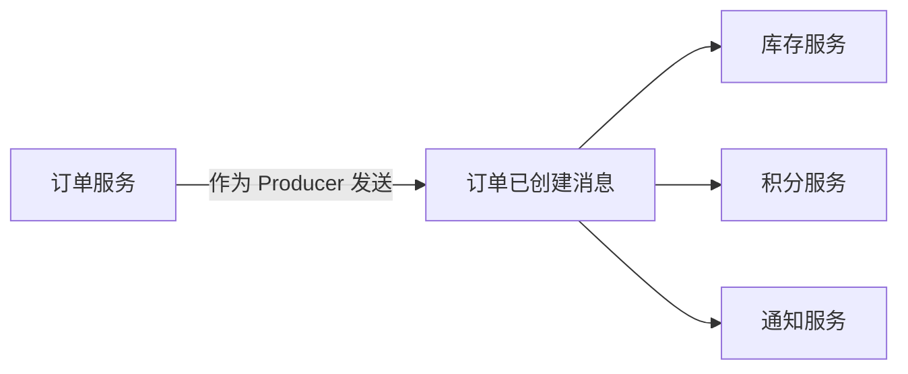
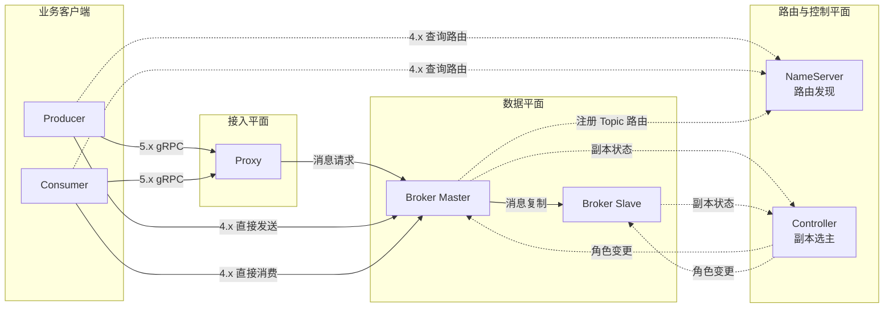
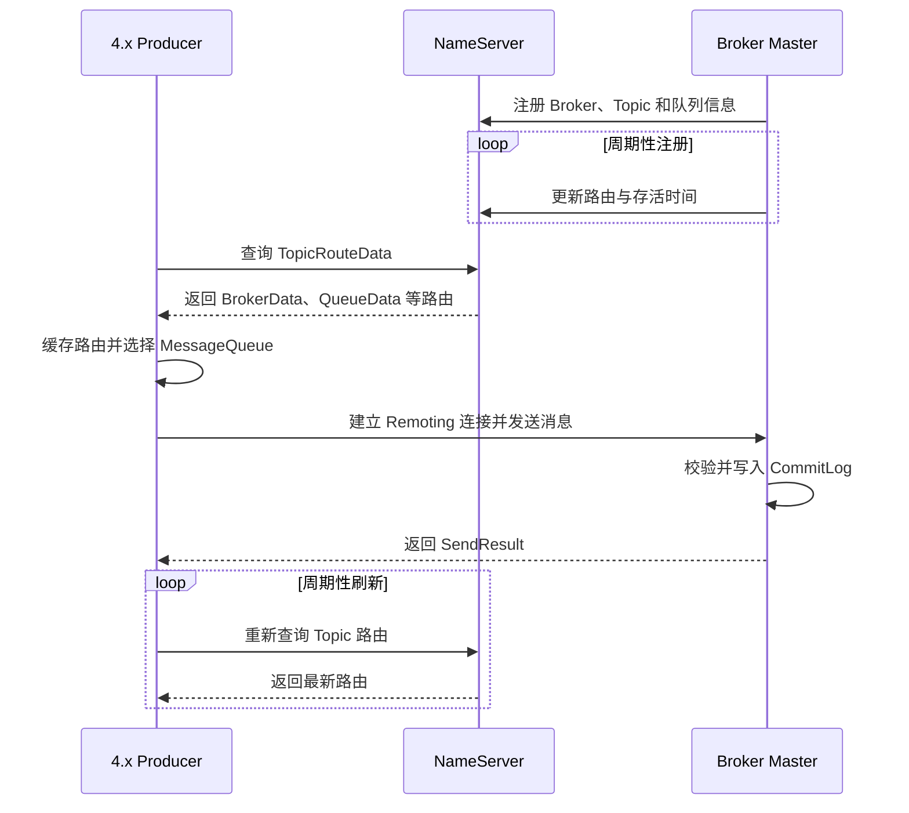
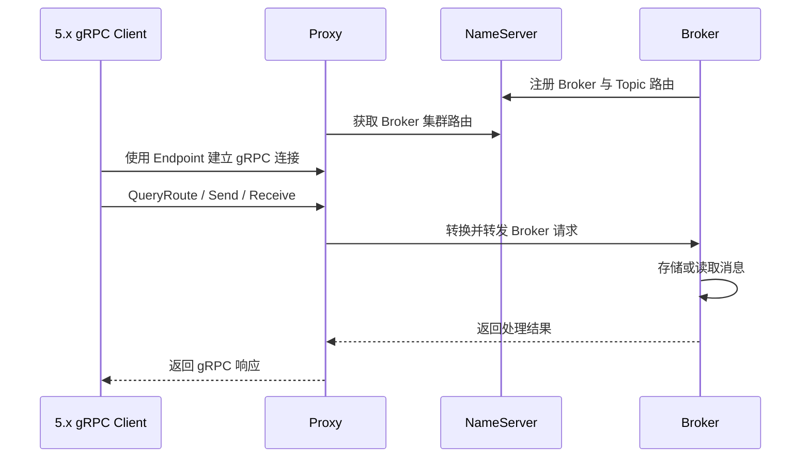
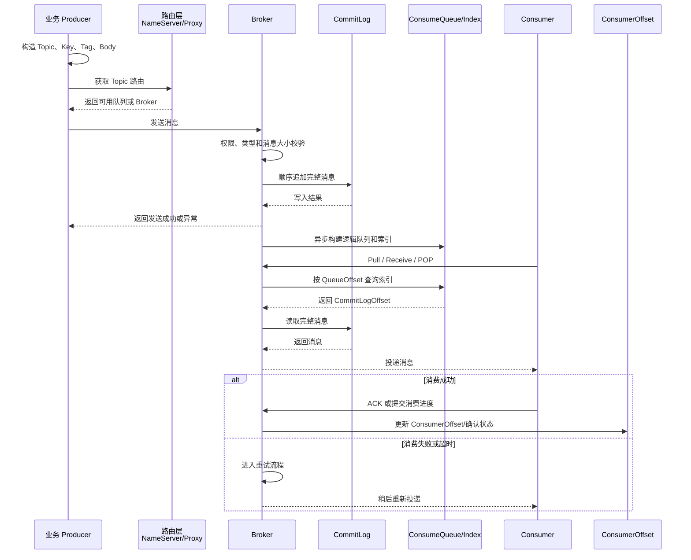

# 第 2 章：RocketMQ 整体架构、核心组件与领域模型

> **版本基线**：截至 **2026 年 6 月 20 日**，Apache RocketMQ 最新稳定服务端版本为 **5.5.0**。本章以 RocketMQ 5.x 架构为主，同时保留 4.x 经典 Remoting 架构中仍然重要的源码与面试知识。([GitHub][1])

---

## 本章去重边界与跳转

本章是 RocketMQ 架构图、组件职责和领域模型的主讲章节。后续章节如果再次出现组件名，只保留和该专题相关的差异，不再重复讲六大组件从哪里来。

| 重复主题 | 本章处理方式 |
| --- | --- |
| MQ 基础、投递语义与中间件选型 | 本章默认已经理解；基础概念看 [第 1 章：消息队列基础、业务价值与 RocketMQ 技术定位](/blog/tech/RocketMQ/01.消息队列基础、业务价值与RocketMQ技术定位)。 |
| Producer 发送链路、路由选择与重试 | 本章只讲 Producer 在架构中的职责；发送细节看 [第 4 章：Producer 发送模型、路由选择、重试机制与底层发送链路](/blog/tech/RocketMQ/04.Producer发送模型、路由选择、重试机制与底层发送链路)。 |
| Consumer 类型、POP、ACK 与消费状态机 | 本章只讲 Consumer 领域位置；消费链路看 [第 5 章：Consumer 类型、长轮询、POP、ACK 与完整消费链路](/blog/tech/RocketMQ/05.Consumer类型、长轮询、POP、ACK与完整消费链路)。 |
| Topic、Tag、Key、MessageQueue、Group 的治理 | 本章只定义领域模型；资源设计和治理看 [第 12 章：Topic、Tag、Key、SQL92、MessageQueue 与资源治理](/blog/tech/RocketMQ/12.Topic、Tag、Key、SQL92、MessageQueue与资源治理)。 |
| 存储、高可用、5.x 演进与源码 | 本章只给架构入口；深入分别看 [第 7 章：存储引擎](/blog/tech/RocketMQ/07.RocketMQ存储引擎)、[第 13 章：高可用](/blog/tech/RocketMQ/13.RocketMQ高可用)、[第 17 章：4.x 到 5.x 架构演进](/blog/tech/RocketMQ/17.从RocketMQ4.x到5.x：Proxy、gRPC、POP、Controller与架构演进)、[第 18 章：源码阅读](/blog/tech/RocketMQ/18.RocketMQ源码阅读：发送、存储、消费、事务与高可用调用链)。 |

## 2.1 学习目标

完成本章后，你应当能够：

1. 从零画出 Producer、Consumer、NameServer、Broker、Proxy、Controller 的完整拓扑。
2. 区分 4.x Remoting 客户端与 5.x gRPC 客户端的访问链路。
3. 解释 Topic、MessageQueue、Message、ConsumerGroup、Subscription 等领域对象。
4. 说明 BrokerName、BrokerId、Master、Slave 之间的关系。
5. 区分 QueueOffset、CommitLogOffset 和 ConsumerOffset。
6. 描述一条消息从生产、存储到消费、重试和清理的完整生命周期。
7. 分析 NameServer、Broker、Proxy、Controller 故障后的系统行为。
8. 在面试白板上，用 3～5 分钟讲清楚 RocketMQ 架构。

---

## 2.2 场景导入：订单消息究竟经过了哪些组件

假设订单服务发送一条“订单已创建”消息，库存服务、积分服务和通知服务都需要处理它。

从业务视角看，流程似乎只有三步：

```text
订单服务 -> RocketMQ -> 下游服务
```

但从 RocketMQ 内部视角看，至少存在以下问题：

* Producer 怎么知道消息应发送到哪台 Broker？
* 一个 Topic 有多个队列时，消息进入哪个队列？
* Broker 如何知道自己应该向谁注册路由？
* 5.x Go gRPC SDK 为什么配置的是 Endpoint，而不是 NameServer 地址？
* 多个库存服务实例之间如何分配消息？
* 消费进度存在哪里？
* Master 宕机后 Slave 是否会自动接管？
* Proxy、NameServer、Controller 是否保存消息？

要回答这些问题，必须先区分三类平面：

| 平面      | 主要组件                           | 职责                          |
| ------- | ------------------------------ | --------------------------- |
| 数据平面    | Producer、Consumer、Proxy、Broker | 发送、存储、拉取、确认消息               |
| 路由平面    | NameServer                     | Broker 注册、Topic 路由发现、故障路由剔除 |
| 高可用控制平面 | Controller                     | 管理 Broker 副本组、选主和主从切换       |

其中，真正持久化业务消息的是 **Broker**。NameServer、Proxy 和 Controller 都不是消息存储节点。

---

## 2.3 RocketMQ 整体架构

RocketMQ 4.x 的典型部署由 Producer、Consumer、NameServer 和 Broker 构成；RocketMQ 5.x 在此基础上增加了面向新 gRPC SDK 的 Proxy，并提供可选的 Controller 自动主从切换机制。5.x 的 Proxy 支持与 Broker 同进程的 Local 模式，也支持独立部署的 Cluster 模式。([rocketmq.apache.org][2])



图中的箭头需要分成两类理解：

* **路由箭头**：查找“某个 Topic 位于哪些 Broker、包含哪些队列”。
* **数据箭头**：真正发送或获取消息。

NameServer 不转发业务消息。4.x 客户端从 NameServer 获得路由后，直接连接 Broker；5.x gRPC 客户端一般连接 Proxy，由 Proxy 完成协议接入和 Broker 访问。官方 5.x SDK 基于 Protocol Buffers 与 gRPC，目标是替代各语言旧的 Remoting SDK。([GitHub][3])

---

## 2.4 六个核心组件：RocketMQ 是如何一步步演化出来的

> **阅读说明**：下面描述的是一种便于理解的“架构逻辑演化”，不是 RocketMQ 各组件严格的发布时间顺序。RocketMQ 经典架构早已包含 Producer、Consumer、NameServer 和 Broker；Proxy 与 gRPC SDK 是 5.0 架构的重要增强，Controller 则用于解决 Broker 自动主从切换问题。([rocketmq.apache.org][2])

RocketMQ 的六个核心组件并不是六个彼此孤立的名词。每一个组件的出现，实际上都在解决前一种架构暴露出来的新问题。

可以先把演化过程压缩成下面这条主线：



接下来，从最初的业务系统直接调用开始，一步一步引出六个核心组件。

---

### 2.4.1 起点：没有消息队列时，服务之间直接调用

假设电商系统刚开始只有三个服务：

```text
订单服务
库存服务
通知服务
```

用户下单后，订单服务依次调用：

```text
订单服务 -> 库存服务：扣减库存
订单服务 -> 通知服务：发送短信
```

代码逻辑可能类似：

```text
创建订单
  -> 调用库存服务
  -> 调用积分服务
  -> 调用通知服务
  -> 返回下单成功
```

系统规模较小时，这种同步调用非常直观。但随着业务扩大，它会逐渐暴露出几个问题。

#### 1. 时间耦合

订单服务处理请求时，库存、积分和通知服务必须同时在线。

只要通知服务发生超时，整个下单请求就可能被拖慢。

#### 2. 故障耦合

一个非核心服务的故障可能沿着调用链传播。

例如短信服务不可用，本来不应该影响订单创建，但同步调用很容易使短信异常最终变成下单异常。

#### 3. 性能耦合

订单服务每秒可以处理 10 万个请求，库存服务只能处理 2 万个请求，那么流量高峰就可能直接压垮库存服务。

订单服务没有一个中间缓冲区，无法让下游按照自己的处理能力逐步消费任务。

#### 4. 拓扑耦合

订单服务必须知道所有下游服务：

```text
订单服务
├── 调用库存
├── 调用积分
├── 调用营销
├── 调用风控
├── 调用短信
└── 调用物流
```

每增加一个下游系统，都可能需要修改订单服务。

这意味着上游业务越来越了解下游细节，系统耦合度越来越高。

#### 5. 无法自然重放

假设积分系统昨天出现 Bug，需要重新处理过去一天的订单。

如果只有同步 RPC 调用，历史事件通常已经消失，很难重新执行。

于是系统开始考虑：

> 订单服务能不能不直接调用所有下游，而只是发布一个“订单已创建”的业务事实？

这就产生了两个最基本的角色：

* 负责产生消息的 **Producer**。
* 负责处理消息的 **Consumer**。

---

### 2.4.2 Producer：把业务变化转换成消息的人

#### 1. 为什么需要 Producer

引入消息模型后，订单服务不再直接告诉库存服务：

```text
请立即扣减库存
```

而是向消息系统发布一个事实：

```text
订单 O1001 已创建
```

订单服务此时扮演的就是 Producer。



Producer 的核心作用是：

> 将业务系统中的事件、命令或数据变化封装为 RocketMQ 消息，并可靠地发送到服务端。

RocketMQ 5.x 的领域模型把 Producer 定义为消息生产阶段的运行实体。Producer 通常嵌入上游业务服务中，是轻量、匿名的客户端实体。经典 4.x 架构中，Producer 会获取 Topic 路由、选择 MessageQueue，并向对应 Broker 发送消息。([rocketmq.apache.org][2])

---

#### 2. Producer 负责什么

Producer 的职责不只是调用一个 `send()` 方法。

完整的 Producer 通常需要完成以下工作。

##### ① 构造消息

Producer 将业务数据封装为消息：

```text
Topic: order-events
Tag:   CREATED
Key:   ORDER_O1001
Body:  {"orderId":"O1001","userId":"U1001"}
```

其中：

* Topic 表示消息所属的大类。
* Tag 表示 Topic 内的细分类。
* Key 用于业务查询和故障排查。
* Body 保存真正的业务数据。

##### ② 获取路由

Producer 必须知道：

```text
order-events Topic 位于哪些 Broker？
这个 Topic 有哪些 MessageQueue？
哪些队列当前可写？
```

在经典 4.x Remoting 架构中，Producer 从 NameServer 查询路由，然后直接连接 Broker。

在 5.x gRPC 架构中，Producer 通常连接 Proxy Endpoint，由 Proxy 帮助完成后续访问。

##### ③ 选择 MessageQueue

假设 `order-events` 有四个队列：

```text
order-events
├── Queue 0
├── Queue 1
├── Queue 2
└── Queue 3
```

Producer 需要从这些队列中选择目标队列。

普通消息可以轮询选择；FIFO 消息则需要根据订单号等业务键，将同一业务对象的消息发送到相同的顺序范围。

##### ④ 发送并处理结果

Producer 发送消息后，需要区分：

```text
发送成功
发送失败
发送超时
网络断开
Broker 返回异常
```

特别需要注意：

> 发送超时不等于 Broker 一定没有收到消息。

可能存在这样的过程：

```text
Producer -> Broker：发送消息
Broker：消息已经落盘
Broker -> Producer：返回响应
网络：响应在途中丢失
Producer：最终看到超时
```

此时 Producer 重试就可能产生重复消息。

##### ⑤ 管理连接和生命周期

Producer 还需要管理：

* Broker 或 Proxy 连接。
* Topic 路由缓存。
* 请求超时。
* 发送重试。
* 客户端线程。
* 优雅关闭。

因此，生产环境中一般不会为每条消息创建一个 Producer，而是让业务进程复用少量、长期存活的 Producer 实例。

---

#### 3. Producer 不负责什么

Producer 不负责：

* 长期保存消息。
* 决定消费者什么时候处理消息。
* 保证下游业务一定成功。
* 保存消费者进度。
* 选举 Broker Master。

Producer 收到发送成功结果，只能说明消息已经按照当前发送和存储策略被 RocketMQ 服务端接受，不能说明库存、积分和通知业务已经全部处理成功。

因此：

```text
发送成功 ≠ 消费成功
发送一次 ≠ 服务端只收到一次
MessageKey ≠ 幂等机制
```

---

#### 4. Producer 的状态、扩容和故障

| 维度      | 说明                                   |
| ------- | ------------------------------------ |
| 状态类型    | 主要是连接、路由缓存和请求状态等临时状态                 |
| 是否持久化消息 | 通常不负责持久化服务端消息                        |
| 扩容方式    | 增加上游业务实例，每个实例创建或复用 Producer          |
| 单实例故障   | 只影响该业务实例继续发送                         |
| 已发送消息   | 只要已经成功进入 Broker，不会因 Producer 进程退出而消失 |
| 最大风险    | 发送结果不确定、错误重试、重复消息、业务事务与发消息不一致        |

##### 一句话理解 Producer

> Producer 是消息的创建者和发送者，但不是消息的保管者。

---

### 2.4.3 Consumer：按照自己的节奏处理消息的人

#### 1. 为什么需要 Consumer

Producer 只是把订单变化转换成消息，但消息最终还要被业务系统处理。

库存服务需要处理：

```text
订单已创建 -> 预扣库存
订单已取消 -> 释放库存
```

积分服务需要处理：

```text
订单已支付 -> 增加积分
订单已退款 -> 扣回积分
```

这些下游业务程序就是 Consumer。

RocketMQ 5.x 将 Consumer 定义为消息消费阶段的运行实体。每一个 Consumer 必须归属于某个 ConsumerGroup；同一 ConsumerGroup 中的消费者需要保持相同的消费逻辑和配置，并共同扩展该组的消费能力。([rocketmq.apache.org][9])

---

#### 2. 为什么不能让 Producer 直接把消息发送给 Consumer

假设订单服务直接把消息推给库存服务：

```text
订单 Producer -> 库存 Consumer
```

仍然存在问题：

* 库存服务离线时，消息发送给谁？
* 库存服务处理太慢时，消息在哪里排队？
* 库存服务扩容后，消息如何分配？
* 同一条消息还要发送给积分服务时怎么办？
* 库存处理失败后，由谁重试？
* 需要重新消费历史订单时，从哪里读取？

所以 Producer 与 Consumer 之间不能只是一次简单的网络连接。

它们中间还需要一个能够：

* 暂存消息。
* 持久化消息。
* 管理消费进度。
* 处理重试。
* 支持多个订阅者。

的服务端组件。

这个组件就是 Broker。

不过，在引出 Broker 之前，还需要理解 Consumer 本身承担的职责。

---

#### 3. Consumer 负责什么

##### ① 声明消费身份

Consumer 不能只是一个没有身份的进程。

例如库存服务启动了三个实例：

```text
inventory-1
inventory-2
inventory-3
```

它们应当归属于同一个 ConsumerGroup：

```text
ConsumerGroup = inventory-service
```

这样 RocketMQ 才知道，这三个实例执行的是同一种业务逻辑，应当共同分担库存消息。

##### ② 声明订阅关系

ConsumerGroup 还需要告诉 RocketMQ：

```text
我消费哪个 Topic？
我只需要哪些 Tag？
失败后如何重试？
我的消费进度在哪里？
```

例如：

```text
ConsumerGroup: inventory-service
Topic:         order-events
Filter:        CREATED || CANCELLED
```

这就是 Subscription。

##### ③ 获取消息

Consumer 可以通过不同模式获得消息。

RocketMQ 5.x 主要提供：

* PushConsumer。
* SimpleConsumer。
* PullConsumer。

虽然叫 PushConsumer，但其底层并不是 Broker 随意向客户端永久主动推送，而是 SDK 对获取消息、长轮询、缓存、线程调度和回调处理进行了封装。

##### ④ 执行业务逻辑

Consumer 收到消息后，通常需要：

```text
解析消息
  -> 校验数据
  -> 执行本地事务
  -> 更新业务数据库
  -> 返回消费结果
```

例如库存消费者：

```text
收到 OrderCreated
  -> 检查订单是否已经扣过库存
  -> 扣减库存
  -> 写入消费记录
  -> ACK
```

##### ⑤ 提交消费结果

消费成功后，Consumer 需要提交消费结果：

* PushConsumer 返回成功状态。
* SimpleConsumer 主动调用 ACK。
* 经典消费模型可能提交 ConsumerOffset。

消费失败或者长时间没有确认时，Broker 会根据相应语义重新投递消息。RocketMQ 在消费者确认成功后主要更新消费状态，而不是立即从磁盘删除消息；消息仍会按照存储保留策略进行清理。([rocketmq.apache.org][12])

---

#### 4. 为什么 Consumer 必须实现幂等

考虑以下情况：

```text
Consumer：扣减库存成功
Consumer -> Broker：发送 ACK
网络：ACK 丢失
Broker：认为消息没有成功消费
Broker：再次投递消息
```

如果 Consumer 第二次直接扣减库存，就会发生重复扣减。

因此 Consumer 必须认识到：

> “收到消息”不等于“这条消息以前从未处理过”。

常见的幂等方案包括：

```text
业务唯一键 + 数据库唯一索引
消息 Key + 消费记录表
业务状态机条件更新
数据库乐观锁
```

例如：

```sql
INSERT INTO consumer_record(message_key)
VALUES ('ORDER_O1001_CREATED');
```

通过唯一索引阻止同一业务消息被重复处理。

幂等是业务处理的一部分，不是 Consumer 客户端自动替业务完成的。

---

#### 5. Consumer 的状态、扩容和故障

| 维度      | 说明                                |
| ------- | --------------------------------- |
| 状态类型    | 连接、消息缓存、处理中任务等临时状态，以及服务端消费进度      |
| 是否持久化消息 | 不负责保存 Broker 中的消息                 |
| 扩容方式    | 在同一 ConsumerGroup 中增加 Consumer 实例 |
| 单实例故障   | 未完成的消息可能重新投递，负载由其他实例接管            |
| 主要风险    | 重复消费、消费积压、处理超时、订阅不一致              |
| 业务要求    | 消费逻辑必须幂等，并合理控制处理时间                |

##### 一句话理解 Consumer

> Consumer 是消息的业务处理者，但不是消息是否永久存在的决定者。

---

### 2.4.4 Broker：Producer 与 Consumer 之间为什么需要中间人

#### 1. 只有 Producer 和 Consumer 还不够

现在系统中已经有：

```text
Producer：负责发送消息
Consumer：负责处理消息
```

但如果它们直接通信：

```text
Producer -> Consumer
```

前面的问题仍然没有真正解决。

当 Consumer 下线时：

```text
Producer 发出的消息无人接收
```

当 Consumer 处理速度变慢时：

```text
Producer 没有缓冲区
```

当一个 Topic 有多个 ConsumerGroup 时：

```text
Producer 需要维护所有订阅者地址
```

因此，需要在 Producer 和 Consumer 之间引入一个可靠的中间服务：

```text
Producer -> Broker -> Consumer
```

Broker 就是整个消息系统的核心中介。

---

#### 2. Broker 解决了什么问题

可以把 Broker 理解为三个角色的组合。

##### ① 消息仓库

Broker 接收 Producer 发来的消息，并将其持久化。

即使 Consumer 此时不在线，消息也可以先保存在 Broker 中，等 Consumer 恢复后再消费。

##### ② 消息调度中心

Broker 根据：

* Topic。
* MessageQueue。
* ConsumerGroup。
* Subscription。
* 消费进度。

决定哪些消息应当提供给哪些消费者。

##### ③ 消费状态管理者

Broker 需要记录：

```text
哪个 ConsumerGroup 消费到哪个位置？
哪些消息正在处理中？
哪些消息需要重试？
哪些消息已经超过最大重试次数？
```

RocketMQ 官方架构将 Broker 的核心职责概括为消息存储、投递、查询以及高可用保障。([rocketmq.apache.org][2])

---

#### 3. Broker 收到消息后做什么

一条普通消息进入 Broker 后，可以简化为以下流程：

```text
接收请求
  -> 校验 Topic 和权限
  -> 选择或确认 MessageQueue
  -> 写入 CommitLog
  -> 构建 ConsumeQueue
  -> 返回发送结果
  -> 等待 Consumer 获取
```

RocketMQ 的经典存储结构包含：

```text
CommitLog
ConsumeQueue
IndexFile
```

##### CommitLog

CommitLog 保存完整消息主体。

一个 Broker 上不同 Topic、不同 MessageQueue 的消息，通常统一顺序追加到物理日志中。

##### ConsumeQueue

ConsumeQueue 是按 Topic 和 Queue 组织的轻量逻辑索引。

它主要记录：

```text
消息在 CommitLog 中的位置
消息大小
过滤辅助信息
```

Consumer 读取某个 MessageQueue 时，可以先通过 ConsumeQueue 找到 CommitLogOffset，再读取完整消息。

##### IndexFile

IndexFile 用于支持按照 MessageKey 等条件定位消息。

RocketMQ 官方存储文档将这种模型描述为“物理日志队列与轻量逻辑队列”组成的两级组织结构；默认本地存储中，CommitLog 保存物理消息文件，ConsumeQueue 保存逻辑队列索引。([rocketmq.apache.org][15])

---

#### 4. Broker 为什么是强状态组件

在六个组件中，Broker 最重要的区别是：

> Broker 真正保存业务消息和持久化消费相关数据。

Broker 的磁盘中可能保存：

* CommitLog。
* ConsumeQueue。
* IndexFile。
* ConsumerOffset。
* Topic 配置。
* ConsumerGroup 配置。
* 重试和死信相关数据。
* 定时消息和事务消息相关状态。

因此 Broker 不能像无状态 Web 服务一样，出现问题后直接随意删除节点。

扩容、缩容、迁移和故障恢复时，都必须考虑：

```text
数据是否完整
副本是否追平
路由是否更新
消息是否仍然可读
```

---

#### 5. 单 Broker 又会出现什么问题

一个 Broker 可以完成基本消息收发，但随着规模增加，又出现了新问题。

##### 容量问题

一台机器的：

* 磁盘容量有限。
* 网络带宽有限。
* 文件写入吞吐有限。
* CPU 和内存有限。

##### 可用性问题

如果只有一个 Broker：

```text
Broker 宕机
  -> Producer 无法发送
  -> Consumer 无法获取
  -> 整个消息系统不可用
```

所以系统需要多个 Broker。

例如：

```text
RocketMQ Cluster
├── broker-a
├── broker-b
└── broker-c
```

Topic 的不同 MessageQueue 可以分布在不同 Broker 上。

同时，每个 Broker 还可以增加副本：

```text
broker-a
├── Master
└── Slave
```

经典 Master-Slave 模式中，同一副本组使用相同的 BrokerName，并通过 BrokerId 区分角色；传统配置下 BrokerId 为 0 表示 Master，非 0 表示 Slave。([rocketmq.apache.org][2])

但是 Broker 一旦增加到多台，客户端又遇到了新的问题：

> Producer 怎么知道某个 Topic 位于哪台 Broker？

这就需要 NameServer。

---

#### 6. Broker 的状态、扩容和故障

| 维度      | 说明                          |
| ------- | --------------------------- |
| 状态类型    | 强状态组件                       |
| 是否持久化消息 | **是**                       |
| 扩容方式    | 增加 BrokerName、副本组和 Topic 队列 |
| 纵向扩容    | 增加磁盘、内存、网络和 CPU             |
| 单节点故障   | 影响该节点承载的队列                  |
| 副本作用    | 提高数据冗余和故障恢复能力               |
| 主要风险    | 磁盘满、数据复制落后、写入超时、存储文件损坏      |

##### 一句话理解 Broker

> Broker 是 RocketMQ 的消息仓库、数据平面和服务端核心。

---

### 2.4.5 NameServer：Broker 多了以后，客户端怎么找到消息

#### 1. 为什么需要 NameServer

假设集群中有三台 Broker：

```text
broker-a
broker-b
broker-c
```

Topic 的队列分布如下：

```text
order-events
├── Queue 0 -> broker-a
├── Queue 1 -> broker-a
├── Queue 2 -> broker-b
└── Queue 3 -> broker-c
```

Producer 发送消息前必须知道：

```text
order-events 有哪些队列？
这些队列分别位于哪些 Broker？
哪些 Broker 当前仍然存活？
哪些队列可以写入？
```

Consumer 同样需要知道：

```text
我订阅的 Topic 位于哪些 Broker？
应该去哪里获取消息？
```

最直接的方法是把 Broker 地址写死在客户端配置中：

```text
broker-a=10.0.0.1:10911
broker-b=10.0.0.2:10911
broker-c=10.0.0.3:10911
```

但这样会产生严重问题：

* 增加 Broker 时需要修改所有客户端。
* Broker 地址变化时需要重新发布业务系统。
* Topic 队列迁移后客户端配置会过期。
* Broker 故障后客户端无法及时更新拓扑。
* 客户端无法知道 Topic 与 Broker 的对应关系。

于是 RocketMQ 引入了专门的路由注册与发现组件：

```text
NameServer
```

---

#### 2. NameServer 如何工作

NameServer 的工作模式可以概括为：

```text
Broker 主动注册
客户端主动查询
```

##### Broker 向 NameServer 注册

Broker 启动后，会向 NameServer 上报：

```text
我属于哪个 Cluster
我的 BrokerName 是什么
我的 BrokerId 是什么
我的地址是什么
我有哪些 Topic
每个 Topic 有多少读写队列
```

Broker 还会周期性更新这些信息，使 NameServer 能够判断 Broker 是否仍然存活。

##### Producer 查询 NameServer

Producer 在发送消息前查询：

```text
order-events 的路由是什么？
```

NameServer 返回：

```text
Topic 路由
MessageQueue 信息
BrokerName
Broker 地址
读写权限
```

Producer 将路由缓存在本地，然后直接连接 Broker 发送消息。

##### Consumer 查询 NameServer

Consumer 也会查询订阅 Topic 的路由，并根据路由连接相应 Broker。

整个过程是：

```text
Broker -> NameServer：注册路由

Producer -> NameServer：查询路由
Producer -> Broker：发送消息

Consumer -> NameServer：查询路由
Consumer -> Broker：获取消息
```

RocketMQ 经典架构中，NameServer 保存 Broker 和 Topic 路由信息，并提供 Broker 存活检测。多个 NameServer 实例之间不直接同步，Broker 会分别向各个 NameServer 注册，因此任一正常节点都可以向客户端提供路由。([rocketmq.apache.org][2])

---

#### 3. NameServer 为什么不转发消息

有些初学者会把 NameServer 理解为类似反向代理：

```text
Producer -> NameServer -> Broker
```

这是错误的。

真实的数据链路通常是：

```text
Producer -> Broker
Consumer -> Broker
```

NameServer 只参与前期路由发现：

```text
Producer -> NameServer：Broker 在哪里？
NameServer -> Producer：在 10.0.0.1
Producer -> Broker：发送真正的消息
```

如果所有业务消息都经过 NameServer，它就会成为：

* 网络瓶颈。
* 单点热点。
* 数据转发中心。
* 整个集群的性能上限。

因此 NameServer 只管理路由，不承载消息流量。

---

#### 4. NameServer 为什么可以部署多个独立节点

RocketMQ 的 NameServer 节点之间通常不需要像数据库那样复制路由。

原因是路由数据的权威来源是 Broker：

```text
Broker -> NameServer 1
Broker -> NameServer 2
Broker -> NameServer 3
```

每个 NameServer 都从 Broker 的注册信息中建立自己的路由表。

所以 NameServer 的特点是：

```text
节点之间不互相同步
每个节点独立提供查询
路由可以由 Broker 重新注册重建
```

这使 NameServer 集群结构比较简单。

---

#### 5. NameServer 故障会怎样

##### 单个 NameServer 故障

客户端可以访问其他 NameServer。

Broker 仍然可以向其他 NameServer 注册。

通常不会影响消息存储。

##### 所有 NameServer 故障

此时主要影响的是：

* 新客户端无法正常发现路由。
* 客户端无法刷新最新 Broker 拓扑。
* 新增 Topic 或 Broker 不容易被发现。
* Broker 故障后的路由变化无法及时传播。

但已经存储在 Broker 中的消息不会因为 NameServer 故障而自动消失。

部分客户端如果仍然持有有效路由缓存，并且目标 Broker 正常，已有消息链路可能暂时继续工作。但这种状态不能长期依赖。

---

#### 6. NameServer 不负责什么

NameServer 不负责：

* 保存消息 Body。
* 保存 CommitLog。
* 转发 Producer 消息。
* 执行消费逻辑。
* 复制 Broker 数据。
* 选举新的 Broker Master。
* 管理消费者的业务事务。

特别需要区分：

```text
NameServer：Topic 和 Broker 路由

Controller：Broker 副本选主
```

##### NameServer 的状态、扩容和故障

| 维度        | 说明                        |
| --------- | ------------------------- |
| 状态类型      | 可由 Broker 注册重建的路由状态       |
| 是否持久化业务消息 | 否                         |
| 扩容方式      | 增加彼此独立的 NameServer 实例     |
| 单节点故障     | 客户端访问其他节点                 |
| 全部故障      | 路由无法刷新，但 Broker 消息不会因此被删除 |
| 核心风险      | 路由信息无法获得或无法及时更新           |

##### 一句话理解 NameServer

> NameServer 是 RocketMQ 的导航系统，只告诉客户端 Broker 在哪里，不负责运送消息。

---

### 2.4.6 Proxy：为什么 5.x 客户端不再直接承担所有复杂逻辑

#### 1. 经典架构又出现了什么问题

在经典 4.x Remoting 架构中，客户端通常需要自行完成：

```text
连接 NameServer
查询 Topic 路由
缓存 Broker 地址
连接多个 Broker
处理 Remoting 协议
执行队列选择
维护心跳
适配服务端版本
```

Java 客户端与 RocketMQ 服务端内部长期使用同一套 Remoting 通信体系。

这种方案性能较高，但随着系统发展，逐渐暴露出一些问题。

##### 问题一：客户端比较重

客户端需要了解较多 Broker 和路由细节。

服务端拓扑越复杂，客户端需要管理的连接和状态越多。

##### 问题二：多语言行为难以统一

Java、Go、C++、Rust、Python 等语言都有各自的网络库和客户端实现。

如果每个语言都重新实现：

* 路由。
* 重试。
* 心跳。
* Rebalance。
* 消费状态。
* 协议编解码。

就很容易出现不同语言 SDK 行为不一致的问题。

##### 问题三：内部协议与外部客户端耦合

Remoting 最初也是 RocketMQ 内部组件使用的通信协议。

当外部客户端直接依赖内部协议后，服务端协议演进与客户端兼容之间会产生较强耦合。

##### 问题四：云原生接入不够统一

在 Kubernetes、Serverless、跨语言服务和公网接入场景中，通常希望：

* 客户端只配置统一 Endpoint。
* 接入层可以独立扩容。
* 存储节点不直接暴露给所有业务。
* 客户端协议标准化。

于是 RocketMQ 5.0 引入了新的 gRPC SDK 体系，并通过 Proxy 提供统一接入能力。官方 SDK 文档明确说明，gRPC 协议在 5.0 中引入，用于提供更加轻量、标准化和便于多语言扩展的客户端通信方案。([rocketmq.apache.org][17])

---

#### 2. Proxy 的位置

5.x gRPC 客户端的典型链路是：

```text
Producer / Consumer
        |
       gRPC
        |
      Proxy
        |
   RocketMQ 内部请求
        |
      Broker
```

例如客户端配置：

```text
Endpoint = localhost:8081
```

这里的 `8081` 通常是 Proxy 的 gRPC 服务地址，而不是 NameServer 的 `9876` 端口。官方本地部署示例会同时启动 Broker 和 Proxy，并让新客户端使用 Proxy Endpoint。([rocketmq.apache.org][8])

---

#### 3. Proxy 负责什么

##### ① 暴露统一 gRPC 接口

Producer 和 Consumer 使用统一的 gRPC API：

```text
查询路由
发送消息
接收消息
确认消息
修改不可见时间
```

客户端不需要直接使用 RocketMQ 内部 Remoting 协议。

##### ② 进行协议适配

Proxy 将外部 gRPC 请求转换成 Broker 能处理的内部请求。

可以理解为：

```text
gRPC API
   ↓
Proxy 协议适配
   ↓
Broker 请求
```

##### ③ 降低客户端对 Broker 拓扑的耦合

客户端主要配置 Proxy Endpoint。

Proxy 负责获取或使用 Broker 路由，并把消息请求发送到适当的 Broker。

这并不意味着 Broker 路由消失，而是路由处理从业务客户端中向接入层集中了一部分。

##### ④ 支持 5.x 消费语义

5.x 的 SimpleConsumer、PushConsumer、POP、消息不可见时间和单消息 ACK 等能力，需要客户端协议、Proxy 和 Broker 共同配合。

##### ⑤ 形成独立接入层

Proxy 可以作为 Broker 前方的统一接入层，适合集中处理：

* 客户端连接。
* 协议接入。
* 请求转发。
* 认证入口。
* 流量控制入口。
* 接入层观测。

需要注意，这些接入治理能力最终取决于具体版本与部署配置，不能把所有网关能力都理解为默认自动开启。

---

#### 4. Proxy 的两种部署模式

##### Local 模式

```text
Broker 进程
├── Broker 功能
└── Proxy 功能
```

Proxy 与 Broker 部署在同一进程中。

优点：

* 部署简单。
* 适合开发环境和中小规模集群。
* 减少独立组件数量。

缺点：

* Proxy 与 Broker 共享机器资源。
* 接入吞吐与存储吞吐不能完全独立扩容。
* Proxy 故障可能与 Broker 进程故障产生关联。

##### Cluster 模式

```text
Proxy 集群
├── Proxy 1
├── Proxy 2
└── Proxy 3

Broker 集群
├── broker-a
├── broker-b
└── broker-c
```

Proxy 与 Broker 独立部署。

优点：

* Proxy 可以独立扩容。
* Broker 可以专注于消息存储。
* 便于设置统一接入地址。
* 更适合大规模和云原生部署。

RocketMQ 官方部署文档同时支持 Proxy 与 Broker 同进程的 Local 模式，以及两者独立部署的 Cluster 模式；Proxy 被设计为无状态接入层。([rocketmq.apache.org][8])

---

#### 5. Proxy 为什么是无状态组件

Proxy 会暂时维护：

* 网络连接。
* 路由缓存。
* 处理中请求。
* 临时消息上下文。

但它不应该成为业务消息的最终持久化位置。

真正的消息仍然写入 Broker：

```text
Producer -> Proxy -> Broker -> CommitLog
```

所以 Proxy 宕机时：

* 正在处理的请求可能失败或结果不确定。
* 客户端连接需要重建。
* 客户端需要切换到其他 Proxy。
* 已经成功写入 Broker 的消息不会因为 Proxy 退出而消失。

---

#### 6. Proxy 不会替代哪些组件

Proxy 不替代 Broker：

```text
Proxy 不保存 CommitLog
Broker 才保存消息
```

Proxy 不替代 NameServer：

```text
Proxy 仍然需要获得 Broker 路由
NameServer 仍提供路由发现
```

Proxy 不替代 Controller：

```text
Proxy 不负责 Broker Master 选举
Controller 负责选主
```

##### Proxy 的状态、扩容和故障

| 维度          | 说明                   |
| ----------- | -------------------- |
| 状态类型        | 无状态接入组件，只有连接和缓存等临时状态 |
| 是否持久化消息     | 否                    |
| 扩容方式        | 增加 Proxy 实例          |
| 单实例故障       | 客户端连接中断并切换其他 Proxy   |
| 全部故障        | gRPC 客户端无法访问 Broker  |
| Broker 中的消息 | 不会因 Proxy 故障而自动丢失    |
| 核心价值        | 统一协议、统一入口、降低客户端复杂度   |

##### 一句话理解 Proxy

> Proxy 是 5.x 客户端进入 RocketMQ 集群的统一大门，但仓库仍然是 Broker。

---

### 2.4.7 Controller：有了 Slave，为什么还不能自动切换

#### 1. 经典 Master-Slave 模式的问题

为了避免 Broker 单点故障，系统可以部署：

```text
broker-a
├── Master
└── Slave
```

Master 接收写入，Slave 从 Master 复制消息。

这解决了：

```text
只有一份数据
```

的问题，但没有自动解决：

```text
Master 宕机以后，谁成为新的 Master？
```

经典静态主从模式中，角色通常由配置决定：

```text
brokerId = 0    -> Master
brokerId > 0    -> Slave
```

如果 Master 宕机，Slave 拥有数据副本，但它不一定会自动晋升。

---

#### 2. 为什么不能让 Slave 自己直接变成 Master

假设有三个副本：

```text
Broker A：原 Master
Broker B：Slave，数据最新
Broker C：Slave，落后 100 条消息
```

Master 失联后，如果两个 Slave 都认为自己可以成为 Master，就可能出现：

```text
Broker B：我是 Master
Broker C：我也是 Master
```

这就是脑裂风险。

另外，还需要判断：

* 哪个 Slave 的数据最新？
* 哪个 Slave 具备成为 Master 的资格？
* 原 Master 恢复后是否还能继续提供写入？
* 如何保证同一副本组只有一个合法 Master？
* 新 Master 如何通知 Broker 和路由组件？
* 落后副本是否允许被选举？

这些问题不能仅靠 Slave 自己判断，需要一个统一的副本控制组件。

这个组件就是 Controller。

---

#### 3. Controller 负责什么

##### ① 管理 Broker 副本组

Controller 维护：

```text
某个 BrokerName 下有哪些副本
当前 Master 是谁
哪些副本状态正常
哪些副本数据同步程度合格
```

##### ② 维护 SyncStateSet

SyncStateSet 可以理解为当前与 Master 保持足够同步、具备较高数据完整性的副本集合。

当某个 Slave 长时间无法追上 Master 时，可能被移出同步集合。

这样选主时，Controller 就可以优先从数据状态合格的副本中选择新 Master。

##### ③ 选举新 Master

当前 Master 故障后，Controller 根据副本状态选择新的 Master。

过程可以抽象为：

```text
检测 Master 异常
  -> 检查可用副本
  -> 判断同步状态
  -> 选择新 Master
  -> 更新副本角色
  -> 通知 Broker
  -> 更新相关路由
```

##### ④ 防止多个 Master

Controller 通过集中维护副本角色和选举状态，避免同一个 Broker 副本组同时出现多个合法 Master。

##### ⑤ 保存选举状态

Controller 与 NameServer 不同，它是有状态组件。

它需要保存：

* 副本元数据。
* 选举日志。
* Master 状态。
* 副本组状态。

因此 Controller 重启后必须能够恢复控制状态，相关日志目录不能随意删除。

RocketMQ 官方自动主从切换方案通过新增 Controller 完成 Master 选举。Controller 可以独立部署，也可以嵌入 NameServer；为实现自身容错，官方建议部署三个或更多副本并通过多数派协议运行。([rocketmq.apache.org][7])

---

#### 4. Controller 自身为什么也需要多个节点

如果只有一个 Controller：

```text
Controller 宕机
  -> Broker 无法自动选主
```

所以生产环境通常部署：

```text
Controller 1
Controller 2
Controller 3
```

三个节点通过多数派形成一致决定。

例如三节点中：

```text
2 个节点同意 -> 可以形成多数派
只有 1 个节点 -> 不能安全选主
```

这种设计的重点不是提高普通请求吞吐，而是保证控制决策的一致性。

所以 Controller 的扩容逻辑与 Proxy 不同：

```text
Proxy 扩容：主要提高接入吞吐
Controller 增加副本：主要提高控制平面容错
```

---

#### 5. Controller 故障会怎样

##### 少数 Controller 故障

假设三个节点中有一个故障：

```text
2 / 3 节点仍然正常
```

多数派仍然存在，可以继续进行选主。

##### Controller 失去多数派

如果只剩一个节点：

```text
1 / 3 节点正常
```

通常不能可靠进行新的 Master 选举。

但是如果当前 Master 仍然正常，已有的消息发送和消费链路通常仍可继续工作。

也就是说：

```text
Controller 故障
不一定立即导致数据面不可用
```

它首先影响的是：

```text
新的自动故障切换能力
```

官方文档也指出，单节点 Controller 故障会影响切换能力，但不会直接影响当前正常集群的已有消息收发。([rocketmq.apache.org][7])

---

#### 6. Controller 不负责什么

Controller 不负责：

* 保存业务消息。
* 复制 CommitLog 数据。
* 接收 Producer 消息。
* 向 Consumer 投递消息。
* 管理 Topic 到 Broker 的普通路由查询。
* 代替 NameServer。
* 代替 Broker。

需要特别区分：

```text
Broker：执行数据复制
Controller：判断谁可以成为 Master
```

Controller 只负责做控制决策，不负责搬运消息数据。

##### Controller 的状态、扩容和故障

| 维度        | 说明                 |
| --------- | ------------------ |
| 状态类型      | 有状态控制组件            |
| 是否持久化业务消息 | 否                  |
| 是否保存控制日志  | 是                  |
| 扩容方式      | 通常部署 3 或 5 个节点     |
| 少数节点故障    | 只要多数派存在，仍可选主       |
| 失去多数派     | 不能可靠完成新的 Master 切换 |
| 核心价值      | 自动选主、防止脑裂、管理副本角色   |

##### 一句话理解 Controller

> Controller 是 Broker 副本组的裁判，决定谁有资格成为 Master，但不保存和转发业务消息。

---

### 2.4.8 六个组件的完整演化关系

把前面的过程串起来，可以得到完整逻辑。

#### 第一阶段：直接同步调用

```text
订单服务 -> 库存服务
```

问题：

```text
时间耦合
故障耦合
性能耦合
拓扑耦合
```

#### 第二阶段：定义 Producer 和 Consumer

```text
订单服务 = Producer
库存服务 = Consumer
```

解决：

```text
明确消息生产与消息处理的角色边界
```

仍未解决：

```text
Consumer 离线时消息放在哪里
如何缓冲流量
如何重试
```

#### 第三阶段：引入 Broker

```text
Producer -> Broker -> Consumer
```

解决：

```text
异步解耦
消息持久化
流量缓冲
消费进度
失败重试
一对多订阅
```

又出现：

```text
单 Broker 容量有限
单 Broker 存在单点故障
```

#### 第四阶段：Broker 集群化

```text
broker-a
broker-b
broker-c
```

解决：

```text
容量扩展
Topic 队列分片
副本冗余
```

又出现：

```text
客户端不知道 Topic 位于哪台 Broker
```

#### 第五阶段：引入 NameServer

```text
Broker -> NameServer：注册
Client -> NameServer：查询
Client -> Broker：收发消息
```

解决：

```text
Broker 动态注册
Topic 路由发现
Broker 存活管理
```

又出现：

```text
客户端协议较重
多语言 SDK 行为难统一
客户端直接管理大量 Broker 连接
```

#### 第六阶段：引入 Proxy

```text
gRPC Client -> Proxy -> Broker
```

解决：

```text
统一 gRPC 协议
统一接入 Endpoint
降低客户端复杂度
支持多语言客户端
接入层独立扩容
```

仍然存在：

```text
Master 宕机后如何安全自动选主
```

#### 第七阶段：引入 Controller

```text
Controller -> 管理 Broker 副本角色
```

解决：

```text
Master 自动选举
副本状态管理
防止脑裂
自动主从切换
```

---

### 2.4.9 六个核心组件对照表

| 组件         | 为什么出现                      | 核心职责                 | 是否保存业务消息 | 出故障后的主要影响        |
| ---------- | -------------------------- | -------------------- | -------: | ---------------- |
| Producer   | 上游不应直接调用所有下游               | 构造、路由并发送消息           |        否 | 当前业务实例无法继续发送     |
| Consumer   | 下游需要独立、可扩展地处理消息            | 订阅、处理、确认消息           |        否 | 未确认消息重新投递或负载转移   |
| Broker     | Producer 与 Consumer 需要可靠中介 | 存储、投递、查询、重试、复制       |    **是** | 对应队列可能无法读写       |
| NameServer | 多 Broker 后需要动态路由           | Broker 注册、Topic 路由发现 |        否 | 无法获取或更新路由        |
| Proxy      | 经典客户端过重且多语言协议难统一           | gRPC 接入、协议适配、请求转发    |        否 | gRPC 接入中断，需要切换节点 |
| Controller | 静态主从无法安全自动选主               | 副本管理、Master 选举、角色切换  |        否 | 自动故障切换能力下降或停止    |

---

### 2.4.10 从“平面”角度再次理解六个组件

最终还可以把六个组件分成四个平面。



可以用下面四句话快速判断组件职责：

```text
谁产生消息？        Producer
谁处理消息？        Consumer
谁真正保存消息？    Broker
谁告诉客户端去哪？  NameServer
谁提供统一入口？    Proxy
谁决定哪个副本主写？Controller
```

---

### 2.4.11 面试中的三分钟回答版本

RocketMQ 最初要解决的是服务直接同步调用带来的耦合问题。上游业务被抽象为 Producer，下游业务被抽象为 Consumer。但只有这两个角色还不够，因为 Consumer 离线、处理缓慢或者消费失败时，消息需要有地方持久化和排队，所以引入了 Broker。Broker 是 RocketMQ 的数据核心，负责存储、投递、查询、消费进度、重试和副本复制。

单个 Broker 又会遇到容量和单点问题，因此需要部署多个 Broker 和副本。Broker 数量增加以后，客户端不能再把地址全部写死，所以引入 NameServer。Broker 向 NameServer 注册 Topic 和队列路由，客户端查询路由后直接访问 Broker。NameServer 只管理路由，不保存和转发消息。

经典 Remoting 客户端需要自行处理路由、连接和内部协议，多语言实现也比较复杂，因此 RocketMQ 5.0 引入 gRPC SDK 和 Proxy。客户端连接统一的 Proxy Endpoint，由 Proxy 完成协议接入和 Broker 请求转发；Proxy 是无状态接入层，消息仍然保存在 Broker。

最后，经典 Master-Slave 模式虽然有数据副本，但 Master 故障后不一定能够自动、安全地选择新 Master，因此引入 Controller。Controller 管理 Broker 副本组和 Master 选举，避免脑裂并支持自动主从切换。它不保存业务消息，也不能替代 NameServer和 Broker。

## 2.5 组件职责、状态与故障影响总表

| 组件         | 核心职责         | 是否持久化业务消息 | 状态特征         | 典型扩容方式          | 故障主要影响      |
| ---------- | ------------ | --------: | ------------ | --------------- | ----------- |
| Producer   | 构造、路由、发送消息   |         否 | 客户端临时状态      | 增加业务实例          | 当前实例无法继续发送  |
| Consumer   | 获取、处理、确认消息   |         否 | 临时状态＋服务端消费进度 | 同组增加实例          | 重投递、负载重新分配  |
| NameServer | 路由注册与发现      |         否 | 可重建的内存路由     | 增加独立节点          | 无法获取或刷新路由   |
| Broker     | 存储、查询、投递消息   |     **是** | 强状态          | 增加 Broker、副本和队列 | 对应队列不可写或不可读 |
| Proxy      | gRPC 接入、协议适配 |         否 | 无状态接入层       | 增加 Proxy 实例     | 接入中断、客户端重连  |
| Controller | 副本管理、自动选主    |         否 | 有状态控制平面      | 3/5 节点多数派       | 自动切换能力下降或失效 |

---

## 2.6 4.x 路由发现与消息发送流程

RocketMQ 4.x 客户端不会把消息先发给 NameServer。NameServer 只返回路由，客户端随后直接连接 Broker。



完整过程可以概括为：

1. Broker 启动后向所有 NameServer 注册。
2. 注册信息包含 Broker 地址、BrokerName、BrokerId、Topic 和队列配置。
3. NameServer 在内存中构造 Topic 到 Broker 的路由。
4. Producer 查询某个 Topic 的路由并缓存。
5. Producer 从可写队列中选择一个 MessageQueue。
6. Producer 直接连接该队列所属的 Broker Master。
7. Broker 写入消息并返回发送结果。
8. 客户端周期性刷新路由；NameServer 根据 Broker 存活状态剔除失效路由。

Consumer 的路由发现过程相似：先查 NameServer，再直接连接提供该 Topic 的 Broker。([rocketmq.apache.org][2])

### NameServer 是否主动推送路由

通常不是。经典客户端主动查询并定期刷新路由，NameServer 不负责把业务消息或所有路由变化主动推给客户端。

### Broker 注册与客户端心跳不要混淆

* **Broker 向 NameServer 注册**：维持 Broker 路由和存活状态。
* **客户端向 Broker 发送心跳**：注册 Producer、Consumer、订阅关系和客户端连接状态。
* Producer、Consumer 一般不会通过 NameServer 传输业务数据。

---

## 2.7 5.x gRPC 客户端、Proxy 和 Broker 的关系

5.x gRPC SDK 配置的是 **Endpoint**。在本地部署示例中，SDK 连接的通常是 Proxy 监听地址，例如 `localhost:8081`，而不是 NameServer 的 `9876` 端口。官方快速开始也要求先启动 Broker 与 Proxy，再让新 SDK 使用 Proxy Endpoint。([rocketmq.apache.org][8])



因此可以记住：

```text
4.x：NameServer 地址 -> 客户端查路由 -> 客户端直连 Broker

5.x：Proxy Endpoint -> gRPC 客户端连接 Proxy -> Proxy 访问 Broker
```

但这不意味着 5.x 删除了 NameServer。Broker 和独立 Proxy 仍可通过 NameServer 获取或维护集群路由。

---

## 2.8 Broker 集群、BrokerName、BrokerId、Master 与 Slave

### 2.8.1 Broker 集群

一个 RocketMQ 集群可以包含多个 Broker 副本组，例如：

```text
DefaultCluster
├── broker-a
│   ├── Master
│   └── Slave
└── broker-b
    ├── Master
    └── Slave
```

其中：

* `DefaultCluster` 是集群名。
* `broker-a`、`broker-b` 是 BrokerName。
* 同一个 BrokerName 下的节点属于同一副本组。
* 不同 BrokerName 通常承载不同的一部分 Topic 队列。

### 2.8.2 经典 Master-Slave 模式

在 4.x 和 5.x 兼容的经典配置中：

* 同一副本组使用相同的 `brokerName`。
* `brokerId = 0` 表示 Master。
* `brokerId > 0` 表示 Slave。
* 一个 Master 可以对应多个 Slave。
* 一个 Slave 只能属于一个 BrokerName 副本组。

该规则是经典主从部署和大量面试题的基础。([rocketmq.apache.org][2])

### 2.8.3 Controller 模式

启用 Controller 模式后，不应再按照经典方式固定配置 BrokerId 和 BrokerRole，它们由 Controller 根据副本状态分配和调整。也就是说：

```text
经典模式：配置决定谁是 Master
Controller 模式：选举结果决定谁是 Master
```

因此，回答“brokerId 为 0 的一定永远是 Master”是不准确的。它只适用于经典静态主从模型。

---

## 2.9 RocketMQ 领域模型

RocketMQ 5.x 官方领域模型将消息生命周期划分为生产、存储和消费三个阶段：

```text
Producer -> Message -> Topic / MessageQueue -> ConsumerGroup / Consumer
```

Topic 是逻辑容器，MessageQueue 是实际有序存储和传输单元；ConsumerGroup 是逻辑消费身份，Consumer 是运行实例，Subscription 描述某个消费组如何消费某个 Topic。([rocketmq.apache.org][9])

---

### 2.9.1 Topic

Topic 是消息分类、隔离和权限管理的顶层逻辑资源。

需要注意：

* Topic 不是一条队列，而是多个 MessageQueue 的逻辑集合。
* Topic 本身不是最终物理文件。
* 生产者发送消息时，最终写入的是 Topic 中某个队列对应的存储位置。
* 多个 Producer 可以向同一 Topic 发送。
* 多个 ConsumerGroup 可以独立订阅同一 Topic。

RocketMQ 5.x 可为 Topic 声明消息类型：

* Normal
* FIFO
* Delay
* Transaction

官方建议不同消息类型使用不同 Topic，并可开启服务端消息类型校验。([rocketmq.apache.org][10])

---

### 2.9.2 MessageQueue

MessageQueue 是 Topic 内部的有序消息序列，也是消息路由、并发和负载均衡的重要单位。

它具有三个关键性质：

1. **队列内部有序**：消息按照进入该队列的顺序获得 QueueOffset。
2. **支持水平分区**：一个 Topic 可以拥有多个队列并分布在多个 Broker。
3. **支持从任意 Offset 读取**：消费者可从指定逻辑位置继续消费或回溯。

MessageQueue 类似 Kafka 的 Partition，但不要据此认为二者的存储、复制和消费协议完全相同。([rocketmq.apache.org][11])

---

### 2.9.3 Message

Message 是 RocketMQ 中最小的数据传输单元，主要包含：

| 属性            | 作用                              |
| ------------- | ------------------------------- |
| Topic         | 指定消息所属业务类别                      |
| Body          | 二进制业务载荷                         |
| MessageType   | Normal、FIFO、Delay 或 Transaction |
| MessageKey    | 业务检索键，可使用订单号、支付单号               |
| Tag           | 单个轻量过滤标签                        |
| Properties    | 自定义字符串属性                        |
| MessageId     | 消息标识                            |
| MessageQueue  | Broker 最终分配的队列                  |
| MessageOffset | 消息在队列中的逻辑位置                     |

Key 与 Tag 的职责不同：

* **Key**：用于定位、查询和排障，例如 `orderId=O20260620001`。
* **Tag**：用于订阅过滤，例如 `CREATED`、`PAID`。
* Key 不是严格唯一性约束，不能单独作为消费幂等保证。
* 一条消息只能设置一个 Tag，但可通过 `TagA || TagB` 等表达式订阅多个 Tag。

RocketMQ 5.x 将消息定义为存储后不可变的只读对象。([rocketmq.apache.org][12])

---

### 2.9.4 Producer 与 ProducerGroup

#### 5.x 模型

5.x Producer 是匿名运行实体，不需要把 ProducerGroup 当作长期服务端资源。事务消息通过预绑定 Topic、事务检查器等机制表达。

#### 4.x 模型

经典客户端要求设置 ProducerGroup，例如：

```text
ORDER_PRODUCER_GROUP
PAYMENT_TRANSACTION_PRODUCER_GROUP
```

其主要用途包括：

* 标识具有相同发送职责的 Producer。
* 在事务消息中，让 Broker 从同组可用 Producer 中发起事务状态回查。
* 辅助客户端管理和运维诊断。

所以面试时应回答：

> ProducerGroup 是 4.x 经典模型中的重要概念；5.x 新领域模型中 Producer 已匿名化，不能把两个版本的资源模型混在一起。

---

### 2.9.5 ConsumerGroup

ConsumerGroup 是独立的消费身份和负载均衡单元，不是某个 Consumer 进程。

假设库存服务启动三个实例：

```text
inventory-consumer-1
inventory-consumer-2
inventory-consumer-3
```

只要它们使用同一个：

```text
ConsumerGroup = inventory-service
```

RocketMQ 就将它们视为同一组消费者，共同分担该组订阅的消息。

不同 ConsumerGroup 之间相互独立。例如：

```text
inventory-service
points-service
notification-service
```

三个组订阅同一 Topic 时，每个组都有自己完整的消费视图和消费进度。ConsumerGroup 同时承载订阅、投递顺序和重试策略等消费语义。([rocketmq.apache.org][13])

---

### 2.9.6 Subscription

Subscription 是：

```text
ConsumerGroup + Topic + 过滤规则 + 消费状态
```

例如：

```text
ConsumerGroup: inventory-service
Topic:         order-events
Filter:        CREATED || CANCELLED
```

同一 ConsumerGroup 内的所有 Consumer 必须保持订阅和消费逻辑一致。否则可能出现：

* 部分消息被错误过滤。
* Rebalance 后行为不一致。
* 某些实例收到自己无法处理的消息。
* 消费进度和重试行为混乱。

官方模型支持 Tag 与 SQL92 属性过滤。([rocketmq.apache.org][14])

---

## 2.10 三种 Offset 的区别

Offset 是 RocketMQ 最容易混淆的概念之一。

| Offset          | 所属对象                      | 含义                   | 主要用途           |
| --------------- | ------------------------- | -------------------- | -------------- |
| QueueOffset     | MessageQueue              | 消息在逻辑队列中的顺序位置        | 顺序消费、拉取和回溯     |
| CommitLogOffset | CommitLog                 | 消息在物理 CommitLog 中的位置 | 定位消息真实数据       |
| ConsumerOffset  | ConsumerGroup＋Topic＋Queue | 某消费组处理到的进度边界         | 故障恢复、积压计算、重新消费 |

### 2.10.1 QueueOffset

假设 Topic 的 Queue 0 中依次有三条消息：

```text
QueueOffset 0 -> OrderCreated
QueueOffset 1 -> OrderPaid
QueueOffset 2 -> OrderShipped
```

QueueOffset 只在该 MessageQueue 内有意义。另一个队列也可以拥有 QueueOffset 0。

### 2.10.2 CommitLogOffset

CommitLog 将 Broker 上不同 Topic、不同队列的消息统一顺序追加：

```text
物理偏移 1000 -> TopicA Queue0 消息
物理偏移 1300 -> TopicB Queue2 消息
物理偏移 1600 -> TopicA Queue1 消息
```

CommitLogOffset 是 Broker 物理存储空间中的位置，通常用于通过 ConsumeQueue 索引定位完整消息。

### 2.10.3 ConsumerOffset

ConsumerOffset 属于某一个 ConsumerGroup：

```text
inventory-service   -> Queue0 消费到 100
notification-service -> Queue0 消费到 60
```

即使两个组订阅同一 Topic，它们的进度也完全独立。

在工程语义中，ConsumerOffset 通常表示已确认消费进度的边界或下一次继续获取消息的位置。它不是消息本身的存储位置。

---

## 2.11 Topic、MessageQueue 与物理存储的关系

经典 RocketMQ 存储模型可简化为：

```text
Topic
  └── MessageQueue
        └── ConsumeQueue 索引
                └── CommitLog 中的完整消息
```

Broker 收到消息后，先把完整消息追加到 CommitLog。随后分发线程根据消息的 Topic 和 QueueId 构建 ConsumeQueue 条目；如果消息带有 Key，还可以构建 IndexFile 索引。

```text
CommitLog:
[Msg A][Msg B][Msg C][Msg D]...

ConsumeQueue(order-events, queue-0):
[CommitLogOffset, Size, TagHash]
[CommitLogOffset, Size, TagHash]
...

IndexFile:
MessageKey -> CommitLogOffset
```

因此：

* CommitLog 保存消息主体。
* ConsumeQueue 保存轻量逻辑队列索引。
* IndexFile 支持按 Key 等条件查找。
* Topic 和 MessageQueue 是逻辑视图。
* 物理磁盘上并不是“每个 Topic 一个完整消息文件”。

RocketMQ 按存储时间清理消息，消息是否已经被所有消费者消费通常不是物理删除条件。([rocketmq.apache.org][15])

---

## 2.12 消息的端到端生命周期



完整生命周期如下：

1. Producer 创建消息。
2. 客户端获得 Topic 路由。
3. 客户端选择目标 MessageQueue。
4. 消息通过 Remoting 直达 Broker，或通过 gRPC 到 Proxy 后转发给 Broker。
5. Broker 校验 Topic、权限、消息类型和消息大小。
6. Broker 将完整消息追加到 CommitLog。
7. 根据刷盘和复制策略返回发送结果。
8. Broker 构建 ConsumeQueue 和 IndexFile。
9. Consumer 根据 Subscription 获取消息。
10. Consumer 处理成功后提交 Offset 或 ACK。
11. 失败、超时或连接中断时，消息可能被重新投递。
12. 超过重试次数后可能进入死信队列。
13. 消息达到存储保留期限后被物理清理。

RocketMQ 默认持久化消息，消费确认通常只是推进消费状态，并不立即从 CommitLog 删除消息。([rocketmq.apache.org][12])

---

## 2.13 集群消费与广播消费

### 2.13.1 集群消费

同一 ConsumerGroup 中的多个 Consumer 共同处理消息，每条消息在组内只需要由一个实例处理。

```text
Topic 有 100 条消息
ConsumerGroup 有 4 个实例
每个实例大约处理其中一部分
整个组处理完整的 100 条
```

适用场景：

* 库存扣减。
* 订单处理。
* 异步任务。
* 搜索索引构建。
* 通知任务分片。

### 2.13.2 广播消费

经典 4.x 广播模式下，同一个 ConsumerGroup 内每个 Consumer 实例都会处理全量消息。

```text
Topic 有 100 条消息
组内有 4 个实例
每个实例都处理 100 条
总执行次数约为 400 次
```

适用场景：

* 本地缓存刷新。
* 配置通知。
* 每个网关节点都必须执行的操作。

在 5.x 资源模型和新 gRPC SDK 中，更常见、更清晰的一对多设计是使用多个独立 ConsumerGroup。每个业务目的使用一个 Group，而不是依赖经典客户端的广播模式。经典 4.x 文档还指出，广播模式的消费进度通常保存在客户端本地，集群模式的消费进度保存在服务端。([rocketmq.apache.org][16])

---

## 2.14 4.x 与 5.x 架构差异

| 对比项           | 4.x 经典架构                  | 5.x 新架构                                  |
| ------------- | ------------------------- | ---------------------------------------- |
| 客户端协议         | RocketMQ Remoting         | Protocol Buffers＋gRPC                    |
| 接入地址          | NameServer 地址列表           | Proxy Endpoint                           |
| 数据访问          | 客户端查路由后直连 Broker          | gRPC 客户端连接 Proxy                         |
| Proxy         | 通常不存在                     | 新 SDK 的主要接入层                             |
| ProducerGroup | 经典模型的重要概念                 | Producer 匿名化，Group 不再是核心资源               |
| Consumer 类型   | PushConsumer、PullConsumer | PushConsumer、SimpleConsumer、PullConsumer |
| 默认负载均衡        | 经典 Push 多为队列粒度            | Push/Simple 为消息粒度，Pull 为队列粒度             |
| 消费确认          | Offset 提交、重试 Topic 等经典机制  | POP、不可见时间、单消息 ACK 等新语义                   |
| Queue 抽象      | 与 Broker、QueueId 关系明显     | 官方领域模型强调逻辑 Queue 与物理节点解耦                 |
| Topic 消息类型    | 主要靠使用约定                   | 可声明 Normal、FIFO、Delay、Transaction        |
| 自动主从切换        | 经典静态主从通常不自动选主             | 可选 Controller 自动选主                       |
| 多语言统一性        | 各语言 SDK 能力差异较大            | 统一 API 与 gRPC 协议                         |

5.x 并不是完全替换 4.x 内核。CommitLog、ConsumeQueue、Broker、NameServer 等核心概念仍然存在。5.x 主要重构了客户端协议、接入层、消费语义和高可用控制方式。([GitHub][3])

---

## 2.15 组件故障时系统会发生什么

### 2.15.1 NameServer 故障

**单节点故障**：

* Broker 继续向其他 NameServer 注册。
* 客户端从其他 NameServer 获取路由。
* 已建立的 Broker 连接通常不受直接影响。

**全部故障**：

* 新客户端难以完成路由发现。
* 客户端不能及时感知新 Broker 或 Topic 路由变化。
* 已缓存路由和已有连接可能暂时可用。
* Broker 上的消息不会因此丢失。

### 2.15.2 Broker Master 故障

**经典静态主从模式**：

* 该 Master 上的写队列不可写。
* Producer 刷新路由后可尝试其他 Broker 上的队列。
* 该节点独有的消息可能暂时不可访问。
* Slave 不一定自动升级为 Master。
* Slave 能否承担读流量，取决于 Broker 配置、路由和数据同步状态。

**Controller 模式**：

* Controller 检测副本状态。
* 从合格的同步副本中选举新 Master。
* 更新 Broker 角色和路由。
* 客户端刷新路由后切换到新 Master。

### 2.15.3 Broker Slave 故障

* Master 通常仍可提供服务。
* 副本冗余下降。
* 同步复制策略下，发送可能延迟或失败。
* Controller 可能将落后的副本移出同步副本集合。
* 此时应重点关注 RPO 风险，而不只是“服务是否还能访问”。

### 2.15.4 Proxy 故障

* 连接该 Proxy 的 gRPC 请求中断。
* Broker 中的消息不受影响。
* 客户端应重新连接其他 Proxy。
* 若所有 Proxy 不可用，5.x gRPC 客户端无法访问集群，但经典 Remoting 客户端可能仍能直接访问 Broker。

### 2.15.5 Controller 故障

* 少数节点故障但多数派仍在：正常选主。
* 失去多数派：无法可靠进行新的主从切换。
* 当前 Master 正常时，数据面可能继续运行。
* Controller 恢复后重新获得多数派，自动切换能力恢复。

---

## 2.16 从业务概念映射到 RocketMQ 资源

以下以电商订单系统为例。

| 业务概念     | RocketMQ 资源设计                        |
| -------- | ------------------------------------ |
| 订单普通事件   | `order-events-normal` Topic          |
| 订单超时关闭   | `order-timeout-delay` Topic          |
| 订单本地事务通知 | `order-transaction` Topic            |
| 订单状态严格有序 | `order-state-fifo` Topic             |
| 订单号      | MessageKey                           |
| 事件类型     | Tag，如 `CREATED`、`PAID`               |
| 订单维度顺序键  | MessageGroup/ShardingKey＝OrderId     |
| 订单服务     | Producer                             |
| 库存服务集群   | `inventory-service` ConsumerGroup    |
| 积分服务集群   | `points-service` ConsumerGroup       |
| 通知服务集群   | `notification-service` ConsumerGroup |
| 订阅规则     | Group＋Topic＋Tag 表达式                  |
| 每个下游处理进度 | 独立 ConsumerOffset                    |

示例：

```text
Topic: order-events-normal
Key:   ORDER_20260620_0001
Tag:   CREATED
Body:  {"orderId":"ORDER_20260620_0001","userId":"U1001"}
```

订阅关系：

```text
inventory-service:
    order-events-normal : CREATED || CANCELLED

points-service:
    order-events-normal : PAID || REFUNDED

notification-service:
    order-events-normal : *
```

设计原则：

1. 不要为每个用户创建一个 Topic。
2. 不要把普通、FIFO、Delay、Transaction 消息混在一个 5.x Topic 中。
3. 独立业务目的使用独立 ConsumerGroup。
4. 同组消费者保持完全一致的订阅和消费逻辑。
5. Key 用于业务查询与排障，不能替代幂等表。
6. 队列数根据吞吐、Broker 分布和消费并行度规划，不能越多越好。

---

## 2.17 常见架构误区

### 误区一：NameServer 保存消息

错误。NameServer 保存 Topic 和 Broker 路由，不保存 CommitLog，也不转发业务消息。

### 误区二：Topic 就是一条队列

错误。Topic 是一个或多个 MessageQueue 的逻辑集合。

### 误区三：ConsumerGroup 就是一个 Consumer

错误。ConsumerGroup 是逻辑消费身份，可以包含多个 Consumer 实例。

### 误区四：同一个 Group 中可以使用不同 Tag

通常错误。同组 Consumer 应保持一致的 Subscription，否则会出现订阅冲突和消息错配。

### 误区五：Broker Slave 一定可以直接承担读流量

错误。是否从 Slave 读取取决于 Broker 配置、客户端路由、主节点负载、复制状态和对应版本机制。Slave 的首要职责是副本冗余，不应默认把它等同于普通只读 Broker。

### 误区六：Master 宕机后 Slave 一定自动成为 Master

错误。经典静态主从通常不能自动选主；需要 Controller 模式或其他明确配置的自动切换方案。

### 误区七：Proxy 会缓存并持久化消息

错误。Proxy 是无状态协议接入层，消息最终持久化在 Broker。

### 误区八：有了 Proxy 就不再需要 NameServer

错误。独立 Proxy 和 Broker 仍需要集群路由发现。只是 gRPC 客户端通常不再直接配置 NameServer。

### 误区九：ProducerGroup 在 4.x 和 5.x 中完全相同

错误。ProducerGroup 是经典客户端的重要概念；5.x 新领域模型将 Producer 匿名化。

### 误区十：消费成功后消息会立即从磁盘删除

错误。消费成功主要更新消费状态。消息通常按照 Broker 的存储保留策略统一清理，与某个消费者是否已经完成消费没有一一对应关系。

---

## 2.18 白板画架构时应该按什么顺序

面试中不要一开始就画 CommitLog、Netty 线程池和复杂源码类。推荐按以下顺序：

### 第一步：画 Broker 集群

在白板中间画两个 Broker 副本组：

```text
broker-a: Master + Slave
broker-b: Master + Slave
```

先告诉面试官：Broker 是数据平面和持久化核心。

### 第二步：画 NameServer

在 Broker 上方画多个 NameServer，并标注：

```text
Broker -> NameServer：注册路由
Client -> NameServer：查询路由
```

强调 NameServer 不传输消息、节点之间不做路由同步。

### 第三步：画 4.x 客户端

在左侧画 Producer 和 Consumer：

```text
先查 NameServer，再直连 Broker
```

这一步用于回答经典源码和 Remoting 链路问题。

### 第四步：增加 5.x Proxy

在客户端与 Broker 之间加 Proxy：

```text
5.x gRPC Client -> Proxy -> Broker
```

说明 Local 和 Cluster 两种部署模式。

### 第五步：增加 Controller

在 Broker 副本组旁边画 Controller 集群，使用虚线连接，并标注：

```text
副本管理、选主、自动切换
```

强调 Controller 不在正常消息数据链路中。

### 第六步：补充领域模型

在图下方写：

```text
Topic = 多个 MessageQueue
ConsumerGroup = 多个 Consumer
Subscription = Group + Topic + Filter
```

### 第七步：总结三条主线

最后用三句话收束：

1. 路由由 NameServer 管理。
2. 消息由 Broker 存储。
3. 5.x 通过 Proxy 接入，并可通过 Controller 自动选主。

---

## 2.19 面试题

> **题目去重**：本节作为本章架构自测，只保留组件职责和领域模型题。跨章重复题、完整追问链和模拟面试统一跳转到 [第 20 章：资深面试题库、追问链与模拟面试](/blog/tech/RocketMQ/20.RocketMQ资深面试题库、追问链与模拟面试)。

### 1. RocketMQ 的核心组件有哪些？

**标准回答**：经典架构包括 Producer、Consumer、NameServer 和 Broker；5.x 增加 Proxy 作为 gRPC 接入层，并可使用 Controller 管理 Broker 副本和自动选主。

**面试官追问**：哪些组件保存业务消息？

**容易答错**：说 NameServer、Proxy 或 Controller 也保存消息。业务消息只持久化在 Broker。

---

### 2. NameServer 的职责是什么？

**标准回答**：负责 Broker 注册、Topic 路由管理、客户端路由查询和失效 Broker 路由剔除，不参与消息存储和转发。

**面试官追问**：NameServer 节点之间如何同步？

**容易答错**：认为通过 Raft 或 ZooKeeper 同步。经典 NameServer 节点相互独立，由 Broker 分别注册完整路由。

---

### 3. 4.x Producer 如何找到 Broker？

**标准回答**：Producer 查询 NameServer 获得 TopicRouteData，缓存 Topic 的队列与 Broker 地址，选择 MessageQueue 后直接连接对应 Broker 发送。

**面试官追问**：每发一条消息都查 NameServer 吗？

**容易答错**：回答“每条都查”。客户端会缓存并周期性刷新路由。

---

### 4. Proxy 的作用是什么？

**标准回答**：Proxy 面向 5.x gRPC SDK 提供统一协议接入、路由和请求转发，支持 POP、不可见时间与 Ack 等新消费语义。

**面试官追问**：Proxy 宕机会丢消息吗？

**容易答错**：认为消息保存在 Proxy。Proxy 无状态，已写入 Broker 的消息不会因 Proxy 故障而丢失。

---

### 5. 5.x SDK 为什么使用 Endpoint 而不是 NameServer 地址？

**标准回答**：5.x gRPC SDK 通常连接 Proxy Endpoint，由 Proxy 提供 gRPC 服务并访问 Broker；NameServer 地址主要供 Broker、Proxy 和经典客户端进行路由发现。

**面试官追问**：把 `9876` 配成 gRPC Endpoint 可以吗？

**容易答错**：混淆 NameServer 和 Proxy 端口。NameServer 不提供新 SDK 的消息 gRPC 接口。

---

### 6. Controller 和 NameServer 有什么区别？

**标准回答**：NameServer 管理 Topic 与 Broker 路由；Controller 管理 Broker 副本关系和 Master 选举。一个属于路由发现，一个属于高可用控制。

**面试官追问**：Controller 不可用时消息还能发送吗？

**容易答错**：认为 Controller 是数据转发节点。当前 Master 正常时数据面通常仍可运行，只是新的自动切换能力受影响。

---

### 7. BrokerName 和 BrokerId 分别表示什么？

**标准回答**：BrokerName 标识一个逻辑副本组；经典模式下，同一 BrokerName 使用不同 BrokerId 区分副本，0 为 Master，大于 0 为 Slave。

**面试官追问**：Controller 模式下是否仍固定配置 BrokerId？

**容易答错**：忽略版本差异。Controller 模式由控制组件分配角色和标识。

---

### 8. Topic 和 MessageQueue 有什么区别？

**标准回答**：Topic 是逻辑消息分类和资源容器；MessageQueue 是 Topic 内的有序分区，是消息存储、路由和并发消费的重要单位。

**面试官追问**：顺序性由 Topic 保证还是 Queue 保证？

**容易答错**：说整个 Topic 天然全局有序。基本顺序边界在 MessageQueue 或消息组内。

---

### 9. ConsumerGroup 有什么作用？

**标准回答**：ConsumerGroup 是独立消费身份和负载均衡单位，同组实例共同消费消息，不同组拥有独立订阅、重试和消费进度。

**面试官追问**：两个不同业务可以共用一个 Group 吗？

**容易答错**：认为只要订阅同一 Topic 就能共用。不同业务逻辑应使用不同 Group。

---

### 10. ProducerGroup 在 4.x 和 5.x 中有什么区别？

**标准回答**：4.x 经典客户端中 ProducerGroup 是重要标识，事务消息回查尤其依赖同组 Producer；5.x 新模型中 Producer 匿名化，ProducerGroup 不再是核心领域资源。

**面试官追问**：事务消息没有 ProducerGroup 后如何回查？

**容易答错**：直接套用 4.x API。5.x 使用预绑定 Topic、事务检查器和新客户端协议表达事务生产者能力。

---

### 11. QueueOffset、CommitLogOffset 和 ConsumerOffset 有什么区别？

**标准回答**：QueueOffset 是消息在逻辑队列中的序号；CommitLogOffset 是完整消息在物理日志中的位置；ConsumerOffset 是某消费组对某队列的消费进度。

**面试官追问**：不同 ConsumerGroup 的 ConsumerOffset 是否相同？

**容易答错**：认为 Topic 只有一份消费 Offset。每个 Group 独立维护进度。

---

### 12. Topic 与 CommitLog 是一一对应的吗？

**标准回答**：不是。一个 Broker 的 CommitLog 统一顺序追加多个 Topic 和多个队列的完整消息，ConsumeQueue 再提供按 Topic 和 Queue 读取的逻辑索引。

**面试官追问**：ConsumeQueue 是否保存完整消息 Body？

**容易答错**：认为每个 ConsumeQueue 都复制一份消息。它主要保存 CommitLog 位置、大小和过滤辅助信息。

---

### 13. 集群消费和广播消费有什么区别？

**标准回答**：集群消费中，同组实例共同分担消息，一条消息在组内由一个实例处理；经典广播消费中，同组每个实例都处理完整消息。

**面试官追问**：增加广播消费者能提高单条消息处理吞吐吗？

**容易答错**：回答“能”。广播会增加总处理次数，不是任务分片扩容方式。

---

### 14. Broker Slave 是否一定可以承担消费流量？

**标准回答**：不一定。是否从 Slave 读取取决于部署模式、Broker 配置、路由、主节点负载和副本同步状态。

**面试官追问**：Slave 的核心价值是什么？

**容易答错**：只回答“分担读压力”。其首要价值是数据副本和故障恢复。

---

### 15. Master 宕机后为什么不一定自动切换？

**标准回答**：经典 Master-Slave 配置是静态角色模型，Slave 不会天然自动晋升；自动切换需要 Controller 模式等选主和防脑裂机制。

**面试官追问**：为什么不能让任意 Slave 自己变成 Master？

**容易答错**：忽略脑裂和数据完整性。必须判断副本是否足够新，并确保同一时刻只有一个合法 Master。

---

### 16. NameServer 全部宕机后，已有消息会丢吗？

**标准回答**：不会因为 NameServer 故障直接丢失。消息仍在 Broker；问题主要是新路由查询和路由变化无法传播。

**面试官追问**：已有 Producer 是否还能发送？

**容易答错**：绝对回答“能”或“不能”。若缓存路由、Broker 和连接仍有效，可能继续工作；但无法保证长期可用。

---

### 17. 5.x PushConsumer 与 4.x PushConsumer 的负载均衡有何关键变化？

**标准回答**：经典 PushConsumer 主要按 MessageQueue 分配给客户端；5.x PushConsumer 默认可采用消息粒度负载均衡，通过 POP 和消息不可见机制让同一队列消息分配给多个消费者。

**面试官追问**：消息粒度负载均衡是否仍能保证 FIFO？

**容易答错**：认为任意并发都不影响顺序。FIFO 需要基于消息组和有序消费规则进行约束。

---

### 18. 一条消息发送成功后，会立即出现在 ConsumeQueue 吗？

**标准回答**：消息首先写入 CommitLog，之后由分发流程构建 ConsumeQueue 和索引，因此两个阶段存在先后关系。

**面试官追问**：CommitLog 写入成功但 ConsumeQueue 尚未构建怎么办？

**容易答错**：认为消息已经永久不可见。Broker 可以通过分发进度继续构建，异常恢复时也会根据 CommitLog 恢复相关索引。

---

## 2.20 源码阅读锚点

本章暂不展开 Java 源码，但可以先记住以下类名和方法名：

| 链路                     | 类或方法                                                  |
| ---------------------- | ----------------------------------------------------- |
| NameServer 启动          | `NamesrvStartup`、`NamesrvController`                  |
| 路由管理                   | `RouteInfoManager`                                    |
| Broker 注册处理            | `DefaultRequestProcessor#registerBroker`              |
| Broker 向 NameServer 注册 | `BrokerOuterAPI#registerBrokerAll`                    |
| Broker 核心容器            | `BrokerController`                                    |
| 客户端实例管理                | `MQClientInstance`                                    |
| 4.x 路由更新               | `MQClientInstance#updateTopicRouteInfoFromNameServer` |
| 4.x 网络请求               | `MQClientAPIImpl`                                     |
| Proxy 启动               | `ProxyStartup`                                        |
| Proxy 消息处理             | `DefaultMessagingProcessor`                           |
| Controller 管理          | `ControllerManager`                                   |
| Broker 副本管理            | `ReplicasManager`                                     |

阅读源码时，应先沿调用链理解职责，再进入线程模型和数据结构，避免从单个类的字段开始死记。

---

## 2.21 本章总结

RocketMQ 的架构可以压缩为六句话：

1. **Producer 和 Consumer 是客户端运行实体。**
2. **NameServer 管理路由，但不保存消息。**
3. **Broker 是消息存储和投递核心。**
4. **Proxy 是 5.x gRPC SDK 的无状态接入层。**
5. **Controller 管理 Broker 副本和自动选主。**
6. **Topic 是逻辑容器，MessageQueue 是有序分区，CommitLog 是核心物理消息日志。**

面试时最重要的不是背组件定义，而是能够说清三条链路：

```text
路由链路：Broker -> NameServer -> Client/Proxy

发送链路：Producer -> Broker
        或 Producer -> Proxy -> Broker

消费链路：Broker -> Consumer -> ACK/ConsumerOffset
```

再进一步，必须牢记版本边界：

```text
4.x：Remoting、客户端直连 Broker、经典 ProducerGroup、队列级 Rebalance

5.x：gRPC、Proxy、SimpleConsumer、消息级负载均衡、Controller
```

---

## 2.22 官方资料

* Apache RocketMQ 5.5.0 官方发布页。([GitHub][1])
* Apache RocketMQ 5.x Domain Model。([rocketmq.apache.org][9])
* Topic、MessageQueue、Message 官方领域模型。([rocketmq.apache.org][10])
* Producer、ConsumerGroup、Subscription 官方领域模型。([rocketmq.apache.org][4])
* RocketMQ 4.x Architecture。([rocketmq.apache.org][2])
* RocketMQ 5.x Deployment Method。([rocketmq.apache.org][6])
* Master-Slave Automatic Failover Mode。([rocketmq.apache.org][7])
* Consumer Types 与 Consumer Load Balancing。([rocketmq.apache.org][5])
* RocketMQ 5.x 多语言 gRPC 客户端仓库。([GitHub][3])

[1]: https://github.com/apache/rocketmq/releases "Releases · apache/rocketmq · GitHub"
[2]: https://rocketmq.apache.org/docs/4.x/introduction/02whatis/ "What is RocketMQ | RocketMQ"
[3]: https://github.com/apache/rocketmq-clients "GitHub - apache/rocketmq-clients: RocketMQ Clients - Collection of Client Bindings for Apache RocketMQ · GitHub"
[4]: https://rocketmq.apache.org/docs/domainModel/05producer "Producer | RocketMQ"
[5]: https://rocketmq.apache.org/docs/featureBehavior/06consumertype/ "Consumer Types - Apache RocketMQ"
[6]: https://rocketmq.apache.org/docs/deploymentOperations/01deploy "Deployment Method | RocketMQ"
[7]: https://rocketmq.apache.org/docs/deploymentOperations/03autofailover/ "Master-Slave Automatic Failover Mode - Apache RocketMQ"
[8]: https://rocketmq.apache.org/docs/quickStart/01quickstart/ "Run RocketMQ locally | RocketMQ"
[9]: https://rocketmq.apache.org/docs/domainModel/01main/ "Domain Model | RocketMQ"
[10]: https://rocketmq.apache.org/docs/domainModel/02topic "Topic | RocketMQ"
[11]: https://rocketmq.apache.org/docs/domainModel/04messagequeue "Message Queue | RocketMQ"
[12]: https://rocketmq.apache.org/docs/domainModel/05message "Message | RocketMQ"
[13]: https://rocketmq.apache.org/docs/domainModel/08consumergroup "Consumer Group | RocketMQ"
[14]: https://rocketmq.apache.org/docs/domainModel/10subscription "Subscription | RocketMQ"
[15]: https://rocketmq.apache.org/docs/featureBehavior/11messagestorepolicy/ "Message Storage and Cleanup - Apache RocketMQ"
[16]: https://rocketmq.apache.org/docs/4.x/consumer/01concept2/ "Core Concept - Apache RocketMQ"
[17]: https://rocketmq.apache.org/docs/sdk/01overview/ "Overview | RocketMQ"
