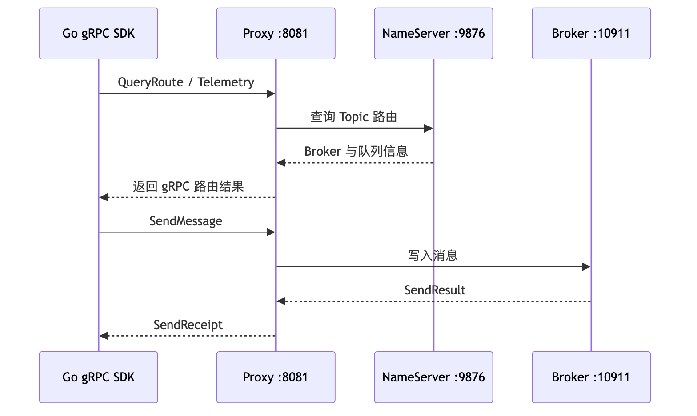
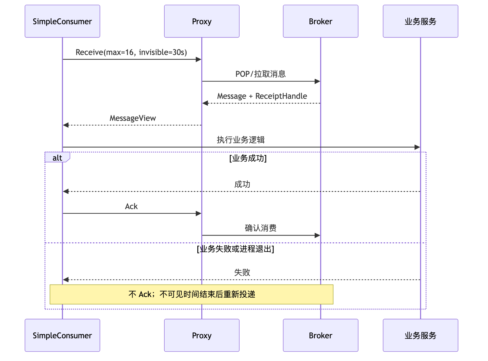
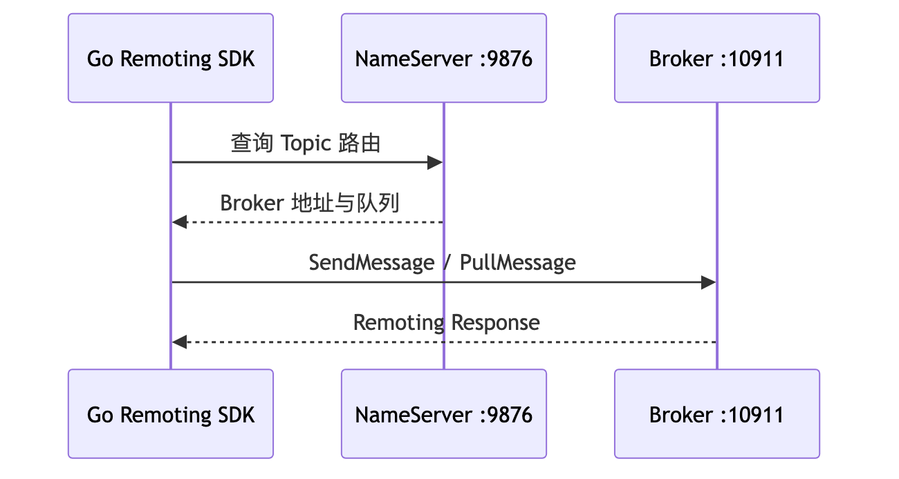

# 第 3 章：RocketMQ 环境搭建、管理工具与 Go 客户端实战

本章完成一套可验证的 RocketMQ 5.x 本地环境，并使用 Go 客户端完成普通消息的发送、接收和确认。重点不是“把进程启动起来”，而是建立一套从基础设施、资源管理、客户端接入到故障排查的完整链路。

## 本章去重边界与跳转

本章是可运行环境、管理工具和 Go 客户端实战章节，重点是“怎么把链路跑起来并验证”。概念性解释只保留操作所需的最小背景。

| 重复主题 | 本章处理方式 |
| --- | --- |
| NameServer、Broker、Proxy 的职责 | 本章只解释搭建时为什么需要它们；完整架构看 [第 2 章：整体架构、核心组件与领域模型](/blog/tech/RocketMQ/02.RocketMQ整体架构、核心组件与领域模型)。 |
| Endpoint、gRPC SDK、Proxy 与 5.x 迁移 | 本章只讲本地连接方式；架构差异和迁移策略看 [第 17 章：4.x 到 5.x 架构演进](/blog/tech/RocketMQ/17.从RocketMQ4.x到5.x：Proxy、gRPC、POP、Controller与架构演进)。 |
| Producer 与 Consumer 代码细节 | 本章只给最小可用示例；发送链路看 [第 4 章](/blog/tech/RocketMQ/04.Producer发送模型、路由选择、重试机制与底层发送链路)，消费链路看 [第 5 章](/blog/tech/RocketMQ/05.Consumer类型、长轮询、POP、ACK与完整消费链路)。 |
| Topic、Tag、Key 与自动创建 Topic | 本章只说明实验配置；生产治理看 [第 12 章：资源治理](/blog/tech/RocketMQ/12.Topic、Tag、Key、SQL92、MessageQueue与资源治理)。 |
| Ack 失败、重复投递和幂等 | 本章只提醒风险；可靠性闭环看 [第 8 章：端到端消息可靠性](/blog/tech/RocketMQ/08.端到端消息可靠性、重试、死信队列与消费幂等)。 |

## 3.1 版本基线与客户端选型

截至 **2026 年 6 月 20 日**，本章采用以下版本基线：

| 组件                     |            本章版本 | 说明                                      |
| ---------------------- | --------------: | --------------------------------------- |
| Apache RocketMQ Server |           5.5.0 | 当前正式发布页标记的最新版本                          |
| 5.x gRPC Go SDK        | `golang/v5.1.4` | 官方仓库最新列出版本，但 GitHub 标记为 **Pre-release** |
| 经典 Remoting Go SDK     |          v2.1.2 | `rocketmq-client-go` 发布页当前标记的 Latest    |
| RocketMQ Dashboard     |           2.1.0 | Dashboard 发布页当前标记的 Latest               |

其中，`golang/v5.1.4` 的 `go.mod` 声明需要 **Go 1.24**。本文示例严格使用该版本中的 `Start`、`GracefulStop`、`Send`、`Receive` 和 `Ack` 等 API。由于它属于预发布版本，生产环境必须固定依赖版本，并经过兼容性和回归测试，不应直接使用 `@latest`。([GitHub][11])

RocketMQ 当前存在两套容易混淆的 Go SDK：

| 对比项    | 5.x gRPC Go SDK                                | 经典 Remoting Go SDK                        |
| ------ | ---------------------------------------------- | ----------------------------------------- |
| 模块路径   | `github.com/apache/rocketmq-clients/golang/v5` | `github.com/apache/rocketmq-client-go/v2` |
| 通信协议   | gRPC + Protocol Buffers                        | RocketMQ Remoting 协议                      |
| 初始接入地址 | Proxy Endpoint                                 | NameServer 地址                             |
| 本地典型地址 | `127.0.0.1:8081`                               | `127.0.0.1:9876`                          |
| 服务端依赖  | 通常需要 Proxy                                     | NameServer 与 Broker                       |
| 关闭方法   | `GracefulStop()`                               | `Shutdown()`                              |
| 适用场景   | RocketMQ 5.x 新应用                               | 存量系统、经典客户端兼容                              |

最重要的结论是：

> **5.x SDK 的 `Endpoint` 不是 NameServer 地址。不要把 `127.0.0.1:9876` 填入 gRPC SDK 的 `Endpoint`。**

---

## 3.2 单机开发环境与生产集群

### 3.2.1 单机开发环境

本地开发环境可以在一台机器上运行：

* 一个 NameServer；
* 一个 Broker；
* 一个与 Broker 同进程部署的 Proxy；
* 可选的 Dashboard；
* Go Producer 与 Consumer。

这种模式适合接口联调、功能验证和故障复现，但不具备高可用性。任一进程停止、磁盘损坏或宿主机宕机，消息服务都可能不可用。

### 3.2.2 生产环境

生产集群必须消除单点，通常包括：

* 多个 NameServer；
* 多个 Broker 及其消息副本；
* 多个 Proxy 实例；
* 独立、持久化且受监控的存储；
* ACL、TLS、网络访问控制；
* Broker、Proxy、客户端和消费堆积监控；
* Topic、ConsumerGroup 的审批与变更流程。

Proxy 可以与 Broker 同进程部署，也可以独立集群部署。前者部署简单，适合规模较小的集群；后者更容易独立扩缩容和隔离故障。官方快速开始推荐本地环境采用 Broker 与 Proxy 同进程的 Local 模式，同时也支持集群模式。([RocketMQ][2])

---

## 3.3 操作系统、JDK、磁盘与端口

官方快速开始要求 64 位操作系统和 64 位 JDK 8 及以上版本。生产环境还应使用组织认可的受支持 JDK，并在升级 RocketMQ 或 JDK 前进行兼容性验证。([RocketMQ][2])

### 3.3.1 基础检查

```bash
java -version
uname -a
df -h
free -h
ulimit -n
ulimit -u
```

生产机器应重点关注以下方面：

| 项目   | 建议                                        |
| ---- | ----------------------------------------- |
| 文件句柄 | 调高 `nofile`，避免高连接数下出现 Too many open files |
| 磁盘   | CommitLog、ConsumeQueue 和日志应有明确容量规划        |
| 内存   | 为 JVM 堆、直接内存和 Linux Page Cache 预留空间       |
| Swap | 避免消息写入高峰时大量换页                             |
| 时间   | 各节点启用统一时间同步                               |
| 网络   | Broker 向客户端公布的地址必须真实可达                    |
| 文件系统 | 监控磁盘利用率、I/O 延迟和 inode                     |
| 日志   | 设置归档与清理策略，避免日志占满磁盘                        |

### 3.3.2 常用端口

|        端口 | 组件         | 用途                         |
| --------: | ---------- | -------------------------- |
|      9876 | NameServer | 路由注册和查询                    |
|     10911 | Broker     | 经典 Remoting 客户端主要通信端口      |
|     10909 | Broker     | 常见的快速/VIP 通信端口             |
|     10912 | Broker     | Broker 副本同步相关端口            |
|      8081 | Proxy      | 5.x gRPC 客户端常用 Endpoint    |
|      8080 | Proxy      | 官方 Docker 示例同时暴露的 Proxy 端口 |
| 8082/8443 | Dashboard  | 建议单独分配，避免与 Proxy 的 8080 冲突 |

检查监听状态：

```bash
ss -lntp | grep -E '9876|10909|10911|10912|8080|8081'
```

---

## 3.4 使用官方二进制包启动 RocketMQ

官方发布页当前最新服务端版本为 5.5.0。官方快速开始页面中的部分命令仍以 5.3.2 为示例，下面将版本替换为 5.5.0。([GitHub][1])

### 3.4.1 Broker 配置

进入 RocketMQ 解压目录，创建开发环境配置：

```bash
cat > conf/broker-dev.conf <<'EOF'
brokerClusterName=DefaultCluster
brokerName=broker-a
brokerId=0

namesrvAddr=127.0.0.1:9876
brokerIP1=127.0.0.1
listenPort=10911

deleteWhen=04
fileReservedTime=48

brokerRole=ASYNC_MASTER
flushDiskType=ASYNC_FLUSH

autoCreateTopicEnable=false
autoCreateSubscriptionGroup=false
EOF
```

`brokerIP1=127.0.0.1` 仅适合客户端也运行在同一台机器上的本地环境。客户端位于其他主机时，应将其设置为客户端能够访问的内网 IP 或域名。

### 3.4.2 启动 NameServer

```bash
nohup sh bin/mqnamesrv \
  > "$HOME/namesrv.out" 2>&1 &

tail -f "$HOME/logs/rocketmqlogs/namesrv.log"
```

日志中出现类似以下内容表示启动成功：

```text
The Name Server boot success
```

### 3.4.3 启动 Broker 与 Proxy

```bash
nohup sh bin/mqbroker \
  -n 127.0.0.1:9876 \
  --enable-proxy \
  -c conf/broker-dev.conf \
  > "$HOME/broker-proxy.out" 2>&1 &

tail -f "$HOME/logs/rocketmqlogs/proxy.log"
```

`--enable-proxy` 表示在启动 Broker 的同时启动 Proxy。官方本地快速开始正是采用这种方式。([RocketMQ][2])

验证端口：

```bash
ss -lntp | grep -E '9876|10911|8081'
```

验证集群：

```bash
sh bin/mqadmin clusterList -n 127.0.0.1:9876
```

### 3.4.4 正确关闭

```bash
sh bin/mqshutdown broker
sh bin/mqshutdown namesrv
```

不要直接长期使用 `kill -9`。强制结束进程会绕过正常关闭流程，只应在进程完全失去响应且常规关闭无效时使用。

---

## 3.5 使用 Docker 启动单节点环境

官方 Docker 文档会同时映射 `9876`、`10909`、`10911`、`10912`、`8080` 和 `8081`，并使用 `sh mqbroker --enable-proxy` 启动 Broker 与 Proxy。([RocketMQ][3])

### 3.5.1 创建网络和配置

```bash
docker network create rocketmq 2>/dev/null || true

export HOST_IP=127.0.0.1

cat > broker.conf <<EOF
brokerClusterName=DefaultCluster
brokerName=broker-a
brokerId=0
brokerIP1=${HOST_IP}

deleteWhen=04
fileReservedTime=48
brokerRole=ASYNC_MASTER
flushDiskType=ASYNC_FLUSH

autoCreateTopicEnable=false
autoCreateSubscriptionGroup=false
EOF
```

远程客户端接入时，`HOST_IP` 必须改为客户端可访问的宿主机地址。

### 3.5.2 启动 NameServer

```bash
docker run -d \
  --name rmqnamesrv \
  --network rocketmq \
  -p 9876:9876 \
  apache/rocketmq:5.5.0 \
  sh mqnamesrv
```

### 3.5.3 启动 Broker 与 Proxy

```bash
docker run -d \
  --name rmqbroker \
  --network rocketmq \
  -p 10909:10909 \
  -p 10911:10911 \
  -p 10912:10912 \
  -p 8080:8080 \
  -p 8081:8081 \
  -e NAMESRV_ADDR=rmqnamesrv:9876 \
  -v "$PWD/broker.conf:/home/rocketmq/rocketmq-5.5.0/conf/broker.conf" \
  apache/rocketmq:5.5.0 \
  sh mqbroker --enable-proxy \
  -c /home/rocketmq/rocketmq-5.5.0/conf/broker.conf
```

查看日志：

```bash
docker logs -f rmqnamesrv
docker logs -f rmqbroker
```

验证：

```bash
docker exec rmqbroker \
  sh mqadmin clusterList -n rmqnamesrv:9876
```

该命令适合本地实验。生产环境还必须挂载消息存储和日志目录，设置资源限制、健康检查、日志采集和重启策略。

---

## 3.6 为什么 gRPC Go SDK 通常需要 Proxy

5.x Go SDK 基于 gRPC 和 Protocol Buffers。客户端首先通过 Proxy 查询 Topic 路由，然后将消息请求发送到 Proxy 或路由返回的可用消息服务端点。Proxy 负责把 5.x 客户端协议转换并衔接到 Broker 的消息存储与消费机制。



因此，以下两种配置含义完全不同：

```text
gRPC SDK Endpoint:       127.0.0.1:8081
Remoting SDK NameServer: 127.0.0.1:9876
```

只启动 NameServer 和 Broker，却没有启动 Proxy，是 gRPC 客户端连接失败的常见原因。

---

## 3.7 Broker 核心配置参数

| 参数                            | 作用                 | 注意事项                           |
| ----------------------------- | ------------------ | ------------------------------ |
| `brokerClusterName`           | Broker 所属集群        | `mqadmin updateTopic -c` 使用该名称 |
| `brokerName`                  | Broker 逻辑名称        | 同一复制组应遵循一致规划                   |
| `brokerId`                    | Broker 标识          | 单机主节点通常为 0                     |
| `brokerIP1`                   | 向客户端公布的地址          | 必须从客户端网络可达                     |
| `listenPort`                  | Broker Remoting 端口 | 默认常见值为 10911                   |
| `deleteWhen`                  | 文件删除时间窗口           | 不是消息精确过期时间                     |
| `fileReservedTime`            | 文件保留小时数            | 需结合磁盘容量规划                      |
| `brokerRole`                  | Broker 角色          | 单机 `ASYNC_MASTER` 不等于高可用       |
| `flushDiskType`               | 刷盘策略               | 同步刷盘可靠性更高、延迟通常也更高              |
| `autoCreateTopicEnable`       | 是否自动创建 Topic       | 生产环境建议关闭                       |
| `autoCreateSubscriptionGroup` | 是否自动创建消费组          | 生产环境建议关闭                       |
| `storePathRootDir`            | 存储根目录              | 生产环境应使用持久化磁盘                   |
| `storePathCommitLog`          | CommitLog 目录       | 可与其他目录做存储隔离                    |

RocketMQ 默认配置中包含 `deleteWhen`、`fileReservedTime`、`brokerRole` 和 `flushDiskType` 等参数。自动创建功能适合初期测试，但生产环境不应依赖客户端第一次访问时临时生成资源。([GitHub][4])

---

## 3.8 使用 mqadmin 管理资源

`mqadmin` 的基本形式为：

```bash
sh bin/mqadmin <command> <args>
```

绝大多数命令都需要通过 `-n` 指定 NameServer 地址，并可用 `-h` 查看当前版本的参数说明。([RocketMQ][5])

```bash
export NAMESRV_ADDR=127.0.0.1:9876
export TOPIC=order-events
export CONSUMER_GROUP=order-worker
```

### 3.8.1 查看集群

```bash
sh bin/mqadmin clusterList \
  -n "$NAMESRV_ADDR"
```

该命令可以查看集群、BrokerName、BrokerId 和 TPS 等信息。([RocketMQ][5])

### 3.8.2 创建 Topic

```bash
sh bin/mqadmin updateTopic \
  -n "$NAMESRV_ADDR" \
  -c DefaultCluster \
  -t "$TOPIC" \
  -r 8 \
  -w 8
```

验证 Topic 路由：

```bash
sh bin/mqadmin topicRoute \
  -n "$NAMESRV_ADDR" \
  -t "$TOPIC"
```

查看队列 Offset：

```bash
sh bin/mqadmin topicStatus \
  -n "$NAMESRV_ADDR" \
  -t "$TOPIC"
```

### 3.8.3 创建 ConsumerGroup

```bash
sh bin/mqadmin updateSubGroup \
  -n "$NAMESRV_ADDR" \
  -c DefaultCluster \
  -g "$CONSUMER_GROUP" \
  -s true
```

`updateSubGroup` 用于创建或更新订阅组，`-s` 表示该分组是否允许消费。([RocketMQ][5])

### 3.8.4 查询消息

根据本章示例写入的业务 Key 查询：

```bash
sh bin/mqadmin queryMsgByKey \
  -n "$NAMESRV_ADDR" \
  -t "$TOPIC" \
  -k order-20260620-001
```

根据 SDK 返回的唯一消息 ID 查询：

```bash
sh bin/mqadmin queryMsgByUniqueKey \
  -n "$NAMESRV_ADDR" \
  -t "$TOPIC" \
  -i '<MessageID>'
```

如果持有的是经典 Remoting 场景中的 `offsetMsgId`，可以使用：

```bash
sh bin/mqadmin queryMsgById \
  -n "$NAMESRV_ADDR" \
  -i '<offsetMsgId>'
```

`queryMsgById`、`queryMsgByUniqueKey` 和业务 Key 查询并非同一个概念，排障时应先确认手中的 ID 类型。([RocketMQ][5])

### 3.8.5 查看消费进度

```bash
sh bin/mqadmin consumerProgress \
  -n "$NAMESRV_ADDR" \
  -g "$CONSUMER_GROUP" \
  -s true
```

该命令用于查看消费组的消费状态、客户端和消息堆积情况。([RocketMQ][5])

---

## 3.9 Dashboard 的使用与安全

Dashboard 可以用于查看：

* 集群和 Broker；
* Topic、队列与路由；
* ConsumerGroup 和消费堆积；
* Producer、Consumer 在线连接；
* 按时间、Key 或消息 ID 查询消息；
* Proxy 节点；
* ACL 2.0 规则。

官方 Dashboard 2.1.0 发布页包含 RocketMQ 5.x、Proxy、ACL 和权限控制方面的增强。([GitHub][6])

生产环境至少应配置：

```properties
server.port=8443

rocketmq.config.loginRequired=true
rocketmq.config.dataPath=/var/lib/rocketmq-dashboard
```

并在数据目录中配置 `users.properties`：

```properties
rmq-admin=请替换为强密码,1
rmq-viewer=请替换为只读用户密码
```

Dashboard 官方文档支持 HTTPS、登录认证、管理员与普通用户角色，以及通过 `role-permission.yml` 控制普通用户可访问的接口。([GitHub][7])

生产安全要求包括：

1. 不将 Dashboard 直接暴露到公网。
2. 使用 HTTPS，不使用文档示例中的测试证书。
3. 启用登录认证并更换默认口令。
4. 普通用户只授予查询权限。
5. 通过网关、VPN、堡垒机或网络白名单限制来源。
6. 将 RocketMQ ACL 凭据保存在密钥管理系统中。
7. 对删除 Topic、重置 Offset、重发死信等操作保留审计记录。

---

## 3.10 Go gRPC SDK 依赖初始化

本章代码使用 `golang/v5.1.4`，要求 Go 1.24 及以上：

```bash
mkdir rocketmq-go-lab
cd rocketmq-go-lab

go mod init example.com/rocketmq-go-lab
go get github.com/apache/rocketmq-clients/golang/v5@v5.1.4
```

本地明文 Proxy 使用：

```bash
export RMQ_ENDPOINT=127.0.0.1:8081
export RMQ_ENABLE_SSL=false
export RMQ_TOPIC=order-events
export RMQ_CONSUMER_GROUP=order-worker
```

启用 ACL 时再配置：

```bash
export RMQ_ACCESS_KEY='your-access-key'
export RMQ_ACCESS_SECRET='your-access-secret'
```

---

## 3.11 普通消息 Producer

将以下代码保存为 `producer.go`：

```go
package main

import (
	"context"
	"fmt"
	"log"
	"os"
	"strconv"
	"strings"
	"time"

	rmq "github.com/apache/rocketmq-clients/golang/v5"
	"github.com/apache/rocketmq-clients/golang/v5/credentials"
)

type config struct {
	Endpoint     string
	Namespace    string
	Topic        string
	Key          string
	Tag          string
	AccessKey    string
	AccessSecret string
	EnableSSL    bool
}

func env(key, fallback string) string {
	if value := strings.TrimSpace(os.Getenv(key)); value != "" {
		return value
	}
	return fallback
}

func loadConfig() (config, error) {
	enableSSL, err := strconv.ParseBool(env("RMQ_ENABLE_SSL", "false"))
	if err != nil {
		return config{}, fmt.Errorf("RMQ_ENABLE_SSL 非法: %w", err)
	}

	cfg := config{
		Endpoint:     env("RMQ_ENDPOINT", "127.0.0.1:8081"),
		Namespace:    strings.TrimSpace(os.Getenv("RMQ_NAMESPACE")),
		Topic:        env("RMQ_TOPIC", "order-events"),
		Key:          env("RMQ_KEY", "order-20260620-001"),
		Tag:          env("RMQ_TAG", "created"),
		AccessKey:    strings.TrimSpace(os.Getenv("RMQ_ACCESS_KEY")),
		AccessSecret: strings.TrimSpace(os.Getenv("RMQ_ACCESS_SECRET")),
		EnableSSL:    enableSSL,
	}

	if cfg.Endpoint == "" || cfg.Topic == "" ||
		cfg.Key == "" || cfg.Tag == "" {
		return config{}, fmt.Errorf(
			"Endpoint、Topic、Key 和 Tag 均不能为空",
		)
	}
	if (cfg.AccessKey == "") != (cfg.AccessSecret == "") {
		return config{}, fmt.Errorf(
			"RMQ_ACCESS_KEY 与 RMQ_ACCESS_SECRET 必须同时配置",
		)
	}
	return cfg, nil
}

func buildCredentials(
	cfg config,
) *credentials.SessionCredentials {
	if cfg.AccessKey == "" {
		return nil
	}
	return &credentials.SessionCredentials{
		AccessKey:    cfg.AccessKey,
		AccessSecret: cfg.AccessSecret,
	}
}

func main() {
	cfg, err := loadConfig()
	if err != nil {
		log.Fatalf("配置检查失败: %v", err)
	}

	// 官方 SDK 默认可使用 TLS；本地明文 Proxy 需要设为 false。
	rmq.EnableSsl = cfg.EnableSSL

	_ = os.Setenv("mq.consoleAppender.enabled", "true")
	rmq.ResetLogger()

	producer, err := rmq.NewProducer(
		&rmq.Config{
			Endpoint:    cfg.Endpoint,
			NameSpace:   cfg.Namespace,
			Credentials: buildCredentials(cfg),
		},
		rmq.WithTopics(cfg.Topic),
	)
	if err != nil {
		log.Fatalf("创建 Producer 失败: %v", err)
	}

	if err = producer.Start(); err != nil {
		log.Fatalf("启动 Producer 失败: %v", err)
	}
	defer func() {
		if err := producer.GracefulStop(); err != nil {
			log.Printf("关闭 Producer 失败: %v", err)
		}
	}()

	message := &rmq.Message{
		Topic: cfg.Topic,
		Body: []byte(
			`{"orderId":"order-20260620-001","status":"CREATED"}`,
		),
	}
	message.SetKeys(cfg.Key)
	message.SetTag(cfg.Tag)

	ctx, cancel := context.WithTimeout(
		context.Background(),
		5*time.Second,
	)
	defer cancel()

	receipts, err := producer.Send(ctx, message)
	if err != nil {
		log.Fatalf(
			"消息发送失败 endpoint=%s topic=%s key=%s: %v",
			cfg.Endpoint,
			cfg.Topic,
			cfg.Key,
			err,
		)
	}

	for _, receipt := range receipts {
		log.Printf(
			"发送成功 topic=%s key=%s tag=%s messageId=%s offset=%d",
			cfg.Topic,
			cfg.Key,
			cfg.Tag,
			receipt.MessageID,
			receipt.Offset,
		)
	}
}
```

运行：

```bash
go run producer.go
```

该 SDK 的 `Message` 支持 `SetKeys` 和 `SetTag`，`Send` 返回包含 `MessageID` 与 `Offset` 的 `SendReceipt`；Producer 应在进程级复用，而不是每发送一条消息就创建一次。([GitHub][8])

---

## 3.12 SimpleConsumer 消费与确认

将以下代码保存为 `consumer.go`：

```go
package main

import (
	"context"
	"errors"
	"fmt"
	"log"
	"os"
	"os/signal"
	"strconv"
	"strings"
	"syscall"
	"time"

	rmq "github.com/apache/rocketmq-clients/golang/v5"
	"github.com/apache/rocketmq-clients/golang/v5/credentials"
)

type config struct {
	Endpoint      string
	Namespace     string
	Topic         string
	ConsumerGroup string
	Tag           string
	AccessKey     string
	AccessSecret  string
	EnableSSL     bool
}

func env(key, fallback string) string {
	if value := strings.TrimSpace(os.Getenv(key)); value != "" {
		return value
	}
	return fallback
}

func loadConfig() (config, error) {
	enableSSL, err := strconv.ParseBool(env("RMQ_ENABLE_SSL", "false"))
	if err != nil {
		return config{}, fmt.Errorf("RMQ_ENABLE_SSL 非法: %w", err)
	}

	cfg := config{
		Endpoint:      env("RMQ_ENDPOINT", "127.0.0.1:8081"),
		Namespace:     strings.TrimSpace(os.Getenv("RMQ_NAMESPACE")),
		Topic:         env("RMQ_TOPIC", "order-events"),
		ConsumerGroup: env("RMQ_CONSUMER_GROUP", "order-worker"),
		Tag:           env("RMQ_TAG", "created"),
		AccessKey:     strings.TrimSpace(os.Getenv("RMQ_ACCESS_KEY")),
		AccessSecret:  strings.TrimSpace(os.Getenv("RMQ_ACCESS_SECRET")),
		EnableSSL:     enableSSL,
	}

	if cfg.Endpoint == "" || cfg.Topic == "" ||
		cfg.ConsumerGroup == "" || cfg.Tag == "" {
		return config{}, fmt.Errorf(
			"Endpoint、Topic、ConsumerGroup 和 Tag 均不能为空",
		)
	}
	if (cfg.AccessKey == "") != (cfg.AccessSecret == "") {
		return config{}, fmt.Errorf(
			"RMQ_ACCESS_KEY 与 RMQ_ACCESS_SECRET 必须同时配置",
		)
	}
	return cfg, nil
}

func buildCredentials(
	cfg config,
) *credentials.SessionCredentials {
	if cfg.AccessKey == "" {
		return nil
	}
	return &credentials.SessionCredentials{
		AccessKey:    cfg.AccessKey,
		AccessSecret: cfg.AccessSecret,
	}
}

func process(body []byte) error {
	if len(body) == 0 {
		return errors.New("消息体为空")
	}

	// 真实业务应在此完成数据库写入、HTTP 调用等操作。
	log.Printf("业务处理成功 body=%s", string(body))
	return nil
}

func main() {
	cfg, err := loadConfig()
	if err != nil {
		log.Fatalf("配置检查失败: %v", err)
	}

	rmq.EnableSsl = cfg.EnableSSL

	_ = os.Setenv("mq.consoleAppender.enabled", "true")
	rmq.ResetLogger()

	filter := rmq.SUB_ALL
	if cfg.Tag != "*" {
		filter = rmq.NewFilterExpression(cfg.Tag)
	}

	consumer, err := rmq.NewSimpleConsumer(
		&rmq.Config{
			Endpoint:      cfg.Endpoint,
			NameSpace:     cfg.Namespace,
			ConsumerGroup: cfg.ConsumerGroup,
			Credentials:   buildCredentials(cfg),
		},
		rmq.WithSimpleAwaitDuration(5*time.Second),
		rmq.WithSimpleSubscriptionExpressions(
			map[string]*rmq.FilterExpression{
				cfg.Topic: filter,
			},
		),
	)
	if err != nil {
		log.Fatalf("创建 SimpleConsumer 失败: %v", err)
	}

	if err = consumer.Start(); err != nil {
		log.Fatalf("启动 SimpleConsumer 失败: %v", err)
	}
	defer func() {
		if err := consumer.GracefulStop(); err != nil {
			log.Printf("关闭 Consumer 失败: %v", err)
		}
	}()

	rootCtx, stop := signal.NotifyContext(
		context.Background(),
		os.Interrupt,
		syscall.SIGTERM,
	)
	defer stop()

	log.Printf(
		"Consumer 已启动 endpoint=%s topic=%s group=%s tag=%s",
		cfg.Endpoint,
		cfg.Topic,
		cfg.ConsumerGroup,
		cfg.Tag,
	)

	for rootCtx.Err() == nil {
		receiveCtx, cancel := context.WithTimeout(
			rootCtx,
			12*time.Second,
		)

		messages, receiveErr := consumer.Receive(
			receiveCtx,
			16,
			30*time.Second,
		)
		callerTimedOut := errors.Is(
			receiveCtx.Err(),
			context.DeadlineExceeded,
		)
		cancel()

		if receiveErr != nil {
			if rootCtx.Err() != nil {
				break
			}
			if callerTimedOut ||
				strings.Contains(
					receiveErr.Error(),
					"DEADLINE_EXCEEDED",
				) {
				continue
			}

			log.Printf("接收消息失败: %v", receiveErr)
			time.Sleep(500 * time.Millisecond)
			continue
		}

		for _, message := range messages {
			tag := ""
			if message.GetTag() != nil {
				tag = *message.GetTag()
			}

			log.Printf(
				"收到消息 messageId=%s keys=%v tag=%s attempt=%d",
				message.GetMessageId(),
				message.GetKeys(),
				tag,
				message.GetDeliveryAttempt(),
			)

			if err := process(message.GetBody()); err != nil {
				// 不 Ack，使消息在不可见时间结束后重新投递。
				log.Printf(
					"业务处理失败 messageId=%s: %v",
					message.GetMessageId(),
					err,
				)
				continue
			}

			ackCtx, ackCancel := context.WithTimeout(
				context.Background(),
				5*time.Second,
			)
			err := consumer.Ack(ackCtx, message)
			ackCancel()

			if err != nil {
				log.Printf(
					"Ack 失败 messageId=%s: %v",
					message.GetMessageId(),
					err,
				)
				continue
			}

			log.Printf(
				"Ack 成功 messageId=%s",
				message.GetMessageId(),
			)
		}
	}

	log.Printf("收到退出信号，停止拉取新消息")
}
```

运行：

```bash
go run consumer.go
```

SimpleConsumer 的消费过程如下：



`Receive` 的不可见时间必须覆盖业务处理的最长合理耗时。处理时间可能超过不可见时间时，应调整该值，或使用 `ChangeInvisibleDuration` 延长不可见时间，否则消息可能在第一次处理尚未结束时再次投递。官方示例也明确要求不可见时间不能设置得过短。([GitHub][9])

---

## 3.13 Topic 与 ConsumerGroup 应由谁创建

生产环境推荐的职责划分是：

| 角色       | 职责                                |
| -------- | --------------------------------- |
| 应用团队     | 提交 Topic、ConsumerGroup、队列数和消息类型需求 |
| 消息平台/SRE | 审核命名、容量、权限和保留策略                   |
| 自动化平台    | 通过 mqadmin、流水线或 IaC 创建资源          |
| 应用程序     | 使用已存在的资源，不负责隐式创建                  |

不应随意启用自动创建，原因包括：

1. Topic 拼写错误会生成新的空 Topic，而不是立即失败。
2. 错误的 ConsumerGroup 名称会形成新的消费进度。
3. 自动生成的队列数、权限和消息类型可能不符合设计。
4. 无法在创建前完成容量、安全和命名审核。
5. 难以区分正式资源与误创建资源。
6. 资源生命周期无法纳入审计与变更管理。

开发环境可以临时启用自动创建以提高调试效率；验收环境和生产环境应显式创建资源。

---

## 3.14 gRPC 与 Remoting 的调用链差异

经典 Remoting SDK 首先访问 NameServer 获取 Broker 路由，随后直接通过 Remoting 协议访问 Broker：



经典 SDK 的初始化概念如下：

```go
p, err := rocketmq.NewProducer(
	producer.WithNsResolver(
		primitive.NewPassthroughResolver(
			[]string{"127.0.0.1:9876"},
		),
	),
	producer.WithRetry(2),
)
```

这里的 `127.0.0.1:9876` 是 NameServer 地址，不是 5.x gRPC Endpoint。经典 SDK 当前发布页标记的最新版本为 v2.1.2。([GitHub][10])

选型原则如下：

* 新建 RocketMQ 5.x 应用，优先评估 gRPC SDK。
* 存量系统已稳定使用 Remoting SDK时，不应仅为“版本更新”强行迁移。
* 必须确认目标服务端、Proxy、SDK 和消息特性的兼容矩阵。
* 同一应用中不要混淆两套 SDK 的地址、选项和生命周期 API。

---

## 3.15 常见故障排查

| 现象                     | 高概率原因                         | 排查方法                          |
| ---------------------- | ----------------------------- | ----------------------------- |
| `connection refused`   | Proxy 未启动、端口错误、容器未映射          | 检查 `8081`、`proxy.log` 和防火墙    |
| TLS 握手失败               | 本地是明文 Proxy，但 SDK 开启 SSL      | 设置 `RMQ_ENABLE_SSL=false`     |
| `No route info`        | Topic 不存在或未注册                 | 执行 `topicRoute`、`clusterList` |
| Producer 启动失败          | `WithTopics` 中的 Topic 不存在     | 先执行 `updateTopic`             |
| NameServer 正常但 gRPC 不通 | 只启动了 Broker，没有 Proxy          | 使用 `--enable-proxy`           |
| Consumer 收不到消息         | Tag 不匹配                       | 比较 Producer Tag 和订阅表达式        |
| Consumer 收不到消息         | 同组其他实例已消费                     | 检查 ConsumerGroup 和在线实例        |
| 消息不断重复                 | 未 Ack、Ack 超时或不可见时间过短          | 检查 Ack 日志和业务耗时                |
| Docker 本机可用、远程不可用      | `brokerIP1=127.0.0.1` 或容器私网地址 | 改为客户端可达地址                     |
| 客户端编译失败                | SDK 与示例 API 版本不一致             | 固定 `v5.1.4` 并使用 Go 1.24+      |
| 消费堆积                   | 消费能力不足或业务阻塞                   | 查看 `consumerProgress` 和业务延迟   |
| 查不到消息                  | 混淆 Key、MessageID、offsetMsgId  | 按 ID 类型选择查询命令                 |

推荐按以下顺序排查：

```bash
# 1. 进程和端口
ss -lntp | grep -E '9876|10911|8081'

# 2. 集群是否注册
sh bin/mqadmin clusterList -n 127.0.0.1:9876

# 3. Topic 是否存在
sh bin/mqadmin topicRoute \
  -n 127.0.0.1:9876 \
  -t order-events

# 4. 消费组是否存在及是否堆积
sh bin/mqadmin consumerProgress \
  -n 127.0.0.1:9876 \
  -g order-worker \
  -s true

# 5. 根据 Key 查询消息
sh bin/mqadmin queryMsgByKey \
  -n 127.0.0.1:9876 \
  -t order-events \
  -k order-20260620-001
```

---

## 3.16 初学者最常犯的 10 个错误

1. 把 `9876` 当成 gRPC SDK 的 Endpoint。
2. 启动了 NameServer 和 Broker，却没有启动 Proxy。
3. 本地 Proxy 使用明文通信，但 SDK 仍启用 SSL。
4. Docker 部署中把 `brokerIP1` 永久设置为 `127.0.0.1`。
5. 生产环境依赖自动创建 Topic。
6. ConsumerGroup 拼写错误，形成新的消费进度。
7. Producer 使用 `created` Tag，Consumer 却订阅 `paid`。
8. SimpleConsumer 处理成功后没有调用 `Ack`。
9. 所有调用都使用无超时的 `context.Background()`。
10. 每发送一条消息就创建和关闭一次 Producer。

---

## 3.17 最小验证清单

完成以下操作即可证明基本消息链路可用：

* [ ] `clusterList` 能看到 `DefaultCluster` 和 `broker-a`。
* [ ] `9876`、`10911`、`8081` 均处于监听状态。
* [ ] `topicRoute` 能查到 `order-events`。
* [ ] `updateSubGroup` 已创建 `order-worker`。
* [ ] Producer 输出 `messageId` 和 `offset`。
* [ ] `queryMsgByKey` 能通过业务 Key 查到消息。
* [ ] Consumer 能打印 MessageID、Key 和 Tag。
* [ ] Consumer 业务成功后打印 `Ack 成功`。
* [ ] `consumerProgress` 中的堆积量最终下降。
* [ ] 按 `Ctrl+C` 退出时客户端执行正常关闭。

### 生产环境验收清单

* [ ] NameServer、Broker 和 Proxy 均无单点。
* [ ] Broker 对外公布地址可从所有客户端网络访问。
* [ ] 消息存储目录已持久化并配置容量告警。
* [ ] Topic 和 ConsumerGroup 均通过审批流程创建。
* [ ] 已关闭 Topic 和 ConsumerGroup 自动创建。
* [ ] ACL、TLS、网络白名单和最小权限已启用。
* [ ] Dashboard 未直接暴露公网。
* [ ] Producer 和 Consumer 均配置超时及优雅退出。
* [ ] 消息堆积、发送失败、消费失败和磁盘利用率有告警。
* [ ] 完成 Broker、Proxy、客户端版本兼容性测试。
* [ ] 完成节点故障、网络中断和消费重试演练。
* [ ] 发布方案包含回滚步骤。

---

## 3.18 面试题

> **题目去重**：本节作为本章实战自测，只保留环境、工具和 Go 接入题。跨章重复题、完整追问链和模拟面试统一跳转到 [第 20 章：资深面试题库、追问链与模拟面试](/blog/tech/RocketMQ/20.RocketMQ资深面试题库、追问链与模拟面试)。

### 1. gRPC SDK 的 Endpoint 与 NameServer 地址有什么区别？

Endpoint 指向 Proxy 等 gRPC 接入点，典型端口为 8081；NameServer 地址用于经典 Remoting 客户端查询 Broker 路由，典型端口为 9876。追问时应指出两者不能互换。

### 2. 为什么 5.x gRPC Go SDK 通常需要 Proxy？

因为 Broker 原生核心链路与 5.x gRPC 客户端协议之间需要 Proxy 完成协议接入、路由查询、认证和消息请求转发。

### 3. `--enable-proxy` 有什么作用？

它使 Broker 启动时同时启动 Proxy，适合单机开发和 Broker、Proxy 同进程部署模式。

### 4. 为什么生产环境要关闭自动创建 Topic？

自动创建会掩盖拼写错误，绕过容量、权限和消息类型审核，并导致资源生命周期失控。

### 5. `brokerIP1` 配错会出现什么现象？

Broker 虽然能够向 NameServer 注册，但客户端获得的是不可达地址，因此会出现连接超时、发送失败或本机可用而远程不可用。

### 6. `No route info` 的常见原因有哪些？

Topic 不存在、Broker 未注册、NameServer 地址错误、路由尚未同步、网络不通或客户端访问了错误的接入点。

### 7. SimpleConsumer 的不可见时间是什么？

消息被拉取后，在该时间窗口内不会正常投递给其他消费者；成功处理后必须 Ack，否则不可见时间结束后可能重新投递。

### 8. 为什么业务成功后 Ack 仍可能失败？

可能发生网络中断、ReceiptHandle 过期、不可见时间结束、Proxy 不可用、上下文超时或权限校验失败。

### 9. 为什么 Producer 应当复用？

Producer 启动时会建立连接、查询路由并维护后台状态。逐条消息创建 Producer 会增加连接、路由和线程开销。

### 10. Key 与 Tag 的区别是什么？

Key 主要用于业务检索和定位消息；Tag 用于消费端过滤。Key 不应被当成唯一幂等机制，Tag 也不适合承载复杂业务数据。

### 11. gRPC SDK 与经典 Remoting SDK 应如何选型？

根据现有服务端版本、是否部署 Proxy、所需消息特性、组织稳定性要求和迁移成本选择，而不是仅根据包名版本高低选择。

### 12. 如何判断消费者是没有收到消息，还是已经被同组其他实例消费？

检查 ConsumerGroup、在线 Consumer 连接、队列分配、订阅表达式和 `consumerProgress`；集群消费模式下，同一条消息通常只由组内一个实例处理。

### 13. 为什么必须给发送、接收和 Ack 设置 Context 超时？

避免网络故障或服务端异常时 Goroutine 永久阻塞，从而耗尽连接、内存和并发资源。

### 14. 如何做到客户端优雅退出？

先停止接收新流量，等待正在处理的消息完成或达到退出期限，然后调用 `GracefulStop` 或 `Shutdown` 释放连接和后台任务。

---

## 3.19 本章小结

本章完成了 RocketMQ 5.5.0 单节点环境的二进制与 Docker 部署，明确了 NameServer、Broker、Proxy 和 Dashboard 的职责，并使用 `mqadmin` 创建 Topic、ConsumerGroup、查询消息和查看消费进度。

客户端侧需要牢记两条边界：

```text
github.com/apache/rocketmq-clients/golang/v5
Endpoint -> Proxy，例如 127.0.0.1:8081
```

```text
github.com/apache/rocketmq-client-go/v2
NameServer -> 例如 127.0.0.1:9876
```

本章使用的官方资料和版本包括：

* Apache RocketMQ Server 5.5.0 发布页。([GitHub][1])
* RocketMQ 本地与 Docker 快速开始。([RocketMQ][2])
* RocketMQ Admin Tool 命令说明。([RocketMQ][5])
* 5.x gRPC Go SDK `golang/v5.1.4`，当前标记为预发布，要求 Go 1.24。([GitHub][11])
* 经典 Remoting Go SDK v2.1.2。([GitHub][10])
* RocketMQ Dashboard 2.1.0 及其安全配置说明。([GitHub][6])

[1]: https://github.com/apache/rocketmq/releases "https://github.com/apache/rocketmq/releases"
[2]: https://rocketmq.apache.org/docs/quickStart/01quickstart/ "https://rocketmq.apache.org/docs/quickStart/01quickstart/"
[3]: https://rocketmq.apache.org/docs/quickStart/02quickstartWithDocker/ "https://rocketmq.apache.org/docs/quickStart/02quickstartWithDocker/"
[4]: https://raw.githubusercontent.com/apache/rocketmq/rocketmq-all-5.5.0/distribution/conf/broker.conf "raw.githubusercontent.com"
[5]: https://rocketmq.apache.org/zh/docs/deploymentOperations/02admintool/ "https://rocketmq.apache.org/zh/docs/deploymentOperations/02admintool/"
[6]: https://github.com/apache/rocketmq-dashboard/releases "https://github.com/apache/rocketmq-dashboard/releases"
[7]: https://github.com/apache/rocketmq-dashboard/blob/master/docs/1_0_0/UserGuide_EN.md "https://github.com/apache/rocketmq-dashboard/blob/master/docs/1_0_0/UserGuide_EN.md"
[8]: https://raw.githubusercontent.com/apache/rocketmq-clients/golang/v5.1.4/golang/producer.go "https://raw.githubusercontent.com/apache/rocketmq-clients/golang/v5.1.4/golang/producer.go"
[9]: https://raw.githubusercontent.com/apache/rocketmq-clients/golang/v5.1.4/golang/simple_consumer.go "https://raw.githubusercontent.com/apache/rocketmq-clients/golang/v5.1.4/golang/simple_consumer.go"
[10]: https://github.com/apache/rocketmq-client-go/releases "https://github.com/apache/rocketmq-client-go/releases"
[11]: https://github.com/apache/rocketmq-clients/releases "https://github.com/apache/rocketmq-clients/releases"
