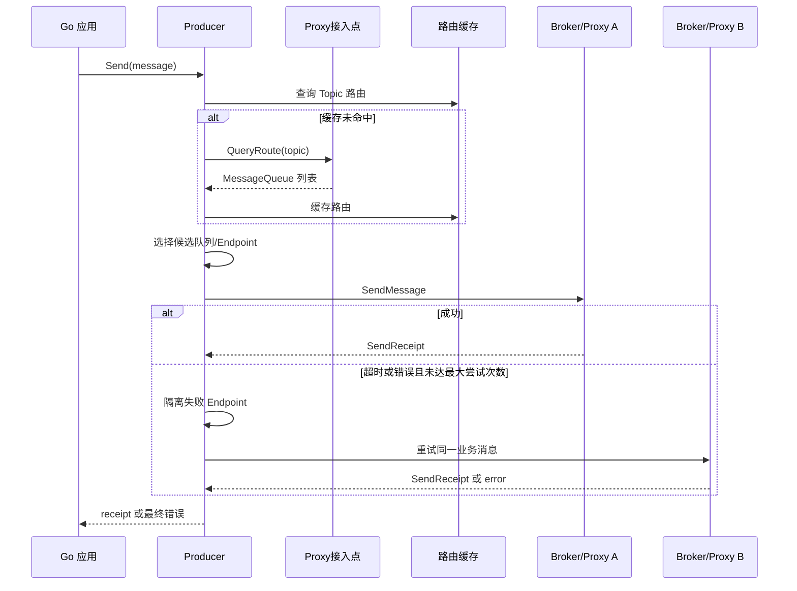
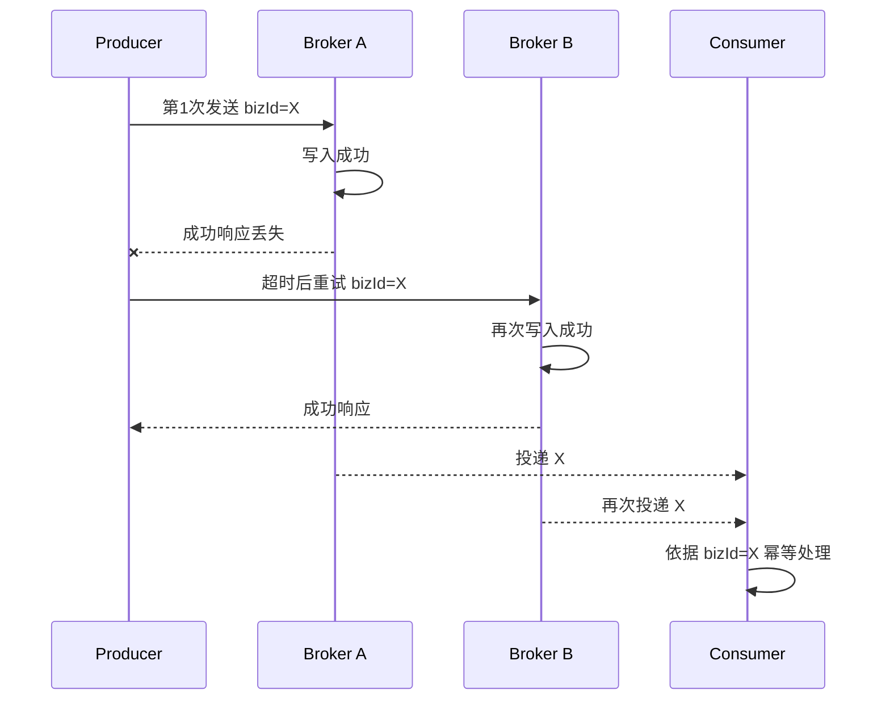
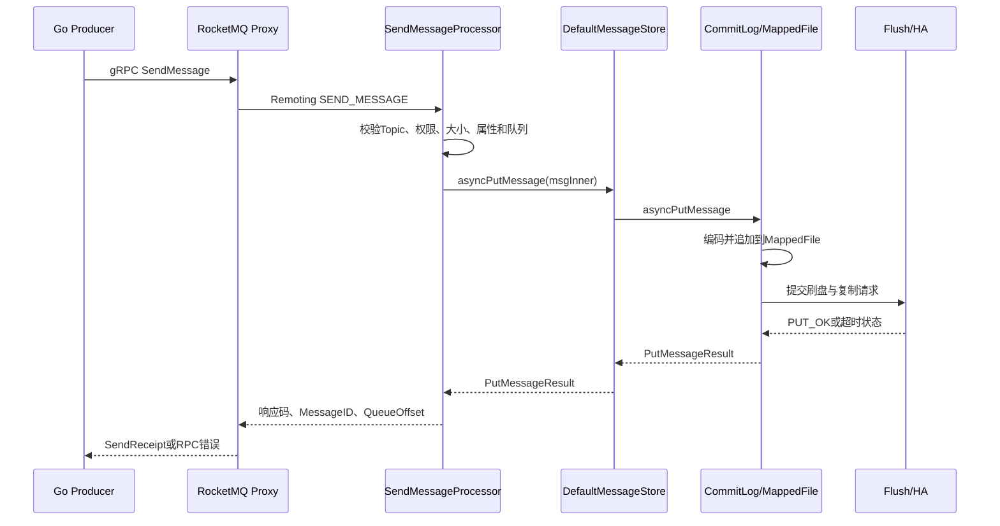

# 第 4 章：Producer 发送模型、路由选择、重试机制与底层发送链路

> **技术基线（核对日期：2026 年 6 月 20 日）**：本章以 Apache RocketMQ **5.5.0** 服务端和官方 Go gRPC SDK **golang/v5.1.4** 为主；经典 Go 对照片段按 **rocketmq-client-go/v2 v2.1.2**，经典 Java 调用链按 5.5.0 代码库中保留的 Remoting 客户端实现核对。`golang/v5.1.4` 当前标记为 Pre-release，生产环境应锁定经过自身验证的版本。5.x Go SDK 的 `Endpoint` 指向 Proxy 接入点，不是经典客户端的 NameServer 地址。

## 本章去重边界与跳转

本章是 Producer 主讲章节，重点保留发送生命周期、路由选择、队列选择、重试、超时和发送端工程封装。重复出现的可靠性、存储和资源概念只做跳转。

| 重复主题 | 本章处理方式 |
| --- | --- |
| Producer 在整体架构中的位置 | 本章默认读者已理解组件职责；组件全景看 [第 2 章：整体架构、核心组件与领域模型](/blog/tech/RocketMQ/02.RocketMQ整体架构、核心组件与领域模型)。 |
| Topic、Tag、Key、MessageQueue 的治理语义 | 本章只讲发送时如何设置；资源边界和过滤治理看 [第 12 章：Topic、Tag、Key、SQL92、MessageQueue 与资源治理](/blog/tech/RocketMQ/12.Topic、Tag、Key、SQL92、MessageQueue与资源治理)。 |
| 重试导致重复、Outbox 与端到端不丢 | 本章讲发送端原因；完整可靠性闭环看 [第 8 章：端到端消息可靠性、重试、死信队列与消费幂等](/blog/tech/RocketMQ/08.端到端消息可靠性、重试、死信队列与消费幂等)。 |
| Broker 写入、刷盘、复制和 ACK 时机 | 本章只讲发送结果可见性；存储细节看 [第 7 章：存储引擎](/blog/tech/RocketMQ/07.RocketMQ存储引擎)，高可用取舍看 [第 13 章：高可用](/blog/tech/RocketMQ/13.RocketMQ高可用)。 |
| 源码调用链 | 本章讲工程语义；源码入口看 [第 18 章：源码阅读](/blog/tech/RocketMQ/18.RocketMQ源码阅读：发送、存储、消费、事务与高可用调用链)。 |

## 4.1 学习目标

学完本章，你应能回答四类问题：一是 Producer 从创建到关闭经历了什么；二是一条消息如何获得路由、选择队列并发送到 Broker；三是超时、重试和重复消息之间是什么关系；四是如何在 Go 服务中封装一个有超时、背压、日志、指标和优雅关闭能力的 Producer。

本章最重要的结论是：

> **发送成功是一个分层概念；发送超时通常只代表 Producer 没拿到确定结果，不代表 Broker 一定没收到。**

## 4.2 Producer 生命周期

Producer 不应被理解成一个简单的 HTTP 客户端。启动后，它还要维护路由缓存、Broker/Proxy 连接、心跳或遥测会话、故障节点状态和后台刷新任务。因此，正确生命周期是“进程级创建、并发复用、退出时排空并关闭”，而不是每发一条消息就创建一次。


### 4.2.1 创建与启动

5.x Go SDK 的典型入口是：

```go
producer, err := rmq.NewProducer(
    &rmq.Config{
        Endpoint: endpoint,
        NameSpace: namespace,
        Credentials: &credentials.SessionCredentials{
            AccessKey:    accessKey,
            AccessSecret: secretKey,
        },
    },
    rmq.WithTopics("order-events"),
    rmq.WithMaxAttempts(3),
)
if err != nil {
    return err
}
producer.SetRequestTimeout(2 * time.Second)
if err := producer.Start(); err != nil {
    return err
}
```

`WithTopics` 不只是声明用途。当前 Go 实现会在 `Start` 阶段预取这些 Topic 的路由；未预声明的 Topic 也能在首次发送时按需查询，但首条消息会承担路由查询和设置同步成本。启动失败时应直接阻止服务进入 Ready 状态，不能一边对外接流量一边等待 Producer “自己恢复”。

### 4.2.2 发送与关闭

同步 `Send` 返回后，调用方获得确定成功或错误；异步 `SendAsync` 立即返回，真正结果通过回调到达。服务退出时必须先停止接收新业务请求，再等待所有异步发送和正在执行的同步发送结束，最后调用 `GracefulStop`。只写一个 `defer producer.GracefulStop()`，却不跟踪异步 in-flight 数量，仍可能在回调执行前退出。

官方示例建议复用单例 Producer。Producer 内部使用并发容器和原子状态管理路由及故障信息，适合被多个 goroutine 共享；但同一个可变 `Message` 对象不应被多个 goroutine 同时修改或重复发送，每次业务发送应构造独立消息。

### 4.2.3 实例复用、线程安全与连接管理

“Producer 可并发使用”与“所有相关对象都可并发修改”是两件事。应用通常按相同的 Endpoint、Namespace、凭证和治理边界创建少量进程级 Producer；多个业务 goroutine 共享它们，避免重复建立 gRPC 连接、重复查询路由和重复启动后台任务。若不同业务必须使用不同 ACL 身份、网络接入点或隔离的限流预算，再拆分实例，而不是机械地按 Topic 一对一创建。

连接由 SDK 管理，业务代码不应自行保存某个 Broker 地址并长期直连。路由变化、Proxy 扩缩容和节点故障都要求连接目标可更新。健康检查也不应只看“对象创建成功”：服务 Ready 前至少应完成 `Start`，核心 Topic 最好通过 `WithTopics` 预热；运行中还要观察路由查询失败、连接建立失败、发送超时率和隔离 Endpoint 数量。

线程安全边界还包括关闭过程。`GracefulStop` 与新发送并发发生时，业务层必须先把 Producer 状态切为 closing，拒绝新增任务，再等待已登记的 in-flight 请求完成。否则会出现“某个 goroutine 刚通过业务校验，另一个 goroutine 已关闭底层连接”的竞态。

## 4.3 同步、异步与单向发送

| 模式 | 5.x 官方 Go API | 调用线程 | 是否获得 Broker 结果 | 典型场景 |
|---|---|---|---|---|
| 同步 | `Send` | 阻塞到成功或最终失败 | 是 | 订单、支付、库存等需要立即判断结果的链路 |
| 异步 | `SendAsync` | 不等待，结果进入回调 | 是 | 高吞吐通知、日志事件，但必须限制并发并处理回调 |
| 单向 | 当前 5.x Go API未公开 | 发送后不等响应 | 否 | 仅适合可容忍丢失、无需确认的遥测类数据；经典 SDK 提供 |

经典 Go Remoting SDK 对应 `SendSync`、`SendAsync`、`SendOneWay`。单向发送不是“更快的可靠发送”，而是主动放弃 Broker 确认：客户端只能知道请求是否成功交给本地网络层，无法知道 Broker 是否校验、存储或拒绝了消息。因此，核心业务通常不应选择单向模式。

同步和异步的可靠性目标可以相同，主要差别是等待模型。5.x Go SDK 的 `SendAsync` 在 goroutine 中调用与同步发送相同的内部 `send0/send1` 链路，所以两者共享最大尝试次数；同步调用线程被阻塞，异步调用线程不阻塞，但回调之前的内部重试仍然存在。

版本差异必须单独记忆：经典 Java 客户端分别配置 `retryTimesWhenSendFailed` 与 `retryTimesWhenSendAsyncFailed`；经典 Go v2 源码中，`WithRetry` 明确用于同步和单向循环，而异步路径只发起一次异步调用。不能把某个 SDK 的行为泛化为所有 RocketMQ 客户端。

模式选择应从业务确认点出发。调用方必须在当前请求内决定是否继续业务流程时，用同步发送最直接；吞吐优先且业务允许结果稍后汇总时，可用异步，但必须把回调错误接入统一补偿流程；只有消息本身允许抽样、丢弃且不参与业务状态推进时，才考虑单向。异步不是规避延迟的魔法，它只是把等待从业务 goroutine 转移到 SDK goroutine和回调，系统总工作量、失败处理和资源上限仍然存在。

## 4.4 一条消息中各字段的职责

| 字段 | 作用 | 设计建议 |
|---|---|---|
| Topic | 路由、权限、存储和治理边界 | 按业务域与消息类型规划，不要为每个用户建 Topic |
| Tag | Broker 端一级过滤标签 | 值应稳定、低基数，如 `OrderCreated` |
| Key | 查询和业务关联键 | 放订单号、支付单号等；不等于 Broker 自动幂等 |
| Body | 业务载荷 | 使用有版本的 Schema，避免超大 JSON 和文件 |
| Properties | 自定义元数据 | 放 schema version、tenant、trace 等小字段 |
| MessageGroup | FIFO 分片键 | 同一业务实体需有序时使用，如 `order-123` |

推荐把业务消息 ID 同时放入 Key 和自定义属性：Key 便于运维查询，自定义属性便于消费代码统一读取。真正的消费幂等仍要由数据库唯一键、幂等表或业务状态机完成。FIFO 的 `MessageGroup` 应使用稳定、可复现的业务分片值；官方参数建议长度为 1～64 个字符。

```go
msg := &rmq.Message{
    Topic: "order-events",
    Body:  []byte(`{"order_id":"O20260620001","status":"CREATED"}`),
}
msg.SetTag("OrderCreated")
msg.SetKeys("O20260620001")
msg.AddProperty("biz_message_id", "order-created-O20260620001-v1")
msg.AddProperty("schema_version", "1")
```

## 4.5 路由获取、缓存与刷新

### 4.5.1 5.x gRPC 路由流程

5.x Go 客户端首先向配置的接入点查询 Topic 路由，得到可写 `MessageQueue` 及其 Broker/Proxy Endpoint。路由写入客户端缓存；发送时先查缓存，未命中才查询远端。当前实现还会每 30 秒刷新已缓存 Topic，并同步更新 Producer 的发布负载均衡器。



路由缓存带来性能，也带来短暂陈旧窗口。例如 Broker 刚下线而客户端仍保存旧路由，第一次发送可能失败；随后 SDK 隔离失败 Endpoint、选择其他候选节点，并等待周期刷新获得新路由。路由陈旧通常表现为一段时间的超时和重试，不意味着消息一定丢失。

### 4.5.2 经典 4.x 路由流程

经典客户端直接向 NameServer 查询 Topic 路由，形成 `TopicPublishInfo`，再根据 BrokerName 查找 Broker 地址并通过 Remoting 发送。高频源码链可记为：

`DefaultMQProducerImpl.tryToFindTopicPublishInfo` → `MQClientInstance.updateTopicRouteInfoFromNameServer` → `TopicPublishInfo` → `selectOneMessageQueue` → `sendKernelImpl`。

5.x 与 4.x 的关键区别不是“有没有路由缓存”，而是接入层和协议不同：5.x gRPC 客户端面向 Endpoint/Proxy；经典客户端面向 NameServer 与 Broker Remoting 地址。

路由设计要接受“缓存最终更新”而不是追求每次发送都查控制面。每次都远程查路由会把 NameServer 或 Proxy 变成发送热路径，降低吞吐并放大控制面故障；永不刷新又会长期持有失效节点。合理模型是缓存命中走数据面、后台周期刷新、失败时快速隔离候选节点，并让下一轮刷新修正拓扑。

运维排查时可按三层定位：若所有 Topic 同时失败，先看接入点、凭证和网络；若单个 Topic 首发慢或持续无路由，检查 Topic 是否存在、权限和路由下发；若只有某个 Broker 方向超时，检查客户端隔离状态、该节点负载和链路质量。把所有超时都归因于“NameServer 有问题”通常会误导定位。

## 4.6 MessageQueue 选择策略

普通消息首先追求负载均衡和故障转移，FIFO 消息首先追求同一分片稳定落到同一队列。

### 4.6.1 5.x Go SDK 的实际选择

当前 5.x Go 发布负载均衡器维护原子递增下标，按轮转方式遍历队列，并尽量只从每个 Broker 取一个候选队列；已被标记隔离的 Endpoint 会被跳过。候选数量与最大尝试次数相关，后续尝试按序选择不同候选。

FIFO 消息则通过 `MessageGroup` 做稳定哈希，当前源码使用 SipHash 后对队列数取模。同一 MessageGroup 在路由集合不变时落到同一队列；扩缩队列后取模空间变化，映射可能改变，所以不能把它理解为永久固定分区。

### 4.6.2 经典客户端的可插拔选择器

经典 Go SDK 暴露 `QueueSelector`，内置手工、随机、轮询和 Hash 选择器。Hash 选择器读取消息的 ShardingKey，使用 FNV-1a 后对队列数取模；没有 ShardingKey 时退化为随机选择。

```go
p, err := producer.NewDefaultProducer(
    producer.WithNameServer(nameServers),
    producer.WithQueueSelector(producer.NewHashQueueSelector()),
)
if err != nil {
    return err
}
msg := primitive.NewMessage("order-events", []byte("..."))
msg.WithShardingKey("order-123")
_, err = p.SendSync(ctx, msg)
```

业务 ShardingKey 的正确粒度通常是订单号、账户号、设备号，而不是固定常量。固定常量会把全部流量压到一个队列；过细或随机键则失去局部顺序价值。

### 4.6.3 经典延迟故障规避

经典 Java 客户端的 `MQFaultStrategy` 可启用发送延迟故障规避。发送后，客户端根据本次延迟、是否隔离以及节点可达性更新故障项；后续选择优先过滤不可用 Broker，再过滤不可达 Broker，最后才退化到普通选择。它不是精确的集群健康检查，而是 Producer 本地基于近期观测做的快速避障。

面试时应说明：轮询解决“均匀”，Hash 解决“同键稳定”，故障规避解决“暂时不要再选慢节点”，三者解决的问题不同。

队列策略还会影响热点和顺序边界。随机与轮询适合无状态普通消息；Hash 或 MessageGroup 适合同一实体有顺序要求的消息，但业务键分布必须足够离散。若一个“大客户”占据大部分流量，即使 Hash 算法正确，也可能形成单队列热点，需要在业务允许的前提下把分片键细化为“客户号+子资源”。反过来，为了均匀而给同一订单随机分片，会直接破坏局部有序。

重试换队列也有语义差异：普通消息可换候选 Broker 提高成功率；FIFO 消息必须维持同一 MessageGroup 的队列选择，否则可能出现后发消息先落盘。高可用与严格顺序之间存在约束，不能只通过增加重试次数同时获得两者的上限。

## 4.7 超时、异常、重试与重复消息

### 4.7.1 四类失败的含义

1. **连接或网络异常**：请求可能尚未发出，也可能已经到达对端但连接在返回前断开。
2. **请求超时**：Producer 在截止时间前没拿到结果；Broker 可能没收到、正在处理、已写入但响应未到。
3. **Broker 明确错误**：如无权限、消息非法、服务不可用、系统繁忙或限流。明确错误比超时信息更多，但仍要按错误类型决定是否可重试。
4. **响应丢失**：Broker 已成功处理，响应在网络或客户端侧丢失。这是最典型的“结果未知”。

因此，超时后直接生成一个新消息并无限重试，会把一次不确定写入扩大为多次确定重复。正确模型是三态：

- **Confirmed**：收到成功回执。
- **NotSent**：在调用 SDK 前就因参数错误、背压或服务关闭而拒绝，可确定未发出。
- **Unknown**：调用 SDK 后返回超时或网络错误，是否写入未知。

### 4.7.2 内部重试边界

官方 5.x 文档规定同步和异步都支持发送重试；网络失败、请求超时、连接关闭、Broker 处理慢、Broker 错误和限流都可能触发。除限流外通常立即重试；限流按退避策略处理。

5.x Go SDK 的默认值是 `WithMaxAttempts(3)`。源码语义是**总尝试次数最多为 3 次**，即首次尝试加后续尝试，而不是“首次之外再重试 3 次”。调用方还应设置总业务截止时间，否则每次 RPC 超时与多次尝试叠加，会长时间占用业务线程。

推荐区分两个超时：

- SDK `SetRequestTimeout`：单次 RPC 等待上限。
- `context.WithTimeout`：整个业务发送操作的总上限。

不要在 SDK 已重试之外再套无界 `for` 循环。需要最终不丢时，应把 Unknown 或最终失败写入 Outbox/补偿表，由独立任务按业务 ID重投，并让消费端幂等。

### 4.7.3 两个维度：是否写入与是否值得重试

发送错误至少要沿两个维度分类，不能只做一个 `if err != nil`。第一个维度是**投递确定性**：`NotSent`、`Confirmed`、`Unknown`；第二个维度是**操作策略**：可立即重试、应退避重试、不可重试。两者不是同义词。例如参数校验失败通常是 NotSent 且不可重试；限流可能是 NotSent 或 Unknown，策略上应退避；网络超时通常是 Unknown，即使允许重试也必须接受重复风险。

| 现象 | 投递确定性 | 建议动作 | 原因 |
|---|---|---|---|
| 本地参数、Topic、Body 大小校验失败 | NotSent | 修复数据，不自动重试 | 尚未进入网络发送 |
| ACL、权限或消息类型明确拒绝 | 通常 NotSent | 告警并修复配置 | 原样重试不会改变结果 |
| Broker 限流或系统繁忙 | 视响应阶段而定 | 有上限地退避，配合背压 | 立即重试会形成重试风暴 |
| 连接重置、请求超时、响应丢失 | Unknown | 保留同一业务 ID，进入补偿 | 前次可能已经写入 |
| 收到成功回执 | Confirmed | 记录回执并推进状态 | 满足当前 Broker 确认条件 |

外层补偿任务必须设置退避、最大并发和死信状态，不能把数据库 Outbox 扫描器写成毫秒级无限重发器。否则 Broker 越慢，补偿流量越大，最终形成正反馈雪崩。

### 4.7.4 为什么重试会产生重复

第一次请求在 Broker 已写入后响应丢失，Producer 看见超时并选择另一个 Broker 重试。两次写入都可能成功。5.x Go 客户端在一次内部发送流程中复用同一个协议消息 ID，但普通消息存储并不会因此自动提供端到端去重；业务仍需使用稳定业务消息 ID 做幂等。



## 4.8 SendReceipt、SendResult、SendStatus 与异常

5.x Go SDK 成功时返回 `[]*SendReceipt`，主要字段包括 `MessageID`、`Offset`、`Endpoints`、事务 ID 和延迟消息召回句柄；失败时返回 error。当前 API 不暴露经典 `SendStatus` 枚举，所以不能编写不存在的 `receipt.SendStatus` 判断。

经典 Remoting 客户端返回 `SendResult`，状态通常包括：

- `SEND_OK`：本次写入满足当前 Broker 配置下的成功条件。
- `FLUSH_DISK_TIMEOUT`：同步刷盘等待超时，消息可能已经追加到内存映射文件。
- `FLUSH_SLAVE_TIMEOUT`：同步复制等待超时，主节点可能已有消息。
- `SLAVE_NOT_AVAILABLE`：要求同步复制但从节点不可用，主节点可能已有消息。

后三种状态不能简单理解为“没写入”。Broker 的 `SendMessageProcessor.handlePutMessageResult` 将它们视为已发生有效追加并返回相应状态。是否可承受主机宕机或掉电，还取决于刷盘模式、复制模式、ISR/Controller 配置，而不是只看一个 `SEND_OK` 字符串。

处理原则：成功回执记录 Topic、业务 ID、RocketMQ MessageID、队列偏移和耗时；明确不可重试错误立即告警；超时与网络错误标记 Unknown，进入对账或 Outbox；任何重投都复用业务 ID。

### 4.8.1 “成功”究竟确认到哪一层

发送成功可以拆成四层，面试中必须说清所讨论的是哪一层：

| 层级 | 能证明什么 | 不能证明什么 |
|---|---|---|
| 应用已调用 SDK | 业务代码尝试发送 | 请求是否离开进程 |
| Producer 获得成功回执 | Broker 按当前配置接受并完成本次确认条件 | 未来任何灾难下都不丢 |
| 已刷盘、已复制到足够副本 | 抗相应级别的进程或节点故障能力更强 | 消费者一定已处理 |
| 消费者业务提交并对账通过 | 业务副作用已落地 | 下游系统永不回滚或重复 |

因此，“`SEND_OK` 后消息会不会丢”没有脱离配置的单一答案。异步刷盘下，进程或机器突发故障可能落在内存尚未持久化的窗口；复制未完成时，主节点永久损坏可能使新主缺少该消息；即使 Broker 数据完好，消费者也可能因业务事务失败而未形成最终效果。可靠性结论必须覆盖 Producer、Broker 持久化、复制、消费幂等和对账五部分。

## 4.9 批量、压缩与消息大小

官方参数建议中，默认请求超时为 3000ms，默认消息 Body 上限为 4MB，自定义属性的 Key 与 Value 总和建议小于 16KB。生产中应远低于上限，避免单条大消息放大网络、内存、刷盘、复制和消费延迟。文件、图片和大报表应存对象存储，消息只传地址与校验信息。

当前 5.x Go v5.1.4 的公开 `Producer.Send` 一次接收一个 `*Message`，不要虚构 `Send(ctx, msgs...)` 批量 API。协议和 Broker 支持一个请求携带多条消息，但该版本 Go 公共 Producer 接口尚未暴露批量发送。经典 Go SDK 的 `SendSync(ctx, msgs ...*primitive.Message)` 可编码同 Topic 批量；Broker 端进入 `sendBatchMessage`，批次总大小同样必须留在服务端限制内，且重试 Topic 等场景不支持批量。

压缩也存在版本差异：经典 Go SDK 默认在非批量 Body 达到 4096 字节时尝试压缩，可调整阈值与级别；当前 5.x Go 发布消息源码使用 `IDENTITY`，不会自动压缩发送 Body。若业务自行 gzip，应通过属性声明编码并在消费端显式解压，同时评估 CPU 成本，不能假设 SDK 会自动还原。

## 4.10 Producer 背压、限流与本地堆积

异步 API 不等于无限吞吐。当前 5.x Go `SendAsync` 每次会启动 goroutine；调用方若在流量洪峰中无界调用，可能造成 goroutine、Body 字节、回调和连接等待在内存中堆积，最终先拖垮 Producer 进程。

生产封装至少要有：

- 最大 in-flight 数量或总字节数；
- 获取配额的等待超时；
- 本地拒绝计数与当前 in-flight 指标；
- 对 Broker `TOO_MANY_REQUESTS`、超时率和 P99 的监控；
- 明确的降级策略，例如写 Outbox、降采样非核心事件或快速失败；
- 禁止无界内存队列。需要持久缓冲时使用数据库 Outbox、本地 WAL 或专用持久队列。

### 4.10.1 如何估算 in-flight 上限

容量不能只凭经验写成 1000。可先用近似关系：`in-flight ≈ 峰值发送 QPS × P99 发送耗时`。例如峰值 5000 QPS、P99 为 200ms，维持吞吐至少需要约 1000 个并发占位；随后还要按单条 Body 大小计算内存。如果平均消息 64KB，1000 条仅 Body 就约 62.5MB，尚未包含 Go 对象、gRPC 缓冲、日志和重试副本。

因此生产系统最好同时限制“条数”和“字节数”。条数保护 goroutine、回调和调度开销，字节数保护堆内存。限额达到后，核心消息写持久化 Outbox，非核心消息可按业务策略拒绝或采样；绝不能通过继续扩容内存 channel 来掩盖下游持续变慢。监控至少包括当前 in-flight、等待配额耗时、拒绝数、消息字节分布、发送 P95/P99和重试次数。

## 4.11 从 Go 客户端到存储的完整链路

5.x gRPC 主链可概括为：

`Producer.Send` → `defaultProducer.send0` → 获取 `PublishingLoadBalancer` → 选择 `MessageQueue` → `send1` → gRPC `SendMessage` → Proxy `SendMessageActivity.sendMessage` → `MessagingProcessor.sendMessage` → `ProducerProcessor.sendMessage` → `MessageService.sendMessage` → Broker Remoting 请求。

Broker 与存储主链为：

`SendMessageProcessor.processRequest` → `sendMessage` / `sendBatchMessage` → 构造 `MessageExtBrokerInner` → `MessageStore.asyncPutMessage` → `DefaultMessageStore.asyncPutMessage` → `CommitLog.asyncPutMessage` → 追加 MappedFile → 刷盘与复制 future → `handlePutMessageResult` → 返回状态、MessageID、QueueOffset。



注意“写入 CommitLog”与“消费者立刻可见”不是同一个瞬间。CommitLog 追加后还要由分发链构建 ConsumeQueue 等逻辑索引；本章关注发送确认，存储分发将在后续章节展开。

理解调用链时要抓住三个边界。第一，Proxy 是协议与访问层，不等于最终持久化点；gRPC 调用成功依赖后续 Broker 写入结果。第二，`CommitLog.asyncPutMessage` 中的“async”表示内部以 future 组合追加、刷盘和复制等待，不等于业务 Producer 使用了异步发送。第三，Broker 返回何种状态由追加结果、刷盘模式和复制条件共同决定，客户端看到的回执只是这条服务端状态机的外部投影。

排查高延迟时也应沿调用链分段：路由查询慢、连接建立慢、Proxy 排队、Broker 线程池拥塞、CommitLog 锁竞争、磁盘刷盘慢、同步复制慢都会表现为端到端发送耗时上升。只有同时记录客户端总耗时、重试次数、目标 Endpoint、Broker 存储指标和磁盘/复制延迟，才能判断瓶颈在哪一段。

## 4.12 一个可靠的 Go Producer 封装

下面示例采用“SDK 内部有限重试 + 调用方总超时 + 有界并发 + 业务 ID + 三态结果 + 优雅关闭”。它故意不在 SDK 外层盲目重试；返回 `unknown` 时，业务应把记录留在 Outbox 继续对账。

```go
package reliablemq

import (
	"context"
	"errors"
	"fmt"
	"log/slog"
	"sync"
	"time"

	rmq "github.com/apache/rocketmq-clients/golang/v5"
	"github.com/apache/rocketmq-clients/golang/v5/credentials"
)

type Outcome string

const (
	Confirmed Outcome = "confirmed"
	NotSent   Outcome = "not_sent"
	Unknown   Outcome = "unknown"
)

type Metrics interface {
	Inflight(delta int)
	Observe(outcome Outcome, latency time.Duration)
	Rejected(reason string)
}

type NopMetrics struct{}

func (NopMetrics) Inflight(int)                   {}
func (NopMetrics) Observe(Outcome, time.Duration) {}
func (NopMetrics) Rejected(string)                {}

type Config struct {
	Endpoint         string
	Namespace        string
	AccessKey        string
	SecretKey        string
	Topic            string
	RequestTimeout   time.Duration // 单次RPC
	OverallTimeout   time.Duration // 整个发送操作
	MaxAttempts      int32
	MaxInFlight      int
	MaxBodyBytes     int // 应用侧预校验，默认4MB
	MaxPropertyBytes int // 应用侧属性预算，默认16KB
}

type Request struct {
	BusinessID string
	Tag        string
	Body       []byte
	Properties map[string]string
}

type Result struct {
	Outcome   Outcome
	MessageID string
	Offset    int64
}

type DeliveryError struct {
	Outcome Outcome
	Cause   error
}

func (e *DeliveryError) Error() string { return fmt.Sprintf("send outcome=%s: %v", e.Outcome, e.Cause) }
func (e *DeliveryError) Unwrap() error { return e.Cause }

type Producer struct {
	client rmq.Producer
	topic  string
	log    *slog.Logger
	metric Metrics
	sem    chan struct{}

	mu               sync.Mutex
	closing          bool
	inflight         sync.WaitGroup
	stopOnce         sync.Once
	stopDone         chan struct{}
	stopErr          error
	overall          time.Duration
	maxBodyBytes     int
	maxPropertyBytes int
}

func New(cfg Config, log *slog.Logger, metric Metrics) (*Producer, error) {
	if cfg.Endpoint == "" || cfg.Topic == "" {
		return nil, errors.New("endpoint and topic are required")
	}
	if cfg.RequestTimeout <= 0 {
		cfg.RequestTimeout = 2 * time.Second
	}
	if cfg.MaxAttempts <= 0 {
		cfg.MaxAttempts = 3
	}
	if cfg.OverallTimeout <= 0 {
		cfg.OverallTimeout = cfg.RequestTimeout*time.Duration(cfg.MaxAttempts) + time.Second
	}
	if cfg.MaxInFlight <= 0 {
		cfg.MaxInFlight = 256
	}
	if cfg.MaxBodyBytes <= 0 {
		cfg.MaxBodyBytes = 4 * 1024 * 1024
	}
	if cfg.MaxPropertyBytes <= 0 {
		cfg.MaxPropertyBytes = 16 * 1024
	}
	if log == nil {
		log = slog.Default()
	}
	if metric == nil {
		metric = NopMetrics{}
	}

	c, err := rmq.NewProducer(
		&rmq.Config{
			Endpoint:  cfg.Endpoint,
			NameSpace: cfg.Namespace,
			Credentials: &credentials.SessionCredentials{
				AccessKey: cfg.AccessKey, AccessSecret: cfg.SecretKey,
			},
		},
		rmq.WithTopics(cfg.Topic),
		rmq.WithMaxAttempts(cfg.MaxAttempts),
	)
	if err != nil {
		return nil, fmt.Errorf("new producer: %w", err)
	}
	c.SetRequestTimeout(cfg.RequestTimeout)
	if err := c.Start(); err != nil {
		return nil, fmt.Errorf("start producer: %w", err)
	}

	return &Producer{
		client:           c,
		topic:            cfg.Topic,
		log:              log,
		metric:           metric,
		sem:              make(chan struct{}, cfg.MaxInFlight),
		stopDone:         make(chan struct{}),
		overall:          cfg.OverallTimeout,
		maxBodyBytes:     cfg.MaxBodyBytes,
		maxPropertyBytes: cfg.MaxPropertyBytes,
	}, nil
}

func (p *Producer) begin(ctx context.Context) error {
	select {
	case p.sem <- struct{}{}:
	case <-ctx.Done():
		p.metric.Rejected("backpressure_timeout")
		return ctx.Err()
	}
	p.mu.Lock()
	defer p.mu.Unlock()
	if p.closing {
		<-p.sem
		p.metric.Rejected("closing")
		return errors.New("producer is closing")
	}
	p.inflight.Add(1)
	p.metric.Inflight(1)
	return nil
}

func (p *Producer) end() {
	p.metric.Inflight(-1)
	p.inflight.Done()
	<-p.sem
}

func (p *Producer) Send(ctx context.Context, req Request) (Result, error) {
	if req.BusinessID == "" || len(req.Body) == 0 {
		p.metric.Rejected("invalid_message")
		return Result{Outcome: NotSent}, &DeliveryError{
			Outcome: NotSent,
			Cause:   errors.New("business id and body are required"),
		}
	}
	if len(req.Body) > p.maxBodyBytes {
		p.metric.Rejected("body_too_large")
		return Result{Outcome: NotSent}, &DeliveryError{
			Outcome: NotSent,
			Cause:   fmt.Errorf("body size %d exceeds application limit %d", len(req.Body), p.maxBodyBytes),
		}
	}
	propertyBytes := len("biz_message_id") + len(req.BusinessID)
	for k, v := range req.Properties {
		if k != "biz_message_id" {
			propertyBytes += len(k) + len(v)
		}
	}
	if propertyBytes > p.maxPropertyBytes {
		p.metric.Rejected("properties_too_large")
		return Result{Outcome: NotSent}, &DeliveryError{
			Outcome: NotSent,
			Cause:   fmt.Errorf("property bytes %d exceeds application limit %d", propertyBytes, p.maxPropertyBytes),
		}
	}

	ctx, cancel := context.WithTimeout(ctx, p.overall)
	defer cancel()
	if err := p.begin(ctx); err != nil {
		return Result{Outcome: NotSent}, &DeliveryError{Outcome: NotSent, Cause: err}
	}
	defer p.end()

	msg := &rmq.Message{Topic: p.topic, Body: append([]byte(nil), req.Body...)}
	msg.SetKeys(req.BusinessID)
	if req.Tag != "" {
		msg.SetTag(req.Tag)
	}
	msg.AddProperty("biz_message_id", req.BusinessID)
	for k, v := range req.Properties {
		if k != "biz_message_id" {
			msg.AddProperty(k, v)
		}
	}

	started := time.Now()
	receipts, err := p.client.Send(ctx, msg)
	latency := time.Since(started)
	if err != nil {
		p.metric.Observe(Unknown, latency)
		p.log.Error("rocketmq send result unknown",
			"topic", p.topic, "biz_message_id", req.BusinessID,
			"latency", latency, "error", err)
		return Result{Outcome: Unknown}, &DeliveryError{Outcome: Unknown, Cause: err}
	}
	if len(receipts) == 0 {
		err := errors.New("empty send receipt")
		p.metric.Observe(Unknown, latency)
		return Result{Outcome: Unknown}, &DeliveryError{Outcome: Unknown, Cause: err}
	}

	r := receipts[0]
	p.metric.Observe(Confirmed, latency)
	p.log.Info("rocketmq send confirmed",
		"topic", p.topic, "biz_message_id", req.BusinessID,
		"message_id", r.MessageID, "offset", r.Offset, "latency", latency)
	return Result{Outcome: Confirmed, MessageID: r.MessageID, Offset: r.Offset}, nil
}

func (p *Producer) Close(ctx context.Context) error {
	p.stopOnce.Do(func() {
		p.mu.Lock()
		p.closing = true
		p.mu.Unlock()
		go func() {
			p.inflight.Wait()
			p.stopErr = p.client.GracefulStop()
			close(p.stopDone)
		}()
	})
	select {
	case <-p.stopDone:
		return p.stopErr
	case <-ctx.Done():
		return fmt.Errorf("close producer: %w", ctx.Err())
	}
}
```

示例中的 Body 与属性大小检查是应用侧的提前拒绝，服务端下发限制仍是最终边界。这个封装仍不能单独承诺“绝不丢消息”。核心业务应在同一数据库事务中写业务数据和 Outbox，投递成功后标记发送完成；Unknown 保留待重试，消费端按 `BusinessID` 幂等，另设超时扫描与对账任务。

## 4.13 五个故障场景

| 场景 | 实际含义 | 正确处理 |
|---|---|---|
| 第一次写入成功但响应丢失 | Producer 看到超时，Broker 可能已有消息 | 标记 Unknown；重投复用业务 ID；消费幂等 |
| 主 Broker 写入后宕机 | 是否丢失取决于刷盘和复制是否完成 | 根据 RPO 选择同步刷盘/复制或更强 HA，并做 Outbox 对账 |
| 路由缓存过期 | 短期可能发往旧 Endpoint | 依赖 SDK 故障隔离、重试与周期刷新，监控路由和超时率 |
| 某 Broker 延迟突然升高 | 线程被慢请求占用，重试放大流量 | 设总超时、有限尝试、背压；经典客户端可启用延迟故障规避 |
| 发送后进程立即退出 | 同步成功通常已有结果；异步或单向可能尚未完成 | 停止接流量、等待 in-flight、再 `GracefulStop` |

### 4.13.1 第一次发送成功但响应丢失

这是理解至少一次投递的经典场景。Broker A 已追加消息并生成成功响应，但连接在响应到达 Producer 前断开。Producer 无法观察 Broker 内部事实，只能得到超时；SDK 随后可能选择 Broker B 再发一次。最终两个 Broker 都有同一业务事件。此时不能依赖两次 RocketMQ MessageID完全相同来去重，消费端应以稳定的 `biz_message_id` 建唯一约束或执行状态机检查。Producer 侧把该记录视为 Unknown，而不是擅自改成失败或成功。

### 4.13.2 主 Broker 写入后宕机

先问三个问题：消息是否仅追加到 Page Cache、是否完成要求的刷盘、是否复制到可接管副本。若采用异步刷盘且机器掉电，尚未落盘的数据可能丢失；若主节点本地已有但复制未完成，主节点永久故障后新主可能缺少该消息；若同步刷盘和足够副本确认均已完成，RPO 更小，但延迟和可用性成本更高。正确答案不是背一句“RocketMQ 不丢”，而是说明确认策略与故障模型。

### 4.13.3 路由缓存过期

客户端仍可能选择已下线或角色已变化的 Endpoint。第一次请求失败后，5.x SDK 会隔离失败 Endpoint 并从候选列表继续尝试，后台刷新再用新路由替换缓存。若所有候选都陈旧或控制面不可达，本次发送最终失败。业务层应维持总超时和 Outbox，不要在故障期间反复清空缓存、重建 Producer；频繁重建反而会加重路由服务和连接握手压力。

### 4.13.4 某个 Broker 延迟突然升高

慢节点会占住 in-flight 配额，使上游排队，超时后重试又把流量转移到健康节点，可能导致次生过载。经典延迟故障规避可减少继续选择慢 Broker 的概率，5.x 客户端也会在错误后隔离 Endpoint，但这些机制都替代不了业务背压。应联合观察单节点 P99、超时率、重试放大倍数和健康节点利用率；必要时降低入口速率，而不是单纯增加超时或重试次数。

### 4.13.5 Producer 进程发送后立即退出

同步调用已经返回成功时，通常已获得 Broker 回执，但仍受前述刷盘与复制语义约束。异步调用刚返回只说明任务已被提交，回调可能尚未执行；单向调用甚至没有 Broker 结果。优雅退出顺序应是：从注册中心摘流量或关闭监听、拒绝新发送、等待业务请求结束、等待 Producer in-flight 归零、调用 `GracefulStop`，最后退出进程。强制 `SIGKILL` 无法执行这一流程，所以核心消息还需 Outbox 兜底。

## 4.14 如何回答“消息发送是否会丢失”

### 30 秒回答

RocketMQ Producer 有超时和有限重试，但只能降低发送失败概率，不能单靠 SDK 保证端到端零丢失。超时代表结果未知，重试可能造成重复。核心业务应使用数据库事务加 Outbox或事务消息确保业务事件最终可重放，Broker 侧根据 RPO 配置刷盘与复制，消费端按业务消息 ID幂等，并通过日志、指标和对账闭环。

### 3 分钟回答

先分阶段：业务代码是否生成事件、Producer 是否发出、Broker 是否追加 CommitLog、是否刷盘和复制、消费者是否成功处理。Producer 收到成功回执，只能证明满足当前 Broker 配置下的确认条件；异步刷盘或异步复制仍有故障窗口。Producer 超时不能判定未写入，因此重试会产生重复。

然后给方案：业务事务内写 Outbox；发送器使用稳定业务 ID、有限内部重试、总超时和有界并发；成功记录 RocketMQ MessageID，Unknown 不删除 Outbox；Broker 根据 RPO 选择合适刷盘、复制和 Controller/主从策略；消费端用唯一键或状态机幂等；最后用积压、失败率、Unknown 数量和业务对账发现缺口。结论不是“绝对不会丢”，而是把每个不确定窗口变成可检测、可重放、可对账。

## 4.15 常见误区

1. 把请求超时等同于 Broker 未收到。
2. 把 RocketMQ MessageID 当作业务幂等键。
3. 在 SDK 内部重试外再写无限循环。
4. 每次请求创建并关闭 Producer。
5. 无界调用 `SendAsync`，不限制 goroutine 和 Body 总字节。
6. 只判断 error，不记录业务 ID、MessageID、耗时和目标 Endpoint。
7. 认为 `SEND_OK` 在任何刷盘、复制配置下都等价于“掉电不丢”。
8. 把 5.x Go SDK 中不存在的 oneway、批量或 `SendStatus` API 写进代码。
9. 为了顺序把所有消息使用同一个 ShardingKey，形成热点队列。
10. 进程退出时只调用关闭函数，不等待异步回调和 in-flight 请求。

## 4.16 面试题

> **题目去重**：本节作为本章 Producer 自测，只保留发送链路、重试、路由和超时题。跨章重复题、完整追问链和模拟面试统一跳转到 [第 20 章：资深面试题库、追问链与模拟面试](/blog/tech/RocketMQ/20.RocketMQ资深面试题库、追问链与模拟面试)。

### 1. Producer 为什么要复用？
**标准回答**：它维护连接、路由缓存、心跳/遥测和后台刷新，频繁创建会增加握手、路由查询、线程与端口开销。
**追问**：Message 对象能否复用？
**错误分析**：把 Producer 可并发复用误解成可并发修改同一个 Message。

### 2. 发送超时是否说明消息没到 Broker？
**标准回答**：不能。可能未发出、处理中、已写入但响应丢失，属于结果未知。
**追问**：下一步怎么做？
**错误分析**：直接换新业务 ID重发，会破坏幂等关联。

### 3. 为什么重试会产生重复？
**标准回答**：客户端不知道前一次失败请求在 Broker 的处理结果，已写入的请求可能再次成功。
**追问**：如何治理？
**错误分析**：声称 RocketMQ 会按普通消息 MessageID 自动去重。

### 4. `WithMaxAttempts(3)`是什么意思？
**标准回答**：在当前 5.x Go 源码中是最多 3 次总尝试。
**追问**：如何限制总耗时？
**错误分析**：解释成首次发送之外再重试 3 次，并忽略每次超时叠加。

### 5. 同步和异步谁更可靠？
**标准回答**：可靠性取决于重试、确认和持久化配置；主要区别是等待模型。5.x Go 两者走相同内部重试链。
**追问**：异步风险是什么？
**错误分析**：认为异步必然丢消息，或认为异步天然无限吞吐。

### 6. 单向发送适合订单消息吗？
**标准回答**：通常不适合，因为没有 Broker 处理结果。
**追问**：适合什么？
**错误分析**：把本地写 socket 成功当成 Broker 存储成功。

### 7. Topic、Tag、Key 分别解决什么问题？
**标准回答**：Topic 是治理和路由边界，Tag 是过滤标签，Key 是查询和业务关联。
**追问**：哪个负责幂等？
**错误分析**：回答 Key 会让 Broker 自动幂等。

### 8. 普通消息如何选队列？
**标准回答**：5.x Go 按轮转选择不同 Broker 的候选队列并避开隔离 Endpoint；重试依次换候选。
**追问**：FIFO 呢？
**错误分析**：说所有消息都按业务 Key Hash。

### 9. MessageGroup 扩队列后会怎样？
**标准回答**：哈希取模空间变化，同组映射可能改变；扩缩容期间要评估顺序边界。
**追问**：如何降低影响？
**错误分析**：认为同一 Key 永久绑定物理队列。

### 10. 延迟故障规避是什么？
**标准回答**：经典客户端依据近期发送延迟和失败，把 Broker 暂时标记不可用，后续选择时优先避开。
**追问**：它能替代监控吗？
**错误分析**：把本地启发式策略说成全局一致健康检查。

### 11. `SEND_OK` 是否等于物理磁盘和从节点都成功？
**标准回答**：只代表满足当前刷盘和复制配置下的成功条件；需结合 Broker 配置判断。
**追问**：`FLUSH_SLAVE_TIMEOUT` 呢？
**错误分析**：把任何非 OK 状态都理解为主节点没有消息。

### 12. 5.x Go 如何判断发送成功？
**标准回答**：`Send` 返回非空 `SendReceipt` 且 error 为 nil；API 不暴露经典 `SendStatus`。
**追问**：error 超时怎么分类？
**错误分析**：编写不存在的 `receipt.SendStatus` 字段。

### 13. 为什么要区分单次请求超时和总超时？
**标准回答**：单次超时约束一次 RPC，总超时约束路由、重试和等待的完整业务链。
**追问**：只配 3 秒会怎样？
**错误分析**：忽略多次尝试可能让总耗时成倍增长。

### 14. 5.x Go 是否支持公开批量发送？
**标准回答**：v5.1.4 公共 `Send` 一次接收一个消息；不能虚构 variadic API。经典 Go SDK支持同 Topic 变参批量。
**追问**：批量的代价？
**错误分析**：认为批量越大越好，忽略大小、延迟和整批失败影响。

### 15. 如何防止异步发送拖垮进程？
**标准回答**：按数量或字节设置有界 in-flight、获取配额超时、拒绝指标和持久化降级。
**追问**：能否用无界 channel？
**错误分析**：把内存队列当成可靠持久队列。

### 16. 如何设计“不丢消息”的发送端？
**标准回答**：业务事务写 Outbox，发送使用稳定业务 ID和有限重试，Unknown 留待补偿，Broker 按 RPO 配置持久化与复制，消费端幂等并做对账。
**追问**：为什么只靠 Producer 重试不够？
**错误分析**：没有覆盖进程崩溃、数据库提交后未发送和 Broker 持久化窗口。

## 4.17 练习题

1. 为订单创建事件设计 Topic、Tag、Key、MessageGroup 和业务消息 ID，并说明哪些字段参与幂等。
2. 模拟 Broker 已写入但响应丢失，验证消费端是否只产生一次业务副作用。
3. 给异步 Producer 加入“最大 1000 条且最大 64MB in-flight”的双重背压。
4. 分别在异步刷盘、同步刷盘以及不同复制模式下，画出 `SEND_OK` 后仍可能发生的数据窗口。
5. 为 Unknown 发送结果设计 Outbox 状态机：`PENDING`、`SENDING`、`CONFIRMED`、`RETRY_WAIT`、`DEAD`。

## 4.18 本章总结

Producer 发送链路的核心不是背 API，而是理解“不确定性边界”：路由可能陈旧，队列选择可能变化，网络可能只丢响应，Broker 成功含义受持久化配置约束，重试会把不确定失败转化为重复概率。成熟方案不会宣称靠一次 `Send` 实现绝对零丢失，而是用有限重试、业务 ID、Outbox、幂等、背压、优雅关闭和对账，把每个失败窗口变成可恢复流程。

## 4.19 官方资料

1. Apache RocketMQ 5.0 文档：Sending Retry and Throttling Policy。
2. Apache RocketMQ 5.0 文档：Parameter Constraints and Suggestions。
3. Apache RocketMQ 官方仓库：5.5.0 Release 与 `SendMessageProcessor`、`DefaultMessageStore`、`CommitLog`。
4. Apache RocketMQ Clients 官方仓库：`golang/v5.1.4` Release。
5. `rocketmq-clients/golang/producer.go`、`client.go`、`loadBalancer.go`、`message.go`、`publishing_message.go`。
6. 经典 Go 客户端 **v2.1.2**：`rocketmq-client-go/v2/producer/producer.go`、`option.go`、`selector.go`。
7. 经典 Java 客户端：`DefaultMQProducer`、`DefaultMQProducerImpl`、`MQFaultStrategy`。
