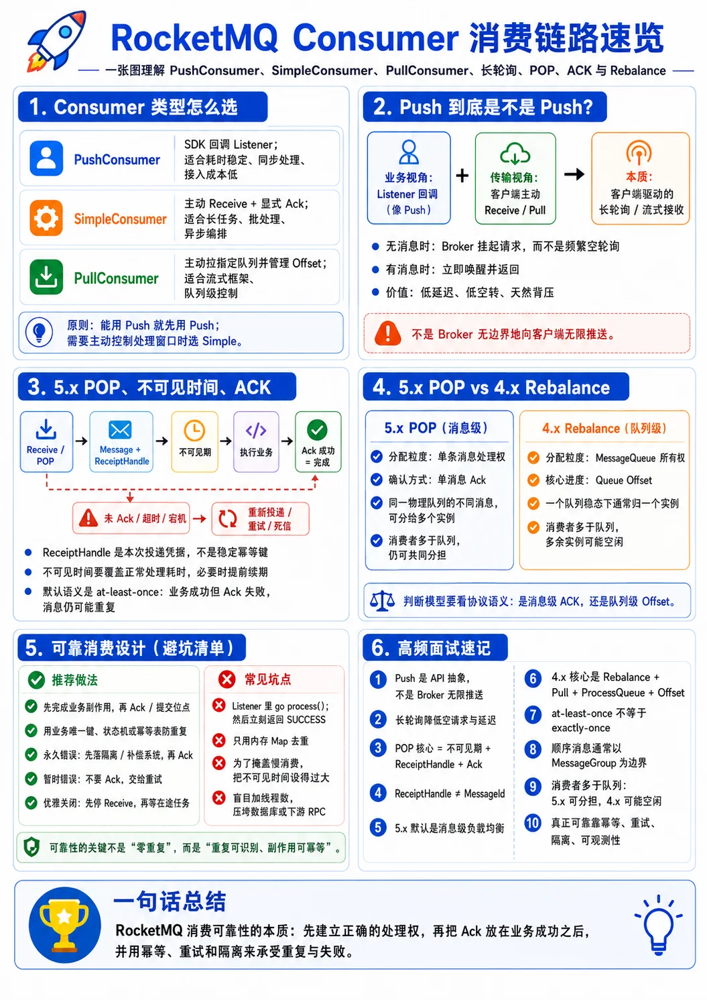
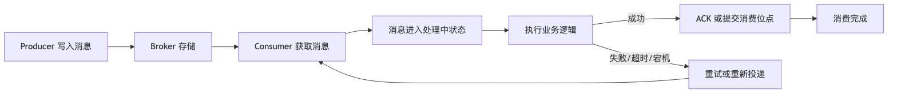
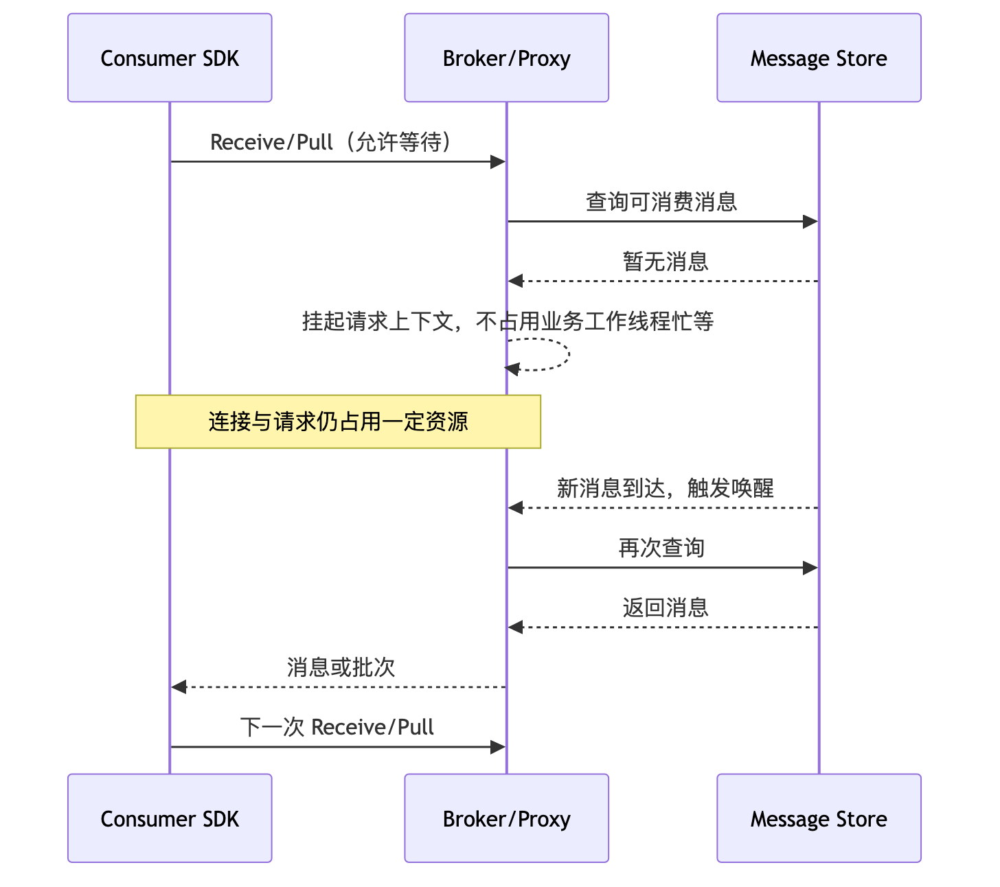
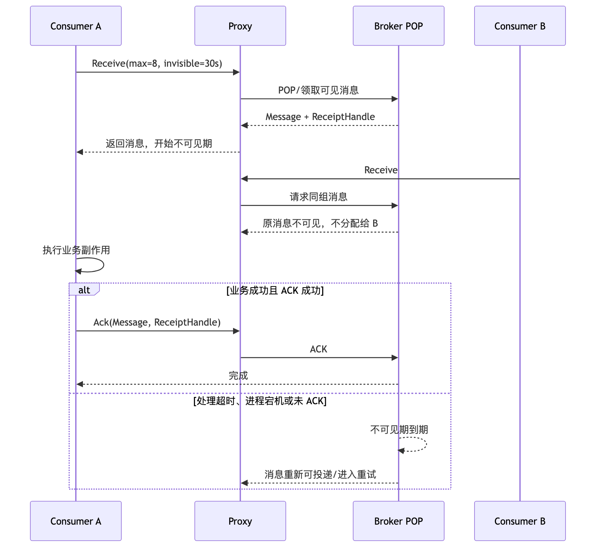
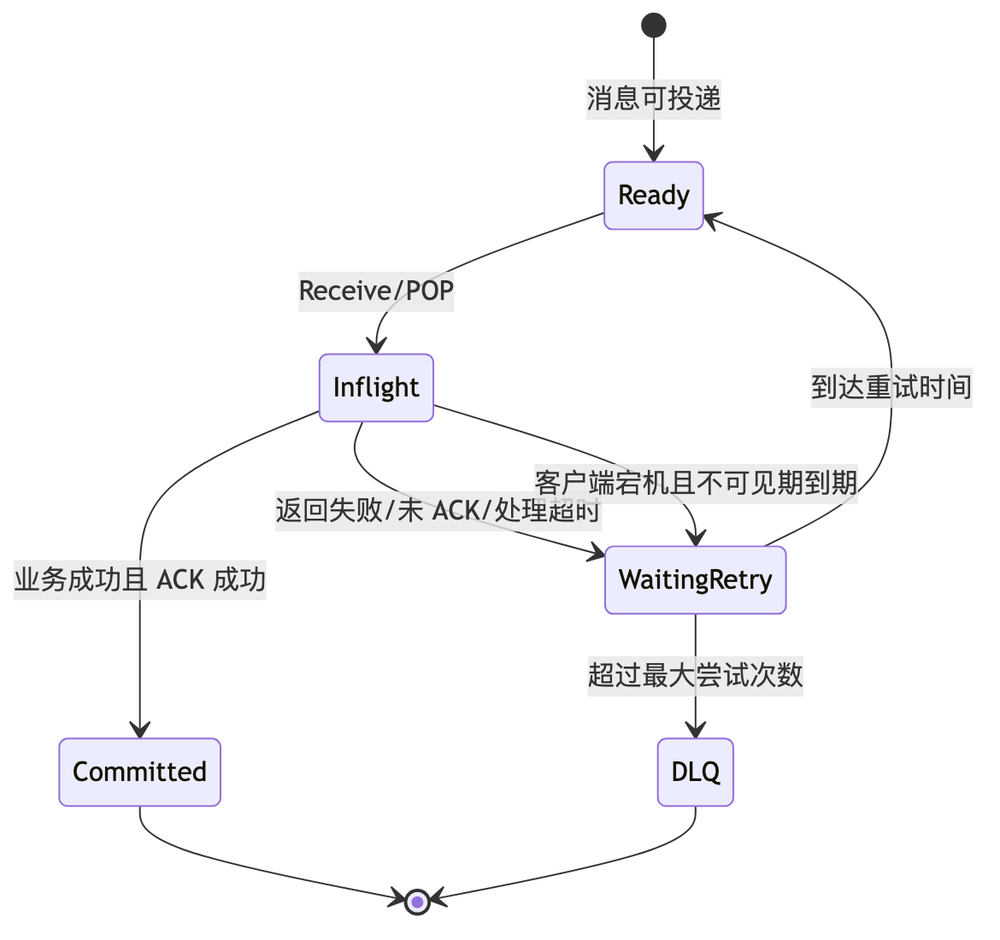
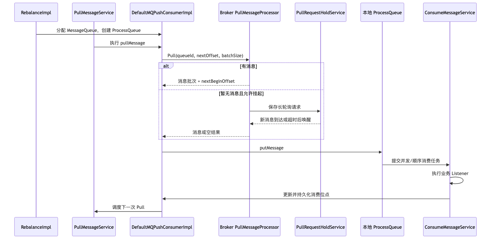

# 第 5 章：Consumer 类型、长轮询、POP、ACK 与完整消费链路

> **版本基线**：截至 2026 年 6 月 20 日，RocketMQ 服务端最新稳定标签为 5.5.0。本章的 5.x Go 示例按官方 gRPC Go SDK `golang/v5.1.4` API 编写；该版本在 GitHub Release 页面标记为预发布版本，生产环境应固定并验证自己实际采用的客户端版本。经典机制以 RocketMQ 4.9.8 Remoting 客户端与 Broker 源码为参照。
>
> 本章最重要的边界是：**5.x PushConsumer、SimpleConsumer 的默认语义是消息级负载均衡与单消息 ACK；4.x 经典 PushConsumer 的核心是队列级 Rebalance、PullMessage、ProcessQueue 和消费位点。两者都可能存在“拉取线程”和“本地缓存”，但所有权、确认方式和故障恢复语义并不相同。**



## 本章去重边界与跳转

本章是 Consumer 消费链路主讲章节，重点保留 PushConsumer、SimpleConsumer、PullConsumer、长轮询、POP、不可见时间、ACK 和消费状态机。其他章节引用消费概念时应跳回本章。

| 重复主题 | 本章处理方式 |
| --- | --- |
| Consumer 在领域模型中的位置 | 本章只讲消费行为；组件全景看 [第 2 章：整体架构、核心组件与领域模型](/blog/tech/RocketMQ/02.RocketMQ整体架构、核心组件与领域模型)。 |
| Rebalance、Offset、Lag 与扩缩容 | 本章只给消费侧入口；负载均衡和积压治理看 [第 6 章：Rebalance、消费位点、负载均衡与消息积压](/blog/tech/RocketMQ/06.Rebalance、消费位点、负载均衡与消息积压)。 |
| 重试、死信、重复投递和幂等 | 本章只讲 ACK 边界；可靠性闭环看 [第 8 章：端到端消息可靠性](/blog/tech/RocketMQ/08.端到端消息可靠性、重试、死信队列与消费幂等)。 |
| FIFO 顺序消费 | 本章只讲消费链路上的顺序风险；顺序模型看 [第 9 章：FIFO 顺序消息](/blog/tech/RocketMQ/09.FIFO顺序消息)。 |
| 5.x POP、消息级负载均衡和 gRPC 迁移 | 本章讲消费语义；架构演进看 [第 17 章：4.x 到 5.x 架构演进](/blog/tech/RocketMQ/17.从RocketMQ4.x到5.x：Proxy、gRPC、POP、Controller与架构演进)。 |

## 5.1 从“收到消息”到“确认消息”的全景

消费者不是简单地从 Broker 读取一段字节。完整消费链路至少包含五个阶段：建立订阅、获取消息、暂时取得处理权、执行业务副作用、向服务端提交结果。系统可靠性主要取决于最后两个阶段之间的边界。



5.x POP 模型通常对**单条消息**建立“不可见期限 + ReceiptHandle + ACK”的处理权；经典 4.x 模型通常先把一个 `MessageQueue` 分配给某个消费者实例，再围绕队列位点连续拉取。前者的确认粒度是消息，后者的核心进度粒度是队列 Offset。

无论采用哪一种模型，默认都应按 **at-least-once（至少一次）** 设计：业务副作用已经成功而 ACK、位点提交或响应丢失时，消息可能再次出现。可靠消费的最终落点不是“保证永不重复”，而是“重复可识别、副作用可幂等、失败可重试、毒消息可隔离”。

## 5.2 三类 Consumer 的定位

| 维度 | PushConsumer | SimpleConsumer | PullConsumer |
|---|---|---|---|
| 业务接口 | 注册 Listener，SDK 回调 | 主动 `Receive`，处理后 `Ack` | 主动拉取指定队列并管理进度 |
| 5.x 默认负载均衡 | 消息级 | 消息级 | 队列级 |
| 线程与调度 | SDK 管理接收、本地缓存和消费线程池 | 业务管理接收循环、并发与调度 | 业务或框架高度自定义 |
| 确认方式 | Listener 同步返回成功/失败，SDK 完成 ACK/重试 | 业务显式 ACK；失败时不 ACK | 通常显式维护和提交队列 Offset |
| 处理时长 | 应当可预测且有上限 | 可自定义不可见时间并续期 | 完全自行控制 |
| 异步分发 | 不应在 Listener 中异步甩出后提前返回 | 支持，但必须管理 ACK、续期和并发 | 支持，责任也最大 |
| 批量与速率 | SDK 按缓存、线程数调度 | `Receive` 批量数与调用频率可控 | 最灵活，适合流处理框架 |
| 使用难度 | 最低 | 中等 | 最高 |
| 典型场景 | 在线事件处理、耗时稳定的业务回调 | 长任务、批处理、自定义工作池、精确限速 | 流计算、聚合、需要队列所有权的框架 |

选择原则可以概括为：**能用 PushConsumer 且处理时长稳定，就优先用 PushConsumer；需要主动拉取、批处理、异步编排或延长处理窗口，就用 SimpleConsumer；只有在真正需要队列级控制时才使用 PullConsumer。** 同一个 ConsumerGroup 不应混用 PullConsumer 与消息级消费者，否则负载均衡和进度语义无法保持一致。

## 5.3 PushConsumer 到底是 Push 还是 Pull

“PushConsumer”描述的是**业务编程体验**：消息到达后 SDK 主动调用 Listener，业务不必写拉取循环。它通常不表示 Broker 在没有客户端请求的情况下，向任意客户端无限主动推送。

在 5.x Go gRPC SDK 中，客户端发起 `ReceiveMessage` 请求，服务端可通过流式响应返回消息；在经典 4.x Remoting 客户端中，客户端发起 Pull 请求，Broker 无消息时将请求挂起，消息到达或等待超时后再响应。两种实现都属于“客户端驱动的长轮询/接收循环 + SDK 对业务表现为回调”。

### 面试回答模板：PushConsumer 到底是 Push 还是 Pull

> 从业务 API 看它是 Push：应用只注册 Listener，消息由 SDK 回调。从网络发起方向和流量控制看，它通常仍由客户端主动建立接收请求，经典 4.x 是长轮询 Pull，5.x gRPC 客户端也是客户端发起 ReceiveMessage。Broker 不会无边界地把消息塞进应用。SDK 在网络接收、本地缓存和消费线程之间做了封装，所以更准确的说法是：**对业务是 Push 抽象，对传输是客户端驱动的拉取或流式接收。**

错误回答有两类：一是说“完全由 Broker 主动 TCP 推送”，忽略了客户端请求、长轮询和流控；二是说“它就是普通短轮询”，忽略了 SDK 的长等待、回调、本地缓存与自动确认能力。

## 5.4 长轮询：低延迟与空转成本之间的折中

短轮询每隔固定时间请求一次：间隔短则大量空请求，间隔长则消息延迟上升。长轮询让客户端请求携带等待期限；若暂时没有消息，Broker 不立即返回空结果，而是保存请求上下文。消息到达时提前唤醒，等待到期时返回空结果，客户端再建立下一次请求。



长轮询的优势是空闲时请求数量低、消息到达后响应快，并天然形成“消费者处理得慢，就少建立新请求”的部分背压。它并非零成本：Broker 要保存挂起请求、连接、Channel、超时信息和过滤条件；客户端要维持连接、接收协程与重连状态；大量请求同时超时或被消息唤醒时，还可能形成瞬时唤醒风暴。因此要控制每个实例的并发接收数、等待时间、连接数和订阅规模。

经典 4.x Broker 中，`PullMessageProcessor` 处理 Pull 请求；当没有新消息且允许挂起时，交由 `PullRequestHoldService` 保存并在新消息到达或超时时重新处理。关键不是“让一个线程睡几十秒”，而是保存请求元数据，把工作线程释放出来。

## 5.5 5.x POP、不可见时间、ReceiptHandle 与 ACK

### 5.5.1 POP 的核心语义

5.x 消息级消费可理解为“领取一批当前可见消息”。Broker/Proxy 为每次投递建立处理上下文，并返回与本次投递尝试绑定的 `ReceiptHandle`。从领取成功开始，消息进入不可见期，其他同组消费者暂时不能再次取得它；业务成功后 ACK，该次消费提交完成；没有 ACK，则不可见期结束后重新进入可投递状态或进入后续重试阶段。



`ReceiptHandle` 不是永久消息 ID，而是本次领取和当前不可见期限的凭据。业务幂等键应优先使用稳定的业务事件 ID，或在合适场景使用 `MessageId`，不能把 ReceiptHandle 当作跨重试稳定标识。

### 5.5.2 不可见时间如何设置

不可见时间应覆盖大多数正常处理耗时、下游网络抖动和 ACK 延迟，同时又不能大到让失败消息长期无法重试。可采用高分位耗时设计：例如业务 P99 为 12 秒，可先设 30 秒，并在接近期限前续期。不要为了掩盖慢消费直接设成数小时，否则宕机后的恢复时间也会变成数小时。

SimpleConsumer 可调用 `ChangeInvisibleDuration` 改变处理窗口。该操作应在原不可见期限届满前完成；续期成功后，当前消息对象中的 ReceiptHandle 可能被更新，后续 ACK 必须使用更新后的句柄。续期失败不能被当作“已经延长”，此时应尽快结束处理或接受消息可能并发重投的事实。

不可见时间不是数据库事务，也不是 exactly-once 锁。若业务写库成功、ACK 请求丢失，Broker 看不到成功确认，消息仍可能重投；若处理超过不可见期，旧处理还未停止而新消费者再次取得消息，两个实例可能并发执行相同副作用。因此业务层仍要有唯一键、状态机或幂等表。

### 5.5.3 ACK 的正确边界

ACK 的含义是“该消息的业务结果已经达到可接受的持久状态”，而不是“我已经开始处理”。正确顺序通常是：

1. 校验消息并取得幂等键。
2. 在本地事务或可靠外部系统中完成业务副作用。
3. 记录处理完成状态。
4. 最后 ACK。

对永久业务错误，例如格式确实不合法，可以先把原消息、错误类型和追踪信息持久化到隔离表或人工补偿系统；只有隔离记录落盘成功后，才可以 ACK，避免无限重试。对数据库超时、下游限流、网络异常等暂时错误，不 ACK 或返回失败，让 RocketMQ 重试。

## 5.6 消费状态机：成功、失败、超时与宕机



需要区分四种“看起来都失败”的窗口：

- **业务失败且未提交结果**：消息按策略重试，这是预期行为。
- **业务成功但 ACK 失败或响应丢失**：消息可能重复，这是幂等最重要的窗口。
- **ACK 成功但客户端没收到响应**：客户端仍不能据此断言 ACK 失败；再次投递与否由服务端实际状态决定。
- **不可见期已到而旧处理仍运行**：新旧处理可能并发，单靠 Consumer 侧内存锁无法跨实例防重。

PushConsumer 的 Listener 返回失败、抛出异常或处理超时，SDK 会按消费重试策略处理；SimpleConsumer 处理失败时通常不 ACK，等不可见期结束。达到最大投递次数后可进入死信队列，具体次数和间隔应以服务端版本及 ConsumerGroup 配置为准。

## 5.7 4.x 经典 PullMessage 与本地 ProcessQueue

经典 4.x `DefaultMQPushConsumer` 虽然也对业务暴露 Listener，但内部逻辑与 5.x 单消息 POP 不同。它先通过 Rebalance 为消费者实例分配 `MessageQueue`，每个已分配队列对应一个本地 `ProcessQueue`。`PullMessageService` 调度 Pull 请求，Broker 返回从指定 Offset 开始的一批消息，客户端放入 ProcessQueue，再交给并发或顺序消费服务。



`ProcessQueue` 是客户端内存中的消费快照和待处理容器，不是 Broker 上真正的消息队列。它维护已拉取消息、消费中状态、锁定与过期信息。Rebalance 将队列移出当前实例时，旧 ProcessQueue 会被标记丢弃；尚未可靠提交的消息可能由新实例从已提交 Offset 附近再次拉取，因此扩缩容、重启和异常退出都可能带来少量重复。

经典调用链可以概括为：

`RebalanceImpl` → `PullMessageService` → `DefaultMQPushConsumerImpl.pullMessage` → Broker `PullMessageProcessor` → `PullRequestHoldService`（无消息时）→ 客户端 `ProcessQueue.putMessage` → `ConsumeMessageConcurrentlyService` 或 `ConsumeMessageOrderlyService` → OffsetStore。

## 5.8 专题：5.x POP 与 4.x Rebalance

| 对比项 | 5.x Push/Simple 的 POP 消息级模型 | 4.x 经典队列级 Rebalance |
|---|---|---|
| 分配粒度 | 单条消息的处理权 | 一个物理 `MessageQueue` 的消费权 |
| 同一队列能否被多个同组实例处理 | 可以，不同消息可分给不同实例 | 稳态下通常由一个实例负责 |
| 成功确认 | 单消息 ACK | 以队列消费 Offset 推进为核心 |
| 故障恢复 | 不可见期到期后消息重新可投递 | 新实例接管队列，从已提交 Offset 继续 |
| 消费者多于队列 | 仍可共同分担消息 | 多出的消费者可能空闲 |
| 负载均衡精度 | 细，适应实例处理能力差异 | 粗，热点队列可能拖累单个实例 |
| 批处理/聚合 | 可批量 Receive，但消息处理权离散 | 队列连续性更适合流式聚合 |
| 顺序约束 | 依赖 MessageGroup/FIFO 投递约束 | 依赖队列分配、队列锁与顺序服务 |
| 典型重复窗口 | 业务成功但 ACK 未确认；不可见期到期 | 业务成功但 Offset 未提交；Rebalance 切换 |
| 核心调参 | 不可见时间、Receive 批次、ACK、并发 | 队列数、分配算法、Pull 批次、Offset 提交 |

最常见的混淆是看到 5.x SDK 内部也有接收任务、本地缓存或名为 ProcessQueue 的结构，就断言它与 4.x 队列独占完全相同。判断模型不能只看类名，而要看**协议语义**：是否为单消息生成处理凭据、是否通过 ACK 完成、同一物理队列中的不同消息能否被多个同组实例并行处理。

## 5.9 集群消费与广播消费

集群消费的目标是同一 ConsumerGroup 内共同分担：一条消息通常由组内某个实例处理。要让订单服务、积分服务各自收到一份消息，应使用两个不同 ConsumerGroup，而不是让它们加入同一组。

“广播”必须区分版本语义：

- 在 5.x 消息级模型中，推荐用**不同 ConsumerGroup** 表达多个订阅方各收一份；同组实例仍是负载分担。5.x gRPC API 不应套用经典 `MessageModel.BROADCASTING` 的配置写法。
- 经典 4.x Remoting 客户端支持 `CLUSTERING` 与 `BROADCASTING`。广播模式下，每个实例消费所有匹配队列，位点和失败恢复能力与集群模式不同，实例扩缩容或本地状态丢失时更容易产生重复或遗漏风险。

工程上应先问“这是多个逻辑订阅者，还是同一订阅者的多个副本”。前者用不同组，后者用同一组扩容。不要用广播模式模拟关键业务多订阅，因为其治理、重试和消费进度通常更难统一。

## 5.10 并发消费与顺序消费

普通消息追求吞吐，SDK 可让多条消息并发进入工作线程。线程数增加只在 CPU、数据库连接、下游 QPS 和网络容量仍有余量时有效；否则只是把瓶颈从 RocketMQ 转移到数据库或 RPC 服务。

FIFO 消息的顺序通常以 `MessageGroup` 为边界，不是整个 Topic 的全局顺序。5.x 消息级负载均衡必须保证同一组中前一条消息未提交时，后续消息不能越过它。PushConsumer 由 SDK 协调顺序回调；SimpleConsumer 即使一次 Receive 得到多条消息，业务也要按组串行执行并按顺序确认。某条消息持续失败时，同组后续消息会被阻塞，这是顺序性的代价。

经典 4.x 顺序消费依赖队列级分配、队列锁和 `ConsumeMessageOrderlyService`。即使生产端按相同 ShardingKey 发送到同一队列，消费端把消息异步扔进多个 goroutine 仍会破坏顺序。

## 5.11 批次、线程数、本地缓存与流控

### PushConsumer

PushConsumer 内部通常包含网络接收任务、本地缓存和消费线程池。Go 5.x SDK 可通过 `WithPushConsumptionThreadCount`、`WithPushMaxCacheMessageCount` 等选项控制并发与缓存。缓存太小会让网络吞吐受限；缓存太大会扩大内存占用、停机等待时间和进程崩溃时的在途消息数量。线程数应与下游并发预算统一，而不是按 CPU 核数机械放大。

### SimpleConsumer

SimpleConsumer 的 `Receive(ctx, maxMessageNum, invisibleDuration)` 同时决定单次最大批量与初始处理窗口。批次越大，网络利用率越高，但单批完成时间、内存占用和不可见时间管理难度也越大。应限制同时在途的 Receive 调用和业务任务数，例如使用固定 worker pool 或信号量，绝不能无限创建 goroutine。

### 流控判断

消费端至少监控以下指标：消费延迟、积压量、Receive/Pull 空返回率、处理耗时 P95/P99、成功率、重试率、ACK 失败率、不可见时间续期次数、本地缓存深度、工作线程占用率和下游错误率。出现积压时先定位瓶颈：若 Listener 工作线程满而 CPU 不高，通常是下游 I/O；若 ACK 延迟高，可能是 Proxy/Broker 或网络；若重复量随处理耗时上升，往往是不可见时间或消费超时设置不合理。

## 5.12 PushConsumer Listener 的正确边界

Listener 必须同步表达真实处理结果：所有必须成功的业务步骤完成后返回 `SUCCESS`；可重试错误返回 `FAILURE`；未知异常保守地按失败处理。Listener 内应设置业务超时、捕获 panic、记录消息 ID、投递次数和错误类别，并保证幂等。

### 为什么不能扔给另一个 goroutine 后立即返回成功

下面的写法是严重错误：

```go
Consume: func(mv *rmq.MessageView) rmq.ConsumerResult {
    go process(mv.GetBody())
    return rmq.SUCCESS
}
```

`SUCCESS` 会让 SDK 认为消费已经完成并 ACK。之后 goroutine 失败、进程退出或任务尚未开始，RocketMQ 都无法感知，也不会正常重试。即便立即返回 `FAILURE` 也不正确，因为后台任务与重试任务可能同时执行，重复和乱序会更严重。

PushConsumer 可以在 Listener 内调用下游服务，但必须等待结果后再返回。若业务天然需要排队到自建线程池、处理时长不可预测或要动态续期，应改用 SimpleConsumer，由业务显式管理 Receive、并发、不可见时间和 ACK。

## 5.13 Go：可靠的 PushConsumer 示例

下面的示例展示同步 Listener、幂等占位、超时、错误分类、隔离持久化与优雅退出。`processOnce` 在真实系统中应使用数据库唯一键、状态机或事务性幂等表，而不是仅靠进程内 Map。

```go
package main

import (
    "context"
    "errors"
    "fmt"
    "log"
    "os"
    "os/signal"
    "syscall"
    "time"

    rmq "github.com/apache/rocketmq-clients/golang/v5"
    "github.com/apache/rocketmq-clients/golang/v5/credentials"
)

var (
    ErrTemporary = errors.New("temporary business error")
    ErrPermanent = errors.New("permanent business error")
)

func main() {
    endpoint := mustEnv("ROCKETMQ_ENDPOINT")
    group := mustEnv("ROCKETMQ_CONSUMER_GROUP")
    topic := mustEnv("ROCKETMQ_TOPIC")

    listener := &rmq.FuncMessageListener{
        Consume: func(mv *rmq.MessageView) (result rmq.ConsumerResult) {
            result = rmq.FAILURE
            defer func() {
                if r := recover(); r != nil {
                    log.Printf("consume panic: messageId=%s panic=%v", mv.GetMessageId(), r)
                }
            }()

            ctx, cancel := context.WithTimeout(context.Background(), 8*time.Second)
            defer cancel()

            err := processOnce(ctx, mv.GetMessageId(), mv.GetBody())
            switch {
            case err == nil:
                log.Printf("consume success: messageId=%s attempt=%d",
                    mv.GetMessageId(), mv.GetDeliveryAttempt())
                return rmq.SUCCESS

            case errors.Is(err, ErrPermanent):
                // 只有隔离记录可靠落盘后，才能确认原消息成功。
                if parkErr := persistToParkingLot(ctx, mv, err); parkErr != nil {
                    log.Printf("park failed: messageId=%s err=%v", mv.GetMessageId(), parkErr)
                    return rmq.FAILURE
                }
                return rmq.SUCCESS

            case errors.Is(err, context.DeadlineExceeded),
                errors.Is(err, context.Canceled),
                errors.Is(err, ErrTemporary):
                log.Printf("retryable failure: messageId=%s err=%v", mv.GetMessageId(), err)
                return rmq.FAILURE

            default:
                log.Printf("unknown failure: messageId=%s err=%v", mv.GetMessageId(), err)
                return rmq.FAILURE
            }
        },
    }

    consumer, err := rmq.NewPushConsumer(
        &rmq.Config{
            Endpoint:      endpoint,
            ConsumerGroup: group,
            Credentials: &credentials.SessionCredentials{
                AccessKey:    os.Getenv("ROCKETMQ_ACCESS_KEY"),
                AccessSecret: os.Getenv("ROCKETMQ_ACCESS_SECRET"),
            },
        },
        rmq.WithPushAwaitDuration(5*time.Second),
        rmq.WithPushSubscriptionExpressions(map[string]*rmq.FilterExpression{
            topic: rmq.SUB_ALL,
        }),
        rmq.WithPushConsumptionThreadCount(16),
        rmq.WithPushMaxCacheMessageCount(1024),
        rmq.WithPushMessageListener(listener),
    )
    if err != nil {
        log.Fatalf("create push consumer: %v", err)
    }
    if err = consumer.Start(); err != nil {
        log.Fatalf("start push consumer: %v", err)
    }

    stopCtx, stop := signal.NotifyContext(
        context.Background(), syscall.SIGINT, syscall.SIGTERM,
    )
    defer stop()
    <-stopCtx.Done()

    if err = consumer.GracefulStop(); err != nil {
        log.Printf("graceful stop failed: %v", err)
    }
}

func processOnce(ctx context.Context, idempotencyKey string, body []byte) error {
    // 真实实现：以稳定业务事件 ID 建唯一索引；在事务内检查并写入处理结果。
    _ = body
    select {
    case <-time.After(20 * time.Millisecond):
        return nil
    case <-ctx.Done():
        return ctx.Err()
    }
}

func persistToParkingLot(ctx context.Context, mv *rmq.MessageView, cause error) error {
    // 真实实现：持久化 messageId、body、投递次数、错误分类和追踪信息。
    _ = ctx
    _ = mv
    _ = cause
    return nil
}

func mustEnv(key string) string {
    value := os.Getenv(key)
    if value == "" {
        panic(fmt.Sprintf("missing environment variable %s", key))
    }
    return value
}
```

该代码没有在 Listener 中创建业务 goroutine。`GracefulStop` 的目标是停止新接收并等待在途任务按 SDK 能力收敛，但它不能替代业务幂等，也不能保证操作系统强杀、容器超时或机器断电时完成 ACK。因此部署平台的终止宽限期必须大于典型在途处理时间。

## 5.14 Go：SimpleConsumer 的 Receive、续期与 ACK

SimpleConsumer 适合业务主动控制节奏。下面的示例限制单次批量，给 Receive、业务处理和 ACK 分别设置超时；预估为长任务时先延长不可见时间；暂时错误不 ACK；永久错误写入隔离表后 ACK。

```go
package main

import (
    "context"
    "errors"
    "log"
    "os"
    "os/signal"
    "syscall"
    "time"

    rmq "github.com/apache/rocketmq-clients/golang/v5"
    "github.com/apache/rocketmq-clients/golang/v5/credentials"
)

func runSimpleConsumer() error {
    topic := os.Getenv("ROCKETMQ_TOPIC")
    consumer, err := rmq.NewSimpleConsumer(
        &rmq.Config{
            Endpoint:      os.Getenv("ROCKETMQ_ENDPOINT"),
            ConsumerGroup: os.Getenv("ROCKETMQ_CONSUMER_GROUP"),
            Credentials: &credentials.SessionCredentials{
                AccessKey:    os.Getenv("ROCKETMQ_ACCESS_KEY"),
                AccessSecret: os.Getenv("ROCKETMQ_ACCESS_SECRET"),
            },
        },
        rmq.WithSimpleAwaitDuration(5*time.Second),
        rmq.WithSimpleSubscriptionExpressions(map[string]*rmq.FilterExpression{
            topic: rmq.SUB_ALL,
        }),
    )
    if err != nil {
        return err
    }
    if err = consumer.Start(); err != nil {
        return err
    }
    defer func() {
        if stopErr := consumer.GracefulStop(); stopErr != nil {
            log.Printf("graceful stop failed: %v", stopErr)
        }
    }()

    appCtx, stop := signal.NotifyContext(
        context.Background(), syscall.SIGINT, syscall.SIGTERM,
    )
    defer stop()

    const initialInvisible = 30 * time.Second
    for {
        select {
        case <-appCtx.Done():
            return nil
        default:
        }

        receiveCtx, cancel := context.WithTimeout(appCtx, 8*time.Second)
        messages, receiveErr := consumer.Receive(receiveCtx, 8, initialInvisible)
        cancel()
        if receiveErr != nil {
            if errors.Is(appCtx.Err(), context.Canceled) {
                return nil
            }
            log.Printf("receive failed: %v", receiveErr)
            time.Sleep(200 * time.Millisecond) // 避免异常时紧密空转
            continue
        }

        for _, mv := range messages {
            if err = handleOne(appCtx, consumer, mv); err != nil {
                log.Printf("message left unacked: id=%s attempt=%d err=%v",
                    mv.GetMessageId(), mv.GetDeliveryAttempt(), err)
            }
        }
    }
}

func handleOne(
    appCtx context.Context,
    consumer rmq.SimpleConsumer,
    mv *rmq.MessageView,
) error {
    // 能提前识别长任务时，在原期限到达前续期。
    if needsLongProcessing(mv) {
        if err := consumer.ChangeInvisibleDuration(mv, 90*time.Second); err != nil {
            return errors.Join(ErrTemporary, err)
        }
        // v5.1.4 SDK 会在成功后更新 mv 中的 ReceiptHandle；后续 Ack 使用同一 mv。
    }

    processCtx, cancel := context.WithTimeout(appCtx, 45*time.Second)
    err := processOnce(processCtx, mv.GetMessageId(), mv.GetBody())
    cancel()

    if err != nil {
        if errors.Is(err, ErrPermanent) {
            parkCtx, parkCancel := context.WithTimeout(appCtx, 3*time.Second)
            parkErr := persistToParkingLot(parkCtx, mv, err)
            parkCancel()
            if parkErr != nil {
                return errors.Join(ErrTemporary, parkErr) // 不 ACK，等待重投
            }
        } else {
            return err // 暂时错误或超时：不 ACK
        }
    }

    ackCtx, ackCancel := context.WithTimeout(appCtx, 3*time.Second)
    ackErr := consumer.Ack(ackCtx, mv)
    ackCancel()
    return ackErr
}

func needsLongProcessing(mv *rmq.MessageView) bool {
    // 可根据消息类型、属性或历史耗时模型判断，不能等到过期后才续期。
    return len(mv.GetBody()) > 1024*1024
}
```

示例为了突出语义，逐条处理 Receive 返回的消息。生产系统可使用有界 worker pool 并发处理普通消息，但必须为每条消息独立跟踪截止时间、续期、结果和 ACK；程序退出时应先停止新的 Receive，再等待已接收任务完成到设定上限，未完成消息不 ACK，让其在不可见期后恢复。

## 5.15 异常处理与优雅关闭

正确的关闭顺序是：收到终止信号；停止建立新的 Receive/Pull；拒绝新增业务任务；等待在途任务在宽限期内完成；成功任务提交 ACK；未完成任务保持未确认；最后关闭 Consumer 和网络资源。

不要在关闭时对所有本地缓存消息无条件 ACK，也不要为了“清空进程”无限等待。Kubernetes 等环境中应让 `terminationGracePeriodSeconds` 覆盖常见处理耗时和 SDK 关闭时间，并在超时后接受少量重投。对顺序消息，滚动发布要更谨慎，因为旧实例释放处理权与新实例接管之间会阻塞同组后续消息。

异常日志至少包含 ConsumerGroup、Topic、MessageId、业务幂等键、投递次数、处理耗时、错误分类和是否 ACK。指标要区分“业务失败”“ACK 失败”“Receive 失败”和“消息进入隔离”，否则只看总体失败率无法判断问题在业务、网络还是 Broker。

## 5.16 典型故障分析

### 1. 慢消费

表现为积压增长、处理耗时升高、本地缓存满、Receive 速率下降。先检查数据库连接池、外部 RPC、锁竞争和单条大任务，再考虑加线程或扩实例。5.x 消息级负载均衡能更细地把消息分给空闲实例，但无法突破共享下游的容量。

### 2. Listener 阻塞

PushConsumer 的工作线程被占满后，本地缓存逐渐堆积并触发流控。如果阻塞超过消费超时或服务端不可见期限，消息可能重试，而旧线程仍在运行。应给每个外部调用设置超时和熔断，禁止无限等待锁或无期限读写。

### 3. 处理超时

超时不代表业务副作用一定失败。例如数据库已经提交，只是客户端等待响应超时。直接重试会再次执行同一业务，因此必须先查幂等状态。SimpleConsumer 的续期只能延长服务端投递窗口，不能取消已经执行的业务操作。

### 4. 重复投递

常见原因包括业务成功后 ACK 丢失、经典位点尚未提交就宕机、Rebalance 切换、不可见期过短、客户端处理超时和 Broker/Proxy 重试。处理方式不是在内存中记 MessageId，而是建立可持久、跨实例、可清理的幂等机制。

### 5. 客户端重启

5.x 中，已 POP 但未 ACK 的消息在不可见期结束后重新可见；已成功 ACK 的消息不会因为本地状态丢失而主动回退，但 ACK 结果不确定时仍要按可能重复处理。4.x 中，本地 ProcessQueue 消失，新实例依据服务端已提交 Offset 继续，未提交窗口可能重放。优雅关闭只能缩小窗口，不能消除窗口。

## 5.17 面试题与标准回答

> **题目去重**：本节作为本章 Consumer 自测，只保留消费类型、POP、ACK 和不可见时间题。跨章重复题、完整追问链和模拟面试统一跳转到 [第 20 章：资深面试题库、追问链与模拟面试](/blog/tech/RocketMQ/20.RocketMQ资深面试题库、追问链与模拟面试)。

### 1. PushConsumer 为什么不是真正的 Broker 无限推送？

**标准回答**：Push 是业务 API 抽象。客户端主动建立 Receive/Pull，使用长轮询或流式响应收消息，SDK 再回调 Listener，并通过缓存和线程池做流控。
**追问**：长轮询为什么不占住一个 Broker 工作线程？答：请求上下文被挂起并由事件或超时唤醒，工作线程可释放。
**易错点**：把 PushConsumer 说成 Broker 无条件向客户端灌数据，忽略客户端接收请求和背压。

### 2. PushConsumer、SimpleConsumer、PullConsumer 如何选择？

**标准回答**：耗时稳定、同步回调用 Push；需批量、异步编排、动态不可见时间或自定义速率用 Simple；流计算和队列级进度控制用 Pull。
**追问**：同组能否混用？答：不应混用，负载均衡和确认语义冲突。
**易错点**：认为 SimpleConsumer 只是“手写版 Push”，忽略显式 ACK 和不可见时间责任。

### 3. 5.x 消息级负载均衡解决了什么问题？

**标准回答**：同一队列中的不同消息可被多个同组实例处理，不再要求消费者数小于等于队列数，负载可随实例实际处理能力更细地分配。
**追问**：代价是什么？答：不能稳定指定某条普通消息归哪个实例，聚合和队列连续处理更难。
**易错点**：声称它消除了所有热点；共享数据库或某个 MessageGroup 仍可能成为瓶颈。

### 4. POP 后为什么要有不可见时间？

**标准回答**：它为当前消费者提供临时处理权，防止同组其他消费者立即获得同一条消息；未 ACK 时到期恢复可投递，承担故障恢复作用。
**追问**：是不是分布式锁？答：不是业务锁，也不保证 exactly-once。
**易错点**：把不可见时间设得越大越好，忽略宕机后的重试延迟。

### 5. ReceiptHandle 和 MessageId 有什么区别？

**标准回答**：MessageId 标识消息，ReceiptHandle 标识某次投递及其确认上下文，续期或重投后句柄可能变化。
**追问**：幂等键用哪个？答：优先使用稳定业务事件 ID；MessageId 可辅助，ReceiptHandle 不适合作为跨投递幂等键。
**易错点**：缓存旧 ReceiptHandle 后在续期后继续 ACK。

### 6. 业务成功但 ACK 超时怎么办？

**标准回答**：ACK 超时是结果不确定，不能回滚已经完成的外部副作用，也不能断言 Broker 未确认。后续若重投，依赖幂等状态返回成功。
**追问**：能否立刻重复 ACK？答：可按 SDK/API 语义谨慎重试，但仍必须容忍消息重投。
**易错点**：把网络超时等同于服务端一定没收到。

### 7. 为什么 Listener 不能异步甩给 goroutine 后返回 SUCCESS？

**标准回答**：SUCCESS 会触发确认，后台任务随后失败时 RocketMQ 已无法重试；进程退出还会造成实际未处理却已确认。
**追问**：确实要异步怎么办？答：使用 SimpleConsumer，显式跟踪任务、续期和 ACK。
**易错点**：认为 goroutine 启动成功就等于业务成功。

### 8. 4.x ProcessQueue 是 Broker 队列吗？

**标准回答**：不是。它是客户端针对已分配 MessageQueue 的本地内存快照，保存已拉取、待处理和消费中消息。
**追问**：Rebalance 时怎样？答：失去分配的 ProcessQueue 被标记丢弃，新实例从已提交位点接管。
**易错点**：把 ProcessQueue 当作持久化存储，忽略进程崩溃后本地内容会丢失。

### 9. 5.x POP 与 4.x Rebalance 最本质的差别是什么？

**标准回答**：POP 以单消息处理权和 ACK 为核心；经典 Rebalance 以 MessageQueue 所有权和队列 Offset 为核心。
**追问**：为什么两者都会重复？答：ACK 或 Offset 提交与业务副作用之间都存在结果不确定窗口。
**易错点**：只因 5.x SDK 内部也有缓存或 assignment，就认为它必然是经典队列独占。

### 10. 集群消费和广播消费怎样建模？

**标准回答**：同一逻辑订阅者的多个副本用同一个组分担；不同业务各收一份用不同 ConsumerGroup。经典广播是另一套客户端模式，不能直接套到 5.x gRPC Consumer。
**追问**：订单和积分为何不能同组？答：同组会分担，一条消息通常只落到其中一个实例。
**易错点**：把“多个实例”误认为“每个实例都收到”。

### 11. 不可见时间小于实际耗时会怎样？

**标准回答**：消息到期后可被再次投递，而旧处理可能仍在运行，形成并发重复；顺序消息还会阻塞或扰乱同组推进。
**追问**：如何治理？答：设置合理初值、提前续期、限制处理上限并实现幂等。
**易错点**：以为 SDK 会自动终止旧业务代码。

### 12. 增加消费线程数为什么可能让系统更慢？

**标准回答**：线程会争抢数据库连接、CPU、锁和下游配额，导致超时、重试和重复增加，最终有效吞吐下降。
**追问**：正确扩容依据是什么？答：端到端容量、下游并发预算、处理耗时和积压斜率。
**易错点**：只看 RocketMQ 积压就无限加线程。

### 13. 批量 Receive 应怎样设置？

**标准回答**：在网络效率、单批完成时间、内存和不可见期限之间折中；批量越大，越要限制在途任务并确保每条消息独立 ACK。
**追问**：空返回代表 Topic 没消息吗？答：不一定，分布式路由和并发领取下应继续按策略 Receive。
**易错点**：收到一批后串行处理很久，却仍使用很短的统一不可见时间。

### 14. 如何实现可靠幂等？

**标准回答**：用稳定业务键建立数据库唯一约束或状态机，在本地事务中检查并写入结果；重复到达时读取已完成状态并直接确认。
**追问**：内存 Map 行不行？答：不能跨实例、不能抗重启，也难以长期清理。
**易错点**：只使用 MessageId，但生产重试可能产生语义相同而 ID 不同的业务消息。

### 15. 优雅关闭能否保证零重复？

**标准回答**：不能。它只能停止新接收并尽量完成在途任务；强杀、断电、ACK 响应丢失等仍会产生结果不确定。
**追问**：那为什么还要做？答：可显著缩小未确认窗口、减少重试和顺序阻塞。
**易错点**：退出前无条件 ACK 本地缓存，造成真实消息丢失。

### 16. 慢消费排查顺序是什么？

**标准回答**：先看积压斜率和处理耗时，再分解 Listener 的 CPU、锁、数据库、RPC；同时看工作线程、本地缓存、ACK 延迟、重试率和 Broker/Proxy 网络指标。
**追问**：CPU 很低但积压上涨意味着什么？答：常见于 I/O、连接池、锁或下游限流。
**易错点**：直接判定 Broker 性能不足。

### 17. 顺序消费为什么会被一条失败消息拖住？

**标准回答**：同一 MessageGroup 的后续消息不能越过前一条未完成消息，否则不再满足 FIFO；持续失败必须重试、隔离或人工处理。
**追问**：能否把后续消息并行处理？答：不同组可以，同一组不应。
**易错点**：把 Topic 内所有消息都理解为全局顺序。

### 18. 消费失败时什么时候可以 ACK？

**标准回答**：暂时错误不应 ACK；不可重试的永久错误只有在原消息和错误信息已经可靠写入隔离/补偿系统后，才可 ACK 结束主链路。
**追问**：解析失败直接 ACK 行不行？答：会丢失诊断与补偿能力，至少应先可靠留档。
**易错点**：为了降低重试率吞掉所有异常并返回成功。

## 5.18 本章小结

理解 RocketMQ 消费链路要抓住三个层次：业务 API、传输获取方式和服务端确认语义。PushConsumer 对业务表现为回调，但网络上仍是客户端驱动的接收；SimpleConsumer 把 Receive、不可见时间和 ACK 控制权交给业务；PullConsumer 则进一步暴露队列和位点。

5.x POP 以消息级处理权、不可见期限和 ACK 为中心，解决队列数限制和粗粒度负载不均；4.x 经典模型以队列级 Rebalance、PullMessage、ProcessQueue 和 Offset 为中心，更适合需要队列连续性的场景。两种模型都无法替业务实现 exactly-once。真正可靠的消费者必须把 Listener/处理函数做成有界、同步可判定、可观测且幂等，并把业务副作用成功与 ACK/位点提交之间的“不确定窗口”当作常态设计。

## 5.19 官方来源

1. Apache RocketMQ Consumer Types：<https://rocketmq.apache.org/docs/featureBehavior/06consumertype/>
2. Apache RocketMQ Consumer Load Balancing：<https://rocketmq.apache.org/docs/featureBehavior/08consumerloadbalance/>
3. Apache RocketMQ Consumer Retry Policy：<https://rocketmq.apache.org/docs/featureBehavior/10consumerretrypolicy/>
4. Apache RocketMQ FIFO Message：<https://rocketmq.apache.org/docs/featureBehavior/03fifomessage/>
5. RocketMQ Server 5.5.0 Release：<https://github.com/apache/rocketmq/releases/tag/rocketmq-all-5.5.0>
6. RocketMQ Go Client `golang/v5.1.4` Release：<https://github.com/apache/rocketmq-clients/releases/tag/golang/v5.1.4>
7. RocketMQ Go Client 源码：<https://github.com/apache/rocketmq-clients/tree/golang/v5.1.4/golang>
8. Go PushConsumer 官方示例：<https://github.com/apache/rocketmq-clients/blob/golang/v5.1.4/golang/example/consumer/push_consumer/main.go>
9. Go SimpleConsumer 官方示例：<https://github.com/apache/rocketmq-clients/blob/golang/v5.1.4/golang/example/consumer/simple_consumer/main.go>
10. 5.5.0 `PopMessageProcessor`：<https://github.com/apache/rocketmq/blob/rocketmq-all-5.5.0/broker/src/main/java/org/apache/rocketmq/broker/processor/PopMessageProcessor.java>
11. 5.5.0 `AckMessageProcessor`：<https://github.com/apache/rocketmq/blob/rocketmq-all-5.5.0/broker/src/main/java/org/apache/rocketmq/broker/processor/AckMessageProcessor.java>
12. 5.5.0 `ChangeInvisibleTimeProcessor`：<https://github.com/apache/rocketmq/blob/rocketmq-all-5.5.0/broker/src/main/java/org/apache/rocketmq/broker/processor/ChangeInvisibleTimeProcessor.java>
13. 4.9.8 `PullMessageService`：<https://github.com/apache/rocketmq/blob/rocketmq-all-4.9.8/client/src/main/java/org/apache/rocketmq/client/impl/consumer/PullMessageService.java>
14. 4.9.8 `DefaultMQPushConsumerImpl`：<https://github.com/apache/rocketmq/blob/rocketmq-all-4.9.8/client/src/main/java/org/apache/rocketmq/client/impl/consumer/DefaultMQPushConsumerImpl.java>
15. 4.9.8 `ProcessQueue`：<https://github.com/apache/rocketmq/blob/rocketmq-all-4.9.8/client/src/main/java/org/apache/rocketmq/client/impl/consumer/ProcessQueue.java>
16. 4.9.8 `PullMessageProcessor`：<https://github.com/apache/rocketmq/blob/rocketmq-all-4.9.8/broker/src/main/java/org/apache/rocketmq/broker/processor/PullMessageProcessor.java>
17. 4.9.8 `PullRequestHoldService`：<https://github.com/apache/rocketmq/blob/rocketmq-all-4.9.8/broker/src/main/java/org/apache/rocketmq/broker/longpolling/PullRequestHoldService.java>
