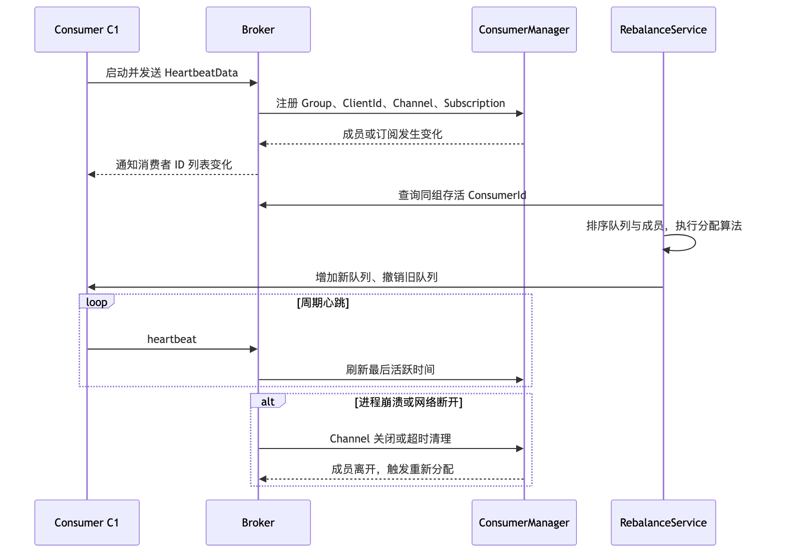
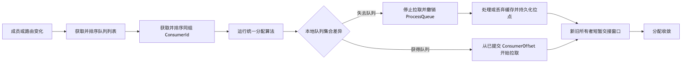
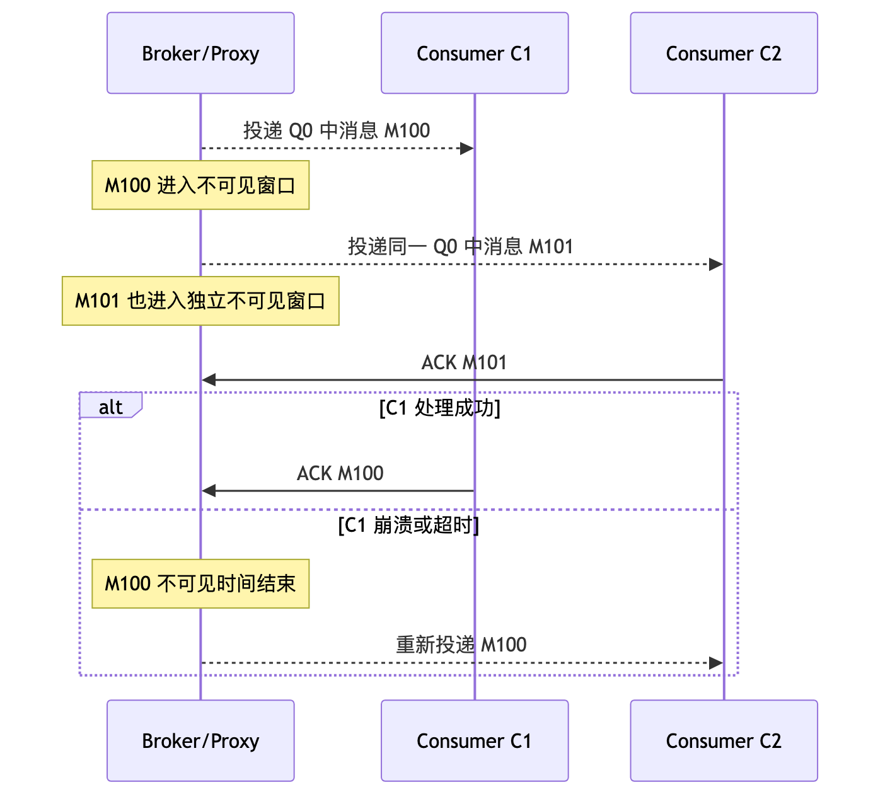
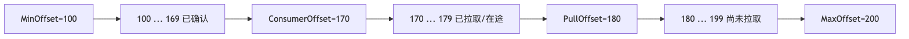

# 第 6 章：Rebalance、消费位点、负载均衡与消息积压

> **版本边界**
>
> 本章以 2026 年 6 月 20 日可获得的 Apache RocketMQ 5.5.0 与官方 5.x 文档为基线，同时保留经典 Remoting 客户端的核心机制。必须先记住：**负载均衡模型由客户端类型与消费 API 决定，而不是只由 Broker 大版本决定。** 即使服务端已升级到 5.x，经典 `DefaultMQPushConsumer` 等客户端仍采用队列级 Rebalance；5.x `PushConsumer`、`SimpleConsumer` 通常采用消息级负载均衡；`PullConsumer` 仍以队列级负载均衡为主。

---

## 本章去重边界与跳转

本章是 Rebalance、Offset、Lag 和积压治理的主讲章节。消费类型、ACK 和幂等只作为位点推进的前置条件出现，不在这里重复完整展开。

| 重复主题 | 本章处理方式 |
| --- | --- |
| PushConsumer、SimpleConsumer、POP 与 ACK | 本章只引用消费模型；完整消费链路看 [第 5 章：Consumer 类型、长轮询、POP、ACK 与完整消费链路](/blog/tech/RocketMQ/05.Consumer类型、长轮询、POP、ACK与完整消费链路)。 |
| 重复投递、消费幂等和死信 | 本章只说明 Rebalance 会放大重复风险；可靠性闭环看 [第 8 章：端到端消息可靠性](/blog/tech/RocketMQ/08.端到端消息可靠性、重试、死信队列与消费幂等)。 |
| MessageQueue、ConsumerGroup 与订阅治理 | 本章只关心负载均衡影响；资源模型和治理规范看 [第 12 章：资源治理](/blog/tech/RocketMQ/12.Topic、Tag、Key、SQL92、MessageQueue与资源治理)。 |
| 积压清空时间、容量估算和压测 | 本章讲诊断入口；容量模型看 [第 14 章：性能优化、流控、压测与容量规划](/blog/tech/RocketMQ/14.RocketMQ性能优化、流控、压测与容量规划)，生产排障看 [第 15 章：可观测性与 Runbook](/blog/tech/RocketMQ/15.RocketMQ可观测性、故障诊断、应急处理与生产Runbook)。 |
| 5.x 消息级负载均衡 | 本章讲它如何缓解队列级 Rebalance；完整演进看 [第 17 章：4.x 到 5.x 架构演进](/blog/tech/RocketMQ/17.从RocketMQ4.x到5.x：Proxy、gRPC、POP、Controller与架构演进)。 |

## 6.1 学习目标

完成本章后，你应当能够：

1. 解释 ConsumerGroup 成员如何通过心跳被 Broker 感知，以及 Rebalance 的触发与收敛过程。
2. 区分 4.x 经典队列级分配、5.x 消息级负载均衡和 PullConsumer 队列级负载均衡。
3. 准确说明 QueueOffset、ConsumerOffset、MaxOffset、MinOffset，而不是笼统地说“消费到了第几条”。
4. 根据生产速率、消费速率、队列数和实例数计算积压清理时间。
5. 分析扩缩容、滚动发布、位点重置、有序消费和异常退出产生的重复消费窗口。
6. 识别 Rebalance Storm、订阅不一致、消费者频繁上下线等生产故障。

---

## 6.2 场景导入：3 个消费者能否直接扩到 10 个

订单系统的 `OrderEvent` Topic 有 8 个 MessageQueue，`order-service` ConsumerGroup 当前运行 3 个实例。高峰期积压持续增长，值班同学准备把实例数直接扩到 10 个。

这个操作看似只是修改副本数，实际至少要回答六个问题：

- 采用经典队列级消费时，10 个实例是否都能工作？
- 新实例加入后，哪些队列会换所有者？
- 旧实例缓存中尚未提交位点的消息怎么办？
- 如果是 5.x PushConsumer，是否仍受 8 个队列限制？
- 订单要求局部有序时，扩容是否真的能提高并行度？
- 增加实例后，消费能力是否足以追平生产速度并清空历史积压？

这些问题分别属于三个控制面：

- **成员面**：ConsumerGroup 当前有哪些存活成员。
- **分配面**：队列或消息应当由哪个成员处理。
- **进度面**：每个队列已经成功处理到哪个位点。

将三者混成一句“RocketMQ 会自动负载均衡”，通常就是错误分析的起点。

---

## 6.3 三种负载均衡模型

### 6.3.1 核心对比

| 维度 | 4.x 经典客户端队列级 Rebalance | 5.x PushConsumer / SimpleConsumer 消息级负载均衡 | PullConsumer 队列级负载均衡 |
|---|---|---|---|
| 分配单位 | MessageQueue | 单条可见消息 | MessageQueue |
| 主要执行者 | 各客户端依据相同成员列表和算法自行计算 | Broker/Proxy 按消息可见性进行投递 | 客户端获得队列后主动拉取 |
| 同一队列能否同时服务多个消费者 | 同一 ConsumerGroup 内通常不能；一个队列同一时刻归一个成员 | 可以，不同消息可发给不同成员 | 通常不能；队列由一个成员负责 |
| 并行度上限 | 直接受队列数约束 | 不直接受队列数约束 | 直接受队列数约束 |
| 进度确认 | 以队列 ConsumerOffset 为核心 | 以消息不可见窗口和 ACK 为核心，服务端仍维护消费进度 | 应用显式管理拉取与提交节奏 |
| 消费者超过队列数 | 多余实例没有队列，会空闲 | 仍可能获得同一队列中的不同消息 | 多余实例会空闲 |
| 有序约束 | 队列锁、队列独占和本地串行处理 | 同一 MessageGroup 受 FIFO 约束 | 应用对队列内顺序负责 |
| 成员变化影响 | 队列撤销、重新分配，缓存与位点交接明显 | 消息分发权重调整；未 ACK 消息可能在不可见时间结束后重投 | 队列重新分配，应用需正确处理交接 |
| 典型风险 | Rebalance 抖动、少量重复、队列热点 | ACK 超时重复、不可见时间设置不当、热点消息组 | 手工位点错误、拉取失控、提交过早 |

### 6.3.2 一个重要结论

在经典队列级模型中，ConsumerGroup 的有效实例级并行度近似为：

\[
P_{instance} \le \min(\text{消费者实例数},\text{可分配队列数})
\]

这不意味着一个队列只能使用一个线程。无序并发消费时，一个实例内部仍可通过消费线程池并行处理该队列中的多条消息；这里限制的是**实例之间的队列所有权**。

5.x 消息级负载均衡把分配粒度从队列下沉到消息，因此 8 个队列也可能让 10 个消费者都收到消息。不过它并不会创造无限吞吐：Broker/Proxy 能力、客户端缓存、最大在途数、业务依赖、热点 MessageGroup 和下游限流仍然是硬约束。

---

## 6.4 ConsumerGroup 成员关系、心跳与存活检测

### 6.4.1 Broker 如何知道消费者还活着

以经典 Remoting 客户端为例，消费者启动后会向相关 Broker 发送心跳。心跳数据包含客户端标识、ConsumerGroup、消费模式、消费起点、订阅 Topic 与过滤表达式等信息。Broker 的消费者管理组件按 Group 维护客户端 Channel 和订阅关系。

经典客户端默认会周期性发送心跳，常见默认间隔为 30 秒，但它是可配置值，不应被当作协议常量。Broker 通过以下信号判断成员变化：

1. 收到新 Channel 的注册或心跳，视为成员加入或信息更新。
2. Channel 主动关闭或客户端主动注销，视为成员离开。
3. Channel 长时间无活动并被扫描清理，视为异常离线。
4. 网络断开、Broker 关闭连接或客户端进程崩溃，也会通过 Channel 生命周期被感知。

**NameServer 不负责维护 ConsumerGroup 成员列表。** NameServer 主要管理 Topic 路由；消费者成员和订阅关系由 Broker 侧维护，客户端再从 Broker 查询同组成员并执行分配。5.x gRPC 链路通常由客户端连接 Proxy，具体保活协议不同，不能机械套用经典客户端的心跳间隔。



### 6.4.2 经典 Rebalance 不是 Broker 逐队列“发任务”

经典模式下，Broker 提供同组成员列表并通知变化，但通常由每个客户端执行确定性分配：

1. 获取 Topic 的 MessageQueue 列表。
2. 获取 ConsumerGroup 的存活 ConsumerId 列表。
3. 对两份列表稳定排序。
4. 使用相同分配策略计算“当前客户端应拥有的队列”。
5. 与本地 `ProcessQueue` 表做差集，撤销失去的队列并增加新队列。

只要所有成员看到相同列表、使用相同算法，最终就会收敛到一致结果。若成员列表抖动、订阅不一致、分配算法配置不同，收敛就会被破坏或反复发生。

### 6.4.3 常见触发条件

| 变化 | 为什么需要重新均衡 |
|---|---|
| 消费者上线 | 新成员应分担现有队列或消息 |
| 消费者主动下线 | 其原有负载必须转交其他成员 |
| 消费者崩溃、网络中断、心跳超时 | Broker 清理失效 Channel，剩余成员接管负载 |
| Topic 队列数增加或减少 | 可分配集合改变，旧映射不再完整 |
| Broker 上下线或路由变化 | Topic 的可用队列集合发生变化 |
| 订阅 Topic、Tag、SQL 表达式变化 | Broker 和客户端需要刷新订阅元数据；同组不一致尤其危险 |
| 客户端标识冲突或反复重建连接 | 成员表不断替换，引发无意义的重分配 |

经典客户端还有周期性 Rebalance 兜底任务，源码默认等待间隔约为 20 秒，并可在收到成员变化通知后提前唤醒。因此 Rebalance 既可能由事件触发，也可能由周期检查促成最终收敛。

---

## 6.5 经典队列分配算法

设排序后的队列为 `Q0...Q(M-1)`，消费者为 `C0...C(N-1)`。所有成员必须使用一致的排序和分配策略。

### 6.5.1 平均分配：AllocateMessageQueueAveragely

平均分配把连续队列段交给各消费者。令：

\[
base=\lfloor M/N\rfloor,\quad remainder=M\bmod N
\]

前 `remainder` 个消费者各获得 `base+1` 个队列，其余获得 `base` 个。8 个队列、3 个消费者的结果通常是：

- C0：Q0、Q1、Q2
- C1：Q3、Q4、Q5
- C2：Q6、Q7

优点是数量均衡、实现简单；缺点是成员变化后，连续区间边界改变，可能迁移较多队列。

### 6.5.2 环形平均：AllocateMessageQueueAveragelyByCircle

按队列下标取模：`Qi -> C(i mod N)`。8 个队列、3 个消费者的结果是：

- C0：Q0、Q3、Q6
- C1：Q1、Q4、Q7
- C2：Q2、Q5

它同样保证数量差不超过 1，但队列在消费者之间呈离散分布。若不同 Broker 的队列按列表交错排列，环形方式可能让每个消费者连接更多 Broker；是否更优取决于路由排序和网络成本。

### 6.5.3 一致性哈希：AllocateMessageQueueConsistentHash

消费者以多个虚拟节点放入哈希环，队列标识沿环找到顺时针最近节点。成员加入或离开时，理论上只迁移环上相邻的一部分队列，比全量取模更稳定。

它的代价是：

- 队列数较少时，哈希均匀性未必理想。
- 虚拟节点数影响均匀性和计算成本。
- 客户端标识变化会被视为新节点，稳定性优势随之消失。
- “迁移少”不等于“绝不迁移”，也不保证热点队列均匀。

### 6.5.4 机房就近：AllocateMachineRoomNearby

该策略先根据 Broker 和消费者的机房标识做分组：某机房存在消费者时，优先让它们消费同机房 Broker 的队列；没有本地消费者的机房，再由全部消费者按委托策略分摊。

它适合跨机房网络昂贵、同城多活等场景，但依赖可靠的机房解析规则。若实例标签缺失、命名不统一或某机房容量不足，可能造成严重倾斜。

| 算法 | 均衡性 | 成员变化迁移量 | 网络局部性 | 适用场景 | 主要注意点 |
|---|---|---|---|---|---|
| 平均分配 | 高 | 中到高 | 一般 | 默认通用场景 | 连续区间边界变化会迁移 |
| 环形平均 | 高 | 中到高 | 取决于队列顺序 | 希望队列离散分布 | 可能连接更多 Broker |
| 一致性哈希 | 近似均衡 | 通常较低 | 一般 | 成员变化频繁且重建成本高 | 小队列集可能不均匀 |
| 机房就近 | 机房内均衡 | 取决于委托算法 | 高 | 多机房部署 | 标签和容量必须可信 |



---

## 6.6 5.x 消息级负载均衡

5.x PushConsumer 与 SimpleConsumer 常用消息级负载均衡。Broker/Proxy 面向“当前可见消息”进行投递，而不是先把整个队列长期独占地分给某个客户端。

消息被某消费者取走后，会在一段不可见时间内对同组其他消费者隐藏。业务处理成功后发送 ACK；若消费者崩溃、处理失败或未在不可见时间内完成确认，消息重新可见并可能被其他成员获取。



因此，即使 Topic 只有 8 个队列，10 个消息级消费者仍可能同时工作。该模型缓解了“消费者数不能超过队列数”的限制，也减少了队列热点造成的实例级不均衡，但仍需注意：

- **消息级不等于恰好一次。** 业务成功后 ACK 之前崩溃，仍会重复投递。
- **不可见时间必须覆盖正常处理时长。** 太短会并发重投，太长会拖慢故障恢复。
- **FIFO 受 MessageGroup 限制。** 同一消息组不能被多个消费者并行破坏顺序；热点组仍是单链路瓶颈。
- **扩容收益有上限。** 当下游数据库、外部 API 或 Broker/Proxy 已饱和时，继续增加消费者只会放大争用。

PullConsumer 则由应用直接管理队列、拉取批次、流控和位点提交，仍应按队列级模型评估并行度。它提供控制力，也把错误提交、拉取过快、缓存失控和分配交接的责任交给应用。

---

## 6.7 有序消费中的队列锁与消息组约束

### 6.7.1 经典队列级有序消费

经典集群有序消费要求某个队列在同一 ConsumerGroup 内由一个消费者持有 Broker 侧队列锁，并在客户端对该队列串行处理。消费者需要定期续锁；Rebalance 时，旧成员释放或失去锁，新成员获取锁后才能继续。

这保证的是**单队列局部有序**，不是整个 Topic 全局有序。若同一订单的消息被发送到不同队列，消费者端再严格加锁也无法恢复业务顺序。

### 6.7.2 5.x FIFO 与 MessageGroup

5.x FIFO 消息以 MessageGroup 表达业务顺序边界。相同 MessageGroup 的消息按序投递和确认，不同组可以并行。扩容能提高不同组之间的吞吐，却无法突破单个热点组的串行上限。

面试中应明确说出：

> 队列级有序依赖队列所有权与锁；消息级 FIFO 依赖 MessageGroup 的服务端投递约束。二者都只提供局部顺序，业务必须在发送端稳定地选择顺序键。

---

## 6.8 消费位点：四个 Offset 必须分清

### 6.8.1 术语表

| 概念 | 含义 | 常见误区 |
|---|---|---|
| QueueOffset | 一条消息在某个 MessageQueue 中的逻辑序号 | 误认为是 CommitLog 物理偏移 |
| ConsumerOffset | ConsumerGroup 在该队列已确认的消费游标，通常表示“下一条应处理的位置” | 误说成“最后一条消息的下标” |
| MaxOffset | 队列尾部游标，工程上可理解为下一条新消息将占用的位置 | 队列有 K 条消息时，误认为 MaxOffset 必然是 K-1 |
| MinOffset | 当前仍可读取的最早游标；历史文件删除后可能大于 0 | 误认为队列永远从 0 开始可读 |
| PullOffset | 客户端下一次准备拉取的位置 | 与已成功提交的 ConsumerOffset 混为一谈 |

若一条队列保存了 offset 100～199 共 100 条消息，则可近似理解为：

- `MinOffset = 100`
- `MaxOffset = 200`
- 若 `ConsumerOffset = 170`，待扫描 Lag 为 `200 - 170 = 30`
- 最后一条现存消息的 QueueOffset 是 199，而尾部游标是 200



当 `ConsumerOffset < MinOffset` 时，表示消费者想读取的数据已被保留策略删除。此时不是普通积压，而是**位点落后于保留边界**；服务端可能校正进度，但已经删除的消息无法通过重置位点找回。

### 6.8.2 远程位点与本地位点

经典模型通常有两类 OffsetStore：

- **集群消费**：ConsumerOffset 存在 Broker 端，同组成员共享进度。实例迁移后，新成员可从服务端位点继续。
- **广播消费**：每个客户端都要处理全部消息，经典客户端通常将进度保存在本地文件；换机器、容器临时盘丢失或 ClientId 改变，都可能导致重放或跳变。

5.x 消费进度以服务端管理为主。讨论“本地位点”时必须说明具体 SDK 与消费模式，不能把经典广播模式的实现直接套到所有 5.x 客户端。

### 6.8.3 位点提交时机与异常窗口

经典 PushConsumer 的常见流程是：拉取消息、执行业务回调、成功后更新内存位点，再周期性持久化到 Broker。经典配置中持久化间隔常见默认值为 5 秒。

这会形成两个关键窗口：

1. **业务已成功，位点尚未持久化**：进程崩溃后，新消费者从旧位点开始，产生重复消费。
2. **位点先提交，业务尚未可靠落库**：故障后该消息不会再来，形成业务意义上的丢失。手工 PullConsumer 尤其容易犯这个错误。

5.x 消息级消费的对应窗口是：

1. 业务成功，ACK 尚未到达服务端，消息在不可见时间结束后重投。
2. 先 ACK，后执行业务提交，业务失败却无法自动重投。

因此可靠顺序应当是：**先让业务结果可靠落地，再提交位点或 ACK；同时使用业务幂等抵御重复。** 仅靠调整提交间隔无法得到端到端 Exactly-once。

### 6.8.4 为什么 Rebalance 会带来少量重复

在队列交接瞬间，旧消费者可能已经从 Q0 拉取一批消息并处理了其中一部分，但最新进度尚未持久化；新消费者接管 Q0 后，只能从 Broker 已知的 ConsumerOffset 继续。两者之间的差值就会被重新消费。

即使客户端尝试停止拉取、锁定队列、清理缓存和持久化位点，进程崩溃、网络分区、超时回调和并发线程仍可能留下竞态。因此 RocketMQ 的工程假设是至少一次投递，消费者必须幂等。

---

## 6.9 初始消费位置与 Reset Offset

### 6.9.1 从最早、最新或指定时间开始

初始消费位置只在**该 ConsumerGroup 对相应队列没有有效历史位点**时起作用：

- **Latest**：从当前 MaxOffset 开始，只消费之后到达的消息。5.x 新消费组首次接收通常采用这一语义；经典客户端默认也常见 `CONSUME_FROM_LAST_OFFSET`。
- **Earliest**：从当前 MinOffset 开始，重放保留期内仍存在的历史消息。
- **Timestamp**：按时间戳在每个队列寻找最接近的 Offset，从指定时间附近开始。

一旦 ConsumerGroup 已有 ConsumerOffset，重启时通常恢复旧进度，而不会再次应用“从最早”或“从最新”的启动配置。要改变已有进度，应使用 Reset Offset。

### 6.9.2 Reset Offset 的原理

Reset Offset 本质上是把 ConsumerGroup 在各队列上的 ConsumerOffset 改写为目标游标。它不会复制消息、移动 CommitLog，也不会改变 Topic 的 MaxOffset。

向前重置会重放历史消息；向后重置会跳过一段尚未处理的消息。按时间重置时，工具会对每个队列分别查找目标时间附近的 Offset，因此各队列结果不一定相同。

示例命令：

```bash
# 先记录当前消费进度
sh mqadmin consumerProgress -n ns1:9876 -g order-service -t OrderEvent

# 将各队列位点重置到指定时间附近
sh mqadmin resetOffsetByTime \
  -n ns1:9876 \
  -g order-service \
  -t OrderEvent \
  -s '2026-06-20#03:00:00:000'
```

### 6.9.3 生产操作步骤

1. 明确目的：是重放补偿、跳过毒性积压，还是修复错误位点。
2. 记录 Topic、Group、每个队列当前 Offset、Lag、目标时间和操作人。
3. 验证目标消息仍在保留期内，并评估重放量、下游容量与幂等能力。
4. 尽管新版本工具可支持在线操作，生产上仍应暂停或协调消费者，避免运行中的客户端用旧进度覆盖新位点。
5. 执行重置后复查每个队列位点，不要只看总 Lag。
6. 小流量恢复消费者，观察重复率、失败率、数据库负载、消费延迟和 Broker 冷读。
7. 保留原位点快照；需要回退时，再重置到原游标。

主要风险包括：历史副作用重复执行、旧消息格式与当前代码不兼容、冷数据读取冲击 Page Cache、瞬时流量压垮下游、目标时间早于 MinOffset，以及在线消费者与管理命令并发写位点。

---

## 6.10 Lag、积压与消费延迟

### 6.10.1 三个指标不是一回事

对队列 `q`：

\[
Lag_q=\max(0,MaxOffset_q-ConsumerOffset_q)
\]

ConsumerGroup 总 Lag 为所有队列之和。`mqadmin consumerProgress` 中常见的 `Diff` 就是 Broker 端尾部位点与消费位点之差。

- **积压量 / Lag**：尚未越过消费游标的逻辑消息数量。
- **在途量 / Inflight**：已经拉取或投递、但尚未提交或 ACK 的消息。经典工具中可用 `PullOffset - ConsumerOffset` 近似观察。
- **消费延迟**：最早待处理消息的存储时间距现在多久，或最近成功消费时间落后多久。

低流量 Topic 可能 Lag 只有 1，但那条消息已经等待两小时；高吞吐 Topic 可能 Lag 有 10 万，却能在数秒内追平。因此告警至少要同时观察 Lag、最老消息延迟和 Lag 增长率。

### 6.10.2 积压变化与清空时间

设：

- 当前积压为 `B` 条；
- 生产速度为 `P` 条/秒；
- 成功消费并提交的总速度为 `C` 条/秒。

净清理速度为：

\[
D=C-P
\]

只有 `C>P` 时积压才会下降，预计清空时间为：

\[
T=\frac{B}{C-P}
\]

若希望在目标时间 `T_target` 内清空，需要的总消费能力为：

\[
C_{required}=P+\frac{B}{T_{target}}
\]

若单实例有效消费能力为 `R`，理论实例数为：

\[
N=\left\lceil\frac{C_{required}}{R}\right\rceil
\]

在经典队列级模型中，还必须检查 `N` 是否超过可分配队列数；超过部分不能简单按 `N×R` 计入能力。实际测算还应保留安全余量，并使用“成功提交 TPS”而不是拉取 TPS。

### 6.10.3 完整计算题

**题目：** 某 ConsumerGroup 当前积压 1200 万条，生产速度稳定为 2 万条/秒。每个有效消费者实例可稳定成功处理 4000 条/秒，希望 15 分钟内清空。Topic 有 8 个队列。需要多少实例？

**第一步：计算目标净清理速度。**

\[
12,000,000/900\approx13,333\text{ 条/秒}
\]

**第二步：计算所需总消费能力。**

\[
C_{required}=20,000+13,333=33,333\text{ 条/秒}
\]

**第三步：计算理论实例数。**

\[
N=\lceil33,333/4,000\rceil=9
\]

若采用 5.x 消息级负载均衡，9 个实例在其他瓶颈未饱和时有机会达到目标。

若采用经典队列级负载均衡，8 个队列最多让 8 个实例获得队列，总能力约为 `8×4000=32,000` 条/秒，净清理速度为 `12,000` 条/秒，清空需要：

\[
12,000,000/12,000=1,000\text{ 秒}=16\text{ 分 }40\text{ 秒}
\]

因此只把实例扩到 9 个仍无法满足 15 分钟目标。可选方案是增加队列、提高单实例有效吞吐、减少生产流量、扩大单批处理效率，或迁移到适合的消息级消费模型。面试时只答“需要 9 台”是不完整的，因为忽略了队列并行度上限。

---

## 6.11 Go：消费进度与 Lag 计算示例

下面的程序不依赖某个不稳定的管理 SDK。生产环境可以把 `queryProgress` 替换为企业监控平台、Admin API 或对 `mqadmin consumerProgress` 结构化输出的适配层；计算逻辑保持不变。

```go
package main

import (
    "context"
    "errors"
    "flag"
    "fmt"
    "math"
    "time"
)

type QueueProgress struct {
    Topic           string
    Broker          string
    QueueID         int
    MinOffset       int64
    MaxOffset       int64
    ConsumerOffset  int64
    OldestPendingAt time.Time
}

type QueueResult struct {
    QueueProgress
    Lag             int64
    ExpiredCount    int64
}

func calculate(q QueueProgress) (QueueResult, error) {
    if q.MinOffset < 0 || q.MaxOffset < q.MinOffset {
        return QueueResult{}, errors.New("invalid min/max offset")
    }
    if q.ConsumerOffset > q.MaxOffset {
        return QueueResult{}, errors.New("consumer offset is greater than max offset")
    }

    effective := q.ConsumerOffset
    expired := int64(0)
    if effective < q.MinOffset {
        // 这部分位点已早于保留边界，不能再作为可恢复积压。
        expired = q.MinOffset - effective
        effective = q.MinOffset
    }

    return QueueResult{
        QueueProgress: q,
        Lag:           q.MaxOffset - effective,
        ExpiredCount:  expired,
    }, nil
}

func estimateDrain(lag int64, produceTPS, consumeTPS float64) (time.Duration, bool) {
    if lag <= 0 {
        return 0, true
    }
    net := consumeTPS - produceTPS
    if net <= 0 {
        return 0, false
    }
    seconds := math.Ceil(float64(lag) / net)
    return time.Duration(seconds) * time.Second, true
}

// 示例数据。生产环境应在 ctx 截止时间内查询真实管理数据。
func queryProgress(ctx context.Context) ([]QueueProgress, error) {
    select {
    case <-ctx.Done():
        return nil, ctx.Err()
    default:
    }

    now := time.Now()
    return []QueueProgress{
        {"OrderEvent", "broker-a", 0, 100, 6200, 5000, now.Add(-4 * time.Minute)},
        {"OrderEvent", "broker-a", 1, 100, 5900, 5100, now.Add(-3 * time.Minute)},
        {"OrderEvent", "broker-b", 2, 300, 6400, 250, now.Add(-12 * time.Minute)},
    }, nil
}

func main() {
    produceTPS := flag.Float64("produce-tps", 20000, "current producer TPS")
    consumeTPS := flag.Float64("consume-tps", 32000, "successful committed consumer TPS")
    flag.Parse()

    ctx, cancel := context.WithTimeout(context.Background(), 3*time.Second)
    defer cancel()

    queues, err := queryProgress(ctx)
    if err != nil {
        panic(fmt.Errorf("query progress: %w", err))
    }

    var totalLag int64
    var oldest time.Time

    for _, q := range queues {
        result, err := calculate(q)
        if err != nil {
            fmt.Printf("ERROR broker=%s queue=%d: %v\n", q.Broker, q.QueueID, err)
            continue
        }

        totalLag += result.Lag
        if result.Lag > 0 && !result.OldestPendingAt.IsZero() &&
            (oldest.IsZero() || result.OldestPendingAt.Before(oldest)) {
            oldest = result.OldestPendingAt
        }

        fmt.Printf(
            "topic=%s broker=%s queue=%d min=%d max=%d consumer=%d lag=%d expired=%d\n",
            result.Topic, result.Broker, result.QueueID,
            result.MinOffset, result.MaxOffset, result.ConsumerOffset,
            result.Lag, result.ExpiredCount,
        )
    }

    fmt.Printf("total_lag=%d\n", totalLag)
    if !oldest.IsZero() {
        fmt.Printf("oldest_pending_delay=%s\n", time.Since(oldest).Round(time.Second))
    }

    eta, ok := estimateDrain(totalLag, *produceTPS, *consumeTPS)
    if !ok {
        fmt.Printf(
            "cannot drain: consume_tps=%.0f <= produce_tps=%.0f\n",
            *consumeTPS, *produceTPS,
        )
        return
    }
    fmt.Printf("estimated_drain_time=%s\n", eta)
}
```

示例中第三个队列的 `ConsumerOffset=250` 小于 `MinOffset=300`，程序会报告 `expired=50`。这 50 个逻辑位置已越过保留边界，不能与普通可恢复 Lag 混为一谈。

---

## 6.12 完整推演：消费者从 3 台扩到 10 台

假设：

- Topic 有 8 个队列 Q0～Q7；
- 使用平均分配；
- 初始实例为 C0～C2；
- 所有实例订阅完全一致；
- 每加入一个成员，组内成员列表稳定后执行一次 Rebalance。

### 6.12.1 经典队列级模型

| 消费者数 | 每个消费者获得的队列数量 | 活跃实例数 | 空闲实例数 |
|---:|---|---:|---:|
| 3 | 3、3、2 | 3 | 0 |
| 4 | 2、2、2、2 | 4 | 0 |
| 5 | 2、2、2、1、1 | 5 | 0 |
| 6 | 2、2、1、1、1、1 | 6 | 0 |
| 7 | 2、1、1、1、1、1、1 | 7 | 0 |
| 8 | 1、1、1、1、1、1、1、1 | 8 | 0 |
| 9 | 1、1、1、1、1、1、1、1、0 | 8 | 1 |
| 10 | 1、1、1、1、1、1、1、1、0、0 | 8 | 2 |

初始分配为：

- C0：Q0、Q1、Q2
- C1：Q3、Q4、Q5
- C2：Q6、Q7

扩到 10 台后，稳定结果为 C0～C7 各持有一个队列，C8、C9 无队列可消费。它们仍然是存活成员，会发送心跳，也会参与成员列表计算，但不贡献队列级吞吐。

每次成员加入的典型过程是：

1. 新实例完成依赖初始化，启动消费者并发送心跳。
2. Broker 发现 ConsumerGroup 成员变化，通知或等待各客户端周期检查。
3. 所有成员重新拉取队列列表与 ConsumerId 列表，运行平均分配。
4. 旧所有者停止拉取被撤销队列，尽量完成在途处理并持久化位点。
5. 新所有者从 Broker 已提交位点开始拉取。
6. 交接期间吞吐可能短暂下降；旧缓存中“业务已成功但位点未提交”的消息可能重复。

若 7 个新实例分几秒一个持续加入，就可能连续触发多轮 Rebalance。每轮都要撤销和建立 `ProcessQueue`，局部缓存失效，消费线程短暂停顿，Lag 反而可能先升高。第 9、10 个实例还会造成一次组变化，却最终没有队列。

滚动发布时风险更明显。若发布平台一度让 3 个旧实例与 10 个新实例同时存在，组内最多出现 13 个成员，只有 8 个能获得队列；旧实例陆续退出又会继续触发重分配。发布配置、健康检查失败和进程崩溃可能把一次扩容放大成 Rebalance Storm。

### 6.12.2 5.x 消息级模型

消息级模型下，C0～C9 都可能收到来自 Q0～Q7 的不同可见消息，不会因为第 9 个实例没有“独占队列”而必然空闲。成员加入后，Broker/Proxy 调整投递分布；旧实例已经拿到的消息继续处于不可见状态，成功处理后 ACK，未完成的消息在不可见时间结束后重新投递。

扩到 10 台是否有效，还要检查：

- 消费端最大在途消息数和本地缓存是否允许更多并发；
- 不可见时间是否覆盖 P99 处理耗时；
- Broker/Proxy、网络与下游数据库是否有余量；
- 是否存在单个超热 MessageGroup；
- 单实例吞吐是否因资源争用下降。

### 6.12.3 推荐的扩容与发布方法

1. 先确认客户端模型。经典队列级消费只有 8 个队列时，不应把“10 个副本”直接等价为“10 倍并行单元”。
2. 用最近一段时间的成功提交 TPS 测量单实例有效能力，并代入净清理公式。
3. 所有新旧版本使用完全一致的 Topic、Tag、过滤表达式、消费模式和分配策略。
4. 先初始化数据库连接、配置和依赖，再启动消费者，避免尚未就绪就取得队列。
5. 扩容应批量受控并观察成员数、Rebalance 次数、Lag、失败率和下游负载，避免长时间“一台一台频繁抖动”。
6. 经典模型若需要超过 8 个有效实例，应先规划增加队列，或评估迁移到消息级消费；增加队列会改变路由和分配，也应在低风险窗口操作。
7. 缩容和滚动发布必须优雅停机，给在途消息、ACK 和位点持久化留出时间。

---

## 6.13 优雅停机如何减少重复与抖动

消费者收到终止信号后直接 `os.Exit`，会同时放大重复消费和 Rebalance 抖动。建议按以下顺序关闭：

1. 将实例标记为不再接收外部流量，停止创建新的业务任务。
2. 停止新的拉取或接收，但保留必要连接，让已在途消息完成。
3. 在明确截止时间内等待回调、数据库事务和幂等记录落地。
4. 对成功消息提交位点或发送 ACK；失败消息明确返回重试，不要假装成功。
5. 调用 SDK 的 Shutdown/Close，使其持久化进度、注销成员并关闭连接。
6. 等待相关 goroutine 退出后再结束进程；容器的 termination grace period 应覆盖正常 P99 处理时间和关闭开销。

消息级消费若来不及完成某条消息，宁可不 ACK，让其稍后重投，也不要在业务未提交时抢先确认。经典队列级消费若关闭时间过短，旧成员未持久化的进度会由新成员重放。

优雅停机不能消除所有重复：进程可能被 `SIGKILL`、节点可能断电、网络可能在业务提交后 ACK 前中断。因此它是减少异常窗口的手段，不是幂等的替代品。

---

## 6.14 Rebalance Storm、订阅不一致与频繁上下线

| 故障模式 | 典型现象 | 机制 | 处理方向 |
|---|---|---|---|
| Rebalance Storm | 消费 TPS 周期下降、Lag 锯齿上升、日志频繁增加/移除队列 | 成员列表持续变化，客户端反复撤销和建立队列 | 稳定实例、放宽错误健康检查、受控发布、检查网络与 OOM |
| 订阅不一致 | 同组部分 Tag 永远不被正确处理，版本间行为异常 | 队列分给某成员后按其过滤条件推进，其他成员不会再接管同一批消息 | 同组订阅配置单一来源，发布前校验订阅指纹 |
| 客户端标识冲突 | Channel 被替换、成员数异常、消费者反复掉线 | 多实例使用相同 ClientId/实例标识 | 保证实例标识唯一且生命周期稳定 |
| 心跳或连接抖动 | Broker 频繁判活失败，队列来回迁移 | 网络丢包、长暂停、连接重建、Broker 过载 | 排查网络、GC/CPU、线程阻塞和 Broker 负载 |
| 队列热点 | 总 Lag 不大但单队列持续增长 | 业务键分布不均，某队列生产速率超过其消费能力 | 修正分片键、扩队列并调整路由、拆分热点业务 |
| 不可见时间过短 | 同一消息并发重复、重试数飙升 | 业务尚未完成，消息已重新可见 | 按 P99/P999 处理耗时设置并动态续期 |
| 不可见时间过长 | 故障消息恢复慢 | 宕机后必须等待不可见窗口结束 | 在重复风险与恢复时间之间折中 |

### 6.14.1 订阅不一致为什么特别危险

同一 ConsumerGroup 的成员应代表同一消费语义。若 C0 订阅 `TagA`，C1 订阅 `TagB`，队列 Q0 恰好分给 C0，则 Q0 中不匹配 `TagA` 的消息可能在过滤扫描时被跨过，C1 不会再以另一个订阅重新消费这段队列。消息仍在 Broker 存储中，但从该 ConsumerGroup 的业务视角可能形成漏处理。

正确做法是：不同业务语义使用不同 ConsumerGroup；同组成员使用同一份不可变订阅配置，并在启动时打印或上报 Topic、表达式、消费模式和分配策略的哈希指纹。

### 6.14.2 排查顺序

1. 看成员数是否与部署副本数一致，是否周期波动。
2. 看单队列 Lag，而不是只看 Group 总 Lag。
3. 对照发布、扩缩容、网络和 OOM 时间线。
4. 检查所有成员的订阅、客户端版本、消费模式和分配算法。
5. 区分“拉取速度快”与“成功提交速度快”。
6. 检查不可见时间、处理耗时分位数、重试和死信增长。

---

## 6.15 常见误区

1. **“Broker 是 5.x，所以一定是消息级负载均衡。”** 错。经典客户端连接 5.x Broker 时仍可能使用队列级 Rebalance。
2. **“消费者越多，吞吐一定越高。”** 错。队列数、消息组、Broker、下游资源和实例争用都可能限制收益。
3. **“Rebalance 会丢消息。”** 更准确的说法是：正常至少一次语义下更常见的是短暂停顿和少量重复；真正的业务丢失通常来自错误提交、错误 ACK 或非幂等副作用。
4. **“ConsumerOffset 是最后成功消息的 offset。”** 工程上通常应把它理解为下一条待处理游标。
5. **“Lag 为 0 就一定健康。”** 还要看失败重试、死信、最老消息延迟、过滤错误和业务落库结果。
6. **“Reset Offset 只是运维命令，没有业务风险。”** 它会直接改变业务重放或跳过范围，风险等同于一次数据修复。
7. **“有序消费不能扩容。”** 不准确。不同队列或不同 MessageGroup 可以扩容并行；同一顺序键仍必须串行。

---

## 6.16 面试题与参考答案

> **题目去重**：本节作为本章 Rebalance 与 Offset 自测，只保留负载均衡、位点和积压题。跨章重复题、完整追问链和模拟面试统一跳转到 [第 20 章：资深面试题库、追问链与模拟面试](/blog/tech/RocketMQ/20.RocketMQ资深面试题库、追问链与模拟面试)。

### 1. 什么是 Rebalance？

- **标准回答：** ConsumerGroup 成员、路由或订阅发生变化后，重新计算消费负载归属并使各成员收敛的过程。经典模式重分配 MessageQueue；5.x 消息级模式主要调整消息投递分布。
- **追问：** 谁做分配？经典客户端通常各自依据同一成员列表和算法计算，Broker 维护成员并通知变化。
- **易错点：** 把 Rebalance 说成 Broker 永久把每个队列“推送”给客户端。

### 2. Broker 如何判断消费者存活？

- **标准回答：** 通过心跳刷新 Channel 活跃状态，并结合主动注销、连接关闭和超时扫描清理成员。
- **追问：** NameServer 是否维护消费者成员？不是，它主要维护 Topic 路由。
- **易错点：** 把固定 30 秒说成不可修改的协议保证。

### 3. 哪些情况会触发 Rebalance？

- **标准回答：** 消费者加入、主动或异常离开，Topic 队列数变化，Broker/路由变化，订阅关系变化，以及周期性检查发现本地分配不一致。
- **追问：** 为什么滚动发布容易反复触发？新旧实例交替加入和退出，成员列表多次变化。
- **易错点：** 只回答“扩容和缩容”。

### 4. 平均分配与环形平均有什么区别？

- **标准回答：** 平均分配给每个成员一段连续队列；环形平均按队列下标对消费者数取模，队列离散分布。两者数量差通常都不超过 1。
- **追问：** 哪个跨 Broker 连接更少？取决于队列排序，不能脱离路由列表下结论。
- **易错点：** 说环形平均天然减少迁移或天然机房就近。

### 5. 一致性哈希解决什么问题？

- **标准回答：** 成员变化时尽量只迁移哈希环相邻部分队列，降低重建成本；虚拟节点用于改善均匀性。
- **追问：** 是否保证绝对均匀？不保证，尤其队列很少或热点严重时。
- **易错点：** 把一致性哈希描述成“不会 Rebalance”。

### 6. 为什么消费者数大于队列数会有空闲实例？

- **标准回答：** 经典队列级模型要求同组内一个队列同一时刻归一个成员，队列已分完后多余成员无队列可领。
- **追问：** 一个队列能否多线程处理？无序消费时实例内部可以并发，但不会因此让另一个实例共享队列所有权。
- **易错点：** 把消费线程数等同于 MessageQueue 数。

### 7. 5.x 消息级负载均衡如何缓解队列数限制？

- **标准回答：** Broker/Proxy 按可见消息投递，同一队列中的不同消息可由不同消费者处理，因此实例级并行度不再与队列数一一绑定。
- **追问：** 还有什么上限？不可见窗口、最大在途数、热点 MessageGroup、Broker/Proxy 和下游容量。
- **易错点：** 宣称队列数从此完全无意义或可以无限扩容。

### 8. Rebalance 为什么可能造成重复消费？

- **标准回答：** 旧成员处理成功但位点尚未持久化时失去队列，新成员从较旧的已提交位点开始，会再次处理这段消息。
- **追问：** 如何降低？优雅停机、缩短合理提交窗口、正确处理在途任务，但最终仍需幂等。
- **易错点：** 承诺通过优雅停机彻底消除重复。

### 9. QueueOffset、ConsumerOffset、MaxOffset、MinOffset 分别是什么？

- **标准回答：** QueueOffset 是消息在队列内的逻辑序号；ConsumerOffset 是组的下一消费游标；MaxOffset 是尾部游标；MinOffset 是当前保留数据的最早游标。
- **追问：** `ConsumerOffset < MinOffset` 说明什么？消费者落后到保留边界之外，部分历史已不可恢复。
- **易错点：** 把 QueueOffset 与 CommitLogOffset 混淆，或用 MaxOffset 减 1 作为所有场景定义。

### 10. 远程位点和本地位点如何选择？

- **标准回答：** 经典集群消费通常把位点存 Broker，便于组内迁移；经典广播消费通常每个客户端本地保存独立进度。5.x 进度以服务端管理为主。
- **追问：** 容器使用本地位点有什么风险？临时盘和实例身份变化会导致进度丢失、重复或跳变。
- **易错点：** 不说明 SDK 和消费模式就断言“RocketMQ 位点都存在本地/远程”。

### 11. Lag 与消费延迟有什么区别？

- **标准回答：** Lag 是待越过游标的数量；消费延迟是最老待处理消息等待的时间。两者受流量密度影响，不能互相替代。
- **追问：** 为什么 Lag 很小仍需告警？低流量队列的一条消息可能已阻塞很久。
- **易错点：** 只用 Group 总 Lag，不看单队列热点。

### 12. 如何计算清空积压时间？

- **标准回答：** 当前积压 B、生产速率 P、成功消费速率 C，且 C>P 时，时间为 `B/(C-P)`；若 C≤P，永远清不完。
- **追问：** 如何算目标实例数？先算 `P+B/Ttarget`，再除以单实例有效吞吐并向上取整，同时检查队列并行度。
- **易错点：** 用 `B/C`，忽略积压期间仍在持续生产。

### 13. Reset Offset 的原理和风险是什么？

- **标准回答：** 改写 ConsumerGroup 在各队列上的消费游标。向前会重放，向后会跳过；风险包括重复副作用、数据跳过、冷读冲击和在线位点竞争。
- **追问：** 为什么要保存原位点？用于审计和必要时回滚。
- **易错点：** 认为重置会移动或复制 CommitLog 消息。

### 14. 经典有序消费如何与 Rebalance 协作？

- **标准回答：** 队列由单成员持有 Broker 锁并在本地串行处理；交接时旧成员失锁或释放，新成员获锁后继续，位点决定恢复位置。
- **追问：** 是否全局有序？不是，只在队列或业务顺序键范围内有序。
- **易错点：** 忽略发送端必须让相同顺序键进入同一顺序域。

### 15. 从 3 台扩到 10 台，应该先看什么？

- **标准回答：** 先确认消费模型、队列数、单实例成功 TPS、积压与生产速率，再检查下游容量和有序约束。经典 8 队列最多 8 个实例获得队列。
- **追问：** 第 9、10 台是否完全没有代价？仍参与心跳和成员变化，并可能触发 Rebalance。
- **易错点：** 只根据 CPU 使用率决定副本数。

### 16. 如何识别和处理 Rebalance Storm？

- **标准回答：** 观察成员数波动、频繁增加/移除队列日志、TPS 周期下跌和 Lag 锯齿；关联发布、健康检查、网络、OOM 和客户端标识冲突。
- **追问：** 为什么简单重启全部消费者可能更糟？会制造更大规模的同时离组和入组。
- **易错点：** 只调大消费线程池，不解决成员不稳定根因。

### 17. 同一 ConsumerGroup 订阅不一致会怎样？

- **标准回答：** 队列被某成员持有后按该成员过滤语义推进，其他成员不会用另一表达式重新处理同一段，可能造成业务漏处理和不可预测行为。
- **追问：** 如何防止？同组订阅配置集中管理，启动时校验 Topic、表达式和模式指纹。
- **易错点：** 认为 Tag 不同只是“自动分工”。不同业务应使用不同 ConsumerGroup。

### 18. 为什么 ACK 或提交位点不能早于业务提交？

- **标准回答：** ACK/位点一旦前移，故障恢复会认为消息已处理；随后业务失败就无法依靠正常重投修复。
- **追问：** 先业务提交会产生什么问题？可能重复，所以需要幂等键、状态机或去重记录。
- **易错点：** 为降低重复而选择先 ACK，结果把可恢复重复变成不可恢复丢失。

---

## 6.17 本章总结

1. Rebalance 的本质是成员、负载和进度在变化后重新收敛；经典模型主要重新分配队列。
2. 经典队列级模型的实例并行度受队列数限制，消费者超过队列数会出现空闲；5.x 消息级模型按可见消息投递，能缓解这一限制。
3. ConsumerOffset 应理解为下一消费游标，Lag 通常是 `MaxOffset - ConsumerOffset`；若 ConsumerOffset 已落后于 MinOffset，部分数据已越过保留边界。
4. 业务成功到位点/ACK 持久化之间存在重复窗口；先确认、后业务则可能造成业务丢失。可靠消费依赖“业务先落地 + 幂等 + 再确认”。
5. 清积压必须使用净速度 `C-P`，并同时检查队列数、消息组、Broker/Proxy 与下游瓶颈。
6. 扩缩容和滚动发布应控制成员抖动、保证订阅一致、优雅停机，并监控单队列 Lag、延迟、在途量和 Rebalance 频率。

---

## 6.18 官方资料

1. [Apache RocketMQ 5.5.0 Release](https://github.com/apache/rocketmq/releases/tag/rocketmq-all-5.5.0)
2. [Apache RocketMQ：Consumer Load Balancing](https://rocketmq.apache.org/docs/featureBehavior/08consumerloadbalance/)
3. [Apache RocketMQ：Consumer Progress](https://rocketmq.apache.org/docs/featureBehavior/09consumerprogress/)
4. [Apache RocketMQ 4.x：Client Configuration](https://rocketmq.apache.org/docs/4.x/parameterConfiguration/01local/)
5. [AllocateMessageQueueAveragely 源码（5.5.0 tag）](https://github.com/apache/rocketmq/blob/rocketmq-all-5.5.0/client/src/main/java/org/apache/rocketmq/client/consumer/rebalance/AllocateMessageQueueAveragely.java)
6. [AllocateMessageQueueAveragelyByCircle 源码（5.5.0 tag）](https://github.com/apache/rocketmq/blob/rocketmq-all-5.5.0/client/src/main/java/org/apache/rocketmq/client/consumer/rebalance/AllocateMessageQueueAveragelyByCircle.java)
7. [AllocateMessageQueueConsistentHash 源码（5.5.0 tag）](https://github.com/apache/rocketmq/blob/rocketmq-all-5.5.0/client/src/main/java/org/apache/rocketmq/client/consumer/rebalance/AllocateMessageQueueConsistentHash.java)
8. [AllocateMachineRoomNearby 源码（5.5.0 tag）](https://github.com/apache/rocketmq/blob/rocketmq-all-5.5.0/client/src/main/java/org/apache/rocketmq/client/consumer/rebalance/AllocateMachineRoomNearby.java)
9. [MQClientInstance 源码（5.5.0 tag）](https://github.com/apache/rocketmq/blob/rocketmq-all-5.5.0/client/src/main/java/org/apache/rocketmq/client/impl/factory/MQClientInstance.java)
10. [RebalanceService 源码（5.5.0 tag）](https://github.com/apache/rocketmq/blob/rocketmq-all-5.5.0/client/src/main/java/org/apache/rocketmq/client/impl/consumer/RebalanceService.java)
11. [ConsumerManager 源码（5.5.0 tag）](https://github.com/apache/rocketmq/blob/rocketmq-all-5.5.0/broker/src/main/java/org/apache/rocketmq/broker/client/ConsumerManager.java)
12. [RocketMQ Go 经典客户端 OffsetStore 源码](https://github.com/apache/rocketmq-client-go/blob/master/consumer/offset_store.go)
13. [ResetOffsetByTimeCommand 源码（5.5.0 tag）](https://github.com/apache/rocketmq/blob/rocketmq-all-5.5.0/tools/src/main/java/org/apache/rocketmq/tools/command/offset/ResetOffsetByTimeCommand.java)
14. [ConsumerProgressSubCommand 源码（5.5.0 tag）](https://github.com/apache/rocketmq/blob/rocketmq-all-5.5.0/tools/src/main/java/org/apache/rocketmq/tools/command/consumer/ConsumerProgressSubCommand.java)
15. [Apache RocketMQ：Ordered Messages](https://rocketmq.apache.org/docs/featureBehavior/03fifomessage/)
